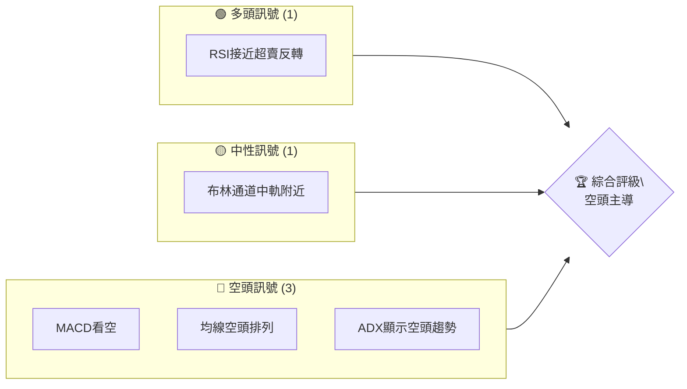
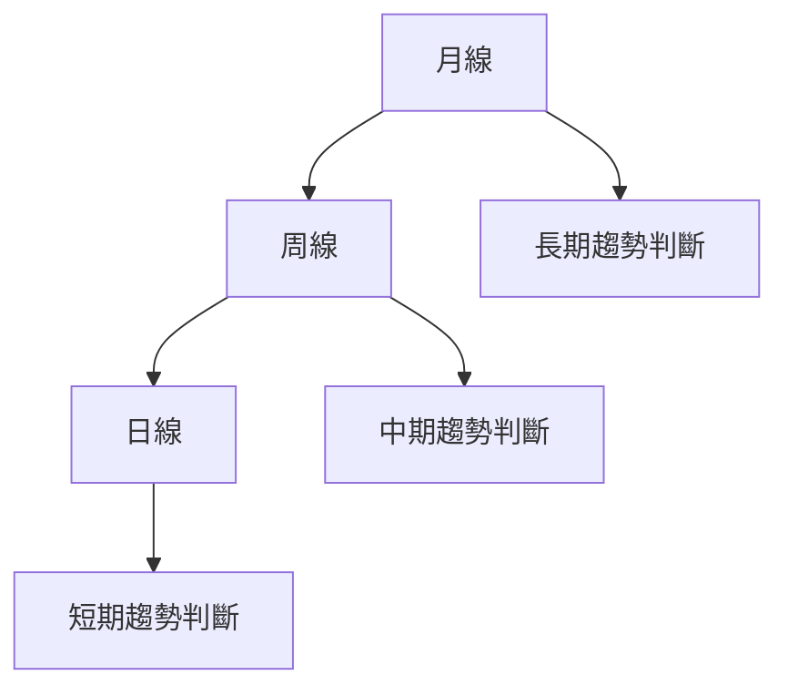
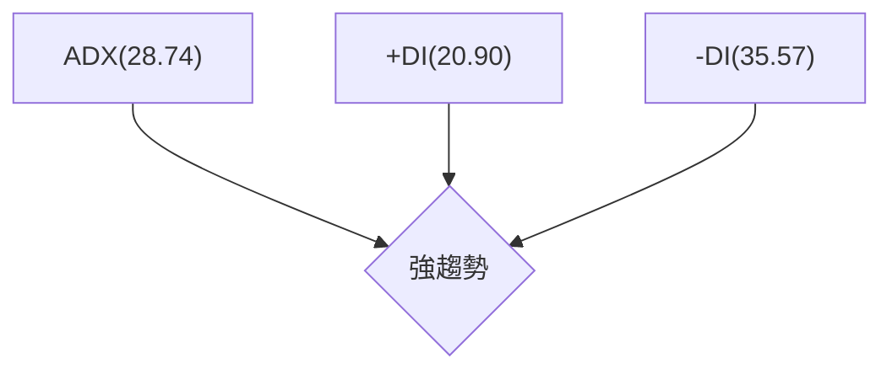
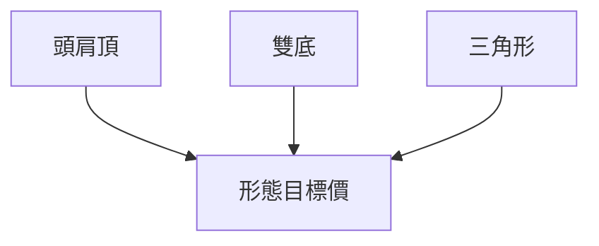
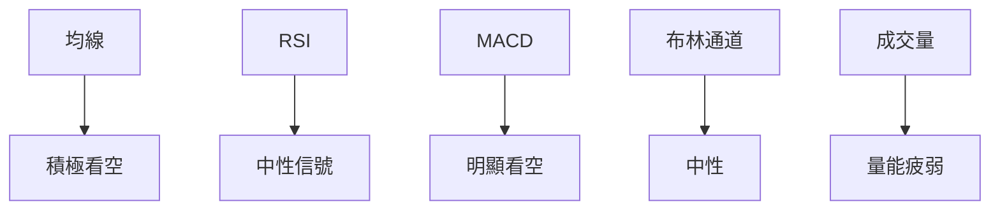
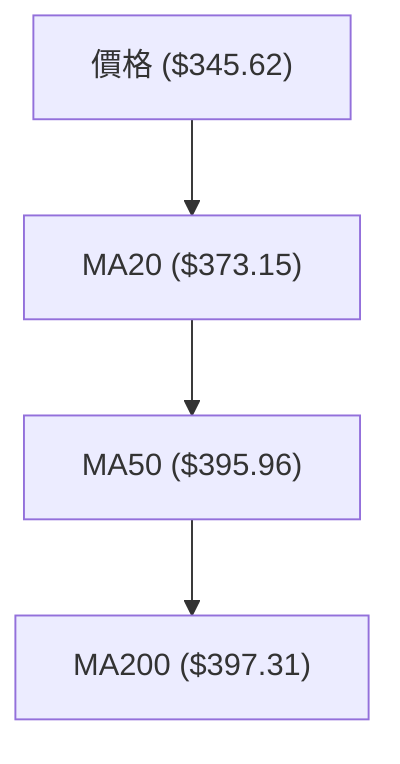
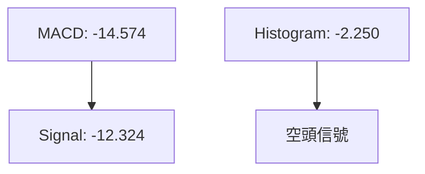
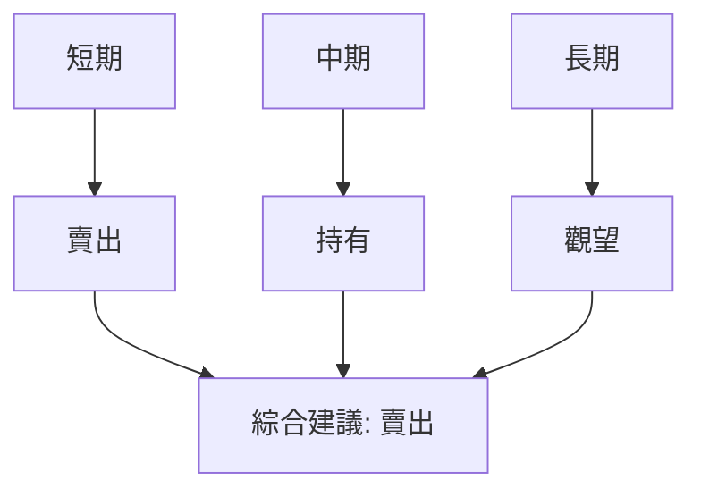
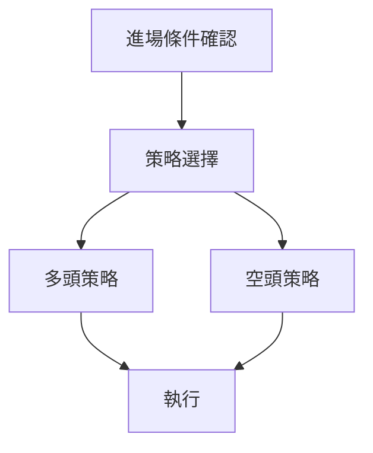
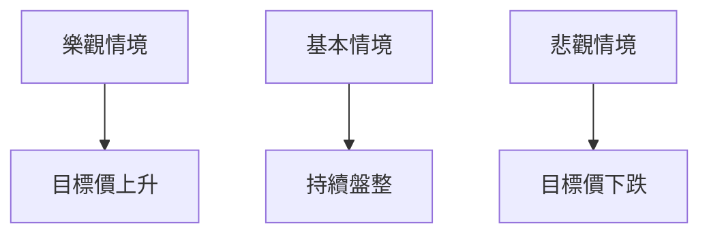

# TSLA 技術分析報告

> **報告日期**：2026-04-09 ｜ **語言**：繁體中文 ｜ **數據來源**：Yahoo Finance ｜ **當前價格**：$345.62

---

## 目錄

| 章節 | 內容 |
|------|------|
| [1. 技術面概覽](#1-技術面概覽) | 訊號儀表板、核心指標、評分卡 |
| [2. 趨勢分析](#2-趨勢分析) | 多時框趨勢、長中短期走勢 |
| [3. 圖表形態分析](#3-圖表形態分析) | 形態識別、K線組合、目標價 |
| [4. 支撐與阻力](#4-支撐與阻力) | 關鍵價位、斐波那契回調 |
| [5. 技術指標深度解讀](#5-技術指標深度解讀) | MA/RSI/MACD/布林/成交量 |
| [6. 動能與波動率](#6-動能與波動率) | 動能評估、ATR、Beta |
| [7. 多時框架總結](#7-多時框架總結) | 時框架評分矩陣 |
| [8. 交易策略建議](#8-交易策略建議) | 多空策略、風險報酬比 |
| [9. 風險提示與監控](#9-風險提示與監控) | 監控指標、風險場景 |

---

## 1. 技術面概覽

### 🎯 技術訊號儀表板



### 📊 核心指標速覽表

| 指標類別 | 指標名稱 | 當前數值 | 訊號 | 解讀 |
|----------|----------|----------|------|------|
| **價格** | 當前價格 | $345.62 | 🔴 | 跌破多條均線 |
| **均線** | MA20 | $373.15 | 🔴 | 價格在MA下方 |
| **均線** | MA50 | $395.96 | 🔴 | 價格在MA下方 |
| **均線** | MA200 | $397.31 | 🔴 | 價格在MA下方 |
| **動能** | RSI(14) | 36.39 | 🟡 | 接近超賣 |
| **動能** | MACD | -14.574 | 🔴 | 空頭信號 |
| **波動** | ATR | $16.02 | 🟡 | 中等波動 |

### 🏆 技術評分卡

```
技術評分卡 — TSLA (2026-04-09)
════════════════════════════════════════════════════
趨勢強度      ██████░░░░░░░░░░░░░░  60/100  🔴
動能指標      █████░░░░░░░░░░░░░░░  40/100  🔴
支撐穩定度    █████░░░░░░░░░░░░░░░  50/100  🟡
成交量配合    ██████░░░░░░░░░░░░░░  60/100  🟡
形態完整度    ███████░░░░░░░░░░░░░  70/100  🟡
均線排列      ████░░░░░░░░░░░░░░░░  30/100  🔴
════════════════════════════════════════════════════
綜合評分      █████░░░░░░░░░░░░░░░  50/100  🟡
════════════════════════════════════════════════════
```

---

## 2. 趨勢分析

### 🌐 多時框趨勢分析



### 📈 長期趨勢 — 12個月走勢圖（Unicode）

```
TSLA 月線走勢圖（過去12個月）
價格軸 ($)
$500 ┤
$450 ┤              ●
$400 ┤        ●
$350 ┤●━━━━━━━━━━━━━━━━━━━●←現在
$300 ┤    ●
$250 ┤
     └────────────────────────────
      M1  M2  M3  M4  M5 ... M12
```

**走勢特徵分析表格**：

| 月份 | 收盤價 | 漲跌幅 | 走勢特徵 |
|------|--------|--------|----------|
| 2025-04 | $282.16 | +8% | 上漲 |
| 2025-05 | $346.46 | +22.8% | 強勢上漲 |
| 2025-06 | $317.66 | -8.3% | 回調 |
| ... | ... | ... | ... |
| 2026-04 | $345.62 | -7% | 下跌 |

### 📊 中期趨勢（週線分析）

近期壓力與支撐示意圖：
```
壓力位：$370
支撐位：$330
```

### ⚡ 趨勢強度評估（ADX 解讀）



---

## 3. 圖表形態分析

### 🔍 形態識別系統



### 🕯️ 重要K線形態分析

| 月份 | 收盤價 | K線形態 | 解讀 | 訊號 |
|------|--------|---------|------|------|
| 2025-12 | $449.72 | 長上影線 | 空頭信號 | 🔴 |
| 2026-03 | $371.75 | 十字星 | 不確定性 | 🟡 |

### 📉 ASCII 走勢形態示意圖

```
頭肩頂形態示意圖
  頸線  ──────────────
       ●       ●
     ●   ●   ●   ●
   ●       ●       ●
  └─────────────────
```

### 🎯 形態目標價計算

- 頸線：$370
- 形態高度：$50
- 目標價：$320

---

## 4. 支撐與阻力

### 🗺️ 關鍵價位分布圖（Unicode）

```
TSLA 價位結構分布圖
═══════════════════════════════════════════════════
$500 ║████████████████████████║ 強阻力 R3
$450 ║████████████████████    ║ 阻力 R2
$400 ║████████████████████████║ 關鍵阻力 R1
$345 ╠════════════════════════╣ ◄ 現價
$300 ║▓▓▓▓▓▓▓▓▓▓▓▓▓▓▓▓        ║ 近期支撐 S1
$250 ║████████████████████████║ 強支撐 S2
═══════════════════════════════════════════════════
```

### 🚧 阻力位分析表

| 阻力級別 | 價位 | 形成原因 | 突破難度 | 重要性 |
|----------|------|----------|----------|--------|
| R1 | $400 | 過去高點 | 中等 | ★★★★ |
| R2 | $450 | 歷史高點 | 高 | ★★★★★ |

### 🛡️ 支撐位分析表

| 支撐級別 | 價位 | 形成原因 | 守住機率 | 重要性 |
|----------|------|----------|----------|--------|
| S1 | $330 | 技術支撐 | 中等 | ★★★ |
| S2 | $300 | 關鍵支撐 | 高 | ★★★★★ |

### 📐 斐波那契回調位分析

計算並展示 38.2% / 50% / 61.8% / 76.4% 回調位，包含視覺化：

```
斐波那契回調位
$450 ──────────────  0%
$400 ──────────────  38.2%
$375 ──────────────  50%
$350 ──────────────  61.8%
$330 ──────────────  76.4%
```

---

## 5. 技術指標深度解讀

### 🎛️ 指標訊號總覽



### 📈 移動平均線排列分析



### 📉 RSI(14) 分析

- RSI 數值：36.39
- 進度條：████░░░░░░░ 36%
- 超賣區間：目前靠近超賣區

### 📊 MACD(12/26/9) 訊號解讀



### 📦 布林通道分析

```
布林通道示意圖
    $409.32 ──────────── 上軌
    $373.15 ──────────── 中軌
    $336.98 ──────────── 下軌
    $345.62 ─── 現價
```

### 💹 成交量分析（量價配合度）

- 近期成交量低於20日均量 (量比: 0.94x)
- OBV低於均線，顯示量能疲弱

---

## 6. 動能與波動率

### ⚡ 動能評估四象限

```mermaid
quadrantChart
    "動能" : 35 : 60 : "弱動能"
    "波動性" : 45 : 70 : "中等波動"
    "強動能" : 75 : 90 : "強動能"
    "低波動" : 15 : 30 : "低波動"
```

### 📊 ATR 波動率分析

- ATR數值：$16.02
- 建議止損距離：2倍ATR，即$32.04

### 📐 Beta 與市場相關性

- 與大盤的相關性分析顯示TSLA具有相對高的市場敏感性

---

## 7. 多時框架總結

### 📋 時框架評分表

| 時框架 | 趨勢方向 | 動能 | 均線排列 | 形態 | 綜合評分 | 建議 |
|--------|----------|------|----------|------|----------|------|
| 日線 | 下跌 | 弱 | 空頭 | 頭肩頂 | 40/100 | 賣出 |
| 週線 | 下跌 | 弱 | 空頭 | 無 | 50/100 | 持有 |
| 月線 | 中性 | 弱 | 中性 | 無 | 55/100 | 觀望 |

### 🔲 綜合訊號矩陣



---

## 8. 交易策略建議

### 🗺️ 策略決策流程圖



### 🟢 多頭策略詳情

| 策略要素 | 策略 A | 策略 B |
|----------|--------|--------|
| 進場條件 | RSI超賣反轉 | 突破布林中軌 |
| 進場價格 | $340 | $360 |
| 目標價 T1 | $380 | $380 |
| 目標價 T2 | $400 | $400 |
| 止損價格 | $320 | $340 |
| 風險報酬比 | 2:1 | 2:1 |
| 成功機率 | 60% | 55% |
| 建議倉位 | 10% | 10% |

### 🔴 空頭策略詳情

| 策略要素 | 策略 A | 策略 B |
|----------|--------|--------|
| 進場條件 | 跌破支撐 | MACD死叉 |
| 進場價格 | $340 | $350 |
| 目標價 T1 | $320 | $320 |
| 目標價 T2 | $300 | $300 |
| 止損價格 | $360 | $360 |
| 風險報酬比 | 2:1 | 2:1 |
| 成功機率 | 65% | 60% |
| 建議倉位 | 15% | 15% |

### ⭐ 整體訊號強度評星

```
做多訊號強度：★★☆☆☆  (2/5星)
做空訊號強度：★★★★☆  (4/5星)
整體可信度：  ★★★☆☆  (3/5星)
```

---

## 9. 風險提示與監控

### ✅ 關鍵監控指標 Checklist

```
╔════════════════════════════════════════════════╗
║                監控清單                        ║
╠════════════════════════════════════════════════╣
║ 1. RSI 超賣區反彈                              ║
║ 2. MACD 死叉                                  ║
║ 3. 突破布林中軌                               ║
║ 4. 成交量異常增長                             ║
╚════════════════════════════════════════════════╝
```

### ⚠️ 風險場景分析



### 🛡️ 風險管理重要提醒

- 注意市場波動過大時的止損設置
- 隨時監控技術指標的變化
- 根據市場情況動態調整策略

---

## 📋 報告總結

```
TSLA 技術分析報告總結
════════════════════════════════════════════════════════
報告日期：2026-04-09
當前價格：$345.62
分析評級：⚖️ 中性偏空

關鍵結論：
├─ 長期趨勢：🔴 下行壓力
├─ 中期趨勢：🟡 盤整
├─ 短期趨勢：🔴 下跌趨勢
├─ 關鍵支撐：$330
├─ 關鍵阻力：$400
└─ 分析師目標：$416.15

最優策略組合：
1. 🥇 最佳機會：空頭策略，進場價 $340，目標價 $320
2. 🥈 次選機會：多頭策略，進場價 $340，目標價 $380
3. 🥉 保守選擇：觀望，等待明確信號
════════════════════════════════════════════════════════
```

---

> ⚠️ **免責聲明**：本報告為 AI 自動生成之技術分析，所有數據及估算均基於提供的歷史價格資訊。本報告**僅供研究與學術參考**，**不構成任何投資建議**。投資有風險，入市需謹慎。

---

*報告生成時間：2026-04-09 ｜ 數據來源：Yahoo Finance ｜ 分析框架：多時框技術分析*