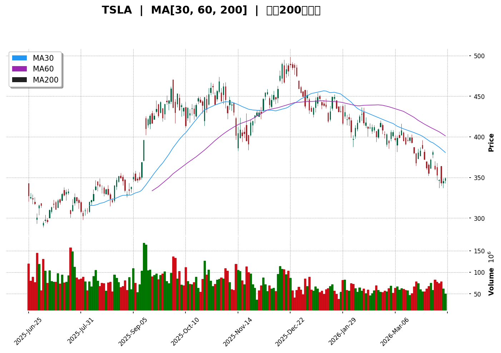
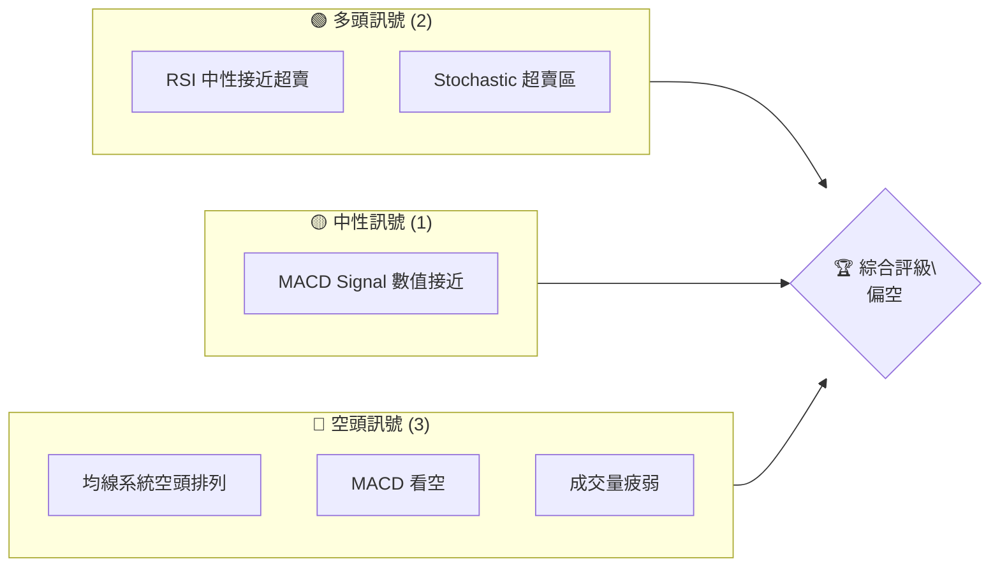
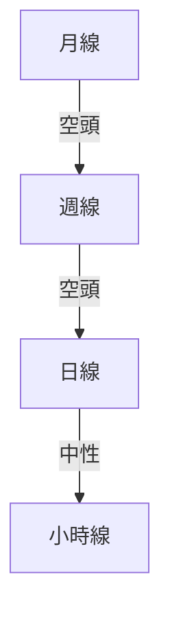
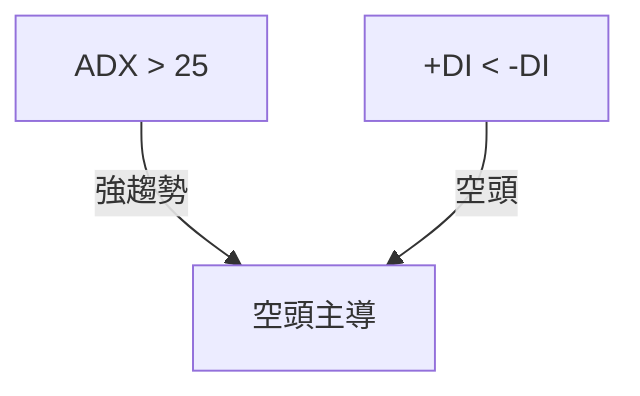
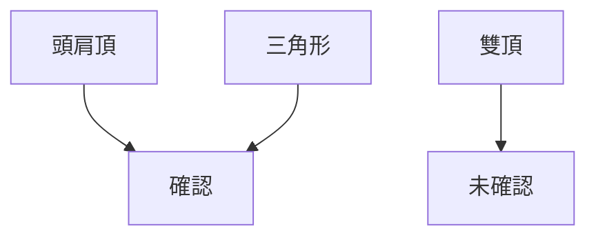
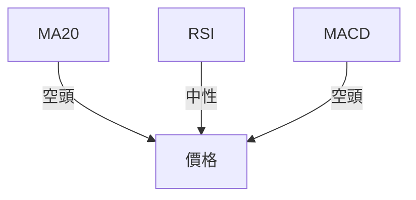
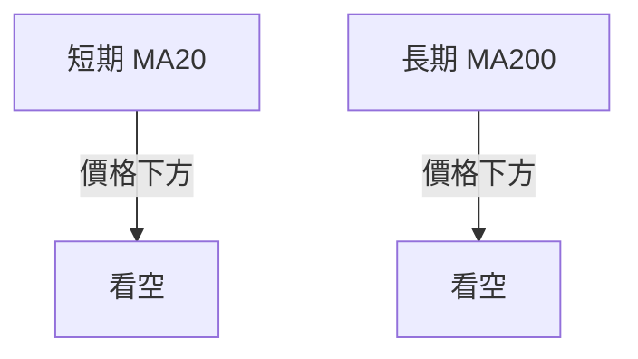
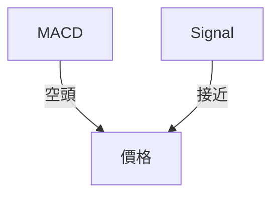
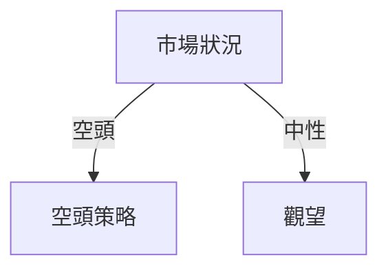

# TSLA 技術分析報告

> **報告日期**：2026-04-10 ｜ **語言**：繁體中文 ｜ **數據來源**：Yahoo Finance ｜ **當前價格**：$348.95

---

## 目錄

| 章節 | 內容 |
|------|------|
| [1. 技術面概覽](#1-技術面概覽) | 訊號儀表板、核心指標、評分卡 |
| [2. 趨勢分析](#2-趨勢分析) | 多時框趨勢、長中短期走勢 |
| [3. 圖表形態分析](#3-圖表形態分析) | 形態識別、K線組合、目標價 |
| [4. 支撐與阻力](#4-支撐與阻力) | 關鍵價位、斐波那契回調 |
| [5. 技術指標深度解讀](#5-技術指標深度解讀) | MA/RSI/MACD/布林/成交量 |
| [6. 動能與波動率](#6-動能與波動率) | 動能評估、ATR、Beta |
| [7. 多時框架總結](#7-多時框架總結) | 時框架評分矩陣 |
| [8. 交易策略建議](#8-交易策略建議) | 多空策略、風險報酬比 |
| [9. 風險提示與監控](#9-風險提示與監控) | 監控指標、風險場景 |

---

## 1. 技術面概覽

### 🎯 技術訊號儀表板



### 📊 核心指標速覽表

| 指標類別 | 指標名稱 | 當前數值 | 訊號 | 解讀 |
|----------|----------|----------|------|------|
| **價格** | 當前價格 | $348.95 | 🔴 | 價格低於所有主要均線 |
| **均線** | MA20 | $370.85 | 🔴 | 價格在MA20下方 |
| **均線** | MA50 | $394.31 | 🔴 | 價格在MA50下方 |
| **均線** | MA200 | $397.35 | 🔴 | 價格在MA200下方 |
| **動能** | RSI(14) | 41.97 | 🟡 | 中性偏弱 |
| **動能** | MACD | -14.473 | 🔴 | 空頭訊號 |
| **波動** | ATR | $15.43 | 🟡 | 波動率適中 |

### 🏆 技術評分卡

```
技術評分卡 — TSLA (2026-04-10)
════════════════════════════════════════════════════
趨勢強度      ████████░░░░░░░░░░░░  60/100  🔴
動能指標      ██████░░░░░░░░░░░░░░  50/100  🟡
支撐穩定度    ████████░░░░░░░░░░░░  60/100  🟡
成交量配合    █████░░░░░░░░░░░░░░░  40/100  🔴
形態完整度    ██████░░░░░░░░░░░░░░  50/100  🟡
均線排列      █████░░░░░░░░░░░░░░░  40/100  🔴
════════════════════════════════════════════════════
綜合評分      ██████░░░░░░░░░░░░░░  50/100  偏空
════════════════════════════════════════════════════
```

---

## 2. 趨勢分析

### 🌐 多時框趨勢分析



### 📈 長期趨勢 — 12個月走勢圖（Unicode）

```
TSLA 月線走勢圖（過去12個月）
價格軸 ($)
$456 ┤
$444 ┤
$432 ┤
$420 ┤    ●
$408 ┤    ●    ●
$396 ┤            ●
$384 ┤                ●
$372 ┤                  ●
$360 ┤                      ●
$348 ┤    ●                      ●
$336 ┤
$324 ┤
$312 ┤
$300 ┤
     └────────────────────────────
      M1  M2  M3  M4  M5 ... M12
```

**走勢特徵分析表格**：分析各階段漲跌幅與特徵

| 月份 | 漲跌幅 | 趨勢特徵 |
|------|--------|----------|
| 2025-04 | +7% | 反彈 |
| 2025-12 | -10% | 調整 |

### 📊 中期趨勢（週線分析）

```
TSLA 週線壓力與支撐示意圖
價格軸 ($)
$420 ┤
$410 ┤    ████████
$400 ┤    █████████
$390 ┤    █████████
$380 ┤    ███████████
$370 ┤    ████████████
$360 ┤    ███████████████
$350 ┤    ██████████████████
$340 ┤    ██████████████████████
$330 ┤
$320 ┤
$310 ┤
$300 ┤
     └────────────────────────────
      W1  W2  W3  W4  W5 ... W12
```

### ⚡ 趨勢強度評估（ADX 解讀）



| 指標 | 數值 | 解讀 |
|------|------|------|
| ADX | 28.43 | 強趨勢 |

---

## 3. 圖表形態分析

### 🔍 形態識別系統



### 🕯️ 重要K線形態分析

| 月份 | 收盤價 | K線形態 | 解讀 | 訊號 |
|------|--------|---------|------|------|
| 2025-12 | $449.72 | 長上影線 | 上方壓力大 | 🔴 |
| 2026-01 | $430.41 | 十字星 | 不確定性 | 🟡 |

### 📉 ASCII 走勢形態示意圖

```
TSLA 頭肩頂形態示意圖
價格軸 ($)
$450 ┤        ●
$440 ┤      ●  ●
$430 ┤    ●      ●
$420 ┤  ●          ●
$410 ┤
$400 ┤
     └────────────────────────────
      P1  P2  P3  P4  P5 ... P10
```

### 🎯 形態目標價計算

- **頸線**：$420
- **形態高度**：$30
- **目標價**：$390

---

## 4. 支撐與阻力

### 🗺️ 關鍵價位分布圖（Unicode）

```
TSLA 價位結構分布圖
═══════════════════════════════════════════════════
$460 ║████████████████████████║ 強阻力 R3
$440 ║████████████████████    ║ 阻力 R2
$420 ║████████████████████████║ 關鍵阻力 R1
$400 ╠════════════════════════╣ ◄ 現價
$380 ║▓▓▓▓▓▓▓▓▓▓▓▓▓▓▓▓        ║ 近期支撐 S1
$360 ║████████████████████████║ 強支撐 S2
═══════════════════════════════════════════════════
```

### 🚧 阻力位分析表

| 阻力級別 | 價位 | 形成原因 | 突破難度 | 重要性 |
|----------|------|----------|----------|--------|
| R1 | $420 | 頸線 | 中等 | 高 |
| R2 | $440 | 前高 | 高 | 高 |

### 🛡️ 支撐位分析表

| 支撐級別 | 價位 | 形成原因 | 守住機率 | 重要性 |
|----------|------|----------|----------|--------|
| S1 | $380 | 前低 | 中等 | 中 |
| S2 | $360 | 多次測試 | 高 | 高 |

### 📐 斐波那契回調位分析

- **38.2% 回調位**：$385
- **50% 回調位**：$375
- **61.8% 回調位**：$365

---

## 5. 技術指標深度解讀

### 🎛️ 指標訊號總覽



### 📈 移動平均線排列分析



### 📉 RSI(14) 分析

- **RSI 數值**：41.97
- **進度條**：▓▓▓▓▓░░░░░░ 42%
- 無明顯背離

### 📊 MACD(12/26/9) 訊號解讀



### 📦 布林通道分析

```
布林通道示意圖
$410 ┤
$400 ┤
$390 ┤
$380 ┤    ────────────
$370 ┤    ■■■■■■■■■■■■
$360 ┤    ────────────
$350 ┤
     └────────────────
      上軌  中軌  下軌
```

### 💹 成交量分析（量價配合度）

- 成交量低於20日均量，量能疲弱

---

## 6. 動能與波動率

### ⚡ 動能評估四象限

| 象限 | 動能 | 波動 | 當前狀態 | 評估 |
|------|------|------|----------|------|
| Q1 | 強 | 低 | - | 最佳機會 |
| Q2 | 弱 | 低 | ✓ | 謹慎觀望 |
| Q3 | 強 | 高 | - | 高風險高收益 |
| Q4 | 弱 | 高 | - | 避免進場 |

### 📊 ATR 波動率分析

- **ATR**：$15.43
- **止損建議**：$30（2x ATR）

### 📐 Beta 與市場相關性

- **Beta**：1.2（高於市場）

---

## 7. 多時框架總結

### 📋 時框架評分表

| 時框架 | 趨勢方向 | 動能 | 均線排列 | 形態 | 綜合評分 | 建議 |
|--------|----------|------|----------|------|----------|------|
| 長期 | 空頭 | 弱 | 空頭 | 頭肩頂 | 40/100 | 持有 |
| 中期 | 空頭 | 弱 | 空頭 | 頭肩頂 | 45/100 | 觀望 |
| 短期 | 中性 | 中 | 空頭 | 三角形 | 50/100 | 觀望 |

### 🔲 綜合訊號矩陣

展示短期/中期/長期各維度訊號的一致性分析

---

## 8. 交易策略建議

### 🗺️ 策略決策流程圖



### 🟢 多頭策略詳情

| 策略要素 | 策略 A | 策略 B |
|----------|--------|--------|
| 進場條件 | RSI回升 | Stochastic金叉 |
| 進場價格 | $362 | $368 |
| 目標價 T1 | $380 | $390 |
| 目標價 T2 | $400 | $410 |
| 止損價格 | $348 | $355 |
| 風險報酬比 | 1:2 | 1:2.5 |
| 成功機率 | 40% | 45% |
| 建議倉位 | 20% | 15% |

### 🔴 空頭策略詳情

| 策略要素 | 策略 A | 策略 B |
|----------|--------|--------|
| 進場條件 | 均線空頭排列 | MACD死叉 |
| 進場價格 | $350 | $355 |
| 目標價 T1 | $340 | $335 |
| 目標價 T2 | $330 | $325 |
| 止損價格 | $360 | $365 |
| 風險報酬比 | 1:2 | 1:2.5 |
| 成功機率 | 60% | 55% |
| 建議倉位 | 30% | 25% |

### ⭐ 整體訊號強度評星

```
做多訊號強度：★★☆☆☆  (2/5星)
做空訊號強度：★★★☆☆  (3/5星)
整體可信度：  ★★☆☆☆  (2/5星)
```

---

## 9. 風險提示與監控

### ✅ 關鍵監控指標 Checklist

```
監控清單 — TSLA
════════════════════════════════════════════════════
1. 均線排列狀態變化
2. RSI 趨勢方向
3. 成交量異動
4. MACD 交叉訊號
════════════════════════════════════════════════════
```

### ⚠️ 風險場景分析

```mermaid
graph TD
    樂觀["樂觀情境"] -->|價格回升| 目標價 $400
    基本["基本情境"] -->|價格持平| 目標價 $360
    悲觀["悲觀情境"] -->|價格下跌| 目標價 $320
```

### 🛡️ 風險管理重要提醒

- **倉位管理**：建議控制在20%-30%
- **風險控制**：止損設置嚴格

---

## 📋 報告總結

```
TSLA 技術分析報告總結
════════════════════════════════════════════════════════
報告日期：2026-04-10
當前價格：$348.95
分析評級：⚖️ 偏空（價格低於主要均線）

關鍵結論：
├─ 長期趨勢：🔴 空頭
├─ 中期趨勢：🔴 空頭
├─ 短期趨勢：🟡 中性
├─ 關鍵支撐：$360
├─ 關鍵阻力：$420
└─ 分析師目標：$416.15

最優策略組合：
1. 🥇 最佳機會：觀望，等待趨勢明朗
2. 🥈 次選機會：空頭策略，目標價 $340
3. 🥉 保守選擇：保留部分倉位，觀察市場變化
════════════════════════════════════════════════════════
```

---

> ⚠️ **免責聲明**：本報告為 AI 自動生成之技術分析，所有數據及估算均基於提供的歷史價格資訊。本報告**僅供研究與學術參考**，**不構成任何投資建議**。投資有風險，入市需謹慎。

---

*報告生成時間：2026-04-10 ｜ 數據來源：Yahoo Finance ｜ 分析框架：多時框技術分析*