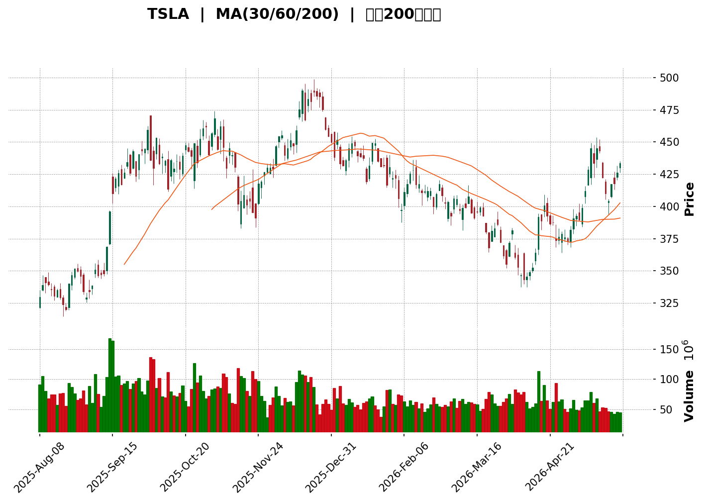
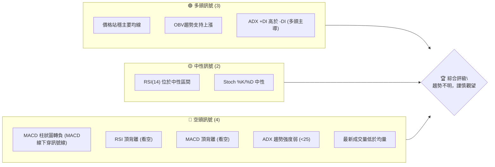
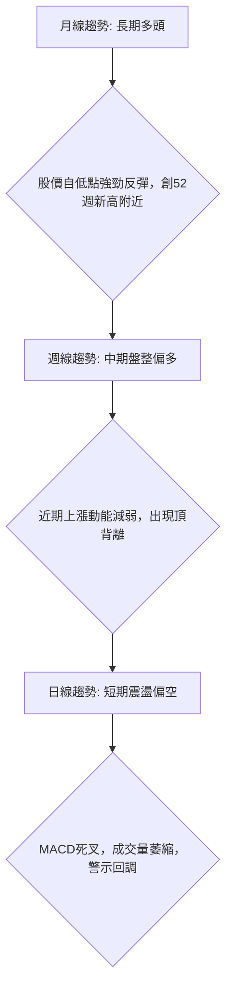

<details>
<summary>📊 靜態圖表 (點擊展開)</summary>

</details>

<html>
<head><meta charset="utf-8" /></head>
<body>
    <div>                        <script>window.PlotlyConfig = {MathJaxConfig: 'local'};</script>
        <script charset="utf-8" src="https://cdn.plot.ly/plotly-3.5.0.min.js" integrity="sha256-fHbNLP+GlIXN+efbQec78UkemUz3NJp7UmfGxC1tNxs=" crossorigin="anonymous"></script>                <div id="candlestick-chart" class="plotly-graph-div" style="height:500px; width:100%;"></div>            <script>                window.PLOTLYENV=window.PLOTLYENV || {};                                if (document.getElementById("candlestick-chart")) {                    Plotly.newPlot(                        "candlestick-chart",                        [{"close":{"dtype":"f8","bdata":"AAAAYGaadEAAAADgejB1QAAAAKBwTXVAAAAAgBQ2dUAAAACgR\u002fl0QAAAAMD1qHRAAAAAYI\u002fydEAAAADA9ZR0QAAAAGBmPnRAAAAAgMIBdEAAAAAAKUB1QAAAAKCZqXVAAAAAYLj6dUAAAACgmdl1QAAAACCun3VAAAAAgOvddEAAAACAwpV0QAAAAKBw4XRAAAAA4HoodUAAAACgcO11QAAAAGBmpnVAAAAAIIWvdUAAAADgo7x1QAAAAMD1DHdAAAAAQAq\u002feEAAAADgo6B5QAAAAIDrWXpAAAAAgMKdekAAAACgmQ16QAAAAMAeoXpAAAAAIFwje0AAAACgmZ16QAAAAOCjrHtAAAAAgD12ekAAAABgZoZ7QAAAACBcs3tAAAAAIIXLe0AAAAAgXLd8QAAAAAAAQHtAAAAAoEfdekAAAAAAAFR8QAAAAKBwEXtAAAAAQApre0AAAADgozh7QAAAAADX13lAAAAAYGY+e0AAAAAA19N6QAAAAGBmMntAAAAAAADMekAAAADA9XR7QAAAAEDh9ntAAAAAoJmpe0AAAAAghW97QAAAACCuD3xAAAAAIIUbe0AAAABguEZ8QAAAAMDMyHxAAAAAACnYfEAAAACgmYF7QAAAAMD1iHxAAAAAgOtFfUAAAAAAKcR7QAAAAMAe4XxAAAAAYI\u002fee0AAAADgUdh6QAAAACCu03tAAAAAgOt5e0AAAACgmel6QAAAAADXH3lAAAAAoJlFeUAAAABguI55QAAAAAAAFHlAAAAAANc\u002feUAAAAAgrrN4QAAAAKBwcXhAAAAA4HocekAAAABgZjZ6QAAAAKBHqXpAAAAAYLjiekAAAACAPeJ6QAAAAADX03pAAAAAANfre0AAAADgemh8QAAAAAAAcHxAAAAAoEd5e0AAAABguNJ7QAAAAEAzN3xAAAAAgD3ue0AAAAAgXK98QAAAAMD1tH1AAAAAgBSefkAAAAAAKTR9QAAAAIDrNX5AAAAAQDMTfkAAAAAgrot+QAAAAMD1WH5AAAAAYGZWfkAAAABACrN9QAAAAIA9unxAAAAAQOFmfEAAAAAghRt8QAAAAMAeYXtAAAAAYLg6fEAAAAAgXA97QAAAAGCP9npAAAAAwMw8e0AAAAAAKdB7QAAAACBcD3xAAAAAQDPze0AAAABAM3N7QAAAAMAeaXtAAAAAAABYe0AAAAAAADR6QAAAAEAK93pAAAAAgMIVfEAAAADA9RB8QAAAAEAzM3tAAAAAYGbuekAAAAAgXPd6QAAAAMD1CHpAAAAAYI\u002fmekAAAADA9Vx6QAAAACBcX3pAAAAAAClgeUAAAAAgXNN4QAAAAIDCsXlAAAAAwB4VekAAAAAgXJN6QAAAAOBRxHpAAAAAwB4RekAAAABAChd6QAAAAIAUqnlAAAAAwB61eUAAAAAgXLt5QAAAAMAevXlAAAAAoEf9eEAAAACAFJZ5QAAAAGBmFnpAAAAAoEeJeUAAAAAAKSh5QAAAAMAeNXlAAAAAQOGGeEAAAABACl95QAAAAMDMWHlAAAAAIK7LeEAAAABA4ep4QAAAAADX83hAAAAAwB59eUAAAAAAKbB4QAAAAEAzc3hAAAAAwPW4eEAAAADgUfR4QAAAAOB6jHhAAAAAwMzEd0AAAAAgXP92QAAAAKCZzXdAAAAA4Hrwd0AAAABAMx94QAAAAIDCQXdAAAAAoEeddkAAAADgejR2QAAAAAAAPHdAAAAAACnUd0AAAACgcIl2QAAAAMAeDXZAAAAAYGaqdUAAAAAAAHR1QAAAAIDrmXVAAAAAQDPPdUAAAABguAZ2QAAAAEAzw3ZAAAAAQDN\u002feEAAAABgZk54QAAAAIDrCXlAAAAAAACIeEAAAABguCZ4QAAAAAApOHhAAAAAIIVbd0AAAADAzIR3QAAAAGC4qndAAAAA4FGAd0AAAADAzEx3QAAAAIAU2ndAAAAAwB5teEAAAAAAKYh4QAAAAIDrVXhAAAAAIK7reEAAAADgo7x5QAAAAKCZxXpAAAAAAADQe0AAAABAMxd7QAAAAOBR1HtAAAAAwMy0e0AAAAAA12N6QAAAAADXn3lAAAAAgMJBeUAAAAAAKRR6QAAAAKCZHXpAAAAAACmgekAAAACgcBl7QA=="},"high":{"dtype":"f8","bdata":"AAAAYGbydEAAAACAPap1QAAAAAAplHVAAAAAIK7PdUAAAAAghUd1QAAAAMDMNHVAAAAA4FEEdUAAAADAzEh1QAAAAIDrtXRAAAAAYGZOdEAAAAAAAER1QAAAAOB62HVAAAAAYGb+dUAAAACAPTZ2QAAAAMDMGHZAAAAAAADMdUAAAACgR9V0QAAAAKBHdXVAAAAAgD0udUAAAACA6z12QAAAAEAKZ3ZAAAAA4FHsdUAAAACgR0V2QAAAAADXD3dAAAAAQArLeEAAAABAM5t6QAAAAAAAdHpAAAAAwPXEekAAAAAghQN7QAAAACCF13pAAAAAIK7Pe0AAAAAghY97QAAAACBcw3tAAAAAoJk1e0AAAAAghYd7QAAAACCuL3xAAAAAAADQe0AAAADgo+R8QAAAAAAAbH1AAAAA4FHse0AAAADAzFh8QAAAAEDhSnxAAAAAoEeVe0AAAACgmUV7QAAAAIAUsntAAAAAgD1Oe0AAAABAMyN7QAAAAAApiHtAAAAAoJl1e0AAAAAgXJd7QAAAAMDMHHxAAAAAwMwUfEAAAADgo9h7QAAAAGBmFnxAAAAAQOE6fEAAAABgj8J8QAAAAAAAMH1AAAAAQDMbfUAAAADA9XB8QAAAAAAAoHxAAAAAwB6hfUAAAAAghcN8QAAAAKBHJX1AAAAAQDM3fUAAAACAwnV7QAAAAGC4GnxAAAAAANene0AAAACgR6V7QAAAAAAAiHpAAAAAQArDeUAAAAAgXH96QAAAAGBmjnlAAAAA4Hq8eUAAAABACs96QAAAAMDMLHlAAAAAIIVbekAAAAAgrkd6QAAAAEAKr3pAAAAAQOEOe0AAAABgjxp7QAAAAMDMTHtAAAAAYLj+e0AAAACAFGp8QAAAAIDrrXxAAAAAAAAcfEAAAACAPUZ8QAAAAIAUjnxAAAAA4FEUfEAAAAAAKfB8QAAAAOBRHH5AAAAAAAC4fkAAAADgevR+QAAAAIDCrX5AAAAAANenfkAAAACgRy1\u002fQAAAACCFv35AAAAAYGaufkAAAACgcJF+QAAAAGBmVn1AAAAAgOvxfEAAAADAzIh8QAAAAKBwpXxAAAAAwMyYfEAAAAAAAAR8QAAAAIDrZXtAAAAAgD1Oe0AAAADAzBB8QAAAAMDMZHxAAAAAwPU8fEAAAABgj757QAAAAIDC1XtAAAAAAAD0e0AAAAAgrut6QAAAAEAzY3tAAAAAAAAYfEAAAABA4UZ8QAAAAOCj0HtAAAAA4FFYe0AAAAAAKWR7QAAAACCug3tAAAAAgBR+e0AAAABgZrJ6QAAAAMD1yHpAAAAAYGZ+ekAAAACgmSF5QAAAAMDM6HlAAAAAAABUekAAAAAAALR6QAAAAKCZRXtAAAAAIK5De0AAAADA9YB6QAAAACCF23lAAAAAYGYOekAAAAAAAPR5QAAAAEAz63lAAAAAQDN7eUAAAADAHq15QAAAAKBwRXpAAAAAwPUMekAAAACA63F5QAAAAOCjSHlAAAAAoHDFeEAAAACgR4V5QAAAAIDriXlAAAAAoJkleUAAAACgcBl5QAAAAKBwaXlAAAAAgBQGekAAAAAAAGh5QAAAAEAzA3lAAAAAIK47eUAAAACA6wF5QAAAAMAeMXlAAAAA4FE0eEAAAACAPb53QAAAAKBHFXhAAAAAIK43eEAAAAAgrsN4QAAAAEAKB3hAAAAAgMIdd0AAAADgo\u002fR2QAAAAKBHVXdAAAAAgD3yd0AAAADgeiR3QAAAACCF+3ZAAAAA4FHAdUAAAAAAAMh2QAAAAIAUznVAAAAAgMLldUAAAACgmUV2QAAAAIAU+nZAAAAAYGaqeEAAAADA9aB4QAAAAOB6lHlAAAAAwMxseUAAAABAM594QAAAAAApkHhAAAAAAAAgeEAAAAAAKex3QAAAAOB6zHdAAAAA4KPkd0AAAABgZoZ3QAAAAAAADHhAAAAAwB7deEAAAACAPap4QAAAAIDrIXlAAAAAQOEaeUAAAACgR\u002f15QAAAAEAz83pAAAAAYI8SfEAAAADAzPx7QAAAAGBmVnxAAAAAIK4\u002ffEAAAABgjyp7QAAAAIAUUnpAAAAAgBRaeUAAAAAgXBd6QAAAAEAzr3pAAAAAACn4ekAAAABAMzN7QA=="},"hovertemplate":"\u003cb\u003e%{x|%Y-%m-%d}\u003c\u002fb\u003e\u003cbr\u003e\u958b: $%{open:.2f}\u003cbr\u003e\u9ad8: $%{high:.2f}\u003cbr\u003e\u4f4e: $%{low:.2f}\u003cbr\u003e\u6536: $%{close:.2f}\u003cextra\u003e\u003c\u002fextra\u003e","low":{"dtype":"f8","bdata":"AAAAIK4PdEAAAABgZuJ0QAAAAEAKz3RAAAAAQDMjdUAAAABgZqZ0QAAAAOBRcHRAAAAAoHCZdEAAAACgmX10QAAAAKCZqXNAAAAAQOHqc0AAAABACvtzQAAAAOB68HRAAAAAIIV7dUAAAABgj9J1QAAAAAApRHVAAAAAQDO7dEAAAACgmVl0QAAAAAApiHRAAAAAIK63dEAAAABA4Yp1QAAAAKBwjXVAAAAAwB59dUAAAADAHqF1QAAAAKCZuXVAAAAAANcjd0AAAABA4SZ5QAAAAEDhtnlAAAAAYLiaeUAAAADA9Qh6QAAAACCFW3pAAAAAgBTSekAAAAAghXt6QAAAAOB60HpAAAAAoEcxekAAAADgUVB6QAAAAAAAeHtAAAAAgOsRe0AAAAAAAIx7QAAAAMAeOXtAAAAAoEcJekAAAABACkt7QAAAAEAzB3tAAAAAIK6TekAAAABA4aJ6QAAAAEAzt3lAAAAAQDM7ekAAAACAwh16QAAAAKBHpXpAAAAAwPVUekAAAACgmXl6QAAAAIDCiXtAAAAAwMyge0AAAAAAANB6QAAAAGBm3nlAAAAAYLjiekAAAABACmt7QAAAAKCZOXxAAAAAYGZKfEAAAACAwnl7QAAAAEAKu3tAAAAAwMxcfEAAAACgmbl7QAAAACBci3tAAAAAoHAxe0AAAACAFF56QAAAAIDCFXtAAAAAgMIFe0AAAADA9ah6QAAAAKBwxXhAAAAA4Hrsd0AAAAAA1+t4QAAAACBcm3hAAAAAAADoeEAAAAAA16t4QAAAAAAp\u002fHdAAAAAoHAReUAAAABAM195QAAAAIA9DnpAAAAAQDOjekAAAADgo5R6QAAAAIDrYXpAAAAAgMLxekAAAACAPdZ7QAAAAGCPOnxAAAAAAAA0e0AAAABAMzt7QAAAAIDCuXtAAAAAoEeFe0AAAABguJp7QAAAAGCPOn1AAAAAoEcdfUAAAABAMyN9QAAAAIDrkX1AAAAAIIWrfUAAAACgR1V+QAAAAKBwLX5AAAAAwMzMfUAAAADAHp19QAAAAAAAsHxAAAAAoEddfEAAAADAzBR8QAAAAMDMNHtAAAAAwB7Je0AAAADgesx6QAAAAOCj9HpAAAAAgOuFekAAAACAPeZ6QAAAAAAAYHtAAAAAQDO\u002fe0AAAAAghSN7QAAAAGBmWntAAAAAACk0e0AAAABAChd6QAAAAIDrOXpAAAAAgBQKe0AAAADgo8B7QAAAAOB6JHtAAAAAQArrekAAAACgmeF6QAAAAIDr6XlAAAAAQDNrekAAAAAAAOh5QAAAAEAK23lAAAAAQOHyeEAAAADgejh4QAAAAAAA3HhAAAAA4KN0eUAAAAAAABB6QAAAAOB6QHpAAAAAAADgeUAAAACAFK55QAAAAAApCHlAAAAAoEeZeUAAAACAwkF5QAAAAAAAWHlAAAAA4KOgeEAAAACAPdp4QAAAAGBmwnlAAAAAYI86eUAAAACAwuF4QAAAAAAARHhAAAAAgD0WeEAAAACgR6l4QAAAAGC49nhAAAAAIFyjeEAAAABgZtZ3QAAAAEAK43hAAAAAYGYieUAAAABgZqp4QAAAAEAzX3hAAAAAYLimeEAAAAAAAJB4QAAAAMD1hHhAAAAAIK6rd0AAAAAgXMd2QAAAACCuS3dAAAAAwPWEd0AAAAAAKRB4QAAAAIDrPXdAAAAAIIV3dkAAAACAPQJ2QAAAAAAAkHZAAAAAoEdhd0AAAADgenB2QAAAAIA9qnVAAAAAANcTdUAAAABguDp1QAAAAAAAFHVAAAAAANdrdUAAAADAHsl1QAAAAOBRLHZAAAAAAACodkAAAADAzNx3QAAAAGBmenhAAAAAoEdFeEAAAAAghRN4QAAAAMDMFHhAAAAAgD0Gd0AAAAAgrit3QAAAAOBRwHZAAAAA4KNId0AAAADgoyB3QAAAAGC4AndAAAAAwMysd0AAAADAzAx4QAAAAAAAUHhAAAAA4FEAeEAAAACA6yF5QAAAAIA9BnpAAAAAwMwMekAAAAAAKWR6QAAAACBc43pAAAAAYI+Se0AAAAAAAGB6QAAAAKBHVXlAAAAAgBSaeEAAAACAPWZ5QAAAAGBmznlAAAAAAClIekAAAACA66F6QA=="},"name":"\u50f9\u683c","open":{"dtype":"f8","bdata":"AAAAQOEWdEAAAAAAAPB0QAAAAAAAkHVAAAAAAABYdUAAAAAAKfx0QAAAAGCPGnVAAAAAgOuZdEAAAADgo\u002fx0QAAAACCFk3RAAAAAoEchdEAAAABgjxp0QAAAAGBmLnVAAAAAQOGOdUAAAABACv91QAAAAGCP7nVAAAAAIK6zdUAAAAAgroN0QAAAAEAz83RAAAAAYGYCdUAAAAAAAMB1QAAAAIA9KnZAAAAAQArHdUAAAADAzOh1QAAAAGC44nVAAAAAQAovd0AAAACAFHJ6QAAAAAAA6HlAAAAAAAD8eUAAAACA6816QAAAAMAeXXpAAAAAgMLxekAAAACAFH57QAAAAKBH3XpAAAAAANcze0AAAADAzMR6QAAAAKCZxXtAAAAA4FGYe0AAAADAzLx7QAAAAOCjaH1AAAAA4KO0e0AAAAAAAIx7QAAAAMAe\u002fXtAAAAAwB5Ze0AAAADA9fx6QAAAAOCjSHtAAAAA4Hp4ekAAAADgo6x6QAAAAGBmLntAAAAAIK4re0AAAAAAAJh6QAAAAIDrvXtAAAAAACnce0AAAABAM7d7QAAAAAAAQHpAAAAAoEfte0AAAAAgrn97QAAAAOB6bHxAAAAAAADofEAAAADAzDB8QAAAAAAA7HtAAAAAANd\u002ffEAAAAAgXGd8QAAAAMDMQHxAAAAAIFzffEAAAABguF57QAAAAKCZeXtAAAAAYGZ2e0AAAABgZqJ7QAAAAIAUcnpAAAAAwMwkeEAAAAAA1+t4QAAAAIAUVnlAAAAAQOFieUAAAACAFOp5QAAAAMAeJXlAAAAAYLgieUAAAABguOZ5QAAAAEAzf3pAAAAAoHCpekAAAADAHpV6QAAAAMD17HpAAAAAoJkBe0AAAABACh98QAAAAOB6UHxAAAAAQDP3e0AAAADgo1h7QAAAAMAe4XtAAAAAQDMPfEAAAACgcAF8QAAAAEAKV31AAAAAIFyDfUAAAAAghYN+QAAAAGCP4n1AAAAAgOuBfkAAAACAFJ5+QAAAAGBmln5AAAAAIK6HfkAAAAAgrlN+QAAAAAAAUH1AAAAAoHDRfEAAAACgmYF8QAAAAMDMnHxAAAAAANf\u002fe0AAAACAFOZ7QAAAAGBmPntAAAAAgD2+ekAAAABAMz97QAAAACCuk3tAAAAAQDMjfEAAAADA9ax7QAAAAIAUkntAAAAAAAB4e0AAAACAwtV6QAAAAGCPWnpAAAAAYI8ye0AAAABA4fZ7QAAAAAAA0HtAAAAAYI9We0AAAABgj\u002f56QAAAAMDMXHtAAAAAoJmVekAAAADgo1R6QAAAAOBRhHpAAAAAIFxHekAAAADgUdB4QAAAAIDrDXlAAAAAYI+eeUAAAACgRyF6QAAAACBcv3pAAAAAwMzkekAAAADA9eR5QAAAAIDCxXlAAAAAgMKxeUAAAAAAAHR5QAAAAMDMhHlAAAAA4KN0eUAAAAAAAPh4QAAAAGBmwnlAAAAAYLjmeUAAAABACi95QAAAAKCZaXhAAAAAoHCxeEAAAACgmd14QAAAAMAeGXlAAAAAoHDheEAAAADAzGB4QAAAACCFI3lAAAAA4HokeUAAAABA4VJ5QAAAAGC48nhAAAAAIIXDeEAAAABACrt4QAAAAAAA8HhAAAAA4FE0eEAAAACgmb13QAAAAKBwUXdAAAAAwPWId0AAAAAA1194QAAAAKCZ2XdAAAAAQAobd0AAAACAwt12QAAAAAApmHZAAAAAgBSqd0AAAABAM8N2QAAAAKBwqXZAAAAAQAqndUAAAADgo7x2QAAAAGBmcnVAAAAA4KOkdUAAAADAHuF1QAAAAGC4WnZAAAAAoEftdkAAAADA9Zx4QAAAAGC4vnhAAAAAoEcpeUAAAAAAAJB4QAAAAMAeOXhAAAAA4Hp0d0AAAAAAAFh3QAAAAKBwQXdAAAAAQOFqd0AAAABgZnZ3QAAAAAAATHdAAAAAANfnd0AAAAAgrmN4QAAAAEAKs3hAAAAAAAAkeEAAAAAgrnd5QAAAACCuB3pAAAAAYI9iekAAAABgj5Z7QAAAAGC4SntAAAAAANfne0AAAAAgrh97QAAAAOBRNHpAAAAAYI8yeUAAAACgmXl5QAAAAEDhYnpAAAAAYLhqekAAAADgUeB6QA=="},"x":["2025-08-08T00:00:00-04:00","2025-08-11T00:00:00-04:00","2025-08-12T00:00:00-04:00","2025-08-13T00:00:00-04:00","2025-08-14T00:00:00-04:00","2025-08-15T00:00:00-04:00","2025-08-18T00:00:00-04:00","2025-08-19T00:00:00-04:00","2025-08-20T00:00:00-04:00","2025-08-21T00:00:00-04:00","2025-08-22T00:00:00-04:00","2025-08-25T00:00:00-04:00","2025-08-26T00:00:00-04:00","2025-08-27T00:00:00-04:00","2025-08-28T00:00:00-04:00","2025-08-29T00:00:00-04:00","2025-09-02T00:00:00-04:00","2025-09-03T00:00:00-04:00","2025-09-04T00:00:00-04:00","2025-09-05T00:00:00-04:00","2025-09-08T00:00:00-04:00","2025-09-09T00:00:00-04:00","2025-09-10T00:00:00-04:00","2025-09-11T00:00:00-04:00","2025-09-12T00:00:00-04:00","2025-09-15T00:00:00-04:00","2025-09-16T00:00:00-04:00","2025-09-17T00:00:00-04:00","2025-09-18T00:00:00-04:00","2025-09-19T00:00:00-04:00","2025-09-22T00:00:00-04:00","2025-09-23T00:00:00-04:00","2025-09-24T00:00:00-04:00","2025-09-25T00:00:00-04:00","2025-09-26T00:00:00-04:00","2025-09-29T00:00:00-04:00","2025-09-30T00:00:00-04:00","2025-10-01T00:00:00-04:00","2025-10-02T00:00:00-04:00","2025-10-03T00:00:00-04:00","2025-10-06T00:00:00-04:00","2025-10-07T00:00:00-04:00","2025-10-08T00:00:00-04:00","2025-10-09T00:00:00-04:00","2025-10-10T00:00:00-04:00","2025-10-13T00:00:00-04:00","2025-10-14T00:00:00-04:00","2025-10-15T00:00:00-04:00","2025-10-16T00:00:00-04:00","2025-10-17T00:00:00-04:00","2025-10-20T00:00:00-04:00","2025-10-21T00:00:00-04:00","2025-10-22T00:00:00-04:00","2025-10-23T00:00:00-04:00","2025-10-24T00:00:00-04:00","2025-10-27T00:00:00-04:00","2025-10-28T00:00:00-04:00","2025-10-29T00:00:00-04:00","2025-10-30T00:00:00-04:00","2025-10-31T00:00:00-04:00","2025-11-03T00:00:00-05:00","2025-11-04T00:00:00-05:00","2025-11-05T00:00:00-05:00","2025-11-06T00:00:00-05:00","2025-11-07T00:00:00-05:00","2025-11-10T00:00:00-05:00","2025-11-11T00:00:00-05:00","2025-11-12T00:00:00-05:00","2025-11-13T00:00:00-05:00","2025-11-14T00:00:00-05:00","2025-11-17T00:00:00-05:00","2025-11-18T00:00:00-05:00","2025-11-19T00:00:00-05:00","2025-11-20T00:00:00-05:00","2025-11-21T00:00:00-05:00","2025-11-24T00:00:00-05:00","2025-11-25T00:00:00-05:00","2025-11-26T00:00:00-05:00","2025-11-28T00:00:00-05:00","2025-12-01T00:00:00-05:00","2025-12-02T00:00:00-05:00","2025-12-03T00:00:00-05:00","2025-12-04T00:00:00-05:00","2025-12-05T00:00:00-05:00","2025-12-08T00:00:00-05:00","2025-12-09T00:00:00-05:00","2025-12-10T00:00:00-05:00","2025-12-11T00:00:00-05:00","2025-12-12T00:00:00-05:00","2025-12-15T00:00:00-05:00","2025-12-16T00:00:00-05:00","2025-12-17T00:00:00-05:00","2025-12-18T00:00:00-05:00","2025-12-19T00:00:00-05:00","2025-12-22T00:00:00-05:00","2025-12-23T00:00:00-05:00","2025-12-24T00:00:00-05:00","2025-12-26T00:00:00-05:00","2025-12-29T00:00:00-05:00","2025-12-30T00:00:00-05:00","2025-12-31T00:00:00-05:00","2026-01-02T00:00:00-05:00","2026-01-05T00:00:00-05:00","2026-01-06T00:00:00-05:00","2026-01-07T00:00:00-05:00","2026-01-08T00:00:00-05:00","2026-01-09T00:00:00-05:00","2026-01-12T00:00:00-05:00","2026-01-13T00:00:00-05:00","2026-01-14T00:00:00-05:00","2026-01-15T00:00:00-05:00","2026-01-16T00:00:00-05:00","2026-01-20T00:00:00-05:00","2026-01-21T00:00:00-05:00","2026-01-22T00:00:00-05:00","2026-01-23T00:00:00-05:00","2026-01-26T00:00:00-05:00","2026-01-27T00:00:00-05:00","2026-01-28T00:00:00-05:00","2026-01-29T00:00:00-05:00","2026-01-30T00:00:00-05:00","2026-02-02T00:00:00-05:00","2026-02-03T00:00:00-05:00","2026-02-04T00:00:00-05:00","2026-02-05T00:00:00-05:00","2026-02-06T00:00:00-05:00","2026-02-09T00:00:00-05:00","2026-02-10T00:00:00-05:00","2026-02-11T00:00:00-05:00","2026-02-12T00:00:00-05:00","2026-02-13T00:00:00-05:00","2026-02-17T00:00:00-05:00","2026-02-18T00:00:00-05:00","2026-02-19T00:00:00-05:00","2026-02-20T00:00:00-05:00","2026-02-23T00:00:00-05:00","2026-02-24T00:00:00-05:00","2026-02-25T00:00:00-05:00","2026-02-26T00:00:00-05:00","2026-02-27T00:00:00-05:00","2026-03-02T00:00:00-05:00","2026-03-03T00:00:00-05:00","2026-03-04T00:00:00-05:00","2026-03-05T00:00:00-05:00","2026-03-06T00:00:00-05:00","2026-03-09T00:00:00-04:00","2026-03-10T00:00:00-04:00","2026-03-11T00:00:00-04:00","2026-03-12T00:00:00-04:00","2026-03-13T00:00:00-04:00","2026-03-16T00:00:00-04:00","2026-03-17T00:00:00-04:00","2026-03-18T00:00:00-04:00","2026-03-19T00:00:00-04:00","2026-03-20T00:00:00-04:00","2026-03-23T00:00:00-04:00","2026-03-24T00:00:00-04:00","2026-03-25T00:00:00-04:00","2026-03-26T00:00:00-04:00","2026-03-27T00:00:00-04:00","2026-03-30T00:00:00-04:00","2026-03-31T00:00:00-04:00","2026-04-01T00:00:00-04:00","2026-04-02T00:00:00-04:00","2026-04-06T00:00:00-04:00","2026-04-07T00:00:00-04:00","2026-04-08T00:00:00-04:00","2026-04-09T00:00:00-04:00","2026-04-10T00:00:00-04:00","2026-04-13T00:00:00-04:00","2026-04-14T00:00:00-04:00","2026-04-15T00:00:00-04:00","2026-04-16T00:00:00-04:00","2026-04-17T00:00:00-04:00","2026-04-20T00:00:00-04:00","2026-04-21T00:00:00-04:00","2026-04-22T00:00:00-04:00","2026-04-23T00:00:00-04:00","2026-04-24T00:00:00-04:00","2026-04-27T00:00:00-04:00","2026-04-28T00:00:00-04:00","2026-04-29T00:00:00-04:00","2026-04-30T00:00:00-04:00","2026-05-01T00:00:00-04:00","2026-05-04T00:00:00-04:00","2026-05-05T00:00:00-04:00","2026-05-06T00:00:00-04:00","2026-05-07T00:00:00-04:00","2026-05-08T00:00:00-04:00","2026-05-11T00:00:00-04:00","2026-05-12T00:00:00-04:00","2026-05-13T00:00:00-04:00","2026-05-14T00:00:00-04:00","2026-05-15T00:00:00-04:00","2026-05-18T00:00:00-04:00","2026-05-19T00:00:00-04:00","2026-05-20T00:00:00-04:00","2026-05-21T00:00:00-04:00","2026-05-22T00:00:00-04:00","2026-05-26T00:00:00-04:00"],"type":"candlestick"},{"hovertemplate":"MA30: $%{y:.2f}\u003cextra\u003e\u003c\u002fextra\u003e","line":{"color":"#2196F3","dash":"dash","width":2},"mode":"lines","name":"MA30","x":["2025-08-08T00:00:00-04:00","2025-08-11T00:00:00-04:00","2025-08-12T00:00:00-04:00","2025-08-13T00:00:00-04:00","2025-08-14T00:00:00-04:00","2025-08-15T00:00:00-04:00","2025-08-18T00:00:00-04:00","2025-08-19T00:00:00-04:00","2025-08-20T00:00:00-04:00","2025-08-21T00:00:00-04:00","2025-08-22T00:00:00-04:00","2025-08-25T00:00:00-04:00","2025-08-26T00:00:00-04:00","2025-08-27T00:00:00-04:00","2025-08-28T00:00:00-04:00","2025-08-29T00:00:00-04:00","2025-09-02T00:00:00-04:00","2025-09-03T00:00:00-04:00","2025-09-04T00:00:00-04:00","2025-09-05T00:00:00-04:00","2025-09-08T00:00:00-04:00","2025-09-09T00:00:00-04:00","2025-09-10T00:00:00-04:00","2025-09-11T00:00:00-04:00","2025-09-12T00:00:00-04:00","2025-09-15T00:00:00-04:00","2025-09-16T00:00:00-04:00","2025-09-17T00:00:00-04:00","2025-09-18T00:00:00-04:00","2025-09-19T00:00:00-04:00","2025-09-22T00:00:00-04:00","2025-09-23T00:00:00-04:00","2025-09-24T00:00:00-04:00","2025-09-25T00:00:00-04:00","2025-09-26T00:00:00-04:00","2025-09-29T00:00:00-04:00","2025-09-30T00:00:00-04:00","2025-10-01T00:00:00-04:00","2025-10-02T00:00:00-04:00","2025-10-03T00:00:00-04:00","2025-10-06T00:00:00-04:00","2025-10-07T00:00:00-04:00","2025-10-08T00:00:00-04:00","2025-10-09T00:00:00-04:00","2025-10-10T00:00:00-04:00","2025-10-13T00:00:00-04:00","2025-10-14T00:00:00-04:00","2025-10-15T00:00:00-04:00","2025-10-16T00:00:00-04:00","2025-10-17T00:00:00-04:00","2025-10-20T00:00:00-04:00","2025-10-21T00:00:00-04:00","2025-10-22T00:00:00-04:00","2025-10-23T00:00:00-04:00","2025-10-24T00:00:00-04:00","2025-10-27T00:00:00-04:00","2025-10-28T00:00:00-04:00","2025-10-29T00:00:00-04:00","2025-10-30T00:00:00-04:00","2025-10-31T00:00:00-04:00","2025-11-03T00:00:00-05:00","2025-11-04T00:00:00-05:00","2025-11-05T00:00:00-05:00","2025-11-06T00:00:00-05:00","2025-11-07T00:00:00-05:00","2025-11-10T00:00:00-05:00","2025-11-11T00:00:00-05:00","2025-11-12T00:00:00-05:00","2025-11-13T00:00:00-05:00","2025-11-14T00:00:00-05:00","2025-11-17T00:00:00-05:00","2025-11-18T00:00:00-05:00","2025-11-19T00:00:00-05:00","2025-11-20T00:00:00-05:00","2025-11-21T00:00:00-05:00","2025-11-24T00:00:00-05:00","2025-11-25T00:00:00-05:00","2025-11-26T00:00:00-05:00","2025-11-28T00:00:00-05:00","2025-12-01T00:00:00-05:00","2025-12-02T00:00:00-05:00","2025-12-03T00:00:00-05:00","2025-12-04T00:00:00-05:00","2025-12-05T00:00:00-05:00","2025-12-08T00:00:00-05:00","2025-12-09T00:00:00-05:00","2025-12-10T00:00:00-05:00","2025-12-11T00:00:00-05:00","2025-12-12T00:00:00-05:00","2025-12-15T00:00:00-05:00","2025-12-16T00:00:00-05:00","2025-12-17T00:00:00-05:00","2025-12-18T00:00:00-05:00","2025-12-19T00:00:00-05:00","2025-12-22T00:00:00-05:00","2025-12-23T00:00:00-05:00","2025-12-24T00:00:00-05:00","2025-12-26T00:00:00-05:00","2025-12-29T00:00:00-05:00","2025-12-30T00:00:00-05:00","2025-12-31T00:00:00-05:00","2026-01-02T00:00:00-05:00","2026-01-05T00:00:00-05:00","2026-01-06T00:00:00-05:00","2026-01-07T00:00:00-05:00","2026-01-08T00:00:00-05:00","2026-01-09T00:00:00-05:00","2026-01-12T00:00:00-05:00","2026-01-13T00:00:00-05:00","2026-01-14T00:00:00-05:00","2026-01-15T00:00:00-05:00","2026-01-16T00:00:00-05:00","2026-01-20T00:00:00-05:00","2026-01-21T00:00:00-05:00","2026-01-22T00:00:00-05:00","2026-01-23T00:00:00-05:00","2026-01-26T00:00:00-05:00","2026-01-27T00:00:00-05:00","2026-01-28T00:00:00-05:00","2026-01-29T00:00:00-05:00","2026-01-30T00:00:00-05:00","2026-02-02T00:00:00-05:00","2026-02-03T00:00:00-05:00","2026-02-04T00:00:00-05:00","2026-02-05T00:00:00-05:00","2026-02-06T00:00:00-05:00","2026-02-09T00:00:00-05:00","2026-02-10T00:00:00-05:00","2026-02-11T00:00:00-05:00","2026-02-12T00:00:00-05:00","2026-02-13T00:00:00-05:00","2026-02-17T00:00:00-05:00","2026-02-18T00:00:00-05:00","2026-02-19T00:00:00-05:00","2026-02-20T00:00:00-05:00","2026-02-23T00:00:00-05:00","2026-02-24T00:00:00-05:00","2026-02-25T00:00:00-05:00","2026-02-26T00:00:00-05:00","2026-02-27T00:00:00-05:00","2026-03-02T00:00:00-05:00","2026-03-03T00:00:00-05:00","2026-03-04T00:00:00-05:00","2026-03-05T00:00:00-05:00","2026-03-06T00:00:00-05:00","2026-03-09T00:00:00-04:00","2026-03-10T00:00:00-04:00","2026-03-11T00:00:00-04:00","2026-03-12T00:00:00-04:00","2026-03-13T00:00:00-04:00","2026-03-16T00:00:00-04:00","2026-03-17T00:00:00-04:00","2026-03-18T00:00:00-04:00","2026-03-19T00:00:00-04:00","2026-03-20T00:00:00-04:00","2026-03-23T00:00:00-04:00","2026-03-24T00:00:00-04:00","2026-03-25T00:00:00-04:00","2026-03-26T00:00:00-04:00","2026-03-27T00:00:00-04:00","2026-03-30T00:00:00-04:00","2026-03-31T00:00:00-04:00","2026-04-01T00:00:00-04:00","2026-04-02T00:00:00-04:00","2026-04-06T00:00:00-04:00","2026-04-07T00:00:00-04:00","2026-04-08T00:00:00-04:00","2026-04-09T00:00:00-04:00","2026-04-10T00:00:00-04:00","2026-04-13T00:00:00-04:00","2026-04-14T00:00:00-04:00","2026-04-15T00:00:00-04:00","2026-04-16T00:00:00-04:00","2026-04-17T00:00:00-04:00","2026-04-20T00:00:00-04:00","2026-04-21T00:00:00-04:00","2026-04-22T00:00:00-04:00","2026-04-23T00:00:00-04:00","2026-04-24T00:00:00-04:00","2026-04-27T00:00:00-04:00","2026-04-28T00:00:00-04:00","2026-04-29T00:00:00-04:00","2026-04-30T00:00:00-04:00","2026-05-01T00:00:00-04:00","2026-05-04T00:00:00-04:00","2026-05-05T00:00:00-04:00","2026-05-06T00:00:00-04:00","2026-05-07T00:00:00-04:00","2026-05-08T00:00:00-04:00","2026-05-11T00:00:00-04:00","2026-05-12T00:00:00-04:00","2026-05-13T00:00:00-04:00","2026-05-14T00:00:00-04:00","2026-05-15T00:00:00-04:00","2026-05-18T00:00:00-04:00","2026-05-19T00:00:00-04:00","2026-05-20T00:00:00-04:00","2026-05-21T00:00:00-04:00","2026-05-22T00:00:00-04:00","2026-05-26T00:00:00-04:00"],"y":{"dtype":"f8","bdata":"AAAAAAAA+H8AAAAAAAD4fwAAAAAAAPh\u002fAAAAAAAA+H8AAAAAAAD4fwAAAAAAAPh\u002fAAAAAAAA+H8AAAAAAAD4fwAAAAAAAPh\u002fAAAAAAAA+H8AAAAAAAD4fwAAAAAAAPh\u002fAAAAAAAA+H8AAAAAAAD4fwAAAAAAAPh\u002fAAAAAAAA+H8AAAAAAAD4fwAAAAAAAPh\u002fAAAAAAAA+H8AAAAAAAD4fwAAAAAAAPh\u002fAAAAAAAA+H8AAAAAAAD4fwAAAAAAAPh\u002fAAAAAAAA+H8AAAAAAAD4fwAAAAAAAPh\u002fAAAAAAAA+H8AAAAAAAD4f3d3d1c5MHZARERERP1ndkB3d3cXS5Z2QKuqqqqqzHZAVVVV1Xj5dkAiIiJCYDF3QM3MzLx0bXdAREREVOOnd0BEREQkTe13QHd3d4cWKXhAd3d395pjeEAAAAAAAKB4QERERMQgznhAVVVV5Yn8eEAiIiKSXyp5QO\u002fu7u5gTnlA3t3dbcuEeUARERFhELp5QAAAAHD273lAmpmZeRQgekBERESUQ096QKuqqoolhXpAmpmZOSa4ekBVVVVVx+h6QGZmZjaJE3tAERERca8ne0CamZm5ST57QHd3d\u002fcMU3tAIiIiYhBme0CJiIjIdnJ7QO\u002fu7q65gntAmpmZqfGUe0De3d09w557QKuqqpoLqXtAVVVVVQ61e0CamZnZQK97QGZmZqZUsHtAREREVJyte0Crqqr6N557QKuqqnoUjHtAzczMnH1+e0B3d3cX2WZ7QO\u002fu7t7dVXtAmpmZKVxDe0ARERGB3C17QImIiCjqIXtAzczMLEAYe0AAAACwABN7QImIiJhuDntAmpmZeTAPe0B3d3d3TAp7QM3MzOyYAHtAvLu7K84Ce0ARERGhGgt7QO\u002fu7o5QDntAREREpHARe0BmZmbGkg17QDMzM1O4CHtAVVVVNewAe0CamZk5+wp7QJqZmTn7FHtA7+7uDnQge0AzMzNTuCx7QLy7u3sUOHtA7+7uvuZKe0AzMzPjemp7QGZmZkb9f3tAVVVVxWeYe0CrqqrKL7B7QBEREfHuzntAd3d3h6Tpe0BmZmYWZ\u002f97QO\u002fu7j4KE3xAiYiIKHgsfEDv7u6Ol0B8QFVVVZUYVnxAmpmZ6bRffECJiIiIXW18QGZmZiZNeXxAAAAAUGKCfEDe3d1NN4d8QJqZmSkxjHxAiYiImEOHfEAzMzOzcnR8QJqZmfnhZ3xAVVVVRRltfEAiIiJiLG98QHd3d7eBZnxAvLu7i\u002fpdfEARERHhT098QLy7u4v6L3xAiYiI6EIQfEB3d3d3Bfh7QERERPRE13tAMzMzAyuve0Crqqp6W357QCIiIpKmVntAIiIiYlcye0AiIiJyrxd7QERERGT0BntAIiIiggfzekBmZmY20OF6QM3MzLwt03pA3t3dnai9ekCJiIhIU7J6QImIiJjgp3pA3t3dfbGUekDv7u7OsIF6QBEREdHbcHpAVVVV5UJcekDNzMx8sUh6QAAAALDkNXpAERERIdsdekDv7u7ewRZ6QFVVVQXzCHpAZmZmRuHseUCamZm5AtJ5QLy7u\u002fvUvnlAvLu7y4WyeUCJiIgoFZ95QM3MzKyOkXlAzczMfPh+eUBmZmYG83J5QLy7u\u002ftiY3lAVVVVtaxVeUC8u7sbE0Z5QM3MzJzvNXlAIiIi4qUjeUBmZmaWtQ55QAAAAODB8HhAVVVVxUvTeEC8u7vbJLJ4QBEREXFonXhAAAAAQGCNeECrqqqqHHJ4QDMzMzOlUnhAvLu7W0g2eECJiIhoAxN4QLy7uwu77HdAERERke3Md0DNzMycNrJ3QN7d3W1ZnXdAVVVV5Redd0De3d1dAZR3QCIiIkJgkXdAiYiIuB6Pd0AzMzPTlIh3QKuqqkpTgndAERERgSNwd0BmZmb2KGZ3QDMzMzN6X3dAZmZmVg5Vd0DNzMxM8EZ3QERERPT9QHdAmpmZSZpGd0Dv7u4uslN3QCIiInI9WHdAVVVVBZ1gd0CrqqoKZW53QN7d3a1jjHdAiYiIKL+4d0CJiIj4b+J3QGZmZualCXhAzczMbLwqeEBERES0nUt4QAAAAFAbanhAREREhMCIeECamZlZObB4QHd3dye\u002f1nhAmpmZadj\u002feEAiIiLSIit5QA=="},"type":"scatter"},{"hovertemplate":"MA60: $%{y:.2f}\u003cextra\u003e\u003c\u002fextra\u003e","line":{"color":"#9C27B0","dash":"dash","width":2},"mode":"lines","name":"MA60","x":["2025-08-08T00:00:00-04:00","2025-08-11T00:00:00-04:00","2025-08-12T00:00:00-04:00","2025-08-13T00:00:00-04:00","2025-08-14T00:00:00-04:00","2025-08-15T00:00:00-04:00","2025-08-18T00:00:00-04:00","2025-08-19T00:00:00-04:00","2025-08-20T00:00:00-04:00","2025-08-21T00:00:00-04:00","2025-08-22T00:00:00-04:00","2025-08-25T00:00:00-04:00","2025-08-26T00:00:00-04:00","2025-08-27T00:00:00-04:00","2025-08-28T00:00:00-04:00","2025-08-29T00:00:00-04:00","2025-09-02T00:00:00-04:00","2025-09-03T00:00:00-04:00","2025-09-04T00:00:00-04:00","2025-09-05T00:00:00-04:00","2025-09-08T00:00:00-04:00","2025-09-09T00:00:00-04:00","2025-09-10T00:00:00-04:00","2025-09-11T00:00:00-04:00","2025-09-12T00:00:00-04:00","2025-09-15T00:00:00-04:00","2025-09-16T00:00:00-04:00","2025-09-17T00:00:00-04:00","2025-09-18T00:00:00-04:00","2025-09-19T00:00:00-04:00","2025-09-22T00:00:00-04:00","2025-09-23T00:00:00-04:00","2025-09-24T00:00:00-04:00","2025-09-25T00:00:00-04:00","2025-09-26T00:00:00-04:00","2025-09-29T00:00:00-04:00","2025-09-30T00:00:00-04:00","2025-10-01T00:00:00-04:00","2025-10-02T00:00:00-04:00","2025-10-03T00:00:00-04:00","2025-10-06T00:00:00-04:00","2025-10-07T00:00:00-04:00","2025-10-08T00:00:00-04:00","2025-10-09T00:00:00-04:00","2025-10-10T00:00:00-04:00","2025-10-13T00:00:00-04:00","2025-10-14T00:00:00-04:00","2025-10-15T00:00:00-04:00","2025-10-16T00:00:00-04:00","2025-10-17T00:00:00-04:00","2025-10-20T00:00:00-04:00","2025-10-21T00:00:00-04:00","2025-10-22T00:00:00-04:00","2025-10-23T00:00:00-04:00","2025-10-24T00:00:00-04:00","2025-10-27T00:00:00-04:00","2025-10-28T00:00:00-04:00","2025-10-29T00:00:00-04:00","2025-10-30T00:00:00-04:00","2025-10-31T00:00:00-04:00","2025-11-03T00:00:00-05:00","2025-11-04T00:00:00-05:00","2025-11-05T00:00:00-05:00","2025-11-06T00:00:00-05:00","2025-11-07T00:00:00-05:00","2025-11-10T00:00:00-05:00","2025-11-11T00:00:00-05:00","2025-11-12T00:00:00-05:00","2025-11-13T00:00:00-05:00","2025-11-14T00:00:00-05:00","2025-11-17T00:00:00-05:00","2025-11-18T00:00:00-05:00","2025-11-19T00:00:00-05:00","2025-11-20T00:00:00-05:00","2025-11-21T00:00:00-05:00","2025-11-24T00:00:00-05:00","2025-11-25T00:00:00-05:00","2025-11-26T00:00:00-05:00","2025-11-28T00:00:00-05:00","2025-12-01T00:00:00-05:00","2025-12-02T00:00:00-05:00","2025-12-03T00:00:00-05:00","2025-12-04T00:00:00-05:00","2025-12-05T00:00:00-05:00","2025-12-08T00:00:00-05:00","2025-12-09T00:00:00-05:00","2025-12-10T00:00:00-05:00","2025-12-11T00:00:00-05:00","2025-12-12T00:00:00-05:00","2025-12-15T00:00:00-05:00","2025-12-16T00:00:00-05:00","2025-12-17T00:00:00-05:00","2025-12-18T00:00:00-05:00","2025-12-19T00:00:00-05:00","2025-12-22T00:00:00-05:00","2025-12-23T00:00:00-05:00","2025-12-24T00:00:00-05:00","2025-12-26T00:00:00-05:00","2025-12-29T00:00:00-05:00","2025-12-30T00:00:00-05:00","2025-12-31T00:00:00-05:00","2026-01-02T00:00:00-05:00","2026-01-05T00:00:00-05:00","2026-01-06T00:00:00-05:00","2026-01-07T00:00:00-05:00","2026-01-08T00:00:00-05:00","2026-01-09T00:00:00-05:00","2026-01-12T00:00:00-05:00","2026-01-13T00:00:00-05:00","2026-01-14T00:00:00-05:00","2026-01-15T00:00:00-05:00","2026-01-16T00:00:00-05:00","2026-01-20T00:00:00-05:00","2026-01-21T00:00:00-05:00","2026-01-22T00:00:00-05:00","2026-01-23T00:00:00-05:00","2026-01-26T00:00:00-05:00","2026-01-27T00:00:00-05:00","2026-01-28T00:00:00-05:00","2026-01-29T00:00:00-05:00","2026-01-30T00:00:00-05:00","2026-02-02T00:00:00-05:00","2026-02-03T00:00:00-05:00","2026-02-04T00:00:00-05:00","2026-02-05T00:00:00-05:00","2026-02-06T00:00:00-05:00","2026-02-09T00:00:00-05:00","2026-02-10T00:00:00-05:00","2026-02-11T00:00:00-05:00","2026-02-12T00:00:00-05:00","2026-02-13T00:00:00-05:00","2026-02-17T00:00:00-05:00","2026-02-18T00:00:00-05:00","2026-02-19T00:00:00-05:00","2026-02-20T00:00:00-05:00","2026-02-23T00:00:00-05:00","2026-02-24T00:00:00-05:00","2026-02-25T00:00:00-05:00","2026-02-26T00:00:00-05:00","2026-02-27T00:00:00-05:00","2026-03-02T00:00:00-05:00","2026-03-03T00:00:00-05:00","2026-03-04T00:00:00-05:00","2026-03-05T00:00:00-05:00","2026-03-06T00:00:00-05:00","2026-03-09T00:00:00-04:00","2026-03-10T00:00:00-04:00","2026-03-11T00:00:00-04:00","2026-03-12T00:00:00-04:00","2026-03-13T00:00:00-04:00","2026-03-16T00:00:00-04:00","2026-03-17T00:00:00-04:00","2026-03-18T00:00:00-04:00","2026-03-19T00:00:00-04:00","2026-03-20T00:00:00-04:00","2026-03-23T00:00:00-04:00","2026-03-24T00:00:00-04:00","2026-03-25T00:00:00-04:00","2026-03-26T00:00:00-04:00","2026-03-27T00:00:00-04:00","2026-03-30T00:00:00-04:00","2026-03-31T00:00:00-04:00","2026-04-01T00:00:00-04:00","2026-04-02T00:00:00-04:00","2026-04-06T00:00:00-04:00","2026-04-07T00:00:00-04:00","2026-04-08T00:00:00-04:00","2026-04-09T00:00:00-04:00","2026-04-10T00:00:00-04:00","2026-04-13T00:00:00-04:00","2026-04-14T00:00:00-04:00","2026-04-15T00:00:00-04:00","2026-04-16T00:00:00-04:00","2026-04-17T00:00:00-04:00","2026-04-20T00:00:00-04:00","2026-04-21T00:00:00-04:00","2026-04-22T00:00:00-04:00","2026-04-23T00:00:00-04:00","2026-04-24T00:00:00-04:00","2026-04-27T00:00:00-04:00","2026-04-28T00:00:00-04:00","2026-04-29T00:00:00-04:00","2026-04-30T00:00:00-04:00","2026-05-01T00:00:00-04:00","2026-05-04T00:00:00-04:00","2026-05-05T00:00:00-04:00","2026-05-06T00:00:00-04:00","2026-05-07T00:00:00-04:00","2026-05-08T00:00:00-04:00","2026-05-11T00:00:00-04:00","2026-05-12T00:00:00-04:00","2026-05-13T00:00:00-04:00","2026-05-14T00:00:00-04:00","2026-05-15T00:00:00-04:00","2026-05-18T00:00:00-04:00","2026-05-19T00:00:00-04:00","2026-05-20T00:00:00-04:00","2026-05-21T00:00:00-04:00","2026-05-22T00:00:00-04:00","2026-05-26T00:00:00-04:00"],"y":{"dtype":"f8","bdata":"AAAAAAAA+H8AAAAAAAD4fwAAAAAAAPh\u002fAAAAAAAA+H8AAAAAAAD4fwAAAAAAAPh\u002fAAAAAAAA+H8AAAAAAAD4fwAAAAAAAPh\u002fAAAAAAAA+H8AAAAAAAD4fwAAAAAAAPh\u002fAAAAAAAA+H8AAAAAAAD4fwAAAAAAAPh\u002fAAAAAAAA+H8AAAAAAAD4fwAAAAAAAPh\u002fAAAAAAAA+H8AAAAAAAD4fwAAAAAAAPh\u002fAAAAAAAA+H8AAAAAAAD4fwAAAAAAAPh\u002fAAAAAAAA+H8AAAAAAAD4fwAAAAAAAPh\u002fAAAAAAAA+H8AAAAAAAD4fwAAAAAAAPh\u002fAAAAAAAA+H8AAAAAAAD4fwAAAAAAAPh\u002fAAAAAAAA+H8AAAAAAAD4fwAAAAAAAPh\u002fAAAAAAAA+H8AAAAAAAD4fwAAAAAAAPh\u002fAAAAAAAA+H8AAAAAAAD4fwAAAAAAAPh\u002fAAAAAAAA+H8AAAAAAAD4fwAAAAAAAPh\u002fAAAAAAAA+H8AAAAAAAD4fwAAAAAAAPh\u002fAAAAAAAA+H8AAAAAAAD4fwAAAAAAAPh\u002fAAAAAAAA+H8AAAAAAAD4fwAAAAAAAPh\u002fAAAAAAAA+H8AAAAAAAD4fwAAAAAAAPh\u002fAAAAAAAA+H8AAAAAAAD4fzMzM4N52XhA7+7udnf+eECrqqoqhxp5QKuqqiLbOnlAVVVVlUNXeUDe3d2NUHB5QJqZmbHkjnlARERE1L+qeUB3d3ePwsV5QBEREYGV2nlAIiIiSgzxeUC8u7uLbAN6QJqZmVH\u002fEXpAd3d3B\u002fMfekCamZkJHix6QLy7u4slOHpAVVVVzYVOekCJiIiIiGZ6QERERIQyf3pAmpmZeaKXekDe3d0FyKx6QLy7uzvfwnpAq6qqMnrdekAzMzP78Pl6QKuqquLsEHtAq6qqCpAce0AAAABA7iV7QFVVVaXiLXtAvLu7S34ze0AREREBuT57QERERHTaS3tARERE3LJae0CJiIjIvWV7QDMzMwuQcHtAIiIiivp\u002fe0BmZmbe3Yx7QGZmZvYomHtAzczMDAKje0CrqqriM6d7QN7d3bWBrXtAIiIiEhG0e0Dv7u4WILN7QO\u002fu7g50tHtAERERKeq3e0AAAAAIOrd7QO\u002fu7l4BvHtAMzMzi\u002fq7e0BEREQcL8B7QHd3d9\u002fdw3tAzczMZMnIe0Crqqriwch7QDMzMwtlxntAIiIi4gjFe0AiIiKqxr97QEREREQZu3tAzczM9ES\u002fe0BERESUX757QFVVVQWdt3tAiYiIYHOve0BVVVWNJa17QKuqquJ6ontAvLu7e1uYe0BVVVXlXpJ7QAAAALish3tAERER4Qh9e0Dv7u4ua3R7QEREROxRa3tAvLu7k19le0BmZmae72N7QKuqqqrxantAzczMBFZue0BmZmamm3B7QN7d3f0bc3tAMzMzYxB1e0C8u7trdXl7QO\u002fu7pb8fntAvLu7MzN6e0C8u7srh3d7QLy7u3sUdXtAq6qqmlJve0BVVVVl9Gd7QM3MzOwKYXtAzczMXI9Se0ARERFJmkV7QHd3d39qOHtA3t3dRf0se0De3d2NlyB7QJqZmVmrEntAvLu7K0AIe0DNzMyEMvd6QERERJzE4HpAq6qqsp3HekDv7u4+fLV6QAAAAPhTnXpARERE3GuCekAzMzNLN2J6QHd3dxdLRnpAIiIiov4qekBERESEMhN6QCIiIiLb+3lAvLu7oynjeUARERGJ+sl5QO\u002fu7hZLuHlA7+7uboSleUCamZn5N5J5QN7d3eVCfXlAzczM7HxleUC8u7sbWkp5QGZmZm7LLnlAMzMzO5gUeUDNzMwMdP14QO\u002fu7g6f6XhAMzMzg3ndeEBmZmaeYdV4QLy7u6MpzXhAd3d3\u002f\u002f+9eEBmZmbGS614QDMzMyOUoHhAZmZmplSReEB3d3cPn4J4QAAAAHCEeHhAmpmZaQNqeECamZmp8Vx4QAAAAHgwUnhAd3d3fyNOeEBVVVWl4kx4QHd3d4cWR3hAvLu7cyFCeECJiIhQjT54QO\u002fu7saSPnhA7+7udgVGeEAiIiJqSkp4QLy7uyuHU3hAZmZmVg5ceEB3d3cv3V54QJqZmUFgXnhAAAAAcIRfeEARERFhnmF4QJqZmRm9YXhAVVVV\u002fWJmeEB3d3e3rG54QA=="},"type":"scatter"},{"hovertemplate":"MA200: $%{y:.2f}\u003cextra\u003e\u003c\u002fextra\u003e","line":{"color":"#FF6F00","dash":"solid","width":2},"mode":"lines","name":"MA200","x":["2025-08-08T00:00:00-04:00","2025-08-11T00:00:00-04:00","2025-08-12T00:00:00-04:00","2025-08-13T00:00:00-04:00","2025-08-14T00:00:00-04:00","2025-08-15T00:00:00-04:00","2025-08-18T00:00:00-04:00","2025-08-19T00:00:00-04:00","2025-08-20T00:00:00-04:00","2025-08-21T00:00:00-04:00","2025-08-22T00:00:00-04:00","2025-08-25T00:00:00-04:00","2025-08-26T00:00:00-04:00","2025-08-27T00:00:00-04:00","2025-08-28T00:00:00-04:00","2025-08-29T00:00:00-04:00","2025-09-02T00:00:00-04:00","2025-09-03T00:00:00-04:00","2025-09-04T00:00:00-04:00","2025-09-05T00:00:00-04:00","2025-09-08T00:00:00-04:00","2025-09-09T00:00:00-04:00","2025-09-10T00:00:00-04:00","2025-09-11T00:00:00-04:00","2025-09-12T00:00:00-04:00","2025-09-15T00:00:00-04:00","2025-09-16T00:00:00-04:00","2025-09-17T00:00:00-04:00","2025-09-18T00:00:00-04:00","2025-09-19T00:00:00-04:00","2025-09-22T00:00:00-04:00","2025-09-23T00:00:00-04:00","2025-09-24T00:00:00-04:00","2025-09-25T00:00:00-04:00","2025-09-26T00:00:00-04:00","2025-09-29T00:00:00-04:00","2025-09-30T00:00:00-04:00","2025-10-01T00:00:00-04:00","2025-10-02T00:00:00-04:00","2025-10-03T00:00:00-04:00","2025-10-06T00:00:00-04:00","2025-10-07T00:00:00-04:00","2025-10-08T00:00:00-04:00","2025-10-09T00:00:00-04:00","2025-10-10T00:00:00-04:00","2025-10-13T00:00:00-04:00","2025-10-14T00:00:00-04:00","2025-10-15T00:00:00-04:00","2025-10-16T00:00:00-04:00","2025-10-17T00:00:00-04:00","2025-10-20T00:00:00-04:00","2025-10-21T00:00:00-04:00","2025-10-22T00:00:00-04:00","2025-10-23T00:00:00-04:00","2025-10-24T00:00:00-04:00","2025-10-27T00:00:00-04:00","2025-10-28T00:00:00-04:00","2025-10-29T00:00:00-04:00","2025-10-30T00:00:00-04:00","2025-10-31T00:00:00-04:00","2025-11-03T00:00:00-05:00","2025-11-04T00:00:00-05:00","2025-11-05T00:00:00-05:00","2025-11-06T00:00:00-05:00","2025-11-07T00:00:00-05:00","2025-11-10T00:00:00-05:00","2025-11-11T00:00:00-05:00","2025-11-12T00:00:00-05:00","2025-11-13T00:00:00-05:00","2025-11-14T00:00:00-05:00","2025-11-17T00:00:00-05:00","2025-11-18T00:00:00-05:00","2025-11-19T00:00:00-05:00","2025-11-20T00:00:00-05:00","2025-11-21T00:00:00-05:00","2025-11-24T00:00:00-05:00","2025-11-25T00:00:00-05:00","2025-11-26T00:00:00-05:00","2025-11-28T00:00:00-05:00","2025-12-01T00:00:00-05:00","2025-12-02T00:00:00-05:00","2025-12-03T00:00:00-05:00","2025-12-04T00:00:00-05:00","2025-12-05T00:00:00-05:00","2025-12-08T00:00:00-05:00","2025-12-09T00:00:00-05:00","2025-12-10T00:00:00-05:00","2025-12-11T00:00:00-05:00","2025-12-12T00:00:00-05:00","2025-12-15T00:00:00-05:00","2025-12-16T00:00:00-05:00","2025-12-17T00:00:00-05:00","2025-12-18T00:00:00-05:00","2025-12-19T00:00:00-05:00","2025-12-22T00:00:00-05:00","2025-12-23T00:00:00-05:00","2025-12-24T00:00:00-05:00","2025-12-26T00:00:00-05:00","2025-12-29T00:00:00-05:00","2025-12-30T00:00:00-05:00","2025-12-31T00:00:00-05:00","2026-01-02T00:00:00-05:00","2026-01-05T00:00:00-05:00","2026-01-06T00:00:00-05:00","2026-01-07T00:00:00-05:00","2026-01-08T00:00:00-05:00","2026-01-09T00:00:00-05:00","2026-01-12T00:00:00-05:00","2026-01-13T00:00:00-05:00","2026-01-14T00:00:00-05:00","2026-01-15T00:00:00-05:00","2026-01-16T00:00:00-05:00","2026-01-20T00:00:00-05:00","2026-01-21T00:00:00-05:00","2026-01-22T00:00:00-05:00","2026-01-23T00:00:00-05:00","2026-01-26T00:00:00-05:00","2026-01-27T00:00:00-05:00","2026-01-28T00:00:00-05:00","2026-01-29T00:00:00-05:00","2026-01-30T00:00:00-05:00","2026-02-02T00:00:00-05:00","2026-02-03T00:00:00-05:00","2026-02-04T00:00:00-05:00","2026-02-05T00:00:00-05:00","2026-02-06T00:00:00-05:00","2026-02-09T00:00:00-05:00","2026-02-10T00:00:00-05:00","2026-02-11T00:00:00-05:00","2026-02-12T00:00:00-05:00","2026-02-13T00:00:00-05:00","2026-02-17T00:00:00-05:00","2026-02-18T00:00:00-05:00","2026-02-19T00:00:00-05:00","2026-02-20T00:00:00-05:00","2026-02-23T00:00:00-05:00","2026-02-24T00:00:00-05:00","2026-02-25T00:00:00-05:00","2026-02-26T00:00:00-05:00","2026-02-27T00:00:00-05:00","2026-03-02T00:00:00-05:00","2026-03-03T00:00:00-05:00","2026-03-04T00:00:00-05:00","2026-03-05T00:00:00-05:00","2026-03-06T00:00:00-05:00","2026-03-09T00:00:00-04:00","2026-03-10T00:00:00-04:00","2026-03-11T00:00:00-04:00","2026-03-12T00:00:00-04:00","2026-03-13T00:00:00-04:00","2026-03-16T00:00:00-04:00","2026-03-17T00:00:00-04:00","2026-03-18T00:00:00-04:00","2026-03-19T00:00:00-04:00","2026-03-20T00:00:00-04:00","2026-03-23T00:00:00-04:00","2026-03-24T00:00:00-04:00","2026-03-25T00:00:00-04:00","2026-03-26T00:00:00-04:00","2026-03-27T00:00:00-04:00","2026-03-30T00:00:00-04:00","2026-03-31T00:00:00-04:00","2026-04-01T00:00:00-04:00","2026-04-02T00:00:00-04:00","2026-04-06T00:00:00-04:00","2026-04-07T00:00:00-04:00","2026-04-08T00:00:00-04:00","2026-04-09T00:00:00-04:00","2026-04-10T00:00:00-04:00","2026-04-13T00:00:00-04:00","2026-04-14T00:00:00-04:00","2026-04-15T00:00:00-04:00","2026-04-16T00:00:00-04:00","2026-04-17T00:00:00-04:00","2026-04-20T00:00:00-04:00","2026-04-21T00:00:00-04:00","2026-04-22T00:00:00-04:00","2026-04-23T00:00:00-04:00","2026-04-24T00:00:00-04:00","2026-04-27T00:00:00-04:00","2026-04-28T00:00:00-04:00","2026-04-29T00:00:00-04:00","2026-04-30T00:00:00-04:00","2026-05-01T00:00:00-04:00","2026-05-04T00:00:00-04:00","2026-05-05T00:00:00-04:00","2026-05-06T00:00:00-04:00","2026-05-07T00:00:00-04:00","2026-05-08T00:00:00-04:00","2026-05-11T00:00:00-04:00","2026-05-12T00:00:00-04:00","2026-05-13T00:00:00-04:00","2026-05-14T00:00:00-04:00","2026-05-15T00:00:00-04:00","2026-05-18T00:00:00-04:00","2026-05-19T00:00:00-04:00","2026-05-20T00:00:00-04:00","2026-05-21T00:00:00-04:00","2026-05-22T00:00:00-04:00","2026-05-26T00:00:00-04:00"],"y":{"dtype":"f8","bdata":"AAAAAAAA+H8AAAAAAAD4fwAAAAAAAPh\u002fAAAAAAAA+H8AAAAAAAD4fwAAAAAAAPh\u002fAAAAAAAA+H8AAAAAAAD4fwAAAAAAAPh\u002fAAAAAAAA+H8AAAAAAAD4fwAAAAAAAPh\u002fAAAAAAAA+H8AAAAAAAD4fwAAAAAAAPh\u002fAAAAAAAA+H8AAAAAAAD4fwAAAAAAAPh\u002fAAAAAAAA+H8AAAAAAAD4fwAAAAAAAPh\u002fAAAAAAAA+H8AAAAAAAD4fwAAAAAAAPh\u002fAAAAAAAA+H8AAAAAAAD4fwAAAAAAAPh\u002fAAAAAAAA+H8AAAAAAAD4fwAAAAAAAPh\u002fAAAAAAAA+H8AAAAAAAD4fwAAAAAAAPh\u002fAAAAAAAA+H8AAAAAAAD4fwAAAAAAAPh\u002fAAAAAAAA+H8AAAAAAAD4fwAAAAAAAPh\u002fAAAAAAAA+H8AAAAAAAD4fwAAAAAAAPh\u002fAAAAAAAA+H8AAAAAAAD4fwAAAAAAAPh\u002fAAAAAAAA+H8AAAAAAAD4fwAAAAAAAPh\u002fAAAAAAAA+H8AAAAAAAD4fwAAAAAAAPh\u002fAAAAAAAA+H8AAAAAAAD4fwAAAAAAAPh\u002fAAAAAAAA+H8AAAAAAAD4fwAAAAAAAPh\u002fAAAAAAAA+H8AAAAAAAD4fwAAAAAAAPh\u002fAAAAAAAA+H8AAAAAAAD4fwAAAAAAAPh\u002fAAAAAAAA+H8AAAAAAAD4fwAAAAAAAPh\u002fAAAAAAAA+H8AAAAAAAD4fwAAAAAAAPh\u002fAAAAAAAA+H8AAAAAAAD4fwAAAAAAAPh\u002fAAAAAAAA+H8AAAAAAAD4fwAAAAAAAPh\u002fAAAAAAAA+H8AAAAAAAD4fwAAAAAAAPh\u002fAAAAAAAA+H8AAAAAAAD4fwAAAAAAAPh\u002fAAAAAAAA+H8AAAAAAAD4fwAAAAAAAPh\u002fAAAAAAAA+H8AAAAAAAD4fwAAAAAAAPh\u002fAAAAAAAA+H8AAAAAAAD4fwAAAAAAAPh\u002fAAAAAAAA+H8AAAAAAAD4fwAAAAAAAPh\u002fAAAAAAAA+H8AAAAAAAD4fwAAAAAAAPh\u002fAAAAAAAA+H8AAAAAAAD4fwAAAAAAAPh\u002fAAAAAAAA+H8AAAAAAAD4fwAAAAAAAPh\u002fAAAAAAAA+H8AAAAAAAD4fwAAAAAAAPh\u002fAAAAAAAA+H8AAAAAAAD4fwAAAAAAAPh\u002fAAAAAAAA+H8AAAAAAAD4fwAAAAAAAPh\u002fAAAAAAAA+H8AAAAAAAD4fwAAAAAAAPh\u002fAAAAAAAA+H8AAAAAAAD4fwAAAAAAAPh\u002fAAAAAAAA+H8AAAAAAAD4fwAAAAAAAPh\u002fAAAAAAAA+H8AAAAAAAD4fwAAAAAAAPh\u002fAAAAAAAA+H8AAAAAAAD4fwAAAAAAAPh\u002fAAAAAAAA+H8AAAAAAAD4fwAAAAAAAPh\u002fAAAAAAAA+H8AAAAAAAD4fwAAAAAAAPh\u002fAAAAAAAA+H8AAAAAAAD4fwAAAAAAAPh\u002fAAAAAAAA+H8AAAAAAAD4fwAAAAAAAPh\u002fAAAAAAAA+H8AAAAAAAD4fwAAAAAAAPh\u002fAAAAAAAA+H8AAAAAAAD4fwAAAAAAAPh\u002fAAAAAAAA+H8AAAAAAAD4fwAAAAAAAPh\u002fAAAAAAAA+H8AAAAAAAD4fwAAAAAAAPh\u002fAAAAAAAA+H8AAAAAAAD4fwAAAAAAAPh\u002fAAAAAAAA+H8AAAAAAAD4fwAAAAAAAPh\u002fAAAAAAAA+H8AAAAAAAD4fwAAAAAAAPh\u002fAAAAAAAA+H8AAAAAAAD4fwAAAAAAAPh\u002fAAAAAAAA+H8AAAAAAAD4fwAAAAAAAPh\u002fAAAAAAAA+H8AAAAAAAD4fwAAAAAAAPh\u002fAAAAAAAA+H8AAAAAAAD4fwAAAAAAAPh\u002fAAAAAAAA+H8AAAAAAAD4fwAAAAAAAPh\u002fAAAAAAAA+H8AAAAAAAD4fwAAAAAAAPh\u002fAAAAAAAA+H8AAAAAAAD4fwAAAAAAAPh\u002fAAAAAAAA+H8AAAAAAAD4fwAAAAAAAPh\u002fAAAAAAAA+H8AAAAAAAD4fwAAAAAAAPh\u002fAAAAAAAA+H8AAAAAAAD4fwAAAAAAAPh\u002fAAAAAAAA+H8AAAAAAAD4fwAAAAAAAPh\u002fAAAAAAAA+H8AAAAAAAD4fwAAAAAAAPh\u002fAAAAAAAA+H8AAAAAAAD4fwAAAAAAAPh\u002fAAAAAAAA+H8zMzNLWal5QA=="},"type":"scatter"}],                        {"template":{"data":{"barpolar":[{"marker":{"line":{"color":"rgb(17,17,17)","width":0.5},"pattern":{"fillmode":"overlay","size":10,"solidity":0.2}},"type":"barpolar"}],"bar":[{"error_x":{"color":"#f2f5fa"},"error_y":{"color":"#f2f5fa"},"marker":{"line":{"color":"rgb(17,17,17)","width":0.5},"pattern":{"fillmode":"overlay","size":10,"solidity":0.2}},"type":"bar"}],"carpet":[{"aaxis":{"endlinecolor":"#A2B1C6","gridcolor":"#506784","linecolor":"#506784","minorgridcolor":"#506784","startlinecolor":"#A2B1C6"},"baxis":{"endlinecolor":"#A2B1C6","gridcolor":"#506784","linecolor":"#506784","minorgridcolor":"#506784","startlinecolor":"#A2B1C6"},"type":"carpet"}],"choropleth":[{"colorbar":{"outlinewidth":0,"ticks":""},"type":"choropleth"}],"contourcarpet":[{"colorbar":{"outlinewidth":0,"ticks":""},"type":"contourcarpet"}],"contour":[{"colorbar":{"outlinewidth":0,"ticks":""},"colorscale":[[0.0,"#0d0887"],[0.1111111111111111,"#46039f"],[0.2222222222222222,"#7201a8"],[0.3333333333333333,"#9c179e"],[0.4444444444444444,"#bd3786"],[0.5555555555555556,"#d8576b"],[0.6666666666666666,"#ed7953"],[0.7777777777777778,"#fb9f3a"],[0.8888888888888888,"#fdca26"],[1.0,"#f0f921"]],"type":"contour"}],"heatmap":[{"colorbar":{"outlinewidth":0,"ticks":""},"colorscale":[[0.0,"#0d0887"],[0.1111111111111111,"#46039f"],[0.2222222222222222,"#7201a8"],[0.3333333333333333,"#9c179e"],[0.4444444444444444,"#bd3786"],[0.5555555555555556,"#d8576b"],[0.6666666666666666,"#ed7953"],[0.7777777777777778,"#fb9f3a"],[0.8888888888888888,"#fdca26"],[1.0,"#f0f921"]],"type":"heatmap"}],"histogram2dcontour":[{"colorbar":{"outlinewidth":0,"ticks":""},"colorscale":[[0.0,"#0d0887"],[0.1111111111111111,"#46039f"],[0.2222222222222222,"#7201a8"],[0.3333333333333333,"#9c179e"],[0.4444444444444444,"#bd3786"],[0.5555555555555556,"#d8576b"],[0.6666666666666666,"#ed7953"],[0.7777777777777778,"#fb9f3a"],[0.8888888888888888,"#fdca26"],[1.0,"#f0f921"]],"type":"histogram2dcontour"}],"histogram2d":[{"colorbar":{"outlinewidth":0,"ticks":""},"colorscale":[[0.0,"#0d0887"],[0.1111111111111111,"#46039f"],[0.2222222222222222,"#7201a8"],[0.3333333333333333,"#9c179e"],[0.4444444444444444,"#bd3786"],[0.5555555555555556,"#d8576b"],[0.6666666666666666,"#ed7953"],[0.7777777777777778,"#fb9f3a"],[0.8888888888888888,"#fdca26"],[1.0,"#f0f921"]],"type":"histogram2d"}],"histogram":[{"marker":{"pattern":{"fillmode":"overlay","size":10,"solidity":0.2}},"type":"histogram"}],"mesh3d":[{"colorbar":{"outlinewidth":0,"ticks":""},"type":"mesh3d"}],"parcoords":[{"line":{"colorbar":{"outlinewidth":0,"ticks":""}},"type":"parcoords"}],"pie":[{"automargin":true,"type":"pie"}],"scatter3d":[{"line":{"colorbar":{"outlinewidth":0,"ticks":""}},"marker":{"colorbar":{"outlinewidth":0,"ticks":""}},"type":"scatter3d"}],"scattercarpet":[{"marker":{"colorbar":{"outlinewidth":0,"ticks":""}},"type":"scattercarpet"}],"scattergeo":[{"marker":{"colorbar":{"outlinewidth":0,"ticks":""}},"type":"scattergeo"}],"scattergl":[{"marker":{"line":{"color":"#283442"}},"type":"scattergl"}],"scattermapbox":[{"marker":{"colorbar":{"outlinewidth":0,"ticks":""}},"type":"scattermapbox"}],"scattermap":[{"marker":{"colorbar":{"outlinewidth":0,"ticks":""}},"type":"scattermap"}],"scatterpolargl":[{"marker":{"colorbar":{"outlinewidth":0,"ticks":""}},"type":"scatterpolargl"}],"scatterpolar":[{"marker":{"colorbar":{"outlinewidth":0,"ticks":""}},"type":"scatterpolar"}],"scatter":[{"marker":{"line":{"color":"#283442"}},"type":"scatter"}],"scatterternary":[{"marker":{"colorbar":{"outlinewidth":0,"ticks":""}},"type":"scatterternary"}],"surface":[{"colorbar":{"outlinewidth":0,"ticks":""},"colorscale":[[0.0,"#0d0887"],[0.1111111111111111,"#46039f"],[0.2222222222222222,"#7201a8"],[0.3333333333333333,"#9c179e"],[0.4444444444444444,"#bd3786"],[0.5555555555555556,"#d8576b"],[0.6666666666666666,"#ed7953"],[0.7777777777777778,"#fb9f3a"],[0.8888888888888888,"#fdca26"],[1.0,"#f0f921"]],"type":"surface"}],"table":[{"cells":{"fill":{"color":"#506784"},"line":{"color":"rgb(17,17,17)"}},"header":{"fill":{"color":"#2a3f5f"},"line":{"color":"rgb(17,17,17)"}},"type":"table"}]},"layout":{"annotationdefaults":{"arrowcolor":"#f2f5fa","arrowhead":0,"arrowwidth":1},"autotypenumbers":"strict","coloraxis":{"colorbar":{"outlinewidth":0,"ticks":""}},"colorscale":{"diverging":[[0,"#8e0152"],[0.1,"#c51b7d"],[0.2,"#de77ae"],[0.3,"#f1b6da"],[0.4,"#fde0ef"],[0.5,"#f7f7f7"],[0.6,"#e6f5d0"],[0.7,"#b8e186"],[0.8,"#7fbc41"],[0.9,"#4d9221"],[1,"#276419"]],"sequential":[[0.0,"#0d0887"],[0.1111111111111111,"#46039f"],[0.2222222222222222,"#7201a8"],[0.3333333333333333,"#9c179e"],[0.4444444444444444,"#bd3786"],[0.5555555555555556,"#d8576b"],[0.6666666666666666,"#ed7953"],[0.7777777777777778,"#fb9f3a"],[0.8888888888888888,"#fdca26"],[1.0,"#f0f921"]],"sequentialminus":[[0.0,"#0d0887"],[0.1111111111111111,"#46039f"],[0.2222222222222222,"#7201a8"],[0.3333333333333333,"#9c179e"],[0.4444444444444444,"#bd3786"],[0.5555555555555556,"#d8576b"],[0.6666666666666666,"#ed7953"],[0.7777777777777778,"#fb9f3a"],[0.8888888888888888,"#fdca26"],[1.0,"#f0f921"]]},"colorway":["#636efa","#EF553B","#00cc96","#ab63fa","#FFA15A","#19d3f3","#FF6692","#B6E880","#FF97FF","#FECB52"],"font":{"color":"#f2f5fa"},"geo":{"bgcolor":"rgb(17,17,17)","lakecolor":"rgb(17,17,17)","landcolor":"rgb(17,17,17)","showlakes":true,"showland":true,"subunitcolor":"#506784"},"hoverlabel":{"align":"left"},"hovermode":"closest","mapbox":{"style":"dark"},"paper_bgcolor":"rgb(17,17,17)","plot_bgcolor":"rgb(17,17,17)","polar":{"angularaxis":{"gridcolor":"#506784","linecolor":"#506784","ticks":""},"bgcolor":"rgb(17,17,17)","radialaxis":{"gridcolor":"#506784","linecolor":"#506784","ticks":""}},"scene":{"xaxis":{"backgroundcolor":"rgb(17,17,17)","gridcolor":"#506784","gridwidth":2,"linecolor":"#506784","showbackground":true,"ticks":"","zerolinecolor":"#C8D4E3"},"yaxis":{"backgroundcolor":"rgb(17,17,17)","gridcolor":"#506784","gridwidth":2,"linecolor":"#506784","showbackground":true,"ticks":"","zerolinecolor":"#C8D4E3"},"zaxis":{"backgroundcolor":"rgb(17,17,17)","gridcolor":"#506784","gridwidth":2,"linecolor":"#506784","showbackground":true,"ticks":"","zerolinecolor":"#C8D4E3"}},"shapedefaults":{"line":{"color":"#f2f5fa"}},"sliderdefaults":{"bgcolor":"#C8D4E3","bordercolor":"rgb(17,17,17)","borderwidth":1,"tickwidth":0},"ternary":{"aaxis":{"gridcolor":"#506784","linecolor":"#506784","ticks":""},"baxis":{"gridcolor":"#506784","linecolor":"#506784","ticks":""},"bgcolor":"rgb(17,17,17)","caxis":{"gridcolor":"#506784","linecolor":"#506784","ticks":""}},"title":{"x":0.05},"updatemenudefaults":{"bgcolor":"#506784","borderwidth":0},"xaxis":{"automargin":true,"gridcolor":"#283442","linecolor":"#506784","ticks":"","title":{"standoff":15},"zerolinecolor":"#283442","zerolinewidth":2},"yaxis":{"automargin":true,"gridcolor":"#283442","linecolor":"#506784","ticks":"","title":{"standoff":15},"zerolinecolor":"#283442","zerolinewidth":2}}},"xaxis":{"rangeslider":{"visible":false},"title":{"text":"\u65e5\u671f"}},"font":{"size":11},"title":{"text":"TSLA  |  MA(30\u002f60\u002f200)  |  \u6700\u8fd1200\u4ea4\u6613\u65e5"},"yaxis":{"title":{"text":"\u80a1\u50f9 (USD)"}},"hovermode":"x unified","height":500},                        {"responsive": true}                    )                };            </script>        </div>
</body>
</html>

# TSLA 技術分析報告

> **報告日期**：2026-05-26 ｜ **語言**：繁體中文 ｜ **數據來源**：Yahoo Finance ｜ **當前價格**：$433.59

---

## 目錄

| 章節 | 內容 |
|------|------|
| [1. 技術面概覽](#1-技術面概覽) | 訊號儀表板、核心指標、評分卡 |
| [2. 趨勢分析](#2-趨勢分析) | 多時框趨勢、長中短期走勢 |
| [3. 圖表形態分析](#3-圖表形態分析) | 形態識別、K線組合、目標價 |
| [4. 支撐與阻力](#4-支撐與阻力) | 關鍵價位、斐波那契回調 |
| [5. 技術指標深度解讀](#5-技術指標深度解讀) | MA/RSI/MACD/布林/成交量 |
| [6. 動能與波動率](#6-動能與波動率) | 動能評估、ATR、Beta |
| [7. 多時框架總結](#7-多時框架總結) | 時框架評分矩陣 |
| [8. 交易策略建議](#8-交易策略建議) | 多空策略、風險報酬比 |
| [9. 風險提示與監控](#9-風險提示與監控) | 監控指標、風險場景 |

---

## 1. 技術面概覽

本章節提供 TSLA 當前技術面狀況的快速總覽，透過整合多個指標訊號，呈現其多空力量對比及整體技術評級。

### 🎯 技術訊號儀表板

TSLA 的技術訊號目前呈現出多空交織的複雜局面。儘管價格位於主要均線上方，顯示出短期多頭優勢，但動能指標的弱化和頂背離訊號，以及偏低的趨勢強度，提示潛在的下行風險。



**儀表板解讀**：
目前多頭訊號主要來自於價格位於所有短期至長期移動平均線上方，且成交量平衡指標(OBV)顯示量能支撐上漲，以及ADX的+DI線高於-DI線，表明多頭仍佔據主導地位。然而，空頭訊號則更為突出，包括MACD柱狀圖轉負，明確指示短期動能減弱；RSI和MACD均出現明顯的頂背離現象，這是潛在反轉的強烈警示；ADX趨勢強度低於25，說明當前市場處於弱趨勢或盤整狀態，缺乏明確方向；此外，最新成交量明顯低於20日和50日均量，顯示上漲缺乏量能支撐。綜合來看，多空力量拉鋸，但空方訊號的警示性更強，需要投資者保持高度警惕。

### 📊 核心指標速覽表

以下表格匯總了 TSLA 的關鍵技術指標，並提供簡要的訊號解讀。

| 指標類別 | 指標名稱 | 當前數值 | 訊號 | 解讀 |
|----------|----------|----------|------|------|
| **價格** | 當前價格 | $433.59 | 🟡 | 位於52週區間 71.1%，中高位區間 |
| **均線** | MA20 | $412.00 | 🟢 | 價格 ($433.59) 位於 MA20 上方，短期看多 |
| **均線** | MA50 | $389.18 | 🟢 | 價格 ($433.59) 位於 MA50 上方，中期看多 |
| **均線** | MA200 | $410.58 | 🟢 | 價格 ($433.59) 位於 MA200 上方，長期看多 |
| **動能** | RSI(14) | 64.78 | 🟡 | 位於中性區間 (30-70)，接近超買區，存在頂背離 |
| **動能** | MACD | 10.700 | 🔴 | MACD線(10.700) 下穿 Signal線(10.795)，柱狀圖為負(-0.095)，短期看空，存在頂背離 |
| **波動** | ATR(14) | $17.92 | 🟡 | 每日波動約 4.13%，屬於中等偏高波動 |
| **趨勢** | ADX(14) | 20.93 | 🔴 | 趨勢強度弱，市場處於盤整或弱趨勢 |
| **成交量** | 量比 | 0.83x | 🔴 | 最新成交量低於20日均量，缺乏量能支持 |
| **布林通道** | %B | 0.73 | 🟡 | 價格位於布林通道上半部，接近上軌但未觸及 |

### 🏆 技術評分卡

本評分卡綜合考量各項技術指標，對 TSLA 的當前技術面進行量化評估。分數越高表示技術面越強勁。

```
╔══════════════════════════════════════════════════════════════╗
║              技術評分卡 — TSLA (2026-05-26)                  ║
╠══════════════════════════════════════════════════════════════╣
║ 趨勢強度      ██████░░░░░░░░░░░░░░  60/100  🟡 (ADX弱，但多頭主導)   ║
║ 動能指標      ████░░░░░░░░░░░░░░░░  40/100  🔴 (RSI/MACD頂背離，MACD死叉) ║
║ 支撐穩定度    ██████████░░░░░░░░░░  70/100  🟢 (多重均線支撐，斐波那契回調) ║
║ 成交量配合    ████░░░░░░░░░░░░░░░░  40/100  🔴 (最新量能不足，上漲缺乏支持) ║
║ 形態完整度    ██████░░░░░░░░░░░░░░  60/100  🟡 (無明確主要形態，但有潛在整理) ║
║ 均線排列      ███████░░░░░░░░░░░░░  75/100  🟢 (價格在所有主要均線上方，但均線排列混亂) ║
╠══════════════════════════════════════════════════════════════╣
║ 綜合評分      ██████░░░░░░░░░░░░░░  60/100  ⚖️ 中性偏空                ║
╚══════════════════════════════════════════════════════════════╝
```

**評分卡總結**：
TSLA 的綜合評分為 60/100，屬於中性偏空的評級。儘管價格表現出短期強勢，站穩在所有主要移動平均線之上，支撐位也相對穩固，但動能指標的嚴重背離、MACD的死叉以及成交量的不足，都強烈暗示當前上漲動能正在衰竭，潛在回調風險較大。趨勢強度本身也較弱，表明市場缺乏明確的方向性趨勢，更偏向於盤整。投資者應謹慎對待當前漲勢。

---

## 2. 趨勢分析

對 TSLA 進行多時框架趨勢分析，從宏觀到微觀，全面剖析其價格走勢的結構與方向。

### 🌐 多時框趨勢分析

透過月線、週線和日線圖，我們得以從不同時間維度理解 TSLA 的趨勢演變。



**詳細解讀**：
*   **月線趨勢 (長期)**：從過去24個月的數據來看，TSLA 在經歷了2024年底至2025年初的一波深度回調後，於2025年4月觸底反彈，並在2025年9月至2025年12月達到高峰，創下$449.72的高點。儘管近期有所回調，但整體而言，從2025年4月的低點$282.16到當前的$433.59，月線圖仍呈現長期築底後的多頭格局。
*   **週線趨勢 (中期)**：從近20週的數據觀察，TSLA 在2026年4月12日觸及低點$348.95後，經歷了一波強勁的反彈，最高達到$433.59。然而，這波反彈伴隨著RSI和MACD的頂背離，以及ADX趨勢強度的不足，暗示中期上漲動能可能正在衰竭，市場可能進入橫向盤整或回調階段。
*   **日線趨勢 (短期)**：根據當前快照，日線層面顯示出短期動能的顯著減弱。MACD柱狀圖轉負，MACD線下穿訊號線形成死叉，加上RSI的頂背離，以及成交量的萎縮，都指向短期內股價面臨較大的回調壓力。儘管價格仍位於所有主要移動平均線上方，但短期內回調以尋求更堅實支撐的可能性較大。

### 📈 長期趨勢 — 12個月走勢圖（Unicode）

以下是 TSLA 過去12個月的月線收盤價走勢圖，標注了關鍵的高點和低點，以視覺化方式呈現長期趨勢。

```
TSLA 月線走勢圖（過去12個月）
價格軸 ($)
$460 ┤                               ● $456.56 (25/10)
$440 ┤                      ● $444.72 (25/09)
$420 ┤                                                    ● $433.59 (26/05)
$400 ┤                                    ● $404.60 (25/01)
$380 ┤                                         ● $381.63 (26/04)
$360 ┤                                    ● $360.59 (26/04)
$340 ┤● $346.46 (25/05)
$320 ┤  ● $317.66 (25/06)
$300 ┤    ● $308.27 (25/07)
$280 ┤                                                ● $282.16 (25/04) - (12個月最低點)
$260 ┤
     └────────────────────────────────────────────────────────────────────────
      25/05 25/06 25/07 25/08 25/09 25/10 25/11 25/12 26/01 26/02 26/03 26/04 26/05
      (12個月歷史高點: $456.56 於 2025-10)
      (12個月歷史低點: $282.16 於 2025-04)
      (當前價格: $433.59)
```

**走勢特徵分析表格**：

| 時間區間 | 主要走勢 | 漲跌幅 | 關鍵特徵 |
|----------|----------|--------|----------|
| 2025/05 - 2025/07 | 震盪下跌 | -11.9% | 從 $346.46 跌至 $308.27，築底過程 |
| 2025/07 - 2025/10 | 強勁上漲 | +48.1% | 從 $308.27 飆升至 $456.56，創12個月新高，成交量放大 |
| 2025/10 - 2026/04 | 震盪回調 | -20.9% | 從 $456.56 回落至 $360.59，形成一個較大的調整區間 |
| 2026/04 - 2026/05 | 快速反彈 | +20.2% | 從 $360.59 反彈至 $433.59，但量能配合不足，動能指標出現背離 |

**長期趨勢總結**：
TSLA 在過去12個月中展現了明顯的V型反轉走勢，從2025年4月的低點($282.16)強勁反彈，並在2025年10月達到一個重要的階段性高點($456.56)。隨後進入了長達半年的調整期，直到2026年4月再次探底回升。目前的價格 ($433.59) 位於過去12個月的高點區域，顯示長期趨勢仍偏多頭。然而，近期反彈的質量值得關注，尤其是在動能指標出現背離的情況下，預示著潛在的趨勢放緩或回調。

### 📊 中期趨勢（週線分析）

中期來看，TSLA 在經歷了2026年第一季度的盤整下跌後，於2026年4月開啟了一波反彈。

**近期壓力與支撐示意圖（週線視角）**

```
TSLA 週線關鍵價位示意圖
═══════════════════════════════════════════════════════════════
$456.56 ║███████████████████████████████████████████████████████████████████████████████║ 主要阻力 (2025/10 高點)
$433.59 ╠═════════════════════════════════════════════════════════════════════════════╣ ◄ 現價
$410.58 ║▓▓▓▓▓▓▓▓▓▓▓▓▓▓▓▓▓▓▓▓▓▓▓▓▓▓▓▓▓▓▓▓▓▓▓▓▓▓▓▓▓▓▓▓▓▓▓▓▓▓▓▓▓▓▓▓▓▓▓▓▓▓▓▓▓▓▓▓▓▓▓▓▓▓▓▓▓▓▓▓▓▓▓▓▓▓▓▓▓▓▓▓▓▓▓▓▓▓▓▓▓▓▓▓▓▓▓▓▓▓▓▓▓▓▓▓▓▓▓▓▓▓▓▓▓▓▓▓▓▓▓▓▓▓▓▓▓▓▓▓▓▓▓▓▓▓▓▓▓▓▓▓▓▓▓▓▓▓▓▓▓▓▓▓▓▓▓▓▓▓▓▓▓▓▓▓▓▓▓▓▓▓▓▓▓▓▓▓▓▓▓▓▓▓▓▓▓▓▓▓▓▓▓▓▓▓▓▓▓▓▓▓▓▓▓▓▓▓▓▓▓▓▓▓▓▓▓▓▓▓▓▓▓▓▓▓▓▓▓▓▓▓▓▓▓▓▓▓▓▓▓▓▓▓▓▓▓▓▓▓▓▓▓▓▓▓▓▓▓▓▓▓▓▓▓▓▓▓▓▓▓▓▓▓▓▓▓▓▓▓▓▓▓▓▓▓▓▓▓▓▓▓▓▓▓▓▓▓▓▓▓▓▓▓▓▓▓▓▓▓▓▓▓▓▓▓▓▓▓▓▓▓▓▓▓▓▓▓▓▓▓▓▓▓▓▓▓▓▓▓▓▓▓▓▓▓▓▓▓▓▓▓▓▓▓▓▓▓▓▓▓▓▓▓▓▓▓▓▓▓▓▓▓▓▓▓▓▓▓▓▓▓▓▓▓▓▓▓▓▓▓▓▓▓▓▓▓▓▓▓▓▓▓▓▓▓▓▓▓▓▓▓▓▓▓▓▓▓▓▓▓▓▓▓▓▓▓▓▓▓▓▓▓▓▓▓▓▓▓▓▓▓▓▓▓▓▓▓▓▓▓▓▓▓▓▓▓▓▓▓▓▓▓▓▓▓▓▓▓▓▓▓▓▓▓▓▓▓▓▓▓▓▓▓▓▓▓▓▓▓▓▓▓▓▓▓▓▓▓▓▓▓▓▓▓▓▓▓▓▓▓▓▓▓▓▓▓▓▓▓▓▓▓▓▓▓▓▓▓▓▓▓▓▓▓▓▓▓▓▓▓▓▓▓▓▓▓▓▓▓▓▓▓▓▓▓▓▓▓▓▓▓▓▓▓▓▓▓▓▓▓▓▓▓▓▓▓▓▓▓▓▓▓▓▓▓▓▓▓▓▓▓▓▓▓▓▓▓▓▓▓▓▓▓▓▓▓▓▓▓▓▓▓▓▓▓▓▓▓▓▓▓▓▓▓▓▓▓▓▓▓▓▓▓▓▓▓▓▓▓▓▓▓▓▓▓▓▓▓▓▓▓▓▓▓▓▓▓▓▓▓▓▓▓▓▓▓▓▓▓▓▓▓▓▓▓▓▓▓▓▓▓▓▓▓▓▓▓▓▓▓▓▓▓▓▓▓▓▓▓▓▓▓▓▓▓▓▓▓▓▓▓▓▓▓▓▓▓▓▓▓▓▓▓▓▓▓▓▓▓▓▓▓▓▓▓▓▓▓▓▓▓▓▓▓▓▓▓▓▓▓▓▓▓▓▓▓▓▓▓▓▓▓▓▓▓▓▓▓▓▓▓▓▓▓▓▓▓▓▓▓▓▓▓▓▓▓▓▓▓▓▓▓▓▓▓▓▓▓▓▓▓▓▓▓▓▓▓▓▓▓▓▓▓▓▓▓▓▓▓▓▓▓▓▓▓▓▓▓▓▓▓▓▓▓▓▓▓▓▓▓▓▓▓▓▓▓▓▓▓▓▓▓▓▓▓▓▓▓▓▓▓▓▓▓▓▓▓▓▓▓▓▓▓▓▓▓▓▓▓▓▓▓▓▓▓▓▓▓▓▓▓▓▓▓▓▓▓▓▓▓▓▓▓▓▓▓▓▓▓▓▓▓▓▓▓▓▓▓▓▓▓▓▓▓▓▓▓▓▓▓▓▓▓▓▓▓▓▓▓▓▓▓▓▓▓▓▓▓▓▓▓▓▓▓▓▓▓▓▓▓▓▓▓▓▓▓▓▓▓▓▓▓▓▓▓▓▓▓▓▓▓▓▓▓▓▓▓▓▓▓▓▓▓▓▓▓▓▓▓▓▓▓▓▓▓▓▓▓▓▓▓▓▓▓▓▓▓▓▓▓▓▓▓▓▓▓▓▓▓▓▓▓▓▓▓▓▓▓▓▓▓▓▓▓▓▓▓▓▓▓▓▓▓▓▓▓▓▓▓▓▓▓▓▓▓▓▓▓▓▓▓▓▓▓▓▓▓▓▓▓▓▓▓▓▓▓▓▓▓▓▓▓▓▓▓▓▓▓▓▓▓▓▓▓▓▓▓▓▓▓▓▓▓▓▓▓▓▓▓▓▓▓▓▓▓▓▓▓▓▓▓▓▓▓▓▓▓▓▓▓▓▓▓▓▓▓▓▓▓▓▓▓▓▓▓▓▓▓▓▓▓▓▓▓▓▓▓▓▓▓▓▓▓▓▓▓▓▓▓▓▓▓▓▓▓▓▓▓▓▓▓▓▓▓▓▓▓▓▓▓▓▓▓▓▓▓▓▓▓▓▓▓▓▓▓▓▓▓▓▓▓▓▓▓▓▓▓▓▓▓▓▓▓▓▓▓▓▓▓▓▓▓▓▓▓▓▓▓▓▓▓▓▓▓▓▓▓▓▓▓▓▓▓▓▓▓▓▓▓▓▓▓▓▓▓▓▓▓▓▓▓▓▓▓▓▓▓▓▓▓▓▓▓▓▓▓▓▓▓▓▓▓▓▓▓▓▓▓▓▓▓▓▓▓▓▓▓▓▓▓▓▓▓▓▓▓▓▓▓▓▓▓▓▓▓▓▓▓▓▓▓▓▓▓▓▓▓▓▓▓▓▓▓▓▓▓▓▓▓▓▓▓▓▓▓▓▓▓▓▓▓▓▓▓▓▓▓▓▓▓▓▓▓▓▓▓▓▓▓▓▓▓▓▓▓▓▓▓▓▓▓▓▓▓▓▓▓▓▓▓▓▓▓▓▓▓▓▓▓▓▓▓▓▓▓▓▓▓▓▓▓▓▓▓▓▓▓▓▓▓▓▓▓▓▓▓▓▓▓▓▓▓▓▓▓▓▓▓▓▓▓▓▓▓▓▓▓▓▓▓▓▓▓▓▓▓▓▓▓▓▓▓▓▓▓▓▓▓▓▓▓▓▓▓▓▓▓▓▓▓▓▓▓▓▓▓▓▓▓▓▓▓▓▓▓▓▓▓▓▓▓▓▓▓▓▓▓▓▓▓▓▓▓▓▓▓▓▓▓▓▓▓▓▓▓▓▓▓▓▓▓▓▓▓▓▓▓▓▓▓▓▓▓▓▓▓▓▓▓▓▓▓▓▓▓▓▓▓▓▓▓▓▓▓▓▓▓▓▓▓▓▓▓▓▓▓▓▓▓▓▓▓▓▓▓▓▓▓▓▓▓▓▓▓▓▓▓▓▓▓▓▓▓▓▓▓▓▓▓▓▓▓▓▓▓▓▓▓▓▓▓▓▓▓▓▓▓▓▓▓▓▓▓▓▓▓▓▓▓▓▓▓▓▓▓▓▓▓▓▓▓▓▓▓▓▓▓▓▓▓▓▓▓▓▓▓▓▓▓▓▓▓▓▓▓▓▓▓▓▓▓▓▓▓▓▓▓▓▓▓▓▓▓▓▓▓▓▓▓▓▓▓▓▓▓▓▓▓▓▓▓▓▓▓▓▓▓▓▓▓▓▓▓▓▓▓▓▓▓▓▓▓▓▓▓▓▓▓▓▓▓▓▓▓▓▓▓▓▓▓▓▓▓▓▓▓▓▓▓▓▓▓▓▓▓▓▓▓▓▓▓▓▓▓▓▓▓▓▓▓▓▓▓▓▓▓▓▓▓▓▓▓▓▓▓▓▓▓▓▓▓▓▓▓▓▓▓▓▓▓▓▓▓▓▓▓▓▓▓▓▓▓▓▓▓▓▓▓▓▓▓▓▓▓▓▓▓▓▓▓▓▓▓▓▓▓▓▓▓▓▓▓▓▓▓▓▓▓▓▓▓▓▓▓▓▓▓▓▓▓▓▓▓▓▓▓▓▓▓▓▓▓▓▓▓▓▓▓▓▓▓▓▓▓▓▓▓▓▓▓▓▓▓▓▓▓▓▓▓▓▓▓▓▓▓▓▓▓▓▓▓▓▓▓▓▓▓▓▓▓▓▓▓▓▓▓▓▓▓▓▓▓▓▓▓▓▓▓▓▓▓▓▓▓▓▓▓▓▓▓▓▓▓▓▓▓▓▓▓▓▓▓▓▓▓▓▓▓▓▓▓▓▓▓▓▓▓▓▓▓▓▓▓▓▓▓▓▓▓▓▓▓▓▓▓▓▓▓▓▓▓▓▓▓▓▓▓▓▓▓▓▓▓▓▓▓▓▓▓▓▓▓▓▓▓▓▓▓▓▓▓▓▓▓▓▓▓▓▓▓▓▓▓▓▓▓▓▓▓▓▓▓▓▓▓▓▓▓▓▓▓▓▓▓▓▓▓▓▓▓▓▓▓▓▓▓▓▓▓▓▓▓▓▓▓▓▓▓▓▓▓▓▓▓▓▓▓▓▓▓▓▓▓▓▓▓▓▓▓▓▓▓▓▓▓▓▓▓▓▓▓▓▓▓▓▓▓▓▓▓▓▓▓▓▓▓▓▓▓▓▓▓▓▓▓▓▓▓▓▓▓▓▓▓▓▓▓▓▓▓▓▓▓▓▓▓▓▓▓▓▓▓▓▓▓▓▓▓▓▓▓▓▓▓▓▓▓▓▓▓▓▓▓▓▓▓▓▓▓▓▓▓▓▓▓▓▓▓▓▓▓▓▓▓▓▓▓▓▓▓▓▓▓▓▓▓▓▓▓▓▓▓▓▓▓▓▓▓▓▓▓▓▓▓▓▓▓▓▓▓▓▓▓▓▓▓▓▓▓▓▓▓▓▓▓▓▓▓▓▓▓▓▓▓▓▓▓▓▓▓▓▓▓▓▓▓▓▓▓▓▓▓▓▓▓▓▓▓▓▓▓▓▓▓▓▓▓▓▓▓▓▓▓▓▓▓▓▓▓▓▓▓▓▓▓▓▓▓▓▓▓▓▓▓▓▓▓▓▓▓▓▓▓▓▓▓▓▓▓▓▓▓▓▓▓▓▓▓▓▓▓▓▓▓▓▓▓▓▓▓▓▓▓▓▓▓▓▓▓▓▓▓▓▓▓▓▓▓▓▓▓▓▓▓▓▓▓▓▓▓▓▓▓▓▓▓▓▓▓▓▓▓▓▓▓▓▓▓▓▓
```

**TSLA 週線近20週收盤走勢詳情**

| 日期       | 收盤價 | RSI(14) | MACD柱狀圖 | 週成交量 | 走勢特徵 |
|------------|--------|---------|------------|----------|----------|
| 2026-01-18 | 437.50 | 31.2    | -2.540     | 282M     | 底部盤整 |
| 2026-01-25 | 449.06 | 54.9    | -0.367     | 259M     | 嘗試反彈 |
| 2026-02-01 | 430.41 | 43.5    | -1.426     | 306M     | 回調整理 |
| 2026-02-08 | 411.11 | 40.8    | -2.795     | 325M     | 繼續回調 |
| 2026-02-15 | 417.44 | 41.9    | +0.603     | 289M     | 短暫反彈 |
| 2026-02-22 | 411.82 | 39.0    | +0.216     | 214M     | 再次回落 |
| 2026-03-01 | 402.51 | 44.7    | +0.179     | 293M     | 跌破400 |
| 2026-03-08 | 396.73 | 38.1    | -0.049     | 301M     | 盤整下跌 |
| 2026-03-15 | 391.20 | 45.4    | -0.021     | 308M     | 跌勢趨緩 |
| 2026-03-22 | 367.96 | 32.4    | -1.825     | 301M     | 急速下跌 |
| 2026-03-29 | 361.83 | 32.8    | -1.764     | 307M     | 跌勢持續 |
| 2026-04-05 | 360.59 | 38.6    | -0.788     | 285M     | 底部盤整 |
| 2026-04-12 | 348.95 | 42.0    | -1.720     | 344M     | **築底成功** |
| 2026-04-19 | 400.62 | 64.5    | +6.169     | 381M     | **強勁反彈** |
| 2026-04-26 | 376.30 | 61.2    | +2.999     | 334M     | 短暫回調 |
| 2026-05-03 | 390.82 | 67.1    | +1.878     | 279M     | 繼續反彈 |
| 2026-05-10 | 428.35 | 69.1    | +5.066     | 279M     | 反彈高點 |
| 2026-05-17 | 422.24 | 66.7    | +4.587     | 305M     | 回調整理 |
| 2026-05-24 | 426.01 | 61.5    | -0.648     | 232M     | 再次回調 |
| 2026-05-31 | 433.59 | 64.8    | -0.095     | 44M      | **當前價格** |

**中期趨勢總結**：
TSLA 在2026年4月12日於 $348.95 觸底後，展開了一波強勁的反彈，並在2026年5月10日達到週線高點 $428.35。然而，隨後的幾週價格雖有創新高 ($433.59)，但RSI和MACD均出現了明顯的頂背離現象。具體來說，從2026年5月10日 ($428.35, RSI 69.1, MACD Hist +5.066) 到 2026年5月31日 ($433.59, RSI 64.8, MACD Hist -0.095)，價格創出新高，但RSI和MACD柱狀圖卻呈現下降趨勢，這是中期趨勢由強轉弱，甚至潛在反轉的強烈訊號。此外，最新週成交量 44M 遠低於歷史均值，顯示當前上漲缺乏足夠的市場參與度。因此，中期趨勢雖然表面上仍維持反彈格局，但內部動能已顯疲態，預警風險。

### ⚡ 趨勢強度評估（ADX 解讀）

ADX (Average Directional Index) 用於衡量趨勢的強度，而非方向。當前 ADX 數值及其與 +DI 和 -DI 的關係，對判斷市場是趨勢行情還是盤整行情至關重要。

```mermaid
graph TD
    A[ADX(14) = 20.93] --> B{ADX 值 < 25}
    B --> C[市場處於弱趨勢或盤整區間]
    C --> D{趨勢方向不明確，波動性可能增加}
    A --> E[+DI = 31.94]
    A --> F[-DI = 21.58]
    E --> G{+DI > -DI}
    G --> H[多頭力量仍佔主導地位]
    C & H --> I[結論: 儘管多頭主導，但趨勢強度不足，警惕盤整或反轉]
```

**ADX 強度對照表**：

| ADX 數值區間 | 趨勢強度 | 市場解讀 |
|--------------|----------|----------|
| 0 - 25       | 弱趨勢/盤整 | 市場缺乏明確方向，可能進入橫盤震盪或即將反轉 |
| 25 - 50      | 中等趨勢 | 趨勢明確，動能良好，適合趨勢追蹤策略 |
| 50 - 75      | 強趨勢   | 趨勢非常強勁，價格單邊運行，動能十足 |
| 75 - 100     | 極強趨勢 | 極端趨勢，通常不易持續，可能面臨超買/超賣反轉 |

**當前 ADX 解讀**：
TSLA 當前的 ADX(14) 為 20.93，明顯低於 25 的閾值，這強烈表明市場目前處於**弱趨勢或盤整行情**。儘管價格在近期有所上漲，但 ADX 數值並未隨之上升，反而維持在低位，這意味著當前的上漲缺乏持續的動能和堅實的趨勢基礎。這類市場環境下，價格容易出現快速反轉或陷入區間震盪。

進一步分析 +DI (31.94) 和 -DI (21.58)，我們發現 +DI 顯著高於 -DI。這表示在當前的弱趨勢中，**多頭力量仍然佔據主導地位**。換句話說，雖然市場整體缺乏強勁的趨勢方向，但如果出現突破，向上突破的可能性相對較大，或者說，下跌的動能相對較弱。然而，投資者仍需警惕，在弱趨勢市場中，即使是多頭主導，也可能只是在一個較大的盤整區間內波動，而非展開新的強勁上漲趨勢。結合RSI和MACD的頂背離，ADX的弱勢進一步確認了市場的謹慎氛圍。

---

## 3. 圖表形態分析

圖表形態是技術分析的重要組成部分，它們能揭示市場的心理狀態和潛在的價格轉向。本章將嘗試識別 TSLA 圖表上的形態，並估算其潛在目標價。

### 🔍 形態識別系統

根據提供的歷史數據，TSLA 在過去一年中經歷了顯著的價格波動。目前尚未形成非常經典且明確的長期反轉或持續形態（如頭肩頂/底、大型雙頂/底）。然而，從近期價格走勢來看，我們可以識別出一些更為短期的形態或模式。

```mermaid
graph TD
    A[價格走勢分析] --> B{是否存在經典圖表形態?}
    B -- 否 --> C[識別短期/中繼形態]
    C --> D[近期反彈動能衰竭]
    D --> E[價格可能進入區間震盪或回調]
    E --> F[潛在形態: 上升楔形 (Bearish Wedge) 或 矩形整理]
    F --> G{確認條件: 頂部背離、量能萎縮}
    G --> H[結論: 警惕潛在的看跌反轉形態]
```

**詳細解讀**：
在 TSLA 的週線圖上，從2026年4月12日的低點 $348.95 到當前 $433.59 的反彈，呈現出一個逐步抬高的趨勢。然而，結合RSI和MACD的頂背離現象，以及成交量的萎縮，這段上漲可能構成一個**上升楔形 (Rising Wedge)** 的潛在形態。上升楔形通常被視為看跌反轉形態，預示著在價格上漲的過程中，動能正在減弱，最終可能向下突破。

**上升楔形 (Rising Wedge) 特徵**：
1.  **兩條趨勢線向上傾斜**：價格在兩條收斂的趨勢線之間波動，且兩條線均向上傾斜。
2.  **上線斜率較緩，下線斜率較陡**：這使得價格波動區間逐漸收窄。
3.  **成交量遞減**：在形態形成過程中，成交量通常會逐漸萎縮，顯示買盤力量減弱。
4.  **通常為反轉形態**：在上升趨勢中出現時，預示著趨勢可能反轉向下。

根據當前數據，TSLA 的價格從 $348.95 反彈至 $433.59，高點和低點均在抬升，但RSI和MACD的背離，以及量能的不足，高度符合上升楔形的潛在特徵。

### 🕯️ 重要K線形態分析

由於提供的數據主要是收盤價，無法繪製完整的K線（需要開盤價、最高價、最低價）。因此，我們將基於週收盤價的變化和動能指標來推斷可能的K線行為。

| 月份       | 收盤價 | K線形態 (推斷) | 解讀                                   | 訊號 |
|------------|--------|------------------|----------------------------------------|------|
| 2026-04-12 | 348.95 | 長下影線或看漲吞噬 (底部) | 價格觸底反彈，買盤介入強勁             | 🟢   |
| 2026-04-19 | 400.62 | 大陽線            | 強勢上漲，突破關鍵阻力                 | 🟢   |
| 2026-05-10 | 428.35 | 接近高點陽線      | 上漲動能持續，但RSI已高位，潛在疲態    | 🟡   |
| 2026-05-17 | 422.24 | 短陽線或陀螺線    | 上漲動能減弱，多空力量平衡，市場猶豫   | 🟡   |
| 2026-05-24 | 426.01 | 短陰線或十字星    | 價格未能有效突破前高，出現回調，空方嘗試介入 | 🔴   |
| 2026-05-31 | 433.59 | 短陽線/十字星     | 價格小幅上漲，但動能指標背離，量能不足 | 🔴   |

**K線形態分析總結**：
從2026年4月12日的 $348.95 築底反彈，到4月19日的 $400.62 強勁上漲，顯示了底部買盤的強勢。然而，進入5月份，儘管價格仍在抬升，但K線形態（根據收盤價變化推斷）開始顯示出上漲動能的疲軟，例如短陽線、陀螺線或十字星的出現，這表明多頭力量的推動作用正在減弱，空方開始嘗試反擊。特別是5月24日的收盤價回落，以及5月31日儘管價格上漲但伴隨動能背離和量能不足，都預示著市場可能正在醞釀反轉。

### 📉 ASCII 走勢形態示意圖

以下示意圖展示了 TSLA 從2026年4月低點以來的價格走勢，及其潛在的上升楔形形態。

```
TSLA 潛在上升楔形形態示意圖 (週線)
價格軸 ($)
$460 ┤                                  ╱─ $456.56 (2025/10 高點)
$450 ┤                                ╱
$440 ┤                      ╱───────● $433.59 (現價)
$430 ┤                    ╱
$420 ┤                  ╱
$410 ┤                ╱
$400 ┤              ╱
$390 ┤            ╱
$380 ┤          ╱
$370 ┤        ╱
$360 ┤      ╱
$350 ┤    ● $348.95 (2026/04 低點)
$340 ┤  ╱
     └──────────────────────────────────
      2026/04                        2026/05
      (上趨勢線: 潛在阻力線)
      (下趨勢線: 潛在支撐線)
      (價格在兩條收斂趨勢線內上升，但動能減弱，量能萎縮)
```

**形態解讀**：
圖中描繪的正是從 $348.95 啟動的這波反彈，其高點和低點均在抬升，形成一個向上傾斜且逐漸收窄的通道，這就是典型的上升楔形形態。在這種形態下，如果股價最終向下突破下趨勢線，則形態確認，預示著一波較大的下跌。

### 🎯 形態目標價計算

由於我們識別出的是潛在的**上升楔形 (Rising Wedge)**，這是一個看跌反轉形態，其目標價通常是形態突破後的下跌幅度。

**計算方法**：
1.  **形態高度**：通常是形態開始時的價格波動範圍。在此，我們取形態起點 $348.95 到形態內最高點 $433.59 之間的垂直距離。
    形態高度 = $433.59 - $348.95 = $84.64
2.  **突破點**：形態的目標價通常從突破點開始計算。假設向下突破發生在 $410.00 附近 (MA20/MA200的匯集區)。
3.  **目標價計算**：目標價 = 突破點 - 形態高度 (或其一部分)。

**潛在形態目標價**：
*   **形態確認條件**：股價有效跌破上升楔形的下趨勢線。根據示意圖，下趨勢線大約會經過 $348.95 和 $370.00 (假設一個較陡的斜率)。一個關鍵的突破點可能在 $410.00 (MA20/MA200匯集區) 或 $390.00 (MA50)。
*   **目標價 T1 (保守)**：如果股價跌破 $410.00，則可能回測形態的起點附近，或斐波那契回調位。
    *   目標價 T1 = 跌破點 (例如 $410.00) - 形態高度的 50% ($84.64 * 0.5 = $42.32)
    *   **目標價 T1 = $410.00 - $42.32 = $367.68** (接近布林下軌 $365.96)
*   **目標價 T2 (激進)**：如果股價跌破 $390.00，則可能回測形態的整個高度，甚至更低。
    *   目標價 T2 = 跌破點 (例如 $390.00) - 形態高度 ($84.64)
    *   **目標價 T2 = $390.00 - $84.64 = $305.36** (接近2025年7月低點 $308.27)

**結論**：
儘管當前 TSLA 價格仍在相對高位，但上升楔形的潛在形成，以及動能指標的背離和成交量的不足，都指向未來可能的回調風險。一旦股價有效跌破關鍵支撐位，上述目標價將成為重要的參考。投資者應密切關注價格對下趨勢線和關鍵均線的反應。

---

## 4. 支撐與阻力

識別關鍵的支撐與阻力位對於制定交易策略至關重要。本章將綜合歷史價格、移動平均線和斐波那契回調來劃定這些關鍵價位。

### 🗺️ 關鍵價位分布圖（Unicode）

以下是 TSLA 的關鍵支撐與阻力位分布圖，直觀展示了當前價格周圍的市場結構。

```
TSLA 價位結構分布圖 (2026-05-26)
══════════════════════════════════════════════════════════════════════════════════════════════════════════════════════════
$498.83 ║███████████████████████████████████████████████████████████████████████████████████████████████████████████████████████║ 極強阻力 R4 (52週高點)
$458.04 ║███████████████████████████████████████████████████████████████████████████████████████████████████████████████████████║ 強阻力 R3 (布林上軌)
$456.56 ║███████████████████████████████████████████████████████████████████████████████████████████████████████████████████████║ 強阻力 R2 (2025/10 高點)
$433.59 ╠══════════════════════════════════════════════════════════════════════════════════════════════════════════════════════════╣ ◄ 現價
$413.62 ║▓▓▓▓▓▓▓▓▓▓▓▓▓▓▓▓▓▓▓▓▓▓▓▓▓▓▓▓▓▓▓▓▓▓▓▓▓▓▓▓▓▓▓▓▓▓▓▓▓▓▓▓▓▓▓▓▓▓▓▓▓▓▓▓▓▓▓▓▓▓▓▓▓▓▓▓▓▓▓▓▓▓▓▓▓▓▓▓▓▓▓▓▓▓▓▓▓▓▓▓▓▓▓▓▓▓▓▓▓▓▓▓▓▓▓▓▓▓▓▓▓▓▓▓▓▓▓▓▓▓▓▓▓▓▓▓▓▓▓▓▓▓▓▓▓▓▓▓▓▓▓▓▓▓▓▓▓▓▓▓▓▓▓▓▓▓▓▓▓▓▓▓▓▓▓▓▓▓▓▓▓▓▓▓▓▓▓▓▓▓▓▓▓▓▓▓▓▓▓▓▓▓▓▓▓▓▓▓▓▓▓▓▓▓▓▓▓▓▓▓▓▓▓▓▓▓▓▓▓▓▓▓▓▓▓▓▓▓▓▓▓▓▓▓▓▓▓▓▓▓▓▓▓▓▓▓▓▓▓▓▓▓▓▓▓▓▓▓▓▓▓▓▓▓▓▓▓▓▓▓▓▓▓▓▓▓▓▓▓▓▓▓▓▓▓▓▓▓▓▓▓▓▓▓▓▓▓▓▓▓▓▓▓▓▓▓▓▓▓▓▓▓▓▓▓▓▓▓▓▓▓▓▓▓▓▓▓▓▓▓▓▓▓▓▓▓▓▓▓▓▓▓▓▓▓▓▓▓▓▓▓▓▓▓▓▓▓▓▓▓▓▓▓▓▓▓▓▓▓▓▓▓▓▓▓▓▓▓▓▓▓▓▓▓▓▓▓▓▓▓▓▓▓▓▓▓▓▓▓▓▓▓▓▓▓▓▓▓▓▓▓▓▓▓▓▓▓▓▓▓▓▓▓▓▓▓▓▓▓▓▓▓▓▓▓▓▓▓▓▓▓▓▓▓▓▓▓▓▓▓▓▓▓▓▓▓▓▓▓▓▓▓▓▓▓▓▓▓▓▓▓▓▓▓▓▓▓▓▓▓▓▓▓▓▓▓▓▓▓▓▓▓▓▓▓▓▓▓▓▓▓▓▓▓▓▓▓▓▓▓▓▓▓▓▓▓▓▓▓▓▓▓▓▓▓▓▓▓▓▓▓▓▓▓▓▓▓▓▓▓▓▓▓▓▓▓▓▓▓▓▓▓▓▓▓▓▓▓▓▓▓▓▓▓▓▓▓▓▓▓▓▓▓▓▓▓▓▓▓▓▓▓▓▓▓▓▓▓▓▓▓▓▓▓▓▓▓▓▓▓▓▓▓▓▓▓▓▓▓▓▓▓▓▓▓▓▓▓▓▓▓▓▓▓▓▓▓▓▓▓▓▓▓▓▓▓▓▓▓▓▓▓▓▓▓▓▓▓▓▓▓▓▓▓▓▓▓▓▓▓▓▓▓▓▓▓▓▓▓▓▓▓▓▓▓▓▓▓▓▓▓▓▓▓▓▓▓▓▓▓▓▓▓▓▓▓▓▓▓▓▓▓▓▓▓▓▓▓▓▓▓▓▓▓▓▓▓▓▓▓▓▓▓▓▓▓▓▓▓▓▓▓▓▓▓▓▓▓▓▓▓▓▓▓▓▓▓▓▓▓▓▓▓▓▓▓▓▓▓▓▓▓▓▓▓▓▓▓▓▓▓▓▓▓▓▓▓▓▓▓▓▓▓▓▓▓▓▓▓▓▓▓▓▓▓▓▓▓▓▓▓▓▓▓▓▓▓▓▓▓▓▓▓▓▓▓▓▓▓▓▓▓▓▓▓▓▓▓▓▓▓▓▓▓▓▓▓▓▓▓▓▓▓▓▓▓▓▓▓▓▓▓▓▓▓▓▓▓▓▓▓▓▓▓▓▓▓▓▓▓▓▓▓▓▓▓▓▓▓▓▓▓▓▓▓▓▓▓▓▓▓▓▓▓▓▓▓▓▓▓▓▓▓▓▓▓▓▓▓▓▓▓▓▓▓▓▓▓▓▓▓▓▓▓▓▓▓▓▓▓▓▓▓▓▓▓▓▓▓▓▓▓▓▓▓▓▓▓▓▓▓▓▓▓▓▓▓▓▓▓▓▓▓▓▓▓▓▓▓▓▓▓▓▓▓▓▓▓▓▓▓▓▓▓▓▓▓▓▓▓▓▓▓▓▓▓▓▓▓▓▓▓▓▓▓▓▓▓▓▓▓▓▓▓▓▓▓▓▓▓▓▓▓▓▓▓▓▓▓▓▓▓▓▓▓▓▓▓▓▓▓▓▓▓▓▓▓▓▓▓▓▓▓▓▓▓▓▓▓▓▓▓▓▓▓▓▓▓▓▓▓▓▓▓▓▓▓▓▓▓▓▓▓▓▓▓▓▓▓▓▓▓▓▓▓▓▓▓▓▓▓▓▓▓▓▓▓▓▓▓▓▓▓▓▓▓▓▓▓▓▓▓▓▓▓▓▓▓▓▓▓▓▓▓▓▓▓▓▓▓▓▓▓▓▓▓▓▓▓▓▓▓▓▓▓▓▓▓▓▓▓▓▓▓▓▓▓▓▓▓▓▓▓▓▓▓▓▓▓▓▓▓▓▓▓▓▓▓▓▓▓▓▓▓▓▓▓▓▓▓▓▓▓▓▓▓▓▓▓▓▓▓▓▓▓▓▓▓▓▓▓▓▓▓▓▓▓▓▓▓▓▓▓▓▓▓▓▓▓▓▓▓▓▓▓▓▓▓▓▓▓▓▓▓▓▓▓▓▓▓▓▓▓▓▓▓▓▓▓▓▓▓▓▓▓▓▓▓▓▓▓▓▓▓▓▓▓▓▓▓▓▓▓▓▓▓▓▓▓▓▓▓▓▓▓▓▓▓▓▓▓▓▓▓▓▓▓▓▓▓▓▓▓▓▓▓▓▓▓▓▓▓▓▓▓▓▓▓▓▓▓▓▓▓▓▓▓▓▓▓▓▓▓▓▓▓▓▓▓▓▓▓▓▓▓▓▓▓▓▓▓▓▓▓▓▓▓▓▓▓▓▓▓▓▓▓▓▓▓▓▓▓▓▓▓▓▓▓▓▓▓▓▓▓▓▓▓▓▓▓▓▓▓▓▓▓▓▓▓▓▓▓▓▓▓▓▓▓▓▓▓▓▓▓▓▓▓▓▓▓▓▓▓▓▓▓▓▓▓▓▓▓▓▓▓▓▓▓▓▓▓▓▓▓▓▓▓▓▓▓▓▓▓▓▓▓▓▓▓▓▓▓▓▓▓▓▓▓▓▓▓▓▓▓▓▓▓▓▓▓▓▓▓▓▓▓▓▓▓▓▓▓▓▓▓▓▓▓▓▓▓▓▓▓▓▓▓▓▓▓▓▓▓▓▓▓▓▓▓▓▓▓▓▓▓▓▓▓▓▓▓▓▓▓▓▓▓▓▓▓▓▓▓▓▓▓▓▓▓▓▓▓▓▓▓▓▓▓▓▓▓▓▓▓▓▓▓▓▓▓▓▓▓▓▓▓▓▓▓▓▓▓▓▓▓▓▓▓▓▓▓▓▓▓▓▓▓▓▓▓▓▓▓▓▓▓▓▓▓▓▓▓▓▓▓▓
══════════════════════════════════════════════════════════════════════════════════════════════════════════════════════════
```

### 🚧 阻力位分析表