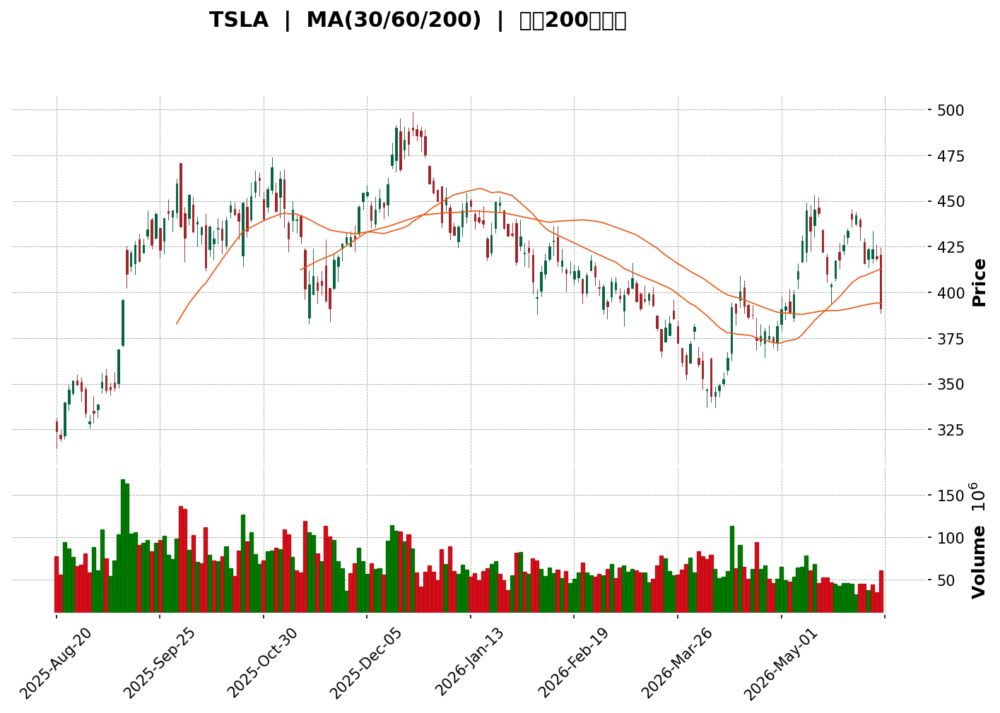
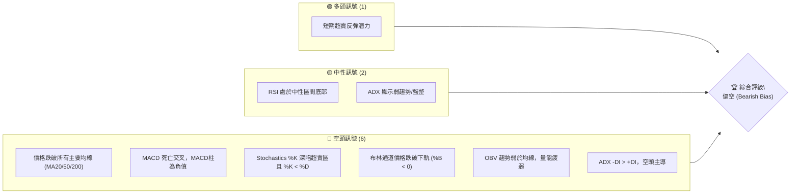
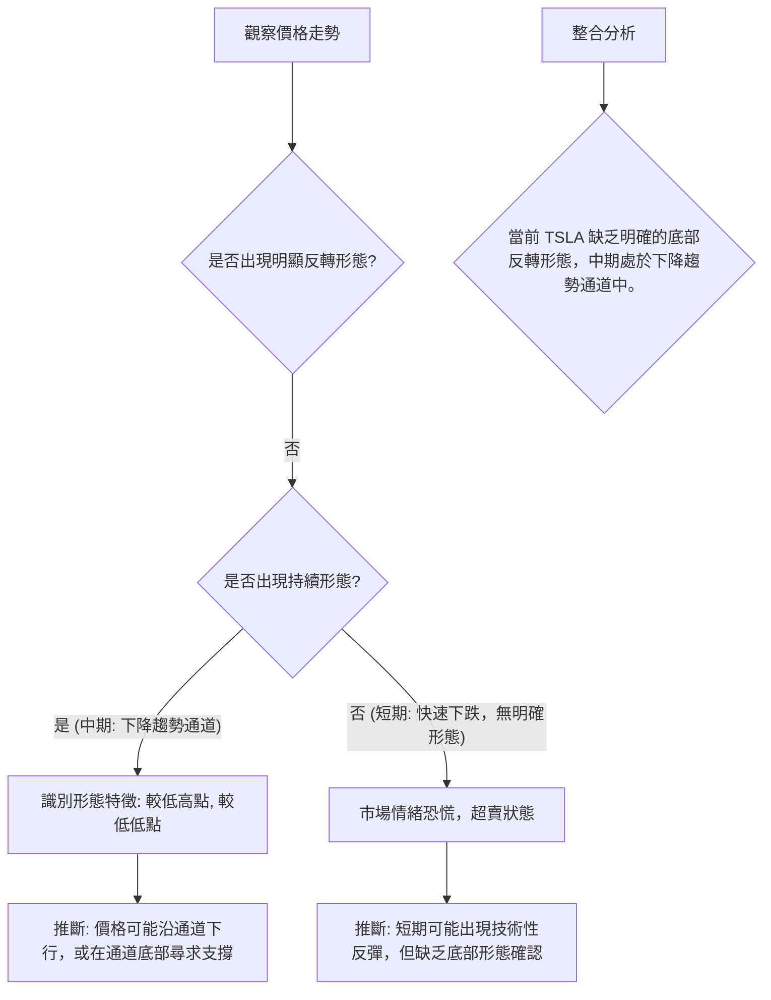

<details>
<summary>📊 靜態圖表 (點擊展開)</summary>

</details>

<html>
<head><meta charset="utf-8" /></head>
<body>
    <div style="height:500px; width:100%;">                        <script>window.PlotlyConfig = {MathJaxConfig: 'local'};</script>
        <script charset="utf-8" src="https://cdn.plot.ly/plotly-3.6.0.min.js" integrity="sha256-QaOVwtVY0T02VaHrr6pnoHLCwayMJp4O5n4YyaE3rJk=" crossorigin="anonymous"></script>                <div id="candlestick-chart" class="plotly-graph-div" style="height:100%; width:100%;"></div>            <script>                window.PLOTLYENV=window.PLOTLYENV || {};                                if (document.getElementById("candlestick-chart")) {                    Plotly.newPlot(                        "candlestick-chart",                        [{"close":{"dtype":"f8","bdata":"AAAAYGY+dEAAAACAwgF0QAAAAAApQHVAAAAAoJmpdUAAAABguPp1QAAAAKCZ2XVAAAAAIK6fdUAAAACA6910QAAAAIDClXRAAAAAoHDhdEAAAADgeih1QAAAAKBw7XVAAAAAYGamdUAAAAAgha91QAAAAOCjvHVAAAAAwPUMd0AAAABACr94QAAAAOCjoHlAAAAAgOtZekAAAACAwp16QAAAAKCZDXpAAAAAwB6hekAAAAAgXCN7QAAAAKCZnXpAAAAA4KOse0AAAACAPXZ6QAAAAGBmhntAAAAAIFyze0AAAAAghct7QAAAACBct3xAAAAAAABAe0AAAACgR916QAAAAAAAVHxAAAAAoHARe0AAAABACmt7QAAAAOCjOHtAAAAAANfXeUAAAABgZj57QAAAAADX03pAAAAAYGYye0AAAAAAAMx6QAAAAMD1dHtAAAAAQOH2e0AAAACgmal7QAAAACCFb3tAAAAAIK4PfEAAAAAghRt7QAAAAGC4RnxAAAAAwMzIfEAAAAAAKdh8QAAAAKCZgXtAAAAAwPWIfEAAAACA60V9QAAAAAApxHtAAAAAwB7hfEAAAABgj957QAAAAOBR2HpAAAAAIK7Te0AAAACA63l7QAAAAKCZ6XpAAAAAANcfeUAAAACgmUV5QAAAAGC4jnlAAAAAAAAUeUAAAAAA1z95QAAAACCus3hAAAAAoHBxeEAAAADgehx6QAAAAGBmNnpAAAAAoEepekAAAABguOJ6QAAAAIA94npAAAAAANfTekAAAAAA1+t7QAAAAOB6aHxAAAAAAABwfEAAAACgR3l7QAAAAGC40ntAAAAAQDM3fEAAAACAPe57QAAAACBcr3xAAAAAwPW0fUAAAACAFJ5+QAAAAAApNH1AAAAAgOs1fkAAAABAMxN+QAAAACCui35AAAAAwPVYfkAAAABgZlZ+QAAAAEAKs31AAAAAgD26fEAAAABA4WZ8QAAAACCFG3xAAAAAwB5he0AAAABguDp8QAAAACBcD3tAAAAAYI\u002f2ekAAAADAzDx7QAAAAAAp0HtAAAAAIFwPfEAAAABAM\u002fN7QAAAAEAzc3tAAAAAwB5pe0AAAAAAAFh7QAAAAAAANHpAAAAAQAr3ekAAAACAwhV8QAAAAMD1EHxAAAAAQDMze0AAAABgZu56QAAAACBc93pAAAAAwPUIekAAAABgj+Z6QAAAAMD1XHpAAAAAIFxfekAAAAAAKWB5QAAAACBc03hAAAAAgMKxeUAAAADAHhV6QAAAACBck3pAAAAA4FHEekAAAADAHhF6QAAAAEAKF3pAAAAAgBSqeUAAAADAHrV5QAAAACBcu3lAAAAAwB69eUAAAACgR\u002f14QAAAAIAUlnlAAAAAYGYWekAAAACgR4l5QAAAAAApKHlAAAAAwB41eUAAAABA4YZ4QAAAAEAKX3lAAAAAwMxYeUAAAAAgrst4QAAAAEDh6nhAAAAAANfzeEAAAADAHn15QAAAAAApsHhAAAAAQDNzeEAAAADA9bh4QAAAAOBR9HhAAAAA4HqMeEAAAADAzMR3QAAAACBc\u002f3ZAAAAAoJnNd0AAAADgevB3QAAAAEAzH3hAAAAAgMJBd0AAAACgR512QAAAAOB6NHZAAAAAAAA8d0AAAAAAKdR3QAAAAKBwiXZAAAAAwB4NdkAAAABgZqp1QAAAAAAAdHVAAAAAgOuZdUAAAABAM891QAAAAGC4BnZAAAAAQDPDdkAAAABAM394QAAAAGBmTnhAAAAAgOsJeUAAAAAAAIh4QAAAAGC4JnhAAAAAACk4eEAAAAAghVt3QAAAAMDMhHdAAAAAYLiqd0AAAADgUYB3QAAAAMDMTHdAAAAAgBTad0AAAADAHm14QAAAAAApiHhAAAAAgOtVeEAAAAAgrut4QAAAAOCjvHlAAAAAoJnFekAAAAAAANB7QAAAAEAzF3tAAAAA4FHUe0AAAADAzLR7QAAAAADXY3pAAAAAANefeUAAAACAwkF5QAAAAAApFHpAAAAAoJkdekAAAAAAKaB6QAAAAKBwGXtAAAAAgMKFe0AAAACgmaF7QAAAAOCjPHtAAAAAgBT+eUAAAAAA13t6QAAAAEAze3pAAAAAQDMnekAAAAAAAHB4QA=="},"high":{"dtype":"f8","bdata":"AAAAgOu1dEAAAABgZk50QAAAAAAARHVAAAAA4HrYdUAAAABgZv51QAAAAIA9NnZAAAAAwMwYdkAAAAAAAMx1QAAAAKBH1XRAAAAAoEd1dUAAAACAPS51QAAAAIDrPXZAAAAAQApndkAAAADgUex1QAAAAKBHRXZAAAAAANcPd0AAAABACst4QAAAAEAzm3pAAAAAAAB0ekAAAADA9cR6QAAAACCFA3tAAAAAIIXXekAAAAAgrs97QAAAACCFj3tAAAAAIFzDe0AAAACgmTV7QAAAACCFh3tAAAAAIK4vfEAAAAAAANB7QAAAAOCj5HxAAAAAAABsfUAAAADgUex7QAAAAMDMWHxAAAAAQOFKfEAAAACgR5V7QAAAAKCZRXtAAAAAgBSye0AAAACAPU57QAAAAEAzI3tAAAAAACmIe0AAAACgmXV7QAAAACBcl3tAAAAAwMwcfEAAAADAzBR8QAAAAOCj2HtAAAAAYGYWfEAAAABA4Tp8QAAAAGCPwnxAAAAAAAAwfUAAAABAMxt9QAAAAMD1cHxAAAAAAACgfEAAAADAHqF9QAAAACCFw3xAAAAAoEclfUAAAABAMzd9QAAAAIDCdXtAAAAAYLgafEAAAAAA16d7QAAAAKBHpXtAAAAAAACIekAAAABACsN5QAAAACBcf3pAAAAAYGaOeUAAAADgerx5QAAAAEAKz3pAAAAAwMwseUAAAAAghVt6QAAAACCuR3pAAAAAQAqvekAAAABA4Q57QAAAAGCPGntAAAAAwMxMe0AAAABguP57QAAAAIAUanxAAAAAgOutfEAAAAAAABx8QAAAAIA9RnxAAAAAgBSOfEAAAADgURR8QAAAAAAp8HxAAAAA4FEcfkAAAAAAALh+QAAAAOB69H5AAAAAgMKtfkAAAAAA16d+QAAAAKBHLX9AAAAAIIW\u002ffkAAAABgZq5+QAAAAKBwkX5AAAAAYGZWfUAAAACA6\u002fF8QAAAAMDMiHxAAAAAoHClfEAAAADAzJh8QAAAAAAABHxAAAAAgOtle0AAAACAPU57QAAAAMDMEHxAAAAAwMxkfEAAAADA9Tx8QAAAAGCPvntAAAAAgMLVe0AAAAAAAPR7QAAAACCu63pAAAAAQDNje0AAAAAAABh8QAAAAEDhRnxAAAAA4KPQe0AAAADgUVh7QAAAAAApZHtAAAAAIK6De0AAAACAFH57QAAAAGBmsnpAAAAAwPXIekAAAABgZn56QAAAAKCZIXlAAAAAwMzoeUAAAAAAAFR6QAAAAAAAtHpAAAAAoJlFe0AAAAAgrkN7QAAAAMD1gHpAAAAAIIXbeUAAAABgZg56QAAAAAAA9HlAAAAAQDPreUAAAABAM3t5QAAAAMAerXlAAAAAoHBFekAAAADA9Qx6QAAAAIDrcXlAAAAA4KNIeUAAAACgcMV4QAAAAKBHhXlAAAAAgOuJeUAAAACgmSV5QAAAAKBwGXlAAAAAoHBpeUAAAACAFAZ6QAAAAAAAaHlAAAAAQDMDeUAAAAAgrjt5QAAAAIDrAXlAAAAAwB4xeUAAAADgUTR4QAAAAIA9vndAAAAAoEcVeEAAAAAgrjd4QAAAACCuw3hAAAAAQAoHeEAAAACAwh13QAAAAOCj9HZAAAAAoEdVd0AAAACAPfJ3QAAAAOB6JHdAAAAAIIX7dkAAAADgUcB1QAAAAAAAyHZAAAAAgBTOdUAAAACAwuV1QAAAAKCZRXZAAAAAgBT6dkAAAABgZqp4QAAAAMD1oHhAAAAA4HqUeUAAAADAzGx5QAAAAEAzn3hAAAAAACmQeEAAAAAAACB4QAAAAAAp7HdAAAAA4HrMd0AAAADgo+R3QAAAAGBmhndAAAAAAAAMeEAAAADAHt14QAAAAIA9qnhAAAAAgOsheUAAAABA4Rp5QAAAAKBH\u002fXlAAAAAQDPzekAAAABgjxJ8QAAAAMDM\u002fHtAAAAAYGZWfEAAAAAgrj98QAAAAGCPKntAAAAAgBRSekAAAACAFFp5QAAAACBcF3pAAAAAQDOvekAAAAAAKfh6QAAAAEAzM3tAAAAAoJnZe0AAAAAgXL97QAAAAMAekXtAAAAAoJnZekAAAABguIZ6QAAAAKCZGXtAAAAAoJmlekAAAADg4Ip6QA=="},"hovertemplate":"\u003cb\u003e%{x|%Y-%m-%d}\u003c\u002fb\u003e\u003cbr\u003e\u958b: $%{open:.2f}\u003cbr\u003e\u9ad8: $%{high:.2f}\u003cbr\u003e\u4f4e: $%{low:.2f}\u003cbr\u003e\u6536: $%{close:.2f}\u003cextra\u003e\u003c\u002fextra\u003e","low":{"dtype":"f8","bdata":"AAAAoJmpc0AAAABA4epzQAAAAEAK+3NAAAAA4HrwdEAAAAAghXt1QAAAAGCP0nVAAAAAAClEdUAAAABAM7t0QAAAAKCZWXRAAAAAACmIdEAAAAAgrrd0QAAAAEDhinVAAAAAoHCNdUAAAADAHn11QAAAAMAeoXVAAAAAoJm5dUAAAAAA1yN3QAAAAEDhJnlAAAAAQOG2eUAAAABguJp5QAAAAMD1CHpAAAAAIIVbekAAAACAFNJ6QAAAACCFe3pAAAAA4HrQekAAAACgRzF6QAAAAOBRUHpAAAAAAAB4e0AAAACA6xF7QAAAAAAAjHtAAAAAwB45e0AAAACgRwl6QAAAAEAKS3tAAAAAQDMHe0AAAAAgrpN6QAAAAEDhonpAAAAAQDO3eUAAAABAMzt6QAAAAIDCHXpAAAAAoEelekAAAADA9VR6QAAAAKCZeXpAAAAAgMKJe0AAAADAzKB7QAAAAAAA0HpAAAAAYGbeeUAAAABguOJ6QAAAAEAKa3tAAAAAoJk5fEAAAABgZkp8QAAAAIDCeXtAAAAAQAq7e0AAAADAzFx8QAAAAKCZuXtAAAAAIFyLe0AAAACgcDF7QAAAAIAUXnpAAAAAgMIVe0AAAACAwgV7QAAAAMD1qHpAAAAAoHDFeEAAAADgeux3QAAAAADX63hAAAAAIFybeEAAAAAAAOh4QAAAAADXq3hAAAAAACn8d0AAAACgcBF5QAAAAEAzX3lAAAAAgD0OekAAAABAM6N6QAAAAOCjlHpAAAAAgOthekAAAACAwvF6QAAAAIA91ntAAAAAYI86fEAAAAAAADR7QAAAAEAzO3tAAAAAgMK5e0AAAACgR4V7QAAAAGC4mntAAAAAYI86fUAAAACgRx19QAAAAEAzI31AAAAAgOuRfUAAAAAghat9QAAAAKBHVX5AAAAAoHAtfkAAAADAzMx9QAAAAMAenX1AAAAAAACwfEAAAACgR118QAAAAMDMFHxAAAAAwMw0e0AAAADAHsl7QAAAAOB6zHpAAAAA4KP0ekAAAACA64V6QAAAAIA95npAAAAAAABge0AAAABAM797QAAAACCFI3tAAAAAYGZae0AAAAAAKTR7QAAAAEAKF3pAAAAAgOs5ekAAAACAFAp7QAAAAOCjwHtAAAAA4Hoke0AAAABACut6QAAAAKCZ4XpAAAAAgOvpeUAAAABAM2t6QAAAAAAA6HlAAAAAQArbeUAAAABA4fJ4QAAAAOB6OHhAAAAAAADceEAAAADgo3R5QAAAAAAAEHpAAAAA4HpAekAAAAAAAOB5QAAAAIAUrnlAAAAAACkIeUAAAACgR5l5QAAAAIDCQXlAAAAAAABYeUAAAADgo6B4QAAAAIA92nhAAAAAYGbCeUAAAABgjzp5QAAAAIDC4XhAAAAAAABEeEAAAACAPRZ4QAAAAKBHqXhAAAAAYLj2eEAAAAAgXKN4QAAAAGBm1ndAAAAAQArjeEAAAABgZiJ5QAAAAGBmqnhAAAAAQDNfeEAAAABguKZ4QAAAAAAAkHhAAAAAwPWEeEAAAAAgrqt3QAAAACBcx3ZAAAAAIK5Ld0AAAADA9YR3QAAAAAApEHhAAAAAgOs9d0AAAAAghXd2QAAAAIA9AnZAAAAAAACQdkAAAACgR2F3QAAAAOB6cHZAAAAAgD2qdUAAAAAA1xN1QAAAAGC4OnVAAAAAAAAUdUAAAAAA12t1QAAAAMAeyXVAAAAA4FEsdkAAAAAAAKh2QAAAAMDM3HdAAAAAYGZ6eEAAAACgR0V4QAAAACCFE3hAAAAAwMwUeEAAAACAPQZ3QAAAACCuK3dAAAAA4FHAdkAAAADgo0h3QAAAAOCjIHdAAAAAYLgCd0AAAADAzKx3QAAAAMDMDHhAAAAAAABQeEAAAADgUQB4QAAAAIDrIXlAAAAAgD0GekAAAADAzAx6QAAAAAApZHpAAAAAIFzjekAAAABgj5J7QAAAAAAAYHpAAAAAoEdVeUAAAACAFJp4QAAAAIA9ZnlAAAAAYGbOeUAAAAAAKUh6QAAAAIDroXpAAAAA4FE4e0AAAADAzER7QAAAAIA9wnpAAAAAQOH2eUAAAABgZtp5QAAAAAAAAHpAAAAAYI8SekAAAACgcEl4QA=="},"name":"\u50f9\u683c","open":{"dtype":"f8","bdata":"AAAAIIWTdEAAAACgRyF0QAAAAGCPGnRAAAAAYGYudUAAAABA4Y51QAAAAEAK\u002f3VAAAAAYI\u002fudUAAAAAgrrN1QAAAACCug3RAAAAAQDPzdEAAAABgZgJ1QAAAAAAAwHVAAAAAgD0qdkAAAABACsd1QAAAAMDM6HVAAAAAYLjidUAAAABACi93QAAAAIAUcnpAAAAAAADoeUAAAAAAAPx5QAAAAIDrzXpAAAAAwB5dekAAAACAwvF6QAAAAIAUfntAAAAAoEfdekAAAAAA1zN7QAAAAMDMxHpAAAAAoJnFe0AAAADgUZh7QAAAAMDMvHtAAAAA4KNofUAAAADgo7R7QAAAAAAAjHtAAAAAwB79e0AAAADAHll7QAAAAMD1\u002fHpAAAAA4KNIe0AAAADgenh6QAAAAOCjrHpAAAAAYGYue0AAAAAgrit7QAAAAAAAmHpAAAAAgOu9e0AAAAAAKdx7QAAAAEAzt3tAAAAAAABAekAAAACgR+17QAAAACCuf3tAAAAA4HpsfEAAAAAAAOh8QAAAAMDMMHxAAAAAAADse0AAAAAA1398QAAAACBcZ3xAAAAAwMxAfEAAAAAgXN98QAAAAGC4XntAAAAAoJl5e0AAAABgZnZ7QAAAAGBmontAAAAAgBRyekAAAADAzCR4QAAAAADX63hAAAAAgBRWeUAAAABA4WJ5QAAAAIAU6nlAAAAAwB4leUAAAABguCJ5QAAAAGC45nlAAAAAQDN\u002fekAAAACgcKl6QAAAAMAelXpAAAAAwPXsekAAAACgmQF7QAAAAEAKH3xAAAAA4HpQfEAAAABAM\u002fd7QAAAAOCjWHtAAAAAwB7he0AAAABAMw98QAAAAKBwAXxAAAAAQApXfUAAAAAgXIN9QAAAACCFg35AAAAAYI\u002fifUAAAACA64F+QAAAAIAUnn5AAAAAYGaWfkAAAAAgrod+QAAAACCuU35AAAAAAABQfUAAAACgcNF8QAAAAKCZgXxAAAAAwMycfEAAAAAA1\u002f97QAAAAIAU5ntAAAAAYGY+e0AAAACAPb56QAAAAEAzP3tAAAAAIK6Te0AAAABAMyN8QAAAAMD1rHtAAAAAgBSSe0AAAAAAAHh7QAAAAIDC1XpAAAAAYI9aekAAAABgjzJ7QAAAAEDh9ntAAAAAAADQe0AAAABgj1Z7QAAAAGCP\u002fnpAAAAAwMxce0AAAACgmZV6QAAAAOCjVHpAAAAA4FGEekAAAAAgXEd6QAAAAOBR0HhAAAAAgOsNeUAAAABgj555QAAAAKBHIXpAAAAAIFy\u002fekAAAADAzOR6QAAAAMD15HlAAAAAgMLFeUAAAACAwrF5QAAAAAAAdHlAAAAAwMyEeUAAAADgo3R5QAAAAAAA+HhAAAAAYGbCeUAAAABguOZ5QAAAAEAKL3lAAAAAoJlpeEAAAACgcLF4QAAAAKCZ3XhAAAAAwB4ZeUAAAACgcOF4QAAAAMDMYHhAAAAAIIUjeUAAAADgeiR5QAAAAEDhUnlAAAAAYLjyeEAAAAAghcN4QAAAAEAKu3hAAAAAAADweEAAAADgUTR4QAAAAKCZvXdAAAAAoHBRd0AAAADA9Yh3QAAAAADXX3hAAAAAoJnZd0AAAABACht3QAAAAIDC3XZAAAAAACmYdkAAAACAFKp3QAAAAEAzw3ZAAAAAoHCpdkAAAABACqd1QAAAAOCjvHZAAAAAYGZydUAAAADgo6R1QAAAAMAe4XVAAAAAYLhadkAAAACgR+12QAAAAMD1nHhAAAAAYLi+eEAAAACgRyl5QAAAAAAAkHhAAAAAwB45eEAAAADgenR3QAAAAAAAWHdAAAAAoHBBd0AAAABA4Wp3QAAAAGBmdndAAAAAAABMd0AAAAAA1+d3QAAAACCuY3hAAAAAQAqzeEAAAAAAACR4QAAAACCud3lAAAAAIK4HekAAAABgj2J6QAAAAGCPlntAAAAAYLhKe0AAAAAA1+d7QAAAACCuH3tAAAAA4FE0ekAAAABgjzJ5QAAAAKCZeXlAAAAAQOFiekAAAABguGp6QAAAAAAp5HpAAAAAgD2ue0AAAACA61l7QAAAAKCZfXtAAAAAANe3ekAAAAAghSN6QAAAAEAzK3pAAAAAoHA9ekAAAABguEh6QA=="},"x":["2025-08-20T00:00:00-04:00","2025-08-21T00:00:00-04:00","2025-08-22T00:00:00-04:00","2025-08-25T00:00:00-04:00","2025-08-26T00:00:00-04:00","2025-08-27T00:00:00-04:00","2025-08-28T00:00:00-04:00","2025-08-29T00:00:00-04:00","2025-09-02T00:00:00-04:00","2025-09-03T00:00:00-04:00","2025-09-04T00:00:00-04:00","2025-09-05T00:00:00-04:00","2025-09-08T00:00:00-04:00","2025-09-09T00:00:00-04:00","2025-09-10T00:00:00-04:00","2025-09-11T00:00:00-04:00","2025-09-12T00:00:00-04:00","2025-09-15T00:00:00-04:00","2025-09-16T00:00:00-04:00","2025-09-17T00:00:00-04:00","2025-09-18T00:00:00-04:00","2025-09-19T00:00:00-04:00","2025-09-22T00:00:00-04:00","2025-09-23T00:00:00-04:00","2025-09-24T00:00:00-04:00","2025-09-25T00:00:00-04:00","2025-09-26T00:00:00-04:00","2025-09-29T00:00:00-04:00","2025-09-30T00:00:00-04:00","2025-10-01T00:00:00-04:00","2025-10-02T00:00:00-04:00","2025-10-03T00:00:00-04:00","2025-10-06T00:00:00-04:00","2025-10-07T00:00:00-04:00","2025-10-08T00:00:00-04:00","2025-10-09T00:00:00-04:00","2025-10-10T00:00:00-04:00","2025-10-13T00:00:00-04:00","2025-10-14T00:00:00-04:00","2025-10-15T00:00:00-04:00","2025-10-16T00:00:00-04:00","2025-10-17T00:00:00-04:00","2025-10-20T00:00:00-04:00","2025-10-21T00:00:00-04:00","2025-10-22T00:00:00-04:00","2025-10-23T00:00:00-04:00","2025-10-24T00:00:00-04:00","2025-10-27T00:00:00-04:00","2025-10-28T00:00:00-04:00","2025-10-29T00:00:00-04:00","2025-10-30T00:00:00-04:00","2025-10-31T00:00:00-04:00","2025-11-03T00:00:00-05:00","2025-11-04T00:00:00-05:00","2025-11-05T00:00:00-05:00","2025-11-06T00:00:00-05:00","2025-11-07T00:00:00-05:00","2025-11-10T00:00:00-05:00","2025-11-11T00:00:00-05:00","2025-11-12T00:00:00-05:00","2025-11-13T00:00:00-05:00","2025-11-14T00:00:00-05:00","2025-11-17T00:00:00-05:00","2025-11-18T00:00:00-05:00","2025-11-19T00:00:00-05:00","2025-11-20T00:00:00-05:00","2025-11-21T00:00:00-05:00","2025-11-24T00:00:00-05:00","2025-11-25T00:00:00-05:00","2025-11-26T00:00:00-05:00","2025-11-28T00:00:00-05:00","2025-12-01T00:00:00-05:00","2025-12-02T00:00:00-05:00","2025-12-03T00:00:00-05:00","2025-12-04T00:00:00-05:00","2025-12-05T00:00:00-05:00","2025-12-08T00:00:00-05:00","2025-12-09T00:00:00-05:00","2025-12-10T00:00:00-05:00","2025-12-11T00:00:00-05:00","2025-12-12T00:00:00-05:00","2025-12-15T00:00:00-05:00","2025-12-16T00:00:00-05:00","2025-12-17T00:00:00-05:00","2025-12-18T00:00:00-05:00","2025-12-19T00:00:00-05:00","2025-12-22T00:00:00-05:00","2025-12-23T00:00:00-05:00","2025-12-24T00:00:00-05:00","2025-12-26T00:00:00-05:00","2025-12-29T00:00:00-05:00","2025-12-30T00:00:00-05:00","2025-12-31T00:00:00-05:00","2026-01-02T00:00:00-05:00","2026-01-05T00:00:00-05:00","2026-01-06T00:00:00-05:00","2026-01-07T00:00:00-05:00","2026-01-08T00:00:00-05:00","2026-01-09T00:00:00-05:00","2026-01-12T00:00:00-05:00","2026-01-13T00:00:00-05:00","2026-01-14T00:00:00-05:00","2026-01-15T00:00:00-05:00","2026-01-16T00:00:00-05:00","2026-01-20T00:00:00-05:00","2026-01-21T00:00:00-05:00","2026-01-22T00:00:00-05:00","2026-01-23T00:00:00-05:00","2026-01-26T00:00:00-05:00","2026-01-27T00:00:00-05:00","2026-01-28T00:00:00-05:00","2026-01-29T00:00:00-05:00","2026-01-30T00:00:00-05:00","2026-02-02T00:00:00-05:00","2026-02-03T00:00:00-05:00","2026-02-04T00:00:00-05:00","2026-02-05T00:00:00-05:00","2026-02-06T00:00:00-05:00","2026-02-09T00:00:00-05:00","2026-02-10T00:00:00-05:00","2026-02-11T00:00:00-05:00","2026-02-12T00:00:00-05:00","2026-02-13T00:00:00-05:00","2026-02-17T00:00:00-05:00","2026-02-18T00:00:00-05:00","2026-02-19T00:00:00-05:00","2026-02-20T00:00:00-05:00","2026-02-23T00:00:00-05:00","2026-02-24T00:00:00-05:00","2026-02-25T00:00:00-05:00","2026-02-26T00:00:00-05:00","2026-02-27T00:00:00-05:00","2026-03-02T00:00:00-05:00","2026-03-03T00:00:00-05:00","2026-03-04T00:00:00-05:00","2026-03-05T00:00:00-05:00","2026-03-06T00:00:00-05:00","2026-03-09T00:00:00-04:00","2026-03-10T00:00:00-04:00","2026-03-11T00:00:00-04:00","2026-03-12T00:00:00-04:00","2026-03-13T00:00:00-04:00","2026-03-16T00:00:00-04:00","2026-03-17T00:00:00-04:00","2026-03-18T00:00:00-04:00","2026-03-19T00:00:00-04:00","2026-03-20T00:00:00-04:00","2026-03-23T00:00:00-04:00","2026-03-24T00:00:00-04:00","2026-03-25T00:00:00-04:00","2026-03-26T00:00:00-04:00","2026-03-27T00:00:00-04:00","2026-03-30T00:00:00-04:00","2026-03-31T00:00:00-04:00","2026-04-01T00:00:00-04:00","2026-04-02T00:00:00-04:00","2026-04-06T00:00:00-04:00","2026-04-07T00:00:00-04:00","2026-04-08T00:00:00-04:00","2026-04-09T00:00:00-04:00","2026-04-10T00:00:00-04:00","2026-04-13T00:00:00-04:00","2026-04-14T00:00:00-04:00","2026-04-15T00:00:00-04:00","2026-04-16T00:00:00-04:00","2026-04-17T00:00:00-04:00","2026-04-20T00:00:00-04:00","2026-04-21T00:00:00-04:00","2026-04-22T00:00:00-04:00","2026-04-23T00:00:00-04:00","2026-04-24T00:00:00-04:00","2026-04-27T00:00:00-04:00","2026-04-28T00:00:00-04:00","2026-04-29T00:00:00-04:00","2026-04-30T00:00:00-04:00","2026-05-01T00:00:00-04:00","2026-05-04T00:00:00-04:00","2026-05-05T00:00:00-04:00","2026-05-06T00:00:00-04:00","2026-05-07T00:00:00-04:00","2026-05-08T00:00:00-04:00","2026-05-11T00:00:00-04:00","2026-05-12T00:00:00-04:00","2026-05-13T00:00:00-04:00","2026-05-14T00:00:00-04:00","2026-05-15T00:00:00-04:00","2026-05-18T00:00:00-04:00","2026-05-19T00:00:00-04:00","2026-05-20T00:00:00-04:00","2026-05-21T00:00:00-04:00","2026-05-22T00:00:00-04:00","2026-05-26T00:00:00-04:00","2026-05-27T00:00:00-04:00","2026-05-28T00:00:00-04:00","2026-05-29T00:00:00-04:00","2026-06-01T00:00:00-04:00","2026-06-02T00:00:00-04:00","2026-06-03T00:00:00-04:00","2026-06-04T00:00:00-04:00","2026-06-05T00:00:00-04:00"],"type":"candlestick"},{"hovertemplate":"MA30: $%{y:.2f}\u003cextra\u003e\u003c\u002fextra\u003e","line":{"color":"#2196F3","dash":"dash","width":2},"mode":"lines","name":"MA30","x":["2025-08-20T00:00:00-04:00","2025-08-21T00:00:00-04:00","2025-08-22T00:00:00-04:00","2025-08-25T00:00:00-04:00","2025-08-26T00:00:00-04:00","2025-08-27T00:00:00-04:00","2025-08-28T00:00:00-04:00","2025-08-29T00:00:00-04:00","2025-09-02T00:00:00-04:00","2025-09-03T00:00:00-04:00","2025-09-04T00:00:00-04:00","2025-09-05T00:00:00-04:00","2025-09-08T00:00:00-04:00","2025-09-09T00:00:00-04:00","2025-09-10T00:00:00-04:00","2025-09-11T00:00:00-04:00","2025-09-12T00:00:00-04:00","2025-09-15T00:00:00-04:00","2025-09-16T00:00:00-04:00","2025-09-17T00:00:00-04:00","2025-09-18T00:00:00-04:00","2025-09-19T00:00:00-04:00","2025-09-22T00:00:00-04:00","2025-09-23T00:00:00-04:00","2025-09-24T00:00:00-04:00","2025-09-25T00:00:00-04:00","2025-09-26T00:00:00-04:00","2025-09-29T00:00:00-04:00","2025-09-30T00:00:00-04:00","2025-10-01T00:00:00-04:00","2025-10-02T00:00:00-04:00","2025-10-03T00:00:00-04:00","2025-10-06T00:00:00-04:00","2025-10-07T00:00:00-04:00","2025-10-08T00:00:00-04:00","2025-10-09T00:00:00-04:00","2025-10-10T00:00:00-04:00","2025-10-13T00:00:00-04:00","2025-10-14T00:00:00-04:00","2025-10-15T00:00:00-04:00","2025-10-16T00:00:00-04:00","2025-10-17T00:00:00-04:00","2025-10-20T00:00:00-04:00","2025-10-21T00:00:00-04:00","2025-10-22T00:00:00-04:00","2025-10-23T00:00:00-04:00","2025-10-24T00:00:00-04:00","2025-10-27T00:00:00-04:00","2025-10-28T00:00:00-04:00","2025-10-29T00:00:00-04:00","2025-10-30T00:00:00-04:00","2025-10-31T00:00:00-04:00","2025-11-03T00:00:00-05:00","2025-11-04T00:00:00-05:00","2025-11-05T00:00:00-05:00","2025-11-06T00:00:00-05:00","2025-11-07T00:00:00-05:00","2025-11-10T00:00:00-05:00","2025-11-11T00:00:00-05:00","2025-11-12T00:00:00-05:00","2025-11-13T00:00:00-05:00","2025-11-14T00:00:00-05:00","2025-11-17T00:00:00-05:00","2025-11-18T00:00:00-05:00","2025-11-19T00:00:00-05:00","2025-11-20T00:00:00-05:00","2025-11-21T00:00:00-05:00","2025-11-24T00:00:00-05:00","2025-11-25T00:00:00-05:00","2025-11-26T00:00:00-05:00","2025-11-28T00:00:00-05:00","2025-12-01T00:00:00-05:00","2025-12-02T00:00:00-05:00","2025-12-03T00:00:00-05:00","2025-12-04T00:00:00-05:00","2025-12-05T00:00:00-05:00","2025-12-08T00:00:00-05:00","2025-12-09T00:00:00-05:00","2025-12-10T00:00:00-05:00","2025-12-11T00:00:00-05:00","2025-12-12T00:00:00-05:00","2025-12-15T00:00:00-05:00","2025-12-16T00:00:00-05:00","2025-12-17T00:00:00-05:00","2025-12-18T00:00:00-05:00","2025-12-19T00:00:00-05:00","2025-12-22T00:00:00-05:00","2025-12-23T00:00:00-05:00","2025-12-24T00:00:00-05:00","2025-12-26T00:00:00-05:00","2025-12-29T00:00:00-05:00","2025-12-30T00:00:00-05:00","2025-12-31T00:00:00-05:00","2026-01-02T00:00:00-05:00","2026-01-05T00:00:00-05:00","2026-01-06T00:00:00-05:00","2026-01-07T00:00:00-05:00","2026-01-08T00:00:00-05:00","2026-01-09T00:00:00-05:00","2026-01-12T00:00:00-05:00","2026-01-13T00:00:00-05:00","2026-01-14T00:00:00-05:00","2026-01-15T00:00:00-05:00","2026-01-16T00:00:00-05:00","2026-01-20T00:00:00-05:00","2026-01-21T00:00:00-05:00","2026-01-22T00:00:00-05:00","2026-01-23T00:00:00-05:00","2026-01-26T00:00:00-05:00","2026-01-27T00:00:00-05:00","2026-01-28T00:00:00-05:00","2026-01-29T00:00:00-05:00","2026-01-30T00:00:00-05:00","2026-02-02T00:00:00-05:00","2026-02-03T00:00:00-05:00","2026-02-04T00:00:00-05:00","2026-02-05T00:00:00-05:00","2026-02-06T00:00:00-05:00","2026-02-09T00:00:00-05:00","2026-02-10T00:00:00-05:00","2026-02-11T00:00:00-05:00","2026-02-12T00:00:00-05:00","2026-02-13T00:00:00-05:00","2026-02-17T00:00:00-05:00","2026-02-18T00:00:00-05:00","2026-02-19T00:00:00-05:00","2026-02-20T00:00:00-05:00","2026-02-23T00:00:00-05:00","2026-02-24T00:00:00-05:00","2026-02-25T00:00:00-05:00","2026-02-26T00:00:00-05:00","2026-02-27T00:00:00-05:00","2026-03-02T00:00:00-05:00","2026-03-03T00:00:00-05:00","2026-03-04T00:00:00-05:00","2026-03-05T00:00:00-05:00","2026-03-06T00:00:00-05:00","2026-03-09T00:00:00-04:00","2026-03-10T00:00:00-04:00","2026-03-11T00:00:00-04:00","2026-03-12T00:00:00-04:00","2026-03-13T00:00:00-04:00","2026-03-16T00:00:00-04:00","2026-03-17T00:00:00-04:00","2026-03-18T00:00:00-04:00","2026-03-19T00:00:00-04:00","2026-03-20T00:00:00-04:00","2026-03-23T00:00:00-04:00","2026-03-24T00:00:00-04:00","2026-03-25T00:00:00-04:00","2026-03-26T00:00:00-04:00","2026-03-27T00:00:00-04:00","2026-03-30T00:00:00-04:00","2026-03-31T00:00:00-04:00","2026-04-01T00:00:00-04:00","2026-04-02T00:00:00-04:00","2026-04-06T00:00:00-04:00","2026-04-07T00:00:00-04:00","2026-04-08T00:00:00-04:00","2026-04-09T00:00:00-04:00","2026-04-10T00:00:00-04:00","2026-04-13T00:00:00-04:00","2026-04-14T00:00:00-04:00","2026-04-15T00:00:00-04:00","2026-04-16T00:00:00-04:00","2026-04-17T00:00:00-04:00","2026-04-20T00:00:00-04:00","2026-04-21T00:00:00-04:00","2026-04-22T00:00:00-04:00","2026-04-23T00:00:00-04:00","2026-04-24T00:00:00-04:00","2026-04-27T00:00:00-04:00","2026-04-28T00:00:00-04:00","2026-04-29T00:00:00-04:00","2026-04-30T00:00:00-04:00","2026-05-01T00:00:00-04:00","2026-05-04T00:00:00-04:00","2026-05-05T00:00:00-04:00","2026-05-06T00:00:00-04:00","2026-05-07T00:00:00-04:00","2026-05-08T00:00:00-04:00","2026-05-11T00:00:00-04:00","2026-05-12T00:00:00-04:00","2026-05-13T00:00:00-04:00","2026-05-14T00:00:00-04:00","2026-05-15T00:00:00-04:00","2026-05-18T00:00:00-04:00","2026-05-19T00:00:00-04:00","2026-05-20T00:00:00-04:00","2026-05-21T00:00:00-04:00","2026-05-22T00:00:00-04:00","2026-05-26T00:00:00-04:00","2026-05-27T00:00:00-04:00","2026-05-28T00:00:00-04:00","2026-05-29T00:00:00-04:00","2026-06-01T00:00:00-04:00","2026-06-02T00:00:00-04:00","2026-06-03T00:00:00-04:00","2026-06-04T00:00:00-04:00","2026-06-05T00:00:00-04:00"],"y":{"dtype":"f8","bdata":"AAAAAAAA+H8AAAAAAAD4fwAAAAAAAPh\u002fAAAAAAAA+H8AAAAAAAD4fwAAAAAAAPh\u002fAAAAAAAA+H8AAAAAAAD4fwAAAAAAAPh\u002fAAAAAAAA+H8AAAAAAAD4fwAAAAAAAPh\u002fAAAAAAAA+H8AAAAAAAD4fwAAAAAAAPh\u002fAAAAAAAA+H8AAAAAAAD4fwAAAAAAAPh\u002fAAAAAAAA+H8AAAAAAAD4fwAAAAAAAPh\u002fAAAAAAAA+H8AAAAAAAD4fwAAAAAAAPh\u002fAAAAAAAA+H8AAAAAAAD4fwAAAAAAAPh\u002fAAAAAAAA+H8AAAAAAAD4f0RERCRN7XdAd3d3hxYpeEB3d3f3mmN4QAAAAAAAoHhARERExCDOeEBVVVXlifx4QCIiIpJfKnlA7+7u7mBOeUDe3d1ty4R5QBEREWEQunlAAAAAcPbveUCamZl5FCB6QERERJRDT3pAq6qqiiWFekCamZk5Jrh6QFVVVVXH6HpAZmZmNokTe0ARERFxryd7QJqZmblJPntAd3d39wxTe0AiIiJiEGZ7QImIiMh2cntA7+7urrmCe0CamZmp8ZR7QN7d3T3DnntAq6qqmgupe0BVVVVVDrV7QJqZmdlAr3tAZmZmplSwe0BERERUnK17QKuqqvo3nntAq6qqehSMe0DNzMycfX57QHd3dxfZZntA7+7u3t1Ve0CamZkpXEN7QBEREYHcLXtAiYiIKOohe0DNzMwsQBh7QAAAALAAE3tAiYiImG4Oe0CamZl5MA97QHd3d3dMCntAzczM7JgAe0C8u7srzgJ7QBEREaEaC3tA7+7ujlAOe0BERESkcBF7QGZmZsaSDXtAMzMzU7gIe0BVVVU17AB7QJqZmTn7CntAmpmZOfsUe0Dv7u4OdCB7QDMzM1O4LHtAvLu7exQ4e0Dv7u6+5kp7QDMzM+N6antAZmZmRv1\u002fe0BVVVXFZ5h7QKuqqsovsHtAERER8e7Oe0B3d3eHpOl7QGZmZhZn\u002f3tA7+7uPgoTfECJiIgoeCx8QO\u002fu7o6XQHxAVVVVlRhWfECamZnptF98QImIiIhdbXxAZmZmJk15fEAAAABQYoJ8QN7d3U03h3xAmpmZKTGMfECJiIiYQ4d8QDMzM7NydHxAmpmZ+eFnfEBVVVVFGW18QCIiImIsb3xAd3d3t4FmfEC8u7uL+l18QBEREeFPT3xAvLu7i\u002fovfECJiIjoQhB8QHd3d3cF+HtARERE9ETXe0AzMzMDK697QKuqqnpbfntAIiIikqZWe0AiIiJiVzJ7QCIiInKvF3tAREREZPQGe0AiIiKCB\u002fN6QGZmZjbQ4XpAzczMvC3TekDe3d2dqL16QImIiEhTsnpAiYiImOCnekDe3d19sZR6QO\u002fu7s6wgXpAERER0dtwekBVVVXlQlx6QM3MzHyxSHpAAAAAsOQ1ekAREREh2x16QO\u002fu7t7BFnpAVVVVBfMIekBmZmZG4ex5QJqZmbkC0nlAvLu7+9S+eUC8u7vLhbJ5QImIiCgVn3lAzczMrI6ReUDNzMx8+H55QGZmZgbzcnlAvLu7+2JjeUBVVVW1rFV5QLy7uxsTRnlAzczMnO81eUAiIiLipSN5QGZmZpa1DnlAAAAA4MHweEBVVVXFS9N4QLy7u9sksnhAERERcWideEAAAABAYI14QKuqqqoccnhAMzMzM6VSeEC8u7tbSDZ4QImIiGgDE3hAvLu7C7vsd0ARERGR7cx3QM3MzJw2sndA3t3dbVmdd0BVVVXlF513QN7d3V0BlHdAIiIiQmCRd0CJiIi4Ho93QDMzM9OUiHdAq6qqSlOCd0ARERGBI3B3QGZmZvYoZndAMzMzM3pfd0BmZmZWDlV3QM3MzEzwRndARERE9P1Ad0CamZlJmkZ3QO\u002fu7i6yU3dAIiIicj1Yd0BVVVUFnWB3QKuqqgplbndA3t3drWOMd0CJiIgov7h3QImIiPhv4ndAZmZm5qUJeEDNzMxsvCp4QERERLSdS3hAAAAAUBtqeEBERESEwIh4QJqZmVk5sHhAd3d3J7\u002fWeECamZlp2P94QCIiItIiK3lAIiIiMsFTeUB3d3dXgG55QERERGSCh3lARERE5KWPeUARERExT6B5QHd3dycxtHlA7+7ufrHEeUCrqqrK6M15QA=="},"type":"scatter"},{"hovertemplate":"MA60: $%{y:.2f}\u003cextra\u003e\u003c\u002fextra\u003e","line":{"color":"#9C27B0","dash":"dash","width":2},"mode":"lines","name":"MA60","x":["2025-08-20T00:00:00-04:00","2025-08-21T00:00:00-04:00","2025-08-22T00:00:00-04:00","2025-08-25T00:00:00-04:00","2025-08-26T00:00:00-04:00","2025-08-27T00:00:00-04:00","2025-08-28T00:00:00-04:00","2025-08-29T00:00:00-04:00","2025-09-02T00:00:00-04:00","2025-09-03T00:00:00-04:00","2025-09-04T00:00:00-04:00","2025-09-05T00:00:00-04:00","2025-09-08T00:00:00-04:00","2025-09-09T00:00:00-04:00","2025-09-10T00:00:00-04:00","2025-09-11T00:00:00-04:00","2025-09-12T00:00:00-04:00","2025-09-15T00:00:00-04:00","2025-09-16T00:00:00-04:00","2025-09-17T00:00:00-04:00","2025-09-18T00:00:00-04:00","2025-09-19T00:00:00-04:00","2025-09-22T00:00:00-04:00","2025-09-23T00:00:00-04:00","2025-09-24T00:00:00-04:00","2025-09-25T00:00:00-04:00","2025-09-26T00:00:00-04:00","2025-09-29T00:00:00-04:00","2025-09-30T00:00:00-04:00","2025-10-01T00:00:00-04:00","2025-10-02T00:00:00-04:00","2025-10-03T00:00:00-04:00","2025-10-06T00:00:00-04:00","2025-10-07T00:00:00-04:00","2025-10-08T00:00:00-04:00","2025-10-09T00:00:00-04:00","2025-10-10T00:00:00-04:00","2025-10-13T00:00:00-04:00","2025-10-14T00:00:00-04:00","2025-10-15T00:00:00-04:00","2025-10-16T00:00:00-04:00","2025-10-17T00:00:00-04:00","2025-10-20T00:00:00-04:00","2025-10-21T00:00:00-04:00","2025-10-22T00:00:00-04:00","2025-10-23T00:00:00-04:00","2025-10-24T00:00:00-04:00","2025-10-27T00:00:00-04:00","2025-10-28T00:00:00-04:00","2025-10-29T00:00:00-04:00","2025-10-30T00:00:00-04:00","2025-10-31T00:00:00-04:00","2025-11-03T00:00:00-05:00","2025-11-04T00:00:00-05:00","2025-11-05T00:00:00-05:00","2025-11-06T00:00:00-05:00","2025-11-07T00:00:00-05:00","2025-11-10T00:00:00-05:00","2025-11-11T00:00:00-05:00","2025-11-12T00:00:00-05:00","2025-11-13T00:00:00-05:00","2025-11-14T00:00:00-05:00","2025-11-17T00:00:00-05:00","2025-11-18T00:00:00-05:00","2025-11-19T00:00:00-05:00","2025-11-20T00:00:00-05:00","2025-11-21T00:00:00-05:00","2025-11-24T00:00:00-05:00","2025-11-25T00:00:00-05:00","2025-11-26T00:00:00-05:00","2025-11-28T00:00:00-05:00","2025-12-01T00:00:00-05:00","2025-12-02T00:00:00-05:00","2025-12-03T00:00:00-05:00","2025-12-04T00:00:00-05:00","2025-12-05T00:00:00-05:00","2025-12-08T00:00:00-05:00","2025-12-09T00:00:00-05:00","2025-12-10T00:00:00-05:00","2025-12-11T00:00:00-05:00","2025-12-12T00:00:00-05:00","2025-12-15T00:00:00-05:00","2025-12-16T00:00:00-05:00","2025-12-17T00:00:00-05:00","2025-12-18T00:00:00-05:00","2025-12-19T00:00:00-05:00","2025-12-22T00:00:00-05:00","2025-12-23T00:00:00-05:00","2025-12-24T00:00:00-05:00","2025-12-26T00:00:00-05:00","2025-12-29T00:00:00-05:00","2025-12-30T00:00:00-05:00","2025-12-31T00:00:00-05:00","2026-01-02T00:00:00-05:00","2026-01-05T00:00:00-05:00","2026-01-06T00:00:00-05:00","2026-01-07T00:00:00-05:00","2026-01-08T00:00:00-05:00","2026-01-09T00:00:00-05:00","2026-01-12T00:00:00-05:00","2026-01-13T00:00:00-05:00","2026-01-14T00:00:00-05:00","2026-01-15T00:00:00-05:00","2026-01-16T00:00:00-05:00","2026-01-20T00:00:00-05:00","2026-01-21T00:00:00-05:00","2026-01-22T00:00:00-05:00","2026-01-23T00:00:00-05:00","2026-01-26T00:00:00-05:00","2026-01-27T00:00:00-05:00","2026-01-28T00:00:00-05:00","2026-01-29T00:00:00-05:00","2026-01-30T00:00:00-05:00","2026-02-02T00:00:00-05:00","2026-02-03T00:00:00-05:00","2026-02-04T00:00:00-05:00","2026-02-05T00:00:00-05:00","2026-02-06T00:00:00-05:00","2026-02-09T00:00:00-05:00","2026-02-10T00:00:00-05:00","2026-02-11T00:00:00-05:00","2026-02-12T00:00:00-05:00","2026-02-13T00:00:00-05:00","2026-02-17T00:00:00-05:00","2026-02-18T00:00:00-05:00","2026-02-19T00:00:00-05:00","2026-02-20T00:00:00-05:00","2026-02-23T00:00:00-05:00","2026-02-24T00:00:00-05:00","2026-02-25T00:00:00-05:00","2026-02-26T00:00:00-05:00","2026-02-27T00:00:00-05:00","2026-03-02T00:00:00-05:00","2026-03-03T00:00:00-05:00","2026-03-04T00:00:00-05:00","2026-03-05T00:00:00-05:00","2026-03-06T00:00:00-05:00","2026-03-09T00:00:00-04:00","2026-03-10T00:00:00-04:00","2026-03-11T00:00:00-04:00","2026-03-12T00:00:00-04:00","2026-03-13T00:00:00-04:00","2026-03-16T00:00:00-04:00","2026-03-17T00:00:00-04:00","2026-03-18T00:00:00-04:00","2026-03-19T00:00:00-04:00","2026-03-20T00:00:00-04:00","2026-03-23T00:00:00-04:00","2026-03-24T00:00:00-04:00","2026-03-25T00:00:00-04:00","2026-03-26T00:00:00-04:00","2026-03-27T00:00:00-04:00","2026-03-30T00:00:00-04:00","2026-03-31T00:00:00-04:00","2026-04-01T00:00:00-04:00","2026-04-02T00:00:00-04:00","2026-04-06T00:00:00-04:00","2026-04-07T00:00:00-04:00","2026-04-08T00:00:00-04:00","2026-04-09T00:00:00-04:00","2026-04-10T00:00:00-04:00","2026-04-13T00:00:00-04:00","2026-04-14T00:00:00-04:00","2026-04-15T00:00:00-04:00","2026-04-16T00:00:00-04:00","2026-04-17T00:00:00-04:00","2026-04-20T00:00:00-04:00","2026-04-21T00:00:00-04:00","2026-04-22T00:00:00-04:00","2026-04-23T00:00:00-04:00","2026-04-24T00:00:00-04:00","2026-04-27T00:00:00-04:00","2026-04-28T00:00:00-04:00","2026-04-29T00:00:00-04:00","2026-04-30T00:00:00-04:00","2026-05-01T00:00:00-04:00","2026-05-04T00:00:00-04:00","2026-05-05T00:00:00-04:00","2026-05-06T00:00:00-04:00","2026-05-07T00:00:00-04:00","2026-05-08T00:00:00-04:00","2026-05-11T00:00:00-04:00","2026-05-12T00:00:00-04:00","2026-05-13T00:00:00-04:00","2026-05-14T00:00:00-04:00","2026-05-15T00:00:00-04:00","2026-05-18T00:00:00-04:00","2026-05-19T00:00:00-04:00","2026-05-20T00:00:00-04:00","2026-05-21T00:00:00-04:00","2026-05-22T00:00:00-04:00","2026-05-26T00:00:00-04:00","2026-05-27T00:00:00-04:00","2026-05-28T00:00:00-04:00","2026-05-29T00:00:00-04:00","2026-06-01T00:00:00-04:00","2026-06-02T00:00:00-04:00","2026-06-03T00:00:00-04:00","2026-06-04T00:00:00-04:00","2026-06-05T00:00:00-04:00"],"y":{"dtype":"f8","bdata":"AAAAAAAA+H8AAAAAAAD4fwAAAAAAAPh\u002fAAAAAAAA+H8AAAAAAAD4fwAAAAAAAPh\u002fAAAAAAAA+H8AAAAAAAD4fwAAAAAAAPh\u002fAAAAAAAA+H8AAAAAAAD4fwAAAAAAAPh\u002fAAAAAAAA+H8AAAAAAAD4fwAAAAAAAPh\u002fAAAAAAAA+H8AAAAAAAD4fwAAAAAAAPh\u002fAAAAAAAA+H8AAAAAAAD4fwAAAAAAAPh\u002fAAAAAAAA+H8AAAAAAAD4fwAAAAAAAPh\u002fAAAAAAAA+H8AAAAAAAD4fwAAAAAAAPh\u002fAAAAAAAA+H8AAAAAAAD4fwAAAAAAAPh\u002fAAAAAAAA+H8AAAAAAAD4fwAAAAAAAPh\u002fAAAAAAAA+H8AAAAAAAD4fwAAAAAAAPh\u002fAAAAAAAA+H8AAAAAAAD4fwAAAAAAAPh\u002fAAAAAAAA+H8AAAAAAAD4fwAAAAAAAPh\u002fAAAAAAAA+H8AAAAAAAD4fwAAAAAAAPh\u002fAAAAAAAA+H8AAAAAAAD4fwAAAAAAAPh\u002fAAAAAAAA+H8AAAAAAAD4fwAAAAAAAPh\u002fAAAAAAAA+H8AAAAAAAD4fwAAAAAAAPh\u002fAAAAAAAA+H8AAAAAAAD4fwAAAAAAAPh\u002fAAAAAAAA+H8AAAAAAAD4f3d3d4\u002fCxXlAERERgZXaeUAiIiJKDPF5QLy7u4tsA3pAmpmZUf8RekB3d3cH8x96QJqZmQkeLHpAvLu7iyU4ekBVVVXNhU56QImIiIiIZnpAREREhDJ\u002fekCamZl5opd6QN7d3QXIrHpAvLu7O9\u002fCekCrqqoyet16QDMzM\u002fvw+XpAq6qq4uwQe0CrqqoKkBx7QAAAAEDuJXtAVVVVpeIte0C8u7tLfjN7QBEREQG5PntAREREdNpLe0BERETcslp7QImIiMi9ZXtAMzMzC5Bwe0AiIiKK+n97QGZmZt7djHtAZmZm9iiYe0DNzMwMAqN7QKuqquIzp3tA3t3dtYGte0AiIiISEbR7QO\u002fu7hYgs3tA7+7uDnS0e0AREREp6rd7QAAAAAg6t3tA7+7uXgG8e0AzMzOL+rt7QERERBwvwHtAd3d3393De0DNzMxkych7QKuqquLByHtAMzMzC2XGe0AiIiLiCMV7QCIiIqrGv3tARERERBm7e0DNzMz0RL97QERERJRfvntAVVVVBZ23e0CJiIhgc697QFVVVY0lrXtAq6qq4nqie0C8u7t7W5h7QFVVVeVekntAAAAAuKyHe0ARERHhCH17QO\u002fu7i5rdHtARERE7FFre0C8u7uTX2V7QGZmZp7vY3tAq6qqqvFqe0DNzMwEVm57QGZmZqabcHtA3t3d\u002fRtze0AzMzNjEHV7QLy7u2t1eXtA7+7ulvx+e0C8u7szM3p7QLy7uyuHd3tAvLu7exR1e0CrqqqaUm97QFVVVWX0Z3tAzczM7Aphe0DNzMxcj1J7QBEREUmaRXtAd3d3f2o4e0De3d1F\u002fSx7QN7d3Y2XIHtAmpmZWasSe0C8u7srQAh7QM3MzIQy93pAREREnMTgekCrqqqyncd6QO\u002fu7j58tXpAAAAA+FOdekBERETca4J6QDMzM0s3YnpAd3d3F0tGekAiIiKi\u002fip6QERERIQyE3pAIiIiItv7eUC8u7ujKeN5QBEREYn6yXlA7+7uFku4eUDv7u5uhKV5QJqZmfk3knlA3t3d5UJ9eUDNzMzsfGV5QLy7uxtaSnlAZmZmbssueUAzMzM7mBR5QM3MzAx0\u002fXhA7+7uDp\u002fpeEAzMzODed14QGZmZp5h1XhAvLu7oynNeEB3d3f\u002f\u002f714QGZmZsZLrXhAMzMzI5SgeEBmZmamVJF4QHd3dw+fgnhAAAAAcIR4eECamZlpA2p4QJqZmanxXHhAAAAAeDBSeEB3d3d\u002fI054QFVVVaXiTHhAd3d3hxZHeEC8u7tzIUJ4QImIiFCNPnhA7+7uxpI+eEDv7u52BUZ4QCIiImpKSnhAvLu7K4dTeEBmZmZWDlx4QHd3dy\u002fdXnhAmpmZQWBeeEAAAABwhF94QBEREWGeYXhAmpmZGb1heEBVVVX9YmZ4QHd3d7esbnhAAAAAUI14eEBmZmYezIV4QBEREeHBjXhAMzMzE4OQeEDNzMz0tpd4QFVVVf1innhAzczMZIKjeEDe3d0lBp94QA=="},"type":"scatter"},{"hovertemplate":"MA200: $%{y:.2f}\u003cextra\u003e\u003c\u002fextra\u003e","line":{"color":"#FF6F00","dash":"solid","width":2},"mode":"lines","name":"MA200","x":["2025-08-20T00:00:00-04:00","2025-08-21T00:00:00-04:00","2025-08-22T00:00:00-04:00","2025-08-25T00:00:00-04:00","2025-08-26T00:00:00-04:00","2025-08-27T00:00:00-04:00","2025-08-28T00:00:00-04:00","2025-08-29T00:00:00-04:00","2025-09-02T00:00:00-04:00","2025-09-03T00:00:00-04:00","2025-09-04T00:00:00-04:00","2025-09-05T00:00:00-04:00","2025-09-08T00:00:00-04:00","2025-09-09T00:00:00-04:00","2025-09-10T00:00:00-04:00","2025-09-11T00:00:00-04:00","2025-09-12T00:00:00-04:00","2025-09-15T00:00:00-04:00","2025-09-16T00:00:00-04:00","2025-09-17T00:00:00-04:00","2025-09-18T00:00:00-04:00","2025-09-19T00:00:00-04:00","2025-09-22T00:00:00-04:00","2025-09-23T00:00:00-04:00","2025-09-24T00:00:00-04:00","2025-09-25T00:00:00-04:00","2025-09-26T00:00:00-04:00","2025-09-29T00:00:00-04:00","2025-09-30T00:00:00-04:00","2025-10-01T00:00:00-04:00","2025-10-02T00:00:00-04:00","2025-10-03T00:00:00-04:00","2025-10-06T00:00:00-04:00","2025-10-07T00:00:00-04:00","2025-10-08T00:00:00-04:00","2025-10-09T00:00:00-04:00","2025-10-10T00:00:00-04:00","2025-10-13T00:00:00-04:00","2025-10-14T00:00:00-04:00","2025-10-15T00:00:00-04:00","2025-10-16T00:00:00-04:00","2025-10-17T00:00:00-04:00","2025-10-20T00:00:00-04:00","2025-10-21T00:00:00-04:00","2025-10-22T00:00:00-04:00","2025-10-23T00:00:00-04:00","2025-10-24T00:00:00-04:00","2025-10-27T00:00:00-04:00","2025-10-28T00:00:00-04:00","2025-10-29T00:00:00-04:00","2025-10-30T00:00:00-04:00","2025-10-31T00:00:00-04:00","2025-11-03T00:00:00-05:00","2025-11-04T00:00:00-05:00","2025-11-05T00:00:00-05:00","2025-11-06T00:00:00-05:00","2025-11-07T00:00:00-05:00","2025-11-10T00:00:00-05:00","2025-11-11T00:00:00-05:00","2025-11-12T00:00:00-05:00","2025-11-13T00:00:00-05:00","2025-11-14T00:00:00-05:00","2025-11-17T00:00:00-05:00","2025-11-18T00:00:00-05:00","2025-11-19T00:00:00-05:00","2025-11-20T00:00:00-05:00","2025-11-21T00:00:00-05:00","2025-11-24T00:00:00-05:00","2025-11-25T00:00:00-05:00","2025-11-26T00:00:00-05:00","2025-11-28T00:00:00-05:00","2025-12-01T00:00:00-05:00","2025-12-02T00:00:00-05:00","2025-12-03T00:00:00-05:00","2025-12-04T00:00:00-05:00","2025-12-05T00:00:00-05:00","2025-12-08T00:00:00-05:00","2025-12-09T00:00:00-05:00","2025-12-10T00:00:00-05:00","2025-12-11T00:00:00-05:00","2025-12-12T00:00:00-05:00","2025-12-15T00:00:00-05:00","2025-12-16T00:00:00-05:00","2025-12-17T00:00:00-05:00","2025-12-18T00:00:00-05:00","2025-12-19T00:00:00-05:00","2025-12-22T00:00:00-05:00","2025-12-23T00:00:00-05:00","2025-12-24T00:00:00-05:00","2025-12-26T00:00:00-05:00","2025-12-29T00:00:00-05:00","2025-12-30T00:00:00-05:00","2025-12-31T00:00:00-05:00","2026-01-02T00:00:00-05:00","2026-01-05T00:00:00-05:00","2026-01-06T00:00:00-05:00","2026-01-07T00:00:00-05:00","2026-01-08T00:00:00-05:00","2026-01-09T00:00:00-05:00","2026-01-12T00:00:00-05:00","2026-01-13T00:00:00-05:00","2026-01-14T00:00:00-05:00","2026-01-15T00:00:00-05:00","2026-01-16T00:00:00-05:00","2026-01-20T00:00:00-05:00","2026-01-21T00:00:00-05:00","2026-01-22T00:00:00-05:00","2026-01-23T00:00:00-05:00","2026-01-26T00:00:00-05:00","2026-01-27T00:00:00-05:00","2026-01-28T00:00:00-05:00","2026-01-29T00:00:00-05:00","2026-01-30T00:00:00-05:00","2026-02-02T00:00:00-05:00","2026-02-03T00:00:00-05:00","2026-02-04T00:00:00-05:00","2026-02-05T00:00:00-05:00","2026-02-06T00:00:00-05:00","2026-02-09T00:00:00-05:00","2026-02-10T00:00:00-05:00","2026-02-11T00:00:00-05:00","2026-02-12T00:00:00-05:00","2026-02-13T00:00:00-05:00","2026-02-17T00:00:00-05:00","2026-02-18T00:00:00-05:00","2026-02-19T00:00:00-05:00","2026-02-20T00:00:00-05:00","2026-02-23T00:00:00-05:00","2026-02-24T00:00:00-05:00","2026-02-25T00:00:00-05:00","2026-02-26T00:00:00-05:00","2026-02-27T00:00:00-05:00","2026-03-02T00:00:00-05:00","2026-03-03T00:00:00-05:00","2026-03-04T00:00:00-05:00","2026-03-05T00:00:00-05:00","2026-03-06T00:00:00-05:00","2026-03-09T00:00:00-04:00","2026-03-10T00:00:00-04:00","2026-03-11T00:00:00-04:00","2026-03-12T00:00:00-04:00","2026-03-13T00:00:00-04:00","2026-03-16T00:00:00-04:00","2026-03-17T00:00:00-04:00","2026-03-18T00:00:00-04:00","2026-03-19T00:00:00-04:00","2026-03-20T00:00:00-04:00","2026-03-23T00:00:00-04:00","2026-03-24T00:00:00-04:00","2026-03-25T00:00:00-04:00","2026-03-26T00:00:00-04:00","2026-03-27T00:00:00-04:00","2026-03-30T00:00:00-04:00","2026-03-31T00:00:00-04:00","2026-04-01T00:00:00-04:00","2026-04-02T00:00:00-04:00","2026-04-06T00:00:00-04:00","2026-04-07T00:00:00-04:00","2026-04-08T00:00:00-04:00","2026-04-09T00:00:00-04:00","2026-04-10T00:00:00-04:00","2026-04-13T00:00:00-04:00","2026-04-14T00:00:00-04:00","2026-04-15T00:00:00-04:00","2026-04-16T00:00:00-04:00","2026-04-17T00:00:00-04:00","2026-04-20T00:00:00-04:00","2026-04-21T00:00:00-04:00","2026-04-22T00:00:00-04:00","2026-04-23T00:00:00-04:00","2026-04-24T00:00:00-04:00","2026-04-27T00:00:00-04:00","2026-04-28T00:00:00-04:00","2026-04-29T00:00:00-04:00","2026-04-30T00:00:00-04:00","2026-05-01T00:00:00-04:00","2026-05-04T00:00:00-04:00","2026-05-05T00:00:00-04:00","2026-05-06T00:00:00-04:00","2026-05-07T00:00:00-04:00","2026-05-08T00:00:00-04:00","2026-05-11T00:00:00-04:00","2026-05-12T00:00:00-04:00","2026-05-13T00:00:00-04:00","2026-05-14T00:00:00-04:00","2026-05-15T00:00:00-04:00","2026-05-18T00:00:00-04:00","2026-05-19T00:00:00-04:00","2026-05-20T00:00:00-04:00","2026-05-21T00:00:00-04:00","2026-05-22T00:00:00-04:00","2026-05-26T00:00:00-04:00","2026-05-27T00:00:00-04:00","2026-05-28T00:00:00-04:00","2026-05-29T00:00:00-04:00","2026-06-01T00:00:00-04:00","2026-06-02T00:00:00-04:00","2026-06-03T00:00:00-04:00","2026-06-04T00:00:00-04:00","2026-06-05T00:00:00-04:00"],"y":{"dtype":"f8","bdata":"AAAAAAAA+H8AAAAAAAD4fwAAAAAAAPh\u002fAAAAAAAA+H8AAAAAAAD4fwAAAAAAAPh\u002fAAAAAAAA+H8AAAAAAAD4fwAAAAAAAPh\u002fAAAAAAAA+H8AAAAAAAD4fwAAAAAAAPh\u002fAAAAAAAA+H8AAAAAAAD4fwAAAAAAAPh\u002fAAAAAAAA+H8AAAAAAAD4fwAAAAAAAPh\u002fAAAAAAAA+H8AAAAAAAD4fwAAAAAAAPh\u002fAAAAAAAA+H8AAAAAAAD4fwAAAAAAAPh\u002fAAAAAAAA+H8AAAAAAAD4fwAAAAAAAPh\u002fAAAAAAAA+H8AAAAAAAD4fwAAAAAAAPh\u002fAAAAAAAA+H8AAAAAAAD4fwAAAAAAAPh\u002fAAAAAAAA+H8AAAAAAAD4fwAAAAAAAPh\u002fAAAAAAAA+H8AAAAAAAD4fwAAAAAAAPh\u002fAAAAAAAA+H8AAAAAAAD4fwAAAAAAAPh\u002fAAAAAAAA+H8AAAAAAAD4fwAAAAAAAPh\u002fAAAAAAAA+H8AAAAAAAD4fwAAAAAAAPh\u002fAAAAAAAA+H8AAAAAAAD4fwAAAAAAAPh\u002fAAAAAAAA+H8AAAAAAAD4fwAAAAAAAPh\u002fAAAAAAAA+H8AAAAAAAD4fwAAAAAAAPh\u002fAAAAAAAA+H8AAAAAAAD4fwAAAAAAAPh\u002fAAAAAAAA+H8AAAAAAAD4fwAAAAAAAPh\u002fAAAAAAAA+H8AAAAAAAD4fwAAAAAAAPh\u002fAAAAAAAA+H8AAAAAAAD4fwAAAAAAAPh\u002fAAAAAAAA+H8AAAAAAAD4fwAAAAAAAPh\u002fAAAAAAAA+H8AAAAAAAD4fwAAAAAAAPh\u002fAAAAAAAA+H8AAAAAAAD4fwAAAAAAAPh\u002fAAAAAAAA+H8AAAAAAAD4fwAAAAAAAPh\u002fAAAAAAAA+H8AAAAAAAD4fwAAAAAAAPh\u002fAAAAAAAA+H8AAAAAAAD4fwAAAAAAAPh\u002fAAAAAAAA+H8AAAAAAAD4fwAAAAAAAPh\u002fAAAAAAAA+H8AAAAAAAD4fwAAAAAAAPh\u002fAAAAAAAA+H8AAAAAAAD4fwAAAAAAAPh\u002fAAAAAAAA+H8AAAAAAAD4fwAAAAAAAPh\u002fAAAAAAAA+H8AAAAAAAD4fwAAAAAAAPh\u002fAAAAAAAA+H8AAAAAAAD4fwAAAAAAAPh\u002fAAAAAAAA+H8AAAAAAAD4fwAAAAAAAPh\u002fAAAAAAAA+H8AAAAAAAD4fwAAAAAAAPh\u002fAAAAAAAA+H8AAAAAAAD4fwAAAAAAAPh\u002fAAAAAAAA+H8AAAAAAAD4fwAAAAAAAPh\u002fAAAAAAAA+H8AAAAAAAD4fwAAAAAAAPh\u002fAAAAAAAA+H8AAAAAAAD4fwAAAAAAAPh\u002fAAAAAAAA+H8AAAAAAAD4fwAAAAAAAPh\u002fAAAAAAAA+H8AAAAAAAD4fwAAAAAAAPh\u002fAAAAAAAA+H8AAAAAAAD4fwAAAAAAAPh\u002fAAAAAAAA+H8AAAAAAAD4fwAAAAAAAPh\u002fAAAAAAAA+H8AAAAAAAD4fwAAAAAAAPh\u002fAAAAAAAA+H8AAAAAAAD4fwAAAAAAAPh\u002fAAAAAAAA+H8AAAAAAAD4fwAAAAAAAPh\u002fAAAAAAAA+H8AAAAAAAD4fwAAAAAAAPh\u002fAAAAAAAA+H8AAAAAAAD4fwAAAAAAAPh\u002fAAAAAAAA+H8AAAAAAAD4fwAAAAAAAPh\u002fAAAAAAAA+H8AAAAAAAD4fwAAAAAAAPh\u002fAAAAAAAA+H8AAAAAAAD4fwAAAAAAAPh\u002fAAAAAAAA+H8AAAAAAAD4fwAAAAAAAPh\u002fAAAAAAAA+H8AAAAAAAD4fwAAAAAAAPh\u002fAAAAAAAA+H8AAAAAAAD4fwAAAAAAAPh\u002fAAAAAAAA+H8AAAAAAAD4fwAAAAAAAPh\u002fAAAAAAAA+H8AAAAAAAD4fwAAAAAAAPh\u002fAAAAAAAA+H8AAAAAAAD4fwAAAAAAAPh\u002fAAAAAAAA+H8AAAAAAAD4fwAAAAAAAPh\u002fAAAAAAAA+H8AAAAAAAD4fwAAAAAAAPh\u002fAAAAAAAA+H8AAAAAAAD4fwAAAAAAAPh\u002fAAAAAAAA+H8AAAAAAAD4fwAAAAAAAPh\u002fAAAAAAAA+H8AAAAAAAD4fwAAAAAAAPh\u002fAAAAAAAA+H8AAAAAAAD4fwAAAAAAAPh\u002fAAAAAAAA+H8AAAAAAAD4fwAAAAAAAPh\u002fAAAAAAAA+H+PwvUEReJ5QA=="},"type":"scatter"}],                        {"template":{"data":{"barpolar":[{"marker":{"line":{"color":"rgb(17,17,17)","width":0.5},"pattern":{"fillmode":"overlay","size":10,"solidity":0.2}},"type":"barpolar"}],"bar":[{"error_x":{"color":"#f2f5fa"},"error_y":{"color":"#f2f5fa"},"marker":{"line":{"color":"rgb(17,17,17)","width":0.5},"pattern":{"fillmode":"overlay","size":10,"solidity":0.2}},"type":"bar"}],"carpet":[{"aaxis":{"endlinecolor":"#A2B1C6","gridcolor":"#506784","linecolor":"#506784","minorgridcolor":"#506784","startlinecolor":"#A2B1C6"},"baxis":{"endlinecolor":"#A2B1C6","gridcolor":"#506784","linecolor":"#506784","minorgridcolor":"#506784","startlinecolor":"#A2B1C6"},"type":"carpet"}],"choropleth":[{"colorbar":{"outlinewidth":0,"ticks":""},"type":"choropleth"}],"contourcarpet":[{"colorbar":{"outlinewidth":0,"ticks":""},"type":"contourcarpet"}],"contour":[{"colorbar":{"outlinewidth":0,"ticks":""},"colorscale":[[0.0,"#0d0887"],[0.1111111111111111,"#46039f"],[0.2222222222222222,"#7201a8"],[0.3333333333333333,"#9c179e"],[0.4444444444444444,"#bd3786"],[0.5555555555555556,"#d8576b"],[0.6666666666666666,"#ed7953"],[0.7777777777777778,"#fb9f3a"],[0.8888888888888888,"#fdca26"],[1.0,"#f0f921"]],"type":"contour"}],"heatmap":[{"colorbar":{"outlinewidth":0,"ticks":""},"colorscale":[[0.0,"#0d0887"],[0.1111111111111111,"#46039f"],[0.2222222222222222,"#7201a8"],[0.3333333333333333,"#9c179e"],[0.4444444444444444,"#bd3786"],[0.5555555555555556,"#d8576b"],[0.6666666666666666,"#ed7953"],[0.7777777777777778,"#fb9f3a"],[0.8888888888888888,"#fdca26"],[1.0,"#f0f921"]],"type":"heatmap"}],"histogram2dcontour":[{"colorbar":{"outlinewidth":0,"ticks":""},"colorscale":[[0.0,"#0d0887"],[0.1111111111111111,"#46039f"],[0.2222222222222222,"#7201a8"],[0.3333333333333333,"#9c179e"],[0.4444444444444444,"#bd3786"],[0.5555555555555556,"#d8576b"],[0.6666666666666666,"#ed7953"],[0.7777777777777778,"#fb9f3a"],[0.8888888888888888,"#fdca26"],[1.0,"#f0f921"]],"type":"histogram2dcontour"}],"histogram2d":[{"colorbar":{"outlinewidth":0,"ticks":""},"colorscale":[[0.0,"#0d0887"],[0.1111111111111111,"#46039f"],[0.2222222222222222,"#7201a8"],[0.3333333333333333,"#9c179e"],[0.4444444444444444,"#bd3786"],[0.5555555555555556,"#d8576b"],[0.6666666666666666,"#ed7953"],[0.7777777777777778,"#fb9f3a"],[0.8888888888888888,"#fdca26"],[1.0,"#f0f921"]],"type":"histogram2d"}],"histogram":[{"marker":{"pattern":{"fillmode":"overlay","size":10,"solidity":0.2}},"type":"histogram"}],"mesh3d":[{"colorbar":{"outlinewidth":0,"ticks":""},"type":"mesh3d"}],"parcoords":[{"line":{"colorbar":{"outlinewidth":0,"ticks":""}},"type":"parcoords"}],"pie":[{"automargin":true,"type":"pie"}],"scatter3d":[{"line":{"colorbar":{"outlinewidth":0,"ticks":""}},"marker":{"colorbar":{"outlinewidth":0,"ticks":""}},"type":"scatter3d"}],"scattercarpet":[{"marker":{"colorbar":{"outlinewidth":0,"ticks":""}},"type":"scattercarpet"}],"scattergeo":[{"marker":{"colorbar":{"outlinewidth":0,"ticks":""}},"type":"scattergeo"}],"scattergl":[{"marker":{"line":{"color":"#283442"}},"type":"scattergl"}],"scattermapbox":[{"marker":{"colorbar":{"outlinewidth":0,"ticks":""}},"type":"scattermapbox"}],"scattermap":[{"marker":{"colorbar":{"outlinewidth":0,"ticks":""}},"type":"scattermap"}],"scatterpolargl":[{"marker":{"colorbar":{"outlinewidth":0,"ticks":""}},"type":"scatterpolargl"}],"scatterpolar":[{"marker":{"colorbar":{"outlinewidth":0,"ticks":""}},"type":"scatterpolar"}],"scatter":[{"marker":{"line":{"color":"#283442"}},"type":"scatter"}],"scatterternary":[{"marker":{"colorbar":{"outlinewidth":0,"ticks":""}},"type":"scatterternary"}],"surface":[{"colorbar":{"outlinewidth":0,"ticks":""},"colorscale":[[0.0,"#0d0887"],[0.1111111111111111,"#46039f"],[0.2222222222222222,"#7201a8"],[0.3333333333333333,"#9c179e"],[0.4444444444444444,"#bd3786"],[0.5555555555555556,"#d8576b"],[0.6666666666666666,"#ed7953"],[0.7777777777777778,"#fb9f3a"],[0.8888888888888888,"#fdca26"],[1.0,"#f0f921"]],"type":"surface"}],"table":[{"cells":{"fill":{"color":"#506784"},"line":{"color":"rgb(17,17,17)"}},"header":{"fill":{"color":"#2a3f5f"},"line":{"color":"rgb(17,17,17)"}},"type":"table"}]},"layout":{"annotationdefaults":{"arrowcolor":"#f2f5fa","arrowhead":0,"arrowwidth":1},"autotypenumbers":"strict","coloraxis":{"colorbar":{"outlinewidth":0,"ticks":""}},"colorscale":{"diverging":[[0,"#8e0152"],[0.1,"#c51b7d"],[0.2,"#de77ae"],[0.3,"#f1b6da"],[0.4,"#fde0ef"],[0.5,"#f7f7f7"],[0.6,"#e6f5d0"],[0.7,"#b8e186"],[0.8,"#7fbc41"],[0.9,"#4d9221"],[1,"#276419"]],"sequential":[[0.0,"#0d0887"],[0.1111111111111111,"#46039f"],[0.2222222222222222,"#7201a8"],[0.3333333333333333,"#9c179e"],[0.4444444444444444,"#bd3786"],[0.5555555555555556,"#d8576b"],[0.6666666666666666,"#ed7953"],[0.7777777777777778,"#fb9f3a"],[0.8888888888888888,"#fdca26"],[1.0,"#f0f921"]],"sequentialminus":[[0.0,"#0d0887"],[0.1111111111111111,"#46039f"],[0.2222222222222222,"#7201a8"],[0.3333333333333333,"#9c179e"],[0.4444444444444444,"#bd3786"],[0.5555555555555556,"#d8576b"],[0.6666666666666666,"#ed7953"],[0.7777777777777778,"#fb9f3a"],[0.8888888888888888,"#fdca26"],[1.0,"#f0f921"]]},"colorway":["#636efa","#EF553B","#00cc96","#ab63fa","#FFA15A","#19d3f3","#FF6692","#B6E880","#FF97FF","#FECB52"],"font":{"color":"#f2f5fa"},"geo":{"bgcolor":"rgb(17,17,17)","lakecolor":"rgb(17,17,17)","landcolor":"rgb(17,17,17)","showlakes":true,"showland":true,"subunitcolor":"#506784"},"hoverlabel":{"align":"left"},"hovermode":"closest","mapbox":{"style":"dark"},"paper_bgcolor":"rgb(17,17,17)","plot_bgcolor":"rgb(17,17,17)","polar":{"angularaxis":{"gridcolor":"#506784","linecolor":"#506784","ticks":""},"bgcolor":"rgb(17,17,17)","radialaxis":{"gridcolor":"#506784","linecolor":"#506784","ticks":""}},"scene":{"xaxis":{"backgroundcolor":"rgb(17,17,17)","gridcolor":"#506784","gridwidth":2,"linecolor":"#506784","showbackground":true,"ticks":"","zerolinecolor":"#C8D4E3"},"yaxis":{"backgroundcolor":"rgb(17,17,17)","gridcolor":"#506784","gridwidth":2,"linecolor":"#506784","showbackground":true,"ticks":"","zerolinecolor":"#C8D4E3"},"zaxis":{"backgroundcolor":"rgb(17,17,17)","gridcolor":"#506784","gridwidth":2,"linecolor":"#506784","showbackground":true,"ticks":"","zerolinecolor":"#C8D4E3"}},"shapedefaults":{"line":{"color":"#f2f5fa"}},"sliderdefaults":{"bgcolor":"#C8D4E3","bordercolor":"rgb(17,17,17)","borderwidth":1,"tickwidth":0},"ternary":{"aaxis":{"gridcolor":"#506784","linecolor":"#506784","ticks":""},"baxis":{"gridcolor":"#506784","linecolor":"#506784","ticks":""},"bgcolor":"rgb(17,17,17)","caxis":{"gridcolor":"#506784","linecolor":"#506784","ticks":""}},"title":{"x":0.05},"updatemenudefaults":{"bgcolor":"#506784","borderwidth":0},"xaxis":{"automargin":true,"gridcolor":"#283442","linecolor":"#506784","ticks":"","title":{"standoff":15},"zerolinecolor":"#283442","zerolinewidth":2},"yaxis":{"automargin":true,"gridcolor":"#283442","linecolor":"#506784","ticks":"","title":{"standoff":15},"zerolinecolor":"#283442","zerolinewidth":2}}},"xaxis":{"rangeslider":{"visible":false},"title":{"text":"\u65e5\u671f"}},"font":{"size":11},"title":{"text":"TSLA  |  MA(30\u002f60\u002f200)  |  \u6700\u8fd1200\u4ea4\u6613\u65e5"},"yaxis":{"title":{"text":"\u80a1\u50f9 (USD)"}},"hovermode":"x unified","height":500},                        {"responsive": true}                    )                };            </script>        </div>
</body>
</html>

# TSLA 技術分析報告

> **報告日期**：2026-06-05 ｜ **語言**：繁體中文 ｜ **數據來源**：Yahoo Finance ｜ **當前價格**：$391.00

---

## 目錄

| 章節 | 內容 |
|------|------|
| [1. 技術面概覽](#1-技術面概覽) | 訊號儀表板、核心指標、評分卡 |
| [2. 趨勢分析](#2-趨勢分析) | 多時框趨勢、長中短期走勢 |
| [3. 圖表形態分析](#3-圖表形態分析) | 形態識別、K線組合、目標價 |
| [4. 支撐與阻力](#4-支撐與阻力) | 關鍵價位、斐波那契回調 |
| [5. 技術指標深度解讀](#5-技術指標深度解讀) | MA/RSI/MACD/布林/成交量 |
| [6. 動能與波動率](#6-動能與波動率) | 動能評估、ATR、Beta |
| [7. 多時框架總結](#7-多時框架總結) | 時框架評分矩陣 |
| [8. 交易策略建議](#8-交易策略建議) | 多空策略、風險報酬比 |
| [9. 風險提示與監控](#9-風險提示與監控) | 監控指標、風險場景 |

---

## 1. 技術面概覽

本章節將提供 TSLA 股票在當前市場環境下的技術面速覽，透過視覺化儀表板與評分卡，快速掌握其多空訊號與整體技術狀態。

### 🎯 技術訊號儀表板

當前 TSLA 的技術訊號呈現明顯的空頭主導，主要動能指標與均線系統均發出賣出訊號。儘管短期超賣現象可能引發反彈，但整體趨勢仍偏向下行。



**儀表板解讀**：
目前多頭訊號極少，僅剩短期因嚴重超賣而可能出現的反彈機會。中性訊號指出市場處於弱趨勢或盤整，但其內部結構顯示空頭佔優。最為顯著的是，多達六項主要指標發出強烈空頭訊號，包括價格跌破關鍵均線、MACD死亡交叉、Stochastics與布林通道的超賣突破，以及成交量與ADX趨勢的確認。這表明市場正經歷顯著的賣壓。

### 📊 核心指標速覽表

下表彙整了 TSLA 當前的關鍵技術指標數值及其對應的市場訊號與解讀。

| 指標類別 | 指標名稱 | 當前數值 | 訊號 | 解讀 |
|----------|----------|----------|------|------|
| **價格** | 當前價格 | $391.00 | 🔴 | 較52W高點大幅回落，位於52W區間中部偏下 |
| **均線** | MA20 | $425.87 | 🔴 | 價格遠低於MA20，短期趨勢空頭 |
| **均線** | MA50 | $395.29 | 🔴 | 價格低於MA50，中期趨勢空頭 |
| **均線** | MA200 | $414.14 | 🔴 | 價格低於MA200，長期趨勢空頭 |
| **動能** | RSI(14) | 37.29 | 🟡 | 接近超賣區(30)，但尚未進入；顯示賣壓強勁 |
| **動能** | MACD | -4.464 (柱) | 🔴 | MACD線低於訊號線，柱狀圖為負，空頭動能強勁 |
| **動能** | Stoch %K | 4.23 | 🔴 | 深陷超賣區(20以下)，且%K低於%D，賣壓極強 |
| **趨勢** | ADX(14) | 17.54 | 🟡 | 弱趨勢/盤整，趨勢不明顯，但空頭主導 |
| **波動** | ATR(14) | $15.08 | 🟡 | 波動率適中，佔價格3.86%，提供止損參考 |
| **布林** | BB %B | -0.10 | 🔴 | 價格跌破布林下軌，極度超賣或趨勢加速 |
| **成交量** | 量比(20日) | 1.22x | 🔴 | 下跌伴隨高於平均的成交量，確認賣壓 |

### 🏆 技術評分卡

根據上述指標分析，TSLA 的技術面整體評分為偏空。儘管部分指標顯示超賣，但趨勢與動能的強烈空頭訊號佔據主導。

```
╔══════════════════════════════════════════════════════════════╗
║              技術評分卡 — TSLA (2026-06-05)                   ║
╠══════════════════════════════════════════════════════════════╣
║ 趨勢強度      ███░░░░░░░░░░░░░░░░░░  15/100  🔴 (弱趨勢且空頭主導)║
║ 動能指標      ██░░░░░░░░░░░░░░░░░░░░  10/100  🔴 (MACD死亡交叉，Stochastics深超賣)║
║ 支撐穩定度    ██████░░░░░░░░░░░░░░░░  30/100  🔴 (重要支撐位被跌破，考驗更低支撐)║
║ 成交量配合    ████░░░░░░░░░░░░░░░░░░  20/100  🔴 (下跌放量，OBV疲弱)║
║ 形態完整度    ████████░░░░░░░░░░░░░░  40/100  🟡 (短期無明確形態，中期呈下跌趨勢)║
║ 均線排列      █░░░░░░░░░░░░░░░░░░░░░  05/100  🔴 (價格位於所有主要均線下方，均線空頭排列)║
╠══════════════════════════════════════════════════════════════╣
║ 綜合評分      ████░░░░░░░░░░░░░░░░░░  20/100  🔴 偏空 (Bearish Bias)      ║
╚══════════════════════════════════════════════════════════════╝
```

**評分卡解讀**：
TSLA 在各技術維度表現疲軟。趨勢強度低，且空頭佔據主導。動能指標（MACD、Stochastics）均發出強烈賣出訊號，顯示市場賣壓沉重。價格跌破多個關鍵支撐位，支撐穩定度較差。下跌伴隨放量，進一步確認空頭趨勢。均線系統呈現完美的空頭排列，價格位於所有主要移動平均線下方，短期、中期、長期趨勢均指向下跌。綜合來看，TSLA 的技術面極度悲觀，僅在超賣情況下可能出現短期技術性反彈。

---

## 2. 趨勢分析

對股票價格走勢進行多時框架的趨勢分析是技術分析的核心，它能幫助我們從宏觀到微觀全面理解其市場行為。

### 🌐 多時框趨勢分析

我們將從月線、週線到日線層層遞進，以判斷 TSLA 在不同時間維度上的趨勢方向。

```mermaid
graph TD
    A[月線趨勢 - 長期] --> B{股價自2025年10月高點$456.56以來呈現震盪下跌}
    B --> C[月線MA200仍向上，但價格已跌破MA200]
    C --> D(結論: 長期趨勢由多轉空，進入修正階段) 🔴

    E[週線趨勢 - 中期] --> F{股價自2026年5月高點$435.79後快速回落}
    F --> G[MA20/50/200 均線呈現空頭排列初期]
    G --> H(結論: 中期趨勢已明顯轉空，下跌動能強勁) 🔴

    I[日線趨勢 - 短期] --> J{股價連續數日下跌，跌破所有短期均線}
    J --> K[MACD、RSI、Stochastics均顯示強烈賣壓和超賣狀態]
    K --> L(結論: 短期趨勢極度看空，但存在技術性反彈需求) 🔴

    D --> M{綜合判斷}
    H --> M
    L --> M
    M --> N[TSLA 股票當前處於全面空頭趨勢，短期超賣或引發反彈，但整體賣壓沉重。]
```

**多時框架分析解讀**：
TSLA 的長期趨勢在過去一年中，自2025年10月的歷史高點$456.56開始，經歷了一段震盪調整。儘管2026年5月曾嘗試反彈至$435.79，但未能突破前期高點，隨後快速回落，目前已跌破長期關鍵支撐MA200，顯示長期趨勢已由上升轉為下行修正。
中期趨勢方面，週線圖上，MA20、MA50、MA200等主要均線已開始呈現空頭排列的初期跡象，價格明顯位於這些均線下方，賣壓持續增加。
短期趨勢則顯得極為悲觀，日線圖上股價連續快速下跌，跌破所有短期移動平均線。動能指標如MACD、RSI和Stochastics均發出強烈的賣出訊號，Stochastics已深陷超賣區，RSI也接近超賣邊緣，表明短期市場情緒極度恐慌，賣壓達到了高峰。儘管如此，極度超賣的狀態也預示著技術性反彈的可能性。

### 📈 長期趨勢 — 12個月走勢圖（Unicode）

以下是 TSLA 過去12個月的月線收盤價走勢圖，標註了關鍵的高點和低點。

```
TSLA 月線走勢圖（過去12個月：2025-06 至 2026-06）
價格軸 ($)
$460 ┤                               ● $456.56 (2025-10 最高點)
$450 ┤                       ● $449.72
$440 ┤             ● $444.72            ● $435.79
$430 ┤                    ● $430.17  ● $430.41
$420 ┤
$410 ┤
$400 ┤                                                  ● $391.00 (現在)
$390 ┤
$380 ┤                                        ● $381.63
$370 ┤                                      ● $371.75
$360 ┤
$350 ┤
$340 ┤        ● $333.87
$330 ┤
$320 ┤● $317.66
$310 ┤  ● $308.27 (2025-07 最低點)
$300 ┤─────────────────────────────────────────────────────
     └─────────────────────────────────────────────────────
      25/06 25/07 25/08 25/09 25/10 25/11 25/12 26/01 26/02 26/03 26/04 26/05 26/06
```

**走勢特徵分析表格**：
下表詳細分析了過去12個月（2025年6月至2026年6月）TSLA 的價格走勢特徵。

| 期間 | 起始價 | 結束價 | 漲跌幅 | 走勢特徵 | 關鍵事件/觀察 |
|------|--------|--------|--------|----------|----------------|
| 2025-06至2025-10 | $317.66 | $456.56 | +43.71% | 強勁上升趨勢 | 經歷一次短期回調後，於2025年9月至10月加速上漲，創下年內新高。 |
| 2025-10至2026-03 | $456.56 | $371.75 | -18.58% | 震盪下跌趨勢 | 觸及高點後進入調整，期間雖有反彈，但未能有效突破前高，形成一系列更低的高點和更低的低點。 |
| 2026-03至2026-05 | $371.75 | $435.79 | +17.23% | 中期反彈 | 在經歷前一波下跌後出現較強反彈，重新收復部分失地，但未能突破2025年10月高點。 |
| 2026-05至2026-06 | $435.79 | $391.00 | -10.39% | 短期快速下跌 | 反彈動能耗盡，價格再次快速回落，跌破多個關鍵支撐位，確認中期下跌趨勢。 |

**長期走勢綜合判斷**：
TSLA 在過去12個月經歷了一個完整的週期，從2025年夏季的強勁上漲，到秋季創下高點後轉入長期調整。儘管在2026年春季有過一次顯著的反彈，但未能扭轉整體下跌格局，最終在2026年5月再次確認下跌趨勢。當前價格$391.00位於過去12個月的中間偏下位置，且近期走勢疲軟，顯示長期多頭力量正在衰退，市場處於修正或熊市初期階段。

### 📊 中期趨勢（週線分析）

中期趨勢主要透過週線圖和主要移動平均線的關係來判斷。當前 TSLA 的週線圖顯示出明顯的下行壓力。

**近期壓力與支撐示意圖**
```
TSLA 週線關鍵價位示意圖
═══════════════════════════════════════════════════════════════
$456.56 ║███████████████████████████████████║ 強阻力 (2025-10 高點)
$435.79 ║████████████████████████████████   ║ 主要阻力 (2026-05 高點)
$425.87 ║███████████████████████████████████║ MA20 (中期壓力)
$414.14 ║███████████████████████████████████║ MA200 (長期趨勢線，現為壓力)
$396.86 ║███████████████████████████████████║ BB下軌 / MA50 (短期關鍵壓力)
$391.00 ╠════════════════════════════════════╣ ◄ 現價
$381.12 ║▓▓▓▓▓▓▓▓▓▓▓▓▓▓▓▓▓▓▓▓▓▓▓▓▓▓▓▓▓▓▓▓▓▓▓║ 斐波那契38.2%回調 / 近期低點 (第一支撐)
$371.75 ║▓▓▓▓▓▓▓▓▓▓▓▓▓▓▓▓▓▓▓▓▓▓▓▓▓▓▓▓▓▓▓▓▓▓▓║ 2026-03 低點 (第二支撐)
$357.86 ║▓▓▓▓▓▓▓▓▓▓▓▓▓▓▓▓▓▓▓▓▓▓▓▓▓▓▓▓▓▓▓▓▓▓▓║ 斐波那契50%回調 (重要支撐)
$348.95 ║▓▓▓▓▓▓▓▓▓▓▓▓▓▓▓▓▓▓▓▓▓▓▓▓▓▓▓▓▓▓▓▓▓▓▓║ 2026-04 低點 (強支撐)
$273.21 ║▓▓▓▓▓▓▓▓▓▓▓▓▓▓▓▓▓▓▓▓▓▓▓▓▓▓▓▓▓▓▓▓▓▓▓║ 52週低點 (最終防線)
═══════════════════════════════════════════════════════════════
```

**中期趨勢詳細分析**：
當前 TSLA 的股價 $391.00 已經跌破了 MA20 ($425.87)、MA50 ($395.29) 和 MA200 ($414.14)。這種均線排列（價格在所有主要均線下方）是典型的中期空頭趨勢訊號。MA50 ($395.29) 已經從支撐轉變為即時阻力，而MA20 ($425.87) 和 MA200 ($414.14) 則構成更強的上方壓力。
從圖形上看，2026年5月的高點 $435.79 形成了中期的一個重要阻力位，未能突破此點，導致了近期的大幅回落。下方，斐波那契38.2%回調位 $381.12 和2026年3月的低點 $371.75 成為近期重要的支撐區域。若這些支撐被有效跌破，則可能進一步下探至斐波那契50%回調位 $357.86 甚至更低的 $348.95。
總體而言，TSLA 的中期趨勢已轉為下行，市場正在尋找新的平衡點。

### ⚡ 趨勢強度評估（ADX 解讀）

ADX (Average Directional Index) 用於衡量趨勢的強度，而非方向。+DI 和 -DI 則指示趨勢的方向性。

```mermaid
graph TD
    A[ADX(14) 值: 17.54] --> B{判斷趨勢強度}
    B -- ADX < 20 --> C[弱趨勢或盤整市場]
    B -- 20 < ADX < 25 --> D[趨勢形成初期]
    B -- 25 < ADX < 50 --> E[強趨勢]
    B -- ADX > 50 --> F[極強趨勢]

    G[方向指標分析] --> H{比較 +DI 與 -DI}
    H -- +DI (23.40) < -DI (31.37) --> I[空頭主導市場]
    H -- +DI > -DI --> J[多頭主導市場]

    C --> K{綜合結論}
    I --> K
    K --> L[TSLA 當前市場處於弱趨勢或盤整狀態，且空頭力量明顯主導。]
```

**ADX 強度對照表**：

| ADX 數值範圍 | 趨勢強度 | 市場行為 |
|---------------|----------|----------|
| 0-20          | 弱趨勢   | 盤整、無趨勢或趨勢反轉初期 |
| 20-25         | 趨勢形成 | 趨勢可能正在形成或結束 |
| 25-50         | 強趨勢   | 明確的趨勢行情 |
| 50-75         | 極強趨勢 | 趨勢非常強勁，可能過熱 |
| 75-100        | 超強趨勢 | 極端趨勢，通常不會持續太久 |

**ADX 解讀**：
當前 TSLA 的 ADX 值為 17.54，顯著低於 25 的閾值。這明確指出市場目前處於**弱趨勢或盤整狀態**，缺乏明確的、強勁的趨勢方向。這意味著股價可能在一定區間內震盪，或者之前的下跌趨勢正在減弱，進入一個調整期。
然而，我們還需觀察方向指標 +DI 和 -DI。目前 +DI (23.40) 明顯小於 -DI (31.37)。這表明儘管整體趨勢強度不高，但市場中的**空頭力量佔據主導地位**。換句話說，在當前的弱勢市場中，賣壓仍然強於買盤，任何價格的波動都傾向於向下發展。
**綜合結論**：TSLA 目前處於一個由空頭主導的弱勢盤整或緩慢下跌的市場環境。這提示投資者，在缺乏明確趨勢的情況下，追漲殺跌的風險較高，更適合採取區間交易策略或等待趨勢明朗。

---

## 3. 圖表形態分析

圖表形態是價格行為在圖表上的視覺化表現，它們預示著未來價格可能的走勢方向和目標價位。

### 🔍 形態識別系統

在當前的 TSLA 走勢中，中期來看，股價自2025年10月高點 $456.56 以來，形成了一系列較低的高點和較低的低點，這符合**下降趨勢通道**的特徵。短期來看，近期快速下跌，市場情緒恐慌，尚未形成明確的反轉形態，但超賣可能引發技術性反彈。



**形態分析解讀**：
目前 TSLA 的股價在短期內快速下跌，尚未形成經典的底部反轉形態，如雙底、頭肩底或倒錘頭等。這意味著市場尚未建立起堅實的買盤基礎來支撐大規模的反轉。
從中期來看，自2025年10月高點 $456.56 和2026年5月高點 $435.79 形成兩個主要的高點，而低點則從 $308.27 (2025-07) 到 $348.95 (2026-04) 再到目前的 $391.00 附近，呈現出波動中下行的趨勢。這暗示了一個潛在的**下降趨勢通道**。股價在通道上軌受阻，在下軌獲得支撐。當前價格 $391.00 位於通道中部偏下位置，並考驗通道下軌支撐。

### 🕯️ 重要K線形態分析

近期（20週）的收盤走勢中，出現了一些值得關注的K線行為。

| 日期 | 收盤價 | K線形態 (週線) | 解讀 | 訊號 |
|------|--------|-----------------|------|------|
| 2026-04-12 | $348.95 | 長下影線或吞噬底 | 價格觸及低點後迅速反彈，顯示下方有買盤支撐。 | 🟢 (短期底部潛力) |
| 2026-04-19 | $400.62 | 大陽線 (突破) | 在前一個低點形成後，出現強勁上漲，吞噬前幾週跌幅。 | 🟢 (反彈確認) |
| 2026-05-10 | $428.35 | 陽線 (高點附近) | 反彈至高點附近，顯示多頭動能強勁。 | 🟡 (動能延續) |
| 2026-05-24 | $426.01 | 陰線 (高位回落) | 在高點附近出現回落，暗示上漲動能減弱。 | 🔴 (上漲乏力) |
| 2026-05-31 | $435.79 | 陽線 (假突破) | 嘗試再次突破，但未能成功維持高位，最終收盤回落。 | 🔴 (突破失敗，轉向) |
| 2026-06-07 | $391.00 | 大陰線 (加速下跌) | 快速跌破多個支撐位，確認賣壓沉重，空頭主導。 | 🔴 (強烈賣出) |

**K線形態分析**：
在2026年4月12日當週，TSLA 股價跌至 $348.95 後出現反彈，形成了一根帶有長下影線或吞噬底的K線組合，這是一個短期見底的訊號。隨後一週（2026-04-19）出現大陽線，確認了短期反彈的啟動。
然而，在5月份的反彈過程中，2026年5月24日和5月31日當週的K線形態顯示上漲動能逐漸減弱，特別是5月31日的陽線未能有效突破前高，反而在隨後的6月7日當週被一根長陰線徹底吞噬，並加速下跌至 $391.00。這根大陰線不僅確認了前期反彈的失敗，也標誌著新一輪下跌趨勢的開始，賣壓極為強勁。

### 📉 ASCII 走勢形態示意圖

以下示意圖展示了 TSLA 近期的下降趨勢通道形態。

```
TSLA 下降趨勢通道示意圖 (週線)
價格軸 ($)
$460 ┤───────────────────────────R1───────
$450 ┤                       /╲
$440 ┤                      /  ╲     R2
$430 ┤                     ╱    ╲
$420 ┤                    ╱      ╲
$410 ┤                   ╱        ╲
$400 ┤                  ╱          ╲
$390 ╠═════════════════════════════════════════╣ ◄ 現價 ($391.00)
$380 ┤                 ╱            ╲
$370 ┤                ╱              ╲
$360 ┤               ╱                ╲
$350 ┤              ╱                  ╲
$340 ┤             ╱                    ╲ S1
$330 ┤            ╱                      ╲
$320 ┤           ╱                        ╲
$310 ┤S0───────╱                          ╲ S2
$300 └──────────────────────────────────────────
      25/10     26/01      26/04      26/06

R1: 上通道線 (約 $455-$460 區域)
R2: 上通道線 (約 $430-$435 區域)
S0: 下通道線 (約 $308-$315 區域)
S1: 下通道線 (約 $345-$350 區域)
S2: 下通道線 (約390附近，即當前價格，考驗通道下軌支撐)

```
**形態示意圖解讀**：
從示意圖中可以看出，TSLA 在過去數月內形成了一個下降趨勢通道。通道上軌連接了2025年10月的高點 ($456.56) 和2026年5月的高點 ($435.79)，顯示了明顯的壓力線。通道下軌則連接了2025年7月的低點 ($308.27) 和2026年4月的低點 ($348.95)。
當前價格 $391.00 正位於這個下降通道的下軌附近，這是一個關鍵的考驗點。如果能夠在此獲得支撐並反彈，則可能向上測試通道中線或上軌。然而，如果跌破此下軌，則可能預示著更深層次的下跌。目前來看，價格已經跌破了多個均線，顯示通道下軌的支撐作用較為脆弱。

### 🎯 形態目標價計算

由於目前 TSLA 處於下降趨勢通道中，且缺乏明確的反轉形態，因此主要關注其在通道內的潛在波動目標和跌破通道後的目標。

**下降趨勢通道目標價計算**：
1.  **通道上軌壓力**：以2025年10月高點 $456.56 和2026年5月高點 $435.79 為基礎繪製的下降趨勢線，其在當前時間點（2026-06）延伸至約 $420.00 - $425.00 區間。若股價反彈，此為第一目標阻力。
2.  **通道下軌支撐**：以2025年7月低點 $308.27 和2026年4月低點 $348.95 為基礎繪製的下降趨勢線，其在當前時間點（2026-06）延伸至約 $385.00 - $390.00 區間。當前價格 $391.00 正處於此區域，因此該區域是重要的支撐。
3.  **通道跌破目標**：如果股價有效跌破下降通道的下軌（即跌破 $385.00），則理論下跌目標可以通過測量通道的垂直高度來估算。
    *   假設通道在近期的高度約為 $435.79 (上軌) - $348.95 (下軌) = $86.84。
    *   若跌破 $385.00，則下跌目標約為 $385.00 - $86.84 = $298.16。
    *   這個目標價位接近2025年2月的低點 $292.98，具有一定的合理性。

**結論**：
目前 TSLA 股價正測試下降趨勢通道的下軌支撐 $385.00 - $390.00。
-   **短期反彈目標**：若能守住支撐並反彈，第一目標是通道中線約 $405.00 - $410.00，第二目標是通道上軌約 $420.00 - $425.00。
-   **下跌目標**：若有效跌破 $385.00，則可能加速下跌至 $298.16，甚至挑戰52週低點 $273.21。

---

## 4. 支撐與阻力

識別關鍵的支撐與阻力位對於制定交易策略至關重要。這些價位不僅是歷史價格的記憶點，也是市場多空力量轉換的區域。

### 🗺️ 關鍵價位分布圖（Unicode）

以下是 TSLA 當前價格 $391.00 附近的關鍵支撐與阻力位分布圖。

```
TSLA 價位結構分布圖 (2026-06-05)
═══════════════════════════════════════════════════════
$498.83 ║████████████████████████████████████████║ 強阻力 R6 (52W 高點)
$456.56 ║████████████████████████████████████████║ 強阻力 R5 (歷史高點, BB上軌附近)
$435.79 ║████████████████████████████████████████║ 關鍵阻力 R4 (2026-05 高點)
$425.87 ║████████████████████████████████████████║ 阻力 R3 (MA20, BB中軌)
$414.14 ║████████████████████████████████████████║ 阻力 R2 (MA200)
$396.86 ║████████████████████████████████████████║ 近期阻力 R1 (MA50, BB下軌)
$391.00 ╠═════════════════════════════════════════╣ ◄ 現價
$381.12 ║▓▓▓▓▓▓▓▓▓▓▓▓▓▓▓▓▓▓▓▓▓▓▓▓▓▓▓▓▓▓▓▓▓▓▓▓▓▓▓▓║ 近期支撐 S1 (Fib 38.2%, 2026-04低點附近)
$371.75 ║▓▓▓▓▓▓▓▓▓▓▓▓▓▓▓▓▓▓▓▓▓▓▓▓▓▓▓▓▓▓▓▓▓▓▓▓▓▓▓▓║ 強支撐 S2 (2026-03低點)
$357.86 ║▓▓▓▓▓▓▓▓▓▓▓▓▓▓▓▓▓▓▓▓▓▓▓▓▓▓▓▓▓▓▓▓▓▓▓▓▓▓▓▓║ 關鍵支撐 S3 (Fib 50%回調)
$348.95 ║▓▓▓▓▓▓▓▓▓▓▓▓▓▓▓▓▓▓▓▓▓▓▓▓▓▓▓▓▓▓▓▓▓▓▓▓▓▓▓▓║ 強支撐 S4 (2026-04最低點)
$334.60 ║▓▓▓▓▓▓▓▓▓▓▓▓▓▓▓▓▓▓▓▓▓▓▓▓▓▓▓▓▓▓▓▓▓▓▓▓▓▓▓▓║ 強支撐 S5 (Fib 61.8%回調)
$273.21 ║▓▓▓▓▓▓▓▓▓▓▓▓▓▓▓▓▓▓▓▓▓▓▓▓▓▓▓▓▓▓▓▓▓▓▓▓▓▓▓▓║ 強支撐 S6 (52W 低點)
═══════════════════════════════════════════════════════
```

**價位結構解讀**：
當前價格 $391.00 位於多個關鍵阻力之下，同時也瀕臨近期支撐。上方的阻力密集，且均線系統全部位於價格上方，形成重重壓力。下方的支撐則主要由斐波那契回調位和歷史低點構成。

### 🚧 阻力位分析表

| 阻力級別 | 價位 | 形成原因 | 突破難度 | 重要性 |
|----------|------|----------|----------|--------|
| **R1**   | $395.29 | MA50 (中期均線) | 中等 | 🟢 價格必須首先突破此處才能測試更高阻力。 |
| **R2**   | $396.86 | 布林通道下軌 (BB Lower) | 中等 | 🟢 價格跌破下軌後，此處形成反彈阻力。 |
| **R3**   | $414.14 | MA200 (長期均線) | 高 | 🟡 長期趨勢線，突破代表長期趨勢可能轉變。 |
| **R4**   | $425.87 | MA20 (短期均線), 布林通道中軌 (BB Mid) | 高 | 🔴 短期下跌趨勢的關鍵壓力，突破意味短期動能轉變。 |
| **R5**   | $435.79 | 2026-05月高點 | 高 | 🔴 近期反彈高點，突破則可能形成更高的高點。 |
| **R6**   | $454.89 | 布林通道上軌 (BB Upper) | 極高 | 🔴 波動率上限，突破意味著極強的多頭動能。 |
| **R7**   | $456.56 | 2025-10月高點 | 極高 | 🔴 過去12個月的最高點，強烈心理和技術阻力。 |

**阻力位詳細分析**：
TSLA 目前面臨著來自上方均線和布林通道的密集阻力。最直接的壓力來自 MA50 ($395.29) 和布林通道下軌 ($396.86)。由於價格已跌破這些水平，這些點位現在轉化為反彈時的阻力。若能突破，下一個重要阻力是 MA200 ($414.14)，這是判斷長期趨勢的重要指標。再往上，MA20 ($425.87) 和布林通道中軌 ($425.87) 形成強大的短期和中期阻力區。
特別值得注意的是，2026年5月的高點 $435.79 是近期多頭嘗試突破失敗的關鍵點，其構成了一個強大的心理和技術阻力。最終，過去12個月的最高點 $456.56 則是多頭必須克服的最終挑戰，突破此處才能確認趨勢反轉。目前來看，突破這些阻力需要極大的買盤力量。

### 🛡️ 支撐位分析表

| 支撐級別 | 價位 | 形成原因 | 守住機率 | 重要性 |
|----------|------|----------|----------|--------|
| **S1**   | $381.12 | 斐波那契38.2%回調, 2026-04月低點附近 | 中等 | 🟢 短期關鍵支撐，守住可能引發反彈。 |
| **S2**   | $371.75 | 2026-03月低點 | 中等 | 🟡 若S1失守，此處為下一個重要考驗點。 |
| **S3**   | $357.86 | 斐波那契50%回調 | 高 | 🟡 通常是強勁的回調支撐位，具有心理意義。 |
| **S4**   | $348.95 | 2026-04月最低點 | 高 | 🟡 近期市場底部，具有較強的技術支撐力。 |
| **S5**   | $334.60 | 斐波那契61.8%回調 | 高 | 🟢 黃金分割位，若能觸及並反彈，可能形成長期底部。 |
| **S6**   | $273.21 | 52週低點 | 極高 | 🔴 過去一年最低點，是熊市的最終防線。 |

**支撐位詳細分析**：
當前價格 $391.00 距離第一道支撐 S1 ($381.12) 非常接近。這個斐波那契38.2%回調位與2026年4月下旬的低點區域重疊，具有較強的支撐作用。如果 S1 失守，則市場將考驗 S2 ($371.75)，即2026年3月的低點。
更為關鍵的支撐位於 S3 ($357.86) 的斐波那契50%回調位和 S4 ($348.95) 的2026年4月最低點。這些位置通常會吸引更多的買盤。最後，斐波那契61.8%回調位 S5 ($334.60) 被視為一個非常強勁的支撐，如果價格能在此處止跌反彈，可能預示著一個更強勁的趨勢反轉。最低的防線則是52週低點 S6 ($273.21)，跌破此處將意味著市場進入更深層次的熊市。

### 📐 斐波那契回調位分析

斐波那契回調通常用於識別在一次主要趨勢運動之後，價格可能回撤到的潛在支撐或阻力水平。我們將以過去一年半的關鍵擺動高點 $456.56 (2025-10) 和擺動低點 $259.16 (2025-03) 作為主要趨勢的起點和終點來計算回調位。

**斐波那契回調計算基準**：
*   **高點 (Swing High)**: $456.56 (2025年10月)
*   **低點 (Swing Low)**: $259.16 (2025年3月)
*   **總波幅** = $456.56 - $259.16 = $197.40

**斐波那契回調位**：
*   **23.6% 回調**: $456.56 - ($197.40 * 0.236) = **$409.81**
    *   **解讀**: 價格回調至此可能遇支撐，或反彈時遇阻力。當前價格 $391.00 已經跌破此位，證明賣壓較強。
*   **38.2% 回調**: $456.56 - ($197.40 * 0.382) = **$381.12**
    *   **解讀**: 這是第一個較為重要的支撐位。當前價格 $391.00 正接近此位，此處與2026年4月低點 $381.63 區域重疊，構成強勁的短期支撐。
*   **50% 回調**: $456.56 - ($197.40 * 0.500) = **$357.86**
    *   **解讀**: 重要的心理和技術支撐位。若 $381.12 失守，價格很可能測試此處。
*   **61.8% 回調**: $456.56 - ($197.40 * 0.618) = **$334.60**
    *   **解讀**: 被稱為黃金分割位，通常是趨勢回調的最後一道堅實防線。若能在此處止跌反彈，將預示著主升浪的延續。
*   **76.4% 回調**: $456.56 - ($197.40 * 0.764) = **$306.49**
    *   **解讀**: 接近前低點，若跌至此處，則幾乎回吐了此前大部分漲幅，趨勢可能轉為長期熊市。

**斐波那契回調位視覺化**：
```
TSLA 斐波那契回調位 (基於 $259.16-$456.56 波段)
═══════════════════════════════════════════════════════
$456.56 ║████████████████████████████████████████║ 0% (高點)
        ║                                          ║
$409.81 ║████████████████████████████████████████║ 23.6% 回調
        ║                                          ║
$391.00 ╠═════════════════════════════════════════╣ ◄ 現價
        ║                                          ║
$381.12 ║▓▓▓▓▓▓▓▓▓▓▓▓▓▓▓▓▓▓▓▓▓▓▓▓▓▓▓▓▓▓▓▓▓▓▓▓▓▓▓▓║ 38.2% 回調 (短期關鍵支撐)
        ║                                          ║
$357.86 ║▓▓▓▓▓▓▓▓▓▓▓▓▓▓▓▓▓▓▓▓▓▓▓▓▓▓▓▓▓▓▓▓▓▓▓▓▓▓▓▓║ 50% 回調 (重要心理支撐)
        ║                                          ║
$334.60 ║▓▓▓▓▓▓▓▓▓▓▓▓▓▓▓▓▓▓▓▓▓▓▓▓▓▓▓▓▓▓▓▓▓▓▓▓▓▓▓▓║ 61.8% 回調 (黃金分割支撐)
        ║                                          ║
$306.49 ║▓▓▓▓▓▓▓▓▓▓▓▓▓▓▓▓▓▓▓▓▓▓▓▓▓▓▓▓▓▓▓▓▓▓▓▓▓▓▓▓║ 76.4% 回調
        ║                                          ║
$259.16 ║▓▓▓▓▓▓▓▓▓▓▓▓▓▓▓▓▓▓▓▓▓▓▓▓▓▓▓▓▓▓▓▓▓▓▓▓▓▓▓▓║ 100% (低點)
═══════════════════════════════════════════════════════
```
**斐波那契分析結論**：
當前 TSLA 股價 $391.00 已跌破 23.6% 回調位 $409.81，並正快速接近 38.2% 回調位 $381.12。這表明市場正在經歷較深度的回調，而 $381.12 成為當前最重要的短期支撐。若此位失守，則下一個潛在支撐將是 $357.86 (50% 回調) 和 $334.60 (61.8% 回調)。從斐波那契的角度看，目前市場處於尋找底部支撐的過程中，38.2% 和 50% 回調位將是決定中期趨勢能否穩定的關鍵。

---

## 5. 技術指標深度解讀

本章將對各項技術指標進行詳盡分析，並整合它們的訊號，以提供更全面的市場洞察。

### 🎛️ 指標訊號總覽

以下 Mermaid 圖表展示了各主要技術指標當前的訊號方向及其相互關係。

```mermaid
graph TD
    PRICE[當前價格: $391.00] --> MA_SYSTEM[移動平均線系統: 🔴 看空]
    PRICE --> BBANDS[布林通道: 🔴 跌破下軌, 極度超賣]
    PRICE --> VOLUME[成交量: 🔴 下跌放量, OBV疲弱]

    MA_SYSTEM --> MA20_SIG(MA20: $425.87, 價格下方)
    MA_SYSTEM --> MA50_SIG(MA50: $395.29, 價格下方)
    MA_SYSTEM --> MA200_SIG(MA200: $414.14, 價格下方)

    BBANDS --> BB_PCT_B(BB %B: -0.10, 顯示極度超賣)

    VOLUME --> VOL_RATIO(量比: 1.22x, 下跌放量確認空頭)
    VOLUME --> OBV_TREND(OBV趨勢: OBV < MA, 量能疲弱)

    PRICE --> RSI_IND[RSI(14): 🟡 37.29, 接近超賣區]
    RSI_IND --> RSI_DIV(RSI 背離: 🟢 存在短期看漲背離)

    PRICE --> MACD_IND[MACD: 🔴 死亡交叉, 柱狀圖為負]
    MACD_IND --> MACD_HIST(MACD Hist: -4.464, 空頭動能強勁)

    PRICE --> STOCH_IND[Stochastics: 🔴 %K 4.23, %D 34.51, 深陷超賣區且 %K < %D]

    PRICE --> ADX_IND[ADX(14): 🟡 17.54, 弱趨勢/盤整, 空頭主導]
    ADX_IND --> DI_PLUS(+DI: 23.40)
    ADX_IND --> DI_MINUS(-DI: 31.37)
    DI_MINUS --> AD