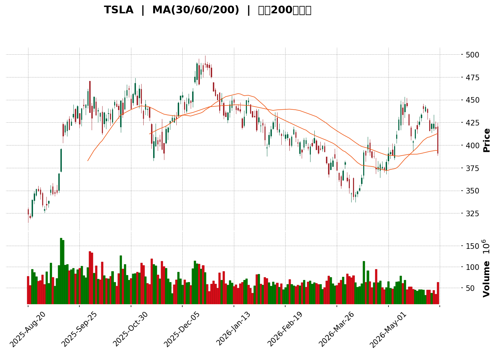
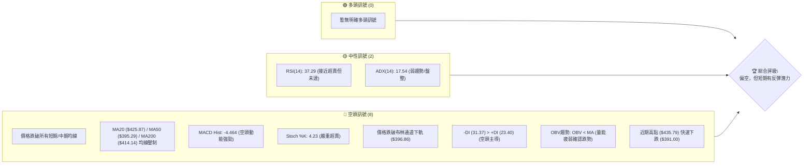
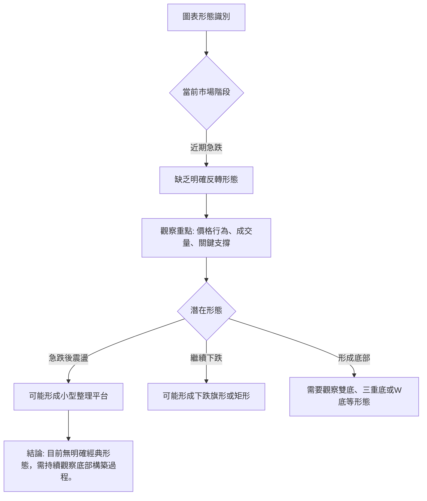

<details>
<summary>📊 靜態圖表 (點擊展開)</summary>

</details>

<html>
<head><meta charset="utf-8" /></head>
<body>
    <div style="height:500px; width:100%;">                        <script>window.PlotlyConfig = {MathJaxConfig: 'local'};</script>
        <script charset="utf-8" src="https://cdn.plot.ly/plotly-3.6.0.min.js" integrity="sha256-QaOVwtVY0T02VaHrr6pnoHLCwayMJp4O5n4YyaE3rJk=" crossorigin="anonymous"></script>                <div id="candlestick-chart" class="plotly-graph-div" style="height:100%; width:100%;"></div>            <script>                window.PLOTLYENV=window.PLOTLYENV || {};                                if (document.getElementById("candlestick-chart")) {                    Plotly.newPlot(                        "candlestick-chart",                        [{"close":{"dtype":"f8","bdata":"AAAAYGY+dEAAAACAwgF0QAAAAAApQHVAAAAAoJmpdUAAAABguPp1QAAAAKCZ2XVAAAAAIK6fdUAAAACA6910QAAAAIDClXRAAAAAoHDhdEAAAADgeih1QAAAAKBw7XVAAAAAYGamdUAAAAAgha91QAAAAOCjvHVAAAAAwPUMd0AAAABACr94QAAAAOCjoHlAAAAAgOtZekAAAACAwp16QAAAAKCZDXpAAAAAwB6hekAAAAAgXCN7QAAAAKCZnXpAAAAA4KOse0AAAACAPXZ6QAAAAGBmhntAAAAAIFyze0AAAAAghct7QAAAACBct3xAAAAAAABAe0AAAACgR916QAAAAAAAVHxAAAAAoHARe0AAAABACmt7QAAAAOCjOHtAAAAAANfXeUAAAABgZj57QAAAAADX03pAAAAAYGYye0AAAAAAAMx6QAAAAMD1dHtAAAAAQOH2e0AAAACgmal7QAAAACCFb3tAAAAAIK4PfEAAAAAghRt7QAAAAGC4RnxAAAAAwMzIfEAAAAAAKdh8QAAAAKCZgXtAAAAAwPWIfEAAAACA60V9QAAAAAApxHtAAAAAwB7hfEAAAABgj957QAAAAOBR2HpAAAAAIK7Te0AAAACA63l7QAAAAKCZ6XpAAAAAANcfeUAAAACgmUV5QAAAAGC4jnlAAAAAAAAUeUAAAAAA1z95QAAAACCus3hAAAAAoHBxeEAAAADgehx6QAAAAGBmNnpAAAAAoEepekAAAABguOJ6QAAAAIA94npAAAAAANfTekAAAAAA1+t7QAAAAOB6aHxAAAAAAABwfEAAAACgR3l7QAAAAGC40ntAAAAAQDM3fEAAAACAPe57QAAAACBcr3xAAAAAwPW0fUAAAACAFJ5+QAAAAAApNH1AAAAAgOs1fkAAAABAMxN+QAAAACCui35AAAAAwPVYfkAAAABgZlZ+QAAAAEAKs31AAAAAgD26fEAAAABA4WZ8QAAAACCFG3xAAAAAwB5he0AAAABguDp8QAAAACBcD3tAAAAAYI\u002f2ekAAAADAzDx7QAAAAAAp0HtAAAAAIFwPfEAAAABAM\u002fN7QAAAAEAzc3tAAAAAwB5pe0AAAAAAAFh7QAAAAAAANHpAAAAAQAr3ekAAAACAwhV8QAAAAMD1EHxAAAAAQDMze0AAAABgZu56QAAAACBc93pAAAAAwPUIekAAAABgj+Z6QAAAAMD1XHpAAAAAIFxfekAAAAAAKWB5QAAAACBc03hAAAAAgMKxeUAAAADAHhV6QAAAACBck3pAAAAA4FHEekAAAADAHhF6QAAAAEAKF3pAAAAAgBSqeUAAAADAHrV5QAAAACBcu3lAAAAAwB69eUAAAACgR\u002f14QAAAAIAUlnlAAAAAYGYWekAAAACgR4l5QAAAAAApKHlAAAAAwB41eUAAAABA4YZ4QAAAAEAKX3lAAAAAwMxYeUAAAAAgrst4QAAAAEDh6nhAAAAAANfzeEAAAADAHn15QAAAAAApsHhAAAAAQDNzeEAAAADA9bh4QAAAAOBR9HhAAAAA4HqMeEAAAADAzMR3QAAAACBc\u002f3ZAAAAAoJnNd0AAAADgevB3QAAAAEAzH3hAAAAAgMJBd0AAAACgR512QAAAAOB6NHZAAAAAAAA8d0AAAAAAKdR3QAAAAKBwiXZAAAAAwB4NdkAAAABgZqp1QAAAAAAAdHVAAAAAgOuZdUAAAABAM891QAAAAGC4BnZAAAAAQDPDdkAAAABAM394QAAAAGBmTnhAAAAAgOsJeUAAAAAAAIh4QAAAAGC4JnhAAAAAACk4eEAAAAAghVt3QAAAAMDMhHdAAAAAYLiqd0AAAADgUYB3QAAAAMDMTHdAAAAAgBTad0AAAADAHm14QAAAAAApiHhAAAAAgOtVeEAAAAAgrut4QAAAAOCjvHlAAAAAoJnFekAAAAAAANB7QAAAAEAzF3tAAAAA4FHUe0AAAADAzLR7QAAAAADXY3pAAAAAANefeUAAAACAwkF5QAAAAAApFHpAAAAAoJkdekAAAAAAKaB6QAAAAKBwGXtAAAAAgMKFe0AAAACgmaF7QAAAAOCjPHtAAAAAgBT+eUAAAAAA13t6QAAAAEAze3pAAAAAQDMnekAAAAAAAHB4QA=="},"high":{"dtype":"f8","bdata":"AAAAgOu1dEAAAABgZk50QAAAAAAARHVAAAAA4HrYdUAAAABgZv51QAAAAIA9NnZAAAAAwMwYdkAAAAAAAMx1QAAAAKBH1XRAAAAAoEd1dUAAAACAPS51QAAAAIDrPXZAAAAAQApndkAAAADgUex1QAAAAKBHRXZAAAAAANcPd0AAAABACst4QAAAAEAzm3pAAAAAAAB0ekAAAADA9cR6QAAAACCFA3tAAAAAIIXXekAAAAAgrs97QAAAACCFj3tAAAAAIFzDe0AAAACgmTV7QAAAACCFh3tAAAAAIK4vfEAAAAAAANB7QAAAAOCj5HxAAAAAAABsfUAAAADgUex7QAAAAMDMWHxAAAAAQOFKfEAAAACgR5V7QAAAAKCZRXtAAAAAgBSye0AAAACAPU57QAAAAEAzI3tAAAAAACmIe0AAAACgmXV7QAAAACBcl3tAAAAAwMwcfEAAAADAzBR8QAAAAOCj2HtAAAAAYGYWfEAAAABA4Tp8QAAAAGCPwnxAAAAAAAAwfUAAAABAMxt9QAAAAMD1cHxAAAAAAACgfEAAAADAHqF9QAAAACCFw3xAAAAAoEclfUAAAABAMzd9QAAAAIDCdXtAAAAAYLgafEAAAAAA16d7QAAAAKBHpXtAAAAAAACIekAAAABACsN5QAAAACBcf3pAAAAAYGaOeUAAAADgerx5QAAAAEAKz3pAAAAAwMwseUAAAAAghVt6QAAAACCuR3pAAAAAQAqvekAAAABA4Q57QAAAAGCPGntAAAAAwMxMe0AAAABguP57QAAAAIAUanxAAAAAgOutfEAAAAAAABx8QAAAAIA9RnxAAAAAgBSOfEAAAADgURR8QAAAAAAp8HxAAAAA4FEcfkAAAAAAALh+QAAAAOB69H5AAAAAgMKtfkAAAAAA16d+QAAAAKBHLX9AAAAAIIW\u002ffkAAAABgZq5+QAAAAKBwkX5AAAAAYGZWfUAAAACA6\u002fF8QAAAAMDMiHxAAAAAoHClfEAAAADAzJh8QAAAAAAABHxAAAAAgOtle0AAAACAPU57QAAAAMDMEHxAAAAAwMxkfEAAAADA9Tx8QAAAAGCPvntAAAAAgMLVe0AAAAAAAPR7QAAAACCu63pAAAAAQDNje0AAAAAAABh8QAAAAEDhRnxAAAAA4KPQe0AAAADgUVh7QAAAAAApZHtAAAAAIK6De0AAAACAFH57QAAAAGBmsnpAAAAAwPXIekAAAABgZn56QAAAAKCZIXlAAAAAwMzoeUAAAAAAAFR6QAAAAAAAtHpAAAAAoJlFe0AAAAAgrkN7QAAAAMD1gHpAAAAAIIXbeUAAAABgZg56QAAAAAAA9HlAAAAAQDPreUAAAABAM3t5QAAAAMAerXlAAAAAoHBFekAAAADA9Qx6QAAAAIDrcXlAAAAA4KNIeUAAAACgcMV4QAAAAKBHhXlAAAAAgOuJeUAAAACgmSV5QAAAAKBwGXlAAAAAoHBpeUAAAACAFAZ6QAAAAAAAaHlAAAAAQDMDeUAAAAAgrjt5QAAAAIDrAXlAAAAAwB4xeUAAAADgUTR4QAAAAIA9vndAAAAAoEcVeEAAAAAgrjd4QAAAACCuw3hAAAAAQAoHeEAAAACAwh13QAAAAOCj9HZAAAAAoEdVd0AAAACAPfJ3QAAAAOB6JHdAAAAAIIX7dkAAAADgUcB1QAAAAAAAyHZAAAAAgBTOdUAAAACAwuV1QAAAAKCZRXZAAAAAgBT6dkAAAABgZqp4QAAAAMD1oHhAAAAA4HqUeUAAAADAzGx5QAAAAEAzn3hAAAAAACmQeEAAAAAAACB4QAAAAAAp7HdAAAAA4HrMd0AAAADgo+R3QAAAAGBmhndAAAAAAAAMeEAAAADAHt14QAAAAIA9qnhAAAAAgOsheUAAAABA4Rp5QAAAAKBH\u002fXlAAAAAQDPzekAAAABgjxJ8QAAAAMDM\u002fHtAAAAAYGZWfEAAAAAgrj98QAAAAGCPKntAAAAAgBRSekAAAACAFFp5QAAAACBcF3pAAAAAQDOvekAAAAAAKfh6QAAAAEAzM3tAAAAAoJnZe0AAAAAgXL97QAAAAMAekXtAAAAAoJnZekAAAABguIZ6QAAAAKCZGXtAAAAAoJmlekAAAABA4Yp6QA=="},"hovertemplate":"\u003cb\u003e%{x|%Y-%m-%d}\u003c\u002fb\u003e\u003cbr\u003e\u958b: $%{open:.2f}\u003cbr\u003e\u9ad8: $%{high:.2f}\u003cbr\u003e\u4f4e: $%{low:.2f}\u003cbr\u003e\u6536: $%{close:.2f}\u003cextra\u003e\u003c\u002fextra\u003e","low":{"dtype":"f8","bdata":"AAAAoJmpc0AAAABA4epzQAAAAEAK+3NAAAAA4HrwdEAAAAAghXt1QAAAAGCP0nVAAAAAAClEdUAAAABAM7t0QAAAAKCZWXRAAAAAACmIdEAAAAAgrrd0QAAAAEDhinVAAAAAoHCNdUAAAADAHn11QAAAAMAeoXVAAAAAoJm5dUAAAAAA1yN3QAAAAEDhJnlAAAAAQOG2eUAAAABguJp5QAAAAMD1CHpAAAAAIIVbekAAAACAFNJ6QAAAACCFe3pAAAAA4HrQekAAAACgRzF6QAAAAOBRUHpAAAAAAAB4e0AAAACA6xF7QAAAAAAAjHtAAAAAwB45e0AAAACgRwl6QAAAAEAKS3tAAAAAQDMHe0AAAAAgrpN6QAAAAEDhonpAAAAAQDO3eUAAAABAMzt6QAAAAIDCHXpAAAAAoEelekAAAADA9VR6QAAAAKCZeXpAAAAAgMKJe0AAAADAzKB7QAAAAAAA0HpAAAAAYGbeeUAAAABguOJ6QAAAAEAKa3tAAAAAoJk5fEAAAABgZkp8QAAAAIDCeXtAAAAAQAq7e0AAAADAzFx8QAAAAKCZuXtAAAAAIFyLe0AAAACgcDF7QAAAAIAUXnpAAAAAgMIVe0AAAACAwgV7QAAAAMD1qHpAAAAAoHDFeEAAAADgeux3QAAAAADX63hAAAAAIFybeEAAAAAAAOh4QAAAAADXq3hAAAAAACn8d0AAAACgcBF5QAAAAEAzX3lAAAAAgD0OekAAAABAM6N6QAAAAOCjlHpAAAAAgOthekAAAACAwvF6QAAAAIA91ntAAAAAYI86fEAAAAAAADR7QAAAAEAzO3tAAAAAgMK5e0AAAACgR4V7QAAAAGC4mntAAAAAYI86fUAAAACgRx19QAAAAEAzI31AAAAAgOuRfUAAAAAghat9QAAAAKBHVX5AAAAAoHAtfkAAAADAzMx9QAAAAMAenX1AAAAAAACwfEAAAACgR118QAAAAMDMFHxAAAAAwMw0e0AAAADAHsl7QAAAAOB6zHpAAAAA4KP0ekAAAACA64V6QAAAAIA95npAAAAAAABge0AAAABAM797QAAAACCFI3tAAAAAYGZae0AAAAAAKTR7QAAAAEAKF3pAAAAAgOs5ekAAAACAFAp7QAAAAOCjwHtAAAAA4Hoke0AAAABACut6QAAAAKCZ4XpAAAAAgOvpeUAAAABAM2t6QAAAAAAA6HlAAAAAQArbeUAAAABA4fJ4QAAAAOB6OHhAAAAAAADceEAAAADgo3R5QAAAAAAAEHpAAAAA4HpAekAAAAAAAOB5QAAAAIAUrnlAAAAAACkIeUAAAACgR5l5QAAAAIDCQXlAAAAAAABYeUAAAADgo6B4QAAAAIA92nhAAAAAYGbCeUAAAABgjzp5QAAAAIDC4XhAAAAAAABEeEAAAACAPRZ4QAAAAKBHqXhAAAAAYLj2eEAAAAAgXKN4QAAAAGBm1ndAAAAAQArjeEAAAABgZiJ5QAAAAGBmqnhAAAAAQDNfeEAAAABguKZ4QAAAAAAAkHhAAAAAwPWEeEAAAAAgrqt3QAAAACBcx3ZAAAAAIK5Ld0AAAADA9YR3QAAAAAApEHhAAAAAgOs9d0AAAAAghXd2QAAAAIA9AnZAAAAAAACQdkAAAACgR2F3QAAAAOB6cHZAAAAAgD2qdUAAAAAA1xN1QAAAAGC4OnVAAAAAAAAUdUAAAAAA12t1QAAAAMAeyXVAAAAA4FEsdkAAAAAAAKh2QAAAAMDM3HdAAAAAYGZ6eEAAAACgR0V4QAAAACCFE3hAAAAAwMwUeEAAAACAPQZ3QAAAACCuK3dAAAAA4FHAdkAAAADgo0h3QAAAAOCjIHdAAAAAYLgCd0AAAADAzKx3QAAAAMDMDHhAAAAAAABQeEAAAADgUQB4QAAAAIDrIXlAAAAAgD0GekAAAADAzAx6QAAAAAApZHpAAAAAIFzjekAAAABgj5J7QAAAAAAAYHpAAAAAoEdVeUAAAACAFJp4QAAAAIA9ZnlAAAAAYGbOeUAAAAAAKUh6QAAAAIDroXpAAAAA4FE4e0AAAADAzER7QAAAAIA9wnpAAAAAQOH2eUAAAABgZtp5QAAAAAAAAHpAAAAAYI8SekAAAACgcEl4QA=="},"name":"\u50f9\u683c","open":{"dtype":"f8","bdata":"AAAAIIWTdEAAAACgRyF0QAAAAGCPGnRAAAAAYGYudUAAAABA4Y51QAAAAEAK\u002f3VAAAAAYI\u002fudUAAAAAgrrN1QAAAACCug3RAAAAAQDPzdEAAAABgZgJ1QAAAAAAAwHVAAAAAgD0qdkAAAABACsd1QAAAAMDM6HVAAAAAYLjidUAAAABACi93QAAAAIAUcnpAAAAAAADoeUAAAAAAAPx5QAAAAIDrzXpAAAAAwB5dekAAAACAwvF6QAAAAIAUfntAAAAAoEfdekAAAAAA1zN7QAAAAMDMxHpAAAAAoJnFe0AAAADgUZh7QAAAAMDMvHtAAAAA4KNofUAAAADgo7R7QAAAAAAAjHtAAAAAwB79e0AAAADAHll7QAAAAMD1\u002fHpAAAAA4KNIe0AAAADgenh6QAAAAOCjrHpAAAAAYGYue0AAAAAgrit7QAAAAAAAmHpAAAAAgOu9e0AAAAAAKdx7QAAAAEAzt3tAAAAAAABAekAAAACgR+17QAAAACCuf3tAAAAA4HpsfEAAAAAAAOh8QAAAAMDMMHxAAAAAAADse0AAAAAA1398QAAAACBcZ3xAAAAAwMxAfEAAAAAgXN98QAAAAGC4XntAAAAAoJl5e0AAAABgZnZ7QAAAAGBmontAAAAAgBRyekAAAADAzCR4QAAAAADX63hAAAAAgBRWeUAAAABA4WJ5QAAAAIAU6nlAAAAAwB4leUAAAABguCJ5QAAAAGC45nlAAAAAQDN\u002fekAAAACgcKl6QAAAAMAelXpAAAAAwPXsekAAAACgmQF7QAAAAEAKH3xAAAAA4HpQfEAAAABAM\u002fd7QAAAAOCjWHtAAAAAwB7he0AAAABAMw98QAAAAKBwAXxAAAAAQApXfUAAAAAgXIN9QAAAACCFg35AAAAAYI\u002fifUAAAACA64F+QAAAAIAUnn5AAAAAYGaWfkAAAAAgrod+QAAAACCuU35AAAAAAABQfUAAAACgcNF8QAAAAKCZgXxAAAAAwMycfEAAAAAA1\u002f97QAAAAIAU5ntAAAAAYGY+e0AAAACAPb56QAAAAEAzP3tAAAAAIK6Te0AAAABAMyN8QAAAAMD1rHtAAAAAgBSSe0AAAAAAAHh7QAAAAIDC1XpAAAAAYI9aekAAAABgjzJ7QAAAAEDh9ntAAAAAAADQe0AAAABgj1Z7QAAAAGCP\u002fnpAAAAAwMxce0AAAACgmZV6QAAAAOCjVHpAAAAA4FGEekAAAAAgXEd6QAAAAOBR0HhAAAAAgOsNeUAAAABgj555QAAAAKBHIXpAAAAAIFy\u002fekAAAADAzOR6QAAAAMD15HlAAAAAgMLFeUAAAACAwrF5QAAAAAAAdHlAAAAAwMyEeUAAAADgo3R5QAAAAAAA+HhAAAAAYGbCeUAAAABguOZ5QAAAAEAKL3lAAAAAoJlpeEAAAACgcLF4QAAAAKCZ3XhAAAAAwB4ZeUAAAACgcOF4QAAAAMDMYHhAAAAAIIUjeUAAAADgeiR5QAAAAEDhUnlAAAAAYLjyeEAAAAAghcN4QAAAAEAKu3hAAAAAAADweEAAAADgUTR4QAAAAKCZvXdAAAAAoHBRd0AAAADA9Yh3QAAAAADXX3hAAAAAoJnZd0AAAABACht3QAAAAIDC3XZAAAAAACmYdkAAAACAFKp3QAAAAEAzw3ZAAAAAoHCpdkAAAABACqd1QAAAAOCjvHZAAAAAYGZydUAAAADgo6R1QAAAAMAe4XVAAAAAYLhadkAAAACgR+12QAAAAMD1nHhAAAAAYLi+eEAAAACgRyl5QAAAAAAAkHhAAAAAwB45eEAAAADgenR3QAAAAAAAWHdAAAAAoHBBd0AAAABA4Wp3QAAAAGBmdndAAAAAAABMd0AAAAAA1+d3QAAAACCuY3hAAAAAQAqzeEAAAAAAACR4QAAAACCud3lAAAAAIK4HekAAAABgj2J6QAAAAGCPlntAAAAAYLhKe0AAAAAA1+d7QAAAACCuH3tAAAAA4FE0ekAAAABgjzJ5QAAAAKCZeXlAAAAAQOFiekAAAABguGp6QAAAAAAp5HpAAAAAgD2ue0AAAACA61l7QAAAAKCZfXtAAAAAANe3ekAAAAAghSN6QAAAAEAzK3pAAAAAoHA9ekAAAAAAAEh6QA=="},"x":["2025-08-20T00:00:00-04:00","2025-08-21T00:00:00-04:00","2025-08-22T00:00:00-04:00","2025-08-25T00:00:00-04:00","2025-08-26T00:00:00-04:00","2025-08-27T00:00:00-04:00","2025-08-28T00:00:00-04:00","2025-08-29T00:00:00-04:00","2025-09-02T00:00:00-04:00","2025-09-03T00:00:00-04:00","2025-09-04T00:00:00-04:00","2025-09-05T00:00:00-04:00","2025-09-08T00:00:00-04:00","2025-09-09T00:00:00-04:00","2025-09-10T00:00:00-04:00","2025-09-11T00:00:00-04:00","2025-09-12T00:00:00-04:00","2025-09-15T00:00:00-04:00","2025-09-16T00:00:00-04:00","2025-09-17T00:00:00-04:00","2025-09-18T00:00:00-04:00","2025-09-19T00:00:00-04:00","2025-09-22T00:00:00-04:00","2025-09-23T00:00:00-04:00","2025-09-24T00:00:00-04:00","2025-09-25T00:00:00-04:00","2025-09-26T00:00:00-04:00","2025-09-29T00:00:00-04:00","2025-09-30T00:00:00-04:00","2025-10-01T00:00:00-04:00","2025-10-02T00:00:00-04:00","2025-10-03T00:00:00-04:00","2025-10-06T00:00:00-04:00","2025-10-07T00:00:00-04:00","2025-10-08T00:00:00-04:00","2025-10-09T00:00:00-04:00","2025-10-10T00:00:00-04:00","2025-10-13T00:00:00-04:00","2025-10-14T00:00:00-04:00","2025-10-15T00:00:00-04:00","2025-10-16T00:00:00-04:00","2025-10-17T00:00:00-04:00","2025-10-20T00:00:00-04:00","2025-10-21T00:00:00-04:00","2025-10-22T00:00:00-04:00","2025-10-23T00:00:00-04:00","2025-10-24T00:00:00-04:00","2025-10-27T00:00:00-04:00","2025-10-28T00:00:00-04:00","2025-10-29T00:00:00-04:00","2025-10-30T00:00:00-04:00","2025-10-31T00:00:00-04:00","2025-11-03T00:00:00-05:00","2025-11-04T00:00:00-05:00","2025-11-05T00:00:00-05:00","2025-11-06T00:00:00-05:00","2025-11-07T00:00:00-05:00","2025-11-10T00:00:00-05:00","2025-11-11T00:00:00-05:00","2025-11-12T00:00:00-05:00","2025-11-13T00:00:00-05:00","2025-11-14T00:00:00-05:00","2025-11-17T00:00:00-05:00","2025-11-18T00:00:00-05:00","2025-11-19T00:00:00-05:00","2025-11-20T00:00:00-05:00","2025-11-21T00:00:00-05:00","2025-11-24T00:00:00-05:00","2025-11-25T00:00:00-05:00","2025-11-26T00:00:00-05:00","2025-11-28T00:00:00-05:00","2025-12-01T00:00:00-05:00","2025-12-02T00:00:00-05:00","2025-12-03T00:00:00-05:00","2025-12-04T00:00:00-05:00","2025-12-05T00:00:00-05:00","2025-12-08T00:00:00-05:00","2025-12-09T00:00:00-05:00","2025-12-10T00:00:00-05:00","2025-12-11T00:00:00-05:00","2025-12-12T00:00:00-05:00","2025-12-15T00:00:00-05:00","2025-12-16T00:00:00-05:00","2025-12-17T00:00:00-05:00","2025-12-18T00:00:00-05:00","2025-12-19T00:00:00-05:00","2025-12-22T00:00:00-05:00","2025-12-23T00:00:00-05:00","2025-12-24T00:00:00-05:00","2025-12-26T00:00:00-05:00","2025-12-29T00:00:00-05:00","2025-12-30T00:00:00-05:00","2025-12-31T00:00:00-05:00","2026-01-02T00:00:00-05:00","2026-01-05T00:00:00-05:00","2026-01-06T00:00:00-05:00","2026-01-07T00:00:00-05:00","2026-01-08T00:00:00-05:00","2026-01-09T00:00:00-05:00","2026-01-12T00:00:00-05:00","2026-01-13T00:00:00-05:00","2026-01-14T00:00:00-05:00","2026-01-15T00:00:00-05:00","2026-01-16T00:00:00-05:00","2026-01-20T00:00:00-05:00","2026-01-21T00:00:00-05:00","2026-01-22T00:00:00-05:00","2026-01-23T00:00:00-05:00","2026-01-26T00:00:00-05:00","2026-01-27T00:00:00-05:00","2026-01-28T00:00:00-05:00","2026-01-29T00:00:00-05:00","2026-01-30T00:00:00-05:00","2026-02-02T00:00:00-05:00","2026-02-03T00:00:00-05:00","2026-02-04T00:00:00-05:00","2026-02-05T00:00:00-05:00","2026-02-06T00:00:00-05:00","2026-02-09T00:00:00-05:00","2026-02-10T00:00:00-05:00","2026-02-11T00:00:00-05:00","2026-02-12T00:00:00-05:00","2026-02-13T00:00:00-05:00","2026-02-17T00:00:00-05:00","2026-02-18T00:00:00-05:00","2026-02-19T00:00:00-05:00","2026-02-20T00:00:00-05:00","2026-02-23T00:00:00-05:00","2026-02-24T00:00:00-05:00","2026-02-25T00:00:00-05:00","2026-02-26T00:00:00-05:00","2026-02-27T00:00:00-05:00","2026-03-02T00:00:00-05:00","2026-03-03T00:00:00-05:00","2026-03-04T00:00:00-05:00","2026-03-05T00:00:00-05:00","2026-03-06T00:00:00-05:00","2026-03-09T00:00:00-04:00","2026-03-10T00:00:00-04:00","2026-03-11T00:00:00-04:00","2026-03-12T00:00:00-04:00","2026-03-13T00:00:00-04:00","2026-03-16T00:00:00-04:00","2026-03-17T00:00:00-04:00","2026-03-18T00:00:00-04:00","2026-03-19T00:00:00-04:00","2026-03-20T00:00:00-04:00","2026-03-23T00:00:00-04:00","2026-03-24T00:00:00-04:00","2026-03-25T00:00:00-04:00","2026-03-26T00:00:00-04:00","2026-03-27T00:00:00-04:00","2026-03-30T00:00:00-04:00","2026-03-31T00:00:00-04:00","2026-04-01T00:00:00-04:00","2026-04-02T00:00:00-04:00","2026-04-06T00:00:00-04:00","2026-04-07T00:00:00-04:00","2026-04-08T00:00:00-04:00","2026-04-09T00:00:00-04:00","2026-04-10T00:00:00-04:00","2026-04-13T00:00:00-04:00","2026-04-14T00:00:00-04:00","2026-04-15T00:00:00-04:00","2026-04-16T00:00:00-04:00","2026-04-17T00:00:00-04:00","2026-04-20T00:00:00-04:00","2026-04-21T00:00:00-04:00","2026-04-22T00:00:00-04:00","2026-04-23T00:00:00-04:00","2026-04-24T00:00:00-04:00","2026-04-27T00:00:00-04:00","2026-04-28T00:00:00-04:00","2026-04-29T00:00:00-04:00","2026-04-30T00:00:00-04:00","2026-05-01T00:00:00-04:00","2026-05-04T00:00:00-04:00","2026-05-05T00:00:00-04:00","2026-05-06T00:00:00-04:00","2026-05-07T00:00:00-04:00","2026-05-08T00:00:00-04:00","2026-05-11T00:00:00-04:00","2026-05-12T00:00:00-04:00","2026-05-13T00:00:00-04:00","2026-05-14T00:00:00-04:00","2026-05-15T00:00:00-04:00","2026-05-18T00:00:00-04:00","2026-05-19T00:00:00-04:00","2026-05-20T00:00:00-04:00","2026-05-21T00:00:00-04:00","2026-05-22T00:00:00-04:00","2026-05-26T00:00:00-04:00","2026-05-27T00:00:00-04:00","2026-05-28T00:00:00-04:00","2026-05-29T00:00:00-04:00","2026-06-01T00:00:00-04:00","2026-06-02T00:00:00-04:00","2026-06-03T00:00:00-04:00","2026-06-04T00:00:00-04:00","2026-06-05T00:00:00-04:00"],"type":"candlestick"},{"hovertemplate":"MA30: $%{y:.2f}\u003cextra\u003e\u003c\u002fextra\u003e","line":{"color":"#2196F3","dash":"dash","width":2},"mode":"lines","name":"MA30","x":["2025-08-20T00:00:00-04:00","2025-08-21T00:00:00-04:00","2025-08-22T00:00:00-04:00","2025-08-25T00:00:00-04:00","2025-08-26T00:00:00-04:00","2025-08-27T00:00:00-04:00","2025-08-28T00:00:00-04:00","2025-08-29T00:00:00-04:00","2025-09-02T00:00:00-04:00","2025-09-03T00:00:00-04:00","2025-09-04T00:00:00-04:00","2025-09-05T00:00:00-04:00","2025-09-08T00:00:00-04:00","2025-09-09T00:00:00-04:00","2025-09-10T00:00:00-04:00","2025-09-11T00:00:00-04:00","2025-09-12T00:00:00-04:00","2025-09-15T00:00:00-04:00","2025-09-16T00:00:00-04:00","2025-09-17T00:00:00-04:00","2025-09-18T00:00:00-04:00","2025-09-19T00:00:00-04:00","2025-09-22T00:00:00-04:00","2025-09-23T00:00:00-04:00","2025-09-24T00:00:00-04:00","2025-09-25T00:00:00-04:00","2025-09-26T00:00:00-04:00","2025-09-29T00:00:00-04:00","2025-09-30T00:00:00-04:00","2025-10-01T00:00:00-04:00","2025-10-02T00:00:00-04:00","2025-10-03T00:00:00-04:00","2025-10-06T00:00:00-04:00","2025-10-07T00:00:00-04:00","2025-10-08T00:00:00-04:00","2025-10-09T00:00:00-04:00","2025-10-10T00:00:00-04:00","2025-10-13T00:00:00-04:00","2025-10-14T00:00:00-04:00","2025-10-15T00:00:00-04:00","2025-10-16T00:00:00-04:00","2025-10-17T00:00:00-04:00","2025-10-20T00:00:00-04:00","2025-10-21T00:00:00-04:00","2025-10-22T00:00:00-04:00","2025-10-23T00:00:00-04:00","2025-10-24T00:00:00-04:00","2025-10-27T00:00:00-04:00","2025-10-28T00:00:00-04:00","2025-10-29T00:00:00-04:00","2025-10-30T00:00:00-04:00","2025-10-31T00:00:00-04:00","2025-11-03T00:00:00-05:00","2025-11-04T00:00:00-05:00","2025-11-05T00:00:00-05:00","2025-11-06T00:00:00-05:00","2025-11-07T00:00:00-05:00","2025-11-10T00:00:00-05:00","2025-11-11T00:00:00-05:00","2025-11-12T00:00:00-05:00","2025-11-13T00:00:00-05:00","2025-11-14T00:00:00-05:00","2025-11-17T00:00:00-05:00","2025-11-18T00:00:00-05:00","2025-11-19T00:00:00-05:00","2025-11-20T00:00:00-05:00","2025-11-21T00:00:00-05:00","2025-11-24T00:00:00-05:00","2025-11-25T00:00:00-05:00","2025-11-26T00:00:00-05:00","2025-11-28T00:00:00-05:00","2025-12-01T00:00:00-05:00","2025-12-02T00:00:00-05:00","2025-12-03T00:00:00-05:00","2025-12-04T00:00:00-05:00","2025-12-05T00:00:00-05:00","2025-12-08T00:00:00-05:00","2025-12-09T00:00:00-05:00","2025-12-10T00:00:00-05:00","2025-12-11T00:00:00-05:00","2025-12-12T00:00:00-05:00","2025-12-15T00:00:00-05:00","2025-12-16T00:00:00-05:00","2025-12-17T00:00:00-05:00","2025-12-18T00:00:00-05:00","2025-12-19T00:00:00-05:00","2025-12-22T00:00:00-05:00","2025-12-23T00:00:00-05:00","2025-12-24T00:00:00-05:00","2025-12-26T00:00:00-05:00","2025-12-29T00:00:00-05:00","2025-12-30T00:00:00-05:00","2025-12-31T00:00:00-05:00","2026-01-02T00:00:00-05:00","2026-01-05T00:00:00-05:00","2026-01-06T00:00:00-05:00","2026-01-07T00:00:00-05:00","2026-01-08T00:00:00-05:00","2026-01-09T00:00:00-05:00","2026-01-12T00:00:00-05:00","2026-01-13T00:00:00-05:00","2026-01-14T00:00:00-05:00","2026-01-15T00:00:00-05:00","2026-01-16T00:00:00-05:00","2026-01-20T00:00:00-05:00","2026-01-21T00:00:00-05:00","2026-01-22T00:00:00-05:00","2026-01-23T00:00:00-05:00","2026-01-26T00:00:00-05:00","2026-01-27T00:00:00-05:00","2026-01-28T00:00:00-05:00","2026-01-29T00:00:00-05:00","2026-01-30T00:00:00-05:00","2026-02-02T00:00:00-05:00","2026-02-03T00:00:00-05:00","2026-02-04T00:00:00-05:00","2026-02-05T00:00:00-05:00","2026-02-06T00:00:00-05:00","2026-02-09T00:00:00-05:00","2026-02-10T00:00:00-05:00","2026-02-11T00:00:00-05:00","2026-02-12T00:00:00-05:00","2026-02-13T00:00:00-05:00","2026-02-17T00:00:00-05:00","2026-02-18T00:00:00-05:00","2026-02-19T00:00:00-05:00","2026-02-20T00:00:00-05:00","2026-02-23T00:00:00-05:00","2026-02-24T00:00:00-05:00","2026-02-25T00:00:00-05:00","2026-02-26T00:00:00-05:00","2026-02-27T00:00:00-05:00","2026-03-02T00:00:00-05:00","2026-03-03T00:00:00-05:00","2026-03-04T00:00:00-05:00","2026-03-05T00:00:00-05:00","2026-03-06T00:00:00-05:00","2026-03-09T00:00:00-04:00","2026-03-10T00:00:00-04:00","2026-03-11T00:00:00-04:00","2026-03-12T00:00:00-04:00","2026-03-13T00:00:00-04:00","2026-03-16T00:00:00-04:00","2026-03-17T00:00:00-04:00","2026-03-18T00:00:00-04:00","2026-03-19T00:00:00-04:00","2026-03-20T00:00:00-04:00","2026-03-23T00:00:00-04:00","2026-03-24T00:00:00-04:00","2026-03-25T00:00:00-04:00","2026-03-26T00:00:00-04:00","2026-03-27T00:00:00-04:00","2026-03-30T00:00:00-04:00","2026-03-31T00:00:00-04:00","2026-04-01T00:00:00-04:00","2026-04-02T00:00:00-04:00","2026-04-06T00:00:00-04:00","2026-04-07T00:00:00-04:00","2026-04-08T00:00:00-04:00","2026-04-09T00:00:00-04:00","2026-04-10T00:00:00-04:00","2026-04-13T00:00:00-04:00","2026-04-14T00:00:00-04:00","2026-04-15T00:00:00-04:00","2026-04-16T00:00:00-04:00","2026-04-17T00:00:00-04:00","2026-04-20T00:00:00-04:00","2026-04-21T00:00:00-04:00","2026-04-22T00:00:00-04:00","2026-04-23T00:00:00-04:00","2026-04-24T00:00:00-04:00","2026-04-27T00:00:00-04:00","2026-04-28T00:00:00-04:00","2026-04-29T00:00:00-04:00","2026-04-30T00:00:00-04:00","2026-05-01T00:00:00-04:00","2026-05-04T00:00:00-04:00","2026-05-05T00:00:00-04:00","2026-05-06T00:00:00-04:00","2026-05-07T00:00:00-04:00","2026-05-08T00:00:00-04:00","2026-05-11T00:00:00-04:00","2026-05-12T00:00:00-04:00","2026-05-13T00:00:00-04:00","2026-05-14T00:00:00-04:00","2026-05-15T00:00:00-04:00","2026-05-18T00:00:00-04:00","2026-05-19T00:00:00-04:00","2026-05-20T00:00:00-04:00","2026-05-21T00:00:00-04:00","2026-05-22T00:00:00-04:00","2026-05-26T00:00:00-04:00","2026-05-27T00:00:00-04:00","2026-05-28T00:00:00-04:00","2026-05-29T00:00:00-04:00","2026-06-01T00:00:00-04:00","2026-06-02T00:00:00-04:00","2026-06-03T00:00:00-04:00","2026-06-04T00:00:00-04:00","2026-06-05T00:00:00-04:00"],"y":{"dtype":"f8","bdata":"AAAAAAAA+H8AAAAAAAD4fwAAAAAAAPh\u002fAAAAAAAA+H8AAAAAAAD4fwAAAAAAAPh\u002fAAAAAAAA+H8AAAAAAAD4fwAAAAAAAPh\u002fAAAAAAAA+H8AAAAAAAD4fwAAAAAAAPh\u002fAAAAAAAA+H8AAAAAAAD4fwAAAAAAAPh\u002fAAAAAAAA+H8AAAAAAAD4fwAAAAAAAPh\u002fAAAAAAAA+H8AAAAAAAD4fwAAAAAAAPh\u002fAAAAAAAA+H8AAAAAAAD4fwAAAAAAAPh\u002fAAAAAAAA+H8AAAAAAAD4fwAAAAAAAPh\u002fAAAAAAAA+H8AAAAAAAD4f0RERCRN7XdAd3d3hxYpeEB3d3f3mmN4QAAAAAAAoHhARERExCDOeEBVVVXlifx4QCIiIpJfKnlA7+7u7mBOeUDe3d1ty4R5QBEREWEQunlAAAAAcPbveUCamZl5FCB6QERERJRDT3pAq6qqiiWFekCamZk5Jrh6QFVVVVXH6HpAZmZmNokTe0ARERFxryd7QJqZmblJPntAd3d39wxTe0AiIiJiEGZ7QImIiMh2cntA7+7urrmCe0CamZmp8ZR7QN7d3T3DnntAq6qqmgupe0BVVVVVDrV7QJqZmdlAr3tAZmZmplSwe0BERERUnK17QKuqqvo3nntAq6qqehSMe0DNzMycfX57QHd3dxfZZntA7+7u3t1Ve0CamZkpXEN7QBEREYHcLXtAiYiIKOohe0DNzMwsQBh7QAAAALAAE3tAiYiImG4Oe0CamZl5MA97QHd3d3dMCntAzczM7JgAe0C8u7srzgJ7QBEREaEaC3tA7+7ujlAOe0BERESkcBF7QGZmZsaSDXtAMzMzU7gIe0BVVVU17AB7QJqZmTn7CntAmpmZOfsUe0Dv7u4OdCB7QDMzM1O4LHtAvLu7exQ4e0Dv7u6+5kp7QDMzM+N6antAZmZmRv1\u002fe0BVVVXFZ5h7QKuqqsovsHtAERER8e7Oe0B3d3eHpOl7QGZmZhZn\u002f3tA7+7uPgoTfECJiIgoeCx8QO\u002fu7o6XQHxAVVVVlRhWfECamZnptF98QImIiIhdbXxAZmZmJk15fEAAAABQYoJ8QN7d3U03h3xAmpmZKTGMfECJiIiYQ4d8QDMzM7NydHxAmpmZ+eFnfEBVVVVFGW18QCIiImIsb3xAd3d3t4FmfEC8u7uL+l18QBEREeFPT3xAvLu7i\u002fovfECJiIjoQhB8QHd3d3cF+HtARERE9ETXe0AzMzMDK697QKuqqnpbfntAIiIikqZWe0AiIiJiVzJ7QCIiInKvF3tAREREZPQGe0AiIiKCB\u002fN6QGZmZjbQ4XpAzczMvC3TekDe3d2dqL16QImIiEhTsnpAiYiImOCnekDe3d19sZR6QO\u002fu7s6wgXpAERER0dtwekBVVVXlQlx6QM3MzHyxSHpAAAAAsOQ1ekAREREh2x16QO\u002fu7t7BFnpAVVVVBfMIekBmZmZG4ex5QJqZmbkC0nlAvLu7+9S+eUC8u7vLhbJ5QImIiCgVn3lAzczMrI6ReUDNzMx8+H55QGZmZgbzcnlAvLu7+2JjeUBVVVW1rFV5QLy7uxsTRnlAzczMnO81eUAiIiLipSN5QGZmZpa1DnlAAAAA4MHweEBVVVXFS9N4QLy7u9sksnhAERERcWideEAAAABAYI14QKuqqqoccnhAMzMzM6VSeEC8u7tbSDZ4QImIiGgDE3hAvLu7C7vsd0ARERGR7cx3QM3MzJw2sndA3t3dbVmdd0BVVVXlF513QN7d3V0BlHdAIiIiQmCRd0CJiIi4Ho93QDMzM9OUiHdAq6qqSlOCd0ARERGBI3B3QGZmZvYoZndAMzMzM3pfd0BmZmZWDlV3QM3MzEzwRndARERE9P1Ad0CamZlJmkZ3QO\u002fu7i6yU3dAIiIicj1Yd0BVVVUFnWB3QKuqqgplbndA3t3drWOMd0CJiIgov7h3QImIiPhv4ndAZmZm5qUJeEDNzMxsvCp4QERERLSdS3hAAAAAUBtqeEBERESEwIh4QJqZmVk5sHhAd3d3J7\u002fWeECamZlp2P94QCIiItIiK3lAIiIiMsFTeUB3d3dXgG55QERERGSCh3lARERE5KWPeUARERExT6B5QHd3dycxtHlA7+7ufrHEeUCrqqrK6M15QA=="},"type":"scatter"},{"hovertemplate":"MA60: $%{y:.2f}\u003cextra\u003e\u003c\u002fextra\u003e","line":{"color":"#9C27B0","dash":"dash","width":2},"mode":"lines","name":"MA60","x":["2025-08-20T00:00:00-04:00","2025-08-21T00:00:00-04:00","2025-08-22T00:00:00-04:00","2025-08-25T00:00:00-04:00","2025-08-26T00:00:00-04:00","2025-08-27T00:00:00-04:00","2025-08-28T00:00:00-04:00","2025-08-29T00:00:00-04:00","2025-09-02T00:00:00-04:00","2025-09-03T00:00:00-04:00","2025-09-04T00:00:00-04:00","2025-09-05T00:00:00-04:00","2025-09-08T00:00:00-04:00","2025-09-09T00:00:00-04:00","2025-09-10T00:00:00-04:00","2025-09-11T00:00:00-04:00","2025-09-12T00:00:00-04:00","2025-09-15T00:00:00-04:00","2025-09-16T00:00:00-04:00","2025-09-17T00:00:00-04:00","2025-09-18T00:00:00-04:00","2025-09-19T00:00:00-04:00","2025-09-22T00:00:00-04:00","2025-09-23T00:00:00-04:00","2025-09-24T00:00:00-04:00","2025-09-25T00:00:00-04:00","2025-09-26T00:00:00-04:00","2025-09-29T00:00:00-04:00","2025-09-30T00:00:00-04:00","2025-10-01T00:00:00-04:00","2025-10-02T00:00:00-04:00","2025-10-03T00:00:00-04:00","2025-10-06T00:00:00-04:00","2025-10-07T00:00:00-04:00","2025-10-08T00:00:00-04:00","2025-10-09T00:00:00-04:00","2025-10-10T00:00:00-04:00","2025-10-13T00:00:00-04:00","2025-10-14T00:00:00-04:00","2025-10-15T00:00:00-04:00","2025-10-16T00:00:00-04:00","2025-10-17T00:00:00-04:00","2025-10-20T00:00:00-04:00","2025-10-21T00:00:00-04:00","2025-10-22T00:00:00-04:00","2025-10-23T00:00:00-04:00","2025-10-24T00:00:00-04:00","2025-10-27T00:00:00-04:00","2025-10-28T00:00:00-04:00","2025-10-29T00:00:00-04:00","2025-10-30T00:00:00-04:00","2025-10-31T00:00:00-04:00","2025-11-03T00:00:00-05:00","2025-11-04T00:00:00-05:00","2025-11-05T00:00:00-05:00","2025-11-06T00:00:00-05:00","2025-11-07T00:00:00-05:00","2025-11-10T00:00:00-05:00","2025-11-11T00:00:00-05:00","2025-11-12T00:00:00-05:00","2025-11-13T00:00:00-05:00","2025-11-14T00:00:00-05:00","2025-11-17T00:00:00-05:00","2025-11-18T00:00:00-05:00","2025-11-19T00:00:00-05:00","2025-11-20T00:00:00-05:00","2025-11-21T00:00:00-05:00","2025-11-24T00:00:00-05:00","2025-11-25T00:00:00-05:00","2025-11-26T00:00:00-05:00","2025-11-28T00:00:00-05:00","2025-12-01T00:00:00-05:00","2025-12-02T00:00:00-05:00","2025-12-03T00:00:00-05:00","2025-12-04T00:00:00-05:00","2025-12-05T00:00:00-05:00","2025-12-08T00:00:00-05:00","2025-12-09T00:00:00-05:00","2025-12-10T00:00:00-05:00","2025-12-11T00:00:00-05:00","2025-12-12T00:00:00-05:00","2025-12-15T00:00:00-05:00","2025-12-16T00:00:00-05:00","2025-12-17T00:00:00-05:00","2025-12-18T00:00:00-05:00","2025-12-19T00:00:00-05:00","2025-12-22T00:00:00-05:00","2025-12-23T00:00:00-05:00","2025-12-24T00:00:00-05:00","2025-12-26T00:00:00-05:00","2025-12-29T00:00:00-05:00","2025-12-30T00:00:00-05:00","2025-12-31T00:00:00-05:00","2026-01-02T00:00:00-05:00","2026-01-05T00:00:00-05:00","2026-01-06T00:00:00-05:00","2026-01-07T00:00:00-05:00","2026-01-08T00:00:00-05:00","2026-01-09T00:00:00-05:00","2026-01-12T00:00:00-05:00","2026-01-13T00:00:00-05:00","2026-01-14T00:00:00-05:00","2026-01-15T00:00:00-05:00","2026-01-16T00:00:00-05:00","2026-01-20T00:00:00-05:00","2026-01-21T00:00:00-05:00","2026-01-22T00:00:00-05:00","2026-01-23T00:00:00-05:00","2026-01-26T00:00:00-05:00","2026-01-27T00:00:00-05:00","2026-01-28T00:00:00-05:00","2026-01-29T00:00:00-05:00","2026-01-30T00:00:00-05:00","2026-02-02T00:00:00-05:00","2026-02-03T00:00:00-05:00","2026-02-04T00:00:00-05:00","2026-02-05T00:00:00-05:00","2026-02-06T00:00:00-05:00","2026-02-09T00:00:00-05:00","2026-02-10T00:00:00-05:00","2026-02-11T00:00:00-05:00","2026-02-12T00:00:00-05:00","2026-02-13T00:00:00-05:00","2026-02-17T00:00:00-05:00","2026-02-18T00:00:00-05:00","2026-02-19T00:00:00-05:00","2026-02-20T00:00:00-05:00","2026-02-23T00:00:00-05:00","2026-02-24T00:00:00-05:00","2026-02-25T00:00:00-05:00","2026-02-26T00:00:00-05:00","2026-02-27T00:00:00-05:00","2026-03-02T00:00:00-05:00","2026-03-03T00:00:00-05:00","2026-03-04T00:00:00-05:00","2026-03-05T00:00:00-05:00","2026-03-06T00:00:00-05:00","2026-03-09T00:00:00-04:00","2026-03-10T00:00:00-04:00","2026-03-11T00:00:00-04:00","2026-03-12T00:00:00-04:00","2026-03-13T00:00:00-04:00","2026-03-16T00:00:00-04:00","2026-03-17T00:00:00-04:00","2026-03-18T00:00:00-04:00","2026-03-19T00:00:00-04:00","2026-03-20T00:00:00-04:00","2026-03-23T00:00:00-04:00","2026-03-24T00:00:00-04:00","2026-03-25T00:00:00-04:00","2026-03-26T00:00:00-04:00","2026-03-27T00:00:00-04:00","2026-03-30T00:00:00-04:00","2026-03-31T00:00:00-04:00","2026-04-01T00:00:00-04:00","2026-04-02T00:00:00-04:00","2026-04-06T00:00:00-04:00","2026-04-07T00:00:00-04:00","2026-04-08T00:00:00-04:00","2026-04-09T00:00:00-04:00","2026-04-10T00:00:00-04:00","2026-04-13T00:00:00-04:00","2026-04-14T00:00:00-04:00","2026-04-15T00:00:00-04:00","2026-04-16T00:00:00-04:00","2026-04-17T00:00:00-04:00","2026-04-20T00:00:00-04:00","2026-04-21T00:00:00-04:00","2026-04-22T00:00:00-04:00","2026-04-23T00:00:00-04:00","2026-04-24T00:00:00-04:00","2026-04-27T00:00:00-04:00","2026-04-28T00:00:00-04:00","2026-04-29T00:00:00-04:00","2026-04-30T00:00:00-04:00","2026-05-01T00:00:00-04:00","2026-05-04T00:00:00-04:00","2026-05-05T00:00:00-04:00","2026-05-06T00:00:00-04:00","2026-05-07T00:00:00-04:00","2026-05-08T00:00:00-04:00","2026-05-11T00:00:00-04:00","2026-05-12T00:00:00-04:00","2026-05-13T00:00:00-04:00","2026-05-14T00:00:00-04:00","2026-05-15T00:00:00-04:00","2026-05-18T00:00:00-04:00","2026-05-19T00:00:00-04:00","2026-05-20T00:00:00-04:00","2026-05-21T00:00:00-04:00","2026-05-22T00:00:00-04:00","2026-05-26T00:00:00-04:00","2026-05-27T00:00:00-04:00","2026-05-28T00:00:00-04:00","2026-05-29T00:00:00-04:00","2026-06-01T00:00:00-04:00","2026-06-02T00:00:00-04:00","2026-06-03T00:00:00-04:00","2026-06-04T00:00:00-04:00","2026-06-05T00:00:00-04:00"],"y":{"dtype":"f8","bdata":"AAAAAAAA+H8AAAAAAAD4fwAAAAAAAPh\u002fAAAAAAAA+H8AAAAAAAD4fwAAAAAAAPh\u002fAAAAAAAA+H8AAAAAAAD4fwAAAAAAAPh\u002fAAAAAAAA+H8AAAAAAAD4fwAAAAAAAPh\u002fAAAAAAAA+H8AAAAAAAD4fwAAAAAAAPh\u002fAAAAAAAA+H8AAAAAAAD4fwAAAAAAAPh\u002fAAAAAAAA+H8AAAAAAAD4fwAAAAAAAPh\u002fAAAAAAAA+H8AAAAAAAD4fwAAAAAAAPh\u002fAAAAAAAA+H8AAAAAAAD4fwAAAAAAAPh\u002fAAAAAAAA+H8AAAAAAAD4fwAAAAAAAPh\u002fAAAAAAAA+H8AAAAAAAD4fwAAAAAAAPh\u002fAAAAAAAA+H8AAAAAAAD4fwAAAAAAAPh\u002fAAAAAAAA+H8AAAAAAAD4fwAAAAAAAPh\u002fAAAAAAAA+H8AAAAAAAD4fwAAAAAAAPh\u002fAAAAAAAA+H8AAAAAAAD4fwAAAAAAAPh\u002fAAAAAAAA+H8AAAAAAAD4fwAAAAAAAPh\u002fAAAAAAAA+H8AAAAAAAD4fwAAAAAAAPh\u002fAAAAAAAA+H8AAAAAAAD4fwAAAAAAAPh\u002fAAAAAAAA+H8AAAAAAAD4fwAAAAAAAPh\u002fAAAAAAAA+H8AAAAAAAD4f3d3d4\u002fCxXlAERERgZXaeUAiIiJKDPF5QLy7u4tsA3pAmpmZUf8RekB3d3cH8x96QJqZmQkeLHpAvLu7iyU4ekBVVVXNhU56QImIiIiIZnpAREREhDJ\u002fekCamZl5opd6QN7d3QXIrHpAvLu7O9\u002fCekCrqqoyet16QDMzM\u002fvw+XpAq6qq4uwQe0CrqqoKkBx7QAAAAEDuJXtAVVVVpeIte0C8u7tLfjN7QBEREQG5PntAREREdNpLe0BERETcslp7QImIiMi9ZXtAMzMzC5Bwe0AiIiKK+n97QGZmZt7djHtAZmZm9iiYe0DNzMwMAqN7QKuqquIzp3tA3t3dtYGte0AiIiISEbR7QO\u002fu7hYgs3tA7+7uDnS0e0AREREp6rd7QAAAAAg6t3tA7+7uXgG8e0AzMzOL+rt7QERERBwvwHtAd3d3393De0DNzMxkych7QKuqquLByHtAMzMzC2XGe0AiIiLiCMV7QCIiIqrGv3tARERERBm7e0DNzMz0RL97QERERJRfvntAVVVVBZ23e0CJiIhgc697QFVVVY0lrXtAq6qq4nqie0C8u7t7W5h7QFVVVeVekntAAAAAuKyHe0ARERHhCH17QO\u002fu7i5rdHtARERE7FFre0C8u7uTX2V7QGZmZp7vY3tAq6qqqvFqe0DNzMwEVm57QGZmZqabcHtA3t3d\u002fRtze0AzMzNjEHV7QLy7u2t1eXtA7+7ulvx+e0C8u7szM3p7QLy7uyuHd3tAvLu7exR1e0CrqqqaUm97QFVVVWX0Z3tAzczM7Aphe0DNzMxcj1J7QBEREUmaRXtAd3d3f2o4e0De3d1F\u002fSx7QN7d3Y2XIHtAmpmZWasSe0C8u7srQAh7QM3MzIQy93pAREREnMTgekCrqqqyncd6QO\u002fu7j58tXpAAAAA+FOdekBERETca4J6QDMzM0s3YnpAd3d3F0tGekAiIiKi\u002fip6QERERIQyE3pAIiIiItv7eUC8u7ujKeN5QBEREYn6yXlA7+7uFku4eUDv7u5uhKV5QJqZmfk3knlA3t3d5UJ9eUDNzMzsfGV5QLy7uxtaSnlAZmZmbssueUAzMzM7mBR5QM3MzAx0\u002fXhA7+7uDp\u002fpeEAzMzODed14QGZmZp5h1XhAvLu7oynNeEB3d3f\u002f\u002f714QGZmZsZLrXhAMzMzI5SgeEBmZmamVJF4QHd3dw+fgnhAAAAAcIR4eECamZlpA2p4QJqZmanxXHhAAAAAeDBSeEB3d3d\u002fI054QFVVVaXiTHhAd3d3hxZHeEC8u7tzIUJ4QImIiFCNPnhA7+7uxpI+eEDv7u52BUZ4QCIiImpKSnhAvLu7K4dTeEBmZmZWDlx4QHd3dy\u002fdXnhAmpmZQWBeeEAAAABwhF94QBEREWGeYXhAmpmZGb1heEBVVVX9YmZ4QHd3d7esbnhAAAAAUI14eEBmZmYezIV4QBEREeHBjXhAMzMzE4OQeEDNzMz0tpd4QFVVVf1innhAzczMZIKjeEDe3d0lBp94QA=="},"type":"scatter"},{"hovertemplate":"MA200: $%{y:.2f}\u003cextra\u003e\u003c\u002fextra\u003e","line":{"color":"#FF6F00","dash":"solid","width":2},"mode":"lines","name":"MA200","x":["2025-08-20T00:00:00-04:00","2025-08-21T00:00:00-04:00","2025-08-22T00:00:00-04:00","2025-08-25T00:00:00-04:00","2025-08-26T00:00:00-04:00","2025-08-27T00:00:00-04:00","2025-08-28T00:00:00-04:00","2025-08-29T00:00:00-04:00","2025-09-02T00:00:00-04:00","2025-09-03T00:00:00-04:00","2025-09-04T00:00:00-04:00","2025-09-05T00:00:00-04:00","2025-09-08T00:00:00-04:00","2025-09-09T00:00:00-04:00","2025-09-10T00:00:00-04:00","2025-09-11T00:00:00-04:00","2025-09-12T00:00:00-04:00","2025-09-15T00:00:00-04:00","2025-09-16T00:00:00-04:00","2025-09-17T00:00:00-04:00","2025-09-18T00:00:00-04:00","2025-09-19T00:00:00-04:00","2025-09-22T00:00:00-04:00","2025-09-23T00:00:00-04:00","2025-09-24T00:00:00-04:00","2025-09-25T00:00:00-04:00","2025-09-26T00:00:00-04:00","2025-09-29T00:00:00-04:00","2025-09-30T00:00:00-04:00","2025-10-01T00:00:00-04:00","2025-10-02T00:00:00-04:00","2025-10-03T00:00:00-04:00","2025-10-06T00:00:00-04:00","2025-10-07T00:00:00-04:00","2025-10-08T00:00:00-04:00","2025-10-09T00:00:00-04:00","2025-10-10T00:00:00-04:00","2025-10-13T00:00:00-04:00","2025-10-14T00:00:00-04:00","2025-10-15T00:00:00-04:00","2025-10-16T00:00:00-04:00","2025-10-17T00:00:00-04:00","2025-10-20T00:00:00-04:00","2025-10-21T00:00:00-04:00","2025-10-22T00:00:00-04:00","2025-10-23T00:00:00-04:00","2025-10-24T00:00:00-04:00","2025-10-27T00:00:00-04:00","2025-10-28T00:00:00-04:00","2025-10-29T00:00:00-04:00","2025-10-30T00:00:00-04:00","2025-10-31T00:00:00-04:00","2025-11-03T00:00:00-05:00","2025-11-04T00:00:00-05:00","2025-11-05T00:00:00-05:00","2025-11-06T00:00:00-05:00","2025-11-07T00:00:00-05:00","2025-11-10T00:00:00-05:00","2025-11-11T00:00:00-05:00","2025-11-12T00:00:00-05:00","2025-11-13T00:00:00-05:00","2025-11-14T00:00:00-05:00","2025-11-17T00:00:00-05:00","2025-11-18T00:00:00-05:00","2025-11-19T00:00:00-05:00","2025-11-20T00:00:00-05:00","2025-11-21T00:00:00-05:00","2025-11-24T00:00:00-05:00","2025-11-25T00:00:00-05:00","2025-11-26T00:00:00-05:00","2025-11-28T00:00:00-05:00","2025-12-01T00:00:00-05:00","2025-12-02T00:00:00-05:00","2025-12-03T00:00:00-05:00","2025-12-04T00:00:00-05:00","2025-12-05T00:00:00-05:00","2025-12-08T00:00:00-05:00","2025-12-09T00:00:00-05:00","2025-12-10T00:00:00-05:00","2025-12-11T00:00:00-05:00","2025-12-12T00:00:00-05:00","2025-12-15T00:00:00-05:00","2025-12-16T00:00:00-05:00","2025-12-17T00:00:00-05:00","2025-12-18T00:00:00-05:00","2025-12-19T00:00:00-05:00","2025-12-22T00:00:00-05:00","2025-12-23T00:00:00-05:00","2025-12-24T00:00:00-05:00","2025-12-26T00:00:00-05:00","2025-12-29T00:00:00-05:00","2025-12-30T00:00:00-05:00","2025-12-31T00:00:00-05:00","2026-01-02T00:00:00-05:00","2026-01-05T00:00:00-05:00","2026-01-06T00:00:00-05:00","2026-01-07T00:00:00-05:00","2026-01-08T00:00:00-05:00","2026-01-09T00:00:00-05:00","2026-01-12T00:00:00-05:00","2026-01-13T00:00:00-05:00","2026-01-14T00:00:00-05:00","2026-01-15T00:00:00-05:00","2026-01-16T00:00:00-05:00","2026-01-20T00:00:00-05:00","2026-01-21T00:00:00-05:00","2026-01-22T00:00:00-05:00","2026-01-23T00:00:00-05:00","2026-01-26T00:00:00-05:00","2026-01-27T00:00:00-05:00","2026-01-28T00:00:00-05:00","2026-01-29T00:00:00-05:00","2026-01-30T00:00:00-05:00","2026-02-02T00:00:00-05:00","2026-02-03T00:00:00-05:00","2026-02-04T00:00:00-05:00","2026-02-05T00:00:00-05:00","2026-02-06T00:00:00-05:00","2026-02-09T00:00:00-05:00","2026-02-10T00:00:00-05:00","2026-02-11T00:00:00-05:00","2026-02-12T00:00:00-05:00","2026-02-13T00:00:00-05:00","2026-02-17T00:00:00-05:00","2026-02-18T00:00:00-05:00","2026-02-19T00:00:00-05:00","2026-02-20T00:00:00-05:00","2026-02-23T00:00:00-05:00","2026-02-24T00:00:00-05:00","2026-02-25T00:00:00-05:00","2026-02-26T00:00:00-05:00","2026-02-27T00:00:00-05:00","2026-03-02T00:00:00-05:00","2026-03-03T00:00:00-05:00","2026-03-04T00:00:00-05:00","2026-03-05T00:00:00-05:00","2026-03-06T00:00:00-05:00","2026-03-09T00:00:00-04:00","2026-03-10T00:00:00-04:00","2026-03-11T00:00:00-04:00","2026-03-12T00:00:00-04:00","2026-03-13T00:00:00-04:00","2026-03-16T00:00:00-04:00","2026-03-17T00:00:00-04:00","2026-03-18T00:00:00-04:00","2026-03-19T00:00:00-04:00","2026-03-20T00:00:00-04:00","2026-03-23T00:00:00-04:00","2026-03-24T00:00:00-04:00","2026-03-25T00:00:00-04:00","2026-03-26T00:00:00-04:00","2026-03-27T00:00:00-04:00","2026-03-30T00:00:00-04:00","2026-03-31T00:00:00-04:00","2026-04-01T00:00:00-04:00","2026-04-02T00:00:00-04:00","2026-04-06T00:00:00-04:00","2026-04-07T00:00:00-04:00","2026-04-08T00:00:00-04:00","2026-04-09T00:00:00-04:00","2026-04-10T00:00:00-04:00","2026-04-13T00:00:00-04:00","2026-04-14T00:00:00-04:00","2026-04-15T00:00:00-04:00","2026-04-16T00:00:00-04:00","2026-04-17T00:00:00-04:00","2026-04-20T00:00:00-04:00","2026-04-21T00:00:00-04:00","2026-04-22T00:00:00-04:00","2026-04-23T00:00:00-04:00","2026-04-24T00:00:00-04:00","2026-04-27T00:00:00-04:00","2026-04-28T00:00:00-04:00","2026-04-29T00:00:00-04:00","2026-04-30T00:00:00-04:00","2026-05-01T00:00:00-04:00","2026-05-04T00:00:00-04:00","2026-05-05T00:00:00-04:00","2026-05-06T00:00:00-04:00","2026-05-07T00:00:00-04:00","2026-05-08T00:00:00-04:00","2026-05-11T00:00:00-04:00","2026-05-12T00:00:00-04:00","2026-05-13T00:00:00-04:00","2026-05-14T00:00:00-04:00","2026-05-15T00:00:00-04:00","2026-05-18T00:00:00-04:00","2026-05-19T00:00:00-04:00","2026-05-20T00:00:00-04:00","2026-05-21T00:00:00-04:00","2026-05-22T00:00:00-04:00","2026-05-26T00:00:00-04:00","2026-05-27T00:00:00-04:00","2026-05-28T00:00:00-04:00","2026-05-29T00:00:00-04:00","2026-06-01T00:00:00-04:00","2026-06-02T00:00:00-04:00","2026-06-03T00:00:00-04:00","2026-06-04T00:00:00-04:00","2026-06-05T00:00:00-04:00"],"y":{"dtype":"f8","bdata":"AAAAAAAA+H8AAAAAAAD4fwAAAAAAAPh\u002fAAAAAAAA+H8AAAAAAAD4fwAAAAAAAPh\u002fAAAAAAAA+H8AAAAAAAD4fwAAAAAAAPh\u002fAAAAAAAA+H8AAAAAAAD4fwAAAAAAAPh\u002fAAAAAAAA+H8AAAAAAAD4fwAAAAAAAPh\u002fAAAAAAAA+H8AAAAAAAD4fwAAAAAAAPh\u002fAAAAAAAA+H8AAAAAAAD4fwAAAAAAAPh\u002fAAAAAAAA+H8AAAAAAAD4fwAAAAAAAPh\u002fAAAAAAAA+H8AAAAAAAD4fwAAAAAAAPh\u002fAAAAAAAA+H8AAAAAAAD4fwAAAAAAAPh\u002fAAAAAAAA+H8AAAAAAAD4fwAAAAAAAPh\u002fAAAAAAAA+H8AAAAAAAD4fwAAAAAAAPh\u002fAAAAAAAA+H8AAAAAAAD4fwAAAAAAAPh\u002fAAAAAAAA+H8AAAAAAAD4fwAAAAAAAPh\u002fAAAAAAAA+H8AAAAAAAD4fwAAAAAAAPh\u002fAAAAAAAA+H8AAAAAAAD4fwAAAAAAAPh\u002fAAAAAAAA+H8AAAAAAAD4fwAAAAAAAPh\u002fAAAAAAAA+H8AAAAAAAD4fwAAAAAAAPh\u002fAAAAAAAA+H8AAAAAAAD4fwAAAAAAAPh\u002fAAAAAAAA+H8AAAAAAAD4fwAAAAAAAPh\u002fAAAAAAAA+H8AAAAAAAD4fwAAAAAAAPh\u002fAAAAAAAA+H8AAAAAAAD4fwAAAAAAAPh\u002fAAAAAAAA+H8AAAAAAAD4fwAAAAAAAPh\u002fAAAAAAAA+H8AAAAAAAD4fwAAAAAAAPh\u002fAAAAAAAA+H8AAAAAAAD4fwAAAAAAAPh\u002fAAAAAAAA+H8AAAAAAAD4fwAAAAAAAPh\u002fAAAAAAAA+H8AAAAAAAD4fwAAAAAAAPh\u002fAAAAAAAA+H8AAAAAAAD4fwAAAAAAAPh\u002fAAAAAAAA+H8AAAAAAAD4fwAAAAAAAPh\u002fAAAAAAAA+H8AAAAAAAD4fwAAAAAAAPh\u002fAAAAAAAA+H8AAAAAAAD4fwAAAAAAAPh\u002fAAAAAAAA+H8AAAAAAAD4fwAAAAAAAPh\u002fAAAAAAAA+H8AAAAAAAD4fwAAAAAAAPh\u002fAAAAAAAA+H8AAAAAAAD4fwAAAAAAAPh\u002fAAAAAAAA+H8AAAAAAAD4fwAAAAAAAPh\u002fAAAAAAAA+H8AAAAAAAD4fwAAAAAAAPh\u002fAAAAAAAA+H8AAAAAAAD4fwAAAAAAAPh\u002fAAAAAAAA+H8AAAAAAAD4fwAAAAAAAPh\u002fAAAAAAAA+H8AAAAAAAD4fwAAAAAAAPh\u002fAAAAAAAA+H8AAAAAAAD4fwAAAAAAAPh\u002fAAAAAAAA+H8AAAAAAAD4fwAAAAAAAPh\u002fAAAAAAAA+H8AAAAAAAD4fwAAAAAAAPh\u002fAAAAAAAA+H8AAAAAAAD4fwAAAAAAAPh\u002fAAAAAAAA+H8AAAAAAAD4fwAAAAAAAPh\u002fAAAAAAAA+H8AAAAAAAD4fwAAAAAAAPh\u002fAAAAAAAA+H8AAAAAAAD4fwAAAAAAAPh\u002fAAAAAAAA+H8AAAAAAAD4fwAAAAAAAPh\u002fAAAAAAAA+H8AAAAAAAD4fwAAAAAAAPh\u002fAAAAAAAA+H8AAAAAAAD4fwAAAAAAAPh\u002fAAAAAAAA+H8AAAAAAAD4fwAAAAAAAPh\u002fAAAAAAAA+H8AAAAAAAD4fwAAAAAAAPh\u002fAAAAAAAA+H8AAAAAAAD4fwAAAAAAAPh\u002fAAAAAAAA+H8AAAAAAAD4fwAAAAAAAPh\u002fAAAAAAAA+H8AAAAAAAD4fwAAAAAAAPh\u002fAAAAAAAA+H8AAAAAAAD4fwAAAAAAAPh\u002fAAAAAAAA+H8AAAAAAAD4fwAAAAAAAPh\u002fAAAAAAAA+H8AAAAAAAD4fwAAAAAAAPh\u002fAAAAAAAA+H8AAAAAAAD4fwAAAAAAAPh\u002fAAAAAAAA+H8AAAAAAAD4fwAAAAAAAPh\u002fAAAAAAAA+H8AAAAAAAD4fwAAAAAAAPh\u002fAAAAAAAA+H8AAAAAAAD4fwAAAAAAAPh\u002fAAAAAAAA+H8AAAAAAAD4fwAAAAAAAPh\u002fAAAAAAAA+H8AAAAAAAD4fwAAAAAAAPh\u002fAAAAAAAA+H8AAAAAAAD4fwAAAAAAAPh\u002fAAAAAAAA+H8AAAAAAAD4fwAAAAAAAPh\u002fAAAAAAAA+H8AAAAAAAD4fwAAAAAAAPh\u002fAAAAAAAA+H+PwvUEReJ5QA=="},"type":"scatter"}],                        {"template":{"data":{"barpolar":[{"marker":{"line":{"color":"rgb(17,17,17)","width":0.5},"pattern":{"fillmode":"overlay","size":10,"solidity":0.2}},"type":"barpolar"}],"bar":[{"error_x":{"color":"#f2f5fa"},"error_y":{"color":"#f2f5fa"},"marker":{"line":{"color":"rgb(17,17,17)","width":0.5},"pattern":{"fillmode":"overlay","size":10,"solidity":0.2}},"type":"bar"}],"carpet":[{"aaxis":{"endlinecolor":"#A2B1C6","gridcolor":"#506784","linecolor":"#506784","minorgridcolor":"#506784","startlinecolor":"#A2B1C6"},"baxis":{"endlinecolor":"#A2B1C6","gridcolor":"#506784","linecolor":"#506784","minorgridcolor":"#506784","startlinecolor":"#A2B1C6"},"type":"carpet"}],"choropleth":[{"colorbar":{"outlinewidth":0,"ticks":""},"type":"choropleth"}],"contourcarpet":[{"colorbar":{"outlinewidth":0,"ticks":""},"type":"contourcarpet"}],"contour":[{"colorbar":{"outlinewidth":0,"ticks":""},"colorscale":[[0.0,"#0d0887"],[0.1111111111111111,"#46039f"],[0.2222222222222222,"#7201a8"],[0.3333333333333333,"#9c179e"],[0.4444444444444444,"#bd3786"],[0.5555555555555556,"#d8576b"],[0.6666666666666666,"#ed7953"],[0.7777777777777778,"#fb9f3a"],[0.8888888888888888,"#fdca26"],[1.0,"#f0f921"]],"type":"contour"}],"heatmap":[{"colorbar":{"outlinewidth":0,"ticks":""},"colorscale":[[0.0,"#0d0887"],[0.1111111111111111,"#46039f"],[0.2222222222222222,"#7201a8"],[0.3333333333333333,"#9c179e"],[0.4444444444444444,"#bd3786"],[0.5555555555555556,"#d8576b"],[0.6666666666666666,"#ed7953"],[0.7777777777777778,"#fb9f3a"],[0.8888888888888888,"#fdca26"],[1.0,"#f0f921"]],"type":"heatmap"}],"histogram2dcontour":[{"colorbar":{"outlinewidth":0,"ticks":""},"colorscale":[[0.0,"#0d0887"],[0.1111111111111111,"#46039f"],[0.2222222222222222,"#7201a8"],[0.3333333333333333,"#9c179e"],[0.4444444444444444,"#bd3786"],[0.5555555555555556,"#d8576b"],[0.6666666666666666,"#ed7953"],[0.7777777777777778,"#fb9f3a"],[0.8888888888888888,"#fdca26"],[1.0,"#f0f921"]],"type":"histogram2dcontour"}],"histogram2d":[{"colorbar":{"outlinewidth":0,"ticks":""},"colorscale":[[0.0,"#0d0887"],[0.1111111111111111,"#46039f"],[0.2222222222222222,"#7201a8"],[0.3333333333333333,"#9c179e"],[0.4444444444444444,"#bd3786"],[0.5555555555555556,"#d8576b"],[0.6666666666666666,"#ed7953"],[0.7777777777777778,"#fb9f3a"],[0.8888888888888888,"#fdca26"],[1.0,"#f0f921"]],"type":"histogram2d"}],"histogram":[{"marker":{"pattern":{"fillmode":"overlay","size":10,"solidity":0.2}},"type":"histogram"}],"mesh3d":[{"colorbar":{"outlinewidth":0,"ticks":""},"type":"mesh3d"}],"parcoords":[{"line":{"colorbar":{"outlinewidth":0,"ticks":""}},"type":"parcoords"}],"pie":[{"automargin":true,"type":"pie"}],"scatter3d":[{"line":{"colorbar":{"outlinewidth":0,"ticks":""}},"marker":{"colorbar":{"outlinewidth":0,"ticks":""}},"type":"scatter3d"}],"scattercarpet":[{"marker":{"colorbar":{"outlinewidth":0,"ticks":""}},"type":"scattercarpet"}],"scattergeo":[{"marker":{"colorbar":{"outlinewidth":0,"ticks":""}},"type":"scattergeo"}],"scattergl":[{"marker":{"line":{"color":"#283442"}},"type":"scattergl"}],"scattermapbox":[{"marker":{"colorbar":{"outlinewidth":0,"ticks":""}},"type":"scattermapbox"}],"scattermap":[{"marker":{"colorbar":{"outlinewidth":0,"ticks":""}},"type":"scattermap"}],"scatterpolargl":[{"marker":{"colorbar":{"outlinewidth":0,"ticks":""}},"type":"scatterpolargl"}],"scatterpolar":[{"marker":{"colorbar":{"outlinewidth":0,"ticks":""}},"type":"scatterpolar"}],"scatter":[{"marker":{"line":{"color":"#283442"}},"type":"scatter"}],"scatterternary":[{"marker":{"colorbar":{"outlinewidth":0,"ticks":""}},"type":"scatterternary"}],"surface":[{"colorbar":{"outlinewidth":0,"ticks":""},"colorscale":[[0.0,"#0d0887"],[0.1111111111111111,"#46039f"],[0.2222222222222222,"#7201a8"],[0.3333333333333333,"#9c179e"],[0.4444444444444444,"#bd3786"],[0.5555555555555556,"#d8576b"],[0.6666666666666666,"#ed7953"],[0.7777777777777778,"#fb9f3a"],[0.8888888888888888,"#fdca26"],[1.0,"#f0f921"]],"type":"surface"}],"table":[{"cells":{"fill":{"color":"#506784"},"line":{"color":"rgb(17,17,17)"}},"header":{"fill":{"color":"#2a3f5f"},"line":{"color":"rgb(17,17,17)"}},"type":"table"}]},"layout":{"annotationdefaults":{"arrowcolor":"#f2f5fa","arrowhead":0,"arrowwidth":1},"autotypenumbers":"strict","coloraxis":{"colorbar":{"outlinewidth":0,"ticks":""}},"colorscale":{"diverging":[[0,"#8e0152"],[0.1,"#c51b7d"],[0.2,"#de77ae"],[0.3,"#f1b6da"],[0.4,"#fde0ef"],[0.5,"#f7f7f7"],[0.6,"#e6f5d0"],[0.7,"#b8e186"],[0.8,"#7fbc41"],[0.9,"#4d9221"],[1,"#276419"]],"sequential":[[0.0,"#0d0887"],[0.1111111111111111,"#46039f"],[0.2222222222222222,"#7201a8"],[0.3333333333333333,"#9c179e"],[0.4444444444444444,"#bd3786"],[0.5555555555555556,"#d8576b"],[0.6666666666666666,"#ed7953"],[0.7777777777777778,"#fb9f3a"],[0.8888888888888888,"#fdca26"],[1.0,"#f0f921"]],"sequentialminus":[[0.0,"#0d0887"],[0.1111111111111111,"#46039f"],[0.2222222222222222,"#7201a8"],[0.3333333333333333,"#9c179e"],[0.4444444444444444,"#bd3786"],[0.5555555555555556,"#d8576b"],[0.6666666666666666,"#ed7953"],[0.7777777777777778,"#fb9f3a"],[0.8888888888888888,"#fdca26"],[1.0,"#f0f921"]]},"colorway":["#636efa","#EF553B","#00cc96","#ab63fa","#FFA15A","#19d3f3","#FF6692","#B6E880","#FF97FF","#FECB52"],"font":{"color":"#f2f5fa"},"geo":{"bgcolor":"rgb(17,17,17)","lakecolor":"rgb(17,17,17)","landcolor":"rgb(17,17,17)","showlakes":true,"showland":true,"subunitcolor":"#506784"},"hoverlabel":{"align":"left"},"hovermode":"closest","mapbox":{"style":"dark"},"paper_bgcolor":"rgb(17,17,17)","plot_bgcolor":"rgb(17,17,17)","polar":{"angularaxis":{"gridcolor":"#506784","linecolor":"#506784","ticks":""},"bgcolor":"rgb(17,17,17)","radialaxis":{"gridcolor":"#506784","linecolor":"#506784","ticks":""}},"scene":{"xaxis":{"backgroundcolor":"rgb(17,17,17)","gridcolor":"#506784","gridwidth":2,"linecolor":"#506784","showbackground":true,"ticks":"","zerolinecolor":"#C8D4E3"},"yaxis":{"backgroundcolor":"rgb(17,17,17)","gridcolor":"#506784","gridwidth":2,"linecolor":"#506784","showbackground":true,"ticks":"","zerolinecolor":"#C8D4E3"},"zaxis":{"backgroundcolor":"rgb(17,17,17)","gridcolor":"#506784","gridwidth":2,"linecolor":"#506784","showbackground":true,"ticks":"","zerolinecolor":"#C8D4E3"}},"shapedefaults":{"line":{"color":"#f2f5fa"}},"sliderdefaults":{"bgcolor":"#C8D4E3","bordercolor":"rgb(17,17,17)","borderwidth":1,"tickwidth":0},"ternary":{"aaxis":{"gridcolor":"#506784","linecolor":"#506784","ticks":""},"baxis":{"gridcolor":"#506784","linecolor":"#506784","ticks":""},"bgcolor":"rgb(17,17,17)","caxis":{"gridcolor":"#506784","linecolor":"#506784","ticks":""}},"title":{"x":0.05},"updatemenudefaults":{"bgcolor":"#506784","borderwidth":0},"xaxis":{"automargin":true,"gridcolor":"#283442","linecolor":"#506784","ticks":"","title":{"standoff":15},"zerolinecolor":"#283442","zerolinewidth":2},"yaxis":{"automargin":true,"gridcolor":"#283442","linecolor":"#506784","ticks":"","title":{"standoff":15},"zerolinecolor":"#283442","zerolinewidth":2}}},"xaxis":{"rangeslider":{"visible":false},"title":{"text":"\u65e5\u671f"}},"font":{"size":11},"title":{"text":"TSLA  |  MA(30\u002f60\u002f200)  |  \u6700\u8fd1200\u4ea4\u6613\u65e5"},"yaxis":{"title":{"text":"\u80a1\u50f9 (USD)"}},"hovermode":"x unified","height":500},                        {"responsive": true}                    )                };            </script>        </div>
</body>
</html>

# TSLA 技術分析報告

> **報告日期**：2026-06-06 ｜ **語言**：繁體中文 ｜ **數據來源**：Yahoo Finance ｜ **當前價格**：$391.00

---

## 目錄

| 章節 | 內容 |
|------|------|
| [1. 技術面概覽](#1-技術面概覽) | 訊號儀表板、核心指標、評分卡 |
| [2. 趨勢分析](#2-趨勢分析) | 多時框趨勢、長中短期走勢 |
| [3. 圖表形態分析](#3-圖表形態分析) | 形態識別、K線組合、目標價 |
| [4. 支撐與阻力](#4-支撐與阻力) | 關鍵價位、斐波那契回調 |
| [5. 技術指標深度解讀](#5-技術指標深度解讀) | MA/RSI/MACD/布林/成交量 |
| [6. 動能與波動率](#6-動能與波動率) | 動能評估、ATR、Beta |
| [7. 多時框架總結](#7-多時框架總結) | 時框架評分矩陣 |
| [8. 交易策略建議](#8-交易策略建議) | 多空策略、風險報酬比 |
| [9. 風險提示與監控](#9-風險提示與監控) | 監控指標、風險場景 |
| [📋 報告總結](#-報告總結) | 綜合結論與策略建議 |

---

## 1. 技術面概覽

本章節提供 TSLA 當前技術面狀況的快速總覽，透過儀表板、核心指標速覽及專業評分卡，讓投資者對其多空態勢有一個初步且全面的理解。

### 🎯 技術訊號儀表板

Tesla (TSLA) 目前的技術訊號顯示短期內面臨顯著的賣壓，多數動能與趨勢指標均指向空頭。儘管價格已跌至超賣區間，但缺乏明確的多頭反轉訊號。



### 📊 核心指標速覽表

下表彙整 TSLA 當前關鍵技術指標的數值與初步解讀，提供一目了然的市場脈動。

| 指標類別 | 指標名稱 | 當前數值 | 訊號 | 解讀 |
|----------|----------|----------|------|------|
| **價格** | 當前價格 | $391.00 | 🔴 | 較52週高點 ($498.83) 下跌21.5%，且近期跌勢強勁。 |
| **均線** | MA20 | $425.87 | 🔴 | 價格 ($391.00) 遠低於MA20，短期趨勢強烈看空。 |
| **均線** | MA50 | $395.29 | 🔴 | 價格 ($391.00) 跌破MA50，中期趨勢轉弱。 |
| **均線** | MA200 | $414.14 | 🔴 | 價格 ($391.00) 跌破MA200，長期趨勢壓力顯現。 |
| **動能** | RSI(14) | 37.29 | 🟡 | 接近超賣區 (30以下)，但尚未確認超賣，動能偏弱。 |
| **動能** | MACD | -4.464 (Hist) | 🔴 | MACD線下穿Signal線，柱狀圖為負且擴大，空頭動能強勁。 |
| **波動** | ATR(14) | $15.08 | 🟡 | 佔股價3.86%，波動性適中，但近期波動加劇。 |
| **趨勢** | ADX(14) | 17.54 | 🟡 | 趨勢強度較弱，目前處於盤整或弱趨勢狀態，但空頭主導。 |
| **超買超賣** | Stoch %K | 4.23 | 🔴 | 嚴重超賣，暗示短期可能出現技術性反彈。 |
| **通道** | BB %B | -0.10 | 🔴 | 價格已跌破布林通道下軌，極端超賣訊號。 |

### 🏆 技術評分卡

本評分卡綜合評估 TSLA 在各技術分析維度的表現，提供量化的多空傾向。

```
╔══════════════════════════════════════════════════════════════╗
║             技術評分卡 — TSLA (2026-06-06)                     ║
╠══════════════════════════════════════════════════════════════╣
║ 趨勢強度      ███░░░░░░░░░░░░░░░░░░  15/100  🔴 (ADX顯示弱趨勢，但空頭力量佔優)    ║
║ 動能指標      ██░░░░░░░░░░░░░░░░░░░  10/100  🔴 (MACD、Stoch顯示強烈空頭動能)    ║
║ 支撐穩定度    ████████░░░░░░░░░░░░  40/100  🟡 (短期斐波那契50%有支撐，但面臨考驗) ║
║ 成交量配合    ████░░░░░░░░░░░░░░░░░  20/100  🔴 (下跌放量，OBV疲弱，確認跌勢)    ║
║ 形態完整度    ████░░░░░░░░░░░░░░░░░  20/100  🔴 (無明顯底部形態，近期為急跌)    ║
║ 均線排列      █░░░░░░░░░░░░░░░░░░░░  05/100  🔴 (價格遠低於所有短期/中期均線)    ║
╠══════════════════════════════════════════════════════════════╣
║ 綜合評分      ███░░░░░░░░░░░░░░░░░░  18/100  🔴 偏空，但短期有技術性反彈可能      ║
╚══════════════════════════════════════════════════════════════╝
```

**評分理由簡述：**
- **趨勢強度 (15/100 🔴):** ADX 低於 25，表明趨勢不明顯，但 -DI 顯著高於 +DI，顯示空頭主導市場。雖然不是強趨勢，但方向明確偏空。
- **動能指標 (10/100 🔴):** MACD 柱狀圖為負且擴大，Stochastics 嚴重超賣，RSI 快速下降接近超賣區。整體動能極度偏空。
- **支撐穩定度 (40/100 🟡):** 價格目前恰好落在近期漲幅的斐波那契 50% 回調位附近，此處可能提供短期支撐。然而，若跌破此處，下方支撐將較遠。
- **成交量配合 (20/100 🔴):** 近期下跌伴隨高於平均的成交量，且 OBV 趨勢疲弱，顯示賣壓強勁且獲得量能確認。
- **形態完整度 (20/100 🔴):** 目前圖表上尚未形成明確的底部反轉形態，價格處於快速下跌後的初步震盪階段。
- **均線排列 (05/100 🔴):** 價格已跌破所有短期、中期乃至長期均線 (MA5, MA10, MA20, MA50, MA60, MA120, MA200, MA240)，均線系統呈現空頭排列或趨勢轉弱的初期階段。

**綜合評級結論**：TSLA 目前技術面極度疲弱，空頭力量佔據主導地位。儘管部分指標顯示超賣，暗示短期可能出現技術性反彈，但整體趨勢和動能仍指向下跌。投資者應極度謹慎。

---

## 2. 趨勢分析

本章節將透過多時框架分析，深入探討 TSLA 在不同時間維度上的價格趨勢，從長期宏觀視角到短期微觀動向，全面評估其市場方向。

### 🌐 多時框趨勢分析

TSLA 在不同時間框架下呈現出複雜的趨勢結構。長期來看，股價在經歷大幅波動後，目前處於一個廣闊的盤整區間內。中期和短期則明確顯示出下行壓力。

```mermaid
graph TD
    A[月線趨勢 - 長期] --> B{自2024年低點至2025年高點呈現上升趨勢，隨後進入高位震盪區間。}
    B --> C[目前月線級別處於大型盤整/修正階段。]
    C --> D[週線趨勢 - 中期]
    D --> E{自2026年5月高點 $435.79 後，呈現明顯下跌趨勢。}
    E --> F[所有短期均線 (MA5, MA10, MA20) 均已下穿中期均線 (MA50)，形成空頭排列。]
    F --> G[日線趨勢 - 短期]
    G --> H{自2026年5月底以來，股價呈現快速且陡峭的下跌。}
    H --> I[價格持續位於MA5、MA10等短期均線下方，且MACD、Stoch等動能指標均為空頭訊號。]
    I --> J[結論: 長期盤整，中期偏空，短期強烈偏空。]
```

### 📈 長期趨勢 — 12個月走勢圖（Unicode）

以下為 TSLA 過去 12 個月的月線收盤價走勢圖，標示了關鍵高點與低點，以視覺化方式呈現其長期波動特性。

```
TSLA 月線走勢圖（過去12個月: 2025-06 至 2026-06）
價格軸 ($)
$460 ┤                       ●(25-10:456.56)
$440 ┤             ●(25-09:444.72)  ●(25-12:449.72)      ●(26-05:435.79)
$420 ┤                      ●(25-11:430.17) ●(26-01:430.41)
$400 ┤                                  ●(26-02:402.51)
$380 ┤                                      ●(26-04:381.63)
$360 ┤                                    ●(26-03:371.75)
$340 ┤          ●(25-08:333.87)
$320 ┤●(25-06:317.66)
$300 ┤  ●(25-07:308.27)
     └───────────────────────────────────────────────────────────
      25-06 25-07 25-08 25-09 25-10 25-11 25-12 26-01 26-02 26-03 26-04 26-05 26-06
                                                                  ↑ 現在 ($391.00)
```

**走勢特徵分析表格**

| 階段 | 時間區間 | 價格範圍 | 漲跌幅 | 走勢特徵 | 評估 |
|------|------------|----------|--------|----------|------|
| **1** | 2025-06 至 2025-07 | $317.66 - $308.27 | -2.96% | 溫和下跌，尋求底部支撐。 | 🟡 盤整偏空 |
| **2** | 2025-07 至 2025-10 | $308.27 - $456.56 | +48.07% | 強勁反彈，創下年度新高，趨勢明確向上。 | 🟢 強勁多頭 |
| **3** | 2025-10 至 2026-01 | $456.56 - $430.41 | -5.73% | 高位震盪，多空拉鋸，未能有效突破前高。 | 🟡 高位盤整 |
| **4** | 2026-01 至 2026-03 | $430.41 - $371.75 | -13.56% | 震盪下行，顯示中期趨勢轉弱。 | 🔴 偏空修正 |
| **5** | 2026-03 至 2026-05 | $371.75 - $435.79 | +17.22% | 溫和反彈，但未能突破前高，形成較低的高點。 | 🟡 弱勢反彈 |
| **6** | 2026-05 至 2026-06 | $435.79 - $391.00 | -10.30% | 快速下跌，跌破多個關鍵支撐，空頭力量再度主導。 | 🔴 強勁空頭 |

**長期趨勢總結**：從過去 12 個月的走勢來看，TSLA 在 2025 年下半年經歷了一波強勁的上升趨勢，隨後進入了高位震盪和修正階段。儘管在 2026 年初有過反彈嘗試，但未能突破前高，並在最近一個月再次出現快速下跌，跌破了多個關鍵支撐位。這表明長期趨勢已從強勁上升轉為高位盤整偏弱，且近期空頭動能顯著增強。整體而言，TSLA 處於一個大型的區間震盪之中，但目前正處於該區間的下行壓力階段。

### 📊 中期趨勢（週線分析）

中期趨勢主要由週線圖反映，它捕捉了數週到數月的價格動態。TSLA 近期的週線走勢顯示出明顯的空頭壓力。

**近期壓力與支撐示意圖（週線視角）**

```
TSLA 週線壓力與支撐示意圖
價格軸 ($)
$440 ┤          R2 (前期高點)
$420 ┤    R1 (MA20週線阻力)
$400 ┤      ● ← 現價 $391.00
$380 ┤    S1 (斐波那契61.8%回調)
$360 ┤
$340 ┤    S2 (前期低點/強支撐)
     └───────────────────────────────
      時間軸
```
**分析**：
- **近期高點與低點**：從 2026 年 5 月底的 $435.79 高點開始，TSLA 股價在短短一週內快速下跌至 $391.00。此跌幅顯示了強勁的賣壓。
- **均線壓制**：週線級別上，股價已跌破所有短期移動平均線（如週線 MA5, MA10, MA20），這些均線目前轉為股價上方的動態阻力。特別是週線 MA20 (對應日線 MA100 左右) 將是中期反彈的重要考驗。
- **支撐位考驗**：當前價格 $391.00 正在考驗從 2026 年 4 月低點 $348.95 到 2026 年 5 月高點 $435.79 這波漲幅的斐波那契 50% 回調位 ($392.37)。若此處未能有效守住，則將進一步測試 61.8% 回調位 ($382.64) 乃至更低的支撐。
- **成交量**：在下跌過程中，最近一週的成交量 ($225,486,700) 相較前一週 ($167,927,200) 有所放大，這進一步確認了賣盤的積極性，顯示中期趨勢已轉為偏空。

### ⚡ 趨勢強度評估（ADX 解讀）

ADX 指標用於衡量趨勢的強度，而非方向。+DI 和 -DI 則指示趨勢的方向。

```mermaid
graph TD
    A[ADX(14): 17.54] --> B{判斷趨勢強度}
    B -- ADX < 20 --> C[弱趨勢 / 盤整]
    B -- 20 < ADX < 25 --> D[趨勢形成初期 / 潛在趨勢]
    B -- 25 < ADX < 50 --> E[強趨勢]
    B -- ADX > 50 --> F[極強趨勢 / 超買超賣]

    G[方向指標] --> H{+DI (23.40) vs -DI (31.37)}
    H -- +DI < -DI --> I[空頭主導]
    H -- +DI > -DI --> J[多頭主導]

    K[綜合結論] --> L{"ADX: 17.54 (弱趨勢/盤整)，但 -DI 顯著高於 +DI (空頭主導)。"}
    L --> M{"這意味著目前市場處於弱勢下跌或下跌後的盤整階段，空頭力量佔優，但尚未形成強勁的單邊下跌趨勢。"}
    M --> N{"若要形成強勁的下跌趨勢，ADX需突破25並持續上升。"}
```

**ADX 強度對照表**

| ADX 數值範圍 | 趨勢強度 | 市場狀態 | 評估 |
|--------------|----------|----------|------|
| 0 - 20       | 弱趨勢   | 盤整或震盪 | 🔴 (空頭主導) |
| 20 - 25      | 趨勢形成 | 潛在趨勢中 | 🟡 (需進一步確認) |
| 25 - 50      | 強趨勢   | 明顯趨勢中 | 🟢 (方向明確) |
| 50 - 100     | 極強趨勢 | 趨勢過熱  | 🟡 (警惕反轉) |

**TSLA ADX 解讀**：
- 當前 ADX (14) 為 17.54，顯著低於 25 的閾值。這表明 TSLA 目前不處於一個強勢的單邊趨勢中，而更傾向於盤整或弱勢震盪。
- 然而，-DI (31.37) 顯著高於 +DI (23.40)，這明確指出在當前的弱勢市場中，空頭力量佔據主導地位。儘管趨勢強度不高，但方向性上是偏空的。
- **整合分析**：這種情況下，TSLA 可能處於從前期高點回落後的修正或築底階段，空頭動能較強但尚未形成潰敗性的趨勢。如果股價繼續下跌且 ADX 開始上升並突破 25，則可能預示著一個更為強勁的下跌趨勢的形成。目前來看，市場更傾向於弱勢下跌或下跌後的盤整。

---

## 3. 圖表形態分析

本章節將仔細檢視 TSLA 的價格走勢圖，識別潛在的圖表形態和關鍵 K 線組合，並據此推斷未來的價格目標。

### 🔍 形態識別系統

從提供的數據和近期價格走勢來看，TSLA 目前尚未形成經典的底部或頂部反轉形態（如頭肩頂/底、雙頂/底）。近期走勢主要特徵是從高點的快速回落。



**分析**：
- **無明確反轉形態**：在 2026 年 5 月底從 $435.79 快速下跌至 $391.00 的過程中，尚未看到任何經典的底部反轉形態，如雙底、頭肩底或倒錘頭等。這表明市場尚未準備好強勁反轉。
- **潛在整理形態**：價格在經歷急跌後，通常會進入一個短期整理階段，可能是橫向盤整、下跌旗形或楔形。當前價格在斐波那契 50% 回調位附近震盪，可能預示著一個短期整理平台的形成。
- **需要觀察**：投資者應密切關注價格在 $390 附近區域的行為，以及是否能伴隨量能的萎縮或底部放量。

### 🕯️ 重要K線形態分析

分析近期的週線 K 線形態，特別是最近一週的強勢下跌。

| 月份 | 收盤價 | K線形態 | 解讀 | 訊號 |
|------|--------|---------|------|------|
| 2026-05 | $435.79 | 陽線 (實體較長) | 反彈動能較強，試圖挑戰前期高點，但未能突破。 | 🟡 中性偏多 |
| 2026-06 | $391.00 | 大陰線 (實體較長) | 股價從高點 $435.79 急劇下跌，形成一根吞噬性的大陰線，有效跌破前幾週的漲幅。此為強烈空頭訊號，顯示賣壓強勁，市場情緒迅速惡化。 | 🔴 強烈看空 |

**分析**：
- **2026年5月週線**：收盤價 $435.79，形成一根相對較強的陽線，顯示買方曾試圖推高價格，但未能突破關鍵阻力位。其 RSI (53.0) 仍在中性區間，MACD 柱狀圖為正，但動能減弱。
- **2026年6月第一週週線 (當前)**：收盤價 $391.00，從前一週的 $435.79 暴跌，形成一根非常顯著的長陰線。這根陰線幾乎吞噬了 5 月份的所有漲幅，是極其強烈的看空訊號。伴隨著 RSI 從 53.0 驟降至 37.3，MACD 柱狀圖從 +0.699 轉為 -4.464，空頭力量瞬間佔據主導。此 K 線形態表明市場情緒急劇轉差，賣盤洶湧。

### 📉 ASCII 走勢形態示意圖

以下示意圖展示了 TSLA 近期的價格走勢，特別是從 2026 年 5 月底高點的急劇下跌。

```
TSLA 近期走勢形態示意圖
══════════════════════════════════════════════════════════════════
價格軸 ($)
$440 ┤           ▲ (26-05 高點 $435.79)
$430 ┤          /
$420 ┤         /
$410 ┤        /
$400 ┤       /
$390 ┤───────● (現價 $391.00)
$380 ┤       │
$370 ┤       │
$360 ┤       │
$350 ┤       ▼ (潛在底部支撐)
     └───────────────────────────────────────────────────────────
      時間軸 (近期)

分析：
- 價格從 2026年5月高點 ($435.79) 呈現急劇下跌趨勢。
- 當前價格 $391.00 處於下跌途中的一個關鍵支撐位附近。
- 若此支撐位被跌破，則可能進一步下跌至 $382.64 (Fib 61.8%) 甚至 $348.95 (前期低點)。
- 若能在此處企穩，則可能形成短期底部震盪。
══════════════════════════════════════════════════════════════════
```

### 🎯 形態目標價計算

由於目前沒有清晰的經典反轉形態，我們將基於最近的下跌趨勢和斐波那契回調來推算潛在的目標價位，而非傳統的形態目標價。

**計算方法**：
我們將使用最近一波從低點反彈至高點的斐波那契回調位來確定潛在的支撐目標，以及從最近高點下跌的延伸目標。
- **最近一波漲幅**：2026-04-12 低點 $348.95 至 2026-05-31 高點 $435.79。
- **回調幅度**：$435.79 - $348.95 = $86.84。

**下行目標價位 (基於斐波那契回調)**：
- **斐波那契 50% 回調位**：$435.79 - ($86.84 * 0.50) = $392.37。 (現價 $391.00 已經跌破此位，但非常接近，可能形成短期爭奪)
- **斐波那契 61.8% 回調位**：$435.79 - ($86.84 * 0.618) = $382.64。 (若 $392.37 失守，此為下一個重要支撐)
- **斐波那契 76.4% 回調位**：$435.79 - ($86.84 * 0.764) = $370.07。 (更深的回調目標)
- **斐波那契 100% 回調位 (即回測前低)**：$348.95。 (若趨勢惡化，最終可能回測此位)

**結論**：
由於缺乏經典形態，當前的目標價位主要集中在斐波那契回調的關鍵支撐點。目前價格 $391.00 位於斐波那契 50% 回調位 ($392.37) 附近，這是多空爭奪的關鍵區域。若能在此企穩，則可能出現反彈；若跌破並有效下穿 $382.64，則下一個目標將是 $370.07，甚至可能回測 $348.95 的前低。

---

## 4. 支撐與阻力

支撐與阻力是技術分析的基石，它們代表著市場買賣力量的關鍵轉折點。本章節將詳細識別 TSLA 的關鍵價位，包括歷史高低點、均線、布林通道以及斐波那契回調位。

### 🗺️ 關鍵價位分布圖（Unicode）

以下圖表視覺化呈現了 TSLA 當前的關鍵支撐與阻力價位。

```
TSLA 價位結構分布圖 (2026-06-06)
═══════════════════════════════════════════════════
$498.83 ║████████████████████████║ 52週高點 R4 (強阻力)
$456.56 ║████████████████████████║ 歷史高點 R3 (強阻力)
$435.79 ║████████████████████████║ 近期高點 R2 (強力阻力)
$425.87 ║████████████████████    ║ MA20 阻力 R1 (短期關鍵)
$414.14 ║████████████████████████║ MA200 阻力 R_L (長期關鍵)
$396.86 ║▓▓▓▓▓▓▓▓▓▓▓▓▓▓▓▓        ║ 布林通道下軌 S_BB (動態支撐/阻力)
$395.29 ║▓▓▓▓▓▓▓▓▓▓▓▓▓▓▓▓        ║ MA50 阻力 R_M (中期關鍵)
$392.37 ║▓▓▓▓▓▓▓▓▓▓▓▓▓▓▓▓        ║ 斐波那契 50% 回調 S_Fib (關鍵心理支撐)
$391.00 ╠════════════════════════╣ ◄ 現價
$382.64 ║████████████████████████║ 斐波那契 61.8% 回調 S1 (重要支撐)
$370.07 ║████████████████████████║ 斐波那契 76.4% 回調 S2 (較強支撐)
$348.95 ║████████████████████████║ 前期低點 S3 (強支撐)
$273.21 ║████████████████████████║ 52週低點 S4 (極強支撐)
═══════════════════════════════════════════════════
```

### 🚧 阻力位分析表

阻力位是價格上漲時可能遇到的障礙，代表賣方力量集中的區域。

| 阻力級別 | 價位 | 形成原因 | 突破難度 | 重要性 |
|----------|------|----------|----------|--------|
| **近期阻力 (R1)** | $395.29 | MA50。價格近期跌破此均線，構成反彈的初步阻力。 | 中 | 🔴 |
| **短期阻力 (R2)** | $396.86 | 布林通道下軌。在價格跌破下軌後，下軌可能轉為反彈的阻力。 | 中 | 🟡 |
| **關鍵阻力 (R3)** | $414.14 | MA200。長期趨勢線，若價格反彈至此，將面臨較大賣壓。 | 高 | 🔴 |
| **強阻力 (R4)** | $425.87 | MA20。短期趨勢線，價格要扭轉跌勢必須首先突破此均線。 | 高 | 🔴 |
| **強力阻力 (R5)** | $435.79 | 2026年5月高點。前期高點，形成強勁的心理和技術阻力。 | 極高 | 🔴 |
| **歷史阻力 (R6)** | $456.56 | 2025年10月歷史高點。 | 極高 | 🔴 |
| **52週高點 (R7)** | $498.83 | 52週最高點，代表過去一年市場的最高共識價格。 | 極高 | 🔴 |

**分析**：
TSLA 當前價格 $391.00 位於所有短期、中期和長期移動平均線下方，這些均線均構成上行阻力。最近的阻力是 MA50 ($395.29) 和布林通道下軌 ($396.86)。若能突破這些短期阻力，則將面臨 MA200 ($414.14) 和 MA20 ($425.87) 的更強阻力。近期高點 $435.79 更是短期內難以突破的堅固堡壘。

### 🛡️ 支撐位分析表

支撐位是價格下跌時可能止跌反彈的區域，代表買方力量集中的區域。

| 支撐級別 | 價位 | 形成原因 | 守住機率 | 重要性 |
|----------|------|----------|----------|--------|
| **即時支撐 (S1)** | $392.37 | 斐波那契 50% 回調位。現價 $391.00 已略跌破，但此區域仍是多空爭奪焦點。 | 中 | 🟡 |
| **關鍵支撐 (S2)** | $382.64 | 斐波那契 61.8% 回調位。若 S1 失守，此為下一個重要的技術支撐。 | 中高 | 🟢 |
| **較強支撐 (S3)** | $370.07 | 斐波那契 76.4% 回調位。 | 高 | 🟢 |
| **強支撐 (S4)** | $348.95 | 2026年4月低點。前期重要低點，具有較強的心理和技術支撐作用。 | 極高 | 🟢 |
| **極強支撐 (S5)** | $273.21 | 52週低點。過去一年市場的最低共識價格，極具參考價值。 | 極高 | 🟢 |

**分析**：
TSLA 目前正在考驗斐波那契 50% 回調位 ($392.37) 的支撐，現價 $391.00 略低於此位，顯示買盤在此處的初步抵抗可能較弱。若未能有效守住 $392.37，則下一層堅固的支撐位於斐波那契 61.8% 回調位 $382.64。更深層次的支撐則在 $370.07 和前低 $348.95。52週低點 $273.21 則是最終的防線。

### 📐 斐波那契回調位分析

斐波那契回調位是預測支撐和阻力區域的常用工具。我們將基於最近一波顯著的漲幅來計算回調位。
- **參考漲幅區間**：從 2026 年 4 月 12 日的低點 $348.95 到 2026 年 5 月 31 日的高點 $435.79。
- **總漲幅**：$435.79 - $348.95 = $86.84。

**斐波那契回調位計算及分析**：

| 回調比例 | 價位計算 | 價位 | 解讀 | 訊號 |
|----------|----------|------|------|------|
| **23.6%** | $435.79 - ($86.84 * 0.236) | $415.06 | 輕微回調位，已跌破，轉為短期阻力。 | 🔴 |
| **38.2%** | $435.79 - ($86.84 * 0.382) | $402.10 | 較重要回調位，已跌破，轉為阻力。 | 🔴 |
| **50%** | $435.79 - ($86.84 * 0.50) | $392.37 | 關鍵心理與技術支撐位。現價 $391.00 略低於此處，多空正在此區間激烈爭奪。若能企穩，可能形成短期反彈。 | 🟡 |
| **61.8%** | $435.79 - ($86.84 * 0.618) | $382.64 | 黃金回調位，若 50% 失守，此為下一個強支撐。 | 🟢 |
| **76.4%** | $435.79 - ($86.84 * 0.764) | $370.07 | 較深回調位，接近前低。 | 🟢 |

**斐波那契回調示意圖**

```
TSLA 斐波那契回調位示意圖
══════════════════════════════════════════════════════════════════
$435.79 (高點) ┤───────────────────┐
               │                   │
$415.06 (23.6%)┤───────R_Fib23.6───┤
               │                   │
$402.10 (38.2%)┤────────R_Fib38.2──┤
               │                   │
$392.37 (50%)  ┤────────S_Fib50───┐
$391.00 (現價) ╠═══════════════════╣ ← 現價
               │                   │
$382.64 (61.8%)┤────────S_Fib61.8──┤
               │                   │
$370.07 (76.4%)┤────────S_Fib76.4──┤
               │                   │
$348.95 (低點) ┤───────────────────┘
══════════════════════════════════════════════════════════════════
```

**結論**：
TSLA 當前價格 $391.00 已經跌破了斐波那契 50% 回調位 $392.37，這是一個初步的看空訊號，表明買盤未能有效守住此重要關口。然而，由於價格非常接近此位，仍可能在此區間進行拉鋸。若價格無法迅速收復 $392.37，則下一個關鍵支撐將是 $382.64 (61.8% 回調位)。此位通常被視為一個較強的支撐，若能在此處獲得有效支撐，則可能止跌反彈。反之，若 $382.64 也被跌破，則空頭趨勢將進一步確立，可能測試 $370.07 甚至 $348.95。

---

## 5. 技術指標深度解讀

本章節將對 TSLA 的核心技術指標進行深入分析，包括移動平均線、RSI、MACD、布林通道和成交量，並探討它們之間如何相互確認或矛盾，以提供更全面的市場洞察。

### 🎛️ 指標訊號總覽

以下 Mermaid 圖表展示了各主要技術指標當前發出的訊號及其相互關係。

```mermaid
graph TD
    A[價格行為: $391.00] --> B{趨勢判斷}
    B -- MA系統 --> C[所有短期MA均在價格上方: 🔴 空頭]
    B -- ADX --> D[ADX < 25 (弱趨勢), -DI > +DI (空頭主導): 🟡 偏空]

    E[動能判斷] --> F{RSI(14): 37.29}
    F -- 接近超賣 --> G[動能偏弱，但未達極端超賣: 🟡 中性偏空]

    E --> H{MACD Hist: -4.464}
    H -- 負值且擴大 --> I[空頭動能強勁: 🔴 強烈空頭]

    E --> J{Stoch %K: 4.23}
    J -- 嚴重超賣 --> K[短期超賣，有反彈潛力: 🟢 短期多頭]

    L[波動與通道] --> M{布林通道 %B: -0.10}
    M -- 價格跌破下軌 --> N[極端超賣，可能反彈: 🟢 短期多頭]

    O[量能分析] --> P{成交量: 63.1M (高於均量)}
    P -- 價格下跌且放量 --> Q[確認下跌趨勢: 🔴 空頭]
    O --> R{OBV趨勢: OBV < MA}
    R -- 量能疲弱 --> S[累積買盤不足，確認空頭: 🔴 空頭]

    T[綜合結論] --> U{主要空頭，短期超賣，可能技術性反彈}
    C & D & G & I & K & N & Q & S --> U
```

**訊號整合分析**：
- **趨勢指標**：移動平均線系統呈現明顯的空頭排列，價格遠低於所有短期、中期均線，顯示短期和中期趨勢均為下跌。ADX 雖然顯示趨勢強度不高，但 -DI 顯著高於 +DI，確認了空頭在市場中的主導地位。
- **動能指標**：MACD 柱狀圖為負且持續擴大，是強烈的空頭動能訊號。然而，Stochastics %K 嚴重超賣 (4.23)，以及價格跌破布林通道下軌 (%B -0.10) 均發出強烈的短期超賣訊號，這暗示股價可能在短期內出現技術性反彈。RSI 雖然也偏低 (37.29)，但尚未進入傳統的超賣區 (低於 30)，因此其指示性相對中性。
- **量能指標**：近期股價下跌伴隨著高於平均的成交量，這確認了賣盤的積極性，進一步鞏固了下跌趨勢。OBV 趨勢疲弱，也支持了空頭觀點。

**結論**：TSLA 目前處於一個強烈的空頭趨勢中，所有趨勢和大部分動能指標都指向下跌。然而，Stochastics 和布林通道的極端超賣狀態，為短期技術性反彈提供了可能性。這表明當前市場處於一個空頭主導但可能面臨短期超跌反彈的階段。

### 📈 移動平均線排列分析

移動平均線 (MA) 是判斷趨勢方向和強度的重要工具。觀察不同週期的 MA 排列有助於理解市場結構。

**當前均線狀態**：
- **MA5**: $414.55
- **MA10**: $425.06
- **MA20**: $425.87
- **MA50**: $395.29
- **MA60**: $393.94
- **MA120**: $413.23
- **MA240**: $398.48
- **當前價格**: $391.00

**均線排列分析**：
- **短期均線 (MA5, MA10, MA20)**：當前價格 ($391.00) 遠低於 MA5 ($414.55)、MA10 ($425.06) 和 MA20 ($425.87)。這形成了一個清晰的短期空頭排列，表明短期內賣壓極重。
- **中期均線 (MA50, MA60)**：價格也跌破了 MA50 ($395.29) 和 MA60 ($393.94)。這兩條均線距離現價較近，將成為反彈時的初步阻力。
- **長期均線 (MA120, MA200, MA240)**：價格位於 MA120 ($413.23) 和 MA200 ($414.14) 以及 MA240 ($398.48) 之下。這表明即使從較長期的角度來看，股價也處於