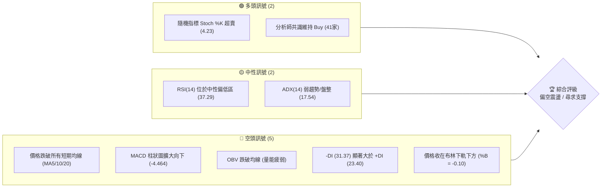
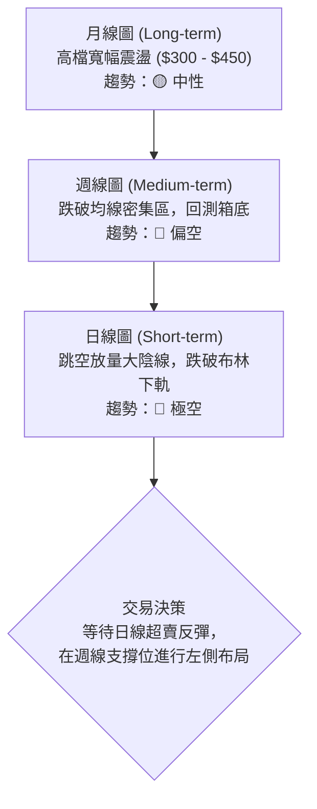

<details>
<summary>📊 靜態圖表 (點擊展開)</summary>

</details>

<html>
<head><meta charset="utf-8" /></head>
<body>
    <div style="height:500px; width:100%;">                        <script>window.PlotlyConfig = {MathJaxConfig: 'local'};</script>
        <script charset="utf-8" src="https://cdn.plot.ly/plotly-3.6.0.min.js" integrity="sha256-QaOVwtVY0T02VaHrr6pnoHLCwayMJp4O5n4YyaE3rJk=" crossorigin="anonymous"></script>                <div id="candlestick-chart" class="plotly-graph-div" style="height:100%; width:100%;"></div>            <script>                window.PLOTLYENV=window.PLOTLYENV || {};                                if (document.getElementById("candlestick-chart")) {                    Plotly.newPlot(                        "candlestick-chart",                        [{"close":{"dtype":"f8","bdata":"AAAAYGY+dEAAAACAwgF0QAAAAAApQHVAAAAAoJmpdUAAAABguPp1QAAAAKCZ2XVAAAAAIK6fdUAAAACA6910QAAAAIDClXRAAAAAoHDhdEAAAADgeih1QAAAAKBw7XVAAAAAYGamdUAAAAAgha91QAAAAOCjvHVAAAAAwPUMd0AAAABACr94QAAAAOCjoHlAAAAAgOtZekAAAACAwp16QAAAAKCZDXpAAAAAwB6hekAAAAAgXCN7QAAAAKCZnXpAAAAA4KOse0AAAACAPXZ6QAAAAGBmhntAAAAAIFyze0AAAAAghct7QAAAACBct3xAAAAAAABAe0AAAACgR916QAAAAAAAVHxAAAAAoHARe0AAAABACmt7QAAAAOCjOHtAAAAAANfXeUAAAABgZj57QAAAAADX03pAAAAAYGYye0AAAAAAAMx6QAAAAMD1dHtAAAAAQOH2e0AAAACgmal7QAAAACCFb3tAAAAAIK4PfEAAAAAghRt7QAAAAGC4RnxAAAAAwMzIfEAAAAAAKdh8QAAAAKCZgXtAAAAAwPWIfEAAAACA60V9QAAAAAApxHtAAAAAwB7hfEAAAABgj957QAAAAOBR2HpAAAAAIK7Te0AAAACA63l7QAAAAKCZ6XpAAAAAANcfeUAAAACgmUV5QAAAAGC4jnlAAAAAAAAUeUAAAAAA1z95QAAAACCus3hAAAAAoHBxeEAAAADgehx6QAAAAGBmNnpAAAAAoEepekAAAABguOJ6QAAAAIA94npAAAAAANfTekAAAAAA1+t7QAAAAOB6aHxAAAAAAABwfEAAAACgR3l7QAAAAGC40ntAAAAAQDM3fEAAAACAPe57QAAAACBcr3xAAAAAwPW0fUAAAACAFJ5+QAAAAAApNH1AAAAAgOs1fkAAAABAMxN+QAAAACCui35AAAAAwPVYfkAAAABgZlZ+QAAAAEAKs31AAAAAgD26fEAAAABA4WZ8QAAAACCFG3xAAAAAwB5he0AAAABguDp8QAAAACBcD3tAAAAAYI\u002f2ekAAAADAzDx7QAAAAAAp0HtAAAAAIFwPfEAAAABAM\u002fN7QAAAAEAzc3tAAAAAwB5pe0AAAAAAAFh7QAAAAAAANHpAAAAAQAr3ekAAAACAwhV8QAAAAMD1EHxAAAAAQDMze0AAAABgZu56QAAAACBc93pAAAAAwPUIekAAAABgj+Z6QAAAAMD1XHpAAAAAIFxfekAAAAAAKWB5QAAAACBc03hAAAAAgMKxeUAAAADAHhV6QAAAACBck3pAAAAA4FHEekAAAADAHhF6QAAAAEAKF3pAAAAAgBSqeUAAAADAHrV5QAAAACBcu3lAAAAAwB69eUAAAACgR\u002f14QAAAAIAUlnlAAAAAYGYWekAAAACgR4l5QAAAAAApKHlAAAAAwB41eUAAAABA4YZ4QAAAAEAKX3lAAAAAwMxYeUAAAAAgrst4QAAAAEDh6nhAAAAAANfzeEAAAADAHn15QAAAAAApsHhAAAAAQDNzeEAAAADA9bh4QAAAAOBR9HhAAAAA4HqMeEAAAADAzMR3QAAAACBc\u002f3ZAAAAAoJnNd0AAAADgevB3QAAAAEAzH3hAAAAAgMJBd0AAAACgR512QAAAAOB6NHZAAAAAAAA8d0AAAAAAKdR3QAAAAKBwiXZAAAAAwB4NdkAAAABgZqp1QAAAAAAAdHVAAAAAgOuZdUAAAABAM891QAAAAGC4BnZAAAAAQDPDdkAAAABAM394QAAAAGBmTnhAAAAAgOsJeUAAAAAAAIh4QAAAAGC4JnhAAAAAACk4eEAAAAAghVt3QAAAAMDMhHdAAAAAYLiqd0AAAADgUYB3QAAAAMDMTHdAAAAAgBTad0AAAADAHm14QAAAAAApiHhAAAAAgOtVeEAAAAAgrut4QAAAAOCjvHlAAAAAoJnFekAAAAAAANB7QAAAAEAzF3tAAAAA4FHUe0AAAADAzLR7QAAAAADXY3pAAAAAANefeUAAAACAwkF5QAAAAAApFHpAAAAAoJkdekAAAAAAKaB6QAAAAKBwGXtAAAAAgMKFe0AAAACgmaF7QAAAAOCjPHtAAAAAgBT+eUAAAAAA13t6QAAAAEAze3pAAAAAQDMnekAAAAAAAHB4QA=="},"high":{"dtype":"f8","bdata":"AAAAgOu1dEAAAABgZk50QAAAAAAARHVAAAAA4HrYdUAAAABgZv51QAAAAIA9NnZAAAAAwMwYdkAAAAAAAMx1QAAAAKBH1XRAAAAAoEd1dUAAAACAPS51QAAAAIDrPXZAAAAAQApndkAAAADgUex1QAAAAKBHRXZAAAAAANcPd0AAAABACst4QAAAAEAzm3pAAAAAAAB0ekAAAADA9cR6QAAAACCFA3tAAAAAIIXXekAAAAAgrs97QAAAACCFj3tAAAAAIFzDe0AAAACgmTV7QAAAACCFh3tAAAAAIK4vfEAAAAAAANB7QAAAAOCj5HxAAAAAAABsfUAAAADgUex7QAAAAMDMWHxAAAAAQOFKfEAAAACgR5V7QAAAAKCZRXtAAAAAgBSye0AAAACAPU57QAAAAEAzI3tAAAAAACmIe0AAAACgmXV7QAAAACBcl3tAAAAAwMwcfEAAAADAzBR8QAAAAOCj2HtAAAAAYGYWfEAAAABA4Tp8QAAAAGCPwnxAAAAAAAAwfUAAAABAMxt9QAAAAMD1cHxAAAAAAACgfEAAAADAHqF9QAAAACCFw3xAAAAAoEclfUAAAABAMzd9QAAAAIDCdXtAAAAAYLgafEAAAAAA16d7QAAAAKBHpXtAAAAAAACIekAAAABACsN5QAAAACBcf3pAAAAAYGaOeUAAAADgerx5QAAAAEAKz3pAAAAAwMwseUAAAAAghVt6QAAAACCuR3pAAAAAQAqvekAAAABA4Q57QAAAAGCPGntAAAAAwMxMe0AAAABguP57QAAAAIAUanxAAAAAgOutfEAAAAAAABx8QAAAAIA9RnxAAAAAgBSOfEAAAADgURR8QAAAAAAp8HxAAAAA4FEcfkAAAAAAALh+QAAAAOB69H5AAAAAgMKtfkAAAAAA16d+QAAAAKBHLX9AAAAAIIW\u002ffkAAAABgZq5+QAAAAKBwkX5AAAAAYGZWfUAAAACA6\u002fF8QAAAAMDMiHxAAAAAoHClfEAAAADAzJh8QAAAAAAABHxAAAAAgOtle0AAAACAPU57QAAAAMDMEHxAAAAAwMxkfEAAAADA9Tx8QAAAAGCPvntAAAAAgMLVe0AAAAAAAPR7QAAAACCu63pAAAAAQDNje0AAAAAAABh8QAAAAEDhRnxAAAAA4KPQe0AAAADgUVh7QAAAAAApZHtAAAAAIK6De0AAAACAFH57QAAAAGBmsnpAAAAAwPXIekAAAABgZn56QAAAAKCZIXlAAAAAwMzoeUAAAAAAAFR6QAAAAAAAtHpAAAAAoJlFe0AAAAAgrkN7QAAAAMD1gHpAAAAAIIXbeUAAAABgZg56QAAAAAAA9HlAAAAAQDPreUAAAABAM3t5QAAAAMAerXlAAAAAoHBFekAAAADA9Qx6QAAAAIDrcXlAAAAA4KNIeUAAAACgcMV4QAAAAKBHhXlAAAAAgOuJeUAAAACgmSV5QAAAAKBwGXlAAAAAoHBpeUAAAACAFAZ6QAAAAAAAaHlAAAAAQDMDeUAAAAAgrjt5QAAAAIDrAXlAAAAAwB4xeUAAAADgUTR4QAAAAIA9vndAAAAAoEcVeEAAAAAgrjd4QAAAACCuw3hAAAAAQAoHeEAAAACAwh13QAAAAOCj9HZAAAAAoEdVd0AAAACAPfJ3QAAAAOB6JHdAAAAAIIX7dkAAAADgUcB1QAAAAAAAyHZAAAAAgBTOdUAAAACAwuV1QAAAAKCZRXZAAAAAgBT6dkAAAABgZqp4QAAAAMD1oHhAAAAA4HqUeUAAAADAzGx5QAAAAEAzn3hAAAAAACmQeEAAAAAAACB4QAAAAAAp7HdAAAAA4HrMd0AAAADgo+R3QAAAAGBmhndAAAAAAAAMeEAAAADAHt14QAAAAIA9qnhAAAAAgOsheUAAAABA4Rp5QAAAAKBH\u002fXlAAAAAQDPzekAAAABgjxJ8QAAAAMDM\u002fHtAAAAAYGZWfEAAAAAgrj98QAAAAGCPKntAAAAAgBRSekAAAACAFFp5QAAAACBcF3pAAAAAQDOvekAAAAAAKfh6QAAAAEAzM3tAAAAAoJnZe0AAAAAgXL97QAAAAMAekXtAAAAAoJnZekAAAABguIZ6QAAAAKCZGXtAAAAAoJmlekAAAABA4Yp6QA=="},"hovertemplate":"\u003cb\u003e%{x|%Y-%m-%d}\u003c\u002fb\u003e\u003cbr\u003e\u958b: $%{open:.2f}\u003cbr\u003e\u9ad8: $%{high:.2f}\u003cbr\u003e\u4f4e: $%{low:.2f}\u003cbr\u003e\u6536: $%{close:.2f}\u003cextra\u003e\u003c\u002fextra\u003e","low":{"dtype":"f8","bdata":"AAAAoJmpc0AAAABA4epzQAAAAEAK+3NAAAAA4HrwdEAAAAAghXt1QAAAAGCP0nVAAAAAAClEdUAAAABAM7t0QAAAAKCZWXRAAAAAACmIdEAAAAAgrrd0QAAAAEDhinVAAAAAoHCNdUAAAADAHn11QAAAAMAeoXVAAAAAoJm5dUAAAAAA1yN3QAAAAEDhJnlAAAAAQOG2eUAAAABguJp5QAAAAMD1CHpAAAAAIIVbekAAAACAFNJ6QAAAACCFe3pAAAAA4HrQekAAAACgRzF6QAAAAOBRUHpAAAAAAAB4e0AAAACA6xF7QAAAAAAAjHtAAAAAwB45e0AAAACgRwl6QAAAAEAKS3tAAAAAQDMHe0AAAAAgrpN6QAAAAEDhonpAAAAAQDO3eUAAAABAMzt6QAAAAIDCHXpAAAAAoEelekAAAADA9VR6QAAAAKCZeXpAAAAAgMKJe0AAAADAzKB7QAAAAAAA0HpAAAAAYGbeeUAAAABguOJ6QAAAAEAKa3tAAAAAoJk5fEAAAABgZkp8QAAAAIDCeXtAAAAAQAq7e0AAAADAzFx8QAAAAKCZuXtAAAAAIFyLe0AAAACgcDF7QAAAAIAUXnpAAAAAgMIVe0AAAACAwgV7QAAAAMD1qHpAAAAAoHDFeEAAAADgeux3QAAAAADX63hAAAAAIFybeEAAAAAAAOh4QAAAAADXq3hAAAAAACn8d0AAAACgcBF5QAAAAEAzX3lAAAAAgD0OekAAAABAM6N6QAAAAOCjlHpAAAAAgOthekAAAACAwvF6QAAAAIA91ntAAAAAYI86fEAAAAAAADR7QAAAAEAzO3tAAAAAgMK5e0AAAACgR4V7QAAAAGC4mntAAAAAYI86fUAAAACgRx19QAAAAEAzI31AAAAAgOuRfUAAAAAghat9QAAAAKBHVX5AAAAAoHAtfkAAAADAzMx9QAAAAMAenX1AAAAAAACwfEAAAACgR118QAAAAMDMFHxAAAAAwMw0e0AAAADAHsl7QAAAAOB6zHpAAAAA4KP0ekAAAACA64V6QAAAAIA95npAAAAAAABge0AAAABAM797QAAAACCFI3tAAAAAYGZae0AAAAAAKTR7QAAAAEAKF3pAAAAAgOs5ekAAAACAFAp7QAAAAOCjwHtAAAAA4Hoke0AAAABACut6QAAAAKCZ4XpAAAAAgOvpeUAAAABAM2t6QAAAAAAA6HlAAAAAQArbeUAAAABA4fJ4QAAAAOB6OHhAAAAAAADceEAAAADgo3R5QAAAAAAAEHpAAAAA4HpAekAAAAAAAOB5QAAAAIAUrnlAAAAAACkIeUAAAACgR5l5QAAAAIDCQXlAAAAAAABYeUAAAADgo6B4QAAAAIA92nhAAAAAYGbCeUAAAABgjzp5QAAAAIDC4XhAAAAAAABEeEAAAACAPRZ4QAAAAKBHqXhAAAAAYLj2eEAAAAAgXKN4QAAAAGBm1ndAAAAAQArjeEAAAABgZiJ5QAAAAGBmqnhAAAAAQDNfeEAAAABguKZ4QAAAAAAAkHhAAAAAwPWEeEAAAAAgrqt3QAAAACBcx3ZAAAAAIK5Ld0AAAADA9YR3QAAAAAApEHhAAAAAgOs9d0AAAAAghXd2QAAAAIA9AnZAAAAAAACQdkAAAACgR2F3QAAAAOB6cHZAAAAAgD2qdUAAAAAA1xN1QAAAAGC4OnVAAAAAAAAUdUAAAAAA12t1QAAAAMAeyXVAAAAA4FEsdkAAAAAAAKh2QAAAAMDM3HdAAAAAYGZ6eEAAAACgR0V4QAAAACCFE3hAAAAAwMwUeEAAAACAPQZ3QAAAACCuK3dAAAAA4FHAdkAAAADgo0h3QAAAAOCjIHdAAAAAYLgCd0AAAADAzKx3QAAAAMDMDHhAAAAAAABQeEAAAADgUQB4QAAAAIDrIXlAAAAAgD0GekAAAADAzAx6QAAAAAApZHpAAAAAIFzjekAAAABgj5J7QAAAAAAAYHpAAAAAoEdVeUAAAACAFJp4QAAAAIA9ZnlAAAAAYGbOeUAAAAAAKUh6QAAAAIDroXpAAAAA4FE4e0AAAADAzER7QAAAAIA9wnpAAAAAQOH2eUAAAABgZtp5QAAAAAAAAHpAAAAAYI8SekAAAACgcEl4QA=="},"name":"\u50f9\u683c","open":{"dtype":"f8","bdata":"AAAAIIWTdEAAAACgRyF0QAAAAGCPGnRAAAAAYGYudUAAAABA4Y51QAAAAEAK\u002f3VAAAAAYI\u002fudUAAAAAgrrN1QAAAACCug3RAAAAAQDPzdEAAAABgZgJ1QAAAAAAAwHVAAAAAgD0qdkAAAABACsd1QAAAAMDM6HVAAAAAYLjidUAAAABACi93QAAAAIAUcnpAAAAAAADoeUAAAAAAAPx5QAAAAIDrzXpAAAAAwB5dekAAAACAwvF6QAAAAIAUfntAAAAAoEfdekAAAAAA1zN7QAAAAMDMxHpAAAAAoJnFe0AAAADgUZh7QAAAAMDMvHtAAAAA4KNofUAAAADgo7R7QAAAAAAAjHtAAAAAwB79e0AAAADAHll7QAAAAMD1\u002fHpAAAAA4KNIe0AAAADgenh6QAAAAOCjrHpAAAAAYGYue0AAAAAgrit7QAAAAAAAmHpAAAAAgOu9e0AAAAAAKdx7QAAAAEAzt3tAAAAAAABAekAAAACgR+17QAAAACCuf3tAAAAA4HpsfEAAAAAAAOh8QAAAAMDMMHxAAAAAAADse0AAAAAA1398QAAAACBcZ3xAAAAAwMxAfEAAAAAgXN98QAAAAGC4XntAAAAAoJl5e0AAAABgZnZ7QAAAAGBmontAAAAAgBRyekAAAADAzCR4QAAAAADX63hAAAAAgBRWeUAAAABA4WJ5QAAAAIAU6nlAAAAAwB4leUAAAABguCJ5QAAAAGC45nlAAAAAQDN\u002fekAAAACgcKl6QAAAAMAelXpAAAAAwPXsekAAAACgmQF7QAAAAEAKH3xAAAAA4HpQfEAAAABAM\u002fd7QAAAAOCjWHtAAAAAwB7he0AAAABAMw98QAAAAKBwAXxAAAAAQApXfUAAAAAgXIN9QAAAACCFg35AAAAAYI\u002fifUAAAACA64F+QAAAAIAUnn5AAAAAYGaWfkAAAAAgrod+QAAAACCuU35AAAAAAABQfUAAAACgcNF8QAAAAKCZgXxAAAAAwMycfEAAAAAA1\u002f97QAAAAIAU5ntAAAAAYGY+e0AAAACAPb56QAAAAEAzP3tAAAAAIK6Te0AAAABAMyN8QAAAAMD1rHtAAAAAgBSSe0AAAAAAAHh7QAAAAIDC1XpAAAAAYI9aekAAAABgjzJ7QAAAAEDh9ntAAAAAAADQe0AAAABgj1Z7QAAAAGCP\u002fnpAAAAAwMxce0AAAACgmZV6QAAAAOCjVHpAAAAA4FGEekAAAAAgXEd6QAAAAOBR0HhAAAAAgOsNeUAAAABgj555QAAAAKBHIXpAAAAAIFy\u002fekAAAADAzOR6QAAAAMD15HlAAAAAgMLFeUAAAACAwrF5QAAAAAAAdHlAAAAAwMyEeUAAAADgo3R5QAAAAAAA+HhAAAAAYGbCeUAAAABguOZ5QAAAAEAKL3lAAAAAoJlpeEAAAACgcLF4QAAAAKCZ3XhAAAAAwB4ZeUAAAACgcOF4QAAAAMDMYHhAAAAAIIUjeUAAAADgeiR5QAAAAEDhUnlAAAAAYLjyeEAAAAAghcN4QAAAAEAKu3hAAAAAAADweEAAAADgUTR4QAAAAKCZvXdAAAAAoHBRd0AAAADA9Yh3QAAAAADXX3hAAAAAoJnZd0AAAABACht3QAAAAIDC3XZAAAAAACmYdkAAAACAFKp3QAAAAEAzw3ZAAAAAoHCpdkAAAABACqd1QAAAAOCjvHZAAAAAYGZydUAAAADgo6R1QAAAAMAe4XVAAAAAYLhadkAAAACgR+12QAAAAMD1nHhAAAAAYLi+eEAAAACgRyl5QAAAAAAAkHhAAAAAwB45eEAAAADgenR3QAAAAAAAWHdAAAAAoHBBd0AAAABA4Wp3QAAAAGBmdndAAAAAAABMd0AAAAAA1+d3QAAAACCuY3hAAAAAQAqzeEAAAAAAACR4QAAAACCud3lAAAAAIK4HekAAAABgj2J6QAAAAGCPlntAAAAAYLhKe0AAAAAA1+d7QAAAACCuH3tAAAAA4FE0ekAAAABgjzJ5QAAAAKCZeXlAAAAAQOFiekAAAABguGp6QAAAAAAp5HpAAAAAgD2ue0AAAACA61l7QAAAAKCZfXtAAAAAANe3ekAAAAAghSN6QAAAAEAzK3pAAAAAoHA9ekAAAAAAAEh6QA=="},"x":["2025-08-20T00:00:00-04:00","2025-08-21T00:00:00-04:00","2025-08-22T00:00:00-04:00","2025-08-25T00:00:00-04:00","2025-08-26T00:00:00-04:00","2025-08-27T00:00:00-04:00","2025-08-28T00:00:00-04:00","2025-08-29T00:00:00-04:00","2025-09-02T00:00:00-04:00","2025-09-03T00:00:00-04:00","2025-09-04T00:00:00-04:00","2025-09-05T00:00:00-04:00","2025-09-08T00:00:00-04:00","2025-09-09T00:00:00-04:00","2025-09-10T00:00:00-04:00","2025-09-11T00:00:00-04:00","2025-09-12T00:00:00-04:00","2025-09-15T00:00:00-04:00","2025-09-16T00:00:00-04:00","2025-09-17T00:00:00-04:00","2025-09-18T00:00:00-04:00","2025-09-19T00:00:00-04:00","2025-09-22T00:00:00-04:00","2025-09-23T00:00:00-04:00","2025-09-24T00:00:00-04:00","2025-09-25T00:00:00-04:00","2025-09-26T00:00:00-04:00","2025-09-29T00:00:00-04:00","2025-09-30T00:00:00-04:00","2025-10-01T00:00:00-04:00","2025-10-02T00:00:00-04:00","2025-10-03T00:00:00-04:00","2025-10-06T00:00:00-04:00","2025-10-07T00:00:00-04:00","2025-10-08T00:00:00-04:00","2025-10-09T00:00:00-04:00","2025-10-10T00:00:00-04:00","2025-10-13T00:00:00-04:00","2025-10-14T00:00:00-04:00","2025-10-15T00:00:00-04:00","2025-10-16T00:00:00-04:00","2025-10-17T00:00:00-04:00","2025-10-20T00:00:00-04:00","2025-10-21T00:00:00-04:00","2025-10-22T00:00:00-04:00","2025-10-23T00:00:00-04:00","2025-10-24T00:00:00-04:00","2025-10-27T00:00:00-04:00","2025-10-28T00:00:00-04:00","2025-10-29T00:00:00-04:00","2025-10-30T00:00:00-04:00","2025-10-31T00:00:00-04:00","2025-11-03T00:00:00-05:00","2025-11-04T00:00:00-05:00","2025-11-05T00:00:00-05:00","2025-11-06T00:00:00-05:00","2025-11-07T00:00:00-05:00","2025-11-10T00:00:00-05:00","2025-11-11T00:00:00-05:00","2025-11-12T00:00:00-05:00","2025-11-13T00:00:00-05:00","2025-11-14T00:00:00-05:00","2025-11-17T00:00:00-05:00","2025-11-18T00:00:00-05:00","2025-11-19T00:00:00-05:00","2025-11-20T00:00:00-05:00","2025-11-21T00:00:00-05:00","2025-11-24T00:00:00-05:00","2025-11-25T00:00:00-05:00","2025-11-26T00:00:00-05:00","2025-11-28T00:00:00-05:00","2025-12-01T00:00:00-05:00","2025-12-02T00:00:00-05:00","2025-12-03T00:00:00-05:00","2025-12-04T00:00:00-05:00","2025-12-05T00:00:00-05:00","2025-12-08T00:00:00-05:00","2025-12-09T00:00:00-05:00","2025-12-10T00:00:00-05:00","2025-12-11T00:00:00-05:00","2025-12-12T00:00:00-05:00","2025-12-15T00:00:00-05:00","2025-12-16T00:00:00-05:00","2025-12-17T00:00:00-05:00","2025-12-18T00:00:00-05:00","2025-12-19T00:00:00-05:00","2025-12-22T00:00:00-05:00","2025-12-23T00:00:00-05:00","2025-12-24T00:00:00-05:00","2025-12-26T00:00:00-05:00","2025-12-29T00:00:00-05:00","2025-12-30T00:00:00-05:00","2025-12-31T00:00:00-05:00","2026-01-02T00:00:00-05:00","2026-01-05T00:00:00-05:00","2026-01-06T00:00:00-05:00","2026-01-07T00:00:00-05:00","2026-01-08T00:00:00-05:00","2026-01-09T00:00:00-05:00","2026-01-12T00:00:00-05:00","2026-01-13T00:00:00-05:00","2026-01-14T00:00:00-05:00","2026-01-15T00:00:00-05:00","2026-01-16T00:00:00-05:00","2026-01-20T00:00:00-05:00","2026-01-21T00:00:00-05:00","2026-01-22T00:00:00-05:00","2026-01-23T00:00:00-05:00","2026-01-26T00:00:00-05:00","2026-01-27T00:00:00-05:00","2026-01-28T00:00:00-05:00","2026-01-29T00:00:00-05:00","2026-01-30T00:00:00-05:00","2026-02-02T00:00:00-05:00","2026-02-03T00:00:00-05:00","2026-02-04T00:00:00-05:00","2026-02-05T00:00:00-05:00","2026-02-06T00:00:00-05:00","2026-02-09T00:00:00-05:00","2026-02-10T00:00:00-05:00","2026-02-11T00:00:00-05:00","2026-02-12T00:00:00-05:00","2026-02-13T00:00:00-05:00","2026-02-17T00:00:00-05:00","2026-02-18T00:00:00-05:00","2026-02-19T00:00:00-05:00","2026-02-20T00:00:00-05:00","2026-02-23T00:00:00-05:00","2026-02-24T00:00:00-05:00","2026-02-25T00:00:00-05:00","2026-02-26T00:00:00-05:00","2026-02-27T00:00:00-05:00","2026-03-02T00:00:00-05:00","2026-03-03T00:00:00-05:00","2026-03-04T00:00:00-05:00","2026-03-05T00:00:00-05:00","2026-03-06T00:00:00-05:00","2026-03-09T00:00:00-04:00","2026-03-10T00:00:00-04:00","2026-03-11T00:00:00-04:00","2026-03-12T00:00:00-04:00","2026-03-13T00:00:00-04:00","2026-03-16T00:00:00-04:00","2026-03-17T00:00:00-04:00","2026-03-18T00:00:00-04:00","2026-03-19T00:00:00-04:00","2026-03-20T00:00:00-04:00","2026-03-23T00:00:00-04:00","2026-03-24T00:00:00-04:00","2026-03-25T00:00:00-04:00","2026-03-26T00:00:00-04:00","2026-03-27T00:00:00-04:00","2026-03-30T00:00:00-04:00","2026-03-31T00:00:00-04:00","2026-04-01T00:00:00-04:00","2026-04-02T00:00:00-04:00","2026-04-06T00:00:00-04:00","2026-04-07T00:00:00-04:00","2026-04-08T00:00:00-04:00","2026-04-09T00:00:00-04:00","2026-04-10T00:00:00-04:00","2026-04-13T00:00:00-04:00","2026-04-14T00:00:00-04:00","2026-04-15T00:00:00-04:00","2026-04-16T00:00:00-04:00","2026-04-17T00:00:00-04:00","2026-04-20T00:00:00-04:00","2026-04-21T00:00:00-04:00","2026-04-22T00:00:00-04:00","2026-04-23T00:00:00-04:00","2026-04-24T00:00:00-04:00","2026-04-27T00:00:00-04:00","2026-04-28T00:00:00-04:00","2026-04-29T00:00:00-04:00","2026-04-30T00:00:00-04:00","2026-05-01T00:00:00-04:00","2026-05-04T00:00:00-04:00","2026-05-05T00:00:00-04:00","2026-05-06T00:00:00-04:00","2026-05-07T00:00:00-04:00","2026-05-08T00:00:00-04:00","2026-05-11T00:00:00-04:00","2026-05-12T00:00:00-04:00","2026-05-13T00:00:00-04:00","2026-05-14T00:00:00-04:00","2026-05-15T00:00:00-04:00","2026-05-18T00:00:00-04:00","2026-05-19T00:00:00-04:00","2026-05-20T00:00:00-04:00","2026-05-21T00:00:00-04:00","2026-05-22T00:00:00-04:00","2026-05-26T00:00:00-04:00","2026-05-27T00:00:00-04:00","2026-05-28T00:00:00-04:00","2026-05-29T00:00:00-04:00","2026-06-01T00:00:00-04:00","2026-06-02T00:00:00-04:00","2026-06-03T00:00:00-04:00","2026-06-04T00:00:00-04:00","2026-06-05T00:00:00-04:00"],"type":"candlestick"},{"hovertemplate":"MA30: $%{y:.2f}\u003cextra\u003e\u003c\u002fextra\u003e","line":{"color":"#2196F3","dash":"dash","width":2},"mode":"lines","name":"MA30","x":["2025-08-20T00:00:00-04:00","2025-08-21T00:00:00-04:00","2025-08-22T00:00:00-04:00","2025-08-25T00:00:00-04:00","2025-08-26T00:00:00-04:00","2025-08-27T00:00:00-04:00","2025-08-28T00:00:00-04:00","2025-08-29T00:00:00-04:00","2025-09-02T00:00:00-04:00","2025-09-03T00:00:00-04:00","2025-09-04T00:00:00-04:00","2025-09-05T00:00:00-04:00","2025-09-08T00:00:00-04:00","2025-09-09T00:00:00-04:00","2025-09-10T00:00:00-04:00","2025-09-11T00:00:00-04:00","2025-09-12T00:00:00-04:00","2025-09-15T00:00:00-04:00","2025-09-16T00:00:00-04:00","2025-09-17T00:00:00-04:00","2025-09-18T00:00:00-04:00","2025-09-19T00:00:00-04:00","2025-09-22T00:00:00-04:00","2025-09-23T00:00:00-04:00","2025-09-24T00:00:00-04:00","2025-09-25T00:00:00-04:00","2025-09-26T00:00:00-04:00","2025-09-29T00:00:00-04:00","2025-09-30T00:00:00-04:00","2025-10-01T00:00:00-04:00","2025-10-02T00:00:00-04:00","2025-10-03T00:00:00-04:00","2025-10-06T00:00:00-04:00","2025-10-07T00:00:00-04:00","2025-10-08T00:00:00-04:00","2025-10-09T00:00:00-04:00","2025-10-10T00:00:00-04:00","2025-10-13T00:00:00-04:00","2025-10-14T00:00:00-04:00","2025-10-15T00:00:00-04:00","2025-10-16T00:00:00-04:00","2025-10-17T00:00:00-04:00","2025-10-20T00:00:00-04:00","2025-10-21T00:00:00-04:00","2025-10-22T00:00:00-04:00","2025-10-23T00:00:00-04:00","2025-10-24T00:00:00-04:00","2025-10-27T00:00:00-04:00","2025-10-28T00:00:00-04:00","2025-10-29T00:00:00-04:00","2025-10-30T00:00:00-04:00","2025-10-31T00:00:00-04:00","2025-11-03T00:00:00-05:00","2025-11-04T00:00:00-05:00","2025-11-05T00:00:00-05:00","2025-11-06T00:00:00-05:00","2025-11-07T00:00:00-05:00","2025-11-10T00:00:00-05:00","2025-11-11T00:00:00-05:00","2025-11-12T00:00:00-05:00","2025-11-13T00:00:00-05:00","2025-11-14T00:00:00-05:00","2025-11-17T00:00:00-05:00","2025-11-18T00:00:00-05:00","2025-11-19T00:00:00-05:00","2025-11-20T00:00:00-05:00","2025-11-21T00:00:00-05:00","2025-11-24T00:00:00-05:00","2025-11-25T00:00:00-05:00","2025-11-26T00:00:00-05:00","2025-11-28T00:00:00-05:00","2025-12-01T00:00:00-05:00","2025-12-02T00:00:00-05:00","2025-12-03T00:00:00-05:00","2025-12-04T00:00:00-05:00","2025-12-05T00:00:00-05:00","2025-12-08T00:00:00-05:00","2025-12-09T00:00:00-05:00","2025-12-10T00:00:00-05:00","2025-12-11T00:00:00-05:00","2025-12-12T00:00:00-05:00","2025-12-15T00:00:00-05:00","2025-12-16T00:00:00-05:00","2025-12-17T00:00:00-05:00","2025-12-18T00:00:00-05:00","2025-12-19T00:00:00-05:00","2025-12-22T00:00:00-05:00","2025-12-23T00:00:00-05:00","2025-12-24T00:00:00-05:00","2025-12-26T00:00:00-05:00","2025-12-29T00:00:00-05:00","2025-12-30T00:00:00-05:00","2025-12-31T00:00:00-05:00","2026-01-02T00:00:00-05:00","2026-01-05T00:00:00-05:00","2026-01-06T00:00:00-05:00","2026-01-07T00:00:00-05:00","2026-01-08T00:00:00-05:00","2026-01-09T00:00:00-05:00","2026-01-12T00:00:00-05:00","2026-01-13T00:00:00-05:00","2026-01-14T00:00:00-05:00","2026-01-15T00:00:00-05:00","2026-01-16T00:00:00-05:00","2026-01-20T00:00:00-05:00","2026-01-21T00:00:00-05:00","2026-01-22T00:00:00-05:00","2026-01-23T00:00:00-05:00","2026-01-26T00:00:00-05:00","2026-01-27T00:00:00-05:00","2026-01-28T00:00:00-05:00","2026-01-29T00:00:00-05:00","2026-01-30T00:00:00-05:00","2026-02-02T00:00:00-05:00","2026-02-03T00:00:00-05:00","2026-02-04T00:00:00-05:00","2026-02-05T00:00:00-05:00","2026-02-06T00:00:00-05:00","2026-02-09T00:00:00-05:00","2026-02-10T00:00:00-05:00","2026-02-11T00:00:00-05:00","2026-02-12T00:00:00-05:00","2026-02-13T00:00:00-05:00","2026-02-17T00:00:00-05:00","2026-02-18T00:00:00-05:00","2026-02-19T00:00:00-05:00","2026-02-20T00:00:00-05:00","2026-02-23T00:00:00-05:00","2026-02-24T00:00:00-05:00","2026-02-25T00:00:00-05:00","2026-02-26T00:00:00-05:00","2026-02-27T00:00:00-05:00","2026-03-02T00:00:00-05:00","2026-03-03T00:00:00-05:00","2026-03-04T00:00:00-05:00","2026-03-05T00:00:00-05:00","2026-03-06T00:00:00-05:00","2026-03-09T00:00:00-04:00","2026-03-10T00:00:00-04:00","2026-03-11T00:00:00-04:00","2026-03-12T00:00:00-04:00","2026-03-13T00:00:00-04:00","2026-03-16T00:00:00-04:00","2026-03-17T00:00:00-04:00","2026-03-18T00:00:00-04:00","2026-03-19T00:00:00-04:00","2026-03-20T00:00:00-04:00","2026-03-23T00:00:00-04:00","2026-03-24T00:00:00-04:00","2026-03-25T00:00:00-04:00","2026-03-26T00:00:00-04:00","2026-03-27T00:00:00-04:00","2026-03-30T00:00:00-04:00","2026-03-31T00:00:00-04:00","2026-04-01T00:00:00-04:00","2026-04-02T00:00:00-04:00","2026-04-06T00:00:00-04:00","2026-04-07T00:00:00-04:00","2026-04-08T00:00:00-04:00","2026-04-09T00:00:00-04:00","2026-04-10T00:00:00-04:00","2026-04-13T00:00:00-04:00","2026-04-14T00:00:00-04:00","2026-04-15T00:00:00-04:00","2026-04-16T00:00:00-04:00","2026-04-17T00:00:00-04:00","2026-04-20T00:00:00-04:00","2026-04-21T00:00:00-04:00","2026-04-22T00:00:00-04:00","2026-04-23T00:00:00-04:00","2026-04-24T00:00:00-04:00","2026-04-27T00:00:00-04:00","2026-04-28T00:00:00-04:00","2026-04-29T00:00:00-04:00","2026-04-30T00:00:00-04:00","2026-05-01T00:00:00-04:00","2026-05-04T00:00:00-04:00","2026-05-05T00:00:00-04:00","2026-05-06T00:00:00-04:00","2026-05-07T00:00:00-04:00","2026-05-08T00:00:00-04:00","2026-05-11T00:00:00-04:00","2026-05-12T00:00:00-04:00","2026-05-13T00:00:00-04:00","2026-05-14T00:00:00-04:00","2026-05-15T00:00:00-04:00","2026-05-18T00:00:00-04:00","2026-05-19T00:00:00-04:00","2026-05-20T00:00:00-04:00","2026-05-21T00:00:00-04:00","2026-05-22T00:00:00-04:00","2026-05-26T00:00:00-04:00","2026-05-27T00:00:00-04:00","2026-05-28T00:00:00-04:00","2026-05-29T00:00:00-04:00","2026-06-01T00:00:00-04:00","2026-06-02T00:00:00-04:00","2026-06-03T00:00:00-04:00","2026-06-04T00:00:00-04:00","2026-06-05T00:00:00-04:00"],"y":{"dtype":"f8","bdata":"AAAAAAAA+H8AAAAAAAD4fwAAAAAAAPh\u002fAAAAAAAA+H8AAAAAAAD4fwAAAAAAAPh\u002fAAAAAAAA+H8AAAAAAAD4fwAAAAAAAPh\u002fAAAAAAAA+H8AAAAAAAD4fwAAAAAAAPh\u002fAAAAAAAA+H8AAAAAAAD4fwAAAAAAAPh\u002fAAAAAAAA+H8AAAAAAAD4fwAAAAAAAPh\u002fAAAAAAAA+H8AAAAAAAD4fwAAAAAAAPh\u002fAAAAAAAA+H8AAAAAAAD4fwAAAAAAAPh\u002fAAAAAAAA+H8AAAAAAAD4fwAAAAAAAPh\u002fAAAAAAAA+H8AAAAAAAD4f0RERCRN7XdAd3d3hxYpeEB3d3f3mmN4QAAAAAAAoHhARERExCDOeEBVVVXlifx4QCIiIpJfKnlA7+7u7mBOeUDe3d1ty4R5QBEREWEQunlAAAAAcPbveUCamZl5FCB6QERERJRDT3pAq6qqiiWFekCamZk5Jrh6QFVVVVXH6HpAZmZmNokTe0ARERFxryd7QJqZmblJPntAd3d39wxTe0AiIiJiEGZ7QImIiMh2cntA7+7urrmCe0CamZmp8ZR7QN7d3T3DnntAq6qqmgupe0BVVVVVDrV7QJqZmdlAr3tAZmZmplSwe0BERERUnK17QKuqqvo3nntAq6qqehSMe0DNzMycfX57QHd3dxfZZntA7+7u3t1Ve0CamZkpXEN7QBEREYHcLXtAiYiIKOohe0DNzMwsQBh7QAAAALAAE3tAiYiImG4Oe0CamZl5MA97QHd3d3dMCntAzczM7JgAe0C8u7srzgJ7QBEREaEaC3tA7+7ujlAOe0BERESkcBF7QGZmZsaSDXtAMzMzU7gIe0BVVVU17AB7QJqZmTn7CntAmpmZOfsUe0Dv7u4OdCB7QDMzM1O4LHtAvLu7exQ4e0Dv7u6+5kp7QDMzM+N6antAZmZmRv1\u002fe0BVVVXFZ5h7QKuqqsovsHtAERER8e7Oe0B3d3eHpOl7QGZmZhZn\u002f3tA7+7uPgoTfECJiIgoeCx8QO\u002fu7o6XQHxAVVVVlRhWfECamZnptF98QImIiIhdbXxAZmZmJk15fEAAAABQYoJ8QN7d3U03h3xAmpmZKTGMfECJiIiYQ4d8QDMzM7NydHxAmpmZ+eFnfEBVVVVFGW18QCIiImIsb3xAd3d3t4FmfEC8u7uL+l18QBEREeFPT3xAvLu7i\u002fovfECJiIjoQhB8QHd3d3cF+HtARERE9ETXe0AzMzMDK697QKuqqnpbfntAIiIikqZWe0AiIiJiVzJ7QCIiInKvF3tAREREZPQGe0AiIiKCB\u002fN6QGZmZjbQ4XpAzczMvC3TekDe3d2dqL16QImIiEhTsnpAiYiImOCnekDe3d19sZR6QO\u002fu7s6wgXpAERER0dtwekBVVVXlQlx6QM3MzHyxSHpAAAAAsOQ1ekAREREh2x16QO\u002fu7t7BFnpAVVVVBfMIekBmZmZG4ex5QJqZmbkC0nlAvLu7+9S+eUC8u7vLhbJ5QImIiCgVn3lAzczMrI6ReUDNzMx8+H55QGZmZgbzcnlAvLu7+2JjeUBVVVW1rFV5QLy7uxsTRnlAzczMnO81eUAiIiLipSN5QGZmZpa1DnlAAAAA4MHweEBVVVXFS9N4QLy7u9sksnhAERERcWideEAAAABAYI14QKuqqqoccnhAMzMzM6VSeEC8u7tbSDZ4QImIiGgDE3hAvLu7C7vsd0ARERGR7cx3QM3MzJw2sndA3t3dbVmdd0BVVVXlF513QN7d3V0BlHdAIiIiQmCRd0CJiIi4Ho93QDMzM9OUiHdAq6qqSlOCd0ARERGBI3B3QGZmZvYoZndAMzMzM3pfd0BmZmZWDlV3QM3MzEzwRndARERE9P1Ad0CamZlJmkZ3QO\u002fu7i6yU3dAIiIicj1Yd0BVVVUFnWB3QKuqqgplbndA3t3drWOMd0CJiIgov7h3QImIiPhv4ndAZmZm5qUJeEDNzMxsvCp4QERERLSdS3hAAAAAUBtqeEBERESEwIh4QJqZmVk5sHhAd3d3J7\u002fWeECamZlp2P94QCIiItIiK3lAIiIiMsFTeUB3d3dXgG55QERERGSCh3lARERE5KWPeUARERExT6B5QHd3dycxtHlA7+7ufrHEeUCrqqrK6M15QA=="},"type":"scatter"},{"hovertemplate":"MA60: $%{y:.2f}\u003cextra\u003e\u003c\u002fextra\u003e","line":{"color":"#9C27B0","dash":"dash","width":2},"mode":"lines","name":"MA60","x":["2025-08-20T00:00:00-04:00","2025-08-21T00:00:00-04:00","2025-08-22T00:00:00-04:00","2025-08-25T00:00:00-04:00","2025-08-26T00:00:00-04:00","2025-08-27T00:00:00-04:00","2025-08-28T00:00:00-04:00","2025-08-29T00:00:00-04:00","2025-09-02T00:00:00-04:00","2025-09-03T00:00:00-04:00","2025-09-04T00:00:00-04:00","2025-09-05T00:00:00-04:00","2025-09-08T00:00:00-04:00","2025-09-09T00:00:00-04:00","2025-09-10T00:00:00-04:00","2025-09-11T00:00:00-04:00","2025-09-12T00:00:00-04:00","2025-09-15T00:00:00-04:00","2025-09-16T00:00:00-04:00","2025-09-17T00:00:00-04:00","2025-09-18T00:00:00-04:00","2025-09-19T00:00:00-04:00","2025-09-22T00:00:00-04:00","2025-09-23T00:00:00-04:00","2025-09-24T00:00:00-04:00","2025-09-25T00:00:00-04:00","2025-09-26T00:00:00-04:00","2025-09-29T00:00:00-04:00","2025-09-30T00:00:00-04:00","2025-10-01T00:00:00-04:00","2025-10-02T00:00:00-04:00","2025-10-03T00:00:00-04:00","2025-10-06T00:00:00-04:00","2025-10-07T00:00:00-04:00","2025-10-08T00:00:00-04:00","2025-10-09T00:00:00-04:00","2025-10-10T00:00:00-04:00","2025-10-13T00:00:00-04:00","2025-10-14T00:00:00-04:00","2025-10-15T00:00:00-04:00","2025-10-16T00:00:00-04:00","2025-10-17T00:00:00-04:00","2025-10-20T00:00:00-04:00","2025-10-21T00:00:00-04:00","2025-10-22T00:00:00-04:00","2025-10-23T00:00:00-04:00","2025-10-24T00:00:00-04:00","2025-10-27T00:00:00-04:00","2025-10-28T00:00:00-04:00","2025-10-29T00:00:00-04:00","2025-10-30T00:00:00-04:00","2025-10-31T00:00:00-04:00","2025-11-03T00:00:00-05:00","2025-11-04T00:00:00-05:00","2025-11-05T00:00:00-05:00","2025-11-06T00:00:00-05:00","2025-11-07T00:00:00-05:00","2025-11-10T00:00:00-05:00","2025-11-11T00:00:00-05:00","2025-11-12T00:00:00-05:00","2025-11-13T00:00:00-05:00","2025-11-14T00:00:00-05:00","2025-11-17T00:00:00-05:00","2025-11-18T00:00:00-05:00","2025-11-19T00:00:00-05:00","2025-11-20T00:00:00-05:00","2025-11-21T00:00:00-05:00","2025-11-24T00:00:00-05:00","2025-11-25T00:00:00-05:00","2025-11-26T00:00:00-05:00","2025-11-28T00:00:00-05:00","2025-12-01T00:00:00-05:00","2025-12-02T00:00:00-05:00","2025-12-03T00:00:00-05:00","2025-12-04T00:00:00-05:00","2025-12-05T00:00:00-05:00","2025-12-08T00:00:00-05:00","2025-12-09T00:00:00-05:00","2025-12-10T00:00:00-05:00","2025-12-11T00:00:00-05:00","2025-12-12T00:00:00-05:00","2025-12-15T00:00:00-05:00","2025-12-16T00:00:00-05:00","2025-12-17T00:00:00-05:00","2025-12-18T00:00:00-05:00","2025-12-19T00:00:00-05:00","2025-12-22T00:00:00-05:00","2025-12-23T00:00:00-05:00","2025-12-24T00:00:00-05:00","2025-12-26T00:00:00-05:00","2025-12-29T00:00:00-05:00","2025-12-30T00:00:00-05:00","2025-12-31T00:00:00-05:00","2026-01-02T00:00:00-05:00","2026-01-05T00:00:00-05:00","2026-01-06T00:00:00-05:00","2026-01-07T00:00:00-05:00","2026-01-08T00:00:00-05:00","2026-01-09T00:00:00-05:00","2026-01-12T00:00:00-05:00","2026-01-13T00:00:00-05:00","2026-01-14T00:00:00-05:00","2026-01-15T00:00:00-05:00","2026-01-16T00:00:00-05:00","2026-01-20T00:00:00-05:00","2026-01-21T00:00:00-05:00","2026-01-22T00:00:00-05:00","2026-01-23T00:00:00-05:00","2026-01-26T00:00:00-05:00","2026-01-27T00:00:00-05:00","2026-01-28T00:00:00-05:00","2026-01-29T00:00:00-05:00","2026-01-30T00:00:00-05:00","2026-02-02T00:00:00-05:00","2026-02-03T00:00:00-05:00","2026-02-04T00:00:00-05:00","2026-02-05T00:00:00-05:00","2026-02-06T00:00:00-05:00","2026-02-09T00:00:00-05:00","2026-02-10T00:00:00-05:00","2026-02-11T00:00:00-05:00","2026-02-12T00:00:00-05:00","2026-02-13T00:00:00-05:00","2026-02-17T00:00:00-05:00","2026-02-18T00:00:00-05:00","2026-02-19T00:00:00-05:00","2026-02-20T00:00:00-05:00","2026-02-23T00:00:00-05:00","2026-02-24T00:00:00-05:00","2026-02-25T00:00:00-05:00","2026-02-26T00:00:00-05:00","2026-02-27T00:00:00-05:00","2026-03-02T00:00:00-05:00","2026-03-03T00:00:00-05:00","2026-03-04T00:00:00-05:00","2026-03-05T00:00:00-05:00","2026-03-06T00:00:00-05:00","2026-03-09T00:00:00-04:00","2026-03-10T00:00:00-04:00","2026-03-11T00:00:00-04:00","2026-03-12T00:00:00-04:00","2026-03-13T00:00:00-04:00","2026-03-16T00:00:00-04:00","2026-03-17T00:00:00-04:00","2026-03-18T00:00:00-04:00","2026-03-19T00:00:00-04:00","2026-03-20T00:00:00-04:00","2026-03-23T00:00:00-04:00","2026-03-24T00:00:00-04:00","2026-03-25T00:00:00-04:00","2026-03-26T00:00:00-04:00","2026-03-27T00:00:00-04:00","2026-03-30T00:00:00-04:00","2026-03-31T00:00:00-04:00","2026-04-01T00:00:00-04:00","2026-04-02T00:00:00-04:00","2026-04-06T00:00:00-04:00","2026-04-07T00:00:00-04:00","2026-04-08T00:00:00-04:00","2026-04-09T00:00:00-04:00","2026-04-10T00:00:00-04:00","2026-04-13T00:00:00-04:00","2026-04-14T00:00:00-04:00","2026-04-15T00:00:00-04:00","2026-04-16T00:00:00-04:00","2026-04-17T00:00:00-04:00","2026-04-20T00:00:00-04:00","2026-04-21T00:00:00-04:00","2026-04-22T00:00:00-04:00","2026-04-23T00:00:00-04:00","2026-04-24T00:00:00-04:00","2026-04-27T00:00:00-04:00","2026-04-28T00:00:00-04:00","2026-04-29T00:00:00-04:00","2026-04-30T00:00:00-04:00","2026-05-01T00:00:00-04:00","2026-05-04T00:00:00-04:00","2026-05-05T00:00:00-04:00","2026-05-06T00:00:00-04:00","2026-05-07T00:00:00-04:00","2026-05-08T00:00:00-04:00","2026-05-11T00:00:00-04:00","2026-05-12T00:00:00-04:00","2026-05-13T00:00:00-04:00","2026-05-14T00:00:00-04:00","2026-05-15T00:00:00-04:00","2026-05-18T00:00:00-04:00","2026-05-19T00:00:00-04:00","2026-05-20T00:00:00-04:00","2026-05-21T00:00:00-04:00","2026-05-22T00:00:00-04:00","2026-05-26T00:00:00-04:00","2026-05-27T00:00:00-04:00","2026-05-28T00:00:00-04:00","2026-05-29T00:00:00-04:00","2026-06-01T00:00:00-04:00","2026-06-02T00:00:00-04:00","2026-06-03T00:00:00-04:00","2026-06-04T00:00:00-04:00","2026-06-05T00:00:00-04:00"],"y":{"dtype":"f8","bdata":"AAAAAAAA+H8AAAAAAAD4fwAAAAAAAPh\u002fAAAAAAAA+H8AAAAAAAD4fwAAAAAAAPh\u002fAAAAAAAA+H8AAAAAAAD4fwAAAAAAAPh\u002fAAAAAAAA+H8AAAAAAAD4fwAAAAAAAPh\u002fAAAAAAAA+H8AAAAAAAD4fwAAAAAAAPh\u002fAAAAAAAA+H8AAAAAAAD4fwAAAAAAAPh\u002fAAAAAAAA+H8AAAAAAAD4fwAAAAAAAPh\u002fAAAAAAAA+H8AAAAAAAD4fwAAAAAAAPh\u002fAAAAAAAA+H8AAAAAAAD4fwAAAAAAAPh\u002fAAAAAAAA+H8AAAAAAAD4fwAAAAAAAPh\u002fAAAAAAAA+H8AAAAAAAD4fwAAAAAAAPh\u002fAAAAAAAA+H8AAAAAAAD4fwAAAAAAAPh\u002fAAAAAAAA+H8AAAAAAAD4fwAAAAAAAPh\u002fAAAAAAAA+H8AAAAAAAD4fwAAAAAAAPh\u002fAAAAAAAA+H8AAAAAAAD4fwAAAAAAAPh\u002fAAAAAAAA+H8AAAAAAAD4fwAAAAAAAPh\u002fAAAAAAAA+H8AAAAAAAD4fwAAAAAAAPh\u002fAAAAAAAA+H8AAAAAAAD4fwAAAAAAAPh\u002fAAAAAAAA+H8AAAAAAAD4fwAAAAAAAPh\u002fAAAAAAAA+H8AAAAAAAD4f3d3d4\u002fCxXlAERERgZXaeUAiIiJKDPF5QLy7u4tsA3pAmpmZUf8RekB3d3cH8x96QJqZmQkeLHpAvLu7iyU4ekBVVVXNhU56QImIiIiIZnpAREREhDJ\u002fekCamZl5opd6QN7d3QXIrHpAvLu7O9\u002fCekCrqqoyet16QDMzM\u002fvw+XpAq6qq4uwQe0CrqqoKkBx7QAAAAEDuJXtAVVVVpeIte0C8u7tLfjN7QBEREQG5PntAREREdNpLe0BERETcslp7QImIiMi9ZXtAMzMzC5Bwe0AiIiKK+n97QGZmZt7djHtAZmZm9iiYe0DNzMwMAqN7QKuqquIzp3tA3t3dtYGte0AiIiISEbR7QO\u002fu7hYgs3tA7+7uDnS0e0AREREp6rd7QAAAAAg6t3tA7+7uXgG8e0AzMzOL+rt7QERERBwvwHtAd3d3393De0DNzMxkych7QKuqquLByHtAMzMzC2XGe0AiIiLiCMV7QCIiIqrGv3tARERERBm7e0DNzMz0RL97QERERJRfvntAVVVVBZ23e0CJiIhgc697QFVVVY0lrXtAq6qq4nqie0C8u7t7W5h7QFVVVeVekntAAAAAuKyHe0ARERHhCH17QO\u002fu7i5rdHtARERE7FFre0C8u7uTX2V7QGZmZp7vY3tAq6qqqvFqe0DNzMwEVm57QGZmZqabcHtA3t3d\u002fRtze0AzMzNjEHV7QLy7u2t1eXtA7+7ulvx+e0C8u7szM3p7QLy7uyuHd3tAvLu7exR1e0CrqqqaUm97QFVVVWX0Z3tAzczM7Aphe0DNzMxcj1J7QBEREUmaRXtAd3d3f2o4e0De3d1F\u002fSx7QN7d3Y2XIHtAmpmZWasSe0C8u7srQAh7QM3MzIQy93pAREREnMTgekCrqqqyncd6QO\u002fu7j58tXpAAAAA+FOdekBERETca4J6QDMzM0s3YnpAd3d3F0tGekAiIiKi\u002fip6QERERIQyE3pAIiIiItv7eUC8u7ujKeN5QBEREYn6yXlA7+7uFku4eUDv7u5uhKV5QJqZmfk3knlA3t3d5UJ9eUDNzMzsfGV5QLy7uxtaSnlAZmZmbssueUAzMzM7mBR5QM3MzAx0\u002fXhA7+7uDp\u002fpeEAzMzODed14QGZmZp5h1XhAvLu7oynNeEB3d3f\u002f\u002f714QGZmZsZLrXhAMzMzI5SgeEBmZmamVJF4QHd3dw+fgnhAAAAAcIR4eECamZlpA2p4QJqZmanxXHhAAAAAeDBSeEB3d3d\u002fI054QFVVVaXiTHhAd3d3hxZHeEC8u7tzIUJ4QImIiFCNPnhA7+7uxpI+eEDv7u52BUZ4QCIiImpKSnhAvLu7K4dTeEBmZmZWDlx4QHd3dy\u002fdXnhAmpmZQWBeeEAAAABwhF94QBEREWGeYXhAmpmZGb1heEBVVVX9YmZ4QHd3d7esbnhAAAAAUI14eEBmZmYezIV4QBEREeHBjXhAMzMzE4OQeEDNzMz0tpd4QFVVVf1innhAzczMZIKjeEDe3d0lBp94QA=="},"type":"scatter"},{"hovertemplate":"MA200: $%{y:.2f}\u003cextra\u003e\u003c\u002fextra\u003e","line":{"color":"#FF6F00","dash":"solid","width":2},"mode":"lines","name":"MA200","x":["2025-08-20T00:00:00-04:00","2025-08-21T00:00:00-04:00","2025-08-22T00:00:00-04:00","2025-08-25T00:00:00-04:00","2025-08-26T00:00:00-04:00","2025-08-27T00:00:00-04:00","2025-08-28T00:00:00-04:00","2025-08-29T00:00:00-04:00","2025-09-02T00:00:00-04:00","2025-09-03T00:00:00-04:00","2025-09-04T00:00:00-04:00","2025-09-05T00:00:00-04:00","2025-09-08T00:00:00-04:00","2025-09-09T00:00:00-04:00","2025-09-10T00:00:00-04:00","2025-09-11T00:00:00-04:00","2025-09-12T00:00:00-04:00","2025-09-15T00:00:00-04:00","2025-09-16T00:00:00-04:00","2025-09-17T00:00:00-04:00","2025-09-18T00:00:00-04:00","2025-09-19T00:00:00-04:00","2025-09-22T00:00:00-04:00","2025-09-23T00:00:00-04:00","2025-09-24T00:00:00-04:00","2025-09-25T00:00:00-04:00","2025-09-26T00:00:00-04:00","2025-09-29T00:00:00-04:00","2025-09-30T00:00:00-04:00","2025-10-01T00:00:00-04:00","2025-10-02T00:00:00-04:00","2025-10-03T00:00:00-04:00","2025-10-06T00:00:00-04:00","2025-10-07T00:00:00-04:00","2025-10-08T00:00:00-04:00","2025-10-09T00:00:00-04:00","2025-10-10T00:00:00-04:00","2025-10-13T00:00:00-04:00","2025-10-14T00:00:00-04:00","2025-10-15T00:00:00-04:00","2025-10-16T00:00:00-04:00","2025-10-17T00:00:00-04:00","2025-10-20T00:00:00-04:00","2025-10-21T00:00:00-04:00","2025-10-22T00:00:00-04:00","2025-10-23T00:00:00-04:00","2025-10-24T00:00:00-04:00","2025-10-27T00:00:00-04:00","2025-10-28T00:00:00-04:00","2025-10-29T00:00:00-04:00","2025-10-30T00:00:00-04:00","2025-10-31T00:00:00-04:00","2025-11-03T00:00:00-05:00","2025-11-04T00:00:00-05:00","2025-11-05T00:00:00-05:00","2025-11-06T00:00:00-05:00","2025-11-07T00:00:00-05:00","2025-11-10T00:00:00-05:00","2025-11-11T00:00:00-05:00","2025-11-12T00:00:00-05:00","2025-11-13T00:00:00-05:00","2025-11-14T00:00:00-05:00","2025-11-17T00:00:00-05:00","2025-11-18T00:00:00-05:00","2025-11-19T00:00:00-05:00","2025-11-20T00:00:00-05:00","2025-11-21T00:00:00-05:00","2025-11-24T00:00:00-05:00","2025-11-25T00:00:00-05:00","2025-11-26T00:00:00-05:00","2025-11-28T00:00:00-05:00","2025-12-01T00:00:00-05:00","2025-12-02T00:00:00-05:00","2025-12-03T00:00:00-05:00","2025-12-04T00:00:00-05:00","2025-12-05T00:00:00-05:00","2025-12-08T00:00:00-05:00","2025-12-09T00:00:00-05:00","2025-12-10T00:00:00-05:00","2025-12-11T00:00:00-05:00","2025-12-12T00:00:00-05:00","2025-12-15T00:00:00-05:00","2025-12-16T00:00:00-05:00","2025-12-17T00:00:00-05:00","2025-12-18T00:00:00-05:00","2025-12-19T00:00:00-05:00","2025-12-22T00:00:00-05:00","2025-12-23T00:00:00-05:00","2025-12-24T00:00:00-05:00","2025-12-26T00:00:00-05:00","2025-12-29T00:00:00-05:00","2025-12-30T00:00:00-05:00","2025-12-31T00:00:00-05:00","2026-01-02T00:00:00-05:00","2026-01-05T00:00:00-05:00","2026-01-06T00:00:00-05:00","2026-01-07T00:00:00-05:00","2026-01-08T00:00:00-05:00","2026-01-09T00:00:00-05:00","2026-01-12T00:00:00-05:00","2026-01-13T00:00:00-05:00","2026-01-14T00:00:00-05:00","2026-01-15T00:00:00-05:00","2026-01-16T00:00:00-05:00","2026-01-20T00:00:00-05:00","2026-01-21T00:00:00-05:00","2026-01-22T00:00:00-05:00","2026-01-23T00:00:00-05:00","2026-01-26T00:00:00-05:00","2026-01-27T00:00:00-05:00","2026-01-28T00:00:00-05:00","2026-01-29T00:00:00-05:00","2026-01-30T00:00:00-05:00","2026-02-02T00:00:00-05:00","2026-02-03T00:00:00-05:00","2026-02-04T00:00:00-05:00","2026-02-05T00:00:00-05:00","2026-02-06T00:00:00-05:00","2026-02-09T00:00:00-05:00","2026-02-10T00:00:00-05:00","2026-02-11T00:00:00-05:00","2026-02-12T00:00:00-05:00","2026-02-13T00:00:00-05:00","2026-02-17T00:00:00-05:00","2026-02-18T00:00:00-05:00","2026-02-19T00:00:00-05:00","2026-02-20T00:00:00-05:00","2026-02-23T00:00:00-05:00","2026-02-24T00:00:00-05:00","2026-02-25T00:00:00-05:00","2026-02-26T00:00:00-05:00","2026-02-27T00:00:00-05:00","2026-03-02T00:00:00-05:00","2026-03-03T00:00:00-05:00","2026-03-04T00:00:00-05:00","2026-03-05T00:00:00-05:00","2026-03-06T00:00:00-05:00","2026-03-09T00:00:00-04:00","2026-03-10T00:00:00-04:00","2026-03-11T00:00:00-04:00","2026-03-12T00:00:00-04:00","2026-03-13T00:00:00-04:00","2026-03-16T00:00:00-04:00","2026-03-17T00:00:00-04:00","2026-03-18T00:00:00-04:00","2026-03-19T00:00:00-04:00","2026-03-20T00:00:00-04:00","2026-03-23T00:00:00-04:00","2026-03-24T00:00:00-04:00","2026-03-25T00:00:00-04:00","2026-03-26T00:00:00-04:00","2026-03-27T00:00:00-04:00","2026-03-30T00:00:00-04:00","2026-03-31T00:00:00-04:00","2026-04-01T00:00:00-04:00","2026-04-02T00:00:00-04:00","2026-04-06T00:00:00-04:00","2026-04-07T00:00:00-04:00","2026-04-08T00:00:00-04:00","2026-04-09T00:00:00-04:00","2026-04-10T00:00:00-04:00","2026-04-13T00:00:00-04:00","2026-04-14T00:00:00-04:00","2026-04-15T00:00:00-04:00","2026-04-16T00:00:00-04:00","2026-04-17T00:00:00-04:00","2026-04-20T00:00:00-04:00","2026-04-21T00:00:00-04:00","2026-04-22T00:00:00-04:00","2026-04-23T00:00:00-04:00","2026-04-24T00:00:00-04:00","2026-04-27T00:00:00-04:00","2026-04-28T00:00:00-04:00","2026-04-29T00:00:00-04:00","2026-04-30T00:00:00-04:00","2026-05-01T00:00:00-04:00","2026-05-04T00:00:00-04:00","2026-05-05T00:00:00-04:00","2026-05-06T00:00:00-04:00","2026-05-07T00:00:00-04:00","2026-05-08T00:00:00-04:00","2026-05-11T00:00:00-04:00","2026-05-12T00:00:00-04:00","2026-05-13T00:00:00-04:00","2026-05-14T00:00:00-04:00","2026-05-15T00:00:00-04:00","2026-05-18T00:00:00-04:00","2026-05-19T00:00:00-04:00","2026-05-20T00:00:00-04:00","2026-05-21T00:00:00-04:00","2026-05-22T00:00:00-04:00","2026-05-26T00:00:00-04:00","2026-05-27T00:00:00-04:00","2026-05-28T00:00:00-04:00","2026-05-29T00:00:00-04:00","2026-06-01T00:00:00-04:00","2026-06-02T00:00:00-04:00","2026-06-03T00:00:00-04:00","2026-06-04T00:00:00-04:00","2026-06-05T00:00:00-04:00"],"y":{"dtype":"f8","bdata":"AAAAAAAA+H8AAAAAAAD4fwAAAAAAAPh\u002fAAAAAAAA+H8AAAAAAAD4fwAAAAAAAPh\u002fAAAAAAAA+H8AAAAAAAD4fwAAAAAAAPh\u002fAAAAAAAA+H8AAAAAAAD4fwAAAAAAAPh\u002fAAAAAAAA+H8AAAAAAAD4fwAAAAAAAPh\u002fAAAAAAAA+H8AAAAAAAD4fwAAAAAAAPh\u002fAAAAAAAA+H8AAAAAAAD4fwAAAAAAAPh\u002fAAAAAAAA+H8AAAAAAAD4fwAAAAAAAPh\u002fAAAAAAAA+H8AAAAAAAD4fwAAAAAAAPh\u002fAAAAAAAA+H8AAAAAAAD4fwAAAAAAAPh\u002fAAAAAAAA+H8AAAAAAAD4fwAAAAAAAPh\u002fAAAAAAAA+H8AAAAAAAD4fwAAAAAAAPh\u002fAAAAAAAA+H8AAAAAAAD4fwAAAAAAAPh\u002fAAAAAAAA+H8AAAAAAAD4fwAAAAAAAPh\u002fAAAAAAAA+H8AAAAAAAD4fwAAAAAAAPh\u002fAAAAAAAA+H8AAAAAAAD4fwAAAAAAAPh\u002fAAAAAAAA+H8AAAAAAAD4fwAAAAAAAPh\u002fAAAAAAAA+H8AAAAAAAD4fwAAAAAAAPh\u002fAAAAAAAA+H8AAAAAAAD4fwAAAAAAAPh\u002fAAAAAAAA+H8AAAAAAAD4fwAAAAAAAPh\u002fAAAAAAAA+H8AAAAAAAD4fwAAAAAAAPh\u002fAAAAAAAA+H8AAAAAAAD4fwAAAAAAAPh\u002fAAAAAAAA+H8AAAAAAAD4fwAAAAAAAPh\u002fAAAAAAAA+H8AAAAAAAD4fwAAAAAAAPh\u002fAAAAAAAA+H8AAAAAAAD4fwAAAAAAAPh\u002fAAAAAAAA+H8AAAAAAAD4fwAAAAAAAPh\u002fAAAAAAAA+H8AAAAAAAD4fwAAAAAAAPh\u002fAAAAAAAA+H8AAAAAAAD4fwAAAAAAAPh\u002fAAAAAAAA+H8AAAAAAAD4fwAAAAAAAPh\u002fAAAAAAAA+H8AAAAAAAD4fwAAAAAAAPh\u002fAAAAAAAA+H8AAAAAAAD4fwAAAAAAAPh\u002fAAAAAAAA+H8AAAAAAAD4fwAAAAAAAPh\u002fAAAAAAAA+H8AAAAAAAD4fwAAAAAAAPh\u002fAAAAAAAA+H8AAAAAAAD4fwAAAAAAAPh\u002fAAAAAAAA+H8AAAAAAAD4fwAAAAAAAPh\u002fAAAAAAAA+H8AAAAAAAD4fwAAAAAAAPh\u002fAAAAAAAA+H8AAAAAAAD4fwAAAAAAAPh\u002fAAAAAAAA+H8AAAAAAAD4fwAAAAAAAPh\u002fAAAAAAAA+H8AAAAAAAD4fwAAAAAAAPh\u002fAAAAAAAA+H8AAAAAAAD4fwAAAAAAAPh\u002fAAAAAAAA+H8AAAAAAAD4fwAAAAAAAPh\u002fAAAAAAAA+H8AAAAAAAD4fwAAAAAAAPh\u002fAAAAAAAA+H8AAAAAAAD4fwAAAAAAAPh\u002fAAAAAAAA+H8AAAAAAAD4fwAAAAAAAPh\u002fAAAAAAAA+H8AAAAAAAD4fwAAAAAAAPh\u002fAAAAAAAA+H8AAAAAAAD4fwAAAAAAAPh\u002fAAAAAAAA+H8AAAAAAAD4fwAAAAAAAPh\u002fAAAAAAAA+H8AAAAAAAD4fwAAAAAAAPh\u002fAAAAAAAA+H8AAAAAAAD4fwAAAAAAAPh\u002fAAAAAAAA+H8AAAAAAAD4fwAAAAAAAPh\u002fAAAAAAAA+H8AAAAAAAD4fwAAAAAAAPh\u002fAAAAAAAA+H8AAAAAAAD4fwAAAAAAAPh\u002fAAAAAAAA+H8AAAAAAAD4fwAAAAAAAPh\u002fAAAAAAAA+H8AAAAAAAD4fwAAAAAAAPh\u002fAAAAAAAA+H8AAAAAAAD4fwAAAAAAAPh\u002fAAAAAAAA+H8AAAAAAAD4fwAAAAAAAPh\u002fAAAAAAAA+H8AAAAAAAD4fwAAAAAAAPh\u002fAAAAAAAA+H8AAAAAAAD4fwAAAAAAAPh\u002fAAAAAAAA+H8AAAAAAAD4fwAAAAAAAPh\u002fAAAAAAAA+H8AAAAAAAD4fwAAAAAAAPh\u002fAAAAAAAA+H8AAAAAAAD4fwAAAAAAAPh\u002fAAAAAAAA+H8AAAAAAAD4fwAAAAAAAPh\u002fAAAAAAAA+H8AAAAAAAD4fwAAAAAAAPh\u002fAAAAAAAA+H8AAAAAAAD4fwAAAAAAAPh\u002fAAAAAAAA+H8AAAAAAAD4fwAAAAAAAPh\u002fAAAAAAAA+H8AAAAAAAD4fwAAAAAAAPh\u002fAAAAAAAA+H+PwvUEReJ5QA=="},"type":"scatter"}],                        {"template":{"data":{"barpolar":[{"marker":{"line":{"color":"rgb(17,17,17)","width":0.5},"pattern":{"fillmode":"overlay","size":10,"solidity":0.2}},"type":"barpolar"}],"bar":[{"error_x":{"color":"#f2f5fa"},"error_y":{"color":"#f2f5fa"},"marker":{"line":{"color":"rgb(17,17,17)","width":0.5},"pattern":{"fillmode":"overlay","size":10,"solidity":0.2}},"type":"bar"}],"carpet":[{"aaxis":{"endlinecolor":"#A2B1C6","gridcolor":"#506784","linecolor":"#506784","minorgridcolor":"#506784","startlinecolor":"#A2B1C6"},"baxis":{"endlinecolor":"#A2B1C6","gridcolor":"#506784","linecolor":"#506784","minorgridcolor":"#506784","startlinecolor":"#A2B1C6"},"type":"carpet"}],"choropleth":[{"colorbar":{"outlinewidth":0,"ticks":""},"type":"choropleth"}],"contourcarpet":[{"colorbar":{"outlinewidth":0,"ticks":""},"type":"contourcarpet"}],"contour":[{"colorbar":{"outlinewidth":0,"ticks":""},"colorscale":[[0.0,"#0d0887"],[0.1111111111111111,"#46039f"],[0.2222222222222222,"#7201a8"],[0.3333333333333333,"#9c179e"],[0.4444444444444444,"#bd3786"],[0.5555555555555556,"#d8576b"],[0.6666666666666666,"#ed7953"],[0.7777777777777778,"#fb9f3a"],[0.8888888888888888,"#fdca26"],[1.0,"#f0f921"]],"type":"contour"}],"heatmap":[{"colorbar":{"outlinewidth":0,"ticks":""},"colorscale":[[0.0,"#0d0887"],[0.1111111111111111,"#46039f"],[0.2222222222222222,"#7201a8"],[0.3333333333333333,"#9c179e"],[0.4444444444444444,"#bd3786"],[0.5555555555555556,"#d8576b"],[0.6666666666666666,"#ed7953"],[0.7777777777777778,"#fb9f3a"],[0.8888888888888888,"#fdca26"],[1.0,"#f0f921"]],"type":"heatmap"}],"histogram2dcontour":[{"colorbar":{"outlinewidth":0,"ticks":""},"colorscale":[[0.0,"#0d0887"],[0.1111111111111111,"#46039f"],[0.2222222222222222,"#7201a8"],[0.3333333333333333,"#9c179e"],[0.4444444444444444,"#bd3786"],[0.5555555555555556,"#d8576b"],[0.6666666666666666,"#ed7953"],[0.7777777777777778,"#fb9f3a"],[0.8888888888888888,"#fdca26"],[1.0,"#f0f921"]],"type":"histogram2dcontour"}],"histogram2d":[{"colorbar":{"outlinewidth":0,"ticks":""},"colorscale":[[0.0,"#0d0887"],[0.1111111111111111,"#46039f"],[0.2222222222222222,"#7201a8"],[0.3333333333333333,"#9c179e"],[0.4444444444444444,"#bd3786"],[0.5555555555555556,"#d8576b"],[0.6666666666666666,"#ed7953"],[0.7777777777777778,"#fb9f3a"],[0.8888888888888888,"#fdca26"],[1.0,"#f0f921"]],"type":"histogram2d"}],"histogram":[{"marker":{"pattern":{"fillmode":"overlay","size":10,"solidity":0.2}},"type":"histogram"}],"mesh3d":[{"colorbar":{"outlinewidth":0,"ticks":""},"type":"mesh3d"}],"parcoords":[{"line":{"colorbar":{"outlinewidth":0,"ticks":""}},"type":"parcoords"}],"pie":[{"automargin":true,"type":"pie"}],"scatter3d":[{"line":{"colorbar":{"outlinewidth":0,"ticks":""}},"marker":{"colorbar":{"outlinewidth":0,"ticks":""}},"type":"scatter3d"}],"scattercarpet":[{"marker":{"colorbar":{"outlinewidth":0,"ticks":""}},"type":"scattercarpet"}],"scattergeo":[{"marker":{"colorbar":{"outlinewidth":0,"ticks":""}},"type":"scattergeo"}],"scattergl":[{"marker":{"line":{"color":"#283442"}},"type":"scattergl"}],"scattermapbox":[{"marker":{"colorbar":{"outlinewidth":0,"ticks":""}},"type":"scattermapbox"}],"scattermap":[{"marker":{"colorbar":{"outlinewidth":0,"ticks":""}},"type":"scattermap"}],"scatterpolargl":[{"marker":{"colorbar":{"outlinewidth":0,"ticks":""}},"type":"scatterpolargl"}],"scatterpolar":[{"marker":{"colorbar":{"outlinewidth":0,"ticks":""}},"type":"scatterpolar"}],"scatter":[{"marker":{"line":{"color":"#283442"}},"type":"scatter"}],"scatterternary":[{"marker":{"colorbar":{"outlinewidth":0,"ticks":""}},"type":"scatterternary"}],"surface":[{"colorbar":{"outlinewidth":0,"ticks":""},"colorscale":[[0.0,"#0d0887"],[0.1111111111111111,"#46039f"],[0.2222222222222222,"#7201a8"],[0.3333333333333333,"#9c179e"],[0.4444444444444444,"#bd3786"],[0.5555555555555556,"#d8576b"],[0.6666666666666666,"#ed7953"],[0.7777777777777778,"#fb9f3a"],[0.8888888888888888,"#fdca26"],[1.0,"#f0f921"]],"type":"surface"}],"table":[{"cells":{"fill":{"color":"#506784"},"line":{"color":"rgb(17,17,17)"}},"header":{"fill":{"color":"#2a3f5f"},"line":{"color":"rgb(17,17,17)"}},"type":"table"}]},"layout":{"annotationdefaults":{"arrowcolor":"#f2f5fa","arrowhead":0,"arrowwidth":1},"autotypenumbers":"strict","coloraxis":{"colorbar":{"outlinewidth":0,"ticks":""}},"colorscale":{"diverging":[[0,"#8e0152"],[0.1,"#c51b7d"],[0.2,"#de77ae"],[0.3,"#f1b6da"],[0.4,"#fde0ef"],[0.5,"#f7f7f7"],[0.6,"#e6f5d0"],[0.7,"#b8e186"],[0.8,"#7fbc41"],[0.9,"#4d9221"],[1,"#276419"]],"sequential":[[0.0,"#0d0887"],[0.1111111111111111,"#46039f"],[0.2222222222222222,"#7201a8"],[0.3333333333333333,"#9c179e"],[0.4444444444444444,"#bd3786"],[0.5555555555555556,"#d8576b"],[0.6666666666666666,"#ed7953"],[0.7777777777777778,"#fb9f3a"],[0.8888888888888888,"#fdca26"],[1.0,"#f0f921"]],"sequentialminus":[[0.0,"#0d0887"],[0.1111111111111111,"#46039f"],[0.2222222222222222,"#7201a8"],[0.3333333333333333,"#9c179e"],[0.4444444444444444,"#bd3786"],[0.5555555555555556,"#d8576b"],[0.6666666666666666,"#ed7953"],[0.7777777777777778,"#fb9f3a"],[0.8888888888888888,"#fdca26"],[1.0,"#f0f921"]]},"colorway":["#636efa","#EF553B","#00cc96","#ab63fa","#FFA15A","#19d3f3","#FF6692","#B6E880","#FF97FF","#FECB52"],"font":{"color":"#f2f5fa"},"geo":{"bgcolor":"rgb(17,17,17)","lakecolor":"rgb(17,17,17)","landcolor":"rgb(17,17,17)","showlakes":true,"showland":true,"subunitcolor":"#506784"},"hoverlabel":{"align":"left"},"hovermode":"closest","mapbox":{"style":"dark"},"paper_bgcolor":"rgb(17,17,17)","plot_bgcolor":"rgb(17,17,17)","polar":{"angularaxis":{"gridcolor":"#506784","linecolor":"#506784","ticks":""},"bgcolor":"rgb(17,17,17)","radialaxis":{"gridcolor":"#506784","linecolor":"#506784","ticks":""}},"scene":{"xaxis":{"backgroundcolor":"rgb(17,17,17)","gridcolor":"#506784","gridwidth":2,"linecolor":"#506784","showbackground":true,"ticks":"","zerolinecolor":"#C8D4E3"},"yaxis":{"backgroundcolor":"rgb(17,17,17)","gridcolor":"#506784","gridwidth":2,"linecolor":"#506784","showbackground":true,"ticks":"","zerolinecolor":"#C8D4E3"},"zaxis":{"backgroundcolor":"rgb(17,17,17)","gridcolor":"#506784","gridwidth":2,"linecolor":"#506784","showbackground":true,"ticks":"","zerolinecolor":"#C8D4E3"}},"shapedefaults":{"line":{"color":"#f2f5fa"}},"sliderdefaults":{"bgcolor":"#C8D4E3","bordercolor":"rgb(17,17,17)","borderwidth":1,"tickwidth":0},"ternary":{"aaxis":{"gridcolor":"#506784","linecolor":"#506784","ticks":""},"baxis":{"gridcolor":"#506784","linecolor":"#506784","ticks":""},"bgcolor":"rgb(17,17,17)","caxis":{"gridcolor":"#506784","linecolor":"#506784","ticks":""}},"title":{"x":0.05},"updatemenudefaults":{"bgcolor":"#506784","borderwidth":0},"xaxis":{"automargin":true,"gridcolor":"#283442","linecolor":"#506784","ticks":"","title":{"standoff":15},"zerolinecolor":"#283442","zerolinewidth":2},"yaxis":{"automargin":true,"gridcolor":"#283442","linecolor":"#506784","ticks":"","title":{"standoff":15},"zerolinecolor":"#283442","zerolinewidth":2}}},"xaxis":{"rangeslider":{"visible":false},"title":{"text":"\u65e5\u671f"}},"font":{"size":11},"title":{"text":"TSLA  |  MA(30\u002f60\u002f200)  |  \u6700\u8fd1200\u4ea4\u6613\u65e5"},"yaxis":{"title":{"text":"\u80a1\u50f9 (USD)"}},"hovermode":"x unified","height":500},                        {"responsive": true}                    )                };            </script>        </div>
</body>
</html>

# TSLA 技術分析報告

> **報告日期**：2026-06-07 ｜ **語言**：繁體中文 ｜ **數據來源**：Yahoo Finance ｜ **當前價格**：$391.00

---

## 目錄

| 章節 | 內容 |
|------|------|
| [1. 技術面概覽](#1-技術面概覽) | 訊號儀表板、核心指標、評分卡 |
| [2. 趨勢分析](#2-趨勢分析) | 多時框趨勢、長中短期走勢、12個月走勢圖 |
| [3. 圖表形態分析](#3-圖表形態分析) | 雙頂與區間震盪、K線組合、目標價計算 |
| [4. 支撐與阻力](#4-支撐與阻力) | 關鍵價位分佈、斐波那契回調位分析 |
| [5. 技術指標深度解讀](#5-技術指標深度解讀) | 均線系統、RSI、MACD、布林通道、量價關係 |
| [6. 動能與波動率](#6-動能與波動率) | 動能評估、ATR 波動率與止損、Beta 分析 |
| [7. 多時框架總結](#7-多時框架總結) | 時框架評分矩陣、訊號一致性 |
| [8. 交易策略建議](#8-交易策略建議) | 多空雙向交易策略、精確點位與風報比 |
| [9. 風險提示與監控](#9-風險提示與監控) | 關鍵監控 Checklist、三情境路徑模擬 |
| [10. 📋 報告總結](#10--報告總結) | 綜合結論與最優策略組合 |

---

## 1. 技術面概覽

### 🎯 技術訊號儀表板

目前 TSLA 的技術面呈現**短期超賣、中期修正、長期震盪**的格局。最新收盤價為 **$391.00**，單週出現了 **-10.28%** 的劇烈回檔（由前一週的 $435.79 跌至 $391.00），直接跌破了布林通道下軌（$396.86）。



### 📊 核心指標速覽表

| 指標類別 | 指標名稱 | 當前數值 | 訊號 | 解讀 |
|----------|----------|----------|------|------|
| **價格** | 當前收盤價 | $391.00 | 🔴 空頭 | 價格跌破 50MA 與 200MA，短期走勢極疲弱 |
| **均線** | MA20 | $425.87 | 🔴 空頭 | 股價位於 MA20 下方 -8.19%，中期趨勢轉空 |
| **均線** | MA50 | $395.29 | 🔴 空頭 | 跌破中期生命線，且 50MA 扣高走平 |
| **均線** | MA200 | $414.14 | 🔴 空頭 | 跌破長期年線支撐，長線多頭結構遭到破壞 |
| **動能** | RSI(14) | 37.29 | 🟡 中性 | 進入弱勢區，但尚未進入 <30 的極端超賣區 |
| **動能** | MACD | 4.143 | 🔴 空頭 | MACD 跌破訊號線 (8.607)，柱狀圖 (-4.464) 持續向下擴大 |
| **動能** | Stochastic | %K: 4.23 | 🟢 多頭 | 隨機指標進入極度超賣區，隨時有技術性反彈機會 |
| **波動** | ATR(14) | $15.08 | 🟡 中性 | 每日波動率約 3.86%，波動適中，利於波段操作 |
| **趨勢** | ADX(14) | 17.54 | 🟡 中性 | 數值 < 25 指示當前為「無趨勢盤整」或「寬幅震盪」 |
| **量能** | 量比 (20D) | 1.27x | 🔴 空頭 | 下跌放量（成交量 63.1M），顯示賣壓沉重且有恐慌盤湧出 |

### 🏆 技術評分卡

```
技術評分卡 — TSLA (2026-06-07)
════════════════════════════════════════════════════
趨勢強度      ██████░░░░░░░░░░░░░░  30/100  🔴 空頭主導
動能指標      ████████░░░░░░░░░░░░  40/100  🟡 弱勢超賣
支撐穩定度    ████████████░░░░░░░░  60/100  🟡 考驗前低
成交量配合    ████████░░░░░░░░░░░░  40/100  🔴 放量下跌
形態完整度    ██████████░░░░░░░░░░  50/100  🟡 區間下沿
均線排列      ██████░░░░░░░░░░░░░░  30/100  🔴 混合偏空
════════════════════════════════════════════════════
綜合評分      ████████░░░░░░░░░░░░  41/100  🟡 偏空震盪
════════════════════════════════════════════════════
```

---

## 2. 趨勢分析

### 🌐 多時框趨勢分析

透過多時框架（Multi-timeframe）的交叉比對，我們可以更清晰地看清 TSLA 目前在不同時間維度上的定位：



### 📈 長期趨勢 — 12個月走勢圖（Unicode）

以下為 TSLA 自 2025 年 7 月至 2026 年 6 月（當前）的月線收盤價走勢圖，展示了其在 $300 至 $450 區間的寬幅震盪箱體結構：

```
TSLA 月線走勢圖（過去12個月）
價格軸 ($)
$460 ┤                                  ● (2025-10: 456.56)
$440 ┤                      ●           █           ● (2025-12: 449.72)
$420 ┤                      █           █           █     ● (2026-01: 430.41)   ● (2026-05: 435.79)
$400 ┤                      █           █     ●     █     █     █               █
$380 ┤                      █     ●     █     █     █     █     █   ● (2026-04) █     ● (現在: 391.00)
$360 ┤                      █     █     █     █     █     █     █   █           █     █
$340 ┤          ● (2025-08) █     █     █     █     █     █     █   █           █     █
$320 ┤    ●     █           █     █     █     █     █     █     █   █           █     █
$300 ┤    █     █           █     █     █     █     █     █     █   █           █     █
     └────┯━━━━━┯━━━━━━━━━━━┯━━━━━┯━━━━━┯━━━━━┯━━━━━┯━━━━━┯━━━┯━━━━━━━━━━━┯━━━━━┯━━━━
         07/25 08/25       09/25 10/25 11/25 12/25 01/26 02/26 03/26       05/26 06/26(現價)
```

#### 走勢特徵分析表格

| 階段 | 時間區間 | 起始/結束價 | 漲跌幅 | 主要技術特徵 |
|------|----------|------------|--------|--------------|
| **第一階段：高歌猛進** | 2025-07 ~ 2025-10 | $308.27 → $456.56 | **+48.10%** | 放量突破，創下 $456.56 的波段高點，多頭氣勢強勁。 |
| **第二階段：高檔築頂** | 2025-10 ~ 2026-01 | $456.56 → $430.41 | **-5.73%** | 形成 $456 與 $449 的雙頂結構，高檔震盪，量能出現頂背離。 |
| **第三階段：中期回檔** | 2026-01 ~ 2026-04 | $430.41 → $348.95 | **-18.93%** | 跌破多條均線，並於 2026 年 4 月中旬創下 $348.95 的中期低點。 |
| **第四階段：超強反彈** | 2026-04 ~ 2026-05 | $348.95 → $435.79 | **+24.89%** | V型反彈，重返均線上方，最高逼近 $435.79。 |
| **第五階段：再度急墜** | 2026-05 ~ 2026-06 | $435.79 → $391.00 | **-10.28%** | 受到阻力壓制，單週暴跌 44 點，重回弱勢整理格局。 |

### 📊 中期趨勢（週線分析）

從近 20 週的週線數據來看，TSLA 的波動極大，呈現出典型的「寬幅箱體震盪」特徵。

```
TSLA 週線支撐與阻力示意圖
───────────────────────────────────────────────────────────────
[阻力區] $450 - $456  ══════════════════════════════ (雙頂阻力位)
                           ▲             ▲
                           │             │
[多空分水嶺] $414 - $425 ──┼─────────────┼────────── (MA200 & MA20 密集區)
                           │             │
[現價] $391.00 ────────────┼─────────────┼────────── (跌破布林下軌)
                           │             │
                           ▼             ▼
[支撐區] $348 - $360  ══════════════════════════════ (前低支撐/箱體下沿)
───────────────────────────────────────────────────────────────
```

1. **多空分水嶺失守**：前幾週股價在 $420-$435 之間震盪，但最新一週的暴跌直接貫穿了 **MA20 ($425.87)**、**MA200 ($414.14)** 與 **MA50 ($395.29)**。這意味著中期多空分水嶺已被空頭完全攻佔。
2. **週線量價背離**：5 月底反彈至 $435.79 時，週成交量僅為 167,927,200；而本週暴跌至 $391.00 時，成交量卻放大至 **225,486,700**（增加了 34.2%）。這顯示反彈無量、下跌有量，籌碼有派發跡象。

### ⚡ 趨勢強度評估（ADX 解讀）

我們引入趨勢指標 ADX(14) 來評估當前走勢的真實強度，避免在盤整市中過度交易趨勢策略。

```mermaid
graph TD
    ADX["ADX (14) = 17.54"] -->|小于 25| Range["無趨勢/