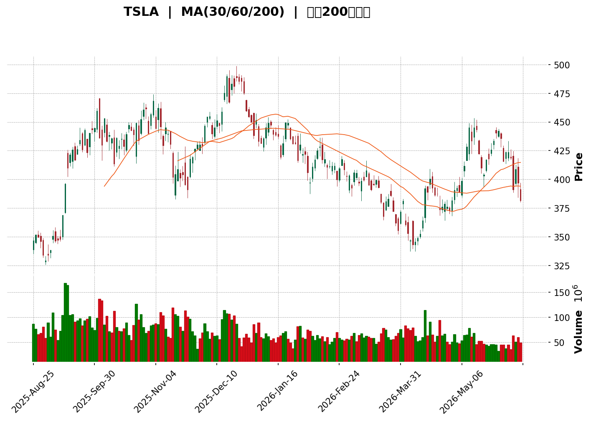
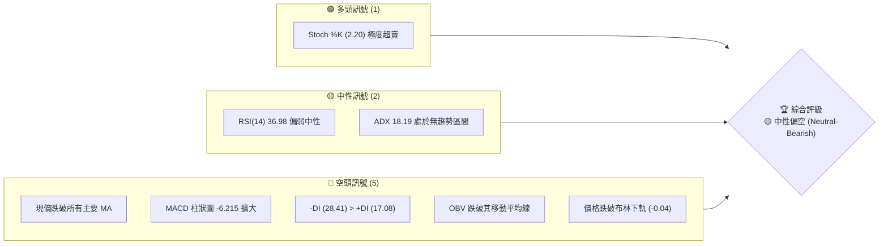
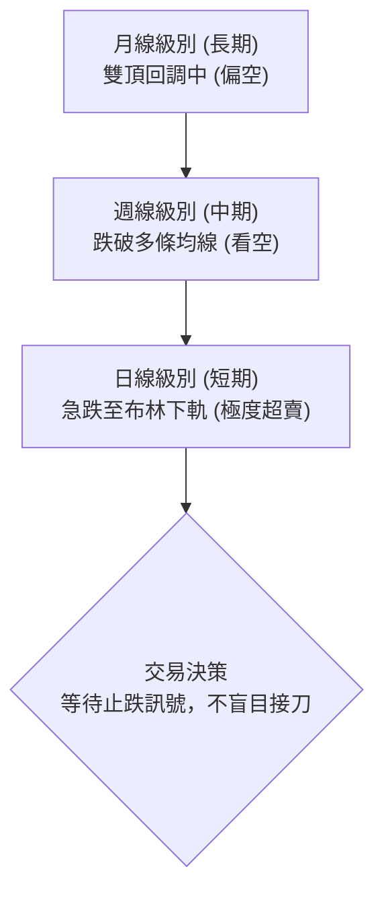
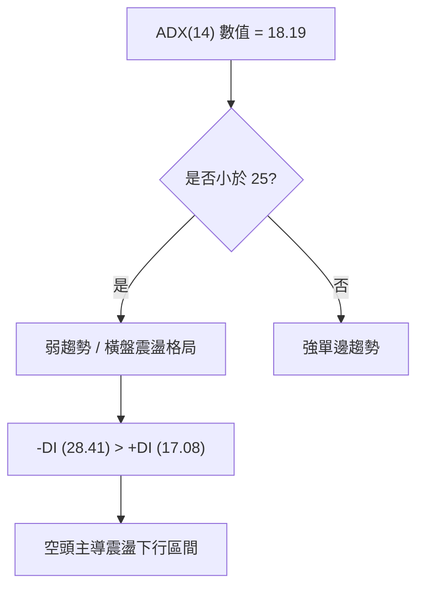
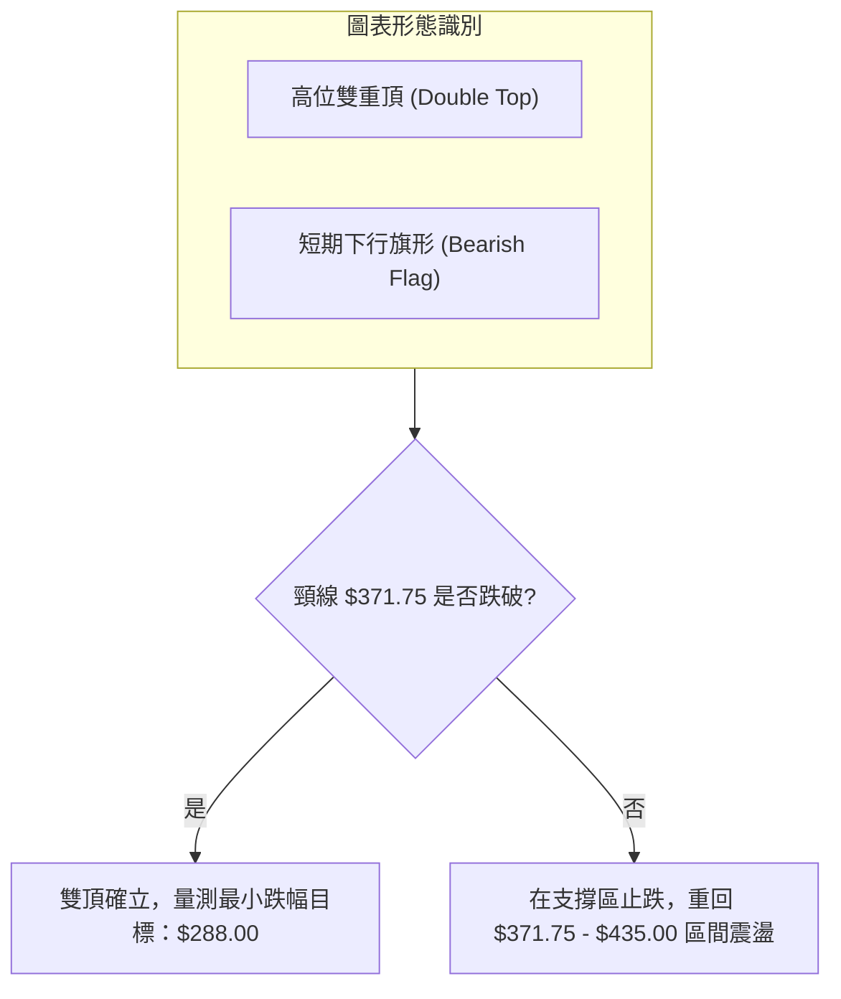

<details>
<summary>📊 靜態圖表 (點擊展開)</summary>

</details>

<html>
<head><meta charset="utf-8" /></head>
<body>
    <div style="height:500px; width:100%;">                        <script>window.PlotlyConfig = {MathJaxConfig: 'local'};</script>
        <script charset="utf-8" src="https://cdn.plot.ly/plotly-3.6.0.min.js" integrity="sha256-QaOVwtVY0T02VaHrr6pnoHLCwayMJp4O5n4YyaE3rJk=" crossorigin="anonymous"></script>                <div id="candlestick-chart" class="plotly-graph-div" style="height:100%; width:100%;"></div>            <script>                window.PLOTLYENV=window.PLOTLYENV || {};                                if (document.getElementById("candlestick-chart")) {                    Plotly.newPlot(                        "candlestick-chart",                        [{"close":{"dtype":"f8","bdata":"AAAAoJmpdUAAAABguPp1QAAAAKCZ2XVAAAAAIK6fdUAAAACA6910QAAAAIDClXRAAAAAoHDhdEAAAADgeih1QAAAAKBw7XVAAAAAYGamdUAAAAAgha91QAAAAOCjvHVAAAAAwPUMd0AAAABACr94QAAAAOCjoHlAAAAAgOtZekAAAACAwp16QAAAAKCZDXpAAAAAwB6hekAAAAAgXCN7QAAAAKCZnXpAAAAA4KOse0AAAACAPXZ6QAAAAGBmhntAAAAAIFyze0AAAAAghct7QAAAACBct3xAAAAAAABAe0AAAACgR916QAAAAAAAVHxAAAAAoHARe0AAAABACmt7QAAAAOCjOHtAAAAAANfXeUAAAABgZj57QAAAAADX03pAAAAAYGYye0AAAAAAAMx6QAAAAMD1dHtAAAAAQOH2e0AAAACgmal7QAAAACCFb3tAAAAAIK4PfEAAAAAghRt7QAAAAGC4RnxAAAAAwMzIfEAAAAAAKdh8QAAAAKCZgXtAAAAAwPWIfEAAAACA60V9QAAAAAApxHtAAAAAwB7hfEAAAABgj957QAAAAOBR2HpAAAAAIK7Te0AAAACA63l7QAAAAKCZ6XpAAAAAANcfeUAAAACgmUV5QAAAAGC4jnlAAAAAAAAUeUAAAAAA1z95QAAAACCus3hAAAAAoHBxeEAAAADgehx6QAAAAGBmNnpAAAAAoEepekAAAABguOJ6QAAAAIA94npAAAAAANfTekAAAAAA1+t7QAAAAOB6aHxAAAAAAABwfEAAAACgR3l7QAAAAGC40ntAAAAAQDM3fEAAAACAPe57QAAAACBcr3xAAAAAwPW0fUAAAACAFJ5+QAAAAAApNH1AAAAAgOs1fkAAAABAMxN+QAAAACCui35AAAAAwPVYfkAAAABgZlZ+QAAAAEAKs31AAAAAgD26fEAAAABA4WZ8QAAAACCFG3xAAAAAwB5he0AAAABguDp8QAAAACBcD3tAAAAAYI\u002f2ekAAAADAzDx7QAAAAAAp0HtAAAAAIFwPfEAAAABAM\u002fN7QAAAAEAzc3tAAAAAwB5pe0AAAAAAAFh7QAAAAAAANHpAAAAAQAr3ekAAAACAwhV8QAAAAMD1EHxAAAAAQDMze0AAAABgZu56QAAAACBc93pAAAAAwPUIekAAAABgj+Z6QAAAAMD1XHpAAAAAIFxfekAAAAAAKWB5QAAAACBc03hAAAAAgMKxeUAAAADAHhV6QAAAACBck3pAAAAA4FHEekAAAADAHhF6QAAAAEAKF3pAAAAAgBSqeUAAAADAHrV5QAAAACBcu3lAAAAAwB69eUAAAACgR\u002f14QAAAAIAUlnlAAAAAYGYWekAAAACgR4l5QAAAAAApKHlAAAAAwB41eUAAAABA4YZ4QAAAAEAKX3lAAAAAwMxYeUAAAAAgrst4QAAAAEDh6nhAAAAAANfzeEAAAADAHn15QAAAAAApsHhAAAAAQDNzeEAAAADA9bh4QAAAAOBR9HhAAAAA4HqMeEAAAADAzMR3QAAAACBc\u002f3ZAAAAAoJnNd0AAAADgevB3QAAAAEAzH3hAAAAAgMJBd0AAAACgR512QAAAAOB6NHZAAAAAAAA8d0AAAAAAKdR3QAAAAKBwiXZAAAAAwB4NdkAAAABgZqp1QAAAAAAAdHVAAAAAgOuZdUAAAABAM891QAAAAGC4BnZAAAAAQDPDdkAAAABAM394QAAAAGBmTnhAAAAAgOsJeUAAAAAAAIh4QAAAAGC4JnhAAAAAACk4eEAAAAAghVt3QAAAAMDMhHdAAAAAYLiqd0AAAADgUYB3QAAAAMDMTHdAAAAAgBTad0AAAADAHm14QAAAAAApiHhAAAAAgOtVeEAAAAAgrut4QAAAAOCjvHlAAAAAoJnFekAAAAAAANB7QAAAAEAzF3tAAAAA4FHUe0AAAADAzLR7QAAAAADXY3pAAAAAANefeUAAAACAwkF5QAAAAAApFHpAAAAAoJkdekAAAAAAKaB6QAAAAKBwGXtAAAAAgMKFe0AAAACgmaF7QAAAAOCjPHtAAAAAgBT+eUAAAAAA13t6QAAAAEAze3pAAAAAQDMnekAAAAAAAHB4QAAAAEAzj3lAAAAAQOHKeEAAAACgcNl3QA=="},"high":{"dtype":"f8","bdata":"AAAA4HrYdUAAAABgZv51QAAAAIA9NnZAAAAAwMwYdkAAAAAAAMx1QAAAAKBH1XRAAAAAoEd1dUAAAACAPS51QAAAAIDrPXZAAAAAQApndkAAAADgUex1QAAAAKBHRXZAAAAAANcPd0AAAABACst4QAAAAEAzm3pAAAAAAAB0ekAAAADA9cR6QAAAACCFA3tAAAAAIIXXekAAAAAgrs97QAAAACCFj3tAAAAAIFzDe0AAAACgmTV7QAAAACCFh3tAAAAAIK4vfEAAAAAAANB7QAAAAOCj5HxAAAAAAABsfUAAAADgUex7QAAAAMDMWHxAAAAAQOFKfEAAAACgR5V7QAAAAKCZRXtAAAAAgBSye0AAAACAPU57QAAAAEAzI3tAAAAAACmIe0AAAACgmXV7QAAAACBcl3tAAAAAwMwcfEAAAADAzBR8QAAAAOCj2HtAAAAAYGYWfEAAAABA4Tp8QAAAAGCPwnxAAAAAAAAwfUAAAABAMxt9QAAAAMD1cHxAAAAAAACgfEAAAADAHqF9QAAAACCFw3xAAAAAoEclfUAAAABAMzd9QAAAAIDCdXtAAAAAYLgafEAAAAAA16d7QAAAAKBHpXtAAAAAAACIekAAAABACsN5QAAAACBcf3pAAAAAYGaOeUAAAADgerx5QAAAAEAKz3pAAAAAwMwseUAAAAAghVt6QAAAACCuR3pAAAAAQAqvekAAAABA4Q57QAAAAGCPGntAAAAAwMxMe0AAAABguP57QAAAAIAUanxAAAAAgOutfEAAAAAAABx8QAAAAIA9RnxAAAAAgBSOfEAAAADgURR8QAAAAAAp8HxAAAAA4FEcfkAAAAAAALh+QAAAAOB69H5AAAAAgMKtfkAAAAAA16d+QAAAAKBHLX9AAAAAIIW\u002ffkAAAABgZq5+QAAAAKBwkX5AAAAAYGZWfUAAAACA6\u002fF8QAAAAMDMiHxAAAAAoHClfEAAAADAzJh8QAAAAAAABHxAAAAAgOtle0AAAACAPU57QAAAAMDMEHxAAAAAwMxkfEAAAADA9Tx8QAAAAGCPvntAAAAAgMLVe0AAAAAAAPR7QAAAACCu63pAAAAAQDNje0AAAAAAABh8QAAAAEDhRnxAAAAA4KPQe0AAAADgUVh7QAAAAAApZHtAAAAAIK6De0AAAACAFH57QAAAAGBmsnpAAAAAwPXIekAAAABgZn56QAAAAKCZIXlAAAAAwMzoeUAAAAAAAFR6QAAAAAAAtHpAAAAAoJlFe0AAAAAgrkN7QAAAAMD1gHpAAAAAIIXbeUAAAABgZg56QAAAAAAA9HlAAAAAQDPreUAAAABAM3t5QAAAAMAerXlAAAAAoHBFekAAAADA9Qx6QAAAAIDrcXlAAAAA4KNIeUAAAACgcMV4QAAAAKBHhXlAAAAAgOuJeUAAAACgmSV5QAAAAKBwGXlAAAAAoHBpeUAAAACAFAZ6QAAAAAAAaHlAAAAAQDMDeUAAAAAgrjt5QAAAAIDrAXlAAAAAwB4xeUAAAADgUTR4QAAAAIA9vndAAAAAoEcVeEAAAAAgrjd4QAAAACCuw3hAAAAAQAoHeEAAAACAwh13QAAAAOCj9HZAAAAAoEdVd0AAAACAPfJ3QAAAAOB6JHdAAAAAIIX7dkAAAADgUcB1QAAAAAAAyHZAAAAAgBTOdUAAAACAwuV1QAAAAKCZRXZAAAAAgBT6dkAAAABgZqp4QAAAAMD1oHhAAAAA4HqUeUAAAADAzGx5QAAAAEAzn3hAAAAAACmQeEAAAAAAACB4QAAAAAAp7HdAAAAA4HrMd0AAAADgo+R3QAAAAGBmhndAAAAAAAAMeEAAAADAHt14QAAAAIA9qnhAAAAAgOsheUAAAABA4Rp5QAAAAKBH\u002fXlAAAAAQDPzekAAAABgjxJ8QAAAAMDM\u002fHtAAAAAYGZWfEAAAAAgrj98QAAAAGCPKntAAAAAgBRSekAAAACAFFp5QAAAACBcF3pAAAAAQDOvekAAAAAAKfh6QAAAAEAzM3tAAAAAoJnZe0AAAAAgXL97QAAAAMAekXtAAAAAoJnZekAAAABguIZ6QAAAAKCZGXtAAAAAoJmlekAAAABA4Yp6QAAAAEAKz3lAAAAAAAAoekAAAACgcNF4QA=="},"hovertemplate":"\u003cb\u003e%{x|%Y-%m-%d}\u003c\u002fb\u003e\u003cbr\u003e\u958b: $%{open:.2f}\u003cbr\u003e\u9ad8: $%{high:.2f}\u003cbr\u003e\u4f4e: $%{low:.2f}\u003cbr\u003e\u6536: $%{close:.2f}\u003cextra\u003e\u003c\u002fextra\u003e","low":{"dtype":"f8","bdata":"AAAA4HrwdEAAAAAghXt1QAAAAGCP0nVAAAAAAClEdUAAAABAM7t0QAAAAKCZWXRAAAAAACmIdEAAAAAgrrd0QAAAAEDhinVAAAAAoHCNdUAAAADAHn11QAAAAMAeoXVAAAAAoJm5dUAAAAAA1yN3QAAAAEDhJnlAAAAAQOG2eUAAAABguJp5QAAAAMD1CHpAAAAAIIVbekAAAACAFNJ6QAAAACCFe3pAAAAA4HrQekAAAACgRzF6QAAAAOBRUHpAAAAAAAB4e0AAAACA6xF7QAAAAAAAjHtAAAAAwB45e0AAAACgRwl6QAAAAEAKS3tAAAAAQDMHe0AAAAAgrpN6QAAAAEDhonpAAAAAQDO3eUAAAABAMzt6QAAAAIDCHXpAAAAAoEelekAAAADA9VR6QAAAAKCZeXpAAAAAgMKJe0AAAADAzKB7QAAAAAAA0HpAAAAAYGbeeUAAAABguOJ6QAAAAEAKa3tAAAAAoJk5fEAAAABgZkp8QAAAAIDCeXtAAAAAQAq7e0AAAADAzFx8QAAAAKCZuXtAAAAAIFyLe0AAAACgcDF7QAAAAIAUXnpAAAAAgMIVe0AAAACAwgV7QAAAAMD1qHpAAAAAoHDFeEAAAADgeux3QAAAAADX63hAAAAAIFybeEAAAAAAAOh4QAAAAADXq3hAAAAAACn8d0AAAACgcBF5QAAAAEAzX3lAAAAAgD0OekAAAABAM6N6QAAAAOCjlHpAAAAAgOthekAAAACAwvF6QAAAAIA91ntAAAAAYI86fEAAAAAAADR7QAAAAEAzO3tAAAAAgMK5e0AAAACgR4V7QAAAAGC4mntAAAAAYI86fUAAAACgRx19QAAAAEAzI31AAAAAgOuRfUAAAAAghat9QAAAAKBHVX5AAAAAoHAtfkAAAADAzMx9QAAAAMAenX1AAAAAAACwfEAAAACgR118QAAAAMDMFHxAAAAAwMw0e0AAAADAHsl7QAAAAOB6zHpAAAAA4KP0ekAAAACA64V6QAAAAIA95npAAAAAAABge0AAAABAM797QAAAACCFI3tAAAAAYGZae0AAAAAAKTR7QAAAAEAKF3pAAAAAgOs5ekAAAACAFAp7QAAAAOCjwHtAAAAA4Hoke0AAAABACut6QAAAAKCZ4XpAAAAAgOvpeUAAAABAM2t6QAAAAAAA6HlAAAAAQArbeUAAAABA4fJ4QAAAAOB6OHhAAAAAAADceEAAAADgo3R5QAAAAAAAEHpAAAAA4HpAekAAAAAAAOB5QAAAAIAUrnlAAAAAACkIeUAAAACgR5l5QAAAAIDCQXlAAAAAAABYeUAAAADgo6B4QAAAAIA92nhAAAAAYGbCeUAAAABgjzp5QAAAAIDC4XhAAAAAAABEeEAAAACAPRZ4QAAAAKBHqXhAAAAAYLj2eEAAAAAgXKN4QAAAAGBm1ndAAAAAQArjeEAAAABgZiJ5QAAAAGBmqnhAAAAAQDNfeEAAAABguKZ4QAAAAAAAkHhAAAAAwPWEeEAAAAAgrqt3QAAAACBcx3ZAAAAAIK5Ld0AAAADA9YR3QAAAAAApEHhAAAAAgOs9d0AAAAAghXd2QAAAAIA9AnZAAAAAAACQdkAAAACgR2F3QAAAAOB6cHZAAAAAgD2qdUAAAAAA1xN1QAAAAGC4OnVAAAAAAAAUdUAAAAAA12t1QAAAAMAeyXVAAAAA4FEsdkAAAAAAAKh2QAAAAMDM3HdAAAAAYGZ6eEAAAACgR0V4QAAAACCFE3hAAAAAwMwUeEAAAACAPQZ3QAAAACCuK3dAAAAA4FHAdkAAAADgo0h3QAAAAOCjIHdAAAAAYLgCd0AAAADAzKx3QAAAAMDMDHhAAAAAAABQeEAAAADgUQB4QAAAAIDrIXlAAAAAgD0GekAAAADAzAx6QAAAAAApZHpAAAAAIFzjekAAAABgj5J7QAAAAAAAYHpAAAAAoEdVeUAAAACAFJp4QAAAAIA9ZnlAAAAAYGbOeUAAAAAAKUh6QAAAAIDroXpAAAAA4FE4e0AAAADAzER7QAAAAIA9wnpAAAAAQOH2eUAAAABgZtp5QAAAAAAAAHpAAAAAYI8SekAAAACgcEl4QAAAACCFq3hAAAAAANcDeEAAAABgZsJ3QA=="},"name":"\u50f9\u683c","open":{"dtype":"f8","bdata":"AAAAYGYudUAAAABA4Y51QAAAAEAK\u002f3VAAAAAYI\u002fudUAAAAAgrrN1QAAAACCug3RAAAAAQDPzdEAAAABgZgJ1QAAAAAAAwHVAAAAAgD0qdkAAAABACsd1QAAAAMDM6HVAAAAAYLjidUAAAABACi93QAAAAIAUcnpAAAAAAADoeUAAAAAAAPx5QAAAAIDrzXpAAAAAwB5dekAAAACAwvF6QAAAAIAUfntAAAAAoEfdekAAAAAA1zN7QAAAAMDMxHpAAAAAoJnFe0AAAADgUZh7QAAAAMDMvHtAAAAA4KNofUAAAADgo7R7QAAAAAAAjHtAAAAAwB79e0AAAADAHll7QAAAAMD1\u002fHpAAAAA4KNIe0AAAADgenh6QAAAAOCjrHpAAAAAYGYue0AAAAAgrit7QAAAAAAAmHpAAAAAgOu9e0AAAAAAKdx7QAAAAEAzt3tAAAAAAABAekAAAACgR+17QAAAACCuf3tAAAAA4HpsfEAAAAAAAOh8QAAAAMDMMHxAAAAAAADse0AAAAAA1398QAAAACBcZ3xAAAAAwMxAfEAAAAAgXN98QAAAAGC4XntAAAAAoJl5e0AAAABgZnZ7QAAAAGBmontAAAAAgBRyekAAAADAzCR4QAAAAADX63hAAAAAgBRWeUAAAABA4WJ5QAAAAIAU6nlAAAAAwB4leUAAAABguCJ5QAAAAGC45nlAAAAAQDN\u002fekAAAACgcKl6QAAAAMAelXpAAAAAwPXsekAAAACgmQF7QAAAAEAKH3xAAAAA4HpQfEAAAABAM\u002fd7QAAAAOCjWHtAAAAAwB7he0AAAABAMw98QAAAAKBwAXxAAAAAQApXfUAAAAAgXIN9QAAAACCFg35AAAAAYI\u002fifUAAAACA64F+QAAAAIAUnn5AAAAAYGaWfkAAAAAgrod+QAAAACCuU35AAAAAAABQfUAAAACgcNF8QAAAAKCZgXxAAAAAwMycfEAAAAAA1\u002f97QAAAAIAU5ntAAAAAYGY+e0AAAACAPb56QAAAAEAzP3tAAAAAIK6Te0AAAABAMyN8QAAAAMD1rHtAAAAAgBSSe0AAAAAAAHh7QAAAAIDC1XpAAAAAYI9aekAAAABgjzJ7QAAAAEDh9ntAAAAAAADQe0AAAABgj1Z7QAAAAGCP\u002fnpAAAAAwMxce0AAAACgmZV6QAAAAOCjVHpAAAAA4FGEekAAAAAgXEd6QAAAAOBR0HhAAAAAgOsNeUAAAABgj555QAAAAKBHIXpAAAAAIFy\u002fekAAAADAzOR6QAAAAMD15HlAAAAAgMLFeUAAAACAwrF5QAAAAAAAdHlAAAAAwMyEeUAAAADgo3R5QAAAAAAA+HhAAAAAYGbCeUAAAABguOZ5QAAAAEAKL3lAAAAAoJlpeEAAAACgcLF4QAAAAKCZ3XhAAAAAwB4ZeUAAAACgcOF4QAAAAMDMYHhAAAAAIIUjeUAAAADgeiR5QAAAAEDhUnlAAAAAYLjyeEAAAAAghcN4QAAAAEAKu3hAAAAAAADweEAAAADgUTR4QAAAAKCZvXdAAAAAoHBRd0AAAADA9Yh3QAAAAADXX3hAAAAAoJnZd0AAAABACht3QAAAAIDC3XZAAAAAACmYdkAAAACAFKp3QAAAAEAzw3ZAAAAAoHCpdkAAAABACqd1QAAAAOCjvHZAAAAAYGZydUAAAADgo6R1QAAAAMAe4XVAAAAAYLhadkAAAACgR+12QAAAAMD1nHhAAAAAYLi+eEAAAACgRyl5QAAAAAAAkHhAAAAAwB45eEAAAADgenR3QAAAAAAAWHdAAAAAoHBBd0AAAABA4Wp3QAAAAGBmdndAAAAAAABMd0AAAAAA1+d3QAAAACCuY3hAAAAAQAqzeEAAAAAAACR4QAAAACCud3lAAAAAIK4HekAAAABgj2J6QAAAAGCPlntAAAAAYLhKe0AAAAAA1+d7QAAAACCuH3tAAAAA4FE0ekAAAABgjzJ5QAAAAKCZeXlAAAAAQOFiekAAAABguGp6QAAAAAAp5HpAAAAAgD2ue0AAAACA61l7QAAAAKCZfXtAAAAAANe3ekAAAAAghSN6QAAAAEAzK3pAAAAAoHA9ekAAAAAAAEh6QAAAAKBHxXhAAAAA4HqweUAAAABgj3Z4QA=="},"x":["2025-08-25T00:00:00-04:00","2025-08-26T00:00:00-04:00","2025-08-27T00:00:00-04:00","2025-08-28T00:00:00-04:00","2025-08-29T00:00:00-04:00","2025-09-02T00:00:00-04:00","2025-09-03T00:00:00-04:00","2025-09-04T00:00:00-04:00","2025-09-05T00:00:00-04:00","2025-09-08T00:00:00-04:00","2025-09-09T00:00:00-04:00","2025-09-10T00:00:00-04:00","2025-09-11T00:00:00-04:00","2025-09-12T00:00:00-04:00","2025-09-15T00:00:00-04:00","2025-09-16T00:00:00-04:00","2025-09-17T00:00:00-04:00","2025-09-18T00:00:00-04:00","2025-09-19T00:00:00-04:00","2025-09-22T00:00:00-04:00","2025-09-23T00:00:00-04:00","2025-09-24T00:00:00-04:00","2025-09-25T00:00:00-04:00","2025-09-26T00:00:00-04:00","2025-09-29T00:00:00-04:00","2025-09-30T00:00:00-04:00","2025-10-01T00:00:00-04:00","2025-10-02T00:00:00-04:00","2025-10-03T00:00:00-04:00","2025-10-06T00:00:00-04:00","2025-10-07T00:00:00-04:00","2025-10-08T00:00:00-04:00","2025-10-09T00:00:00-04:00","2025-10-10T00:00:00-04:00","2025-10-13T00:00:00-04:00","2025-10-14T00:00:00-04:00","2025-10-15T00:00:00-04:00","2025-10-16T00:00:00-04:00","2025-10-17T00:00:00-04:00","2025-10-20T00:00:00-04:00","2025-10-21T00:00:00-04:00","2025-10-22T00:00:00-04:00","2025-10-23T00:00:00-04:00","2025-10-24T00:00:00-04:00","2025-10-27T00:00:00-04:00","2025-10-28T00:00:00-04:00","2025-10-29T00:00:00-04:00","2025-10-30T00:00:00-04:00","2025-10-31T00:00:00-04:00","2025-11-03T00:00:00-05:00","2025-11-04T00:00:00-05:00","2025-11-05T00:00:00-05:00","2025-11-06T00:00:00-05:00","2025-11-07T00:00:00-05:00","2025-11-10T00:00:00-05:00","2025-11-11T00:00:00-05:00","2025-11-12T00:00:00-05:00","2025-11-13T00:00:00-05:00","2025-11-14T00:00:00-05:00","2025-11-17T00:00:00-05:00","2025-11-18T00:00:00-05:00","2025-11-19T00:00:00-05:00","2025-11-20T00:00:00-05:00","2025-11-21T00:00:00-05:00","2025-11-24T00:00:00-05:00","2025-11-25T00:00:00-05:00","2025-11-26T00:00:00-05:00","2025-11-28T00:00:00-05:00","2025-12-01T00:00:00-05:00","2025-12-02T00:00:00-05:00","2025-12-03T00:00:00-05:00","2025-12-04T00:00:00-05:00","2025-12-05T00:00:00-05:00","2025-12-08T00:00:00-05:00","2025-12-09T00:00:00-05:00","2025-12-10T00:00:00-05:00","2025-12-11T00:00:00-05:00","2025-12-12T00:00:00-05:00","2025-12-15T00:00:00-05:00","2025-12-16T00:00:00-05:00","2025-12-17T00:00:00-05:00","2025-12-18T00:00:00-05:00","2025-12-19T00:00:00-05:00","2025-12-22T00:00:00-05:00","2025-12-23T00:00:00-05:00","2025-12-24T00:00:00-05:00","2025-12-26T00:00:00-05:00","2025-12-29T00:00:00-05:00","2025-12-30T00:00:00-05:00","2025-12-31T00:00:00-05:00","2026-01-02T00:00:00-05:00","2026-01-05T00:00:00-05:00","2026-01-06T00:00:00-05:00","2026-01-07T00:00:00-05:00","2026-01-08T00:00:00-05:00","2026-01-09T00:00:00-05:00","2026-01-12T00:00:00-05:00","2026-01-13T00:00:00-05:00","2026-01-14T00:00:00-05:00","2026-01-15T00:00:00-05:00","2026-01-16T00:00:00-05:00","2026-01-20T00:00:00-05:00","2026-01-21T00:00:00-05:00","2026-01-22T00:00:00-05:00","2026-01-23T00:00:00-05:00","2026-01-26T00:00:00-05:00","2026-01-27T00:00:00-05:00","2026-01-28T00:00:00-05:00","2026-01-29T00:00:00-05:00","2026-01-30T00:00:00-05:00","2026-02-02T00:00:00-05:00","2026-02-03T00:00:00-05:00","2026-02-04T00:00:00-05:00","2026-02-05T00:00:00-05:00","2026-02-06T00:00:00-05:00","2026-02-09T00:00:00-05:00","2026-02-10T00:00:00-05:00","2026-02-11T00:00:00-05:00","2026-02-12T00:00:00-05:00","2026-02-13T00:00:00-05:00","2026-02-17T00:00:00-05:00","2026-02-18T00:00:00-05:00","2026-02-19T00:00:00-05:00","2026-02-20T00:00:00-05:00","2026-02-23T00:00:00-05:00","2026-02-24T00:00:00-05:00","2026-02-25T00:00:00-05:00","2026-02-26T00:00:00-05:00","2026-02-27T00:00:00-05:00","2026-03-02T00:00:00-05:00","2026-03-03T00:00:00-05:00","2026-03-04T00:00:00-05:00","2026-03-05T00:00:00-05:00","2026-03-06T00:00:00-05:00","2026-03-09T00:00:00-04:00","2026-03-10T00:00:00-04:00","2026-03-11T00:00:00-04:00","2026-03-12T00:00:00-04:00","2026-03-13T00:00:00-04:00","2026-03-16T00:00:00-04:00","2026-03-17T00:00:00-04:00","2026-03-18T00:00:00-04:00","2026-03-19T00:00:00-04:00","2026-03-20T00:00:00-04:00","2026-03-23T00:00:00-04:00","2026-03-24T00:00:00-04:00","2026-03-25T00:00:00-04:00","2026-03-26T00:00:00-04:00","2026-03-27T00:00:00-04:00","2026-03-30T00:00:00-04:00","2026-03-31T00:00:00-04:00","2026-04-01T00:00:00-04:00","2026-04-02T00:00:00-04:00","2026-04-06T00:00:00-04:00","2026-04-07T00:00:00-04:00","2026-04-08T00:00:00-04:00","2026-04-09T00:00:00-04:00","2026-04-10T00:00:00-04:00","2026-04-13T00:00:00-04:00","2026-04-14T00:00:00-04:00","2026-04-15T00:00:00-04:00","2026-04-16T00:00:00-04:00","2026-04-17T00:00:00-04:00","2026-04-20T00:00:00-04:00","2026-04-21T00:00:00-04:00","2026-04-22T00:00:00-04:00","2026-04-23T00:00:00-04:00","2026-04-24T00:00:00-04:00","2026-04-27T00:00:00-04:00","2026-04-28T00:00:00-04:00","2026-04-29T00:00:00-04:00","2026-04-30T00:00:00-04:00","2026-05-01T00:00:00-04:00","2026-05-04T00:00:00-04:00","2026-05-05T00:00:00-04:00","2026-05-06T00:00:00-04:00","2026-05-07T00:00:00-04:00","2026-05-08T00:00:00-04:00","2026-05-11T00:00:00-04:00","2026-05-12T00:00:00-04:00","2026-05-13T00:00:00-04:00","2026-05-14T00:00:00-04:00","2026-05-15T00:00:00-04:00","2026-05-18T00:00:00-04:00","2026-05-19T00:00:00-04:00","2026-05-20T00:00:00-04:00","2026-05-21T00:00:00-04:00","2026-05-22T00:00:00-04:00","2026-05-26T00:00:00-04:00","2026-05-27T00:00:00-04:00","2026-05-28T00:00:00-04:00","2026-05-29T00:00:00-04:00","2026-06-01T00:00:00-04:00","2026-06-02T00:00:00-04:00","2026-06-03T00:00:00-04:00","2026-06-04T00:00:00-04:00","2026-06-05T00:00:00-04:00","2026-06-08T00:00:00-04:00","2026-06-09T00:00:00-04:00","2026-06-10T00:00:00-04:00"],"type":"candlestick"},{"hovertemplate":"MA30: $%{y:.2f}\u003cextra\u003e\u003c\u002fextra\u003e","line":{"color":"#2196F3","dash":"dash","width":2},"mode":"lines","name":"MA30","x":["2025-08-25T00:00:00-04:00","2025-08-26T00:00:00-04:00","2025-08-27T00:00:00-04:00","2025-08-28T00:00:00-04:00","2025-08-29T00:00:00-04:00","2025-09-02T00:00:00-04:00","2025-09-03T00:00:00-04:00","2025-09-04T00:00:00-04:00","2025-09-05T00:00:00-04:00","2025-09-08T00:00:00-04:00","2025-09-09T00:00:00-04:00","2025-09-10T00:00:00-04:00","2025-09-11T00:00:00-04:00","2025-09-12T00:00:00-04:00","2025-09-15T00:00:00-04:00","2025-09-16T00:00:00-04:00","2025-09-17T00:00:00-04:00","2025-09-18T00:00:00-04:00","2025-09-19T00:00:00-04:00","2025-09-22T00:00:00-04:00","2025-09-23T00:00:00-04:00","2025-09-24T00:00:00-04:00","2025-09-25T00:00:00-04:00","2025-09-26T00:00:00-04:00","2025-09-29T00:00:00-04:00","2025-09-30T00:00:00-04:00","2025-10-01T00:00:00-04:00","2025-10-02T00:00:00-04:00","2025-10-03T00:00:00-04:00","2025-10-06T00:00:00-04:00","2025-10-07T00:00:00-04:00","2025-10-08T00:00:00-04:00","2025-10-09T00:00:00-04:00","2025-10-10T00:00:00-04:00","2025-10-13T00:00:00-04:00","2025-10-14T00:00:00-04:00","2025-10-15T00:00:00-04:00","2025-10-16T00:00:00-04:00","2025-10-17T00:00:00-04:00","2025-10-20T00:00:00-04:00","2025-10-21T00:00:00-04:00","2025-10-22T00:00:00-04:00","2025-10-23T00:00:00-04:00","2025-10-24T00:00:00-04:00","2025-10-27T00:00:00-04:00","2025-10-28T00:00:00-04:00","2025-10-29T00:00:00-04:00","2025-10-30T00:00:00-04:00","2025-10-31T00:00:00-04:00","2025-11-03T00:00:00-05:00","2025-11-04T00:00:00-05:00","2025-11-05T00:00:00-05:00","2025-11-06T00:00:00-05:00","2025-11-07T00:00:00-05:00","2025-11-10T00:00:00-05:00","2025-11-11T00:00:00-05:00","2025-11-12T00:00:00-05:00","2025-11-13T00:00:00-05:00","2025-11-14T00:00:00-05:00","2025-11-17T00:00:00-05:00","2025-11-18T00:00:00-05:00","2025-11-19T00:00:00-05:00","2025-11-20T00:00:00-05:00","2025-11-21T00:00:00-05:00","2025-11-24T00:00:00-05:00","2025-11-25T00:00:00-05:00","2025-11-26T00:00:00-05:00","2025-11-28T00:00:00-05:00","2025-12-01T00:00:00-05:00","2025-12-02T00:00:00-05:00","2025-12-03T00:00:00-05:00","2025-12-04T00:00:00-05:00","2025-12-05T00:00:00-05:00","2025-12-08T00:00:00-05:00","2025-12-09T00:00:00-05:00","2025-12-10T00:00:00-05:00","2025-12-11T00:00:00-05:00","2025-12-12T00:00:00-05:00","2025-12-15T00:00:00-05:00","2025-12-16T00:00:00-05:00","2025-12-17T00:00:00-05:00","2025-12-18T00:00:00-05:00","2025-12-19T00:00:00-05:00","2025-12-22T00:00:00-05:00","2025-12-23T00:00:00-05:00","2025-12-24T00:00:00-05:00","2025-12-26T00:00:00-05:00","2025-12-29T00:00:00-05:00","2025-12-30T00:00:00-05:00","2025-12-31T00:00:00-05:00","2026-01-02T00:00:00-05:00","2026-01-05T00:00:00-05:00","2026-01-06T00:00:00-05:00","2026-01-07T00:00:00-05:00","2026-01-08T00:00:00-05:00","2026-01-09T00:00:00-05:00","2026-01-12T00:00:00-05:00","2026-01-13T00:00:00-05:00","2026-01-14T00:00:00-05:00","2026-01-15T00:00:00-05:00","2026-01-16T00:00:00-05:00","2026-01-20T00:00:00-05:00","2026-01-21T00:00:00-05:00","2026-01-22T00:00:00-05:00","2026-01-23T00:00:00-05:00","2026-01-26T00:00:00-05:00","2026-01-27T00:00:00-05:00","2026-01-28T00:00:00-05:00","2026-01-29T00:00:00-05:00","2026-01-30T00:00:00-05:00","2026-02-02T00:00:00-05:00","2026-02-03T00:00:00-05:00","2026-02-04T00:00:00-05:00","2026-02-05T00:00:00-05:00","2026-02-06T00:00:00-05:00","2026-02-09T00:00:00-05:00","2026-02-10T00:00:00-05:00","2026-02-11T00:00:00-05:00","2026-02-12T00:00:00-05:00","2026-02-13T00:00:00-05:00","2026-02-17T00:00:00-05:00","2026-02-18T00:00:00-05:00","2026-02-19T00:00:00-05:00","2026-02-20T00:00:00-05:00","2026-02-23T00:00:00-05:00","2026-02-24T00:00:00-05:00","2026-02-25T00:00:00-05:00","2026-02-26T00:00:00-05:00","2026-02-27T00:00:00-05:00","2026-03-02T00:00:00-05:00","2026-03-03T00:00:00-05:00","2026-03-04T00:00:00-05:00","2026-03-05T00:00:00-05:00","2026-03-06T00:00:00-05:00","2026-03-09T00:00:00-04:00","2026-03-10T00:00:00-04:00","2026-03-11T00:00:00-04:00","2026-03-12T00:00:00-04:00","2026-03-13T00:00:00-04:00","2026-03-16T00:00:00-04:00","2026-03-17T00:00:00-04:00","2026-03-18T00:00:00-04:00","2026-03-19T00:00:00-04:00","2026-03-20T00:00:00-04:00","2026-03-23T00:00:00-04:00","2026-03-24T00:00:00-04:00","2026-03-25T00:00:00-04:00","2026-03-26T00:00:00-04:00","2026-03-27T00:00:00-04:00","2026-03-30T00:00:00-04:00","2026-03-31T00:00:00-04:00","2026-04-01T00:00:00-04:00","2026-04-02T00:00:00-04:00","2026-04-06T00:00:00-04:00","2026-04-07T00:00:00-04:00","2026-04-08T00:00:00-04:00","2026-04-09T00:00:00-04:00","2026-04-10T00:00:00-04:00","2026-04-13T00:00:00-04:00","2026-04-14T00:00:00-04:00","2026-04-15T00:00:00-04:00","2026-04-16T00:00:00-04:00","2026-04-17T00:00:00-04:00","2026-04-20T00:00:00-04:00","2026-04-21T00:00:00-04:00","2026-04-22T00:00:00-04:00","2026-04-23T00:00:00-04:00","2026-04-24T00:00:00-04:00","2026-04-27T00:00:00-04:00","2026-04-28T00:00:00-04:00","2026-04-29T00:00:00-04:00","2026-04-30T00:00:00-04:00","2026-05-01T00:00:00-04:00","2026-05-04T00:00:00-04:00","2026-05-05T00:00:00-04:00","2026-05-06T00:00:00-04:00","2026-05-07T00:00:00-04:00","2026-05-08T00:00:00-04:00","2026-05-11T00:00:00-04:00","2026-05-12T00:00:00-04:00","2026-05-13T00:00:00-04:00","2026-05-14T00:00:00-04:00","2026-05-15T00:00:00-04:00","2026-05-18T00:00:00-04:00","2026-05-19T00:00:00-04:00","2026-05-20T00:00:00-04:00","2026-05-21T00:00:00-04:00","2026-05-22T00:00:00-04:00","2026-05-26T00:00:00-04:00","2026-05-27T00:00:00-04:00","2026-05-28T00:00:00-04:00","2026-05-29T00:00:00-04:00","2026-06-01T00:00:00-04:00","2026-06-02T00:00:00-04:00","2026-06-03T00:00:00-04:00","2026-06-04T00:00:00-04:00","2026-06-05T00:00:00-04:00","2026-06-08T00:00:00-04:00","2026-06-09T00:00:00-04:00","2026-06-10T00:00:00-04:00"],"y":{"dtype":"f8","bdata":"AAAAAAAA+H8AAAAAAAD4fwAAAAAAAPh\u002fAAAAAAAA+H8AAAAAAAD4fwAAAAAAAPh\u002fAAAAAAAA+H8AAAAAAAD4fwAAAAAAAPh\u002fAAAAAAAA+H8AAAAAAAD4fwAAAAAAAPh\u002fAAAAAAAA+H8AAAAAAAD4fwAAAAAAAPh\u002fAAAAAAAA+H8AAAAAAAD4fwAAAAAAAPh\u002fAAAAAAAA+H8AAAAAAAD4fwAAAAAAAPh\u002fAAAAAAAA+H8AAAAAAAD4fwAAAAAAAPh\u002fAAAAAAAA+H8AAAAAAAD4fwAAAAAAAPh\u002fAAAAAAAA+H8AAAAAAAD4fwAAAAAAoHhARERExCDOeEBVVVXlifx4QCIiIpJfKnlA7+7u7mBOeUDe3d1ty4R5QBEREWEQunlAAAAAcPbveUCamZl5FCB6QERERJRDT3pAq6qqiiWFekCamZk5Jrh6QFVVVVXH6HpAZmZmNokTe0ARERFxryd7QJqZmblJPntAd3d39wxTe0AiIiJiEGZ7QImIiMh2cntA7+7urrmCe0CamZmp8ZR7QN7d3T3DnntAq6qqmgupe0BVVVVVDrV7QJqZmdlAr3tAZmZmplSwe0BERERUnK17QKuqqvo3nntAq6qqehSMe0DNzMycfX57QHd3dxfZZntA7+7u3t1Ve0CamZkpXEN7QBEREYHcLXtAiYiIKOohe0DNzMwsQBh7QAAAALAAE3tAiYiImG4Oe0CamZl5MA97QHd3d3dMCntAzczM7JgAe0C8u7srzgJ7QBEREaEaC3tA7+7ujlAOe0BERESkcBF7QGZmZsaSDXtAMzMzU7gIe0BVVVU17AB7QJqZmTn7CntAmpmZOfsUe0Dv7u4OdCB7QDMzM1O4LHtAvLu7exQ4e0Dv7u6+5kp7QDMzM+N6antAZmZmRv1\u002fe0BVVVXFZ5h7QKuqqsovsHtAERER8e7Oe0B3d3eHpOl7QGZmZhZn\u002f3tA7+7uPgoTfECJiIgoeCx8QO\u002fu7o6XQHxAVVVVlRhWfECamZnptF98QImIiIhdbXxAZmZmJk15fEAAAABQYoJ8QN7d3U03h3xAmpmZKTGMfECJiIiYQ4d8QDMzM7NydHxAmpmZ+eFnfEBVVVVFGW18QCIiImIsb3xAd3d3t4FmfEC8u7uL+l18QBEREeFPT3xAvLu7i\u002fovfECJiIjoQhB8QHd3d3cF+HtARERE9ETXe0AzMzMDK697QKuqqnpbfntAIiIikqZWe0AiIiJiVzJ7QCIiInKvF3tAREREZPQGe0AiIiKCB\u002fN6QGZmZjbQ4XpAzczMvC3TekDe3d2dqL16QImIiEhTsnpAiYiImOCnekDe3d19sZR6QO\u002fu7s6wgXpAERER0dtwekBVVVXlQlx6QM3MzHyxSHpAAAAAsOQ1ekAREREh2x16QO\u002fu7t7BFnpAVVVVBfMIekBmZmZG4ex5QJqZmbkC0nlAvLu7+9S+eUC8u7vLhbJ5QImIiCgVn3lAzczMrI6ReUDNzMx8+H55QGZmZgbzcnlAvLu7+2JjeUBVVVW1rFV5QLy7uxsTRnlAzczMnO81eUAiIiLipSN5QGZmZpa1DnlAAAAA4MHweEBVVVXFS9N4QLy7u9sksnhAERERcWideEAAAABAYI14QKuqqqoccnhAMzMzM6VSeEC8u7tbSDZ4QImIiGgDE3hAvLu7C7vsd0ARERGR7cx3QM3MzJw2sndA3t3dbVmdd0BVVVXlF513QN7d3V0BlHdAIiIiQmCRd0CJiIi4Ho93QDMzM9OUiHdAq6qqSlOCd0ARERGBI3B3QGZmZvYoZndAMzMzM3pfd0BmZmZWDlV3QM3MzEzwRndARERE9P1Ad0CamZlJmkZ3QO\u002fu7i6yU3dAIiIicj1Yd0BVVVUFnWB3QKuqqgplbndA3t3drWOMd0CJiIgov7h3QImIiPhv4ndAZmZm5qUJeEDNzMxsvCp4QERERLSdS3hAAAAAUBtqeEBERESEwIh4QJqZmVk5sHhAd3d3J7\u002fWeECamZlp2P94QCIiItIiK3lAIiIiMsFTeUB3d3dXgG55QERERGSCh3lARERE5KWPeUARERExT6B5QHd3dycxtHlA7+7ufrHEeUCrqqrK6M15QLy7u5tS33lAIiIiku3oeUAAAAAQ5ut5QA=="},"type":"scatter"},{"hovertemplate":"MA60: $%{y:.2f}\u003cextra\u003e\u003c\u002fextra\u003e","line":{"color":"#9C27B0","dash":"dash","width":2},"mode":"lines","name":"MA60","x":["2025-08-25T00:00:00-04:00","2025-08-26T00:00:00-04:00","2025-08-27T00:00:00-04:00","2025-08-28T00:00:00-04:00","2025-08-29T00:00:00-04:00","2025-09-02T00:00:00-04:00","2025-09-03T00:00:00-04:00","2025-09-04T00:00:00-04:00","2025-09-05T00:00:00-04:00","2025-09-08T00:00:00-04:00","2025-09-09T00:00:00-04:00","2025-09-10T00:00:00-04:00","2025-09-11T00:00:00-04:00","2025-09-12T00:00:00-04:00","2025-09-15T00:00:00-04:00","2025-09-16T00:00:00-04:00","2025-09-17T00:00:00-04:00","2025-09-18T00:00:00-04:00","2025-09-19T00:00:00-04:00","2025-09-22T00:00:00-04:00","2025-09-23T00:00:00-04:00","2025-09-24T00:00:00-04:00","2025-09-25T00:00:00-04:00","2025-09-26T00:00:00-04:00","2025-09-29T00:00:00-04:00","2025-09-30T00:00:00-04:00","2025-10-01T00:00:00-04:00","2025-10-02T00:00:00-04:00","2025-10-03T00:00:00-04:00","2025-10-06T00:00:00-04:00","2025-10-07T00:00:00-04:00","2025-10-08T00:00:00-04:00","2025-10-09T00:00:00-04:00","2025-10-10T00:00:00-04:00","2025-10-13T00:00:00-04:00","2025-10-14T00:00:00-04:00","2025-10-15T00:00:00-04:00","2025-10-16T00:00:00-04:00","2025-10-17T00:00:00-04:00","2025-10-20T00:00:00-04:00","2025-10-21T00:00:00-04:00","2025-10-22T00:00:00-04:00","2025-10-23T00:00:00-04:00","2025-10-24T00:00:00-04:00","2025-10-27T00:00:00-04:00","2025-10-28T00:00:00-04:00","2025-10-29T00:00:00-04:00","2025-10-30T00:00:00-04:00","2025-10-31T00:00:00-04:00","2025-11-03T00:00:00-05:00","2025-11-04T00:00:00-05:00","2025-11-05T00:00:00-05:00","2025-11-06T00:00:00-05:00","2025-11-07T00:00:00-05:00","2025-11-10T00:00:00-05:00","2025-11-11T00:00:00-05:00","2025-11-12T00:00:00-05:00","2025-11-13T00:00:00-05:00","2025-11-14T00:00:00-05:00","2025-11-17T00:00:00-05:00","2025-11-18T00:00:00-05:00","2025-11-19T00:00:00-05:00","2025-11-20T00:00:00-05:00","2025-11-21T00:00:00-05:00","2025-11-24T00:00:00-05:00","2025-11-25T00:00:00-05:00","2025-11-26T00:00:00-05:00","2025-11-28T00:00:00-05:00","2025-12-01T00:00:00-05:00","2025-12-02T00:00:00-05:00","2025-12-03T00:00:00-05:00","2025-12-04T00:00:00-05:00","2025-12-05T00:00:00-05:00","2025-12-08T00:00:00-05:00","2025-12-09T00:00:00-05:00","2025-12-10T00:00:00-05:00","2025-12-11T00:00:00-05:00","2025-12-12T00:00:00-05:00","2025-12-15T00:00:00-05:00","2025-12-16T00:00:00-05:00","2025-12-17T00:00:00-05:00","2025-12-18T00:00:00-05:00","2025-12-19T00:00:00-05:00","2025-12-22T00:00:00-05:00","2025-12-23T00:00:00-05:00","2025-12-24T00:00:00-05:00","2025-12-26T00:00:00-05:00","2025-12-29T00:00:00-05:00","2025-12-30T00:00:00-05:00","2025-12-31T00:00:00-05:00","2026-01-02T00:00:00-05:00","2026-01-05T00:00:00-05:00","2026-01-06T00:00:00-05:00","2026-01-07T00:00:00-05:00","2026-01-08T00:00:00-05:00","2026-01-09T00:00:00-05:00","2026-01-12T00:00:00-05:00","2026-01-13T00:00:00-05:00","2026-01-14T00:00:00-05:00","2026-01-15T00:00:00-05:00","2026-01-16T00:00:00-05:00","2026-01-20T00:00:00-05:00","2026-01-21T00:00:00-05:00","2026-01-22T00:00:00-05:00","2026-01-23T00:00:00-05:00","2026-01-26T00:00:00-05:00","2026-01-27T00:00:00-05:00","2026-01-28T00:00:00-05:00","2026-01-29T00:00:00-05:00","2026-01-30T00:00:00-05:00","2026-02-02T00:00:00-05:00","2026-02-03T00:00:00-05:00","2026-02-04T00:00:00-05:00","2026-02-05T00:00:00-05:00","2026-02-06T00:00:00-05:00","2026-02-09T00:00:00-05:00","2026-02-10T00:00:00-05:00","2026-02-11T00:00:00-05:00","2026-02-12T00:00:00-05:00","2026-02-13T00:00:00-05:00","2026-02-17T00:00:00-05:00","2026-02-18T00:00:00-05:00","2026-02-19T00:00:00-05:00","2026-02-20T00:00:00-05:00","2026-02-23T00:00:00-05:00","2026-02-24T00:00:00-05:00","2026-02-25T00:00:00-05:00","2026-02-26T00:00:00-05:00","2026-02-27T00:00:00-05:00","2026-03-02T00:00:00-05:00","2026-03-03T00:00:00-05:00","2026-03-04T00:00:00-05:00","2026-03-05T00:00:00-05:00","2026-03-06T00:00:00-05:00","2026-03-09T00:00:00-04:00","2026-03-10T00:00:00-04:00","2026-03-11T00:00:00-04:00","2026-03-12T00:00:00-04:00","2026-03-13T00:00:00-04:00","2026-03-16T00:00:00-04:00","2026-03-17T00:00:00-04:00","2026-03-18T00:00:00-04:00","2026-03-19T00:00:00-04:00","2026-03-20T00:00:00-04:00","2026-03-23T00:00:00-04:00","2026-03-24T00:00:00-04:00","2026-03-25T00:00:00-04:00","2026-03-26T00:00:00-04:00","2026-03-27T00:00:00-04:00","2026-03-30T00:00:00-04:00","2026-03-31T00:00:00-04:00","2026-04-01T00:00:00-04:00","2026-04-02T00:00:00-04:00","2026-04-06T00:00:00-04:00","2026-04-07T00:00:00-04:00","2026-04-08T00:00:00-04:00","2026-04-09T00:00:00-04:00","2026-04-10T00:00:00-04:00","2026-04-13T00:00:00-04:00","2026-04-14T00:00:00-04:00","2026-04-15T00:00:00-04:00","2026-04-16T00:00:00-04:00","2026-04-17T00:00:00-04:00","2026-04-20T00:00:00-04:00","2026-04-21T00:00:00-04:00","2026-04-22T00:00:00-04:00","2026-04-23T00:00:00-04:00","2026-04-24T00:00:00-04:00","2026-04-27T00:00:00-04:00","2026-04-28T00:00:00-04:00","2026-04-29T00:00:00-04:00","2026-04-30T00:00:00-04:00","2026-05-01T00:00:00-04:00","2026-05-04T00:00:00-04:00","2026-05-05T00:00:00-04:00","2026-05-06T00:00:00-04:00","2026-05-07T00:00:00-04:00","2026-05-08T00:00:00-04:00","2026-05-11T00:00:00-04:00","2026-05-12T00:00:00-04:00","2026-05-13T00:00:00-04:00","2026-05-14T00:00:00-04:00","2026-05-15T00:00:00-04:00","2026-05-18T00:00:00-04:00","2026-05-19T00:00:00-04:00","2026-05-20T00:00:00-04:00","2026-05-21T00:00:00-04:00","2026-05-22T00:00:00-04:00","2026-05-26T00:00:00-04:00","2026-05-27T00:00:00-04:00","2026-05-28T00:00:00-04:00","2026-05-29T00:00:00-04:00","2026-06-01T00:00:00-04:00","2026-06-02T00:00:00-04:00","2026-06-03T00:00:00-04:00","2026-06-04T00:00:00-04:00","2026-06-05T00:00:00-04:00","2026-06-08T00:00:00-04:00","2026-06-09T00:00:00-04:00","2026-06-10T00:00:00-04:00"],"y":{"dtype":"f8","bdata":"AAAAAAAA+H8AAAAAAAD4fwAAAAAAAPh\u002fAAAAAAAA+H8AAAAAAAD4fwAAAAAAAPh\u002fAAAAAAAA+H8AAAAAAAD4fwAAAAAAAPh\u002fAAAAAAAA+H8AAAAAAAD4fwAAAAAAAPh\u002fAAAAAAAA+H8AAAAAAAD4fwAAAAAAAPh\u002fAAAAAAAA+H8AAAAAAAD4fwAAAAAAAPh\u002fAAAAAAAA+H8AAAAAAAD4fwAAAAAAAPh\u002fAAAAAAAA+H8AAAAAAAD4fwAAAAAAAPh\u002fAAAAAAAA+H8AAAAAAAD4fwAAAAAAAPh\u002fAAAAAAAA+H8AAAAAAAD4fwAAAAAAAPh\u002fAAAAAAAA+H8AAAAAAAD4fwAAAAAAAPh\u002fAAAAAAAA+H8AAAAAAAD4fwAAAAAAAPh\u002fAAAAAAAA+H8AAAAAAAD4fwAAAAAAAPh\u002fAAAAAAAA+H8AAAAAAAD4fwAAAAAAAPh\u002fAAAAAAAA+H8AAAAAAAD4fwAAAAAAAPh\u002fAAAAAAAA+H8AAAAAAAD4fwAAAAAAAPh\u002fAAAAAAAA+H8AAAAAAAD4fwAAAAAAAPh\u002fAAAAAAAA+H8AAAAAAAD4fwAAAAAAAPh\u002fAAAAAAAA+H8AAAAAAAD4fwAAAAAAAPh\u002fAAAAAAAA+H8AAAAAAAD4f7y7u4tsA3pAmpmZUf8RekB3d3cH8x96QJqZmQkeLHpAvLu7iyU4ekBVVVXNhU56QImIiIiIZnpAREREhDJ\u002fekCamZl5opd6QN7d3QXIrHpAvLu7O9\u002fCekCrqqoyet16QDMzM\u002fvw+XpAq6qq4uwQe0CrqqoKkBx7QAAAAEDuJXtAVVVVpeIte0C8u7tLfjN7QBEREQG5PntAREREdNpLe0BERETcslp7QImIiMi9ZXtAMzMzC5Bwe0AiIiKK+n97QGZmZt7djHtAZmZm9iiYe0DNzMwMAqN7QKuqquIzp3tA3t3dtYGte0AiIiISEbR7QO\u002fu7hYgs3tA7+7uDnS0e0AREREp6rd7QAAAAAg6t3tA7+7uXgG8e0AzMzOL+rt7QERERBwvwHtAd3d3393De0DNzMxkych7QKuqquLByHtAMzMzC2XGe0AiIiLiCMV7QCIiIqrGv3tARERERBm7e0DNzMz0RL97QERERJRfvntAVVVVBZ23e0CJiIhgc697QFVVVY0lrXtAq6qq4nqie0C8u7t7W5h7QFVVVeVekntAAAAAuKyHe0ARERHhCH17QO\u002fu7i5rdHtARERE7FFre0C8u7uTX2V7QGZmZp7vY3tAq6qqqvFqe0DNzMwEVm57QGZmZqabcHtA3t3d\u002fRtze0AzMzNjEHV7QLy7u2t1eXtA7+7ulvx+e0C8u7szM3p7QLy7uyuHd3tAvLu7exR1e0CrqqqaUm97QFVVVWX0Z3tAzczM7Aphe0DNzMxcj1J7QBEREUmaRXtAd3d3f2o4e0De3d1F\u002fSx7QN7d3Y2XIHtAmpmZWasSe0C8u7srQAh7QM3MzIQy93pAREREnMTgekCrqqqyncd6QO\u002fu7j58tXpAAAAA+FOdekBERETca4J6QDMzM0s3YnpAd3d3F0tGekAiIiKi\u002fip6QERERIQyE3pAIiIiItv7eUC8u7ujKeN5QBEREYn6yXlA7+7uFku4eUDv7u5uhKV5QJqZmfk3knlA3t3d5UJ9eUDNzMzsfGV5QLy7uxtaSnlAZmZmbssueUAzMzM7mBR5QM3MzAx0\u002fXhA7+7uDp\u002fpeEAzMzODed14QGZmZp5h1XhAvLu7oynNeEB3d3f\u002f\u002f714QGZmZsZLrXhAMzMzI5SgeEBmZmamVJF4QHd3dw+fgnhAAAAAcIR4eECamZlpA2p4QJqZmanxXHhAAAAAeDBSeEB3d3d\u002fI054QFVVVaXiTHhAd3d3hxZHeEC8u7tzIUJ4QImIiFCNPnhA7+7uxpI+eEDv7u52BUZ4QCIiImpKSnhAvLu7K4dTeEBmZmZWDlx4QHd3dy\u002fdXnhAmpmZQWBeeEAAAABwhF94QBEREWGeYXhAmpmZGb1heEBVVVX9YmZ4QHd3d7esbnhAAAAAUI14eEBmZmYezIV4QBEREeHBjXhAMzMzE4OQeEDNzMz0tpd4QFVVVf1innhAzczMZIKjeEDe3d0lBp94QBEREcm9onhAq6qq4jOkeEAzMzMzeqB4QA=="},"type":"scatter"},{"hovertemplate":"MA200: $%{y:.2f}\u003cextra\u003e\u003c\u002fextra\u003e","line":{"color":"#FF6F00","dash":"solid","width":2},"mode":"lines","name":"MA200","x":["2025-08-25T00:00:00-04:00","2025-08-26T00:00:00-04:00","2025-08-27T00:00:00-04:00","2025-08-28T00:00:00-04:00","2025-08-29T00:00:00-04:00","2025-09-02T00:00:00-04:00","2025-09-03T00:00:00-04:00","2025-09-04T00:00:00-04:00","2025-09-05T00:00:00-04:00","2025-09-08T00:00:00-04:00","2025-09-09T00:00:00-04:00","2025-09-10T00:00:00-04:00","2025-09-11T00:00:00-04:00","2025-09-12T00:00:00-04:00","2025-09-15T00:00:00-04:00","2025-09-16T00:00:00-04:00","2025-09-17T00:00:00-04:00","2025-09-18T00:00:00-04:00","2025-09-19T00:00:00-04:00","2025-09-22T00:00:00-04:00","2025-09-23T00:00:00-04:00","2025-09-24T00:00:00-04:00","2025-09-25T00:00:00-04:00","2025-09-26T00:00:00-04:00","2025-09-29T00:00:00-04:00","2025-09-30T00:00:00-04:00","2025-10-01T00:00:00-04:00","2025-10-02T00:00:00-04:00","2025-10-03T00:00:00-04:00","2025-10-06T00:00:00-04:00","2025-10-07T00:00:00-04:00","2025-10-08T00:00:00-04:00","2025-10-09T00:00:00-04:00","2025-10-10T00:00:00-04:00","2025-10-13T00:00:00-04:00","2025-10-14T00:00:00-04:00","2025-10-15T00:00:00-04:00","2025-10-16T00:00:00-04:00","2025-10-17T00:00:00-04:00","2025-10-20T00:00:00-04:00","2025-10-21T00:00:00-04:00","2025-10-22T00:00:00-04:00","2025-10-23T00:00:00-04:00","2025-10-24T00:00:00-04:00","2025-10-27T00:00:00-04:00","2025-10-28T00:00:00-04:00","2025-10-29T00:00:00-04:00","2025-10-30T00:00:00-04:00","2025-10-31T00:00:00-04:00","2025-11-03T00:00:00-05:00","2025-11-04T00:00:00-05:00","2025-11-05T00:00:00-05:00","2025-11-06T00:00:00-05:00","2025-11-07T00:00:00-05:00","2025-11-10T00:00:00-05:00","2025-11-11T00:00:00-05:00","2025-11-12T00:00:00-05:00","2025-11-13T00:00:00-05:00","2025-11-14T00:00:00-05:00","2025-11-17T00:00:00-05:00","2025-11-18T00:00:00-05:00","2025-11-19T00:00:00-05:00","2025-11-20T00:00:00-05:00","2025-11-21T00:00:00-05:00","2025-11-24T00:00:00-05:00","2025-11-25T00:00:00-05:00","2025-11-26T00:00:00-05:00","2025-11-28T00:00:00-05:00","2025-12-01T00:00:00-05:00","2025-12-02T00:00:00-05:00","2025-12-03T00:00:00-05:00","2025-12-04T00:00:00-05:00","2025-12-05T00:00:00-05:00","2025-12-08T00:00:00-05:00","2025-12-09T00:00:00-05:00","2025-12-10T00:00:00-05:00","2025-12-11T00:00:00-05:00","2025-12-12T00:00:00-05:00","2025-12-15T00:00:00-05:00","2025-12-16T00:00:00-05:00","2025-12-17T00:00:00-05:00","2025-12-18T00:00:00-05:00","2025-12-19T00:00:00-05:00","2025-12-22T00:00:00-05:00","2025-12-23T00:00:00-05:00","2025-12-24T00:00:00-05:00","2025-12-26T00:00:00-05:00","2025-12-29T00:00:00-05:00","2025-12-30T00:00:00-05:00","2025-12-31T00:00:00-05:00","2026-01-02T00:00:00-05:00","2026-01-05T00:00:00-05:00","2026-01-06T00:00:00-05:00","2026-01-07T00:00:00-05:00","2026-01-08T00:00:00-05:00","2026-01-09T00:00:00-05:00","2026-01-12T00:00:00-05:00","2026-01-13T00:00:00-05:00","2026-01-14T00:00:00-05:00","2026-01-15T00:00:00-05:00","2026-01-16T00:00:00-05:00","2026-01-20T00:00:00-05:00","2026-01-21T00:00:00-05:00","2026-01-22T00:00:00-05:00","2026-01-23T00:00:00-05:00","2026-01-26T00:00:00-05:00","2026-01-27T00:00:00-05:00","2026-01-28T00:00:00-05:00","2026-01-29T00:00:00-05:00","2026-01-30T00:00:00-05:00","2026-02-02T00:00:00-05:00","2026-02-03T00:00:00-05:00","2026-02-04T00:00:00-05:00","2026-02-05T00:00:00-05:00","2026-02-06T00:00:00-05:00","2026-02-09T00:00:00-05:00","2026-02-10T00:00:00-05:00","2026-02-11T00:00:00-05:00","2026-02-12T00:00:00-05:00","2026-02-13T00:00:00-05:00","2026-02-17T00:00:00-05:00","2026-02-18T00:00:00-05:00","2026-02-19T00:00:00-05:00","2026-02-20T00:00:00-05:00","2026-02-23T00:00:00-05:00","2026-02-24T00:00:00-05:00","2026-02-25T00:00:00-05:00","2026-02-26T00:00:00-05:00","2026-02-27T00:00:00-05:00","2026-03-02T00:00:00-05:00","2026-03-03T00:00:00-05:00","2026-03-04T00:00:00-05:00","2026-03-05T00:00:00-05:00","2026-03-06T00:00:00-05:00","2026-03-09T00:00:00-04:00","2026-03-10T00:00:00-04:00","2026-03-11T00:00:00-04:00","2026-03-12T00:00:00-04:00","2026-03-13T00:00:00-04:00","2026-03-16T00:00:00-04:00","2026-03-17T00:00:00-04:00","2026-03-18T00:00:00-04:00","2026-03-19T00:00:00-04:00","2026-03-20T00:00:00-04:00","2026-03-23T00:00:00-04:00","2026-03-24T00:00:00-04:00","2026-03-25T00:00:00-04:00","2026-03-26T00:00:00-04:00","2026-03-27T00:00:00-04:00","2026-03-30T00:00:00-04:00","2026-03-31T00:00:00-04:00","2026-04-01T00:00:00-04:00","2026-04-02T00:00:00-04:00","2026-04-06T00:00:00-04:00","2026-04-07T00:00:00-04:00","2026-04-08T00:00:00-04:00","2026-04-09T00:00:00-04:00","2026-04-10T00:00:00-04:00","2026-04-13T00:00:00-04:00","2026-04-14T00:00:00-04:00","2026-04-15T00:00:00-04:00","2026-04-16T00:00:00-04:00","2026-04-17T00:00:00-04:00","2026-04-20T00:00:00-04:00","2026-04-21T00:00:00-04:00","2026-04-22T00:00:00-04:00","2026-04-23T00:00:00-04:00","2026-04-24T00:00:00-04:00","2026-04-27T00:00:00-04:00","2026-04-28T00:00:00-04:00","2026-04-29T00:00:00-04:00","2026-04-30T00:00:00-04:00","2026-05-01T00:00:00-04:00","2026-05-04T00:00:00-04:00","2026-05-05T00:00:00-04:00","2026-05-06T00:00:00-04:00","2026-05-07T00:00:00-04:00","2026-05-08T00:00:00-04:00","2026-05-11T00:00:00-04:00","2026-05-12T00:00:00-04:00","2026-05-13T00:00:00-04:00","2026-05-14T00:00:00-04:00","2026-05-15T00:00:00-04:00","2026-05-18T00:00:00-04:00","2026-05-19T00:00:00-04:00","2026-05-20T00:00:00-04:00","2026-05-21T00:00:00-04:00","2026-05-22T00:00:00-04:00","2026-05-26T00:00:00-04:00","2026-05-27T00:00:00-04:00","2026-05-28T00:00:00-04:00","2026-05-29T00:00:00-04:00","2026-06-01T00:00:00-04:00","2026-06-02T00:00:00-04:00","2026-06-03T00:00:00-04:00","2026-06-04T00:00:00-04:00","2026-06-05T00:00:00-04:00","2026-06-08T00:00:00-04:00","2026-06-09T00:00:00-04:00","2026-06-10T00:00:00-04:00"],"y":{"dtype":"f8","bdata":"AAAAAAAA+H8AAAAAAAD4fwAAAAAAAPh\u002fAAAAAAAA+H8AAAAAAAD4fwAAAAAAAPh\u002fAAAAAAAA+H8AAAAAAAD4fwAAAAAAAPh\u002fAAAAAAAA+H8AAAAAAAD4fwAAAAAAAPh\u002fAAAAAAAA+H8AAAAAAAD4fwAAAAAAAPh\u002fAAAAAAAA+H8AAAAAAAD4fwAAAAAAAPh\u002fAAAAAAAA+H8AAAAAAAD4fwAAAAAAAPh\u002fAAAAAAAA+H8AAAAAAAD4fwAAAAAAAPh\u002fAAAAAAAA+H8AAAAAAAD4fwAAAAAAAPh\u002fAAAAAAAA+H8AAAAAAAD4fwAAAAAAAPh\u002fAAAAAAAA+H8AAAAAAAD4fwAAAAAAAPh\u002fAAAAAAAA+H8AAAAAAAD4fwAAAAAAAPh\u002fAAAAAAAA+H8AAAAAAAD4fwAAAAAAAPh\u002fAAAAAAAA+H8AAAAAAAD4fwAAAAAAAPh\u002fAAAAAAAA+H8AAAAAAAD4fwAAAAAAAPh\u002fAAAAAAAA+H8AAAAAAAD4fwAAAAAAAPh\u002fAAAAAAAA+H8AAAAAAAD4fwAAAAAAAPh\u002fAAAAAAAA+H8AAAAAAAD4fwAAAAAAAPh\u002fAAAAAAAA+H8AAAAAAAD4fwAAAAAAAPh\u002fAAAAAAAA+H8AAAAAAAD4fwAAAAAAAPh\u002fAAAAAAAA+H8AAAAAAAD4fwAAAAAAAPh\u002fAAAAAAAA+H8AAAAAAAD4fwAAAAAAAPh\u002fAAAAAAAA+H8AAAAAAAD4fwAAAAAAAPh\u002fAAAAAAAA+H8AAAAAAAD4fwAAAAAAAPh\u002fAAAAAAAA+H8AAAAAAAD4fwAAAAAAAPh\u002fAAAAAAAA+H8AAAAAAAD4fwAAAAAAAPh\u002fAAAAAAAA+H8AAAAAAAD4fwAAAAAAAPh\u002fAAAAAAAA+H8AAAAAAAD4fwAAAAAAAPh\u002fAAAAAAAA+H8AAAAAAAD4fwAAAAAAAPh\u002fAAAAAAAA+H8AAAAAAAD4fwAAAAAAAPh\u002fAAAAAAAA+H8AAAAAAAD4fwAAAAAAAPh\u002fAAAAAAAA+H8AAAAAAAD4fwAAAAAAAPh\u002fAAAAAAAA+H8AAAAAAAD4fwAAAAAAAPh\u002fAAAAAAAA+H8AAAAAAAD4fwAAAAAAAPh\u002fAAAAAAAA+H8AAAAAAAD4fwAAAAAAAPh\u002fAAAAAAAA+H8AAAAAAAD4fwAAAAAAAPh\u002fAAAAAAAA+H8AAAAAAAD4fwAAAAAAAPh\u002fAAAAAAAA+H8AAAAAAAD4fwAAAAAAAPh\u002fAAAAAAAA+H8AAAAAAAD4fwAAAAAAAPh\u002fAAAAAAAA+H8AAAAAAAD4fwAAAAAAAPh\u002fAAAAAAAA+H8AAAAAAAD4fwAAAAAAAPh\u002fAAAAAAAA+H8AAAAAAAD4fwAAAAAAAPh\u002fAAAAAAAA+H8AAAAAAAD4fwAAAAAAAPh\u002fAAAAAAAA+H8AAAAAAAD4fwAAAAAAAPh\u002fAAAAAAAA+H8AAAAAAAD4fwAAAAAAAPh\u002fAAAAAAAA+H8AAAAAAAD4fwAAAAAAAPh\u002fAAAAAAAA+H8AAAAAAAD4fwAAAAAAAPh\u002fAAAAAAAA+H8AAAAAAAD4fwAAAAAAAPh\u002fAAAAAAAA+H8AAAAAAAD4fwAAAAAAAPh\u002fAAAAAAAA+H8AAAAAAAD4fwAAAAAAAPh\u002fAAAAAAAA+H8AAAAAAAD4fwAAAAAAAPh\u002fAAAAAAAA+H8AAAAAAAD4fwAAAAAAAPh\u002fAAAAAAAA+H8AAAAAAAD4fwAAAAAAAPh\u002fAAAAAAAA+H8AAAAAAAD4fwAAAAAAAPh\u002fAAAAAAAA+H8AAAAAAAD4fwAAAAAAAPh\u002fAAAAAAAA+H8AAAAAAAD4fwAAAAAAAPh\u002fAAAAAAAA+H8AAAAAAAD4fwAAAAAAAPh\u002fAAAAAAAA+H8AAAAAAAD4fwAAAAAAAPh\u002fAAAAAAAA+H8AAAAAAAD4fwAAAAAAAPh\u002fAAAAAAAA+H8AAAAAAAD4fwAAAAAAAPh\u002fAAAAAAAA+H8AAAAAAAD4fwAAAAAAAPh\u002fAAAAAAAA+H8AAAAAAAD4fwAAAAAAAPh\u002fAAAAAAAA+H8AAAAAAAD4fwAAAAAAAPh\u002fAAAAAAAA+H8AAAAAAAD4fwAAAAAAAPh\u002fAAAAAAAA+H8AAAAAAAD4fwAAAAAAAPh\u002fAAAAAAAA+H8AAAAAAAD4fwAAAAAAAPh\u002fAAAAAAAA+H+kcD2OhvJ5QA=="},"type":"scatter"}],                        {"template":{"data":{"barpolar":[{"marker":{"line":{"color":"rgb(17,17,17)","width":0.5},"pattern":{"fillmode":"overlay","size":10,"solidity":0.2}},"type":"barpolar"}],"bar":[{"error_x":{"color":"#f2f5fa"},"error_y":{"color":"#f2f5fa"},"marker":{"line":{"color":"rgb(17,17,17)","width":0.5},"pattern":{"fillmode":"overlay","size":10,"solidity":0.2}},"type":"bar"}],"carpet":[{"aaxis":{"endlinecolor":"#A2B1C6","gridcolor":"#506784","linecolor":"#506784","minorgridcolor":"#506784","startlinecolor":"#A2B1C6"},"baxis":{"endlinecolor":"#A2B1C6","gridcolor":"#506784","linecolor":"#506784","minorgridcolor":"#506784","startlinecolor":"#A2B1C6"},"type":"carpet"}],"choropleth":[{"colorbar":{"outlinewidth":0,"ticks":""},"type":"choropleth"}],"contourcarpet":[{"colorbar":{"outlinewidth":0,"ticks":""},"type":"contourcarpet"}],"contour":[{"colorbar":{"outlinewidth":0,"ticks":""},"colorscale":[[0.0,"#0d0887"],[0.1111111111111111,"#46039f"],[0.2222222222222222,"#7201a8"],[0.3333333333333333,"#9c179e"],[0.4444444444444444,"#bd3786"],[0.5555555555555556,"#d8576b"],[0.6666666666666666,"#ed7953"],[0.7777777777777778,"#fb9f3a"],[0.8888888888888888,"#fdca26"],[1.0,"#f0f921"]],"type":"contour"}],"heatmap":[{"colorbar":{"outlinewidth":0,"ticks":""},"colorscale":[[0.0,"#0d0887"],[0.1111111111111111,"#46039f"],[0.2222222222222222,"#7201a8"],[0.3333333333333333,"#9c179e"],[0.4444444444444444,"#bd3786"],[0.5555555555555556,"#d8576b"],[0.6666666666666666,"#ed7953"],[0.7777777777777778,"#fb9f3a"],[0.8888888888888888,"#fdca26"],[1.0,"#f0f921"]],"type":"heatmap"}],"histogram2dcontour":[{"colorbar":{"outlinewidth":0,"ticks":""},"colorscale":[[0.0,"#0d0887"],[0.1111111111111111,"#46039f"],[0.2222222222222222,"#7201a8"],[0.3333333333333333,"#9c179e"],[0.4444444444444444,"#bd3786"],[0.5555555555555556,"#d8576b"],[0.6666666666666666,"#ed7953"],[0.7777777777777778,"#fb9f3a"],[0.8888888888888888,"#fdca26"],[1.0,"#f0f921"]],"type":"histogram2dcontour"}],"histogram2d":[{"colorbar":{"outlinewidth":0,"ticks":""},"colorscale":[[0.0,"#0d0887"],[0.1111111111111111,"#46039f"],[0.2222222222222222,"#7201a8"],[0.3333333333333333,"#9c179e"],[0.4444444444444444,"#bd3786"],[0.5555555555555556,"#d8576b"],[0.6666666666666666,"#ed7953"],[0.7777777777777778,"#fb9f3a"],[0.8888888888888888,"#fdca26"],[1.0,"#f0f921"]],"type":"histogram2d"}],"histogram":[{"marker":{"pattern":{"fillmode":"overlay","size":10,"solidity":0.2}},"type":"histogram"}],"mesh3d":[{"colorbar":{"outlinewidth":0,"ticks":""},"type":"mesh3d"}],"parcoords":[{"line":{"colorbar":{"outlinewidth":0,"ticks":""}},"type":"parcoords"}],"pie":[{"automargin":true,"type":"pie"}],"scatter3d":[{"line":{"colorbar":{"outlinewidth":0,"ticks":""}},"marker":{"colorbar":{"outlinewidth":0,"ticks":""}},"type":"scatter3d"}],"scattercarpet":[{"marker":{"colorbar":{"outlinewidth":0,"ticks":""}},"type":"scattercarpet"}],"scattergeo":[{"marker":{"colorbar":{"outlinewidth":0,"ticks":""}},"type":"scattergeo"}],"scattergl":[{"marker":{"line":{"color":"#283442"}},"type":"scattergl"}],"scattermapbox":[{"marker":{"colorbar":{"outlinewidth":0,"ticks":""}},"type":"scattermapbox"}],"scattermap":[{"marker":{"colorbar":{"outlinewidth":0,"ticks":""}},"type":"scattermap"}],"scatterpolargl":[{"marker":{"colorbar":{"outlinewidth":0,"ticks":""}},"type":"scatterpolargl"}],"scatterpolar":[{"marker":{"colorbar":{"outlinewidth":0,"ticks":""}},"type":"scatterpolar"}],"scatter":[{"marker":{"line":{"color":"#283442"}},"type":"scatter"}],"scatterternary":[{"marker":{"colorbar":{"outlinewidth":0,"ticks":""}},"type":"scatterternary"}],"surface":[{"colorbar":{"outlinewidth":0,"ticks":""},"colorscale":[[0.0,"#0d0887"],[0.1111111111111111,"#46039f"],[0.2222222222222222,"#7201a8"],[0.3333333333333333,"#9c179e"],[0.4444444444444444,"#bd3786"],[0.5555555555555556,"#d8576b"],[0.6666666666666666,"#ed7953"],[0.7777777777777778,"#fb9f3a"],[0.8888888888888888,"#fdca26"],[1.0,"#f0f921"]],"type":"surface"}],"table":[{"cells":{"fill":{"color":"#506784"},"line":{"color":"rgb(17,17,17)"}},"header":{"fill":{"color":"#2a3f5f"},"line":{"color":"rgb(17,17,17)"}},"type":"table"}]},"layout":{"annotationdefaults":{"arrowcolor":"#f2f5fa","arrowhead":0,"arrowwidth":1},"autotypenumbers":"strict","coloraxis":{"colorbar":{"outlinewidth":0,"ticks":""}},"colorscale":{"diverging":[[0,"#8e0152"],[0.1,"#c51b7d"],[0.2,"#de77ae"],[0.3,"#f1b6da"],[0.4,"#fde0ef"],[0.5,"#f7f7f7"],[0.6,"#e6f5d0"],[0.7,"#b8e186"],[0.8,"#7fbc41"],[0.9,"#4d9221"],[1,"#276419"]],"sequential":[[0.0,"#0d0887"],[0.1111111111111111,"#46039f"],[0.2222222222222222,"#7201a8"],[0.3333333333333333,"#9c179e"],[0.4444444444444444,"#bd3786"],[0.5555555555555556,"#d8576b"],[0.6666666666666666,"#ed7953"],[0.7777777777777778,"#fb9f3a"],[0.8888888888888888,"#fdca26"],[1.0,"#f0f921"]],"sequentialminus":[[0.0,"#0d0887"],[0.1111111111111111,"#46039f"],[0.2222222222222222,"#7201a8"],[0.3333333333333333,"#9c179e"],[0.4444444444444444,"#bd3786"],[0.5555555555555556,"#d8576b"],[0.6666666666666666,"#ed7953"],[0.7777777777777778,"#fb9f3a"],[0.8888888888888888,"#fdca26"],[1.0,"#f0f921"]]},"colorway":["#636efa","#EF553B","#00cc96","#ab63fa","#FFA15A","#19d3f3","#FF6692","#B6E880","#FF97FF","#FECB52"],"font":{"color":"#f2f5fa"},"geo":{"bgcolor":"rgb(17,17,17)","lakecolor":"rgb(17,17,17)","landcolor":"rgb(17,17,17)","showlakes":true,"showland":true,"subunitcolor":"#506784"},"hoverlabel":{"align":"left"},"hovermode":"closest","mapbox":{"style":"dark"},"paper_bgcolor":"rgb(17,17,17)","plot_bgcolor":"rgb(17,17,17)","polar":{"angularaxis":{"gridcolor":"#506784","linecolor":"#506784","ticks":""},"bgcolor":"rgb(17,17,17)","radialaxis":{"gridcolor":"#506784","linecolor":"#506784","ticks":""}},"scene":{"xaxis":{"backgroundcolor":"rgb(17,17,17)","gridcolor":"#506784","gridwidth":2,"linecolor":"#506784","showbackground":true,"ticks":"","zerolinecolor":"#C8D4E3"},"yaxis":{"backgroundcolor":"rgb(17,17,17)","gridcolor":"#506784","gridwidth":2,"linecolor":"#506784","showbackground":true,"ticks":"","zerolinecolor":"#C8D4E3"},"zaxis":{"backgroundcolor":"rgb(17,17,17)","gridcolor":"#506784","gridwidth":2,"linecolor":"#506784","showbackground":true,"ticks":"","zerolinecolor":"#C8D4E3"}},"shapedefaults":{"line":{"color":"#f2f5fa"}},"sliderdefaults":{"bgcolor":"#C8D4E3","bordercolor":"rgb(17,17,17)","borderwidth":1,"tickwidth":0},"ternary":{"aaxis":{"gridcolor":"#506784","linecolor":"#506784","ticks":""},"baxis":{"gridcolor":"#506784","linecolor":"#506784","ticks":""},"bgcolor":"rgb(17,17,17)","caxis":{"gridcolor":"#506784","linecolor":"#506784","ticks":""}},"title":{"x":0.05},"updatemenudefaults":{"bgcolor":"#506784","borderwidth":0},"xaxis":{"automargin":true,"gridcolor":"#283442","linecolor":"#506784","ticks":"","title":{"standoff":15},"zerolinecolor":"#283442","zerolinewidth":2},"yaxis":{"automargin":true,"gridcolor":"#283442","linecolor":"#506784","ticks":"","title":{"standoff":15},"zerolinecolor":"#283442","zerolinewidth":2}}},"xaxis":{"rangeslider":{"visible":false},"title":{"text":"\u65e5\u671f"}},"font":{"size":11},"title":{"text":"TSLA  |  MA(30\u002f60\u002f200)  |  \u6700\u8fd1200\u4ea4\u6613\u65e5"},"yaxis":{"title":{"text":"\u80a1\u50f9 (USD)"}},"hovermode":"x unified","height":500},                        {"responsive": true}                    )                };            </script>        </div>
</body>
</html>

# TSLA 技術分析報告

> **報告日期**：2026-06-10 ｜ **語言**：繁體中文 ｜ **數據來源**：Yahoo Finance ｜ **當前價格**：$381.59

---

## 目錄

| 章節 | 內容 |
|------|------|
| [1. 技術面概覽](#1-技術面概覽) | 訊號儀表板、核心指標、評分卡 |
| [2. 趨勢分析](#2-趨勢分析) | 多時框趨勢、長中短期走勢 |
| [3. 圖表形態分析](#3-圖表形態分析) | 形態識別、K線組合、目標價 |
| [4. 支撐與阻力](#4-支撐與阻力) | 關鍵價位、斐波那契回調 |
| [5. 技術指標深度解讀](#5-技術指標深度解讀) | MA/RSI/MACD/布林/成交量 |
| [6. 動能與波動率](#6-動能與波動率) | 動能評估、ATR、Beta |
| [7. 多時框架總結](#7-多時框架總結) | 時框架評分矩陣 |
| [8. 交易策略建議](#8-交易策略建議) | 多空策略、風險報酬比 |
| [9. 風險提示與監控](#9-風險提示與監控) | 監控指標、風險場景 |

---

## 1. 技術面概覽

### 🎯 技術訊號儀表板



### 📊 核心指標速覽表

| 指標類別 | 指標名稱 | 當前數值 | 訊號 | 解讀 |
|----------|----------|----------|------|------|
| **價格** | 當前收盤價 | $381.59 | 🔴 | 價格經歷短期急跌，處於 52 週區間的 44.2% 位置。 |
| **均線** | MA20 | $419.89 | 🔴 | 價格在 MA20 下方，中期趨勢轉空，且 MA20 呈下行趨勢。 |
| **均線** | MA50 | $397.25 | 🔴 | 價格跌破中期生命線，MA50 扣高，下行壓力沉重。 |
| **均線** | MA200 | $415.16 | 🔴 | 價格跌破長期年線支撐，長線多空分水嶺失守。 |
| **動能** | RSI(14) | 36.98 | 🟡 | 數值偏弱，但尚未進入 <30 的絕對超賣區，仍有下行空間。 |
| **動能** | MACD | -1.546 | 🔴 | MACD 柱狀圖擴大至 -6.215，快慢線死叉向下，空頭動能強勁。 |
| **波動** | ATR(14) | $16.98 | 🟡 | 波動率佔股價 4.45%，顯示日內震盪劇烈，洗盤幅度大。 |
| **量能** | OBV | 弱於均線 | 🔴 | 價跌量增，OBV 跌破其均線，顯示資金呈淨流出狀態。 |

### 🏆 技術評分卡

```
技術評分卡 — TSLA (2026-06-10)
════════════════════════════════════════════════════
趨勢強度      ██████░░░░░░░░░░░░░░  30/100  🔴 空頭主導
動能指標      ████████░░░░░░░░░░░░  40/100  🟡 接近超賣
支撐穩定度    ████████████░░░░░░░░  60/100  🟡 考驗前低
成交量配合    ████████░░░░░░░░░░░░  40/100  🔴 量價背離
形態完整度    ██████████████░░░░░░  70/100  🟡 雙頂右側
均線排列      ████░░░░░░░░░░░░░░░░  20/100  🔴 混合偏空
════════════════════════════════════════════════════
綜合評分      ████████░░░░░░░░░░░░  43/100  🟡 中性偏空
════════════════════════════════════════════════════
```

---

## 2. 趨勢分析

### 🌐 多時框趨勢分析



### 📈 長期趨勢 — 12個月走勢圖（Unicode）

```
TSLA 月線走勢圖（2025-06 至 2026-06）
價格軸 ($)
$460 ┤                                  ●(2025-10 高點: $456.56)
$440 ┤                              ●   │   ●
$420 ┤                          ●   │   │   │   ●
$400 ┤                          │   │   │   │   │               ●
$380 ┤                          │   │   │   │   │   ●   ●       │   ● (現在: $381.59)
$360 ┤                  ●       │   │   │   │   │   │   │   ●   │   │
$340 ┤          ●       │       │   │   │   │   │   │   │   │   │   │
$320 ┤  ●       │   ●   │   ●   │   │   │   │   │   │   │   │   │   │
$300 ┤  │   ●   │   │   │   │   │   │   │   │   │   │   │   │   │   │
$280 ┤  │   │   │   │   │   │   │   │   │   │   │   │   │   │   │   │
     └───────────────────────────────────────────────────────────────────
       06/25 07  08  09  10  11  12  01/26 02  03  04  05  06 (當月)
```

**走勢特徵分析表格**：

| 階段 | 時間區間 | 收盤價區間 | 漲跌幅 | 走勢特徵 |
|------|----------|------------|--------|----------|
| **第一階段：蓄勢突破** | 2025-06 ~ 2025-08 | $317.66 ~ $333.87 | +5.10% | 價格在 $300-$340 區間內進行橫盤整理，籌碼充分換手。 |
| **第二階段：主升浪潮** | 2025-09 ~ 2025-10 | $444.72 ~ $456.56 | +36.75% | 伴隨成交量放大，股價迅速突破前高，並於 2025-10 創下 $456.56 的階段性頂部。 |
| **第三階段：高位雙頂** | 2025-11 ~ 2026-01 | $430.17 ~ $430.41 | +0.06% | 價格在高位寬幅震盪，2025-12 再次反彈至 $449.72，未能創新高，形成雙頂雛形。 |
| **第四階段：破位下行** | 2026-02 ~ 2026-03 | $402.51 ~ $371.75 | -13.63% | 價格跌破多條短期均線，並在 2026-03 回測 $371.75 的關鍵支撐。 |
| **第五階段：弱勢反彈** | 2026-04 ~ 2026-05 | $381.63 ~ $435.79 | +14.19% | 股價展開技術性抽頭，最高反彈至 $435.79，但受阻於前高壓力帶。 |
| **第六階段：再度崩跌** | 2026-06 (當前) | $381.59 | -12.44% | 六月至今股價再度急瀉，跌破所有均線支撐，市場恐慌情緒蔓延。 |

### 📊 中期趨勢（週線分析）

從週線級別來看，TSLA 的走勢呈現出明顯的「雙重頂（Double Top）」形態。近期價格自五月底的高點 $435.79 連續兩週大幅下挫，本週收盤價 $381.59 已極度逼近 2026-03 的前波低點 $371.75。

```
週線級別壓力與支撐示意圖：
[阻力帶] $435.00 - $455.00 ═════════════════════════ (高位套牢區，中期強阻力)
                              \
                               \  (目前下行通道)
                                \
[現價]   $381.59 ──────────────── * (逼近頸線支撐)
                                /
[支撐帶] $371.75 - $360.59 ═════════════════════════ (關鍵頸線支撐區，不容有失)
```

### ⚡ 趨勢強度評估（ADX 解讀）



**ADX 趨勢強度對照表**：

| ADX 數值區間 | 趨勢強度 | TSLA 當前狀態 (18.19) | 交易策略指導 |
|--------------|----------|-----------------------|--------------|
| **< 20** | **極弱趨勢 / 盤整** | ▓▓▓▓▓▓▓▓▓▓▓▓▓▓▓▓▓░░░ (18.19) | 避免使用趨勢跟踪指標，應採用區間震盪策略，低吸高拋。 |
| **20 - 25** | **溫和趨勢** | ░░░░░░░░░░░░░░░░░░░░ | 趨勢正在醞釀中，需等待突破訊號確認。 |
| **25 - 50** | **強趨勢** | ░░░░░░░░░░░░░░░░░░░░ | 順勢操作，持有趨勢單，不輕易逆勢摸頂或抄底。 |
| **> 50** | **極強趨勢** | ░░░░░░░░░░░░░░░░░░░░ | 市場處於極端單邊行情，注意獲利了結或防範反轉。 |

---

## 3. 圖表形態分析

### 🔍 形態識別系統



### 🕯️ 重要K線形態分析

| 日期/月份 | 收盤價 | K線形態 | 解讀 | 訊號 |
|-----------|--------|---------|------|------|
| **2025-10** | $456.56 | **流星線 (Shooting Star)** | 在高位出現長上影線，顯示買盤無力承接，多頭力竭。 | 🔴 看空 |
| **2025-12** | $449.72 | **雙重頂 (Double Top)** | 第二次攻頂未果，收盤價低於前高，確認高位阻力沉重。 | 🔴 看空 |
| **2026-03** | $371.75 | **錘子線 (Hammer)** | 長下影線探底，顯示 $370 附近有強力買盤支撐。 | 🟢 看多反彈 |
| **2026-05** | $435.79 | **吊頸線 (Hanging Man)** | 在反彈高位出現，隨後一週跳空下跌，確認反彈結束。 | 🔴 看空 |
| **2026-06-07**| $391.00 | **大陰線 (Marubozu)** | 實體極長的大陰線，直接貫穿多條均線，空頭動能全面爆發。 | 🔴 看空 |
| **2026-06-14**| $381.59 | **跳空長下影陰線** | 股價跌破布林下軌，出現恐慌性拋售，但下檔有部分回補買盤。 | 🟡 中性偏弱 |

### 📉 ASCII 走勢形態示意圖

```
TSLA 雙重頂形態與下行通道示意圖
      (頂部 1: $456.56)        (頂部 2: $449.72)
            ▲                     ▲
           / \                   / \
          /   \                 /   \
         /     \   (中期回調)  /     \
        /       \     ▼       /       \
       /         \───►●      /         \
      /               \     /           \
     /                 \   /             \
    /                   \ /               \      (反彈高點: $435.79)
   /                     ▼                 \            ●
  /               (頸線位: $371.75)         \          / \
 /                                           \        /   \
/                                             \      /     \
                                               \    /       \
                                                \  /         ▼
                                                 ▼      (現價: $381.59)
                                          (頸線測試中)
```

### 🎯 形態目標價計算

1. **雙重頂形態量測**：
   * **第一頂高點**：$456.56 (2025-10)
   * **第二頂高點**：$449.72 (2025-12)
   * **中間低點（頸線）**：$371.75 (2026-03)
   * **形態高度 (H)** = $456.56 - $371.75 = $84.81
   * **破位最小跌幅目標** = 頸線 ($371.75) - H ($84.81) = **$286.94**（高度吻合 52W 低點 $288.77）

2. **短期下行通道量測**：
   * **近期反彈高點**：$435.79 (2026-05-31)
   * **本波下跌起點**：$435.79
   * **若以日線跌幅滿足點計算**，第一波滿足點落在 **$365.00** 附近。

---

## 4. 支撐與阻力

### 🗺️ 關鍵價位分布圖（Unicode）

```
TSLA 價位結構分布圖
═══════════════════════════════════════════════════
$456.56 ║████████████████████████║ 強阻力 R3 (歷史雙頂壓力區)
$435.79 ║████████████████████    ║ 阻力 R2 (前波反彈高點)
$415.16 ║████████████████████████║ 關鍵阻力 R1 (MA200 & MA20 密集套牢區)
$381.59 ╠════════════════════════╣ ◄ 現價 (跌破布林下軌，極度超賣)
$371.75 ║▓▓▓▓▓▓▓▓▓▓▓▓▓▓▓▓        ║ 近期支撐 S1 (前波低點，多頭最後防線)
$346.46 ║████████████████████████║ 強支撐 S2 (2025-05 密集交易區)
$288.77 ║████████████████████████║ 終極支撐 S3 (52 週最低點)
═══════════════════════════════════════════════════
```

### 🚧 阻力位分析表

| 阻力級別 | 價位 | 形成原因 | 突破難度 | 重要性 |
|----------|------|----------|----------|--------|
| **R1 (關鍵阻力)** | **$415.16 - $419.89** | MA200 ($415.16) 與 MA20 ($419.89) 在此交匯，形成極強的均線反壓帶。 | ★★★★☆ | **極高**。此處為中長期多空分水嶺，站穩此區方能宣告多頭復甦。 |
| **R2 (中期阻力)** | **$435.79** | 2026-05-31 的反彈波段高點，也是下行通道的上軌。 | ★★★☆☆ | **中高**。代表中期反彈的極限位置。 |
| **R3 (強阻力)** | **$456.56** | 24 個月內的歷史最高點，雙重頂的頂部區域。 | ★★★★★ | **極高**。屬於長線牛熊轉換的終極壓力。 |

### 🛡️ 支撐位分析表

| 支撐級別 | 價位 | 形成原因 | 守住機率 | 重要性 |
|----------|------|----------|----------|--------|
| **S1 (近期支撐)** | **$371.75** | 2026-03 的前波低點，也是雙重頂形態的頸線位置。 | ★★★☆☆ | **極高**。若失守此處，將引發技術性停損賣壓，導致股價加速探底。 |
| **S2 (強支撐)** | **$346.46** | 2025-05 的波段起漲點，具有強大的籌碼支撐基礎。 | ★★★★☆ | **中高**。跌破 S1 後的中繼站。 |
| **S3 (終極支撐)** | **$288.77** | 52 週最低點，亦是雙重頂形態跌幅滿足點的理論位置。 | ★★★★★ | **極高**。長線價值的絕對護城河。 |

### 📐 斐波那契回調位分析

以 52W 低點 $288.77 至 24M 高點 $456.56 作為完整黃金分割波段：

```
$456.56 ─────────────────────────────────── (0.0% 回調位 - 起點)
$392.46 ─────────────────────────────────── (38.2% 回調位 - 已跌破)
$372.67 ─────────────────────────────────── (50.0% 回調位 - 當前測試中)
$352.87 ─────────────────────────────────── (61.8% 回調位 - 黃金支撐)
$328.38 ─────────────────────────────────── (76.4% 回調位 - 深幅回調)
$288.77 ─────────────────────────────────── (100.0% 回調位 - 終點)
```

*   **當前評估**：現價 $381.59 已跌破 38.2% 回調位 ($392.46)，目前正極度逼近 50% 回調位 ($372.67)，該位置與 2026-03 低點 $371.75 形成**強烈的技術共振支撐區**。

---

## 5. 技術指標深度解讀

### 🎛️ 指標訊號總覽

```mermaid
graph TD
    Price["現價 $381.59"] --> MA["均線系統: 混合偏空 (現價在所有MA下方)"]
    Price --> RSI["RSI(14): 36.98 (弱