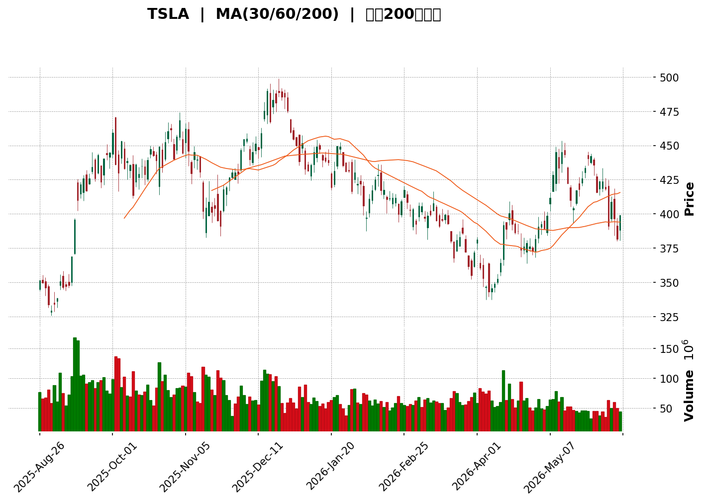
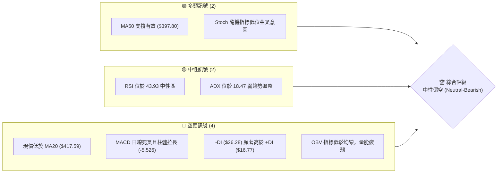
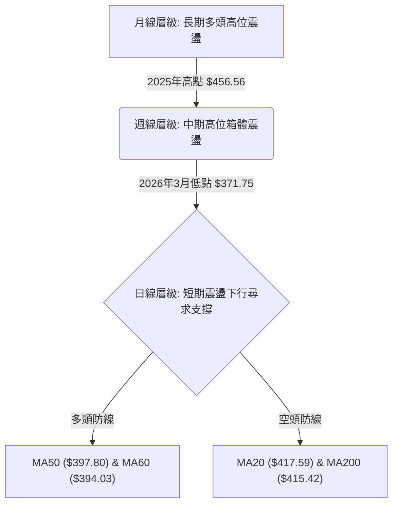
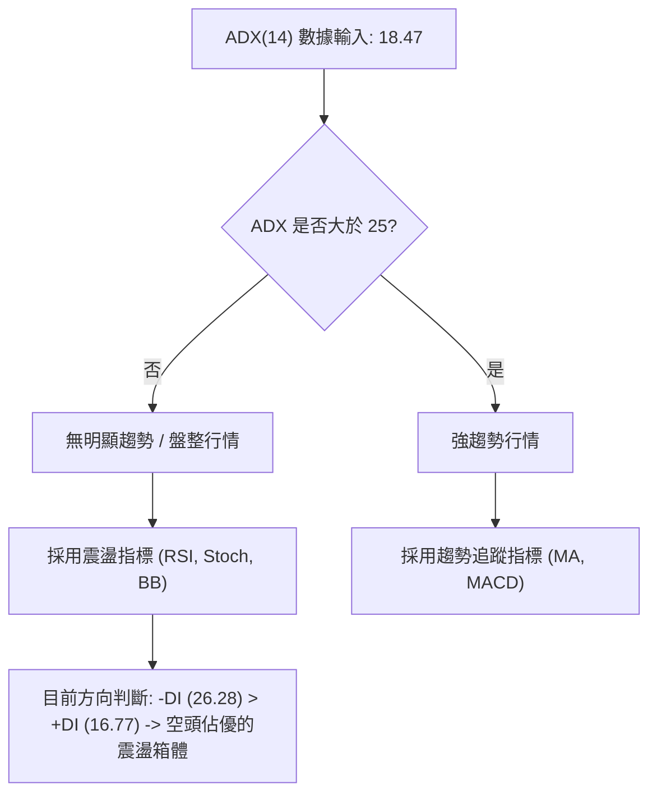
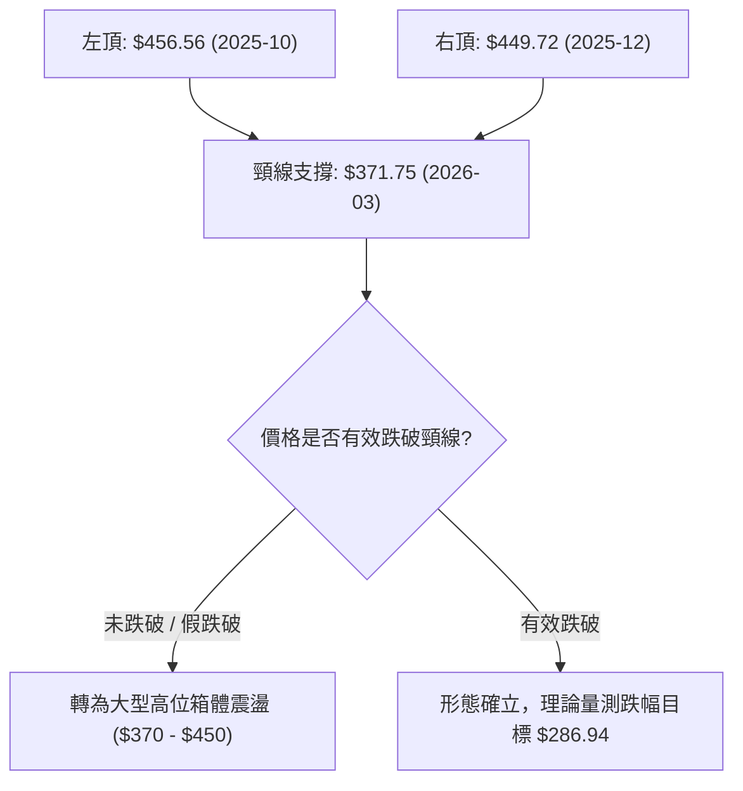

<details>
<summary>📊 靜態圖表 (點擊展開)</summary>

</details>

<html>
<head><meta charset="utf-8" /></head>
<body>
    <div style="height:500px; width:100%;">                        <script>window.PlotlyConfig = {MathJaxConfig: 'local'};</script>
        <script charset="utf-8" src="https://cdn.plot.ly/plotly-3.6.0.min.js" integrity="sha256-QaOVwtVY0T02VaHrr6pnoHLCwayMJp4O5n4YyaE3rJk=" crossorigin="anonymous"></script>                <div id="candlestick-chart" class="plotly-graph-div" style="height:100%; width:100%;"></div>            <script>                window.PLOTLYENV=window.PLOTLYENV || {};                                if (document.getElementById("candlestick-chart")) {                    Plotly.newPlot(                        "candlestick-chart",                        [{"close":{"dtype":"f8","bdata":"AAAAYLj6dUAAAACgmdl1QAAAACCun3VAAAAAgOvddEAAAACAwpV0QAAAAKBw4XRAAAAA4HoodUAAAACgcO11QAAAAGBmpnVAAAAAIIWvdUAAAADgo7x1QAAAAMD1DHdAAAAAQAq\u002feEAAAADgo6B5QAAAAIDrWXpAAAAAgMKdekAAAACgmQ16QAAAAMAeoXpAAAAAIFwje0AAAACgmZ16QAAAAOCjrHtAAAAAgD12ekAAAABgZoZ7QAAAACBcs3tAAAAAIIXLe0AAAAAgXLd8QAAAAAAAQHtAAAAAoEfdekAAAAAAAFR8QAAAAKBwEXtAAAAAQApre0AAAADgozh7QAAAAADX13lAAAAAYGY+e0AAAAAA19N6QAAAAGBmMntAAAAAAADMekAAAADA9XR7QAAAAEDh9ntAAAAAoJmpe0AAAAAghW97QAAAACCuD3xAAAAAIIUbe0AAAABguEZ8QAAAAMDMyHxAAAAAACnYfEAAAACgmYF7QAAAAMD1iHxAAAAAgOtFfUAAAAAAKcR7QAAAAMAe4XxAAAAAYI\u002fee0AAAADgUdh6QAAAACCu03tAAAAAgOt5e0AAAACgmel6QAAAAADXH3lAAAAAoJlFeUAAAABguI55QAAAAAAAFHlAAAAAANc\u002feUAAAAAgrrN4QAAAAKBwcXhAAAAA4HocekAAAABgZjZ6QAAAAKBHqXpAAAAAYLjiekAAAACAPeJ6QAAAAADX03pAAAAAANfre0AAAADgemh8QAAAAAAAcHxAAAAAoEd5e0AAAABguNJ7QAAAAEAzN3xAAAAAgD3ue0AAAAAgXK98QAAAAMD1tH1AAAAAgBSefkAAAAAAKTR9QAAAAIDrNX5AAAAAQDMTfkAAAAAgrot+QAAAAMD1WH5AAAAAYGZWfkAAAABACrN9QAAAAIA9unxAAAAAQOFmfEAAAAAghRt8QAAAAMAeYXtAAAAAYLg6fEAAAAAgXA97QAAAAGCP9npAAAAAwMw8e0AAAAAAKdB7QAAAACBcD3xAAAAAQDPze0AAAABAM3N7QAAAAMAeaXtAAAAAAABYe0AAAAAAADR6QAAAAEAK93pAAAAAgMIVfEAAAADA9RB8QAAAAEAzM3tAAAAAYGbuekAAAAAgXPd6QAAAAMD1CHpAAAAAYI\u002fmekAAAADA9Vx6QAAAACBcX3pAAAAAAClgeUAAAAAgXNN4QAAAAIDCsXlAAAAAwB4VekAAAAAgXJN6QAAAAOBRxHpAAAAAwB4RekAAAABAChd6QAAAAIAUqnlAAAAAwB61eUAAAAAgXLt5QAAAAMAevXlAAAAAoEf9eEAAAACAFJZ5QAAAAGBmFnpAAAAAoEeJeUAAAAAAKSh5QAAAAMAeNXlAAAAAQOGGeEAAAABACl95QAAAAMDMWHlAAAAAIK7LeEAAAABA4ep4QAAAAADX83hAAAAAwB59eUAAAAAAKbB4QAAAAEAzc3hAAAAAwPW4eEAAAADgUfR4QAAAAOB6jHhAAAAAwMzEd0AAAAAgXP92QAAAAKCZzXdAAAAA4Hrwd0AAAABAMx94QAAAAIDCQXdAAAAAoEeddkAAAADgejR2QAAAAAAAPHdAAAAAACnUd0AAAACgcIl2QAAAAMAeDXZAAAAAYGaqdUAAAAAAAHR1QAAAAIDrmXVAAAAAQDPPdUAAAABguAZ2QAAAAEAzw3ZAAAAAQDN\u002feEAAAABgZk54QAAAAIDrCXlAAAAAAACIeEAAAABguCZ4QAAAAAApOHhAAAAAIIVbd0AAAADAzIR3QAAAAGC4qndAAAAA4FGAd0AAAADAzEx3QAAAAIAU2ndAAAAAwB5teEAAAAAAKYh4QAAAAIDrVXhAAAAAIK7reEAAAADgo7x5QAAAAKCZxXpAAAAAAADQe0AAAABAMxd7QAAAAOBR1HtAAAAAwMy0e0AAAAAA12N6QAAAAADXn3lAAAAAgMJBeUAAAAAAKRR6QAAAAKCZHXpAAAAAACmgekAAAACgcBl7QAAAAIDChXtAAAAAoJmhe0AAAADgozx7QAAAAIAU\u002fnlAAAAAANd7ekAAAABAM3t6QAAAAEAzJ3pAAAAAAABweEAAAABAM495QAAAAEDhynhAAAAAoHDZd0AAAABgZvJ4QA=="},"high":{"dtype":"f8","bdata":"AAAAYGb+dUAAAACAPTZ2QAAAAMDMGHZAAAAAAADMdUAAAACgR9V0QAAAAKBHdXVAAAAAgD0udUAAAACA6z12QAAAAEAKZ3ZAAAAA4FHsdUAAAACgR0V2QAAAAADXD3dAAAAAQArLeEAAAABAM5t6QAAAAAAAdHpAAAAAwPXEekAAAAAghQN7QAAAACCF13pAAAAAIK7Pe0AAAAAghY97QAAAACBcw3tAAAAAoJk1e0AAAAAghYd7QAAAACCuL3xAAAAAAADQe0AAAADgo+R8QAAAAAAAbH1AAAAA4FHse0AAAADAzFh8QAAAAEDhSnxAAAAAoEeVe0AAAACgmUV7QAAAAIAUsntAAAAAgD1Oe0AAAABAMyN7QAAAAAApiHtAAAAAoJl1e0AAAAAgXJd7QAAAAMDMHHxAAAAAwMwUfEAAAADgo9h7QAAAAGBmFnxAAAAAQOE6fEAAAABgj8J8QAAAAAAAMH1AAAAAQDMbfUAAAADA9XB8QAAAAAAAoHxAAAAAwB6hfUAAAAAghcN8QAAAAKBHJX1AAAAAQDM3fUAAAACAwnV7QAAAAGC4GnxAAAAAANene0AAAACgR6V7QAAAAAAAiHpAAAAAQArDeUAAAAAgXH96QAAAAGBmjnlAAAAA4Hq8eUAAAABACs96QAAAAMDMLHlAAAAAIIVbekAAAAAgrkd6QAAAAEAKr3pAAAAAQOEOe0AAAABgjxp7QAAAAMDMTHtAAAAAYLj+e0AAAACAFGp8QAAAAIDrrXxAAAAAAAAcfEAAAACAPUZ8QAAAAIAUjnxAAAAA4FEUfEAAAAAAKfB8QAAAAOBRHH5AAAAAAAC4fkAAAADgevR+QAAAAIDCrX5AAAAAANenfkAAAACgRy1\u002fQAAAACCFv35AAAAAYGaufkAAAACgcJF+QAAAAGBmVn1AAAAAgOvxfEAAAADAzIh8QAAAAKBwpXxAAAAAwMyYfEAAAAAAAAR8QAAAAIDrZXtAAAAAgD1Oe0AAAADAzBB8QAAAAMDMZHxAAAAAwPU8fEAAAABgj757QAAAAIDC1XtAAAAAAAD0e0AAAAAgrut6QAAAAEAzY3tAAAAAAAAYfEAAAABA4UZ8QAAAAOCj0HtAAAAA4FFYe0AAAAAAKWR7QAAAACCug3tAAAAAgBR+e0AAAABgZrJ6QAAAAMD1yHpAAAAAYGZ+ekAAAACgmSF5QAAAAMDM6HlAAAAAAABUekAAAAAAALR6QAAAAKCZRXtAAAAAIK5De0AAAADA9YB6QAAAACCF23lAAAAAYGYOekAAAAAAAPR5QAAAAEAz63lAAAAAQDN7eUAAAADAHq15QAAAAKBwRXpAAAAAwPUMekAAAACA63F5QAAAAOCjSHlAAAAAoHDFeEAAAACgR4V5QAAAAIDriXlAAAAAoJkleUAAAACgcBl5QAAAAKBwaXlAAAAAgBQGekAAAAAAAGh5QAAAAEAzA3lAAAAAIK47eUAAAACA6wF5QAAAAMAeMXlAAAAA4FE0eEAAAACAPb53QAAAAKBHFXhAAAAAIK43eEAAAAAgrsN4QAAAAEAKB3hAAAAAgMIdd0AAAADgo\u002fR2QAAAAKBHVXdAAAAAgD3yd0AAAADgeiR3QAAAACCF+3ZAAAAA4FHAdUAAAAAAAMh2QAAAAIAUznVAAAAAgMLldUAAAACgmUV2QAAAAIAU+nZAAAAAYGaqeEAAAADA9aB4QAAAAOB6lHlAAAAAwMxseUAAAABAM594QAAAAAApkHhAAAAAAAAgeEAAAAAAKex3QAAAAOB6zHdAAAAA4KPkd0AAAABgZoZ3QAAAAAAADHhAAAAAwB7deEAAAACAPap4QAAAAIDrIXlAAAAAQOEaeUAAAACgR\u002f15QAAAAEAz83pAAAAAYI8SfEAAAADAzPx7QAAAAGBmVnxAAAAAIK4\u002ffEAAAABgjyp7QAAAAIAUUnpAAAAAgBRaeUAAAAAgXBd6QAAAAEAzr3pAAAAAACn4ekAAAABAMzN7QAAAAKCZ2XtAAAAAIFy\u002fe0AAAADAHpF7QAAAAKCZ2XpAAAAAYLiGekAAAACgmRl7QAAAAKCZpXpAAAAAQOGKekAAAABACs95QAAAAAAAKHpAAAAAoHDReEAAAADgo\u002fh4QA=="},"hovertemplate":"\u003cb\u003e%{x|%Y-%m-%d}\u003c\u002fb\u003e\u003cbr\u003e\u958b: $%{open:.2f}\u003cbr\u003e\u9ad8: $%{high:.2f}\u003cbr\u003e\u4f4e: $%{low:.2f}\u003cbr\u003e\u6536: $%{close:.2f}\u003cextra\u003e\u003c\u002fextra\u003e","low":{"dtype":"f8","bdata":"AAAAIIV7dUAAAABgj9J1QAAAAAApRHVAAAAAQDO7dEAAAACgmVl0QAAAAAApiHRAAAAAIK63dEAAAABA4Yp1QAAAAKBwjXVAAAAAwB59dUAAAADAHqF1QAAAAKCZuXVAAAAAANcjd0AAAABA4SZ5QAAAAEDhtnlAAAAAYLiaeUAAAADA9Qh6QAAAACCFW3pAAAAAgBTSekAAAAAghXt6QAAAAOB60HpAAAAAoEcxekAAAADgUVB6QAAAAAAAeHtAAAAAgOsRe0AAAAAAAIx7QAAAAMAeOXtAAAAAoEcJekAAAABACkt7QAAAAEAzB3tAAAAAIK6TekAAAABA4aJ6QAAAAEAzt3lAAAAAQDM7ekAAAACAwh16QAAAAKBHpXpAAAAAwPVUekAAAACgmXl6QAAAAIDCiXtAAAAAwMyge0AAAAAAANB6QAAAAGBm3nlAAAAAYLjiekAAAABACmt7QAAAAKCZOXxAAAAAYGZKfEAAAACAwnl7QAAAAEAKu3tAAAAAwMxcfEAAAACgmbl7QAAAACBci3tAAAAAoHAxe0AAAACAFF56QAAAAIDCFXtAAAAAgMIFe0AAAADA9ah6QAAAAKBwxXhAAAAA4Hrsd0AAAAAA1+t4QAAAACBcm3hAAAAAAADoeEAAAAAA16t4QAAAAAAp\u002fHdAAAAAoHAReUAAAABAM195QAAAAIA9DnpAAAAAQDOjekAAAADgo5R6QAAAAIDrYXpAAAAAgMLxekAAAACAPdZ7QAAAAGCPOnxAAAAAAAA0e0AAAABAMzt7QAAAAIDCuXtAAAAAoEeFe0AAAABguJp7QAAAAGCPOn1AAAAAoEcdfUAAAABAMyN9QAAAAIDrkX1AAAAAIIWrfUAAAACgR1V+QAAAAKBwLX5AAAAAwMzMfUAAAADAHp19QAAAAAAAsHxAAAAAoEddfEAAAADAzBR8QAAAAMDMNHtAAAAAwB7Je0AAAADgesx6QAAAAOCj9HpAAAAAgOuFekAAAACAPeZ6QAAAAAAAYHtAAAAAQDO\u002fe0AAAAAghSN7QAAAAGBmWntAAAAAACk0e0AAAABAChd6QAAAAIDrOXpAAAAAgBQKe0AAAADgo8B7QAAAAOB6JHtAAAAAQArrekAAAACgmeF6QAAAAIDr6XlAAAAAQDNrekAAAAAAAOh5QAAAAEAK23lAAAAAQOHyeEAAAADgejh4QAAAAAAA3HhAAAAA4KN0eUAAAAAAABB6QAAAAOB6QHpAAAAAAADgeUAAAACAFK55QAAAAAApCHlAAAAAoEeZeUAAAACAwkF5QAAAAAAAWHlAAAAA4KOgeEAAAACAPdp4QAAAAGBmwnlAAAAAYI86eUAAAACAwuF4QAAAAAAARHhAAAAAgD0WeEAAAACgR6l4QAAAAGC49nhAAAAAIFyjeEAAAABgZtZ3QAAAAEAK43hAAAAAYGYieUAAAABgZqp4QAAAAEAzX3hAAAAAYLimeEAAAAAAAJB4QAAAAMD1hHhAAAAAIK6rd0AAAAAgXMd2QAAAACCuS3dAAAAAwPWEd0AAAAAAKRB4QAAAAIDrPXdAAAAAIIV3dkAAAACAPQJ2QAAAAAAAkHZAAAAAoEdhd0AAAADgenB2QAAAAIA9qnVAAAAAANcTdUAAAABguDp1QAAAAAAAFHVAAAAAANdrdUAAAADAHsl1QAAAAOBRLHZAAAAAAACodkAAAADAzNx3QAAAAGBmenhAAAAAoEdFeEAAAAAghRN4QAAAAMDMFHhAAAAAgD0Gd0AAAAAgrit3QAAAAOBRwHZAAAAA4KNId0AAAADgoyB3QAAAAGC4AndAAAAAwMysd0AAAADAzAx4QAAAAAAAUHhAAAAA4FEAeEAAAACA6yF5QAAAAIA9BnpAAAAAwMwMekAAAAAAKWR6QAAAACBc43pAAAAAYI+Se0AAAAAAAGB6QAAAAKBHVXlAAAAAgBSaeEAAAACAPWZ5QAAAAGBmznlAAAAAAClIekAAAACA66F6QAAAAOBROHtAAAAAwMxEe0AAAACAPcJ6QAAAAEDh9nlAAAAAYGbaeUAAAAAAAAB6QAAAAGCPEnpAAAAAoHBJeEAAAAAghat4QAAAAADXA3hAAAAAYGbCd0AAAAAgrsp3QA=="},"name":"\u50f9\u683c","open":{"dtype":"f8","bdata":"AAAAQOGOdUAAAABACv91QAAAAGCP7nVAAAAAIK6zdUAAAAAgroN0QAAAAEAz83RAAAAAYGYCdUAAAAAAAMB1QAAAAIA9KnZAAAAAQArHdUAAAADAzOh1QAAAAGC44nVAAAAAQAovd0AAAACAFHJ6QAAAAAAA6HlAAAAAAAD8eUAAAACA6816QAAAAMAeXXpAAAAAgMLxekAAAACAFH57QAAAAKBH3XpAAAAAANcze0AAAADAzMR6QAAAAKCZxXtAAAAA4FGYe0AAAADAzLx7QAAAAOCjaH1AAAAA4KO0e0AAAAAAAIx7QAAAAMAe\u002fXtAAAAAwB5Ze0AAAADA9fx6QAAAAOCjSHtAAAAA4Hp4ekAAAADgo6x6QAAAAGBmLntAAAAAIK4re0AAAAAAAJh6QAAAAIDrvXtAAAAAACnce0AAAABAM7d7QAAAAAAAQHpAAAAAoEfte0AAAAAgrn97QAAAAOB6bHxAAAAAAADofEAAAADAzDB8QAAAAAAA7HtAAAAAANd\u002ffEAAAAAgXGd8QAAAAMDMQHxAAAAAIFzffEAAAABguF57QAAAAKCZeXtAAAAAYGZ2e0AAAABgZqJ7QAAAAIAUcnpAAAAAwMwkeEAAAAAA1+t4QAAAAIAUVnlAAAAAQOFieUAAAACAFOp5QAAAAMAeJXlAAAAAYLgieUAAAABguOZ5QAAAAEAzf3pAAAAAoHCpekAAAADAHpV6QAAAAMD17HpAAAAAoJkBe0AAAABACh98QAAAAOB6UHxAAAAAQDP3e0AAAADgo1h7QAAAAMAe4XtAAAAAQDMPfEAAAACgcAF8QAAAAEAKV31AAAAAIFyDfUAAAAAghYN+QAAAAGCP4n1AAAAAgOuBfkAAAACAFJ5+QAAAAGBmln5AAAAAIK6HfkAAAAAgrlN+QAAAAAAAUH1AAAAAoHDRfEAAAACgmYF8QAAAAMDMnHxAAAAAANf\u002fe0AAAACAFOZ7QAAAAGBmPntAAAAAgD2+ekAAAABAMz97QAAAACCuk3tAAAAAQDMjfEAAAADA9ax7QAAAAIAUkntAAAAAAAB4e0AAAACAwtV6QAAAAGCPWnpAAAAAYI8ye0AAAABA4fZ7QAAAAAAA0HtAAAAAYI9We0AAAABgj\u002f56QAAAAMDMXHtAAAAAoJmVekAAAADgo1R6QAAAAOBRhHpAAAAAIFxHekAAAADgUdB4QAAAAIDrDXlAAAAAYI+eeUAAAACgRyF6QAAAACBcv3pAAAAAwMzkekAAAADA9eR5QAAAAIDCxXlAAAAAgMKxeUAAAAAAAHR5QAAAAMDMhHlAAAAA4KN0eUAAAAAAAPh4QAAAAGBmwnlAAAAAYLjmeUAAAABACi95QAAAAKCZaXhAAAAAoHCxeEAAAACgmd14QAAAAMAeGXlAAAAAoHDheEAAAADAzGB4QAAAACCFI3lAAAAA4HokeUAAAABA4VJ5QAAAAGC48nhAAAAAIIXDeEAAAABACrt4QAAAAAAA8HhAAAAA4FE0eEAAAACgmb13QAAAAKBwUXdAAAAAwPWId0AAAAAA1194QAAAAKCZ2XdAAAAAQAobd0AAAACAwt12QAAAAAApmHZAAAAAgBSqd0AAAABAM8N2QAAAAKBwqXZAAAAAQAqndUAAAADgo7x2QAAAAGBmcnVAAAAA4KOkdUAAAADAHuF1QAAAAGC4WnZAAAAAoEftdkAAAADA9Zx4QAAAAGC4vnhAAAAAoEcpeUAAAAAAAJB4QAAAAMAeOXhAAAAA4Hp0d0AAAAAAAFh3QAAAAKBwQXdAAAAAQOFqd0AAAABgZnZ3QAAAAAAATHdAAAAAANfnd0AAAAAgrmN4QAAAAEAKs3hAAAAAAAAkeEAAAAAgrnd5QAAAACCuB3pAAAAAYI9iekAAAABgj5Z7QAAAAGC4SntAAAAAANfne0AAAAAgrh97QAAAAOBRNHpAAAAAYI8yeUAAAACgmXl5QAAAAEDhYnpAAAAAYLhqekAAAAAAKeR6QAAAAIA9rntAAAAAgOtZe0AAAACgmX17QAAAAADXt3pAAAAAIIUjekAAAABAMyt6QAAAAKBwPXpAAAAAAABIekAAAACgR8V4QAAAAOB6sHlAAAAA4KN4eEAAAAAAAER4QA=="},"x":["2025-08-26T00:00:00-04:00","2025-08-27T00:00:00-04:00","2025-08-28T00:00:00-04:00","2025-08-29T00:00:00-04:00","2025-09-02T00:00:00-04:00","2025-09-03T00:00:00-04:00","2025-09-04T00:00:00-04:00","2025-09-05T00:00:00-04:00","2025-09-08T00:00:00-04:00","2025-09-09T00:00:00-04:00","2025-09-10T00:00:00-04:00","2025-09-11T00:00:00-04:00","2025-09-12T00:00:00-04:00","2025-09-15T00:00:00-04:00","2025-09-16T00:00:00-04:00","2025-09-17T00:00:00-04:00","2025-09-18T00:00:00-04:00","2025-09-19T00:00:00-04:00","2025-09-22T00:00:00-04:00","2025-09-23T00:00:00-04:00","2025-09-24T00:00:00-04:00","2025-09-25T00:00:00-04:00","2025-09-26T00:00:00-04:00","2025-09-29T00:00:00-04:00","2025-09-30T00:00:00-04:00","2025-10-01T00:00:00-04:00","2025-10-02T00:00:00-04:00","2025-10-03T00:00:00-04:00","2025-10-06T00:00:00-04:00","2025-10-07T00:00:00-04:00","2025-10-08T00:00:00-04:00","2025-10-09T00:00:00-04:00","2025-10-10T00:00:00-04:00","2025-10-13T00:00:00-04:00","2025-10-14T00:00:00-04:00","2025-10-15T00:00:00-04:00","2025-10-16T00:00:00-04:00","2025-10-17T00:00:00-04:00","2025-10-20T00:00:00-04:00","2025-10-21T00:00:00-04:00","2025-10-22T00:00:00-04:00","2025-10-23T00:00:00-04:00","2025-10-24T00:00:00-04:00","2025-10-27T00:00:00-04:00","2025-10-28T00:00:00-04:00","2025-10-29T00:00:00-04:00","2025-10-30T00:00:00-04:00","2025-10-31T00:00:00-04:00","2025-11-03T00:00:00-05:00","2025-11-04T00:00:00-05:00","2025-11-05T00:00:00-05:00","2025-11-06T00:00:00-05:00","2025-11-07T00:00:00-05:00","2025-11-10T00:00:00-05:00","2025-11-11T00:00:00-05:00","2025-11-12T00:00:00-05:00","2025-11-13T00:00:00-05:00","2025-11-14T00:00:00-05:00","2025-11-17T00:00:00-05:00","2025-11-18T00:00:00-05:00","2025-11-19T00:00:00-05:00","2025-11-20T00:00:00-05:00","2025-11-21T00:00:00-05:00","2025-11-24T00:00:00-05:00","2025-11-25T00:00:00-05:00","2025-11-26T00:00:00-05:00","2025-11-28T00:00:00-05:00","2025-12-01T00:00:00-05:00","2025-12-02T00:00:00-05:00","2025-12-03T00:00:00-05:00","2025-12-04T00:00:00-05:00","2025-12-05T00:00:00-05:00","2025-12-08T00:00:00-05:00","2025-12-09T00:00:00-05:00","2025-12-10T00:00:00-05:00","2025-12-11T00:00:00-05:00","2025-12-12T00:00:00-05:00","2025-12-15T00:00:00-05:00","2025-12-16T00:00:00-05:00","2025-12-17T00:00:00-05:00","2025-12-18T00:00:00-05:00","2025-12-19T00:00:00-05:00","2025-12-22T00:00:00-05:00","2025-12-23T00:00:00-05:00","2025-12-24T00:00:00-05:00","2025-12-26T00:00:00-05:00","2025-12-29T00:00:00-05:00","2025-12-30T00:00:00-05:00","2025-12-31T00:00:00-05:00","2026-01-02T00:00:00-05:00","2026-01-05T00:00:00-05:00","2026-01-06T00:00:00-05:00","2026-01-07T00:00:00-05:00","2026-01-08T00:00:00-05:00","2026-01-09T00:00:00-05:00","2026-01-12T00:00:00-05:00","2026-01-13T00:00:00-05:00","2026-01-14T00:00:00-05:00","2026-01-15T00:00:00-05:00","2026-01-16T00:00:00-05:00","2026-01-20T00:00:00-05:00","2026-01-21T00:00:00-05:00","2026-01-22T00:00:00-05:00","2026-01-23T00:00:00-05:00","2026-01-26T00:00:00-05:00","2026-01-27T00:00:00-05:00","2026-01-28T00:00:00-05:00","2026-01-29T00:00:00-05:00","2026-01-30T00:00:00-05:00","2026-02-02T00:00:00-05:00","2026-02-03T00:00:00-05:00","2026-02-04T00:00:00-05:00","2026-02-05T00:00:00-05:00","2026-02-06T00:00:00-05:00","2026-02-09T00:00:00-05:00","2026-02-10T00:00:00-05:00","2026-02-11T00:00:00-05:00","2026-02-12T00:00:00-05:00","2026-02-13T00:00:00-05:00","2026-02-17T00:00:00-05:00","2026-02-18T00:00:00-05:00","2026-02-19T00:00:00-05:00","2026-02-20T00:00:00-05:00","2026-02-23T00:00:00-05:00","2026-02-24T00:00:00-05:00","2026-02-25T00:00:00-05:00","2026-02-26T00:00:00-05:00","2026-02-27T00:00:00-05:00","2026-03-02T00:00:00-05:00","2026-03-03T00:00:00-05:00","2026-03-04T00:00:00-05:00","2026-03-05T00:00:00-05:00","2026-03-06T00:00:00-05:00","2026-03-09T00:00:00-04:00","2026-03-10T00:00:00-04:00","2026-03-11T00:00:00-04:00","2026-03-12T00:00:00-04:00","2026-03-13T00:00:00-04:00","2026-03-16T00:00:00-04:00","2026-03-17T00:00:00-04:00","2026-03-18T00:00:00-04:00","2026-03-19T00:00:00-04:00","2026-03-20T00:00:00-04:00","2026-03-23T00:00:00-04:00","2026-03-24T00:00:00-04:00","2026-03-25T00:00:00-04:00","2026-03-26T00:00:00-04:00","2026-03-27T00:00:00-04:00","2026-03-30T00:00:00-04:00","2026-03-31T00:00:00-04:00","2026-04-01T00:00:00-04:00","2026-04-02T00:00:00-04:00","2026-04-06T00:00:00-04:00","2026-04-07T00:00:00-04:00","2026-04-08T00:00:00-04:00","2026-04-09T00:00:00-04:00","2026-04-10T00:00:00-04:00","2026-04-13T00:00:00-04:00","2026-04-14T00:00:00-04:00","2026-04-15T00:00:00-04:00","2026-04-16T00:00:00-04:00","2026-04-17T00:00:00-04:00","2026-04-20T00:00:00-04:00","2026-04-21T00:00:00-04:00","2026-04-22T00:00:00-04:00","2026-04-23T00:00:00-04:00","2026-04-24T00:00:00-04:00","2026-04-27T00:00:00-04:00","2026-04-28T00:00:00-04:00","2026-04-29T00:00:00-04:00","2026-04-30T00:00:00-04:00","2026-05-01T00:00:00-04:00","2026-05-04T00:00:00-04:00","2026-05-05T00:00:00-04:00","2026-05-06T00:00:00-04:00","2026-05-07T00:00:00-04:00","2026-05-08T00:00:00-04:00","2026-05-11T00:00:00-04:00","2026-05-12T00:00:00-04:00","2026-05-13T00:00:00-04:00","2026-05-14T00:00:00-04:00","2026-05-15T00:00:00-04:00","2026-05-18T00:00:00-04:00","2026-05-19T00:00:00-04:00","2026-05-20T00:00:00-04:00","2026-05-21T00:00:00-04:00","2026-05-22T00:00:00-04:00","2026-05-26T00:00:00-04:00","2026-05-27T00:00:00-04:00","2026-05-28T00:00:00-04:00","2026-05-29T00:00:00-04:00","2026-06-01T00:00:00-04:00","2026-06-02T00:00:00-04:00","2026-06-03T00:00:00-04:00","2026-06-04T00:00:00-04:00","2026-06-05T00:00:00-04:00","2026-06-08T00:00:00-04:00","2026-06-09T00:00:00-04:00","2026-06-10T00:00:00-04:00","2026-06-11T00:00:00-04:00"],"type":"candlestick"},{"hovertemplate":"MA30: $%{y:.2f}\u003cextra\u003e\u003c\u002fextra\u003e","line":{"color":"#2196F3","dash":"dash","width":2},"mode":"lines","name":"MA30","x":["2025-08-26T00:00:00-04:00","2025-08-27T00:00:00-04:00","2025-08-28T00:00:00-04:00","2025-08-29T00:00:00-04:00","2025-09-02T00:00:00-04:00","2025-09-03T00:00:00-04:00","2025-09-04T00:00:00-04:00","2025-09-05T00:00:00-04:00","2025-09-08T00:00:00-04:00","2025-09-09T00:00:00-04:00","2025-09-10T00:00:00-04:00","2025-09-11T00:00:00-04:00","2025-09-12T00:00:00-04:00","2025-09-15T00:00:00-04:00","2025-09-16T00:00:00-04:00","2025-09-17T00:00:00-04:00","2025-09-18T00:00:00-04:00","2025-09-19T00:00:00-04:00","2025-09-22T00:00:00-04:00","2025-09-23T00:00:00-04:00","2025-09-24T00:00:00-04:00","2025-09-25T00:00:00-04:00","2025-09-26T00:00:00-04:00","2025-09-29T00:00:00-04:00","2025-09-30T00:00:00-04:00","2025-10-01T00:00:00-04:00","2025-10-02T00:00:00-04:00","2025-10-03T00:00:00-04:00","2025-10-06T00:00:00-04:00","2025-10-07T00:00:00-04:00","2025-10-08T00:00:00-04:00","2025-10-09T00:00:00-04:00","2025-10-10T00:00:00-04:00","2025-10-13T00:00:00-04:00","2025-10-14T00:00:00-04:00","2025-10-15T00:00:00-04:00","2025-10-16T00:00:00-04:00","2025-10-17T00:00:00-04:00","2025-10-20T00:00:00-04:00","2025-10-21T00:00:00-04:00","2025-10-22T00:00:00-04:00","2025-10-23T00:00:00-04:00","2025-10-24T00:00:00-04:00","2025-10-27T00:00:00-04:00","2025-10-28T00:00:00-04:00","2025-10-29T00:00:00-04:00","2025-10-30T00:00:00-04:00","2025-10-31T00:00:00-04:00","2025-11-03T00:00:00-05:00","2025-11-04T00:00:00-05:00","2025-11-05T00:00:00-05:00","2025-11-06T00:00:00-05:00","2025-11-07T00:00:00-05:00","2025-11-10T00:00:00-05:00","2025-11-11T00:00:00-05:00","2025-11-12T00:00:00-05:00","2025-11-13T00:00:00-05:00","2025-11-14T00:00:00-05:00","2025-11-17T00:00:00-05:00","2025-11-18T00:00:00-05:00","2025-11-19T00:00:00-05:00","2025-11-20T00:00:00-05:00","2025-11-21T00:00:00-05:00","2025-11-24T00:00:00-05:00","2025-11-25T00:00:00-05:00","2025-11-26T00:00:00-05:00","2025-11-28T00:00:00-05:00","2025-12-01T00:00:00-05:00","2025-12-02T00:00:00-05:00","2025-12-03T00:00:00-05:00","2025-12-04T00:00:00-05:00","2025-12-05T00:00:00-05:00","2025-12-08T00:00:00-05:00","2025-12-09T00:00:00-05:00","2025-12-10T00:00:00-05:00","2025-12-11T00:00:00-05:00","2025-12-12T00:00:00-05:00","2025-12-15T00:00:00-05:00","2025-12-16T00:00:00-05:00","2025-12-17T00:00:00-05:00","2025-12-18T00:00:00-05:00","2025-12-19T00:00:00-05:00","2025-12-22T00:00:00-05:00","2025-12-23T00:00:00-05:00","2025-12-24T00:00:00-05:00","2025-12-26T00:00:00-05:00","2025-12-29T00:00:00-05:00","2025-12-30T00:00:00-05:00","2025-12-31T00:00:00-05:00","2026-01-02T00:00:00-05:00","2026-01-05T00:00:00-05:00","2026-01-06T00:00:00-05:00","2026-01-07T00:00:00-05:00","2026-01-08T00:00:00-05:00","2026-01-09T00:00:00-05:00","2026-01-12T00:00:00-05:00","2026-01-13T00:00:00-05:00","2026-01-14T00:00:00-05:00","2026-01-15T00:00:00-05:00","2026-01-16T00:00:00-05:00","2026-01-20T00:00:00-05:00","2026-01-21T00:00:00-05:00","2026-01-22T00:00:00-05:00","2026-01-23T00:00:00-05:00","2026-01-26T00:00:00-05:00","2026-01-27T00:00:00-05:00","2026-01-28T00:00:00-05:00","2026-01-29T00:00:00-05:00","2026-01-30T00:00:00-05:00","2026-02-02T00:00:00-05:00","2026-02-03T00:00:00-05:00","2026-02-04T00:00:00-05:00","2026-02-05T00:00:00-05:00","2026-02-06T00:00:00-05:00","2026-02-09T00:00:00-05:00","2026-02-10T00:00:00-05:00","2026-02-11T00:00:00-05:00","2026-02-12T00:00:00-05:00","2026-02-13T00:00:00-05:00","2026-02-17T00:00:00-05:00","2026-02-18T00:00:00-05:00","2026-02-19T00:00:00-05:00","2026-02-20T00:00:00-05:00","2026-02-23T00:00:00-05:00","2026-02-24T00:00:00-05:00","2026-02-25T00:00:00-05:00","2026-02-26T00:00:00-05:00","2026-02-27T00:00:00-05:00","2026-03-02T00:00:00-05:00","2026-03-03T00:00:00-05:00","2026-03-04T00:00:00-05:00","2026-03-05T00:00:00-05:00","2026-03-06T00:00:00-05:00","2026-03-09T00:00:00-04:00","2026-03-10T00:00:00-04:00","2026-03-11T00:00:00-04:00","2026-03-12T00:00:00-04:00","2026-03-13T00:00:00-04:00","2026-03-16T00:00:00-04:00","2026-03-17T00:00:00-04:00","2026-03-18T00:00:00-04:00","2026-03-19T00:00:00-04:00","2026-03-20T00:00:00-04:00","2026-03-23T00:00:00-04:00","2026-03-24T00:00:00-04:00","2026-03-25T00:00:00-04:00","2026-03-26T00:00:00-04:00","2026-03-27T00:00:00-04:00","2026-03-30T00:00:00-04:00","2026-03-31T00:00:00-04:00","2026-04-01T00:00:00-04:00","2026-04-02T00:00:00-04:00","2026-04-06T00:00:00-04:00","2026-04-07T00:00:00-04:00","2026-04-08T00:00:00-04:00","2026-04-09T00:00:00-04:00","2026-04-10T00:00:00-04:00","2026-04-13T00:00:00-04:00","2026-04-14T00:00:00-04:00","2026-04-15T00:00:00-04:00","2026-04-16T00:00:00-04:00","2026-04-17T00:00:00-04:00","2026-04-20T00:00:00-04:00","2026-04-21T00:00:00-04:00","2026-04-22T00:00:00-04:00","2026-04-23T00:00:00-04:00","2026-04-24T00:00:00-04:00","2026-04-27T00:00:00-04:00","2026-04-28T00:00:00-04:00","2026-04-29T00:00:00-04:00","2026-04-30T00:00:00-04:00","2026-05-01T00:00:00-04:00","2026-05-04T00:00:00-04:00","2026-05-05T00:00:00-04:00","2026-05-06T00:00:00-04:00","2026-05-07T00:00:00-04:00","2026-05-08T00:00:00-04:00","2026-05-11T00:00:00-04:00","2026-05-12T00:00:00-04:00","2026-05-13T00:00:00-04:00","2026-05-14T00:00:00-04:00","2026-05-15T00:00:00-04:00","2026-05-18T00:00:00-04:00","2026-05-19T00:00:00-04:00","2026-05-20T00:00:00-04:00","2026-05-21T00:00:00-04:00","2026-05-22T00:00:00-04:00","2026-05-26T00:00:00-04:00","2026-05-27T00:00:00-04:00","2026-05-28T00:00:00-04:00","2026-05-29T00:00:00-04:00","2026-06-01T00:00:00-04:00","2026-06-02T00:00:00-04:00","2026-06-03T00:00:00-04:00","2026-06-04T00:00:00-04:00","2026-06-05T00:00:00-04:00","2026-06-08T00:00:00-04:00","2026-06-09T00:00:00-04:00","2026-06-10T00:00:00-04:00","2026-06-11T00:00:00-04:00"],"y":{"dtype":"f8","bdata":"AAAAAAAA+H8AAAAAAAD4fwAAAAAAAPh\u002fAAAAAAAA+H8AAAAAAAD4fwAAAAAAAPh\u002fAAAAAAAA+H8AAAAAAAD4fwAAAAAAAPh\u002fAAAAAAAA+H8AAAAAAAD4fwAAAAAAAPh\u002fAAAAAAAA+H8AAAAAAAD4fwAAAAAAAPh\u002fAAAAAAAA+H8AAAAAAAD4fwAAAAAAAPh\u002fAAAAAAAA+H8AAAAAAAD4fwAAAAAAAPh\u002fAAAAAAAA+H8AAAAAAAD4fwAAAAAAAPh\u002fAAAAAAAA+H8AAAAAAAD4fwAAAAAAAPh\u002fAAAAAAAA+H8AAAAAAAD4f0RERMQgznhAVVVV5Yn8eEAiIiKSXyp5QO\u002fu7u5gTnlA3t3dbcuEeUARERFhELp5QAAAAHD273lAmpmZeRQgekBERESUQ096QKuqqoolhXpAmpmZOSa4ekBVVVVVx+h6QGZmZjaJE3tAERERca8ne0CamZm5ST57QHd3d\u002fcMU3tAIiIiYhBme0CJiIjIdnJ7QO\u002fu7q65gntAmpmZqfGUe0De3d09w557QKuqqpoLqXtAVVVVVQ61e0CamZnZQK97QGZmZqZUsHtAREREVJyte0Crqqr6N557QKuqqnoUjHtAzczMnH1+e0B3d3cX2WZ7QO\u002fu7t7dVXtAmpmZKVxDe0ARERGB3C17QImIiCjqIXtAzczMLEAYe0AAAACwABN7QImIiJhuDntAmpmZeTAPe0B3d3d3TAp7QM3MzOyYAHtAvLu7K84Ce0ARERGhGgt7QO\u002fu7o5QDntAREREpHARe0BmZmbGkg17QDMzM1O4CHtAVVVVNewAe0CamZk5+wp7QJqZmTn7FHtA7+7uDnQge0AzMzNTuCx7QLy7u3sUOHtA7+7uvuZKe0AzMzPjemp7QGZmZkb9f3tAVVVVxWeYe0CrqqrKL7B7QBEREfHuzntAd3d3h6Tpe0BmZmYWZ\u002f97QO\u002fu7j4KE3xAiYiIKHgsfEDv7u6Ol0B8QFVVVZUYVnxAmpmZ6bRffECJiIiIXW18QGZmZiZNeXxAAAAAUGKCfEDe3d1NN4d8QJqZmSkxjHxAiYiImEOHfEAzMzOzcnR8QJqZmfnhZ3xAVVVVRRltfEAiIiJiLG98QHd3d7eBZnxAvLu7i\u002fpdfEARERHhT098QLy7u4v6L3xAiYiI6EIQfEB3d3d3Bfh7QERERPRE13tAMzMzAyuve0Crqqp6W357QCIiIpKmVntAIiIiYlcye0AiIiJyrxd7QERERGT0BntAIiIiggfzekBmZmY20OF6QM3MzLwt03pA3t3dnai9ekCJiIhIU7J6QImIiJjgp3pA3t3dfbGUekDv7u7OsIF6QBEREdHbcHpAVVVV5UJcekDNzMx8sUh6QAAAALDkNXpAERERIdsdekDv7u7ewRZ6QFVVVQXzCHpAZmZmRuHseUCamZm5AtJ5QLy7u\u002fvUvnlAvLu7y4WyeUCJiIgoFZ95QM3MzKyOkXlAzczMfPh+eUBmZmYG83J5QLy7u\u002ftiY3lAVVVVtaxVeUC8u7sbE0Z5QM3MzJzvNXlAIiIi4qUjeUBmZmaWtQ55QAAAAODB8HhAVVVVxUvTeEC8u7vbJLJ4QBEREXFonXhAAAAAQGCNeECrqqqqHHJ4QDMzMzOlUnhAvLu7W0g2eECJiIhoAxN4QLy7uwu77HdAERERke3Md0DNzMycNrJ3QN7d3W1ZnXdAVVVV5Redd0De3d1dAZR3QCIiIkJgkXdAiYiIuB6Pd0AzMzPTlIh3QKuqqkpTgndAERERgSNwd0BmZmb2KGZ3QDMzMzN6X3dAZmZmVg5Vd0DNzMxM8EZ3QERERPT9QHdAmpmZSZpGd0Dv7u4uslN3QCIiInI9WHdAVVVVBZ1gd0CrqqoKZW53QN7d3a1jjHdAiYiIKL+4d0CJiIj4b+J3QGZmZualCXhAzczMbLwqeEBERES0nUt4QAAAAFAbanhAREREhMCIeECamZlZObB4QHd3dye\u002f1nhAmpmZadj\u002feEAiIiLSIit5QCIiIjLBU3lAd3d3V4BueUBERERkgod5QEREROSlj3lAERERMU+geUB3d3cnMbR5QO\u002fu7n6xxHlAq6qqyujNeUC8u7ubUt95QCIiIpLt6HlAAAAAEObreUB3d3e38\u002fl5QA=="},"type":"scatter"},{"hovertemplate":"MA60: $%{y:.2f}\u003cextra\u003e\u003c\u002fextra\u003e","line":{"color":"#9C27B0","dash":"dash","width":2},"mode":"lines","name":"MA60","x":["2025-08-26T00:00:00-04:00","2025-08-27T00:00:00-04:00","2025-08-28T00:00:00-04:00","2025-08-29T00:00:00-04:00","2025-09-02T00:00:00-04:00","2025-09-03T00:00:00-04:00","2025-09-04T00:00:00-04:00","2025-09-05T00:00:00-04:00","2025-09-08T00:00:00-04:00","2025-09-09T00:00:00-04:00","2025-09-10T00:00:00-04:00","2025-09-11T00:00:00-04:00","2025-09-12T00:00:00-04:00","2025-09-15T00:00:00-04:00","2025-09-16T00:00:00-04:00","2025-09-17T00:00:00-04:00","2025-09-18T00:00:00-04:00","2025-09-19T00:00:00-04:00","2025-09-22T00:00:00-04:00","2025-09-23T00:00:00-04:00","2025-09-24T00:00:00-04:00","2025-09-25T00:00:00-04:00","2025-09-26T00:00:00-04:00","2025-09-29T00:00:00-04:00","2025-09-30T00:00:00-04:00","2025-10-01T00:00:00-04:00","2025-10-02T00:00:00-04:00","2025-10-03T00:00:00-04:00","2025-10-06T00:00:00-04:00","2025-10-07T00:00:00-04:00","2025-10-08T00:00:00-04:00","2025-10-09T00:00:00-04:00","2025-10-10T00:00:00-04:00","2025-10-13T00:00:00-04:00","2025-10-14T00:00:00-04:00","2025-10-15T00:00:00-04:00","2025-10-16T00:00:00-04:00","2025-10-17T00:00:00-04:00","2025-10-20T00:00:00-04:00","2025-10-21T00:00:00-04:00","2025-10-22T00:00:00-04:00","2025-10-23T00:00:00-04:00","2025-10-24T00:00:00-04:00","2025-10-27T00:00:00-04:00","2025-10-28T00:00:00-04:00","2025-10-29T00:00:00-04:00","2025-10-30T00:00:00-04:00","2025-10-31T00:00:00-04:00","2025-11-03T00:00:00-05:00","2025-11-04T00:00:00-05:00","2025-11-05T00:00:00-05:00","2025-11-06T00:00:00-05:00","2025-11-07T00:00:00-05:00","2025-11-10T00:00:00-05:00","2025-11-11T00:00:00-05:00","2025-11-12T00:00:00-05:00","2025-11-13T00:00:00-05:00","2025-11-14T00:00:00-05:00","2025-11-17T00:00:00-05:00","2025-11-18T00:00:00-05:00","2025-11-19T00:00:00-05:00","2025-11-20T00:00:00-05:00","2025-11-21T00:00:00-05:00","2025-11-24T00:00:00-05:00","2025-11-25T00:00:00-05:00","2025-11-26T00:00:00-05:00","2025-11-28T00:00:00-05:00","2025-12-01T00:00:00-05:00","2025-12-02T00:00:00-05:00","2025-12-03T00:00:00-05:00","2025-12-04T00:00:00-05:00","2025-12-05T00:00:00-05:00","2025-12-08T00:00:00-05:00","2025-12-09T00:00:00-05:00","2025-12-10T00:00:00-05:00","2025-12-11T00:00:00-05:00","2025-12-12T00:00:00-05:00","2025-12-15T00:00:00-05:00","2025-12-16T00:00:00-05:00","2025-12-17T00:00:00-05:00","2025-12-18T00:00:00-05:00","2025-12-19T00:00:00-05:00","2025-12-22T00:00:00-05:00","2025-12-23T00:00:00-05:00","2025-12-24T00:00:00-05:00","2025-12-26T00:00:00-05:00","2025-12-29T00:00:00-05:00","2025-12-30T00:00:00-05:00","2025-12-31T00:00:00-05:00","2026-01-02T00:00:00-05:00","2026-01-05T00:00:00-05:00","2026-01-06T00:00:00-05:00","2026-01-07T00:00:00-05:00","2026-01-08T00:00:00-05:00","2026-01-09T00:00:00-05:00","2026-01-12T00:00:00-05:00","2026-01-13T00:00:00-05:00","2026-01-14T00:00:00-05:00","2026-01-15T00:00:00-05:00","2026-01-16T00:00:00-05:00","2026-01-20T00:00:00-05:00","2026-01-21T00:00:00-05:00","2026-01-22T00:00:00-05:00","2026-01-23T00:00:00-05:00","2026-01-26T00:00:00-05:00","2026-01-27T00:00:00-05:00","2026-01-28T00:00:00-05:00","2026-01-29T00:00:00-05:00","2026-01-30T00:00:00-05:00","2026-02-02T00:00:00-05:00","2026-02-03T00:00:00-05:00","2026-02-04T00:00:00-05:00","2026-02-05T00:00:00-05:00","2026-02-06T00:00:00-05:00","2026-02-09T00:00:00-05:00","2026-02-10T00:00:00-05:00","2026-02-11T00:00:00-05:00","2026-02-12T00:00:00-05:00","2026-02-13T00:00:00-05:00","2026-02-17T00:00:00-05:00","2026-02-18T00:00:00-05:00","2026-02-19T00:00:00-05:00","2026-02-20T00:00:00-05:00","2026-02-23T00:00:00-05:00","2026-02-24T00:00:00-05:00","2026-02-25T00:00:00-05:00","2026-02-26T00:00:00-05:00","2026-02-27T00:00:00-05:00","2026-03-02T00:00:00-05:00","2026-03-03T00:00:00-05:00","2026-03-04T00:00:00-05:00","2026-03-05T00:00:00-05:00","2026-03-06T00:00:00-05:00","2026-03-09T00:00:00-04:00","2026-03-10T00:00:00-04:00","2026-03-11T00:00:00-04:00","2026-03-12T00:00:00-04:00","2026-03-13T00:00:00-04:00","2026-03-16T00:00:00-04:00","2026-03-17T00:00:00-04:00","2026-03-18T00:00:00-04:00","2026-03-19T00:00:00-04:00","2026-03-20T00:00:00-04:00","2026-03-23T00:00:00-04:00","2026-03-24T00:00:00-04:00","2026-03-25T00:00:00-04:00","2026-03-26T00:00:00-04:00","2026-03-27T00:00:00-04:00","2026-03-30T00:00:00-04:00","2026-03-31T00:00:00-04:00","2026-04-01T00:00:00-04:00","2026-04-02T00:00:00-04:00","2026-04-06T00:00:00-04:00","2026-04-07T00:00:00-04:00","2026-04-08T00:00:00-04:00","2026-04-09T00:00:00-04:00","2026-04-10T00:00:00-04:00","2026-04-13T00:00:00-04:00","2026-04-14T00:00:00-04:00","2026-04-15T00:00:00-04:00","2026-04-16T00:00:00-04:00","2026-04-17T00:00:00-04:00","2026-04-20T00:00:00-04:00","2026-04-21T00:00:00-04:00","2026-04-22T00:00:00-04:00","2026-04-23T00:00:00-04:00","2026-04-24T00:00:00-04:00","2026-04-27T00:00:00-04:00","2026-04-28T00:00:00-04:00","2026-04-29T00:00:00-04:00","2026-04-30T00:00:00-04:00","2026-05-01T00:00:00-04:00","2026-05-04T00:00:00-04:00","2026-05-05T00:00:00-04:00","2026-05-06T00:00:00-04:00","2026-05-07T00:00:00-04:00","2026-05-08T00:00:00-04:00","2026-05-11T00:00:00-04:00","2026-05-12T00:00:00-04:00","2026-05-13T00:00:00-04:00","2026-05-14T00:00:00-04:00","2026-05-15T00:00:00-04:00","2026-05-18T00:00:00-04:00","2026-05-19T00:00:00-04:00","2026-05-20T00:00:00-04:00","2026-05-21T00:00:00-04:00","2026-05-22T00:00:00-04:00","2026-05-26T00:00:00-04:00","2026-05-27T00:00:00-04:00","2026-05-28T00:00:00-04:00","2026-05-29T00:00:00-04:00","2026-06-01T00:00:00-04:00","2026-06-02T00:00:00-04:00","2026-06-03T00:00:00-04:00","2026-06-04T00:00:00-04:00","2026-06-05T00:00:00-04:00","2026-06-08T00:00:00-04:00","2026-06-09T00:00:00-04:00","2026-06-10T00:00:00-04:00","2026-06-11T00:00:00-04:00"],"y":{"dtype":"f8","bdata":"AAAAAAAA+H8AAAAAAAD4fwAAAAAAAPh\u002fAAAAAAAA+H8AAAAAAAD4fwAAAAAAAPh\u002fAAAAAAAA+H8AAAAAAAD4fwAAAAAAAPh\u002fAAAAAAAA+H8AAAAAAAD4fwAAAAAAAPh\u002fAAAAAAAA+H8AAAAAAAD4fwAAAAAAAPh\u002fAAAAAAAA+H8AAAAAAAD4fwAAAAAAAPh\u002fAAAAAAAA+H8AAAAAAAD4fwAAAAAAAPh\u002fAAAAAAAA+H8AAAAAAAD4fwAAAAAAAPh\u002fAAAAAAAA+H8AAAAAAAD4fwAAAAAAAPh\u002fAAAAAAAA+H8AAAAAAAD4fwAAAAAAAPh\u002fAAAAAAAA+H8AAAAAAAD4fwAAAAAAAPh\u002fAAAAAAAA+H8AAAAAAAD4fwAAAAAAAPh\u002fAAAAAAAA+H8AAAAAAAD4fwAAAAAAAPh\u002fAAAAAAAA+H8AAAAAAAD4fwAAAAAAAPh\u002fAAAAAAAA+H8AAAAAAAD4fwAAAAAAAPh\u002fAAAAAAAA+H8AAAAAAAD4fwAAAAAAAPh\u002fAAAAAAAA+H8AAAAAAAD4fwAAAAAAAPh\u002fAAAAAAAA+H8AAAAAAAD4fwAAAAAAAPh\u002fAAAAAAAA+H8AAAAAAAD4fwAAAAAAAPh\u002fAAAAAAAA+H8AAAAAAAD4f5qZmVH\u002fEXpAd3d3B\u002fMfekCamZkJHix6QLy7u4slOHpAVVVVzYVOekCJiIiIiGZ6QERERIQyf3pAmpmZeaKXekDe3d0FyKx6QLy7uzvfwnpAq6qqMnrdekAzMzP78Pl6QKuqquLsEHtAq6qqCpAce0AAAABA7iV7QFVVVaXiLXtAvLu7S34ze0AREREBuT57QERERHTaS3tARERE3LJae0CJiIjIvWV7QDMzMwuQcHtAIiIiivp\u002fe0BmZmbe3Yx7QGZmZvYomHtAzczMDAKje0CrqqriM6d7QN7d3bWBrXtAIiIiEhG0e0Dv7u4WILN7QO\u002fu7g50tHtAERERKeq3e0AAAAAIOrd7QO\u002fu7l4BvHtAMzMzi\u002fq7e0BEREQcL8B7QHd3d9\u002fdw3tAzczMZMnIe0Crqqriwch7QDMzMwtlxntAIiIi4gjFe0AiIiKqxr97QEREREQZu3tAzczM9ES\u002fe0BERESUX757QFVVVQWdt3tAiYiIYHOve0BVVVWNJa17QKuqquJ6ontAvLu7e1uYe0BVVVXlXpJ7QAAAALish3tAERER4Qh9e0Dv7u4ua3R7QEREROxRa3tAvLu7k19le0BmZmae72N7QKuqqqrxantAzczMBFZue0BmZmamm3B7QN7d3f0bc3tAMzMzYxB1e0C8u7trdXl7QO\u002fu7pb8fntAvLu7MzN6e0C8u7srh3d7QLy7u3sUdXtAq6qqmlJve0BVVVVl9Gd7QM3MzOwKYXtAzczMXI9Se0ARERFJmkV7QHd3d39qOHtA3t3dRf0se0De3d2NlyB7QJqZmVmrEntAvLu7K0AIe0DNzMyEMvd6QERERJzE4HpAq6qqsp3HekDv7u4+fLV6QAAAAPhTnXpARERE3GuCekAzMzNLN2J6QHd3dxdLRnpAIiIiov4qekBERESEMhN6QCIiIiLb+3lAvLu7oynjeUARERGJ+sl5QO\u002fu7hZLuHlA7+7uboSleUCamZn5N5J5QN7d3eVCfXlAzczM7HxleUC8u7sbWkp5QGZmZm7LLnlAMzMzO5gUeUDNzMwMdP14QO\u002fu7g6f6XhAMzMzg3ndeEBmZmaeYdV4QLy7u6MpzXhAd3d3\u002f\u002f+9eEBmZmbGS614QDMzMyOUoHhAZmZmplSReEB3d3cPn4J4QAAAAHCEeHhAmpmZaQNqeECamZmp8Vx4QAAAAHgwUnhAd3d3fyNOeEBVVVWl4kx4QHd3d4cWR3hAvLu7cyFCeECJiIhQjT54QO\u002fu7saSPnhA7+7udgVGeEAiIiJqSkp4QLy7uyuHU3hAZmZmVg5ceEB3d3cv3V54QJqZmUFgXnhAAAAAcIRfeEARERFhnmF4QJqZmRm9YXhAVVVV\u002fWJmeEB3d3e3rG54QAAAAFCNeHhAZmZmHsyFeEARERHhwY14QDMzMxODkHhAzczM9LaXeEBVVVX9Yp54QM3MzGSCo3hA3t3dJQafeEARERHJvaJ4QKuqquIzpHhAMzMzM3qgeEAiIiICcqB4QA=="},"type":"scatter"},{"hovertemplate":"MA200: $%{y:.2f}\u003cextra\u003e\u003c\u002fextra\u003e","line":{"color":"#FF6F00","dash":"solid","width":2},"mode":"lines","name":"MA200","x":["2025-08-26T00:00:00-04:00","2025-08-27T00:00:00-04:00","2025-08-28T00:00:00-04:00","2025-08-29T00:00:00-04:00","2025-09-02T00:00:00-04:00","2025-09-03T00:00:00-04:00","2025-09-04T00:00:00-04:00","2025-09-05T00:00:00-04:00","2025-09-08T00:00:00-04:00","2025-09-09T00:00:00-04:00","2025-09-10T00:00:00-04:00","2025-09-11T00:00:00-04:00","2025-09-12T00:00:00-04:00","2025-09-15T00:00:00-04:00","2025-09-16T00:00:00-04:00","2025-09-17T00:00:00-04:00","2025-09-18T00:00:00-04:00","2025-09-19T00:00:00-04:00","2025-09-22T00:00:00-04:00","2025-09-23T00:00:00-04:00","2025-09-24T00:00:00-04:00","2025-09-25T00:00:00-04:00","2025-09-26T00:00:00-04:00","2025-09-29T00:00:00-04:00","2025-09-30T00:00:00-04:00","2025-10-01T00:00:00-04:00","2025-10-02T00:00:00-04:00","2025-10-03T00:00:00-04:00","2025-10-06T00:00:00-04:00","2025-10-07T00:00:00-04:00","2025-10-08T00:00:00-04:00","2025-10-09T00:00:00-04:00","2025-10-10T00:00:00-04:00","2025-10-13T00:00:00-04:00","2025-10-14T00:00:00-04:00","2025-10-15T00:00:00-04:00","2025-10-16T00:00:00-04:00","2025-10-17T00:00:00-04:00","2025-10-20T00:00:00-04:00","2025-10-21T00:00:00-04:00","2025-10-22T00:00:00-04:00","2025-10-23T00:00:00-04:00","2025-10-24T00:00:00-04:00","2025-10-27T00:00:00-04:00","2025-10-28T00:00:00-04:00","2025-10-29T00:00:00-04:00","2025-10-30T00:00:00-04:00","2025-10-31T00:00:00-04:00","2025-11-03T00:00:00-05:00","2025-11-04T00:00:00-05:00","2025-11-05T00:00:00-05:00","2025-11-06T00:00:00-05:00","2025-11-07T00:00:00-05:00","2025-11-10T00:00:00-05:00","2025-11-11T00:00:00-05:00","2025-11-12T00:00:00-05:00","2025-11-13T00:00:00-05:00","2025-11-14T00:00:00-05:00","2025-11-17T00:00:00-05:00","2025-11-18T00:00:00-05:00","2025-11-19T00:00:00-05:00","2025-11-20T00:00:00-05:00","2025-11-21T00:00:00-05:00","2025-11-24T00:00:00-05:00","2025-11-25T00:00:00-05:00","2025-11-26T00:00:00-05:00","2025-11-28T00:00:00-05:00","2025-12-01T00:00:00-05:00","2025-12-02T00:00:00-05:00","2025-12-03T00:00:00-05:00","2025-12-04T00:00:00-05:00","2025-12-05T00:00:00-05:00","2025-12-08T00:00:00-05:00","2025-12-09T00:00:00-05:00","2025-12-10T00:00:00-05:00","2025-12-11T00:00:00-05:00","2025-12-12T00:00:00-05:00","2025-12-15T00:00:00-05:00","2025-12-16T00:00:00-05:00","2025-12-17T00:00:00-05:00","2025-12-18T00:00:00-05:00","2025-12-19T00:00:00-05:00","2025-12-22T00:00:00-05:00","2025-12-23T00:00:00-05:00","2025-12-24T00:00:00-05:00","2025-12-26T00:00:00-05:00","2025-12-29T00:00:00-05:00","2025-12-30T00:00:00-05:00","2025-12-31T00:00:00-05:00","2026-01-02T00:00:00-05:00","2026-01-05T00:00:00-05:00","2026-01-06T00:00:00-05:00","2026-01-07T00:00:00-05:00","2026-01-08T00:00:00-05:00","2026-01-09T00:00:00-05:00","2026-01-12T00:00:00-05:00","2026-01-13T00:00:00-05:00","2026-01-14T00:00:00-05:00","2026-01-15T00:00:00-05:00","2026-01-16T00:00:00-05:00","2026-01-20T00:00:00-05:00","2026-01-21T00:00:00-05:00","2026-01-22T00:00:00-05:00","2026-01-23T00:00:00-05:00","2026-01-26T00:00:00-05:00","2026-01-27T00:00:00-05:00","2026-01-28T00:00:00-05:00","2026-01-29T00:00:00-05:00","2026-01-30T00:00:00-05:00","2026-02-02T00:00:00-05:00","2026-02-03T00:00:00-05:00","2026-02-04T00:00:00-05:00","2026-02-05T00:00:00-05:00","2026-02-06T00:00:00-05:00","2026-02-09T00:00:00-05:00","2026-02-10T00:00:00-05:00","2026-02-11T00:00:00-05:00","2026-02-12T00:00:00-05:00","2026-02-13T00:00:00-05:00","2026-02-17T00:00:00-05:00","2026-02-18T00:00:00-05:00","2026-02-19T00:00:00-05:00","2026-02-20T00:00:00-05:00","2026-02-23T00:00:00-05:00","2026-02-24T00:00:00-05:00","2026-02-25T00:00:00-05:00","2026-02-26T00:00:00-05:00","2026-02-27T00:00:00-05:00","2026-03-02T00:00:00-05:00","2026-03-03T00:00:00-05:00","2026-03-04T00:00:00-05:00","2026-03-05T00:00:00-05:00","2026-03-06T00:00:00-05:00","2026-03-09T00:00:00-04:00","2026-03-10T00:00:00-04:00","2026-03-11T00:00:00-04:00","2026-03-12T00:00:00-04:00","2026-03-13T00:00:00-04:00","2026-03-16T00:00:00-04:00","2026-03-17T00:00:00-04:00","2026-03-18T00:00:00-04:00","2026-03-19T00:00:00-04:00","2026-03-20T00:00:00-04:00","2026-03-23T00:00:00-04:00","2026-03-24T00:00:00-04:00","2026-03-25T00:00:00-04:00","2026-03-26T00:00:00-04:00","2026-03-27T00:00:00-04:00","2026-03-30T00:00:00-04:00","2026-03-31T00:00:00-04:00","2026-04-01T00:00:00-04:00","2026-04-02T00:00:00-04:00","2026-04-06T00:00:00-04:00","2026-04-07T00:00:00-04:00","2026-04-08T00:00:00-04:00","2026-04-09T00:00:00-04:00","2026-04-10T00:00:00-04:00","2026-04-13T00:00:00-04:00","2026-04-14T00:00:00-04:00","2026-04-15T00:00:00-04:00","2026-04-16T00:00:00-04:00","2026-04-17T00:00:00-04:00","2026-04-20T00:00:00-04:00","2026-04-21T00:00:00-04:00","2026-04-22T00:00:00-04:00","2026-04-23T00:00:00-04:00","2026-04-24T00:00:00-04:00","2026-04-27T00:00:00-04:00","2026-04-28T00:00:00-04:00","2026-04-29T00:00:00-04:00","2026-04-30T00:00:00-04:00","2026-05-01T00:00:00-04:00","2026-05-04T00:00:00-04:00","2026-05-05T00:00:00-04:00","2026-05-06T00:00:00-04:00","2026-05-07T00:00:00-04:00","2026-05-08T00:00:00-04:00","2026-05-11T00:00:00-04:00","2026-05-12T00:00:00-04:00","2026-05-13T00:00:00-04:00","2026-05-14T00:00:00-04:00","2026-05-15T00:00:00-04:00","2026-05-18T00:00:00-04:00","2026-05-19T00:00:00-04:00","2026-05-20T00:00:00-04:00","2026-05-21T00:00:00-04:00","2026-05-22T00:00:00-04:00","2026-05-26T00:00:00-04:00","2026-05-27T00:00:00-04:00","2026-05-28T00:00:00-04:00","2026-05-29T00:00:00-04:00","2026-06-01T00:00:00-04:00","2026-06-02T00:00:00-04:00","2026-06-03T00:00:00-04:00","2026-06-04T00:00:00-04:00","2026-06-05T00:00:00-04:00","2026-06-08T00:00:00-04:00","2026-06-09T00:00:00-04:00","2026-06-10T00:00:00-04:00","2026-06-11T00:00:00-04:00"],"y":{"dtype":"f8","bdata":"AAAAAAAA+H8AAAAAAAD4fwAAAAAAAPh\u002fAAAAAAAA+H8AAAAAAAD4fwAAAAAAAPh\u002fAAAAAAAA+H8AAAAAAAD4fwAAAAAAAPh\u002fAAAAAAAA+H8AAAAAAAD4fwAAAAAAAPh\u002fAAAAAAAA+H8AAAAAAAD4fwAAAAAAAPh\u002fAAAAAAAA+H8AAAAAAAD4fwAAAAAAAPh\u002fAAAAAAAA+H8AAAAAAAD4fwAAAAAAAPh\u002fAAAAAAAA+H8AAAAAAAD4fwAAAAAAAPh\u002fAAAAAAAA+H8AAAAAAAD4fwAAAAAAAPh\u002fAAAAAAAA+H8AAAAAAAD4fwAAAAAAAPh\u002fAAAAAAAA+H8AAAAAAAD4fwAAAAAAAPh\u002fAAAAAAAA+H8AAAAAAAD4fwAAAAAAAPh\u002fAAAAAAAA+H8AAAAAAAD4fwAAAAAAAPh\u002fAAAAAAAA+H8AAAAAAAD4fwAAAAAAAPh\u002fAAAAAAAA+H8AAAAAAAD4fwAAAAAAAPh\u002fAAAAAAAA+H8AAAAAAAD4fwAAAAAAAPh\u002fAAAAAAAA+H8AAAAAAAD4fwAAAAAAAPh\u002fAAAAAAAA+H8AAAAAAAD4fwAAAAAAAPh\u002fAAAAAAAA+H8AAAAAAAD4fwAAAAAAAPh\u002fAAAAAAAA+H8AAAAAAAD4fwAAAAAAAPh\u002fAAAAAAAA+H8AAAAAAAD4fwAAAAAAAPh\u002fAAAAAAAA+H8AAAAAAAD4fwAAAAAAAPh\u002fAAAAAAAA+H8AAAAAAAD4fwAAAAAAAPh\u002fAAAAAAAA+H8AAAAAAAD4fwAAAAAAAPh\u002fAAAAAAAA+H8AAAAAAAD4fwAAAAAAAPh\u002fAAAAAAAA+H8AAAAAAAD4fwAAAAAAAPh\u002fAAAAAAAA+H8AAAAAAAD4fwAAAAAAAPh\u002fAAAAAAAA+H8AAAAAAAD4fwAAAAAAAPh\u002fAAAAAAAA+H8AAAAAAAD4fwAAAAAAAPh\u002fAAAAAAAA+H8AAAAAAAD4fwAAAAAAAPh\u002fAAAAAAAA+H8AAAAAAAD4fwAAAAAAAPh\u002fAAAAAAAA+H8AAAAAAAD4fwAAAAAAAPh\u002fAAAAAAAA+H8AAAAAAAD4fwAAAAAAAPh\u002fAAAAAAAA+H8AAAAAAAD4fwAAAAAAAPh\u002fAAAAAAAA+H8AAAAAAAD4fwAAAAAAAPh\u002fAAAAAAAA+H8AAAAAAAD4fwAAAAAAAPh\u002fAAAAAAAA+H8AAAAAAAD4fwAAAAAAAPh\u002fAAAAAAAA+H8AAAAAAAD4fwAAAAAAAPh\u002fAAAAAAAA+H8AAAAAAAD4fwAAAAAAAPh\u002fAAAAAAAA+H8AAAAAAAD4fwAAAAAAAPh\u002fAAAAAAAA+H8AAAAAAAD4fwAAAAAAAPh\u002fAAAAAAAA+H8AAAAAAAD4fwAAAAAAAPh\u002fAAAAAAAA+H8AAAAAAAD4fwAAAAAAAPh\u002fAAAAAAAA+H8AAAAAAAD4fwAAAAAAAPh\u002fAAAAAAAA+H8AAAAAAAD4fwAAAAAAAPh\u002fAAAAAAAA+H8AAAAAAAD4fwAAAAAAAPh\u002fAAAAAAAA+H8AAAAAAAD4fwAAAAAAAPh\u002fAAAAAAAA+H8AAAAAAAD4fwAAAAAAAPh\u002fAAAAAAAA+H8AAAAAAAD4fwAAAAAAAPh\u002fAAAAAAAA+H8AAAAAAAD4fwAAAAAAAPh\u002fAAAAAAAA+H8AAAAAAAD4fwAAAAAAAPh\u002fAAAAAAAA+H8AAAAAAAD4fwAAAAAAAPh\u002fAAAAAAAA+H8AAAAAAAD4fwAAAAAAAPh\u002fAAAAAAAA+H8AAAAAAAD4fwAAAAAAAPh\u002fAAAAAAAA+H8AAAAAAAD4fwAAAAAAAPh\u002fAAAAAAAA+H8AAAAAAAD4fwAAAAAAAPh\u002fAAAAAAAA+H8AAAAAAAD4fwAAAAAAAPh\u002fAAAAAAAA+H8AAAAAAAD4fwAAAAAAAPh\u002fAAAAAAAA+H8AAAAAAAD4fwAAAAAAAPh\u002fAAAAAAAA+H8AAAAAAAD4fwAAAAAAAPh\u002fAAAAAAAA+H8AAAAAAAD4fwAAAAAAAPh\u002fAAAAAAAA+H8AAAAAAAD4fwAAAAAAAPh\u002fAAAAAAAA+H8AAAAAAAD4fwAAAAAAAPh\u002fAAAAAAAA+H8AAAAAAAD4fwAAAAAAAPh\u002fAAAAAAAA+H8AAAAAAAD4fwAAAAAAAPh\u002fAAAAAAAA+H8AAAAAAAD4fwAAAAAAAPh\u002fAAAAAAAA+H+4HoXHuvZ5QA=="},"type":"scatter"}],                        {"template":{"data":{"barpolar":[{"marker":{"line":{"color":"rgb(17,17,17)","width":0.5},"pattern":{"fillmode":"overlay","size":10,"solidity":0.2}},"type":"barpolar"}],"bar":[{"error_x":{"color":"#f2f5fa"},"error_y":{"color":"#f2f5fa"},"marker":{"line":{"color":"rgb(17,17,17)","width":0.5},"pattern":{"fillmode":"overlay","size":10,"solidity":0.2}},"type":"bar"}],"carpet":[{"aaxis":{"endlinecolor":"#A2B1C6","gridcolor":"#506784","linecolor":"#506784","minorgridcolor":"#506784","startlinecolor":"#A2B1C6"},"baxis":{"endlinecolor":"#A2B1C6","gridcolor":"#506784","linecolor":"#506784","minorgridcolor":"#506784","startlinecolor":"#A2B1C6"},"type":"carpet"}],"choropleth":[{"colorbar":{"outlinewidth":0,"ticks":""},"type":"choropleth"}],"contourcarpet":[{"colorbar":{"outlinewidth":0,"ticks":""},"type":"contourcarpet"}],"contour":[{"colorbar":{"outlinewidth":0,"ticks":""},"colorscale":[[0.0,"#0d0887"],[0.1111111111111111,"#46039f"],[0.2222222222222222,"#7201a8"],[0.3333333333333333,"#9c179e"],[0.4444444444444444,"#bd3786"],[0.5555555555555556,"#d8576b"],[0.6666666666666666,"#ed7953"],[0.7777777777777778,"#fb9f3a"],[0.8888888888888888,"#fdca26"],[1.0,"#f0f921"]],"type":"contour"}],"heatmap":[{"colorbar":{"outlinewidth":0,"ticks":""},"colorscale":[[0.0,"#0d0887"],[0.1111111111111111,"#46039f"],[0.2222222222222222,"#7201a8"],[0.3333333333333333,"#9c179e"],[0.4444444444444444,"#bd3786"],[0.5555555555555556,"#d8576b"],[0.6666666666666666,"#ed7953"],[0.7777777777777778,"#fb9f3a"],[0.8888888888888888,"#fdca26"],[1.0,"#f0f921"]],"type":"heatmap"}],"histogram2dcontour":[{"colorbar":{"outlinewidth":0,"ticks":""},"colorscale":[[0.0,"#0d0887"],[0.1111111111111111,"#46039f"],[0.2222222222222222,"#7201a8"],[0.3333333333333333,"#9c179e"],[0.4444444444444444,"#bd3786"],[0.5555555555555556,"#d8576b"],[0.6666666666666666,"#ed7953"],[0.7777777777777778,"#fb9f3a"],[0.8888888888888888,"#fdca26"],[1.0,"#f0f921"]],"type":"histogram2dcontour"}],"histogram2d":[{"colorbar":{"outlinewidth":0,"ticks":""},"colorscale":[[0.0,"#0d0887"],[0.1111111111111111,"#46039f"],[0.2222222222222222,"#7201a8"],[0.3333333333333333,"#9c179e"],[0.4444444444444444,"#bd3786"],[0.5555555555555556,"#d8576b"],[0.6666666666666666,"#ed7953"],[0.7777777777777778,"#fb9f3a"],[0.8888888888888888,"#fdca26"],[1.0,"#f0f921"]],"type":"histogram2d"}],"histogram":[{"marker":{"pattern":{"fillmode":"overlay","size":10,"solidity":0.2}},"type":"histogram"}],"mesh3d":[{"colorbar":{"outlinewidth":0,"ticks":""},"type":"mesh3d"}],"parcoords":[{"line":{"colorbar":{"outlinewidth":0,"ticks":""}},"type":"parcoords"}],"pie":[{"automargin":true,"type":"pie"}],"scatter3d":[{"line":{"colorbar":{"outlinewidth":0,"ticks":""}},"marker":{"colorbar":{"outlinewidth":0,"ticks":""}},"type":"scatter3d"}],"scattercarpet":[{"marker":{"colorbar":{"outlinewidth":0,"ticks":""}},"type":"scattercarpet"}],"scattergeo":[{"marker":{"colorbar":{"outlinewidth":0,"ticks":""}},"type":"scattergeo"}],"scattergl":[{"marker":{"line":{"color":"#283442"}},"type":"scattergl"}],"scattermapbox":[{"marker":{"colorbar":{"outlinewidth":0,"ticks":""}},"type":"scattermapbox"}],"scattermap":[{"marker":{"colorbar":{"outlinewidth":0,"ticks":""}},"type":"scattermap"}],"scatterpolargl":[{"marker":{"colorbar":{"outlinewidth":0,"ticks":""}},"type":"scatterpolargl"}],"scatterpolar":[{"marker":{"colorbar":{"outlinewidth":0,"ticks":""}},"type":"scatterpolar"}],"scatter":[{"marker":{"line":{"color":"#283442"}},"type":"scatter"}],"scatterternary":[{"marker":{"colorbar":{"outlinewidth":0,"ticks":""}},"type":"scatterternary"}],"surface":[{"colorbar":{"outlinewidth":0,"ticks":""},"colorscale":[[0.0,"#0d0887"],[0.1111111111111111,"#46039f"],[0.2222222222222222,"#7201a8"],[0.3333333333333333,"#9c179e"],[0.4444444444444444,"#bd3786"],[0.5555555555555556,"#d8576b"],[0.6666666666666666,"#ed7953"],[0.7777777777777778,"#fb9f3a"],[0.8888888888888888,"#fdca26"],[1.0,"#f0f921"]],"type":"surface"}],"table":[{"cells":{"fill":{"color":"#506784"},"line":{"color":"rgb(17,17,17)"}},"header":{"fill":{"color":"#2a3f5f"},"line":{"color":"rgb(17,17,17)"}},"type":"table"}]},"layout":{"annotationdefaults":{"arrowcolor":"#f2f5fa","arrowhead":0,"arrowwidth":1},"autotypenumbers":"strict","coloraxis":{"colorbar":{"outlinewidth":0,"ticks":""}},"colorscale":{"diverging":[[0,"#8e0152"],[0.1,"#c51b7d"],[0.2,"#de77ae"],[0.3,"#f1b6da"],[0.4,"#fde0ef"],[0.5,"#f7f7f7"],[0.6,"#e6f5d0"],[0.7,"#b8e186"],[0.8,"#7fbc41"],[0.9,"#4d9221"],[1,"#276419"]],"sequential":[[0.0,"#0d0887"],[0.1111111111111111,"#46039f"],[0.2222222222222222,"#7201a8"],[0.3333333333333333,"#9c179e"],[0.4444444444444444,"#bd3786"],[0.5555555555555556,"#d8576b"],[0.6666666666666666,"#ed7953"],[0.7777777777777778,"#fb9f3a"],[0.8888888888888888,"#fdca26"],[1.0,"#f0f921"]],"sequentialminus":[[0.0,"#0d0887"],[0.1111111111111111,"#46039f"],[0.2222222222222222,"#7201a8"],[0.3333333333333333,"#9c179e"],[0.4444444444444444,"#bd3786"],[0.5555555555555556,"#d8576b"],[0.6666666666666666,"#ed7953"],[0.7777777777777778,"#fb9f3a"],[0.8888888888888888,"#fdca26"],[1.0,"#f0f921"]]},"colorway":["#636efa","#EF553B","#00cc96","#ab63fa","#FFA15A","#19d3f3","#FF6692","#B6E880","#FF97FF","#FECB52"],"font":{"color":"#f2f5fa"},"geo":{"bgcolor":"rgb(17,17,17)","lakecolor":"rgb(17,17,17)","landcolor":"rgb(17,17,17)","showlakes":true,"showland":true,"subunitcolor":"#506784"},"hoverlabel":{"align":"left"},"hovermode":"closest","mapbox":{"style":"dark"},"paper_bgcolor":"rgb(17,17,17)","plot_bgcolor":"rgb(17,17,17)","polar":{"angularaxis":{"gridcolor":"#506784","linecolor":"#506784","ticks":""},"bgcolor":"rgb(17,17,17)","radialaxis":{"gridcolor":"#506784","linecolor":"#506784","ticks":""}},"scene":{"xaxis":{"backgroundcolor":"rgb(17,17,17)","gridcolor":"#506784","gridwidth":2,"linecolor":"#506784","showbackground":true,"ticks":"","zerolinecolor":"#C8D4E3"},"yaxis":{"backgroundcolor":"rgb(17,17,17)","gridcolor":"#506784","gridwidth":2,"linecolor":"#506784","showbackground":true,"ticks":"","zerolinecolor":"#C8D4E3"},"zaxis":{"backgroundcolor":"rgb(17,17,17)","gridcolor":"#506784","gridwidth":2,"linecolor":"#506784","showbackground":true,"ticks":"","zerolinecolor":"#C8D4E3"}},"shapedefaults":{"line":{"color":"#f2f5fa"}},"sliderdefaults":{"bgcolor":"#C8D4E3","bordercolor":"rgb(17,17,17)","borderwidth":1,"tickwidth":0},"ternary":{"aaxis":{"gridcolor":"#506784","linecolor":"#506784","ticks":""},"baxis":{"gridcolor":"#506784","linecolor":"#506784","ticks":""},"bgcolor":"rgb(17,17,17)","caxis":{"gridcolor":"#506784","linecolor":"#506784","ticks":""}},"title":{"x":0.05},"updatemenudefaults":{"bgcolor":"#506784","borderwidth":0},"xaxis":{"automargin":true,"gridcolor":"#283442","linecolor":"#506784","ticks":"","title":{"standoff":15},"zerolinecolor":"#283442","zerolinewidth":2},"yaxis":{"automargin":true,"gridcolor":"#283442","linecolor":"#506784","ticks":"","title":{"standoff":15},"zerolinecolor":"#283442","zerolinewidth":2}}},"xaxis":{"rangeslider":{"visible":false},"title":{"text":"\u65e5\u671f"}},"font":{"size":11},"title":{"text":"TSLA  |  MA(30\u002f60\u002f200)  |  \u6700\u8fd1200\u4ea4\u6613\u65e5"},"yaxis":{"title":{"text":"\u80a1\u50f9 (USD)"}},"hovermode":"x unified","height":500},                        {"responsive": true}                    )                };            </script>        </div>
</body>
</html>

# TSLA 技術分析報告

> **報告日期**：2026-06-11 ｜ **語言**：繁體中文 ｜ **數據來源**：Yahoo Finance ｜ **當前價格**：$399.15

---

## 目錄

| 章節 | 內容 |
|------|------|
| [1. 技術面概覽](#1-技術面概覽) | 訊號儀表板、核心指標、評分卡 |
| [2. 趨勢分析](#2-趨勢分析) | 多時框趨勢、長中短期走勢 |
| [3. 圖表形態分析](#3-圖表形態分析) | 形態識別、K線組合、目標價 |
| [4. 支撐與阻力](#4-支撐與阻力) | 關鍵價位、斐波那契回調 |
| [5. 技術指標深度解讀](#5-技術指標深度解讀) | MA/RSI/MACD/布林/成交量 |
| [6. 動能與波動率](#6-動能與波動率) | 動能評估、ATR、Beta |
| [7. 多時框架總結](#7-多時框架總結) | 時框架評分矩陣 |
| [8. 交易策略建議](#8-交易策略建議) | 多空策略、風險報酬比 |
| [9. 風險提示與監控](#9-風險提示與監控) | 監控指標、風險場景 |

---

## 1. 技術面概覽

### 🎯 技術訊號儀表板

目前 TSLA 呈現「中期調整、短期尋求支撐」的格局。以下為多空訊號分布：



### 📊 核心指標速覽表

| 指標類別 | 指標名稱 | 當前數值 | 訊號 | 解讀 |
|----------|----------|----------|------|------|
| **價格** | 當前價格 | $399.15 | 🟡 中性 | 位於 52 週高低點區間之 52.5% 位置，多空拉鋸 |
| **均線** | MA20 | $417.59 | 🔴 空頭 | 價格位於 MA20 下方，MA20 扣高走平下行，具備短期阻力 |
| **均線** | MA50 | $397.80 | 🟢 多頭 | 價格在 MA50 上方獲得微幅支撐，MA50 仍維持上揚 |
| **均線** | MA200 | $415.42 | 🔴 空頭 | 價格跌破年線，年線扣高走平，長期趨勢面臨考驗 |
| **動能** | RSI(14) | 43.93 | 🟡 中性 | 無超買或超賣，處於弱勢整理區間，偏向空頭控制 |
| **動能** | MACD柱 | -5.526 | 🔴 空頭 | MACD 處於負值 (-2.238) 且死叉 Signal 線，空頭動能擴張 |
| **波動** | ATR(14) | $17.32 | 🟡 中性 | 佔股價 4.34%，波動率處於中等水平，適合區間操作 |
| **量能** | 量比 | 0.95x | 🟡 中性 | 最新成交量 44.38M 略低於 20 日均量 46.49M，無恐慌盤 |

### 🏆 技術評分卡

```
技術評分卡 — TSLA (2026-06-11)
════════════════════════════════════════════════════
趨勢強度      ████████░░░░░░░░░░░░  40/100  🟡 中性
動能指標      ██████░░░░░░░░░░░░░░  30/100  🔴 空頭
支撐穩定度    ████████████░░░░░░░░  60/100  🟡 中性
成交量配合    ████████░░░░░░░░░░░░  40/100  🟡 中性
形態完整度    ████████████░░░░░░░░  60/100  🟡 中性
均線排列      ██████░░░░░░░░░░░░░░  30/100  🔴 空頭
════════════════════════════════════════════════════
綜合評分      ████████░░░░░░░░░░░░  43/100  🟡 中性偏空
════════════════════════════════════════════════════
```

---

## 2. 趨勢分析

### 🌐 多時框趨勢分析

TSLA 在不同的時間框架上展現出顯著的趨勢分裂特徵，這是典型的大型區間震盪與洗盤特徵：



### 📈 長期趨勢 — 12個月走勢圖（Unicode）

以下為 TSLA 過去 12 個月（2025-07 至 2026-06）的月線收盤走勢圖，展示了從 2025 年第三季的爆發性上漲，到第四季見頂，再到 2026 年上半年進行寬幅震盪整理的完整軌跡：

```
TSLA 月線走勢圖（過去12個月）
價格軸 ($)
$460 ┤                                 ●(2025-10 高點: $456.56)
$440 ┤                         ●       █   ●
$420 ┤                         █   ●   █   █   ●   ●
$400 ┤                         █   █   █   █   █   █               ●(現價: $399.15)
$380 ┤                         █   █   █   █   █   █       ●   ●   █
$360 ┤                     ●   █   █   █   █   █   █   ●   █   █   █
$340 ┤                 ●   █   █   █   █   █   █   █   █   █   █   █
$320 ┤         ●   ●   █   █   █   █   █   █   █   █   █   █   █   █
$300 ┤ ━━━━━━━━█━━━█━━━█━━━█━━━█━━━█━━━█━━━█━━━█━━━█━━━█━━━█━━━█━━━█━━━━━━━━━
      └───────────────────────────────────────────────────────────────────
        07/25 08/25 09/25 10/25 11/25 12/25 01/26 02/26 03/26 04/26 05/26 06/26 (月份)
收盤價:  308.27 333.87 444.72 456.56 430.17 449.72 430.41 402.51 371.75 381.63 435.79 399.15
```

**走勢特徵分析表格**：

| 階段 | 時間區間 | 收盤價變動 | 走勢特徵與量能配合 | 技術面解讀 |
|------|----------|------------|--------------------|------------|
| **第一階段** | 2025-07 至 2025-10 | $308.27 → $456.56 | 主升浪爆發，伴隨成交量急劇放大，一舉突破多重阻力創下階段新高。 | 多頭絕對主導，奠定長期上行基調。 |
| **第二階段** | 2025-11 至 2026-01 | $450.00 附近高位震盪 | 兩次衝擊 $450 以上阻力未果，形成高位雙頂雛形，量能出現滯漲背離。 | 獲利盤湧出，買盤力量衰竭，進入高位派發期。 |
| **第三階段** | 2026-02 至 2026-04 | $430.41 → $348.95 | 跌破多條短期均線，於 4 月初下探至 $348.95 的中期低點。 | 中期回檔修正，對 2025 年主升浪進行斐波那契回撤測試。 |
| **第四階段** | 2026-05 至 2026-06 | $435.79 → $399.15 | 5 月強勢反彈至 $435.79，但 6 月初再度承壓回落至 $399.15。 | 寬幅箱體震盪，多空在 $400 關口進行拉鋸戰。 |

### 📊 中期趨勢（週線分析）

從週線級別來看，TSLA 目前處於一個寬幅的對稱三角形或箱體震盪中。近期週線收盤價在 $391.00 至 $435.79 之間劇烈波動。

```
週線級別壓力與支撐示意圖
═════════════════════════════════════════════════════════════════
[阻力區] $435.79 ───────────────────────────────────────── (5月反彈高點，強阻力)
               \                                       /
                \                                     /
                 \                                   /
[現價]   $399.15  *────────────────────────────────*  (多空平衡點，尋求方向)
                 /                                   \
                /                                     \
               /                                       \
[支撐區] $391.00 ───────────────────────────────────────── (6月第一週低點，近期防線)
[強支撐] $381.63 ───────────────────────────────────────── (4月收盤低點，多頭底線)
═════════════════════════════════════════════════════════════════
```

### ⚡ 趨勢強度評估（ADX 解讀）

為了量化當前趨勢的強度，我們引入 ADX（平均趨向指標）分析流程：



**ADX 強度對照與 TSLA 當前定位**：

| ADX 數值區間 | 趨勢強度 | 適用交易策略 | TSLA 當前狀態 |
|--------------|----------|--------------|---------------|
| **0 - 20** | 🔴 極弱或無趨勢 | 箱體高拋低吸，避免追漲殺跌 | **★ TSLA 目前處於 18.47**，確認為無趨勢的寬幅震盪。 |
| **20 - 25** | 🟡 溫和趨勢 | 趨勢建立中，可輕倉試單 | - |
| **25 - 50** | 🟢 強趨勢 | 順勢交易，持有趨勢倉位 | - |
| **50 - 100** | 🔴 極強趨勢 | 強烈單邊行情，避免逆勢操作 | - |

---

## 3. 圖表形態分析

### 🔍 形態識別系統

通過對 TSLA 日線與週線圖表的歷史價格進行幾何建模，我們識別出一個大型的**「雙重頂 (Double Top)」**與一個正在成型的**「對稱三角形 (Symmetrical Triangle)」**複合形態。



### 🕯️ 重要K線形態分析

在最近的週線級別走勢中，K線展現了強烈的多空轉換訊號：

| 日期 | 收盤價 | K線形態 | 解讀 | 訊號強度 |
|------|--------|---------|------|----------|
| **2026-05-10** | $428.35 | 🟢 長陽突破 | 伴隨成交量放大，一舉突破多條短期均線，展現強烈買盤。 | 🟢 強多頭 |
| **2026-05-31** | $435.79 | 🟡 高位十字星 | 在前高阻力附近收出十字星，顯示買方動能衰竭，多空分歧加劇。 | 🟡 轉折訊號 |
| **2026-06-07** | $391.00 | 🔴 大陰吞噬 | 一根大陰線吞噬了前兩週的漲幅，直接跌破 MA20，空頭重新奪回主導權。 | 🔴 強空頭 |
| **2026-06-14** | $399.15 | 🟡 下影線錘子星 | 在 $391 附近獲得支撐後小幅反彈，收出帶下影線的陽線，顯示下方有買盤承接。 | 🟡 止跌企穩 |

### 📉 ASCII 走勢形態示意圖

```
TSLA 日線雙頂與三角形複合形態
價格 ($)
$456.56 ┼───────● (左頂)
        │      / \                 ● (右頂: $449.72)
$435.00 ┼─────/───\───────────────/─\────────────────── (阻力線)
        │    /     \             /   \      ● (5月反彈高點: $435.79)
$410.00 ┼───/───────\───────────/─────\────/─\────────
        │  /         \         /       \  /   \    ★ (現價: $399.15)
$390.00 ┼─/───────────\───────/─────────\/─────\──*────
        │/             \     /                  \ /
$371.75 ┼───────────────●───●────────────────────●────── (頸線/強支撐)
        │            (2026-03/04 雙底打底區)
        └───────────────────────────────────────────────► 時間
```

### 🎯 形態目標價計算

根據雙重頂形態的標準量測方法：
*   **形態高度 (H)** = 頂部最高點 ($456.56) - 頸線支撐點 ($371.75) = **$84.81**
*   **向下突破目標價** = 頸線 ($371.75) - H ($84.81) = **$286.94** (與 52 週低點 $288.77 高度共振)
*   **向上突破目標價**（若箱體守恆並向上突破 $435.79）= $435.79 + H ($84.81) = **$520.60**

---

## 4. 支撐與阻力

### 🗺️ 關鍵價位分布圖（Unicode）

基於籌碼分佈（Volume Profile）與歷史價格行為，TSLA 當前的價位結構如下