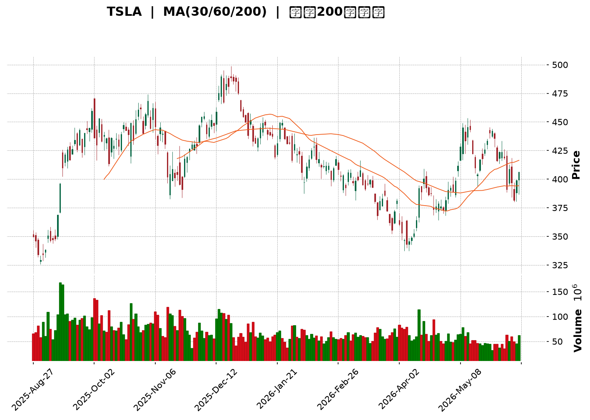
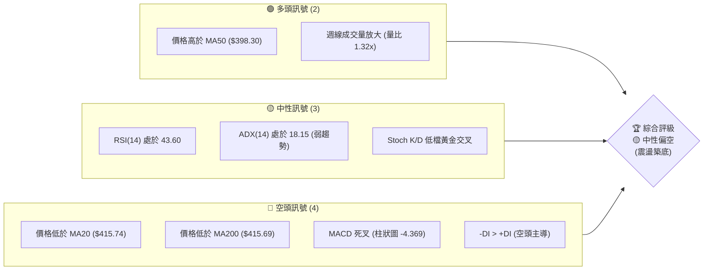
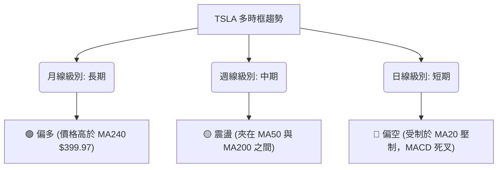
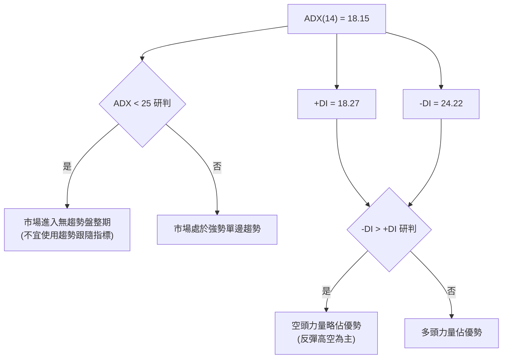
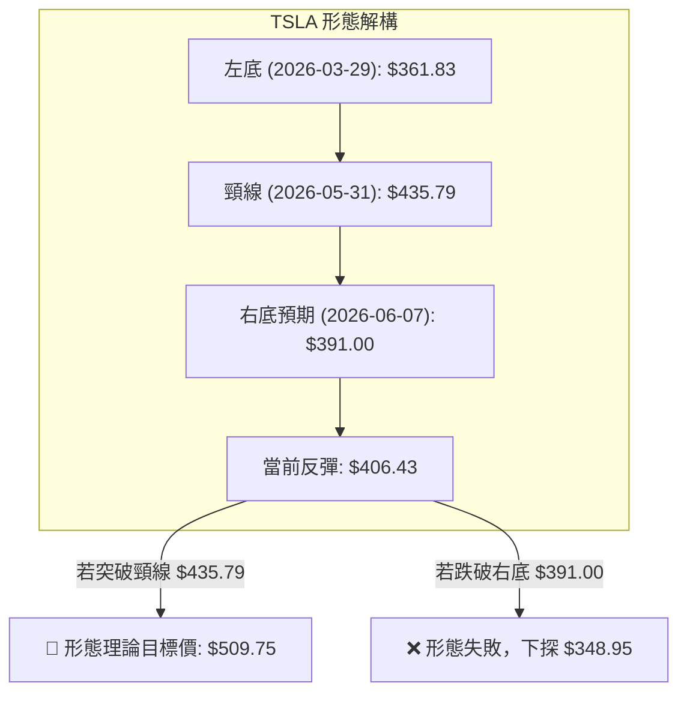

<details>
<summary>📊 靜態圖表 (點擊展開)</summary>

</details>

<html>
<head><meta charset="utf-8" /></head>
<body>
    <div style="height:500px; width:100%;">                        <script>window.PlotlyConfig = {MathJaxConfig: 'local'};</script>
        <script charset="utf-8" src="https://cdn.plot.ly/plotly-3.6.0.min.js" integrity="sha256-QaOVwtVY0T02VaHrr6pnoHLCwayMJp4O5n4YyaE3rJk=" crossorigin="anonymous"></script>                <div id="candlestick-chart" class="plotly-graph-div" style="height:100%; width:100%;"></div>            <script>                window.PLOTLYENV=window.PLOTLYENV || {};                                if (document.getElementById("candlestick-chart")) {                    Plotly.newPlot(                        "candlestick-chart",                        [{"close":{"dtype":"f8","bdata":"AAAAoJnZdUAAAAAgrp91QAAAAIDr3XRAAAAAgMKVdEAAAACgcOF0QAAAAOB6KHVAAAAAoHDtdUAAAABgZqZ1QAAAACCFr3VAAAAA4KO8dUAAAADA9Qx3QAAAAEAKv3hAAAAA4KOgeUAAAACA61l6QAAAAIDCnXpAAAAAoJkNekAAAADAHqF6QAAAACBcI3tAAAAAoJmdekAAAADgo6x7QAAAAIA9dnpAAAAAYGaGe0AAAAAgXLN7QAAAACCFy3tAAAAAIFy3fEAAAAAAAEB7QAAAAKBH3XpAAAAAAABUfEAAAACgcBF7QAAAAEAKa3tAAAAA4KM4e0AAAAAA19d5QAAAAGBmPntAAAAAANfTekAAAABgZjJ7QAAAAAAAzHpAAAAAwPV0e0AAAABA4fZ7QAAAAKCZqXtAAAAAIIVve0AAAAAgrg98QAAAACCFG3tAAAAAYLhGfEAAAADAzMh8QAAAAAAp2HxAAAAAoJmBe0AAAADA9Yh8QAAAAIDrRX1AAAAAACnEe0AAAADAHuF8QAAAAGCP3ntAAAAA4FHYekAAAAAgrtN7QAAAAIDreXtAAAAAoJnpekAAAAAA1x95QAAAAKCZRXlAAAAAYLiOeUAAAAAAABR5QAAAAADXP3lAAAAAIK6zeEAAAACgcHF4QAAAAOB6HHpAAAAAYGY2ekAAAACgR6l6QAAAAGC44npAAAAAgD3iekAAAAAA19N6QAAAAADX63tAAAAA4HpofEAAAAAAAHB8QAAAAKBHeXtAAAAAYLjSe0AAAABAMzd8QAAAAIA97ntAAAAAIFyvfEAAAADA9bR9QAAAAIAUnn5AAAAAACk0fUAAAACA6zV+QAAAAEAzE35AAAAAIK6LfkAAAADA9Vh+QAAAAGBmVn5AAAAAQAqzfUAAAACAPbp8QAAAAEDhZnxAAAAAIIUbfEAAAADAHmF7QAAAAGC4OnxAAAAAIFwPe0AAAABgj\u002fZ6QAAAAMDMPHtAAAAAACnQe0AAAAAgXA98QAAAAEAz83tAAAAAQDNze0AAAADAHml7QAAAAAAAWHtAAAAAAAA0ekAAAABACvd6QAAAAIDCFXxAAAAAwPUQfEAAAABAMzN7QAAAAGBm7npAAAAAIFz3ekAAAADA9Qh6QAAAAGCP5npAAAAAwPVcekAAAAAgXF96QAAAAAApYHlAAAAAIFzTeEAAAACAwrF5QAAAAMAeFXpAAAAAIFyTekAAAADgUcR6QAAAAMAeEXpAAAAAQAoXekAAAACAFKp5QAAAAMAetXlAAAAAIFy7eUAAAADAHr15QAAAAKBH\u002fXhAAAAAgBSWeUAAAABgZhZ6QAAAAKBHiXlAAAAAACkoeUAAAADAHjV5QAAAAEDhhnhAAAAAQApfeUAAAADAzFh5QAAAACCuy3hAAAAAQOHqeEAAAAAA1\u002fN4QAAAAMAefXlAAAAAACmweEAAAABAM3N4QAAAAMD1uHhAAAAA4FH0eEAAAADgeox4QAAAAMDMxHdAAAAAIFz\u002fdkAAAACgmc13QAAAAOB68HdAAAAAQDMfeEAAAACAwkF3QAAAAKBHnXZAAAAA4Ho0dkAAAAAAADx3QAAAAAAp1HdAAAAAoHCJdkAAAADAHg12QAAAAGBmqnVAAAAAAAB0dUAAAACA65l1QAAAAEAzz3VAAAAAYLgGdkAAAABAM8N2QAAAAEAzf3hAAAAAYGZOeEAAAACA6wl5QAAAAAAAiHhAAAAAYLgmeEAAAAAAKTh4QAAAACCFW3dAAAAAwMyEd0AAAABguKp3QAAAAOBRgHdAAAAAwMxMd0AAAACAFNp3QAAAAMAebXhAAAAAACmIeEAAAACA61V4QAAAACCu63hAAAAA4KO8eUAAAACgmcV6QAAAAAAA0HtAAAAAQDMXe0AAAADgUdR7QAAAAMDMtHtAAAAAANdjekAAAAAA1595QAAAAIDCQXlAAAAAACkUekAAAACgmR16QAAAAAApoHpAAAAAoHAZe0AAAACAwoV7QAAAAKCZoXtAAAAA4KM8e0AAAACAFP55QAAAAADXe3pAAAAAQDN7ekAAAABAMyd6QAAAAAAAcHhAAAAAQDOPeUAAAABA4cp4QAAAAKBw2XdAAAAAYGbyeEAAAABA4WZ5QA=="},"high":{"dtype":"f8","bdata":"AAAAgD02dkAAAADAzBh2QAAAAAAAzHVAAAAAoEfVdEAAAACgR3V1QAAAAIA9LnVAAAAAgOs9dkAAAABACmd2QAAAAOBR7HVAAAAAoEdFdkAAAAAA1w93QAAAAEAKy3hAAAAAQDObekAAAAAAAHR6QAAAAMD1xHpAAAAAIIUDe0AAAAAghdd6QAAAACCuz3tAAAAAIIWPe0AAAAAgXMN7QAAAAKCZNXtAAAAAIIWHe0AAAAAgri98QAAAAAAA0HtAAAAA4KPkfEAAAAAAAGx9QAAAAOBR7HtAAAAAwMxYfEAAAABA4Up8QAAAAKBHlXtAAAAAoJlFe0AAAACAFLJ7QAAAAIA9TntAAAAAQDMje0AAAAAAKYh7QAAAAKCZdXtAAAAAIFyXe0AAAADAzBx8QAAAAMDMFHxAAAAA4KPYe0AAAABgZhZ8QAAAAEDhOnxAAAAAYI\u002fCfEAAAAAAADB9QAAAAEAzG31AAAAAwPVwfEAAAAAAAKB8QAAAAMAeoX1AAAAAIIXDfEAAAACgRyV9QAAAAEAzN31AAAAAgMJ1e0AAAABguBp8QAAAAADXp3tAAAAAoEele0AAAAAAAIh6QAAAAEAKw3lAAAAAIFx\u002fekAAAABgZo55QAAAAOB6vHlAAAAAQArPekAAAADAzCx5QAAAACCFW3pAAAAAIK5HekAAAABACq96QAAAAEDhDntAAAAAYI8ae0AAAADAzEx7QAAAAGC4\u002fntAAAAAgBRqfEAAAACA6618QAAAAAAAHHxAAAAAgD1GfEAAAACAFI58QAAAAOBRFHxAAAAAACnwfEAAAADgURx+QAAAAAAAuH5AAAAA4Hr0fkAAAACAwq1+QAAAAADXp35AAAAAoEctf0AAAAAghb9+QAAAAGBmrn5AAAAAoHCRfkAAAABgZlZ9QAAAAIDr8XxAAAAAwMyIfEAAAACgcKV8QAAAAMDMmHxAAAAAAAAEfEAAAACA62V7QAAAAIA9TntAAAAAwMwQfEAAAADAzGR8QAAAAMD1PHxAAAAAYI++e0AAAACAwtV7QAAAAAAA9HtAAAAAIK7rekAAAABAM2N7QAAAAAAAGHxAAAAAQOFGfEAAAADgo9B7QAAAAOBRWHtAAAAAAClke0AAAAAgroN7QAAAAIAUfntAAAAAYGayekAAAADA9ch6QAAAAGBmfnpAAAAAoJkheUAAAADAzOh5QAAAAAAAVHpAAAAAAAC0ekAAAACgmUV7QAAAACCuQ3tAAAAAwPWAekAAAAAghdt5QAAAAGBmDnpAAAAAAAD0eUAAAABAM+t5QAAAAEAze3lAAAAAwB6teUAAAACgcEV6QAAAAMD1DHpAAAAAgOtxeUAAAADgo0h5QAAAAKBwxXhAAAAAoEeFeUAAAACA64l5QAAAAKCZJXlAAAAAoHAZeUAAAACgcGl5QAAAAIAUBnpAAAAAAABoeUAAAABAMwN5QAAAACCuO3lAAAAAgOsBeUAAAADAHjF5QAAAAOBRNHhAAAAAgD2+d0AAAACgRxV4QAAAACCuN3hAAAAAIK7DeEAAAABACgd4QAAAAIDCHXdAAAAA4KP0dkAAAACgR1V3QAAAAIA98ndAAAAA4Hokd0AAAAAghft2QAAAAOBRwHVAAAAAAADIdkAAAACAFM51QAAAAIDC5XVAAAAAoJlFdkAAAACAFPp2QAAAAGBmqnhAAAAAwPWgeEAAAADgepR5QAAAAMDMbHlAAAAAQDOfeEAAAAAAKZB4QAAAAAAAIHhAAAAAACnsd0AAAADgesx3QAAAAOCj5HdAAAAAYGaGd0AAAAAAAAx4QAAAAMAe3XhAAAAAgD2qeEAAAACA6yF5QAAAAEDhGnlAAAAAoEf9eUAAAABAM\u002fN6QAAAAGCPEnxAAAAAwMz8e0AAAABgZlZ8QAAAACCuP3xAAAAAYI8qe0AAAACAFFJ6QAAAAIAUWnlAAAAAIFwXekAAAABAM696QAAAAAAp+HpAAAAAQDMze0AAAACgmdl7QAAAACBcv3tAAAAAwB6Re0AAAACgmdl6QAAAAGC4hnpAAAAAoJkZe0AAAACgmaV6QAAAAEDhinpAAAAAQArPeUAAAAAAACh6QAAAAKBw0XhAAAAA4KP4eEAAAABA4Wp5QA=="},"hovertemplate":"\u003cb\u003e%{x|%Y-%m-%d}\u003c\u002fb\u003e\u003cbr\u003e\u958b: $%{open:.2f}\u003cbr\u003e\u9ad8: $%{high:.2f}\u003cbr\u003e\u4f4e: $%{low:.2f}\u003cbr\u003e\u6536: $%{close:.2f}\u003cextra\u003e\u003c\u002fextra\u003e","low":{"dtype":"f8","bdata":"AAAAYI\u002fSdUAAAAAAKUR1QAAAAEAzu3RAAAAAoJlZdEAAAAAAKYh0QAAAACCut3RAAAAAQOGKdUAAAACgcI11QAAAAMAefXVAAAAAwB6hdUAAAACgmbl1QAAAAADXI3dAAAAAQOEmeUAAAABA4bZ5QAAAAGC4mnlAAAAAwPUIekAAAAAghVt6QAAAAIAU0npAAAAAIIV7ekAAAADgetB6QAAAAKBHMXpAAAAA4FFQekAAAAAAAHh7QAAAAIDrEXtAAAAAAACMe0AAAADAHjl7QAAAAKBHCXpAAAAAQApLe0AAAABAMwd7QAAAACCuk3pAAAAAQOGiekAAAABAM7d5QAAAAEAzO3pAAAAAgMIdekAAAACgR6V6QAAAAMD1VHpAAAAAoJl5ekAAAACAwol7QAAAAMDMoHtAAAAAAADQekAAAABgZt55QAAAAGC44npAAAAAQApre0AAAACgmTl8QAAAAGBmSnxAAAAAgMJ5e0AAAABACrt7QAAAAMDMXHxAAAAAoJm5e0AAAAAgXIt7QAAAAKBwMXtAAAAAgBReekAAAACAwhV7QAAAAIDCBXtAAAAAwPWoekAAAACgcMV4QAAAAOB67HdAAAAAANfreEAAAAAgXJt4QAAAAAAA6HhAAAAAANereEAAAAAAKfx3QAAAAKBwEXlAAAAAQDNfeUAAAACAPQ56QAAAAEAzo3pAAAAA4KOUekAAAACA62F6QAAAAIDC8XpAAAAAgD3We0AAAABgjzp8QAAAAAAANHtAAAAAQDM7e0AAAACAwrl7QAAAAKBHhXtAAAAAYLiae0AAAABgjzp9QAAAAKBHHX1AAAAAQDMjfUAAAACA65F9QAAAACCFq31AAAAAoEdVfkAAAACgcC1+QAAAAMDMzH1AAAAAwB6dfUAAAAAAALB8QAAAAKBHXXxAAAAAwMwUfEAAAADAzDR7QAAAAMAeyXtAAAAA4HrMekAAAADgo\u002fR6QAAAAIDrhXpAAAAAgD3mekAAAAAAAGB7QAAAAEAzv3tAAAAAIIUje0AAAABgZlp7QAAAAAApNHtAAAAAQAoXekAAAACA6zl6QAAAAIAUCntAAAAA4KPAe0AAAADgeiR7QAAAAEAK63pAAAAAoJnhekAAAACA6+l5QAAAAEAza3pAAAAAAADoeUAAAABACtt5QAAAAEDh8nhAAAAA4Ho4eEAAAAAAANx4QAAAAOCjdHlAAAAAAAAQekAAAADgekB6QAAAAAAA4HlAAAAAgBSueUAAAAAAKQh5QAAAAKBHmXlAAAAAgMJBeUAAAAAAAFh5QAAAAOCjoHhAAAAAgD3aeEAAAABgZsJ5QAAAAGCPOnlAAAAAgMLheEAAAAAAAER4QAAAAIA9FnhAAAAAoEepeEAAAABguPZ4QAAAACBco3hAAAAAYGbWd0AAAABACuN4QAAAAGBmInlAAAAAYGaqeEAAAABAM194QAAAAGC4pnhAAAAAAACQeEAAAADA9YR4QAAAACCuq3dAAAAAIFzHdkAAAAAgrkt3QAAAAMD1hHdAAAAAACkQeEAAAACA6z13QAAAACCFd3ZAAAAAgD0CdkAAAAAAAJB2QAAAAKBHYXdAAAAA4HpwdkAAAACAPap1QAAAAADXE3VAAAAAYLg6dUAAAAAAABR1QAAAAADXa3VAAAAAwB7JdUAAAADgUSx2QAAAAAAAqHZAAAAAwMzcd0AAAABgZnp4QAAAAKBHRXhAAAAAIIUTeEAAAADAzBR4QAAAAIA9BndAAAAAIK4rd0AAAADgUcB2QAAAAOCjSHdAAAAA4KMgd0AAAABguAJ3QAAAAMDMrHdAAAAAwMwMeEAAAAAAAFB4QAAAAOBRAHhAAAAAgOsheUAAAACAPQZ6QAAAAMDMDHpAAAAAAClkekAAAAAgXON6QAAAAGCPkntAAAAAAABgekAAAACgR1V5QAAAAIAUmnhAAAAAgD1meUAAAABgZs55QAAAAAApSHpAAAAAgOuhekAAAADgUTh7QAAAAMDMRHtAAAAAgD3CekAAAABA4fZ5QAAAAGBm2nlAAAAAAAAAekAAAABgjxJ6QAAAAKBwSXhAAAAAIIWreEAAAAAA1wN4QAAAAGBmwndAAAAAYI\u002fKd0AAAAAAKSx4QA=="},"name":"\u50f9\u683c","open":{"dtype":"f8","bdata":"AAAAQAr\u002fdUAAAABgj+51QAAAACCus3VAAAAAIK6DdEAAAABAM\u002fN0QAAAAGBmAnVAAAAAAADAdUAAAACAPSp2QAAAAEAKx3VAAAAAwMzodUAAAABguOJ1QAAAAEAKL3dAAAAAgBRyekAAAAAAAOh5QAAAAAAA\u002fHlAAAAAgOvNekAAAADAHl16QAAAAIDC8XpAAAAAgBR+e0AAAACgR916QAAAAADXM3tAAAAAwMzEekAAAACgmcV7QAAAAOBRmHtAAAAAwMy8e0AAAADgo2h9QAAAAOCjtHtAAAAAAACMe0AAAADAHv17QAAAAMAeWXtAAAAAwPX8ekAAAADgo0h7QAAAAOB6eHpAAAAA4KOsekAAAABgZi57QAAAACCuK3tAAAAAAACYekAAAACA6717QAAAAAAp3HtAAAAAQDO3e0AAAAAAAEB6QAAAAKBH7XtAAAAAIK5\u002fe0AAAADgemx8QAAAAAAA6HxAAAAAwMwwfEAAAAAAAOx7QAAAAADXf3xAAAAAIFxnfEAAAADAzEB8QAAAACBc33xAAAAAYLhee0AAAACgmXl7QAAAAGBmdntAAAAAYGaie0AAAACAFHJ6QAAAAMDMJHhAAAAAANfreEAAAACAFFZ5QAAAAEDhYnlAAAAAgBTqeUAAAADAHiV5QAAAAGC4InlAAAAAYLjmeUAAAABAM396QAAAAKBwqXpAAAAAwB6VekAAAADA9ex6QAAAAKCZAXtAAAAAQAoffEAAAADgelB8QAAAAEAz93tAAAAA4KNYe0AAAADAHuF7QAAAAEAzD3xAAAAAoHABfEAAAABACld9QAAAACBcg31AAAAAIIWDfkAAAABgj+J9QAAAAIDrgX5AAAAAgBSefkAAAABgZpZ+QAAAACCuh35AAAAAIK5TfkAAAAAAAFB9QAAAAKBw0XxAAAAAoJmBfEAAAADAzJx8QAAAAADX\u002f3tAAAAAgBTme0AAAABgZj57QAAAAIA9vnpAAAAAQDM\u002fe0AAAAAgrpN7QAAAAEAzI3xAAAAAwPWse0AAAACAFJJ7QAAAAAAAeHtAAAAAgMLVekAAAABgj1p6QAAAAGCPMntAAAAAQOH2e0AAAAAAANB7QAAAAGCPVntAAAAAYI\u002f+ekAAAADAzFx7QAAAAKCZlXpAAAAA4KNUekAAAADgUYR6QAAAACBcR3pAAAAA4FHQeEAAAACA6w15QAAAAGCPnnlAAAAAoEchekAAAAAgXL96QAAAAMDM5HpAAAAAwPXkeUAAAACAwsV5QAAAAIDCsXlAAAAAAAB0eUAAAADAzIR5QAAAAOCjdHlAAAAAAAD4eEAAAABgZsJ5QAAAAGC45nlAAAAAQAoveUAAAACgmWl4QAAAAKBwsXhAAAAAoJndeEAAAADAHhl5QAAAAKBw4XhAAAAAwMxgeEAAAAAghSN5QAAAAOB6JHlAAAAAQOFSeUAAAABguPJ4QAAAACCFw3hAAAAAQAq7eEAAAAAAAPB4QAAAAOBRNHhAAAAAoJm9d0AAAACgcFF3QAAAAMD1iHdAAAAAANdfeEAAAACgmdl3QAAAAEAKG3dAAAAAgMLddkAAAAAAKZh2QAAAAIAUqndAAAAAQDPDdkAAAACgcKl2QAAAAEAKp3VAAAAA4KO8dkAAAABgZnJ1QAAAAOCjpHVAAAAAwB7hdUAAAABguFp2QAAAAKBH7XZAAAAAwPWceEAAAABguL54QAAAAKBHKXlAAAAAAACQeEAAAADAHjl4QAAAAOB6dHdAAAAAAABYd0AAAACgcEF3QAAAAEDhandAAAAAYGZ2d0AAAAAAAEx3QAAAAADX53dAAAAAIK5jeEAAAABACrN4QAAAAAAAJHhAAAAAIK53eUAAAAAgrgd6QAAAAGCPYnpAAAAAYI+We0AAAABguEp7QAAAAADX53tAAAAAIK4fe0AAAADgUTR6QAAAAGCPMnlAAAAAoJl5eUAAAABA4WJ6QAAAAGC4anpAAAAAACnkekAAAACAPa57QAAAAIDrWXtAAAAAoJl9e0AAAAAA17d6QAAAACCFI3pAAAAAQDMrekAAAACgcD16QAAAAAAASHpAAAAAoEfFeEAAAADgerB5QAAAAOCjeHhAAAAA4HpEeEAAAAAgXPd4QA=="},"x":["2025-08-27T00:00:00-04:00","2025-08-28T00:00:00-04:00","2025-08-29T00:00:00-04:00","2025-09-02T00:00:00-04:00","2025-09-03T00:00:00-04:00","2025-09-04T00:00:00-04:00","2025-09-05T00:00:00-04:00","2025-09-08T00:00:00-04:00","2025-09-09T00:00:00-04:00","2025-09-10T00:00:00-04:00","2025-09-11T00:00:00-04:00","2025-09-12T00:00:00-04:00","2025-09-15T00:00:00-04:00","2025-09-16T00:00:00-04:00","2025-09-17T00:00:00-04:00","2025-09-18T00:00:00-04:00","2025-09-19T00:00:00-04:00","2025-09-22T00:00:00-04:00","2025-09-23T00:00:00-04:00","2025-09-24T00:00:00-04:00","2025-09-25T00:00:00-04:00","2025-09-26T00:00:00-04:00","2025-09-29T00:00:00-04:00","2025-09-30T00:00:00-04:00","2025-10-01T00:00:00-04:00","2025-10-02T00:00:00-04:00","2025-10-03T00:00:00-04:00","2025-10-06T00:00:00-04:00","2025-10-07T00:00:00-04:00","2025-10-08T00:00:00-04:00","2025-10-09T00:00:00-04:00","2025-10-10T00:00:00-04:00","2025-10-13T00:00:00-04:00","2025-10-14T00:00:00-04:00","2025-10-15T00:00:00-04:00","2025-10-16T00:00:00-04:00","2025-10-17T00:00:00-04:00","2025-10-20T00:00:00-04:00","2025-10-21T00:00:00-04:00","2025-10-22T00:00:00-04:00","2025-10-23T00:00:00-04:00","2025-10-24T00:00:00-04:00","2025-10-27T00:00:00-04:00","2025-10-28T00:00:00-04:00","2025-10-29T00:00:00-04:00","2025-10-30T00:00:00-04:00","2025-10-31T00:00:00-04:00","2025-11-03T00:00:00-05:00","2025-11-04T00:00:00-05:00","2025-11-05T00:00:00-05:00","2025-11-06T00:00:00-05:00","2025-11-07T00:00:00-05:00","2025-11-10T00:00:00-05:00","2025-11-11T00:00:00-05:00","2025-11-12T00:00:00-05:00","2025-11-13T00:00:00-05:00","2025-11-14T00:00:00-05:00","2025-11-17T00:00:00-05:00","2025-11-18T00:00:00-05:00","2025-11-19T00:00:00-05:00","2025-11-20T00:00:00-05:00","2025-11-21T00:00:00-05:00","2025-11-24T00:00:00-05:00","2025-11-25T00:00:00-05:00","2025-11-26T00:00:00-05:00","2025-11-28T00:00:00-05:00","2025-12-01T00:00:00-05:00","2025-12-02T00:00:00-05:00","2025-12-03T00:00:00-05:00","2025-12-04T00:00:00-05:00","2025-12-05T00:00:00-05:00","2025-12-08T00:00:00-05:00","2025-12-09T00:00:00-05:00","2025-12-10T00:00:00-05:00","2025-12-11T00:00:00-05:00","2025-12-12T00:00:00-05:00","2025-12-15T00:00:00-05:00","2025-12-16T00:00:00-05:00","2025-12-17T00:00:00-05:00","2025-12-18T00:00:00-05:00","2025-12-19T00:00:00-05:00","2025-12-22T00:00:00-05:00","2025-12-23T00:00:00-05:00","2025-12-24T00:00:00-05:00","2025-12-26T00:00:00-05:00","2025-12-29T00:00:00-05:00","2025-12-30T00:00:00-05:00","2025-12-31T00:00:00-05:00","2026-01-02T00:00:00-05:00","2026-01-05T00:00:00-05:00","2026-01-06T00:00:00-05:00","2026-01-07T00:00:00-05:00","2026-01-08T00:00:00-05:00","2026-01-09T00:00:00-05:00","2026-01-12T00:00:00-05:00","2026-01-13T00:00:00-05:00","2026-01-14T00:00:00-05:00","2026-01-15T00:00:00-05:00","2026-01-16T00:00:00-05:00","2026-01-20T00:00:00-05:00","2026-01-21T00:00:00-05:00","2026-01-22T00:00:00-05:00","2026-01-23T00:00:00-05:00","2026-01-26T00:00:00-05:00","2026-01-27T00:00:00-05:00","2026-01-28T00:00:00-05:00","2026-01-29T00:00:00-05:00","2026-01-30T00:00:00-05:00","2026-02-02T00:00:00-05:00","2026-02-03T00:00:00-05:00","2026-02-04T00:00:00-05:00","2026-02-05T00:00:00-05:00","2026-02-06T00:00:00-05:00","2026-02-09T00:00:00-05:00","2026-02-10T00:00:00-05:00","2026-02-11T00:00:00-05:00","2026-02-12T00:00:00-05:00","2026-02-13T00:00:00-05:00","2026-02-17T00:00:00-05:00","2026-02-18T00:00:00-05:00","2026-02-19T00:00:00-05:00","2026-02-20T00:00:00-05:00","2026-02-23T00:00:00-05:00","2026-02-24T00:00:00-05:00","2026-02-25T00:00:00-05:00","2026-02-26T00:00:00-05:00","2026-02-27T00:00:00-05:00","2026-03-02T00:00:00-05:00","2026-03-03T00:00:00-05:00","2026-03-04T00:00:00-05:00","2026-03-05T00:00:00-05:00","2026-03-06T00:00:00-05:00","2026-03-09T00:00:00-04:00","2026-03-10T00:00:00-04:00","2026-03-11T00:00:00-04:00","2026-03-12T00:00:00-04:00","2026-03-13T00:00:00-04:00","2026-03-16T00:00:00-04:00","2026-03-17T00:00:00-04:00","2026-03-18T00:00:00-04:00","2026-03-19T00:00:00-04:00","2026-03-20T00:00:00-04:00","2026-03-23T00:00:00-04:00","2026-03-24T00:00:00-04:00","2026-03-25T00:00:00-04:00","2026-03-26T00:00:00-04:00","2026-03-27T00:00:00-04:00","2026-03-30T00:00:00-04:00","2026-03-31T00:00:00-04:00","2026-04-01T00:00:00-04:00","2026-04-02T00:00:00-04:00","2026-04-06T00:00:00-04:00","2026-04-07T00:00:00-04:00","2026-04-08T00:00:00-04:00","2026-04-09T00:00:00-04:00","2026-04-10T00:00:00-04:00","2026-04-13T00:00:00-04:00","2026-04-14T00:00:00-04:00","2026-04-15T00:00:00-04:00","2026-04-16T00:00:00-04:00","2026-04-17T00:00:00-04:00","2026-04-20T00:00:00-04:00","2026-04-21T00:00:00-04:00","2026-04-22T00:00:00-04:00","2026-04-23T00:00:00-04:00","2026-04-24T00:00:00-04:00","2026-04-27T00:00:00-04:00","2026-04-28T00:00:00-04:00","2026-04-29T00:00:00-04:00","2026-04-30T00:00:00-04:00","2026-05-01T00:00:00-04:00","2026-05-04T00:00:00-04:00","2026-05-05T00:00:00-04:00","2026-05-06T00:00:00-04:00","2026-05-07T00:00:00-04:00","2026-05-08T00:00:00-04:00","2026-05-11T00:00:00-04:00","2026-05-12T00:00:00-04:00","2026-05-13T00:00:00-04:00","2026-05-14T00:00:00-04:00","2026-05-15T00:00:00-04:00","2026-05-18T00:00:00-04:00","2026-05-19T00:00:00-04:00","2026-05-20T00:00:00-04:00","2026-05-21T00:00:00-04:00","2026-05-22T00:00:00-04:00","2026-05-26T00:00:00-04:00","2026-05-27T00:00:00-04:00","2026-05-28T00:00:00-04:00","2026-05-29T00:00:00-04:00","2026-06-01T00:00:00-04:00","2026-06-02T00:00:00-04:00","2026-06-03T00:00:00-04:00","2026-06-04T00:00:00-04:00","2026-06-05T00:00:00-04:00","2026-06-08T00:00:00-04:00","2026-06-09T00:00:00-04:00","2026-06-10T00:00:00-04:00","2026-06-11T00:00:00-04:00","2026-06-12T00:00:00-04:00"],"type":"candlestick"},{"hovertemplate":"MA30: $%{y:.2f}\u003cextra\u003e\u003c\u002fextra\u003e","line":{"color":"#2196F3","dash":"dash","width":2},"mode":"lines","name":"MA30","x":["2025-08-27T00:00:00-04:00","2025-08-28T00:00:00-04:00","2025-08-29T00:00:00-04:00","2025-09-02T00:00:00-04:00","2025-09-03T00:00:00-04:00","2025-09-04T00:00:00-04:00","2025-09-05T00:00:00-04:00","2025-09-08T00:00:00-04:00","2025-09-09T00:00:00-04:00","2025-09-10T00:00:00-04:00","2025-09-11T00:00:00-04:00","2025-09-12T00:00:00-04:00","2025-09-15T00:00:00-04:00","2025-09-16T00:00:00-04:00","2025-09-17T00:00:00-04:00","2025-09-18T00:00:00-04:00","2025-09-19T00:00:00-04:00","2025-09-22T00:00:00-04:00","2025-09-23T00:00:00-04:00","2025-09-24T00:00:00-04:00","2025-09-25T00:00:00-04:00","2025-09-26T00:00:00-04:00","2025-09-29T00:00:00-04:00","2025-09-30T00:00:00-04:00","2025-10-01T00:00:00-04:00","2025-10-02T00:00:00-04:00","2025-10-03T00:00:00-04:00","2025-10-06T00:00:00-04:00","2025-10-07T00:00:00-04:00","2025-10-08T00:00:00-04:00","2025-10-09T00:00:00-04:00","2025-10-10T00:00:00-04:00","2025-10-13T00:00:00-04:00","2025-10-14T00:00:00-04:00","2025-10-15T00:00:00-04:00","2025-10-16T00:00:00-04:00","2025-10-17T00:00:00-04:00","2025-10-20T00:00:00-04:00","2025-10-21T00:00:00-04:00","2025-10-22T00:00:00-04:00","2025-10-23T00:00:00-04:00","2025-10-24T00:00:00-04:00","2025-10-27T00:00:00-04:00","2025-10-28T00:00:00-04:00","2025-10-29T00:00:00-04:00","2025-10-30T00:00:00-04:00","2025-10-31T00:00:00-04:00","2025-11-03T00:00:00-05:00","2025-11-04T00:00:00-05:00","2025-11-05T00:00:00-05:00","2025-11-06T00:00:00-05:00","2025-11-07T00:00:00-05:00","2025-11-10T00:00:00-05:00","2025-11-11T00:00:00-05:00","2025-11-12T00:00:00-05:00","2025-11-13T00:00:00-05:00","2025-11-14T00:00:00-05:00","2025-11-17T00:00:00-05:00","2025-11-18T00:00:00-05:00","2025-11-19T00:00:00-05:00","2025-11-20T00:00:00-05:00","2025-11-21T00:00:00-05:00","2025-11-24T00:00:00-05:00","2025-11-25T00:00:00-05:00","2025-11-26T00:00:00-05:00","2025-11-28T00:00:00-05:00","2025-12-01T00:00:00-05:00","2025-12-02T00:00:00-05:00","2025-12-03T00:00:00-05:00","2025-12-04T00:00:00-05:00","2025-12-05T00:00:00-05:00","2025-12-08T00:00:00-05:00","2025-12-09T00:00:00-05:00","2025-12-10T00:00:00-05:00","2025-12-11T00:00:00-05:00","2025-12-12T00:00:00-05:00","2025-12-15T00:00:00-05:00","2025-12-16T00:00:00-05:00","2025-12-17T00:00:00-05:00","2025-12-18T00:00:00-05:00","2025-12-19T00:00:00-05:00","2025-12-22T00:00:00-05:00","2025-12-23T00:00:00-05:00","2025-12-24T00:00:00-05:00","2025-12-26T00:00:00-05:00","2025-12-29T00:00:00-05:00","2025-12-30T00:00:00-05:00","2025-12-31T00:00:00-05:00","2026-01-02T00:00:00-05:00","2026-01-05T00:00:00-05:00","2026-01-06T00:00:00-05:00","2026-01-07T00:00:00-05:00","2026-01-08T00:00:00-05:00","2026-01-09T00:00:00-05:00","2026-01-12T00:00:00-05:00","2026-01-13T00:00:00-05:00","2026-01-14T00:00:00-05:00","2026-01-15T00:00:00-05:00","2026-01-16T00:00:00-05:00","2026-01-20T00:00:00-05:00","2026-01-21T00:00:00-05:00","2026-01-22T00:00:00-05:00","2026-01-23T00:00:00-05:00","2026-01-26T00:00:00-05:00","2026-01-27T00:00:00-05:00","2026-01-28T00:00:00-05:00","2026-01-29T00:00:00-05:00","2026-01-30T00:00:00-05:00","2026-02-02T00:00:00-05:00","2026-02-03T00:00:00-05:00","2026-02-04T00:00:00-05:00","2026-02-05T00:00:00-05:00","2026-02-06T00:00:00-05:00","2026-02-09T00:00:00-05:00","2026-02-10T00:00:00-05:00","2026-02-11T00:00:00-05:00","2026-02-12T00:00:00-05:00","2026-02-13T00:00:00-05:00","2026-02-17T00:00:00-05:00","2026-02-18T00:00:00-05:00","2026-02-19T00:00:00-05:00","2026-02-20T00:00:00-05:00","2026-02-23T00:00:00-05:00","2026-02-24T00:00:00-05:00","2026-02-25T00:00:00-05:00","2026-02-26T00:00:00-05:00","2026-02-27T00:00:00-05:00","2026-03-02T00:00:00-05:00","2026-03-03T00:00:00-05:00","2026-03-04T00:00:00-05:00","2026-03-05T00:00:00-05:00","2026-03-06T00:00:00-05:00","2026-03-09T00:00:00-04:00","2026-03-10T00:00:00-04:00","2026-03-11T00:00:00-04:00","2026-03-12T00:00:00-04:00","2026-03-13T00:00:00-04:00","2026-03-16T00:00:00-04:00","2026-03-17T00:00:00-04:00","2026-03-18T00:00:00-04:00","2026-03-19T00:00:00-04:00","2026-03-20T00:00:00-04:00","2026-03-23T00:00:00-04:00","2026-03-24T00:00:00-04:00","2026-03-25T00:00:00-04:00","2026-03-26T00:00:00-04:00","2026-03-27T00:00:00-04:00","2026-03-30T00:00:00-04:00","2026-03-31T00:00:00-04:00","2026-04-01T00:00:00-04:00","2026-04-02T00:00:00-04:00","2026-04-06T00:00:00-04:00","2026-04-07T00:00:00-04:00","2026-04-08T00:00:00-04:00","2026-04-09T00:00:00-04:00","2026-04-10T00:00:00-04:00","2026-04-13T00:00:00-04:00","2026-04-14T00:00:00-04:00","2026-04-15T00:00:00-04:00","2026-04-16T00:00:00-04:00","2026-04-17T00:00:00-04:00","2026-04-20T00:00:00-04:00","2026-04-21T00:00:00-04:00","2026-04-22T00:00:00-04:00","2026-04-23T00:00:00-04:00","2026-04-24T00:00:00-04:00","2026-04-27T00:00:00-04:00","2026-04-28T00:00:00-04:00","2026-04-29T00:00:00-04:00","2026-04-30T00:00:00-04:00","2026-05-01T00:00:00-04:00","2026-05-04T00:00:00-04:00","2026-05-05T00:00:00-04:00","2026-05-06T00:00:00-04:00","2026-05-07T00:00:00-04:00","2026-05-08T00:00:00-04:00","2026-05-11T00:00:00-04:00","2026-05-12T00:00:00-04:00","2026-05-13T00:00:00-04:00","2026-05-14T00:00:00-04:00","2026-05-15T00:00:00-04:00","2026-05-18T00:00:00-04:00","2026-05-19T00:00:00-04:00","2026-05-20T00:00:00-04:00","2026-05-21T00:00:00-04:00","2026-05-22T00:00:00-04:00","2026-05-26T00:00:00-04:00","2026-05-27T00:00:00-04:00","2026-05-28T00:00:00-04:00","2026-05-29T00:00:00-04:00","2026-06-01T00:00:00-04:00","2026-06-02T00:00:00-04:00","2026-06-03T00:00:00-04:00","2026-06-04T00:00:00-04:00","2026-06-05T00:00:00-04:00","2026-06-08T00:00:00-04:00","2026-06-09T00:00:00-04:00","2026-06-10T00:00:00-04:00","2026-06-11T00:00:00-04:00","2026-06-12T00:00:00-04:00"],"y":{"dtype":"f8","bdata":"AAAAAAAA+H8AAAAAAAD4fwAAAAAAAPh\u002fAAAAAAAA+H8AAAAAAAD4fwAAAAAAAPh\u002fAAAAAAAA+H8AAAAAAAD4fwAAAAAAAPh\u002fAAAAAAAA+H8AAAAAAAD4fwAAAAAAAPh\u002fAAAAAAAA+H8AAAAAAAD4fwAAAAAAAPh\u002fAAAAAAAA+H8AAAAAAAD4fwAAAAAAAPh\u002fAAAAAAAA+H8AAAAAAAD4fwAAAAAAAPh\u002fAAAAAAAA+H8AAAAAAAD4fwAAAAAAAPh\u002fAAAAAAAA+H8AAAAAAAD4fwAAAAAAAPh\u002fAAAAAAAA+H8AAAAAAAD4f1VVVeWJ\u002fHhAIiIikl8qeUDv7u7uYE55QN7d3W3LhHlAERERYRC6eUAAAABw9u95QJqZmXkUIHpARERElENPekCrqqqKJYV6QJqZmTkmuHpAVVVVVcfoekBmZmY2iRN7QBEREXGvJ3tAmpmZuUk+e0B3d3f3DFN7QCIiImIQZntAiYiIyHZye0Dv7u6uuYJ7QJqZmanxlHtA3t3dPcOee0CrqqqaC6l7QFVVVVUOtXtAmpmZ2UCve0BmZmamVLB7QERERFScrXtAq6qq+jeee0Crqqp6FIx7QM3MzJx9fntAd3d3F9lme0Dv7u7e3VV7QJqZmSlcQ3tAERERgdwte0CJiIgo6iF7QM3MzCxAGHtAAAAAsAATe0CJiIiYbg57QJqZmXkwD3tAd3d3d0wKe0DNzMzsmAB7QLy7uyvOAntAERERoRoLe0Dv7u6OUA57QERERKRwEXtAZmZmxpINe0AzMzNTuAh7QFVVVTXsAHtAmpmZOfsKe0CamZk5+xR7QO\u002fu7g50IHtAMzMzU7gse0C8u7t7FDh7QO\u002fu7r7mSntAMzMz43pqe0BmZmZG\u002fX97QFVVVcVnmHtAq6qqyi+we0ARERHx7s57QHd3d4ek6XtAZmZmFmf\u002fe0Dv7u4+ChN8QImIiCh4LHxA7+7ujpdAfEBVVVWVGFZ8QJqZmem0X3xAiYiIiF1tfEBmZmYmTXl8QAAAAFBignxA3t3dTTeHfECamZkpMYx8QImIiJhDh3xAMzMzs3J0fECamZn54Wd8QFVVVUUZbXxAIiIiYixvfEB3d3e3gWZ8QLy7u4v6XXxAERER4U9PfEC8u7uL+i98QImIiOhCEHxAd3d3dwX4e0BERET0RNd7QDMzMwMrr3tAq6qqelt+e0AiIiKSplZ7QCIiImJXMntAIiIicq8Xe0BERERk9AZ7QCIiIoIH83pAZmZmNtDhekDNzMy8LdN6QN7d3Z2ovXpAiYiISFOyekCJiIiY4Kd6QN7d3X2xlHpA7+7uzrCBekARERHR23B6QFVVVeVCXHpAzczMfLFIekAAAACw5DV6QBERESHbHXpA7+7u3sEWekBVVVUF8wh6QGZmZkbh7HlAmpmZuQLSeUC8u7v71L55QLy7u8uFsnlAiYiIKBWfeUDNzMysjpF5QM3MzHz4fnlAZmZmBvNyeUC8u7v7YmN5QFVVVbWsVXlAvLu7GxNGeUDNzMyc7zV5QCIiIuKlI3lAZmZmlrUOeUAAAADgwfB4QFVVVcVL03hAvLu72ySyeEARERFxaJ14QAAAAEBgjXhAq6qqqhxyeEAzMzMzpVJ4QLy7u1tINnhAiYiIaAMTeEC8u7sLu+x3QBEREZHtzHdAzczMnDayd0De3d1tWZ13QFVVVeUXnXdA3t3dXQGUd0AiIiJCYJF3QImIiLgej3dAMzMz05SId0CrqqpKU4J3QBEREYEjcHdAZmZm9ihmd0AzMzMzel93QGZmZlYOVXdAzczMTPBGd0BERET0\u002fUB3QJqZmUmaRndA7+7uLrJTd0AiIiJyPVh3QFVVVQWdYHdAq6qqCmVud0De3d2tY4x3QImIiCi\u002fuHdAiYiI+G\u002fid0BmZmbmpQl4QM3MzGy8KnhAREREtJ1LeEAAAABQG2p4QERERITAiHhAmpmZWTmweEB3d3cnv9Z4QJqZmWnY\u002f3hAIiIi0iIreUAiIiIywVN5QHd3d1eAbnlAREREZIKHeUBERETkpY95QBERETFPoHlAd3d3JzG0eUDv7u5+scR5QKuqqsrozXlAvLu7m1LfeUAiIiKS7eh5QAAAABDm63lAd3d3t\u002fP5eUDe3d29LQd6QA=="},"type":"scatter"},{"hovertemplate":"MA60: $%{y:.2f}\u003cextra\u003e\u003c\u002fextra\u003e","line":{"color":"#9C27B0","dash":"dash","width":2},"mode":"lines","name":"MA60","x":["2025-08-27T00:00:00-04:00","2025-08-28T00:00:00-04:00","2025-08-29T00:00:00-04:00","2025-09-02T00:00:00-04:00","2025-09-03T00:00:00-04:00","2025-09-04T00:00:00-04:00","2025-09-05T00:00:00-04:00","2025-09-08T00:00:00-04:00","2025-09-09T00:00:00-04:00","2025-09-10T00:00:00-04:00","2025-09-11T00:00:00-04:00","2025-09-12T00:00:00-04:00","2025-09-15T00:00:00-04:00","2025-09-16T00:00:00-04:00","2025-09-17T00:00:00-04:00","2025-09-18T00:00:00-04:00","2025-09-19T00:00:00-04:00","2025-09-22T00:00:00-04:00","2025-09-23T00:00:00-04:00","2025-09-24T00:00:00-04:00","2025-09-25T00:00:00-04:00","2025-09-26T00:00:00-04:00","2025-09-29T00:00:00-04:00","2025-09-30T00:00:00-04:00","2025-10-01T00:00:00-04:00","2025-10-02T00:00:00-04:00","2025-10-03T00:00:00-04:00","2025-10-06T00:00:00-04:00","2025-10-07T00:00:00-04:00","2025-10-08T00:00:00-04:00","2025-10-09T00:00:00-04:00","2025-10-10T00:00:00-04:00","2025-10-13T00:00:00-04:00","2025-10-14T00:00:00-04:00","2025-10-15T00:00:00-04:00","2025-10-16T00:00:00-04:00","2025-10-17T00:00:00-04:00","2025-10-20T00:00:00-04:00","2025-10-21T00:00:00-04:00","2025-10-22T00:00:00-04:00","2025-10-23T00:00:00-04:00","2025-10-24T00:00:00-04:00","2025-10-27T00:00:00-04:00","2025-10-28T00:00:00-04:00","2025-10-29T00:00:00-04:00","2025-10-30T00:00:00-04:00","2025-10-31T00:00:00-04:00","2025-11-03T00:00:00-05:00","2025-11-04T00:00:00-05:00","2025-11-05T00:00:00-05:00","2025-11-06T00:00:00-05:00","2025-11-07T00:00:00-05:00","2025-11-10T00:00:00-05:00","2025-11-11T00:00:00-05:00","2025-11-12T00:00:00-05:00","2025-11-13T00:00:00-05:00","2025-11-14T00:00:00-05:00","2025-11-17T00:00:00-05:00","2025-11-18T00:00:00-05:00","2025-11-19T00:00:00-05:00","2025-11-20T00:00:00-05:00","2025-11-21T00:00:00-05:00","2025-11-24T00:00:00-05:00","2025-11-25T00:00:00-05:00","2025-11-26T00:00:00-05:00","2025-11-28T00:00:00-05:00","2025-12-01T00:00:00-05:00","2025-12-02T00:00:00-05:00","2025-12-03T00:00:00-05:00","2025-12-04T00:00:00-05:00","2025-12-05T00:00:00-05:00","2025-12-08T00:00:00-05:00","2025-12-09T00:00:00-05:00","2025-12-10T00:00:00-05:00","2025-12-11T00:00:00-05:00","2025-12-12T00:00:00-05:00","2025-12-15T00:00:00-05:00","2025-12-16T00:00:00-05:00","2025-12-17T00:00:00-05:00","2025-12-18T00:00:00-05:00","2025-12-19T00:00:00-05:00","2025-12-22T00:00:00-05:00","2025-12-23T00:00:00-05:00","2025-12-24T00:00:00-05:00","2025-12-26T00:00:00-05:00","2025-12-29T00:00:00-05:00","2025-12-30T00:00:00-05:00","2025-12-31T00:00:00-05:00","2026-01-02T00:00:00-05:00","2026-01-05T00:00:00-05:00","2026-01-06T00:00:00-05:00","2026-01-07T00:00:00-05:00","2026-01-08T00:00:00-05:00","2026-01-09T00:00:00-05:00","2026-01-12T00:00:00-05:00","2026-01-13T00:00:00-05:00","2026-01-14T00:00:00-05:00","2026-01-15T00:00:00-05:00","2026-01-16T00:00:00-05:00","2026-01-20T00:00:00-05:00","2026-01-21T00:00:00-05:00","2026-01-22T00:00:00-05:00","2026-01-23T00:00:00-05:00","2026-01-26T00:00:00-05:00","2026-01-27T00:00:00-05:00","2026-01-28T00:00:00-05:00","2026-01-29T00:00:00-05:00","2026-01-30T00:00:00-05:00","2026-02-02T00:00:00-05:00","2026-02-03T00:00:00-05:00","2026-02-04T00:00:00-05:00","2026-02-05T00:00:00-05:00","2026-02-06T00:00:00-05:00","2026-02-09T00:00:00-05:00","2026-02-10T00:00:00-05:00","2026-02-11T00:00:00-05:00","2026-02-12T00:00:00-05:00","2026-02-13T00:00:00-05:00","2026-02-17T00:00:00-05:00","2026-02-18T00:00:00-05:00","2026-02-19T00:00:00-05:00","2026-02-20T00:00:00-05:00","2026-02-23T00:00:00-05:00","2026-02-24T00:00:00-05:00","2026-02-25T00:00:00-05:00","2026-02-26T00:00:00-05:00","2026-02-27T00:00:00-05:00","2026-03-02T00:00:00-05:00","2026-03-03T00:00:00-05:00","2026-03-04T00:00:00-05:00","2026-03-05T00:00:00-05:00","2026-03-06T00:00:00-05:00","2026-03-09T00:00:00-04:00","2026-03-10T00:00:00-04:00","2026-03-11T00:00:00-04:00","2026-03-12T00:00:00-04:00","2026-03-13T00:00:00-04:00","2026-03-16T00:00:00-04:00","2026-03-17T00:00:00-04:00","2026-03-18T00:00:00-04:00","2026-03-19T00:00:00-04:00","2026-03-20T00:00:00-04:00","2026-03-23T00:00:00-04:00","2026-03-24T00:00:00-04:00","2026-03-25T00:00:00-04:00","2026-03-26T00:00:00-04:00","2026-03-27T00:00:00-04:00","2026-03-30T00:00:00-04:00","2026-03-31T00:00:00-04:00","2026-04-01T00:00:00-04:00","2026-04-02T00:00:00-04:00","2026-04-06T00:00:00-04:00","2026-04-07T00:00:00-04:00","2026-04-08T00:00:00-04:00","2026-04-09T00:00:00-04:00","2026-04-10T00:00:00-04:00","2026-04-13T00:00:00-04:00","2026-04-14T00:00:00-04:00","2026-04-15T00:00:00-04:00","2026-04-16T00:00:00-04:00","2026-04-17T00:00:00-04:00","2026-04-20T00:00:00-04:00","2026-04-21T00:00:00-04:00","2026-04-22T00:00:00-04:00","2026-04-23T00:00:00-04:00","2026-04-24T00:00:00-04:00","2026-04-27T00:00:00-04:00","2026-04-28T00:00:00-04:00","2026-04-29T00:00:00-04:00","2026-04-30T00:00:00-04:00","2026-05-01T00:00:00-04:00","2026-05-04T00:00:00-04:00","2026-05-05T00:00:00-04:00","2026-05-06T00:00:00-04:00","2026-05-07T00:00:00-04:00","2026-05-08T00:00:00-04:00","2026-05-11T00:00:00-04:00","2026-05-12T00:00:00-04:00","2026-05-13T00:00:00-04:00","2026-05-14T00:00:00-04:00","2026-05-15T00:00:00-04:00","2026-05-18T00:00:00-04:00","2026-05-19T00:00:00-04:00","2026-05-20T00:00:00-04:00","2026-05-21T00:00:00-04:00","2026-05-22T00:00:00-04:00","2026-05-26T00:00:00-04:00","2026-05-27T00:00:00-04:00","2026-05-28T00:00:00-04:00","2026-05-29T00:00:00-04:00","2026-06-01T00:00:00-04:00","2026-06-02T00:00:00-04:00","2026-06-03T00:00:00-04:00","2026-06-04T00:00:00-04:00","2026-06-05T00:00:00-04:00","2026-06-08T00:00:00-04:00","2026-06-09T00:00:00-04:00","2026-06-10T00:00:00-04:00","2026-06-11T00:00:00-04:00","2026-06-12T00:00:00-04:00"],"y":{"dtype":"f8","bdata":"AAAAAAAA+H8AAAAAAAD4fwAAAAAAAPh\u002fAAAAAAAA+H8AAAAAAAD4fwAAAAAAAPh\u002fAAAAAAAA+H8AAAAAAAD4fwAAAAAAAPh\u002fAAAAAAAA+H8AAAAAAAD4fwAAAAAAAPh\u002fAAAAAAAA+H8AAAAAAAD4fwAAAAAAAPh\u002fAAAAAAAA+H8AAAAAAAD4fwAAAAAAAPh\u002fAAAAAAAA+H8AAAAAAAD4fwAAAAAAAPh\u002fAAAAAAAA+H8AAAAAAAD4fwAAAAAAAPh\u002fAAAAAAAA+H8AAAAAAAD4fwAAAAAAAPh\u002fAAAAAAAA+H8AAAAAAAD4fwAAAAAAAPh\u002fAAAAAAAA+H8AAAAAAAD4fwAAAAAAAPh\u002fAAAAAAAA+H8AAAAAAAD4fwAAAAAAAPh\u002fAAAAAAAA+H8AAAAAAAD4fwAAAAAAAPh\u002fAAAAAAAA+H8AAAAAAAD4fwAAAAAAAPh\u002fAAAAAAAA+H8AAAAAAAD4fwAAAAAAAPh\u002fAAAAAAAA+H8AAAAAAAD4fwAAAAAAAPh\u002fAAAAAAAA+H8AAAAAAAD4fwAAAAAAAPh\u002fAAAAAAAA+H8AAAAAAAD4fwAAAAAAAPh\u002fAAAAAAAA+H8AAAAAAAD4fwAAAAAAAPh\u002fAAAAAAAA+H8AAAAAAAD4f3d3dwfzH3pAmpmZCR4sekC8u7uLJTh6QFVVVc2FTnpAiYiIiIhmekBERESEMn96QJqZmXmil3pA3t3dBcisekC8u7s738J6QKuqqjJ63XpAMzMz+\u002fD5ekCrqqri7BB7QKuqqgqQHHtAAAAAQO4le0BVVVWl4i17QLy7u0t+M3tAERERAbk+e0BERER02kt7QERERNyyWntAiYiIyL1le0AzMzMLkHB7QCIiIor6f3tAZmZm3t2Me0BmZmb2KJh7QM3MzAwCo3tAq6qq4jOne0De3d21ga17QCIiIhIRtHtA7+7uFiCze0Dv7u4OdLR7QBERESnqt3tAAAAACDq3e0Dv7u5eAbx7QDMzM4v6u3tAREREHC\u002fAe0B3d3ff3cN7QM3MzGTJyHtAq6qq4sHIe0AzMzMLZcZ7QCIiIuIIxXtAIiIiqsa\u002fe0BEREREGbt7QM3MzPREv3tARERElF++e0BVVVUFnbd7QImIiGBzr3tAVVVVjSWte0CrqqrieqJ7QLy7u3tbmHtAVVVV5V6Se0AAAAC4rId7QBEREeEIfXtA7+7uLmt0e0BERETsUWt7QLy7u5NfZXtAZmZmnu9je0Crqqqq8Wp7QM3MzARWbntAZmZmpptwe0De3d39G3N7QDMzM2MQdXtAvLu7a3V5e0Dv7u6W\u002fH57QLy7uzMzentAvLu7K4d3e0C8u7t7FHV7QKuqqppSb3tAVVVVZfRne0DNzMzsCmF7QM3MzFyPUntAERERSZpFe0B3d3d\u002fajh7QN7d3UX9LHtA3t3djZcge0CamZlZqxJ7QLy7uytACHtAzczMhDL3ekBEREScxOB6QKuqqrKdx3pA7+7uPny1ekAAAAD4U516QERERNxrgnpAMzMzSzdiekB3d3cXS0Z6QCIiIqL+KnpAREREhDITekAiIiIi2\u002ft5QLy7u6Mp43lAERERifrJeUDv7u4WS7h5QO\u002fu7m6EpXlAmpmZ+TeSeUDe3d3lQn15QM3MzOx8ZXlAvLu7G1pKeUBmZmZuyy55QDMzMzuYFHlAzczMDHT9eEDv7u4On+l4QDMzM4N53XhAZmZmnmHVeEC8u7ujKc14QHd3d\u002f\u002f\u002fvXhAZmZmxkuteEAzMzMjlKB4QGZmZqZUkXhAd3d3D5+CeEAAAABwhHh4QJqZmWkDanhAmpmZqfFceEAAAAB4MFJ4QHd3d38jTnhAVVVVpeJMeEB3d3eHFkd4QLy7u3MhQnhAiYiIUI0+eEDv7u7Gkj54QO\u002fu7nYFRnhAIiIiakpKeEC8u7srh1N4QGZmZlYOXHhAd3d3L91eeECamZlBYF54QAAAAHCEX3hAERERYZ5heECamZkZvWF4QFVVVf1iZnhAd3d3t6xueEAAAABQjXh4QGZmZh7MhXhAERER4cGNeEAzMzMTg5B4QM3MzPS2l3hAVVVV\u002fWKeeEDNzMxkgqN4QN7d3SUGn3hAERERyb2ieECrqqriM6R4QDMzMzN6oHhAIiIiAnKgeEARERHZFaR4QA=="},"type":"scatter"},{"hovertemplate":"MA200: $%{y:.2f}\u003cextra\u003e\u003c\u002fextra\u003e","line":{"color":"#FF6F00","dash":"solid","width":2},"mode":"lines","name":"MA200","x":["2025-08-27T00:00:00-04:00","2025-08-28T00:00:00-04:00","2025-08-29T00:00:00-04:00","2025-09-02T00:00:00-04:00","2025-09-03T00:00:00-04:00","2025-09-04T00:00:00-04:00","2025-09-05T00:00:00-04:00","2025-09-08T00:00:00-04:00","2025-09-09T00:00:00-04:00","2025-09-10T00:00:00-04:00","2025-09-11T00:00:00-04:00","2025-09-12T00:00:00-04:00","2025-09-15T00:00:00-04:00","2025-09-16T00:00:00-04:00","2025-09-17T00:00:00-04:00","2025-09-18T00:00:00-04:00","2025-09-19T00:00:00-04:00","2025-09-22T00:00:00-04:00","2025-09-23T00:00:00-04:00","2025-09-24T00:00:00-04:00","2025-09-25T00:00:00-04:00","2025-09-26T00:00:00-04:00","2025-09-29T00:00:00-04:00","2025-09-30T00:00:00-04:00","2025-10-01T00:00:00-04:00","2025-10-02T00:00:00-04:00","2025-10-03T00:00:00-04:00","2025-10-06T00:00:00-04:00","2025-10-07T00:00:00-04:00","2025-10-08T00:00:00-04:00","2025-10-09T00:00:00-04:00","2025-10-10T00:00:00-04:00","2025-10-13T00:00:00-04:00","2025-10-14T00:00:00-04:00","2025-10-15T00:00:00-04:00","2025-10-16T00:00:00-04:00","2025-10-17T00:00:00-04:00","2025-10-20T00:00:00-04:00","2025-10-21T00:00:00-04:00","2025-10-22T00:00:00-04:00","2025-10-23T00:00:00-04:00","2025-10-24T00:00:00-04:00","2025-10-27T00:00:00-04:00","2025-10-28T00:00:00-04:00","2025-10-29T00:00:00-04:00","2025-10-30T00:00:00-04:00","2025-10-31T00:00:00-04:00","2025-11-03T00:00:00-05:00","2025-11-04T00:00:00-05:00","2025-11-05T00:00:00-05:00","2025-11-06T00:00:00-05:00","2025-11-07T00:00:00-05:00","2025-11-10T00:00:00-05:00","2025-11-11T00:00:00-05:00","2025-11-12T00:00:00-05:00","2025-11-13T00:00:00-05:00","2025-11-14T00:00:00-05:00","2025-11-17T00:00:00-05:00","2025-11-18T00:00:00-05:00","2025-11-19T00:00:00-05:00","2025-11-20T00:00:00-05:00","2025-11-21T00:00:00-05:00","2025-11-24T00:00:00-05:00","2025-11-25T00:00:00-05:00","2025-11-26T00:00:00-05:00","2025-11-28T00:00:00-05:00","2025-12-01T00:00:00-05:00","2025-12-02T00:00:00-05:00","2025-12-03T00:00:00-05:00","2025-12-04T00:00:00-05:00","2025-12-05T00:00:00-05:00","2025-12-08T00:00:00-05:00","2025-12-09T00:00:00-05:00","2025-12-10T00:00:00-05:00","2025-12-11T00:00:00-05:00","2025-12-12T00:00:00-05:00","2025-12-15T00:00:00-05:00","2025-12-16T00:00:00-05:00","2025-12-17T00:00:00-05:00","2025-12-18T00:00:00-05:00","2025-12-19T00:00:00-05:00","2025-12-22T00:00:00-05:00","2025-12-23T00:00:00-05:00","2025-12-24T00:00:00-05:00","2025-12-26T00:00:00-05:00","2025-12-29T00:00:00-05:00","2025-12-30T00:00:00-05:00","2025-12-31T00:00:00-05:00","2026-01-02T00:00:00-05:00","2026-01-05T00:00:00-05:00","2026-01-06T00:00:00-05:00","2026-01-07T00:00:00-05:00","2026-01-08T00:00:00-05:00","2026-01-09T00:00:00-05:00","2026-01-12T00:00:00-05:00","2026-01-13T00:00:00-05:00","2026-01-14T00:00:00-05:00","2026-01-15T00:00:00-05:00","2026-01-16T00:00:00-05:00","2026-01-20T00:00:00-05:00","2026-01-21T00:00:00-05:00","2026-01-22T00:00:00-05:00","2026-01-23T00:00:00-05:00","2026-01-26T00:00:00-05:00","2026-01-27T00:00:00-05:00","2026-01-28T00:00:00-05:00","2026-01-29T00:00:00-05:00","2026-01-30T00:00:00-05:00","2026-02-02T00:00:00-05:00","2026-02-03T00:00:00-05:00","2026-02-04T00:00:00-05:00","2026-02-05T00:00:00-05:00","2026-02-06T00:00:00-05:00","2026-02-09T00:00:00-05:00","2026-02-10T00:00:00-05:00","2026-02-11T00:00:00-05:00","2026-02-12T00:00:00-05:00","2026-02-13T00:00:00-05:00","2026-02-17T00:00:00-05:00","2026-02-18T00:00:00-05:00","2026-02-19T00:00:00-05:00","2026-02-20T00:00:00-05:00","2026-02-23T00:00:00-05:00","2026-02-24T00:00:00-05:00","2026-02-25T00:00:00-05:00","2026-02-26T00:00:00-05:00","2026-02-27T00:00:00-05:00","2026-03-02T00:00:00-05:00","2026-03-03T00:00:00-05:00","2026-03-04T00:00:00-05:00","2026-03-05T00:00:00-05:00","2026-03-06T00:00:00-05:00","2026-03-09T00:00:00-04:00","2026-03-10T00:00:00-04:00","2026-03-11T00:00:00-04:00","2026-03-12T00:00:00-04:00","2026-03-13T00:00:00-04:00","2026-03-16T00:00:00-04:00","2026-03-17T00:00:00-04:00","2026-03-18T00:00:00-04:00","2026-03-19T00:00:00-04:00","2026-03-20T00:00:00-04:00","2026-03-23T00:00:00-04:00","2026-03-24T00:00:00-04:00","2026-03-25T00:00:00-04:00","2026-03-26T00:00:00-04:00","2026-03-27T00:00:00-04:00","2026-03-30T00:00:00-04:00","2026-03-31T00:00:00-04:00","2026-04-01T00:00:00-04:00","2026-04-02T00:00:00-04:00","2026-04-06T00:00:00-04:00","2026-04-07T00:00:00-04:00","2026-04-08T00:00:00-04:00","2026-04-09T00:00:00-04:00","2026-04-10T00:00:00-04:00","2026-04-13T00:00:00-04:00","2026-04-14T00:00:00-04:00","2026-04-15T00:00:00-04:00","2026-04-16T00:00:00-04:00","2026-04-17T00:00:00-04:00","2026-04-20T00:00:00-04:00","2026-04-21T00:00:00-04:00","2026-04-22T00:00:00-04:00","2026-04-23T00:00:00-04:00","2026-04-24T00:00:00-04:00","2026-04-27T00:00:00-04:00","2026-04-28T00:00:00-04:00","2026-04-29T00:00:00-04:00","2026-04-30T00:00:00-04:00","2026-05-01T00:00:00-04:00","2026-05-04T00:00:00-04:00","2026-05-05T00:00:00-04:00","2026-05-06T00:00:00-04:00","2026-05-07T00:00:00-04:00","2026-05-08T00:00:00-04:00","2026-05-11T00:00:00-04:00","2026-05-12T00:00:00-04:00","2026-05-13T00:00:00-04:00","2026-05-14T00:00:00-04:00","2026-05-15T00:00:00-04:00","2026-05-18T00:00:00-04:00","2026-05-19T00:00:00-04:00","2026-05-20T00:00:00-04:00","2026-05-21T00:00:00-04:00","2026-05-22T00:00:00-04:00","2026-05-26T00:00:00-04:00","2026-05-27T00:00:00-04:00","2026-05-28T00:00:00-04:00","2026-05-29T00:00:00-04:00","2026-06-01T00:00:00-04:00","2026-06-02T00:00:00-04:00","2026-06-03T00:00:00-04:00","2026-06-04T00:00:00-04:00","2026-06-05T00:00:00-04:00","2026-06-08T00:00:00-04:00","2026-06-09T00:00:00-04:00","2026-06-10T00:00:00-04:00","2026-06-11T00:00:00-04:00","2026-06-12T00:00:00-04:00"],"y":{"dtype":"f8","bdata":"AAAAAAAA+H8AAAAAAAD4fwAAAAAAAPh\u002fAAAAAAAA+H8AAAAAAAD4fwAAAAAAAPh\u002fAAAAAAAA+H8AAAAAAAD4fwAAAAAAAPh\u002fAAAAAAAA+H8AAAAAAAD4fwAAAAAAAPh\u002fAAAAAAAA+H8AAAAAAAD4fwAAAAAAAPh\u002fAAAAAAAA+H8AAAAAAAD4fwAAAAAAAPh\u002fAAAAAAAA+H8AAAAAAAD4fwAAAAAAAPh\u002fAAAAAAAA+H8AAAAAAAD4fwAAAAAAAPh\u002fAAAAAAAA+H8AAAAAAAD4fwAAAAAAAPh\u002fAAAAAAAA+H8AAAAAAAD4fwAAAAAAAPh\u002fAAAAAAAA+H8AAAAAAAD4fwAAAAAAAPh\u002fAAAAAAAA+H8AAAAAAAD4fwAAAAAAAPh\u002fAAAAAAAA+H8AAAAAAAD4fwAAAAAAAPh\u002fAAAAAAAA+H8AAAAAAAD4fwAAAAAAAPh\u002fAAAAAAAA+H8AAAAAAAD4fwAAAAAAAPh\u002fAAAAAAAA+H8AAAAAAAD4fwAAAAAAAPh\u002fAAAAAAAA+H8AAAAAAAD4fwAAAAAAAPh\u002fAAAAAAAA+H8AAAAAAAD4fwAAAAAAAPh\u002fAAAAAAAA+H8AAAAAAAD4fwAAAAAAAPh\u002fAAAAAAAA+H8AAAAAAAD4fwAAAAAAAPh\u002fAAAAAAAA+H8AAAAAAAD4fwAAAAAAAPh\u002fAAAAAAAA+H8AAAAAAAD4fwAAAAAAAPh\u002fAAAAAAAA+H8AAAAAAAD4fwAAAAAAAPh\u002fAAAAAAAA+H8AAAAAAAD4fwAAAAAAAPh\u002fAAAAAAAA+H8AAAAAAAD4fwAAAAAAAPh\u002fAAAAAAAA+H8AAAAAAAD4fwAAAAAAAPh\u002fAAAAAAAA+H8AAAAAAAD4fwAAAAAAAPh\u002fAAAAAAAA+H8AAAAAAAD4fwAAAAAAAPh\u002fAAAAAAAA+H8AAAAAAAD4fwAAAAAAAPh\u002fAAAAAAAA+H8AAAAAAAD4fwAAAAAAAPh\u002fAAAAAAAA+H8AAAAAAAD4fwAAAAAAAPh\u002fAAAAAAAA+H8AAAAAAAD4fwAAAAAAAPh\u002fAAAAAAAA+H8AAAAAAAD4fwAAAAAAAPh\u002fAAAAAAAA+H8AAAAAAAD4fwAAAAAAAPh\u002fAAAAAAAA+H8AAAAAAAD4fwAAAAAAAPh\u002fAAAAAAAA+H8AAAAAAAD4fwAAAAAAAPh\u002fAAAAAAAA+H8AAAAAAAD4fwAAAAAAAPh\u002fAAAAAAAA+H8AAAAAAAD4fwAAAAAAAPh\u002fAAAAAAAA+H8AAAAAAAD4fwAAAAAAAPh\u002fAAAAAAAA+H8AAAAAAAD4fwAAAAAAAPh\u002fAAAAAAAA+H8AAAAAAAD4fwAAAAAAAPh\u002fAAAAAAAA+H8AAAAAAAD4fwAAAAAAAPh\u002fAAAAAAAA+H8AAAAAAAD4fwAAAAAAAPh\u002fAAAAAAAA+H8AAAAAAAD4fwAAAAAAAPh\u002fAAAAAAAA+H8AAAAAAAD4fwAAAAAAAPh\u002fAAAAAAAA+H8AAAAAAAD4fwAAAAAAAPh\u002fAAAAAAAA+H8AAAAAAAD4fwAAAAAAAPh\u002fAAAAAAAA+H8AAAAAAAD4fwAAAAAAAPh\u002fAAAAAAAA+H8AAAAAAAD4fwAAAAAAAPh\u002fAAAAAAAA+H8AAAAAAAD4fwAAAAAAAPh\u002fAAAAAAAA+H8AAAAAAAD4fwAAAAAAAPh\u002fAAAAAAAA+H8AAAAAAAD4fwAAAAAAAPh\u002fAAAAAAAA+H8AAAAAAAD4fwAAAAAAAPh\u002fAAAAAAAA+H8AAAAAAAD4fwAAAAAAAPh\u002fAAAAAAAA+H8AAAAAAAD4fwAAAAAAAPh\u002fAAAAAAAA+H8AAAAAAAD4fwAAAAAAAPh\u002fAAAAAAAA+H8AAAAAAAD4fwAAAAAAAPh\u002fAAAAAAAA+H8AAAAAAAD4fwAAAAAAAPh\u002fAAAAAAAA+H8AAAAAAAD4fwAAAAAAAPh\u002fAAAAAAAA+H8AAAAAAAD4fwAAAAAAAPh\u002fAAAAAAAA+H8AAAAAAAD4fwAAAAAAAPh\u002fAAAAAAAA+H8AAAAAAAD4fwAAAAAAAPh\u002fAAAAAAAA+H8AAAAAAAD4fwAAAAAAAPh\u002fAAAAAAAA+H8AAAAAAAD4fwAAAAAAAPh\u002fAAAAAAAA+H8AAAAAAAD4fwAAAAAAAPh\u002fAAAAAAAA+H8AAAAAAAD4fwAAAAAAAPh\u002fAAAAAAAA+H+4HoVDHPt5QA=="},"type":"scatter"}],                        {"template":{"data":{"barpolar":[{"marker":{"line":{"color":"rgb(17,17,17)","width":0.5},"pattern":{"fillmode":"overlay","size":10,"solidity":0.2}},"type":"barpolar"}],"bar":[{"error_x":{"color":"#f2f5fa"},"error_y":{"color":"#f2f5fa"},"marker":{"line":{"color":"rgb(17,17,17)","width":0.5},"pattern":{"fillmode":"overlay","size":10,"solidity":0.2}},"type":"bar"}],"carpet":[{"aaxis":{"endlinecolor":"#A2B1C6","gridcolor":"#506784","linecolor":"#506784","minorgridcolor":"#506784","startlinecolor":"#A2B1C6"},"baxis":{"endlinecolor":"#A2B1C6","gridcolor":"#506784","linecolor":"#506784","minorgridcolor":"#506784","startlinecolor":"#A2B1C6"},"type":"carpet"}],"choropleth":[{"colorbar":{"outlinewidth":0,"ticks":""},"type":"choropleth"}],"contourcarpet":[{"colorbar":{"outlinewidth":0,"ticks":""},"type":"contourcarpet"}],"contour":[{"colorbar":{"outlinewidth":0,"ticks":""},"colorscale":[[0.0,"#0d0887"],[0.1111111111111111,"#46039f"],[0.2222222222222222,"#7201a8"],[0.3333333333333333,"#9c179e"],[0.4444444444444444,"#bd3786"],[0.5555555555555556,"#d8576b"],[0.6666666666666666,"#ed7953"],[0.7777777777777778,"#fb9f3a"],[0.8888888888888888,"#fdca26"],[1.0,"#f0f921"]],"type":"contour"}],"heatmap":[{"colorbar":{"outlinewidth":0,"ticks":""},"colorscale":[[0.0,"#0d0887"],[0.1111111111111111,"#46039f"],[0.2222222222222222,"#7201a8"],[0.3333333333333333,"#9c179e"],[0.4444444444444444,"#bd3786"],[0.5555555555555556,"#d8576b"],[0.6666666666666666,"#ed7953"],[0.7777777777777778,"#fb9f3a"],[0.8888888888888888,"#fdca26"],[1.0,"#f0f921"]],"type":"heatmap"}],"histogram2dcontour":[{"colorbar":{"outlinewidth":0,"ticks":""},"colorscale":[[0.0,"#0d0887"],[0.1111111111111111,"#46039f"],[0.2222222222222222,"#7201a8"],[0.3333333333333333,"#9c179e"],[0.4444444444444444,"#bd3786"],[0.5555555555555556,"#d8576b"],[0.6666666666666666,"#ed7953"],[0.7777777777777778,"#fb9f3a"],[0.8888888888888888,"#fdca26"],[1.0,"#f0f921"]],"type":"histogram2dcontour"}],"histogram2d":[{"colorbar":{"outlinewidth":0,"ticks":""},"colorscale":[[0.0,"#0d0887"],[0.1111111111111111,"#46039f"],[0.2222222222222222,"#7201a8"],[0.3333333333333333,"#9c179e"],[0.4444444444444444,"#bd3786"],[0.5555555555555556,"#d8576b"],[0.6666666666666666,"#ed7953"],[0.7777777777777778,"#fb9f3a"],[0.8888888888888888,"#fdca26"],[1.0,"#f0f921"]],"type":"histogram2d"}],"histogram":[{"marker":{"pattern":{"fillmode":"overlay","size":10,"solidity":0.2}},"type":"histogram"}],"mesh3d":[{"colorbar":{"outlinewidth":0,"ticks":""},"type":"mesh3d"}],"parcoords":[{"line":{"colorbar":{"outlinewidth":0,"ticks":""}},"type":"parcoords"}],"pie":[{"automargin":true,"type":"pie"}],"scatter3d":[{"line":{"colorbar":{"outlinewidth":0,"ticks":""}},"marker":{"colorbar":{"outlinewidth":0,"ticks":""}},"type":"scatter3d"}],"scattercarpet":[{"marker":{"colorbar":{"outlinewidth":0,"ticks":""}},"type":"scattercarpet"}],"scattergeo":[{"marker":{"colorbar":{"outlinewidth":0,"ticks":""}},"type":"scattergeo"}],"scattergl":[{"marker":{"line":{"color":"#283442"}},"type":"scattergl"}],"scattermapbox":[{"marker":{"colorbar":{"outlinewidth":0,"ticks":""}},"type":"scattermapbox"}],"scattermap":[{"marker":{"colorbar":{"outlinewidth":0,"ticks":""}},"type":"scattermap"}],"scatterpolargl":[{"marker":{"colorbar":{"outlinewidth":0,"ticks":""}},"type":"scatterpolargl"}],"scatterpolar":[{"marker":{"colorbar":{"outlinewidth":0,"ticks":""}},"type":"scatterpolar"}],"scatter":[{"marker":{"line":{"color":"#283442"}},"type":"scatter"}],"scatterternary":[{"marker":{"colorbar":{"outlinewidth":0,"ticks":""}},"type":"scatterternary"}],"surface":[{"colorbar":{"outlinewidth":0,"ticks":""},"colorscale":[[0.0,"#0d0887"],[0.1111111111111111,"#46039f"],[0.2222222222222222,"#7201a8"],[0.3333333333333333,"#9c179e"],[0.4444444444444444,"#bd3786"],[0.5555555555555556,"#d8576b"],[0.6666666666666666,"#ed7953"],[0.7777777777777778,"#fb9f3a"],[0.8888888888888888,"#fdca26"],[1.0,"#f0f921"]],"type":"surface"}],"table":[{"cells":{"fill":{"color":"#506784"},"line":{"color":"rgb(17,17,17)"}},"header":{"fill":{"color":"#2a3f5f"},"line":{"color":"rgb(17,17,17)"}},"type":"table"}]},"layout":{"annotationdefaults":{"arrowcolor":"#f2f5fa","arrowhead":0,"arrowwidth":1},"autotypenumbers":"strict","coloraxis":{"colorbar":{"outlinewidth":0,"ticks":""}},"colorscale":{"diverging":[[0,"#8e0152"],[0.1,"#c51b7d"],[0.2,"#de77ae"],[0.3,"#f1b6da"],[0.4,"#fde0ef"],[0.5,"#f7f7f7"],[0.6,"#e6f5d0"],[0.7,"#b8e186"],[0.8,"#7fbc41"],[0.9,"#4d9221"],[1,"#276419"]],"sequential":[[0.0,"#0d0887"],[0.1111111111111111,"#46039f"],[0.2222222222222222,"#7201a8"],[0.3333333333333333,"#9c179e"],[0.4444444444444444,"#bd3786"],[0.5555555555555556,"#d8576b"],[0.6666666666666666,"#ed7953"],[0.7777777777777778,"#fb9f3a"],[0.8888888888888888,"#fdca26"],[1.0,"#f0f921"]],"sequentialminus":[[0.0,"#0d0887"],[0.1111111111111111,"#46039f"],[0.2222222222222222,"#7201a8"],[0.3333333333333333,"#9c179e"],[0.4444444444444444,"#bd3786"],[0.5555555555555556,"#d8576b"],[0.6666666666666666,"#ed7953"],[0.7777777777777778,"#fb9f3a"],[0.8888888888888888,"#fdca26"],[1.0,"#f0f921"]]},"colorway":["#636efa","#EF553B","#00cc96","#ab63fa","#FFA15A","#19d3f3","#FF6692","#B6E880","#FF97FF","#FECB52"],"font":{"color":"#f2f5fa"},"geo":{"bgcolor":"rgb(17,17,17)","lakecolor":"rgb(17,17,17)","landcolor":"rgb(17,17,17)","showlakes":true,"showland":true,"subunitcolor":"#506784"},"hoverlabel":{"align":"left"},"hovermode":"closest","mapbox":{"style":"dark"},"paper_bgcolor":"rgb(17,17,17)","plot_bgcolor":"rgb(17,17,17)","polar":{"angularaxis":{"gridcolor":"#506784","linecolor":"#506784","ticks":""},"bgcolor":"rgb(17,17,17)","radialaxis":{"gridcolor":"#506784","linecolor":"#506784","ticks":""}},"scene":{"xaxis":{"backgroundcolor":"rgb(17,17,17)","gridcolor":"#506784","gridwidth":2,"linecolor":"#506784","showbackground":true,"ticks":"","zerolinecolor":"#C8D4E3"},"yaxis":{"backgroundcolor":"rgb(17,17,17)","gridcolor":"#506784","gridwidth":2,"linecolor":"#506784","showbackground":true,"ticks":"","zerolinecolor":"#C8D4E3"},"zaxis":{"backgroundcolor":"rgb(17,17,17)","gridcolor":"#506784","gridwidth":2,"linecolor":"#506784","showbackground":true,"ticks":"","zerolinecolor":"#C8D4E3"}},"shapedefaults":{"line":{"color":"#f2f5fa"}},"sliderdefaults":{"bgcolor":"#C8D4E3","bordercolor":"rgb(17,17,17)","borderwidth":1,"tickwidth":0},"ternary":{"aaxis":{"gridcolor":"#506784","linecolor":"#506784","ticks":""},"baxis":{"gridcolor":"#506784","linecolor":"#506784","ticks":""},"bgcolor":"rgb(17,17,17)","caxis":{"gridcolor":"#506784","linecolor":"#506784","ticks":""}},"title":{"x":0.05},"updatemenudefaults":{"bgcolor":"#506784","borderwidth":0},"xaxis":{"automargin":true,"gridcolor":"#283442","linecolor":"#506784","ticks":"","title":{"standoff":15},"zerolinecolor":"#283442","zerolinewidth":2},"yaxis":{"automargin":true,"gridcolor":"#283442","linecolor":"#506784","ticks":"","title":{"standoff":15},"zerolinecolor":"#283442","zerolinewidth":2}}},"xaxis":{"rangeslider":{"visible":false},"title":{"text":"\u65e5\u671f"}},"font":{"size":11},"title":{"text":"TSLA  |  MA(30\u002f60\u002f200)  |  \u6700\u8fd1200\u4ea4\u6613\u65e5"},"yaxis":{"title":{"text":"\u80a1\u50f9 (USD)"}},"hovermode":"x unified","height":500},                        {"responsive": true}                    )                };            </script>        </div>
</body>
</html>

# TSLA 技術分析報告

> **報告日期**：2026-06-12 ｜ **語言**：繁體中文 ｜ **數據來源**：Yahoo Finance ｜ **當前價格**：$406.43

---

## 目錄

| 章節 | 內容 |
|------|------|
| [1. 技術面概覽](#1-技術面概覽) | 訊號儀表板、核心指標、評分卡 |
| [2. 趨勢分析](#2-趨勢分析) | 多時框趨勢、長中短期走勢 |
| [3. 圖表形態分析](#3-圖表形態分析) | 形態識別、K線組合、目標價 |
| [4. 支撐與阻力](#4-支撐與阻力) | 關鍵價位、斐波那契回調 |
| [5. 技術指標深度解讀](#5-技術指標深度解讀) | MA/RSI/MACD/布林/成交量 |
| [6. 動能與波動率](#6-動能與波動率) | 動能評估、ATR、Beta |
| [7. 多時框架總結](#7-多時框架總結) | 時框架評分矩陣 |
| [8. 交易策略建議](#8-交易策略建議) | 多空策略、風險報酬比 |
| [9. 風險提示與監控](#9-風險提示與監控) | 監控指標、風險場景 |
| [10. 報告總結](#-報告總結) | 關鍵結論與最優策略組合 |

---

## 1. 技術面概覽

### 🎯 技術訊號儀表板

TSLA 當前的技術面呈現**中性偏弱、區間震盪**的格局。短期價格在經歷了 5 月底的高點 $435.79 後出現快速回撤，並在 $391.00 附近獲得支撐，目前反彈至 $406.43。均線系統呈現混合排列，多空雙方在 $415 附近（MA20 與 MA200 重合區）展開激烈爭奪。



### 📊 核心指標速覽表

| 指標類別 | 指標名稱 | 當前數值 | 訊號 | 解讀 |
|----------|----------|----------|------|------|
| **價格** | 當前價格 | $406.43 | 🟡 中性 | 位於52周區間 56.0% 處，處於中軸上方 |
| **均線** | MA20 | $415.74 | 🔴 空頭 | 價格在 MA20 下方，且 MA20 趨勢向下 |
| **均線** | MA50 | $398.30 | 🟢 多頭 | 價格維持在 MA50 上方，中期多頭防線未破 |
| **均線** | MA200 | $415.69 | 🔴 空頭 | 價格跌破年線，年線扣高面臨下行壓力 |
| **動能** | RSI(14) | 43.60 | 🟡 中性 | 脫離超賣區，但仍低於 50 強弱分界線 |
| **動能** | MACD | -2.173 | 🔴 空頭 | MACD 處於信號線下方，柱狀圖持續擴大 |
| **波動** | ATR(14) | $17.77 | 🟡 中性 | 波動率佔股價 4.37%，屬於中等波動度 |
| **量能** | OBV | 弱於均線 | 🔴 空頭 | 量能指標跌破均線，顯示主流資金追高意願不足 |

### 🏆 技術評分卡

```
技術評分卡 — TSLA (2026-06-12)
════════════════════════════════════════════════════
趨勢強度      ████████░░░░░░░░░░░░  40/100  🟡 中性
動能指標      ██████░░░░░░░░░░░░░░  30/100  🔴 看空
支撐穩定度    ████████████░░░░░░░░  60/100  🟡 中性
成交量配合    ████████░░░░░░░░░░░░  40/100  🟡 中性
形態完整度    ████████████░░░░░░░░  60/100  🟡 中性
均線排列      ██████░░░░░░░░░░░░░░  30/100  🔴 看空
════════════════════════════════════════════════════
綜合評分      ████████░░░░░░░░░░░░  43/100  🟡 中性偏空
════════════════════════════════════════════════════
```

---

## 2. 趨勢分析

### 🌐 多時框趨勢分析

TSLA 在不同時間框架下展現出顯著的趨勢分裂特徵，這是典型的**中期震盪築底**特徵。



### 📈 長期趨勢 — 12個月走勢圖（Unicode）

以下為 TSLA 過去 12 個月的收盤價走勢圖，清晰展示了股價在 2025 年 10 月見頂 $456.56 後，經歷了一輪對稱的 A 浪下跌（至 $348.95），隨後進行 B 浪反彈（至 $435.79），目前處於 C 浪震盪整理階段。

```
TSLA 月線走勢圖（過去12個月）
價格軸 ($)
$460 ┤                               ● (2025-10: $456.56)
$440 ┤                       ●       █       ● (2025-12: $449.72)
$420 ┤                       █   ●   █   ●   █               ● (2026-05: $435.79)
$400 ┤               ●       █   █   █   █   █   ●           █       ● 現在 ($406.43)
$380 ┤               █       █   █   █   █   █   █       ●   █   ●   █
$360 ┤       ●       █       █   █   █   █   █   █   ●   █   █   █   █
$340 ┤   ●   █   ●   █       █   █   █   █   █   █   █   █   █   █   █
$320 ┤   █   █   █   █       █   █   █   █   █   █   █   █   █   █   █
$300 ┤   █   █   █   █       █   █   █   █   █   █   █   █   █   █   █
     └─┬───┬───┬───┬───┬───┬───┬───┬───┬───┬───┬───┬───┬───┬───┬───┬───
      06/  07/ 08/ 09/ 10/ 11/ 12/ 01/ 02/ 03/ 04/ 05/ 06/ (月份)
      25   25  25  25  25  25  25  26  26  26  26  26  26
```

**走勢特徵分析表格**：

| 階段 | 時間區間 | 價格起迄 | 累計漲跌幅 | 走勢特徵與量能配合 |
|:---|:---|:---|:---|:---|
| **主升段** | 2025-06 至 2025-10 | $317.66 → $456.56 | +43.72% | 強勢單邊上漲，成交量逐月溫和放大，創下 52 週新高。 |
| **高位震盪** | 2025-11 至 2026-01 | $430.17 → $430.41 | +0.06% | 形成高位雙頂結構，多次衝擊 $450 未果，量價背離。 |
| **快速修正** | 2026-02 至 2026-04 | $402.51 → $348.95 | -13.31% | 跌破多條短期均線，最低觸及 $348.95，恐慌盤湧出。 |
| **超跌反彈** | 2026-04 至 2026-05 | $348.95 → $435.79 | +24.89% | V型反彈，受阻於前高阻力帶，量能未能持續放大。 |
| **目前整理** | 2026-05 至 2026-06 | $435.79 → $406.43 | -6.74% | 遭遇獲利回吐，回踩 $391 後反彈，處於震盪尋找方向階段。 |

### 📊 中期趨勢（週線分析）

從週線級別來看，TSLA 目前處於一個寬幅的對稱三角形或箱體震盪區間（$350 - $450）。

```
TSLA 週線壓力與支撐結構示意圖
============================================================
[壓力帶] $448.28 - $456.56 ═════════════════════════ (歷史高點阻力)
             ▲
             │ (反彈受阻)
             │
[多空分界] $415.74 ───────────────────────── (MA20 / BB中軌)
             │
             │ (目前股價: $406.43)
             ▼
[支撐帶] $383.21 - $391.00 ━━━━━━━━━━━━━━━━━━━━━━━━━ (近期低點與BB下軌)
============================================================
```

### ⚡ 趨勢強度評估（ADX 解讀）

當前 ADX(14) 數值為 **18.15**，在技術分析中，ADX < 25 意味著市場處於**無趨勢的盤整行情**。



**ADX 趨勢強度對照表**：

| ADX 數值區間 | 趨勢強度 | TSLA 當前狀態 (18.15) | 適用交易策略 |
|:---|:---|:---|:---|
| 0 - 20 | 極弱 / 盤整 | **██████████████████ 18.15** | 區間震盪策略（高拋低吸，利用 RSI / 布林通道） |
| 20 - 25 | 趨勢形成中 | ░░░░░░░░░░░░░░░░░░░░ | 觀望，等待突破確認 |
| 25 - 50 | 強趨勢 | ░░░░░░░░░░░░░░░░░░░░ | 趨勢跟隨（均線交叉、突破順勢加倉） |
| 50 - 100 | 極強趨勢 | ░░░░░░░░░░░░░░░░░░░░ | 強力單邊行情，抱緊波段倉位 |

---

## 3. 圖表形態分析

### 🔍 形態識別系統

在日線與週線圖表上，TSLA 正在構築一個大型的**「雙底」（Double Bottom）**或**「頭肩底」（Head and Shoulders Bottom）**的右肩部分。



### 🕯️ 重要K線形態分析

近期日線與週線出現了關鍵的 K 線轉折訊號：

| 日期/週 | 收盤價 | K線形態 | 解讀 | 訊號 |
|:---|:---|:---|:---|:---|
| **2026-05-31** | $435.79 | **流星線 (Shooting Star)** | 在反彈高位收出長上影線，顯示上方阻力沉重，多頭力竭。 | 🔴 看空確認 |
| **2026-06-07** | $391.00 | **長下影陰線 (Hammer-like)** | 股價盤中暴跌但收盤拉回，在 $390 附近有強力買盤支撐。 | 🟢 止跌訊號 |
| **2026-06-14** | $406.43 | **陽線包覆 (Bullish Engulfing)** | 本週收盤價高於上週開盤，形成週線級別的啟明之星雛形。 | 🟢 轉強訊號 |

### 📉 ASCII 走勢形態示意圖

```
TSLA 雙底形態與頸線突破預測
價格 ($)
$440 ┤             [頸線] $435.79
     │               / \
$420 ┤              /   \             ★ 當前位置 ($406.43)
     │             /     \           /
$400 ┤            /       \   ┌───  ★
     │           /         \ /
$380 ┤          /           ● [右底] $391.00 (已確認)
     │         /
$360 ┤  ● ────┘ [左底] $361.83
     └───────────────────────────────────────────► 時間
```

### 🎯 形態目標價計算

1. **形態高度計算**：
   $$\text{頸線價格} (\$435.79) - \text{最低底點} (\$361.83) = \text{形態高度} (\$73.96)$$
2. **突破確認條件**：
   日線收盤價必須站穩在 **$435.79** 之上，且當日成交量需高於 20 日均量的 1.5 倍（約 71M 以上）。
3. **目標價計算（1:1 擴展）**：
   $$\text{頸線價格} (\$435.79) + \text{形態高度} (\$73.96) = \text{理論目標價} (\$509.75)$$

---

## 4. 支撐與阻力

### 🗺️ 關鍵價位分布圖（Unicode）

基於密集成交區、均線系統與斐波那契回調位，TSLA 的核心價位結構如下：

```
TSLA 價位結構分布圖
═══════════════════════════════════════════════════
$456.56 ║████████████████████████║ 強阻力 R3 (歷史高點)
$435.79 ║████████████████████    ║ 阻力 R2 (5月反彈高點/雙底頸線)
$415.74 ║████████████████████████║ 關鍵阻力 R1 (MA20 / MA200 重合區)
$406.43 