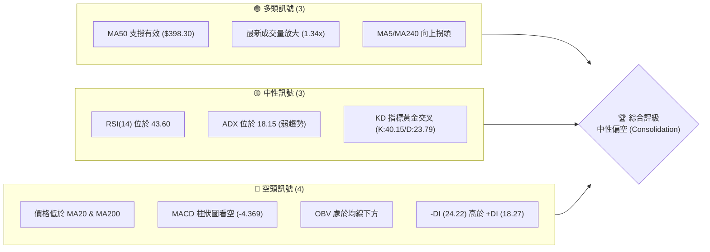
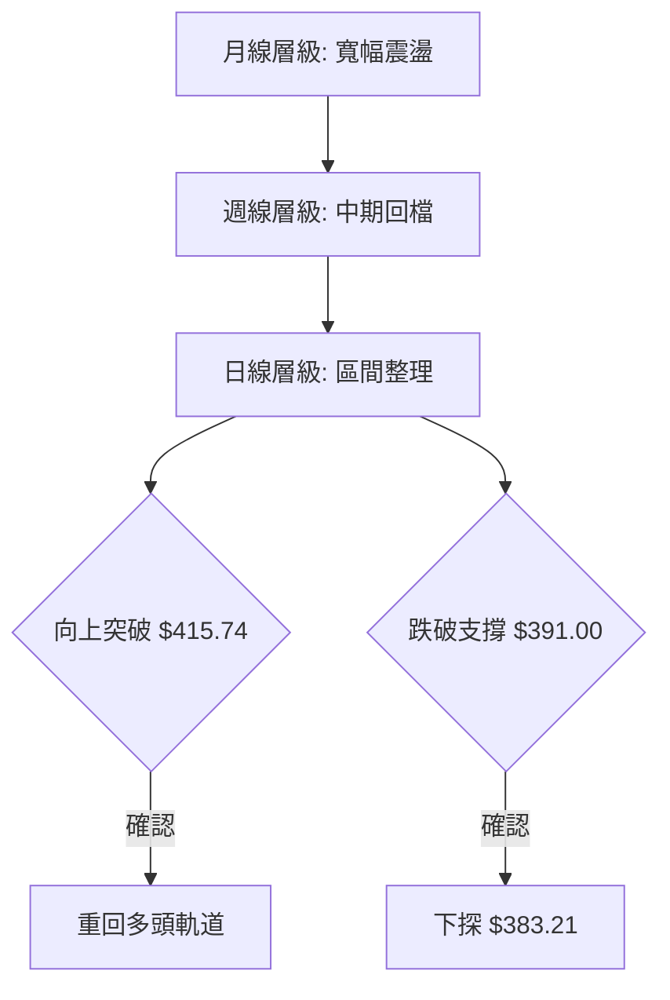
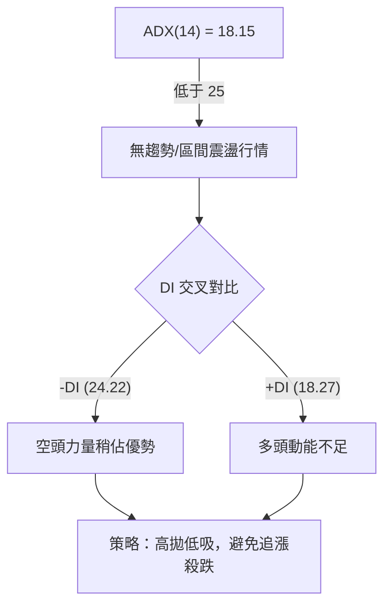
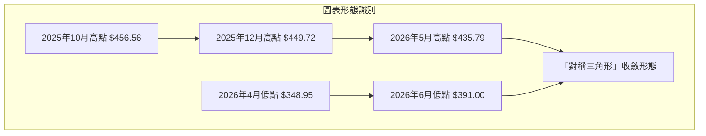
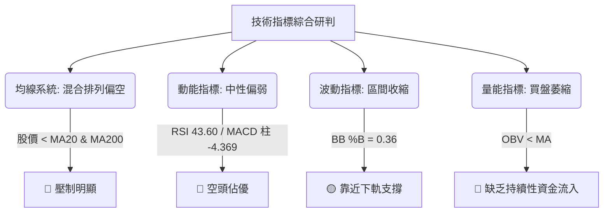
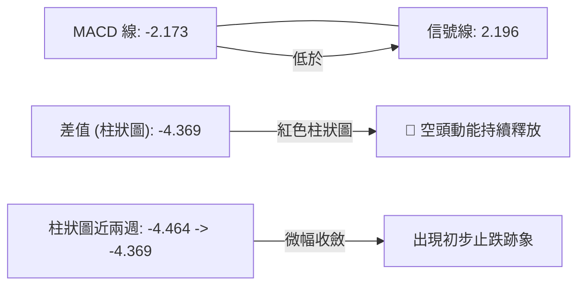
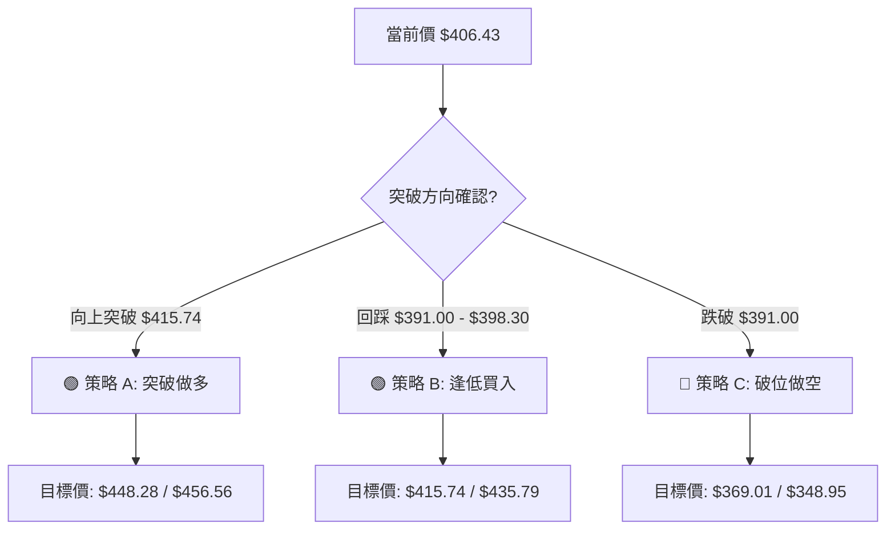
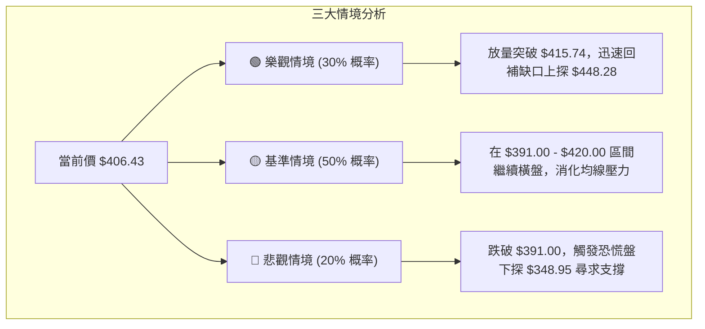

<details>
<summary>📊 靜態圖表 (點擊展開)</summary>

</details>

<html>
<head><meta charset="utf-8" /></head>
<body>
    <div style="height:500px; width:100%;">                        <script>window.PlotlyConfig = {MathJaxConfig: 'local'};</script>
        <script charset="utf-8" src="https://cdn.plot.ly/plotly-3.6.0.min.js" integrity="sha256-QaOVwtVY0T02VaHrr6pnoHLCwayMJp4O5n4YyaE3rJk=" crossorigin="anonymous"></script>                <div id="candlestick-chart" class="plotly-graph-div" style="height:100%; width:100%;"></div>            <script>                window.PLOTLYENV=window.PLOTLYENV || {};                                if (document.getElementById("candlestick-chart")) {                    Plotly.newPlot(                        "candlestick-chart",                        [{"close":{"dtype":"f8","bdata":"AAAAoJnZdUAAAAAgrp91QAAAAIDr3XRAAAAAgMKVdEAAAACgcOF0QAAAAOB6KHVAAAAAoHDtdUAAAABgZqZ1QAAAACCFr3VAAAAA4KO8dUAAAADA9Qx3QAAAAEAKv3hAAAAA4KOgeUAAAACA61l6QAAAAIDCnXpAAAAAoJkNekAAAADAHqF6QAAAACBcI3tAAAAAoJmdekAAAADgo6x7QAAAAIA9dnpAAAAAYGaGe0AAAAAgXLN7QAAAACCFy3tAAAAAIFy3fEAAAAAAAEB7QAAAAKBH3XpAAAAAAABUfEAAAACgcBF7QAAAAEAKa3tAAAAA4KM4e0AAAAAA19d5QAAAAGBmPntAAAAAANfTekAAAABgZjJ7QAAAAAAAzHpAAAAAwPV0e0AAAABA4fZ7QAAAAKCZqXtAAAAAIIVve0AAAAAgrg98QAAAACCFG3tAAAAAYLhGfEAAAADAzMh8QAAAAAAp2HxAAAAAoJmBe0AAAADA9Yh8QAAAAIDrRX1AAAAAACnEe0AAAADAHuF8QAAAAGCP3ntAAAAA4FHYekAAAAAgrtN7QAAAAIDreXtAAAAAoJnpekAAAAAA1x95QAAAAKCZRXlAAAAAYLiOeUAAAAAAABR5QAAAAADXP3lAAAAAIK6zeEAAAACgcHF4QAAAAOB6HHpAAAAAYGY2ekAAAACgR6l6QAAAAGC44npAAAAAgD3iekAAAAAA19N6QAAAAADX63tAAAAA4HpofEAAAAAAAHB8QAAAAKBHeXtAAAAAYLjSe0AAAABAMzd8QAAAAIA97ntAAAAAIFyvfEAAAADA9bR9QAAAAIAUnn5AAAAAACk0fUAAAACA6zV+QAAAAEAzE35AAAAAIK6LfkAAAADA9Vh+QAAAAGBmVn5AAAAAQAqzfUAAAACAPbp8QAAAAEDhZnxAAAAAIIUbfEAAAADAHmF7QAAAAGC4OnxAAAAAIFwPe0AAAABgj\u002fZ6QAAAAMDMPHtAAAAAACnQe0AAAAAgXA98QAAAAEAz83tAAAAAQDNze0AAAADAHml7QAAAAAAAWHtAAAAAAAA0ekAAAABACvd6QAAAAIDCFXxAAAAAwPUQfEAAAABAMzN7QAAAAGBm7npAAAAAIFz3ekAAAADA9Qh6QAAAAGCP5npAAAAAwPVcekAAAAAgXF96QAAAAAApYHlAAAAAIFzTeEAAAACAwrF5QAAAAMAeFXpAAAAAIFyTekAAAADgUcR6QAAAAMAeEXpAAAAAQAoXekAAAACAFKp5QAAAAMAetXlAAAAAIFy7eUAAAADAHr15QAAAAKBH\u002fXhAAAAAgBSWeUAAAABgZhZ6QAAAAKBHiXlAAAAAACkoeUAAAADAHjV5QAAAAEDhhnhAAAAAQApfeUAAAADAzFh5QAAAACCuy3hAAAAAQOHqeEAAAAAA1\u002fN4QAAAAMAefXlAAAAAACmweEAAAABAM3N4QAAAAMD1uHhAAAAA4FH0eEAAAADgeox4QAAAAMDMxHdAAAAAIFz\u002fdkAAAACgmc13QAAAAOB68HdAAAAAQDMfeEAAAACAwkF3QAAAAKBHnXZAAAAA4Ho0dkAAAAAAADx3QAAAAAAp1HdAAAAAoHCJdkAAAADAHg12QAAAAGBmqnVAAAAAAAB0dUAAAACA65l1QAAAAEAzz3VAAAAAYLgGdkAAAABAM8N2QAAAAEAzf3hAAAAAYGZOeEAAAACA6wl5QAAAAAAAiHhAAAAAYLgmeEAAAAAAKTh4QAAAACCFW3dAAAAAwMyEd0AAAABguKp3QAAAAOBRgHdAAAAAwMxMd0AAAACAFNp3QAAAAMAebXhAAAAAACmIeEAAAACA61V4QAAAACCu63hAAAAA4KO8eUAAAACgmcV6QAAAAAAA0HtAAAAAQDMXe0AAAADgUdR7QAAAAMDMtHtAAAAAANdjekAAAAAA1595QAAAAIDCQXlAAAAAACkUekAAAACgmR16QAAAAAApoHpAAAAAoHAZe0AAAACAwoV7QAAAAKCZoXtAAAAA4KM8e0AAAACAFP55QAAAAADXe3pAAAAAQDN7ekAAAABAMyd6QAAAAAAAcHhAAAAAQDOPeUAAAABA4cp4QAAAAKBw2XdAAAAAYGbyeEAAAABA4WZ5QA=="},"high":{"dtype":"f8","bdata":"AAAAgD02dkAAAADAzBh2QAAAAAAAzHVAAAAAoEfVdEAAAACgR3V1QAAAAIA9LnVAAAAAgOs9dkAAAABACmd2QAAAAOBR7HVAAAAAoEdFdkAAAAAA1w93QAAAAEAKy3hAAAAAQDObekAAAAAAAHR6QAAAAMD1xHpAAAAAIIUDe0AAAAAghdd6QAAAACCuz3tAAAAAIIWPe0AAAAAgXMN7QAAAAKCZNXtAAAAAIIWHe0AAAAAgri98QAAAAAAA0HtAAAAA4KPkfEAAAAAAAGx9QAAAAOBR7HtAAAAAwMxYfEAAAABA4Up8QAAAAKBHlXtAAAAAoJlFe0AAAACAFLJ7QAAAAIA9TntAAAAAQDMje0AAAAAAKYh7QAAAAKCZdXtAAAAAIFyXe0AAAADAzBx8QAAAAMDMFHxAAAAA4KPYe0AAAABgZhZ8QAAAAEDhOnxAAAAAYI\u002fCfEAAAAAAADB9QAAAAEAzG31AAAAAwPVwfEAAAAAAAKB8QAAAAMAeoX1AAAAAIIXDfEAAAACgRyV9QAAAAEAzN31AAAAAgMJ1e0AAAABguBp8QAAAAADXp3tAAAAAoEele0AAAAAAAIh6QAAAAEAKw3lAAAAAIFx\u002fekAAAABgZo55QAAAAOB6vHlAAAAAQArPekAAAADAzCx5QAAAACCFW3pAAAAAIK5HekAAAABACq96QAAAAEDhDntAAAAAYI8ae0AAAADAzEx7QAAAAGC4\u002fntAAAAAgBRqfEAAAACA6618QAAAAAAAHHxAAAAAgD1GfEAAAACAFI58QAAAAOBRFHxAAAAAACnwfEAAAADgURx+QAAAAAAAuH5AAAAA4Hr0fkAAAACAwq1+QAAAAADXp35AAAAAoEctf0AAAAAghb9+QAAAAGBmrn5AAAAAoHCRfkAAAABgZlZ9QAAAAIDr8XxAAAAAwMyIfEAAAACgcKV8QAAAAMDMmHxAAAAAAAAEfEAAAACA62V7QAAAAIA9TntAAAAAwMwQfEAAAADAzGR8QAAAAMD1PHxAAAAAYI++e0AAAACAwtV7QAAAAAAA9HtAAAAAIK7rekAAAABAM2N7QAAAAAAAGHxAAAAAQOFGfEAAAADgo9B7QAAAAOBRWHtAAAAAAClke0AAAAAgroN7QAAAAIAUfntAAAAAYGayekAAAADA9ch6QAAAAGBmfnpAAAAAoJkheUAAAADAzOh5QAAAAAAAVHpAAAAAAAC0ekAAAACgmUV7QAAAACCuQ3tAAAAAwPWAekAAAAAghdt5QAAAAGBmDnpAAAAAAAD0eUAAAABAM+t5QAAAAEAze3lAAAAAwB6teUAAAACgcEV6QAAAAMD1DHpAAAAAgOtxeUAAAADgo0h5QAAAAKBwxXhAAAAAoEeFeUAAAACA64l5QAAAAKCZJXlAAAAAoHAZeUAAAACgcGl5QAAAAIAUBnpAAAAAAABoeUAAAABAMwN5QAAAACCuO3lAAAAAgOsBeUAAAADAHjF5QAAAAOBRNHhAAAAAgD2+d0AAAACgRxV4QAAAACCuN3hAAAAAIK7DeEAAAABACgd4QAAAAIDCHXdAAAAA4KP0dkAAAACgR1V3QAAAAIA98ndAAAAA4Hokd0AAAAAghft2QAAAAOBRwHVAAAAAAADIdkAAAACAFM51QAAAAIDC5XVAAAAAoJlFdkAAAACAFPp2QAAAAGBmqnhAAAAAwPWgeEAAAADgepR5QAAAAMDMbHlAAAAAQDOfeEAAAAAAKZB4QAAAAAAAIHhAAAAAACnsd0AAAADgesx3QAAAAOCj5HdAAAAAYGaGd0AAAAAAAAx4QAAAAMAe3XhAAAAAgD2qeEAAAACA6yF5QAAAAEDhGnlAAAAAoEf9eUAAAABAM\u002fN6QAAAAGCPEnxAAAAAwMz8e0AAAABgZlZ8QAAAACCuP3xAAAAAYI8qe0AAAACAFFJ6QAAAAIAUWnlAAAAAIFwXekAAAABAM696QAAAAAAp+HpAAAAAQDMze0AAAACgmdl7QAAAACBcv3tAAAAAwB6Re0AAAACgmdl6QAAAAGC4hnpAAAAAoJkZe0AAAACgmaV6QAAAAEDhinpAAAAAQArPeUAAAAAAACh6QAAAAKBw0XhAAAAA4KP4eEAAAABA4Wp5QA=="},"hovertemplate":"\u003cb\u003e%{x|%Y-%m-%d}\u003c\u002fb\u003e\u003cbr\u003e\u958b: $%{open:.2f}\u003cbr\u003e\u9ad8: $%{high:.2f}\u003cbr\u003e\u4f4e: $%{low:.2f}\u003cbr\u003e\u6536: $%{close:.2f}\u003cextra\u003e\u003c\u002fextra\u003e","low":{"dtype":"f8","bdata":"AAAAYI\u002fSdUAAAAAAKUR1QAAAAEAzu3RAAAAAoJlZdEAAAAAAKYh0QAAAACCut3RAAAAAQOGKdUAAAACgcI11QAAAAMAefXVAAAAAwB6hdUAAAACgmbl1QAAAAADXI3dAAAAAQOEmeUAAAABA4bZ5QAAAAGC4mnlAAAAAwPUIekAAAAAghVt6QAAAAIAU0npAAAAAIIV7ekAAAADgetB6QAAAAKBHMXpAAAAA4FFQekAAAAAAAHh7QAAAAIDrEXtAAAAAAACMe0AAAADAHjl7QAAAAKBHCXpAAAAAQApLe0AAAABAMwd7QAAAACCuk3pAAAAAQOGiekAAAABAM7d5QAAAAEAzO3pAAAAAgMIdekAAAACgR6V6QAAAAMD1VHpAAAAAoJl5ekAAAACAwol7QAAAAMDMoHtAAAAAAADQekAAAABgZt55QAAAAGC44npAAAAAQApre0AAAACgmTl8QAAAAGBmSnxAAAAAgMJ5e0AAAABACrt7QAAAAMDMXHxAAAAAoJm5e0AAAAAgXIt7QAAAAKBwMXtAAAAAgBReekAAAACAwhV7QAAAAIDCBXtAAAAAwPWoekAAAACgcMV4QAAAAOB67HdAAAAAANfreEAAAAAgXJt4QAAAAAAA6HhAAAAAANereEAAAAAAKfx3QAAAAKBwEXlAAAAAQDNfeUAAAACAPQ56QAAAAEAzo3pAAAAA4KOUekAAAACA62F6QAAAAIDC8XpAAAAAgD3We0AAAABgjzp8QAAAAAAANHtAAAAAQDM7e0AAAACAwrl7QAAAAKBHhXtAAAAAYLiae0AAAABgjzp9QAAAAKBHHX1AAAAAQDMjfUAAAACA65F9QAAAACCFq31AAAAAoEdVfkAAAACgcC1+QAAAAMDMzH1AAAAAwB6dfUAAAAAAALB8QAAAAKBHXXxAAAAAwMwUfEAAAADAzDR7QAAAAMAeyXtAAAAA4HrMekAAAADgo\u002fR6QAAAAIDrhXpAAAAAgD3mekAAAAAAAGB7QAAAAEAzv3tAAAAAIIUje0AAAABgZlp7QAAAAAApNHtAAAAAQAoXekAAAACA6zl6QAAAAIAUCntAAAAA4KPAe0AAAADgeiR7QAAAAEAK63pAAAAAoJnhekAAAACA6+l5QAAAAEAza3pAAAAAAADoeUAAAABACtt5QAAAAEDh8nhAAAAA4Ho4eEAAAAAAANx4QAAAAOCjdHlAAAAAAAAQekAAAADgekB6QAAAAAAA4HlAAAAAgBSueUAAAAAAKQh5QAAAAKBHmXlAAAAAgMJBeUAAAAAAAFh5QAAAAOCjoHhAAAAAgD3aeEAAAABgZsJ5QAAAAGCPOnlAAAAAgMLheEAAAAAAAER4QAAAAIA9FnhAAAAAoEepeEAAAABguPZ4QAAAACBco3hAAAAAYGbWd0AAAABACuN4QAAAAGBmInlAAAAAYGaqeEAAAABAM194QAAAAGC4pnhAAAAAAACQeEAAAADA9YR4QAAAACCuq3dAAAAAIFzHdkAAAAAgrkt3QAAAAMD1hHdAAAAAACkQeEAAAACA6z13QAAAACCFd3ZAAAAAgD0CdkAAAAAAAJB2QAAAAKBHYXdAAAAA4HpwdkAAAACAPap1QAAAAADXE3VAAAAAYLg6dUAAAAAAABR1QAAAAADXa3VAAAAAwB7JdUAAAADgUSx2QAAAAAAAqHZAAAAAwMzcd0AAAABgZnp4QAAAAKBHRXhAAAAAIIUTeEAAAADAzBR4QAAAAIA9BndAAAAAIK4rd0AAAADgUcB2QAAAAOCjSHdAAAAA4KMgd0AAAABguAJ3QAAAAMDMrHdAAAAAwMwMeEAAAAAAAFB4QAAAAOBRAHhAAAAAgOsheUAAAACAPQZ6QAAAAMDMDHpAAAAAAClkekAAAAAgXON6QAAAAGCPkntAAAAAAABgekAAAACgR1V5QAAAAIAUmnhAAAAAgD1meUAAAABgZs55QAAAAAApSHpAAAAAgOuhekAAAADgUTh7QAAAAMDMRHtAAAAAgD3CekAAAABA4fZ5QAAAAGBm2nlAAAAAAAAAekAAAABgjxJ6QAAAAKBwSXhAAAAAIIWreEAAAAAA1wN4QAAAAGBmwndAAAAAYI\u002fKd0AAAAAAKSx4QA=="},"name":"\u50f9\u683c","open":{"dtype":"f8","bdata":"AAAAQAr\u002fdUAAAABgj+51QAAAACCus3VAAAAAIK6DdEAAAABAM\u002fN0QAAAAGBmAnVAAAAAAADAdUAAAACAPSp2QAAAAEAKx3VAAAAAwMzodUAAAABguOJ1QAAAAEAKL3dAAAAAgBRyekAAAAAAAOh5QAAAAAAA\u002fHlAAAAAgOvNekAAAADAHl16QAAAAIDC8XpAAAAAgBR+e0AAAACgR916QAAAAADXM3tAAAAAwMzEekAAAACgmcV7QAAAAOBRmHtAAAAAwMy8e0AAAADgo2h9QAAAAOCjtHtAAAAAAACMe0AAAADAHv17QAAAAMAeWXtAAAAAwPX8ekAAAADgo0h7QAAAAOB6eHpAAAAA4KOsekAAAABgZi57QAAAACCuK3tAAAAAAACYekAAAACA6717QAAAAAAp3HtAAAAAQDO3e0AAAAAAAEB6QAAAAKBH7XtAAAAAIK5\u002fe0AAAADgemx8QAAAAAAA6HxAAAAAwMwwfEAAAAAAAOx7QAAAAADXf3xAAAAAIFxnfEAAAADAzEB8QAAAACBc33xAAAAAYLhee0AAAACgmXl7QAAAAGBmdntAAAAAYGaie0AAAACAFHJ6QAAAAMDMJHhAAAAAANfreEAAAACAFFZ5QAAAAEDhYnlAAAAAgBTqeUAAAADAHiV5QAAAAGC4InlAAAAAYLjmeUAAAABAM396QAAAAKBwqXpAAAAAwB6VekAAAADA9ex6QAAAAKCZAXtAAAAAQAoffEAAAADgelB8QAAAAEAz93tAAAAA4KNYe0AAAADAHuF7QAAAAEAzD3xAAAAAoHABfEAAAABACld9QAAAACBcg31AAAAAIIWDfkAAAABgj+J9QAAAAIDrgX5AAAAAgBSefkAAAABgZpZ+QAAAACCuh35AAAAAIK5TfkAAAAAAAFB9QAAAAKBw0XxAAAAAoJmBfEAAAADAzJx8QAAAAADX\u002f3tAAAAAgBTme0AAAABgZj57QAAAAIA9vnpAAAAAQDM\u002fe0AAAAAgrpN7QAAAAEAzI3xAAAAAwPWse0AAAACAFJJ7QAAAAAAAeHtAAAAAgMLVekAAAABgj1p6QAAAAGCPMntAAAAAQOH2e0AAAAAAANB7QAAAAGCPVntAAAAAYI\u002f+ekAAAADAzFx7QAAAAKCZlXpAAAAA4KNUekAAAADgUYR6QAAAACBcR3pAAAAA4FHQeEAAAACA6w15QAAAAGCPnnlAAAAAoEchekAAAAAgXL96QAAAAMDM5HpAAAAAwPXkeUAAAACAwsV5QAAAAIDCsXlAAAAAAAB0eUAAAADAzIR5QAAAAOCjdHlAAAAAAAD4eEAAAABgZsJ5QAAAAGC45nlAAAAAQAoveUAAAACgmWl4QAAAAKBwsXhAAAAAoJndeEAAAADAHhl5QAAAAKBw4XhAAAAAwMxgeEAAAAAghSN5QAAAAOB6JHlAAAAAQOFSeUAAAABguPJ4QAAAACCFw3hAAAAAQAq7eEAAAAAAAPB4QAAAAOBRNHhAAAAAoJm9d0AAAACgcFF3QAAAAMD1iHdAAAAAANdfeEAAAACgmdl3QAAAAEAKG3dAAAAAgMLddkAAAAAAKZh2QAAAAIAUqndAAAAAQDPDdkAAAACgcKl2QAAAAEAKp3VAAAAA4KO8dkAAAABgZnJ1QAAAAOCjpHVAAAAAwB7hdUAAAABguFp2QAAAAKBH7XZAAAAAwPWceEAAAABguL54QAAAAKBHKXlAAAAAAACQeEAAAADAHjl4QAAAAOB6dHdAAAAAAABYd0AAAACgcEF3QAAAAEDhandAAAAAYGZ2d0AAAAAAAEx3QAAAAADX53dAAAAAIK5jeEAAAABACrN4QAAAAAAAJHhAAAAAIK53eUAAAAAgrgd6QAAAAGCPYnpAAAAAYI+We0AAAABguEp7QAAAAADX53tAAAAAIK4fe0AAAADgUTR6QAAAAGCPMnlAAAAAoJl5eUAAAABA4WJ6QAAAAGC4anpAAAAAACnkekAAAACAPa57QAAAAIDrWXtAAAAAoJl9e0AAAAAA17d6QAAAACCFI3pAAAAAQDMrekAAAACgcD16QAAAAAAASHpAAAAAoEfFeEAAAADgerB5QAAAAOCjeHhAAAAA4HpEeEAAAAAA1\u002fd4QA=="},"x":["2025-08-27T00:00:00-04:00","2025-08-28T00:00:00-04:00","2025-08-29T00:00:00-04:00","2025-09-02T00:00:00-04:00","2025-09-03T00:00:00-04:00","2025-09-04T00:00:00-04:00","2025-09-05T00:00:00-04:00","2025-09-08T00:00:00-04:00","2025-09-09T00:00:00-04:00","2025-09-10T00:00:00-04:00","2025-09-11T00:00:00-04:00","2025-09-12T00:00:00-04:00","2025-09-15T00:00:00-04:00","2025-09-16T00:00:00-04:00","2025-09-17T00:00:00-04:00","2025-09-18T00:00:00-04:00","2025-09-19T00:00:00-04:00","2025-09-22T00:00:00-04:00","2025-09-23T00:00:00-04:00","2025-09-24T00:00:00-04:00","2025-09-25T00:00:00-04:00","2025-09-26T00:00:00-04:00","2025-09-29T00:00:00-04:00","2025-09-30T00:00:00-04:00","2025-10-01T00:00:00-04:00","2025-10-02T00:00:00-04:00","2025-10-03T00:00:00-04:00","2025-10-06T00:00:00-04:00","2025-10-07T00:00:00-04:00","2025-10-08T00:00:00-04:00","2025-10-09T00:00:00-04:00","2025-10-10T00:00:00-04:00","2025-10-13T00:00:00-04:00","2025-10-14T00:00:00-04:00","2025-10-15T00:00:00-04:00","2025-10-16T00:00:00-04:00","2025-10-17T00:00:00-04:00","2025-10-20T00:00:00-04:00","2025-10-21T00:00:00-04:00","2025-10-22T00:00:00-04:00","2025-10-23T00:00:00-04:00","2025-10-24T00:00:00-04:00","2025-10-27T00:00:00-04:00","2025-10-28T00:00:00-04:00","2025-10-29T00:00:00-04:00","2025-10-30T00:00:00-04:00","2025-10-31T00:00:00-04:00","2025-11-03T00:00:00-05:00","2025-11-04T00:00:00-05:00","2025-11-05T00:00:00-05:00","2025-11-06T00:00:00-05:00","2025-11-07T00:00:00-05:00","2025-11-10T00:00:00-05:00","2025-11-11T00:00:00-05:00","2025-11-12T00:00:00-05:00","2025-11-13T00:00:00-05:00","2025-11-14T00:00:00-05:00","2025-11-17T00:00:00-05:00","2025-11-18T00:00:00-05:00","2025-11-19T00:00:00-05:00","2025-11-20T00:00:00-05:00","2025-11-21T00:00:00-05:00","2025-11-24T00:00:00-05:00","2025-11-25T00:00:00-05:00","2025-11-26T00:00:00-05:00","2025-11-28T00:00:00-05:00","2025-12-01T00:00:00-05:00","2025-12-02T00:00:00-05:00","2025-12-03T00:00:00-05:00","2025-12-04T00:00:00-05:00","2025-12-05T00:00:00-05:00","2025-12-08T00:00:00-05:00","2025-12-09T00:00:00-05:00","2025-12-10T00:00:00-05:00","2025-12-11T00:00:00-05:00","2025-12-12T00:00:00-05:00","2025-12-15T00:00:00-05:00","2025-12-16T00:00:00-05:00","2025-12-17T00:00:00-05:00","2025-12-18T00:00:00-05:00","2025-12-19T00:00:00-05:00","2025-12-22T00:00:00-05:00","2025-12-23T00:00:00-05:00","2025-12-24T00:00:00-05:00","2025-12-26T00:00:00-05:00","2025-12-29T00:00:00-05:00","2025-12-30T00:00:00-05:00","2025-12-31T00:00:00-05:00","2026-01-02T00:00:00-05:00","2026-01-05T00:00:00-05:00","2026-01-06T00:00:00-05:00","2026-01-07T00:00:00-05:00","2026-01-08T00:00:00-05:00","2026-01-09T00:00:00-05:00","2026-01-12T00:00:00-05:00","2026-01-13T00:00:00-05:00","2026-01-14T00:00:00-05:00","2026-01-15T00:00:00-05:00","2026-01-16T00:00:00-05:00","2026-01-20T00:00:00-05:00","2026-01-21T00:00:00-05:00","2026-01-22T00:00:00-05:00","2026-01-23T00:00:00-05:00","2026-01-26T00:00:00-05:00","2026-01-27T00:00:00-05:00","2026-01-28T00:00:00-05:00","2026-01-29T00:00:00-05:00","2026-01-30T00:00:00-05:00","2026-02-02T00:00:00-05:00","2026-02-03T00:00:00-05:00","2026-02-04T00:00:00-05:00","2026-02-05T00:00:00-05:00","2026-02-06T00:00:00-05:00","2026-02-09T00:00:00-05:00","2026-02-10T00:00:00-05:00","2026-02-11T00:00:00-05:00","2026-02-12T00:00:00-05:00","2026-02-13T00:00:00-05:00","2026-02-17T00:00:00-05:00","2026-02-18T00:00:00-05:00","2026-02-19T00:00:00-05:00","2026-02-20T00:00:00-05:00","2026-02-23T00:00:00-05:00","2026-02-24T00:00:00-05:00","2026-02-25T00:00:00-05:00","2026-02-26T00:00:00-05:00","2026-02-27T00:00:00-05:00","2026-03-02T00:00:00-05:00","2026-03-03T00:00:00-05:00","2026-03-04T00:00:00-05:00","2026-03-05T00:00:00-05:00","2026-03-06T00:00:00-05:00","2026-03-09T00:00:00-04:00","2026-03-10T00:00:00-04:00","2026-03-11T00:00:00-04:00","2026-03-12T00:00:00-04:00","2026-03-13T00:00:00-04:00","2026-03-16T00:00:00-04:00","2026-03-17T00:00:00-04:00","2026-03-18T00:00:00-04:00","2026-03-19T00:00:00-04:00","2026-03-20T00:00:00-04:00","2026-03-23T00:00:00-04:00","2026-03-24T00:00:00-04:00","2026-03-25T00:00:00-04:00","2026-03-26T00:00:00-04:00","2026-03-27T00:00:00-04:00","2026-03-30T00:00:00-04:00","2026-03-31T00:00:00-04:00","2026-04-01T00:00:00-04:00","2026-04-02T00:00:00-04:00","2026-04-06T00:00:00-04:00","2026-04-07T00:00:00-04:00","2026-04-08T00:00:00-04:00","2026-04-09T00:00:00-04:00","2026-04-10T00:00:00-04:00","2026-04-13T00:00:00-04:00","2026-04-14T00:00:00-04:00","2026-04-15T00:00:00-04:00","2026-04-16T00:00:00-04:00","2026-04-17T00:00:00-04:00","2026-04-20T00:00:00-04:00","2026-04-21T00:00:00-04:00","2026-04-22T00:00:00-04:00","2026-04-23T00:00:00-04:00","2026-04-24T00:00:00-04:00","2026-04-27T00:00:00-04:00","2026-04-28T00:00:00-04:00","2026-04-29T00:00:00-04:00","2026-04-30T00:00:00-04:00","2026-05-01T00:00:00-04:00","2026-05-04T00:00:00-04:00","2026-05-05T00:00:00-04:00","2026-05-06T00:00:00-04:00","2026-05-07T00:00:00-04:00","2026-05-08T00:00:00-04:00","2026-05-11T00:00:00-04:00","2026-05-12T00:00:00-04:00","2026-05-13T00:00:00-04:00","2026-05-14T00:00:00-04:00","2026-05-15T00:00:00-04:00","2026-05-18T00:00:00-04:00","2026-05-19T00:00:00-04:00","2026-05-20T00:00:00-04:00","2026-05-21T00:00:00-04:00","2026-05-22T00:00:00-04:00","2026-05-26T00:00:00-04:00","2026-05-27T00:00:00-04:00","2026-05-28T00:00:00-04:00","2026-05-29T00:00:00-04:00","2026-06-01T00:00:00-04:00","2026-06-02T00:00:00-04:00","2026-06-03T00:00:00-04:00","2026-06-04T00:00:00-04:00","2026-06-05T00:00:00-04:00","2026-06-08T00:00:00-04:00","2026-06-09T00:00:00-04:00","2026-06-10T00:00:00-04:00","2026-06-11T00:00:00-04:00","2026-06-12T00:00:00-04:00"],"type":"candlestick"},{"hovertemplate":"MA30: $%{y:.2f}\u003cextra\u003e\u003c\u002fextra\u003e","line":{"color":"#2196F3","dash":"dash","width":2},"mode":"lines","name":"MA30","x":["2025-08-27T00:00:00-04:00","2025-08-28T00:00:00-04:00","2025-08-29T00:00:00-04:00","2025-09-02T00:00:00-04:00","2025-09-03T00:00:00-04:00","2025-09-04T00:00:00-04:00","2025-09-05T00:00:00-04:00","2025-09-08T00:00:00-04:00","2025-09-09T00:00:00-04:00","2025-09-10T00:00:00-04:00","2025-09-11T00:00:00-04:00","2025-09-12T00:00:00-04:00","2025-09-15T00:00:00-04:00","2025-09-16T00:00:00-04:00","2025-09-17T00:00:00-04:00","2025-09-18T00:00:00-04:00","2025-09-19T00:00:00-04:00","2025-09-22T00:00:00-04:00","2025-09-23T00:00:00-04:00","2025-09-24T00:00:00-04:00","2025-09-25T00:00:00-04:00","2025-09-26T00:00:00-04:00","2025-09-29T00:00:00-04:00","2025-09-30T00:00:00-04:00","2025-10-01T00:00:00-04:00","2025-10-02T00:00:00-04:00","2025-10-03T00:00:00-04:00","2025-10-06T00:00:00-04:00","2025-10-07T00:00:00-04:00","2025-10-08T00:00:00-04:00","2025-10-09T00:00:00-04:00","2025-10-10T00:00:00-04:00","2025-10-13T00:00:00-04:00","2025-10-14T00:00:00-04:00","2025-10-15T00:00:00-04:00","2025-10-16T00:00:00-04:00","2025-10-17T00:00:00-04:00","2025-10-20T00:00:00-04:00","2025-10-21T00:00:00-04:00","2025-10-22T00:00:00-04:00","2025-10-23T00:00:00-04:00","2025-10-24T00:00:00-04:00","2025-10-27T00:00:00-04:00","2025-10-28T00:00:00-04:00","2025-10-29T00:00:00-04:00","2025-10-30T00:00:00-04:00","2025-10-31T00:00:00-04:00","2025-11-03T00:00:00-05:00","2025-11-04T00:00:00-05:00","2025-11-05T00:00:00-05:00","2025-11-06T00:00:00-05:00","2025-11-07T00:00:00-05:00","2025-11-10T00:00:00-05:00","2025-11-11T00:00:00-05:00","2025-11-12T00:00:00-05:00","2025-11-13T00:00:00-05:00","2025-11-14T00:00:00-05:00","2025-11-17T00:00:00-05:00","2025-11-18T00:00:00-05:00","2025-11-19T00:00:00-05:00","2025-11-20T00:00:00-05:00","2025-11-21T00:00:00-05:00","2025-11-24T00:00:00-05:00","2025-11-25T00:00:00-05:00","2025-11-26T00:00:00-05:00","2025-11-28T00:00:00-05:00","2025-12-01T00:00:00-05:00","2025-12-02T00:00:00-05:00","2025-12-03T00:00:00-05:00","2025-12-04T00:00:00-05:00","2025-12-05T00:00:00-05:00","2025-12-08T00:00:00-05:00","2025-12-09T00:00:00-05:00","2025-12-10T00:00:00-05:00","2025-12-11T00:00:00-05:00","2025-12-12T00:00:00-05:00","2025-12-15T00:00:00-05:00","2025-12-16T00:00:00-05:00","2025-12-17T00:00:00-05:00","2025-12-18T00:00:00-05:00","2025-12-19T00:00:00-05:00","2025-12-22T00:00:00-05:00","2025-12-23T00:00:00-05:00","2025-12-24T00:00:00-05:00","2025-12-26T00:00:00-05:00","2025-12-29T00:00:00-05:00","2025-12-30T00:00:00-05:00","2025-12-31T00:00:00-05:00","2026-01-02T00:00:00-05:00","2026-01-05T00:00:00-05:00","2026-01-06T00:00:00-05:00","2026-01-07T00:00:00-05:00","2026-01-08T00:00:00-05:00","2026-01-09T00:00:00-05:00","2026-01-12T00:00:00-05:00","2026-01-13T00:00:00-05:00","2026-01-14T00:00:00-05:00","2026-01-15T00:00:00-05:00","2026-01-16T00:00:00-05:00","2026-01-20T00:00:00-05:00","2026-01-21T00:00:00-05:00","2026-01-22T00:00:00-05:00","2026-01-23T00:00:00-05:00","2026-01-26T00:00:00-05:00","2026-01-27T00:00:00-05:00","2026-01-28T00:00:00-05:00","2026-01-29T00:00:00-05:00","2026-01-30T00:00:00-05:00","2026-02-02T00:00:00-05:00","2026-02-03T00:00:00-05:00","2026-02-04T00:00:00-05:00","2026-02-05T00:00:00-05:00","2026-02-06T00:00:00-05:00","2026-02-09T00:00:00-05:00","2026-02-10T00:00:00-05:00","2026-02-11T00:00:00-05:00","2026-02-12T00:00:00-05:00","2026-02-13T00:00:00-05:00","2026-02-17T00:00:00-05:00","2026-02-18T00:00:00-05:00","2026-02-19T00:00:00-05:00","2026-02-20T00:00:00-05:00","2026-02-23T00:00:00-05:00","2026-02-24T00:00:00-05:00","2026-02-25T00:00:00-05:00","2026-02-26T00:00:00-05:00","2026-02-27T00:00:00-05:00","2026-03-02T00:00:00-05:00","2026-03-03T00:00:00-05:00","2026-03-04T00:00:00-05:00","2026-03-05T00:00:00-05:00","2026-03-06T00:00:00-05:00","2026-03-09T00:00:00-04:00","2026-03-10T00:00:00-04:00","2026-03-11T00:00:00-04:00","2026-03-12T00:00:00-04:00","2026-03-13T00:00:00-04:00","2026-03-16T00:00:00-04:00","2026-03-17T00:00:00-04:00","2026-03-18T00:00:00-04:00","2026-03-19T00:00:00-04:00","2026-03-20T00:00:00-04:00","2026-03-23T00:00:00-04:00","2026-03-24T00:00:00-04:00","2026-03-25T00:00:00-04:00","2026-03-26T00:00:00-04:00","2026-03-27T00:00:00-04:00","2026-03-30T00:00:00-04:00","2026-03-31T00:00:00-04:00","2026-04-01T00:00:00-04:00","2026-04-02T00:00:00-04:00","2026-04-06T00:00:00-04:00","2026-04-07T00:00:00-04:00","2026-04-08T00:00:00-04:00","2026-04-09T00:00:00-04:00","2026-04-10T00:00:00-04:00","2026-04-13T00:00:00-04:00","2026-04-14T00:00:00-04:00","2026-04-15T00:00:00-04:00","2026-04-16T00:00:00-04:00","2026-04-17T00:00:00-04:00","2026-04-20T00:00:00-04:00","2026-04-21T00:00:00-04:00","2026-04-22T00:00:00-04:00","2026-04-23T00:00:00-04:00","2026-04-24T00:00:00-04:00","2026-04-27T00:00:00-04:00","2026-04-28T00:00:00-04:00","2026-04-29T00:00:00-04:00","2026-04-30T00:00:00-04:00","2026-05-01T00:00:00-04:00","2026-05-04T00:00:00-04:00","2026-05-05T00:00:00-04:00","2026-05-06T00:00:00-04:00","2026-05-07T00:00:00-04:00","2026-05-08T00:00:00-04:00","2026-05-11T00:00:00-04:00","2026-05-12T00:00:00-04:00","2026-05-13T00:00:00-04:00","2026-05-14T00:00:00-04:00","2026-05-15T00:00:00-04:00","2026-05-18T00:00:00-04:00","2026-05-19T00:00:00-04:00","2026-05-20T00:00:00-04:00","2026-05-21T00:00:00-04:00","2026-05-22T00:00:00-04:00","2026-05-26T00:00:00-04:00","2026-05-27T00:00:00-04:00","2026-05-28T00:00:00-04:00","2026-05-29T00:00:00-04:00","2026-06-01T00:00:00-04:00","2026-06-02T00:00:00-04:00","2026-06-03T00:00:00-04:00","2026-06-04T00:00:00-04:00","2026-06-05T00:00:00-04:00","2026-06-08T00:00:00-04:00","2026-06-09T00:00:00-04:00","2026-06-10T00:00:00-04:00","2026-06-11T00:00:00-04:00","2026-06-12T00:00:00-04:00"],"y":{"dtype":"f8","bdata":"AAAAAAAA+H8AAAAAAAD4fwAAAAAAAPh\u002fAAAAAAAA+H8AAAAAAAD4fwAAAAAAAPh\u002fAAAAAAAA+H8AAAAAAAD4fwAAAAAAAPh\u002fAAAAAAAA+H8AAAAAAAD4fwAAAAAAAPh\u002fAAAAAAAA+H8AAAAAAAD4fwAAAAAAAPh\u002fAAAAAAAA+H8AAAAAAAD4fwAAAAAAAPh\u002fAAAAAAAA+H8AAAAAAAD4fwAAAAAAAPh\u002fAAAAAAAA+H8AAAAAAAD4fwAAAAAAAPh\u002fAAAAAAAA+H8AAAAAAAD4fwAAAAAAAPh\u002fAAAAAAAA+H8AAAAAAAD4f1VVVeWJ\u002fHhAIiIikl8qeUDv7u7uYE55QN7d3W3LhHlAERERYRC6eUAAAABw9u95QJqZmXkUIHpARERElENPekCrqqqKJYV6QJqZmTkmuHpAVVVVVcfoekBmZmY2iRN7QBEREXGvJ3tAmpmZuUk+e0B3d3f3DFN7QCIiImIQZntAiYiIyHZye0Dv7u6uuYJ7QJqZmanxlHtA3t3dPcOee0CrqqqaC6l7QFVVVVUOtXtAmpmZ2UCve0BmZmamVLB7QERERFScrXtAq6qq+jeee0Crqqp6FIx7QM3MzJx9fntAd3d3F9lme0Dv7u7e3VV7QJqZmSlcQ3tAERERgdwte0CJiIgo6iF7QM3MzCxAGHtAAAAAsAATe0CJiIiYbg57QJqZmXkwD3tAd3d3d0wKe0DNzMzsmAB7QLy7uyvOAntAERERoRoLe0Dv7u6OUA57QERERKRwEXtAZmZmxpINe0AzMzNTuAh7QFVVVTXsAHtAmpmZOfsKe0CamZk5+xR7QO\u002fu7g50IHtAMzMzU7gse0C8u7t7FDh7QO\u002fu7r7mSntAMzMz43pqe0BmZmZG\u002fX97QFVVVcVnmHtAq6qqyi+we0ARERHx7s57QHd3d4ek6XtAZmZmFmf\u002fe0Dv7u4+ChN8QImIiCh4LHxA7+7ujpdAfEBVVVWVGFZ8QJqZmem0X3xAiYiIiF1tfEBmZmYmTXl8QAAAAFBignxA3t3dTTeHfECamZkpMYx8QImIiJhDh3xAMzMzs3J0fECamZn54Wd8QFVVVUUZbXxAIiIiYixvfEB3d3e3gWZ8QLy7u4v6XXxAERER4U9PfEC8u7uL+i98QImIiOhCEHxAd3d3dwX4e0BERET0RNd7QDMzMwMrr3tAq6qqelt+e0AiIiKSplZ7QCIiImJXMntAIiIicq8Xe0BERERk9AZ7QCIiIoIH83pAZmZmNtDhekDNzMy8LdN6QN7d3Z2ovXpAiYiISFOyekCJiIiY4Kd6QN7d3X2xlHpA7+7uzrCBekARERHR23B6QFVVVeVCXHpAzczMfLFIekAAAACw5DV6QBERESHbHXpA7+7u3sEWekBVVVUF8wh6QGZmZkbh7HlAmpmZuQLSeUC8u7v71L55QLy7u8uFsnlAiYiIKBWfeUDNzMysjpF5QM3MzHz4fnlAZmZmBvNyeUC8u7v7YmN5QFVVVbWsVXlAvLu7GxNGeUDNzMyc7zV5QCIiIuKlI3lAZmZmlrUOeUAAAADgwfB4QFVVVcVL03hAvLu72ySyeEARERFxaJ14QAAAAEBgjXhAq6qqqhxyeEAzMzMzpVJ4QLy7u1tINnhAiYiIaAMTeEC8u7sLu+x3QBEREZHtzHdAzczMnDayd0De3d1tWZ13QFVVVeUXnXdA3t3dXQGUd0AiIiJCYJF3QImIiLgej3dAMzMz05SId0CrqqpKU4J3QBEREYEjcHdAZmZm9ihmd0AzMzMzel93QGZmZlYOVXdAzczMTPBGd0BERET0\u002fUB3QJqZmUmaRndA7+7uLrJTd0AiIiJyPVh3QFVVVQWdYHdAq6qqCmVud0De3d2tY4x3QImIiCi\u002fuHdAiYiI+G\u002fid0BmZmbmpQl4QM3MzGy8KnhAREREtJ1LeEAAAABQG2p4QERERITAiHhAmpmZWTmweEB3d3cnv9Z4QJqZmWnY\u002f3hAIiIi0iIreUAiIiIywVN5QHd3d1eAbnlAREREZIKHeUBERETkpY95QBERETFPoHlAd3d3JzG0eUDv7u5+scR5QKuqqsrozXlAvLu7m1LfeUAiIiKS7eh5QAAAABDm63lAd3d3t\u002fP5eUDe3d29LQd6QA=="},"type":"scatter"},{"hovertemplate":"MA60: $%{y:.2f}\u003cextra\u003e\u003c\u002fextra\u003e","line":{"color":"#9C27B0","dash":"dash","width":2},"mode":"lines","name":"MA60","x":["2025-08-27T00:00:00-04:00","2025-08-28T00:00:00-04:00","2025-08-29T00:00:00-04:00","2025-09-02T00:00:00-04:00","2025-09-03T00:00:00-04:00","2025-09-04T00:00:00-04:00","2025-09-05T00:00:00-04:00","2025-09-08T00:00:00-04:00","2025-09-09T00:00:00-04:00","2025-09-10T00:00:00-04:00","2025-09-11T00:00:00-04:00","2025-09-12T00:00:00-04:00","2025-09-15T00:00:00-04:00","2025-09-16T00:00:00-04:00","2025-09-17T00:00:00-04:00","2025-09-18T00:00:00-04:00","2025-09-19T00:00:00-04:00","2025-09-22T00:00:00-04:00","2025-09-23T00:00:00-04:00","2025-09-24T00:00:00-04:00","2025-09-25T00:00:00-04:00","2025-09-26T00:00:00-04:00","2025-09-29T00:00:00-04:00","2025-09-30T00:00:00-04:00","2025-10-01T00:00:00-04:00","2025-10-02T00:00:00-04:00","2025-10-03T00:00:00-04:00","2025-10-06T00:00:00-04:00","2025-10-07T00:00:00-04:00","2025-10-08T00:00:00-04:00","2025-10-09T00:00:00-04:00","2025-10-10T00:00:00-04:00","2025-10-13T00:00:00-04:00","2025-10-14T00:00:00-04:00","2025-10-15T00:00:00-04:00","2025-10-16T00:00:00-04:00","2025-10-17T00:00:00-04:00","2025-10-20T00:00:00-04:00","2025-10-21T00:00:00-04:00","2025-10-22T00:00:00-04:00","2025-10-23T00:00:00-04:00","2025-10-24T00:00:00-04:00","2025-10-27T00:00:00-04:00","2025-10-28T00:00:00-04:00","2025-10-29T00:00:00-04:00","2025-10-30T00:00:00-04:00","2025-10-31T00:00:00-04:00","2025-11-03T00:00:00-05:00","2025-11-04T00:00:00-05:00","2025-11-05T00:00:00-05:00","2025-11-06T00:00:00-05:00","2025-11-07T00:00:00-05:00","2025-11-10T00:00:00-05:00","2025-11-11T00:00:00-05:00","2025-11-12T00:00:00-05:00","2025-11-13T00:00:00-05:00","2025-11-14T00:00:00-05:00","2025-11-17T00:00:00-05:00","2025-11-18T00:00:00-05:00","2025-11-19T00:00:00-05:00","2025-11-20T00:00:00-05:00","2025-11-21T00:00:00-05:00","2025-11-24T00:00:00-05:00","2025-11-25T00:00:00-05:00","2025-11-26T00:00:00-05:00","2025-11-28T00:00:00-05:00","2025-12-01T00:00:00-05:00","2025-12-02T00:00:00-05:00","2025-12-03T00:00:00-05:00","2025-12-04T00:00:00-05:00","2025-12-05T00:00:00-05:00","2025-12-08T00:00:00-05:00","2025-12-09T00:00:00-05:00","2025-12-10T00:00:00-05:00","2025-12-11T00:00:00-05:00","2025-12-12T00:00:00-05:00","2025-12-15T00:00:00-05:00","2025-12-16T00:00:00-05:00","2025-12-17T00:00:00-05:00","2025-12-18T00:00:00-05:00","2025-12-19T00:00:00-05:00","2025-12-22T00:00:00-05:00","2025-12-23T00:00:00-05:00","2025-12-24T00:00:00-05:00","2025-12-26T00:00:00-05:00","2025-12-29T00:00:00-05:00","2025-12-30T00:00:00-05:00","2025-12-31T00:00:00-05:00","2026-01-02T00:00:00-05:00","2026-01-05T00:00:00-05:00","2026-01-06T00:00:00-05:00","2026-01-07T00:00:00-05:00","2026-01-08T00:00:00-05:00","2026-01-09T00:00:00-05:00","2026-01-12T00:00:00-05:00","2026-01-13T00:00:00-05:00","2026-01-14T00:00:00-05:00","2026-01-15T00:00:00-05:00","2026-01-16T00:00:00-05:00","2026-01-20T00:00:00-05:00","2026-01-21T00:00:00-05:00","2026-01-22T00:00:00-05:00","2026-01-23T00:00:00-05:00","2026-01-26T00:00:00-05:00","2026-01-27T00:00:00-05:00","2026-01-28T00:00:00-05:00","2026-01-29T00:00:00-05:00","2026-01-30T00:00:00-05:00","2026-02-02T00:00:00-05:00","2026-02-03T00:00:00-05:00","2026-02-04T00:00:00-05:00","2026-02-05T00:00:00-05:00","2026-02-06T00:00:00-05:00","2026-02-09T00:00:00-05:00","2026-02-10T00:00:00-05:00","2026-02-11T00:00:00-05:00","2026-02-12T00:00:00-05:00","2026-02-13T00:00:00-05:00","2026-02-17T00:00:00-05:00","2026-02-18T00:00:00-05:00","2026-02-19T00:00:00-05:00","2026-02-20T00:00:00-05:00","2026-02-23T00:00:00-05:00","2026-02-24T00:00:00-05:00","2026-02-25T00:00:00-05:00","2026-02-26T00:00:00-05:00","2026-02-27T00:00:00-05:00","2026-03-02T00:00:00-05:00","2026-03-03T00:00:00-05:00","2026-03-04T00:00:00-05:00","2026-03-05T00:00:00-05:00","2026-03-06T00:00:00-05:00","2026-03-09T00:00:00-04:00","2026-03-10T00:00:00-04:00","2026-03-11T00:00:00-04:00","2026-03-12T00:00:00-04:00","2026-03-13T00:00:00-04:00","2026-03-16T00:00:00-04:00","2026-03-17T00:00:00-04:00","2026-03-18T00:00:00-04:00","2026-03-19T00:00:00-04:00","2026-03-20T00:00:00-04:00","2026-03-23T00:00:00-04:00","2026-03-24T00:00:00-04:00","2026-03-25T00:00:00-04:00","2026-03-26T00:00:00-04:00","2026-03-27T00:00:00-04:00","2026-03-30T00:00:00-04:00","2026-03-31T00:00:00-04:00","2026-04-01T00:00:00-04:00","2026-04-02T00:00:00-04:00","2026-04-06T00:00:00-04:00","2026-04-07T00:00:00-04:00","2026-04-08T00:00:00-04:00","2026-04-09T00:00:00-04:00","2026-04-10T00:00:00-04:00","2026-04-13T00:00:00-04:00","2026-04-14T00:00:00-04:00","2026-04-15T00:00:00-04:00","2026-04-16T00:00:00-04:00","2026-04-17T00:00:00-04:00","2026-04-20T00:00:00-04:00","2026-04-21T00:00:00-04:00","2026-04-22T00:00:00-04:00","2026-04-23T00:00:00-04:00","2026-04-24T00:00:00-04:00","2026-04-27T00:00:00-04:00","2026-04-28T00:00:00-04:00","2026-04-29T00:00:00-04:00","2026-04-30T00:00:00-04:00","2026-05-01T00:00:00-04:00","2026-05-04T00:00:00-04:00","2026-05-05T00:00:00-04:00","2026-05-06T00:00:00-04:00","2026-05-07T00:00:00-04:00","2026-05-08T00:00:00-04:00","2026-05-11T00:00:00-04:00","2026-05-12T00:00:00-04:00","2026-05-13T00:00:00-04:00","2026-05-14T00:00:00-04:00","2026-05-15T00:00:00-04:00","2026-05-18T00:00:00-04:00","2026-05-19T00:00:00-04:00","2026-05-20T00:00:00-04:00","2026-05-21T00:00:00-04:00","2026-05-22T00:00:00-04:00","2026-05-26T00:00:00-04:00","2026-05-27T00:00:00-04:00","2026-05-28T00:00:00-04:00","2026-05-29T00:00:00-04:00","2026-06-01T00:00:00-04:00","2026-06-02T00:00:00-04:00","2026-06-03T00:00:00-04:00","2026-06-04T00:00:00-04:00","2026-06-05T00:00:00-04:00","2026-06-08T00:00:00-04:00","2026-06-09T00:00:00-04:00","2026-06-10T00:00:00-04:00","2026-06-11T00:00:00-04:00","2026-06-12T00:00:00-04:00"],"y":{"dtype":"f8","bdata":"AAAAAAAA+H8AAAAAAAD4fwAAAAAAAPh\u002fAAAAAAAA+H8AAAAAAAD4fwAAAAAAAPh\u002fAAAAAAAA+H8AAAAAAAD4fwAAAAAAAPh\u002fAAAAAAAA+H8AAAAAAAD4fwAAAAAAAPh\u002fAAAAAAAA+H8AAAAAAAD4fwAAAAAAAPh\u002fAAAAAAAA+H8AAAAAAAD4fwAAAAAAAPh\u002fAAAAAAAA+H8AAAAAAAD4fwAAAAAAAPh\u002fAAAAAAAA+H8AAAAAAAD4fwAAAAAAAPh\u002fAAAAAAAA+H8AAAAAAAD4fwAAAAAAAPh\u002fAAAAAAAA+H8AAAAAAAD4fwAAAAAAAPh\u002fAAAAAAAA+H8AAAAAAAD4fwAAAAAAAPh\u002fAAAAAAAA+H8AAAAAAAD4fwAAAAAAAPh\u002fAAAAAAAA+H8AAAAAAAD4fwAAAAAAAPh\u002fAAAAAAAA+H8AAAAAAAD4fwAAAAAAAPh\u002fAAAAAAAA+H8AAAAAAAD4fwAAAAAAAPh\u002fAAAAAAAA+H8AAAAAAAD4fwAAAAAAAPh\u002fAAAAAAAA+H8AAAAAAAD4fwAAAAAAAPh\u002fAAAAAAAA+H8AAAAAAAD4fwAAAAAAAPh\u002fAAAAAAAA+H8AAAAAAAD4fwAAAAAAAPh\u002fAAAAAAAA+H8AAAAAAAD4f3d3dwfzH3pAmpmZCR4sekC8u7uLJTh6QFVVVc2FTnpAiYiIiIhmekBERESEMn96QJqZmXmil3pA3t3dBcisekC8u7s738J6QKuqqjJ63XpAMzMz+\u002fD5ekCrqqri7BB7QKuqqgqQHHtAAAAAQO4le0BVVVWl4i17QLy7u0t+M3tAERERAbk+e0BERER02kt7QERERNyyWntAiYiIyL1le0AzMzMLkHB7QCIiIor6f3tAZmZm3t2Me0BmZmb2KJh7QM3MzAwCo3tAq6qq4jOne0De3d21ga17QCIiIhIRtHtA7+7uFiCze0Dv7u4OdLR7QBERESnqt3tAAAAACDq3e0Dv7u5eAbx7QDMzM4v6u3tAREREHC\u002fAe0B3d3ff3cN7QM3MzGTJyHtAq6qq4sHIe0AzMzMLZcZ7QCIiIuIIxXtAIiIiqsa\u002fe0BEREREGbt7QM3MzPREv3tARERElF++e0BVVVUFnbd7QImIiGBzr3tAVVVVjSWte0CrqqrieqJ7QLy7u3tbmHtAVVVV5V6Se0AAAAC4rId7QBEREeEIfXtA7+7uLmt0e0BERETsUWt7QLy7u5NfZXtAZmZmnu9je0Crqqqq8Wp7QM3MzARWbntAZmZmpptwe0De3d39G3N7QDMzM2MQdXtAvLu7a3V5e0Dv7u6W\u002fH57QLy7uzMzentAvLu7K4d3e0C8u7t7FHV7QKuqqppSb3tAVVVVZfRne0DNzMzsCmF7QM3MzFyPUntAERERSZpFe0B3d3d\u002fajh7QN7d3UX9LHtA3t3djZcge0CamZlZqxJ7QLy7uytACHtAzczMhDL3ekBEREScxOB6QKuqqrKdx3pA7+7uPny1ekAAAAD4U516QERERNxrgnpAMzMzSzdiekB3d3cXS0Z6QCIiIqL+KnpAREREhDITekAiIiIi2\u002ft5QLy7u6Mp43lAERERifrJeUDv7u4WS7h5QO\u002fu7m6EpXlAmpmZ+TeSeUDe3d3lQn15QM3MzOx8ZXlAvLu7G1pKeUBmZmZuyy55QDMzMzuYFHlAzczMDHT9eEDv7u4On+l4QDMzM4N53XhAZmZmnmHVeEC8u7ujKc14QHd3d\u002f\u002f\u002fvXhAZmZmxkuteEAzMzMjlKB4QGZmZqZUkXhAd3d3D5+CeEAAAABwhHh4QJqZmWkDanhAmpmZqfFceEAAAAB4MFJ4QHd3d38jTnhAVVVVpeJMeEB3d3eHFkd4QLy7u3MhQnhAiYiIUI0+eEDv7u7Gkj54QO\u002fu7nYFRnhAIiIiakpKeEC8u7srh1N4QGZmZlYOXHhAd3d3L91eeECamZlBYF54QAAAAHCEX3hAERERYZ5heECamZkZvWF4QFVVVf1iZnhAd3d3t6xueEAAAABQjXh4QGZmZh7MhXhAERER4cGNeEAzMzMTg5B4QM3MzPS2l3hAVVVV\u002fWKeeEDNzMxkgqN4QN7d3SUGn3hAERERyb2ieECrqqriM6R4QDMzMzN6oHhAIiIiAnKgeEARERHZFaR4QA=="},"type":"scatter"},{"hovertemplate":"MA200: $%{y:.2f}\u003cextra\u003e\u003c\u002fextra\u003e","line":{"color":"#FF6F00","dash":"solid","width":2},"mode":"lines","name":"MA200","x":["2025-08-27T00:00:00-04:00","2025-08-28T00:00:00-04:00","2025-08-29T00:00:00-04:00","2025-09-02T00:00:00-04:00","2025-09-03T00:00:00-04:00","2025-09-04T00:00:00-04:00","2025-09-05T00:00:00-04:00","2025-09-08T00:00:00-04:00","2025-09-09T00:00:00-04:00","2025-09-10T00:00:00-04:00","2025-09-11T00:00:00-04:00","2025-09-12T00:00:00-04:00","2025-09-15T00:00:00-04:00","2025-09-16T00:00:00-04:00","2025-09-17T00:00:00-04:00","2025-09-18T00:00:00-04:00","2025-09-19T00:00:00-04:00","2025-09-22T00:00:00-04:00","2025-09-23T00:00:00-04:00","2025-09-24T00:00:00-04:00","2025-09-25T00:00:00-04:00","2025-09-26T00:00:00-04:00","2025-09-29T00:00:00-04:00","2025-09-30T00:00:00-04:00","2025-10-01T00:00:00-04:00","2025-10-02T00:00:00-04:00","2025-10-03T00:00:00-04:00","2025-10-06T00:00:00-04:00","2025-10-07T00:00:00-04:00","2025-10-08T00:00:00-04:00","2025-10-09T00:00:00-04:00","2025-10-10T00:00:00-04:00","2025-10-13T00:00:00-04:00","2025-10-14T00:00:00-04:00","2025-10-15T00:00:00-04:00","2025-10-16T00:00:00-04:00","2025-10-17T00:00:00-04:00","2025-10-20T00:00:00-04:00","2025-10-21T00:00:00-04:00","2025-10-22T00:00:00-04:00","2025-10-23T00:00:00-04:00","2025-10-24T00:00:00-04:00","2025-10-27T00:00:00-04:00","2025-10-28T00:00:00-04:00","2025-10-29T00:00:00-04:00","2025-10-30T00:00:00-04:00","2025-10-31T00:00:00-04:00","2025-11-03T00:00:00-05:00","2025-11-04T00:00:00-05:00","2025-11-05T00:00:00-05:00","2025-11-06T00:00:00-05:00","2025-11-07T00:00:00-05:00","2025-11-10T00:00:00-05:00","2025-11-11T00:00:00-05:00","2025-11-12T00:00:00-05:00","2025-11-13T00:00:00-05:00","2025-11-14T00:00:00-05:00","2025-11-17T00:00:00-05:00","2025-11-18T00:00:00-05:00","2025-11-19T00:00:00-05:00","2025-11-20T00:00:00-05:00","2025-11-21T00:00:00-05:00","2025-11-24T00:00:00-05:00","2025-11-25T00:00:00-05:00","2025-11-26T00:00:00-05:00","2025-11-28T00:00:00-05:00","2025-12-01T00:00:00-05:00","2025-12-02T00:00:00-05:00","2025-12-03T00:00:00-05:00","2025-12-04T00:00:00-05:00","2025-12-05T00:00:00-05:00","2025-12-08T00:00:00-05:00","2025-12-09T00:00:00-05:00","2025-12-10T00:00:00-05:00","2025-12-11T00:00:00-05:00","2025-12-12T00:00:00-05:00","2025-12-15T00:00:00-05:00","2025-12-16T00:00:00-05:00","2025-12-17T00:00:00-05:00","2025-12-18T00:00:00-05:00","2025-12-19T00:00:00-05:00","2025-12-22T00:00:00-05:00","2025-12-23T00:00:00-05:00","2025-12-24T00:00:00-05:00","2025-12-26T00:00:00-05:00","2025-12-29T00:00:00-05:00","2025-12-30T00:00:00-05:00","2025-12-31T00:00:00-05:00","2026-01-02T00:00:00-05:00","2026-01-05T00:00:00-05:00","2026-01-06T00:00:00-05:00","2026-01-07T00:00:00-05:00","2026-01-08T00:00:00-05:00","2026-01-09T00:00:00-05:00","2026-01-12T00:00:00-05:00","2026-01-13T00:00:00-05:00","2026-01-14T00:00:00-05:00","2026-01-15T00:00:00-05:00","2026-01-16T00:00:00-05:00","2026-01-20T00:00:00-05:00","2026-01-21T00:00:00-05:00","2026-01-22T00:00:00-05:00","2026-01-23T00:00:00-05:00","2026-01-26T00:00:00-05:00","2026-01-27T00:00:00-05:00","2026-01-28T00:00:00-05:00","2026-01-29T00:00:00-05:00","2026-01-30T00:00:00-05:00","2026-02-02T00:00:00-05:00","2026-02-03T00:00:00-05:00","2026-02-04T00:00:00-05:00","2026-02-05T00:00:00-05:00","2026-02-06T00:00:00-05:00","2026-02-09T00:00:00-05:00","2026-02-10T00:00:00-05:00","2026-02-11T00:00:00-05:00","2026-02-12T00:00:00-05:00","2026-02-13T00:00:00-05:00","2026-02-17T00:00:00-05:00","2026-02-18T00:00:00-05:00","2026-02-19T00:00:00-05:00","2026-02-20T00:00:00-05:00","2026-02-23T00:00:00-05:00","2026-02-24T00:00:00-05:00","2026-02-25T00:00:00-05:00","2026-02-26T00:00:00-05:00","2026-02-27T00:00:00-05:00","2026-03-02T00:00:00-05:00","2026-03-03T00:00:00-05:00","2026-03-04T00:00:00-05:00","2026-03-05T00:00:00-05:00","2026-03-06T00:00:00-05:00","2026-03-09T00:00:00-04:00","2026-03-10T00:00:00-04:00","2026-03-11T00:00:00-04:00","2026-03-12T00:00:00-04:00","2026-03-13T00:00:00-04:00","2026-03-16T00:00:00-04:00","2026-03-17T00:00:00-04:00","2026-03-18T00:00:00-04:00","2026-03-19T00:00:00-04:00","2026-03-20T00:00:00-04:00","2026-03-23T00:00:00-04:00","2026-03-24T00:00:00-04:00","2026-03-25T00:00:00-04:00","2026-03-26T00:00:00-04:00","2026-03-27T00:00:00-04:00","2026-03-30T00:00:00-04:00","2026-03-31T00:00:00-04:00","2026-04-01T00:00:00-04:00","2026-04-02T00:00:00-04:00","2026-04-06T00:00:00-04:00","2026-04-07T00:00:00-04:00","2026-04-08T00:00:00-04:00","2026-04-09T00:00:00-04:00","2026-04-10T00:00:00-04:00","2026-04-13T00:00:00-04:00","2026-04-14T00:00:00-04:00","2026-04-15T00:00:00-04:00","2026-04-16T00:00:00-04:00","2026-04-17T00:00:00-04:00","2026-04-20T00:00:00-04:00","2026-04-21T00:00:00-04:00","2026-04-22T00:00:00-04:00","2026-04-23T00:00:00-04:00","2026-04-24T00:00:00-04:00","2026-04-27T00:00:00-04:00","2026-04-28T00:00:00-04:00","2026-04-29T00:00:00-04:00","2026-04-30T00:00:00-04:00","2026-05-01T00:00:00-04:00","2026-05-04T00:00:00-04:00","2026-05-05T00:00:00-04:00","2026-05-06T00:00:00-04:00","2026-05-07T00:00:00-04:00","2026-05-08T00:00:00-04:00","2026-05-11T00:00:00-04:00","2026-05-12T00:00:00-04:00","2026-05-13T00:00:00-04:00","2026-05-14T00:00:00-04:00","2026-05-15T00:00:00-04:00","2026-05-18T00:00:00-04:00","2026-05-19T00:00:00-04:00","2026-05-20T00:00:00-04:00","2026-05-21T00:00:00-04:00","2026-05-22T00:00:00-04:00","2026-05-26T00:00:00-04:00","2026-05-27T00:00:00-04:00","2026-05-28T00:00:00-04:00","2026-05-29T00:00:00-04:00","2026-06-01T00:00:00-04:00","2026-06-02T00:00:00-04:00","2026-06-03T00:00:00-04:00","2026-06-04T00:00:00-04:00","2026-06-05T00:00:00-04:00","2026-06-08T00:00:00-04:00","2026-06-09T00:00:00-04:00","2026-06-10T00:00:00-04:00","2026-06-11T00:00:00-04:00","2026-06-12T00:00:00-04:00"],"y":{"dtype":"f8","bdata":"AAAAAAAA+H8AAAAAAAD4fwAAAAAAAPh\u002fAAAAAAAA+H8AAAAAAAD4fwAAAAAAAPh\u002fAAAAAAAA+H8AAAAAAAD4fwAAAAAAAPh\u002fAAAAAAAA+H8AAAAAAAD4fwAAAAAAAPh\u002fAAAAAAAA+H8AAAAAAAD4fwAAAAAAAPh\u002fAAAAAAAA+H8AAAAAAAD4fwAAAAAAAPh\u002fAAAAAAAA+H8AAAAAAAD4fwAAAAAAAPh\u002fAAAAAAAA+H8AAAAAAAD4fwAAAAAAAPh\u002fAAAAAAAA+H8AAAAAAAD4fwAAAAAAAPh\u002fAAAAAAAA+H8AAAAAAAD4fwAAAAAAAPh\u002fAAAAAAAA+H8AAAAAAAD4fwAAAAAAAPh\u002fAAAAAAAA+H8AAAAAAAD4fwAAAAAAAPh\u002fAAAAAAAA+H8AAAAAAAD4fwAAAAAAAPh\u002fAAAAAAAA+H8AAAAAAAD4fwAAAAAAAPh\u002fAAAAAAAA+H8AAAAAAAD4fwAAAAAAAPh\u002fAAAAAAAA+H8AAAAAAAD4fwAAAAAAAPh\u002fAAAAAAAA+H8AAAAAAAD4fwAAAAAAAPh\u002fAAAAAAAA+H8AAAAAAAD4fwAAAAAAAPh\u002fAAAAAAAA+H8AAAAAAAD4fwAAAAAAAPh\u002fAAAAAAAA+H8AAAAAAAD4fwAAAAAAAPh\u002fAAAAAAAA+H8AAAAAAAD4fwAAAAAAAPh\u002fAAAAAAAA+H8AAAAAAAD4fwAAAAAAAPh\u002fAAAAAAAA+H8AAAAAAAD4fwAAAAAAAPh\u002fAAAAAAAA+H8AAAAAAAD4fwAAAAAAAPh\u002fAAAAAAAA+H8AAAAAAAD4fwAAAAAAAPh\u002fAAAAAAAA+H8AAAAAAAD4fwAAAAAAAPh\u002fAAAAAAAA+H8AAAAAAAD4fwAAAAAAAPh\u002fAAAAAAAA+H8AAAAAAAD4fwAAAAAAAPh\u002fAAAAAAAA+H8AAAAAAAD4fwAAAAAAAPh\u002fAAAAAAAA+H8AAAAAAAD4fwAAAAAAAPh\u002fAAAAAAAA+H8AAAAAAAD4fwAAAAAAAPh\u002fAAAAAAAA+H8AAAAAAAD4fwAAAAAAAPh\u002fAAAAAAAA+H8AAAAAAAD4fwAAAAAAAPh\u002fAAAAAAAA+H8AAAAAAAD4fwAAAAAAAPh\u002fAAAAAAAA+H8AAAAAAAD4fwAAAAAAAPh\u002fAAAAAAAA+H8AAAAAAAD4fwAAAAAAAPh\u002fAAAAAAAA+H8AAAAAAAD4fwAAAAAAAPh\u002fAAAAAAAA+H8AAAAAAAD4fwAAAAAAAPh\u002fAAAAAAAA+H8AAAAAAAD4fwAAAAAAAPh\u002fAAAAAAAA+H8AAAAAAAD4fwAAAAAAAPh\u002fAAAAAAAA+H8AAAAAAAD4fwAAAAAAAPh\u002fAAAAAAAA+H8AAAAAAAD4fwAAAAAAAPh\u002fAAAAAAAA+H8AAAAAAAD4fwAAAAAAAPh\u002fAAAAAAAA+H8AAAAAAAD4fwAAAAAAAPh\u002fAAAAAAAA+H8AAAAAAAD4fwAAAAAAAPh\u002fAAAAAAAA+H8AAAAAAAD4fwAAAAAAAPh\u002fAAAAAAAA+H8AAAAAAAD4fwAAAAAAAPh\u002fAAAAAAAA+H8AAAAAAAD4fwAAAAAAAPh\u002fAAAAAAAA+H8AAAAAAAD4fwAAAAAAAPh\u002fAAAAAAAA+H8AAAAAAAD4fwAAAAAAAPh\u002fAAAAAAAA+H8AAAAAAAD4fwAAAAAAAPh\u002fAAAAAAAA+H8AAAAAAAD4fwAAAAAAAPh\u002fAAAAAAAA+H8AAAAAAAD4fwAAAAAAAPh\u002fAAAAAAAA+H8AAAAAAAD4fwAAAAAAAPh\u002fAAAAAAAA+H8AAAAAAAD4fwAAAAAAAPh\u002fAAAAAAAA+H8AAAAAAAD4fwAAAAAAAPh\u002fAAAAAAAA+H8AAAAAAAD4fwAAAAAAAPh\u002fAAAAAAAA+H8AAAAAAAD4fwAAAAAAAPh\u002fAAAAAAAA+H8AAAAAAAD4fwAAAAAAAPh\u002fAAAAAAAA+H8AAAAAAAD4fwAAAAAAAPh\u002fAAAAAAAA+H8AAAAAAAD4fwAAAAAAAPh\u002fAAAAAAAA+H8AAAAAAAD4fwAAAAAAAPh\u002fAAAAAAAA+H8AAAAAAAD4fwAAAAAAAPh\u002fAAAAAAAA+H8AAAAAAAD4fwAAAAAAAPh\u002fAAAAAAAA+H8AAAAAAAD4fwAAAAAAAPh\u002fAAAAAAAA+H8AAAAAAAD4fwAAAAAAAPh\u002fAAAAAAAA+H+4HoVDHPt5QA=="},"type":"scatter"}],                        {"template":{"data":{"barpolar":[{"marker":{"line":{"color":"rgb(17,17,17)","width":0.5},"pattern":{"fillmode":"overlay","size":10,"solidity":0.2}},"type":"barpolar"}],"bar":[{"error_x":{"color":"#f2f5fa"},"error_y":{"color":"#f2f5fa"},"marker":{"line":{"color":"rgb(17,17,17)","width":0.5},"pattern":{"fillmode":"overlay","size":10,"solidity":0.2}},"type":"bar"}],"carpet":[{"aaxis":{"endlinecolor":"#A2B1C6","gridcolor":"#506784","linecolor":"#506784","minorgridcolor":"#506784","startlinecolor":"#A2B1C6"},"baxis":{"endlinecolor":"#A2B1C6","gridcolor":"#506784","linecolor":"#506784","minorgridcolor":"#506784","startlinecolor":"#A2B1C6"},"type":"carpet"}],"choropleth":[{"colorbar":{"outlinewidth":0,"ticks":""},"type":"choropleth"}],"contourcarpet":[{"colorbar":{"outlinewidth":0,"ticks":""},"type":"contourcarpet"}],"contour":[{"colorbar":{"outlinewidth":0,"ticks":""},"colorscale":[[0.0,"#0d0887"],[0.1111111111111111,"#46039f"],[0.2222222222222222,"#7201a8"],[0.3333333333333333,"#9c179e"],[0.4444444444444444,"#bd3786"],[0.5555555555555556,"#d8576b"],[0.6666666666666666,"#ed7953"],[0.7777777777777778,"#fb9f3a"],[0.8888888888888888,"#fdca26"],[1.0,"#f0f921"]],"type":"contour"}],"heatmap":[{"colorbar":{"outlinewidth":0,"ticks":""},"colorscale":[[0.0,"#0d0887"],[0.1111111111111111,"#46039f"],[0.2222222222222222,"#7201a8"],[0.3333333333333333,"#9c179e"],[0.4444444444444444,"#bd3786"],[0.5555555555555556,"#d8576b"],[0.6666666666666666,"#ed7953"],[0.7777777777777778,"#fb9f3a"],[0.8888888888888888,"#fdca26"],[1.0,"#f0f921"]],"type":"heatmap"}],"histogram2dcontour":[{"colorbar":{"outlinewidth":0,"ticks":""},"colorscale":[[0.0,"#0d0887"],[0.1111111111111111,"#46039f"],[0.2222222222222222,"#7201a8"],[0.3333333333333333,"#9c179e"],[0.4444444444444444,"#bd3786"],[0.5555555555555556,"#d8576b"],[0.6666666666666666,"#ed7953"],[0.7777777777777778,"#fb9f3a"],[0.8888888888888888,"#fdca26"],[1.0,"#f0f921"]],"type":"histogram2dcontour"}],"histogram2d":[{"colorbar":{"outlinewidth":0,"ticks":""},"colorscale":[[0.0,"#0d0887"],[0.1111111111111111,"#46039f"],[0.2222222222222222,"#7201a8"],[0.3333333333333333,"#9c179e"],[0.4444444444444444,"#bd3786"],[0.5555555555555556,"#d8576b"],[0.6666666666666666,"#ed7953"],[0.7777777777777778,"#fb9f3a"],[0.8888888888888888,"#fdca26"],[1.0,"#f0f921"]],"type":"histogram2d"}],"histogram":[{"marker":{"pattern":{"fillmode":"overlay","size":10,"solidity":0.2}},"type":"histogram"}],"mesh3d":[{"colorbar":{"outlinewidth":0,"ticks":""},"type":"mesh3d"}],"parcoords":[{"line":{"colorbar":{"outlinewidth":0,"ticks":""}},"type":"parcoords"}],"pie":[{"automargin":true,"type":"pie"}],"scatter3d":[{"line":{"colorbar":{"outlinewidth":0,"ticks":""}},"marker":{"colorbar":{"outlinewidth":0,"ticks":""}},"type":"scatter3d"}],"scattercarpet":[{"marker":{"colorbar":{"outlinewidth":0,"ticks":""}},"type":"scattercarpet"}],"scattergeo":[{"marker":{"colorbar":{"outlinewidth":0,"ticks":""}},"type":"scattergeo"}],"scattergl":[{"marker":{"line":{"color":"#283442"}},"type":"scattergl"}],"scattermapbox":[{"marker":{"colorbar":{"outlinewidth":0,"ticks":""}},"type":"scattermapbox"}],"scattermap":[{"marker":{"colorbar":{"outlinewidth":0,"ticks":""}},"type":"scattermap"}],"scatterpolargl":[{"marker":{"colorbar":{"outlinewidth":0,"ticks":""}},"type":"scatterpolargl"}],"scatterpolar":[{"marker":{"colorbar":{"outlinewidth":0,"ticks":""}},"type":"scatterpolar"}],"scatter":[{"marker":{"line":{"color":"#283442"}},"type":"scatter"}],"scatterternary":[{"marker":{"colorbar":{"outlinewidth":0,"ticks":""}},"type":"scatterternary"}],"surface":[{"colorbar":{"outlinewidth":0,"ticks":""},"colorscale":[[0.0,"#0d0887"],[0.1111111111111111,"#46039f"],[0.2222222222222222,"#7201a8"],[0.3333333333333333,"#9c179e"],[0.4444444444444444,"#bd3786"],[0.5555555555555556,"#d8576b"],[0.6666666666666666,"#ed7953"],[0.7777777777777778,"#fb9f3a"],[0.8888888888888888,"#fdca26"],[1.0,"#f0f921"]],"type":"surface"}],"table":[{"cells":{"fill":{"color":"#506784"},"line":{"color":"rgb(17,17,17)"}},"header":{"fill":{"color":"#2a3f5f"},"line":{"color":"rgb(17,17,17)"}},"type":"table"}]},"layout":{"annotationdefaults":{"arrowcolor":"#f2f5fa","arrowhead":0,"arrowwidth":1},"autotypenumbers":"strict","coloraxis":{"colorbar":{"outlinewidth":0,"ticks":""}},"colorscale":{"diverging":[[0,"#8e0152"],[0.1,"#c51b7d"],[0.2,"#de77ae"],[0.3,"#f1b6da"],[0.4,"#fde0ef"],[0.5,"#f7f7f7"],[0.6,"#e6f5d0"],[0.7,"#b8e186"],[0.8,"#7fbc41"],[0.9,"#4d9221"],[1,"#276419"]],"sequential":[[0.0,"#0d0887"],[0.1111111111111111,"#46039f"],[0.2222222222222222,"#7201a8"],[0.3333333333333333,"#9c179e"],[0.4444444444444444,"#bd3786"],[0.5555555555555556,"#d8576b"],[0.6666666666666666,"#ed7953"],[0.7777777777777778,"#fb9f3a"],[0.8888888888888888,"#fdca26"],[1.0,"#f0f921"]],"sequentialminus":[[0.0,"#0d0887"],[0.1111111111111111,"#46039f"],[0.2222222222222222,"#7201a8"],[0.3333333333333333,"#9c179e"],[0.4444444444444444,"#bd3786"],[0.5555555555555556,"#d8576b"],[0.6666666666666666,"#ed7953"],[0.7777777777777778,"#fb9f3a"],[0.8888888888888888,"#fdca26"],[1.0,"#f0f921"]]},"colorway":["#636efa","#EF553B","#00cc96","#ab63fa","#FFA15A","#19d3f3","#FF6692","#B6E880","#FF97FF","#FECB52"],"font":{"color":"#f2f5fa"},"geo":{"bgcolor":"rgb(17,17,17)","lakecolor":"rgb(17,17,17)","landcolor":"rgb(17,17,17)","showlakes":true,"showland":true,"subunitcolor":"#506784"},"hoverlabel":{"align":"left"},"hovermode":"closest","mapbox":{"style":"dark"},"paper_bgcolor":"rgb(17,17,17)","plot_bgcolor":"rgb(17,17,17)","polar":{"angularaxis":{"gridcolor":"#506784","linecolor":"#506784","ticks":""},"bgcolor":"rgb(17,17,17)","radialaxis":{"gridcolor":"#506784","linecolor":"#506784","ticks":""}},"scene":{"xaxis":{"backgroundcolor":"rgb(17,17,17)","gridcolor":"#506784","gridwidth":2,"linecolor":"#506784","showbackground":true,"ticks":"","zerolinecolor":"#C8D4E3"},"yaxis":{"backgroundcolor":"rgb(17,17,17)","gridcolor":"#506784","gridwidth":2,"linecolor":"#506784","showbackground":true,"ticks":"","zerolinecolor":"#C8D4E3"},"zaxis":{"backgroundcolor":"rgb(17,17,17)","gridcolor":"#506784","gridwidth":2,"linecolor":"#506784","showbackground":true,"ticks":"","zerolinecolor":"#C8D4E3"}},"shapedefaults":{"line":{"color":"#f2f5fa"}},"sliderdefaults":{"bgcolor":"#C8D4E3","bordercolor":"rgb(17,17,17)","borderwidth":1,"tickwidth":0},"ternary":{"aaxis":{"gridcolor":"#506784","linecolor":"#506784","ticks":""},"baxis":{"gridcolor":"#506784","linecolor":"#506784","ticks":""},"bgcolor":"rgb(17,17,17)","caxis":{"gridcolor":"#506784","linecolor":"#506784","ticks":""}},"title":{"x":0.05},"updatemenudefaults":{"bgcolor":"#506784","borderwidth":0},"xaxis":{"automargin":true,"gridcolor":"#283442","linecolor":"#506784","ticks":"","title":{"standoff":15},"zerolinecolor":"#283442","zerolinewidth":2},"yaxis":{"automargin":true,"gridcolor":"#283442","linecolor":"#506784","ticks":"","title":{"standoff":15},"zerolinecolor":"#283442","zerolinewidth":2}}},"xaxis":{"rangeslider":{"visible":false},"title":{"text":"\u65e5\u671f"}},"font":{"size":11},"title":{"text":"TSLA  |  MA(30\u002f60\u002f200)  |  \u6700\u8fd1200\u4ea4\u6613\u65e5"},"yaxis":{"title":{"text":"\u80a1\u50f9 (USD)"}},"hovermode":"x unified","height":500},                        {"responsive": true}                    )                };            </script>        </div>
</body>
</html>

# TSLA 技術分析報告

> **報告日期**：2026-06-13 ｜ **語言**：繁體中文 ｜ **數據來源**：Yahoo Finance ｜ **當前價格**：$406.43

---

## 目錄

| 章節 | 內容 |
|------|------|
| [1. 技術面概覽](#1-技術面概覽) | 訊號儀表板、核心指標、評分卡 |
| [2. 趨勢分析](#2-趨勢分析) | 多時框趨勢、長中短期走勢 |
| [3. 圖表形態分析](#3-圖表形態分析) | 形態識別、K線組合、目標價 |
| [4. 支撐與阻力](#4-支撐與阻力) | 關鍵價位、斐波那契回調 |
| [5. 技術指標深度解讀](#5-技術指標深度解讀) | MA/RSI/MACD/布林/成交量 |
| [6. 動能與波動率](#6-動能與波動率) | 動能評估、ATR、Beta |
| [7. 多時框架總結](#7-多時框架總結) | 時框架評分矩陣 |
| [8. 交易策略建議](#8-交易策略建議) | 多空策略、風險報酬比 |
| [9. 風險提示與監控](#9-風險提示與監控) | 監控指標、風險場景 |

---

## 1. 技術面概覽

### 🎯 技術訊號儀表板



### 📊 核心指標速覽表

| 指標類別 | 指標名稱 | 當前數值 | 訊號 | 解讀 |
|----------|----------|----------|------|------|
| **價格** | 當前價格 | $406.43 | 🟡 中性 | 位於 52 週高低區間的 56.0% 處，短期震盪 |
| **均線** | MA20 | $415.74 | 🔴 空頭 | 股價位於 MA20 下方，且 MA20 趨勢向下 |
| **均線** | MA50 | $398.30 | 🟢 多頭 | 股價守在 MA50 上方，中期支撐仍具備韌性 |
| **均線** | MA200 | $415.69 | 🔴 空頭 | 股價跌破長期牛熊分界線，長期趨勢面臨考驗 |
| **動能** | RSI(14) | 43.60 | 🟡 中性 | 無超買或超賣，多空勢力處於拉鋸狀態 |
| **動能** | MACD | -2.173 | 🔴 空頭 | MACD 位於信號線下方，柱狀圖 -4.369 顯示空頭佔優 |
| **波動** | ATR(14) | $17.77 | 🟡 中性 | 每日波動率約 4.37%，提供合理的止損空間 |
| **趨勢** | ADX(14) | 18.15 | 🟡 中性 | ADX < 25，顯示當前處於無趨勢的區間震盪行情 |
| **資金** | OBV | 弱於均線 | 🔴 空頭 | 量能指標低於其移動平均線，買盤動能稍顯不足 |

### 🏆 技術評分卡

```
技術評分卡 — TSLA (2026-06-13)
════════════════════════════════════════════════════
趨勢強度      ████████░░░░░░░░░░░░  40/100  🟡 中性
動能指標      ████████░░░░░░░░░░░░  40/100  🔴 空頭
支撐穩定度    ████████████░░░░░░░░  60/100  🟢 多頭
成交量配合    ██████████████░░░░░░  70/100  🟢 多頭
形態完整度    ██████████░░░░░░░░░░  50/100  🟡 中性
均線排列      ████████░░░░░░░░░░░░  40/100  🔴 空頭
════════════════════════════════════════════════════
綜合評分      ██████████░░░░░░░░░░  50/100  ⚖️ 區間震盪
════════════════════════════════════════════════════
```

---

## 2. 趨勢分析

### 🌐 多時框趨勢分析



### 📈 長期趨勢 — 12個月走勢圖（Unicode）

```
TSLA 月線走勢圖（過去12個月）
價格軸 ($)
$460 ┤                                  ●(2025-10: 456.56)
$440 ┤                          ●       █   ●(2025-12: 449.72)  ●(2026-05: 435.79)
$420 ┤                          █   ●   █   █   ●               █
$400 ┤              ●           █   █   █   █   █   ●           █   ●(現在: 406.43)
$380 ┤              █           █   █   █   █   █   █   ●       █   █
$360 ┤      ●       █           █   █   █   █   █   █   █   ●   █   █
$340 ┤  ●   █   ●   █           █   █   █   █   █   █   █   █   █   █
$320 ┤  █   █   █   █   ●       █   █   █   █   █   █   █   █   █   █
$300 ┤  █   █   █   █   █   ●   █   █   █   █   █   █   █   █   █   █
     └───────────────────────────────────────────────────────────────────
       07  08  09  10  11  12  01  02  03  04  05  06 (月份)
```

**走勢特徵分析表格**：

| 階段時間 | 價格區間 | 漲跌幅 | 走勢特徵 | 量能表現 |
|----------|----------|--------|----------|----------|
| **2025-07 至 2025-10** | $308.27 → $456.56 | +48.10% | 強勢主升段，突破多重阻力，創下波段新高 | 顯著放大，買盤積極 |
| **2025-11 至 2026-03** | $456.56 → $371.75 | -18.58% | 震盪做頂後展開中期回檔，跌破多條短期均線 | 逐漸萎縮，呈現無量陰跌 |
| **2026-04 至 2026-05** | $381.63 → $435.79 | +14.19% | 強勁技術性反彈，測試上方阻力區 | 反彈量能不連續，高位遇阻 |
| **2026-06 (至今)** | $435.79 → $406.43 | -6.74% | 遭遇均線密集區壓制，股價再度回落整理 | 量能放大至 1.34x，多空爭奪激烈 |

### 📊 中期趨勢（週線分析）

從近20週的收盤數據來看，TSLA 在 2026 年 3 月底至 4 月初經歷了低點 $348.95 的洗盤，隨後在 5 月份拉升至 $435.79。然而，近兩週遭遇強烈拋壓，從 $435.79 急跌至 $391.00，隨後收復至 $406.43。這表明中期呈現**寬幅箱體震盪**格局。

```
中期壓力與支撐示意圖：
┌────────────────────────────────────────────────────────┐
│ 壓力區：$435.79 - $448.28 (波段高點與布林上軌)           │
├────────────────────────────────────────────────────────┤
│ 軸心區：$415.74 (MA20 / MA200 密集交會處)                │
├────────────────────────────────────────────────────────┤
│ 支撐區：$391.00 - $398.30 (近期低點與 MA50 支撐)         │
└────────────────────────────────────────────────────────┘
```

### ⚡ 趨勢強度評估（ADX 解讀）



**ADX 強度對照表**：

| ADX 數值區間 | 趨勢強度 | TSLA 當前狀態 (18.15) | 交易策略指導 |
|--------------|----------|----------------------|--------------|
| **< 20** | **極弱趨勢 / 盤整** | ▓▓▓▓▓▓▓▓▓▓▓▓▓▓▓░░░░░ (72%) | 適合使用網格交易、布林通道高拋低吸 |
| **20 - 25** | **溫和趨勢** | ░░░░░░░░░░░░░░░░░░░░ (0%) | 觀察趨勢突破方向，做好突破跟進準備 |
| **> 25** | **強勢趨勢** | ░░░░░░░░░░░░░░░░░░░░ (0%) | 採用趨勢跟隨策略，順勢而為 |

---

## 3. 圖表形態分析

### 🔍 形態識別系統



### 🕯️ 重要K線形態分析

| 日期/月份 | 收盤價 | K線形態 | 解讀 | 訊號 |
|-----------|--------|---------|------|------|
| **2026-05-31** | $435.79 | **流星線 (Shooting Star)** | 在高位出現長上影線，顯示上方買盤耗盡，主力資金逢高派發。 | 🔴 看空確認 |
| **2026-06-07** | $391.00 | **長下影陰線 (Hammer-like)** | 股價盤中大跌，但收盤前多頭強勢收復 MA50，留下長下影線，表明下方買盤強勁。 | 🟢 看多支撐 |
| **2026-06-14** | $406.43 | **孕線 (Harami)** | 本週實體完全包覆在上週的劇烈波動範圍內，暗示波動率收斂，市場進入觀望期。 | 🟡 中性整理 |

### 📉 ASCII 走勢形態示意圖

```
TSLA 對稱三角形收斂形態與關鍵點位：
$456.56 ──┐
          │╲
$435.79 ──┼─╲  (下降阻力線)
          │  ╲
$406.43 ──┼───● (當前價格：收斂末端)
          │  ╱
$391.00 ──┼─╱  (上升支撐線)
          │╱
$348.95 ──┘
```

### 🎯 形態目標價計算

1. **三角形高度計算**：
   * 形態高點：$456.56 (2025-10)
   * 形態起點低點：$348.95 (2026-04)
   * 形態最大高度 = $456.56 - $348.95 = $107.61

2. **突破目標價預測**：
   * **向上突破情境**（若股價放量突破下降阻力線約 $422.00）：
     $$\text{目標價} = 422.00 + (107.61 \times 0.7) = \$497.33 \approx \$498.00 \text{ (接近 52W 高點)}$$
   * **向下破位情境**（若股價跌破上升支撐線約 $391.00）：
     $$\text{目標價} = 391.00 - (107.61 \times 0.7) = \$315.67 \approx \$316.00 \text{ (測試長期支撐)}$$

---

## 4. 支撐與阻力

### 🗺️ 關鍵價位分布圖（Unicode）

```
TSLA 價位結構分布圖
═══════════════════════════════════════════════════
$498.83 ║████████████████████████║ 極強阻力 R3 (52W 高點)
$448.28 ║██████████████████      ║ 強阻力 R2 (布林上軌)
$415.74 ║████████████████████████║ 關鍵阻力 R1 (MA20 & MA200 密集區)
$406.43 ╠════════════════════════╣ ◄ 當前現價
$398.30 ║▓▓▓▓▓▓▓▓▓▓▓▓▓▓▓▓        ║ 近期支撐 S1 (MA50 支撐線)
$391.00 ║▓▓▓▓▓▓▓▓▓▓▓▓▓▓▓▓▓▓▓▓▓▓▓▓║ 強支撐 S2 (近期週線低點)
$348.95 ║████████████████████████║ 極強支撐 S3 (中期大型底部)
═══════════════════════════════════════════════════
```

### 🚧 阻力位分析表

| 阻力級別 | 價位 | 形成原因 | 突破難度 | 重要性 |
|----------|------|----------|----------|--------|
| **阻力 R1** | **$415.74** | MA20 ($415.74) 與 MA200 ($415.69) 的「死叉密集區」，同時是布林中軌。 | ▓▓▓▓▓▓▓░░░ (中等) | ★★★★☆ 決定短期多空分水嶺 |
| **阻力 R2** | **$448.28** | 布林通道上軌，接近 2025 年 12 月高點 $449.72。 | ▓▓▓▓▓▓▓▓▓░ (高) | ★★★★☆ 中期上行通道天花板 |
| **阻力 R3** | **$498.83** | 52 週歷史高點，整數關口心理壓力。 | ▓▓▓▓▓▓▓▓▓█ (極高) | ★★★★★ 長期牛市能否延續的關鍵 |

### 🛡️ 支撐位分析表

| 支撐級別 | 價位 | 形成原因 | 守住機率 | 重要性 |
|----------|------|----------|----------|--------|
| **支撐 S1** | **$398.30** | MA50 支撐，且 MA5 位於 $398.56 形成共振。 | ▓▓▓▓▓▓░░░░ (中等) | ★★★☆☆ 短期多頭防守第一線 |
| **支撐 S2** | **$391.00** | 2026-06-07 週線低點，前期密集震盪區底部。 | ▓▓▓▓▓▓▓▓░░ (高) | ★★★★☆ 守住此處則中期震盪格局不變 |
| **支撐 S3** | **$348.95** | 2026-04-12 波段低點，強大買盤承接區。 | ▓▓▓▓▓▓▓▓▓░ (極高) | ★★★★★ 中期多頭最後防線 |

### 📐 斐波那契回調位分析

基於 52 週低點 **$288.77** 至 52 週高點 **$498.83** 波動區間：

```
斐波那契回調位與現價關係：
$498.83 ├───────────────────────────────────────── (0.0% 回調位)
$449.26 ├───────────────────────────────────────── (23.6% 回調位)
$418.59 ├───────────────────────────────────────── (38.2% 回調位) ◄ 關鍵阻力
$406.43 ├─────────── [當前現價]
$393.80 ├───────────────────────────────────────── (50.0% 回調位) ◄ 關鍵支撐
$369.01 ├───────────────────────────────────────── (61.8% 黄金分割位)
$288.77 ├───────────────────────────────────────── (100.0% 起點)
```

* **分析**：現價 $406.43 處於 38.2% ($418.59) 與 50.0% ($393.80) 之間。這進一步印證了股價正在進行黃金分割區間內的強勢整理。若守穩 50.0% 回調位，多頭仍保有機會。

---

## 5. 技術指標深度解讀

### 🎛️ 指標訊號總覽



### 📈 移動平均線排列分析

| 均線名稱 | 當前價格 | 趨勢方向 | 股價與均線關係 | 技術意涵 |
|----------|----------|----------|----------------|----------|
| **MA5** | $398.56 | ▲ 向上 | 股價在其上方 (+1.97%) | 短期超跌反彈，具備一定支撐力量 |
| **MA10** | $406.56 | ▼ 向下 | 股價在其下方 (-0.03%) | 短期多空拉鋸，均線扣抵壓力仍存 |
| **MA20** | $415.74 | ▼ 向下 | 股價在其下方 (-2.24%) | 中短期趨勢偏空，形成第一道強阻力 |
| **MA50** | $398.30 | ▲ 向上 | 股價在其上方 (+2.04%) | 中期趨勢依然偏多，MA50 是多頭護城河 |
| **MA200** | $415.69 | ▼ 向下 | 股價在其下方 (-2.23%) | 長期趨勢轉弱，牛熊分界線失守 |

### 📉 RSI(14) 分析

* **當前數值**：**43.60**
  ```
  RSI(14) 強度：██████████░░░░░░░░░░░░  43.60% (中性偏弱)
  [極度超賣 0] ─── [超賣 30] ───★─ [中性 50] ───── [超買 70] ─── [極度超買 100]
  ```
* **背離分析**：
  * **價格走勢**：2026-06-07 創下近期收盤低點 $391.00，相較於 2026-04-12 的 $348.95 明確抬高。
  * **RSI 走勢**：2026-06-07 的 RSI 為 37.3，高於 2026-03-22 的 RSI 32.4。
  * **結論**：日線圖上呈現微弱的**底背離**跡象（價格未創新低，RSI 底部抬高），暗示中期下行動能正在減弱，具備反彈契機。

### 📊 MACD(12/26/9) 訊號解讀



### 📦 布林通道分析

* **通道寬度**：$448.28 (上軌) - $383.21 (下軌) = $65.07 (寬度比率 15.6%)，顯示波動率適中。
* **當前位置**：現價 $406.43 處於中軌 ($415.74) 與下軌 ($383.21) 之間。
* **%B 指標**：**0.36**，顯示價格偏向布林通道下半部，多頭需儘快收復中軌以避免向底部軌道滑落。

```
布林通道軌道示意圖：
$448.28 ─────────────────────────────────────────── [上軌]
$415.74 ─────────────────────────────────────────── [中軌 (MA20)]
$406.43 ───────────────★ [當前現價]
$383.21 ─────────────────────────────────────────── [下軌]
```

### 💹 成交量分析（量價配合度）

1. **最新量能表現**：當日成交量為 **63,514,500**，較 20 日均量 (47,410,425) 放大 **1.34x**。
2. **量價關係**：
   * 2026-06-07 當週股價大跌至 $391.00，成交量為 225,778,100。
   * 2026-06-14 當週股價反彈至 $406.43，成交量放大至 268,803,400。
   * **解讀**：**反彈帶量**，表明在 $390.00 - $400.00 區間有顯著的抄底資金流入，量價配合良好，支持短期價格繼續反彈。
3. **OBV 趨勢**：OBV 目前低於其移動平均線，長期資金流向仍呈流出狀態，需持續放量才能扭轉此趨勢。

---

## 6. 動能與波動率

### ⚡ 動能評估四象限

| 象限 | 動能 (RSI/MACD) | 波動 (ATR/BB) | 當前狀態 | 技術評估 |
|------|-----------------|---------------|----------|----------|
| **Q1: 強勢爆發** | 強勁 (RSI > 60) | 高波動 | ░ | 適合突破追買策略 |
| **Q2: 區間震盪** | 溫和 (RSI 40-50) | 低波動 | **✓ (當前狀態)** | **適合高拋低吸，網格交易** |
| **Q3: 弱勢陰跌** | 疲弱 (RSI < 40) | 低波動 | ░ | 應避免盲目抄底 |
| **Q4: 恐慌殺跌** | 極弱 (RSI < 30) | 高波動 | ░ | 等待左側交易機會 |

### 📊 ATR 波動率分析

* **當前 ATR(14)**：**$17.77** (佔股價比率 4.37%)。
* **止損與波動幅度指導**：
  * **日內波動區間**：預計每日波動範圍約在 $\pm \$17.77$ 之間。
  * **技術止損設置**：建議使用 $1.5 \times \text{ATR}$ 作為標準止損距離，即：
    $$\text{止損距離} = 1.5 \times 17.77 = \$26.66$$

### 📐 Beta 與市場相關性

* **TSLA 30天 Beta**：**1.65**。
* **市場相關性解讀**：TSLA 的波動率顯著高於標普 500 指數 (SPY)。在大盤反彈時，TSLA 往往能提供 1.65 倍的超額回報；同理，在大盤回檔時，其跌幅也將放大。當前操作必須嚴格控制倉位。

---

## 7. 多時框架總結

### 📋 時框架評分表

| 時框架 | 趨勢方向 | 動能 (RSI) | 均線排列 | 關鍵形態 | 綜合評分 | 交易策略建議 |
|--------|----------|------------|----------|----------|----------|--------------|
| **日線 (D)** | 🟡 橫盤整理 | 🟡 中性 (43.6) | 🔴 混合偏空 | 三角形收斂末端 | ▓▓▓▓▓▓▓▓▓░ 50% | 區間內高拋低吸，等待突破 |
| **週線 (W)** | 🟡 寬幅震盪 | 🟡 中性 (43.6) | 🟢 MA50 上方 | 雙底結構雛形 | ▓▓▓▓▓▓▓▓▓▓▓░ 55% | 逢低分批佈局中線多單 |
| **月線 (M)** | 🟢 長期看多 | 🟢 多頭 (53.0) | 🟢 MA240 向上 | 震盪上行通道 | ▓▓▓▓▓▓▓▓▓▓▓▓▓░ 65% | 長線投資者持股待漲 |

### 🔲 綜合訊號矩陣

```
 ➡️ 短期 (日線) ─────────── 🟡 中性整理 (收斂三角形)
 ➡️ 中期 (週線) ─────────── 🟡 寬幅震盪 (MA50 守穩)
 ➡️ 長期 (月線) ─────────── 🟢 長期偏多 (上升趨勢未破)
 ══════════════════════════════════════════════════════════
 結論：長線趨勢未壞，中短期進入籌碼洗牌階段，切忌高位追漲。
```

---

## 8. 交易策略建議

### 🗺️ 策略決策流程圖



### 🟢 多頭策略詳情

| 策略要素 | 策略 A (突破跟進型) | 策略 B (逢低佈局型) |
|----------|---------------------|---------------------|
| **進場條件** | 股價放量收復 **$415.74** (MA20 & MA200) | 股價回踩 **$398.30** (MA50) 附近企穩 |
| **確切進場價** | **$416.50** | **$399.00** |
| **目標價 T1** | **$435.79** (前期高點) | **$415.74** (均線阻力) |
| **目標價 T2** | **$448.28** (布林上軌) | **$435.79** (波段高點) |
| **止損價格** | **$398.00** (跌破 MA50) | **$383.00** (跌破布林下軌) |
| **風險報酬比** | **1 : 1.74** | **1 : 2.30** |
| **預估成功率** | **55%** | **65%** |
| **建議倉位** | **15%** | **25%** |

### 🔴 空頭策略詳情

| 策略要素 | 策略 C (破位做空型) | 策略 D (阻力受阻型) |
|----------|---------------------|---------------------|
| **進場條件** | 股價跌破 **$391.00** (近期週線低點) | 股價反彈至 **$415.74** 遇阻無量回落 |
| **確切進場價** | **$389.50** | **$415.00** |
| **目標價 T1** | **$369.01** (61.8% 斐波那契位) | **$398.30** (MA50 支撐) |
| **目標價 T2** | **$348.95** (4月低點) | **$391.00** (近期低點) |
| **止損價格** | **$407.00** (重回三角形內) | **$423.50** (突破 38.2% 斐波那契位) |
| **風險報酬比** | **1 : 2.30** | **1 : 2.82** |
| **預估成功率** | **50%** | **60%** |
| **建議倉位** | **10%** | **15%** |

### ⭐ 整體訊號強度評星

```
做多訊號強度：★★★☆☆  (3/5星 — 均線壓制，但下方支撐強勁)
做空訊號強度：★★☆☆☆  (2/5星 — 趨勢未完全轉壞，做空空間有限)
整體可信度：  ★★★★☆  (4/5星 — 收斂三角形末端，變盤在即)
```

---

## 9. 風險提示與監控

### ✅ 關鍵監控指標 Checklist

```
╔══════════════════════════════════════════════════════════════╗
║             TSLA 交易風險監控清單 (Checklist)                 ║
╠══════════════════════════════════════════════════════════════╣
║ [ ] 監控日線收盤價是否跌破 $391.00 (跌破則多頭策略失效)       ║
║ [ ] 監控日成交量是否突破 8,000 萬股 (放量突破為真突破)        ║
║ [ ] 監控 MACD 柱狀圖是否由負轉正 (多頭動能轉強訊號)           ║
║ [ ] 監控 RSI(14) 是否跌破 40 (進入弱勢區域警告)              ║
║ [ ] 監控 SPY/QQQ 大盤走勢是否破位 (系統性風險溢出)            ║
╚══════════════════════════════════════════════════════════════╝
```

### ⚠️ 風險場景分析



### 🛡️ 風險管理重要提醒

1. **波動率風險**：TSLA 當前 ATR 為 $17.77，這意味著日內波動極大。**嚴禁使用高槓桿**，避免因日內隨機波動被惡意掃單。
2. **均線死叉風險**：MA200 跌破 MA20 形成中長期的死亡交叉。在股價未能有效站穩 $415.74 之前，任何反彈都應先視為**技術性抽頭**，不宜盲目滿倉。
3. **資金管理**：單筆交易虧損應控制在總賬戶資金的 **1.5%** 以內。若採用策略 B（$399.00 進場），止損設為 $383.00，每股風險為 $16.00。對於 10 萬美元賬戶，最大虧損限制為 $1,500，則最大可交易股數為：
   $$\text{最大股數} = \frac{1500}{16} \approx 93 \text{ 股}$$

---

## 📋 報告總結

```
TSLA 技術分析報告總結
════════════════════════════════════════════════════════
報告日期：2026-06-13
當前價格：$406.43
分析評級：⚖️ 區間震盪 (Consolidation)

關鍵結論：
├─ 長期趨勢：🟢 偏多 (月線級別多頭排列未破)
├─ 中期趨勢：🟡 中性 (週線級別在 MA50 處獲得強力支撐)
├─ 短期趨勢：🔴 偏空 (股價受制於 MA20 & MA200 密集阻力區)
├─ 關鍵支撐：$398.30 (MA50) ｜ $391.00 (近期低點)
├─ 關鍵阻力：$415.74 (MA20/MA200) ｜ $435.79 (前高)
└─ 分析師目標均價：$420.55 (目前股價折價 3.36%)

最優策略組合：
1. 🥇 最佳機會：在 $391.00 - $398.30 區間分批逢低佈局多單，
               止損設在 $383.00，目標看向 $435.79。
2. 🥈 次選機會：等待股價放量突破 $415.74 後，順勢追多，
               目標看向 $448.28。
════════════════════════════════════════════════════════
```

---

> ⚠️ **免責聲明**：本報告為技術分析，所有數據及估算均基於提供的歷史價格與指標資訊。本報告**僅供研究與學術參考**，**不構成任何投資建議**。投資有風險，入市需謹慎。

---

*報告生成時間：2026-06-13 ｜ 數據來源：Yahoo Finance ｜ 分析框架：多時框技術分析*