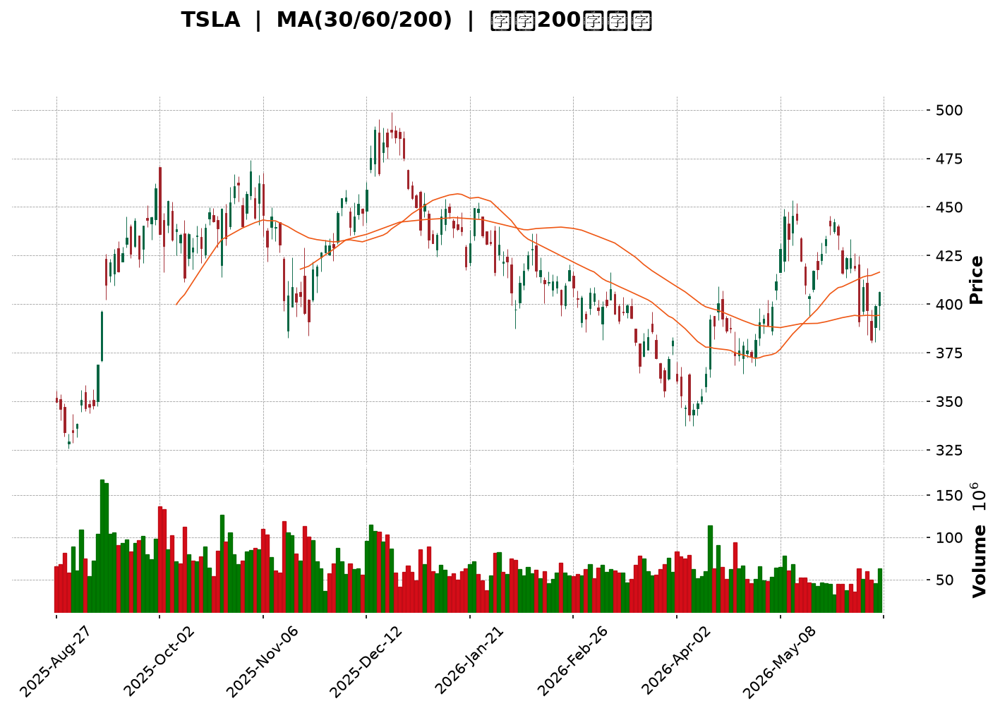
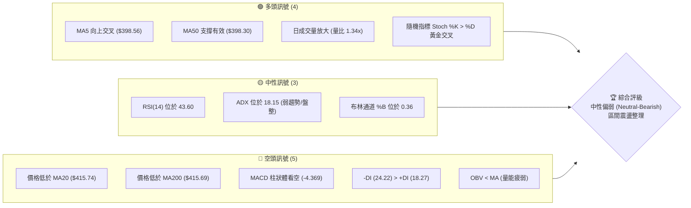
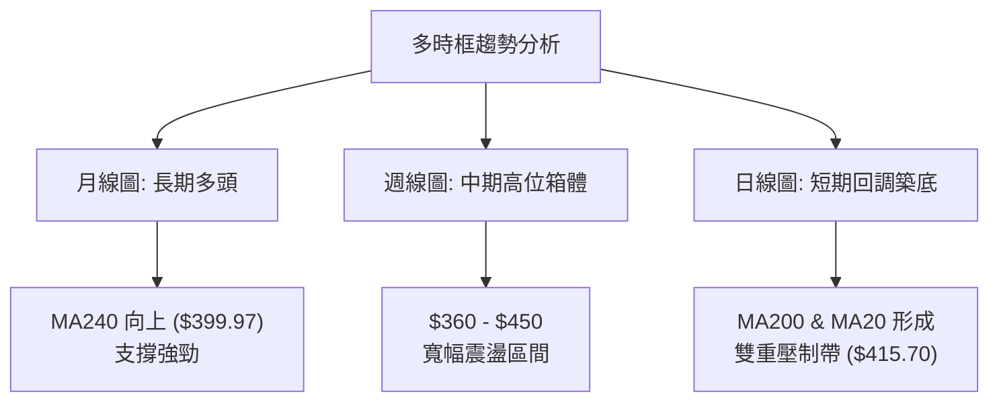
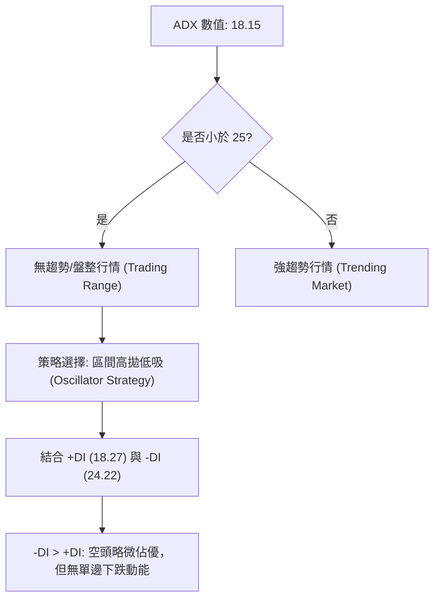
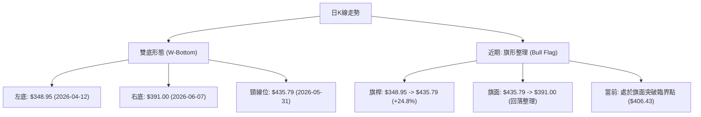
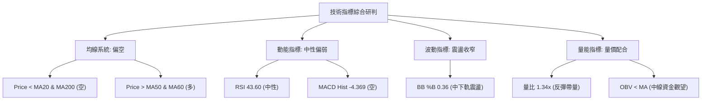
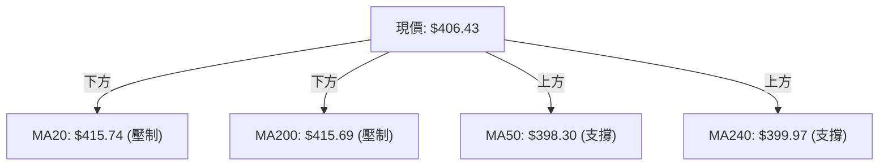
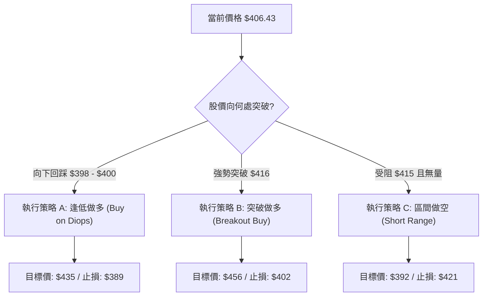
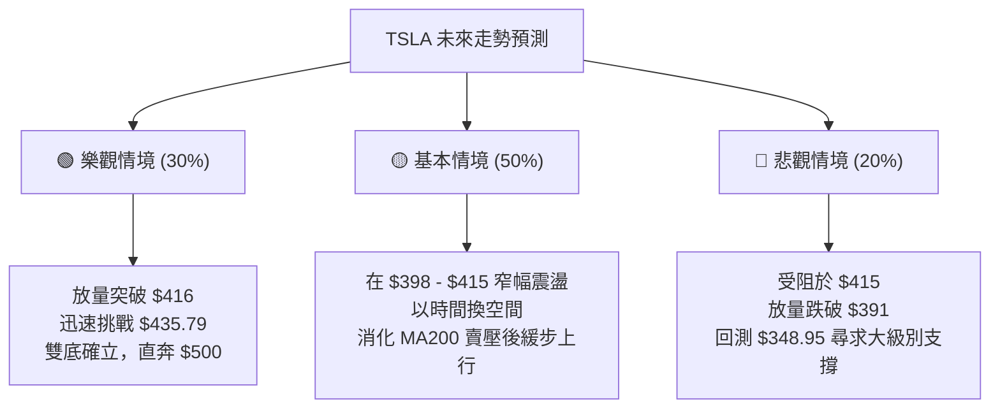

<details>
<summary>📊 靜態圖表 (點擊展開)</summary>

</details>

<html>
<head><meta charset="utf-8" /></head>
<body>
    <div style="height:500px; width:100%;">                        <script>window.PlotlyConfig = {MathJaxConfig: 'local'};</script>
        <script charset="utf-8" src="https://cdn.plot.ly/plotly-3.6.0.min.js" integrity="sha256-QaOVwtVY0T02VaHrr6pnoHLCwayMJp4O5n4YyaE3rJk=" crossorigin="anonymous"></script>                <div id="candlestick-chart" class="plotly-graph-div" style="height:100%; width:100%;"></div>            <script>                window.PLOTLYENV=window.PLOTLYENV || {};                                if (document.getElementById("candlestick-chart")) {                    Plotly.newPlot(                        "candlestick-chart",                        [{"close":{"dtype":"f8","bdata":"AAAAoJnZdUAAAAAgrp91QAAAAIDr3XRAAAAAgMKVdEAAAACgcOF0QAAAAOB6KHVAAAAAoHDtdUAAAABgZqZ1QAAAACCFr3VAAAAA4KO8dUAAAADA9Qx3QAAAAEAKv3hAAAAA4KOgeUAAAACA61l6QAAAAIDCnXpAAAAAoJkNekAAAADAHqF6QAAAACBcI3tAAAAAoJmdekAAAADgo6x7QAAAAIA9dnpAAAAAYGaGe0AAAAAgXLN7QAAAACCFy3tAAAAAIFy3fEAAAAAAAEB7QAAAAKBH3XpAAAAAAABUfEAAAACgcBF7QAAAAEAKa3tAAAAA4KM4e0AAAAAA19d5QAAAAGBmPntAAAAAANfTekAAAABgZjJ7QAAAAAAAzHpAAAAAwPV0e0AAAABA4fZ7QAAAAKCZqXtAAAAAIIVve0AAAAAgrg98QAAAACCFG3tAAAAAYLhGfEAAAADAzMh8QAAAAAAp2HxAAAAAoJmBe0AAAADA9Yh8QAAAAIDrRX1AAAAAACnEe0AAAADAHuF8QAAAAGCP3ntAAAAA4FHYekAAAAAgrtN7QAAAAIDreXtAAAAAoJnpekAAAAAA1x95QAAAAKCZRXlAAAAAYLiOeUAAAAAAABR5QAAAAADXP3lAAAAAIK6zeEAAAACgcHF4QAAAAOB6HHpAAAAAYGY2ekAAAACgR6l6QAAAAGC44npAAAAAgD3iekAAAAAA19N6QAAAAADX63tAAAAA4HpofEAAAAAAAHB8QAAAAKBHeXtAAAAAYLjSe0AAAABAMzd8QAAAAIA97ntAAAAAIFyvfEAAAADA9bR9QAAAAIAUnn5AAAAAACk0fUAAAACA6zV+QAAAAEAzE35AAAAAIK6LfkAAAADA9Vh+QAAAAGBmVn5AAAAAQAqzfUAAAACAPbp8QAAAAEDhZnxAAAAAIIUbfEAAAADAHmF7QAAAAGC4OnxAAAAAIFwPe0AAAABgj\u002fZ6QAAAAMDMPHtAAAAAACnQe0AAAAAgXA98QAAAAEAz83tAAAAAQDNze0AAAADAHml7QAAAAAAAWHtAAAAAAAA0ekAAAABACvd6QAAAAIDCFXxAAAAAwPUQfEAAAABAMzN7QAAAAGBm7npAAAAAIFz3ekAAAADA9Qh6QAAAAGCP5npAAAAAwPVcekAAAAAgXF96QAAAAAApYHlAAAAAIFzTeEAAAACAwrF5QAAAAMAeFXpAAAAAIFyTekAAAADgUcR6QAAAAMAeEXpAAAAAQAoXekAAAACAFKp5QAAAAMAetXlAAAAAIFy7eUAAAADAHr15QAAAAKBH\u002fXhAAAAAgBSWeUAAAABgZhZ6QAAAAKBHiXlAAAAAACkoeUAAAADAHjV5QAAAAEDhhnhAAAAAQApfeUAAAADAzFh5QAAAACCuy3hAAAAAQOHqeEAAAAAA1\u002fN4QAAAAMAefXlAAAAAACmweEAAAABAM3N4QAAAAMD1uHhAAAAA4FH0eEAAAADgeox4QAAAAMDMxHdAAAAAIFz\u002fdkAAAACgmc13QAAAAOB68HdAAAAAQDMfeEAAAACAwkF3QAAAAKBHnXZAAAAA4Ho0dkAAAAAAADx3QAAAAAAp1HdAAAAAoHCJdkAAAADAHg12QAAAAGBmqnVAAAAAAAB0dUAAAACA65l1QAAAAEAzz3VAAAAAYLgGdkAAAABAM8N2QAAAAEAzf3hAAAAAYGZOeEAAAACA6wl5QAAAAAAAiHhAAAAAYLgmeEAAAAAAKTh4QAAAACCFW3dAAAAAwMyEd0AAAABguKp3QAAAAOBRgHdAAAAAwMxMd0AAAACAFNp3QAAAAMAebXhAAAAAACmIeEAAAACA61V4QAAAACCu63hAAAAA4KO8eUAAAACgmcV6QAAAAAAA0HtAAAAAQDMXe0AAAADgUdR7QAAAAMDMtHtAAAAAANdjekAAAAAA1595QAAAAIDCQXlAAAAAACkUekAAAACgmR16QAAAAAApoHpAAAAAoHAZe0AAAACAwoV7QAAAAKCZoXtAAAAA4KM8e0AAAACAFP55QAAAAADXe3pAAAAAQDN7ekAAAABAMyd6QAAAAAAAcHhAAAAAQDOPeUAAAABA4cp4QAAAAKBw2XdAAAAAYGbyeEAAAABA4WZ5QA=="},"high":{"dtype":"f8","bdata":"AAAAgD02dkAAAADAzBh2QAAAAAAAzHVAAAAAoEfVdEAAAACgR3V1QAAAAIA9LnVAAAAAgOs9dkAAAABACmd2QAAAAOBR7HVAAAAAoEdFdkAAAAAA1w93QAAAAEAKy3hAAAAAQDObekAAAAAAAHR6QAAAAMD1xHpAAAAAIIUDe0AAAAAghdd6QAAAACCuz3tAAAAAIIWPe0AAAAAgXMN7QAAAAKCZNXtAAAAAIIWHe0AAAAAgri98QAAAAAAA0HtAAAAA4KPkfEAAAAAAAGx9QAAAAOBR7HtAAAAAwMxYfEAAAABA4Up8QAAAAKBHlXtAAAAAoJlFe0AAAACAFLJ7QAAAAIA9TntAAAAAQDMje0AAAAAAKYh7QAAAAKCZdXtAAAAAIFyXe0AAAADAzBx8QAAAAMDMFHxAAAAA4KPYe0AAAABgZhZ8QAAAAEDhOnxAAAAAYI\u002fCfEAAAAAAADB9QAAAAEAzG31AAAAAwPVwfEAAAAAAAKB8QAAAAMAeoX1AAAAAIIXDfEAAAACgRyV9QAAAAEAzN31AAAAAgMJ1e0AAAABguBp8QAAAAADXp3tAAAAAoEele0AAAAAAAIh6QAAAAEAKw3lAAAAAIFx\u002fekAAAABgZo55QAAAAOB6vHlAAAAAQArPekAAAADAzCx5QAAAACCFW3pAAAAAIK5HekAAAABACq96QAAAAEDhDntAAAAAYI8ae0AAAADAzEx7QAAAAGC4\u002fntAAAAAgBRqfEAAAACA6618QAAAAAAAHHxAAAAAgD1GfEAAAACAFI58QAAAAOBRFHxAAAAAACnwfEAAAADgURx+QAAAAAAAuH5AAAAA4Hr0fkAAAACAwq1+QAAAAADXp35AAAAAoEctf0AAAAAghb9+QAAAAGBmrn5AAAAAoHCRfkAAAABgZlZ9QAAAAIDr8XxAAAAAwMyIfEAAAACgcKV8QAAAAMDMmHxAAAAAAAAEfEAAAACA62V7QAAAAIA9TntAAAAAwMwQfEAAAADAzGR8QAAAAMD1PHxAAAAAYI++e0AAAACAwtV7QAAAAAAA9HtAAAAAIK7rekAAAABAM2N7QAAAAAAAGHxAAAAAQOFGfEAAAADgo9B7QAAAAOBRWHtAAAAAAClke0AAAAAgroN7QAAAAIAUfntAAAAAYGayekAAAADA9ch6QAAAAGBmfnpAAAAAoJkheUAAAADAzOh5QAAAAAAAVHpAAAAAAAC0ekAAAACgmUV7QAAAACCuQ3tAAAAAwPWAekAAAAAghdt5QAAAAGBmDnpAAAAAAAD0eUAAAABAM+t5QAAAAEAze3lAAAAAwB6teUAAAACgcEV6QAAAAMD1DHpAAAAAgOtxeUAAAADgo0h5QAAAAKBwxXhAAAAAoEeFeUAAAACA64l5QAAAAKCZJXlAAAAAoHAZeUAAAACgcGl5QAAAAIAUBnpAAAAAAABoeUAAAABAMwN5QAAAACCuO3lAAAAAgOsBeUAAAADAHjF5QAAAAOBRNHhAAAAAgD2+d0AAAACgRxV4QAAAACCuN3hAAAAAIK7DeEAAAABACgd4QAAAAIDCHXdAAAAA4KP0dkAAAACgR1V3QAAAAIA98ndAAAAA4Hokd0AAAAAghft2QAAAAOBRwHVAAAAAAADIdkAAAACAFM51QAAAAIDC5XVAAAAAoJlFdkAAAACAFPp2QAAAAGBmqnhAAAAAwPWgeEAAAADgepR5QAAAAMDMbHlAAAAAQDOfeEAAAAAAKZB4QAAAAAAAIHhAAAAAACnsd0AAAADgesx3QAAAAOCj5HdAAAAAYGaGd0AAAAAAAAx4QAAAAMAe3XhAAAAAgD2qeEAAAACA6yF5QAAAAEDhGnlAAAAAoEf9eUAAAABAM\u002fN6QAAAAGCPEnxAAAAAwMz8e0AAAABgZlZ8QAAAACCuP3xAAAAAYI8qe0AAAACAFFJ6QAAAAIAUWnlAAAAAIFwXekAAAABAM696QAAAAAAp+HpAAAAAQDMze0AAAACgmdl7QAAAACBcv3tAAAAAwB6Re0AAAACgmdl6QAAAAGC4hnpAAAAAoJkZe0AAAACgmaV6QAAAAEDhinpAAAAAQArPeUAAAAAAACh6QAAAAKBw0XhAAAAA4KP4eEAAAABA4Wp5QA=="},"hovertemplate":"\u003cb\u003e%{x|%Y-%m-%d}\u003c\u002fb\u003e\u003cbr\u003e\u958b: $%{open:.2f}\u003cbr\u003e\u9ad8: $%{high:.2f}\u003cbr\u003e\u4f4e: $%{low:.2f}\u003cbr\u003e\u6536: $%{close:.2f}\u003cextra\u003e\u003c\u002fextra\u003e","low":{"dtype":"f8","bdata":"AAAAYI\u002fSdUAAAAAAKUR1QAAAAEAzu3RAAAAAoJlZdEAAAAAAKYh0QAAAACCut3RAAAAAQOGKdUAAAACgcI11QAAAAMAefXVAAAAAwB6hdUAAAACgmbl1QAAAAADXI3dAAAAAQOEmeUAAAABA4bZ5QAAAAGC4mnlAAAAAwPUIekAAAAAghVt6QAAAAIAU0npAAAAAIIV7ekAAAADgetB6QAAAAKBHMXpAAAAA4FFQekAAAAAAAHh7QAAAAIDrEXtAAAAAAACMe0AAAADAHjl7QAAAAKBHCXpAAAAAQApLe0AAAABAMwd7QAAAACCuk3pAAAAAQOGiekAAAABAM7d5QAAAAEAzO3pAAAAAgMIdekAAAACgR6V6QAAAAMD1VHpAAAAAoJl5ekAAAACAwol7QAAAAMDMoHtAAAAAAADQekAAAABgZt55QAAAAGC44npAAAAAQApre0AAAACgmTl8QAAAAGBmSnxAAAAAgMJ5e0AAAABACrt7QAAAAMDMXHxAAAAAoJm5e0AAAAAgXIt7QAAAAKBwMXtAAAAAgBReekAAAACAwhV7QAAAAIDCBXtAAAAAwPWoekAAAACgcMV4QAAAAOB67HdAAAAAANfreEAAAAAgXJt4QAAAAAAA6HhAAAAAANereEAAAAAAKfx3QAAAAKBwEXlAAAAAQDNfeUAAAACAPQ56QAAAAEAzo3pAAAAA4KOUekAAAACA62F6QAAAAIDC8XpAAAAAgD3We0AAAABgjzp8QAAAAAAANHtAAAAAQDM7e0AAAACAwrl7QAAAAKBHhXtAAAAAYLiae0AAAABgjzp9QAAAAKBHHX1AAAAAQDMjfUAAAACA65F9QAAAACCFq31AAAAAoEdVfkAAAACgcC1+QAAAAMDMzH1AAAAAwB6dfUAAAAAAALB8QAAAAKBHXXxAAAAAwMwUfEAAAADAzDR7QAAAAMAeyXtAAAAA4HrMekAAAADgo\u002fR6QAAAAIDrhXpAAAAAgD3mekAAAAAAAGB7QAAAAEAzv3tAAAAAIIUje0AAAABgZlp7QAAAAAApNHtAAAAAQAoXekAAAACA6zl6QAAAAIAUCntAAAAA4KPAe0AAAADgeiR7QAAAAEAK63pAAAAAoJnhekAAAACA6+l5QAAAAEAza3pAAAAAAADoeUAAAABACtt5QAAAAEDh8nhAAAAA4Ho4eEAAAAAAANx4QAAAAOCjdHlAAAAAAAAQekAAAADgekB6QAAAAAAA4HlAAAAAgBSueUAAAAAAKQh5QAAAAKBHmXlAAAAAgMJBeUAAAAAAAFh5QAAAAOCjoHhAAAAAgD3aeEAAAABgZsJ5QAAAAGCPOnlAAAAAgMLheEAAAAAAAER4QAAAAIA9FnhAAAAAoEepeEAAAABguPZ4QAAAACBco3hAAAAAYGbWd0AAAABACuN4QAAAAGBmInlAAAAAYGaqeEAAAABAM194QAAAAGC4pnhAAAAAAACQeEAAAADA9YR4QAAAACCuq3dAAAAAIFzHdkAAAAAgrkt3QAAAAMD1hHdAAAAAACkQeEAAAACA6z13QAAAACCFd3ZAAAAAgD0CdkAAAAAAAJB2QAAAAKBHYXdAAAAA4HpwdkAAAACAPap1QAAAAADXE3VAAAAAYLg6dUAAAAAAABR1QAAAAADXa3VAAAAAwB7JdUAAAADgUSx2QAAAAAAAqHZAAAAAwMzcd0AAAABgZnp4QAAAAKBHRXhAAAAAIIUTeEAAAADAzBR4QAAAAIA9BndAAAAAIK4rd0AAAADgUcB2QAAAAOCjSHdAAAAA4KMgd0AAAABguAJ3QAAAAMDMrHdAAAAAwMwMeEAAAAAAAFB4QAAAAOBRAHhAAAAAgOsheUAAAACAPQZ6QAAAAMDMDHpAAAAAAClkekAAAAAgXON6QAAAAGCPkntAAAAAAABgekAAAACgR1V5QAAAAIAUmnhAAAAAgD1meUAAAABgZs55QAAAAAApSHpAAAAAgOuhekAAAADgUTh7QAAAAMDMRHtAAAAAgD3CekAAAABA4fZ5QAAAAGBm2nlAAAAAAAAAekAAAABgjxJ6QAAAAKBwSXhAAAAAIIWreEAAAAAA1wN4QAAAAGBmwndAAAAAYI\u002fKd0AAAAAAKSx4QA=="},"name":"\u50f9\u683c","open":{"dtype":"f8","bdata":"AAAAQAr\u002fdUAAAABgj+51QAAAACCus3VAAAAAIK6DdEAAAABAM\u002fN0QAAAAGBmAnVAAAAAAADAdUAAAACAPSp2QAAAAEAKx3VAAAAAwMzodUAAAABguOJ1QAAAAEAKL3dAAAAAgBRyekAAAAAAAOh5QAAAAAAA\u002fHlAAAAAgOvNekAAAADAHl16QAAAAIDC8XpAAAAAgBR+e0AAAACgR916QAAAAADXM3tAAAAAwMzEekAAAACgmcV7QAAAAOBRmHtAAAAAwMy8e0AAAADgo2h9QAAAAOCjtHtAAAAAAACMe0AAAADAHv17QAAAAMAeWXtAAAAAwPX8ekAAAADgo0h7QAAAAOB6eHpAAAAA4KOsekAAAABgZi57QAAAACCuK3tAAAAAAACYekAAAACA6717QAAAAAAp3HtAAAAAQDO3e0AAAAAAAEB6QAAAAKBH7XtAAAAAIK5\u002fe0AAAADgemx8QAAAAAAA6HxAAAAAwMwwfEAAAAAAAOx7QAAAAADXf3xAAAAAIFxnfEAAAADAzEB8QAAAACBc33xAAAAAYLhee0AAAACgmXl7QAAAAGBmdntAAAAAYGaie0AAAACAFHJ6QAAAAMDMJHhAAAAAANfreEAAAACAFFZ5QAAAAEDhYnlAAAAAgBTqeUAAAADAHiV5QAAAAGC4InlAAAAAYLjmeUAAAABAM396QAAAAKBwqXpAAAAAwB6VekAAAADA9ex6QAAAAKCZAXtAAAAAQAoffEAAAADgelB8QAAAAEAz93tAAAAA4KNYe0AAAADAHuF7QAAAAEAzD3xAAAAAoHABfEAAAABACld9QAAAACBcg31AAAAAIIWDfkAAAABgj+J9QAAAAIDrgX5AAAAAgBSefkAAAABgZpZ+QAAAACCuh35AAAAAIK5TfkAAAAAAAFB9QAAAAKBw0XxAAAAAoJmBfEAAAADAzJx8QAAAAADX\u002f3tAAAAAgBTme0AAAABgZj57QAAAAIA9vnpAAAAAQDM\u002fe0AAAAAgrpN7QAAAAEAzI3xAAAAAwPWse0AAAACAFJJ7QAAAAAAAeHtAAAAAgMLVekAAAABgj1p6QAAAAGCPMntAAAAAQOH2e0AAAAAAANB7QAAAAGCPVntAAAAAYI\u002f+ekAAAADAzFx7QAAAAKCZlXpAAAAA4KNUekAAAADgUYR6QAAAACBcR3pAAAAA4FHQeEAAAACA6w15QAAAAGCPnnlAAAAAoEchekAAAAAgXL96QAAAAMDM5HpAAAAAwPXkeUAAAACAwsV5QAAAAIDCsXlAAAAAAAB0eUAAAADAzIR5QAAAAOCjdHlAAAAAAAD4eEAAAABgZsJ5QAAAAGC45nlAAAAAQAoveUAAAACgmWl4QAAAAKBwsXhAAAAAoJndeEAAAADAHhl5QAAAAKBw4XhAAAAAwMxgeEAAAAAghSN5QAAAAOB6JHlAAAAAQOFSeUAAAABguPJ4QAAAACCFw3hAAAAAQAq7eEAAAAAAAPB4QAAAAOBRNHhAAAAAoJm9d0AAAACgcFF3QAAAAMD1iHdAAAAAANdfeEAAAACgmdl3QAAAAEAKG3dAAAAAgMLddkAAAAAAKZh2QAAAAIAUqndAAAAAQDPDdkAAAACgcKl2QAAAAEAKp3VAAAAA4KO8dkAAAABgZnJ1QAAAAOCjpHVAAAAAwB7hdUAAAABguFp2QAAAAKBH7XZAAAAAwPWceEAAAABguL54QAAAAKBHKXlAAAAAAACQeEAAAADAHjl4QAAAAOB6dHdAAAAAAABYd0AAAACgcEF3QAAAAEDhandAAAAAYGZ2d0AAAAAAAEx3QAAAAADX53dAAAAAIK5jeEAAAABACrN4QAAAAAAAJHhAAAAAIK53eUAAAAAgrgd6QAAAAGCPYnpAAAAAYI+We0AAAABguEp7QAAAAADX53tAAAAAIK4fe0AAAADgUTR6QAAAAGCPMnlAAAAAoJl5eUAAAABA4WJ6QAAAAGC4anpAAAAAACnkekAAAACAPa57QAAAAIDrWXtAAAAAoJl9e0AAAAAA17d6QAAAACCFI3pAAAAAQDMrekAAAACgcD16QAAAAAAASHpAAAAAoEfFeEAAAADgerB5QAAAAOCjeHhAAAAA4HpEeEAAAAAA1\u002fd4QA=="},"x":["2025-08-27T00:00:00-04:00","2025-08-28T00:00:00-04:00","2025-08-29T00:00:00-04:00","2025-09-02T00:00:00-04:00","2025-09-03T00:00:00-04:00","2025-09-04T00:00:00-04:00","2025-09-05T00:00:00-04:00","2025-09-08T00:00:00-04:00","2025-09-09T00:00:00-04:00","2025-09-10T00:00:00-04:00","2025-09-11T00:00:00-04:00","2025-09-12T00:00:00-04:00","2025-09-15T00:00:00-04:00","2025-09-16T00:00:00-04:00","2025-09-17T00:00:00-04:00","2025-09-18T00:00:00-04:00","2025-09-19T00:00:00-04:00","2025-09-22T00:00:00-04:00","2025-09-23T00:00:00-04:00","2025-09-24T00:00:00-04:00","2025-09-25T00:00:00-04:00","2025-09-26T00:00:00-04:00","2025-09-29T00:00:00-04:00","2025-09-30T00:00:00-04:00","2025-10-01T00:00:00-04:00","2025-10-02T00:00:00-04:00","2025-10-03T00:00:00-04:00","2025-10-06T00:00:00-04:00","2025-10-07T00:00:00-04:00","2025-10-08T00:00:00-04:00","2025-10-09T00:00:00-04:00","2025-10-10T00:00:00-04:00","2025-10-13T00:00:00-04:00","2025-10-14T00:00:00-04:00","2025-10-15T00:00:00-04:00","2025-10-16T00:00:00-04:00","2025-10-17T00:00:00-04:00","2025-10-20T00:00:00-04:00","2025-10-21T00:00:00-04:00","2025-10-22T00:00:00-04:00","2025-10-23T00:00:00-04:00","2025-10-24T00:00:00-04:00","2025-10-27T00:00:00-04:00","2025-10-28T00:00:00-04:00","2025-10-29T00:00:00-04:00","2025-10-30T00:00:00-04:00","2025-10-31T00:00:00-04:00","2025-11-03T00:00:00-05:00","2025-11-04T00:00:00-05:00","2025-11-05T00:00:00-05:00","2025-11-06T00:00:00-05:00","2025-11-07T00:00:00-05:00","2025-11-10T00:00:00-05:00","2025-11-11T00:00:00-05:00","2025-11-12T00:00:00-05:00","2025-11-13T00:00:00-05:00","2025-11-14T00:00:00-05:00","2025-11-17T00:00:00-05:00","2025-11-18T00:00:00-05:00","2025-11-19T00:00:00-05:00","2025-11-20T00:00:00-05:00","2025-11-21T00:00:00-05:00","2025-11-24T00:00:00-05:00","2025-11-25T00:00:00-05:00","2025-11-26T00:00:00-05:00","2025-11-28T00:00:00-05:00","2025-12-01T00:00:00-05:00","2025-12-02T00:00:00-05:00","2025-12-03T00:00:00-05:00","2025-12-04T00:00:00-05:00","2025-12-05T00:00:00-05:00","2025-12-08T00:00:00-05:00","2025-12-09T00:00:00-05:00","2025-12-10T00:00:00-05:00","2025-12-11T00:00:00-05:00","2025-12-12T00:00:00-05:00","2025-12-15T00:00:00-05:00","2025-12-16T00:00:00-05:00","2025-12-17T00:00:00-05:00","2025-12-18T00:00:00-05:00","2025-12-19T00:00:00-05:00","2025-12-22T00:00:00-05:00","2025-12-23T00:00:00-05:00","2025-12-24T00:00:00-05:00","2025-12-26T00:00:00-05:00","2025-12-29T00:00:00-05:00","2025-12-30T00:00:00-05:00","2025-12-31T00:00:00-05:00","2026-01-02T00:00:00-05:00","2026-01-05T00:00:00-05:00","2026-01-06T00:00:00-05:00","2026-01-07T00:00:00-05:00","2026-01-08T00:00:00-05:00","2026-01-09T00:00:00-05:00","2026-01-12T00:00:00-05:00","2026-01-13T00:00:00-05:00","2026-01-14T00:00:00-05:00","2026-01-15T00:00:00-05:00","2026-01-16T00:00:00-05:00","2026-01-20T00:00:00-05:00","2026-01-21T00:00:00-05:00","2026-01-22T00:00:00-05:00","2026-01-23T00:00:00-05:00","2026-01-26T00:00:00-05:00","2026-01-27T00:00:00-05:00","2026-01-28T00:00:00-05:00","2026-01-29T00:00:00-05:00","2026-01-30T00:00:00-05:00","2026-02-02T00:00:00-05:00","2026-02-03T00:00:00-05:00","2026-02-04T00:00:00-05:00","2026-02-05T00:00:00-05:00","2026-02-06T00:00:00-05:00","2026-02-09T00:00:00-05:00","2026-02-10T00:00:00-05:00","2026-02-11T00:00:00-05:00","2026-02-12T00:00:00-05:00","2026-02-13T00:00:00-05:00","2026-02-17T00:00:00-05:00","2026-02-18T00:00:00-05:00","2026-02-19T00:00:00-05:00","2026-02-20T00:00:00-05:00","2026-02-23T00:00:00-05:00","2026-02-24T00:00:00-05:00","2026-02-25T00:00:00-05:00","2026-02-26T00:00:00-05:00","2026-02-27T00:00:00-05:00","2026-03-02T00:00:00-05:00","2026-03-03T00:00:00-05:00","2026-03-04T00:00:00-05:00","2026-03-05T00:00:00-05:00","2026-03-06T00:00:00-05:00","2026-03-09T00:00:00-04:00","2026-03-10T00:00:00-04:00","2026-03-11T00:00:00-04:00","2026-03-12T00:00:00-04:00","2026-03-13T00:00:00-04:00","2026-03-16T00:00:00-04:00","2026-03-17T00:00:00-04:00","2026-03-18T00:00:00-04:00","2026-03-19T00:00:00-04:00","2026-03-20T00:00:00-04:00","2026-03-23T00:00:00-04:00","2026-03-24T00:00:00-04:00","2026-03-25T00:00:00-04:00","2026-03-26T00:00:00-04:00","2026-03-27T00:00:00-04:00","2026-03-30T00:00:00-04:00","2026-03-31T00:00:00-04:00","2026-04-01T00:00:00-04:00","2026-04-02T00:00:00-04:00","2026-04-06T00:00:00-04:00","2026-04-07T00:00:00-04:00","2026-04-08T00:00:00-04:00","2026-04-09T00:00:00-04:00","2026-04-10T00:00:00-04:00","2026-04-13T00:00:00-04:00","2026-04-14T00:00:00-04:00","2026-04-15T00:00:00-04:00","2026-04-16T00:00:00-04:00","2026-04-17T00:00:00-04:00","2026-04-20T00:00:00-04:00","2026-04-21T00:00:00-04:00","2026-04-22T00:00:00-04:00","2026-04-23T00:00:00-04:00","2026-04-24T00:00:00-04:00","2026-04-27T00:00:00-04:00","2026-04-28T00:00:00-04:00","2026-04-29T00:00:00-04:00","2026-04-30T00:00:00-04:00","2026-05-01T00:00:00-04:00","2026-05-04T00:00:00-04:00","2026-05-05T00:00:00-04:00","2026-05-06T00:00:00-04:00","2026-05-07T00:00:00-04:00","2026-05-08T00:00:00-04:00","2026-05-11T00:00:00-04:00","2026-05-12T00:00:00-04:00","2026-05-13T00:00:00-04:00","2026-05-14T00:00:00-04:00","2026-05-15T00:00:00-04:00","2026-05-18T00:00:00-04:00","2026-05-19T00:00:00-04:00","2026-05-20T00:00:00-04:00","2026-05-21T00:00:00-04:00","2026-05-22T00:00:00-04:00","2026-05-26T00:00:00-04:00","2026-05-27T00:00:00-04:00","2026-05-28T00:00:00-04:00","2026-05-29T00:00:00-04:00","2026-06-01T00:00:00-04:00","2026-06-02T00:00:00-04:00","2026-06-03T00:00:00-04:00","2026-06-04T00:00:00-04:00","2026-06-05T00:00:00-04:00","2026-06-08T00:00:00-04:00","2026-06-09T00:00:00-04:00","2026-06-10T00:00:00-04:00","2026-06-11T00:00:00-04:00","2026-06-12T00:00:00-04:00"],"type":"candlestick"},{"hovertemplate":"MA30: $%{y:.2f}\u003cextra\u003e\u003c\u002fextra\u003e","line":{"color":"#2196F3","dash":"dash","width":2},"mode":"lines","name":"MA30","x":["2025-08-27T00:00:00-04:00","2025-08-28T00:00:00-04:00","2025-08-29T00:00:00-04:00","2025-09-02T00:00:00-04:00","2025-09-03T00:00:00-04:00","2025-09-04T00:00:00-04:00","2025-09-05T00:00:00-04:00","2025-09-08T00:00:00-04:00","2025-09-09T00:00:00-04:00","2025-09-10T00:00:00-04:00","2025-09-11T00:00:00-04:00","2025-09-12T00:00:00-04:00","2025-09-15T00:00:00-04:00","2025-09-16T00:00:00-04:00","2025-09-17T00:00:00-04:00","2025-09-18T00:00:00-04:00","2025-09-19T00:00:00-04:00","2025-09-22T00:00:00-04:00","2025-09-23T00:00:00-04:00","2025-09-24T00:00:00-04:00","2025-09-25T00:00:00-04:00","2025-09-26T00:00:00-04:00","2025-09-29T00:00:00-04:00","2025-09-30T00:00:00-04:00","2025-10-01T00:00:00-04:00","2025-10-02T00:00:00-04:00","2025-10-03T00:00:00-04:00","2025-10-06T00:00:00-04:00","2025-10-07T00:00:00-04:00","2025-10-08T00:00:00-04:00","2025-10-09T00:00:00-04:00","2025-10-10T00:00:00-04:00","2025-10-13T00:00:00-04:00","2025-10-14T00:00:00-04:00","2025-10-15T00:00:00-04:00","2025-10-16T00:00:00-04:00","2025-10-17T00:00:00-04:00","2025-10-20T00:00:00-04:00","2025-10-21T00:00:00-04:00","2025-10-22T00:00:00-04:00","2025-10-23T00:00:00-04:00","2025-10-24T00:00:00-04:00","2025-10-27T00:00:00-04:00","2025-10-28T00:00:00-04:00","2025-10-29T00:00:00-04:00","2025-10-30T00:00:00-04:00","2025-10-31T00:00:00-04:00","2025-11-03T00:00:00-05:00","2025-11-04T00:00:00-05:00","2025-11-05T00:00:00-05:00","2025-11-06T00:00:00-05:00","2025-11-07T00:00:00-05:00","2025-11-10T00:00:00-05:00","2025-11-11T00:00:00-05:00","2025-11-12T00:00:00-05:00","2025-11-13T00:00:00-05:00","2025-11-14T00:00:00-05:00","2025-11-17T00:00:00-05:00","2025-11-18T00:00:00-05:00","2025-11-19T00:00:00-05:00","2025-11-20T00:00:00-05:00","2025-11-21T00:00:00-05:00","2025-11-24T00:00:00-05:00","2025-11-25T00:00:00-05:00","2025-11-26T00:00:00-05:00","2025-11-28T00:00:00-05:00","2025-12-01T00:00:00-05:00","2025-12-02T00:00:00-05:00","2025-12-03T00:00:00-05:00","2025-12-04T00:00:00-05:00","2025-12-05T00:00:00-05:00","2025-12-08T00:00:00-05:00","2025-12-09T00:00:00-05:00","2025-12-10T00:00:00-05:00","2025-12-11T00:00:00-05:00","2025-12-12T00:00:00-05:00","2025-12-15T00:00:00-05:00","2025-12-16T00:00:00-05:00","2025-12-17T00:00:00-05:00","2025-12-18T00:00:00-05:00","2025-12-19T00:00:00-05:00","2025-12-22T00:00:00-05:00","2025-12-23T00:00:00-05:00","2025-12-24T00:00:00-05:00","2025-12-26T00:00:00-05:00","2025-12-29T00:00:00-05:00","2025-12-30T00:00:00-05:00","2025-12-31T00:00:00-05:00","2026-01-02T00:00:00-05:00","2026-01-05T00:00:00-05:00","2026-01-06T00:00:00-05:00","2026-01-07T00:00:00-05:00","2026-01-08T00:00:00-05:00","2026-01-09T00:00:00-05:00","2026-01-12T00:00:00-05:00","2026-01-13T00:00:00-05:00","2026-01-14T00:00:00-05:00","2026-01-15T00:00:00-05:00","2026-01-16T00:00:00-05:00","2026-01-20T00:00:00-05:00","2026-01-21T00:00:00-05:00","2026-01-22T00:00:00-05:00","2026-01-23T00:00:00-05:00","2026-01-26T00:00:00-05:00","2026-01-27T00:00:00-05:00","2026-01-28T00:00:00-05:00","2026-01-29T00:00:00-05:00","2026-01-30T00:00:00-05:00","2026-02-02T00:00:00-05:00","2026-02-03T00:00:00-05:00","2026-02-04T00:00:00-05:00","2026-02-05T00:00:00-05:00","2026-02-06T00:00:00-05:00","2026-02-09T00:00:00-05:00","2026-02-10T00:00:00-05:00","2026-02-11T00:00:00-05:00","2026-02-12T00:00:00-05:00","2026-02-13T00:00:00-05:00","2026-02-17T00:00:00-05:00","2026-02-18T00:00:00-05:00","2026-02-19T00:00:00-05:00","2026-02-20T00:00:00-05:00","2026-02-23T00:00:00-05:00","2026-02-24T00:00:00-05:00","2026-02-25T00:00:00-05:00","2026-02-26T00:00:00-05:00","2026-02-27T00:00:00-05:00","2026-03-02T00:00:00-05:00","2026-03-03T00:00:00-05:00","2026-03-04T00:00:00-05:00","2026-03-05T00:00:00-05:00","2026-03-06T00:00:00-05:00","2026-03-09T00:00:00-04:00","2026-03-10T00:00:00-04:00","2026-03-11T00:00:00-04:00","2026-03-12T00:00:00-04:00","2026-03-13T00:00:00-04:00","2026-03-16T00:00:00-04:00","2026-03-17T00:00:00-04:00","2026-03-18T00:00:00-04:00","2026-03-19T00:00:00-04:00","2026-03-20T00:00:00-04:00","2026-03-23T00:00:00-04:00","2026-03-24T00:00:00-04:00","2026-03-25T00:00:00-04:00","2026-03-26T00:00:00-04:00","2026-03-27T00:00:00-04:00","2026-03-30T00:00:00-04:00","2026-03-31T00:00:00-04:00","2026-04-01T00:00:00-04:00","2026-04-02T00:00:00-04:00","2026-04-06T00:00:00-04:00","2026-04-07T00:00:00-04:00","2026-04-08T00:00:00-04:00","2026-04-09T00:00:00-04:00","2026-04-10T00:00:00-04:00","2026-04-13T00:00:00-04:00","2026-04-14T00:00:00-04:00","2026-04-15T00:00:00-04:00","2026-04-16T00:00:00-04:00","2026-04-17T00:00:00-04:00","2026-04-20T00:00:00-04:00","2026-04-21T00:00:00-04:00","2026-04-22T00:00:00-04:00","2026-04-23T00:00:00-04:00","2026-04-24T00:00:00-04:00","2026-04-27T00:00:00-04:00","2026-04-28T00:00:00-04:00","2026-04-29T00:00:00-04:00","2026-04-30T00:00:00-04:00","2026-05-01T00:00:00-04:00","2026-05-04T00:00:00-04:00","2026-05-05T00:00:00-04:00","2026-05-06T00:00:00-04:00","2026-05-07T00:00:00-04:00","2026-05-08T00:00:00-04:00","2026-05-11T00:00:00-04:00","2026-05-12T00:00:00-04:00","2026-05-13T00:00:00-04:00","2026-05-14T00:00:00-04:00","2026-05-15T00:00:00-04:00","2026-05-18T00:00:00-04:00","2026-05-19T00:00:00-04:00","2026-05-20T00:00:00-04:00","2026-05-21T00:00:00-04:00","2026-05-22T00:00:00-04:00","2026-05-26T00:00:00-04:00","2026-05-27T00:00:00-04:00","2026-05-28T00:00:00-04:00","2026-05-29T00:00:00-04:00","2026-06-01T00:00:00-04:00","2026-06-02T00:00:00-04:00","2026-06-03T00:00:00-04:00","2026-06-04T00:00:00-04:00","2026-06-05T00:00:00-04:00","2026-06-08T00:00:00-04:00","2026-06-09T00:00:00-04:00","2026-06-10T00:00:00-04:00","2026-06-11T00:00:00-04:00","2026-06-12T00:00:00-04:00"],"y":{"dtype":"f8","bdata":"AAAAAAAA+H8AAAAAAAD4fwAAAAAAAPh\u002fAAAAAAAA+H8AAAAAAAD4fwAAAAAAAPh\u002fAAAAAAAA+H8AAAAAAAD4fwAAAAAAAPh\u002fAAAAAAAA+H8AAAAAAAD4fwAAAAAAAPh\u002fAAAAAAAA+H8AAAAAAAD4fwAAAAAAAPh\u002fAAAAAAAA+H8AAAAAAAD4fwAAAAAAAPh\u002fAAAAAAAA+H8AAAAAAAD4fwAAAAAAAPh\u002fAAAAAAAA+H8AAAAAAAD4fwAAAAAAAPh\u002fAAAAAAAA+H8AAAAAAAD4fwAAAAAAAPh\u002fAAAAAAAA+H8AAAAAAAD4f1VVVeWJ\u002fHhAIiIikl8qeUDv7u7uYE55QN7d3W3LhHlAERERYRC6eUAAAABw9u95QJqZmXkUIHpARERElENPekCrqqqKJYV6QJqZmTkmuHpAVVVVVcfoekBmZmY2iRN7QBEREXGvJ3tAmpmZuUk+e0B3d3f3DFN7QCIiImIQZntAiYiIyHZye0Dv7u6uuYJ7QJqZmanxlHtA3t3dPcOee0CrqqqaC6l7QFVVVVUOtXtAmpmZ2UCve0BmZmamVLB7QERERFScrXtAq6qq+jeee0Crqqp6FIx7QM3MzJx9fntAd3d3F9lme0Dv7u7e3VV7QJqZmSlcQ3tAERERgdwte0CJiIgo6iF7QM3MzCxAGHtAAAAAsAATe0CJiIiYbg57QJqZmXkwD3tAd3d3d0wKe0DNzMzsmAB7QLy7uyvOAntAERERoRoLe0Dv7u6OUA57QERERKRwEXtAZmZmxpINe0AzMzNTuAh7QFVVVTXsAHtAmpmZOfsKe0CamZk5+xR7QO\u002fu7g50IHtAMzMzU7gse0C8u7t7FDh7QO\u002fu7r7mSntAMzMz43pqe0BmZmZG\u002fX97QFVVVcVnmHtAq6qqyi+we0ARERHx7s57QHd3d4ek6XtAZmZmFmf\u002fe0Dv7u4+ChN8QImIiCh4LHxA7+7ujpdAfEBVVVWVGFZ8QJqZmem0X3xAiYiIiF1tfEBmZmYmTXl8QAAAAFBignxA3t3dTTeHfECamZkpMYx8QImIiJhDh3xAMzMzs3J0fECamZn54Wd8QFVVVUUZbXxAIiIiYixvfEB3d3e3gWZ8QLy7u4v6XXxAERER4U9PfEC8u7uL+i98QImIiOhCEHxAd3d3dwX4e0BERET0RNd7QDMzMwMrr3tAq6qqelt+e0AiIiKSplZ7QCIiImJXMntAIiIicq8Xe0BERERk9AZ7QCIiIoIH83pAZmZmNtDhekDNzMy8LdN6QN7d3Z2ovXpAiYiISFOyekCJiIiY4Kd6QN7d3X2xlHpA7+7uzrCBekARERHR23B6QFVVVeVCXHpAzczMfLFIekAAAACw5DV6QBERESHbHXpA7+7u3sEWekBVVVUF8wh6QGZmZkbh7HlAmpmZuQLSeUC8u7v71L55QLy7u8uFsnlAiYiIKBWfeUDNzMysjpF5QM3MzHz4fnlAZmZmBvNyeUC8u7v7YmN5QFVVVbWsVXlAvLu7GxNGeUDNzMyc7zV5QCIiIuKlI3lAZmZmlrUOeUAAAADgwfB4QFVVVcVL03hAvLu72ySyeEARERFxaJ14QAAAAEBgjXhAq6qqqhxyeEAzMzMzpVJ4QLy7u1tINnhAiYiIaAMTeEC8u7sLu+x3QBEREZHtzHdAzczMnDayd0De3d1tWZ13QFVVVeUXnXdA3t3dXQGUd0AiIiJCYJF3QImIiLgej3dAMzMz05SId0CrqqpKU4J3QBEREYEjcHdAZmZm9ihmd0AzMzMzel93QGZmZlYOVXdAzczMTPBGd0BERET0\u002fUB3QJqZmUmaRndA7+7uLrJTd0AiIiJyPVh3QFVVVQWdYHdAq6qqCmVud0De3d2tY4x3QImIiCi\u002fuHdAiYiI+G\u002fid0BmZmbmpQl4QM3MzGy8KnhAREREtJ1LeEAAAABQG2p4QERERITAiHhAmpmZWTmweEB3d3cnv9Z4QJqZmWnY\u002f3hAIiIi0iIreUAiIiIywVN5QHd3d1eAbnlAREREZIKHeUBERETkpY95QBERETFPoHlAd3d3JzG0eUDv7u5+scR5QKuqqsrozXlAvLu7m1LfeUAiIiKS7eh5QAAAABDm63lAd3d3t\u002fP5eUDe3d29LQd6QA=="},"type":"scatter"},{"hovertemplate":"MA60: $%{y:.2f}\u003cextra\u003e\u003c\u002fextra\u003e","line":{"color":"#9C27B0","dash":"dash","width":2},"mode":"lines","name":"MA60","x":["2025-08-27T00:00:00-04:00","2025-08-28T00:00:00-04:00","2025-08-29T00:00:00-04:00","2025-09-02T00:00:00-04:00","2025-09-03T00:00:00-04:00","2025-09-04T00:00:00-04:00","2025-09-05T00:00:00-04:00","2025-09-08T00:00:00-04:00","2025-09-09T00:00:00-04:00","2025-09-10T00:00:00-04:00","2025-09-11T00:00:00-04:00","2025-09-12T00:00:00-04:00","2025-09-15T00:00:00-04:00","2025-09-16T00:00:00-04:00","2025-09-17T00:00:00-04:00","2025-09-18T00:00:00-04:00","2025-09-19T00:00:00-04:00","2025-09-22T00:00:00-04:00","2025-09-23T00:00:00-04:00","2025-09-24T00:00:00-04:00","2025-09-25T00:00:00-04:00","2025-09-26T00:00:00-04:00","2025-09-29T00:00:00-04:00","2025-09-30T00:00:00-04:00","2025-10-01T00:00:00-04:00","2025-10-02T00:00:00-04:00","2025-10-03T00:00:00-04:00","2025-10-06T00:00:00-04:00","2025-10-07T00:00:00-04:00","2025-10-08T00:00:00-04:00","2025-10-09T00:00:00-04:00","2025-10-10T00:00:00-04:00","2025-10-13T00:00:00-04:00","2025-10-14T00:00:00-04:00","2025-10-15T00:00:00-04:00","2025-10-16T00:00:00-04:00","2025-10-17T00:00:00-04:00","2025-10-20T00:00:00-04:00","2025-10-21T00:00:00-04:00","2025-10-22T00:00:00-04:00","2025-10-23T00:00:00-04:00","2025-10-24T00:00:00-04:00","2025-10-27T00:00:00-04:00","2025-10-28T00:00:00-04:00","2025-10-29T00:00:00-04:00","2025-10-30T00:00:00-04:00","2025-10-31T00:00:00-04:00","2025-11-03T00:00:00-05:00","2025-11-04T00:00:00-05:00","2025-11-05T00:00:00-05:00","2025-11-06T00:00:00-05:00","2025-11-07T00:00:00-05:00","2025-11-10T00:00:00-05:00","2025-11-11T00:00:00-05:00","2025-11-12T00:00:00-05:00","2025-11-13T00:00:00-05:00","2025-11-14T00:00:00-05:00","2025-11-17T00:00:00-05:00","2025-11-18T00:00:00-05:00","2025-11-19T00:00:00-05:00","2025-11-20T00:00:00-05:00","2025-11-21T00:00:00-05:00","2025-11-24T00:00:00-05:00","2025-11-25T00:00:00-05:00","2025-11-26T00:00:00-05:00","2025-11-28T00:00:00-05:00","2025-12-01T00:00:00-05:00","2025-12-02T00:00:00-05:00","2025-12-03T00:00:00-05:00","2025-12-04T00:00:00-05:00","2025-12-05T00:00:00-05:00","2025-12-08T00:00:00-05:00","2025-12-09T00:00:00-05:00","2025-12-10T00:00:00-05:00","2025-12-11T00:00:00-05:00","2025-12-12T00:00:00-05:00","2025-12-15T00:00:00-05:00","2025-12-16T00:00:00-05:00","2025-12-17T00:00:00-05:00","2025-12-18T00:00:00-05:00","2025-12-19T00:00:00-05:00","2025-12-22T00:00:00-05:00","2025-12-23T00:00:00-05:00","2025-12-24T00:00:00-05:00","2025-12-26T00:00:00-05:00","2025-12-29T00:00:00-05:00","2025-12-30T00:00:00-05:00","2025-12-31T00:00:00-05:00","2026-01-02T00:00:00-05:00","2026-01-05T00:00:00-05:00","2026-01-06T00:00:00-05:00","2026-01-07T00:00:00-05:00","2026-01-08T00:00:00-05:00","2026-01-09T00:00:00-05:00","2026-01-12T00:00:00-05:00","2026-01-13T00:00:00-05:00","2026-01-14T00:00:00-05:00","2026-01-15T00:00:00-05:00","2026-01-16T00:00:00-05:00","2026-01-20T00:00:00-05:00","2026-01-21T00:00:00-05:00","2026-01-22T00:00:00-05:00","2026-01-23T00:00:00-05:00","2026-01-26T00:00:00-05:00","2026-01-27T00:00:00-05:00","2026-01-28T00:00:00-05:00","2026-01-29T00:00:00-05:00","2026-01-30T00:00:00-05:00","2026-02-02T00:00:00-05:00","2026-02-03T00:00:00-05:00","2026-02-04T00:00:00-05:00","2026-02-05T00:00:00-05:00","2026-02-06T00:00:00-05:00","2026-02-09T00:00:00-05:00","2026-02-10T00:00:00-05:00","2026-02-11T00:00:00-05:00","2026-02-12T00:00:00-05:00","2026-02-13T00:00:00-05:00","2026-02-17T00:00:00-05:00","2026-02-18T00:00:00-05:00","2026-02-19T00:00:00-05:00","2026-02-20T00:00:00-05:00","2026-02-23T00:00:00-05:00","2026-02-24T00:00:00-05:00","2026-02-25T00:00:00-05:00","2026-02-26T00:00:00-05:00","2026-02-27T00:00:00-05:00","2026-03-02T00:00:00-05:00","2026-03-03T00:00:00-05:00","2026-03-04T00:00:00-05:00","2026-03-05T00:00:00-05:00","2026-03-06T00:00:00-05:00","2026-03-09T00:00:00-04:00","2026-03-10T00:00:00-04:00","2026-03-11T00:00:00-04:00","2026-03-12T00:00:00-04:00","2026-03-13T00:00:00-04:00","2026-03-16T00:00:00-04:00","2026-03-17T00:00:00-04:00","2026-03-18T00:00:00-04:00","2026-03-19T00:00:00-04:00","2026-03-20T00:00:00-04:00","2026-03-23T00:00:00-04:00","2026-03-24T00:00:00-04:00","2026-03-25T00:00:00-04:00","2026-03-26T00:00:00-04:00","2026-03-27T00:00:00-04:00","2026-03-30T00:00:00-04:00","2026-03-31T00:00:00-04:00","2026-04-01T00:00:00-04:00","2026-04-02T00:00:00-04:00","2026-04-06T00:00:00-04:00","2026-04-07T00:00:00-04:00","2026-04-08T00:00:00-04:00","2026-04-09T00:00:00-04:00","2026-04-10T00:00:00-04:00","2026-04-13T00:00:00-04:00","2026-04-14T00:00:00-04:00","2026-04-15T00:00:00-04:00","2026-04-16T00:00:00-04:00","2026-04-17T00:00:00-04:00","2026-04-20T00:00:00-04:00","2026-04-21T00:00:00-04:00","2026-04-22T00:00:00-04:00","2026-04-23T00:00:00-04:00","2026-04-24T00:00:00-04:00","2026-04-27T00:00:00-04:00","2026-04-28T00:00:00-04:00","2026-04-29T00:00:00-04:00","2026-04-30T00:00:00-04:00","2026-05-01T00:00:00-04:00","2026-05-04T00:00:00-04:00","2026-05-05T00:00:00-04:00","2026-05-06T00:00:00-04:00","2026-05-07T00:00:00-04:00","2026-05-08T00:00:00-04:00","2026-05-11T00:00:00-04:00","2026-05-12T00:00:00-04:00","2026-05-13T00:00:00-04:00","2026-05-14T00:00:00-04:00","2026-05-15T00:00:00-04:00","2026-05-18T00:00:00-04:00","2026-05-19T00:00:00-04:00","2026-05-20T00:00:00-04:00","2026-05-21T00:00:00-04:00","2026-05-22T00:00:00-04:00","2026-05-26T00:00:00-04:00","2026-05-27T00:00:00-04:00","2026-05-28T00:00:00-04:00","2026-05-29T00:00:00-04:00","2026-06-01T00:00:00-04:00","2026-06-02T00:00:00-04:00","2026-06-03T00:00:00-04:00","2026-06-04T00:00:00-04:00","2026-06-05T00:00:00-04:00","2026-06-08T00:00:00-04:00","2026-06-09T00:00:00-04:00","2026-06-10T00:00:00-04:00","2026-06-11T00:00:00-04:00","2026-06-12T00:00:00-04:00"],"y":{"dtype":"f8","bdata":"AAAAAAAA+H8AAAAAAAD4fwAAAAAAAPh\u002fAAAAAAAA+H8AAAAAAAD4fwAAAAAAAPh\u002fAAAAAAAA+H8AAAAAAAD4fwAAAAAAAPh\u002fAAAAAAAA+H8AAAAAAAD4fwAAAAAAAPh\u002fAAAAAAAA+H8AAAAAAAD4fwAAAAAAAPh\u002fAAAAAAAA+H8AAAAAAAD4fwAAAAAAAPh\u002fAAAAAAAA+H8AAAAAAAD4fwAAAAAAAPh\u002fAAAAAAAA+H8AAAAAAAD4fwAAAAAAAPh\u002fAAAAAAAA+H8AAAAAAAD4fwAAAAAAAPh\u002fAAAAAAAA+H8AAAAAAAD4fwAAAAAAAPh\u002fAAAAAAAA+H8AAAAAAAD4fwAAAAAAAPh\u002fAAAAAAAA+H8AAAAAAAD4fwAAAAAAAPh\u002fAAAAAAAA+H8AAAAAAAD4fwAAAAAAAPh\u002fAAAAAAAA+H8AAAAAAAD4fwAAAAAAAPh\u002fAAAAAAAA+H8AAAAAAAD4fwAAAAAAAPh\u002fAAAAAAAA+H8AAAAAAAD4fwAAAAAAAPh\u002fAAAAAAAA+H8AAAAAAAD4fwAAAAAAAPh\u002fAAAAAAAA+H8AAAAAAAD4fwAAAAAAAPh\u002fAAAAAAAA+H8AAAAAAAD4fwAAAAAAAPh\u002fAAAAAAAA+H8AAAAAAAD4f3d3dwfzH3pAmpmZCR4sekC8u7uLJTh6QFVVVc2FTnpAiYiIiIhmekBERESEMn96QJqZmXmil3pA3t3dBcisekC8u7s738J6QKuqqjJ63XpAMzMz+\u002fD5ekCrqqri7BB7QKuqqgqQHHtAAAAAQO4le0BVVVWl4i17QLy7u0t+M3tAERERAbk+e0BERER02kt7QERERNyyWntAiYiIyL1le0AzMzMLkHB7QCIiIor6f3tAZmZm3t2Me0BmZmb2KJh7QM3MzAwCo3tAq6qq4jOne0De3d21ga17QCIiIhIRtHtA7+7uFiCze0Dv7u4OdLR7QBERESnqt3tAAAAACDq3e0Dv7u5eAbx7QDMzM4v6u3tAREREHC\u002fAe0B3d3ff3cN7QM3MzGTJyHtAq6qq4sHIe0AzMzMLZcZ7QCIiIuIIxXtAIiIiqsa\u002fe0BEREREGbt7QM3MzPREv3tARERElF++e0BVVVUFnbd7QImIiGBzr3tAVVVVjSWte0CrqqrieqJ7QLy7u3tbmHtAVVVV5V6Se0AAAAC4rId7QBEREeEIfXtA7+7uLmt0e0BERETsUWt7QLy7u5NfZXtAZmZmnu9je0Crqqqq8Wp7QM3MzARWbntAZmZmpptwe0De3d39G3N7QDMzM2MQdXtAvLu7a3V5e0Dv7u6W\u002fH57QLy7uzMzentAvLu7K4d3e0C8u7t7FHV7QKuqqppSb3tAVVVVZfRne0DNzMzsCmF7QM3MzFyPUntAERERSZpFe0B3d3d\u002fajh7QN7d3UX9LHtA3t3djZcge0CamZlZqxJ7QLy7uytACHtAzczMhDL3ekBEREScxOB6QKuqqrKdx3pA7+7uPny1ekAAAAD4U516QERERNxrgnpAMzMzSzdiekB3d3cXS0Z6QCIiIqL+KnpAREREhDITekAiIiIi2\u002ft5QLy7u6Mp43lAERERifrJeUDv7u4WS7h5QO\u002fu7m6EpXlAmpmZ+TeSeUDe3d3lQn15QM3MzOx8ZXlAvLu7G1pKeUBmZmZuyy55QDMzMzuYFHlAzczMDHT9eEDv7u4On+l4QDMzM4N53XhAZmZmnmHVeEC8u7ujKc14QHd3d\u002f\u002f\u002fvXhAZmZmxkuteEAzMzMjlKB4QGZmZqZUkXhAd3d3D5+CeEAAAABwhHh4QJqZmWkDanhAmpmZqfFceEAAAAB4MFJ4QHd3d38jTnhAVVVVpeJMeEB3d3eHFkd4QLy7u3MhQnhAiYiIUI0+eEDv7u7Gkj54QO\u002fu7nYFRnhAIiIiakpKeEC8u7srh1N4QGZmZlYOXHhAd3d3L91eeECamZlBYF54QAAAAHCEX3hAERERYZ5heECamZkZvWF4QFVVVf1iZnhAd3d3t6xueEAAAABQjXh4QGZmZh7MhXhAERER4cGNeEAzMzMTg5B4QM3MzPS2l3hAVVVV\u002fWKeeEDNzMxkgqN4QN7d3SUGn3hAERERyb2ieECrqqriM6R4QDMzMzN6oHhAIiIiAnKgeEARERHZFaR4QA=="},"type":"scatter"},{"hovertemplate":"MA200: $%{y:.2f}\u003cextra\u003e\u003c\u002fextra\u003e","line":{"color":"#FF6F00","dash":"solid","width":2},"mode":"lines","name":"MA200","x":["2025-08-27T00:00:00-04:00","2025-08-28T00:00:00-04:00","2025-08-29T00:00:00-04:00","2025-09-02T00:00:00-04:00","2025-09-03T00:00:00-04:00","2025-09-04T00:00:00-04:00","2025-09-05T00:00:00-04:00","2025-09-08T00:00:00-04:00","2025-09-09T00:00:00-04:00","2025-09-10T00:00:00-04:00","2025-09-11T00:00:00-04:00","2025-09-12T00:00:00-04:00","2025-09-15T00:00:00-04:00","2025-09-16T00:00:00-04:00","2025-09-17T00:00:00-04:00","2025-09-18T00:00:00-04:00","2025-09-19T00:00:00-04:00","2025-09-22T00:00:00-04:00","2025-09-23T00:00:00-04:00","2025-09-24T00:00:00-04:00","2025-09-25T00:00:00-04:00","2025-09-26T00:00:00-04:00","2025-09-29T00:00:00-04:00","2025-09-30T00:00:00-04:00","2025-10-01T00:00:00-04:00","2025-10-02T00:00:00-04:00","2025-10-03T00:00:00-04:00","2025-10-06T00:00:00-04:00","2025-10-07T00:00:00-04:00","2025-10-08T00:00:00-04:00","2025-10-09T00:00:00-04:00","2025-10-10T00:00:00-04:00","2025-10-13T00:00:00-04:00","2025-10-14T00:00:00-04:00","2025-10-15T00:00:00-04:00","2025-10-16T00:00:00-04:00","2025-10-17T00:00:00-04:00","2025-10-20T00:00:00-04:00","2025-10-21T00:00:00-04:00","2025-10-22T00:00:00-04:00","2025-10-23T00:00:00-04:00","2025-10-24T00:00:00-04:00","2025-10-27T00:00:00-04:00","2025-10-28T00:00:00-04:00","2025-10-29T00:00:00-04:00","2025-10-30T00:00:00-04:00","2025-10-31T00:00:00-04:00","2025-11-03T00:00:00-05:00","2025-11-04T00:00:00-05:00","2025-11-05T00:00:00-05:00","2025-11-06T00:00:00-05:00","2025-11-07T00:00:00-05:00","2025-11-10T00:00:00-05:00","2025-11-11T00:00:00-05:00","2025-11-12T00:00:00-05:00","2025-11-13T00:00:00-05:00","2025-11-14T00:00:00-05:00","2025-11-17T00:00:00-05:00","2025-11-18T00:00:00-05:00","2025-11-19T00:00:00-05:00","2025-11-20T00:00:00-05:00","2025-11-21T00:00:00-05:00","2025-11-24T00:00:00-05:00","2025-11-25T00:00:00-05:00","2025-11-26T00:00:00-05:00","2025-11-28T00:00:00-05:00","2025-12-01T00:00:00-05:00","2025-12-02T00:00:00-05:00","2025-12-03T00:00:00-05:00","2025-12-04T00:00:00-05:00","2025-12-05T00:00:00-05:00","2025-12-08T00:00:00-05:00","2025-12-09T00:00:00-05:00","2025-12-10T00:00:00-05:00","2025-12-11T00:00:00-05:00","2025-12-12T00:00:00-05:00","2025-12-15T00:00:00-05:00","2025-12-16T00:00:00-05:00","2025-12-17T00:00:00-05:00","2025-12-18T00:00:00-05:00","2025-12-19T00:00:00-05:00","2025-12-22T00:00:00-05:00","2025-12-23T00:00:00-05:00","2025-12-24T00:00:00-05:00","2025-12-26T00:00:00-05:00","2025-12-29T00:00:00-05:00","2025-12-30T00:00:00-05:00","2025-12-31T00:00:00-05:00","2026-01-02T00:00:00-05:00","2026-01-05T00:00:00-05:00","2026-01-06T00:00:00-05:00","2026-01-07T00:00:00-05:00","2026-01-08T00:00:00-05:00","2026-01-09T00:00:00-05:00","2026-01-12T00:00:00-05:00","2026-01-13T00:00:00-05:00","2026-01-14T00:00:00-05:00","2026-01-15T00:00:00-05:00","2026-01-16T00:00:00-05:00","2026-01-20T00:00:00-05:00","2026-01-21T00:00:00-05:00","2026-01-22T00:00:00-05:00","2026-01-23T00:00:00-05:00","2026-01-26T00:00:00-05:00","2026-01-27T00:00:00-05:00","2026-01-28T00:00:00-05:00","2026-01-29T00:00:00-05:00","2026-01-30T00:00:00-05:00","2026-02-02T00:00:00-05:00","2026-02-03T00:00:00-05:00","2026-02-04T00:00:00-05:00","2026-02-05T00:00:00-05:00","2026-02-06T00:00:00-05:00","2026-02-09T00:00:00-05:00","2026-02-10T00:00:00-05:00","2026-02-11T00:00:00-05:00","2026-02-12T00:00:00-05:00","2026-02-13T00:00:00-05:00","2026-02-17T00:00:00-05:00","2026-02-18T00:00:00-05:00","2026-02-19T00:00:00-05:00","2026-02-20T00:00:00-05:00","2026-02-23T00:00:00-05:00","2026-02-24T00:00:00-05:00","2026-02-25T00:00:00-05:00","2026-02-26T00:00:00-05:00","2026-02-27T00:00:00-05:00","2026-03-02T00:00:00-05:00","2026-03-03T00:00:00-05:00","2026-03-04T00:00:00-05:00","2026-03-05T00:00:00-05:00","2026-03-06T00:00:00-05:00","2026-03-09T00:00:00-04:00","2026-03-10T00:00:00-04:00","2026-03-11T00:00:00-04:00","2026-03-12T00:00:00-04:00","2026-03-13T00:00:00-04:00","2026-03-16T00:00:00-04:00","2026-03-17T00:00:00-04:00","2026-03-18T00:00:00-04:00","2026-03-19T00:00:00-04:00","2026-03-20T00:00:00-04:00","2026-03-23T00:00:00-04:00","2026-03-24T00:00:00-04:00","2026-03-25T00:00:00-04:00","2026-03-26T00:00:00-04:00","2026-03-27T00:00:00-04:00","2026-03-30T00:00:00-04:00","2026-03-31T00:00:00-04:00","2026-04-01T00:00:00-04:00","2026-04-02T00:00:00-04:00","2026-04-06T00:00:00-04:00","2026-04-07T00:00:00-04:00","2026-04-08T00:00:00-04:00","2026-04-09T00:00:00-04:00","2026-04-10T00:00:00-04:00","2026-04-13T00:00:00-04:00","2026-04-14T00:00:00-04:00","2026-04-15T00:00:00-04:00","2026-04-16T00:00:00-04:00","2026-04-17T00:00:00-04:00","2026-04-20T00:00:00-04:00","2026-04-21T00:00:00-04:00","2026-04-22T00:00:00-04:00","2026-04-23T00:00:00-04:00","2026-04-24T00:00:00-04:00","2026-04-27T00:00:00-04:00","2026-04-28T00:00:00-04:00","2026-04-29T00:00:00-04:00","2026-04-30T00:00:00-04:00","2026-05-01T00:00:00-04:00","2026-05-04T00:00:00-04:00","2026-05-05T00:00:00-04:00","2026-05-06T00:00:00-04:00","2026-05-07T00:00:00-04:00","2026-05-08T00:00:00-04:00","2026-05-11T00:00:00-04:00","2026-05-12T00:00:00-04:00","2026-05-13T00:00:00-04:00","2026-05-14T00:00:00-04:00","2026-05-15T00:00:00-04:00","2026-05-18T00:00:00-04:00","2026-05-19T00:00:00-04:00","2026-05-20T00:00:00-04:00","2026-05-21T00:00:00-04:00","2026-05-22T00:00:00-04:00","2026-05-26T00:00:00-04:00","2026-05-27T00:00:00-04:00","2026-05-28T00:00:00-04:00","2026-05-29T00:00:00-04:00","2026-06-01T00:00:00-04:00","2026-06-02T00:00:00-04:00","2026-06-03T00:00:00-04:00","2026-06-04T00:00:00-04:00","2026-06-05T00:00:00-04:00","2026-06-08T00:00:00-04:00","2026-06-09T00:00:00-04:00","2026-06-10T00:00:00-04:00","2026-06-11T00:00:00-04:00","2026-06-12T00:00:00-04:00"],"y":{"dtype":"f8","bdata":"AAAAAAAA+H8AAAAAAAD4fwAAAAAAAPh\u002fAAAAAAAA+H8AAAAAAAD4fwAAAAAAAPh\u002fAAAAAAAA+H8AAAAAAAD4fwAAAAAAAPh\u002fAAAAAAAA+H8AAAAAAAD4fwAAAAAAAPh\u002fAAAAAAAA+H8AAAAAAAD4fwAAAAAAAPh\u002fAAAAAAAA+H8AAAAAAAD4fwAAAAAAAPh\u002fAAAAAAAA+H8AAAAAAAD4fwAAAAAAAPh\u002fAAAAAAAA+H8AAAAAAAD4fwAAAAAAAPh\u002fAAAAAAAA+H8AAAAAAAD4fwAAAAAAAPh\u002fAAAAAAAA+H8AAAAAAAD4fwAAAAAAAPh\u002fAAAAAAAA+H8AAAAAAAD4fwAAAAAAAPh\u002fAAAAAAAA+H8AAAAAAAD4fwAAAAAAAPh\u002fAAAAAAAA+H8AAAAAAAD4fwAAAAAAAPh\u002fAAAAAAAA+H8AAAAAAAD4fwAAAAAAAPh\u002fAAAAAAAA+H8AAAAAAAD4fwAAAAAAAPh\u002fAAAAAAAA+H8AAAAAAAD4fwAAAAAAAPh\u002fAAAAAAAA+H8AAAAAAAD4fwAAAAAAAPh\u002fAAAAAAAA+H8AAAAAAAD4fwAAAAAAAPh\u002fAAAAAAAA+H8AAAAAAAD4fwAAAAAAAPh\u002fAAAAAAAA+H8AAAAAAAD4fwAAAAAAAPh\u002fAAAAAAAA+H8AAAAAAAD4fwAAAAAAAPh\u002fAAAAAAAA+H8AAAAAAAD4fwAAAAAAAPh\u002fAAAAAAAA+H8AAAAAAAD4fwAAAAAAAPh\u002fAAAAAAAA+H8AAAAAAAD4fwAAAAAAAPh\u002fAAAAAAAA+H8AAAAAAAD4fwAAAAAAAPh\u002fAAAAAAAA+H8AAAAAAAD4fwAAAAAAAPh\u002fAAAAAAAA+H8AAAAAAAD4fwAAAAAAAPh\u002fAAAAAAAA+H8AAAAAAAD4fwAAAAAAAPh\u002fAAAAAAAA+H8AAAAAAAD4fwAAAAAAAPh\u002fAAAAAAAA+H8AAAAAAAD4fwAAAAAAAPh\u002fAAAAAAAA+H8AAAAAAAD4fwAAAAAAAPh\u002fAAAAAAAA+H8AAAAAAAD4fwAAAAAAAPh\u002fAAAAAAAA+H8AAAAAAAD4fwAAAAAAAPh\u002fAAAAAAAA+H8AAAAAAAD4fwAAAAAAAPh\u002fAAAAAAAA+H8AAAAAAAD4fwAAAAAAAPh\u002fAAAAAAAA+H8AAAAAAAD4fwAAAAAAAPh\u002fAAAAAAAA+H8AAAAAAAD4fwAAAAAAAPh\u002fAAAAAAAA+H8AAAAAAAD4fwAAAAAAAPh\u002fAAAAAAAA+H8AAAAAAAD4fwAAAAAAAPh\u002fAAAAAAAA+H8AAAAAAAD4fwAAAAAAAPh\u002fAAAAAAAA+H8AAAAAAAD4fwAAAAAAAPh\u002fAAAAAAAA+H8AAAAAAAD4fwAAAAAAAPh\u002fAAAAAAAA+H8AAAAAAAD4fwAAAAAAAPh\u002fAAAAAAAA+H8AAAAAAAD4fwAAAAAAAPh\u002fAAAAAAAA+H8AAAAAAAD4fwAAAAAAAPh\u002fAAAAAAAA+H8AAAAAAAD4fwAAAAAAAPh\u002fAAAAAAAA+H8AAAAAAAD4fwAAAAAAAPh\u002fAAAAAAAA+H8AAAAAAAD4fwAAAAAAAPh\u002fAAAAAAAA+H8AAAAAAAD4fwAAAAAAAPh\u002fAAAAAAAA+H8AAAAAAAD4fwAAAAAAAPh\u002fAAAAAAAA+H8AAAAAAAD4fwAAAAAAAPh\u002fAAAAAAAA+H8AAAAAAAD4fwAAAAAAAPh\u002fAAAAAAAA+H8AAAAAAAD4fwAAAAAAAPh\u002fAAAAAAAA+H8AAAAAAAD4fwAAAAAAAPh\u002fAAAAAAAA+H8AAAAAAAD4fwAAAAAAAPh\u002fAAAAAAAA+H8AAAAAAAD4fwAAAAAAAPh\u002fAAAAAAAA+H8AAAAAAAD4fwAAAAAAAPh\u002fAAAAAAAA+H8AAAAAAAD4fwAAAAAAAPh\u002fAAAAAAAA+H8AAAAAAAD4fwAAAAAAAPh\u002fAAAAAAAA+H8AAAAAAAD4fwAAAAAAAPh\u002fAAAAAAAA+H8AAAAAAAD4fwAAAAAAAPh\u002fAAAAAAAA+H8AAAAAAAD4fwAAAAAAAPh\u002fAAAAAAAA+H8AAAAAAAD4fwAAAAAAAPh\u002fAAAAAAAA+H8AAAAAAAD4fwAAAAAAAPh\u002fAAAAAAAA+H8AAAAAAAD4fwAAAAAAAPh\u002fAAAAAAAA+H8AAAAAAAD4fwAAAAAAAPh\u002fAAAAAAAA+H+4HoVDHPt5QA=="},"type":"scatter"}],                        {"template":{"data":{"barpolar":[{"marker":{"line":{"color":"rgb(17,17,17)","width":0.5},"pattern":{"fillmode":"overlay","size":10,"solidity":0.2}},"type":"barpolar"}],"bar":[{"error_x":{"color":"#f2f5fa"},"error_y":{"color":"#f2f5fa"},"marker":{"line":{"color":"rgb(17,17,17)","width":0.5},"pattern":{"fillmode":"overlay","size":10,"solidity":0.2}},"type":"bar"}],"carpet":[{"aaxis":{"endlinecolor":"#A2B1C6","gridcolor":"#506784","linecolor":"#506784","minorgridcolor":"#506784","startlinecolor":"#A2B1C6"},"baxis":{"endlinecolor":"#A2B1C6","gridcolor":"#506784","linecolor":"#506784","minorgridcolor":"#506784","startlinecolor":"#A2B1C6"},"type":"carpet"}],"choropleth":[{"colorbar":{"outlinewidth":0,"ticks":""},"type":"choropleth"}],"contourcarpet":[{"colorbar":{"outlinewidth":0,"ticks":""},"type":"contourcarpet"}],"contour":[{"colorbar":{"outlinewidth":0,"ticks":""},"colorscale":[[0.0,"#0d0887"],[0.1111111111111111,"#46039f"],[0.2222222222222222,"#7201a8"],[0.3333333333333333,"#9c179e"],[0.4444444444444444,"#bd3786"],[0.5555555555555556,"#d8576b"],[0.6666666666666666,"#ed7953"],[0.7777777777777778,"#fb9f3a"],[0.8888888888888888,"#fdca26"],[1.0,"#f0f921"]],"type":"contour"}],"heatmap":[{"colorbar":{"outlinewidth":0,"ticks":""},"colorscale":[[0.0,"#0d0887"],[0.1111111111111111,"#46039f"],[0.2222222222222222,"#7201a8"],[0.3333333333333333,"#9c179e"],[0.4444444444444444,"#bd3786"],[0.5555555555555556,"#d8576b"],[0.6666666666666666,"#ed7953"],[0.7777777777777778,"#fb9f3a"],[0.8888888888888888,"#fdca26"],[1.0,"#f0f921"]],"type":"heatmap"}],"histogram2dcontour":[{"colorbar":{"outlinewidth":0,"ticks":""},"colorscale":[[0.0,"#0d0887"],[0.1111111111111111,"#46039f"],[0.2222222222222222,"#7201a8"],[0.3333333333333333,"#9c179e"],[0.4444444444444444,"#bd3786"],[0.5555555555555556,"#d8576b"],[0.6666666666666666,"#ed7953"],[0.7777777777777778,"#fb9f3a"],[0.8888888888888888,"#fdca26"],[1.0,"#f0f921"]],"type":"histogram2dcontour"}],"histogram2d":[{"colorbar":{"outlinewidth":0,"ticks":""},"colorscale":[[0.0,"#0d0887"],[0.1111111111111111,"#46039f"],[0.2222222222222222,"#7201a8"],[0.3333333333333333,"#9c179e"],[0.4444444444444444,"#bd3786"],[0.5555555555555556,"#d8576b"],[0.6666666666666666,"#ed7953"],[0.7777777777777778,"#fb9f3a"],[0.8888888888888888,"#fdca26"],[1.0,"#f0f921"]],"type":"histogram2d"}],"histogram":[{"marker":{"pattern":{"fillmode":"overlay","size":10,"solidity":0.2}},"type":"histogram"}],"mesh3d":[{"colorbar":{"outlinewidth":0,"ticks":""},"type":"mesh3d"}],"parcoords":[{"line":{"colorbar":{"outlinewidth":0,"ticks":""}},"type":"parcoords"}],"pie":[{"automargin":true,"type":"pie"}],"scatter3d":[{"line":{"colorbar":{"outlinewidth":0,"ticks":""}},"marker":{"colorbar":{"outlinewidth":0,"ticks":""}},"type":"scatter3d"}],"scattercarpet":[{"marker":{"colorbar":{"outlinewidth":0,"ticks":""}},"type":"scattercarpet"}],"scattergeo":[{"marker":{"colorbar":{"outlinewidth":0,"ticks":""}},"type":"scattergeo"}],"scattergl":[{"marker":{"line":{"color":"#283442"}},"type":"scattergl"}],"scattermapbox":[{"marker":{"colorbar":{"outlinewidth":0,"ticks":""}},"type":"scattermapbox"}],"scattermap":[{"marker":{"colorbar":{"outlinewidth":0,"ticks":""}},"type":"scattermap"}],"scatterpolargl":[{"marker":{"colorbar":{"outlinewidth":0,"ticks":""}},"type":"scatterpolargl"}],"scatterpolar":[{"marker":{"colorbar":{"outlinewidth":0,"ticks":""}},"type":"scatterpolar"}],"scatter":[{"marker":{"line":{"color":"#283442"}},"type":"scatter"}],"scatterternary":[{"marker":{"colorbar":{"outlinewidth":0,"ticks":""}},"type":"scatterternary"}],"surface":[{"colorbar":{"outlinewidth":0,"ticks":""},"colorscale":[[0.0,"#0d0887"],[0.1111111111111111,"#46039f"],[0.2222222222222222,"#7201a8"],[0.3333333333333333,"#9c179e"],[0.4444444444444444,"#bd3786"],[0.5555555555555556,"#d8576b"],[0.6666666666666666,"#ed7953"],[0.7777777777777778,"#fb9f3a"],[0.8888888888888888,"#fdca26"],[1.0,"#f0f921"]],"type":"surface"}],"table":[{"cells":{"fill":{"color":"#506784"},"line":{"color":"rgb(17,17,17)"}},"header":{"fill":{"color":"#2a3f5f"},"line":{"color":"rgb(17,17,17)"}},"type":"table"}]},"layout":{"annotationdefaults":{"arrowcolor":"#f2f5fa","arrowhead":0,"arrowwidth":1},"autotypenumbers":"strict","coloraxis":{"colorbar":{"outlinewidth":0,"ticks":""}},"colorscale":{"diverging":[[0,"#8e0152"],[0.1,"#c51b7d"],[0.2,"#de77ae"],[0.3,"#f1b6da"],[0.4,"#fde0ef"],[0.5,"#f7f7f7"],[0.6,"#e6f5d0"],[0.7,"#b8e186"],[0.8,"#7fbc41"],[0.9,"#4d9221"],[1,"#276419"]],"sequential":[[0.0,"#0d0887"],[0.1111111111111111,"#46039f"],[0.2222222222222222,"#7201a8"],[0.3333333333333333,"#9c179e"],[0.4444444444444444,"#bd3786"],[0.5555555555555556,"#d8576b"],[0.6666666666666666,"#ed7953"],[0.7777777777777778,"#fb9f3a"],[0.8888888888888888,"#fdca26"],[1.0,"#f0f921"]],"sequentialminus":[[0.0,"#0d0887"],[0.1111111111111111,"#46039f"],[0.2222222222222222,"#7201a8"],[0.3333333333333333,"#9c179e"],[0.4444444444444444,"#bd3786"],[0.5555555555555556,"#d8576b"],[0.6666666666666666,"#ed7953"],[0.7777777777777778,"#fb9f3a"],[0.8888888888888888,"#fdca26"],[1.0,"#f0f921"]]},"colorway":["#636efa","#EF553B","#00cc96","#ab63fa","#FFA15A","#19d3f3","#FF6692","#B6E880","#FF97FF","#FECB52"],"font":{"color":"#f2f5fa"},"geo":{"bgcolor":"rgb(17,17,17)","lakecolor":"rgb(17,17,17)","landcolor":"rgb(17,17,17)","showlakes":true,"showland":true,"subunitcolor":"#506784"},"hoverlabel":{"align":"left"},"hovermode":"closest","mapbox":{"style":"dark"},"paper_bgcolor":"rgb(17,17,17)","plot_bgcolor":"rgb(17,17,17)","polar":{"angularaxis":{"gridcolor":"#506784","linecolor":"#506784","ticks":""},"bgcolor":"rgb(17,17,17)","radialaxis":{"gridcolor":"#506784","linecolor":"#506784","ticks":""}},"scene":{"xaxis":{"backgroundcolor":"rgb(17,17,17)","gridcolor":"#506784","gridwidth":2,"linecolor":"#506784","showbackground":true,"ticks":"","zerolinecolor":"#C8D4E3"},"yaxis":{"backgroundcolor":"rgb(17,17,17)","gridcolor":"#506784","gridwidth":2,"linecolor":"#506784","showbackground":true,"ticks":"","zerolinecolor":"#C8D4E3"},"zaxis":{"backgroundcolor":"rgb(17,17,17)","gridcolor":"#506784","gridwidth":2,"linecolor":"#506784","showbackground":true,"ticks":"","zerolinecolor":"#C8D4E3"}},"shapedefaults":{"line":{"color":"#f2f5fa"}},"sliderdefaults":{"bgcolor":"#C8D4E3","bordercolor":"rgb(17,17,17)","borderwidth":1,"tickwidth":0},"ternary":{"aaxis":{"gridcolor":"#506784","linecolor":"#506784","ticks":""},"baxis":{"gridcolor":"#506784","linecolor":"#506784","ticks":""},"bgcolor":"rgb(17,17,17)","caxis":{"gridcolor":"#506784","linecolor":"#506784","ticks":""}},"title":{"x":0.05},"updatemenudefaults":{"bgcolor":"#506784","borderwidth":0},"xaxis":{"automargin":true,"gridcolor":"#283442","linecolor":"#506784","ticks":"","title":{"standoff":15},"zerolinecolor":"#283442","zerolinewidth":2},"yaxis":{"automargin":true,"gridcolor":"#283442","linecolor":"#506784","ticks":"","title":{"standoff":15},"zerolinecolor":"#283442","zerolinewidth":2}}},"xaxis":{"rangeslider":{"visible":false},"title":{"text":"\u65e5\u671f"}},"font":{"size":11},"title":{"text":"TSLA  |  MA(30\u002f60\u002f200)  |  \u6700\u8fd1200\u4ea4\u6613\u65e5"},"yaxis":{"title":{"text":"\u80a1\u50f9 (USD)"}},"hovermode":"x unified","height":500},                        {"responsive": true}                    )                };            </script>        </div>
</body>
</html>

# TSLA 技術分析報告

> **報告日期**：2026-06-14 ｜ **語言**：繁體中文 ｜ **數據來源**：Yahoo Finance ｜ **當前價格**：$406.43

---

## 目錄

| 章節 | 內容 |
|------|------|
| [1. 技術面概覽](#1-技術面概覽) | 訊號儀表板、核心指標、評分卡 |
| [2. 趨勢分析](#2-趨勢分析) | 多時框趨勢、長中短期走勢 |
| [3. 圖表形態分析](#3-圖表形態分析) | 形態識別、K線組合、目標價 |
| [4. 支撐與阻力](#4-支撐與阻力) | 關鍵價位、斐波那契回調 |
| [5. 技術指標深度解讀](#5-技術指標深度解讀) | MA/RSI/MACD/布林/成交量 |
| [6. 動能與波動率](#6-動能與波動率) | 動能評估、ATR、Beta |
| [7. 多時框架總結](#7-多時框架總結) | 時框架評分矩陣 |
| [8. 交易策略建議](#8-交易策略建議) | 多空策略、風險報酬比 |
| [9. 風險提示與監控](#9-風險提示與監控) | 監控指標、風險場景 |

---

## 1. 技術面概覽

### 🎯 技術訊號儀表板



### 📊 核心指標速覽表

| 指標類別 | 指標名稱 | 當前數值 | 訊號 | 解讀 |
|----------|----------|----------|------|------|
| **價格** | 當前價格 | $406.43 | 🟡 | 位於52週高低區間的 56.0% 處，處於中軸偏上位置 |
| **均線** | MA20 | $415.74 | 🔴 | 價格低於 MA20，短期均線下行，構成即時阻力 |
| **均線** | MA50 | $398.30 | 🟢 | 價格高於 MA50，中期均線向上，提供關鍵支撐 |
| **均線** | MA200 | $415.69 | 🔴 | 價格低於 MA200，長期牛熊分界線失守，轉為阻力 |
| **動能** | RSI(14) | 43.60 | 🟡 | 中性偏弱，未進入超買(<30)或超賣(>70)區域 |
| **動能** | MACD | -2.173 | 🔴 | 雙線位於零軸下方，且快線低於慢線，動能偏空 |
| **波動** | ATR(14) | $17.77 | 🟡 | 佔股價 4.37%，每日波動幅度中等，適合區間交易 |

### 🏆 技術評分卡

```
技術評分卡 — TSLA (2026-06-14)
════════════════════════════════════════════════════
趨勢強度      ██████░░░░░░░░░░░░░░  30/100  🔴 空頭主導
動能指標      ████████░░░░░░░░░░░░  40/100  🟡 中性偏弱
支撐穩定度    ██████████████░░░░░░  70/100  🟢 強勁支撐
成交量配合    ██████████░░░░░░░░░░  50/100  🟡 中性
形態完整度    ████████████░░░░░░░░  60/100  🟡 寬幅震盪
均線排列      ████████░░░░░░░░░░░░  40/100  🔴 混合纏繞
════════════════════════════════════════════════════
綜合評分      ██████████░░░░░░░░░░  50/100  ⚖️ 中性觀望
════════════════════════════════════════════════════
```

---

## 2. 趨勢分析

### 🌐 多時框趨勢分析



### 📈 長期趨勢 — 12個月走勢圖（Unicode）

```
TSLA 月線走勢圖（過去12個月）
價格軸 ($)
$460 ┤                                   ●(10月: 456.56)
$440 ┤                       ●(9月: 444.72)      ●(12月: 449.72)         ●(5月: 435.79)
$420 ┤                                                                           ●←現在(406.43)
$400 ┤                                                       ●(2月: 402.51)
$380 ┤                                                               ●(4月: 381.63)
$360 ┤                                                           ●(3月: 371.75)
$340 ┤               ●(8月: 333.87)
$320 ┤   ●(6月: 317.66)
$300 ┤       ●(7月: 308.27)
     └───────────────────────────────────────────────────────────────────────────
        06/25 07/25 08/25 09/25 10/25 11/25 12/25 01/26 02/26 03/26 04/26 05/26 06/26 (月)
```

**走勢特徵分析表格**：

| 階段 | 時間區間 | 漲跌幅 | 走勢特徵 | 成交量特徵 |
|------|----------|--------|----------|------------|
| 1 | 2025-06 至 2025-10 | +43.72% | 強勁單邊牛市，突破歷史高點 | 逐月遞增，買盤動能充沛 |
| 2 | 2025-10 至 2026-03 | -18.58% | 高位見頂回調，於 $360 附近尋求支撐 | 縮量回調，顯示無恐慌性拋壓 |
| 3 | 2026-03 至 2026-05 | +17.22% | 雙底反彈，挑戰 $435 阻力位 | 反彈放量，多頭主力重新介入 |
| 4 | 2026-05 至 2026-06 | -6.74% | 受阻回落，目前於 $406 進行中樞整理 | 縮量整理，洗盤特徵明顯 |

### 📊 中期趨勢（週線分析）

從近20週的收盤數據來看，TSLA 正在構築一個明顯的**高位對稱三角形**或**寬幅箱體**。

```
中期壓力與支撐示意圖 (週線)
═══════════════════════════════════════════════════════════════
$456.56 ─────────────────────────────────── 頂部歷史阻力區 (R3)
               \
                \     $435.79 ───────────── 三角形上軌/近期阻力 (R2)
                 \   /       \
                  \ /         \
                   ▼           ▼
                  現價: $406.43
                   ▲           ▲
                  / \         /
                 /   \       /
                /     $391.00 ───────────── 三角形下軌/近期支撐 (S1)
               /
$348.95 ─────────────────────────────────── 中期底部強支撐 (S2)
═══════════════════════════════════════════════════════════════
```

### ⚡ 趨勢強度評估（ADX 解讀）



**ADX 強度對照表**：

| ADX 區間 | 趨勢強度 | TSLA 當前狀態 | 適用交易系統 |
|----------|----------|---------------|--------------|
| **0 - 20** | **極弱/無趨勢** | **18.15 (當前)** | **震盪指標 (RSI, Stoch, 區間布林)** |
| 20 - 25 | 弱趨勢 | - | 觀望或尋求突破 |
| 25 - 50 | 強趨勢 | - | 均線系統、趨勢跟蹤 (MACD, 突破) |
| 50 - 100 | 極強趨勢 | - | 強勢單邊加倉系統 |

---

## 3. 圖表形態分析

### 🔍 形態識別系統



### 🕯️ 重要K線形態分析

| 日期 | 收盤價 | K線形態 | 解讀 | 訊號強度 |
|------|--------|---------|------|----------|
| 2026-05-31 | $435.79 | **流星線 (Shooting Star)** | 高位放量滯漲，上影線極長，顯示上方 $435-$440 壓力沉重 | 🔴🔴🔴 (強烈看空) |
| 2026-06-07 | $391.00 | **錘頭線 (Hammer)** | 回踩 MA50 ($398.30) 下方後強力拉回，下影線長，買盤介入 | 🟢🟢🟢 (強烈看多) |
| 2026-06-14 | $406.43 | **孕線 (Harami)** | 波動幅度收窄於前一交易日K線實體內，代表多空雙方暫時達成平衡 | 🟡🟡 (中性觀望) |

### 📉 ASCII 走勢形態示意圖

```
TSLA 雙底與旗形複合形態示意圖
價格 ($)
$440 ┤             頸線 (Neckline) / 旗面頂部
     │                ┌─● $435.79 (5/31)
$420 ┤               /   \   \
     │              /     \   ● 現價 $406.43
$400 ┤             /       \ /
     │            /         ● $391.00 (6/7) - 右底 (Higher Low)
$380 ┤           /
     │          /
$360 ┤         /
     │  ●─────┘ $348.95 (4/12) - 左底
     └──────────────────────────────────────────────
```

### 🎯 形態目標價計算

根據**雙底形態**與**牛市旗形**的經典量測方法，計算未來潛在目標價：

1. **雙底形態量測**：
   * 頸線位 = $435.79
   * 最低底 (左底) = $348.95
   * 形態高度 = $435.79 - $348.95 = $86.84
   * **突破目標價 (T1)** = 頸線位 + 形態高度 = $435.79 + $86.84 = **$522.63**

2. **牛市旗形量測**：
   * 旗桿起點 = $348.95
   * 旗桿終點 = $435.79
   * 旗桿高度 = $86.84
   * 旗面突破點 (預估) = $415.00
   * **旗形目標價 (T2)** = 突破點 + 旗桿高度 = $415.00 + $86.84 = **$501.84**

---

## 4. 支撐與阻力

### 🗺️ 關鍵價位分布圖（Unicode）

```
TSLA 價位結構分布圖
═══════════════════════════════════════════════════
$498.83 ║████████████████████████║ 極限阻力 R4 (52W高點)
$456.56 ║████████████████████    ║ 強阻力 R3 (歷史成交密集區)
$435.79 ║████████████████████████║ 關鍵阻力 R2 (近期高點/雙底頸線)
$415.74 ║██████████████████      ║ 短期阻力 R1 (MA20 & MA200 重合壓制)
$406.43 ╠════════════════════════╣ ◄ 當前收盤價
$398.30 ║▓▓▓▓▓▓▓▓▓▓▓▓▓▓▓▓        ║ 近期支撐 S1 (MA50 & MA5 支撐帶)
$391.00 ║████████████████████████║ 強支撐 S2 (近期回調低點/右底)
$348.95 ║████████████████████████║ 關鍵波段支撐 S3 (左底)
$288.77 ║████████████████████████║ 極限支撐 S4 (52W低點)
═══════════════════════════════════════════════════
```

### 🚧 阻力位分析表

| 阻力級別 | 價位 | 形成原因 | 突破難度 | 重要性 |
|----------|------|----------|----------|--------|
| **R1** | **$415.74** | MA20 ($415.74) 與 MA200 ($415.69) 於此處產生「死亡交叉」重合，構成極強的短期均線壓制。 | 🟡 中等 | ★★★★☆ |
| **R2** | **$435.79** | 2026-05-31 週線高點，同時是日線雙底的頸線位置，此處賣壓沉重。 | 🔴 困難 | ★★★★★ |
| **R3** | **$456.56** | 2025-10 月線收盤高點，屬於中長期籌碼套牢區。 | 🔴 困難 | ★★★★☆ |
| **R4** | **$498.83** | 52週最高點，整數心理關卡。 | 💀 極難 | ★★★☆☆ |

### 🛡️ 支撐位分析表

| 支撐級別 | 價位 | 形成原因 | 守住機率 | 重要性 |
|----------|------|----------|----------|--------|
| **S1** | **$398.30** | MA50 ($398.30) 與 MA240 ($399.97) 重合，屬於中期趨勢生命線。 | 🟢 高 | ★★★★☆ |
| **S2** | **$391.00** | 2026-06-07 形成的波段低點（右底），失守代表雙底形態失敗。 | 🟢 高 | ★★★★★ |
| **S3** | **$348.95** | 2026-04-12 的波段低點（左底），此處為機構資金強烈護盤區。 | 🟢 極高 | ★★★★★ |
| **S4** | **$288.77** | 52週最低點，長期價值投資買點。 | 🟢 極高 | ★★☆☆☆ |

### 📐 斐波那契回調位分析

以 2025-10 高點 **$456.56** 至 2026-04 低點 **$348.95** 進行黃金分割線繪製：

* **0% (低點)**: $348.95
* **23.6%**: $374.35 (已突破並確認為支撐)
* **38.2%**: $390.08 (與近期低點 $391.00 完美重合，構成極強共振支撐)
* **50.0%**: $402.75 (當前現價 $406.43 剛好在此上方企穩)
* **61.8%**: $415.42 (與 MA200 $415.69 及 MA20 $415.74 形成**三合一黃金阻力帶** ⚠️)
* **78.6%**: $433.47 (接近頸線阻力)
* **100% (高點)**: $456.56

---

## 5. 技術指標深度解讀

### 🎛️ 指標訊號總覽



### 📈 移動平均線排列分析



目前均線呈現**夾心餅乾（混合纏繞）**狀態：
* **短期與長期阻力**：MA20 ($415.74) 往下交叉 MA200 ($415.69)，形成「死亡交叉」，且現價處於兩者下方。
* **中期與極長期支撐**：MA50 ($398.30) 向上，MA240 ($399.97) 向上，現價在其上方。
* **結論**：股價被壓縮在 **$398 - $415** 的狹窄區間內，均線無單邊方向，暗示即將面臨方向性突破。

### 📉 RSI(14) 分析

* **當前數值**：**43.60**
* **數值進度條**：
  ```
  [0] ░░░░░░░░░░░░ [30] ▓▓▓▓▓ [43.6] ░░░░░░░░░░░ [70] ░░░░░░░░░░░░ [100]
  ```
* **背離研判**：
  * **價格**：2026-06-07 的低點 $391.00 高於 2026-04-12 的低點 $348.95（價格一底比一底高）。
  * **RSI**：2026-06-07 的 RSI 為 37.3，低於 2026-04-12 的 RSI 42.0（RSI一底比一底低）。
  * **結論**：存在微弱的**潛在隱性頂背離/弱勢整理**，顯示反彈動能尚未完全釋放，需要時間以震盪消化賣壓。

### 📊 MACD(12/26/9) 訊號解讀

* **MACD 主線**：-2.173
* **Signal 訊號線**：2.196
* **MACD 柱狀體 (Histogram)**：-4.369 (🔴 看空)
* **深度分析**：
  * MACD 雙線目前處於零軸下方，且快線向下穿過慢線，柱狀體維持在負值區（-4.369）。這表明**空頭在日線級別仍掌握短期主導權**。
  * 然而，觀察近兩週週線，MACD 柱狀體已從 2026-06-07 的 -4.464 微幅收窄至 -4.369，顯示**下行殺跌動能已出現衰竭跡象**，有築底企穩的可能。

### 📦 布林通道分析

```
布林通道結構與現價位置示意圖
═══════════════════════════════════════════════════════════════
$448.28 ─────────────────────────────────────── BB 上軌 (Upper Band)
               ▲
               │
$415.74 ───────┼─────────────────────────────── BB 中軌 (MA20)
               │   ● 現價: $406.43 (%B = 0.36)
               ▼
$383.21 ─────────────────────────────────────── BB 下軌 (Lower Band)
═══════════════════════════════════════════════════════════════
```

* **寬度分析**：布林通道帶寬 (Bandwidth) 正在收窄，表明波動率在經歷了 5 月份的暴漲暴跌後正在降低。
* **位置分析**：%B 值為 **0.36**，顯示股價運行於中軌與下軌之間。通常，當 %B 接近 0.30 且下軌有支撐時，是極佳的波段做多起點。

### 💹 成交量分析（量價配合度）

* **最新成交量**：63,514,500
* **20日均量**：47,410,425 (量比: **1.34x** 🟢)
* **50日均量**：58,075,352
* **深度解讀**：
  * 當前成交量大於20日均量，呈現**反彈放量**特徵。在股價回踩 $391.00 企穩後，近一週的拉升伴隨著成交量的溫和放大，顯示有增量資金在 $400 以下進行抄底。
  * **OBV (能量潮指標)** 趨勢：OBV 目前仍低於其移動平均線，長期累積量能尚未出現爆發性突破。這意味著當前的上漲暫時定義為**技術性反彈**，而非新一輪主升浪的開始。

---

## 6. 動能與波動率

### ⚡ 動能評估

| 象限 | 動能強度 | 波動率 | 當前狀態 | 評估與交易策略 |
|------|----------|--------|----------|----------------|
| **Q1 (強/低)** | 強 | 低 | - | 最佳趨勢建立期，適合突破加倉。 |
| **Q2 (弱/低)** | **弱** | **低** | **✓ (當前)** | **箱體盤整期。ADX < 20 且 ATR 穩定，適合網格與高拋低吸。** |
| **Q3 (強/高)** | 強 | 高 | - | 強勢主升/主降浪，適合趨勢跟蹤。 |
| **Q4 (弱/高)** | 弱 | 高 | - | 寬幅無序震盪，極易兩面打臉，建議觀望。 |

### 📊 ATR 波動率分析

* **當前 ATR(14)**：**$17.77**（佔股價 **4.37%**）
* **交易應用 (ATR 止損與倉位管理)**：
  * **多頭防守寬度 (1.5倍 ATR)**：$17.77 × 1.5 = $26.66。若以現價 $406.43 進場做多，技術止損點應設於 $406.43 - $26.66 = **$379.77**（此價位剛好落在布林下軌 $383.21 下方，安全邊際極高）。
  * **波動率狀態**：ATR 處於歷史中等水平，表明目前市場情緒穩定，未出現恐慌性拋售或過度狂熱。

### 📐 Beta 與市場相關性

* **TSLA 5Y Beta**：**2.35**
* **解讀**：TSLA 的波動率是大盤 (S&P 500) 的 2.35 倍。在當前大盤震盪整理的背景下，TSLA 出現了更為劇烈的寬幅震盪。當大盤企穩回升時，TSLA 具備極強的彈性，可作為進攻型配置首選。

---

## 7. 多時框架總結

### 📋 時框架評分表

| 時框架 | 趨勢方向 | 動能 (RSI) | 均線排列 | 形態 | 綜合評分 | 交易建議 |
|--------|----------|------------|----------|------|----------|----------|
| **日線 (D1)** | 🟡 中性 | 🟡 43.60 | 🔴 死亡交叉 | 🟢 雙底構築中 | **55/100** | 逢低買入，不追高 |
| **週線 (W1)** | 🟢 多頭 | 🟡 53.00 | 🟢 多頭排列 | 🟡 箱體震盪 | **70/100** | 中線分批佈局 |
| **月線 (M1)** | 🟢 強多 | 🟢 61.50 | 🟢 完美多頭 | 🟢 牛市旗形 | **85/100** | 長線堅定持有 |

### 🔲 綜合訊號矩陣

```
┌─────────────────────────────────────────────────────────────┐
│ 綜合訊號矩陣 (Signal Matrix)                                 │
├───────────────────────┬─────────────────────────────────────┤
│ 短期 (1-5 交易日)     │ 🟡 震盪整理，預期在 $398 - $415 區間蓄勢     │
├───────────────────────┼─────────────────────────────────────┤
│ 中期 (2-4 週)         │ 🟢 偏多，雙底形態確立後有望挑戰 $435.79      │
├───────────────────────┼─────────────────────────────────────┤
│ 長期 (3-6 個月)       │ 🟢 極度看多，目標直指 $500 大關              │
└───────────────────────┴─────────────────────────────────────┘
```

---

## 8. 交易策略建議

### 🗺️ 策略決策流程圖



### 🟢 多頭策略詳情

| 策略要素 | 策略 A：逢低佈局（波段低吸） | 策略 B：突破跟進（趨勢突破） |
|----------|------------------------------|------------------------------|
| **進場條件** | 股價回踩 MA50 ($398.30) 附近企穩，或在 $400 關口獲得支撐 | 日K線收盤價強勢突破 MA20/MA200 壓制帶（>$416.00）且量比 > 1.5x |
| **進場價格** | **$399.50** | **$416.50** |
| **目標價 T1** | **$420.00** (MA20阻力) | **$435.00** (前高頸線) |
| **目標價 T2** | **$435.00** (近期高點) | **$456.00** (歷史套牢區) |
| **止損價格** | **$389.00** (跌破右底 $391.00，留 2.0x ATR 空間) | **$402.00** (跌回 MA50 下方，宣告假突破) |
| **風險報酬比** | **1 : 3.38** (風險 $10.50，利潤 $35.50) | **1 : 2.72** (風險 $14.50，利潤 $39.50) |
| **成功機率** | **65%** | **55%** |
| **建議倉位** | **20%** (基礎底倉) | **15%** (突破加倉) |

### 🔴 空頭策略詳情

| 策略要素 | 策略 C：受阻放空（區間高拋） | 策略 D：破位追空（防禦性對沖） |
|----------|------------------------------|------------------------------|
| **進場條件** | 股價反彈至 MA20/MA200 阻力帶受阻，出現上影線且 MACD 綠柱縮短 | 股價放量跌破 MA50 及 $390.00 關鍵支撐，宣告雙底形態失敗 |
| **進場價格** | **$415.00** | **$389.00** |
| **目標價 T1** | **$398.00** (MA50支撐) | **$374.00** (斐波那契 23.6%) |
| **目標價 T2** | **$391.00** (近期低點) | **$349.00** (前低支撐) |
| **止損價格** | **$421.50** (突破阻力帶，留 0.5x ATR 空間) | **$401.00** (重回 MA50 上方，宣告假跌破) |
| **風險報酬比** | **1 : 3.69** (風險 $6.50，利潤 $24.00) | **1 : 3.33** (風險 $12.00，利潤 $40.00) |
| **成功機率** | **60%** | **45%** |
| **建議倉位** | **10%** (輕倉對沖) | **10%** (嚴格止損) |

### ⭐ 整體訊號強度評星

```
做多訊號強度：★★★☆☆  (3.5/5星 - 中期趨勢向上，但短期均線壓制，需等待時機)
做空訊號強度：★★☆☆☆  (2.0/5星 - 下方支撐層層疊疊，做空空間有限，性價比低)
整體可信度：  ★★★★☆  (4.0/5星 - 多指標共振於 $398-$415 區間，方向選擇在即)
```

---

## 9. 風險提示與監控

### ✅ 關鍵監控指標 Checklist

```
╔══════════════════════════════════════════════════════════════╗
║                每日交易監控清單 (Checklist)                  ║
╠══════════════════════════════════════════════════════════════╣
║ [ ] 價格是否跌破 $398.30 (MA50)？ (若跌破，多頭策略暫停)      ║
║ [ ] 價格是否突破 $415.74 (MA20)？ (若突破，空頭倉位止損)      ║
║ [ ] 日成交量是否突破 80,000,000 股？ (確認突破的真實性)       ║
║ [ ] MACD 柱狀體是否在零軸下方出現「金叉」？ (確認買入動能)     ║
║ [ ] RSI(14) 是否突破 50 中值？ (確認多頭進入強勢區)          ║
╚══════════════════════════════════════════════════════════════╝
```

### ⚠️ 風險場景分析



### 🛡️ 風險管理重要提醒

1. **阻力共振區的誘多陷阱**：
   由於 **$415.42 - $415.74** 區間聚集了 **MA20、MA200、斐波那契 61.8%** 三大重磅阻力，股價在首次觸及該區間時，極易出現「假突破後快速回落」的走勢。**強烈建議不要在 $415 附近追高**，應等待日K線實體完全站穩 $416 上方，或回踩確認支撐時再行介入。

2. **嚴格執行資金管理 (2%原則)**：
   TSLA 的 ATR 高達 $17.77 (4.37%)，波動性極強。單筆交易的預期虧損額度**絕對不可超過總資金的 2%**。若採用策略 A（止損距離約 $10），則單次交易倉位控制在總資金的 15%-20% 為宜。

---

## 📋 報告總結

```
TSLA 技術分析報告總結
════════════════════════════════════════════════════════
報告日期：2026-06-14
當前價格：$406.43
分析評級：⚖️ 中性偏多 (Neutral-Bullish)

關鍵結論：
├─ 長期趨勢：🟢 強勢多頭 (月線均線多頭排列，牛市旗形)
├─ 中期趨勢：🟡 寬幅震盪 (週線築底，雙底頸線待突破)
├─ 短期趨勢：🔴 弱勢整理 (日線承壓於 MA20 及 MA200 死亡交叉)
├─ 關鍵支撐：$398.30 (MA50) / $391.00 (波段低點)
├─ 關鍵阻力：$415.74 (均線重合區) / $435.79 (雙底頸線)
└─ 分析師均價目標：$420.55 (目前現價折價 3.36%)

最優策略組合：
1. 🥇 最佳機會：等待回踩 $398 - $400 區間企穩，分批做多（策略 A）
2. 🥈 次選機會：若放量突破 $416.50，順勢追多，看至 $435 / $456（策略 B）
3. 🥉 保守選擇：在 $398 - $415 區間未打破前，保持輕倉觀望，不輕易開倉
════════════════════════════════════════════════════════
```

---

> ⚠️ **免責聲明**：本報告為資深技術分析師之獨立研判，所有數據及估算均基於提供之歷史價格與量化指標資訊。本報告**僅供研究與學術參考**，**不構成任何形式的投資建議**。投資有風險，入市需謹慎，請務必做好個人風險管理。

---

*報告生成時間：2026-06-14 ｜ 數據來源：Yahoo Finance ｜ 分析框架：多時框技術分析*