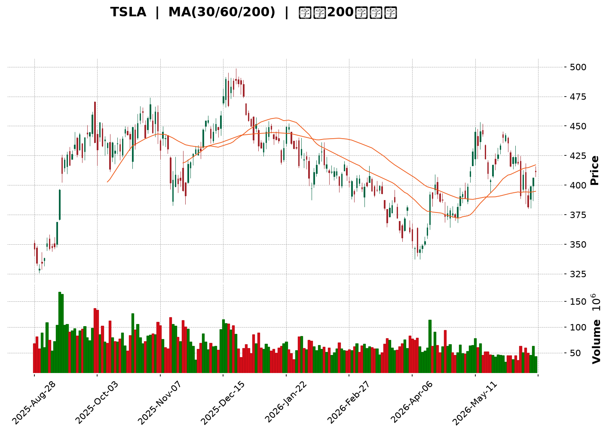
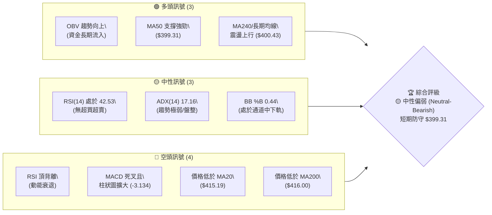
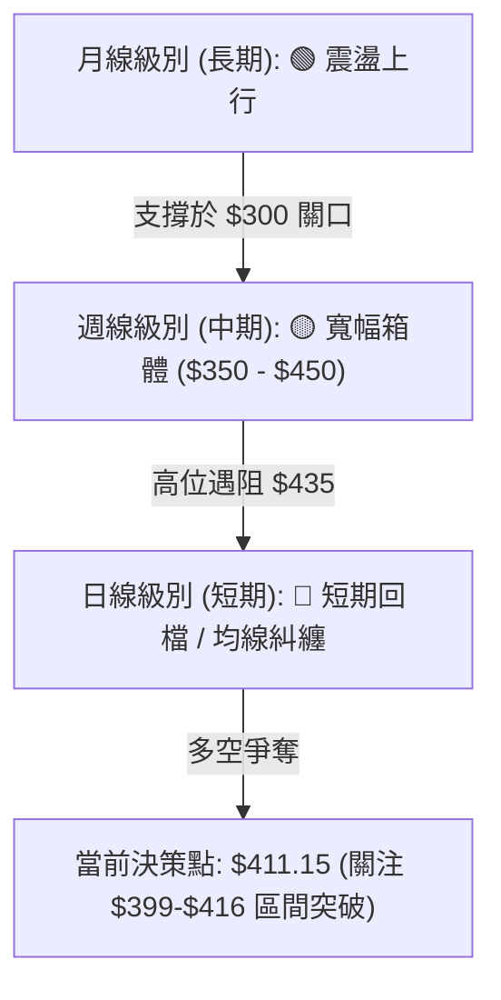
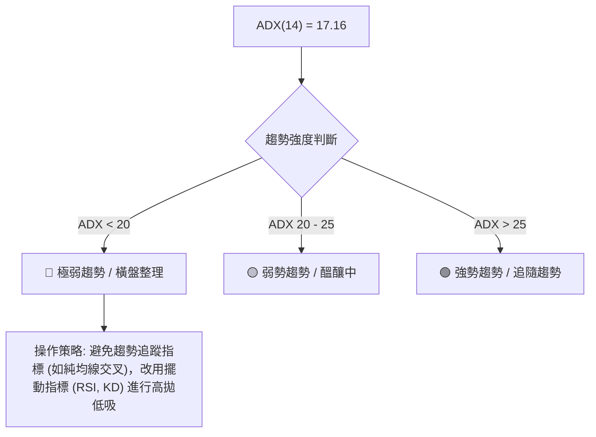
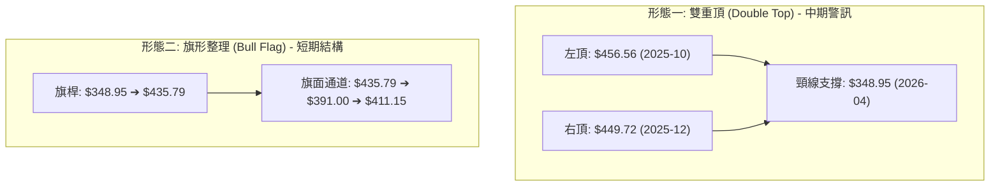
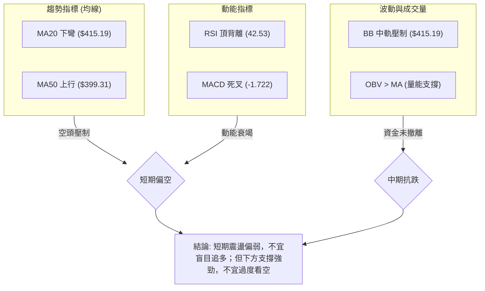

<details>
<summary>📊 靜態圖表 (點擊展開)</summary>

</details>

<html>
<head><meta charset="utf-8" /></head>
<body>
    <div style="height:500px; width:100%;">                        <script>window.PlotlyConfig = {MathJaxConfig: 'local'};</script>
        <script charset="utf-8" src="https://cdn.plot.ly/plotly-3.6.0.min.js" integrity="sha256-QaOVwtVY0T02VaHrr6pnoHLCwayMJp4O5n4YyaE3rJk=" crossorigin="anonymous"></script>                <div id="candlestick-chart" class="plotly-graph-div" style="height:100%; width:100%;"></div>            <script>                window.PLOTLYENV=window.PLOTLYENV || {};                                if (document.getElementById("candlestick-chart")) {                    Plotly.newPlot(                        "candlestick-chart",                        [{"close":{"dtype":"f8","bdata":"AAAAIK6fdUAAAACA6910QAAAAIDClXRAAAAAoHDhdEAAAADgeih1QAAAAKBw7XVAAAAAYGamdUAAAAAgha91QAAAAOCjvHVAAAAAwPUMd0AAAABACr94QAAAAOCjoHlAAAAAgOtZekAAAACAwp16QAAAAKCZDXpAAAAAwB6hekAAAAAgXCN7QAAAAKCZnXpAAAAA4KOse0AAAACAPXZ6QAAAAGBmhntAAAAAIFyze0AAAAAghct7QAAAACBct3xAAAAAAABAe0AAAACgR916QAAAAAAAVHxAAAAAoHARe0AAAABACmt7QAAAAOCjOHtAAAAAANfXeUAAAABgZj57QAAAAADX03pAAAAAYGYye0AAAAAAAMx6QAAAAMD1dHtAAAAAQOH2e0AAAACgmal7QAAAACCFb3tAAAAAIK4PfEAAAAAghRt7QAAAAGC4RnxAAAAAwMzIfEAAAAAAKdh8QAAAAKCZgXtAAAAAwPWIfEAAAACA60V9QAAAAAApxHtAAAAAwB7hfEAAAABgj957QAAAAOBR2HpAAAAAIK7Te0AAAACA63l7QAAAAKCZ6XpAAAAAANcfeUAAAACgmUV5QAAAAGC4jnlAAAAAAAAUeUAAAAAA1z95QAAAACCus3hAAAAAoHBxeEAAAADgehx6QAAAAGBmNnpAAAAAoEepekAAAABguOJ6QAAAAIA94npAAAAAANfTekAAAAAA1+t7QAAAAOB6aHxAAAAAAABwfEAAAACgR3l7QAAAAGC40ntAAAAAQDM3fEAAAACAPe57QAAAACBcr3xAAAAAwPW0fUAAAACAFJ5+QAAAAAApNH1AAAAAgOs1fkAAAABAMxN+QAAAACCui35AAAAAwPVYfkAAAABgZlZ+QAAAAEAKs31AAAAAgD26fEAAAABA4WZ8QAAAACCFG3xAAAAAwB5he0AAAABguDp8QAAAACBcD3tAAAAAYI\u002f2ekAAAADAzDx7QAAAAAAp0HtAAAAAIFwPfEAAAABAM\u002fN7QAAAAEAzc3tAAAAAwB5pe0AAAAAAAFh7QAAAAAAANHpAAAAAQAr3ekAAAACAwhV8QAAAAMD1EHxAAAAAQDMze0AAAABgZu56QAAAACBc93pAAAAAwPUIekAAAABgj+Z6QAAAAMD1XHpAAAAAIFxfekAAAAAAKWB5QAAAACBc03hAAAAAgMKxeUAAAADAHhV6QAAAACBck3pAAAAA4FHEekAAAADAHhF6QAAAAEAKF3pAAAAAgBSqeUAAAADAHrV5QAAAACBcu3lAAAAAwB69eUAAAACgR\u002f14QAAAAIAUlnlAAAAAYGYWekAAAACgR4l5QAAAAAApKHlAAAAAwB41eUAAAABA4YZ4QAAAAEAKX3lAAAAAwMxYeUAAAAAgrst4QAAAAEDh6nhAAAAAANfzeEAAAADAHn15QAAAAAApsHhAAAAAQDNzeEAAAADA9bh4QAAAAOBR9HhAAAAA4HqMeEAAAADAzMR3QAAAACBc\u002f3ZAAAAAoJnNd0AAAADgevB3QAAAAEAzH3hAAAAAgMJBd0AAAACgR512QAAAAOB6NHZAAAAAAAA8d0AAAAAAKdR3QAAAAKBwiXZAAAAAwB4NdkAAAABgZqp1QAAAAAAAdHVAAAAAgOuZdUAAAABAM891QAAAAGC4BnZAAAAAQDPDdkAAAABAM394QAAAAGBmTnhAAAAAgOsJeUAAAAAAAIh4QAAAAGC4JnhAAAAAACk4eEAAAAAghVt3QAAAAMDMhHdAAAAAYLiqd0AAAADgUYB3QAAAAMDMTHdAAAAAgBTad0AAAADAHm14QAAAAAApiHhAAAAAgOtVeEAAAAAgrut4QAAAAOCjvHlAAAAAoJnFekAAAAAAANB7QAAAAEAzF3tAAAAA4FHUe0AAAADAzLR7QAAAAADXY3pAAAAAANefeUAAAACAwkF5QAAAAAApFHpAAAAAoJkdekAAAAAAKaB6QAAAAKBwGXtAAAAAgMKFe0AAAACgmaF7QAAAAOCjPHtAAAAAgBT+eUAAAAAA13t6QAAAAEAze3pAAAAAQDMnekAAAAAAAHB4QAAAAEAzj3lAAAAAQOHKeEAAAACgcNl3QAAAAGBm8nhAAAAAQOFmeUAAAABgZrJ5QA=="},"high":{"dtype":"f8","bdata":"AAAAwMwYdkAAAAAAAMx1QAAAAKBH1XRAAAAAoEd1dUAAAACAPS51QAAAAIDrPXZAAAAAQApndkAAAADgUex1QAAAAKBHRXZAAAAAANcPd0AAAABACst4QAAAAEAzm3pAAAAAAAB0ekAAAADA9cR6QAAAACCFA3tAAAAAIIXXekAAAAAgrs97QAAAACCFj3tAAAAAIFzDe0AAAACgmTV7QAAAACCFh3tAAAAAIK4vfEAAAAAAANB7QAAAAOCj5HxAAAAAAABsfUAAAADgUex7QAAAAMDMWHxAAAAAQOFKfEAAAACgR5V7QAAAAKCZRXtAAAAAgBSye0AAAACAPU57QAAAAEAzI3tAAAAAACmIe0AAAACgmXV7QAAAACBcl3tAAAAAwMwcfEAAAADAzBR8QAAAAOCj2HtAAAAAYGYWfEAAAABA4Tp8QAAAAGCPwnxAAAAAAAAwfUAAAABAMxt9QAAAAMD1cHxAAAAAAACgfEAAAADAHqF9QAAAACCFw3xAAAAAoEclfUAAAABAMzd9QAAAAIDCdXtAAAAAYLgafEAAAAAA16d7QAAAAKBHpXtAAAAAAACIekAAAABACsN5QAAAACBcf3pAAAAAYGaOeUAAAADgerx5QAAAAEAKz3pAAAAAwMwseUAAAAAghVt6QAAAACCuR3pAAAAAQAqvekAAAABA4Q57QAAAAGCPGntAAAAAwMxMe0AAAABguP57QAAAAIAUanxAAAAAgOutfEAAAAAAABx8QAAAAIA9RnxAAAAAgBSOfEAAAADgURR8QAAAAAAp8HxAAAAA4FEcfkAAAAAAALh+QAAAAOB69H5AAAAAgMKtfkAAAAAA16d+QAAAAKBHLX9AAAAAIIW\u002ffkAAAABgZq5+QAAAAKBwkX5AAAAAYGZWfUAAAACA6\u002fF8QAAAAMDMiHxAAAAAoHClfEAAAADAzJh8QAAAAAAABHxAAAAAgOtle0AAAACAPU57QAAAAMDMEHxAAAAAwMxkfEAAAADA9Tx8QAAAAGCPvntAAAAAgMLVe0AAAAAAAPR7QAAAACCu63pAAAAAQDNje0AAAAAAABh8QAAAAEDhRnxAAAAA4KPQe0AAAADgUVh7QAAAAAApZHtAAAAAIK6De0AAAACAFH57QAAAAGBmsnpAAAAAwPXIekAAAABgZn56QAAAAKCZIXlAAAAAwMzoeUAAAAAAAFR6QAAAAAAAtHpAAAAAoJlFe0AAAAAgrkN7QAAAAMD1gHpAAAAAIIXbeUAAAABgZg56QAAAAAAA9HlAAAAAQDPreUAAAABAM3t5QAAAAMAerXlAAAAAoHBFekAAAADA9Qx6QAAAAIDrcXlAAAAA4KNIeUAAAACgcMV4QAAAAKBHhXlAAAAAgOuJeUAAAACgmSV5QAAAAKBwGXlAAAAAoHBpeUAAAACAFAZ6QAAAAAAAaHlAAAAAQDMDeUAAAAAgrjt5QAAAAIDrAXlAAAAAwB4xeUAAAADgUTR4QAAAAIA9vndAAAAAoEcVeEAAAAAgrjd4QAAAACCuw3hAAAAAQAoHeEAAAACAwh13QAAAAOCj9HZAAAAAoEdVd0AAAACAPfJ3QAAAAOB6JHdAAAAAIIX7dkAAAADgUcB1QAAAAAAAyHZAAAAAgBTOdUAAAACAwuV1QAAAAKCZRXZAAAAAgBT6dkAAAABgZqp4QAAAAMD1oHhAAAAA4HqUeUAAAADAzGx5QAAAAEAzn3hAAAAAACmQeEAAAAAAACB4QAAAAAAp7HdAAAAA4HrMd0AAAADgo+R3QAAAAGBmhndAAAAAAAAMeEAAAADAHt14QAAAAIA9qnhAAAAAgOsheUAAAABA4Rp5QAAAAKBH\u002fXlAAAAAQDPzekAAAABgjxJ8QAAAAMDM\u002fHtAAAAAYGZWfEAAAAAgrj98QAAAAGCPKntAAAAAgBRSekAAAACAFFp5QAAAACBcF3pAAAAAQDOvekAAAAAAKfh6QAAAAEAzM3tAAAAAoJnZe0AAAAAgXL97QAAAAMAekXtAAAAAoJnZekAAAABguIZ6QAAAAKCZGXtAAAAAoJmlekAAAABA4Yp6QAAAAEAKz3lAAAAAAAAoekAAAACgcNF4QAAAAOCj+HhAAAAAQOFqeUAAAAAAAAB6QA=="},"hovertemplate":"\u003cb\u003e%{x|%Y-%m-%d}\u003c\u002fb\u003e\u003cbr\u003e\u958b: $%{open:.2f}\u003cbr\u003e\u9ad8: $%{high:.2f}\u003cbr\u003e\u4f4e: $%{low:.2f}\u003cbr\u003e\u6536: $%{close:.2f}\u003cextra\u003e\u003c\u002fextra\u003e","low":{"dtype":"f8","bdata":"AAAAAClEdUAAAABAM7t0QAAAAKCZWXRAAAAAACmIdEAAAAAgrrd0QAAAAEDhinVAAAAAoHCNdUAAAADAHn11QAAAAMAeoXVAAAAAoJm5dUAAAAAA1yN3QAAAAEDhJnlAAAAAQOG2eUAAAABguJp5QAAAAMD1CHpAAAAAIIVbekAAAACAFNJ6QAAAACCFe3pAAAAA4HrQekAAAACgRzF6QAAAAOBRUHpAAAAAAAB4e0AAAACA6xF7QAAAAAAAjHtAAAAAwB45e0AAAACgRwl6QAAAAEAKS3tAAAAAQDMHe0AAAAAgrpN6QAAAAEDhonpAAAAAQDO3eUAAAABAMzt6QAAAAIDCHXpAAAAAoEelekAAAADA9VR6QAAAAKCZeXpAAAAAgMKJe0AAAADAzKB7QAAAAAAA0HpAAAAAYGbeeUAAAABguOJ6QAAAAEAKa3tAAAAAoJk5fEAAAABgZkp8QAAAAIDCeXtAAAAAQAq7e0AAAADAzFx8QAAAAKCZuXtAAAAAIFyLe0AAAACgcDF7QAAAAIAUXnpAAAAAgMIVe0AAAACAwgV7QAAAAMD1qHpAAAAAoHDFeEAAAADgeux3QAAAAADX63hAAAAAIFybeEAAAAAAAOh4QAAAAADXq3hAAAAAACn8d0AAAACgcBF5QAAAAEAzX3lAAAAAgD0OekAAAABAM6N6QAAAAOCjlHpAAAAAgOthekAAAACAwvF6QAAAAIA91ntAAAAAYI86fEAAAAAAADR7QAAAAEAzO3tAAAAAgMK5e0AAAACgR4V7QAAAAGC4mntAAAAAYI86fUAAAACgRx19QAAAAEAzI31AAAAAgOuRfUAAAAAghat9QAAAAKBHVX5AAAAAoHAtfkAAAADAzMx9QAAAAMAenX1AAAAAAACwfEAAAACgR118QAAAAMDMFHxAAAAAwMw0e0AAAADAHsl7QAAAAOB6zHpAAAAA4KP0ekAAAACA64V6QAAAAIA95npAAAAAAABge0AAAABAM797QAAAACCFI3tAAAAAYGZae0AAAAAAKTR7QAAAAEAKF3pAAAAAgOs5ekAAAACAFAp7QAAAAOCjwHtAAAAA4Hoke0AAAABACut6QAAAAKCZ4XpAAAAAgOvpeUAAAABAM2t6QAAAAAAA6HlAAAAAQArbeUAAAABA4fJ4QAAAAOB6OHhAAAAAAADceEAAAADgo3R5QAAAAAAAEHpAAAAA4HpAekAAAAAAAOB5QAAAAIAUrnlAAAAAACkIeUAAAACgR5l5QAAAAIDCQXlAAAAAAABYeUAAAADgo6B4QAAAAIA92nhAAAAAYGbCeUAAAABgjzp5QAAAAIDC4XhAAAAAAABEeEAAAACAPRZ4QAAAAKBHqXhAAAAAYLj2eEAAAAAgXKN4QAAAAGBm1ndAAAAAQArjeEAAAABgZiJ5QAAAAGBmqnhAAAAAQDNfeEAAAABguKZ4QAAAAAAAkHhAAAAAwPWEeEAAAAAgrqt3QAAAACBcx3ZAAAAAIK5Ld0AAAADA9YR3QAAAAAApEHhAAAAAgOs9d0AAAAAghXd2QAAAAIA9AnZAAAAAAACQdkAAAACgR2F3QAAAAOB6cHZAAAAAgD2qdUAAAAAA1xN1QAAAAGC4OnVAAAAAAAAUdUAAAAAA12t1QAAAAMAeyXVAAAAA4FEsdkAAAAAAAKh2QAAAAMDM3HdAAAAAYGZ6eEAAAACgR0V4QAAAACCFE3hAAAAAwMwUeEAAAACAPQZ3QAAAACCuK3dAAAAA4FHAdkAAAADgo0h3QAAAAOCjIHdAAAAAYLgCd0AAAADAzKx3QAAAAMDMDHhAAAAAAABQeEAAAADgUQB4QAAAAIDrIXlAAAAAgD0GekAAAADAzAx6QAAAAAApZHpAAAAAIFzjekAAAABgj5J7QAAAAAAAYHpAAAAAoEdVeUAAAACAFJp4QAAAAIA9ZnlAAAAAYGbOeUAAAAAAKUh6QAAAAIDroXpAAAAA4FE4e0AAAADAzER7QAAAAIA9wnpAAAAAQOH2eUAAAABgZtp5QAAAAAAAAHpAAAAAYI8SekAAAACgcEl4QAAAACCFq3hAAAAAANcDeEAAAABgZsJ3QAAAAGCPyndAAAAAACkseEAAAACgmXF5QA=="},"name":"\u50f9\u683c","open":{"dtype":"f8","bdata":"AAAAYI\u002fudUAAAAAgrrN1QAAAACCug3RAAAAAQDPzdEAAAABgZgJ1QAAAAAAAwHVAAAAAgD0qdkAAAABACsd1QAAAAMDM6HVAAAAAYLjidUAAAABACi93QAAAAIAUcnpAAAAAAADoeUAAAAAAAPx5QAAAAIDrzXpAAAAAwB5dekAAAACAwvF6QAAAAIAUfntAAAAAoEfdekAAAAAA1zN7QAAAAMDMxHpAAAAAoJnFe0AAAADgUZh7QAAAAMDMvHtAAAAA4KNofUAAAADgo7R7QAAAAAAAjHtAAAAAwB79e0AAAADAHll7QAAAAMD1\u002fHpAAAAA4KNIe0AAAADgenh6QAAAAOCjrHpAAAAAYGYue0AAAAAgrit7QAAAAAAAmHpAAAAAgOu9e0AAAAAAKdx7QAAAAEAzt3tAAAAAAABAekAAAACgR+17QAAAACCuf3tAAAAA4HpsfEAAAAAAAOh8QAAAAMDMMHxAAAAAAADse0AAAAAA1398QAAAACBcZ3xAAAAAwMxAfEAAAAAgXN98QAAAAGC4XntAAAAAoJl5e0AAAABgZnZ7QAAAAGBmontAAAAAgBRyekAAAADAzCR4QAAAAADX63hAAAAAgBRWeUAAAABA4WJ5QAAAAIAU6nlAAAAAwB4leUAAAABguCJ5QAAAAGC45nlAAAAAQDN\u002fekAAAACgcKl6QAAAAMAelXpAAAAAwPXsekAAAACgmQF7QAAAAEAKH3xAAAAA4HpQfEAAAABAM\u002fd7QAAAAOCjWHtAAAAAwB7he0AAAABAMw98QAAAAKBwAXxAAAAAQApXfUAAAAAgXIN9QAAAACCFg35AAAAAYI\u002fifUAAAACA64F+QAAAAIAUnn5AAAAAYGaWfkAAAAAgrod+QAAAACCuU35AAAAAAABQfUAAAACgcNF8QAAAAKCZgXxAAAAAwMycfEAAAAAA1\u002f97QAAAAIAU5ntAAAAAYGY+e0AAAACAPb56QAAAAEAzP3tAAAAAIK6Te0AAAABAMyN8QAAAAMD1rHtAAAAAgBSSe0AAAAAAAHh7QAAAAIDC1XpAAAAAYI9aekAAAABgjzJ7QAAAAEDh9ntAAAAAAADQe0AAAABgj1Z7QAAAAGCP\u002fnpAAAAAwMxce0AAAACgmZV6QAAAAOCjVHpAAAAA4FGEekAAAAAgXEd6QAAAAOBR0HhAAAAAgOsNeUAAAABgj555QAAAAKBHIXpAAAAAIFy\u002fekAAAADAzOR6QAAAAMD15HlAAAAAgMLFeUAAAACAwrF5QAAAAAAAdHlAAAAAwMyEeUAAAADgo3R5QAAAAAAA+HhAAAAAYGbCeUAAAABguOZ5QAAAAEAKL3lAAAAAoJlpeEAAAACgcLF4QAAAAKCZ3XhAAAAAwB4ZeUAAAACgcOF4QAAAAMDMYHhAAAAAIIUjeUAAAADgeiR5QAAAAEDhUnlAAAAAYLjyeEAAAAAghcN4QAAAAEAKu3hAAAAAAADweEAAAADgUTR4QAAAAKCZvXdAAAAAoHBRd0AAAADA9Yh3QAAAAADXX3hAAAAAoJnZd0AAAABACht3QAAAAIDC3XZAAAAAACmYdkAAAACAFKp3QAAAAEAzw3ZAAAAAoHCpdkAAAABACqd1QAAAAOCjvHZAAAAAYGZydUAAAADgo6R1QAAAAMAe4XVAAAAAYLhadkAAAACgR+12QAAAAMD1nHhAAAAAYLi+eEAAAACgRyl5QAAAAAAAkHhAAAAAwB45eEAAAADgenR3QAAAAAAAWHdAAAAAoHBBd0AAAABA4Wp3QAAAAGBmdndAAAAAAABMd0AAAAAA1+d3QAAAACCuY3hAAAAAQAqzeEAAAAAAACR4QAAAACCud3lAAAAAIK4HekAAAABgj2J6QAAAAGCPlntAAAAAYLhKe0AAAAAA1+d7QAAAACCuH3tAAAAA4FE0ekAAAABgjzJ5QAAAAKCZeXlAAAAAQOFiekAAAABguGp6QAAAAAAp5HpAAAAAgD2ue0AAAACA61l7QAAAAKCZfXtAAAAAANe3ekAAAAAghSN6QAAAAEAzK3pAAAAAoHA9ekAAAAAAAEh6QAAAAKBHxXhAAAAA4HqweUAAAADgo3h4QAAAAOB6RHhAAAAAANf3eEAAAACgR8F5QA=="},"x":["2025-08-28T00:00:00-04:00","2025-08-29T00:00:00-04:00","2025-09-02T00:00:00-04:00","2025-09-03T00:00:00-04:00","2025-09-04T00:00:00-04:00","2025-09-05T00:00:00-04:00","2025-09-08T00:00:00-04:00","2025-09-09T00:00:00-04:00","2025-09-10T00:00:00-04:00","2025-09-11T00:00:00-04:00","2025-09-12T00:00:00-04:00","2025-09-15T00:00:00-04:00","2025-09-16T00:00:00-04:00","2025-09-17T00:00:00-04:00","2025-09-18T00:00:00-04:00","2025-09-19T00:00:00-04:00","2025-09-22T00:00:00-04:00","2025-09-23T00:00:00-04:00","2025-09-24T00:00:00-04:00","2025-09-25T00:00:00-04:00","2025-09-26T00:00:00-04:00","2025-09-29T00:00:00-04:00","2025-09-30T00:00:00-04:00","2025-10-01T00:00:00-04:00","2025-10-02T00:00:00-04:00","2025-10-03T00:00:00-04:00","2025-10-06T00:00:00-04:00","2025-10-07T00:00:00-04:00","2025-10-08T00:00:00-04:00","2025-10-09T00:00:00-04:00","2025-10-10T00:00:00-04:00","2025-10-13T00:00:00-04:00","2025-10-14T00:00:00-04:00","2025-10-15T00:00:00-04:00","2025-10-16T00:00:00-04:00","2025-10-17T00:00:00-04:00","2025-10-20T00:00:00-04:00","2025-10-21T00:00:00-04:00","2025-10-22T00:00:00-04:00","2025-10-23T00:00:00-04:00","2025-10-24T00:00:00-04:00","2025-10-27T00:00:00-04:00","2025-10-28T00:00:00-04:00","2025-10-29T00:00:00-04:00","2025-10-30T00:00:00-04:00","2025-10-31T00:00:00-04:00","2025-11-03T00:00:00-05:00","2025-11-04T00:00:00-05:00","2025-11-05T00:00:00-05:00","2025-11-06T00:00:00-05:00","2025-11-07T00:00:00-05:00","2025-11-10T00:00:00-05:00","2025-11-11T00:00:00-05:00","2025-11-12T00:00:00-05:00","2025-11-13T00:00:00-05:00","2025-11-14T00:00:00-05:00","2025-11-17T00:00:00-05:00","2025-11-18T00:00:00-05:00","2025-11-19T00:00:00-05:00","2025-11-20T00:00:00-05:00","2025-11-21T00:00:00-05:00","2025-11-24T00:00:00-05:00","2025-11-25T00:00:00-05:00","2025-11-26T00:00:00-05:00","2025-11-28T00:00:00-05:00","2025-12-01T00:00:00-05:00","2025-12-02T00:00:00-05:00","2025-12-03T00:00:00-05:00","2025-12-04T00:00:00-05:00","2025-12-05T00:00:00-05:00","2025-12-08T00:00:00-05:00","2025-12-09T00:00:00-05:00","2025-12-10T00:00:00-05:00","2025-12-11T00:00:00-05:00","2025-12-12T00:00:00-05:00","2025-12-15T00:00:00-05:00","2025-12-16T00:00:00-05:00","2025-12-17T00:00:00-05:00","2025-12-18T00:00:00-05:00","2025-12-19T00:00:00-05:00","2025-12-22T00:00:00-05:00","2025-12-23T00:00:00-05:00","2025-12-24T00:00:00-05:00","2025-12-26T00:00:00-05:00","2025-12-29T00:00:00-05:00","2025-12-30T00:00:00-05:00","2025-12-31T00:00:00-05:00","2026-01-02T00:00:00-05:00","2026-01-05T00:00:00-05:00","2026-01-06T00:00:00-05:00","2026-01-07T00:00:00-05:00","2026-01-08T00:00:00-05:00","2026-01-09T00:00:00-05:00","2026-01-12T00:00:00-05:00","2026-01-13T00:00:00-05:00","2026-01-14T00:00:00-05:00","2026-01-15T00:00:00-05:00","2026-01-16T00:00:00-05:00","2026-01-20T00:00:00-05:00","2026-01-21T00:00:00-05:00","2026-01-22T00:00:00-05:00","2026-01-23T00:00:00-05:00","2026-01-26T00:00:00-05:00","2026-01-27T00:00:00-05:00","2026-01-28T00:00:00-05:00","2026-01-29T00:00:00-05:00","2026-01-30T00:00:00-05:00","2026-02-02T00:00:00-05:00","2026-02-03T00:00:00-05:00","2026-02-04T00:00:00-05:00","2026-02-05T00:00:00-05:00","2026-02-06T00:00:00-05:00","2026-02-09T00:00:00-05:00","2026-02-10T00:00:00-05:00","2026-02-11T00:00:00-05:00","2026-02-12T00:00:00-05:00","2026-02-13T00:00:00-05:00","2026-02-17T00:00:00-05:00","2026-02-18T00:00:00-05:00","2026-02-19T00:00:00-05:00","2026-02-20T00:00:00-05:00","2026-02-23T00:00:00-05:00","2026-02-24T00:00:00-05:00","2026-02-25T00:00:00-05:00","2026-02-26T00:00:00-05:00","2026-02-27T00:00:00-05:00","2026-03-02T00:00:00-05:00","2026-03-03T00:00:00-05:00","2026-03-04T00:00:00-05:00","2026-03-05T00:00:00-05:00","2026-03-06T00:00:00-05:00","2026-03-09T00:00:00-04:00","2026-03-10T00:00:00-04:00","2026-03-11T00:00:00-04:00","2026-03-12T00:00:00-04:00","2026-03-13T00:00:00-04:00","2026-03-16T00:00:00-04:00","2026-03-17T00:00:00-04:00","2026-03-18T00:00:00-04:00","2026-03-19T00:00:00-04:00","2026-03-20T00:00:00-04:00","2026-03-23T00:00:00-04:00","2026-03-24T00:00:00-04:00","2026-03-25T00:00:00-04:00","2026-03-26T00:00:00-04:00","2026-03-27T00:00:00-04:00","2026-03-30T00:00:00-04:00","2026-03-31T00:00:00-04:00","2026-04-01T00:00:00-04:00","2026-04-02T00:00:00-04:00","2026-04-06T00:00:00-04:00","2026-04-07T00:00:00-04:00","2026-04-08T00:00:00-04:00","2026-04-09T00:00:00-04:00","2026-04-10T00:00:00-04:00","2026-04-13T00:00:00-04:00","2026-04-14T00:00:00-04:00","2026-04-15T00:00:00-04:00","2026-04-16T00:00:00-04:00","2026-04-17T00:00:00-04:00","2026-04-20T00:00:00-04:00","2026-04-21T00:00:00-04:00","2026-04-22T00:00:00-04:00","2026-04-23T00:00:00-04:00","2026-04-24T00:00:00-04:00","2026-04-27T00:00:00-04:00","2026-04-28T00:00:00-04:00","2026-04-29T00:00:00-04:00","2026-04-30T00:00:00-04:00","2026-05-01T00:00:00-04:00","2026-05-04T00:00:00-04:00","2026-05-05T00:00:00-04:00","2026-05-06T00:00:00-04:00","2026-05-07T00:00:00-04:00","2026-05-08T00:00:00-04:00","2026-05-11T00:00:00-04:00","2026-05-12T00:00:00-04:00","2026-05-13T00:00:00-04:00","2026-05-14T00:00:00-04:00","2026-05-15T00:00:00-04:00","2026-05-18T00:00:00-04:00","2026-05-19T00:00:00-04:00","2026-05-20T00:00:00-04:00","2026-05-21T00:00:00-04:00","2026-05-22T00:00:00-04:00","2026-05-26T00:00:00-04:00","2026-05-27T00:00:00-04:00","2026-05-28T00:00:00-04:00","2026-05-29T00:00:00-04:00","2026-06-01T00:00:00-04:00","2026-06-02T00:00:00-04:00","2026-06-03T00:00:00-04:00","2026-06-04T00:00:00-04:00","2026-06-05T00:00:00-04:00","2026-06-08T00:00:00-04:00","2026-06-09T00:00:00-04:00","2026-06-10T00:00:00-04:00","2026-06-11T00:00:00-04:00","2026-06-12T00:00:00-04:00","2026-06-15T00:00:00-04:00"],"type":"candlestick"},{"hovertemplate":"MA30: $%{y:.2f}\u003cextra\u003e\u003c\u002fextra\u003e","line":{"color":"#2196F3","dash":"dash","width":2},"mode":"lines","name":"MA30","x":["2025-08-28T00:00:00-04:00","2025-08-29T00:00:00-04:00","2025-09-02T00:00:00-04:00","2025-09-03T00:00:00-04:00","2025-09-04T00:00:00-04:00","2025-09-05T00:00:00-04:00","2025-09-08T00:00:00-04:00","2025-09-09T00:00:00-04:00","2025-09-10T00:00:00-04:00","2025-09-11T00:00:00-04:00","2025-09-12T00:00:00-04:00","2025-09-15T00:00:00-04:00","2025-09-16T00:00:00-04:00","2025-09-17T00:00:00-04:00","2025-09-18T00:00:00-04:00","2025-09-19T00:00:00-04:00","2025-09-22T00:00:00-04:00","2025-09-23T00:00:00-04:00","2025-09-24T00:00:00-04:00","2025-09-25T00:00:00-04:00","2025-09-26T00:00:00-04:00","2025-09-29T00:00:00-04:00","2025-09-30T00:00:00-04:00","2025-10-01T00:00:00-04:00","2025-10-02T00:00:00-04:00","2025-10-03T00:00:00-04:00","2025-10-06T00:00:00-04:00","2025-10-07T00:00:00-04:00","2025-10-08T00:00:00-04:00","2025-10-09T00:00:00-04:00","2025-10-10T00:00:00-04:00","2025-10-13T00:00:00-04:00","2025-10-14T00:00:00-04:00","2025-10-15T00:00:00-04:00","2025-10-16T00:00:00-04:00","2025-10-17T00:00:00-04:00","2025-10-20T00:00:00-04:00","2025-10-21T00:00:00-04:00","2025-10-22T00:00:00-04:00","2025-10-23T00:00:00-04:00","2025-10-24T00:00:00-04:00","2025-10-27T00:00:00-04:00","2025-10-28T00:00:00-04:00","2025-10-29T00:00:00-04:00","2025-10-30T00:00:00-04:00","2025-10-31T00:00:00-04:00","2025-11-03T00:00:00-05:00","2025-11-04T00:00:00-05:00","2025-11-05T00:00:00-05:00","2025-11-06T00:00:00-05:00","2025-11-07T00:00:00-05:00","2025-11-10T00:00:00-05:00","2025-11-11T00:00:00-05:00","2025-11-12T00:00:00-05:00","2025-11-13T00:00:00-05:00","2025-11-14T00:00:00-05:00","2025-11-17T00:00:00-05:00","2025-11-18T00:00:00-05:00","2025-11-19T00:00:00-05:00","2025-11-20T00:00:00-05:00","2025-11-21T00:00:00-05:00","2025-11-24T00:00:00-05:00","2025-11-25T00:00:00-05:00","2025-11-26T00:00:00-05:00","2025-11-28T00:00:00-05:00","2025-12-01T00:00:00-05:00","2025-12-02T00:00:00-05:00","2025-12-03T00:00:00-05:00","2025-12-04T00:00:00-05:00","2025-12-05T00:00:00-05:00","2025-12-08T00:00:00-05:00","2025-12-09T00:00:00-05:00","2025-12-10T00:00:00-05:00","2025-12-11T00:00:00-05:00","2025-12-12T00:00:00-05:00","2025-12-15T00:00:00-05:00","2025-12-16T00:00:00-05:00","2025-12-17T00:00:00-05:00","2025-12-18T00:00:00-05:00","2025-12-19T00:00:00-05:00","2025-12-22T00:00:00-05:00","2025-12-23T00:00:00-05:00","2025-12-24T00:00:00-05:00","2025-12-26T00:00:00-05:00","2025-12-29T00:00:00-05:00","2025-12-30T00:00:00-05:00","2025-12-31T00:00:00-05:00","2026-01-02T00:00:00-05:00","2026-01-05T00:00:00-05:00","2026-01-06T00:00:00-05:00","2026-01-07T00:00:00-05:00","2026-01-08T00:00:00-05:00","2026-01-09T00:00:00-05:00","2026-01-12T00:00:00-05:00","2026-01-13T00:00:00-05:00","2026-01-14T00:00:00-05:00","2026-01-15T00:00:00-05:00","2026-01-16T00:00:00-05:00","2026-01-20T00:00:00-05:00","2026-01-21T00:00:00-05:00","2026-01-22T00:00:00-05:00","2026-01-23T00:00:00-05:00","2026-01-26T00:00:00-05:00","2026-01-27T00:00:00-05:00","2026-01-28T00:00:00-05:00","2026-01-29T00:00:00-05:00","2026-01-30T00:00:00-05:00","2026-02-02T00:00:00-05:00","2026-02-03T00:00:00-05:00","2026-02-04T00:00:00-05:00","2026-02-05T00:00:00-05:00","2026-02-06T00:00:00-05:00","2026-02-09T00:00:00-05:00","2026-02-10T00:00:00-05:00","2026-02-11T00:00:00-05:00","2026-02-12T00:00:00-05:00","2026-02-13T00:00:00-05:00","2026-02-17T00:00:00-05:00","2026-02-18T00:00:00-05:00","2026-02-19T00:00:00-05:00","2026-02-20T00:00:00-05:00","2026-02-23T00:00:00-05:00","2026-02-24T00:00:00-05:00","2026-02-25T00:00:00-05:00","2026-02-26T00:00:00-05:00","2026-02-27T00:00:00-05:00","2026-03-02T00:00:00-05:00","2026-03-03T00:00:00-05:00","2026-03-04T00:00:00-05:00","2026-03-05T00:00:00-05:00","2026-03-06T00:00:00-05:00","2026-03-09T00:00:00-04:00","2026-03-10T00:00:00-04:00","2026-03-11T00:00:00-04:00","2026-03-12T00:00:00-04:00","2026-03-13T00:00:00-04:00","2026-03-16T00:00:00-04:00","2026-03-17T00:00:00-04:00","2026-03-18T00:00:00-04:00","2026-03-19T00:00:00-04:00","2026-03-20T00:00:00-04:00","2026-03-23T00:00:00-04:00","2026-03-24T00:00:00-04:00","2026-03-25T00:00:00-04:00","2026-03-26T00:00:00-04:00","2026-03-27T00:00:00-04:00","2026-03-30T00:00:00-04:00","2026-03-31T00:00:00-04:00","2026-04-01T00:00:00-04:00","2026-04-02T00:00:00-04:00","2026-04-06T00:00:00-04:00","2026-04-07T00:00:00-04:00","2026-04-08T00:00:00-04:00","2026-04-09T00:00:00-04:00","2026-04-10T00:00:00-04:00","2026-04-13T00:00:00-04:00","2026-04-14T00:00:00-04:00","2026-04-15T00:00:00-04:00","2026-04-16T00:00:00-04:00","2026-04-17T00:00:00-04:00","2026-04-20T00:00:00-04:00","2026-04-21T00:00:00-04:00","2026-04-22T00:00:00-04:00","2026-04-23T00:00:00-04:00","2026-04-24T00:00:00-04:00","2026-04-27T00:00:00-04:00","2026-04-28T00:00:00-04:00","2026-04-29T00:00:00-04:00","2026-04-30T00:00:00-04:00","2026-05-01T00:00:00-04:00","2026-05-04T00:00:00-04:00","2026-05-05T00:00:00-04:00","2026-05-06T00:00:00-04:00","2026-05-07T00:00:00-04:00","2026-05-08T00:00:00-04:00","2026-05-11T00:00:00-04:00","2026-05-12T00:00:00-04:00","2026-05-13T00:00:00-04:00","2026-05-14T00:00:00-04:00","2026-05-15T00:00:00-04:00","2026-05-18T00:00:00-04:00","2026-05-19T00:00:00-04:00","2026-05-20T00:00:00-04:00","2026-05-21T00:00:00-04:00","2026-05-22T00:00:00-04:00","2026-05-26T00:00:00-04:00","2026-05-27T00:00:00-04:00","2026-05-28T00:00:00-04:00","2026-05-29T00:00:00-04:00","2026-06-01T00:00:00-04:00","2026-06-02T00:00:00-04:00","2026-06-03T00:00:00-04:00","2026-06-04T00:00:00-04:00","2026-06-05T00:00:00-04:00","2026-06-08T00:00:00-04:00","2026-06-09T00:00:00-04:00","2026-06-10T00:00:00-04:00","2026-06-11T00:00:00-04:00","2026-06-12T00:00:00-04:00","2026-06-15T00:00:00-04:00"],"y":{"dtype":"f8","bdata":"AAAAAAAA+H8AAAAAAAD4fwAAAAAAAPh\u002fAAAAAAAA+H8AAAAAAAD4fwAAAAAAAPh\u002fAAAAAAAA+H8AAAAAAAD4fwAAAAAAAPh\u002fAAAAAAAA+H8AAAAAAAD4fwAAAAAAAPh\u002fAAAAAAAA+H8AAAAAAAD4fwAAAAAAAPh\u002fAAAAAAAA+H8AAAAAAAD4fwAAAAAAAPh\u002fAAAAAAAA+H8AAAAAAAD4fwAAAAAAAPh\u002fAAAAAAAA+H8AAAAAAAD4fwAAAAAAAPh\u002fAAAAAAAA+H8AAAAAAAD4fwAAAAAAAPh\u002fAAAAAAAA+H8AAAAAAAD4fyIiIpJfKnlA7+7u7mBOeUDe3d1ty4R5QBEREWEQunlAAAAAcPbveUCamZl5FCB6QERERJRDT3pAq6qqiiWFekCamZk5Jrh6QFVVVVXH6HpAZmZmNokTe0ARERFxryd7QJqZmblJPntAd3d39wxTe0AiIiJiEGZ7QImIiMh2cntA7+7urrmCe0CamZmp8ZR7QN7d3T3DnntAq6qqmgupe0BVVVVVDrV7QJqZmdlAr3tAZmZmplSwe0BERERUnK17QKuqqvo3nntAq6qqehSMe0DNzMycfX57QHd3dxfZZntA7+7u3t1Ve0CamZkpXEN7QBEREYHcLXtAiYiIKOohe0DNzMwsQBh7QAAAALAAE3tAiYiImG4Oe0CamZl5MA97QHd3d3dMCntAzczM7JgAe0C8u7srzgJ7QBEREaEaC3tA7+7ujlAOe0BERESkcBF7QGZmZsaSDXtAMzMzU7gIe0BVVVU17AB7QJqZmTn7CntAmpmZOfsUe0Dv7u4OdCB7QDMzM1O4LHtAvLu7exQ4e0Dv7u6+5kp7QDMzM+N6antAZmZmRv1\u002fe0BVVVXFZ5h7QKuqqsovsHtAERER8e7Oe0B3d3eHpOl7QGZmZhZn\u002f3tA7+7uPgoTfECJiIgoeCx8QO\u002fu7o6XQHxAVVVVlRhWfECamZnptF98QImIiIhdbXxAZmZmJk15fEAAAABQYoJ8QN7d3U03h3xAmpmZKTGMfECJiIiYQ4d8QDMzM7NydHxAmpmZ+eFnfEBVVVVFGW18QCIiImIsb3xAd3d3t4FmfEC8u7uL+l18QBEREeFPT3xAvLu7i\u002fovfECJiIjoQhB8QHd3d3cF+HtARERE9ETXe0AzMzMDK697QKuqqnpbfntAIiIikqZWe0AiIiJiVzJ7QCIiInKvF3tAREREZPQGe0AiIiKCB\u002fN6QGZmZjbQ4XpAzczMvC3TekDe3d2dqL16QImIiEhTsnpAiYiImOCnekDe3d19sZR6QO\u002fu7s6wgXpAERER0dtwekBVVVXlQlx6QM3MzHyxSHpAAAAAsOQ1ekAREREh2x16QO\u002fu7t7BFnpAVVVVBfMIekBmZmZG4ex5QJqZmbkC0nlAvLu7+9S+eUC8u7vLhbJ5QImIiCgVn3lAzczMrI6ReUDNzMx8+H55QGZmZgbzcnlAvLu7+2JjeUBVVVW1rFV5QLy7uxsTRnlAzczMnO81eUAiIiLipSN5QGZmZpa1DnlAAAAA4MHweEBVVVXFS9N4QLy7u9sksnhAERERcWideEAAAABAYI14QKuqqqoccnhAMzMzM6VSeEC8u7tbSDZ4QImIiGgDE3hAvLu7C7vsd0ARERGR7cx3QM3MzJw2sndA3t3dbVmdd0BVVVXlF513QN7d3V0BlHdAIiIiQmCRd0CJiIi4Ho93QDMzM9OUiHdAq6qqSlOCd0ARERGBI3B3QGZmZvYoZndAMzMzM3pfd0BmZmZWDlV3QM3MzEzwRndARERE9P1Ad0CamZlJmkZ3QO\u002fu7i6yU3dAIiIicj1Yd0BVVVUFnWB3QKuqqgplbndA3t3drWOMd0CJiIgov7h3QImIiPhv4ndAZmZm5qUJeEDNzMxsvCp4QERERLSdS3hAAAAAUBtqeEBERESEwIh4QJqZmVk5sHhAd3d3J7\u002fWeECamZlp2P94QCIiItIiK3lAIiIiMsFTeUB3d3dXgG55QERERGSCh3lARERE5KWPeUARERExT6B5QHd3dycxtHlA7+7ufrHEeUCrqqrK6M15QLy7u5tS33lAIiIiku3oeUAAAAAQ5ut5QHd3d7fz+XlA3t3dvS0HekBmZmZ2BRJ6QA=="},"type":"scatter"},{"hovertemplate":"MA60: $%{y:.2f}\u003cextra\u003e\u003c\u002fextra\u003e","line":{"color":"#9C27B0","dash":"dash","width":2},"mode":"lines","name":"MA60","x":["2025-08-28T00:00:00-04:00","2025-08-29T00:00:00-04:00","2025-09-02T00:00:00-04:00","2025-09-03T00:00:00-04:00","2025-09-04T00:00:00-04:00","2025-09-05T00:00:00-04:00","2025-09-08T00:00:00-04:00","2025-09-09T00:00:00-04:00","2025-09-10T00:00:00-04:00","2025-09-11T00:00:00-04:00","2025-09-12T00:00:00-04:00","2025-09-15T00:00:00-04:00","2025-09-16T00:00:00-04:00","2025-09-17T00:00:00-04:00","2025-09-18T00:00:00-04:00","2025-09-19T00:00:00-04:00","2025-09-22T00:00:00-04:00","2025-09-23T00:00:00-04:00","2025-09-24T00:00:00-04:00","2025-09-25T00:00:00-04:00","2025-09-26T00:00:00-04:00","2025-09-29T00:00:00-04:00","2025-09-30T00:00:00-04:00","2025-10-01T00:00:00-04:00","2025-10-02T00:00:00-04:00","2025-10-03T00:00:00-04:00","2025-10-06T00:00:00-04:00","2025-10-07T00:00:00-04:00","2025-10-08T00:00:00-04:00","2025-10-09T00:00:00-04:00","2025-10-10T00:00:00-04:00","2025-10-13T00:00:00-04:00","2025-10-14T00:00:00-04:00","2025-10-15T00:00:00-04:00","2025-10-16T00:00:00-04:00","2025-10-17T00:00:00-04:00","2025-10-20T00:00:00-04:00","2025-10-21T00:00:00-04:00","2025-10-22T00:00:00-04:00","2025-10-23T00:00:00-04:00","2025-10-24T00:00:00-04:00","2025-10-27T00:00:00-04:00","2025-10-28T00:00:00-04:00","2025-10-29T00:00:00-04:00","2025-10-30T00:00:00-04:00","2025-10-31T00:00:00-04:00","2025-11-03T00:00:00-05:00","2025-11-04T00:00:00-05:00","2025-11-05T00:00:00-05:00","2025-11-06T00:00:00-05:00","2025-11-07T00:00:00-05:00","2025-11-10T00:00:00-05:00","2025-11-11T00:00:00-05:00","2025-11-12T00:00:00-05:00","2025-11-13T00:00:00-05:00","2025-11-14T00:00:00-05:00","2025-11-17T00:00:00-05:00","2025-11-18T00:00:00-05:00","2025-11-19T00:00:00-05:00","2025-11-20T00:00:00-05:00","2025-11-21T00:00:00-05:00","2025-11-24T00:00:00-05:00","2025-11-25T00:00:00-05:00","2025-11-26T00:00:00-05:00","2025-11-28T00:00:00-05:00","2025-12-01T00:00:00-05:00","2025-12-02T00:00:00-05:00","2025-12-03T00:00:00-05:00","2025-12-04T00:00:00-05:00","2025-12-05T00:00:00-05:00","2025-12-08T00:00:00-05:00","2025-12-09T00:00:00-05:00","2025-12-10T00:00:00-05:00","2025-12-11T00:00:00-05:00","2025-12-12T00:00:00-05:00","2025-12-15T00:00:00-05:00","2025-12-16T00:00:00-05:00","2025-12-17T00:00:00-05:00","2025-12-18T00:00:00-05:00","2025-12-19T00:00:00-05:00","2025-12-22T00:00:00-05:00","2025-12-23T00:00:00-05:00","2025-12-24T00:00:00-05:00","2025-12-26T00:00:00-05:00","2025-12-29T00:00:00-05:00","2025-12-30T00:00:00-05:00","2025-12-31T00:00:00-05:00","2026-01-02T00:00:00-05:00","2026-01-05T00:00:00-05:00","2026-01-06T00:00:00-05:00","2026-01-07T00:00:00-05:00","2026-01-08T00:00:00-05:00","2026-01-09T00:00:00-05:00","2026-01-12T00:00:00-05:00","2026-01-13T00:00:00-05:00","2026-01-14T00:00:00-05:00","2026-01-15T00:00:00-05:00","2026-01-16T00:00:00-05:00","2026-01-20T00:00:00-05:00","2026-01-21T00:00:00-05:00","2026-01-22T00:00:00-05:00","2026-01-23T00:00:00-05:00","2026-01-26T00:00:00-05:00","2026-01-27T00:00:00-05:00","2026-01-28T00:00:00-05:00","2026-01-29T00:00:00-05:00","2026-01-30T00:00:00-05:00","2026-02-02T00:00:00-05:00","2026-02-03T00:00:00-05:00","2026-02-04T00:00:00-05:00","2026-02-05T00:00:00-05:00","2026-02-06T00:00:00-05:00","2026-02-09T00:00:00-05:00","2026-02-10T00:00:00-05:00","2026-02-11T00:00:00-05:00","2026-02-12T00:00:00-05:00","2026-02-13T00:00:00-05:00","2026-02-17T00:00:00-05:00","2026-02-18T00:00:00-05:00","2026-02-19T00:00:00-05:00","2026-02-20T00:00:00-05:00","2026-02-23T00:00:00-05:00","2026-02-24T00:00:00-05:00","2026-02-25T00:00:00-05:00","2026-02-26T00:00:00-05:00","2026-02-27T00:00:00-05:00","2026-03-02T00:00:00-05:00","2026-03-03T00:00:00-05:00","2026-03-04T00:00:00-05:00","2026-03-05T00:00:00-05:00","2026-03-06T00:00:00-05:00","2026-03-09T00:00:00-04:00","2026-03-10T00:00:00-04:00","2026-03-11T00:00:00-04:00","2026-03-12T00:00:00-04:00","2026-03-13T00:00:00-04:00","2026-03-16T00:00:00-04:00","2026-03-17T00:00:00-04:00","2026-03-18T00:00:00-04:00","2026-03-19T00:00:00-04:00","2026-03-20T00:00:00-04:00","2026-03-23T00:00:00-04:00","2026-03-24T00:00:00-04:00","2026-03-25T00:00:00-04:00","2026-03-26T00:00:00-04:00","2026-03-27T00:00:00-04:00","2026-03-30T00:00:00-04:00","2026-03-31T00:00:00-04:00","2026-04-01T00:00:00-04:00","2026-04-02T00:00:00-04:00","2026-04-06T00:00:00-04:00","2026-04-07T00:00:00-04:00","2026-04-08T00:00:00-04:00","2026-04-09T00:00:00-04:00","2026-04-10T00:00:00-04:00","2026-04-13T00:00:00-04:00","2026-04-14T00:00:00-04:00","2026-04-15T00:00:00-04:00","2026-04-16T00:00:00-04:00","2026-04-17T00:00:00-04:00","2026-04-20T00:00:00-04:00","2026-04-21T00:00:00-04:00","2026-04-22T00:00:00-04:00","2026-04-23T00:00:00-04:00","2026-04-24T00:00:00-04:00","2026-04-27T00:00:00-04:00","2026-04-28T00:00:00-04:00","2026-04-29T00:00:00-04:00","2026-04-30T00:00:00-04:00","2026-05-01T00:00:00-04:00","2026-05-04T00:00:00-04:00","2026-05-05T00:00:00-04:00","2026-05-06T00:00:00-04:00","2026-05-07T00:00:00-04:00","2026-05-08T00:00:00-04:00","2026-05-11T00:00:00-04:00","2026-05-12T00:00:00-04:00","2026-05-13T00:00:00-04:00","2026-05-14T00:00:00-04:00","2026-05-15T00:00:00-04:00","2026-05-18T00:00:00-04:00","2026-05-19T00:00:00-04:00","2026-05-20T00:00:00-04:00","2026-05-21T00:00:00-04:00","2026-05-22T00:00:00-04:00","2026-05-26T00:00:00-04:00","2026-05-27T00:00:00-04:00","2026-05-28T00:00:00-04:00","2026-05-29T00:00:00-04:00","2026-06-01T00:00:00-04:00","2026-06-02T00:00:00-04:00","2026-06-03T00:00:00-04:00","2026-06-04T00:00:00-04:00","2026-06-05T00:00:00-04:00","2026-06-08T00:00:00-04:00","2026-06-09T00:00:00-04:00","2026-06-10T00:00:00-04:00","2026-06-11T00:00:00-04:00","2026-06-12T00:00:00-04:00","2026-06-15T00:00:00-04:00"],"y":{"dtype":"f8","bdata":"AAAAAAAA+H8AAAAAAAD4fwAAAAAAAPh\u002fAAAAAAAA+H8AAAAAAAD4fwAAAAAAAPh\u002fAAAAAAAA+H8AAAAAAAD4fwAAAAAAAPh\u002fAAAAAAAA+H8AAAAAAAD4fwAAAAAAAPh\u002fAAAAAAAA+H8AAAAAAAD4fwAAAAAAAPh\u002fAAAAAAAA+H8AAAAAAAD4fwAAAAAAAPh\u002fAAAAAAAA+H8AAAAAAAD4fwAAAAAAAPh\u002fAAAAAAAA+H8AAAAAAAD4fwAAAAAAAPh\u002fAAAAAAAA+H8AAAAAAAD4fwAAAAAAAPh\u002fAAAAAAAA+H8AAAAAAAD4fwAAAAAAAPh\u002fAAAAAAAA+H8AAAAAAAD4fwAAAAAAAPh\u002fAAAAAAAA+H8AAAAAAAD4fwAAAAAAAPh\u002fAAAAAAAA+H8AAAAAAAD4fwAAAAAAAPh\u002fAAAAAAAA+H8AAAAAAAD4fwAAAAAAAPh\u002fAAAAAAAA+H8AAAAAAAD4fwAAAAAAAPh\u002fAAAAAAAA+H8AAAAAAAD4fwAAAAAAAPh\u002fAAAAAAAA+H8AAAAAAAD4fwAAAAAAAPh\u002fAAAAAAAA+H8AAAAAAAD4fwAAAAAAAPh\u002fAAAAAAAA+H8AAAAAAAD4fwAAAAAAAPh\u002fAAAAAAAA+H8AAAAAAAD4f5qZmQkeLHpAvLu7iyU4ekBVVVXNhU56QImIiIiIZnpAREREhDJ\u002fekCamZl5opd6QN7d3QXIrHpAvLu7O9\u002fCekCrqqoyet16QDMzM\u002fvw+XpAq6qq4uwQe0CrqqoKkBx7QAAAAEDuJXtAVVVVpeIte0C8u7tLfjN7QBEREQG5PntAREREdNpLe0BERETcslp7QImIiMi9ZXtAMzMzC5Bwe0AiIiKK+n97QGZmZt7djHtAZmZm9iiYe0DNzMwMAqN7QKuqquIzp3tA3t3dtYGte0AiIiISEbR7QO\u002fu7hYgs3tA7+7uDnS0e0AREREp6rd7QAAAAAg6t3tA7+7uXgG8e0AzMzOL+rt7QERERBwvwHtAd3d3393De0DNzMxkych7QKuqquLByHtAMzMzC2XGe0AiIiLiCMV7QCIiIqrGv3tARERERBm7e0DNzMz0RL97QERERJRfvntAVVVVBZ23e0CJiIhgc697QFVVVY0lrXtAq6qq4nqie0C8u7t7W5h7QFVVVeVekntAAAAAuKyHe0ARERHhCH17QO\u002fu7i5rdHtARERE7FFre0C8u7uTX2V7QGZmZp7vY3tAq6qqqvFqe0DNzMwEVm57QGZmZqabcHtA3t3d\u002fRtze0AzMzNjEHV7QLy7u2t1eXtA7+7ulvx+e0C8u7szM3p7QLy7uyuHd3tAvLu7exR1e0CrqqqaUm97QFVVVWX0Z3tAzczM7Aphe0DNzMxcj1J7QBEREUmaRXtAd3d3f2o4e0De3d1F\u002fSx7QN7d3Y2XIHtAmpmZWasSe0C8u7srQAh7QM3MzIQy93pAREREnMTgekCrqqqyncd6QO\u002fu7j58tXpAAAAA+FOdekBERETca4J6QDMzM0s3YnpAd3d3F0tGekAiIiKi\u002fip6QERERIQyE3pAIiIiItv7eUC8u7ujKeN5QBEREYn6yXlA7+7uFku4eUDv7u5uhKV5QJqZmfk3knlA3t3d5UJ9eUDNzMzsfGV5QLy7uxtaSnlAZmZmbssueUAzMzM7mBR5QM3MzAx0\u002fXhA7+7uDp\u002fpeEAzMzODed14QGZmZp5h1XhAvLu7oynNeEB3d3f\u002f\u002f714QGZmZsZLrXhAMzMzI5SgeEBmZmamVJF4QHd3dw+fgnhAAAAAcIR4eECamZlpA2p4QJqZmanxXHhAAAAAeDBSeEB3d3d\u002fI054QFVVVaXiTHhAd3d3hxZHeEC8u7tzIUJ4QImIiFCNPnhA7+7uxpI+eEDv7u52BUZ4QCIiImpKSnhAvLu7K4dTeEBmZmZWDlx4QHd3dy\u002fdXnhAmpmZQWBeeEAAAABwhF94QBEREWGeYXhAmpmZGb1heEBVVVX9YmZ4QHd3d7esbnhAAAAAUI14eEBmZmYezIV4QBEREeHBjXhAMzMzE4OQeEDNzMz0tpd4QFVVVf1innhAzczMZIKjeEDe3d0lBp94QBEREcm9onhAq6qq4jOkeEAzMzMzeqB4QCIiIgJyoHhAERER2RWkeEAAAADgT6x4QA=="},"type":"scatter"},{"hovertemplate":"MA200: $%{y:.2f}\u003cextra\u003e\u003c\u002fextra\u003e","line":{"color":"#FF6F00","dash":"solid","width":2},"mode":"lines","name":"MA200","x":["2025-08-28T00:00:00-04:00","2025-08-29T00:00:00-04:00","2025-09-02T00:00:00-04:00","2025-09-03T00:00:00-04:00","2025-09-04T00:00:00-04:00","2025-09-05T00:00:00-04:00","2025-09-08T00:00:00-04:00","2025-09-09T00:00:00-04:00","2025-09-10T00:00:00-04:00","2025-09-11T00:00:00-04:00","2025-09-12T00:00:00-04:00","2025-09-15T00:00:00-04:00","2025-09-16T00:00:00-04:00","2025-09-17T00:00:00-04:00","2025-09-18T00:00:00-04:00","2025-09-19T00:00:00-04:00","2025-09-22T00:00:00-04:00","2025-09-23T00:00:00-04:00","2025-09-24T00:00:00-04:00","2025-09-25T00:00:00-04:00","2025-09-26T00:00:00-04:00","2025-09-29T00:00:00-04:00","2025-09-30T00:00:00-04:00","2025-10-01T00:00:00-04:00","2025-10-02T00:00:00-04:00","2025-10-03T00:00:00-04:00","2025-10-06T00:00:00-04:00","2025-10-07T00:00:00-04:00","2025-10-08T00:00:00-04:00","2025-10-09T00:00:00-04:00","2025-10-10T00:00:00-04:00","2025-10-13T00:00:00-04:00","2025-10-14T00:00:00-04:00","2025-10-15T00:00:00-04:00","2025-10-16T00:00:00-04:00","2025-10-17T00:00:00-04:00","2025-10-20T00:00:00-04:00","2025-10-21T00:00:00-04:00","2025-10-22T00:00:00-04:00","2025-10-23T00:00:00-04:00","2025-10-24T00:00:00-04:00","2025-10-27T00:00:00-04:00","2025-10-28T00:00:00-04:00","2025-10-29T00:00:00-04:00","2025-10-30T00:00:00-04:00","2025-10-31T00:00:00-04:00","2025-11-03T00:00:00-05:00","2025-11-04T00:00:00-05:00","2025-11-05T00:00:00-05:00","2025-11-06T00:00:00-05:00","2025-11-07T00:00:00-05:00","2025-11-10T00:00:00-05:00","2025-11-11T00:00:00-05:00","2025-11-12T00:00:00-05:00","2025-11-13T00:00:00-05:00","2025-11-14T00:00:00-05:00","2025-11-17T00:00:00-05:00","2025-11-18T00:00:00-05:00","2025-11-19T00:00:00-05:00","2025-11-20T00:00:00-05:00","2025-11-21T00:00:00-05:00","2025-11-24T00:00:00-05:00","2025-11-25T00:00:00-05:00","2025-11-26T00:00:00-05:00","2025-11-28T00:00:00-05:00","2025-12-01T00:00:00-05:00","2025-12-02T00:00:00-05:00","2025-12-03T00:00:00-05:00","2025-12-04T00:00:00-05:00","2025-12-05T00:00:00-05:00","2025-12-08T00:00:00-05:00","2025-12-09T00:00:00-05:00","2025-12-10T00:00:00-05:00","2025-12-11T00:00:00-05:00","2025-12-12T00:00:00-05:00","2025-12-15T00:00:00-05:00","2025-12-16T00:00:00-05:00","2025-12-17T00:00:00-05:00","2025-12-18T00:00:00-05:00","2025-12-19T00:00:00-05:00","2025-12-22T00:00:00-05:00","2025-12-23T00:00:00-05:00","2025-12-24T00:00:00-05:00","2025-12-26T00:00:00-05:00","2025-12-29T00:00:00-05:00","2025-12-30T00:00:00-05:00","2025-12-31T00:00:00-05:00","2026-01-02T00:00:00-05:00","2026-01-05T00:00:00-05:00","2026-01-06T00:00:00-05:00","2026-01-07T00:00:00-05:00","2026-01-08T00:00:00-05:00","2026-01-09T00:00:00-05:00","2026-01-12T00:00:00-05:00","2026-01-13T00:00:00-05:00","2026-01-14T00:00:00-05:00","2026-01-15T00:00:00-05:00","2026-01-16T00:00:00-05:00","2026-01-20T00:00:00-05:00","2026-01-21T00:00:00-05:00","2026-01-22T00:00:00-05:00","2026-01-23T00:00:00-05:00","2026-01-26T00:00:00-05:00","2026-01-27T00:00:00-05:00","2026-01-28T00:00:00-05:00","2026-01-29T00:00:00-05:00","2026-01-30T00:00:00-05:00","2026-02-02T00:00:00-05:00","2026-02-03T00:00:00-05:00","2026-02-04T00:00:00-05:00","2026-02-05T00:00:00-05:00","2026-02-06T00:00:00-05:00","2026-02-09T00:00:00-05:00","2026-02-10T00:00:00-05:00","2026-02-11T00:00:00-05:00","2026-02-12T00:00:00-05:00","2026-02-13T00:00:00-05:00","2026-02-17T00:00:00-05:00","2026-02-18T00:00:00-05:00","2026-02-19T00:00:00-05:00","2026-02-20T00:00:00-05:00","2026-02-23T00:00:00-05:00","2026-02-24T00:00:00-05:00","2026-02-25T00:00:00-05:00","2026-02-26T00:00:00-05:00","2026-02-27T00:00:00-05:00","2026-03-02T00:00:00-05:00","2026-03-03T00:00:00-05:00","2026-03-04T00:00:00-05:00","2026-03-05T00:00:00-05:00","2026-03-06T00:00:00-05:00","2026-03-09T00:00:00-04:00","2026-03-10T00:00:00-04:00","2026-03-11T00:00:00-04:00","2026-03-12T00:00:00-04:00","2026-03-13T00:00:00-04:00","2026-03-16T00:00:00-04:00","2026-03-17T00:00:00-04:00","2026-03-18T00:00:00-04:00","2026-03-19T00:00:00-04:00","2026-03-20T00:00:00-04:00","2026-03-23T00:00:00-04:00","2026-03-24T00:00:00-04:00","2026-03-25T00:00:00-04:00","2026-03-26T00:00:00-04:00","2026-03-27T00:00:00-04:00","2026-03-30T00:00:00-04:00","2026-03-31T00:00:00-04:00","2026-04-01T00:00:00-04:00","2026-04-02T00:00:00-04:00","2026-04-06T00:00:00-04:00","2026-04-07T00:00:00-04:00","2026-04-08T00:00:00-04:00","2026-04-09T00:00:00-04:00","2026-04-10T00:00:00-04:00","2026-04-13T00:00:00-04:00","2026-04-14T00:00:00-04:00","2026-04-15T00:00:00-04:00","2026-04-16T00:00:00-04:00","2026-04-17T00:00:00-04:00","2026-04-20T00:00:00-04:00","2026-04-21T00:00:00-04:00","2026-04-22T00:00:00-04:00","2026-04-23T00:00:00-04:00","2026-04-24T00:00:00-04:00","2026-04-27T00:00:00-04:00","2026-04-28T00:00:00-04:00","2026-04-29T00:00:00-04:00","2026-04-30T00:00:00-04:00","2026-05-01T00:00:00-04:00","2026-05-04T00:00:00-04:00","2026-05-05T00:00:00-04:00","2026-05-06T00:00:00-04:00","2026-05-07T00:00:00-04:00","2026-05-08T00:00:00-04:00","2026-05-11T00:00:00-04:00","2026-05-12T00:00:00-04:00","2026-05-13T00:00:00-04:00","2026-05-14T00:00:00-04:00","2026-05-15T00:00:00-04:00","2026-05-18T00:00:00-04:00","2026-05-19T00:00:00-04:00","2026-05-20T00:00:00-04:00","2026-05-21T00:00:00-04:00","2026-05-22T00:00:00-04:00","2026-05-26T00:00:00-04:00","2026-05-27T00:00:00-04:00","2026-05-28T00:00:00-04:00","2026-05-29T00:00:00-04:00","2026-06-01T00:00:00-04:00","2026-06-02T00:00:00-04:00","2026-06-03T00:00:00-04:00","2026-06-04T00:00:00-04:00","2026-06-05T00:00:00-04:00","2026-06-08T00:00:00-04:00","2026-06-09T00:00:00-04:00","2026-06-10T00:00:00-04:00","2026-06-11T00:00:00-04:00","2026-06-12T00:00:00-04:00","2026-06-15T00:00:00-04:00"],"y":{"dtype":"f8","bdata":"AAAAAAAA+H8AAAAAAAD4fwAAAAAAAPh\u002fAAAAAAAA+H8AAAAAAAD4fwAAAAAAAPh\u002fAAAAAAAA+H8AAAAAAAD4fwAAAAAAAPh\u002fAAAAAAAA+H8AAAAAAAD4fwAAAAAAAPh\u002fAAAAAAAA+H8AAAAAAAD4fwAAAAAAAPh\u002fAAAAAAAA+H8AAAAAAAD4fwAAAAAAAPh\u002fAAAAAAAA+H8AAAAAAAD4fwAAAAAAAPh\u002fAAAAAAAA+H8AAAAAAAD4fwAAAAAAAPh\u002fAAAAAAAA+H8AAAAAAAD4fwAAAAAAAPh\u002fAAAAAAAA+H8AAAAAAAD4fwAAAAAAAPh\u002fAAAAAAAA+H8AAAAAAAD4fwAAAAAAAPh\u002fAAAAAAAA+H8AAAAAAAD4fwAAAAAAAPh\u002fAAAAAAAA+H8AAAAAAAD4fwAAAAAAAPh\u002fAAAAAAAA+H8AAAAAAAD4fwAAAAAAAPh\u002fAAAAAAAA+H8AAAAAAAD4fwAAAAAAAPh\u002fAAAAAAAA+H8AAAAAAAD4fwAAAAAAAPh\u002fAAAAAAAA+H8AAAAAAAD4fwAAAAAAAPh\u002fAAAAAAAA+H8AAAAAAAD4fwAAAAAAAPh\u002fAAAAAAAA+H8AAAAAAAD4fwAAAAAAAPh\u002fAAAAAAAA+H8AAAAAAAD4fwAAAAAAAPh\u002fAAAAAAAA+H8AAAAAAAD4fwAAAAAAAPh\u002fAAAAAAAA+H8AAAAAAAD4fwAAAAAAAPh\u002fAAAAAAAA+H8AAAAAAAD4fwAAAAAAAPh\u002fAAAAAAAA+H8AAAAAAAD4fwAAAAAAAPh\u002fAAAAAAAA+H8AAAAAAAD4fwAAAAAAAPh\u002fAAAAAAAA+H8AAAAAAAD4fwAAAAAAAPh\u002fAAAAAAAA+H8AAAAAAAD4fwAAAAAAAPh\u002fAAAAAAAA+H8AAAAAAAD4fwAAAAAAAPh\u002fAAAAAAAA+H8AAAAAAAD4fwAAAAAAAPh\u002fAAAAAAAA+H8AAAAAAAD4fwAAAAAAAPh\u002fAAAAAAAA+H8AAAAAAAD4fwAAAAAAAPh\u002fAAAAAAAA+H8AAAAAAAD4fwAAAAAAAPh\u002fAAAAAAAA+H8AAAAAAAD4fwAAAAAAAPh\u002fAAAAAAAA+H8AAAAAAAD4fwAAAAAAAPh\u002fAAAAAAAA+H8AAAAAAAD4fwAAAAAAAPh\u002fAAAAAAAA+H8AAAAAAAD4fwAAAAAAAPh\u002fAAAAAAAA+H8AAAAAAAD4fwAAAAAAAPh\u002fAAAAAAAA+H8AAAAAAAD4fwAAAAAAAPh\u002fAAAAAAAA+H8AAAAAAAD4fwAAAAAAAPh\u002fAAAAAAAA+H8AAAAAAAD4fwAAAAAAAPh\u002fAAAAAAAA+H8AAAAAAAD4fwAAAAAAAPh\u002fAAAAAAAA+H8AAAAAAAD4fwAAAAAAAPh\u002fAAAAAAAA+H8AAAAAAAD4fwAAAAAAAPh\u002fAAAAAAAA+H8AAAAAAAD4fwAAAAAAAPh\u002fAAAAAAAA+H8AAAAAAAD4fwAAAAAAAPh\u002fAAAAAAAA+H8AAAAAAAD4fwAAAAAAAPh\u002fAAAAAAAA+H8AAAAAAAD4fwAAAAAAAPh\u002fAAAAAAAA+H8AAAAAAAD4fwAAAAAAAPh\u002fAAAAAAAA+H8AAAAAAAD4fwAAAAAAAPh\u002fAAAAAAAA+H8AAAAAAAD4fwAAAAAAAPh\u002fAAAAAAAA+H8AAAAAAAD4fwAAAAAAAPh\u002fAAAAAAAA+H8AAAAAAAD4fwAAAAAAAPh\u002fAAAAAAAA+H8AAAAAAAD4fwAAAAAAAPh\u002fAAAAAAAA+H8AAAAAAAD4fwAAAAAAAPh\u002fAAAAAAAA+H8AAAAAAAD4fwAAAAAAAPh\u002fAAAAAAAA+H8AAAAAAAD4fwAAAAAAAPh\u002fAAAAAAAA+H8AAAAAAAD4fwAAAAAAAPh\u002fAAAAAAAA+H8AAAAAAAD4fwAAAAAAAPh\u002fAAAAAAAA+H8AAAAAAAD4fwAAAAAAAPh\u002fAAAAAAAA+H8AAAAAAAD4fwAAAAAAAPh\u002fAAAAAAAA+H8AAAAAAAD4fwAAAAAAAPh\u002fAAAAAAAA+H8AAAAAAAD4fwAAAAAAAPh\u002fAAAAAAAA+H8AAAAAAAD4fwAAAAAAAPh\u002fAAAAAAAA+H8AAAAAAAD4fwAAAAAAAPh\u002fAAAAAAAA+H8AAAAAAAD4fwAAAAAAAPh\u002fAAAAAAAA+H8AAAAAAAD4fwAAAAAAAPh\u002fAAAAAAAA+H\u002fsUbjOCAB6QA=="},"type":"scatter"}],                        {"template":{"data":{"barpolar":[{"marker":{"line":{"color":"rgb(17,17,17)","width":0.5},"pattern":{"fillmode":"overlay","size":10,"solidity":0.2}},"type":"barpolar"}],"bar":[{"error_x":{"color":"#f2f5fa"},"error_y":{"color":"#f2f5fa"},"marker":{"line":{"color":"rgb(17,17,17)","width":0.5},"pattern":{"fillmode":"overlay","size":10,"solidity":0.2}},"type":"bar"}],"carpet":[{"aaxis":{"endlinecolor":"#A2B1C6","gridcolor":"#506784","linecolor":"#506784","minorgridcolor":"#506784","startlinecolor":"#A2B1C6"},"baxis":{"endlinecolor":"#A2B1C6","gridcolor":"#506784","linecolor":"#506784","minorgridcolor":"#506784","startlinecolor":"#A2B1C6"},"type":"carpet"}],"choropleth":[{"colorbar":{"outlinewidth":0,"ticks":""},"type":"choropleth"}],"contourcarpet":[{"colorbar":{"outlinewidth":0,"ticks":""},"type":"contourcarpet"}],"contour":[{"colorbar":{"outlinewidth":0,"ticks":""},"colorscale":[[0.0,"#0d0887"],[0.1111111111111111,"#46039f"],[0.2222222222222222,"#7201a8"],[0.3333333333333333,"#9c179e"],[0.4444444444444444,"#bd3786"],[0.5555555555555556,"#d8576b"],[0.6666666666666666,"#ed7953"],[0.7777777777777778,"#fb9f3a"],[0.8888888888888888,"#fdca26"],[1.0,"#f0f921"]],"type":"contour"}],"heatmap":[{"colorbar":{"outlinewidth":0,"ticks":""},"colorscale":[[0.0,"#0d0887"],[0.1111111111111111,"#46039f"],[0.2222222222222222,"#7201a8"],[0.3333333333333333,"#9c179e"],[0.4444444444444444,"#bd3786"],[0.5555555555555556,"#d8576b"],[0.6666666666666666,"#ed7953"],[0.7777777777777778,"#fb9f3a"],[0.8888888888888888,"#fdca26"],[1.0,"#f0f921"]],"type":"heatmap"}],"histogram2dcontour":[{"colorbar":{"outlinewidth":0,"ticks":""},"colorscale":[[0.0,"#0d0887"],[0.1111111111111111,"#46039f"],[0.2222222222222222,"#7201a8"],[0.3333333333333333,"#9c179e"],[0.4444444444444444,"#bd3786"],[0.5555555555555556,"#d8576b"],[0.6666666666666666,"#ed7953"],[0.7777777777777778,"#fb9f3a"],[0.8888888888888888,"#fdca26"],[1.0,"#f0f921"]],"type":"histogram2dcontour"}],"histogram2d":[{"colorbar":{"outlinewidth":0,"ticks":""},"colorscale":[[0.0,"#0d0887"],[0.1111111111111111,"#46039f"],[0.2222222222222222,"#7201a8"],[0.3333333333333333,"#9c179e"],[0.4444444444444444,"#bd3786"],[0.5555555555555556,"#d8576b"],[0.6666666666666666,"#ed7953"],[0.7777777777777778,"#fb9f3a"],[0.8888888888888888,"#fdca26"],[1.0,"#f0f921"]],"type":"histogram2d"}],"histogram":[{"marker":{"pattern":{"fillmode":"overlay","size":10,"solidity":0.2}},"type":"histogram"}],"mesh3d":[{"colorbar":{"outlinewidth":0,"ticks":""},"type":"mesh3d"}],"parcoords":[{"line":{"colorbar":{"outlinewidth":0,"ticks":""}},"type":"parcoords"}],"pie":[{"automargin":true,"type":"pie"}],"scatter3d":[{"line":{"colorbar":{"outlinewidth":0,"ticks":""}},"marker":{"colorbar":{"outlinewidth":0,"ticks":""}},"type":"scatter3d"}],"scattercarpet":[{"marker":{"colorbar":{"outlinewidth":0,"ticks":""}},"type":"scattercarpet"}],"scattergeo":[{"marker":{"colorbar":{"outlinewidth":0,"ticks":""}},"type":"scattergeo"}],"scattergl":[{"marker":{"line":{"color":"#283442"}},"type":"scattergl"}],"scattermapbox":[{"marker":{"colorbar":{"outlinewidth":0,"ticks":""}},"type":"scattermapbox"}],"scattermap":[{"marker":{"colorbar":{"outlinewidth":0,"ticks":""}},"type":"scattermap"}],"scatterpolargl":[{"marker":{"colorbar":{"outlinewidth":0,"ticks":""}},"type":"scatterpolargl"}],"scatterpolar":[{"marker":{"colorbar":{"outlinewidth":0,"ticks":""}},"type":"scatterpolar"}],"scatter":[{"marker":{"line":{"color":"#283442"}},"type":"scatter"}],"scatterternary":[{"marker":{"colorbar":{"outlinewidth":0,"ticks":""}},"type":"scatterternary"}],"surface":[{"colorbar":{"outlinewidth":0,"ticks":""},"colorscale":[[0.0,"#0d0887"],[0.1111111111111111,"#46039f"],[0.2222222222222222,"#7201a8"],[0.3333333333333333,"#9c179e"],[0.4444444444444444,"#bd3786"],[0.5555555555555556,"#d8576b"],[0.6666666666666666,"#ed7953"],[0.7777777777777778,"#fb9f3a"],[0.8888888888888888,"#fdca26"],[1.0,"#f0f921"]],"type":"surface"}],"table":[{"cells":{"fill":{"color":"#506784"},"line":{"color":"rgb(17,17,17)"}},"header":{"fill":{"color":"#2a3f5f"},"line":{"color":"rgb(17,17,17)"}},"type":"table"}]},"layout":{"annotationdefaults":{"arrowcolor":"#f2f5fa","arrowhead":0,"arrowwidth":1},"autotypenumbers":"strict","coloraxis":{"colorbar":{"outlinewidth":0,"ticks":""}},"colorscale":{"diverging":[[0,"#8e0152"],[0.1,"#c51b7d"],[0.2,"#de77ae"],[0.3,"#f1b6da"],[0.4,"#fde0ef"],[0.5,"#f7f7f7"],[0.6,"#e6f5d0"],[0.7,"#b8e186"],[0.8,"#7fbc41"],[0.9,"#4d9221"],[1,"#276419"]],"sequential":[[0.0,"#0d0887"],[0.1111111111111111,"#46039f"],[0.2222222222222222,"#7201a8"],[0.3333333333333333,"#9c179e"],[0.4444444444444444,"#bd3786"],[0.5555555555555556,"#d8576b"],[0.6666666666666666,"#ed7953"],[0.7777777777777778,"#fb9f3a"],[0.8888888888888888,"#fdca26"],[1.0,"#f0f921"]],"sequentialminus":[[0.0,"#0d0887"],[0.1111111111111111,"#46039f"],[0.2222222222222222,"#7201a8"],[0.3333333333333333,"#9c179e"],[0.4444444444444444,"#bd3786"],[0.5555555555555556,"#d8576b"],[0.6666666666666666,"#ed7953"],[0.7777777777777778,"#fb9f3a"],[0.8888888888888888,"#fdca26"],[1.0,"#f0f921"]]},"colorway":["#636efa","#EF553B","#00cc96","#ab63fa","#FFA15A","#19d3f3","#FF6692","#B6E880","#FF97FF","#FECB52"],"font":{"color":"#f2f5fa"},"geo":{"bgcolor":"rgb(17,17,17)","lakecolor":"rgb(17,17,17)","landcolor":"rgb(17,17,17)","showlakes":true,"showland":true,"subunitcolor":"#506784"},"hoverlabel":{"align":"left"},"hovermode":"closest","mapbox":{"style":"dark"},"paper_bgcolor":"rgb(17,17,17)","plot_bgcolor":"rgb(17,17,17)","polar":{"angularaxis":{"gridcolor":"#506784","linecolor":"#506784","ticks":""},"bgcolor":"rgb(17,17,17)","radialaxis":{"gridcolor":"#506784","linecolor":"#506784","ticks":""}},"scene":{"xaxis":{"backgroundcolor":"rgb(17,17,17)","gridcolor":"#506784","gridwidth":2,"linecolor":"#506784","showbackground":true,"ticks":"","zerolinecolor":"#C8D4E3"},"yaxis":{"backgroundcolor":"rgb(17,17,17)","gridcolor":"#506784","gridwidth":2,"linecolor":"#506784","showbackground":true,"ticks":"","zerolinecolor":"#C8D4E3"},"zaxis":{"backgroundcolor":"rgb(17,17,17)","gridcolor":"#506784","gridwidth":2,"linecolor":"#506784","showbackground":true,"ticks":"","zerolinecolor":"#C8D4E3"}},"shapedefaults":{"line":{"color":"#f2f5fa"}},"sliderdefaults":{"bgcolor":"#C8D4E3","bordercolor":"rgb(17,17,17)","borderwidth":1,"tickwidth":0},"ternary":{"aaxis":{"gridcolor":"#506784","linecolor":"#506784","ticks":""},"baxis":{"gridcolor":"#506784","linecolor":"#506784","ticks":""},"bgcolor":"rgb(17,17,17)","caxis":{"gridcolor":"#506784","linecolor":"#506784","ticks":""}},"title":{"x":0.05},"updatemenudefaults":{"bgcolor":"#506784","borderwidth":0},"xaxis":{"automargin":true,"gridcolor":"#283442","linecolor":"#506784","ticks":"","title":{"standoff":15},"zerolinecolor":"#283442","zerolinewidth":2},"yaxis":{"automargin":true,"gridcolor":"#283442","linecolor":"#506784","ticks":"","title":{"standoff":15},"zerolinecolor":"#283442","zerolinewidth":2}}},"xaxis":{"rangeslider":{"visible":false},"title":{"text":"\u65e5\u671f"}},"font":{"size":11},"title":{"text":"TSLA  |  MA(30\u002f60\u002f200)  |  \u6700\u8fd1200\u4ea4\u6613\u65e5"},"yaxis":{"title":{"text":"\u80a1\u50f9 (USD)"}},"hovermode":"x unified","height":500},                        {"responsive": true}                    )                };            </script>        </div>
</body>
</html>

# TSLA 技術分析報告

> **報告日期**：2026-06-15 ｜ **語言**：繁體中文 ｜ **數據來源**：Yahoo Finance ｜ **當前價格**：$411.15

---

## 目錄

| 章節 | 內容 |
|------|------|
| [1. 技術面概覽](#1-技術面概覽) | 訊號儀表板、核心指標、評分卡 |
| [2. 趨勢分析](#2-趨勢分析) | 多時框趨勢、長中短期走勢 |
| [3. 圖表形態分析](#3-圖表形態分析) | 形態識別、K線組合、目標價 |
| [4. 支撐與阻力](#4-支撐與阻力) | 關鍵價位、斐波那契回調 |
| [5. 技術指標深度解讀](#5-技術指標深度解讀) | MA/RSI/MACD/布林/成交量 |
| [6. 動能與波動率](#6-動能與波動率) | 動能評估、ATR、Beta |
| [7. 多時框架總結](#7-多時框架總結) | 時框架評分矩陣 |
| [8. 交易策略建議](#8-交易策略建議) | 多空策略、風險報酬比 |
| [9. 風險提示與監控](#9-風險提示與監控) | 監控指標、風險場景 |

---

## 1. 技術面概覽

### 🎯 技術訊號儀表板

TSLA 當前技術面呈現「中期震盪整理、短期面臨均線壓制」的格局。以下為多空技術訊號的分布與關聯性：



---

### 📊 核心指標速覽表

| 指標類別 | 指標名稱 | 當前數值 | 訊號 | 解讀 |
|----------|----------|----------|------|------|
| **價格** | 當前收盤價 | $411.15 | 🟡 中性 | 位於 52 週區間的 58.3% 位置，短期面臨方向性選擇 |
| **均線** | MA20 | $415.19 | 🔴 空頭 | 價格位於 MA20 下方，且 MA20 扣值走平下彎，短期承壓 |
| **均線** | MA50 | $399.31 | 🟢 多頭 | 價格位於 MA50 上方，MA50 持續向上，提供中期關鍵支撐 |
| **均線** | MA200 | $416.00 | 🔴 空頭 | 價格跌破年線 $416.00，多空分水嶺轉化為短期壓力區 |
| **動能** | RSI(14) | 42.53 | 🟡 中性 | 數值無超買超賣，但存在高位下行的頂背離警訊 |
| **動能** | MACD | -1.722 | 🔴 空頭 | MACD 位於信號線下方，柱狀圖 -3.134 持續擴大，空頭佔優 |
| **波動** | ATR(14) | $17.80 | 🟡 中性 | 佔股價 4.33%，波動度處於歷史中位數，日均波幅正常 |
| **資金** | OBV | OBV > MA | 🟢 多頭 | 量能指標高於均線，顯示中期回檔過程中未見恐慌性籌碼踩踏 |

---

### 🏆 技術評分卡

╔══════════════════════════════════════════════════════════════╗
║             TSLA 技術評分卡 (2026-06-15)                     ║
╠══════════════════════════════════════════════════════════════╣
║ 趨勢強度   ████████░░░░░░░░░░░░  40/100 🟡 (ADX 17.16 顯示盤整)     ║
║ 動能指標   ████████░░░░░░░░░░░░  40/100 🔴 (MACD 死叉、RSI 頂背離)   ║
║ 支撐穩定度 ██████████████░░░░░░  70/100 🟢 (MA50/MA60 提供雙重支撐)  ║
║ 成交量配合 ████████████░░░░░░░░  60/100 🟡 (量縮回檔，OBV 長期維持高位)║
║ 形態完整度 ████████████░░░░░░░░  60/100 🟡 (箱體震盪，等待突破)      ║
║ 均線排列   ██████████░░░░░░░░░░  50/100 🟡 (均線糾纏，混合排列)      ║
╠══════════════════════════════════════════════════════════════╣
║ 綜合評分   ███████████░░░░░░░░░  53/100 🟡 中性偏弱 (Hold/Wait)      ║
╚══════════════════════════════════════════════════════════════╝

---

## 2. 趨勢分析

### 🌐 多時框趨勢分析

技術分析必須遵循「由大到小」的多時框原則。以下為 TSLA 從月線到日線的趨勢演變路徑：



---

### 📈 長期趨勢 — 12個月走勢圖（Unicode）

以下為 TSLA 自 2025 年 6 月至 2026 年 6 月之月線收盤價格走勢圖，清晰展示了股價在突破 $450 高點後的震盪回檔過程：

```
TSLA 月線走勢圖（過去12個月）
價格軸 ($)
$460 ┤                                 ●(25-10: 456.56)
$440 ┤                     ●(25-09: 444.72)  ●(25-11: 430.17)  ●(25-12: 449.72)  ●(26-01: 430.41)                    ●(26-05: 435.79)
$420 ┤                                                                                 ●(26-02: 402.51)                    ●(當前: 411.15)
$400 ┤                                                                                                       
$380 ┤                                                                                       ●(26-03: 371.75)  ●(26-04: 381.63)
$350 ┤
$320 ┤●(25-06: 317.66)
$300 ┤            ●(25-07: 308.27)
$280 ┤                     ●(25-08: 333.87)
     └─────────────────────────────────────────────────────────────────────────────────────────────────────────────────────────────
       25-06        25-07        25-08        25-09        25-10        25-11        25-12        26-01        26-02        26-03        26-04        26-05        26-06
```

#### 走勢特徵分析表格

| 階段 | 時間區間 | 價格波段 | 漲跌幅 | 走勢特徵與技術解讀 |
|------|----------|----------|--------|-------------------|
| **1. 底部奠定** | 2025-06 至 2025-08 | $317.66 ➔ $333.87 | +5.10% | 股價在 $300 整數關口獲得強力支撐，完成圓弧底右側放量。 |
| **2. 主升浪推進**| 2025-09 至 2025-10 | $444.72 ➔ $456.56 | +2.66% | 月線級別大陽線突破，成交量顯著放大，創下 $456.56 的歷史高點。 |
| **3. 高位雙頂震盪**| 2025-11 至 2026-01 | $430.17 ➔ $430.41 | +0.05% | 價格在 $450 附近遭遇強大獲利回吐賣壓，形成高位橫盤「雙頂」雛形。 |
| **4. 中期回檔修正**| 2026-02 至 2026-04 | $402.51 ➔ $381.63 | -5.18% | 跌破 MA20 支撐，最低下探 $348.95 (4月中旬)，隨後在長期均線附近止跌。 |
| **5. 強勢反彈與再回檔**| 2026-05 至 2026-06 | $435.79 ➔ $411.15 | -5.65% | 5月份強勢反彈至 $435.79，但受制於前高阻力，6月再度回落至 $411.15。 |

---

### 📊 中期趨勢（週線分析）

從週線級別（近20週數據）來看，TSLA 的波動呈現一個**寬幅震盪收斂通道**。

```
週線級別中期壓力與支撐示意圖
===================================================================
[阻力區]  $449.72 ───────────────────────► $435.79 (前高/重壓力區)
                     \                 /
                      \               /
[平衡區]   $411.15 ────★─────────────★───► 當前價格 $411.15 (多空拉鋸)
                          \         /
                           \       /
[支撐區]  $348.95 ──────────★─────★──────► $391.00 (中期多頭防守底線)
===================================================================
```

*   **高點逐步降低**：自 2025 年底的 $449.72 降低至 2026 年 5 月底的 $435.79，顯示多頭追高意願減弱。
*   **低點逐步抬高**：自 2026 年 4 月中旬的 $348.95 抬升至 2026 年 6 月初的 $391.00，表明下方買盤支撐強烈。
*   **結論**：中期週線呈現對稱三角形（Symmetrical Triangle）收斂結構，目前價格正處於收斂末端（$411.15），即將面臨方向性突破。

---

### ⚡ 趨勢強度評估（ADX 解讀）

當前 ADX(14) 數值為 **17.16**。在技術分析中，ADX 數值低於 25 代表市場處於無趨勢（Range-bound）或極弱趨勢狀態。



#### ADX 與方向性指標 (+DI / -DI) 對照表

| 指標 | 當前數值 | 狀態 | 技術含意 |
|------|----------|------|----------|
| **ADX** | 17.16 | ▓▓▓░░░░░░░ 17% | 趨勢動能極弱，價格隨機波動成分高，單邊突破失敗率高。 |
| **+DI** | 21.36 | ▓▓▓▓░░░░░░ 21% | 多頭力量。相較於上週有所回落，多頭進攻意願暫時熄火。 |
| **-DI** | 23.27 | ▓▓▓▓▓░░░░░ 23% | 空頭力量。略高於 +DI，顯示空頭在短期內微幅佔據主導權。 |

**綜合解讀**：由於 $-DI (23.27) > +DI (21.36)$，且 $ADX < 20$，這確認了 TSLA 當前處於**弱勢下行通道的整理期**。此時不宜盲目追多或做空，應耐心等待 ADX 拐頭向上突破 20 甚至 25 之後的單邊趨勢確立。

---

## 3. 圖表形態分析

### 🔍 形態識別系統

通過對日線與週線圖表的幾何形態掃描，我們識別出以下兩個關鍵的圖表形態：



---

### 🕯️ 重要K線形態分析

分析最近 5 週的 K 線組合，可以發現多空雙方在 $390 - $430 區間內進行了激烈的籌碼交換：

| 週別結束日 | 收盤價 | K線形態 | 技術解讀 | 訊號強度 |
|------------|--------|---------|----------|----------|
| **2026-05-17** | $422.24 | **流星線 (Shooting Star)** | 股價盤中衝高至 $428 以上受阻回落，留下長上影線，顯示高位買盤衰竭。 | 🟡 中性偏空 |
| **2026-05-24** | $426.01 | **高檔十字星 (Doji)** | 在高位橫盤，開盤價與收盤價極為接近，多空雙方達成暫時平衡，變盤信號。 | 🟡 中性 |
| **2026-05-31** | $435.79 | **吊頸線 (Hanging Man)** | 盤中一度大跌後拉回，但收盤上行乏力，成交量萎縮，暗示波段見頂。 | 🔴 看空 |
| **2026-06-07** | $391.00 | **大陰線 (Long Bearish Candle)** | 跳空低開低走，實體吞沒前兩週漲幅，跌破多條短期均線，空頭動能宣洩。 | 🔴 強烈看空 |
| **2026-06-14** | $406.43 | **錘子線 (Hammer)** | 股價探底 $390 附近後獲得強烈支撐，長下影線（量比 0.92x）顯示下方買盤承接。 | 🟢 看多 |
| **2026-06-21** | $411.15 | **小陽星 (Spinning Top)** | 當前交易日呈現窄幅波動，股價在 MA20 ($415.19) 下方蓄勢，等待突破。 | 🟡 中性 |

---

### 📉 ASCII 走勢形態示意圖

以下展示 TSLA 短期「旗形整理」與中期「雙頂頸線」的幾何交織結構：

```
TSLA 形態結構示意圖
===================================================================
$460 ┤          [頂 1: $456.56]          [頂 2: $449.72]
$440 ┤             \                       /          \ [旗形高點 $435.79]
$420 ┤              \                     /            \      \
$400 ┤               \                   /              \   ★當前現價 $411.15
$380 ┤                \                 /                \ /  \
$360 ┤                 \               /                  ★    \ [旗形低點 $391.00]
$340 ┤                  \             /                  [回測支撐]
$320 ┤                   \           /
$300 ┤                    [頸線: $348.95]
===================================================================
```

---

### 🎯 形態目標價計算

#### 1. 雙頂破位悲觀目標價 (若跌破頸線 $348.95)
*   **公式**：$\text{目標價} = \text{頸線價格} - (\text{雙頂最高點} - \text{頸線價格})$
*   **計算**：
    $$\text{雙頂最高點} = \$456.56$$
    $$\text{頸線價格} = \$348.95$$
    $$\text{形態高度} = \$456.56 - \$348.95 = \$107.61$$
    $$\text{悲觀目標價} = \$348.95 - \$107.61 = \$241.34$$

#### 2. 旗形突破樂觀目標價 (若放量突破旗面阻力 $420.00)
*   **公式**：$\text{目標價} = \text{突破點} + \text{旗桿高度}$
*   **計算**：
    $$\text{旗桿起點} = \$348.95$$
    $$\text{旗桿終點} = \$435.79$$
    $$\text{旗桿高度} = \$435.79 - \$348.95 = \$86.84$$
    $$\text{突破確認點} \approx \$420.00$$
    $$\text{樂觀目標價} = \$420.00 + \$86.84 = \$506.84$$

---

## 4. 支撐與阻力

### 🗺️ 關鍵價位分布圖（Unicode）

透過成交量密集區、歷史高低點以及均線系統，我們繪製出 TSLA 當前的價位結構圖。這張圖表是制定交易計劃的靈魂：

```
TSLA 價位結構分布圖
══════════════════════════════════════════════════════════════════
$498.83 ║████████████████████████████████████████║ 極限阻力 R3 (52W 高點)
$456.56 ║██████████████████████████████          ║ 重阻力 R2 (雙頂強壓區)
$435.79 ║████████████████████                    ║ 關鍵阻力 R1 (前高/旗形上軌)
$415.19 ║██████████████                          ║ 短期分水嶺 (MA20 / BB中軌)
$411.15 ╠════════════════════════════════════════╣ ◄ 當前現價 $411.15
$399.31 ║▓▓▓▓▓▓▓▓▓▓▓▓▓▓▓▓                        ║ 近期關鍵支撐 S1 (MA50 / 密集區)
$382.74 ║▓▓▓▓▓▓▓▓▓▓▓▓▓▓▓▓▓▓▓▓▓▓▓▓                ║ 強支撐 S2 (布林下軌 / 61.8% Fib)
$348.95 ║▓▓▓▓▓▓▓▓▓▓▓▓▓▓▓▓▓▓▓▓▓▓▓▓▓▓▓▓▓▓▓▓        ║ 強防守底線 S3 (歷史頸線)
══════════════════════════════════════════════════════════════════
```

---

### 🚧 阻力位分析表

| 阻力級別 | 精確價位 | 形成原因 | 突破難度 | 技術重要性 |
|----------|----------|----------|----------|------------|
| **R1 (短期)** | **$415.19 - $416.00** | MA20、MA200 與布林中軌的三重共振區 | 🟡 中等 | 此處為多空短期分水嶺。若能日線收盤站穩 $416.00，代表短期回檔結束，多頭將重新掌握主動權。 |
| **R2 (中期)** | **$435.79** | 2026年5月底反彈的高點，也是旗形整理的上軌 | 🔴 困難 | 該價位是中期多頭的「試金石」，必須配合單日成交量突破 6000 萬股，才能確認是有效突破。 |
| **R3 (強阻)** | **$456.56** | 歷史雙頂密集套牢區，52週高點附近的強大心理關卡 | 💀 極難 | 該區間累積了龐大的歷史套牢盤，需要極大的利多消息（如業績超預期）配合，否則難以一蹴而就。 |

---

### 🛡️ 支撐位分析表

| 支撐級別 | 精確價位 | 形成原因 | 守住機率 | 技術重要性 |
|----------|----------|----------|----------|------------|
| **S1 (短期)** | **$399.31 - $400.43** | MA50、MA240 均線重合區，具備均線共振支撐力 | 🟢 高 | 短期多頭必須死守的防線。一旦跌破，意味著日線級別將步入深幅回檔。 |
| **S2 (中期)** | **$382.74** | 布林通道下軌與近期震盪箱體的下沿 | 🟢 高 | 中期資金護盤線。此處通常會出現機構資金的被動買盤（Limit Orders）。 |
| **S3 (強支撐)**| **$348.95** | 2026年4月中旬的波段低點，亦是雙頂形態的頸線 | 🟡 中等 | 這是 TSLA 整個多頭趨勢的「生死線」。一旦實體跌破，將宣告雙頂形態確立，中期趨勢反轉。 |

---

### 📐 斐波那契回調位分析

我們以 2026 年 4 月 12 日的波段低點 **$348.95** 為起點，2026 年 5 月 31 日的波段高點 **$435.79** 為終點，進行斐波那契回調位（Fibonacci Retracement）計算。

這段上漲波段共計上漲了 **$86.84**。

```
斐波那契回調位與現價關係圖
══════════════════════════════════════════════════════════════════
0.0%   ($435.79) ─────────────────────────────────────────────── (波段高點)
23.6%  ($415.29) ▓▓▓▓▓▓▓▓▓▓▓▓▓▓▓▓▓▓▓▓▓▓▓▓▓                      (現價 $411.15 處於此下方)
38.2%  ($402.61) ▓▓▓▓▓▓▓▓▓▓▓▓▓▓▓▓▓▓                            (錘子線支撐區)
50.0%  ($392.37) ▓▓▓▓▓▓▓▓▓▓▓▓▓▓                                (6/7 低點 $391.00 精確共振)
61.8%  ($382.12) ▓▓▓▓▓▓▓▓▓▓                                    (黃金分割防禦區 / BB下軌)
76.4%  ($369.46) ▓▓▓▓▓                                         (深幅回檔區)
100.0% ($348.95) ─────────────────────────────────────────────── (波段起點)
══════════════════════════════════════════════════════════════════
```

*   **23.6% 回調位 ($415.29)**：與當前 MA20 ($415.19) 幾乎完全重合。現價 $411.15 剛好壓制在該位置下方，顯示此處為第一道阻力。
*   **50.0% 回調位 ($392.37)**：與 2026 年 6 月 7 日的最低價 $391.00 高度吻合。這證明了主力資金在 50% 的黃金分割位進行了精確的護盤，該位置支撐效力極高。
*   **61.8% 回調位 ($382.12)**：與布林通道下軌 $382.74 共振，是極佳的左側交易（接刀）買入點。

---

## 5. 技術指標深度解讀

### 🎛️ 指標訊號總覽

技術指標不應孤立看待，必須透過多維度的交互確認來降低噪音。



---

### 📈 移動平均線排列分析

TSLA 當前的移動平均線系統呈現「**短期糾纏、長期多頭**」的混合排列狀態：

*   **MA5 ($399.00) 與 MA10 ($406.08)**：短期均線呈現黃金交叉，MA5 已拐頭向上，顯示股價自 $391.00 反彈的短期動能仍在。
*   **MA20 ($415.19) 與 MA200 ($416.00)**：這兩條極具指標意義的均線在當前價格上方僅 1% 的空間重疊。這意味著 $415 - $416 是多頭的「重災區」，股價在此處會遇到極強的套牢盤解套壓力和短線獲利了結壓力。
*   **MA50 ($399.31)、MA60 ($394.77) 與 MA240 ($400.43)**：這三條中長期均線在 $394 - $400 區間形成了厚實的「地基」。只要日線不收低於 $394.00，TSLA 的中長期牛市格局就沒有被破壞。

---

### 📉 RSI(14) 分析與頂背離判斷

RSI 當前數值為 **42.53**，整體處於中性偏弱區間。然而，我們必須高度警惕**日線與週線級別的頂背離 (Bearish Divergence)** 訊號：

```
RSI 頂背離示意圖
價格走勢:  $428.35 (5/10) ───────────► $435.79 (5/31)  【高點創新高 ↗】
              \                           /
               \                         /
RSI 走勢:   69.10 (5/10)  ───────────► 53.00 (5/31)  【高點未創新高 ↘】
```

*   **背離確認**：5月31日當週，股價創出 $435.79 的波段新高，但是 RSI(14) 卻從 5月10日的 69.10 急劇下滑至 53.00。這表明股價的上漲是缺乏內部動能支持的，是多頭的「強弩之末」。
*   **後續效應**：此背離隨後引發了 6月7日當週的大幅回檔（跌至 $391.00）。目前 RSI 雖然止跌回升至 42.53，但並未突破 50 的強弱分水嶺，暗示反彈動能依然偏弱。

---

### 📊 MACD(12/26/9) 訊號解讀

*   **MACD 主線**：-1.722
*   **Signal 信號線**：1.412
*   **MACD 柱狀圖 (Histogram)**：-3.134

當前 MACD 處於零軸下方的**死叉狀態**，且柱狀圖數值為 -3.134，呈現紅色柱狀體放大的趨勢。

```
MACD 柱狀圖演變趨勢 (近4週)
2026-05-24: █ -0.648
2026-05-31: █ +0.699 (短暫金叉)
2026-06-07: █████ -4.464 (死叉放量)
2026-06-14: ████ -4.369
2026-06-21: ███ -3.134 (動能微幅收斂，但仍處於空頭控制區)
```

這表明雖然短期內股價有所反彈（從 $391.00 回升至 $411.15），但 MACD 中期動能指標依舊支持空頭。在 MACD 柱狀圖未縮減至接近 0 軸並形成金叉前，任何上漲都應先視為**技術性反彈**。

---

### 📦 布林通道（Bollinger Bands）分析

當前布林通道參數為 (20, 2)：
*   **BB 上軌**：$447.64
*   **BB 中軌**：$415.19
*   **BB 下軌**：$382.74
*   **當前 %B 數值**：0.44

```
布林通道現價位置圖
───────────────────────────────────────────────── $447.64 (上軌)
                     ▲
                     │
───────────────────────────────────────────────── $415.19 (中軌)
                     ★ 當前現價 $411.15 (%B = 0.44)
                     ▼
───────────────────────────────────────────────── $382.74 (下軌)
```

*   **通道狀態**：布林通道目前呈現**走平收斂**狀態，上軌與下軌的寬度正在縮小，這與 ADX(14) 指示的盤整格局完全一致。
*   **位置解讀**：%B 數值為 0.44，代表股價處於布林通道的中軌與下軌之間，屬於弱勢震盪區。股價多次試圖觸及中軌 $415.19 均無功而返，表明中軌附近的阻力沉重。

---

### 💹 成交量分析（量價配合度）

*   **最新日成交量**：43,296,855
*   **20日均量**：46,940,833 (量比: 0.92x)
*   **50日均量**：57,280,665

#### 量價關係診斷
1.  **量縮反彈**：近兩週股價從 $391.00 反彈至 $411.15，但成交量僅為 20日均量的 0.92x，且顯著低於 50日均量（57,280,665）。這種「量縮價漲」的背離特徵，說明市場觀望情緒濃厚，主力資金並未大舉追兵，反彈的穩定性有待商榷。
2.  **OBV（能量潮指標）支持**：儘管短期量價有些微背離，但長期 OBV 依然運行在它的移動平均線之上（OBV > MA）。這是一個積極的長期信號，表明過去一年的建倉資金並未在本次回檔中撤離，籌碼結構依然相對健康。

---

## 6. 動能與波動率

### ⚡ 動能評估四象限

我們將 TSLA 在「動能強度（RSI / MACD）」與「波動率（ATR / Bollinger Band Width）」兩個維度進行定位：

| 象限 | 動能 (Momentum) | 波動率 (Volatility) | 當前狀態 | 交易策略與評估 |
|------|----------------|--------------------|----------|----------------|
| **Q1 (強勢擴張)** | 強 (RSI > 60) | 高 (ATR 上升) | - | 順勢突破做多，持股待漲 |
| **Q2 (震盪整理)** | 弱 (RSI 40-50) | 低 (ATR 走平) | **✓ 當前定位** | **區間交易 (Range Trading)**。利用 $399 支撐與 $420 阻力進行低吸高拋，不宜長線重倉。 |
| **Q3 (高危波動)** | 強 (RSI < 30) | 高 (ATR 放大) | - | 恐慌盤湧現，尋找極限左側抄底機會 |
| **Q4 (陰跌陰漲)** | 弱 (RSI < 40) | 低 (ATR 走平) | - | 趨勢緩慢向下，資金效率極低，應保持觀望 |

---

### 📊 ATR 波動率分析

當前 **ATR(14) 為 $17.80**（佔股價的 4.33%）。這為我們設定精確的交易防守區間提供了量化依據。

```mermaid
graph TD
    A["當前股價 $411.15"] --> B["ATR(14) = $17.80"]