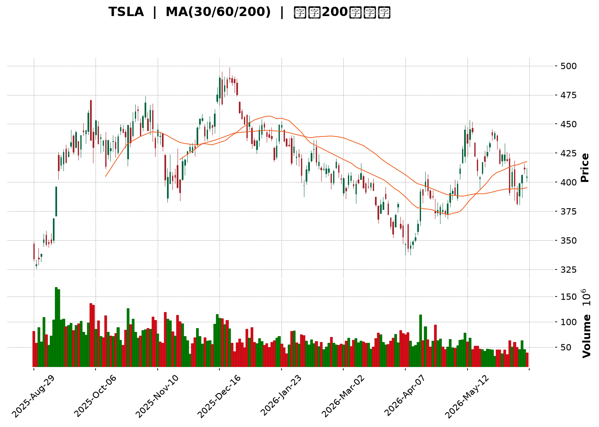
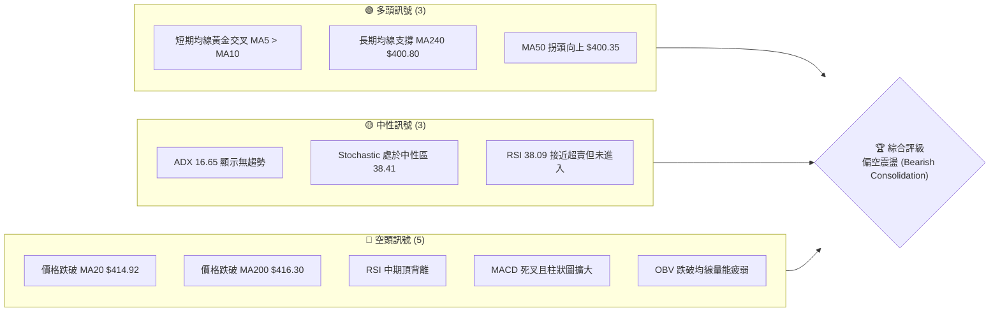
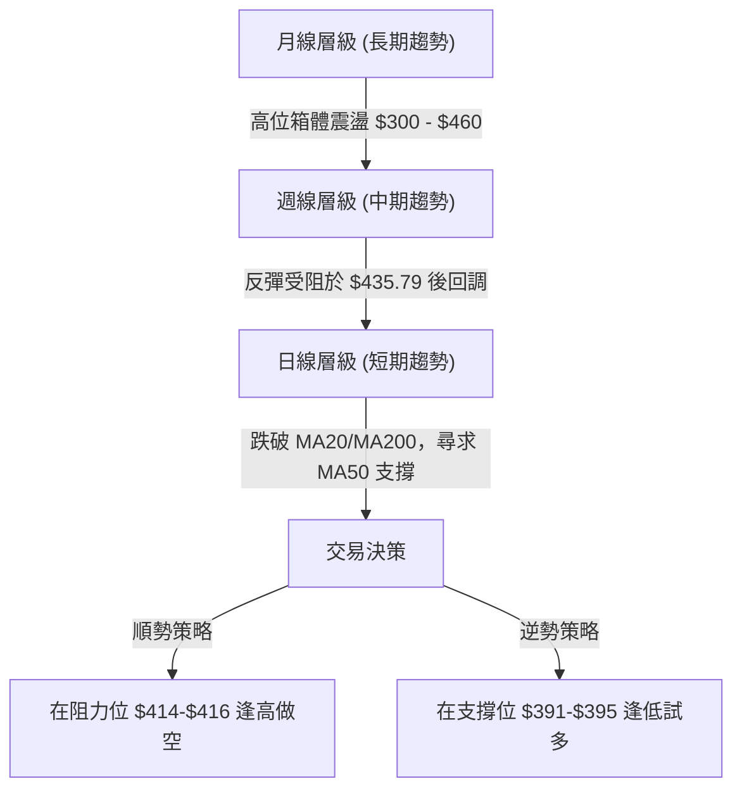
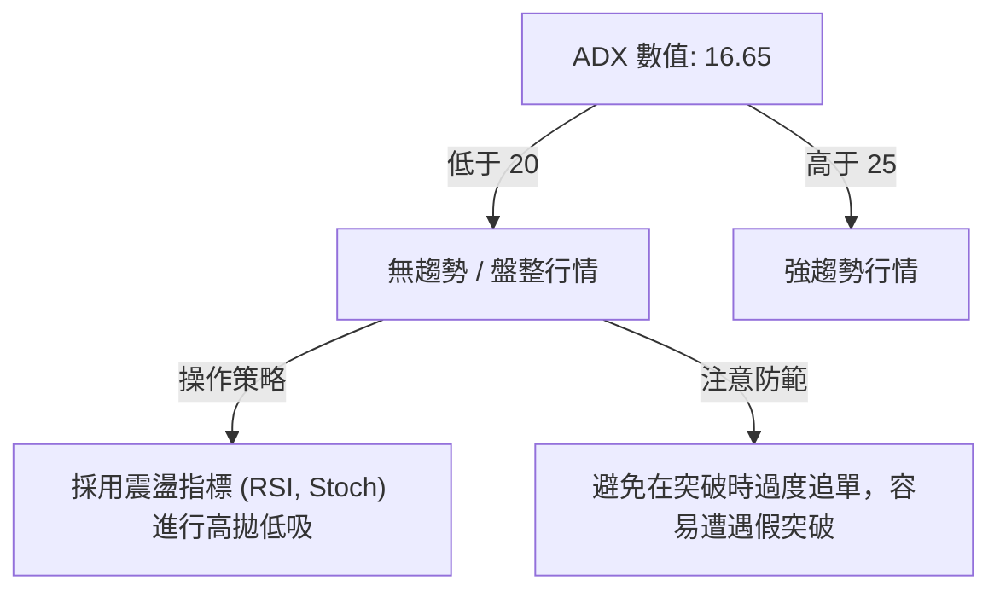
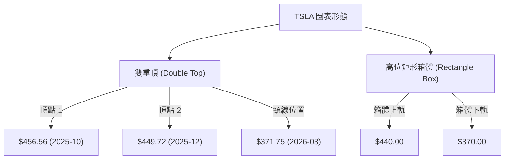
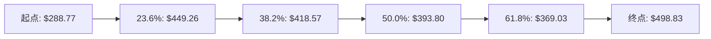
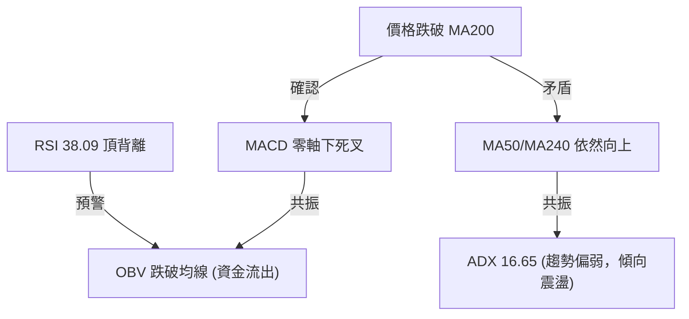
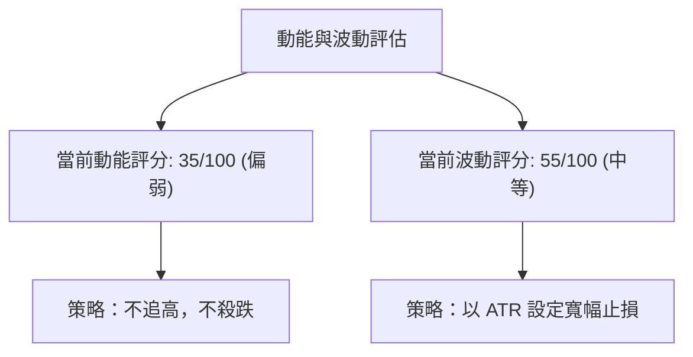
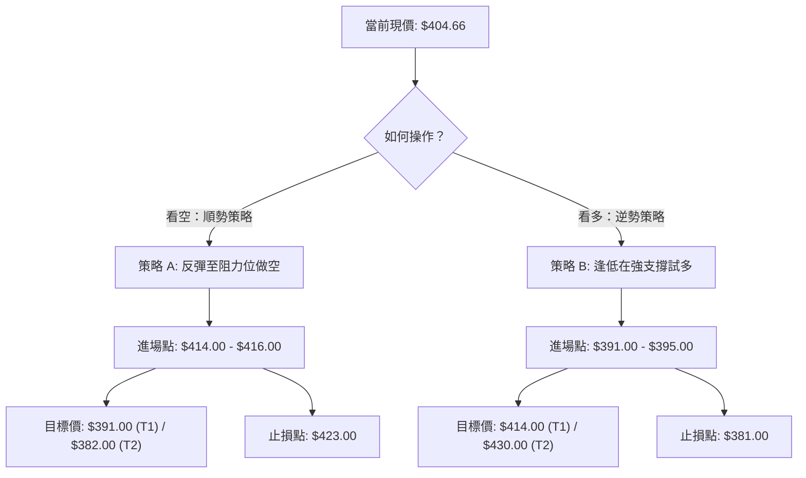
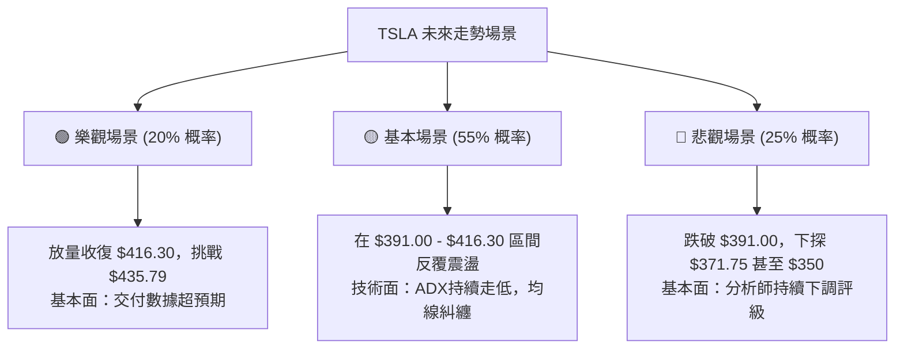

<details>
<summary>📊 靜態圖表 (點擊展開)</summary>

</details>

<html>
<head><meta charset="utf-8" /></head>
<body>
    <div style="height:500px; width:100%;">                        <script>window.PlotlyConfig = {MathJaxConfig: 'local'};</script>
        <script charset="utf-8" src="https://cdn.plot.ly/plotly-3.6.0.min.js" integrity="sha256-QaOVwtVY0T02VaHrr6pnoHLCwayMJp4O5n4YyaE3rJk=" crossorigin="anonymous"></script>                <div id="candlestick-chart" class="plotly-graph-div" style="height:100%; width:100%;"></div>            <script>                window.PLOTLYENV=window.PLOTLYENV || {};                                if (document.getElementById("candlestick-chart")) {                    Plotly.newPlot(                        "candlestick-chart",                        [{"close":{"dtype":"f8","bdata":"AAAAgOvddEAAAACAwpV0QAAAAKBw4XRAAAAA4HoodUAAAACgcO11QAAAAGBmpnVAAAAAIIWvdUAAAADgo7x1QAAAAMD1DHdAAAAAQAq\u002feEAAAADgo6B5QAAAAIDrWXpAAAAAgMKdekAAAACgmQ16QAAAAMAeoXpAAAAAIFwje0AAAACgmZ16QAAAAOCjrHtAAAAAgD12ekAAAABgZoZ7QAAAACBcs3tAAAAAIIXLe0AAAAAgXLd8QAAAAAAAQHtAAAAAoEfdekAAAAAAAFR8QAAAAKBwEXtAAAAAQApre0AAAADgozh7QAAAAADX13lAAAAAYGY+e0AAAAAA19N6QAAAAGBmMntAAAAAAADMekAAAADA9XR7QAAAAEDh9ntAAAAAoJmpe0AAAAAghW97QAAAACCuD3xAAAAAIIUbe0AAAABguEZ8QAAAAMDMyHxAAAAAACnYfEAAAACgmYF7QAAAAMD1iHxAAAAAgOtFfUAAAAAAKcR7QAAAAMAe4XxAAAAAYI\u002fee0AAAADgUdh6QAAAACCu03tAAAAAgOt5e0AAAACgmel6QAAAAADXH3lAAAAAoJlFeUAAAABguI55QAAAAAAAFHlAAAAAANc\u002feUAAAAAgrrN4QAAAAKBwcXhAAAAA4HocekAAAABgZjZ6QAAAAKBHqXpAAAAAYLjiekAAAACAPeJ6QAAAAADX03pAAAAAANfre0AAAADgemh8QAAAAAAAcHxAAAAAoEd5e0AAAABguNJ7QAAAAEAzN3xAAAAAgD3ue0AAAAAgXK98QAAAAMD1tH1AAAAAgBSefkAAAAAAKTR9QAAAAIDrNX5AAAAAQDMTfkAAAAAgrot+QAAAAMD1WH5AAAAAYGZWfkAAAABACrN9QAAAAIA9unxAAAAAQOFmfEAAAAAghRt8QAAAAMAeYXtAAAAAYLg6fEAAAAAgXA97QAAAAGCP9npAAAAAwMw8e0AAAAAAKdB7QAAAACBcD3xAAAAAQDPze0AAAABAM3N7QAAAAMAeaXtAAAAAAABYe0AAAAAAADR6QAAAAEAK93pAAAAAgMIVfEAAAADA9RB8QAAAAEAzM3tAAAAAYGbuekAAAAAgXPd6QAAAAMD1CHpAAAAAYI\u002fmekAAAADA9Vx6QAAAACBcX3pAAAAAAClgeUAAAAAgXNN4QAAAAIDCsXlAAAAAwB4VekAAAAAgXJN6QAAAAOBRxHpAAAAAwB4RekAAAABAChd6QAAAAIAUqnlAAAAAwB61eUAAAAAgXLt5QAAAAMAevXlAAAAAoEf9eEAAAACAFJZ5QAAAAGBmFnpAAAAAoEeJeUAAAAAAKSh5QAAAAMAeNXlAAAAAQOGGeEAAAABACl95QAAAAMDMWHlAAAAAIK7LeEAAAABA4ep4QAAAAADX83hAAAAAwB59eUAAAAAAKbB4QAAAAEAzc3hAAAAAwPW4eEAAAADgUfR4QAAAAOB6jHhAAAAAwMzEd0AAAAAgXP92QAAAAKCZzXdAAAAA4Hrwd0AAAABAMx94QAAAAIDCQXdAAAAAoEeddkAAAADgejR2QAAAAAAAPHdAAAAAACnUd0AAAACgcIl2QAAAAMAeDXZAAAAAYGaqdUAAAAAAAHR1QAAAAIDrmXVAAAAAQDPPdUAAAABguAZ2QAAAAEAzw3ZAAAAAQDN\u002feEAAAABgZk54QAAAAIDrCXlAAAAAAACIeEAAAABguCZ4QAAAAAApOHhAAAAAIIVbd0AAAADAzIR3QAAAAGC4qndAAAAA4FGAd0AAAADAzEx3QAAAAIAU2ndAAAAAwB5teEAAAAAAKYh4QAAAAIDrVXhAAAAAIK7reEAAAADgo7x5QAAAAKCZxXpAAAAAAADQe0AAAABAMxd7QAAAAOBR1HtAAAAAwMy0e0AAAAAA12N6QAAAAADXn3lAAAAAgMJBeUAAAAAAKRR6QAAAAKCZHXpAAAAAACmgekAAAACgcBl7QAAAAIDChXtAAAAAoJmhe0AAAADgozx7QAAAAIAU\u002fnlAAAAAANd7ekAAAABAM3t6QAAAAEAzJ3pAAAAAAABweEAAAABAM495QAAAAEDhynhAAAAAoHDZd0AAAABgZvJ4QAAAAEDhZnlAAAAAYGayeUAAAABgj0p5QA=="},"high":{"dtype":"f8","bdata":"AAAAAADMdUAAAACgR9V0QAAAAKBHdXVAAAAAgD0udUAAAACA6z12QAAAAEAKZ3ZAAAAA4FHsdUAAAACgR0V2QAAAAADXD3dAAAAAQArLeEAAAABAM5t6QAAAAAAAdHpAAAAAwPXEekAAAAAghQN7QAAAACCF13pAAAAAIK7Pe0AAAAAghY97QAAAACBcw3tAAAAAoJk1e0AAAAAghYd7QAAAACCuL3xAAAAAAADQe0AAAADgo+R8QAAAAAAAbH1AAAAA4FHse0AAAADAzFh8QAAAAEDhSnxAAAAAoEeVe0AAAACgmUV7QAAAAIAUsntAAAAAgD1Oe0AAAABAMyN7QAAAAAApiHtAAAAAoJl1e0AAAAAgXJd7QAAAAMDMHHxAAAAAwMwUfEAAAADgo9h7QAAAAGBmFnxAAAAAQOE6fEAAAABgj8J8QAAAAAAAMH1AAAAAQDMbfUAAAADA9XB8QAAAAAAAoHxAAAAAwB6hfUAAAAAghcN8QAAAAKBHJX1AAAAAQDM3fUAAAACAwnV7QAAAAGC4GnxAAAAAANene0AAAACgR6V7QAAAAAAAiHpAAAAAQArDeUAAAAAgXH96QAAAAGBmjnlAAAAA4Hq8eUAAAABACs96QAAAAMDMLHlAAAAAIIVbekAAAAAgrkd6QAAAAEAKr3pAAAAAQOEOe0AAAABgjxp7QAAAAMDMTHtAAAAAYLj+e0AAAACAFGp8QAAAAIDrrXxAAAAAAAAcfEAAAACAPUZ8QAAAAIAUjnxAAAAA4FEUfEAAAAAAKfB8QAAAAOBRHH5AAAAAAAC4fkAAAADgevR+QAAAAIDCrX5AAAAAANenfkAAAACgRy1\u002fQAAAACCFv35AAAAAYGaufkAAAACgcJF+QAAAAGBmVn1AAAAAgOvxfEAAAADAzIh8QAAAAKBwpXxAAAAAwMyYfEAAAAAAAAR8QAAAAIDrZXtAAAAAgD1Oe0AAAADAzBB8QAAAAMDMZHxAAAAAwPU8fEAAAABgj757QAAAAIDC1XtAAAAAAAD0e0AAAAAgrut6QAAAAEAzY3tAAAAAAAAYfEAAAABA4UZ8QAAAAOCj0HtAAAAA4FFYe0AAAAAAKWR7QAAAACCug3tAAAAAgBR+e0AAAABgZrJ6QAAAAMD1yHpAAAAAYGZ+ekAAAACgmSF5QAAAAMDM6HlAAAAAAABUekAAAAAAALR6QAAAAKCZRXtAAAAAIK5De0AAAADA9YB6QAAAACCF23lAAAAAYGYOekAAAAAAAPR5QAAAAEAz63lAAAAAQDN7eUAAAADAHq15QAAAAKBwRXpAAAAAwPUMekAAAACA63F5QAAAAOCjSHlAAAAAoHDFeEAAAACgR4V5QAAAAIDriXlAAAAAoJkleUAAAACgcBl5QAAAAKBwaXlAAAAAgBQGekAAAAAAAGh5QAAAAEAzA3lAAAAAIK47eUAAAACA6wF5QAAAAMAeMXlAAAAA4FE0eEAAAACAPb53QAAAAKBHFXhAAAAAIK43eEAAAAAgrsN4QAAAAEAKB3hAAAAAgMIdd0AAAADgo\u002fR2QAAAAKBHVXdAAAAAgD3yd0AAAADgeiR3QAAAACCF+3ZAAAAA4FHAdUAAAAAAAMh2QAAAAIAUznVAAAAAgMLldUAAAACgmUV2QAAAAIAU+nZAAAAAYGaqeEAAAADA9aB4QAAAAOB6lHlAAAAAwMxseUAAAABAM594QAAAAAApkHhAAAAAAAAgeEAAAAAAKex3QAAAAOB6zHdAAAAA4KPkd0AAAABgZoZ3QAAAAAAADHhAAAAAwB7deEAAAACAPap4QAAAAIDrIXlAAAAAQOEaeUAAAACgR\u002f15QAAAAEAz83pAAAAAYI8SfEAAAADAzPx7QAAAAGBmVnxAAAAAIK4\u002ffEAAAABgjyp7QAAAAIAUUnpAAAAAgBRaeUAAAAAgXBd6QAAAAEAzr3pAAAAAACn4ekAAAABAMzN7QAAAAKCZ2XtAAAAAIFy\u002fe0AAAADAHpF7QAAAAKCZ2XpAAAAAYLiGekAAAACgmRl7QAAAAKCZpXpAAAAAQOGKekAAAABACs95QAAAAAAAKHpAAAAAoHDReEAAAADgo\u002fh4QAAAAEDhanlAAAAAAAAAekAAAABguMZ5QA=="},"hovertemplate":"\u003cb\u003e%{x|%Y-%m-%d}\u003c\u002fb\u003e\u003cbr\u003e\u958b: $%{open:.2f}\u003cbr\u003e\u9ad8: $%{high:.2f}\u003cbr\u003e\u4f4e: $%{low:.2f}\u003cbr\u003e\u6536: $%{close:.2f}\u003cextra\u003e\u003c\u002fextra\u003e","low":{"dtype":"f8","bdata":"AAAAQDO7dEAAAACgmVl0QAAAAAApiHRAAAAAIK63dEAAAABA4Yp1QAAAAKBwjXVAAAAAwB59dUAAAADAHqF1QAAAAKCZuXVAAAAAANcjd0AAAABA4SZ5QAAAAEDhtnlAAAAAYLiaeUAAAADA9Qh6QAAAACCFW3pAAAAAgBTSekAAAAAghXt6QAAAAOB60HpAAAAAoEcxekAAAADgUVB6QAAAAAAAeHtAAAAAgOsRe0AAAAAAAIx7QAAAAMAeOXtAAAAAoEcJekAAAABACkt7QAAAAEAzB3tAAAAAIK6TekAAAABA4aJ6QAAAAEAzt3lAAAAAQDM7ekAAAACAwh16QAAAAKBHpXpAAAAAwPVUekAAAACgmXl6QAAAAIDCiXtAAAAAwMyge0AAAAAAANB6QAAAAGBm3nlAAAAAYLjiekAAAABACmt7QAAAAKCZOXxAAAAAYGZKfEAAAACAwnl7QAAAAEAKu3tAAAAAwMxcfEAAAACgmbl7QAAAACBci3tAAAAAoHAxe0AAAACAFF56QAAAAIDCFXtAAAAAgMIFe0AAAADA9ah6QAAAAKBwxXhAAAAA4Hrsd0AAAAAA1+t4QAAAACBcm3hAAAAAAADoeEAAAAAA16t4QAAAAAAp\u002fHdAAAAAoHAReUAAAABAM195QAAAAIA9DnpAAAAAQDOjekAAAADgo5R6QAAAAIDrYXpAAAAAgMLxekAAAACAPdZ7QAAAAGCPOnxAAAAAAAA0e0AAAABAMzt7QAAAAIDCuXtAAAAAoEeFe0AAAABguJp7QAAAAGCPOn1AAAAAoEcdfUAAAABAMyN9QAAAAIDrkX1AAAAAIIWrfUAAAACgR1V+QAAAAKBwLX5AAAAAwMzMfUAAAADAHp19QAAAAAAAsHxAAAAAoEddfEAAAADAzBR8QAAAAMDMNHtAAAAAwB7Je0AAAADgesx6QAAAAOCj9HpAAAAAgOuFekAAAACAPeZ6QAAAAAAAYHtAAAAAQDO\u002fe0AAAAAghSN7QAAAAGBmWntAAAAAACk0e0AAAABAChd6QAAAAIDrOXpAAAAAgBQKe0AAAADgo8B7QAAAAOB6JHtAAAAAQArrekAAAACgmeF6QAAAAIDr6XlAAAAAQDNrekAAAAAAAOh5QAAAAEAK23lAAAAAQOHyeEAAAADgejh4QAAAAAAA3HhAAAAA4KN0eUAAAAAAABB6QAAAAOB6QHpAAAAAAADgeUAAAACAFK55QAAAAAApCHlAAAAAoEeZeUAAAACAwkF5QAAAAAAAWHlAAAAA4KOgeEAAAACAPdp4QAAAAGBmwnlAAAAAYI86eUAAAACAwuF4QAAAAAAARHhAAAAAgD0WeEAAAACgR6l4QAAAAGC49nhAAAAAIFyjeEAAAABgZtZ3QAAAAEAK43hAAAAAYGYieUAAAABgZqp4QAAAAEAzX3hAAAAAYLimeEAAAAAAAJB4QAAAAMD1hHhAAAAAIK6rd0AAAAAgXMd2QAAAACCuS3dAAAAAwPWEd0AAAAAAKRB4QAAAAIDrPXdAAAAAIIV3dkAAAACAPQJ2QAAAAAAAkHZAAAAAoEdhd0AAAADgenB2QAAAAIA9qnVAAAAAANcTdUAAAABguDp1QAAAAAAAFHVAAAAAANdrdUAAAADAHsl1QAAAAOBRLHZAAAAAAACodkAAAADAzNx3QAAAAGBmenhAAAAAoEdFeEAAAAAghRN4QAAAAMDMFHhAAAAAgD0Gd0AAAAAgrit3QAAAAOBRwHZAAAAA4KNId0AAAADgoyB3QAAAAGC4AndAAAAAwMysd0AAAADAzAx4QAAAAAAAUHhAAAAA4FEAeEAAAACA6yF5QAAAAIA9BnpAAAAAwMwMekAAAAAAKWR6QAAAACBc43pAAAAAYI+Se0AAAAAAAGB6QAAAAKBHVXlAAAAAgBSaeEAAAACAPWZ5QAAAAGBmznlAAAAAAClIekAAAACA66F6QAAAAOBROHtAAAAAwMxEe0AAAACAPcJ6QAAAAEDh9nlAAAAAYGbaeUAAAAAAAAB6QAAAAGCPEnpAAAAAoHBJeEAAAAAghat4QAAAAADXA3hAAAAAYGbCd0AAAABgj8p3QAAAAAApLHhAAAAAoJlxeUAAAADgowh5QA=="},"name":"\u50f9\u683c","open":{"dtype":"f8","bdata":"AAAAIK6zdUAAAAAgroN0QAAAAEAz83RAAAAAYGYCdUAAAAAAAMB1QAAAAIA9KnZAAAAAQArHdUAAAADAzOh1QAAAAGC44nVAAAAAQAovd0AAAACAFHJ6QAAAAAAA6HlAAAAAAAD8eUAAAACA6816QAAAAMAeXXpAAAAAgMLxekAAAACAFH57QAAAAKBH3XpAAAAAANcze0AAAADAzMR6QAAAAKCZxXtAAAAA4FGYe0AAAADAzLx7QAAAAOCjaH1AAAAA4KO0e0AAAAAAAIx7QAAAAMAe\u002fXtAAAAAwB5Ze0AAAADA9fx6QAAAAOCjSHtAAAAA4Hp4ekAAAADgo6x6QAAAAGBmLntAAAAAIK4re0AAAAAAAJh6QAAAAIDrvXtAAAAAACnce0AAAABAM7d7QAAAAAAAQHpAAAAAoEfte0AAAAAgrn97QAAAAOB6bHxAAAAAAADofEAAAADAzDB8QAAAAAAA7HtAAAAAANd\u002ffEAAAAAgXGd8QAAAAMDMQHxAAAAAIFzffEAAAABguF57QAAAAKCZeXtAAAAAYGZ2e0AAAABgZqJ7QAAAAIAUcnpAAAAAwMwkeEAAAAAA1+t4QAAAAIAUVnlAAAAAQOFieUAAAACAFOp5QAAAAMAeJXlAAAAAYLgieUAAAABguOZ5QAAAAEAzf3pAAAAAoHCpekAAAADAHpV6QAAAAMD17HpAAAAAoJkBe0AAAABACh98QAAAAOB6UHxAAAAAQDP3e0AAAADgo1h7QAAAAMAe4XtAAAAAQDMPfEAAAACgcAF8QAAAAEAKV31AAAAAIFyDfUAAAAAghYN+QAAAAGCP4n1AAAAAgOuBfkAAAACAFJ5+QAAAAGBmln5AAAAAIK6HfkAAAAAgrlN+QAAAAAAAUH1AAAAAoHDRfEAAAACgmYF8QAAAAMDMnHxAAAAAANf\u002fe0AAAACAFOZ7QAAAAGBmPntAAAAAgD2+ekAAAABAMz97QAAAACCuk3tAAAAAQDMjfEAAAADA9ax7QAAAAIAUkntAAAAAAAB4e0AAAACAwtV6QAAAAGCPWnpAAAAAYI8ye0AAAABA4fZ7QAAAAAAA0HtAAAAAYI9We0AAAABgj\u002f56QAAAAMDMXHtAAAAAoJmVekAAAADgo1R6QAAAAOBRhHpAAAAAIFxHekAAAADgUdB4QAAAAIDrDXlAAAAAYI+eeUAAAACgRyF6QAAAACBcv3pAAAAAwMzkekAAAADA9eR5QAAAAIDCxXlAAAAAgMKxeUAAAAAAAHR5QAAAAMDMhHlAAAAA4KN0eUAAAAAAAPh4QAAAAGBmwnlAAAAAYLjmeUAAAABACi95QAAAAKCZaXhAAAAAoHCxeEAAAACgmd14QAAAAMAeGXlAAAAAoHDheEAAAADAzGB4QAAAACCFI3lAAAAA4HokeUAAAABA4VJ5QAAAAGC48nhAAAAAIIXDeEAAAABACrt4QAAAAAAA8HhAAAAA4FE0eEAAAACgmb13QAAAAKBwUXdAAAAAwPWId0AAAAAA1194QAAAAKCZ2XdAAAAAQAobd0AAAACAwt12QAAAAAApmHZAAAAAgBSqd0AAAABAM8N2QAAAAKBwqXZAAAAAQAqndUAAAADgo7x2QAAAAGBmcnVAAAAA4KOkdUAAAADAHuF1QAAAAGC4WnZAAAAAoEftdkAAAADA9Zx4QAAAAGC4vnhAAAAAoEcpeUAAAAAAAJB4QAAAAMAeOXhAAAAA4Hp0d0AAAAAAAFh3QAAAAKBwQXdAAAAAQOFqd0AAAABgZnZ3QAAAAAAATHdAAAAAANfnd0AAAAAgrmN4QAAAAEAKs3hAAAAAAAAkeEAAAAAgrnd5QAAAACCuB3pAAAAAYI9iekAAAABgj5Z7QAAAAGC4SntAAAAAANfne0AAAAAgrh97QAAAAOBRNHpAAAAAYI8yeUAAAACgmXl5QAAAAEDhYnpAAAAAYLhqekAAAAAAKeR6QAAAAIA9rntAAAAAgOtZe0AAAACgmX17QAAAAADXt3pAAAAAIIUjekAAAABAMyt6QAAAAKBwPXpAAAAAAABIekAAAACgR8V4QAAAAOB6sHlAAAAA4KN4eEAAAADgekR4QAAAAADX93hAAAAAgOvFeUAAAACAwkF5QA=="},"x":["2025-08-29T00:00:00-04:00","2025-09-02T00:00:00-04:00","2025-09-03T00:00:00-04:00","2025-09-04T00:00:00-04:00","2025-09-05T00:00:00-04:00","2025-09-08T00:00:00-04:00","2025-09-09T00:00:00-04:00","2025-09-10T00:00:00-04:00","2025-09-11T00:00:00-04:00","2025-09-12T00:00:00-04:00","2025-09-15T00:00:00-04:00","2025-09-16T00:00:00-04:00","2025-09-17T00:00:00-04:00","2025-09-18T00:00:00-04:00","2025-09-19T00:00:00-04:00","2025-09-22T00:00:00-04:00","2025-09-23T00:00:00-04:00","2025-09-24T00:00:00-04:00","2025-09-25T00:00:00-04:00","2025-09-26T00:00:00-04:00","2025-09-29T00:00:00-04:00","2025-09-30T00:00:00-04:00","2025-10-01T00:00:00-04:00","2025-10-02T00:00:00-04:00","2025-10-03T00:00:00-04:00","2025-10-06T00:00:00-04:00","2025-10-07T00:00:00-04:00","2025-10-08T00:00:00-04:00","2025-10-09T00:00:00-04:00","2025-10-10T00:00:00-04:00","2025-10-13T00:00:00-04:00","2025-10-14T00:00:00-04:00","2025-10-15T00:00:00-04:00","2025-10-16T00:00:00-04:00","2025-10-17T00:00:00-04:00","2025-10-20T00:00:00-04:00","2025-10-21T00:00:00-04:00","2025-10-22T00:00:00-04:00","2025-10-23T00:00:00-04:00","2025-10-24T00:00:00-04:00","2025-10-27T00:00:00-04:00","2025-10-28T00:00:00-04:00","2025-10-29T00:00:00-04:00","2025-10-30T00:00:00-04:00","2025-10-31T00:00:00-04:00","2025-11-03T00:00:00-05:00","2025-11-04T00:00:00-05:00","2025-11-05T00:00:00-05:00","2025-11-06T00:00:00-05:00","2025-11-07T00:00:00-05:00","2025-11-10T00:00:00-05:00","2025-11-11T00:00:00-05:00","2025-11-12T00:00:00-05:00","2025-11-13T00:00:00-05:00","2025-11-14T00:00:00-05:00","2025-11-17T00:00:00-05:00","2025-11-18T00:00:00-05:00","2025-11-19T00:00:00-05:00","2025-11-20T00:00:00-05:00","2025-11-21T00:00:00-05:00","2025-11-24T00:00:00-05:00","2025-11-25T00:00:00-05:00","2025-11-26T00:00:00-05:00","2025-11-28T00:00:00-05:00","2025-12-01T00:00:00-05:00","2025-12-02T00:00:00-05:00","2025-12-03T00:00:00-05:00","2025-12-04T00:00:00-05:00","2025-12-05T00:00:00-05:00","2025-12-08T00:00:00-05:00","2025-12-09T00:00:00-05:00","2025-12-10T00:00:00-05:00","2025-12-11T00:00:00-05:00","2025-12-12T00:00:00-05:00","2025-12-15T00:00:00-05:00","2025-12-16T00:00:00-05:00","2025-12-17T00:00:00-05:00","2025-12-18T00:00:00-05:00","2025-12-19T00:00:00-05:00","2025-12-22T00:00:00-05:00","2025-12-23T00:00:00-05:00","2025-12-24T00:00:00-05:00","2025-12-26T00:00:00-05:00","2025-12-29T00:00:00-05:00","2025-12-30T00:00:00-05:00","2025-12-31T00:00:00-05:00","2026-01-02T00:00:00-05:00","2026-01-05T00:00:00-05:00","2026-01-06T00:00:00-05:00","2026-01-07T00:00:00-05:00","2026-01-08T00:00:00-05:00","2026-01-09T00:00:00-05:00","2026-01-12T00:00:00-05:00","2026-01-13T00:00:00-05:00","2026-01-14T00:00:00-05:00","2026-01-15T00:00:00-05:00","2026-01-16T00:00:00-05:00","2026-01-20T00:00:00-05:00","2026-01-21T00:00:00-05:00","2026-01-22T00:00:00-05:00","2026-01-23T00:00:00-05:00","2026-01-26T00:00:00-05:00","2026-01-27T00:00:00-05:00","2026-01-28T00:00:00-05:00","2026-01-29T00:00:00-05:00","2026-01-30T00:00:00-05:00","2026-02-02T00:00:00-05:00","2026-02-03T00:00:00-05:00","2026-02-04T00:00:00-05:00","2026-02-05T00:00:00-05:00","2026-02-06T00:00:00-05:00","2026-02-09T00:00:00-05:00","2026-02-10T00:00:00-05:00","2026-02-11T00:00:00-05:00","2026-02-12T00:00:00-05:00","2026-02-13T00:00:00-05:00","2026-02-17T00:00:00-05:00","2026-02-18T00:00:00-05:00","2026-02-19T00:00:00-05:00","2026-02-20T00:00:00-05:00","2026-02-23T00:00:00-05:00","2026-02-24T00:00:00-05:00","2026-02-25T00:00:00-05:00","2026-02-26T00:00:00-05:00","2026-02-27T00:00:00-05:00","2026-03-02T00:00:00-05:00","2026-03-03T00:00:00-05:00","2026-03-04T00:00:00-05:00","2026-03-05T00:00:00-05:00","2026-03-06T00:00:00-05:00","2026-03-09T00:00:00-04:00","2026-03-10T00:00:00-04:00","2026-03-11T00:00:00-04:00","2026-03-12T00:00:00-04:00","2026-03-13T00:00:00-04:00","2026-03-16T00:00:00-04:00","2026-03-17T00:00:00-04:00","2026-03-18T00:00:00-04:00","2026-03-19T00:00:00-04:00","2026-03-20T00:00:00-04:00","2026-03-23T00:00:00-04:00","2026-03-24T00:00:00-04:00","2026-03-25T00:00:00-04:00","2026-03-26T00:00:00-04:00","2026-03-27T00:00:00-04:00","2026-03-30T00:00:00-04:00","2026-03-31T00:00:00-04:00","2026-04-01T00:00:00-04:00","2026-04-02T00:00:00-04:00","2026-04-06T00:00:00-04:00","2026-04-07T00:00:00-04:00","2026-04-08T00:00:00-04:00","2026-04-09T00:00:00-04:00","2026-04-10T00:00:00-04:00","2026-04-13T00:00:00-04:00","2026-04-14T00:00:00-04:00","2026-04-15T00:00:00-04:00","2026-04-16T00:00:00-04:00","2026-04-17T00:00:00-04:00","2026-04-20T00:00:00-04:00","2026-04-21T00:00:00-04:00","2026-04-22T00:00:00-04:00","2026-04-23T00:00:00-04:00","2026-04-24T00:00:00-04:00","2026-04-27T00:00:00-04:00","2026-04-28T00:00:00-04:00","2026-04-29T00:00:00-04:00","2026-04-30T00:00:00-04:00","2026-05-01T00:00:00-04:00","2026-05-04T00:00:00-04:00","2026-05-05T00:00:00-04:00","2026-05-06T00:00:00-04:00","2026-05-07T00:00:00-04:00","2026-05-08T00:00:00-04:00","2026-05-11T00:00:00-04:00","2026-05-12T00:00:00-04:00","2026-05-13T00:00:00-04:00","2026-05-14T00:00:00-04:00","2026-05-15T00:00:00-04:00","2026-05-18T00:00:00-04:00","2026-05-19T00:00:00-04:00","2026-05-20T00:00:00-04:00","2026-05-21T00:00:00-04:00","2026-05-22T00:00:00-04:00","2026-05-26T00:00:00-04:00","2026-05-27T00:00:00-04:00","2026-05-28T00:00:00-04:00","2026-05-29T00:00:00-04:00","2026-06-01T00:00:00-04:00","2026-06-02T00:00:00-04:00","2026-06-03T00:00:00-04:00","2026-06-04T00:00:00-04:00","2026-06-05T00:00:00-04:00","2026-06-08T00:00:00-04:00","2026-06-09T00:00:00-04:00","2026-06-10T00:00:00-04:00","2026-06-11T00:00:00-04:00","2026-06-12T00:00:00-04:00","2026-06-15T00:00:00-04:00","2026-06-16T00:00:00-04:00"],"type":"candlestick"},{"hovertemplate":"MA30: $%{y:.2f}\u003cextra\u003e\u003c\u002fextra\u003e","line":{"color":"#2196F3","dash":"dash","width":2},"mode":"lines","name":"MA30","x":["2025-08-29T00:00:00-04:00","2025-09-02T00:00:00-04:00","2025-09-03T00:00:00-04:00","2025-09-04T00:00:00-04:00","2025-09-05T00:00:00-04:00","2025-09-08T00:00:00-04:00","2025-09-09T00:00:00-04:00","2025-09-10T00:00:00-04:00","2025-09-11T00:00:00-04:00","2025-09-12T00:00:00-04:00","2025-09-15T00:00:00-04:00","2025-09-16T00:00:00-04:00","2025-09-17T00:00:00-04:00","2025-09-18T00:00:00-04:00","2025-09-19T00:00:00-04:00","2025-09-22T00:00:00-04:00","2025-09-23T00:00:00-04:00","2025-09-24T00:00:00-04:00","2025-09-25T00:00:00-04:00","2025-09-26T00:00:00-04:00","2025-09-29T00:00:00-04:00","2025-09-30T00:00:00-04:00","2025-10-01T00:00:00-04:00","2025-10-02T00:00:00-04:00","2025-10-03T00:00:00-04:00","2025-10-06T00:00:00-04:00","2025-10-07T00:00:00-04:00","2025-10-08T00:00:00-04:00","2025-10-09T00:00:00-04:00","2025-10-10T00:00:00-04:00","2025-10-13T00:00:00-04:00","2025-10-14T00:00:00-04:00","2025-10-15T00:00:00-04:00","2025-10-16T00:00:00-04:00","2025-10-17T00:00:00-04:00","2025-10-20T00:00:00-04:00","2025-10-21T00:00:00-04:00","2025-10-22T00:00:00-04:00","2025-10-23T00:00:00-04:00","2025-10-24T00:00:00-04:00","2025-10-27T00:00:00-04:00","2025-10-28T00:00:00-04:00","2025-10-29T00:00:00-04:00","2025-10-30T00:00:00-04:00","2025-10-31T00:00:00-04:00","2025-11-03T00:00:00-05:00","2025-11-04T00:00:00-05:00","2025-11-05T00:00:00-05:00","2025-11-06T00:00:00-05:00","2025-11-07T00:00:00-05:00","2025-11-10T00:00:00-05:00","2025-11-11T00:00:00-05:00","2025-11-12T00:00:00-05:00","2025-11-13T00:00:00-05:00","2025-11-14T00:00:00-05:00","2025-11-17T00:00:00-05:00","2025-11-18T00:00:00-05:00","2025-11-19T00:00:00-05:00","2025-11-20T00:00:00-05:00","2025-11-21T00:00:00-05:00","2025-11-24T00:00:00-05:00","2025-11-25T00:00:00-05:00","2025-11-26T00:00:00-05:00","2025-11-28T00:00:00-05:00","2025-12-01T00:00:00-05:00","2025-12-02T00:00:00-05:00","2025-12-03T00:00:00-05:00","2025-12-04T00:00:00-05:00","2025-12-05T00:00:00-05:00","2025-12-08T00:00:00-05:00","2025-12-09T00:00:00-05:00","2025-12-10T00:00:00-05:00","2025-12-11T00:00:00-05:00","2025-12-12T00:00:00-05:00","2025-12-15T00:00:00-05:00","2025-12-16T00:00:00-05:00","2025-12-17T00:00:00-05:00","2025-12-18T00:00:00-05:00","2025-12-19T00:00:00-05:00","2025-12-22T00:00:00-05:00","2025-12-23T00:00:00-05:00","2025-12-24T00:00:00-05:00","2025-12-26T00:00:00-05:00","2025-12-29T00:00:00-05:00","2025-12-30T00:00:00-05:00","2025-12-31T00:00:00-05:00","2026-01-02T00:00:00-05:00","2026-01-05T00:00:00-05:00","2026-01-06T00:00:00-05:00","2026-01-07T00:00:00-05:00","2026-01-08T00:00:00-05:00","2026-01-09T00:00:00-05:00","2026-01-12T00:00:00-05:00","2026-01-13T00:00:00-05:00","2026-01-14T00:00:00-05:00","2026-01-15T00:00:00-05:00","2026-01-16T00:00:00-05:00","2026-01-20T00:00:00-05:00","2026-01-21T00:00:00-05:00","2026-01-22T00:00:00-05:00","2026-01-23T00:00:00-05:00","2026-01-26T00:00:00-05:00","2026-01-27T00:00:00-05:00","2026-01-28T00:00:00-05:00","2026-01-29T00:00:00-05:00","2026-01-30T00:00:00-05:00","2026-02-02T00:00:00-05:00","2026-02-03T00:00:00-05:00","2026-02-04T00:00:00-05:00","2026-02-05T00:00:00-05:00","2026-02-06T00:00:00-05:00","2026-02-09T00:00:00-05:00","2026-02-10T00:00:00-05:00","2026-02-11T00:00:00-05:00","2026-02-12T00:00:00-05:00","2026-02-13T00:00:00-05:00","2026-02-17T00:00:00-05:00","2026-02-18T00:00:00-05:00","2026-02-19T00:00:00-05:00","2026-02-20T00:00:00-05:00","2026-02-23T00:00:00-05:00","2026-02-24T00:00:00-05:00","2026-02-25T00:00:00-05:00","2026-02-26T00:00:00-05:00","2026-02-27T00:00:00-05:00","2026-03-02T00:00:00-05:00","2026-03-03T00:00:00-05:00","2026-03-04T00:00:00-05:00","2026-03-05T00:00:00-05:00","2026-03-06T00:00:00-05:00","2026-03-09T00:00:00-04:00","2026-03-10T00:00:00-04:00","2026-03-11T00:00:00-04:00","2026-03-12T00:00:00-04:00","2026-03-13T00:00:00-04:00","2026-03-16T00:00:00-04:00","2026-03-17T00:00:00-04:00","2026-03-18T00:00:00-04:00","2026-03-19T00:00:00-04:00","2026-03-20T00:00:00-04:00","2026-03-23T00:00:00-04:00","2026-03-24T00:00:00-04:00","2026-03-25T00:00:00-04:00","2026-03-26T00:00:00-04:00","2026-03-27T00:00:00-04:00","2026-03-30T00:00:00-04:00","2026-03-31T00:00:00-04:00","2026-04-01T00:00:00-04:00","2026-04-02T00:00:00-04:00","2026-04-06T00:00:00-04:00","2026-04-07T00:00:00-04:00","2026-04-08T00:00:00-04:00","2026-04-09T00:00:00-04:00","2026-04-10T00:00:00-04:00","2026-04-13T00:00:00-04:00","2026-04-14T00:00:00-04:00","2026-04-15T00:00:00-04:00","2026-04-16T00:00:00-04:00","2026-04-17T00:00:00-04:00","2026-04-20T00:00:00-04:00","2026-04-21T00:00:00-04:00","2026-04-22T00:00:00-04:00","2026-04-23T00:00:00-04:00","2026-04-24T00:00:00-04:00","2026-04-27T00:00:00-04:00","2026-04-28T00:00:00-04:00","2026-04-29T00:00:00-04:00","2026-04-30T00:00:00-04:00","2026-05-01T00:00:00-04:00","2026-05-04T00:00:00-04:00","2026-05-05T00:00:00-04:00","2026-05-06T00:00:00-04:00","2026-05-07T00:00:00-04:00","2026-05-08T00:00:00-04:00","2026-05-11T00:00:00-04:00","2026-05-12T00:00:00-04:00","2026-05-13T00:00:00-04:00","2026-05-14T00:00:00-04:00","2026-05-15T00:00:00-04:00","2026-05-18T00:00:00-04:00","2026-05-19T00:00:00-04:00","2026-05-20T00:00:00-04:00","2026-05-21T00:00:00-04:00","2026-05-22T00:00:00-04:00","2026-05-26T00:00:00-04:00","2026-05-27T00:00:00-04:00","2026-05-28T00:00:00-04:00","2026-05-29T00:00:00-04:00","2026-06-01T00:00:00-04:00","2026-06-02T00:00:00-04:00","2026-06-03T00:00:00-04:00","2026-06-04T00:00:00-04:00","2026-06-05T00:00:00-04:00","2026-06-08T00:00:00-04:00","2026-06-09T00:00:00-04:00","2026-06-10T00:00:00-04:00","2026-06-11T00:00:00-04:00","2026-06-12T00:00:00-04:00","2026-06-15T00:00:00-04:00","2026-06-16T00:00:00-04:00"],"y":{"dtype":"f8","bdata":"AAAAAAAA+H8AAAAAAAD4fwAAAAAAAPh\u002fAAAAAAAA+H8AAAAAAAD4fwAAAAAAAPh\u002fAAAAAAAA+H8AAAAAAAD4fwAAAAAAAPh\u002fAAAAAAAA+H8AAAAAAAD4fwAAAAAAAPh\u002fAAAAAAAA+H8AAAAAAAD4fwAAAAAAAPh\u002fAAAAAAAA+H8AAAAAAAD4fwAAAAAAAPh\u002fAAAAAAAA+H8AAAAAAAD4fwAAAAAAAPh\u002fAAAAAAAA+H8AAAAAAAD4fwAAAAAAAPh\u002fAAAAAAAA+H8AAAAAAAD4fwAAAAAAAPh\u002fAAAAAAAA+H8AAAAAAAD4f+\u002fu7u5gTnlA3t3dbcuEeUARERFhELp5QAAAAHD273lAmpmZeRQgekBERESUQ096QKuqqoolhXpAmpmZOSa4ekBVVVVVx+h6QGZmZjaJE3tAERERca8ne0CamZm5ST57QHd3d\u002fcMU3tAIiIiYhBme0CJiIjIdnJ7QO\u002fu7q65gntAmpmZqfGUe0De3d09w557QKuqqpoLqXtAVVVVVQ61e0CamZnZQK97QGZmZqZUsHtAREREVJyte0Crqqr6N557QKuqqnoUjHtAzczMnH1+e0B3d3cX2WZ7QO\u002fu7t7dVXtAmpmZKVxDe0ARERGB3C17QImIiCjqIXtAzczMLEAYe0AAAACwABN7QImIiJhuDntAmpmZeTAPe0B3d3d3TAp7QM3MzOyYAHtAvLu7K84Ce0ARERGhGgt7QO\u002fu7o5QDntAREREpHARe0BmZmbGkg17QDMzM1O4CHtAVVVVNewAe0CamZk5+wp7QJqZmTn7FHtA7+7uDnQge0AzMzNTuCx7QLy7u3sUOHtA7+7uvuZKe0AzMzPjemp7QGZmZkb9f3tAVVVVxWeYe0CrqqrKL7B7QBEREfHuzntAd3d3h6Tpe0BmZmYWZ\u002f97QO\u002fu7j4KE3xAiYiIKHgsfEDv7u6Ol0B8QFVVVZUYVnxAmpmZ6bRffECJiIiIXW18QGZmZiZNeXxAAAAAUGKCfEDe3d1NN4d8QJqZmSkxjHxAiYiImEOHfEAzMzOzcnR8QJqZmfnhZ3xAVVVVRRltfEAiIiJiLG98QHd3d7eBZnxAvLu7i\u002fpdfEARERHhT098QLy7u4v6L3xAiYiI6EIQfEB3d3d3Bfh7QERERPRE13tAMzMzAyuve0Crqqp6W357QCIiIpKmVntAIiIiYlcye0AiIiJyrxd7QERERGT0BntAIiIiggfzekBmZmY20OF6QM3MzLwt03pA3t3dnai9ekCJiIhIU7J6QImIiJjgp3pA3t3dfbGUekDv7u7OsIF6QBEREdHbcHpAVVVV5UJcekDNzMx8sUh6QAAAALDkNXpAERERIdsdekDv7u7ewRZ6QFVVVQXzCHpAZmZmRuHseUCamZm5AtJ5QLy7u\u002fvUvnlAvLu7y4WyeUCJiIgoFZ95QM3MzKyOkXlAzczMfPh+eUBmZmYG83J5QLy7u\u002ftiY3lAVVVVtaxVeUC8u7sbE0Z5QM3MzJzvNXlAIiIi4qUjeUBmZmaWtQ55QAAAAODB8HhAVVVVxUvTeEC8u7vbJLJ4QBEREXFonXhAAAAAQGCNeECrqqqqHHJ4QDMzMzOlUnhAvLu7W0g2eECJiIhoAxN4QLy7uwu77HdAERERke3Md0DNzMycNrJ3QN7d3W1ZnXdAVVVV5Redd0De3d1dAZR3QCIiIkJgkXdAiYiIuB6Pd0AzMzPTlIh3QKuqqkpTgndAERERgSNwd0BmZmb2KGZ3QDMzMzN6X3dAZmZmVg5Vd0DNzMxM8EZ3QERERPT9QHdAmpmZSZpGd0Dv7u4uslN3QCIiInI9WHdAVVVVBZ1gd0CrqqoKZW53QN7d3a1jjHdAiYiIKL+4d0CJiIj4b+J3QGZmZualCXhAzczMbLwqeEBERES0nUt4QAAAAFAbanhAREREhMCIeECamZlZObB4QHd3dye\u002f1nhAmpmZadj\u002feEAiIiLSIit5QCIiIjLBU3lAd3d3V4BueUBERERkgod5QEREROSlj3lAERERMU+geUB3d3cnMbR5QO\u002fu7n6xxHlAq6qqyujNeUC8u7ubUt95QCIiIpLt6HlAAAAAEObreUB3d3e38\u002fl5QN7d3b0tB3pAZmZmdgUSekB3d3dXgBh6QA=="},"type":"scatter"},{"hovertemplate":"MA60: $%{y:.2f}\u003cextra\u003e\u003c\u002fextra\u003e","line":{"color":"#9C27B0","dash":"dash","width":2},"mode":"lines","name":"MA60","x":["2025-08-29T00:00:00-04:00","2025-09-02T00:00:00-04:00","2025-09-03T00:00:00-04:00","2025-09-04T00:00:00-04:00","2025-09-05T00:00:00-04:00","2025-09-08T00:00:00-04:00","2025-09-09T00:00:00-04:00","2025-09-10T00:00:00-04:00","2025-09-11T00:00:00-04:00","2025-09-12T00:00:00-04:00","2025-09-15T00:00:00-04:00","2025-09-16T00:00:00-04:00","2025-09-17T00:00:00-04:00","2025-09-18T00:00:00-04:00","2025-09-19T00:00:00-04:00","2025-09-22T00:00:00-04:00","2025-09-23T00:00:00-04:00","2025-09-24T00:00:00-04:00","2025-09-25T00:00:00-04:00","2025-09-26T00:00:00-04:00","2025-09-29T00:00:00-04:00","2025-09-30T00:00:00-04:00","2025-10-01T00:00:00-04:00","2025-10-02T00:00:00-04:00","2025-10-03T00:00:00-04:00","2025-10-06T00:00:00-04:00","2025-10-07T00:00:00-04:00","2025-10-08T00:00:00-04:00","2025-10-09T00:00:00-04:00","2025-10-10T00:00:00-04:00","2025-10-13T00:00:00-04:00","2025-10-14T00:00:00-04:00","2025-10-15T00:00:00-04:00","2025-10-16T00:00:00-04:00","2025-10-17T00:00:00-04:00","2025-10-20T00:00:00-04:00","2025-10-21T00:00:00-04:00","2025-10-22T00:00:00-04:00","2025-10-23T00:00:00-04:00","2025-10-24T00:00:00-04:00","2025-10-27T00:00:00-04:00","2025-10-28T00:00:00-04:00","2025-10-29T00:00:00-04:00","2025-10-30T00:00:00-04:00","2025-10-31T00:00:00-04:00","2025-11-03T00:00:00-05:00","2025-11-04T00:00:00-05:00","2025-11-05T00:00:00-05:00","2025-11-06T00:00:00-05:00","2025-11-07T00:00:00-05:00","2025-11-10T00:00:00-05:00","2025-11-11T00:00:00-05:00","2025-11-12T00:00:00-05:00","2025-11-13T00:00:00-05:00","2025-11-14T00:00:00-05:00","2025-11-17T00:00:00-05:00","2025-11-18T00:00:00-05:00","2025-11-19T00:00:00-05:00","2025-11-20T00:00:00-05:00","2025-11-21T00:00:00-05:00","2025-11-24T00:00:00-05:00","2025-11-25T00:00:00-05:00","2025-11-26T00:00:00-05:00","2025-11-28T00:00:00-05:00","2025-12-01T00:00:00-05:00","2025-12-02T00:00:00-05:00","2025-12-03T00:00:00-05:00","2025-12-04T00:00:00-05:00","2025-12-05T00:00:00-05:00","2025-12-08T00:00:00-05:00","2025-12-09T00:00:00-05:00","2025-12-10T00:00:00-05:00","2025-12-11T00:00:00-05:00","2025-12-12T00:00:00-05:00","2025-12-15T00:00:00-05:00","2025-12-16T00:00:00-05:00","2025-12-17T00:00:00-05:00","2025-12-18T00:00:00-05:00","2025-12-19T00:00:00-05:00","2025-12-22T00:00:00-05:00","2025-12-23T00:00:00-05:00","2025-12-24T00:00:00-05:00","2025-12-26T00:00:00-05:00","2025-12-29T00:00:00-05:00","2025-12-30T00:00:00-05:00","2025-12-31T00:00:00-05:00","2026-01-02T00:00:00-05:00","2026-01-05T00:00:00-05:00","2026-01-06T00:00:00-05:00","2026-01-07T00:00:00-05:00","2026-01-08T00:00:00-05:00","2026-01-09T00:00:00-05:00","2026-01-12T00:00:00-05:00","2026-01-13T00:00:00-05:00","2026-01-14T00:00:00-05:00","2026-01-15T00:00:00-05:00","2026-01-16T00:00:00-05:00","2026-01-20T00:00:00-05:00","2026-01-21T00:00:00-05:00","2026-01-22T00:00:00-05:00","2026-01-23T00:00:00-05:00","2026-01-26T00:00:00-05:00","2026-01-27T00:00:00-05:00","2026-01-28T00:00:00-05:00","2026-01-29T00:00:00-05:00","2026-01-30T00:00:00-05:00","2026-02-02T00:00:00-05:00","2026-02-03T00:00:00-05:00","2026-02-04T00:00:00-05:00","2026-02-05T00:00:00-05:00","2026-02-06T00:00:00-05:00","2026-02-09T00:00:00-05:00","2026-02-10T00:00:00-05:00","2026-02-11T00:00:00-05:00","2026-02-12T00:00:00-05:00","2026-02-13T00:00:00-05:00","2026-02-17T00:00:00-05:00","2026-02-18T00:00:00-05:00","2026-02-19T00:00:00-05:00","2026-02-20T00:00:00-05:00","2026-02-23T00:00:00-05:00","2026-02-24T00:00:00-05:00","2026-02-25T00:00:00-05:00","2026-02-26T00:00:00-05:00","2026-02-27T00:00:00-05:00","2026-03-02T00:00:00-05:00","2026-03-03T00:00:00-05:00","2026-03-04T00:00:00-05:00","2026-03-05T00:00:00-05:00","2026-03-06T00:00:00-05:00","2026-03-09T00:00:00-04:00","2026-03-10T00:00:00-04:00","2026-03-11T00:00:00-04:00","2026-03-12T00:00:00-04:00","2026-03-13T00:00:00-04:00","2026-03-16T00:00:00-04:00","2026-03-17T00:00:00-04:00","2026-03-18T00:00:00-04:00","2026-03-19T00:00:00-04:00","2026-03-20T00:00:00-04:00","2026-03-23T00:00:00-04:00","2026-03-24T00:00:00-04:00","2026-03-25T00:00:00-04:00","2026-03-26T00:00:00-04:00","2026-03-27T00:00:00-04:00","2026-03-30T00:00:00-04:00","2026-03-31T00:00:00-04:00","2026-04-01T00:00:00-04:00","2026-04-02T00:00:00-04:00","2026-04-06T00:00:00-04:00","2026-04-07T00:00:00-04:00","2026-04-08T00:00:00-04:00","2026-04-09T00:00:00-04:00","2026-04-10T00:00:00-04:00","2026-04-13T00:00:00-04:00","2026-04-14T00:00:00-04:00","2026-04-15T00:00:00-04:00","2026-04-16T00:00:00-04:00","2026-04-17T00:00:00-04:00","2026-04-20T00:00:00-04:00","2026-04-21T00:00:00-04:00","2026-04-22T00:00:00-04:00","2026-04-23T00:00:00-04:00","2026-04-24T00:00:00-04:00","2026-04-27T00:00:00-04:00","2026-04-28T00:00:00-04:00","2026-04-29T00:00:00-04:00","2026-04-30T00:00:00-04:00","2026-05-01T00:00:00-04:00","2026-05-04T00:00:00-04:00","2026-05-05T00:00:00-04:00","2026-05-06T00:00:00-04:00","2026-05-07T00:00:00-04:00","2026-05-08T00:00:00-04:00","2026-05-11T00:00:00-04:00","2026-05-12T00:00:00-04:00","2026-05-13T00:00:00-04:00","2026-05-14T00:00:00-04:00","2026-05-15T00:00:00-04:00","2026-05-18T00:00:00-04:00","2026-05-19T00:00:00-04:00","2026-05-20T00:00:00-04:00","2026-05-21T00:00:00-04:00","2026-05-22T00:00:00-04:00","2026-05-26T00:00:00-04:00","2026-05-27T00:00:00-04:00","2026-05-28T00:00:00-04:00","2026-05-29T00:00:00-04:00","2026-06-01T00:00:00-04:00","2026-06-02T00:00:00-04:00","2026-06-03T00:00:00-04:00","2026-06-04T00:00:00-04:00","2026-06-05T00:00:00-04:00","2026-06-08T00:00:00-04:00","2026-06-09T00:00:00-04:00","2026-06-10T00:00:00-04:00","2026-06-11T00:00:00-04:00","2026-06-12T00:00:00-04:00","2026-06-15T00:00:00-04:00","2026-06-16T00:00:00-04:00"],"y":{"dtype":"f8","bdata":"AAAAAAAA+H8AAAAAAAD4fwAAAAAAAPh\u002fAAAAAAAA+H8AAAAAAAD4fwAAAAAAAPh\u002fAAAAAAAA+H8AAAAAAAD4fwAAAAAAAPh\u002fAAAAAAAA+H8AAAAAAAD4fwAAAAAAAPh\u002fAAAAAAAA+H8AAAAAAAD4fwAAAAAAAPh\u002fAAAAAAAA+H8AAAAAAAD4fwAAAAAAAPh\u002fAAAAAAAA+H8AAAAAAAD4fwAAAAAAAPh\u002fAAAAAAAA+H8AAAAAAAD4fwAAAAAAAPh\u002fAAAAAAAA+H8AAAAAAAD4fwAAAAAAAPh\u002fAAAAAAAA+H8AAAAAAAD4fwAAAAAAAPh\u002fAAAAAAAA+H8AAAAAAAD4fwAAAAAAAPh\u002fAAAAAAAA+H8AAAAAAAD4fwAAAAAAAPh\u002fAAAAAAAA+H8AAAAAAAD4fwAAAAAAAPh\u002fAAAAAAAA+H8AAAAAAAD4fwAAAAAAAPh\u002fAAAAAAAA+H8AAAAAAAD4fwAAAAAAAPh\u002fAAAAAAAA+H8AAAAAAAD4fwAAAAAAAPh\u002fAAAAAAAA+H8AAAAAAAD4fwAAAAAAAPh\u002fAAAAAAAA+H8AAAAAAAD4fwAAAAAAAPh\u002fAAAAAAAA+H8AAAAAAAD4fwAAAAAAAPh\u002fAAAAAAAA+H8AAAAAAAD4f7y7u4slOHpAVVVVzYVOekCJiIiIiGZ6QERERIQyf3pAmpmZeaKXekDe3d0FyKx6QLy7uzvfwnpAq6qqMnrdekAzMzP78Pl6QKuqquLsEHtAq6qqCpAce0AAAABA7iV7QFVVVaXiLXtAvLu7S34ze0AREREBuT57QERERHTaS3tARERE3LJae0CJiIjIvWV7QDMzMwuQcHtAIiIiivp\u002fe0BmZmbe3Yx7QGZmZvYomHtAzczMDAKje0CrqqriM6d7QN7d3bWBrXtAIiIiEhG0e0Dv7u4WILN7QO\u002fu7g50tHtAERERKeq3e0AAAAAIOrd7QO\u002fu7l4BvHtAMzMzi\u002fq7e0BEREQcL8B7QHd3d9\u002fdw3tAzczMZMnIe0Crqqriwch7QDMzMwtlxntAIiIi4gjFe0AiIiKqxr97QEREREQZu3tAzczM9ES\u002fe0BERESUX757QFVVVQWdt3tAiYiIYHOve0BVVVWNJa17QKuqquJ6ontAvLu7e1uYe0BVVVXlXpJ7QAAAALish3tAERER4Qh9e0Dv7u4ua3R7QEREROxRa3tAvLu7k19le0BmZmae72N7QKuqqqrxantAzczMBFZue0BmZmamm3B7QN7d3f0bc3tAMzMzYxB1e0C8u7trdXl7QO\u002fu7pb8fntAvLu7MzN6e0C8u7srh3d7QLy7u3sUdXtAq6qqmlJve0BVVVVl9Gd7QM3MzOwKYXtAzczMXI9Se0ARERFJmkV7QHd3d39qOHtA3t3dRf0se0De3d2NlyB7QJqZmVmrEntAvLu7K0AIe0DNzMyEMvd6QERERJzE4HpAq6qqsp3HekDv7u4+fLV6QAAAAPhTnXpARERE3GuCekAzMzNLN2J6QHd3dxdLRnpAIiIiov4qekBERESEMhN6QCIiIiLb+3lAvLu7oynjeUARERGJ+sl5QO\u002fu7hZLuHlA7+7uboSleUCamZn5N5J5QN7d3eVCfXlAzczM7HxleUC8u7sbWkp5QGZmZm7LLnlAMzMzO5gUeUDNzMwMdP14QO\u002fu7g6f6XhAMzMzg3ndeEBmZmaeYdV4QLy7u6MpzXhAd3d3\u002f\u002f+9eEBmZmbGS614QDMzMyOUoHhAZmZmplSReEB3d3cPn4J4QAAAAHCEeHhAmpmZaQNqeECamZmp8Vx4QAAAAHgwUnhAd3d3fyNOeEBVVVWl4kx4QHd3d4cWR3hAvLu7cyFCeECJiIhQjT54QO\u002fu7saSPnhA7+7udgVGeEAiIiJqSkp4QLy7uyuHU3hAZmZmVg5ceEB3d3cv3V54QJqZmUFgXnhAAAAAcIRfeEARERFhnmF4QJqZmRm9YXhAVVVV\u002fWJmeEB3d3e3rG54QAAAAFCNeHhAZmZmHsyFeEARERHhwY14QDMzMxODkHhAzczM9LaXeEBVVVX9Yp54QM3MzGSCo3hA3t3dJQafeEARERHJvaJ4QKuqquIzpHhAMzMzM3qgeEAiIiICcqB4QBEREdkVpHhAAAAA4E+seEAzMzNDGbZ4QA=="},"type":"scatter"},{"hovertemplate":"MA200: $%{y:.2f}\u003cextra\u003e\u003c\u002fextra\u003e","line":{"color":"#FF6F00","dash":"solid","width":2},"mode":"lines","name":"MA200","x":["2025-08-29T00:00:00-04:00","2025-09-02T00:00:00-04:00","2025-09-03T00:00:00-04:00","2025-09-04T00:00:00-04:00","2025-09-05T00:00:00-04:00","2025-09-08T00:00:00-04:00","2025-09-09T00:00:00-04:00","2025-09-10T00:00:00-04:00","2025-09-11T00:00:00-04:00","2025-09-12T00:00:00-04:00","2025-09-15T00:00:00-04:00","2025-09-16T00:00:00-04:00","2025-09-17T00:00:00-04:00","2025-09-18T00:00:00-04:00","2025-09-19T00:00:00-04:00","2025-09-22T00:00:00-04:00","2025-09-23T00:00:00-04:00","2025-09-24T00:00:00-04:00","2025-09-25T00:00:00-04:00","2025-09-26T00:00:00-04:00","2025-09-29T00:00:00-04:00","2025-09-30T00:00:00-04:00","2025-10-01T00:00:00-04:00","2025-10-02T00:00:00-04:00","2025-10-03T00:00:00-04:00","2025-10-06T00:00:00-04:00","2025-10-07T00:00:00-04:00","2025-10-08T00:00:00-04:00","2025-10-09T00:00:00-04:00","2025-10-10T00:00:00-04:00","2025-10-13T00:00:00-04:00","2025-10-14T00:00:00-04:00","2025-10-15T00:00:00-04:00","2025-10-16T00:00:00-04:00","2025-10-17T00:00:00-04:00","2025-10-20T00:00:00-04:00","2025-10-21T00:00:00-04:00","2025-10-22T00:00:00-04:00","2025-10-23T00:00:00-04:00","2025-10-24T00:00:00-04:00","2025-10-27T00:00:00-04:00","2025-10-28T00:00:00-04:00","2025-10-29T00:00:00-04:00","2025-10-30T00:00:00-04:00","2025-10-31T00:00:00-04:00","2025-11-03T00:00:00-05:00","2025-11-04T00:00:00-05:00","2025-11-05T00:00:00-05:00","2025-11-06T00:00:00-05:00","2025-11-07T00:00:00-05:00","2025-11-10T00:00:00-05:00","2025-11-11T00:00:00-05:00","2025-11-12T00:00:00-05:00","2025-11-13T00:00:00-05:00","2025-11-14T00:00:00-05:00","2025-11-17T00:00:00-05:00","2025-11-18T00:00:00-05:00","2025-11-19T00:00:00-05:00","2025-11-20T00:00:00-05:00","2025-11-21T00:00:00-05:00","2025-11-24T00:00:00-05:00","2025-11-25T00:00:00-05:00","2025-11-26T00:00:00-05:00","2025-11-28T00:00:00-05:00","2025-12-01T00:00:00-05:00","2025-12-02T00:00:00-05:00","2025-12-03T00:00:00-05:00","2025-12-04T00:00:00-05:00","2025-12-05T00:00:00-05:00","2025-12-08T00:00:00-05:00","2025-12-09T00:00:00-05:00","2025-12-10T00:00:00-05:00","2025-12-11T00:00:00-05:00","2025-12-12T00:00:00-05:00","2025-12-15T00:00:00-05:00","2025-12-16T00:00:00-05:00","2025-12-17T00:00:00-05:00","2025-12-18T00:00:00-05:00","2025-12-19T00:00:00-05:00","2025-12-22T00:00:00-05:00","2025-12-23T00:00:00-05:00","2025-12-24T00:00:00-05:00","2025-12-26T00:00:00-05:00","2025-12-29T00:00:00-05:00","2025-12-30T00:00:00-05:00","2025-12-31T00:00:00-05:00","2026-01-02T00:00:00-05:00","2026-01-05T00:00:00-05:00","2026-01-06T00:00:00-05:00","2026-01-07T00:00:00-05:00","2026-01-08T00:00:00-05:00","2026-01-09T00:00:00-05:00","2026-01-12T00:00:00-05:00","2026-01-13T00:00:00-05:00","2026-01-14T00:00:00-05:00","2026-01-15T00:00:00-05:00","2026-01-16T00:00:00-05:00","2026-01-20T00:00:00-05:00","2026-01-21T00:00:00-05:00","2026-01-22T00:00:00-05:00","2026-01-23T00:00:00-05:00","2026-01-26T00:00:00-05:00","2026-01-27T00:00:00-05:00","2026-01-28T00:00:00-05:00","2026-01-29T00:00:00-05:00","2026-01-30T00:00:00-05:00","2026-02-02T00:00:00-05:00","2026-02-03T00:00:00-05:00","2026-02-04T00:00:00-05:00","2026-02-05T00:00:00-05:00","2026-02-06T00:00:00-05:00","2026-02-09T00:00:00-05:00","2026-02-10T00:00:00-05:00","2026-02-11T00:00:00-05:00","2026-02-12T00:00:00-05:00","2026-02-13T00:00:00-05:00","2026-02-17T00:00:00-05:00","2026-02-18T00:00:00-05:00","2026-02-19T00:00:00-05:00","2026-02-20T00:00:00-05:00","2026-02-23T00:00:00-05:00","2026-02-24T00:00:00-05:00","2026-02-25T00:00:00-05:00","2026-02-26T00:00:00-05:00","2026-02-27T00:00:00-05:00","2026-03-02T00:00:00-05:00","2026-03-03T00:00:00-05:00","2026-03-04T00:00:00-05:00","2026-03-05T00:00:00-05:00","2026-03-06T00:00:00-05:00","2026-03-09T00:00:00-04:00","2026-03-10T00:00:00-04:00","2026-03-11T00:00:00-04:00","2026-03-12T00:00:00-04:00","2026-03-13T00:00:00-04:00","2026-03-16T00:00:00-04:00","2026-03-17T00:00:00-04:00","2026-03-18T00:00:00-04:00","2026-03-19T00:00:00-04:00","2026-03-20T00:00:00-04:00","2026-03-23T00:00:00-04:00","2026-03-24T00:00:00-04:00","2026-03-25T00:00:00-04:00","2026-03-26T00:00:00-04:00","2026-03-27T00:00:00-04:00","2026-03-30T00:00:00-04:00","2026-03-31T00:00:00-04:00","2026-04-01T00:00:00-04:00","2026-04-02T00:00:00-04:00","2026-04-06T00:00:00-04:00","2026-04-07T00:00:00-04:00","2026-04-08T00:00:00-04:00","2026-04-09T00:00:00-04:00","2026-04-10T00:00:00-04:00","2026-04-13T00:00:00-04:00","2026-04-14T00:00:00-04:00","2026-04-15T00:00:00-04:00","2026-04-16T00:00:00-04:00","2026-04-17T00:00:00-04:00","2026-04-20T00:00:00-04:00","2026-04-21T00:00:00-04:00","2026-04-22T00:00:00-04:00","2026-04-23T00:00:00-04:00","2026-04-24T00:00:00-04:00","2026-04-27T00:00:00-04:00","2026-04-28T00:00:00-04:00","2026-04-29T00:00:00-04:00","2026-04-30T00:00:00-04:00","2026-05-01T00:00:00-04:00","2026-05-04T00:00:00-04:00","2026-05-05T00:00:00-04:00","2026-05-06T00:00:00-04:00","2026-05-07T00:00:00-04:00","2026-05-08T00:00:00-04:00","2026-05-11T00:00:00-04:00","2026-05-12T00:00:00-04:00","2026-05-13T00:00:00-04:00","2026-05-14T00:00:00-04:00","2026-05-15T00:00:00-04:00","2026-05-18T00:00:00-04:00","2026-05-19T00:00:00-04:00","2026-05-20T00:00:00-04:00","2026-05-21T00:00:00-04:00","2026-05-22T00:00:00-04:00","2026-05-26T00:00:00-04:00","2026-05-27T00:00:00-04:00","2026-05-28T00:00:00-04:00","2026-05-29T00:00:00-04:00","2026-06-01T00:00:00-04:00","2026-06-02T00:00:00-04:00","2026-06-03T00:00:00-04:00","2026-06-04T00:00:00-04:00","2026-06-05T00:00:00-04:00","2026-06-08T00:00:00-04:00","2026-06-09T00:00:00-04:00","2026-06-10T00:00:00-04:00","2026-06-11T00:00:00-04:00","2026-06-12T00:00:00-04:00","2026-06-15T00:00:00-04:00","2026-06-16T00:00:00-04:00"],"y":{"dtype":"f8","bdata":"AAAAAAAA+H8AAAAAAAD4fwAAAAAAAPh\u002fAAAAAAAA+H8AAAAAAAD4fwAAAAAAAPh\u002fAAAAAAAA+H8AAAAAAAD4fwAAAAAAAPh\u002fAAAAAAAA+H8AAAAAAAD4fwAAAAAAAPh\u002fAAAAAAAA+H8AAAAAAAD4fwAAAAAAAPh\u002fAAAAAAAA+H8AAAAAAAD4fwAAAAAAAPh\u002fAAAAAAAA+H8AAAAAAAD4fwAAAAAAAPh\u002fAAAAAAAA+H8AAAAAAAD4fwAAAAAAAPh\u002fAAAAAAAA+H8AAAAAAAD4fwAAAAAAAPh\u002fAAAAAAAA+H8AAAAAAAD4fwAAAAAAAPh\u002fAAAAAAAA+H8AAAAAAAD4fwAAAAAAAPh\u002fAAAAAAAA+H8AAAAAAAD4fwAAAAAAAPh\u002fAAAAAAAA+H8AAAAAAAD4fwAAAAAAAPh\u002fAAAAAAAA+H8AAAAAAAD4fwAAAAAAAPh\u002fAAAAAAAA+H8AAAAAAAD4fwAAAAAAAPh\u002fAAAAAAAA+H8AAAAAAAD4fwAAAAAAAPh\u002fAAAAAAAA+H8AAAAAAAD4fwAAAAAAAPh\u002fAAAAAAAA+H8AAAAAAAD4fwAAAAAAAPh\u002fAAAAAAAA+H8AAAAAAAD4fwAAAAAAAPh\u002fAAAAAAAA+H8AAAAAAAD4fwAAAAAAAPh\u002fAAAAAAAA+H8AAAAAAAD4fwAAAAAAAPh\u002fAAAAAAAA+H8AAAAAAAD4fwAAAAAAAPh\u002fAAAAAAAA+H8AAAAAAAD4fwAAAAAAAPh\u002fAAAAAAAA+H8AAAAAAAD4fwAAAAAAAPh\u002fAAAAAAAA+H8AAAAAAAD4fwAAAAAAAPh\u002fAAAAAAAA+H8AAAAAAAD4fwAAAAAAAPh\u002fAAAAAAAA+H8AAAAAAAD4fwAAAAAAAPh\u002fAAAAAAAA+H8AAAAAAAD4fwAAAAAAAPh\u002fAAAAAAAA+H8AAAAAAAD4fwAAAAAAAPh\u002fAAAAAAAA+H8AAAAAAAD4fwAAAAAAAPh\u002fAAAAAAAA+H8AAAAAAAD4fwAAAAAAAPh\u002fAAAAAAAA+H8AAAAAAAD4fwAAAAAAAPh\u002fAAAAAAAA+H8AAAAAAAD4fwAAAAAAAPh\u002fAAAAAAAA+H8AAAAAAAD4fwAAAAAAAPh\u002fAAAAAAAA+H8AAAAAAAD4fwAAAAAAAPh\u002fAAAAAAAA+H8AAAAAAAD4fwAAAAAAAPh\u002fAAAAAAAA+H8AAAAAAAD4fwAAAAAAAPh\u002fAAAAAAAA+H8AAAAAAAD4fwAAAAAAAPh\u002fAAAAAAAA+H8AAAAAAAD4fwAAAAAAAPh\u002fAAAAAAAA+H8AAAAAAAD4fwAAAAAAAPh\u002fAAAAAAAA+H8AAAAAAAD4fwAAAAAAAPh\u002fAAAAAAAA+H8AAAAAAAD4fwAAAAAAAPh\u002fAAAAAAAA+H8AAAAAAAD4fwAAAAAAAPh\u002fAAAAAAAA+H8AAAAAAAD4fwAAAAAAAPh\u002fAAAAAAAA+H8AAAAAAAD4fwAAAAAAAPh\u002fAAAAAAAA+H8AAAAAAAD4fwAAAAAAAPh\u002fAAAAAAAA+H8AAAAAAAD4fwAAAAAAAPh\u002fAAAAAAAA+H8AAAAAAAD4fwAAAAAAAPh\u002fAAAAAAAA+H8AAAAAAAD4fwAAAAAAAPh\u002fAAAAAAAA+H8AAAAAAAD4fwAAAAAAAPh\u002fAAAAAAAA+H8AAAAAAAD4fwAAAAAAAPh\u002fAAAAAAAA+H8AAAAAAAD4fwAAAAAAAPh\u002fAAAAAAAA+H8AAAAAAAD4fwAAAAAAAPh\u002fAAAAAAAA+H8AAAAAAAD4fwAAAAAAAPh\u002fAAAAAAAA+H8AAAAAAAD4fwAAAAAAAPh\u002fAAAAAAAA+H8AAAAAAAD4fwAAAAAAAPh\u002fAAAAAAAA+H8AAAAAAAD4fwAAAAAAAPh\u002fAAAAAAAA+H8AAAAAAAD4fwAAAAAAAPh\u002fAAAAAAAA+H8AAAAAAAD4fwAAAAAAAPh\u002fAAAAAAAA+H8AAAAAAAD4fwAAAAAAAPh\u002fAAAAAAAA+H8AAAAAAAD4fwAAAAAAAPh\u002fAAAAAAAA+H8AAAAAAAD4fwAAAAAAAPh\u002fAAAAAAAA+H8AAAAAAAD4fwAAAAAAAPh\u002fAAAAAAAA+H8AAAAAAAD4fwAAAAAAAPh\u002fAAAAAAAA+H8AAAAAAAD4fwAAAAAAAPh\u002fAAAAAAAA+H8AAAAAAAD4fwAAAAAAAPh\u002fAAAAAAAA+H+uR+GSugR6QA=="},"type":"scatter"}],                        {"template":{"data":{"barpolar":[{"marker":{"line":{"color":"rgb(17,17,17)","width":0.5},"pattern":{"fillmode":"overlay","size":10,"solidity":0.2}},"type":"barpolar"}],"bar":[{"error_x":{"color":"#f2f5fa"},"error_y":{"color":"#f2f5fa"},"marker":{"line":{"color":"rgb(17,17,17)","width":0.5},"pattern":{"fillmode":"overlay","size":10,"solidity":0.2}},"type":"bar"}],"carpet":[{"aaxis":{"endlinecolor":"#A2B1C6","gridcolor":"#506784","linecolor":"#506784","minorgridcolor":"#506784","startlinecolor":"#A2B1C6"},"baxis":{"endlinecolor":"#A2B1C6","gridcolor":"#506784","linecolor":"#506784","minorgridcolor":"#506784","startlinecolor":"#A2B1C6"},"type":"carpet"}],"choropleth":[{"colorbar":{"outlinewidth":0,"ticks":""},"type":"choropleth"}],"contourcarpet":[{"colorbar":{"outlinewidth":0,"ticks":""},"type":"contourcarpet"}],"contour":[{"colorbar":{"outlinewidth":0,"ticks":""},"colorscale":[[0.0,"#0d0887"],[0.1111111111111111,"#46039f"],[0.2222222222222222,"#7201a8"],[0.3333333333333333,"#9c179e"],[0.4444444444444444,"#bd3786"],[0.5555555555555556,"#d8576b"],[0.6666666666666666,"#ed7953"],[0.7777777777777778,"#fb9f3a"],[0.8888888888888888,"#fdca26"],[1.0,"#f0f921"]],"type":"contour"}],"heatmap":[{"colorbar":{"outlinewidth":0,"ticks":""},"colorscale":[[0.0,"#0d0887"],[0.1111111111111111,"#46039f"],[0.2222222222222222,"#7201a8"],[0.3333333333333333,"#9c179e"],[0.4444444444444444,"#bd3786"],[0.5555555555555556,"#d8576b"],[0.6666666666666666,"#ed7953"],[0.7777777777777778,"#fb9f3a"],[0.8888888888888888,"#fdca26"],[1.0,"#f0f921"]],"type":"heatmap"}],"histogram2dcontour":[{"colorbar":{"outlinewidth":0,"ticks":""},"colorscale":[[0.0,"#0d0887"],[0.1111111111111111,"#46039f"],[0.2222222222222222,"#7201a8"],[0.3333333333333333,"#9c179e"],[0.4444444444444444,"#bd3786"],[0.5555555555555556,"#d8576b"],[0.6666666666666666,"#ed7953"],[0.7777777777777778,"#fb9f3a"],[0.8888888888888888,"#fdca26"],[1.0,"#f0f921"]],"type":"histogram2dcontour"}],"histogram2d":[{"colorbar":{"outlinewidth":0,"ticks":""},"colorscale":[[0.0,"#0d0887"],[0.1111111111111111,"#46039f"],[0.2222222222222222,"#7201a8"],[0.3333333333333333,"#9c179e"],[0.4444444444444444,"#bd3786"],[0.5555555555555556,"#d8576b"],[0.6666666666666666,"#ed7953"],[0.7777777777777778,"#fb9f3a"],[0.8888888888888888,"#fdca26"],[1.0,"#f0f921"]],"type":"histogram2d"}],"histogram":[{"marker":{"pattern":{"fillmode":"overlay","size":10,"solidity":0.2}},"type":"histogram"}],"mesh3d":[{"colorbar":{"outlinewidth":0,"ticks":""},"type":"mesh3d"}],"parcoords":[{"line":{"colorbar":{"outlinewidth":0,"ticks":""}},"type":"parcoords"}],"pie":[{"automargin":true,"type":"pie"}],"scatter3d":[{"line":{"colorbar":{"outlinewidth":0,"ticks":""}},"marker":{"colorbar":{"outlinewidth":0,"ticks":""}},"type":"scatter3d"}],"scattercarpet":[{"marker":{"colorbar":{"outlinewidth":0,"ticks":""}},"type":"scattercarpet"}],"scattergeo":[{"marker":{"colorbar":{"outlinewidth":0,"ticks":""}},"type":"scattergeo"}],"scattergl":[{"marker":{"line":{"color":"#283442"}},"type":"scattergl"}],"scattermapbox":[{"marker":{"colorbar":{"outlinewidth":0,"ticks":""}},"type":"scattermapbox"}],"scattermap":[{"marker":{"colorbar":{"outlinewidth":0,"ticks":""}},"type":"scattermap"}],"scatterpolargl":[{"marker":{"colorbar":{"outlinewidth":0,"ticks":""}},"type":"scatterpolargl"}],"scatterpolar":[{"marker":{"colorbar":{"outlinewidth":0,"ticks":""}},"type":"scatterpolar"}],"scatter":[{"marker":{"line":{"color":"#283442"}},"type":"scatter"}],"scatterternary":[{"marker":{"colorbar":{"outlinewidth":0,"ticks":""}},"type":"scatterternary"}],"surface":[{"colorbar":{"outlinewidth":0,"ticks":""},"colorscale":[[0.0,"#0d0887"],[0.1111111111111111,"#46039f"],[0.2222222222222222,"#7201a8"],[0.3333333333333333,"#9c179e"],[0.4444444444444444,"#bd3786"],[0.5555555555555556,"#d8576b"],[0.6666666666666666,"#ed7953"],[0.7777777777777778,"#fb9f3a"],[0.8888888888888888,"#fdca26"],[1.0,"#f0f921"]],"type":"surface"}],"table":[{"cells":{"fill":{"color":"#506784"},"line":{"color":"rgb(17,17,17)"}},"header":{"fill":{"color":"#2a3f5f"},"line":{"color":"rgb(17,17,17)"}},"type":"table"}]},"layout":{"annotationdefaults":{"arrowcolor":"#f2f5fa","arrowhead":0,"arrowwidth":1},"autotypenumbers":"strict","coloraxis":{"colorbar":{"outlinewidth":0,"ticks":""}},"colorscale":{"diverging":[[0,"#8e0152"],[0.1,"#c51b7d"],[0.2,"#de77ae"],[0.3,"#f1b6da"],[0.4,"#fde0ef"],[0.5,"#f7f7f7"],[0.6,"#e6f5d0"],[0.7,"#b8e186"],[0.8,"#7fbc41"],[0.9,"#4d9221"],[1,"#276419"]],"sequential":[[0.0,"#0d0887"],[0.1111111111111111,"#46039f"],[0.2222222222222222,"#7201a8"],[0.3333333333333333,"#9c179e"],[0.4444444444444444,"#bd3786"],[0.5555555555555556,"#d8576b"],[0.6666666666666666,"#ed7953"],[0.7777777777777778,"#fb9f3a"],[0.8888888888888888,"#fdca26"],[1.0,"#f0f921"]],"sequentialminus":[[0.0,"#0d0887"],[0.1111111111111111,"#46039f"],[0.2222222222222222,"#7201a8"],[0.3333333333333333,"#9c179e"],[0.4444444444444444,"#bd3786"],[0.5555555555555556,"#d8576b"],[0.6666666666666666,"#ed7953"],[0.7777777777777778,"#fb9f3a"],[0.8888888888888888,"#fdca26"],[1.0,"#f0f921"]]},"colorway":["#636efa","#EF553B","#00cc96","#ab63fa","#FFA15A","#19d3f3","#FF6692","#B6E880","#FF97FF","#FECB52"],"font":{"color":"#f2f5fa"},"geo":{"bgcolor":"rgb(17,17,17)","lakecolor":"rgb(17,17,17)","landcolor":"rgb(17,17,17)","showlakes":true,"showland":true,"subunitcolor":"#506784"},"hoverlabel":{"align":"left"},"hovermode":"closest","mapbox":{"style":"dark"},"paper_bgcolor":"rgb(17,17,17)","plot_bgcolor":"rgb(17,17,17)","polar":{"angularaxis":{"gridcolor":"#506784","linecolor":"#506784","ticks":""},"bgcolor":"rgb(17,17,17)","radialaxis":{"gridcolor":"#506784","linecolor":"#506784","ticks":""}},"scene":{"xaxis":{"backgroundcolor":"rgb(17,17,17)","gridcolor":"#506784","gridwidth":2,"linecolor":"#506784","showbackground":true,"ticks":"","zerolinecolor":"#C8D4E3"},"yaxis":{"backgroundcolor":"rgb(17,17,17)","gridcolor":"#506784","gridwidth":2,"linecolor":"#506784","showbackground":true,"ticks":"","zerolinecolor":"#C8D4E3"},"zaxis":{"backgroundcolor":"rgb(17,17,17)","gridcolor":"#506784","gridwidth":2,"linecolor":"#506784","showbackground":true,"ticks":"","zerolinecolor":"#C8D4E3"}},"shapedefaults":{"line":{"color":"#f2f5fa"}},"sliderdefaults":{"bgcolor":"#C8D4E3","bordercolor":"rgb(17,17,17)","borderwidth":1,"tickwidth":0},"ternary":{"aaxis":{"gridcolor":"#506784","linecolor":"#506784","ticks":""},"baxis":{"gridcolor":"#506784","linecolor":"#506784","ticks":""},"bgcolor":"rgb(17,17,17)","caxis":{"gridcolor":"#506784","linecolor":"#506784","ticks":""}},"title":{"x":0.05},"updatemenudefaults":{"bgcolor":"#506784","borderwidth":0},"xaxis":{"automargin":true,"gridcolor":"#283442","linecolor":"#506784","ticks":"","title":{"standoff":15},"zerolinecolor":"#283442","zerolinewidth":2},"yaxis":{"automargin":true,"gridcolor":"#283442","linecolor":"#506784","ticks":"","title":{"standoff":15},"zerolinecolor":"#283442","zerolinewidth":2}}},"xaxis":{"rangeslider":{"visible":false},"title":{"text":"\u65e5\u671f"}},"font":{"size":11},"title":{"text":"TSLA  |  MA(30\u002f60\u002f200)  |  \u6700\u8fd1200\u4ea4\u6613\u65e5"},"yaxis":{"title":{"text":"\u80a1\u50f9 (USD)"}},"hovermode":"x unified","height":500},                        {"responsive": true}                    )                };            </script>        </div>
</body>
</html>

# TSLA 技術分析報告

> **報告日期**：2026-06-16 ｜ **語言**：繁體中文 ｜ **數據來源**：Yahoo Finance ｜ **當前價格**：$404.66

---

## 目錄

| 章節 | 內容 |
|------|------|
| [1. 技術面概覽](#1-技術面概覽) | 訊號儀表板、核心指標、評分卡 |
| [2. 趨勢分析](#2-趨勢分析) | 多時框趨勢、長中短期走勢 |
| [3. 圖表形態分析](#3-圖表形態分析) | 形態識別、K線組合、目標價 |
| [4. 支撐與阻力](#4-支撐與阻力) | 關鍵價位、斐波那契回調 |
| [5. 技術指標深度解讀](#5-技術指標深度解讀) | MA/RSI/MACD/布林/成交量 |
| [6. 動能與波動率](#6-動能與波動率) | 動能評估、ATR、Beta |
| [7. 多時框架總結](#7-多時框架總結) | 時框架評分矩陣 |
| [8. 交易策略建議](#8-交易策略建議) | 多空策略、風險報酬比 |
| [9. 風險提示與監控](#9-風險提示與監控) | 監控指標、風險場景 |

---

## 1. 技術面概覽

### 🎯 技術訊號儀表板

本儀表板綜合評估了 TSLA 當前的技術指標分布。目前市場呈現「中期盤整、短期偏空」的格局，多空勢力在 $400 關卡進行激烈交鋒。



### 📊 核心指標速覽表

| 指標類別 | 指標名稱 | 當前數值 | 訊號 | 解讀 |
|----------|----------|----------|------|------|
| **價格** | 當前收盤價 | $404.66 | 🟡 中性 | 位於52週區間的 55.2% 位置，處於中軸附近 |
| **均線** | MA20 | $414.92 | 🔴 空頭 | 價格在MA20下方，MA20下行呈現短期壓制 |
| **均線** | MA50 | $400.35 | 🟢 多頭 | 價格在MA50上方，提供中期動態支撐 |
| **均線** | MA200 | $416.30 | 🔴 空頭 | 價格跌破牛熊分界線，長期趨勢面臨考驗 |
| **動能** | RSI(14) | 38.09 | 🟡 中性 | 數值偏弱，且伴隨中期「頂背離」警訊 |
| **動能** | MACD | -1.866 | 🔴 空頭 | MACD 位於零軸下方，雙線死叉，柱狀圖放大至 -2.622 |
| **波動** | ATR(14) | $17.79 | 🟡 中性 | 佔股價 4.40%，屬於中等波動，每日震幅擴大 |
| **資金** | OBV | 弱勢 | 🔴 空頭 | OBV 低於其移動平均線，量能無法配合價格反彈 |

### 🏆 技術評分卡

╔══════════════════════════════════════════════════════════════╗
║             TSLA 技術評分卡 (2026-06-16)                     ║
╠══════════════════════════════════════════════════════════════╣
║ 趨勢強度    ████████░░░░░░░░░░░░  40/100 🟡 中性 (ADX極低)   ║
║ 動能指標    ██████░░░░░░░░░░░░░░  30/100 🔴 空頭 (MACD死叉)   ║
║ 支撐穩定度  ████████████░░░░░░░░  60/100 🟡 中性 (MA50/240守) ║
║ 成交量配合  ████████░░░░░░░░░░░░  40/100 🔴 空頭 (量能退潮)   ║
║ 形態完整度  ████████████░░░░░░░░  60/100 🟡 中性 (大箱體震盪) ║
║ 均線排列    ████████░░░░░░░░░░░░  40/100 🔴 空頭 (均線糾纏)   ║
╠══════════════════════════════════════════════════════════════╣
║ 綜合評分    █████████░░░░░░░░░░░  45/100 🟡 評級：偏空震盪   ║
╚══════════════════════════════════════════════════════════════╝

---

## 2. 趨勢分析

### 🌐 多時框趨勢分析

技術分析的核心在於多時框架的相互驗證。以下展示 TSLA 從月線到日線的趨勢傳導邏輯：



### 📈 長期趨勢 — 12個月走勢圖（Unicode）

以下為 TSLA 過去 12 個月（2025-06 至 2026-06）的收盤價走勢圖，清晰展示了股價如何從 2025 年中的低點攀升至 2025 年底的高點，隨後在 2026 年進入高位震盪與回落。

```
TSLA 月線走勢圖（過去12個月）
價格軸 ($)
$460 ┤                               ★ (2025-10: $456.56)
$440 ┤                   ●       ●               ● (2026-05: $435.79)
$420 ┤                                       ●       
$400 ┤                                           ● ◄ 現在 ($404.66)
$380 ┤                                   ●           
$360 ┤                           ●                   
$340 ┤           ●                                   
$320 ┤   ●                                           
$300 ┤       ● (2025-07: $308.27)
     └──────────────────────────────────────────────────────────
        06  07  08  09  10  11  12  01  02  03  04  05  06 (月份)
```

**走勢特徵分析表**：

| 階段 | 時間區間 | 價格區間 | 漲跌幅 | 走勢特徵與量價關係 |
|------|----------|----------|--------|-------------------|
| **第一階段** | 2025-06 至 2025-10 | $317.66 → $456.56 | +43.72% | **主升段**：伴隨強勁量能，多頭排列，突破所有關鍵均線。 |
| **第二階段** | 2025-10 至 2026-01 | $456.56 → $430.41 | -5.73%  | **高位築頂**：在 $430-$460 區間反覆震盪，量能開始出現背離。 |
| **第三階段** | 2026-01 至 2026-04 | $430.41 → $381.63 | -11.33% | **中期回調**：跌破中期均線，並於 2026-04 觸及波段低點。 |
| **第四階段** | 2026-04 至 2026-06 | $381.63 → $404.66 | +6.03%  | **反彈受阻**：5月強勢反彈至 $435.79，但6月再度回落跌破 MA200。 |

### 📊 中期趨勢（週線分析）

從週線級別來看，TSLA 近期呈現典型的「一波比一波低 (Lower Highs)」特徵。2026-05-31 當週收盤價達到 $435.79，但未能突破 2025 年底的高點，隨後在 2026-06-07 出現大幅殺跌至 $391.00，週跌幅高達 10.28%。這表明中期賣壓沉重，上方阻力帶已經在 $430-$440 區域牢固確立。

```
中期週線阻力與支撐示意圖：
[阻力帶] ═════════════════════════════════ $430 - $435 (2026-05反彈高點)
             ▲
             │ (反彈受阻回落)
             ▼
[現  價] --------------------------------- $404.66
             ▲
             │ (尋求中期支撐)
             ▼
[支撐帶] ═════════════════════════════════ $380 - $390 (布林下軌與MA60)
```

### ⚡ 趨勢強度評估（ADX 解讀）

ADX（平均趨向指標）是評估趨勢強度的核心工具。TSLA 當前的 ADX(14) 數值為 **16.65**。



*   **趨勢強度對照表**：
    *   `ADX < 20` (當前 16.65)：**弱趨勢/盤整** ▓▓▓▓░░░░░░░░░░░░░░░░ 20%
    *   `20 < ADX < 25`：**溫和趨勢**
    *   `ADX > 25`：**強趨勢**
*   **方向指標分析**：當前 `+DI` 為 20.30，`-DI` 為 24.86。由於 `-DI > +DI`，表明在目前的無趨勢盤整中，**空方力量略微佔優**，市場向下測試支撐的意願強於向上突破。

---

## 3. 圖表形態分析

### 🔍 形態識別系統

通過對日線與週線圖表的系統化掃描，我們識別出以下關鍵形態：



### 🕯️ 重要K線形態分析

在最近的價格走勢中，K線組合釋放了強烈的轉折訊號：

| 日期/週 | 收盤價 | K線形態 | 技術解讀 | 訊號強度 |
|------|--------|---------|------|------|
| **2026-05-31** | $435.79 | **流星線 (Shooting Star)** | 在反彈高位出現長上影線，顯示多頭上攻受阻，主力資金逢高派發。 | 🔴🔴🔴 強烈看空 |
| **2026-06-07** | $391.00 | **大陰線 (Bearish Engulfing)** | 一舉吞噬前數日的漲幅，跌破多條短中期均線，確認了流星線的看空訊號。 | 🔴🔴🔴🔴 極強看空 |
| **2026-06-14** | $406.43 | **錘子線 (Hammer)** | 股價探底至 $391 後回升，下影線較長，顯示在 $390 附近有買盤介入。 | 🟢🟢 中性偏多 |
| **2026-06-21** (進行中) | $404.66 | **孕線 (Harami)** | 波動範圍收窄在前一週內，顯示市場進入觀望期，等待方向選擇。 | 🟡 中性 |

### 📉 ASCII 走勢形態示意圖

以下展示雙重頂形態及近期高位箱體震盪的結構：

```
                    [頂 1: $456.56]      [頂 2: $449.72]
                         ▲                    ▲
                        / \                  / \
                       /   \                /   \     [反彈高點: $435.79]
                      /     \              /     \          ▲
                     /       \            /       \        / \
                    /         └─────●────┘         \      /   \
                   /            [中期反彈]          \    /     \
                  /                                  \  /       \    ● [現價: $404.66]
                 /                                    \/         \  /
                /                                 [頸線: $371.75] \/
               /                                      ▼
              /                                    (支撐)
             /
```

### 🎯 形態目標價計算

1.  **雙重頂形態量測**：
    *   雙頂平均高度：$(456.56 + 449.72) / 2 = 453.14$
    *   頸線位置：$371.75$
    *   形態高度：$453.14 - 371.75 = 81.39$
    *   **理論跌幅目標價**（若有效跌破頸線）：$371.75 - 81.39 = \mathbf{290.36}$（此價位極接近 52週低點 $288.77$）。
2.  **矩形箱體震盪量測**：
    *   目前股價運行於 $370.00 - $440.00 的大箱體內。
    *   現價 $404.66 處於箱體中軸（$405.00）附近，屬於**無方向性區域**，不宜在此進行重倉方向性押注。

---

## 4. 支撐與阻力

### 🗺️ 關鍵價位分布圖（Unicode）

透過成交量密集區（Volume Profile）與歷史高低點分析，TSLA 的關鍵價位結構如下：

╔══════════════════════════════════════════════════════════════╗
║                    TSLA 價位結構分布圖                       ║
╠══════════════════════════════════════════════════════════════╣
║ $456.56 ║██████████████████████████████║ 強阻力 R3 (歷史高點)   ║
║ $435.79 ║██████████████████████        ║ 阻力 R2 (5月反彈高點)  ║
║ $414.92 ║██████████████████████████████║ 關鍵阻力 R1 (MA20/200) ║
║ $404.66 ╠══════════════════════════════╣ ◄ 當前價格             ║
║ $391.00 ║▓▓▓▓▓▓▓▓▓▓▓▓▓▓▓▓▓▓            ║ 近期支撐 S1 (6月低點)  ║
║ $382.21 ║██████████████████████        ║ 強支撐 S2 (布林下軌)   ║
║ $371.75 ║████══════════════════════════║ 終極支撐 S3 (雙頂頸線) ║
╚══════════════════════════════════════════════════════════════╝

### 🚧 阻力位分析表

| 阻力級別 | 精確價位 | 形成原因 | 突破難度 | 戰術意義 |
|----------|----------|----------|----------|----------|
| **R1** | **$414.92 - $416.30** | MA20 ($414.92) 與 MA200 ($416.30) 密集交匯區 | ★★★★☆ | **極強阻力**。此處為牛熊分界線，多頭必須收復此區域才能扭轉弱勢。 |
| **R2** | **$435.79** | 2026-05 的波段反彈高點 | ★★★☆☆ | **中期阻力**。突破此處代表中期趨勢轉向多頭。 |
| **R3** | **$456.56** | 52週高點與雙重頂左肩 | ★★★★★ | **長期阻力**。需要極大的成交量配合與基本面利多才能突破。 |

### 🛡️ 支撐位分析表

| 支撐級別 | 精確價位 | 形成原因 | 守住機率 | 戰術意義 |
|----------|----------|----------|----------|----------|
| **S1** | **$391.00 - $395.38** | 6月前週低點與 MA60 ($395.38) | ★★★☆☆ | **短線支撐**。多頭短期的最後防線，跌破則將測試通道下軌。 |
| **S2** | **$382.21** | 日線布林通道下軌 | ★★★★☆ | **強支撐**。此處通常會引發技術性超賣反彈。 |
| **S3** | **$371.75** | 雙頂頸線與 2026-03 波段低點 | ★★★★★ | **終極支撐**。一旦失守，將確立中期熊市，引發恐慌性拋售。 |

### 📐 斐波那契回調位分析

以 52週最低點 **$288.77** 至 52週最高點 **$498.83** 作為完整的黃金分割波段：



*   **38.2% 回調位 ($418.57)**：已被跌破，目前轉化為上方第一道阻力，與 MA200 高度重合。
*   **50.0% 回調位 ($393.80)**：目前股價正受到此價位的強烈支撐，與 MA60 ($395.38) 共同構成一個強大的支撐帶。
*   **61.8% 回調位 ($369.03)**：黃金分割的「生死線」，與雙頂頸線 $371.75 呼應，是多頭的終極防禦區。

---

## 5. 技術指標深度解讀

### 🎛️ 指標訊號總覽

多個技術指標在當前位置出現了顯著的矛盾與共振，以下展示指標間的解讀關係：



### 📈 移動平均線排列分析

TSLA 當前的均線系統呈現「**混合排列**」狀態，這是典型的盤整期特徵。

*   **短期均線**：MA5 ($400.60) 與 MA10 ($404.18) 呈現微幅黃金交叉，顯示短期跌勢暫緩，有企穩跡象。
*   **中期均線**：MA20 ($414.92) 拐頭向下，且價格運行其下，代表短期反彈的壓力沉重。MA50 ($400.35) 依然保持上行，與現價極為接近，提供關鍵的中期支撐。
*   **長期均線**：MA200 ($416.30) 拐頭向下，價格跌破此線，技術面上屬於偏空訊號。然而，更長期的 MA240 ($400.80) 依然緩慢上行，表明長期多頭結構尚未被完全破壞。

### 📉 RSI(14) 深度分析

當前 RSI(14) 數值為 **38.09**，處於中性偏弱區間。

```
RSI 強度指示器：
[超賣] ░░░░░░░░░░ [當前: 38.09] ▓▓▓▓▓▓▓▓▓▓▓▓░░░░░░░░░░░░░░░░░░ [超買]
0                30                         70               100
```

*   **⚠️ 頂背離 (Bearish Divergence) 警訊**：
    *   **價格走勢**：2025-10 股價高點為 $456.56，2025-12 股價高點為 $449.72（高位雙頂）。
    *   **RSI 走勢**：在相同期間，RSI 的高點卻一波比一波低，從 70 以上一路下滑。這種「價格高位持平/微升，而動能指標下滑」的現象，是標準的中期頂背離，預示了隨後的下跌。

### 📊 MACD 訊號解讀

*   **MACD 數值**：-1.866 ｜ **Signal 數值**：0.757 ｜ **柱狀圖 (Hist)**：-2.622
*   **解讀**：MACD 雙線在零軸下方運行，且 Diff 線跌破 Signal 線形成死叉。柱狀圖持續呈現紅色且長度擴大（-2.622），這表明**空頭動能仍在持續釋放**，短期內不具備大幅V型反轉的基礎。

### 📦 布林通道分析

*   **上軌**：$447.64 ｜ **中軌 (MA20)**：$414.92 ｜ **下軌**：$382.21
*   **%B 數值**：0.34（%B = (現價 - 下軌) / (上軌 - 下軌)）

```
布林通道現價位置：
[下軌: $382.21] ▓▓▓▓▓▓▓▓▓▓ [現價: $404.66] ░░░░░░░░░░░░░░░░░░ [上軌: $447.64]
(0.0)                      (0.34)                                (1.0)
```

*   **通道狀態**：通道呈現收窄後平行運行的狀態，%B 限制在 0.34，顯示股價正在中軌與下軌之間運行。這暗示市場處於**弱勢震盪**，若股價無法收復中軌（$414.92），則隨時有向下軌（$382.21）尋求支撐的風險。

### 💹 成交量分析（量價配合度）

*   **最新成交量**：39,116,771 ｜ **20日均量**：46,389,144 (量比: 0.84x)
*   **量價關係**：
    *   在 2026-06-07 當週大跌時，週成交量達 225,778,100；而近期兩週反彈時，成交量卻萎縮（2026-06-21 當週至今僅 84,737,271）。
    *   這呈現典型的「**下殺有量，反彈無量**」的量價背離結構。
    *   **OBV 趨勢**：OBV < MA，量能指標持續走弱，顯示主力資金在反彈中並未積極建倉，主要是散戶或短線客的存量博弈。

---

## 6. 動能與波動率

### ⚡ 動能評估四象限

根據 TSLA 當前的動能與波動率表現，我們將其歸類於 **Q2 象限（弱動能、低/中波動）**。

| 象限 | 動能強度 | 波動率水平 | 當前狀態 | 交易戰術建議 |
|------|------|------|----------|------|
| **Q1 (強動能/低波動)** | 強 (RSI > 60) | 低 (ATR 收窄) | - | 突破跟隨，趨勢持股 |
| **Q2 (弱動能/低波動)** | 弱 (RSI < 40) | 低 (ATR 持平) | **✓ TSLA 當前定位** | **區間震盪，低吸高拋，控制倉位** |
| **Q3 (強動能/高波動)** | 強 (RSI > 60) | 高 (ATR 放大) | - | 追隨趨勢，移動止損 |
| **Q4 (弱動能/高波動)** | 弱 (RSI < 40) | 高 (ATR 放大) | - | 避開，或進行反轉套利 |



### 📊 ATR 波動率分析

*   **當前 ATR(14)**：**$17.79** (佔股價的 4.40%)。
*   **止損與波動區間戰術應用**：
    *   **日間波動範圍**：預期每日波動區間約為 $\pm \$17.79$。
    *   **技術止損距離**：建議使用 $1.5 \times \text{ATR} = \mathbf{\$26.69}$ 或 $2.0 \times \text{ATR} = \mathbf{\$35.58}$ 作為波段交易的防守寬度，以防盤中震盪掃單。

### 📐 Beta 與市場相關性

*   **Beta (5Y Monthly)**：**2.30**（高 Beta 屬性）。
*   **解讀**：TSLA 的波動敏感度是大盤（S&P 500）的 2.3 倍。在當前大盤高位震盪、市場避險情緒升溫的背景下，高 Beta 股票容易遭遇超額拋售。因此，必須嚴格控制整體持倉比例。

---

## 7. 多時框架總結

### 📋 時框架評分表

| 時框架 | 趨勢方向 | 動能指標 | 均線排列 | 形態結構 | 綜合評分 | 交易建議 |
|--------|----------|------|----------|------|----------|------|
| **日線** | 🔴 偏空 | 🔴 MACD死叉 | 🔴 價格在MA20/200下 | 🟡 箱體中軸震盪 | **35/100** | 觀望，等待反彈受阻放空 |
| **週線** | 🟡 中性 | 🟡 RSI 38.1 偏弱 | 🟡 均線糾纏 | 🔴 雙重頂壓制 | **45/100** | 區間操作，低吸高拋 |
| **月線** | 🟢 多頭 | 🟡 RSI 頂背離 | 🟢 MA240 持續上行 | 🟢 長期上升通道 | **65/100** | 長線分批逢低佈局 |

### 🔲 綜合訊號矩陣

```
 ⚖️ 多空力道拔河矩陣 (2026-06-16)
┌──────────────────────────────────────┬──────────────────────────────────────┐
│       🟢 多頭防禦因子 (Support)      │        🔴 空頭壓制因子 (Resistance)   │
├──────────────────────────────────────┼──────────────────────────────────────┤
│ 1. MA50 ($400.35) 提供即時支撐       │ 1. 跌破牛熊分界線 MA200 ($416.30)    │
│ 2. MA240 ($400.80) 長期多頭趨勢未破   │ 2. RSI 中期頂背離，動能衰竭          │
│ 3. 50% 斐波那契回調線 ($393.80) 守穩  │ 3. MACD 零軸下死叉，空頭掌控短期主導 │
│ 4. 分析師平均目標價 $420.55 的溢價   │ 4. OBV 資金流出，量價呈「無量反彈」  │
└──────────────────────────────────────┴──────────────────────────────────────┘
```

---

## 8. 交易策略建議

### 🗺️ 策略決策流程圖



### 🔴 空頭策略詳情（主策略：順勢逢高做空）

由於短期跌破 MA200 且 MACD 動能偏空，反彈至阻力位做空為目前勝率較高的策略。

| 策略要素 | 策略 A（反彈阻力位做空） | 策略 B（跌破支撐追空） |
|----------|------------------------|------------------------|
| **進場條件** | 股價反彈至 MA20/MA200 阻力帶，且日線收上影線 | 股價放量跌破 6月低點 $391.00 |
| **進場價格** | **$414.00 - $416.00** | **$389.50** |
| **第一目標價 (T1)** | **$391.00** (前低支撐) | **$371.75** (雙頂頸線) |
| **第二目標價 (T2)** | **$382.00** (布林下軌) | **$350.00** (整數關卡) |
| **止損價格** | **$423.00** (站穩 MA200 上方 1.5x ATR) | **$401.00** (收復 MA50) |
| **風險報酬比** | **1 : 2.6** | **1 : 1.7** |
| **預估成功機率** | **65%** ▓▓▓▓▓▓▓▓▓▓▓▓▓░░░ 65% | **55%** ▓▓▓▓▓▓▓▓▓▓░░░░░ 55% |
| **建議倉位** | **10%** 總資金 | **5%** 總資金 |

### 🟢 多頭策略詳情（次策略：逆勢左側試多）

適合風險承受度高、傾向在支撐位做反彈的交易者。

| 策略要素 | 策略 A（強支撐位接刀） | 策略 B（右側突破做多） |
|----------|------------------------|------------------------|
| **進場條件** | 股價回踩 MA60/50%回調位，出現止跌K線（如錘子線） | 股價放量突破並站穩 MA200 達兩個交易日以上 |
| **進場價格** | **$391.00 - $395.00** | **$418.50** |
| **第一目標價 (T1)** | **$414.00** (MA20阻力) | **$435.00** (5月反彈高點) |
| **第二目標價 (T2)** | **$430.00** (箱體上軌) | **$450.00** (雙頂阻力) |
| **止損價格** | **$381.00** (跌破布林下軌) | **$406.00** (跌破 MA10) |
| **風險報酬比** | **1 : 2.5** | **1 : 1.3** |
| **預估成功機率** | **50%** ▓▓▓▓▓▓▓▓▓▓░░░░░ 50% | **45%** ▓▓▓▓▓▓▓▓░░░░░░░ 45% |
| **建議倉位** | **5%** 總資金 | **8%** 總資金 |

### ⭐ 整體訊號強度評星

```
做多訊號強度：★★☆☆☆ (2/5星 - 均線壓制，僅適合短線反彈)
做空訊號強度：★★★★☆ (4/5星 - 趨勢偏空，順勢做空勝率較高)
整體可信度：  ★★★★☆ (4/5星 - 指標共振度高，ADX確認盤整偏空)
```

---

## 9. 使用者自訂監控與風險提示

### ✅ 關鍵監控指標 Checklist

交易者應每日密切監控以下指標的變化，以隨時調整交易策略：

╔══════════════════════════════════════════════════════════════╗
║                    每日監控指標 Checklist                    ║
╠══════════════════════════════════════════════════════════════╣
║ [ ] 價格是否跌破 $391.00？ (跌破則空頭策略B啟動)             ║
║ [ ] 價格是否突破 $416.30？ (突破則空頭止損，多頭策略B啟動)   ║
║ [ ] MACD 柱狀圖是否開始收窄？ (收窄代表空頭動能減弱)         ║
║ [ ] 日成交量是否突破 5,000 萬股？ (放量代表方向選擇確立)     ║
║ [ ] RSI(14) 是否跌破 30 進入超賣？ (進入超賣不宜再追空)      ║
╚══════════════════════════════════════════════════════════════╝

### ⚠️ 風險場景分析



### 🛡️ 風險管理重要提醒

1.  **高 Beta 與波動性管理**：TSLA 的 ATR 高達 $17.79，意味著單日震幅極大。交易時切忌滿倉操作，單筆交易損失應控制在總賬戶淨值的 **1% - 2%** 以內。
2.  **防止假突破/假破位**：由於 ADX 目前僅為 16.65（極低趨勢強度），市場極易出現「盤中跌破 $391 後收腳」或「盤中突破 $416 後回落」的假訊號。建議以**日線收盤價**作為確認突破的唯一標準。
3.  **評級下調風險**：近期 GLJ Research 於 2026-06-12 下調評級至 **Sell**，顯示機構資金態度轉趨審慎。在無重大利多催化前，應避免盲目長線抄底。

---

## 📋 報告總結

```
                       TSLA 技術分析報告總結
══════════════════════════════════════════════════════════════════════
 報告日期：2026-06-16
 當前價格：$404.66
 分析評級：⚖️ 偏空震盪 (Bearish Consolidation)

 關鍵結論：
 ├─ 長期趨勢：🟡 中性 (MA240 緩慢上行，但已跌破牛熊分界線 MA200)
 ├─ 中期趨勢：🔴 偏空 (週線呈現 Lower Highs，反彈受阻於 $435.79)
 ├─ 短期趨勢：🔴 偏空 (跌破 MA20 壓制，MACD 零軸下死叉)
 ├─ 關鍵支撐：$391.00 (短線) ｜ $382.21 (強支撐) ｜ $371.75 (終極頸線)
 ├─ 關鍵阻力：$414.92 - $416.30 (密集群線阻力) ｜ $435.79 (前高)
 └─ 分析師目標價：$420.55 (溢價 3.9%)

 最優策略組合：
 1. 🥇 最佳機會：反彈至 $414.00 - $416.00 阻力區受阻時建立輕倉空單，
                 止損設於 $423.00，目標下看 $391.00。
 2. 🥈 次選機會：若股價首次回踩 $391.00 - $395.00 支撐帶且出現止跌K線，
                 可極輕倉做多，止損設於 $381.00，目標回看 $414.00。
══════════════════════════════════════════════════════════════════════
```

---

> ⚠️ **免責聲明**：本報告為基於量化技術指標與歷史價格數據之客觀技術分析。所有數據、圖表及策略僅供研究與學術參考，**不構成任何買賣之投資建議**。金融市場瞬息萬變，投資有風險，入市需謹慎，請務必獨立思考並嚴格執行風險管理。

---
*報告生成時間：2026-06-16 ｜ 數據來源：Yahoo Finance ｜ 分析框架：多時框技術分析*