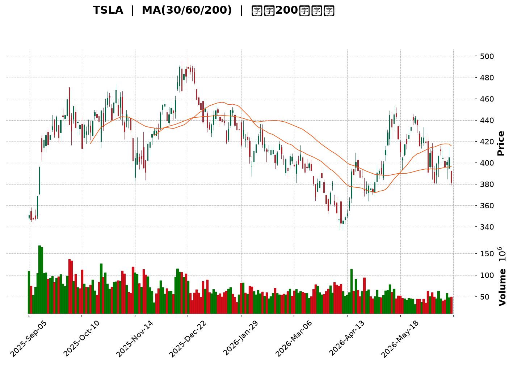
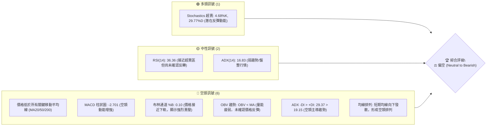
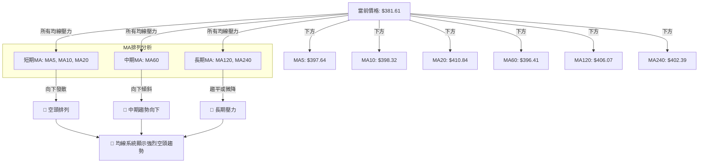

<details>
<summary>📊 靜態圖表 (點擊展開)</summary>

</details>

<html>
<head><meta charset="utf-8" /></head>
<body>
    <div style="height:500px; width:100%;">                        <script>window.PlotlyConfig = {MathJaxConfig: 'local'};</script>
        <script charset="utf-8" src="https://cdn.plot.ly/plotly-3.6.0.min.js" integrity="sha256-QaOVwtVY0T02VaHrr6pnoHLCwayMJp4O5n4YyaE3rJk=" crossorigin="anonymous"></script>                <div id="candlestick-chart" class="plotly-graph-div" style="height:100%; width:100%;"></div>            <script>                window.PLOTLYENV=window.PLOTLYENV || {};                                if (document.getElementById("candlestick-chart")) {                    Plotly.newPlot(                        "candlestick-chart",                        [{"close":{"dtype":"f8","bdata":"AAAAoHDtdUAAAABgZqZ1QAAAACCFr3VAAAAA4KO8dUAAAADA9Qx3QAAAAEAKv3hAAAAA4KOgeUAAAACA61l6QAAAAIDCnXpAAAAAoJkNekAAAADAHqF6QAAAACBcI3tAAAAAoJmdekAAAADgo6x7QAAAAIA9dnpAAAAAYGaGe0AAAAAgXLN7QAAAACCFy3tAAAAAIFy3fEAAAAAAAEB7QAAAAKBH3XpAAAAAAABUfEAAAACgcBF7QAAAAEAKa3tAAAAA4KM4e0AAAAAA19d5QAAAAGBmPntAAAAAANfTekAAAABgZjJ7QAAAAAAAzHpAAAAAwPV0e0AAAABA4fZ7QAAAAKCZqXtAAAAAIIVve0AAAAAgrg98QAAAACCFG3tAAAAAYLhGfEAAAADAzMh8QAAAAAAp2HxAAAAAoJmBe0AAAADA9Yh8QAAAAIDrRX1AAAAAACnEe0AAAADAHuF8QAAAAGCP3ntAAAAA4FHYekAAAAAgrtN7QAAAAIDreXtAAAAAoJnpekAAAAAA1x95QAAAAKCZRXlAAAAAYLiOeUAAAAAAABR5QAAAAADXP3lAAAAAIK6zeEAAAACgcHF4QAAAAOB6HHpAAAAAYGY2ekAAAACgR6l6QAAAAGC44npAAAAAgD3iekAAAAAA19N6QAAAAADX63tAAAAA4HpofEAAAAAAAHB8QAAAAKBHeXtAAAAAYLjSe0AAAABAMzd8QAAAAIA97ntAAAAAIFyvfEAAAADA9bR9QAAAAIAUnn5AAAAAACk0fUAAAACA6zV+QAAAAEAzE35AAAAAIK6LfkAAAADA9Vh+QAAAAGBmVn5AAAAAQAqzfUAAAACAPbp8QAAAAEDhZnxAAAAAIIUbfEAAAADAHmF7QAAAAGC4OnxAAAAAIFwPe0AAAABgj\u002fZ6QAAAAMDMPHtAAAAAACnQe0AAAAAgXA98QAAAAEAz83tAAAAAQDNze0AAAADAHml7QAAAAAAAWHtAAAAAAAA0ekAAAABACvd6QAAAAIDCFXxAAAAAwPUQfEAAAABAMzN7QAAAAGBm7npAAAAAIFz3ekAAAADA9Qh6QAAAAGCP5npAAAAAwPVcekAAAAAgXF96QAAAAAApYHlAAAAAIFzTeEAAAACAwrF5QAAAAMAeFXpAAAAAIFyTekAAAADgUcR6QAAAAMAeEXpAAAAAQAoXekAAAACAFKp5QAAAAMAetXlAAAAAIFy7eUAAAADAHr15QAAAAKBH\u002fXhAAAAAgBSWeUAAAABgZhZ6QAAAAKBHiXlAAAAAACkoeUAAAADAHjV5QAAAAEDhhnhAAAAAQApfeUAAAADAzFh5QAAAACCuy3hAAAAAQOHqeEAAAAAA1\u002fN4QAAAAMAefXlAAAAAACmweEAAAABAM3N4QAAAAMD1uHhAAAAA4FH0eEAAAADgeox4QAAAAMDMxHdAAAAAIFz\u002fdkAAAACgmc13QAAAAOB68HdAAAAAQDMfeEAAAACAwkF3QAAAAKBHnXZAAAAA4Ho0dkAAAAAAADx3QAAAAAAp1HdAAAAAoHCJdkAAAADAHg12QAAAAGBmqnVAAAAAAAB0dUAAAACA65l1QAAAAEAzz3VAAAAAYLgGdkAAAABAM8N2QAAAAEAzf3hAAAAAYGZOeEAAAACA6wl5QAAAAAAAiHhAAAAAYLgmeEAAAAAAKTh4QAAAACCFW3dAAAAAwMyEd0AAAABguKp3QAAAAOBRgHdAAAAAwMxMd0AAAACAFNp3QAAAAMAebXhAAAAAACmIeEAAAACA61V4QAAAACCu63hAAAAA4KO8eUAAAACgmcV6QAAAAAAA0HtAAAAAQDMXe0AAAADgUdR7QAAAAMDMtHtAAAAAANdjekAAAAAA1595QAAAAIDCQXlAAAAAACkUekAAAACgmR16QAAAAAApoHpAAAAAoHAZe0AAAACAwoV7QAAAAKCZoXtAAAAA4KM8e0AAAACAFP55QAAAAADXe3pAAAAAQDN7ekAAAABAMyd6QAAAAAAAcHhAAAAAQDOPeUAAAABA4cp4QAAAAKBw2XdAAAAAYGbyeEAAAABA4WZ5QAAAAGBmsnlAAAAAYI9KeUAAAACAFMZ4QAAAAADXB3lAAAAAwMxQeUAAAACAwtl3QA=="},"high":{"dtype":"f8","bdata":"AAAAgOs9dkAAAABACmd2QAAAAOBR7HVAAAAAoEdFdkAAAAAA1w93QAAAAEAKy3hAAAAAQDObekAAAAAAAHR6QAAAAMD1xHpAAAAAIIUDe0AAAAAghdd6QAAAACCuz3tAAAAAIIWPe0AAAAAgXMN7QAAAAKCZNXtAAAAAIIWHe0AAAAAgri98QAAAAAAA0HtAAAAA4KPkfEAAAAAAAGx9QAAAAOBR7HtAAAAAwMxYfEAAAABA4Up8QAAAAKBHlXtAAAAAoJlFe0AAAACAFLJ7QAAAAIA9TntAAAAAQDMje0AAAAAAKYh7QAAAAKCZdXtAAAAAIFyXe0AAAADAzBx8QAAAAMDMFHxAAAAA4KPYe0AAAABgZhZ8QAAAAEDhOnxAAAAAYI\u002fCfEAAAAAAADB9QAAAAEAzG31AAAAAwPVwfEAAAAAAAKB8QAAAAMAeoX1AAAAAIIXDfEAAAACgRyV9QAAAAEAzN31AAAAAgMJ1e0AAAABguBp8QAAAAADXp3tAAAAAoEele0AAAAAAAIh6QAAAAEAKw3lAAAAAIFx\u002fekAAAABgZo55QAAAAOB6vHlAAAAAQArPekAAAADAzCx5QAAAACCFW3pAAAAAIK5HekAAAABACq96QAAAAEDhDntAAAAAYI8ae0AAAADAzEx7QAAAAGC4\u002fntAAAAAgBRqfEAAAACA6618QAAAAAAAHHxAAAAAgD1GfEAAAACAFI58QAAAAOBRFHxAAAAAACnwfEAAAADgURx+QAAAAAAAuH5AAAAA4Hr0fkAAAACAwq1+QAAAAADXp35AAAAAoEctf0AAAAAghb9+QAAAAGBmrn5AAAAAoHCRfkAAAABgZlZ9QAAAAIDr8XxAAAAAwMyIfEAAAACgcKV8QAAAAMDMmHxAAAAAAAAEfEAAAACA62V7QAAAAIA9TntAAAAAwMwQfEAAAADAzGR8QAAAAMD1PHxAAAAAYI++e0AAAACAwtV7QAAAAAAA9HtAAAAAIK7rekAAAABAM2N7QAAAAAAAGHxAAAAAQOFGfEAAAADgo9B7QAAAAOBRWHtAAAAAAClke0AAAAAgroN7QAAAAIAUfntAAAAAYGayekAAAADA9ch6QAAAAGBmfnpAAAAAoJkheUAAAADAzOh5QAAAAAAAVHpAAAAAAAC0ekAAAACgmUV7QAAAACCuQ3tAAAAAwPWAekAAAAAghdt5QAAAAGBmDnpAAAAAAAD0eUAAAABAM+t5QAAAAEAze3lAAAAAwB6teUAAAACgcEV6QAAAAMD1DHpAAAAAgOtxeUAAAADgo0h5QAAAAKBwxXhAAAAAoEeFeUAAAACA64l5QAAAAKCZJXlAAAAAoHAZeUAAAACgcGl5QAAAAIAUBnpAAAAAAABoeUAAAABAMwN5QAAAACCuO3lAAAAAgOsBeUAAAADAHjF5QAAAAOBRNHhAAAAAgD2+d0AAAACgRxV4QAAAACCuN3hAAAAAIK7DeEAAAABACgd4QAAAAIDCHXdAAAAA4KP0dkAAAACgR1V3QAAAAIA98ndAAAAA4Hokd0AAAAAghft2QAAAAOBRwHVAAAAAAADIdkAAAACAFM51QAAAAIDC5XVAAAAAoJlFdkAAAACAFPp2QAAAAGBmqnhAAAAAwPWgeEAAAADgepR5QAAAAMDMbHlAAAAAQDOfeEAAAAAAKZB4QAAAAAAAIHhAAAAAACnsd0AAAADgesx3QAAAAOCj5HdAAAAAYGaGd0AAAAAAAAx4QAAAAMAe3XhAAAAAgD2qeEAAAACA6yF5QAAAAEDhGnlAAAAAoEf9eUAAAABAM\u002fN6QAAAAGCPEnxAAAAAwMz8e0AAAABgZlZ8QAAAACCuP3xAAAAAYI8qe0AAAACAFFJ6QAAAAIAUWnlAAAAAIFwXekAAAABAM696QAAAAAAp+HpAAAAAQDMze0AAAACgmdl7QAAAACBcv3tAAAAAwB6Re0AAAACgmdl6QAAAAGC4hnpAAAAAoJkZe0AAAACgmaV6QAAAAEDhinpAAAAAQArPeUAAAAAAACh6QAAAAKBw0XhAAAAA4KP4eEAAAABA4Wp5QAAAAAAAAHpAAAAAYLjGeUAAAABACl95QAAAAOBRKHlAAAAAAADseUAAAACgcIl4QA=="},"hovertemplate":"\u003cb\u003e%{x|%Y-%m-%d}\u003c\u002fb\u003e\u003cbr\u003e\u958b: $%{open:.2f}\u003cbr\u003e\u9ad8: $%{high:.2f}\u003cbr\u003e\u4f4e: $%{low:.2f}\u003cbr\u003e\u6536: $%{close:.2f}\u003cextra\u003e\u003c\u002fextra\u003e","low":{"dtype":"f8","bdata":"AAAAQOGKdUAAAACgcI11QAAAAMAefXVAAAAAwB6hdUAAAACgmbl1QAAAAADXI3dAAAAAQOEmeUAAAABA4bZ5QAAAAGC4mnlAAAAAwPUIekAAAAAghVt6QAAAAIAU0npAAAAAIIV7ekAAAADgetB6QAAAAKBHMXpAAAAA4FFQekAAAAAAAHh7QAAAAIDrEXtAAAAAAACMe0AAAADAHjl7QAAAAKBHCXpAAAAAQApLe0AAAABAMwd7QAAAACCuk3pAAAAAQOGiekAAAABAM7d5QAAAAEAzO3pAAAAAgMIdekAAAACgR6V6QAAAAMD1VHpAAAAAoJl5ekAAAACAwol7QAAAAMDMoHtAAAAAAADQekAAAABgZt55QAAAAGC44npAAAAAQApre0AAAACgmTl8QAAAAGBmSnxAAAAAgMJ5e0AAAABACrt7QAAAAMDMXHxAAAAAoJm5e0AAAAAgXIt7QAAAAKBwMXtAAAAAgBReekAAAACAwhV7QAAAAIDCBXtAAAAAwPWoekAAAACgcMV4QAAAAOB67HdAAAAAANfreEAAAAAgXJt4QAAAAAAA6HhAAAAAANereEAAAAAAKfx3QAAAAKBwEXlAAAAAQDNfeUAAAACAPQ56QAAAAEAzo3pAAAAA4KOUekAAAACA62F6QAAAAIDC8XpAAAAAgD3We0AAAABgjzp8QAAAAAAANHtAAAAAQDM7e0AAAACAwrl7QAAAAKBHhXtAAAAAYLiae0AAAABgjzp9QAAAAKBHHX1AAAAAQDMjfUAAAACA65F9QAAAACCFq31AAAAAoEdVfkAAAACgcC1+QAAAAMDMzH1AAAAAwB6dfUAAAAAAALB8QAAAAKBHXXxAAAAAwMwUfEAAAADAzDR7QAAAAMAeyXtAAAAA4HrMekAAAADgo\u002fR6QAAAAIDrhXpAAAAAgD3mekAAAAAAAGB7QAAAAEAzv3tAAAAAIIUje0AAAABgZlp7QAAAAAApNHtAAAAAQAoXekAAAACA6zl6QAAAAIAUCntAAAAA4KPAe0AAAADgeiR7QAAAAEAK63pAAAAAoJnhekAAAACA6+l5QAAAAEAza3pAAAAAAADoeUAAAABACtt5QAAAAEDh8nhAAAAA4Ho4eEAAAAAAANx4QAAAAOCjdHlAAAAAAAAQekAAAADgekB6QAAAAAAA4HlAAAAAgBSueUAAAAAAKQh5QAAAAKBHmXlAAAAAgMJBeUAAAAAAAFh5QAAAAOCjoHhAAAAAgD3aeEAAAABgZsJ5QAAAAGCPOnlAAAAAgMLheEAAAAAAAER4QAAAAIA9FnhAAAAAoEepeEAAAABguPZ4QAAAACBco3hAAAAAYGbWd0AAAABACuN4QAAAAGBmInlAAAAAYGaqeEAAAABAM194QAAAAGC4pnhAAAAAAACQeEAAAADA9YR4QAAAACCuq3dAAAAAIFzHdkAAAAAgrkt3QAAAAMD1hHdAAAAAACkQeEAAAACA6z13QAAAACCFd3ZAAAAAgD0CdkAAAAAAAJB2QAAAAKBHYXdAAAAA4HpwdkAAAACAPap1QAAAAADXE3VAAAAAYLg6dUAAAAAAABR1QAAAAADXa3VAAAAAwB7JdUAAAADgUSx2QAAAAAAAqHZAAAAAwMzcd0AAAABgZnp4QAAAAKBHRXhAAAAAIIUTeEAAAADAzBR4QAAAAIA9BndAAAAAIK4rd0AAAADgUcB2QAAAAOCjSHdAAAAA4KMgd0AAAABguAJ3QAAAAMDMrHdAAAAAwMwMeEAAAAAAAFB4QAAAAOBRAHhAAAAAgOsheUAAAACAPQZ6QAAAAMDMDHpAAAAAAClkekAAAAAgXON6QAAAAGCPkntAAAAAAABgekAAAACgR1V5QAAAAIAUmnhAAAAAgD1meUAAAABgZs55QAAAAAApSHpAAAAAgOuhekAAAADgUTh7QAAAAMDMRHtAAAAAgD3CekAAAABA4fZ5QAAAAGBm2nlAAAAAAAAAekAAAABgjxJ6QAAAAKBwSXhAAAAAIIWreEAAAAAA1wN4QAAAAGBmwndAAAAAYI\u002fKd0AAAAAAKSx4QAAAAKCZcXlAAAAA4KMIeUAAAAAAKZx4QAAAAEAzC3hAAAAAYGameEAAAADA9bB3QA=="},"name":"\u50f9\u683c","open":{"dtype":"f8","bdata":"AAAAAADAdUAAAACAPSp2QAAAAEAKx3VAAAAAwMzodUAAAABguOJ1QAAAAEAKL3dAAAAAgBRyekAAAAAAAOh5QAAAAAAA\u002fHlAAAAAgOvNekAAAADAHl16QAAAAIDC8XpAAAAAgBR+e0AAAACgR916QAAAAADXM3tAAAAAwMzEekAAAACgmcV7QAAAAOBRmHtAAAAAwMy8e0AAAADgo2h9QAAAAOCjtHtAAAAAAACMe0AAAADAHv17QAAAAMAeWXtAAAAAwPX8ekAAAADgo0h7QAAAAOB6eHpAAAAA4KOsekAAAABgZi57QAAAACCuK3tAAAAAAACYekAAAACA6717QAAAAAAp3HtAAAAAQDO3e0AAAAAAAEB6QAAAAKBH7XtAAAAAIK5\u002fe0AAAADgemx8QAAAAAAA6HxAAAAAwMwwfEAAAAAAAOx7QAAAAADXf3xAAAAAIFxnfEAAAADAzEB8QAAAACBc33xAAAAAYLhee0AAAACgmXl7QAAAAGBmdntAAAAAYGaie0AAAACAFHJ6QAAAAMDMJHhAAAAAANfreEAAAACAFFZ5QAAAAEDhYnlAAAAAgBTqeUAAAADAHiV5QAAAAGC4InlAAAAAYLjmeUAAAABAM396QAAAAKBwqXpAAAAAwB6VekAAAADA9ex6QAAAAKCZAXtAAAAAQAoffEAAAADgelB8QAAAAEAz93tAAAAA4KNYe0AAAADAHuF7QAAAAEAzD3xAAAAAoHABfEAAAABACld9QAAAACBcg31AAAAAIIWDfkAAAABgj+J9QAAAAIDrgX5AAAAAgBSefkAAAABgZpZ+QAAAACCuh35AAAAAIK5TfkAAAAAAAFB9QAAAAKBw0XxAAAAAoJmBfEAAAADAzJx8QAAAAADX\u002f3tAAAAAgBTme0AAAABgZj57QAAAAIA9vnpAAAAAQDM\u002fe0AAAAAgrpN7QAAAAEAzI3xAAAAAwPWse0AAAACAFJJ7QAAAAAAAeHtAAAAAgMLVekAAAABgj1p6QAAAAGCPMntAAAAAQOH2e0AAAAAAANB7QAAAAGCPVntAAAAAYI\u002f+ekAAAADAzFx7QAAAAKCZlXpAAAAA4KNUekAAAADgUYR6QAAAACBcR3pAAAAA4FHQeEAAAACA6w15QAAAAGCPnnlAAAAAoEchekAAAAAgXL96QAAAAMDM5HpAAAAAwPXkeUAAAACAwsV5QAAAAIDCsXlAAAAAAAB0eUAAAADAzIR5QAAAAOCjdHlAAAAAAAD4eEAAAABgZsJ5QAAAAGC45nlAAAAAQAoveUAAAACgmWl4QAAAAKBwsXhAAAAAoJndeEAAAADAHhl5QAAAAKBw4XhAAAAAwMxgeEAAAAAghSN5QAAAAOB6JHlAAAAAQOFSeUAAAABguPJ4QAAAACCFw3hAAAAAQAq7eEAAAAAAAPB4QAAAAOBRNHhAAAAAoJm9d0AAAACgcFF3QAAAAMD1iHdAAAAAANdfeEAAAACgmdl3QAAAAEAKG3dAAAAAgMLddkAAAAAAKZh2QAAAAIAUqndAAAAAQDPDdkAAAACgcKl2QAAAAEAKp3VAAAAA4KO8dkAAAABgZnJ1QAAAAOCjpHVAAAAAwB7hdUAAAABguFp2QAAAAKBH7XZAAAAAwPWceEAAAABguL54QAAAAKBHKXlAAAAAAACQeEAAAADAHjl4QAAAAOB6dHdAAAAAAABYd0AAAACgcEF3QAAAAEDhandAAAAAYGZ2d0AAAAAAAEx3QAAAAADX53dAAAAAIK5jeEAAAABACrN4QAAAAAAAJHhAAAAAIK53eUAAAAAgrgd6QAAAAGCPYnpAAAAAYI+We0AAAABguEp7QAAAAADX53tAAAAAIK4fe0AAAADgUTR6QAAAAGCPMnlAAAAAoJl5eUAAAABA4WJ6QAAAAGC4anpAAAAAACnkekAAAACAPa57QAAAAIDrWXtAAAAAoJl9e0AAAAAA17d6QAAAACCFI3pAAAAAQDMrekAAAACgcD16QAAAAAAASHpAAAAAoEfFeEAAAADgerB5QAAAAOCjeHhAAAAA4HpEeEAAAAAA1\u002fd4QAAAAIDrxXlAAAAAgMJBeUAAAADgehh5QAAAAKCZ4XhAAAAAoJmteEAAAAAgXId4QA=="},"x":["2025-09-05T00:00:00-04:00","2025-09-08T00:00:00-04:00","2025-09-09T00:00:00-04:00","2025-09-10T00:00:00-04:00","2025-09-11T00:00:00-04:00","2025-09-12T00:00:00-04:00","2025-09-15T00:00:00-04:00","2025-09-16T00:00:00-04:00","2025-09-17T00:00:00-04:00","2025-09-18T00:00:00-04:00","2025-09-19T00:00:00-04:00","2025-09-22T00:00:00-04:00","2025-09-23T00:00:00-04:00","2025-09-24T00:00:00-04:00","2025-09-25T00:00:00-04:00","2025-09-26T00:00:00-04:00","2025-09-29T00:00:00-04:00","2025-09-30T00:00:00-04:00","2025-10-01T00:00:00-04:00","2025-10-02T00:00:00-04:00","2025-10-03T00:00:00-04:00","2025-10-06T00:00:00-04:00","2025-10-07T00:00:00-04:00","2025-10-08T00:00:00-04:00","2025-10-09T00:00:00-04:00","2025-10-10T00:00:00-04:00","2025-10-13T00:00:00-04:00","2025-10-14T00:00:00-04:00","2025-10-15T00:00:00-04:00","2025-10-16T00:00:00-04:00","2025-10-17T00:00:00-04:00","2025-10-20T00:00:00-04:00","2025-10-21T00:00:00-04:00","2025-10-22T00:00:00-04:00","2025-10-23T00:00:00-04:00","2025-10-24T00:00:00-04:00","2025-10-27T00:00:00-04:00","2025-10-28T00:00:00-04:00","2025-10-29T00:00:00-04:00","2025-10-30T00:00:00-04:00","2025-10-31T00:00:00-04:00","2025-11-03T00:00:00-05:00","2025-11-04T00:00:00-05:00","2025-11-05T00:00:00-05:00","2025-11-06T00:00:00-05:00","2025-11-07T00:00:00-05:00","2025-11-10T00:00:00-05:00","2025-11-11T00:00:00-05:00","2025-11-12T00:00:00-05:00","2025-11-13T00:00:00-05:00","2025-11-14T00:00:00-05:00","2025-11-17T00:00:00-05:00","2025-11-18T00:00:00-05:00","2025-11-19T00:00:00-05:00","2025-11-20T00:00:00-05:00","2025-11-21T00:00:00-05:00","2025-11-24T00:00:00-05:00","2025-11-25T00:00:00-05:00","2025-11-26T00:00:00-05:00","2025-11-28T00:00:00-05:00","2025-12-01T00:00:00-05:00","2025-12-02T00:00:00-05:00","2025-12-03T00:00:00-05:00","2025-12-04T00:00:00-05:00","2025-12-05T00:00:00-05:00","2025-12-08T00:00:00-05:00","2025-12-09T00:00:00-05:00","2025-12-10T00:00:00-05:00","2025-12-11T00:00:00-05:00","2025-12-12T00:00:00-05:00","2025-12-15T00:00:00-05:00","2025-12-16T00:00:00-05:00","2025-12-17T00:00:00-05:00","2025-12-18T00:00:00-05:00","2025-12-19T00:00:00-05:00","2025-12-22T00:00:00-05:00","2025-12-23T00:00:00-05:00","2025-12-24T00:00:00-05:00","2025-12-26T00:00:00-05:00","2025-12-29T00:00:00-05:00","2025-12-30T00:00:00-05:00","2025-12-31T00:00:00-05:00","2026-01-02T00:00:00-05:00","2026-01-05T00:00:00-05:00","2026-01-06T00:00:00-05:00","2026-01-07T00:00:00-05:00","2026-01-08T00:00:00-05:00","2026-01-09T00:00:00-05:00","2026-01-12T00:00:00-05:00","2026-01-13T00:00:00-05:00","2026-01-14T00:00:00-05:00","2026-01-15T00:00:00-05:00","2026-01-16T00:00:00-05:00","2026-01-20T00:00:00-05:00","2026-01-21T00:00:00-05:00","2026-01-22T00:00:00-05:00","2026-01-23T00:00:00-05:00","2026-01-26T00:00:00-05:00","2026-01-27T00:00:00-05:00","2026-01-28T00:00:00-05:00","2026-01-29T00:00:00-05:00","2026-01-30T00:00:00-05:00","2026-02-02T00:00:00-05:00","2026-02-03T00:00:00-05:00","2026-02-04T00:00:00-05:00","2026-02-05T00:00:00-05:00","2026-02-06T00:00:00-05:00","2026-02-09T00:00:00-05:00","2026-02-10T00:00:00-05:00","2026-02-11T00:00:00-05:00","2026-02-12T00:00:00-05:00","2026-02-13T00:00:00-05:00","2026-02-17T00:00:00-05:00","2026-02-18T00:00:00-05:00","2026-02-19T00:00:00-05:00","2026-02-20T00:00:00-05:00","2026-02-23T00:00:00-05:00","2026-02-24T00:00:00-05:00","2026-02-25T00:00:00-05:00","2026-02-26T00:00:00-05:00","2026-02-27T00:00:00-05:00","2026-03-02T00:00:00-05:00","2026-03-03T00:00:00-05:00","2026-03-04T00:00:00-05:00","2026-03-05T00:00:00-05:00","2026-03-06T00:00:00-05:00","2026-03-09T00:00:00-04:00","2026-03-10T00:00:00-04:00","2026-03-11T00:00:00-04:00","2026-03-12T00:00:00-04:00","2026-03-13T00:00:00-04:00","2026-03-16T00:00:00-04:00","2026-03-17T00:00:00-04:00","2026-03-18T00:00:00-04:00","2026-03-19T00:00:00-04:00","2026-03-20T00:00:00-04:00","2026-03-23T00:00:00-04:00","2026-03-24T00:00:00-04:00","2026-03-25T00:00:00-04:00","2026-03-26T00:00:00-04:00","2026-03-27T00:00:00-04:00","2026-03-30T00:00:00-04:00","2026-03-31T00:00:00-04:00","2026-04-01T00:00:00-04:00","2026-04-02T00:00:00-04:00","2026-04-06T00:00:00-04:00","2026-04-07T00:00:00-04:00","2026-04-08T00:00:00-04:00","2026-04-09T00:00:00-04:00","2026-04-10T00:00:00-04:00","2026-04-13T00:00:00-04:00","2026-04-14T00:00:00-04:00","2026-04-15T00:00:00-04:00","2026-04-16T00:00:00-04:00","2026-04-17T00:00:00-04:00","2026-04-20T00:00:00-04:00","2026-04-21T00:00:00-04:00","2026-04-22T00:00:00-04:00","2026-04-23T00:00:00-04:00","2026-04-24T00:00:00-04:00","2026-04-27T00:00:00-04:00","2026-04-28T00:00:00-04:00","2026-04-29T00:00:00-04:00","2026-04-30T00:00:00-04:00","2026-05-01T00:00:00-04:00","2026-05-04T00:00:00-04:00","2026-05-05T00:00:00-04:00","2026-05-06T00:00:00-04:00","2026-05-07T00:00:00-04:00","2026-05-08T00:00:00-04:00","2026-05-11T00:00:00-04:00","2026-05-12T00:00:00-04:00","2026-05-13T00:00:00-04:00","2026-05-14T00:00:00-04:00","2026-05-15T00:00:00-04:00","2026-05-18T00:00:00-04:00","2026-05-19T00:00:00-04:00","2026-05-20T00:00:00-04:00","2026-05-21T00:00:00-04:00","2026-05-22T00:00:00-04:00","2026-05-26T00:00:00-04:00","2026-05-27T00:00:00-04:00","2026-05-28T00:00:00-04:00","2026-05-29T00:00:00-04:00","2026-06-01T00:00:00-04:00","2026-06-02T00:00:00-04:00","2026-06-03T00:00:00-04:00","2026-06-04T00:00:00-04:00","2026-06-05T00:00:00-04:00","2026-06-08T00:00:00-04:00","2026-06-09T00:00:00-04:00","2026-06-10T00:00:00-04:00","2026-06-11T00:00:00-04:00","2026-06-12T00:00:00-04:00","2026-06-15T00:00:00-04:00","2026-06-16T00:00:00-04:00","2026-06-17T00:00:00-04:00","2026-06-18T00:00:00-04:00","2026-06-22T00:00:00-04:00","2026-06-23T00:00:00-04:00"],"type":"candlestick"},{"hovertemplate":"MA30: $%{y:.2f}\u003cextra\u003e\u003c\u002fextra\u003e","line":{"color":"#2196F3","dash":"dash","width":2},"mode":"lines","name":"MA30","x":["2025-09-05T00:00:00-04:00","2025-09-08T00:00:00-04:00","2025-09-09T00:00:00-04:00","2025-09-10T00:00:00-04:00","2025-09-11T00:00:00-04:00","2025-09-12T00:00:00-04:00","2025-09-15T00:00:00-04:00","2025-09-16T00:00:00-04:00","2025-09-17T00:00:00-04:00","2025-09-18T00:00:00-04:00","2025-09-19T00:00:00-04:00","2025-09-22T00:00:00-04:00","2025-09-23T00:00:00-04:00","2025-09-24T00:00:00-04:00","2025-09-25T00:00:00-04:00","2025-09-26T00:00:00-04:00","2025-09-29T00:00:00-04:00","2025-09-30T00:00:00-04:00","2025-10-01T00:00:00-04:00","2025-10-02T00:00:00-04:00","2025-10-03T00:00:00-04:00","2025-10-06T00:00:00-04:00","2025-10-07T00:00:00-04:00","2025-10-08T00:00:00-04:00","2025-10-09T00:00:00-04:00","2025-10-10T00:00:00-04:00","2025-10-13T00:00:00-04:00","2025-10-14T00:00:00-04:00","2025-10-15T00:00:00-04:00","2025-10-16T00:00:00-04:00","2025-10-17T00:00:00-04:00","2025-10-20T00:00:00-04:00","2025-10-21T00:00:00-04:00","2025-10-22T00:00:00-04:00","2025-10-23T00:00:00-04:00","2025-10-24T00:00:00-04:00","2025-10-27T00:00:00-04:00","2025-10-28T00:00:00-04:00","2025-10-29T00:00:00-04:00","2025-10-30T00:00:00-04:00","2025-10-31T00:00:00-04:00","2025-11-03T00:00:00-05:00","2025-11-04T00:00:00-05:00","2025-11-05T00:00:00-05:00","2025-11-06T00:00:00-05:00","2025-11-07T00:00:00-05:00","2025-11-10T00:00:00-05:00","2025-11-11T00:00:00-05:00","2025-11-12T00:00:00-05:00","2025-11-13T00:00:00-05:00","2025-11-14T00:00:00-05:00","2025-11-17T00:00:00-05:00","2025-11-18T00:00:00-05:00","2025-11-19T00:00:00-05:00","2025-11-20T00:00:00-05:00","2025-11-21T00:00:00-05:00","2025-11-24T00:00:00-05:00","2025-11-25T00:00:00-05:00","2025-11-26T00:00:00-05:00","2025-11-28T00:00:00-05:00","2025-12-01T00:00:00-05:00","2025-12-02T00:00:00-05:00","2025-12-03T00:00:00-05:00","2025-12-04T00:00:00-05:00","2025-12-05T00:00:00-05:00","2025-12-08T00:00:00-05:00","2025-12-09T00:00:00-05:00","2025-12-10T00:00:00-05:00","2025-12-11T00:00:00-05:00","2025-12-12T00:00:00-05:00","2025-12-15T00:00:00-05:00","2025-12-16T00:00:00-05:00","2025-12-17T00:00:00-05:00","2025-12-18T00:00:00-05:00","2025-12-19T00:00:00-05:00","2025-12-22T00:00:00-05:00","2025-12-23T00:00:00-05:00","2025-12-24T00:00:00-05:00","2025-12-26T00:00:00-05:00","2025-12-29T00:00:00-05:00","2025-12-30T00:00:00-05:00","2025-12-31T00:00:00-05:00","2026-01-02T00:00:00-05:00","2026-01-05T00:00:00-05:00","2026-01-06T00:00:00-05:00","2026-01-07T00:00:00-05:00","2026-01-08T00:00:00-05:00","2026-01-09T00:00:00-05:00","2026-01-12T00:00:00-05:00","2026-01-13T00:00:00-05:00","2026-01-14T00:00:00-05:00","2026-01-15T00:00:00-05:00","2026-01-16T00:00:00-05:00","2026-01-20T00:00:00-05:00","2026-01-21T00:00:00-05:00","2026-01-22T00:00:00-05:00","2026-01-23T00:00:00-05:00","2026-01-26T00:00:00-05:00","2026-01-27T00:00:00-05:00","2026-01-28T00:00:00-05:00","2026-01-29T00:00:00-05:00","2026-01-30T00:00:00-05:00","2026-02-02T00:00:00-05:00","2026-02-03T00:00:00-05:00","2026-02-04T00:00:00-05:00","2026-02-05T00:00:00-05:00","2026-02-06T00:00:00-05:00","2026-02-09T00:00:00-05:00","2026-02-10T00:00:00-05:00","2026-02-11T00:00:00-05:00","2026-02-12T00:00:00-05:00","2026-02-13T00:00:00-05:00","2026-02-17T00:00:00-05:00","2026-02-18T00:00:00-05:00","2026-02-19T00:00:00-05:00","2026-02-20T00:00:00-05:00","2026-02-23T00:00:00-05:00","2026-02-24T00:00:00-05:00","2026-02-25T00:00:00-05:00","2026-02-26T00:00:00-05:00","2026-02-27T00:00:00-05:00","2026-03-02T00:00:00-05:00","2026-03-03T00:00:00-05:00","2026-03-04T00:00:00-05:00","2026-03-05T00:00:00-05:00","2026-03-06T00:00:00-05:00","2026-03-09T00:00:00-04:00","2026-03-10T00:00:00-04:00","2026-03-11T00:00:00-04:00","2026-03-12T00:00:00-04:00","2026-03-13T00:00:00-04:00","2026-03-16T00:00:00-04:00","2026-03-17T00:00:00-04:00","2026-03-18T00:00:00-04:00","2026-03-19T00:00:00-04:00","2026-03-20T00:00:00-04:00","2026-03-23T00:00:00-04:00","2026-03-24T00:00:00-04:00","2026-03-25T00:00:00-04:00","2026-03-26T00:00:00-04:00","2026-03-27T00:00:00-04:00","2026-03-30T00:00:00-04:00","2026-03-31T00:00:00-04:00","2026-04-01T00:00:00-04:00","2026-04-02T00:00:00-04:00","2026-04-06T00:00:00-04:00","2026-04-07T00:00:00-04:00","2026-04-08T00:00:00-04:00","2026-04-09T00:00:00-04:00","2026-04-10T00:00:00-04:00","2026-04-13T00:00:00-04:00","2026-04-14T00:00:00-04:00","2026-04-15T00:00:00-04:00","2026-04-16T00:00:00-04:00","2026-04-17T00:00:00-04:00","2026-04-20T00:00:00-04:00","2026-04-21T00:00:00-04:00","2026-04-22T00:00:00-04:00","2026-04-23T00:00:00-04:00","2026-04-24T00:00:00-04:00","2026-04-27T00:00:00-04:00","2026-04-28T00:00:00-04:00","2026-04-29T00:00:00-04:00","2026-04-30T00:00:00-04:00","2026-05-01T00:00:00-04:00","2026-05-04T00:00:00-04:00","2026-05-05T00:00:00-04:00","2026-05-06T00:00:00-04:00","2026-05-07T00:00:00-04:00","2026-05-08T00:00:00-04:00","2026-05-11T00:00:00-04:00","2026-05-12T00:00:00-04:00","2026-05-13T00:00:00-04:00","2026-05-14T00:00:00-04:00","2026-05-15T00:00:00-04:00","2026-05-18T00:00:00-04:00","2026-05-19T00:00:00-04:00","2026-05-20T00:00:00-04:00","2026-05-21T00:00:00-04:00","2026-05-22T00:00:00-04:00","2026-05-26T00:00:00-04:00","2026-05-27T00:00:00-04:00","2026-05-28T00:00:00-04:00","2026-05-29T00:00:00-04:00","2026-06-01T00:00:00-04:00","2026-06-02T00:00:00-04:00","2026-06-03T00:00:00-04:00","2026-06-04T00:00:00-04:00","2026-06-05T00:00:00-04:00","2026-06-08T00:00:00-04:00","2026-06-09T00:00:00-04:00","2026-06-10T00:00:00-04:00","2026-06-11T00:00:00-04:00","2026-06-12T00:00:00-04:00","2026-06-15T00:00:00-04:00","2026-06-16T00:00:00-04:00","2026-06-17T00:00:00-04:00","2026-06-18T00:00:00-04:00","2026-06-22T00:00:00-04:00","2026-06-23T00:00:00-04:00"],"y":{"dtype":"f8","bdata":"AAAAAAAA+H8AAAAAAAD4fwAAAAAAAPh\u002fAAAAAAAA+H8AAAAAAAD4fwAAAAAAAPh\u002fAAAAAAAA+H8AAAAAAAD4fwAAAAAAAPh\u002fAAAAAAAA+H8AAAAAAAD4fwAAAAAAAPh\u002fAAAAAAAA+H8AAAAAAAD4fwAAAAAAAPh\u002fAAAAAAAA+H8AAAAAAAD4fwAAAAAAAPh\u002fAAAAAAAA+H8AAAAAAAD4fwAAAAAAAPh\u002fAAAAAAAA+H8AAAAAAAD4fwAAAAAAAPh\u002fAAAAAAAA+H8AAAAAAAD4fwAAAAAAAPh\u002fAAAAAAAA+H8AAAAAAAD4f5qZmXkUIHpARERElENPekCrqqqKJYV6QJqZmTkmuHpAVVVVVcfoekBmZmY2iRN7QBEREXGvJ3tAmpmZuUk+e0B3d3f3DFN7QCIiImIQZntAiYiIyHZye0Dv7u6uuYJ7QJqZmanxlHtA3t3dPcOee0CrqqqaC6l7QFVVVVUOtXtAmpmZ2UCve0BmZmamVLB7QERERFScrXtAq6qq+jeee0Crqqp6FIx7QM3MzJx9fntAd3d3F9lme0Dv7u7e3VV7QJqZmSlcQ3tAERERgdwte0CJiIgo6iF7QM3MzCxAGHtAAAAAsAATe0CJiIiYbg57QJqZmXkwD3tAd3d3d0wKe0DNzMzsmAB7QLy7uyvOAntAERERoRoLe0Dv7u6OUA57QERERKRwEXtAZmZmxpINe0AzMzNTuAh7QFVVVTXsAHtAmpmZOfsKe0CamZk5+xR7QO\u002fu7g50IHtAMzMzU7gse0C8u7t7FDh7QO\u002fu7r7mSntAMzMz43pqe0BmZmZG\u002fX97QFVVVcVnmHtAq6qqyi+we0ARERHx7s57QHd3d4ek6XtAZmZmFmf\u002fe0Dv7u4+ChN8QImIiCh4LHxA7+7ujpdAfEBVVVWVGFZ8QJqZmem0X3xAiYiIiF1tfEBmZmYmTXl8QAAAAFBignxA3t3dTTeHfECamZkpMYx8QImIiJhDh3xAMzMzs3J0fECamZn54Wd8QFVVVUUZbXxAIiIiYixvfEB3d3e3gWZ8QLy7u4v6XXxAERER4U9PfEC8u7uL+i98QImIiOhCEHxAd3d3dwX4e0BERET0RNd7QDMzMwMrr3tAq6qqelt+e0AiIiKSplZ7QCIiImJXMntAIiIicq8Xe0BERERk9AZ7QCIiIoIH83pAZmZmNtDhekDNzMy8LdN6QN7d3Z2ovXpAiYiISFOyekCJiIiY4Kd6QN7d3X2xlHpA7+7uzrCBekARERHR23B6QFVVVeVCXHpAzczMfLFIekAAAACw5DV6QBERESHbHXpA7+7u3sEWekBVVVUF8wh6QGZmZkbh7HlAmpmZuQLSeUC8u7v71L55QLy7u8uFsnlAiYiIKBWfeUDNzMysjpF5QM3MzHz4fnlAZmZmBvNyeUC8u7v7YmN5QFVVVbWsVXlAvLu7GxNGeUDNzMyc7zV5QCIiIuKlI3lAZmZmlrUOeUAAAADgwfB4QFVVVcVL03hAvLu72ySyeEARERFxaJ14QAAAAEBgjXhAq6qqqhxyeEAzMzMzpVJ4QLy7u1tINnhAiYiIaAMTeEC8u7sLu+x3QBEREZHtzHdAzczMnDayd0De3d1tWZ13QFVVVeUXnXdA3t3dXQGUd0AiIiJCYJF3QImIiLgej3dAMzMz05SId0CrqqpKU4J3QBEREYEjcHdAZmZm9ihmd0AzMzMzel93QGZmZlYOVXdAzczMTPBGd0BERET0\u002fUB3QJqZmUmaRndA7+7uLrJTd0AiIiJyPVh3QFVVVQWdYHdAq6qqCmVud0De3d2tY4x3QImIiCi\u002fuHdAiYiI+G\u002fid0BmZmbmpQl4QM3MzGy8KnhAREREtJ1LeEAAAABQG2p4QERERITAiHhAmpmZWTmweEB3d3cnv9Z4QJqZmWnY\u002f3hAIiIi0iIreUAiIiIywVN5QHd3d1eAbnlAREREZIKHeUBERETkpY95QBERETFPoHlAd3d3JzG0eUDv7u5+scR5QKuqqsrozXlAvLu7m1LfeUAiIiKS7eh5QAAAABDm63lAd3d3t\u002fP5eUDe3d29LQd6QGZmZnYFEnpAd3d3V4AYekARERFxPRx6QM3MzLwtHXpAAAAAgJUZekDe3d3tpwB6QA=="},"type":"scatter"},{"hovertemplate":"MA60: $%{y:.2f}\u003cextra\u003e\u003c\u002fextra\u003e","line":{"color":"#9C27B0","dash":"dash","width":2},"mode":"lines","name":"MA60","x":["2025-09-05T00:00:00-04:00","2025-09-08T00:00:00-04:00","2025-09-09T00:00:00-04:00","2025-09-10T00:00:00-04:00","2025-09-11T00:00:00-04:00","2025-09-12T00:00:00-04:00","2025-09-15T00:00:00-04:00","2025-09-16T00:00:00-04:00","2025-09-17T00:00:00-04:00","2025-09-18T00:00:00-04:00","2025-09-19T00:00:00-04:00","2025-09-22T00:00:00-04:00","2025-09-23T00:00:00-04:00","2025-09-24T00:00:00-04:00","2025-09-25T00:00:00-04:00","2025-09-26T00:00:00-04:00","2025-09-29T00:00:00-04:00","2025-09-30T00:00:00-04:00","2025-10-01T00:00:00-04:00","2025-10-02T00:00:00-04:00","2025-10-03T00:00:00-04:00","2025-10-06T00:00:00-04:00","2025-10-07T00:00:00-04:00","2025-10-08T00:00:00-04:00","2025-10-09T00:00:00-04:00","2025-10-10T00:00:00-04:00","2025-10-13T00:00:00-04:00","2025-10-14T00:00:00-04:00","2025-10-15T00:00:00-04:00","2025-10-16T00:00:00-04:00","2025-10-17T00:00:00-04:00","2025-10-20T00:00:00-04:00","2025-10-21T00:00:00-04:00","2025-10-22T00:00:00-04:00","2025-10-23T00:00:00-04:00","2025-10-24T00:00:00-04:00","2025-10-27T00:00:00-04:00","2025-10-28T00:00:00-04:00","2025-10-29T00:00:00-04:00","2025-10-30T00:00:00-04:00","2025-10-31T00:00:00-04:00","2025-11-03T00:00:00-05:00","2025-11-04T00:00:00-05:00","2025-11-05T00:00:00-05:00","2025-11-06T00:00:00-05:00","2025-11-07T00:00:00-05:00","2025-11-10T00:00:00-05:00","2025-11-11T00:00:00-05:00","2025-11-12T00:00:00-05:00","2025-11-13T00:00:00-05:00","2025-11-14T00:00:00-05:00","2025-11-17T00:00:00-05:00","2025-11-18T00:00:00-05:00","2025-11-19T00:00:00-05:00","2025-11-20T00:00:00-05:00","2025-11-21T00:00:00-05:00","2025-11-24T00:00:00-05:00","2025-11-25T00:00:00-05:00","2025-11-26T00:00:00-05:00","2025-11-28T00:00:00-05:00","2025-12-01T00:00:00-05:00","2025-12-02T00:00:00-05:00","2025-12-03T00:00:00-05:00","2025-12-04T00:00:00-05:00","2025-12-05T00:00:00-05:00","2025-12-08T00:00:00-05:00","2025-12-09T00:00:00-05:00","2025-12-10T00:00:00-05:00","2025-12-11T00:00:00-05:00","2025-12-12T00:00:00-05:00","2025-12-15T00:00:00-05:00","2025-12-16T00:00:00-05:00","2025-12-17T00:00:00-05:00","2025-12-18T00:00:00-05:00","2025-12-19T00:00:00-05:00","2025-12-22T00:00:00-05:00","2025-12-23T00:00:00-05:00","2025-12-24T00:00:00-05:00","2025-12-26T00:00:00-05:00","2025-12-29T00:00:00-05:00","2025-12-30T00:00:00-05:00","2025-12-31T00:00:00-05:00","2026-01-02T00:00:00-05:00","2026-01-05T00:00:00-05:00","2026-01-06T00:00:00-05:00","2026-01-07T00:00:00-05:00","2026-01-08T00:00:00-05:00","2026-01-09T00:00:00-05:00","2026-01-12T00:00:00-05:00","2026-01-13T00:00:00-05:00","2026-01-14T00:00:00-05:00","2026-01-15T00:00:00-05:00","2026-01-16T00:00:00-05:00","2026-01-20T00:00:00-05:00","2026-01-21T00:00:00-05:00","2026-01-22T00:00:00-05:00","2026-01-23T00:00:00-05:00","2026-01-26T00:00:00-05:00","2026-01-27T00:00:00-05:00","2026-01-28T00:00:00-05:00","2026-01-29T00:00:00-05:00","2026-01-30T00:00:00-05:00","2026-02-02T00:00:00-05:00","2026-02-03T00:00:00-05:00","2026-02-04T00:00:00-05:00","2026-02-05T00:00:00-05:00","2026-02-06T00:00:00-05:00","2026-02-09T00:00:00-05:00","2026-02-10T00:00:00-05:00","2026-02-11T00:00:00-05:00","2026-02-12T00:00:00-05:00","2026-02-13T00:00:00-05:00","2026-02-17T00:00:00-05:00","2026-02-18T00:00:00-05:00","2026-02-19T00:00:00-05:00","2026-02-20T00:00:00-05:00","2026-02-23T00:00:00-05:00","2026-02-24T00:00:00-05:00","2026-02-25T00:00:00-05:00","2026-02-26T00:00:00-05:00","2026-02-27T00:00:00-05:00","2026-03-02T00:00:00-05:00","2026-03-03T00:00:00-05:00","2026-03-04T00:00:00-05:00","2026-03-05T00:00:00-05:00","2026-03-06T00:00:00-05:00","2026-03-09T00:00:00-04:00","2026-03-10T00:00:00-04:00","2026-03-11T00:00:00-04:00","2026-03-12T00:00:00-04:00","2026-03-13T00:00:00-04:00","2026-03-16T00:00:00-04:00","2026-03-17T00:00:00-04:00","2026-03-18T00:00:00-04:00","2026-03-19T00:00:00-04:00","2026-03-20T00:00:00-04:00","2026-03-23T00:00:00-04:00","2026-03-24T00:00:00-04:00","2026-03-25T00:00:00-04:00","2026-03-26T00:00:00-04:00","2026-03-27T00:00:00-04:00","2026-03-30T00:00:00-04:00","2026-03-31T00:00:00-04:00","2026-04-01T00:00:00-04:00","2026-04-02T00:00:00-04:00","2026-04-06T00:00:00-04:00","2026-04-07T00:00:00-04:00","2026-04-08T00:00:00-04:00","2026-04-09T00:00:00-04:00","2026-04-10T00:00:00-04:00","2026-04-13T00:00:00-04:00","2026-04-14T00:00:00-04:00","2026-04-15T00:00:00-04:00","2026-04-16T00:00:00-04:00","2026-04-17T00:00:00-04:00","2026-04-20T00:00:00-04:00","2026-04-21T00:00:00-04:00","2026-04-22T00:00:00-04:00","2026-04-23T00:00:00-04:00","2026-04-24T00:00:00-04:00","2026-04-27T00:00:00-04:00","2026-04-28T00:00:00-04:00","2026-04-29T00:00:00-04:00","2026-04-30T00:00:00-04:00","2026-05-01T00:00:00-04:00","2026-05-04T00:00:00-04:00","2026-05-05T00:00:00-04:00","2026-05-06T00:00:00-04:00","2026-05-07T00:00:00-04:00","2026-05-08T00:00:00-04:00","2026-05-11T00:00:00-04:00","2026-05-12T00:00:00-04:00","2026-05-13T00:00:00-04:00","2026-05-14T00:00:00-04:00","2026-05-15T00:00:00-04:00","2026-05-18T00:00:00-04:00","2026-05-19T00:00:00-04:00","2026-05-20T00:00:00-04:00","2026-05-21T00:00:00-04:00","2026-05-22T00:00:00-04:00","2026-05-26T00:00:00-04:00","2026-05-27T00:00:00-04:00","2026-05-28T00:00:00-04:00","2026-05-29T00:00:00-04:00","2026-06-01T00:00:00-04:00","2026-06-02T00:00:00-04:00","2026-06-03T00:00:00-04:00","2026-06-04T00:00:00-04:00","2026-06-05T00:00:00-04:00","2026-06-08T00:00:00-04:00","2026-06-09T00:00:00-04:00","2026-06-10T00:00:00-04:00","2026-06-11T00:00:00-04:00","2026-06-12T00:00:00-04:00","2026-06-15T00:00:00-04:00","2026-06-16T00:00:00-04:00","2026-06-17T00:00:00-04:00","2026-06-18T00:00:00-04:00","2026-06-22T00:00:00-04:00","2026-06-23T00:00:00-04:00"],"y":{"dtype":"f8","bdata":"AAAAAAAA+H8AAAAAAAD4fwAAAAAAAPh\u002fAAAAAAAA+H8AAAAAAAD4fwAAAAAAAPh\u002fAAAAAAAA+H8AAAAAAAD4fwAAAAAAAPh\u002fAAAAAAAA+H8AAAAAAAD4fwAAAAAAAPh\u002fAAAAAAAA+H8AAAAAAAD4fwAAAAAAAPh\u002fAAAAAAAA+H8AAAAAAAD4fwAAAAAAAPh\u002fAAAAAAAA+H8AAAAAAAD4fwAAAAAAAPh\u002fAAAAAAAA+H8AAAAAAAD4fwAAAAAAAPh\u002fAAAAAAAA+H8AAAAAAAD4fwAAAAAAAPh\u002fAAAAAAAA+H8AAAAAAAD4fwAAAAAAAPh\u002fAAAAAAAA+H8AAAAAAAD4fwAAAAAAAPh\u002fAAAAAAAA+H8AAAAAAAD4fwAAAAAAAPh\u002fAAAAAAAA+H8AAAAAAAD4fwAAAAAAAPh\u002fAAAAAAAA+H8AAAAAAAD4fwAAAAAAAPh\u002fAAAAAAAA+H8AAAAAAAD4fwAAAAAAAPh\u002fAAAAAAAA+H8AAAAAAAD4fwAAAAAAAPh\u002fAAAAAAAA+H8AAAAAAAD4fwAAAAAAAPh\u002fAAAAAAAA+H8AAAAAAAD4fwAAAAAAAPh\u002fAAAAAAAA+H8AAAAAAAD4fwAAAAAAAPh\u002fAAAAAAAA+H8AAAAAAAD4f5qZmXmil3pA3t3dBcisekC8u7s738J6QKuqqjJ63XpAMzMz+\u002fD5ekCrqqri7BB7QKuqqgqQHHtAAAAAQO4le0BVVVWl4i17QLy7u0t+M3tAERERAbk+e0BERER02kt7QERERNyyWntAiYiIyL1le0AzMzMLkHB7QCIiIor6f3tAZmZm3t2Me0BmZmb2KJh7QM3MzAwCo3tAq6qq4jOne0De3d21ga17QCIiIhIRtHtA7+7uFiCze0Dv7u4OdLR7QBERESnqt3tAAAAACDq3e0Dv7u5eAbx7QDMzM4v6u3tAREREHC\u002fAe0B3d3ff3cN7QM3MzGTJyHtAq6qq4sHIe0AzMzMLZcZ7QCIiIuIIxXtAIiIiqsa\u002fe0BEREREGbt7QM3MzPREv3tARERElF++e0BVVVUFnbd7QImIiGBzr3tAVVVVjSWte0CrqqrieqJ7QLy7u3tbmHtAVVVV5V6Se0AAAAC4rId7QBEREeEIfXtA7+7uLmt0e0BERETsUWt7QLy7u5NfZXtAZmZmnu9je0Crqqqq8Wp7QM3MzARWbntAZmZmpptwe0De3d39G3N7QDMzM2MQdXtAvLu7a3V5e0Dv7u6W\u002fH57QLy7uzMzentAvLu7K4d3e0C8u7t7FHV7QKuqqppSb3tAVVVVZfRne0DNzMzsCmF7QM3MzFyPUntAERERSZpFe0B3d3d\u002fajh7QN7d3UX9LHtA3t3djZcge0CamZlZqxJ7QLy7uytACHtAzczMhDL3ekBEREScxOB6QKuqqrKdx3pA7+7uPny1ekAAAAD4U516QERERNxrgnpAMzMzSzdiekB3d3cXS0Z6QCIiIqL+KnpAREREhDITekAiIiIi2\u002ft5QLy7u6Mp43lAERERifrJeUDv7u4WS7h5QO\u002fu7m6EpXlAmpmZ+TeSeUDe3d3lQn15QM3MzOx8ZXlAvLu7G1pKeUBmZmZuyy55QDMzMzuYFHlAzczMDHT9eEDv7u4On+l4QDMzM4N53XhAZmZmnmHVeEC8u7ujKc14QHd3d\u002f\u002f\u002fvXhAZmZmxkuteEAzMzMjlKB4QGZmZqZUkXhAd3d3D5+CeEAAAABwhHh4QJqZmWkDanhAmpmZqfFceEAAAAB4MFJ4QHd3d38jTnhAVVVVpeJMeEB3d3eHFkd4QLy7u3MhQnhAiYiIUI0+eEDv7u7Gkj54QO\u002fu7nYFRnhAIiIiakpKeEC8u7srh1N4QGZmZlYOXHhAd3d3L91eeECamZlBYF54QAAAAHCEX3hAERERYZ5heECamZkZvWF4QFVVVf1iZnhAd3d3t6xueEAAAABQjXh4QGZmZh7MhXhAERER4cGNeEAzMzMTg5B4QM3MzPS2l3hAVVVV\u002fWKeeEDNzMxkgqN4QN7d3SUGn3hAERERyb2ieECrqqriM6R4QDMzMzN6oHhAIiIiAnKgeEARERHZFaR4QAAAAOBPrHhAMzMzQxm2eECamZlxPbp4QBEREWHlvnhAVVVVRf3DeEDe3d3NhcZ4QA=="},"type":"scatter"},{"hovertemplate":"MA200: $%{y:.2f}\u003cextra\u003e\u003c\u002fextra\u003e","line":{"color":"#FF6F00","dash":"solid","width":2},"mode":"lines","name":"MA200","x":["2025-09-05T00:00:00-04:00","2025-09-08T00:00:00-04:00","2025-09-09T00:00:00-04:00","2025-09-10T00:00:00-04:00","2025-09-11T00:00:00-04:00","2025-09-12T00:00:00-04:00","2025-09-15T00:00:00-04:00","2025-09-16T00:00:00-04:00","2025-09-17T00:00:00-04:00","2025-09-18T00:00:00-04:00","2025-09-19T00:00:00-04:00","2025-09-22T00:00:00-04:00","2025-09-23T00:00:00-04:00","2025-09-24T00:00:00-04:00","2025-09-25T00:00:00-04:00","2025-09-26T00:00:00-04:00","2025-09-29T00:00:00-04:00","2025-09-30T00:00:00-04:00","2025-10-01T00:00:00-04:00","2025-10-02T00:00:00-04:00","2025-10-03T00:00:00-04:00","2025-10-06T00:00:00-04:00","2025-10-07T00:00:00-04:00","2025-10-08T00:00:00-04:00","2025-10-09T00:00:00-04:00","2025-10-10T00:00:00-04:00","2025-10-13T00:00:00-04:00","2025-10-14T00:00:00-04:00","2025-10-15T00:00:00-04:00","2025-10-16T00:00:00-04:00","2025-10-17T00:00:00-04:00","2025-10-20T00:00:00-04:00","2025-10-21T00:00:00-04:00","2025-10-22T00:00:00-04:00","2025-10-23T00:00:00-04:00","2025-10-24T00:00:00-04:00","2025-10-27T00:00:00-04:00","2025-10-28T00:00:00-04:00","2025-10-29T00:00:00-04:00","2025-10-30T00:00:00-04:00","2025-10-31T00:00:00-04:00","2025-11-03T00:00:00-05:00","2025-11-04T00:00:00-05:00","2025-11-05T00:00:00-05:00","2025-11-06T00:00:00-05:00","2025-11-07T00:00:00-05:00","2025-11-10T00:00:00-05:00","2025-11-11T00:00:00-05:00","2025-11-12T00:00:00-05:00","2025-11-13T00:00:00-05:00","2025-11-14T00:00:00-05:00","2025-11-17T00:00:00-05:00","2025-11-18T00:00:00-05:00","2025-11-19T00:00:00-05:00","2025-11-20T00:00:00-05:00","2025-11-21T00:00:00-05:00","2025-11-24T00:00:00-05:00","2025-11-25T00:00:00-05:00","2025-11-26T00:00:00-05:00","2025-11-28T00:00:00-05:00","2025-12-01T00:00:00-05:00","2025-12-02T00:00:00-05:00","2025-12-03T00:00:00-05:00","2025-12-04T00:00:00-05:00","2025-12-05T00:00:00-05:00","2025-12-08T00:00:00-05:00","2025-12-09T00:00:00-05:00","2025-12-10T00:00:00-05:00","2025-12-11T00:00:00-05:00","2025-12-12T00:00:00-05:00","2025-12-15T00:00:00-05:00","2025-12-16T00:00:00-05:00","2025-12-17T00:00:00-05:00","2025-12-18T00:00:00-05:00","2025-12-19T00:00:00-05:00","2025-12-22T00:00:00-05:00","2025-12-23T00:00:00-05:00","2025-12-24T00:00:00-05:00","2025-12-26T00:00:00-05:00","2025-12-29T00:00:00-05:00","2025-12-30T00:00:00-05:00","2025-12-31T00:00:00-05:00","2026-01-02T00:00:00-05:00","2026-01-05T00:00:00-05:00","2026-01-06T00:00:00-05:00","2026-01-07T00:00:00-05:00","2026-01-08T00:00:00-05:00","2026-01-09T00:00:00-05:00","2026-01-12T00:00:00-05:00","2026-01-13T00:00:00-05:00","2026-01-14T00:00:00-05:00","2026-01-15T00:00:00-05:00","2026-01-16T00:00:00-05:00","2026-01-20T00:00:00-05:00","2026-01-21T00:00:00-05:00","2026-01-22T00:00:00-05:00","2026-01-23T00:00:00-05:00","2026-01-26T00:00:00-05:00","2026-01-27T00:00:00-05:00","2026-01-28T00:00:00-05:00","2026-01-29T00:00:00-05:00","2026-01-30T00:00:00-05:00","2026-02-02T00:00:00-05:00","2026-02-03T00:00:00-05:00","2026-02-04T00:00:00-05:00","2026-02-05T00:00:00-05:00","2026-02-06T00:00:00-05:00","2026-02-09T00:00:00-05:00","2026-02-10T00:00:00-05:00","2026-02-11T00:00:00-05:00","2026-02-12T00:00:00-05:00","2026-02-13T00:00:00-05:00","2026-02-17T00:00:00-05:00","2026-02-18T00:00:00-05:00","2026-02-19T00:00:00-05:00","2026-02-20T00:00:00-05:00","2026-02-23T00:00:00-05:00","2026-02-24T00:00:00-05:00","2026-02-25T00:00:00-05:00","2026-02-26T00:00:00-05:00","2026-02-27T00:00:00-05:00","2026-03-02T00:00:00-05:00","2026-03-03T00:00:00-05:00","2026-03-04T00:00:00-05:00","2026-03-05T00:00:00-05:00","2026-03-06T00:00:00-05:00","2026-03-09T00:00:00-04:00","2026-03-10T00:00:00-04:00","2026-03-11T00:00:00-04:00","2026-03-12T00:00:00-04:00","2026-03-13T00:00:00-04:00","2026-03-16T00:00:00-04:00","2026-03-17T00:00:00-04:00","2026-03-18T00:00:00-04:00","2026-03-19T00:00:00-04:00","2026-03-20T00:00:00-04:00","2026-03-23T00:00:00-04:00","2026-03-24T00:00:00-04:00","2026-03-25T00:00:00-04:00","2026-03-26T00:00:00-04:00","2026-03-27T00:00:00-04:00","2026-03-30T00:00:00-04:00","2026-03-31T00:00:00-04:00","2026-04-01T00:00:00-04:00","2026-04-02T00:00:00-04:00","2026-04-06T00:00:00-04:00","2026-04-07T00:00:00-04:00","2026-04-08T00:00:00-04:00","2026-04-09T00:00:00-04:00","2026-04-10T00:00:00-04:00","2026-04-13T00:00:00-04:00","2026-04-14T00:00:00-04:00","2026-04-15T00:00:00-04:00","2026-04-16T00:00:00-04:00","2026-04-17T00:00:00-04:00","2026-04-20T00:00:00-04:00","2026-04-21T00:00:00-04:00","2026-04-22T00:00:00-04:00","2026-04-23T00:00:00-04:00","2026-04-24T00:00:00-04:00","2026-04-27T00:00:00-04:00","2026-04-28T00:00:00-04:00","2026-04-29T00:00:00-04:00","2026-04-30T00:00:00-04:00","2026-05-01T00:00:00-04:00","2026-05-04T00:00:00-04:00","2026-05-05T00:00:00-04:00","2026-05-06T00:00:00-04:00","2026-05-07T00:00:00-04:00","2026-05-08T00:00:00-04:00","2026-05-11T00:00:00-04:00","2026-05-12T00:00:00-04:00","2026-05-13T00:00:00-04:00","2026-05-14T00:00:00-04:00","2026-05-15T00:00:00-04:00","2026-05-18T00:00:00-04:00","2026-05-19T00:00:00-04:00","2026-05-20T00:00:00-04:00","2026-05-21T00:00:00-04:00","2026-05-22T00:00:00-04:00","2026-05-26T00:00:00-04:00","2026-05-27T00:00:00-04:00","2026-05-28T00:00:00-04:00","2026-05-29T00:00:00-04:00","2026-06-01T00:00:00-04:00","2026-06-02T00:00:00-04:00","2026-06-03T00:00:00-04:00","2026-06-04T00:00:00-04:00","2026-06-05T00:00:00-04:00","2026-06-08T00:00:00-04:00","2026-06-09T00:00:00-04:00","2026-06-10T00:00:00-04:00","2026-06-11T00:00:00-04:00","2026-06-12T00:00:00-04:00","2026-06-15T00:00:00-04:00","2026-06-16T00:00:00-04:00","2026-06-17T00:00:00-04:00","2026-06-18T00:00:00-04:00","2026-06-22T00:00:00-04:00","2026-06-23T00:00:00-04:00"],"y":{"dtype":"f8","bdata":"AAAAAAAA+H8AAAAAAAD4fwAAAAAAAPh\u002fAAAAAAAA+H8AAAAAAAD4fwAAAAAAAPh\u002fAAAAAAAA+H8AAAAAAAD4fwAAAAAAAPh\u002fAAAAAAAA+H8AAAAAAAD4fwAAAAAAAPh\u002fAAAAAAAA+H8AAAAAAAD4fwAAAAAAAPh\u002fAAAAAAAA+H8AAAAAAAD4fwAAAAAAAPh\u002fAAAAAAAA+H8AAAAAAAD4fwAAAAAAAPh\u002fAAAAAAAA+H8AAAAAAAD4fwAAAAAAAPh\u002fAAAAAAAA+H8AAAAAAAD4fwAAAAAAAPh\u002fAAAAAAAA+H8AAAAAAAD4fwAAAAAAAPh\u002fAAAAAAAA+H8AAAAAAAD4fwAAAAAAAPh\u002fAAAAAAAA+H8AAAAAAAD4fwAAAAAAAPh\u002fAAAAAAAA+H8AAAAAAAD4fwAAAAAAAPh\u002fAAAAAAAA+H8AAAAAAAD4fwAAAAAAAPh\u002fAAAAAAAA+H8AAAAAAAD4fwAAAAAAAPh\u002fAAAAAAAA+H8AAAAAAAD4fwAAAAAAAPh\u002fAAAAAAAA+H8AAAAAAAD4fwAAAAAAAPh\u002fAAAAAAAA+H8AAAAAAAD4fwAAAAAAAPh\u002fAAAAAAAA+H8AAAAAAAD4fwAAAAAAAPh\u002fAAAAAAAA+H8AAAAAAAD4fwAAAAAAAPh\u002fAAAAAAAA+H8AAAAAAAD4fwAAAAAAAPh\u002fAAAAAAAA+H8AAAAAAAD4fwAAAAAAAPh\u002fAAAAAAAA+H8AAAAAAAD4fwAAAAAAAPh\u002fAAAAAAAA+H8AAAAAAAD4fwAAAAAAAPh\u002fAAAAAAAA+H8AAAAAAAD4fwAAAAAAAPh\u002fAAAAAAAA+H8AAAAAAAD4fwAAAAAAAPh\u002fAAAAAAAA+H8AAAAAAAD4fwAAAAAAAPh\u002fAAAAAAAA+H8AAAAAAAD4fwAAAAAAAPh\u002fAAAAAAAA+H8AAAAAAAD4fwAAAAAAAPh\u002fAAAAAAAA+H8AAAAAAAD4fwAAAAAAAPh\u002fAAAAAAAA+H8AAAAAAAD4fwAAAAAAAPh\u002fAAAAAAAA+H8AAAAAAAD4fwAAAAAAAPh\u002fAAAAAAAA+H8AAAAAAAD4fwAAAAAAAPh\u002fAAAAAAAA+H8AAAAAAAD4fwAAAAAAAPh\u002fAAAAAAAA+H8AAAAAAAD4fwAAAAAAAPh\u002fAAAAAAAA+H8AAAAAAAD4fwAAAAAAAPh\u002fAAAAAAAA+H8AAAAAAAD4fwAAAAAAAPh\u002fAAAAAAAA+H8AAAAAAAD4fwAAAAAAAPh\u002fAAAAAAAA+H8AAAAAAAD4fwAAAAAAAPh\u002fAAAAAAAA+H8AAAAAAAD4fwAAAAAAAPh\u002fAAAAAAAA+H8AAAAAAAD4fwAAAAAAAPh\u002fAAAAAAAA+H8AAAAAAAD4fwAAAAAAAPh\u002fAAAAAAAA+H8AAAAAAAD4fwAAAAAAAPh\u002fAAAAAAAA+H8AAAAAAAD4fwAAAAAAAPh\u002fAAAAAAAA+H8AAAAAAAD4fwAAAAAAAPh\u002fAAAAAAAA+H8AAAAAAAD4fwAAAAAAAPh\u002fAAAAAAAA+H8AAAAAAAD4fwAAAAAAAPh\u002fAAAAAAAA+H8AAAAAAAD4fwAAAAAAAPh\u002fAAAAAAAA+H8AAAAAAAD4fwAAAAAAAPh\u002fAAAAAAAA+H8AAAAAAAD4fwAAAAAAAPh\u002fAAAAAAAA+H8AAAAAAAD4fwAAAAAAAPh\u002fAAAAAAAA+H8AAAAAAAD4fwAAAAAAAPh\u002fAAAAAAAA+H8AAAAAAAD4fwAAAAAAAPh\u002fAAAAAAAA+H8AAAAAAAD4fwAAAAAAAPh\u002fAAAAAAAA+H8AAAAAAAD4fwAAAAAAAPh\u002fAAAAAAAA+H8AAAAAAAD4fwAAAAAAAPh\u002fAAAAAAAA+H8AAAAAAAD4fwAAAAAAAPh\u002fAAAAAAAA+H8AAAAAAAD4fwAAAAAAAPh\u002fAAAAAAAA+H8AAAAAAAD4fwAAAAAAAPh\u002fAAAAAAAA+H8AAAAAAAD4fwAAAAAAAPh\u002fAAAAAAAA+H8AAAAAAAD4fwAAAAAAAPh\u002fAAAAAAAA+H8AAAAAAAD4fwAAAAAAAPh\u002fAAAAAAAA+H8AAAAAAAD4fwAAAAAAAPh\u002fAAAAAAAA+H8AAAAAAAD4fwAAAAAAAPh\u002fAAAAAAAA+H8AAAAAAAD4fwAAAAAAAPh\u002fAAAAAAAA+H8AAAAAAAD4fwAAAAAAAPh\u002fAAAAAAAA+H\u002f2KFwPixh6QA=="},"type":"scatter"}],                        {"template":{"data":{"barpolar":[{"marker":{"line":{"color":"rgb(17,17,17)","width":0.5},"pattern":{"fillmode":"overlay","size":10,"solidity":0.2}},"type":"barpolar"}],"bar":[{"error_x":{"color":"#f2f5fa"},"error_y":{"color":"#f2f5fa"},"marker":{"line":{"color":"rgb(17,17,17)","width":0.5},"pattern":{"fillmode":"overlay","size":10,"solidity":0.2}},"type":"bar"}],"carpet":[{"aaxis":{"endlinecolor":"#A2B1C6","gridcolor":"#506784","linecolor":"#506784","minorgridcolor":"#506784","startlinecolor":"#A2B1C6"},"baxis":{"endlinecolor":"#A2B1C6","gridcolor":"#506784","linecolor":"#506784","minorgridcolor":"#506784","startlinecolor":"#A2B1C6"},"type":"carpet"}],"choropleth":[{"colorbar":{"outlinewidth":0,"ticks":""},"type":"choropleth"}],"contourcarpet":[{"colorbar":{"outlinewidth":0,"ticks":""},"type":"contourcarpet"}],"contour":[{"colorbar":{"outlinewidth":0,"ticks":""},"colorscale":[[0.0,"#0d0887"],[0.1111111111111111,"#46039f"],[0.2222222222222222,"#7201a8"],[0.3333333333333333,"#9c179e"],[0.4444444444444444,"#bd3786"],[0.5555555555555556,"#d8576b"],[0.6666666666666666,"#ed7953"],[0.7777777777777778,"#fb9f3a"],[0.8888888888888888,"#fdca26"],[1.0,"#f0f921"]],"type":"contour"}],"heatmap":[{"colorbar":{"outlinewidth":0,"ticks":""},"colorscale":[[0.0,"#0d0887"],[0.1111111111111111,"#46039f"],[0.2222222222222222,"#7201a8"],[0.3333333333333333,"#9c179e"],[0.4444444444444444,"#bd3786"],[0.5555555555555556,"#d8576b"],[0.6666666666666666,"#ed7953"],[0.7777777777777778,"#fb9f3a"],[0.8888888888888888,"#fdca26"],[1.0,"#f0f921"]],"type":"heatmap"}],"histogram2dcontour":[{"colorbar":{"outlinewidth":0,"ticks":""},"colorscale":[[0.0,"#0d0887"],[0.1111111111111111,"#46039f"],[0.2222222222222222,"#7201a8"],[0.3333333333333333,"#9c179e"],[0.4444444444444444,"#bd3786"],[0.5555555555555556,"#d8576b"],[0.6666666666666666,"#ed7953"],[0.7777777777777778,"#fb9f3a"],[0.8888888888888888,"#fdca26"],[1.0,"#f0f921"]],"type":"histogram2dcontour"}],"histogram2d":[{"colorbar":{"outlinewidth":0,"ticks":""},"colorscale":[[0.0,"#0d0887"],[0.1111111111111111,"#46039f"],[0.2222222222222222,"#7201a8"],[0.3333333333333333,"#9c179e"],[0.4444444444444444,"#bd3786"],[0.5555555555555556,"#d8576b"],[0.6666666666666666,"#ed7953"],[0.7777777777777778,"#fb9f3a"],[0.8888888888888888,"#fdca26"],[1.0,"#f0f921"]],"type":"histogram2d"}],"histogram":[{"marker":{"pattern":{"fillmode":"overlay","size":10,"solidity":0.2}},"type":"histogram"}],"mesh3d":[{"colorbar":{"outlinewidth":0,"ticks":""},"type":"mesh3d"}],"parcoords":[{"line":{"colorbar":{"outlinewidth":0,"ticks":""}},"type":"parcoords"}],"pie":[{"automargin":true,"type":"pie"}],"scatter3d":[{"line":{"colorbar":{"outlinewidth":0,"ticks":""}},"marker":{"colorbar":{"outlinewidth":0,"ticks":""}},"type":"scatter3d"}],"scattercarpet":[{"marker":{"colorbar":{"outlinewidth":0,"ticks":""}},"type":"scattercarpet"}],"scattergeo":[{"marker":{"colorbar":{"outlinewidth":0,"ticks":""}},"type":"scattergeo"}],"scattergl":[{"marker":{"line":{"color":"#283442"}},"type":"scattergl"}],"scattermapbox":[{"marker":{"colorbar":{"outlinewidth":0,"ticks":""}},"type":"scattermapbox"}],"scattermap":[{"marker":{"colorbar":{"outlinewidth":0,"ticks":""}},"type":"scattermap"}],"scatterpolargl":[{"marker":{"colorbar":{"outlinewidth":0,"ticks":""}},"type":"scatterpolargl"}],"scatterpolar":[{"marker":{"colorbar":{"outlinewidth":0,"ticks":""}},"type":"scatterpolar"}],"scatter":[{"marker":{"line":{"color":"#283442"}},"type":"scatter"}],"scatterternary":[{"marker":{"colorbar":{"outlinewidth":0,"ticks":""}},"type":"scatterternary"}],"surface":[{"colorbar":{"outlinewidth":0,"ticks":""},"colorscale":[[0.0,"#0d0887"],[0.1111111111111111,"#46039f"],[0.2222222222222222,"#7201a8"],[0.3333333333333333,"#9c179e"],[0.4444444444444444,"#bd3786"],[0.5555555555555556,"#d8576b"],[0.6666666666666666,"#ed7953"],[0.7777777777777778,"#fb9f3a"],[0.8888888888888888,"#fdca26"],[1.0,"#f0f921"]],"type":"surface"}],"table":[{"cells":{"fill":{"color":"#506784"},"line":{"color":"rgb(17,17,17)"}},"header":{"fill":{"color":"#2a3f5f"},"line":{"color":"rgb(17,17,17)"}},"type":"table"}]},"layout":{"annotationdefaults":{"arrowcolor":"#f2f5fa","arrowhead":0,"arrowwidth":1},"autotypenumbers":"strict","coloraxis":{"colorbar":{"outlinewidth":0,"ticks":""}},"colorscale":{"diverging":[[0,"#8e0152"],[0.1,"#c51b7d"],[0.2,"#de77ae"],[0.3,"#f1b6da"],[0.4,"#fde0ef"],[0.5,"#f7f7f7"],[0.6,"#e6f5d0"],[0.7,"#b8e186"],[0.8,"#7fbc41"],[0.9,"#4d9221"],[1,"#276419"]],"sequential":[[0.0,"#0d0887"],[0.1111111111111111,"#46039f"],[0.2222222222222222,"#7201a8"],[0.3333333333333333,"#9c179e"],[0.4444444444444444,"#bd3786"],[0.5555555555555556,"#d8576b"],[0.6666666666666666,"#ed7953"],[0.7777777777777778,"#fb9f3a"],[0.8888888888888888,"#fdca26"],[1.0,"#f0f921"]],"sequentialminus":[[0.0,"#0d0887"],[0.1111111111111111,"#46039f"],[0.2222222222222222,"#7201a8"],[0.3333333333333333,"#9c179e"],[0.4444444444444444,"#bd3786"],[0.5555555555555556,"#d8576b"],[0.6666666666666666,"#ed7953"],[0.7777777777777778,"#fb9f3a"],[0.8888888888888888,"#fdca26"],[1.0,"#f0f921"]]},"colorway":["#636efa","#EF553B","#00cc96","#ab63fa","#FFA15A","#19d3f3","#FF6692","#B6E880","#FF97FF","#FECB52"],"font":{"color":"#f2f5fa"},"geo":{"bgcolor":"rgb(17,17,17)","lakecolor":"rgb(17,17,17)","landcolor":"rgb(17,17,17)","showlakes":true,"showland":true,"subunitcolor":"#506784"},"hoverlabel":{"align":"left"},"hovermode":"closest","mapbox":{"style":"dark"},"paper_bgcolor":"rgb(17,17,17)","plot_bgcolor":"rgb(17,17,17)","polar":{"angularaxis":{"gridcolor":"#506784","linecolor":"#506784","ticks":""},"bgcolor":"rgb(17,17,17)","radialaxis":{"gridcolor":"#506784","linecolor":"#506784","ticks":""}},"scene":{"xaxis":{"backgroundcolor":"rgb(17,17,17)","gridcolor":"#506784","gridwidth":2,"linecolor":"#506784","showbackground":true,"ticks":"","zerolinecolor":"#C8D4E3"},"yaxis":{"backgroundcolor":"rgb(17,17,17)","gridcolor":"#506784","gridwidth":2,"linecolor":"#506784","showbackground":true,"ticks":"","zerolinecolor":"#C8D4E3"},"zaxis":{"backgroundcolor":"rgb(17,17,17)","gridcolor":"#506784","gridwidth":2,"linecolor":"#506784","showbackground":true,"ticks":"","zerolinecolor":"#C8D4E3"}},"shapedefaults":{"line":{"color":"#f2f5fa"}},"sliderdefaults":{"bgcolor":"#C8D4E3","bordercolor":"rgb(17,17,17)","borderwidth":1,"tickwidth":0},"ternary":{"aaxis":{"gridcolor":"#506784","linecolor":"#506784","ticks":""},"baxis":{"gridcolor":"#506784","linecolor":"#506784","ticks":""},"bgcolor":"rgb(17,17,17)","caxis":{"gridcolor":"#506784","linecolor":"#506784","ticks":""}},"title":{"x":0.05},"updatemenudefaults":{"bgcolor":"#506784","borderwidth":0},"xaxis":{"automargin":true,"gridcolor":"#283442","linecolor":"#506784","ticks":"","title":{"standoff":15},"zerolinecolor":"#283442","zerolinewidth":2},"yaxis":{"automargin":true,"gridcolor":"#283442","linecolor":"#506784","ticks":"","title":{"standoff":15},"zerolinecolor":"#283442","zerolinewidth":2}}},"xaxis":{"rangeslider":{"visible":false},"title":{"text":"\u65e5\u671f"}},"font":{"size":11},"title":{"text":"TSLA  |  MA(30\u002f60\u002f200)  |  \u6700\u8fd1200\u4ea4\u6613\u65e5"},"yaxis":{"title":{"text":"\u80a1\u50f9 (USD)"}},"hovermode":"x unified","height":500},                        {"responsive": true}                    )                };            </script>        </div>
</body>
</html>

# TSLA 技術分析報告

> **報告日期**：2026-06-24 ｜ **語言**：繁體中文 ｜ **數據來源**：Yahoo Finance ｜ **當前價格**：$381.61

---

## 目錄

| 章節 | 內容 |
|------|------|
| [1. 技術面概覽](#1-技術面概覽) | 訊號儀表板、核心指標、評分卡 |
| [2. 趨勢分析](#2-趨勢分析) | 多時框趨勢、長中短期走勢 |
| [3. 圖表形態分析](#3-圖表形態分析) | 形態識別、K線組合、目標價 |
| [4. 支撐與阻力](#4-支撐與阻力) | 關鍵價位、斐波那契回調 |
| [5. 技術指標深度解讀](#5-技術指標深度解讀) | MA/RSI/MACD/布林/成交量 |
| [6. 動能與波動率](#6-動能與波動率) | 動能評估、ATR、Beta |
| [7. 多時框架總結](#7-多時框架總結) | 時框架評分矩陣 |
| [8. 交易策略建議](#8-交易策略建議) | 多空策略、風險報酬比 |
| [9. 風險提示與監控](#9-風險提示與監控) | 監控指標、風險場景 |

---

## 1. 技術面概覽

### 🎯 技術訊號儀表板

當前 Tesla (TSLA) 的技術訊號呈現偏空態勢，儘管部分指標顯示超賣，但整體趨勢和動能仍受空方主導。



### 📊 核心指標速覽表

| 指標類別 | 指標名稱 | 當前數值 | 訊號 | 解讀 |
|----------|----------|----------|------|------|
| **價格** | 當前價格 | $381.61 | 🔴 | 位於52週區間的44.2%，且處於近期下跌趨勢中。 |
| **均線** | MA20 | $410.84 | 🔴 | 價格位於MA20下方，MA20向下傾斜，構成短期阻力。 |
| **均線** | MA50 | $404.33 | 🔴 | 價格位於MA50下方，MA50向下傾斜，構成中期阻力。 |
| **均線** | MA200 | $417.53 | 🔴 | 價格位於MA200下方，MA200趨平或微幅向下，顯示長期壓力。 |
| **動能** | RSI(14) | 36.36 | 🟡 | 接近超賣區 (30)，暗示短期超跌，但尚未進入強勢反彈區。 |
| **動能** | MACD | -4.306 (MACD線) | 🔴 | MACD線位於訊號線下方，MACD柱狀圖為負且擴大，空頭動能強勁。 |
| **波動** | ATR(14) | $19.47 | 🟡 | 佔價格的5.10%，波動性中等偏高，提供每日操作的止損參考。 |
| **趨勢** | ADX(14) | 16.83 | 🟡 | 趨勢強度較弱，市場處於盤整或弱勢趨勢，空頭力量佔優。 |

### 🏆 技術評分卡

```
╔══════════════════════════════════════════════════════════════╗
║             技術評分卡 — TSLA (2026-06-24)                   ║
╠══════════════════════════════════════════════════════════════╣
║  趨勢強度      ████████░░░░░░░░░░░░  40/100  🟡 (ADX指示弱趨勢，但空頭主導)   ║
║  動能指標      ████░░░░░░░░░░░░░░░░  20/100  🔴 (MACD空頭，RSI雖低但未反轉) ║
║  支撐穩定度    ██████░░░░░░░░░░░░░░  30/100  🔴 (價格跌破多條均線，下方支撐減弱) ║
║  成交量配合    ████░░░░░░░░░░░░░░░░  20/100  🔴 (OBV疲弱，量能未確認反彈)   ║
║  形態完整度    ██████░░░░░░░░░░░░░░  30/100  🔴 (目前處於下跌趨勢，無明顯底部形態) ║
║  均線排列      ████░░░░░░░░░░░░░░░░  20/100  🔴 (價格處於所有均線下方，空頭排列) ║
╠══════════════════════════════════════════════════════════════╣
║  綜合評分      ████░░░░░░░░░░░░░░░░  27/100  🔴 偏空/賣出                  ║
╚══════════════════════════════════════════════════════════════╝
```

---

## 2. 趨勢分析

### 🌐 多時框趨勢分析

Tesla (TSLA) 在不同時間框架下呈現出一致的弱勢或下跌趨勢，顯示市場對其前景的謹慎態度。

```mermaid
graph TD
    A[TSLA 多時框趨勢分析] --> B[長期趨勢 (月線)]
    B --> B1{2025年下半年高點回落}
    B1 --> B2[從$456.56高點回落，進入盤整偏空]
    B --> B3[價格位於2025年高點下方，缺乏上行動能]
    
    A --> C[中期趨勢 (週線)]
    C --> C1{2026年5月高點後的急劇下跌}
    C1 --> C2[跌破多條關鍵週線支撐]
    C --> C3[週線MACD空頭排列，RSI處於弱勢區間]
    
    A --> D[短期趨勢 (日線)]
    D --> D1{2026年6月以來加速下跌}
    D1 --> D2[所有短期移動平均線向下發散，價格遠低於均線]
    D --> D3[日線MACD柱狀圖持續擴大負值，RSI接近超賣]
    
    B2 & C2 & D2 --> E[綜合判斷: 🔴 總體趨勢偏空]
```

### 📈 長期趨勢 — 12個月走勢圖（Unicode）

過去12個月的TSLA月線走勢呈現出先揚後抑的格局，從2025年7月的低點反彈至10月高點後，進入高位震盪並於近期加速下跌。

```
TSLA 月線走勢圖（過去12個月）
價格軸 ($)
$460 ┤                        ●(25/10 高點 $456.56)
$440 ┤              ●          ●
$420 ┤          ●      ●  ●
$400 ┤        ●          ●
$380 ┤    ●━━━━━━━━━━━━━━━━━━━━━●←現在 ($381.61)
$360 ┤          ●
$340 ┤    ●
$320 ┤  ●(25/07 低點 $308.27)
$300 ┤
     └───────────────────────────────────────────
      25/07 25/08 25/09 25/10 25/11 25/12 26/01 26/02 26/03 26/04 26/05 26/06 (現在)
```

**走勢特徵分析表格**：

| 月份區間 | 價格範圍 | 漲跌幅 | 走勢特徵 | 評估 |
|----------|----------|--------|----------|------|
| 2025/06-07 | $317.66 → $308.27 | -2.96% | 觸及過去12個月低點，市場情緒悲觀。 | 🔴 築底階段 |
| 2025/07-10 | $308.27 → $456.56 | +48.10% | 強勁反彈，創下12個月新高，多頭力量強盛。 | 🟢 強勢上漲 |
| 2025/10-2026/01 | $456.56 → $430.41 | -5.73% | 高位盤整，未能突破前高，顯示上行動能減弱。 | 🟡 高位震盪 |
| 2026/01-03 | $430.41 → $371.75 | -13.58% | 震盪下行，跌破關鍵支撐，空頭力量開始顯現。 | 🔴 震盪下行 |
| 2026/03-05 | $371.75 → $435.79 | +17.22% | 溫和反彈，但未能回到前期高點，形成較低的高點。 | 🟡 弱勢反彈 |
| 2026/05-06 | $435.79 → $381.61 | -12.43% | 急劇下跌，跌破多條均線，空頭加速。 | 🔴 急速下跌 |

### 📊 中期趨勢（週線分析）

從週線角度看，TSLA在2026年5月觸及$435.79的近期高點後，遭遇強烈賣壓，呈現出明顯的下跌趨勢。價格已連續數週收跌，並跌破了週線級別的關鍵移動平均線。目前，市場正在測試$380附近的支撐。

```
TSLA 中期趨勢示意圖 (週線視角)
價格軸 ($)
$440 ┤              R1 ($435.79)
$430 ┤            ╱
$420 ┤          ╱
$410 ┤        ╱
$400 ┤      ╱
$390 ┤    ╱
$380 ╠━━━━● 現價 ($381.61)
$370 ┤  S1 ($371.75)
$360 ┤
     └───────────────────────────
      時間軸 (近期週線)
```
- **近期阻力 (R1)**: $435.79 (2026年5月高點)
- **近期支撐 (S1)**: $371.75 (2026年3月低點)
- **中期趨勢判斷**: 價格在R1下方形成下降趨勢線，並跌破多條中期均線，暗示中期趨勢已轉為偏空。

### ⚡ 趨勢強度評估（ADX 解讀）

ADX (Average Directional Index) 用於衡量趨勢的強度，而非方向。當前TSLA的ADX讀數為16.83，明確指出市場處於弱趨勢或盤整狀態。

```mermaid
graph TD
    A[ADX 趨勢強度分析] --> B{ADX(14) 值: 16.83}
    B -- ADX < 25 --> C[弱趨勢或盤整行情]
    C --> D{同時觀察 +DI 和 -DI}
    D -- +DI (19.15) --> D1[多頭力量]
    D -- -DI (29.37) --> D2[空頭力量]
    D1 & D2 --> E{判斷主導方}
    E -- -DI > +DI --> F[空頭力量佔優，主導當前弱勢]
    F --> G[綜合結論: 市場處於弱勢盤整，空頭略佔上風]
```

**ADX 強度對照表**：

| ADX 數值 | 趨勢強度 | 市場狀態 | 評估 |
|----------|----------|----------|------|
| 0-25     | 弱趨勢   | 盤整/無趨勢 | 🟡 |
| 25-50    | 中等趨勢 | 趨勢行情 | 🟢/🔴 |
| 50-75    | 強趨勢   | 強勁趨勢 | 🟢/🔴 |
| 75-100   | 極強趨勢 | 爆發性趨勢 | 🟢/🔴 |

**當前解讀**:
- **ADX(14) = 16.83**: 數值低於25，表明TSLA目前不處於強勁的趨勢行情中，更可能是在盤整或弱勢震盪。
- **+DI = 19.15, -DI = 29.37**: 儘管ADX顯示趨勢強度較弱，但-DI明顯高於+DI，這表明在當前的弱勢市場中，空頭力量相對佔據主導地位。這意味著即使沒有明確的強趨勢，下行壓力仍然存在。
- **綜合判斷**: 市場缺乏明確的方向性趨勢，但現有動能偏向空方，價格短期內可能繼續在低位震盪或緩慢下行。

---

## 3. 圖表形態分析

### 🔍 形態識別系統

根據TSLA近期的價格走勢，目前尚未形成經典的底部反轉形態。相反，價格從2026年5月的高點$435.79開始急劇下跌，並跌破了多個關鍵支撐位。這段下跌可能被視為一個**下降通道**或**熊旗形態 (Bear Flag)** 的一部分，如果價格在當前低位短暫盤整後繼續下行。

```mermaid
graph TD
    A[TSLA 圖表形態識別] --> B{近期價格走勢: 從$435.79急跌至$381.61}
    B --> C{是否出現反轉形態?}
    C -- 否 --> D[無明顯底部反轉形態 (如頭肩底、雙底)]
    D --> E{是否出現持續形態?}
    E -- 是 --> F[潛在下降通道或熊旗形態]
    F --> G[目前價格在下降趨勢中，缺乏築底跡象]
    G --> H[需警惕下跌中繼形態的形成，如短期盤整後再次破位]
    H --> I[目標價計算依賴於後續形態確認]
```

### 🕯️ 重要K線形態分析

分析近20週的收盤價和成交量數據，識別關鍵K線形態。

| 月份區間 | 收盤價範圍 | K線形態 (推斷) | 解讀 | 訊號 |
|----------|------------|-----------------|------|------|
| 2026-03-01 | $402.51 | 陀螺線/小實體 | 市場多空力量均衡，方向不明。 | 🟡 中性 |
| 2026-03-08 | $396.73 | 小陰線 | 空頭略佔優勢，但跌幅不大。 | 🟡 偏空 |
| 2026-03-15 | $391.20 | 小陰線 | 延續弱勢，市場信心不足。 | 🟡 偏空 |
| 2026-03-22 | $367.96 | 大陰線 | 突破關鍵支撐，賣壓沉重，空頭主導。 | 🔴 強烈看空 |
| 2026-03-29 | $361.83 | 錘子線/小陰線 | 跌勢減緩，下方有一定承接，但未形成反轉。 | 🟡 謹慎 |
| 2026-04-19 | $400.62 | 大陽線 | 強勢反彈，突破短期阻力，多頭力量爆發。 | 🟢 強烈看多 |
| 2026-05-10 | $428.35 | 大陽線 | 延續上漲，市場情緒樂觀。 | 🟢 看多 |
| 2026-05-17 | $422.24 | 陰線 | 上漲動能減弱，可能遇到阻力。 | 🟡 偏空 |
| 2026-05-24 | $426.01 | 陰線 | 震盪回調，多頭未能有效突破。 | 🟡 偏空 |
| 2026-05-31 | $435.79 | 陽線 | 嘗試突破，但未能維持強勢。 | 🟡 偏多 |
| 2026-06-07 | $391.00 | 大陰線 | 關鍵賣壓出現，跌破重要支撐。 | 🔴 強烈看空 |
| 2026-06-14 | $406.43 | 陽線 | 短暫反彈，可能是下跌中繼。 | 🟡 謹慎 |
| 2026-06-21 | $400.49 | 陰線 | 反彈失敗，再次回落。 | 🔴 看空 |
| 2026-06-28 | $381.61 | 大陰線 | 繼續加速下跌，賣壓沉重。 | 🔴 強烈看空 |

**總結**: 近期K線形態顯示，在2026年5月嘗試反彈後，6月遭遇強烈賣壓，連續出現大陰線，表明空頭力量主導市場，且跌勢正在加速。目前沒有明確的底部反轉K線組合。

### 📉 ASCII 走勢形態示意圖

目前的價格走勢顯示從2026年5月高點$435.79開始的下跌趨勢，形成一個潛在的下降通道。

```
TSLA 下降通道示意圖
價格軸 ($)
$440 ┤           ╲ R_Channel_Upper ($435.79)
$430 ┤            ╲
$420 ┤             ╲
$410 ┤              ╲
$400 ┤               ╲
$390 ┤                ╲
$380 ╠━━━━━━━━━━━● 現價 ($381.61)
$370 ┤             ╱ ╲ S_Channel_Upper (約 $370)
$360 ┤            ╱   ╲
$350 ┤           ╱     ╲ S_Channel_Lower (約 $340)
     └───────────────────────────────────────────
                       時間軸
```
- **形態識別**: 價格自$435.79高點後呈現階梯式下跌，每次反彈均未突破前高，並跌破前低，形成一個清晰的下降趨勢線和潛在的下降通道。當前價格$381.61位於通道中下部，並接近下軌。
- **關鍵點位**:
    - 通道上緣阻力 (R_Channel_Upper): 沿著2026年5月高點$435.79和隨後反彈高點繪製，目前約在$410-$420區間。
    - 通道下緣支撐 (S_Channel_Lower): 沿著近期低點繪製，目前約在$340-$350區間。
    - 中間支撐 (S_Channel_Upper): 近期低點$371.75。

### 🎯 形態目標價計算

鑑於目前TSLA處於下降趨勢中，且尚未形成明確的反轉形態，因此無法基於傳統反轉形態（如頭肩底、雙底）來計算目標價。然而，如果將當前走勢視為一個**下降通道**，我們可以根據通道的寬度來預估潛在的下跌目標。

**下降通道形態目標價預估**：
1. **通道建立**：從2026年5月高點$435.79開始，經過2026年6月中的反彈高點$406.43，形成下降趨勢線。同時，通過2026年3月低點$371.75和當前價格附近的低點，形成平行下降通道的下軌。
2. **通道寬度**：從$435.79 (高點) 到$371.75 (3月低點) 的垂直距離約為 $64.04。
3. **目標價計算**：如果價格跌破當前通道的下緣支撐，則可能根據通道寬度進一步下行。
    - **近期下軌支撐**：考慮到斐波那契61.8%回調位$365.05和布林通道下軌$374.55，通道下軌可能在$340-$360區間。
    - **潛在目標價**：若價格有效跌破$365.05，下一個重要支撐可能位於斐波那契76.4%回調位$342.92，甚至更低的$308.27 (2025年7月低點)。
    - **保守下跌目標**：$365.05 (斐波那契61.8%回調位)
    - **激進下跌目標**：$342.92 (斐波那契76.4%回調位)
    - **極端下跌目標**：$308.27 (2025年7月低點)

**結論**: 目前的形態分析傾向於下跌延續，除非出現明確的底部反轉形態並伴隨大量能突破阻力。

---

## 4. 支撐與阻力

### 🗺️ 關鍵價位分布圖（Unicode）

TSLA目前的價格$381.61正處於關鍵的斐波那契回調位和布林通道下軌附近，下方存在較強的心理和技術支撐，但上方阻力重重。

```
TSLA 價位結構分布圖
═══════════════════════════════════════════════════
$498.83 ║████████████████████████║ 52週高點 / 強阻力 R3
$456.56 ║████████████████████    ║ 歷史高點 / 阻力 R2
$435.79 ║████████████████████████║ 近期高點 / 關鍵阻力 R1 (2026/05)
$421.41 ║██████████████████      ║ 斐波那契23.6%回調 / 阻力
$417.53 ║████████████████████████║ MA200 / 阻力
$410.84 ║██████████████████████  ║ MA20 / 阻力
$404.33 ║████████████████████    ║ MA50 / 阻力
$399.88 ║████████████████████████║ 斐波那契38.2%回調 / 阻力
$382.41 ║▓▓▓▓▓▓▓▓▓▓▓▓▓▓▓▓▓▓▓▓▓▓▓▓║ 斐波那契50%回調 / 心理關口
$381.61 ╠════════════════════════╣ ◄ 現價
$374.55 ║▓▓▓▓▓▓▓▓▓▓▓▓▓▓▓▓        ║ 布林通道下軌 / 近期支撐 S1
$371.75 ║████████████████████████║ 2026/03低點 / 近期支撐 S1
$365.05 ║████████████████████    ║ 斐波那契61.8%回調 / 強支撐 S2
$342.92 ║████████████████████████║ 斐波那契76.4%回調 / 支撐
$308.27 ║████████████████████    ║ 2025/07低點 / 強支撐 S3
$288.77 ║████████████████████████║ 52週低點 / 極強支撐 S4
═══════════════════════════════════════════════════
```

### 🚧 阻力位分析表

| 阻力級別 | 價位 | 形成原因 | 突破難度 | 重要性 |
|----------|------|----------|----------|--------|
| **R1**   | $382.41 | 斐波那契50%回調位 (從$308.27-$456.56) | 中等偏高 | 🔴 (短期反彈的首個考驗) |
| **R2**   | $399.88 | 斐波那契38.2%回調位 | 高 | 🔴 (突破後才能挑戰均線群) |
| **R3**   | $404.33 - $417.53 | MA50 ($404.33), MA20 ($410.84), MA200 ($417.53) | 極高 | 🔴 (均線空頭排列，壓力巨大) |
| **R4**   | $421.41 | 斐波那契23.6%回調位 | 極高 | 🔴 (確認短期趨勢反轉的關鍵) |
| **R5**   | $435.79 | 2026年5月高點 | 極高 | 🔴 (突破此價位才能扭轉中期跌勢) |
| **R6**   | $456.56 | 2025年10月高點 | 極高 | 🔴 (挑戰歷史高點，意味著牛市回歸) |

### 🛡️ 支撐位分析表

| 支撐級別 | 價位 | 形成原因 | 守住機率 | 重要性 |
|----------|------|----------|----------|--------|
| **S1**   | $374.55 - $371.75 | 布林通道下軌 ($374.55), 2026年3月低點 ($371.75) | 中等 | 🟡 (近期下跌的第一道防線) |
| **S2**   | $365.05 | 斐波那契61.8%回調位 (從$308.27-$456.56) | 中等偏高 | 🟢 (重要的黃金分割位，心理關口) |
| **S3**   | $342.92 | 斐波那契76.4%回調位 | 高 | 🟢 (若跌破S2，此為下一重要防線) |
| **S4**   | $308.27 | 2025年7月低點 | 高 | 🟢 (過去12個月的最低點，強大歷史支撐) |
| **S5**   | $288.77 | 52週低點 | 極高 | 🟢 (極強的長期支撐，若跌破則看空情景加劇) |

### 📐 斐波那契回調位分析

我們將以2025年7月低點 ($308.27) 作為波段起點，2025年10月高點 ($456.56) 作為波段終點，計算其回調位。當前價格$381.61已跌破50%回調位，顯示市場趨勢偏弱。

**斐波那契回調位計算**：
- **波段高點 (Peak)**: $456.56 (2025年10月)
- **波段低點 (Trough)**: $308.27 (2025年7月)
- **波段幅度**: $456.56 - $308.27 = $148.29

| 回調比例 | 回調價位 | 意義 | 當前價格 ($381.61) 對應 |
|----------|----------|------|--------------------------|
| 23.6%    | $421.41  | 輕微回調 | 🔴 價格遠低於此阻力位 |
| 38.2%    | $399.88  | 較深回調，關鍵阻力 | 🔴 價格低於此阻力位 |
| **50%**  | **$382.41** | **重要心理與技術關口** | **🔴 價格剛好跌破此位** |
| **61.8%**| **$365.05** | **黃金分割位，強支撐** | 🟡 接近下一重要支撐 |
| 76.4%    | $342.92  | 深層回調 | 🟢 潛在下一支撐位 |

**視覺化斐波那契回調**：
```
TSLA 斐波那契回調示意圖 (從 $308.27 到 $456.56)
價格軸 ($)
$456.56 ┤─────────── 高點 (100%)
$421.41 ┤─── 23.6% 回調
$399.88 ┤─── 38.2% 回調
$382.41 ┤─── 50% 回調 ◄ 現價 ($381.61)
$365.05 ┤─── 61.8% 回調
$342.92 ┤─── 76.4% 回調
$308.27 ┤─────────── 低點 (0%)
     └───────────────────────────
```
**分析**: 當前價格$381.61已跌破50%斐波那契回調位$382.41，這是一個看跌訊號，表明多頭力量不足以守住中線支撐。若未能迅速收復$382.41，則價格很可能進一步測試61.8%回調位$365.05。此處將是判斷TSLA能否止跌的關鍵區域。

---

## 5. 技術指標深度解讀

### 🎛️ 指標訊號總覽

當前TSLA的技術指標呈現出普遍的空頭訊號，短期內市場情緒悲觀。

```mermaid
graph TD
    A[TSLA 指標訊號總覽] --> B[價格行為: $381.61]
    B --> C{均線系統: 🔴 空頭排列，價格在所有MA下方}
    C --> C1[MA20: $410.84 (阻力)]
    C --> C2[MA50: $404.33 (阻力)]
    C --> C3[MA200: $417.53 (阻力)]
    
    B --> D{動能指標}
    D --> D1[RSI(14): 36.36 🟡 (接近超賣，但無反轉訊號)]
    D --> D2[MACD: -4.306/-1.606/-2.701 🔴 (MACD線下穿訊號線，柱狀圖負值擴大)]
    D --> D3[Stoch %K/%D: 4.68/29.77 🟢 (嚴重超賣，潛在反彈)]
    
    B --> E{趨勢與波動}
    E --> E1[ADX(14): 16.83 🟡 (弱趨勢)]
    E --> E2[+DI/-DI: 19.15/29.37 🔴 (空頭主導)]
    E --> E3[ATR(14): $19.47 🟡 (中高波動)]
    
    B --> F{布林通道}
    F --> F1[BB上軌: $447.13]
    F --> F2[BB中軌(MA20): $410.84]
    F --> F3[BB下軌: $374.55 🔴 (價格接近下軌，顯示賣壓強勁)]
    F --> F4[BB %B: 0.10 🔴 (價格在布林通道極低位)]
    
    B --> G{成交量}
    G --> G1[OBV趨勢: OBV < MA 🔴 (量能疲弱，未確認價格走勢)]
    G --> G2[量比: 1.05x (最新成交量略高於20日均量，但下跌放量)]
    
    C & D & E & F & G --> H[綜合判斷: 🔴 整體技術指標偏空，短期或有超跌反彈，但趨勢仍向下]
```

### 📈 移動平均線排列分析

TSLA的移動平均線（MA）系統顯示出明顯的空頭排列和壓力。當前價格$381.61位於所有關鍵移動平均線下方，且短期均線已向下發散。


**分析**:
- **價格與均線關係**: 當前股價$381.61已跌破MA5 ($397.64)、MA10 ($398.32)、MA20 ($410.84)、MA50 ($404.33)、MA60 ($396.41)、MA120 ($406.07) 和MA240 ($402.39)。這是一個非常明確的空頭訊號，表明短期、中期和長期趨勢均已轉弱。
- **均線排列**: 短期均線（MA5、MA10、MA20）均位於中期（MA60）和長期均線（MA120、MA240）下方，且所有均線均呈向下傾斜或趨平狀態。這種「空頭排列」是典型的熊市特徵，顯示市場賣壓沉重，上漲動能嚴重不足。
- **結論**: 均線系統給出強烈的看空訊號。任何反彈都可能在這些均線位置遇到強勁阻力。

### 📉 RSI(14) 分析

相對強弱指標 (RSI) 是衡量股價變動速度和幅度，判斷超買超賣的動能指標。

- **RSI 數值進度條**:
    RSI(14): 36.36  ▓▓▓▓▓▓▓░░░░░░░░░░░░ 36.36% (中性偏弱，接近超賣區)

- **超買超賣區間分析**:
    - RSI 位於 36.36，處於 30-70 的中性區間。
    - 雖然未達到傳統的超賣區 (RSI < 30)，但已非常接近，這表明股價在短期內可能已過度下跌，賣壓可能暫時減輕。
    - 歷史數據顯示，當RSI進入20-30區間時，往往會出現短期反彈。目前RSI離20區間尚有一段距離，因此潛在的反彈動能仍需觀察。

- **背離判斷（頂背離/底背離）**:
    - 根據提供的數據，RSI並無明顯的頂背離或底背離訊號。
    - **頂背離**：價格創新高，但RSI未能創新高，預示潛在下跌。
    - **底背離**：價格創新低，但RSI未能創新低，預示潛在反彈。
    - 由於數據明確指出「無明顯背離」，因此我們不基於此指標判斷趨勢反轉。這也意味著當前的下跌趨勢並未被RSI的底背離所確認，空頭力量可能仍將持續。

**結論**: RSI 顯示TSLA短期內處於弱勢，但已接近超賣區，需要警惕可能出現的技術性反彈。然而，在沒有背離訊號的情況下，不應過於依賴RSI的低位作為反轉的確鑿證據。

### 📊 MACD(12/26/9) 訊號解讀

移動平均線聚合/發散指標 (MACD) 用於識別趨勢方向、動能和潛在反轉點。

```mermaid
graph TD
    A[MACD 指標分析] --> B{MACD Line: -4.306}
    A --> C{Signal Line: -1.606}
    A --> D{MACD Histogram: -2.701}

    B -- 位於C下方 --> E[🔴 MACD線下穿訊號線 (看空交叉)]
    D -- 負值且擴大 --> F[🔴 空頭動能增強，跌勢加速]
    
    E & F --> G[綜合判斷: MACD給出強烈看空訊號]
    G --> H[當前空頭趨勢確立，短期內難以逆轉]
```
**分析**:
- **MACD 線 (-4.306) 與訊號線 (-1.606)**: MACD線位於訊號線下方，形成一個明確的空頭交叉 (Death Cross)。這表明短期動能已明顯弱於長期動能，預示股價將持續下跌。
- **MACD 柱狀圖 (-2.701)**: 柱狀圖為負值且絕對值正在擴大。這是一個強烈的看空訊號，表示空頭動能正在增強，跌勢可能加速。
- **背離判斷**: 數據未提供MACD背離訊號。在沒有底背離的情況下，MACD的空頭排列和擴大的負柱狀圖進一步確認了當前的下跌趨勢。

**結論**: MACD指標強烈支持當前看空觀點，顯示賣壓持續，股價下跌動能充沛。

### 📦 布林通道分析

布林通道 (Bollinger Bands, BB) 衡量價格波動範圍，並判斷價格是否處於相對高位或低位。

```
TSLA 布林通道示意圖
價格軸 ($)
$450 ┤                       BB上軌 ($447.13)
$440 ┤                     ╱
$430 ┤                   ╱
$420 ┤                 ╱
$410 ┤───────────────● BB中軌(MA20) ($410.84)
$400 ┤             ╲
$390 ┤              ╲
$380 ╠━━━━━━━━━━━━━━━● 現價 ($381.61)
$370 ┤                 ╲ BB下軌 ($374.55)
$360 ┤
     └───────────────────────────────────────────
                       時間軸
```
**分析**:
- **價格與通道關係**: 當前股價$381.61非常接近布林通道下軌$374.55。布林通道%B值為0.10，這表示價格位於通道的極低端，僅比下軌高出10%的通道寬度。
- **賣壓強勁**: 價格貼近下軌通常表明賣壓非常強勁，市場處於超賣狀態。這可能預示著短期內有技術性反彈的需求。
- **通道收縮/擴張**: 數據未直接提供布林通道的寬度變化，但價格快速跌向下軌通常伴隨著通道的擴張，這意味著波動性增加，且下跌趨勢正在加速。
- **MA20 (中軌)**: 中軌MA20位於$410.84，遠高於當前價格，且向下傾斜，構成強勁的阻力。

**結論**: 布林通道顯示TSLA正經歷強烈的賣壓，價格已觸及通道下緣，市場處於超賣狀態。雖然這可能引發短期反彈，但只要價格無法突破中軌並站穩，下跌趨勢仍將持續。

### 💹 成交量分析（量價配合度）

成交量是價格走勢的燃料。量價關係可以幫助確認趨勢的健康性或預警潛在的反轉。

- **最新成交量**: 49,777,273
- **20日均量**: 47,395,024
- **50日均量**: 55,231,531
- **量比 (最新/20日均量)**: 1.05x (略高於20日均量)

**OBV (On-Balance Volume) 趨勢分析**:
- **OBV趨勢: OBV < MA → 量能疲弱**。這是數據直接提供的判斷。OBV線低於其移動平均線，表明在下跌過程中，成交量並未有效支撐多頭，買盤力量不足，而賣盤在價格下跌時佔據主導。這是一個看空訊號，確認了下跌趨勢的有效性。

**量價配合度分析**:
- **近期下跌與成交量**: 價格從$435.79 (2026-05-31) 下跌至$381.61 (2026-06-28)，同期週成交量從167,927,200下降至97,596,773。這段下跌伴隨著成交量的減少，可能暗示賣壓在逐漸減弱，或者市場缺乏新的賣盤。
- **日成交量**: 最新成交量49,777,273略高於20日均量47,395,024，但低於50日均