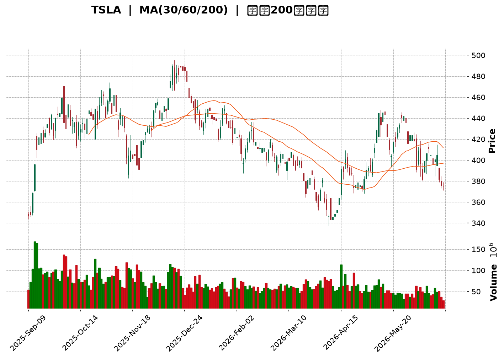
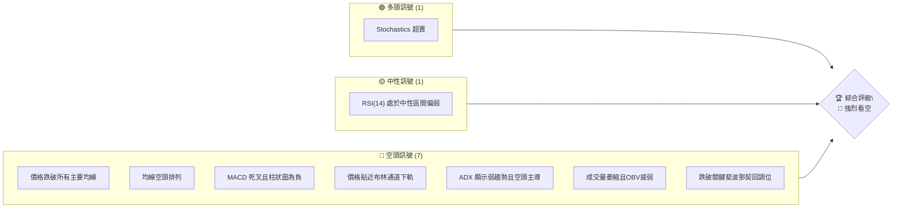
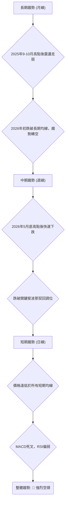
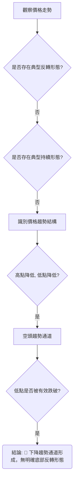

<details>
<summary>📊 靜態圖表 (點擊展開)</summary>

</details>

<html>
<head><meta charset="utf-8" /></head>
<body>
    <div style="height:500px; width:100%;">                        <script>window.PlotlyConfig = {MathJaxConfig: 'local'};</script>
        <script charset="utf-8" src="https://cdn.plot.ly/plotly-3.6.0.min.js" integrity="sha256-QaOVwtVY0T02VaHrr6pnoHLCwayMJp4O5n4YyaE3rJk=" crossorigin="anonymous"></script>                <div id="candlestick-chart" class="plotly-graph-div" style="height:100%; width:100%;"></div>            <script>                window.PLOTLYENV=window.PLOTLYENV || {};                                if (document.getElementById("candlestick-chart")) {                    Plotly.newPlot(                        "candlestick-chart",                        [{"close":{"dtype":"f8","bdata":"AAAAIIWvdUAAAADgo7x1QAAAAMD1DHdAAAAAQAq\u002feEAAAADgo6B5QAAAAIDrWXpAAAAAgMKdekAAAACgmQ16QAAAAMAeoXpAAAAAIFwje0AAAACgmZ16QAAAAOCjrHtAAAAAgD12ekAAAABgZoZ7QAAAACBcs3tAAAAAIIXLe0AAAAAgXLd8QAAAAAAAQHtAAAAAoEfdekAAAAAAAFR8QAAAAKBwEXtAAAAAQApre0AAAADgozh7QAAAAADX13lAAAAAYGY+e0AAAAAA19N6QAAAAGBmMntAAAAAAADMekAAAADA9XR7QAAAAEDh9ntAAAAAoJmpe0AAAAAghW97QAAAACCuD3xAAAAAIIUbe0AAAABguEZ8QAAAAMDMyHxAAAAAACnYfEAAAACgmYF7QAAAAMD1iHxAAAAAgOtFfUAAAAAAKcR7QAAAAMAe4XxAAAAAYI\u002fee0AAAADgUdh6QAAAACCu03tAAAAAgOt5e0AAAACgmel6QAAAAADXH3lAAAAAoJlFeUAAAABguI55QAAAAAAAFHlAAAAAANc\u002feUAAAAAgrrN4QAAAAKBwcXhAAAAA4HocekAAAABgZjZ6QAAAAKBHqXpAAAAAYLjiekAAAACAPeJ6QAAAAADX03pAAAAAANfre0AAAADgemh8QAAAAAAAcHxAAAAAoEd5e0AAAABguNJ7QAAAAEAzN3xAAAAAgD3ue0AAAAAgXK98QAAAAMD1tH1AAAAAgBSefkAAAAAAKTR9QAAAAIDrNX5AAAAAQDMTfkAAAAAgrot+QAAAAMD1WH5AAAAAYGZWfkAAAABACrN9QAAAAIA9unxAAAAAQOFmfEAAAAAghRt8QAAAAMAeYXtAAAAAYLg6fEAAAAAgXA97QAAAAGCP9npAAAAAwMw8e0AAAAAAKdB7QAAAACBcD3xAAAAAQDPze0AAAABAM3N7QAAAAMAeaXtAAAAAAABYe0AAAAAAADR6QAAAAEAK93pAAAAAgMIVfEAAAADA9RB8QAAAAEAzM3tAAAAAYGbuekAAAAAgXPd6QAAAAMD1CHpAAAAAYI\u002fmekAAAADA9Vx6QAAAACBcX3pAAAAAAClgeUAAAAAgXNN4QAAAAIDCsXlAAAAAwB4VekAAAAAgXJN6QAAAAOBRxHpAAAAAwB4RekAAAABAChd6QAAAAIAUqnlAAAAAwB61eUAAAAAgXLt5QAAAAMAevXlAAAAAoEf9eEAAAACAFJZ5QAAAAGBmFnpAAAAAoEeJeUAAAAAAKSh5QAAAAMAeNXlAAAAAQOGGeEAAAABACl95QAAAAMDMWHlAAAAAIK7LeEAAAABA4ep4QAAAAADX83hAAAAAwB59eUAAAAAAKbB4QAAAAEAzc3hAAAAAwPW4eEAAAADgUfR4QAAAAOB6jHhAAAAAwMzEd0AAAAAgXP92QAAAAKCZzXdAAAAA4Hrwd0AAAABAMx94QAAAAIDCQXdAAAAAoEeddkAAAADgejR2QAAAAAAAPHdAAAAAACnUd0AAAACgcIl2QAAAAMAeDXZAAAAAYGaqdUAAAAAAAHR1QAAAAIDrmXVAAAAAQDPPdUAAAABguAZ2QAAAAEAzw3ZAAAAAQDN\u002feEAAAABgZk54QAAAAIDrCXlAAAAAAACIeEAAAABguCZ4QAAAAAApOHhAAAAAIIVbd0AAAADAzIR3QAAAAGC4qndAAAAA4FGAd0AAAADAzEx3QAAAAIAU2ndAAAAAwB5teEAAAAAAKYh4QAAAAIDrVXhAAAAAIK7reEAAAADgo7x5QAAAAKCZxXpAAAAAAADQe0AAAABAMxd7QAAAAOBR1HtAAAAAwMy0e0AAAAAA12N6QAAAAADXn3lAAAAAgMJBeUAAAAAAKRR6QAAAAKCZHXpAAAAAACmgekAAAACgcBl7QAAAAIDChXtAAAAAoJmhe0AAAADgozx7QAAAAIAU\u002fnlAAAAAANd7ekAAAABAM3t6QAAAAEAzJ3pAAAAAAABweEAAAABAM495QAAAAEDhynhAAAAAoHDZd0AAAABgZvJ4QAAAAEDhZnlAAAAAYGayeUAAAABgj0p5QAAAAIAUxnhAAAAAANcHeUAAAADAzFB5QAAAAIDC2XdAAAAA4Hp4d0AAAACA63F3QA=="},"high":{"dtype":"f8","bdata":"AAAA4FHsdUAAAACgR0V2QAAAAADXD3dAAAAAQArLeEAAAABAM5t6QAAAAAAAdHpAAAAAwPXEekAAAAAghQN7QAAAACCF13pAAAAAIK7Pe0AAAAAghY97QAAAACBcw3tAAAAAoJk1e0AAAAAghYd7QAAAACCuL3xAAAAAAADQe0AAAADgo+R8QAAAAAAAbH1AAAAA4FHse0AAAADAzFh8QAAAAEDhSnxAAAAAoEeVe0AAAACgmUV7QAAAAIAUsntAAAAAgD1Oe0AAAABAMyN7QAAAAAApiHtAAAAAoJl1e0AAAAAgXJd7QAAAAMDMHHxAAAAAwMwUfEAAAADgo9h7QAAAAGBmFnxAAAAAQOE6fEAAAABgj8J8QAAAAAAAMH1AAAAAQDMbfUAAAADA9XB8QAAAAAAAoHxAAAAAwB6hfUAAAAAghcN8QAAAAKBHJX1AAAAAQDM3fUAAAACAwnV7QAAAAGC4GnxAAAAAANene0AAAACgR6V7QAAAAAAAiHpAAAAAQArDeUAAAAAgXH96QAAAAGBmjnlAAAAA4Hq8eUAAAABACs96QAAAAMDMLHlAAAAAIIVbekAAAAAgrkd6QAAAAEAKr3pAAAAAQOEOe0AAAABgjxp7QAAAAMDMTHtAAAAAYLj+e0AAAACAFGp8QAAAAIDrrXxAAAAAAAAcfEAAAACAPUZ8QAAAAIAUjnxAAAAA4FEUfEAAAAAAKfB8QAAAAOBRHH5AAAAAAAC4fkAAAADgevR+QAAAAIDCrX5AAAAAANenfkAAAACgRy1\u002fQAAAACCFv35AAAAAYGaufkAAAACgcJF+QAAAAGBmVn1AAAAAgOvxfEAAAADAzIh8QAAAAKBwpXxAAAAAwMyYfEAAAAAAAAR8QAAAAIDrZXtAAAAAgD1Oe0AAAADAzBB8QAAAAMDMZHxAAAAAwPU8fEAAAABgj757QAAAAIDC1XtAAAAAAAD0e0AAAAAgrut6QAAAAEAzY3tAAAAAAAAYfEAAAABA4UZ8QAAAAOCj0HtAAAAA4FFYe0AAAAAAKWR7QAAAACCug3tAAAAAgBR+e0AAAABgZrJ6QAAAAMD1yHpAAAAAYGZ+ekAAAACgmSF5QAAAAMDM6HlAAAAAAABUekAAAAAAALR6QAAAAKCZRXtAAAAAIK5De0AAAADA9YB6QAAAACCF23lAAAAAYGYOekAAAAAAAPR5QAAAAEAz63lAAAAAQDN7eUAAAADAHq15QAAAAKBwRXpAAAAAwPUMekAAAACA63F5QAAAAOCjSHlAAAAAoHDFeEAAAACgR4V5QAAAAIDriXlAAAAAoJkleUAAAACgcBl5QAAAAKBwaXlAAAAAgBQGekAAAAAAAGh5QAAAAEAzA3lAAAAAIK47eUAAAACA6wF5QAAAAMAeMXlAAAAA4FE0eEAAAACAPb53QAAAAKBHFXhAAAAAIK43eEAAAAAgrsN4QAAAAEAKB3hAAAAAgMIdd0AAAADgo\u002fR2QAAAAKBHVXdAAAAAgD3yd0AAAADgeiR3QAAAACCF+3ZAAAAA4FHAdUAAAAAAAMh2QAAAAIAUznVAAAAAgMLldUAAAACgmUV2QAAAAIAU+nZAAAAAYGaqeEAAAADA9aB4QAAAAOB6lHlAAAAAwMxseUAAAABAM594QAAAAAApkHhAAAAAAAAgeEAAAAAAKex3QAAAAOB6zHdAAAAA4KPkd0AAAABgZoZ3QAAAAAAADHhAAAAAwB7deEAAAACAPap4QAAAAIDrIXlAAAAAQOEaeUAAAACgR\u002f15QAAAAEAz83pAAAAAYI8SfEAAAADAzPx7QAAAAGBmVnxAAAAAIK4\u002ffEAAAABgjyp7QAAAAIAUUnpAAAAAgBRaeUAAAAAgXBd6QAAAAEAzr3pAAAAAACn4ekAAAABAMzN7QAAAAKCZ2XtAAAAAIFy\u002fe0AAAADAHpF7QAAAAKCZ2XpAAAAAYLiGekAAAACgmRl7QAAAAKCZpXpAAAAAQOGKekAAAABACs95QAAAAAAAKHpAAAAAoHDReEAAAADgo\u002fh4QAAAAEDhanlAAAAAAAAAekAAAABguMZ5QAAAAEAKX3lAAAAA4FEoeUAAAAAAAOx5QAAAAIDrjXhAAAAAoEcJeEAAAABA37F3QA=="},"hovertemplate":"\u003cb\u003e%{x|%Y-%m-%d}\u003c\u002fb\u003e\u003cbr\u003e\u958b: $%{open:.2f}\u003cbr\u003e\u9ad8: $%{high:.2f}\u003cbr\u003e\u4f4e: $%{low:.2f}\u003cbr\u003e\u6536: $%{close:.2f}\u003cextra\u003e\u003c\u002fextra\u003e","low":{"dtype":"f8","bdata":"AAAAwB59dUAAAADAHqF1QAAAAKCZuXVAAAAAANcjd0AAAABA4SZ5QAAAAEDhtnlAAAAAYLiaeUAAAADA9Qh6QAAAACCFW3pAAAAAgBTSekAAAAAghXt6QAAAAOB60HpAAAAAoEcxekAAAADgUVB6QAAAAAAAeHtAAAAAgOsRe0AAAAAAAIx7QAAAAMAeOXtAAAAAoEcJekAAAABACkt7QAAAAEAzB3tAAAAAIK6TekAAAABA4aJ6QAAAAEAzt3lAAAAAQDM7ekAAAACAwh16QAAAAKBHpXpAAAAAwPVUekAAAACgmXl6QAAAAIDCiXtAAAAAwMyge0AAAAAAANB6QAAAAGBm3nlAAAAAYLjiekAAAABACmt7QAAAAKCZOXxAAAAAYGZKfEAAAACAwnl7QAAAAEAKu3tAAAAAwMxcfEAAAACgmbl7QAAAACBci3tAAAAAoHAxe0AAAACAFF56QAAAAIDCFXtAAAAAgMIFe0AAAADA9ah6QAAAAKBwxXhAAAAA4Hrsd0AAAAAA1+t4QAAAACBcm3hAAAAAAADoeEAAAAAA16t4QAAAAAAp\u002fHdAAAAAoHAReUAAAABAM195QAAAAIA9DnpAAAAAQDOjekAAAADgo5R6QAAAAIDrYXpAAAAAgMLxekAAAACAPdZ7QAAAAGCPOnxAAAAAAAA0e0AAAABAMzt7QAAAAIDCuXtAAAAAoEeFe0AAAABguJp7QAAAAGCPOn1AAAAAoEcdfUAAAABAMyN9QAAAAIDrkX1AAAAAIIWrfUAAAACgR1V+QAAAAKBwLX5AAAAAwMzMfUAAAADAHp19QAAAAAAAsHxAAAAAoEddfEAAAADAzBR8QAAAAMDMNHtAAAAAwB7Je0AAAADgesx6QAAAAOCj9HpAAAAAgOuFekAAAACAPeZ6QAAAAAAAYHtAAAAAQDO\u002fe0AAAAAghSN7QAAAAGBmWntAAAAAACk0e0AAAABAChd6QAAAAIDrOXpAAAAAgBQKe0AAAADgo8B7QAAAAOB6JHtAAAAAQArrekAAAACgmeF6QAAAAIDr6XlAAAAAQDNrekAAAAAAAOh5QAAAAEAK23lAAAAAQOHyeEAAAADgejh4QAAAAAAA3HhAAAAA4KN0eUAAAAAAABB6QAAAAOB6QHpAAAAAAADgeUAAAACAFK55QAAAAAApCHlAAAAAoEeZeUAAAACAwkF5QAAAAAAAWHlAAAAA4KOgeEAAAACAPdp4QAAAAGBmwnlAAAAAYI86eUAAAACAwuF4QAAAAAAARHhAAAAAgD0WeEAAAACgR6l4QAAAAGC49nhAAAAAIFyjeEAAAABgZtZ3QAAAAEAK43hAAAAAYGYieUAAAABgZqp4QAAAAEAzX3hAAAAAYLimeEAAAAAAAJB4QAAAAMD1hHhAAAAAIK6rd0AAAAAgXMd2QAAAACCuS3dAAAAAwPWEd0AAAAAAKRB4QAAAAIDrPXdAAAAAIIV3dkAAAACAPQJ2QAAAAAAAkHZAAAAAoEdhd0AAAADgenB2QAAAAIA9qnVAAAAAANcTdUAAAABguDp1QAAAAAAAFHVAAAAAANdrdUAAAADAHsl1QAAAAOBRLHZAAAAAAACodkAAAADAzNx3QAAAAGBmenhAAAAAoEdFeEAAAAAghRN4QAAAAMDMFHhAAAAAgD0Gd0AAAAAgrit3QAAAAOBRwHZAAAAA4KNId0AAAADgoyB3QAAAAGC4AndAAAAAwMysd0AAAADAzAx4QAAAAAAAUHhAAAAA4FEAeEAAAACA6yF5QAAAAIA9BnpAAAAAwMwMekAAAAAAKWR6QAAAACBc43pAAAAAYI+Se0AAAAAAAGB6QAAAAKBHVXlAAAAAgBSaeEAAAACAPWZ5QAAAAGBmznlAAAAAAClIekAAAACA66F6QAAAAOBROHtAAAAAwMxEe0AAAACAPcJ6QAAAAEDh9nlAAAAAYGbaeUAAAAAAAAB6QAAAAGCPEnpAAAAAoHBJeEAAAAAghat4QAAAAADXA3hAAAAAYGbCd0AAAABgj8p3QAAAAAApLHhAAAAAoJlxeUAAAADgowh5QAAAAAApnHhAAAAAQDMLeEAAAABgZqZ4QAAAAMD1sHdAAAAAwMxQd0AAAABAiTN3QA=="},"name":"\u50f9\u683c","open":{"dtype":"f8","bdata":"AAAAQArHdUAAAADAzOh1QAAAAGC44nVAAAAAQAovd0AAAACAFHJ6QAAAAAAA6HlAAAAAAAD8eUAAAACA6816QAAAAMAeXXpAAAAAgMLxekAAAACAFH57QAAAAKBH3XpAAAAAANcze0AAAADAzMR6QAAAAKCZxXtAAAAA4FGYe0AAAADAzLx7QAAAAOCjaH1AAAAA4KO0e0AAAAAAAIx7QAAAAMAe\u002fXtAAAAAwB5Ze0AAAADA9fx6QAAAAOCjSHtAAAAA4Hp4ekAAAADgo6x6QAAAAGBmLntAAAAAIK4re0AAAAAAAJh6QAAAAIDrvXtAAAAAACnce0AAAABAM7d7QAAAAAAAQHpAAAAAoEfte0AAAAAgrn97QAAAAOB6bHxAAAAAAADofEAAAADAzDB8QAAAAAAA7HtAAAAAANd\u002ffEAAAAAgXGd8QAAAAMDMQHxAAAAAIFzffEAAAABguF57QAAAAKCZeXtAAAAAYGZ2e0AAAABgZqJ7QAAAAIAUcnpAAAAAwMwkeEAAAAAA1+t4QAAAAIAUVnlAAAAAQOFieUAAAACAFOp5QAAAAMAeJXlAAAAAYLgieUAAAABguOZ5QAAAAEAzf3pAAAAAoHCpekAAAADAHpV6QAAAAMD17HpAAAAAoJkBe0AAAABACh98QAAAAOB6UHxAAAAAQDP3e0AAAADgo1h7QAAAAMAe4XtAAAAAQDMPfEAAAACgcAF8QAAAAEAKV31AAAAAIFyDfUAAAAAghYN+QAAAAGCP4n1AAAAAgOuBfkAAAACAFJ5+QAAAAGBmln5AAAAAIK6HfkAAAAAgrlN+QAAAAAAAUH1AAAAAoHDRfEAAAACgmYF8QAAAAMDMnHxAAAAAANf\u002fe0AAAACAFOZ7QAAAAGBmPntAAAAAgD2+ekAAAABAMz97QAAAACCuk3tAAAAAQDMjfEAAAADA9ax7QAAAAIAUkntAAAAAAAB4e0AAAACAwtV6QAAAAGCPWnpAAAAAYI8ye0AAAABA4fZ7QAAAAAAA0HtAAAAAYI9We0AAAABgj\u002f56QAAAAMDMXHtAAAAAoJmVekAAAADgo1R6QAAAAOBRhHpAAAAAIFxHekAAAADgUdB4QAAAAIDrDXlAAAAAYI+eeUAAAACgRyF6QAAAACBcv3pAAAAAwMzkekAAAADA9eR5QAAAAIDCxXlAAAAAgMKxeUAAAAAAAHR5QAAAAMDMhHlAAAAA4KN0eUAAAAAAAPh4QAAAAGBmwnlAAAAAYLjmeUAAAABACi95QAAAAKCZaXhAAAAAoHCxeEAAAACgmd14QAAAAMAeGXlAAAAAoHDheEAAAADAzGB4QAAAACCFI3lAAAAA4HokeUAAAABA4VJ5QAAAAGC48nhAAAAAIIXDeEAAAABACrt4QAAAAAAA8HhAAAAA4FE0eEAAAACgmb13QAAAAKBwUXdAAAAAwPWId0AAAAAA1194QAAAAKCZ2XdAAAAAQAobd0AAAACAwt12QAAAAAApmHZAAAAAgBSqd0AAAABAM8N2QAAAAKBwqXZAAAAAQAqndUAAAADgo7x2QAAAAGBmcnVAAAAA4KOkdUAAAADAHuF1QAAAAGC4WnZAAAAAoEftdkAAAADA9Zx4QAAAAGC4vnhAAAAAoEcpeUAAAAAAAJB4QAAAAMAeOXhAAAAA4Hp0d0AAAAAAAFh3QAAAAKBwQXdAAAAAQOFqd0AAAABgZnZ3QAAAAAAATHdAAAAAANfnd0AAAAAgrmN4QAAAAEAKs3hAAAAAAAAkeEAAAAAgrnd5QAAAACCuB3pAAAAAYI9iekAAAABgj5Z7QAAAAGC4SntAAAAAANfne0AAAAAgrh97QAAAAOBRNHpAAAAAYI8yeUAAAACgmXl5QAAAAEDhYnpAAAAAYLhqekAAAAAAKeR6QAAAAIA9rntAAAAAgOtZe0AAAACgmX17QAAAAADXt3pAAAAAIIUjekAAAABAMyt6QAAAAKBwPXpAAAAAAABIekAAAACgR8V4QAAAAOB6sHlAAAAA4KN4eEAAAADgekR4QAAAAADX93hAAAAAgOvFeUAAAACAwkF5QAAAAOB6GHlAAAAAoJnheEAAAACgma14QAAAAIDCiXhAAAAAoEfBd0AAAABgZnZ3QA=="},"x":["2025-09-09T00:00:00-04:00","2025-09-10T00:00:00-04:00","2025-09-11T00:00:00-04:00","2025-09-12T00:00:00-04:00","2025-09-15T00:00:00-04:00","2025-09-16T00:00:00-04:00","2025-09-17T00:00:00-04:00","2025-09-18T00:00:00-04:00","2025-09-19T00:00:00-04:00","2025-09-22T00:00:00-04:00","2025-09-23T00:00:00-04:00","2025-09-24T00:00:00-04:00","2025-09-25T00:00:00-04:00","2025-09-26T00:00:00-04:00","2025-09-29T00:00:00-04:00","2025-09-30T00:00:00-04:00","2025-10-01T00:00:00-04:00","2025-10-02T00:00:00-04:00","2025-10-03T00:00:00-04:00","2025-10-06T00:00:00-04:00","2025-10-07T00:00:00-04:00","2025-10-08T00:00:00-04:00","2025-10-09T00:00:00-04:00","2025-10-10T00:00:00-04:00","2025-10-13T00:00:00-04:00","2025-10-14T00:00:00-04:00","2025-10-15T00:00:00-04:00","2025-10-16T00:00:00-04:00","2025-10-17T00:00:00-04:00","2025-10-20T00:00:00-04:00","2025-10-21T00:00:00-04:00","2025-10-22T00:00:00-04:00","2025-10-23T00:00:00-04:00","2025-10-24T00:00:00-04:00","2025-10-27T00:00:00-04:00","2025-10-28T00:00:00-04:00","2025-10-29T00:00:00-04:00","2025-10-30T00:00:00-04:00","2025-10-31T00:00:00-04:00","2025-11-03T00:00:00-05:00","2025-11-04T00:00:00-05:00","2025-11-05T00:00:00-05:00","2025-11-06T00:00:00-05:00","2025-11-07T00:00:00-05:00","2025-11-10T00:00:00-05:00","2025-11-11T00:00:00-05:00","2025-11-12T00:00:00-05:00","2025-11-13T00:00:00-05:00","2025-11-14T00:00:00-05:00","2025-11-17T00:00:00-05:00","2025-11-18T00:00:00-05:00","2025-11-19T00:00:00-05:00","2025-11-20T00:00:00-05:00","2025-11-21T00:00:00-05:00","2025-11-24T00:00:00-05:00","2025-11-25T00:00:00-05:00","2025-11-26T00:00:00-05:00","2025-11-28T00:00:00-05:00","2025-12-01T00:00:00-05:00","2025-12-02T00:00:00-05:00","2025-12-03T00:00:00-05:00","2025-12-04T00:00:00-05:00","2025-12-05T00:00:00-05:00","2025-12-08T00:00:00-05:00","2025-12-09T00:00:00-05:00","2025-12-10T00:00:00-05:00","2025-12-11T00:00:00-05:00","2025-12-12T00:00:00-05:00","2025-12-15T00:00:00-05:00","2025-12-16T00:00:00-05:00","2025-12-17T00:00:00-05:00","2025-12-18T00:00:00-05:00","2025-12-19T00:00:00-05:00","2025-12-22T00:00:00-05:00","2025-12-23T00:00:00-05:00","2025-12-24T00:00:00-05:00","2025-12-26T00:00:00-05:00","2025-12-29T00:00:00-05:00","2025-12-30T00:00:00-05:00","2025-12-31T00:00:00-05:00","2026-01-02T00:00:00-05:00","2026-01-05T00:00:00-05:00","2026-01-06T00:00:00-05:00","2026-01-07T00:00:00-05:00","2026-01-08T00:00:00-05:00","2026-01-09T00:00:00-05:00","2026-01-12T00:00:00-05:00","2026-01-13T00:00:00-05:00","2026-01-14T00:00:00-05:00","2026-01-15T00:00:00-05:00","2026-01-16T00:00:00-05:00","2026-01-20T00:00:00-05:00","2026-01-21T00:00:00-05:00","2026-01-22T00:00:00-05:00","2026-01-23T00:00:00-05:00","2026-01-26T00:00:00-05:00","2026-01-27T00:00:00-05:00","2026-01-28T00:00:00-05:00","2026-01-29T00:00:00-05:00","2026-01-30T00:00:00-05:00","2026-02-02T00:00:00-05:00","2026-02-03T00:00:00-05:00","2026-02-04T00:00:00-05:00","2026-02-05T00:00:00-05:00","2026-02-06T00:00:00-05:00","2026-02-09T00:00:00-05:00","2026-02-10T00:00:00-05:00","2026-02-11T00:00:00-05:00","2026-02-12T00:00:00-05:00","2026-02-13T00:00:00-05:00","2026-02-17T00:00:00-05:00","2026-02-18T00:00:00-05:00","2026-02-19T00:00:00-05:00","2026-02-20T00:00:00-05:00","2026-02-23T00:00:00-05:00","2026-02-24T00:00:00-05:00","2026-02-25T00:00:00-05:00","2026-02-26T00:00:00-05:00","2026-02-27T00:00:00-05:00","2026-03-02T00:00:00-05:00","2026-03-03T00:00:00-05:00","2026-03-04T00:00:00-05:00","2026-03-05T00:00:00-05:00","2026-03-06T00:00:00-05:00","2026-03-09T00:00:00-04:00","2026-03-10T00:00:00-04:00","2026-03-11T00:00:00-04:00","2026-03-12T00:00:00-04:00","2026-03-13T00:00:00-04:00","2026-03-16T00:00:00-04:00","2026-03-17T00:00:00-04:00","2026-03-18T00:00:00-04:00","2026-03-19T00:00:00-04:00","2026-03-20T00:00:00-04:00","2026-03-23T00:00:00-04:00","2026-03-24T00:00:00-04:00","2026-03-25T00:00:00-04:00","2026-03-26T00:00:00-04:00","2026-03-27T00:00:00-04:00","2026-03-30T00:00:00-04:00","2026-03-31T00:00:00-04:00","2026-04-01T00:00:00-04:00","2026-04-02T00:00:00-04:00","2026-04-06T00:00:00-04:00","2026-04-07T00:00:00-04:00","2026-04-08T00:00:00-04:00","2026-04-09T00:00:00-04:00","2026-04-10T00:00:00-04:00","2026-04-13T00:00:00-04:00","2026-04-14T00:00:00-04:00","2026-04-15T00:00:00-04:00","2026-04-16T00:00:00-04:00","2026-04-17T00:00:00-04:00","2026-04-20T00:00:00-04:00","2026-04-21T00:00:00-04:00","2026-04-22T00:00:00-04:00","2026-04-23T00:00:00-04:00","2026-04-24T00:00:00-04:00","2026-04-27T00:00:00-04:00","2026-04-28T00:00:00-04:00","2026-04-29T00:00:00-04:00","2026-04-30T00:00:00-04:00","2026-05-01T00:00:00-04:00","2026-05-04T00:00:00-04:00","2026-05-05T00:00:00-04:00","2026-05-06T00:00:00-04:00","2026-05-07T00:00:00-04:00","2026-05-08T00:00:00-04:00","2026-05-11T00:00:00-04:00","2026-05-12T00:00:00-04:00","2026-05-13T00:00:00-04:00","2026-05-14T00:00:00-04:00","2026-05-15T00:00:00-04:00","2026-05-18T00:00:00-04:00","2026-05-19T00:00:00-04:00","2026-05-20T00:00:00-04:00","2026-05-21T00:00:00-04:00","2026-05-22T00:00:00-04:00","2026-05-26T00:00:00-04:00","2026-05-27T00:00:00-04:00","2026-05-28T00:00:00-04:00","2026-05-29T00:00:00-04:00","2026-06-01T00:00:00-04:00","2026-06-02T00:00:00-04:00","2026-06-03T00:00:00-04:00","2026-06-04T00:00:00-04:00","2026-06-05T00:00:00-04:00","2026-06-08T00:00:00-04:00","2026-06-09T00:00:00-04:00","2026-06-10T00:00:00-04:00","2026-06-11T00:00:00-04:00","2026-06-12T00:00:00-04:00","2026-06-15T00:00:00-04:00","2026-06-16T00:00:00-04:00","2026-06-17T00:00:00-04:00","2026-06-18T00:00:00-04:00","2026-06-22T00:00:00-04:00","2026-06-23T00:00:00-04:00","2026-06-24T00:00:00-04:00","2026-06-25T00:00:00-04:00"],"type":"candlestick"},{"hovertemplate":"MA30: $%{y:.2f}\u003cextra\u003e\u003c\u002fextra\u003e","line":{"color":"#2196F3","dash":"dash","width":2},"mode":"lines","name":"MA30","x":["2025-09-09T00:00:00-04:00","2025-09-10T00:00:00-04:00","2025-09-11T00:00:00-04:00","2025-09-12T00:00:00-04:00","2025-09-15T00:00:00-04:00","2025-09-16T00:00:00-04:00","2025-09-17T00:00:00-04:00","2025-09-18T00:00:00-04:00","2025-09-19T00:00:00-04:00","2025-09-22T00:00:00-04:00","2025-09-23T00:00:00-04:00","2025-09-24T00:00:00-04:00","2025-09-25T00:00:00-04:00","2025-09-26T00:00:00-04:00","2025-09-29T00:00:00-04:00","2025-09-30T00:00:00-04:00","2025-10-01T00:00:00-04:00","2025-10-02T00:00:00-04:00","2025-10-03T00:00:00-04:00","2025-10-06T00:00:00-04:00","2025-10-07T00:00:00-04:00","2025-10-08T00:00:00-04:00","2025-10-09T00:00:00-04:00","2025-10-10T00:00:00-04:00","2025-10-13T00:00:00-04:00","2025-10-14T00:00:00-04:00","2025-10-15T00:00:00-04:00","2025-10-16T00:00:00-04:00","2025-10-17T00:00:00-04:00","2025-10-20T00:00:00-04:00","2025-10-21T00:00:00-04:00","2025-10-22T00:00:00-04:00","2025-10-23T00:00:00-04:00","2025-10-24T00:00:00-04:00","2025-10-27T00:00:00-04:00","2025-10-28T00:00:00-04:00","2025-10-29T00:00:00-04:00","2025-10-30T00:00:00-04:00","2025-10-31T00:00:00-04:00","2025-11-03T00:00:00-05:00","2025-11-04T00:00:00-05:00","2025-11-05T00:00:00-05:00","2025-11-06T00:00:00-05:00","2025-11-07T00:00:00-05:00","2025-11-10T00:00:00-05:00","2025-11-11T00:00:00-05:00","2025-11-12T00:00:00-05:00","2025-11-13T00:00:00-05:00","2025-11-14T00:00:00-05:00","2025-11-17T00:00:00-05:00","2025-11-18T00:00:00-05:00","2025-11-19T00:00:00-05:00","2025-11-20T00:00:00-05:00","2025-11-21T00:00:00-05:00","2025-11-24T00:00:00-05:00","2025-11-25T00:00:00-05:00","2025-11-26T00:00:00-05:00","2025-11-28T00:00:00-05:00","2025-12-01T00:00:00-05:00","2025-12-02T00:00:00-05:00","2025-12-03T00:00:00-05:00","2025-12-04T00:00:00-05:00","2025-12-05T00:00:00-05:00","2025-12-08T00:00:00-05:00","2025-12-09T00:00:00-05:00","2025-12-10T00:00:00-05:00","2025-12-11T00:00:00-05:00","2025-12-12T00:00:00-05:00","2025-12-15T00:00:00-05:00","2025-12-16T00:00:00-05:00","2025-12-17T00:00:00-05:00","2025-12-18T00:00:00-05:00","2025-12-19T00:00:00-05:00","2025-12-22T00:00:00-05:00","2025-12-23T00:00:00-05:00","2025-12-24T00:00:00-05:00","2025-12-26T00:00:00-05:00","2025-12-29T00:00:00-05:00","2025-12-30T00:00:00-05:00","2025-12-31T00:00:00-05:00","2026-01-02T00:00:00-05:00","2026-01-05T00:00:00-05:00","2026-01-06T00:00:00-05:00","2026-01-07T00:00:00-05:00","2026-01-08T00:00:00-05:00","2026-01-09T00:00:00-05:00","2026-01-12T00:00:00-05:00","2026-01-13T00:00:00-05:00","2026-01-14T00:00:00-05:00","2026-01-15T00:00:00-05:00","2026-01-16T00:00:00-05:00","2026-01-20T00:00:00-05:00","2026-01-21T00:00:00-05:00","2026-01-22T00:00:00-05:00","2026-01-23T00:00:00-05:00","2026-01-26T00:00:00-05:00","2026-01-27T00:00:00-05:00","2026-01-28T00:00:00-05:00","2026-01-29T00:00:00-05:00","2026-01-30T00:00:00-05:00","2026-02-02T00:00:00-05:00","2026-02-03T00:00:00-05:00","2026-02-04T00:00:00-05:00","2026-02-05T00:00:00-05:00","2026-02-06T00:00:00-05:00","2026-02-09T00:00:00-05:00","2026-02-10T00:00:00-05:00","2026-02-11T00:00:00-05:00","2026-02-12T00:00:00-05:00","2026-02-13T00:00:00-05:00","2026-02-17T00:00:00-05:00","2026-02-18T00:00:00-05:00","2026-02-19T00:00:00-05:00","2026-02-20T00:00:00-05:00","2026-02-23T00:00:00-05:00","2026-02-24T00:00:00-05:00","2026-02-25T00:00:00-05:00","2026-02-26T00:00:00-05:00","2026-02-27T00:00:00-05:00","2026-03-02T00:00:00-05:00","2026-03-03T00:00:00-05:00","2026-03-04T00:00:00-05:00","2026-03-05T00:00:00-05:00","2026-03-06T00:00:00-05:00","2026-03-09T00:00:00-04:00","2026-03-10T00:00:00-04:00","2026-03-11T00:00:00-04:00","2026-03-12T00:00:00-04:00","2026-03-13T00:00:00-04:00","2026-03-16T00:00:00-04:00","2026-03-17T00:00:00-04:00","2026-03-18T00:00:00-04:00","2026-03-19T00:00:00-04:00","2026-03-20T00:00:00-04:00","2026-03-23T00:00:00-04:00","2026-03-24T00:00:00-04:00","2026-03-25T00:00:00-04:00","2026-03-26T00:00:00-04:00","2026-03-27T00:00:00-04:00","2026-03-30T00:00:00-04:00","2026-03-31T00:00:00-04:00","2026-04-01T00:00:00-04:00","2026-04-02T00:00:00-04:00","2026-04-06T00:00:00-04:00","2026-04-07T00:00:00-04:00","2026-04-08T00:00:00-04:00","2026-04-09T00:00:00-04:00","2026-04-10T00:00:00-04:00","2026-04-13T00:00:00-04:00","2026-04-14T00:00:00-04:00","2026-04-15T00:00:00-04:00","2026-04-16T00:00:00-04:00","2026-04-17T00:00:00-04:00","2026-04-20T00:00:00-04:00","2026-04-21T00:00:00-04:00","2026-04-22T00:00:00-04:00","2026-04-23T00:00:00-04:00","2026-04-24T00:00:00-04:00","2026-04-27T00:00:00-04:00","2026-04-28T00:00:00-04:00","2026-04-29T00:00:00-04:00","2026-04-30T00:00:00-04:00","2026-05-01T00:00:00-04:00","2026-05-04T00:00:00-04:00","2026-05-05T00:00:00-04:00","2026-05-06T00:00:00-04:00","2026-05-07T00:00:00-04:00","2026-05-08T00:00:00-04:00","2026-05-11T00:00:00-04:00","2026-05-12T00:00:00-04:00","2026-05-13T00:00:00-04:00","2026-05-14T00:00:00-04:00","2026-05-15T00:00:00-04:00","2026-05-18T00:00:00-04:00","2026-05-19T00:00:00-04:00","2026-05-20T00:00:00-04:00","2026-05-21T00:00:00-04:00","2026-05-22T00:00:00-04:00","2026-05-26T00:00:00-04:00","2026-05-27T00:00:00-04:00","2026-05-28T00:00:00-04:00","2026-05-29T00:00:00-04:00","2026-06-01T00:00:00-04:00","2026-06-02T00:00:00-04:00","2026-06-03T00:00:00-04:00","2026-06-04T00:00:00-04:00","2026-06-05T00:00:00-04:00","2026-06-08T00:00:00-04:00","2026-06-09T00:00:00-04:00","2026-06-10T00:00:00-04:00","2026-06-11T00:00:00-04:00","2026-06-12T00:00:00-04:00","2026-06-15T00:00:00-04:00","2026-06-16T00:00:00-04:00","2026-06-17T00:00:00-04:00","2026-06-18T00:00:00-04:00","2026-06-22T00:00:00-04:00","2026-06-23T00:00:00-04:00","2026-06-24T00:00:00-04:00","2026-06-25T00:00:00-04:00"],"y":{"dtype":"f8","bdata":"AAAAAAAA+H8AAAAAAAD4fwAAAAAAAPh\u002fAAAAAAAA+H8AAAAAAAD4fwAAAAAAAPh\u002fAAAAAAAA+H8AAAAAAAD4fwAAAAAAAPh\u002fAAAAAAAA+H8AAAAAAAD4fwAAAAAAAPh\u002fAAAAAAAA+H8AAAAAAAD4fwAAAAAAAPh\u002fAAAAAAAA+H8AAAAAAAD4fwAAAAAAAPh\u002fAAAAAAAA+H8AAAAAAAD4fwAAAAAAAPh\u002fAAAAAAAA+H8AAAAAAAD4fwAAAAAAAPh\u002fAAAAAAAA+H8AAAAAAAD4fwAAAAAAAPh\u002fAAAAAAAA+H8AAAAAAAD4f6uqqoolhXpAmpmZOSa4ekBVVVVVx+h6QGZmZjaJE3tAERERca8ne0CamZm5ST57QHd3d\u002fcMU3tAIiIiYhBme0CJiIjIdnJ7QO\u002fu7q65gntAmpmZqfGUe0De3d09w557QKuqqpoLqXtAVVVVVQ61e0CamZnZQK97QGZmZqZUsHtAREREVJyte0Crqqr6N557QKuqqnoUjHtAzczMnH1+e0B3d3cX2WZ7QO\u002fu7t7dVXtAmpmZKVxDe0ARERGB3C17QImIiCjqIXtAzczMLEAYe0AAAACwABN7QImIiJhuDntAmpmZeTAPe0B3d3d3TAp7QM3MzOyYAHtAvLu7K84Ce0ARERGhGgt7QO\u002fu7o5QDntAREREpHARe0BmZmbGkg17QDMzM1O4CHtAVVVVNewAe0CamZk5+wp7QJqZmTn7FHtA7+7uDnQge0AzMzNTuCx7QLy7u3sUOHtA7+7uvuZKe0AzMzPjemp7QGZmZkb9f3tAVVVVxWeYe0CrqqrKL7B7QBEREfHuzntAd3d3h6Tpe0BmZmYWZ\u002f97QO\u002fu7j4KE3xAiYiIKHgsfEDv7u6Ol0B8QFVVVZUYVnxAmpmZ6bRffECJiIiIXW18QGZmZiZNeXxAAAAAUGKCfEDe3d1NN4d8QJqZmSkxjHxAiYiImEOHfEAzMzOzcnR8QJqZmfnhZ3xAVVVVRRltfEAiIiJiLG98QHd3d7eBZnxAvLu7i\u002fpdfEARERHhT098QLy7u4v6L3xAiYiI6EIQfEB3d3d3Bfh7QERERPRE13tAMzMzAyuve0Crqqp6W357QCIiIpKmVntAIiIiYlcye0AiIiJyrxd7QERERGT0BntAIiIiggfzekBmZmY20OF6QM3MzLwt03pA3t3dnai9ekCJiIhIU7J6QImIiJjgp3pA3t3dfbGUekDv7u7OsIF6QBEREdHbcHpAVVVV5UJcekDNzMx8sUh6QAAAALDkNXpAERERIdsdekDv7u7ewRZ6QFVVVQXzCHpAZmZmRuHseUCamZm5AtJ5QLy7u\u002fvUvnlAvLu7y4WyeUCJiIgoFZ95QM3MzKyOkXlAzczMfPh+eUBmZmYG83J5QLy7u\u002ftiY3lAVVVVtaxVeUC8u7sbE0Z5QM3MzJzvNXlAIiIi4qUjeUBmZmaWtQ55QAAAAODB8HhAVVVVxUvTeEC8u7vbJLJ4QBEREXFonXhAAAAAQGCNeECrqqqqHHJ4QDMzMzOlUnhAvLu7W0g2eECJiIhoAxN4QLy7uwu77HdAERERke3Md0DNzMycNrJ3QN7d3W1ZnXdAVVVV5Redd0De3d1dAZR3QCIiIkJgkXdAiYiIuB6Pd0AzMzPTlIh3QKuqqkpTgndAERERgSNwd0BmZmb2KGZ3QDMzMzN6X3dAZmZmVg5Vd0DNzMxM8EZ3QERERPT9QHdAmpmZSZpGd0Dv7u4uslN3QCIiInI9WHdAVVVVBZ1gd0CrqqoKZW53QN7d3a1jjHdAiYiIKL+4d0CJiIj4b+J3QGZmZualCXhAzczMbLwqeEBERES0nUt4QAAAAFAbanhAREREhMCIeECamZlZObB4QHd3dye\u002f1nhAmpmZadj\u002feEAiIiLSIit5QCIiIjLBU3lAd3d3V4BueUBERERkgod5QEREROSlj3lAERERMU+geUB3d3cnMbR5QO\u002fu7n6xxHlAq6qqyujNeUC8u7ubUt95QCIiIpLt6HlAAAAAEObreUB3d3e38\u002fl5QN7d3b0tB3pAZmZmdgUSekB3d3dXgBh6QBEREXE9HHpAzczMvC0dekAAAACAlRl6QN7d3e2nAHpAVVVV9ZrbeUB3d3f3frx5QA=="},"type":"scatter"},{"hovertemplate":"MA60: $%{y:.2f}\u003cextra\u003e\u003c\u002fextra\u003e","line":{"color":"#9C27B0","dash":"dash","width":2},"mode":"lines","name":"MA60","x":["2025-09-09T00:00:00-04:00","2025-09-10T00:00:00-04:00","2025-09-11T00:00:00-04:00","2025-09-12T00:00:00-04:00","2025-09-15T00:00:00-04:00","2025-09-16T00:00:00-04:00","2025-09-17T00:00:00-04:00","2025-09-18T00:00:00-04:00","2025-09-19T00:00:00-04:00","2025-09-22T00:00:00-04:00","2025-09-23T00:00:00-04:00","2025-09-24T00:00:00-04:00","2025-09-25T00:00:00-04:00","2025-09-26T00:00:00-04:00","2025-09-29T00:00:00-04:00","2025-09-30T00:00:00-04:00","2025-10-01T00:00:00-04:00","2025-10-02T00:00:00-04:00","2025-10-03T00:00:00-04:00","2025-10-06T00:00:00-04:00","2025-10-07T00:00:00-04:00","2025-10-08T00:00:00-04:00","2025-10-09T00:00:00-04:00","2025-10-10T00:00:00-04:00","2025-10-13T00:00:00-04:00","2025-10-14T00:00:00-04:00","2025-10-15T00:00:00-04:00","2025-10-16T00:00:00-04:00","2025-10-17T00:00:00-04:00","2025-10-20T00:00:00-04:00","2025-10-21T00:00:00-04:00","2025-10-22T00:00:00-04:00","2025-10-23T00:00:00-04:00","2025-10-24T00:00:00-04:00","2025-10-27T00:00:00-04:00","2025-10-28T00:00:00-04:00","2025-10-29T00:00:00-04:00","2025-10-30T00:00:00-04:00","2025-10-31T00:00:00-04:00","2025-11-03T00:00:00-05:00","2025-11-04T00:00:00-05:00","2025-11-05T00:00:00-05:00","2025-11-06T00:00:00-05:00","2025-11-07T00:00:00-05:00","2025-11-10T00:00:00-05:00","2025-11-11T00:00:00-05:00","2025-11-12T00:00:00-05:00","2025-11-13T00:00:00-05:00","2025-11-14T00:00:00-05:00","2025-11-17T00:00:00-05:00","2025-11-18T00:00:00-05:00","2025-11-19T00:00:00-05:00","2025-11-20T00:00:00-05:00","2025-11-21T00:00:00-05:00","2025-11-24T00:00:00-05:00","2025-11-25T00:00:00-05:00","2025-11-26T00:00:00-05:00","2025-11-28T00:00:00-05:00","2025-12-01T00:00:00-05:00","2025-12-02T00:00:00-05:00","2025-12-03T00:00:00-05:00","2025-12-04T00:00:00-05:00","2025-12-05T00:00:00-05:00","2025-12-08T00:00:00-05:00","2025-12-09T00:00:00-05:00","2025-12-10T00:00:00-05:00","2025-12-11T00:00:00-05:00","2025-12-12T00:00:00-05:00","2025-12-15T00:00:00-05:00","2025-12-16T00:00:00-05:00","2025-12-17T00:00:00-05:00","2025-12-18T00:00:00-05:00","2025-12-19T00:00:00-05:00","2025-12-22T00:00:00-05:00","2025-12-23T00:00:00-05:00","2025-12-24T00:00:00-05:00","2025-12-26T00:00:00-05:00","2025-12-29T00:00:00-05:00","2025-12-30T00:00:00-05:00","2025-12-31T00:00:00-05:00","2026-01-02T00:00:00-05:00","2026-01-05T00:00:00-05:00","2026-01-06T00:00:00-05:00","2026-01-07T00:00:00-05:00","2026-01-08T00:00:00-05:00","2026-01-09T00:00:00-05:00","2026-01-12T00:00:00-05:00","2026-01-13T00:00:00-05:00","2026-01-14T00:00:00-05:00","2026-01-15T00:00:00-05:00","2026-01-16T00:00:00-05:00","2026-01-20T00:00:00-05:00","2026-01-21T00:00:00-05:00","2026-01-22T00:00:00-05:00","2026-01-23T00:00:00-05:00","2026-01-26T00:00:00-05:00","2026-01-27T00:00:00-05:00","2026-01-28T00:00:00-05:00","2026-01-29T00:00:00-05:00","2026-01-30T00:00:00-05:00","2026-02-02T00:00:00-05:00","2026-02-03T00:00:00-05:00","2026-02-04T00:00:00-05:00","2026-02-05T00:00:00-05:00","2026-02-06T00:00:00-05:00","2026-02-09T00:00:00-05:00","2026-02-10T00:00:00-05:00","2026-02-11T00:00:00-05:00","2026-02-12T00:00:00-05:00","2026-02-13T00:00:00-05:00","2026-02-17T00:00:00-05:00","2026-02-18T00:00:00-05:00","2026-02-19T00:00:00-05:00","2026-02-20T00:00:00-05:00","2026-02-23T00:00:00-05:00","2026-02-24T00:00:00-05:00","2026-02-25T00:00:00-05:00","2026-02-26T00:00:00-05:00","2026-02-27T00:00:00-05:00","2026-03-02T00:00:00-05:00","2026-03-03T00:00:00-05:00","2026-03-04T00:00:00-05:00","2026-03-05T00:00:00-05:00","2026-03-06T00:00:00-05:00","2026-03-09T00:00:00-04:00","2026-03-10T00:00:00-04:00","2026-03-11T00:00:00-04:00","2026-03-12T00:00:00-04:00","2026-03-13T00:00:00-04:00","2026-03-16T00:00:00-04:00","2026-03-17T00:00:00-04:00","2026-03-18T00:00:00-04:00","2026-03-19T00:00:00-04:00","2026-03-20T00:00:00-04:00","2026-03-23T00:00:00-04:00","2026-03-24T00:00:00-04:00","2026-03-25T00:00:00-04:00","2026-03-26T00:00:00-04:00","2026-03-27T00:00:00-04:00","2026-03-30T00:00:00-04:00","2026-03-31T00:00:00-04:00","2026-04-01T00:00:00-04:00","2026-04-02T00:00:00-04:00","2026-04-06T00:00:00-04:00","2026-04-07T00:00:00-04:00","2026-04-08T00:00:00-04:00","2026-04-09T00:00:00-04:00","2026-04-10T00:00:00-04:00","2026-04-13T00:00:00-04:00","2026-04-14T00:00:00-04:00","2026-04-15T00:00:00-04:00","2026-04-16T00:00:00-04:00","2026-04-17T00:00:00-04:00","2026-04-20T00:00:00-04:00","2026-04-21T00:00:00-04:00","2026-04-22T00:00:00-04:00","2026-04-23T00:00:00-04:00","2026-04-24T00:00:00-04:00","2026-04-27T00:00:00-04:00","2026-04-28T00:00:00-04:00","2026-04-29T00:00:00-04:00","2026-04-30T00:00:00-04:00","2026-05-01T00:00:00-04:00","2026-05-04T00:00:00-04:00","2026-05-05T00:00:00-04:00","2026-05-06T00:00:00-04:00","2026-05-07T00:00:00-04:00","2026-05-08T00:00:00-04:00","2026-05-11T00:00:00-04:00","2026-05-12T00:00:00-04:00","2026-05-13T00:00:00-04:00","2026-05-14T00:00:00-04:00","2026-05-15T00:00:00-04:00","2026-05-18T00:00:00-04:00","2026-05-19T00:00:00-04:00","2026-05-20T00:00:00-04:00","2026-05-21T00:00:00-04:00","2026-05-22T00:00:00-04:00","2026-05-26T00:00:00-04:00","2026-05-27T00:00:00-04:00","2026-05-28T00:00:00-04:00","2026-05-29T00:00:00-04:00","2026-06-01T00:00:00-04:00","2026-06-02T00:00:00-04:00","2026-06-03T00:00:00-04:00","2026-06-04T00:00:00-04:00","2026-06-05T00:00:00-04:00","2026-06-08T00:00:00-04:00","2026-06-09T00:00:00-04:00","2026-06-10T00:00:00-04:00","2026-06-11T00:00:00-04:00","2026-06-12T00:00:00-04:00","2026-06-15T00:00:00-04:00","2026-06-16T00:00:00-04:00","2026-06-17T00:00:00-04:00","2026-06-18T00:00:00-04:00","2026-06-22T00:00:00-04:00","2026-06-23T00:00:00-04:00","2026-06-24T00:00:00-04:00","2026-06-25T00:00:00-04:00"],"y":{"dtype":"f8","bdata":"AAAAAAAA+H8AAAAAAAD4fwAAAAAAAPh\u002fAAAAAAAA+H8AAAAAAAD4fwAAAAAAAPh\u002fAAAAAAAA+H8AAAAAAAD4fwAAAAAAAPh\u002fAAAAAAAA+H8AAAAAAAD4fwAAAAAAAPh\u002fAAAAAAAA+H8AAAAAAAD4fwAAAAAAAPh\u002fAAAAAAAA+H8AAAAAAAD4fwAAAAAAAPh\u002fAAAAAAAA+H8AAAAAAAD4fwAAAAAAAPh\u002fAAAAAAAA+H8AAAAAAAD4fwAAAAAAAPh\u002fAAAAAAAA+H8AAAAAAAD4fwAAAAAAAPh\u002fAAAAAAAA+H8AAAAAAAD4fwAAAAAAAPh\u002fAAAAAAAA+H8AAAAAAAD4fwAAAAAAAPh\u002fAAAAAAAA+H8AAAAAAAD4fwAAAAAAAPh\u002fAAAAAAAA+H8AAAAAAAD4fwAAAAAAAPh\u002fAAAAAAAA+H8AAAAAAAD4fwAAAAAAAPh\u002fAAAAAAAA+H8AAAAAAAD4fwAAAAAAAPh\u002fAAAAAAAA+H8AAAAAAAD4fwAAAAAAAPh\u002fAAAAAAAA+H8AAAAAAAD4fwAAAAAAAPh\u002fAAAAAAAA+H8AAAAAAAD4fwAAAAAAAPh\u002fAAAAAAAA+H8AAAAAAAD4fwAAAAAAAPh\u002fAAAAAAAA+H8AAAAAAAD4f7y7uzvfwnpAq6qqMnrdekAzMzP78Pl6QKuqquLsEHtAq6qqCpAce0AAAABA7iV7QFVVVaXiLXtAvLu7S34ze0AREREBuT57QERERHTaS3tARERE3LJae0CJiIjIvWV7QDMzMwuQcHtAIiIiivp\u002fe0BmZmbe3Yx7QGZmZvYomHtAzczMDAKje0CrqqriM6d7QN7d3bWBrXtAIiIiEhG0e0Dv7u4WILN7QO\u002fu7g50tHtAERERKeq3e0AAAAAIOrd7QO\u002fu7l4BvHtAMzMzi\u002fq7e0BEREQcL8B7QHd3d9\u002fdw3tAzczMZMnIe0Crqqriwch7QDMzMwtlxntAIiIi4gjFe0AiIiKqxr97QEREREQZu3tAzczM9ES\u002fe0BERESUX757QFVVVQWdt3tAiYiIYHOve0BVVVWNJa17QKuqquJ6ontAvLu7e1uYe0BVVVXlXpJ7QAAAALish3tAERER4Qh9e0Dv7u4ua3R7QEREROxRa3tAvLu7k19le0BmZmae72N7QKuqqqrxantAzczMBFZue0BmZmamm3B7QN7d3f0bc3tAMzMzYxB1e0C8u7trdXl7QO\u002fu7pb8fntAvLu7MzN6e0C8u7srh3d7QLy7u3sUdXtAq6qqmlJve0BVVVVl9Gd7QM3MzOwKYXtAzczMXI9Se0ARERFJmkV7QHd3d39qOHtA3t3dRf0se0De3d2NlyB7QJqZmVmrEntAvLu7K0AIe0DNzMyEMvd6QERERJzE4HpAq6qqsp3HekDv7u4+fLV6QAAAAPhTnXpARERE3GuCekAzMzNLN2J6QHd3dxdLRnpAIiIiov4qekBERESEMhN6QCIiIiLb+3lAvLu7oynjeUARERGJ+sl5QO\u002fu7hZLuHlA7+7uboSleUCamZn5N5J5QN7d3eVCfXlAzczM7HxleUC8u7sbWkp5QGZmZm7LLnlAMzMzO5gUeUDNzMwMdP14QO\u002fu7g6f6XhAMzMzg3ndeEBmZmaeYdV4QLy7u6MpzXhAd3d3\u002f\u002f+9eEBmZmbGS614QDMzMyOUoHhAZmZmplSReEB3d3cPn4J4QAAAAHCEeHhAmpmZaQNqeECamZmp8Vx4QAAAAHgwUnhAd3d3fyNOeEBVVVWl4kx4QHd3d4cWR3hAvLu7cyFCeECJiIhQjT54QO\u002fu7saSPnhA7+7udgVGeEAiIiJqSkp4QLy7uyuHU3hAZmZmVg5ceEB3d3cv3V54QJqZmUFgXnhAAAAAcIRfeEARERFhnmF4QJqZmRm9YXhAVVVV\u002fWJmeEB3d3e3rG54QAAAAFCNeHhAZmZmHsyFeEARERHhwY14QDMzMxODkHhAzczM9LaXeEBVVVX9Yp54QM3MzGSCo3hA3t3dJQafeEARERHJvaJ4QKuqquIzpHhAMzMzM3qgeEAiIiICcqB4QBEREdkVpHhAAAAA4E+seEAzMzNDGbZ4QJqZmXE9unhAERERYeW+eEBVVVVF\u002fcN4QN7d3c2FxnhA7+7uDi3KeEAAAAB4d894QA=="},"type":"scatter"},{"hovertemplate":"MA200: $%{y:.2f}\u003cextra\u003e\u003c\u002fextra\u003e","line":{"color":"#FF6F00","dash":"solid","width":2},"mode":"lines","name":"MA200","x":["2025-09-09T00:00:00-04:00","2025-09-10T00:00:00-04:00","2025-09-11T00:00:00-04:00","2025-09-12T00:00:00-04:00","2025-09-15T00:00:00-04:00","2025-09-16T00:00:00-04:00","2025-09-17T00:00:00-04:00","2025-09-18T00:00:00-04:00","2025-09-19T00:00:00-04:00","2025-09-22T00:00:00-04:00","2025-09-23T00:00:00-04:00","2025-09-24T00:00:00-04:00","2025-09-25T00:00:00-04:00","2025-09-26T00:00:00-04:00","2025-09-29T00:00:00-04:00","2025-09-30T00:00:00-04:00","2025-10-01T00:00:00-04:00","2025-10-02T00:00:00-04:00","2025-10-03T00:00:00-04:00","2025-10-06T00:00:00-04:00","2025-10-07T00:00:00-04:00","2025-10-08T00:00:00-04:00","2025-10-09T00:00:00-04:00","2025-10-10T00:00:00-04:00","2025-10-13T00:00:00-04:00","2025-10-14T00:00:00-04:00","2025-10-15T00:00:00-04:00","2025-10-16T00:00:00-04:00","2025-10-17T00:00:00-04:00","2025-10-20T00:00:00-04:00","2025-10-21T00:00:00-04:00","2025-10-22T00:00:00-04:00","2025-10-23T00:00:00-04:00","2025-10-24T00:00:00-04:00","2025-10-27T00:00:00-04:00","2025-10-28T00:00:00-04:00","2025-10-29T00:00:00-04:00","2025-10-30T00:00:00-04:00","2025-10-31T00:00:00-04:00","2025-11-03T00:00:00-05:00","2025-11-04T00:00:00-05:00","2025-11-05T00:00:00-05:00","2025-11-06T00:00:00-05:00","2025-11-07T00:00:00-05:00","2025-11-10T00:00:00-05:00","2025-11-11T00:00:00-05:00","2025-11-12T00:00:00-05:00","2025-11-13T00:00:00-05:00","2025-11-14T00:00:00-05:00","2025-11-17T00:00:00-05:00","2025-11-18T00:00:00-05:00","2025-11-19T00:00:00-05:00","2025-11-20T00:00:00-05:00","2025-11-21T00:00:00-05:00","2025-11-24T00:00:00-05:00","2025-11-25T00:00:00-05:00","2025-11-26T00:00:00-05:00","2025-11-28T00:00:00-05:00","2025-12-01T00:00:00-05:00","2025-12-02T00:00:00-05:00","2025-12-03T00:00:00-05:00","2025-12-04T00:00:00-05:00","2025-12-05T00:00:00-05:00","2025-12-08T00:00:00-05:00","2025-12-09T00:00:00-05:00","2025-12-10T00:00:00-05:00","2025-12-11T00:00:00-05:00","2025-12-12T00:00:00-05:00","2025-12-15T00:00:00-05:00","2025-12-16T00:00:00-05:00","2025-12-17T00:00:00-05:00","2025-12-18T00:00:00-05:00","2025-12-19T00:00:00-05:00","2025-12-22T00:00:00-05:00","2025-12-23T00:00:00-05:00","2025-12-24T00:00:00-05:00","2025-12-26T00:00:00-05:00","2025-12-29T00:00:00-05:00","2025-12-30T00:00:00-05:00","2025-12-31T00:00:00-05:00","2026-01-02T00:00:00-05:00","2026-01-05T00:00:00-05:00","2026-01-06T00:00:00-05:00","2026-01-07T00:00:00-05:00","2026-01-08T00:00:00-05:00","2026-01-09T00:00:00-05:00","2026-01-12T00:00:00-05:00","2026-01-13T00:00:00-05:00","2026-01-14T00:00:00-05:00","2026-01-15T00:00:00-05:00","2026-01-16T00:00:00-05:00","2026-01-20T00:00:00-05:00","2026-01-21T00:00:00-05:00","2026-01-22T00:00:00-05:00","2026-01-23T00:00:00-05:00","2026-01-26T00:00:00-05:00","2026-01-27T00:00:00-05:00","2026-01-28T00:00:00-05:00","2026-01-29T00:00:00-05:00","2026-01-30T00:00:00-05:00","2026-02-02T00:00:00-05:00","2026-02-03T00:00:00-05:00","2026-02-04T00:00:00-05:00","2026-02-05T00:00:00-05:00","2026-02-06T00:00:00-05:00","2026-02-09T00:00:00-05:00","2026-02-10T00:00:00-05:00","2026-02-11T00:00:00-05:00","2026-02-12T00:00:00-05:00","2026-02-13T00:00:00-05:00","2026-02-17T00:00:00-05:00","2026-02-18T00:00:00-05:00","2026-02-19T00:00:00-05:00","2026-02-20T00:00:00-05:00","2026-02-23T00:00:00-05:00","2026-02-24T00:00:00-05:00","2026-02-25T00:00:00-05:00","2026-02-26T00:00:00-05:00","2026-02-27T00:00:00-05:00","2026-03-02T00:00:00-05:00","2026-03-03T00:00:00-05:00","2026-03-04T00:00:00-05:00","2026-03-05T00:00:00-05:00","2026-03-06T00:00:00-05:00","2026-03-09T00:00:00-04:00","2026-03-10T00:00:00-04:00","2026-03-11T00:00:00-04:00","2026-03-12T00:00:00-04:00","2026-03-13T00:00:00-04:00","2026-03-16T00:00:00-04:00","2026-03-17T00:00:00-04:00","2026-03-18T00:00:00-04:00","2026-03-19T00:00:00-04:00","2026-03-20T00:00:00-04:00","2026-03-23T00:00:00-04:00","2026-03-24T00:00:00-04:00","2026-03-25T00:00:00-04:00","2026-03-26T00:00:00-04:00","2026-03-27T00:00:00-04:00","2026-03-30T00:00:00-04:00","2026-03-31T00:00:00-04:00","2026-04-01T00:00:00-04:00","2026-04-02T00:00:00-04:00","2026-04-06T00:00:00-04:00","2026-04-07T00:00:00-04:00","2026-04-08T00:00:00-04:00","2026-04-09T00:00:00-04:00","2026-04-10T00:00:00-04:00","2026-04-13T00:00:00-04:00","2026-04-14T00:00:00-04:00","2026-04-15T00:00:00-04:00","2026-04-16T00:00:00-04:00","2026-04-17T00:00:00-04:00","2026-04-20T00:00:00-04:00","2026-04-21T00:00:00-04:00","2026-04-22T00:00:00-04:00","2026-04-23T00:00:00-04:00","2026-04-24T00:00:00-04:00","2026-04-27T00:00:00-04:00","2026-04-28T00:00:00-04:00","2026-04-29T00:00:00-04:00","2026-04-30T00:00:00-04:00","2026-05-01T00:00:00-04:00","2026-05-04T00:00:00-04:00","2026-05-05T00:00:00-04:00","2026-05-06T00:00:00-04:00","2026-05-07T00:00:00-04:00","2026-05-08T00:00:00-04:00","2026-05-11T00:00:00-04:00","2026-05-12T00:00:00-04:00","2026-05-13T00:00:00-04:00","2026-05-14T00:00:00-04:00","2026-05-15T00:00:00-04:00","2026-05-18T00:00:00-04:00","2026-05-19T00:00:00-04:00","2026-05-20T00:00:00-04:00","2026-05-21T00:00:00-04:00","2026-05-22T00:00:00-04:00","2026-05-26T00:00:00-04:00","2026-05-27T00:00:00-04:00","2026-05-28T00:00:00-04:00","2026-05-29T00:00:00-04:00","2026-06-01T00:00:00-04:00","2026-06-02T00:00:00-04:00","2026-06-03T00:00:00-04:00","2026-06-04T00:00:00-04:00","2026-06-05T00:00:00-04:00","2026-06-08T00:00:00-04:00","2026-06-09T00:00:00-04:00","2026-06-10T00:00:00-04:00","2026-06-11T00:00:00-04:00","2026-06-12T00:00:00-04:00","2026-06-15T00:00:00-04:00","2026-06-16T00:00:00-04:00","2026-06-17T00:00:00-04:00","2026-06-18T00:00:00-04:00","2026-06-22T00:00:00-04:00","2026-06-23T00:00:00-04:00","2026-06-24T00:00:00-04:00","2026-06-25T00:00:00-04:00"],"y":{"dtype":"f8","bdata":"AAAAAAAA+H8AAAAAAAD4fwAAAAAAAPh\u002fAAAAAAAA+H8AAAAAAAD4fwAAAAAAAPh\u002fAAAAAAAA+H8AAAAAAAD4fwAAAAAAAPh\u002fAAAAAAAA+H8AAAAAAAD4fwAAAAAAAPh\u002fAAAAAAAA+H8AAAAAAAD4fwAAAAAAAPh\u002fAAAAAAAA+H8AAAAAAAD4fwAAAAAAAPh\u002fAAAAAAAA+H8AAAAAAAD4fwAAAAAAAPh\u002fAAAAAAAA+H8AAAAAAAD4fwAAAAAAAPh\u002fAAAAAAAA+H8AAAAAAAD4fwAAAAAAAPh\u002fAAAAAAAA+H8AAAAAAAD4fwAAAAAAAPh\u002fAAAAAAAA+H8AAAAAAAD4fwAAAAAAAPh\u002fAAAAAAAA+H8AAAAAAAD4fwAAAAAAAPh\u002fAAAAAAAA+H8AAAAAAAD4fwAAAAAAAPh\u002fAAAAAAAA+H8AAAAAAAD4fwAAAAAAAPh\u002fAAAAAAAA+H8AAAAAAAD4fwAAAAAAAPh\u002fAAAAAAAA+H8AAAAAAAD4fwAAAAAAAPh\u002fAAAAAAAA+H8AAAAAAAD4fwAAAAAAAPh\u002fAAAAAAAA+H8AAAAAAAD4fwAAAAAAAPh\u002fAAAAAAAA+H8AAAAAAAD4fwAAAAAAAPh\u002fAAAAAAAA+H8AAAAAAAD4fwAAAAAAAPh\u002fAAAAAAAA+H8AAAAAAAD4fwAAAAAAAPh\u002fAAAAAAAA+H8AAAAAAAD4fwAAAAAAAPh\u002fAAAAAAAA+H8AAAAAAAD4fwAAAAAAAPh\u002fAAAAAAAA+H8AAAAAAAD4fwAAAAAAAPh\u002fAAAAAAAA+H8AAAAAAAD4fwAAAAAAAPh\u002fAAAAAAAA+H8AAAAAAAD4fwAAAAAAAPh\u002fAAAAAAAA+H8AAAAAAAD4fwAAAAAAAPh\u002fAAAAAAAA+H8AAAAAAAD4fwAAAAAAAPh\u002fAAAAAAAA+H8AAAAAAAD4fwAAAAAAAPh\u002fAAAAAAAA+H8AAAAAAAD4fwAAAAAAAPh\u002fAAAAAAAA+H8AAAAAAAD4fwAAAAAAAPh\u002fAAAAAAAA+H8AAAAAAAD4fwAAAAAAAPh\u002fAAAAAAAA+H8AAAAAAAD4fwAAAAAAAPh\u002fAAAAAAAA+H8AAAAAAAD4fwAAAAAAAPh\u002fAAAAAAAA+H8AAAAAAAD4fwAAAAAAAPh\u002fAAAAAAAA+H8AAAAAAAD4fwAAAAAAAPh\u002fAAAAAAAA+H8AAAAAAAD4fwAAAAAAAPh\u002fAAAAAAAA+H8AAAAAAAD4fwAAAAAAAPh\u002fAAAAAAAA+H8AAAAAAAD4fwAAAAAAAPh\u002fAAAAAAAA+H8AAAAAAAD4fwAAAAAAAPh\u002fAAAAAAAA+H8AAAAAAAD4fwAAAAAAAPh\u002fAAAAAAAA+H8AAAAAAAD4fwAAAAAAAPh\u002fAAAAAAAA+H8AAAAAAAD4fwAAAAAAAPh\u002fAAAAAAAA+H8AAAAAAAD4fwAAAAAAAPh\u002fAAAAAAAA+H8AAAAAAAD4fwAAAAAAAPh\u002fAAAAAAAA+H8AAAAAAAD4fwAAAAAAAPh\u002fAAAAAAAA+H8AAAAAAAD4fwAAAAAAAPh\u002fAAAAAAAA+H8AAAAAAAD4fwAAAAAAAPh\u002fAAAAAAAA+H8AAAAAAAD4fwAAAAAAAPh\u002fAAAAAAAA+H8AAAAAAAD4fwAAAAAAAPh\u002fAAAAAAAA+H8AAAAAAAD4fwAAAAAAAPh\u002fAAAAAAAA+H8AAAAAAAD4fwAAAAAAAPh\u002fAAAAAAAA+H8AAAAAAAD4fwAAAAAAAPh\u002fAAAAAAAA+H8AAAAAAAD4fwAAAAAAAPh\u002fAAAAAAAA+H8AAAAAAAD4fwAAAAAAAPh\u002fAAAAAAAA+H8AAAAAAAD4fwAAAAAAAPh\u002fAAAAAAAA+H8AAAAAAAD4fwAAAAAAAPh\u002fAAAAAAAA+H8AAAAAAAD4fwAAAAAAAPh\u002fAAAAAAAA+H8AAAAAAAD4fwAAAAAAAPh\u002fAAAAAAAA+H8AAAAAAAD4fwAAAAAAAPh\u002fAAAAAAAA+H8AAAAAAAD4fwAAAAAAAPh\u002fAAAAAAAA+H8AAAAAAAD4fwAAAAAAAPh\u002fAAAAAAAA+H8AAAAAAAD4fwAAAAAAAPh\u002fAAAAAAAA+H8AAAAAAAD4fwAAAAAAAPh\u002fAAAAAAAA+H8AAAAAAAD4fwAAAAAAAPh\u002fAAAAAAAA+H8AAAAAAAD4fwAAAAAAAPh\u002fAAAAAAAA+H+amZnl0Bx6QA=="},"type":"scatter"}],                        {"template":{"data":{"barpolar":[{"marker":{"line":{"color":"rgb(17,17,17)","width":0.5},"pattern":{"fillmode":"overlay","size":10,"solidity":0.2}},"type":"barpolar"}],"bar":[{"error_x":{"color":"#f2f5fa"},"error_y":{"color":"#f2f5fa"},"marker":{"line":{"color":"rgb(17,17,17)","width":0.5},"pattern":{"fillmode":"overlay","size":10,"solidity":0.2}},"type":"bar"}],"carpet":[{"aaxis":{"endlinecolor":"#A2B1C6","gridcolor":"#506784","linecolor":"#506784","minorgridcolor":"#506784","startlinecolor":"#A2B1C6"},"baxis":{"endlinecolor":"#A2B1C6","gridcolor":"#506784","linecolor":"#506784","minorgridcolor":"#506784","startlinecolor":"#A2B1C6"},"type":"carpet"}],"choropleth":[{"colorbar":{"outlinewidth":0,"ticks":""},"type":"choropleth"}],"contourcarpet":[{"colorbar":{"outlinewidth":0,"ticks":""},"type":"contourcarpet"}],"contour":[{"colorbar":{"outlinewidth":0,"ticks":""},"colorscale":[[0.0,"#0d0887"],[0.1111111111111111,"#46039f"],[0.2222222222222222,"#7201a8"],[0.3333333333333333,"#9c179e"],[0.4444444444444444,"#bd3786"],[0.5555555555555556,"#d8576b"],[0.6666666666666666,"#ed7953"],[0.7777777777777778,"#fb9f3a"],[0.8888888888888888,"#fdca26"],[1.0,"#f0f921"]],"type":"contour"}],"heatmap":[{"colorbar":{"outlinewidth":0,"ticks":""},"colorscale":[[0.0,"#0d0887"],[0.1111111111111111,"#46039f"],[0.2222222222222222,"#7201a8"],[0.3333333333333333,"#9c179e"],[0.4444444444444444,"#bd3786"],[0.5555555555555556,"#d8576b"],[0.6666666666666666,"#ed7953"],[0.7777777777777778,"#fb9f3a"],[0.8888888888888888,"#fdca26"],[1.0,"#f0f921"]],"type":"heatmap"}],"histogram2dcontour":[{"colorbar":{"outlinewidth":0,"ticks":""},"colorscale":[[0.0,"#0d0887"],[0.1111111111111111,"#46039f"],[0.2222222222222222,"#7201a8"],[0.3333333333333333,"#9c179e"],[0.4444444444444444,"#bd3786"],[0.5555555555555556,"#d8576b"],[0.6666666666666666,"#ed7953"],[0.7777777777777778,"#fb9f3a"],[0.8888888888888888,"#fdca26"],[1.0,"#f0f921"]],"type":"histogram2dcontour"}],"histogram2d":[{"colorbar":{"outlinewidth":0,"ticks":""},"colorscale":[[0.0,"#0d0887"],[0.1111111111111111,"#46039f"],[0.2222222222222222,"#7201a8"],[0.3333333333333333,"#9c179e"],[0.4444444444444444,"#bd3786"],[0.5555555555555556,"#d8576b"],[0.6666666666666666,"#ed7953"],[0.7777777777777778,"#fb9f3a"],[0.8888888888888888,"#fdca26"],[1.0,"#f0f921"]],"type":"histogram2d"}],"histogram":[{"marker":{"pattern":{"fillmode":"overlay","size":10,"solidity":0.2}},"type":"histogram"}],"mesh3d":[{"colorbar":{"outlinewidth":0,"ticks":""},"type":"mesh3d"}],"parcoords":[{"line":{"colorbar":{"outlinewidth":0,"ticks":""}},"type":"parcoords"}],"pie":[{"automargin":true,"type":"pie"}],"scatter3d":[{"line":{"colorbar":{"outlinewidth":0,"ticks":""}},"marker":{"colorbar":{"outlinewidth":0,"ticks":""}},"type":"scatter3d"}],"scattercarpet":[{"marker":{"colorbar":{"outlinewidth":0,"ticks":""}},"type":"scattercarpet"}],"scattergeo":[{"marker":{"colorbar":{"outlinewidth":0,"ticks":""}},"type":"scattergeo"}],"scattergl":[{"marker":{"line":{"color":"#283442"}},"type":"scattergl"}],"scattermapbox":[{"marker":{"colorbar":{"outlinewidth":0,"ticks":""}},"type":"scattermapbox"}],"scattermap":[{"marker":{"colorbar":{"outlinewidth":0,"ticks":""}},"type":"scattermap"}],"scatterpolargl":[{"marker":{"colorbar":{"outlinewidth":0,"ticks":""}},"type":"scatterpolargl"}],"scatterpolar":[{"marker":{"colorbar":{"outlinewidth":0,"ticks":""}},"type":"scatterpolar"}],"scatter":[{"marker":{"line":{"color":"#283442"}},"type":"scatter"}],"scatterternary":[{"marker":{"colorbar":{"outlinewidth":0,"ticks":""}},"type":"scatterternary"}],"surface":[{"colorbar":{"outlinewidth":0,"ticks":""},"colorscale":[[0.0,"#0d0887"],[0.1111111111111111,"#46039f"],[0.2222222222222222,"#7201a8"],[0.3333333333333333,"#9c179e"],[0.4444444444444444,"#bd3786"],[0.5555555555555556,"#d8576b"],[0.6666666666666666,"#ed7953"],[0.7777777777777778,"#fb9f3a"],[0.8888888888888888,"#fdca26"],[1.0,"#f0f921"]],"type":"surface"}],"table":[{"cells":{"fill":{"color":"#506784"},"line":{"color":"rgb(17,17,17)"}},"header":{"fill":{"color":"#2a3f5f"},"line":{"color":"rgb(17,17,17)"}},"type":"table"}]},"layout":{"annotationdefaults":{"arrowcolor":"#f2f5fa","arrowhead":0,"arrowwidth":1},"autotypenumbers":"strict","coloraxis":{"colorbar":{"outlinewidth":0,"ticks":""}},"colorscale":{"diverging":[[0,"#8e0152"],[0.1,"#c51b7d"],[0.2,"#de77ae"],[0.3,"#f1b6da"],[0.4,"#fde0ef"],[0.5,"#f7f7f7"],[0.6,"#e6f5d0"],[0.7,"#b8e186"],[0.8,"#7fbc41"],[0.9,"#4d9221"],[1,"#276419"]],"sequential":[[0.0,"#0d0887"],[0.1111111111111111,"#46039f"],[0.2222222222222222,"#7201a8"],[0.3333333333333333,"#9c179e"],[0.4444444444444444,"#bd3786"],[0.5555555555555556,"#d8576b"],[0.6666666666666666,"#ed7953"],[0.7777777777777778,"#fb9f3a"],[0.8888888888888888,"#fdca26"],[1.0,"#f0f921"]],"sequentialminus":[[0.0,"#0d0887"],[0.1111111111111111,"#46039f"],[0.2222222222222222,"#7201a8"],[0.3333333333333333,"#9c179e"],[0.4444444444444444,"#bd3786"],[0.5555555555555556,"#d8576b"],[0.6666666666666666,"#ed7953"],[0.7777777777777778,"#fb9f3a"],[0.8888888888888888,"#fdca26"],[1.0,"#f0f921"]]},"colorway":["#636efa","#EF553B","#00cc96","#ab63fa","#FFA15A","#19d3f3","#FF6692","#B6E880","#FF97FF","#FECB52"],"font":{"color":"#f2f5fa"},"geo":{"bgcolor":"rgb(17,17,17)","lakecolor":"rgb(17,17,17)","landcolor":"rgb(17,17,17)","showlakes":true,"showland":true,"subunitcolor":"#506784"},"hoverlabel":{"align":"left"},"hovermode":"closest","mapbox":{"style":"dark"},"paper_bgcolor":"rgb(17,17,17)","plot_bgcolor":"rgb(17,17,17)","polar":{"angularaxis":{"gridcolor":"#506784","linecolor":"#506784","ticks":""},"bgcolor":"rgb(17,17,17)","radialaxis":{"gridcolor":"#506784","linecolor":"#506784","ticks":""}},"scene":{"xaxis":{"backgroundcolor":"rgb(17,17,17)","gridcolor":"#506784","gridwidth":2,"linecolor":"#506784","showbackground":true,"ticks":"","zerolinecolor":"#C8D4E3"},"yaxis":{"backgroundcolor":"rgb(17,17,17)","gridcolor":"#506784","gridwidth":2,"linecolor":"#506784","showbackground":true,"ticks":"","zerolinecolor":"#C8D4E3"},"zaxis":{"backgroundcolor":"rgb(17,17,17)","gridcolor":"#506784","gridwidth":2,"linecolor":"#506784","showbackground":true,"ticks":"","zerolinecolor":"#C8D4E3"}},"shapedefaults":{"line":{"color":"#f2f5fa"}},"sliderdefaults":{"bgcolor":"#C8D4E3","bordercolor":"rgb(17,17,17)","borderwidth":1,"tickwidth":0},"ternary":{"aaxis":{"gridcolor":"#506784","linecolor":"#506784","ticks":""},"baxis":{"gridcolor":"#506784","linecolor":"#506784","ticks":""},"bgcolor":"rgb(17,17,17)","caxis":{"gridcolor":"#506784","linecolor":"#506784","ticks":""}},"title":{"x":0.05},"updatemenudefaults":{"bgcolor":"#506784","borderwidth":0},"xaxis":{"automargin":true,"gridcolor":"#283442","linecolor":"#506784","ticks":"","title":{"standoff":15},"zerolinecolor":"#283442","zerolinewidth":2},"yaxis":{"automargin":true,"gridcolor":"#283442","linecolor":"#506784","ticks":"","title":{"standoff":15},"zerolinecolor":"#283442","zerolinewidth":2}}},"xaxis":{"rangeslider":{"visible":false},"title":{"text":"\u65e5\u671f"}},"font":{"size":11},"title":{"text":"TSLA  |  MA(30\u002f60\u002f200)  |  \u6700\u8fd1200\u4ea4\u6613\u65e5"},"yaxis":{"title":{"text":"\u80a1\u50f9 (USD)"}},"hovermode":"x unified","height":500},                        {"responsive": true}                    )                };            </script>        </div>
</body>
</html>

# TSLA 技術分析報告

> **報告日期**：2026-06-26 ｜ **語言**：繁體中文 ｜ **數據來源**：Yahoo Finance ｜ **當前價格**：$375.12

---

## 目錄

| 章節 | 內容 |
|------|------|
| [1. 技術面概覽](#1-技術面概覽) | 訊號儀表板、核心指標、評分卡 |
| [2. 趨勢分析](#2-趨勢分析) | 多時框趨勢、長中短期走勢 |
| [3. 圖表形態分析](#3-圖表形態分析) | 形態識別、K線組合、目標價 |
| [4. 支撐與阻力](#4-支撐與阻力) | 關鍵價位、斐波那契回調 |
| [5. 技術指標深度解讀](#5-技術指標深度解讀) | MA/RSI/MACD/布林/成交量 |
| [6. 動能與波動率](#6-動能與波動率) | 動能評估、ATR、Beta |
| [7. 多時框架總結](#7-多時框架總結) | 時框架評分矩陣 |
| [8. 交易策略建議](#8-交易策略建議) | 多空策略、風險報酬比 |
| [9. 風險提示與監控](#9-風險提示與監控) | 監控指標、風險場景 |

---

## 1. 技術面概覽

本章提供 TSLA 股票當前技術面的快速概覽，透過視覺化儀表板、核心指標速覽及專業評分卡，幫助投資者迅速掌握市場多空訊號。

### 🎯 技術訊號儀表板

TSLA 目前的技術訊號呈現顯著的空頭主導，多數核心指標均指向負面。市場情緒低迷，價格動能不足。



### 📊 核心指標速覽表

| 指標類別 | 指標名稱 | 當前數值 | 訊號 | 解讀 |
|----------|----------|----------|------|------|
| **價格** | 當前價格 | $375.12 | 🔴 | 位於52週區間下半部 (41.1%)，近期快速下跌 |
| **均線** | MA20 | $404.67 | 🔴 | 價格遠低於MA20，短期壓力沉重 |
| **均線** | MA50 | $405.01 | 🔴 | 價格遠低於MA50，中期趨勢向下 |
| **均線** | MA200 | $417.80 | 🔴 | 價格遠低於MA200，長期趨勢轉弱 |
| **動能** | RSI(14) | 36.08 | 🟡 | 處於中性區間，但接近超賣區，動能偏弱 |
| **動能** | MACD | -7.383 | 🔴 | MACD線在訊號線下方，柱狀圖為負，明確空頭訊號 |
| **波動** | ATR(14) | $18.95 | 🟡 | 波動率適中 (5.05% of price)，反映市場活躍度 |

### 🏆 技術評分卡

TSLA 的技術評分卡顯示整體技術面處於極度弱勢，空頭力量佔據主導。

```
╔══════════════════════════════════════════════════════════════╗
║              TSLA 技術評分卡 (2026-06-26)                      ║
╠══════════════════════════════════════════════════════════════╣
║ 趨勢強度      ██░░░░░░░░░░░░░░░░░░░░  10/100  🔴 (弱趨勢，空頭主導)   ║
║ 動能指標      ███░░░░░░░░░░░░░░░░░░  15/100  🔴 (MACD看空，RSI偏弱)  ║
║ 支撐穩定度    ████░░░░░░░░░░░░░░░░░░  20/100  🔴 (跌破多重支撐，僅剩遠期支撐) ║
║ 成交量配合    ██░░░░░░░░░░░░░░░░░░░░  10/100  🔴 (量能萎縮，OBV疲弱)  ║
║ 形態完整度    ██░░░░░░░░░░░░░░░░░░░░  10/100  🔴 (無明顯底部形態，趨勢持續) ║
║ 均線排列      █░░░░░░░░░░░░░░░░░░░░░  05/100  🔴 (所有均線空頭排列，價格下方) ║
╠══════════════════════════════════════════════════════════════╣
║ 綜合評分      ██░░░░░░░░░░░░░░░░░░░░  13/100  🔴 (強烈看空)         ║
╚══════════════════════════════════════════════════════════════╝
```

---

## 2. 趨勢分析

對 TSLA 進行多時框架趨勢分析，從長期、中期到短期，層層解構其價格走勢，並透過 ADX 指標評估趨勢強度。

### 🌐 多時框趨勢分析

TSLA 在各時間框架下均呈現不同程度的弱勢或空頭趨勢。長期來看，雖仍有高點支撐，但已轉弱；中期與短期則明確處於下降通道。



### 📈 長期趨勢 — 12個月走勢圖（Unicode）

過去12個月的價格走勢顯示，TSLA 在2025年9月至10月達到高峰 $456.56，隨後在 $400-$450 區間震盪，但在2026年2月後開始顯著下跌，近期加速下探。

```
TSLA 月線走勢圖（過去12個月）
價格軸 ($)
$460 ┤                  ●(456.56)
$440 ┤           ●     ●
$420 ┤       ●       ●
$400 ┤             ●
$380 ┤           ●   ●
$360 ┤   ●           ●←現在 (375.12)
$340 ┤     ●
$320 ┤●
$300 ┤ ●(308.27)
     └──────────────────────────────────────────────────
      25/06 07  08  09  10  11  12  26/01 02  03  04  05  06

關鍵高點：2025年10月 $456.56
關鍵低點：2025年07月 $308.27
當前價格：2026年06月 $375.12
```

**走勢特徵分析表格**：

| 階段 | 時間區間 | 價格區間 | 走勢特徵 | 漲跌幅 | 訊號 |
|------|----------|----------|----------|--------|------|
| **築底反彈** | 2025/07 - 2025/10 | $308.27 - $456.56 | 從低點強勁反彈，創年內新高 | +48.11% | 🟢 |
| **高位震盪** | 2025/11 - 2026/01 | $403.84 - $449.72 | 價格在高位盤整，動能開始減弱 | -6.65% | 🟡 |
| **趨勢轉弱** | 2026/02 - 2026/04 | $348.95 - $430.41 | 跌破多個支撐位，形成下降趨勢 | -22.37% | 🔴 |
| **近期加速下跌** | 2026/05 - 2026/06 | $375.12 - $435.79 | 短暫反彈後迅速跌破，空頭力量強勁 | -13.92% | 🔴 |

### 📊 中期趨勢（週線分析）

中期來看，TSLA 在5月底觸及 $435.79 後迅速下跌，跌破了之前反彈建立的支撐區間。目前價格已逼近布林通道下軌，顯示空頭趨勢仍在延續。

```
TSLA 近期週線壓力與支撐示意圖
══════════════════════════════════════════════════════════════════
$440 ║                                     (高點)
$430 ║                                     ●
$420 ║                                     │
$410 ║                                     │  (壓力區)
$400 ║───────────── R1 ($404.67 - MA20/MA50)─────────────
$390 ║                                     │
$380 ║                                     │
$370 ║───────────────────────────────────────● 現價 ($375.12)
$360 ║───────────── S1 ($367.32 - BB下軌) ─────────────
$350 ║                                     │
$340 ║                                     ●(低點)
$330 ║
══════════════════════════════════════════════════════════════════
```
從週線圖來看，TSLA 在2026年4月19日一度反彈至 $400.62，並在5月10日和5月17日維持在 $420-$430 區間。然而，5月24日後價格開始向下突破，並在6月加速下跌。價格已跌破所有短期和中期移動平均線，且均線已形成空頭排列。近期 $404.67 (MA20/MA50) 形成強大阻力區，短期內難以突破。下方的 $367.32 (布林通道下軌) 構成即時支撐，但若此位被跌破，則可能進一步下探至 $348.95 (2026年4月低點)。

### ⚡ 趨勢強度評估（ADX 解讀）

ADX 指標用於衡量趨勢的強度，而非方向。當前 TSLA 的 ADX 數值為 18.05，表明市場處於弱趨勢或盤整狀態。然而，結合方向性指標 (+DI 和 -DI)，我們可以進一步判斷市場的主導力量。

```mermaid
graph TD
    A["ADX(14): 18.05"] --> B{"ADX < 25?"}
    B -- 是 --> C["市場處於弱趨勢或盤整"]
    C --> D{"比較 +DI 與 -DI"}
    D -- +DI("17.61") < -DI("30.20") --> E["空頭力量主導市場"]
    E --> F("結論: 🔴 弱趨勢中的空頭主導，價格傾向下跌")
```

**ADX 強度對照表**：

| ADX 數值 | 趨勢強度 | 市場狀態 | TSLA 當前狀況 |
|----------|----------|----------|----------------|
| 0-25     | 弱趨勢/盤整 | 無明顯趨勢 | **18.05 (弱趨勢)** |
| 25-50    | 中等趨勢 | 趨勢確立中 | - |
| 50-75    | 強趨勢   | 趨勢強勁持續 | - |
| 75-100   | 極強趨勢 | 趨勢極度強勁 | - |

**解讀**：ADX 數值 18.05 處於弱趨勢區間，表明當前市場缺乏一個明確且強勁的單邊趨勢。然而，-DI (30.20) 明顯高於 +DI (17.61)，這強烈暗示儘管整體趨勢不強，但空頭力量在當前市場中佔據主導地位，價格更容易向下移動，而非向上。這是一個看空訊號，投資者應警惕價格進一步下探的風險。

---

## 3. 圖表形態分析

圖表形態分析旨在從價格走勢中識別出重複出現的模式，這些模式通常預示著未來價格的走向。

### 🔍 形態識別系統

根據提供的20週收盤價數據，TSLA 在近期並未形成經典的、明確的反轉或持續形態（如頭肩頂/底、雙頂/底、三角形等）。相反，價格走勢更傾向於在一個下降通道中運行，並在短期內呈現「高點降低，低點降低」的空頭趨勢。


**分析詳述**：從2026年5月底的 $435.79 高點開始，TSLA 股價經歷了連續的下跌，並在6月份形成新的低點 $375.12。這段走勢中，我們看到反彈的高點 (如2026年6月14日的 $406.43) 並未突破前一個高點 ($435.79)，而低點 (如 $375.12) 則跌破了前一個低點 ($391.00，2026年6月7日)。這構成了一個典型的下降趨勢結構，但尚未形成可以清晰測量目標價的幾何形態。

### 🕯️ 重要K線形態分析

由於數據為週線收盤價，難以判斷每日K線形態。但我們可以觀察週線收盤價的變化，推斷潛在的市場情緒。

| 月份 (週) | 收盤價 | 走勢特徵 | 解讀 | 訊號 |
|-----------|--------|----------|------|------|
| 2026-05-10 | $428.35 | 連續上漲，RSI高位 | 多頭強勢，但RSI接近超買 | 🟢 |
| 2026-05-24 | $426.01 | 高位震盪，RSI回落 | 多頭動能減弱，可能形成小頂部 | 🟡 |
| 2026-05-31 | $435.79 | 突破前高，但量能不足 | 假突破或誘多，後續迅速下跌 | 🔴 |
| 2026-06-07 | $391.00 | 帶量下跌，跌破關鍵支撐 | 空頭主導，確認下降趨勢 | 🔴 |
| 2026-06-28 | $375.12 | 繼續下跌，成交量萎縮 | 空頭延續，市場缺乏買盤 | 🔴 |

**解讀**：2026年5月底的 $435.79 高點，儘管短暫突破了前高，但隨後迅速回落，並在次週以大陰線跌破關鍵支撐，這很可能形成了一個「假突破」或「誘多」的形態。此後，價格呈現連續下跌，且成交量並未顯著放大，表明市場缺乏積極的承接買盤，空頭趨勢得以順暢延續。

### 📉 ASCII 走勢形態示意圖

目前的走勢更像是一個「下降通道」或「下跌旗形」的延續，沒有明確的底部反轉形態。

```
TSLA 近期下降通道示意圖
══════════════════════════════════════════════════════════════════
$440 ║            ┌─────────────────────────┐ (下降通道上軌)
$430 ║            │                 ● ($435.79 - 5月底高點)
$420 ║            │                ╱
$410 ║            │               ╱
$400 ║            │              ╱  (短期反彈壓力)
$390 ║            ● ($391.00 - 6月初低點) ╱
$380 ║           ╱                 ╱
$370 ║          ╱                 ● ($375.12 - 現價)
$360 ║         ╱                 ╱
$350 ║        ● ($348.95 - 4月低點)
$340 ║       └─────────────────────────┘ (下降通道下軌)
══════════════════════════════════════════════════════════════════
```
示意圖顯示，價格從 $435.79 下跌，形成一個高點降低、低點降低的趨勢。目前的 $375.12 位於下降通道的下半部分，表明空頭力量依然強勁。

### 🎯 形態目標價計算

由於目前沒有明確的經典圖表反轉或持續形態可供計算精確的形態目標價，我們將基於下降趨勢的延伸和斐波那契擴展來估算潛在目標。

**基於下降通道的測量**：
如果當前價格 $375.12 跌破 $367.32 (布林通道下軌)，則下一個目標可能指向 $348.95 (2026年4月低點)。若 $348.95 也被有效跌破，則可能進一步下探至 $288.77 (52週低點)。

**基於斐波那契擴展 (Fibonacci Extension) 的潛在目標**：
我們使用最近一次明確的下跌波段來計算擴展目標。
假設最近的下跌波段為 A($435.79，5月底高點) 到 B($375.12，現價)。
如果此波段是更大下跌趨勢的一部分，我們可以預測 C 波段的潛在目標。
由於沒有明確的波段起始點 C，我們假設從 B 點繼續下跌。
若以 $435.79 作為波段1起點，回調至 $391.00 (6月7日低點)，然後反彈至 $406.43 (6月14日高點)。
*   波段1 (A-B)：$435.79 - $391.00 = $44.79
*   波段2 (B-C)：$406.43 - $391.00 = $15.43
*   斐波那契擴展目標 (從 $406.43 計算)：
    *   1.000 擴展: $406.43 - ($435.79 - $391.00) = $406.43 - $44.79 = $361.64
    *   1.272 擴展: $406.43 - ($44.79 * 1.272) = $406.43 - $56.98 = $349.45
    *   1.618 擴展: $406.43 - ($44.79 * 1.618) = $406.43 - $72.47 = $333.96

**結論**：綜合來看，潛在的下跌目標區間位於 $361.64 至 $333.96，其中 $349.45 與 $348.95 (4月低點) 高度重合，是一個值得關注的強支撐目標。

---

## 4. 支撐與阻力

支撐與阻力位是技術分析的基石，它們代表了買賣壓力的關鍵價格區間。精確識別這些價位對於制定交易策略至關重要。

### 🗺️ 關鍵價位分布圖（Unicode）

TSLA 的當前價位結構顯示，上方阻力重重，下方支撐相對較遠，且近期支撐面臨考驗。

```
TSLA 價位結構分布圖 (當前價格: $375.12)
══════════════════════════════════════════════════════════════════
$498.83 ║█████████████████████████████████████████║ 強阻力 R4 (52週高點)
$456.56 ║█████████████████████████████████████████║ 阻力 R3 (2025年10月高點)
$417.80 ║█████████████████████████████████████████║ 阻力 R2 (MA200)
$405.01 ║█████████████████████████████████████████║ 關鍵阻力 R1 (MA20/MA50匯聚區)
$375.12 ╠═════════════════════════════════════════════╣ ◄ 現價
$367.32 ║▓▓▓▓▓▓▓▓▓▓▓▓▓▓▓▓▓▓▓▓▓▓▓▓▓▓▓▓▓▓▓▓▓▓▓▓▓▓▓▓▓▓▓▓▓▓▓▓▓▓▓▓▓▓▓▓▓▓▓▓▓▓▓▓▓▓▓▓▓▓▓▓▓▓▓▓▓▓▓▓▓▓▓▓▓▓▓▓▓▓▓▓▓▓▓▓▓▓▓▓▓▓▓▓▓▓▓▓▓▓▓▓▓▓▓▓▓▓▓▓▓▓▓▓▓▓▓▓▓▓▓▓▓▓▓▓▓▓▓▓▓▓▓▓▓▓▓▓▓▓▓▓▓▓▓▓▓▓▓▓▓▓▓▓▓▓▓▓▓▓▓▓▓▓▓▓▓▓▓▓▓▓▓▓▓▓▓▓▓▓▓▓▓▓▓▓▓▓▓▓▓▓▓▓▓▓▓▓▓▓▓▓▓▓▓▓▓▓▓▓▓▓▓▓▓▓▓▓▓▓▓▓▓▓▓▓▓▓▓▓▓▓▓▓▓▓▓▓▓▓▓▓▓▓▓▓▓▓▓▓▓▓▓▓▓▓▓▓▓▓▓▓▓▓▓▓▓▓▓▓▓▓▓▓▓▓▓▓▓▓▓▓▓▓▓▓▓▓▓▓▓▓▓▓▓▓▓▓▓▓▓▓▓▓▓▓▓▓▓▓▓▓▓▓▓▓▓▓▓▓▓▓▓▓▓▓▓▓▓▓▓▓▓▓▓▓▓▓▓▓▓▓▓▓▓▓▓▓▓▓▓▓▓▓▓▓▓▓▓▓▓▓▓▓▓▓▓▓▓▓▓▓▓▓▓▓▓▓▓▓▓▓▓▓▓▓▓▓▓▓▓▓▓▓▓▓▓▓▓▓▓▓▓▓▓▓▓▓▓▓▓▓▓▓▓▓▓▓▓▓▓▓▓▓▓▓▓▓▓▓▓▓▓▓▓▓▓▓▓▓▓▓▓▓▓▓▓▓▓▓▓▓▓▓▓▓▓▓▓▓▓▓▓▓▓▓▓▓▓▓▓▓▓▓▓▓▓▓▓▓▓▓▓▓▓▓▓▓▓▓▓▓▓▓▓▓▓▓▓▓▓▓▓▓▓▓▓▓▓▓▓▓▓▓▓▓▓▓▓▓▓▓▓▓▓▓▓▓▓▓▓▓▓▓▓▓▓▓▓▓▓▓▓▓▓▓▓▓▓▓▓▓▓▓▓▓▓▓▓▓▓▓▓▓▓▓▓▓▓▓▓▓▓▓▓▓▓▓▓▓▓▓▓▓▓▓▓▓▓▓▓▓▓▓▓▓▓▓▓▓▓▓▓▓▓▓▓▓▓▓▓▓▓▓▓▓▓▓▓▓▓▓▓▓▓▓▓▓▓▓▓▓▓▓▓▓▓▓▓▓▓▓▓▓▓▓▓▓▓▓▓▓▓▓▓▓▓▓▓▓▓▓▓▓▓▓▓▓▓▓▓▓▓▓▓▓▓▓▓▓▓▓▓▓▓▓▓▓▓▓▓▓▓▓▓▓▓▓▓▓▓▓▓▓▓▓▓▓▓▓▓▓▓▓▓▓▓▓▓▓▓▓▓▓▓▓▓▓▓▓▓▓▓▓▓▓▓▓▓▓▓▓▓▓▓▓▓▓▓▓▓▓▓▓▓▓▓▓▓▓▓▓▓▓▓▓▓▓▓▓▓▓▓▓▓▓▓▓▓▓▓▓▓▓▓▓▓▓▓▓▓▓▓▓▓▓▓▓▓▓▓▓▓▓▓▓▓▓▓▓▓▓▓▓▓▓▓▓▓▓▓▓▓▓▓▓▓▓▓▓▓▓▓▓▓▓▓▓▓▓▓▓▓▓▓▓▓▓▓▓▓▓▓▓▓▓▓▓▓▓▓▓▓▓▓▓▓▓▓▓▓▓▓▓▓▓▓▓▓▓▓▓▓▓▓▓▓▓▓▓▓▓▓▓▓▓▓▓▓▓▓▓▓▓▓▓▓▓▓▓▓▓▓▓▓▓▓▓▓▓▓▓▓▓▓▓▓▓▓▓▓▓▓▓▓▓▓▓▓▓▓▓▓▓▓▓▓▓▓▓▓▓▓▓▓▓▓▓▓▓▓▓▓▓▓▓▓▓▓▓▓▓▓▓▓▓▓▓▓▓▓▓▓▓▓▓▓▓▓▓▓▓▓▓▓▓▓▓▓▓▓▓▓▓▓▓▓▓▓▓▓▓▓▓▓▓▓▓▓▓▓▓▓▓▓▓▓▓▓▓▓▓▓▓▓▓▓▓▓▓▓▓▓▓▓▓▓▓▓▓▓▓▓▓▓▓▓▓▓▓▓▓▓▓▓▓▓▓▓▓▓▓▓▓▓▓▓▓▓▓▓▓▓▓▓▓▓▓▓▓▓▓▓▓▓▓▓▓▓▓▓▓▓▓▓▓▓▓▓▓▓▓▓▓▓▓▓▓▓▓▓▓▓▓▓▓▓▓▓▓▓▓▓▓▓▓▓▓▓▓▓▓▓▓▓▓▓▓▓▓▓▓▓▓▓▓▓▓▓▓▓▓▓▓▓▓▓▓▓▓▓▓▓▓▓▓▓▓▓▓▓▓▓▓▓▓▓▓▓▓▓▓▓▓▓▓▓▓▓▓▓▓▓▓▓▓▓▓▓▓▓▓▓▓▓▓▓▓▓▓▓▓▓▓▓▓▓▓▓▓▓▓▓▓▓▓▓▓▓▓▓▓▓▓▓▓▓▓▓▓▓▓▓▓▓▓▓▓▓▓▓▓▓▓▓▓▓▓▓▓▓▓▓▓▓▓▓▓▓▓▓▓▓▓▓▓▓▓▓▓▓▓▓▓▓▓▓▓▓▓▓▓▓▓▓▓▓▓▓▓▓▓▓▓▓▓▓▓▓▓▓▓▓▓▓▓▓▓▓▓▓▓▓▓▓▓▓▓▓▓▓▓▓▓▓▓▓▓▓▓▓▓▓▓▓▓▓▓▓▓▓▓▓▓▓▓▓▓▓▓▓▓▓▓▓▓▓▓▓▓▓▓▓▓▓▓▓▓▓▓▓▓▓▓▓▓▓▓▓▓▓▓▓▓▓▓▓▓▓▓▓▓▓▓▓▓▓▓▓▓▓▓▓▓▓▓▓▓▓▓▓▓▓▓▓▓▓▓▓▓▓▓▓▓▓▓▓▓▓▓▓▓▓▓▓▓▓▓▓▓▓▓▓▓▓▓▓▓▓▓▓▓▓▓▓▓▓▓▓▓▓▓▓▓▓▓▓▓▓▓▓▓▓▓▓▓▓▓▓▓▓▓▓▓▓▓▓▓▓▓▓▓▓▓▓▓▓▓▓▓▓▓▓▓▓▓▓▓▓▓▓▓▓▓▓▓▓▓▓▓▓▓▓▓▓▓▓▓▓▓▓▓▓▓▓▓▓▓▓▓▓▓▓▓▓▓▓▓▓▓▓▓▓▓▓▓▓▓▓▓▓▓▓▓▓▓▓▓▓▓▓▓▓▓▓▓▓▓▓▓▓▓▓▓▓▓▓▓▓▓▓▓▓▓▓▓▓▓▓▓▓▓▓▓▓▓▓▓▓▓▓▓▓▓▓▓▓▓▓▓▓▓▓▓▓▓▓▓▓▓▓▓▓▓▓▓▓▓▓▓▓▓▓▓▓▓▓▓▓▓▓▓▓▓▓▓▓▓▓▓▓▓▓▓▓▓▓▓▓▓▓▓▓▓▓▓▓▓▓▓▓▓▓▓▓▓▓▓▓▓▓▓▓▓▓▓▓▓▓▓▓▓▓▓▓▓▓▓▓▓▓▓▓▓▓▓▓▓▓▓▓▓▓▓▓▓▓▓▓▓▓▓▓▓▓▓▓▓▓▓▓▓▓▓▓▓▓▓▓▓▓▓▓▓▓▓▓▓▓▓▓▓▓▓▓▓▓▓▓▓▓▓▓▓▓▓▓▓▓▓▓▓▓▓▓▓▓▓▓▓▓▓▓▓▓▓▓▓▓▓▓▓▓▓▓▓▓▓▓▓▓▓▓▓▓▓▓▓▓▓▓▓▓▓▓▓▓▓▓▓▓▓▓▓▓▓▓▓▓▓▓▓▓▓▓▓▓▓▓▓▓▓▓▓▓▓▓▓▓▓▓▓▓▓▓▓▓▓▓▓▓▓▓▓▓▓▓▓▓▓▓▓▓▓▓▓▓▓▓▓▓▓▓▓▓▓▓▓▓▓▓▓▓▓▓▓▓▓▓▓▓▓▓▓▓▓▓▓▓▓▓▓▓▓▓▓▓▓▓▓▓▓▓▓▓▓▓▓▓▓▓▓▓▓▓▓▓▓▓▓▓▓▓▓▓▓▓▓▓▓▓▓▓▓▓▓▓▓▓▓▓▓▓▓▓▓▓▓▓▓▓▓▓▓▓▓▓▓▓▓▓▓▓▓▓▓▓▓▓▓▓▓▓▓▓▓▓▓▓▓▓▓▓▓▓▓▓▓▓▓▓▓▓▓▓▓▓▓▓▓▓▓▓▓▓▓▓▓▓▓▓▓▓▓▓▓▓▓▓▓▓▓▓▓▓▓▓▓▓▓▓▓▓▓▓▓▓▓▓▓▓▓▓▓▓▓▓▓▓▓▓▓▓▓▓▓▓▓▓▓▓▓▓▓▓▓▓▓▓▓▓▓▓▓▓▓▓▓▓▓▓▓▓▓▓▓▓▓▓▓▓▓▓▓▓▓▓▓▓▓▓▓▓▓▓▓▓▓▓▓▓▓▓▓▓▓▓▓▓▓▓▓▓▓▓▓▓▓▓▓▓▓▓▓▓▓▓▓▓▓▓▓▓▓▓▓▓▓▓▓▓▓▓▓▓▓▓▓▓▓▓▓▓▓▓▓▓▓▓▓▓▓▓▓▓▓▓▓▓▓▓▓▓▓▓▓▓▓▓▓▓▓▓▓▓▓▓▓▓▓▓▓▓▓▓▓▓▓▓▓▓▓▓▓▓▓▓▓▓▓▓▓▓▓▓▓▓▓▓▓▓▓▓▓▓▓▓▓▓▓▓▓▓▓▓▓▓▓▓▓▓▓▓▓▓▓▓▓▓▓▓▓▓▓▓▓▓▓▓▓▓▓▓▓▓▓▓▓▓▓▓▓▓▓▓▓▓▓▓▓▓▓▓▓▓▓▓▓▓▓▓▓▓▓▓▓▓▓▓▓▓▓▓▓▓▓▓▓▓▓▓▓▓▓▓▓▓▓▓▓▓▓▓▓▓▓▓▓▓▓▓▓▓▓▓▓▓▓▓▓▓▓▓▓▓▓▓▓▓▓▓▓▓▓▓▓▓▓▓▓▓▓▓▓▓▓▓▓▓▓▓▓▓▓▓▓▓▓▓▓▓▓▓▓▓▓▓▓▓▓▓▓▓▓▓▓▓▓▓▓▓▓▓▓▓▓▓▓▓▓▓▓▓▓▓▓▓▓▓▓▓▓▓▓▓▓▓▓▓▓▓▓▓▓▓▓▓▓▓▓▓▓▓▓▓▓▓▓▓▓▓▓▓▓▓▓▓▓▓▓▓▓▓▓▓▓▓▓▓▓▓▓▓▓▓▓▓▓▓▓▓▓▓▓▓▓▓▓▓▓▓▓▓▓▓▓▓▓▓▓▓▓▓▓▓▓▓▓▓▓▓▓▓▓▓▓▓▓▓▓▓▓▓▓▓▓▓▓▓▓▓▓▓▓▓▓▓▓▓▓▓▓▓▓▓▓▓▓▓▓▓▓▓▓▓▓▓▓▓▓▓▓▓▓▓▓▓▓▓▓▓▓▓▓▓▓▓▓▓▓▓▓▓▓▓▓▓▓▓▓▓▓▓▓▓▓▓▓▓▓▓▓▓▓▓▓▓▓▓▓▓▓▓▓▓▓▓▓▓▓▓▓▓▓▓▓▓▓▓▓▓▓▓▓▓▓▓▓▓▓▓▓▓▓▓▓▓▓▓▓▓▓▓▓▓▓▓▓▓▓▓▓▓▓▓▓▓▓▓▓▓▓▓▓▓▓▓▓▓▓▓▓▓▓▓▓▓▓▓▓▓▓▓▓▓▓▓▓▓▓▓▓▓▓▓▓▓▓▓▓▓▓▓▓▓▓▓▓▓▓▓▓▓▓▓▓▓▓▓▓▓▓▓
```

**關鍵點位分析**：
*   **R4 (52週高點)**：$498.83。這是 TSLA 在過去一年內的最高點，代表著極強的阻力。突破此位需要極大的買盤動能。
*   **R3 (2025年10月高點)**：$456.56。這是去年牛市的關鍵高點，也是當前最直接的長期阻力。
*   **R2 (MA200)**：$417.80。200日移動平均線是重要的長期趨勢指標。價格目前在其下方，MA200 轉為強阻力。
*   **R1 (MA20/MA50匯聚區)**：$404.67 (MA20) / $405.01 (MA50)。這是近期最關鍵的阻力區，短期內價格若要反彈，必須先突破此區。
*   **現價**：$375.12。目前價格位於所有主要均線下方，且接近短期支撐。
*   **S1 (布林通道下軌)**：$367.32。這是短期內最重要的支撐位。若此位失守，可能引發進一步下跌。
*   **S2 (2026年4月低點)**：$348.95。這是近期一個重要的心理和技術支撐，若 S1 告破，此位是下一個觀察點。
*   **S3 (52週低點)**：$288.77。這是過去一年內的最低點，具有極強的心理和技術支撐作用。

### 🚧 阻力位分析表

| 阻力級別 | 價位 | 形成原因 | 突破難度 | 重要性 |
|----------|------|----------|----------|--------|
| **R1** | $404.67 - $405.01 | MA20, MA50 匯聚，前期震盪高點 | 中等偏高 | 極高 🔴 |
| **R2** | $417.80 | MA200，長期趨勢線 | 高 | 高 🔴 |
| **R3** | $456.56 | 2025年10月歷史高點，大量套牢盤 | 極高 | 高 🔴 |
| **R4** | $498.83 | 52週高點，心理阻力 | 極高 | 中 🔴 |

**解讀**：TSLA 面臨多重阻力，尤其是在 $404-$418 的區間，短期和長期均線在此匯聚，構成強大的賣壓。若要扭轉當前頹勢，價格需要有力突破這些阻力，但目前看來難度極高。

### 🛡️ 支撐位分析表

| 支撐級別 | 價位 | 形成原因 | 守住機率 | 重要性 |
|----------|------|----------|----------|--------|
| **S1** | $367.32 | 布林通道下軌，短期波動區間底部 | 中等偏低 | 極高 🔴 |
| **S2** | $348.95 | 2026年4月低點，斐波那契擴展目標 | 中等 | 高 🟡 |
| **S3** | $288.77 | 52週低點，歷史支撐 | 中等偏高 | 極高 🟢 |

**解讀**：$367.32 是當前最近的短期支撐，但其守住機率因市場弱勢而降低。若此位失守，市場將關注 $348.95，該點位與斐波那契擴展目標吻合，具有較強的技術意義。最終防線為 $288.77 的52週低點，此位若被跌破，則意味著長期趨勢的進一步惡化。

### 📐 斐波那契回調位分析

我們將分析最近一次明確的上升波段 ($348.95 到 $435.79) 的斐波那契回調位，以評估當前下跌的深度。

*   **上升波段起點 (A)**：$348.95 (2026-04-12 低點)
*   **上升波段終點 (B)**：$435.79 (2026-05-31 高點)
*   **總漲幅**：$435.79 - $348.95 = $86.84

**斐波那契回調位計算**：
*   **23.6% 回調**：$435.79 - ($86.84 * 0.236) = $415.22
*   **38.2% 回調**：$435.79 - ($86.84 * 0.382) = $402.43
*   **50% 回調**：$435.79 - ($86.84 * 0.500) = $392.37
*   **61.8% 回調**：$435.79 - ($86.84 * 0.618) = $382.12
*   **76.4% 回調**：$435.79 - ($86.84 * 0.764) = $369.87

**分析**：當前價格 $375.12 已經跌破了 61.8% 的斐波那契回調位 $382.12，並處於 61.8% 和 76.4% 回調位之間。這是一個非常看空的訊號，表明從 $348.95 開始的反彈已經被深度回吐，甚至可能已經結束。價格未能守住關鍵的 61.8% 回調位，顯示買盤力量極度疲弱，空頭佔據絕對優勢。若價格持續在 61.8% 回調位下方運行，則預示著趨勢很可能已從上升轉為下降。

```
TSLA 斐波那契回調位示意圖
══════════════════════════════════════════════════════════════════
$435.79 ║───────────────────────────────┐ (高點 B, 0% 回調)
$415.22 ║█████████████████████████████║ (23.6% 回調)
$402.43 ║█████████████████████████████║ (38.2% 回調)
$392.37 ║█████████████████████████████║ (50.0% 回調)
$382.12 ║█████████████████████████████║ (61.8% 回調)  ◄ 已跌破
$375.12 ╠═════════════════════════════════════════════╣ ◄ 現價
$369.87 ║▓▓▓▓▓▓▓▓▓▓▓▓▓