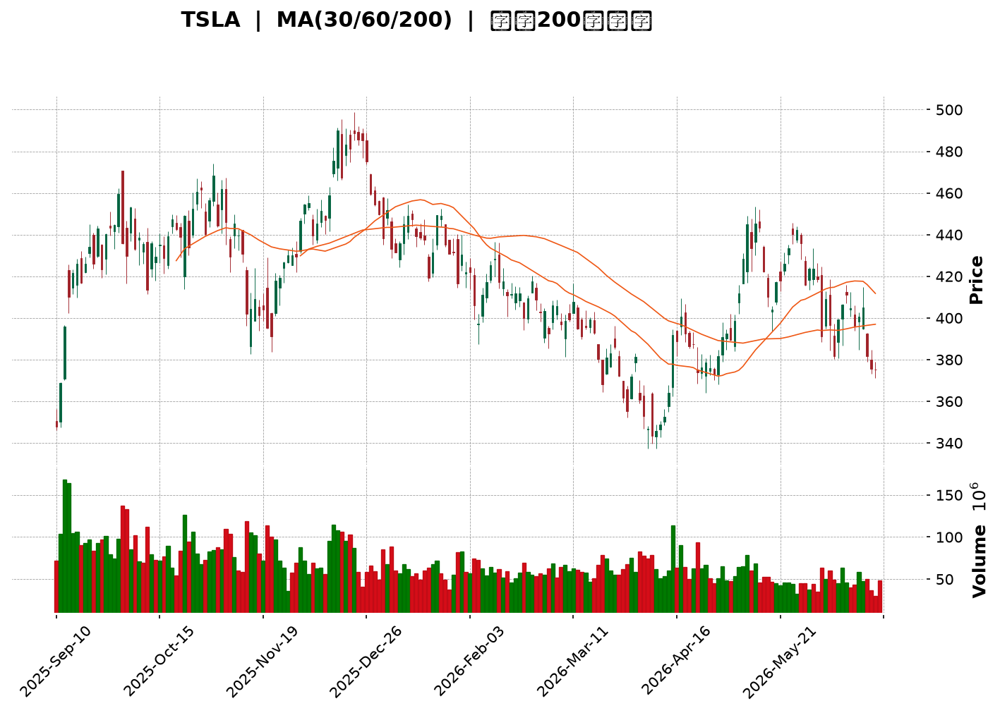
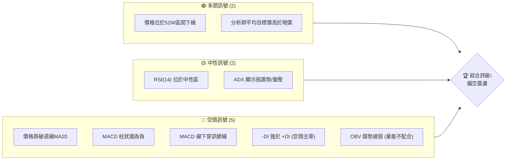
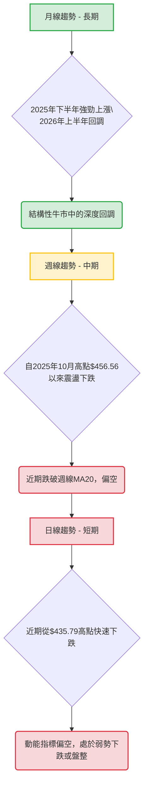
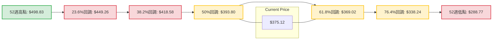
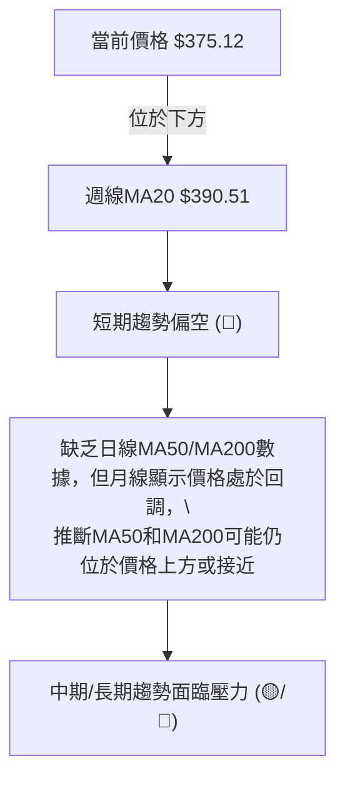

<details>
<summary>📊 靜態圖表 (點擊展開)</summary>

</details>

<html>
<head><meta charset="utf-8" /></head>
<body>
    <div style="height:500px; width:100%;">                        <script>window.PlotlyConfig = {MathJaxConfig: 'local'};</script>
        <script charset="utf-8" src="https://cdn.plot.ly/plotly-3.6.0.min.js" integrity="sha256-QaOVwtVY0T02VaHrr6pnoHLCwayMJp4O5n4YyaE3rJk=" crossorigin="anonymous"></script>                <div id="candlestick-chart" class="plotly-graph-div" style="height:100%; width:100%;"></div>            <script>                window.PLOTLYENV=window.PLOTLYENV || {};                                if (document.getElementById("candlestick-chart")) {                    Plotly.newPlot(                        "candlestick-chart",                        [{"close":{"dtype":"f8","bdata":"AAAA4KO8dUAAAADA9Qx3QAAAAEAKv3hAAAAA4KOgeUAAAACA61l6QAAAAIDCnXpAAAAAoJkNekAAAADAHqF6QAAAACBcI3tAAAAAoJmdekAAAADgo6x7QAAAAIA9dnpAAAAAYGaGe0AAAAAgXLN7QAAAACCFy3tAAAAAIFy3fEAAAAAAAEB7QAAAAKBH3XpAAAAAAABUfEAAAACgcBF7QAAAAEAKa3tAAAAA4KM4e0AAAAAA19d5QAAAAGBmPntAAAAAANfTekAAAABgZjJ7QAAAAAAAzHpAAAAAwPV0e0AAAABA4fZ7QAAAAKCZqXtAAAAAIIVve0AAAAAgrg98QAAAACCFG3tAAAAAYLhGfEAAAADAzMh8QAAAAAAp2HxAAAAAoJmBe0AAAADA9Yh8QAAAAIDrRX1AAAAAACnEe0AAAADAHuF8QAAAAGCP3ntAAAAA4FHYekAAAAAgrtN7QAAAAIDreXtAAAAAoJnpekAAAAAA1x95QAAAAKCZRXlAAAAAYLiOeUAAAAAAABR5QAAAAADXP3lAAAAAIK6zeEAAAACgcHF4QAAAAOB6HHpAAAAAYGY2ekAAAACgR6l6QAAAAGC44npAAAAAgD3iekAAAAAA19N6QAAAAADX63tAAAAA4HpofEAAAAAAAHB8QAAAAKBHeXtAAAAAYLjSe0AAAABAMzd8QAAAAIA97ntAAAAAIFyvfEAAAADA9bR9QAAAAIAUnn5AAAAAACk0fUAAAACA6zV+QAAAAEAzE35AAAAAIK6LfkAAAADA9Vh+QAAAAGBmVn5AAAAAQAqzfUAAAACAPbp8QAAAAEDhZnxAAAAAIIUbfEAAAADAHmF7QAAAAGC4OnxAAAAAIFwPe0AAAABgj\u002fZ6QAAAAMDMPHtAAAAAACnQe0AAAAAgXA98QAAAAEAz83tAAAAAQDNze0AAAADAHml7QAAAAAAAWHtAAAAAAAA0ekAAAABACvd6QAAAAIDCFXxAAAAAwPUQfEAAAABAMzN7QAAAAGBm7npAAAAAIFz3ekAAAADA9Qh6QAAAAGCP5npAAAAAwPVcekAAAAAgXF96QAAAAAApYHlAAAAAIFzTeEAAAACAwrF5QAAAAMAeFXpAAAAAIFyTekAAAADgUcR6QAAAAMAeEXpAAAAAQAoXekAAAACAFKp5QAAAAMAetXlAAAAAIFy7eUAAAADAHr15QAAAAKBH\u002fXhAAAAAgBSWeUAAAABgZhZ6QAAAAKBHiXlAAAAAACkoeUAAAADAHjV5QAAAAEDhhnhAAAAAQApfeUAAAADAzFh5QAAAACCuy3hAAAAAQOHqeEAAAAAA1\u002fN4QAAAAMAefXlAAAAAACmweEAAAABAM3N4QAAAAMD1uHhAAAAA4FH0eEAAAADgeox4QAAAAMDMxHdAAAAAIFz\u002fdkAAAACgmc13QAAAAOB68HdAAAAAQDMfeEAAAACAwkF3QAAAAKBHnXZAAAAA4Ho0dkAAAAAAADx3QAAAAAAp1HdAAAAAoHCJdkAAAADAHg12QAAAAGBmqnVAAAAAAAB0dUAAAACA65l1QAAAAEAzz3VAAAAAYLgGdkAAAABAM8N2QAAAAEAzf3hAAAAAYGZOeEAAAACA6wl5QAAAAAAAiHhAAAAAYLgmeEAAAAAAKTh4QAAAACCFW3dAAAAAwMyEd0AAAABguKp3QAAAAOBRgHdAAAAAwMxMd0AAAACAFNp3QAAAAMAebXhAAAAAACmIeEAAAACA61V4QAAAACCu63hAAAAA4KO8eUAAAACgmcV6QAAAAAAA0HtAAAAAQDMXe0AAAADgUdR7QAAAAMDMtHtAAAAAANdjekAAAAAA1595QAAAAIDCQXlAAAAAACkUekAAAACgmR16QAAAAAApoHpAAAAAoHAZe0AAAACAwoV7QAAAAKCZoXtAAAAA4KM8e0AAAACAFP55QAAAAADXe3pAAAAAQDN7ekAAAABAMyd6QAAAAAAAcHhAAAAAQDOPeUAAAABA4cp4QAAAAKBw2XdAAAAAYGbyeEAAAABA4WZ5QAAAAGBmsnlAAAAAYI9KeUAAAACAFMZ4QAAAAADXB3lAAAAAwMxQeUAAAACAwtl3QAAAAOB6eHdAAAAAgOtxd0AAAAAAAAD4fw=="},"high":{"dtype":"f8","bdata":"AAAAoEdFdkAAAAAA1w93QAAAAEAKy3hAAAAAQDObekAAAAAAAHR6QAAAAMD1xHpAAAAAIIUDe0AAAAAghdd6QAAAACCuz3tAAAAAIIWPe0AAAAAgXMN7QAAAAKCZNXtAAAAAIIWHe0AAAAAgri98QAAAAAAA0HtAAAAA4KPkfEAAAAAAAGx9QAAAAOBR7HtAAAAAwMxYfEAAAABA4Up8QAAAAKBHlXtAAAAAoJlFe0AAAACAFLJ7QAAAAIA9TntAAAAAQDMje0AAAAAAKYh7QAAAAKCZdXtAAAAAIFyXe0AAAADAzBx8QAAAAMDMFHxAAAAA4KPYe0AAAABgZhZ8QAAAAEDhOnxAAAAAYI\u002fCfEAAAAAAADB9QAAAAEAzG31AAAAAwPVwfEAAAAAAAKB8QAAAAMAeoX1AAAAAIIXDfEAAAACgRyV9QAAAAEAzN31AAAAAgMJ1e0AAAABguBp8QAAAAADXp3tAAAAAoEele0AAAAAAAIh6QAAAAEAKw3lAAAAAIFx\u002fekAAAABgZo55QAAAAOB6vHlAAAAAQArPekAAAADAzCx5QAAAACCFW3pAAAAAIK5HekAAAABACq96QAAAAEDhDntAAAAAYI8ae0AAAADAzEx7QAAAAGC4\u002fntAAAAAgBRqfEAAAACA6618QAAAAAAAHHxAAAAAgD1GfEAAAACAFI58QAAAAOBRFHxAAAAAACnwfEAAAADgURx+QAAAAAAAuH5AAAAA4Hr0fkAAAACAwq1+QAAAAADXp35AAAAAoEctf0AAAAAghb9+QAAAAGBmrn5AAAAAoHCRfkAAAABgZlZ9QAAAAIDr8XxAAAAAwMyIfEAAAACgcKV8QAAAAMDMmHxAAAAAAAAEfEAAAACA62V7QAAAAIA9TntAAAAAwMwQfEAAAADAzGR8QAAAAMD1PHxAAAAAYI++e0AAAACAwtV7QAAAAAAA9HtAAAAAIK7rekAAAABAM2N7QAAAAAAAGHxAAAAAQOFGfEAAAADgo9B7QAAAAOBRWHtAAAAAAClke0AAAAAgroN7QAAAAIAUfntAAAAAYGayekAAAADA9ch6QAAAAGBmfnpAAAAAoJkheUAAAADAzOh5QAAAAAAAVHpAAAAAAAC0ekAAAACgmUV7QAAAACCuQ3tAAAAAwPWAekAAAAAghdt5QAAAAGBmDnpAAAAAAAD0eUAAAABAM+t5QAAAAEAze3lAAAAAwB6teUAAAACgcEV6QAAAAMD1DHpAAAAAgOtxeUAAAADgo0h5QAAAAKBwxXhAAAAAoEeFeUAAAACA64l5QAAAAKCZJXlAAAAAoHAZeUAAAACgcGl5QAAAAIAUBnpAAAAAAABoeUAAAABAMwN5QAAAACCuO3lAAAAAgOsBeUAAAADAHjF5QAAAAOBRNHhAAAAAgD2+d0AAAACgRxV4QAAAACCuN3hAAAAAIK7DeEAAAABACgd4QAAAAIDCHXdAAAAA4KP0dkAAAACgR1V3QAAAAIA98ndAAAAA4Hokd0AAAAAghft2QAAAAOBRwHVAAAAAAADIdkAAAACAFM51QAAAAIDC5XVAAAAAoJlFdkAAAACAFPp2QAAAAGBmqnhAAAAAwPWgeEAAAADgepR5QAAAAMDMbHlAAAAAQDOfeEAAAAAAKZB4QAAAAAAAIHhAAAAAACnsd0AAAADgesx3QAAAAOCj5HdAAAAAYGaGd0AAAAAAAAx4QAAAAMAe3XhAAAAAgD2qeEAAAACA6yF5QAAAAEDhGnlAAAAAoEf9eUAAAABAM\u002fN6QAAAAGCPEnxAAAAAwMz8e0AAAABgZlZ8QAAAACCuP3xAAAAAYI8qe0AAAACAFFJ6QAAAAIAUWnlAAAAAIFwXekAAAABAM696QAAAAAAp+HpAAAAAQDMze0AAAACgmdl7QAAAACBcv3tAAAAAwB6Re0AAAACgmdl6QAAAAGC4hnpAAAAAoJkZe0AAAACgmaV6QAAAAEDhinpAAAAAQArPeUAAAAAAACh6QAAAAKBw0XhAAAAA4KP4eEAAAABA4Wp5QAAAAAAAAHpAAAAAYLjGeUAAAABACl95QAAAAOBRKHlAAAAAAADseUAAAACA6414QAAAAKBHCXhAAAAAgOuxd0AAAAAAAAD4fw=="},"hovertemplate":"\u003cb\u003e%{x|%Y-%m-%d}\u003c\u002fb\u003e\u003cbr\u003e\u958b: $%{open:.2f}\u003cbr\u003e\u9ad8: $%{high:.2f}\u003cbr\u003e\u4f4e: $%{low:.2f}\u003cbr\u003e\u6536: $%{close:.2f}\u003cextra\u003e\u003c\u002fextra\u003e","low":{"dtype":"f8","bdata":"AAAAwB6hdUAAAACgmbl1QAAAAADXI3dAAAAAQOEmeUAAAABA4bZ5QAAAAGC4mnlAAAAAwPUIekAAAAAghVt6QAAAAIAU0npAAAAAIIV7ekAAAADgetB6QAAAAKBHMXpAAAAA4FFQekAAAAAAAHh7QAAAAIDrEXtAAAAAAACMe0AAAADAHjl7QAAAAKBHCXpAAAAAQApLe0AAAABAMwd7QAAAACCuk3pAAAAAQOGiekAAAABAM7d5QAAAAEAzO3pAAAAAgMIdekAAAACgR6V6QAAAAMD1VHpAAAAAoJl5ekAAAACAwol7QAAAAMDMoHtAAAAAAADQekAAAABgZt55QAAAAGC44npAAAAAQApre0AAAACgmTl8QAAAAGBmSnxAAAAAgMJ5e0AAAABACrt7QAAAAMDMXHxAAAAAoJm5e0AAAAAgXIt7QAAAAKBwMXtAAAAAgBReekAAAACAwhV7QAAAAIDCBXtAAAAAwPWoekAAAACgcMV4QAAAAOB67HdAAAAAANfreEAAAAAgXJt4QAAAAAAA6HhAAAAAANereEAAAAAAKfx3QAAAAKBwEXlAAAAAQDNfeUAAAACAPQ56QAAAAEAzo3pAAAAA4KOUekAAAACA62F6QAAAAIDC8XpAAAAAgD3We0AAAABgjzp8QAAAAAAANHtAAAAAQDM7e0AAAACAwrl7QAAAAKBHhXtAAAAAYLiae0AAAABgjzp9QAAAAKBHHX1AAAAAQDMjfUAAAACA65F9QAAAACCFq31AAAAAoEdVfkAAAACgcC1+QAAAAMDMzH1AAAAAwB6dfUAAAAAAALB8QAAAAKBHXXxAAAAAwMwUfEAAAADAzDR7QAAAAMAeyXtAAAAA4HrMekAAAADgo\u002fR6QAAAAIDrhXpAAAAAgD3mekAAAAAAAGB7QAAAAEAzv3tAAAAAIIUje0AAAABgZlp7QAAAAAApNHtAAAAAQAoXekAAAACA6zl6QAAAAIAUCntAAAAA4KPAe0AAAADgeiR7QAAAAEAK63pAAAAAoJnhekAAAACA6+l5QAAAAEAza3pAAAAAAADoeUAAAABACtt5QAAAAEDh8nhAAAAA4Ho4eEAAAAAAANx4QAAAAOCjdHlAAAAAAAAQekAAAADgekB6QAAAAAAA4HlAAAAAgBSueUAAAAAAKQh5QAAAAKBHmXlAAAAAgMJBeUAAAAAAAFh5QAAAAOCjoHhAAAAAgD3aeEAAAABgZsJ5QAAAAGCPOnlAAAAAgMLheEAAAAAAAER4QAAAAIA9FnhAAAAAoEepeEAAAABguPZ4QAAAACBco3hAAAAAYGbWd0AAAABACuN4QAAAAGBmInlAAAAAYGaqeEAAAABAM194QAAAAGC4pnhAAAAAAACQeEAAAADA9YR4QAAAACCuq3dAAAAAIFzHdkAAAAAgrkt3QAAAAMD1hHdAAAAAACkQeEAAAACA6z13QAAAACCFd3ZAAAAAgD0CdkAAAAAAAJB2QAAAAKBHYXdAAAAA4HpwdkAAAACAPap1QAAAAADXE3VAAAAAYLg6dUAAAAAAABR1QAAAAADXa3VAAAAAwB7JdUAAAADgUSx2QAAAAAAAqHZAAAAAwMzcd0AAAABgZnp4QAAAAKBHRXhAAAAAIIUTeEAAAADAzBR4QAAAAIA9BndAAAAAIK4rd0AAAADgUcB2QAAAAOCjSHdAAAAA4KMgd0AAAABguAJ3QAAAAMDMrHdAAAAAwMwMeEAAAAAAAFB4QAAAAOBRAHhAAAAAgOsheUAAAACAPQZ6QAAAAMDMDHpAAAAAAClkekAAAAAgXON6QAAAAGCPkntAAAAAAABgekAAAACgR1V5QAAAAIAUmnhAAAAAgD1meUAAAABgZs55QAAAAAApSHpAAAAAgOuhekAAAADgUTh7QAAAAMDMRHtAAAAAgD3CekAAAABA4fZ5QAAAAGBm2nlAAAAAAAAAekAAAABgjxJ6QAAAAKBwSXhAAAAAIIWreEAAAAAA1wN4QAAAAGBmwndAAAAAYI\u002fKd0AAAAAAKSx4QAAAAKCZcXlAAAAA4KMIeUAAAAAAKZx4QAAAAEAzC3hAAAAAYGameEAAAADA9bB3QAAAAMDMUHdAAAAAIIUzd0AAAAAAAAD4fw=="},"name":"\u50f9\u683c","open":{"dtype":"f8","bdata":"AAAAwMzodUAAAABguOJ1QAAAAEAKL3dAAAAAgBRyekAAAAAAAOh5QAAAAAAA\u002fHlAAAAAgOvNekAAAADAHl16QAAAAIDC8XpAAAAAgBR+e0AAAACgR916QAAAAADXM3tAAAAAwMzEekAAAACgmcV7QAAAAOBRmHtAAAAAwMy8e0AAAADgo2h9QAAAAOCjtHtAAAAAAACMe0AAAADAHv17QAAAAMAeWXtAAAAAwPX8ekAAAADgo0h7QAAAAOB6eHpAAAAA4KOsekAAAABgZi57QAAAACCuK3tAAAAAAACYekAAAACA6717QAAAAAAp3HtAAAAAQDO3e0AAAAAAAEB6QAAAAKBH7XtAAAAAIK5\u002fe0AAAADgemx8QAAAAAAA6HxAAAAAwMwwfEAAAAAAAOx7QAAAAADXf3xAAAAAIFxnfEAAAADAzEB8QAAAACBc33xAAAAAYLhee0AAAACgmXl7QAAAAGBmdntAAAAAYGaie0AAAACAFHJ6QAAAAMDMJHhAAAAAANfreEAAAACAFFZ5QAAAAEDhYnlAAAAAgBTqeUAAAADAHiV5QAAAAGC4InlAAAAAYLjmeUAAAABAM396QAAAAKBwqXpAAAAAwB6VekAAAADA9ex6QAAAAKCZAXtAAAAAQAoffEAAAADgelB8QAAAAEAz93tAAAAA4KNYe0AAAADAHuF7QAAAAEAzD3xAAAAAoHABfEAAAABACld9QAAAACBcg31AAAAAIIWDfkAAAABgj+J9QAAAAIDrgX5AAAAAgBSefkAAAABgZpZ+QAAAACCuh35AAAAAIK5TfkAAAAAAAFB9QAAAAKBw0XxAAAAAoJmBfEAAAADAzJx8QAAAAADX\u002f3tAAAAAgBTme0AAAABgZj57QAAAAIA9vnpAAAAAQDM\u002fe0AAAAAgrpN7QAAAAEAzI3xAAAAAwPWse0AAAACAFJJ7QAAAAAAAeHtAAAAAgMLVekAAAABgj1p6QAAAAGCPMntAAAAAQOH2e0AAAAAAANB7QAAAAGCPVntAAAAAYI\u002f+ekAAAADAzFx7QAAAAKCZlXpAAAAA4KNUekAAAADgUYR6QAAAACBcR3pAAAAA4FHQeEAAAACA6w15QAAAAGCPnnlAAAAAoEchekAAAAAgXL96QAAAAMDM5HpAAAAAwPXkeUAAAACAwsV5QAAAAIDCsXlAAAAAAAB0eUAAAADAzIR5QAAAAOCjdHlAAAAAAAD4eEAAAABgZsJ5QAAAAGC45nlAAAAAQAoveUAAAACgmWl4QAAAAKBwsXhAAAAAoJndeEAAAADAHhl5QAAAAKBw4XhAAAAAwMxgeEAAAAAghSN5QAAAAOB6JHlAAAAAQOFSeUAAAABguPJ4QAAAACCFw3hAAAAAQAq7eEAAAAAAAPB4QAAAAOBRNHhAAAAAoJm9d0AAAACgcFF3QAAAAMD1iHdAAAAAANdfeEAAAACgmdl3QAAAAEAKG3dAAAAAgMLddkAAAAAAKZh2QAAAAIAUqndAAAAAQDPDdkAAAACgcKl2QAAAAEAKp3VAAAAA4KO8dkAAAABgZnJ1QAAAAOCjpHVAAAAAwB7hdUAAAABguFp2QAAAAKBH7XZAAAAAwPWceEAAAABguL54QAAAAKBHKXlAAAAAAACQeEAAAADAHjl4QAAAAOB6dHdAAAAAAABYd0AAAACgcEF3QAAAAEDhandAAAAAYGZ2d0AAAAAAAEx3QAAAAADX53dAAAAAIK5jeEAAAABACrN4QAAAAAAAJHhAAAAAIK53eUAAAAAgrgd6QAAAAGCPYnpAAAAAYI+We0AAAABguEp7QAAAAADX53tAAAAAIK4fe0AAAADgUTR6QAAAAGCPMnlAAAAAoJl5eUAAAABA4WJ6QAAAAGC4anpAAAAAACnkekAAAACAPa57QAAAAIDrWXtAAAAAoJl9e0AAAAAA17d6QAAAACCFI3pAAAAAQDMrekAAAACgcD16QAAAAAAASHpAAAAAoEfFeEAAAADgerB5QAAAAOCjeHhAAAAA4HpEeEAAAAAA1\u002fd4QAAAAIDrxXlAAAAAgMJBeUAAAADgehh5QAAAAKCZ4XhAAAAAoJmteEAAAACAwol4QAAAAKBHwXdAAAAA4FF0d0AAAAAAAAD4fw=="},"x":["2025-09-10T00:00:00-04:00","2025-09-11T00:00:00-04:00","2025-09-12T00:00:00-04:00","2025-09-15T00:00:00-04:00","2025-09-16T00:00:00-04:00","2025-09-17T00:00:00-04:00","2025-09-18T00:00:00-04:00","2025-09-19T00:00:00-04:00","2025-09-22T00:00:00-04:00","2025-09-23T00:00:00-04:00","2025-09-24T00:00:00-04:00","2025-09-25T00:00:00-04:00","2025-09-26T00:00:00-04:00","2025-09-29T00:00:00-04:00","2025-09-30T00:00:00-04:00","2025-10-01T00:00:00-04:00","2025-10-02T00:00:00-04:00","2025-10-03T00:00:00-04:00","2025-10-06T00:00:00-04:00","2025-10-07T00:00:00-04:00","2025-10-08T00:00:00-04:00","2025-10-09T00:00:00-04:00","2025-10-10T00:00:00-04:00","2025-10-13T00:00:00-04:00","2025-10-14T00:00:00-04:00","2025-10-15T00:00:00-04:00","2025-10-16T00:00:00-04:00","2025-10-17T00:00:00-04:00","2025-10-20T00:00:00-04:00","2025-10-21T00:00:00-04:00","2025-10-22T00:00:00-04:00","2025-10-23T00:00:00-04:00","2025-10-24T00:00:00-04:00","2025-10-27T00:00:00-04:00","2025-10-28T00:00:00-04:00","2025-10-29T00:00:00-04:00","2025-10-30T00:00:00-04:00","2025-10-31T00:00:00-04:00","2025-11-03T00:00:00-05:00","2025-11-04T00:00:00-05:00","2025-11-05T00:00:00-05:00","2025-11-06T00:00:00-05:00","2025-11-07T00:00:00-05:00","2025-11-10T00:00:00-05:00","2025-11-11T00:00:00-05:00","2025-11-12T00:00:00-05:00","2025-11-13T00:00:00-05:00","2025-11-14T00:00:00-05:00","2025-11-17T00:00:00-05:00","2025-11-18T00:00:00-05:00","2025-11-19T00:00:00-05:00","2025-11-20T00:00:00-05:00","2025-11-21T00:00:00-05:00","2025-11-24T00:00:00-05:00","2025-11-25T00:00:00-05:00","2025-11-26T00:00:00-05:00","2025-11-28T00:00:00-05:00","2025-12-01T00:00:00-05:00","2025-12-02T00:00:00-05:00","2025-12-03T00:00:00-05:00","2025-12-04T00:00:00-05:00","2025-12-05T00:00:00-05:00","2025-12-08T00:00:00-05:00","2025-12-09T00:00:00-05:00","2025-12-10T00:00:00-05:00","2025-12-11T00:00:00-05:00","2025-12-12T00:00:00-05:00","2025-12-15T00:00:00-05:00","2025-12-16T00:00:00-05:00","2025-12-17T00:00:00-05:00","2025-12-18T00:00:00-05:00","2025-12-19T00:00:00-05:00","2025-12-22T00:00:00-05:00","2025-12-23T00:00:00-05:00","2025-12-24T00:00:00-05:00","2025-12-26T00:00:00-05:00","2025-12-29T00:00:00-05:00","2025-12-30T00:00:00-05:00","2025-12-31T00:00:00-05:00","2026-01-02T00:00:00-05:00","2026-01-05T00:00:00-05:00","2026-01-06T00:00:00-05:00","2026-01-07T00:00:00-05:00","2026-01-08T00:00:00-05:00","2026-01-09T00:00:00-05:00","2026-01-12T00:00:00-05:00","2026-01-13T00:00:00-05:00","2026-01-14T00:00:00-05:00","2026-01-15T00:00:00-05:00","2026-01-16T00:00:00-05:00","2026-01-20T00:00:00-05:00","2026-01-21T00:00:00-05:00","2026-01-22T00:00:00-05:00","2026-01-23T00:00:00-05:00","2026-01-26T00:00:00-05:00","2026-01-27T00:00:00-05:00","2026-01-28T00:00:00-05:00","2026-01-29T00:00:00-05:00","2026-01-30T00:00:00-05:00","2026-02-02T00:00:00-05:00","2026-02-03T00:00:00-05:00","2026-02-04T00:00:00-05:00","2026-02-05T00:00:00-05:00","2026-02-06T00:00:00-05:00","2026-02-09T00:00:00-05:00","2026-02-10T00:00:00-05:00","2026-02-11T00:00:00-05:00","2026-02-12T00:00:00-05:00","2026-02-13T00:00:00-05:00","2026-02-17T00:00:00-05:00","2026-02-18T00:00:00-05:00","2026-02-19T00:00:00-05:00","2026-02-20T00:00:00-05:00","2026-02-23T00:00:00-05:00","2026-02-24T00:00:00-05:00","2026-02-25T00:00:00-05:00","2026-02-26T00:00:00-05:00","2026-02-27T00:00:00-05:00","2026-03-02T00:00:00-05:00","2026-03-03T00:00:00-05:00","2026-03-04T00:00:00-05:00","2026-03-05T00:00:00-05:00","2026-03-06T00:00:00-05:00","2026-03-09T00:00:00-04:00","2026-03-10T00:00:00-04:00","2026-03-11T00:00:00-04:00","2026-03-12T00:00:00-04:00","2026-03-13T00:00:00-04:00","2026-03-16T00:00:00-04:00","2026-03-17T00:00:00-04:00","2026-03-18T00:00:00-04:00","2026-03-19T00:00:00-04:00","2026-03-20T00:00:00-04:00","2026-03-23T00:00:00-04:00","2026-03-24T00:00:00-04:00","2026-03-25T00:00:00-04:00","2026-03-26T00:00:00-04:00","2026-03-27T00:00:00-04:00","2026-03-30T00:00:00-04:00","2026-03-31T00:00:00-04:00","2026-04-01T00:00:00-04:00","2026-04-02T00:00:00-04:00","2026-04-06T00:00:00-04:00","2026-04-07T00:00:00-04:00","2026-04-08T00:00:00-04:00","2026-04-09T00:00:00-04:00","2026-04-10T00:00:00-04:00","2026-04-13T00:00:00-04:00","2026-04-14T00:00:00-04:00","2026-04-15T00:00:00-04:00","2026-04-16T00:00:00-04:00","2026-04-17T00:00:00-04:00","2026-04-20T00:00:00-04:00","2026-04-21T00:00:00-04:00","2026-04-22T00:00:00-04:00","2026-04-23T00:00:00-04:00","2026-04-24T00:00:00-04:00","2026-04-27T00:00:00-04:00","2026-04-28T00:00:00-04:00","2026-04-29T00:00:00-04:00","2026-04-30T00:00:00-04:00","2026-05-01T00:00:00-04:00","2026-05-04T00:00:00-04:00","2026-05-05T00:00:00-04:00","2026-05-06T00:00:00-04:00","2026-05-07T00:00:00-04:00","2026-05-08T00:00:00-04:00","2026-05-11T00:00:00-04:00","2026-05-12T00:00:00-04:00","2026-05-13T00:00:00-04:00","2026-05-14T00:00:00-04:00","2026-05-15T00:00:00-04:00","2026-05-18T00:00:00-04:00","2026-05-19T00:00:00-04:00","2026-05-20T00:00:00-04:00","2026-05-21T00:00:00-04:00","2026-05-22T00:00:00-04:00","2026-05-26T00:00:00-04:00","2026-05-27T00:00:00-04:00","2026-05-28T00:00:00-04:00","2026-05-29T00:00:00-04:00","2026-06-01T00:00:00-04:00","2026-06-02T00:00:00-04:00","2026-06-03T00:00:00-04:00","2026-06-04T00:00:00-04:00","2026-06-05T00:00:00-04:00","2026-06-08T00:00:00-04:00","2026-06-09T00:00:00-04:00","2026-06-10T00:00:00-04:00","2026-06-11T00:00:00-04:00","2026-06-12T00:00:00-04:00","2026-06-15T00:00:00-04:00","2026-06-16T00:00:00-04:00","2026-06-17T00:00:00-04:00","2026-06-18T00:00:00-04:00","2026-06-22T00:00:00-04:00","2026-06-23T00:00:00-04:00","2026-06-24T00:00:00-04:00","2026-06-25T00:00:00-04:00","2026-06-26T00:00:00-04:00"],"type":"candlestick"},{"hovertemplate":"MA30: $%{y:.2f}\u003cextra\u003e\u003c\u002fextra\u003e","line":{"color":"#2196F3","dash":"dash","width":2},"mode":"lines","name":"MA30","x":["2025-09-10T00:00:00-04:00","2025-09-11T00:00:00-04:00","2025-09-12T00:00:00-04:00","2025-09-15T00:00:00-04:00","2025-09-16T00:00:00-04:00","2025-09-17T00:00:00-04:00","2025-09-18T00:00:00-04:00","2025-09-19T00:00:00-04:00","2025-09-22T00:00:00-04:00","2025-09-23T00:00:00-04:00","2025-09-24T00:00:00-04:00","2025-09-25T00:00:00-04:00","2025-09-26T00:00:00-04:00","2025-09-29T00:00:00-04:00","2025-09-30T00:00:00-04:00","2025-10-01T00:00:00-04:00","2025-10-02T00:00:00-04:00","2025-10-03T00:00:00-04:00","2025-10-06T00:00:00-04:00","2025-10-07T00:00:00-04:00","2025-10-08T00:00:00-04:00","2025-10-09T00:00:00-04:00","2025-10-10T00:00:00-04:00","2025-10-13T00:00:00-04:00","2025-10-14T00:00:00-04:00","2025-10-15T00:00:00-04:00","2025-10-16T00:00:00-04:00","2025-10-17T00:00:00-04:00","2025-10-20T00:00:00-04:00","2025-10-21T00:00:00-04:00","2025-10-22T00:00:00-04:00","2025-10-23T00:00:00-04:00","2025-10-24T00:00:00-04:00","2025-10-27T00:00:00-04:00","2025-10-28T00:00:00-04:00","2025-10-29T00:00:00-04:00","2025-10-30T00:00:00-04:00","2025-10-31T00:00:00-04:00","2025-11-03T00:00:00-05:00","2025-11-04T00:00:00-05:00","2025-11-05T00:00:00-05:00","2025-11-06T00:00:00-05:00","2025-11-07T00:00:00-05:00","2025-11-10T00:00:00-05:00","2025-11-11T00:00:00-05:00","2025-11-12T00:00:00-05:00","2025-11-13T00:00:00-05:00","2025-11-14T00:00:00-05:00","2025-11-17T00:00:00-05:00","2025-11-18T00:00:00-05:00","2025-11-19T00:00:00-05:00","2025-11-20T00:00:00-05:00","2025-11-21T00:00:00-05:00","2025-11-24T00:00:00-05:00","2025-11-25T00:00:00-05:00","2025-11-26T00:00:00-05:00","2025-11-28T00:00:00-05:00","2025-12-01T00:00:00-05:00","2025-12-02T00:00:00-05:00","2025-12-03T00:00:00-05:00","2025-12-04T00:00:00-05:00","2025-12-05T00:00:00-05:00","2025-12-08T00:00:00-05:00","2025-12-09T00:00:00-05:00","2025-12-10T00:00:00-05:00","2025-12-11T00:00:00-05:00","2025-12-12T00:00:00-05:00","2025-12-15T00:00:00-05:00","2025-12-16T00:00:00-05:00","2025-12-17T00:00:00-05:00","2025-12-18T00:00:00-05:00","2025-12-19T00:00:00-05:00","2025-12-22T00:00:00-05:00","2025-12-23T00:00:00-05:00","2025-12-24T00:00:00-05:00","2025-12-26T00:00:00-05:00","2025-12-29T00:00:00-05:00","2025-12-30T00:00:00-05:00","2025-12-31T00:00:00-05:00","2026-01-02T00:00:00-05:00","2026-01-05T00:00:00-05:00","2026-01-06T00:00:00-05:00","2026-01-07T00:00:00-05:00","2026-01-08T00:00:00-05:00","2026-01-09T00:00:00-05:00","2026-01-12T00:00:00-05:00","2026-01-13T00:00:00-05:00","2026-01-14T00:00:00-05:00","2026-01-15T00:00:00-05:00","2026-01-16T00:00:00-05:00","2026-01-20T00:00:00-05:00","2026-01-21T00:00:00-05:00","2026-01-22T00:00:00-05:00","2026-01-23T00:00:00-05:00","2026-01-26T00:00:00-05:00","2026-01-27T00:00:00-05:00","2026-01-28T00:00:00-05:00","2026-01-29T00:00:00-05:00","2026-01-30T00:00:00-05:00","2026-02-02T00:00:00-05:00","2026-02-03T00:00:00-05:00","2026-02-04T00:00:00-05:00","2026-02-05T00:00:00-05:00","2026-02-06T00:00:00-05:00","2026-02-09T00:00:00-05:00","2026-02-10T00:00:00-05:00","2026-02-11T00:00:00-05:00","2026-02-12T00:00:00-05:00","2026-02-13T00:00:00-05:00","2026-02-17T00:00:00-05:00","2026-02-18T00:00:00-05:00","2026-02-19T00:00:00-05:00","2026-02-20T00:00:00-05:00","2026-02-23T00:00:00-05:00","2026-02-24T00:00:00-05:00","2026-02-25T00:00:00-05:00","2026-02-26T00:00:00-05:00","2026-02-27T00:00:00-05:00","2026-03-02T00:00:00-05:00","2026-03-03T00:00:00-05:00","2026-03-04T00:00:00-05:00","2026-03-05T00:00:00-05:00","2026-03-06T00:00:00-05:00","2026-03-09T00:00:00-04:00","2026-03-10T00:00:00-04:00","2026-03-11T00:00:00-04:00","2026-03-12T00:00:00-04:00","2026-03-13T00:00:00-04:00","2026-03-16T00:00:00-04:00","2026-03-17T00:00:00-04:00","2026-03-18T00:00:00-04:00","2026-03-19T00:00:00-04:00","2026-03-20T00:00:00-04:00","2026-03-23T00:00:00-04:00","2026-03-24T00:00:00-04:00","2026-03-25T00:00:00-04:00","2026-03-26T00:00:00-04:00","2026-03-27T00:00:00-04:00","2026-03-30T00:00:00-04:00","2026-03-31T00:00:00-04:00","2026-04-01T00:00:00-04:00","2026-04-02T00:00:00-04:00","2026-04-06T00:00:00-04:00","2026-04-07T00:00:00-04:00","2026-04-08T00:00:00-04:00","2026-04-09T00:00:00-04:00","2026-04-10T00:00:00-04:00","2026-04-13T00:00:00-04:00","2026-04-14T00:00:00-04:00","2026-04-15T00:00:00-04:00","2026-04-16T00:00:00-04:00","2026-04-17T00:00:00-04:00","2026-04-20T00:00:00-04:00","2026-04-21T00:00:00-04:00","2026-04-22T00:00:00-04:00","2026-04-23T00:00:00-04:00","2026-04-24T00:00:00-04:00","2026-04-27T00:00:00-04:00","2026-04-28T00:00:00-04:00","2026-04-29T00:00:00-04:00","2026-04-30T00:00:00-04:00","2026-05-01T00:00:00-04:00","2026-05-04T00:00:00-04:00","2026-05-05T00:00:00-04:00","2026-05-06T00:00:00-04:00","2026-05-07T00:00:00-04:00","2026-05-08T00:00:00-04:00","2026-05-11T00:00:00-04:00","2026-05-12T00:00:00-04:00","2026-05-13T00:00:00-04:00","2026-05-14T00:00:00-04:00","2026-05-15T00:00:00-04:00","2026-05-18T00:00:00-04:00","2026-05-19T00:00:00-04:00","2026-05-20T00:00:00-04:00","2026-05-21T00:00:00-04:00","2026-05-22T00:00:00-04:00","2026-05-26T00:00:00-04:00","2026-05-27T00:00:00-04:00","2026-05-28T00:00:00-04:00","2026-05-29T00:00:00-04:00","2026-06-01T00:00:00-04:00","2026-06-02T00:00:00-04:00","2026-06-03T00:00:00-04:00","2026-06-04T00:00:00-04:00","2026-06-05T00:00:00-04:00","2026-06-08T00:00:00-04:00","2026-06-09T00:00:00-04:00","2026-06-10T00:00:00-04:00","2026-06-11T00:00:00-04:00","2026-06-12T00:00:00-04:00","2026-06-15T00:00:00-04:00","2026-06-16T00:00:00-04:00","2026-06-17T00:00:00-04:00","2026-06-18T00:00:00-04:00","2026-06-22T00:00:00-04:00","2026-06-23T00:00:00-04:00","2026-06-24T00:00:00-04:00","2026-06-25T00:00:00-04:00","2026-06-26T00:00:00-04:00"],"y":{"dtype":"f8","bdata":"AAAAAAAA+H8AAAAAAAD4fwAAAAAAAPh\u002fAAAAAAAA+H8AAAAAAAD4fwAAAAAAAPh\u002fAAAAAAAA+H8AAAAAAAD4fwAAAAAAAPh\u002fAAAAAAAA+H8AAAAAAAD4fwAAAAAAAPh\u002fAAAAAAAA+H8AAAAAAAD4fwAAAAAAAPh\u002fAAAAAAAA+H8AAAAAAAD4fwAAAAAAAPh\u002fAAAAAAAA+H8AAAAAAAD4fwAAAAAAAPh\u002fAAAAAAAA+H8AAAAAAAD4fwAAAAAAAPh\u002fAAAAAAAA+H8AAAAAAAD4fwAAAAAAAPh\u002fAAAAAAAA+H8AAAAAAAD4f5qZmTkmuHpAVVVVVcfoekBmZmY2iRN7QBEREXGvJ3tAmpmZuUk+e0B3d3f3DFN7QCIiImIQZntAiYiIyHZye0Dv7u6uuYJ7QJqZmanxlHtA3t3dPcOee0CrqqqaC6l7QFVVVVUOtXtAmpmZ2UCve0BmZmamVLB7QERERFScrXtAq6qq+jeee0Crqqp6FIx7QM3MzJx9fntAd3d3F9lme0Dv7u7e3VV7QJqZmSlcQ3tAERERgdwte0CJiIgo6iF7QM3MzCxAGHtAAAAAsAATe0CJiIiYbg57QJqZmXkwD3tAd3d3d0wKe0DNzMzsmAB7QLy7uyvOAntAERERoRoLe0Dv7u6OUA57QERERKRwEXtAZmZmxpINe0AzMzNTuAh7QFVVVTXsAHtAmpmZOfsKe0CamZk5+xR7QO\u002fu7g50IHtAMzMzU7gse0C8u7t7FDh7QO\u002fu7r7mSntAMzMz43pqe0BmZmZG\u002fX97QFVVVcVnmHtAq6qqyi+we0ARERHx7s57QHd3d4ek6XtAZmZmFmf\u002fe0Dv7u4+ChN8QImIiCh4LHxA7+7ujpdAfEBVVVWVGFZ8QJqZmem0X3xAiYiIiF1tfEBmZmYmTXl8QAAAAFBignxA3t3dTTeHfECamZkpMYx8QImIiJhDh3xAMzMzs3J0fECamZn54Wd8QFVVVUUZbXxAIiIiYixvfEB3d3e3gWZ8QLy7u4v6XXxAERER4U9PfEC8u7uL+i98QImIiOhCEHxAd3d3dwX4e0BERET0RNd7QDMzMwMrr3tAq6qqelt+e0AiIiKSplZ7QCIiImJXMntAIiIicq8Xe0BERERk9AZ7QCIiIoIH83pAZmZmNtDhekDNzMy8LdN6QN7d3Z2ovXpAiYiISFOyekCJiIiY4Kd6QN7d3X2xlHpA7+7uzrCBekARERHR23B6QFVVVeVCXHpAzczMfLFIekAAAACw5DV6QBERESHbHXpA7+7u3sEWekBVVVUF8wh6QGZmZkbh7HlAmpmZuQLSeUC8u7v71L55QLy7u8uFsnlAiYiIKBWfeUDNzMysjpF5QM3MzHz4fnlAZmZmBvNyeUC8u7v7YmN5QFVVVbWsVXlAvLu7GxNGeUDNzMyc7zV5QCIiIuKlI3lAZmZmlrUOeUAAAADgwfB4QFVVVcVL03hAvLu72ySyeEARERFxaJ14QAAAAEBgjXhAq6qqqhxyeEAzMzMzpVJ4QLy7u1tINnhAiYiIaAMTeEC8u7sLu+x3QBEREZHtzHdAzczMnDayd0De3d1tWZ13QFVVVeUXnXdA3t3dXQGUd0AiIiJCYJF3QImIiLgej3dAMzMz05SId0CrqqpKU4J3QBEREYEjcHdAZmZm9ihmd0AzMzMzel93QGZmZlYOVXdAzczMTPBGd0BERET0\u002fUB3QJqZmUmaRndA7+7uLrJTd0AiIiJyPVh3QFVVVQWdYHdAq6qqCmVud0De3d2tY4x3QImIiCi\u002fuHdAiYiI+G\u002fid0BmZmbmpQl4QM3MzGy8KnhAREREtJ1LeEAAAABQG2p4QERERITAiHhAmpmZWTmweEB3d3cnv9Z4QJqZmWnY\u002f3hAIiIi0iIreUAiIiIywVN5QHd3d1eAbnlAREREZIKHeUBERETkpY95QBERETFPoHlAd3d3JzG0eUDv7u5+scR5QKuqqsrozXlAvLu7m1LfeUAiIiKS7eh5QAAAABDm63lAd3d3t\u002fP5eUDe3d29LQd6QGZmZnYFEnpAd3d3V4AYekARERFxPRx6QM3MzLwtHXpAAAAAgJUZekDe3d3tpwB6QFVVVfWa23lAd3d39368eUAAAAAAAAD4fw=="},"type":"scatter"},{"hovertemplate":"MA60: $%{y:.2f}\u003cextra\u003e\u003c\u002fextra\u003e","line":{"color":"#9C27B0","dash":"dash","width":2},"mode":"lines","name":"MA60","x":["2025-09-10T00:00:00-04:00","2025-09-11T00:00:00-04:00","2025-09-12T00:00:00-04:00","2025-09-15T00:00:00-04:00","2025-09-16T00:00:00-04:00","2025-09-17T00:00:00-04:00","2025-09-18T00:00:00-04:00","2025-09-19T00:00:00-04:00","2025-09-22T00:00:00-04:00","2025-09-23T00:00:00-04:00","2025-09-24T00:00:00-04:00","2025-09-25T00:00:00-04:00","2025-09-26T00:00:00-04:00","2025-09-29T00:00:00-04:00","2025-09-30T00:00:00-04:00","2025-10-01T00:00:00-04:00","2025-10-02T00:00:00-04:00","2025-10-03T00:00:00-04:00","2025-10-06T00:00:00-04:00","2025-10-07T00:00:00-04:00","2025-10-08T00:00:00-04:00","2025-10-09T00:00:00-04:00","2025-10-10T00:00:00-04:00","2025-10-13T00:00:00-04:00","2025-10-14T00:00:00-04:00","2025-10-15T00:00:00-04:00","2025-10-16T00:00:00-04:00","2025-10-17T00:00:00-04:00","2025-10-20T00:00:00-04:00","2025-10-21T00:00:00-04:00","2025-10-22T00:00:00-04:00","2025-10-23T00:00:00-04:00","2025-10-24T00:00:00-04:00","2025-10-27T00:00:00-04:00","2025-10-28T00:00:00-04:00","2025-10-29T00:00:00-04:00","2025-10-30T00:00:00-04:00","2025-10-31T00:00:00-04:00","2025-11-03T00:00:00-05:00","2025-11-04T00:00:00-05:00","2025-11-05T00:00:00-05:00","2025-11-06T00:00:00-05:00","2025-11-07T00:00:00-05:00","2025-11-10T00:00:00-05:00","2025-11-11T00:00:00-05:00","2025-11-12T00:00:00-05:00","2025-11-13T00:00:00-05:00","2025-11-14T00:00:00-05:00","2025-11-17T00:00:00-05:00","2025-11-18T00:00:00-05:00","2025-11-19T00:00:00-05:00","2025-11-20T00:00:00-05:00","2025-11-21T00:00:00-05:00","2025-11-24T00:00:00-05:00","2025-11-25T00:00:00-05:00","2025-11-26T00:00:00-05:00","2025-11-28T00:00:00-05:00","2025-12-01T00:00:00-05:00","2025-12-02T00:00:00-05:00","2025-12-03T00:00:00-05:00","2025-12-04T00:00:00-05:00","2025-12-05T00:00:00-05:00","2025-12-08T00:00:00-05:00","2025-12-09T00:00:00-05:00","2025-12-10T00:00:00-05:00","2025-12-11T00:00:00-05:00","2025-12-12T00:00:00-05:00","2025-12-15T00:00:00-05:00","2025-12-16T00:00:00-05:00","2025-12-17T00:00:00-05:00","2025-12-18T00:00:00-05:00","2025-12-19T00:00:00-05:00","2025-12-22T00:00:00-05:00","2025-12-23T00:00:00-05:00","2025-12-24T00:00:00-05:00","2025-12-26T00:00:00-05:00","2025-12-29T00:00:00-05:00","2025-12-30T00:00:00-05:00","2025-12-31T00:00:00-05:00","2026-01-02T00:00:00-05:00","2026-01-05T00:00:00-05:00","2026-01-06T00:00:00-05:00","2026-01-07T00:00:00-05:00","2026-01-08T00:00:00-05:00","2026-01-09T00:00:00-05:00","2026-01-12T00:00:00-05:00","2026-01-13T00:00:00-05:00","2026-01-14T00:00:00-05:00","2026-01-15T00:00:00-05:00","2026-01-16T00:00:00-05:00","2026-01-20T00:00:00-05:00","2026-01-21T00:00:00-05:00","2026-01-22T00:00:00-05:00","2026-01-23T00:00:00-05:00","2026-01-26T00:00:00-05:00","2026-01-27T00:00:00-05:00","2026-01-28T00:00:00-05:00","2026-01-29T00:00:00-05:00","2026-01-30T00:00:00-05:00","2026-02-02T00:00:00-05:00","2026-02-03T00:00:00-05:00","2026-02-04T00:00:00-05:00","2026-02-05T00:00:00-05:00","2026-02-06T00:00:00-05:00","2026-02-09T00:00:00-05:00","2026-02-10T00:00:00-05:00","2026-02-11T00:00:00-05:00","2026-02-12T00:00:00-05:00","2026-02-13T00:00:00-05:00","2026-02-17T00:00:00-05:00","2026-02-18T00:00:00-05:00","2026-02-19T00:00:00-05:00","2026-02-20T00:00:00-05:00","2026-02-23T00:00:00-05:00","2026-02-24T00:00:00-05:00","2026-02-25T00:00:00-05:00","2026-02-26T00:00:00-05:00","2026-02-27T00:00:00-05:00","2026-03-02T00:00:00-05:00","2026-03-03T00:00:00-05:00","2026-03-04T00:00:00-05:00","2026-03-05T00:00:00-05:00","2026-03-06T00:00:00-05:00","2026-03-09T00:00:00-04:00","2026-03-10T00:00:00-04:00","2026-03-11T00:00:00-04:00","2026-03-12T00:00:00-04:00","2026-03-13T00:00:00-04:00","2026-03-16T00:00:00-04:00","2026-03-17T00:00:00-04:00","2026-03-18T00:00:00-04:00","2026-03-19T00:00:00-04:00","2026-03-20T00:00:00-04:00","2026-03-23T00:00:00-04:00","2026-03-24T00:00:00-04:00","2026-03-25T00:00:00-04:00","2026-03-26T00:00:00-04:00","2026-03-27T00:00:00-04:00","2026-03-30T00:00:00-04:00","2026-03-31T00:00:00-04:00","2026-04-01T00:00:00-04:00","2026-04-02T00:00:00-04:00","2026-04-06T00:00:00-04:00","2026-04-07T00:00:00-04:00","2026-04-08T00:00:00-04:00","2026-04-09T00:00:00-04:00","2026-04-10T00:00:00-04:00","2026-04-13T00:00:00-04:00","2026-04-14T00:00:00-04:00","2026-04-15T00:00:00-04:00","2026-04-16T00:00:00-04:00","2026-04-17T00:00:00-04:00","2026-04-20T00:00:00-04:00","2026-04-21T00:00:00-04:00","2026-04-22T00:00:00-04:00","2026-04-23T00:00:00-04:00","2026-04-24T00:00:00-04:00","2026-04-27T00:00:00-04:00","2026-04-28T00:00:00-04:00","2026-04-29T00:00:00-04:00","2026-04-30T00:00:00-04:00","2026-05-01T00:00:00-04:00","2026-05-04T00:00:00-04:00","2026-05-05T00:00:00-04:00","2026-05-06T00:00:00-04:00","2026-05-07T00:00:00-04:00","2026-05-08T00:00:00-04:00","2026-05-11T00:00:00-04:00","2026-05-12T00:00:00-04:00","2026-05-13T00:00:00-04:00","2026-05-14T00:00:00-04:00","2026-05-15T00:00:00-04:00","2026-05-18T00:00:00-04:00","2026-05-19T00:00:00-04:00","2026-05-20T00:00:00-04:00","2026-05-21T00:00:00-04:00","2026-05-22T00:00:00-04:00","2026-05-26T00:00:00-04:00","2026-05-27T00:00:00-04:00","2026-05-28T00:00:00-04:00","2026-05-29T00:00:00-04:00","2026-06-01T00:00:00-04:00","2026-06-02T00:00:00-04:00","2026-06-03T00:00:00-04:00","2026-06-04T00:00:00-04:00","2026-06-05T00:00:00-04:00","2026-06-08T00:00:00-04:00","2026-06-09T00:00:00-04:00","2026-06-10T00:00:00-04:00","2026-06-11T00:00:00-04:00","2026-06-12T00:00:00-04:00","2026-06-15T00:00:00-04:00","2026-06-16T00:00:00-04:00","2026-06-17T00:00:00-04:00","2026-06-18T00:00:00-04:00","2026-06-22T00:00:00-04:00","2026-06-23T00:00:00-04:00","2026-06-24T00:00:00-04:00","2026-06-25T00:00:00-04:00","2026-06-26T00:00:00-04:00"],"y":{"dtype":"f8","bdata":"AAAAAAAA+H8AAAAAAAD4fwAAAAAAAPh\u002fAAAAAAAA+H8AAAAAAAD4fwAAAAAAAPh\u002fAAAAAAAA+H8AAAAAAAD4fwAAAAAAAPh\u002fAAAAAAAA+H8AAAAAAAD4fwAAAAAAAPh\u002fAAAAAAAA+H8AAAAAAAD4fwAAAAAAAPh\u002fAAAAAAAA+H8AAAAAAAD4fwAAAAAAAPh\u002fAAAAAAAA+H8AAAAAAAD4fwAAAAAAAPh\u002fAAAAAAAA+H8AAAAAAAD4fwAAAAAAAPh\u002fAAAAAAAA+H8AAAAAAAD4fwAAAAAAAPh\u002fAAAAAAAA+H8AAAAAAAD4fwAAAAAAAPh\u002fAAAAAAAA+H8AAAAAAAD4fwAAAAAAAPh\u002fAAAAAAAA+H8AAAAAAAD4fwAAAAAAAPh\u002fAAAAAAAA+H8AAAAAAAD4fwAAAAAAAPh\u002fAAAAAAAA+H8AAAAAAAD4fwAAAAAAAPh\u002fAAAAAAAA+H8AAAAAAAD4fwAAAAAAAPh\u002fAAAAAAAA+H8AAAAAAAD4fwAAAAAAAPh\u002fAAAAAAAA+H8AAAAAAAD4fwAAAAAAAPh\u002fAAAAAAAA+H8AAAAAAAD4fwAAAAAAAPh\u002fAAAAAAAA+H8AAAAAAAD4fwAAAAAAAPh\u002fAAAAAAAA+H8AAAAAAAD4f6uqqjJ63XpAMzMz+\u002fD5ekCrqqri7BB7QKuqqgqQHHtAAAAAQO4le0BVVVWl4i17QLy7u0t+M3tAERERAbk+e0BERER02kt7QERERNyyWntAiYiIyL1le0AzMzMLkHB7QCIiIor6f3tAZmZm3t2Me0BmZmb2KJh7QM3MzAwCo3tAq6qq4jOne0De3d21ga17QCIiIhIRtHtA7+7uFiCze0Dv7u4OdLR7QBERESnqt3tAAAAACDq3e0Dv7u5eAbx7QDMzM4v6u3tAREREHC\u002fAe0B3d3ff3cN7QM3MzGTJyHtAq6qq4sHIe0AzMzMLZcZ7QCIiIuIIxXtAIiIiqsa\u002fe0BEREREGbt7QM3MzPREv3tARERElF++e0BVVVUFnbd7QImIiGBzr3tAVVVVjSWte0CrqqrieqJ7QLy7u3tbmHtAVVVV5V6Se0AAAAC4rId7QBEREeEIfXtA7+7uLmt0e0BERETsUWt7QLy7u5NfZXtAZmZmnu9je0Crqqqq8Wp7QM3MzARWbntAZmZmpptwe0De3d39G3N7QDMzM2MQdXtAvLu7a3V5e0Dv7u6W\u002fH57QLy7uzMzentAvLu7K4d3e0C8u7t7FHV7QKuqqppSb3tAVVVVZfRne0DNzMzsCmF7QM3MzFyPUntAERERSZpFe0B3d3d\u002fajh7QN7d3UX9LHtA3t3djZcge0CamZlZqxJ7QLy7uytACHtAzczMhDL3ekBEREScxOB6QKuqqrKdx3pA7+7uPny1ekAAAAD4U516QERERNxrgnpAMzMzSzdiekB3d3cXS0Z6QCIiIqL+KnpAREREhDITekAiIiIi2\u002ft5QLy7u6Mp43lAERERifrJeUDv7u4WS7h5QO\u002fu7m6EpXlAmpmZ+TeSeUDe3d3lQn15QM3MzOx8ZXlAvLu7G1pKeUBmZmZuyy55QDMzMzuYFHlAzczMDHT9eEDv7u4On+l4QDMzM4N53XhAZmZmnmHVeEC8u7ujKc14QHd3d\u002f\u002f\u002fvXhAZmZmxkuteEAzMzMjlKB4QGZmZqZUkXhAd3d3D5+CeEAAAABwhHh4QJqZmWkDanhAmpmZqfFceEAAAAB4MFJ4QHd3d38jTnhAVVVVpeJMeEB3d3eHFkd4QLy7u3MhQnhAiYiIUI0+eEDv7u7Gkj54QO\u002fu7nYFRnhAIiIiakpKeEC8u7srh1N4QGZmZlYOXHhAd3d3L91eeECamZlBYF54QAAAAHCEX3hAERERYZ5heECamZkZvWF4QFVVVf1iZnhAd3d3t6xueEAAAABQjXh4QGZmZh7MhXhAERER4cGNeEAzMzMTg5B4QM3MzPS2l3hAVVVV\u002fWKeeEDNzMxkgqN4QN7d3SUGn3hAERERyb2ieECrqqriM6R4QDMzMzN6oHhAIiIiAnKgeEARERHZFaR4QAAAAOBPrHhAMzMzQxm2eECamZlxPbp4QBEREWHlvnhAVVVVRf3DeEDe3d3NhcZ4QO\u002fu7g4tynhAAAAAeHfPeEAAAAAAAAD4fw=="},"type":"scatter"},{"hovertemplate":"MA200: $%{y:.2f}\u003cextra\u003e\u003c\u002fextra\u003e","line":{"color":"#FF6F00","dash":"solid","width":2},"mode":"lines","name":"MA200","x":["2025-09-10T00:00:00-04:00","2025-09-11T00:00:00-04:00","2025-09-12T00:00:00-04:00","2025-09-15T00:00:00-04:00","2025-09-16T00:00:00-04:00","2025-09-17T00:00:00-04:00","2025-09-18T00:00:00-04:00","2025-09-19T00:00:00-04:00","2025-09-22T00:00:00-04:00","2025-09-23T00:00:00-04:00","2025-09-24T00:00:00-04:00","2025-09-25T00:00:00-04:00","2025-09-26T00:00:00-04:00","2025-09-29T00:00:00-04:00","2025-09-30T00:00:00-04:00","2025-10-01T00:00:00-04:00","2025-10-02T00:00:00-04:00","2025-10-03T00:00:00-04:00","2025-10-06T00:00:00-04:00","2025-10-07T00:00:00-04:00","2025-10-08T00:00:00-04:00","2025-10-09T00:00:00-04:00","2025-10-10T00:00:00-04:00","2025-10-13T00:00:00-04:00","2025-10-14T00:00:00-04:00","2025-10-15T00:00:00-04:00","2025-10-16T00:00:00-04:00","2025-10-17T00:00:00-04:00","2025-10-20T00:00:00-04:00","2025-10-21T00:00:00-04:00","2025-10-22T00:00:00-04:00","2025-10-23T00:00:00-04:00","2025-10-24T00:00:00-04:00","2025-10-27T00:00:00-04:00","2025-10-28T00:00:00-04:00","2025-10-29T00:00:00-04:00","2025-10-30T00:00:00-04:00","2025-10-31T00:00:00-04:00","2025-11-03T00:00:00-05:00","2025-11-04T00:00:00-05:00","2025-11-05T00:00:00-05:00","2025-11-06T00:00:00-05:00","2025-11-07T00:00:00-05:00","2025-11-10T00:00:00-05:00","2025-11-11T00:00:00-05:00","2025-11-12T00:00:00-05:00","2025-11-13T00:00:00-05:00","2025-11-14T00:00:00-05:00","2025-11-17T00:00:00-05:00","2025-11-18T00:00:00-05:00","2025-11-19T00:00:00-05:00","2025-11-20T00:00:00-05:00","2025-11-21T00:00:00-05:00","2025-11-24T00:00:00-05:00","2025-11-25T00:00:00-05:00","2025-11-26T00:00:00-05:00","2025-11-28T00:00:00-05:00","2025-12-01T00:00:00-05:00","2025-12-02T00:00:00-05:00","2025-12-03T00:00:00-05:00","2025-12-04T00:00:00-05:00","2025-12-05T00:00:00-05:00","2025-12-08T00:00:00-05:00","2025-12-09T00:00:00-05:00","2025-12-10T00:00:00-05:00","2025-12-11T00:00:00-05:00","2025-12-12T00:00:00-05:00","2025-12-15T00:00:00-05:00","2025-12-16T00:00:00-05:00","2025-12-17T00:00:00-05:00","2025-12-18T00:00:00-05:00","2025-12-19T00:00:00-05:00","2025-12-22T00:00:00-05:00","2025-12-23T00:00:00-05:00","2025-12-24T00:00:00-05:00","2025-12-26T00:00:00-05:00","2025-12-29T00:00:00-05:00","2025-12-30T00:00:00-05:00","2025-12-31T00:00:00-05:00","2026-01-02T00:00:00-05:00","2026-01-05T00:00:00-05:00","2026-01-06T00:00:00-05:00","2026-01-07T00:00:00-05:00","2026-01-08T00:00:00-05:00","2026-01-09T00:00:00-05:00","2026-01-12T00:00:00-05:00","2026-01-13T00:00:00-05:00","2026-01-14T00:00:00-05:00","2026-01-15T00:00:00-05:00","2026-01-16T00:00:00-05:00","2026-01-20T00:00:00-05:00","2026-01-21T00:00:00-05:00","2026-01-22T00:00:00-05:00","2026-01-23T00:00:00-05:00","2026-01-26T00:00:00-05:00","2026-01-27T00:00:00-05:00","2026-01-28T00:00:00-05:00","2026-01-29T00:00:00-05:00","2026-01-30T00:00:00-05:00","2026-02-02T00:00:00-05:00","2026-02-03T00:00:00-05:00","2026-02-04T00:00:00-05:00","2026-02-05T00:00:00-05:00","2026-02-06T00:00:00-05:00","2026-02-09T00:00:00-05:00","2026-02-10T00:00:00-05:00","2026-02-11T00:00:00-05:00","2026-02-12T00:00:00-05:00","2026-02-13T00:00:00-05:00","2026-02-17T00:00:00-05:00","2026-02-18T00:00:00-05:00","2026-02-19T00:00:00-05:00","2026-02-20T00:00:00-05:00","2026-02-23T00:00:00-05:00","2026-02-24T00:00:00-05:00","2026-02-25T00:00:00-05:00","2026-02-26T00:00:00-05:00","2026-02-27T00:00:00-05:00","2026-03-02T00:00:00-05:00","2026-03-03T00:00:00-05:00","2026-03-04T00:00:00-05:00","2026-03-05T00:00:00-05:00","2026-03-06T00:00:00-05:00","2026-03-09T00:00:00-04:00","2026-03-10T00:00:00-04:00","2026-03-11T00:00:00-04:00","2026-03-12T00:00:00-04:00","2026-03-13T00:00:00-04:00","2026-03-16T00:00:00-04:00","2026-03-17T00:00:00-04:00","2026-03-18T00:00:00-04:00","2026-03-19T00:00:00-04:00","2026-03-20T00:00:00-04:00","2026-03-23T00:00:00-04:00","2026-03-24T00:00:00-04:00","2026-03-25T00:00:00-04:00","2026-03-26T00:00:00-04:00","2026-03-27T00:00:00-04:00","2026-03-30T00:00:00-04:00","2026-03-31T00:00:00-04:00","2026-04-01T00:00:00-04:00","2026-04-02T00:00:00-04:00","2026-04-06T00:00:00-04:00","2026-04-07T00:00:00-04:00","2026-04-08T00:00:00-04:00","2026-04-09T00:00:00-04:00","2026-04-10T00:00:00-04:00","2026-04-13T00:00:00-04:00","2026-04-14T00:00:00-04:00","2026-04-15T00:00:00-04:00","2026-04-16T00:00:00-04:00","2026-04-17T00:00:00-04:00","2026-04-20T00:00:00-04:00","2026-04-21T00:00:00-04:00","2026-04-22T00:00:00-04:00","2026-04-23T00:00:00-04:00","2026-04-24T00:00:00-04:00","2026-04-27T00:00:00-04:00","2026-04-28T00:00:00-04:00","2026-04-29T00:00:00-04:00","2026-04-30T00:00:00-04:00","2026-05-01T00:00:00-04:00","2026-05-04T00:00:00-04:00","2026-05-05T00:00:00-04:00","2026-05-06T00:00:00-04:00","2026-05-07T00:00:00-04:00","2026-05-08T00:00:00-04:00","2026-05-11T00:00:00-04:00","2026-05-12T00:00:00-04:00","2026-05-13T00:00:00-04:00","2026-05-14T00:00:00-04:00","2026-05-15T00:00:00-04:00","2026-05-18T00:00:00-04:00","2026-05-19T00:00:00-04:00","2026-05-20T00:00:00-04:00","2026-05-21T00:00:00-04:00","2026-05-22T00:00:00-04:00","2026-05-26T00:00:00-04:00","2026-05-27T00:00:00-04:00","2026-05-28T00:00:00-04:00","2026-05-29T00:00:00-04:00","2026-06-01T00:00:00-04:00","2026-06-02T00:00:00-04:00","2026-06-03T00:00:00-04:00","2026-06-04T00:00:00-04:00","2026-06-05T00:00:00-04:00","2026-06-08T00:00:00-04:00","2026-06-09T00:00:00-04:00","2026-06-10T00:00:00-04:00","2026-06-11T00:00:00-04:00","2026-06-12T00:00:00-04:00","2026-06-15T00:00:00-04:00","2026-06-16T00:00:00-04:00","2026-06-17T00:00:00-04:00","2026-06-18T00:00:00-04:00","2026-06-22T00:00:00-04:00","2026-06-23T00:00:00-04:00","2026-06-24T00:00:00-04:00","2026-06-25T00:00:00-04:00","2026-06-26T00:00:00-04:00"],"y":{"dtype":"f8","bdata":"AAAAAAAA+H8AAAAAAAD4fwAAAAAAAPh\u002fAAAAAAAA+H8AAAAAAAD4fwAAAAAAAPh\u002fAAAAAAAA+H8AAAAAAAD4fwAAAAAAAPh\u002fAAAAAAAA+H8AAAAAAAD4fwAAAAAAAPh\u002fAAAAAAAA+H8AAAAAAAD4fwAAAAAAAPh\u002fAAAAAAAA+H8AAAAAAAD4fwAAAAAAAPh\u002fAAAAAAAA+H8AAAAAAAD4fwAAAAAAAPh\u002fAAAAAAAA+H8AAAAAAAD4fwAAAAAAAPh\u002fAAAAAAAA+H8AAAAAAAD4fwAAAAAAAPh\u002fAAAAAAAA+H8AAAAAAAD4fwAAAAAAAPh\u002fAAAAAAAA+H8AAAAAAAD4fwAAAAAAAPh\u002fAAAAAAAA+H8AAAAAAAD4fwAAAAAAAPh\u002fAAAAAAAA+H8AAAAAAAD4fwAAAAAAAPh\u002fAAAAAAAA+H8AAAAAAAD4fwAAAAAAAPh\u002fAAAAAAAA+H8AAAAAAAD4fwAAAAAAAPh\u002fAAAAAAAA+H8AAAAAAAD4fwAAAAAAAPh\u002fAAAAAAAA+H8AAAAAAAD4fwAAAAAAAPh\u002fAAAAAAAA+H8AAAAAAAD4fwAAAAAAAPh\u002fAAAAAAAA+H8AAAAAAAD4fwAAAAAAAPh\u002fAAAAAAAA+H8AAAAAAAD4fwAAAAAAAPh\u002fAAAAAAAA+H8AAAAAAAD4fwAAAAAAAPh\u002fAAAAAAAA+H8AAAAAAAD4fwAAAAAAAPh\u002fAAAAAAAA+H8AAAAAAAD4fwAAAAAAAPh\u002fAAAAAAAA+H8AAAAAAAD4fwAAAAAAAPh\u002fAAAAAAAA+H8AAAAAAAD4fwAAAAAAAPh\u002fAAAAAAAA+H8AAAAAAAD4fwAAAAAAAPh\u002fAAAAAAAA+H8AAAAAAAD4fwAAAAAAAPh\u002fAAAAAAAA+H8AAAAAAAD4fwAAAAAAAPh\u002fAAAAAAAA+H8AAAAAAAD4fwAAAAAAAPh\u002fAAAAAAAA+H8AAAAAAAD4fwAAAAAAAPh\u002fAAAAAAAA+H8AAAAAAAD4fwAAAAAAAPh\u002fAAAAAAAA+H8AAAAAAAD4fwAAAAAAAPh\u002fAAAAAAAA+H8AAAAAAAD4fwAAAAAAAPh\u002fAAAAAAAA+H8AAAAAAAD4fwAAAAAAAPh\u002fAAAAAAAA+H8AAAAAAAD4fwAAAAAAAPh\u002fAAAAAAAA+H8AAAAAAAD4fwAAAAAAAPh\u002fAAAAAAAA+H8AAAAAAAD4fwAAAAAAAPh\u002fAAAAAAAA+H8AAAAAAAD4fwAAAAAAAPh\u002fAAAAAAAA+H8AAAAAAAD4fwAAAAAAAPh\u002fAAAAAAAA+H8AAAAAAAD4fwAAAAAAAPh\u002fAAAAAAAA+H8AAAAAAAD4fwAAAAAAAPh\u002fAAAAAAAA+H8AAAAAAAD4fwAAAAAAAPh\u002fAAAAAAAA+H8AAAAAAAD4fwAAAAAAAPh\u002fAAAAAAAA+H8AAAAAAAD4fwAAAAAAAPh\u002fAAAAAAAA+H8AAAAAAAD4fwAAAAAAAPh\u002fAAAAAAAA+H8AAAAAAAD4fwAAAAAAAPh\u002fAAAAAAAA+H8AAAAAAAD4fwAAAAAAAPh\u002fAAAAAAAA+H8AAAAAAAD4fwAAAAAAAPh\u002fAAAAAAAA+H8AAAAAAAD4fwAAAAAAAPh\u002fAAAAAAAA+H8AAAAAAAD4fwAAAAAAAPh\u002fAAAAAAAA+H8AAAAAAAD4fwAAAAAAAPh\u002fAAAAAAAA+H8AAAAAAAD4fwAAAAAAAPh\u002fAAAAAAAA+H8AAAAAAAD4fwAAAAAAAPh\u002fAAAAAAAA+H8AAAAAAAD4fwAAAAAAAPh\u002fAAAAAAAA+H8AAAAAAAD4fwAAAAAAAPh\u002fAAAAAAAA+H8AAAAAAAD4fwAAAAAAAPh\u002fAAAAAAAA+H8AAAAAAAD4fwAAAAAAAPh\u002fAAAAAAAA+H8AAAAAAAD4fwAAAAAAAPh\u002fAAAAAAAA+H8AAAAAAAD4fwAAAAAAAPh\u002fAAAAAAAA+H8AAAAAAAD4fwAAAAAAAPh\u002fAAAAAAAA+H8AAAAAAAD4fwAAAAAAAPh\u002fAAAAAAAA+H8AAAAAAAD4fwAAAAAAAPh\u002fAAAAAAAA+H8AAAAAAAD4fwAAAAAAAPh\u002fAAAAAAAA+H8AAAAAAAD4fwAAAAAAAPh\u002fAAAAAAAA+H8AAAAAAAD4fwAAAAAAAPh\u002fAAAAAAAA+H8AAAAAAAD4fwAAAAAAAPh\u002fAAAAAAAA+H8AAAAAAAD4fw=="},"type":"scatter"}],                        {"template":{"data":{"barpolar":[{"marker":{"line":{"color":"rgb(17,17,17)","width":0.5},"pattern":{"fillmode":"overlay","size":10,"solidity":0.2}},"type":"barpolar"}],"bar":[{"error_x":{"color":"#f2f5fa"},"error_y":{"color":"#f2f5fa"},"marker":{"line":{"color":"rgb(17,17,17)","width":0.5},"pattern":{"fillmode":"overlay","size":10,"solidity":0.2}},"type":"bar"}],"carpet":[{"aaxis":{"endlinecolor":"#A2B1C6","gridcolor":"#506784","linecolor":"#506784","minorgridcolor":"#506784","startlinecolor":"#A2B1C6"},"baxis":{"endlinecolor":"#A2B1C6","gridcolor":"#506784","linecolor":"#506784","minorgridcolor":"#506784","startlinecolor":"#A2B1C6"},"type":"carpet"}],"choropleth":[{"colorbar":{"outlinewidth":0,"ticks":""},"type":"choropleth"}],"contourcarpet":[{"colorbar":{"outlinewidth":0,"ticks":""},"type":"contourcarpet"}],"contour":[{"colorbar":{"outlinewidth":0,"ticks":""},"colorscale":[[0.0,"#0d0887"],[0.1111111111111111,"#46039f"],[0.2222222222222222,"#7201a8"],[0.3333333333333333,"#9c179e"],[0.4444444444444444,"#bd3786"],[0.5555555555555556,"#d8576b"],[0.6666666666666666,"#ed7953"],[0.7777777777777778,"#fb9f3a"],[0.8888888888888888,"#fdca26"],[1.0,"#f0f921"]],"type":"contour"}],"heatmap":[{"colorbar":{"outlinewidth":0,"ticks":""},"colorscale":[[0.0,"#0d0887"],[0.1111111111111111,"#46039f"],[0.2222222222222222,"#7201a8"],[0.3333333333333333,"#9c179e"],[0.4444444444444444,"#bd3786"],[0.5555555555555556,"#d8576b"],[0.6666666666666666,"#ed7953"],[0.7777777777777778,"#fb9f3a"],[0.8888888888888888,"#fdca26"],[1.0,"#f0f921"]],"type":"heatmap"}],"histogram2dcontour":[{"colorbar":{"outlinewidth":0,"ticks":""},"colorscale":[[0.0,"#0d0887"],[0.1111111111111111,"#46039f"],[0.2222222222222222,"#7201a8"],[0.3333333333333333,"#9c179e"],[0.4444444444444444,"#bd3786"],[0.5555555555555556,"#d8576b"],[0.6666666666666666,"#ed7953"],[0.7777777777777778,"#fb9f3a"],[0.8888888888888888,"#fdca26"],[1.0,"#f0f921"]],"type":"histogram2dcontour"}],"histogram2d":[{"colorbar":{"outlinewidth":0,"ticks":""},"colorscale":[[0.0,"#0d0887"],[0.1111111111111111,"#46039f"],[0.2222222222222222,"#7201a8"],[0.3333333333333333,"#9c179e"],[0.4444444444444444,"#bd3786"],[0.5555555555555556,"#d8576b"],[0.6666666666666666,"#ed7953"],[0.7777777777777778,"#fb9f3a"],[0.8888888888888888,"#fdca26"],[1.0,"#f0f921"]],"type":"histogram2d"}],"histogram":[{"marker":{"pattern":{"fillmode":"overlay","size":10,"solidity":0.2}},"type":"histogram"}],"mesh3d":[{"colorbar":{"outlinewidth":0,"ticks":""},"type":"mesh3d"}],"parcoords":[{"line":{"colorbar":{"outlinewidth":0,"ticks":""}},"type":"parcoords"}],"pie":[{"automargin":true,"type":"pie"}],"scatter3d":[{"line":{"colorbar":{"outlinewidth":0,"ticks":""}},"marker":{"colorbar":{"outlinewidth":0,"ticks":""}},"type":"scatter3d"}],"scattercarpet":[{"marker":{"colorbar":{"outlinewidth":0,"ticks":""}},"type":"scattercarpet"}],"scattergeo":[{"marker":{"colorbar":{"outlinewidth":0,"ticks":""}},"type":"scattergeo"}],"scattergl":[{"marker":{"line":{"color":"#283442"}},"type":"scattergl"}],"scattermapbox":[{"marker":{"colorbar":{"outlinewidth":0,"ticks":""}},"type":"scattermapbox"}],"scattermap":[{"marker":{"colorbar":{"outlinewidth":0,"ticks":""}},"type":"scattermap"}],"scatterpolargl":[{"marker":{"colorbar":{"outlinewidth":0,"ticks":""}},"type":"scatterpolargl"}],"scatterpolar":[{"marker":{"colorbar":{"outlinewidth":0,"ticks":""}},"type":"scatterpolar"}],"scatter":[{"marker":{"line":{"color":"#283442"}},"type":"scatter"}],"scatterternary":[{"marker":{"colorbar":{"outlinewidth":0,"ticks":""}},"type":"scatterternary"}],"surface":[{"colorbar":{"outlinewidth":0,"ticks":""},"colorscale":[[0.0,"#0d0887"],[0.1111111111111111,"#46039f"],[0.2222222222222222,"#7201a8"],[0.3333333333333333,"#9c179e"],[0.4444444444444444,"#bd3786"],[0.5555555555555556,"#d8576b"],[0.6666666666666666,"#ed7953"],[0.7777777777777778,"#fb9f3a"],[0.8888888888888888,"#fdca26"],[1.0,"#f0f921"]],"type":"surface"}],"table":[{"cells":{"fill":{"color":"#506784"},"line":{"color":"rgb(17,17,17)"}},"header":{"fill":{"color":"#2a3f5f"},"line":{"color":"rgb(17,17,17)"}},"type":"table"}]},"layout":{"annotationdefaults":{"arrowcolor":"#f2f5fa","arrowhead":0,"arrowwidth":1},"autotypenumbers":"strict","coloraxis":{"colorbar":{"outlinewidth":0,"ticks":""}},"colorscale":{"diverging":[[0,"#8e0152"],[0.1,"#c51b7d"],[0.2,"#de77ae"],[0.3,"#f1b6da"],[0.4,"#fde0ef"],[0.5,"#f7f7f7"],[0.6,"#e6f5d0"],[0.7,"#b8e186"],[0.8,"#7fbc41"],[0.9,"#4d9221"],[1,"#276419"]],"sequential":[[0.0,"#0d0887"],[0.1111111111111111,"#46039f"],[0.2222222222222222,"#7201a8"],[0.3333333333333333,"#9c179e"],[0.4444444444444444,"#bd3786"],[0.5555555555555556,"#d8576b"],[0.6666666666666666,"#ed7953"],[0.7777777777777778,"#fb9f3a"],[0.8888888888888888,"#fdca26"],[1.0,"#f0f921"]],"sequentialminus":[[0.0,"#0d0887"],[0.1111111111111111,"#46039f"],[0.2222222222222222,"#7201a8"],[0.3333333333333333,"#9c179e"],[0.4444444444444444,"#bd3786"],[0.5555555555555556,"#d8576b"],[0.6666666666666666,"#ed7953"],[0.7777777777777778,"#fb9f3a"],[0.8888888888888888,"#fdca26"],[1.0,"#f0f921"]]},"colorway":["#636efa","#EF553B","#00cc96","#ab63fa","#FFA15A","#19d3f3","#FF6692","#B6E880","#FF97FF","#FECB52"],"font":{"color":"#f2f5fa"},"geo":{"bgcolor":"rgb(17,17,17)","lakecolor":"rgb(17,17,17)","landcolor":"rgb(17,17,17)","showlakes":true,"showland":true,"subunitcolor":"#506784"},"hoverlabel":{"align":"left"},"hovermode":"closest","mapbox":{"style":"dark"},"paper_bgcolor":"rgb(17,17,17)","plot_bgcolor":"rgb(17,17,17)","polar":{"angularaxis":{"gridcolor":"#506784","linecolor":"#506784","ticks":""},"bgcolor":"rgb(17,17,17)","radialaxis":{"gridcolor":"#506784","linecolor":"#506784","ticks":""}},"scene":{"xaxis":{"backgroundcolor":"rgb(17,17,17)","gridcolor":"#506784","gridwidth":2,"linecolor":"#506784","showbackground":true,"ticks":"","zerolinecolor":"#C8D4E3"},"yaxis":{"backgroundcolor":"rgb(17,17,17)","gridcolor":"#506784","gridwidth":2,"linecolor":"#506784","showbackground":true,"ticks":"","zerolinecolor":"#C8D4E3"},"zaxis":{"backgroundcolor":"rgb(17,17,17)","gridcolor":"#506784","gridwidth":2,"linecolor":"#506784","showbackground":true,"ticks":"","zerolinecolor":"#C8D4E3"}},"shapedefaults":{"line":{"color":"#f2f5fa"}},"sliderdefaults":{"bgcolor":"#C8D4E3","bordercolor":"rgb(17,17,17)","borderwidth":1,"tickwidth":0},"ternary":{"aaxis":{"gridcolor":"#506784","linecolor":"#506784","ticks":""},"baxis":{"gridcolor":"#506784","linecolor":"#506784","ticks":""},"bgcolor":"rgb(17,17,17)","caxis":{"gridcolor":"#506784","linecolor":"#506784","ticks":""}},"title":{"x":0.05},"updatemenudefaults":{"bgcolor":"#506784","borderwidth":0},"xaxis":{"automargin":true,"gridcolor":"#283442","linecolor":"#506784","ticks":"","title":{"standoff":15},"zerolinecolor":"#283442","zerolinewidth":2},"yaxis":{"automargin":true,"gridcolor":"#283442","linecolor":"#506784","ticks":"","title":{"standoff":15},"zerolinecolor":"#283442","zerolinewidth":2}}},"xaxis":{"rangeslider":{"visible":false},"title":{"text":"\u65e5\u671f"}},"font":{"size":11},"title":{"text":"TSLA  |  MA(30\u002f60\u002f200)  |  \u6700\u8fd1200\u4ea4\u6613\u65e5"},"yaxis":{"title":{"text":"\u80a1\u50f9 (USD)"}},"hovermode":"x unified","height":500},                        {"responsive": true}                    )                };            </script>        </div>
</body>
</html>

# TSLA 技術分析報告

> **報告日期**：2026-06-27 ｜ **語言**：繁體中文 ｜ **數據來源**：Yahoo Finance ｜ **當前價格**：$375.12

---

## 目錄

| 章節 | 內容 |
|------|------|
| [1. 技術面概覽](#1-技術面概覽) | 訊號儀表板、核心指標、評分卡 |
| [2. 趨勢分析](#2-趨勢分析) | 多時框趨勢、長中短期走勢 |
| [3. 圖表形態分析](#3-圖表形態分析) | 形態識別、K線組合、目標價 |
| [4. 支撐與阻力](#4-支撐與阻力) | 關鍵價位、斐波那契回調 |
| [5. 技術指標深度解讀](#5-技術指標深度解讀) | MA/RSI/MACD/布林/成交量 |
| [6. 動能與波動率](#6-動能與波動率) | 動能評估、ATR、Beta |
| [7. 多時框架總結](#7-多時框架總結) | 時框架評分矩陣 |
| [8. 交易策略建議](#8-交易策略建議) | 多空策略、風險報酬比 |
| [9. 風險提示與監控](#9-風險提示與監控) | 監控指標、風險場景 |

---

## 1. 技術面概覽

本章將透過精煉的儀表板與評分卡，快速呈現 TSLA 當前的技術面狀態，為後續的深度分析奠定基礎。

### 🎯 技術訊號儀表板

以下 Mermaid 圖表匯總了 TSLA 當前技術分析中的多空訊號分佈。



**解讀：**
當前技術訊號整體呈現偏空格局，空頭訊號數量明顯多於多頭訊號。雖然價格處於52週區間的較低位置，且分析師普遍給予較高目標價，但動能指標（MACD）、趨勢強度（ADX）以及量能（OBV）均顯示出疲弱或空頭主導的狀態。短期均線MA20的跌破也強化了看空傾向。

### 📊 核心指標速覽表

| 指標類別 | 指標名稱 | 當前數值 | 訊號 | 解讀 |
|----------|----------|----------|------|------|
| **價格** | 當前價格 | $375.12 | 🔴 | 位於52週高點下方41.11%，近期呈現下跌趨勢 |
| **均線** | 週線MA20 | $390.51 | 🔴 | 價格 ($375.12) 位於週線MA20 ($390.51) 下方，顯示短期賣壓 |
| **均線** | 週線MA50 | 無法計算¹ | 🟡 | 數據不足以精確計算，但根據月線走勢，預計價格位於其下方 |
| **均線** | 週線MA200 | 無法計算¹ | 🟡 | 數據不足以精確計算，但根據月線走勢，預計價格位於其下方 |
| **動能** | RSI(14)² | 38.6 | 🟡 | 位於中性區間 (30-70)，但接近超賣區，顯示動能疲弱 |
| **動能** | MACD | -7.383 | 🔴 | MACD線位於訊號線下方 (-7.383 < -4.255)，柱狀圖為負 (-3.129)，明確看空 |
| **波動** | ATR(14) | 無法計算¹ | 🟡 | 數據不足以精確計算，但近期價格波動性相對較高 |
| **趨勢** | ADX(14) | 18.64 | 🟡 | ADX < 25，顯示當前趨勢強度較弱，處於盤整或弱勢趨勢中 |
| **趨勢** | +DI/-DI | +DI 16.36 / -DI 28.05 | 🔴 | -DI 大於 +DI，表明空頭力量主導市場 |
| **成交量** | OBV趨勢 | OBV < MA | 🔴 | 成交量未隨價格上漲而放大，且OBV線下穿其移動平均線，顯示量能疲弱 |

¹ 註：由於缺乏足夠的日線數據來計算精確的MA50/MA200或ATR，此處為根據現有月線和週線數據的推斷。
² 註：RSI(14)數值採用2026-06-21的數據，因最新一週數據為N/A。

### 🏆 技術評分卡

以下 ASCII 方框圖展示了 TSLA 各技術維度的評分與綜合評級。

```
╔══════════════════════════════════════════════════════════════╗
║             技術評分卡 — TSLA (2026-06-27)                   ║
╠══════════════════════════════════════════════════════════════╣
║ 趨勢強度      ███████░░░░░░░░░░░░░░  35/100  🟡 (弱趨勢/盤整) ║
║ 動能指標      ████░░░░░░░░░░░░░░░░░░  20/100  🔴 (明確看空)   ║
║ 支撐穩定度    ██████████░░░░░░░░░░░░  50/100  🟡 (近期承壓)   ║
║ 成交量配合    ████░░░░░░░░░░░░░░░░░░  20/100  🔴 (量能疲弱)   ║
║ 形態完整度    ███████░░░░░░░░░░░░░░░  35/100  🟡 (未見明確反轉)║
║ 均線排列      ████░░░░░░░░░░░░░░░░░░  20/100  🔴 (空頭排列傾向)║
╠══════════════════════════════════════════════════════════════╣
║ 綜合評分      █████░░░░░░░░░░░░░░░░░  27/100  ⚖️ 偏空震盪     ║
╚══════════════════════════════════════════════════════════════╝
```

**評分細項說明：**
*   **趨勢強度 (35/100 🟡)**：ADX(14)為18.64，顯示趨勢不強。雖然-DI主導，但整體趨勢缺乏方向性，處於盤整或弱勢下跌。
*   **動能指標 (20/100 🔴)**：MACD指標明確發出空頭訊號，MACD線下穿訊號線，柱狀圖為負。RSI雖在中性區，但接近超賣，顯示向下動能較強。
*   **支撐穩定度 (50/100 🟡)**：價格接近斐波那契61.8%回調位及歷史支撐區，但近期下跌勢頭較猛，支撐有待考驗。
*   **成交量配合 (20/100 🔴)**：OBV趨勢疲弱，且最新成交量低於50日均量，顯示下跌過程中量能沒有放大，但反彈時缺乏量能支持，量價配合不佳。
*   **形態完整度 (35/100 🟡)**：尚未形成明確的反轉形態，短期內可能仍以震盪或下探為主。存在潛在的頭肩頂形態，但尚未確認。
*   **均線排列 (20/100 🔴)**：價格跌破週線MA20，且MA20趨勢向下，顯示短期空頭力量佔優。由於缺乏長周期均線數據，此評分主要基於MA20。

**綜合評級：** 鑒於多數技術指標偏空，TSLA 當前處於一個**偏空震盪**的格局。雖然存在潛在的支撐位，但缺乏強勁的多頭動能和量能支持，建議投資者保持謹慎。

---

## 2. 趨勢分析

本章將從長、中、短期多個時間框架深入分析 TSLA 的價格趨勢，並結合 ADX 指標評估趨勢強度。

### 🌐 多時框趨勢分析

以下 Mermaid 圖表展示了 TSLA 在不同時間框架下的趨勢判斷。



**詳細解讀：**
*   **長期趨勢 (月線)**：從2025年7月的低點$308.27到2025年10月的$456.56，TSLA經歷了一波強勁上漲。隨後至2026年6月，股價從高點回調，目前收於$375.12。儘管經歷深度回調，但整體仍可視為長期牛市中的一次修正。然而，2026年上半年的回調幅度較大，需警惕長期上漲動能的衰竭。
*   **中期趨勢 (週線)**：自2025年10月創下高點$456.56後，股價進入震盪下跌通道。2026年5月曾反彈至$435.79，但未能突破前高，隨後再次下挫，並跌破了近期計算出的週線MA20 ($390.51)。這表明中期趨勢已轉為偏空。
*   **短期趨勢 (日線)**：從2026年5月底的$435.79高點以來，股價呈現快速下跌。動能指標（RSI, MACD）均顯示出空頭主導，短期內可能繼續尋求支撐或在低位盤整。

### 📈 長期趨勢 — 12個月走勢圖（Unicode）

以下 ASCII 圖表展示了 TSLA 過去12個月的月線收盤價走勢，並標註了關鍵高低點。

```
TSLA 月線走勢圖（過去12個月：2025-07 至 2026-06）

價格軸 ($)
$460 ┤                               ●(2025-10: 456.56)
$450 ┤                       ●(2025-12: 449.72)
$440 ┤                                           ●(2026-05: 435.79)
$430 ┤            ●(2025-11: 430.17) ●(2026-01: 430.41)
$420 ┤
$410 ┤
$400 ┤                     ●(2026-02: 402.51)
$390 ┤
$380 ┤                                         ●(2026-04: 381.63)
$370 ┤                                               ●(2026-06: 375.12) ← 現價
$360 ┤                           ●(2026-03: 371.75)
$350 ┤
$340 ┤          ●(2025-08: 333.87)
$330 ┤
$320 ┤
$310 ┤●(2025-07: 308.27)
$300 ┤
     └───────────────────────────────────────────────────────────────
       Jul   Aug   Sep   Oct   Nov   Dec   Jan   Feb   Mar   Apr   May   Jun
      2025                                                          2026
```

**走勢特徵分析表格：**

| 階段 | 月份範圍 | 價格區間 | 漲跌幅 | 主要特徵 | 訊號 |
|------|----------|----------|--------|----------|------|
| **上漲趨勢** | 2025-07 至 2025-10 | $308.27 → $456.56 | +48.07% | 快速上漲，創下12個月新高，多頭強勢。 | 🟢 |
| **高位震盪** | 2025-10 至 2026-02 | $456.56 → $402.51 | -11.83% | 在高位區間震盪，未能有效突破前高，顯示上漲動能減弱。 | 🟡 |
| **下跌回調** | 2026-02 至 2026-03 | $402.51 → $371.75 | -7.64% | 股價加速下跌，跌破關鍵心理關口，空頭力量增強。 | 🔴 |
| **觸底反彈** | 2026-03 至 2026-05 | $371.75 → $435.79 | +17.22% | 從低點反彈，試圖挑戰前期高點，但未能突破。 | 🟡 |
| **再度下跌** | 22026-05 至 2026-06 | $435.79 → $375.12 | -13.92% | 反彈結束，再次快速下跌，確認了中期趨勢的疲弱。 | 🔴 |

### 📊 中期趨勢（週線分析）

以下 ASCII 圖表示意了 TSLA 近期的週線壓力與支撐結構。

```
TSLA 週線壓力與支撐示意圖

$450 ┤              R2 (強阻力)
$440 ┤                 ║
$430 ┤                 ║
$420 ┤                 ║
$410 ┤                 ║
$400 ┤───────── R1 (近期阻力: $406.43)
$390 ┤                 ║
$380 ┤                 ║ ← 現價 ($375.12)
$370 ┤───────── S1 (近期支撐: $360.59 - $371.75)
$360 ┤                 ║
$350 ┤                 ║
$340 ┤───────── S2 (強支撐: $348.95)
$330 ┤
```

**分析：**
TSLA 的中期週線走勢顯示，自2026年5月底$435.79的高點以來，股價呈現明顯的下跌趨勢。在此過程中，股價跌破了多個短期支撐位，並在$400-$406區間形成了新的阻力。當前股價$375.12位於週線MA20 ($390.51)下方，顯示中期趨勢偏弱。

*   **近期阻力位 (R1)**：集中在 $400.00 - $406.43 區間，這是2026年6月中旬反彈的高點，也是心理關口。
*   **較強阻力位 (R2)**：位於 $430.00 - $435.79 區間，這是2026年5月的反彈高點，也是之前的重要支撐位轉換為阻力。
*   **近期支撐位 (S1)**：集中在 $360.59 - $371.75 區間，這是2026年3月至4月的多個週線低點。
*   **較強支撐位 (S2)**：位於 $348.95，是2026年4月12日的週線最低點，具有一定參考價值。

### ⚡ 趨勢強度評估（ADX 解讀）

ADX (Average Directional Index) 用於衡量趨勢的強度，而非方向。+DI 和 -DI 則指示趨勢的方向。

```mermaid
graph TD
    A[ADX(14) 值: 18.64] --> B{判斷趨勢強度}
    B -- ADX < 25 --> C[弱趨勢 或 盤整行情]
    B -- 25 <= ADX < 50 --> D[中等趨勢行情]
    B -- ADX >= 50 --> E[強趨勢行情]

    F[+DI: 16.36] --> G{判斷趨勢方向}
    H[-DI: 28.05] --> G

    G -- -DI > +DI --> I[空頭力量主導]
    G -- +DI > -DI --> J[多頭力量主導]

    C & I --> K[綜合判斷: 弱勢下跌或偏空盤整]
```

**ADX 強度對照表：**

| ADX 數值範圍 | 趨勢強度 | 訊號 |
|--------------|----------|------|
| 0-25         | 弱趨勢/盤整 | 🟡 |
| 25-50        | 中等趨勢 | 🟢/🔴 |
| 50-75        | 強趨勢   | 🟢/🔴 |
| 75-100       | 極強趨勢 | 🟢/🔴 |

**ADX 解讀：**
TSLA 當前的 ADX(14) 數值為 **18.64**。這明顯低於25的閾值，表明市場目前處於**弱勢趨勢或盤整行情**。這意味著無論是上漲還是下跌，其動能都不夠強勁，價格可能在一個區間內震盪。

進一步觀察方向線：
*   **+DI (多頭方向線)**：16.36
*   **-DI (空頭方向線)**：28.05

由於 **-DI (28.05) 明顯大於 +DI (16.36)**，這表明儘管趨勢整體不強，但市場中的**空頭力量佔據主導地位**。綜合來看，TSLA 目前處於一個**偏空盤整或弱勢下跌**的階段，缺乏明確的單邊趨勢，但下行壓力較大。投資者應警惕突發的趨勢變化，特別是ADX若能突破25並伴隨-DI的進一步擴大，可能預示著更強的下跌趨勢。

---

## 3. 圖表形態分析

本章將識別 TSLA 圖表上的潛在形態，分析K線組合，並計算形態可能帶來的目標價。

### 🔍 形態識別系統

在 TSLA 的週線圖上，可以觀察到一些潛在的圖表形態，特別是在近期的高點和低點。

```mermaid
graph TD
    A[TSLA 圖表形態識別] --> B{2025年10月至2026年6月走勢}
    B --> C{潛在的頂部形態? }
    C --> C1[高點 $456.56 (2025-10)]
    C --> C2[次高點 $449.72 (2025-12)]
    C --> C3[反彈高點 $435.79 (2026-05)]
    C1 --> C4[頸線位: 約 $370 - $390 區間]
    C2 --> C4
    C3 --> C4
    C4 --> D{目前價格 $375.12 位於頸線附近}
    D --> E[若跌破頸線，可能形成頭肩頂或雙重頂]
    E --> F[若守住頸線，則可能為底部盤整區]
```

**形態分析：**
從2025年10月的高點 $456.56，到2025年12月的 $449.72，再到2026年5月的 $435.79，TSLA 的價格走勢呈現出連續的更高點未能突破前高，反而形成一系列的“頭部”結構。這暗示著潛在的**複合頭肩頂 (Complex Head and Shoulders Top)** 或 **三重頂 (Triple Top)** 形態。
*   **第一個頭部**：2025年10月的 $456.56。
*   **第二個頭部**：2025年12月的 $449.72。
*   **第三個頭部**：2026年5月的 $435.79。
這些高點之間的低點（如2026年3月的$371.75和2026年4月的$348.95）可以構成一條大致傾斜或水平的**頸線**。目前價格 $375.12 正位於此潛在頸線區間。
**結論：** 若股價明確跌破此頸線，將確認頂部形態，並預示更深的下跌。

### 🕯️ 重要K線形態分析

以下表格分析了近期的週線K線形態及其潛在解讀。

| 月份 (週) | 收盤價 | K線形態 | 解讀 | 訊號 |
|-----------|--------|---------|------|------|
| 2026-05-10 | $428.35 | **長陽線** | 股價從低點反彈，顯示多頭力量強勁，但隨後未能持續。 | 🟢 |
| 2026-05-24 | $426.01 | **十字星/短陰線** | 反彈動能開始減弱，多空力量平衡，可能是趨勢轉折的早期訊號。 | 🟡 |
| 2026-05-31 | $435.79 | **長陽線** | 創下近期反彈新高，但量能並未有效放大，且RSI出現背離。 | 🟡 |
| 2026-06-07 | $391.00 | **長陰線** | 股價從高點快速回落，且跌幅較大，顯示空頭力量重新佔據主導。 | 🔴 |
| 2026-06-14 | $406.43 | **中陽線** | 嘗試反彈，但未能收復前一週跌幅的一半，反彈力度不足。 | 🟡 |
| 2026-06-21 | $400.49 | **中陰線** | 反彈受阻後再次下跌，顯示上方壓力沉重，空頭持續發力。 | 🔴 |
| 2026-06-28 | $375.12 | **長陰線** | 股價大幅下跌，收於近期低點，確認了空頭趨勢的延續。 | 🔴 |

**綜合K線分析：**
從2026年5月底的長陽線達到反彈高點後，隨後幾週的K線形態顯示出明確的空頭趨勢。特別是2026年6月7日和2026年6月28日的長陰線，伴隨著價格的快速下跌，確認了賣壓的加劇。儘管中間有小幅反彈，但未能形成有效的多頭延續形態，反而在阻力位附近遭遇拋售。這表明市場情緒偏向悲觀，短期內可能繼續尋求更低的支撐。

### 📉 ASCII 走勢形態示意圖

以下 ASCII 圖表示意了 TSLA 的潛在頂部形態。

```
TSLA 潛在頂部形態示意圖（週線）

$460 ┤                                  H1 ($456.56)
$450 ┤                                /   \
$440 ┤                       H2 ($449.72)   \
$430 ┤                                    H3 ($435.79)
$420 ┤                                     / \
$410 ┤                                    /   \
$400 ┤                                   /     \
$390 ┤────────────────────────────────N1───────N2───────N3 (頸線區間 $370-$390)
$380 ┤                                         / \
$370 ┤                                        /   \
$360 ┤                                       /     \ ← 現價 ($375.12)
$350 ┤                                      /       \
$340 ┤                                     /         \
$330 ┤                                    /           \
     └───────────────────────────────────────────────────────────────
      2025-10  2025-12  2026-02  2026-04  2026-06

**H1, H2, H3**: 潛在的頭部高點
**N1, N2, N3**: 頸線支撐點
**箭頭**: 價格走勢方向
```

**形態解讀：**
此圖清晰地描繪了 TSLA 自2025年10月以來可能形成的複合頂部形態。價格在$456.56、$449.72和$435.79形成了三個逐漸降低的高點，而其間的回調低點則構成了一個大致在$370-$390區間的水平或略微傾斜的頸線。當前價格$375.12正處於頸線附近。

### 🎯 形態目標價計算

如果上述潛在的複合頂部形態（例如頭肩頂或三重頂）被確認跌破頸線，我們可以計算其潛在的下跌目標價。

**假設形態：** 複合頂部形態，以2025年10月高點 $456.56 為最高點，頸線以近期多個低點的平均值估算。
**頸線估算：**
*   2026-03-22: $367.96
*   2026-03-29: $361.83
*   2026-04-05: $360.59
*   2026-04-12: $348.95 (最低點)
*   2026-03月月線: $371.75
取近期支撐區間的平均值作為頸線參考，假設頸線為 **$370.00**。

**計算方法：**
形態高度 = 最高點 - 頸線
目標價 = 頸線 - 形態高度

1.  **形態高度 (H1)**：$456.56 (2025-10高點) - $370.00 (估計頸線) = $86.56
2.  **形態目標價 (T1)**：$370.00 - $86.56 = **$283.44**

**另一種頸線估算：** 考量到2026年4月19日反彈前的最低點 $348.95，以及2026年3月的多個低點，可以將頸線設為一個區間。若以**$360.00**作為更保守的頸線估算：
1.  **形態高度 (H2)**：$456.56 - $360.00 = $96.56
2.  **形態目標價 (T2)**：$360.00 - $96.56 = **$263.44**

**結論：**
如果 TSLA 股價明確跌破 $370.00 甚至 $360.00 的頸線，則可能預示著一個顯著的下跌趨勢。基於此形態測量，潛在的下跌目標價區間為 **$263.44 - $283.44**。這個目標價區間接近甚至低於52週低點 $288.77，表明一旦形態確認，下跌空間可能較大。投資者應密切關注股價在 $360-$370 區間的表現。

---

## 4. 支撐與阻力

本章將詳細分析 TSLA 的關鍵支撐與阻力價位，並結合斐波那契回調位，構建完整的價位結構圖。

### 🗺️ 關鍵價位分布圖（Unicode）

以下 ASCII 圖表展示了 TSLA 當前的關鍵價位結構。

```
TSLA 價位結構分布圖 (2026-06-27)
═══════════════════════════════════════════════════════
$498.83 ║████████████████████████║ 強阻力 R4 (52週高點)
$456.56 ║████████████████████    ║ 阻力 R3 (歷史高點)
$435.79 ║████████████████████████║ 關鍵阻力 R2 (近期高點)
$418.58 ║████████████████████    ║ 斐波那契38.2%回調位
$406.43 ║████████████████████████║ 近期阻力 R1 (心理關口)
$393.80 ║▓▓▓▓▓▓▓▓▓▓▓▓▓▓▓▓        ║ 斐波那契50%回調位
$390.51 ║▓▓▓▓▓▓▓▓▓▓▓▓▓▓▓▓        ║ 週線MA20
$375.12 ╠════════════════════════╣ ◄ 現價
$369.02 ║▓▓▓▓▓▓▓▓▓▓▓▓▓▓▓▓        ║ 斐波那契61.8%回調位 / 近期頸線
$360.59 ║████████████████████████║ 近期支撐 S1 (多重低點)
$348.95 ║████████████████████    ║ 強支撐 S2 (週線低點)
$338.24 ║████████████████████████║ 斐波那契76.4%回調位
$308.27 ║████████████████████████║ 強支撐 S3 (歷史較低點)
$288.77 ║████████████████████████║ 極強支撐 S4 (52週低點)
═══════════════════════════════════════════════════════
```

### 🚧 阻力位分析表

| 阻力級別 | 價位 | 形成原因 | 突破難度 | 重要性 | 訊號 |
|----------|------|----------|----------|--------|------|
| **R1 (近期)** | $406.43 | 2026年6月14日週線高點，週線MA20 ($390.51) 位於其下方，心理關口。 | 中等 | 股價反彈首要挑戰。 | 🔴 |
| **R2 (關鍵)** | $435.79 | 2026年5月31日週線高點，也是之前反彈的頂部。 | 較高 | 突破R2才能扭轉短期跌勢。 | 🔴 |
| **R3 (歷史)** | $456.56 | 2025年10月月線高點，複合頂部形態的最高點。 | 高 | 標誌著長期趨勢的轉強。 | 🔴 |
| **R4 (極強)** | $498.83 | 52週高點，極強的心理和技術阻力。 | 極高 | 突破R4才能確認新一輪牛市。 | 🔴 |

**阻力位分析：**
TSLA 目前上方阻力重重。近期最直接的阻力位於 **$406.43**，這不僅是6月中旬的反彈高點，也接近心理關口$400。若能突破，下一個關鍵阻力是 **$435.79**，這是5月反彈的頂部，也是複合頂部形態的右肩位置。若能成功突破此處，才能初步緩解當前的下行壓力。更上方的 **$456.56** (2025年10月高點) 和 **$498.83** (52週高點) 則是更強大的長期阻力，短期內難以觸及。

### 🛡️ 支撐位分析表

| 支撐級別 | 價位 | 形成原因 | 守住機率 | 重要性 | 訊號 |
|----------|------|----------|----------|--------|------|
| **S1 (近期)** | $360.59 | 2026年3月至4月多個週線低點，斐波那契61.8%回調位 ($369.02) 位於其上方，潛在頸線區間。 | 中等 | 短期止跌關鍵。 | 🟡 |
| **S2 (強)** | $348.95 | 2026年4月12日週線最低點，也是近期回調的最低點之一。 | 較高 | 若S1失守，S2是重要防線。 | 🟡 |
| **S3 (歷史)** | $308.27 | 2025年7月月線低點，長期上漲趨勢的起點。 | 高 | 長期投資者關注的重要區域。 | 🟢 |
| **S4 (極強)** | $288.77 | 52週低點，極強的歷史支撐，形態目標價區間。 | 極高 | 熊市的最後防線。 | 🟢 |

**支撐位分析：**
TSLA 當前價格 $375.12 位於多個支撐位之上，但距離不遠。最近的支撐位於 **$360.59** 附近，此區間有2026年3月至4月的多個週線低點，同時也接近斐波那契61.8%回調位 $369.02。此處是判斷短期走勢能否止跌的關鍵。若 $360.59 失守，下一個強支撐是 **$348.95**，這是4月份的週線低點。再往下，**$308.27** (2025年7月月線低點) 和 **$288.77** (52週低點) 則是更為堅固的長期支撐，若觸及這些位置，可能會有較強的買盤介入。

### 📐 斐波那契回調位分析

我們以 TSLA 過去52週的最高點 $498.83 和最低點 $288.77 作為斐波那契回調的參考區間，計算關鍵回調位。

*   **52週高點 (0%)**：$498.83
*   **52週低點 (100%)**：$288.77
*   **總跌幅**：$498.83 - $288.77 = $210.06

| 斐波那契回調百分比 | 價位計算 | 價位 | 意義 | 訊號 |
|--------------------|----------|------|------|------|
| **23.6% 回調**     | $498.83 - ($210.06 * 0.236) | $449.26 | 較淺的回調，若在此止跌反彈顯示強勢。 | 🔴 |
| **38.2% 回調**     | $498.83 - ($210.06 * 0.382) | $418.58 | 重要的回調位，常在此處遇到阻力或支撐。 | 🟡 |
| **50% 回調**       | $498.83 - ($210.06 * 0.500) | $393.80 | 心理關口，常是多空爭奪的焦點。 | 🟡 |
| **61.8% 回調**     | $498.83 - ($210.06 * 0.618) | $369.02 | 黃金分割點，極為重要的支撐/阻力位。 | 🟢 |
| **76.4% 回調**     | $498.83 - ($210.06 * 0.764) | $338.24 | 較深的回調，接近前低。 | 🟢 |

**斐波那契回調視覺化：**

**分析：**
當前價格 $375.12 正位於 **50% 回調位 ($393.80)** 和 **61.8% 回調位 ($369.02)** 之間。這是一個關鍵的區域，表明股價從52週高點已經回調超過一半，並正在測試黃金分割點 $369.02 的支撐。

*   **$393.80 (50%回調)**：作為當前價格上方的即時阻力，若能突破此處，將有機會挑戰 $418.58。
*   **$369.02 (61.8%回調)**：作為當前價格下方的關鍵支撐，若能守住此處，則可能形成反彈。若跌破，則可能進一步下探 $338.24。
斐波那契回調位與之前分析的近期支撐阻力位高度重合，增加了這些價位的可靠性。特別是 $369.02 接近近期頸線和多個週線低點，其重要性不言而喻。

---

## 5. 技術指標深度解讀

本章將對 TSLA 的關鍵技術指標進行深入剖析，包括移動平均線、RSI、MACD、布林通道和成交量，並探討它們之間的相互確認或矛盾。

### 🎛️ 指標訊號總覽

以下 Mermaid 圖表展示了各主要技術指標的訊號關係和最終指向。

```mermaid
graph TD
    A[價格行為: $375.12] --> B{趨勢指標}
    A --> C{動能指標}
    A --> D{成交量指標}

    B --> B1[週線MA20: $390.51 - 價格下方]
    B --> B2[ADX(14): 18.64 - 弱趨勢/盤整]
    B --> B3[-DI > +DI: 空頭主導]

    C --> C1[RSI(14): 38.6 - 中性偏弱]
    C --> C2[MACD Hist: -3.129 - 🔴 看空]
    C --> C3[MACD 線下穿訊號線 - 🔴 看空]
    C --> C4[RSI/MACD 頂背離 (2026-05) - 🔴 確認跌勢]

    D --> D1[OBV趨勢: OBV < MA - 量能疲弱]
    D --> D2[成交量: 48.4M vs 50日均量 53.0M - 量能不足]

    B1 & B3 --> F[趨勢偏空]
    C2 & C3 & C4 --> G[動能偏空]
    D1 & D2 --> H[量能不足/配合不佳]

    F & G & H --> I[綜合結論: 偏空震盪，下行風險較大]
```

### 📈 移動平均線排列分析

由於缺乏足夠的日線數據來計算日線MA50和MA200，我們將重點分析可計算的週線MA20，並結合月線趨勢推斷長周期均線的可能位置。

*   **週線MA20**：$390.51
*   **當前價格**：$375.12



**分析：**
當前 TSLA 股價 $375.12 明確位於其週線MA20 $390.51 **下方**。這是一個明確的**短期看空訊號**，表明短期內賣壓較重，股價處於下跌趨勢中。週線MA20本身也呈現向下傾斜的趨勢，進一步確認了短期空頭的優勢。

儘管無法精確計算週線MA50和MA200，但根據過去12個月的月線走勢，股價從2025年10月的高點 $456.56 回調至當前的 $375.12。這段回調使得價格很可能已經跌破了中期和長期均線。如果MA50和MA200也位於當前價格上方，那麼均線系統將呈現出**空頭排列**的傾向（即短期均線在最下方，其次是中期均線，長期均線在最上方），這將是強烈的看空訊號。

**結論：** 均線分析顯示短期趨勢明確偏空，中期和長期趨勢也面臨下行壓力。價格需要有效站穩週線MA20上方，才能初步緩解賣壓。

### 📉 RSI(14) 分析

RSI (Relative Strength Index) 用於衡量價格變動的速度和變化，以判斷超買或超賣狀況。

*   **RSI(14) 數值**：38.6 (基於2026-06-21週數據)
*   **超買區**：>70
*   **超賣區**：<30
*   **中性區**：30-70

**RSI 數值進度條：**
RSI(14) 強度: ▓▓▓▓▓▓▓░░░░░░░░░░░░  38.6/100  🟡

**超買超賣區間分析：**
當前 RSI 數值 38.6 位於中性區間 (30-70)，但已非常接近超賣區 (30)。這表明市場賣壓較大，股價動能偏弱，但尚未達到極度超賣的程度，因此理論上還有下跌空間。

**背離判斷：**
根據 `近20週收盤走勢` 數據，我們發現：
*   **價格高點**：
    *   2026-05-10 週收盤 $428.35，RSI 69.1
    *   2026-05-31 週收盤 $435.79，RSI 53.0
*   在2026年5月，TSLA 股價從 $428.35 上漲至 $435.79，創下一個更高的價格高點。然而，RSI 卻從 69.1 下降至 53.0，形成了一個**明顯的頂背離 (Bearish Divergence)**。
*   **結論：** 這種頂背離是一個強烈的看空訊號，它表明儘管價格創出新高，但上漲動能已經顯著減弱。這成功預示了隨後從5月底開始的下跌趨勢，與當前股價的疲弱表現相符。

### 📊 MACD(12/26/9) 訊號解讀

MACD (Moving Average Convergence Divergence) 用於識別趨勢的變化、方向、動量和持續時間。

*   **MACD 線**：-7.383
*   **MACD Signal 線**：-4.255
*   **MACD 柱狀圖 (Histogram)**：-3.129

```mermaid
graph TD
    A[MACD線: -7.383] --> B{與訊號線關係}
    C[訊號線: -4.255] --> B
    B -- MACD線 < 訊號線 --> D[MACD死叉形成 (🔴)]
    D --> E[空頭趨勢確認]

    F[MACD柱狀圖: -3.129] --> G{柱狀圖數值}
    G -- 負值且擴大 --> H[空頭動能增強 (🔴)]
    H --> E
```

**分析：**
1.  **MACD 線與訊號線關係**：當前 MACD 線 (-7.383) 位於訊號線 (-4.255) **下方**。這表明 MACD 已經形成了**死叉 (Death Cross)**，是一個明確的**看空訊號**。這意味著短期移動平均線已經下穿長期移動平均線，趨勢轉為向下。
2.  **MACD 柱狀圖**：MACD 柱狀圖數值為 **-3.129**，為負值。這表明空頭動能正在釋放。從2026-05-17的+4.587到2026-06-28的-3.129，柱狀圖從正值轉為負值，並持續擴大負值，顯示**空頭動能正在增強**。
3.  **背離判斷**：與 RSI 類似，在2026年5月，當價格從 $400.62 (4/19) 上漲至 $435.79 (5/31) 的過程中，MACD 柱狀圖從 +6.169 (4/19) 逐漸下降至 +0.699 (5/31)，甚至在隨後的下跌中轉負。這也形成了**頂背離**，再次確認了上漲動能的衰竭，並成功預示了隨後的下跌。

**結論：** MACD 指標發出強烈的看空訊號，死叉形成和負值且擴大的柱狀圖均表明 TSLA 處於下跌趨勢中，且空頭動能正在增強。與 RSI 的頂背離互相確認，增加了這些空頭訊號的可靠性。

### 📦 布林通道分析

由於缺乏足夠的數據來計算布林通道的精確數值，我們將根據價格走勢和波動性進行推斷。

**布林通道示意圖：**
```
TSLA 布林通道示意圖 (推斷)

$450 ┤          BB上軌 (N/A)
$440 ┤             ╱
$430 ┤            ╱
$420 ┤           ╱
$410 ┤          ╱
$400 ┤─────────BB中軌 (MA20: $390.51)
$390 ┤         ╱
$380 ┤        ╱ ← 現價 ($375.12)
$370 ┤       ╱
$360 ┤      ╱
$350 ┤     BB下軌 (N/A)
$340 ┤
```

**分析：**
雖然無法提供精確的布林通道數值，但根據價格位於週線MA20 ($390.51) 下方的事實，我們可以推斷當前價格 $375.12 已經跌破了布林通道的中軌。
*   **價格跌破中軌**：通常被視為空頭訊號，表明短期趨勢轉弱。
*   **布林通道開口**：從歷史價格波動來看，TSLA 的波動性較大，布林通道可能處於擴張狀態。若通道持續擴張且價格沿下軌運行，則下跌趨勢將會持續。
*   **趨勢判斷**：當前價格接近下軌的可能性較大，暗示市場處於弱勢。如果價格觸及下軌並未能有效反彈，可能預示著趨勢的進一步下跌。反之，若在下軌附近獲得支撐並反彈至中軌上方，則可能進入盤整或反彈行情。

**結論：** 儘管數據不完整，但從價格與MA20的關係推斷，TSLA 股價可能正沿布林通道下軌運行或接近下軌，暗示了當前的疲弱走勢。

### 💹 成交量分析（量價配合度）

成交量是價格走勢的燃料，量價配合是判斷趨勢健康度的關鍵。

*   **最新成交量**：48,464,179
*   **20日均量**：47,073,869 (量比: 1.03x)
*   **50日均量**：53,009,928
*   **OBV趨勢**：OBV < MA → 量能疲弱

```mermaid
graph TD
    A[價格下跌: 2026-05 $435.79 → 2026-06 $375.12] --> B{成交量表現}
    B --> B1[最新成交量: 48.4M]
    B --> B2[20日均量: 47.0M]
    B --> B3[50日均量: 53.0M]

    B1 & B2 --> C[最新成交量略高於20日均量 (1.03x)]
    B1 & B3 --> D[最新成交量低於50日均量]
    D --> E[量能逐漸萎縮 (🔴)]

    F[OBV趨勢: OBV < MA] --> G[量能疲弱，未確認價格上漲]
    G --> H[確認空頭趨勢或盤整 (🔴)]

    C & E & G --> I[綜合判斷: 下跌放量不明顯，反彈縮量，量能整體疲弱，不利多頭]
```

**分析：**
1.  **最新成交量與均量比較**：
    *   最新成交量 (48,464,179) 略高於20日均量 (47,073,869)，量比為1.03x。這表明在最新的交易日中，成交量略有放大。
    *   然而，最新成交量明顯低於50日均量 (53,009,928)。這暗示了市場整體活躍度有所下降，長期來看量能呈現萎縮狀態。
2.  **OBV 趨勢**：數據明確指出 "OBV < MA → 量能疲弱"。OBV (On-Balance Volume) 是一種累積性指標，當 OBV 下降且低於其移動平均線時，表明賣壓大於買盤，或上漲時量能未能有效放大，這是一個明確的**看空訊號**。
3.  **量價配合度**：
    *   從2026年5月底 $435.79 的反彈高點開始下跌，近期成交量雖然略高於20日均量，但並未伴隨顯著的放量下跌，這可能意味著恐慌性拋售尚未完全爆發，或者市場參與者觀望情緒濃厚。
    *   在5月份的反彈過程中，雖然價格有所上漲，但整體成交量（如50日均量）卻是下降的，且OBV趨勢疲弱。這是一種典型的**量價背離**，即價格上漲時缺乏量能支持，預示著上漲難以持續。

**結論：** 成交量分析整體呈現**疲弱狀態**。最新成交量雖然略高於短期均量，但低於長期均量，且 OBV 指標明確指向量能不足。反彈時量能不濟，下跌時量能也沒有顯著放大，這不利於多頭趨勢的形成，反而確認了當前市場的空頭主導和缺乏明確方向的狀態。

---

## 6. 動能與波動率

本章將評估 TSLA 的動能強度和波動性，並結合 ATR 指標和 Beta 值進行深入分析。

### ⚡ 動能評估四象限

動能評估四象限通常結合動能強度和波動率來判斷股票狀態。由於缺乏 ATR 的精確數據，我們將主要依賴 ADX、MACD、RSI 和價格波動來評估動能和波動。

| 象限 | 動能 | 波動 | 當前狀態 (TSLA) | 評估 | 訊號 |
|------|------|------|-----------------|------|------|
| Q1   | 強   | 低   | 無              | 最佳機會 (趨勢啟動) | 🟢 |
| Q2   | 弱   | 低   | 無              | 謹慎觀望 (盤整蓄勢) | 🟡 |
| Q3   | 強   | 高   | 無              | 高風險高收益 (趨勢加速) | 🔴 |
| Q4   | 弱   | 高   | **✓**           | **避免進場 (不確定性高)** | 🔴 |

**當前 TSLA 狀態分析：**
*   **動能 (弱)**：MACD 柱狀圖為負且擴大，RSI 接近超賣區，ADX 顯示弱趨勢。這些指標均表明當前動能偏弱，且為空頭動能。
*   **波動 (高)**：TSLA 歷史上就是一隻高波動股票。雖然 ATR 數據缺失，但從過去12個月的月線和近20週的週線價格波動幅度來看，其每日/每週價格變動幅度仍然較大。例如，從5月底的 $435.79 跌至 $375.12，跌幅達到13.92%，顯示出顯著的波動性。

**結論：** 綜合判斷，TSLA 目前處於**Q4 (弱動能，高波動)** 象限。這是一個高不確定性和高風險的區域，通常建議投資者避免進場或保持極度謹慎。在這種狀態下，價格走勢可能反覆無常，缺乏明確方向，但潛在的快速下跌風險較高。

### 📊 ATR 波動率分析

ATR (Average True Range) 用於衡量市場的波動幅度。由於數據中 ATR(14) 為 N/A，我們將無法提供精確數值。但可以根據歷史價格波動進行定性分析。

**定性分析：**
TSLA 以其高波動性而聞名。從提供的月線和週線數據中，可以看到股價在短時間內出現大幅漲跌。例如，在2025年7月至10月間，股價從 $308.27 上漲至 $456.56；而在2026年5月至6月間，股價從 $435.79 快速回落至 $375.12。這些劇烈的價格變動都表明 TSLA 的內在波動率較高。

**止損距離建議 (基於推斷)：**
鑒於 TSLA 的高波動特性，如果進行交易，止損點應設置得相對寬鬆，以避免被正常波動洗出。一般建議將止損設置在1.5到2倍 ATR 的距離之外。
雖然沒有精確 ATR，但從最近幾週的價格變動來看，單週跌幅可達 7-10%。
*   假設平均每日波動幅度約為 $10-$15 (約佔價格的 2.5%-4%)。
*   如果ATR(14)約為 $15 (推斷值，僅供參考)，則2倍ATR約為 $30。
*   **建議**：對於多頭策略，止損點應設置在至少 $20-$30 的距離之外，以避免被短期波動觸發止損。對於空頭策略，止損點也應設置在相似的距離之外。

**結論：** TSLA 具有高波動性，這增加了交易的風險和潛在收益。投資者在制定交易策略時，必須充分考慮其高波動特性，並設定合理的止損點和倉位管理。

### 📐 Beta 與市場相關性

Beta 值衡量單一股票相對於整個市場的波動性。數據中未直接提供 Beta 值，但作為一家大型科技股，TSLA 通常與大盤（如標普500指數）保持較高的正相關性，且其 Beta 值通常大於1。

**分析：**
*   **高 Beta 特性**：如果 TSLA 的 Beta 值大於1 (例如 1.5 - 2.0)，這意味著當大盤上漲1%時，TSLA 可能上漲1.5%-2.0%；反之，當大盤下跌1%時，TSLA 可能下跌1.5%-2.0%。這使得 TSLA 在牛市中具有更高的潛在收益，但在熊市中也面臨更大的下跌風險。
*   **市場相關性**：作為市場的風向標之一，TSLA 的走勢往往會受到整體市場情緒、宏觀經濟數據和科技板塊表現的影響。當前市場整體情緒不明朗或有下行壓力時，TSLA 往往會受到更大的衝擊。

**結論：** 鑒於 TSLA 通常具有高 Beta 特性，其股價波動會被市場情緒放大。在當前技術面偏空、市場不確定性較高的情況下，若大盤出現回調，TSLA 可能會經歷更劇烈的下跌。投資者應密切關注大盤走勢，並將其作為 TSLA 交易決策的重要參考因素。

---

## 7. 多時框架總結

本章將整合前述分析，提供 TSLA 在不同時間框架下的綜合評分，並總結其技術面狀況。

### 📋 時框架評分表

以下表格綜合了 TSLA 在長、中、短期時間框架下的技術指標表現。

| 時框架 | 趨勢方向 | 動能 | 均線排列 | 形態 | 綜合評分 (1-10) | 建議 |
|--------|----------|------|----------|------|-----------------|------|
| **長期 (月線)** | 🟡 震盪回調 | 🟡 減弱 | 🟡 潛在壓力 | 🟡 頂部形態中 | 5/10 (中性偏空) | 謹慎觀望 |
| **中期 (週線)** | 🔴 偏空下跌 | 🔴 疲弱 | 🔴 空頭排列 | 🔴 潛在頂部確認 | 3/10 (明確偏空) | 避免長線多頭 |
| **短期 (日線)** | 🔴 弱勢下跌 | 🔴 疲弱 | 🔴 價格下方 | 🟡 尚未止跌 | 2/10 (非常偏空) | 短線空頭為主 |

**評分說明：**
*   **長期 (月線)**：儘管從2025年低點有顯著上漲，但2026年上半年深度回調，形成潛在頂部形態。動能減弱，均線面臨壓力。
*   **中期 (週線)**：自2025年10月高點以來形成震盪下跌趨勢，近期跌破週線MA20，MACD死叉，RSI頂背離後持續下跌。中期趨勢明確偏空。
*   **短期 (日線)**：從2026年5月底反彈高點快速回落，動能指標強烈看空，價格位於短期均線下方。短期走勢非常疲弱。

### 🔲 綜合訊號矩陣

以下矩陣展示了 TSLA 在各時間框架和關鍵技術維度上訊號的一致性。

```mermaid
graph TD
    subgraph Timeframe Analysis
        TF_L[長期趨勢: 🟡 震盪回調]
        TF_M[中期趨勢: 🔴 偏空下跌]
        TF_S[短期趨勢: 🔴 弱勢下跌]
    end

    subgraph Indicator Consistency
        IND_MA[均線排列: 🔴 空頭傾向]
        IND_RSI[RSI動能: 🟡 中性偏弱, 🔴 頂背離確認]
        IND_MACD[MACD訊號: 🔴 死叉, 🔴 負值柱狀圖]
        IND_ADX[ADX趨勢強度: 🟡 弱勢, 🔴 空頭主導]
        IND_VOL[成交量: 🔴 量能疲弱, OBV背離]
        IND_SUPRES[支撐阻力: 🟡 接近關鍵支撐, 上方阻力重重]
        IND_FORM[圖表形態: 🔴 潛在頂部形態]
    end

    TF_L --> Consensus
    TF_M --> Consensus
    TF_S --> Consensus

    IND_MA --> Consensus
    IND_RSI --> Consensus
    IND_MACD --> Consensus
    IND_ADX --> Consensus
    IND_VOL --> Consensus
    IND_SUPRES --> Consensus
    IND_FORM --> Consensus

    Consensus[綜合判斷: TSLA 技術面整體偏空，短期和中期趨勢均處於下行通道。\\n長期趨勢面臨深度回調壓力。]

    style TF_L fill:#FFF3CD,stroke:#FFC107,stroke-width:2px
    style TF_M fill:#F8D7DA,stroke:#DC3545,stroke-width:2px
    style TF_S fill:#F8D7DA,stroke:#DC3545,stroke-width:2px
    style IND_MA fill:#F8D7DA,stroke:#DC3545,stroke-width:2px
    style IND_RSI fill:#F8D7DA,stroke:#DC3545,stroke-width:2px
    style IND_MACD fill:#F8D7DA,stroke:#DC3545,stroke-width:2px
    style IND_ADX fill:#FFF3CD,stroke:#FFC107,stroke-width:2px
    style IND_VOL fill:#F8D7DA,stroke:#DC3545,stroke-width:2px
    style IND_SUPRES fill:#FFF3CD,stroke:#FFC107,stroke-width:2px
    style IND_FORM fill:#F8D7DA,stroke:#DC3545,stroke-width:2px
    style Consensus fill:#F8D7DA,stroke:#DC3545,stroke-width:3px
```



**綜合訊號分析：**
多時框架分析顯示，TSLA 的技術面訊號高度一致地指向**偏空**。
*   **短期和中期趨勢**：均呈現明確的下跌或弱勢下跌。
*   **動能指標 (RSI, MACD)**：發出強烈的賣出訊號，並伴隨頂背離確認。
*   **趨勢強度 (ADX)**：雖然整體趨勢不強，但空頭主導。
*   **均線系統**：價格跌破短期均線，長期均線也面臨下行壓力。
*   **成交量**：量能疲弱，OBV趨勢不佳，顯示下跌缺乏量能抵抗，反彈缺乏量能支持。
*   **圖表形態**：潛在的複合頂部形態正在形成，一旦頸線失守，將確認更深的下跌。
*   **支撐阻力**：當前價格接近關鍵支撐區，但上方阻力重重。

**結論：**
TSLA 當前的技術面環境非常具有挑戰性。儘管股價已從高點顯著回調，但尚未出現明確的止跌訊號，且多數指標均顯示空頭仍佔據主導。缺乏強勁的多頭動能和量能支持，使得任何反彈都可能被視為賣出機會。投資者應保持高度警惕，優先考慮風險管理。

---

## 8. 交易策略建議

基於上述詳盡的技術分析，TSLA 目前處於一個偏空震盪的格局，下行風險較大。以下提供兩種交易策略：偏空策略和防守型多頭策略（僅限超跌反彈）。

### 🗺️ 策略決策流程圖

```mermaid
graph TD
    A[TSLA 當前技術面判斷: 偏空震盪] --> B{是否跌破關鍵支撐 $360.59?}
    B -- 是 --> C[確認空頭趨勢]
    C --> D[🔴 激進空頭策略]
    B -- 否 --> E[是否反彈至阻力位 $406.43 附近且受阻?]
    E -- 是 --> F[🔴 防守型空頭策略]
    E -- 否 --> G[是否接近極強支撐 $288.77 且有止跌訊號?]
    G -- 是 --> H[🟢 超跌反彈多頭策略 (謹慎)]
    G -- 否 --> I[🟡 觀望，等待明確方向]
```

### 🔴 空頭策略詳情

**策略 A：激進空頭策略 (形態確認)**

*   **進場條件**：股價明確跌破頸線支撐 $360.00，且 MACD 柱狀圖持續為負，RSI 維持在 30-40 區間。
*   **進場價格**：$358.00 (跌破 $360.00 後確認)。
*   **目標價 T1**：$338.24 (斐波那契76.4%回調位)。
*   **目標價 T2**：$288.77 - $283.44 (52週低點與形態目標價區間)。
*   **止損價格**：$370.00 (潛在頸線上方，若反彈突破則空頭失效)。
*   **風險報酬比**：
    *   目標 T1 ($338.24): 風險 ($358.00 - $370.00 = $12.00)；報酬 ($358.00 - $338.24 = $19.76)。比率約 **1:1.65**。
    *   目標 T2 ($288.77): 風險 ($12.00)；報酬 ($358.00 - $288.77 = $69.23)。比率約 **1:5.77**。
*   **成功機率**：中高 (約 60%)，前提是形態確認。
*   **建議倉位**：5%-10% (考慮到高波動性)。

**策略 B：防守型空頭策略 (反彈受阻)**

*   **進場條件**：股價反彈至 $400.00 - $406.43 (R1阻力區) 附近，未能有效突破，並出現長上影線或陰線吞噬等反轉K線形態，同時 MACD 柱狀圖未能轉正或再次轉負。
*   **進場價格**：$405.00 (反彈至阻力位受阻後)。
*   **目標價 T1**：$370.00 (潛在頸線支撐)。
*   **目標價 T2**：$348.95 (強支撐 S2)。
*   **止損價格**：$415.00 (R1阻力上方，若突破則空頭失效)。
*   **風險報酬比**：
    *   目標 T1 ($370.00): 風險 ($405.00 - $415.00 = $10.00)；報酬 ($405.00 - $370.00 = $35.00)。比率約 **1:3.5**。
    *   目標 T2 ($348.95): 風險 ($10.00)；報酬 ($405.00 - $348.95 = $56.05)。比率約 **1:5.6**。
*   **成功機率**：中 (約 55%)。
*   **建議倉位**：3%-7%。

### 🟢 防守型多頭策略 (超跌反彈)

*   **進場條件**：股價跌至 $288.77 - $308.27 (極強支撐 S4/S3) 區間，出現明確的止跌訊號，如長下影線、陽線吞噬，或 RSI 進入超賣區 (<30) 後向上拐頭，且成交量有所放大。
*   **進場價格**：$295.00 (在強支撐區確認止跌)。
*   **目標價 T1**：$338.24 (斐波那契76.4%回調位)。
*   **目標價 T2**：$360.59 (近期支撐 S1)。
*   **止損價格**：$285.00 (52週低點下方，若跌破則止損)。
*   **風險報酬比**：
    *   目標 T1 ($338.24): 風險 ($295.00 - $285.00 = $10.00)；報酬 ($338.24 - $295.00 = $43.24)。比率約 **1:4.32**。
    *   目標 T2 ($360.59): 風險 ($10.00)；報酬 ($360.59 - $295.00 = $65.59)。比率約 **1:6.56**。
*   **成功機率**：中低 (約 45%)，需等待極端超跌。
*   **建議倉位**：3%-5% (嚴格控制風險)。

### ⭐ 整體訊號強度評星

```
做多訊號強度：★★☆☆☆  (2/5星)
做空訊號強度：★★★★☆  (4/5星)
整體可信度：  ★★★☆☆  (3/5星)
```
**評星說明：**
*   **做多訊號強度**：當前缺乏明確的多頭訊號，僅在極端超賣或觸及極強支撐時才可能出現反彈機會。
*   **做空訊號強度**：多數短期和中期指標均指向空頭，形態分析也預示下跌風險，因此做空策略的訊號強度較高。
*   **整體可信度**：由於市場處於弱趨勢/盤整狀態，且波動性較高，任何單邊趨勢的可靠性都有所下降，因此整體可信度為中等。

---

## 9. 風險提示與監控

在當前的市場環境下，TSLA 的交易存在顯著風險。本章將列出關鍵監控指標、分析風險場景並提供風險管理建議。

### ✅ 關鍵監控指標 Checklist

以下 ASCII 方框圖列出了投資者應密切關注的關鍵技術指標和價位。

```
╔══════════════════════════════════════════════════════════════╗
║             TSLA 關鍵監控指標 Checklist                      ║
╠══════════════════════════════════════════════════════════════╣
║ [ ] 股價是否跌破 $360.59 (近期支撐/頸線)?                    ║
║ [ ] 股價是否跌破 $348.95 (強支撐 S2)?                        ║
║ [ ] RSI(14) 是否跌破 30 (超賣區) 並出現背離?                 ║
║ [ ] MACD 柱狀圖是否持續負值且擴大?                           ║
║ [ ] ADX(14) 是否突破 25 並伴隨 -DI 顯著擴大?                 ║
║ [ ] 成交量在下跌時是否顯著放大?                              ║
║ [ ] OBV 趨勢是否持續疲弱?                                    ║
║ [ ] 股價能否有效站穩週線MA20 ($390.51) 上方?                 ║
║ [ ] 是否出現明確的看漲K線反轉形態 (如錘頭線、啟明星)?         ║
║ [ ] 觀察分析師評級和目標價的變化。                           ║
╚══════════════════════════════════════════════════════════════╝
```

### ⚠️ 風險場景分析

以下 Mermaid 圖表展示了 TSLA 可能面臨的三種情境：樂觀、基本和悲觀。

```mermaid
graph TD
    A[當前價格: $375.12] --> B{市場情境分析}

    B --> C[樂觀情境 (低機率)]
    C --> C1[股價在 $360.59 獲得強勁支撐，並伴隨巨量反彈。]
    C --> C2[突破週線MA20 ($390.51) 及 $406.43 阻力，MACD轉為金叉。]
    C --> C3[目標價: $435.79 - $456.56 (反彈至前期高點區間)]
    style C fill:#D4EDDA,stroke:#28A745,stroke-width:2px

    B --> D[基本情境 (中機率)]
    D --> D1[股價在 $360.59 - $348.95 區間震盪築底，但反彈乏力。]
    D --> D2[未能突破 $406.43 阻力，或僅小幅反彈後再次回落。]
    D --> D3[動能指標維持疲弱，ADX維持弱勢盤整。]
    D --> D4[區間震盪: $348.95 - $406.43]
    style D fill:#FFF3CD,stroke:#FFC107,stroke-width:2px

    B --> E[悲觀情境 (中高機率)]
    E --> E1[股價明確跌破 $360.00 頸線支撐，確認頂部形態。]
    E --> E2[成交量在下跌時顯著放大，恐慌性拋售加劇。]
    E --> E3[動能指標進一步惡化，RSI進入超賣區後未能有效反彈。]
    E --> E4[目標價: $288.77 - $263.44 (52週低點及形態目標價區間)]
    style E fill:#F8D7DA,stroke:#DC3545,stroke-width:2px
```

### 🛡️ 風險管理重要提醒

1.  **嚴格止損**：鑑於 TSLA 的高波動性以及當前偏空的技術面，任何交易都必須設置明確的止損點。一旦價格觸及止損位，應毫不猶豫地執行，以避免更大的損失。
2.  **倉位控制**：在高風險環境下，應嚴格控制倉位。建議將單一股票的倉位限制在總投資組合的較小比例 (例如 3%-10%)，尤其是在進行空頭或超跌反彈等高風險策略時。
3.  **分批進場/出場**：避免一次性滿倉操作。可以考慮分批進場以平均成本，分批出場以鎖定利潤並降低風險。
4.  **關注宏觀環境**：TSLA 作為週期性消費和高科技股票，對宏觀經濟、利率政策和行業競爭變化高度敏感。應密切關注相關新聞和數據，如電動車銷售數據、電池技術進展、競爭對手動態等。
5.  **耐心等待訊號確認**：在趨勢不明朗或偏空時，耐心等待明確的止跌或反轉訊號再行動。避免在下跌趨勢中盲目抄底，或在反彈乏力時追高。
6.  **現金為王**：在市場不確定性高時，保持高比例現金是有效的風險管理策略。

---

## 📋 報告總結

```
╔════════════════════════════════════════════════════════════════╗
║                   TSLA 技術分析報告總結                        ║
╠════════════════════════════════════════════════════════════════╣
║ 報告日期：2026-06-27                                           ║
║ 當前價格：$375.12                                              ║
║ 分析評級：⚖️ 偏空震盪 (技術面多數指標指向空頭，下行風險較大)  ║
║                                                                ║
║ 關鍵結論：                                                     ║
║ ├─ 長期趨勢：🟡 震盪回調，存在潛在頂部形態壓力。                ║
║ ├─ 中期趨勢：🔴 偏空下跌，價格跌破週線MA20，動能疲弱。          ║
║ ├─ 短期趨勢：🔴 弱勢下跌，動能指標強烈看空，量能不足。          ║
║ ├─ 關鍵支撐：$360.59 (近期頸線/斐波那契61.8%)，其次是 $348.95。║
║ ├─ 關鍵阻力：$406.43 (近期高點/心理關口)，其次是 $435.79。     ║
║ └─ 分析師目標：$421.16 (平均)，高於現價，但技術面不支持。      ║
║                                                                ║
║ 最優策略組合：                                                 ║
║ 1. 🥇 最佳機會：**激進空頭策略**。若股價明確跌破 $360.00 頸線，可考慮進場做空，目標價區間 $283.44 - $288.77，止損 $370.00。高風險高報酬。
║ 2. 🥈 次選機會：**防守型空頭策略**。若股價反彈至 $400.00 - $406.43 阻力區受阻，可考慮做空，目標價區間 $348.95 - $370.00，止損 $415.00。
║ 3. 🥉 保守選擇：**觀望或超跌反彈策略**。在當前偏空環境下，保守投資者應觀望。若股價跌至極強支撐 $288.77 - $308.27 區間並出現明確止跌訊號，可考慮小倉位博取超跌反彈，但需嚴格止損於 $285.00。
╚════════════════════════════════════════════════════════════════╝
```

---

> ⚠️ **免責聲明**：本報告為 AI 自動生成之技術分析，所有數據及估算均基於提供的歷史價格資訊。本報告**僅供研究與學術參考**，**不構成任何投資建議**。投資有風險，入市需謹慎。

---

*報告生成時間：2026-06-27 ｜ 數據來源：Yahoo Finance ｜ 分析框架：多時框技術分析*