<details>
<summary>📊 靜態圖表 (點擊展開)</summary>
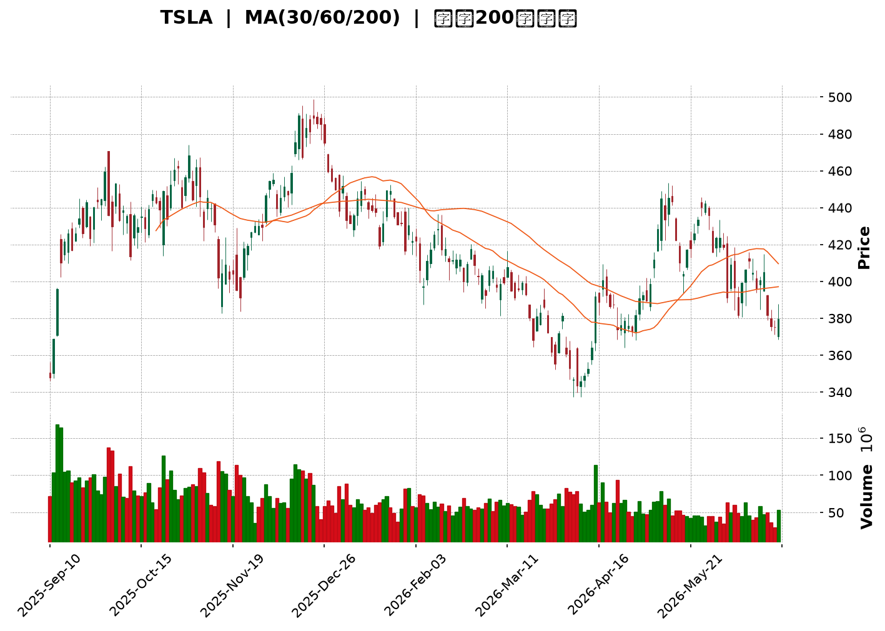
</details>

<html>
<head><meta charset="utf-8" /></head>
<body>
    <div style="height:500px; width:100%;">                        <script>window.PlotlyConfig = {MathJaxConfig: 'local'};</script>
        <script charset="utf-8" src="https://cdn.plot.ly/plotly-3.6.0.min.js" integrity="sha256-QaOVwtVY0T02VaHrr6pnoHLCwayMJp4O5n4YyaE3rJk=" crossorigin="anonymous"></script>                <div id="candlestick-chart" class="plotly-graph-div" style="height:100%; width:100%;"></div>            <script>                window.PLOTLYENV=window.PLOTLYENV || {};                                if (document.getElementById("candlestick-chart")) {                    Plotly.newPlot(                        "candlestick-chart",                        [{"close":{"dtype":"f8","bdata":"AAAA4KO8dUAAAADA9Qx3QAAAAEAKv3hAAAAA4KOgeUAAAACA61l6QAAAAIDCnXpAAAAAoJkNekAAAADAHqF6QAAAACBcI3tAAAAAoJmdekAAAADgo6x7QAAAAIA9dnpAAAAAYGaGe0AAAAAgXLN7QAAAACCFy3tAAAAAIFy3fEAAAAAAAEB7QAAAAKBH3XpAAAAAAABUfEAAAACgcBF7QAAAAEAKa3tAAAAA4KM4e0AAAAAA19d5QAAAAGBmPntAAAAAANfTekAAAABgZjJ7QAAAAAAAzHpAAAAAwPV0e0AAAABA4fZ7QAAAAKCZqXtAAAAAIIVve0AAAAAgrg98QAAAACCFG3tAAAAAYLhGfEAAAADAzMh8QAAAAAAp2HxAAAAAoJmBe0AAAADA9Yh8QAAAAIDrRX1AAAAAACnEe0AAAADAHuF8QAAAAGCP3ntAAAAA4FHYekAAAAAgrtN7QAAAAIDreXtAAAAAoJnpekAAAAAA1x95QAAAAKCZRXlAAAAAYLiOeUAAAAAAABR5QAAAAADXP3lAAAAAIK6zeEAAAACgcHF4QAAAAOB6HHpAAAAAYGY2ekAAAACgR6l6QAAAAGC44npAAAAAgD3iekAAAAAA19N6QAAAAADX63tAAAAA4HpofEAAAAAAAHB8QAAAAKBHeXtAAAAAYLjSe0AAAABAMzd8QAAAAIA97ntAAAAAIFyvfEAAAADA9bR9QAAAAIAUnn5AAAAAACk0fUAAAACA6zV+QAAAAEAzE35AAAAAIK6LfkAAAADA9Vh+QAAAAGBmVn5AAAAAQAqzfUAAAACAPbp8QAAAAEDhZnxAAAAAIIUbfEAAAADAHmF7QAAAAGC4OnxAAAAAIFwPe0AAAABgj\u002fZ6QAAAAMDMPHtAAAAAACnQe0AAAAAgXA98QAAAAEAz83tAAAAAQDNze0AAAADAHml7QAAAAAAAWHtAAAAAAAA0ekAAAABACvd6QAAAAIDCFXxAAAAAwPUQfEAAAABAMzN7QAAAAGBm7npAAAAAIFz3ekAAAADA9Qh6QAAAAGCP5npAAAAAwPVcekAAAAAgXF96QAAAAAApYHlAAAAAIFzTeEAAAACAwrF5QAAAAMAeFXpAAAAAIFyTekAAAADgUcR6QAAAAMAeEXpAAAAAQAoXekAAAACAFKp5QAAAAMAetXlAAAAAIFy7eUAAAADAHr15QAAAAKBH\u002fXhAAAAAgBSWeUAAAABgZhZ6QAAAAKBHiXlAAAAAACkoeUAAAADAHjV5QAAAAEDhhnhAAAAAQApfeUAAAADAzFh5QAAAACCuy3hAAAAAQOHqeEAAAAAA1\u002fN4QAAAAMAefXlAAAAAACmweEAAAABAM3N4QAAAAMD1uHhAAAAA4FH0eEAAAADgeox4QAAAAMDMxHdAAAAAIFz\u002fdkAAAACgmc13QAAAAOB68HdAAAAAQDMfeEAAAACAwkF3QAAAAKBHnXZAAAAA4Ho0dkAAAAAAADx3QAAAAAAp1HdAAAAAoHCJdkAAAADAHg12QAAAAGBmqnVAAAAAAAB0dUAAAACA65l1QAAAAEAzz3VAAAAAYLgGdkAAAABAM8N2QAAAAEAzf3hAAAAAYGZOeEAAAACA6wl5QAAAAAAAiHhAAAAAYLgmeEAAAAAAKTh4QAAAACCFW3dAAAAAwMyEd0AAAABguKp3QAAAAOBRgHdAAAAAwMxMd0AAAACAFNp3QAAAAMAebXhAAAAAACmIeEAAAACA61V4QAAAACCu63hAAAAA4KO8eUAAAACgmcV6QAAAAAAA0HtAAAAAQDMXe0AAAADgUdR7QAAAAMDMtHtAAAAAANdjekAAAAAA1595QAAAAIDCQXlAAAAAACkUekAAAACgmR16QAAAAAApoHpAAAAAoHAZe0AAAACAwoV7QAAAAKCZoXtAAAAA4KM8e0AAAACAFP55QAAAAADXe3pAAAAAQDN7ekAAAABAMyd6QAAAAAAAcHhAAAAAQDOPeUAAAABA4cp4QAAAAKBw2XdAAAAAYGbyeEAAAABA4WZ5QAAAAGBmsnlAAAAAYI9KeUAAAACAFMZ4QAAAAADXB3lAAAAAwMxQeUAAAACAwtl3QAAAAOB6eHdAAAAAgOtxd0AAAAAgXLt3QA=="},"high":{"dtype":"f8","bdata":"AAAAoEdFdkAAAAAA1w93QAAAAEAKy3hAAAAAQDObekAAAAAAAHR6QAAAAMD1xHpAAAAAIIUDe0AAAAAghdd6QAAAACCuz3tAAAAAIIWPe0AAAAAgXMN7QAAAAKCZNXtAAAAAIIWHe0AAAAAgri98QAAAAAAA0HtAAAAA4KPkfEAAAAAAAGx9QAAAAOBR7HtAAAAAwMxYfEAAAABA4Up8QAAAAKBHlXtAAAAAoJlFe0AAAACAFLJ7QAAAAIA9TntAAAAAQDMje0AAAAAAKYh7QAAAAKCZdXtAAAAAIFyXe0AAAADAzBx8QAAAAMDMFHxAAAAA4KPYe0AAAABgZhZ8QAAAAEDhOnxAAAAAYI\u002fCfEAAAAAAADB9QAAAAEAzG31AAAAAwPVwfEAAAAAAAKB8QAAAAMAeoX1AAAAAIIXDfEAAAACgRyV9QAAAAEAzN31AAAAAgMJ1e0AAAABguBp8QAAAAADXp3tAAAAAoEele0AAAAAAAIh6QAAAAEAKw3lAAAAAIFx\u002fekAAAABgZo55QAAAAOB6vHlAAAAAQArPekAAAADAzCx5QAAAACCFW3pAAAAAIK5HekAAAABACq96QAAAAEDhDntAAAAAYI8ae0AAAADAzEx7QAAAAGC4\u002fntAAAAAgBRqfEAAAACA6618QAAAAAAAHHxAAAAAgD1GfEAAAACAFI58QAAAAOBRFHxAAAAAACnwfEAAAADgURx+QAAAAAAAuH5AAAAA4Hr0fkAAAACAwq1+QAAAAADXp35AAAAAoEctf0AAAAAghb9+QAAAAGBmrn5AAAAAoHCRfkAAAABgZlZ9QAAAAIDr8XxAAAAAwMyIfEAAAACgcKV8QAAAAMDMmHxAAAAAAAAEfEAAAACA62V7QAAAAIA9TntAAAAAwMwQfEAAAADAzGR8QAAAAMD1PHxAAAAAYI++e0AAAACAwtV7QAAAAAAA9HtAAAAAIK7rekAAAABAM2N7QAAAAAAAGHxAAAAAQOFGfEAAAADgo9B7QAAAAOBRWHtAAAAAAClke0AAAAAgroN7QAAAAIAUfntAAAAAYGayekAAAADA9ch6QAAAAGBmfnpAAAAAoJkheUAAAADAzOh5QAAAAAAAVHpAAAAAAAC0ekAAAACgmUV7QAAAACCuQ3tAAAAAwPWAekAAAAAghdt5QAAAAGBmDnpAAAAAAAD0eUAAAABAM+t5QAAAAEAze3lAAAAAwB6teUAAAACgcEV6QAAAAMD1DHpAAAAAgOtxeUAAAADgo0h5QAAAAKBwxXhAAAAAoEeFeUAAAACA64l5QAAAAKCZJXlAAAAAoHAZeUAAAACgcGl5QAAAAIAUBnpAAAAAAABoeUAAAABAMwN5QAAAACCuO3lAAAAAgOsBeUAAAADAHjF5QAAAAOBRNHhAAAAAgD2+d0AAAACgRxV4QAAAACCuN3hAAAAAIK7DeEAAAABACgd4QAAAAIDCHXdAAAAA4KP0dkAAAACgR1V3QAAAAIA98ndAAAAA4Hokd0AAAAAghft2QAAAAOBRwHVAAAAAAADIdkAAAACAFM51QAAAAIDC5XVAAAAAoJlFdkAAAACAFPp2QAAAAGBmqnhAAAAAwPWgeEAAAADgepR5QAAAAMDMbHlAAAAAQDOfeEAAAAAAKZB4QAAAAAAAIHhAAAAAACnsd0AAAADgesx3QAAAAOCj5HdAAAAAYGaGd0AAAAAAAAx4QAAAAMAe3XhAAAAAgD2qeEAAAACA6yF5QAAAAEDhGnlAAAAAoEf9eUAAAABAM\u002fN6QAAAAGCPEnxAAAAAwMz8e0AAAABgZlZ8QAAAACCuP3xAAAAAYI8qe0AAAACAFFJ6QAAAAIAUWnlAAAAAIFwXekAAAABAM696QAAAAAAp+HpAAAAAQDMze0AAAACgmdl7QAAAACBcv3tAAAAAwB6Re0AAAACgmdl6QAAAAGC4hnpAAAAAoJkZe0AAAACgmaV6QAAAAEDhinpAAAAAQArPeUAAAAAAACh6QAAAAKBw0XhAAAAA4KP4eEAAAABA4Wp5QAAAAAAAAHpAAAAAYLjGeUAAAABACl95QAAAAOBRKHlAAAAAAADseUAAAACA6414QAAAAKBHCXhAAAAAgOuxd0AAAADAzDx4QA=="},"hovertemplate":"\u003cb\u003e%{x|%Y-%m-%d}\u003c\u002fb\u003e\u003cbr\u003e\u958b: $%{open:.2f}\u003cbr\u003e\u9ad8: $%{high:.2f}\u003cbr\u003e\u4f4e: $%{low:.2f}\u003cbr\u003e\u6536: $%{close:.2f}\u003cextra\u003e\u003c\u002fextra\u003e","low":{"dtype":"f8","bdata":"AAAAwB6hdUAAAACgmbl1QAAAAADXI3dAAAAAQOEmeUAAAABA4bZ5QAAAAGC4mnlAAAAAwPUIekAAAAAghVt6QAAAAIAU0npAAAAAIIV7ekAAAADgetB6QAAAAKBHMXpAAAAA4FFQekAAAAAAAHh7QAAAAIDrEXtAAAAAAACMe0AAAADAHjl7QAAAAKBHCXpAAAAAQApLe0AAAABAMwd7QAAAACCuk3pAAAAAQOGiekAAAABAM7d5QAAAAEAzO3pAAAAAgMIdekAAAACgR6V6QAAAAMD1VHpAAAAAoJl5ekAAAACAwol7QAAAAMDMoHtAAAAAAADQekAAAABgZt55QAAAAGC44npAAAAAQApre0AAAACgmTl8QAAAAGBmSnxAAAAAgMJ5e0AAAABACrt7QAAAAMDMXHxAAAAAoJm5e0AAAAAgXIt7QAAAAKBwMXtAAAAAgBReekAAAACAwhV7QAAAAIDCBXtAAAAAwPWoekAAAACgcMV4QAAAAOB67HdAAAAAANfreEAAAAAgXJt4QAAAAAAA6HhAAAAAANereEAAAAAAKfx3QAAAAKBwEXlAAAAAQDNfeUAAAACAPQ56QAAAAEAzo3pAAAAA4KOUekAAAACA62F6QAAAAIDC8XpAAAAAgD3We0AAAABgjzp8QAAAAAAANHtAAAAAQDM7e0AAAACAwrl7QAAAAKBHhXtAAAAAYLiae0AAAABgjzp9QAAAAKBHHX1AAAAAQDMjfUAAAACA65F9QAAAACCFq31AAAAAoEdVfkAAAACgcC1+QAAAAMDMzH1AAAAAwB6dfUAAAAAAALB8QAAAAKBHXXxAAAAAwMwUfEAAAADAzDR7QAAAAMAeyXtAAAAA4HrMekAAAADgo\u002fR6QAAAAIDrhXpAAAAAgD3mekAAAAAAAGB7QAAAAEAzv3tAAAAAIIUje0AAAABgZlp7QAAAAAApNHtAAAAAQAoXekAAAACA6zl6QAAAAIAUCntAAAAA4KPAe0AAAADgeiR7QAAAAEAK63pAAAAAoJnhekAAAACA6+l5QAAAAEAza3pAAAAAAADoeUAAAABACtt5QAAAAEDh8nhAAAAA4Ho4eEAAAAAAANx4QAAAAOCjdHlAAAAAAAAQekAAAADgekB6QAAAAAAA4HlAAAAAgBSueUAAAAAAKQh5QAAAAKBHmXlAAAAAgMJBeUAAAAAAAFh5QAAAAOCjoHhAAAAAgD3aeEAAAABgZsJ5QAAAAGCPOnlAAAAAgMLheEAAAAAAAER4QAAAAIA9FnhAAAAAoEepeEAAAABguPZ4QAAAACBco3hAAAAAYGbWd0AAAABACuN4QAAAAGBmInlAAAAAYGaqeEAAAABAM194QAAAAGC4pnhAAAAAAACQeEAAAADA9YR4QAAAACCuq3dAAAAAIFzHdkAAAAAgrkt3QAAAAMD1hHdAAAAAACkQeEAAAACA6z13QAAAACCFd3ZAAAAAgD0CdkAAAAAAAJB2QAAAAKBHYXdAAAAA4HpwdkAAAACAPap1QAAAAADXE3VAAAAAYLg6dUAAAAAAABR1QAAAAADXa3VAAAAAwB7JdUAAAADgUSx2QAAAAAAAqHZAAAAAwMzcd0AAAABgZnp4QAAAAKBHRXhAAAAAIIUTeEAAAADAzBR4QAAAAIA9BndAAAAAIK4rd0AAAADgUcB2QAAAAOCjSHdAAAAA4KMgd0AAAABguAJ3QAAAAMDMrHdAAAAAwMwMeEAAAAAAAFB4QAAAAOBRAHhAAAAAgOsheUAAAACAPQZ6QAAAAMDMDHpAAAAAAClkekAAAAAgXON6QAAAAGCPkntAAAAAAABgekAAAACgR1V5QAAAAIAUmnhAAAAAgD1meUAAAABgZs55QAAAAAApSHpAAAAAgOuhekAAAADgUTh7QAAAAMDMRHtAAAAAgD3CekAAAABA4fZ5QAAAAGBm2nlAAAAAAAAAekAAAABgjxJ6QAAAAKBwSXhAAAAAIIWreEAAAAAA1wN4QAAAAGBmwndAAAAAYI\u002fKd0AAAAAAKSx4QAAAAKCZcXlAAAAA4KMIeUAAAAAAKZx4QAAAAEAzC3hAAAAAYGameEAAAADA9bB3QAAAAMDMUHdAAAAAIIUzd0AAAACgmQl3QA=="},"name":"\u50f9\u683c","open":{"dtype":"f8","bdata":"AAAAwMzodUAAAABguOJ1QAAAAEAKL3dAAAAAgBRyekAAAAAAAOh5QAAAAAAA\u002fHlAAAAAgOvNekAAAADAHl16QAAAAIDC8XpAAAAAgBR+e0AAAACgR916QAAAAADXM3tAAAAAwMzEekAAAACgmcV7QAAAAOBRmHtAAAAAwMy8e0AAAADgo2h9QAAAAOCjtHtAAAAAAACMe0AAAADAHv17QAAAAMAeWXtAAAAAwPX8ekAAAADgo0h7QAAAAOB6eHpAAAAA4KOsekAAAABgZi57QAAAACCuK3tAAAAAAACYekAAAACA6717QAAAAAAp3HtAAAAAQDO3e0AAAAAAAEB6QAAAAKBH7XtAAAAAIK5\u002fe0AAAADgemx8QAAAAAAA6HxAAAAAwMwwfEAAAAAAAOx7QAAAAADXf3xAAAAAIFxnfEAAAADAzEB8QAAAACBc33xAAAAAYLhee0AAAACgmXl7QAAAAGBmdntAAAAAYGaie0AAAACAFHJ6QAAAAMDMJHhAAAAAANfreEAAAACAFFZ5QAAAAEDhYnlAAAAAgBTqeUAAAADAHiV5QAAAAGC4InlAAAAAYLjmeUAAAABAM396QAAAAKBwqXpAAAAAwB6VekAAAADA9ex6QAAAAKCZAXtAAAAAQAoffEAAAADgelB8QAAAAEAz93tAAAAA4KNYe0AAAADAHuF7QAAAAEAzD3xAAAAAoHABfEAAAABACld9QAAAACBcg31AAAAAIIWDfkAAAABgj+J9QAAAAIDrgX5AAAAAgBSefkAAAABgZpZ+QAAAACCuh35AAAAAIK5TfkAAAAAAAFB9QAAAAKBw0XxAAAAAoJmBfEAAAADAzJx8QAAAAADX\u002f3tAAAAAgBTme0AAAABgZj57QAAAAIA9vnpAAAAAQDM\u002fe0AAAAAgrpN7QAAAAEAzI3xAAAAAwPWse0AAAACAFJJ7QAAAAAAAeHtAAAAAgMLVekAAAABgj1p6QAAAAGCPMntAAAAAQOH2e0AAAAAAANB7QAAAAGCPVntAAAAAYI\u002f+ekAAAADAzFx7QAAAAKCZlXpAAAAA4KNUekAAAADgUYR6QAAAACBcR3pAAAAA4FHQeEAAAACA6w15QAAAAGCPnnlAAAAAoEchekAAAAAgXL96QAAAAMDM5HpAAAAAwPXkeUAAAACAwsV5QAAAAIDCsXlAAAAAAAB0eUAAAADAzIR5QAAAAOCjdHlAAAAAAAD4eEAAAABgZsJ5QAAAAGC45nlAAAAAQAoveUAAAACgmWl4QAAAAKBwsXhAAAAAoJndeEAAAADAHhl5QAAAAKBw4XhAAAAAwMxgeEAAAAAghSN5QAAAAOB6JHlAAAAAQOFSeUAAAABguPJ4QAAAACCFw3hAAAAAQAq7eEAAAAAAAPB4QAAAAOBRNHhAAAAAoJm9d0AAAACgcFF3QAAAAMD1iHdAAAAAANdfeEAAAACgmdl3QAAAAEAKG3dAAAAAgMLddkAAAAAAKZh2QAAAAIAUqndAAAAAQDPDdkAAAACgcKl2QAAAAEAKp3VAAAAA4KO8dkAAAABgZnJ1QAAAAOCjpHVAAAAAwB7hdUAAAABguFp2QAAAAKBH7XZAAAAAwPWceEAAAABguL54QAAAAKBHKXlAAAAAAACQeEAAAADAHjl4QAAAAOB6dHdAAAAAAABYd0AAAACgcEF3QAAAAEDhandAAAAAYGZ2d0AAAAAAAEx3QAAAAADX53dAAAAAIK5jeEAAAABACrN4QAAAAAAAJHhAAAAAIK53eUAAAAAgrgd6QAAAAGCPYnpAAAAAYI+We0AAAABguEp7QAAAAADX53tAAAAAIK4fe0AAAADgUTR6QAAAAGCPMnlAAAAAoJl5eUAAAABA4WJ6QAAAAGC4anpAAAAAACnkekAAAACAPa57QAAAAIDrWXtAAAAAoJl9e0AAAAAA17d6QAAAACCFI3pAAAAAQDMrekAAAACgcD16QAAAAAAASHpAAAAAoEfFeEAAAADgerB5QAAAAOCjeHhAAAAA4HpEeEAAAAAA1\u002fd4QAAAAIDrxXlAAAAAgMJBeUAAAADgehh5QAAAAKCZ4XhAAAAAoJmteEAAAACAwol4QAAAAKBHwXdAAAAA4FF0d0AAAABgZiJ3QA=="},"x":["2025-09-10T00:00:00-04:00","2025-09-11T00:00:00-04:00","2025-09-12T00:00:00-04:00","2025-09-15T00:00:00-04:00","2025-09-16T00:00:00-04:00","2025-09-17T00:00:00-04:00","2025-09-18T00:00:00-04:00","2025-09-19T00:00:00-04:00","2025-09-22T00:00:00-04:00","2025-09-23T00:00:00-04:00","2025-09-24T00:00:00-04:00","2025-09-25T00:00:00-04:00","2025-09-26T00:00:00-04:00","2025-09-29T00:00:00-04:00","2025-09-30T00:00:00-04:00","2025-10-01T00:00:00-04:00","2025-10-02T00:00:00-04:00","2025-10-03T00:00:00-04:00","2025-10-06T00:00:00-04:00","2025-10-07T00:00:00-04:00","2025-10-08T00:00:00-04:00","2025-10-09T00:00:00-04:00","2025-10-10T00:00:00-04:00","2025-10-13T00:00:00-04:00","2025-10-14T00:00:00-04:00","2025-10-15T00:00:00-04:00","2025-10-16T00:00:00-04:00","2025-10-17T00:00:00-04:00","2025-10-20T00:00:00-04:00","2025-10-21T00:00:00-04:00","2025-10-22T00:00:00-04:00","2025-10-23T00:00:00-04:00","2025-10-24T00:00:00-04:00","2025-10-27T00:00:00-04:00","2025-10-28T00:00:00-04:00","2025-10-29T00:00:00-04:00","2025-10-30T00:00:00-04:00","2025-10-31T00:00:00-04:00","2025-11-03T00:00:00-05:00","2025-11-04T00:00:00-05:00","2025-11-05T00:00:00-05:00","2025-11-06T00:00:00-05:00","2025-11-07T00:00:00-05:00","2025-11-10T00:00:00-05:00","2025-11-11T00:00:00-05:00","2025-11-12T00:00:00-05:00","2025-11-13T00:00:00-05:00","2025-11-14T00:00:00-05:00","2025-11-17T00:00:00-05:00","2025-11-18T00:00:00-05:00","2025-11-19T00:00:00-05:00","2025-11-20T00:00:00-05:00","2025-11-21T00:00:00-05:00","2025-11-24T00:00:00-05:00","2025-11-25T00:00:00-05:00","2025-11-26T00:00:00-05:00","2025-11-28T00:00:00-05:00","2025-12-01T00:00:00-05:00","2025-12-02T00:00:00-05:00","2025-12-03T00:00:00-05:00","2025-12-04T00:00:00-05:00","2025-12-05T00:00:00-05:00","2025-12-08T00:00:00-05:00","2025-12-09T00:00:00-05:00","2025-12-10T00:00:00-05:00","2025-12-11T00:00:00-05:00","2025-12-12T00:00:00-05:00","2025-12-15T00:00:00-05:00","2025-12-16T00:00:00-05:00","2025-12-17T00:00:00-05:00","2025-12-18T00:00:00-05:00","2025-12-19T00:00:00-05:00","2025-12-22T00:00:00-05:00","2025-12-23T00:00:00-05:00","2025-12-24T00:00:00-05:00","2025-12-26T00:00:00-05:00","2025-12-29T00:00:00-05:00","2025-12-30T00:00:00-05:00","2025-12-31T00:00:00-05:00","2026-01-02T00:00:00-05:00","2026-01-05T00:00:00-05:00","2026-01-06T00:00:00-05:00","2026-01-07T00:00:00-05:00","2026-01-08T00:00:00-05:00","2026-01-09T00:00:00-05:00","2026-01-12T00:00:00-05:00","2026-01-13T00:00:00-05:00","2026-01-14T00:00:00-05:00","2026-01-15T00:00:00-05:00","2026-01-16T00:00:00-05:00","2026-01-20T00:00:00-05:00","2026-01-21T00:00:00-05:00","2026-01-22T00:00:00-05:00","2026-01-23T00:00:00-05:00","2026-01-26T00:00:00-05:00","2026-01-27T00:00:00-05:00","2026-01-28T00:00:00-05:00","2026-01-29T00:00:00-05:00","2026-01-30T00:00:00-05:00","2026-02-02T00:00:00-05:00","2026-02-03T00:00:00-05:00","2026-02-04T00:00:00-05:00","2026-02-05T00:00:00-05:00","2026-02-06T00:00:00-05:00","2026-02-09T00:00:00-05:00","2026-02-10T00:00:00-05:00","2026-02-11T00:00:00-05:00","2026-02-12T00:00:00-05:00","2026-02-13T00:00:00-05:00","2026-02-17T00:00:00-05:00","2026-02-18T00:00:00-05:00","2026-02-19T00:00:00-05:00","2026-02-20T00:00:00-05:00","2026-02-23T00:00:00-05:00","2026-02-24T00:00:00-05:00","2026-02-25T00:00:00-05:00","2026-02-26T00:00:00-05:00","2026-02-27T00:00:00-05:00","2026-03-02T00:00:00-05:00","2026-03-03T00:00:00-05:00","2026-03-04T00:00:00-05:00","2026-03-05T00:00:00-05:00","2026-03-06T00:00:00-05:00","2026-03-09T00:00:00-04:00","2026-03-10T00:00:00-04:00","2026-03-11T00:00:00-04:00","2026-03-12T00:00:00-04:00","2026-03-13T00:00:00-04:00","2026-03-16T00:00:00-04:00","2026-03-17T00:00:00-04:00","2026-03-18T00:00:00-04:00","2026-03-19T00:00:00-04:00","2026-03-20T00:00:00-04:00","2026-03-23T00:00:00-04:00","2026-03-24T00:00:00-04:00","2026-03-25T00:00:00-04:00","2026-03-26T00:00:00-04:00","2026-03-27T00:00:00-04:00","2026-03-30T00:00:00-04:00","2026-03-31T00:00:00-04:00","2026-04-01T00:00:00-04:00","2026-04-02T00:00:00-04:00","2026-04-06T00:00:00-04:00","2026-04-07T00:00:00-04:00","2026-04-08T00:00:00-04:00","2026-04-09T00:00:00-04:00","2026-04-10T00:00:00-04:00","2026-04-13T00:00:00-04:00","2026-04-14T00:00:00-04:00","2026-04-15T00:00:00-04:00","2026-04-16T00:00:00-04:00","2026-04-17T00:00:00-04:00","2026-04-20T00:00:00-04:00","2026-04-21T00:00:00-04:00","2026-04-22T00:00:00-04:00","2026-04-23T00:00:00-04:00","2026-04-24T00:00:00-04:00","2026-04-27T00:00:00-04:00","2026-04-28T00:00:00-04:00","2026-04-29T00:00:00-04:00","2026-04-30T00:00:00-04:00","2026-05-01T00:00:00-04:00","2026-05-04T00:00:00-04:00","2026-05-05T00:00:00-04:00","2026-05-06T00:00:00-04:00","2026-05-07T00:00:00-04:00","2026-05-08T00:00:00-04:00","2026-05-11T00:00:00-04:00","2026-05-12T00:00:00-04:00","2026-05-13T00:00:00-04:00","2026-05-14T00:00:00-04:00","2026-05-15T00:00:00-04:00","2026-05-18T00:00:00-04:00","2026-05-19T00:00:00-04:00","2026-05-20T00:00:00-04:00","2026-05-21T00:00:00-04:00","2026-05-22T00:00:00-04:00","2026-05-26T00:00:00-04:00","2026-05-27T00:00:00-04:00","2026-05-28T00:00:00-04:00","2026-05-29T00:00:00-04:00","2026-06-01T00:00:00-04:00","2026-06-02T00:00:00-04:00","2026-06-03T00:00:00-04:00","2026-06-04T00:00:00-04:00","2026-06-05T00:00:00-04:00","2026-06-08T00:00:00-04:00","2026-06-09T00:00:00-04:00","2026-06-10T00:00:00-04:00","2026-06-11T00:00:00-04:00","2026-06-12T00:00:00-04:00","2026-06-15T00:00:00-04:00","2026-06-16T00:00:00-04:00","2026-06-17T00:00:00-04:00","2026-06-18T00:00:00-04:00","2026-06-22T00:00:00-04:00","2026-06-23T00:00:00-04:00","2026-06-24T00:00:00-04:00","2026-06-25T00:00:00-04:00","2026-06-26T00:00:00-04:00"],"type":"candlestick"},{"hovertemplate":"MA30: $%{y:.2f}\u003cextra\u003e\u003c\u002fextra\u003e","line":{"color":"#2196F3","dash":"dash","width":2},"mode":"lines","name":"MA30","x":["2025-09-10T00:00:00-04:00","2025-09-11T00:00:00-04:00","2025-09-12T00:00:00-04:00","2025-09-15T00:00:00-04:00","2025-09-16T00:00:00-04:00","2025-09-17T00:00:00-04:00","2025-09-18T00:00:00-04:00","2025-09-19T00:00:00-04:00","2025-09-22T00:00:00-04:00","2025-09-23T00:00:00-04:00","2025-09-24T00:00:00-04:00","2025-09-25T00:00:00-04:00","2025-09-26T00:00:00-04:00","2025-09-29T00:00:00-04:00","2025-09-30T00:00:00-04:00","2025-10-01T00:00:00-04:00","2025-10-02T00:00:00-04:00","2025-10-03T00:00:00-04:00","2025-10-06T00:00:00-04:00","2025-10-07T00:00:00-04:00","2025-10-08T00:00:00-04:00","2025-10-09T00:00:00-04:00","2025-10-10T00:00:00-04:00","2025-10-13T00:00:00-04:00","2025-10-14T00:00:00-04:00","2025-10-15T00:00:00-04:00","2025-10-16T00:00:00-04:00","2025-10-17T00:00:00-04:00","2025-10-20T00:00:00-04:00","2025-10-21T00:00:00-04:00","2025-10-22T00:00:00-04:00","2025-10-23T00:00:00-04:00","2025-10-24T00:00:00-04:00","2025-10-27T00:00:00-04:00","2025-10-28T00:00:00-04:00","2025-10-29T00:00:00-04:00","2025-10-30T00:00:00-04:00","2025-10-31T00:00:00-04:00","2025-11-03T00:00:00-05:00","2025-11-04T00:00:00-05:00","2025-11-05T00:00:00-05:00","2025-11-06T00:00:00-05:00","2025-11-07T00:00:00-05:00","2025-11-10T00:00:00-05:00","2025-11-11T00:00:00-05:00","2025-11-12T00:00:00-05:00","2025-11-13T00:00:00-05:00","2025-11-14T00:00:00-05:00","2025-11-17T00:00:00-05:00","2025-11-18T00:00:00-05:00","2025-11-19T00:00:00-05:00","2025-11-20T00:00:00-05:00","2025-11-21T00:00:00-05:00","2025-11-24T00:00:00-05:00","2025-11-25T00:00:00-05:00","2025-11-26T00:00:00-05:00","2025-11-28T00:00:00-05:00","2025-12-01T00:00:00-05:00","2025-12-02T00:00:00-05:00","2025-12-03T00:00:00-05:00","2025-12-04T00:00:00-05:00","2025-12-05T00:00:00-05:00","2025-12-08T00:00:00-05:00","2025-12-09T00:00:00-05:00","2025-12-10T00:00:00-05:00","2025-12-11T00:00:00-05:00","2025-12-12T00:00:00-05:00","2025-12-15T00:00:00-05:00","2025-12-16T00:00:00-05:00","2025-12-17T00:00:00-05:00","2025-12-18T00:00:00-05:00","2025-12-19T00:00:00-05:00","2025-12-22T00:00:00-05:00","2025-12-23T00:00:00-05:00","2025-12-24T00:00:00-05:00","2025-12-26T00:00:00-05:00","2025-12-29T00:00:00-05:00","2025-12-30T00:00:00-05:00","2025-12-31T00:00:00-05:00","2026-01-02T00:00:00-05:00","2026-01-05T00:00:00-05:00","2026-01-06T00:00:00-05:00","2026-01-07T00:00:00-05:00","2026-01-08T00:00:00-05:00","2026-01-09T00:00:00-05:00","2026-01-12T00:00:00-05:00","2026-01-13T00:00:00-05:00","2026-01-14T00:00:00-05:00","2026-01-15T00:00:00-05:00","2026-01-16T00:00:00-05:00","2026-01-20T00:00:00-05:00","2026-01-21T00:00:00-05:00","2026-01-22T00:00:00-05:00","2026-01-23T00:00:00-05:00","2026-01-26T00:00:00-05:00","2026-01-27T00:00:00-05:00","2026-01-28T00:00:00-05:00","2026-01-29T00:00:00-05:00","2026-01-30T00:00:00-05:00","2026-02-02T00:00:00-05:00","2026-02-03T00:00:00-05:00","2026-02-04T00:00:00-05:00","2026-02-05T00:00:00-05:00","2026-02-06T00:00:00-05:00","2026-02-09T00:00:00-05:00","2026-02-10T00:00:00-05:00","2026-02-11T00:00:00-05:00","2026-02-12T00:00:00-05:00","2026-02-13T00:00:00-05:00","2026-02-17T00:00:00-05:00","2026-02-18T00:00:00-05:00","2026-02-19T00:00:00-05:00","2026-02-20T00:00:00-05:00","2026-02-23T00:00:00-05:00","2026-02-24T00:00:00-05:00","2026-02-25T00:00:00-05:00","2026-02-26T00:00:00-05:00","2026-02-27T00:00:00-05:00","2026-03-02T00:00:00-05:00","2026-03-03T00:00:00-05:00","2026-03-04T00:00:00-05:00","2026-03-05T00:00:00-05:00","2026-03-06T00:00:00-05:00","2026-03-09T00:00:00-04:00","2026-03-10T00:00:00-04:00","2026-03-11T00:00:00-04:00","2026-03-12T00:00:00-04:00","2026-03-13T00:00:00-04:00","2026-03-16T00:00:00-04:00","2026-03-17T00:00:00-04:00","2026-03-18T00:00:00-04:00","2026-03-19T00:00:00-04:00","2026-03-20T00:00:00-04:00","2026-03-23T00:00:00-04:00","2026-03-24T00:00:00-04:00","2026-03-25T00:00:00-04:00","2026-03-26T00:00:00-04:00","2026-03-27T00:00:00-04:00","2026-03-30T00:00:00-04:00","2026-03-31T00:00:00-04:00","2026-04-01T00:00:00-04:00","2026-04-02T00:00:00-04:00","2026-04-06T00:00:00-04:00","2026-04-07T00:00:00-04:00","2026-04-08T00:00:00-04:00","2026-04-09T00:00:00-04:00","2026-04-10T00:00:00-04:00","2026-04-13T00:00:00-04:00","2026-04-14T00:00:00-04:00","2026-04-15T00:00:00-04:00","2026-04-16T00:00:00-04:00","2026-04-17T00:00:00-04:00","2026-04-20T00:00:00-04:00","2026-04-21T00:00:00-04:00","2026-04-22T00:00:00-04:00","2026-04-23T00:00:00-04:00","2026-04-24T00:00:00-04:00","2026-04-27T00:00:00-04:00","2026-04-28T00:00:00-04:00","2026-04-29T00:00:00-04:00","2026-04-30T00:00:00-04:00","2026-05-01T00:00:00-04:00","2026-05-04T00:00:00-04:00","2026-05-05T00:00:00-04:00","2026-05-06T00:00:00-04:00","2026-05-07T00:00:00-04:00","2026-05-08T00:00:00-04:00","2026-05-11T00:00:00-04:00","2026-05-12T00:00:00-04:00","2026-05-13T00:00:00-04:00","2026-05-14T00:00:00-04:00","2026-05-15T00:00:00-04:00","2026-05-18T00:00:00-04:00","2026-05-19T00:00:00-04:00","2026-05-20T00:00:00-04:00","2026-05-21T00:00:00-04:00","2026-05-22T00:00:00-04:00","2026-05-26T00:00:00-04:00","2026-05-27T00:00:00-04:00","2026-05-28T00:00:00-04:00","2026-05-29T00:00:00-04:00","2026-06-01T00:00:00-04:00","2026-06-02T00:00:00-04:00","2026-06-03T00:00:00-04:00","2026-06-04T00:00:00-04:00","2026-06-05T00:00:00-04:00","2026-06-08T00:00:00-04:00","2026-06-09T00:00:00-04:00","2026-06-10T00:00:00-04:00","2026-06-11T00:00:00-04:00","2026-06-12T00:00:00-04:00","2026-06-15T00:00:00-04:00","2026-06-16T00:00:00-04:00","2026-06-17T00:00:00-04:00","2026-06-18T00:00:00-04:00","2026-06-22T00:00:00-04:00","2026-06-23T00:00:00-04:00","2026-06-24T00:00:00-04:00","2026-06-25T00:00:00-04:00","2026-06-26T00:00:00-04:00"],"y":{"dtype":"f8","bdata":"AAAAAAAA+H8AAAAAAAD4fwAAAAAAAPh\u002fAAAAAAAA+H8AAAAAAAD4fwAAAAAAAPh\u002fAAAAAAAA+H8AAAAAAAD4fwAAAAAAAPh\u002fAAAAAAAA+H8AAAAAAAD4fwAAAAAAAPh\u002fAAAAAAAA+H8AAAAAAAD4fwAAAAAAAPh\u002fAAAAAAAA+H8AAAAAAAD4fwAAAAAAAPh\u002fAAAAAAAA+H8AAAAAAAD4fwAAAAAAAPh\u002fAAAAAAAA+H8AAAAAAAD4fwAAAAAAAPh\u002fAAAAAAAA+H8AAAAAAAD4fwAAAAAAAPh\u002fAAAAAAAA+H8AAAAAAAD4f5qZmTkmuHpAVVVVVcfoekBmZmY2iRN7QBEREXGvJ3tAmpmZuUk+e0B3d3f3DFN7QCIiImIQZntAiYiIyHZye0Dv7u6uuYJ7QJqZmanxlHtA3t3dPcOee0CrqqqaC6l7QFVVVVUOtXtAmpmZ2UCve0BmZmamVLB7QERERFScrXtAq6qq+jeee0Crqqp6FIx7QM3MzJx9fntAd3d3F9lme0Dv7u7e3VV7QJqZmSlcQ3tAERERgdwte0CJiIgo6iF7QM3MzCxAGHtAAAAAsAATe0CJiIiYbg57QJqZmXkwD3tAd3d3d0wKe0DNzMzsmAB7QLy7uyvOAntAERERoRoLe0Dv7u6OUA57QERERKRwEXtAZmZmxpINe0AzMzNTuAh7QFVVVTXsAHtAmpmZOfsKe0CamZk5+xR7QO\u002fu7g50IHtAMzMzU7gse0C8u7t7FDh7QO\u002fu7r7mSntAMzMz43pqe0BmZmZG\u002fX97QFVVVcVnmHtAq6qqyi+we0ARERHx7s57QHd3d4ek6XtAZmZmFmf\u002fe0Dv7u4+ChN8QImIiCh4LHxA7+7ujpdAfEBVVVWVGFZ8QJqZmem0X3xAiYiIiF1tfEBmZmYmTXl8QAAAAFBignxA3t3dTTeHfECamZkpMYx8QImIiJhDh3xAMzMzs3J0fECamZn54Wd8QFVVVUUZbXxAIiIiYixvfEB3d3e3gWZ8QLy7u4v6XXxAERER4U9PfEC8u7uL+i98QImIiOhCEHxAd3d3dwX4e0BERET0RNd7QDMzMwMrr3tAq6qqelt+e0AiIiKSplZ7QCIiImJXMntAIiIicq8Xe0BERERk9AZ7QCIiIoIH83pAZmZmNtDhekDNzMy8LdN6QN7d3Z2ovXpAiYiISFOyekCJiIiY4Kd6QN7d3X2xlHpA7+7uzrCBekARERHR23B6QFVVVeVCXHpAzczMfLFIekAAAACw5DV6QBERESHbHXpA7+7u3sEWekBVVVUF8wh6QGZmZkbh7HlAmpmZuQLSeUC8u7v71L55QLy7u8uFsnlAiYiIKBWfeUDNzMysjpF5QM3MzHz4fnlAZmZmBvNyeUC8u7v7YmN5QFVVVbWsVXlAvLu7GxNGeUDNzMyc7zV5QCIiIuKlI3lAZmZmlrUOeUAAAADgwfB4QFVVVcVL03hAvLu72ySyeEARERFxaJ14QAAAAEBgjXhAq6qqqhxyeEAzMzMzpVJ4QLy7u1tINnhAiYiIaAMTeEC8u7sLu+x3QBEREZHtzHdAzczMnDayd0De3d1tWZ13QFVVVeUXnXdA3t3dXQGUd0AiIiJCYJF3QImIiLgej3dAMzMz05SId0CrqqpKU4J3QBEREYEjcHdAZmZm9ihmd0AzMzMzel93QGZmZlYOVXdAzczMTPBGd0BERET0\u002fUB3QJqZmUmaRndA7+7uLrJTd0AiIiJyPVh3QFVVVQWdYHdAq6qqCmVud0De3d2tY4x3QImIiCi\u002fuHdAiYiI+G\u002fid0BmZmbmpQl4QM3MzGy8KnhAREREtJ1LeEAAAABQG2p4QERERITAiHhAmpmZWTmweEB3d3cnv9Z4QJqZmWnY\u002f3hAIiIi0iIreUAiIiIywVN5QHd3d1eAbnlAREREZIKHeUBERETkpY95QBERETFPoHlAd3d3JzG0eUDv7u5+scR5QKuqqsrozXlAvLu7m1LfeUAiIiKS7eh5QAAAABDm63lAd3d3t\u002fP5eUDe3d29LQd6QGZmZnYFEnpAd3d3V4AYekARERFxPRx6QM3MzLwtHXpAAAAAgJUZekDe3d3tpwB6QFVVVfWa23lAd3d39368eUB3d3fXh5l5QA=="},"type":"scatter"},{"hovertemplate":"MA60: $%{y:.2f}\u003cextra\u003e\u003c\u002fextra\u003e","line":{"color":"#9C27B0","dash":"dash","width":2},"mode":"lines","name":"MA60","x":["2025-09-10T00:00:00-04:00","2025-09-11T00:00:00-04:00","2025-09-12T00:00:00-04:00","2025-09-15T00:00:00-04:00","2025-09-16T00:00:00-04:00","2025-09-17T00:00:00-04:00","2025-09-18T00:00:00-04:00","2025-09-19T00:00:00-04:00","2025-09-22T00:00:00-04:00","2025-09-23T00:00:00-04:00","2025-09-24T00:00:00-04:00","2025-09-25T00:00:00-04:00","2025-09-26T00:00:00-04:00","2025-09-29T00:00:00-04:00","2025-09-30T00:00:00-04:00","2025-10-01T00:00:00-04:00","2025-10-02T00:00:00-04:00","2025-10-03T00:00:00-04:00","2025-10-06T00:00:00-04:00","2025-10-07T00:00:00-04:00","2025-10-08T00:00:00-04:00","2025-10-09T00:00:00-04:00","2025-10-10T00:00:00-04:00","2025-10-13T00:00:00-04:00","2025-10-14T00:00:00-04:00","2025-10-15T00:00:00-04:00","2025-10-16T00:00:00-04:00","2025-10-17T00:00:00-04:00","2025-10-20T00:00:00-04:00","2025-10-21T00:00:00-04:00","2025-10-22T00:00:00-04:00","2025-10-23T00:00:00-04:00","2025-10-24T00:00:00-04:00","2025-10-27T00:00:00-04:00","2025-10-28T00:00:00-04:00","2025-10-29T00:00:00-04:00","2025-10-30T00:00:00-04:00","2025-10-31T00:00:00-04:00","2025-11-03T00:00:00-05:00","2025-11-04T00:00:00-05:00","2025-11-05T00:00:00-05:00","2025-11-06T00:00:00-05:00","2025-11-07T00:00:00-05:00","2025-11-10T00:00:00-05:00","2025-11-11T00:00:00-05:00","2025-11-12T00:00:00-05:00","2025-11-13T00:00:00-05:00","2025-11-14T00:00:00-05:00","2025-11-17T00:00:00-05:00","2025-11-18T00:00:00-05:00","2025-11-19T00:00:00-05:00","2025-11-20T00:00:00-05:00","2025-11-21T00:00:00-05:00","2025-11-24T00:00:00-05:00","2025-11-25T00:00:00-05:00","2025-11-26T00:00:00-05:00","2025-11-28T00:00:00-05:00","2025-12-01T00:00:00-05:00","2025-12-02T00:00:00-05:00","2025-12-03T00:00:00-05:00","2025-12-04T00:00:00-05:00","2025-12-05T00:00:00-05:00","2025-12-08T00:00:00-05:00","2025-12-09T00:00:00-05:00","2025-12-10T00:00:00-05:00","2025-12-11T00:00:00-05:00","2025-12-12T00:00:00-05:00","2025-12-15T00:00:00-05:00","2025-12-16T00:00:00-05:00","2025-12-17T00:00:00-05:00","2025-12-18T00:00:00-05:00","2025-12-19T00:00:00-05:00","2025-12-22T00:00:00-05:00","2025-12-23T00:00:00-05:00","2025-12-24T00:00:00-05:00","2025-12-26T00:00:00-05:00","2025-12-29T00:00:00-05:00","2025-12-30T00:00:00-05:00","2025-12-31T00:00:00-05:00","2026-01-02T00:00:00-05:00","2026-01-05T00:00:00-05:00","2026-01-06T00:00:00-05:00","2026-01-07T00:00:00-05:00","2026-01-08T00:00:00-05:00","2026-01-09T00:00:00-05:00","2026-01-12T00:00:00-05:00","2026-01-13T00:00:00-05:00","2026-01-14T00:00:00-05:00","2026-01-15T00:00:00-05:00","2026-01-16T00:00:00-05:00","2026-01-20T00:00:00-05:00","2026-01-21T00:00:00-05:00","2026-01-22T00:00:00-05:00","2026-01-23T00:00:00-05:00","2026-01-26T00:00:00-05:00","2026-01-27T00:00:00-05:00","2026-01-28T00:00:00-05:00","2026-01-29T00:00:00-05:00","2026-01-30T00:00:00-05:00","2026-02-02T00:00:00-05:00","2026-02-03T00:00:00-05:00","2026-02-04T00:00:00-05:00","2026-02-05T00:00:00-05:00","2026-02-06T00:00:00-05:00","2026-02-09T00:00:00-05:00","2026-02-10T00:00:00-05:00","2026-02-11T00:00:00-05:00","2026-02-12T00:00:00-05:00","2026-02-13T00:00:00-05:00","2026-02-17T00:00:00-05:00","2026-02-18T00:00:00-05:00","2026-02-19T00:00:00-05:00","2026-02-20T00:00:00-05:00","2026-02-23T00:00:00-05:00","2026-02-24T00:00:00-05:00","2026-02-25T00:00:00-05:00","2026-02-26T00:00:00-05:00","2026-02-27T00:00:00-05:00","2026-03-02T00:00:00-05:00","2026-03-03T00:00:00-05:00","2026-03-04T00:00:00-05:00","2026-03-05T00:00:00-05:00","2026-03-06T00:00:00-05:00","2026-03-09T00:00:00-04:00","2026-03-10T00:00:00-04:00","2026-03-11T00:00:00-04:00","2026-03-12T00:00:00-04:00","2026-03-13T00:00:00-04:00","2026-03-16T00:00:00-04:00","2026-03-17T00:00:00-04:00","2026-03-18T00:00:00-04:00","2026-03-19T00:00:00-04:00","2026-03-20T00:00:00-04:00","2026-03-23T00:00:00-04:00","2026-03-24T00:00:00-04:00","2026-03-25T00:00:00-04:00","2026-03-26T00:00:00-04:00","2026-03-27T00:00:00-04:00","2026-03-30T00:00:00-04:00","2026-03-31T00:00:00-04:00","2026-04-01T00:00:00-04:00","2026-04-02T00:00:00-04:00","2026-04-06T00:00:00-04:00","2026-04-07T00:00:00-04:00","2026-04-08T00:00:00-04:00","2026-04-09T00:00:00-04:00","2026-04-10T00:00:00-04:00","2026-04-13T00:00:00-04:00","2026-04-14T00:00:00-04:00","2026-04-15T00:00:00-04:00","2026-04-16T00:00:00-04:00","2026-04-17T00:00:00-04:00","2026-04-20T00:00:00-04:00","2026-04-21T00:00:00-04:00","2026-04-22T00:00:00-04:00","2026-04-23T00:00:00-04:00","2026-04-24T00:00:00-04:00","2026-04-27T00:00:00-04:00","2026-04-28T00:00:00-04:00","2026-04-29T00:00:00-04:00","2026-04-30T00:00:00-04:00","2026-05-01T00:00:00-04:00","2026-05-04T00:00:00-04:00","2026-05-05T00:00:00-04:00","2026-05-06T00:00:00-04:00","2026-05-07T00:00:00-04:00","2026-05-08T00:00:00-04:00","2026-05-11T00:00:00-04:00","2026-05-12T00:00:00-04:00","2026-05-13T00:00:00-04:00","2026-05-14T00:00:00-04:00","2026-05-15T00:00:00-04:00","2026-05-18T00:00:00-04:00","2026-05-19T00:00:00-04:00","2026-05-20T00:00:00-04:00","2026-05-21T00:00:00-04:00","2026-05-22T00:00:00-04:00","2026-05-26T00:00:00-04:00","2026-05-27T00:00:00-04:00","2026-05-28T00:00:00-04:00","2026-05-29T00:00:00-04:00","2026-06-01T00:00:00-04:00","2026-06-02T00:00:00-04:00","2026-06-03T00:00:00-04:00","2026-06-04T00:00:00-04:00","2026-06-05T00:00:00-04:00","2026-06-08T00:00:00-04:00","2026-06-09T00:00:00-04:00","2026-06-10T00:00:00-04:00","2026-06-11T00:00:00-04:00","2026-06-12T00:00:00-04:00","2026-06-15T00:00:00-04:00","2026-06-16T00:00:00-04:00","2026-06-17T00:00:00-04:00","2026-06-18T00:00:00-04:00","2026-06-22T00:00:00-04:00","2026-06-23T00:00:00-04:00","2026-06-24T00:00:00-04:00","2026-06-25T00:00:00-04:00","2026-06-26T00:00:00-04:00"],"y":{"dtype":"f8","bdata":"AAAAAAAA+H8AAAAAAAD4fwAAAAAAAPh\u002fAAAAAAAA+H8AAAAAAAD4fwAAAAAAAPh\u002fAAAAAAAA+H8AAAAAAAD4fwAAAAAAAPh\u002fAAAAAAAA+H8AAAAAAAD4fwAAAAAAAPh\u002fAAAAAAAA+H8AAAAAAAD4fwAAAAAAAPh\u002fAAAAAAAA+H8AAAAAAAD4fwAAAAAAAPh\u002fAAAAAAAA+H8AAAAAAAD4fwAAAAAAAPh\u002fAAAAAAAA+H8AAAAAAAD4fwAAAAAAAPh\u002fAAAAAAAA+H8AAAAAAAD4fwAAAAAAAPh\u002fAAAAAAAA+H8AAAAAAAD4fwAAAAAAAPh\u002fAAAAAAAA+H8AAAAAAAD4fwAAAAAAAPh\u002fAAAAAAAA+H8AAAAAAAD4fwAAAAAAAPh\u002fAAAAAAAA+H8AAAAAAAD4fwAAAAAAAPh\u002fAAAAAAAA+H8AAAAAAAD4fwAAAAAAAPh\u002fAAAAAAAA+H8AAAAAAAD4fwAAAAAAAPh\u002fAAAAAAAA+H8AAAAAAAD4fwAAAAAAAPh\u002fAAAAAAAA+H8AAAAAAAD4fwAAAAAAAPh\u002fAAAAAAAA+H8AAAAAAAD4fwAAAAAAAPh\u002fAAAAAAAA+H8AAAAAAAD4fwAAAAAAAPh\u002fAAAAAAAA+H8AAAAAAAD4f6uqqjJ63XpAMzMz+\u002fD5ekCrqqri7BB7QKuqqgqQHHtAAAAAQO4le0BVVVWl4i17QLy7u0t+M3tAERERAbk+e0BERER02kt7QERERNyyWntAiYiIyL1le0AzMzMLkHB7QCIiIor6f3tAZmZm3t2Me0BmZmb2KJh7QM3MzAwCo3tAq6qq4jOne0De3d21ga17QCIiIhIRtHtA7+7uFiCze0Dv7u4OdLR7QBERESnqt3tAAAAACDq3e0Dv7u5eAbx7QDMzM4v6u3tAREREHC\u002fAe0B3d3ff3cN7QM3MzGTJyHtAq6qq4sHIe0AzMzMLZcZ7QCIiIuIIxXtAIiIiqsa\u002fe0BEREREGbt7QM3MzPREv3tARERElF++e0BVVVUFnbd7QImIiGBzr3tAVVVVjSWte0CrqqrieqJ7QLy7u3tbmHtAVVVV5V6Se0AAAAC4rId7QBEREeEIfXtA7+7uLmt0e0BERETsUWt7QLy7u5NfZXtAZmZmnu9je0Crqqqq8Wp7QM3MzARWbntAZmZmpptwe0De3d39G3N7QDMzM2MQdXtAvLu7a3V5e0Dv7u6W\u002fH57QLy7uzMzentAvLu7K4d3e0C8u7t7FHV7QKuqqppSb3tAVVVVZfRne0DNzMzsCmF7QM3MzFyPUntAERERSZpFe0B3d3d\u002fajh7QN7d3UX9LHtA3t3djZcge0CamZlZqxJ7QLy7uytACHtAzczMhDL3ekBEREScxOB6QKuqqrKdx3pA7+7uPny1ekAAAAD4U516QERERNxrgnpAMzMzSzdiekB3d3cXS0Z6QCIiIqL+KnpAREREhDITekAiIiIi2\u002ft5QLy7u6Mp43lAERERifrJeUDv7u4WS7h5QO\u002fu7m6EpXlAmpmZ+TeSeUDe3d3lQn15QM3MzOx8ZXlAvLu7G1pKeUBmZmZuyy55QDMzMzuYFHlAzczMDHT9eEDv7u4On+l4QDMzM4N53XhAZmZmnmHVeEC8u7ujKc14QHd3d\u002f\u002f\u002fvXhAZmZmxkuteEAzMzMjlKB4QGZmZqZUkXhAd3d3D5+CeEAAAABwhHh4QJqZmWkDanhAmpmZqfFceEAAAAB4MFJ4QHd3d38jTnhAVVVVpeJMeEB3d3eHFkd4QLy7u3MhQnhAiYiIUI0+eEDv7u7Gkj54QO\u002fu7nYFRnhAIiIiakpKeEC8u7srh1N4QGZmZlYOXHhAd3d3L91eeECamZlBYF54QAAAAHCEX3hAERERYZ5heECamZkZvWF4QFVVVf1iZnhAd3d3t6xueEAAAABQjXh4QGZmZh7MhXhAERER4cGNeEAzMzMTg5B4QM3MzPS2l3hAVVVV\u002fWKeeEDNzMxkgqN4QN7d3SUGn3hAERERyb2ieECrqqriM6R4QDMzMzN6oHhAIiIiAnKgeEARERHZFaR4QAAAAOBPrHhAMzMzQxm2eECamZlxPbp4QBEREWHlvnhAVVVVRf3DeEDe3d3NhcZ4QO\u002fu7g4tynhAAAAAeHfPeEDv7u7eltF4QA=="},"type":"scatter"},{"hovertemplate":"MA200: $%{y:.2f}\u003cextra\u003e\u003c\u002fextra\u003e","line":{"color":"#FF6F00","dash":"solid","width":2},"mode":"lines","name":"MA200","x":["2025-09-10T00:00:00-04:00","2025-09-11T00:00:00-04:00","2025-09-12T00:00:00-04:00","2025-09-15T00:00:00-04:00","2025-09-16T00:00:00-04:00","2025-09-17T00:00:00-04:00","2025-09-18T00:00:00-04:00","2025-09-19T00:00:00-04:00","2025-09-22T00:00:00-04:00","2025-09-23T00:00:00-04:00","2025-09-24T00:00:00-04:00","2025-09-25T00:00:00-04:00","2025-09-26T00:00:00-04:00","2025-09-29T00:00:00-04:00","2025-09-30T00:00:00-04:00","2025-10-01T00:00:00-04:00","2025-10-02T00:00:00-04:00","2025-10-03T00:00:00-04:00","2025-10-06T00:00:00-04:00","2025-10-07T00:00:00-04:00","2025-10-08T00:00:00-04:00","2025-10-09T00:00:00-04:00","2025-10-10T00:00:00-04:00","2025-10-13T00:00:00-04:00","2025-10-14T00:00:00-04:00","2025-10-15T00:00:00-04:00","2025-10-16T00:00:00-04:00","2025-10-17T00:00:00-04:00","2025-10-20T00:00:00-04:00","2025-10-21T00:00:00-04:00","2025-10-22T00:00:00-04:00","2025-10-23T00:00:00-04:00","2025-10-24T00:00:00-04:00","2025-10-27T00:00:00-04:00","2025-10-28T00:00:00-04:00","2025-10-29T00:00:00-04:00","2025-10-30T00:00:00-04:00","2025-10-31T00:00:00-04:00","2025-11-03T00:00:00-05:00","2025-11-04T00:00:00-05:00","2025-11-05T00:00:00-05:00","2025-11-06T00:00:00-05:00","2025-11-07T00:00:00-05:00","2025-11-10T00:00:00-05:00","2025-11-11T00:00:00-05:00","2025-11-12T00:00:00-05:00","2025-11-13T00:00:00-05:00","2025-11-14T00:00:00-05:00","2025-11-17T00:00:00-05:00","2025-11-18T00:00:00-05:00","2025-11-19T00:00:00-05:00","2025-11-20T00:00:00-05:00","2025-11-21T00:00:00-05:00","2025-11-24T00:00:00-05:00","2025-11-25T00:00:00-05:00","2025-11-26T00:00:00-05:00","2025-11-28T00:00:00-05:00","2025-12-01T00:00:00-05:00","2025-12-02T00:00:00-05:00","2025-12-03T00:00:00-05:00","2025-12-04T00:00:00-05:00","2025-12-05T00:00:00-05:00","2025-12-08T00:00:00-05:00","2025-12-09T00:00:00-05:00","2025-12-10T00:00:00-05:00","2025-12-11T00:00:00-05:00","2025-12-12T00:00:00-05:00","2025-12-15T00:00:00-05:00","2025-12-16T00:00:00-05:00","2025-12-17T00:00:00-05:00","2025-12-18T00:00:00-05:00","2025-12-19T00:00:00-05:00","2025-12-22T00:00:00-05:00","2025-12-23T00:00:00-05:00","2025-12-24T00:00:00-05:00","2025-12-26T00:00:00-05:00","2025-12-29T00:00:00-05:00","2025-12-30T00:00:00-05:00","2025-12-31T00:00:00-05:00","2026-01-02T00:00:00-05:00","2026-01-05T00:00:00-05:00","2026-01-06T00:00:00-05:00","2026-01-07T00:00:00-05:00","2026-01-08T00:00:00-05:00","2026-01-09T00:00:00-05:00","2026-01-12T00:00:00-05:00","2026-01-13T00:00:00-05:00","2026-01-14T00:00:00-05:00","2026-01-15T00:00:00-05:00","2026-01-16T00:00:00-05:00","2026-01-20T00:00:00-05:00","2026-01-21T00:00:00-05:00","2026-01-22T00:00:00-05:00","2026-01-23T00:00:00-05:00","2026-01-26T00:00:00-05:00","2026-01-27T00:00:00-05:00","2026-01-28T00:00:00-05:00","2026-01-29T00:00:00-05:00","2026-01-30T00:00:00-05:00","2026-02-02T00:00:00-05:00","2026-02-03T00:00:00-05:00","2026-02-04T00:00:00-05:00","2026-02-05T00:00:00-05:00","2026-02-06T00:00:00-05:00","2026-02-09T00:00:00-05:00","2026-02-10T00:00:00-05:00","2026-02-11T00:00:00-05:00","2026-02-12T00:00:00-05:00","2026-02-13T00:00:00-05:00","2026-02-17T00:00:00-05:00","2026-02-18T00:00:00-05:00","2026-02-19T00:00:00-05:00","2026-02-20T00:00:00-05:00","2026-02-23T00:00:00-05:00","2026-02-24T00:00:00-05:00","2026-02-25T00:00:00-05:00","2026-02-26T00:00:00-05:00","2026-02-27T00:00:00-05:00","2026-03-02T00:00:00-05:00","2026-03-03T00:00:00-05:00","2026-03-04T00:00:00-05:00","2026-03-05T00:00:00-05:00","2026-03-06T00:00:00-05:00","2026-03-09T00:00:00-04:00","2026-03-10T00:00:00-04:00","2026-03-11T00:00:00-04:00","2026-03-12T00:00:00-04:00","2026-03-13T00:00:00-04:00","2026-03-16T00:00:00-04:00","2026-03-17T00:00:00-04:00","2026-03-18T00:00:00-04:00","2026-03-19T00:00:00-04:00","2026-03-20T00:00:00-04:00","2026-03-23T00:00:00-04:00","2026-03-24T00:00:00-04:00","2026-03-25T00:00:00-04:00","2026-03-26T00:00:00-04:00","2026-03-27T00:00:00-04:00","2026-03-30T00:00:00-04:00","2026-03-31T00:00:00-04:00","2026-04-01T00:00:00-04:00","2026-04-02T00:00:00-04:00","2026-04-06T00:00:00-04:00","2026-04-07T00:00:00-04:00","2026-04-08T00:00:00-04:00","2026-04-09T00:00:00-04:00","2026-04-10T00:00:00-04:00","2026-04-13T00:00:00-04:00","2026-04-14T00:00:00-04:00","2026-04-15T00:00:00-04:00","2026-04-16T00:00:00-04:00","2026-04-17T00:00:00-04:00","2026-04-20T00:00:00-04:00","2026-04-21T00:00:00-04:00","2026-04-22T00:00:00-04:00","2026-04-23T00:00:00-04:00","2026-04-24T00:00:00-04:00","2026-04-27T00:00:00-04:00","2026-04-28T00:00:00-04:00","2026-04-29T00:00:00-04:00","2026-04-30T00:00:00-04:00","2026-05-01T00:00:00-04:00","2026-05-04T00:00:00-04:00","2026-05-05T00:00:00-04:00","2026-05-06T00:00:00-04:00","2026-05-07T00:00:00-04:00","2026-05-08T00:00:00-04:00","2026-05-11T00:00:00-04:00","2026-05-12T00:00:00-04:00","2026-05-13T00:00:00-04:00","2026-05-14T00:00:00-04:00","2026-05-15T00:00:00-04:00","2026-05-18T00:00:00-04:00","2026-05-19T00:00:00-04:00","2026-05-20T00:00:00-04:00","2026-05-21T00:00:00-04:00","2026-05-22T00:00:00-04:00","2026-05-26T00:00:00-04:00","2026-05-27T00:00:00-04:00","2026-05-28T00:00:00-04:00","2026-05-29T00:00:00-04:00","2026-06-01T00:00:00-04:00","2026-06-02T00:00:00-04:00","2026-06-03T00:00:00-04:00","2026-06-04T00:00:00-04:00","2026-06-05T00:00:00-04:00","2026-06-08T00:00:00-04:00","2026-06-09T00:00:00-04:00","2026-06-10T00:00:00-04:00","2026-06-11T00:00:00-04:00","2026-06-12T00:00:00-04:00","2026-06-15T00:00:00-04:00","2026-06-16T00:00:00-04:00","2026-06-17T00:00:00-04:00","2026-06-18T00:00:00-04:00","2026-06-22T00:00:00-04:00","2026-06-23T00:00:00-04:00","2026-06-24T00:00:00-04:00","2026-06-25T00:00:00-04:00","2026-06-26T00:00:00-04:00"],"y":{"dtype":"f8","bdata":"AAAAAAAA+H8AAAAAAAD4fwAAAAAAAPh\u002fAAAAAAAA+H8AAAAAAAD4fwAAAAAAAPh\u002fAAAAAAAA+H8AAAAAAAD4fwAAAAAAAPh\u002fAAAAAAAA+H8AAAAAAAD4fwAAAAAAAPh\u002fAAAAAAAA+H8AAAAAAAD4fwAAAAAAAPh\u002fAAAAAAAA+H8AAAAAAAD4fwAAAAAAAPh\u002fAAAAAAAA+H8AAAAAAAD4fwAAAAAAAPh\u002fAAAAAAAA+H8AAAAAAAD4fwAAAAAAAPh\u002fAAAAAAAA+H8AAAAAAAD4fwAAAAAAAPh\u002fAAAAAAAA+H8AAAAAAAD4fwAAAAAAAPh\u002fAAAAAAAA+H8AAAAAAAD4fwAAAAAAAPh\u002fAAAAAAAA+H8AAAAAAAD4fwAAAAAAAPh\u002fAAAAAAAA+H8AAAAAAAD4fwAAAAAAAPh\u002fAAAAAAAA+H8AAAAAAAD4fwAAAAAAAPh\u002fAAAAAAAA+H8AAAAAAAD4fwAAAAAAAPh\u002fAAAAAAAA+H8AAAAAAAD4fwAAAAAAAPh\u002fAAAAAAAA+H8AAAAAAAD4fwAAAAAAAPh\u002fAAAAAAAA+H8AAAAAAAD4fwAAAAAAAPh\u002fAAAAAAAA+H8AAAAAAAD4fwAAAAAAAPh\u002fAAAAAAAA+H8AAAAAAAD4fwAAAAAAAPh\u002fAAAAAAAA+H8AAAAAAAD4fwAAAAAAAPh\u002fAAAAAAAA+H8AAAAAAAD4fwAAAAAAAPh\u002fAAAAAAAA+H8AAAAAAAD4fwAAAAAAAPh\u002fAAAAAAAA+H8AAAAAAAD4fwAAAAAAAPh\u002fAAAAAAAA+H8AAAAAAAD4fwAAAAAAAPh\u002fAAAAAAAA+H8AAAAAAAD4fwAAAAAAAPh\u002fAAAAAAAA+H8AAAAAAAD4fwAAAAAAAPh\u002fAAAAAAAA+H8AAAAAAAD4fwAAAAAAAPh\u002fAAAAAAAA+H8AAAAAAAD4fwAAAAAAAPh\u002fAAAAAAAA+H8AAAAAAAD4fwAAAAAAAPh\u002fAAAAAAAA+H8AAAAAAAD4fwAAAAAAAPh\u002fAAAAAAAA+H8AAAAAAAD4fwAAAAAAAPh\u002fAAAAAAAA+H8AAAAAAAD4fwAAAAAAAPh\u002fAAAAAAAA+H8AAAAAAAD4fwAAAAAAAPh\u002fAAAAAAAA+H8AAAAAAAD4fwAAAAAAAPh\u002fAAAAAAAA+H8AAAAAAAD4fwAAAAAAAPh\u002fAAAAAAAA+H8AAAAAAAD4fwAAAAAAAPh\u002fAAAAAAAA+H8AAAAAAAD4fwAAAAAAAPh\u002fAAAAAAAA+H8AAAAAAAD4fwAAAAAAAPh\u002fAAAAAAAA+H8AAAAAAAD4fwAAAAAAAPh\u002fAAAAAAAA+H8AAAAAAAD4fwAAAAAAAPh\u002fAAAAAAAA+H8AAAAAAAD4fwAAAAAAAPh\u002fAAAAAAAA+H8AAAAAAAD4fwAAAAAAAPh\u002fAAAAAAAA+H8AAAAAAAD4fwAAAAAAAPh\u002fAAAAAAAA+H8AAAAAAAD4fwAAAAAAAPh\u002fAAAAAAAA+H8AAAAAAAD4fwAAAAAAAPh\u002fAAAAAAAA+H8AAAAAAAD4fwAAAAAAAPh\u002fAAAAAAAA+H8AAAAAAAD4fwAAAAAAAPh\u002fAAAAAAAA+H8AAAAAAAD4fwAAAAAAAPh\u002fAAAAAAAA+H8AAAAAAAD4fwAAAAAAAPh\u002fAAAAAAAA+H8AAAAAAAD4fwAAAAAAAPh\u002fAAAAAAAA+H8AAAAAAAD4fwAAAAAAAPh\u002fAAAAAAAA+H8AAAAAAAD4fwAAAAAAAPh\u002fAAAAAAAA+H8AAAAAAAD4fwAAAAAAAPh\u002fAAAAAAAA+H8AAAAAAAD4fwAAAAAAAPh\u002fAAAAAAAA+H8AAAAAAAD4fwAAAAAAAPh\u002fAAAAAAAA+H8AAAAAAAD4fwAAAAAAAPh\u002fAAAAAAAA+H8AAAAAAAD4fwAAAAAAAPh\u002fAAAAAAAA+H8AAAAAAAD4fwAAAAAAAPh\u002fAAAAAAAA+H8AAAAAAAD4fwAAAAAAAPh\u002fAAAAAAAA+H8AAAAAAAD4fwAAAAAAAPh\u002fAAAAAAAA+H8AAAAAAAD4fwAAAAAAAPh\u002fAAAAAAAA+H8AAAAAAAD4fwAAAAAAAPh\u002fAAAAAAAA+H8AAAAAAAD4fwAAAAAAAPh\u002fAAAAAAAA+H8AAAAAAAD4fwAAAAAAAPh\u002fAAAAAAAA+H8AAAAAAAD4fwAAAAAAAPh\u002fAAAAAAAA+H\u002fXo3Bpbx96QA=="},"type":"scatter"}],                        {"template":{"data":{"barpolar":[{"marker":{"line":{"color":"rgb(17,17,17)","width":0.5},"pattern":{"fillmode":"overlay","size":10,"solidity":0.2}},"type":"barpolar"}],"bar":[{"error_x":{"color":"#f2f5fa"},"error_y":{"color":"#f2f5fa"},"marker":{"line":{"color":"rgb(17,17,17)","width":0.5},"pattern":{"fillmode":"overlay","size":10,"solidity":0.2}},"type":"bar"}],"carpet":[{"aaxis":{"endlinecolor":"#A2B1C6","gridcolor":"#506784","linecolor":"#506784","minorgridcolor":"#506784","startlinecolor":"#A2B1C6"},"baxis":{"endlinecolor":"#A2B1C6","gridcolor":"#506784","linecolor":"#506784","minorgridcolor":"#506784","startlinecolor":"#A2B1C6"},"type":"carpet"}],"choropleth":[{"colorbar":{"outlinewidth":0,"ticks":""},"type":"choropleth"}],"contourcarpet":[{"colorbar":{"outlinewidth":0,"ticks":""},"type":"contourcarpet"}],"contour":[{"colorbar":{"outlinewidth":0,"ticks":""},"colorscale":[[0.0,"#0d0887"],[0.1111111111111111,"#46039f"],[0.2222222222222222,"#7201a8"],[0.3333333333333333,"#9c179e"],[0.4444444444444444,"#bd3786"],[0.5555555555555556,"#d8576b"],[0.6666666666666666,"#ed7953"],[0.7777777777777778,"#fb9f3a"],[0.8888888888888888,"#fdca26"],[1.0,"#f0f921"]],"type":"contour"}],"heatmap":[{"colorbar":{"outlinewidth":0,"ticks":""},"colorscale":[[0.0,"#0d0887"],[0.1111111111111111,"#46039f"],[0.2222222222222222,"#7201a8"],[0.3333333333333333,"#9c179e"],[0.4444444444444444,"#bd3786"],[0.5555555555555556,"#d8576b"],[0.6666666666666666,"#ed7953"],[0.7777777777777778,"#fb9f3a"],[0.8888888888888888,"#fdca26"],[1.0,"#f0f921"]],"type":"heatmap"}],"histogram2dcontour":[{"colorbar":{"outlinewidth":0,"ticks":""},"colorscale":[[0.0,"#0d0887"],[0.1111111111111111,"#46039f"],[0.2222222222222222,"#7201a8"],[0.3333333333333333,"#9c179e"],[0.4444444444444444,"#bd3786"],[0.5555555555555556,"#d8576b"],[0.6666666666666666,"#ed7953"],[0.7777777777777778,"#fb9f3a"],[0.8888888888888888,"#fdca26"],[1.0,"#f0f921"]],"type":"histogram2dcontour"}],"histogram2d":[{"colorbar":{"outlinewidth":0,"ticks":""},"colorscale":[[0.0,"#0d0887"],[0.1111111111111111,"#46039f"],[0.2222222222222222,"#7201a8"],[0.3333333333333333,"#9c179e"],[0.4444444444444444,"#bd3786"],[0.5555555555555556,"#d8576b"],[0.6666666666666666,"#ed7953"],[0.7777777777777778,"#fb9f3a"],[0.8888888888888888,"#fdca26"],[1.0,"#f0f921"]],"type":"histogram2d"}],"histogram":[{"marker":{"pattern":{"fillmode":"overlay","size":10,"solidity":0.2}},"type":"histogram"}],"mesh3d":[{"colorbar":{"outlinewidth":0,"ticks":""},"type":"mesh3d"}],"parcoords":[{"line":{"colorbar":{"outlinewidth":0,"ticks":""}},"type":"parcoords"}],"pie":[{"automargin":true,"type":"pie"}],"scatter3d":[{"line":{"colorbar":{"outlinewidth":0,"ticks":""}},"marker":{"colorbar":{"outlinewidth":0,"ticks":""}},"type":"scatter3d"}],"scattercarpet":[{"marker":{"colorbar":{"outlinewidth":0,"ticks":""}},"type":"scattercarpet"}],"scattergeo":[{"marker":{"colorbar":{"outlinewidth":0,"ticks":""}},"type":"scattergeo"}],"scattergl":[{"marker":{"line":{"color":"#283442"}},"type":"scattergl"}],"scattermapbox":[{"marker":{"colorbar":{"outlinewidth":0,"ticks":""}},"type":"scattermapbox"}],"scattermap":[{"marker":{"colorbar":{"outlinewidth":0,"ticks":""}},"type":"scattermap"}],"scatterpolargl":[{"marker":{"colorbar":{"outlinewidth":0,"ticks":""}},"type":"scatterpolargl"}],"scatterpolar":[{"marker":{"colorbar":{"outlinewidth":0,"ticks":""}},"type":"scatterpolar"}],"scatter":[{"marker":{"line":{"color":"#283442"}},"type":"scatter"}],"scatterternary":[{"marker":{"colorbar":{"outlinewidth":0,"ticks":""}},"type":"scatterternary"}],"surface":[{"colorbar":{"outlinewidth":0,"ticks":""},"colorscale":[[0.0,"#0d0887"],[0.1111111111111111,"#46039f"],[0.2222222222222222,"#7201a8"],[0.3333333333333333,"#9c179e"],[0.4444444444444444,"#bd3786"],[0.5555555555555556,"#d8576b"],[0.6666666666666666,"#ed7953"],[0.7777777777777778,"#fb9f3a"],[0.8888888888888888,"#fdca26"],[1.0,"#f0f921"]],"type":"surface"}],"table":[{"cells":{"fill":{"color":"#506784"},"line":{"color":"rgb(17,17,17)"}},"header":{"fill":{"color":"#2a3f5f"},"line":{"color":"rgb(17,17,17)"}},"type":"table"}]},"layout":{"annotationdefaults":{"arrowcolor":"#f2f5fa","arrowhead":0,"arrowwidth":1},"autotypenumbers":"strict","coloraxis":{"colorbar":{"outlinewidth":0,"ticks":""}},"colorscale":{"diverging":[[0,"#8e0152"],[0.1,"#c51b7d"],[0.2,"#de77ae"],[0.3,"#f1b6da"],[0.4,"#fde0ef"],[0.5,"#f7f7f7"],[0.6,"#e6f5d0"],[0.7,"#b8e186"],[0.8,"#7fbc41"],[0.9,"#4d9221"],[1,"#276419"]],"sequential":[[0.0,"#0d0887"],[0.1111111111111111,"#46039f"],[0.2222222222222222,"#7201a8"],[0.3333333333333333,"#9c179e"],[0.4444444444444444,"#bd3786"],[0.5555555555555556,"#d8576b"],[0.6666666666666666,"#ed7953"],[0.7777777777777778,"#fb9f3a"],[0.8888888888888888,"#fdca26"],[1.0,"#f0f921"]],"sequentialminus":[[0.0,"#0d0887"],[0.1111111111111111,"#46039f"],[0.2222222222222222,"#7201a8"],[0.3333333333333333,"#9c179e"],[0.4444444444444444,"#bd3786"],[0.5555555555555556,"#d8576b"],[0.6666666666666666,"#ed7953"],[0.7777777777777778,"#fb9f3a"],[0.8888888888888888,"#fdca26"],[1.0,"#f0f921"]]},"colorway":["#636efa","#EF553B","#00cc96","#ab63fa","#FFA15A","#19d3f3","#FF6692","#B6E880","#FF97FF","#FECB52"],"font":{"color":"#f2f5fa"},"geo":{"bgcolor":"rgb(17,17,17)","lakecolor":"rgb(17,17,17)","landcolor":"rgb(17,17,17)","showlakes":true,"showland":true,"subunitcolor":"#506784"},"hoverlabel":{"align":"left"},"hovermode":"closest","mapbox":{"style":"dark"},"paper_bgcolor":"rgb(17,17,17)","plot_bgcolor":"rgb(17,17,17)","polar":{"angularaxis":{"gridcolor":"#506784","linecolor":"#506784","ticks":""},"bgcolor":"rgb(17,17,17)","radialaxis":{"gridcolor":"#506784","linecolor":"#506784","ticks":""}},"scene":{"xaxis":{"backgroundcolor":"rgb(17,17,17)","gridcolor":"#506784","gridwidth":2,"linecolor":"#506784","showbackground":true,"ticks":"","zerolinecolor":"#C8D4E3"},"yaxis":{"backgroundcolor":"rgb(17,17,17)","gridcolor":"#506784","gridwidth":2,"linecolor":"#506784","showbackground":true,"ticks":"","zerolinecolor":"#C8D4E3"},"zaxis":{"backgroundcolor":"rgb(17,17,17)","gridcolor":"#506784","gridwidth":2,"linecolor":"#506784","showbackground":true,"ticks":"","zerolinecolor":"#C8D4E3"}},"shapedefaults":{"line":{"color":"#f2f5fa"}},"sliderdefaults":{"bgcolor":"#C8D4E3","bordercolor":"rgb(17,17,17)","borderwidth":1,"tickwidth":0},"ternary":{"aaxis":{"gridcolor":"#506784","linecolor":"#506784","ticks":""},"baxis":{"gridcolor":"#506784","linecolor":"#506784","ticks":""},"bgcolor":"rgb(17,17,17)","caxis":{"gridcolor":"#506784","linecolor":"#506784","ticks":""}},"title":{"x":0.05},"updatemenudefaults":{"bgcolor":"#506784","borderwidth":0},"xaxis":{"automargin":true,"gridcolor":"#283442","linecolor":"#506784","ticks":"","title":{"standoff":15},"zerolinecolor":"#283442","zerolinewidth":2},"yaxis":{"automargin":true,"gridcolor":"#283442","linecolor":"#506784","ticks":"","title":{"standoff":15},"zerolinecolor":"#283442","zerolinewidth":2}}},"xaxis":{"rangeslider":{"visible":false},"title":{"text":"\u65e5\u671f"}},"font":{"size":11},"title":{"text":"TSLA  |  MA(30\u002f60\u002f200)  |  \u6700\u8fd1200\u4ea4\u6613\u65e5"},"yaxis":{"title":{"text":"\u80a1\u50f9 (USD)"}},"hovermode":"x unified","height":500},                        {"responsive": true}                    )                };            </script>        </div>
</body>
</html>

# TSLA 技術分析報告

> **報告日期**：2026-06-28 ｜ **語言**：繁體中文 ｜ **數據來源**：提供數據 ｜ **當前價格**：$379.71

---

## 目錄

| 章節 | 內容 |
|------|------|
| [1. 技術面概覽](#1-技術面概覽) | 訊號儀表板、核心指標、評分卡 |
| [2. 趨勢分析](#2-趨勢分析) | 多時框趨勢、長中短期走勢 |
| [3. 圖表形態分析](#3-圖表形態分析) | 形態識別、K線組合、目標價 |
| [4. 支撐與阻力](#4-支撐與阻力) | 關鍵價位、斐波那契回調 |
| [5. 技術指標深度解讀](#5-技術指標深度解讀) | MA/RSI/MACD/布林/成交量 |
| [6. 動能與波動率](#6-動能與波動率) | 動能評估、ATR、Beta |
| [7. 多時框架總結](#7-多時框架總結) | 時框架評分矩陣 |
| [8. 交易策略建議](#8-交易策略建議) | 多空策略、風險報酬比 |
| [9. 風險提示與監控](#9-風險提示與監控) | 監控指標、風險場景 |

---

## 1. 技術面概覽

本章節提供 TSLA 技術面的快速總覽，透過儀表板、速覽表及評分卡，讓讀者迅速掌握當前市場訊號與潛在風險。

### 🎯 技術訊號儀表板

TSLA 目前的技術訊號呈現明顯的空頭主導，多數關鍵指標發出賣出訊號或確認下跌趨勢。中性訊號存在，但未能有效扭轉整體弱勢。

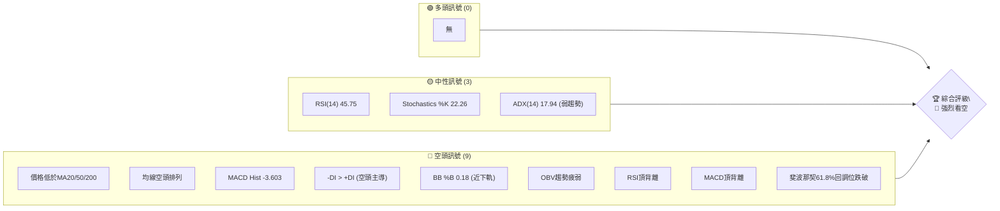
**儀表板解讀**：目前市場上缺乏明確的多頭訊號，而空頭訊號則多達九個，涵蓋了趨勢、動能、波動率和量能等多個方面。中性訊號主要反映當前市場處於弱勢整理或尋底階段，並非止跌反彈的積極訊號。這表明 TSLA 當前處於明顯的下行趨勢中，投資者應保持高度警惕。

### 📊 核心指標速覽表

下表彙整 TSLA 當前關鍵技術指標的數值與訊號，提供快速的市場狀態判斷。

| 指標類別 | 指標名稱 | 當前數值 | 訊號 | 解讀 |
|----------|----------|----------|------|------|
| **價格** | 當前價格 | $379.71 | 🔴 | 位於所有主要均線下方 |
| **均線** | MA20 | $401.55 | 🔴 | 價格位於MA20下方，MA20向下 |
| **均線** | MA50 | $404.76 | 🔴 | 價格位於MA50下方，MA50向下 |
| **均線** | MA200 | $417.96 | 🔴 | 價格位於MA200下方，MA200向下 |
| **動能** | RSI(14) | 45.75 | 🟡 | 中性偏弱，低於50 |
| **動能** | MACD | -7.976 | 🔴 | MACD線在訊號線下方，柱狀圖為負且擴大 |
| **波動** | ATR(14) | $17.74 | 🟡 | 中等偏高波動，佔股價4.67% |
| **趨勢** | ADX(14) | 17.94 | 🟡 | 弱趨勢/盤整，但空頭主導 (-DI > +DI) |
| **量能** | OBV趨勢 | OBV < MA | 🔴 | 量能疲弱，未確認價格下跌 |

### 🏆 技術評分卡

綜合各項技術指標分析，TSLA 目前的技術面評分顯示整體趨勢偏弱，空頭風險較高。

```
技術評分卡 — TSLA (2026-06-28)
════════════════════════════════════════════════════
趨勢強度      ████░░░░░░░░░░░░░░░░  20/100  🔴 (ADX弱，空頭佔優)
動能指標      ██████░░░░░░░░░░░░░░  30/100  🔴 (RSI偏弱，MACD空頭背離)
支撐穩定度    ████████░░░░░░░░░░░░  40/100  🟡 (接近重要支撐，但下行壓力大)
成交量配合    ██████░░░░░░░░░░░░░░  30/100  🔴 (成交量放大伴隨下跌，OBV疲弱)
形態完整度    ██████░░░░░░░░░░░░░░  30/100  🔴 (潛在頭肩頂或雙頂形態已形成)
均線排列      ██░░░░░░░░░░░░░░░░░░  10/100  🔴 (經典空頭排列)
════════════════════════════════════════════════════
綜合評分      ████░░░░░░░░░░░░░░░░  27/100  🔴 賣出/觀望
════════════════════════════════════════════════════
```
**評分總結**：各項評分均偏低，尤以趨勢強度和均線排列表現最差，明確指示當前處於空頭市場。動能指標和成交量配合也顯示賣壓沉重。支撐穩定度相對稍高，但這主要是因為價格已接近短期支撐位，而非支撐本身強度足夠。整體而言，TSLA 技術面極其疲弱，建議投資者避免做多，或考慮做空策略。

---

## 2. 趨勢分析

本章節將從多時框架深入剖析 TSLA 的價格趨勢，從長期宏觀視角到短期微觀動向，並透過 ADX 指標評估趨勢強度。

### 🌐 多時框趨勢分析

透過月線、週線及日線層級的分析，我們能更全面地理解 TSLA 的價格行為。

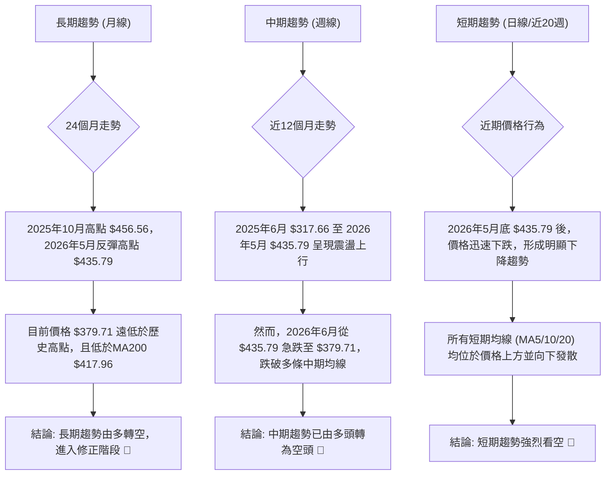
**多時框解讀**：TSLA 在過去一年雖有顯著漲幅，但近期已全面轉弱。長期趨勢從高峰回落，中期趨勢已確認轉空，而短期趨勢則呈現強勁的下跌動能。這表明多頭力量已完全潰散，空頭主導市場。

### 📈 長期趨勢 — 12個月走勢圖（Unicode）

下圖展示 TSLA 過去 12 個月的月線收盤價走勢，標示出關鍵高低點，以視覺化方式呈現長期趨勢的演變。

```
TSLA 月線走勢圖（過去12個月）
價格軸 ($)
$460 ┤                                  ● $456.56 (2025-10 高點)
$440 ┤                    ● $444.72            ● $449.72 (2025-12)
$420 ┤                                      ● $430.41         ● $435.79 (2026-05)
$400 ┤                                            ● $402.51
$380 ┤                                                ● $371.75   ● $381.63
$360 ┤● $317.66                                                    ● $379.71 ←現在 (2026-06)
$340 ┤  
$320 ┤  ● $308.27 (2025-07 低點)
$300 ┤
     └──────────────────────────────────────────────────────────────────────────
      25-06 25-07 25-08 25-09 25-10 25-11 25-12 26-01 26-02 26-03 26-04 26-05 26-06
```

**走勢特徵分析表格**：

| 時間區段 | 起始價 | 結束價 | 漲跌幅 | 走勢特徵 | 訊號 |
|----------|--------|--------|--------|----------|------|
| 2025-06 至 2025-10 | $317.66 | $456.56 | +43.73% | 穩步上漲，創下歷史高點 | 🟢 |
| 2025-10 至 2026-03 | $456.56 | $371.75 | -18.59% | 高點回落，震盪下跌 | 🔴 |
| 2026-03 至 2026-05 | $371.75 | $435.79 | +17.23% | 反彈，但未能突破前高 | 🟡 |
| 2026-05 至 2026-06 | $435.79 | $379.71 | -12.87% | 急速下跌，確認反彈結束 | 🔴 |

**長期趨勢總結**：從過去 12 個月的月線走勢來看，TSLA 在 2025 年下半年經歷了一波強勁的漲勢並創下歷史新高 $456.56。然而，進入 2026 年後，股價開始回落，儘管在 2026 年春季有所反彈，但未能超越前高，且在 2026 年 6 月再次出現急劇下跌，跌破了多個關鍵支撐位。這表明長期上漲趨勢已告終結，目前處於下行或盤整趨勢中。

### 📊 中期趨勢（週線分析）

從近 20 週的週線數據來看，TSLA 在經歷 4 月份的強勁反彈後，於 5 月底見頂，並在 6 月份展開快速下跌。

```
TSLA 中期走勢 — 近期壓力與支撐示意圖
價格軸 ($)
$440 ┤                    ● $435.79 (2026-05-31 高點, 強阻力)
$420 ┤                ● $428.35
$400 ┤            ● $400.62   ● $406.43 (阻力區間)
$380 ╠════════════════════════════════════════════════════════════════╣ ◄ 現價 $379.71
$360 ┤        ● $360.59
$340 ┤      ● $348.95 (2026-04-12 低點, 強支撐)
     └───────────────────────────────────────────────────────────────────
      26-03 26-04 26-05 26-06
```
**中期走勢解讀**：TSLA 在 2026 年 4 月 12 日觸及 $348.95 的低點後，展開了一波強勁的反彈，最高達到 5 月 31 日的 $435.79。然而，此後股價迅速回落，在 6 月份跌破了 $400 心理關口，並持續下行。當前價格 $379.71 位於近期高點 $435.79 和低點 $348.95 之間，但更接近低點，且已跌破多條中期移動平均線。近期 $400-$410 區間已形成新的阻力，而 $360-$370 區間則為潛在支撐。中期趨勢已明確轉為下跌。

### ⚡ 趨勢強度評估（ADX 解讀）

ADX 指標用於衡量趨勢的強度，而非方向。結合 +DI 和 -DI 則可判斷趨勢方向。

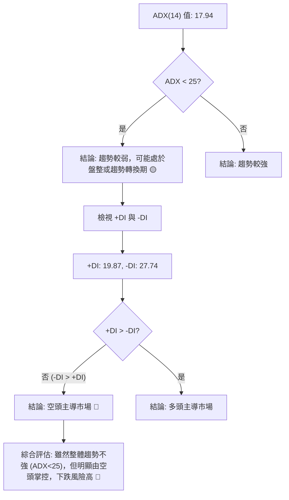
**ADX 強度對照表**：

| ADX 數值範圍 | 趨勢強度 | 建議 |
|--------------|----------|------|
| 0-25         | 弱趨勢/盤整 | 觀望，或等待趨勢明確 |
| 25-50        | 中等趨勢 | 適合趨勢追蹤策略 |
| 50-75        | 強趨勢   | 趨勢非常明確 |
| 75-100       | 極強趨勢 | 趨勢可能過度延伸 |

**ADX 分析**：TSLA 的 ADX(14) 值為 17.94，遠低於 25，這表明目前市場缺乏一個強勁的趨勢，可能處於盤整或趨勢轉換的初期階段。然而，值得注意的是，-DI (27.74) 顯著高於 +DI (19.87)，這明確指示儘管整體趨勢強度不高，但市場的主導力量是空頭。因此，雖然 ADX 本身顯示弱趨勢，但結合 DI 指標，我們可以判斷這是一個由空頭主導的弱勢下跌或盤整行情，而非多頭反轉的跡象。投資者應警惕在弱勢中空頭佔優所帶來的持續下行風險。

---

## 3. 圖表形態分析

本章節將識別 TSLA 價格走勢中形成的圖表形態，分析其潛在意義，並計算可能的形態目標價。

### 🔍 形態識別系統

根據提供的歷史數據，TSLA 的價格走勢呈現出幾個重要的反轉與中繼形態。

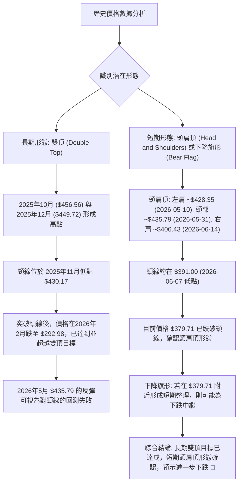
**形態識別解讀**：
1.  **長期雙頂 (Double Top)**：在 2025 年 10 月 ($456.56) 和 12 月 ($449.72) 形成了兩個高峰，其間的低點 (頸線) 約為 $430.17 (2025 年 11 月)。該形態在 2026 年初被突破，股價隨後大幅下跌至 $292.98，形態目標已達成。2026 年 5 月的反彈高點 $435.79 可視為對該雙頂頸線的回測，但未能站穩，最終再次下跌。
2.  **短期頭肩頂 (Head and Shoulders Top)**：從 2026 年 5 月中旬至 6 月中旬，TSLA 似乎形成了一個頭肩頂形態。
    *   **左肩**：約 $428.35 (2026-05-10 週收盤)。
    *   **頭部**：約 $435.79 (2026-05-31 週收盤)。
    *   **右肩**：約 $406.43 (2026-06-14 週收盤)。
    *   **頸線**：連接左肩和右肩之間低點的直線，大致可設定在 $391.00 (2026-06-07 週收盤)。
    目前價格 $379.71 已跌破頸線 $391.00，確認了頭肩頂形態，預示著更深度的下跌。
3.  **潛在下降旗形 (Bear Flag)**：若在當前價格附近 ($379.71) 形成小幅度的盤整反彈，但未能突破關鍵阻力，則可能形成下降旗形，作為下跌趨勢的短暫中繼。

### 🕯️ 重要K線形態分析

分析近期週線收盤數據中的K線形態，以判斷市場情緒。

| 月份 (週收盤) | 收盤價 | RSI | MACD柱 | K線形態 (根據週線判斷) | 解讀 | 訊號 |
|---------------|--------|-----|--------|------------------------|------|------|
| 2026-04-19    | $400.62 | 64.5 | +6.169 | 強勢陽線 (Bullish Marubozu) | 從低點強勁反彈，多頭佔優 | 🟢 |
| 2026-05-10    | $428.35 | 69.1 | +5.066 | 陽線 (Long White Candle) | 延續漲勢，動能強勁 | 🟢 |
| 2026-05-31    | $435.79 | 53.0 | +0.699 | 小陽線/十字星 (Doji/Spinning Top) | 漲勢動能減弱，出現猶豫 | 🟡 |
| 2026-06-07    | $391.00 | 37.3 | -4.464 | 大陰線 (Bearish Engulfing/Marubozu) | 強烈看空，吞噬前週漲幅 | 🔴 |
| 2026-06-14    | $406.43 | 43.6 | -4.369 | 陽線 (White Candle) | 嘗試反彈，但未能收復失地 | 🟡 |
| 2026-06-21    | $400.49 | 38.6 | -2.345 | 陰線 (Black Candle) | 反彈受阻，空頭再次發力 | 🔴 |
| 2026-06-28    | $379.71 | 45.8 | -3.603 | 大陰線 (Long Black Candle) | 強勢下跌，確認空頭趨勢 | 🔴 |

**K線形態總結**：從 5 月底開始，TSLA 的週線 K 線形態由上漲動能減弱的十字星，轉變為強勢大陰線，明確顯示賣壓的加劇。儘管中間有小幅反彈，但未能持續，最終在 6 月底以另一根大陰線確認了空頭的絕對主導地位。這與頭肩頂形態的突破相符，預示著進一步的下跌空間。

### 📉 ASCII 走勢形態示意圖

下圖示意 TSLA 近期形成的頭肩頂反轉形態，標示出各關鍵點位。

```
TSLA 頭肩頂形態示意圖 (短期)
價格軸 ($)
$440 ┤                   ● $435.79 (頭部)
$420 ┤          ● $428.35           ● $406.43 (右肩)
$400 ┤        (左肩)
$380 ╠═════════════════════════════════════════════════════════════════╣ ◄ 現價 $379.71
$360 ┤               ───────● $391.00 ─────── (頸線)
     └─────────────────────────────────────────────────────────────────
      26-05-10  26-05-31    26-06-07  26-06-14    26-06-28
```

### 🎯 形態目標價計算

根據已確認的頭肩頂形態，我們可以計算其理論下跌目標價。

**頭肩頂形態目標價計算**：
*   **頭部高點**：$435.79 (2026-05-31)
*   **頸線位置**：$391.00 (連接左肩和右肩之間低點，可取 2026-06-07 週收盤價)
*   **形態高度**：頭部高點 - 頸線 = $435.79 - $391.00 = $44.79
*   **理論目標價**：頸線 - 形態高度 = $391.00 - $44.79 = $346.21

**形態目標價解讀**：頭肩頂形態的確認以及其目標價 $346.21，為 TSLA 的下跌趨勢提供了明確的技術依據。目前價格 $379.71 已經跌破頸線 $391.00，預計將向 $346.21 測試。若 $346.21 這一目標價位被跌破，則可能進一步下探至更低水平，例如 2026 年 4 月的低點 $348.95 甚至 52 週低點 $288.77。

---

## 4. 支撐與阻力

本章節將詳細分析 TSLA 的關鍵支撐與阻力價位，並結合斐波那契回調位，構建完整的價格結構圖。

### 🗺️ 關鍵價位分布圖（Unicode）

下圖展示 TSLA 目前主要的支撐與阻力價位分布。

```
TSLA 價位結構分布圖
═══════════════════════════════════════════════════
$456.56 ║████████████████████████║ 強阻力 R3 (歷史高點)
$435.79 ║████████████████████    ║ 阻力 R2 (近期高點)
$406.43 ║████████████████████████║ 關鍵阻力 R1 (近期反彈高點/均線匯聚)
$379.71 ╠════════════════════════╣ ◄ 現價
$367.05 ║▓▓▓▓▓▓▓▓▓▓▓▓▓▓▓▓        ║ 近期支撐 S1 (布林下軌/斐波那契76.4%)
$348.95 ║████████████████████████║ 強支撐 S2 (2026-04 低點/頭肩頂目標)
$288.77 ║████████████████████████║ 極強支撐 S3 (52週低點)
═══════════════════════════════════════════════════
```

### 🚧 阻力位分析表

阻力位是股價上漲時可能遭遇壓力的價格水平。

| 阻力級別 | 價位 | 形成原因 | 突破難度 | 重要性 |
|----------|------|----------|----------|--------|
| **R1**   | $406.43 | 近期反彈高點 (2026-06-14 週收盤)，也是 MA20 ($401.55) 和 MA50 ($404.76) 所在區間，以及頭肩頂右肩。 | 中等偏高 | 🟢 (短期反彈的關鍵考驗) |
| **R2**   | $435.79 | 2026 年 5 月底高點，也是頭肩頂的頭部，同時接近布林通道上軌 $436.06。 | 高      | 🟡 (若突破R1，需面臨的第二道關卡) |
| **R3**   | $456.56 | 2025 年 10 月歷史高點，長期趨勢的關鍵阻力。 | 極高     | 🔴 (長期趨勢反轉的終極考驗) |

**阻力位解讀**：TSLA 的短期反彈首先將面臨 $406.43 附近的強勁阻力，該價位不僅是近期高點，也是多條重要移動平均線的匯聚處。若能突破此處，則會挑戰 $435.79 的中期阻力。目前股價距離這些阻力位較遠，顯示上行壓力巨大。

### 🛡️ 支撐位分析表

支撐位是股價下跌時可能獲得支撐的價格水平。

| 支撐級別 | 價位 | 形成原因 | 守住機率 | 重要性 |
|----------|------|----------|----------|--------|
| **S1**   | $367.05 | 布林通道下軌，同時接近斐波那契 76.4% 回調位 ($369.73)。 | 中等    | 🟢 (近期下跌的直接考驗) |
| **S2**   | $348.95 | 2026 年 4 月 12 日的週收盤低點，也是頭肩頂形態的理論目標價 $346.21 附近。 | 中等偏高 | 🟡 (中期下行的關鍵支撐) |
| **S3**   | $288.77 | 52 週低點，歷史性強支撐，若跌破將釋放極強賣壓。 | 高      | 🔴 (長期下跌的最後防線) |

**支撐位解讀**：當前價格 $379.71 正在向下測試 $367.05 附近的短期支撐。若此支撐無法守住，則 $348.95 將是下一個重要的考驗，該價位與頭肩頂的目標價位高度吻合。一旦跌破 $348.95，市場將面臨極大的下行風險，並可能測試 52 週低點 $288.77。

### 📐 斐波那契回調位分析

我們將以 2026 年 4 月 12 日的低點 $348.95 至 2026 年 5 月 31 日的高點 $435.79 作為主要漲勢，計算其回調位。

*   **漲勢範圍**：$348.95 (低點) 至 $435.79 (高點)
*   **漲幅**：$435.79 - $348.95 = $86.84

**斐波那契回調位計算**：
*   **23.6% 回調位**：$435.79 - ($86.84 × 0.236) = $415.26
*   **38.2% 回調位**：$435.79 - ($86.84 × 0.382) = $402.32
*   **50.0% 回調位**：$435.79 - ($86.84 × 0.500) = $392.37
*   **61.8% 回調位**：$435.79 - ($86.84 × 0.618) = $381.74
*   **76.4% 回調位**：$435.79 - ($86.84 × 0.764) = $369.73

**斐波那契回調位視覺化**：

```
TSLA 斐波那契回調位示意圖 (從 $348.95 到 $435.79 的漲勢)
價格軸 ($)
$435.79 ┤█████████████████████████████████████████████║ 高點 (0%)
        ║                                           ║
$415.26 ┤█████████████████████████████████████████████║ 23.6% 回調
        ║                                           ║
$402.32 ┤█████████████████████████████████████████████║ 38.2% 回調
        ║                                           ║
$392.37 ┤█████████████████████████████████████████████║ 50.0% 回調
        ║                                           ║
$381.74 ┤█████████████████████████████████████████████║ 61.8% 回調
$379.71 ╠═════════════════════════════════════════════╣ ◄ 現價
$369.73 ┤█████████████████████████████████████████████║ 76.4% 回調
        ║                                           ║
$348.95 ┤█████████████████████████████████████████████║ 低點 (100%)
        ╚═══════════════════════════════════════════════════════════════════════════
```
**斐波那契回調解讀**：目前價格 $379.71 已跌破 61.8% 回調位 ($381.74)，這是一個重要的看空訊號，表明之前的上漲趨勢已經被嚴重破壞，市場情緒偏向悲觀。下一個關鍵支撐將是 76.4% 回調位 $369.73，此處與布林通道下軌 $367.05 接近，形成一個較強的支撐區間。若該區間被跌破，則價格可能完全回吐漲幅，並測試 $348.95 的前低。

---

## 5. 技術指標深度解讀

本章節將對 TSLA 的關鍵技術指標進行詳盡分析，包括移動平均線、RSI、MACD、布林通道和成交量，並探討它們之間的相互關係與訊號一致性。

### 🎛️ 指標訊號總覽

下圖展示了各主要技術指標當前的訊號方向，以視覺化方式呈現整體市場情緒。

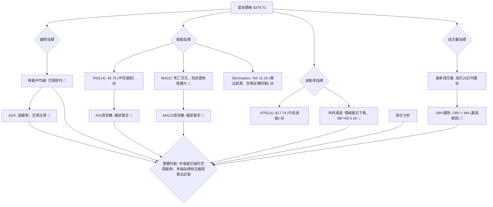

### 📈 移動平均線排列分析

移動平均線 (MA) 系統是判斷趨勢方向和強度的重要工具。

**均線系統快照**：
*   MA5: $383.40 ▼
*   MA10: $393.61 ▼
*   MA20: $401.55 ▼
*   MA50: $404.76 ▼
*   MA200: $417.96 ▼

**均線排列**：MA5 < MA10 < MA20 < MA50 < MA200

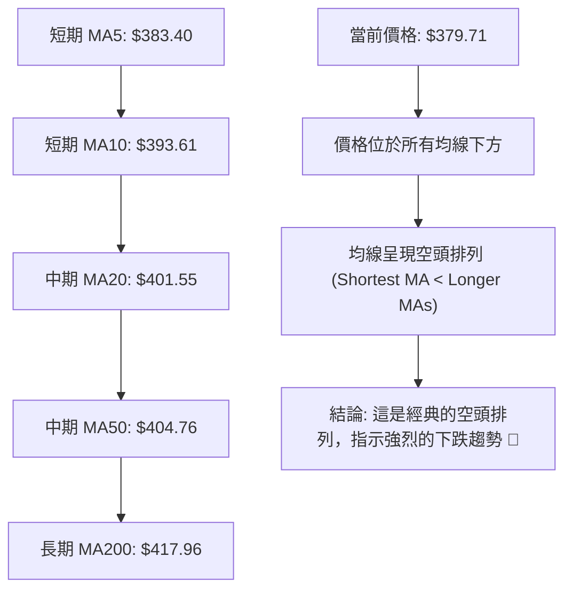
**移動平均線解讀**：TSLA 目前的價格 $379.71 位於所有短期、中期和長期移動平均線下方。更重要的是，各條均線呈現完美的「空頭排列」，即短期均線 (MA5, MA10, MA20) 位於中期均線 (MA50) 下方，中期均線又位於長期均線 (MA200) 下方。所有均線均向下傾斜，這是一個極其明確且強烈的看空訊號，表明市場處於穩定的下跌趨勢中。這預示著上漲阻力巨大，而下跌動能充沛。

### 📉 RSI(14) 分析

相對強弱指數 (RSI) 用於衡量價格變動的相對速度和變化，以識別超買或超賣狀況。

*   **RSI(14) 當前數值**：45.75
*   **RSI 進度條**：▓▓▓▓▓▓▓▓▓░░░░░░░░░░░░ 45.75/100 (中性偏弱)

**超買超賣區間分析**：
*   RSI 數值 45.75 位於 30-70 的中性區間內，既非超買也非超賣。
*   然而，RSI 低於 50，這表明市場上的賣方力量略佔優勢，動能偏向空頭。

**RSI 背離判斷**：
*   觀察週線數據：
    *   2026-04-19 收盤價 $400.62，RSI 64.5。
    *   2026-05-10 收盤價 $428.35，RSI 69.1。
    *   2026-05-31 收盤價 $435.79，RSI 53.0。
*   從 2026-05-10 的高點 $428.35 (RSI 69.1) 到 2026-05-31 的更高點 $435.79 (RSI 53.0)，**價格創出新高，但 RSI 卻創出較低的高點**。這是一個明確的 **RSI 頂背離 (Bearish Divergence)** 訊號。
*   **結論**：RSI 頂背離是強烈的反轉訊號，預示著價格可能見頂回落。這與隨後發生的下跌走勢完全吻合，確認了市場的看空情緒。🔴

### 📊 MACD(12/26/9) 訊號解讀

MACD (移動平均線收斂發散指標) 用於識別趨勢的變化、方向、強度和持續時間。

*   MACD 線: -7.976
*   MACD Signal 線: -4.373
*   MACD Hist (柱狀圖): -3.603

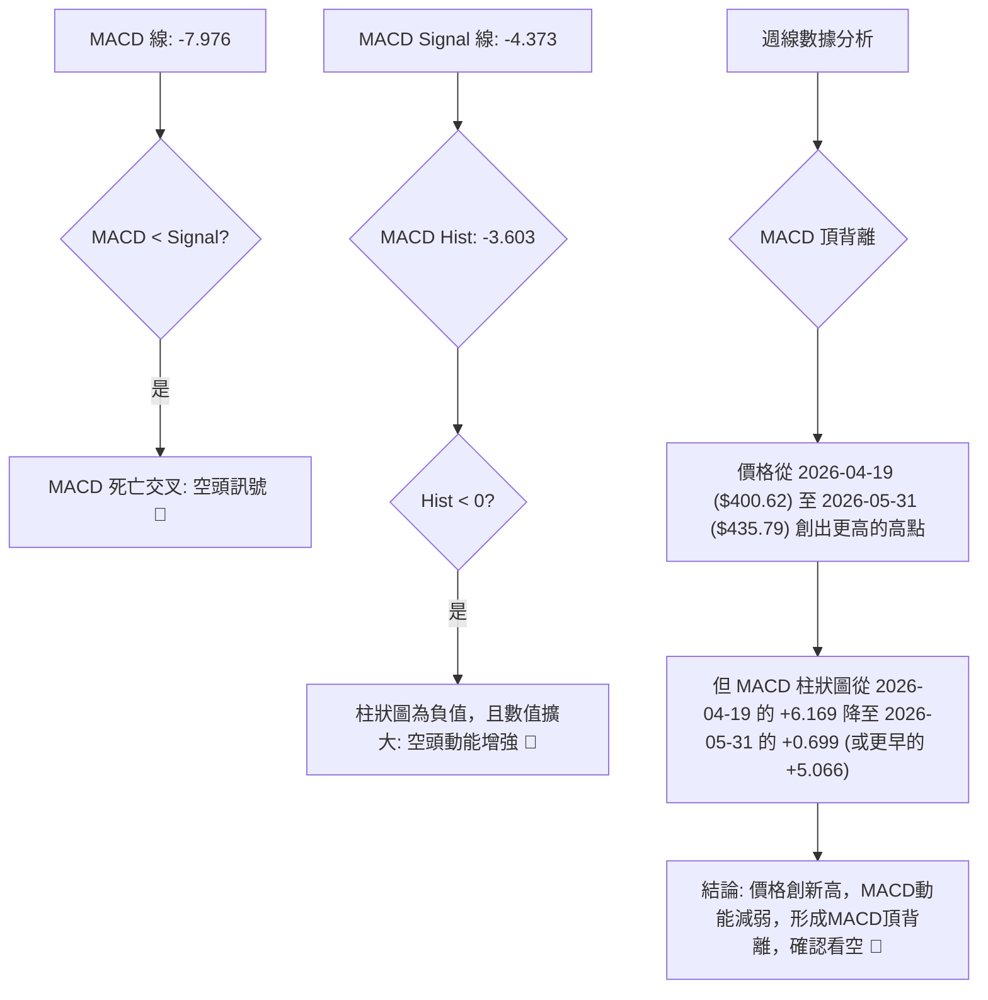
**MACD 解讀**：
1.  **死亡交叉**：MACD 線 (-7.976) 位於 Signal 線 (-4.373) 下方，形成「死亡交叉」，這是明確的賣出訊號。
2.  **柱狀圖**：MACD 柱狀圖為負值 (-3.603)，且數值相較前幾週 (2026-06-21: -2.345) 擴大，表明空頭動能正在增強。
3.  **MACD 背離**：與 RSI 相似，MACD 也出現了頂背離。在 2026 年 5 月底價格創出新高 ($435.79) 時，MACD 柱狀圖的峰值 ($0.699) 顯著低於 4 月份 ($6.169) 甚至 5 月初 ($5.066) 的峰值。這是一個強烈的 MACD 頂背離訊號，預示著上漲動能衰竭，趨勢即將反轉。
**綜合結論**：MACD 指標的死亡交叉和柱狀圖負值擴大，以及更關鍵的頂背離訊號，都強烈指向 TSLA 的看空前景。

### 📦 布林通道分析

布林通道 (Bollinger Bands) 用於衡量價格的波動區間，並判斷相對高低點。

*   BB上軌: $436.06
*   BB中軌(MA20): $401.55
*   BB下軌: $367.05
*   當前價格: $379.71
*   BB %B: 0.18

```
布林通道示意圖
╔═══════════════════════════════════════════════════╗
║ $436.06 ║█████████████████████████████████████████████║ 上軌 (Upper Band)
║         ║                                           ║
║ $401.55 ┤───────────────────────────────────────────║ 中軌 (MA20)
║         ║▓▓▓▓▓▓▓▓▓▓▓▓▓▓▓▓▓▓▓▓▓▓▓▓▓▓▓▓▓▓▓▓▓▓▓▓▓▓▓▓▓▓▓▓║
║ $379.71 ╠═══════════════════════════════════════════╣ ◄ 現價
║         ║▓▓▓▓▓▓▓▓▓▓▓▓▓▓▓▓▓▓▓▓▓▓▓▓▓▓▓▓▓▓▓▓▓▓▓▓▓▓▓▓▓▓▓▓║
║ $367.05 ┤█████████████████████████████████████████████║ 下軌 (Lower Band)
╚═══════════════════════════════════════════════════════╝
```
**布林通道解讀**：
1.  **價格位置**：當前價格 $379.71 位於布林通道中軌 (MA20: $401.55) 和下軌 ($367.05) 之間，且更接近下軌。這表明股價正處於下跌趨勢中，並持續向通道下緣靠攏。
2.  **BB %B**：BB %B 值為 0.18，表示價格距離下軌非常近 (0 代表接觸下軌)。這通常意味著強烈的賣壓，市場可能處於超賣狀態，但同時也可能預示著下跌動能的加速。
3.  **通道開口**：雖然數據未直接提供通道開口寬度，但價格快速從上軌附近跌至下軌，暗示通道可能正在擴大，支持趨勢延續。
**綜合結論**：布林通道分析確認 TSLA 處於下跌趨勢，且賣壓沉重。儘管接近下軌可能預示短期超賣，但在強烈空頭趨勢下，這更可能是一個下跌中繼，而非立即反彈的訊號。

### 💹 成交量分析（量價配合度）

成交量是價格走勢的能量，量價配合度是判斷趨勢可信度的關鍵。

*   最新成交量: 53,358,900
*   20日均量: 47,318,605 (量比: 1.13x)
*   50日均量: 53,107,822
*   OBV趨勢: OBV < MA → 量能疲弱

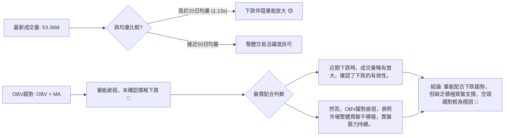
**成交量解讀**：
1.  **量比分析**：當前成交量 (53,358,900) 高於 20 日均量 (47,318,605)，量比為 1.13 倍。這表示在最近的下跌中，成交量有所放大。**下跌伴隨成交量放大是確認下跌趨勢的典型訊號**，表明賣方力量積極。
2.  **OBV 趨勢**：OBV (On Balance Volume) 趨勢顯示 OBV 線低於其移動平均線，這是一個明確的「量能疲弱」訊號。OBV 疲弱意味著在價格上漲時，累積的成交量不足，而下跌時的成交量則更具說服力。這表明市場缺乏積極的買盤推動，而賣盤壓力則持續存在。
**綜合結論**：儘管近期下跌伴隨量能放大，但 OBV 趨勢疲弱，顯示市場整體買盤意願低落。這種量價配合關係進一步確認了 TSLA 的空頭趨勢，且缺乏足夠的買方支撐來扭轉當前局面。

---

## 6. 動能與波動率

本章節將評估 TSLA 的動能強度和波動率，以幫助投資者理解當前市場的活躍程度和風險水平。

### ⚡ 動能評估四象限

動能評估四象限分析股票在「動能強度」與「波動率」兩個維度的位置，以判斷當前市場狀態。

| 象限 | 動能 | 波動 | 當前狀態 (TSLA) | 評估 |
|------|------|------|-----------------|------|
| Q1   | 強   | 低   | -               | 最佳機會 (穩定上漲) |
| Q2   | 弱   | 低   | -               | 謹慎觀望 (盤整待變) |
| Q3   | 強   | 高   | -               | 高風險高收益 (趨勢加速，追高殺低風險) |
| Q4   | 弱   | 高   | ✓               | 避免進場 (方向不明，震盪劇烈) |

**動能評估解讀**：
*   **動能**：RSI(14) 為 45.75 (中性偏弱)，MACD 柱狀圖為負值且擴大，顯示動能偏空且正在增強。ADX(14) 17.94 顯示趨勢強度較弱。綜合來看，TSLA 的動能屬於「弱動能」範疇，但趨勢方向明確向下。
*   **波動**：ATR(14) 為 $17.74，佔當前價格 $379.71 的 4.67%。這是一個相對較高的波動率，表明股價每日波動幅度較大。
**結論**：TSLA 目前處於「弱動能，高波動」的第四象限。這是一個高風險的市場環境，意味著雖然整體趨勢偏弱，但價格波動劇烈，容易出現快速的漲跌，使得交易難度增加。在這種情況下，建議投資者避免盲目進場，應等待趨勢明確或波動率下降後再考慮。

### 📊 ATR 波動率分析

平均真實波幅 (ATR) 用於衡量資產價格的波動性，是設定止損和目標價的重要參考。

*   **ATR(14) 當前數值**：$17.74
*   **佔股價百分比**：4.67%

**ATR 進度條**：▓▓▓▓▓▓▓▓▓▓▓▓▓▓▓▓▓▓░░ 4.67% (中高波動)

**ATR 分析**：
1.  **波動性水平**：TSLA 的 ATR(14) 為 $17.74，相對於當前股價 $379.71，每日平均波動幅度達到 4.67%。這是一個相對較高的波動水平，表明 TSLA 股價活躍，但同時也伴隨著較高的日內風險。
2.  **止損距離建議**：在設定止損時，通常會考慮 ATR 的倍數。
    *   對於短線交易者，建議將止損設置在 1.5 倍 ATR 左右，即 $17.74 × 1.5 = $26.61。
    *   對於中線交易者，可考慮 2 倍 ATR 左右，即 $17.74 × 2 = $35.48。
    例如，如果做空，止損點可以設定在進場價上方 $26.61 或 $35.48。反之，如果做多，止損點可以設定在進場價下方相同距離。
**結論**：TSLA 的高波動性要求交易者在進行策略規劃時，必須預留足夠的波動空間，並嚴格執行止損，以避免因價格劇烈波動而過早出場或承受過大風險。

### 📐 Beta 與市場相關性

Beta 值衡量單一股票相對於整體市場的波動性。

**分析**：根據提供的技術數據，並無 Beta 值相關資訊。因此，無法直接分析 TSLA 與大盤 (如 S&P 500) 的相關性。
**推斷**：Tesla 作為成長型科技股，通常具有較高的 Beta 值，意味著其股價波動性可能大於市場平均水平。在牛市中可能漲幅更大，而在熊市中可能跌幅更深。然而，由於缺乏具體數據，此為一般性推論，不能作為嚴謹的分析依據。

---

## 7. 多時框架總結

本章節將彙整各時框架的分析結果，提供 TSLA 技術面的綜合評估，以揭示不同時間維度上的訊號一致性。

### 📋 時框架評分表

下表總結了 TSLA 在不同時框架下的技術面表現。

| 時框架 | 趨勢方向 | 動能 | 均線排列 | 形態 | 綜合評分 (1-10) | 建議 |
|--------|----------|------|----------|------|-----------------|------|
| **短期** | 🔴 下跌 | 🔴 偏空 | 🔴 空頭排列 | 🔴 頭肩頂突破 | 2.0             | 賣出/做空 |
| **中期** | 🔴 下跌 | 🔴 偏空 | 🔴 空頭排列 | 🔴 頭肩頂/雙頂 | 2.5             | 賣出/做空 |
| **長期** | 🔴 偏空 | 🟡 中性偏空 | 🔴 轉空排列 | 🔴 雙頂確認 | 3.0             | 觀望/減持 |

**評分表解讀**：從短期到長期，TSLA 的技術面均呈現明顯的空頭訊號。短期和中期趨勢均為明確的下跌，伴隨強勁的空頭動能和經典的空頭均線排列，且頭肩頂形態已確認跌破。長期趨勢也已從之前的多頭轉為偏空，雙頂形態的目標已達成，且對頸線的回測失敗，顯示長期上漲動能已竭。這表明 TSLA 在所有時間維度上都面臨強大的賣壓。

### 🔲 綜合訊號矩陣

下圖以矩陣形式展示了 TSLA 在各時框架下主要技術指標的訊號一致性。

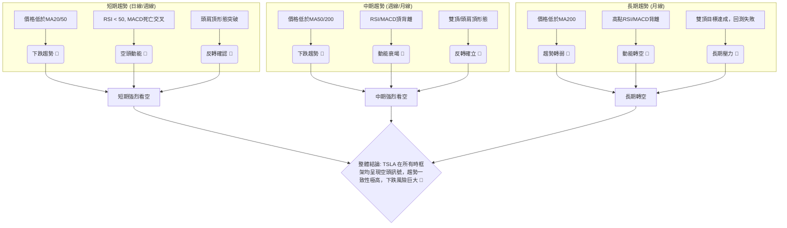
**綜合訊號矩陣解讀**：TSLA 的短期、中期和長期趨勢均呈現高度一致的空頭訊號。所有時框架下的價格行為、動能指標和圖表形態都指向下跌。這種高度的一致性增強了技術分析的可靠性，表明當前市場對 TSLA 的看空情緒是全面且穩固的。投資者應對此保持高度警惕，並避免任何做多操作。

---

## 8. 交易策略建議

基於上述詳盡的技術分析，TSLA 目前呈現強烈的空頭訊號，因此主要交易策略將圍繞做空展開，同時提供一個謹慎的短線反彈策略供極短線交易者參考。

### 🗺️ 策略決策流程圖

下圖展示了基於當前技術訊號的交易策略選擇邏輯。

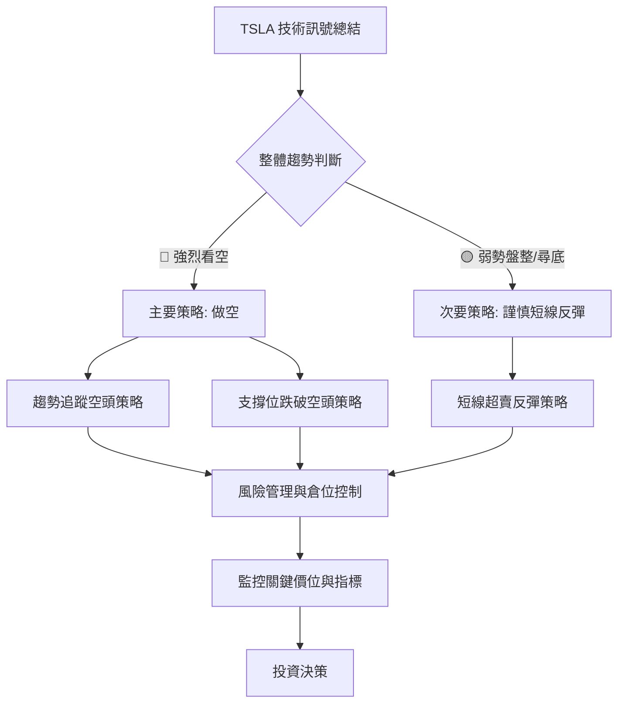

### 🟢 多頭策略詳情

鑑於當前強烈的空頭訊號，任何做多策略均屬於逆勢操作，風險極高。僅在極端超賣且出現明確止跌反轉訊號時，才可考慮輕倉短線反彈。

| 策略要素 | 策略 A：短線超賣反彈策略 (高風險) |
|----------|------------------------------------|
| **進場條件** | 價格跌至強支撐位 S1 ($367.05) 附近，且出現止跌K線形態 (如錘子線、看漲吞噬) 或多頭背離訊號 (RSI/MACD)。 |
| **進場價格** | $367.05 (布林下軌/S1) |
| **目標價 T1** | $392.37 (斐波那契 50% 回調位) |
| **目標價 T2** | $401.55 (MA20/布林中軌/R1 附近) |
| **止損價格** | $360.00 (略低於 S1 和斐波那契 76.4% 回調位 $369.73) |
| **風險報酬比** | (392.37 - 367.05) : (367.05 - 360.00) = 25.32 : 7.05 ≈ **3.59 : 1** |
| **成功機率** | 30% (逆勢操作，風險高，需嚴格止損) |
| **建議倉位** | 輕倉 (不超過總資金 5-10%) |

### 🔴 空頭策略詳情

在當前市場環境下，做空是更具優勢的策略，可分為趨勢追蹤和支撐跌破兩種。

| 策略要素 | 策略 A：趨勢追蹤空頭策略 (反彈受阻) | 策略 B：支撐位跌破空頭策略 (確認下跌) |
|----------|------------------------------------|------------------------------------|
| **進場條件** | 價格反彈至關鍵阻力位 R1 ($406.43) 或斐波那契回調位 $392.37 / $402.32 附近受阻，並出現看跌K線形態。 | 價格跌破 $367.05 (布林下軌/S1) 並確認跌破 (如收盤價低於此位)。 |
| **進場價格** | $391.00 (若反彈至此遇阻，接近斐波那契 50% 回調位和近期 MA5) | $366.00 (跌破 S1 後的確認進場點) |
| **目標價 T1** | $367.05 (布林下軌/S1) | $348.95 (S2，2026-04 低點/頭肩頂目標) |
| **目標價 T2** | $348.95 (S2，2026-04 低點/頭肩頂目標) | $320.00 (潛在下降通道下緣或更深回調) |
| **止損價格** | $406.43 (突破 R1 即止損，也是近期反彈高點) | $375.00 (若價格再次回到 S1 上方，則止損) |
| **風險報酬比** | (391.00 - 367.05) : (406.43 - 391.00) = 23.95 : 15.43 ≈ **1.55 : 1** | (366.00 - 348.95) : (375.00 - 366.00) = 17.05 : 9.00 ≈ **1.89 : 1** |
| **成功機率** | 60% (順勢操作，需等待反彈確認) | 70% (趨勢確認，動能強勁) |
| **建議倉位** | 中等倉位 (總資金 15-20%) | 中等倉位 (總資金 15-20%) |

### ⭐ 整體訊號強度評星

綜合所有技術分析與策略建議，TSLA 的整體市場訊號評級如下：

```
做多訊號強度：★★☆☆☆  (2/5星) (僅限超賣反彈，逆勢操作，風險極高)
做空訊號強度：★★★★☆  (4/5星) (多項指標確認空頭趨勢與背離，順勢操作)
整體可信度：  ★★★☆☆  (3/5星) (空頭訊號強烈且一致，但市場波動性高，仍需謹慎)
```
**評星解讀**：目前 TSLA 的做空訊號強度極高，多項指標和形態都指向下跌。做多訊號微弱，僅基於潛在的超賣反彈，且風險極大。整體可信度為中等偏高，因為雖然空頭訊號強烈，但高波動性以及市場情緒的快速變化仍可能帶來不確定性，因此交易時應嚴格控制風險。

---

## 9. 風險提示與監控

本章節將列出關鍵的監控指標和潛在風險場景，並提供重要的風險管理建議，以幫助投資者應對 TSLA 交易中的不確定性。

### ✅ 關鍵監控指標 Checklist

以下是交易 TSLA 時需要密切關注的關鍵技術指標和價位清單。

```
╔══════════════════════════════════════════════════════════════╗
║ TSLA 關鍵監控指標 Checklist                                  ║
╠══════════════════════════════════════════════════════════════╣
║ [ ] 價格是否跌破 $367.05 (S1/布林下軌)                     ║
║ [ ] 價格是否跌破 $348.95 (S2/頭肩頂目標)                     ║
║ [ ] 價格是否反彈至 $406.43 (R1/右肩位) 並受阻                ║
║ [ ] MA20/MA50/MA200 是否維持空頭排列                         ║
║ [ ] RSI(14) 是否跌破 30 (進入超賣區) 或出現底背離              ║
║ [ ] MACD 是否出現金叉或柱狀圖轉正                              ║
║ [ ] ADX 是否上升至 25 以上，且 +DI 轉為主導                    ║
║ [ ] 成交量在下跌時是否持續放大，或在反彈時量能萎縮             ║
║ [ ] OBV 趨勢是否轉為向上，確認買盤介入                       ║
║ [ ] 是否出現任何看漲反轉 K 線形態 (如錘子線、看漲吞噬)       ║
╚══════════════════════════════════════════════════════════════╝
```

### ⚠️ 風險場景分析

針對 TSLA 的未來走勢，我們設想三種可能的情境：樂觀、基本和悲觀。

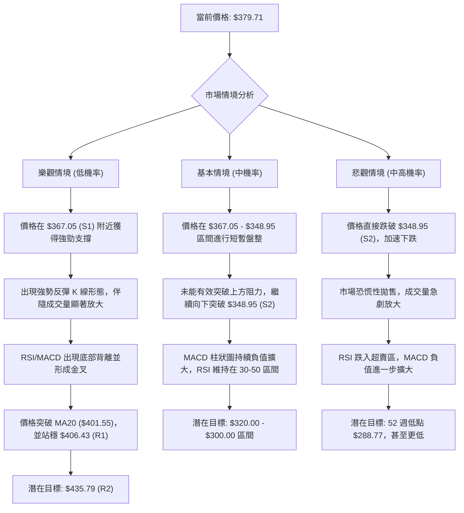
**風險情境解讀**：
*   **樂觀情境**：TSLA 在強支撐位反彈並逆轉趨勢，但目前技術訊號顯示此情境發生的機率較低。
*   **基本情境**：在短期支撐區間盤整後，延續當前下跌趨勢，逐步下探至 $320-$300 區間。這是目前最符合技術分析判斷的情境。
*   **悲觀情境**：若關鍵支撐 $348.95 被快速跌破，則可能引發更大規模的賣壓，股價恐將直接測試 52 週低點 $288.77，甚至跌破。鑑於當前的強空頭訊號，此情境發生的機率不容忽視。

### 🛡️ 風險管理重要提醒

1.  **嚴格止損**：無論採取何種策略，務必設定並嚴格執行止損點。在波動性較高的 TSLA 上，止損是保護資金的生命線。
2.  **倉位管理**：避免重倉單一股票，尤其是在趨勢不明或逆勢操作時。建議將倉位控制在總資金的合理百分比內 (例如，單筆交易風險不超過總資金的 1-2%)。
3.  **分批進場/出場**：若對市場方向仍有疑慮，可考慮分批進場以分散風險，並在達到目標價時分批獲利了結。
4.  **持續監控**：市場情況瞬息萬變，應持續監控關鍵技術指標和價位，並根據最新市場動態靈活調整策略。
5.  **避免情緒化交易**：在高波動市場中，情緒化交易是導致虧損的主要原因。堅持紀律性交易，依據客觀分析做出決策。
6.  **基本面配合**：雖然本報告專注技術分析，但仍建議投資者關注 TSLA 的基本面消息，如財報、新產品發布、行業政策變化等，這些因素可能對股價產生重大影響。

---

## 📋 報告總結

```
TSLA 技術分析報告總結
════════════════════════════════════════════════════════
報告日期：2026-06-28
當前價格：$379.71
分析評級：⚖️ 強烈看空 (Strong Bearish)

關鍵結論：
├─ 長期趨勢：🔴 偏空，雙頂目標達成，反彈回測失敗。
├─ 中期趨勢：🔴 明確下跌，均線空頭排列，MACD/RSI頂背離。
├─ 短期趨勢：🔴 強烈下跌，頭肩頂形態已確認跌破。
├─ 關鍵支撐：S1 $367.05，S2 $348.95，S3 $288.77 (52週低點)。
├─ 關鍵阻力：R1 $406.43，R2 $435.79 (頭肩頂頭部)。
└─ 分析師目標：$421.16 (均值)，與技術面空頭判斷矛盾，需謹慎參考。

最優策略組合：
1. 🥇 最佳機會：趨勢追蹤空頭策略。等待價格反彈至 $391.00 附近受阻後做空，目標 $348.95。
2. 🥈 次選機會：支撐位跌破空頭策略。若價格跌破 $367.05 並確認，則在 $366.00 附近做空，目標 $348.95。
3. 🥉 保守選擇：觀望。等待市場趨勢明確或股價在強支撐位 ($348.95) 附近築底成功後再考慮。
════════════════════════════════════════════════════════
```

---

> ⚠️ **免責聲明**：本報告為 AI 自動生成之技術分析，所有數據及估算均基於提供的歷史價格資訊。本報告**僅供研究與學術參考**，**不構成任何投資建議**。投資有風險，入市需謹慎。

---

*報告生成時間：2026-06-28 ｜ 數據來源：提供數據 ｜ 分析框架：多時框技術分析*