<details>
<summary>📊 靜態圖表 (點擊展開)</summary>
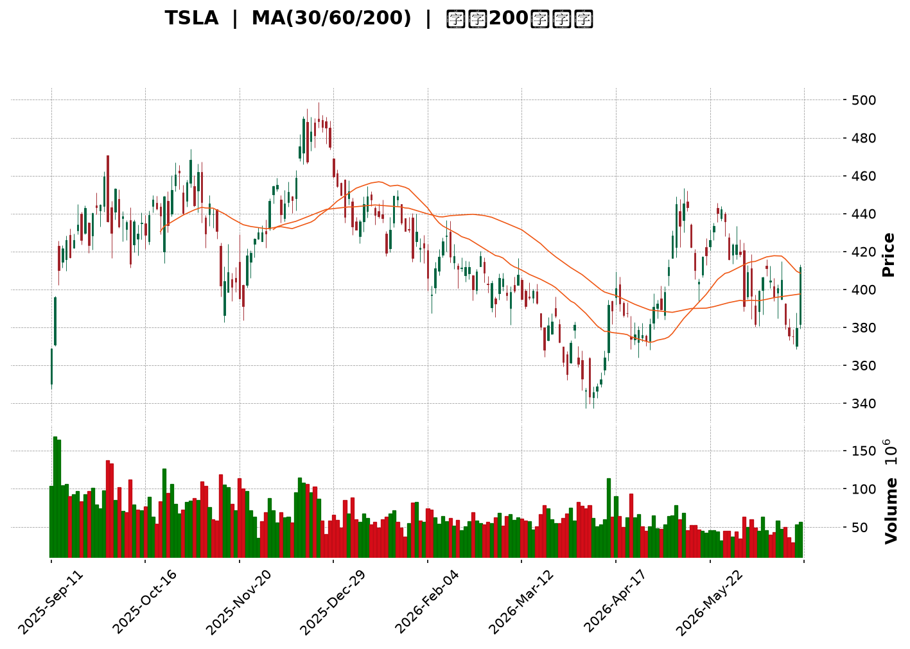
</details>

<html>
<head><meta charset="utf-8" /></head>
<body>
    <div style="height:500px; width:100%;">                        <script>window.PlotlyConfig = {MathJaxConfig: 'local'};</script>
        <script charset="utf-8" src="https://cdn.plot.ly/plotly-3.6.0.min.js" integrity="sha256-QaOVwtVY0T02VaHrr6pnoHLCwayMJp4O5n4YyaE3rJk=" crossorigin="anonymous"></script>                <div id="candlestick-chart" class="plotly-graph-div" style="height:100%; width:100%;"></div>            <script>                window.PLOTLYENV=window.PLOTLYENV || {};                                if (document.getElementById("candlestick-chart")) {                    Plotly.newPlot(                        "candlestick-chart",                        [{"close":{"dtype":"f8","bdata":"AAAAwPUMd0AAAABACr94QAAAAOCjoHlAAAAAgOtZekAAAACAwp16QAAAAKCZDXpAAAAAwB6hekAAAAAgXCN7QAAAAKCZnXpAAAAA4KOse0AAAACAPXZ6QAAAAGBmhntAAAAAIFyze0AAAAAghct7QAAAACBct3xAAAAAAABAe0AAAACgR916QAAAAAAAVHxAAAAAoHARe0AAAABACmt7QAAAAOCjOHtAAAAAANfXeUAAAABgZj57QAAAAADX03pAAAAAYGYye0AAAAAAAMx6QAAAAMD1dHtAAAAAQOH2e0AAAACgmal7QAAAACCFb3tAAAAAIK4PfEAAAAAghRt7QAAAAGC4RnxAAAAAwMzIfEAAAAAAKdh8QAAAAKCZgXtAAAAAwPWIfEAAAACA60V9QAAAAAApxHtAAAAAwB7hfEAAAABgj957QAAAAOBR2HpAAAAAIK7Te0AAAACA63l7QAAAAKCZ6XpAAAAAANcfeUAAAACgmUV5QAAAAGC4jnlAAAAAAAAUeUAAAAAA1z95QAAAACCus3hAAAAAoHBxeEAAAADgehx6QAAAAGBmNnpAAAAAoEepekAAAABguOJ6QAAAAIA94npAAAAAANfTekAAAAAA1+t7QAAAAOB6aHxAAAAAAABwfEAAAACgR3l7QAAAAGC40ntAAAAAQDM3fEAAAACAPe57QAAAACBcr3xAAAAAwPW0fUAAAACAFJ5+QAAAAAApNH1AAAAAgOs1fkAAAABAMxN+QAAAACCui35AAAAAwPVYfkAAAABgZlZ+QAAAAEAKs31AAAAAgD26fEAAAABA4WZ8QAAAACCFG3xAAAAAwB5he0AAAABguDp8QAAAACBcD3tAAAAAYI\u002f2ekAAAADAzDx7QAAAAAAp0HtAAAAAIFwPfEAAAABAM\u002fN7QAAAAEAzc3tAAAAAwB5pe0AAAAAAAFh7QAAAAAAANHpAAAAAQAr3ekAAAACAwhV8QAAAAMD1EHxAAAAAQDMze0AAAABgZu56QAAAACBc93pAAAAAwPUIekAAAABgj+Z6QAAAAMD1XHpAAAAAIFxfekAAAAAAKWB5QAAAACBc03hAAAAAgMKxeUAAAADAHhV6QAAAACBck3pAAAAA4FHEekAAAADAHhF6QAAAAEAKF3pAAAAAgBSqeUAAAADAHrV5QAAAACBcu3lAAAAAwB69eUAAAACgR\u002f14QAAAAIAUlnlAAAAAYGYWekAAAACgR4l5QAAAAAApKHlAAAAAwB41eUAAAABA4YZ4QAAAAEAKX3lAAAAAwMxYeUAAAAAgrst4QAAAAEDh6nhAAAAAANfzeEAAAADAHn15QAAAAAApsHhAAAAAQDNzeEAAAADA9bh4QAAAAOBR9HhAAAAA4HqMeEAAAADAzMR3QAAAACBc\u002f3ZAAAAAoJnNd0AAAADgevB3QAAAAEAzH3hAAAAAgMJBd0AAAACgR512QAAAAOB6NHZAAAAAAAA8d0AAAAAAKdR3QAAAAKBwiXZAAAAAwB4NdkAAAABgZqp1QAAAAAAAdHVAAAAAgOuZdUAAAABAM891QAAAAGC4BnZAAAAAQDPDdkAAAABAM394QAAAAGBmTnhAAAAAgOsJeUAAAAAAAIh4QAAAAGC4JnhAAAAAACk4eEAAAAAghVt3QAAAAMDMhHdAAAAAYLiqd0AAAADgUYB3QAAAAMDMTHdAAAAAgBTad0AAAADAHm14QAAAAAApiHhAAAAAgOtVeEAAAAAgrut4QAAAAOCjvHlAAAAAoJnFekAAAAAAANB7QAAAAEAzF3tAAAAA4FHUe0AAAADAzLR7QAAAAADXY3pAAAAAANefeUAAAACAwkF5QAAAAAApFHpAAAAAoJkdekAAAAAAKaB6QAAAAKBwGXtAAAAAgMKFe0AAAACgmaF7QAAAAOCjPHtAAAAAgBT+eUAAAAAA13t6QAAAAEAze3pAAAAAQDMnekAAAAAAAHB4QAAAAEAzj3lAAAAAQOHKeEAAAACgcNl3QAAAAGBm8nhAAAAAQOFmeUAAAABgZrJ5QAAAAGCPSnlAAAAAgBTGeEAAAAAA1wd5QAAAAMDMUHlAAAAAgMLZd0AAAADgenh3QAAAAIDrcXdAAAAAIFy7d0AAAACgcL15QA=="},"high":{"dtype":"f8","bdata":"AAAAANcPd0AAAABACst4QAAAAEAzm3pAAAAAAAB0ekAAAADA9cR6QAAAACCFA3tAAAAAIIXXekAAAAAgrs97QAAAACCFj3tAAAAAIFzDe0AAAACgmTV7QAAAACCFh3tAAAAAIK4vfEAAAAAAANB7QAAAAOCj5HxAAAAAAABsfUAAAADgUex7QAAAAMDMWHxAAAAAQOFKfEAAAACgR5V7QAAAAKCZRXtAAAAAgBSye0AAAACAPU57QAAAAEAzI3tAAAAAACmIe0AAAACgmXV7QAAAACBcl3tAAAAAwMwcfEAAAADAzBR8QAAAAOCj2HtAAAAAYGYWfEAAAABA4Tp8QAAAAGCPwnxAAAAAAAAwfUAAAABAMxt9QAAAAMD1cHxAAAAAAACgfEAAAADAHqF9QAAAACCFw3xAAAAAoEclfUAAAABAMzd9QAAAAIDCdXtAAAAAYLgafEAAAAAA16d7QAAAAKBHpXtAAAAAAACIekAAAABACsN5QAAAACBcf3pAAAAAYGaOeUAAAADgerx5QAAAAEAKz3pAAAAAwMwseUAAAAAghVt6QAAAACCuR3pAAAAAQAqvekAAAABA4Q57QAAAAGCPGntAAAAAwMxMe0AAAABguP57QAAAAIAUanxAAAAAgOutfEAAAAAAABx8QAAAAIA9RnxAAAAAgBSOfEAAAADgURR8QAAAAAAp8HxAAAAA4FEcfkAAAAAAALh+QAAAAOB69H5AAAAAgMKtfkAAAAAA16d+QAAAAKBHLX9AAAAAIIW\u002ffkAAAABgZq5+QAAAAKBwkX5AAAAAYGZWfUAAAACA6\u002fF8QAAAAMDMiHxAAAAAoHClfEAAAADAzJh8QAAAAAAABHxAAAAAgOtle0AAAACAPU57QAAAAMDMEHxAAAAAwMxkfEAAAADA9Tx8QAAAAGCPvntAAAAAgMLVe0AAAAAAAPR7QAAAACCu63pAAAAAQDNje0AAAAAAABh8QAAAAEDhRnxAAAAA4KPQe0AAAADgUVh7QAAAAAApZHtAAAAAIK6De0AAAACAFH57QAAAAGBmsnpAAAAAwPXIekAAAABgZn56QAAAAKCZIXlAAAAAwMzoeUAAAAAAAFR6QAAAAAAAtHpAAAAAoJlFe0AAAAAgrkN7QAAAAMD1gHpAAAAAIIXbeUAAAABgZg56QAAAAAAA9HlAAAAAQDPreUAAAABAM3t5QAAAAMAerXlAAAAAoHBFekAAAADA9Qx6QAAAAIDrcXlAAAAA4KNIeUAAAACgcMV4QAAAAKBHhXlAAAAAgOuJeUAAAACgmSV5QAAAAKBwGXlAAAAAoHBpeUAAAACAFAZ6QAAAAAAAaHlAAAAAQDMDeUAAAAAgrjt5QAAAAIDrAXlAAAAAwB4xeUAAAADgUTR4QAAAAIA9vndAAAAAoEcVeEAAAAAgrjd4QAAAACCuw3hAAAAAQAoHeEAAAACAwh13QAAAAOCj9HZAAAAAoEdVd0AAAACAPfJ3QAAAAOB6JHdAAAAAIIX7dkAAAADgUcB1QAAAAAAAyHZAAAAAgBTOdUAAAACAwuV1QAAAAKCZRXZAAAAAgBT6dkAAAABgZqp4QAAAAMD1oHhAAAAA4HqUeUAAAADAzGx5QAAAAEAzn3hAAAAAACmQeEAAAAAAACB4QAAAAAAp7HdAAAAA4HrMd0AAAADgo+R3QAAAAGBmhndAAAAAAAAMeEAAAADAHt14QAAAAIA9qnhAAAAAgOsheUAAAABA4Rp5QAAAAKBH\u002fXlAAAAAQDPzekAAAABgjxJ8QAAAAMDM\u002fHtAAAAAYGZWfEAAAAAgrj98QAAAAGCPKntAAAAAgBRSekAAAACAFFp5QAAAACBcF3pAAAAAQDOvekAAAAAAKfh6QAAAAEAzM3tAAAAAoJnZe0AAAAAgXL97QAAAAMAekXtAAAAAoJnZekAAAABguIZ6QAAAAKCZGXtAAAAAoJmlekAAAABA4Yp6QAAAAEAKz3lAAAAAAAAoekAAAACgcNF4QAAAAOCj+HhAAAAAQOFqeUAAAAAAAAB6QAAAAGC4xnlAAAAAQApfeUAAAADgUSh5QAAAAAAA7HlAAAAAgOuNeEAAAACgRwl4QAAAAIDrsXdAAAAAwMw8eEAAAADgUdR5QA=="},"hovertemplate":"\u003cb\u003e%{x|%Y-%m-%d}\u003c\u002fb\u003e\u003cbr\u003e\u958b: $%{open:.2f}\u003cbr\u003e\u9ad8: $%{high:.2f}\u003cbr\u003e\u4f4e: $%{low:.2f}\u003cbr\u003e\u6536: $%{close:.2f}\u003cextra\u003e\u003c\u002fextra\u003e","low":{"dtype":"f8","bdata":"AAAAoJm5dUAAAAAA1yN3QAAAAEDhJnlAAAAAQOG2eUAAAABguJp5QAAAAMD1CHpAAAAAIIVbekAAAACAFNJ6QAAAACCFe3pAAAAA4HrQekAAAACgRzF6QAAAAOBRUHpAAAAAAAB4e0AAAACA6xF7QAAAAAAAjHtAAAAAwB45e0AAAACgRwl6QAAAAEAKS3tAAAAAQDMHe0AAAAAgrpN6QAAAAEDhonpAAAAAQDO3eUAAAABAMzt6QAAAAIDCHXpAAAAAoEelekAAAADA9VR6QAAAAKCZeXpAAAAAgMKJe0AAAADAzKB7QAAAAAAA0HpAAAAAYGbeeUAAAABguOJ6QAAAAEAKa3tAAAAAoJk5fEAAAABgZkp8QAAAAIDCeXtAAAAAQAq7e0AAAADAzFx8QAAAAKCZuXtAAAAAIFyLe0AAAACgcDF7QAAAAIAUXnpAAAAAgMIVe0AAAACAwgV7QAAAAMD1qHpAAAAAoHDFeEAAAADgeux3QAAAAADX63hAAAAAIFybeEAAAAAAAOh4QAAAAADXq3hAAAAAACn8d0AAAACgcBF5QAAAAEAzX3lAAAAAgD0OekAAAABAM6N6QAAAAOCjlHpAAAAAgOthekAAAACAwvF6QAAAAIA91ntAAAAAYI86fEAAAAAAADR7QAAAAEAzO3tAAAAAgMK5e0AAAACgR4V7QAAAAGC4mntAAAAAYI86fUAAAACgRx19QAAAAEAzI31AAAAAgOuRfUAAAAAghat9QAAAAKBHVX5AAAAAoHAtfkAAAADAzMx9QAAAAMAenX1AAAAAAACwfEAAAACgR118QAAAAMDMFHxAAAAAwMw0e0AAAADAHsl7QAAAAOB6zHpAAAAA4KP0ekAAAACA64V6QAAAAIA95npAAAAAAABge0AAAABAM797QAAAACCFI3tAAAAAYGZae0AAAAAAKTR7QAAAAEAKF3pAAAAAgOs5ekAAAACAFAp7QAAAAOCjwHtAAAAA4Hoke0AAAABACut6QAAAAKCZ4XpAAAAAgOvpeUAAAABAM2t6QAAAAAAA6HlAAAAAQArbeUAAAABA4fJ4QAAAAOB6OHhAAAAAAADceEAAAADgo3R5QAAAAAAAEHpAAAAA4HpAekAAAAAAAOB5QAAAAIAUrnlAAAAAACkIeUAAAACgR5l5QAAAAIDCQXlAAAAAAABYeUAAAADgo6B4QAAAAIA92nhAAAAAYGbCeUAAAABgjzp5QAAAAIDC4XhAAAAAAABEeEAAAACAPRZ4QAAAAKBHqXhAAAAAYLj2eEAAAAAgXKN4QAAAAGBm1ndAAAAAQArjeEAAAABgZiJ5QAAAAGBmqnhAAAAAQDNfeEAAAABguKZ4QAAAAAAAkHhAAAAAwPWEeEAAAAAgrqt3QAAAACBcx3ZAAAAAIK5Ld0AAAADA9YR3QAAAAAApEHhAAAAAgOs9d0AAAAAghXd2QAAAAIA9AnZAAAAAAACQdkAAAACgR2F3QAAAAOB6cHZAAAAAgD2qdUAAAAAA1xN1QAAAAGC4OnVAAAAAAAAUdUAAAAAA12t1QAAAAMAeyXVAAAAA4FEsdkAAAAAAAKh2QAAAAMDM3HdAAAAAYGZ6eEAAAACgR0V4QAAAACCFE3hAAAAAwMwUeEAAAACAPQZ3QAAAACCuK3dAAAAA4FHAdkAAAADgo0h3QAAAAOCjIHdAAAAAYLgCd0AAAADAzKx3QAAAAMDMDHhAAAAAAABQeEAAAADgUQB4QAAAAIDrIXlAAAAAgD0GekAAAADAzAx6QAAAAAApZHpAAAAAIFzjekAAAABgj5J7QAAAAAAAYHpAAAAAoEdVeUAAAACAFJp4QAAAAIA9ZnlAAAAAYGbOeUAAAAAAKUh6QAAAAIDroXpAAAAA4FE4e0AAAADAzER7QAAAAIA9wnpAAAAAQOH2eUAAAABgZtp5QAAAAAAAAHpAAAAAYI8SekAAAACgcEl4QAAAACCFq3hAAAAAANcDeEAAAABgZsJ3QAAAAGCPyndAAAAAACkseEAAAACgmXF5QAAAAOCjCHlAAAAAACmceEAAAABAMwt4QAAAAGBmpnhAAAAAwPWwd0AAAADAzFB3QAAAACCFM3dAAAAAoJkJd0AAAADAzLR3QA=="},"name":"\u50f9\u683c","open":{"dtype":"f8","bdata":"AAAAYLjidUAAAABACi93QAAAAIAUcnpAAAAAAADoeUAAAAAAAPx5QAAAAIDrzXpAAAAAwB5dekAAAACAwvF6QAAAAIAUfntAAAAAoEfdekAAAAAA1zN7QAAAAMDMxHpAAAAAoJnFe0AAAADgUZh7QAAAAMDMvHtAAAAA4KNofUAAAADgo7R7QAAAAAAAjHtAAAAAwB79e0AAAADAHll7QAAAAMD1\u002fHpAAAAA4KNIe0AAAADgenh6QAAAAOCjrHpAAAAAYGYue0AAAAAgrit7QAAAAAAAmHpAAAAAgOu9e0AAAAAAKdx7QAAAAEAzt3tAAAAAAABAekAAAACgR+17QAAAACCuf3tAAAAA4HpsfEAAAAAAAOh8QAAAAMDMMHxAAAAAAADse0AAAAAA1398QAAAACBcZ3xAAAAAwMxAfEAAAAAgXN98QAAAAGC4XntAAAAAoJl5e0AAAABgZnZ7QAAAAGBmontAAAAAgBRyekAAAADAzCR4QAAAAADX63hAAAAAgBRWeUAAAABA4WJ5QAAAAIAU6nlAAAAAwB4leUAAAABguCJ5QAAAAGC45nlAAAAAQDN\u002fekAAAACgcKl6QAAAAMAelXpAAAAAwPXsekAAAACgmQF7QAAAAEAKH3xAAAAA4HpQfEAAAABAM\u002fd7QAAAAOCjWHtAAAAAwB7he0AAAABAMw98QAAAAKBwAXxAAAAAQApXfUAAAAAgXIN9QAAAACCFg35AAAAAYI\u002fifUAAAACA64F+QAAAAIAUnn5AAAAAYGaWfkAAAAAgrod+QAAAACCuU35AAAAAAABQfUAAAACgcNF8QAAAAKCZgXxAAAAAwMycfEAAAAAA1\u002f97QAAAAIAU5ntAAAAAYGY+e0AAAACAPb56QAAAAEAzP3tAAAAAIK6Te0AAAABAMyN8QAAAAMD1rHtAAAAAgBSSe0AAAAAAAHh7QAAAAIDC1XpAAAAAYI9aekAAAABgjzJ7QAAAAEDh9ntAAAAAAADQe0AAAABgj1Z7QAAAAGCP\u002fnpAAAAAwMxce0AAAACgmZV6QAAAAOCjVHpAAAAA4FGEekAAAAAgXEd6QAAAAOBR0HhAAAAAgOsNeUAAAABgj555QAAAAKBHIXpAAAAAIFy\u002fekAAAADAzOR6QAAAAMD15HlAAAAAgMLFeUAAAACAwrF5QAAAAAAAdHlAAAAAwMyEeUAAAADgo3R5QAAAAAAA+HhAAAAAYGbCeUAAAABguOZ5QAAAAEAKL3lAAAAAoJlpeEAAAACgcLF4QAAAAKCZ3XhAAAAAwB4ZeUAAAACgcOF4QAAAAMDMYHhAAAAAIIUjeUAAAADgeiR5QAAAAEDhUnlAAAAAYLjyeEAAAAAghcN4QAAAAEAKu3hAAAAAAADweEAAAADgUTR4QAAAAKCZvXdAAAAAoHBRd0AAAADA9Yh3QAAAAADXX3hAAAAAoJnZd0AAAABACht3QAAAAIDC3XZAAAAAACmYdkAAAACAFKp3QAAAAEAzw3ZAAAAAoHCpdkAAAABACqd1QAAAAOCjvHZAAAAAYGZydUAAAADgo6R1QAAAAMAe4XVAAAAAYLhadkAAAACgR+12QAAAAMD1nHhAAAAAYLi+eEAAAACgRyl5QAAAAAAAkHhAAAAAwB45eEAAAADgenR3QAAAAAAAWHdAAAAAoHBBd0AAAABA4Wp3QAAAAGBmdndAAAAAAABMd0AAAAAA1+d3QAAAACCuY3hAAAAAQAqzeEAAAAAAACR4QAAAACCud3lAAAAAIK4HekAAAABgj2J6QAAAAGCPlntAAAAAYLhKe0AAAAAA1+d7QAAAACCuH3tAAAAA4FE0ekAAAABgjzJ5QAAAAKCZeXlAAAAAQOFiekAAAABguGp6QAAAAAAp5HpAAAAAgD2ue0AAAACA61l7QAAAAKCZfXtAAAAAANe3ekAAAAAghSN6QAAAAEAzK3pAAAAAoHA9ekAAAAAAAEh6QAAAAKBHxXhAAAAA4HqweUAAAADgo3h4QAAAAOB6RHhAAAAAANf3eEAAAACA68V5QAAAAIDCQXlAAAAA4HoYeUAAAACgmeF4QAAAAKCZrXhAAAAAgMKJeEAAAACgR8F3QAAAAOBRdHdAAAAAYGYid0AAAADgo9x3QA=="},"x":["2025-09-11T00:00:00-04:00","2025-09-12T00:00:00-04:00","2025-09-15T00:00:00-04:00","2025-09-16T00:00:00-04:00","2025-09-17T00:00:00-04:00","2025-09-18T00:00:00-04:00","2025-09-19T00:00:00-04:00","2025-09-22T00:00:00-04:00","2025-09-23T00:00:00-04:00","2025-09-24T00:00:00-04:00","2025-09-25T00:00:00-04:00","2025-09-26T00:00:00-04:00","2025-09-29T00:00:00-04:00","2025-09-30T00:00:00-04:00","2025-10-01T00:00:00-04:00","2025-10-02T00:00:00-04:00","2025-10-03T00:00:00-04:00","2025-10-06T00:00:00-04:00","2025-10-07T00:00:00-04:00","2025-10-08T00:00:00-04:00","2025-10-09T00:00:00-04:00","2025-10-10T00:00:00-04:00","2025-10-13T00:00:00-04:00","2025-10-14T00:00:00-04:00","2025-10-15T00:00:00-04:00","2025-10-16T00:00:00-04:00","2025-10-17T00:00:00-04:00","2025-10-20T00:00:00-04:00","2025-10-21T00:00:00-04:00","2025-10-22T00:00:00-04:00","2025-10-23T00:00:00-04:00","2025-10-24T00:00:00-04:00","2025-10-27T00:00:00-04:00","2025-10-28T00:00:00-04:00","2025-10-29T00:00:00-04:00","2025-10-30T00:00:00-04:00","2025-10-31T00:00:00-04:00","2025-11-03T00:00:00-05:00","2025-11-04T00:00:00-05:00","2025-11-05T00:00:00-05:00","2025-11-06T00:00:00-05:00","2025-11-07T00:00:00-05:00","2025-11-10T00:00:00-05:00","2025-11-11T00:00:00-05:00","2025-11-12T00:00:00-05:00","2025-11-13T00:00:00-05:00","2025-11-14T00:00:00-05:00","2025-11-17T00:00:00-05:00","2025-11-18T00:00:00-05:00","2025-11-19T00:00:00-05:00","2025-11-20T00:00:00-05:00","2025-11-21T00:00:00-05:00","2025-11-24T00:00:00-05:00","2025-11-25T00:00:00-05:00","2025-11-26T00:00:00-05:00","2025-11-28T00:00:00-05:00","2025-12-01T00:00:00-05:00","2025-12-02T00:00:00-05:00","2025-12-03T00:00:00-05:00","2025-12-04T00:00:00-05:00","2025-12-05T00:00:00-05:00","2025-12-08T00:00:00-05:00","2025-12-09T00:00:00-05:00","2025-12-10T00:00:00-05:00","2025-12-11T00:00:00-05:00","2025-12-12T00:00:00-05:00","2025-12-15T00:00:00-05:00","2025-12-16T00:00:00-05:00","2025-12-17T00:00:00-05:00","2025-12-18T00:00:00-05:00","2025-12-19T00:00:00-05:00","2025-12-22T00:00:00-05:00","2025-12-23T00:00:00-05:00","2025-12-24T00:00:00-05:00","2025-12-26T00:00:00-05:00","2025-12-29T00:00:00-05:00","2025-12-30T00:00:00-05:00","2025-12-31T00:00:00-05:00","2026-01-02T00:00:00-05:00","2026-01-05T00:00:00-05:00","2026-01-06T00:00:00-05:00","2026-01-07T00:00:00-05:00","2026-01-08T00:00:00-05:00","2026-01-09T00:00:00-05:00","2026-01-12T00:00:00-05:00","2026-01-13T00:00:00-05:00","2026-01-14T00:00:00-05:00","2026-01-15T00:00:00-05:00","2026-01-16T00:00:00-05:00","2026-01-20T00:00:00-05:00","2026-01-21T00:00:00-05:00","2026-01-22T00:00:00-05:00","2026-01-23T00:00:00-05:00","2026-01-26T00:00:00-05:00","2026-01-27T00:00:00-05:00","2026-01-28T00:00:00-05:00","2026-01-29T00:00:00-05:00","2026-01-30T00:00:00-05:00","2026-02-02T00:00:00-05:00","2026-02-03T00:00:00-05:00","2026-02-04T00:00:00-05:00","2026-02-05T00:00:00-05:00","2026-02-06T00:00:00-05:00","2026-02-09T00:00:00-05:00","2026-02-10T00:00:00-05:00","2026-02-11T00:00:00-05:00","2026-02-12T00:00:00-05:00","2026-02-13T00:00:00-05:00","2026-02-17T00:00:00-05:00","2026-02-18T00:00:00-05:00","2026-02-19T00:00:00-05:00","2026-02-20T00:00:00-05:00","2026-02-23T00:00:00-05:00","2026-02-24T00:00:00-05:00","2026-02-25T00:00:00-05:00","2026-02-26T00:00:00-05:00","2026-02-27T00:00:00-05:00","2026-03-02T00:00:00-05:00","2026-03-03T00:00:00-05:00","2026-03-04T00:00:00-05:00","2026-03-05T00:00:00-05:00","2026-03-06T00:00:00-05:00","2026-03-09T00:00:00-04:00","2026-03-10T00:00:00-04:00","2026-03-11T00:00:00-04:00","2026-03-12T00:00:00-04:00","2026-03-13T00:00:00-04:00","2026-03-16T00:00:00-04:00","2026-03-17T00:00:00-04:00","2026-03-18T00:00:00-04:00","2026-03-19T00:00:00-04:00","2026-03-20T00:00:00-04:00","2026-03-23T00:00:00-04:00","2026-03-24T00:00:00-04:00","2026-03-25T00:00:00-04:00","2026-03-26T00:00:00-04:00","2026-03-27T00:00:00-04:00","2026-03-30T00:00:00-04:00","2026-03-31T00:00:00-04:00","2026-04-01T00:00:00-04:00","2026-04-02T00:00:00-04:00","2026-04-06T00:00:00-04:00","2026-04-07T00:00:00-04:00","2026-04-08T00:00:00-04:00","2026-04-09T00:00:00-04:00","2026-04-10T00:00:00-04:00","2026-04-13T00:00:00-04:00","2026-04-14T00:00:00-04:00","2026-04-15T00:00:00-04:00","2026-04-16T00:00:00-04:00","2026-04-17T00:00:00-04:00","2026-04-20T00:00:00-04:00","2026-04-21T00:00:00-04:00","2026-04-22T00:00:00-04:00","2026-04-23T00:00:00-04:00","2026-04-24T00:00:00-04:00","2026-04-27T00:00:00-04:00","2026-04-28T00:00:00-04:00","2026-04-29T00:00:00-04:00","2026-04-30T00:00:00-04:00","2026-05-01T00:00:00-04:00","2026-05-04T00:00:00-04:00","2026-05-05T00:00:00-04:00","2026-05-06T00:00:00-04:00","2026-05-07T00:00:00-04:00","2026-05-08T00:00:00-04:00","2026-05-11T00:00:00-04:00","2026-05-12T00:00:00-04:00","2026-05-13T00:00:00-04:00","2026-05-14T00:00:00-04:00","2026-05-15T00:00:00-04:00","2026-05-18T00:00:00-04:00","2026-05-19T00:00:00-04:00","2026-05-20T00:00:00-04:00","2026-05-21T00:00:00-04:00","2026-05-22T00:00:00-04:00","2026-05-26T00:00:00-04:00","2026-05-27T00:00:00-04:00","2026-05-28T00:00:00-04:00","2026-05-29T00:00:00-04:00","2026-06-01T00:00:00-04:00","2026-06-02T00:00:00-04:00","2026-06-03T00:00:00-04:00","2026-06-04T00:00:00-04:00","2026-06-05T00:00:00-04:00","2026-06-08T00:00:00-04:00","2026-06-09T00:00:00-04:00","2026-06-10T00:00:00-04:00","2026-06-11T00:00:00-04:00","2026-06-12T00:00:00-04:00","2026-06-15T00:00:00-04:00","2026-06-16T00:00:00-04:00","2026-06-17T00:00:00-04:00","2026-06-18T00:00:00-04:00","2026-06-22T00:00:00-04:00","2026-06-23T00:00:00-04:00","2026-06-24T00:00:00-04:00","2026-06-25T00:00:00-04:00","2026-06-26T00:00:00-04:00","2026-06-29T00:00:00-04:00"],"type":"candlestick"},{"hovertemplate":"MA30: $%{y:.2f}\u003cextra\u003e\u003c\u002fextra\u003e","line":{"color":"#2196F3","dash":"dash","width":2},"mode":"lines","name":"MA30","x":["2025-09-11T00:00:00-04:00","2025-09-12T00:00:00-04:00","2025-09-15T00:00:00-04:00","2025-09-16T00:00:00-04:00","2025-09-17T00:00:00-04:00","2025-09-18T00:00:00-04:00","2025-09-19T00:00:00-04:00","2025-09-22T00:00:00-04:00","2025-09-23T00:00:00-04:00","2025-09-24T00:00:00-04:00","2025-09-25T00:00:00-04:00","2025-09-26T00:00:00-04:00","2025-09-29T00:00:00-04:00","2025-09-30T00:00:00-04:00","2025-10-01T00:00:00-04:00","2025-10-02T00:00:00-04:00","2025-10-03T00:00:00-04:00","2025-10-06T00:00:00-04:00","2025-10-07T00:00:00-04:00","2025-10-08T00:00:00-04:00","2025-10-09T00:00:00-04:00","2025-10-10T00:00:00-04:00","2025-10-13T00:00:00-04:00","2025-10-14T00:00:00-04:00","2025-10-15T00:00:00-04:00","2025-10-16T00:00:00-04:00","2025-10-17T00:00:00-04:00","2025-10-20T00:00:00-04:00","2025-10-21T00:00:00-04:00","2025-10-22T00:00:00-04:00","2025-10-23T00:00:00-04:00","2025-10-24T00:00:00-04:00","2025-10-27T00:00:00-04:00","2025-10-28T00:00:00-04:00","2025-10-29T00:00:00-04:00","2025-10-30T00:00:00-04:00","2025-10-31T00:00:00-04:00","2025-11-03T00:00:00-05:00","2025-11-04T00:00:00-05:00","2025-11-05T00:00:00-05:00","2025-11-06T00:00:00-05:00","2025-11-07T00:00:00-05:00","2025-11-10T00:00:00-05:00","2025-11-11T00:00:00-05:00","2025-11-12T00:00:00-05:00","2025-11-13T00:00:00-05:00","2025-11-14T00:00:00-05:00","2025-11-17T00:00:00-05:00","2025-11-18T00:00:00-05:00","2025-11-19T00:00:00-05:00","2025-11-20T00:00:00-05:00","2025-11-21T00:00:00-05:00","2025-11-24T00:00:00-05:00","2025-11-25T00:00:00-05:00","2025-11-26T00:00:00-05:00","2025-11-28T00:00:00-05:00","2025-12-01T00:00:00-05:00","2025-12-02T00:00:00-05:00","2025-12-03T00:00:00-05:00","2025-12-04T00:00:00-05:00","2025-12-05T00:00:00-05:00","2025-12-08T00:00:00-05:00","2025-12-09T00:00:00-05:00","2025-12-10T00:00:00-05:00","2025-12-11T00:00:00-05:00","2025-12-12T00:00:00-05:00","2025-12-15T00:00:00-05:00","2025-12-16T00:00:00-05:00","2025-12-17T00:00:00-05:00","2025-12-18T00:00:00-05:00","2025-12-19T00:00:00-05:00","2025-12-22T00:00:00-05:00","2025-12-23T00:00:00-05:00","2025-12-24T00:00:00-05:00","2025-12-26T00:00:00-05:00","2025-12-29T00:00:00-05:00","2025-12-30T00:00:00-05:00","2025-12-31T00:00:00-05:00","2026-01-02T00:00:00-05:00","2026-01-05T00:00:00-05:00","2026-01-06T00:00:00-05:00","2026-01-07T00:00:00-05:00","2026-01-08T00:00:00-05:00","2026-01-09T00:00:00-05:00","2026-01-12T00:00:00-05:00","2026-01-13T00:00:00-05:00","2026-01-14T00:00:00-05:00","2026-01-15T00:00:00-05:00","2026-01-16T00:00:00-05:00","2026-01-20T00:00:00-05:00","2026-01-21T00:00:00-05:00","2026-01-22T00:00:00-05:00","2026-01-23T00:00:00-05:00","2026-01-26T00:00:00-05:00","2026-01-27T00:00:00-05:00","2026-01-28T00:00:00-05:00","2026-01-29T00:00:00-05:00","2026-01-30T00:00:00-05:00","2026-02-02T00:00:00-05:00","2026-02-03T00:00:00-05:00","2026-02-04T00:00:00-05:00","2026-02-05T00:00:00-05:00","2026-02-06T00:00:00-05:00","2026-02-09T00:00:00-05:00","2026-02-10T00:00:00-05:00","2026-02-11T00:00:00-05:00","2026-02-12T00:00:00-05:00","2026-02-13T00:00:00-05:00","2026-02-17T00:00:00-05:00","2026-02-18T00:00:00-05:00","2026-02-19T00:00:00-05:00","2026-02-20T00:00:00-05:00","2026-02-23T00:00:00-05:00","2026-02-24T00:00:00-05:00","2026-02-25T00:00:00-05:00","2026-02-26T00:00:00-05:00","2026-02-27T00:00:00-05:00","2026-03-02T00:00:00-05:00","2026-03-03T00:00:00-05:00","2026-03-04T00:00:00-05:00","2026-03-05T00:00:00-05:00","2026-03-06T00:00:00-05:00","2026-03-09T00:00:00-04:00","2026-03-10T00:00:00-04:00","2026-03-11T00:00:00-04:00","2026-03-12T00:00:00-04:00","2026-03-13T00:00:00-04:00","2026-03-16T00:00:00-04:00","2026-03-17T00:00:00-04:00","2026-03-18T00:00:00-04:00","2026-03-19T00:00:00-04:00","2026-03-20T00:00:00-04:00","2026-03-23T00:00:00-04:00","2026-03-24T00:00:00-04:00","2026-03-25T00:00:00-04:00","2026-03-26T00:00:00-04:00","2026-03-27T00:00:00-04:00","2026-03-30T00:00:00-04:00","2026-03-31T00:00:00-04:00","2026-04-01T00:00:00-04:00","2026-04-02T00:00:00-04:00","2026-04-06T00:00:00-04:00","2026-04-07T00:00:00-04:00","2026-04-08T00:00:00-04:00","2026-04-09T00:00:00-04:00","2026-04-10T00:00:00-04:00","2026-04-13T00:00:00-04:00","2026-04-14T00:00:00-04:00","2026-04-15T00:00:00-04:00","2026-04-16T00:00:00-04:00","2026-04-17T00:00:00-04:00","2026-04-20T00:00:00-04:00","2026-04-21T00:00:00-04:00","2026-04-22T00:00:00-04:00","2026-04-23T00:00:00-04:00","2026-04-24T00:00:00-04:00","2026-04-27T00:00:00-04:00","2026-04-28T00:00:00-04:00","2026-04-29T00:00:00-04:00","2026-04-30T00:00:00-04:00","2026-05-01T00:00:00-04:00","2026-05-04T00:00:00-04:00","2026-05-05T00:00:00-04:00","2026-05-06T00:00:00-04:00","2026-05-07T00:00:00-04:00","2026-05-08T00:00:00-04:00","2026-05-11T00:00:00-04:00","2026-05-12T00:00:00-04:00","2026-05-13T00:00:00-04:00","2026-05-14T00:00:00-04:00","2026-05-15T00:00:00-04:00","2026-05-18T00:00:00-04:00","2026-05-19T00:00:00-04:00","2026-05-20T00:00:00-04:00","2026-05-21T00:00:00-04:00","2026-05-22T00:00:00-04:00","2026-05-26T00:00:00-04:00","2026-05-27T00:00:00-04:00","2026-05-28T00:00:00-04:00","2026-05-29T00:00:00-04:00","2026-06-01T00:00:00-04:00","2026-06-02T00:00:00-04:00","2026-06-03T00:00:00-04:00","2026-06-04T00:00:00-04:00","2026-06-05T00:00:00-04:00","2026-06-08T00:00:00-04:00","2026-06-09T00:00:00-04:00","2026-06-10T00:00:00-04:00","2026-06-11T00:00:00-04:00","2026-06-12T00:00:00-04:00","2026-06-15T00:00:00-04:00","2026-06-16T00:00:00-04:00","2026-06-17T00:00:00-04:00","2026-06-18T00:00:00-04:00","2026-06-22T00:00:00-04:00","2026-06-23T00:00:00-04:00","2026-06-24T00:00:00-04:00","2026-06-25T00:00:00-04:00","2026-06-26T00:00:00-04:00","2026-06-29T00:00:00-04:00"],"y":{"dtype":"f8","bdata":"AAAAAAAA+H8AAAAAAAD4fwAAAAAAAPh\u002fAAAAAAAA+H8AAAAAAAD4fwAAAAAAAPh\u002fAAAAAAAA+H8AAAAAAAD4fwAAAAAAAPh\u002fAAAAAAAA+H8AAAAAAAD4fwAAAAAAAPh\u002fAAAAAAAA+H8AAAAAAAD4fwAAAAAAAPh\u002fAAAAAAAA+H8AAAAAAAD4fwAAAAAAAPh\u002fAAAAAAAA+H8AAAAAAAD4fwAAAAAAAPh\u002fAAAAAAAA+H8AAAAAAAD4fwAAAAAAAPh\u002fAAAAAAAA+H8AAAAAAAD4fwAAAAAAAPh\u002fAAAAAAAA+H8AAAAAAAD4f1VVVVXH6HpAZmZmNokTe0ARERFxryd7QJqZmblJPntAd3d39wxTe0AiIiJiEGZ7QImIiMh2cntA7+7urrmCe0CamZmp8ZR7QN7d3T3DnntAq6qqmgupe0BVVVVVDrV7QJqZmdlAr3tAZmZmplSwe0BERERUnK17QKuqqvo3nntAq6qqehSMe0DNzMycfX57QHd3dxfZZntA7+7u3t1Ve0CamZkpXEN7QBEREYHcLXtAiYiIKOohe0DNzMwsQBh7QAAAALAAE3tAiYiImG4Oe0CamZl5MA97QHd3d3dMCntAzczM7JgAe0C8u7srzgJ7QBEREaEaC3tA7+7ujlAOe0BERESkcBF7QGZmZsaSDXtAMzMzU7gIe0BVVVU17AB7QJqZmTn7CntAmpmZOfsUe0Dv7u4OdCB7QDMzM1O4LHtAvLu7exQ4e0Dv7u6+5kp7QDMzM+N6antAZmZmRv1\u002fe0BVVVXFZ5h7QKuqqsovsHtAERER8e7Oe0B3d3eHpOl7QGZmZhZn\u002f3tA7+7uPgoTfECJiIgoeCx8QO\u002fu7o6XQHxAVVVVlRhWfECamZnptF98QImIiIhdbXxAZmZmJk15fEAAAABQYoJ8QN7d3U03h3xAmpmZKTGMfECJiIiYQ4d8QDMzM7NydHxAmpmZ+eFnfEBVVVVFGW18QCIiImIsb3xAd3d3t4FmfEC8u7uL+l18QBEREeFPT3xAvLu7i\u002fovfECJiIjoQhB8QHd3d3cF+HtARERE9ETXe0AzMzMDK697QKuqqnpbfntAIiIikqZWe0AiIiJiVzJ7QCIiInKvF3tAREREZPQGe0AiIiKCB\u002fN6QGZmZjbQ4XpAzczMvC3TekDe3d2dqL16QImIiEhTsnpAiYiImOCnekDe3d19sZR6QO\u002fu7s6wgXpAERER0dtwekBVVVXlQlx6QM3MzHyxSHpAAAAAsOQ1ekAREREh2x16QO\u002fu7t7BFnpAVVVVBfMIekBmZmZG4ex5QJqZmbkC0nlAvLu7+9S+eUC8u7vLhbJ5QImIiCgVn3lAzczMrI6ReUDNzMx8+H55QGZmZgbzcnlAvLu7+2JjeUBVVVW1rFV5QLy7uxsTRnlAzczMnO81eUAiIiLipSN5QGZmZpa1DnlAAAAA4MHweEBVVVXFS9N4QLy7u9sksnhAERERcWideEAAAABAYI14QKuqqqoccnhAMzMzM6VSeEC8u7tbSDZ4QImIiGgDE3hAvLu7C7vsd0ARERGR7cx3QM3MzJw2sndA3t3dbVmdd0BVVVXlF513QN7d3V0BlHdAIiIiQmCRd0CJiIi4Ho93QDMzM9OUiHdAq6qqSlOCd0ARERGBI3B3QGZmZvYoZndAMzMzM3pfd0BmZmZWDlV3QM3MzEzwRndARERE9P1Ad0CamZlJmkZ3QO\u002fu7i6yU3dAIiIicj1Yd0BVVVUFnWB3QKuqqgplbndA3t3drWOMd0CJiIgov7h3QImIiPhv4ndAZmZm5qUJeEDNzMxsvCp4QERERLSdS3hAAAAAUBtqeEBERESEwIh4QJqZmVk5sHhAd3d3J7\u002fWeECamZlp2P94QCIiItIiK3lAIiIiMsFTeUB3d3dXgG55QERERGSCh3lARERE5KWPeUARERExT6B5QHd3dycxtHlA7+7ufrHEeUCrqqrK6M15QLy7u5tS33lAIiIiku3oeUAAAAAQ5ut5QHd3d7fz+XlA3t3dvS0HekBmZmZ2BRJ6QHd3d1eAGHpAERERcT0cekDNzMy8LR16QAAAAICVGXpA3t3d7acAekBVVVX1mtt5QHd3d\u002fd+vHlAd3d314eZeUARERGBwIh5QA=="},"type":"scatter"},{"hovertemplate":"MA60: $%{y:.2f}\u003cextra\u003e\u003c\u002fextra\u003e","line":{"color":"#9C27B0","dash":"dash","width":2},"mode":"lines","name":"MA60","x":["2025-09-11T00:00:00-04:00","2025-09-12T00:00:00-04:00","2025-09-15T00:00:00-04:00","2025-09-16T00:00:00-04:00","2025-09-17T00:00:00-04:00","2025-09-18T00:00:00-04:00","2025-09-19T00:00:00-04:00","2025-09-22T00:00:00-04:00","2025-09-23T00:00:00-04:00","2025-09-24T00:00:00-04:00","2025-09-25T00:00:00-04:00","2025-09-26T00:00:00-04:00","2025-09-29T00:00:00-04:00","2025-09-30T00:00:00-04:00","2025-10-01T00:00:00-04:00","2025-10-02T00:00:00-04:00","2025-10-03T00:00:00-04:00","2025-10-06T00:00:00-04:00","2025-10-07T00:00:00-04:00","2025-10-08T00:00:00-04:00","2025-10-09T00:00:00-04:00","2025-10-10T00:00:00-04:00","2025-10-13T00:00:00-04:00","2025-10-14T00:00:00-04:00","2025-10-15T00:00:00-04:00","2025-10-16T00:00:00-04:00","2025-10-17T00:00:00-04:00","2025-10-20T00:00:00-04:00","2025-10-21T00:00:00-04:00","2025-10-22T00:00:00-04:00","2025-10-23T00:00:00-04:00","2025-10-24T00:00:00-04:00","2025-10-27T00:00:00-04:00","2025-10-28T00:00:00-04:00","2025-10-29T00:00:00-04:00","2025-10-30T00:00:00-04:00","2025-10-31T00:00:00-04:00","2025-11-03T00:00:00-05:00","2025-11-04T00:00:00-05:00","2025-11-05T00:00:00-05:00","2025-11-06T00:00:00-05:00","2025-11-07T00:00:00-05:00","2025-11-10T00:00:00-05:00","2025-11-11T00:00:00-05:00","2025-11-12T00:00:00-05:00","2025-11-13T00:00:00-05:00","2025-11-14T00:00:00-05:00","2025-11-17T00:00:00-05:00","2025-11-18T00:00:00-05:00","2025-11-19T00:00:00-05:00","2025-11-20T00:00:00-05:00","2025-11-21T00:00:00-05:00","2025-11-24T00:00:00-05:00","2025-11-25T00:00:00-05:00","2025-11-26T00:00:00-05:00","2025-11-28T00:00:00-05:00","2025-12-01T00:00:00-05:00","2025-12-02T00:00:00-05:00","2025-12-03T00:00:00-05:00","2025-12-04T00:00:00-05:00","2025-12-05T00:00:00-05:00","2025-12-08T00:00:00-05:00","2025-12-09T00:00:00-05:00","2025-12-10T00:00:00-05:00","2025-12-11T00:00:00-05:00","2025-12-12T00:00:00-05:00","2025-12-15T00:00:00-05:00","2025-12-16T00:00:00-05:00","2025-12-17T00:00:00-05:00","2025-12-18T00:00:00-05:00","2025-12-19T00:00:00-05:00","2025-12-22T00:00:00-05:00","2025-12-23T00:00:00-05:00","2025-12-24T00:00:00-05:00","2025-12-26T00:00:00-05:00","2025-12-29T00:00:00-05:00","2025-12-30T00:00:00-05:00","2025-12-31T00:00:00-05:00","2026-01-02T00:00:00-05:00","2026-01-05T00:00:00-05:00","2026-01-06T00:00:00-05:00","2026-01-07T00:00:00-05:00","2026-01-08T00:00:00-05:00","2026-01-09T00:00:00-05:00","2026-01-12T00:00:00-05:00","2026-01-13T00:00:00-05:00","2026-01-14T00:00:00-05:00","2026-01-15T00:00:00-05:00","2026-01-16T00:00:00-05:00","2026-01-20T00:00:00-05:00","2026-01-21T00:00:00-05:00","2026-01-22T00:00:00-05:00","2026-01-23T00:00:00-05:00","2026-01-26T00:00:00-05:00","2026-01-27T00:00:00-05:00","2026-01-28T00:00:00-05:00","2026-01-29T00:00:00-05:00","2026-01-30T00:00:00-05:00","2026-02-02T00:00:00-05:00","2026-02-03T00:00:00-05:00","2026-02-04T00:00:00-05:00","2026-02-05T00:00:00-05:00","2026-02-06T00:00:00-05:00","2026-02-09T00:00:00-05:00","2026-02-10T00:00:00-05:00","2026-02-11T00:00:00-05:00","2026-02-12T00:00:00-05:00","2026-02-13T00:00:00-05:00","2026-02-17T00:00:00-05:00","2026-02-18T00:00:00-05:00","2026-02-19T00:00:00-05:00","2026-02-20T00:00:00-05:00","2026-02-23T00:00:00-05:00","2026-02-24T00:00:00-05:00","2026-02-25T00:00:00-05:00","2026-02-26T00:00:00-05:00","2026-02-27T00:00:00-05:00","2026-03-02T00:00:00-05:00","2026-03-03T00:00:00-05:00","2026-03-04T00:00:00-05:00","2026-03-05T00:00:00-05:00","2026-03-06T00:00:00-05:00","2026-03-09T00:00:00-04:00","2026-03-10T00:00:00-04:00","2026-03-11T00:00:00-04:00","2026-03-12T00:00:00-04:00","2026-03-13T00:00:00-04:00","2026-03-16T00:00:00-04:00","2026-03-17T00:00:00-04:00","2026-03-18T00:00:00-04:00","2026-03-19T00:00:00-04:00","2026-03-20T00:00:00-04:00","2026-03-23T00:00:00-04:00","2026-03-24T00:00:00-04:00","2026-03-25T00:00:00-04:00","2026-03-26T00:00:00-04:00","2026-03-27T00:00:00-04:00","2026-03-30T00:00:00-04:00","2026-03-31T00:00:00-04:00","2026-04-01T00:00:00-04:00","2026-04-02T00:00:00-04:00","2026-04-06T00:00:00-04:00","2026-04-07T00:00:00-04:00","2026-04-08T00:00:00-04:00","2026-04-09T00:00:00-04:00","2026-04-10T00:00:00-04:00","2026-04-13T00:00:00-04:00","2026-04-14T00:00:00-04:00","2026-04-15T00:00:00-04:00","2026-04-16T00:00:00-04:00","2026-04-17T00:00:00-04:00","2026-04-20T00:00:00-04:00","2026-04-21T00:00:00-04:00","2026-04-22T00:00:00-04:00","2026-04-23T00:00:00-04:00","2026-04-24T00:00:00-04:00","2026-04-27T00:00:00-04:00","2026-04-28T00:00:00-04:00","2026-04-29T00:00:00-04:00","2026-04-30T00:00:00-04:00","2026-05-01T00:00:00-04:00","2026-05-04T00:00:00-04:00","2026-05-05T00:00:00-04:00","2026-05-06T00:00:00-04:00","2026-05-07T00:00:00-04:00","2026-05-08T00:00:00-04:00","2026-05-11T00:00:00-04:00","2026-05-12T00:00:00-04:00","2026-05-13T00:00:00-04:00","2026-05-14T00:00:00-04:00","2026-05-15T00:00:00-04:00","2026-05-18T00:00:00-04:00","2026-05-19T00:00:00-04:00","2026-05-20T00:00:00-04:00","2026-05-21T00:00:00-04:00","2026-05-22T00:00:00-04:00","2026-05-26T00:00:00-04:00","2026-05-27T00:00:00-04:00","2026-05-28T00:00:00-04:00","2026-05-29T00:00:00-04:00","2026-06-01T00:00:00-04:00","2026-06-02T00:00:00-04:00","2026-06-03T00:00:00-04:00","2026-06-04T00:00:00-04:00","2026-06-05T00:00:00-04:00","2026-06-08T00:00:00-04:00","2026-06-09T00:00:00-04:00","2026-06-10T00:00:00-04:00","2026-06-11T00:00:00-04:00","2026-06-12T00:00:00-04:00","2026-06-15T00:00:00-04:00","2026-06-16T00:00:00-04:00","2026-06-17T00:00:00-04:00","2026-06-18T00:00:00-04:00","2026-06-22T00:00:00-04:00","2026-06-23T00:00:00-04:00","2026-06-24T00:00:00-04:00","2026-06-25T00:00:00-04:00","2026-06-26T00:00:00-04:00","2026-06-29T00:00:00-04:00"],"y":{"dtype":"f8","bdata":"AAAAAAAA+H8AAAAAAAD4fwAAAAAAAPh\u002fAAAAAAAA+H8AAAAAAAD4fwAAAAAAAPh\u002fAAAAAAAA+H8AAAAAAAD4fwAAAAAAAPh\u002fAAAAAAAA+H8AAAAAAAD4fwAAAAAAAPh\u002fAAAAAAAA+H8AAAAAAAD4fwAAAAAAAPh\u002fAAAAAAAA+H8AAAAAAAD4fwAAAAAAAPh\u002fAAAAAAAA+H8AAAAAAAD4fwAAAAAAAPh\u002fAAAAAAAA+H8AAAAAAAD4fwAAAAAAAPh\u002fAAAAAAAA+H8AAAAAAAD4fwAAAAAAAPh\u002fAAAAAAAA+H8AAAAAAAD4fwAAAAAAAPh\u002fAAAAAAAA+H8AAAAAAAD4fwAAAAAAAPh\u002fAAAAAAAA+H8AAAAAAAD4fwAAAAAAAPh\u002fAAAAAAAA+H8AAAAAAAD4fwAAAAAAAPh\u002fAAAAAAAA+H8AAAAAAAD4fwAAAAAAAPh\u002fAAAAAAAA+H8AAAAAAAD4fwAAAAAAAPh\u002fAAAAAAAA+H8AAAAAAAD4fwAAAAAAAPh\u002fAAAAAAAA+H8AAAAAAAD4fwAAAAAAAPh\u002fAAAAAAAA+H8AAAAAAAD4fwAAAAAAAPh\u002fAAAAAAAA+H8AAAAAAAD4fwAAAAAAAPh\u002fAAAAAAAA+H8AAAAAAAD4fzMzM\u002fvw+XpAq6qq4uwQe0CrqqoKkBx7QAAAAEDuJXtAVVVVpeIte0C8u7tLfjN7QBEREQG5PntAREREdNpLe0BERETcslp7QImIiMi9ZXtAMzMzC5Bwe0AiIiKK+n97QGZmZt7djHtAZmZm9iiYe0DNzMwMAqN7QKuqquIzp3tA3t3dtYGte0AiIiISEbR7QO\u002fu7hYgs3tA7+7uDnS0e0AREREp6rd7QAAAAAg6t3tA7+7uXgG8e0AzMzOL+rt7QERERBwvwHtAd3d3393De0DNzMxkych7QKuqquLByHtAMzMzC2XGe0AiIiLiCMV7QCIiIqrGv3tARERERBm7e0DNzMz0RL97QERERJRfvntAVVVVBZ23e0CJiIhgc697QFVVVY0lrXtAq6qq4nqie0C8u7t7W5h7QFVVVeVekntAAAAAuKyHe0ARERHhCH17QO\u002fu7i5rdHtARERE7FFre0C8u7uTX2V7QGZmZp7vY3tAq6qqqvFqe0DNzMwEVm57QGZmZqabcHtA3t3d\u002fRtze0AzMzNjEHV7QLy7u2t1eXtA7+7ulvx+e0C8u7szM3p7QLy7uyuHd3tAvLu7exR1e0CrqqqaUm97QFVVVWX0Z3tAzczM7Aphe0DNzMxcj1J7QBEREUmaRXtAd3d3f2o4e0De3d1F\u002fSx7QN7d3Y2XIHtAmpmZWasSe0C8u7srQAh7QM3MzIQy93pAREREnMTgekCrqqqyncd6QO\u002fu7j58tXpAAAAA+FOdekBERETca4J6QDMzM0s3YnpAd3d3F0tGekAiIiKi\u002fip6QERERIQyE3pAIiIiItv7eUC8u7ujKeN5QBEREYn6yXlA7+7uFku4eUDv7u5uhKV5QJqZmfk3knlA3t3d5UJ9eUDNzMzsfGV5QLy7uxtaSnlAZmZmbssueUAzMzM7mBR5QM3MzAx0\u002fXhA7+7uDp\u002fpeEAzMzODed14QGZmZp5h1XhAvLu7oynNeEB3d3f\u002f\u002f714QGZmZsZLrXhAMzMzI5SgeEBmZmamVJF4QHd3dw+fgnhAAAAAcIR4eECamZlpA2p4QJqZmanxXHhAAAAAeDBSeEB3d3d\u002fI054QFVVVaXiTHhAd3d3hxZHeEC8u7tzIUJ4QImIiFCNPnhA7+7uxpI+eEDv7u52BUZ4QCIiImpKSnhAvLu7K4dTeEBmZmZWDlx4QHd3dy\u002fdXnhAmpmZQWBeeEAAAABwhF94QBEREWGeYXhAmpmZGb1heEBVVVX9YmZ4QHd3d7esbnhAAAAAUI14eEBmZmYezIV4QBEREeHBjXhAMzMzE4OQeEDNzMz0tpd4QFVVVf1innhAzczMZIKjeEDe3d0lBp94QBEREcm9onhAq6qq4jOkeEAzMzMzeqB4QCIiIgJyoHhAERER2RWkeEAAAADgT6x4QDMzM0MZtnhAmpmZcT26eEARERFh5b54QFVVVUX9w3hA3t3dzYXGeEDv7u4OLcp4QAAAAHh3z3hA7+7u3pbReEDv7u52vtl4QA=="},"type":"scatter"},{"hovertemplate":"MA200: $%{y:.2f}\u003cextra\u003e\u003c\u002fextra\u003e","line":{"color":"#FF6F00","dash":"solid","width":2},"mode":"lines","name":"MA200","x":["2025-09-11T00:00:00-04:00","2025-09-12T00:00:00-04:00","2025-09-15T00:00:00-04:00","2025-09-16T00:00:00-04:00","2025-09-17T00:00:00-04:00","2025-09-18T00:00:00-04:00","2025-09-19T00:00:00-04:00","2025-09-22T00:00:00-04:00","2025-09-23T00:00:00-04:00","2025-09-24T00:00:00-04:00","2025-09-25T00:00:00-04:00","2025-09-26T00:00:00-04:00","2025-09-29T00:00:00-04:00","2025-09-30T00:00:00-04:00","2025-10-01T00:00:00-04:00","2025-10-02T00:00:00-04:00","2025-10-03T00:00:00-04:00","2025-10-06T00:00:00-04:00","2025-10-07T00:00:00-04:00","2025-10-08T00:00:00-04:00","2025-10-09T00:00:00-04:00","2025-10-10T00:00:00-04:00","2025-10-13T00:00:00-04:00","2025-10-14T00:00:00-04:00","2025-10-15T00:00:00-04:00","2025-10-16T00:00:00-04:00","2025-10-17T00:00:00-04:00","2025-10-20T00:00:00-04:00","2025-10-21T00:00:00-04:00","2025-10-22T00:00:00-04:00","2025-10-23T00:00:00-04:00","2025-10-24T00:00:00-04:00","2025-10-27T00:00:00-04:00","2025-10-28T00:00:00-04:00","2025-10-29T00:00:00-04:00","2025-10-30T00:00:00-04:00","2025-10-31T00:00:00-04:00","2025-11-03T00:00:00-05:00","2025-11-04T00:00:00-05:00","2025-11-05T00:00:00-05:00","2025-11-06T00:00:00-05:00","2025-11-07T00:00:00-05:00","2025-11-10T00:00:00-05:00","2025-11-11T00:00:00-05:00","2025-11-12T00:00:00-05:00","2025-11-13T00:00:00-05:00","2025-11-14T00:00:00-05:00","2025-11-17T00:00:00-05:00","2025-11-18T00:00:00-05:00","2025-11-19T00:00:00-05:00","2025-11-20T00:00:00-05:00","2025-11-21T00:00:00-05:00","2025-11-24T00:00:00-05:00","2025-11-25T00:00:00-05:00","2025-11-26T00:00:00-05:00","2025-11-28T00:00:00-05:00","2025-12-01T00:00:00-05:00","2025-12-02T00:00:00-05:00","2025-12-03T00:00:00-05:00","2025-12-04T00:00:00-05:00","2025-12-05T00:00:00-05:00","2025-12-08T00:00:00-05:00","2025-12-09T00:00:00-05:00","2025-12-10T00:00:00-05:00","2025-12-11T00:00:00-05:00","2025-12-12T00:00:00-05:00","2025-12-15T00:00:00-05:00","2025-12-16T00:00:00-05:00","2025-12-17T00:00:00-05:00","2025-12-18T00:00:00-05:00","2025-12-19T00:00:00-05:00","2025-12-22T00:00:00-05:00","2025-12-23T00:00:00-05:00","2025-12-24T00:00:00-05:00","2025-12-26T00:00:00-05:00","2025-12-29T00:00:00-05:00","2025-12-30T00:00:00-05:00","2025-12-31T00:00:00-05:00","2026-01-02T00:00:00-05:00","2026-01-05T00:00:00-05:00","2026-01-06T00:00:00-05:00","2026-01-07T00:00:00-05:00","2026-01-08T00:00:00-05:00","2026-01-09T00:00:00-05:00","2026-01-12T00:00:00-05:00","2026-01-13T00:00:00-05:00","2026-01-14T00:00:00-05:00","2026-01-15T00:00:00-05:00","2026-01-16T00:00:00-05:00","2026-01-20T00:00:00-05:00","2026-01-21T00:00:00-05:00","2026-01-22T00:00:00-05:00","2026-01-23T00:00:00-05:00","2026-01-26T00:00:00-05:00","2026-01-27T00:00:00-05:00","2026-01-28T00:00:00-05:00","2026-01-29T00:00:00-05:00","2026-01-30T00:00:00-05:00","2026-02-02T00:00:00-05:00","2026-02-03T00:00:00-05:00","2026-02-04T00:00:00-05:00","2026-02-05T00:00:00-05:00","2026-02-06T00:00:00-05:00","2026-02-09T00:00:00-05:00","2026-02-10T00:00:00-05:00","2026-02-11T00:00:00-05:00","2026-02-12T00:00:00-05:00","2026-02-13T00:00:00-05:00","2026-02-17T00:00:00-05:00","2026-02-18T00:00:00-05:00","2026-02-19T00:00:00-05:00","2026-02-20T00:00:00-05:00","2026-02-23T00:00:00-05:00","2026-02-24T00:00:00-05:00","2026-02-25T00:00:00-05:00","2026-02-26T00:00:00-05:00","2026-02-27T00:00:00-05:00","2026-03-02T00:00:00-05:00","2026-03-03T00:00:00-05:00","2026-03-04T00:00:00-05:00","2026-03-05T00:00:00-05:00","2026-03-06T00:00:00-05:00","2026-03-09T00:00:00-04:00","2026-03-10T00:00:00-04:00","2026-03-11T00:00:00-04:00","2026-03-12T00:00:00-04:00","2026-03-13T00:00:00-04:00","2026-03-16T00:00:00-04:00","2026-03-17T00:00:00-04:00","2026-03-18T00:00:00-04:00","2026-03-19T00:00:00-04:00","2026-03-20T00:00:00-04:00","2026-03-23T00:00:00-04:00","2026-03-24T00:00:00-04:00","2026-03-25T00:00:00-04:00","2026-03-26T00:00:00-04:00","2026-03-27T00:00:00-04:00","2026-03-30T00:00:00-04:00","2026-03-31T00:00:00-04:00","2026-04-01T00:00:00-04:00","2026-04-02T00:00:00-04:00","2026-04-06T00:00:00-04:00","2026-04-07T00:00:00-04:00","2026-04-08T00:00:00-04:00","2026-04-09T00:00:00-04:00","2026-04-10T00:00:00-04:00","2026-04-13T00:00:00-04:00","2026-04-14T00:00:00-04:00","2026-04-15T00:00:00-04:00","2026-04-16T00:00:00-04:00","2026-04-17T00:00:00-04:00","2026-04-20T00:00:00-04:00","2026-04-21T00:00:00-04:00","2026-04-22T00:00:00-04:00","2026-04-23T00:00:00-04:00","2026-04-24T00:00:00-04:00","2026-04-27T00:00:00-04:00","2026-04-28T00:00:00-04:00","2026-04-29T00:00:00-04:00","2026-04-30T00:00:00-04:00","2026-05-01T00:00:00-04:00","2026-05-04T00:00:00-04:00","2026-05-05T00:00:00-04:00","2026-05-06T00:00:00-04:00","2026-05-07T00:00:00-04:00","2026-05-08T00:00:00-04:00","2026-05-11T00:00:00-04:00","2026-05-12T00:00:00-04:00","2026-05-13T00:00:00-04:00","2026-05-14T00:00:00-04:00","2026-05-15T00:00:00-04:00","2026-05-18T00:00:00-04:00","2026-05-19T00:00:00-04:00","2026-05-20T00:00:00-04:00","2026-05-21T00:00:00-04:00","2026-05-22T00:00:00-04:00","2026-05-26T00:00:00-04:00","2026-05-27T00:00:00-04:00","2026-05-28T00:00:00-04:00","2026-05-29T00:00:00-04:00","2026-06-01T00:00:00-04:00","2026-06-02T00:00:00-04:00","2026-06-03T00:00:00-04:00","2026-06-04T00:00:00-04:00","2026-06-05T00:00:00-04:00","2026-06-08T00:00:00-04:00","2026-06-09T00:00:00-04:00","2026-06-10T00:00:00-04:00","2026-06-11T00:00:00-04:00","2026-06-12T00:00:00-04:00","2026-06-15T00:00:00-04:00","2026-06-16T00:00:00-04:00","2026-06-17T00:00:00-04:00","2026-06-18T00:00:00-04:00","2026-06-22T00:00:00-04:00","2026-06-23T00:00:00-04:00","2026-06-24T00:00:00-04:00","2026-06-25T00:00:00-04:00","2026-06-26T00:00:00-04:00","2026-06-29T00:00:00-04:00"],"y":{"dtype":"f8","bdata":"AAAAAAAA+H8AAAAAAAD4fwAAAAAAAPh\u002fAAAAAAAA+H8AAAAAAAD4fwAAAAAAAPh\u002fAAAAAAAA+H8AAAAAAAD4fwAAAAAAAPh\u002fAAAAAAAA+H8AAAAAAAD4fwAAAAAAAPh\u002fAAAAAAAA+H8AAAAAAAD4fwAAAAAAAPh\u002fAAAAAAAA+H8AAAAAAAD4fwAAAAAAAPh\u002fAAAAAAAA+H8AAAAAAAD4fwAAAAAAAPh\u002fAAAAAAAA+H8AAAAAAAD4fwAAAAAAAPh\u002fAAAAAAAA+H8AAAAAAAD4fwAAAAAAAPh\u002fAAAAAAAA+H8AAAAAAAD4fwAAAAAAAPh\u002fAAAAAAAA+H8AAAAAAAD4fwAAAAAAAPh\u002fAAAAAAAA+H8AAAAAAAD4fwAAAAAAAPh\u002fAAAAAAAA+H8AAAAAAAD4fwAAAAAAAPh\u002fAAAAAAAA+H8AAAAAAAD4fwAAAAAAAPh\u002fAAAAAAAA+H8AAAAAAAD4fwAAAAAAAPh\u002fAAAAAAAA+H8AAAAAAAD4fwAAAAAAAPh\u002fAAAAAAAA+H8AAAAAAAD4fwAAAAAAAPh\u002fAAAAAAAA+H8AAAAAAAD4fwAAAAAAAPh\u002fAAAAAAAA+H8AAAAAAAD4fwAAAAAAAPh\u002fAAAAAAAA+H8AAAAAAAD4fwAAAAAAAPh\u002fAAAAAAAA+H8AAAAAAAD4fwAAAAAAAPh\u002fAAAAAAAA+H8AAAAAAAD4fwAAAAAAAPh\u002fAAAAAAAA+H8AAAAAAAD4fwAAAAAAAPh\u002fAAAAAAAA+H8AAAAAAAD4fwAAAAAAAPh\u002fAAAAAAAA+H8AAAAAAAD4fwAAAAAAAPh\u002fAAAAAAAA+H8AAAAAAAD4fwAAAAAAAPh\u002fAAAAAAAA+H8AAAAAAAD4fwAAAAAAAPh\u002fAAAAAAAA+H8AAAAAAAD4fwAAAAAAAPh\u002fAAAAAAAA+H8AAAAAAAD4fwAAAAAAAPh\u002fAAAAAAAA+H8AAAAAAAD4fwAAAAAAAPh\u002fAAAAAAAA+H8AAAAAAAD4fwAAAAAAAPh\u002fAAAAAAAA+H8AAAAAAAD4fwAAAAAAAPh\u002fAAAAAAAA+H8AAAAAAAD4fwAAAAAAAPh\u002fAAAAAAAA+H8AAAAAAAD4fwAAAAAAAPh\u002fAAAAAAAA+H8AAAAAAAD4fwAAAAAAAPh\u002fAAAAAAAA+H8AAAAAAAD4fwAAAAAAAPh\u002fAAAAAAAA+H8AAAAAAAD4fwAAAAAAAPh\u002fAAAAAAAA+H8AAAAAAAD4fwAAAAAAAPh\u002fAAAAAAAA+H8AAAAAAAD4fwAAAAAAAPh\u002fAAAAAAAA+H8AAAAAAAD4fwAAAAAAAPh\u002fAAAAAAAA+H8AAAAAAAD4fwAAAAAAAPh\u002fAAAAAAAA+H8AAAAAAAD4fwAAAAAAAPh\u002fAAAAAAAA+H8AAAAAAAD4fwAAAAAAAPh\u002fAAAAAAAA+H8AAAAAAAD4fwAAAAAAAPh\u002fAAAAAAAA+H8AAAAAAAD4fwAAAAAAAPh\u002fAAAAAAAA+H8AAAAAAAD4fwAAAAAAAPh\u002fAAAAAAAA+H8AAAAAAAD4fwAAAAAAAPh\u002fAAAAAAAA+H8AAAAAAAD4fwAAAAAAAPh\u002fAAAAAAAA+H8AAAAAAAD4fwAAAAAAAPh\u002fAAAAAAAA+H8AAAAAAAD4fwAAAAAAAPh\u002fAAAAAAAA+H8AAAAAAAD4fwAAAAAAAPh\u002fAAAAAAAA+H8AAAAAAAD4fwAAAAAAAPh\u002fAAAAAAAA+H8AAAAAAAD4fwAAAAAAAPh\u002fAAAAAAAA+H8AAAAAAAD4fwAAAAAAAPh\u002fAAAAAAAA+H8AAAAAAAD4fwAAAAAAAPh\u002fAAAAAAAA+H8AAAAAAAD4fwAAAAAAAPh\u002fAAAAAAAA+H8AAAAAAAD4fwAAAAAAAPh\u002fAAAAAAAA+H8AAAAAAAD4fwAAAAAAAPh\u002fAAAAAAAA+H8AAAAAAAD4fwAAAAAAAPh\u002fAAAAAAAA+H8AAAAAAAD4fwAAAAAAAPh\u002fAAAAAAAA+H8AAAAAAAD4fwAAAAAAAPh\u002fAAAAAAAA+H8AAAAAAAD4fwAAAAAAAPh\u002fAAAAAAAA+H8AAAAAAAD4fwAAAAAAAPh\u002fAAAAAAAA+H8AAAAAAAD4fwAAAAAAAPh\u002fAAAAAAAA+H8AAAAAAAD4fwAAAAAAAPh\u002fAAAAAAAA+H8AAAAAAAD4fwAAAAAAAPh\u002fAAAAAAAA+H89CtcnjyR6QA=="},"type":"scatter"}],                        {"template":{"data":{"barpolar":[{"marker":{"line":{"color":"rgb(17,17,17)","width":0.5},"pattern":{"fillmode":"overlay","size":10,"solidity":0.2}},"type":"barpolar"}],"bar":[{"error_x":{"color":"#f2f5fa"},"error_y":{"color":"#f2f5fa"},"marker":{"line":{"color":"rgb(17,17,17)","width":0.5},"pattern":{"fillmode":"overlay","size":10,"solidity":0.2}},"type":"bar"}],"carpet":[{"aaxis":{"endlinecolor":"#A2B1C6","gridcolor":"#506784","linecolor":"#506784","minorgridcolor":"#506784","startlinecolor":"#A2B1C6"},"baxis":{"endlinecolor":"#A2B1C6","gridcolor":"#506784","linecolor":"#506784","minorgridcolor":"#506784","startlinecolor":"#A2B1C6"},"type":"carpet"}],"choropleth":[{"colorbar":{"outlinewidth":0,"ticks":""},"type":"choropleth"}],"contourcarpet":[{"colorbar":{"outlinewidth":0,"ticks":""},"type":"contourcarpet"}],"contour":[{"colorbar":{"outlinewidth":0,"ticks":""},"colorscale":[[0.0,"#0d0887"],[0.1111111111111111,"#46039f"],[0.2222222222222222,"#7201a8"],[0.3333333333333333,"#9c179e"],[0.4444444444444444,"#bd3786"],[0.5555555555555556,"#d8576b"],[0.6666666666666666,"#ed7953"],[0.7777777777777778,"#fb9f3a"],[0.8888888888888888,"#fdca26"],[1.0,"#f0f921"]],"type":"contour"}],"heatmap":[{"colorbar":{"outlinewidth":0,"ticks":""},"colorscale":[[0.0,"#0d0887"],[0.1111111111111111,"#46039f"],[0.2222222222222222,"#7201a8"],[0.3333333333333333,"#9c179e"],[0.4444444444444444,"#bd3786"],[0.5555555555555556,"#d8576b"],[0.6666666666666666,"#ed7953"],[0.7777777777777778,"#fb9f3a"],[0.8888888888888888,"#fdca26"],[1.0,"#f0f921"]],"type":"heatmap"}],"histogram2dcontour":[{"colorbar":{"outlinewidth":0,"ticks":""},"colorscale":[[0.0,"#0d0887"],[0.1111111111111111,"#46039f"],[0.2222222222222222,"#7201a8"],[0.3333333333333333,"#9c179e"],[0.4444444444444444,"#bd3786"],[0.5555555555555556,"#d8576b"],[0.6666666666666666,"#ed7953"],[0.7777777777777778,"#fb9f3a"],[0.8888888888888888,"#fdca26"],[1.0,"#f0f921"]],"type":"histogram2dcontour"}],"histogram2d":[{"colorbar":{"outlinewidth":0,"ticks":""},"colorscale":[[0.0,"#0d0887"],[0.1111111111111111,"#46039f"],[0.2222222222222222,"#7201a8"],[0.3333333333333333,"#9c179e"],[0.4444444444444444,"#bd3786"],[0.5555555555555556,"#d8576b"],[0.6666666666666666,"#ed7953"],[0.7777777777777778,"#fb9f3a"],[0.8888888888888888,"#fdca26"],[1.0,"#f0f921"]],"type":"histogram2d"}],"histogram":[{"marker":{"pattern":{"fillmode":"overlay","size":10,"solidity":0.2}},"type":"histogram"}],"mesh3d":[{"colorbar":{"outlinewidth":0,"ticks":""},"type":"mesh3d"}],"parcoords":[{"line":{"colorbar":{"outlinewidth":0,"ticks":""}},"type":"parcoords"}],"pie":[{"automargin":true,"type":"pie"}],"scatter3d":[{"line":{"colorbar":{"outlinewidth":0,"ticks":""}},"marker":{"colorbar":{"outlinewidth":0,"ticks":""}},"type":"scatter3d"}],"scattercarpet":[{"marker":{"colorbar":{"outlinewidth":0,"ticks":""}},"type":"scattercarpet"}],"scattergeo":[{"marker":{"colorbar":{"outlinewidth":0,"ticks":""}},"type":"scattergeo"}],"scattergl":[{"marker":{"line":{"color":"#283442"}},"type":"scattergl"}],"scattermapbox":[{"marker":{"colorbar":{"outlinewidth":0,"ticks":""}},"type":"scattermapbox"}],"scattermap":[{"marker":{"colorbar":{"outlinewidth":0,"ticks":""}},"type":"scattermap"}],"scatterpolargl":[{"marker":{"colorbar":{"outlinewidth":0,"ticks":""}},"type":"scatterpolargl"}],"scatterpolar":[{"marker":{"colorbar":{"outlinewidth":0,"ticks":""}},"type":"scatterpolar"}],"scatter":[{"marker":{"line":{"color":"#283442"}},"type":"scatter"}],"scatterternary":[{"marker":{"colorbar":{"outlinewidth":0,"ticks":""}},"type":"scatterternary"}],"surface":[{"colorbar":{"outlinewidth":0,"ticks":""},"colorscale":[[0.0,"#0d0887"],[0.1111111111111111,"#46039f"],[0.2222222222222222,"#7201a8"],[0.3333333333333333,"#9c179e"],[0.4444444444444444,"#bd3786"],[0.5555555555555556,"#d8576b"],[0.6666666666666666,"#ed7953"],[0.7777777777777778,"#fb9f3a"],[0.8888888888888888,"#fdca26"],[1.0,"#f0f921"]],"type":"surface"}],"table":[{"cells":{"fill":{"color":"#506784"},"line":{"color":"rgb(17,17,17)"}},"header":{"fill":{"color":"#2a3f5f"},"line":{"color":"rgb(17,17,17)"}},"type":"table"}]},"layout":{"annotationdefaults":{"arrowcolor":"#f2f5fa","arrowhead":0,"arrowwidth":1},"autotypenumbers":"strict","coloraxis":{"colorbar":{"outlinewidth":0,"ticks":""}},"colorscale":{"diverging":[[0,"#8e0152"],[0.1,"#c51b7d"],[0.2,"#de77ae"],[0.3,"#f1b6da"],[0.4,"#fde0ef"],[0.5,"#f7f7f7"],[0.6,"#e6f5d0"],[0.7,"#b8e186"],[0.8,"#7fbc41"],[0.9,"#4d9221"],[1,"#276419"]],"sequential":[[0.0,"#0d0887"],[0.1111111111111111,"#46039f"],[0.2222222222222222,"#7201a8"],[0.3333333333333333,"#9c179e"],[0.4444444444444444,"#bd3786"],[0.5555555555555556,"#d8576b"],[0.6666666666666666,"#ed7953"],[0.7777777777777778,"#fb9f3a"],[0.8888888888888888,"#fdca26"],[1.0,"#f0f921"]],"sequentialminus":[[0.0,"#0d0887"],[0.1111111111111111,"#46039f"],[0.2222222222222222,"#7201a8"],[0.3333333333333333,"#9c179e"],[0.4444444444444444,"#bd3786"],[0.5555555555555556,"#d8576b"],[0.6666666666666666,"#ed7953"],[0.7777777777777778,"#fb9f3a"],[0.8888888888888888,"#fdca26"],[1.0,"#f0f921"]]},"colorway":["#636efa","#EF553B","#00cc96","#ab63fa","#FFA15A","#19d3f3","#FF6692","#B6E880","#FF97FF","#FECB52"],"font":{"color":"#f2f5fa"},"geo":{"bgcolor":"rgb(17,17,17)","lakecolor":"rgb(17,17,17)","landcolor":"rgb(17,17,17)","showlakes":true,"showland":true,"subunitcolor":"#506784"},"hoverlabel":{"align":"left"},"hovermode":"closest","mapbox":{"style":"dark"},"paper_bgcolor":"rgb(17,17,17)","plot_bgcolor":"rgb(17,17,17)","polar":{"angularaxis":{"gridcolor":"#506784","linecolor":"#506784","ticks":""},"bgcolor":"rgb(17,17,17)","radialaxis":{"gridcolor":"#506784","linecolor":"#506784","ticks":""}},"scene":{"xaxis":{"backgroundcolor":"rgb(17,17,17)","gridcolor":"#506784","gridwidth":2,"linecolor":"#506784","showbackground":true,"ticks":"","zerolinecolor":"#C8D4E3"},"yaxis":{"backgroundcolor":"rgb(17,17,17)","gridcolor":"#506784","gridwidth":2,"linecolor":"#506784","showbackground":true,"ticks":"","zerolinecolor":"#C8D4E3"},"zaxis":{"backgroundcolor":"rgb(17,17,17)","gridcolor":"#506784","gridwidth":2,"linecolor":"#506784","showbackground":true,"ticks":"","zerolinecolor":"#C8D4E3"}},"shapedefaults":{"line":{"color":"#f2f5fa"}},"sliderdefaults":{"bgcolor":"#C8D4E3","bordercolor":"rgb(17,17,17)","borderwidth":1,"tickwidth":0},"ternary":{"aaxis":{"gridcolor":"#506784","linecolor":"#506784","ticks":""},"baxis":{"gridcolor":"#506784","linecolor":"#506784","ticks":""},"bgcolor":"rgb(17,17,17)","caxis":{"gridcolor":"#506784","linecolor":"#506784","ticks":""}},"title":{"x":0.05},"updatemenudefaults":{"bgcolor":"#506784","borderwidth":0},"xaxis":{"automargin":true,"gridcolor":"#283442","linecolor":"#506784","ticks":"","title":{"standoff":15},"zerolinecolor":"#283442","zerolinewidth":2},"yaxis":{"automargin":true,"gridcolor":"#283442","linecolor":"#506784","ticks":"","title":{"standoff":15},"zerolinecolor":"#283442","zerolinewidth":2}}},"xaxis":{"rangeslider":{"visible":false},"title":{"text":"\u65e5\u671f"}},"font":{"size":11},"title":{"text":"TSLA  |  MA(30\u002f60\u002f200)  |  \u6700\u8fd1200\u4ea4\u6613\u65e5"},"yaxis":{"title":{"text":"\u80a1\u50f9 (USD)"}},"hovermode":"x unified","height":500},                        {"responsive": true}                    )                };            </script>        </div>
</body>
</html>

# TSLA 技術分析報告

> **報告日期**：2026-06-29 ｜ **語言**：繁體中文 ｜ **數據來源**：提供之技術數據 ｜ **當前價格**：$411.84

---

## 目錄

| 章節 | 內容 |
|------|------|
| [1. 技術面概覽](#1-技術面概覽) | 訊號儀表板、核心指標、評分卡 |
| [2. 趨勢分析](#2-趨勢分析) | 多時框趨勢、長中短期走勢 |
| [3. 圖表形態分析](#3-圖表形態分析) | 形態識別、K線組合、目標價 |
| [4. 支撐與阻力](#4-支撐與阻力) | 關鍵價位、斐波那契回調 |
| [5. 技術指標深度解讀](#5-技術指標深度解讀) | MA/RSI/MACD/布林/成交量 |
| [6. 動能與波動率](#6-動能與波動率) | 動能評估、ATR、Beta |
| [7. 多時框架總結](#7-多時框架總結) | 時框架評分矩陣 |
| [8. 交易策略建議](#8-交易策略建議) | 多空策略、風險報酬比 |
| [9. 風險提示與監控](#9-風險提示與監控) | 監控指標、風險場景 |

---

## 1. 技術面概覽

### 🎯 技術訊號儀表板

本儀表板匯總當前TSLA的技術訊號，提供一個宏觀的多空傾向視圖。

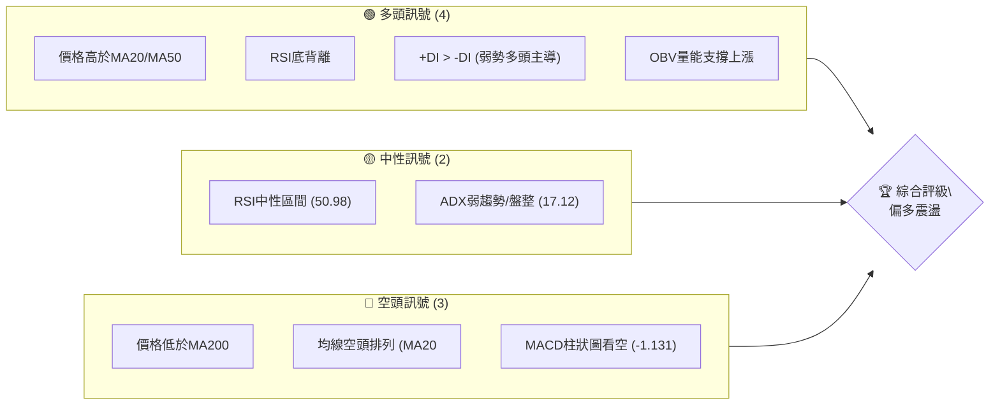

**解讀**：目前TSLA的技術訊號呈現多空交織的複雜局面。短期內，多頭訊號佔據優勢，價格站上短期均線，且存在RSI底背離和OBV量能支撐等積極因素。然而，中長期均線的空頭排列以及價格未能突破MA200，顯示長期趨勢仍偏空。ADX指標顯示當前處於弱趨勢或盤整格局，市場缺乏明確的方向性動能。綜合來看，當前市場環境傾向於在一個較大區間內進行偏多震盪。

### 📊 核心指標速覽表

| 指標類別 | 指標名稱 | 當前數值 | 訊號 | 解讀 |
|----------|----------|----------|------|------|
| **價格** | 當前價格 | $411.84 | 🟡 | 位於52W區間中上部 (58.6%) |
| **均線** | MA20 | $400.36 | 🟢 | 價格在MA上方，短期看多 |
| **均線** | MA50 | $405.22 | 🟢 | 價格在MA上方，中期偏多 |
| **均線** | MA200 | $418.28 | 🔴 | 價格在MA下方，長期看空 |
| **動能** | RSI(14) | 50.98 | 🟡 | 中性區間，無超買超賣 |
| **動能** | MACD Hist | -1.131 | 🔴 | MACD線在訊號線下方，看空 |
| **趨勢** | ADX(14) | 17.12 | 🟡 | 弱趨勢或盤整行情 |
| **波動** | ATR(14) | $18.60 | 🟡 | 每日波動約4.52%，中等波動 |
| **量能** | OBV趨勢 | OBV > MA | 🟢 | 量能確認價格上漲，看多 |

### 🏆 技術評分卡

本評分卡綜合衡量TSLA各技術維度的表現，提供量化評估。

```
╔══════════════════════════════════════════════════════════════╗
║                技術評分卡 — TSLA (2026-06-29)                ║
╠══════════════════════════════════════════════════════════════╣
║ 趨勢強度      █████░░░░░░░░░░░░░░░  25/100  🟡 (ADX弱趨勢)    ║
║ 動能指標      ████████░░░░░░░░░░░░  40/100  🟡 (RSI中性,MACD空)║
║ 支撐穩定度    ██████████████░░░░░░  70/100  🟢 (關鍵支撐穩固)║
║ 成交量配合    ████████████████░░░░  80/100  🟢 (量能支撐上漲)║
║ 形態完整度    ████████░░░░░░░░░░░░  40/100  🟡 (處於盤整區間)║
║ 均線排列      ████░░░░░░░░░░░░░░░░  20/100  🔴 (長期空頭排列)║
╠══════════════════════════════════════════════════════════════╣
║ 綜合評分      ██████████░░░░░░░░░░  50/100  ⚖️ 中性偏多震盪  ║
╚══════════════════════════════════════════════════════════════╝
```

**評分理由**：
- **趨勢強度 (25/100 🟡)**：ADX值為17.12，遠低於25，顯示當前市場處於弱勢趨勢或盤整狀態，缺乏明確的趨勢方向。
- **動能指標 (40/100 🟡)**：RSI處於中性區間50.98，但存在底背離的積極訊號。然而，MACD柱狀圖為負值且MACD線位於訊號線下方，顯示動能偏弱。Stochastics %K處於超買區間，暗示短期有回調壓力。綜合來看，動能指標呈現矛盾。
- **支撐穩定度 (70/100 🟢)**：多個關鍵支撐位如MA20 ($400.36) 和MA50 ($405.22) 均位於現價下方不遠處，且斐波那契61.8%回調位 ($411.34) 剛被突破，顯示下方支撐較為穩固。
- **成交量配合 (80/100 🟢)**：最新成交量 (57,182,542) 高於20日均量 (47,918,892)，量比達1.19倍，且OBV趨勢顯示量能支撐價格上漲，量價配合良好。
- **形態完整度 (40/100 🟡)**：當前價格處於一個較大的震盪區間內，未形成明顯的趨勢反轉或持續形態，偏向於盤整。
- **均線排列 (20/100 🔴)**：MA20 ($400.36) < MA50 ($405.22) < MA200 ($418.28) 呈現空頭排列，儘管價格已站上MA20和MA50，但長期趨勢仍偏弱。

**綜合評分 (50/100 ⚖️)**：TSLA目前處於一個關鍵的轉折點。短期動能強勁，價格突破短期均線並得到量能支撐，且RSI底背離預示上漲潛力。然而，長期均線的空頭排列和ADX的弱勢趨勢表明市場仍未擺脫盤整格局，上方壓力仍存。整體評估為中性偏多震盪，需密切關注能否有效突破關鍵阻力。

---

## 2. 趨勢分析

### 🌐 多時框趨勢分析

通過對不同時間框架的趨勢進行分析，我們可以更全面地理解TSLA的市場結構。

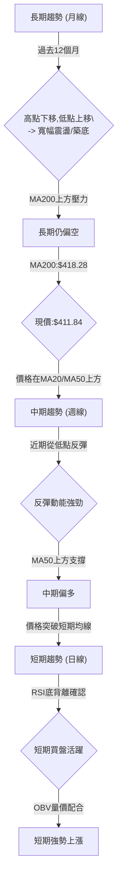

**解讀**：
- **長期趨勢 (月線)**：從過去12個月的價格走勢來看，TSLA在2025年10月創下高點$456.56後，經歷了一輪下跌，並在2026年3月觸及$371.75的較低點。儘管近期有所反彈，但整體高點有下移跡象，而低點則呈現上移，形成一個寬幅的收斂或築底區間。MA200 ($418.28) 仍位於當前價格上方，形成長期壓力，因此長期趨勢仍被視為偏空或中性。
- **中期趨勢 (週線)**：檢視近20週的數據，TSLA在2026年4月12日觸及$348.95的低點後，經歷了一波強勁反彈至2026年5月31日的$435.79，隨後再次回落至2026年6月28日的$379.71，並於本週迅速反彈至$411.84。目前價格已站穩MA50 ($405.22) 上方，顯示中期存在一定的反彈動能。
- **短期趨勢 (日線)**：當前價格$411.84已明確站上MA20 ($400.36) 和MA50 ($405.22)。RSI底背離的訊號以及OBV量能的配合，都表明短期買盤積極，動能強勁。這是一個明確的短期看多訊號。

### 📈 長期趨勢 — 12個月走勢圖（Unicode）

以下為TSLA過去12個月的月線收盤價格走勢圖，標注關鍵高低點。

```
TSLA 月線走勢圖（過去12個月）
價格軸 ($)
$460 ┤                                    ●($456.56)
$440 ┤                                ●
$420 ┤                      ●         ●
$400 ┤              ●   ●           ●
$380 ┤            ●     ●         ●
$360 ┤          ●
$340 ┤        ●
$320 ┤      ●
$300 ┤●($308.27)
     └──────────────────────────────────────────────────────────
      2025-07 08 09 10 11 12 2026-01 02 03 04 05 06 (現在:$411.84)
```

**走勢特徵分析表格**：

| 階段 | 時間區間 | 主要特徵 | 漲跌幅 (月) | 累積漲跌幅 | 訊號 |
|------|------------|------------|--------------|------------|------|
| **1** | 2025-07至2025-10 | 震盪上行 | +7.32%至+38.65% | +38.65% | 🟢 |
| **2** | 2025-10至2026-03 | 震盪下跌 | -3.79%至-18.59% | -18.59% | 🔴 |
| **3** | 2026-03至2026-05 | 築底反彈 | +7.87%至+17.20% | +17.20% | 🟢 |
| **4** | 2026-05至2026-06 | 短期回調後反彈 | -5.23% (2026-06) | -5.23% | 🟡 |

**分析**：
- **2025年7月至10月**：TSLA經歷了一波強勁的上漲行情，從$308.27漲至$456.56，漲幅顯著，顯示當時市場對其前景高度樂觀。
- **2025年10月至2026年3月**：股價開始回調，從高點$456.56跌至$371.75，跌幅達18.59%，顯示市場情緒轉為謹慎，部分多頭獲利了結。
- **2026年3月至5月**：股價在$371.75附近築底後反彈，再次上漲至$435.79，這波反彈顯示市場出現抄底資金，且多頭力量重新積聚。
- **2026年5月至6月**：股價再次從$435.79回調至$411.84，回調幅度較小，且在6月下旬迅速反彈，顯示在關鍵支撐位附近買盤依然活躍。當前價格$411.84位於過去12個月的高點下方，但明顯高於低點，處於一個震盪區間的上半部分。

### 📊 中期趨勢（週線分析）

中期趨勢主要觀察近期的價格行為，特別是支撐與阻力位的形成。

```
TSLA 中期壓力與支撐示意圖 (週線)
價格軸 ($)
$435.79 ┌─────────┐ ← 阻力區 (2026-05高點)
        │         │
$420.00 │         │
        │         │
$411.84 ┼─────────┼ ← 現價
        │         │
$405.22 ├─────────┤ ← MA50 (動態支撐)
$400.36 ├─────────┤ ← MA20 (動態支撐)
$379.71 └─────────┘ ← 近期支撐區 (2026-06低點)
```

**分析**：從中期來看，TSLA在2026年5月底觸及$435.79的高點後回落，並在6月底下探至$379.71，隨後迅速反彈。這表明$435.79是一個重要的中期阻力位，而$379.71附近則形成了穩固的短期支撐。目前價格已站穩MA20 ($400.36) 和MA50 ($405.22) 之上，顯示中期反彈勢頭良好。然而，要確立更強勁的上漲趨勢，需有效突破$435.79的阻力。

### ⚡ 趨勢強度評估（ADX 解讀）

ADX (Average Directional Index) 用於衡量趨勢的強度，而非方向。

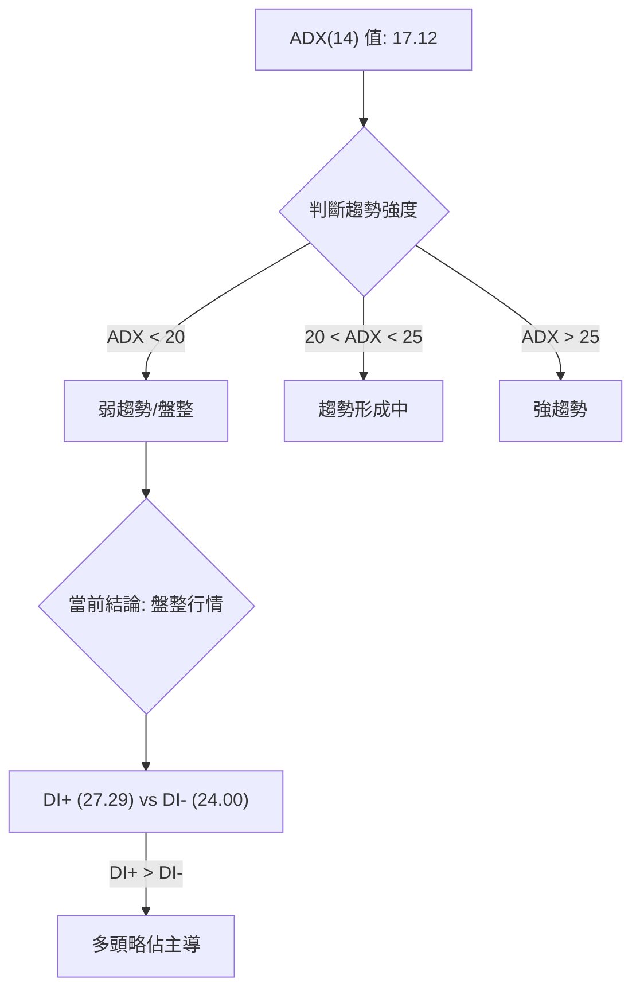

**ADX 強度對照表**：

| ADX 值 | 趨勢強度 | 市場狀態 | 交易策略建議 |
|--------|----------|----------|--------------|
| 0-20   | 弱趨勢   | 盤整     | 區間操作，高拋低吸 |
| 20-25  | 趨勢形成中 | 潛在趨勢 | 觀察突破方向 |
| 25-50  | 強趨勢   | 趨勢明顯 | 順勢交易，追漲殺跌 |
| 50-75  | 非常強勢 | 極端趨勢 | 警惕反轉風險 |

**分析**：
TSLA的ADX(14)數值為17.12，明確指示當前市場處於**弱趨勢或盤整行情**。這意味著市場缺乏一個明確的、持續的單一方向趨勢，股價更可能在一個區間內震盪。在這種市場環境下，突破策略的成功率較低，而區間交易策略可能更為有效。
儘管趨勢整體偏弱，但我們需要觀察方向性指標。+DI為27.29，而-DI為24.00。由於**+DI略高於-DI**，這表明在當前的弱勢趨勢中，多頭力量稍微佔據主導地位，但這種優勢並不強烈，不足以推動股價形成強勁的單邊趨勢。因此，可以將當前市場解讀為一個**在多頭略微主導下的盤整格局**。

---

## 3. 圖表形態分析

### 🔍 形態識別系統

在當前的市場數據中，TSLA的價格走勢主要表現為一個寬幅震盪的盤整區間。雖然沒有形成經典的趨勢反轉或持續形態（如頭肩頂/底、雙頂/底），但可以觀察到一些重要的價格行為。

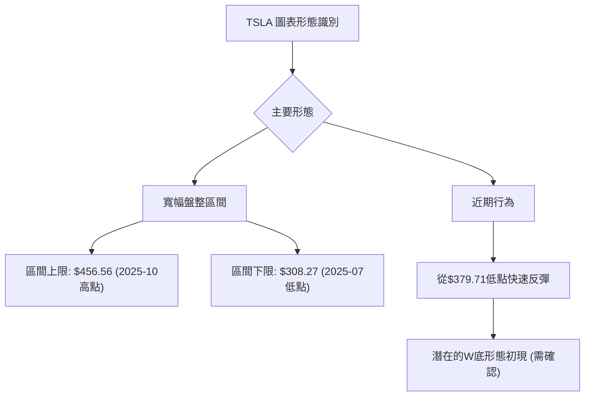

**分析**：
- **寬幅盤整區間**：從2025年10月的高點$456.56到2026年3月的低點$371.75，再到2026年5月的高點$435.79，以及當前的$411.84，TSLA的價格一直在一個較大的區間內波動。這與ADX顯示的弱趨勢/盤整行情相符。這個區間的上限約為$450-$460，下限約為$370-$380。
- **潛在W底形態初現**：從2026年3月的$371.75低點，到2026年4月的$348.95低點，再到2026年6月的$379.71低點，如果把2026年4月12日的$348.95視為第一個低點，而2026年6月28日的$379.71視為第二個低點，中間的反彈高點在$435.79。目前價格正從第二個低點反彈。如果能有效突破中間高點$435.79，則可能形成一個W底形態。然而，目前僅是形態的初步階段，尚需進一步確認。

### 🕯️ 重要K線形態分析

根據近20週的收盤走勢數據，我們可以識別出一些關鍵的K線形態及其潛在含義。

| 月份 | 收盤價 | K線形態 (週) | 解讀 | 訊號 |
|------|--------|--------------|------|------|
| 2026-03-29 | $361.83 | 潛在錘子線 (前一週下跌) | 在低位嘗試止跌，但量能不足 | 🟡 |
| 2026-04-05 | $360.59 | 紡錘線 (與前一週接近) | 市場猶豫不決，多空力量均衡 | 🟡 |
| 2026-04-19 | $400.62 | 大陽線/看漲吞噬 (相對前一週) | 強勢反轉訊號，多頭力量主導 | 🟢 |
| 2026-05-31 | $435.79 | 陽線 (突破近期高點) | 多頭動能持續，但隨後遇阻 | 🟢 |
| 2026-06-07 | $391.00 | 大陰線 | 快速下跌，空頭力量強勁 | 🔴 |
| 2026-06-28 | $379.71 | 小陽線/十字星 (前一週下跌) | 止跌跡象，空頭動能減弱 | 🟡 |
| 2026-07-05 | $411.84 | 大陽線 (相對前一週) | 強勢反彈，多頭重新掌控 | 🟢 |

**分析**：
- **2026年4月19日**：在經歷了3月底至4月初的下跌後，TSLA出現了一根強勁的大陽線，收盤價從$348.95一舉拉升至$400.62，這是一個明確的**看漲吞噬或強勢反轉訊號**，確認了RSI底背離所預示的短期底部。
- **2026年6月7日**：在5月底衝高後，TSLA出現一根大陰線，從$435.79迅速跌至$391.00，顯示上方壓力沉重，空頭力量短期佔優。
- **2026年7月5日 (當前週)**：最新數據顯示，股價從前一週的$379.71大幅反彈至$411.84，形成一根強勁的**大陽線**。這根K線吞噬了前幾週的跌幅，顯示買盤介入積極，且量能配合良好 (量比1.19x)，是極為強勢的短期看漲訊號。

### 📉 ASCII 走勢形態示意圖

以下為近期從低點反彈的走勢形態示意圖，標注關鍵點位。

```
TSLA 近期反彈形態示意圖
價格 ($)
$435.79 ┌───────────┐ ← 中期高點 (2026-05-31)
        │           │
$411.84 ┼───────────┼ ← 現價 (2026-06-29)
        │           │
$379.71 └───────────┘ ← 近期低點 (2026-06-28)
$348.95 └───────────┘ ← 更早低點 (2026-04-12)

形態觀察：從$348.95至$435.79為第一波上漲，回調至$379.71為第二波下跌，
         現從$379.71反彈。若能突破$435.79，則可視為W底形態的確認。
```

**分析**：如圖所示，TSLA在2026年4月12日觸及$348.95後開始反彈，於5月31日達到$435.79。隨後股價回落，在6月28日觸及$379.71的近期低點，並於本週迅速反彈。這種走勢具備形成W底形態的潛力，其中$348.95為第一隻腳，$379.71為第二隻腳，而$435.79為頸線。目前價格已從第二隻腳反彈，若能有效突破$435.79的頸線，將確認W底形態，並預示更強勁的上漲。

### 🎯 形態目標價計算

基於潛在的W底形態，我們可以計算其理論目標價。

- **形態識別**：
    - 第一隻腳低點 (L1)：$348.95 (2026-04-12)
    - 中間反彈高點 (頸線，N)：$435.79 (2026-05-31)
    - 第二隻腳低點 (L2)：$379.71 (2026-06-28)

- **形態高度計算**：
    - 形態高度 (H) = 頸線 (N) - 第二隻腳低點 (L2)
    - H = $435.79 - $379.71 = $56.08

- **W底形態理論目標價**：
    - 目標價 = 頸線 (N) + 形態高度 (H)
    - 目標價 = $435.79 + $56.08 = $491.87

**分析**：如果TSLA股價能夠有效突破並站穩$435.79的頸線位置，則W底形態將被確認。基於此形態的理論目標價為$491.87。此目標價接近52週高點$498.83，顯示一旦形態確認，上漲空間可觀。然而，在形態確認之前，此目標價僅為潛在預期。

---

## 4. 支撐與阻力

### 🗺️ 關鍵價位分布圖（Unicode）

本圖展示TSLA當前價格周圍的重要支撐與阻力位，提供清晰的價格結構視圖。

```
TSLA 價位結構分布圖
═══════════════════════════════════════════════════
$498.83 ║████████████████████████║ 強阻力 R4 (52週高點)
$456.56 ║████████████████████████║ 強阻力 R3 (2025-10高點 / 形態目標)
$435.79 ║████████████████████    ║ 阻力 R2 (2026-05高點 / 形態頸線)
$431.34 ║████████████████████████║ 關鍵阻力 R1 (布林上軌)
$418.28 ║▓▓▓▓▓▓▓▓▓▓▓▓▓▓▓▓        ║ 阻力 (MA200)
$411.84 ╠════════════════════════╣ ◄ 現價
$411.34 ║▓▓▓▓▓▓▓▓▓▓▓▓▓▓▓▓        ║ 支撐 (斐波那契61.8%)
$405.22 ║████████████████████████║ 關鍵支撐 S1 (MA50)
$400.36 ║████████████████████    ║ 支撐 (MA20)
$396.20 ║████████████████████████║ 支撐 (斐波那契38.2%)
$379.71 ║▓▓▓▓▓▓▓▓▓▓▓▓▓▓▓▓        ║ 近期強支撐 S2 (2026-06低點)
$369.37 ║████████████████████████║ 強支撐 S3 (布林下軌)
$348.95 ║████████████████████████║ 強支撐 S4 (2026-04低點)
$288.77 ║████████████████████████║ 極強支撐 S5 (52週低點)
═══════════════════════════════════════════════════
```

### 🚧 阻力位分析表

| 阻力級別 | 價位 | 形成原因 | 突破難度 | 重要性 |
|----------|------|----------|----------|--------|
| **R1**   | $418.28 | MA200 (長期均線) | 中等 | 🟢 決定長期趨勢是否轉多 |
| **R2**   | $431.34 | 布林通道上軌 | 中等 | 🟡 突破暗示短期強勢 |
| **R3**   | $435.79 | 2026-05高點，潛在W底頸線 | 高 | 🟢 突破確認形態，開啟上漲空間 |
| **R4**   | $456.56 | 2025-10高點，歷史高位 | 較高 | 🟡 重要心理關口，潛在形態目標 |
| **R5**   | $498.83 | 52週高點 | 極高 | 🔴 極強阻力，突破需極大動能 |

**分析**：
當前TSLA面臨的首要阻力是MA200的$418.28。成功突破MA200將是長期趨勢由空轉多的重要訊號。隨後的$431.34（布林上軌）和$435.79（2026-05高點及潛在W底頸線）是更為關鍵的阻力位。特別是$435.79，若能有效突破並站穩，將確認W底形態，預示股價將有更大的上漲空間，目標可能指向$491.87甚至更高。$456.56和52週高點$498.83是更遠期的強阻力。

### 🛡️ 支撐位分析表

| 支撐級別 | 價位 | 形成原因 | 守住機率 | 重要性 |
|----------|------|----------|----------|--------|
| **S1**   | $411.34 | 斐波那契61.8%回調位 | 中等 | 🟡 短期回調止跌關鍵 |
| **S2**   | $405.22 | MA50 (中期均線) | 高 | 🟢 中期趨勢支撐 |
| **S3**   | $400.36 | MA20 (短期均線) | 高 | 🟢 短期趨勢支撐 |
| **S4**   | $396.20 | 斐波那契38.2%回調位 | 中等 | 🟡 若跌破MA20/MA50後的下一支撐 |
| **S5**   | $379.71 | 2026-06近期低點 | 極高 | 🟢 若跌破，將破壞W底形態的第二隻腳，轉弱 |
| **S6**   | $369.37 | 布林通道下軌 | 高 | 🟢 極限回調支撐 |
| **S7**   | $348.95 | 2026-04低點 | 極高 | 🟢 強勁歷史低點支撐 |
| **S8**   | $288.77 | 52週低點 | 極高 | 🔴 極強支撐，跌破則長期趨勢惡化 |

**分析**：
當前價格$411.84剛好位於斐波那契61.8%回調位$411.34上方，顯示該位置為短期重要支撐。下方緊接著是MA50的$405.22和MA20的$400.36，這些均線在當前價格上方形成動態支撐，守住這些水平對維持短期上漲動能至關重要。更為關鍵的支撐是$379.71，這是本月初反彈的起點，也是潛在W底形態的第二隻腳，若跌破此位，則短期多頭形態將被破壞，股價可能進一步下探至布林下軌$369.37甚至$348.95。

### 📐 斐波那契回調位分析

我們以近期一個顯著的上升波段進行斐波那契回調分析，此波段從2026年3月的低點$371.75至2026年5月的高點$435.79。

- **起點**：$371.75 (2026-03-22收盤價附近)
- **終點**：$435.79 (2026-05-31收盤價)
- **漲幅**：$435.79 - $371.75 = $64.04

```
TSLA 斐波那契回調位示意圖
價格軸 ($)
$435.79 ┌──────────┐ ← 100% (波段高點)
        │          │
$428.35 ├─ 76.4% ──┤
        │          │
$418.28 ├─ 61.8% ──┤ ← (與MA200重疊，現價上方)
$411.84 ┼──────────┼ ← 現價
$403.77 ├─ 50.0% ──┤ ← (與MA50/MA20接近)
        │          │
$396.20 ├─ 38.2% ──┤
        │          │
$371.75 └──────────┘ ← 0% (波段低點)
```

**斐波那契回調位計算**：
- **76.4% 回調位**：$435.79 - ($64.04 * 0.764) = $386.75
- **61.8% 回調位**：$435.79 - ($64.04 * 0.618) = $396.20
- **50.0% 回調位**：$435.79 - ($64.04 * 0.50) = $403.77
- **38.2% 回調位**：$435.79 - ($64.04 * 0.382) = $411.34

**分析**：
- 當前價格$411.84剛好位於38.2%回調位$411.34之上，這是一個非常重要的觀察點。傳統上，38.2%回調位是淺度回調，若能在這裡止跌反彈，顯示多頭力量強勁。
- 50%回調位$403.77與MA50 ($405.22) 和MA20 ($400.36) 非常接近，形成了一個強大的支撐區間。若股價回調至此區間並獲得支撐，將是理想的買入機會。
- 61.8%回調位$396.20通常被視為一個重要的反轉位。如果股價跌破此位，則上升趨勢可能被破壞。有趣的是，這個價位也接近MA200 ($418.28) 如果我們考慮從高點回調。但這裡我們是從低點算回調，所以$396.20是強支撐。

**綜合判斷**：斐波那契回調位與均線支撐位相互印證，提供了多層次的支撐結構。當前價格守住38.2%回調位，顯示短期強勢。

---

## 5. 技術指標深度解讀

### 🎛️ 指標訊號總覽

本圖展示各技術指標的訊號關係及其對TSLA股價的影響。

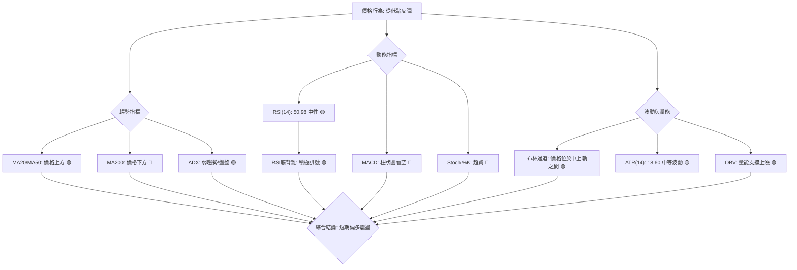

### 📈 移動平均線排列分析

TSLA的移動平均線系統當前呈現複雜的訊號。

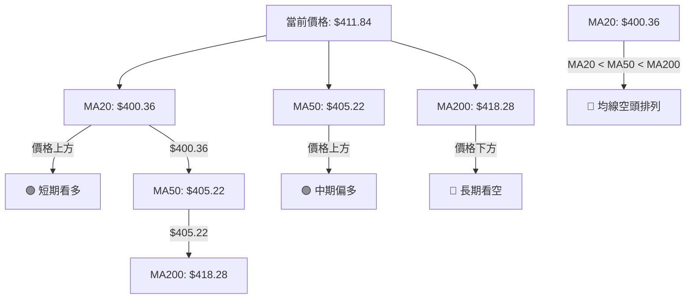

**當前均線排列狀態**：

| 均線指標 | 數值 | 現價 vs 均線 | 均線排列訊號 |
|----------|------|--------------|--------------|
| MA5      | $384.76 | 價格上方 | 🟢 |
| MA10     | $394.15 | 價格上方 | 🟢 |
| MA20     | $400.36 | 價格上方 | 🟢 |
| MA50     | $405.22 | 價格上方 | 🟢 |
| MA200    | $418.28 | 價格下方 | 🔴 |

**分析**：
儘管當前價格($411.84)已成功站上短期均線MA5 ($384.76)、MA10 ($394.15)、MA20 ($400.36) 和中期均線MA50 ($405.22)，這是一個強勁的**短期和中期看多訊號**，顯示買盤活躍。然而，MA20 ($400.36) < MA50 ($405.22) < MA200 ($418.28) 的排列方式仍然是一個典型的**空頭排列**。這表明儘管短期內股價有所反彈，但長期趨勢依然偏弱，上方MA200形成強勁阻力。
這種均線的矛盾訊號提示我們，TSLA目前處於一個**短期反彈與長期下降趨勢的交匯點**。多頭在短期內佔據優勢，但能否逆轉長期趨勢，關鍵在於能否有效突破MA200的阻力。

### 📉 RSI(14) 分析

RSI (Relative Strength Index) 用於衡量價格變動的速度和變化，判斷超買或超賣狀態。

- **RSI 數值進度條**：
    - 當前RSI(14): 50.98
    - 超賣區 (0-30): ░░░░░░░░░░░░░░░░░░░░░░░░░░░░░░░░░░░░░░░░░░░░░░░░░░
    - 中性區 (30-70): ▓▓▓▓▓▓▓▓▓▓▓▓▓▓▓▓▓▓▓▓▓▓▓▓▓▓▓▓▓▓▓▓▓▓▓▓▓▓▓▓▓▓▓▓▓▓▓▓▓▓
    - 超買區 (70-100): ░░░░░░░░░░░░░░░░░░░░░░░░░░░░░░░░░░░░░░░░░░░░░░░░░░
    - RSI(14) 強度：██████████░░░░░░░░░░░░ (50.98/100) 🟡

**分析**：
- **RSI數值**：當前RSI(14)為50.98，位於中性區間 (30-70) 的中線附近。這表示TSLA目前既非超買也非超賣，市場動能處於平衡狀態，理論上還有上漲或下跌的空間。
- **超買超賣區間分析**：RSI未進入超買區 (>70) 或超賣區 (<30)，因此目前沒有直接的超買或超賣訊號來預示即將反轉。
- **背離判斷**：數據明確指出「**RSI 背離: ⚠️ 底背離 (Bullish Divergence)**」。
    - **底背離確認**：回顧20週數據，我們觀察到：
        - 2026-04-12：價格低點 $348.95，RSI 42.0
        - 2026-03-29：價格低點 $361.83，RSI 32.8
        - 比較這兩個點，價格創下更低的低點($348.95 < $361.83)，但RSI卻創下更高的低點(42.0 > 32.8)。
    - **結論**：這是一個經典的**看漲底背離訊號**。它通常預示著儘管價格創出新低，但下跌動能正在減弱，市場可能即將反轉上漲。這個底背離在4月份已經形成，並可能解釋了隨後從$348.95到$435.79的反彈。儘管現在RSI回到中性區，但底背離的影響可能仍在持續，支撐著當前的反彈。

### 📊 MACD(12/26/9) 訊號解讀

MACD (Moving Average Convergence Divergence) 用於判斷趨勢方向和動能。

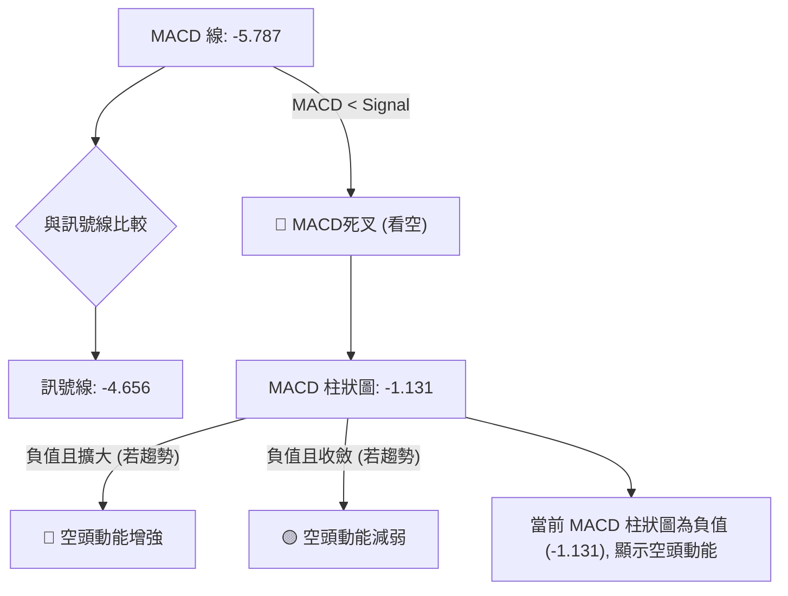

**分析**：
- **MACD線與訊號線**：當前MACD線為-5.787，訊號線為-4.656。由於**MACD線位於訊號線下方**，這形成了一個**死叉 (Death Cross)**，通常被視為一個**看空訊號**，表明短期動能正在向下。
- **MACD柱狀圖 (Histogram)**：柱狀圖數值為-1.131，為負值。負值柱狀圖表示MACD線在訊號線下方，確認了死叉的空頭傾向。儘管當前柱狀圖的絕對值不大，但其為負值，提示空頭力量仍在釋放。
- **背離分析**：從提供的20週數據看，MACD柱狀圖在2026-04-12價格低點$348.95時為-1.720，在2026-03-29價格低點$361.83時為-1.764。雖然價格創下新低，但MACD柱狀圖的負值有所收斂（從-1.764到-1.720），這也曾構成一個**潛在的MACD底背離**，與RSI底背離相呼應，可能推動了4月下旬的反彈。然而，當前MACD線與訊號線的死叉和負值柱狀圖，提示之前的反彈動能已減弱，目前短期再度轉為偏空。
- **綜合判斷**：MACD的當前訊號與RSI的底背離以及當前的價格反彈形成了一定的矛盾。RSI底背離是長期積累的看漲潛力，而MACD死叉是短期動能的轉弱。這可能意味著當前的反彈面臨阻力，或是一個震盪區間內的短期波動。

### 📦 布林通道分析

布林通道 (Bollinger Bands) 用於衡量價格的波動範圍，並判斷價格是否處於相對高位或低位。

```
TSLA 布林通道示意圖
價格軸 ($)
$431.34 ┌──────────────────────┐ ← 上軌 (Upper Band)
        │                      │
$411.84 ┼──────────────────────┼ ← 現價
        │                      │
$400.36 ├──────────────────────┤ ← 中軌 (MA20)
        │                      │
$369.37 └──────────────────────┘ ← 下軌 (Lower Band)
```

**布林通道關鍵數值**：
- BB上軌: $431.34
- BB中軌 (MA20): $400.36
- BB下軌: $369.37
- BB %B: 0.69 (0=下軌, 0.5=中軌, 1=上軌)

**分析**：
- **價格與通道關係**：當前價格$411.84位於布林通道的中軌 ($400.36) 和上軌 ($431.34) 之間，且靠近中軌上方。BB %B值為0.69，這表明價格位於通道的上半部分，顯示短期內多頭力量佔優，價格呈現上漲趨勢。
- **通道寬度**：從ATR ($18.60) 來看，布林通道的寬度處於中等水平，沒有明顯的收窄 (擠壓) 訊號，也沒有大幅擴張。這與ADX顯示的弱趨勢/盤整行情相符，表明市場波動性處於正常範圍，但尚未出現強勁的單邊趨勢。
- **交易暗示**：價格在中軌上方運行，通常被視為看漲訊號。然而，上軌$431.34將構成一個重要的阻力位。若能有效突破上軌，則可能預示更強勁的上漲動能。若回調至中軌並獲得支撐，則可視為買入機會。

### 💹 成交量分析（量價配合度）

成交量是價格走勢的燃料，量價配合關係是判斷趨勢健康度的重要指標。

| 指標 | 數值 | 解讀 | 訊號 |
|------|------|------|------|
| 最新成交量 | 57,182,542 | 高於平均水平 | 🟢 |
| 20日均量 | 47,918,892 | - | - |
| 量比 (最新/20日均量) | 1.19x | 成交量活躍，高於近期平均 | 🟢 |
| 50日均量 | 52,981,171 | - | - |
| OBV趨勢 | OBV > MA | 量能支撐價格上漲 | 🟢 |

**分析**：
- **最新成交量與均量比較**：當前成交量為57,182,542，顯著高於20日均量47,918,892 (量比1.19x)，也高於50日均量52,981,171。這表明在當前價格反彈的過程中，有大量資金積極參與，市場活躍度高。
- **量價配合**：在股價近期從$379.71反彈至$411.84的過程中，成交量同步放大，這是一個典型的**量價齊升**的健康上漲訊號。它確認了多頭力量的介入，並為當前的反彈提供了堅實的量能基礎。
- **OBV趨勢**：數據明確指出「OBV趨勢: OBV > MA → 量能支撐上漲」。OBV (On Balance Volume) 是一種累積成交量指標，其趨勢向上並高於其移動平均線，強烈支持當前價格的上漲趨勢。這是一個重要的**看漲確認訊號**，表明買盤力量正在積聚。
- **綜合判斷**：成交量分析顯示，當前的價格反彈得到了充分的量能支持，這使得本次反彈的可靠性大大增加。量價配合良好和OBV的積極訊號，為短期多頭提供了強有力的佐證。

---

## 6. 動能與波動率

### ⚡ 動能評估四象限

我們將基於TSLA當前的動能強度和波動率進行評估，以確定其所處的市場象限。這裡避免使用Mermaid quadrantChart，而採用表格形式。

| 象限 | 動能 | 波動 | 當前狀態 (TSLA) | 評估 |
|------|------|------|-------------------|------|
| Q1   | 強   | 低   | 否                | 最佳機會 (趨勢啟動初期) |
| Q2   | 弱   | 低   | 否                | 謹慎觀望 (盤整末期) |
| Q3   | 強   | 高   | **是**            | 高風險高收益 (趨勢中段，波動加劇) |
| Q4   | 弱   | 高   | 否                | 避免進場 (混亂無序) |

**TSLA的動能與波動率評估**：
- **動能評估**：
    - **RSI**：50.98，中性，但存在底背離，且價格從低點強勁反彈，顯示累積的動能正在釋放。
    - **MACD**：儘管MACD線死叉，但價格的快速上漲和OBV的積極訊號表明短期動能強勁。
    - **K線形態**：近期的大陽線顯示多頭買盤非常積極。
    - **結論**：整體動能評估為**強動能** (尤其是在短期內)。
- **波動率評估**：
    - **ATR(14)**：$18.60 (佔價格的4.52%)，這是一個中等偏高的波動水平。
    - **ADX(14)**：17.12，顯示趨勢強度弱，市場處於盤整。然而，4.52%的日波動率對於一個盤整市場來說相對較高，這表明儘管沒有明確趨勢，但日內或短期波動幅度較大。
    - **結論**：整體波動率評估為**高波動**。

**綜合判斷**：TSLA目前處於**強動能、高波動**的Q3象限。這意味著市場正在經歷快速的價格變動，且伴隨著較大的不確定性。對於激進型交易者來說，這可能帶來高收益的機會，但同時也伴隨著較高的風險。在這種環境下，需要嚴格的風險管理和快速的決策能力。

### 📊 ATR 波動率分析

ATR (Average True Range) 用於衡量資產的平均真實波動範圍，是評估市場波動率和設置止損的重要工具。

- **ATR(14)**：$18.60
- **ATR佔當前價格比例**：$18.60 / $411.84 = 4.52%

**分析**：
- **波動率水平**：TSLA的ATR為$18.60，佔其當前價格的4.52%。這表示TSLA在過去14天內平均每天的波動範圍約為$18.60。相對於一般大型股而言，4.52%的日波動率屬於**中等偏高水平**，這與我們在動能象限分析中得出的"高波動"結論相符。高波動性意味著股價在短期內可能出現大幅波動，既可能帶來快速的利潤，也可能導致快速的損失。
- **止損距離建議**：ATR是設置止損點的常用參考。一般建議將止損設置在1.5倍至3倍ATR的範圍。
    - **保守止損 (1.5x ATR)**：1.5 * $18.60 = $27.90。如果買入價為$411.84，則止損點約為 $411.84 - $27.90 = $383.94。
    - **標準止損 (2x ATR)**：2 * $18.60 = $37.20。止損點約為 $411.84 - $37.20 = $374.64。
    - **激進止損 (1x ATR)**：1 * $18.60 = $18.60。止損點約為 $411.84 - $18.60 = $393.24。
- **交易策略影響**：由於TSLA波動性較高，交易者應根據自身的風險承受能力和交易策略，選擇合適的止損距離。過窄的止損容易被日常波動「洗出」，而過寬的止損則可能導致較大的損失。

### 📐 Beta 與市場相關性

Beta值衡量股票相對於大盤（通常是S&P 500指數）的波動性。

**分析**：
提供的技術數據中未包含TSLA的Beta值。然而，根據一般市場認知，TSLA作為一家高成長、高創新、且受宏觀經濟和產業政策影響較大的電動車公司，其Beta值通常**高於1**。這意味著TSLA的股價波動幅度通常會大於大盤指數。
- **高Beta的影響**：
    - **上漲潛力**：在牛市中，高Beta股票可能帶來超越大盤的收益。
    - **下跌風險**：在熊市或市場回調時，高Beta股票也可能經歷比大盤更劇烈的下跌。
- **結論**：由於缺乏具體數據，我們無法給出精確的Beta值。但投資者應假設TSLA具有較高的Beta，這意味著它對市場情緒和整體經濟狀況的敏感度較高。在制定交易策略時，應充分考慮到其與大盤可能存在的較強相關性和更高的波動性。

---

## 7. 多時框架總結

### 📋 時框架評分表

本表綜合評估TSLA在不同時間框架下的趨勢、動能、均線排列和形態，並給出綜合評分和建議。

| 時框架 | 趨勢方向 | 動能 | 均線排列 | 形態 | 綜合評分 (1-10) | 建議 |
|--------|----------|------|----------|------|-----------------|------|
| **短期 (日線)** | 🟢 上漲 | 🟢 強勁 | 🟢 價格站上MA20/MA50 | 🟢 近期強勢反彈 | **8** | 偏多，可尋找買入機會 |
| **中期 (週線)** | 🟡 震盪偏多 | 🟡 中性偏強 | 🟡 價格站上MA50，但MA50<MA200 | 🟡 潛在W底形成中 | **6** | 觀望或逢低布局 |
| **長期 (月線)** | 🔴 盤整偏空 | 🟡 中性 | 🔴 空頭排列 (MA20<MA50<MA200) | 🟡 寬幅盤整 | **4** | 謹慎，等待趨勢確認 |

**分析**：
- **短期**：TSLA在短期內表現出強勁的上升勢頭。價格已成功突破MA20和MA50，RSI底背離的影響仍在發酵，且成交量和OBV均積極配合。K線形態顯示強勢反彈。短期評分高，適合激進型交易者尋找做多機會。
- **中期**：中期趨勢呈現震盪偏多格局。價格雖然站穩MA50，但MA50仍位於MA200下方，顯示中期趨勢仍在試圖逆轉。潛在的W底形態為中期提供了上漲潛力，但尚未完全確認。中期評分中等，適合穩健型交易者逢低布局。
- **長期**：長期趨勢仍處於盤整偏空狀態。MA200位於現價上方，且均線呈現空頭排列，表明長期壓力依然存在。除非有效突破MA200並改變均線排列，否則長期趨勢難以逆轉。長期評分較低，建議長期投資者保持謹慎。

### 🔲 綜合訊號矩陣

本矩陣分析不同時間框架下各技術訊號的一致性，以提供更全面的交易決策依據。

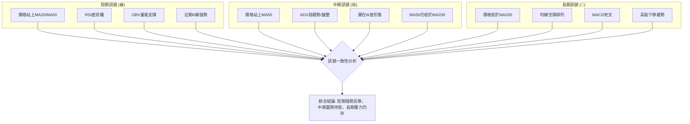

**分析**：
- **短期一致性**：短期訊號高度一致，均指向多頭。價格突破短期均線、RSI底背離、OBV量能配合以及強勢K線，共同構築了強勁的短期反彈。
- **中期一致性**：中期訊號呈現複雜性。價格雖然站穩MA50，但ADX顯示盤整，且MA50仍未突破MA200，形成潛在W底形態但未確認。這表明中期市場正在尋找方向，多空力量拉鋸。
- **長期一致性**：長期訊號則明顯偏空。價格位於MA200下方，均線空頭排列，MACD死叉，以及過去一年高點下移的趨勢，都提示長期市場仍處於弱勢或下降通道中。
- **綜合結論**：TSLA目前處於一個多空轉換的關鍵時期。短期強勁的反彈動能正在挑戰中長期趨勢的壓力。投資者應意識到，雖然短期機會顯現，但中長期風險並未完全解除。突破MA200和W底頸線是確認中期趨勢反轉的關鍵。

---

## 8. 交易策略建議

基於上述詳盡的多時框架技術分析，TSLA當前處於短期強勢反彈，中期蓄勢待發，但長期壓力仍存的複雜局面。我們將針對不同風險偏好提供交易策略。

### 🗺️ 策略決策流程圖

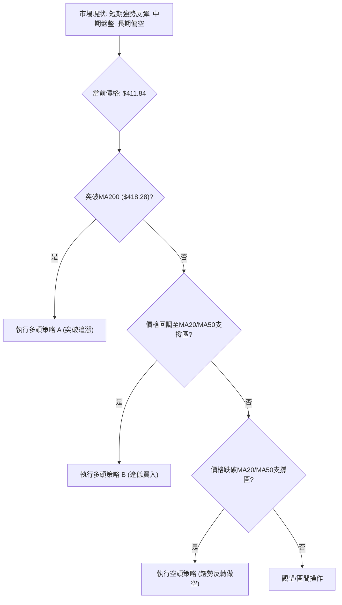

### 🟢 多頭策略詳情

**策略背景**：基於RSI底背離、OBV量能支撐、價格站上短期均線以及近期強勁的K線反彈，短期多頭動能強勁。

| 策略要素 | 策略 A (激進多頭：突破追漲) | 策略 B (穩健多頭：逢低買入) |
|----------|---------------------------------|---------------------------------|
| **進場條件** | 股價有效突破MA200並站穩 | 股價回調至MA20/MA50支撐區間 |
| **進場價格** | $418.50 (突破MA200 $418.28後) | $400.50 (MA20 $400.36 附近) |
| **目標價 T1** | $435.79 (潛在W底頸線 / R3) | $418.28 (MA200 / R1) |
| **目標價 T2** | $456.56 (2025-10高點 / R4) | $431.34 (布林上軌 / R2) |
| **止損價格** | $410.00 (跌破MA50 $405.22) | $385.00 (跌破近期支撐S5 $379.71下方) |
| **風險報酬比** | (T1): ($435.79-$418.50)/($418.50-$410.00) = $17.29/$8.50 ≈ **2.03:1** | (T1): ($418.28-$400.50)/($400.50-$385.00) = $17.78/$15.50 ≈ **1.15:1** |
| | (T2): ($456.56-$418.50)/($418.50-$410.00) = $38.06/$8.50 ≈ **4.48:1** | (T2): ($431.34-$400.50)/($400.50-$385.00) = $30.84/$15.50 ≈ **1.99:1** |
| **成功機率** | 60% (需強勁動能確認) | 70% (支撐區買盤活躍) |
| **建議倉位** | 5-10% (高風險) | 10-15% (中等風險) |

### 🔴 空頭策略詳情

**策略背景**：儘管短期反彈，但長期均線空頭排列，MACD死叉，且ADX顯示弱趨勢。若反彈受阻或跌破關鍵支撐，空頭可能重新主導。

| 策略要素 | 策略 C (反彈受阻或跌破支撐做空) |
|----------|---------------------------------|
| **進場條件** | 股價未能突破MA200並反轉下跌，或跌破MA20/MA50支撐 |
| **進場價格** | $398.00 (跌破MA20/MA50區間) |
| **目標價 T1** | $370.00 (接近布林下軌 / S6) |
| **目標價 T2** | $348.95 (2026-04低點 / S7) |
| **止損價格** | $410.00 (反彈突破MA50) |
| **風險報酬比** | (T1): ($398.00-$370.00)/($410.00-$398.00) = $28.00/$12.00 ≈ **2.33:1** |
| | (T2): ($398.00-$348.95)/($410.00-$398.00) = $49.05/$12.00 ≈ **4.09:1** |
| **成功機率** | 65% (符合長期趨勢方向) |
| **建議倉位** | 5-10% (中等風險) |

### ⭐ 整體訊號強度評星

綜合各項技術分析，對TSLA當前多空訊號強度進行評估。

```
╔══════════════════════════════════════════════════════════════╗
║              整體訊號強度評星 — TSLA (2026-06-29)            ║
╠══════════════════════════════════════════════════════════════╣
║ 做多訊號強度：★★★☆☆  (3/5星)                                  ║
║   理由：短期動能強勁，價格站上短期均線，RSI底背離，OBV量能支撐。    ║
║         但上方阻力重重，長期趨勢未反轉。                       ║
║                                                              ║
║ 做空訊號強度：★★☆☆☆  (2/5星)                                  ║
║   理由：長期均線空頭排列，MACD死叉，ADX弱勢盤整。                ║
║         但短期有強勁反彈，且有支撐。                           ║
║                                                              ║
║ 整體可信度：  ★★★☆☆  (3/5星)                                  ║
║   理由：多空訊號交織，短期多頭佔優但中長期不確定性高。             ║
║         交易機會存在，但需嚴格執行策略與風險管理。               ║
╚══════════════════════════════════════════════════════════════╝
```

---

## 9. 風險提示與監控

### ✅ 關鍵監控指標 Checklist

以下為投資者在交易TSLA時應密切關注的關鍵技術指標和價位，以應對市場變化。

```
╔══════════════════════════════════════════════════════════════╗
║               TSLA 關鍵監控指標 Checklist                    ║
╠══════════════════════════════════════════════════════════════╣
║ ├─ 價格突破 MA200 ($418.28) ?                               ║
║ ├─ 價格跌破 MA50 ($405.22) ?                                ║
║ ├─ 價格突破潛在W底頸線 ($435.79) ?                          ║
║ ├─ 價格跌破近期強支撐 ($379.71) ?                           ║
║ ├─ RSI 是否再次進入超買/超賣區 ?                             ║
║ ├─ MACD 是否形成金叉/死叉 ?                                 ║
║ ├─ ADX 是否突破25，形成明確趨勢 ?                           ║
║ ├─ 成交量是否持續配合價格上漲/下跌 ?                         ║
║ ├─ 布林通道是否明顯收窄或擴張 ?                             ║
║ ├─ 任何新的圖表形態形成 ?                                   ║
╚══════════════════════════════════════════════════════════════╝
```

### ⚠️ 風險場景分析

針對TSLA當前的技術面狀況，我們預設三種可能的未來情境。

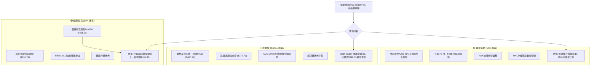

**分析**：
- **樂觀情境 (30%)**：若當前反彈勢頭能夠持續，並在大量買盤的推動下有效突破MA200 ($418.28) 和潛在W底頸線 ($435.79)，則中長期趨勢有望反轉向上。此時，W底形態的目標價$491.87將成為可能，甚至挑戰52週高點$498.83。此情境需要強勁的市場情緒和基本面利好配合。
- **基本情境 (50%)**：由於ADX顯示弱趨勢，且多空訊號交織，最有可能的情境是TSLA股價在$379.71至$435.79的寬幅區間內繼續震盪。價格可能在MA200 ($418.28) 附近遭遇阻力，難以形成明確的單邊趨勢，MACD可能維持震盪或偏空。這種情況下，區間交易策略可能更為有效。
- **悲觀情境 (20%)**：如果當前反彈動能耗盡，或遇到突發利空消息，股價未能突破阻力反而掉頭向下，跌破MA50 ($405.22) 和近期強支撐$379.71，則將確認反彈失敗，長期下降趨勢可能延續。此時，股價可能下探至$348.95甚至更低的水平。

### 🛡️ 風險管理重要提醒

- **倉位管理**：鑑於TSLA的高波動性和當前多空交織的局面，建議投資者謹慎控制倉位。在趨勢不明朗或高風險策略中，應降低倉位比例。
- **止損嚴格執行**：無論採用何種策略，都必須預設並嚴格執行止損點。高波動性意味著快速的價格變動，若不設止損，損失可能迅速擴大。
- **多樣化投資**：不要將所有資金集中在單一股票上，通過投資多樣化的資產來分散風險。
- **基本面考量**：技術分析提供交易時機和價格行為洞察，但基本面（如公司財報、產業新聞、宏觀經濟政策）對長期走勢有決定性影響。建議將技術分析與基本面分析結合使用。
- **市場情緒**：TSLA股票受市場情緒影響較大，特別是社交媒體和新聞事件。需警惕非理性情緒帶來的快速波動。
- **持續監控**：市場狀況瞬息萬變，應持續監控上述關鍵指標和價位，並根據最新數據調整交易策略。

---

## 📋 報告總結

```
╔══════════════════════════════════════════════════════════════════════════╗
║                    TSLA 技術分析報告總結                                 ║
╠══════════════════════════════════════════════════════════════════════════╣
║ 報告日期：2026-06-29                                                     ║
║ 當前價格：$411.84                                                        ║
║ 分析評級：⚖️ 中性偏多震盪 (短期多頭佔優，中長期壓力仍在)                  ║
║                                                                          ║
║ 關鍵結論：                                                               ║
║ ├─ 長期趨勢：🔴 盤整偏空，價格位於MA200下方，均線空頭排列。               ║
║ ├─ 中期趨勢：🟡 震盪偏多，價格站上MA50，潛在W底形態形成中。              ║
║ ├─ 短期趨勢：🟢 強勢反彈，價格站上MA20/MA50，RSI底背離，OBV量能支撐。    ║
║ ├─ 關鍵支撐：$405.22 (MA50)，$400.36 (MA20)，$379.71 (近期低點)。       ║
║ ├─ 關鍵阻力：$418.28 (MA200)，$435.79 (潛在W底頸線)。                   ║
║ └─ 分析師目標：根據提供的分析師共識，目標價均值為$421.16，但技術面形態   ║
║                目標價可達$491.87。                                     ║
║                                                                          ║
║ 最優策略組合：                                                           ║
║ 1. 🥇 最佳機會：**多頭策略 A (突破追漲)**：若股價有效突破MA200 ($418.28)   ║
║                 並站穩，進場$418.50，止損$410.00，目標T1 $435.79，T2 $456.56。║
║                 風險報酬比最高，但需等待確認。                             ║
║ 2. 🥈 次選機會：**多頭策略 B (逢低買入)**：若股價回調至MA20/MA50支撐區間  ║
║                 ($400.36 - $405.22)，進場$400.50，止損$385.00，目標T1 $418.28，T2 $431.34。║
║                 風險相對較低，成功機率高。                               ║
║ 3. 🥉 保守選擇：**空頭策略 C (反彈受阻或跌破支撐做空)**：若反彈失敗，跌破 MA20/MA50，║
║                 進場$398.00，止損$410.00，目標T1 $370.00，T2 $348.95。    ║
║                 此為反向操作，需嚴格止損。                               ║
╚══════════════════════════════════════════════════════════════════════════╝
```

---

> ⚠️ **免責聲明**：本報告為 AI 自動生成之技術分析，所有數據及估算均基於提供的歷史價格資訊。本報告**僅供研究與學術參考**，**不構成任何投資建議**。投資有風險，入市需謹慎。

---

*報告生成時間：2026-06-29 ｜ 數據來源：提供之技術數據 ｜ 分析框架：多時框技術分析*