<details>
<summary>📊 靜態圖表 (點擊展開)</summary>
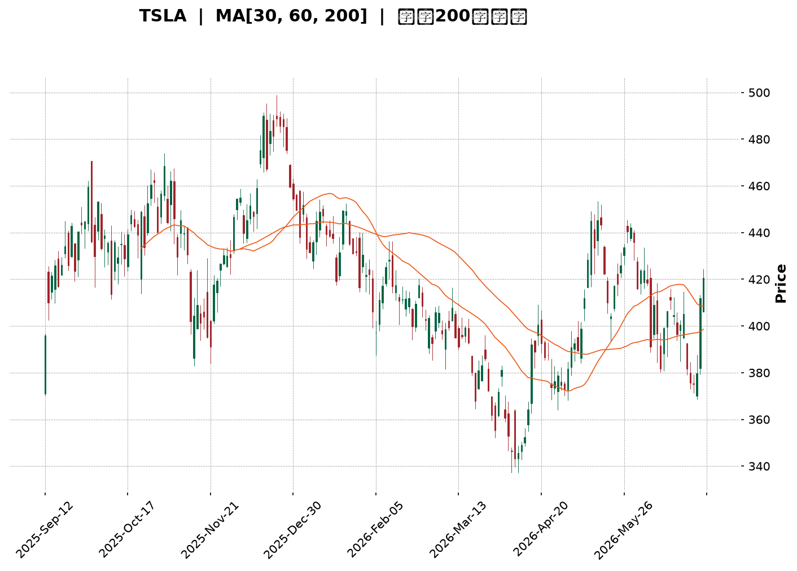
</details>

<html>
<head><meta charset="utf-8" /></head>
<body>
    <div style="height:500px; width:100%;">                        <script>window.PlotlyConfig = {MathJaxConfig: 'local'};</script>
        <script charset="utf-8" src="https://cdn.plot.ly/plotly-3.6.0.min.js" integrity="sha256-QaOVwtVY0T02VaHrr6pnoHLCwayMJp4O5n4YyaE3rJk=" crossorigin="anonymous"></script>                <div id="candlestick-chart" class="plotly-graph-div" style="height:100%; width:100%;"></div>            <script>                window.PLOTLYENV=window.PLOTLYENV || {};                                if (document.getElementById("candlestick-chart")) {                    Plotly.newPlot(                        "candlestick-chart",                        [{"close":{"dtype":"f8","bdata":"AAAAQAq\u002feEAAAADgo6B5QAAAAIDrWXpAAAAAgMKdekAAAACgmQ16QAAAAMAeoXpAAAAAIFwje0AAAACgmZ16QAAAAOCjrHtAAAAAgD12ekAAAABgZoZ7QAAAACBcs3tAAAAAIIXLe0AAAAAgXLd8QAAAAAAAQHtAAAAAoEfdekAAAAAAAFR8QAAAAKBwEXtAAAAAQApre0AAAADgozh7QAAAAADX13lAAAAAYGY+e0AAAAAA19N6QAAAAGBmMntAAAAAAADMekAAAADA9XR7QAAAAEDh9ntAAAAAoJmpe0AAAAAghW97QAAAACCuD3xAAAAAIIUbe0AAAABguEZ8QAAAAMDMyHxAAAAAACnYfEAAAACgmYF7QAAAAMD1iHxAAAAAgOtFfUAAAAAAKcR7QAAAAMAe4XxAAAAAYI\u002fee0AAAADgUdh6QAAAACCu03tAAAAAgOt5e0AAAACgmel6QAAAAADXH3lAAAAAoJlFeUAAAABguI55QAAAAAAAFHlAAAAAANc\u002feUAAAAAgrrN4QAAAAKBwcXhAAAAA4HocekAAAABgZjZ6QAAAAKBHqXpAAAAAYLjiekAAAACAPeJ6QAAAAADX03pAAAAAANfre0AAAADgemh8QAAAAAAAcHxAAAAAoEd5e0AAAABguNJ7QAAAAEAzN3xAAAAAgD3ue0AAAAAgXK98QAAAAMD1tH1AAAAAgBSefkAAAAAAKTR9QAAAAIDrNX5AAAAAQDMTfkAAAAAgrot+QAAAAMD1WH5AAAAAYGZWfkAAAABACrN9QAAAAIA9unxAAAAAQOFmfEAAAAAghRt8QAAAAMAeYXtAAAAAYLg6fEAAAAAgXA97QAAAAGCP9npAAAAAwMw8e0AAAAAAKdB7QAAAACBcD3xAAAAAQDPze0AAAABAM3N7QAAAAMAeaXtAAAAAAABYe0AAAAAAADR6QAAAAEAK93pAAAAAgMIVfEAAAADA9RB8QAAAAEAzM3tAAAAAYGbuekAAAAAgXPd6QAAAAMD1CHpAAAAAYI\u002fmekAAAADA9Vx6QAAAACBcX3pAAAAAAClgeUAAAAAgXNN4QAAAAIDCsXlAAAAAwB4VekAAAAAgXJN6QAAAAOBRxHpAAAAAwB4RekAAAABAChd6QAAAAIAUqnlAAAAAwB61eUAAAAAgXLt5QAAAAMAevXlAAAAAoEf9eEAAAACAFJZ5QAAAAGBmFnpAAAAAoEeJeUAAAAAAKSh5QAAAAMAeNXlAAAAAQOGGeEAAAABACl95QAAAAMDMWHlAAAAAIK7LeEAAAABA4ep4QAAAAADX83hAAAAAwB59eUAAAAAAKbB4QAAAAEAzc3hAAAAAwPW4eEAAAADgUfR4QAAAAOB6jHhAAAAAwMzEd0AAAAAgXP92QAAAAKCZzXdAAAAA4Hrwd0AAAABAMx94QAAAAIDCQXdAAAAAoEeddkAAAADgejR2QAAAAAAAPHdAAAAAACnUd0AAAACgcIl2QAAAAMAeDXZAAAAAYGaqdUAAAAAAAHR1QAAAAIDrmXVAAAAAQDPPdUAAAABguAZ2QAAAAEAzw3ZAAAAAQDN\u002feEAAAABgZk54QAAAAIDrCXlAAAAAAACIeEAAAABguCZ4QAAAAAApOHhAAAAAIIVbd0AAAADAzIR3QAAAAGC4qndAAAAA4FGAd0AAAADAzEx3QAAAAIAU2ndAAAAAwB5teEAAAAAAKYh4QAAAAIDrVXhAAAAAIK7reEAAAADgo7x5QAAAAKCZxXpAAAAAAADQe0AAAABAMxd7QAAAAOBR1HtAAAAAwMy0e0AAAAAA12N6QAAAAADXn3lAAAAAgMJBeUAAAAAAKRR6QAAAAKCZHXpAAAAAACmgekAAAACgcBl7QAAAAIDChXtAAAAAoJmhe0AAAADgozx7QAAAAIAU\u002fnlAAAAAANd7ekAAAABAM3t6QAAAAEAzJ3pAAAAAAABweEAAAABAM495QAAAAEDhynhAAAAAoHDZd0AAAABgZvJ4QAAAAEDhZnlAAAAAYGayeUAAAABgj0p5QAAAAIAUxnhAAAAAANcHeUAAAADAzFB5QAAAAIDC2XdAAAAA4Hp4d0AAAACA63F3QAAAACBcu3dAAAAAoHC9eUAAAACgmUl6QA=="},"high":{"dtype":"f8","bdata":"AAAAQArLeEAAAABAM5t6QAAAAAAAdHpAAAAAwPXEekAAAAAghQN7QAAAACCF13pAAAAAIK7Pe0AAAAAghY97QAAAACBcw3tAAAAAoJk1e0AAAAAghYd7QAAAACCuL3xAAAAAAADQe0AAAADgo+R8QAAAAAAAbH1AAAAA4FHse0AAAADAzFh8QAAAAEDhSnxAAAAAoEeVe0AAAACgmUV7QAAAAIAUsntAAAAAgD1Oe0AAAABAMyN7QAAAAAApiHtAAAAAoJl1e0AAAAAgXJd7QAAAAMDMHHxAAAAAwMwUfEAAAADgo9h7QAAAAGBmFnxAAAAAQOE6fEAAAABgj8J8QAAAAAAAMH1AAAAAQDMbfUAAAADA9XB8QAAAAAAAoHxAAAAAwB6hfUAAAAAghcN8QAAAAKBHJX1AAAAAQDM3fUAAAACAwnV7QAAAAGC4GnxAAAAAANene0AAAACgR6V7QAAAAAAAiHpAAAAAQArDeUAAAAAgXH96QAAAAGBmjnlAAAAA4Hq8eUAAAABACs96QAAAAMDMLHlAAAAAIIVbekAAAAAgrkd6QAAAAEAKr3pAAAAAQOEOe0AAAABgjxp7QAAAAMDMTHtAAAAAYLj+e0AAAACAFGp8QAAAAIDrrXxAAAAAAAAcfEAAAACAPUZ8QAAAAIAUjnxAAAAA4FEUfEAAAAAAKfB8QAAAAOBRHH5AAAAAAAC4fkAAAADgevR+QAAAAIDCrX5AAAAAANenfkAAAACgRy1\u002fQAAAACCFv35AAAAAYGaufkAAAACgcJF+QAAAAGBmVn1AAAAAgOvxfEAAAADAzIh8QAAAAKBwpXxAAAAAwMyYfEAAAAAAAAR8QAAAAIDrZXtAAAAAgD1Oe0AAAADAzBB8QAAAAMDMZHxAAAAAwPU8fEAAAABgj757QAAAAIDC1XtAAAAAAAD0e0AAAAAgrut6QAAAAEAzY3tAAAAAAAAYfEAAAABA4UZ8QAAAAOCj0HtAAAAA4FFYe0AAAAAAKWR7QAAAACCug3tAAAAAgBR+e0AAAABgZrJ6QAAAAMD1yHpAAAAAYGZ+ekAAAACgmSF5QAAAAMDM6HlAAAAAAABUekAAAAAAALR6QAAAAKCZRXtAAAAAIK5De0AAAADA9YB6QAAAACCF23lAAAAAYGYOekAAAAAAAPR5QAAAAEAz63lAAAAAQDN7eUAAAADAHq15QAAAAKBwRXpAAAAAwPUMekAAAACA63F5QAAAAOCjSHlAAAAAoHDFeEAAAACgR4V5QAAAAIDriXlAAAAAoJkleUAAAACgcBl5QAAAAKBwaXlAAAAAgBQGekAAAAAAAGh5QAAAAEAzA3lAAAAAIK47eUAAAACA6wF5QAAAAMAeMXlAAAAA4FE0eEAAAACAPb53QAAAAKBHFXhAAAAAIK43eEAAAAAgrsN4QAAAAEAKB3hAAAAAgMIdd0AAAADgo\u002fR2QAAAAKBHVXdAAAAAgD3yd0AAAADgeiR3QAAAACCF+3ZAAAAA4FHAdUAAAAAAAMh2QAAAAIAUznVAAAAAgMLldUAAAACgmUV2QAAAAIAU+nZAAAAAYGaqeEAAAADA9aB4QAAAAOB6lHlAAAAAwMxseUAAAABAM594QAAAAAApkHhAAAAAAAAgeEAAAAAAKex3QAAAAOB6zHdAAAAA4KPkd0AAAABgZoZ3QAAAAAAADHhAAAAAwB7deEAAAACAPap4QAAAAIDrIXlAAAAAQOEaeUAAAACgR\u002f15QAAAAEAz83pAAAAAYI8SfEAAAADAzPx7QAAAAGBmVnxAAAAAIK4\u002ffEAAAABgjyp7QAAAAIAUUnpAAAAAgBRaeUAAAAAgXBd6QAAAAEAzr3pAAAAAACn4ekAAAABAMzN7QAAAAKCZ2XtAAAAAIFy\u002fe0AAAADAHpF7QAAAAKCZ2XpAAAAAYLiGekAAAACgmRl7QAAAAKCZpXpAAAAAQOGKekAAAABACs95QAAAAAAAKHpAAAAAoHDReEAAAADgo\u002fh4QAAAAEDhanlAAAAAAAAAekAAAABguMZ5QAAAAEAKX3lAAAAA4FEoeUAAAAAAAOx5QAAAAIDrjXhAAAAAoEcJeEAAAACA67F3QAAAAMDMPHhAAAAA4FHUeUAAAADgo4h6QA=="},"hovertemplate":"\u003cb\u003e%{x|%Y-%m-%d}\u003c\u002fb\u003e\u003cbr\u003e\u958b: $%{open:.2f}\u003cbr\u003e\u9ad8: $%{high:.2f}\u003cbr\u003e\u4f4e: $%{low:.2f}\u003cbr\u003e\u6536: $%{close:.2f}\u003cextra\u003e\u003c\u002fextra\u003e","low":{"dtype":"f8","bdata":"AAAAANcjd0AAAABA4SZ5QAAAAEDhtnlAAAAAYLiaeUAAAADA9Qh6QAAAACCFW3pAAAAAgBTSekAAAAAghXt6QAAAAOB60HpAAAAAoEcxekAAAADgUVB6QAAAAAAAeHtAAAAAgOsRe0AAAAAAAIx7QAAAAMAeOXtAAAAAoEcJekAAAABACkt7QAAAAEAzB3tAAAAAIK6TekAAAABA4aJ6QAAAAEAzt3lAAAAAQDM7ekAAAACAwh16QAAAAKBHpXpAAAAAwPVUekAAAACgmXl6QAAAAIDCiXtAAAAAwMyge0AAAAAAANB6QAAAAGBm3nlAAAAAYLjiekAAAABACmt7QAAAAKCZOXxAAAAAYGZKfEAAAACAwnl7QAAAAEAKu3tAAAAAwMxcfEAAAACgmbl7QAAAACBci3tAAAAAoHAxe0AAAACAFF56QAAAAIDCFXtAAAAAgMIFe0AAAADA9ah6QAAAAKBwxXhAAAAA4Hrsd0AAAAAA1+t4QAAAACBcm3hAAAAAAADoeEAAAAAA16t4QAAAAAAp\u002fHdAAAAAoHAReUAAAABAM195QAAAAIA9DnpAAAAAQDOjekAAAADgo5R6QAAAAIDrYXpAAAAAgMLxekAAAACAPdZ7QAAAAGCPOnxAAAAAAAA0e0AAAABAMzt7QAAAAIDCuXtAAAAAoEeFe0AAAABguJp7QAAAAGCPOn1AAAAAoEcdfUAAAABAMyN9QAAAAIDrkX1AAAAAIIWrfUAAAACgR1V+QAAAAKBwLX5AAAAAwMzMfUAAAADAHp19QAAAAAAAsHxAAAAAoEddfEAAAADAzBR8QAAAAMDMNHtAAAAAwB7Je0AAAADgesx6QAAAAOCj9HpAAAAAgOuFekAAAACAPeZ6QAAAAAAAYHtAAAAAQDO\u002fe0AAAAAghSN7QAAAAGBmWntAAAAAACk0e0AAAABAChd6QAAAAIDrOXpAAAAAgBQKe0AAAADgo8B7QAAAAOB6JHtAAAAAQArrekAAAACgmeF6QAAAAIDr6XlAAAAAQDNrekAAAAAAAOh5QAAAAEAK23lAAAAAQOHyeEAAAADgejh4QAAAAAAA3HhAAAAA4KN0eUAAAAAAABB6QAAAAOB6QHpAAAAAAADgeUAAAACAFK55QAAAAAApCHlAAAAAoEeZeUAAAACAwkF5QAAAAAAAWHlAAAAA4KOgeEAAAACAPdp4QAAAAGBmwnlAAAAAYI86eUAAAACAwuF4QAAAAAAARHhAAAAAgD0WeEAAAACgR6l4QAAAAGC49nhAAAAAIFyjeEAAAABgZtZ3QAAAAEAK43hAAAAAYGYieUAAAABgZqp4QAAAAEAzX3hAAAAAYLimeEAAAAAAAJB4QAAAAMD1hHhAAAAAIK6rd0AAAAAgXMd2QAAAACCuS3dAAAAAwPWEd0AAAAAAKRB4QAAAAIDrPXdAAAAAIIV3dkAAAACAPQJ2QAAAAAAAkHZAAAAAoEdhd0AAAADgenB2QAAAAIA9qnVAAAAAANcTdUAAAABguDp1QAAAAAAAFHVAAAAAANdrdUAAAADAHsl1QAAAAOBRLHZAAAAAAACodkAAAADAzNx3QAAAAGBmenhAAAAAoEdFeEAAAAAghRN4QAAAAMDMFHhAAAAAgD0Gd0AAAAAgrit3QAAAAOBRwHZAAAAA4KNId0AAAADgoyB3QAAAAGC4AndAAAAAwMysd0AAAADAzAx4QAAAAAAAUHhAAAAA4FEAeEAAAACA6yF5QAAAAIA9BnpAAAAAwMwMekAAAAAAKWR6QAAAACBc43pAAAAAYI+Se0AAAAAAAGB6QAAAAKBHVXlAAAAAgBSaeEAAAACAPWZ5QAAAAGBmznlAAAAAAClIekAAAACA66F6QAAAAOBROHtAAAAAwMxEe0AAAACAPcJ6QAAAAEDh9nlAAAAAYGbaeUAAAAAAAAB6QAAAAGCPEnpAAAAAoHBJeEAAAAAghat4QAAAAADXA3hAAAAAYGbCd0AAAABgj8p3QAAAAAApLHhAAAAAoJlxeUAAAADgowh5QAAAAAApnHhAAAAAQDMLeEAAAABgZqZ4QAAAAMD1sHdAAAAAwMxQd0AAAAAghTN3QAAAAKCZCXdAAAAAwMy0d0AAAAAAAGB5QA=="},"name":"\u50f9\u683c","open":{"dtype":"f8","bdata":"AAAAQAovd0AAAACAFHJ6QAAAAAAA6HlAAAAAAAD8eUAAAACA6816QAAAAMAeXXpAAAAAgMLxekAAAACAFH57QAAAAKBH3XpAAAAAANcze0AAAADAzMR6QAAAAKCZxXtAAAAA4FGYe0AAAADAzLx7QAAAAOCjaH1AAAAA4KO0e0AAAAAAAIx7QAAAAMAe\u002fXtAAAAAwB5Ze0AAAADA9fx6QAAAAOCjSHtAAAAA4Hp4ekAAAADgo6x6QAAAAGBmLntAAAAAIK4re0AAAAAAAJh6QAAAAIDrvXtAAAAAACnce0AAAABAM7d7QAAAAAAAQHpAAAAAoEfte0AAAAAgrn97QAAAAOB6bHxAAAAAAADofEAAAADAzDB8QAAAAAAA7HtAAAAAANd\u002ffEAAAAAgXGd8QAAAAMDMQHxAAAAAIFzffEAAAABguF57QAAAAKCZeXtAAAAAYGZ2e0AAAABgZqJ7QAAAAIAUcnpAAAAAwMwkeEAAAAAA1+t4QAAAAIAUVnlAAAAAQOFieUAAAACAFOp5QAAAAMAeJXlAAAAAYLgieUAAAABguOZ5QAAAAEAzf3pAAAAAoHCpekAAAADAHpV6QAAAAMD17HpAAAAAoJkBe0AAAABACh98QAAAAOB6UHxAAAAAQDP3e0AAAADgo1h7QAAAAMAe4XtAAAAAQDMPfEAAAACgcAF8QAAAAEAKV31AAAAAIFyDfUAAAAAghYN+QAAAAGCP4n1AAAAAgOuBfkAAAACAFJ5+QAAAAGBmln5AAAAAIK6HfkAAAAAgrlN+QAAAAAAAUH1AAAAAoHDRfEAAAACgmYF8QAAAAMDMnHxAAAAAANf\u002fe0AAAACAFOZ7QAAAAGBmPntAAAAAgD2+ekAAAABAMz97QAAAACCuk3tAAAAAQDMjfEAAAADA9ax7QAAAAIAUkntAAAAAAAB4e0AAAACAwtV6QAAAAGCPWnpAAAAAYI8ye0AAAABA4fZ7QAAAAAAA0HtAAAAAYI9We0AAAABgj\u002f56QAAAAMDMXHtAAAAAoJmVekAAAADgo1R6QAAAAOBRhHpAAAAAIFxHekAAAADgUdB4QAAAAIDrDXlAAAAAYI+eeUAAAACgRyF6QAAAACBcv3pAAAAAwMzkekAAAADA9eR5QAAAAIDCxXlAAAAAgMKxeUAAAAAAAHR5QAAAAMDMhHlAAAAA4KN0eUAAAAAAAPh4QAAAAGBmwnlAAAAAYLjmeUAAAABACi95QAAAAKCZaXhAAAAAoHCxeEAAAACgmd14QAAAAMAeGXlAAAAAoHDheEAAAADAzGB4QAAAACCFI3lAAAAA4HokeUAAAABA4VJ5QAAAAGC48nhAAAAAIIXDeEAAAABACrt4QAAAAAAA8HhAAAAA4FE0eEAAAACgmb13QAAAAKBwUXdAAAAAwPWId0AAAAAA1194QAAAAKCZ2XdAAAAAQAobd0AAAACAwt12QAAAAAApmHZAAAAAgBSqd0AAAABAM8N2QAAAAKBwqXZAAAAAQAqndUAAAADgo7x2QAAAAGBmcnVAAAAA4KOkdUAAAADAHuF1QAAAAGC4WnZAAAAAoEftdkAAAADA9Zx4QAAAAGC4vnhAAAAAoEcpeUAAAAAAAJB4QAAAAMAeOXhAAAAA4Hp0d0AAAAAAAFh3QAAAAKBwQXdAAAAAQOFqd0AAAABgZnZ3QAAAAAAATHdAAAAAANfnd0AAAAAgrmN4QAAAAEAKs3hAAAAAAAAkeEAAAAAgrnd5QAAAACCuB3pAAAAAYI9iekAAAABgj5Z7QAAAAGC4SntAAAAAANfne0AAAAAgrh97QAAAAOBRNHpAAAAAYI8yeUAAAACgmXl5QAAAAEDhYnpAAAAAYLhqekAAAAAAKeR6QAAAAIA9rntAAAAAgOtZe0AAAACgmX17QAAAAADXt3pAAAAAIIUjekAAAABAMyt6QAAAAKBwPXpAAAAAAABIekAAAACgR8V4QAAAAOB6sHlAAAAA4KN4eEAAAADgekR4QAAAAADX93hAAAAAgOvFeUAAAACAwkF5QAAAAOB6GHlAAAAAoJnheEAAAACgma14QAAAAIDCiXhAAAAAoEfBd0AAAADgUXR3QAAAAGBmIndAAAAA4KPcd0AAAAAAAGB5QA=="},"x":["2025-09-12T00:00:00-04:00","2025-09-15T00:00:00-04:00","2025-09-16T00:00:00-04:00","2025-09-17T00:00:00-04:00","2025-09-18T00:00:00-04:00","2025-09-19T00:00:00-04:00","2025-09-22T00:00:00-04:00","2025-09-23T00:00:00-04:00","2025-09-24T00:00:00-04:00","2025-09-25T00:00:00-04:00","2025-09-26T00:00:00-04:00","2025-09-29T00:00:00-04:00","2025-09-30T00:00:00-04:00","2025-10-01T00:00:00-04:00","2025-10-02T00:00:00-04:00","2025-10-03T00:00:00-04:00","2025-10-06T00:00:00-04:00","2025-10-07T00:00:00-04:00","2025-10-08T00:00:00-04:00","2025-10-09T00:00:00-04:00","2025-10-10T00:00:00-04:00","2025-10-13T00:00:00-04:00","2025-10-14T00:00:00-04:00","2025-10-15T00:00:00-04:00","2025-10-16T00:00:00-04:00","2025-10-17T00:00:00-04:00","2025-10-20T00:00:00-04:00","2025-10-21T00:00:00-04:00","2025-10-22T00:00:00-04:00","2025-10-23T00:00:00-04:00","2025-10-24T00:00:00-04:00","2025-10-27T00:00:00-04:00","2025-10-28T00:00:00-04:00","2025-10-29T00:00:00-04:00","2025-10-30T00:00:00-04:00","2025-10-31T00:00:00-04:00","2025-11-03T00:00:00-05:00","2025-11-04T00:00:00-05:00","2025-11-05T00:00:00-05:00","2025-11-06T00:00:00-05:00","2025-11-07T00:00:00-05:00","2025-11-10T00:00:00-05:00","2025-11-11T00:00:00-05:00","2025-11-12T00:00:00-05:00","2025-11-13T00:00:00-05:00","2025-11-14T00:00:00-05:00","2025-11-17T00:00:00-05:00","2025-11-18T00:00:00-05:00","2025-11-19T00:00:00-05:00","2025-11-20T00:00:00-05:00","2025-11-21T00:00:00-05:00","2025-11-24T00:00:00-05:00","2025-11-25T00:00:00-05:00","2025-11-26T00:00:00-05:00","2025-11-28T00:00:00-05:00","2025-12-01T00:00:00-05:00","2025-12-02T00:00:00-05:00","2025-12-03T00:00:00-05:00","2025-12-04T00:00:00-05:00","2025-12-05T00:00:00-05:00","2025-12-08T00:00:00-05:00","2025-12-09T00:00:00-05:00","2025-12-10T00:00:00-05:00","2025-12-11T00:00:00-05:00","2025-12-12T00:00:00-05:00","2025-12-15T00:00:00-05:00","2025-12-16T00:00:00-05:00","2025-12-17T00:00:00-05:00","2025-12-18T00:00:00-05:00","2025-12-19T00:00:00-05:00","2025-12-22T00:00:00-05:00","2025-12-23T00:00:00-05:00","2025-12-24T00:00:00-05:00","2025-12-26T00:00:00-05:00","2025-12-29T00:00:00-05:00","2025-12-30T00:00:00-05:00","2025-12-31T00:00:00-05:00","2026-01-02T00:00:00-05:00","2026-01-05T00:00:00-05:00","2026-01-06T00:00:00-05:00","2026-01-07T00:00:00-05:00","2026-01-08T00:00:00-05:00","2026-01-09T00:00:00-05:00","2026-01-12T00:00:00-05:00","2026-01-13T00:00:00-05:00","2026-01-14T00:00:00-05:00","2026-01-15T00:00:00-05:00","2026-01-16T00:00:00-05:00","2026-01-20T00:00:00-05:00","2026-01-21T00:00:00-05:00","2026-01-22T00:00:00-05:00","2026-01-23T00:00:00-05:00","2026-01-26T00:00:00-05:00","2026-01-27T00:00:00-05:00","2026-01-28T00:00:00-05:00","2026-01-29T00:00:00-05:00","2026-01-30T00:00:00-05:00","2026-02-02T00:00:00-05:00","2026-02-03T00:00:00-05:00","2026-02-04T00:00:00-05:00","2026-02-05T00:00:00-05:00","2026-02-06T00:00:00-05:00","2026-02-09T00:00:00-05:00","2026-02-10T00:00:00-05:00","2026-02-11T00:00:00-05:00","2026-02-12T00:00:00-05:00","2026-02-13T00:00:00-05:00","2026-02-17T00:00:00-05:00","2026-02-18T00:00:00-05:00","2026-02-19T00:00:00-05:00","2026-02-20T00:00:00-05:00","2026-02-23T00:00:00-05:00","2026-02-24T00:00:00-05:00","2026-02-25T00:00:00-05:00","2026-02-26T00:00:00-05:00","2026-02-27T00:00:00-05:00","2026-03-02T00:00:00-05:00","2026-03-03T00:00:00-05:00","2026-03-04T00:00:00-05:00","2026-03-05T00:00:00-05:00","2026-03-06T00:00:00-05:00","2026-03-09T00:00:00-04:00","2026-03-10T00:00:00-04:00","2026-03-11T00:00:00-04:00","2026-03-12T00:00:00-04:00","2026-03-13T00:00:00-04:00","2026-03-16T00:00:00-04:00","2026-03-17T00:00:00-04:00","2026-03-18T00:00:00-04:00","2026-03-19T00:00:00-04:00","2026-03-20T00:00:00-04:00","2026-03-23T00:00:00-04:00","2026-03-24T00:00:00-04:00","2026-03-25T00:00:00-04:00","2026-03-26T00:00:00-04:00","2026-03-27T00:00:00-04:00","2026-03-30T00:00:00-04:00","2026-03-31T00:00:00-04:00","2026-04-01T00:00:00-04:00","2026-04-02T00:00:00-04:00","2026-04-06T00:00:00-04:00","2026-04-07T00:00:00-04:00","2026-04-08T00:00:00-04:00","2026-04-09T00:00:00-04:00","2026-04-10T00:00:00-04:00","2026-04-13T00:00:00-04:00","2026-04-14T00:00:00-04:00","2026-04-15T00:00:00-04:00","2026-04-16T00:00:00-04:00","2026-04-17T00:00:00-04:00","2026-04-20T00:00:00-04:00","2026-04-21T00:00:00-04:00","2026-04-22T00:00:00-04:00","2026-04-23T00:00:00-04:00","2026-04-24T00:00:00-04:00","2026-04-27T00:00:00-04:00","2026-04-28T00:00:00-04:00","2026-04-29T00:00:00-04:00","2026-04-30T00:00:00-04:00","2026-05-01T00:00:00-04:00","2026-05-04T00:00:00-04:00","2026-05-05T00:00:00-04:00","2026-05-06T00:00:00-04:00","2026-05-07T00:00:00-04:00","2026-05-08T00:00:00-04:00","2026-05-11T00:00:00-04:00","2026-05-12T00:00:00-04:00","2026-05-13T00:00:00-04:00","2026-05-14T00:00:00-04:00","2026-05-15T00:00:00-04:00","2026-05-18T00:00:00-04:00","2026-05-19T00:00:00-04:00","2026-05-20T00:00:00-04:00","2026-05-21T00:00:00-04:00","2026-05-22T00:00:00-04:00","2026-05-26T00:00:00-04:00","2026-05-27T00:00:00-04:00","2026-05-28T00:00:00-04:00","2026-05-29T00:00:00-04:00","2026-06-01T00:00:00-04:00","2026-06-02T00:00:00-04:00","2026-06-03T00:00:00-04:00","2026-06-04T00:00:00-04:00","2026-06-05T00:00:00-04:00","2026-06-08T00:00:00-04:00","2026-06-09T00:00:00-04:00","2026-06-10T00:00:00-04:00","2026-06-11T00:00:00-04:00","2026-06-12T00:00:00-04:00","2026-06-15T00:00:00-04:00","2026-06-16T00:00:00-04:00","2026-06-17T00:00:00-04:00","2026-06-18T00:00:00-04:00","2026-06-22T00:00:00-04:00","2026-06-23T00:00:00-04:00","2026-06-24T00:00:00-04:00","2026-06-25T00:00:00-04:00","2026-06-26T00:00:00-04:00","2026-06-29T00:00:00-04:00","2026-06-30T00:00:00-04:00"],"type":"candlestick"},{"hovertemplate":"MA30: $%{y:.2f}\u003cextra\u003e\u003c\u002fextra\u003e","line":{"color":"#2196F3","dash":"dash","width":2},"mode":"lines","name":"MA30","x":["2025-09-12T00:00:00-04:00","2025-09-15T00:00:00-04:00","2025-09-16T00:00:00-04:00","2025-09-17T00:00:00-04:00","2025-09-18T00:00:00-04:00","2025-09-19T00:00:00-04:00","2025-09-22T00:00:00-04:00","2025-09-23T00:00:00-04:00","2025-09-24T00:00:00-04:00","2025-09-25T00:00:00-04:00","2025-09-26T00:00:00-04:00","2025-09-29T00:00:00-04:00","2025-09-30T00:00:00-04:00","2025-10-01T00:00:00-04:00","2025-10-02T00:00:00-04:00","2025-10-03T00:00:00-04:00","2025-10-06T00:00:00-04:00","2025-10-07T00:00:00-04:00","2025-10-08T00:00:00-04:00","2025-10-09T00:00:00-04:00","2025-10-10T00:00:00-04:00","2025-10-13T00:00:00-04:00","2025-10-14T00:00:00-04:00","2025-10-15T00:00:00-04:00","2025-10-16T00:00:00-04:00","2025-10-17T00:00:00-04:00","2025-10-20T00:00:00-04:00","2025-10-21T00:00:00-04:00","2025-10-22T00:00:00-04:00","2025-10-23T00:00:00-04:00","2025-10-24T00:00:00-04:00","2025-10-27T00:00:00-04:00","2025-10-28T00:00:00-04:00","2025-10-29T00:00:00-04:00","2025-10-30T00:00:00-04:00","2025-10-31T00:00:00-04:00","2025-11-03T00:00:00-05:00","2025-11-04T00:00:00-05:00","2025-11-05T00:00:00-05:00","2025-11-06T00:00:00-05:00","2025-11-07T00:00:00-05:00","2025-11-10T00:00:00-05:00","2025-11-11T00:00:00-05:00","2025-11-12T00:00:00-05:00","2025-11-13T00:00:00-05:00","2025-11-14T00:00:00-05:00","2025-11-17T00:00:00-05:00","2025-11-18T00:00:00-05:00","2025-11-19T00:00:00-05:00","2025-11-20T00:00:00-05:00","2025-11-21T00:00:00-05:00","2025-11-24T00:00:00-05:00","2025-11-25T00:00:00-05:00","2025-11-26T00:00:00-05:00","2025-11-28T00:00:00-05:00","2025-12-01T00:00:00-05:00","2025-12-02T00:00:00-05:00","2025-12-03T00:00:00-05:00","2025-12-04T00:00:00-05:00","2025-12-05T00:00:00-05:00","2025-12-08T00:00:00-05:00","2025-12-09T00:00:00-05:00","2025-12-10T00:00:00-05:00","2025-12-11T00:00:00-05:00","2025-12-12T00:00:00-05:00","2025-12-15T00:00:00-05:00","2025-12-16T00:00:00-05:00","2025-12-17T00:00:00-05:00","2025-12-18T00:00:00-05:00","2025-12-19T00:00:00-05:00","2025-12-22T00:00:00-05:00","2025-12-23T00:00:00-05:00","2025-12-24T00:00:00-05:00","2025-12-26T00:00:00-05:00","2025-12-29T00:00:00-05:00","2025-12-30T00:00:00-05:00","2025-12-31T00:00:00-05:00","2026-01-02T00:00:00-05:00","2026-01-05T00:00:00-05:00","2026-01-06T00:00:00-05:00","2026-01-07T00:00:00-05:00","2026-01-08T00:00:00-05:00","2026-01-09T00:00:00-05:00","2026-01-12T00:00:00-05:00","2026-01-13T00:00:00-05:00","2026-01-14T00:00:00-05:00","2026-01-15T00:00:00-05:00","2026-01-16T00:00:00-05:00","2026-01-20T00:00:00-05:00","2026-01-21T00:00:00-05:00","2026-01-22T00:00:00-05:00","2026-01-23T00:00:00-05:00","2026-01-26T00:00:00-05:00","2026-01-27T00:00:00-05:00","2026-01-28T00:00:00-05:00","2026-01-29T00:00:00-05:00","2026-01-30T00:00:00-05:00","2026-02-02T00:00:00-05:00","2026-02-03T00:00:00-05:00","2026-02-04T00:00:00-05:00","2026-02-05T00:00:00-05:00","2026-02-06T00:00:00-05:00","2026-02-09T00:00:00-05:00","2026-02-10T00:00:00-05:00","2026-02-11T00:00:00-05:00","2026-02-12T00:00:00-05:00","2026-02-13T00:00:00-05:00","2026-02-17T00:00:00-05:00","2026-02-18T00:00:00-05:00","2026-02-19T00:00:00-05:00","2026-02-20T00:00:00-05:00","2026-02-23T00:00:00-05:00","2026-02-24T00:00:00-05:00","2026-02-25T00:00:00-05:00","2026-02-26T00:00:00-05:00","2026-02-27T00:00:00-05:00","2026-03-02T00:00:00-05:00","2026-03-03T00:00:00-05:00","2026-03-04T00:00:00-05:00","2026-03-05T00:00:00-05:00","2026-03-06T00:00:00-05:00","2026-03-09T00:00:00-04:00","2026-03-10T00:00:00-04:00","2026-03-11T00:00:00-04:00","2026-03-12T00:00:00-04:00","2026-03-13T00:00:00-04:00","2026-03-16T00:00:00-04:00","2026-03-17T00:00:00-04:00","2026-03-18T00:00:00-04:00","2026-03-19T00:00:00-04:00","2026-03-20T00:00:00-04:00","2026-03-23T00:00:00-04:00","2026-03-24T00:00:00-04:00","2026-03-25T00:00:00-04:00","2026-03-26T00:00:00-04:00","2026-03-27T00:00:00-04:00","2026-03-30T00:00:00-04:00","2026-03-31T00:00:00-04:00","2026-04-01T00:00:00-04:00","2026-04-02T00:00:00-04:00","2026-04-06T00:00:00-04:00","2026-04-07T00:00:00-04:00","2026-04-08T00:00:00-04:00","2026-04-09T00:00:00-04:00","2026-04-10T00:00:00-04:00","2026-04-13T00:00:00-04:00","2026-04-14T00:00:00-04:00","2026-04-15T00:00:00-04:00","2026-04-16T00:00:00-04:00","2026-04-17T00:00:00-04:00","2026-04-20T00:00:00-04:00","2026-04-21T00:00:00-04:00","2026-04-22T00:00:00-04:00","2026-04-23T00:00:00-04:00","2026-04-24T00:00:00-04:00","2026-04-27T00:00:00-04:00","2026-04-28T00:00:00-04:00","2026-04-29T00:00:00-04:00","2026-04-30T00:00:00-04:00","2026-05-01T00:00:00-04:00","2026-05-04T00:00:00-04:00","2026-05-05T00:00:00-04:00","2026-05-06T00:00:00-04:00","2026-05-07T00:00:00-04:00","2026-05-08T00:00:00-04:00","2026-05-11T00:00:00-04:00","2026-05-12T00:00:00-04:00","2026-05-13T00:00:00-04:00","2026-05-14T00:00:00-04:00","2026-05-15T00:00:00-04:00","2026-05-18T00:00:00-04:00","2026-05-19T00:00:00-04:00","2026-05-20T00:00:00-04:00","2026-05-21T00:00:00-04:00","2026-05-22T00:00:00-04:00","2026-05-26T00:00:00-04:00","2026-05-27T00:00:00-04:00","2026-05-28T00:00:00-04:00","2026-05-29T00:00:00-04:00","2026-06-01T00:00:00-04:00","2026-06-02T00:00:00-04:00","2026-06-03T00:00:00-04:00","2026-06-04T00:00:00-04:00","2026-06-05T00:00:00-04:00","2026-06-08T00:00:00-04:00","2026-06-09T00:00:00-04:00","2026-06-10T00:00:00-04:00","2026-06-11T00:00:00-04:00","2026-06-12T00:00:00-04:00","2026-06-15T00:00:00-04:00","2026-06-16T00:00:00-04:00","2026-06-17T00:00:00-04:00","2026-06-18T00:00:00-04:00","2026-06-22T00:00:00-04:00","2026-06-23T00:00:00-04:00","2026-06-24T00:00:00-04:00","2026-06-25T00:00:00-04:00","2026-06-26T00:00:00-04:00","2026-06-29T00:00:00-04:00","2026-06-30T00:00:00-04:00"],"y":{"dtype":"f8","bdata":"AAAAAAAA+H8AAAAAAAD4fwAAAAAAAPh\u002fAAAAAAAA+H8AAAAAAAD4fwAAAAAAAPh\u002fAAAAAAAA+H8AAAAAAAD4fwAAAAAAAPh\u002fAAAAAAAA+H8AAAAAAAD4fwAAAAAAAPh\u002fAAAAAAAA+H8AAAAAAAD4fwAAAAAAAPh\u002fAAAAAAAA+H8AAAAAAAD4fwAAAAAAAPh\u002fAAAAAAAA+H8AAAAAAAD4fwAAAAAAAPh\u002fAAAAAAAA+H8AAAAAAAD4fwAAAAAAAPh\u002fAAAAAAAA+H8AAAAAAAD4fwAAAAAAAPh\u002fAAAAAAAA+H8AAAAAAAD4f2ZmZjaJE3tAERERca8ne0CamZm5ST57QHd3d\u002fcMU3tAIiIiYhBme0CJiIjIdnJ7QO\u002fu7q65gntAmpmZqfGUe0De3d09w557QKuqqpoLqXtAVVVVVQ61e0CamZnZQK97QGZmZqZUsHtAREREVJyte0Crqqr6N557QKuqqnoUjHtAzczMnH1+e0B3d3cX2WZ7QO\u002fu7t7dVXtAmpmZKVxDe0ARERGB3C17QImIiCjqIXtAzczMLEAYe0AAAACwABN7QImIiJhuDntAmpmZeTAPe0B3d3d3TAp7QM3MzOyYAHtAvLu7K84Ce0ARERGhGgt7QO\u002fu7o5QDntAREREpHARe0BmZmbGkg17QDMzM1O4CHtAVVVVNewAe0CamZk5+wp7QJqZmTn7FHtA7+7uDnQge0AzMzNTuCx7QLy7u3sUOHtA7+7uvuZKe0AzMzPjemp7QGZmZkb9f3tAVVVVxWeYe0CrqqrKL7B7QBEREfHuzntAd3d3h6Tpe0BmZmYWZ\u002f97QO\u002fu7j4KE3xAiYiIKHgsfEDv7u6Ol0B8QFVVVZUYVnxAmpmZ6bRffECJiIiIXW18QGZmZiZNeXxAAAAAUGKCfEDe3d1NN4d8QJqZmSkxjHxAiYiImEOHfEAzMzOzcnR8QJqZmfnhZ3xAVVVVRRltfEAiIiJiLG98QHd3d7eBZnxAvLu7i\u002fpdfEARERHhT098QLy7u4v6L3xAiYiI6EIQfEB3d3d3Bfh7QERERPRE13tAMzMzAyuve0Crqqp6W357QCIiIpKmVntAIiIiYlcye0AiIiJyrxd7QERERGT0BntAIiIiggfzekBmZmY20OF6QM3MzLwt03pA3t3dnai9ekCJiIhIU7J6QImIiJjgp3pA3t3dfbGUekDv7u7OsIF6QBEREdHbcHpAVVVV5UJcekDNzMx8sUh6QAAAALDkNXpAERERIdsdekDv7u7ewRZ6QFVVVQXzCHpAZmZmRuHseUCamZm5AtJ5QLy7u\u002fvUvnlAvLu7y4WyeUCJiIgoFZ95QM3MzKyOkXlAzczMfPh+eUBmZmYG83J5QLy7u\u002ftiY3lAVVVVtaxVeUC8u7sbE0Z5QM3MzJzvNXlAIiIi4qUjeUBmZmaWtQ55QAAAAODB8HhAVVVVxUvTeEC8u7vbJLJ4QBEREXFonXhAAAAAQGCNeECrqqqqHHJ4QDMzMzOlUnhAvLu7W0g2eECJiIhoAxN4QLy7uwu77HdAERERke3Md0DNzMycNrJ3QN7d3W1ZnXdAVVVV5Redd0De3d1dAZR3QCIiIkJgkXdAiYiIuB6Pd0AzMzPTlIh3QKuqqkpTgndAERERgSNwd0BmZmb2KGZ3QDMzMzN6X3dAZmZmVg5Vd0DNzMxM8EZ3QERERPT9QHdAmpmZSZpGd0Dv7u4uslN3QCIiInI9WHdAVVVVBZ1gd0CrqqoKZW53QN7d3a1jjHdAiYiIKL+4d0CJiIj4b+J3QGZmZualCXhAzczMbLwqeEBERES0nUt4QAAAAFAbanhAREREhMCIeECamZlZObB4QHd3dye\u002f1nhAmpmZadj\u002feEAiIiLSIit5QCIiIjLBU3lAd3d3V4BueUBERERkgod5QEREROSlj3lAERERMU+geUB3d3cnMbR5QO\u002fu7n6xxHlAq6qqyujNeUC8u7ubUt95QCIiIpLt6HlAAAAAEObreUB3d3e38\u002fl5QN7d3b0tB3pAZmZmdgUSekB3d3dXgBh6QBEREXE9HHpAzczMvC0dekAAAACAlRl6QN7d3e2nAHpAVVVV9ZrbeUB3d3f3frx5QHd3d9eHmXlAERERgcCIeUB3d3eX4Id5QA=="},"type":"scatter"},{"hovertemplate":"MA60: $%{y:.2f}\u003cextra\u003e\u003c\u002fextra\u003e","line":{"color":"#9C27B0","dash":"dash","width":2},"mode":"lines","name":"MA60","x":["2025-09-12T00:00:00-04:00","2025-09-15T00:00:00-04:00","2025-09-16T00:00:00-04:00","2025-09-17T00:00:00-04:00","2025-09-18T00:00:00-04:00","2025-09-19T00:00:00-04:00","2025-09-22T00:00:00-04:00","2025-09-23T00:00:00-04:00","2025-09-24T00:00:00-04:00","2025-09-25T00:00:00-04:00","2025-09-26T00:00:00-04:00","2025-09-29T00:00:00-04:00","2025-09-30T00:00:00-04:00","2025-10-01T00:00:00-04:00","2025-10-02T00:00:00-04:00","2025-10-03T00:00:00-04:00","2025-10-06T00:00:00-04:00","2025-10-07T00:00:00-04:00","2025-10-08T00:00:00-04:00","2025-10-09T00:00:00-04:00","2025-10-10T00:00:00-04:00","2025-10-13T00:00:00-04:00","2025-10-14T00:00:00-04:00","2025-10-15T00:00:00-04:00","2025-10-16T00:00:00-04:00","2025-10-17T00:00:00-04:00","2025-10-20T00:00:00-04:00","2025-10-21T00:00:00-04:00","2025-10-22T00:00:00-04:00","2025-10-23T00:00:00-04:00","2025-10-24T00:00:00-04:00","2025-10-27T00:00:00-04:00","2025-10-28T00:00:00-04:00","2025-10-29T00:00:00-04:00","2025-10-30T00:00:00-04:00","2025-10-31T00:00:00-04:00","2025-11-03T00:00:00-05:00","2025-11-04T00:00:00-05:00","2025-11-05T00:00:00-05:00","2025-11-06T00:00:00-05:00","2025-11-07T00:00:00-05:00","2025-11-10T00:00:00-05:00","2025-11-11T00:00:00-05:00","2025-11-12T00:00:00-05:00","2025-11-13T00:00:00-05:00","2025-11-14T00:00:00-05:00","2025-11-17T00:00:00-05:00","2025-11-18T00:00:00-05:00","2025-11-19T00:00:00-05:00","2025-11-20T00:00:00-05:00","2025-11-21T00:00:00-05:00","2025-11-24T00:00:00-05:00","2025-11-25T00:00:00-05:00","2025-11-26T00:00:00-05:00","2025-11-28T00:00:00-05:00","2025-12-01T00:00:00-05:00","2025-12-02T00:00:00-05:00","2025-12-03T00:00:00-05:00","2025-12-04T00:00:00-05:00","2025-12-05T00:00:00-05:00","2025-12-08T00:00:00-05:00","2025-12-09T00:00:00-05:00","2025-12-10T00:00:00-05:00","2025-12-11T00:00:00-05:00","2025-12-12T00:00:00-05:00","2025-12-15T00:00:00-05:00","2025-12-16T00:00:00-05:00","2025-12-17T00:00:00-05:00","2025-12-18T00:00:00-05:00","2025-12-19T00:00:00-05:00","2025-12-22T00:00:00-05:00","2025-12-23T00:00:00-05:00","2025-12-24T00:00:00-05:00","2025-12-26T00:00:00-05:00","2025-12-29T00:00:00-05:00","2025-12-30T00:00:00-05:00","2025-12-31T00:00:00-05:00","2026-01-02T00:00:00-05:00","2026-01-05T00:00:00-05:00","2026-01-06T00:00:00-05:00","2026-01-07T00:00:00-05:00","2026-01-08T00:00:00-05:00","2026-01-09T00:00:00-05:00","2026-01-12T00:00:00-05:00","2026-01-13T00:00:00-05:00","2026-01-14T00:00:00-05:00","2026-01-15T00:00:00-05:00","2026-01-16T00:00:00-05:00","2026-01-20T00:00:00-05:00","2026-01-21T00:00:00-05:00","2026-01-22T00:00:00-05:00","2026-01-23T00:00:00-05:00","2026-01-26T00:00:00-05:00","2026-01-27T00:00:00-05:00","2026-01-28T00:00:00-05:00","2026-01-29T00:00:00-05:00","2026-01-30T00:00:00-05:00","2026-02-02T00:00:00-05:00","2026-02-03T00:00:00-05:00","2026-02-04T00:00:00-05:00","2026-02-05T00:00:00-05:00","2026-02-06T00:00:00-05:00","2026-02-09T00:00:00-05:00","2026-02-10T00:00:00-05:00","2026-02-11T00:00:00-05:00","2026-02-12T00:00:00-05:00","2026-02-13T00:00:00-05:00","2026-02-17T00:00:00-05:00","2026-02-18T00:00:00-05:00","2026-02-19T00:00:00-05:00","2026-02-20T00:00:00-05:00","2026-02-23T00:00:00-05:00","2026-02-24T00:00:00-05:00","2026-02-25T00:00:00-05:00","2026-02-26T00:00:00-05:00","2026-02-27T00:00:00-05:00","2026-03-02T00:00:00-05:00","2026-03-03T00:00:00-05:00","2026-03-04T00:00:00-05:00","2026-03-05T00:00:00-05:00","2026-03-06T00:00:00-05:00","2026-03-09T00:00:00-04:00","2026-03-10T00:00:00-04:00","2026-03-11T00:00:00-04:00","2026-03-12T00:00:00-04:00","2026-03-13T00:00:00-04:00","2026-03-16T00:00:00-04:00","2026-03-17T00:00:00-04:00","2026-03-18T00:00:00-04:00","2026-03-19T00:00:00-04:00","2026-03-20T00:00:00-04:00","2026-03-23T00:00:00-04:00","2026-03-24T00:00:00-04:00","2026-03-25T00:00:00-04:00","2026-03-26T00:00:00-04:00","2026-03-27T00:00:00-04:00","2026-03-30T00:00:00-04:00","2026-03-31T00:00:00-04:00","2026-04-01T00:00:00-04:00","2026-04-02T00:00:00-04:00","2026-04-06T00:00:00-04:00","2026-04-07T00:00:00-04:00","2026-04-08T00:00:00-04:00","2026-04-09T00:00:00-04:00","2026-04-10T00:00:00-04:00","2026-04-13T00:00:00-04:00","2026-04-14T00:00:00-04:00","2026-04-15T00:00:00-04:00","2026-04-16T00:00:00-04:00","2026-04-17T00:00:00-04:00","2026-04-20T00:00:00-04:00","2026-04-21T00:00:00-04:00","2026-04-22T00:00:00-04:00","2026-04-23T00:00:00-04:00","2026-04-24T00:00:00-04:00","2026-04-27T00:00:00-04:00","2026-04-28T00:00:00-04:00","2026-04-29T00:00:00-04:00","2026-04-30T00:00:00-04:00","2026-05-01T00:00:00-04:00","2026-05-04T00:00:00-04:00","2026-05-05T00:00:00-04:00","2026-05-06T00:00:00-04:00","2026-05-07T00:00:00-04:00","2026-05-08T00:00:00-04:00","2026-05-11T00:00:00-04:00","2026-05-12T00:00:00-04:00","2026-05-13T00:00:00-04:00","2026-05-14T00:00:00-04:00","2026-05-15T00:00:00-04:00","2026-05-18T00:00:00-04:00","2026-05-19T00:00:00-04:00","2026-05-20T00:00:00-04:00","2026-05-21T00:00:00-04:00","2026-05-22T00:00:00-04:00","2026-05-26T00:00:00-04:00","2026-05-27T00:00:00-04:00","2026-05-28T00:00:00-04:00","2026-05-29T00:00:00-04:00","2026-06-01T00:00:00-04:00","2026-06-02T00:00:00-04:00","2026-06-03T00:00:00-04:00","2026-06-04T00:00:00-04:00","2026-06-05T00:00:00-04:00","2026-06-08T00:00:00-04:00","2026-06-09T00:00:00-04:00","2026-06-10T00:00:00-04:00","2026-06-11T00:00:00-04:00","2026-06-12T00:00:00-04:00","2026-06-15T00:00:00-04:00","2026-06-16T00:00:00-04:00","2026-06-17T00:00:00-04:00","2026-06-18T00:00:00-04:00","2026-06-22T00:00:00-04:00","2026-06-23T00:00:00-04:00","2026-06-24T00:00:00-04:00","2026-06-25T00:00:00-04:00","2026-06-26T00:00:00-04:00","2026-06-29T00:00:00-04:00","2026-06-30T00:00:00-04:00"],"y":{"dtype":"f8","bdata":"AAAAAAAA+H8AAAAAAAD4fwAAAAAAAPh\u002fAAAAAAAA+H8AAAAAAAD4fwAAAAAAAPh\u002fAAAAAAAA+H8AAAAAAAD4fwAAAAAAAPh\u002fAAAAAAAA+H8AAAAAAAD4fwAAAAAAAPh\u002fAAAAAAAA+H8AAAAAAAD4fwAAAAAAAPh\u002fAAAAAAAA+H8AAAAAAAD4fwAAAAAAAPh\u002fAAAAAAAA+H8AAAAAAAD4fwAAAAAAAPh\u002fAAAAAAAA+H8AAAAAAAD4fwAAAAAAAPh\u002fAAAAAAAA+H8AAAAAAAD4fwAAAAAAAPh\u002fAAAAAAAA+H8AAAAAAAD4fwAAAAAAAPh\u002fAAAAAAAA+H8AAAAAAAD4fwAAAAAAAPh\u002fAAAAAAAA+H8AAAAAAAD4fwAAAAAAAPh\u002fAAAAAAAA+H8AAAAAAAD4fwAAAAAAAPh\u002fAAAAAAAA+H8AAAAAAAD4fwAAAAAAAPh\u002fAAAAAAAA+H8AAAAAAAD4fwAAAAAAAPh\u002fAAAAAAAA+H8AAAAAAAD4fwAAAAAAAPh\u002fAAAAAAAA+H8AAAAAAAD4fwAAAAAAAPh\u002fAAAAAAAA+H8AAAAAAAD4fwAAAAAAAPh\u002fAAAAAAAA+H8AAAAAAAD4fwAAAAAAAPh\u002fAAAAAAAA+H8AAAAAAAD4f6uqquLsEHtAq6qqCpAce0AAAABA7iV7QFVVVaXiLXtAvLu7S34ze0AREREBuT57QERERHTaS3tARERE3LJae0CJiIjIvWV7QDMzMwuQcHtAIiIiivp\u002fe0BmZmbe3Yx7QGZmZvYomHtAzczMDAKje0CrqqriM6d7QN7d3bWBrXtAIiIiEhG0e0Dv7u4WILN7QO\u002fu7g50tHtAERERKeq3e0AAAAAIOrd7QO\u002fu7l4BvHtAMzMzi\u002fq7e0BEREQcL8B7QHd3d9\u002fdw3tAzczMZMnIe0Crqqriwch7QDMzMwtlxntAIiIi4gjFe0AiIiKqxr97QEREREQZu3tAzczM9ES\u002fe0BERESUX757QFVVVQWdt3tAiYiIYHOve0BVVVWNJa17QKuqquJ6ontAvLu7e1uYe0BVVVXlXpJ7QAAAALish3tAERER4Qh9e0Dv7u4ua3R7QEREROxRa3tAvLu7k19le0BmZmae72N7QKuqqqrxantAzczMBFZue0BmZmamm3B7QN7d3f0bc3tAMzMzYxB1e0C8u7trdXl7QO\u002fu7pb8fntAvLu7MzN6e0C8u7srh3d7QLy7u3sUdXtAq6qqmlJve0BVVVVl9Gd7QM3MzOwKYXtAzczMXI9Se0ARERFJmkV7QHd3d39qOHtA3t3dRf0se0De3d2NlyB7QJqZmVmrEntAvLu7K0AIe0DNzMyEMvd6QERERJzE4HpAq6qqsp3HekDv7u4+fLV6QAAAAPhTnXpARERE3GuCekAzMzNLN2J6QHd3dxdLRnpAIiIiov4qekBERESEMhN6QCIiIiLb+3lAvLu7oynjeUARERGJ+sl5QO\u002fu7hZLuHlA7+7uboSleUCamZn5N5J5QN7d3eVCfXlAzczM7HxleUC8u7sbWkp5QGZmZm7LLnlAMzMzO5gUeUDNzMwMdP14QO\u002fu7g6f6XhAMzMzg3ndeEBmZmaeYdV4QLy7u6MpzXhAd3d3\u002f\u002f+9eEBmZmbGS614QDMzMyOUoHhAZmZmplSReEB3d3cPn4J4QAAAAHCEeHhAmpmZaQNqeECamZmp8Vx4QAAAAHgwUnhAd3d3fyNOeEBVVVWl4kx4QHd3d4cWR3hAvLu7cyFCeECJiIhQjT54QO\u002fu7saSPnhA7+7udgVGeEAiIiJqSkp4QLy7uyuHU3hAZmZmVg5ceEB3d3cv3V54QJqZmUFgXnhAAAAAcIRfeEARERFhnmF4QJqZmRm9YXhAVVVV\u002fWJmeEB3d3e3rG54QAAAAFCNeHhAZmZmHsyFeEARERHhwY14QDMzMxODkHhAzczM9LaXeEBVVVX9Yp54QM3MzGSCo3hA3t3dJQafeEARERHJvaJ4QKuqquIzpHhAMzMzM3qgeEAiIiICcqB4QBEREdkVpHhAAAAA4E+seEAzMzNDGbZ4QJqZmXE9unhAERERYeW+eEBVVVVF\u002fcN4QN7d3c2FxnhA7+7uDi3KeEAAAAB4d894QO\u002fu7t6W0XhA7+7udr7ZeEDe3d0lv+l4QA=="},"type":"scatter"},{"hovertemplate":"MA200: $%{y:.2f}\u003cextra\u003e\u003c\u002fextra\u003e","line":{"color":"#FF6F00","dash":"solid","width":2},"mode":"lines","name":"MA200","x":["2025-09-12T00:00:00-04:00","2025-09-15T00:00:00-04:00","2025-09-16T00:00:00-04:00","2025-09-17T00:00:00-04:00","2025-09-18T00:00:00-04:00","2025-09-19T00:00:00-04:00","2025-09-22T00:00:00-04:00","2025-09-23T00:00:00-04:00","2025-09-24T00:00:00-04:00","2025-09-25T00:00:00-04:00","2025-09-26T00:00:00-04:00","2025-09-29T00:00:00-04:00","2025-09-30T00:00:00-04:00","2025-10-01T00:00:00-04:00","2025-10-02T00:00:00-04:00","2025-10-03T00:00:00-04:00","2025-10-06T00:00:00-04:00","2025-10-07T00:00:00-04:00","2025-10-08T00:00:00-04:00","2025-10-09T00:00:00-04:00","2025-10-10T00:00:00-04:00","2025-10-13T00:00:00-04:00","2025-10-14T00:00:00-04:00","2025-10-15T00:00:00-04:00","2025-10-16T00:00:00-04:00","2025-10-17T00:00:00-04:00","2025-10-20T00:00:00-04:00","2025-10-21T00:00:00-04:00","2025-10-22T00:00:00-04:00","2025-10-23T00:00:00-04:00","2025-10-24T00:00:00-04:00","2025-10-27T00:00:00-04:00","2025-10-28T00:00:00-04:00","2025-10-29T00:00:00-04:00","2025-10-30T00:00:00-04:00","2025-10-31T00:00:00-04:00","2025-11-03T00:00:00-05:00","2025-11-04T00:00:00-05:00","2025-11-05T00:00:00-05:00","2025-11-06T00:00:00-05:00","2025-11-07T00:00:00-05:00","2025-11-10T00:00:00-05:00","2025-11-11T00:00:00-05:00","2025-11-12T00:00:00-05:00","2025-11-13T00:00:00-05:00","2025-11-14T00:00:00-05:00","2025-11-17T00:00:00-05:00","2025-11-18T00:00:00-05:00","2025-11-19T00:00:00-05:00","2025-11-20T00:00:00-05:00","2025-11-21T00:00:00-05:00","2025-11-24T00:00:00-05:00","2025-11-25T00:00:00-05:00","2025-11-26T00:00:00-05:00","2025-11-28T00:00:00-05:00","2025-12-01T00:00:00-05:00","2025-12-02T00:00:00-05:00","2025-12-03T00:00:00-05:00","2025-12-04T00:00:00-05:00","2025-12-05T00:00:00-05:00","2025-12-08T00:00:00-05:00","2025-12-09T00:00:00-05:00","2025-12-10T00:00:00-05:00","2025-12-11T00:00:00-05:00","2025-12-12T00:00:00-05:00","2025-12-15T00:00:00-05:00","2025-12-16T00:00:00-05:00","2025-12-17T00:00:00-05:00","2025-12-18T00:00:00-05:00","2025-12-19T00:00:00-05:00","2025-12-22T00:00:00-05:00","2025-12-23T00:00:00-05:00","2025-12-24T00:00:00-05:00","2025-12-26T00:00:00-05:00","2025-12-29T00:00:00-05:00","2025-12-30T00:00:00-05:00","2025-12-31T00:00:00-05:00","2026-01-02T00:00:00-05:00","2026-01-05T00:00:00-05:00","2026-01-06T00:00:00-05:00","2026-01-07T00:00:00-05:00","2026-01-08T00:00:00-05:00","2026-01-09T00:00:00-05:00","2026-01-12T00:00:00-05:00","2026-01-13T00:00:00-05:00","2026-01-14T00:00:00-05:00","2026-01-15T00:00:00-05:00","2026-01-16T00:00:00-05:00","2026-01-20T00:00:00-05:00","2026-01-21T00:00:00-05:00","2026-01-22T00:00:00-05:00","2026-01-23T00:00:00-05:00","2026-01-26T00:00:00-05:00","2026-01-27T00:00:00-05:00","2026-01-28T00:00:00-05:00","2026-01-29T00:00:00-05:00","2026-01-30T00:00:00-05:00","2026-02-02T00:00:00-05:00","2026-02-03T00:00:00-05:00","2026-02-04T00:00:00-05:00","2026-02-05T00:00:00-05:00","2026-02-06T00:00:00-05:00","2026-02-09T00:00:00-05:00","2026-02-10T00:00:00-05:00","2026-02-11T00:00:00-05:00","2026-02-12T00:00:00-05:00","2026-02-13T00:00:00-05:00","2026-02-17T00:00:00-05:00","2026-02-18T00:00:00-05:00","2026-02-19T00:00:00-05:00","2026-02-20T00:00:00-05:00","2026-02-23T00:00:00-05:00","2026-02-24T00:00:00-05:00","2026-02-25T00:00:00-05:00","2026-02-26T00:00:00-05:00","2026-02-27T00:00:00-05:00","2026-03-02T00:00:00-05:00","2026-03-03T00:00:00-05:00","2026-03-04T00:00:00-05:00","2026-03-05T00:00:00-05:00","2026-03-06T00:00:00-05:00","2026-03-09T00:00:00-04:00","2026-03-10T00:00:00-04:00","2026-03-11T00:00:00-04:00","2026-03-12T00:00:00-04:00","2026-03-13T00:00:00-04:00","2026-03-16T00:00:00-04:00","2026-03-17T00:00:00-04:00","2026-03-18T00:00:00-04:00","2026-03-19T00:00:00-04:00","2026-03-20T00:00:00-04:00","2026-03-23T00:00:00-04:00","2026-03-24T00:00:00-04:00","2026-03-25T00:00:00-04:00","2026-03-26T00:00:00-04:00","2026-03-27T00:00:00-04:00","2026-03-30T00:00:00-04:00","2026-03-31T00:00:00-04:00","2026-04-01T00:00:00-04:00","2026-04-02T00:00:00-04:00","2026-04-06T00:00:00-04:00","2026-04-07T00:00:00-04:00","2026-04-08T00:00:00-04:00","2026-04-09T00:00:00-04:00","2026-04-10T00:00:00-04:00","2026-04-13T00:00:00-04:00","2026-04-14T00:00:00-04:00","2026-04-15T00:00:00-04:00","2026-04-16T00:00:00-04:00","2026-04-17T00:00:00-04:00","2026-04-20T00:00:00-04:00","2026-04-21T00:00:00-04:00","2026-04-22T00:00:00-04:00","2026-04-23T00:00:00-04:00","2026-04-24T00:00:00-04:00","2026-04-27T00:00:00-04:00","2026-04-28T00:00:00-04:00","2026-04-29T00:00:00-04:00","2026-04-30T00:00:00-04:00","2026-05-01T00:00:00-04:00","2026-05-04T00:00:00-04:00","2026-05-05T00:00:00-04:00","2026-05-06T00:00:00-04:00","2026-05-07T00:00:00-04:00","2026-05-08T00:00:00-04:00","2026-05-11T00:00:00-04:00","2026-05-12T00:00:00-04:00","2026-05-13T00:00:00-04:00","2026-05-14T00:00:00-04:00","2026-05-15T00:00:00-04:00","2026-05-18T00:00:00-04:00","2026-05-19T00:00:00-04:00","2026-05-20T00:00:00-04:00","2026-05-21T00:00:00-04:00","2026-05-22T00:00:00-04:00","2026-05-26T00:00:00-04:00","2026-05-27T00:00:00-04:00","2026-05-28T00:00:00-04:00","2026-05-29T00:00:00-04:00","2026-06-01T00:00:00-04:00","2026-06-02T00:00:00-04:00","2026-06-03T00:00:00-04:00","2026-06-04T00:00:00-04:00","2026-06-05T00:00:00-04:00","2026-06-08T00:00:00-04:00","2026-06-09T00:00:00-04:00","2026-06-10T00:00:00-04:00","2026-06-11T00:00:00-04:00","2026-06-12T00:00:00-04:00","2026-06-15T00:00:00-04:00","2026-06-16T00:00:00-04:00","2026-06-17T00:00:00-04:00","2026-06-18T00:00:00-04:00","2026-06-22T00:00:00-04:00","2026-06-23T00:00:00-04:00","2026-06-24T00:00:00-04:00","2026-06-25T00:00:00-04:00","2026-06-26T00:00:00-04:00","2026-06-29T00:00:00-04:00","2026-06-30T00:00:00-04:00"],"y":{"dtype":"f8","bdata":"AAAAAAAA+H8AAAAAAAD4fwAAAAAAAPh\u002fAAAAAAAA+H8AAAAAAAD4fwAAAAAAAPh\u002fAAAAAAAA+H8AAAAAAAD4fwAAAAAAAPh\u002fAAAAAAAA+H8AAAAAAAD4fwAAAAAAAPh\u002fAAAAAAAA+H8AAAAAAAD4fwAAAAAAAPh\u002fAAAAAAAA+H8AAAAAAAD4fwAAAAAAAPh\u002fAAAAAAAA+H8AAAAAAAD4fwAAAAAAAPh\u002fAAAAAAAA+H8AAAAAAAD4fwAAAAAAAPh\u002fAAAAAAAA+H8AAAAAAAD4fwAAAAAAAPh\u002fAAAAAAAA+H8AAAAAAAD4fwAAAAAAAPh\u002fAAAAAAAA+H8AAAAAAAD4fwAAAAAAAPh\u002fAAAAAAAA+H8AAAAAAAD4fwAAAAAAAPh\u002fAAAAAAAA+H8AAAAAAAD4fwAAAAAAAPh\u002fAAAAAAAA+H8AAAAAAAD4fwAAAAAAAPh\u002fAAAAAAAA+H8AAAAAAAD4fwAAAAAAAPh\u002fAAAAAAAA+H8AAAAAAAD4fwAAAAAAAPh\u002fAAAAAAAA+H8AAAAAAAD4fwAAAAAAAPh\u002fAAAAAAAA+H8AAAAAAAD4fwAAAAAAAPh\u002fAAAAAAAA+H8AAAAAAAD4fwAAAAAAAPh\u002fAAAAAAAA+H8AAAAAAAD4fwAAAAAAAPh\u002fAAAAAAAA+H8AAAAAAAD4fwAAAAAAAPh\u002fAAAAAAAA+H8AAAAAAAD4fwAAAAAAAPh\u002fAAAAAAAA+H8AAAAAAAD4fwAAAAAAAPh\u002fAAAAAAAA+H8AAAAAAAD4fwAAAAAAAPh\u002fAAAAAAAA+H8AAAAAAAD4fwAAAAAAAPh\u002fAAAAAAAA+H8AAAAAAAD4fwAAAAAAAPh\u002fAAAAAAAA+H8AAAAAAAD4fwAAAAAAAPh\u002fAAAAAAAA+H8AAAAAAAD4fwAAAAAAAPh\u002fAAAAAAAA+H8AAAAAAAD4fwAAAAAAAPh\u002fAAAAAAAA+H8AAAAAAAD4fwAAAAAAAPh\u002fAAAAAAAA+H8AAAAAAAD4fwAAAAAAAPh\u002fAAAAAAAA+H8AAAAAAAD4fwAAAAAAAPh\u002fAAAAAAAA+H8AAAAAAAD4fwAAAAAAAPh\u002fAAAAAAAA+H8AAAAAAAD4fwAAAAAAAPh\u002fAAAAAAAA+H8AAAAAAAD4fwAAAAAAAPh\u002fAAAAAAAA+H8AAAAAAAD4fwAAAAAAAPh\u002fAAAAAAAA+H8AAAAAAAD4fwAAAAAAAPh\u002fAAAAAAAA+H8AAAAAAAD4fwAAAAAAAPh\u002fAAAAAAAA+H8AAAAAAAD4fwAAAAAAAPh\u002fAAAAAAAA+H8AAAAAAAD4fwAAAAAAAPh\u002fAAAAAAAA+H8AAAAAAAD4fwAAAAAAAPh\u002fAAAAAAAA+H8AAAAAAAD4fwAAAAAAAPh\u002fAAAAAAAA+H8AAAAAAAD4fwAAAAAAAPh\u002fAAAAAAAA+H8AAAAAAAD4fwAAAAAAAPh\u002fAAAAAAAA+H8AAAAAAAD4fwAAAAAAAPh\u002fAAAAAAAA+H8AAAAAAAD4fwAAAAAAAPh\u002fAAAAAAAA+H8AAAAAAAD4fwAAAAAAAPh\u002fAAAAAAAA+H8AAAAAAAD4fwAAAAAAAPh\u002fAAAAAAAA+H8AAAAAAAD4fwAAAAAAAPh\u002fAAAAAAAA+H8AAAAAAAD4fwAAAAAAAPh\u002fAAAAAAAA+H8AAAAAAAD4fwAAAAAAAPh\u002fAAAAAAAA+H8AAAAAAAD4fwAAAAAAAPh\u002fAAAAAAAA+H8AAAAAAAD4fwAAAAAAAPh\u002fAAAAAAAA+H8AAAAAAAD4fwAAAAAAAPh\u002fAAAAAAAA+H8AAAAAAAD4fwAAAAAAAPh\u002fAAAAAAAA+H8AAAAAAAD4fwAAAAAAAPh\u002fAAAAAAAA+H8AAAAAAAD4fwAAAAAAAPh\u002fAAAAAAAA+H8AAAAAAAD4fwAAAAAAAPh\u002fAAAAAAAA+H8AAAAAAAD4fwAAAAAAAPh\u002fAAAAAAAA+H8AAAAAAAD4fwAAAAAAAPh\u002fAAAAAAAA+H8AAAAAAAD4fwAAAAAAAPh\u002fAAAAAAAA+H8AAAAAAAD4fwAAAAAAAPh\u002fAAAAAAAA+H8AAAAAAAD4fwAAAAAAAPh\u002fAAAAAAAA+H8AAAAAAAD4fwAAAAAAAPh\u002fAAAAAAAA+H8AAAAAAAD4fwAAAAAAAPh\u002fAAAAAAAA+H8AAAAAAAD4fwAAAAAAAPh\u002fAAAAAAAA+H8K16PQsyh6QA=="},"type":"scatter"}],                        {"template":{"data":{"barpolar":[{"marker":{"line":{"color":"rgb(17,17,17)","width":0.5},"pattern":{"fillmode":"overlay","size":10,"solidity":0.2}},"type":"barpolar"}],"bar":[{"error_x":{"color":"#f2f5fa"},"error_y":{"color":"#f2f5fa"},"marker":{"line":{"color":"rgb(17,17,17)","width":0.5},"pattern":{"fillmode":"overlay","size":10,"solidity":0.2}},"type":"bar"}],"carpet":[{"aaxis":{"endlinecolor":"#A2B1C6","gridcolor":"#506784","linecolor":"#506784","minorgridcolor":"#506784","startlinecolor":"#A2B1C6"},"baxis":{"endlinecolor":"#A2B1C6","gridcolor":"#506784","linecolor":"#506784","minorgridcolor":"#506784","startlinecolor":"#A2B1C6"},"type":"carpet"}],"choropleth":[{"colorbar":{"outlinewidth":0,"ticks":""},"type":"choropleth"}],"contourcarpet":[{"colorbar":{"outlinewidth":0,"ticks":""},"type":"contourcarpet"}],"contour":[{"colorbar":{"outlinewidth":0,"ticks":""},"colorscale":[[0.0,"#0d0887"],[0.1111111111111111,"#46039f"],[0.2222222222222222,"#7201a8"],[0.3333333333333333,"#9c179e"],[0.4444444444444444,"#bd3786"],[0.5555555555555556,"#d8576b"],[0.6666666666666666,"#ed7953"],[0.7777777777777778,"#fb9f3a"],[0.8888888888888888,"#fdca26"],[1.0,"#f0f921"]],"type":"contour"}],"heatmap":[{"colorbar":{"outlinewidth":0,"ticks":""},"colorscale":[[0.0,"#0d0887"],[0.1111111111111111,"#46039f"],[0.2222222222222222,"#7201a8"],[0.3333333333333333,"#9c179e"],[0.4444444444444444,"#bd3786"],[0.5555555555555556,"#d8576b"],[0.6666666666666666,"#ed7953"],[0.7777777777777778,"#fb9f3a"],[0.8888888888888888,"#fdca26"],[1.0,"#f0f921"]],"type":"heatmap"}],"histogram2dcontour":[{"colorbar":{"outlinewidth":0,"ticks":""},"colorscale":[[0.0,"#0d0887"],[0.1111111111111111,"#46039f"],[0.2222222222222222,"#7201a8"],[0.3333333333333333,"#9c179e"],[0.4444444444444444,"#bd3786"],[0.5555555555555556,"#d8576b"],[0.6666666666666666,"#ed7953"],[0.7777777777777778,"#fb9f3a"],[0.8888888888888888,"#fdca26"],[1.0,"#f0f921"]],"type":"histogram2dcontour"}],"histogram2d":[{"colorbar":{"outlinewidth":0,"ticks":""},"colorscale":[[0.0,"#0d0887"],[0.1111111111111111,"#46039f"],[0.2222222222222222,"#7201a8"],[0.3333333333333333,"#9c179e"],[0.4444444444444444,"#bd3786"],[0.5555555555555556,"#d8576b"],[0.6666666666666666,"#ed7953"],[0.7777777777777778,"#fb9f3a"],[0.8888888888888888,"#fdca26"],[1.0,"#f0f921"]],"type":"histogram2d"}],"histogram":[{"marker":{"pattern":{"fillmode":"overlay","size":10,"solidity":0.2}},"type":"histogram"}],"mesh3d":[{"colorbar":{"outlinewidth":0,"ticks":""},"type":"mesh3d"}],"parcoords":[{"line":{"colorbar":{"outlinewidth":0,"ticks":""}},"type":"parcoords"}],"pie":[{"automargin":true,"type":"pie"}],"scatter3d":[{"line":{"colorbar":{"outlinewidth":0,"ticks":""}},"marker":{"colorbar":{"outlinewidth":0,"ticks":""}},"type":"scatter3d"}],"scattercarpet":[{"marker":{"colorbar":{"outlinewidth":0,"ticks":""}},"type":"scattercarpet"}],"scattergeo":[{"marker":{"colorbar":{"outlinewidth":0,"ticks":""}},"type":"scattergeo"}],"scattergl":[{"marker":{"line":{"color":"#283442"}},"type":"scattergl"}],"scattermapbox":[{"marker":{"colorbar":{"outlinewidth":0,"ticks":""}},"type":"scattermapbox"}],"scattermap":[{"marker":{"colorbar":{"outlinewidth":0,"ticks":""}},"type":"scattermap"}],"scatterpolargl":[{"marker":{"colorbar":{"outlinewidth":0,"ticks":""}},"type":"scatterpolargl"}],"scatterpolar":[{"marker":{"colorbar":{"outlinewidth":0,"ticks":""}},"type":"scatterpolar"}],"scatter":[{"marker":{"line":{"color":"#283442"}},"type":"scatter"}],"scatterternary":[{"marker":{"colorbar":{"outlinewidth":0,"ticks":""}},"type":"scatterternary"}],"surface":[{"colorbar":{"outlinewidth":0,"ticks":""},"colorscale":[[0.0,"#0d0887"],[0.1111111111111111,"#46039f"],[0.2222222222222222,"#7201a8"],[0.3333333333333333,"#9c179e"],[0.4444444444444444,"#bd3786"],[0.5555555555555556,"#d8576b"],[0.6666666666666666,"#ed7953"],[0.7777777777777778,"#fb9f3a"],[0.8888888888888888,"#fdca26"],[1.0,"#f0f921"]],"type":"surface"}],"table":[{"cells":{"fill":{"color":"#506784"},"line":{"color":"rgb(17,17,17)"}},"header":{"fill":{"color":"#2a3f5f"},"line":{"color":"rgb(17,17,17)"}},"type":"table"}]},"layout":{"annotationdefaults":{"arrowcolor":"#f2f5fa","arrowhead":0,"arrowwidth":1},"autotypenumbers":"strict","coloraxis":{"colorbar":{"outlinewidth":0,"ticks":""}},"colorscale":{"diverging":[[0,"#8e0152"],[0.1,"#c51b7d"],[0.2,"#de77ae"],[0.3,"#f1b6da"],[0.4,"#fde0ef"],[0.5,"#f7f7f7"],[0.6,"#e6f5d0"],[0.7,"#b8e186"],[0.8,"#7fbc41"],[0.9,"#4d9221"],[1,"#276419"]],"sequential":[[0.0,"#0d0887"],[0.1111111111111111,"#46039f"],[0.2222222222222222,"#7201a8"],[0.3333333333333333,"#9c179e"],[0.4444444444444444,"#bd3786"],[0.5555555555555556,"#d8576b"],[0.6666666666666666,"#ed7953"],[0.7777777777777778,"#fb9f3a"],[0.8888888888888888,"#fdca26"],[1.0,"#f0f921"]],"sequentialminus":[[0.0,"#0d0887"],[0.1111111111111111,"#46039f"],[0.2222222222222222,"#7201a8"],[0.3333333333333333,"#9c179e"],[0.4444444444444444,"#bd3786"],[0.5555555555555556,"#d8576b"],[0.6666666666666666,"#ed7953"],[0.7777777777777778,"#fb9f3a"],[0.8888888888888888,"#fdca26"],[1.0,"#f0f921"]]},"colorway":["#636efa","#EF553B","#00cc96","#ab63fa","#FFA15A","#19d3f3","#FF6692","#B6E880","#FF97FF","#FECB52"],"font":{"color":"#f2f5fa"},"geo":{"bgcolor":"rgb(17,17,17)","lakecolor":"rgb(17,17,17)","landcolor":"rgb(17,17,17)","showlakes":true,"showland":true,"subunitcolor":"#506784"},"hoverlabel":{"align":"left"},"hovermode":"closest","mapbox":{"style":"dark"},"paper_bgcolor":"rgb(17,17,17)","plot_bgcolor":"rgb(17,17,17)","polar":{"angularaxis":{"gridcolor":"#506784","linecolor":"#506784","ticks":""},"bgcolor":"rgb(17,17,17)","radialaxis":{"gridcolor":"#506784","linecolor":"#506784","ticks":""}},"scene":{"xaxis":{"backgroundcolor":"rgb(17,17,17)","gridcolor":"#506784","gridwidth":2,"linecolor":"#506784","showbackground":true,"ticks":"","zerolinecolor":"#C8D4E3"},"yaxis":{"backgroundcolor":"rgb(17,17,17)","gridcolor":"#506784","gridwidth":2,"linecolor":"#506784","showbackground":true,"ticks":"","zerolinecolor":"#C8D4E3"},"zaxis":{"backgroundcolor":"rgb(17,17,17)","gridcolor":"#506784","gridwidth":2,"linecolor":"#506784","showbackground":true,"ticks":"","zerolinecolor":"#C8D4E3"}},"shapedefaults":{"line":{"color":"#f2f5fa"}},"sliderdefaults":{"bgcolor":"#C8D4E3","bordercolor":"rgb(17,17,17)","borderwidth":1,"tickwidth":0},"ternary":{"aaxis":{"gridcolor":"#506784","linecolor":"#506784","ticks":""},"baxis":{"gridcolor":"#506784","linecolor":"#506784","ticks":""},"bgcolor":"rgb(17,17,17)","caxis":{"gridcolor":"#506784","linecolor":"#506784","ticks":""}},"title":{"x":0.05},"updatemenudefaults":{"bgcolor":"#506784","borderwidth":0},"xaxis":{"automargin":true,"gridcolor":"#283442","linecolor":"#506784","ticks":"","title":{"standoff":15},"zerolinecolor":"#283442","zerolinewidth":2},"yaxis":{"automargin":true,"gridcolor":"#283442","linecolor":"#506784","ticks":"","title":{"standoff":15},"zerolinecolor":"#283442","zerolinewidth":2}}},"xaxis":{"rangeslider":{"visible":false},"title":{"text":"\u65e5\u671f"}},"font":{"size":11},"title":{"text":"TSLA  |  MA(30\u002f60\u002f200)  |  \u6700\u8fd1200\u4ea4\u6613\u65e5"},"yaxis":{"title":{"text":"\u80a1\u50f9 (USD)"}},"hovermode":"x unified","height":500},                        {"responsive": true}                    )                };            </script>        </div>
</body>
</html>

# TSLA 技術分析報告

> **報告日期**：2026-06-30 ｜ **語言**：繁體中文 ｜ **數據來源**：Yahoo Finance ｜ **當前價格**：$420.60

---

## 目錄

| 章節 | 內容 |
|------|------|
| [1. 技術面概覽](#1-技術面概覽) | 訊號儀表板、核心指標、評分卡 |
| [2. 趨勢分析](#2-趨勢分析) | 多時框趨勢、長中短期走勢 |
| [3. 圖表形態分析](#3-圖表形態分析) | 形態識別、K線組合、目標價 |
| [4. 支撐與阻力](#4-支撐與阻力) | 關鍵價位、斐波那契回調 |
| [5. 技術指標深度解讀](#5-技術指標深度解讀) | MA/RSI/MACD/布林/成交量 |
| [6. 動能與波動率](#6-動能與波動率) | 動能評估、ATR、Beta |
| [7. 多時框架總結](#7-多時框架總結) | 時框架評分矩陣 |
| [8. 交易策略建議](#8-交易策略建議) | 多空策略、風險報酬比 |
| [9. 風險提示與監控](#9-風險提示與監控) | 監控指標、風險場景 |

---

## 1. 技術面概覽

本章將透過整合性的儀表板與評分卡，快速呈現 TSLA 當前的技術面狀態，為後續的深入分析奠定基礎。

### 🎯 技術訊號儀表板

TSLA 目前的技術訊號呈現多空交織的局面，但短期內多頭動能佔據主導地位，尤其在價格成功站上所有關鍵移動平均線後。然而，中期趨勢的均線排列仍顯示出結構性的空頭傾向，需警惕。

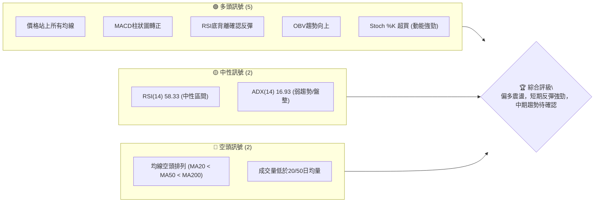

### 📊 核心指標速覽表

下表列出了 TSLA 當前最重要的技術指標數值及其初步解讀。

| 指標類別 | 指標名稱 | 當前數值 | 訊號 | 解讀 |
|----------|----------|----------|------|------|
| **價格** | 當前價格 | $420.60 | 🟢 | 價格已從近期低點反彈，並站上關鍵均線。 |
| **均線** | MA20 | $400.59 | 🟢 | 價格 ($420.60) 位於 MA20 上方，短期看多。 |
| **均線** | MA50 | $405.62 | 🟢 | 價格 ($420.60) 位於 MA50 上方，中期偏多。 |
| **均線** | MA200 | $418.54 | 🟢 | 價格 ($420.60) 位於 MA200 上方，長期潛在轉多。 |
| **動能** | RSI(14) | 58.33 | 🟡 | 位於中性區間，但接近超買區，顯示動能較強。 |
| **動能** | MACD | +1.080 (Hist) | 🟢 | MACD柱狀圖轉正，MACD線位於訊號線上，多頭訊號。 |
| **波動** | ATR | $17.48 | 🟡 | 佔價格 4.16%，波動性適中偏高，需注意風險。 |
| **趨勢** | ADX(14) | 16.93 | 🟡 | 趨勢強度較弱，目前處於盤整或趨勢形成初期。 |
| **量能** | 量比 | 0.87x | 🔴 | 成交量低於均量，反彈缺乏量能配合，警惕。 |

### 🏆 技術評分卡

綜合各項技術指標，TSLA 的整體技術評級為中性偏多，短期動能強勁但中期趨勢結構仍需觀察。

```
╔══════════════════════════════════════════════════════════════╗
║              技術評分卡 — TSLA (2026-06-30)                  ║
╠══════════════════════════════════════════════════════════════╣
║ 趨勢強度      ████████░░░░░░░░░░░░  40/100  🟡 (ADX弱趨勢)    ║
║ 動能指標      ██████████████░░░░░░  70/100  🟢 (RSI底背離, MACD金叉, Stoch超買) ║
║ 支撐穩定度    ████████████░░░░░░░░  60/100  🟡 (多重均線支撐，但長期均線排列空頭) ║
║ 成交量配合    ██████░░░░░░░░░░░░░░  30/100  🔴 (反彈量能不足，低於均量)    ║
║ 形態完整度    ████████░░░░░░░░░░░░  40/100  🟡 (短期反彈形態，但無明確大級別形態) ║
║ 均線排列      ██████░░░░░░░░░░░░░░  30/100  🔴 (MA空頭排列，中期趨勢隱憂)    ║
╠══════════════════════════════════════════════════════════════╣
║ 綜合評分      ████████░░░░░░░░░░░░  50/100  ⚖️ 中性偏多 (短期反彈，中期觀望)║
╚══════════════════════════════════════════════════════════════╝
```

---

## 2. 趨勢分析

本章將從多個時間框架深入分析 TSLA 的價格趨勢，從長期月線到中短期週線，並結合 ADX 指標評估趨勢強度。

### 🌐 多時框趨勢分析

TSLA 的多時框趨勢呈現複雜性，長期和中期趨勢尚未完全轉向多頭，但短期內出現強勁的反彈訊號。

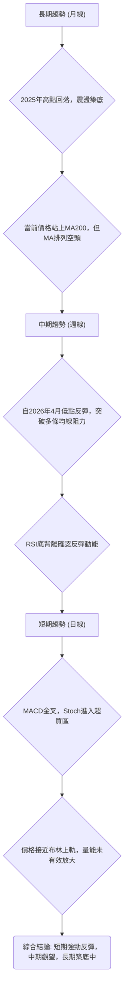

### 📈 長期趨勢 — 12個月走勢圖（Unicode）

過去12個月 TSLA 的價格走勢呈現先漲後跌，近期築底反彈的格局。2025年9月和10月達到高點後，經歷了一波顯著的回調，並在2026年4月觸及低點後開始反彈。

```
TSLA 月線走勢圖（過去12個月：2025-07 至 2026-06）
價格軸 ($)
$456.56 ┤                                  ●(2025-10 高點)
$449.72 ┤                           ●
$444.72 ┤                      ●
$435.79 ┤                                                ●(2026-05)
$430.41 ┤                                         ●
$420.60 ┤                                                    ●(現在)
$402.51 ┤                                     ●
$381.63 ┤                                           ●
$371.75 ┤                                   ●
$348.95 ┤                                 ●(2026-04 低點)
$333.87 ┤              ●
$308.27 ┤●━━━━━━━━━━━━━━━━━━━━━━━━━━━━━━━━━━━━━━━━━━━━━━━━━━━
       └────────────────────────────────────────────────────────────
        2025-07  08  09  10  11  12  2026-01  02  03  04  05  06
```

**走勢特徵分析表格**

| 階段 | 月份區間 | 價格區間 | 漲跌幅 | 特徵描述 |
|------|----------|----------|--------|------------|
| 1 | 2025-07 ~ 2025-10 | $308.27 ~ $456.56 | +48.10% | 強勁上漲趨勢，創下52週新高，多頭動能強勁。 |
| 2 | 2025-11 ~ 2026-04 | $456.56 ~ $348.95 | -23.58% | 顯著回調，形成下降趨勢，跌破多條均線支撐。 |
| 3 | 2026-05 ~ 2026-06 | $348.95 ~ $420.60 | +20.53% | 築底反彈，價格重回上升通道，但量能配合不足。 |

長期來看，TSLA 在經歷了2025年末到2026年初的回調後，目前正處於築底反彈的階段。雖然價格已經反彈超過20%，並回到400美元上方，但要確認長期趨勢反轉，還需要突破前高並有成交量的有效配合。

### 📊 中期趨勢（週線分析）

中期趨勢方面，TSLA 自2026年4月12日的低點 $348.95 後，出現了一波強勁的反彈。當前價格 $420.60 已經成功站上 MA20、MA50 和 MA200，顯示出中短期內多頭力量的積聚。然而，均線的空頭排列 ($400.59 < $405.62 < $418.54) 仍是一個警示訊號，表明儘管價格強勢，但更長期的趨勢結構尚未完全修復。

```
TSLA 近期壓力與支撐示意圖 (週線)
══════════════════════════════════════════════════════
$456.56 ║             ● 歷史壓力 (2025-10 高點)
$435.79 ║           ▲ 阻力 (2026-05 高點)
$432.14 ║           │ (布林上軌)
$420.60 ╠═══════════════ 現價
$418.54 ║           │ (MA200) ← 關鍵支撐/阻力轉換
$405.62 ║         ─┘ (MA50)
$400.59 ║       ─── (MA20 / 布林中軌)
$391.00 ║     ● 支撐 (2026-06-07 低點)
$369.04 ║   │ (布林下軌)
$348.95 ║ ● 關鍵支撐 (2026-04-12 低點)
══════════════════════════════════════════════════════
```
從週線圖來看，TSLA 已經成功突破了多條短期和中期移動平均線的阻力，但上方仍然面臨 $435.79 (2026-05 高點) 和 $456.56 (2025-10 高點) 的強勁阻力。下方 $400.59 (MA20/布林中軌) 和 $391.00 (近期低點) 提供了較強的支撐。

### ⚡ 趨勢強度評估（ADX 解讀）

ADX 指標用於衡量趨勢的強度，而非方向。當前 TSLA 的 ADX(14) 為 16.93，遠低於 25 的閾值，這表明市場目前處於弱趨勢或盤整狀態。

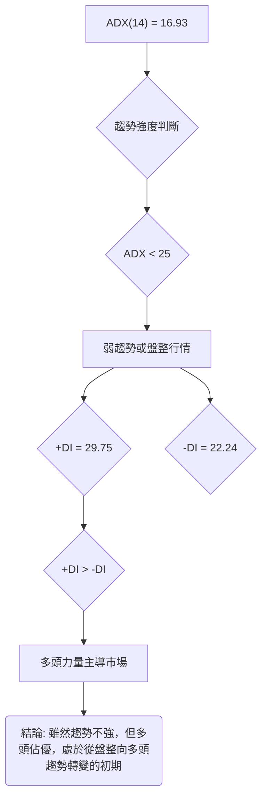

**ADX 強度對照表**

| ADX 數值範圍 | 趨勢強度 | 市場狀態 | 建議 |
|--------------|----------|----------|--------|
| 0 - 25 | 弱趨勢/盤整 | 市場方向不明確，波動性可能較低，或處於趨勢形成初期。 | 觀望，或進行區間交易，等待趨勢明確。 |
| 25 - 50 | 強趨勢 | 趨勢方向明確，動能強勁。 | 順勢交易，趨勢越強越有利。 |
| 50 - 75 | 非常強趨勢 | 極強的趨勢，可能伴隨超買/超賣現象。 | 順勢交易，但需警惕回調風險。 |
| 75 - 100 | 極端強趨勢 | 不常見，趨勢可能接近尾聲，反轉風險高。 | 順勢交易，但密切監控反轉訊號。 |

**結論**：ADX 顯示 TSLA 目前處於弱趨勢或盤整階段，市場尚未形成明確的強勢趨勢。然而，+DI (29.75) 高於 -DI (22.24)，表明在當前弱趨勢中，多頭力量略佔優勢。這可能意味著股價正從之前的下跌趨勢中掙扎，試圖建立新的上漲趨勢，但尚未獲得足夠的動能支持。交易者應警惕假突破或區間震盪的可能性。

---

## 3. 圖表形態分析

本章將分析 TSLA 在不同時間框架下可能形成的圖表形態，並評估其對未來價格走勢的潛在影響。

### 🔍 形態識別系統

在當前的數據中，TSLA 尚未形成明確的大型反轉或持續形態，如頭肩頂/底、雙頂/底或大型三角形。然而，從2026年4月低點 $348.95 以來，股價呈現出一個上升通道的雛形，並伴隨RSI底背離，這是一個潛在的底部反轉訊號。

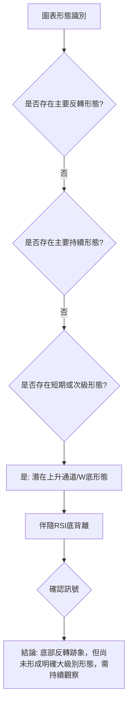

### 🕯️ 重要K線形態分析

從近20週的收盤數據來看，TSLA 在關鍵轉折點出現了一些值得關注的K線組合：

| 日期 | 收盤價 | K線形態 (週) | 解讀 | 訊號 |
|------|--------|---------------|------|------|
| 2026-03-29 | $361.83 | 錘子線 (Hammer) | 在下跌趨勢中出現，下影線較長，暗示下方買盤支撐。 | 🟡 |
| 2026-04-19 | $400.62 | 吞噬線 (Bullish Engulfing) | 在前一週 $348.95 低點後，本週K線實體完全覆蓋前一週陰線，強烈反轉訊號。 | 🟢 |
| 2026-05-31 | $435.79 | 流星線 (Shooting Star) | 在上漲趨勢中出現，上影線長，實體小，暗示上方阻力較大。 | 🔴 |
| 2026-06-07 | $391.00 | 烏雲罩頂 (Dark Cloud Cover) | 在高點回落後，本週陰線深入前一週陽線實體，看跌訊號。 | 🔴 |
| 2026-07-05 | $420.60 | 長陽線 (Long White Candle) | 近期強勢反彈，實體較長，顯示買盤強勁。 | 🟢 |

**分析**：
- **2026-04-19 的看漲吞噬線**是關鍵的反轉訊號，確認了從 $348.95 低點開始的強勁反彈。
- **2026-05-31 的流星線**和 **2026-06-07 的烏雲罩頂**則預示了短期的回調壓力，股價隨後確實回落。
- **2026-07-05 的長陽線**再次確認了多頭的強勢，顯示股價在經歷短期回調後，再次獲得買盤支持。

### 📉 ASCII 走勢形態示意圖

從2026年4月的低點 $348.95 開始，TSLA 呈現出一個潛在的上升通道，或者可以視為一個大型的W底形態的右側底部。

```
TSLA 潛在上升通道/W底形態示意圖 (週線)

價格軸 ($)
$450 ┤                                      R1───────
$440 ┤                                     /
$430 ┤                                    /
$420 ┤                                  ● 現價
$410 ┤                                 /
$400 ┤                             S1───────
$390 ┤                            /
$380 ┤                           /
$370 ┤                          /
$360 ┤                         /
$350 ┤                       ● S2 (W底左側低點)
$340 ┤                      /
     └──────────────────────────────────────────────────
      2026-03   04   05   06   07
```
**形態描述**：
- 在 $348.95 (2026-04-12) 形成一個重要底部 (W底的左側低點)。
- 隨後股價反彈至 $435.79 (2026-05-31)，形成 W底的頸線區域。
- 之後回調至 $379.71 (2026-06-28)，形成 W底的右側低點，但高於左側低點，確認底背離。
- 當前價格 $420.60 再次向上突破，正在挑戰頸線 $435.79。
- 如果能有效突破 $435.79，則 W底形態將被確認。

### 🎯 形態目標價計算

基於潛在的 W底形態，我們可以估算其目標價。
- **W底形態**：
  - 左側低點 (S2): $348.95 (2026-04-12)
  - 頸線 (R1): $435.79 (2026-05-31)
  - 右側低點 (S1): $379.71 (2026-06-28)
- **形態高度 (H)** = 頸線 - 左側低點 = $435.79 - $348.95 = $86.84
- **形態目標價 (Target)** = 頸線 + 形態高度 = $435.79 + $86.84 = $522.63

**分析**：如果 TSLA 能夠有效突破並站穩 $435.79 的頸線位置，那麼 W底形態將被確認，其理論目標價將指向 $522.63。這個目標價高於當前的52週高點 $498.83，顯示了強勁的上漲潛力。然而，在確認突破之前，此目標價僅作為參考。

---

## 4. 支撐與阻力

本章將詳細分析 TSLA 的關鍵支撐與阻力價位，包括歷史高低點、移動平均線、布林通道以及斐波那契回調位，並繪製價位結構分布圖。

### 🗺️ 關鍵價位分布圖（Unicode）

TSLA 的當前價格 $420.60 位於多重支撐之上，但上方也面臨著來自歷史高點和布林上軌的阻力。

```
TSLA 價位結構分布圖
═══════════════════════════════════════════════════════════════
$498.83 ║███████████████████████████████████████████████████████║ 強阻力 R4 (52週高點)
$456.56 ║███████████████████████████████████████████████████████║ 強阻力 R3 (2025-10 高點)
$435.79 ║███████████████████████████████████████████████████████║ 關鍵阻力 R2 (2026-05 高點 / W底頸線)
$432.14 ║███████████████████████████████████████████████████████║ 阻力 R1 (布林上軌)
$429.94 ║███████████████████████████████████████████████████████║ 阻力 Fibo-76.4%
$420.60 ╠═══════════════════════════════════════════════════════╣ ◄ 現價
$418.54 ║▓▓▓▓▓▓▓▓▓▓▓▓▓▓▓▓▓▓▓▓▓▓▓▓▓▓▓▓▓▓▓▓▓▓▓▓▓▓▓▓▓▓▓▓▓▓▓▓▓▓▓▓▓▓▓║ 近期支撐 S1 (MA200)
$414.81 ║▓▓▓▓▓▓▓▓▓▓▓▓▓▓▓▓▓▓▓▓▓▓▓▓▓▓▓▓▓▓▓▓▓▓▓▓▓▓▓▓▓▓▓▓▓▓▓▓▓▓▓▓▓▓▓║ 支撐 Fibo-61.8%
$405.62 ║▓▓▓▓▓▓▓▓▓▓▓▓▓▓▓▓▓▓▓▓▓▓▓▓▓▓▓▓▓▓▓▓▓▓▓▓▓▓▓▓▓▓▓▓▓▓▓▓▓▓▓▓▓▓▓║ 支撐 S2 (MA50)
$402.75 ║▓▓▓▓▓▓▓▓▓▓▓▓▓▓▓▓▓▓▓▓▓▓▓▓▓▓▓▓▓▓▓▓▓▓▓▓▓▓▓▓▓▓▓▓▓▓▓▓▓▓▓▓▓▓▓║ 支撐 Fibo-50.0%
$400.59 ║▓▓▓▓▓▓▓▓▓▓▓▓▓▓▓▓▓▓▓▓▓▓▓▓▓▓▓▓▓▓▓▓▓▓▓▓▓▓▓▓▓▓▓▓▓▓▓▓▓▓▓▓▓▓▓║ 支撐 S3 (MA20 / 布林中軌)
$391.00 ║▓▓▓▓▓▓▓▓▓▓▓▓▓▓▓▓▓▓▓▓▓▓▓▓▓▓▓▓▓▓▓▓▓▓▓▓▓▓▓▓▓▓▓▓▓▓▓▓▓▓▓▓▓▓▓║ 支撐 S4 (2026-06-07 低點)
$369.04 ║███████████████████████████████████████████████████████║ 強支撐 S5 (布林下軌)
$348.95 ║███████████████████████████████████████████████████████║ 極強支撐 S6 (2026-04-12 低點)
═══════════════════════════════════════════════════════════════
```

### 🚧 阻力位分析表

TSLA 上方阻力重重，突破需要強勁的動能和成交量配合。

| 阻力級別 | 價位 | 形成原因 | 突破難度 | 重要性 |
|----------|------|----------|----------|--------|
| **R1** | $432.14 | 布林通道上軌 | 中等 | 短期壓力，若突破則預示股價可能加速上漲。 |
| **R2** | $435.79 | 2026年5月高點 / 潛在W底頸線 | 高 | 關鍵阻力，突破意味著W底形態確認，並開啟新的上漲空間。 |
| **R3** | $456.56 | 2025年10月高點 | 高 | 歷史重要阻力，突破則確認長期趨勢反轉。 |
| **R4** | $498.83 | 52週高點 | 極高 | 最高阻力，突破則意味著牛市格局確立。 |

### 🛡️ 支撐位分析表

TSLA 下方有多重支撐位，為股價提供了一定的安全邊際，尤其在經歷了大幅回調之後。

| 支撐級別 | 價位 | 形成原因 | 守住機率 | 重要性 |
|----------|------|----------|----------|--------|
| **S1** | $418.54 | MA200 | 高 | 長期趨勢支撐，價格站穩其上預示長期向好。 |
| **S2** | $405.62 | MA50 | 高 | 中期趨勢支撐，若跌破則短期反彈可能結束。 |
| **S3** | $400.59 | MA20 / 布林中軌 | 高 | 短期趨勢支撐，也是短期多空分界線。 |
| **S4** | $391.00 | 2026年6月7日低點 | 中等 | 近期回調低點，跌破則可能測試更低支撐。 |
| **S5** | $369.04 | 布林通道下軌 | 高 | 強勁心理支撐，跌破則進入超賣區。 |
| **S6** | $348.95 | 2026年4月12日低點 | 極高 | 關鍵底部支撐，此點形成RSI底背離，極難被跌破，一旦跌破則趨勢極度看空。 |

### 📐 斐波那契回調位分析

我們以 2025年10月高點 $456.56 為起點，2026年4月12日低點 $348.95 為終點，來計算最近一波下跌後的斐波那契回調位。這些回調位在價格反彈時，常被視為潛在的阻力或支撐。

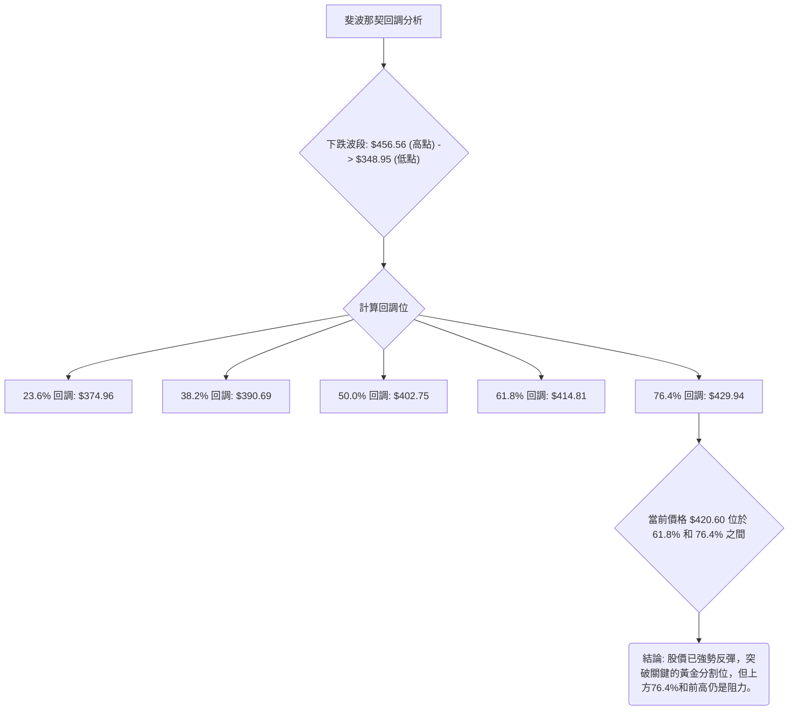

**斐波那契回調位詳情**

| 回調比例 | 價位 | 解讀 | 訊號 |
|----------|------|------|------|
| **23.6%** | $374.96 | 已突破，成為新的支撐。 | 🟢 |
| **38.2%** | $390.69 | 已突破，成為較強支撐。 | 🟢 |
| **50.0%** | $402.75 | 已突破，為關鍵心理關口，與MA20/布林中軌重疊，支撐強勁。 | 🟢 |
| **61.8%** | $414.81 | 已突破，黃金分割位，確認強勢反彈。 | 🟢 |
| **76.4%** | $429.94 | 潛在阻力，若突破則有望測試前高。 | 🟡 |

**分析**：當前價格 $420.60 已經成功突破了 61.8% 的斐波那契回調位 $414.81，這是一個非常強勁的多頭訊號，表明從 $348.95 的反彈具有較高的力度。下一個重要阻力將是 76.4% 回調位 $429.94，以及前高 $435.79。若能有效站穩在 61.8% 之上，甚至突破 76.4%，則反彈有望持續。

---

## 5. 技術指標深度解讀

本章將對 TSLA 的主要技術指標進行深入分析，包括移動平均線、RSI、MACD、布林通道和成交量，並探討它們之間的相互關係和訊號。

### 🎛️ 指標訊號總覽

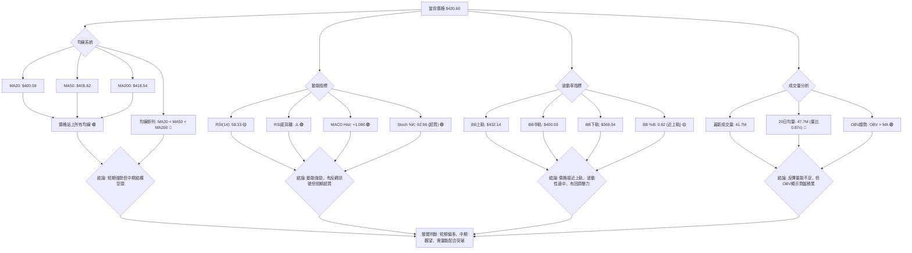

### 📈 移動平均線排列分析

TSLA 的移動平均線系統呈現出一個複雜且矛盾的訊號。

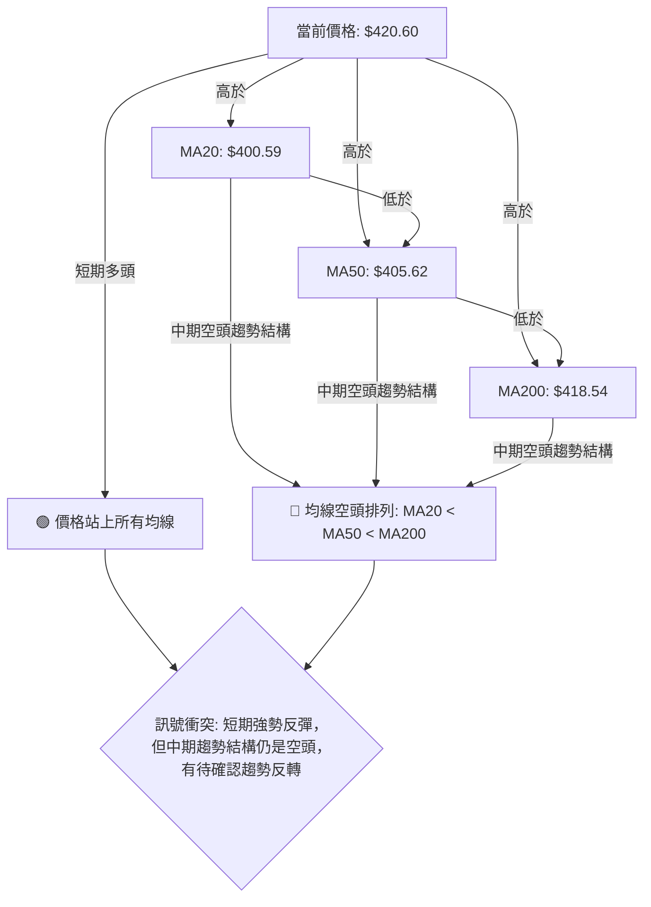
**分析**：
- **價格與均線關係**：當前價格 $420.60 位於 MA20 ($400.59)、MA50 ($405.62) 和 MA200 ($418.54) 之上，這是一個強烈的短期多頭訊號。它表明市場對 TSLA 的情緒正在轉暖，買盤力量在短期內佔據優勢。
- **均線排列**：然而，均線本身卻呈現空頭排列 (MA20 < MA50 < MA200)。這意味著儘管價格短期走強，但中長期市場的平均成本仍然呈現下降趨勢，過去的跌勢影響尚未完全消除。這種排列通常出現在下跌趨勢的末期或反彈階段，表明多頭力量尚未完全控制中長期趨勢，股價可能在上方遇到較大阻力，或在突破後仍需經歷盤整以修復均線排列。

**結論**：這種均線訊號的矛盾性提示我們，TSLA 處於一個關鍵的轉折點。短期內，價格強勢反彈，但要確認為中期甚至長期趨勢的反轉，需要觀察 MA 線能否陸續向上交叉，形成多頭排列。

### 📉 RSI(14) 分析

RSI(14) 用於衡量股價上漲和下跌的相對強度，判斷超買超賣區域。

**RSI 數值進度條**：
RSI(14): 58.33  ▓▓▓▓▓▓▓▓▓▓▓▓░░░░░░░░ (58.33%) 🟡 中性偏強

**分析**：
- **數值解讀**：當前 RSI(14) 為 58.33，位於 30-70 的中性區間。這表明 TSLA 既非超買也非超賣，仍有上漲空間。然而，其數值接近 70 的超買區間，顯示短期動能較強。
- **超買超賣區間**：
    - 超買區 (RSI > 70)：過去數值曾達到 69.1 (2026-05-10) 和 67.1 (2026-05-03)，暗示當時股價可能面臨回調壓力。
    - 超賣區 (RSI < 30)：過去數值曾達到 32.4 (2026-03-22)，接近超賣區，預示反彈機會。
- **背離判斷 (底背離)**：
    - **數據確認**：在 2026-03-22，收盤價 $367.96，RSI 為 32.4。在 2026-04-12，收盤價 $348.95，RSI 為 42.0。
    - **結論**：股價創出更低點 ($348.95 < $367.96)，但 RSI 卻創出更高點 (42.0 > 32.4)。這是一個明確的 **🟢 強烈底背離 (Bullish Divergence)** 訊號。底背離通常預示著股價下跌動能減弱，即將迎來反彈或反轉。這與當前股價從低點反彈的走勢高度吻合，確認了這一反彈的技術基礎。

**總結**：RSI 顯示短期動能強勁，且歷史上的底背離訊號成功預示了當前的反彈。當前 RSI 仍在中性區間，但需警惕若快速進入超買區可能引發的回調。

### 📊 MACD(12/26/9) 訊號解讀

MACD (Moving Average Convergence Divergence) 用於判斷趨勢的動能和方向。

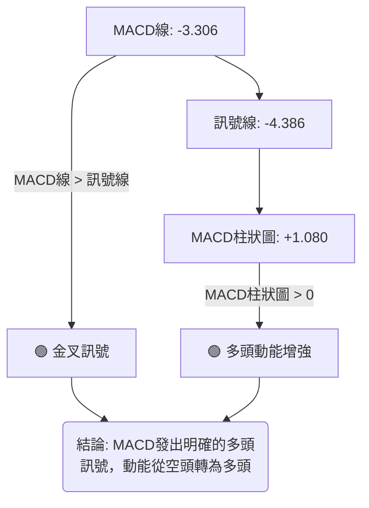

**分析**：
- **MACD線 (-3.306) 與訊號線 (-4.386)**：MACD 線已上穿訊號線，形成 **🟢 金叉 (Golden Cross)**。這是經典的買入訊號，表明短期動能已超越長期動能，趨勢正在由跌轉漲。
- **MACD柱狀圖 (+1.080)**：柱狀圖從負值轉為正值，並持續放大，顯示多頭動能正在積累和增強。這進一步確認了金叉訊號的有效性。
- **背離判斷**：從近20週數據看，MACD柱狀圖在2026-03-22 ($367.96, -1.825) 和 2026-04-12 ($348.95, -1.720) 之間，雖然價格創新低，但MACD柱狀圖的負值沒有擴大，甚至有所收斂，也間接支持了底背離的判斷。

**總結**：MACD 指標發出明確的多頭訊號，與 RSI 的底背離和當前價格的反彈走勢互相印證，共同支持了短期看多的判斷。

### 📦 布林通道分析

布林通道 (Bollinger Bands) 用於衡量價格的波動範圍和相對位置。

```
TSLA 布林通道示意圖 (日線)

價格軸 ($)
$432.14 ║        ═════════════ 布林上軌 (BB Upper)
$420.60 ╠═══════════════ 現價
$400.59 ║      ─────────────── 布林中軌 (MA20)
$369.04 ║ ═════════════════════ 布林下軌 (BB Lower)
        └──────────────────────────────────────────
```

**分析**：
- **布林上軌**：$432.14
- **布林中軌 (MA20)**：$400.59
- **布林下軌**：$369.04
- **當前價格**：$420.60
- **BB %B**：0.82。這表示當前價格位於布林通道的 82% 位置，非常接近上軌。

**解讀**：
- **價格接近上軌**：當價格接近或觸及布林通道上軌時，通常被視為短期超買訊號，預示著價格可能面臨回調壓力或進入盤整。
- **布林中軌支撐**：布林中軌 (MA20) $400.59 是重要的短期支撐位。價格站穩中軌之上，表明短期趨勢偏強。
- **通道寬度**：目前通道寬度適中，ATR 數值也支持這一點。

**總結**：布林通道顯示 TSLA 股價短期內動能強勁，但由於接近上軌，需警惕短期內的回調風險。若能突破上軌並站穩，則可能開啟一波更強勁的上漲。

### 💹 成交量分析（量價配合度）

成交量是確認價格走勢的重要指標。

| 指標 | 數值 | 解讀 | 訊號 |
|------|------|------|------|
| 最新成交量 | 41,757,573 | 較低 | 🔴 |
| 20日均量 | 47,786,799 | 較高 | |
| 50日均量 | 52,014,291 | 較高 | |
| 量比 | 0.87x | 低於均量 | 🔴 |
| OBV趨勢 | OBV > MA | 量能支撐上漲 | 🟢 |

**分析**：
- **最新成交量與均量比較**：當前成交量 (41.7M) 顯著低於 20日均量 (47.7M) 和 50日均量 (52.0M)，量比僅為 0.87x。這是一個 **🔴 警示訊號**。在股價從底部強勁反彈的過程中，如果缺乏成交量的有效放大，則可能表明反彈的基礎不夠堅實，容易出現回調。
- **OBV 趨勢**：OBV (On Balance Volume) 趨勢顯示 OBV 線位於其移動平均線之上，這是一個 **🟢 看多訊號**。OBV 衡量的是買賣壓力，OBV 上升表明買入量大於賣出量，資金正在流入。儘管單日成交量較低，但 OBV 的整體趨勢向上，說明在過去一段時間內，累積的買盤力量仍在增強，支撐了價格的上漲。

**量價背離**：
- **潛在背離**：當前情況呈現一種輕微的量價背離。價格在反彈，但成交量卻沒有有效放大，甚至低於均量。這可能表明當前的反彈主要由少量資金推動，或者市場觀望情緒較重。
- **OBV 的確認**：然而，OBV 趨勢向上則部分緩解了這一擔憂，暗示儘管短期成交量不振，但累積的買盤壓力仍在增加。

**總結**：成交量分析顯示 TSLA 的反彈缺乏足夠的量能配合，這是一個潛在的風險因素。投資者應密切關注後續成交量能否有效放大，以確認反彈的持續性。OBV 的積極訊號提供了一定的安慰，但仍需謹慎。

---

## 6. 動能與波動率

本章將從動能和波動率兩個維度，對 TSLA 的當前市場狀態進行評估。

### ⚡ 動能評估四象限

由於 Mermaid 的 quadrantChart 不直接支持，我們將使用表格形式展示動能與波動率的綜合評估。

| 象限 | 動能 (RSI/MACD/Stoch) | 波動 (ATR) | 當前狀態 | 評估 | 訊號 |
|------|-----------------------|------------|----------|------|------|
| Q1 | 強 (RSI底背離, MACD金叉, Stoch超買) | 低 (ATR% < 2%) | - | 最佳機會 (強動能低波動，適合趨勢追蹤) | 🟢 |
| Q2 | 弱 (RSI中性, MACD死叉, Stoch超賣) | 低 (ATR% < 2%) | - | 謹慎觀望 (低波動但缺乏上漲動力) | 🟡 |
| Q3 | 強 (RSI底背離, MACD金叉, Stoch超買) | 高 (ATR% > 3%) | ✓ | 高風險高收益 (動能強但波動大，適合短線交易者) | 🟡 |
| Q4 | 弱 (RSI中性, MACD死叉, Stoch超賣) | 高 (ATR% > 3%) | - | 避免進場 (方向不明，風險高) | 🔴 |

**TSLA 當前狀態評估**：
- **動能**：RSI底背離、MACD金叉、Stochastic超買，這些都指向強勁的多頭動能。**評估：強動能**。
- **波動率**：ATR(14) 為 $17.48，佔價格 $420.60 的 4.16%。這屬於相對較高的波動率。**評估：高波動**。

**結論**：TSLA 目前處於 **Q3: 高風險高收益** 象限。這意味著股價具有較強的上漲動能，但伴隨著較大的價格波動。這類股票適合風險承受能力較高、擅長短線交易或波段操作的投資者。對於保守型投資者，可能需要等待波動率降低或趨勢更加穩固。

### 📊 ATR 波動率分析

ATR (Average True Range) 衡量股票的平均每日波動範圍，是評估波動性和設定止損的重要工具。

- **ATR(14)**：$17.48
- **佔收盤價百分比**：$17.48 / $420.60 = 4.16%

**分析**：
- **高波動性**：ATR 佔價格的 4.16%，這表明 TSLA 是一隻波動性相對較高的股票。每日價格波動範圍較大，這既提供了日內交易機會，也增加了持倉風險。
- **止損距離建議**：對於波動性較高的股票，止損點應設置得相對寬鬆，以避免被正常波動洗出。
    - **短期交易者**：可考慮將止損設置在 1 倍 ATR 左右，即 $420.60 - $17.48 = $403.12。
    - **中期交易者**：可考慮將止損設置在 1.5 倍至 2 倍 ATR 左右，即 $420.60 - (1.5 * $17.48) = $394.38 或 $420.60 - (2 * $17.48) = $385.64。
    - 結合技術支撐位：止損點應優先考慮重要的技術支撐位，如 MA20 ($400.59) 或近期低點 $391.00，並在此基礎上考慮 ATR 提供的緩衝空間。

**總結**：TSLA 的高 ATR 提醒投資者，在制定交易策略時必須充分考慮其波動性，合理設置止損，並控制倉位。

### 📐 Beta 與市場相關性

由於提供的數據中沒有 Beta 值，我們將基於 TSLA 的行業屬性 (電動汽車製造商) 和市場認知進行推斷。

- **行業屬性**：汽車製造商，屬於消費週期性行業。
- **市場認知**：TSLA 是一隻高成長、高波動的科技股代表，深受散戶和機構關注。其股價往往對市場情緒、宏觀經濟數據、利率政策以及公司自身的新聞 (如生產數據、新產品發布、Elon Musk 的言論) 反應劇烈。

**推斷 Beta**：
- 由於其高成長性和行業特性，TSLA 的 Beta 值通常會顯著大於 1。歷史上，高成長科技股的 Beta 值普遍在 1.5 到 2.5 之間，甚至更高。
- **結論**：推斷 TSLA 的 **Beta > 1.5**。

**市場相關性分析**：
- **高於市場平均的波動性**：高 Beta 意味著 TSLA 股價波動幅度通常會大於整體市場 (如 S&P 500)。當大盤上漲時，TSLA 可能會漲得更多；當大盤下跌時，TSLA 可能會跌得更深。
- **對市場情緒敏感**：作為市場的風向標之一，TSLA 股價的表現往往與市場的風險偏好密切相關。在牛市中容易受到追捧，但在熊市中則可能遭受重創。
- **自帶事件驅動屬性**：除了市場整體波動，TSLA 自身特有的新聞事件對股價的影響力巨大，這使得它在某些時候可能與大盤走勢脫鉤。

**總結**：TSLA 具有較高的市場相關性和波動性。投資者在交易 TSLA 時，除了關注其自身的基本面和技術面，還需密切關注大盤走勢和宏觀經濟環境，並做好風險管理。

---

## 7. 多時框架總結

本章將整合前述分析，從短期、中期、長期三個時間框架對 TSLA 的技術訊號進行總結和評分，形成一個綜合性的評估矩陣。

### 📋 時框架評分表

| 時框架 | 趨勢方向 | 動能 | 均線排列 | 形態 | 綜合評分 | 建議 |
|--------|----------|------|----------|------|----------|------|
| **短期** | 🟢 上漲 | 🟢 強勁 (MACD金叉, Stoch超買) | 🟢 價格站上所有均線 | 🟢 潛在W底右側反彈 | 8/10 🟢 | 偏多操作 |
| **中期** | 🟡 盤整偏多 | 🟡 中性偏強 (RSI底背離，但ADX弱趨勢) | 🔴 空頭排列 (MA20<MA50<MA200) | 🟡 潛在上升通道，但阻力重重 | 6/10 🟡 | 觀望或小倉位試多 |
| **長期** | 🟡 築底反彈 | 🟡 趨勢扭轉中 | 🔴 空頭排列 (MA20<MA50<MA200) | 🟡 底部形態待確認 | 5/10 🟡 | 謹慎觀望，等待趨勢明確 |

### 🔲 綜合訊號矩陣

| 指標/時框架 | 短期 (日線) | 中期 (週線) | 長期 (月線) | 一致性評估 |
|-------------|-------------|-------------|-------------|--------------|
| **價格趨勢** | 🟢 強勁反彈 | 🟡 震盪築底 | 🟡 築底反彈 | 短期積極，中長期觀望 |
| **均線系統** | 🟢 價格站上所有MA | 🔴 均線空頭排列 | 🔴 均線空頭排列 | 短期與中長期存在矛盾 |
| **動能指標** | 🟢 MACD金叉, Stoch超買 | 🟢 RSI底背離 | 🟡 企穩回升 | 動能指標整體偏多 |
| **支撐阻力** | 🟢 位於多重支撐之上 | 🟡 接近關鍵阻力區 | 🟡 遠離歷史高點 | 支撐穩固，但阻力較大 |
| **成交量** | 🔴 低於均量 | 🟡 OBV向上 | 🟡 築底量能 | 量能配合不足，但OBV積極 |
| **綜合結論** | **🟢 偏多** | **🟡 中性偏多** | **🟡 中性** | **多空交織，短期反彈勢頭強勁，但中長期趨勢結構尚未完全轉變。** |

**總結**：
TSLA 在短期內呈現出強勁的反彈勢頭，價格成功站上所有關鍵移動平均線，且 MACD 金叉、Stochastic 超買、RSI 底背離等動能指標均發出積極訊號。這表明短期內買盤力量佔據主導，有望繼續向上測試阻力。

然而，從中期和長期來看，均線系統仍處於空頭排列，顯示出更深層次的趨勢結構尚未完全修復。成交量在反彈過程中也未能有效放大，這為反彈的持續性帶來隱憂。

**整體判斷**：TSLA 目前處於一個從底部反彈的關鍵階段。短期內偏多操作的機會存在，但中長期投資者應保持謹慎，等待均線排列轉為多頭，並有充足的成交量配合，才能確認趨勢的真正反轉。

---

## 8. 交易策略建議

基於上述多時框架的技術分析，TSLA 目前短期偏多，但中長期存在不確定性。以下提出兩種交易策略，分別針對激進型和穩健型投資者。

### 🗺️ 策略決策流程圖

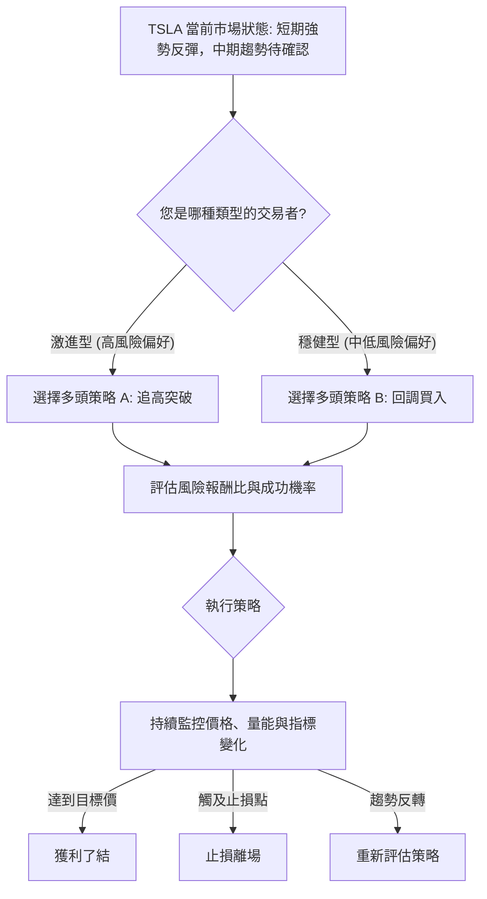

### 🟢 多頭策略詳情

考慮到 TSLA 短期動能強勁且存在底背離，多頭策略是當前的主要方向。

| 策略要素 | 策略 A：追高突破 (激進型) | 策略 B：回調買入 (穩健型) |
|----------|----------------------------|----------------------------|
| **交易類型** | 短線/波段追高 | 波段/中線佈局 |
| **進場條件** | 價格有效突破 $435.79 (W底頸線阻力)，並有成交量配合。 | 價格回調至 $405.62 (MA50) 或 $400.59 (MA20/布林中軌) 附近，且K線出現止跌訊號。 |
| **進場價格** | **$438.00** (突破 $435.79 後確認) | **$405.00 - $401.00** (在關鍵支撐位附近分批建倉) |
| **目標價 T1** | **$456.56** (2025-10 高點) | **$435.79** (W底頸線阻力) |
| **目標價 T2** | **$498.83 - $522.63** (52週高點 / W底形態目標價) | **$456.56** (2025-10 高點) |
| **止損價格** | **$429.90** (略低於 Fibo-76.4% 和布林上軌，避免假突破) | **$390.00** (略低於 2026-06-07 低點 $391.00 和 Fibo-38.2%) |
| **風險報酬比** | T1: (456.56-438)/(438-429.90) = **2.29:1**<br>T2: (522.63-438)/(438-429.90) = **10.45:1** | T1: (435.79-405)/(405-390) = **2.05:1**<br>T2: (456.56-405)/(405-390) = **3.44:1** |
| **成功機率** | 55% (需量能配合，突破後可能加速) | 65% (回調有支撐，風險較低) |
| **建議倉位** | 5% - 10% (嚴格控制風險) | 10% - 15% (分批建倉) |

### 🔴 空頭策略詳情

儘管短期看多，但考慮到均線空頭排列、量能不足以及 Stochastics 超買，空頭策略也應有所準備。

| 策略要素 | 策略 C：高位做空 (反彈受阻型) |
|----------|--------------------------------|
| **交易類型** | 短線/波段做空 |
| **進場條件** | 價格無法有效突破 $435.79 (W底頸線阻力)，並出現明確的看跌K線形態 (如流星線、烏雲罩頂)，或跌破 $418.54 (MA200) 支撐。 |
| **進場價格** | **$435.00 - $430.00** (在阻力位附近確認受阻後進場) |
| **目標價 T1** | **$418.54** (MA200 支撐) |
| **目標價 T2** | **$405.62 - $400.59** (MA50 / MA20 / 布林中軌) |
| **止損價格** | **$440.00** (略高於 W底頸線阻力 $435.79) |
| **風險報酬比** | T1: (435-418.54)/(440-435) = **3.29:1**<br>T2: (435-400.59)/(440-435) = **6.88:1** |
| **成功機率** | 40% (逆勢操作，風險較高) |
| **建議倉位** | 3% - 5% (極低倉位，嚴格止損) |

### ⭐ 整體訊號強度評星

綜合所有技術分析，TSLA 的整體多空訊號如下：

```
做多訊號強度：★★★★☆  (4/5星) (短期動能強勁，底背離有效，價格站上均線)
做空訊號強度：★★☆☆☆  (2/5星) (均線空頭排列，量能不足，但短期多頭佔優)
整體可信度：  ★★★☆☆  (3/5星) (多空交織，短期機會存在，但中長期需謹慎)
```

**分析**：當前多頭訊號較為強勁，尤其是在短期走勢和動能方面。然而，中長期均線的空頭排列和量能的不足是潛在的隱憂，使得整體可信度有所降低。投資者應根據自身風險偏好，選擇適合的策略，並嚴格執行止損。

---

## 9. 風險提示與監控

儘管 TSLA 展現出積極的短期反彈訊號，但投資仍伴隨風險。本章將列出關鍵監控指標、分析潛在風險場景，並提供風險管理建議。

### ✅ 關鍵監控指標 Checklist

以下是交易 TSLA 時需要密切關注的技術指標和價格行為：

```
╔══════════════════════════════════════════════════════════════╗
║              TSLA 關鍵監控指標 Checklist                     ║
╠══════════════════════════════════════════════════════════════╣
║ [ ] 價格是否維持在 MA20 ($400.59) 之上？                  ║
║ [ ] 價格能否有效突破 W底頸線阻力 ($435.79)？              ║
║ [ ] 成交量能否有效放大，配合價格上漲？                    ║
║ [ ] MACD 金叉訊號是否持續，柱狀圖能否保持正值並放大？    ║
║ [ ] RSI 是否保持在 50 以上，並避免進入超買區後快速回落？  ║
║ [ ] 布林通道是否擴張，價格能否沿上軌運行？                ║
║ [ ] ADX 能否從弱趨勢 (<25) 轉為強趨勢 (>25)？             ║
║ [ ] 均線排列是否開始修復，MA20/MA50 能否上穿 MA200？      ║
║ [ ] 大盤指數 (如 SPY/QQQ) 走勢是否配合，避免系統性風險？  ║
║ [ ] 任何可能影響股價的重大新聞或公司公告？                ║
╚══════════════════════════════════════════════════════════════╝
```

### ⚠️ 風險場景分析

針對 TSLA 當前的技術面，我們預設三種主要情境：

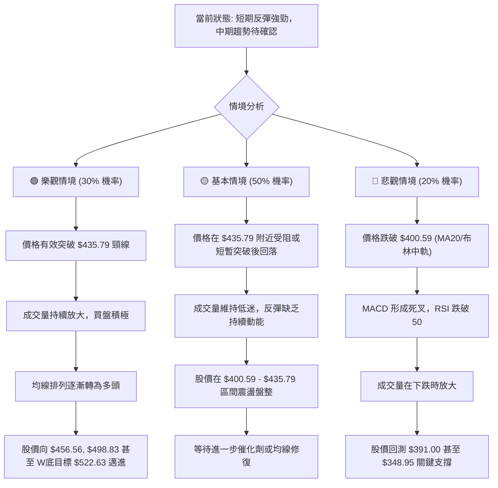

**分析**：
- **樂觀情境**：如果 TSLA 能夠在放量的情況下突破並站穩 $435.79 的關鍵阻力，則 W底形態將被確認，股價有望加速上漲，挑戰更高的目標價。
- **基本情境**：鑑於當前均線空頭排列和成交量不足，股價在阻力位附近盤整或小幅回調的可能性較大。這將是一個震盪築底的過程，需要時間來修復技術指標。
- **悲觀情境**：如果市場情緒惡化，或公司出現負面消息，股價可能跌破關鍵支撐，尤其是 $400.59 和 $391.00。這將使得短期反彈結束，再次面臨下行風險。

### 🛡️ 風險管理重要提醒

1.  **嚴格止損**：無論採取何種策略，都必須設定明確的止損點並嚴格執行。ATR 指標可用於輔助止損點的設置。
2.  **倉位管理**：鑑於 TSLA 較高的波動性 (ATR 4.16%) 和中長期趨勢的不確定性，應避免重倉。建議採用分批建倉、逐步加碼的方式。
3.  **動態監控**：市場情況瞬息萬變，技術指標也可能快速變化。應持續監控價格、成交量、主要技術指標以及任何可能影響股價的突發新聞。
4.  **多空平衡**：雖然短期看多，但仍需對空頭風險保持警惕。如果出現明顯的看跌訊號，應及時調整策略或減倉。
5.  **結合基本面**：本報告僅為技術分析。在做出最終投資決策前，應結合 TSLA 的基本面分析、產業前景和宏觀經濟環境進行全面評估。

---

## 📋 報告總結

```
╔══════════════════════════════════════════════════════════════╗
║              TSLA 技術分析報告總結                           ║
╠══════════════════════════════════════════════════════════════╣
║ 報告日期：2026-06-30                                         ║
║ 當前價格：$420.60                                            ║
║ 分析評級：⚖️ 中性偏多 (短期反彈強勁，中期趨勢待確認)         ║
║                                                              ║
║ 關鍵結論：                                                   ║
║ ├─ 長期趨勢：🟡 築底反彈中，均線排列空頭，趨勢反轉待確認。   ║
║ ├─ 中期趨勢：🟡 震盪偏多，價格站上均線但均線排列仍是空頭。   ║
║ ├─ 短期趨勢：🟢 強勁反彈，MACD金叉，RSI底背離，Stoch超買。 ║
║ ├─ 關鍵支撐：$418.54 (MA200), $405.62 (MA50), $400.59 (MA20/布林中軌), $391.00 (近期低點), $348.95 (極強底部)。 ║
║ ├─ 關鍵阻力：$432.14 (布林上軌), $435.79 (W底頸線阻力), $456.56 (2025-10 高點)。 ║
║ └─ 分析師目標：$421.16 (均值) - 顯示當前價格已接近分析師均值目標。 ║
║                                                              ║
║ 最優策略組合：                                               ║
║ 1. 🥇 最佳機會：**突破追高** — 若價格有效突破 $435.79 並放量，可考慮在 $438.00 追高，目標 $456.56/$498.83，止損 $429.90。 ║
║ 2. 🥈 次選機會：**回調買入** — 若價格回調至 $405.00-$401.00 區間並止跌，可分批建倉，目標 $435.79/$456.56，止損 $390.00。 ║
║ 3. 🥉 保守選擇：**觀望** — 等待均線排列轉為多頭，或成交量有效放大，確認趨勢反轉後再考慮進場。 ║
╚══════════════════════════════════════════════════════════════╝
```

---

> ⚠️ **免責聲明**：本報告為 AI 自動生成之技術分析，所有數據及估算均基於提供的歷史價格資訊。本報告**僅供研究與學術參考**，**不構成任何投資建議**。投資有風險，入市需謹慎。

---

*報告生成時間：2026-06-30 ｜ 數據來源：Yahoo Finance ｜ 分析框架：多時框技術分析*