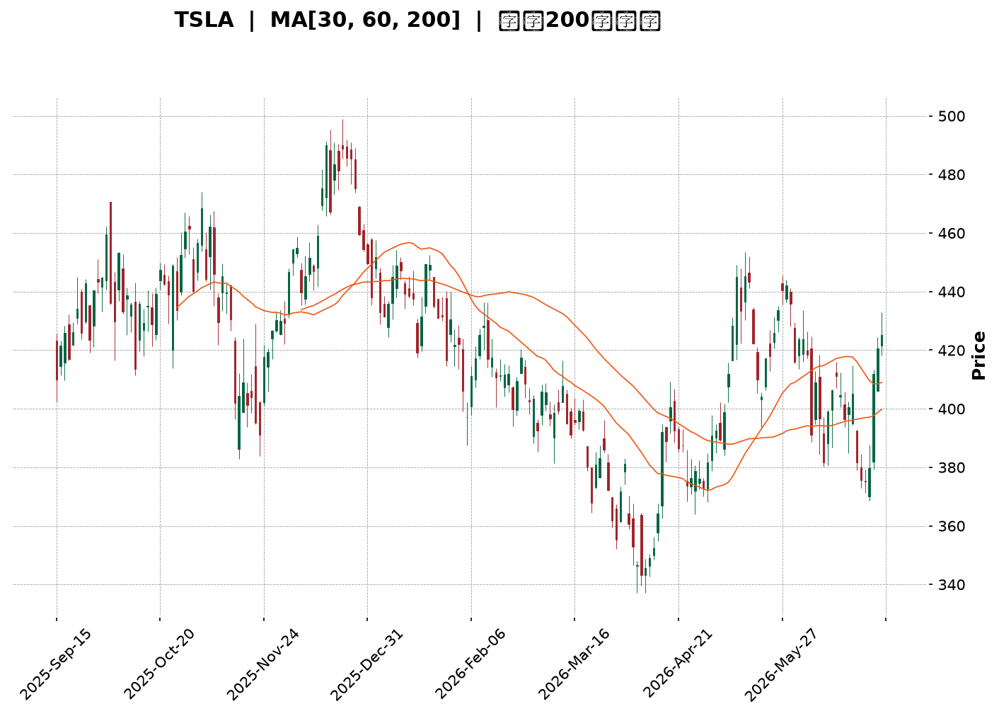
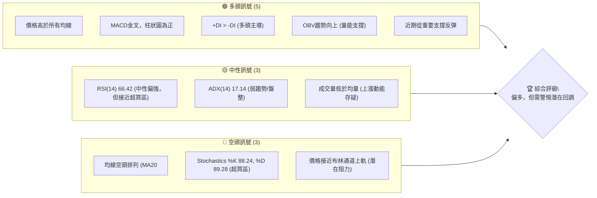
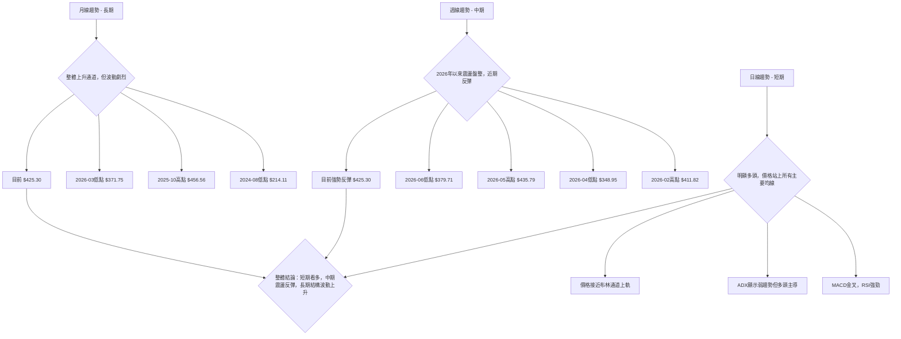
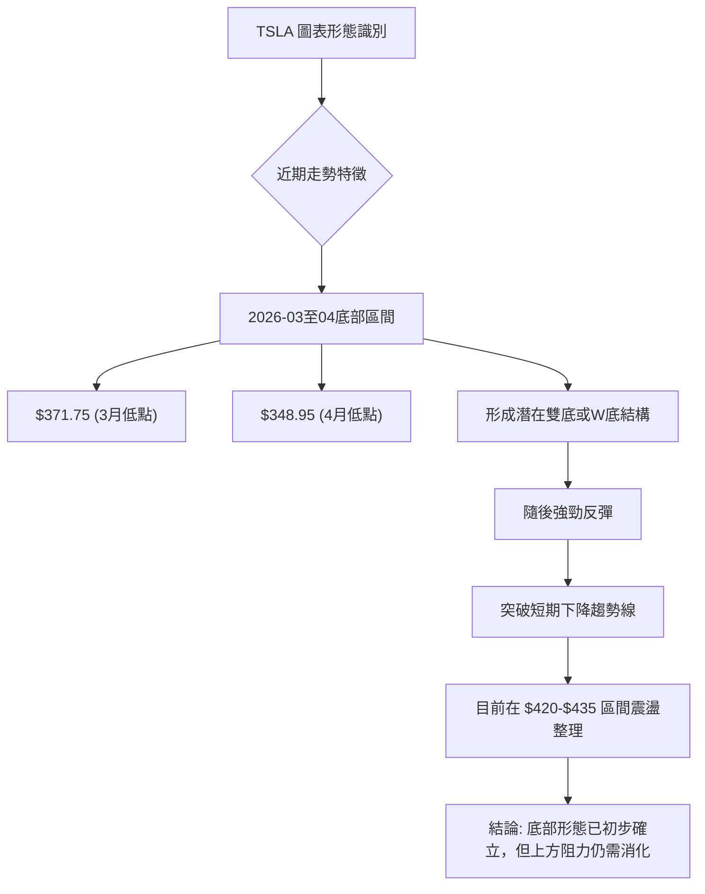
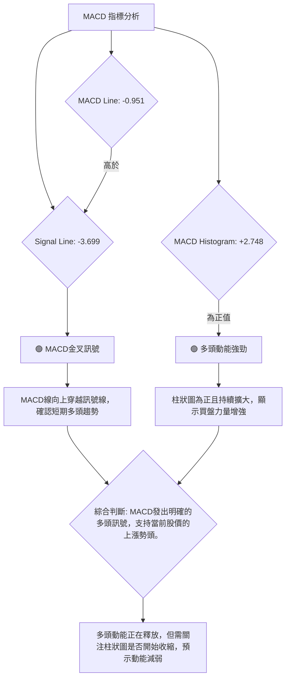
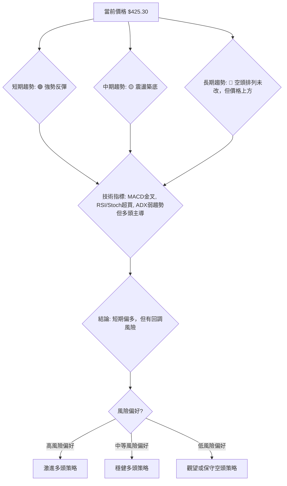

<details>
<summary>📊 靜態圖表 (點擊展開)</summary>

</details>

<html>
<head><meta charset="utf-8" /></head>
<body>
    <div style="height:500px; width:100%;">                        <script>window.PlotlyConfig = {MathJaxConfig: 'local'};</script>
        <script charset="utf-8" src="https://cdn.plot.ly/plotly-3.6.0.min.js" integrity="sha256-QaOVwtVY0T02VaHrr6pnoHLCwayMJp4O5n4YyaE3rJk=" crossorigin="anonymous"></script>                <div id="candlestick-chart" class="plotly-graph-div" style="height:100%; width:100%;"></div>            <script>                window.PLOTLYENV=window.PLOTLYENV || {};                                if (document.getElementById("candlestick-chart")) {                    Plotly.newPlot(                        "candlestick-chart",                        [{"close":{"dtype":"f8","bdata":"AAAA4KOgeUAAAACA61l6QAAAAIDCnXpAAAAAoJkNekAAAADAHqF6QAAAACBcI3tAAAAAoJmdekAAAADgo6x7QAAAAIA9dnpAAAAAYGaGe0AAAAAgXLN7QAAAACCFy3tAAAAAIFy3fEAAAAAAAEB7QAAAAKBH3XpAAAAAAABUfEAAAACgcBF7QAAAAEAKa3tAAAAA4KM4e0AAAAAA19d5QAAAAGBmPntAAAAAANfTekAAAABgZjJ7QAAAAAAAzHpAAAAAwPV0e0AAAABA4fZ7QAAAAKCZqXtAAAAAIIVve0AAAAAgrg98QAAAACCFG3tAAAAAYLhGfEAAAADAzMh8QAAAAAAp2HxAAAAAoJmBe0AAAADA9Yh8QAAAAIDrRX1AAAAAACnEe0AAAADAHuF8QAAAAGCP3ntAAAAA4FHYekAAAAAgrtN7QAAAAIDreXtAAAAAoJnpekAAAAAA1x95QAAAAKCZRXlAAAAAYLiOeUAAAAAAABR5QAAAAADXP3lAAAAAIK6zeEAAAACgcHF4QAAAAOB6HHpAAAAAYGY2ekAAAACgR6l6QAAAAGC44npAAAAAgD3iekAAAAAA19N6QAAAAADX63tAAAAA4HpofEAAAAAAAHB8QAAAAKBHeXtAAAAAYLjSe0AAAABAMzd8QAAAAIA97ntAAAAAIFyvfEAAAADA9bR9QAAAAIAUnn5AAAAAACk0fUAAAACA6zV+QAAAAEAzE35AAAAAIK6LfkAAAADA9Vh+QAAAAGBmVn5AAAAAQAqzfUAAAACAPbp8QAAAAEDhZnxAAAAAIIUbfEAAAADAHmF7QAAAAGC4OnxAAAAAIFwPe0AAAABgj\u002fZ6QAAAAMDMPHtAAAAAACnQe0AAAAAgXA98QAAAAEAz83tAAAAAQDNze0AAAADAHml7QAAAAAAAWHtAAAAAAAA0ekAAAABACvd6QAAAAIDCFXxAAAAAwPUQfEAAAABAMzN7QAAAAGBm7npAAAAAIFz3ekAAAADA9Qh6QAAAAGCP5npAAAAAwPVcekAAAAAgXF96QAAAAAApYHlAAAAAIFzTeEAAAACAwrF5QAAAAMAeFXpAAAAAIFyTekAAAADgUcR6QAAAAMAeEXpAAAAAQAoXekAAAACAFKp5QAAAAMAetXlAAAAAIFy7eUAAAADAHr15QAAAAKBH\u002fXhAAAAAgBSWeUAAAABgZhZ6QAAAAKBHiXlAAAAAACkoeUAAAADAHjV5QAAAAEDhhnhAAAAAQApfeUAAAADAzFh5QAAAACCuy3hAAAAAQOHqeEAAAAAA1\u002fN4QAAAAMAefXlAAAAAACmweEAAAABAM3N4QAAAAMD1uHhAAAAA4FH0eEAAAADgeox4QAAAAMDMxHdAAAAAIFz\u002fdkAAAACgmc13QAAAAOB68HdAAAAAQDMfeEAAAACAwkF3QAAAAKBHnXZAAAAA4Ho0dkAAAAAAADx3QAAAAAAp1HdAAAAAoHCJdkAAAADAHg12QAAAAGBmqnVAAAAAAAB0dUAAAACA65l1QAAAAEAzz3VAAAAAYLgGdkAAAABAM8N2QAAAAEAzf3hAAAAAYGZOeEAAAACA6wl5QAAAAAAAiHhAAAAAYLgmeEAAAAAAKTh4QAAAACCFW3dAAAAAwMyEd0AAAABguKp3QAAAAOBRgHdAAAAAwMxMd0AAAACAFNp3QAAAAMAebXhAAAAAACmIeEAAAACA61V4QAAAACCu63hAAAAA4KO8eUAAAACgmcV6QAAAAAAA0HtAAAAAQDMXe0AAAADgUdR7QAAAAMDMtHtAAAAAANdjekAAAAAA1595QAAAAIDCQXlAAAAAACkUekAAAACgmR16QAAAAAApoHpAAAAAoHAZe0AAAACAwoV7QAAAAKCZoXtAAAAA4KM8e0AAAACAFP55QAAAAADXe3pAAAAAQDN7ekAAAABAMyd6QAAAAAAAcHhAAAAAQDOPeUAAAABA4cp4QAAAAKBw2XdAAAAAYGbyeEAAAABA4WZ5QAAAAGBmsnlAAAAAYI9KeUAAAACAFMZ4QAAAAADXB3lAAAAAwMxQeUAAAACAwtl3QAAAAOB6eHdAAAAAgOtxd0AAAAAgXLt3QAAAAKBwvXlAAAAAoJlJekAAAADAzJR6QA=="},"high":{"dtype":"f8","bdata":"AAAAQDObekAAAAAAAHR6QAAAAMD1xHpAAAAAIIUDe0AAAAAghdd6QAAAACCuz3tAAAAAIIWPe0AAAAAgXMN7QAAAAKCZNXtAAAAAIIWHe0AAAAAgri98QAAAAAAA0HtAAAAA4KPkfEAAAAAAAGx9QAAAAOBR7HtAAAAAwMxYfEAAAABA4Up8QAAAAKBHlXtAAAAAoJlFe0AAAACAFLJ7QAAAAIA9TntAAAAAQDMje0AAAAAAKYh7QAAAAKCZdXtAAAAAIFyXe0AAAADAzBx8QAAAAMDMFHxAAAAA4KPYe0AAAABgZhZ8QAAAAEDhOnxAAAAAYI\u002fCfEAAAAAAADB9QAAAAEAzG31AAAAAwPVwfEAAAAAAAKB8QAAAAMAeoX1AAAAAIIXDfEAAAACgRyV9QAAAAEAzN31AAAAAgMJ1e0AAAABguBp8QAAAAADXp3tAAAAAoEele0AAAAAAAIh6QAAAAEAKw3lAAAAAIFx\u002fekAAAABgZo55QAAAAOB6vHlAAAAAQArPekAAAADAzCx5QAAAACCFW3pAAAAAIK5HekAAAABACq96QAAAAEDhDntAAAAAYI8ae0AAAADAzEx7QAAAAGC4\u002fntAAAAAgBRqfEAAAACA6618QAAAAAAAHHxAAAAAgD1GfEAAAACAFI58QAAAAOBRFHxAAAAAACnwfEAAAADgURx+QAAAAAAAuH5AAAAA4Hr0fkAAAACAwq1+QAAAAADXp35AAAAAoEctf0AAAAAghb9+QAAAAGBmrn5AAAAAoHCRfkAAAABgZlZ9QAAAAIDr8XxAAAAAwMyIfEAAAACgcKV8QAAAAMDMmHxAAAAAAAAEfEAAAACA62V7QAAAAIA9TntAAAAAwMwQfEAAAADAzGR8QAAAAMD1PHxAAAAAYI++e0AAAACAwtV7QAAAAAAA9HtAAAAAIK7rekAAAABAM2N7QAAAAAAAGHxAAAAAQOFGfEAAAADgo9B7QAAAAOBRWHtAAAAAAClke0AAAAAgroN7QAAAAIAUfntAAAAAYGayekAAAADA9ch6QAAAAGBmfnpAAAAAoJkheUAAAADAzOh5QAAAAAAAVHpAAAAAAAC0ekAAAACgmUV7QAAAACCuQ3tAAAAAwPWAekAAAAAghdt5QAAAAGBmDnpAAAAAAAD0eUAAAABAM+t5QAAAAEAze3lAAAAAwB6teUAAAACgcEV6QAAAAMD1DHpAAAAAgOtxeUAAAADgo0h5QAAAAKBwxXhAAAAAoEeFeUAAAACA64l5QAAAAKCZJXlAAAAAoHAZeUAAAACgcGl5QAAAAIAUBnpAAAAAAABoeUAAAABAMwN5QAAAACCuO3lAAAAAgOsBeUAAAADAHjF5QAAAAOBRNHhAAAAAgD2+d0AAAACgRxV4QAAAACCuN3hAAAAAIK7DeEAAAABACgd4QAAAAIDCHXdAAAAA4KP0dkAAAACgR1V3QAAAAIA98ndAAAAA4Hokd0AAAAAghft2QAAAAOBRwHVAAAAAAADIdkAAAACAFM51QAAAAIDC5XVAAAAAoJlFdkAAAACAFPp2QAAAAGBmqnhAAAAAwPWgeEAAAADgepR5QAAAAMDMbHlAAAAAQDOfeEAAAAAAKZB4QAAAAAAAIHhAAAAAACnsd0AAAADgesx3QAAAAOCj5HdAAAAAYGaGd0AAAAAAAAx4QAAAAMAe3XhAAAAAgD2qeEAAAACA6yF5QAAAAEDhGnlAAAAAoEf9eUAAAABAM\u002fN6QAAAAGCPEnxAAAAAwMz8e0AAAABgZlZ8QAAAACCuP3xAAAAAYI8qe0AAAACAFFJ6QAAAAIAUWnlAAAAAIFwXekAAAABAM696QAAAAAAp+HpAAAAAQDMze0AAAACgmdl7QAAAACBcv3tAAAAAwB6Re0AAAACgmdl6QAAAAGC4hnpAAAAAoJkZe0AAAACgmaV6QAAAAEDhinpAAAAAQArPeUAAAAAAACh6QAAAAKBw0XhAAAAA4KP4eEAAAABA4Wp5QAAAAAAAAHpAAAAAYLjGeUAAAABACl95QAAAAOBRKHlAAAAAAADseUAAAACA6414QAAAAKBHCXhAAAAAgOuxd0AAAADAzDx4QAAAAOBR1HlAAAAA4KOIekAAAAAgwg17QA=="},"hovertemplate":"\u003cb\u003e%{x|%Y-%m-%d}\u003c\u002fb\u003e\u003cbr\u003e\u958b: $%{open:.2f}\u003cbr\u003e\u9ad8: $%{high:.2f}\u003cbr\u003e\u4f4e: $%{low:.2f}\u003cbr\u003e\u6536: $%{close:.2f}\u003cextra\u003e\u003c\u002fextra\u003e","low":{"dtype":"f8","bdata":"AAAAQOEmeUAAAABA4bZ5QAAAAGC4mnlAAAAAwPUIekAAAAAghVt6QAAAAIAU0npAAAAAIIV7ekAAAADgetB6QAAAAKBHMXpAAAAA4FFQekAAAAAAAHh7QAAAAIDrEXtAAAAAAACMe0AAAADAHjl7QAAAAKBHCXpAAAAAQApLe0AAAABAMwd7QAAAACCuk3pAAAAAQOGiekAAAABAM7d5QAAAAEAzO3pAAAAAgMIdekAAAACgR6V6QAAAAMD1VHpAAAAAoJl5ekAAAACAwol7QAAAAMDMoHtAAAAAAADQekAAAABgZt55QAAAAGC44npAAAAAQApre0AAAACgmTl8QAAAAGBmSnxAAAAAgMJ5e0AAAABACrt7QAAAAMDMXHxAAAAAoJm5e0AAAAAgXIt7QAAAAKBwMXtAAAAAgBReekAAAACAwhV7QAAAAIDCBXtAAAAAwPWoekAAAACgcMV4QAAAAOB67HdAAAAAANfreEAAAAAgXJt4QAAAAAAA6HhAAAAAANereEAAAAAAKfx3QAAAAKBwEXlAAAAAQDNfeUAAAACAPQ56QAAAAEAzo3pAAAAA4KOUekAAAACA62F6QAAAAIDC8XpAAAAAgD3We0AAAABgjzp8QAAAAAAANHtAAAAAQDM7e0AAAACAwrl7QAAAAKBHhXtAAAAAYLiae0AAAABgjzp9QAAAAKBHHX1AAAAAQDMjfUAAAACA65F9QAAAACCFq31AAAAAoEdVfkAAAACgcC1+QAAAAMDMzH1AAAAAwB6dfUAAAAAAALB8QAAAAKBHXXxAAAAAwMwUfEAAAADAzDR7QAAAAMAeyXtAAAAA4HrMekAAAADgo\u002fR6QAAAAIDrhXpAAAAAgD3mekAAAAAAAGB7QAAAAEAzv3tAAAAAIIUje0AAAABgZlp7QAAAAAApNHtAAAAAQAoXekAAAACA6zl6QAAAAIAUCntAAAAA4KPAe0AAAADgeiR7QAAAAEAK63pAAAAAoJnhekAAAACA6+l5QAAAAEAza3pAAAAAAADoeUAAAABACtt5QAAAAEDh8nhAAAAA4Ho4eEAAAAAAANx4QAAAAOCjdHlAAAAAAAAQekAAAADgekB6QAAAAAAA4HlAAAAAgBSueUAAAAAAKQh5QAAAAKBHmXlAAAAAgMJBeUAAAAAAAFh5QAAAAOCjoHhAAAAAgD3aeEAAAABgZsJ5QAAAAGCPOnlAAAAAgMLheEAAAAAAAER4QAAAAIA9FnhAAAAAoEepeEAAAABguPZ4QAAAACBco3hAAAAAYGbWd0AAAABACuN4QAAAAGBmInlAAAAAYGaqeEAAAABAM194QAAAAGC4pnhAAAAAAACQeEAAAADA9YR4QAAAACCuq3dAAAAAIFzHdkAAAAAgrkt3QAAAAMD1hHdAAAAAACkQeEAAAACA6z13QAAAACCFd3ZAAAAAgD0CdkAAAAAAAJB2QAAAAKBHYXdAAAAA4HpwdkAAAACAPap1QAAAAADXE3VAAAAAYLg6dUAAAAAAABR1QAAAAADXa3VAAAAAwB7JdUAAAADgUSx2QAAAAAAAqHZAAAAAwMzcd0AAAABgZnp4QAAAAKBHRXhAAAAAIIUTeEAAAADAzBR4QAAAAIA9BndAAAAAIK4rd0AAAADgUcB2QAAAAOCjSHdAAAAA4KMgd0AAAABguAJ3QAAAAMDMrHdAAAAAwMwMeEAAAAAAAFB4QAAAAOBRAHhAAAAAgOsheUAAAACAPQZ6QAAAAMDMDHpAAAAAAClkekAAAAAgXON6QAAAAGCPkntAAAAAAABgekAAAACgR1V5QAAAAIAUmnhAAAAAgD1meUAAAABgZs55QAAAAAApSHpAAAAAgOuhekAAAADgUTh7QAAAAMDMRHtAAAAAgD3CekAAAABA4fZ5QAAAAGBm2nlAAAAAAAAAekAAAABgjxJ6QAAAAKBwSXhAAAAAIIWreEAAAAAA1wN4QAAAAGBmwndAAAAAYI\u002fKd0AAAAAAKSx4QAAAAKCZcXlAAAAA4KMIeUAAAAAAKZx4QAAAAEAzC3hAAAAAYGameEAAAADA9bB3QAAAAMDMUHdAAAAAIIUzd0AAAACgmQl3QAAAAMDMtHdAAAAAAABgeUAAAAAAcSF6QA=="},"name":"\u50f9\u683c","open":{"dtype":"f8","bdata":"AAAAgBRyekAAAAAAAOh5QAAAAAAA\u002fHlAAAAAgOvNekAAAADAHl16QAAAAIDC8XpAAAAAgBR+e0AAAACgR916QAAAAADXM3tAAAAAwMzEekAAAACgmcV7QAAAAOBRmHtAAAAAwMy8e0AAAADgo2h9QAAAAOCjtHtAAAAAAACMe0AAAADAHv17QAAAAMAeWXtAAAAAwPX8ekAAAADgo0h7QAAAAOB6eHpAAAAA4KOsekAAAABgZi57QAAAACCuK3tAAAAAAACYekAAAACA6717QAAAAAAp3HtAAAAAQDO3e0AAAAAAAEB6QAAAAKBH7XtAAAAAIK5\u002fe0AAAADgemx8QAAAAAAA6HxAAAAAwMwwfEAAAAAAAOx7QAAAAADXf3xAAAAAIFxnfEAAAADAzEB8QAAAACBc33xAAAAAYLhee0AAAACgmXl7QAAAAGBmdntAAAAAYGaie0AAAACAFHJ6QAAAAMDMJHhAAAAAANfreEAAAACAFFZ5QAAAAEDhYnlAAAAAgBTqeUAAAADAHiV5QAAAAGC4InlAAAAAYLjmeUAAAABAM396QAAAAKBwqXpAAAAAwB6VekAAAADA9ex6QAAAAKCZAXtAAAAAQAoffEAAAADgelB8QAAAAEAz93tAAAAA4KNYe0AAAADAHuF7QAAAAEAzD3xAAAAAoHABfEAAAABACld9QAAAACBcg31AAAAAIIWDfkAAAABgj+J9QAAAAIDrgX5AAAAAgBSefkAAAABgZpZ+QAAAACCuh35AAAAAIK5TfkAAAAAAAFB9QAAAAKBw0XxAAAAAoJmBfEAAAADAzJx8QAAAAADX\u002f3tAAAAAgBTme0AAAABgZj57QAAAAIA9vnpAAAAAQDM\u002fe0AAAAAgrpN7QAAAAEAzI3xAAAAAwPWse0AAAACAFJJ7QAAAAAAAeHtAAAAAgMLVekAAAABgj1p6QAAAAGCPMntAAAAAQOH2e0AAAAAAANB7QAAAAGCPVntAAAAAYI\u002f+ekAAAADAzFx7QAAAAKCZlXpAAAAA4KNUekAAAADgUYR6QAAAACBcR3pAAAAA4FHQeEAAAACA6w15QAAAAGCPnnlAAAAAoEchekAAAAAgXL96QAAAAMDM5HpAAAAAwPXkeUAAAACAwsV5QAAAAIDCsXlAAAAAAAB0eUAAAADAzIR5QAAAAOCjdHlAAAAAAAD4eEAAAABgZsJ5QAAAAGC45nlAAAAAQAoveUAAAACgmWl4QAAAAKBwsXhAAAAAoJndeEAAAADAHhl5QAAAAKBw4XhAAAAAwMxgeEAAAAAghSN5QAAAAOB6JHlAAAAAQOFSeUAAAABguPJ4QAAAACCFw3hAAAAAQAq7eEAAAAAAAPB4QAAAAOBRNHhAAAAAoJm9d0AAAACgcFF3QAAAAMD1iHdAAAAAANdfeEAAAACgmdl3QAAAAEAKG3dAAAAAgMLddkAAAAAAKZh2QAAAAIAUqndAAAAAQDPDdkAAAACgcKl2QAAAAEAKp3VAAAAA4KO8dkAAAABgZnJ1QAAAAOCjpHVAAAAAwB7hdUAAAABguFp2QAAAAKBH7XZAAAAAwPWceEAAAABguL54QAAAAKBHKXlAAAAAAACQeEAAAADAHjl4QAAAAOB6dHdAAAAAAABYd0AAAACgcEF3QAAAAEDhandAAAAAYGZ2d0AAAAAAAEx3QAAAAADX53dAAAAAIK5jeEAAAABACrN4QAAAAAAAJHhAAAAAIK53eUAAAAAgrgd6QAAAAGCPYnpAAAAAYI+We0AAAABguEp7QAAAAADX53tAAAAAIK4fe0AAAADgUTR6QAAAAGCPMnlAAAAAoJl5eUAAAABA4WJ6QAAAAGC4anpAAAAAACnkekAAAACAPa57QAAAAIDrWXtAAAAAoJl9e0AAAAAA17d6QAAAACCFI3pAAAAAQDMrekAAAACgcD16QAAAAAAASHpAAAAAoEfFeEAAAADgerB5QAAAAOCjeHhAAAAA4HpEeEAAAAAA1\u002fd4QAAAAIDrxXlAAAAAgMJBeUAAAADgehh5QAAAAKCZ4XhAAAAAoJmteEAAAACAwol4QAAAAKBHwXdAAAAA4FF0d0AAAABgZiJ3QAAAAOCj3HdAAAAAAABgeUAAAADAHll6QA=="},"x":["2025-09-15T00:00:00-04:00","2025-09-16T00:00:00-04:00","2025-09-17T00:00:00-04:00","2025-09-18T00:00:00-04:00","2025-09-19T00:00:00-04:00","2025-09-22T00:00:00-04:00","2025-09-23T00:00:00-04:00","2025-09-24T00:00:00-04:00","2025-09-25T00:00:00-04:00","2025-09-26T00:00:00-04:00","2025-09-29T00:00:00-04:00","2025-09-30T00:00:00-04:00","2025-10-01T00:00:00-04:00","2025-10-02T00:00:00-04:00","2025-10-03T00:00:00-04:00","2025-10-06T00:00:00-04:00","2025-10-07T00:00:00-04:00","2025-10-08T00:00:00-04:00","2025-10-09T00:00:00-04:00","2025-10-10T00:00:00-04:00","2025-10-13T00:00:00-04:00","2025-10-14T00:00:00-04:00","2025-10-15T00:00:00-04:00","2025-10-16T00:00:00-04:00","2025-10-17T00:00:00-04:00","2025-10-20T00:00:00-04:00","2025-10-21T00:00:00-04:00","2025-10-22T00:00:00-04:00","2025-10-23T00:00:00-04:00","2025-10-24T00:00:00-04:00","2025-10-27T00:00:00-04:00","2025-10-28T00:00:00-04:00","2025-10-29T00:00:00-04:00","2025-10-30T00:00:00-04:00","2025-10-31T00:00:00-04:00","2025-11-03T00:00:00-05:00","2025-11-04T00:00:00-05:00","2025-11-05T00:00:00-05:00","2025-11-06T00:00:00-05:00","2025-11-07T00:00:00-05:00","2025-11-10T00:00:00-05:00","2025-11-11T00:00:00-05:00","2025-11-12T00:00:00-05:00","2025-11-13T00:00:00-05:00","2025-11-14T00:00:00-05:00","2025-11-17T00:00:00-05:00","2025-11-18T00:00:00-05:00","2025-11-19T00:00:00-05:00","2025-11-20T00:00:00-05:00","2025-11-21T00:00:00-05:00","2025-11-24T00:00:00-05:00","2025-11-25T00:00:00-05:00","2025-11-26T00:00:00-05:00","2025-11-28T00:00:00-05:00","2025-12-01T00:00:00-05:00","2025-12-02T00:00:00-05:00","2025-12-03T00:00:00-05:00","2025-12-04T00:00:00-05:00","2025-12-05T00:00:00-05:00","2025-12-08T00:00:00-05:00","2025-12-09T00:00:00-05:00","2025-12-10T00:00:00-05:00","2025-12-11T00:00:00-05:00","2025-12-12T00:00:00-05:00","2025-12-15T00:00:00-05:00","2025-12-16T00:00:00-05:00","2025-12-17T00:00:00-05:00","2025-12-18T00:00:00-05:00","2025-12-19T00:00:00-05:00","2025-12-22T00:00:00-05:00","2025-12-23T00:00:00-05:00","2025-12-24T00:00:00-05:00","2025-12-26T00:00:00-05:00","2025-12-29T00:00:00-05:00","2025-12-30T00:00:00-05:00","2025-12-31T00:00:00-05:00","2026-01-02T00:00:00-05:00","2026-01-05T00:00:00-05:00","2026-01-06T00:00:00-05:00","2026-01-07T00:00:00-05:00","2026-01-08T00:00:00-05:00","2026-01-09T00:00:00-05:00","2026-01-12T00:00:00-05:00","2026-01-13T00:00:00-05:00","2026-01-14T00:00:00-05:00","2026-01-15T00:00:00-05:00","2026-01-16T00:00:00-05:00","2026-01-20T00:00:00-05:00","2026-01-21T00:00:00-05:00","2026-01-22T00:00:00-05:00","2026-01-23T00:00:00-05:00","2026-01-26T00:00:00-05:00","2026-01-27T00:00:00-05:00","2026-01-28T00:00:00-05:00","2026-01-29T00:00:00-05:00","2026-01-30T00:00:00-05:00","2026-02-02T00:00:00-05:00","2026-02-03T00:00:00-05:00","2026-02-04T00:00:00-05:00","2026-02-05T00:00:00-05:00","2026-02-06T00:00:00-05:00","2026-02-09T00:00:00-05:00","2026-02-10T00:00:00-05:00","2026-02-11T00:00:00-05:00","2026-02-12T00:00:00-05:00","2026-02-13T00:00:00-05:00","2026-02-17T00:00:00-05:00","2026-02-18T00:00:00-05:00","2026-02-19T00:00:00-05:00","2026-02-20T00:00:00-05:00","2026-02-23T00:00:00-05:00","2026-02-24T00:00:00-05:00","2026-02-25T00:00:00-05:00","2026-02-26T00:00:00-05:00","2026-02-27T00:00:00-05:00","2026-03-02T00:00:00-05:00","2026-03-03T00:00:00-05:00","2026-03-04T00:00:00-05:00","2026-03-05T00:00:00-05:00","2026-03-06T00:00:00-05:00","2026-03-09T00:00:00-04:00","2026-03-10T00:00:00-04:00","2026-03-11T00:00:00-04:00","2026-03-12T00:00:00-04:00","2026-03-13T00:00:00-04:00","2026-03-16T00:00:00-04:00","2026-03-17T00:00:00-04:00","2026-03-18T00:00:00-04:00","2026-03-19T00:00:00-04:00","2026-03-20T00:00:00-04:00","2026-03-23T00:00:00-04:00","2026-03-24T00:00:00-04:00","2026-03-25T00:00:00-04:00","2026-03-26T00:00:00-04:00","2026-03-27T00:00:00-04:00","2026-03-30T00:00:00-04:00","2026-03-31T00:00:00-04:00","2026-04-01T00:00:00-04:00","2026-04-02T00:00:00-04:00","2026-04-06T00:00:00-04:00","2026-04-07T00:00:00-04:00","2026-04-08T00:00:00-04:00","2026-04-09T00:00:00-04:00","2026-04-10T00:00:00-04:00","2026-04-13T00:00:00-04:00","2026-04-14T00:00:00-04:00","2026-04-15T00:00:00-04:00","2026-04-16T00:00:00-04:00","2026-04-17T00:00:00-04:00","2026-04-20T00:00:00-04:00","2026-04-21T00:00:00-04:00","2026-04-22T00:00:00-04:00","2026-04-23T00:00:00-04:00","2026-04-24T00:00:00-04:00","2026-04-27T00:00:00-04:00","2026-04-28T00:00:00-04:00","2026-04-29T00:00:00-04:00","2026-04-30T00:00:00-04:00","2026-05-01T00:00:00-04:00","2026-05-04T00:00:00-04:00","2026-05-05T00:00:00-04:00","2026-05-06T00:00:00-04:00","2026-05-07T00:00:00-04:00","2026-05-08T00:00:00-04:00","2026-05-11T00:00:00-04:00","2026-05-12T00:00:00-04:00","2026-05-13T00:00:00-04:00","2026-05-14T00:00:00-04:00","2026-05-15T00:00:00-04:00","2026-05-18T00:00:00-04:00","2026-05-19T00:00:00-04:00","2026-05-20T00:00:00-04:00","2026-05-21T00:00:00-04:00","2026-05-22T00:00:00-04:00","2026-05-26T00:00:00-04:00","2026-05-27T00:00:00-04:00","2026-05-28T00:00:00-04:00","2026-05-29T00:00:00-04:00","2026-06-01T00:00:00-04:00","2026-06-02T00:00:00-04:00","2026-06-03T00:00:00-04:00","2026-06-04T00:00:00-04:00","2026-06-05T00:00:00-04:00","2026-06-08T00:00:00-04:00","2026-06-09T00:00:00-04:00","2026-06-10T00:00:00-04:00","2026-06-11T00:00:00-04:00","2026-06-12T00:00:00-04:00","2026-06-15T00:00:00-04:00","2026-06-16T00:00:00-04:00","2026-06-17T00:00:00-04:00","2026-06-18T00:00:00-04:00","2026-06-22T00:00:00-04:00","2026-06-23T00:00:00-04:00","2026-06-24T00:00:00-04:00","2026-06-25T00:00:00-04:00","2026-06-26T00:00:00-04:00","2026-06-29T00:00:00-04:00","2026-06-30T00:00:00-04:00","2026-07-01T00:00:00-04:00"],"type":"candlestick"},{"hovertemplate":"MA30: $%{y:.2f}\u003cextra\u003e\u003c\u002fextra\u003e","line":{"color":"#2196F3","dash":"dash","width":2},"mode":"lines","name":"MA30","x":["2025-09-15T00:00:00-04:00","2025-09-16T00:00:00-04:00","2025-09-17T00:00:00-04:00","2025-09-18T00:00:00-04:00","2025-09-19T00:00:00-04:00","2025-09-22T00:00:00-04:00","2025-09-23T00:00:00-04:00","2025-09-24T00:00:00-04:00","2025-09-25T00:00:00-04:00","2025-09-26T00:00:00-04:00","2025-09-29T00:00:00-04:00","2025-09-30T00:00:00-04:00","2025-10-01T00:00:00-04:00","2025-10-02T00:00:00-04:00","2025-10-03T00:00:00-04:00","2025-10-06T00:00:00-04:00","2025-10-07T00:00:00-04:00","2025-10-08T00:00:00-04:00","2025-10-09T00:00:00-04:00","2025-10-10T00:00:00-04:00","2025-10-13T00:00:00-04:00","2025-10-14T00:00:00-04:00","2025-10-15T00:00:00-04:00","2025-10-16T00:00:00-04:00","2025-10-17T00:00:00-04:00","2025-10-20T00:00:00-04:00","2025-10-21T00:00:00-04:00","2025-10-22T00:00:00-04:00","2025-10-23T00:00:00-04:00","2025-10-24T00:00:00-04:00","2025-10-27T00:00:00-04:00","2025-10-28T00:00:00-04:00","2025-10-29T00:00:00-04:00","2025-10-30T00:00:00-04:00","2025-10-31T00:00:00-04:00","2025-11-03T00:00:00-05:00","2025-11-04T00:00:00-05:00","2025-11-05T00:00:00-05:00","2025-11-06T00:00:00-05:00","2025-11-07T00:00:00-05:00","2025-11-10T00:00:00-05:00","2025-11-11T00:00:00-05:00","2025-11-12T00:00:00-05:00","2025-11-13T00:00:00-05:00","2025-11-14T00:00:00-05:00","2025-11-17T00:00:00-05:00","2025-11-18T00:00:00-05:00","2025-11-19T00:00:00-05:00","2025-11-20T00:00:00-05:00","2025-11-21T00:00:00-05:00","2025-11-24T00:00:00-05:00","2025-11-25T00:00:00-05:00","2025-11-26T00:00:00-05:00","2025-11-28T00:00:00-05:00","2025-12-01T00:00:00-05:00","2025-12-02T00:00:00-05:00","2025-12-03T00:00:00-05:00","2025-12-04T00:00:00-05:00","2025-12-05T00:00:00-05:00","2025-12-08T00:00:00-05:00","2025-12-09T00:00:00-05:00","2025-12-10T00:00:00-05:00","2025-12-11T00:00:00-05:00","2025-12-12T00:00:00-05:00","2025-12-15T00:00:00-05:00","2025-12-16T00:00:00-05:00","2025-12-17T00:00:00-05:00","2025-12-18T00:00:00-05:00","2025-12-19T00:00:00-05:00","2025-12-22T00:00:00-05:00","2025-12-23T00:00:00-05:00","2025-12-24T00:00:00-05:00","2025-12-26T00:00:00-05:00","2025-12-29T00:00:00-05:00","2025-12-30T00:00:00-05:00","2025-12-31T00:00:00-05:00","2026-01-02T00:00:00-05:00","2026-01-05T00:00:00-05:00","2026-01-06T00:00:00-05:00","2026-01-07T00:00:00-05:00","2026-01-08T00:00:00-05:00","2026-01-09T00:00:00-05:00","2026-01-12T00:00:00-05:00","2026-01-13T00:00:00-05:00","2026-01-14T00:00:00-05:00","2026-01-15T00:00:00-05:00","2026-01-16T00:00:00-05:00","2026-01-20T00:00:00-05:00","2026-01-21T00:00:00-05:00","2026-01-22T00:00:00-05:00","2026-01-23T00:00:00-05:00","2026-01-26T00:00:00-05:00","2026-01-27T00:00:00-05:00","2026-01-28T00:00:00-05:00","2026-01-29T00:00:00-05:00","2026-01-30T00:00:00-05:00","2026-02-02T00:00:00-05:00","2026-02-03T00:00:00-05:00","2026-02-04T00:00:00-05:00","2026-02-05T00:00:00-05:00","2026-02-06T00:00:00-05:00","2026-02-09T00:00:00-05:00","2026-02-10T00:00:00-05:00","2026-02-11T00:00:00-05:00","2026-02-12T00:00:00-05:00","2026-02-13T00:00:00-05:00","2026-02-17T00:00:00-05:00","2026-02-18T00:00:00-05:00","2026-02-19T00:00:00-05:00","2026-02-20T00:00:00-05:00","2026-02-23T00:00:00-05:00","2026-02-24T00:00:00-05:00","2026-02-25T00:00:00-05:00","2026-02-26T00:00:00-05:00","2026-02-27T00:00:00-05:00","2026-03-02T00:00:00-05:00","2026-03-03T00:00:00-05:00","2026-03-04T00:00:00-05:00","2026-03-05T00:00:00-05:00","2026-03-06T00:00:00-05:00","2026-03-09T00:00:00-04:00","2026-03-10T00:00:00-04:00","2026-03-11T00:00:00-04:00","2026-03-12T00:00:00-04:00","2026-03-13T00:00:00-04:00","2026-03-16T00:00:00-04:00","2026-03-17T00:00:00-04:00","2026-03-18T00:00:00-04:00","2026-03-19T00:00:00-04:00","2026-03-20T00:00:00-04:00","2026-03-23T00:00:00-04:00","2026-03-24T00:00:00-04:00","2026-03-25T00:00:00-04:00","2026-03-26T00:00:00-04:00","2026-03-27T00:00:00-04:00","2026-03-30T00:00:00-04:00","2026-03-31T00:00:00-04:00","2026-04-01T00:00:00-04:00","2026-04-02T00:00:00-04:00","2026-04-06T00:00:00-04:00","2026-04-07T00:00:00-04:00","2026-04-08T00:00:00-04:00","2026-04-09T00:00:00-04:00","2026-04-10T00:00:00-04:00","2026-04-13T00:00:00-04:00","2026-04-14T00:00:00-04:00","2026-04-15T00:00:00-04:00","2026-04-16T00:00:00-04:00","2026-04-17T00:00:00-04:00","2026-04-20T00:00:00-04:00","2026-04-21T00:00:00-04:00","2026-04-22T00:00:00-04:00","2026-04-23T00:00:00-04:00","2026-04-24T00:00:00-04:00","2026-04-27T00:00:00-04:00","2026-04-28T00:00:00-04:00","2026-04-29T00:00:00-04:00","2026-04-30T00:00:00-04:00","2026-05-01T00:00:00-04:00","2026-05-04T00:00:00-04:00","2026-05-05T00:00:00-04:00","2026-05-06T00:00:00-04:00","2026-05-07T00:00:00-04:00","2026-05-08T00:00:00-04:00","2026-05-11T00:00:00-04:00","2026-05-12T00:00:00-04:00","2026-05-13T00:00:00-04:00","2026-05-14T00:00:00-04:00","2026-05-15T00:00:00-04:00","2026-05-18T00:00:00-04:00","2026-05-19T00:00:00-04:00","2026-05-20T00:00:00-04:00","2026-05-21T00:00:00-04:00","2026-05-22T00:00:00-04:00","2026-05-26T00:00:00-04:00","2026-05-27T00:00:00-04:00","2026-05-28T00:00:00-04:00","2026-05-29T00:00:00-04:00","2026-06-01T00:00:00-04:00","2026-06-02T00:00:00-04:00","2026-06-03T00:00:00-04:00","2026-06-04T00:00:00-04:00","2026-06-05T00:00:00-04:00","2026-06-08T00:00:00-04:00","2026-06-09T00:00:00-04:00","2026-06-10T00:00:00-04:00","2026-06-11T00:00:00-04:00","2026-06-12T00:00:00-04:00","2026-06-15T00:00:00-04:00","2026-06-16T00:00:00-04:00","2026-06-17T00:00:00-04:00","2026-06-18T00:00:00-04:00","2026-06-22T00:00:00-04:00","2026-06-23T00:00:00-04:00","2026-06-24T00:00:00-04:00","2026-06-25T00:00:00-04:00","2026-06-26T00:00:00-04:00","2026-06-29T00:00:00-04:00","2026-06-30T00:00:00-04:00","2026-07-01T00:00:00-04:00"],"y":{"dtype":"f8","bdata":"AAAAAAAA+H8AAAAAAAD4fwAAAAAAAPh\u002fAAAAAAAA+H8AAAAAAAD4fwAAAAAAAPh\u002fAAAAAAAA+H8AAAAAAAD4fwAAAAAAAPh\u002fAAAAAAAA+H8AAAAAAAD4fwAAAAAAAPh\u002fAAAAAAAA+H8AAAAAAAD4fwAAAAAAAPh\u002fAAAAAAAA+H8AAAAAAAD4fwAAAAAAAPh\u002fAAAAAAAA+H8AAAAAAAD4fwAAAAAAAPh\u002fAAAAAAAA+H8AAAAAAAD4fwAAAAAAAPh\u002fAAAAAAAA+H8AAAAAAAD4fwAAAAAAAPh\u002fAAAAAAAA+H8AAAAAAAD4fxEREXGvJ3tAmpmZuUk+e0B3d3f3DFN7QCIiImIQZntAiYiIyHZye0Dv7u6uuYJ7QJqZmanxlHtA3t3dPcOee0CrqqqaC6l7QFVVVVUOtXtAmpmZ2UCve0BmZmamVLB7QERERFScrXtAq6qq+jeee0Crqqp6FIx7QM3MzJx9fntAd3d3F9lme0Dv7u7e3VV7QJqZmSlcQ3tAERERgdwte0CJiIgo6iF7QM3MzCxAGHtAAAAAsAATe0CJiIiYbg57QJqZmXkwD3tAd3d3d0wKe0DNzMzsmAB7QLy7uyvOAntAERERoRoLe0Dv7u6OUA57QERERKRwEXtAZmZmxpINe0AzMzNTuAh7QFVVVTXsAHtAmpmZOfsKe0CamZk5+xR7QO\u002fu7g50IHtAMzMzU7gse0C8u7t7FDh7QO\u002fu7r7mSntAMzMz43pqe0BmZmZG\u002fX97QFVVVcVnmHtAq6qqyi+we0ARERHx7s57QHd3d4ek6XtAZmZmFmf\u002fe0Dv7u4+ChN8QImIiCh4LHxA7+7ujpdAfEBVVVWVGFZ8QJqZmem0X3xAiYiIiF1tfEBmZmYmTXl8QAAAAFBignxA3t3dTTeHfECamZkpMYx8QImIiJhDh3xAMzMzs3J0fECamZn54Wd8QFVVVUUZbXxAIiIiYixvfEB3d3e3gWZ8QLy7u4v6XXxAERER4U9PfEC8u7uL+i98QImIiOhCEHxAd3d3dwX4e0BERET0RNd7QDMzMwMrr3tAq6qqelt+e0AiIiKSplZ7QCIiImJXMntAIiIicq8Xe0BERERk9AZ7QCIiIoIH83pAZmZmNtDhekDNzMy8LdN6QN7d3Z2ovXpAiYiISFOyekCJiIiY4Kd6QN7d3X2xlHpA7+7uzrCBekARERHR23B6QFVVVeVCXHpAzczMfLFIekAAAACw5DV6QBERESHbHXpA7+7u3sEWekBVVVUF8wh6QGZmZkbh7HlAmpmZuQLSeUC8u7v71L55QLy7u8uFsnlAiYiIKBWfeUDNzMysjpF5QM3MzHz4fnlAZmZmBvNyeUC8u7v7YmN5QFVVVbWsVXlAvLu7GxNGeUDNzMyc7zV5QCIiIuKlI3lAZmZmlrUOeUAAAADgwfB4QFVVVcVL03hAvLu72ySyeEARERFxaJ14QAAAAEBgjXhAq6qqqhxyeEAzMzMzpVJ4QLy7u1tINnhAiYiIaAMTeEC8u7sLu+x3QBEREZHtzHdAzczMnDayd0De3d1tWZ13QFVVVeUXnXdA3t3dXQGUd0AiIiJCYJF3QImIiLgej3dAMzMz05SId0CrqqpKU4J3QBEREYEjcHdAZmZm9ihmd0AzMzMzel93QGZmZlYOVXdAzczMTPBGd0BERET0\u002fUB3QJqZmUmaRndA7+7uLrJTd0AiIiJyPVh3QFVVVQWdYHdAq6qqCmVud0De3d2tY4x3QImIiCi\u002fuHdAiYiI+G\u002fid0BmZmbmpQl4QM3MzGy8KnhAREREtJ1LeEAAAABQG2p4QERERITAiHhAmpmZWTmweEB3d3cnv9Z4QJqZmWnY\u002f3hAIiIi0iIreUAiIiIywVN5QHd3d1eAbnlAREREZIKHeUBERETkpY95QBERETFPoHlAd3d3JzG0eUDv7u5+scR5QKuqqsrozXlAvLu7m1LfeUAiIiKS7eh5QAAAABDm63lAd3d3t\u002fP5eUDe3d29LQd6QGZmZnYFEnpAd3d3V4AYekARERFxPRx6QM3MzLwtHXpAAAAAgJUZekDe3d3tpwB6QFVVVfWa23lAd3d39368eUB3d3fXh5l5QBEREYHAiHlAd3d3l+CHeUCrqqrqCpB5QA=="},"type":"scatter"},{"hovertemplate":"MA60: $%{y:.2f}\u003cextra\u003e\u003c\u002fextra\u003e","line":{"color":"#9C27B0","dash":"dash","width":2},"mode":"lines","name":"MA60","x":["2025-09-15T00:00:00-04:00","2025-09-16T00:00:00-04:00","2025-09-17T00:00:00-04:00","2025-09-18T00:00:00-04:00","2025-09-19T00:00:00-04:00","2025-09-22T00:00:00-04:00","2025-09-23T00:00:00-04:00","2025-09-24T00:00:00-04:00","2025-09-25T00:00:00-04:00","2025-09-26T00:00:00-04:00","2025-09-29T00:00:00-04:00","2025-09-30T00:00:00-04:00","2025-10-01T00:00:00-04:00","2025-10-02T00:00:00-04:00","2025-10-03T00:00:00-04:00","2025-10-06T00:00:00-04:00","2025-10-07T00:00:00-04:00","2025-10-08T00:00:00-04:00","2025-10-09T00:00:00-04:00","2025-10-10T00:00:00-04:00","2025-10-13T00:00:00-04:00","2025-10-14T00:00:00-04:00","2025-10-15T00:00:00-04:00","2025-10-16T00:00:00-04:00","2025-10-17T00:00:00-04:00","2025-10-20T00:00:00-04:00","2025-10-21T00:00:00-04:00","2025-10-22T00:00:00-04:00","2025-10-23T00:00:00-04:00","2025-10-24T00:00:00-04:00","2025-10-27T00:00:00-04:00","2025-10-28T00:00:00-04:00","2025-10-29T00:00:00-04:00","2025-10-30T00:00:00-04:00","2025-10-31T00:00:00-04:00","2025-11-03T00:00:00-05:00","2025-11-04T00:00:00-05:00","2025-11-05T00:00:00-05:00","2025-11-06T00:00:00-05:00","2025-11-07T00:00:00-05:00","2025-11-10T00:00:00-05:00","2025-11-11T00:00:00-05:00","2025-11-12T00:00:00-05:00","2025-11-13T00:00:00-05:00","2025-11-14T00:00:00-05:00","2025-11-17T00:00:00-05:00","2025-11-18T00:00:00-05:00","2025-11-19T00:00:00-05:00","2025-11-20T00:00:00-05:00","2025-11-21T00:00:00-05:00","2025-11-24T00:00:00-05:00","2025-11-25T00:00:00-05:00","2025-11-26T00:00:00-05:00","2025-11-28T00:00:00-05:00","2025-12-01T00:00:00-05:00","2025-12-02T00:00:00-05:00","2025-12-03T00:00:00-05:00","2025-12-04T00:00:00-05:00","2025-12-05T00:00:00-05:00","2025-12-08T00:00:00-05:00","2025-12-09T00:00:00-05:00","2025-12-10T00:00:00-05:00","2025-12-11T00:00:00-05:00","2025-12-12T00:00:00-05:00","2025-12-15T00:00:00-05:00","2025-12-16T00:00:00-05:00","2025-12-17T00:00:00-05:00","2025-12-18T00:00:00-05:00","2025-12-19T00:00:00-05:00","2025-12-22T00:00:00-05:00","2025-12-23T00:00:00-05:00","2025-12-24T00:00:00-05:00","2025-12-26T00:00:00-05:00","2025-12-29T00:00:00-05:00","2025-12-30T00:00:00-05:00","2025-12-31T00:00:00-05:00","2026-01-02T00:00:00-05:00","2026-01-05T00:00:00-05:00","2026-01-06T00:00:00-05:00","2026-01-07T00:00:00-05:00","2026-01-08T00:00:00-05:00","2026-01-09T00:00:00-05:00","2026-01-12T00:00:00-05:00","2026-01-13T00:00:00-05:00","2026-01-14T00:00:00-05:00","2026-01-15T00:00:00-05:00","2026-01-16T00:00:00-05:00","2026-01-20T00:00:00-05:00","2026-01-21T00:00:00-05:00","2026-01-22T00:00:00-05:00","2026-01-23T00:00:00-05:00","2026-01-26T00:00:00-05:00","2026-01-27T00:00:00-05:00","2026-01-28T00:00:00-05:00","2026-01-29T00:00:00-05:00","2026-01-30T00:00:00-05:00","2026-02-02T00:00:00-05:00","2026-02-03T00:00:00-05:00","2026-02-04T00:00:00-05:00","2026-02-05T00:00:00-05:00","2026-02-06T00:00:00-05:00","2026-02-09T00:00:00-05:00","2026-02-10T00:00:00-05:00","2026-02-11T00:00:00-05:00","2026-02-12T00:00:00-05:00","2026-02-13T00:00:00-05:00","2026-02-17T00:00:00-05:00","2026-02-18T00:00:00-05:00","2026-02-19T00:00:00-05:00","2026-02-20T00:00:00-05:00","2026-02-23T00:00:00-05:00","2026-02-24T00:00:00-05:00","2026-02-25T00:00:00-05:00","2026-02-26T00:00:00-05:00","2026-02-27T00:00:00-05:00","2026-03-02T00:00:00-05:00","2026-03-03T00:00:00-05:00","2026-03-04T00:00:00-05:00","2026-03-05T00:00:00-05:00","2026-03-06T00:00:00-05:00","2026-03-09T00:00:00-04:00","2026-03-10T00:00:00-04:00","2026-03-11T00:00:00-04:00","2026-03-12T00:00:00-04:00","2026-03-13T00:00:00-04:00","2026-03-16T00:00:00-04:00","2026-03-17T00:00:00-04:00","2026-03-18T00:00:00-04:00","2026-03-19T00:00:00-04:00","2026-03-20T00:00:00-04:00","2026-03-23T00:00:00-04:00","2026-03-24T00:00:00-04:00","2026-03-25T00:00:00-04:00","2026-03-26T00:00:00-04:00","2026-03-27T00:00:00-04:00","2026-03-30T00:00:00-04:00","2026-03-31T00:00:00-04:00","2026-04-01T00:00:00-04:00","2026-04-02T00:00:00-04:00","2026-04-06T00:00:00-04:00","2026-04-07T00:00:00-04:00","2026-04-08T00:00:00-04:00","2026-04-09T00:00:00-04:00","2026-04-10T00:00:00-04:00","2026-04-13T00:00:00-04:00","2026-04-14T00:00:00-04:00","2026-04-15T00:00:00-04:00","2026-04-16T00:00:00-04:00","2026-04-17T00:00:00-04:00","2026-04-20T00:00:00-04:00","2026-04-21T00:00:00-04:00","2026-04-22T00:00:00-04:00","2026-04-23T00:00:00-04:00","2026-04-24T00:00:00-04:00","2026-04-27T00:00:00-04:00","2026-04-28T00:00:00-04:00","2026-04-29T00:00:00-04:00","2026-04-30T00:00:00-04:00","2026-05-01T00:00:00-04:00","2026-05-04T00:00:00-04:00","2026-05-05T00:00:00-04:00","2026-05-06T00:00:00-04:00","2026-05-07T00:00:00-04:00","2026-05-08T00:00:00-04:00","2026-05-11T00:00:00-04:00","2026-05-12T00:00:00-04:00","2026-05-13T00:00:00-04:00","2026-05-14T00:00:00-04:00","2026-05-15T00:00:00-04:00","2026-05-18T00:00:00-04:00","2026-05-19T00:00:00-04:00","2026-05-20T00:00:00-04:00","2026-05-21T00:00:00-04:00","2026-05-22T00:00:00-04:00","2026-05-26T00:00:00-04:00","2026-05-27T00:00:00-04:00","2026-05-28T00:00:00-04:00","2026-05-29T00:00:00-04:00","2026-06-01T00:00:00-04:00","2026-06-02T00:00:00-04:00","2026-06-03T00:00:00-04:00","2026-06-04T00:00:00-04:00","2026-06-05T00:00:00-04:00","2026-06-08T00:00:00-04:00","2026-06-09T00:00:00-04:00","2026-06-10T00:00:00-04:00","2026-06-11T00:00:00-04:00","2026-06-12T00:00:00-04:00","2026-06-15T00:00:00-04:00","2026-06-16T00:00:00-04:00","2026-06-17T00:00:00-04:00","2026-06-18T00:00:00-04:00","2026-06-22T00:00:00-04:00","2026-06-23T00:00:00-04:00","2026-06-24T00:00:00-04:00","2026-06-25T00:00:00-04:00","2026-06-26T00:00:00-04:00","2026-06-29T00:00:00-04:00","2026-06-30T00:00:00-04:00","2026-07-01T00:00:00-04:00"],"y":{"dtype":"f8","bdata":"AAAAAAAA+H8AAAAAAAD4fwAAAAAAAPh\u002fAAAAAAAA+H8AAAAAAAD4fwAAAAAAAPh\u002fAAAAAAAA+H8AAAAAAAD4fwAAAAAAAPh\u002fAAAAAAAA+H8AAAAAAAD4fwAAAAAAAPh\u002fAAAAAAAA+H8AAAAAAAD4fwAAAAAAAPh\u002fAAAAAAAA+H8AAAAAAAD4fwAAAAAAAPh\u002fAAAAAAAA+H8AAAAAAAD4fwAAAAAAAPh\u002fAAAAAAAA+H8AAAAAAAD4fwAAAAAAAPh\u002fAAAAAAAA+H8AAAAAAAD4fwAAAAAAAPh\u002fAAAAAAAA+H8AAAAAAAD4fwAAAAAAAPh\u002fAAAAAAAA+H8AAAAAAAD4fwAAAAAAAPh\u002fAAAAAAAA+H8AAAAAAAD4fwAAAAAAAPh\u002fAAAAAAAA+H8AAAAAAAD4fwAAAAAAAPh\u002fAAAAAAAA+H8AAAAAAAD4fwAAAAAAAPh\u002fAAAAAAAA+H8AAAAAAAD4fwAAAAAAAPh\u002fAAAAAAAA+H8AAAAAAAD4fwAAAAAAAPh\u002fAAAAAAAA+H8AAAAAAAD4fwAAAAAAAPh\u002fAAAAAAAA+H8AAAAAAAD4fwAAAAAAAPh\u002fAAAAAAAA+H8AAAAAAAD4fwAAAAAAAPh\u002fAAAAAAAA+H8AAAAAAAD4f6uqqgqQHHtAAAAAQO4le0BVVVWl4i17QLy7u0t+M3tAERERAbk+e0BERER02kt7QERERNyyWntAiYiIyL1le0AzMzMLkHB7QCIiIor6f3tAZmZm3t2Me0BmZmb2KJh7QM3MzAwCo3tAq6qq4jOne0De3d21ga17QCIiIhIRtHtA7+7uFiCze0Dv7u4OdLR7QBERESnqt3tAAAAACDq3e0Dv7u5eAbx7QDMzM4v6u3tAREREHC\u002fAe0B3d3ff3cN7QM3MzGTJyHtAq6qq4sHIe0AzMzMLZcZ7QCIiIuIIxXtAIiIiqsa\u002fe0BEREREGbt7QM3MzPREv3tARERElF++e0BVVVUFnbd7QImIiGBzr3tAVVVVjSWte0CrqqrieqJ7QLy7u3tbmHtAVVVV5V6Se0AAAAC4rId7QBEREeEIfXtA7+7uLmt0e0BERETsUWt7QLy7u5NfZXtAZmZmnu9je0Crqqqq8Wp7QM3MzARWbntAZmZmpptwe0De3d39G3N7QDMzM2MQdXtAvLu7a3V5e0Dv7u6W\u002fH57QLy7uzMzentAvLu7K4d3e0C8u7t7FHV7QKuqqppSb3tAVVVVZfRne0DNzMzsCmF7QM3MzFyPUntAERERSZpFe0B3d3d\u002fajh7QN7d3UX9LHtA3t3djZcge0CamZlZqxJ7QLy7uytACHtAzczMhDL3ekBEREScxOB6QKuqqrKdx3pA7+7uPny1ekAAAAD4U516QERERNxrgnpAMzMzSzdiekB3d3cXS0Z6QCIiIqL+KnpAREREhDITekAiIiIi2\u002ft5QLy7u6Mp43lAERERifrJeUDv7u4WS7h5QO\u002fu7m6EpXlAmpmZ+TeSeUDe3d3lQn15QM3MzOx8ZXlAvLu7G1pKeUBmZmZuyy55QDMzMzuYFHlAzczMDHT9eEDv7u4On+l4QDMzM4N53XhAZmZmnmHVeEC8u7ujKc14QHd3d\u002f\u002f\u002fvXhAZmZmxkuteEAzMzMjlKB4QGZmZqZUkXhAd3d3D5+CeEAAAABwhHh4QJqZmWkDanhAmpmZqfFceEAAAAB4MFJ4QHd3d38jTnhAVVVVpeJMeEB3d3eHFkd4QLy7u3MhQnhAiYiIUI0+eEDv7u7Gkj54QO\u002fu7nYFRnhAIiIiakpKeEC8u7srh1N4QGZmZlYOXHhAd3d3L91eeECamZlBYF54QAAAAHCEX3hAERERYZ5heECamZkZvWF4QFVVVf1iZnhAd3d3t6xueEAAAABQjXh4QGZmZh7MhXhAERER4cGNeEAzMzMTg5B4QM3MzPS2l3hAVVVV\u002fWKeeEDNzMxkgqN4QN7d3SUGn3hAERERyb2ieECrqqriM6R4QDMzMzN6oHhAIiIiAnKgeEARERHZFaR4QAAAAOBPrHhAMzMzQxm2eECamZlxPbp4QBEREWHlvnhAVVVVRf3DeEDe3d3NhcZ4QO\u002fu7g4tynhAAAAAeHfPeEDv7u7eltF4QO\u002fu7na+2XhA3t3dJb\u002fpeEBVVVUdE\u002f14QA=="},"type":"scatter"},{"hovertemplate":"MA200: $%{y:.2f}\u003cextra\u003e\u003c\u002fextra\u003e","line":{"color":"#FF6F00","dash":"solid","width":2},"mode":"lines","name":"MA200","x":["2025-09-15T00:00:00-04:00","2025-09-16T00:00:00-04:00","2025-09-17T00:00:00-04:00","2025-09-18T00:00:00-04:00","2025-09-19T00:00:00-04:00","2025-09-22T00:00:00-04:00","2025-09-23T00:00:00-04:00","2025-09-24T00:00:00-04:00","2025-09-25T00:00:00-04:00","2025-09-26T00:00:00-04:00","2025-09-29T00:00:00-04:00","2025-09-30T00:00:00-04:00","2025-10-01T00:00:00-04:00","2025-10-02T00:00:00-04:00","2025-10-03T00:00:00-04:00","2025-10-06T00:00:00-04:00","2025-10-07T00:00:00-04:00","2025-10-08T00:00:00-04:00","2025-10-09T00:00:00-04:00","2025-10-10T00:00:00-04:00","2025-10-13T00:00:00-04:00","2025-10-14T00:00:00-04:00","2025-10-15T00:00:00-04:00","2025-10-16T00:00:00-04:00","2025-10-17T00:00:00-04:00","2025-10-20T00:00:00-04:00","2025-10-21T00:00:00-04:00","2025-10-22T00:00:00-04:00","2025-10-23T00:00:00-04:00","2025-10-24T00:00:00-04:00","2025-10-27T00:00:00-04:00","2025-10-28T00:00:00-04:00","2025-10-29T00:00:00-04:00","2025-10-30T00:00:00-04:00","2025-10-31T00:00:00-04:00","2025-11-03T00:00:00-05:00","2025-11-04T00:00:00-05:00","2025-11-05T00:00:00-05:00","2025-11-06T00:00:00-05:00","2025-11-07T00:00:00-05:00","2025-11-10T00:00:00-05:00","2025-11-11T00:00:00-05:00","2025-11-12T00:00:00-05:00","2025-11-13T00:00:00-05:00","2025-11-14T00:00:00-05:00","2025-11-17T00:00:00-05:00","2025-11-18T00:00:00-05:00","2025-11-19T00:00:00-05:00","2025-11-20T00:00:00-05:00","2025-11-21T00:00:00-05:00","2025-11-24T00:00:00-05:00","2025-11-25T00:00:00-05:00","2025-11-26T00:00:00-05:00","2025-11-28T00:00:00-05:00","2025-12-01T00:00:00-05:00","2025-12-02T00:00:00-05:00","2025-12-03T00:00:00-05:00","2025-12-04T00:00:00-05:00","2025-12-05T00:00:00-05:00","2025-12-08T00:00:00-05:00","2025-12-09T00:00:00-05:00","2025-12-10T00:00:00-05:00","2025-12-11T00:00:00-05:00","2025-12-12T00:00:00-05:00","2025-12-15T00:00:00-05:00","2025-12-16T00:00:00-05:00","2025-12-17T00:00:00-05:00","2025-12-18T00:00:00-05:00","2025-12-19T00:00:00-05:00","2025-12-22T00:00:00-05:00","2025-12-23T00:00:00-05:00","2025-12-24T00:00:00-05:00","2025-12-26T00:00:00-05:00","2025-12-29T00:00:00-05:00","2025-12-30T00:00:00-05:00","2025-12-31T00:00:00-05:00","2026-01-02T00:00:00-05:00","2026-01-05T00:00:00-05:00","2026-01-06T00:00:00-05:00","2026-01-07T00:00:00-05:00","2026-01-08T00:00:00-05:00","2026-01-09T00:00:00-05:00","2026-01-12T00:00:00-05:00","2026-01-13T00:00:00-05:00","2026-01-14T00:00:00-05:00","2026-01-15T00:00:00-05:00","2026-01-16T00:00:00-05:00","2026-01-20T00:00:00-05:00","2026-01-21T00:00:00-05:00","2026-01-22T00:00:00-05:00","2026-01-23T00:00:00-05:00","2026-01-26T00:00:00-05:00","2026-01-27T00:00:00-05:00","2026-01-28T00:00:00-05:00","2026-01-29T00:00:00-05:00","2026-01-30T00:00:00-05:00","2026-02-02T00:00:00-05:00","2026-02-03T00:00:00-05:00","2026-02-04T00:00:00-05:00","2026-02-05T00:00:00-05:00","2026-02-06T00:00:00-05:00","2026-02-09T00:00:00-05:00","2026-02-10T00:00:00-05:00","2026-02-11T00:00:00-05:00","2026-02-12T00:00:00-05:00","2026-02-13T00:00:00-05:00","2026-02-17T00:00:00-05:00","2026-02-18T00:00:00-05:00","2026-02-19T00:00:00-05:00","2026-02-20T00:00:00-05:00","2026-02-23T00:00:00-05:00","2026-02-24T00:00:00-05:00","2026-02-25T00:00:00-05:00","2026-02-26T00:00:00-05:00","2026-02-27T00:00:00-05:00","2026-03-02T00:00:00-05:00","2026-03-03T00:00:00-05:00","2026-03-04T00:00:00-05:00","2026-03-05T00:00:00-05:00","2026-03-06T00:00:00-05:00","2026-03-09T00:00:00-04:00","2026-03-10T00:00:00-04:00","2026-03-11T00:00:00-04:00","2026-03-12T00:00:00-04:00","2026-03-13T00:00:00-04:00","2026-03-16T00:00:00-04:00","2026-03-17T00:00:00-04:00","2026-03-18T00:00:00-04:00","2026-03-19T00:00:00-04:00","2026-03-20T00:00:00-04:00","2026-03-23T00:00:00-04:00","2026-03-24T00:00:00-04:00","2026-03-25T00:00:00-04:00","2026-03-26T00:00:00-04:00","2026-03-27T00:00:00-04:00","2026-03-30T00:00:00-04:00","2026-03-31T00:00:00-04:00","2026-04-01T00:00:00-04:00","2026-04-02T00:00:00-04:00","2026-04-06T00:00:00-04:00","2026-04-07T00:00:00-04:00","2026-04-08T00:00:00-04:00","2026-04-09T00:00:00-04:00","2026-04-10T00:00:00-04:00","2026-04-13T00:00:00-04:00","2026-04-14T00:00:00-04:00","2026-04-15T00:00:00-04:00","2026-04-16T00:00:00-04:00","2026-04-17T00:00:00-04:00","2026-04-20T00:00:00-04:00","2026-04-21T00:00:00-04:00","2026-04-22T00:00:00-04:00","2026-04-23T00:00:00-04:00","2026-04-24T00:00:00-04:00","2026-04-27T00:00:00-04:00","2026-04-28T00:00:00-04:00","2026-04-29T00:00:00-04:00","2026-04-30T00:00:00-04:00","2026-05-01T00:00:00-04:00","2026-05-04T00:00:00-04:00","2026-05-05T00:00:00-04:00","2026-05-06T00:00:00-04:00","2026-05-07T00:00:00-04:00","2026-05-08T00:00:00-04:00","2026-05-11T00:00:00-04:00","2026-05-12T00:00:00-04:00","2026-05-13T00:00:00-04:00","2026-05-14T00:00:00-04:00","2026-05-15T00:00:00-04:00","2026-05-18T00:00:00-04:00","2026-05-19T00:00:00-04:00","2026-05-20T00:00:00-04:00","2026-05-21T00:00:00-04:00","2026-05-22T00:00:00-04:00","2026-05-26T00:00:00-04:00","2026-05-27T00:00:00-04:00","2026-05-28T00:00:00-04:00","2026-05-29T00:00:00-04:00","2026-06-01T00:00:00-04:00","2026-06-02T00:00:00-04:00","2026-06-03T00:00:00-04:00","2026-06-04T00:00:00-04:00","2026-06-05T00:00:00-04:00","2026-06-08T00:00:00-04:00","2026-06-09T00:00:00-04:00","2026-06-10T00:00:00-04:00","2026-06-11T00:00:00-04:00","2026-06-12T00:00:00-04:00","2026-06-15T00:00:00-04:00","2026-06-16T00:00:00-04:00","2026-06-17T00:00:00-04:00","2026-06-18T00:00:00-04:00","2026-06-22T00:00:00-04:00","2026-06-23T00:00:00-04:00","2026-06-24T00:00:00-04:00","2026-06-25T00:00:00-04:00","2026-06-26T00:00:00-04:00","2026-06-29T00:00:00-04:00","2026-06-30T00:00:00-04:00","2026-07-01T00:00:00-04:00"],"y":{"dtype":"f8","bdata":"AAAAAAAA+H8AAAAAAAD4fwAAAAAAAPh\u002fAAAAAAAA+H8AAAAAAAD4fwAAAAAAAPh\u002fAAAAAAAA+H8AAAAAAAD4fwAAAAAAAPh\u002fAAAAAAAA+H8AAAAAAAD4fwAAAAAAAPh\u002fAAAAAAAA+H8AAAAAAAD4fwAAAAAAAPh\u002fAAAAAAAA+H8AAAAAAAD4fwAAAAAAAPh\u002fAAAAAAAA+H8AAAAAAAD4fwAAAAAAAPh\u002fAAAAAAAA+H8AAAAAAAD4fwAAAAAAAPh\u002fAAAAAAAA+H8AAAAAAAD4fwAAAAAAAPh\u002fAAAAAAAA+H8AAAAAAAD4fwAAAAAAAPh\u002fAAAAAAAA+H8AAAAAAAD4fwAAAAAAAPh\u002fAAAAAAAA+H8AAAAAAAD4fwAAAAAAAPh\u002fAAAAAAAA+H8AAAAAAAD4fwAAAAAAAPh\u002fAAAAAAAA+H8AAAAAAAD4fwAAAAAAAPh\u002fAAAAAAAA+H8AAAAAAAD4fwAAAAAAAPh\u002fAAAAAAAA+H8AAAAAAAD4fwAAAAAAAPh\u002fAAAAAAAA+H8AAAAAAAD4fwAAAAAAAPh\u002fAAAAAAAA+H8AAAAAAAD4fwAAAAAAAPh\u002fAAAAAAAA+H8AAAAAAAD4fwAAAAAAAPh\u002fAAAAAAAA+H8AAAAAAAD4fwAAAAAAAPh\u002fAAAAAAAA+H8AAAAAAAD4fwAAAAAAAPh\u002fAAAAAAAA+H8AAAAAAAD4fwAAAAAAAPh\u002fAAAAAAAA+H8AAAAAAAD4fwAAAAAAAPh\u002fAAAAAAAA+H8AAAAAAAD4fwAAAAAAAPh\u002fAAAAAAAA+H8AAAAAAAD4fwAAAAAAAPh\u002fAAAAAAAA+H8AAAAAAAD4fwAAAAAAAPh\u002fAAAAAAAA+H8AAAAAAAD4fwAAAAAAAPh\u002fAAAAAAAA+H8AAAAAAAD4fwAAAAAAAPh\u002fAAAAAAAA+H8AAAAAAAD4fwAAAAAAAPh\u002fAAAAAAAA+H8AAAAAAAD4fwAAAAAAAPh\u002fAAAAAAAA+H8AAAAAAAD4fwAAAAAAAPh\u002fAAAAAAAA+H8AAAAAAAD4fwAAAAAAAPh\u002fAAAAAAAA+H8AAAAAAAD4fwAAAAAAAPh\u002fAAAAAAAA+H8AAAAAAAD4fwAAAAAAAPh\u002fAAAAAAAA+H8AAAAAAAD4fwAAAAAAAPh\u002fAAAAAAAA+H8AAAAAAAD4fwAAAAAAAPh\u002fAAAAAAAA+H8AAAAAAAD4fwAAAAAAAPh\u002fAAAAAAAA+H8AAAAAAAD4fwAAAAAAAPh\u002fAAAAAAAA+H8AAAAAAAD4fwAAAAAAAPh\u002fAAAAAAAA+H8AAAAAAAD4fwAAAAAAAPh\u002fAAAAAAAA+H8AAAAAAAD4fwAAAAAAAPh\u002fAAAAAAAA+H8AAAAAAAD4fwAAAAAAAPh\u002fAAAAAAAA+H8AAAAAAAD4fwAAAAAAAPh\u002fAAAAAAAA+H8AAAAAAAD4fwAAAAAAAPh\u002fAAAAAAAA+H8AAAAAAAD4fwAAAAAAAPh\u002fAAAAAAAA+H8AAAAAAAD4fwAAAAAAAPh\u002fAAAAAAAA+H8AAAAAAAD4fwAAAAAAAPh\u002fAAAAAAAA+H8AAAAAAAD4fwAAAAAAAPh\u002fAAAAAAAA+H8AAAAAAAD4fwAAAAAAAPh\u002fAAAAAAAA+H8AAAAAAAD4fwAAAAAAAPh\u002fAAAAAAAA+H8AAAAAAAD4fwAAAAAAAPh\u002fAAAAAAAA+H8AAAAAAAD4fwAAAAAAAPh\u002fAAAAAAAA+H8AAAAAAAD4fwAAAAAAAPh\u002fAAAAAAAA+H8AAAAAAAD4fwAAAAAAAPh\u002fAAAAAAAA+H8AAAAAAAD4fwAAAAAAAPh\u002fAAAAAAAA+H8AAAAAAAD4fwAAAAAAAPh\u002fAAAAAAAA+H8AAAAAAAD4fwAAAAAAAPh\u002fAAAAAAAA+H8AAAAAAAD4fwAAAAAAAPh\u002fAAAAAAAA+H8AAAAAAAD4fwAAAAAAAPh\u002fAAAAAAAA+H8AAAAAAAD4fwAAAAAAAPh\u002fAAAAAAAA+H8AAAAAAAD4fwAAAAAAAPh\u002fAAAAAAAA+H8AAAAAAAD4fwAAAAAAAPh\u002fAAAAAAAA+H8AAAAAAAD4fwAAAAAAAPh\u002fAAAAAAAA+H8AAAAAAAD4fwAAAAAAAPh\u002fAAAAAAAA+H8AAAAAAAD4fwAAAAAAAPh\u002fAAAAAAAA+H8AAAAAAAD4fwAAAAAAAPh\u002fAAAAAAAA+H+4HoUbDSt6QA=="},"type":"scatter"}],                        {"template":{"data":{"barpolar":[{"marker":{"line":{"color":"rgb(17,17,17)","width":0.5},"pattern":{"fillmode":"overlay","size":10,"solidity":0.2}},"type":"barpolar"}],"bar":[{"error_x":{"color":"#f2f5fa"},"error_y":{"color":"#f2f5fa"},"marker":{"line":{"color":"rgb(17,17,17)","width":0.5},"pattern":{"fillmode":"overlay","size":10,"solidity":0.2}},"type":"bar"}],"carpet":[{"aaxis":{"endlinecolor":"#A2B1C6","gridcolor":"#506784","linecolor":"#506784","minorgridcolor":"#506784","startlinecolor":"#A2B1C6"},"baxis":{"endlinecolor":"#A2B1C6","gridcolor":"#506784","linecolor":"#506784","minorgridcolor":"#506784","startlinecolor":"#A2B1C6"},"type":"carpet"}],"choropleth":[{"colorbar":{"outlinewidth":0,"ticks":""},"type":"choropleth"}],"contourcarpet":[{"colorbar":{"outlinewidth":0,"ticks":""},"type":"contourcarpet"}],"contour":[{"colorbar":{"outlinewidth":0,"ticks":""},"colorscale":[[0.0,"#0d0887"],[0.1111111111111111,"#46039f"],[0.2222222222222222,"#7201a8"],[0.3333333333333333,"#9c179e"],[0.4444444444444444,"#bd3786"],[0.5555555555555556,"#d8576b"],[0.6666666666666666,"#ed7953"],[0.7777777777777778,"#fb9f3a"],[0.8888888888888888,"#fdca26"],[1.0,"#f0f921"]],"type":"contour"}],"heatmap":[{"colorbar":{"outlinewidth":0,"ticks":""},"colorscale":[[0.0,"#0d0887"],[0.1111111111111111,"#46039f"],[0.2222222222222222,"#7201a8"],[0.3333333333333333,"#9c179e"],[0.4444444444444444,"#bd3786"],[0.5555555555555556,"#d8576b"],[0.6666666666666666,"#ed7953"],[0.7777777777777778,"#fb9f3a"],[0.8888888888888888,"#fdca26"],[1.0,"#f0f921"]],"type":"heatmap"}],"histogram2dcontour":[{"colorbar":{"outlinewidth":0,"ticks":""},"colorscale":[[0.0,"#0d0887"],[0.1111111111111111,"#46039f"],[0.2222222222222222,"#7201a8"],[0.3333333333333333,"#9c179e"],[0.4444444444444444,"#bd3786"],[0.5555555555555556,"#d8576b"],[0.6666666666666666,"#ed7953"],[0.7777777777777778,"#fb9f3a"],[0.8888888888888888,"#fdca26"],[1.0,"#f0f921"]],"type":"histogram2dcontour"}],"histogram2d":[{"colorbar":{"outlinewidth":0,"ticks":""},"colorscale":[[0.0,"#0d0887"],[0.1111111111111111,"#46039f"],[0.2222222222222222,"#7201a8"],[0.3333333333333333,"#9c179e"],[0.4444444444444444,"#bd3786"],[0.5555555555555556,"#d8576b"],[0.6666666666666666,"#ed7953"],[0.7777777777777778,"#fb9f3a"],[0.8888888888888888,"#fdca26"],[1.0,"#f0f921"]],"type":"histogram2d"}],"histogram":[{"marker":{"pattern":{"fillmode":"overlay","size":10,"solidity":0.2}},"type":"histogram"}],"mesh3d":[{"colorbar":{"outlinewidth":0,"ticks":""},"type":"mesh3d"}],"parcoords":[{"line":{"colorbar":{"outlinewidth":0,"ticks":""}},"type":"parcoords"}],"pie":[{"automargin":true,"type":"pie"}],"scatter3d":[{"line":{"colorbar":{"outlinewidth":0,"ticks":""}},"marker":{"colorbar":{"outlinewidth":0,"ticks":""}},"type":"scatter3d"}],"scattercarpet":[{"marker":{"colorbar":{"outlinewidth":0,"ticks":""}},"type":"scattercarpet"}],"scattergeo":[{"marker":{"colorbar":{"outlinewidth":0,"ticks":""}},"type":"scattergeo"}],"scattergl":[{"marker":{"line":{"color":"#283442"}},"type":"scattergl"}],"scattermapbox":[{"marker":{"colorbar":{"outlinewidth":0,"ticks":""}},"type":"scattermapbox"}],"scattermap":[{"marker":{"colorbar":{"outlinewidth":0,"ticks":""}},"type":"scattermap"}],"scatterpolargl":[{"marker":{"colorbar":{"outlinewidth":0,"ticks":""}},"type":"scatterpolargl"}],"scatterpolar":[{"marker":{"colorbar":{"outlinewidth":0,"ticks":""}},"type":"scatterpolar"}],"scatter":[{"marker":{"line":{"color":"#283442"}},"type":"scatter"}],"scatterternary":[{"marker":{"colorbar":{"outlinewidth":0,"ticks":""}},"type":"scatterternary"}],"surface":[{"colorbar":{"outlinewidth":0,"ticks":""},"colorscale":[[0.0,"#0d0887"],[0.1111111111111111,"#46039f"],[0.2222222222222222,"#7201a8"],[0.3333333333333333,"#9c179e"],[0.4444444444444444,"#bd3786"],[0.5555555555555556,"#d8576b"],[0.6666666666666666,"#ed7953"],[0.7777777777777778,"#fb9f3a"],[0.8888888888888888,"#fdca26"],[1.0,"#f0f921"]],"type":"surface"}],"table":[{"cells":{"fill":{"color":"#506784"},"line":{"color":"rgb(17,17,17)"}},"header":{"fill":{"color":"#2a3f5f"},"line":{"color":"rgb(17,17,17)"}},"type":"table"}]},"layout":{"annotationdefaults":{"arrowcolor":"#f2f5fa","arrowhead":0,"arrowwidth":1},"autotypenumbers":"strict","coloraxis":{"colorbar":{"outlinewidth":0,"ticks":""}},"colorscale":{"diverging":[[0,"#8e0152"],[0.1,"#c51b7d"],[0.2,"#de77ae"],[0.3,"#f1b6da"],[0.4,"#fde0ef"],[0.5,"#f7f7f7"],[0.6,"#e6f5d0"],[0.7,"#b8e186"],[0.8,"#7fbc41"],[0.9,"#4d9221"],[1,"#276419"]],"sequential":[[0.0,"#0d0887"],[0.1111111111111111,"#46039f"],[0.2222222222222222,"#7201a8"],[0.3333333333333333,"#9c179e"],[0.4444444444444444,"#bd3786"],[0.5555555555555556,"#d8576b"],[0.6666666666666666,"#ed7953"],[0.7777777777777778,"#fb9f3a"],[0.8888888888888888,"#fdca26"],[1.0,"#f0f921"]],"sequentialminus":[[0.0,"#0d0887"],[0.1111111111111111,"#46039f"],[0.2222222222222222,"#7201a8"],[0.3333333333333333,"#9c179e"],[0.4444444444444444,"#bd3786"],[0.5555555555555556,"#d8576b"],[0.6666666666666666,"#ed7953"],[0.7777777777777778,"#fb9f3a"],[0.8888888888888888,"#fdca26"],[1.0,"#f0f921"]]},"colorway":["#636efa","#EF553B","#00cc96","#ab63fa","#FFA15A","#19d3f3","#FF6692","#B6E880","#FF97FF","#FECB52"],"font":{"color":"#f2f5fa"},"geo":{"bgcolor":"rgb(17,17,17)","lakecolor":"rgb(17,17,17)","landcolor":"rgb(17,17,17)","showlakes":true,"showland":true,"subunitcolor":"#506784"},"hoverlabel":{"align":"left"},"hovermode":"closest","mapbox":{"style":"dark"},"paper_bgcolor":"rgb(17,17,17)","plot_bgcolor":"rgb(17,17,17)","polar":{"angularaxis":{"gridcolor":"#506784","linecolor":"#506784","ticks":""},"bgcolor":"rgb(17,17,17)","radialaxis":{"gridcolor":"#506784","linecolor":"#506784","ticks":""}},"scene":{"xaxis":{"backgroundcolor":"rgb(17,17,17)","gridcolor":"#506784","gridwidth":2,"linecolor":"#506784","showbackground":true,"ticks":"","zerolinecolor":"#C8D4E3"},"yaxis":{"backgroundcolor":"rgb(17,17,17)","gridcolor":"#506784","gridwidth":2,"linecolor":"#506784","showbackground":true,"ticks":"","zerolinecolor":"#C8D4E3"},"zaxis":{"backgroundcolor":"rgb(17,17,17)","gridcolor":"#506784","gridwidth":2,"linecolor":"#506784","showbackground":true,"ticks":"","zerolinecolor":"#C8D4E3"}},"shapedefaults":{"line":{"color":"#f2f5fa"}},"sliderdefaults":{"bgcolor":"#C8D4E3","bordercolor":"rgb(17,17,17)","borderwidth":1,"tickwidth":0},"ternary":{"aaxis":{"gridcolor":"#506784","linecolor":"#506784","ticks":""},"baxis":{"gridcolor":"#506784","linecolor":"#506784","ticks":""},"bgcolor":"rgb(17,17,17)","caxis":{"gridcolor":"#506784","linecolor":"#506784","ticks":""}},"title":{"x":0.05},"updatemenudefaults":{"bgcolor":"#506784","borderwidth":0},"xaxis":{"automargin":true,"gridcolor":"#283442","linecolor":"#506784","ticks":"","title":{"standoff":15},"zerolinecolor":"#283442","zerolinewidth":2},"yaxis":{"automargin":true,"gridcolor":"#283442","linecolor":"#506784","ticks":"","title":{"standoff":15},"zerolinecolor":"#283442","zerolinewidth":2}}},"xaxis":{"rangeslider":{"visible":false},"title":{"text":"\u65e5\u671f"}},"font":{"size":11},"title":{"text":"TSLA  |  MA(30\u002f60\u002f200)  |  \u6700\u8fd1200\u4ea4\u6613\u65e5"},"yaxis":{"title":{"text":"\u80a1\u50f9 (USD)"}},"hovermode":"x unified","height":500},                        {"responsive": true}                    )                };            </script>        </div>
</body>
</html>

# TSLA 技術分析報告

> **報告日期**：2026-07-01 ｜ **語言**：繁體中文 ｜ **數據來源**：Yahoo Finance ｜ **當前價格**：$425.30

---

## 目錄

| 章節 | 內容 |
|------|------|
| [1. 技術面概覽](#1-技術面概覽) | 訊號儀表板、核心指標、評分卡 |
| [2. 趨勢分析](#2-趨勢分析) | 多時框趨勢、長中短期走勢 |
| [3. 圖表形態分析](#3-圖表形態分析) | 形態識別、K線組合、目標價 |
| [4. 支撐與阻力](#4-支撐與阻力) | 關鍵價位、斐波那契回調 |
| [5. 技術指標深度解讀](#5-技術指標深度解讀) | MA/RSI/MACD/布林/成交量 |
| [6. 動能與波動率](#6-動能與波動率) | 動能評估、ATR、Beta |
| [7. 多時框架總結](#7-多時框架總結) | 時框架評分矩陣 |
| [8. 交易策略建議](#8-交易策略建議) | 多空策略、風險報酬比 |
| [9. 風險提示與監控](#9-風險提示與監控) | 監控指標、風險場景 |

---

## 1. 技術面概覽

### 🎯 技術訊號儀表板

TSLA 目前的技術面呈現多空交織的複雜訊號。短期動能強勁，價格位於主要移動平均線之上，但長期均線排列仍為空頭，且部分動能指標已進入超買區，暗示潛在的回調風險。



### 📊 核心指標速覽表

| 指標類別 | 指標名稱 | 當前數值 | 訊號 | 解讀 |
|----------|----------|----------|------|------|
| **價格** | 當前價格 | $425.30 | 🟢 | 位於所有主要均線上方，近期表現強勢 |
| **均線** | MA20 | $400.67 | 🟢 | 價格在MA20上方，短期動能看漲 |
| **均線** | MA50 | $406.28 | 🟢 | 價格在MA50上方，中期動能看漲 |
| **均線** | MA200 | $418.69 | 🟢 | 價格在MA200上方，長期動能轉強 |
| **動能** | RSI(14) | 66.42 | 🟡 | 中性偏強，接近超買區70，短期有回調需求 |
| **動能** | MACD | -0.951 | 🟢 | MACD線高於訊號線，柱狀圖為正，呈現金叉看多訊號 |
| **波動** | ATR | $17.32 | 🟡 | 每日波動約4.07%，屬於中高波動，需嚴格控管風險 |
| **趨勢** | ADX(14) | 17.14 | 🟡 | 趨勢強度較弱，市場處於盤整或弱勢趨勢，但多頭佔優 |

### 🏆 技術評分卡

TSLA 的技術評分顯示，儘管短期動能強勁且有良好的支撐，但長期趨勢結構和成交量配合度仍有待改善，且部分指標已顯示超買，需謹慎看待。

```
╔══════════════════════════════════════════════════════════════╗
║              技術評分卡 — TSLA (2026-07-01)                  ║
╠══════════════════════════════════════════════════════════════╣
║ 趨勢強度      ██████░░░░░░░░░░░░░░  60/100  🟡 (ADX弱勢，但多頭主導)   ║
║ 動能指標      ███████░░░░░░░░░░░░░  70/100  🟢 (MACD金叉，RSI強勁但超買)║
║ 支撐穩定度    ████████░░░░░░░░░░░░  80/100  🟢 (多條均線形成強支撐區) ║
║ 成交量配合    █████░░░░░░░░░░░░░░░  50/100  🟡 (OBV向上，但近期量能不足)║
║ 形態完整度    ██████░░░░░░░░░░░░░░  65/100  🟡 (近期反彈，但缺乏明確形態)║
║ 均線排列      █████░░░░░░░░░░░░░░░  55/100  🟡 (價格上方，但均線空頭排列)║
╠══════════════════════════════════════════════════════════════╣
║ 綜合評分      ███████░░░░░░░░░░░░░  65/100  🟡 偏多，但需謹慎            ║
╚══════════════════════════════════════════════════════════════╝
```

---

## 2. 趨勢分析

### 🌐 多時框趨勢分析

TSLA 在不同時間框架下呈現出複雜的趨勢結構。從長期來看，儘管經歷過劇烈波動，但整體仍處於上升通道中。中期則顯示為一段震盪盤整後的反彈，而短期則呈現明顯的多頭趨勢。



### 📈 長期趨勢 — 12個月走勢圖（Unicode）

過去12個月（2025年7月至2026年7月）的月線走勢圖顯示，TSLA 從2025年夏季的低點強勁反彈，並在秋季創下新高，隨後經歷了一段回調與震盪，目前正處於再次上行的區間。

```
TSLA 月線走勢圖（過去12個月：2025-07 至 2026-07）
價格軸 ($)
$460 ┤                               ●(456.56, 2025-10)
$440 ┤                   ●(444.72, 2025-09)  ●(449.72, 2025-12)
$420 ┤                               ●(430.17, 2025-11)●(430.41, 2026-01) ●(435.79, 2026-05) ●(425.30, 2026-07)
$400 ┤              ●(402.51, 2026-02)
$380 ┤                                                     ●(381.63, 2026-04)
$360 ┤                                                 ●(371.75, 2026-03)
$340 ┤    ●(333.87, 2025-08)
$320 ┤
$300 ┤●(308.27, 2025-07)
     └──────────────────────────────────────────────────────────────────
      25/07 25/08 25/09 25/10 25/11 25/12 26/01 26/02 26/03 26/04 26/05 26/06 26/07
```

**走勢特徵分析表格**：

| 期間        | 走勢特徵                                 | 漲跌幅 (約) | 關鍵點位                                          |
|-------------|------------------------------------------|-------------|---------------------------------------------------|
| 2025-07至10 | 強勁上漲趨勢                             | +48%        | 從 $308.27 上漲至 $456.56，突破歷史高點           |
| 2025-11至2026-03 | 震盪回調趨勢                             | -18%        | 從 $456.56 回調至 $371.75，形成階段性底部         |
| 2026-04至05 | 築底反彈                                 | +17%        | 從 $371.75 反彈至 $435.79，突破多條均線           |
| 2026-06     | 短期回調                                 | -10%        | 從 $435.79 回調至 $379.71 (週線數據)，考驗支撐    |
| 2026-07至今 | 強勢反彈                                 | +12%        | 從 $379.71 強勢反彈至 $425.30，展現多頭動能       |

### 📊 中期趨勢（週線分析）

從近20週的週線走勢來看，TSLA 在2026年初經歷了一波下跌，從2月的 $411.82 跌至4月的 $348.95。隨後展開了一波強勁的反彈，最高觸及5月的 $435.79。最近幾週，股價在 $379.71 至 $425.30 之間震盪，並在最新一周錄得顯著漲幅，成功站上多條中期均線。

目前的週線結構顯示，股價已經突破了20週移動平均線，並向50週移動平均線靠攏。然而，上方 $435.79 (2026-05高點) 和 $456.56 (2025-10歷史高點) 構成中期主要阻力區。下方則有 $379.71 (2026-06低點) 和 $348.95 (2026-04低點) 作為關鍵支撐。

```
TSLA 中期走勢圖 (近20週)
價格軸 ($)
$440 ┤                                  ●(435.79)
$420 ┤                                          ●(425.30)
$400 ┤                                     ●(406.43)
$380 ┤                                         ●(379.71)
$360 ┤                     ●(360.59)
$340 ┤                   ●(348.95)
     └───────────────────────────────────────────────────────────
      26/02 26/03 26/04 26/05 26/06 26/07
      (高點435.79)   (低點348.95)   (現價425.30)
```
**關鍵壓力與支撐示意圖**：
```
              $456.56 (長期阻力R3, 2025-10高點)
              $435.79 (中期阻力R2, 2026-05高點)
              $432.47 (短期阻力R1, 布林上軌)
              ------------------------------------- 現價 $425.30
              $418.69 (中期支撐S1, MA200)
              $406.28 (中期支撐S2, MA50)
              $400.67 (短期支撐S3, MA20/布林中軌)
              $371.75 (中期支撐S4, 2026-03低點)
              $348.95 (強支撐S5, 2026-04低點)
```

### ⚡ 趨勢強度評估（ADX 解讀）

ADX 指標用於衡量趨勢的強度，而非方向。當前 TSLA 的 ADX(14) 數值為 **17.14**，遠低於25的閾值，這表明市場目前處於**弱趨勢或盤整狀態**。這與我們觀察到的中期震盪走勢相符，即股價在特定區間內波動，缺乏明確的單邊趨勢。

然而，我們需要進一步分析方向性指標 (+DI 和 -DI)。目前 **+DI 為 31.33**，而 **-DI 為 20.92**。由於 +DI 顯著高於 -DI，這表明在當前的弱趨勢或盤整格局中，**多頭力量佔據主導地位**。換言之，儘管趨勢本身不夠強勁，但市場更傾向於向上發展，多方正在積極推動價格。

```mermaid
graph TD
    A[ADX(14) = 17.14] --> B{趨勢強度判斷}
    B --> C{ADX < 25: 弱趨勢 / 盤整行情}
    C --> D[市場缺乏明確方向]

    E[+DI = 31.33] --> F{方向性判斷}
    F --> G[多頭力量較強]

    H[-DI = 20.92] --> I[空頭力量較弱]

    G -- 且 --> J[+DI > -DI]
    J --> K{結論: 在弱勢趨勢中，多頭主導市場}
    K --> L[預期：短期內仍可能向上波動，但力度有限，易受阻回調]
```

**ADX 強度對照表**：

| ADX 數值範圍 | 趨勢強度 | 市場狀態 |
|--------------|----------|----------|
| 0-25         | 弱趨勢   | 盤整 / 無趨勢 |
| 25-50        | 中等趨勢 | 趨勢形成 / 延續 |
| 50-75        | 強趨勢   | 趨勢強勁 / 加速 |
| 75-100       | 極強趨勢 | 趨勢極端 / 接近頂部 |

---

## 3. 圖表形態分析

### 🔍 形態識別系統

在 TSLA 的價格走勢中，目前並未形成非常清晰且經典的大型反轉或持續形態，如頭肩頂/底或大型三角形。然而，我們可以觀察到一些中期和短期的形態特徵，特別是在2026年3月和4月形成了一個潛在的底部結構，隨後進行了反彈。



### 🕯️ 重要K線形態分析

根據提供的近20週收盤走勢數據，我們可以觀察到幾個關鍵的週K線形態：

| 月份 | 收盤價 | K線形態 | 解讀 | 訊號 |
|------|--------|---------|------|------|
| 2026-03-22 | $367.96 | 大陰線 | 價格跌破關鍵支撐，空頭力量強勁，市場悲觀。 | 🔴 |
| 2026-03-29 | $361.83 | 小陰線/紡錘線 | 跌勢減緩，市場多空力量平衡，可能預示短期築底。 | 🟡 |
| 2026-04-19 | $400.62 | 大陽線/看漲吞噬 | 從低點強勢反彈，吞噬前幾週跌幅，多頭逆轉訊號。 | 🟢 |
| 2026-05-10 | $428.35 | 大陽線 | 強勢上漲，確認多頭趨勢，可能突破短期阻力。 | 🟢 |
| 2026-06-07 | $391.00 | 大陰線/烏雲蓋頂 | 價格從高點回落，空頭力量顯現，短期回調風險。 | 🔴 |
| 2026-07-05 | $425.30 | 大陽線/看漲吞噬 | 從低點強勢反彈，吞噬前一週跌幅，多頭逆轉訊號。 | 🟢 |

**綜合分析**：最近一週 (2026-07-05) 形成了一根強勁的大陽線，從 $379.71 顯著反彈至 $425.30，這是一個非常強烈的看漲吞噬形態，吞噬了前一週的陰線。這表明在經歷了六月的短暫回調後，多頭力量重新掌控市場，並在關鍵支撐位獲得了強勁的反彈動能。這個形態確認了短期內的多頭趨勢，並可能預示著股價將挑戰更高的阻力位。

### 📉 ASCII 走勢形態示意圖

以下是 TSLA 近期從底部反彈的走勢形態示意圖，呈現了一個潛在的「W底」或「雙底」結構，並在近期完成了對頸線的突破。

```
TSLA 近期底部反彈形態示意圖
價格軸 ($)
$440 ┤                                     ● (近期高點 $435.79)
$420 ┤          ┌──────────┐              │
     ┤          │ 頸線 (~$400) ├───────────● (現價 $425.30)
$400 ┤          └──────────┘              │
$380 ┤     ● (3月低點 $371.75)            │
$360 ┤   ┌───────────────────────────────┘
     ┤   │
$340 ┤ ● (4月低點 $348.95)
     └───────────────────────────────────────
      2026-03   2026-04   2026-05   2026-06   2026-07
      (底部形態形成，隨後突破頸線並持續上漲)
```
**形態解讀**：
- **底部結構**：在2026年3月和4月分別在 $371.75 和 $348.95 形成兩個低點，構成一個潛在的雙底或W底形態。
- **頸線突破**：頸線大約位於 $400 附近（與MA20/BB中軌重疊），股價在2026年4月下旬和5月初成功突破並站穩。
- **後續反彈**：突破頸線後，股價一度上漲至 $435.79，但在6月回調。最新一週的強勁反彈再次確認了多頭動能，並預示著形態的延續。

### 🎯 形態目標價計算

基於上述識別的潛在「W底」形態，我們可以估算其目標價。
- **底部低點**：$348.95 (2026-04低點)
- **頸線位置**：約 $400.67 (與MA20及布林中軌重疊，作為形態突破的參考點)
- **形態高度**：頸線 - 低點 = $400.67 - $348.95 = $51.72

**目標價計算方法**：
目標價 = 頸線 + 形態高度
目標價 = $400.67 + $51.72 = **$452.39**

這個目標價 $452.39 接近於2025年10月創下的歷史高點 $456.56。這表明如果 W 底形態能夠完全實現，TSLA 有潛力挑戰其歷史高位。然而，在達到此目標前，仍需克服 $435.79 (2026-05高點) 和 $444.72 (2025-09高點) 等重要阻力位。

---

## 4. 支撐與阻力

### 🗺️ 關鍵價位分布圖（Unicode）

TSLA 當前的價格 $425.30 正好位於一系列關鍵支撐和阻力之間。上方阻力密集，下方支撐強勁，這將決定短期內的走勢方向。

```
TSLA 價位結構分布圖 (2026-07-01)
═══════════════════════════════════════════════════
$498.83 ║████████████████████████║ 強阻力 R4 (52週高點)
$456.56 ║████████████████████████║ 強阻力 R3 (歷史高點)
$435.79 ║████████████████████    ║ 阻力 R2 (2026-05高點)
$432.47 ║████████████████████████║ 關鍵阻力 R1 (布林上軌)
$425.30 ╠════════════════════════╣ ◄ 現價
$420.37 ║▓▓▓▓▓▓▓▓▓▓▓▓▓▓▓▓        ║ 近期支撐 S1 (斐波那契23.6%)
$418.69 ║████████████████████████║ 強支撐 S2 (MA200)
$406.28 ║████████████████████████║ 強支撐 S3 (MA50)
$400.67 ║████████████████████████║ 強支撐 S4 (MA20 / 布林中軌)
$371.75 ║████████████████████████║ 強支撐 S5 (2026-03低點)
$368.87 ║████████████████████████║ 強支撐 S6 (布林下軌)
$288.77 ║████████████████████████║ 強支撐 S7 (52週低點)
═══════════════════════════════════════════════════
```

### 🚧 阻力位分析表

| 阻力級別 | 價位     | 形成原因                                   | 突破難度     | 重要性 |
|----------|----------|--------------------------------------------|--------------|--------|
| **R1**   | $432.47 | 布林通道上軌，短期技術性阻力               | 中等         | 高     |
| **R2**   | $435.79 | 2026年5月高點，近期多頭挑戰失敗的壓力區    | 中高         | 高     |
| **R3**   | $456.56 | 2025年10月歷史高點，重要心理關卡與技術阻力 | 高           | 極高   |
| **R4**   | $498.83 | 52週高點，遠期上行目標                     | 極高         | 中等   |

### 🛡️ 支撐位分析表

| 支撐級別 | 價位     | 形成原因                                   | 守住機率     | 重要性 |
|----------|----------|--------------------------------------------|--------------|--------|
| **S1**   | $420.37 | 斐波那契23.6%回調位，近期反彈的第一道支撐 | 中等偏高     | 高     |
| **S2**   | $418.69 | 200日移動平均線 (MA200)，長期趨勢線       | 高           | 極高   |
| **S3**   | $406.28 | 50日移動平均線 (MA50)                      | 高           | 高     |
| **S4**   | $400.67 | 20日移動平均線 (MA20) & 布林通道中軌       | 極高         | 極高   |
| **S5**   | $371.75 | 2026年3月低點，前期重要底部               | 極高         | 極高   |
| **S6**   | $368.87 | 布林通道下軌                               | 中等偏高     | 中等   |
| **S7**   | $288.77 | 52週低點，長期趨勢的終極防線               | 極高         | 中等   |

### 📐 斐波那契回調位分析

我們以2026年3月低點 $371.75 作為波段起點，2026年5月高點 $435.79 作為波段終點，計算其回調位，以評估當前反彈後的潛在支撐區。

- **波段高點 (H)**: $435.79
- **波段低點 (L)**: $371.75
- **波段幅度**: $435.79 - $371.75 = $64.04

```mermaid
graph TD
    A[斐波那契回調分析] --> B{波段高點: $435.79}
    A --> C{波段低點: $371.75}
    B -- 計算回調 --> D[回調位]

    D --> D1["23.6% 回調: $435.79 - ($64.04 * 0.236) = $420.37"]
    D --> D2["38.2% 回調: $435.79 - ($64.04 * 0.382) = $411.16"]
    D --> D3["50.0% 回調: $435.79 - ($64.04 * 0.500) = $403.77"]
    D --> D4["61.8% 回調: $435.79 - ($64.04 * 0.618) = $396.38"]

    D1 -- 現價 $425.30 高於 --> E[目前股價位於23.6%回調位之上]
    E --> F[顯示強勁反彈，23.6% ( $420.37) 為第一道短期支撐]
```
**斐波那契回調位視覺化**：
```
價格軸 ($)
$435.79 ┤───────────────── ● 波段高點
        │
$425.30 ┤───────────────── ● 現價
        │
$420.37 ┤───────── 23.6% 回調 (重要短期支撐)
        │
$411.16 ┤────────── 38.2% 回調
        │
$403.77 ┤─────────── 50.0% 回調 (與MA20/BB中軌 $400.67 接近，形成強支撐區)
        │
$396.38 ┤──────────── 61.8% 回調
        │
$371.75 ┤───────────────── ● 波段低點
```
**分析**：
當前價格 $425.30 位於 $435.79 和 $420.37 之間，即在波段高點和23.6%回調位之上。這表明股價在經歷了6月份的回調後，已經重新站穩並展現出強勁的反彈動能。
- **$420.37 (23.6%回調位)**：這是近期反彈的第一道重要支撐。若能守穩此價位，則多頭趨勢有望延續。
- **$411.16 (38.2%回調位)**：若跌破23.6%回調位，此處將提供下一級支撐。
- **$403.77 (50%回調位)**：這個價位與 MA20 ($400.67) 和布林中軌 ($400.67) 極為接近，形成了一個非常強大的支撐區。若能回調至此並獲得支撐，將是理想的買入機會。
- **$396.38 (61.8%回調位)**：黃金分割位，是深度回調的重要防線。

---

## 5. 技術指標深度解讀

### 🎛️ 指標訊號總覽

TSLA 的技術指標目前呈現出複雜的局面：短期動能指標顯示強勁的買盤壓力，但長期均線排列仍偏空，且部分指標已進入超買區，暗示市場可能面臨短期的調整或盤整。

```mermaid
graph TD
    A[技術指標訊號總覽] --> B{價格行為: $425.30}
    B --> C[價格 > MA20/MA50/MA200: 🟢 強勢]
    B --> D[價格接近布林上軌: 🔴 潛在超買/阻力]

    E[移動平均線] --> F{MA20 ($400.67) < MA50 ($406.28) < MA200 ($418.69): 🔴 空頭排列}
    E --> G{價格遠離MA20，且MA20向上: 🟢 短期動能強勁}

    H[RSI(14): 66.42] --> I{RSI接近超買區 (70): 🟡 需警惕回調}
    H --> J{無明顯背離: 🟡 趨勢一致性}

    K[MACD(-0.951)] --> L{MACD線 > Signal線 (-3.699): 🟢 金叉看多}
    K --> M{MACD柱狀圖 (+2.748) 為正: 🟢 多頭動能釋放}
    K --> N{無明顯背離: 🟡 趨勢一致性}

    O[Stochastics (%K 88.24, %D 89.28)] --> P{指標位於超買區: 🔴 回調風險高}

    Q[ADX(14): 17.14] --> R{ADX < 25: 🟡 弱趨勢/盤整}
    Q --> S{+DI (31.33) > -DI (20.92): 🟢 多頭主導}

    T[布林通道] --> U{BB上軌 $432.47, BB中軌 $400.67, BB下軌 $368.87}
    T --> V{價格在BB上軌附近 (BB %B 0.89): 🔴 波動加劇，潛在回調}

    W[成交量] --> X{最新成交量 < 20日/50日均量: 🟡 量能不足}
    W --> Y{OBV趨勢向上: 🟢 量能支撐上漲}

    Z[綜合判斷] --> Z1{短期動能強勁，但長期結構偏空，超買訊號增加，需謹慎}
```

### 📈 移動平均線排列分析

TSLA 的移動平均線系統呈現出一個多空矛盾的局面。

```mermaid
graph TD
    A[MA系統分析] --> B{價格與均線關係}
    B --> B1["當前價格 $425.30"]
    B1 --> B2["高於MA20 ($400.67)"]
    B1 --> B3["高於MA50 ($406.28)"]
    B1 --> B4["高於MA200 ($418.69)"]
    B2 & B3 & B4 --> C[🟢 短期多頭趨勢確立，買盤強勁]

    D[均線排列關係] --> D1["MA20 ($400.67)"]
    D1 --> D2["MA50 ($406.28)"]
    D2 --> D3["MA200 ($418.69)"]
    D1 -- 低於 --> D2 -- 低於 --> D3 --> E[🔴 均線空頭排列 (MA20 < MA50 < MA200)]
    E --> F[暗示長期趨勢仍偏弱，或處於築底階段]

    C & F --> G{綜合判斷: 短期強勢反彈，但長期結構仍需改善。\\n價格位於均線之上提供支撐，但均線自身排列顯示潛在阻力。}
```
**分析**：
儘管價格目前強勢站上所有主要移動平均線 (MA20、MA50、MA200)，這在短期和中期來看是明確的看漲訊號，表明買盤力量正在主導。價格位於這些均線之上，意味著這些均線將轉化為強大的動態支撐。
然而，均線本身的排列方式卻是 MA20 < MA50 < MA200，這是一個典型的**空頭排列**。這種排列通常發生在長期下降趨勢或深度盤整的市場中，表示長期趨勢依然疲軟。
**矛盾點**：價格的短期強勢與長期均線的空頭排列形成鮮明對比。這可能意味著當前的上漲是前期下跌後的強勁反彈，但要確認長期趨勢反轉，需要看到均線逐漸收斂並形成多頭排列 (MA20 > MA50 > MA200)。在此之前，任何上漲都可能面臨來自上方長期均線的阻力（儘管價格已突破）。交易者應警惕這種結構性矛盾，尤其是在股價回踩均線時的表現。

### 📉 RSI(14) 分析

**RSI 數值進度條展示**：
RSI(14): 66.42 ▓▓▓▓▓▓▓▓▓▓▓▓▓▓░░░░░░░░░░░░░░░░░░░░░░░░░░░░░░░░░░░░░░░░░░░░░░░░░░░░░░░░░░░░░░░░░░░░░░░░░░░░░░░░░░░░░░░░░░░░░░░░░░░░░░░░░░░░░░░░░░░░░░░░░░░░░░░░░░░░░░░░░░░░░░░░░░░░░░░░░░░░░░░░░░░░░░░░░░░░░░░░░░░░░░░░░░░░░░░░░░░░░░░░░░░░░░░░░░░░░░░░░░░░░░░░░░░░░░░░░░░░░░░░░░░░░░░░░░░░░░░░░░░░░░░░░░░░░░░░░░░░░░░░░░░░░░░░░░░░░░░░░░░░░░░░░░░░░░░░░░░░░░░░░░░░░░░░░░░░░░░░░░░░░░░░░░░░░░░░░░░░░░░░░░░░░░░░░░░░░░░░░░░░░░░░░░░░░░░░░░░░░░░░░░░░░░░░░░░░░░░░░░░░░░░░░░░░░░░░░░░░░░░░░░░░░░░░░░░░░░░░░░░░░░░░░░░░░░░░░░░░░░░░░░░░░░░░░░░░░░░░░░░░░░░░░░░░░░░░░░░░░░░░░░░░░░░░░░░░░░░░░░░░░░░░░░░░░░░░░░░░░░░░░░░░░░░░░░░░░░░░░░░░░░░░░░░░░░░░░░░░░░░░░░░░░░░░░░░░░░░░░░░░░░░░░░░░░░░░░░░░░░░░░░░░░░░░░░░░░░░░░░░░░░░░░░░░░░░░░░░░░░░░░░░░░░░░░░░░░░░░░░░░░░░░░░░░░░░░░░░░░░░░░░░░░░░░░░░░░░░░░░░░░░░░░░░░░░░░░░░░░░░░░░░░░░░░░░░░░░░░░░░░░░░░░░░░░░░░░░░░░░░░░░░░░░░░░░░░░░░░░░░░░░░░░░░░░░░░░░░░░░░░░░░░░░░░░░░░░░░░░░░░░░░░░░░░░░░░░░░░░░░░░░░░░░░░░░░░░░░░░░░░░░░░░░░░░░░░░░░░░░░░░░░░░░░░░░░░░░░░░░░░░░░░░░░░░░░░░░░░░░░░░░░░░░░░░░░░░░░░░░░░░░░░░░░░░░░░░░░░░░░░░░░░░░░░░░░░░░░░░░░░░░░░░░░░░░░░░░░░░░░░░░░░░░░░░░░░░░░░░░░░░░░░░░░░░░░░░░░░░░░░░░░░░░░░░░░░░░░░░░░░░░░░░░░░░░░░░░░░░░░░░░░░░░░░░░░░░░░░░░░░░░░░░░░░░░░░░░░░░░░░░░░░░░░░░░░░░░░░░░░░░░░░░░░░░░░░░░░░░░░░░░░░░░░░░░░░░░░░░░░░░░░░░░░░░░░░░░░░░░░░░░░░░░░░░░░░░░░░░░░░░░░░░░░░░░░░░░░░░░░░░░░░░░░░░░░░░░░░░░░░░░░░░░░░░░░░░░░░░░░░░░░░░░░░░░░░░░░░░░░░░░░░░░░░░░░░░░░░░░░░░░░░░░░░░░░░░░░░░░░░░░░░░░░░░░░░░░░░░░░░░░░░░░░░░░░░░░░░░░░░░░░░░░░░░░░░░░░░░░░░░░░░░░░░░░░░░░░░░░░░░░░░░░░░░░░░░░░░░░░░░░░░░░░░░░░░░░░░░░░░░░░░░░░░░░░░░░░░░░░░░░░░░░░░░░░░░░░░░░░░░░░░░░░░░░░░░░░░░░░░░░░░░░░░░░░░░░░░░░░░░░░░░░░░░░░░░░░░░░░░░░░░░░░░░░░░░░░░░░░░░░░░░░░░░░░░░░░░░░░░░░░░░░░░░░░░░░░░░░░░░░░░░░░░░░░░░░░░░░░░░░░░░░░░░░░░░░░░░░░░░░░░░░░░░░░░░░░░░░░░░░░░░░░░░░░░░░░░░░░░░░░░░░░░░░░░░░░░░░░░░░░░░░░░░░░░░░░░░░░░░░░░░░░░░░░░░░░░░░░░░░░░░░░░░░░░░░░░░░░░░░░░░░░░░░░░░░░░░░░░░░░░░░░░░░░░░░░░░░░░░░░░░░░░░░░░░░░░░░░░░░░░░░░░░░░░░░░░░░░░░░░░░░░░░░░░░░░░░░░░░░░░░░░░░░░░░░░░░░░░░░░░░░░░░░░░░░░░░░░░░░░░░░░░░░░░░░░░░░░░░░░░░░░░░░░░░░░░░░░░░░░░░░░░░░░░░░░░░░░░░░░░░░░░░░░░░░░░░░░░░░░░░░░░░░░░░░░░░░░░░░░░░░░░░░░░░░░░░░░░░░░░░░░░░░░░░░░░░░░░░░░░░░░░░░░░░░░░░░░░░░░░░░░░░░░░░░░░░░░░░░░░░░░░░░░░░░░░░░░░░░░░░░░░░░
```

**分析**：
當前 TSLA 的 RSI(14) 數值為 **66.42**。
- **超買超賣區間分析**：一般認為，RSI 值高於70為超買區，低於30為超賣區。TSLA 的 RSI 雖然未完全進入超買區，但已非常接近70，這表明近期買盤力量強勁，股價上漲勢頭猛烈。然而，這也暗示著股價可能面臨短期的回調壓力或進入盤整，因為過度買入的狀態通常不可持續。市場需要消化獲利盤，或者等待新的催化劑出現。
- **RSI 背離**：根據提供的數據，**無明顯背離**。這意味著價格的上漲與動能的增強是同步的，並沒有出現價格創新高而RSI未能同步創新高的頂背離（看跌）或價格創新低而RSI未能同步創新低的底背離（看漲）訊號。RSI 的同步性確認了當前上漲的動能是真實的，儘管其數值已接近超買。

### 📊 MACD(12/26/9) 訊號解讀

MACD 指標由快線 (MACD Line)、慢線 (Signal Line) 和 MACD 柱狀圖 (Histogram) 組成，用於識別趨勢變化和動能強度。


**分析**：
- **MACD 線與訊號線**：MACD 線當前為 **-0.951**，訊號線為 **-3.699**。由於 MACD 線高於訊號線，這形成了一個明確的**金叉 (Golden Cross)** 訊號，通常被視為買入訊號。這表明短期內買盤力量正在增強，趨勢向上。
- **MACD 柱狀圖**：MACD 柱狀圖為 **+2.748**，且為正值。柱狀圖為正表示 MACD 線高於訊號線，且其數值正在增長（從前一周的 -3.603 到現在的 +2.748，是一個巨大的跳升），這進一步確認了多頭動能的強勁釋放。柱狀圖的快速擴大顯示出市場對 TSLA 的熱情和買盤的積極性。
- **背離判斷**：根據提供的數據，**無明顯背離**。與RSI類似，MACD的趨勢與價格走勢保持一致，沒有出現頂背離或底背離的警示訊號。這強化了當前多頭趨勢的可靠性。

**總結**：MACD 指標發出強烈的看漲訊號，與價格上漲和RSI的強勢表現互相確認。這表明 TSLA 在短期內仍有上漲動能，但需要留意MACD柱狀圖的後續變化，一旦柱狀圖開始收縮，可能預示動能減弱或面臨調整。

### 📦 布林通道分析

布林通道由三條線組成：上軌、中軌（通常是20日移動平均線）和下軌，用於衡量價格的波動區間和相對高低點。

```
TSLA 布林通道示意圖 (2026-07-01)
價格軸 ($)
$440 ┤                                  ● (布林上軌 $432.47)
$430 ┤                                 │
$425.30 ┤─────────────────── ▲ 現價
$420 ┤                                 │
$410 ┤                                 │
$400 ┤───────────────── ● (布林中軌 $400.67 / MA20)
$390 ┤                                 │
$380 ┤                                 │
$370 ┤                                 ● (布林下軌 $368.87)
$360 ┤
     └──────────────────────────────────────────────────────────
      (布林通道呈現收窄後擴張趨勢，價格貼近上軌)
```
**分析**：
- **布林上軌**：$432.47
- **布林中軌 (MA20)**：$400.67
- **布林下軌**：$368.87
- **價格位置**：當前價格 $425.30 位於布林通道中軌和上軌之間，且非常接近上軌。BB %B 值為 **0.89**，這表明股價已經運行至布林通道的極端高位。
- **市場含義**：
    1. **短期強勢**：價格貼近上軌通常表明市場處於強勁的上升趨勢中，買盤力量強大。
    2. **潛在回調風險**：然而，股價長時間或過度運行在上軌附近，也可能預示著短期內存在回調壓力或進入盤整。因為價格有回歸中軌的傾向。
    3. **通道寬度**：從過去20週的週線數據來看，布林通道可能經歷了一段時間的收窄（盤整），而最近的強勁上漲可能導致通道再次擴張，這預示著波動性增加。
**結論**：布林通道分析支持 TSLA 短期強勢的判斷，但其接近上軌的狀態也提醒投資者需警惕潛在的獲利回吐或技術性回調。中軌 $400.67 將作為重要的動態支撐位。

### 💹 成交量分析（量價配合度）

成交量是價格走勢的重要確認指標。

```mermaid
graph TD
    A[成交量分析] --> B{最新成交量: 39,819,238}
    A --> C{20日均量: 47,979,362}
    A --> D{50日均量: 51,551,159}

    B -- 低於 --> C & D --> E[🟡 最新成交量低於均量]
    E --> F[表明近期上漲的量能並未得到強勁的放大，買盤追高意願不足]
    F --> G[可能限制股價進一步上漲的持續性，或暗示上漲動能不夠紮實]

    H[OBV趨勢] --> I{OBV > MA: 🟢 量能支撐上漲}
    I --> J[OBV指標仍在上升，顯示累積買盤力量佔優]
    J --> K[與價格上漲趨勢一致，確認了多頭的累積優勢]

    F & K --> L{綜合判斷: 存在矛盾。短期成交量不足，但累積量能 (OBV) 仍支持上漲。\\n需警惕短期量能不足可能導致的上漲乏力，但中期趨勢仍有量能基礎。}
```
**分析**：
- **最新成交量與均量比較**：TSLA 的最新成交量為 **39,819,238 股**，而20日均量為 **47,979,362 股**，50日均量為 **51,551,159 股**。當前成交量顯著低於20日和50日均量（量比0.83x）。這是一個**警示訊號**。價格在強勁反彈的同時，如果成交量未能同步放大，可能意味著上漲的推動力不足，或者說市場對於當前價位的追高意願不強。這種「價漲量縮」的現象，如果持續，可能會導致上漲乏力，甚至潛在的回調。
- **OBV 趨勢**：然而，OBV (On-Balance Volume) 趨勢顯示為「**OBV > MA → 量能支撐上漲**」。這表明儘管單日成交量可能不高，但從累積成交量的角度來看，買盤力量仍在持續累積，並支持價格的上漲。OBV 的上升與價格的上升趨勢保持一致，這是一個看漲的確認訊號。

**矛盾點與結論**：
最新成交量低於平均水平，這與強勁的價格反彈形成對比，暗示短期上漲可能缺乏足夠的動能支持，存在「無量上漲」的風險。然而，OBV 趨勢的正面表現，則表明在更長期的累積過程中，多頭仍佔據主導地位。這種矛盾提醒我們，雖然短期內股價可能因量能不足而面臨調整，但只要 OBV 趨勢保持向上，中期趨勢仍有底部累積的量能支撐。投資者應密切關注未來幾個交易日的成交量變化，以確認當前反彈的持續性。

---

## 6. 動能與波動率

### ⚡ 動能評估四象限

動能評估四象限分析旨在結合股票的動能強度和波動率，以判斷其當前所處的市場階段和潛在交易機會。

| 象限 | 動能 (RSI/MACD) | 波動 (ATR) | 當前狀態     | 評估         |
|------|-----------------|------------|--------------|--------------|
| Q1   | 強 (🟢)         | 低 (🟢)    | -            | 最佳機會 (趨勢明確，風險較低) |
| Q2   | 弱 (🔴)         | 低 (🟢)    | -            | 謹慎觀望 (缺乏方向，波動小) |
| Q3   | 強 (🟢)         | 高 (🔴)    | ✓ TSLA       | 高風險高收益 (趨勢強勁，但波動大，易洗盤) |
| Q4   | 弱 (🔴)         | 高 (🔴)    | -            | 避免進場 (缺乏方向，風險高) |

**TSLA 動能與波動率分析**：
- **動能強度**：TSLA 的 RSI(14) 為 66.42 (接近超買)，MACD 柱狀圖為正 (+2.748) 且 MACD 線金叉訊號，Stochastics 處於超買區。這些指標均顯示 TSLA 目前處於**強動能**狀態。
- **波動率**：TSLA 的 ATR(14) 為 $17.32，佔當前價格 $425.30 的 4.07%。對於一隻大型股而言，4.07% 的日波動率屬於**中高波動**水平。

**結論**：根據動能評估四象限，TSLA 目前處於 **Q3 象限 (強動能, 高波動)**。這意味著 TSLA 股價目前處於強勢上漲趨勢中，具有較高的潛在收益，但同時伴隨著較大的價格波動風險。這類股票適合風險承受能力較高、能夠接受較大幅度價格波動的交易者。交易者應密切關注止損位，並利用波動性進行波段操作，而不是盲目追高。

### 📊 ATR 波動率分析

ATR (Average True Range) 衡量資產價格在特定時間內的波動範圍，不考慮方向，只關注波動幅度。TSLA 的 ATR(14) 為 **$17.32**。

**分析**：
- **波動幅度**：$17.32 意味著在過去14天中，TSLA 股票的平均每日波動範圍為 $17.32。相對於當前價格 $425.30，這代表約 **4.07%** 的波動率。這個百分比對於一隻市值龐大的股票來說是相對較高的，表明 TSLA 具有較強的活躍度和波動性。
- **交易策略影響**：
    - **止損距離建議**：高 ATR 意味著止損點需要設置得更寬，以避免被正常市場波動「洗出」。例如，如果以當前價格 $425.30 進場，基於 ATR 的止損點可能設置在 $425.30 - 1.5 * $17.32 = $425.30 - $25.98 = **$399.32**，或 $425.30 - 2 * $17.32 = $425.30 - $34.64 = **$390.66**。這需要結合具體支撐位進行調整。
    - **倉位管理**：由於波動性較高，投資者應適當降低單次交易的倉位，以控制整體風險。
    - **獲利目標**：高波動性也意味著潛在的獲利空間更大，但同時也要求交易者更靈活地調整獲利目標。
**結論**：TSLA 的高 ATR 表明其交易活躍，但風險也相對較高。交易者必須將 ATR 納入風險管理考量，設定合理的止損和倉位，以應對其固有的波動性。

### 📐 Beta 與市場相關性

雖然數據中沒有直接提供 TSLA 的 Beta 值，但根據其所屬行業 (電動車製造商，Consumer Cyclical) 和其作為成長型股票的特性，我們可以合理推斷 TSLA 是一隻**高 Beta 股票**。

**分析**：
- **高 Beta 股票的特徵**：高 Beta 值（通常大於1.0）意味著該股票的價格波動幅度大於整體市場（例如標普500指數）。當市場上漲時，高 Beta 股票往往漲幅更大；當市場下跌時，它們也往往跌幅更大。
- **市場相關性**：TSLA 的股價走勢預計與整體市場情緒和宏觀經濟環境高度相關。在牛市中，其表現可能優於大盤；但在熊市或市場調整時，其跌幅也可能更深。此外，TSLA 自身的基本面消息（如季度財報、生產交付數據、新產品發布、監管政策等）也對其股價有顯著影響。
**結論**：由於 TSLA 預期為高 Beta 股票，投資者在配置時應考慮其對整體市場波動的敏感性。在市場情緒積極時，TSLA 具有較大的上漲潛力；反之，則需警惕其較大的回調風險。這也進一步強化了風險管理的重要性，特別是在市場不明朗或趨勢反轉時。

---

## 7. 多時框架總結

多時框架分析顯示，TSLA 短期內表現出強勁的多頭動能，但中期和長期趨勢則存在一些複雜性和矛盾。

### 📋 時框架評分表

| 時框架 | 趨勢方向   | 動能       | 均線排列   | 形態     | 綜合評分 (1-10) | 建議       |
|--------|------------|------------|------------|----------|-----------------|------------|
| **短期** | 🟢 上漲     | 🟢 強勁     | 🟢 價格上方 | 🟢 反彈   | 8               | 偏多，但超買 |
| **中期** | 🟡 震盪反彈 | 🟢 增強     | 🟡 價格上方 | 🟡 底部確立 | 7               | 震盪向上   |
| **長期** | 🟡 波動上升 | 🟡 中性偏強 | 🔴 空頭排列 | 🟡 築底中 | 6               | 謹慎觀望   |

### 🔲 綜合訊號矩陣

TSLA 的綜合訊號顯示，短期和中期均偏向多頭，但長期結構性問題（均線空頭排列）和短期超買狀況，使得整體前景需要謹慎評估。

```mermaid
graph LR
    subgraph 短期 (日線)
        SD[趨勢: 🟢 上漲] --> SM[動能: 🟢 強勁 (MACD金叉, RSI高位)]
        SM --> SA[均線: 🟢 價格在所有MA之上]
        SA --> SF[形態: 🟢 強勢反彈]
    end

    subgraph 中期 (週線)
        MD[趨勢: 🟡 震盪反彈] --> MM[動能: 🟢 增強 (從底部反彈)]
        MM --> MA[均線: 🟡 價格在MA20之上，接近MA50]
        MA --> MF[形態: 🟡 潛在W底確立]
    end

    subgraph 長期 (月線)
        LD[趨勢: 🟡 波動上升] --> LM[動能: 🟡 中性偏強]
        LM --> LA[均線: 🔴 空頭排列 (MA20<MA50<MA200)]
        LA --> LF[形態: 🟡 歷史高點後回調築底]
    end

    SD --> C{訊號一致性分析}
    MD --> C
    LD --> C

    C --> CONSENSUS{"🏆 總體評估：短期強勢，中期築底反彈，長期結構仍需修復。\\n存在短期超買風險與長期均線阻力，但多頭動能正在釋放。"}
```
**分析**：
- **短期強勢**：日線圖顯示強勁的多頭動能，價格已突破所有主要移動平均線，MACD 呈現金叉，RSI 處於強勢區間。這表明短期內買盤力量佔據主導地位。
- **中期反彈**：週線圖顯示股價從2026年3-4月的低點形成了潛在的 W 底形態，並成功反彈，突破了部分中期阻力。中期動能正在積聚，有望挑戰更高的阻力位。
- **長期結構性挑戰**：儘管短期反彈強勁，但長期移動平均線仍然維持空頭排列 (MA20 < MA50 < MA200)。這是一個重要的警示訊號，表明雖然價格可能在短期內上漲，但長期的趨勢結構尚未完全修復，上方可能存在較大的技術性阻力。
- **矛盾與風險**：短期強勢與長期空頭排列形成矛盾。此外，RSI 和 Stochastics 已接近或進入超買區，成交量也未能同步放大，這些都增加了短期內回調或盤整的風險。

**總結**：TSLA 目前處於一個關鍵的轉折點。短期內具有上漲潛力，但長期趨勢的轉變需要更多時間和量能的確認。交易者應在享受短期漲幅的同時，密切關注長期均線的變化以及超買指標的回調訊號。

---

## 8. 交易策略建議

基於 TSLA 的多時框架技術分析，目前市場呈現短期強勢反彈，但同時存在長期均線壓力及超買風險。因此，我們建議採取偏多操作，但需嚴格控制風險，並為潛在回調做好準備。

### 🗺️ 策略決策流程圖



### 🟢 多頭策略詳情

| 策略要素   | 策略 A (激進多頭：順勢突破) | 策略 B (穩健多頭：回調買入) |
|------------|------------------------------|------------------------------|
| **進場條件** | 價格突破布林上軌或R1阻力 $432.47，且量能放大 | 價格回調至關鍵支撐位 $420.37 (斐波那契23.6%) 或 $418.69 (MA200) 並出現止跌K線 |
| **進場價格** | $433.00                      | $420.50                      |
| **目標價 T1**| $435.79 (R2, 2026-05高點)   | $435.79 (R2, 2026-05高點)   |
| **目標價 T2**| $452.39 (W底形態目標) 或 $456.56 (R3, 歷史高點) | $452.39 (W底形態目標) 或 $456.56 (R3, 歷史高點) |
| **止損價格** | $420.00 (MA200下方，或1 ATR止損) | $400.00 (MA20/BB中軌下方，或1.5 ATR止損) |
| **風險報酬比**| (T1: $435.79 - $433.00) : ($433.00 - $420.00) = $2.79 : $13.00 ≈ 1:4.66  <br> (T2: $452.39 - $433.00) : ($433.00 - $420.00) = $19.39 : $13.00 ≈ 1:1.49 | (T1: $435.79 - $420.50) : ($420.50 - $400.00) = $15.29 : $20.50 ≈ 1:1.34  <br> (T2: $452.39 - $420.50) : ($420.50 - $400.00) = $31.89 : $20.50 ≈ 1:0.64 |
| **成功機率**| 55%                         | 65%                         |
| **建議倉位**| 10-15%                      | 15-20%                      |

*風險報酬比計算說明：以進場點到止損點的距離為風險單位1，計算進場點到目標價的距離。*

### 🔴 空頭策略詳情

| 策略要素   | 策略 C (保守空頭：反轉確認) |
|------------|------------------------------|
| **進場條件** | 價格未能突破 $435.79 (R2)，並出現看跌K線形態 (如烏雲蓋頂、吞噬)，或跌破MA200 ($418.69) |
| **進場價格** | $430.00 (若R2處受阻) 或 $418.00 (若跌破MA200) |
| **目標價 T1**| $411.16 (斐波那契38.2%) 或 $406.28 (MA50) |
| **目標價 T2**| $400.67 (MA20/BB中軌) 或 $396.38 (斐波那契61.8%) |
| **止損價格** | $436.00 (略高於R2) 或 $425.00 (略高於MA200) |
| **風險報酬比**| (T1: $430.00 - $411.16) : ($436.00 - $430.00) = $18.84 : $6.00 ≈ 1:0.32  <br> (T2: $430.00 - $400.67) : ($436.00 - $430.00) = $29.33 : $6.00 ≈ 1:0.20 |
| **成功機率**| 40% (目前多頭動能強勁，空頭風險較高) |
| **建議倉位**| 5-10% (極低)                |

### ⭐ 整體訊號強度評星

```
做多訊號強度：★★★★☆  (4/5星) - 短期動能強勁，有底部形態支持，但超買和量能不足是隱憂。
做空訊號強度：★★☆☆☆  (2/5星) - 目前多頭佔優，空頭訊號主要來自長期均線排列和超買，但缺乏明確反轉K線配合。
整體可信度：  ★★★☆☆  (3/5星) - 綜合來看，短期上漲可能性較大，但中期震盪和長期結構問題需要高度警惕，風險管理至關重要。
```

---

## 9. 風險提示與監控

### ✅ 關鍵監控指標 Checklist

以下是交易 TSLA 時需要密切關注的關鍵指標和價位清單：

```
╔══════════════════════════════════════════════════════════════╗
║              TSLA 關鍵監控指標 Checklist                     ║
╠══════════════════════════════════════════════════════════════╣
║ ├─ **價格行為**                                                 ║
║ ║    ├─ 突破阻力 $432.47 (布林上軌) / $435.79 (R2)              ║
║ ║    ├─ 跌破支撐 $420.37 (斐波那契23.6%) / $418.69 (MA200)     ║
║ ║    └─ K線形態變化 (如出現吞噬、錘子線、射擊之星等反轉形態)     ║
║ ├─ **動能指標**                                                 ║
║ ║    ├─ RSI(14) 是否進入超買區 (>70) 並出現回落訊號             ║
║ ║    ├─ MACD 柱狀圖是否開始收縮或出現死叉                      ║
║ ║    └─ Stochastics 是否從超買區回落                           ║
║ ├─ **成交量**                                                   ║
║ ║    ├─ 價格上漲時成交量是否同步放大 (確認上漲動能)             ║
║ ║    ├─ 價格下跌時成交量是否放大 (確認下跌壓力)                 ║
║ ║    └─ OBV 趨勢是否保持向上                                  ║
║ ├─ **均線系統**                                                 ║
║ ║    ├─ 價格是否能持續站穩 MA20 ($400.67) 和 MA50 ($406.28)    ║
║ ║    ├─ 均線排列是否開始收斂並轉為多頭排列 (MA20>MA50>MA200)    ║
║ ║    └─ MA200 ($418.69) 是否提供有效支撐                        ║
║ ├─ **市場情緒**                                                 ║
║ ║    ├─ 整體美股大盤 (如SPX, NDX) 走勢                          ║
║ ║    └─ TSLA 相關新聞或產業政策變化 (如交付量、盈利預期)         ║
╚══════════════════════════════════════════════════════════════╝
```

### ⚠️ 風險場景分析

```mermaid
graph TD
    A[TSLA 未來走勢情境分析] --> B{樂觀情境 (Bull Case)}
    B --> B1[觸發點: 成功突破 $435.79 並伴隨放量]
    B --> B2[結果: 股價將挑戰 W 底形態目標 $452.39，甚至歷史高點 $456.56。\\n若能突破歷史高點，則開啟新的上漲空間。]

    A --> C{基本情境 (Base Case)}
    C --> C1[觸發點: 價格在 $432.47 - $435.79 區間受阻，或因超買而回調]
    C --> C2[結果: 股價回調至 $420.37 (斐波那契23.6%) 或 $418.69 (MA200) 尋求支撐。\\n若能守穩，則繼續橫盤整理或蓄勢再次上攻。]

    A --> D{悲觀情境 (Bear Case)}
    D --> D1[觸發點: 價格跌破 $418.69 (MA200) 和 $400.67 (MA20/BB中軌)，且量能放大]
    D --> D2[結果: 多頭趨勢逆轉，股價可能進一步探底至 $371.75 (2026-03低點) 或 $348.95 (2026-04低點)。\\n若跌破 $348.95，則中期底部形態失效，趨勢轉弱。]
```

### 🛡️ 風險管理重要提醒

1.  **嚴格止損**：鑑於 TSLA 較高的波動性 (ATR $17.32)，務必設定並嚴格執行止損點。止損點的設置應結合 ATR 和關鍵支撐位，避免因正常波動而被洗出。
2.  **倉位控制**：切勿重倉單一股票，尤其是在高波動的成長股上。建議根據自身風險承受能力，將 TSLA 的倉位控制在總投資組合的合理範圍內（例如不超過10-20%）。
3.  **分批進出**：不要一次性投入所有資金。建議採用分批買入/賣出的策略，例如在回調至支撐位時分批建倉，或在突破阻力位後追高部分倉位，以平攤成本和風險。
4.  **市場消息面**：TSLA 股價極易受公司新聞 (如季度交付量、財報、新產品發布、Elon Musk言論) 和宏觀經濟政策 (如利率、通脹、電動車補貼) 影響。密切關注這些基本面因素，並結合技術分析進行綜合判斷。
5.  **不盲目追高**：當前價格已從低點強勁反彈，且部分動能指標進入超買區。此時盲目追高風險較大，更應等待價格回調至關鍵支撐位時尋找買入機會，或等待明確的突破訊號。
6.  **保持耐心**：長期均線仍處於空頭排列，這意味著儘管短期反彈，但要實現長期趨勢反轉仍需時間。投資者應保持耐心，等待市場結構的進一步確認。

---

## 📋 報告總結

```
╔════════════════════════════════════════════════════════════════════════╗
║                   TSLA 技術分析報告總結                                ║
╠════════════════════════════════════════════════════════════════════════╣
║ 報告日期：2026-07-01                                                     ║
║ 當前價格：$425.30                                                      ║
║ 分析評級：⚖️ 偏多謹慎 (短期動能強勁，但長期結構和超買風險需警惕)          ║
║                                                                        ║
║ 關鍵結論：                                                             ║
║ ├─ 長期趨勢：🟡 波動上升，但均線空頭排列 (MA20<MA50<MA200)，結構性偏弱。 ║
║ ├─ 中期趨勢：🟢 震盪築底後強勁反彈，形成潛在W底形態。                   ║
║ ├─ 短期趨勢：🟢 強勢上漲，價格站上所有主要均線，MACD金叉。              ║
║ ├─ 關鍵支撐：$420.37 (斐波那契23.6%), $418.69 (MA200), $400.67 (MA20/BB中軌) ║
║ ├─ 關鍵阻力：$432.47 (布林上軌), $435.79 (2026-05高點), $456.56 (歷史高點) ║
║ └─ 分析師目標：$421.16 (均值，低於現價，顯示市場分歧)                  ║
║                                                                        ║
║ 最優策略組合：                                                         ║
║ 1. 🥇 最佳機會：等待股價回調至 **$420.37 或 $418.69** 附近，並出現止跌訊號時分批建倉，目標價 **$435.79 / $452.39**，止損點設於 **$400.00** 附近。  (穩健多頭策略)                                                                        ║
║ 2. 🥈 次選機會：若股價能放量突破 **$435.79**，可考慮追高部分倉位，目標價 **$452.39 / $456.56**，止損點設於 **$420.00**。 (激進多頭策略)                                                                        ║
║ 3. 🥉 保守選擇：維持觀望，等待長期均線排列改善，或等待股價回調至更強的支撐區 **$400.67** 附近再考慮介入。                                                                        ║
╚════════════════════════════════════════════════════════════════════════╝
```

---

> ⚠️ **免責聲明**：本報告為 AI 自動生成之技術分析，所有數據及估算均基於提供的歷史價格資訊。本報告**僅供研究與學術參考**，**不構成任何投資建議**。投資有風險，入市需謹慎。

---

*報告生成時間：2026-07-01 ｜ 數據來源：Yahoo Finance ｜ 分析框架：多時框技術分析*