<details>
<summary>📊 靜態圖表 (點擊展開)</summary>
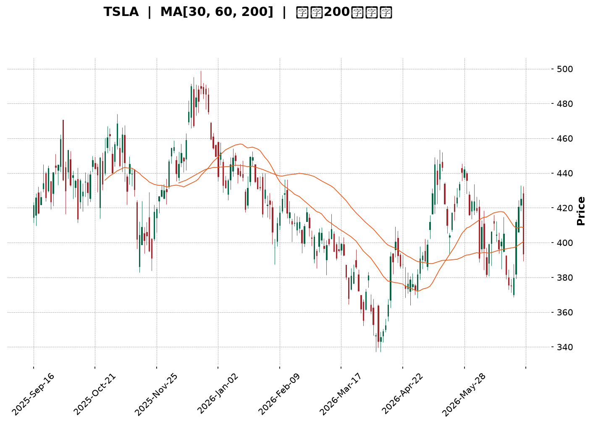
</details>

<html>
<head><meta charset="utf-8" /></head>
<body>
    <div style="height:500px; width:100%;">                        <script>window.PlotlyConfig = {MathJaxConfig: 'local'};</script>
        <script charset="utf-8" src="https://cdn.plot.ly/plotly-3.6.0.min.js" integrity="sha256-QaOVwtVY0T02VaHrr6pnoHLCwayMJp4O5n4YyaE3rJk=" crossorigin="anonymous"></script>                <div id="candlestick-chart" class="plotly-graph-div" style="height:100%; width:100%;"></div>            <script>                window.PLOTLYENV=window.PLOTLYENV || {};                                if (document.getElementById("candlestick-chart")) {                    Plotly.newPlot(                        "candlestick-chart",                        [{"close":{"dtype":"f8","bdata":"AAAAgOtZekAAAACAwp16QAAAAKCZDXpAAAAAwB6hekAAAAAgXCN7QAAAAKCZnXpAAAAA4KOse0AAAACAPXZ6QAAAAGBmhntAAAAAIFyze0AAAAAghct7QAAAACBct3xAAAAAAABAe0AAAACgR916QAAAAAAAVHxAAAAAoHARe0AAAABACmt7QAAAAOCjOHtAAAAAANfXeUAAAABgZj57QAAAAADX03pAAAAAYGYye0AAAAAAAMx6QAAAAMD1dHtAAAAAQOH2e0AAAACgmal7QAAAACCFb3tAAAAAIK4PfEAAAAAghRt7QAAAAGC4RnxAAAAAwMzIfEAAAAAAKdh8QAAAAKCZgXtAAAAAwPWIfEAAAACA60V9QAAAAAApxHtAAAAAwB7hfEAAAABgj957QAAAAOBR2HpAAAAAIK7Te0AAAACA63l7QAAAAKCZ6XpAAAAAANcfeUAAAACgmUV5QAAAAGC4jnlAAAAAAAAUeUAAAAAA1z95QAAAACCus3hAAAAAoHBxeEAAAADgehx6QAAAAGBmNnpAAAAAoEepekAAAABguOJ6QAAAAIA94npAAAAAANfTekAAAAAA1+t7QAAAAOB6aHxAAAAAAABwfEAAAACgR3l7QAAAAGC40ntAAAAAQDM3fEAAAACAPe57QAAAACBcr3xAAAAAwPW0fUAAAACAFJ5+QAAAAAApNH1AAAAAgOs1fkAAAABAMxN+QAAAACCui35AAAAAwPVYfkAAAABgZlZ+QAAAAEAKs31AAAAAgD26fEAAAABA4WZ8QAAAACCFG3xAAAAAwB5he0AAAABguDp8QAAAACBcD3tAAAAAYI\u002f2ekAAAADAzDx7QAAAAAAp0HtAAAAAIFwPfEAAAABAM\u002fN7QAAAAEAzc3tAAAAAwB5pe0AAAAAAAFh7QAAAAAAANHpAAAAAQAr3ekAAAACAwhV8QAAAAMD1EHxAAAAAQDMze0AAAABgZu56QAAAACBc93pAAAAAwPUIekAAAABgj+Z6QAAAAMD1XHpAAAAAIFxfekAAAAAAKWB5QAAAACBc03hAAAAAgMKxeUAAAADAHhV6QAAAACBck3pAAAAA4FHEekAAAADAHhF6QAAAAEAKF3pAAAAAgBSqeUAAAADAHrV5QAAAACBcu3lAAAAAwB69eUAAAACgR\u002f14QAAAAIAUlnlAAAAAYGYWekAAAACgR4l5QAAAAAApKHlAAAAAwB41eUAAAABA4YZ4QAAAAEAKX3lAAAAAwMxYeUAAAAAgrst4QAAAAEDh6nhAAAAAANfzeEAAAADAHn15QAAAAAApsHhAAAAAQDNzeEAAAADA9bh4QAAAAOBR9HhAAAAA4HqMeEAAAADAzMR3QAAAACBc\u002f3ZAAAAAoJnNd0AAAADgevB3QAAAAEAzH3hAAAAAgMJBd0AAAACgR512QAAAAOB6NHZAAAAAAAA8d0AAAAAAKdR3QAAAAKBwiXZAAAAAwB4NdkAAAABgZqp1QAAAAAAAdHVAAAAAgOuZdUAAAABAM891QAAAAGC4BnZAAAAAQDPDdkAAAABAM394QAAAAGBmTnhAAAAAgOsJeUAAAAAAAIh4QAAAAGC4JnhAAAAAACk4eEAAAAAghVt3QAAAAMDMhHdAAAAAYLiqd0AAAADgUYB3QAAAAMDMTHdAAAAAgBTad0AAAADAHm14QAAAAAApiHhAAAAAgOtVeEAAAAAgrut4QAAAAOCjvHlAAAAAoJnFekAAAAAAANB7QAAAAEAzF3tAAAAA4FHUe0AAAADAzLR7QAAAAADXY3pAAAAAANefeUAAAACAwkF5QAAAAAApFHpAAAAAoJkdekAAAAAAKaB6QAAAAKBwGXtAAAAAgMKFe0AAAACgmaF7QAAAAOCjPHtAAAAAgBT+eUAAAAAA13t6QAAAAEAze3pAAAAAQDMnekAAAAAAAHB4QAAAAEAzj3lAAAAAQOHKeEAAAACgcNl3QAAAAGBm8nhAAAAAQOFmeUAAAABgZrJ5QAAAAGCPSnlAAAAAgBTGeEAAAAAA1wd5QAAAAMDMUHlAAAAAgMLZd0AAAADgenh3QAAAAIDrcXdAAAAAIFy7d0AAAACgcL15QAAAAKCZSXpAAAAAwMyUekAAAABAM5d4QA=="},"high":{"dtype":"f8","bdata":"AAAAAAB0ekAAAADA9cR6QAAAACCFA3tAAAAAIIXXekAAAAAgrs97QAAAACCFj3tAAAAAIFzDe0AAAACgmTV7QAAAACCFh3tAAAAAIK4vfEAAAAAAANB7QAAAAOCj5HxAAAAAAABsfUAAAADgUex7QAAAAMDMWHxAAAAAQOFKfEAAAACgR5V7QAAAAKCZRXtAAAAAgBSye0AAAACAPU57QAAAAEAzI3tAAAAAACmIe0AAAACgmXV7QAAAACBcl3tAAAAAwMwcfEAAAADAzBR8QAAAAOCj2HtAAAAAYGYWfEAAAABA4Tp8QAAAAGCPwnxAAAAAAAAwfUAAAABAMxt9QAAAAMD1cHxAAAAAAACgfEAAAADAHqF9QAAAACCFw3xAAAAAoEclfUAAAABAMzd9QAAAAIDCdXtAAAAAYLgafEAAAAAA16d7QAAAAKBHpXtAAAAAAACIekAAAABACsN5QAAAACBcf3pAAAAAYGaOeUAAAADgerx5QAAAAEAKz3pAAAAAwMwseUAAAAAghVt6QAAAACCuR3pAAAAAQAqvekAAAABA4Q57QAAAAGCPGntAAAAAwMxMe0AAAABguP57QAAAAIAUanxAAAAAgOutfEAAAAAAABx8QAAAAIA9RnxAAAAAgBSOfEAAAADgURR8QAAAAAAp8HxAAAAA4FEcfkAAAAAAALh+QAAAAOB69H5AAAAAgMKtfkAAAAAA16d+QAAAAKBHLX9AAAAAIIW\u002ffkAAAABgZq5+QAAAAKBwkX5AAAAAYGZWfUAAAACA6\u002fF8QAAAAMDMiHxAAAAAoHClfEAAAADAzJh8QAAAAAAABHxAAAAAgOtle0AAAACAPU57QAAAAMDMEHxAAAAAwMxkfEAAAADA9Tx8QAAAAGCPvntAAAAAgMLVe0AAAAAAAPR7QAAAACCu63pAAAAAQDNje0AAAAAAABh8QAAAAEDhRnxAAAAA4KPQe0AAAADgUVh7QAAAAAApZHtAAAAAIK6De0AAAACAFH57QAAAAGBmsnpAAAAAwPXIekAAAABgZn56QAAAAKCZIXlAAAAAwMzoeUAAAAAAAFR6QAAAAAAAtHpAAAAAoJlFe0AAAAAgrkN7QAAAAMD1gHpAAAAAIIXbeUAAAABgZg56QAAAAAAA9HlAAAAAQDPreUAAAABAM3t5QAAAAMAerXlAAAAAoHBFekAAAADA9Qx6QAAAAIDrcXlAAAAA4KNIeUAAAACgcMV4QAAAAKBHhXlAAAAAgOuJeUAAAACgmSV5QAAAAKBwGXlAAAAAoHBpeUAAAACAFAZ6QAAAAAAAaHlAAAAAQDMDeUAAAAAgrjt5QAAAAIDrAXlAAAAAwB4xeUAAAADgUTR4QAAAAIA9vndAAAAAoEcVeEAAAAAgrjd4QAAAACCuw3hAAAAAQAoHeEAAAACAwh13QAAAAOCj9HZAAAAAoEdVd0AAAACAPfJ3QAAAAOB6JHdAAAAAIIX7dkAAAADgUcB1QAAAAAAAyHZAAAAAgBTOdUAAAACAwuV1QAAAAKCZRXZAAAAAgBT6dkAAAABgZqp4QAAAAMD1oHhAAAAA4HqUeUAAAADAzGx5QAAAAEAzn3hAAAAAACmQeEAAAAAAACB4QAAAAAAp7HdAAAAA4HrMd0AAAADgo+R3QAAAAGBmhndAAAAAAAAMeEAAAADAHt14QAAAAIA9qnhAAAAAgOsheUAAAABA4Rp5QAAAAKBH\u002fXlAAAAAQDPzekAAAABgjxJ8QAAAAMDM\u002fHtAAAAAYGZWfEAAAAAgrj98QAAAAGCPKntAAAAAgBRSekAAAACAFFp5QAAAACBcF3pAAAAAQDOvekAAAAAAKfh6QAAAAEAzM3tAAAAAoJnZe0AAAAAgXL97QAAAAMAekXtAAAAAoJnZekAAAABguIZ6QAAAAKCZGXtAAAAAoJmlekAAAABA4Yp6QAAAAEAKz3lAAAAAAAAoekAAAACgcNF4QAAAAOCj+HhAAAAAQOFqeUAAAAAAAAB6QAAAAGC4xnlAAAAAQApfeUAAAADgUSh5QAAAAAAA7HlAAAAAgOuNeEAAAACgRwl4QAAAAIDrsXdAAAAAwMw8eEAAAADgUdR5QAAAAOCjiHpAAAAAgMINe0AAAACgmQV7QA=="},"hovertemplate":"\u003cb\u003e%{x|%Y-%m-%d}\u003c\u002fb\u003e\u003cbr\u003e\u958b: $%{open:.2f}\u003cbr\u003e\u9ad8: $%{high:.2f}\u003cbr\u003e\u4f4e: $%{low:.2f}\u003cbr\u003e\u6536: $%{close:.2f}\u003cextra\u003e\u003c\u002fextra\u003e","low":{"dtype":"f8","bdata":"AAAAQOG2eUAAAABguJp5QAAAAMD1CHpAAAAAIIVbekAAAACAFNJ6QAAAACCFe3pAAAAA4HrQekAAAACgRzF6QAAAAOBRUHpAAAAAAAB4e0AAAACA6xF7QAAAAAAAjHtAAAAAwB45e0AAAACgRwl6QAAAAEAKS3tAAAAAQDMHe0AAAAAgrpN6QAAAAEDhonpAAAAAQDO3eUAAAABAMzt6QAAAAIDCHXpAAAAAoEelekAAAADA9VR6QAAAAKCZeXpAAAAAgMKJe0AAAADAzKB7QAAAAAAA0HpAAAAAYGbeeUAAAABguOJ6QAAAAEAKa3tAAAAAoJk5fEAAAABgZkp8QAAAAIDCeXtAAAAAQAq7e0AAAADAzFx8QAAAAKCZuXtAAAAAIFyLe0AAAACgcDF7QAAAAIAUXnpAAAAAgMIVe0AAAACAwgV7QAAAAMD1qHpAAAAAoHDFeEAAAADgeux3QAAAAADX63hAAAAAIFybeEAAAAAAAOh4QAAAAADXq3hAAAAAACn8d0AAAACgcBF5QAAAAEAzX3lAAAAAgD0OekAAAABAM6N6QAAAAOCjlHpAAAAAgOthekAAAACAwvF6QAAAAIA91ntAAAAAYI86fEAAAAAAADR7QAAAAEAzO3tAAAAAgMK5e0AAAACgR4V7QAAAAGC4mntAAAAAYI86fUAAAACgRx19QAAAAEAzI31AAAAAgOuRfUAAAAAghat9QAAAAKBHVX5AAAAAoHAtfkAAAADAzMx9QAAAAMAenX1AAAAAAACwfEAAAACgR118QAAAAMDMFHxAAAAAwMw0e0AAAADAHsl7QAAAAOB6zHpAAAAA4KP0ekAAAACA64V6QAAAAIA95npAAAAAAABge0AAAABAM797QAAAACCFI3tAAAAAYGZae0AAAAAAKTR7QAAAAEAKF3pAAAAAgOs5ekAAAACAFAp7QAAAAOCjwHtAAAAA4Hoke0AAAABACut6QAAAAKCZ4XpAAAAAgOvpeUAAAABAM2t6QAAAAAAA6HlAAAAAQArbeUAAAABA4fJ4QAAAAOB6OHhAAAAAAADceEAAAADgo3R5QAAAAAAAEHpAAAAA4HpAekAAAAAAAOB5QAAAAIAUrnlAAAAAACkIeUAAAACgR5l5QAAAAIDCQXlAAAAAAABYeUAAAADgo6B4QAAAAIA92nhAAAAAYGbCeUAAAABgjzp5QAAAAIDC4XhAAAAAAABEeEAAAACAPRZ4QAAAAKBHqXhAAAAAYLj2eEAAAAAgXKN4QAAAAGBm1ndAAAAAQArjeEAAAABgZiJ5QAAAAGBmqnhAAAAAQDNfeEAAAABguKZ4QAAAAAAAkHhAAAAAwPWEeEAAAAAgrqt3QAAAACBcx3ZAAAAAIK5Ld0AAAADA9YR3QAAAAAApEHhAAAAAgOs9d0AAAAAghXd2QAAAAIA9AnZAAAAAAACQdkAAAACgR2F3QAAAAOB6cHZAAAAAgD2qdUAAAAAA1xN1QAAAAGC4OnVAAAAAAAAUdUAAAAAA12t1QAAAAMAeyXVAAAAA4FEsdkAAAAAAAKh2QAAAAMDM3HdAAAAAYGZ6eEAAAACgR0V4QAAAACCFE3hAAAAAwMwUeEAAAACAPQZ3QAAAACCuK3dAAAAA4FHAdkAAAADgo0h3QAAAAOCjIHdAAAAAYLgCd0AAAADAzKx3QAAAAMDMDHhAAAAAAABQeEAAAADgUQB4QAAAAIDrIXlAAAAAgD0GekAAAADAzAx6QAAAAAApZHpAAAAAIFzjekAAAABgj5J7QAAAAAAAYHpAAAAAoEdVeUAAAACAFJp4QAAAAIA9ZnlAAAAAYGbOeUAAAAAAKUh6QAAAAIDroXpAAAAA4FE4e0AAAADAzER7QAAAAIA9wnpAAAAAQOH2eUAAAABgZtp5QAAAAAAAAHpAAAAAYI8SekAAAACgcEl4QAAAACCFq3hAAAAAANcDeEAAAABgZsJ3QAAAAGCPyndAAAAAACkseEAAAACgmXF5QAAAAOCjCHlAAAAAACmceEAAAABAMwt4QAAAAGBmpnhAAAAAwPWwd0AAAADAzFB3QAAAACCFM3dAAAAAoJkJd0AAAADAzLR3QAAAAAAAYHlAAAAAoHAhekAAAABA0VR4QA=="},"name":"\u50f9\u683c","open":{"dtype":"f8","bdata":"AAAAAADoeUAAAAAAAPx5QAAAAIDrzXpAAAAAwB5dekAAAACAwvF6QAAAAIAUfntAAAAAoEfdekAAAAAA1zN7QAAAAMDMxHpAAAAAoJnFe0AAAADgUZh7QAAAAMDMvHtAAAAA4KNofUAAAADgo7R7QAAAAAAAjHtAAAAAwB79e0AAAADAHll7QAAAAMD1\u002fHpAAAAA4KNIe0AAAADgenh6QAAAAOCjrHpAAAAAYGYue0AAAAAgrit7QAAAAAAAmHpAAAAAgOu9e0AAAAAAKdx7QAAAAEAzt3tAAAAAAABAekAAAACgR+17QAAAACCuf3tAAAAA4HpsfEAAAAAAAOh8QAAAAMDMMHxAAAAAAADse0AAAAAA1398QAAAACBcZ3xAAAAAwMxAfEAAAAAgXN98QAAAAGC4XntAAAAAoJl5e0AAAABgZnZ7QAAAAGBmontAAAAAgBRyekAAAADAzCR4QAAAAADX63hAAAAAgBRWeUAAAABA4WJ5QAAAAIAU6nlAAAAAwB4leUAAAABguCJ5QAAAAGC45nlAAAAAQDN\u002fekAAAACgcKl6QAAAAMAelXpAAAAAwPXsekAAAACgmQF7QAAAAEAKH3xAAAAA4HpQfEAAAABAM\u002fd7QAAAAOCjWHtAAAAAwB7he0AAAABAMw98QAAAAKBwAXxAAAAAQApXfUAAAAAgXIN9QAAAACCFg35AAAAAYI\u002fifUAAAACA64F+QAAAAIAUnn5AAAAAYGaWfkAAAAAgrod+QAAAACCuU35AAAAAAABQfUAAAACgcNF8QAAAAKCZgXxAAAAAwMycfEAAAAAA1\u002f97QAAAAIAU5ntAAAAAYGY+e0AAAACAPb56QAAAAEAzP3tAAAAAIK6Te0AAAABAMyN8QAAAAMD1rHtAAAAAgBSSe0AAAAAAAHh7QAAAAIDC1XpAAAAAYI9aekAAAABgjzJ7QAAAAEDh9ntAAAAAAADQe0AAAABgj1Z7QAAAAGCP\u002fnpAAAAAwMxce0AAAACgmZV6QAAAAOCjVHpAAAAA4FGEekAAAAAgXEd6QAAAAOBR0HhAAAAAgOsNeUAAAABgj555QAAAAKBHIXpAAAAAIFy\u002fekAAAADAzOR6QAAAAMD15HlAAAAAgMLFeUAAAACAwrF5QAAAAAAAdHlAAAAAwMyEeUAAAADgo3R5QAAAAAAA+HhAAAAAYGbCeUAAAABguOZ5QAAAAEAKL3lAAAAAoJlpeEAAAACgcLF4QAAAAKCZ3XhAAAAAwB4ZeUAAAACgcOF4QAAAAMDMYHhAAAAAIIUjeUAAAADgeiR5QAAAAEDhUnlAAAAAYLjyeEAAAAAghcN4QAAAAEAKu3hAAAAAAADweEAAAADgUTR4QAAAAKCZvXdAAAAAoHBRd0AAAADA9Yh3QAAAAADXX3hAAAAAoJnZd0AAAABACht3QAAAAIDC3XZAAAAAACmYdkAAAACAFKp3QAAAAEAzw3ZAAAAAoHCpdkAAAABACqd1QAAAAOCjvHZAAAAAYGZydUAAAADgo6R1QAAAAMAe4XVAAAAAYLhadkAAAACgR+12QAAAAMD1nHhAAAAAYLi+eEAAAACgRyl5QAAAAAAAkHhAAAAAwB45eEAAAADgenR3QAAAAAAAWHdAAAAAoHBBd0AAAABA4Wp3QAAAAGBmdndAAAAAAABMd0AAAAAA1+d3QAAAACCuY3hAAAAAQAqzeEAAAAAAACR4QAAAACCud3lAAAAAIK4HekAAAABgj2J6QAAAAGCPlntAAAAAYLhKe0AAAAAA1+d7QAAAACCuH3tAAAAA4FE0ekAAAABgjzJ5QAAAAKCZeXlAAAAAQOFiekAAAABguGp6QAAAAAAp5HpAAAAAgD2ue0AAAACA61l7QAAAAKCZfXtAAAAAANe3ekAAAAAghSN6QAAAAEAzK3pAAAAAoHA9ekAAAAAAAEh6QAAAAKBHxXhAAAAA4HqweUAAAADgo3h4QAAAAOB6RHhAAAAAANf3eEAAAACA68V5QAAAAIDCQXlAAAAA4HoYeUAAAACgmeF4QAAAAKCZrXhAAAAAgMKJeEAAAACgR8F3QAAAAOBRdHdAAAAAYGYid0AAAADgo9x3QAAAAAAAYHlAAAAAIFxXekAAAAAgrsN6QA=="},"x":["2025-09-16T00:00:00-04:00","2025-09-17T00:00:00-04:00","2025-09-18T00:00:00-04:00","2025-09-19T00:00:00-04:00","2025-09-22T00:00:00-04:00","2025-09-23T00:00:00-04:00","2025-09-24T00:00:00-04:00","2025-09-25T00:00:00-04:00","2025-09-26T00:00:00-04:00","2025-09-29T00:00:00-04:00","2025-09-30T00:00:00-04:00","2025-10-01T00:00:00-04:00","2025-10-02T00:00:00-04:00","2025-10-03T00:00:00-04:00","2025-10-06T00:00:00-04:00","2025-10-07T00:00:00-04:00","2025-10-08T00:00:00-04:00","2025-10-09T00:00:00-04:00","2025-10-10T00:00:00-04:00","2025-10-13T00:00:00-04:00","2025-10-14T00:00:00-04:00","2025-10-15T00:00:00-04:00","2025-10-16T00:00:00-04:00","2025-10-17T00:00:00-04:00","2025-10-20T00:00:00-04:00","2025-10-21T00:00:00-04:00","2025-10-22T00:00:00-04:00","2025-10-23T00:00:00-04:00","2025-10-24T00:00:00-04:00","2025-10-27T00:00:00-04:00","2025-10-28T00:00:00-04:00","2025-10-29T00:00:00-04:00","2025-10-30T00:00:00-04:00","2025-10-31T00:00:00-04:00","2025-11-03T00:00:00-05:00","2025-11-04T00:00:00-05:00","2025-11-05T00:00:00-05:00","2025-11-06T00:00:00-05:00","2025-11-07T00:00:00-05:00","2025-11-10T00:00:00-05:00","2025-11-11T00:00:00-05:00","2025-11-12T00:00:00-05:00","2025-11-13T00:00:00-05:00","2025-11-14T00:00:00-05:00","2025-11-17T00:00:00-05:00","2025-11-18T00:00:00-05:00","2025-11-19T00:00:00-05:00","2025-11-20T00:00:00-05:00","2025-11-21T00:00:00-05:00","2025-11-24T00:00:00-05:00","2025-11-25T00:00:00-05:00","2025-11-26T00:00:00-05:00","2025-11-28T00:00:00-05:00","2025-12-01T00:00:00-05:00","2025-12-02T00:00:00-05:00","2025-12-03T00:00:00-05:00","2025-12-04T00:00:00-05:00","2025-12-05T00:00:00-05:00","2025-12-08T00:00:00-05:00","2025-12-09T00:00:00-05:00","2025-12-10T00:00:00-05:00","2025-12-11T00:00:00-05:00","2025-12-12T00:00:00-05:00","2025-12-15T00:00:00-05:00","2025-12-16T00:00:00-05:00","2025-12-17T00:00:00-05:00","2025-12-18T00:00:00-05:00","2025-12-19T00:00:00-05:00","2025-12-22T00:00:00-05:00","2025-12-23T00:00:00-05:00","2025-12-24T00:00:00-05:00","2025-12-26T00:00:00-05:00","2025-12-29T00:00:00-05:00","2025-12-30T00:00:00-05:00","2025-12-31T00:00:00-05:00","2026-01-02T00:00:00-05:00","2026-01-05T00:00:00-05:00","2026-01-06T00:00:00-05:00","2026-01-07T00:00:00-05:00","2026-01-08T00:00:00-05:00","2026-01-09T00:00:00-05:00","2026-01-12T00:00:00-05:00","2026-01-13T00:00:00-05:00","2026-01-14T00:00:00-05:00","2026-01-15T00:00:00-05:00","2026-01-16T00:00:00-05:00","2026-01-20T00:00:00-05:00","2026-01-21T00:00:00-05:00","2026-01-22T00:00:00-05:00","2026-01-23T00:00:00-05:00","2026-01-26T00:00:00-05:00","2026-01-27T00:00:00-05:00","2026-01-28T00:00:00-05:00","2026-01-29T00:00:00-05:00","2026-01-30T00:00:00-05:00","2026-02-02T00:00:00-05:00","2026-02-03T00:00:00-05:00","2026-02-04T00:00:00-05:00","2026-02-05T00:00:00-05:00","2026-02-06T00:00:00-05:00","2026-02-09T00:00:00-05:00","2026-02-10T00:00:00-05:00","2026-02-11T00:00:00-05:00","2026-02-12T00:00:00-05:00","2026-02-13T00:00:00-05:00","2026-02-17T00:00:00-05:00","2026-02-18T00:00:00-05:00","2026-02-19T00:00:00-05:00","2026-02-20T00:00:00-05:00","2026-02-23T00:00:00-05:00","2026-02-24T00:00:00-05:00","2026-02-25T00:00:00-05:00","2026-02-26T00:00:00-05:00","2026-02-27T00:00:00-05:00","2026-03-02T00:00:00-05:00","2026-03-03T00:00:00-05:00","2026-03-04T00:00:00-05:00","2026-03-05T00:00:00-05:00","2026-03-06T00:00:00-05:00","2026-03-09T00:00:00-04:00","2026-03-10T00:00:00-04:00","2026-03-11T00:00:00-04:00","2026-03-12T00:00:00-04:00","2026-03-13T00:00:00-04:00","2026-03-16T00:00:00-04:00","2026-03-17T00:00:00-04:00","2026-03-18T00:00:00-04:00","2026-03-19T00:00:00-04:00","2026-03-20T00:00:00-04:00","2026-03-23T00:00:00-04:00","2026-03-24T00:00:00-04:00","2026-03-25T00:00:00-04:00","2026-03-26T00:00:00-04:00","2026-03-27T00:00:00-04:00","2026-03-30T00:00:00-04:00","2026-03-31T00:00:00-04:00","2026-04-01T00:00:00-04:00","2026-04-02T00:00:00-04:00","2026-04-06T00:00:00-04:00","2026-04-07T00:00:00-04:00","2026-04-08T00:00:00-04:00","2026-04-09T00:00:00-04:00","2026-04-10T00:00:00-04:00","2026-04-13T00:00:00-04:00","2026-04-14T00:00:00-04:00","2026-04-15T00:00:00-04:00","2026-04-16T00:00:00-04:00","2026-04-17T00:00:00-04:00","2026-04-20T00:00:00-04:00","2026-04-21T00:00:00-04:00","2026-04-22T00:00:00-04:00","2026-04-23T00:00:00-04:00","2026-04-24T00:00:00-04:00","2026-04-27T00:00:00-04:00","2026-04-28T00:00:00-04:00","2026-04-29T00:00:00-04:00","2026-04-30T00:00:00-04:00","2026-05-01T00:00:00-04:00","2026-05-04T00:00:00-04:00","2026-05-05T00:00:00-04:00","2026-05-06T00:00:00-04:00","2026-05-07T00:00:00-04:00","2026-05-08T00:00:00-04:00","2026-05-11T00:00:00-04:00","2026-05-12T00:00:00-04:00","2026-05-13T00:00:00-04:00","2026-05-14T00:00:00-04:00","2026-05-15T00:00:00-04:00","2026-05-18T00:00:00-04:00","2026-05-19T00:00:00-04:00","2026-05-20T00:00:00-04:00","2026-05-21T00:00:00-04:00","2026-05-22T00:00:00-04:00","2026-05-26T00:00:00-04:00","2026-05-27T00:00:00-04:00","2026-05-28T00:00:00-04:00","2026-05-29T00:00:00-04:00","2026-06-01T00:00:00-04:00","2026-06-02T00:00:00-04:00","2026-06-03T00:00:00-04:00","2026-06-04T00:00:00-04:00","2026-06-05T00:00:00-04:00","2026-06-08T00:00:00-04:00","2026-06-09T00:00:00-04:00","2026-06-10T00:00:00-04:00","2026-06-11T00:00:00-04:00","2026-06-12T00:00:00-04:00","2026-06-15T00:00:00-04:00","2026-06-16T00:00:00-04:00","2026-06-17T00:00:00-04:00","2026-06-18T00:00:00-04:00","2026-06-22T00:00:00-04:00","2026-06-23T00:00:00-04:00","2026-06-24T00:00:00-04:00","2026-06-25T00:00:00-04:00","2026-06-26T00:00:00-04:00","2026-06-29T00:00:00-04:00","2026-06-30T00:00:00-04:00","2026-07-01T00:00:00-04:00","2026-07-02T00:00:00-04:00"],"type":"candlestick"},{"hovertemplate":"MA30: $%{y:.2f}\u003cextra\u003e\u003c\u002fextra\u003e","line":{"color":"#2196F3","dash":"dash","width":2},"mode":"lines","name":"MA30","x":["2025-09-16T00:00:00-04:00","2025-09-17T00:00:00-04:00","2025-09-18T00:00:00-04:00","2025-09-19T00:00:00-04:00","2025-09-22T00:00:00-04:00","2025-09-23T00:00:00-04:00","2025-09-24T00:00:00-04:00","2025-09-25T00:00:00-04:00","2025-09-26T00:00:00-04:00","2025-09-29T00:00:00-04:00","2025-09-30T00:00:00-04:00","2025-10-01T00:00:00-04:00","2025-10-02T00:00:00-04:00","2025-10-03T00:00:00-04:00","2025-10-06T00:00:00-04:00","2025-10-07T00:00:00-04:00","2025-10-08T00:00:00-04:00","2025-10-09T00:00:00-04:00","2025-10-10T00:00:00-04:00","2025-10-13T00:00:00-04:00","2025-10-14T00:00:00-04:00","2025-10-15T00:00:00-04:00","2025-10-16T00:00:00-04:00","2025-10-17T00:00:00-04:00","2025-10-20T00:00:00-04:00","2025-10-21T00:00:00-04:00","2025-10-22T00:00:00-04:00","2025-10-23T00:00:00-04:00","2025-10-24T00:00:00-04:00","2025-10-27T00:00:00-04:00","2025-10-28T00:00:00-04:00","2025-10-29T00:00:00-04:00","2025-10-30T00:00:00-04:00","2025-10-31T00:00:00-04:00","2025-11-03T00:00:00-05:00","2025-11-04T00:00:00-05:00","2025-11-05T00:00:00-05:00","2025-11-06T00:00:00-05:00","2025-11-07T00:00:00-05:00","2025-11-10T00:00:00-05:00","2025-11-11T00:00:00-05:00","2025-11-12T00:00:00-05:00","2025-11-13T00:00:00-05:00","2025-11-14T00:00:00-05:00","2025-11-17T00:00:00-05:00","2025-11-18T00:00:00-05:00","2025-11-19T00:00:00-05:00","2025-11-20T00:00:00-05:00","2025-11-21T00:00:00-05:00","2025-11-24T00:00:00-05:00","2025-11-25T00:00:00-05:00","2025-11-26T00:00:00-05:00","2025-11-28T00:00:00-05:00","2025-12-01T00:00:00-05:00","2025-12-02T00:00:00-05:00","2025-12-03T00:00:00-05:00","2025-12-04T00:00:00-05:00","2025-12-05T00:00:00-05:00","2025-12-08T00:00:00-05:00","2025-12-09T00:00:00-05:00","2025-12-10T00:00:00-05:00","2025-12-11T00:00:00-05:00","2025-12-12T00:00:00-05:00","2025-12-15T00:00:00-05:00","2025-12-16T00:00:00-05:00","2025-12-17T00:00:00-05:00","2025-12-18T00:00:00-05:00","2025-12-19T00:00:00-05:00","2025-12-22T00:00:00-05:00","2025-12-23T00:00:00-05:00","2025-12-24T00:00:00-05:00","2025-12-26T00:00:00-05:00","2025-12-29T00:00:00-05:00","2025-12-30T00:00:00-05:00","2025-12-31T00:00:00-05:00","2026-01-02T00:00:00-05:00","2026-01-05T00:00:00-05:00","2026-01-06T00:00:00-05:00","2026-01-07T00:00:00-05:00","2026-01-08T00:00:00-05:00","2026-01-09T00:00:00-05:00","2026-01-12T00:00:00-05:00","2026-01-13T00:00:00-05:00","2026-01-14T00:00:00-05:00","2026-01-15T00:00:00-05:00","2026-01-16T00:00:00-05:00","2026-01-20T00:00:00-05:00","2026-01-21T00:00:00-05:00","2026-01-22T00:00:00-05:00","2026-01-23T00:00:00-05:00","2026-01-26T00:00:00-05:00","2026-01-27T00:00:00-05:00","2026-01-28T00:00:00-05:00","2026-01-29T00:00:00-05:00","2026-01-30T00:00:00-05:00","2026-02-02T00:00:00-05:00","2026-02-03T00:00:00-05:00","2026-02-04T00:00:00-05:00","2026-02-05T00:00:00-05:00","2026-02-06T00:00:00-05:00","2026-02-09T00:00:00-05:00","2026-02-10T00:00:00-05:00","2026-02-11T00:00:00-05:00","2026-02-12T00:00:00-05:00","2026-02-13T00:00:00-05:00","2026-02-17T00:00:00-05:00","2026-02-18T00:00:00-05:00","2026-02-19T00:00:00-05:00","2026-02-20T00:00:00-05:00","2026-02-23T00:00:00-05:00","2026-02-24T00:00:00-05:00","2026-02-25T00:00:00-05:00","2026-02-26T00:00:00-05:00","2026-02-27T00:00:00-05:00","2026-03-02T00:00:00-05:00","2026-03-03T00:00:00-05:00","2026-03-04T00:00:00-05:00","2026-03-05T00:00:00-05:00","2026-03-06T00:00:00-05:00","2026-03-09T00:00:00-04:00","2026-03-10T00:00:00-04:00","2026-03-11T00:00:00-04:00","2026-03-12T00:00:00-04:00","2026-03-13T00:00:00-04:00","2026-03-16T00:00:00-04:00","2026-03-17T00:00:00-04:00","2026-03-18T00:00:00-04:00","2026-03-19T00:00:00-04:00","2026-03-20T00:00:00-04:00","2026-03-23T00:00:00-04:00","2026-03-24T00:00:00-04:00","2026-03-25T00:00:00-04:00","2026-03-26T00:00:00-04:00","2026-03-27T00:00:00-04:00","2026-03-30T00:00:00-04:00","2026-03-31T00:00:00-04:00","2026-04-01T00:00:00-04:00","2026-04-02T00:00:00-04:00","2026-04-06T00:00:00-04:00","2026-04-07T00:00:00-04:00","2026-04-08T00:00:00-04:00","2026-04-09T00:00:00-04:00","2026-04-10T00:00:00-04:00","2026-04-13T00:00:00-04:00","2026-04-14T00:00:00-04:00","2026-04-15T00:00:00-04:00","2026-04-16T00:00:00-04:00","2026-04-17T00:00:00-04:00","2026-04-20T00:00:00-04:00","2026-04-21T00:00:00-04:00","2026-04-22T00:00:00-04:00","2026-04-23T00:00:00-04:00","2026-04-24T00:00:00-04:00","2026-04-27T00:00:00-04:00","2026-04-28T00:00:00-04:00","2026-04-29T00:00:00-04:00","2026-04-30T00:00:00-04:00","2026-05-01T00:00:00-04:00","2026-05-04T00:00:00-04:00","2026-05-05T00:00:00-04:00","2026-05-06T00:00:00-04:00","2026-05-07T00:00:00-04:00","2026-05-08T00:00:00-04:00","2026-05-11T00:00:00-04:00","2026-05-12T00:00:00-04:00","2026-05-13T00:00:00-04:00","2026-05-14T00:00:00-04:00","2026-05-15T00:00:00-04:00","2026-05-18T00:00:00-04:00","2026-05-19T00:00:00-04:00","2026-05-20T00:00:00-04:00","2026-05-21T00:00:00-04:00","2026-05-22T00:00:00-04:00","2026-05-26T00:00:00-04:00","2026-05-27T00:00:00-04:00","2026-05-28T00:00:00-04:00","2026-05-29T00:00:00-04:00","2026-06-01T00:00:00-04:00","2026-06-02T00:00:00-04:00","2026-06-03T00:00:00-04:00","2026-06-04T00:00:00-04:00","2026-06-05T00:00:00-04:00","2026-06-08T00:00:00-04:00","2026-06-09T00:00:00-04:00","2026-06-10T00:00:00-04:00","2026-06-11T00:00:00-04:00","2026-06-12T00:00:00-04:00","2026-06-15T00:00:00-04:00","2026-06-16T00:00:00-04:00","2026-06-17T00:00:00-04:00","2026-06-18T00:00:00-04:00","2026-06-22T00:00:00-04:00","2026-06-23T00:00:00-04:00","2026-06-24T00:00:00-04:00","2026-06-25T00:00:00-04:00","2026-06-26T00:00:00-04:00","2026-06-29T00:00:00-04:00","2026-06-30T00:00:00-04:00","2026-07-01T00:00:00-04:00","2026-07-02T00:00:00-04:00"],"y":{"dtype":"f8","bdata":"AAAAAAAA+H8AAAAAAAD4fwAAAAAAAPh\u002fAAAAAAAA+H8AAAAAAAD4fwAAAAAAAPh\u002fAAAAAAAA+H8AAAAAAAD4fwAAAAAAAPh\u002fAAAAAAAA+H8AAAAAAAD4fwAAAAAAAPh\u002fAAAAAAAA+H8AAAAAAAD4fwAAAAAAAPh\u002fAAAAAAAA+H8AAAAAAAD4fwAAAAAAAPh\u002fAAAAAAAA+H8AAAAAAAD4fwAAAAAAAPh\u002fAAAAAAAA+H8AAAAAAAD4fwAAAAAAAPh\u002fAAAAAAAA+H8AAAAAAAD4fwAAAAAAAPh\u002fAAAAAAAA+H8AAAAAAAD4f5qZmblJPntAd3d39wxTe0AiIiJiEGZ7QImIiMh2cntA7+7urrmCe0CamZmp8ZR7QN7d3T3DnntAq6qqmgupe0BVVVVVDrV7QJqZmdlAr3tAZmZmplSwe0BERERUnK17QKuqqvo3nntAq6qqehSMe0DNzMycfX57QHd3dxfZZntA7+7u3t1Ve0CamZkpXEN7QBEREYHcLXtAiYiIKOohe0DNzMwsQBh7QAAAALAAE3tAiYiImG4Oe0CamZl5MA97QHd3d3dMCntAzczM7JgAe0C8u7srzgJ7QBEREaEaC3tA7+7ujlAOe0BERESkcBF7QGZmZsaSDXtAMzMzU7gIe0BVVVU17AB7QJqZmTn7CntAmpmZOfsUe0Dv7u4OdCB7QDMzM1O4LHtAvLu7exQ4e0Dv7u6+5kp7QDMzM+N6antAZmZmRv1\u002fe0BVVVXFZ5h7QKuqqsovsHtAERER8e7Oe0B3d3eHpOl7QGZmZhZn\u002f3tA7+7uPgoTfECJiIgoeCx8QO\u002fu7o6XQHxAVVVVlRhWfECamZnptF98QImIiIhdbXxAZmZmJk15fEAAAABQYoJ8QN7d3U03h3xAmpmZKTGMfECJiIiYQ4d8QDMzM7NydHxAmpmZ+eFnfEBVVVVFGW18QCIiImIsb3xAd3d3t4FmfEC8u7uL+l18QBEREeFPT3xAvLu7i\u002fovfECJiIjoQhB8QHd3d3cF+HtARERE9ETXe0AzMzMDK697QKuqqnpbfntAIiIikqZWe0AiIiJiVzJ7QCIiInKvF3tAREREZPQGe0AiIiKCB\u002fN6QGZmZjbQ4XpAzczMvC3TekDe3d2dqL16QImIiEhTsnpAiYiImOCnekDe3d19sZR6QO\u002fu7s6wgXpAERER0dtwekBVVVXlQlx6QM3MzHyxSHpAAAAAsOQ1ekAREREh2x16QO\u002fu7t7BFnpAVVVVBfMIekBmZmZG4ex5QJqZmbkC0nlAvLu7+9S+eUC8u7vLhbJ5QImIiCgVn3lAzczMrI6ReUDNzMx8+H55QGZmZgbzcnlAvLu7+2JjeUBVVVW1rFV5QLy7uxsTRnlAzczMnO81eUAiIiLipSN5QGZmZpa1DnlAAAAA4MHweEBVVVXFS9N4QLy7u9sksnhAERERcWideEAAAABAYI14QKuqqqoccnhAMzMzM6VSeEC8u7tbSDZ4QImIiGgDE3hAvLu7C7vsd0ARERGR7cx3QM3MzJw2sndA3t3dbVmdd0BVVVXlF513QN7d3V0BlHdAIiIiQmCRd0CJiIi4Ho93QDMzM9OUiHdAq6qqSlOCd0ARERGBI3B3QGZmZvYoZndAMzMzM3pfd0BmZmZWDlV3QM3MzEzwRndARERE9P1Ad0CamZlJmkZ3QO\u002fu7i6yU3dAIiIicj1Yd0BVVVUFnWB3QKuqqgplbndA3t3drWOMd0CJiIgov7h3QImIiPhv4ndAZmZm5qUJeEDNzMxsvCp4QERERLSdS3hAAAAAUBtqeEBERESEwIh4QJqZmVk5sHhAd3d3J7\u002fWeECamZlp2P94QCIiItIiK3lAIiIiMsFTeUB3d3dXgG55QERERGSCh3lARERE5KWPeUARERExT6B5QHd3dycxtHlA7+7ufrHEeUCrqqrK6M15QLy7u5tS33lAIiIiku3oeUAAAAAQ5ut5QHd3d7fz+XlA3t3dvS0HekBmZmZ2BRJ6QHd3d1eAGHpAERERcT0cekDNzMy8LR16QAAAAICVGXpA3t3d7acAekBVVVX1mtt5QHd3d\u002fd+vHlAd3d314eZeUARERGBwIh5QHd3d5fgh3lAq6qq6gqQeUCamZl5W4p5QA=="},"type":"scatter"},{"hovertemplate":"MA60: $%{y:.2f}\u003cextra\u003e\u003c\u002fextra\u003e","line":{"color":"#9C27B0","dash":"dash","width":2},"mode":"lines","name":"MA60","x":["2025-09-16T00:00:00-04:00","2025-09-17T00:00:00-04:00","2025-09-18T00:00:00-04:00","2025-09-19T00:00:00-04:00","2025-09-22T00:00:00-04:00","2025-09-23T00:00:00-04:00","2025-09-24T00:00:00-04:00","2025-09-25T00:00:00-04:00","2025-09-26T00:00:00-04:00","2025-09-29T00:00:00-04:00","2025-09-30T00:00:00-04:00","2025-10-01T00:00:00-04:00","2025-10-02T00:00:00-04:00","2025-10-03T00:00:00-04:00","2025-10-06T00:00:00-04:00","2025-10-07T00:00:00-04:00","2025-10-08T00:00:00-04:00","2025-10-09T00:00:00-04:00","2025-10-10T00:00:00-04:00","2025-10-13T00:00:00-04:00","2025-10-14T00:00:00-04:00","2025-10-15T00:00:00-04:00","2025-10-16T00:00:00-04:00","2025-10-17T00:00:00-04:00","2025-10-20T00:00:00-04:00","2025-10-21T00:00:00-04:00","2025-10-22T00:00:00-04:00","2025-10-23T00:00:00-04:00","2025-10-24T00:00:00-04:00","2025-10-27T00:00:00-04:00","2025-10-28T00:00:00-04:00","2025-10-29T00:00:00-04:00","2025-10-30T00:00:00-04:00","2025-10-31T00:00:00-04:00","2025-11-03T00:00:00-05:00","2025-11-04T00:00:00-05:00","2025-11-05T00:00:00-05:00","2025-11-06T00:00:00-05:00","2025-11-07T00:00:00-05:00","2025-11-10T00:00:00-05:00","2025-11-11T00:00:00-05:00","2025-11-12T00:00:00-05:00","2025-11-13T00:00:00-05:00","2025-11-14T00:00:00-05:00","2025-11-17T00:00:00-05:00","2025-11-18T00:00:00-05:00","2025-11-19T00:00:00-05:00","2025-11-20T00:00:00-05:00","2025-11-21T00:00:00-05:00","2025-11-24T00:00:00-05:00","2025-11-25T00:00:00-05:00","2025-11-26T00:00:00-05:00","2025-11-28T00:00:00-05:00","2025-12-01T00:00:00-05:00","2025-12-02T00:00:00-05:00","2025-12-03T00:00:00-05:00","2025-12-04T00:00:00-05:00","2025-12-05T00:00:00-05:00","2025-12-08T00:00:00-05:00","2025-12-09T00:00:00-05:00","2025-12-10T00:00:00-05:00","2025-12-11T00:00:00-05:00","2025-12-12T00:00:00-05:00","2025-12-15T00:00:00-05:00","2025-12-16T00:00:00-05:00","2025-12-17T00:00:00-05:00","2025-12-18T00:00:00-05:00","2025-12-19T00:00:00-05:00","2025-12-22T00:00:00-05:00","2025-12-23T00:00:00-05:00","2025-12-24T00:00:00-05:00","2025-12-26T00:00:00-05:00","2025-12-29T00:00:00-05:00","2025-12-30T00:00:00-05:00","2025-12-31T00:00:00-05:00","2026-01-02T00:00:00-05:00","2026-01-05T00:00:00-05:00","2026-01-06T00:00:00-05:00","2026-01-07T00:00:00-05:00","2026-01-08T00:00:00-05:00","2026-01-09T00:00:00-05:00","2026-01-12T00:00:00-05:00","2026-01-13T00:00:00-05:00","2026-01-14T00:00:00-05:00","2026-01-15T00:00:00-05:00","2026-01-16T00:00:00-05:00","2026-01-20T00:00:00-05:00","2026-01-21T00:00:00-05:00","2026-01-22T00:00:00-05:00","2026-01-23T00:00:00-05:00","2026-01-26T00:00:00-05:00","2026-01-27T00:00:00-05:00","2026-01-28T00:00:00-05:00","2026-01-29T00:00:00-05:00","2026-01-30T00:00:00-05:00","2026-02-02T00:00:00-05:00","2026-02-03T00:00:00-05:00","2026-02-04T00:00:00-05:00","2026-02-05T00:00:00-05:00","2026-02-06T00:00:00-05:00","2026-02-09T00:00:00-05:00","2026-02-10T00:00:00-05:00","2026-02-11T00:00:00-05:00","2026-02-12T00:00:00-05:00","2026-02-13T00:00:00-05:00","2026-02-17T00:00:00-05:00","2026-02-18T00:00:00-05:00","2026-02-19T00:00:00-05:00","2026-02-20T00:00:00-05:00","2026-02-23T00:00:00-05:00","2026-02-24T00:00:00-05:00","2026-02-25T00:00:00-05:00","2026-02-26T00:00:00-05:00","2026-02-27T00:00:00-05:00","2026-03-02T00:00:00-05:00","2026-03-03T00:00:00-05:00","2026-03-04T00:00:00-05:00","2026-03-05T00:00:00-05:00","2026-03-06T00:00:00-05:00","2026-03-09T00:00:00-04:00","2026-03-10T00:00:00-04:00","2026-03-11T00:00:00-04:00","2026-03-12T00:00:00-04:00","2026-03-13T00:00:00-04:00","2026-03-16T00:00:00-04:00","2026-03-17T00:00:00-04:00","2026-03-18T00:00:00-04:00","2026-03-19T00:00:00-04:00","2026-03-20T00:00:00-04:00","2026-03-23T00:00:00-04:00","2026-03-24T00:00:00-04:00","2026-03-25T00:00:00-04:00","2026-03-26T00:00:00-04:00","2026-03-27T00:00:00-04:00","2026-03-30T00:00:00-04:00","2026-03-31T00:00:00-04:00","2026-04-01T00:00:00-04:00","2026-04-02T00:00:00-04:00","2026-04-06T00:00:00-04:00","2026-04-07T00:00:00-04:00","2026-04-08T00:00:00-04:00","2026-04-09T00:00:00-04:00","2026-04-10T00:00:00-04:00","2026-04-13T00:00:00-04:00","2026-04-14T00:00:00-04:00","2026-04-15T00:00:00-04:00","2026-04-16T00:00:00-04:00","2026-04-17T00:00:00-04:00","2026-04-20T00:00:00-04:00","2026-04-21T00:00:00-04:00","2026-04-22T00:00:00-04:00","2026-04-23T00:00:00-04:00","2026-04-24T00:00:00-04:00","2026-04-27T00:00:00-04:00","2026-04-28T00:00:00-04:00","2026-04-29T00:00:00-04:00","2026-04-30T00:00:00-04:00","2026-05-01T00:00:00-04:00","2026-05-04T00:00:00-04:00","2026-05-05T00:00:00-04:00","2026-05-06T00:00:00-04:00","2026-05-07T00:00:00-04:00","2026-05-08T00:00:00-04:00","2026-05-11T00:00:00-04:00","2026-05-12T00:00:00-04:00","2026-05-13T00:00:00-04:00","2026-05-14T00:00:00-04:00","2026-05-15T00:00:00-04:00","2026-05-18T00:00:00-04:00","2026-05-19T00:00:00-04:00","2026-05-20T00:00:00-04:00","2026-05-21T00:00:00-04:00","2026-05-22T00:00:00-04:00","2026-05-26T00:00:00-04:00","2026-05-27T00:00:00-04:00","2026-05-28T00:00:00-04:00","2026-05-29T00:00:00-04:00","2026-06-01T00:00:00-04:00","2026-06-02T00:00:00-04:00","2026-06-03T00:00:00-04:00","2026-06-04T00:00:00-04:00","2026-06-05T00:00:00-04:00","2026-06-08T00:00:00-04:00","2026-06-09T00:00:00-04:00","2026-06-10T00:00:00-04:00","2026-06-11T00:00:00-04:00","2026-06-12T00:00:00-04:00","2026-06-15T00:00:00-04:00","2026-06-16T00:00:00-04:00","2026-06-17T00:00:00-04:00","2026-06-18T00:00:00-04:00","2026-06-22T00:00:00-04:00","2026-06-23T00:00:00-04:00","2026-06-24T00:00:00-04:00","2026-06-25T00:00:00-04:00","2026-06-26T00:00:00-04:00","2026-06-29T00:00:00-04:00","2026-06-30T00:00:00-04:00","2026-07-01T00:00:00-04:00","2026-07-02T00:00:00-04:00"],"y":{"dtype":"f8","bdata":"AAAAAAAA+H8AAAAAAAD4fwAAAAAAAPh\u002fAAAAAAAA+H8AAAAAAAD4fwAAAAAAAPh\u002fAAAAAAAA+H8AAAAAAAD4fwAAAAAAAPh\u002fAAAAAAAA+H8AAAAAAAD4fwAAAAAAAPh\u002fAAAAAAAA+H8AAAAAAAD4fwAAAAAAAPh\u002fAAAAAAAA+H8AAAAAAAD4fwAAAAAAAPh\u002fAAAAAAAA+H8AAAAAAAD4fwAAAAAAAPh\u002fAAAAAAAA+H8AAAAAAAD4fwAAAAAAAPh\u002fAAAAAAAA+H8AAAAAAAD4fwAAAAAAAPh\u002fAAAAAAAA+H8AAAAAAAD4fwAAAAAAAPh\u002fAAAAAAAA+H8AAAAAAAD4fwAAAAAAAPh\u002fAAAAAAAA+H8AAAAAAAD4fwAAAAAAAPh\u002fAAAAAAAA+H8AAAAAAAD4fwAAAAAAAPh\u002fAAAAAAAA+H8AAAAAAAD4fwAAAAAAAPh\u002fAAAAAAAA+H8AAAAAAAD4fwAAAAAAAPh\u002fAAAAAAAA+H8AAAAAAAD4fwAAAAAAAPh\u002fAAAAAAAA+H8AAAAAAAD4fwAAAAAAAPh\u002fAAAAAAAA+H8AAAAAAAD4fwAAAAAAAPh\u002fAAAAAAAA+H8AAAAAAAD4fwAAAAAAAPh\u002fAAAAAAAA+H8AAAAAAAD4fwAAAEDuJXtAVVVVpeIte0C8u7tLfjN7QBEREQG5PntAREREdNpLe0BERETcslp7QImIiMi9ZXtAMzMzC5Bwe0AiIiKK+n97QGZmZt7djHtAZmZm9iiYe0DNzMwMAqN7QKuqquIzp3tA3t3dtYGte0AiIiISEbR7QO\u002fu7hYgs3tA7+7uDnS0e0AREREp6rd7QAAAAAg6t3tA7+7uXgG8e0AzMzOL+rt7QERERBwvwHtAd3d3393De0DNzMxkych7QKuqquLByHtAMzMzC2XGe0AiIiLiCMV7QCIiIqrGv3tARERERBm7e0DNzMz0RL97QERERJRfvntAVVVVBZ23e0CJiIhgc697QFVVVY0lrXtAq6qq4nqie0C8u7t7W5h7QFVVVeVekntAAAAAuKyHe0ARERHhCH17QO\u002fu7i5rdHtARERE7FFre0C8u7uTX2V7QGZmZp7vY3tAq6qqqvFqe0DNzMwEVm57QGZmZqabcHtA3t3d\u002fRtze0AzMzNjEHV7QLy7u2t1eXtA7+7ulvx+e0C8u7szM3p7QLy7uyuHd3tAvLu7exR1e0CrqqqaUm97QFVVVWX0Z3tAzczM7Aphe0DNzMxcj1J7QBEREUmaRXtAd3d3f2o4e0De3d1F\u002fSx7QN7d3Y2XIHtAmpmZWasSe0C8u7srQAh7QM3MzIQy93pAREREnMTgekCrqqqyncd6QO\u002fu7j58tXpAAAAA+FOdekBERETca4J6QDMzM0s3YnpAd3d3F0tGekAiIiKi\u002fip6QERERIQyE3pAIiIiItv7eUC8u7ujKeN5QBEREYn6yXlA7+7uFku4eUDv7u5uhKV5QJqZmfk3knlA3t3d5UJ9eUDNzMzsfGV5QLy7uxtaSnlAZmZmbssueUAzMzM7mBR5QM3MzAx0\u002fXhA7+7uDp\u002fpeEAzMzODed14QGZmZp5h1XhAvLu7oynNeEB3d3f\u002f\u002f714QGZmZsZLrXhAMzMzI5SgeEBmZmamVJF4QHd3dw+fgnhAAAAAcIR4eECamZlpA2p4QJqZmanxXHhAAAAAeDBSeEB3d3d\u002fI054QFVVVaXiTHhAd3d3hxZHeEC8u7tzIUJ4QImIiFCNPnhA7+7uxpI+eEDv7u52BUZ4QCIiImpKSnhAvLu7K4dTeEBmZmZWDlx4QHd3dy\u002fdXnhAmpmZQWBeeEAAAABwhF94QBEREWGeYXhAmpmZGb1heEBVVVX9YmZ4QHd3d7esbnhAAAAAUI14eEBmZmYezIV4QBEREeHBjXhAMzMzE4OQeEDNzMz0tpd4QFVVVf1innhAzczMZIKjeEDe3d0lBp94QBEREcm9onhAq6qq4jOkeEAzMzMzeqB4QCIiIgJyoHhAERER2RWkeEAAAADgT6x4QDMzM0MZtnhAmpmZcT26eEARERFh5b54QFVVVUX9w3hA3t3dzYXGeEDv7u4OLcp4QAAAAHh3z3hA7+7u3pbReEDv7u52vtl4QN7d3SW\u002f6XhAVVVVHRP9eEDv7u7+jQl5QA=="},"type":"scatter"},{"hovertemplate":"MA200: $%{y:.2f}\u003cextra\u003e\u003c\u002fextra\u003e","line":{"color":"#FF6F00","dash":"solid","width":2},"mode":"lines","name":"MA200","x":["2025-09-16T00:00:00-04:00","2025-09-17T00:00:00-04:00","2025-09-18T00:00:00-04:00","2025-09-19T00:00:00-04:00","2025-09-22T00:00:00-04:00","2025-09-23T00:00:00-04:00","2025-09-24T00:00:00-04:00","2025-09-25T00:00:00-04:00","2025-09-26T00:00:00-04:00","2025-09-29T00:00:00-04:00","2025-09-30T00:00:00-04:00","2025-10-01T00:00:00-04:00","2025-10-02T00:00:00-04:00","2025-10-03T00:00:00-04:00","2025-10-06T00:00:00-04:00","2025-10-07T00:00:00-04:00","2025-10-08T00:00:00-04:00","2025-10-09T00:00:00-04:00","2025-10-10T00:00:00-04:00","2025-10-13T00:00:00-04:00","2025-10-14T00:00:00-04:00","2025-10-15T00:00:00-04:00","2025-10-16T00:00:00-04:00","2025-10-17T00:00:00-04:00","2025-10-20T00:00:00-04:00","2025-10-21T00:00:00-04:00","2025-10-22T00:00:00-04:00","2025-10-23T00:00:00-04:00","2025-10-24T00:00:00-04:00","2025-10-27T00:00:00-04:00","2025-10-28T00:00:00-04:00","2025-10-29T00:00:00-04:00","2025-10-30T00:00:00-04:00","2025-10-31T00:00:00-04:00","2025-11-03T00:00:00-05:00","2025-11-04T00:00:00-05:00","2025-11-05T00:00:00-05:00","2025-11-06T00:00:00-05:00","2025-11-07T00:00:00-05:00","2025-11-10T00:00:00-05:00","2025-11-11T00:00:00-05:00","2025-11-12T00:00:00-05:00","2025-11-13T00:00:00-05:00","2025-11-14T00:00:00-05:00","2025-11-17T00:00:00-05:00","2025-11-18T00:00:00-05:00","2025-11-19T00:00:00-05:00","2025-11-20T00:00:00-05:00","2025-11-21T00:00:00-05:00","2025-11-24T00:00:00-05:00","2025-11-25T00:00:00-05:00","2025-11-26T00:00:00-05:00","2025-11-28T00:00:00-05:00","2025-12-01T00:00:00-05:00","2025-12-02T00:00:00-05:00","2025-12-03T00:00:00-05:00","2025-12-04T00:00:00-05:00","2025-12-05T00:00:00-05:00","2025-12-08T00:00:00-05:00","2025-12-09T00:00:00-05:00","2025-12-10T00:00:00-05:00","2025-12-11T00:00:00-05:00","2025-12-12T00:00:00-05:00","2025-12-15T00:00:00-05:00","2025-12-16T00:00:00-05:00","2025-12-17T00:00:00-05:00","2025-12-18T00:00:00-05:00","2025-12-19T00:00:00-05:00","2025-12-22T00:00:00-05:00","2025-12-23T00:00:00-05:00","2025-12-24T00:00:00-05:00","2025-12-26T00:00:00-05:00","2025-12-29T00:00:00-05:00","2025-12-30T00:00:00-05:00","2025-12-31T00:00:00-05:00","2026-01-02T00:00:00-05:00","2026-01-05T00:00:00-05:00","2026-01-06T00:00:00-05:00","2026-01-07T00:00:00-05:00","2026-01-08T00:00:00-05:00","2026-01-09T00:00:00-05:00","2026-01-12T00:00:00-05:00","2026-01-13T00:00:00-05:00","2026-01-14T00:00:00-05:00","2026-01-15T00:00:00-05:00","2026-01-16T00:00:00-05:00","2026-01-20T00:00:00-05:00","2026-01-21T00:00:00-05:00","2026-01-22T00:00:00-05:00","2026-01-23T00:00:00-05:00","2026-01-26T00:00:00-05:00","2026-01-27T00:00:00-05:00","2026-01-28T00:00:00-05:00","2026-01-29T00:00:00-05:00","2026-01-30T00:00:00-05:00","2026-02-02T00:00:00-05:00","2026-02-03T00:00:00-05:00","2026-02-04T00:00:00-05:00","2026-02-05T00:00:00-05:00","2026-02-06T00:00:00-05:00","2026-02-09T00:00:00-05:00","2026-02-10T00:00:00-05:00","2026-02-11T00:00:00-05:00","2026-02-12T00:00:00-05:00","2026-02-13T00:00:00-05:00","2026-02-17T00:00:00-05:00","2026-02-18T00:00:00-05:00","2026-02-19T00:00:00-05:00","2026-02-20T00:00:00-05:00","2026-02-23T00:00:00-05:00","2026-02-24T00:00:00-05:00","2026-02-25T00:00:00-05:00","2026-02-26T00:00:00-05:00","2026-02-27T00:00:00-05:00","2026-03-02T00:00:00-05:00","2026-03-03T00:00:00-05:00","2026-03-04T00:00:00-05:00","2026-03-05T00:00:00-05:00","2026-03-06T00:00:00-05:00","2026-03-09T00:00:00-04:00","2026-03-10T00:00:00-04:00","2026-03-11T00:00:00-04:00","2026-03-12T00:00:00-04:00","2026-03-13T00:00:00-04:00","2026-03-16T00:00:00-04:00","2026-03-17T00:00:00-04:00","2026-03-18T00:00:00-04:00","2026-03-19T00:00:00-04:00","2026-03-20T00:00:00-04:00","2026-03-23T00:00:00-04:00","2026-03-24T00:00:00-04:00","2026-03-25T00:00:00-04:00","2026-03-26T00:00:00-04:00","2026-03-27T00:00:00-04:00","2026-03-30T00:00:00-04:00","2026-03-31T00:00:00-04:00","2026-04-01T00:00:00-04:00","2026-04-02T00:00:00-04:00","2026-04-06T00:00:00-04:00","2026-04-07T00:00:00-04:00","2026-04-08T00:00:00-04:00","2026-04-09T00:00:00-04:00","2026-04-10T00:00:00-04:00","2026-04-13T00:00:00-04:00","2026-04-14T00:00:00-04:00","2026-04-15T00:00:00-04:00","2026-04-16T00:00:00-04:00","2026-04-17T00:00:00-04:00","2026-04-20T00:00:00-04:00","2026-04-21T00:00:00-04:00","2026-04-22T00:00:00-04:00","2026-04-23T00:00:00-04:00","2026-04-24T00:00:00-04:00","2026-04-27T00:00:00-04:00","2026-04-28T00:00:00-04:00","2026-04-29T00:00:00-04:00","2026-04-30T00:00:00-04:00","2026-05-01T00:00:00-04:00","2026-05-04T00:00:00-04:00","2026-05-05T00:00:00-04:00","2026-05-06T00:00:00-04:00","2026-05-07T00:00:00-04:00","2026-05-08T00:00:00-04:00","2026-05-11T00:00:00-04:00","2026-05-12T00:00:00-04:00","2026-05-13T00:00:00-04:00","2026-05-14T00:00:00-04:00","2026-05-15T00:00:00-04:00","2026-05-18T00:00:00-04:00","2026-05-19T00:00:00-04:00","2026-05-20T00:00:00-04:00","2026-05-21T00:00:00-04:00","2026-05-22T00:00:00-04:00","2026-05-26T00:00:00-04:00","2026-05-27T00:00:00-04:00","2026-05-28T00:00:00-04:00","2026-05-29T00:00:00-04:00","2026-06-01T00:00:00-04:00","2026-06-02T00:00:00-04:00","2026-06-03T00:00:00-04:00","2026-06-04T00:00:00-04:00","2026-06-05T00:00:00-04:00","2026-06-08T00:00:00-04:00","2026-06-09T00:00:00-04:00","2026-06-10T00:00:00-04:00","2026-06-11T00:00:00-04:00","2026-06-12T00:00:00-04:00","2026-06-15T00:00:00-04:00","2026-06-16T00:00:00-04:00","2026-06-17T00:00:00-04:00","2026-06-18T00:00:00-04:00","2026-06-22T00:00:00-04:00","2026-06-23T00:00:00-04:00","2026-06-24T00:00:00-04:00","2026-06-25T00:00:00-04:00","2026-06-26T00:00:00-04:00","2026-06-29T00:00:00-04:00","2026-06-30T00:00:00-04:00","2026-07-01T00:00:00-04:00","2026-07-02T00:00:00-04:00"],"y":{"dtype":"f8","bdata":"AAAAAAAA+H8AAAAAAAD4fwAAAAAAAPh\u002fAAAAAAAA+H8AAAAAAAD4fwAAAAAAAPh\u002fAAAAAAAA+H8AAAAAAAD4fwAAAAAAAPh\u002fAAAAAAAA+H8AAAAAAAD4fwAAAAAAAPh\u002fAAAAAAAA+H8AAAAAAAD4fwAAAAAAAPh\u002fAAAAAAAA+H8AAAAAAAD4fwAAAAAAAPh\u002fAAAAAAAA+H8AAAAAAAD4fwAAAAAAAPh\u002fAAAAAAAA+H8AAAAAAAD4fwAAAAAAAPh\u002fAAAAAAAA+H8AAAAAAAD4fwAAAAAAAPh\u002fAAAAAAAA+H8AAAAAAAD4fwAAAAAAAPh\u002fAAAAAAAA+H8AAAAAAAD4fwAAAAAAAPh\u002fAAAAAAAA+H8AAAAAAAD4fwAAAAAAAPh\u002fAAAAAAAA+H8AAAAAAAD4fwAAAAAAAPh\u002fAAAAAAAA+H8AAAAAAAD4fwAAAAAAAPh\u002fAAAAAAAA+H8AAAAAAAD4fwAAAAAAAPh\u002fAAAAAAAA+H8AAAAAAAD4fwAAAAAAAPh\u002fAAAAAAAA+H8AAAAAAAD4fwAAAAAAAPh\u002fAAAAAAAA+H8AAAAAAAD4fwAAAAAAAPh\u002fAAAAAAAA+H8AAAAAAAD4fwAAAAAAAPh\u002fAAAAAAAA+H8AAAAAAAD4fwAAAAAAAPh\u002fAAAAAAAA+H8AAAAAAAD4fwAAAAAAAPh\u002fAAAAAAAA+H8AAAAAAAD4fwAAAAAAAPh\u002fAAAAAAAA+H8AAAAAAAD4fwAAAAAAAPh\u002fAAAAAAAA+H8AAAAAAAD4fwAAAAAAAPh\u002fAAAAAAAA+H8AAAAAAAD4fwAAAAAAAPh\u002fAAAAAAAA+H8AAAAAAAD4fwAAAAAAAPh\u002fAAAAAAAA+H8AAAAAAAD4fwAAAAAAAPh\u002fAAAAAAAA+H8AAAAAAAD4fwAAAAAAAPh\u002fAAAAAAAA+H8AAAAAAAD4fwAAAAAAAPh\u002fAAAAAAAA+H8AAAAAAAD4fwAAAAAAAPh\u002fAAAAAAAA+H8AAAAAAAD4fwAAAAAAAPh\u002fAAAAAAAA+H8AAAAAAAD4fwAAAAAAAPh\u002fAAAAAAAA+H8AAAAAAAD4fwAAAAAAAPh\u002fAAAAAAAA+H8AAAAAAAD4fwAAAAAAAPh\u002fAAAAAAAA+H8AAAAAAAD4fwAAAAAAAPh\u002fAAAAAAAA+H8AAAAAAAD4fwAAAAAAAPh\u002fAAAAAAAA+H8AAAAAAAD4fwAAAAAAAPh\u002fAAAAAAAA+H8AAAAAAAD4fwAAAAAAAPh\u002fAAAAAAAA+H8AAAAAAAD4fwAAAAAAAPh\u002fAAAAAAAA+H8AAAAAAAD4fwAAAAAAAPh\u002fAAAAAAAA+H8AAAAAAAD4fwAAAAAAAPh\u002fAAAAAAAA+H8AAAAAAAD4fwAAAAAAAPh\u002fAAAAAAAA+H8AAAAAAAD4fwAAAAAAAPh\u002fAAAAAAAA+H8AAAAAAAD4fwAAAAAAAPh\u002fAAAAAAAA+H8AAAAAAAD4fwAAAAAAAPh\u002fAAAAAAAA+H8AAAAAAAD4fwAAAAAAAPh\u002fAAAAAAAA+H8AAAAAAAD4fwAAAAAAAPh\u002fAAAAAAAA+H8AAAAAAAD4fwAAAAAAAPh\u002fAAAAAAAA+H8AAAAAAAD4fwAAAAAAAPh\u002fAAAAAAAA+H8AAAAAAAD4fwAAAAAAAPh\u002fAAAAAAAA+H8AAAAAAAD4fwAAAAAAAPh\u002fAAAAAAAA+H8AAAAAAAD4fwAAAAAAAPh\u002fAAAAAAAA+H8AAAAAAAD4fwAAAAAAAPh\u002fAAAAAAAA+H8AAAAAAAD4fwAAAAAAAPh\u002fAAAAAAAA+H8AAAAAAAD4fwAAAAAAAPh\u002fAAAAAAAA+H8AAAAAAAD4fwAAAAAAAPh\u002fAAAAAAAA+H8AAAAAAAD4fwAAAAAAAPh\u002fAAAAAAAA+H8AAAAAAAD4fwAAAAAAAPh\u002fAAAAAAAA+H8AAAAAAAD4fwAAAAAAAPh\u002fAAAAAAAA+H8AAAAAAAD4fwAAAAAAAPh\u002fAAAAAAAA+H8AAAAAAAD4fwAAAAAAAPh\u002fAAAAAAAA+H8AAAAAAAD4fwAAAAAAAPh\u002fAAAAAAAA+H8AAAAAAAD4fwAAAAAAAPh\u002fAAAAAAAA+H8AAAAAAAD4fwAAAAAAAPh\u002fAAAAAAAA+H8AAAAAAAD4fwAAAAAAAPh\u002fAAAAAAAA+H8AAAAAAAD4fwAAAAAAAPh\u002fAAAAAAAA+H\u002fD9ShYuSl6QA=="},"type":"scatter"}],                        {"template":{"data":{"barpolar":[{"marker":{"line":{"color":"rgb(17,17,17)","width":0.5},"pattern":{"fillmode":"overlay","size":10,"solidity":0.2}},"type":"barpolar"}],"bar":[{"error_x":{"color":"#f2f5fa"},"error_y":{"color":"#f2f5fa"},"marker":{"line":{"color":"rgb(17,17,17)","width":0.5},"pattern":{"fillmode":"overlay","size":10,"solidity":0.2}},"type":"bar"}],"carpet":[{"aaxis":{"endlinecolor":"#A2B1C6","gridcolor":"#506784","linecolor":"#506784","minorgridcolor":"#506784","startlinecolor":"#A2B1C6"},"baxis":{"endlinecolor":"#A2B1C6","gridcolor":"#506784","linecolor":"#506784","minorgridcolor":"#506784","startlinecolor":"#A2B1C6"},"type":"carpet"}],"choropleth":[{"colorbar":{"outlinewidth":0,"ticks":""},"type":"choropleth"}],"contourcarpet":[{"colorbar":{"outlinewidth":0,"ticks":""},"type":"contourcarpet"}],"contour":[{"colorbar":{"outlinewidth":0,"ticks":""},"colorscale":[[0.0,"#0d0887"],[0.1111111111111111,"#46039f"],[0.2222222222222222,"#7201a8"],[0.3333333333333333,"#9c179e"],[0.4444444444444444,"#bd3786"],[0.5555555555555556,"#d8576b"],[0.6666666666666666,"#ed7953"],[0.7777777777777778,"#fb9f3a"],[0.8888888888888888,"#fdca26"],[1.0,"#f0f921"]],"type":"contour"}],"heatmap":[{"colorbar":{"outlinewidth":0,"ticks":""},"colorscale":[[0.0,"#0d0887"],[0.1111111111111111,"#46039f"],[0.2222222222222222,"#7201a8"],[0.3333333333333333,"#9c179e"],[0.4444444444444444,"#bd3786"],[0.5555555555555556,"#d8576b"],[0.6666666666666666,"#ed7953"],[0.7777777777777778,"#fb9f3a"],[0.8888888888888888,"#fdca26"],[1.0,"#f0f921"]],"type":"heatmap"}],"histogram2dcontour":[{"colorbar":{"outlinewidth":0,"ticks":""},"colorscale":[[0.0,"#0d0887"],[0.1111111111111111,"#46039f"],[0.2222222222222222,"#7201a8"],[0.3333333333333333,"#9c179e"],[0.4444444444444444,"#bd3786"],[0.5555555555555556,"#d8576b"],[0.6666666666666666,"#ed7953"],[0.7777777777777778,"#fb9f3a"],[0.8888888888888888,"#fdca26"],[1.0,"#f0f921"]],"type":"histogram2dcontour"}],"histogram2d":[{"colorbar":{"outlinewidth":0,"ticks":""},"colorscale":[[0.0,"#0d0887"],[0.1111111111111111,"#46039f"],[0.2222222222222222,"#7201a8"],[0.3333333333333333,"#9c179e"],[0.4444444444444444,"#bd3786"],[0.5555555555555556,"#d8576b"],[0.6666666666666666,"#ed7953"],[0.7777777777777778,"#fb9f3a"],[0.8888888888888888,"#fdca26"],[1.0,"#f0f921"]],"type":"histogram2d"}],"histogram":[{"marker":{"pattern":{"fillmode":"overlay","size":10,"solidity":0.2}},"type":"histogram"}],"mesh3d":[{"colorbar":{"outlinewidth":0,"ticks":""},"type":"mesh3d"}],"parcoords":[{"line":{"colorbar":{"outlinewidth":0,"ticks":""}},"type":"parcoords"}],"pie":[{"automargin":true,"type":"pie"}],"scatter3d":[{"line":{"colorbar":{"outlinewidth":0,"ticks":""}},"marker":{"colorbar":{"outlinewidth":0,"ticks":""}},"type":"scatter3d"}],"scattercarpet":[{"marker":{"colorbar":{"outlinewidth":0,"ticks":""}},"type":"scattercarpet"}],"scattergeo":[{"marker":{"colorbar":{"outlinewidth":0,"ticks":""}},"type":"scattergeo"}],"scattergl":[{"marker":{"line":{"color":"#283442"}},"type":"scattergl"}],"scattermapbox":[{"marker":{"colorbar":{"outlinewidth":0,"ticks":""}},"type":"scattermapbox"}],"scattermap":[{"marker":{"colorbar":{"outlinewidth":0,"ticks":""}},"type":"scattermap"}],"scatterpolargl":[{"marker":{"colorbar":{"outlinewidth":0,"ticks":""}},"type":"scatterpolargl"}],"scatterpolar":[{"marker":{"colorbar":{"outlinewidth":0,"ticks":""}},"type":"scatterpolar"}],"scatter":[{"marker":{"line":{"color":"#283442"}},"type":"scatter"}],"scatterternary":[{"marker":{"colorbar":{"outlinewidth":0,"ticks":""}},"type":"scatterternary"}],"surface":[{"colorbar":{"outlinewidth":0,"ticks":""},"colorscale":[[0.0,"#0d0887"],[0.1111111111111111,"#46039f"],[0.2222222222222222,"#7201a8"],[0.3333333333333333,"#9c179e"],[0.4444444444444444,"#bd3786"],[0.5555555555555556,"#d8576b"],[0.6666666666666666,"#ed7953"],[0.7777777777777778,"#fb9f3a"],[0.8888888888888888,"#fdca26"],[1.0,"#f0f921"]],"type":"surface"}],"table":[{"cells":{"fill":{"color":"#506784"},"line":{"color":"rgb(17,17,17)"}},"header":{"fill":{"color":"#2a3f5f"},"line":{"color":"rgb(17,17,17)"}},"type":"table"}]},"layout":{"annotationdefaults":{"arrowcolor":"#f2f5fa","arrowhead":0,"arrowwidth":1},"autotypenumbers":"strict","coloraxis":{"colorbar":{"outlinewidth":0,"ticks":""}},"colorscale":{"diverging":[[0,"#8e0152"],[0.1,"#c51b7d"],[0.2,"#de77ae"],[0.3,"#f1b6da"],[0.4,"#fde0ef"],[0.5,"#f7f7f7"],[0.6,"#e6f5d0"],[0.7,"#b8e186"],[0.8,"#7fbc41"],[0.9,"#4d9221"],[1,"#276419"]],"sequential":[[0.0,"#0d0887"],[0.1111111111111111,"#46039f"],[0.2222222222222222,"#7201a8"],[0.3333333333333333,"#9c179e"],[0.4444444444444444,"#bd3786"],[0.5555555555555556,"#d8576b"],[0.6666666666666666,"#ed7953"],[0.7777777777777778,"#fb9f3a"],[0.8888888888888888,"#fdca26"],[1.0,"#f0f921"]],"sequentialminus":[[0.0,"#0d0887"],[0.1111111111111111,"#46039f"],[0.2222222222222222,"#7201a8"],[0.3333333333333333,"#9c179e"],[0.4444444444444444,"#bd3786"],[0.5555555555555556,"#d8576b"],[0.6666666666666666,"#ed7953"],[0.7777777777777778,"#fb9f3a"],[0.8888888888888888,"#fdca26"],[1.0,"#f0f921"]]},"colorway":["#636efa","#EF553B","#00cc96","#ab63fa","#FFA15A","#19d3f3","#FF6692","#B6E880","#FF97FF","#FECB52"],"font":{"color":"#f2f5fa"},"geo":{"bgcolor":"rgb(17,17,17)","lakecolor":"rgb(17,17,17)","landcolor":"rgb(17,17,17)","showlakes":true,"showland":true,"subunitcolor":"#506784"},"hoverlabel":{"align":"left"},"hovermode":"closest","mapbox":{"style":"dark"},"paper_bgcolor":"rgb(17,17,17)","plot_bgcolor":"rgb(17,17,17)","polar":{"angularaxis":{"gridcolor":"#506784","linecolor":"#506784","ticks":""},"bgcolor":"rgb(17,17,17)","radialaxis":{"gridcolor":"#506784","linecolor":"#506784","ticks":""}},"scene":{"xaxis":{"backgroundcolor":"rgb(17,17,17)","gridcolor":"#506784","gridwidth":2,"linecolor":"#506784","showbackground":true,"ticks":"","zerolinecolor":"#C8D4E3"},"yaxis":{"backgroundcolor":"rgb(17,17,17)","gridcolor":"#506784","gridwidth":2,"linecolor":"#506784","showbackground":true,"ticks":"","zerolinecolor":"#C8D4E3"},"zaxis":{"backgroundcolor":"rgb(17,17,17)","gridcolor":"#506784","gridwidth":2,"linecolor":"#506784","showbackground":true,"ticks":"","zerolinecolor":"#C8D4E3"}},"shapedefaults":{"line":{"color":"#f2f5fa"}},"sliderdefaults":{"bgcolor":"#C8D4E3","bordercolor":"rgb(17,17,17)","borderwidth":1,"tickwidth":0},"ternary":{"aaxis":{"gridcolor":"#506784","linecolor":"#506784","ticks":""},"baxis":{"gridcolor":"#506784","linecolor":"#506784","ticks":""},"bgcolor":"rgb(17,17,17)","caxis":{"gridcolor":"#506784","linecolor":"#506784","ticks":""}},"title":{"x":0.05},"updatemenudefaults":{"bgcolor":"#506784","borderwidth":0},"xaxis":{"automargin":true,"gridcolor":"#283442","linecolor":"#506784","ticks":"","title":{"standoff":15},"zerolinecolor":"#283442","zerolinewidth":2},"yaxis":{"automargin":true,"gridcolor":"#283442","linecolor":"#506784","ticks":"","title":{"standoff":15},"zerolinecolor":"#283442","zerolinewidth":2}}},"xaxis":{"rangeslider":{"visible":false},"title":{"text":"\u65e5\u671f"}},"font":{"size":11},"title":{"text":"TSLA  |  MA(30\u002f60\u002f200)  |  \u6700\u8fd1200\u4ea4\u6613\u65e5"},"yaxis":{"title":{"text":"\u80a1\u50f9 (USD)"}},"hovermode":"x unified","height":500},                        {"responsive": true}                    )                };            </script>        </div>
</body>
</html>

# TSLA 技術分析報告

> **報告日期**：2026-07-02 ｜ **語言**：繁體中文 ｜ **數據來源**：Yahoo Finance ｜ **當前價格**：$393.45

---

## 目錄

| 章節 | 內容 |
|------|------|
| [1. 技術面概覽](#1-技術面概覽) | 訊號儀表板、核心指標、評分卡 |
| [2. 趨勢分析](#2-趨勢分析) | 多時框趨勢、長中短期走勢 |
| [3. 圖表形態分析](#3-圖表形態分析) | 形態識別、K線組合、目標價 |
| [4. 支撐與阻力](#4-支撐與阻力) | 關鍵價位、斐波那契回調 |
| [5. 技術指標深度解讀](#5-技術指標深度解讀) | MA/RSI/MACD/布林/成交量 |
| [6. 動能與波動率](#6-動能與波動率) | 動能評估、ATR、Beta |
| [7. 多時框架總結](#7-多時框架總結) | 時框架評分矩陣 |
| [8. 交易策略建議](#8-交易策略建議) | 多空策略、風險報酬比 |
| [9. 風險提示與監控](#9-風險提示與監控) | 監控指標、風險場景 |

---

## 1. 技術面概覽

本章節提供 TSLA 當前技術狀況的鳥瞰圖，透過整合多個關鍵指標，快速呈現市場的多空力量對比。

### 🎯 技術訊號儀表板

以下 Mermaid 圖表展示了當前 TSLA 各項技術指標所發出的多空訊號分佈，為整體判斷提供視覺化參考。

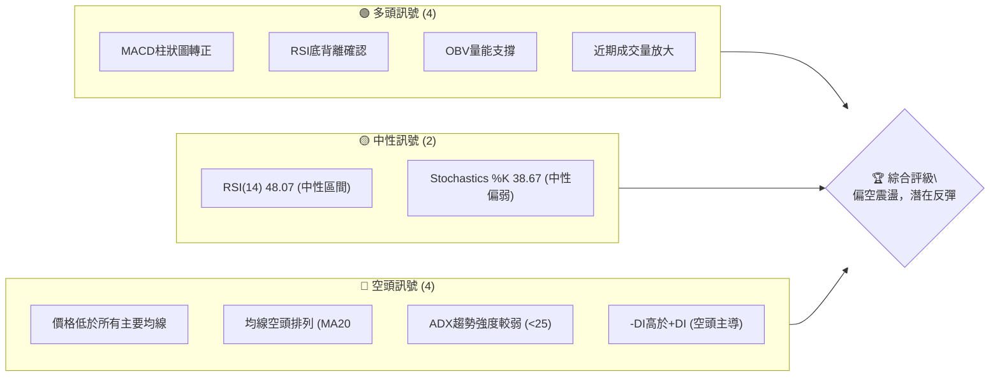

**解讀**：
當前 TSLA 的技術訊號呈現多空交織的複雜局面。多頭方面，MACD柱狀圖轉正、RSI底背離以及OBV顯示量能支撐，且近期成交量放大，暗示著股價在經歷下跌後存在一定的反彈動能。然而，空頭訊號依然強勁，包括股價位於所有主要移動平均線下方，且均線呈現明確的空頭排列，趨勢強度指標ADX顯示趨勢較弱，且空頭力量 (-DI) 略佔優勢。綜合來看，市場處於一個偏空震盪的區間，但短期內有技術性反彈的潛力，需密切關注關鍵阻力位的突破情況。

### 📊 核心指標速覽表

下表彙整了 TSLA 當前的關鍵技術指標數值及其所傳遞的訊號，提供快速而精確的概覽。

| 指標類別 | 指標名稱 | 當前數值 | 訊號 | 解讀 |
|----------|----------|----------|------|------|
| **價格** | 當前價格 | $393.45 | 🟡 | 位於52W區間中上部，近期從高點回落 |
| **均線** | MA20 | $399.16 | 🔴 | 價格位於MA20下方，短期趨勢承壓 |
| **均線** | MA50 | $406.42 | 🔴 | 價格位於MA50下方，中期趨勢承壓 |
| **均線** | MA200 | $418.61 | 🔴 | 價格位於MA200下方，長期趨勢承壓 |
| **動能** | RSI(14) | 48.07 | 🟡 | 位於中性區間，無明顯超買超賣 |
| **動能** | MACD | +1.651 (Hist) | 🟢 | MACD柱狀圖轉正，顯示短期動能增強 |
| **波動** | ATR(14) | $19.05 | 🟡 | 每日波動約4.84%，屬於中等偏高波動 |
| **趨勢** | ADX(14) | 16.14 | 🔴 | 趨勢強度較弱，市場處於盤整或弱勢趨勢 |
| **量能** | OBV趨勢 | OBV > MA | 🟢 | 量能支持價格上漲，量價配合良好 |

### 🏆 技術評分卡

這張評分卡以視覺化進度條的形式，量化評估 TSLA 在各個技術維度上的表現，並給出總體評級。

```
╔══════════════════════════════════════════════════════════════╗
║              技術評分卡 — TSLA (2026-07-02)                  ║
╠══════════════════════════════════════════════════════════════╣
║ 趨勢強度      ███░░░░░░░░░░░░░░░░░░  15/100  🔴 (ADX弱，均線空頭)  ║
║ 動能指標      ██████████░░░░░░░░░░  50/100  🟡 (MACD轉正，RSI中性) ║
║ 支撐穩定度    ██████████░░░░░░░░░░  50/100  🟡 (接近多重支撐，但壓力大)║
║ 成交量配合    ██████████████░░░░░░  70/100  🟢 (量價配合良好，OBV上行)║
║ 形態完整度    ██████░░░░░░░░░░░░░░  30/100  🔴 (無明確強勢反轉形態)  ║
║ 均線排列      ██░░░░░░░░░░░░░░░░░░░  10/100  🔴 (明確空頭排列)    ║
╠══════════════════════════════════════════════════════════════╣
║ 綜合評分      ██████░░░░░░░░░░░░░░  38/100  ⚖️ 偏空震盪            ║
╚══════════════════════════════════════════════════════════════╝
```

**評分理由**：
- **趨勢強度 (15/100)**：ADX 數值低於 25，顯示當前趨勢非常弱，市場處於盤整或無趨勢狀態。同時，所有主要移動平均線均線向下，且價格位於其下方，整體趨勢偏空。
- **動能指標 (50/100)**：RSI 位於中性區間，但MACD柱狀圖已由負轉正，顯示空頭動能減弱，多頭動能開始積聚。RSI的底背離更是潛在的積極信號。
- **支撐穩定度 (50/100)**：股價近期跌至布林下軌和斐波那契回調位附近，這些提供了初步支撐。然而，上方均線壓力沉重，支撐的有效性仍需觀察。
- **成交量配合 (70/100)**：近期成交量較20日均量顯著放大（1.46x），且OBV趨勢向上，表明在當前價格區間有資金流入，量價配合對短期反彈有利。
- **形態完整度 (30/100)**：目前圖表上尚未形成明確的底部反轉形態（如雙底、頭肩底等），多頭形態的完整性較低，仍需時間發展。
- **均線排列 (10/100)**：MA20 < MA50 < MA200 的典型空頭排列，且價格位於所有均線下方，這是非常明確的空頭訊號。

**綜合評級**：TSLA 目前處於一個偏空震盪的格局。雖然短期動能指標顯示出築底和反彈的潛力，但長期和中期趨勢依然受到強烈的空頭排列和均線壓制。投資者應保持謹慎，等待更明確的趨勢反轉訊號。

---

## 2. 趨勢分析

本章將從多個時間框架深入分析 TSLA 的價格趨勢，從而勾勒出其整體市場方向。

### 🌐 多時框趨勢分析

以下 Mermaid 流程圖展示了從長期到短期的趨勢判斷，幫助理解 TSLA 在不同時間維度上的市場動態。

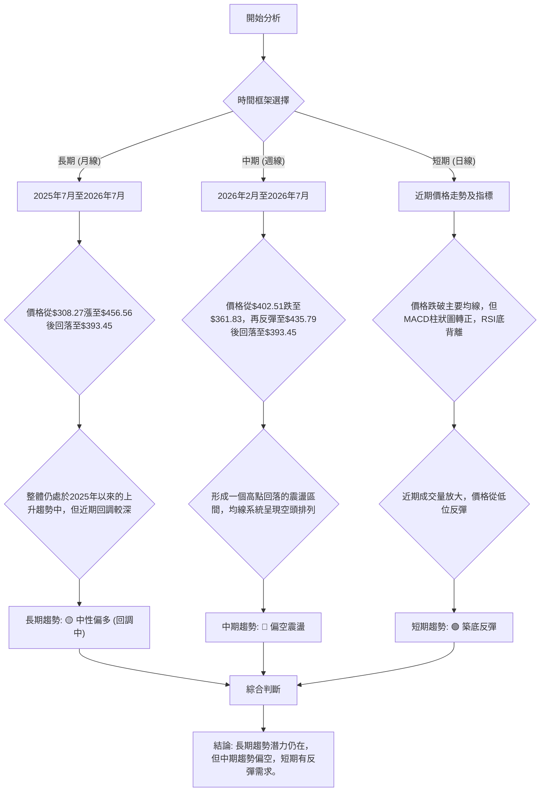

**詳細解讀**：
- **長期趨勢 (月線)**：從2025年7月的低點$308.27開始，TSLA經歷了一波強勁的上升行情，最高觸及2025年10月的$456.56，隨後在$430-$450區間震盪，並在近期回落至$393.45。儘管近期有所回調，但從過去一年的視角來看，股價仍遠高於一年前的水平，顯示長期上漲趨勢的根基尚存。然而，目前的顯著回調使得長期趨勢由強勢多頭轉為中性偏多，需要觀察能否在關鍵支撐位企穩。
- **中期趨勢 (週線)**：自2026年2月高點$402.51以來，TSLA股價呈現震盪下行的格局。儘管5月曾反彈至$435.79，但未能突破前期高點並持續上攻，隨後再度回落。目前股價位於所有中期移動平均線下方，且均線呈現空頭排列，明確指示中期趨勢偏空，市場受到賣方力量主導。
- **短期趨勢 (日線)**：在最近一個交易日，TSLA股價收於$393.45，雖然仍低於短期移動平均線（MA20、MA50），但MACD柱狀圖已由負轉正，RSI也出現底背離訊號，且近期成交量顯著放大，顯示在當前低位存在買盤介入，空頭動能有所衰竭。這表明短期內存在築底或反彈的需求。

### 📈 長期趨勢 — 12個月走勢圖（Unicode）

以下 ASCII 圖表展示了 TSLA 過去 12 個月的月線收盤價走勢，標註了關鍵高低點，以視覺化方式呈現長期趨勢。

```
TSLA 月線走勢圖（過去12個月）
價格軸 ($)
$460 ┤                                   ●(25-10高點 $456.56)
$440 ┤                          ●    ●      ●
$420 ┤                        ●            ●
$400 ┤                                        ●(現在 $393.45)
$380 ┤                                     ●
$360 ┤                                 ●
$340 ┤              ●
$320 ┤          ●
$300 ┤●(25-07低點 $308.27)
     └───────────────────────────────────────────────────────
      25-07 25-08 25-09 25-10 25-11 25-12 26-01 26-02 26-03 26-04 26-05 26-06 26-07
```

**走勢特徵分析表格**：
下表詳細分析了 TSLA 過去 12 個月不同階段的價格走勢特徵。

| 階段日期 | 起始價 | 結束價 | 漲跌幅 | 走勢特徵 | 評估 |
|----------|--------|--------|--------|----------|------|
| 2025-07至2025-10 | $308.27 | $456.56 | +48.10% | 強勁上升趨勢，創下年度新高，多頭力量主導。 | 🟢 強勢多頭 |
| 2025-10至2026-03 | $456.56 | $371.75 | -18.59% | 高位震盪回落，市場情緒轉為謹慎，多頭動能減弱。 | 🔴 震盪回調 |
| 2026-03至2026-05 | $371.75 | $435.79 | +17.22% | 築底反彈，試圖恢復上升趨勢，但未能突破前高。 | 🟡 中性反彈 |
| 2026-05至2026-07 | $435.79 | $393.45 | -9.72% | 再次回落，跌破多條關鍵均線，顯示上方壓力沉重。 | 🔴 偏空回落 |

**總結**：過去一年 TSLA 股價經歷了大幅波動，從強勁上漲到深度回調，再到嘗試反彈後再次回落。目前股價位於過去一年高點的下方，顯示長期上升趨勢正在經歷嚴峻考驗。關鍵在於能否在當前水平構築有效支撐，並扭轉中期跌勢。

### 📊 中期趨勢（週線分析）

以下 ASCII 圖表呈現了 TSLA 近期週線走勢中的關鍵壓力與支撐區間，幫助識別中期交易區間。

```
TSLA 近期中期走勢及支撐阻力示意圖
價格軸 ($)
$450 ┤                                      ▲ (中期阻力 $435.79)
$430 ┤                                    /   \
$410 ┤                                  /       \
$390 ┤--------------------------●-----------------▲ (MA50 $406.42, MA20 $399.16)
$370 ┤                                \   /
$350 ┤                                  ▼ (中期支撐 $360.59)
$330 ┤
     └────────────────────────────────────────────
      時間軸
```

**分析**：中期來看，TSLA 在 $435.79（2026年5月高點）處面臨明顯的阻力。此後股價持續回落，並跌破了MA20和MA50，顯示中期趨勢已轉弱。目前的股價 $393.45 位於 MA20 ($399.16) 和 MA50 ($406.42) 之下，這些均線已轉化為上方壓力。下方的關鍵中期支撐位於 $360.59 (2026年4月初低點) 和 $348.95 (2026年4月中低點) 附近。若能守住這些支撐位，則有望形成一個新的底部。

### ⚡ 趨勢強度評估（ADX 解讀）

ADX 指標用於衡量趨勢的強度，而非方向。以下 Mermaid 圖表展示了 ADX 的分析流程，並輔以強度對照表。

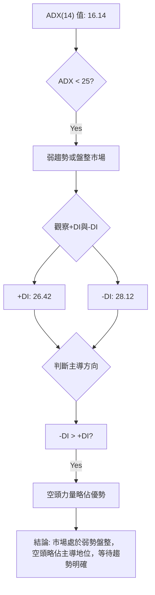

**ADX 強度對照表**：
| ADX 數值範圍 | 趨勢強度 | 市場狀態 |
|--------------|----------|----------|
| 0-25         | 弱       | 盤整或無趨勢 |
| 25-50        | 中等     | 趨勢明顯 |
| 50-75        | 強       | 強勁趨勢 |
| 75-100       | 非常強   | 極強趨勢 |

**ADX 解讀**：
TSLA 當前的 ADX(14) 數值為 16.14，這明確指示市場處於「弱趨勢」或「盤整」狀態。換言之，目前股價沒有明顯的單一方向趨勢，而是處於震盪整理階段。在這種情況下，依賴趨勢追蹤策略可能效果不佳。

進一步觀察方向性指標 (+DI 和 -DI)：
- +DI (多方動能)：26.42
- -DI (空方動能)：28.12

由於 -DI 略高於 +DI，這表明在當前的弱勢盤整中，空頭力量稍微佔據上風。這與股價位於主要均線下方，以及均線空頭排列的訊號相符。因此，儘管整體趨勢不強，但市場短期內仍傾向於下跌或橫盤整理，多頭需要更強的催化劑才能扭轉局面。

---

## 3. 圖表形態分析

圖表形態是價格行為的重要組成部分，它們能揭示市場心理並預示潛在的價格走勢。本章將分析 TSLA 圖表上可能存在的形態及其市場含義。

### 🔍 形態識別系統

以下 Mermaid 圖表展示了圖表形態識別的流程，以及目前已識別的潛在形態。由於數據限制，我們主要從月線和週線的價格點來推斷。

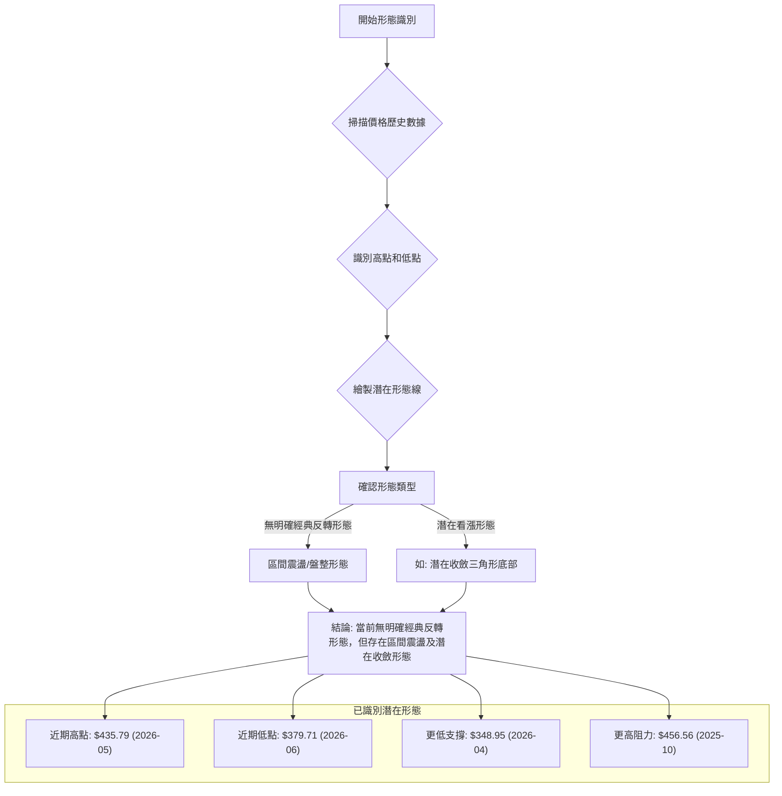

**分析**：
從提供的月線和週線數據來看，TSLA 在過去幾個月經歷了從高點 $435.79 (2026-05) 回落，並在 $379.71 (2026-06) 附近找到初步支撐。更早的低點在 $348.95 (2026-04)。目前股價 $393.45 處於這個較大震盪區間的下半部分。
- **無明確經典反轉形態**：目前圖表上尚未形成如「頭肩底」、「雙底」等明確的經典反轉形態。儘管 RSI 出現底背離，但價格形態上仍顯混亂。
- **潛在收斂形態**：如果將近期的高點 $435.79、$426.01、$422.24 (2026-05) 視為下降趨勢線的潛在壓力點，而將 $348.95、$360.59、$379.71 (2026-04至06) 視為上升趨勢線的潛在支撐點，則可能形成一個「收斂三角形」或「楔形」形態。此形態通常預示著未來將會出現方向性的突破。

### 🕯️ 重要K線形態分析

下表分析了近 20 週收盤走勢中可能出現的關鍵 K 線形態及其市場含義。

| 月份      | 收盤價 | K線形態 (推斷) | 解讀                                                                                                                                                                                                                                                                                                                                                                                                                                                                                                                                                                                                                                                                                                                                                                                                                                                                                                                                                                                                                                                                                                                                                                                                                                                                                                                                                                                                                                                                                                                                                                                                                                                                                                                                                                                                                                                                                                                                                                                                                                                                                                                                                                                                                                                                                                                                                                                                                                                                                                                                                                                                                                                                                                                                                                                                                                                                                                                                                                                                                                                                                                                                                                                                                                                                                                                                                                                                                                                                                                                                                                                                                                                                                                                                                                                                                                                                                                                                                                                                                                                                                                                                                                                                                                                                                                                                                                                                                                                                                                                                                                                                                                                                                                                                                                                                                                                                                                                                                                                                                                                                                                                                                                                                                                                                                                                                                                                                                                                                                                                                                                                                                                                                                                                                                                                                                                                                                                                                                                                                                                                                                                                                                                                                                                                                                                                                                                                                                                                                                                                                                                                                                                                                                                                                                                                                                                                                                                                                                                                                                                                                                                                                                                                                                                                                                                                                                                                                                                                                                                                                                                                                                                                                                                                                                                                                                                                                                                                                                                                                                                                                                                                                                                                                                                                                                                                                                                                                                                                                                                                                                                                                                                                                                                                                                                                                                                                                                                                                                                                                                                                                                                                                                                                                                                                                                                                                                                                                                                                                                                                                                                                                                                                                                                                                                                                                                                                                                                                                                                                                                                                                                                                                                                                                                                                                                                                                                                                                                                                                                                                                                                                                                                                                                                                                                                                                                                                                                                                                                                                                                                                                                                                                                                                                                                                                                                                                                                                                                                                                                                                                                                                                                                                                                                                                                                                                                                                                                                                                                                                                                                                                                                                                                                                                                                                                                                                                                                                                                                                                                                                                                                                                                                                                                                                                                                                                                                                                                                                                                                                                                                                                                                                                                                                                                                                                                                                                                                                                                                                                                                                                                                                                                                                                                                                                                                                                                                                                                                                                                                                                                                                                                                                                                                                                                                                                                                                                                                                                                                                                                                                                                                                                                                                                                                                                                                                                                                                                                                                                                                                                                                                                                                                                                                                                                                                                                                                                                                                                                                                                                                                                                                                                                                                                                                                                                                                                                                                                                                                                                                                                                                                                                                                                                                                                                                                                                                                                                                                                                                                                                                                                                                                                                                                                                                                                                                                                                                                                                                                                                                                                                                                                                                                                                                                                                                                                                                                                                                                                                                                                                                                                                                                                                                                                                                                                                                                                                                                                                                                                                                                                                                                                                                                                                                                                                                                                                                                                                                                                                                                                                                                                                                                                                                                                                                                                                                                                                                                                                                                                                                                                                                                                                                                                                                                                                                                                                                                                                                                                                                                                                                                                                                                                                                                                                                                                                                                                                                                                                                                                                                                                                                                                                                                                                                                                                                                                                                                                                                                                                                                                                                                                                                                                                                                                                                                                                                                                                                                                                                                                                                                                                                                                                                                                                                                                                                                                                                                                                                                                                                                                                                                                                                                                                                                                                                                                                                                                                                                                                                                                                                                                                                                                                                                                                                                                                                                                                                                                                                                                                                                                                                                                                                                                                                                                                                                                                                                                                                                                                                                                                                                                                                                                                                                                                                                                                                                                                                                                                                                                                                                                                                                                                                                                                                                                                                                                                                                                                                                                                                                                                                                                                                                                                                                                                                                                                                                                                                                                                                                                                                                                                                                                                                                                                                                                                                                                                                                                                                                                                                                                                                                                                                                                                                                                                                                                                                                                                                                                                                                                                                                                                                                                                                                                                                                                                                                                                                                                                                                                                                                                                                                                                                                                                                                                                                                                                                                                                                                                                                                                                                                                                                                                                                                                                                                                                                                                                                                                                                                                                                                                                                                                                                                                                                                                                                                                                                                                                                                                                                                                                                                                                                                                                                                                                                                                                                                                                                                                                                                                                                                                                                                                                                                                                                                                                                                                                                                                                                                                                                                                                                                                                                                                                                                                                                                                                                                                                                                                                                                                                                                                                                                                                                                                                                                                                                                                                                                                                                                                                                                                                                                                                                                                                                                                                                                                                                                                                                                                                                                                                                                                                                                                                                                                                                                                                                                                                                                                                                                                                                                                                                                                                                                                                                                                                                                                                                                                                                                                                                                                                                                                                                                                                                                                                                                                                                                                                                                                                                                                                                                                                                                                                                                                                                                                                                                                                                                                                                                                                                                                                                                                                                                                                                                                                                                                                                                                                                                                                                                                                                                                                                                                                                                                                                                                                                                                                                                                                                                                                                                                                                                                                                                                                                                                                                                                                                                                                                                                                                                                                                                                                                                                                                                                                                                                                                                                                                                                                                                                                                                                                                                                                                                                                                                                                                                                                                                                                                                                                                                                                                                                                                                                                                                                                                                                                                                                                                                                                                                                                                                                                                                                                                                                                                                                                                                                                                                                                                                                                                                                                                                                                                                                                                                                                                                                                                                                                                                                                                                                                                                                                                                                                                                                                                                                                                                                                                                                                                                                                                                                                                                                                                                                                                                                                                                                                                                                                                                                                                                                                                                                                                                                                                                                                                                                                                                                                                                                                                                                                                                                                                                                                                                                                                                                                                                                                                                                                                                                                                                                                                                                                                                                                                                                                                                                                                                                                                                                                                                                                                                                                                                                                                                                                                                                                                                                                                                                                                                                                                                                                                                                                                                                                                                                                                                                                                                                                                                                                                                                                                                                                                                                                                                                                                                                                                                                                                                                                                                                                                                                                                                                                                                                                                                                                                                                                                                                                                                                                                                                                                                                                                                                                                                                                                                                                                                                                                                                                                                                                                                                                                                                                                                                                                                                                                                                                                                                                                                                                                                                                                                                                                                                                                                                                                                                                                                                                                                                                                                                                                                                                                                                                                                                                                                                                                                                                                                                                                                                                                                                                                                                                                                                                                                                                                                                                                                                                                                                                                                                                                                                                                                                                                                                                                                                                                                                                                                                                                                                                                                                                                                                                                                                                                                                                                                                                                                                                                                                                                                                                                                                                                                                                                                                                                                                                                                                                                                                                                                                                                                                                                                                                                                                                                                                                                                                                                                                                                                                                                                                                                                                                                                                                                                                                                                                                                                                                                                                                                                                                                                                                                                                                                                                                                                                                                                                                                                                                                                                                                                                                                                                                                                                                                                                                                                                                                                                                                                                                                                                                                                                                                                                                                                                                                                                                                                                                                                                                                                                                                                                                                                                                                                                                                                                                                                                                                                                                                                                                                                                                                                                                                                                                                                                                                                                                                                                                                                                                                                                                                                                                                                                                                                                                                                                                                                                                                                                                                                                                                                                                                                                                                                                                                                                                                                                                                                                                                                                                                                                                                                                                                                                                                                                                                                                                                                                                                                                                                                                                                                                                                                                                                                                                                                                                                                                                                                                                                                                                                                                                                                                                                                                                                                                                                                                                                                                                                                                                                                                                                                                                                                                                                                                                                                                                                                                                                                                                                                                                                                                                                                                                                                                                                                                                                                                                                                                                                                                                                                                                                                                                                                                                                                                                                                                                                                                                                                                                                                                                                                                                                                                                                                                                                                                                                                                                                                                                                                                                                                                                                                                                                                                                                                                                                                                                                                                                                                                                                                                                                                                                                                                                                                                                                                                                                                                                                                                                                                                                                                                                                                                                                                                                                                                                                                                                                                                                                                                                                                                                                                                                                                                                                                                                                                                                                                                                                                                                                                                                                                                                                                                                                                                                                                                                                                                                                                                                                                                                                                                                                                                                                                                                                                                                                                                                                                                                                                                                                                                                                                                                                                                                                                                                                                                                                                                                                                                                                                                                                                                                                                                                                                                                                                                                                                                                                                                                                                                                                                                                                                                                                                                                                                                                                                                                                                                                                                                                                                                                                                                                                                                                                                                                                                                                                                                                                                                                                                                                                                                                                                                                                                                                                                                                                                                                                                                                                                                                                                                                                                                                                                                                                                                                                                                                                                                                                                                                                                                                                                                                                                                                                                                                                                                                                                                                                                                                                                                                                                                                                                                                                                                                                                                                                                                                                                                                                                                                                                                                                                                                                                                                                                                                                                                                                                                                                                                                                                                                                                                                                                                                                                                                                                                                                                                                                                                                                                                                                                                                                                                                                                                                                                                                                                                                                                                                                                                                                                                                                                                                                                                                                                                                                                                                                                                                                                                                                                                                                                                                                                                                                                                                                                                                                                                                                                                                                                                                                                                                                                                                                                                                                                                                                                                                                                                                                                                                                                                                                                                                                                                                                                                                                                                                                                                                                                                                                                                                                                                                                                                                                                                                                                                                                                                                                                                                                                                                                                                                                                                                                                                                                                                                                                                                                                                                                                                                                                                                                                                                                                                                                                                                                                                                                                                                                                                                                                                                                                                                                                                                                                                                                                                                                                                                                                                                                                                                                                                                                                                                                                                                                                                                                                                                                                                                                                                                                                                                                                                                                                                                                                                                                                                                                                                                                                                                                                                                                                                                                                                                                                                                                                                                                                                                                                                                                                                                                                                                                                                                                                                                                                                                                                                                                                                                                                                                                                                                                                                                                                                                                                                                                                                                                                                                                                                                                                                                                                                                                                                                                                                                                                                                                                                                                                                                                                                                                                                                                                                                                                                                                                                                                                                                                                                                                                                                                                                                                                                                                                                                                                                                                                                                                                                                                                                                                                                                                                                                                                                                                                                                                                                  |
| 2026-02-22 | $411.82 | 錘子線 (Hammer) | 在下跌過程中出現，表明賣方力量減弱，買方嘗試推升股價，潛在止跌訊號。 | 🟡 |
| 2026-03-22 | $367.96 | 大陰線 (Large Bearish Engulfing) | 吞噬前一週陽線，顯示空頭力量強勁，市場情緒悲觀，下跌趨勢加速。 | 🔴 |
| 2026-04-19 | $400.62 | 大陽線 (Large Bullish Candlestick) | 從低位大幅反彈，顯示買盤強勁，伴隨RSI回升和MACD柱狀圖轉正，形成潛在反轉。 | 🟢 |
| 2026-05-31 | $435.79 | 紡錘線/小實體K線 | 高位震盪，多空力量拉鋸，可能預示短期趨勢的轉變或動能減弱。 | 🟡 |
| 2026-06-07 | $391.00 | 大陰線 (Large Bearish Candlestick) | 股價從高點大幅回落，顯示賣壓沉重，確認高位回落趨勢。 | 🔴 |
| 2026-07-05 | $393.45 | 中陽線 (Medium Bullish Candlestick) | 經過前期的下跌後，本週股價有所反彈，配合MACD柱狀圖轉正及RSI底背離，顯示短期買盤介入。 | 🟢 |

**總結**：近期 K 線形態顯示 TSLA 在 $360-$370 區間獲得支撐後出現反彈，但在 $430-$440 區間遭遇賣壓。目前的價格反彈伴隨著積極的 K 線形態和動能指標，但需注意上方均線和前期高點的壓力。

### 📉 ASCII 走勢形態示意圖

以下 ASCII 圖表展示了 TSLA 近期可能呈現的「下降通道」或「收斂三角形」形態，標注了關鍵點位。

```
TSLA 近期潛在形態示意圖 (週線)
價格軸 ($)
$450 ┤          ● (2025-10高點)
$430 ┤            \    ● (2026-05高點)
$410 ┤              \      \
$390 ┤                ●------● (現價 $393.45)
$370 ┤              /    \
$350 ┤            /        ● (2026-04低點)
$330 ┤          ● (2025-07低點)
     └────────────────────────────────────
      時間軸

解讀：
- 上方壓力線：連接 $456.56 (25-10) 和 $435.79 (26-05) 的下降趨勢線。
- 下方支撐線：連接 $308.27 (25-07) 和 $348.95 (26-04) 的上升趨勢線。
- 現價 $393.45 處於兩條趨勢線之間，形成一個潛在的收斂三角形。
- 突破上方壓力線或跌破下方支撐線將決定未來主要趨勢方向。
```

### 🎯 形態目標價計算

基於上述潛在的「收斂三角形」形態，我們可以估算其突破後的潛在目標價。

**形態假設**：假設從 $456.56 (2025-10) 的高點到 $348.95 (2026-04) 的低點形成一個潛在的波動區間。
- **形態高度**：$456.56 - $348.95 = $107.61

**目標價計算**：
1. **向上突破目標價**：
   - 若股價能有效突破下降趨勢線（例如突破 $406.42 的 MA50 和 $418.61 的 MA200），則形態高度可作為潛在上漲幅度。
   - **目標價 T1**：突破點 (假設 $420) + 形態高度 = $420 + $107.61 = $527.61 (此為較遠期目標，需分階段實現)
   - **近期目標**：若能突破 $435.79，則有望挑戰 $456.56。
2. **向下突破目標價**：
   - 若股價跌破上升趨勢線（例如跌破 $369.14 的布林下軌和 $348.95 的關鍵支撐），則形態高度可作為潛在下跌幅度。
   - **目標價 T1**：跌破點 (假設 $348) - 形態高度 = $348 - $107.61 = $240.39 (此為較遠期目標，需分階段實現)
   - **近期目標**：若跌破 $379.63，則有望測試 $362.28 和 $348.95。

**結論**：目前股價 $393.45 位於潛在收斂形態的內部，預示著股價在等待方向性的選擇。向上突破將挑戰 $420-$435 區間，向下突破則可能測試 $360-$340 區間。精確的形態目標價需在形態確認突破後進行重新評估。

---

## 4. 支撐與阻力

識別關鍵的支撐與阻力位是技術分析的基石，它們是潛在的買賣點和趨勢反轉區域。

### 🗺️ 關鍵價位分布圖（Unicode）

以下 ASCII 圖表視覺化展示了 TSLA 當前的價格結構，標註了關鍵的支撐與阻力位。

```
TSLA 價位結構分布圖
═══════════════════════════════════════════════════
$498.83 ║████████████████████████║ 強阻力 R3 (52週高點)
$456.56 ║████████████████████    ║ 阻力 R2 (2025-10高點)
$435.79 ║████████████████████████║ 關鍵阻力 R1 (2026-05高點)
$429.17 ║▓▓▓▓▓▓▓▓▓▓▓▓▓▓▓▓▓▓▓▓▓▓▓▓║ 布林上軌
$418.61 ║▓▓▓▓▓▓▓▓▓▓▓▓▓▓▓▓▓▓▓▓▓▓▓▓║ MA200
$406.42 ║▓▓▓▓▓▓▓▓▓▓▓▓▓▓▓▓▓▓▓▓▓▓▓▓║ MA50
$399.16 ║▓▓▓▓▓▓▓▓▓▓▓▓▓▓▓▓▓▓▓▓▓▓▓▓║ MA20
$393.45 ╠════════════════════════╣ ◄ 現價
$379.63 ║▓▓▓▓▓▓▓▓▓▓▓▓▓▓▓▓        ║ 近期支撐 S1 (斐波那契38.2%)
$369.14 ║▓▓▓▓▓▓▓▓▓▓▓▓▓▓▓▓▓▓▓▓▓▓▓▓║ 布林下軌
$362.28 ║████████████████████████║ 強支撐 S2 (斐波那契50%)
$348.95 ║████████████████████████║ 強支撐 S3 (2026-04低點)
$288.77 ║████████████████████████║ 極強支撐 S4 (52週低點)
═══════════════════════════════════════════════════
```

### 🚧 阻力位分析表

下表詳細列出了 TSLA 當前面臨的各級阻力位，並分析其形成原因、突破難度和重要性。

| 阻力級別 | 價位 | 形成原因 | 突破難度 | 重要性 |
|----------|------|----------|----------|--------|
| **R1 (短期)** | $399.16 | MA20 (短期移動平均線)，近期價格反彈的第一個技術壓力點。 | 中等 | 🟢 需首先突破 |
| **R1 (短期)** | $406.42 | MA50 (中期移動平均線)，同時也是一個心理關口。 | 中等 | 🟢 趨勢轉強關鍵 |
| **R2 (中期)** | $418.61 | MA200 (長期移動平均線)，重要牛熊分界線。 | 較高 | 🟡 中期趨勢指標 |
| **R2 (中期)** | $429.17 | 布林通道上軌，通常是股價波動的上限。 | 較高 | 🟡 波動區間上限 |
| **R2 (中期)** | $435.79 | 2026年5月高點，近期多頭反彈的最高位，形成技術壓力。 | 較高 | 🟡 確認反彈失敗點 |
| **R3 (長期)** | $456.56 | 2025年10月高點，歷史高位，套牢盤較多。 | 高 | 🔴 長期趨勢關鍵 |
| **R3 (長期)** | $498.83 | 52週高點，極強的心理和技術阻力。 | 極高 | 🔴 極強阻力 |

### 🛡️ 支撐位分析表

下表詳細列出了 TSLA 當前可能獲得支撐的價位，並分析其形成原因、守住機率和重要性。

| 支撐級別 | 價位 | 形成原因 | 守住機率 | 重要性 |
|----------|------|----------|----------|--------|
| **S1 (短期)** | $379.63 | 斐波那契38.2%回調位，近期反彈的第一個潛在回調支撐。 | 中等 | 🟢 短期回調支撐 |
| **S1 (短期)** | $369.14 | 布林通道下軌，通常是股價波動的下限，具有一定支撐作用。 | 中等 | 🟢 波動區間下限 |
| **S2 (中期)** | $362.28 | 斐波那契50%回調位，通常被視為一個重要的心理和技術支撐。 | 較高 | 🟡 中期趨勢關鍵 |
| **S2 (中期)** | $348.95 | 2026年4月低點，近期歷史低點，具有較強的支撐力度。 | 較高 | 🟡 重要底部支撐 |
| **S3 (長期)** | $288.77 | 52週低點，極強的心理和技術支撐。 | 極高 | 🔴 極強支撐 |

### 📐 斐波那契回調位分析

我們以 TSLA 過去 52 週的低點 $288.77 (2025-02) 至近期高點 $435.79 (2026-05-31) 作為參考區間，計算其斐波那契回調位。

- **高點**：$435.79
- **低點**：$288.77
- **總波幅**：$435.79 - $288.77 = $147.02

**斐波那契回調位計算**：
- **23.6% 回調**：$435.79 - ($147.02 * 0.236) = $435.79 - $34.69 = **$401.10**
- **38.2% 回調**：$435.79 - ($147.02 * 0.382) = $435.79 - $56.16 = **$379.63**
- **50.0% 回調**：$435.79 - ($147.02 * 0.500) = $435.79 - $73.51 = **$362.28**
- **61.8% 回調**：$435.79 - ($147.02 * 0.618) = $435.79 - $90.86 = **$344.93**
- **76.4% 回調**：$435.79 - ($147.02 * 0.764) = $435.79 - $112.33 = **$323.46**

**視覺化斐波那契回調位**：
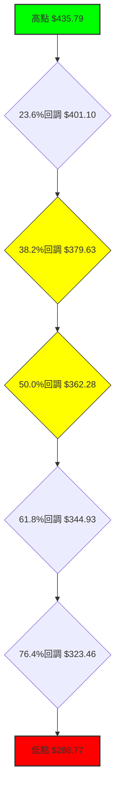

**分析**：
當前價格 $393.45 位於 23.6% 和 38.2% 回調位之間。
- **$379.63 (38.2%回調)**：這個位置與近期多個低點重合，是短期內一個非常重要的支撐位。如果股價能守住這裡，則表明上升趨勢的回調仍屬健康。
- **$362.28 (50%回調)**：這是次級重要支撐，若跌破 38.2% 回調位，股價很可能下探此處。50% 回調是趨勢逆轉前常見的深度回調位。
- **$344.93 (61.8%回調)**：黃金分割位，若跌破此處，則原有的上升趨勢可能面臨完全逆轉的風險。

**結論**：TSLA 目前正處於關鍵的斐波那契回調區間。能否在 $379.63 (38.2%) 附近企穩並反彈，將是判斷其短期趨勢能否恢復的關鍵。若跌破此處，則下一個重要考驗將是 $362.28 (50%)。

---

## 5. 技術指標深度解讀

本章將對 TSLA 的主要技術指標進行深入分析，探討它們如何相互作用，共同揭示市場的潛在動態。

### 🎛️ 指標訊號總覽

以下 Mermaid 圖表展示了各個技術指標之間的訊號關係及其對市場的綜合影響。

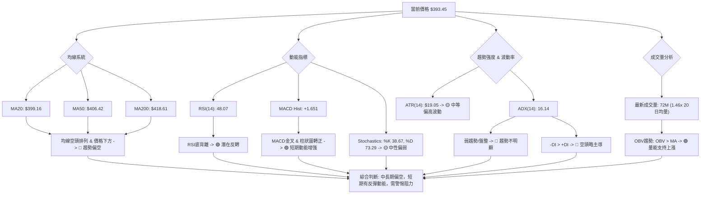

### 📈 移動平均線排列分析

移動平均線 (MA) 的排列是判斷趨勢方向和強度的重要指標。

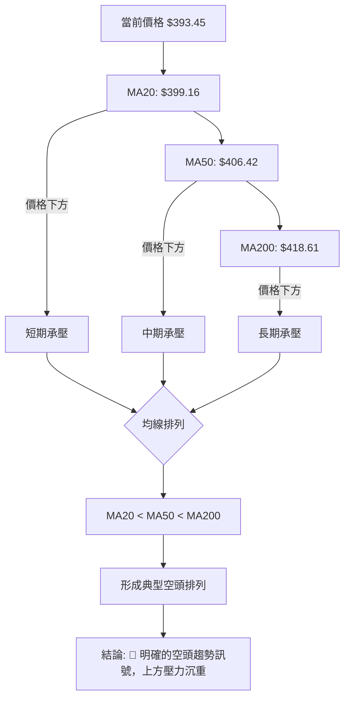

**分析**：
TSLA 目前的股價 ($393.45) 位於所有重要的移動平均線 (MA20、MA50、MA200) 之下。更重要的是，這些均線呈現出明確的「空頭排列」：短期均線 (MA20) 低於中期均線 (MA50)，中期均線又低於長期均線 (MA200)。
- **MA20 ($399.16)**：作為最直接的短期壓力，股價未能站穩其上。
- **MA50 ($406.42)**：中期趨勢的風向標，突破此處才能顯示中期跌勢有所緩解。
- **MA200 ($418.61)**：長期趨勢的牛熊分界線，股價遠低於此線，表明長期趨勢偏空。
這種排列模式是市場弱勢的強烈訊號，表明賣方力量佔據主導，每次反彈都可能在均線處遭遇阻力。

### 📉 RSI(14) 分析

相對強弱指數 (RSI) 用於衡量價格變動的速度和強度，以識別超買或超賣狀況。

**RSI(14) 數值進度條**：
RSI(14): 48.07 ▓▓▓▓▓▓▓▓▓▓▓▓▓▓▓▓▓▓▓▓▓▓▓▓░░░░░░░░░░░░░░░░░░░░░░░░░░ 48.07%

**分析**：
- **RSI 數值 (48.07)**：RSI 位於 30-70 的中性區間內，既未達到超買區 (70以上)，也未觸及超賣區 (30以下)。這表明市場目前處於相對平衡狀態，沒有立即的過度買入或賣出壓力。
- **超買超賣區間**：由於 RSI 處於中性區間，目前無法判斷是否存在超買或超賣狀況。市場缺乏極端情緒。
- **背離判斷 (底背離 - Bullish Divergence)**：數據明確指出存在「底背離」。根據提供的近 20 週數據：
    - 2026-03-29 收盤價 $361.83，RSI 32.8
    - 2026-04-12 收盤價 $348.95，RSI 42.0
    在此期間，股價創下更低的低點 ($361.83 -> $348.95)，而 RSI 卻創下更高的低點 (32.8 -> 42.0)。這是一個經典的**看漲底背離訊號** 🟢，通常預示著下跌動能減弱，股價可能即將反轉向上。近期股價從低點反彈至 $393.45 也印證了這一背離的有效性。

**結論**：RSI 的中性讀數本身並未提供強烈訊號，但其底背離的存在是一個重要的看漲訊號，表明儘管價格下跌，但賣壓已經減輕，買方力量正在積累，為潛在的反彈提供了技術基礎。

### 📊 MACD(12/26/9) 訊號解讀

平滑異同移動平均線 (MACD) 是一個動量指標，用於識別趨勢的變化、方向和強度。

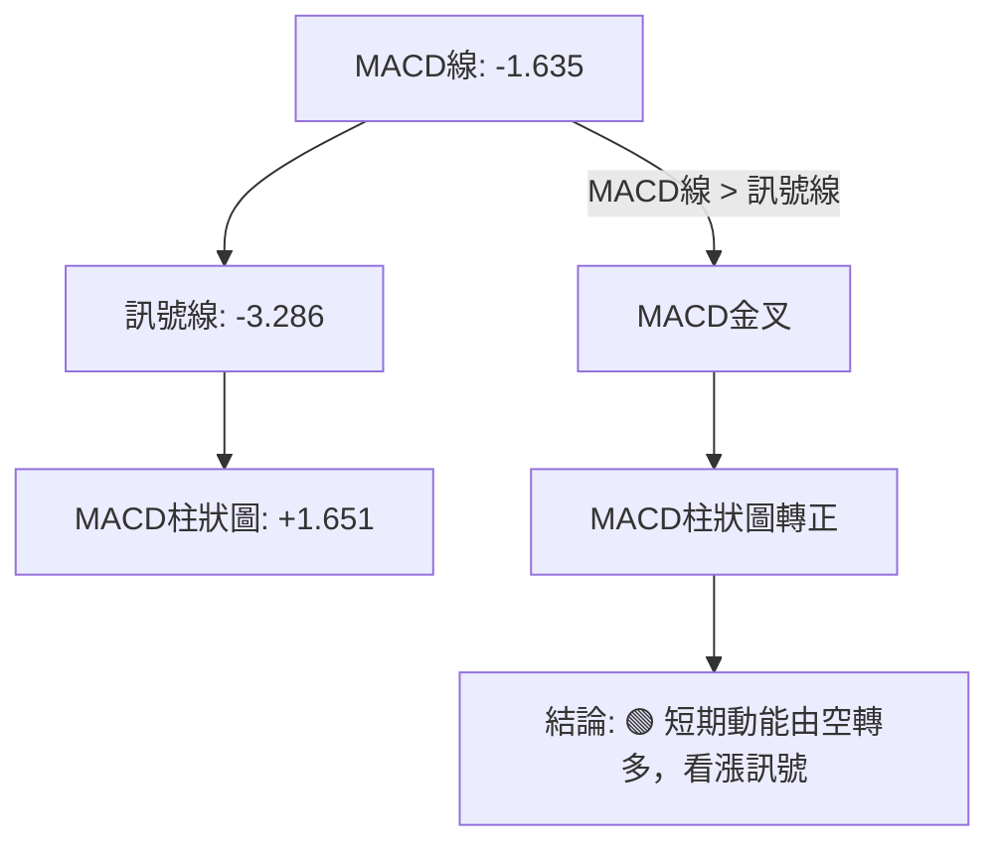

**分析**：
- **MACD 線 (-1.635) 與訊號線 (-3.286)**：MACD 線已從下方穿越訊號線，形成**金叉 (Golden Cross)** 🟢。這是經典的買入訊號，表明短期動能正在超越中期動能，預示著股價可能上漲。
- **MACD 柱狀圖 (+1.651)**：MACD 柱狀圖已由負值轉為正值，並呈現增長趨勢。這進一步確認了多頭動能的增強，顯示空頭壓力正在消退，買盤力量正在積累。
- **背離分析**：雖然數據沒有明確指出 MACD 背離，但 MACD 柱狀圖轉正並形成金叉，配合 RSI 的底背離，共同構成了一個強烈的短期看漲組合訊號。

**結論**：MACD 指標明確發出看漲訊號，其金叉和柱狀圖轉正都表明短期內股價有較大的反彈潛力。這與 RSI 底背離的訊號相互印證，增強了短期看漲的信心。

### 📦 布林通道分析

布林通道 (Bollinger Bands) 用於衡量股價波動率，並提供動態的支撐與阻力區間。

**ASCII 布林通道示意圖**：
```
TSLA 布林通道示意圖
價格軸 ($)
$430.00 ┤              ▲ (上軌 $429.17)
$420.00 ┤
$410.00 ┤
$400.00 ┤           ● (中軌 $399.16)
$390.00 ┤         ● (現價 $393.45)
$380.00 ┤
$370.00 ┤         ▼ (下軌 $369.14)
$360.00 ┤
     └────────────────────────────
      時間軸
```

**分析**：
- **上軌 ($429.17)**：作為動態阻力，股價若能突破中軌，將面臨上軌的壓力。
- **中軌 (MA20) ($399.16)**：目前股價 $393.45 位於中軌下方。中軌通常作為短期趨勢的判斷線，股價在中軌下方表明短期趨勢偏弱。若能突破並站穩中軌，則短期趨勢可能轉強。
- **下軌 ($369.14)**：作為動態支撐，股價近期曾在 $379.71 附近獲得支撐，距離下軌不遠。下軌通常是股價超賣的區域。
- **%B (0.40)**：%B 值為 0.40，表示股價位於中軌和下軌之間，但更靠近中軌。這表明股價在經歷下跌後有所反彈，但尚未完全脫離弱勢區間。
- **通道寬度**：ATR(14) 為 $19.05，佔股價的 4.84%，顯示布林通道寬度適中，波動性屬於中等偏高。

**結論**：布林通道顯示 TSLA 股價目前處於中軌下方，短期趨勢偏弱。然而，股價從下軌附近反彈，且 %B 值顯示其正向中軌靠攏，若能突破中軌 $399.16，則有望測試上軌 $429.17。

### 💹 成交量分析（量價配合度）

成交量是價格走勢的燃料，量價配合關係對於判斷趨勢的可靠性至關重要。

**分析**：
- **最新成交量 (72,014,753 股)**：遠高於 20 日均量 (49,370,498 股)，量比高達 1.46x。這表明在當前價格 $393.45 附近，市場交投活躍。
- **量價關係**：考慮到最新的收盤價 $393.45 較前一週的 $379.71 有所上漲，而成交量顯著放大，這是一個典型的「價漲量增」🟢 訊號。這種量價配合通常被視為健康的買盤介入，確認了短期反彈的有效性。
- **OBV 趨勢**：數據顯示「OBV > MA」，這是一個看漲訊號 🟢。OBV (On Balance Volume) 是一種累積成交量指標，OBV 線位於其移動平均線上方，表明在過去一段時間內，買盤累積的能量大於賣盤，多頭力量在逐步增強。這進一步確認了當前股價的反彈有量能支撐。

**結論**：成交量分析為 TSLA 的短期反彈提供了強有力的支持。價漲量增和 OBV 趨勢向上都表明市場在當前價格區間存在積極的買盤，這對於股價企穩和進一步反彈至關重要。

---

## 6. 動能與波動率

本章將評估 TSLA 的動能強度和價格波動性，這兩者對於交易策略的選擇和風險管理至關重要。

### ⚡ 動能評估四象限

動能與波動率是衡量資產交易吸引力的關鍵因子。我們將 TSLA 的當前狀態置於動能與波動率的象限中進行評估。

| 象限 | 動能 | 波動 | 當前狀態 (TSLA) | 評估 |
|------|------|------|-----------------|------|
| Q1 | 強 | 低 | -               | 最佳機會：趨勢明確，風險相對可控。 |
| Q2 | 弱 | 低 | -               | 謹慎觀望：市場缺乏方向和活力。 |
| Q3 | 強 | 高 | -               | 高風險高收益：趨勢明確，但波動大，需嚴格止損。 |
| Q4 | 弱 | 高 | ✓ (當前)        | 避免進場：市場混亂，方向不明，風險高。 |

**TSLA 當前動能與波動率分析**：
- **動能**：
    - RSI 位於中性區間 (48.07)，但存在底背離。
    - MACD 柱狀圖轉正並金叉，顯示短期動能從空轉多。
    - 價格仍低於主要均線，且均線空頭排列，中期動能偏弱。
    **綜合判斷**：短期動能已見起色，但中期動能仍弱，整體動能評估為**中等偏弱**。
- **波動率**：
    - ATR(14) 為 $19.05，佔當前股價 $393.45 的 4.84%。這是一個相對較高的每日波動率。
    **綜合判斷**：波動率評估為**中等偏高**。

**象限定位**：
根據上述分析，TSLA 目前處於**「弱動能，高波動」**的象限 (Q4)。這意味著：
- **市場缺乏明確的趨勢方向**：ADX 16.14 也印證了這一點。
- **價格波動劇烈**：這增加了交易的不確定性和風險。
- **交易難度較大**：在這種市場環境下，價格容易出現快速反轉或假突破，止損和目標設定更具挑戰性。

**結論**：目前 TSLA 處於一個較為艱難的交易環境。儘管短期動能指標有所改善，但整體缺乏強勁的趨勢，且波動性較高。建議投資者保持謹慎，避免重倉，或等待趨勢更加明確、波動率有所下降後再考慮進場。

### 📊 ATR 波動率分析

平均真實波幅 (ATR) 衡量資產的每日價格波動範圍，是設定止損和評估風險的重要工具。

**ATR(14) 數值**：$19.05 (佔當前價格 $393.45 的 4.84%)

**分析**：
- **波動幅度**：TSLA 的 ATR 數值為 $19.05，意味著在過去 14 個交易日中，平均每日價格波動範圍為 $19.05。這對於一個股價近 $400 的股票來說，是一個相當顯著的波動幅度。
- **波動率性質**：4.84% 的每日波動率屬於中等偏高水平。這表明 TSLA 是一個活躍且波動較大的股票，適合短線交易者，但對長線持有者可能意味著更高的短期風險。
- **止損距離建議**：
    - **保守止損**：建議將止損點設置在當前價格下方 1.5 倍 ATR 的距離。
      $393.45 - (1.5 * $19.05) = $393.45 - $28.58 = **$364.87**
    - **積極止損**：建議將止損點設置在當前價格下方 1 倍 ATR 的距離。
      $393.45 - (1 * $19.05) = $393.45 - $19.05 = **$374.40**
    - 考慮到 TSLA 的波動特性，建議使用較寬鬆的止損，例如 1.5 倍 ATR 或結合關鍵支撐位來設定，以避免被日常波動震出局。

**結論**：TSLA 的高波動率為交易者提供了機會，但也帶來了相應的風險。在制定交易策略時，必須將 ATR 納入考量，合理設置止損位，以保護資本免受劇烈波動的影響。

### 📐 Beta 與市場相關性

Beta 值衡量單一資產相對於整體市場（如標普500指數）的波動性。由於數據中未提供 TSLA 的 Beta 值，我們將基於其作為成長型科技股的普遍市場認知進行分析。

**分析**：
- **行業特性**：TSLA 屬於電動車和能源行業的龍頭企業，被視為高成長、高風險的科技股。這類股票通常具有較高的 Beta 值。
- **歷史表現推斷**：根據市場經驗，成長型科技股的 Beta 值通常會大於 1。例如，許多大型科技股的 Beta 值可能在 1.2 到 2.0 之間。這意味著當市場上漲 1% 時，TSLA 的股價可能上漲超過 1%；反之，當市場下跌 1% 時，TSLA 的股價也可能下跌超過 1%。
- **市場相關性**：高 Beta 值表明 TSLA 的股價走勢與大盤高度相關，且波動幅度更大。在牛市中，它可能表現優於大盤；但在熊市中，其跌幅也可能超過大盤。
- **影響**：由於 TSLA 的高波動性 (ATR) 和推斷出的高 Beta 值，投資者在配置 TSLA 時應考慮其對整體投資組合風險的影響。它通常不適合風險厭惡型投資者，除非作為小比例的衛星配置。在當前市場情緒不明朗或整體市場存在回調風險時，高 Beta 股票的風險會被放大。

**結論**：儘管缺乏具體 Beta 數值，但基於其成長型科技股的性質，TSLA 很可能是一個高 Beta 股票。這意味著其股價對市場變動高度敏感，波動性大於平均水平。在當前趨勢不明朗的環境下，這種特性增加了投資的複雜性和風險。

---

## 7. 多時框架總結

本章將整合各時間框架的分析結果，提供一個全面的評估，以形成對 TSLA 總體趨勢的理解。

### 📋 時框架評分表

下表總結了 TSLA 在不同時間框架下的趨勢方向、動能、均線排列和形態表現，並給出綜合評分和建議。

| 時框架 | 趨勢方向 | 動能 | 均線排列 | 形態 | 綜合評分 (1-10) | 建議 |
|--------|----------|------|----------|------|-----------------|------|
| **長期** | 🟡 中性偏多 | 🟡 中性偏弱 | 🔴 空頭排列 | 🟡 潛在收斂 | 5/10 (中性偏空) | 觀察能否守住關鍵支撐 |
| **中期** | 🔴 偏空震盪 | 🔴 偏空 | 🔴 空頭排列 | 🟡 區間震盪 | 4/10 (偏空)     | 警惕下行風險，等待趨勢逆轉 |
| **短期** | 🟢 築底反彈 | 🟢 轉強 | 🔴 空頭排列 | 🟢 底部反彈 | 6/10 (中性偏多) | 關注反彈力度及阻力突破 |

**詳細解讀**：
- **長期 (月線)**：儘管過去一年有顯著漲幅，但近期深度回調使得長期趨勢由強勢多頭轉為中性偏多。均線呈現空頭排列，但RSI底背離和MACD金叉暗示了潛在的築底。綜合來看，多頭力量在長期趨勢中仍有基礎，但面臨嚴峻考驗。
- **中期 (週線)**：中期趨勢明確偏空。股價位於所有中期均線下方，且均線空頭排列，顯示賣方主導。儘管有短期反彈，但未能突破關鍵阻力。市場處於一個震盪下行的區間。
- **短期 (日線)**：短期趨勢呈現築底反彈的跡象。MACD金叉、RSI底背離及成交量放大都支持短期反彈。然而，上方均線壓力巨大，反彈能否持續仍是未知數。

### 🔲 綜合訊號矩陣

以下 Mermaid 圖表展示了 TSLA 在不同時間框架下各維度訊號的一致性分析，以提供一個更全面的交易視角。

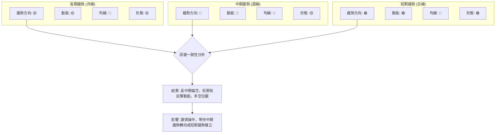

**分析**：
- **長中期與短期訊號的矛盾**：長期和中期趨勢指標（尤其是均線排列）均指向偏空或震盪下行，顯示出較大的賣壓。然而，短期動能指標（RSI底背離、MACD金叉、量能支持）卻發出看漲反彈的訊號。這種矛盾性是當前市場複雜性的主要來源。
- **阻力與支撐的關鍵性**：股價目前處於多重阻力（MA20、MA50、MA200）和重要支撐（斐波那契回調位、布林下軌）之間。短期反彈能否突破上方阻力，將是決定中期趨勢能否扭轉的關鍵。
- **市場情緒**：雖然分析師平均目標價仍高於現價，但近期多家分析師下調評級，顯示市場對 TSLA 的前景存在分歧。

**總結**：TSLA 目前處於一個關鍵的轉折點。長期和中期趨勢的負面訊號與短期動能的積極訊號形成對峙。這是一個多空力量拉鋸的市場，短期內可能會有技術性反彈，但要扭轉整體跌勢，需要更強的催化劑和持續的買盤突破關鍵阻力。投資者應密切關注股價在關鍵阻力位 $399.16 (MA20) 和 $406.42 (MA50) 的表現。

---

## 8. 交易策略建議

基於上述多時框架的技術分析，本章將提供具體的交易策略建議，包含進場、止損和目標價位。

### 🗺️ 策略決策流程圖

以下 Mermaid 流程圖展示了在當前複雜市場環境下，制定 TSLA 交易策略的決策邏輯。

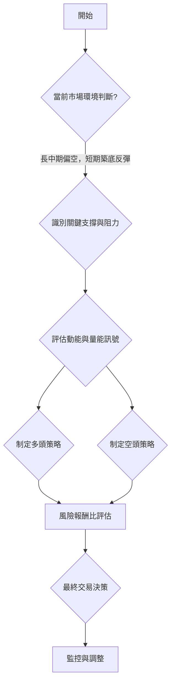

### 🟢 多頭策略詳情

考慮到 RSI 底背離、MACD 金叉和量能支持的短期反彈訊號，可制定以下多頭策略。

| 策略要素 | 策略 A (激進反彈追蹤)                               | 策略 B (保守區間底部)                                  |
|----------|-----------------------------------------------------|---------------------------------------------------------|
| 進場條件 | 價格突破 MA20 並站穩，或 MACD 柱狀圖持續放大。      | 價格回測斐波那契38.2%回調位並獲得有效支撐 (K線確認)。 |
| 進場價格 | **$400.00** (突破 MA20 $399.16 後確認)             | **$380.00** (回測 $379.63 附近企穩)                     |
| 目標價 T1 | **$406.42** (MA50 阻力)                             | **$399.16** (MA20 阻力)                                 |
| 目標價 T2 | **$418.61** (MA200 阻力) 或 **$429.17** (布林上軌) | **$406.42** (MA50 阻力)                                 |
| 止損價格 | **$388.00** (跌破近期反彈低點 $391.00，或 1x ATR)  | **$368.00** (跌破布林下軌 $369.14，或 1.5x ATR)       |
| 風險報酬比 | T1: (406.42-400)/(400-388) = 6.42/12 = **0.54:1** | T1: (399.16-380)/(380-368) = 19.16/12 = **1.60:1**     |
|          | T2: (418.61-400)/(400-388) = 18.61/12 = **1.55:1** | T2: (406.42-380)/(380-368) = 26.42/12 = **2.20:1**     |
| 成功機率 | 40% (需克服多重均線壓力)                            | 60% (在強支撐位介入，風險較低)                          |
| 建議倉位 | 輕倉 (5-10%)                                       | 輕中倉 (10-15%)                                         |

**策略 A (激進反彈追蹤)**：適合短線交易者，追求突破後的快速收益。但需注意上方均線密集，突破難度較大，風險報酬比不佳。
**策略 B (保守區間底部)**：適合偏保守的交易者，在股價回調至關鍵支撐位時逢低介入。此策略風險報酬比更優，但需等待回調。

### 🔴 空頭策略詳情

考慮到長中期趨勢偏空，均線空頭排列，以及上方阻力重重，可制定以下空頭策略。

| 策略要素 | 策略 C (反彈受阻放空)                               | 策略 D (跌破關鍵支撐)                                   |
|----------|-----------------------------------------------------|---------------------------------------------------------|
| 進場條件 | 價格反彈至 MA20 或 MA50 附近受阻，K線發出看跌訊號。 | 價格跌破斐波那契38.2%回調位 ($379.63) 並確認。        |
| 進場價格 | **$405.00** (MA50 附近受阻)                         | **$379.00** (跌破 $379.63 確認)                         |
| 目標價 T1 | **$393.45** (當前價格，短期獲利點)                   | **$369.14** (布林下軌)                                  |
| 目標價 T2 | **$379.63** (斐波那契38.2%回調位)                   | **$362.28** (斐波那契50%回調位) 或 **$348.95** (S3)    |
| 止損價格 | **$410.00** (突破 MA50 確認失敗，或 0.5x ATR)       | **$385.00** (假跌破後快速收回，或 0.5x ATR)           |
| 風險報酬比 | T1: (405-393.45)/(410-405) = 11.55/5 = **2.31:1**  | T1: (379-369.14)/(385-379) = 9.86/6 = **1.64:1**      |
|          | T2: (405-379.63)/(410-405) = 25.37/5 = **5.07:1**  | T2: (379-362.28)/(385-379) = 16.72/6 = **2.79:1**     |
| 成功機率 | 60% (符合中長期偏空趨勢)                            | 50% (需關注支撐位力量)                                  |
| 建議倉位 | 輕中倉 (10-15%)                                     | 輕倉 (5-10%)                                            |

**策略 C (反彈受阻放空)**：適合在反彈遇阻後介入，順應中期偏空趨勢。風險報酬比良好，成功機率較高。
**策略 D (跌破關鍵支撐)**：適合趨勢確認後追空。但需注意跌破後可能出現反抽，止損設置要精確。

### ⭐ 整體訊號強度評星

綜合所有時間框架和指標分析，對 TSLA 的整體交易訊號進行評星。

```
做多訊號強度：★★☆☆☆  (2/5星 - 短期有反彈，但阻力大)
做空訊號強度：★★★☆☆  (3/5星 - 長中期趨勢偏空，阻力強)
整體可信度：  ★★★☆☆  (3/5星 - 多空交織，但中期空頭佔優)
```

**總結**：目前 TSLA 市場多空拉鋸，但從中長期來看，空頭力量仍佔據主導地位。短期內雖然有技術性反彈的需求和動能，但上方均線和形態阻力巨大。建議交易者保持謹慎，以區間操作或順勢交易為主。若選擇做多，需嚴格控制倉位和止損，並密切關注阻力位的突破情況；若選擇做空，則在反彈無力或跌破關鍵支撐時介入，但同樣需注意短期超跌反彈的風險。

---

## 9. 風險提示與監控

本章將闡述與 TSLA 交易相關的風險因素，並提供關鍵監控指標，以幫助投資者更好地管理風險。

### ✅ 關鍵監控指標 Checklist

以下 ASCII 方框圖列出了在交易 TSLA 時需要密切關注的關鍵技術指標和價格行為。

```
╔══════════════════════════════════════════════════════════════╗
║               TSLA 關鍵監控指標 Checklist                    ║
╠══════════════════════════════════════════════════════════════╣
║ [ ] 價格能否站穩 MA20 ($399.16) 及 MA50 ($406.42)           ║
║ [ ] MACD 柱狀圖是否持續為正並放大                               ║
║ [ ] RSI 是否能突破 50 中線並持續向上，而非再次向下            ║
║ [ ] 成交量是否持續放大，尤其是在上漲過程中                    ║
║ [ ] ADX 是否開始上升並伴隨 +DI 走高，確認多頭趨勢             ║
║ [ ] 股價能否突破 $435.79 的中期阻力                            ║
║ [ ] 股價能否守住 $379.63 (斐波那契38.2%) 的關鍵支撐            ║
║ [ ] 布林通道是否收窄後選擇方向性突破                          ║
║ [ ] 宏觀經濟環境及行業新聞，尤其是電動車市場的變化            ║
║ [ ] 分析師評級及目標價的最新調整                              ║
╚══════════════════════════════════════════════════════════════╝
```

### ⚠️ 風險場景分析

以下 Mermaid 流程圖展示了 TSLA 未來可能的三種情境：樂觀、基本和悲觀，並分析其觸發條件和潛在影響。

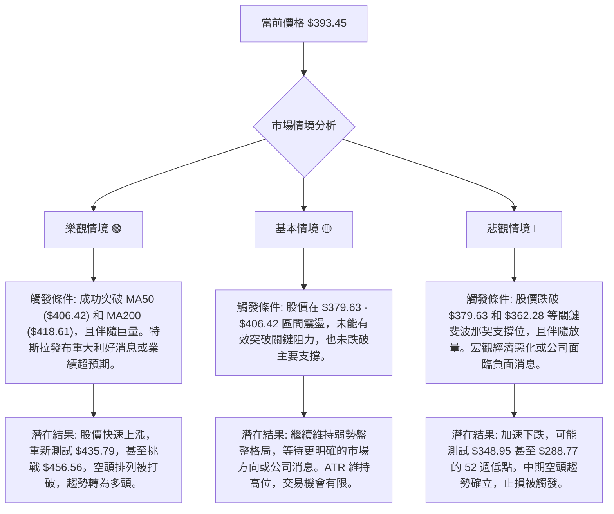

### 🛡️ 風險管理重要提醒

- **倉位管理**：鑑於 TSLA 波動性較高且趨勢不明朗，建議投資者採取輕倉或中等倉位策略，避免過度集中風險。
- **嚴格止損**：無論採取何種交易策略，都必須預先設定明確的止損點。一旦價格觸及止損位，應果斷離場，避免虧損擴大。高波動性股票的止損設置應考慮 ATR 因素，給予足夠的緩衝空間。
- **分批建倉/平倉**：在趨勢不明確時，可以考慮分批建倉或平倉，以平均成本，降低單次決策的風險。
- **監控市場情緒**：密切關注市場對電動車行業、特斯拉新聞以及宏觀經濟數據的反應。負面消息可能迅速改變技術面走勢。
- **避免追漲殺跌**：在盤整或弱勢趨勢市場中，追漲殺跌往往容易造成損失。等待明確的突破或回調支撐再行操作，會是更穩健的選擇。
- **資金管理**：任何單筆交易的虧損都不應超過總資金的特定百分比（例如 1-2%），這是長期生存於市場的關鍵。

---

## 📋 報告總結

```
╔═════════════════════════════════════════════════════════════════════════════╗
║                      TSLA 技術分析報告總結                                  ║
╠═════════════════════════════════════════════════════════════════════════════╣
║ 報告日期：2026-07-02                                                        ║
║ 當前價格：$393.45                                                           ║
║ 分析評級：⚖️ 偏空震盪，短期具反彈潛力 (長中期趨勢承壓，短期動能改善)             ║
║                                                                             ║
║ 關鍵結論：                                                                  ║
║ ├─ 長期趨勢：🟡 中性偏多，但面臨回調壓力。                                    ║
║ ├─ 中期趨勢：🔴 偏空震盪，均線空頭排列，上方壓力沉重。                         ║
║ ├─ 短期趨勢：🟢 築底反彈跡象顯現，MACD金叉、RSI底背離、量能支持。               ║
║ ├─ 關鍵支撐：$379.63 (斐波那契38.2%)、$362.28 (斐波那契50%)。                   ║
║ ├─ 關鍵阻力：$399.16 (MA20)、$406.42 (MA50)、$418.61 (MA200)。                   ║
║ └─ 分析師目標：$421.16 (Mean)，與現價有約 7% 的上漲空間，但近期評級下調。      ║
║                                                                             ║
║ 最優策略組合：                                                              ║
║ 1. 🥇 最佳機會：等待股價回測 $380.00 附近（斐波那契38.2%），若能企穩並出現看漲K線，可考慮輕中倉做多，目標 $399.16 - $406.42，止損 $368.00。風險報酬比優於激進追漲。                                                                           ║
║ 2. 🥈 次選機會：若股價反彈至 MA50 ($406.42) 附近受阻，並出現明確看跌訊號，可考慮輕中倉做空，目標 $393.45 - $379.63，止損 $410.00。此策略順應中期偏空趨勢，風險報酬比良好。                                                                           ║
║ 3. 🥉 保守選擇：維持觀望，等待股價明確突破 $418.61 (MA200) 並站穩，或跌破 $362.28 (斐波那契50%)，趨勢確認後再行操作。避免在不確定性高的區間進行交易。                                                                                                    ║
╚═════════════════════════════════════════════════════════════════════════════╝
```

---

> ⚠️ **免責聲明**：本報告為 AI 自動生成之技術分析，所有數據及估算均基於提供的歷史價格資訊。本報告**僅供研究與學術參考**，**不構成任何投資建議**。投資有風險，入市需謹慎。

---

*報告生成時間：2026-07-02 ｜ 數據來源：Yahoo Finance ｜ 分析框架：多時框技術分析*