<details>
<summary>📊 靜態圖表 (點擊展開)</summary>
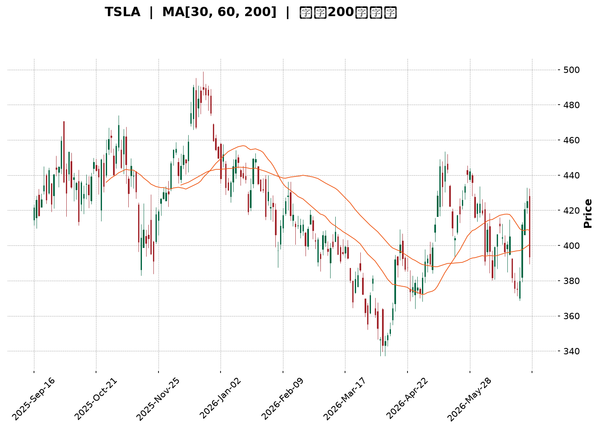
</details>

<html>
<head><meta charset="utf-8" /></head>
<body>
    <div style="height:500px; width:100%;">                        <script>window.PlotlyConfig = {MathJaxConfig: 'local'};</script>
        <script charset="utf-8" src="https://cdn.plot.ly/plotly-3.6.0.min.js" integrity="sha256-QaOVwtVY0T02VaHrr6pnoHLCwayMJp4O5n4YyaE3rJk=" crossorigin="anonymous"></script>                <div id="candlestick-chart" class="plotly-graph-div" style="height:100%; width:100%;"></div>            <script>                window.PLOTLYENV=window.PLOTLYENV || {};                                if (document.getElementById("candlestick-chart")) {                    Plotly.newPlot(                        "candlestick-chart",                        [{"close":{"dtype":"f8","bdata":"AAAAgOtZekAAAACAwp16QAAAAKCZDXpAAAAAwB6hekAAAAAgXCN7QAAAAKCZnXpAAAAA4KOse0AAAACAPXZ6QAAAAGBmhntAAAAAIFyze0AAAAAghct7QAAAACBct3xAAAAAAABAe0AAAACgR916QAAAAAAAVHxAAAAAoHARe0AAAABACmt7QAAAAOCjOHtAAAAAANfXeUAAAABgZj57QAAAAADX03pAAAAAYGYye0AAAAAAAMx6QAAAAMD1dHtAAAAAQOH2e0AAAACgmal7QAAAACCFb3tAAAAAIK4PfEAAAAAghRt7QAAAAGC4RnxAAAAAwMzIfEAAAAAAKdh8QAAAAKCZgXtAAAAAwPWIfEAAAACA60V9QAAAAAApxHtAAAAAwB7hfEAAAABgj957QAAAAOBR2HpAAAAAIK7Te0AAAACA63l7QAAAAKCZ6XpAAAAAANcfeUAAAACgmUV5QAAAAGC4jnlAAAAAAAAUeUAAAAAA1z95QAAAACCus3hAAAAAoHBxeEAAAADgehx6QAAAAGBmNnpAAAAAoEepekAAAABguOJ6QAAAAIA94npAAAAAANfTekAAAAAA1+t7QAAAAOB6aHxAAAAAAABwfEAAAACgR3l7QAAAAGC40ntAAAAAQDM3fEAAAACAPe57QAAAACBcr3xAAAAAwPW0fUAAAACAFJ5+QAAAAAApNH1AAAAAgOs1fkAAAABAMxN+QAAAACCui35AAAAAwPVYfkAAAABgZlZ+QAAAAEAKs31AAAAAgD26fEAAAABA4WZ8QAAAACCFG3xAAAAAwB5he0AAAABguDp8QAAAACBcD3tAAAAAYI\u002f2ekAAAADAzDx7QAAAAAAp0HtAAAAAIFwPfEAAAABAM\u002fN7QAAAAEAzc3tAAAAAwB5pe0AAAAAAAFh7QAAAAAAANHpAAAAAQAr3ekAAAACAwhV8QAAAAMD1EHxAAAAAQDMze0AAAABgZu56QAAAACBc93pAAAAAwPUIekAAAABgj+Z6QAAAAMD1XHpAAAAAIFxfekAAAAAAKWB5QAAAACBc03hAAAAAgMKxeUAAAADAHhV6QAAAACBck3pAAAAA4FHEekAAAADAHhF6QAAAAEAKF3pAAAAAgBSqeUAAAADAHrV5QAAAACBcu3lAAAAAwB69eUAAAACgR\u002f14QAAAAIAUlnlAAAAAYGYWekAAAACgR4l5QAAAAAApKHlAAAAAwB41eUAAAABA4YZ4QAAAAEAKX3lAAAAAwMxYeUAAAAAgrst4QAAAAEDh6nhAAAAAANfzeEAAAADAHn15QAAAAAApsHhAAAAAQDNzeEAAAADA9bh4QAAAAOBR9HhAAAAA4HqMeEAAAADAzMR3QAAAACBc\u002f3ZAAAAAoJnNd0AAAADgevB3QAAAAEAzH3hAAAAAgMJBd0AAAACgR512QAAAAOB6NHZAAAAAAAA8d0AAAAAAKdR3QAAAAKBwiXZAAAAAwB4NdkAAAABgZqp1QAAAAAAAdHVAAAAAgOuZdUAAAABAM891QAAAAGC4BnZAAAAAQDPDdkAAAABAM394QAAAAGBmTnhAAAAAgOsJeUAAAAAAAIh4QAAAAGC4JnhAAAAAACk4eEAAAAAghVt3QAAAAMDMhHdAAAAAYLiqd0AAAADgUYB3QAAAAMDMTHdAAAAAgBTad0AAAADAHm14QAAAAAApiHhAAAAAgOtVeEAAAAAgrut4QAAAAOCjvHlAAAAAoJnFekAAAAAAANB7QAAAAEAzF3tAAAAA4FHUe0AAAADAzLR7QAAAAADXY3pAAAAAANefeUAAAACAwkF5QAAAAAApFHpAAAAAoJkdekAAAAAAKaB6QAAAAKBwGXtAAAAAgMKFe0AAAACgmaF7QAAAAOCjPHtAAAAAgBT+eUAAAAAA13t6QAAAAEAze3pAAAAAQDMnekAAAAAAAHB4QAAAAEAzj3lAAAAAQOHKeEAAAACgcNl3QAAAAGBm8nhAAAAAQOFmeUAAAABgZrJ5QAAAAGCPSnlAAAAAgBTGeEAAAAAA1wd5QAAAAMDMUHlAAAAAgMLZd0AAAADgenh3QAAAAIDrcXdAAAAAIFy7d0AAAACgcL15QAAAAKCZSXpAAAAAwMyUekAAAABAM5d4QA=="},"high":{"dtype":"f8","bdata":"AAAAAAB0ekAAAADA9cR6QAAAACCFA3tAAAAAIIXXekAAAAAgrs97QAAAACCFj3tAAAAAIFzDe0AAAACgmTV7QAAAACCFh3tAAAAAIK4vfEAAAAAAANB7QAAAAOCj5HxAAAAAAABsfUAAAADgUex7QAAAAMDMWHxAAAAAQOFKfEAAAACgR5V7QAAAAKCZRXtAAAAAgBSye0AAAACAPU57QAAAAEAzI3tAAAAAACmIe0AAAACgmXV7QAAAACBcl3tAAAAAwMwcfEAAAADAzBR8QAAAAOCj2HtAAAAAYGYWfEAAAABA4Tp8QAAAAGCPwnxAAAAAAAAwfUAAAABAMxt9QAAAAMD1cHxAAAAAAACgfEAAAADAHqF9QAAAACCFw3xAAAAAoEclfUAAAABAMzd9QAAAAIDCdXtAAAAAYLgafEAAAAAA16d7QAAAAKBHpXtAAAAAAACIekAAAABACsN5QAAAACBcf3pAAAAAYGaOeUAAAADgerx5QAAAAEAKz3pAAAAAwMwseUAAAAAghVt6QAAAACCuR3pAAAAAQAqvekAAAABA4Q57QAAAAGCPGntAAAAAwMxMe0AAAABguP57QAAAAIAUanxAAAAAgOutfEAAAAAAABx8QAAAAIA9RnxAAAAAgBSOfEAAAADgURR8QAAAAAAp8HxAAAAA4FEcfkAAAAAAALh+QAAAAOB69H5AAAAAgMKtfkAAAAAA16d+QAAAAKBHLX9AAAAAIIW\u002ffkAAAABgZq5+QAAAAKBwkX5AAAAAYGZWfUAAAACA6\u002fF8QAAAAMDMiHxAAAAAoHClfEAAAADAzJh8QAAAAAAABHxAAAAAgOtle0AAAACAPU57QAAAAMDMEHxAAAAAwMxkfEAAAADA9Tx8QAAAAGCPvntAAAAAgMLVe0AAAAAAAPR7QAAAACCu63pAAAAAQDNje0AAAAAAABh8QAAAAEDhRnxAAAAA4KPQe0AAAADgUVh7QAAAAAApZHtAAAAAIK6De0AAAACAFH57QAAAAGBmsnpAAAAAwPXIekAAAABgZn56QAAAAKCZIXlAAAAAwMzoeUAAAAAAAFR6QAAAAAAAtHpAAAAAoJlFe0AAAAAgrkN7QAAAAMD1gHpAAAAAIIXbeUAAAABgZg56QAAAAAAA9HlAAAAAQDPreUAAAABAM3t5QAAAAMAerXlAAAAAoHBFekAAAADA9Qx6QAAAAIDrcXlAAAAA4KNIeUAAAACgcMV4QAAAAKBHhXlAAAAAgOuJeUAAAACgmSV5QAAAAKBwGXlAAAAAoHBpeUAAAACAFAZ6QAAAAAAAaHlAAAAAQDMDeUAAAAAgrjt5QAAAAIDrAXlAAAAAwB4xeUAAAADgUTR4QAAAAIA9vndAAAAAoEcVeEAAAAAgrjd4QAAAACCuw3hAAAAAQAoHeEAAAACAwh13QAAAAOCj9HZAAAAAoEdVd0AAAACAPfJ3QAAAAOB6JHdAAAAAIIX7dkAAAADgUcB1QAAAAAAAyHZAAAAAgBTOdUAAAACAwuV1QAAAAKCZRXZAAAAAgBT6dkAAAABgZqp4QAAAAMD1oHhAAAAA4HqUeUAAAADAzGx5QAAAAEAzn3hAAAAAACmQeEAAAAAAACB4QAAAAAAp7HdAAAAA4HrMd0AAAADgo+R3QAAAAGBmhndAAAAAAAAMeEAAAADAHt14QAAAAIA9qnhAAAAAgOsheUAAAABA4Rp5QAAAAKBH\u002fXlAAAAAQDPzekAAAABgjxJ8QAAAAMDM\u002fHtAAAAAYGZWfEAAAAAgrj98QAAAAGCPKntAAAAAgBRSekAAAACAFFp5QAAAACBcF3pAAAAAQDOvekAAAAAAKfh6QAAAAEAzM3tAAAAAoJnZe0AAAAAgXL97QAAAAMAekXtAAAAAoJnZekAAAABguIZ6QAAAAKCZGXtAAAAAoJmlekAAAABA4Yp6QAAAAEAKz3lAAAAAAAAoekAAAACgcNF4QAAAAOCj+HhAAAAAQOFqeUAAAAAAAAB6QAAAAGC4xnlAAAAAQApfeUAAAADgUSh5QAAAAAAA7HlAAAAAgOuNeEAAAACgRwl4QAAAAIDrsXdAAAAAwMw8eEAAAADgUdR5QAAAAOCjiHpAAAAAgMINe0AAAACgmQV7QA=="},"hovertemplate":"\u003cb\u003e%{x|%Y-%m-%d}\u003c\u002fb\u003e\u003cbr\u003e\u958b: $%{open:.2f}\u003cbr\u003e\u9ad8: $%{high:.2f}\u003cbr\u003e\u4f4e: $%{low:.2f}\u003cbr\u003e\u6536: $%{close:.2f}\u003cextra\u003e\u003c\u002fextra\u003e","low":{"dtype":"f8","bdata":"AAAAQOG2eUAAAABguJp5QAAAAMD1CHpAAAAAIIVbekAAAACAFNJ6QAAAACCFe3pAAAAA4HrQekAAAACgRzF6QAAAAOBRUHpAAAAAAAB4e0AAAACA6xF7QAAAAAAAjHtAAAAAwB45e0AAAACgRwl6QAAAAEAKS3tAAAAAQDMHe0AAAAAgrpN6QAAAAEDhonpAAAAAQDO3eUAAAABAMzt6QAAAAIDCHXpAAAAAoEelekAAAADA9VR6QAAAAKCZeXpAAAAAgMKJe0AAAADAzKB7QAAAAAAA0HpAAAAAYGbeeUAAAABguOJ6QAAAAEAKa3tAAAAAoJk5fEAAAABgZkp8QAAAAIDCeXtAAAAAQAq7e0AAAADAzFx8QAAAAKCZuXtAAAAAIFyLe0AAAACgcDF7QAAAAIAUXnpAAAAAgMIVe0AAAACAwgV7QAAAAMD1qHpAAAAAoHDFeEAAAADgeux3QAAAAADX63hAAAAAIFybeEAAAAAAAOh4QAAAAADXq3hAAAAAACn8d0AAAACgcBF5QAAAAEAzX3lAAAAAgD0OekAAAABAM6N6QAAAAOCjlHpAAAAAgOthekAAAACAwvF6QAAAAIA91ntAAAAAYI86fEAAAAAAADR7QAAAAEAzO3tAAAAAgMK5e0AAAACgR4V7QAAAAGC4mntAAAAAYI86fUAAAACgRx19QAAAAEAzI31AAAAAgOuRfUAAAAAghat9QAAAAKBHVX5AAAAAoHAtfkAAAADAzMx9QAAAAMAenX1AAAAAAACwfEAAAACgR118QAAAAMDMFHxAAAAAwMw0e0AAAADAHsl7QAAAAOB6zHpAAAAA4KP0ekAAAACA64V6QAAAAIA95npAAAAAAABge0AAAABAM797QAAAACCFI3tAAAAAYGZae0AAAAAAKTR7QAAAAEAKF3pAAAAAgOs5ekAAAACAFAp7QAAAAOCjwHtAAAAA4Hoke0AAAABACut6QAAAAKCZ4XpAAAAAgOvpeUAAAABAM2t6QAAAAAAA6HlAAAAAQArbeUAAAABA4fJ4QAAAAOB6OHhAAAAAAADceEAAAADgo3R5QAAAAAAAEHpAAAAA4HpAekAAAAAAAOB5QAAAAIAUrnlAAAAAACkIeUAAAACgR5l5QAAAAIDCQXlAAAAAAABYeUAAAADgo6B4QAAAAIA92nhAAAAAYGbCeUAAAABgjzp5QAAAAIDC4XhAAAAAAABEeEAAAACAPRZ4QAAAAKBHqXhAAAAAYLj2eEAAAAAgXKN4QAAAAGBm1ndAAAAAQArjeEAAAABgZiJ5QAAAAGBmqnhAAAAAQDNfeEAAAABguKZ4QAAAAAAAkHhAAAAAwPWEeEAAAAAgrqt3QAAAACBcx3ZAAAAAIK5Ld0AAAADA9YR3QAAAAAApEHhAAAAAgOs9d0AAAAAghXd2QAAAAIA9AnZAAAAAAACQdkAAAACgR2F3QAAAAOB6cHZAAAAAgD2qdUAAAAAA1xN1QAAAAGC4OnVAAAAAAAAUdUAAAAAA12t1QAAAAMAeyXVAAAAA4FEsdkAAAAAAAKh2QAAAAMDM3HdAAAAAYGZ6eEAAAACgR0V4QAAAACCFE3hAAAAAwMwUeEAAAACAPQZ3QAAAACCuK3dAAAAA4FHAdkAAAADgo0h3QAAAAOCjIHdAAAAAYLgCd0AAAADAzKx3QAAAAMDMDHhAAAAAAABQeEAAAADgUQB4QAAAAIDrIXlAAAAAgD0GekAAAADAzAx6QAAAAAApZHpAAAAAIFzjekAAAABgj5J7QAAAAAAAYHpAAAAAoEdVeUAAAACAFJp4QAAAAIA9ZnlAAAAAYGbOeUAAAAAAKUh6QAAAAIDroXpAAAAA4FE4e0AAAADAzER7QAAAAIA9wnpAAAAAQOH2eUAAAABgZtp5QAAAAAAAAHpAAAAAYI8SekAAAACgcEl4QAAAACCFq3hAAAAAANcDeEAAAABgZsJ3QAAAAGCPyndAAAAAACkseEAAAACgmXF5QAAAAOCjCHlAAAAAACmceEAAAABAMwt4QAAAAGBmpnhAAAAAwPWwd0AAAADAzFB3QAAAACCFM3dAAAAAoJkJd0AAAADAzLR3QAAAAAAAYHlAAAAAoHAhekAAAADAzFR4QA=="},"name":"\u50f9\u683c","open":{"dtype":"f8","bdata":"AAAAAADoeUAAAAAAAPx5QAAAAIDrzXpAAAAAwB5dekAAAACAwvF6QAAAAIAUfntAAAAAoEfdekAAAAAA1zN7QAAAAMDMxHpAAAAAoJnFe0AAAADgUZh7QAAAAMDMvHtAAAAA4KNofUAAAADgo7R7QAAAAAAAjHtAAAAAwB79e0AAAADAHll7QAAAAMD1\u002fHpAAAAA4KNIe0AAAADgenh6QAAAAOCjrHpAAAAAYGYue0AAAAAgrit7QAAAAAAAmHpAAAAAgOu9e0AAAAAAKdx7QAAAAEAzt3tAAAAAAABAekAAAACgR+17QAAAACCuf3tAAAAA4HpsfEAAAAAAAOh8QAAAAMDMMHxAAAAAAADse0AAAAAA1398QAAAACBcZ3xAAAAAwMxAfEAAAAAgXN98QAAAAGC4XntAAAAAoJl5e0AAAABgZnZ7QAAAAGBmontAAAAAgBRyekAAAADAzCR4QAAAAADX63hAAAAAgBRWeUAAAABA4WJ5QAAAAIAU6nlAAAAAwB4leUAAAABguCJ5QAAAAGC45nlAAAAAQDN\u002fekAAAACgcKl6QAAAAMAelXpAAAAAwPXsekAAAACgmQF7QAAAAEAKH3xAAAAA4HpQfEAAAABAM\u002fd7QAAAAOCjWHtAAAAAwB7he0AAAABAMw98QAAAAKBwAXxAAAAAQApXfUAAAAAgXIN9QAAAACCFg35AAAAAYI\u002fifUAAAACA64F+QAAAAIAUnn5AAAAAYGaWfkAAAAAgrod+QAAAACCuU35AAAAAAABQfUAAAACgcNF8QAAAAKCZgXxAAAAAwMycfEAAAAAA1\u002f97QAAAAIAU5ntAAAAAYGY+e0AAAACAPb56QAAAAEAzP3tAAAAAIK6Te0AAAABAMyN8QAAAAMD1rHtAAAAAgBSSe0AAAAAAAHh7QAAAAIDC1XpAAAAAYI9aekAAAABgjzJ7QAAAAEDh9ntAAAAAAADQe0AAAABgj1Z7QAAAAGCP\u002fnpAAAAAwMxce0AAAACgmZV6QAAAAOCjVHpAAAAA4FGEekAAAAAgXEd6QAAAAOBR0HhAAAAAgOsNeUAAAABgj555QAAAAKBHIXpAAAAAIFy\u002fekAAAADAzOR6QAAAAMD15HlAAAAAgMLFeUAAAACAwrF5QAAAAAAAdHlAAAAAwMyEeUAAAADgo3R5QAAAAAAA+HhAAAAAYGbCeUAAAABguOZ5QAAAAEAKL3lAAAAAoJlpeEAAAACgcLF4QAAAAKCZ3XhAAAAAwB4ZeUAAAACgcOF4QAAAAMDMYHhAAAAAIIUjeUAAAADgeiR5QAAAAEDhUnlAAAAAYLjyeEAAAAAghcN4QAAAAEAKu3hAAAAAAADweEAAAADgUTR4QAAAAKCZvXdAAAAAoHBRd0AAAADA9Yh3QAAAAADXX3hAAAAAoJnZd0AAAABACht3QAAAAIDC3XZAAAAAACmYdkAAAACAFKp3QAAAAEAzw3ZAAAAAoHCpdkAAAABACqd1QAAAAOCjvHZAAAAAYGZydUAAAADgo6R1QAAAAMAe4XVAAAAAYLhadkAAAACgR+12QAAAAMD1nHhAAAAAYLi+eEAAAACgRyl5QAAAAAAAkHhAAAAAwB45eEAAAADgenR3QAAAAAAAWHdAAAAAoHBBd0AAAABA4Wp3QAAAAGBmdndAAAAAAABMd0AAAAAA1+d3QAAAACCuY3hAAAAAQAqzeEAAAAAAACR4QAAAACCud3lAAAAAIK4HekAAAABgj2J6QAAAAGCPlntAAAAAYLhKe0AAAAAA1+d7QAAAACCuH3tAAAAA4FE0ekAAAABgjzJ5QAAAAKCZeXlAAAAAQOFiekAAAABguGp6QAAAAAAp5HpAAAAAgD2ue0AAAACA61l7QAAAAKCZfXtAAAAAANe3ekAAAAAghSN6QAAAAEAzK3pAAAAAoHA9ekAAAAAAAEh6QAAAAKBHxXhAAAAA4HqweUAAAADgo3h4QAAAAOB6RHhAAAAAANf3eEAAAACA68V5QAAAAIDCQXlAAAAA4HoYeUAAAACgmeF4QAAAAKCZrXhAAAAAgMKJeEAAAACgR8F3QAAAAOBRdHdAAAAAYGYid0AAAADgo9x3QAAAAAAAYHlAAAAAIFxXekAAAAAAKcB6QA=="},"x":["2025-09-16T00:00:00-04:00","2025-09-17T00:00:00-04:00","2025-09-18T00:00:00-04:00","2025-09-19T00:00:00-04:00","2025-09-22T00:00:00-04:00","2025-09-23T00:00:00-04:00","2025-09-24T00:00:00-04:00","2025-09-25T00:00:00-04:00","2025-09-26T00:00:00-04:00","2025-09-29T00:00:00-04:00","2025-09-30T00:00:00-04:00","2025-10-01T00:00:00-04:00","2025-10-02T00:00:00-04:00","2025-10-03T00:00:00-04:00","2025-10-06T00:00:00-04:00","2025-10-07T00:00:00-04:00","2025-10-08T00:00:00-04:00","2025-10-09T00:00:00-04:00","2025-10-10T00:00:00-04:00","2025-10-13T00:00:00-04:00","2025-10-14T00:00:00-04:00","2025-10-15T00:00:00-04:00","2025-10-16T00:00:00-04:00","2025-10-17T00:00:00-04:00","2025-10-20T00:00:00-04:00","2025-10-21T00:00:00-04:00","2025-10-22T00:00:00-04:00","2025-10-23T00:00:00-04:00","2025-10-24T00:00:00-04:00","2025-10-27T00:00:00-04:00","2025-10-28T00:00:00-04:00","2025-10-29T00:00:00-04:00","2025-10-30T00:00:00-04:00","2025-10-31T00:00:00-04:00","2025-11-03T00:00:00-05:00","2025-11-04T00:00:00-05:00","2025-11-05T00:00:00-05:00","2025-11-06T00:00:00-05:00","2025-11-07T00:00:00-05:00","2025-11-10T00:00:00-05:00","2025-11-11T00:00:00-05:00","2025-11-12T00:00:00-05:00","2025-11-13T00:00:00-05:00","2025-11-14T00:00:00-05:00","2025-11-17T00:00:00-05:00","2025-11-18T00:00:00-05:00","2025-11-19T00:00:00-05:00","2025-11-20T00:00:00-05:00","2025-11-21T00:00:00-05:00","2025-11-24T00:00:00-05:00","2025-11-25T00:00:00-05:00","2025-11-26T00:00:00-05:00","2025-11-28T00:00:00-05:00","2025-12-01T00:00:00-05:00","2025-12-02T00:00:00-05:00","2025-12-03T00:00:00-05:00","2025-12-04T00:00:00-05:00","2025-12-05T00:00:00-05:00","2025-12-08T00:00:00-05:00","2025-12-09T00:00:00-05:00","2025-12-10T00:00:00-05:00","2025-12-11T00:00:00-05:00","2025-12-12T00:00:00-05:00","2025-12-15T00:00:00-05:00","2025-12-16T00:00:00-05:00","2025-12-17T00:00:00-05:00","2025-12-18T00:00:00-05:00","2025-12-19T00:00:00-05:00","2025-12-22T00:00:00-05:00","2025-12-23T00:00:00-05:00","2025-12-24T00:00:00-05:00","2025-12-26T00:00:00-05:00","2025-12-29T00:00:00-05:00","2025-12-30T00:00:00-05:00","2025-12-31T00:00:00-05:00","2026-01-02T00:00:00-05:00","2026-01-05T00:00:00-05:00","2026-01-06T00:00:00-05:00","2026-01-07T00:00:00-05:00","2026-01-08T00:00:00-05:00","2026-01-09T00:00:00-05:00","2026-01-12T00:00:00-05:00","2026-01-13T00:00:00-05:00","2026-01-14T00:00:00-05:00","2026-01-15T00:00:00-05:00","2026-01-16T00:00:00-05:00","2026-01-20T00:00:00-05:00","2026-01-21T00:00:00-05:00","2026-01-22T00:00:00-05:00","2026-01-23T00:00:00-05:00","2026-01-26T00:00:00-05:00","2026-01-27T00:00:00-05:00","2026-01-28T00:00:00-05:00","2026-01-29T00:00:00-05:00","2026-01-30T00:00:00-05:00","2026-02-02T00:00:00-05:00","2026-02-03T00:00:00-05:00","2026-02-04T00:00:00-05:00","2026-02-05T00:00:00-05:00","2026-02-06T00:00:00-05:00","2026-02-09T00:00:00-05:00","2026-02-10T00:00:00-05:00","2026-02-11T00:00:00-05:00","2026-02-12T00:00:00-05:00","2026-02-13T00:00:00-05:00","2026-02-17T00:00:00-05:00","2026-02-18T00:00:00-05:00","2026-02-19T00:00:00-05:00","2026-02-20T00:00:00-05:00","2026-02-23T00:00:00-05:00","2026-02-24T00:00:00-05:00","2026-02-25T00:00:00-05:00","2026-02-26T00:00:00-05:00","2026-02-27T00:00:00-05:00","2026-03-02T00:00:00-05:00","2026-03-03T00:00:00-05:00","2026-03-04T00:00:00-05:00","2026-03-05T00:00:00-05:00","2026-03-06T00:00:00-05:00","2026-03-09T00:00:00-04:00","2026-03-10T00:00:00-04:00","2026-03-11T00:00:00-04:00","2026-03-12T00:00:00-04:00","2026-03-13T00:00:00-04:00","2026-03-16T00:00:00-04:00","2026-03-17T00:00:00-04:00","2026-03-18T00:00:00-04:00","2026-03-19T00:00:00-04:00","2026-03-20T00:00:00-04:00","2026-03-23T00:00:00-04:00","2026-03-24T00:00:00-04:00","2026-03-25T00:00:00-04:00","2026-03-26T00:00:00-04:00","2026-03-27T00:00:00-04:00","2026-03-30T00:00:00-04:00","2026-03-31T00:00:00-04:00","2026-04-01T00:00:00-04:00","2026-04-02T00:00:00-04:00","2026-04-06T00:00:00-04:00","2026-04-07T00:00:00-04:00","2026-04-08T00:00:00-04:00","2026-04-09T00:00:00-04:00","2026-04-10T00:00:00-04:00","2026-04-13T00:00:00-04:00","2026-04-14T00:00:00-04:00","2026-04-15T00:00:00-04:00","2026-04-16T00:00:00-04:00","2026-04-17T00:00:00-04:00","2026-04-20T00:00:00-04:00","2026-04-21T00:00:00-04:00","2026-04-22T00:00:00-04:00","2026-04-23T00:00:00-04:00","2026-04-24T00:00:00-04:00","2026-04-27T00:00:00-04:00","2026-04-28T00:00:00-04:00","2026-04-29T00:00:00-04:00","2026-04-30T00:00:00-04:00","2026-05-01T00:00:00-04:00","2026-05-04T00:00:00-04:00","2026-05-05T00:00:00-04:00","2026-05-06T00:00:00-04:00","2026-05-07T00:00:00-04:00","2026-05-08T00:00:00-04:00","2026-05-11T00:00:00-04:00","2026-05-12T00:00:00-04:00","2026-05-13T00:00:00-04:00","2026-05-14T00:00:00-04:00","2026-05-15T00:00:00-04:00","2026-05-18T00:00:00-04:00","2026-05-19T00:00:00-04:00","2026-05-20T00:00:00-04:00","2026-05-21T00:00:00-04:00","2026-05-22T00:00:00-04:00","2026-05-26T00:00:00-04:00","2026-05-27T00:00:00-04:00","2026-05-28T00:00:00-04:00","2026-05-29T00:00:00-04:00","2026-06-01T00:00:00-04:00","2026-06-02T00:00:00-04:00","2026-06-03T00:00:00-04:00","2026-06-04T00:00:00-04:00","2026-06-05T00:00:00-04:00","2026-06-08T00:00:00-04:00","2026-06-09T00:00:00-04:00","2026-06-10T00:00:00-04:00","2026-06-11T00:00:00-04:00","2026-06-12T00:00:00-04:00","2026-06-15T00:00:00-04:00","2026-06-16T00:00:00-04:00","2026-06-17T00:00:00-04:00","2026-06-18T00:00:00-04:00","2026-06-22T00:00:00-04:00","2026-06-23T00:00:00-04:00","2026-06-24T00:00:00-04:00","2026-06-25T00:00:00-04:00","2026-06-26T00:00:00-04:00","2026-06-29T00:00:00-04:00","2026-06-30T00:00:00-04:00","2026-07-01T00:00:00-04:00","2026-07-02T00:00:00-04:00"],"type":"candlestick"},{"hovertemplate":"MA30: $%{y:.2f}\u003cextra\u003e\u003c\u002fextra\u003e","line":{"color":"#2196F3","dash":"dash","width":2},"mode":"lines","name":"MA30","x":["2025-09-16T00:00:00-04:00","2025-09-17T00:00:00-04:00","2025-09-18T00:00:00-04:00","2025-09-19T00:00:00-04:00","2025-09-22T00:00:00-04:00","2025-09-23T00:00:00-04:00","2025-09-24T00:00:00-04:00","2025-09-25T00:00:00-04:00","2025-09-26T00:00:00-04:00","2025-09-29T00:00:00-04:00","2025-09-30T00:00:00-04:00","2025-10-01T00:00:00-04:00","2025-10-02T00:00:00-04:00","2025-10-03T00:00:00-04:00","2025-10-06T00:00:00-04:00","2025-10-07T00:00:00-04:00","2025-10-08T00:00:00-04:00","2025-10-09T00:00:00-04:00","2025-10-10T00:00:00-04:00","2025-10-13T00:00:00-04:00","2025-10-14T00:00:00-04:00","2025-10-15T00:00:00-04:00","2025-10-16T00:00:00-04:00","2025-10-17T00:00:00-04:00","2025-10-20T00:00:00-04:00","2025-10-21T00:00:00-04:00","2025-10-22T00:00:00-04:00","2025-10-23T00:00:00-04:00","2025-10-24T00:00:00-04:00","2025-10-27T00:00:00-04:00","2025-10-28T00:00:00-04:00","2025-10-29T00:00:00-04:00","2025-10-30T00:00:00-04:00","2025-10-31T00:00:00-04:00","2025-11-03T00:00:00-05:00","2025-11-04T00:00:00-05:00","2025-11-05T00:00:00-05:00","2025-11-06T00:00:00-05:00","2025-11-07T00:00:00-05:00","2025-11-10T00:00:00-05:00","2025-11-11T00:00:00-05:00","2025-11-12T00:00:00-05:00","2025-11-13T00:00:00-05:00","2025-11-14T00:00:00-05:00","2025-11-17T00:00:00-05:00","2025-11-18T00:00:00-05:00","2025-11-19T00:00:00-05:00","2025-11-20T00:00:00-05:00","2025-11-21T00:00:00-05:00","2025-11-24T00:00:00-05:00","2025-11-25T00:00:00-05:00","2025-11-26T00:00:00-05:00","2025-11-28T00:00:00-05:00","2025-12-01T00:00:00-05:00","2025-12-02T00:00:00-05:00","2025-12-03T00:00:00-05:00","2025-12-04T00:00:00-05:00","2025-12-05T00:00:00-05:00","2025-12-08T00:00:00-05:00","2025-12-09T00:00:00-05:00","2025-12-10T00:00:00-05:00","2025-12-11T00:00:00-05:00","2025-12-12T00:00:00-05:00","2025-12-15T00:00:00-05:00","2025-12-16T00:00:00-05:00","2025-12-17T00:00:00-05:00","2025-12-18T00:00:00-05:00","2025-12-19T00:00:00-05:00","2025-12-22T00:00:00-05:00","2025-12-23T00:00:00-05:00","2025-12-24T00:00:00-05:00","2025-12-26T00:00:00-05:00","2025-12-29T00:00:00-05:00","2025-12-30T00:00:00-05:00","2025-12-31T00:00:00-05:00","2026-01-02T00:00:00-05:00","2026-01-05T00:00:00-05:00","2026-01-06T00:00:00-05:00","2026-01-07T00:00:00-05:00","2026-01-08T00:00:00-05:00","2026-01-09T00:00:00-05:00","2026-01-12T00:00:00-05:00","2026-01-13T00:00:00-05:00","2026-01-14T00:00:00-05:00","2026-01-15T00:00:00-05:00","2026-01-16T00:00:00-05:00","2026-01-20T00:00:00-05:00","2026-01-21T00:00:00-05:00","2026-01-22T00:00:00-05:00","2026-01-23T00:00:00-05:00","2026-01-26T00:00:00-05:00","2026-01-27T00:00:00-05:00","2026-01-28T00:00:00-05:00","2026-01-29T00:00:00-05:00","2026-01-30T00:00:00-05:00","2026-02-02T00:00:00-05:00","2026-02-03T00:00:00-05:00","2026-02-04T00:00:00-05:00","2026-02-05T00:00:00-05:00","2026-02-06T00:00:00-05:00","2026-02-09T00:00:00-05:00","2026-02-10T00:00:00-05:00","2026-02-11T00:00:00-05:00","2026-02-12T00:00:00-05:00","2026-02-13T00:00:00-05:00","2026-02-17T00:00:00-05:00","2026-02-18T00:00:00-05:00","2026-02-19T00:00:00-05:00","2026-02-20T00:00:00-05:00","2026-02-23T00:00:00-05:00","2026-02-24T00:00:00-05:00","2026-02-25T00:00:00-05:00","2026-02-26T00:00:00-05:00","2026-02-27T00:00:00-05:00","2026-03-02T00:00:00-05:00","2026-03-03T00:00:00-05:00","2026-03-04T00:00:00-05:00","2026-03-05T00:00:00-05:00","2026-03-06T00:00:00-05:00","2026-03-09T00:00:00-04:00","2026-03-10T00:00:00-04:00","2026-03-11T00:00:00-04:00","2026-03-12T00:00:00-04:00","2026-03-13T00:00:00-04:00","2026-03-16T00:00:00-04:00","2026-03-17T00:00:00-04:00","2026-03-18T00:00:00-04:00","2026-03-19T00:00:00-04:00","2026-03-20T00:00:00-04:00","2026-03-23T00:00:00-04:00","2026-03-24T00:00:00-04:00","2026-03-25T00:00:00-04:00","2026-03-26T00:00:00-04:00","2026-03-27T00:00:00-04:00","2026-03-30T00:00:00-04:00","2026-03-31T00:00:00-04:00","2026-04-01T00:00:00-04:00","2026-04-02T00:00:00-04:00","2026-04-06T00:00:00-04:00","2026-04-07T00:00:00-04:00","2026-04-08T00:00:00-04:00","2026-04-09T00:00:00-04:00","2026-04-10T00:00:00-04:00","2026-04-13T00:00:00-04:00","2026-04-14T00:00:00-04:00","2026-04-15T00:00:00-04:00","2026-04-16T00:00:00-04:00","2026-04-17T00:00:00-04:00","2026-04-20T00:00:00-04:00","2026-04-21T00:00:00-04:00","2026-04-22T00:00:00-04:00","2026-04-23T00:00:00-04:00","2026-04-24T00:00:00-04:00","2026-04-27T00:00:00-04:00","2026-04-28T00:00:00-04:00","2026-04-29T00:00:00-04:00","2026-04-30T00:00:00-04:00","2026-05-01T00:00:00-04:00","2026-05-04T00:00:00-04:00","2026-05-05T00:00:00-04:00","2026-05-06T00:00:00-04:00","2026-05-07T00:00:00-04:00","2026-05-08T00:00:00-04:00","2026-05-11T00:00:00-04:00","2026-05-12T00:00:00-04:00","2026-05-13T00:00:00-04:00","2026-05-14T00:00:00-04:00","2026-05-15T00:00:00-04:00","2026-05-18T00:00:00-04:00","2026-05-19T00:00:00-04:00","2026-05-20T00:00:00-04:00","2026-05-21T00:00:00-04:00","2026-05-22T00:00:00-04:00","2026-05-26T00:00:00-04:00","2026-05-27T00:00:00-04:00","2026-05-28T00:00:00-04:00","2026-05-29T00:00:00-04:00","2026-06-01T00:00:00-04:00","2026-06-02T00:00:00-04:00","2026-06-03T00:00:00-04:00","2026-06-04T00:00:00-04:00","2026-06-05T00:00:00-04:00","2026-06-08T00:00:00-04:00","2026-06-09T00:00:00-04:00","2026-06-10T00:00:00-04:00","2026-06-11T00:00:00-04:00","2026-06-12T00:00:00-04:00","2026-06-15T00:00:00-04:00","2026-06-16T00:00:00-04:00","2026-06-17T00:00:00-04:00","2026-06-18T00:00:00-04:00","2026-06-22T00:00:00-04:00","2026-06-23T00:00:00-04:00","2026-06-24T00:00:00-04:00","2026-06-25T00:00:00-04:00","2026-06-26T00:00:00-04:00","2026-06-29T00:00:00-04:00","2026-06-30T00:00:00-04:00","2026-07-01T00:00:00-04:00","2026-07-02T00:00:00-04:00"],"y":{"dtype":"f8","bdata":"AAAAAAAA+H8AAAAAAAD4fwAAAAAAAPh\u002fAAAAAAAA+H8AAAAAAAD4fwAAAAAAAPh\u002fAAAAAAAA+H8AAAAAAAD4fwAAAAAAAPh\u002fAAAAAAAA+H8AAAAAAAD4fwAAAAAAAPh\u002fAAAAAAAA+H8AAAAAAAD4fwAAAAAAAPh\u002fAAAAAAAA+H8AAAAAAAD4fwAAAAAAAPh\u002fAAAAAAAA+H8AAAAAAAD4fwAAAAAAAPh\u002fAAAAAAAA+H8AAAAAAAD4fwAAAAAAAPh\u002fAAAAAAAA+H8AAAAAAAD4fwAAAAAAAPh\u002fAAAAAAAA+H8AAAAAAAD4f5qZmblJPntAd3d39wxTe0AiIiJiEGZ7QImIiMh2cntA7+7urrmCe0CamZmp8ZR7QN7d3T3DnntAq6qqmgupe0BVVVVVDrV7QJqZmdlAr3tAZmZmplSwe0BERERUnK17QKuqqvo3nntAq6qqehSMe0DNzMycfX57QHd3dxfZZntA7+7u3t1Ve0CamZkpXEN7QBEREYHcLXtAiYiIKOohe0DNzMwsQBh7QAAAALAAE3tAiYiImG4Oe0CamZl5MA97QHd3d3dMCntAzczM7JgAe0C8u7srzgJ7QBEREaEaC3tA7+7ujlAOe0BERESkcBF7QGZmZsaSDXtAMzMzU7gIe0BVVVU17AB7QJqZmTn7CntAmpmZOfsUe0Dv7u4OdCB7QDMzM1O4LHtAvLu7exQ4e0Dv7u6+5kp7QDMzM+N6antAZmZmRv1\u002fe0BVVVXFZ5h7QKuqqsovsHtAERER8e7Oe0B3d3eHpOl7QGZmZhZn\u002f3tA7+7uPgoTfECJiIgoeCx8QO\u002fu7o6XQHxAVVVVlRhWfECamZnptF98QImIiIhdbXxAZmZmJk15fEAAAABQYoJ8QN7d3U03h3xAmpmZKTGMfECJiIiYQ4d8QDMzM7NydHxAmpmZ+eFnfEBVVVVFGW18QCIiImIsb3xAd3d3t4FmfEC8u7uL+l18QBEREeFPT3xAvLu7i\u002fovfECJiIjoQhB8QHd3d3cF+HtARERE9ETXe0AzMzMDK697QKuqqnpbfntAIiIikqZWe0AiIiJiVzJ7QCIiInKvF3tAREREZPQGe0AiIiKCB\u002fN6QGZmZjbQ4XpAzczMvC3TekDe3d2dqL16QImIiEhTsnpAiYiImOCnekDe3d19sZR6QO\u002fu7s6wgXpAERER0dtwekBVVVXlQlx6QM3MzHyxSHpAAAAAsOQ1ekAREREh2x16QO\u002fu7t7BFnpAVVVVBfMIekBmZmZG4ex5QJqZmbkC0nlAvLu7+9S+eUC8u7vLhbJ5QImIiCgVn3lAzczMrI6ReUDNzMx8+H55QGZmZgbzcnlAvLu7+2JjeUBVVVW1rFV5QLy7uxsTRnlAzczMnO81eUAiIiLipSN5QGZmZpa1DnlAAAAA4MHweEBVVVXFS9N4QLy7u9sksnhAERERcWideEAAAABAYI14QKuqqqoccnhAMzMzM6VSeEC8u7tbSDZ4QImIiGgDE3hAvLu7C7vsd0ARERGR7cx3QM3MzJw2sndA3t3dbVmdd0BVVVXlF513QN7d3V0BlHdAIiIiQmCRd0CJiIi4Ho93QDMzM9OUiHdAq6qqSlOCd0ARERGBI3B3QGZmZvYoZndAMzMzM3pfd0BmZmZWDlV3QM3MzEzwRndARERE9P1Ad0CamZlJmkZ3QO\u002fu7i6yU3dAIiIicj1Yd0BVVVUFnWB3QKuqqgplbndA3t3drWOMd0CJiIgov7h3QImIiPhv4ndAZmZm5qUJeEDNzMxsvCp4QERERLSdS3hAAAAAUBtqeEBERESEwIh4QJqZmVk5sHhAd3d3J7\u002fWeECamZlp2P94QCIiItIiK3lAIiIiMsFTeUB3d3dXgG55QERERGSCh3lARERE5KWPeUARERExT6B5QHd3dycxtHlA7+7ufrHEeUCrqqrK6M15QLy7u5tS33lAIiIiku3oeUAAAAAQ5ut5QHd3d7fz+XlA3t3dvS0HekBmZmZ2BRJ6QHd3d1eAGHpAERERcT0cekDNzMy8LR16QAAAAICVGXpA3t3d7acAekBVVVX1mtt5QHd3d\u002fd+vHlAd3d314eZeUARERGBwIh5QHd3d5fgh3lAq6qq6gqQeUCamZl5W4p5QA=="},"type":"scatter"},{"hovertemplate":"MA60: $%{y:.2f}\u003cextra\u003e\u003c\u002fextra\u003e","line":{"color":"#9C27B0","dash":"dash","width":2},"mode":"lines","name":"MA60","x":["2025-09-16T00:00:00-04:00","2025-09-17T00:00:00-04:00","2025-09-18T00:00:00-04:00","2025-09-19T00:00:00-04:00","2025-09-22T00:00:00-04:00","2025-09-23T00:00:00-04:00","2025-09-24T00:00:00-04:00","2025-09-25T00:00:00-04:00","2025-09-26T00:00:00-04:00","2025-09-29T00:00:00-04:00","2025-09-30T00:00:00-04:00","2025-10-01T00:00:00-04:00","2025-10-02T00:00:00-04:00","2025-10-03T00:00:00-04:00","2025-10-06T00:00:00-04:00","2025-10-07T00:00:00-04:00","2025-10-08T00:00:00-04:00","2025-10-09T00:00:00-04:00","2025-10-10T00:00:00-04:00","2025-10-13T00:00:00-04:00","2025-10-14T00:00:00-04:00","2025-10-15T00:00:00-04:00","2025-10-16T00:00:00-04:00","2025-10-17T00:00:00-04:00","2025-10-20T00:00:00-04:00","2025-10-21T00:00:00-04:00","2025-10-22T00:00:00-04:00","2025-10-23T00:00:00-04:00","2025-10-24T00:00:00-04:00","2025-10-27T00:00:00-04:00","2025-10-28T00:00:00-04:00","2025-10-29T00:00:00-04:00","2025-10-30T00:00:00-04:00","2025-10-31T00:00:00-04:00","2025-11-03T00:00:00-05:00","2025-11-04T00:00:00-05:00","2025-11-05T00:00:00-05:00","2025-11-06T00:00:00-05:00","2025-11-07T00:00:00-05:00","2025-11-10T00:00:00-05:00","2025-11-11T00:00:00-05:00","2025-11-12T00:00:00-05:00","2025-11-13T00:00:00-05:00","2025-11-14T00:00:00-05:00","2025-11-17T00:00:00-05:00","2025-11-18T00:00:00-05:00","2025-11-19T00:00:00-05:00","2025-11-20T00:00:00-05:00","2025-11-21T00:00:00-05:00","2025-11-24T00:00:00-05:00","2025-11-25T00:00:00-05:00","2025-11-26T00:00:00-05:00","2025-11-28T00:00:00-05:00","2025-12-01T00:00:00-05:00","2025-12-02T00:00:00-05:00","2025-12-03T00:00:00-05:00","2025-12-04T00:00:00-05:00","2025-12-05T00:00:00-05:00","2025-12-08T00:00:00-05:00","2025-12-09T00:00:00-05:00","2025-12-10T00:00:00-05:00","2025-12-11T00:00:00-05:00","2025-12-12T00:00:00-05:00","2025-12-15T00:00:00-05:00","2025-12-16T00:00:00-05:00","2025-12-17T00:00:00-05:00","2025-12-18T00:00:00-05:00","2025-12-19T00:00:00-05:00","2025-12-22T00:00:00-05:00","2025-12-23T00:00:00-05:00","2025-12-24T00:00:00-05:00","2025-12-26T00:00:00-05:00","2025-12-29T00:00:00-05:00","2025-12-30T00:00:00-05:00","2025-12-31T00:00:00-05:00","2026-01-02T00:00:00-05:00","2026-01-05T00:00:00-05:00","2026-01-06T00:00:00-05:00","2026-01-07T00:00:00-05:00","2026-01-08T00:00:00-05:00","2026-01-09T00:00:00-05:00","2026-01-12T00:00:00-05:00","2026-01-13T00:00:00-05:00","2026-01-14T00:00:00-05:00","2026-01-15T00:00:00-05:00","2026-01-16T00:00:00-05:00","2026-01-20T00:00:00-05:00","2026-01-21T00:00:00-05:00","2026-01-22T00:00:00-05:00","2026-01-23T00:00:00-05:00","2026-01-26T00:00:00-05:00","2026-01-27T00:00:00-05:00","2026-01-28T00:00:00-05:00","2026-01-29T00:00:00-05:00","2026-01-30T00:00:00-05:00","2026-02-02T00:00:00-05:00","2026-02-03T00:00:00-05:00","2026-02-04T00:00:00-05:00","2026-02-05T00:00:00-05:00","2026-02-06T00:00:00-05:00","2026-02-09T00:00:00-05:00","2026-02-10T00:00:00-05:00","2026-02-11T00:00:00-05:00","2026-02-12T00:00:00-05:00","2026-02-13T00:00:00-05:00","2026-02-17T00:00:00-05:00","2026-02-18T00:00:00-05:00","2026-02-19T00:00:00-05:00","2026-02-20T00:00:00-05:00","2026-02-23T00:00:00-05:00","2026-02-24T00:00:00-05:00","2026-02-25T00:00:00-05:00","2026-02-26T00:00:00-05:00","2026-02-27T00:00:00-05:00","2026-03-02T00:00:00-05:00","2026-03-03T00:00:00-05:00","2026-03-04T00:00:00-05:00","2026-03-05T00:00:00-05:00","2026-03-06T00:00:00-05:00","2026-03-09T00:00:00-04:00","2026-03-10T00:00:00-04:00","2026-03-11T00:00:00-04:00","2026-03-12T00:00:00-04:00","2026-03-13T00:00:00-04:00","2026-03-16T00:00:00-04:00","2026-03-17T00:00:00-04:00","2026-03-18T00:00:00-04:00","2026-03-19T00:00:00-04:00","2026-03-20T00:00:00-04:00","2026-03-23T00:00:00-04:00","2026-03-24T00:00:00-04:00","2026-03-25T00:00:00-04:00","2026-03-26T00:00:00-04:00","2026-03-27T00:00:00-04:00","2026-03-30T00:00:00-04:00","2026-03-31T00:00:00-04:00","2026-04-01T00:00:00-04:00","2026-04-02T00:00:00-04:00","2026-04-06T00:00:00-04:00","2026-04-07T00:00:00-04:00","2026-04-08T00:00:00-04:00","2026-04-09T00:00:00-04:00","2026-04-10T00:00:00-04:00","2026-04-13T00:00:00-04:00","2026-04-14T00:00:00-04:00","2026-04-15T00:00:00-04:00","2026-04-16T00:00:00-04:00","2026-04-17T00:00:00-04:00","2026-04-20T00:00:00-04:00","2026-04-21T00:00:00-04:00","2026-04-22T00:00:00-04:00","2026-04-23T00:00:00-04:00","2026-04-24T00:00:00-04:00","2026-04-27T00:00:00-04:00","2026-04-28T00:00:00-04:00","2026-04-29T00:00:00-04:00","2026-04-30T00:00:00-04:00","2026-05-01T00:00:00-04:00","2026-05-04T00:00:00-04:00","2026-05-05T00:00:00-04:00","2026-05-06T00:00:00-04:00","2026-05-07T00:00:00-04:00","2026-05-08T00:00:00-04:00","2026-05-11T00:00:00-04:00","2026-05-12T00:00:00-04:00","2026-05-13T00:00:00-04:00","2026-05-14T00:00:00-04:00","2026-05-15T00:00:00-04:00","2026-05-18T00:00:00-04:00","2026-05-19T00:00:00-04:00","2026-05-20T00:00:00-04:00","2026-05-21T00:00:00-04:00","2026-05-22T00:00:00-04:00","2026-05-26T00:00:00-04:00","2026-05-27T00:00:00-04:00","2026-05-28T00:00:00-04:00","2026-05-29T00:00:00-04:00","2026-06-01T00:00:00-04:00","2026-06-02T00:00:00-04:00","2026-06-03T00:00:00-04:00","2026-06-04T00:00:00-04:00","2026-06-05T00:00:00-04:00","2026-06-08T00:00:00-04:00","2026-06-09T00:00:00-04:00","2026-06-10T00:00:00-04:00","2026-06-11T00:00:00-04:00","2026-06-12T00:00:00-04:00","2026-06-15T00:00:00-04:00","2026-06-16T00:00:00-04:00","2026-06-17T00:00:00-04:00","2026-06-18T00:00:00-04:00","2026-06-22T00:00:00-04:00","2026-06-23T00:00:00-04:00","2026-06-24T00:00:00-04:00","2026-06-25T00:00:00-04:00","2026-06-26T00:00:00-04:00","2026-06-29T00:00:00-04:00","2026-06-30T00:00:00-04:00","2026-07-01T00:00:00-04:00","2026-07-02T00:00:00-04:00"],"y":{"dtype":"f8","bdata":"AAAAAAAA+H8AAAAAAAD4fwAAAAAAAPh\u002fAAAAAAAA+H8AAAAAAAD4fwAAAAAAAPh\u002fAAAAAAAA+H8AAAAAAAD4fwAAAAAAAPh\u002fAAAAAAAA+H8AAAAAAAD4fwAAAAAAAPh\u002fAAAAAAAA+H8AAAAAAAD4fwAAAAAAAPh\u002fAAAAAAAA+H8AAAAAAAD4fwAAAAAAAPh\u002fAAAAAAAA+H8AAAAAAAD4fwAAAAAAAPh\u002fAAAAAAAA+H8AAAAAAAD4fwAAAAAAAPh\u002fAAAAAAAA+H8AAAAAAAD4fwAAAAAAAPh\u002fAAAAAAAA+H8AAAAAAAD4fwAAAAAAAPh\u002fAAAAAAAA+H8AAAAAAAD4fwAAAAAAAPh\u002fAAAAAAAA+H8AAAAAAAD4fwAAAAAAAPh\u002fAAAAAAAA+H8AAAAAAAD4fwAAAAAAAPh\u002fAAAAAAAA+H8AAAAAAAD4fwAAAAAAAPh\u002fAAAAAAAA+H8AAAAAAAD4fwAAAAAAAPh\u002fAAAAAAAA+H8AAAAAAAD4fwAAAAAAAPh\u002fAAAAAAAA+H8AAAAAAAD4fwAAAAAAAPh\u002fAAAAAAAA+H8AAAAAAAD4fwAAAAAAAPh\u002fAAAAAAAA+H8AAAAAAAD4fwAAAAAAAPh\u002fAAAAAAAA+H8AAAAAAAD4fwAAAEDuJXtAVVVVpeIte0C8u7tLfjN7QBEREQG5PntAREREdNpLe0BERETcslp7QImIiMi9ZXtAMzMzC5Bwe0AiIiKK+n97QGZmZt7djHtAZmZm9iiYe0DNzMwMAqN7QKuqquIzp3tA3t3dtYGte0AiIiISEbR7QO\u002fu7hYgs3tA7+7uDnS0e0AREREp6rd7QAAAAAg6t3tA7+7uXgG8e0AzMzOL+rt7QERERBwvwHtAd3d3393De0DNzMxkych7QKuqquLByHtAMzMzC2XGe0AiIiLiCMV7QCIiIqrGv3tARERERBm7e0DNzMz0RL97QERERJRfvntAVVVVBZ23e0CJiIhgc697QFVVVY0lrXtAq6qq4nqie0C8u7t7W5h7QFVVVeVekntAAAAAuKyHe0ARERHhCH17QO\u002fu7i5rdHtARERE7FFre0C8u7uTX2V7QGZmZp7vY3tAq6qqqvFqe0DNzMwEVm57QGZmZqabcHtA3t3d\u002fRtze0AzMzNjEHV7QLy7u2t1eXtA7+7ulvx+e0C8u7szM3p7QLy7uyuHd3tAvLu7exR1e0CrqqqaUm97QFVVVWX0Z3tAzczM7Aphe0DNzMxcj1J7QBEREUmaRXtAd3d3f2o4e0De3d1F\u002fSx7QN7d3Y2XIHtAmpmZWasSe0C8u7srQAh7QM3MzIQy93pAREREnMTgekCrqqqyncd6QO\u002fu7j58tXpAAAAA+FOdekBERETca4J6QDMzM0s3YnpAd3d3F0tGekAiIiKi\u002fip6QERERIQyE3pAIiIiItv7eUC8u7ujKeN5QBEREYn6yXlA7+7uFku4eUDv7u5uhKV5QJqZmfk3knlA3t3d5UJ9eUDNzMzsfGV5QLy7uxtaSnlAZmZmbssueUAzMzM7mBR5QM3MzAx0\u002fXhA7+7uDp\u002fpeEAzMzODed14QGZmZp5h1XhAvLu7oynNeEB3d3f\u002f\u002f714QGZmZsZLrXhAMzMzI5SgeEBmZmamVJF4QHd3dw+fgnhAAAAAcIR4eECamZlpA2p4QJqZmanxXHhAAAAAeDBSeEB3d3d\u002fI054QFVVVaXiTHhAd3d3hxZHeEC8u7tzIUJ4QImIiFCNPnhA7+7uxpI+eEDv7u52BUZ4QCIiImpKSnhAvLu7K4dTeEBmZmZWDlx4QHd3dy\u002fdXnhAmpmZQWBeeEAAAABwhF94QBEREWGeYXhAmpmZGb1heEBVVVX9YmZ4QHd3d7esbnhAAAAAUI14eEBmZmYezIV4QBEREeHBjXhAMzMzE4OQeEDNzMz0tpd4QFVVVf1innhAzczMZIKjeEDe3d0lBp94QBEREcm9onhAq6qq4jOkeEAzMzMzeqB4QCIiIgJyoHhAERER2RWkeEAAAADgT6x4QDMzM0MZtnhAmpmZcT26eEARERFh5b54QFVVVUX9w3hA3t3dzYXGeEDv7u4OLcp4QAAAAHh3z3hA7+7u3pbReEDv7u52vtl4QN7d3SW\u002f6XhAVVVVHRP9eEDv7u7+jQl5QA=="},"type":"scatter"},{"hovertemplate":"MA200: $%{y:.2f}\u003cextra\u003e\u003c\u002fextra\u003e","line":{"color":"#FF6F00","dash":"solid","width":2},"mode":"lines","name":"MA200","x":["2025-09-16T00:00:00-04:00","2025-09-17T00:00:00-04:00","2025-09-18T00:00:00-04:00","2025-09-19T00:00:00-04:00","2025-09-22T00:00:00-04:00","2025-09-23T00:00:00-04:00","2025-09-24T00:00:00-04:00","2025-09-25T00:00:00-04:00","2025-09-26T00:00:00-04:00","2025-09-29T00:00:00-04:00","2025-09-30T00:00:00-04:00","2025-10-01T00:00:00-04:00","2025-10-02T00:00:00-04:00","2025-10-03T00:00:00-04:00","2025-10-06T00:00:00-04:00","2025-10-07T00:00:00-04:00","2025-10-08T00:00:00-04:00","2025-10-09T00:00:00-04:00","2025-10-10T00:00:00-04:00","2025-10-13T00:00:00-04:00","2025-10-14T00:00:00-04:00","2025-10-15T00:00:00-04:00","2025-10-16T00:00:00-04:00","2025-10-17T00:00:00-04:00","2025-10-20T00:00:00-04:00","2025-10-21T00:00:00-04:00","2025-10-22T00:00:00-04:00","2025-10-23T00:00:00-04:00","2025-10-24T00:00:00-04:00","2025-10-27T00:00:00-04:00","2025-10-28T00:00:00-04:00","2025-10-29T00:00:00-04:00","2025-10-30T00:00:00-04:00","2025-10-31T00:00:00-04:00","2025-11-03T00:00:00-05:00","2025-11-04T00:00:00-05:00","2025-11-05T00:00:00-05:00","2025-11-06T00:00:00-05:00","2025-11-07T00:00:00-05:00","2025-11-10T00:00:00-05:00","2025-11-11T00:00:00-05:00","2025-11-12T00:00:00-05:00","2025-11-13T00:00:00-05:00","2025-11-14T00:00:00-05:00","2025-11-17T00:00:00-05:00","2025-11-18T00:00:00-05:00","2025-11-19T00:00:00-05:00","2025-11-20T00:00:00-05:00","2025-11-21T00:00:00-05:00","2025-11-24T00:00:00-05:00","2025-11-25T00:00:00-05:00","2025-11-26T00:00:00-05:00","2025-11-28T00:00:00-05:00","2025-12-01T00:00:00-05:00","2025-12-02T00:00:00-05:00","2025-12-03T00:00:00-05:00","2025-12-04T00:00:00-05:00","2025-12-05T00:00:00-05:00","2025-12-08T00:00:00-05:00","2025-12-09T00:00:00-05:00","2025-12-10T00:00:00-05:00","2025-12-11T00:00:00-05:00","2025-12-12T00:00:00-05:00","2025-12-15T00:00:00-05:00","2025-12-16T00:00:00-05:00","2025-12-17T00:00:00-05:00","2025-12-18T00:00:00-05:00","2025-12-19T00:00:00-05:00","2025-12-22T00:00:00-05:00","2025-12-23T00:00:00-05:00","2025-12-24T00:00:00-05:00","2025-12-26T00:00:00-05:00","2025-12-29T00:00:00-05:00","2025-12-30T00:00:00-05:00","2025-12-31T00:00:00-05:00","2026-01-02T00:00:00-05:00","2026-01-05T00:00:00-05:00","2026-01-06T00:00:00-05:00","2026-01-07T00:00:00-05:00","2026-01-08T00:00:00-05:00","2026-01-09T00:00:00-05:00","2026-01-12T00:00:00-05:00","2026-01-13T00:00:00-05:00","2026-01-14T00:00:00-05:00","2026-01-15T00:00:00-05:00","2026-01-16T00:00:00-05:00","2026-01-20T00:00:00-05:00","2026-01-21T00:00:00-05:00","2026-01-22T00:00:00-05:00","2026-01-23T00:00:00-05:00","2026-01-26T00:00:00-05:00","2026-01-27T00:00:00-05:00","2026-01-28T00:00:00-05:00","2026-01-29T00:00:00-05:00","2026-01-30T00:00:00-05:00","2026-02-02T00:00:00-05:00","2026-02-03T00:00:00-05:00","2026-02-04T00:00:00-05:00","2026-02-05T00:00:00-05:00","2026-02-06T00:00:00-05:00","2026-02-09T00:00:00-05:00","2026-02-10T00:00:00-05:00","2026-02-11T00:00:00-05:00","2026-02-12T00:00:00-05:00","2026-02-13T00:00:00-05:00","2026-02-17T00:00:00-05:00","2026-02-18T00:00:00-05:00","2026-02-19T00:00:00-05:00","2026-02-20T00:00:00-05:00","2026-02-23T00:00:00-05:00","2026-02-24T00:00:00-05:00","2026-02-25T00:00:00-05:00","2026-02-26T00:00:00-05:00","2026-02-27T00:00:00-05:00","2026-03-02T00:00:00-05:00","2026-03-03T00:00:00-05:00","2026-03-04T00:00:00-05:00","2026-03-05T00:00:00-05:00","2026-03-06T00:00:00-05:00","2026-03-09T00:00:00-04:00","2026-03-10T00:00:00-04:00","2026-03-11T00:00:00-04:00","2026-03-12T00:00:00-04:00","2026-03-13T00:00:00-04:00","2026-03-16T00:00:00-04:00","2026-03-17T00:00:00-04:00","2026-03-18T00:00:00-04:00","2026-03-19T00:00:00-04:00","2026-03-20T00:00:00-04:00","2026-03-23T00:00:00-04:00","2026-03-24T00:00:00-04:00","2026-03-25T00:00:00-04:00","2026-03-26T00:00:00-04:00","2026-03-27T00:00:00-04:00","2026-03-30T00:00:00-04:00","2026-03-31T00:00:00-04:00","2026-04-01T00:00:00-04:00","2026-04-02T00:00:00-04:00","2026-04-06T00:00:00-04:00","2026-04-07T00:00:00-04:00","2026-04-08T00:00:00-04:00","2026-04-09T00:00:00-04:00","2026-04-10T00:00:00-04:00","2026-04-13T00:00:00-04:00","2026-04-14T00:00:00-04:00","2026-04-15T00:00:00-04:00","2026-04-16T00:00:00-04:00","2026-04-17T00:00:00-04:00","2026-04-20T00:00:00-04:00","2026-04-21T00:00:00-04:00","2026-04-22T00:00:00-04:00","2026-04-23T00:00:00-04:00","2026-04-24T00:00:00-04:00","2026-04-27T00:00:00-04:00","2026-04-28T00:00:00-04:00","2026-04-29T00:00:00-04:00","2026-04-30T00:00:00-04:00","2026-05-01T00:00:00-04:00","2026-05-04T00:00:00-04:00","2026-05-05T00:00:00-04:00","2026-05-06T00:00:00-04:00","2026-05-07T00:00:00-04:00","2026-05-08T00:00:00-04:00","2026-05-11T00:00:00-04:00","2026-05-12T00:00:00-04:00","2026-05-13T00:00:00-04:00","2026-05-14T00:00:00-04:00","2026-05-15T00:00:00-04:00","2026-05-18T00:00:00-04:00","2026-05-19T00:00:00-04:00","2026-05-20T00:00:00-04:00","2026-05-21T00:00:00-04:00","2026-05-22T00:00:00-04:00","2026-05-26T00:00:00-04:00","2026-05-27T00:00:00-04:00","2026-05-28T00:00:00-04:00","2026-05-29T00:00:00-04:00","2026-06-01T00:00:00-04:00","2026-06-02T00:00:00-04:00","2026-06-03T00:00:00-04:00","2026-06-04T00:00:00-04:00","2026-06-05T00:00:00-04:00","2026-06-08T00:00:00-04:00","2026-06-09T00:00:00-04:00","2026-06-10T00:00:00-04:00","2026-06-11T00:00:00-04:00","2026-06-12T00:00:00-04:00","2026-06-15T00:00:00-04:00","2026-06-16T00:00:00-04:00","2026-06-17T00:00:00-04:00","2026-06-18T00:00:00-04:00","2026-06-22T00:00:00-04:00","2026-06-23T00:00:00-04:00","2026-06-24T00:00:00-04:00","2026-06-25T00:00:00-04:00","2026-06-26T00:00:00-04:00","2026-06-29T00:00:00-04:00","2026-06-30T00:00:00-04:00","2026-07-01T00:00:00-04:00","2026-07-02T00:00:00-04:00"],"y":{"dtype":"f8","bdata":"AAAAAAAA+H8AAAAAAAD4fwAAAAAAAPh\u002fAAAAAAAA+H8AAAAAAAD4fwAAAAAAAPh\u002fAAAAAAAA+H8AAAAAAAD4fwAAAAAAAPh\u002fAAAAAAAA+H8AAAAAAAD4fwAAAAAAAPh\u002fAAAAAAAA+H8AAAAAAAD4fwAAAAAAAPh\u002fAAAAAAAA+H8AAAAAAAD4fwAAAAAAAPh\u002fAAAAAAAA+H8AAAAAAAD4fwAAAAAAAPh\u002fAAAAAAAA+H8AAAAAAAD4fwAAAAAAAPh\u002fAAAAAAAA+H8AAAAAAAD4fwAAAAAAAPh\u002fAAAAAAAA+H8AAAAAAAD4fwAAAAAAAPh\u002fAAAAAAAA+H8AAAAAAAD4fwAAAAAAAPh\u002fAAAAAAAA+H8AAAAAAAD4fwAAAAAAAPh\u002fAAAAAAAA+H8AAAAAAAD4fwAAAAAAAPh\u002fAAAAAAAA+H8AAAAAAAD4fwAAAAAAAPh\u002fAAAAAAAA+H8AAAAAAAD4fwAAAAAAAPh\u002fAAAAAAAA+H8AAAAAAAD4fwAAAAAAAPh\u002fAAAAAAAA+H8AAAAAAAD4fwAAAAAAAPh\u002fAAAAAAAA+H8AAAAAAAD4fwAAAAAAAPh\u002fAAAAAAAA+H8AAAAAAAD4fwAAAAAAAPh\u002fAAAAAAAA+H8AAAAAAAD4fwAAAAAAAPh\u002fAAAAAAAA+H8AAAAAAAD4fwAAAAAAAPh\u002fAAAAAAAA+H8AAAAAAAD4fwAAAAAAAPh\u002fAAAAAAAA+H8AAAAAAAD4fwAAAAAAAPh\u002fAAAAAAAA+H8AAAAAAAD4fwAAAAAAAPh\u002fAAAAAAAA+H8AAAAAAAD4fwAAAAAAAPh\u002fAAAAAAAA+H8AAAAAAAD4fwAAAAAAAPh\u002fAAAAAAAA+H8AAAAAAAD4fwAAAAAAAPh\u002fAAAAAAAA+H8AAAAAAAD4fwAAAAAAAPh\u002fAAAAAAAA+H8AAAAAAAD4fwAAAAAAAPh\u002fAAAAAAAA+H8AAAAAAAD4fwAAAAAAAPh\u002fAAAAAAAA+H8AAAAAAAD4fwAAAAAAAPh\u002fAAAAAAAA+H8AAAAAAAD4fwAAAAAAAPh\u002fAAAAAAAA+H8AAAAAAAD4fwAAAAAAAPh\u002fAAAAAAAA+H8AAAAAAAD4fwAAAAAAAPh\u002fAAAAAAAA+H8AAAAAAAD4fwAAAAAAAPh\u002fAAAAAAAA+H8AAAAAAAD4fwAAAAAAAPh\u002fAAAAAAAA+H8AAAAAAAD4fwAAAAAAAPh\u002fAAAAAAAA+H8AAAAAAAD4fwAAAAAAAPh\u002fAAAAAAAA+H8AAAAAAAD4fwAAAAAAAPh\u002fAAAAAAAA+H8AAAAAAAD4fwAAAAAAAPh\u002fAAAAAAAA+H8AAAAAAAD4fwAAAAAAAPh\u002fAAAAAAAA+H8AAAAAAAD4fwAAAAAAAPh\u002fAAAAAAAA+H8AAAAAAAD4fwAAAAAAAPh\u002fAAAAAAAA+H8AAAAAAAD4fwAAAAAAAPh\u002fAAAAAAAA+H8AAAAAAAD4fwAAAAAAAPh\u002fAAAAAAAA+H8AAAAAAAD4fwAAAAAAAPh\u002fAAAAAAAA+H8AAAAAAAD4fwAAAAAAAPh\u002fAAAAAAAA+H8AAAAAAAD4fwAAAAAAAPh\u002fAAAAAAAA+H8AAAAAAAD4fwAAAAAAAPh\u002fAAAAAAAA+H8AAAAAAAD4fwAAAAAAAPh\u002fAAAAAAAA+H8AAAAAAAD4fwAAAAAAAPh\u002fAAAAAAAA+H8AAAAAAAD4fwAAAAAAAPh\u002fAAAAAAAA+H8AAAAAAAD4fwAAAAAAAPh\u002fAAAAAAAA+H8AAAAAAAD4fwAAAAAAAPh\u002fAAAAAAAA+H8AAAAAAAD4fwAAAAAAAPh\u002fAAAAAAAA+H8AAAAAAAD4fwAAAAAAAPh\u002fAAAAAAAA+H8AAAAAAAD4fwAAAAAAAPh\u002fAAAAAAAA+H8AAAAAAAD4fwAAAAAAAPh\u002fAAAAAAAA+H8AAAAAAAD4fwAAAAAAAPh\u002fAAAAAAAA+H8AAAAAAAD4fwAAAAAAAPh\u002fAAAAAAAA+H8AAAAAAAD4fwAAAAAAAPh\u002fAAAAAAAA+H8AAAAAAAD4fwAAAAAAAPh\u002fAAAAAAAA+H8AAAAAAAD4fwAAAAAAAPh\u002fAAAAAAAA+H8AAAAAAAD4fwAAAAAAAPh\u002fAAAAAAAA+H8AAAAAAAD4fwAAAAAAAPh\u002fAAAAAAAA+H8AAAAAAAD4fwAAAAAAAPh\u002fAAAAAAAA+H\u002fD9ShYuSl6QA=="},"type":"scatter"}],                        {"template":{"data":{"barpolar":[{"marker":{"line":{"color":"rgb(17,17,17)","width":0.5},"pattern":{"fillmode":"overlay","size":10,"solidity":0.2}},"type":"barpolar"}],"bar":[{"error_x":{"color":"#f2f5fa"},"error_y":{"color":"#f2f5fa"},"marker":{"line":{"color":"rgb(17,17,17)","width":0.5},"pattern":{"fillmode":"overlay","size":10,"solidity":0.2}},"type":"bar"}],"carpet":[{"aaxis":{"endlinecolor":"#A2B1C6","gridcolor":"#506784","linecolor":"#506784","minorgridcolor":"#506784","startlinecolor":"#A2B1C6"},"baxis":{"endlinecolor":"#A2B1C6","gridcolor":"#506784","linecolor":"#506784","minorgridcolor":"#506784","startlinecolor":"#A2B1C6"},"type":"carpet"}],"choropleth":[{"colorbar":{"outlinewidth":0,"ticks":""},"type":"choropleth"}],"contourcarpet":[{"colorbar":{"outlinewidth":0,"ticks":""},"type":"contourcarpet"}],"contour":[{"colorbar":{"outlinewidth":0,"ticks":""},"colorscale":[[0.0,"#0d0887"],[0.1111111111111111,"#46039f"],[0.2222222222222222,"#7201a8"],[0.3333333333333333,"#9c179e"],[0.4444444444444444,"#bd3786"],[0.5555555555555556,"#d8576b"],[0.6666666666666666,"#ed7953"],[0.7777777777777778,"#fb9f3a"],[0.8888888888888888,"#fdca26"],[1.0,"#f0f921"]],"type":"contour"}],"heatmap":[{"colorbar":{"outlinewidth":0,"ticks":""},"colorscale":[[0.0,"#0d0887"],[0.1111111111111111,"#46039f"],[0.2222222222222222,"#7201a8"],[0.3333333333333333,"#9c179e"],[0.4444444444444444,"#bd3786"],[0.5555555555555556,"#d8576b"],[0.6666666666666666,"#ed7953"],[0.7777777777777778,"#fb9f3a"],[0.8888888888888888,"#fdca26"],[1.0,"#f0f921"]],"type":"heatmap"}],"histogram2dcontour":[{"colorbar":{"outlinewidth":0,"ticks":""},"colorscale":[[0.0,"#0d0887"],[0.1111111111111111,"#46039f"],[0.2222222222222222,"#7201a8"],[0.3333333333333333,"#9c179e"],[0.4444444444444444,"#bd3786"],[0.5555555555555556,"#d8576b"],[0.6666666666666666,"#ed7953"],[0.7777777777777778,"#fb9f3a"],[0.8888888888888888,"#fdca26"],[1.0,"#f0f921"]],"type":"histogram2dcontour"}],"histogram2d":[{"colorbar":{"outlinewidth":0,"ticks":""},"colorscale":[[0.0,"#0d0887"],[0.1111111111111111,"#46039f"],[0.2222222222222222,"#7201a8"],[0.3333333333333333,"#9c179e"],[0.4444444444444444,"#bd3786"],[0.5555555555555556,"#d8576b"],[0.6666666666666666,"#ed7953"],[0.7777777777777778,"#fb9f3a"],[0.8888888888888888,"#fdca26"],[1.0,"#f0f921"]],"type":"histogram2d"}],"histogram":[{"marker":{"pattern":{"fillmode":"overlay","size":10,"solidity":0.2}},"type":"histogram"}],"mesh3d":[{"colorbar":{"outlinewidth":0,"ticks":""},"type":"mesh3d"}],"parcoords":[{"line":{"colorbar":{"outlinewidth":0,"ticks":""}},"type":"parcoords"}],"pie":[{"automargin":true,"type":"pie"}],"scatter3d":[{"line":{"colorbar":{"outlinewidth":0,"ticks":""}},"marker":{"colorbar":{"outlinewidth":0,"ticks":""}},"type":"scatter3d"}],"scattercarpet":[{"marker":{"colorbar":{"outlinewidth":0,"ticks":""}},"type":"scattercarpet"}],"scattergeo":[{"marker":{"colorbar":{"outlinewidth":0,"ticks":""}},"type":"scattergeo"}],"scattergl":[{"marker":{"line":{"color":"#283442"}},"type":"scattergl"}],"scattermapbox":[{"marker":{"colorbar":{"outlinewidth":0,"ticks":""}},"type":"scattermapbox"}],"scattermap":[{"marker":{"colorbar":{"outlinewidth":0,"ticks":""}},"type":"scattermap"}],"scatterpolargl":[{"marker":{"colorbar":{"outlinewidth":0,"ticks":""}},"type":"scatterpolargl"}],"scatterpolar":[{"marker":{"colorbar":{"outlinewidth":0,"ticks":""}},"type":"scatterpolar"}],"scatter":[{"marker":{"line":{"color":"#283442"}},"type":"scatter"}],"scatterternary":[{"marker":{"colorbar":{"outlinewidth":0,"ticks":""}},"type":"scatterternary"}],"surface":[{"colorbar":{"outlinewidth":0,"ticks":""},"colorscale":[[0.0,"#0d0887"],[0.1111111111111111,"#46039f"],[0.2222222222222222,"#7201a8"],[0.3333333333333333,"#9c179e"],[0.4444444444444444,"#bd3786"],[0.5555555555555556,"#d8576b"],[0.6666666666666666,"#ed7953"],[0.7777777777777778,"#fb9f3a"],[0.8888888888888888,"#fdca26"],[1.0,"#f0f921"]],"type":"surface"}],"table":[{"cells":{"fill":{"color":"#506784"},"line":{"color":"rgb(17,17,17)"}},"header":{"fill":{"color":"#2a3f5f"},"line":{"color":"rgb(17,17,17)"}},"type":"table"}]},"layout":{"annotationdefaults":{"arrowcolor":"#f2f5fa","arrowhead":0,"arrowwidth":1},"autotypenumbers":"strict","coloraxis":{"colorbar":{"outlinewidth":0,"ticks":""}},"colorscale":{"diverging":[[0,"#8e0152"],[0.1,"#c51b7d"],[0.2,"#de77ae"],[0.3,"#f1b6da"],[0.4,"#fde0ef"],[0.5,"#f7f7f7"],[0.6,"#e6f5d0"],[0.7,"#b8e186"],[0.8,"#7fbc41"],[0.9,"#4d9221"],[1,"#276419"]],"sequential":[[0.0,"#0d0887"],[0.1111111111111111,"#46039f"],[0.2222222222222222,"#7201a8"],[0.3333333333333333,"#9c179e"],[0.4444444444444444,"#bd3786"],[0.5555555555555556,"#d8576b"],[0.6666666666666666,"#ed7953"],[0.7777777777777778,"#fb9f3a"],[0.8888888888888888,"#fdca26"],[1.0,"#f0f921"]],"sequentialminus":[[0.0,"#0d0887"],[0.1111111111111111,"#46039f"],[0.2222222222222222,"#7201a8"],[0.3333333333333333,"#9c179e"],[0.4444444444444444,"#bd3786"],[0.5555555555555556,"#d8576b"],[0.6666666666666666,"#ed7953"],[0.7777777777777778,"#fb9f3a"],[0.8888888888888888,"#fdca26"],[1.0,"#f0f921"]]},"colorway":["#636efa","#EF553B","#00cc96","#ab63fa","#FFA15A","#19d3f3","#FF6692","#B6E880","#FF97FF","#FECB52"],"font":{"color":"#f2f5fa"},"geo":{"bgcolor":"rgb(17,17,17)","lakecolor":"rgb(17,17,17)","landcolor":"rgb(17,17,17)","showlakes":true,"showland":true,"subunitcolor":"#506784"},"hoverlabel":{"align":"left"},"hovermode":"closest","mapbox":{"style":"dark"},"paper_bgcolor":"rgb(17,17,17)","plot_bgcolor":"rgb(17,17,17)","polar":{"angularaxis":{"gridcolor":"#506784","linecolor":"#506784","ticks":""},"bgcolor":"rgb(17,17,17)","radialaxis":{"gridcolor":"#506784","linecolor":"#506784","ticks":""}},"scene":{"xaxis":{"backgroundcolor":"rgb(17,17,17)","gridcolor":"#506784","gridwidth":2,"linecolor":"#506784","showbackground":true,"ticks":"","zerolinecolor":"#C8D4E3"},"yaxis":{"backgroundcolor":"rgb(17,17,17)","gridcolor":"#506784","gridwidth":2,"linecolor":"#506784","showbackground":true,"ticks":"","zerolinecolor":"#C8D4E3"},"zaxis":{"backgroundcolor":"rgb(17,17,17)","gridcolor":"#506784","gridwidth":2,"linecolor":"#506784","showbackground":true,"ticks":"","zerolinecolor":"#C8D4E3"}},"shapedefaults":{"line":{"color":"#f2f5fa"}},"sliderdefaults":{"bgcolor":"#C8D4E3","bordercolor":"rgb(17,17,17)","borderwidth":1,"tickwidth":0},"ternary":{"aaxis":{"gridcolor":"#506784","linecolor":"#506784","ticks":""},"baxis":{"gridcolor":"#506784","linecolor":"#506784","ticks":""},"bgcolor":"rgb(17,17,17)","caxis":{"gridcolor":"#506784","linecolor":"#506784","ticks":""}},"title":{"x":0.05},"updatemenudefaults":{"bgcolor":"#506784","borderwidth":0},"xaxis":{"automargin":true,"gridcolor":"#283442","linecolor":"#506784","ticks":"","title":{"standoff":15},"zerolinecolor":"#283442","zerolinewidth":2},"yaxis":{"automargin":true,"gridcolor":"#283442","linecolor":"#506784","ticks":"","title":{"standoff":15},"zerolinecolor":"#283442","zerolinewidth":2}}},"xaxis":{"rangeslider":{"visible":false},"title":{"text":"\u65e5\u671f"}},"font":{"size":11},"title":{"text":"TSLA  |  MA(30\u002f60\u002f200)  |  \u6700\u8fd1200\u4ea4\u6613\u65e5"},"yaxis":{"title":{"text":"\u80a1\u50f9 (USD)"}},"hovermode":"x unified","height":500},                        {"responsive": true}                    )                };            </script>        </div>
</body>
</html>

# TSLA 技術分析報告

> **報告日期**：2026-07-03 ｜ **語言**：繁體中文 ｜ **數據來源**：Yahoo Finance ｜ **當前價格**：$393.45

---

## 目錄

| 章節 | 內容 |
|------|------|
| [1. 技術面概覽](#1-技術面概覽) | 訊號儀表板、核心指標、評分卡 |
| [2. 趨勢分析](#2-趨勢分析) | 多時框趨勢、長中短期走勢 |
| [3. 圖表形態分析](#3-圖表形態分析) | 形態識別、K線組合、目標價 |
| [4. 支撐與阻力](#4-支撐與阻力) | 關鍵價位、斐波那契回調 |
| [5. 技術指標深度解讀](#5-技術指標深度解讀) | MA/RSI/MACD/布林/成交量 |
| [6. 動能與波動率](#6-動能與波動率) | 動能評估、ATR、Beta |
| [7. 多時框架總結](#7-多時框架總結) | 時框架評分矩陣 |
| [8. 交易策略建議](#8-交易策略建議) | 多空策略、風險報酬比 |
| [9. 風險提示與監控](#9-風險提示與監控) | 監控指標、風險場景 |
| [📋 報告總結](#-報告總結) | 綜合評級與策略建議 |

---

## 1. 技術面概覽

本章節提供 TSLA 技術分析的快速總覽，透過儀表板、核心指標表與評分卡，讓投資者迅速掌握當前市場訊號與趨勢。

### 🎯 技術訊號儀表板

TSLA 目前的技術訊號呈現多空交織的複雜局面。短期動能指標顯示看多潛力，但長期與中期均線排列仍偏空，趨勢強度也較弱。

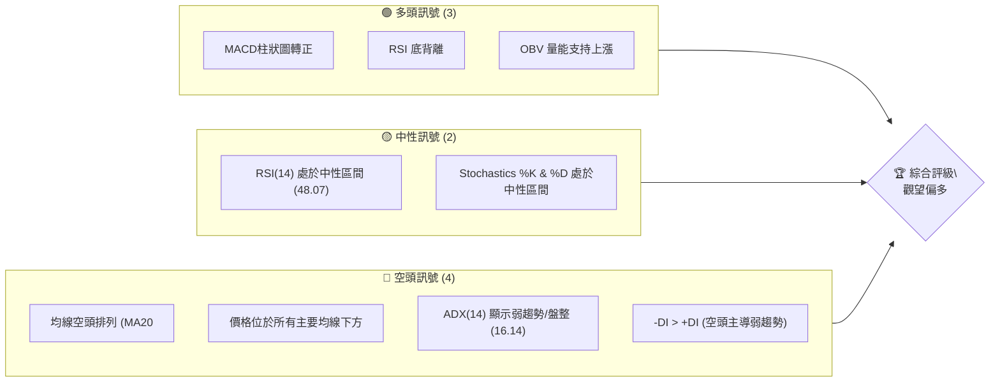

**解讀**：多頭訊號主要來自於動能指標的改善和量能的配合，暗示短期內可能出現反彈或築底。然而，空頭訊號則強調了長期趨勢的疲軟和趨勢強度的不足。整體而言，市場處於一個關鍵的轉折點，短期內有反彈機會，但上方阻力重重，需謹慎操作。

### 📊 核心指標速覽表

以下表格匯總了 TSLA 當前最重要的技術指標數據及其訊號解讀：

| 指標類別 | 指標名稱 | 當前數值 | 訊號 | 解讀 |
|----------|----------|----------|------|------|
| **價格** | 當前收盤價 | $393.45 | 🟡 | 位於52週區間中下部 (49.8%)，近期從低點反彈。 |
| **均線** | MA20 | $399.16 | 🔴 | 價格位於MA20下方，短期壓力。 |
| **均線** | MA50 | $406.42 | 🔴 | 價格位於MA50下方，中期壓力。 |
| **均線** | MA200 | $418.61 | 🔴 | 價格位於MA200下方，長期趨勢偏空。 |
| **動能** | RSI(14) | 48.07 | 🟡 | 處於中性區間 (30-70)，非超買或超賣。 |
| **動能** | MACD Hist | +1.651 | 🟢 | MACD柱狀圖轉正，顯示多頭動能增強，形成金叉。 |
| **動能** | RSI 背離 | ⚠️ 底背離 | 🟢 | 價格創新低但RSI未創新低，潛在看漲反轉訊號。 |
| **趨勢** | ADX(14) | 16.14 | 🔴 | 趨勢強度弱於25，表明目前處於盤整或弱勢趨勢。 |
| **波動** | ATR(14) | $19.05 | 🟡 | 每日波動約4.84%，屬於中等偏高波動。 |
| **成交量** | 量比 (20日) | 1.49x | 🟢 | 當日成交量顯著高於20日均量，配合近期反彈。 |
| **成交量** | OBV趨勢 | OBV > MA | 🟢 | 量能趨勢向上，確認價格上漲動能。 |

### 🏆 技術評分卡

本評分卡從多個維度對 TSLA 的技術面進行量化評估，滿分為100分，並給出綜合評級。

```
╔══════════════════════════════════════════════════════════════╗
║                    技術評分卡 — TSLA (2026-07-03)              ║
╠══════════════════════════════════════════════════════════════╣
║ 趨勢強度      ██████░░░░░░░░░░░░░░░░  30/100  🔴 (ADX弱，空頭主導) ║
║ 動能指標      ████████████░░░░░░░░░░  60/100  🟢 (RSI底背離, MACD金叉) ║
║ 支撐穩定度    ████████████░░░░░░░░░░  65/100  🟡 (接近重要支撐) ║
║ 成交量配合    ██████████████░░░░░░░░  70/100  🟢 (OBV確認, 量比高) ║
║ 形態完整度    ████████░░░░░░░░░░░░░░  40/100  🟡 (潛在築底中，未確認) ║
║ 均線排列      ████░░░░░░░░░░░░░░░░░░  20/100  🔴 (空頭排列，價格下方) ║
╠══════════════════════════════════════════════════════════════╣
║ 綜合評分      ████████░░░░░░░░░░░░░░  48/100  ⚖️ 中性偏多 (短期築底訊號) ║
╚══════════════════════════════════════════════════════════════╝
```

**評分總結**：儘管長期均線呈現空頭排列，且整體趨勢強度不足，但短期動能指標（RSI底背離、MACD金叉）和強勁的成交量配合，顯示 TSLA 正在嘗試築底或進行一波有力的反彈。支撐穩定度尚可，但形態尚未完全確認。綜合來看，目前處於一個中性偏多的觀察期，短線投資者可關注反彈機會，但需嚴格控制風險。

---

## 2. 趨勢分析

對 TSLA 進行多時框架的趨勢分析，從宏觀到微觀，全面判斷其價格走勢方向與強度。

### 🌐 多時框趨勢分析

TSLA 的趨勢在不同時間框架下顯示出不同的特徵，這對於理解其當前市場地位至關重要。

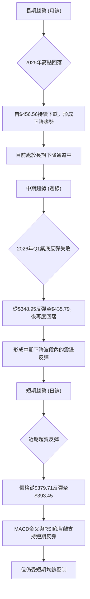

**詳細解讀**：
*   **長期趨勢 (月線)**：從2025年10月的歷史高點$456.56之後，TSLA 股價呈現明顯的回落趨勢。儘管期間有月度反彈，但未能突破前高，整體形成一系列的「更低的高點」和「更低的低點」。當前價格$393.45遠低於2025年高點，顯示長期下降趨勢仍在持續。
*   **中期趨勢 (週線)**：審視過去20週的數據，股價在2026年4月12日觸及$348.95的低點後，曾有一波強勁的反彈，最高達到2026年5月31日的$435.79。然而，此後股價再次回落，未能站穩於重要中期均線上方。這表明中期趨勢仍處於一個震盪下行的區間，反彈力度不足以扭轉整體跌勢。
*   **短期趨勢 (日線)**：在最近的幾週，TSLA 股價從2026年6月28日的$379.71回升至$393.45。此波反彈伴隨著MACD柱狀圖轉正和RSI的底背離訊號，顯示短期內多頭動能有所恢復。然而，價格仍位於MA20 ($399.16) 和MA50 ($406.42) 等短期均線下方，面臨上方阻力。短期趨勢目前為弱勢反彈，試圖挑戰短期壓力。

### 📈 長期趨勢 — 12個月走勢圖（Unicode）

以下為 TSLA 過去12個月的月線收盤價走勢圖，清晰標示了關鍵高低點，幫助我們理解其長期價格演變。

```
TSLA 月線走勢圖（過去12個月）
價格軸 ($)
$460 ┤                                  ●(456.56, Oct 25)
$450 ┤                       ●(444.72, Sep 25)  ●(449.72, Dec 25)
$440 ┤                                        ●(435.79, May 26)
$430 ┤                    ●(430.17, Nov 25) ●(430.41, Jan 26)
$420 ┤                                    ●(420.60, Jun 26)
$410 ┤
$400 ┤              ●(402.51, Feb 26)
$390 ┤                                            ●(393.45, Jul 26)←現在
$380 ┤                                ●(381.63, Apr 26)
$370 ┤                            ●(371.75, Mar 26)
$360 ┤
$350 ┤
$340 ┤            ●(333.87, Aug 25)
$330 ┤
$320 ┤
$310 ┤●(308.27, Jul 25)
$300 ┤─────────────────────────────────────────────────────────────────
      Jul 25 Aug 25 Sep 25 Oct 25 Nov 25 Dec 25 Jan 26 Feb 26 Mar 26 Apr 26 May 26 Jun 26 Jul 26
```

**走勢特徵分析表格**：

| 階段 | 時間段 | 價格區間 | 走勢特徵 | 漲跌幅 | 關鍵點位 |
|------|----------|------------|----------|--------|------------|
| 上漲 | 2025-07 ~ 2025-10 | $308.27 ~ $456.56 | 強勁上漲，創年內新高 | +48.07% | 高點: $456.56 (2025-10) |
| 回調 | 2025-10 ~ 2026-03 | $456.56 ~ $371.75 | 震盪下跌，形成長期壓力 | -18.59% | 低點: $371.75 (2026-03) |
| 反彈 | 2026-03 ~ 2026-05 | $371.75 ~ $435.79 | 一波反彈，但未能突破前高 | +17.23% | 高點: $435.79 (2026-05) |
| 回落 | 2026-05 ~ 2026-07 | $435.79 ~ $393.45 | 再次回落，短期築底中 | -9.72% | 現價: $393.45 (2026-07) |

**總結**：過去12個月，TSLA 經歷了從強勁上漲到回調，再到反彈失敗後再度回落的過程。目前股價位於回落階段的底部區域，正在尋求新的方向。長期上行趨勢已破壞，轉為震盪下行。

### 📊 中期趨勢（週線分析）

中期來看，TSLA 股價在近期經歷了一次V型反彈後的再次回調。關鍵壓力位和支撐位顯現，為判斷未來走勢提供依據。

```
TSLA 中期走勢（近20週）及關鍵壓力/支撐示意圖
價格軸 ($)
$440 ┤                                    ● (435.79, May 31)
$430 ┤                                  ╭╯
$420 ┤                                 ╱
$410 ┤                                ╱
$400 ┤───●───────●───────●───R1:$406.42 (MA50)───●───
$390 ┤           ●           S1:$391.00 (Jun 7 Low)  ●(393.45, Jul 5)
$380 ┤                                  ╲     ● (379.71, Jun 28)
$370 ┤                                   ╲
$360 ┤●───────●───────●───────S2:$369.14 (BB Lower)
$350 ┤    ● (348.95, Apr 12)
     └────────────────────────────────────────────────────────
      Mar 01    Apr 05    May 03    Jun 07    Jul 05
```
**圖示說明**：
*   **近期低點**：$348.95 (2026-04-12)，此後出現一波強勁反彈。
*   **反彈高點**：$435.79 (2026-05-31)，未能突破長期下降趨勢線。
*   **近期支撐 S1**：$391.00 (2026-06-07 收盤價)，也是近期反彈後的第一個重要支撐。
*   **近期支撐 S2**：$379.71 (2026-06-28 收盤價)。
*   **下方強支撐 S3**：$369.14 (布林通道下軌)，以及$361.83 (2026-03-29 低點)。
*   **近期阻力 R1**：$399.16 (MA20) 和 $406.42 (MA50)。
*   **中期阻力 R2**：$418.61 (MA200) 和 $429.17 (布林通道上軌)。

**分析**：中期來看，股價在4月觸底反彈後，於5月底再次遇阻回落，顯示上方壓力沉重。目前股價在$393.45，位於MA20和MA50下方，且短期均線呈空頭排列，中期趨勢仍偏弱。然而，近期在$379.71附近再次獲得支撐並反彈，顯示買盤在低位有所承接。

### ⚡ 趨勢強度評估（ADX 解讀）

ADX 指標用於衡量趨勢的強度，而非方向。結合 +DI 和 -DI 則可判斷趨勢方向。

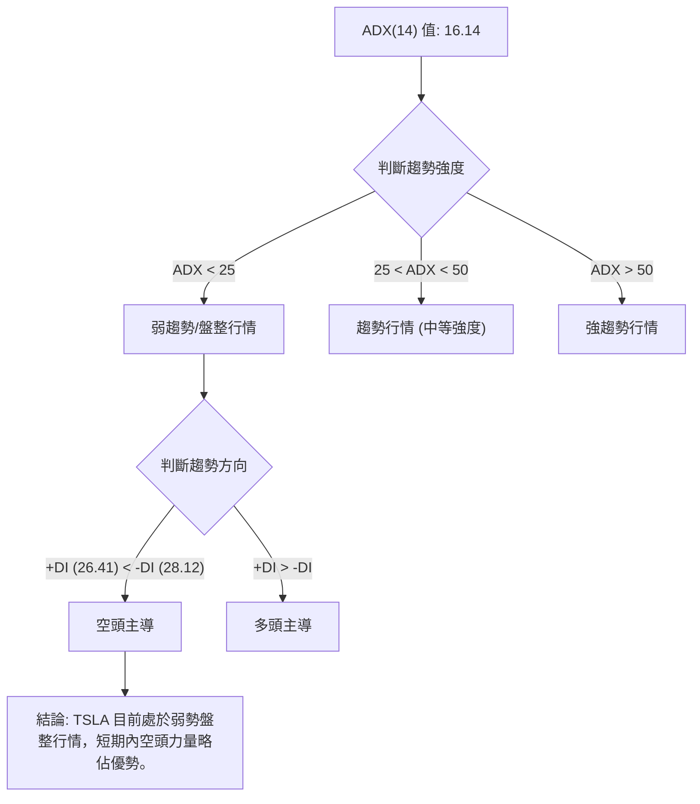

**ADX 強度對照表**：

| ADX 值 | 趨勢強度 | 市場狀態 | 交易策略建議 |
|--------|----------|----------|--------------|
| 0-25   | 弱趨勢   | 盤整/無趨勢 | 適合區間交易或等待趨勢形成 |
| 25-50  | 中等趨勢 | 趨勢形成中 | 順勢交易，關注突破 |
| 50-75  | 強趨勢   | 趨勢明確   | 順勢交易，持倉待漲/跌 |
| 75-100 | 極強趨勢 | 趨勢極強   | 順勢交易，警惕回調 |

**分析**：TSLA 的 ADX(14) 值為 16.14，遠低於 25，明確指出當前市場處於**弱趨勢或盤整狀態**。這意味著股價缺乏明確的方向性，大漲大跌的可能性較低，更可能在一個區間內震盪。
進一步觀察方向指標：+DI 為 26.41，而 -DI 為 28.12。由於 -DI 略高於 +DI，這表明在當前的弱勢盤整中，**空頭力量略佔主導地位**。這與均線的空頭排列相符，儘管短期動能有所改善，但整體市場情緒和趨勢強度仍偏向謹慎。投資者應避免期待單邊大行情，更適合在區間內尋找交易機會或等待趨勢明朗。

---

## 3. 圖表形態分析

本章節將深入分析 TSLA 的圖表形態，識別潛在的反轉或延續形態，並據此計算可能的目標價。

### 🔍 形態識別系統

在當前的 TSLA 股價走勢中，長期下降趨勢與短期築底反彈的跡象並存。雖然尚未形成經典的明確反轉形態，但我們可以觀察到一些發展中的潛在結構。

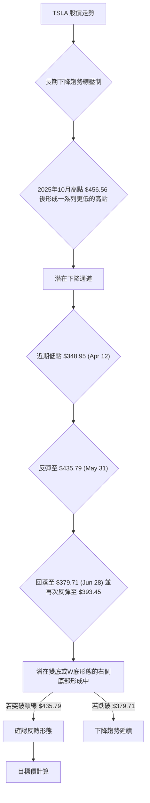

**分析**：
1.  **長期下降通道**：從2025年10月的高點$456.56開始，TSLA 股價形成了一系列更低的高點和更低的低點，這構建了一個潛在的下降通道。當前價格 $393.45 仍在此通道內部運行，通道上軌構成重要阻力。
2.  **潛在築底形態 (W底/雙底)**：股價在2026年4月12日觸及$348.95的低點，隨後反彈至5月31日的$435.79，之後再次回落並在6月28日觸及$379.71後反彈。這種走勢可能正在構築一個規模較大的W底或雙底形態。
    *   **左底**：$348.95 (2026-04-12)
    *   **頸線 (潛在)**：$435.79 (2026-05-31)
    *   **右底**：$379.71 (2026-06-28)
    目前股價 $393.45 處於右底形成後的反彈階段。此形態的確認需要股價明確突破頸線 $435.79，並有成交量配合。若形態確認，將是強烈的看漲反轉訊號。

### 🕯️ 重要K線形態分析

根據近20週的週線收盤價數據，我們可以觀察到一些具有指示意義的K線組合。請注意，此處數據為週收盤價，K線形態的判斷基於週線級別。

| 月份 | 收盤價 | K線形態 | 解讀 | 訊號 |
|------|--------|---------|------|------|
| 2026-04-12 | $348.95 | **錘子線/吞噬形態** | 在連續下跌後出現，暗示下方有買盤承接，潛在反轉。 | 🟢 |
| 2026-04-19 | $400.62 | **大陽線** | 從低點強勁反彈，實體較大，顯示多頭力量強勁。 | 🟢 |
| 2026-05-31 | $435.79 | **射擊之星/烏雲蓋頂** | 股價創新高後回落，實體較小，影線長，或次週出現陰線，暗示上方拋壓重。 | 🔴 |
| 2026-06-07 | $391.00 | **大陰線** | 股價從高點大幅下跌，實體較大，顯示空頭力量強勁。 | 🔴 |
| 2026-06-28 | $379.71 | **錘子線/啟明星** | 在下跌後出現，暗示空頭力量減弱，多頭可能介入，潛在築底。 | 🟢 |
| 2026-07-05 | $393.45 | **小陽線/十字星** | 在近期低點反彈，收盤價略高於開盤，可能預示短期反彈或盤整。 | 🟡 |

**總結**：在4月和6月底，股價在低位出現了潛在的築底K線形態（錘子線/啟明星），配合隨後的大陽線反彈，顯示買盤在關鍵支撐位附近介入。然而，5月底在高位出現了射擊之星/烏雲蓋頂的看跌形態，隨後的大陰線確認了短期頂部，導致股價再次回落。目前的K線形態為小陽線，需觀察後續能否延續反彈。

### 📉 ASCII 走勢形態示意圖

以下示意圖展示了 TSLA 近期的潛在築底形態 (W底/雙底) 的發展情況。

```
TSLA 潛在W底形態示意圖 (2026年Q2-Q3)
價格軸 ($)
$440 ┤                                        ● (435.79, May 31 - 頸線/高點)
$430 ┤                                       / \
$420 ┤                                      /   \
$410 ┤                                     /     \
$400 ┤                                    /       ● (393.45, Jul 05 - 現價)
$390 ┤                                   /       /
$380 ┤                                  ● (379.71, Jun 28 - 右底)
$370 ┤                                 /
$360 ┤                                /
$350 ┤● (348.95, Apr 12 - 左底)      /
     └────────────────────────────────────────────────────────────────
      Apr 12         May 03         May 31         Jun 28         Jul 05
```

**圖示說明**：
*   **左底 ($348.95)**：2026年4月12日形成，是近期下跌的階段性低點。
*   **頸線 ($435.79)**：2026年5月31日形成，是左底反彈的高點，也是未來形態確認的關鍵突破位。
*   **右底 ($379.71)**：2026年6月28日形成，是從頸線回落後的第二個低點。當前價格 $393.45 正從此處反彈。
*   **形態確認**：若股價能有效突破頸線 $435.79 並站穩，則W底形態將被確認，預示著一波較大的上漲行情。

### 🎯 形態目標價計算

基於上述潛在的 W 底形態，我們可以預估其一旦確認後的目標價。

**W底形態目標價計算方法**：
目標價 = 頸線價位 + (頸線價位 - 形態底部最低價位)

1.  **形態底部最低價位**：$348.95 (左底)
2.  **頸線價位**：$435.79 (5月31日高點)
3.  **形態高度**：$435.79 - $348.95 = $86.84

**目標價**：
*   **形態目標價 T1** = $435.79 + $86.84 = $522.63

**分析**：若 TSLA 成功突破並站穩頸線 $435.79，則此 W 底形態將被確認，其理論目標價為 $522.63。這個目標價遠高於當前價格，也高於52週高點 $498.83，顯示一旦形態確認，將有巨大的上漲潛力。然而，在形態確認之前，這僅是一個潛在的預期，股價仍可能在頸線下方震盪或再次回落。投資者應密切關注股價在 $435.79 附近的表現及成交量配合情況。

---

## 4. 支撐與阻力

支撐與阻力位是技術分析的核心，它們標誌著買賣力量可能發生逆轉的關鍵價格點。本章節將詳細識別 TSLA 的關鍵價位，並結合斐波那契回調進行分析。

### 🗺️ 關鍵價位分布圖（Unicode）

以下為 TSLA 當前價格 $393.45 附近的關鍵支撐與阻力位分布圖。

```
TSLA 價位結構分布圖 (2026-07-03)
═══════════════════════════════════════════════════
$498.83 ║████████████████████████║ 52週高點 R4 (強阻力)
$456.56 ║████████████████████████║ 歷史高點 R3 (強阻力)
$435.79 ║████████████████████████║ 形態頸線/阻力 R2 (潛在W底頸線)
$429.17 ║████████████████████    ║ BB上軌 R2
$418.61 ║████████████████████████║ MA200 阻力 R2
$406.42 ║████████████████████    ║ MA50 阻力 R1
$399.16 ║████████████████████████║ MA20 阻力 R1
$393.45 ╠════════════════════════╣ ◄ 現價
$390.06 ║▓▓▓▓▓▓▓▓▓▓▓▓▓▓▓▓        ║ 斐波那契 38.2% 回調 S1
$379.71 ║████████████████████████║ 近期低點 S1
$369.14 ║████████████████████████║ BB下軌 S2
$348.95 ║████████████████████████║ 形態左底 S2
$288.77 ║████████████████████████║ 52週低點 S3 (強支撐)
═══════════════════════════════════════════════════
```

**分析**：當前價格 $393.45 位於多重阻力下方，但同時也接近多重支撐。上方的阻力密集，包括短期均線和斐波那契回調位。下方的支撐則由近期低點和布林通道下軌構成，這些支撐能否守住至關重要。

### 🚧 阻力位分析表

TSLA 面臨的阻力位分佈密集，突破這些水平需要強勁的買盤動能和成交量配合。

| 阻力級別 | 價位 | 形成原因 | 突破難度 | 重要性 |
|----------|------|----------|----------|--------|
| **R1**   | $399.16 | MA20 (短期移動平均線) | 中等 | 短期反彈的第一道考驗，能否站穩決定短期強弱。 |
| **R1**   | $406.42 | MA50 (中期移動平均線) | 中等偏高 | 突破此位有助於扭轉中期跌勢。 |
| **R2**   | $415.47 | 斐波那契 61.8% 回調 | 高 | 若能突破，可能確認更強的反彈動能。 |
| **R2**   | $418.61 | MA200 (長期移動平均線) | 高 | 長期趨勢的牛熊分界線，突破則長期趨勢有望扭轉。 |
| **R2**   | $429.17 | 布林通道上軌 | 高 | 股價可能回歸通道中軸，突破可能進入超買區間。 |
| **R3**   | $435.79 | 潛在W底頸線 / 5月31日高點 | 極高 | 形態確認的關鍵，一旦突破將引發強勁買盤。 |
| **R4**   | $456.56 | 2025年10月歷史高點 | 極高 | 歷史性壓力位，突破將是極其強烈的看漲訊號。 |

### 🛡️ 支撐位分析表

TSLA 的支撐位在下方形成了一道防線，這些價位是空頭力量可能減弱或多頭力量可能介入的區域。

| 支撐級別 | 價位 | 形成原因 | 守住機率 | 重要性 |
|----------|------|----------|----------|--------|
| **S1**   | $390.06 | 斐波那契 38.2% 回調 | 中等 | 近期反彈的第一道心理支撐。 |
| **S1**   | $379.71 | 2026年6月28日近期低點 | 中等偏高 | 潛在W底的右底，若跌破則形態破壞。 |
| **S2**   | $369.14 | 布林通道下軌 | 高 | 通常是股價超賣的區域，容易引發反彈。 |
| **S2**   | $361.83 | 2026年3月29日低點 | 高 | 歷史性低點，具有較強的心理和技術支撐作用。 |
| **S3**   | $348.95 | 潛在W底左底 / 2026年4月12日低點 | 極高 | 潛在W底的關鍵組成部分，跌破將引發更深度的下跌。 |
| **S4**   | $288.77 | 52週低點 | 極高 | 一旦跌破，將進入新的下跌空間，引發恐慌性拋售。 |

### 📐 斐波那契回調位分析

我們以2025年10月高點 $456.56 作為主要下跌波段的起點，以2026年4月低點 $348.95 作為終點，計算其反彈的斐波那契回調位。這些水平將作為潛在的阻力或目標價。

*   **下跌波段**：從 $456.56 (高點) 到 $348.95 (低點)
*   **總跌幅**：$456.56 - $348.95 = $107.61

**斐波那契回調位計算**：
*   **23.6% 回調**：$348.95 + ($107.61 * 0.236) = $348.95 + $25.39 = **$374.34**
*   **38.2% 回調**：$348.95 + ($107.61 * 0.382) = $348.95 + $41.11 = **$390.06**
*   **50% 回調**：$348.95 + ($107.61 * 0.500) = $348.95 + $53.80 = **$402.75**
*   **61.8% 回調**：$348.95 + ($107.61 * 0.618) = $348.95 + $66.52 = **$415.47**
*   **76.4% 回調**：$348.95 + ($107.61 * 0.764) = $348.95 + $82.20 = **$431.15**

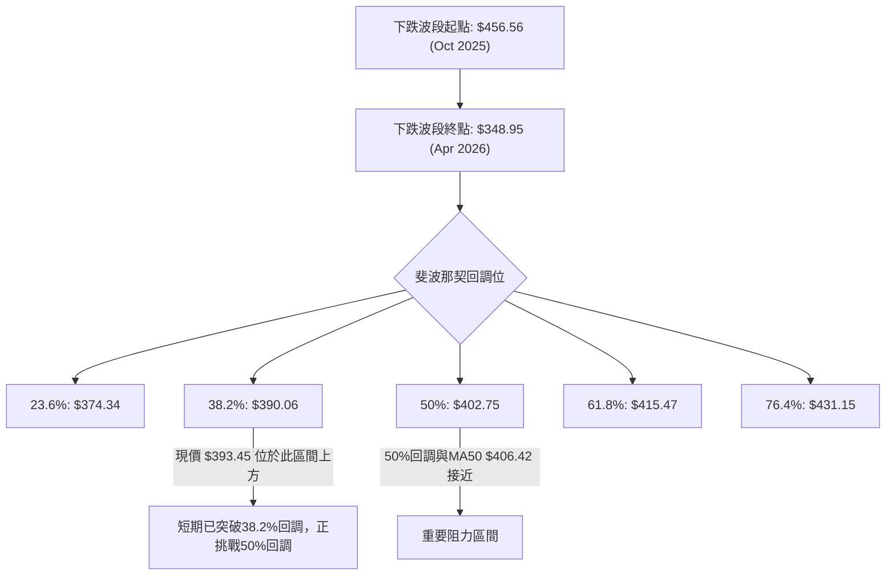

**分析**：當前價格 $393.45 已經突破了 38.2% 回調位 $390.06，顯示短期反彈力量較強。下一個重要的阻力區間將是 50% 回調位 $402.75 和 61.8% 回調位 $415.47。特別是 50% 回調位 $402.75 距離 MA50 $406.42 和 MA20 $399.16 非常接近，這三個價位共同構成了一個強勁的短期阻力區間。若能有效突破 $415.47 (61.8% 回調)，則反彈將更具說服力，並可能挑戰 W 底頸線 $435.79。

---

## 5. 技術指標深度解讀

本章節將對 TSLA 的關鍵技術指標進行詳盡解讀，分析其當前訊號及其相互關係，以提供更全面的市場洞察。

### 🎛️ 指標訊號總覽

以下 Mermaid 圖表展示了各主要技術指標當前的訊號方向及其相互之間的影響。

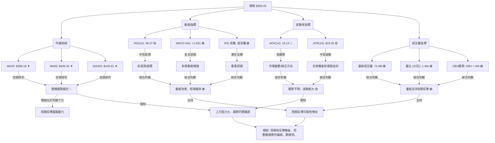

**總結**：儘管均線系統發出明確的空頭訊號，且 ADX 顯示趨勢疲軟，但動能指標（RSI 底背離、MACD 金叉）和強勁的成交量（OBV 上升、量比放大）共同指向短期內的多頭動能正在積聚，股價有反彈或築底的潛力。

### 📈 移動平均線排列分析

移動平均線（MA）是判斷趨勢方向和強度的重要工具。其排列方式能直觀反映市場的多空力量。

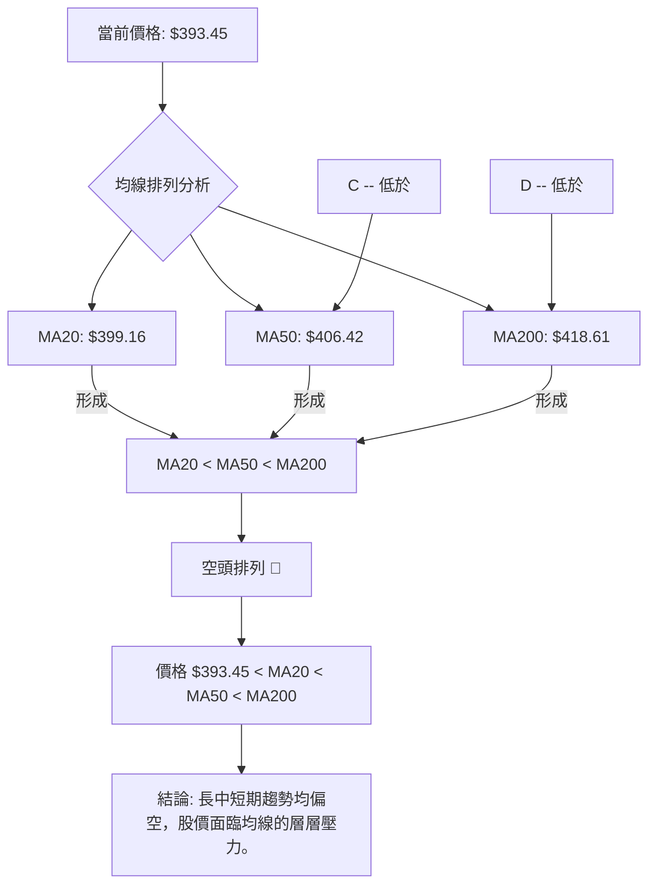

**均線排列狀態**：
*   MA5: $406.18
*   MA10: $396.87
*   MA20: $399.16
*   MA50: $406.42
*   MA200: $418.61

**分析**：TSLA 的短期 (MA20)、中期 (MA50) 和長期 (MA200) 移動平均線呈現典型的**空頭排列** (MA20 < MA50 < MA200)。這是一個強烈的看跌訊號，表明長期、中期和短期趨勢都向下。更重要的是，當前股價 $393.45 位於所有這些關鍵均線的下方，這意味著這些均線都將構成上方的阻力。
儘管短期內股價有所反彈，但要扭轉這種空頭排列，股價需要強勁突破並站穩所有均線之上。目前來看，MA20 ($399.16) 是最直接的短期阻力，若能突破，則下一步將挑戰 MA50 ($406.42) 和 MA200 ($418.61)。

### 📉 RSI(14) 分析

相對強弱指數 (RSI) 用於衡量價格變動的速度和幅度，以判斷超買或超賣狀況，並識別背離現象。

**RSI 數值進度條**：
RSI(14): 48.07  ▓▓▓▓▓▓▓▓▓▓▓▓▓▓▓▓▓▓▓▓▓▓▓▓░░░░░░░░░░░░░░░░░░░░░░░░░░░░░░░░░░░░░░░░░░░░░░ 48.07%

**分析**：
*   **RSI 數值**：當前 RSI(14) 為 48.07，處於 30-70 的中性區間。這表示股價既非超買也非超賣，市場情緒相對平衡，沒有極端的多空力量。
*   **超買超賣區間**：RSI 值在 70 以上通常被視為超買，可能預示回調；RSI 值在 30 以下則被視為超賣，可能預示反彈。目前 RSI 位於中性區，不提供直接的超買或超賣訊號。
*   **背離判斷 (底背離)**：根據提供的數據，RSI 存在 **⚠️ 底背離 (Bullish Divergence)**。
    *   **價格走勢**：在2026年3月29日收盤價 $361.83，RSI 為 32.8；在2026年4月12日收盤價 $348.95，RSI 為 42.0；在2026年6月28日收盤價 $379.71，RSI 為 45.8。
    *   從2026年3月到4月，股價創下更低的低點 ($361.83 -> $348.95)，但 RSI 卻出現了更高的低點 ($32.8 -> $42.0)。
    *   從2026年4月到6月，儘管股價在 $348.95 和 $379.71 之間震盪，但 RSI 低點持續抬升。
    *   **結論**：這種底背離是一個強烈的 **🟢 看漲反轉訊號**。它表明儘管價格仍在下跌或在低位震盪，但空頭力量已顯著減弱，下行動能正在衰竭，多頭力量可能正在積聚，預示著股價可能即將築底反彈。這個訊號與 MACD 的金叉和 OBV 的上升形成了相互確認。

### 📊 MACD(12/26/9) 訊號解讀

平滑異同移動平均線 (MACD) 是趨勢跟蹤動量指標，用於識別新的趨勢、趨勢反轉和動量變化。

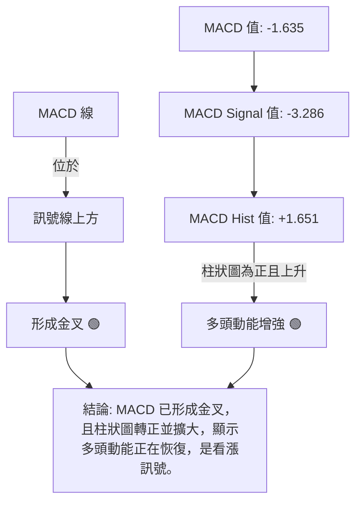

**分析**：
*   **MACD 線 vs. 訊號線**：MACD 線當前為 -1.635，訊號線為 -3.286。由於 MACD 線位於訊號線上方，這表示已經形成了一個 **🟢 金叉 (Bullish Crossover)**。金叉是看漲訊號，通常預示著股價可能從下跌轉為上漲，或者從盤整轉為上漲。
*   **MACD 柱狀圖 (Histogram)**：MACD 柱狀圖當前為 +1.651，且為正值。這表明 MACD 線與訊號線之間的距離正在擴大，且 MACD 線位於訊號線上方，進一步確認了多頭動能的增強。柱狀圖從負值轉為正值，是動能轉變的早期訊號。

**綜合判斷**：MACD 指標明確發出 **🟢 看漲訊號**。MACD 金叉和柱狀圖轉正，與 RSI 的底背離相互確認，共同指出 TSLA 股價在短期內有較高的反彈潛力，或正在形成底部。這與均線的空頭排列形成對比，顯示短期動能正在挑戰長期趨勢的壓力。

### 📦 布林通道分析

布林通道 (Bollinger Bands) 用於衡量股價波動率和判斷超買超賣區域。

```
TSLA 布林通道示意圖 (2026-07-03)
價格軸 ($)
$430 ┤──────────────────────────── BB上軌: $429.17
$420 ┤
$410 ┤
$400 ┤───●──────────────────────── BB中軌 (MA20): $399.16
$390 ┤   ▲ (現價 $393.45)
$380 ┤
$370 ┤──────────────────────────── BB下軌: $369.14
     └──────────────────────────────────────────────────
      時間軸
```

**布林通道數據**：
*   BB上軌: $429.17
*   BB中軌 (MA20): $399.16
*   BB下軌: $369.14
*   BB %B: 0.40 (0=下軌, 0.5=中軌, 1=上軌)

**分析**：
*   **價格位置**：當前股價 $393.45 位於布林通道的中軌 ($399.16) 和下軌 ($369.14) 之間，且距離中軌較近。BB %B 值為 0.40，表明股價略低於中軌，但並未觸及下軌，說明近期從下軌附近的反彈已有所進展。
*   **波動率**：布林通道的寬度 (上軌 - 下軌 = $429.17 - $369.14 = $60.03) 相對於股價 ($393.45) 而言，顯示出中等偏高的波動率。這與 ATR(14) $19.05 (4.84%) 的數據相符。通道目前沒有顯著收窄或擴張，表明波動率相對穩定。
*   **訊號**：股價從下軌附近反彈並向中軌靠近，這是一個 **🟢 看漲訊號**。如果股價能突破中軌 $399.16 並站穩，則可能進一步向布林通道上軌 $429.17 挑戰。若反彈失敗，股價可能再次回落測試下軌 $369.14。

### 💹 成交量分析（量價配合度）

成交量是價格走勢的燃料，量價關係對於判斷趨勢的可靠性至關重要。

**成交量數據**：
*   最新成交量: 73,915,800
*   20日均量: 49,465,550
*   50日均量: 52,025,036
*   量比 (最新/20日均量): 1.49x
*   OBV趨勢: OBV > MA → 量能支撐上漲

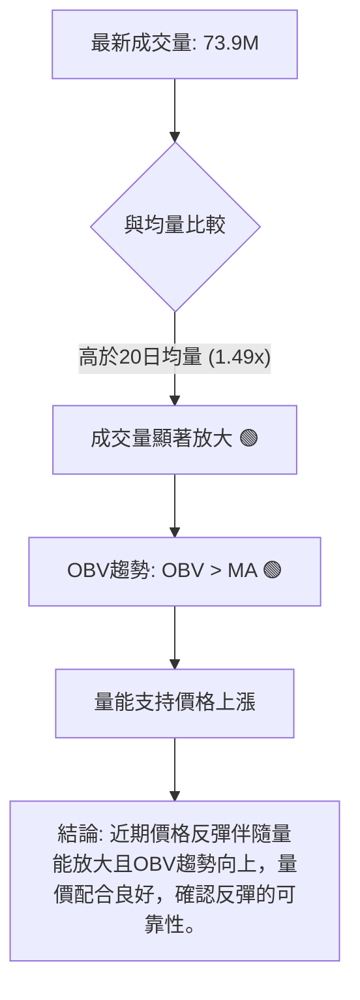

**分析**：
*   **最新成交量 vs. 均量**：當日成交量 73,915,800 股顯著高於 20 日均量 49,465,550 股 (量比 1.49x) 和 50 日均量 52,025,036 股。在股價近期反彈的背景下，成交量的大幅放大是一個 **🟢 積極訊號**，表明買盤積極介入，推動股價上漲。
*   **OBV 趨勢**：OBV (On Balance Volume) 趨勢顯示 OBV 線位於其移動平均線上方，表明 **🟢 量能支撐上漲**。這進一步確認了當前反彈的健康性，即多頭力量不僅推高股價，還有足夠的成交量來支撐這波上漲。
*   **量價配合度**：在短期反彈中，量價配合良好，顯示這波反彈並非無量空漲，而是有實質買盤支持。這增強了 RSI 底背離和 MACD 金叉所發出的看漲訊號的可靠性。

---

## 6. 動能與波動率

本章節將評估 TSLA 的動能強度和波動性，這對於理解其短期行為模式和風險管理至關重要。

### ⚡ 動能評估四象限

動能與波動率是衡量股票吸引力和風險的兩個關鍵維度。我們將 TSLA 放在四象限中進行評估。由於 Mermaid 的 quadrantChart 不適用於此，我們將使用表格和流程圖進行說明。

| 象限 | 動能 | 波動 | 當前狀態 | 評估 |
|------|------|------|----------|------|
| Q1 | 強 | 低 | - | 最佳機會 (穩定上漲) |
| Q2 | 弱 | 低 | - | 謹慎觀望 (盤整築底) |
| Q3 | 強 | 高 | - | 高風險高收益 (突破或強趨勢) |
| Q4 | 弱 | 高 | ✓ | **當前狀態 (震盪築底)** |

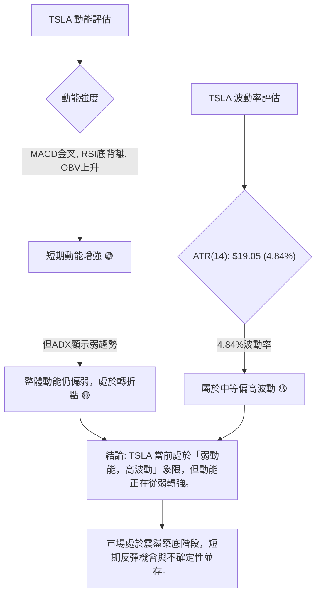

**分析**：
TSLA 目前處於動能評估的「**弱動能，高波動**」象限。
*   **動能**：儘管 MACD 金叉、RSI 底背離和 OBV 上升等短期指標顯示動能正在從弱轉強，但 ADX 值 16.14 仍指示整體趨勢強度不足，即市場缺乏強勁的單邊趨勢。因此，我們可以將其動能評估為「偏弱但正在改善」。
*   **波動率**：ATR(14) 為 $19.05，佔股價的 4.84%。這表示 TSLA 每日的平均波動幅度相對較大，屬於中等偏高波動。
**綜合**：TSLA 正在經歷一個從弱勢到動能改善的轉變期，伴隨著相對較高的波動性。這意味著股價可能會出現劇烈波動，既提供了短線交易機會，也增加了操作風險。投資者需密切關注動能的持續性，並做好風險管理。

### 📊 ATR 波動率分析

平均真實波幅 (ATR) 衡量的是一段時間內價格的平均波動範圍，是評估波動率和設定止損點的重要指標。

**ATR 數據**：
*   ATR(14): $19.05
*   佔當前價格百分比: ($19.05 / $393.45) * 100% = 4.84%

**分析**：
TSLA 的 ATR(14) 為 $19.05，這表示在過去14天中，TSLA 的平均每日價格波動範圍為 $19.05。相對於當前 $393.45 的股價，4.84% 的波動率屬於**中等偏高水平**。
*   **高波動性影響**：高波動性意味著股價在短期內可能出現較大的漲跌幅，這對短線交易者而言可能提供更多機會，但同時也增加了風險。對於長線投資者，高波動性可能導致更大的帳面浮虧或浮盈。
*   **止損距離建議**：ATR 可以用於設定動態止損點。一般建議將止損點設置在入場價以下 1.5 倍至 3 倍 ATR 的距離。
    *   1.5x ATR 止損距離：$19.05 * 1.5 = $28.57
    *   2.0x ATR 止損距離：$19.05 * 2.0 = $38.10
    *   例如，如果以 $393.45 進場，一個保守的止損點可能設置在 $393.45 - $28.57 = $364.88 附近，或 $393.45 - $38.10 = $355.35 附近。這有助於避免因正常市場波動而被過早止損，同時限制潛在損失。

### 📐 Beta 與市場相關性

Beta 值衡量股票相對於大盤（如 S&P 500）的波動性。數據中未提供 Beta 值，但根據 TSLA 作為高成長科技股的歷史特性，我們可以進行專業推演。

**推演**：
*   **高 Beta 預期**：TSLA 作為電動汽車和能源領域的領先者，其股價歷來對市場情緒和宏觀經濟變化高度敏感。在過去，TSLA 通常被認為是一支高 Beta 股票，其 Beta 值可能顯著大於 1 (例如，1.5 - 2.0 或更高)。
*   **市場相關性**：高 Beta 值意味著 TSLA 的股價波動幅度通常大於大盤。當大盤上漲時，TSLA 可能漲得更多；當大盤下跌時，TSLA 可能跌得更深。這增加了其作為投資標的的波動風險和潛在回報。
*   **當前影響**：在當前 ADX 顯示弱趨勢、市場缺乏明確方向的背景下，如果大盤進入盤整或弱勢，TSLA 的高 Beta 特性可能使其表現更為震盪。若市場出現明確的多頭或空頭趨勢，TSLA 的高 Beta 將放大其表現。

**總結**：儘管數據未直接提供 Beta 值，但基於 TSLA 的歷史表現和產業特性，預計其 Beta 值較高。這要求投資者在配置 TSLA 時，需充分考慮其與大盤的相關性及其帶來的放大波動風險。在當前弱趨勢背景下，高 Beta 可能導致更劇烈的價格波動，需要更嚴格的風險控制。

---

## 7. 多時框架總結

本章節將整合前述各時間框架的分析結果，提供一個全面的多時框架評分，以評估 TSLA 的整體技術面狀況。

### 📋 時框架評分表

| 時框架 | 趨勢方向 | 動能 | 均線排列 | 形態 | 綜合評分 (1-10) | 建議 |
|--------|----------|------|----------|------|-----------------|------|
| **長期 (月線)** | 🔴 下降 | 🔴 減弱 | 🔴 空頭 | 🟡 回調 | 3/10 | 警惕下行風險，不建議長線買入 |
| **中期 (週線)** | 🟡 震盪下行 | 🟡 築底中 | 🔴 空頭 | 🟡 潛在W底形成 | 5/10 | 觀望為主，關注形態確認 |
| **短期 (日線)** | 🟢 反彈 | 🟢 增強 | 🔴 空頭 | 🟢 築底反彈 | 7/10 | 可關注短線反彈機會，嚴控風險 |

**總結**：
*   **長期**：TSLA 仍處於明確的下降趨勢中，均線呈空頭排列，顯示長期基本面或市場情緒不佳。
*   **中期**：股價在經歷一波反彈後再次回落，目前正處於潛在W底的右底形成階段，趨勢仍未明朗，但有築底的跡象。
*   **短期**：多個動能指標（RSI 底背離、MACD 金叉）和量能配合顯示短期內多頭動能正在恢復，股價有反彈的潛力，正在挑戰短期阻力。

### 🔲 綜合訊號矩陣

以下矩陣展示了不同時間框架下，各技術分析維度的訊號一致性。

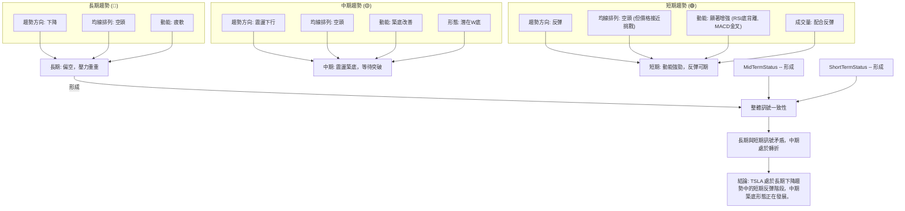

**分析**：
*   **長期與短期訊號的矛盾**：長期趨勢和均線排列都明確指向空頭，顯示宏觀層面壓力巨大。然而，短期動能指標卻發出強烈的看漲訊號，預示短期反彈。這種矛盾表明，TSLA 股價正處於一個關鍵的轉折點，短期買盤力量正在嘗試挑戰長期跌勢。
*   **中期趨勢的關鍵作用**：中期趨勢的潛在W底形態是連接長期與短期走勢的橋樑。如果此形態能夠成功確認（即突破頸線 $435.79），則短期反彈有望演變為中期反轉，進而對長期趨勢產生影響。
*   **操作建議**：在這種多空交織的情況下，投資者應保持謹慎。短線交易者可關注反彈機會，但需嚴格設定止損並密切監控上方的阻力位。長線投資者則應等待中期反轉形態的明確確認，或更強烈的基本面改善訊號。

---

## 8. 交易策略建議

基於上述多時框架的技術分析，TSLA 目前處於長期空頭中的短期反彈階段，中期潛在築底。因此，我們將提出一份以短線反彈為主，同時關注中期反轉潛力的交易策略。

### 🗺️ 策略決策流程圖

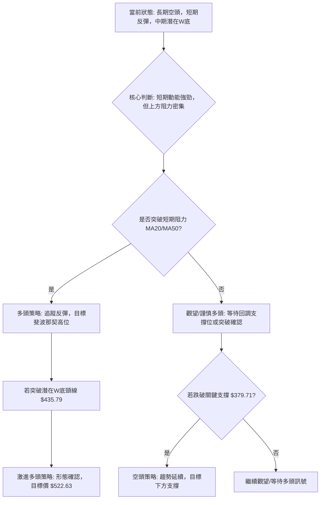

### 🟢 多頭策略詳情

考慮到 RSI 底背離、MACD 金叉和 OBV 量能支持，短期內存在較好的反彈機會。

| 策略要素 | 策略 A (短線反彈) | 策略 B (潛在W底突破) |
|----------|--------------------|--------------------|
| **進場條件** | 價格站穩 $390.06 (斐波那契38.2%回調) | 價格突破並站穩 $435.79 (W底頸線) |
| **進場價格** | $393.45 - $395.00 (現價附近，或回測 $390.06 企穩) | $438.00 - $440.00 (突破頸線後回測確認) |
| **目標價 T1** | $402.75 (斐波那契50%回調 / 近MA50) | $456.56 (2025年10月高點 / R3) |
| **目標價 T2** | $415.47 (斐波那契61.8%回調 / 近MA200) | $522.63 (W底形態理論目標價) |
| **止損價格** | $379.00 (略低於近期低點 $379.71) | $430.00 (頸線下方，若突破失敗則止損) |
| **風險報酬比** | 1:1.5 - 1:2.0 (基於T1/T2) | 1:4.5 - 1:8.0 (基於T1/T2) |
| **成功機率** | 60% (短期動能支持) | 40% (需強勁突破確認) |
| **建議倉位** | 輕倉 (5%-10% 總資本) | 中等倉位 (10%-15% 總資本) |

**策略 A (短線反彈) 分析**：
此策略旨在捕捉短期動能改善帶來的反彈。進場點位於現價附近或回調至支撐位後。止損點設定在近期低點 $379.71 之下，以限制潛在損失。目標價為斐波那契回調位和關鍵均線阻力。風險報酬比尚可，但需快速反應，因上方阻力密集。

**策略 B (潛在W底突破) 分析**：
此策略更為激進，旨在捕捉中期反轉形態的確認。進場點在形態頸線 $435.79 被有效突破並站穩之後。止損點設定在頸線下方，以防假突破。一旦形態確認，其潛在漲幅巨大，風險報酬比非常吸引人。但需要耐心等待確認，並承擔突破失敗的風險。

### 🔴 空頭策略詳情

儘管短期動能偏多，但在長期下降趨勢中，空頭策略仍有其意義，尤其是在反彈失敗或關鍵支撐被跌破時。

| 策略要素 | 策略 C (反彈失敗做空) | 策略 D (跌破關鍵支撐) |
|----------|----------------------|--------------------|
| **進場條件** | 價格未能突破 $406.42 (MA50)，或在 $415.47 (斐波那契61.8%) 遇阻回落 | 價格跌破 $379.71 (近期低點) |
| **進場價格** | $405.00 - $410.00 (阻力位附近) | $378.00 - $379.00 (跌破確認後) |
| **目標價 T1** | $390.06 (斐波那契38.2%回調) | $369.14 (布林通道下軌 / S2) |
| **目標價 T2** | $379.71 (近期低點 / S1) | $348.95 (潛在W底左底 / S2) |
| **止損價格** | $418.00 (略高於MA200 / 斐波那契61.8%) | $385.00 (跌破點上方，防範假跌破) |
| **風險報酬比** | 1:1.5 - 1:2.0 | 1:1.8 - 1:2.5 |
| **成功機率** | 55% (長期趨勢支持) | 65% (趨勢延續) |
| **建議倉位** | 輕倉 (5% 總資本) | 中等倉位 (5%-10% 總資本) |

**策略 C (反彈失敗做空) 分析**：
此策略適用於當前的短期反彈未能突破關鍵阻力位時。若股價在 $406.42 (MA50) 或 $415.47 (斐波那契61.8%) 附近遇到強大拋壓並掉頭向下，則可考慮做空。止損設置在阻力位上方。

**策略 D (跌破關鍵支撐) 分析**：
若股價跌破 $379.71 的近期支撐位，則潛在的 W 底形態將被破壞，下降趨勢可能延續。此時可考慮做空，目標價為更低的支撐位。此策略的成功機率較高，因其順應了長期趨勢的慣性。

### ⭐ 整體訊號強度評星

```
做多訊號強度：★★★★☆  (4/5星) (短期動能強勁，有底背離和金叉，量能配合)
做空訊號強度：★★★☆☆  (3/5星) (長期趨勢偏空，均線壓制，但短期反彈強勁)
整體可信度：  ★★★☆☆  (3/5星) (多空訊號交織，需嚴格按策略執行)
```
**評級總結**：儘管長期趨勢仍偏空，但短期內多頭動能的積聚和築底訊號非常明顯，為做多策略提供了較高的成功機率。然而，由於上方阻力密集，且長期趨勢未扭轉，做空策略在反彈失敗或跌破關鍵支撐時仍有機會。整體可信度中等，要求交易者具備較強的應變能力和風險管理意識。

---

## 9. 風險提示與監控

本章節將闡述 TSLA 交易中潛在的風險因素，並提供關鍵的監控指標和風險管理建議，以幫助投資者規避不確定性。

### ✅ 關鍵監控指標 Checklist

以下方框圖列出了在交易 TSLA 時需要密切關注的關鍵技術指標和價格行為。

```
╔══════════════════════════════════════════════════════════════╗
║               TSLA 關鍵監控指標 Checklist                      ║
╠══════════════════════════════════════════════════════════════╣
║ [ ] 價格能否站穩 $390.06 (斐波那契38.2%回調)                  ║
║ [ ] 價格能否突破 $399.16 (MA20) 和 $406.42 (MA50)             ║
║ [ ] 價格能否有效突破 $435.79 (潛在W底頸線) 並伴隨大量         ║
║ [ ] RSI(14) 是否持續位於中性區間並向上運行，避免進入超買區     ║
║ [ ] MACD 金叉是否持續有效，MACD柱狀圖能否持續為正並擴大       ║
║ [ ] ADX(14) 是否有上升趨勢並突破25，確認新的趨勢               ║
║ [ ] -DI 是否持續低於 +DI，確認多頭主導                         ║
║ [ ] 成交量能否持續放大，支持價格上漲                           ║
║ [ ] OBV 趨勢是否持續向上，確認量價配合良好                     ║
║ [ ] 52週低點 $288.77 和近期關鍵支撐 $348.95/$379.71 是否被跌破 ║
║ [ ] 任何可能改變市場情緒的重大新聞或基本面變化                 ║
╚══════════════════════════════════════════════════════════════╝
```

**監控重點**：投資者應每日或每週檢查這些指標的變化。特別是對於潛在的 W 底形態，突破頸線 $435.79 並伴隨大量是其確認的關鍵。同時，要警惕任何可能導致反彈失敗的訊號，如 RSL 頂背離、MACD 死叉、成交量萎縮等。

### ⚠️ 風險場景分析

以下 Mermaid 圖表展示了 TSLA 股價可能發展的三種情境：樂觀、基本和悲觀，並分析其觸發條件和結果。

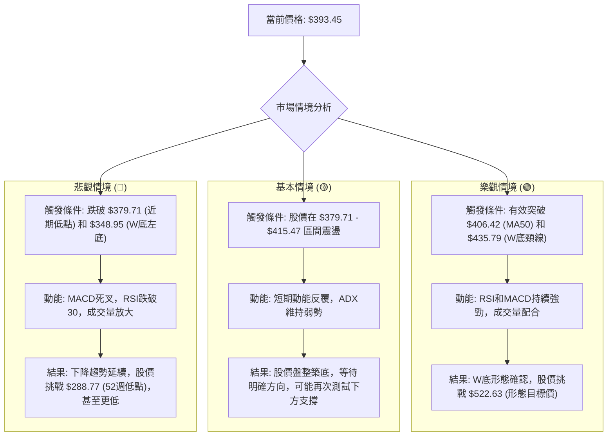

**分析**：
*   **樂觀情境**：若短期反彈能有效突破關鍵阻力，特別是潛在 W 底的頸線 $435.79，則股價有望開啟一波強勁上漲，目標直指形態目標價 $522.63。此情境需要強勁的買盤動能和成交量配合。
*   **基本情境**：股價在當前區間內震盪盤整，短期反彈可能在 MA50 ($406.42) 或斐波那契 61.8% 回調位 $415.47 附近受阻，然後回落測試 $379.71 或 $369.14 等支撐位。市場將在不明確的方向中等待新的催化劑。
*   **悲觀情境**：若短期反彈動能衰竭，股價未能突破上方阻力，反而跌破 $379.71 和 $348.95 等關鍵支撐，則潛在的 W 底形態將被破壞，長期下降趨勢將延續，股價可能進一步探底，挑戰 52 週低點 $288.77 甚至更低。

### 🛡️ 風險管理重要提醒

投資 TSLA 涉及較高風險，以下是重要的風險管理建議：

1.  **嚴格止損**：無論採用何種策略，都必須設定明確的止損點並嚴格執行。止損是控制損失、保護資本的關鍵。根據 ATR 建議，止損距離應考慮股票的波動性。
2.  **倉位管理**：避免單一股票過度集中，尤其是在不確定性較高的情況下。對於短期交易，建議採用輕倉操作 (總資本的 5%-10%)，對於形態確認後的突破策略，可適度增加倉位，但仍需控制在合理範圍內。
3.  **多樣化投資**：將資金分散投資於不同行業、不同風險水平的資產，以降低整體投資組合的風險。
4.  **關注基本面與新聞**：儘管本報告聚焦技術分析，但 TSLA 的股價極易受到公司新聞 (如產量數據、新產品發布)、行業政策、競爭格局以及宏觀經濟數據的影響。任何重大利空消息都可能迅速改變技術面走勢。
5.  **避免追漲殺跌**：在波動性較高的市場中，情緒化交易往往導致虧損。堅持預設的交易策略和紀律，避免盲目追漲殺跌。
6.  **現金管理**：保留充足的現金，以便在市場出現明確機會或股價跌至極具吸引力的水平時進行部署。

---

## 📋 報告總結

```
╔══════════════════════════════════════════════════════════════╗
║                    TSLA 技術分析報告總結                       ║
╠══════════════════════════════════════════════════════════════╣
║ 報告日期：2026-07-03                                         ║
║ 當前價格：$393.45                                            ║
║ 分析評級：⚖️ 中性偏多 (長期空頭中的短期反彈與中期築底)          ║
╠══════════════════════════════════════════════════════════════╣
║ 關鍵結論：                                                     ║
║ ├─ 長期趨勢：🔴 偏空，股價位於所有主要均線下方，趨勢下降。      ║
║ ├─ 中期趨勢：🟡 震盪築底，正在形成潛在的W底形態，關鍵為頸線突破。║
║ ├─ 短期趨勢：🟢 強勁反彈，RSI底背離、MACD金叉，量能配合良好。  ║
║ ├─ 關鍵支撐：$379.71 (近期低點)，其次是 $369.14 (BB下軌) 和 $348.95 (W底左底)。║
║ ├─ 關鍵阻力：$399.16 (MA20)，$406.42 (MA50)，$415.47 (斐波那契61.8%)，最重要為 $435.79 (W底頸線)。║
║ └─ 分析師目標：平均目標價 $421.16 (接近斐波那契61.8%回調位)。 ║
╠══════════════════════════════════════════════════════════════╣
║ 最優策略組合：                                                 ║
║ 1. 🥇 **最佳機會 (短線反彈)**：基於RSI底背離和MACD金叉，在 $393.45 - $395.00 區間進場，目標 $402.75 和 $415.47，止損 $379.00。風險報酬比約 1:1.5-2.0。此策略利用短期動能。                                  ║
║ 2. 🥈 **次選機會 (中期突破)**：若股價有效突破並站穩 $435.79 (W底頸線)，則在 $438.00 - $440.00 追蹤進場，目標 $456.56 和 $522.63，止損 $430.00。風險報酬比極佳，但需等待確認。                                     ║
║ 3. 🥉 **保守選擇 (逢高做空/跌破支撐)**：若反彈至 $406.42 或 $415.47 遇阻未能突破，或跌破 $379.71 關鍵支撐，可考慮做空，目標下方支撐位。此為逆勢或順勢空頭策略，風險較高。                                  ║
╚══════════════════════════════════════════════════════════════╝
```

---

> ⚠️ **免責聲明**：本報告為 AI 自動生成之技術分析，所有數據及估算均基於提供的歷史價格資訊。本報告**僅供研究與學術參考**，**不構成任何投資建議**。投資有風險，入市需謹慎。

---

*報告生成時間：2026-07-03 ｜ 數據來源：Yahoo Finance ｜ 分析框架：多時框技術分析*