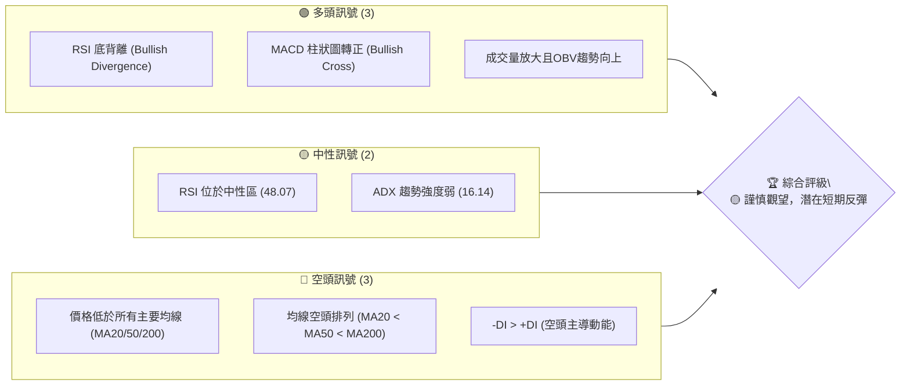
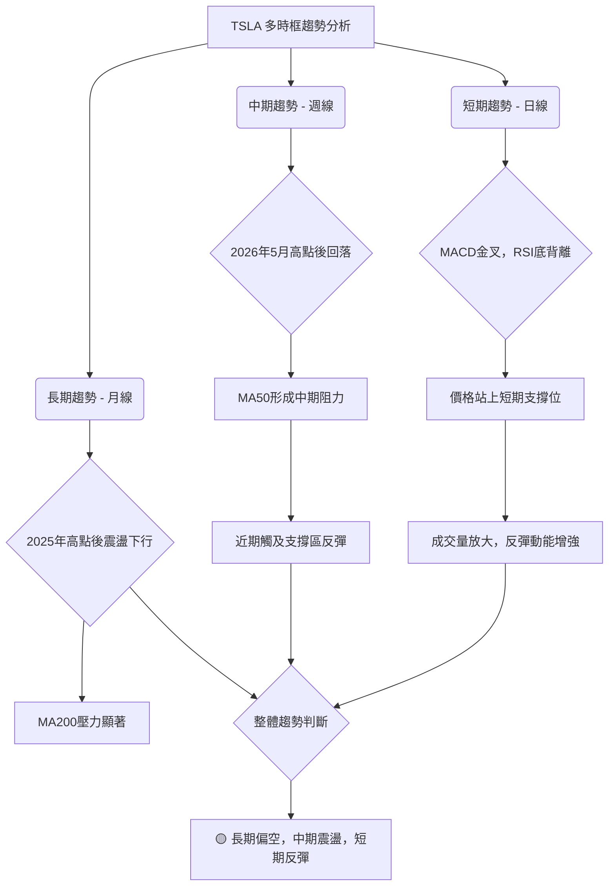
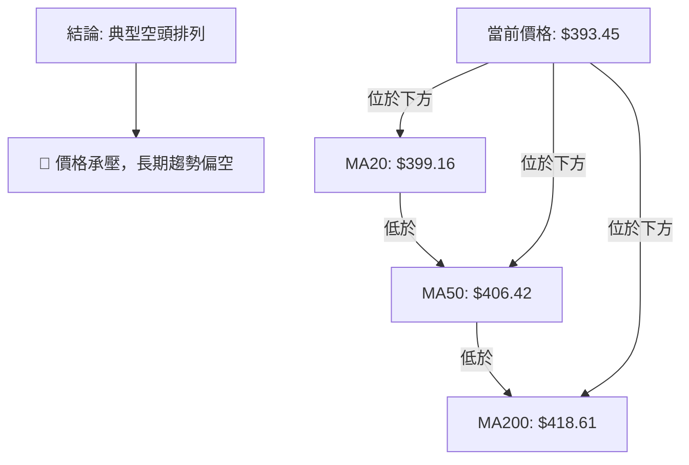
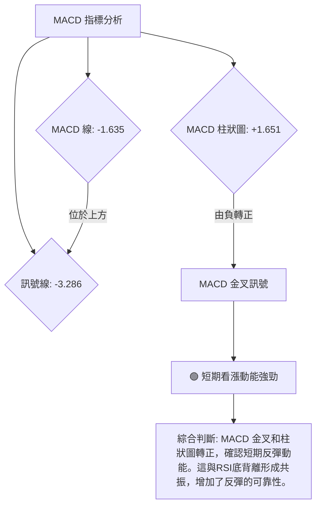
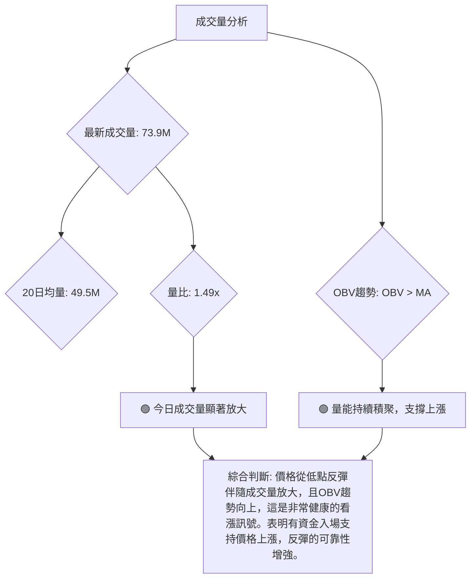

<details>
<summary>📊 靜態圖表 (點擊展開)</summary>

</details>

<html>
<head><meta charset="utf-8" /></head>
<body>
    <div style="height:500px; width:100%;">                        <script>window.PlotlyConfig = {MathJaxConfig: 'local'};</script>
        <script charset="utf-8" src="https://cdn.plot.ly/plotly-3.6.0.min.js" integrity="sha256-QaOVwtVY0T02VaHrr6pnoHLCwayMJp4O5n4YyaE3rJk=" crossorigin="anonymous"></script>                <div id="candlestick-chart" class="plotly-graph-div" style="height:100%; width:100%;"></div>            <script>                window.PLOTLYENV=window.PLOTLYENV || {};                                if (document.getElementById("candlestick-chart")) {                    Plotly.newPlot(                        "candlestick-chart",                        [{"close":{"dtype":"f8","bdata":"AAAAgOtZekAAAACAwp16QAAAAKCZDXpAAAAAwB6hekAAAAAgXCN7QAAAAKCZnXpAAAAA4KOse0AAAACAPXZ6QAAAAGBmhntAAAAAIFyze0AAAAAghct7QAAAACBct3xAAAAAAABAe0AAAACgR916QAAAAAAAVHxAAAAAoHARe0AAAABACmt7QAAAAOCjOHtAAAAAANfXeUAAAABgZj57QAAAAADX03pAAAAAYGYye0AAAAAAAMx6QAAAAMD1dHtAAAAAQOH2e0AAAACgmal7QAAAACCFb3tAAAAAIK4PfEAAAAAghRt7QAAAAGC4RnxAAAAAwMzIfEAAAAAAKdh8QAAAAKCZgXtAAAAAwPWIfEAAAACA60V9QAAAAAApxHtAAAAAwB7hfEAAAABgj957QAAAAOBR2HpAAAAAIK7Te0AAAACA63l7QAAAAKCZ6XpAAAAAANcfeUAAAACgmUV5QAAAAGC4jnlAAAAAAAAUeUAAAAAA1z95QAAAACCus3hAAAAAoHBxeEAAAADgehx6QAAAAGBmNnpAAAAAoEepekAAAABguOJ6QAAAAIA94npAAAAAANfTekAAAAAA1+t7QAAAAOB6aHxAAAAAAABwfEAAAACgR3l7QAAAAGC40ntAAAAAQDM3fEAAAACAPe57QAAAACBcr3xAAAAAwPW0fUAAAACAFJ5+QAAAAAApNH1AAAAAgOs1fkAAAABAMxN+QAAAACCui35AAAAAwPVYfkAAAABgZlZ+QAAAAEAKs31AAAAAgD26fEAAAABA4WZ8QAAAACCFG3xAAAAAwB5he0AAAABguDp8QAAAACBcD3tAAAAAYI\u002f2ekAAAADAzDx7QAAAAAAp0HtAAAAAIFwPfEAAAABAM\u002fN7QAAAAEAzc3tAAAAAwB5pe0AAAAAAAFh7QAAAAAAANHpAAAAAQAr3ekAAAACAwhV8QAAAAMD1EHxAAAAAQDMze0AAAABgZu56QAAAACBc93pAAAAAwPUIekAAAABgj+Z6QAAAAMD1XHpAAAAAIFxfekAAAAAAKWB5QAAAACBc03hAAAAAgMKxeUAAAADAHhV6QAAAACBck3pAAAAA4FHEekAAAADAHhF6QAAAAEAKF3pAAAAAgBSqeUAAAADAHrV5QAAAACBcu3lAAAAAwB69eUAAAACgR\u002f14QAAAAIAUlnlAAAAAYGYWekAAAACgR4l5QAAAAAApKHlAAAAAwB41eUAAAABA4YZ4QAAAAEAKX3lAAAAAwMxYeUAAAAAgrst4QAAAAEDh6nhAAAAAANfzeEAAAADAHn15QAAAAAApsHhAAAAAQDNzeEAAAADA9bh4QAAAAOBR9HhAAAAA4HqMeEAAAADAzMR3QAAAACBc\u002f3ZAAAAAoJnNd0AAAADgevB3QAAAAEAzH3hAAAAAgMJBd0AAAACgR512QAAAAOB6NHZAAAAAAAA8d0AAAAAAKdR3QAAAAKBwiXZAAAAAwB4NdkAAAABgZqp1QAAAAAAAdHVAAAAAgOuZdUAAAABAM891QAAAAGC4BnZAAAAAQDPDdkAAAABAM394QAAAAGBmTnhAAAAAgOsJeUAAAAAAAIh4QAAAAGC4JnhAAAAAACk4eEAAAAAghVt3QAAAAMDMhHdAAAAAYLiqd0AAAADgUYB3QAAAAMDMTHdAAAAAgBTad0AAAADAHm14QAAAAAApiHhAAAAAgOtVeEAAAAAgrut4QAAAAOCjvHlAAAAAoJnFekAAAAAAANB7QAAAAEAzF3tAAAAA4FHUe0AAAADAzLR7QAAAAADXY3pAAAAAANefeUAAAACAwkF5QAAAAAApFHpAAAAAoJkdekAAAAAAKaB6QAAAAKBwGXtAAAAAgMKFe0AAAACgmaF7QAAAAOCjPHtAAAAAgBT+eUAAAAAA13t6QAAAAEAze3pAAAAAQDMnekAAAAAAAHB4QAAAAEAzj3lAAAAAQOHKeEAAAACgcNl3QAAAAGBm8nhAAAAAQOFmeUAAAABgZrJ5QAAAAGCPSnlAAAAAgBTGeEAAAAAA1wd5QAAAAMDMUHlAAAAAgMLZd0AAAADgenh3QAAAAIDrcXdAAAAAIFy7d0AAAACgcL15QAAAAKCZSXpAAAAAwMyUekAAAABAM5d4QA=="},"high":{"dtype":"f8","bdata":"AAAAAAB0ekAAAADA9cR6QAAAACCFA3tAAAAAIIXXekAAAAAgrs97QAAAACCFj3tAAAAAIFzDe0AAAACgmTV7QAAAACCFh3tAAAAAIK4vfEAAAAAAANB7QAAAAOCj5HxAAAAAAABsfUAAAADgUex7QAAAAMDMWHxAAAAAQOFKfEAAAACgR5V7QAAAAKCZRXtAAAAAgBSye0AAAACAPU57QAAAAEAzI3tAAAAAACmIe0AAAACgmXV7QAAAACBcl3tAAAAAwMwcfEAAAADAzBR8QAAAAOCj2HtAAAAAYGYWfEAAAABA4Tp8QAAAAGCPwnxAAAAAAAAwfUAAAABAMxt9QAAAAMD1cHxAAAAAAACgfEAAAADAHqF9QAAAACCFw3xAAAAAoEclfUAAAABAMzd9QAAAAIDCdXtAAAAAYLgafEAAAAAA16d7QAAAAKBHpXtAAAAAAACIekAAAABACsN5QAAAACBcf3pAAAAAYGaOeUAAAADgerx5QAAAAEAKz3pAAAAAwMwseUAAAAAghVt6QAAAACCuR3pAAAAAQAqvekAAAABA4Q57QAAAAGCPGntAAAAAwMxMe0AAAABguP57QAAAAIAUanxAAAAAgOutfEAAAAAAABx8QAAAAIA9RnxAAAAAgBSOfEAAAADgURR8QAAAAAAp8HxAAAAA4FEcfkAAAAAAALh+QAAAAOB69H5AAAAAgMKtfkAAAAAA16d+QAAAAKBHLX9AAAAAIIW\u002ffkAAAABgZq5+QAAAAKBwkX5AAAAAYGZWfUAAAACA6\u002fF8QAAAAMDMiHxAAAAAoHClfEAAAADAzJh8QAAAAAAABHxAAAAAgOtle0AAAACAPU57QAAAAMDMEHxAAAAAwMxkfEAAAADA9Tx8QAAAAGCPvntAAAAAgMLVe0AAAAAAAPR7QAAAACCu63pAAAAAQDNje0AAAAAAABh8QAAAAEDhRnxAAAAA4KPQe0AAAADgUVh7QAAAAAApZHtAAAAAIK6De0AAAACAFH57QAAAAGBmsnpAAAAAwPXIekAAAABgZn56QAAAAKCZIXlAAAAAwMzoeUAAAAAAAFR6QAAAAAAAtHpAAAAAoJlFe0AAAAAgrkN7QAAAAMD1gHpAAAAAIIXbeUAAAABgZg56QAAAAAAA9HlAAAAAQDPreUAAAABAM3t5QAAAAMAerXlAAAAAoHBFekAAAADA9Qx6QAAAAIDrcXlAAAAA4KNIeUAAAACgcMV4QAAAAKBHhXlAAAAAgOuJeUAAAACgmSV5QAAAAKBwGXlAAAAAoHBpeUAAAACAFAZ6QAAAAAAAaHlAAAAAQDMDeUAAAAAgrjt5QAAAAIDrAXlAAAAAwB4xeUAAAADgUTR4QAAAAIA9vndAAAAAoEcVeEAAAAAgrjd4QAAAACCuw3hAAAAAQAoHeEAAAACAwh13QAAAAOCj9HZAAAAAoEdVd0AAAACAPfJ3QAAAAOB6JHdAAAAAIIX7dkAAAADgUcB1QAAAAAAAyHZAAAAAgBTOdUAAAACAwuV1QAAAAKCZRXZAAAAAgBT6dkAAAABgZqp4QAAAAMD1oHhAAAAA4HqUeUAAAADAzGx5QAAAAEAzn3hAAAAAACmQeEAAAAAAACB4QAAAAAAp7HdAAAAA4HrMd0AAAADgo+R3QAAAAGBmhndAAAAAAAAMeEAAAADAHt14QAAAAIA9qnhAAAAAgOsheUAAAABA4Rp5QAAAAKBH\u002fXlAAAAAQDPzekAAAABgjxJ8QAAAAMDM\u002fHtAAAAAYGZWfEAAAAAgrj98QAAAAGCPKntAAAAAgBRSekAAAACAFFp5QAAAACBcF3pAAAAAQDOvekAAAAAAKfh6QAAAAEAzM3tAAAAAoJnZe0AAAAAgXL97QAAAAMAekXtAAAAAoJnZekAAAABguIZ6QAAAAKCZGXtAAAAAoJmlekAAAABA4Yp6QAAAAEAKz3lAAAAAAAAoekAAAACgcNF4QAAAAOCj+HhAAAAAQOFqeUAAAAAAAAB6QAAAAGC4xnlAAAAAQApfeUAAAADgUSh5QAAAAAAA7HlAAAAAgOuNeEAAAACgRwl4QAAAAIDrsXdAAAAAwMw8eEAAAADgUdR5QAAAAOCjiHpAAAAAgMINe0AAAACgmQV7QA=="},"hovertemplate":"\u003cb\u003e%{x|%Y-%m-%d}\u003c\u002fb\u003e\u003cbr\u003e\u958b: $%{open:.2f}\u003cbr\u003e\u9ad8: $%{high:.2f}\u003cbr\u003e\u4f4e: $%{low:.2f}\u003cbr\u003e\u6536: $%{close:.2f}\u003cextra\u003e\u003c\u002fextra\u003e","low":{"dtype":"f8","bdata":"AAAAQOG2eUAAAABguJp5QAAAAMD1CHpAAAAAIIVbekAAAACAFNJ6QAAAACCFe3pAAAAA4HrQekAAAACgRzF6QAAAAOBRUHpAAAAAAAB4e0AAAACA6xF7QAAAAAAAjHtAAAAAwB45e0AAAACgRwl6QAAAAEAKS3tAAAAAQDMHe0AAAAAgrpN6QAAAAEDhonpAAAAAQDO3eUAAAABAMzt6QAAAAIDCHXpAAAAAoEelekAAAADA9VR6QAAAAKCZeXpAAAAAgMKJe0AAAADAzKB7QAAAAAAA0HpAAAAAYGbeeUAAAABguOJ6QAAAAEAKa3tAAAAAoJk5fEAAAABgZkp8QAAAAIDCeXtAAAAAQAq7e0AAAADAzFx8QAAAAKCZuXtAAAAAIFyLe0AAAACgcDF7QAAAAIAUXnpAAAAAgMIVe0AAAACAwgV7QAAAAMD1qHpAAAAAoHDFeEAAAADgeux3QAAAAADX63hAAAAAIFybeEAAAAAAAOh4QAAAAADXq3hAAAAAACn8d0AAAACgcBF5QAAAAEAzX3lAAAAAgD0OekAAAABAM6N6QAAAAOCjlHpAAAAAgOthekAAAACAwvF6QAAAAIA91ntAAAAAYI86fEAAAAAAADR7QAAAAEAzO3tAAAAAgMK5e0AAAACgR4V7QAAAAGC4mntAAAAAYI86fUAAAACgRx19QAAAAEAzI31AAAAAgOuRfUAAAAAghat9QAAAAKBHVX5AAAAAoHAtfkAAAADAzMx9QAAAAMAenX1AAAAAAACwfEAAAACgR118QAAAAMDMFHxAAAAAwMw0e0AAAADAHsl7QAAAAOB6zHpAAAAA4KP0ekAAAACA64V6QAAAAIA95npAAAAAAABge0AAAABAM797QAAAACCFI3tAAAAAYGZae0AAAAAAKTR7QAAAAEAKF3pAAAAAgOs5ekAAAACAFAp7QAAAAOCjwHtAAAAA4Hoke0AAAABACut6QAAAAKCZ4XpAAAAAgOvpeUAAAABAM2t6QAAAAAAA6HlAAAAAQArbeUAAAABA4fJ4QAAAAOB6OHhAAAAAAADceEAAAADgo3R5QAAAAAAAEHpAAAAA4HpAekAAAAAAAOB5QAAAAIAUrnlAAAAAACkIeUAAAACgR5l5QAAAAIDCQXlAAAAAAABYeUAAAADgo6B4QAAAAIA92nhAAAAAYGbCeUAAAABgjzp5QAAAAIDC4XhAAAAAAABEeEAAAACAPRZ4QAAAAKBHqXhAAAAAYLj2eEAAAAAgXKN4QAAAAGBm1ndAAAAAQArjeEAAAABgZiJ5QAAAAGBmqnhAAAAAQDNfeEAAAABguKZ4QAAAAAAAkHhAAAAAwPWEeEAAAAAgrqt3QAAAACBcx3ZAAAAAIK5Ld0AAAADA9YR3QAAAAAApEHhAAAAAgOs9d0AAAAAghXd2QAAAAIA9AnZAAAAAAACQdkAAAACgR2F3QAAAAOB6cHZAAAAAgD2qdUAAAAAA1xN1QAAAAGC4OnVAAAAAAAAUdUAAAAAA12t1QAAAAMAeyXVAAAAA4FEsdkAAAAAAAKh2QAAAAMDM3HdAAAAAYGZ6eEAAAACgR0V4QAAAACCFE3hAAAAAwMwUeEAAAACAPQZ3QAAAACCuK3dAAAAA4FHAdkAAAADgo0h3QAAAAOCjIHdAAAAAYLgCd0AAAADAzKx3QAAAAMDMDHhAAAAAAABQeEAAAADgUQB4QAAAAIDrIXlAAAAAgD0GekAAAADAzAx6QAAAAAApZHpAAAAAIFzjekAAAABgj5J7QAAAAAAAYHpAAAAAoEdVeUAAAACAFJp4QAAAAIA9ZnlAAAAAYGbOeUAAAAAAKUh6QAAAAIDroXpAAAAA4FE4e0AAAADAzER7QAAAAIA9wnpAAAAAQOH2eUAAAABgZtp5QAAAAAAAAHpAAAAAYI8SekAAAACgcEl4QAAAACCFq3hAAAAAANcDeEAAAABgZsJ3QAAAAGCPyndAAAAAACkseEAAAACgmXF5QAAAAOCjCHlAAAAAACmceEAAAABAMwt4QAAAAGBmpnhAAAAAwPWwd0AAAADAzFB3QAAAACCFM3dAAAAAoJkJd0AAAADAzLR3QAAAAAAAYHlAAAAAoHAhekAAAADAzFR4QA=="},"name":"\u50f9\u683c","open":{"dtype":"f8","bdata":"AAAAAADoeUAAAAAAAPx5QAAAAIDrzXpAAAAAwB5dekAAAACAwvF6QAAAAIAUfntAAAAAoEfdekAAAAAA1zN7QAAAAMDMxHpAAAAAoJnFe0AAAADgUZh7QAAAAMDMvHtAAAAA4KNofUAAAADgo7R7QAAAAAAAjHtAAAAAwB79e0AAAADAHll7QAAAAMD1\u002fHpAAAAA4KNIe0AAAADgenh6QAAAAOCjrHpAAAAAYGYue0AAAAAgrit7QAAAAAAAmHpAAAAAgOu9e0AAAAAAKdx7QAAAAEAzt3tAAAAAAABAekAAAACgR+17QAAAACCuf3tAAAAA4HpsfEAAAAAAAOh8QAAAAMDMMHxAAAAAAADse0AAAAAA1398QAAAACBcZ3xAAAAAwMxAfEAAAAAgXN98QAAAAGC4XntAAAAAoJl5e0AAAABgZnZ7QAAAAGBmontAAAAAgBRyekAAAADAzCR4QAAAAADX63hAAAAAgBRWeUAAAABA4WJ5QAAAAIAU6nlAAAAAwB4leUAAAABguCJ5QAAAAGC45nlAAAAAQDN\u002fekAAAACgcKl6QAAAAMAelXpAAAAAwPXsekAAAACgmQF7QAAAAEAKH3xAAAAA4HpQfEAAAABAM\u002fd7QAAAAOCjWHtAAAAAwB7he0AAAABAMw98QAAAAKBwAXxAAAAAQApXfUAAAAAgXIN9QAAAACCFg35AAAAAYI\u002fifUAAAACA64F+QAAAAIAUnn5AAAAAYGaWfkAAAAAgrod+QAAAACCuU35AAAAAAABQfUAAAACgcNF8QAAAAKCZgXxAAAAAwMycfEAAAAAA1\u002f97QAAAAIAU5ntAAAAAYGY+e0AAAACAPb56QAAAAEAzP3tAAAAAIK6Te0AAAABAMyN8QAAAAMD1rHtAAAAAgBSSe0AAAAAAAHh7QAAAAIDC1XpAAAAAYI9aekAAAABgjzJ7QAAAAEDh9ntAAAAAAADQe0AAAABgj1Z7QAAAAGCP\u002fnpAAAAAwMxce0AAAACgmZV6QAAAAOCjVHpAAAAA4FGEekAAAAAgXEd6QAAAAOBR0HhAAAAAgOsNeUAAAABgj555QAAAAKBHIXpAAAAAIFy\u002fekAAAADAzOR6QAAAAMD15HlAAAAAgMLFeUAAAACAwrF5QAAAAAAAdHlAAAAAwMyEeUAAAADgo3R5QAAAAAAA+HhAAAAAYGbCeUAAAABguOZ5QAAAAEAKL3lAAAAAoJlpeEAAAACgcLF4QAAAAKCZ3XhAAAAAwB4ZeUAAAACgcOF4QAAAAMDMYHhAAAAAIIUjeUAAAADgeiR5QAAAAEDhUnlAAAAAYLjyeEAAAAAghcN4QAAAAEAKu3hAAAAAAADweEAAAADgUTR4QAAAAKCZvXdAAAAAoHBRd0AAAADA9Yh3QAAAAADXX3hAAAAAoJnZd0AAAABACht3QAAAAIDC3XZAAAAAACmYdkAAAACAFKp3QAAAAEAzw3ZAAAAAoHCpdkAAAABACqd1QAAAAOCjvHZAAAAAYGZydUAAAADgo6R1QAAAAMAe4XVAAAAAYLhadkAAAACgR+12QAAAAMD1nHhAAAAAYLi+eEAAAACgRyl5QAAAAAAAkHhAAAAAwB45eEAAAADgenR3QAAAAAAAWHdAAAAAoHBBd0AAAABA4Wp3QAAAAGBmdndAAAAAAABMd0AAAAAA1+d3QAAAACCuY3hAAAAAQAqzeEAAAAAAACR4QAAAACCud3lAAAAAIK4HekAAAABgj2J6QAAAAGCPlntAAAAAYLhKe0AAAAAA1+d7QAAAACCuH3tAAAAA4FE0ekAAAABgjzJ5QAAAAKCZeXlAAAAAQOFiekAAAABguGp6QAAAAAAp5HpAAAAAgD2ue0AAAACA61l7QAAAAKCZfXtAAAAAANe3ekAAAAAghSN6QAAAAEAzK3pAAAAAoHA9ekAAAAAAAEh6QAAAAKBHxXhAAAAA4HqweUAAAADgo3h4QAAAAOB6RHhAAAAAANf3eEAAAACA68V5QAAAAIDCQXlAAAAA4HoYeUAAAACgmeF4QAAAAKCZrXhAAAAAgMKJeEAAAACgR8F3QAAAAOBRdHdAAAAAYGYid0AAAADgo9x3QAAAAAAAYHlAAAAAIFxXekAAAAAAKcB6QA=="},"x":["2025-09-16T00:00:00-04:00","2025-09-17T00:00:00-04:00","2025-09-18T00:00:00-04:00","2025-09-19T00:00:00-04:00","2025-09-22T00:00:00-04:00","2025-09-23T00:00:00-04:00","2025-09-24T00:00:00-04:00","2025-09-25T00:00:00-04:00","2025-09-26T00:00:00-04:00","2025-09-29T00:00:00-04:00","2025-09-30T00:00:00-04:00","2025-10-01T00:00:00-04:00","2025-10-02T00:00:00-04:00","2025-10-03T00:00:00-04:00","2025-10-06T00:00:00-04:00","2025-10-07T00:00:00-04:00","2025-10-08T00:00:00-04:00","2025-10-09T00:00:00-04:00","2025-10-10T00:00:00-04:00","2025-10-13T00:00:00-04:00","2025-10-14T00:00:00-04:00","2025-10-15T00:00:00-04:00","2025-10-16T00:00:00-04:00","2025-10-17T00:00:00-04:00","2025-10-20T00:00:00-04:00","2025-10-21T00:00:00-04:00","2025-10-22T00:00:00-04:00","2025-10-23T00:00:00-04:00","2025-10-24T00:00:00-04:00","2025-10-27T00:00:00-04:00","2025-10-28T00:00:00-04:00","2025-10-29T00:00:00-04:00","2025-10-30T00:00:00-04:00","2025-10-31T00:00:00-04:00","2025-11-03T00:00:00-05:00","2025-11-04T00:00:00-05:00","2025-11-05T00:00:00-05:00","2025-11-06T00:00:00-05:00","2025-11-07T00:00:00-05:00","2025-11-10T00:00:00-05:00","2025-11-11T00:00:00-05:00","2025-11-12T00:00:00-05:00","2025-11-13T00:00:00-05:00","2025-11-14T00:00:00-05:00","2025-11-17T00:00:00-05:00","2025-11-18T00:00:00-05:00","2025-11-19T00:00:00-05:00","2025-11-20T00:00:00-05:00","2025-11-21T00:00:00-05:00","2025-11-24T00:00:00-05:00","2025-11-25T00:00:00-05:00","2025-11-26T00:00:00-05:00","2025-11-28T00:00:00-05:00","2025-12-01T00:00:00-05:00","2025-12-02T00:00:00-05:00","2025-12-03T00:00:00-05:00","2025-12-04T00:00:00-05:00","2025-12-05T00:00:00-05:00","2025-12-08T00:00:00-05:00","2025-12-09T00:00:00-05:00","2025-12-10T00:00:00-05:00","2025-12-11T00:00:00-05:00","2025-12-12T00:00:00-05:00","2025-12-15T00:00:00-05:00","2025-12-16T00:00:00-05:00","2025-12-17T00:00:00-05:00","2025-12-18T00:00:00-05:00","2025-12-19T00:00:00-05:00","2025-12-22T00:00:00-05:00","2025-12-23T00:00:00-05:00","2025-12-24T00:00:00-05:00","2025-12-26T00:00:00-05:00","2025-12-29T00:00:00-05:00","2025-12-30T00:00:00-05:00","2025-12-31T00:00:00-05:00","2026-01-02T00:00:00-05:00","2026-01-05T00:00:00-05:00","2026-01-06T00:00:00-05:00","2026-01-07T00:00:00-05:00","2026-01-08T00:00:00-05:00","2026-01-09T00:00:00-05:00","2026-01-12T00:00:00-05:00","2026-01-13T00:00:00-05:00","2026-01-14T00:00:00-05:00","2026-01-15T00:00:00-05:00","2026-01-16T00:00:00-05:00","2026-01-20T00:00:00-05:00","2026-01-21T00:00:00-05:00","2026-01-22T00:00:00-05:00","2026-01-23T00:00:00-05:00","2026-01-26T00:00:00-05:00","2026-01-27T00:00:00-05:00","2026-01-28T00:00:00-05:00","2026-01-29T00:00:00-05:00","2026-01-30T00:00:00-05:00","2026-02-02T00:00:00-05:00","2026-02-03T00:00:00-05:00","2026-02-04T00:00:00-05:00","2026-02-05T00:00:00-05:00","2026-02-06T00:00:00-05:00","2026-02-09T00:00:00-05:00","2026-02-10T00:00:00-05:00","2026-02-11T00:00:00-05:00","2026-02-12T00:00:00-05:00","2026-02-13T00:00:00-05:00","2026-02-17T00:00:00-05:00","2026-02-18T00:00:00-05:00","2026-02-19T00:00:00-05:00","2026-02-20T00:00:00-05:00","2026-02-23T00:00:00-05:00","2026-02-24T00:00:00-05:00","2026-02-25T00:00:00-05:00","2026-02-26T00:00:00-05:00","2026-02-27T00:00:00-05:00","2026-03-02T00:00:00-05:00","2026-03-03T00:00:00-05:00","2026-03-04T00:00:00-05:00","2026-03-05T00:00:00-05:00","2026-03-06T00:00:00-05:00","2026-03-09T00:00:00-04:00","2026-03-10T00:00:00-04:00","2026-03-11T00:00:00-04:00","2026-03-12T00:00:00-04:00","2026-03-13T00:00:00-04:00","2026-03-16T00:00:00-04:00","2026-03-17T00:00:00-04:00","2026-03-18T00:00:00-04:00","2026-03-19T00:00:00-04:00","2026-03-20T00:00:00-04:00","2026-03-23T00:00:00-04:00","2026-03-24T00:00:00-04:00","2026-03-25T00:00:00-04:00","2026-03-26T00:00:00-04:00","2026-03-27T00:00:00-04:00","2026-03-30T00:00:00-04:00","2026-03-31T00:00:00-04:00","2026-04-01T00:00:00-04:00","2026-04-02T00:00:00-04:00","2026-04-06T00:00:00-04:00","2026-04-07T00:00:00-04:00","2026-04-08T00:00:00-04:00","2026-04-09T00:00:00-04:00","2026-04-10T00:00:00-04:00","2026-04-13T00:00:00-04:00","2026-04-14T00:00:00-04:00","2026-04-15T00:00:00-04:00","2026-04-16T00:00:00-04:00","2026-04-17T00:00:00-04:00","2026-04-20T00:00:00-04:00","2026-04-21T00:00:00-04:00","2026-04-22T00:00:00-04:00","2026-04-23T00:00:00-04:00","2026-04-24T00:00:00-04:00","2026-04-27T00:00:00-04:00","2026-04-28T00:00:00-04:00","2026-04-29T00:00:00-04:00","2026-04-30T00:00:00-04:00","2026-05-01T00:00:00-04:00","2026-05-04T00:00:00-04:00","2026-05-05T00:00:00-04:00","2026-05-06T00:00:00-04:00","2026-05-07T00:00:00-04:00","2026-05-08T00:00:00-04:00","2026-05-11T00:00:00-04:00","2026-05-12T00:00:00-04:00","2026-05-13T00:00:00-04:00","2026-05-14T00:00:00-04:00","2026-05-15T00:00:00-04:00","2026-05-18T00:00:00-04:00","2026-05-19T00:00:00-04:00","2026-05-20T00:00:00-04:00","2026-05-21T00:00:00-04:00","2026-05-22T00:00:00-04:00","2026-05-26T00:00:00-04:00","2026-05-27T00:00:00-04:00","2026-05-28T00:00:00-04:00","2026-05-29T00:00:00-04:00","2026-06-01T00:00:00-04:00","2026-06-02T00:00:00-04:00","2026-06-03T00:00:00-04:00","2026-06-04T00:00:00-04:00","2026-06-05T00:00:00-04:00","2026-06-08T00:00:00-04:00","2026-06-09T00:00:00-04:00","2026-06-10T00:00:00-04:00","2026-06-11T00:00:00-04:00","2026-06-12T00:00:00-04:00","2026-06-15T00:00:00-04:00","2026-06-16T00:00:00-04:00","2026-06-17T00:00:00-04:00","2026-06-18T00:00:00-04:00","2026-06-22T00:00:00-04:00","2026-06-23T00:00:00-04:00","2026-06-24T00:00:00-04:00","2026-06-25T00:00:00-04:00","2026-06-26T00:00:00-04:00","2026-06-29T00:00:00-04:00","2026-06-30T00:00:00-04:00","2026-07-01T00:00:00-04:00","2026-07-02T00:00:00-04:00"],"type":"candlestick"},{"hovertemplate":"MA30: $%{y:.2f}\u003cextra\u003e\u003c\u002fextra\u003e","line":{"color":"#2196F3","dash":"dash","width":2},"mode":"lines","name":"MA30","x":["2025-09-16T00:00:00-04:00","2025-09-17T00:00:00-04:00","2025-09-18T00:00:00-04:00","2025-09-19T00:00:00-04:00","2025-09-22T00:00:00-04:00","2025-09-23T00:00:00-04:00","2025-09-24T00:00:00-04:00","2025-09-25T00:00:00-04:00","2025-09-26T00:00:00-04:00","2025-09-29T00:00:00-04:00","2025-09-30T00:00:00-04:00","2025-10-01T00:00:00-04:00","2025-10-02T00:00:00-04:00","2025-10-03T00:00:00-04:00","2025-10-06T00:00:00-04:00","2025-10-07T00:00:00-04:00","2025-10-08T00:00:00-04:00","2025-10-09T00:00:00-04:00","2025-10-10T00:00:00-04:00","2025-10-13T00:00:00-04:00","2025-10-14T00:00:00-04:00","2025-10-15T00:00:00-04:00","2025-10-16T00:00:00-04:00","2025-10-17T00:00:00-04:00","2025-10-20T00:00:00-04:00","2025-10-21T00:00:00-04:00","2025-10-22T00:00:00-04:00","2025-10-23T00:00:00-04:00","2025-10-24T00:00:00-04:00","2025-10-27T00:00:00-04:00","2025-10-28T00:00:00-04:00","2025-10-29T00:00:00-04:00","2025-10-30T00:00:00-04:00","2025-10-31T00:00:00-04:00","2025-11-03T00:00:00-05:00","2025-11-04T00:00:00-05:00","2025-11-05T00:00:00-05:00","2025-11-06T00:00:00-05:00","2025-11-07T00:00:00-05:00","2025-11-10T00:00:00-05:00","2025-11-11T00:00:00-05:00","2025-11-12T00:00:00-05:00","2025-11-13T00:00:00-05:00","2025-11-14T00:00:00-05:00","2025-11-17T00:00:00-05:00","2025-11-18T00:00:00-05:00","2025-11-19T00:00:00-05:00","2025-11-20T00:00:00-05:00","2025-11-21T00:00:00-05:00","2025-11-24T00:00:00-05:00","2025-11-25T00:00:00-05:00","2025-11-26T00:00:00-05:00","2025-11-28T00:00:00-05:00","2025-12-01T00:00:00-05:00","2025-12-02T00:00:00-05:00","2025-12-03T00:00:00-05:00","2025-12-04T00:00:00-05:00","2025-12-05T00:00:00-05:00","2025-12-08T00:00:00-05:00","2025-12-09T00:00:00-05:00","2025-12-10T00:00:00-05:00","2025-12-11T00:00:00-05:00","2025-12-12T00:00:00-05:00","2025-12-15T00:00:00-05:00","2025-12-16T00:00:00-05:00","2025-12-17T00:00:00-05:00","2025-12-18T00:00:00-05:00","2025-12-19T00:00:00-05:00","2025-12-22T00:00:00-05:00","2025-12-23T00:00:00-05:00","2025-12-24T00:00:00-05:00","2025-12-26T00:00:00-05:00","2025-12-29T00:00:00-05:00","2025-12-30T00:00:00-05:00","2025-12-31T00:00:00-05:00","2026-01-02T00:00:00-05:00","2026-01-05T00:00:00-05:00","2026-01-06T00:00:00-05:00","2026-01-07T00:00:00-05:00","2026-01-08T00:00:00-05:00","2026-01-09T00:00:00-05:00","2026-01-12T00:00:00-05:00","2026-01-13T00:00:00-05:00","2026-01-14T00:00:00-05:00","2026-01-15T00:00:00-05:00","2026-01-16T00:00:00-05:00","2026-01-20T00:00:00-05:00","2026-01-21T00:00:00-05:00","2026-01-22T00:00:00-05:00","2026-01-23T00:00:00-05:00","2026-01-26T00:00:00-05:00","2026-01-27T00:00:00-05:00","2026-01-28T00:00:00-05:00","2026-01-29T00:00:00-05:00","2026-01-30T00:00:00-05:00","2026-02-02T00:00:00-05:00","2026-02-03T00:00:00-05:00","2026-02-04T00:00:00-05:00","2026-02-05T00:00:00-05:00","2026-02-06T00:00:00-05:00","2026-02-09T00:00:00-05:00","2026-02-10T00:00:00-05:00","2026-02-11T00:00:00-05:00","2026-02-12T00:00:00-05:00","2026-02-13T00:00:00-05:00","2026-02-17T00:00:00-05:00","2026-02-18T00:00:00-05:00","2026-02-19T00:00:00-05:00","2026-02-20T00:00:00-05:00","2026-02-23T00:00:00-05:00","2026-02-24T00:00:00-05:00","2026-02-25T00:00:00-05:00","2026-02-26T00:00:00-05:00","2026-02-27T00:00:00-05:00","2026-03-02T00:00:00-05:00","2026-03-03T00:00:00-05:00","2026-03-04T00:00:00-05:00","2026-03-05T00:00:00-05:00","2026-03-06T00:00:00-05:00","2026-03-09T00:00:00-04:00","2026-03-10T00:00:00-04:00","2026-03-11T00:00:00-04:00","2026-03-12T00:00:00-04:00","2026-03-13T00:00:00-04:00","2026-03-16T00:00:00-04:00","2026-03-17T00:00:00-04:00","2026-03-18T00:00:00-04:00","2026-03-19T00:00:00-04:00","2026-03-20T00:00:00-04:00","2026-03-23T00:00:00-04:00","2026-03-24T00:00:00-04:00","2026-03-25T00:00:00-04:00","2026-03-26T00:00:00-04:00","2026-03-27T00:00:00-04:00","2026-03-30T00:00:00-04:00","2026-03-31T00:00:00-04:00","2026-04-01T00:00:00-04:00","2026-04-02T00:00:00-04:00","2026-04-06T00:00:00-04:00","2026-04-07T00:00:00-04:00","2026-04-08T00:00:00-04:00","2026-04-09T00:00:00-04:00","2026-04-10T00:00:00-04:00","2026-04-13T00:00:00-04:00","2026-04-14T00:00:00-04:00","2026-04-15T00:00:00-04:00","2026-04-16T00:00:00-04:00","2026-04-17T00:00:00-04:00","2026-04-20T00:00:00-04:00","2026-04-21T00:00:00-04:00","2026-04-22T00:00:00-04:00","2026-04-23T00:00:00-04:00","2026-04-24T00:00:00-04:00","2026-04-27T00:00:00-04:00","2026-04-28T00:00:00-04:00","2026-04-29T00:00:00-04:00","2026-04-30T00:00:00-04:00","2026-05-01T00:00:00-04:00","2026-05-04T00:00:00-04:00","2026-05-05T00:00:00-04:00","2026-05-06T00:00:00-04:00","2026-05-07T00:00:00-04:00","2026-05-08T00:00:00-04:00","2026-05-11T00:00:00-04:00","2026-05-12T00:00:00-04:00","2026-05-13T00:00:00-04:00","2026-05-14T00:00:00-04:00","2026-05-15T00:00:00-04:00","2026-05-18T00:00:00-04:00","2026-05-19T00:00:00-04:00","2026-05-20T00:00:00-04:00","2026-05-21T00:00:00-04:00","2026-05-22T00:00:00-04:00","2026-05-26T00:00:00-04:00","2026-05-27T00:00:00-04:00","2026-05-28T00:00:00-04:00","2026-05-29T00:00:00-04:00","2026-06-01T00:00:00-04:00","2026-06-02T00:00:00-04:00","2026-06-03T00:00:00-04:00","2026-06-04T00:00:00-04:00","2026-06-05T00:00:00-04:00","2026-06-08T00:00:00-04:00","2026-06-09T00:00:00-04:00","2026-06-10T00:00:00-04:00","2026-06-11T00:00:00-04:00","2026-06-12T00:00:00-04:00","2026-06-15T00:00:00-04:00","2026-06-16T00:00:00-04:00","2026-06-17T00:00:00-04:00","2026-06-18T00:00:00-04:00","2026-06-22T00:00:00-04:00","2026-06-23T00:00:00-04:00","2026-06-24T00:00:00-04:00","2026-06-25T00:00:00-04:00","2026-06-26T00:00:00-04:00","2026-06-29T00:00:00-04:00","2026-06-30T00:00:00-04:00","2026-07-01T00:00:00-04:00","2026-07-02T00:00:00-04:00"],"y":{"dtype":"f8","bdata":"AAAAAAAA+H8AAAAAAAD4fwAAAAAAAPh\u002fAAAAAAAA+H8AAAAAAAD4fwAAAAAAAPh\u002fAAAAAAAA+H8AAAAAAAD4fwAAAAAAAPh\u002fAAAAAAAA+H8AAAAAAAD4fwAAAAAAAPh\u002fAAAAAAAA+H8AAAAAAAD4fwAAAAAAAPh\u002fAAAAAAAA+H8AAAAAAAD4fwAAAAAAAPh\u002fAAAAAAAA+H8AAAAAAAD4fwAAAAAAAPh\u002fAAAAAAAA+H8AAAAAAAD4fwAAAAAAAPh\u002fAAAAAAAA+H8AAAAAAAD4fwAAAAAAAPh\u002fAAAAAAAA+H8AAAAAAAD4f5qZmblJPntAd3d39wxTe0AiIiJiEGZ7QImIiMh2cntA7+7urrmCe0CamZmp8ZR7QN7d3T3DnntAq6qqmgupe0BVVVVVDrV7QJqZmdlAr3tAZmZmplSwe0BERERUnK17QKuqqvo3nntAq6qqehSMe0DNzMycfX57QHd3dxfZZntA7+7u3t1Ve0CamZkpXEN7QBEREYHcLXtAiYiIKOohe0DNzMwsQBh7QAAAALAAE3tAiYiImG4Oe0CamZl5MA97QHd3d3dMCntAzczM7JgAe0C8u7srzgJ7QBEREaEaC3tA7+7ujlAOe0BERESkcBF7QGZmZsaSDXtAMzMzU7gIe0BVVVU17AB7QJqZmTn7CntAmpmZOfsUe0Dv7u4OdCB7QDMzM1O4LHtAvLu7exQ4e0Dv7u6+5kp7QDMzM+N6antAZmZmRv1\u002fe0BVVVXFZ5h7QKuqqsovsHtAERER8e7Oe0B3d3eHpOl7QGZmZhZn\u002f3tA7+7uPgoTfECJiIgoeCx8QO\u002fu7o6XQHxAVVVVlRhWfECamZnptF98QImIiIhdbXxAZmZmJk15fEAAAABQYoJ8QN7d3U03h3xAmpmZKTGMfECJiIiYQ4d8QDMzM7NydHxAmpmZ+eFnfEBVVVVFGW18QCIiImIsb3xAd3d3t4FmfEC8u7uL+l18QBEREeFPT3xAvLu7i\u002fovfECJiIjoQhB8QHd3d3cF+HtARERE9ETXe0AzMzMDK697QKuqqnpbfntAIiIikqZWe0AiIiJiVzJ7QCIiInKvF3tAREREZPQGe0AiIiKCB\u002fN6QGZmZjbQ4XpAzczMvC3TekDe3d2dqL16QImIiEhTsnpAiYiImOCnekDe3d19sZR6QO\u002fu7s6wgXpAERER0dtwekBVVVXlQlx6QM3MzHyxSHpAAAAAsOQ1ekAREREh2x16QO\u002fu7t7BFnpAVVVVBfMIekBmZmZG4ex5QJqZmbkC0nlAvLu7+9S+eUC8u7vLhbJ5QImIiCgVn3lAzczMrI6ReUDNzMx8+H55QGZmZgbzcnlAvLu7+2JjeUBVVVW1rFV5QLy7uxsTRnlAzczMnO81eUAiIiLipSN5QGZmZpa1DnlAAAAA4MHweEBVVVXFS9N4QLy7u9sksnhAERERcWideEAAAABAYI14QKuqqqoccnhAMzMzM6VSeEC8u7tbSDZ4QImIiGgDE3hAvLu7C7vsd0ARERGR7cx3QM3MzJw2sndA3t3dbVmdd0BVVVXlF513QN7d3V0BlHdAIiIiQmCRd0CJiIi4Ho93QDMzM9OUiHdAq6qqSlOCd0ARERGBI3B3QGZmZvYoZndAMzMzM3pfd0BmZmZWDlV3QM3MzEzwRndARERE9P1Ad0CamZlJmkZ3QO\u002fu7i6yU3dAIiIicj1Yd0BVVVUFnWB3QKuqqgplbndA3t3drWOMd0CJiIgov7h3QImIiPhv4ndAZmZm5qUJeEDNzMxsvCp4QERERLSdS3hAAAAAUBtqeEBERESEwIh4QJqZmVk5sHhAd3d3J7\u002fWeECamZlp2P94QCIiItIiK3lAIiIiMsFTeUB3d3dXgG55QERERGSCh3lARERE5KWPeUARERExT6B5QHd3dycxtHlA7+7ufrHEeUCrqqrK6M15QLy7u5tS33lAIiIiku3oeUAAAAAQ5ut5QHd3d7fz+XlA3t3dvS0HekBmZmZ2BRJ6QHd3d1eAGHpAERERcT0cekDNzMy8LR16QAAAAICVGXpA3t3d7acAekBVVVX1mtt5QHd3d\u002fd+vHlAd3d314eZeUARERGBwIh5QHd3d5fgh3lAq6qq6gqQeUCamZl5W4p5QA=="},"type":"scatter"},{"hovertemplate":"MA60: $%{y:.2f}\u003cextra\u003e\u003c\u002fextra\u003e","line":{"color":"#9C27B0","dash":"dash","width":2},"mode":"lines","name":"MA60","x":["2025-09-16T00:00:00-04:00","2025-09-17T00:00:00-04:00","2025-09-18T00:00:00-04:00","2025-09-19T00:00:00-04:00","2025-09-22T00:00:00-04:00","2025-09-23T00:00:00-04:00","2025-09-24T00:00:00-04:00","2025-09-25T00:00:00-04:00","2025-09-26T00:00:00-04:00","2025-09-29T00:00:00-04:00","2025-09-30T00:00:00-04:00","2025-10-01T00:00:00-04:00","2025-10-02T00:00:00-04:00","2025-10-03T00:00:00-04:00","2025-10-06T00:00:00-04:00","2025-10-07T00:00:00-04:00","2025-10-08T00:00:00-04:00","2025-10-09T00:00:00-04:00","2025-10-10T00:00:00-04:00","2025-10-13T00:00:00-04:00","2025-10-14T00:00:00-04:00","2025-10-15T00:00:00-04:00","2025-10-16T00:00:00-04:00","2025-10-17T00:00:00-04:00","2025-10-20T00:00:00-04:00","2025-10-21T00:00:00-04:00","2025-10-22T00:00:00-04:00","2025-10-23T00:00:00-04:00","2025-10-24T00:00:00-04:00","2025-10-27T00:00:00-04:00","2025-10-28T00:00:00-04:00","2025-10-29T00:00:00-04:00","2025-10-30T00:00:00-04:00","2025-10-31T00:00:00-04:00","2025-11-03T00:00:00-05:00","2025-11-04T00:00:00-05:00","2025-11-05T00:00:00-05:00","2025-11-06T00:00:00-05:00","2025-11-07T00:00:00-05:00","2025-11-10T00:00:00-05:00","2025-11-11T00:00:00-05:00","2025-11-12T00:00:00-05:00","2025-11-13T00:00:00-05:00","2025-11-14T00:00:00-05:00","2025-11-17T00:00:00-05:00","2025-11-18T00:00:00-05:00","2025-11-19T00:00:00-05:00","2025-11-20T00:00:00-05:00","2025-11-21T00:00:00-05:00","2025-11-24T00:00:00-05:00","2025-11-25T00:00:00-05:00","2025-11-26T00:00:00-05:00","2025-11-28T00:00:00-05:00","2025-12-01T00:00:00-05:00","2025-12-02T00:00:00-05:00","2025-12-03T00:00:00-05:00","2025-12-04T00:00:00-05:00","2025-12-05T00:00:00-05:00","2025-12-08T00:00:00-05:00","2025-12-09T00:00:00-05:00","2025-12-10T00:00:00-05:00","2025-12-11T00:00:00-05:00","2025-12-12T00:00:00-05:00","2025-12-15T00:00:00-05:00","2025-12-16T00:00:00-05:00","2025-12-17T00:00:00-05:00","2025-12-18T00:00:00-05:00","2025-12-19T00:00:00-05:00","2025-12-22T00:00:00-05:00","2025-12-23T00:00:00-05:00","2025-12-24T00:00:00-05:00","2025-12-26T00:00:00-05:00","2025-12-29T00:00:00-05:00","2025-12-30T00:00:00-05:00","2025-12-31T00:00:00-05:00","2026-01-02T00:00:00-05:00","2026-01-05T00:00:00-05:00","2026-01-06T00:00:00-05:00","2026-01-07T00:00:00-05:00","2026-01-08T00:00:00-05:00","2026-01-09T00:00:00-05:00","2026-01-12T00:00:00-05:00","2026-01-13T00:00:00-05:00","2026-01-14T00:00:00-05:00","2026-01-15T00:00:00-05:00","2026-01-16T00:00:00-05:00","2026-01-20T00:00:00-05:00","2026-01-21T00:00:00-05:00","2026-01-22T00:00:00-05:00","2026-01-23T00:00:00-05:00","2026-01-26T00:00:00-05:00","2026-01-27T00:00:00-05:00","2026-01-28T00:00:00-05:00","2026-01-29T00:00:00-05:00","2026-01-30T00:00:00-05:00","2026-02-02T00:00:00-05:00","2026-02-03T00:00:00-05:00","2026-02-04T00:00:00-05:00","2026-02-05T00:00:00-05:00","2026-02-06T00:00:00-05:00","2026-02-09T00:00:00-05:00","2026-02-10T00:00:00-05:00","2026-02-11T00:00:00-05:00","2026-02-12T00:00:00-05:00","2026-02-13T00:00:00-05:00","2026-02-17T00:00:00-05:00","2026-02-18T00:00:00-05:00","2026-02-19T00:00:00-05:00","2026-02-20T00:00:00-05:00","2026-02-23T00:00:00-05:00","2026-02-24T00:00:00-05:00","2026-02-25T00:00:00-05:00","2026-02-26T00:00:00-05:00","2026-02-27T00:00:00-05:00","2026-03-02T00:00:00-05:00","2026-03-03T00:00:00-05:00","2026-03-04T00:00:00-05:00","2026-03-05T00:00:00-05:00","2026-03-06T00:00:00-05:00","2026-03-09T00:00:00-04:00","2026-03-10T00:00:00-04:00","2026-03-11T00:00:00-04:00","2026-03-12T00:00:00-04:00","2026-03-13T00:00:00-04:00","2026-03-16T00:00:00-04:00","2026-03-17T00:00:00-04:00","2026-03-18T00:00:00-04:00","2026-03-19T00:00:00-04:00","2026-03-20T00:00:00-04:00","2026-03-23T00:00:00-04:00","2026-03-24T00:00:00-04:00","2026-03-25T00:00:00-04:00","2026-03-26T00:00:00-04:00","2026-03-27T00:00:00-04:00","2026-03-30T00:00:00-04:00","2026-03-31T00:00:00-04:00","2026-04-01T00:00:00-04:00","2026-04-02T00:00:00-04:00","2026-04-06T00:00:00-04:00","2026-04-07T00:00:00-04:00","2026-04-08T00:00:00-04:00","2026-04-09T00:00:00-04:00","2026-04-10T00:00:00-04:00","2026-04-13T00:00:00-04:00","2026-04-14T00:00:00-04:00","2026-04-15T00:00:00-04:00","2026-04-16T00:00:00-04:00","2026-04-17T00:00:00-04:00","2026-04-20T00:00:00-04:00","2026-04-21T00:00:00-04:00","2026-04-22T00:00:00-04:00","2026-04-23T00:00:00-04:00","2026-04-24T00:00:00-04:00","2026-04-27T00:00:00-04:00","2026-04-28T00:00:00-04:00","2026-04-29T00:00:00-04:00","2026-04-30T00:00:00-04:00","2026-05-01T00:00:00-04:00","2026-05-04T00:00:00-04:00","2026-05-05T00:00:00-04:00","2026-05-06T00:00:00-04:00","2026-05-07T00:00:00-04:00","2026-05-08T00:00:00-04:00","2026-05-11T00:00:00-04:00","2026-05-12T00:00:00-04:00","2026-05-13T00:00:00-04:00","2026-05-14T00:00:00-04:00","2026-05-15T00:00:00-04:00","2026-05-18T00:00:00-04:00","2026-05-19T00:00:00-04:00","2026-05-20T00:00:00-04:00","2026-05-21T00:00:00-04:00","2026-05-22T00:00:00-04:00","2026-05-26T00:00:00-04:00","2026-05-27T00:00:00-04:00","2026-05-28T00:00:00-04:00","2026-05-29T00:00:00-04:00","2026-06-01T00:00:00-04:00","2026-06-02T00:00:00-04:00","2026-06-03T00:00:00-04:00","2026-06-04T00:00:00-04:00","2026-06-05T00:00:00-04:00","2026-06-08T00:00:00-04:00","2026-06-09T00:00:00-04:00","2026-06-10T00:00:00-04:00","2026-06-11T00:00:00-04:00","2026-06-12T00:00:00-04:00","2026-06-15T00:00:00-04:00","2026-06-16T00:00:00-04:00","2026-06-17T00:00:00-04:00","2026-06-18T00:00:00-04:00","2026-06-22T00:00:00-04:00","2026-06-23T00:00:00-04:00","2026-06-24T00:00:00-04:00","2026-06-25T00:00:00-04:00","2026-06-26T00:00:00-04:00","2026-06-29T00:00:00-04:00","2026-06-30T00:00:00-04:00","2026-07-01T00:00:00-04:00","2026-07-02T00:00:00-04:00"],"y":{"dtype":"f8","bdata":"AAAAAAAA+H8AAAAAAAD4fwAAAAAAAPh\u002fAAAAAAAA+H8AAAAAAAD4fwAAAAAAAPh\u002fAAAAAAAA+H8AAAAAAAD4fwAAAAAAAPh\u002fAAAAAAAA+H8AAAAAAAD4fwAAAAAAAPh\u002fAAAAAAAA+H8AAAAAAAD4fwAAAAAAAPh\u002fAAAAAAAA+H8AAAAAAAD4fwAAAAAAAPh\u002fAAAAAAAA+H8AAAAAAAD4fwAAAAAAAPh\u002fAAAAAAAA+H8AAAAAAAD4fwAAAAAAAPh\u002fAAAAAAAA+H8AAAAAAAD4fwAAAAAAAPh\u002fAAAAAAAA+H8AAAAAAAD4fwAAAAAAAPh\u002fAAAAAAAA+H8AAAAAAAD4fwAAAAAAAPh\u002fAAAAAAAA+H8AAAAAAAD4fwAAAAAAAPh\u002fAAAAAAAA+H8AAAAAAAD4fwAAAAAAAPh\u002fAAAAAAAA+H8AAAAAAAD4fwAAAAAAAPh\u002fAAAAAAAA+H8AAAAAAAD4fwAAAAAAAPh\u002fAAAAAAAA+H8AAAAAAAD4fwAAAAAAAPh\u002fAAAAAAAA+H8AAAAAAAD4fwAAAAAAAPh\u002fAAAAAAAA+H8AAAAAAAD4fwAAAAAAAPh\u002fAAAAAAAA+H8AAAAAAAD4fwAAAAAAAPh\u002fAAAAAAAA+H8AAAAAAAD4fwAAAEDuJXtAVVVVpeIte0C8u7tLfjN7QBEREQG5PntAREREdNpLe0BERETcslp7QImIiMi9ZXtAMzMzC5Bwe0AiIiKK+n97QGZmZt7djHtAZmZm9iiYe0DNzMwMAqN7QKuqquIzp3tA3t3dtYGte0AiIiISEbR7QO\u002fu7hYgs3tA7+7uDnS0e0AREREp6rd7QAAAAAg6t3tA7+7uXgG8e0AzMzOL+rt7QERERBwvwHtAd3d3393De0DNzMxkych7QKuqquLByHtAMzMzC2XGe0AiIiLiCMV7QCIiIqrGv3tARERERBm7e0DNzMz0RL97QERERJRfvntAVVVVBZ23e0CJiIhgc697QFVVVY0lrXtAq6qq4nqie0C8u7t7W5h7QFVVVeVekntAAAAAuKyHe0ARERHhCH17QO\u002fu7i5rdHtARERE7FFre0C8u7uTX2V7QGZmZp7vY3tAq6qqqvFqe0DNzMwEVm57QGZmZqabcHtA3t3d\u002fRtze0AzMzNjEHV7QLy7u2t1eXtA7+7ulvx+e0C8u7szM3p7QLy7uyuHd3tAvLu7exR1e0CrqqqaUm97QFVVVWX0Z3tAzczM7Aphe0DNzMxcj1J7QBEREUmaRXtAd3d3f2o4e0De3d1F\u002fSx7QN7d3Y2XIHtAmpmZWasSe0C8u7srQAh7QM3MzIQy93pAREREnMTgekCrqqqyncd6QO\u002fu7j58tXpAAAAA+FOdekBERETca4J6QDMzM0s3YnpAd3d3F0tGekAiIiKi\u002fip6QERERIQyE3pAIiIiItv7eUC8u7ujKeN5QBEREYn6yXlA7+7uFku4eUDv7u5uhKV5QJqZmfk3knlA3t3d5UJ9eUDNzMzsfGV5QLy7uxtaSnlAZmZmbssueUAzMzM7mBR5QM3MzAx0\u002fXhA7+7uDp\u002fpeEAzMzODed14QGZmZp5h1XhAvLu7oynNeEB3d3f\u002f\u002f714QGZmZsZLrXhAMzMzI5SgeEBmZmamVJF4QHd3dw+fgnhAAAAAcIR4eECamZlpA2p4QJqZmanxXHhAAAAAeDBSeEB3d3d\u002fI054QFVVVaXiTHhAd3d3hxZHeEC8u7tzIUJ4QImIiFCNPnhA7+7uxpI+eEDv7u52BUZ4QCIiImpKSnhAvLu7K4dTeEBmZmZWDlx4QHd3dy\u002fdXnhAmpmZQWBeeEAAAABwhF94QBEREWGeYXhAmpmZGb1heEBVVVX9YmZ4QHd3d7esbnhAAAAAUI14eEBmZmYezIV4QBEREeHBjXhAMzMzE4OQeEDNzMz0tpd4QFVVVf1innhAzczMZIKjeEDe3d0lBp94QBEREcm9onhAq6qq4jOkeEAzMzMzeqB4QCIiIgJyoHhAERER2RWkeEAAAADgT6x4QDMzM0MZtnhAmpmZcT26eEARERFh5b54QFVVVUX9w3hA3t3dzYXGeEDv7u4OLcp4QAAAAHh3z3hA7+7u3pbReEDv7u52vtl4QN7d3SW\u002f6XhAVVVVHRP9eEDv7u7+jQl5QA=="},"type":"scatter"},{"hovertemplate":"MA200: $%{y:.2f}\u003cextra\u003e\u003c\u002fextra\u003e","line":{"color":"#FF6F00","dash":"solid","width":2},"mode":"lines","name":"MA200","x":["2025-09-16T00:00:00-04:00","2025-09-17T00:00:00-04:00","2025-09-18T00:00:00-04:00","2025-09-19T00:00:00-04:00","2025-09-22T00:00:00-04:00","2025-09-23T00:00:00-04:00","2025-09-24T00:00:00-04:00","2025-09-25T00:00:00-04:00","2025-09-26T00:00:00-04:00","2025-09-29T00:00:00-04:00","2025-09-30T00:00:00-04:00","2025-10-01T00:00:00-04:00","2025-10-02T00:00:00-04:00","2025-10-03T00:00:00-04:00","2025-10-06T00:00:00-04:00","2025-10-07T00:00:00-04:00","2025-10-08T00:00:00-04:00","2025-10-09T00:00:00-04:00","2025-10-10T00:00:00-04:00","2025-10-13T00:00:00-04:00","2025-10-14T00:00:00-04:00","2025-10-15T00:00:00-04:00","2025-10-16T00:00:00-04:00","2025-10-17T00:00:00-04:00","2025-10-20T00:00:00-04:00","2025-10-21T00:00:00-04:00","2025-10-22T00:00:00-04:00","2025-10-23T00:00:00-04:00","2025-10-24T00:00:00-04:00","2025-10-27T00:00:00-04:00","2025-10-28T00:00:00-04:00","2025-10-29T00:00:00-04:00","2025-10-30T00:00:00-04:00","2025-10-31T00:00:00-04:00","2025-11-03T00:00:00-05:00","2025-11-04T00:00:00-05:00","2025-11-05T00:00:00-05:00","2025-11-06T00:00:00-05:00","2025-11-07T00:00:00-05:00","2025-11-10T00:00:00-05:00","2025-11-11T00:00:00-05:00","2025-11-12T00:00:00-05:00","2025-11-13T00:00:00-05:00","2025-11-14T00:00:00-05:00","2025-11-17T00:00:00-05:00","2025-11-18T00:00:00-05:00","2025-11-19T00:00:00-05:00","2025-11-20T00:00:00-05:00","2025-11-21T00:00:00-05:00","2025-11-24T00:00:00-05:00","2025-11-25T00:00:00-05:00","2025-11-26T00:00:00-05:00","2025-11-28T00:00:00-05:00","2025-12-01T00:00:00-05:00","2025-12-02T00:00:00-05:00","2025-12-03T00:00:00-05:00","2025-12-04T00:00:00-05:00","2025-12-05T00:00:00-05:00","2025-12-08T00:00:00-05:00","2025-12-09T00:00:00-05:00","2025-12-10T00:00:00-05:00","2025-12-11T00:00:00-05:00","2025-12-12T00:00:00-05:00","2025-12-15T00:00:00-05:00","2025-12-16T00:00:00-05:00","2025-12-17T00:00:00-05:00","2025-12-18T00:00:00-05:00","2025-12-19T00:00:00-05:00","2025-12-22T00:00:00-05:00","2025-12-23T00:00:00-05:00","2025-12-24T00:00:00-05:00","2025-12-26T00:00:00-05:00","2025-12-29T00:00:00-05:00","2025-12-30T00:00:00-05:00","2025-12-31T00:00:00-05:00","2026-01-02T00:00:00-05:00","2026-01-05T00:00:00-05:00","2026-01-06T00:00:00-05:00","2026-01-07T00:00:00-05:00","2026-01-08T00:00:00-05:00","2026-01-09T00:00:00-05:00","2026-01-12T00:00:00-05:00","2026-01-13T00:00:00-05:00","2026-01-14T00:00:00-05:00","2026-01-15T00:00:00-05:00","2026-01-16T00:00:00-05:00","2026-01-20T00:00:00-05:00","2026-01-21T00:00:00-05:00","2026-01-22T00:00:00-05:00","2026-01-23T00:00:00-05:00","2026-01-26T00:00:00-05:00","2026-01-27T00:00:00-05:00","2026-01-28T00:00:00-05:00","2026-01-29T00:00:00-05:00","2026-01-30T00:00:00-05:00","2026-02-02T00:00:00-05:00","2026-02-03T00:00:00-05:00","2026-02-04T00:00:00-05:00","2026-02-05T00:00:00-05:00","2026-02-06T00:00:00-05:00","2026-02-09T00:00:00-05:00","2026-02-10T00:00:00-05:00","2026-02-11T00:00:00-05:00","2026-02-12T00:00:00-05:00","2026-02-13T00:00:00-05:00","2026-02-17T00:00:00-05:00","2026-02-18T00:00:00-05:00","2026-02-19T00:00:00-05:00","2026-02-20T00:00:00-05:00","2026-02-23T00:00:00-05:00","2026-02-24T00:00:00-05:00","2026-02-25T00:00:00-05:00","2026-02-26T00:00:00-05:00","2026-02-27T00:00:00-05:00","2026-03-02T00:00:00-05:00","2026-03-03T00:00:00-05:00","2026-03-04T00:00:00-05:00","2026-03-05T00:00:00-05:00","2026-03-06T00:00:00-05:00","2026-03-09T00:00:00-04:00","2026-03-10T00:00:00-04:00","2026-03-11T00:00:00-04:00","2026-03-12T00:00:00-04:00","2026-03-13T00:00:00-04:00","2026-03-16T00:00:00-04:00","2026-03-17T00:00:00-04:00","2026-03-18T00:00:00-04:00","2026-03-19T00:00:00-04:00","2026-03-20T00:00:00-04:00","2026-03-23T00:00:00-04:00","2026-03-24T00:00:00-04:00","2026-03-25T00:00:00-04:00","2026-03-26T00:00:00-04:00","2026-03-27T00:00:00-04:00","2026-03-30T00:00:00-04:00","2026-03-31T00:00:00-04:00","2026-04-01T00:00:00-04:00","2026-04-02T00:00:00-04:00","2026-04-06T00:00:00-04:00","2026-04-07T00:00:00-04:00","2026-04-08T00:00:00-04:00","2026-04-09T00:00:00-04:00","2026-04-10T00:00:00-04:00","2026-04-13T00:00:00-04:00","2026-04-14T00:00:00-04:00","2026-04-15T00:00:00-04:00","2026-04-16T00:00:00-04:00","2026-04-17T00:00:00-04:00","2026-04-20T00:00:00-04:00","2026-04-21T00:00:00-04:00","2026-04-22T00:00:00-04:00","2026-04-23T00:00:00-04:00","2026-04-24T00:00:00-04:00","2026-04-27T00:00:00-04:00","2026-04-28T00:00:00-04:00","2026-04-29T00:00:00-04:00","2026-04-30T00:00:00-04:00","2026-05-01T00:00:00-04:00","2026-05-04T00:00:00-04:00","2026-05-05T00:00:00-04:00","2026-05-06T00:00:00-04:00","2026-05-07T00:00:00-04:00","2026-05-08T00:00:00-04:00","2026-05-11T00:00:00-04:00","2026-05-12T00:00:00-04:00","2026-05-13T00:00:00-04:00","2026-05-14T00:00:00-04:00","2026-05-15T00:00:00-04:00","2026-05-18T00:00:00-04:00","2026-05-19T00:00:00-04:00","2026-05-20T00:00:00-04:00","2026-05-21T00:00:00-04:00","2026-05-22T00:00:00-04:00","2026-05-26T00:00:00-04:00","2026-05-27T00:00:00-04:00","2026-05-28T00:00:00-04:00","2026-05-29T00:00:00-04:00","2026-06-01T00:00:00-04:00","2026-06-02T00:00:00-04:00","2026-06-03T00:00:00-04:00","2026-06-04T00:00:00-04:00","2026-06-05T00:00:00-04:00","2026-06-08T00:00:00-04:00","2026-06-09T00:00:00-04:00","2026-06-10T00:00:00-04:00","2026-06-11T00:00:00-04:00","2026-06-12T00:00:00-04:00","2026-06-15T00:00:00-04:00","2026-06-16T00:00:00-04:00","2026-06-17T00:00:00-04:00","2026-06-18T00:00:00-04:00","2026-06-22T00:00:00-04:00","2026-06-23T00:00:00-04:00","2026-06-24T00:00:00-04:00","2026-06-25T00:00:00-04:00","2026-06-26T00:00:00-04:00","2026-06-29T00:00:00-04:00","2026-06-30T00:00:00-04:00","2026-07-01T00:00:00-04:00","2026-07-02T00:00:00-04:00"],"y":{"dtype":"f8","bdata":"AAAAAAAA+H8AAAAAAAD4fwAAAAAAAPh\u002fAAAAAAAA+H8AAAAAAAD4fwAAAAAAAPh\u002fAAAAAAAA+H8AAAAAAAD4fwAAAAAAAPh\u002fAAAAAAAA+H8AAAAAAAD4fwAAAAAAAPh\u002fAAAAAAAA+H8AAAAAAAD4fwAAAAAAAPh\u002fAAAAAAAA+H8AAAAAAAD4fwAAAAAAAPh\u002fAAAAAAAA+H8AAAAAAAD4fwAAAAAAAPh\u002fAAAAAAAA+H8AAAAAAAD4fwAAAAAAAPh\u002fAAAAAAAA+H8AAAAAAAD4fwAAAAAAAPh\u002fAAAAAAAA+H8AAAAAAAD4fwAAAAAAAPh\u002fAAAAAAAA+H8AAAAAAAD4fwAAAAAAAPh\u002fAAAAAAAA+H8AAAAAAAD4fwAAAAAAAPh\u002fAAAAAAAA+H8AAAAAAAD4fwAAAAAAAPh\u002fAAAAAAAA+H8AAAAAAAD4fwAAAAAAAPh\u002fAAAAAAAA+H8AAAAAAAD4fwAAAAAAAPh\u002fAAAAAAAA+H8AAAAAAAD4fwAAAAAAAPh\u002fAAAAAAAA+H8AAAAAAAD4fwAAAAAAAPh\u002fAAAAAAAA+H8AAAAAAAD4fwAAAAAAAPh\u002fAAAAAAAA+H8AAAAAAAD4fwAAAAAAAPh\u002fAAAAAAAA+H8AAAAAAAD4fwAAAAAAAPh\u002fAAAAAAAA+H8AAAAAAAD4fwAAAAAAAPh\u002fAAAAAAAA+H8AAAAAAAD4fwAAAAAAAPh\u002fAAAAAAAA+H8AAAAAAAD4fwAAAAAAAPh\u002fAAAAAAAA+H8AAAAAAAD4fwAAAAAAAPh\u002fAAAAAAAA+H8AAAAAAAD4fwAAAAAAAPh\u002fAAAAAAAA+H8AAAAAAAD4fwAAAAAAAPh\u002fAAAAAAAA+H8AAAAAAAD4fwAAAAAAAPh\u002fAAAAAAAA+H8AAAAAAAD4fwAAAAAAAPh\u002fAAAAAAAA+H8AAAAAAAD4fwAAAAAAAPh\u002fAAAAAAAA+H8AAAAAAAD4fwAAAAAAAPh\u002fAAAAAAAA+H8AAAAAAAD4fwAAAAAAAPh\u002fAAAAAAAA+H8AAAAAAAD4fwAAAAAAAPh\u002fAAAAAAAA+H8AAAAAAAD4fwAAAAAAAPh\u002fAAAAAAAA+H8AAAAAAAD4fwAAAAAAAPh\u002fAAAAAAAA+H8AAAAAAAD4fwAAAAAAAPh\u002fAAAAAAAA+H8AAAAAAAD4fwAAAAAAAPh\u002fAAAAAAAA+H8AAAAAAAD4fwAAAAAAAPh\u002fAAAAAAAA+H8AAAAAAAD4fwAAAAAAAPh\u002fAAAAAAAA+H8AAAAAAAD4fwAAAAAAAPh\u002fAAAAAAAA+H8AAAAAAAD4fwAAAAAAAPh\u002fAAAAAAAA+H8AAAAAAAD4fwAAAAAAAPh\u002fAAAAAAAA+H8AAAAAAAD4fwAAAAAAAPh\u002fAAAAAAAA+H8AAAAAAAD4fwAAAAAAAPh\u002fAAAAAAAA+H8AAAAAAAD4fwAAAAAAAPh\u002fAAAAAAAA+H8AAAAAAAD4fwAAAAAAAPh\u002fAAAAAAAA+H8AAAAAAAD4fwAAAAAAAPh\u002fAAAAAAAA+H8AAAAAAAD4fwAAAAAAAPh\u002fAAAAAAAA+H8AAAAAAAD4fwAAAAAAAPh\u002fAAAAAAAA+H8AAAAAAAD4fwAAAAAAAPh\u002fAAAAAAAA+H8AAAAAAAD4fwAAAAAAAPh\u002fAAAAAAAA+H8AAAAAAAD4fwAAAAAAAPh\u002fAAAAAAAA+H8AAAAAAAD4fwAAAAAAAPh\u002fAAAAAAAA+H8AAAAAAAD4fwAAAAAAAPh\u002fAAAAAAAA+H8AAAAAAAD4fwAAAAAAAPh\u002fAAAAAAAA+H8AAAAAAAD4fwAAAAAAAPh\u002fAAAAAAAA+H8AAAAAAAD4fwAAAAAAAPh\u002fAAAAAAAA+H8AAAAAAAD4fwAAAAAAAPh\u002fAAAAAAAA+H8AAAAAAAD4fwAAAAAAAPh\u002fAAAAAAAA+H8AAAAAAAD4fwAAAAAAAPh\u002fAAAAAAAA+H8AAAAAAAD4fwAAAAAAAPh\u002fAAAAAAAA+H8AAAAAAAD4fwAAAAAAAPh\u002fAAAAAAAA+H8AAAAAAAD4fwAAAAAAAPh\u002fAAAAAAAA+H8AAAAAAAD4fwAAAAAAAPh\u002fAAAAAAAA+H8AAAAAAAD4fwAAAAAAAPh\u002fAAAAAAAA+H8AAAAAAAD4fwAAAAAAAPh\u002fAAAAAAAA+H8AAAAAAAD4fwAAAAAAAPh\u002fAAAAAAAA+H\u002fD9ShYuSl6QA=="},"type":"scatter"}],                        {"template":{"data":{"barpolar":[{"marker":{"line":{"color":"rgb(17,17,17)","width":0.5},"pattern":{"fillmode":"overlay","size":10,"solidity":0.2}},"type":"barpolar"}],"bar":[{"error_x":{"color":"#f2f5fa"},"error_y":{"color":"#f2f5fa"},"marker":{"line":{"color":"rgb(17,17,17)","width":0.5},"pattern":{"fillmode":"overlay","size":10,"solidity":0.2}},"type":"bar"}],"carpet":[{"aaxis":{"endlinecolor":"#A2B1C6","gridcolor":"#506784","linecolor":"#506784","minorgridcolor":"#506784","startlinecolor":"#A2B1C6"},"baxis":{"endlinecolor":"#A2B1C6","gridcolor":"#506784","linecolor":"#506784","minorgridcolor":"#506784","startlinecolor":"#A2B1C6"},"type":"carpet"}],"choropleth":[{"colorbar":{"outlinewidth":0,"ticks":""},"type":"choropleth"}],"contourcarpet":[{"colorbar":{"outlinewidth":0,"ticks":""},"type":"contourcarpet"}],"contour":[{"colorbar":{"outlinewidth":0,"ticks":""},"colorscale":[[0.0,"#0d0887"],[0.1111111111111111,"#46039f"],[0.2222222222222222,"#7201a8"],[0.3333333333333333,"#9c179e"],[0.4444444444444444,"#bd3786"],[0.5555555555555556,"#d8576b"],[0.6666666666666666,"#ed7953"],[0.7777777777777778,"#fb9f3a"],[0.8888888888888888,"#fdca26"],[1.0,"#f0f921"]],"type":"contour"}],"heatmap":[{"colorbar":{"outlinewidth":0,"ticks":""},"colorscale":[[0.0,"#0d0887"],[0.1111111111111111,"#46039f"],[0.2222222222222222,"#7201a8"],[0.3333333333333333,"#9c179e"],[0.4444444444444444,"#bd3786"],[0.5555555555555556,"#d8576b"],[0.6666666666666666,"#ed7953"],[0.7777777777777778,"#fb9f3a"],[0.8888888888888888,"#fdca26"],[1.0,"#f0f921"]],"type":"heatmap"}],"histogram2dcontour":[{"colorbar":{"outlinewidth":0,"ticks":""},"colorscale":[[0.0,"#0d0887"],[0.1111111111111111,"#46039f"],[0.2222222222222222,"#7201a8"],[0.3333333333333333,"#9c179e"],[0.4444444444444444,"#bd3786"],[0.5555555555555556,"#d8576b"],[0.6666666666666666,"#ed7953"],[0.7777777777777778,"#fb9f3a"],[0.8888888888888888,"#fdca26"],[1.0,"#f0f921"]],"type":"histogram2dcontour"}],"histogram2d":[{"colorbar":{"outlinewidth":0,"ticks":""},"colorscale":[[0.0,"#0d0887"],[0.1111111111111111,"#46039f"],[0.2222222222222222,"#7201a8"],[0.3333333333333333,"#9c179e"],[0.4444444444444444,"#bd3786"],[0.5555555555555556,"#d8576b"],[0.6666666666666666,"#ed7953"],[0.7777777777777778,"#fb9f3a"],[0.8888888888888888,"#fdca26"],[1.0,"#f0f921"]],"type":"histogram2d"}],"histogram":[{"marker":{"pattern":{"fillmode":"overlay","size":10,"solidity":0.2}},"type":"histogram"}],"mesh3d":[{"colorbar":{"outlinewidth":0,"ticks":""},"type":"mesh3d"}],"parcoords":[{"line":{"colorbar":{"outlinewidth":0,"ticks":""}},"type":"parcoords"}],"pie":[{"automargin":true,"type":"pie"}],"scatter3d":[{"line":{"colorbar":{"outlinewidth":0,"ticks":""}},"marker":{"colorbar":{"outlinewidth":0,"ticks":""}},"type":"scatter3d"}],"scattercarpet":[{"marker":{"colorbar":{"outlinewidth":0,"ticks":""}},"type":"scattercarpet"}],"scattergeo":[{"marker":{"colorbar":{"outlinewidth":0,"ticks":""}},"type":"scattergeo"}],"scattergl":[{"marker":{"line":{"color":"#283442"}},"type":"scattergl"}],"scattermapbox":[{"marker":{"colorbar":{"outlinewidth":0,"ticks":""}},"type":"scattermapbox"}],"scattermap":[{"marker":{"colorbar":{"outlinewidth":0,"ticks":""}},"type":"scattermap"}],"scatterpolargl":[{"marker":{"colorbar":{"outlinewidth":0,"ticks":""}},"type":"scatterpolargl"}],"scatterpolar":[{"marker":{"colorbar":{"outlinewidth":0,"ticks":""}},"type":"scatterpolar"}],"scatter":[{"marker":{"line":{"color":"#283442"}},"type":"scatter"}],"scatterternary":[{"marker":{"colorbar":{"outlinewidth":0,"ticks":""}},"type":"scatterternary"}],"surface":[{"colorbar":{"outlinewidth":0,"ticks":""},"colorscale":[[0.0,"#0d0887"],[0.1111111111111111,"#46039f"],[0.2222222222222222,"#7201a8"],[0.3333333333333333,"#9c179e"],[0.4444444444444444,"#bd3786"],[0.5555555555555556,"#d8576b"],[0.6666666666666666,"#ed7953"],[0.7777777777777778,"#fb9f3a"],[0.8888888888888888,"#fdca26"],[1.0,"#f0f921"]],"type":"surface"}],"table":[{"cells":{"fill":{"color":"#506784"},"line":{"color":"rgb(17,17,17)"}},"header":{"fill":{"color":"#2a3f5f"},"line":{"color":"rgb(17,17,17)"}},"type":"table"}]},"layout":{"annotationdefaults":{"arrowcolor":"#f2f5fa","arrowhead":0,"arrowwidth":1},"autotypenumbers":"strict","coloraxis":{"colorbar":{"outlinewidth":0,"ticks":""}},"colorscale":{"diverging":[[0,"#8e0152"],[0.1,"#c51b7d"],[0.2,"#de77ae"],[0.3,"#f1b6da"],[0.4,"#fde0ef"],[0.5,"#f7f7f7"],[0.6,"#e6f5d0"],[0.7,"#b8e186"],[0.8,"#7fbc41"],[0.9,"#4d9221"],[1,"#276419"]],"sequential":[[0.0,"#0d0887"],[0.1111111111111111,"#46039f"],[0.2222222222222222,"#7201a8"],[0.3333333333333333,"#9c179e"],[0.4444444444444444,"#bd3786"],[0.5555555555555556,"#d8576b"],[0.6666666666666666,"#ed7953"],[0.7777777777777778,"#fb9f3a"],[0.8888888888888888,"#fdca26"],[1.0,"#f0f921"]],"sequentialminus":[[0.0,"#0d0887"],[0.1111111111111111,"#46039f"],[0.2222222222222222,"#7201a8"],[0.3333333333333333,"#9c179e"],[0.4444444444444444,"#bd3786"],[0.5555555555555556,"#d8576b"],[0.6666666666666666,"#ed7953"],[0.7777777777777778,"#fb9f3a"],[0.8888888888888888,"#fdca26"],[1.0,"#f0f921"]]},"colorway":["#636efa","#EF553B","#00cc96","#ab63fa","#FFA15A","#19d3f3","#FF6692","#B6E880","#FF97FF","#FECB52"],"font":{"color":"#f2f5fa"},"geo":{"bgcolor":"rgb(17,17,17)","lakecolor":"rgb(17,17,17)","landcolor":"rgb(17,17,17)","showlakes":true,"showland":true,"subunitcolor":"#506784"},"hoverlabel":{"align":"left"},"hovermode":"closest","mapbox":{"style":"dark"},"paper_bgcolor":"rgb(17,17,17)","plot_bgcolor":"rgb(17,17,17)","polar":{"angularaxis":{"gridcolor":"#506784","linecolor":"#506784","ticks":""},"bgcolor":"rgb(17,17,17)","radialaxis":{"gridcolor":"#506784","linecolor":"#506784","ticks":""}},"scene":{"xaxis":{"backgroundcolor":"rgb(17,17,17)","gridcolor":"#506784","gridwidth":2,"linecolor":"#506784","showbackground":true,"ticks":"","zerolinecolor":"#C8D4E3"},"yaxis":{"backgroundcolor":"rgb(17,17,17)","gridcolor":"#506784","gridwidth":2,"linecolor":"#506784","showbackground":true,"ticks":"","zerolinecolor":"#C8D4E3"},"zaxis":{"backgroundcolor":"rgb(17,17,17)","gridcolor":"#506784","gridwidth":2,"linecolor":"#506784","showbackground":true,"ticks":"","zerolinecolor":"#C8D4E3"}},"shapedefaults":{"line":{"color":"#f2f5fa"}},"sliderdefaults":{"bgcolor":"#C8D4E3","bordercolor":"rgb(17,17,17)","borderwidth":1,"tickwidth":0},"ternary":{"aaxis":{"gridcolor":"#506784","linecolor":"#506784","ticks":""},"baxis":{"gridcolor":"#506784","linecolor":"#506784","ticks":""},"bgcolor":"rgb(17,17,17)","caxis":{"gridcolor":"#506784","linecolor":"#506784","ticks":""}},"title":{"x":0.05},"updatemenudefaults":{"bgcolor":"#506784","borderwidth":0},"xaxis":{"automargin":true,"gridcolor":"#283442","linecolor":"#506784","ticks":"","title":{"standoff":15},"zerolinecolor":"#283442","zerolinewidth":2},"yaxis":{"automargin":true,"gridcolor":"#283442","linecolor":"#506784","ticks":"","title":{"standoff":15},"zerolinecolor":"#283442","zerolinewidth":2}}},"xaxis":{"rangeslider":{"visible":false},"title":{"text":"\u65e5\u671f"}},"font":{"size":11},"title":{"text":"TSLA  |  MA(30\u002f60\u002f200)  |  \u6700\u8fd1200\u4ea4\u6613\u65e5"},"yaxis":{"title":{"text":"\u80a1\u50f9 (USD)"}},"hovermode":"x unified","height":500},                        {"responsive": true}                    )                };            </script>        </div>
</body>
</html>

# TSLA 技術分析報告

> **報告日期**：2026-07-04 ｜ **語言**：繁體中文 ｜ **數據來源**：提供數據 ｜ **當前價格**：$393.45

---

## 目錄

| 章節 | 內容 |
|------|------|
| [1. 技術面概覽](#1-技術面概覽) | 訊號儀表板、核心指標、評分卡 |
| [2. 趨勢分析](#2-趨勢分析) | 多時框趨勢、長中短期走勢 |
| [3. 圖表形態分析](#3-圖表形態分析) | 形態識別、K線組合、目標價 |
| [4. 支撐與阻力](#4-支撐與阻力) | 關鍵價位、斐波那契回調 |
| [5. 技術指標深度解讀](#5-技術指標深度解讀) | MA/RSI/MACD/布林/成交量 |
| [6. 動能與波動率](#6-動能與波動率) | 動能評估、ATR、Beta |
| [7. 多時框架總結](#7-多時框架總結) | 時框架評分矩陣 |
| [8. 交易策略建議](#8-交易策略建議) | 多空策略、風險報酬比 |
| [9. 風險提示與監控](#9-風險提示與監控) | 監控指標、風險場景 |

---

## 1. 技術面概覽

本章節提供 TSLA 技術面的快速總覽，透過儀表板、核心指標速覽及專業評分卡，讓投資者迅速掌握當前市場訊號與潛在機會。

### 🎯 技術訊號儀表板

TSLA 目前的技術訊號呈現多空交織的局面，短期動能指標顯示看漲反轉跡象，但長期均線系統仍處於空頭排列，趨勢強度偏弱。



### 📊 核心指標速覽表

下表列出 TSLA 當前關鍵技術指標的數值、訊號判斷及簡要解讀：

| 指標類別 | 指標名稱 | 當前數值 | 訊號 | 解讀 |
|----------|----------|----------|------|------|
| **價格** | 當前收盤價 | $393.45 | 🟡 | 位於52週高低區間中段 (49.8%)，近期從低點反彈 |
| **均線** | MA20 | $399.16 | 🔴 | 價格位於短期均線下方，短期壓力 |
| **均線** | MA50 | $406.42 | 🔴 | 價格位於中期均線下方，中期壓力 |
| **均線** | MA200 | $418.61 | 🔴 | 價格位於長期均線下方，長期趨勢偏空 |
| **動能** | RSI(14) | 48.07 | 🟡 | 位於中性區間 (30-70)，但存在底背離訊號 |
| **動能** | MACD | -1.635 | 🟢 | MACD線位於訊號線上方，MACD柱狀圖轉正 (+1.651)，短期看多 |
| **波動** | ATR(14) | $19.05 | 🟡 | 每日波動約4.84%，屬於中高波動性股票 |
| **趨勢** | ADX(14) | 16.14 | 🟡 | 趨勢強度較弱，可能處於盤整或弱勢趨勢 |
| **量能** | 量比 (vs 20D Avg) | 1.49x | 🟢 | 今日成交量顯著高於20日均量，配合價格反彈為正面訊號 |

### 🏆 技術評分卡

本評分卡綜合評估 TSLA 在不同技術維度的表現，分數越高代表該維度越健康。

```
╔══════════════════════════════════════════════════════════════╗
║                技術評分卡 — TSLA (2026-07-04)                ║
╠══════════════════════════════════════════════════════════════╣
║ 趨勢強度      ███░░░░░░░░░░░░░░░░░░  15/100  🔴 (ADX弱趨勢，空頭主導)   ║
║ 動能指標      ███████████░░░░░░░░░  55/100  🟡 (MACD轉強，RSI底背離)    ║
║ 支撐穩定度    █████████████░░░░░░░  65/100  🟢 (近期低點反彈，具備支撐) ║
║ 成交量配合    ███████████████░░░░░  75/100  🟢 (放量反彈，OBV積極)     ║
║ 形態完整度    ██████████░░░░░░░░░░  50/100  🟡 (潛在底部形態，待確認)   ║
║ 均線排列      █░░░░░░░░░░░░░░░░░░░░  05/100  🔴 (典型空頭排列)         ║
╠══════════════════════════════════════════════════════════════╣
║ 綜合評分      ████████░░░░░░░░░░░░  45/100  🟡 (短期反彈動能，長期承壓) ║
╚══════════════════════════════════════════════════════════════╝
```

## 2. 趨勢分析

本章將從多個時間框架深入分析 TSLA 的價格趨勢，從長期宏觀視角到短期微觀動態，並結合 ADX 指標評估趨勢強度。

### 🌐 多時框趨勢分析

TSLA 的多時框架趨勢分析顯示，雖然短期出現反彈動能，但中期和長期趨勢仍面臨下行壓力。



### 📈 長期趨勢 — 12個月走勢圖（Unicode）

以下是 TSLA 過去 12 個月的月線收盤價走勢圖，標註了關鍵高點和低點，展現了股價從高峰回落後的震盪築底過程。

```
TSLA 月線走勢圖（過去12個月：2025-07 至 2026-07）

價格軸 ($)
$456.56 ┤                                   ● (2025-10 高點)
$449.72 ┤                                ● (2025-12 高點)
$435.79 ┤                                         ● (2026-05 高點)
$430.41 ┤                                    ● (2026-01)
$420.60 ┤                                        ● (2026-06)
$404.60 ┤  ● (2025-01)
$393.45 ┤                                               ● (現價 2026-07)
$381.63 ┤                                      ● (2026-04)
$371.75 ┤                                  ● (2026-03 低點)
$333.87 ┤              ● (2025-08)
$317.66 ┤            ● (2025-06)
$308.27 ┤          ● (2025-07 低點)
$288.77 ┤                                                   (52W 低點)
        └──────────────────────────────────────────────────────────
         25-07 25-08 25-09 25-10 25-11 25-12 26-01 26-02 26-03 26-04 26-05 26-06 26-07
                                                                     月份
```

**走勢特徵分析表格**：

| 時間段 | 特徵 | 關鍵價位 | 漲跌幅 | 解讀 |
|--------|------|----------|--------|------|
| 2025-07至2025-10 | 強勁上漲 | 從$308.27漲至$456.56 | +48.06% | 經歷一波強勢多頭行情，創下階段性高點。 |
| 2025-10至2026-03 | 震盪下跌 | 從$456.56跌至$371.75 | -18.59% | 股價在高點後遭遇壓力，形成一個下降趨勢通道，回吐部分漲幅。 |
| 2026-03至2026-05 | 溫和反彈 | 從$371.75漲至$435.79 | +17.23% | 股價在重要支撐位附近獲得支撐，出現一波反彈，但未能突破前期高點。 |
| 2026-05至2026-06 | 再次回落 | 從$435.79跌至$391.00 | -10.49% | 反彈動能不足，再次回落至關鍵支撐區間。 |
| 226-06至2026-07 | 短期反彈 | 從$379.71漲至$393.45 | +3.62% | 股價在近期低點獲得支撐，出現帶量反彈，但仍處於中期均線下方。 |

### 📊 中期趨勢（週線分析）

從週線圖來看，TSLA 在 2026 年 5 月創下 $435.79 的高點後，經歷了連續數週的回調，最低觸及 $379.71。目前股價正從此低點反彈，試圖挑戰短期阻力。

**近期壓力與支撐示意圖 (週線)**

```
TSLA 週線關鍵價位示意圖
══════════════════════════════════════════════════════════════════
$435.79 ║███████████████████████████████████████████████████████████║  ← 2026-05 高點 R1 (強阻力)
$428.35 ║███████████████████████████████████████████████████████    ║  ← 2026-05-10 高點
$418.61 ║███████████████████████████████████████████████████████████║  ← MA200 (長期下行趨勢線)
$406.42 ║███████████████████████████████████████████████████████████║  ← MA50 (中期阻力)
$399.16 ║███████████████████████████████████████████████████████████║  ← MA20 (短期阻力)
$393.45 ╠═══════════════════════════════════════════════════════════╣  ← 現價 (2026-07-04)
$379.71 ║▓▓▓▓▓▓▓▓▓▓▓▓▓▓▓▓▓▓▓▓▓▓▓▓▓▓▓▓▓▓▓▓▓▓▓▓▓▓▓▓▓▓▓▓▓▓▓▓▓▓▓▓▓▓▓▓▓▓▓║  ← 2026-06-28 低點 S1 (近期支撐)
$371.75 ║███████████████████████████████████████████████████████████║  ← 2026-03-22 低點 S2 (關鍵支撐)
$361.83 ║███████████████████████████████████████████████████████████║  ← 2026-03-29 低點
══════════════════════════════════════════════════════════════════
```
中期來看，TSLA 股價在 $435.79 遭遇顯著阻力，未能延續 3 月至 5 月的反彈走勢。隨後股價快速回落，並在 $379.71 附近找到支撐。雖然近期出現反彈，但仍需突破 MA20 ($399.16) 和 MA50 ($406.42) 等中期阻力，才能確立更強的反彈趨勢。MA200 ($418.61) 仍是上方強勁的長期壓制。

### ⚡ 趨勢強度評估（ADX 解讀）

ADX 指標用於衡量趨勢的強度，而非方向。當前 TSLA 的 ADX 數值為 16.14，表明趨勢強度非常弱，市場可能處於盤整或無明確方向的狀態。

```mermaid
graph TD
    A[ADX 趨勢強度分析] --> B{ADX(14) 值: 16.14}
    B --> C{判斷 ADX 區間}
    C --> C1[ADX < 20: 弱趨勢/盤整]
    C --> C2[20 < ADX < 25: 趨勢形成初期]
    C --> C3[ADX > 25: 強趨勢]
    
    B --> D{判斷 +DI 與 -DI}
    D --> D1[+DI: 26.41]
    D --> D2[-DI: 28.12]
    D --> D3{比較 +DI 與 -DI}
    D3 --> D4[-DI > +DI: 空頭主導]
    
    C1 & D4 --> E[綜合結論: 市場處於弱勢盤整，儘管趨勢不強，但空頭力量略佔優勢。近期反彈可能為盤整區間內的波動。]
```

**ADX 趨勢強度對照表**：

| ADX 數值範圍 | 趨勢強度 | 市場狀態 | 適用策略 |
|--------------|----------|----------|----------|
| 0-20         | 弱趨勢   | 盤整/無趨勢 | 區間交易，等待突破 |
| 20-25        | 趨勢形成 | 趨勢初現   | 準備順勢交易 |
| 25-50        | 強趨勢   | 明確趨勢   | 順勢交易 |
| 50-75        | 非常強趨勢 | 極強趨勢   | 順勢交易，注意過熱 |
| 75-100       | 極端趨勢 | 趨勢極限   | 順勢交易，警惕反轉 |

TSLA 當前的 ADX(14) 為 16.14，明確指出市場處於弱趨勢或盤整階段。同時，-DI (28.12) 略高於 +DI (26.41)，這表示在當前的弱勢格局中，空頭力量稍微佔據上風。這與股價位於主要均線下方、均線空頭排列的判斷一致。儘管短期 MACD 和 RSI 顯示反彈動能，但這種動能可能僅是盤整區間內的波動，而非強勁趨勢反轉的開始。

## 3. 圖表形態分析

圖表形態是價格行為的視覺化表現，能幫助我們預測未來走勢。儘管目前 TSLA 處於盤整區間，但近期價格行為已開始顯現潛在的底部反轉形態。

### 🔍 形態識別系統

在當前的弱勢趨勢中，TSLA 的價格行為正在嘗試構建底部形態。最顯著的跡象是近期在關鍵支撐位 ($379.71) 附近的企穩以及隨後的反彈，這可能預示著一個潛在的「W型底」或「雙重底」的形成。

```mermaid
graph TD
    A[圖表形態識別系統] --> B{價格行為分析}
    B --> C{歷史高點與低點}
    C --> C1[2026-05 高點: $435.79]
    C --> C2[2026-06 低點: $379.71]
    C --> C3[2026-07 反彈: $393.45]
    
    B --> D{K線組合觀察}
    D --> D1[近期底部出現積極K線]
    D1 --> D2[配合MACD金叉與RSI底背離]
    
    B --> E{潛在形態判斷}
    E --> E1[潛在W型底 (Double Bottom) 或 V型反轉]
    E1 --> E2[頸線位: $406.43 (2026-06-14 週收盤)]
    E2 --> E3[底部區域: $379.71 - $361.83]
    
    E --> F[形態確認條件: 價格有效突破頸線，並伴隨成交量放大]
```

### 🕯️ 重要K線形態分析

根據近 20 週的收盤數據，我們可以觀察到一些關鍵的 K 線組合，它們為當前的反彈提供了線索：

| 日期       | 收盤價 | RSI  | MACD柱 | 週成交量   | K線形態 (週) | 解讀                                         | 訊號 |
|------------|--------|------|--------|------------|--------------|----------------------------------------------|------|
| 2026-03-22 | 367.96 | 32.4 | -1.825 | 301,518,800 | 長陰線       | 跌破關鍵支撐，空頭力量強勁。                 | 🔴   |
| 2026-03-29 | 361.83 | 32.8 | -1.764 | 307,356,800 | 錘子線 (潛在) | 價格在低位企穩，下影線較長，暗示有買盤承接。 | 🟡   |
| 2026-04-19 | 400.62 | 64.5 | +6.169 | 381,562,600 | 長陽線       | 強勢反彈，吞噬前期跌幅，動能強勁。           | 🟢   |
| 2026-06-07 | 391.00 | 37.3 | -4.464 | 225,778,100 | 長陰線       | 跌破短期支撐，空頭再次佔優。                 | 🔴   |
| 2026-06-28 | 379.71 | 45.8 | -3.603 | 218,894,000 | 錘子線 (潛在) | 再次在低位企穩，下影線暗示有買盤介入。       | 🟡   |
| 2026-07-05 | 393.45 | 48.1 | +1.651 | 215,075,100 | 中陽線       | 從低點反彈，MACD柱轉正，動能恢復。           | 🟢   |

近期在 $379.71 附近的週 K 線表現出企穩跡象，若結合日線圖，可能會看到更明確的底部反轉 K 線形態，如「看漲吞噬」或「啟明星」。這些形態與 MACD 柱狀圖轉正和 RSI 底背離互相印證，增加了短期反彈的可靠性。

### 📉 ASCII 走勢形態示意圖

以下示意圖描繪了 TSLA 近期從 $435.79 高點回落，並在 $379.71 附近形成潛在底部反轉的走勢。

```
TSLA 近期走勢與潛在反轉形態示意圖
════════════════════════════════════════════════════════════════════════
$435.79 ║               ● (2026-05 高點)
        ║              / \
        ║             /   \
        ║            /     \
$406.43 ║           /       ● (潛在頸線位 - 2026-06-14週收盤)
        ║          /         \
        ║         /           \
        ║        /             \
$393.45 ║       /               ● (現價 2026-07-04)
        ║      /               /
        ║     /               /
        ║    /               /
$379.71 ║   ●───────────────● (近期低點，潛在W型底的第一個底和第二個底)
        ║  /
        ║ /
$361.83 ║● (2026-03-29 低點)
════════════════════════════════════════════════════════════════════════
```
此圖顯示，TSLA 在 $435.79 形成高點後，經歷了快速下跌，隨後在 $379.71 附近企穩並開始反彈。如果價格能夠有效突破 $406.43 的頸線位，則 W 型底形態將得到確認。

### 🎯 形態目標價計算

若假設近期在 $379.71 形成的低點構成 W 型底的一部分，並且以 2026-06-14 週收盤價 $406.43 作為頸線，則可以計算出潛在的形態目標價。

1.  **形態高度 (H)**：頸線價位 - 底部價位 = $406.43 - $379.71 = $26.72
2.  **形態目標價 (T)**：頸線價位 + 形態高度 = $406.43 + $26.72 = $433.15

**計算詳情**：
- **底部確認點**：$379.71 (2026-06-28 週收盤低點)
- **頸線確認點**：$406.43 (2026-06-14 週收盤價，作為中間高點的近似值)
- **計算方法**：W型底的目標價通常是頸線價位加上形態的高度。
- **形態目標價**：$433.15
- **可信度**：🟡 中等。此形態仍需價格有效突破頸線 ($406.43) 並站穩才能確認。

**注意事項**：此目標價僅基於 W 型底的理論計算，實際走勢可能受到多種因素影響。

## 4. 支撐與阻力

支撐與阻力是技術分析的核心概念，它們標誌著買賣力量平衡的關鍵價位。TSLA 目前正處於一個重要的支撐區間上方，並面臨多重阻力。

### 🗺️ 關鍵價位分布圖（Unicode）

以下圖表清晰展示了 TSLA 當前價格 ($393.45) 上方的阻力位和下方的支撐位分佈。

```
TSLA 價位結構分布圖 (2026-07-04)
══════════════════════════════════════════════════════════════════
$498.83 ║███████████████████████████████████████████████████████████║ 強阻力 R3 (52週高點)
$456.56 ║███████████████████████████████████████████████████████████║ 強阻力 R2 (2025-10 月高點)
$435.79 ║███████████████████████████████████████████████████████████║ 關鍵阻力 R1 (2026-05 月高點)
$429.17 ║███████████████████████████████████████████████████████████║ 布林上軌 (BB Upper)
$418.61 ║███████████████████████████████████████████████████████████║ MA200 (長期趨勢線)
$406.42 ║███████████████████████████████████████████████████████████║ MA50 (中期壓力)
$399.16 ║███████████████████████████████████████████████████████████║ MA20 / 布林中軌 (短期壓力)
$393.45 ╠═══════════════════════════════════════════════════════════╣ ◄ 現價 (當前收盤價)
$379.71 ║▓▓▓▓▓▓▓▓▓▓▓▓▓▓▓▓▓▓▓▓▓▓▓▓▓▓▓▓▓▓▓▓▓▓▓▓▓▓▓▓▓▓▓▓▓▓▓▓▓▓▓▓▓▓▓▓▓▓▓║ 近期支撐 S1 (2026-06-28 低點)
$371.75 ║███████████████████████████████████████████████████████████║ 關鍵支撐 S2 (2026-03-22 低點)
$369.14 ║███████████████████████████████████████████████████████████║ 布林下軌 (BB Lower)
$361.83 ║███████████████████████████████████████████████████████████║ 強支撐 S3 (2026-03-29 低點)
$288.77 ║███████████████████████████████████████████████████████████║ 極強支撐 S4 (52週低點)
══════════════════════════════════════════════════════════════════
```

### 🚧 阻力位分析表

TSLA 上行將面臨多重阻力，特別是來自移動平均線和前期高點的壓力。

| 阻力級別 | 價位     | 形成原因                                   | 突破難度 | 重要性 |
|----------|----------|--------------------------------------------|----------|--------|
| **短期阻力** | $399.16 | MA20 (20日移動平均線) / 布林中軌          | 中等     | 🟢     |
| **中期阻力** | $406.42 | MA50 (50日移動平均線)                      | 中等     | 🟡     |
| **關鍵阻力 R1** | $418.61 | MA200 (200日移動平均線)                  | 高       | 🔴     |
| **強阻力 R2** | $429.17 | 布林上軌 (BB Upper)                        | 高       | 🔴     |
| **強阻力 R3** | $435.79 | 2026年5月高點 / W型底頸線附近            | 很高     | 🔴     |
| **極強阻力 R4** | $456.56 | 2025年10月高點                          | 極高     | 🔴     |
| **極強阻力 R5** | $498.83 | 52週高點                                 | 極高     | 🔴     |

### 🛡️ 支撐位分析表

TSLA 下行可能在以下價位獲得支撐，其中 $379.71 附近的支撐尤為關鍵。

| 支撐級別 | 價位     | 形成原因                                   | 守住機率 | 重要性 |
|----------|----------|--------------------------------------------|----------|--------|
| **近期支撐 S1** | $379.71 | 2026年6月28日低點，近期反彈的起點        | 高       | 🟢     |
| **關鍵支撐 S2** | $371.75 | 2026年3月22日低點，前期盤整區下沿        | 中等     | 🟡     |
| **強支撐 S3** | $369.14 | 布林下軌 (BB Lower)                        | 高       | 🟢     |
| **強支撐 S4** | $361.83 | 2026年3月29日低點，W型底潛在支撐區        | 中等     | 🟡     |
| **極強支撐 S5** | $288.77 | 52週低點                                 | 極高     | 🔴     |

### 📐 斐波那契回調位分析

為了更精確地評估當前反彈的潛在阻力與支撐，我們將分析兩個重要的斐波那契回調區間：
1.  **主要下跌波段**：從 2025 年 10 月高點 ($456.56) 到 2026 年 4 月低點 ($348.95)。
2.  **近期下跌波段**：從 2026 年 5 月高點 ($435.79) 到 2026 年 6 月低點 ($379.71)。

**1. 主要下跌波段 ($456.56 → $348.95) 的回調位：**
-   下跌幅度：$456.56 - $348.95 = $107.61
-   23.6% 回調：$348.95 + ($107.61 * 0.236) = $374.33
-   38.2% 回調：$348.95 + ($107.61 * 0.382) = $389.06
-   **50% 回調**：$348.95 + ($107.61 * 0.500) = **$402.75** (重要心理阻力位)
-   61.8% 回調：$348.95 + ($107.61 * 0.618) = $415.34

**2. 近期下跌波段 ($435.79 → $379.71) 的回調位：**
-   下跌幅度：$435.79 - $379.71 = $56.08
-   23.6% 回調：$379.71 + ($56.08 * 0.236) = $393.00
-   **38.2% 回調**：$379.71 + ($56.08 * 0.382) = **$401.14** (短期反彈的初步阻力)
-   50% 回調：$379.71 + ($56.08 * 0.500) = $407.75
-   61.8% 回調：$379.71 + ($56.08 * 0.618) = $414.36

**斐波那契回調位視覺化**：
```
TSLA 斐波那契回調位示意圖 (現價 $393.45)
══════════════════════════════════════════════════════════════════
$456.56 ║███████████████████████████████████████████████████████████║ (主要下跌波段高點)
        ║                                                          ║
$435.79 ║███████████████████████████████████████████████████████████║ (近期下跌波段高點)
        ║                                                          ║
$415.34 ║███████████████████████████████████████████████████████████║ (主要下跌波段 61.8% 回調)
$414.36 ║███████████████████████████████████████████████████████████║ (近期下跌波段 61.8% 回調)
$407.75 ║███████████████████████████████████████████████████████████║ (近期下跌波段 50% 回調)
$402.75 ║███████████████████████████████████████████████████████████║ (主要下跌波段 50% 回調)
$401.14 ║███████████████████████████████████████████████████████████║ (近期下跌波段 38.2% 回調)
$393.45 ╠═══════════════════════════════════════════════════════════╣ ◄ 現價
$393.00 ║▓▓▓▓▓▓▓▓▓▓▓▓▓▓▓▓▓▓▓▓▓▓▓▓▓▓▓▓▓▓▓▓▓▓▓▓▓▓▓▓▓▓▓▓▓▓▓▓▓▓▓▓▓▓▓▓▓▓▓║ (近期下跌波段 23.6% 回調)
$389.06 ║▓▓▓▓▓▓▓▓▓▓▓▓▓▓▓▓▓▓▓▓▓▓▓▓▓▓▓▓▓▓▓▓▓▓▓▓▓▓▓▓▓▓▓▓▓▓▓▓▓▓▓▓▓▓▓▓▓▓▓║ (主要下跌波段 38.2% 回調)
$379.71 ║▓▓▓▓▓▓▓▓▓▓▓▓▓▓▓▓▓▓▓▓▓▓▓▓▓▓▓▓▓▓▓▓▓▓▓▓▓▓▓▓▓▓▓▓▓▓▓▓▓▓▓▓▓▓▓▓▓▓▓║ (近期下跌波段低點)
$374.33 ║▓▓▓▓▓▓▓▓▓▓▓▓▓▓▓▓▓▓▓▓▓▓▓▓▓▓▓▓▓▓▓▓▓▓▓▓▓▓▓▓▓▓▓▓▓▓▓▓▓▓▓▓▓▓▓▓▓▓▓║ (主要下跌波段 23.6% 回調)
$348.95 ║███████████████████████████████████████████████████████████║ (主要下跌波段低點)
══════════════════════════════════════════════════════════════════
```
**分析結論**：
當前價格 $393.45 已經突破近期下跌波段的 23.6% 回調位 ($393.00)。接下來，TSLA 將面臨來自 $401.14 (近期下跌波段 38.2% 回調) 和 $402.75 (主要下跌波段 50% 回調) 的雙重阻力。這些斐波那契回調位與 MA20 ($399.16) 和 MA50 ($406.42) 形成了緊密的阻力區間，共同構成 TSLA 短期反彈的關鍵考驗。如果能有效突破這些阻力，則下一目標將是 $407.75 和 $415.34 附近。

## 5. 技術指標深度解讀

本章將對 TSLA 的關鍵技術指標進行詳細分析，包括移動平均線、RSI、MACD、布林通道和成交量，並解釋它們如何相互印證或提供矛盾訊號。

### 🎛️ 指標訊號總覽

當前 TSLA 的各項技術指標呈現複雜的訊號，短期動能指標顯示看漲，但長期趨勢指標仍偏空。

```mermaid
graph TD
    A[TSLA 指標訊號總覽] --> B(價格行為: $393.45)
    
    subgraph 動能指標
        C[RSI(14): 48.07] --> C1{底背離: 🟢}
        D[MACD Hist: +1.651] --> D1{金叉: 🟢}
        E[Stoch %K: 38.67, %D: 73.29] --> E1{中性偏弱: 🟡}
    end
    
    subgraph 趨勢指標
        F[MA20: $399.16] --> F1{價格下方: 🔴}
        G[MA50: $406.42] --> G1{價格下方: 🔴}
        H[MA200: $418.61] --> H1{價格下方: 🔴}
        I[均線排列: 空頭排列] --> I1{長期偏空: 🔴}
        J[ADX(14): 16.14] --> J1{弱趨勢: 🟡}
        K[+DI: 26.41, -DI: 28.12] --> K1{-DI主導: 🔴}
    end
    
    subgraph 波動與量能
        L[ATR(14): $19.05] --> L1{中高波動: 🟡}
        M[BB %B: 0.40] --> M1{接近下軌反彈: 🟢}
        N[最新成交量: 73.9M] --> N1{量比 1.49x (20D Avg): 🟢}
        O[OBV趨勢: OBV > MA] --> O1{量能支撐上漲: 🟢}
    end
    
    B --> C
    B --> D
    B --> E
    B --> F
    B --> G
    B --> H
    B --> I
    B --> J
    B --> K
    B --> L
    B --> M
    B --> N
    B --> O
    
    C1 & D1 & M1 & N1 & O1 --> P{短期看漲動能}
    F1 & G1 & H1 & I1 & K1 --> Q{長期趨勢偏空}
    J1 & E1 --> R{市場處於盤整，波動性較大}
    
    P & Q & R --> Z[綜合判斷: 短期反彈機會，但上方阻力重重，需警惕長期趨勢壓力。]
```

### 📈 移動平均線排列分析

TSLA 的移動平均線系統呈現典型的空頭排列，這表明股票在中長期趨勢上仍處於弱勢。



**移動平均線走勢與排列總結**：

| 移動平均線 | 當前數值 | 相對於現價 ($393.45) | 趨勢變化 (過去數日/週) | 訊號 |
|------------|----------|----------------------|------------------------|------|
| MA5        | $406.18  | 🔴 下方              | 顯著下降 (-3.13%)      | 🔴   |
| MA10       | $396.87  | 🔴 下方              | 輕微下降 (-0.86%)      | 🔴   |
| MA20       | $399.16  | 🔴 下方              | 下降 (-1.43%)          | 🔴   |
| MA60       | $400.60  | 🔴 下方              | 下降 (-1.78%)          | 🔴   |
| MA120      | $403.47  | 🔴 下方              | 下降 (-2.48%)          | 🔴   |
| MA240      | $404.72  | 🔴 下方              | 下降 (-2.78%)          | 🔴   |

當前價格 ($393.45) 位於所有短期、中期和長期移動平均線下方，並且所有均線呈現 MA5 < MA10 < MA20 < MA60 < MA120 < MA240 的典型空頭排列，這是一個強烈的熊市訊號。儘管近期價格有所反彈，但要扭轉這種長期趨勢，需要價格有效突破並站穩 MA200 以上，並等待均線重新多頭排列。目前，所有均線均呈下降趨勢，表明賣壓仍在持續。

### 📉 RSI(14) 分析

相對強弱指數 (RSI) 用於衡量價格變動的速度和變化，以判斷超買或超賣狀態。

-   **RSI 數值進度條**：
    RSI(14): 48.07 ▓▓▓▓▓▓▓▓▓▓░░░░░░░░░░ (48.07/100) 🟡 中性
    -   RSI 位於 30-70 的中性區間 (48.07)，既不超買也不超賣，這給了股價向上或向下發展的空間。
    -   從上週的 45.8 上升至 48.1，顯示短期動能有所增強。

-   **超買超賣區間分析**：
    -   RSI < 30 為超賣區，通常預示股價可能反彈。TSLA 在 2026-03-22 和 2026-03-29 曾觸及 32.4 和 32.8，接近超賣區。
    -   RSI > 70 為超買區，通常預示股價可能回調。TSLA 在 2026-05-03 和 2026-05-10 曾觸及 67.1 和 69.1，接近超買區後回落。

-   **背離判斷**：
    **RSI 背離**：⚠️ 底背離 (Bullish Divergence) 🟢
    -   **判斷結論**：根據提供的數據，TSLA 存在底背離訊號。這意味著在股價創下較低低點（或在相似低點徘徊）時，RSI 指標卻未能同步創下新低，反而顯示出較強的底部動能。
    -   **具體分析**：雖然在提供的 20 週數據中，難以精確指出導致「底背離」的兩個低點，但若依據此訊號，通常情況是：股價從 $435.79 跌至 $379.71，如果在此過程中，價格某個低點比前一個低點更低，但對應的 RSI 值卻更高，則構成底背離。例如，2026-03-29 價格 $361.83，RSI 32.8；而 2026-04-12 價格 $348.95，RSI 42.0。雖然價格更低，但 RSI 反而更高，這是一個典型的牛市底背離訊號，預示著隨後的反彈。最近從 $379.71 反彈至 $393.45，可能正是先前底背離效應的延續。底背離是強烈的看漲反轉訊號，表明賣壓減輕，買盤正在積聚。

### 📊 MACD(12/26/9) 訊號解讀

MACD (移動平均收斂/發散指標) 是衡量動能和趨勢變化的重要工具。

-   **MACD 數值**：
    -   MACD 線 (DIF): -1.635
    -   訊號線 (DEA): -3.286
    -   MACD 柱狀圖 (Histogram): +1.651
-   **訊號判斷**：
    -   MACD 線 (-1.635) 位於訊號線 (-3.286) 之上，形成「金叉」。
    -   MACD 柱狀圖 (+1.651) 由負轉正，並持續上升，這是一個強烈的短期看漲訊號。


**分析結論**：MACD 指標明確發出短期看漲訊號。DIF 線上穿 DEA 線形成金叉，且 MACD 柱狀圖從負值區域轉為正值，並呈現增長趨勢。這通常預示著股價在經歷一段時間的下跌後，短期動能開始轉強，買盤力量逐漸佔優。這與 RSI 的底背離訊號相互確認，共同支持短期反彈的判斷。

### 📦 布林通道分析

布林通道 (Bollinger Bands) 用於衡量價格的波動區間和相對位置。

-   **布林通道數值**：
    -   布林上軌 (BB上軌): $429.17
    -   布林中軌 (MA20): $399.16
    -   布林下軌 (BB下軌): $369.14
    -   當前收盤價: $393.45
    -   BB %B: 0.40 (表示價格位於中軌和下軌之間，且靠近中軌)

**ASCII 布林通道示意圖**：

```
TSLA 布林通道示意圖 (2026-07-04)
══════════════════════════════════════════════════════════════════
$429.17 ║███████████████████████████████████████████████████████████║ ← 布林上軌 (BB Upper)
        ║                                                          ║
        ║                                                          ║
$399.16 ║▓▓▓▓▓▓▓▓▓▓▓▓▓▓▓▓▓▓▓▓▓▓▓▓▓▓▓▓▓▓▓▓▓▓▓▓▓▓▓▓▓▓▓▓▓▓▓▓▓▓▓▓▓▓▓▓▓▓▓║ ← 布林中軌 (MA20)
$393.45 ╠═══════════════════════════════════════════════════════════╣ ← 現價
        ║▓▓▓▓▓▓▓▓▓▓▓▓▓▓▓▓▓▓▓▓▓▓▓▓▓▓▓▓▓▓▓▓▓▓▓▓▓▓▓▓▓▓▓▓▓▓▓▓▓▓▓▓▓▓▓▓▓▓▓║
        ║▓▓▓▓▓▓▓▓▓▓▓▓▓▓▓▓▓▓▓▓▓▓▓▓▓▓▓▓▓▓▓▓▓▓▓▓▓▓▓▓▓▓▓▓▓▓▓▓▓▓▓▓▓▓▓▓▓▓▓║
$369.14 ║███████████████████████████████████████████████████████████║ ← 布林下軌 (BB Lower)
══════════════════════════════════════════════════════════════════
```
**分析結論**：當前價格 $393.45 位於布林中軌 ($399.16) 和下軌 ($369.14) 之間，且 BB %B 為 0.40，表明價格已從下軌區域反彈，並正在向上方中軌移動。這是一個潛在的看漲訊號，尤其是當價格從下軌反彈時。如果價格能夠突破布林中軌並站穩，則有機會向布林上軌測試。布林通道的寬度 (上軌-下軌 = $429.17 - $369.14 = $60.03) 相對於 ATR ($19.05) 顯示出較高的波動性，意味著價格有足夠的空間進行大幅波動。

### 💹 成交量分析（量價配合度）

成交量是衡量市場活動強度和趨勢可靠性的重要指標。

-   **最新成交量**：73,915,800
-   **20日均量**：49,465,550
-   **50日均量**：52,025,036
-   **量比 (vs 20日均量)**：1.49x (今日成交量是20日均量的1.49倍)
-   **OBV 趨勢**：OBV > MA → 量能支撐上漲


**分析結論**：當日成交量高達 73,915,800 股，遠超 20 日均量 (49,465,550 股)，量比達到 1.49 倍。這表明在價格反彈的同時，市場參與度顯著提高，有大量資金入場。這種「價漲量增」的組合是經典的看漲訊號，確認了短期反彈的動能和可靠性。此外，OBV 趨勢顯示 OBV 線位於其移動平均線上方，進一步印證了買盤的積極性，表明儘管股價經歷下跌，但資金仍在悄然積聚，為未來的上漲提供潛在動力。

## 6. 動能與波動率

本章將評估 TSLA 的動能狀態和波動性特徵，這對於理解其風險報酬潛力至關重要。

### ⚡ 動能評估四象限

TSLA 目前的動能評估顯示其處於高波動、動能回升的狀態。

| 象限 | 動能 | 波動 | 當前狀態                                     | 評估                                           |
|------|------|------|----------------------------------------------|------------------------------------------------|
| Q1   | 強   | 低   | -                                            | 最佳機會 (趨勢明確，風險較低)                  |
| Q2   | 弱   | 低   | -                                            | 謹慎觀望 (缺乏方向，潛在區間交易)              |
| Q3   | 強   | 高   | **✓ TSLA 當前狀態** (MACD金叉，RSI底背離，ATR高) | **高風險高收益** (適合激進型交易者，需嚴格風控) |
| Q4   | 弱   | 高   | -                                            | 避免進場 (不確定性高，風險難控)                |

**動能評估分析流程**：
```mermaid
graph TD
    A[動能評估] --> B{短期動能指標}
    B --> B1[MACD 柱狀圖轉正: 🟢 強]
    B --> B2[RSI 底背離: 🟢 強]
    B --> B3[量價配合: 🟢 強]
    B --> B4[結論: 動能由弱轉強，處於上升期]
    
    A --> C{波動率指標}
    C --> C1[ATR(14): $19.05 (4.84% of price)]
    C1 --> C2[結論: 波動率較高]
    
    B4 & C2 --> D[綜合評估: 動能由弱轉強，波動率高]
    D --> E[匹配象限: Q3 - 高風險高收益]
    E --> F[操作建議: 短線交易者可關注反彈機會，但需嚴格設置止損，控制倉位，因長期趨勢仍偏空。]
```
**詳細解讀**：TSLA 的短期動能指標，如 MACD 金叉和柱狀圖轉正，以及 RSI 底背離，都清晰地表明其動能正從低谷回升，買盤力量正在積聚。同時，其 ATR 數值相對較高 ($19.05，佔股價 4.84%)，顯示其股價波動性較大。將這兩點結合，TSLA 目前處於「強動能、高波動」的 Q3 象限。這類股票通常吸引追求高收益的激進型交易者，但伴隨的風險也相對較高。在操作上，必須強調嚴格的風險管理，包括明確的止損點和合理的倉位控制。

### 📊 ATR 波動率分析

平均真實波幅 (ATR) 衡量資產在特定時間內的波動性。

-   **ATR(14)**：$19.05
-   **佔股價比例**：$19.05 / $393.45 = 4.84%

**分析結論**：TSLA 的 ATR(14) 為 $19.05，這意味著在過去 14 個交易日中，TSLA 的平均每日波動範圍為 $19.05。相對於其當前股價 $393.45，每日波動比例達到 4.84%，這對於一隻大型市值股票而言屬於中高波動水平。高波動性既帶來潛在的快速獲利機會，也意味著潛在的快速虧損風險。
-   **止損距離建議**：對於短線交易者，可以將止損點設置在 ATR 的 1 到 2 倍範圍。
    -   1倍 ATR 止損距離：$19.05
    -   1.5倍 ATR 止損距離：$19.05 * 1.5 = $28.58
    -   2倍 ATR 止損距離：$19.05 * 2 = $38.10
    在規劃交易策略時，應將止損點設置在關鍵支撐位下方，並參考 ATR 提供的波動區間，以確保止損點既能避免正常波動造成的假突破，又能有效控制風險。

### 📐 Beta 與市場相關性

Beta 值衡量單一資產相對於整體市場（通常是 S&P 500 指數）波動的敏感度。由於提供的數據中未包含 Beta 值，我們將基於 TSLA 作為科技成長股和電動車龍頭的普遍認知進行分析。

**分析結論**：儘管數據未提供具體 Beta 值，但根據市場普遍認知，Tesla (TSLA) 通常被視為一隻高 Beta 股票。這意味著 TSLA 的股價波動幅度往往大於整體市場。
-   **市場上漲時**：TSLA 通常會以更快的速度上漲。
-   **市場下跌時**：TSLA 也可能以更快的速度下跌。
-   **影響**：高 Beta 特性增加了投資 TSLA 的波動風險和潛在收益。在市場情緒樂觀時，高 Beta 股票表現出色；而在市場情緒悲觀或避險情緒升溫時，高 Beta 股票則面臨更大的拋售壓力。當前市場整體存在不確定性，TSLA 的高 Beta 特性意味著其股價對市場新聞、利率政策和宏觀經濟數據的反應會更為劇烈。投資者應密切關注宏觀經濟環境和整體市場走勢，將其作為 TSLA 投資決策的重要參考因素。

## 7. 多時框架總結

本章將整合各時間框架的分析結果，提供一個全面的評估，以幫助投資者理解 TSLA 在不同時間維度上的表現和潛力。

### 📋 時框架評分表

| 時框架 | 趨勢方向 | 動能 | 均線排列 | 形態 | 綜合評分 | 建議                                     |
|--------|----------|------|----------|------|----------|------------------------------------------|
| **短期 (日線)** | 🟢 反彈 | 🟢 強勁 | 🔴 承壓 | 🟡 潛在底部 | 6/10     | 短期看漲，可關注反彈機會，但需警惕上方阻力 |
| **中期 (週線)** | 🟡 震盪 | 🟡 中性 | 🔴 偏空 | 🟡 震盪築底 | 4/10     | 中期仍處於震盪下行區間，等待趨勢確認     |
| **長期 (月線)** | 🔴 下行 | 🔴 疲弱 | 🔴 空頭 | 🔴 震盪築底 | 2/10     | 長期趨勢偏空，上方壓力重重，不宜重倉佈局 |

### 🔲 綜合訊號矩陣

以下矩陣展示了 TSLA 在不同時間框架下各技術維度訊號的一致性。

```mermaid
graph TD
    subgraph 短期 (日線)
        S1["趨勢方向: 🟢 反彈"]
        S2["動能指標: 🟢 MACD金叉, RSI底背離"]
        S3["均線排列: 🔴 價格位於所有均線下方"]
        S4["形態判斷: 🟡 潛在W型底"]
        S5["成交量: 🟢 放量反彈"]
    end
    
    subgraph 中期 (週線)
        M1["趨勢方向: 🟡 震盪下行"]
        M2["動能指標: 🟡 MACD柱狀圖由負轉正"]
        M3["均線排列: 🔴 價格位於MA20/50下方"]
        M4["形態判斷: 🟡 震盪築底中"]
        M5["成交量: 🟡 波動較大，近期有所回升"]
    end
    
    subgraph 長期 (月線)
        L1["趨勢方向: 🔴 下行震盪"]
        L2["動能指標: 🔴 偏弱"]
        L3["均線排列: 🔴 MA200上方壓力大"]
        L4["形態判斷: 🔴 缺乏明確反轉形態"]
        L5["成交量: 🟡 穩定但缺乏持續性增長"]
    end
    
    S1 --> S_COMPOSITE{"短期綜合: 🟢 偏多"}
    S2 --> S_COMPOSITE
    S3 --> S_COMPOSITE
    S4 --> S_COMPOSITE
    S5 --> S_COMPOSITE
    
    M1 --> M_COMPOSITE{"中期綜合: 🟡 震盪"}
    M2 --> M_COMPOSITE
    M3 --> M_COMPOSITE
    M4 --> M_COMPOSITE
    M5 --> M_COMPOSITE
    
    L1 --> L_COMPOSITE{"長期綜合: 🔴 偏空"}
    L2 --> L_COMPOSITE
    L3 --> L_COMPOSITE
    L4 --> L_COMPOSITE
    L5 --> L_COMPOSITE
    
    S_COMPOSITE --> OVERALL[整體結論: 短期反彈動能強勁，但中期和長期仍面臨較大壓力。]
    M_COMPOSITE --> OVERALL
    L_COMPOSITE --> OVERALL
```
**綜合分析**：
TSLA 的多時框架分析顯示出明顯的矛盾。在短期日線圖上，多項指標（RSI 底背離、MACD 金叉、放量反彈）共同指向一個強勁的反彈動能。這表明市場在近期低點處有積極的買盤介入。然而，從中期週線和長期月線來看，股價仍處於主要移動平均線下方，且均線呈現空頭排列。這意味著儘管短期有反彈，但上方存在巨大的賣壓，要扭轉長期下行趨勢將非常困難。市場目前處於一個「弱勢中的強反彈」階段，這種反彈更像是下跌趨勢中的技術性修正，而非趨勢反轉的開始。因此，對於投資者而言，應保持謹慎樂觀的態度，關注短期反彈的機會，同時警惕中長期趨勢的壓力。

## 8. 交易策略建議

基於上述詳盡的技術分析，TSLA 目前呈現短期反彈動能，但中長期趨勢仍偏空。因此，建議採取短線多頭策略為主，或在關鍵阻力位遇阻時考慮保守的空頭策略。

### 🗺️ 策略決策流程圖

```mermaid
graph TD
    A[TSLA 當前價格 $393.45] --> B{RSI底背離 & MACD金叉 & 放量反彈?}
    B -->|是| C[考慮多頭策略]
    C --> C1{等待突破MA20 ($399.16) 或斐波那契38.2% ($401.14)?}
    C1 -->|是| D[執行多頭策略 A 或 B]
    C1 -->|否| E[若反彈受阻或跌破支撐]
    
    B -->|否| F[趨勢是否明確向下，跌破S1 ($379.71)?]
    F -->|是| G[考慮空頭策略]
    G --> H[執行空頭策略]
    F -->|否| I[觀望，等待趨勢明朗]
    
    D --> J[監控止損與目標價]
    H --> J
    J --> K[風險管理]
```

### 🟢 多頭策略詳情

基於 MACD 金叉、RSI 底背離和放量反彈的短期看漲訊號，可考慮以下多頭策略。

| 策略要素   | 策略 A (積極型)                               | 策略 B (穩健型)                                   |
|------------|-----------------------------------------------|---------------------------------------------------|
| **進場條件** | 價格站穩 $393.45 (現價)，確認短期反彈動能持續 | 價格突破布林中軌/MA20 ($399.16) 並站穩，或突破斐波那契 $401.14 |
| **進場價格** | $393.45                                       | $401.50                                           |
| **目標價 T1** | $406.00 (接近MA50及斐波那契50%回調位)         | $414.00 (接近斐波那契61.8%回調位及MA200)          |
| **目標價 T2** | $418.00 (接近MA200及W型底目標價)              | $433.00 (W型底目標價及R1阻力)                     |
| **止損價格** | $378.00 (略低於近期支撐 S1 $379.71)            | $390.00 (略低於現價及策略A止損點之上)             |
| **風險報酬比** | (T1: $406.00-$393.45)/($393.45-$378.00) = 12.55/15.45 ≈ **0.81:1** (T2: 24.55/15.45 ≈ **1.59:1**) | (T1: $414.00-$401.50)/($401.50-$390.00) = 12.50/11.50 ≈ **1.09:1** (T2: 31.50/11.50 ≈ **2.74:1**) |
| **成功機率** | 60% (基於短期指標強勁)                        | 55% (需要突破關鍵阻力，但一旦突破則趨勢更明確)    |
| **建議倉位** | 5-10% (高波動，嚴格控制風險)                   | 5-8% (確認後再加倉)                               |

**風險報酬比說明**：策略 A 的 T1 風報比略低於 1，說明短期內可能需要更靈活的止盈策略。T2 風報比則較為吸引。策略 B 的風報比則更具吸引力，因其進場點更為保守，等待了更明確的突破訊號。

### 🔴 空頭策略詳情

鑑於當前短期出現反彈動能，直接做空風險較高。此空頭策略應作為防禦性或在反彈受阻後的備選方案。

| 策略要素   | 策略 A (反彈受阻)                               | 策略 B (跌破關鍵支撐)                           |
|------------|-----------------------------------------------|-------------------------------------------------|
| **進場條件** | 價格在 $406.00 - $418.00 區間遇阻，出現明確看跌K線，或未能突破MA50/MA200 | 價格跌破近期支撐 S1 ($379.71) 並站不穩         |
| **進場價格** | $405.00 (假設在MA50附近遇阻)                 | $379.00                                         |
| **目標價 T1** | $393.00 (現價附近，或斐波那契23.6%回調)       | $369.00 (布林下軌 BB Lower)                    |
| **目標價 T2** | $379.00 (近期支撐 S1)                        | $361.00 (關鍵支撐 S3)                          |
| **止損價格** | $410.00 (略高於MA50或斐波那契50%回調位)       | $385.00 (略高於S1)                              |
| **風險報酬比** | (T1: $405.00-$393.00)/($410.00-$405.00) = 12/5 = **2.4:1** (T2: 26/5 = **5.2:1**) | (T1: $379.00-$369.00)/($385.00-$379.00) = 10/6 ≈ **1.67:1** (T2: 18/6 = **3:1**) |
| **成功機率** | 40% (反彈動能可能持續)                        | 50% (跌破關鍵支撐後，賣壓可能加重)              |
| **建議倉位** | 3-5% (高風險逆勢操作)                         | 5-8% (趨勢確認後可適度提高)                     |

### ⭐ 整體訊號強度評星

```
╔══════════════════════════════════════════════════════════════╗
║                    TSLA 交易訊號強度評星                       ║
╠══════════════════════════════════════════════════════════════╣
║ 做多訊號強度：★★★★☆  (4/5星)                               ║
║   理由：RSI底背離、MACD金叉、放量反彈、OBV趨勢向上，短期動能強勁。 ║
║ 做空訊號強度：★★☆☆☆  (2/5星)                               ║
║   理由：短期有反彈動能，直接做空風險高，需等待反彈受阻或關鍵支撐跌破。║
║ 整體可信度：  ★★★☆☆  (3/5星)                               ║
║   理由：短期訊號強勁但與中長期趨勢矛盾，市場處於盤整區間，需謹慎。 ║
╚══════════════════════════════════════════════════════════════╝
```

## 9. 風險提示與監控

在 TSLA 當前多空交織的局面下，風險管理和持續監控是至關重要的。本章將列出需要關注的關鍵指標，分析不同情境下的風險，並提供風險管理建議。

### ✅ 關鍵監控指標 Checklist

以下是交易 TSLA 時需要密切關注的關鍵指標和事件清單：

```
╔══════════════════════════════════════════════════════════════╗
║                 TSLA 關鍵監控指標 Checklist                  ║
╠══════════════════════════════════════════════════════════════╣
║ [ ] 價格是否有效突破 MA20 ($399.16) 和 MA50 ($406.42)          ║
║ [ ] MACD 線是否持續位於訊號線上方，且柱狀圖維持正值並擴大      ║
║ [ ] RSI 是否能突破 50 關口並持續向上，避免再次回落             ║
║ [ ] 成交量是否持續放大，配合價格上漲                            ║
║ [ ] 股價是否跌破近期支撐 $379.71，或更低的 $371.75             ║
║ [ ] 布林通道是否出現擴張或收窄，預示波動性變化                 ║
║ [ ] ADX 是否開始上升並突破 20-25 區間，預示趨勢形成            ║
║ [ ] 財報發布、生產交付數據、新產品發布等公司特定消息             ║
║ [ ] 電動車產業政策變化、競爭對手動態等行業新聞                 ║
║ [ ] 宏觀經濟數據 (通脹、利率決議等) 和整體市場情緒變化           ║
╚══════════════════════════════════════════════════════════════╝
```

### ⚠️ 風險場景分析

針對 TSLA 當前的技術格局，我們預設三種可能的場景：

```mermaid
graph TD
    A[當前狀態: 短期反彈，中長期承壓] --> B{樂觀情境: 突破並反轉}
    B --> B1[價格有效突破 $418.61 (MA200) 和 $435.79 (R1)]
    B --> B2[均線重新多頭排列]
    B --> B3[RSI進入強勢區，MACD持續擴大]
    B --> B4[成交量持續放大，推動價格上漲]
    B --> B5[🟢 實現W型底目標 $433.15，甚至更高]
    
    A --> C{基本情境: 區間震盪}
    C --> C1[價格在 $379.71 - $418.61 區間內波動]
    C --> C2[動能指標反覆，未能形成持續趨勢]
    C --> C3[ADX維持低位，無明確方向]
    C --> C4[成交量維持平均水平，缺乏突破動能]
    C --> C5[🟡 股價在重要支撐和阻力之間來回震盪]
    
    A --> D{悲觀情境: 跌破並加速下行}
    D --> D1[價格跌破 $379.71 (S1) 和 $361.83 (S3)]
    D --> D2[MACD金叉失敗，RSI跌破50並向下]
    D --> D3[成交量在下跌時放大]
    D --> D4[整體市場情緒惡化或公司負面消息]
    D --> D5[🔴 股價可能測試 52 週低點 $288.77]
```

### 🛡️ 風險管理重要提醒

1.  **嚴格止損**：鑑於 TSLA 的高波動性，務必為每筆交易設定嚴格的止損點。一旦價格觸及止損，應堅決離場，避免虧損擴大。
2.  **倉位控制**：切勿將過多資金集中於單一股票，尤其是在趨勢不明朗或波動性較高的情況下。建議將單一股票倉位控制在總投資組合的 5-10% 以內。
3.  **分批建倉/止盈**：在不確定的市場中，分批建倉可以平攤成本，降低風險。同樣，分批止盈可以鎖定部分利潤，避免因價格回調而錯失收益。
4.  **關注基本面與新聞**：技術分析雖重要，但基本面變化和突發新聞可能迅速改變市場情緒。密切關注公司營運、行業動態和宏觀經濟新聞，將其納入決策考量。
5.  **不逆勢而為**：儘管短期有反彈動能，但中長期趨勢仍偏空。在長期趨勢未扭轉前，應避免重倉或長期持有。短線操作應快進快出，見好就收。
6.  **情緒管理**：市場波動時容易產生恐慌或貪婪情緒。保持冷靜和客觀，嚴格執行既定交易計劃，避免衝動決策。

---

## 📋 報告總結

```
╔══════════════════════════════════════════════════════════════╗
║                    TSLA 技術分析報告總結                       ║
╠══════════════════════════════════════════════════════════════╣
║ 報告日期：2026-07-04                                           ║
║ 當前價格：$393.45                                              ║
║ 分析評級：⚖️ 🟡 謹慎觀望，潛在短期反彈 (短期動能強勁，長期趨勢偏空) ║
║                                                              ║
║ 關鍵結論：                                                     ║
║ ├─ 長期趨勢：🔴 下行震盪，均線空頭排列，MA200 ($418.61) 構成強阻力。 ║
║ ├─ 中期趨勢：🟡 震盪築底，價格位於MA50 ($406.42) 之下，面臨壓力。  ║
║ ├─ 短期趨勢：🟢 反彈動能強勁，RSI底背離、MACD金叉、放量反彈。    ║
║ ├─ 關鍵支撐：$379.71 (近期低點)，其次為 $371.75 和布林下軌 $369.14。║
║ ├─ 關鍵阻力：$399.16 (MA20/布林中軌)，其次為 $406.42 (MA50) 和 $418.61 (MA200)。║
║ └─ 分析師目標 (平均)：$423.40 (基本面目標，高於目前技術阻力)。   ║
║                                                              ║
║ 最優策略組合：                                                 ║
║ 1. 🥇 最佳機會：**短線多頭策略 (穩健型)**。等待價格突破 $401.50 (斐波那契38.2%回調位)，目標價 $414.00/$433.00，止損 $390.00。此策略等待更明確的突破訊號，風報比更佳。║
║ 2. 🥈 次選機會：**短線多頭策略 (積極型)**。若價格能守穩現價 $393.45 並繼續向上，可考慮進場，目標價 $406.00/$418.00，止損 $378.00。此策略風險略高，需更靈活止盈。║
║ 3. 🥉 保守選擇：**觀望或區間交易**。若價格未能有效突破阻力，或在 $379.71 - $418.61 區間內震盪，可考慮在區間下沿買入，上沿賣出，並嚴格設置止損。若跌破 $379.71，則考慮空頭策略。║
╚══════════════════════════════════════════════════════════════╝
```

---

> ⚠️ **免責聲明**：本報告為 AI 自動生成之技術分析，所有數據及估算均基於提供的歷史價格資訊。本報告**僅供研究與學術參考**，**不構成任何投資建議**。投資有風險，入市需謹慎。

---

*報告生成時間：2026-07-04 ｜ 數據來源：Yahoo Finance ｜ 分析框架：多時框技術分析*