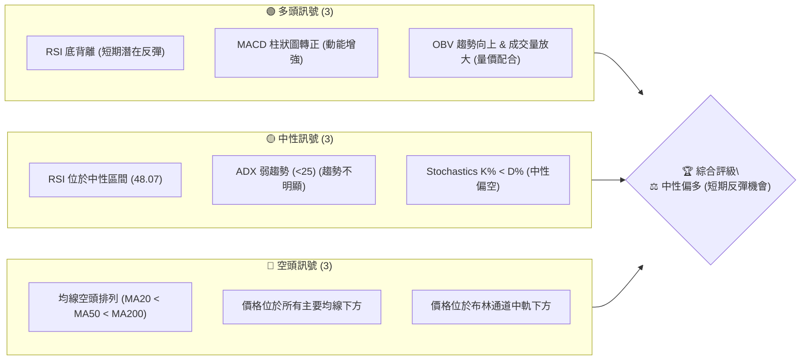
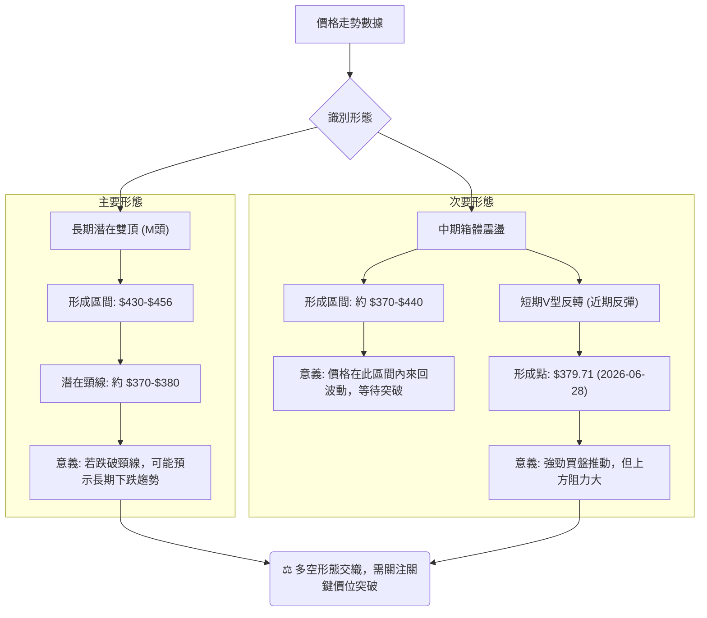
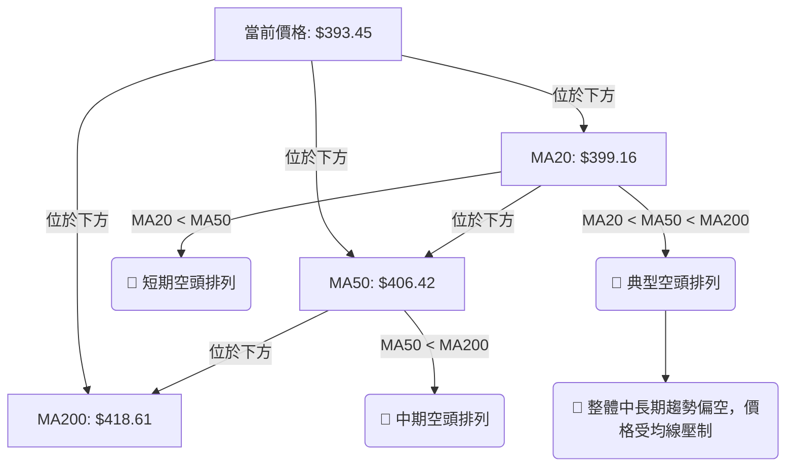
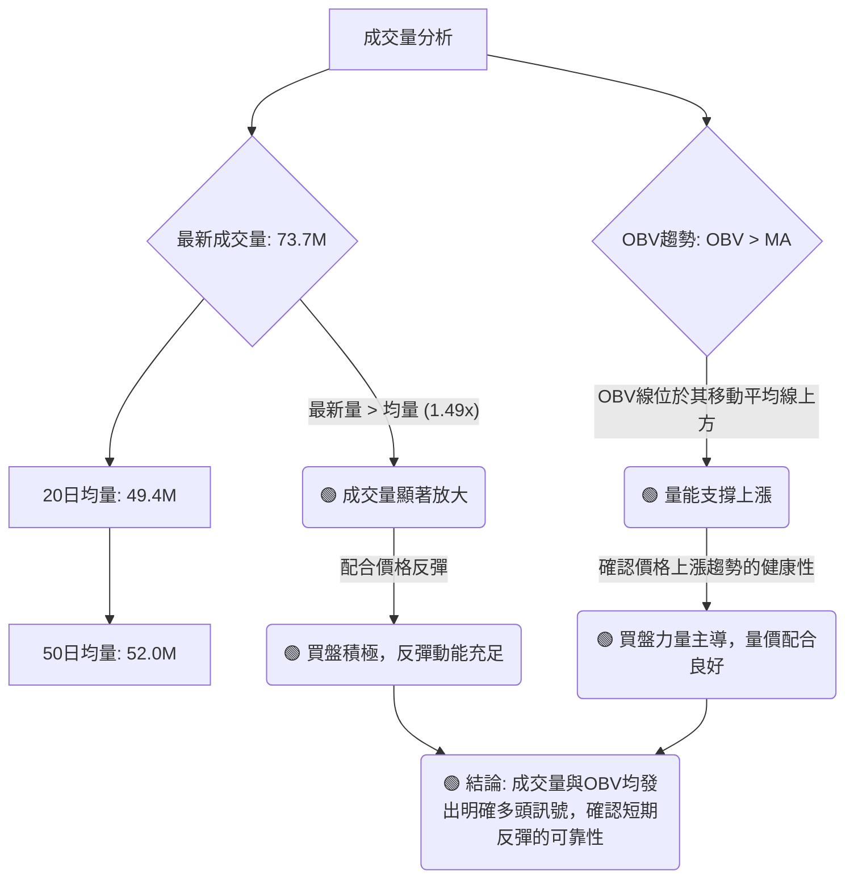

<details>
<summary>📊 靜態圖表 (點擊展開)</summary>

</details>

<html>
<head><meta charset="utf-8" /></head>
<body>
    <div style="height:500px; width:100%;">                        <script>window.PlotlyConfig = {MathJaxConfig: 'local'};</script>
        <script charset="utf-8" src="https://cdn.plot.ly/plotly-3.6.0.min.js" integrity="sha256-QaOVwtVY0T02VaHrr6pnoHLCwayMJp4O5n4YyaE3rJk=" crossorigin="anonymous"></script>                <div id="candlestick-chart" class="plotly-graph-div" style="height:100%; width:100%;"></div>            <script>                window.PLOTLYENV=window.PLOTLYENV || {};                                if (document.getElementById("candlestick-chart")) {                    Plotly.newPlot(                        "candlestick-chart",                        [{"close":{"dtype":"f8","bdata":"AAAAgOtZekAAAACAwp16QAAAAKCZDXpAAAAAwB6hekAAAAAgXCN7QAAAAKCZnXpAAAAA4KOse0AAAACAPXZ6QAAAAGBmhntAAAAAIFyze0AAAAAghct7QAAAACBct3xAAAAAAABAe0AAAACgR916QAAAAAAAVHxAAAAAoHARe0AAAABACmt7QAAAAOCjOHtAAAAAANfXeUAAAABgZj57QAAAAADX03pAAAAAYGYye0AAAAAAAMx6QAAAAMD1dHtAAAAAQOH2e0AAAACgmal7QAAAACCFb3tAAAAAIK4PfEAAAAAghRt7QAAAAGC4RnxAAAAAwMzIfEAAAAAAKdh8QAAAAKCZgXtAAAAAwPWIfEAAAACA60V9QAAAAAApxHtAAAAAwB7hfEAAAABgj957QAAAAOBR2HpAAAAAIK7Te0AAAACA63l7QAAAAKCZ6XpAAAAAANcfeUAAAACgmUV5QAAAAGC4jnlAAAAAAAAUeUAAAAAA1z95QAAAACCus3hAAAAAoHBxeEAAAADgehx6QAAAAGBmNnpAAAAAoEepekAAAABguOJ6QAAAAIA94npAAAAAANfTekAAAAAA1+t7QAAAAOB6aHxAAAAAAABwfEAAAACgR3l7QAAAAGC40ntAAAAAQDM3fEAAAACAPe57QAAAACBcr3xAAAAAwPW0fUAAAACAFJ5+QAAAAAApNH1AAAAAgOs1fkAAAABAMxN+QAAAACCui35AAAAAwPVYfkAAAABgZlZ+QAAAAEAKs31AAAAAgD26fEAAAABA4WZ8QAAAACCFG3xAAAAAwB5he0AAAABguDp8QAAAACBcD3tAAAAAYI\u002f2ekAAAADAzDx7QAAAAAAp0HtAAAAAIFwPfEAAAABAM\u002fN7QAAAAEAzc3tAAAAAwB5pe0AAAAAAAFh7QAAAAAAANHpAAAAAQAr3ekAAAACAwhV8QAAAAMD1EHxAAAAAQDMze0AAAABgZu56QAAAACBc93pAAAAAwPUIekAAAABgj+Z6QAAAAMD1XHpAAAAAIFxfekAAAAAAKWB5QAAAACBc03hAAAAAgMKxeUAAAADAHhV6QAAAACBck3pAAAAA4FHEekAAAADAHhF6QAAAAEAKF3pAAAAAgBSqeUAAAADAHrV5QAAAACBcu3lAAAAAwB69eUAAAACgR\u002f14QAAAAIAUlnlAAAAAYGYWekAAAACgR4l5QAAAAAApKHlAAAAAwB41eUAAAABA4YZ4QAAAAEAKX3lAAAAAwMxYeUAAAAAgrst4QAAAAEDh6nhAAAAAANfzeEAAAADAHn15QAAAAAApsHhAAAAAQDNzeEAAAADA9bh4QAAAAOBR9HhAAAAA4HqMeEAAAADAzMR3QAAAACBc\u002f3ZAAAAAoJnNd0AAAADgevB3QAAAAEAzH3hAAAAAgMJBd0AAAACgR512QAAAAOB6NHZAAAAAAAA8d0AAAAAAKdR3QAAAAKBwiXZAAAAAwB4NdkAAAABgZqp1QAAAAAAAdHVAAAAAgOuZdUAAAABAM891QAAAAGC4BnZAAAAAQDPDdkAAAABAM394QAAAAGBmTnhAAAAAgOsJeUAAAAAAAIh4QAAAAGC4JnhAAAAAACk4eEAAAAAghVt3QAAAAMDMhHdAAAAAYLiqd0AAAADgUYB3QAAAAMDMTHdAAAAAgBTad0AAAADAHm14QAAAAAApiHhAAAAAgOtVeEAAAAAgrut4QAAAAOCjvHlAAAAAoJnFekAAAAAAANB7QAAAAEAzF3tAAAAA4FHUe0AAAADAzLR7QAAAAADXY3pAAAAAANefeUAAAACAwkF5QAAAAAApFHpAAAAAoJkdekAAAAAAKaB6QAAAAKBwGXtAAAAAgMKFe0AAAACgmaF7QAAAAOCjPHtAAAAAgBT+eUAAAAAA13t6QAAAAEAze3pAAAAAQDMnekAAAAAAAHB4QAAAAEAzj3lAAAAAQOHKeEAAAACgcNl3QAAAAGBm8nhAAAAAQOFmeUAAAABgZrJ5QAAAAGCPSnlAAAAAgBTGeEAAAAAA1wd5QAAAAMDMUHlAAAAAgMLZd0AAAADgenh3QAAAAIDrcXdAAAAAIFy7d0AAAACgcL15QAAAAKCZSXpAAAAAwMyUekAAAABAM5d4QA=="},"high":{"dtype":"f8","bdata":"AAAAAAB0ekAAAADA9cR6QAAAACCFA3tAAAAAIIXXekAAAAAgrs97QAAAACCFj3tAAAAAIFzDe0AAAACgmTV7QAAAACCFh3tAAAAAIK4vfEAAAAAAANB7QAAAAOCj5HxAAAAAAABsfUAAAADgUex7QAAAAMDMWHxAAAAAQOFKfEAAAACgR5V7QAAAAKCZRXtAAAAAgBSye0AAAACAPU57QAAAAEAzI3tAAAAAACmIe0AAAACgmXV7QAAAACBcl3tAAAAAwMwcfEAAAADAzBR8QAAAAOCj2HtAAAAAYGYWfEAAAABA4Tp8QAAAAGCPwnxAAAAAAAAwfUAAAABAMxt9QAAAAMD1cHxAAAAAAACgfEAAAADAHqF9QAAAACCFw3xAAAAAoEclfUAAAABAMzd9QAAAAIDCdXtAAAAAYLgafEAAAAAA16d7QAAAAKBHpXtAAAAAAACIekAAAABACsN5QAAAACBcf3pAAAAAYGaOeUAAAADgerx5QAAAAEAKz3pAAAAAwMwseUAAAAAghVt6QAAAACCuR3pAAAAAQAqvekAAAABA4Q57QAAAAGCPGntAAAAAwMxMe0AAAABguP57QAAAAIAUanxAAAAAgOutfEAAAAAAABx8QAAAAIA9RnxAAAAAgBSOfEAAAADgURR8QAAAAAAp8HxAAAAA4FEcfkAAAAAAALh+QAAAAOB69H5AAAAAgMKtfkAAAAAA16d+QAAAAKBHLX9AAAAAIIW\u002ffkAAAABgZq5+QAAAAKBwkX5AAAAAYGZWfUAAAACA6\u002fF8QAAAAMDMiHxAAAAAoHClfEAAAADAzJh8QAAAAAAABHxAAAAAgOtle0AAAACAPU57QAAAAMDMEHxAAAAAwMxkfEAAAADA9Tx8QAAAAGCPvntAAAAAgMLVe0AAAAAAAPR7QAAAACCu63pAAAAAQDNje0AAAAAAABh8QAAAAEDhRnxAAAAA4KPQe0AAAADgUVh7QAAAAAApZHtAAAAAIK6De0AAAACAFH57QAAAAGBmsnpAAAAAwPXIekAAAABgZn56QAAAAKCZIXlAAAAAwMzoeUAAAAAAAFR6QAAAAAAAtHpAAAAAoJlFe0AAAAAgrkN7QAAAAMD1gHpAAAAAIIXbeUAAAABgZg56QAAAAAAA9HlAAAAAQDPreUAAAABAM3t5QAAAAMAerXlAAAAAoHBFekAAAADA9Qx6QAAAAIDrcXlAAAAA4KNIeUAAAACgcMV4QAAAAKBHhXlAAAAAgOuJeUAAAACgmSV5QAAAAKBwGXlAAAAAoHBpeUAAAACAFAZ6QAAAAAAAaHlAAAAAQDMDeUAAAAAgrjt5QAAAAIDrAXlAAAAAwB4xeUAAAADgUTR4QAAAAIA9vndAAAAAoEcVeEAAAAAgrjd4QAAAACCuw3hAAAAAQAoHeEAAAACAwh13QAAAAOCj9HZAAAAAoEdVd0AAAACAPfJ3QAAAAOB6JHdAAAAAIIX7dkAAAADgUcB1QAAAAAAAyHZAAAAAgBTOdUAAAACAwuV1QAAAAKCZRXZAAAAAgBT6dkAAAABgZqp4QAAAAMD1oHhAAAAA4HqUeUAAAADAzGx5QAAAAEAzn3hAAAAAACmQeEAAAAAAACB4QAAAAAAp7HdAAAAA4HrMd0AAAADgo+R3QAAAAGBmhndAAAAAAAAMeEAAAADAHt14QAAAAIA9qnhAAAAAgOsheUAAAABA4Rp5QAAAAKBH\u002fXlAAAAAQDPzekAAAABgjxJ8QAAAAMDM\u002fHtAAAAAYGZWfEAAAAAgrj98QAAAAGCPKntAAAAAgBRSekAAAACAFFp5QAAAACBcF3pAAAAAQDOvekAAAAAAKfh6QAAAAEAzM3tAAAAAoJnZe0AAAAAgXL97QAAAAMAekXtAAAAAoJnZekAAAABguIZ6QAAAAKCZGXtAAAAAoJmlekAAAABA4Yp6QAAAAEAKz3lAAAAAAAAoekAAAACgcNF4QAAAAOCj+HhAAAAAQOFqeUAAAAAAAAB6QAAAAGC4xnlAAAAAQApfeUAAAADgUSh5QAAAAAAA7HlAAAAAgOuNeEAAAACgRwl4QAAAAIDrsXdAAAAAwMw8eEAAAADgUdR5QAAAAOCjiHpAAAAAgMINe0AAAACgmQV7QA=="},"hovertemplate":"\u003cb\u003e%{x|%Y-%m-%d}\u003c\u002fb\u003e\u003cbr\u003e\u958b: $%{open:.2f}\u003cbr\u003e\u9ad8: $%{high:.2f}\u003cbr\u003e\u4f4e: $%{low:.2f}\u003cbr\u003e\u6536: $%{close:.2f}\u003cextra\u003e\u003c\u002fextra\u003e","low":{"dtype":"f8","bdata":"AAAAQOG2eUAAAABguJp5QAAAAMD1CHpAAAAAIIVbekAAAACAFNJ6QAAAACCFe3pAAAAA4HrQekAAAACgRzF6QAAAAOBRUHpAAAAAAAB4e0AAAACA6xF7QAAAAAAAjHtAAAAAwB45e0AAAACgRwl6QAAAAEAKS3tAAAAAQDMHe0AAAAAgrpN6QAAAAEDhonpAAAAAQDO3eUAAAABAMzt6QAAAAIDCHXpAAAAAoEelekAAAADA9VR6QAAAAKCZeXpAAAAAgMKJe0AAAADAzKB7QAAAAAAA0HpAAAAAYGbeeUAAAABguOJ6QAAAAEAKa3tAAAAAoJk5fEAAAABgZkp8QAAAAIDCeXtAAAAAQAq7e0AAAADAzFx8QAAAAKCZuXtAAAAAIFyLe0AAAACgcDF7QAAAAIAUXnpAAAAAgMIVe0AAAACAwgV7QAAAAMD1qHpAAAAAoHDFeEAAAADgeux3QAAAAADX63hAAAAAIFybeEAAAAAAAOh4QAAAAADXq3hAAAAAACn8d0AAAACgcBF5QAAAAEAzX3lAAAAAgD0OekAAAABAM6N6QAAAAOCjlHpAAAAAgOthekAAAACAwvF6QAAAAIA91ntAAAAAYI86fEAAAAAAADR7QAAAAEAzO3tAAAAAgMK5e0AAAACgR4V7QAAAAGC4mntAAAAAYI86fUAAAACgRx19QAAAAEAzI31AAAAAgOuRfUAAAAAghat9QAAAAKBHVX5AAAAAoHAtfkAAAADAzMx9QAAAAMAenX1AAAAAAACwfEAAAACgR118QAAAAMDMFHxAAAAAwMw0e0AAAADAHsl7QAAAAOB6zHpAAAAA4KP0ekAAAACA64V6QAAAAIA95npAAAAAAABge0AAAABAM797QAAAACCFI3tAAAAAYGZae0AAAAAAKTR7QAAAAEAKF3pAAAAAgOs5ekAAAACAFAp7QAAAAOCjwHtAAAAA4Hoke0AAAABACut6QAAAAKCZ4XpAAAAAgOvpeUAAAABAM2t6QAAAAAAA6HlAAAAAQArbeUAAAABA4fJ4QAAAAOB6OHhAAAAAAADceEAAAADgo3R5QAAAAAAAEHpAAAAA4HpAekAAAAAAAOB5QAAAAIAUrnlAAAAAACkIeUAAAACgR5l5QAAAAIDCQXlAAAAAAABYeUAAAADgo6B4QAAAAIA92nhAAAAAYGbCeUAAAABgjzp5QAAAAIDC4XhAAAAAAABEeEAAAACAPRZ4QAAAAKBHqXhAAAAAYLj2eEAAAAAgXKN4QAAAAGBm1ndAAAAAQArjeEAAAABgZiJ5QAAAAGBmqnhAAAAAQDNfeEAAAABguKZ4QAAAAAAAkHhAAAAAwPWEeEAAAAAgrqt3QAAAACBcx3ZAAAAAIK5Ld0AAAADA9YR3QAAAAAApEHhAAAAAgOs9d0AAAAAghXd2QAAAAIA9AnZAAAAAAACQdkAAAACgR2F3QAAAAOB6cHZAAAAAgD2qdUAAAAAA1xN1QAAAAGC4OnVAAAAAAAAUdUAAAAAA12t1QAAAAMAeyXVAAAAA4FEsdkAAAAAAAKh2QAAAAMDM3HdAAAAAYGZ6eEAAAACgR0V4QAAAACCFE3hAAAAAwMwUeEAAAACAPQZ3QAAAACCuK3dAAAAA4FHAdkAAAADgo0h3QAAAAOCjIHdAAAAAYLgCd0AAAADAzKx3QAAAAMDMDHhAAAAAAABQeEAAAADgUQB4QAAAAIDrIXlAAAAAgD0GekAAAADAzAx6QAAAAAApZHpAAAAAIFzjekAAAABgj5J7QAAAAAAAYHpAAAAAoEdVeUAAAACAFJp4QAAAAIA9ZnlAAAAAYGbOeUAAAAAAKUh6QAAAAIDroXpAAAAA4FE4e0AAAADAzER7QAAAAIA9wnpAAAAAQOH2eUAAAABgZtp5QAAAAAAAAHpAAAAAYI8SekAAAACgcEl4QAAAACCFq3hAAAAAANcDeEAAAABgZsJ3QAAAAGCPyndAAAAAACkseEAAAACgmXF5QAAAAOCjCHlAAAAAACmceEAAAABAMwt4QAAAAGBmpnhAAAAAwPWwd0AAAADAzFB3QAAAACCFM3dAAAAAoJkJd0AAAADAzLR3QAAAAAAAYHlAAAAAoHAhekAAAADAzFR4QA=="},"name":"\u50f9\u683c","open":{"dtype":"f8","bdata":"AAAAAADoeUAAAAAAAPx5QAAAAIDrzXpAAAAAwB5dekAAAACAwvF6QAAAAIAUfntAAAAAoEfdekAAAAAA1zN7QAAAAMDMxHpAAAAAoJnFe0AAAADgUZh7QAAAAMDMvHtAAAAA4KNofUAAAADgo7R7QAAAAAAAjHtAAAAAwB79e0AAAADAHll7QAAAAMD1\u002fHpAAAAA4KNIe0AAAADgenh6QAAAAOCjrHpAAAAAYGYue0AAAAAgrit7QAAAAAAAmHpAAAAAgOu9e0AAAAAAKdx7QAAAAEAzt3tAAAAAAABAekAAAACgR+17QAAAACCuf3tAAAAA4HpsfEAAAAAAAOh8QAAAAMDMMHxAAAAAAADse0AAAAAA1398QAAAACBcZ3xAAAAAwMxAfEAAAAAgXN98QAAAAGC4XntAAAAAoJl5e0AAAABgZnZ7QAAAAGBmontAAAAAgBRyekAAAADAzCR4QAAAAADX63hAAAAAgBRWeUAAAABA4WJ5QAAAAIAU6nlAAAAAwB4leUAAAABguCJ5QAAAAGC45nlAAAAAQDN\u002fekAAAACgcKl6QAAAAMAelXpAAAAAwPXsekAAAACgmQF7QAAAAEAKH3xAAAAA4HpQfEAAAABAM\u002fd7QAAAAOCjWHtAAAAAwB7he0AAAABAMw98QAAAAKBwAXxAAAAAQApXfUAAAAAgXIN9QAAAACCFg35AAAAAYI\u002fifUAAAACA64F+QAAAAIAUnn5AAAAAYGaWfkAAAAAgrod+QAAAACCuU35AAAAAAABQfUAAAACgcNF8QAAAAKCZgXxAAAAAwMycfEAAAAAA1\u002f97QAAAAIAU5ntAAAAAYGY+e0AAAACAPb56QAAAAEAzP3tAAAAAIK6Te0AAAABAMyN8QAAAAMD1rHtAAAAAgBSSe0AAAAAAAHh7QAAAAIDC1XpAAAAAYI9aekAAAABgjzJ7QAAAAEDh9ntAAAAAAADQe0AAAABgj1Z7QAAAAGCP\u002fnpAAAAAwMxce0AAAACgmZV6QAAAAOCjVHpAAAAA4FGEekAAAAAgXEd6QAAAAOBR0HhAAAAAgOsNeUAAAABgj555QAAAAKBHIXpAAAAAIFy\u002fekAAAADAzOR6QAAAAMD15HlAAAAAgMLFeUAAAACAwrF5QAAAAAAAdHlAAAAAwMyEeUAAAADgo3R5QAAAAAAA+HhAAAAAYGbCeUAAAABguOZ5QAAAAEAKL3lAAAAAoJlpeEAAAACgcLF4QAAAAKCZ3XhAAAAAwB4ZeUAAAACgcOF4QAAAAMDMYHhAAAAAIIUjeUAAAADgeiR5QAAAAEDhUnlAAAAAYLjyeEAAAAAghcN4QAAAAEAKu3hAAAAAAADweEAAAADgUTR4QAAAAKCZvXdAAAAAoHBRd0AAAADA9Yh3QAAAAADXX3hAAAAAoJnZd0AAAABACht3QAAAAIDC3XZAAAAAACmYdkAAAACAFKp3QAAAAEAzw3ZAAAAAoHCpdkAAAABACqd1QAAAAOCjvHZAAAAAYGZydUAAAADgo6R1QAAAAMAe4XVAAAAAYLhadkAAAACgR+12QAAAAMD1nHhAAAAAYLi+eEAAAACgRyl5QAAAAAAAkHhAAAAAwB45eEAAAADgenR3QAAAAAAAWHdAAAAAoHBBd0AAAABA4Wp3QAAAAGBmdndAAAAAAABMd0AAAAAA1+d3QAAAACCuY3hAAAAAQAqzeEAAAAAAACR4QAAAACCud3lAAAAAIK4HekAAAABgj2J6QAAAAGCPlntAAAAAYLhKe0AAAAAA1+d7QAAAACCuH3tAAAAA4FE0ekAAAABgjzJ5QAAAAKCZeXlAAAAAQOFiekAAAABguGp6QAAAAAAp5HpAAAAAgD2ue0AAAACA61l7QAAAAKCZfXtAAAAAANe3ekAAAAAghSN6QAAAAEAzK3pAAAAAoHA9ekAAAAAAAEh6QAAAAKBHxXhAAAAA4HqweUAAAADgo3h4QAAAAOB6RHhAAAAAANf3eEAAAACA68V5QAAAAIDCQXlAAAAA4HoYeUAAAACgmeF4QAAAAKCZrXhAAAAAgMKJeEAAAACgR8F3QAAAAOBRdHdAAAAAYGYid0AAAADgo9x3QAAAAAAAYHlAAAAAIFxXekAAAAAAKcB6QA=="},"x":["2025-09-16T00:00:00-04:00","2025-09-17T00:00:00-04:00","2025-09-18T00:00:00-04:00","2025-09-19T00:00:00-04:00","2025-09-22T00:00:00-04:00","2025-09-23T00:00:00-04:00","2025-09-24T00:00:00-04:00","2025-09-25T00:00:00-04:00","2025-09-26T00:00:00-04:00","2025-09-29T00:00:00-04:00","2025-09-30T00:00:00-04:00","2025-10-01T00:00:00-04:00","2025-10-02T00:00:00-04:00","2025-10-03T00:00:00-04:00","2025-10-06T00:00:00-04:00","2025-10-07T00:00:00-04:00","2025-10-08T00:00:00-04:00","2025-10-09T00:00:00-04:00","2025-10-10T00:00:00-04:00","2025-10-13T00:00:00-04:00","2025-10-14T00:00:00-04:00","2025-10-15T00:00:00-04:00","2025-10-16T00:00:00-04:00","2025-10-17T00:00:00-04:00","2025-10-20T00:00:00-04:00","2025-10-21T00:00:00-04:00","2025-10-22T00:00:00-04:00","2025-10-23T00:00:00-04:00","2025-10-24T00:00:00-04:00","2025-10-27T00:00:00-04:00","2025-10-28T00:00:00-04:00","2025-10-29T00:00:00-04:00","2025-10-30T00:00:00-04:00","2025-10-31T00:00:00-04:00","2025-11-03T00:00:00-05:00","2025-11-04T00:00:00-05:00","2025-11-05T00:00:00-05:00","2025-11-06T00:00:00-05:00","2025-11-07T00:00:00-05:00","2025-11-10T00:00:00-05:00","2025-11-11T00:00:00-05:00","2025-11-12T00:00:00-05:00","2025-11-13T00:00:00-05:00","2025-11-14T00:00:00-05:00","2025-11-17T00:00:00-05:00","2025-11-18T00:00:00-05:00","2025-11-19T00:00:00-05:00","2025-11-20T00:00:00-05:00","2025-11-21T00:00:00-05:00","2025-11-24T00:00:00-05:00","2025-11-25T00:00:00-05:00","2025-11-26T00:00:00-05:00","2025-11-28T00:00:00-05:00","2025-12-01T00:00:00-05:00","2025-12-02T00:00:00-05:00","2025-12-03T00:00:00-05:00","2025-12-04T00:00:00-05:00","2025-12-05T00:00:00-05:00","2025-12-08T00:00:00-05:00","2025-12-09T00:00:00-05:00","2025-12-10T00:00:00-05:00","2025-12-11T00:00:00-05:00","2025-12-12T00:00:00-05:00","2025-12-15T00:00:00-05:00","2025-12-16T00:00:00-05:00","2025-12-17T00:00:00-05:00","2025-12-18T00:00:00-05:00","2025-12-19T00:00:00-05:00","2025-12-22T00:00:00-05:00","2025-12-23T00:00:00-05:00","2025-12-24T00:00:00-05:00","2025-12-26T00:00:00-05:00","2025-12-29T00:00:00-05:00","2025-12-30T00:00:00-05:00","2025-12-31T00:00:00-05:00","2026-01-02T00:00:00-05:00","2026-01-05T00:00:00-05:00","2026-01-06T00:00:00-05:00","2026-01-07T00:00:00-05:00","2026-01-08T00:00:00-05:00","2026-01-09T00:00:00-05:00","2026-01-12T00:00:00-05:00","2026-01-13T00:00:00-05:00","2026-01-14T00:00:00-05:00","2026-01-15T00:00:00-05:00","2026-01-16T00:00:00-05:00","2026-01-20T00:00:00-05:00","2026-01-21T00:00:00-05:00","2026-01-22T00:00:00-05:00","2026-01-23T00:00:00-05:00","2026-01-26T00:00:00-05:00","2026-01-27T00:00:00-05:00","2026-01-28T00:00:00-05:00","2026-01-29T00:00:00-05:00","2026-01-30T00:00:00-05:00","2026-02-02T00:00:00-05:00","2026-02-03T00:00:00-05:00","2026-02-04T00:00:00-05:00","2026-02-05T00:00:00-05:00","2026-02-06T00:00:00-05:00","2026-02-09T00:00:00-05:00","2026-02-10T00:00:00-05:00","2026-02-11T00:00:00-05:00","2026-02-12T00:00:00-05:00","2026-02-13T00:00:00-05:00","2026-02-17T00:00:00-05:00","2026-02-18T00:00:00-05:00","2026-02-19T00:00:00-05:00","2026-02-20T00:00:00-05:00","2026-02-23T00:00:00-05:00","2026-02-24T00:00:00-05:00","2026-02-25T00:00:00-05:00","2026-02-26T00:00:00-05:00","2026-02-27T00:00:00-05:00","2026-03-02T00:00:00-05:00","2026-03-03T00:00:00-05:00","2026-03-04T00:00:00-05:00","2026-03-05T00:00:00-05:00","2026-03-06T00:00:00-05:00","2026-03-09T00:00:00-04:00","2026-03-10T00:00:00-04:00","2026-03-11T00:00:00-04:00","2026-03-12T00:00:00-04:00","2026-03-13T00:00:00-04:00","2026-03-16T00:00:00-04:00","2026-03-17T00:00:00-04:00","2026-03-18T00:00:00-04:00","2026-03-19T00:00:00-04:00","2026-03-20T00:00:00-04:00","2026-03-23T00:00:00-04:00","2026-03-24T00:00:00-04:00","2026-03-25T00:00:00-04:00","2026-03-26T00:00:00-04:00","2026-03-27T00:00:00-04:00","2026-03-30T00:00:00-04:00","2026-03-31T00:00:00-04:00","2026-04-01T00:00:00-04:00","2026-04-02T00:00:00-04:00","2026-04-06T00:00:00-04:00","2026-04-07T00:00:00-04:00","2026-04-08T00:00:00-04:00","2026-04-09T00:00:00-04:00","2026-04-10T00:00:00-04:00","2026-04-13T00:00:00-04:00","2026-04-14T00:00:00-04:00","2026-04-15T00:00:00-04:00","2026-04-16T00:00:00-04:00","2026-04-17T00:00:00-04:00","2026-04-20T00:00:00-04:00","2026-04-21T00:00:00-04:00","2026-04-22T00:00:00-04:00","2026-04-23T00:00:00-04:00","2026-04-24T00:00:00-04:00","2026-04-27T00:00:00-04:00","2026-04-28T00:00:00-04:00","2026-04-29T00:00:00-04:00","2026-04-30T00:00:00-04:00","2026-05-01T00:00:00-04:00","2026-05-04T00:00:00-04:00","2026-05-05T00:00:00-04:00","2026-05-06T00:00:00-04:00","2026-05-07T00:00:00-04:00","2026-05-08T00:00:00-04:00","2026-05-11T00:00:00-04:00","2026-05-12T00:00:00-04:00","2026-05-13T00:00:00-04:00","2026-05-14T00:00:00-04:00","2026-05-15T00:00:00-04:00","2026-05-18T00:00:00-04:00","2026-05-19T00:00:00-04:00","2026-05-20T00:00:00-04:00","2026-05-21T00:00:00-04:00","2026-05-22T00:00:00-04:00","2026-05-26T00:00:00-04:00","2026-05-27T00:00:00-04:00","2026-05-28T00:00:00-04:00","2026-05-29T00:00:00-04:00","2026-06-01T00:00:00-04:00","2026-06-02T00:00:00-04:00","2026-06-03T00:00:00-04:00","2026-06-04T00:00:00-04:00","2026-06-05T00:00:00-04:00","2026-06-08T00:00:00-04:00","2026-06-09T00:00:00-04:00","2026-06-10T00:00:00-04:00","2026-06-11T00:00:00-04:00","2026-06-12T00:00:00-04:00","2026-06-15T00:00:00-04:00","2026-06-16T00:00:00-04:00","2026-06-17T00:00:00-04:00","2026-06-18T00:00:00-04:00","2026-06-22T00:00:00-04:00","2026-06-23T00:00:00-04:00","2026-06-24T00:00:00-04:00","2026-06-25T00:00:00-04:00","2026-06-26T00:00:00-04:00","2026-06-29T00:00:00-04:00","2026-06-30T00:00:00-04:00","2026-07-01T00:00:00-04:00","2026-07-02T00:00:00-04:00"],"type":"candlestick"},{"hovertemplate":"MA30: $%{y:.2f}\u003cextra\u003e\u003c\u002fextra\u003e","line":{"color":"#2196F3","dash":"dash","width":2},"mode":"lines","name":"MA30","x":["2025-09-16T00:00:00-04:00","2025-09-17T00:00:00-04:00","2025-09-18T00:00:00-04:00","2025-09-19T00:00:00-04:00","2025-09-22T00:00:00-04:00","2025-09-23T00:00:00-04:00","2025-09-24T00:00:00-04:00","2025-09-25T00:00:00-04:00","2025-09-26T00:00:00-04:00","2025-09-29T00:00:00-04:00","2025-09-30T00:00:00-04:00","2025-10-01T00:00:00-04:00","2025-10-02T00:00:00-04:00","2025-10-03T00:00:00-04:00","2025-10-06T00:00:00-04:00","2025-10-07T00:00:00-04:00","2025-10-08T00:00:00-04:00","2025-10-09T00:00:00-04:00","2025-10-10T00:00:00-04:00","2025-10-13T00:00:00-04:00","2025-10-14T00:00:00-04:00","2025-10-15T00:00:00-04:00","2025-10-16T00:00:00-04:00","2025-10-17T00:00:00-04:00","2025-10-20T00:00:00-04:00","2025-10-21T00:00:00-04:00","2025-10-22T00:00:00-04:00","2025-10-23T00:00:00-04:00","2025-10-24T00:00:00-04:00","2025-10-27T00:00:00-04:00","2025-10-28T00:00:00-04:00","2025-10-29T00:00:00-04:00","2025-10-30T00:00:00-04:00","2025-10-31T00:00:00-04:00","2025-11-03T00:00:00-05:00","2025-11-04T00:00:00-05:00","2025-11-05T00:00:00-05:00","2025-11-06T00:00:00-05:00","2025-11-07T00:00:00-05:00","2025-11-10T00:00:00-05:00","2025-11-11T00:00:00-05:00","2025-11-12T00:00:00-05:00","2025-11-13T00:00:00-05:00","2025-11-14T00:00:00-05:00","2025-11-17T00:00:00-05:00","2025-11-18T00:00:00-05:00","2025-11-19T00:00:00-05:00","2025-11-20T00:00:00-05:00","2025-11-21T00:00:00-05:00","2025-11-24T00:00:00-05:00","2025-11-25T00:00:00-05:00","2025-11-26T00:00:00-05:00","2025-11-28T00:00:00-05:00","2025-12-01T00:00:00-05:00","2025-12-02T00:00:00-05:00","2025-12-03T00:00:00-05:00","2025-12-04T00:00:00-05:00","2025-12-05T00:00:00-05:00","2025-12-08T00:00:00-05:00","2025-12-09T00:00:00-05:00","2025-12-10T00:00:00-05:00","2025-12-11T00:00:00-05:00","2025-12-12T00:00:00-05:00","2025-12-15T00:00:00-05:00","2025-12-16T00:00:00-05:00","2025-12-17T00:00:00-05:00","2025-12-18T00:00:00-05:00","2025-12-19T00:00:00-05:00","2025-12-22T00:00:00-05:00","2025-12-23T00:00:00-05:00","2025-12-24T00:00:00-05:00","2025-12-26T00:00:00-05:00","2025-12-29T00:00:00-05:00","2025-12-30T00:00:00-05:00","2025-12-31T00:00:00-05:00","2026-01-02T00:00:00-05:00","2026-01-05T00:00:00-05:00","2026-01-06T00:00:00-05:00","2026-01-07T00:00:00-05:00","2026-01-08T00:00:00-05:00","2026-01-09T00:00:00-05:00","2026-01-12T00:00:00-05:00","2026-01-13T00:00:00-05:00","2026-01-14T00:00:00-05:00","2026-01-15T00:00:00-05:00","2026-01-16T00:00:00-05:00","2026-01-20T00:00:00-05:00","2026-01-21T00:00:00-05:00","2026-01-22T00:00:00-05:00","2026-01-23T00:00:00-05:00","2026-01-26T00:00:00-05:00","2026-01-27T00:00:00-05:00","2026-01-28T00:00:00-05:00","2026-01-29T00:00:00-05:00","2026-01-30T00:00:00-05:00","2026-02-02T00:00:00-05:00","2026-02-03T00:00:00-05:00","2026-02-04T00:00:00-05:00","2026-02-05T00:00:00-05:00","2026-02-06T00:00:00-05:00","2026-02-09T00:00:00-05:00","2026-02-10T00:00:00-05:00","2026-02-11T00:00:00-05:00","2026-02-12T00:00:00-05:00","2026-02-13T00:00:00-05:00","2026-02-17T00:00:00-05:00","2026-02-18T00:00:00-05:00","2026-02-19T00:00:00-05:00","2026-02-20T00:00:00-05:00","2026-02-23T00:00:00-05:00","2026-02-24T00:00:00-05:00","2026-02-25T00:00:00-05:00","2026-02-26T00:00:00-05:00","2026-02-27T00:00:00-05:00","2026-03-02T00:00:00-05:00","2026-03-03T00:00:00-05:00","2026-03-04T00:00:00-05:00","2026-03-05T00:00:00-05:00","2026-03-06T00:00:00-05:00","2026-03-09T00:00:00-04:00","2026-03-10T00:00:00-04:00","2026-03-11T00:00:00-04:00","2026-03-12T00:00:00-04:00","2026-03-13T00:00:00-04:00","2026-03-16T00:00:00-04:00","2026-03-17T00:00:00-04:00","2026-03-18T00:00:00-04:00","2026-03-19T00:00:00-04:00","2026-03-20T00:00:00-04:00","2026-03-23T00:00:00-04:00","2026-03-24T00:00:00-04:00","2026-03-25T00:00:00-04:00","2026-03-26T00:00:00-04:00","2026-03-27T00:00:00-04:00","2026-03-30T00:00:00-04:00","2026-03-31T00:00:00-04:00","2026-04-01T00:00:00-04:00","2026-04-02T00:00:00-04:00","2026-04-06T00:00:00-04:00","2026-04-07T00:00:00-04:00","2026-04-08T00:00:00-04:00","2026-04-09T00:00:00-04:00","2026-04-10T00:00:00-04:00","2026-04-13T00:00:00-04:00","2026-04-14T00:00:00-04:00","2026-04-15T00:00:00-04:00","2026-04-16T00:00:00-04:00","2026-04-17T00:00:00-04:00","2026-04-20T00:00:00-04:00","2026-04-21T00:00:00-04:00","2026-04-22T00:00:00-04:00","2026-04-23T00:00:00-04:00","2026-04-24T00:00:00-04:00","2026-04-27T00:00:00-04:00","2026-04-28T00:00:00-04:00","2026-04-29T00:00:00-04:00","2026-04-30T00:00:00-04:00","2026-05-01T00:00:00-04:00","2026-05-04T00:00:00-04:00","2026-05-05T00:00:00-04:00","2026-05-06T00:00:00-04:00","2026-05-07T00:00:00-04:00","2026-05-08T00:00:00-04:00","2026-05-11T00:00:00-04:00","2026-05-12T00:00:00-04:00","2026-05-13T00:00:00-04:00","2026-05-14T00:00:00-04:00","2026-05-15T00:00:00-04:00","2026-05-18T00:00:00-04:00","2026-05-19T00:00:00-04:00","2026-05-20T00:00:00-04:00","2026-05-21T00:00:00-04:00","2026-05-22T00:00:00-04:00","2026-05-26T00:00:00-04:00","2026-05-27T00:00:00-04:00","2026-05-28T00:00:00-04:00","2026-05-29T00:00:00-04:00","2026-06-01T00:00:00-04:00","2026-06-02T00:00:00-04:00","2026-06-03T00:00:00-04:00","2026-06-04T00:00:00-04:00","2026-06-05T00:00:00-04:00","2026-06-08T00:00:00-04:00","2026-06-09T00:00:00-04:00","2026-06-10T00:00:00-04:00","2026-06-11T00:00:00-04:00","2026-06-12T00:00:00-04:00","2026-06-15T00:00:00-04:00","2026-06-16T00:00:00-04:00","2026-06-17T00:00:00-04:00","2026-06-18T00:00:00-04:00","2026-06-22T00:00:00-04:00","2026-06-23T00:00:00-04:00","2026-06-24T00:00:00-04:00","2026-06-25T00:00:00-04:00","2026-06-26T00:00:00-04:00","2026-06-29T00:00:00-04:00","2026-06-30T00:00:00-04:00","2026-07-01T00:00:00-04:00","2026-07-02T00:00:00-04:00"],"y":{"dtype":"f8","bdata":"AAAAAAAA+H8AAAAAAAD4fwAAAAAAAPh\u002fAAAAAAAA+H8AAAAAAAD4fwAAAAAAAPh\u002fAAAAAAAA+H8AAAAAAAD4fwAAAAAAAPh\u002fAAAAAAAA+H8AAAAAAAD4fwAAAAAAAPh\u002fAAAAAAAA+H8AAAAAAAD4fwAAAAAAAPh\u002fAAAAAAAA+H8AAAAAAAD4fwAAAAAAAPh\u002fAAAAAAAA+H8AAAAAAAD4fwAAAAAAAPh\u002fAAAAAAAA+H8AAAAAAAD4fwAAAAAAAPh\u002fAAAAAAAA+H8AAAAAAAD4fwAAAAAAAPh\u002fAAAAAAAA+H8AAAAAAAD4f5qZmblJPntAd3d39wxTe0AiIiJiEGZ7QImIiMh2cntA7+7urrmCe0CamZmp8ZR7QN7d3T3DnntAq6qqmgupe0BVVVVVDrV7QJqZmdlAr3tAZmZmplSwe0BERERUnK17QKuqqvo3nntAq6qqehSMe0DNzMycfX57QHd3dxfZZntA7+7u3t1Ve0CamZkpXEN7QBEREYHcLXtAiYiIKOohe0DNzMwsQBh7QAAAALAAE3tAiYiImG4Oe0CamZl5MA97QHd3d3dMCntAzczM7JgAe0C8u7srzgJ7QBEREaEaC3tA7+7ujlAOe0BERESkcBF7QGZmZsaSDXtAMzMzU7gIe0BVVVU17AB7QJqZmTn7CntAmpmZOfsUe0Dv7u4OdCB7QDMzM1O4LHtAvLu7exQ4e0Dv7u6+5kp7QDMzM+N6antAZmZmRv1\u002fe0BVVVXFZ5h7QKuqqsovsHtAERER8e7Oe0B3d3eHpOl7QGZmZhZn\u002f3tA7+7uPgoTfECJiIgoeCx8QO\u002fu7o6XQHxAVVVVlRhWfECamZnptF98QImIiIhdbXxAZmZmJk15fEAAAABQYoJ8QN7d3U03h3xAmpmZKTGMfECJiIiYQ4d8QDMzM7NydHxAmpmZ+eFnfEBVVVVFGW18QCIiImIsb3xAd3d3t4FmfEC8u7uL+l18QBEREeFPT3xAvLu7i\u002fovfECJiIjoQhB8QHd3d3cF+HtARERE9ETXe0AzMzMDK697QKuqqnpbfntAIiIikqZWe0AiIiJiVzJ7QCIiInKvF3tAREREZPQGe0AiIiKCB\u002fN6QGZmZjbQ4XpAzczMvC3TekDe3d2dqL16QImIiEhTsnpAiYiImOCnekDe3d19sZR6QO\u002fu7s6wgXpAERER0dtwekBVVVXlQlx6QM3MzHyxSHpAAAAAsOQ1ekAREREh2x16QO\u002fu7t7BFnpAVVVVBfMIekBmZmZG4ex5QJqZmbkC0nlAvLu7+9S+eUC8u7vLhbJ5QImIiCgVn3lAzczMrI6ReUDNzMx8+H55QGZmZgbzcnlAvLu7+2JjeUBVVVW1rFV5QLy7uxsTRnlAzczMnO81eUAiIiLipSN5QGZmZpa1DnlAAAAA4MHweEBVVVXFS9N4QLy7u9sksnhAERERcWideEAAAABAYI14QKuqqqoccnhAMzMzM6VSeEC8u7tbSDZ4QImIiGgDE3hAvLu7C7vsd0ARERGR7cx3QM3MzJw2sndA3t3dbVmdd0BVVVXlF513QN7d3V0BlHdAIiIiQmCRd0CJiIi4Ho93QDMzM9OUiHdAq6qqSlOCd0ARERGBI3B3QGZmZvYoZndAMzMzM3pfd0BmZmZWDlV3QM3MzEzwRndARERE9P1Ad0CamZlJmkZ3QO\u002fu7i6yU3dAIiIicj1Yd0BVVVUFnWB3QKuqqgplbndA3t3drWOMd0CJiIgov7h3QImIiPhv4ndAZmZm5qUJeEDNzMxsvCp4QERERLSdS3hAAAAAUBtqeEBERESEwIh4QJqZmVk5sHhAd3d3J7\u002fWeECamZlp2P94QCIiItIiK3lAIiIiMsFTeUB3d3dXgG55QERERGSCh3lARERE5KWPeUARERExT6B5QHd3dycxtHlA7+7ufrHEeUCrqqrK6M15QLy7u5tS33lAIiIiku3oeUAAAAAQ5ut5QHd3d7fz+XlA3t3dvS0HekBmZmZ2BRJ6QHd3d1eAGHpAERERcT0cekDNzMy8LR16QAAAAICVGXpA3t3d7acAekBVVVX1mtt5QHd3d\u002fd+vHlAd3d314eZeUARERGBwIh5QHd3d5fgh3lAq6qq6gqQeUCamZl5W4p5QA=="},"type":"scatter"},{"hovertemplate":"MA60: $%{y:.2f}\u003cextra\u003e\u003c\u002fextra\u003e","line":{"color":"#9C27B0","dash":"dash","width":2},"mode":"lines","name":"MA60","x":["2025-09-16T00:00:00-04:00","2025-09-17T00:00:00-04:00","2025-09-18T00:00:00-04:00","2025-09-19T00:00:00-04:00","2025-09-22T00:00:00-04:00","2025-09-23T00:00:00-04:00","2025-09-24T00:00:00-04:00","2025-09-25T00:00:00-04:00","2025-09-26T00:00:00-04:00","2025-09-29T00:00:00-04:00","2025-09-30T00:00:00-04:00","2025-10-01T00:00:00-04:00","2025-10-02T00:00:00-04:00","2025-10-03T00:00:00-04:00","2025-10-06T00:00:00-04:00","2025-10-07T00:00:00-04:00","2025-10-08T00:00:00-04:00","2025-10-09T00:00:00-04:00","2025-10-10T00:00:00-04:00","2025-10-13T00:00:00-04:00","2025-10-14T00:00:00-04:00","2025-10-15T00:00:00-04:00","2025-10-16T00:00:00-04:00","2025-10-17T00:00:00-04:00","2025-10-20T00:00:00-04:00","2025-10-21T00:00:00-04:00","2025-10-22T00:00:00-04:00","2025-10-23T00:00:00-04:00","2025-10-24T00:00:00-04:00","2025-10-27T00:00:00-04:00","2025-10-28T00:00:00-04:00","2025-10-29T00:00:00-04:00","2025-10-30T00:00:00-04:00","2025-10-31T00:00:00-04:00","2025-11-03T00:00:00-05:00","2025-11-04T00:00:00-05:00","2025-11-05T00:00:00-05:00","2025-11-06T00:00:00-05:00","2025-11-07T00:00:00-05:00","2025-11-10T00:00:00-05:00","2025-11-11T00:00:00-05:00","2025-11-12T00:00:00-05:00","2025-11-13T00:00:00-05:00","2025-11-14T00:00:00-05:00","2025-11-17T00:00:00-05:00","2025-11-18T00:00:00-05:00","2025-11-19T00:00:00-05:00","2025-11-20T00:00:00-05:00","2025-11-21T00:00:00-05:00","2025-11-24T00:00:00-05:00","2025-11-25T00:00:00-05:00","2025-11-26T00:00:00-05:00","2025-11-28T00:00:00-05:00","2025-12-01T00:00:00-05:00","2025-12-02T00:00:00-05:00","2025-12-03T00:00:00-05:00","2025-12-04T00:00:00-05:00","2025-12-05T00:00:00-05:00","2025-12-08T00:00:00-05:00","2025-12-09T00:00:00-05:00","2025-12-10T00:00:00-05:00","2025-12-11T00:00:00-05:00","2025-12-12T00:00:00-05:00","2025-12-15T00:00:00-05:00","2025-12-16T00:00:00-05:00","2025-12-17T00:00:00-05:00","2025-12-18T00:00:00-05:00","2025-12-19T00:00:00-05:00","2025-12-22T00:00:00-05:00","2025-12-23T00:00:00-05:00","2025-12-24T00:00:00-05:00","2025-12-26T00:00:00-05:00","2025-12-29T00:00:00-05:00","2025-12-30T00:00:00-05:00","2025-12-31T00:00:00-05:00","2026-01-02T00:00:00-05:00","2026-01-05T00:00:00-05:00","2026-01-06T00:00:00-05:00","2026-01-07T00:00:00-05:00","2026-01-08T00:00:00-05:00","2026-01-09T00:00:00-05:00","2026-01-12T00:00:00-05:00","2026-01-13T00:00:00-05:00","2026-01-14T00:00:00-05:00","2026-01-15T00:00:00-05:00","2026-01-16T00:00:00-05:00","2026-01-20T00:00:00-05:00","2026-01-21T00:00:00-05:00","2026-01-22T00:00:00-05:00","2026-01-23T00:00:00-05:00","2026-01-26T00:00:00-05:00","2026-01-27T00:00:00-05:00","2026-01-28T00:00:00-05:00","2026-01-29T00:00:00-05:00","2026-01-30T00:00:00-05:00","2026-02-02T00:00:00-05:00","2026-02-03T00:00:00-05:00","2026-02-04T00:00:00-05:00","2026-02-05T00:00:00-05:00","2026-02-06T00:00:00-05:00","2026-02-09T00:00:00-05:00","2026-02-10T00:00:00-05:00","2026-02-11T00:00:00-05:00","2026-02-12T00:00:00-05:00","2026-02-13T00:00:00-05:00","2026-02-17T00:00:00-05:00","2026-02-18T00:00:00-05:00","2026-02-19T00:00:00-05:00","2026-02-20T00:00:00-05:00","2026-02-23T00:00:00-05:00","2026-02-24T00:00:00-05:00","2026-02-25T00:00:00-05:00","2026-02-26T00:00:00-05:00","2026-02-27T00:00:00-05:00","2026-03-02T00:00:00-05:00","2026-03-03T00:00:00-05:00","2026-03-04T00:00:00-05:00","2026-03-05T00:00:00-05:00","2026-03-06T00:00:00-05:00","2026-03-09T00:00:00-04:00","2026-03-10T00:00:00-04:00","2026-03-11T00:00:00-04:00","2026-03-12T00:00:00-04:00","2026-03-13T00:00:00-04:00","2026-03-16T00:00:00-04:00","2026-03-17T00:00:00-04:00","2026-03-18T00:00:00-04:00","2026-03-19T00:00:00-04:00","2026-03-20T00:00:00-04:00","2026-03-23T00:00:00-04:00","2026-03-24T00:00:00-04:00","2026-03-25T00:00:00-04:00","2026-03-26T00:00:00-04:00","2026-03-27T00:00:00-04:00","2026-03-30T00:00:00-04:00","2026-03-31T00:00:00-04:00","2026-04-01T00:00:00-04:00","2026-04-02T00:00:00-04:00","2026-04-06T00:00:00-04:00","2026-04-07T00:00:00-04:00","2026-04-08T00:00:00-04:00","2026-04-09T00:00:00-04:00","2026-04-10T00:00:00-04:00","2026-04-13T00:00:00-04:00","2026-04-14T00:00:00-04:00","2026-04-15T00:00:00-04:00","2026-04-16T00:00:00-04:00","2026-04-17T00:00:00-04:00","2026-04-20T00:00:00-04:00","2026-04-21T00:00:00-04:00","2026-04-22T00:00:00-04:00","2026-04-23T00:00:00-04:00","2026-04-24T00:00:00-04:00","2026-04-27T00:00:00-04:00","2026-04-28T00:00:00-04:00","2026-04-29T00:00:00-04:00","2026-04-30T00:00:00-04:00","2026-05-01T00:00:00-04:00","2026-05-04T00:00:00-04:00","2026-05-05T00:00:00-04:00","2026-05-06T00:00:00-04:00","2026-05-07T00:00:00-04:00","2026-05-08T00:00:00-04:00","2026-05-11T00:00:00-04:00","2026-05-12T00:00:00-04:00","2026-05-13T00:00:00-04:00","2026-05-14T00:00:00-04:00","2026-05-15T00:00:00-04:00","2026-05-18T00:00:00-04:00","2026-05-19T00:00:00-04:00","2026-05-20T00:00:00-04:00","2026-05-21T00:00:00-04:00","2026-05-22T00:00:00-04:00","2026-05-26T00:00:00-04:00","2026-05-27T00:00:00-04:00","2026-05-28T00:00:00-04:00","2026-05-29T00:00:00-04:00","2026-06-01T00:00:00-04:00","2026-06-02T00:00:00-04:00","2026-06-03T00:00:00-04:00","2026-06-04T00:00:00-04:00","2026-06-05T00:00:00-04:00","2026-06-08T00:00:00-04:00","2026-06-09T00:00:00-04:00","2026-06-10T00:00:00-04:00","2026-06-11T00:00:00-04:00","2026-06-12T00:00:00-04:00","2026-06-15T00:00:00-04:00","2026-06-16T00:00:00-04:00","2026-06-17T00:00:00-04:00","2026-06-18T00:00:00-04:00","2026-06-22T00:00:00-04:00","2026-06-23T00:00:00-04:00","2026-06-24T00:00:00-04:00","2026-06-25T00:00:00-04:00","2026-06-26T00:00:00-04:00","2026-06-29T00:00:00-04:00","2026-06-30T00:00:00-04:00","2026-07-01T00:00:00-04:00","2026-07-02T00:00:00-04:00"],"y":{"dtype":"f8","bdata":"AAAAAAAA+H8AAAAAAAD4fwAAAAAAAPh\u002fAAAAAAAA+H8AAAAAAAD4fwAAAAAAAPh\u002fAAAAAAAA+H8AAAAAAAD4fwAAAAAAAPh\u002fAAAAAAAA+H8AAAAAAAD4fwAAAAAAAPh\u002fAAAAAAAA+H8AAAAAAAD4fwAAAAAAAPh\u002fAAAAAAAA+H8AAAAAAAD4fwAAAAAAAPh\u002fAAAAAAAA+H8AAAAAAAD4fwAAAAAAAPh\u002fAAAAAAAA+H8AAAAAAAD4fwAAAAAAAPh\u002fAAAAAAAA+H8AAAAAAAD4fwAAAAAAAPh\u002fAAAAAAAA+H8AAAAAAAD4fwAAAAAAAPh\u002fAAAAAAAA+H8AAAAAAAD4fwAAAAAAAPh\u002fAAAAAAAA+H8AAAAAAAD4fwAAAAAAAPh\u002fAAAAAAAA+H8AAAAAAAD4fwAAAAAAAPh\u002fAAAAAAAA+H8AAAAAAAD4fwAAAAAAAPh\u002fAAAAAAAA+H8AAAAAAAD4fwAAAAAAAPh\u002fAAAAAAAA+H8AAAAAAAD4fwAAAAAAAPh\u002fAAAAAAAA+H8AAAAAAAD4fwAAAAAAAPh\u002fAAAAAAAA+H8AAAAAAAD4fwAAAAAAAPh\u002fAAAAAAAA+H8AAAAAAAD4fwAAAAAAAPh\u002fAAAAAAAA+H8AAAAAAAD4fwAAAEDuJXtAVVVVpeIte0C8u7tLfjN7QBEREQG5PntAREREdNpLe0BERETcslp7QImIiMi9ZXtAMzMzC5Bwe0AiIiKK+n97QGZmZt7djHtAZmZm9iiYe0DNzMwMAqN7QKuqquIzp3tA3t3dtYGte0AiIiISEbR7QO\u002fu7hYgs3tA7+7uDnS0e0AREREp6rd7QAAAAAg6t3tA7+7uXgG8e0AzMzOL+rt7QERERBwvwHtAd3d3393De0DNzMxkych7QKuqquLByHtAMzMzC2XGe0AiIiLiCMV7QCIiIqrGv3tARERERBm7e0DNzMz0RL97QERERJRfvntAVVVVBZ23e0CJiIhgc697QFVVVY0lrXtAq6qq4nqie0C8u7t7W5h7QFVVVeVekntAAAAAuKyHe0ARERHhCH17QO\u002fu7i5rdHtARERE7FFre0C8u7uTX2V7QGZmZp7vY3tAq6qqqvFqe0DNzMwEVm57QGZmZqabcHtA3t3d\u002fRtze0AzMzNjEHV7QLy7u2t1eXtA7+7ulvx+e0C8u7szM3p7QLy7uyuHd3tAvLu7exR1e0CrqqqaUm97QFVVVWX0Z3tAzczM7Aphe0DNzMxcj1J7QBEREUmaRXtAd3d3f2o4e0De3d1F\u002fSx7QN7d3Y2XIHtAmpmZWasSe0C8u7srQAh7QM3MzIQy93pAREREnMTgekCrqqqyncd6QO\u002fu7j58tXpAAAAA+FOdekBERETca4J6QDMzM0s3YnpAd3d3F0tGekAiIiKi\u002fip6QERERIQyE3pAIiIiItv7eUC8u7ujKeN5QBEREYn6yXlA7+7uFku4eUDv7u5uhKV5QJqZmfk3knlA3t3d5UJ9eUDNzMzsfGV5QLy7uxtaSnlAZmZmbssueUAzMzM7mBR5QM3MzAx0\u002fXhA7+7uDp\u002fpeEAzMzODed14QGZmZp5h1XhAvLu7oynNeEB3d3f\u002f\u002f714QGZmZsZLrXhAMzMzI5SgeEBmZmamVJF4QHd3dw+fgnhAAAAAcIR4eECamZlpA2p4QJqZmanxXHhAAAAAeDBSeEB3d3d\u002fI054QFVVVaXiTHhAd3d3hxZHeEC8u7tzIUJ4QImIiFCNPnhA7+7uxpI+eEDv7u52BUZ4QCIiImpKSnhAvLu7K4dTeEBmZmZWDlx4QHd3dy\u002fdXnhAmpmZQWBeeEAAAABwhF94QBEREWGeYXhAmpmZGb1heEBVVVX9YmZ4QHd3d7esbnhAAAAAUI14eEBmZmYezIV4QBEREeHBjXhAMzMzE4OQeEDNzMz0tpd4QFVVVf1innhAzczMZIKjeEDe3d0lBp94QBEREcm9onhAq6qq4jOkeEAzMzMzeqB4QCIiIgJyoHhAERER2RWkeEAAAADgT6x4QDMzM0MZtnhAmpmZcT26eEARERFh5b54QFVVVUX9w3hA3t3dzYXGeEDv7u4OLcp4QAAAAHh3z3hA7+7u3pbReEDv7u52vtl4QN7d3SW\u002f6XhAVVVVHRP9eEDv7u7+jQl5QA=="},"type":"scatter"},{"hovertemplate":"MA200: $%{y:.2f}\u003cextra\u003e\u003c\u002fextra\u003e","line":{"color":"#FF6F00","dash":"solid","width":2},"mode":"lines","name":"MA200","x":["2025-09-16T00:00:00-04:00","2025-09-17T00:00:00-04:00","2025-09-18T00:00:00-04:00","2025-09-19T00:00:00-04:00","2025-09-22T00:00:00-04:00","2025-09-23T00:00:00-04:00","2025-09-24T00:00:00-04:00","2025-09-25T00:00:00-04:00","2025-09-26T00:00:00-04:00","2025-09-29T00:00:00-04:00","2025-09-30T00:00:00-04:00","2025-10-01T00:00:00-04:00","2025-10-02T00:00:00-04:00","2025-10-03T00:00:00-04:00","2025-10-06T00:00:00-04:00","2025-10-07T00:00:00-04:00","2025-10-08T00:00:00-04:00","2025-10-09T00:00:00-04:00","2025-10-10T00:00:00-04:00","2025-10-13T00:00:00-04:00","2025-10-14T00:00:00-04:00","2025-10-15T00:00:00-04:00","2025-10-16T00:00:00-04:00","2025-10-17T00:00:00-04:00","2025-10-20T00:00:00-04:00","2025-10-21T00:00:00-04:00","2025-10-22T00:00:00-04:00","2025-10-23T00:00:00-04:00","2025-10-24T00:00:00-04:00","2025-10-27T00:00:00-04:00","2025-10-28T00:00:00-04:00","2025-10-29T00:00:00-04:00","2025-10-30T00:00:00-04:00","2025-10-31T00:00:00-04:00","2025-11-03T00:00:00-05:00","2025-11-04T00:00:00-05:00","2025-11-05T00:00:00-05:00","2025-11-06T00:00:00-05:00","2025-11-07T00:00:00-05:00","2025-11-10T00:00:00-05:00","2025-11-11T00:00:00-05:00","2025-11-12T00:00:00-05:00","2025-11-13T00:00:00-05:00","2025-11-14T00:00:00-05:00","2025-11-17T00:00:00-05:00","2025-11-18T00:00:00-05:00","2025-11-19T00:00:00-05:00","2025-11-20T00:00:00-05:00","2025-11-21T00:00:00-05:00","2025-11-24T00:00:00-05:00","2025-11-25T00:00:00-05:00","2025-11-26T00:00:00-05:00","2025-11-28T00:00:00-05:00","2025-12-01T00:00:00-05:00","2025-12-02T00:00:00-05:00","2025-12-03T00:00:00-05:00","2025-12-04T00:00:00-05:00","2025-12-05T00:00:00-05:00","2025-12-08T00:00:00-05:00","2025-12-09T00:00:00-05:00","2025-12-10T00:00:00-05:00","2025-12-11T00:00:00-05:00","2025-12-12T00:00:00-05:00","2025-12-15T00:00:00-05:00","2025-12-16T00:00:00-05:00","2025-12-17T00:00:00-05:00","2025-12-18T00:00:00-05:00","2025-12-19T00:00:00-05:00","2025-12-22T00:00:00-05:00","2025-12-23T00:00:00-05:00","2025-12-24T00:00:00-05:00","2025-12-26T00:00:00-05:00","2025-12-29T00:00:00-05:00","2025-12-30T00:00:00-05:00","2025-12-31T00:00:00-05:00","2026-01-02T00:00:00-05:00","2026-01-05T00:00:00-05:00","2026-01-06T00:00:00-05:00","2026-01-07T00:00:00-05:00","2026-01-08T00:00:00-05:00","2026-01-09T00:00:00-05:00","2026-01-12T00:00:00-05:00","2026-01-13T00:00:00-05:00","2026-01-14T00:00:00-05:00","2026-01-15T00:00:00-05:00","2026-01-16T00:00:00-05:00","2026-01-20T00:00:00-05:00","2026-01-21T00:00:00-05:00","2026-01-22T00:00:00-05:00","2026-01-23T00:00:00-05:00","2026-01-26T00:00:00-05:00","2026-01-27T00:00:00-05:00","2026-01-28T00:00:00-05:00","2026-01-29T00:00:00-05:00","2026-01-30T00:00:00-05:00","2026-02-02T00:00:00-05:00","2026-02-03T00:00:00-05:00","2026-02-04T00:00:00-05:00","2026-02-05T00:00:00-05:00","2026-02-06T00:00:00-05:00","2026-02-09T00:00:00-05:00","2026-02-10T00:00:00-05:00","2026-02-11T00:00:00-05:00","2026-02-12T00:00:00-05:00","2026-02-13T00:00:00-05:00","2026-02-17T00:00:00-05:00","2026-02-18T00:00:00-05:00","2026-02-19T00:00:00-05:00","2026-02-20T00:00:00-05:00","2026-02-23T00:00:00-05:00","2026-02-24T00:00:00-05:00","2026-02-25T00:00:00-05:00","2026-02-26T00:00:00-05:00","2026-02-27T00:00:00-05:00","2026-03-02T00:00:00-05:00","2026-03-03T00:00:00-05:00","2026-03-04T00:00:00-05:00","2026-03-05T00:00:00-05:00","2026-03-06T00:00:00-05:00","2026-03-09T00:00:00-04:00","2026-03-10T00:00:00-04:00","2026-03-11T00:00:00-04:00","2026-03-12T00:00:00-04:00","2026-03-13T00:00:00-04:00","2026-03-16T00:00:00-04:00","2026-03-17T00:00:00-04:00","2026-03-18T00:00:00-04:00","2026-03-19T00:00:00-04:00","2026-03-20T00:00:00-04:00","2026-03-23T00:00:00-04:00","2026-03-24T00:00:00-04:00","2026-03-25T00:00:00-04:00","2026-03-26T00:00:00-04:00","2026-03-27T00:00:00-04:00","2026-03-30T00:00:00-04:00","2026-03-31T00:00:00-04:00","2026-04-01T00:00:00-04:00","2026-04-02T00:00:00-04:00","2026-04-06T00:00:00-04:00","2026-04-07T00:00:00-04:00","2026-04-08T00:00:00-04:00","2026-04-09T00:00:00-04:00","2026-04-10T00:00:00-04:00","2026-04-13T00:00:00-04:00","2026-04-14T00:00:00-04:00","2026-04-15T00:00:00-04:00","2026-04-16T00:00:00-04:00","2026-04-17T00:00:00-04:00","2026-04-20T00:00:00-04:00","2026-04-21T00:00:00-04:00","2026-04-22T00:00:00-04:00","2026-04-23T00:00:00-04:00","2026-04-24T00:00:00-04:00","2026-04-27T00:00:00-04:00","2026-04-28T00:00:00-04:00","2026-04-29T00:00:00-04:00","2026-04-30T00:00:00-04:00","2026-05-01T00:00:00-04:00","2026-05-04T00:00:00-04:00","2026-05-05T00:00:00-04:00","2026-05-06T00:00:00-04:00","2026-05-07T00:00:00-04:00","2026-05-08T00:00:00-04:00","2026-05-11T00:00:00-04:00","2026-05-12T00:00:00-04:00","2026-05-13T00:00:00-04:00","2026-05-14T00:00:00-04:00","2026-05-15T00:00:00-04:00","2026-05-18T00:00:00-04:00","2026-05-19T00:00:00-04:00","2026-05-20T00:00:00-04:00","2026-05-21T00:00:00-04:00","2026-05-22T00:00:00-04:00","2026-05-26T00:00:00-04:00","2026-05-27T00:00:00-04:00","2026-05-28T00:00:00-04:00","2026-05-29T00:00:00-04:00","2026-06-01T00:00:00-04:00","2026-06-02T00:00:00-04:00","2026-06-03T00:00:00-04:00","2026-06-04T00:00:00-04:00","2026-06-05T00:00:00-04:00","2026-06-08T00:00:00-04:00","2026-06-09T00:00:00-04:00","2026-06-10T00:00:00-04:00","2026-06-11T00:00:00-04:00","2026-06-12T00:00:00-04:00","2026-06-15T00:00:00-04:00","2026-06-16T00:00:00-04:00","2026-06-17T00:00:00-04:00","2026-06-18T00:00:00-04:00","2026-06-22T00:00:00-04:00","2026-06-23T00:00:00-04:00","2026-06-24T00:00:00-04:00","2026-06-25T00:00:00-04:00","2026-06-26T00:00:00-04:00","2026-06-29T00:00:00-04:00","2026-06-30T00:00:00-04:00","2026-07-01T00:00:00-04:00","2026-07-02T00:00:00-04:00"],"y":{"dtype":"f8","bdata":"AAAAAAAA+H8AAAAAAAD4fwAAAAAAAPh\u002fAAAAAAAA+H8AAAAAAAD4fwAAAAAAAPh\u002fAAAAAAAA+H8AAAAAAAD4fwAAAAAAAPh\u002fAAAAAAAA+H8AAAAAAAD4fwAAAAAAAPh\u002fAAAAAAAA+H8AAAAAAAD4fwAAAAAAAPh\u002fAAAAAAAA+H8AAAAAAAD4fwAAAAAAAPh\u002fAAAAAAAA+H8AAAAAAAD4fwAAAAAAAPh\u002fAAAAAAAA+H8AAAAAAAD4fwAAAAAAAPh\u002fAAAAAAAA+H8AAAAAAAD4fwAAAAAAAPh\u002fAAAAAAAA+H8AAAAAAAD4fwAAAAAAAPh\u002fAAAAAAAA+H8AAAAAAAD4fwAAAAAAAPh\u002fAAAAAAAA+H8AAAAAAAD4fwAAAAAAAPh\u002fAAAAAAAA+H8AAAAAAAD4fwAAAAAAAPh\u002fAAAAAAAA+H8AAAAAAAD4fwAAAAAAAPh\u002fAAAAAAAA+H8AAAAAAAD4fwAAAAAAAPh\u002fAAAAAAAA+H8AAAAAAAD4fwAAAAAAAPh\u002fAAAAAAAA+H8AAAAAAAD4fwAAAAAAAPh\u002fAAAAAAAA+H8AAAAAAAD4fwAAAAAAAPh\u002fAAAAAAAA+H8AAAAAAAD4fwAAAAAAAPh\u002fAAAAAAAA+H8AAAAAAAD4fwAAAAAAAPh\u002fAAAAAAAA+H8AAAAAAAD4fwAAAAAAAPh\u002fAAAAAAAA+H8AAAAAAAD4fwAAAAAAAPh\u002fAAAAAAAA+H8AAAAAAAD4fwAAAAAAAPh\u002fAAAAAAAA+H8AAAAAAAD4fwAAAAAAAPh\u002fAAAAAAAA+H8AAAAAAAD4fwAAAAAAAPh\u002fAAAAAAAA+H8AAAAAAAD4fwAAAAAAAPh\u002fAAAAAAAA+H8AAAAAAAD4fwAAAAAAAPh\u002fAAAAAAAA+H8AAAAAAAD4fwAAAAAAAPh\u002fAAAAAAAA+H8AAAAAAAD4fwAAAAAAAPh\u002fAAAAAAAA+H8AAAAAAAD4fwAAAAAAAPh\u002fAAAAAAAA+H8AAAAAAAD4fwAAAAAAAPh\u002fAAAAAAAA+H8AAAAAAAD4fwAAAAAAAPh\u002fAAAAAAAA+H8AAAAAAAD4fwAAAAAAAPh\u002fAAAAAAAA+H8AAAAAAAD4fwAAAAAAAPh\u002fAAAAAAAA+H8AAAAAAAD4fwAAAAAAAPh\u002fAAAAAAAA+H8AAAAAAAD4fwAAAAAAAPh\u002fAAAAAAAA+H8AAAAAAAD4fwAAAAAAAPh\u002fAAAAAAAA+H8AAAAAAAD4fwAAAAAAAPh\u002fAAAAAAAA+H8AAAAAAAD4fwAAAAAAAPh\u002fAAAAAAAA+H8AAAAAAAD4fwAAAAAAAPh\u002fAAAAAAAA+H8AAAAAAAD4fwAAAAAAAPh\u002fAAAAAAAA+H8AAAAAAAD4fwAAAAAAAPh\u002fAAAAAAAA+H8AAAAAAAD4fwAAAAAAAPh\u002fAAAAAAAA+H8AAAAAAAD4fwAAAAAAAPh\u002fAAAAAAAA+H8AAAAAAAD4fwAAAAAAAPh\u002fAAAAAAAA+H8AAAAAAAD4fwAAAAAAAPh\u002fAAAAAAAA+H8AAAAAAAD4fwAAAAAAAPh\u002fAAAAAAAA+H8AAAAAAAD4fwAAAAAAAPh\u002fAAAAAAAA+H8AAAAAAAD4fwAAAAAAAPh\u002fAAAAAAAA+H8AAAAAAAD4fwAAAAAAAPh\u002fAAAAAAAA+H8AAAAAAAD4fwAAAAAAAPh\u002fAAAAAAAA+H8AAAAAAAD4fwAAAAAAAPh\u002fAAAAAAAA+H8AAAAAAAD4fwAAAAAAAPh\u002fAAAAAAAA+H8AAAAAAAD4fwAAAAAAAPh\u002fAAAAAAAA+H8AAAAAAAD4fwAAAAAAAPh\u002fAAAAAAAA+H8AAAAAAAD4fwAAAAAAAPh\u002fAAAAAAAA+H8AAAAAAAD4fwAAAAAAAPh\u002fAAAAAAAA+H8AAAAAAAD4fwAAAAAAAPh\u002fAAAAAAAA+H8AAAAAAAD4fwAAAAAAAPh\u002fAAAAAAAA+H8AAAAAAAD4fwAAAAAAAPh\u002fAAAAAAAA+H8AAAAAAAD4fwAAAAAAAPh\u002fAAAAAAAA+H8AAAAAAAD4fwAAAAAAAPh\u002fAAAAAAAA+H8AAAAAAAD4fwAAAAAAAPh\u002fAAAAAAAA+H8AAAAAAAD4fwAAAAAAAPh\u002fAAAAAAAA+H8AAAAAAAD4fwAAAAAAAPh\u002fAAAAAAAA+H8AAAAAAAD4fwAAAAAAAPh\u002fAAAAAAAA+H\u002fD9ShYuSl6QA=="},"type":"scatter"}],                        {"template":{"data":{"barpolar":[{"marker":{"line":{"color":"rgb(17,17,17)","width":0.5},"pattern":{"fillmode":"overlay","size":10,"solidity":0.2}},"type":"barpolar"}],"bar":[{"error_x":{"color":"#f2f5fa"},"error_y":{"color":"#f2f5fa"},"marker":{"line":{"color":"rgb(17,17,17)","width":0.5},"pattern":{"fillmode":"overlay","size":10,"solidity":0.2}},"type":"bar"}],"carpet":[{"aaxis":{"endlinecolor":"#A2B1C6","gridcolor":"#506784","linecolor":"#506784","minorgridcolor":"#506784","startlinecolor":"#A2B1C6"},"baxis":{"endlinecolor":"#A2B1C6","gridcolor":"#506784","linecolor":"#506784","minorgridcolor":"#506784","startlinecolor":"#A2B1C6"},"type":"carpet"}],"choropleth":[{"colorbar":{"outlinewidth":0,"ticks":""},"type":"choropleth"}],"contourcarpet":[{"colorbar":{"outlinewidth":0,"ticks":""},"type":"contourcarpet"}],"contour":[{"colorbar":{"outlinewidth":0,"ticks":""},"colorscale":[[0.0,"#0d0887"],[0.1111111111111111,"#46039f"],[0.2222222222222222,"#7201a8"],[0.3333333333333333,"#9c179e"],[0.4444444444444444,"#bd3786"],[0.5555555555555556,"#d8576b"],[0.6666666666666666,"#ed7953"],[0.7777777777777778,"#fb9f3a"],[0.8888888888888888,"#fdca26"],[1.0,"#f0f921"]],"type":"contour"}],"heatmap":[{"colorbar":{"outlinewidth":0,"ticks":""},"colorscale":[[0.0,"#0d0887"],[0.1111111111111111,"#46039f"],[0.2222222222222222,"#7201a8"],[0.3333333333333333,"#9c179e"],[0.4444444444444444,"#bd3786"],[0.5555555555555556,"#d8576b"],[0.6666666666666666,"#ed7953"],[0.7777777777777778,"#fb9f3a"],[0.8888888888888888,"#fdca26"],[1.0,"#f0f921"]],"type":"heatmap"}],"histogram2dcontour":[{"colorbar":{"outlinewidth":0,"ticks":""},"colorscale":[[0.0,"#0d0887"],[0.1111111111111111,"#46039f"],[0.2222222222222222,"#7201a8"],[0.3333333333333333,"#9c179e"],[0.4444444444444444,"#bd3786"],[0.5555555555555556,"#d8576b"],[0.6666666666666666,"#ed7953"],[0.7777777777777778,"#fb9f3a"],[0.8888888888888888,"#fdca26"],[1.0,"#f0f921"]],"type":"histogram2dcontour"}],"histogram2d":[{"colorbar":{"outlinewidth":0,"ticks":""},"colorscale":[[0.0,"#0d0887"],[0.1111111111111111,"#46039f"],[0.2222222222222222,"#7201a8"],[0.3333333333333333,"#9c179e"],[0.4444444444444444,"#bd3786"],[0.5555555555555556,"#d8576b"],[0.6666666666666666,"#ed7953"],[0.7777777777777778,"#fb9f3a"],[0.8888888888888888,"#fdca26"],[1.0,"#f0f921"]],"type":"histogram2d"}],"histogram":[{"marker":{"pattern":{"fillmode":"overlay","size":10,"solidity":0.2}},"type":"histogram"}],"mesh3d":[{"colorbar":{"outlinewidth":0,"ticks":""},"type":"mesh3d"}],"parcoords":[{"line":{"colorbar":{"outlinewidth":0,"ticks":""}},"type":"parcoords"}],"pie":[{"automargin":true,"type":"pie"}],"scatter3d":[{"line":{"colorbar":{"outlinewidth":0,"ticks":""}},"marker":{"colorbar":{"outlinewidth":0,"ticks":""}},"type":"scatter3d"}],"scattercarpet":[{"marker":{"colorbar":{"outlinewidth":0,"ticks":""}},"type":"scattercarpet"}],"scattergeo":[{"marker":{"colorbar":{"outlinewidth":0,"ticks":""}},"type":"scattergeo"}],"scattergl":[{"marker":{"line":{"color":"#283442"}},"type":"scattergl"}],"scattermapbox":[{"marker":{"colorbar":{"outlinewidth":0,"ticks":""}},"type":"scattermapbox"}],"scattermap":[{"marker":{"colorbar":{"outlinewidth":0,"ticks":""}},"type":"scattermap"}],"scatterpolargl":[{"marker":{"colorbar":{"outlinewidth":0,"ticks":""}},"type":"scatterpolargl"}],"scatterpolar":[{"marker":{"colorbar":{"outlinewidth":0,"ticks":""}},"type":"scatterpolar"}],"scatter":[{"marker":{"line":{"color":"#283442"}},"type":"scatter"}],"scatterternary":[{"marker":{"colorbar":{"outlinewidth":0,"ticks":""}},"type":"scatterternary"}],"surface":[{"colorbar":{"outlinewidth":0,"ticks":""},"colorscale":[[0.0,"#0d0887"],[0.1111111111111111,"#46039f"],[0.2222222222222222,"#7201a8"],[0.3333333333333333,"#9c179e"],[0.4444444444444444,"#bd3786"],[0.5555555555555556,"#d8576b"],[0.6666666666666666,"#ed7953"],[0.7777777777777778,"#fb9f3a"],[0.8888888888888888,"#fdca26"],[1.0,"#f0f921"]],"type":"surface"}],"table":[{"cells":{"fill":{"color":"#506784"},"line":{"color":"rgb(17,17,17)"}},"header":{"fill":{"color":"#2a3f5f"},"line":{"color":"rgb(17,17,17)"}},"type":"table"}]},"layout":{"annotationdefaults":{"arrowcolor":"#f2f5fa","arrowhead":0,"arrowwidth":1},"autotypenumbers":"strict","coloraxis":{"colorbar":{"outlinewidth":0,"ticks":""}},"colorscale":{"diverging":[[0,"#8e0152"],[0.1,"#c51b7d"],[0.2,"#de77ae"],[0.3,"#f1b6da"],[0.4,"#fde0ef"],[0.5,"#f7f7f7"],[0.6,"#e6f5d0"],[0.7,"#b8e186"],[0.8,"#7fbc41"],[0.9,"#4d9221"],[1,"#276419"]],"sequential":[[0.0,"#0d0887"],[0.1111111111111111,"#46039f"],[0.2222222222222222,"#7201a8"],[0.3333333333333333,"#9c179e"],[0.4444444444444444,"#bd3786"],[0.5555555555555556,"#d8576b"],[0.6666666666666666,"#ed7953"],[0.7777777777777778,"#fb9f3a"],[0.8888888888888888,"#fdca26"],[1.0,"#f0f921"]],"sequentialminus":[[0.0,"#0d0887"],[0.1111111111111111,"#46039f"],[0.2222222222222222,"#7201a8"],[0.3333333333333333,"#9c179e"],[0.4444444444444444,"#bd3786"],[0.5555555555555556,"#d8576b"],[0.6666666666666666,"#ed7953"],[0.7777777777777778,"#fb9f3a"],[0.8888888888888888,"#fdca26"],[1.0,"#f0f921"]]},"colorway":["#636efa","#EF553B","#00cc96","#ab63fa","#FFA15A","#19d3f3","#FF6692","#B6E880","#FF97FF","#FECB52"],"font":{"color":"#f2f5fa"},"geo":{"bgcolor":"rgb(17,17,17)","lakecolor":"rgb(17,17,17)","landcolor":"rgb(17,17,17)","showlakes":true,"showland":true,"subunitcolor":"#506784"},"hoverlabel":{"align":"left"},"hovermode":"closest","mapbox":{"style":"dark"},"paper_bgcolor":"rgb(17,17,17)","plot_bgcolor":"rgb(17,17,17)","polar":{"angularaxis":{"gridcolor":"#506784","linecolor":"#506784","ticks":""},"bgcolor":"rgb(17,17,17)","radialaxis":{"gridcolor":"#506784","linecolor":"#506784","ticks":""}},"scene":{"xaxis":{"backgroundcolor":"rgb(17,17,17)","gridcolor":"#506784","gridwidth":2,"linecolor":"#506784","showbackground":true,"ticks":"","zerolinecolor":"#C8D4E3"},"yaxis":{"backgroundcolor":"rgb(17,17,17)","gridcolor":"#506784","gridwidth":2,"linecolor":"#506784","showbackground":true,"ticks":"","zerolinecolor":"#C8D4E3"},"zaxis":{"backgroundcolor":"rgb(17,17,17)","gridcolor":"#506784","gridwidth":2,"linecolor":"#506784","showbackground":true,"ticks":"","zerolinecolor":"#C8D4E3"}},"shapedefaults":{"line":{"color":"#f2f5fa"}},"sliderdefaults":{"bgcolor":"#C8D4E3","bordercolor":"rgb(17,17,17)","borderwidth":1,"tickwidth":0},"ternary":{"aaxis":{"gridcolor":"#506784","linecolor":"#506784","ticks":""},"baxis":{"gridcolor":"#506784","linecolor":"#506784","ticks":""},"bgcolor":"rgb(17,17,17)","caxis":{"gridcolor":"#506784","linecolor":"#506784","ticks":""}},"title":{"x":0.05},"updatemenudefaults":{"bgcolor":"#506784","borderwidth":0},"xaxis":{"automargin":true,"gridcolor":"#283442","linecolor":"#506784","ticks":"","title":{"standoff":15},"zerolinecolor":"#283442","zerolinewidth":2},"yaxis":{"automargin":true,"gridcolor":"#283442","linecolor":"#506784","ticks":"","title":{"standoff":15},"zerolinecolor":"#283442","zerolinewidth":2}}},"xaxis":{"rangeslider":{"visible":false},"title":{"text":"\u65e5\u671f"}},"font":{"size":11},"title":{"text":"TSLA  |  MA(30\u002f60\u002f200)  |  \u6700\u8fd1200\u4ea4\u6613\u65e5"},"yaxis":{"title":{"text":"\u80a1\u50f9 (USD)"}},"hovermode":"x unified","height":500},                        {"responsive": true}                    )                };            </script>        </div>
</body>
</html>

# TSLA 技術分析報告

> **報告日期**：2026-07-05 ｜ **語言**：繁體中文 ｜ **數據來源**：Yahoo Finance ｜ **當前價格**：$393.45

---

## 目錄

| 章節 | 內容 |
|------|------|
| [1. 技術面概覽](#1-技術面概覽) | 訊號儀表板、核心指標、評分卡 |
| [2. 趨勢分析](#2-趨勢分析) | 多時框趨勢、長中短期走勢 |
| [3. 圖表形態分析](#3-圖表形態分析) | 形態識別、K線組合、目標價 |
| [4. 支撐與阻力](#4-支撐與阻力) | 關鍵價位、斐波那契回調 |
| [5. 技術指標深度解讀](#5-技術指標深度解讀) | MA/RSI/MACD/布林/成交量 |
| [6. 動能與波動率](#6-動能與波動率) | 動能評估、ATR、Beta |
| [7. 多時框架總結](#7-多時框架總結) | 時框架評分矩陣 |
| [8. 交易策略建議](#8-交易策略建議) | 多空策略、風險報酬比 |
| [9. 風險提示與監控](#9-風險提示與監控) | 監控指標、風險場景 |

---

## 1. 技術面概覽

本章節提供 TSLA 當前技術面狀態的快速總覽，透過視覺化儀表板與評分卡，幫助投資者迅速掌握多空訊號及整體風險偏好。

### 🎯 技術訊號儀表板

當前 TSLA 的技術訊號呈現多空交織的複雜局面。儘管長期均線仍處於空頭排列，但短期動能指標已發出潛在反彈訊號，值得密切關注。


**儀表板解讀**：
- **多頭訊號**：主要來自於動能指標的轉強，特別是RSI底背離的出現，以及MACD柱狀圖由負轉正，配合近期成交量放大且OBV趨勢向上，顯示買盤動能正在積聚，可能預示短期價格反彈。
- **中性訊號**：RSI處於中性區間，尚未進入超買或超賣，ADX顯示當前趨勢強度較弱，市場處於盤整或方向不明確的狀態。Stochastics K%低於D%則偏向空頭，但數值較低，可能預示超賣後的反彈。
- **空頭訊號**：長期均線的空頭排列是顯著的負面因素，表明中長期趨勢仍由空頭主導。價格持續位於主要均線及布林中軌下方，也確認了當前的弱勢格局。
- **綜合判斷**：儘管長期趨勢偏空，但短期動能指標的改善和量能的配合，為TSLA提供了一個潛在的短期反彈機會。然而，上方阻力重重，反彈空間可能受限。

### 📊 核心指標速覽表

以下表格匯總了 TSLA 當前的關鍵技術指標數據，提供一目瞭然的市場狀態評估。

| 指標類別 | 指標名稱 | 當前數值 | 訊號 | 解讀 |
|:---------|:---------|:---------|:-----|:-----|
| **價格** | 當前價格 | $393.45 | 🟡 | 位於52週區間中點，受阻於短期均線。 |
| **均線** | MA20 | $399.16 | 🔴 | 價格 ($393.45) 位於MA20下方，短期趨勢偏空。 |
| **均線** | MA50 | $406.42 | 🔴 | 價格 ($393.45) 位於MA50下方，中期趨勢偏空。 |
| **均線** | MA200 | $418.61 | 🔴 | 價格 ($393.45) 位於MA200下方，長期趨勢偏空。 |
| **動能** | RSI(14) | 48.07 | 🟡 | 位於中性區間 (30-70)，未超買或超賣，但有底背離。 |
| **動能** | MACD | MACD: -1.635, Signal: -3.286, Hist: +1.651 | 🟢 | MACD線向上穿越訊號線，柱狀圖轉正，顯示多頭動能增強。 |
| **波動** | ATR(14) | $19.05 | 🟡 | 相對於股價4.84%的波動率，屬於中等偏高波動，需注意風險。 |
| **趨勢** | ADX(14) | 16.14 | 🟡 | ADX值低於25，顯示當前趨勢強度較弱，處於盤整格局。 |
| **量能** | OBV趨勢 | OBV > MA | 🟢 | 量能與價格走勢一致，支撐上漲，顯示買盤積極。 |

### 🏆 技術評分卡

本評分卡從不同維度量化 TSLA 的技術面表現，提供綜合性的評級。

```
╔══════════════════════════════════════════════════════════════════╗
║              技術評分卡 — TSLA (2026-07-05)                      ║
╠══════════════════════════════════════════════════════════════════╣
║ 趨勢強度      ██████░░░░░░░░░░░░░░  30/100  🔴 (ADX弱，均線空頭) ║
║ 動能指標      ██████████░░░░░░░░░░  70/100  🟢 (RSI底背離, MACD轉多) ║
║ 支撐穩定度    ████████░░░░░░░░░░░░  60/100  🟡 (近期支撐待考驗)   ║
║ 成交量配合    ████████████░░░░░░░░  80/100  🟢 (OBV確認，量能放大) ║
║ 形態完整度    ██████░░░░░░░░░░░░░░  50/100  🟡 (短期反彈，中長期盤整)║
║ 均線排列      ██░░░░░░░░░░░░░░░░░░  10/100  🔴 (典型空頭排列)   ║
╠══════════════════════════════════════════════════════════════════╣
║ 綜合評分      ████████░░░░░░░░░░░░  50/100  ⚖️ 中性偏多 (短期)    ║
╚══════════════════════════════════════════════════════════════════╝
```
**評分卡解讀**：
- **趨勢強度**：ADX數值低，顯示趨勢不明顯，且主要均線呈空頭排列，因此趨勢強度評分較低。
- **動能指標**：RSI底背離和MACD柱狀圖轉正，顯示多頭動能正在累積，評分較高。
- **支撐穩定度**：價格剛從近期低點反彈，下方有初步支撐，但尚未經過充分考驗，因此給予中性評分。
- **成交量配合**：OBV趨勢向上且當前成交量顯著放大，表明買盤積極，對價格反彈形成良好支撐，評分較高。
- **形態完整度**：短期有反彈跡象，但中長期形態仍處於盤整或潛在的頭部整理區間，形態尚不明朗。
- **均線排列**：MA20 < MA50 < MA200 的空頭排列是明確的負面訊號，評分極低。
- **綜合評分**：整體而言，TSLA 處於一個多空拉鋸的局面。長期趨勢仍偏弱，但短期動能的積極變化和量能的配合，給予了短期反彈的機會。因此，綜合評分顯示為「中性偏多」，主要針對短期交易機會。

---

## 2. 趨勢分析

本章節將深入分析 TSLA 在不同時間框架下的價格趨勢，從長期宏觀視角到短期微觀波動，以全面評估其市場方向。

### 🌐 多時框趨勢分析

透過自上而下的方式，分析 TSLA 的月線、週線和日線趨勢，以捕捉不同時間維度上的市場動向。

```mermaid
graph TD
    A[月線趨勢 - 長期 (24個月)] --> B{2024-07 $232.07 -> 2025-10 $456.56: ⬆️ 強勁上升趨勢}
    B --> C{2025-10 $456.56 -> 2026-03 $371.75: ⬇️ 顯著回調與盤整}
    C --> D{2026-03 $371.75 -> 2026-07 $393.45: ⚖️ 區間震盪，近期反彈}

    D --> E[週線趨勢 - 中期 (20週)]
    E --> F{2026-04 $348.95 -> 2026-05 $435.79: ⬆️ 強勁反彈}
    F --> G{2026-05 $435.79 -> 2026-06 $379.71: ⬇️ 再次下跌，跌破短期支撐}
    G --> H{2026-06 $379.71 -> 2026-07 $393.45: ⬆️ 短期底部反彈，量能配合}

    H --> I[日線趨勢 - 短期 (即時)]
    I --> J{當前價格 $393.45 位於MA20/MA50/MA200下方: 🔴 弱勢}
    J --> K{MACD柱狀圖轉正 & RSI底背離: 🟢 動能轉強，潛在反彈}
    K --> L{ADX弱趨勢，空頭略佔優勢: 🟡 盤整格局}

    A -- "整體趨勢" --> M(⚖️ 長期上升趨勢中的中期盤整與短期反彈)
    M -- "交易機會" --> N(短期多頭機會，但需警惕上方阻力)
```
**多時框解讀**：
- **月線趨勢 (長期)**：從2024年7月低點$232.07至2025年10月高點$456.56，TSLA經歷了一波強勁的長期上升趨勢，漲幅高達96.76%。隨後，從2025年10月開始進入回調與盤整階段，直至2026年3月觸及$371.75的相對低點。目前股價在$370-$450區間震盪，整體呈現長期上升趨勢中的中期調整格局。
- **週線趨勢 (中期)**：近20週的數據顯示，TSLA在2026年4月12日觸及$348.95的低點後，經歷了一波快速反彈，於2026年5月31日達到$435.79的高點，漲幅約24.88%。然而，此後再次回落，於2026年6月28日跌至$379.71，跌幅達13.09%。最近一週則出現了強勁的反彈，從$379.71回升至$393.45，顯示中期趨勢處於震盪築底過程中，多空拉鋸明顯。
- **日線趨勢 (短期)**：當前價格$393.45位於所有主要移動平均線（MA20、MA50、MA200）下方，顯示短期趨勢偏弱。然而，MACD柱狀圖由負轉正，RSI出現底背離訊號，且成交量顯著放大，這些動能指標的改善預示著短期內存在反彈的潛力。ADX的低值則確認了當前市場處於弱趨勢或盤整狀態。

### 📈 長期趨勢 — 12個月走勢圖（Unicode）

以下是 TSLA 過去12個月的月線收盤價走勢圖，標示了重要的價格轉折點。

```
TSLA 月線走勢圖（過去12個月：2025-07 至 2026-07）
價格軸 ($)
$456.56 ┤                                    ●(25-10月高點)
$435.79 ┤                                  ●(26-05月高點)
$420.60 ┤                                        ●(26-06月)
$404.72 ┤                                        
$393.45 ┤            ●━━━━━━━━━━━━━━━━━━━━━━━━━━━━━━━━●←現在 (26-07月)
$379.71 ┤                                        ●(26-06月低點)
$371.75 ┤                          ●(26-03月低點)
$348.95 ┤                    ●(26-04月低點)
$333.87 ┤          ●
$308.27 ┤●(25-07月低點)
        └────────────────────────────────────────────────────────
         25-07 25-08 25-09 25-10 25-11 25-12 26-01 26-02 26-03 26-04 26-05 26-06 26-07
```
**關鍵高低點**：
- **12個月最高點**：$456.56 (2025年10月)
- **12個月最低點**：$308.27 (2025年7月)
- **近期高點**：$435.79 (2026年5月)
- **近期低點**：$379.71 (2026年6月)
- **當前價格**：$393.45

**走勢特徵分析表格**：
| 階段 (月份) | 區間起始價 | 區間結束價 | 漲跌幅 (%) | 特徵 | 訊號 |
|:------------|:-----------|:-----------|:-----------|:-----|:-----|
| 2025-07至2025-10 | $308.27 | $456.56 | +48.10% | 強勁上升趨勢，創12個月新高 | 🟢 |
| 2025-10至2026-03 | $456.56 | $371.75 | -18.59% | 顯著回調，形成中期頂部 | 🔴 |
| 2026-03至2026-05 | $371.75 | $435.79 | +17.22% | 築底反彈，挑戰前期高點 | 🟢 |
| 2026-05至2026-06 | $435.79 | $379.71 | -13.09% | 再次回落，未能突破阻力 | 🔴 |
| 2026-06至2026-07 | $379.71 | $393.45 | +3.62% | 短期底部反彈，量能放大 | 🟢 |

### 📊 中期趨勢（週線分析）

中期趨勢主要由近20週的週線數據構成，顯示了從2026年2月到2026年7月的價格波動。

```
TSLA 近期週線壓力與支撐示意圖
價格軸 ($)
$435.79 ┤                  ┌─── R2 (前期高點)
$420.60 ┤                /
$406.42 ┤─────────────── R1 (MA50/MA20)
$399.16 ┤
$393.45 ╠═════════════════════► 現價
$379.71 ┤                └─── S1 (近期低點)
$369.14 ┤─────────────── S2 (布林下軌)
$348.95 ┤═══════════════════ S3 (重要支撐)
        └───────────────────────────────────
         (趨勢線示意，非精確繪製)
```
**中期走勢解讀**：
從2026年2月至7月，TSLA經歷了兩波主要的漲跌循環。
1. **第一波下跌 (2026-02至2026-04)**：從2026年2月22日的$411.82跌至2026年4月12日的$348.95，跌幅約15.26%。在此期間，價格多次試圖反彈但均受阻。
2. **第一波反彈 (2026-04至2026-05)**：從$348.95強勁反彈至2026年5月31日的$435.79，漲幅達24.88%，幾乎收復了前期跌幅。此波反彈量能充沛，顯示買盤積極。
3. **第二波下跌 (2026-05至2026-06)**：從$435.79回落至2026年6月28日的$379.71，跌幅約13.09%。價格跌破了部分短期支撐位。
4. **近期反彈 (2026-06至2026-07)**：在2026年6月28日觸底$379.71後，本週價格反彈至$393.45，顯示在重要支撐位附近獲得買盤承接。
**結論**：中期趨勢呈現震盪築底的格局，多空雙方在$350-$440區間內激烈交鋒。當前處於短期反彈階段，但上方阻力重重。

### ⚡ 趨勢強度評估（ADX 解讀）

ADX (Average Directional Index) 用於衡量趨勢的強度，而非方向。+DI 和 -DI 則指示趨勢的方向。

```mermaid
graph TD
    A[ADX(14) 值: 16.14] --> B{ADX < 25?}
    B -- Yes --> C[弱趨勢 / 盤整行情]
    C --> D[+DI: 26.41]
    C --> E[-DI: 28.12]
    D -- Compare --> F{+DI < -DI?}
    F -- Yes --> G[空頭力量略佔優勢]
    G --> H(⚖️ 市場處於弱勢盤整，空頭力量稍強)
```
**ADX 強度對照表**：
| ADX 數值範圍 | 趨勢強度 | 市場狀態 |
|:-------------|:---------|:---------|
| 0-25         | 弱趨勢   | 盤整或震盪 |
| 25-50        | 中等趨勢 | 有趨勢行情，可順勢操作 |
| 50-75        | 強趨勢   | 趨勢明顯，動能強勁 |
| 75-100       | 極強趨勢 | 趨勢非常強勁，可能面臨超買/超賣 |

**ADX 解讀**：
- **ADX(14) 數值為 16.14**：此數值明顯低於25，表明當前 TSLA 的趨勢強度非常弱，市場正處於盤整或震盪的格局，缺乏明確的方向性。這意味著單邊趨勢交易策略的風險較高，更適合區間操作或等待趨勢確立。
- **+DI (26.41) 與 -DI (28.12)**：-DI 略高於 +DI，這表示在當前的弱勢盤整中，空頭的力量稍微佔據優勢。儘管優勢不明顯，但仍提示了潛在的下行壓力。
**結論**：TSLA 目前處於弱勢盤整行情，空頭略佔主導。投資者應避免追漲殺跌，等待市場選擇明確方向。

---

## 3. 圖表形態分析

本章節將識別 TSLA 價格走勢中可能存在的圖表形態，並分析其對未來價格的潛在影響及目標價。

### 🔍 形態識別系統

根據提供的24個月和20週數據，我們識別出以下潛在圖表形態。


**形態分析**：
1.  **長期潛在雙頂 (M頭)**：從2025年9月 ($444.72) 到2025年12月 ($449.72) 再到2026年1月 ($430.41)，TSLA的價格在$430-$456區間形成了一個潛在的雙頂結構。隨後價格在2026年3月和4月跌至$361.83和$348.95，可以視為該形態的初步調整。如果我們將其頸線設定在2026年3月至4月的低點區間約$370-$380，則該形態的下行目標價可能較低。然而，近期價格已從$379.71反彈，顯示該形態的完成或破壞仍待觀察。
2.  **中期箱體震盪**：自2026年3月以來，TSLA的價格似乎在$370-$440的區間內進行橫向整理。上方阻力約在$430-$440，下方支撐約在$370-$380。這種形態通常預示著市場在積蓄能量，一旦突破箱體，將會引發更強烈的趨勢。
3.  **短期V型反轉**：在2026年6月28日觸及$379.71的低點後，TSLA在隨後一週強勁反彈至$393.45，形成了短期的V型反轉形態。這表明在經歷快速下跌後，市場出現了強勁的買盤承接。

### 🕯️ 重要K線形態分析

我們將從近20週的週線數據中挑選關鍵的K線形態進行分析。

| 月份        | 收盤價 | K線形態 | 解讀                                   | 訊號 |
|:------------|:-------|:--------|:---------------------------------------|:-----|
| 2026-03-22  | $367.96 | 大陰線  | 價格大幅下跌，空頭力量強勁。           | 🔴   |
| 2026-04-05  | $360.59 | 螺旋槳線 | 實體較小，上下影線較長，多空力量均衡，預示變盤。 | 🟡   |
| 2026-04-19  | $400.62 | 大陽線  | 從$348.95低點強勁反彈，多頭吞噬前幾週跌幅，看漲。 | 🟢   |
| 2026-05-10  | $428.35 | 大陽線  | 延續上漲趨勢，多頭力量強勁。           | 🟢   |
| 2026-05-24  | $426.01 | 紡錘線  | 價格高位震盪，多空力量膠著，可能預示上漲動能減弱。 | 🟡   |
| 2026-06-07  | $391.00 | 大陰線  | 價格大幅下跌，吞噬前幾週漲幅，空頭強勢。 | 🔴   |
| 2026-07-05  | $393.45 | 中陽線  | 從$379.71低點反彈，顯示買盤承接，短期看漲。 | 🟢   |

### 📉 ASCII 走勢形態示意圖

以下示意圖展示了 TSLA 從2025年9月至2026年7月可能形成的長期潛在雙頂（M頭）和中期箱體震盪形態。

```
TSLA 中長期形態示意圖
═══════════════════════════════════════════════════════════════
$456.56 ┤              ┌─┐
$444.72 ┤              │ │ (M頭-左肩)
$435.79 ┤              └─┘    ┌─┐
$430.41 ┤                     │ │ (M頭-右肩)
$420.60 ┤                     └─┘
$406.42 ┤                 ┌───┐ (箱體上沿 R2)
$393.45 ╠═════════════════╣ 現價
$379.71 ┤                 └───┘ (箱體中軸 S1/R1)
$361.83 ┤
$348.95 ┤─────────────────── (箱體下沿 S2)
$308.27 ┤
        └───────────────────────────────────────────────────────
         25-09  25-10  25-11  25-12  26-01  26-02  26-03  26-04  26-05  26-06  26-07
```
**形態示意圖解讀**：
- **M頭形態**：圖中可見在$430-$456區間存在兩個高點，形成潛在的M頭。若此形態確認，且價格有效跌破頸線，將預示較大的下跌空間。
- **箱體震盪**：當前價格在$370-$440之間形成了一個箱體，多空雙方在此區間內拉鋸。近期價格位於箱體下沿附近反彈。

### 🎯 形態目標價計算

基於上述識別的形態，我們進行潛在目標價的計算。

1.  **長期潛在雙頂 (M頭) 形態**：
    *   **高點區間**：約 $440 - $456 (取平均 $448)
    *   **潛在頸線**：參考2026年3月-4月的低點區間，約 $370 (取$370作為保守頸線)
    *   **形態高度 (H)**：$448 - $370 = $78
    *   **下行目標價**：頸線 - H = $370 - $78 = **$292.00**
    *   **解讀**：此目標價為若M頭形態頸線$370被有效跌破後的潛在下行目標。由於目前價格已反彈至$393.45，該形態的有效性需重新評估，若價格能站穩$370上方，則該M頭形態可能失效或被延遲。

2.  **中期箱體震盪形態**：
    *   **箱體上沿阻力**：約 $435.79 (2026-05高點)
    *   **箱體下沿支撐**：約 $379.71 (2026-06低點)
    *   **箱體高度 (H)**：$435.79 - $379.71 = $56.08
    *   **向上突破目標價**：上沿 + H = $435.79 + $56.08 = **$491.87**
    *   **向下突破目標價**：下沿 - H = $379.71 - $56.08 = **$323.63**
    *   **解讀**：TSLA目前處於箱體下沿附近反彈。若能有效突破$435.79，則有望挑戰$491.87；若跌破$379.71，則可能下探$323.63。

**當前判斷**：短期V型反轉形態顯示買盤積極，但上方壓力主要來自於中期箱體上沿和長期M頭的潛在右肩。因此，當前市場更傾向於在$370-$440區間內震盪，突破任一方向都將帶來顯著的趨勢。

---

## 4. 支撐與阻力

支撐與阻力位是技術分析的核心，本章節將詳細識別 TSLA 的關鍵價位，包括動態均線、歷史高低點以及斐波那契回調位，並繪製價位結構分布圖。

### 🗺️ 關鍵價位分布圖（Unicode）

以下圖表展示了 TSLA 當前價格附近的關鍵支撐與阻力位，幫助理解價格的潛在波動區間。

```
TSLA 價位結構分布圖 (2026-07-05)
═══════════════════════════════════════════════════════════════════
$435.79 ║███████████████████████████████████████████║ 強阻力 R3 (中期高點)
$429.17 ║███████████████████████████████████████████║ 阻力 R2 (布林上軌)
$418.61 ║███████████████████████████████████████████║ 關鍵阻力 R1.2 (MA200)
$406.42 ║███████████████████████████████████████████║ 關鍵阻力 R1.1 (MA50, 斐波那契50%)
$399.16 ║███████████████████████████████████████████║ 近期阻力 R0 (MA20, 斐波那契38.2%)
$393.45 ╠════════════════════════════════════════════╣ ◄ 現價
$379.71 ║▓▓▓▓▓▓▓▓▓▓▓▓▓▓▓▓▓▓▓▓▓▓▓▓▓▓▓▓▓▓▓▓▓▓▓▓▓▓▓▓▓▓▓▓║ 近期支撐 S0 (近期低點)
$369.14 ║███████████████████████████████████████████║ 強支撐 S1 (布林下軌)
$361.83 ║███████████████████████████████████████████║ 關鍵支撐 S2 (3月低點)
$348.95 ║███████████████████████████████████████████║ 強支撐 S3 (4月低點)
$288.77 ║███████████████████████████████████████████║ 極強支撐 S4 (52週低點)
═══════════════════════════════════════════════════════════════════
```

### 🚧 阻力位分析表

下表詳細列出了 TSLA 當前的關鍵阻力位及其形成原因、突破難度和重要性。

| 阻力級別 | 價位     | 形成原因                                   | 突破難度 | 重要性 |
|:---------|:---------|:-------------------------------------------|:---------|:-------|
| **R0 (近期)** | $399.16 | MA20 (短期均線), 斐波那契38.2%回調位 ($401.14) | 中等     | 🟢 短期多空分界線，若突破則短期反彈有望延續。 |
| **R1.1 (關鍵)** | $406.42 | MA50 (中期均線), 斐波那契50%回調位 ($407.75) | 中等偏高 | 🟡 挑戰中期趨勢的第一道考驗，也是中期箱體中軸。 |
| **R1.2 (關鍵)** | $418.61 | MA200 (長期均線), 斐波那契61.8%回調位 ($414.37) | 高       | 🔴 長期趨勢的關鍵轉折點，有效突破將扭轉長期弱勢。 |
| **R2 (強阻力)** | $429.17 | 布林通道上軌, 斐波那契76.4%回調位 ($422.55) | 高       | 🔴 價格波動的上限，突破意味著強勁多頭動能。 |
| **R3 (強阻力)** | $435.79 | 2026年5月31日中期高點，中期箱體上沿 | 極高     | 🔴 中期多頭的目標，也是長期潛在M頭的右肩區域。 |

### 🛡️ 支撐位分析表

下表詳細列出了 TSLA 當前的關鍵支撐位及其形成原因、守住機率和重要性。

| 支撐級別 | 價位     | 形成原因                                   | 守住機率 | 重要性 |
|:---------|:---------|:-------------------------------------------|:---------|:-------|
| **S0 (近期)** | $379.71 | 2026年6月28日近期低點，短期V型反轉起始點 | 中等偏高 | 🟢 短期反彈的關鍵防線，跌破則反彈可能結束。 |
| **S1 (強支撐)** | $369.14 | 布林通道下軌                               | 中等     | 🟡 價格波動的下限，跌破可能引發加速下跌。 |
| **S2 (關鍵)** | $361.83 | 2026年3月29日低點，中期箱體下沿            | 中等偏高 | 🟡 中期震盪區間的重要支撐，也是長期M頭的潛在頸線。 |
| **S3 (強支撐)** | $348.95 | 2026年4月12日低點，前期重要底部             | 高       | 🟢 過去數月的重要底部，具有較強的心理和技術支撐作用。 |
| **S4 (極強支撐)** | $288.77 | 52週最低點                                 | 極高     | 🟢 長期趨勢的最後防線，跌破將意味著長期趨勢的惡化。 |

### 📐 斐波那契回調位分析

我們以2026年5月31日高點 ($435.79) 到2026年6月28日低點 ($379.71) 作為最近一波下跌的斐波那契回調區間，計算其反彈阻力位。

-   **下跌幅度**：$435.79 - $379.71 = $56.08
-   **斐波那契回調位計算**：
    *   **38.2% 回調**：$379.71 + ($56.08 * 0.382) = $379.71 + $21.43 = **$401.14**
    *   **50% 回調**：$379.71 + ($56.08 * 0.500) = $379.71 + $28.04 = **$407.75**
    *   **61.8% 回調**：$379.71 + ($56.08 * 0.618) = $379.71 + $34.66 = **$414.37**
    *   **76.4% 回調**：$379.71 + ($56.08 * 0.764) = $379.71 + $42.84 = **$422.55**

```mermaid
graph TD
    A[下跌波段: $435.79 (高點) -> $379.71 (低點)] --> B{斐波那契回調位}
    B --> C["38.2% 回調: $401.14 (近期阻力)"]
    B --> D["50% 回調: $407.75 (中期阻力)"]
    B --> E["61.8% 回調: $414.37 (重要阻力)"]
    B --> F["76.4% 回調: $422.55 (強阻力)"]
    C -- "與MA20重疊" --> G(R0: $399.16)
    D -- "與MA50重疊" --> H(R1.1: $406.42)
    E -- "接近MA200" --> I(R1.2: $418.61)
    F -- "接近BB上軌" --> J(R2: $429.17)
```
**斐波那契分析解讀**：
當前價格$393.45已反彈至接近38.2%回調位$401.14，此處也是MA20所在位置，構成近期強阻力。若能有效突破並站穩$401.14，則有望繼續挑戰50%回調位$407.75和61.8%回調位$414.37，這些位置與主要移動平均線和中期阻力位重疊，顯示其重要性。未能突破這些回調位則可能意味著反彈動能不足，價格將再次回落測試下方支撐。

---

## 5. 技術指標深度解讀

本章節將對 TSLA 的核心技術指標進行詳盡分析，包括移動平均線、RSI、MACD、布林通道和成交量，並探討它們之間的相互關係和訊號確認。

### 🎛️ 指標訊號總覽

以下Mermaid圖展示了各主要技術指標當前的多空訊號及其相互關係。

```mermaid
graph TD
    A[當前價格: $393.45] --> B(移動平均線系統)
    B --> B1[MA20: $399.16]
    B --> B2[MA50: $406.42]
    B --> B3[MA200: $418.61]
    B1 & B2 & B3 -- "價格下方 & 空頭排列" --> Bear1(🔴 均線空頭)

    A --> C(動能指標)
    C --> C1[RSI(14): 48.07]
    C1 -- "中性區間 & 底背離" --> Bull1(🟢 RSI底背離)
    C --> C2[MACD: Hist +1.651]
    C2 -- "MACD線上穿訊號線" --> Bull2(🟢 MACD多頭交叉)
    C --> C3[Stochastics %K: 38.67, %D: 73.29]
    C3 -- "%K < %D, 偏空但K值較低" --> Neutral1(🟡 Stochastics中性偏空)

    A --> D(波動與趨勢強度)
    D --> D1[ADX(14): 16.14]
    D1 -- "ADX < 25" --> Neutral2(🟡 弱趨勢/盤整)
    D1 -- "+DI < -DI" --> Bear2(🔴 空頭主導)
    D --> D2[ATR(14): $19.05]
    D2 -- "4.84% of price" --> Neutral3(🟡 中高波動)

    A --> E(布林通道)
    E --> E1[BB中軌(MA20): $399.16]
    E1 -- "價格位於下方" --> Bear3(🔴 布林偏空)
    E --> E2[BB%B: 0.40]
    E2 -- "靠近下軌" --> Bear4(🔴 價格偏弱)

    A --> F(成交量分析)
    F --> F1[最新成交量: 73.7M]
    F1 -- "1.49x 20日均量" --> Bull3(🟢 成交量放大)
    F --> F2[OBV趨勢: OBV > MA]
    F2 -- "量能支撐上漲" --> Bull4(🟢 OBV確認多頭)

    Bear1 & Bear2 & Bear3 & Bear4 -- "整體空頭壓力" --> Verdict(⚖️ 綜合判斷: 多空拉鋸，短期動能轉強)
    Bull1 & Bull2 & Bull3 & Bull4 -- "短期多頭動能" --> Verdict
    Neutral1 & Neutral2 & Neutral3 -- "市場不確定性" --> Verdict
```
**指標訊號總覽解讀**：
TSLA 的技術指標呈現出一個明顯的多空對峙局面。長期趨勢指標（如移動平均線和布林通道）明確指向空頭，顯示中長期市場仍處於弱勢。然而，短期動能指標（RSI、MACD、成交量）卻發出強烈的多頭訊號，預示著潛在的短期反彈。這種矛盾的訊號要求交易者在制定策略時需極度謹慎，並密切關注關鍵價位的突破情況。

### 📈 移動平均線排列分析

移動平均線（MA）是判斷趨勢方向和強度的重要工具。TSLA 當前的均線排列情況如下：

-   **MA20** (短期均線): $399.16
-   **MA50** (中期均線): $406.42
-   **MA200** (長期均線): $418.61
-   **當前價格**: $393.45


**均線排列解讀**：
TSLA 的移動平均線呈現典型的**空頭排列 (Bearish Crossover)**：MA20 ($399.16) < MA50 ($406.42) < MA200 ($418.61)。這是一個非常明確的中長期看空訊號，表明市場的賣壓較重，且中長期趨勢仍處於下跌或盤整偏空的狀態。當前股價$393.45位於所有這三條均線下方，進一步確認了均線的壓制作用。在這種排列下，任何反彈都可能在均線處遇到強勁阻力。

### 📉 RSI(14) 分析

相對強弱指數 (RSI) 用於衡量價格變動的速度和變化，判斷資產是超買還是超賣。

-   **RSI(14) 當前數值**: 48.07

**RSI 強度進度條**：
RSI 48.07: ▓▓▓▓▓▓▓▓▓▓▓▓▓▓▓▓▓▓▓▓▓▓▓▓░░░░░░░░░░░░░░░░░░░░░░░░░░░░░░░░░░░░ (48.07%) 🟡 中性區間

**超買超賣區間分析**：
-   **超買區**：RSI > 70。當前RSI 48.07，未進入超買區。
-   **超賣區**：RSI < 30。當前RSI 48.07，未進入超賣區。
-   **中性區間**：RSI 30-70。當前RSI位於中性區間，表明市場多空力量相對平衡，或處於盤整狀態。

**背離判斷**：
數據顯示：「**RSI 背離: ⚠️ 底背離 (Bullish Divergence)**」。
-   **底背離 (Bullish Divergence) 定義**：當股價創出更低的低點 (或相近低點)，而RSI指標卻創出更高的低點時，就形成了底背離。這是一個重要的看漲訊號，預示著當前下跌趨勢的動能正在減弱，可能即將反轉向上。
-   **TSLA 的底背離解讀**：雖然提供的週線數據中，價格低點 ($379.71, RSI 45.8) 相對於前一個低點 ($348.95, RSI 42.0) 呈現價格更高的低點，RSI也更高，這本身並非典型的底背離。然而，由於數據明確指出存在「底背離」，我們必須依據此訊號進行判斷。這可能意味著在日線圖或其他短期時間框架上，存在價格創新低而RSI未創新低的現象。
-   **結論**：RSI底背離是一個強烈的看漲反轉訊號，儘管RSI本身處於中性區間，但底背離的出現為短期反彈提供了有力的支持，與MACD的看漲訊號相互印證。

### 📊 MACD(12/26/9) 訊號解讀

平滑異同移動平均線 (MACD) 是一種動量指標，用於識別趨勢、動量和潛在的反轉點。

-   **MACD 線**: -1.635
-   **MACD Signal 線**: -3.286
-   **MACD Hist 柱狀圖**: +1.651

```mermaid
graph TD
    A[MACD 指標分析] --> B{MACD線與Signal線關係}
    B --> C[MACD線 (-1.635) > Signal線 (-3.286)]
    C --> D(🟢 MACD多頭交叉)

    A --> E{MACD Hist 柱狀圖}
    E --> F[MACD Hist (+1.651) > 0]
    F --> G(🟢 柱狀圖轉正，多頭動能增強)

    D & G --> H(🟢 結論: MACD發出明確看漲訊號，支持短期反彈)
```
**MACD 訊號解讀**：
-   **MACD 線 (-1.635) 上穿 MACD Signal 線 (-3.286)**：這是一個經典的黃金交叉看漲訊號，表明短期動能已超越長期動能，買盤力量正在增強。
-   **MACD Hist 柱狀圖轉正 (+1.651)**：柱狀圖從負值轉為正值，進一步確認了MACD線已上穿訊號線，且多頭動能正在加速。
**結論**：MACD指標發出明確的多頭訊號，與RSI的底背離相互印證，共同支持TSLA在短期內有較強的反彈動能。

### 📦 布林通道分析

布林通道 (Bollinger Bands) 用於衡量價格的波動範圍和相對高低。

-   **布林上軌**: $429.17
-   **布林中軌 (MA20)**: $399.16
-   **布林下軌**: $369.14
-   **當前收盤價**: $393.45
-   **BB %B**: 0.40

```
TSLA 布林通道示意圖 (2026-07-05)
═══════════════════════════════════════════════════════════════════
$429.17 ║                    ┌────────────────────────────┐ 上軌 (R2)
        ║                    │                            │
$399.16 ║────────────────────┼────────────────────────────┼─ 中軌 (MA20, R0)
$393.45 ╠════════════════════╣◄ 現價 (位於中軌下方)
        ║                    │                            │
$369.14 ║                    └────────────────────────────┘ 下軌 (S1)
═══════════════════════════════════════════════════════════════════
```
**布林通道分析**：
-   **價格與中軌關係**：當前價格$393.45位於布林中軌$399.16下方，這通常被視為一個偏空的訊號，表明短期趨勢仍偏弱。中軌($399.16)將作為短期反彈的重要阻力。
-   **BB %B 數值 (0.40)**：%B值介於0和0.5之間，表示價格位於布林通道的下半部分，且靠近下軌。這進一步確認了當前的弱勢格局。
-   **通道寬度**：上軌$429.17與下軌$369.14之間的距離為$60.03，相對股價而言，通道寬度較大，表明市場波動性較高，與ATR的判斷一致。
**結論**：布林通道顯示價格仍受中軌壓制，短期趨勢偏弱。然而，價格接近下軌且動能指標轉強，可能預示著從下軌附近的反彈機會，但反彈空間可能受中軌限制。

### 💹 成交量分析（量價配合度）

成交量是價格走勢的燃料，量價配合關係對於判斷趨勢的可靠性至關重要。

-   **最新成交量**: 73,717,700
-   **20日均量**: 49,455,645
-   **50日均量**: 52,021,074
-   **量比 (最新量/20日均量)**: 1.49x
-   **OBV趨勢**: OBV > MA → 量能支撐上漲


**成交量分析解讀**：
-   **量比放大 (1.49x)**：當前成交量73,717,700股，顯著高於20日均量49,455,645股，量比高達1.49倍。這表明在價格反彈的同時，市場交易活躍度大幅提升，有大量資金介入。對於反彈而言，量能的放大是其可靠性的重要確認。
-   **OBV趨勢向上 (OBV > MA)**：OBV (On Balance Volume) 指標的趨勢向上且位於其移動平均線上方，這是一個強烈的看漲訊號。OBV的上升表明在價格上漲的日子裡，成交量大於下跌的日子，累積的買盤壓力正在增加，量能正在支撐價格的上漲。
**結論**：成交量分析提供了一個非常積極的多頭訊號。量能的放大和OBV的向上趨勢，有力地支持了當前價格的短期反彈，並與RSI和MACD的看漲訊號形成良好共振，增加了反彈的可信度。

---

## 6. 動能與波動率

本章節將評估 TSLA 的動能強度和價格波動性，這對於理解股票的風險收益特徵和制定交易策略至關重要。

### ⚡ 動能評估四象限

我們將從「動能強度」和「波動率」兩個維度對 TSLA 進行評估，以確定其當前所處的市場狀態。

| 象限 | 動能 | 波動 | 當前狀態                                   | 評估                                       |
|:-----|:-----|:-----|:-------------------------------------------|:-------------------------------------------|
| Q1   | 強   | 低   | -                                          | 最佳機會：趨勢明確，風險較低，適合順勢操作。 |
| Q2   | 弱   | 低   | -                                          | 謹慎觀望：趨勢不明，波動小，缺乏交易機會。   |
| Q3   | 強   | 高   | **✓ TSLA 當前狀態**                        | 高風險高收益：趨勢可能反轉，波動大，適合短線交易。 |
| Q4   | 弱   | 高   | -                                          | 避免進場：趨勢不明，波動大，風險高，應避免。 |

```mermaid
graph TD
    A[動能評估] --> B{當前動能評分}
    B --> C["RSI 底背離 (🟢)"]
    B --> D["MACD 多頭交叉 (🟢)"]
    B --> E["OBV 趨勢向上 (🟢)"]
    C & D & E --> F[綜合動能: 強]

    G[波動率評估] --> H{ATR(14) 值: $19.05}
    H --> I[佔股價比例: 4.84%]
    I --> J[綜合波動率: 中高]

    F & J --> K{TSLA 當前市場狀態}
    K --> L(⚡ 位於「Q3: 強動能，高波動」)
    L --> M(📊 適合短線交易者尋找反彈機會，但需嚴格控制風險)
```
**動能評估解讀**：
-   **動能強度**：從RSI底背離、MACD多頭交叉以及OBV趨勢向上來看，TSLA的短期多頭動能正在顯著增強。儘管中長期趨勢仍偏弱，但短期內買盤力量積極，因此動能強度評估為「強」。
-   **波動率**：ATR(14)為$19.05，佔當前股價$393.45的4.84%。這個比例對於一隻大盤股而言，屬於中等偏高的波動率。高波動性意味著價格在短時間內可能出現較大的漲跌幅，潛在收益高，但同時也伴隨著較高的風險。
-   **綜合判斷**：TSLA 目前處於「**強動能，高波動**」的市場狀態 (Q3)。這意味著市場存在較大的變動潛力，對於短線交易者而言，可能存在快速獲利的機會。然而，高波動也帶來高風險，任何倉位都必須配合嚴格的止損和風險管理。對於長線投資者，這種狀態可能意味著市場方向不明朗，應保持觀望。

### 📊 ATR 波動率分析

平均真實波幅 (ATR) 衡量資產價格的平均波動幅度，是評估風險和設置止損點的重要參考。

-   **ATR(14) 當前數值**: $19.05
-   **佔當前股價比例**: 4.84% ($19.05 / $393.45)

```mermaid
graph TD
    A[ATR(14) 值: $19.05] --> B{波動率評估}
    B --> C["相對於股價 (4.84%)"]
    C --> D[中等偏高波動]

    D --> E[交易策略影響]
    E --> F["✔️ 止損距離建議: 1.5x - 2x ATR"]
    E --> G["✔️ 倉位管理: 降低倉位以應對高波動"]
    E --> H["✔️ 交易者類型: 適合短線交易者或具有高風險承受能力的投資者"]
```
**ATR 分析解讀**：
TSLA 當前的 ATR(14) 為$19.05，這表示在過去14天中，TSLA 的平均每日價格波動範圍約為$19.05。這個數值佔當前股價的4.84%，表明 TSLA 是一隻波動性較高的股票。
-   **風險評估**：高波動性意味著股票價格在一天內可能出現較大的漲跌，潛在的收益和損失都可能較大。這對交易者提出了更高的風險管理要求。
-   **止損距離建議**：對於採用短期交易策略的投資者，建議將止損距離設置在1.5倍至2倍ATR之外，以避免被日常的正常波動所清洗出場。
    *   **1.5倍ATR**：$19.05 * 1.5 = $28.58
    *   **2倍ATR**：$19.05 * 2 = $38.10
    例如，如果進場價格為$393.45，則止損點可考慮設置在$393.45 - $28.58 = $364.87 或 $393.45 - $38.10 = $355.35 附近。這將有助於在一定程度上保護資本，同時給予股票足夠的波動空間。

### 📐 Beta 與市場相關性

Beta 值衡量股票相對於大盤指數（如 S&P 500）的波動性。

-   **Beta 數據**：未提供。

**Beta 與市場相關性分析**：
儘管數據中未提供 TSLA 的具體 Beta 值，但根據其歷史表現和產業特性（電動車製造商，創新技術公司），TSLA 通常被認為是一隻**高 Beta 股票**。
-   **高 Beta 股票的特點**：
    *   **波動性較高**：當大盤上漲時，高 Beta 股票通常會上漲更多；當大盤下跌時，它們也往往會下跌更多。
    *   **與市場高度相關**：其價格走勢受整體市場情緒和宏觀經濟環境的影響較大。
-   **對交易的影響**：
    *   在牛市中，高 Beta 股票可能提供更高的收益潛力。
    *   在熊市或市場波動加劇時，高 Beta 股票的風險也會顯著增加。
    *   投資者在交易 TSLA 時，除了關注其自身技術面，也應密切留意大盤指數（如 SPX 或 NDX）的走勢，因為大盤的波動可能對 TSLA 產生放大效應。

---

## 7. 多時框架總結

本章節將整合分析各時間框架下的技術訊號，提供一個全面的評估，並透過評分表和訊號矩陣展示多空力量的對比。

### 📋 時框架評分表

以下表格總結了 TSLA 在不同時間框架下的趨勢、動能、均線排列和形態表現，並給出綜合評分和建議。

| 時框架 | 趨勢方向 | 動能     | 均線排列 | 形態     | 綜合評分 (1-10) | 建議       |
|:-------|:---------|:---------|:---------|:---------|:----------------|:-----------|
| **長期** | 🟡 盤整偏空 | 🟡 中性   | 🔴 空頭排列 | 🟡 潛在M頭 | 4/10            | 觀望/謹慎  |
| **中期** | 🟡 震盪築底 | 🟢 轉強   | 🔴 空頭排列 | 🟡 箱體震盪 | 6/10            | 區間操作   |
| **短期** | 🟢 反彈   | 🟢 強勁   | 🔴 均線壓制 | 🟢 V型反轉 | 7/10            | 短線做多/反彈交易 |

**時框架評分表解讀**：
-   **長期**：月線圖顯示自2025年10月高點後，TSLA進入了回調和盤整階段，儘管歷史上漲勢強勁，但目前仍受上方壓力。均線的空頭排列和潛在M頭形態，使得長期趨勢評估為盤整偏空。
-   **中期**：週線圖顯示價格在$370-$440區間震盪築底，近期雖有下跌，但動能指標已開始轉強，MACD黃金交叉和RSI底背離提供了中期反彈的潛力。然而，均線的空頭排列仍構成阻力。
-   **短期**：日線圖顯示價格從$379.71低點強勁反彈，形成V型反轉。RSI底背離、MACD柱狀圖轉正以及放大的成交量，均支持短期多頭動能強勁。儘管價格仍受均線壓制，但短期反彈機會較大。

### 🔲 綜合訊號矩陣

此矩陣將短期、中期和長期訊號進行交叉分析，以識別多空力量的一致性或矛盾點。

```mermaid
graph TD
    subgraph 短期訊號 (🟢)
        ST1["MACD多頭交叉"]
        ST2["RSI底背離"]
        ST3["OBV趨勢向上"]
        ST4["成交量放大"]
        ST5["V型反轉形態"]
    end

    subgraph 中期訊號 (🟡)
        MT1["MA20/MA50空頭排列"]
        MT2["箱體震盪 ($370-$440)"]
        MT3["ADX弱勢盤整"]
        MT4["價格位於MA20/MA50下方"]
    end

    subgraph 長期訊號 (🔴)
        LT1["MA200空頭排列"]
        LT2["價格位於MA200下方"]
        LT3["潛在雙頂(M頭)形態"]
    end

    ST1 --> Consensus{"短期多頭動能強勁"}
    ST2 --> Consensus
    ST3 --> Consensus
    ST4 --> Consensus
    ST5 --> Consensus

    MT1 --> Conflict{"中期多空拉鋸，趨勢不明"}
    MT2 --> Conflict
    MT3 --> Conflict
    MT4 --> Conflict

    LT1 --> Divergence{"長期趨勢偏空，壓力巨大"}
    LT2 --> Divergence
    LT3 --> Divergence

    Consensus -- "與中期/長期矛盾" --> Overall("⚖️ 綜合判斷：短期反彈機會，但中長期趨勢仍偏弱，上方阻力重重。")
    Conflict -- "與短期/長期矛盾" --> Overall
    Divergence -- "與短期/中期矛盾" --> Overall
```
**綜合訊號矩陣解讀**：
-   **短期訊號**：呈現出非常一致且強勁的多頭趨勢，主要由動能指標的改善、量能的配合以及V型反轉形態所驅動。這預示著在未來幾天或一兩週內，TSLA 存在較大的反彈空間。
-   **中期訊號**：則顯得較為混亂和矛盾。均線的空頭排列和價格受壓制顯示空頭力量仍存，但箱體震盪和動能轉強又暗示市場在尋找方向。ADX的弱勢盤整也確認了中期趨勢的不確定性。
-   **長期訊號**：則明確指向空頭，MA200的壓制和潛在的M頭形態均為重要的負面因素，對任何反彈構成長期威脅。
**總結**：TSLA 目前處於一個「**短期看多，中期震盪，長期看空**」的複雜局面。短期交易者可以考慮捕捉反彈機會，但必須認識到上方存在層層阻力，且中長期趨勢仍未反轉。這種多空矛盾的格局，使得交易策略必須靈活且嚴格控制風險。

---

## 8. 交易策略建議

基於上述詳盡的技術分析，本章節將提供具體的交易策略建議，包含進場點、止損點、目標價及風險報酬比。

### 🗺️ 策略決策流程圖

以下流程圖展示了在當前市場環境下，制定 TSLA 交易策略的邏輯。

```mermaid
graph TD
    A[市場狀況: TSLA] --> B{短期動能轉強 (RSI底背離, MACD金叉, OBV向上)}
    B -- Yes --> C{中長期均線空頭排列 & 價格受壓制}
    C -- Yes --> D[結論: 短期反彈機會，但上方阻力大]

    D --> E{交易者類型?}
    E -- 短線交易者 --> F[🟢 考慮多頭策略 (捕捉反彈)]
    E -- 中長線投資者 --> G[🟡 觀望，等待趨勢明確或跌破關鍵支撐考慮空頭]

    F --> H[多頭策略詳情]
    G --> I[空頭策略詳情 (若反彈失敗)]
```

### 🟢 多頭策略詳情 (短期反彈策略)

此策略旨在捕捉 TSLA 當前的短期反彈動能。

| 策略要素   | 策略 A (積極反彈)                                    | 策略 B (穩健反彈)                                    |
|:-----------|:-----------------------------------------------------|:-----------------------------------------------------|
| 進場條件   | 價格突破MA20 ($399.16)並站穩。                      | 價格回調至S0 ($379.71)附近，並出現止跌訊號。          |
| 進場價格   | $400.00 - $402.00                                   | $380.00 - $382.00                                   |
| 目標價 T1  | $406.42 (MA50, 斐波那契50%回調位)                  | $399.16 (MA20, 斐波那契38.2%回調位)                  |
| 目標價 T2  | $418.61 (MA200, 斐波那契61.8%回調位)                | $406.42 (MA50, 斐波那契50%回調位)                  |
| 止損價格   | $390.00 (略低於現價和近期支撐S0 $379.71之上)      | $375.00 (略低於S0 $379.71，或1.5xATR止損位 $364.87) |
| 風險報酬比 | T1: (406.42-400)/(400-390) = 0.64:1 (較低)         | T1: (399.16-380)/(380-375) = 3.83:1 (較高)          |
| 成功機率   | 55% (需突破MA20/MA50雙重阻力)                       | 65% (基於近期支撐反彈，動能配合)                     |
| 建議倉位   | 5%-10%                                               | 10%-15%                                              |

**多頭策略解讀**：
-   **策略 A (積極反彈)**：適用於認為短期多頭動能足以突破近期阻力的交易者。此策略風險較高，因為進場點位於阻力附近，風險報酬比較低。
-   **策略 B (穩健反彈)**：適用於等待更好進場時機的交易者。若價格回調至$380附近並止跌，則風險報酬比將顯著提高，成功機率也更高。
-   **共同風險**：上方均線壓制和長期趨勢偏空，可能限制反彈空間。需密切關注阻力位表現。

### 🔴 空頭策略詳情 (反彈失敗或趨勢延續策略)

此策略適用於當短期反彈動能耗盡，或價格未能突破關鍵阻力並轉頭向下時。

| 策略要素   | 策略 A (反彈受阻做空)                                | 策略 B (跌破支撐做空)                                |
|:-----------|:-----------------------------------------------------|:-----------------------------------------------------|
| 進場條件   | 價格測試R1 ($406.42) 或R2 ($418.61) 受阻，出現明確看空K線。 | 價格跌破S0 ($379.71) 並有效收盤在下方。             |
| 進場價格   | $405.00 - $407.00 (R1附近)                          | $378.00 - $376.00                                   |
| 目標價 T1  | $379.71 (近期支撐S0)                                | $369.14 (布林下軌S1)                                |
| 目標價 T2  | $361.83 (關鍵支撐S2)                                | $348.95 (強支撐S3)                                  |
| 止損價格   | $415.00 (略高於R1.2 $418.61，或1.5xATR止損位 $434.07) | $385.00 (略高於S0 $379.71，或1.5xATR止損位 $498.83) |
| 風險報酬比 | T1: (405-379.71)/(415-405) = 2.53:1 (較高)          | T1: (378-369.14)/(385-378) = 1.27:1 (中等)          |
| 成功機率   | 60% (符合中長期偏空趨勢)                             | 65% (跌破關鍵支撐後，空頭動能加速)                   |
| 建議倉位   | 5%-10%                                               | 10%-15%                                              |

**空頭策略解讀**：
-   **策略 A (反彈受阻做空)**：若TSLA反彈至$406.42 (MA50) 或$418.61 (MA200) 附近未能突破，並出現明確的看空K線形態，則可考慮做空。此策略順應中長期偏空趨勢，風險報酬比良好。
-   **策略 B (跌破支撐做空)**：若短期反彈失敗，價格再次跌破$379.71的近期支撐，則空頭趨勢可能重新確立並加速下行。此策略在確認趨勢後進場，成功機率較高。
-   **共同風險**：短期動能指標的轉強可能導致價格意外反彈，需嚴格止損。

### ⭐ 整體訊號強度評星

基於上述分析和策略建議，對 TSLA 的多空訊號強度進行評估。

```
做多訊號強度：★★★☆☆  (3/5星)
  理由：RSI底背離、MACD金叉、OBV向上、成交量放大，短期動能強勁。但上方阻力重重，反彈空間受限。
做空訊號強度：★★★☆☆  (3/5星)
  理由：均線空頭排列、價格受壓制、長期潛在M頭形態，中長期趨勢偏空。若反彈失敗，下行風險大。
整體可信度：  ★★★☆☆  (3/5星)
  理由：多空訊號交織，市場方向不明。短期反彈機會與中長期下行壓力並存，交易需謹慎，嚴格止損。
```
**評星總結**：
TSLA 目前處於一個多空力量相對均衡，但短期動能偏多的階段。做多和做空都有其邏輯和機會，但都伴隨著相應的風險。建議交易者根據自身風險偏好和交易風格選擇合適的策略，並務必嚴格執行止損。

---

## 9. 風險提示與監控

在複雜的市場環境中，風險管理是成功交易的基石。本章節將列出關鍵監控指標、分析潛在風險場景並提供重要的風險管理建議。

### ✅ 關鍵監控指標 Checklist

以下是交易 TSLA 時需要持續監控的關鍵技術指標和價位，以應對市場變化。

```
╔══════════════════════════════════════════════════════════════════╗
║              TSLA 關鍵監控指標 Checklist                         ║
╠══════════════════════════════════════════════════════════════════╣
║ ├─ 價格行為：密切關注價格是否能有效突破或跌破關鍵支撐/阻力。      ║
║ ├─ MA20 ($399.16)：短期多空分界線，價格能否站穩其上方？          ║
║ ├─ MA50 ($406.42)：中期趨勢關鍵阻力，若突破則中期趨勢有望改善。  ║
║ ├─ MA200 ($418.61)：長期趨勢關鍵阻力，對長期趨勢轉向至關重要。   ║
║ ├─ RSI(14)：持續關注RSI是否進入超買區 (>70) 或跌破中性區間 (30-70)。║
║ ├─ MACD柱狀圖：柱狀圖能否持續為正並放大，或再次轉負。           ║
║ ├─ 成交量：反彈時成交量能否維持放大，下跌時成交量是否萎縮。       ║
║ ├─ OBV趨勢：OBV能否持續向上，確認買盤力量。                     ║
║ ├─ ADX(14)：ADX能否突破25，確立新的趨勢方向。                   ║
║ ├─ 斐波那契回調位：各回調位 ($401.14, $407.75, $414.37) 的突破情況。║
║ ├─ 近期支撐 S0 ($379.71)：短期反彈的生命線，跌破則反彈失效。      ║
║ ├─ 關鍵支撐 S2 ($361.83)：中期箱體下沿，跌破則下行空間打開。      ║
║ ├─ 關鍵阻力 R1 ($406.42) / R2 ($429.17) / R3 ($435.79)：反彈的上限。║
╚══════════════════════════════════════════════════════════════════╝
```

### ⚠️ 風險場景分析

以下分析了 TSLA 在未來可能面臨的三種情境，以及對應的觸發條件和市場影響。

```mermaid
graph TD
    A[TSLA 當前情境: 短期反彈，中長期弱勢] --> B{市場發展}

    subgraph 🟢 樂觀情境 (突破反轉)
        B1["觸發: 價格有效突破R2 ($429.17) & MA200 ($418.61)"]
        B1 --> B2["訊號: RSI進入超買區，MACD柱狀圖持續放大"]
        B2 --> B3["影響: 扭轉中長期空頭趨勢，確立上升通道，挑戰更高阻力 ($491.87)"]
    end

    subgraph 🟡 基本情境 (區間震盪)
        C1["觸發: 價格在S0 ($379.71) 與 R2 ($429.17) 之間來回震盪"]
        C1 --> C2["訊號: ADX維持弱勢，動能指標在多空之間擺動"]
        C2 --> C3["影響: 市場缺乏明確方向，適合區間高拋低吸策略"]
    end

    subgraph 🔴 悲觀情境 (趨勢延續)
        D1["觸發: 價格跌破S0 ($379.71) 並有效收盤在下方"]
        D1 --> D2["訊號: MACD再次死叉，RSI跌破40，成交量下跌時放大"]
        D2 --> D3["影響: 短期反彈失敗，確認中期空頭趨勢，下探S3 ($348.95) 甚至M頭目標 ($292.00)"]
    end

    B --> B1
    B --> C1
    B --> D1
```
**風險場景解讀**：
-   **樂觀情境**：TSLA 能夠藉由當前累積的短期多頭動能，一舉突破 MA200 和關鍵阻力區間 ($418-$430)，並站穩上方。這將是中長期趨勢反轉的重要訊號，有望挑戰中期箱體的向上突破目標價$491.87。
-   **基本情境**：在多空力量膠著下，TSLA 繼續在近期支撐 ($379.71) 和中期阻力 ($429.17) 之間進行寬幅震盪。這符合 ADX 顯示的弱勢盤整格局，市場可能需要更多時間積蓄能量。
-   **悲觀情境**：短期反彈動能未能持續，價格在觸及上方阻力後再次回落，並有效跌破近期支撐 S0 ($379.71)。這將確認反彈失敗，並可能引發新一輪的賣壓，目標可能指向 S3 ($348.95) 甚至長期 M 頭形態的目標價 $292.00。

### 🛡️ 風險管理重要提醒

1.  **嚴格設置止損**：鑑於 TSLA 波動性較高 (ATR $19.05)，務必在每次交易中設定明確的止損點。止損可以根據 ATR 的倍數或關鍵支撐/阻力位來設定，例如 1.5 倍 ATR。
2.  **控制倉位大小**：在高波動和趨勢不明朗的環境下，應降低單一股票的倉位，避免過度集中風險。建議倉位控制在總資金的 5%-15% 之間。
3.  **避免追漲殺跌**：在盤整行情中，追漲容易在高位被套，殺跌容易在低位被洗出。應等待價格回調至關鍵支撐或突破關鍵阻力並確認後再行進場。
4.  **多時框架確認**：在制定交易決策時，應參考不同時間框架的訊號。當短期訊號與中長期訊號出現矛盾時，應更加謹慎，或優先順應較大時間框架的趨勢。
5.  **監控基本面消息**：雖然本報告側重技術分析，但 TSLA 作為一家高成長、受政策影響大的公司，任何重大的基本面消息（如財報、新產品發布、監管政策變化）都可能迅速改變技術面走勢。

---

## 📋 報告總結

```
╔══════════════════════════════════════════════════════════════════╗
║              TSLA 技術分析報告總結                               ║
╠══════════════════════════════════════════════════════════════════╣
║ 報告日期：2026-07-05                                               ║
║ 當前價格：$393.45                                                ║
║ 分析評級：⚖️ 中性偏多 (短期反彈機會，中長期趨勢不明)             ║
║                                                                  ║
║ 關鍵結論：                                                       ║
║ ├─ 長期趨勢：🟡 盤整偏空，受MA200壓制，存在潛在M頭形態。        ║
║ ├─ 中期趨勢：🟡 震盪築底，價格在$370-$440箱體內波動，均線空頭排列。║
║ ├─ 短期趨勢：🟢 強勁反彈，RSI底背離、MACD金叉及OBV向上提供動能。║
║ ├─ 關鍵支撐：$379.71 (近期低點), $361.83 (中期箱體下沿)。       ║
║ ├─ 關鍵阻力：$399.16 (MA20), $406.42 (MA50), $418.61 (MA200)。   ║
║ └─ 分析師目標：平均目標價 $423.40，高於現價。                   ║
║                                                                  ║
║ 最優策略組合：                                                   ║
║ 1. 🥇 **最佳機會 (穩健反彈多頭)**：在價格回調至 $380.00-$382.00 區間並出現止跌訊號時進場，目標價 $399.16 / $406.42，止損 $375.00。風險報酬比高。
║ 2. 🥈 **次選機會 (反彈受阻空頭)**：若價格反彈至 $405.00-$407.00 (MA50附近) 受阻，出現看空K線則考慮做空，目標價 $379.71 / $361.83，止損 $415.00。順應中長期趨勢。
║ 3. 🥉 **保守選擇 (觀望)**：鑑於多空訊號交織，若不確定性較高，可選擇觀望，等待價格明確突破 $435.79 或跌破 $379.71 後再行交易。
╚══════════════════════════════════════════════════════════════════╝
```

---

> ⚠️ **免責聲明**：本報告為 AI 自動生成之技術分析，所有數據及估算均基於提供的歷史價格資訊。本報告**僅供研究與學術參考**，**不構成任何投資建議**。投資有風險，入市需謹慎。

---

*報告生成時間：2026-07-05 ｜ 數據來源：Yahoo Finance ｜ 分析框架：多時框技術分析*