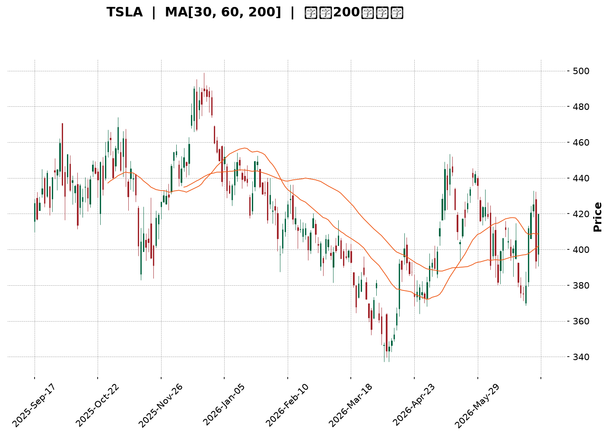
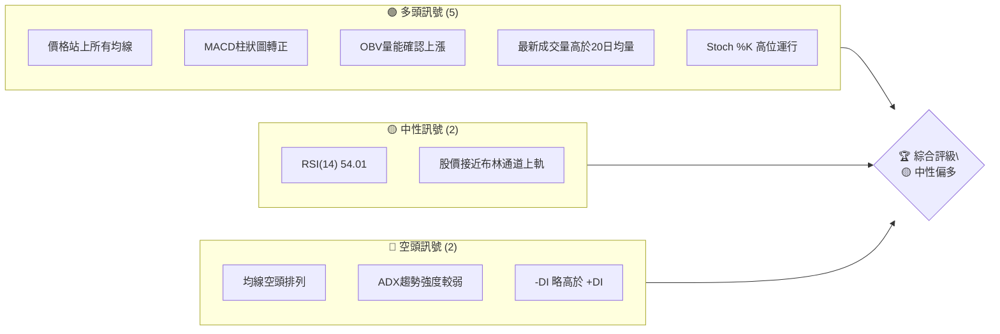
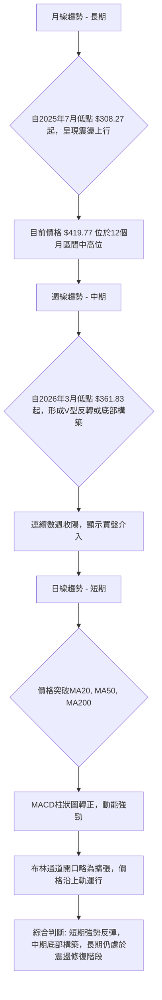
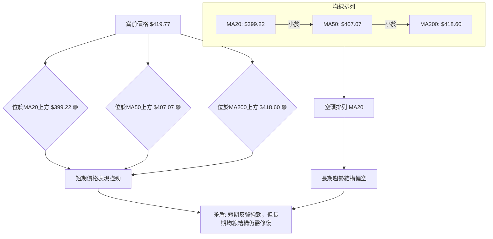
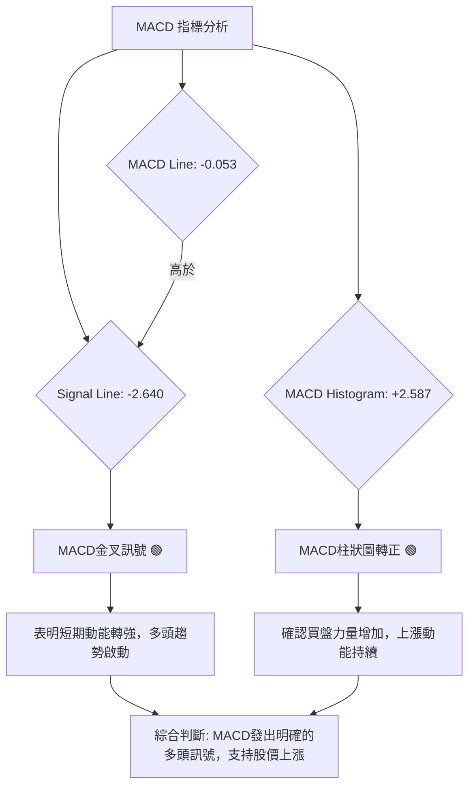
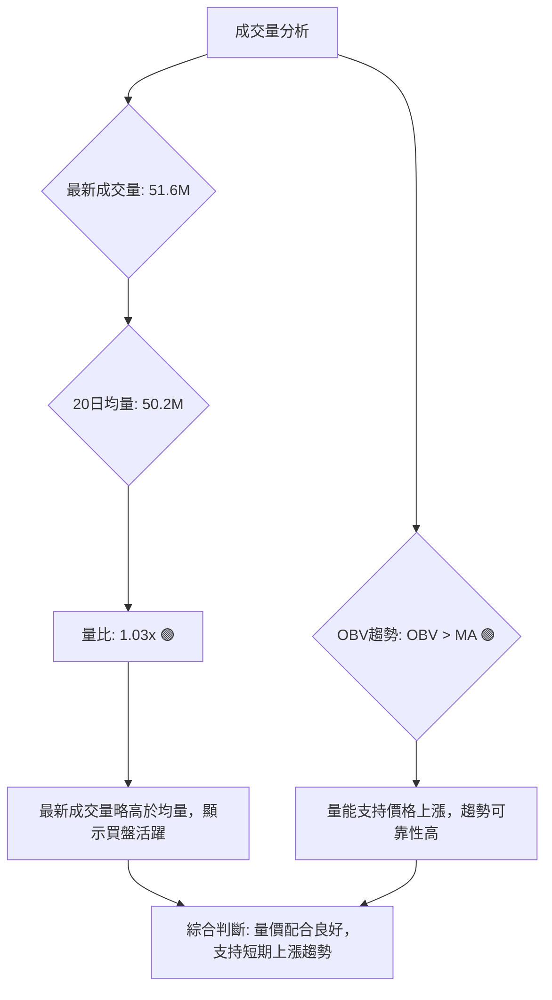
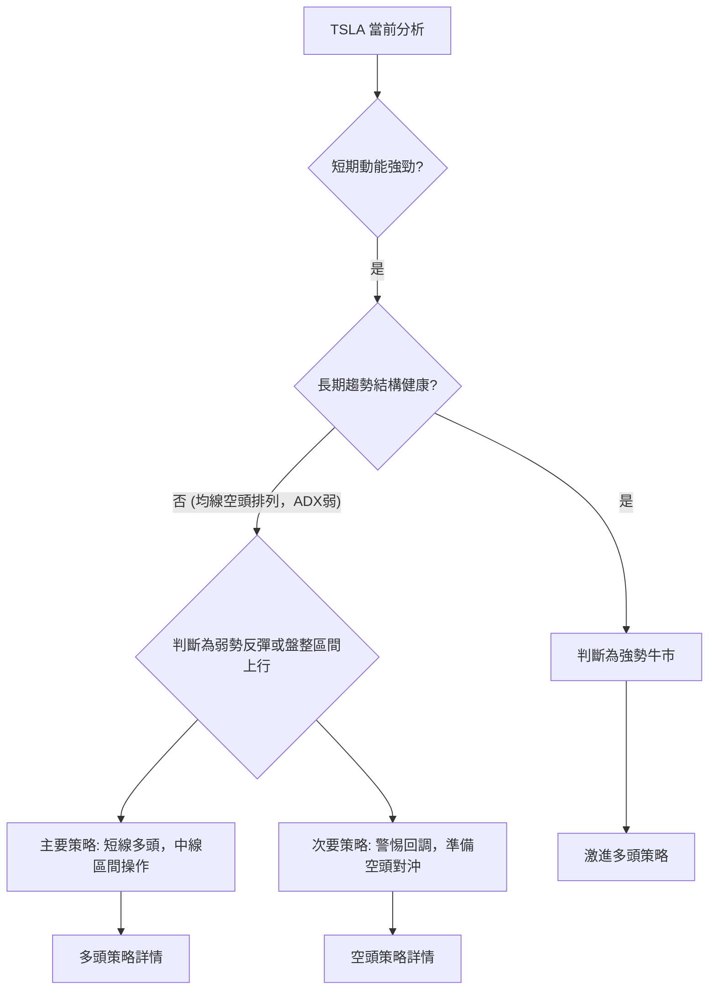

<details>
<summary>📊 靜態圖表 (點擊展開)</summary>

</details>

<html>
<head><meta charset="utf-8" /></head>
<body>
    <div style="height:500px; width:100%;">                        <script>window.PlotlyConfig = {MathJaxConfig: 'local'};</script>
        <script charset="utf-8" src="https://cdn.plot.ly/plotly-3.6.0.min.js" integrity="sha256-QaOVwtVY0T02VaHrr6pnoHLCwayMJp4O5n4YyaE3rJk=" crossorigin="anonymous"></script>                <div id="candlestick-chart" class="plotly-graph-div" style="height:100%; width:100%;"></div>            <script>                window.PLOTLYENV=window.PLOTLYENV || {};                                if (document.getElementById("candlestick-chart")) {                    Plotly.newPlot(                        "candlestick-chart",                        [{"close":{"dtype":"f8","bdata":"AAAAgMKdekAAAACgmQ16QAAAAMAeoXpAAAAAIFwje0AAAACgmZ16QAAAAOCjrHtAAAAAgD12ekAAAABgZoZ7QAAAACBcs3tAAAAAIIXLe0AAAAAgXLd8QAAAAAAAQHtAAAAAoEfdekAAAAAAAFR8QAAAAKBwEXtAAAAAQApre0AAAADgozh7QAAAAADX13lAAAAAYGY+e0AAAAAA19N6QAAAAGBmMntAAAAAAADMekAAAADA9XR7QAAAAEDh9ntAAAAAoJmpe0AAAAAghW97QAAAACCuD3xAAAAAIIUbe0AAAABguEZ8QAAAAMDMyHxAAAAAACnYfEAAAACgmYF7QAAAAMD1iHxAAAAAgOtFfUAAAAAAKcR7QAAAAMAe4XxAAAAAYI\u002fee0AAAADgUdh6QAAAACCu03tAAAAAgOt5e0AAAACgmel6QAAAAADXH3lAAAAAoJlFeUAAAABguI55QAAAAAAAFHlAAAAAANc\u002feUAAAAAgrrN4QAAAAKBwcXhAAAAA4HocekAAAABgZjZ6QAAAAKBHqXpAAAAAYLjiekAAAACAPeJ6QAAAAADX03pAAAAAANfre0AAAADgemh8QAAAAAAAcHxAAAAAoEd5e0AAAABguNJ7QAAAAEAzN3xAAAAAgD3ue0AAAAAgXK98QAAAAMD1tH1AAAAAgBSefkAAAAAAKTR9QAAAAIDrNX5AAAAAQDMTfkAAAAAgrot+QAAAAMD1WH5AAAAAYGZWfkAAAABACrN9QAAAAIA9unxAAAAAQOFmfEAAAAAghRt8QAAAAMAeYXtAAAAAYLg6fEAAAAAgXA97QAAAAGCP9npAAAAAwMw8e0AAAAAAKdB7QAAAACBcD3xAAAAAQDPze0AAAABAM3N7QAAAAMAeaXtAAAAAAABYe0AAAAAAADR6QAAAAEAK93pAAAAAgMIVfEAAAADA9RB8QAAAAEAzM3tAAAAAYGbuekAAAAAgXPd6QAAAAMD1CHpAAAAAYI\u002fmekAAAADA9Vx6QAAAACBcX3pAAAAAAClgeUAAAAAgXNN4QAAAAIDCsXlAAAAAwB4VekAAAAAgXJN6QAAAAOBRxHpAAAAAwB4RekAAAABAChd6QAAAAIAUqnlAAAAAwB61eUAAAAAgXLt5QAAAAMAevXlAAAAAoEf9eEAAAACAFJZ5QAAAAGBmFnpAAAAAoEeJeUAAAAAAKSh5QAAAAMAeNXlAAAAAQOGGeEAAAABACl95QAAAAMDMWHlAAAAAIK7LeEAAAABA4ep4QAAAAADX83hAAAAAwB59eUAAAAAAKbB4QAAAAEAzc3hAAAAAwPW4eEAAAADgUfR4QAAAAOB6jHhAAAAAwMzEd0AAAAAgXP92QAAAAKCZzXdAAAAA4Hrwd0AAAABAMx94QAAAAIDCQXdAAAAAoEeddkAAAADgejR2QAAAAAAAPHdAAAAAACnUd0AAAACgcIl2QAAAAMAeDXZAAAAAYGaqdUAAAAAAAHR1QAAAAIDrmXVAAAAAQDPPdUAAAABguAZ2QAAAAEAzw3ZAAAAAQDN\u002feEAAAABgZk54QAAAAIDrCXlAAAAAAACIeEAAAABguCZ4QAAAAAApOHhAAAAAIIVbd0AAAADAzIR3QAAAAGC4qndAAAAA4FGAd0AAAADAzEx3QAAAAIAU2ndAAAAAwB5teEAAAAAAKYh4QAAAAIDrVXhAAAAAIK7reEAAAADgo7x5QAAAAKCZxXpAAAAAAADQe0AAAABAMxd7QAAAAOBR1HtAAAAAwMy0e0AAAAAA12N6QAAAAADXn3lAAAAAgMJBeUAAAAAAKRR6QAAAAKCZHXpAAAAAACmgekAAAACgcBl7QAAAAIDChXtAAAAAoJmhe0AAAADgozx7QAAAAIAU\u002fnlAAAAAANd7ekAAAABAM3t6QAAAAEAzJ3pAAAAAAABweEAAAABAM495QAAAAEDhynhAAAAAoHDZd0AAAABgZvJ4QAAAAEDhZnlAAAAAYGayeUAAAABgj0p5QAAAAIAUxnhAAAAAANcHeUAAAADAzFB5QAAAAIDC2XdAAAAA4Hp4d0AAAACA63F3QAAAACBcu3dAAAAAoHC9eUAAAACgmUl6QAAAAMDMlHpAAAAAQDOXeEAAAADgUTx6QA=="},"high":{"dtype":"f8","bdata":"AAAAwPXEekAAAAAghQN7QAAAACCF13pAAAAAIK7Pe0AAAAAghY97QAAAACBcw3tAAAAAoJk1e0AAAAAghYd7QAAAACCuL3xAAAAAAADQe0AAAADgo+R8QAAAAAAAbH1AAAAA4FHse0AAAADAzFh8QAAAAEDhSnxAAAAAoEeVe0AAAACgmUV7QAAAAIAUsntAAAAAgD1Oe0AAAABAMyN7QAAAAAApiHtAAAAAoJl1e0AAAAAgXJd7QAAAAMDMHHxAAAAAwMwUfEAAAADgo9h7QAAAAGBmFnxAAAAAQOE6fEAAAABgj8J8QAAAAAAAMH1AAAAAQDMbfUAAAADA9XB8QAAAAAAAoHxAAAAAwB6hfUAAAAAghcN8QAAAAKBHJX1AAAAAQDM3fUAAAACAwnV7QAAAAGC4GnxAAAAAANene0AAAACgR6V7QAAAAAAAiHpAAAAAQArDeUAAAAAgXH96QAAAAGBmjnlAAAAA4Hq8eUAAAABACs96QAAAAMDMLHlAAAAAIIVbekAAAAAgrkd6QAAAAEAKr3pAAAAAQOEOe0AAAABgjxp7QAAAAMDMTHtAAAAAYLj+e0AAAACAFGp8QAAAAIDrrXxAAAAAAAAcfEAAAACAPUZ8QAAAAIAUjnxAAAAA4FEUfEAAAAAAKfB8QAAAAOBRHH5AAAAAAAC4fkAAAADgevR+QAAAAIDCrX5AAAAAANenfkAAAACgRy1\u002fQAAAACCFv35AAAAAYGaufkAAAACgcJF+QAAAAGBmVn1AAAAAgOvxfEAAAADAzIh8QAAAAKBwpXxAAAAAwMyYfEAAAAAAAAR8QAAAAIDrZXtAAAAAgD1Oe0AAAADAzBB8QAAAAMDMZHxAAAAAwPU8fEAAAABgj757QAAAAIDC1XtAAAAAAAD0e0AAAAAgrut6QAAAAEAzY3tAAAAAAAAYfEAAAABA4UZ8QAAAAOCj0HtAAAAA4FFYe0AAAAAAKWR7QAAAACCug3tAAAAAgBR+e0AAAABgZrJ6QAAAAMD1yHpAAAAAYGZ+ekAAAACgmSF5QAAAAMDM6HlAAAAAAABUekAAAAAAALR6QAAAAKCZRXtAAAAAIK5De0AAAADA9YB6QAAAACCF23lAAAAAYGYOekAAAAAAAPR5QAAAAEAz63lAAAAAQDN7eUAAAADAHq15QAAAAKBwRXpAAAAAwPUMekAAAACA63F5QAAAAOCjSHlAAAAAoHDFeEAAAACgR4V5QAAAAIDriXlAAAAAoJkleUAAAACgcBl5QAAAAKBwaXlAAAAAgBQGekAAAAAAAGh5QAAAAEAzA3lAAAAAIK47eUAAAACA6wF5QAAAAMAeMXlAAAAA4FE0eEAAAACAPb53QAAAAKBHFXhAAAAAIK43eEAAAAAgrsN4QAAAAEAKB3hAAAAAgMIdd0AAAADgo\u002fR2QAAAAKBHVXdAAAAAgD3yd0AAAADgeiR3QAAAACCF+3ZAAAAA4FHAdUAAAAAAAMh2QAAAAIAUznVAAAAAgMLldUAAAACgmUV2QAAAAIAU+nZAAAAAYGaqeEAAAADA9aB4QAAAAOB6lHlAAAAAwMxseUAAAABAM594QAAAAAApkHhAAAAAAAAgeEAAAAAAKex3QAAAAOB6zHdAAAAA4KPkd0AAAABgZoZ3QAAAAAAADHhAAAAAwB7deEAAAACAPap4QAAAAIDrIXlAAAAAQOEaeUAAAACgR\u002f15QAAAAEAz83pAAAAAYI8SfEAAAADAzPx7QAAAAGBmVnxAAAAAIK4\u002ffEAAAABgjyp7QAAAAIAUUnpAAAAAgBRaeUAAAAAgXBd6QAAAAEAzr3pAAAAAACn4ekAAAABAMzN7QAAAAKCZ2XtAAAAAIFy\u002fe0AAAADAHpF7QAAAAKCZ2XpAAAAAYLiGekAAAACgmRl7QAAAAKCZpXpAAAAAQOGKekAAAABACs95QAAAAAAAKHpAAAAAoHDReEAAAADgo\u002fh4QAAAAEDhanlAAAAAAAAAekAAAABguMZ5QAAAAEAKX3lAAAAA4FEoeUAAAAAAAOx5QAAAAIDrjXhAAAAAoEcJeEAAAACA67F3QAAAAMDMPHhAAAAA4FHUeUAAAADgo4h6QAAAAIDCDXtAAAAAoJkFe0AAAAAAAEB6QA=="},"hovertemplate":"\u003cb\u003e%{x|%Y-%m-%d}\u003c\u002fb\u003e\u003cbr\u003e\u958b: $%{open:.2f}\u003cbr\u003e\u9ad8: $%{high:.2f}\u003cbr\u003e\u4f4e: $%{low:.2f}\u003cbr\u003e\u6536: $%{close:.2f}\u003cextra\u003e\u003c\u002fextra\u003e","low":{"dtype":"f8","bdata":"AAAAYLiaeUAAAADA9Qh6QAAAACCFW3pAAAAAgBTSekAAAAAghXt6QAAAAOB60HpAAAAAoEcxekAAAADgUVB6QAAAAAAAeHtAAAAAgOsRe0AAAAAAAIx7QAAAAMAeOXtAAAAAoEcJekAAAABACkt7QAAAAEAzB3tAAAAAIK6TekAAAABA4aJ6QAAAAEAzt3lAAAAAQDM7ekAAAACAwh16QAAAAKBHpXpAAAAAwPVUekAAAACgmXl6QAAAAIDCiXtAAAAAwMyge0AAAAAAANB6QAAAAGBm3nlAAAAAYLjiekAAAABACmt7QAAAAKCZOXxAAAAAYGZKfEAAAACAwnl7QAAAAEAKu3tAAAAAwMxcfEAAAACgmbl7QAAAACBci3tAAAAAoHAxe0AAAACAFF56QAAAAIDCFXtAAAAAgMIFe0AAAADA9ah6QAAAAKBwxXhAAAAA4Hrsd0AAAAAA1+t4QAAAACBcm3hAAAAAAADoeEAAAAAA16t4QAAAAAAp\u002fHdAAAAAoHAReUAAAABAM195QAAAAIA9DnpAAAAAQDOjekAAAADgo5R6QAAAAIDrYXpAAAAAgMLxekAAAACAPdZ7QAAAAGCPOnxAAAAAAAA0e0AAAABAMzt7QAAAAIDCuXtAAAAAoEeFe0AAAABguJp7QAAAAGCPOn1AAAAAoEcdfUAAAABAMyN9QAAAAIDrkX1AAAAAIIWrfUAAAACgR1V+QAAAAKBwLX5AAAAAwMzMfUAAAADAHp19QAAAAAAAsHxAAAAAoEddfEAAAADAzBR8QAAAAMDMNHtAAAAAwB7Je0AAAADgesx6QAAAAOCj9HpAAAAAgOuFekAAAACAPeZ6QAAAAAAAYHtAAAAAQDO\u002fe0AAAAAghSN7QAAAAGBmWntAAAAAACk0e0AAAABAChd6QAAAAIDrOXpAAAAAgBQKe0AAAADgo8B7QAAAAOB6JHtAAAAAQArrekAAAACgmeF6QAAAAIDr6XlAAAAAQDNrekAAAAAAAOh5QAAAAEAK23lAAAAAQOHyeEAAAADgejh4QAAAAAAA3HhAAAAA4KN0eUAAAAAAABB6QAAAAOB6QHpAAAAAAADgeUAAAACAFK55QAAAAAApCHlAAAAAoEeZeUAAAACAwkF5QAAAAAAAWHlAAAAA4KOgeEAAAACAPdp4QAAAAGBmwnlAAAAAYI86eUAAAACAwuF4QAAAAAAARHhAAAAAgD0WeEAAAACgR6l4QAAAAGC49nhAAAAAIFyjeEAAAABgZtZ3QAAAAEAK43hAAAAAYGYieUAAAABgZqp4QAAAAEAzX3hAAAAAYLimeEAAAAAAAJB4QAAAAMD1hHhAAAAAIK6rd0AAAAAgXMd2QAAAACCuS3dAAAAAwPWEd0AAAAAAKRB4QAAAAIDrPXdAAAAAIIV3dkAAAACAPQJ2QAAAAAAAkHZAAAAAoEdhd0AAAADgenB2QAAAAIA9qnVAAAAAANcTdUAAAABguDp1QAAAAAAAFHVAAAAAANdrdUAAAADAHsl1QAAAAOBRLHZAAAAAAACodkAAAADAzNx3QAAAAGBmenhAAAAAoEdFeEAAAAAghRN4QAAAAMDMFHhAAAAAgD0Gd0AAAAAgrit3QAAAAOBRwHZAAAAA4KNId0AAAADgoyB3QAAAAGC4AndAAAAAwMysd0AAAADAzAx4QAAAAAAAUHhAAAAA4FEAeEAAAACA6yF5QAAAAIA9BnpAAAAAwMwMekAAAAAAKWR6QAAAACBc43pAAAAAYI+Se0AAAAAAAGB6QAAAAKBHVXlAAAAAgBSaeEAAAACAPWZ5QAAAAGBmznlAAAAAAClIekAAAACA66F6QAAAAOBROHtAAAAAwMxEe0AAAACAPcJ6QAAAAEDh9nlAAAAAYGbaeUAAAAAAAAB6QAAAAGCPEnpAAAAAoHBJeEAAAAAghat4QAAAAADXA3hAAAAAYGbCd0AAAABgj8p3QAAAAAApLHhAAAAAoJlxeUAAAADgowh5QAAAAAApnHhAAAAAQDMLeEAAAABgZqZ4QAAAAMD1sHdAAAAAwMxQd0AAAAAghTN3QAAAAKCZCXdAAAAAwMy0d0AAAAAAAGB5QAAAAKBwIXpAAAAAwMxUeEAAAAAAAGh4QA=="},"name":"\u50f9\u683c","open":{"dtype":"f8","bdata":"AAAAAAD8eUAAAACA6816QAAAAMAeXXpAAAAAgMLxekAAAACAFH57QAAAAKBH3XpAAAAAANcze0AAAADAzMR6QAAAAKCZxXtAAAAA4FGYe0AAAADAzLx7QAAAAOCjaH1AAAAA4KO0e0AAAAAAAIx7QAAAAMAe\u002fXtAAAAAwB5Ze0AAAADA9fx6QAAAAOCjSHtAAAAA4Hp4ekAAAADgo6x6QAAAAGBmLntAAAAAIK4re0AAAAAAAJh6QAAAAIDrvXtAAAAAACnce0AAAABAM7d7QAAAAAAAQHpAAAAAoEfte0AAAAAgrn97QAAAAOB6bHxAAAAAAADofEAAAADAzDB8QAAAAAAA7HtAAAAAANd\u002ffEAAAAAgXGd8QAAAAMDMQHxAAAAAIFzffEAAAABguF57QAAAAKCZeXtAAAAAYGZ2e0AAAABgZqJ7QAAAAIAUcnpAAAAAwMwkeEAAAAAA1+t4QAAAAIAUVnlAAAAAQOFieUAAAACAFOp5QAAAAMAeJXlAAAAAYLgieUAAAABguOZ5QAAAAEAzf3pAAAAAoHCpekAAAADAHpV6QAAAAMD17HpAAAAAoJkBe0AAAABACh98QAAAAOB6UHxAAAAAQDP3e0AAAADgo1h7QAAAAMAe4XtAAAAAQDMPfEAAAACgcAF8QAAAAEAKV31AAAAAIFyDfUAAAAAghYN+QAAAAGCP4n1AAAAAgOuBfkAAAACAFJ5+QAAAAGBmln5AAAAAIK6HfkAAAAAgrlN+QAAAAAAAUH1AAAAAoHDRfEAAAACgmYF8QAAAAMDMnHxAAAAAANf\u002fe0AAAACAFOZ7QAAAAGBmPntAAAAAgD2+ekAAAABAMz97QAAAACCuk3tAAAAAQDMjfEAAAADA9ax7QAAAAIAUkntAAAAAAAB4e0AAAACAwtV6QAAAAGCPWnpAAAAAYI8ye0AAAABA4fZ7QAAAAAAA0HtAAAAAYI9We0AAAABgj\u002f56QAAAAMDMXHtAAAAAoJmVekAAAADgo1R6QAAAAOBRhHpAAAAAIFxHekAAAADgUdB4QAAAAIDrDXlAAAAAYI+eeUAAAACgRyF6QAAAACBcv3pAAAAAwMzkekAAAADA9eR5QAAAAIDCxXlAAAAAgMKxeUAAAAAAAHR5QAAAAMDMhHlAAAAA4KN0eUAAAAAAAPh4QAAAAGBmwnlAAAAAYLjmeUAAAABACi95QAAAAKCZaXhAAAAAoHCxeEAAAACgmd14QAAAAMAeGXlAAAAAoHDheEAAAADAzGB4QAAAACCFI3lAAAAA4HokeUAAAABA4VJ5QAAAAGC48nhAAAAAIIXDeEAAAABACrt4QAAAAAAA8HhAAAAA4FE0eEAAAACgmb13QAAAAKBwUXdAAAAAwPWId0AAAAAA1194QAAAAKCZ2XdAAAAAQAobd0AAAACAwt12QAAAAAApmHZAAAAAgBSqd0AAAABAM8N2QAAAAKBwqXZAAAAAQAqndUAAAADgo7x2QAAAAGBmcnVAAAAA4KOkdUAAAADAHuF1QAAAAGC4WnZAAAAAoEftdkAAAADA9Zx4QAAAAGC4vnhAAAAAoEcpeUAAAAAAAJB4QAAAAMAeOXhAAAAA4Hp0d0AAAAAAAFh3QAAAAKBwQXdAAAAAQOFqd0AAAABgZnZ3QAAAAAAATHdAAAAAANfnd0AAAAAgrmN4QAAAAEAKs3hAAAAAAAAkeEAAAAAgrnd5QAAAACCuB3pAAAAAYI9iekAAAABgj5Z7QAAAAGC4SntAAAAAANfne0AAAAAgrh97QAAAAOBRNHpAAAAAYI8yeUAAAACgmXl5QAAAAEDhYnpAAAAAYLhqekAAAAAAKeR6QAAAAIA9rntAAAAAgOtZe0AAAACgmX17QAAAAADXt3pAAAAAIIUjekAAAABAMyt6QAAAAKBwPXpAAAAAAABIekAAAACgR8V4QAAAAOB6sHlAAAAA4KN4eEAAAADgekR4QAAAAADX93hAAAAAgOvFeUAAAACAwkF5QAAAAOB6GHlAAAAAoJnheEAAAACgma14QAAAAIDCiXhAAAAAoEfBd0AAAADgUXR3QAAAAGBmIndAAAAA4KPcd0AAAAAAAGB5QAAAACBcV3pAAAAAACnAekAAAADAHtV4QA=="},"x":["2025-09-17T00:00:00-04:00","2025-09-18T00:00:00-04:00","2025-09-19T00:00:00-04:00","2025-09-22T00:00:00-04:00","2025-09-23T00:00:00-04:00","2025-09-24T00:00:00-04:00","2025-09-25T00:00:00-04:00","2025-09-26T00:00:00-04:00","2025-09-29T00:00:00-04:00","2025-09-30T00:00:00-04:00","2025-10-01T00:00:00-04:00","2025-10-02T00:00:00-04:00","2025-10-03T00:00:00-04:00","2025-10-06T00:00:00-04:00","2025-10-07T00:00:00-04:00","2025-10-08T00:00:00-04:00","2025-10-09T00:00:00-04:00","2025-10-10T00:00:00-04:00","2025-10-13T00:00:00-04:00","2025-10-14T00:00:00-04:00","2025-10-15T00:00:00-04:00","2025-10-16T00:00:00-04:00","2025-10-17T00:00:00-04:00","2025-10-20T00:00:00-04:00","2025-10-21T00:00:00-04:00","2025-10-22T00:00:00-04:00","2025-10-23T00:00:00-04:00","2025-10-24T00:00:00-04:00","2025-10-27T00:00:00-04:00","2025-10-28T00:00:00-04:00","2025-10-29T00:00:00-04:00","2025-10-30T00:00:00-04:00","2025-10-31T00:00:00-04:00","2025-11-03T00:00:00-05:00","2025-11-04T00:00:00-05:00","2025-11-05T00:00:00-05:00","2025-11-06T00:00:00-05:00","2025-11-07T00:00:00-05:00","2025-11-10T00:00:00-05:00","2025-11-11T00:00:00-05:00","2025-11-12T00:00:00-05:00","2025-11-13T00:00:00-05:00","2025-11-14T00:00:00-05:00","2025-11-17T00:00:00-05:00","2025-11-18T00:00:00-05:00","2025-11-19T00:00:00-05:00","2025-11-20T00:00:00-05:00","2025-11-21T00:00:00-05:00","2025-11-24T00:00:00-05:00","2025-11-25T00:00:00-05:00","2025-11-26T00:00:00-05:00","2025-11-28T00:00:00-05:00","2025-12-01T00:00:00-05:00","2025-12-02T00:00:00-05:00","2025-12-03T00:00:00-05:00","2025-12-04T00:00:00-05:00","2025-12-05T00:00:00-05:00","2025-12-08T00:00:00-05:00","2025-12-09T00:00:00-05:00","2025-12-10T00:00:00-05:00","2025-12-11T00:00:00-05:00","2025-12-12T00:00:00-05:00","2025-12-15T00:00:00-05:00","2025-12-16T00:00:00-05:00","2025-12-17T00:00:00-05:00","2025-12-18T00:00:00-05:00","2025-12-19T00:00:00-05:00","2025-12-22T00:00:00-05:00","2025-12-23T00:00:00-05:00","2025-12-24T00:00:00-05:00","2025-12-26T00:00:00-05:00","2025-12-29T00:00:00-05:00","2025-12-30T00:00:00-05:00","2025-12-31T00:00:00-05:00","2026-01-02T00:00:00-05:00","2026-01-05T00:00:00-05:00","2026-01-06T00:00:00-05:00","2026-01-07T00:00:00-05:00","2026-01-08T00:00:00-05:00","2026-01-09T00:00:00-05:00","2026-01-12T00:00:00-05:00","2026-01-13T00:00:00-05:00","2026-01-14T00:00:00-05:00","2026-01-15T00:00:00-05:00","2026-01-16T00:00:00-05:00","2026-01-20T00:00:00-05:00","2026-01-21T00:00:00-05:00","2026-01-22T00:00:00-05:00","2026-01-23T00:00:00-05:00","2026-01-26T00:00:00-05:00","2026-01-27T00:00:00-05:00","2026-01-28T00:00:00-05:00","2026-01-29T00:00:00-05:00","2026-01-30T00:00:00-05:00","2026-02-02T00:00:00-05:00","2026-02-03T00:00:00-05:00","2026-02-04T00:00:00-05:00","2026-02-05T00:00:00-05:00","2026-02-06T00:00:00-05:00","2026-02-09T00:00:00-05:00","2026-02-10T00:00:00-05:00","2026-02-11T00:00:00-05:00","2026-02-12T00:00:00-05:00","2026-02-13T00:00:00-05:00","2026-02-17T00:00:00-05:00","2026-02-18T00:00:00-05:00","2026-02-19T00:00:00-05:00","2026-02-20T00:00:00-05:00","2026-02-23T00:00:00-05:00","2026-02-24T00:00:00-05:00","2026-02-25T00:00:00-05:00","2026-02-26T00:00:00-05:00","2026-02-27T00:00:00-05:00","2026-03-02T00:00:00-05:00","2026-03-03T00:00:00-05:00","2026-03-04T00:00:00-05:00","2026-03-05T00:00:00-05:00","2026-03-06T00:00:00-05:00","2026-03-09T00:00:00-04:00","2026-03-10T00:00:00-04:00","2026-03-11T00:00:00-04:00","2026-03-12T00:00:00-04:00","2026-03-13T00:00:00-04:00","2026-03-16T00:00:00-04:00","2026-03-17T00:00:00-04:00","2026-03-18T00:00:00-04:00","2026-03-19T00:00:00-04:00","2026-03-20T00:00:00-04:00","2026-03-23T00:00:00-04:00","2026-03-24T00:00:00-04:00","2026-03-25T00:00:00-04:00","2026-03-26T00:00:00-04:00","2026-03-27T00:00:00-04:00","2026-03-30T00:00:00-04:00","2026-03-31T00:00:00-04:00","2026-04-01T00:00:00-04:00","2026-04-02T00:00:00-04:00","2026-04-06T00:00:00-04:00","2026-04-07T00:00:00-04:00","2026-04-08T00:00:00-04:00","2026-04-09T00:00:00-04:00","2026-04-10T00:00:00-04:00","2026-04-13T00:00:00-04:00","2026-04-14T00:00:00-04:00","2026-04-15T00:00:00-04:00","2026-04-16T00:00:00-04:00","2026-04-17T00:00:00-04:00","2026-04-20T00:00:00-04:00","2026-04-21T00:00:00-04:00","2026-04-22T00:00:00-04:00","2026-04-23T00:00:00-04:00","2026-04-24T00:00:00-04:00","2026-04-27T00:00:00-04:00","2026-04-28T00:00:00-04:00","2026-04-29T00:00:00-04:00","2026-04-30T00:00:00-04:00","2026-05-01T00:00:00-04:00","2026-05-04T00:00:00-04:00","2026-05-05T00:00:00-04:00","2026-05-06T00:00:00-04:00","2026-05-07T00:00:00-04:00","2026-05-08T00:00:00-04:00","2026-05-11T00:00:00-04:00","2026-05-12T00:00:00-04:00","2026-05-13T00:00:00-04:00","2026-05-14T00:00:00-04:00","2026-05-15T00:00:00-04:00","2026-05-18T00:00:00-04:00","2026-05-19T00:00:00-04:00","2026-05-20T00:00:00-04:00","2026-05-21T00:00:00-04:00","2026-05-22T00:00:00-04:00","2026-05-26T00:00:00-04:00","2026-05-27T00:00:00-04:00","2026-05-28T00:00:00-04:00","2026-05-29T00:00:00-04:00","2026-06-01T00:00:00-04:00","2026-06-02T00:00:00-04:00","2026-06-03T00:00:00-04:00","2026-06-04T00:00:00-04:00","2026-06-05T00:00:00-04:00","2026-06-08T00:00:00-04:00","2026-06-09T00:00:00-04:00","2026-06-10T00:00:00-04:00","2026-06-11T00:00:00-04:00","2026-06-12T00:00:00-04:00","2026-06-15T00:00:00-04:00","2026-06-16T00:00:00-04:00","2026-06-17T00:00:00-04:00","2026-06-18T00:00:00-04:00","2026-06-22T00:00:00-04:00","2026-06-23T00:00:00-04:00","2026-06-24T00:00:00-04:00","2026-06-25T00:00:00-04:00","2026-06-26T00:00:00-04:00","2026-06-29T00:00:00-04:00","2026-06-30T00:00:00-04:00","2026-07-01T00:00:00-04:00","2026-07-02T00:00:00-04:00","2026-07-06T00:00:00-04:00"],"type":"candlestick"},{"hovertemplate":"MA30: $%{y:.2f}\u003cextra\u003e\u003c\u002fextra\u003e","line":{"color":"#2196F3","dash":"dash","width":2},"mode":"lines","name":"MA30","x":["2025-09-17T00:00:00-04:00","2025-09-18T00:00:00-04:00","2025-09-19T00:00:00-04:00","2025-09-22T00:00:00-04:00","2025-09-23T00:00:00-04:00","2025-09-24T00:00:00-04:00","2025-09-25T00:00:00-04:00","2025-09-26T00:00:00-04:00","2025-09-29T00:00:00-04:00","2025-09-30T00:00:00-04:00","2025-10-01T00:00:00-04:00","2025-10-02T00:00:00-04:00","2025-10-03T00:00:00-04:00","2025-10-06T00:00:00-04:00","2025-10-07T00:00:00-04:00","2025-10-08T00:00:00-04:00","2025-10-09T00:00:00-04:00","2025-10-10T00:00:00-04:00","2025-10-13T00:00:00-04:00","2025-10-14T00:00:00-04:00","2025-10-15T00:00:00-04:00","2025-10-16T00:00:00-04:00","2025-10-17T00:00:00-04:00","2025-10-20T00:00:00-04:00","2025-10-21T00:00:00-04:00","2025-10-22T00:00:00-04:00","2025-10-23T00:00:00-04:00","2025-10-24T00:00:00-04:00","2025-10-27T00:00:00-04:00","2025-10-28T00:00:00-04:00","2025-10-29T00:00:00-04:00","2025-10-30T00:00:00-04:00","2025-10-31T00:00:00-04:00","2025-11-03T00:00:00-05:00","2025-11-04T00:00:00-05:00","2025-11-05T00:00:00-05:00","2025-11-06T00:00:00-05:00","2025-11-07T00:00:00-05:00","2025-11-10T00:00:00-05:00","2025-11-11T00:00:00-05:00","2025-11-12T00:00:00-05:00","2025-11-13T00:00:00-05:00","2025-11-14T00:00:00-05:00","2025-11-17T00:00:00-05:00","2025-11-18T00:00:00-05:00","2025-11-19T00:00:00-05:00","2025-11-20T00:00:00-05:00","2025-11-21T00:00:00-05:00","2025-11-24T00:00:00-05:00","2025-11-25T00:00:00-05:00","2025-11-26T00:00:00-05:00","2025-11-28T00:00:00-05:00","2025-12-01T00:00:00-05:00","2025-12-02T00:00:00-05:00","2025-12-03T00:00:00-05:00","2025-12-04T00:00:00-05:00","2025-12-05T00:00:00-05:00","2025-12-08T00:00:00-05:00","2025-12-09T00:00:00-05:00","2025-12-10T00:00:00-05:00","2025-12-11T00:00:00-05:00","2025-12-12T00:00:00-05:00","2025-12-15T00:00:00-05:00","2025-12-16T00:00:00-05:00","2025-12-17T00:00:00-05:00","2025-12-18T00:00:00-05:00","2025-12-19T00:00:00-05:00","2025-12-22T00:00:00-05:00","2025-12-23T00:00:00-05:00","2025-12-24T00:00:00-05:00","2025-12-26T00:00:00-05:00","2025-12-29T00:00:00-05:00","2025-12-30T00:00:00-05:00","2025-12-31T00:00:00-05:00","2026-01-02T00:00:00-05:00","2026-01-05T00:00:00-05:00","2026-01-06T00:00:00-05:00","2026-01-07T00:00:00-05:00","2026-01-08T00:00:00-05:00","2026-01-09T00:00:00-05:00","2026-01-12T00:00:00-05:00","2026-01-13T00:00:00-05:00","2026-01-14T00:00:00-05:00","2026-01-15T00:00:00-05:00","2026-01-16T00:00:00-05:00","2026-01-20T00:00:00-05:00","2026-01-21T00:00:00-05:00","2026-01-22T00:00:00-05:00","2026-01-23T00:00:00-05:00","2026-01-26T00:00:00-05:00","2026-01-27T00:00:00-05:00","2026-01-28T00:00:00-05:00","2026-01-29T00:00:00-05:00","2026-01-30T00:00:00-05:00","2026-02-02T00:00:00-05:00","2026-02-03T00:00:00-05:00","2026-02-04T00:00:00-05:00","2026-02-05T00:00:00-05:00","2026-02-06T00:00:00-05:00","2026-02-09T00:00:00-05:00","2026-02-10T00:00:00-05:00","2026-02-11T00:00:00-05:00","2026-02-12T00:00:00-05:00","2026-02-13T00:00:00-05:00","2026-02-17T00:00:00-05:00","2026-02-18T00:00:00-05:00","2026-02-19T00:00:00-05:00","2026-02-20T00:00:00-05:00","2026-02-23T00:00:00-05:00","2026-02-24T00:00:00-05:00","2026-02-25T00:00:00-05:00","2026-02-26T00:00:00-05:00","2026-02-27T00:00:00-05:00","2026-03-02T00:00:00-05:00","2026-03-03T00:00:00-05:00","2026-03-04T00:00:00-05:00","2026-03-05T00:00:00-05:00","2026-03-06T00:00:00-05:00","2026-03-09T00:00:00-04:00","2026-03-10T00:00:00-04:00","2026-03-11T00:00:00-04:00","2026-03-12T00:00:00-04:00","2026-03-13T00:00:00-04:00","2026-03-16T00:00:00-04:00","2026-03-17T00:00:00-04:00","2026-03-18T00:00:00-04:00","2026-03-19T00:00:00-04:00","2026-03-20T00:00:00-04:00","2026-03-23T00:00:00-04:00","2026-03-24T00:00:00-04:00","2026-03-25T00:00:00-04:00","2026-03-26T00:00:00-04:00","2026-03-27T00:00:00-04:00","2026-03-30T00:00:00-04:00","2026-03-31T00:00:00-04:00","2026-04-01T00:00:00-04:00","2026-04-02T00:00:00-04:00","2026-04-06T00:00:00-04:00","2026-04-07T00:00:00-04:00","2026-04-08T00:00:00-04:00","2026-04-09T00:00:00-04:00","2026-04-10T00:00:00-04:00","2026-04-13T00:00:00-04:00","2026-04-14T00:00:00-04:00","2026-04-15T00:00:00-04:00","2026-04-16T00:00:00-04:00","2026-04-17T00:00:00-04:00","2026-04-20T00:00:00-04:00","2026-04-21T00:00:00-04:00","2026-04-22T00:00:00-04:00","2026-04-23T00:00:00-04:00","2026-04-24T00:00:00-04:00","2026-04-27T00:00:00-04:00","2026-04-28T00:00:00-04:00","2026-04-29T00:00:00-04:00","2026-04-30T00:00:00-04:00","2026-05-01T00:00:00-04:00","2026-05-04T00:00:00-04:00","2026-05-05T00:00:00-04:00","2026-05-06T00:00:00-04:00","2026-05-07T00:00:00-04:00","2026-05-08T00:00:00-04:00","2026-05-11T00:00:00-04:00","2026-05-12T00:00:00-04:00","2026-05-13T00:00:00-04:00","2026-05-14T00:00:00-04:00","2026-05-15T00:00:00-04:00","2026-05-18T00:00:00-04:00","2026-05-19T00:00:00-04:00","2026-05-20T00:00:00-04:00","2026-05-21T00:00:00-04:00","2026-05-22T00:00:00-04:00","2026-05-26T00:00:00-04:00","2026-05-27T00:00:00-04:00","2026-05-28T00:00:00-04:00","2026-05-29T00:00:00-04:00","2026-06-01T00:00:00-04:00","2026-06-02T00:00:00-04:00","2026-06-03T00:00:00-04:00","2026-06-04T00:00:00-04:00","2026-06-05T00:00:00-04:00","2026-06-08T00:00:00-04:00","2026-06-09T00:00:00-04:00","2026-06-10T00:00:00-04:00","2026-06-11T00:00:00-04:00","2026-06-12T00:00:00-04:00","2026-06-15T00:00:00-04:00","2026-06-16T00:00:00-04:00","2026-06-17T00:00:00-04:00","2026-06-18T00:00:00-04:00","2026-06-22T00:00:00-04:00","2026-06-23T00:00:00-04:00","2026-06-24T00:00:00-04:00","2026-06-25T00:00:00-04:00","2026-06-26T00:00:00-04:00","2026-06-29T00:00:00-04:00","2026-06-30T00:00:00-04:00","2026-07-01T00:00:00-04:00","2026-07-02T00:00:00-04:00","2026-07-06T00:00:00-04:00"],"y":{"dtype":"f8","bdata":"AAAAAAAA+H8AAAAAAAD4fwAAAAAAAPh\u002fAAAAAAAA+H8AAAAAAAD4fwAAAAAAAPh\u002fAAAAAAAA+H8AAAAAAAD4fwAAAAAAAPh\u002fAAAAAAAA+H8AAAAAAAD4fwAAAAAAAPh\u002fAAAAAAAA+H8AAAAAAAD4fwAAAAAAAPh\u002fAAAAAAAA+H8AAAAAAAD4fwAAAAAAAPh\u002fAAAAAAAA+H8AAAAAAAD4fwAAAAAAAPh\u002fAAAAAAAA+H8AAAAAAAD4fwAAAAAAAPh\u002fAAAAAAAA+H8AAAAAAAD4fwAAAAAAAPh\u002fAAAAAAAA+H8AAAAAAAD4f3d3d\u002fcMU3tAIiIiYhBme0CJiIjIdnJ7QO\u002fu7q65gntAmpmZqfGUe0De3d09w557QKuqqpoLqXtAVVVVVQ61e0CamZnZQK97QGZmZqZUsHtAREREVJyte0Crqqr6N557QKuqqnoUjHtAzczMnH1+e0B3d3cX2WZ7QO\u002fu7t7dVXtAmpmZKVxDe0ARERGB3C17QImIiCjqIXtAzczMLEAYe0AAAACwABN7QImIiJhuDntAmpmZeTAPe0B3d3d3TAp7QM3MzOyYAHtAvLu7K84Ce0ARERGhGgt7QO\u002fu7o5QDntAREREpHARe0BmZmbGkg17QDMzM1O4CHtAVVVVNewAe0CamZk5+wp7QJqZmTn7FHtA7+7uDnQge0AzMzNTuCx7QLy7u3sUOHtA7+7uvuZKe0AzMzPjemp7QGZmZkb9f3tAVVVVxWeYe0CrqqrKL7B7QBEREfHuzntAd3d3h6Tpe0BmZmYWZ\u002f97QO\u002fu7j4KE3xAiYiIKHgsfEDv7u6Ol0B8QFVVVZUYVnxAmpmZ6bRffECJiIiIXW18QGZmZiZNeXxAAAAAUGKCfEDe3d1NN4d8QJqZmSkxjHxAiYiImEOHfEAzMzOzcnR8QJqZmfnhZ3xAVVVVRRltfEAiIiJiLG98QHd3d7eBZnxAvLu7i\u002fpdfEARERHhT098QLy7u4v6L3xAiYiI6EIQfEB3d3d3Bfh7QERERPRE13tAMzMzAyuve0Crqqp6W357QCIiIpKmVntAIiIiYlcye0AiIiJyrxd7QERERGT0BntAIiIiggfzekBmZmY20OF6QM3MzLwt03pA3t3dnai9ekCJiIhIU7J6QImIiJjgp3pA3t3dfbGUekDv7u7OsIF6QBEREdHbcHpAVVVV5UJcekDNzMx8sUh6QAAAALDkNXpAERERIdsdekDv7u7ewRZ6QFVVVQXzCHpAZmZmRuHseUCamZm5AtJ5QLy7u\u002fvUvnlAvLu7y4WyeUCJiIgoFZ95QM3MzKyOkXlAzczMfPh+eUBmZmYG83J5QLy7u\u002ftiY3lAVVVVtaxVeUC8u7sbE0Z5QM3MzJzvNXlAIiIi4qUjeUBmZmaWtQ55QAAAAODB8HhAVVVVxUvTeEC8u7vbJLJ4QBEREXFonXhAAAAAQGCNeECrqqqqHHJ4QDMzMzOlUnhAvLu7W0g2eECJiIhoAxN4QLy7uwu77HdAERERke3Md0DNzMycNrJ3QN7d3W1ZnXdAVVVV5Redd0De3d1dAZR3QCIiIkJgkXdAiYiIuB6Pd0AzMzPTlIh3QKuqqkpTgndAERERgSNwd0BmZmb2KGZ3QDMzMzN6X3dAZmZmVg5Vd0DNzMxM8EZ3QERERPT9QHdAmpmZSZpGd0Dv7u4uslN3QCIiInI9WHdAVVVVBZ1gd0CrqqoKZW53QN7d3a1jjHdAiYiIKL+4d0CJiIj4b+J3QGZmZualCXhAzczMbLwqeEBERES0nUt4QAAAAFAbanhAREREhMCIeECamZlZObB4QHd3dye\u002f1nhAmpmZadj\u002feEAiIiLSIit5QCIiIjLBU3lAd3d3V4BueUBERERkgod5QEREROSlj3lAERERMU+geUB3d3cnMbR5QO\u002fu7n6xxHlAq6qqyujNeUC8u7ubUt95QCIiIpLt6HlAAAAAEObreUB3d3e38\u002fl5QN7d3b0tB3pAZmZmdgUSekB3d3dXgBh6QBEREXE9HHpAzczMvC0dekAAAACAlRl6QN7d3e2nAHpAVVVV9ZrbeUB3d3f3frx5QHd3d9eHmXlAERERgcCIeUB3d3eX4Id5QKuqquoKkHlAmpmZeVuKeUC8u7srsot5QA=="},"type":"scatter"},{"hovertemplate":"MA60: $%{y:.2f}\u003cextra\u003e\u003c\u002fextra\u003e","line":{"color":"#9C27B0","dash":"dash","width":2},"mode":"lines","name":"MA60","x":["2025-09-17T00:00:00-04:00","2025-09-18T00:00:00-04:00","2025-09-19T00:00:00-04:00","2025-09-22T00:00:00-04:00","2025-09-23T00:00:00-04:00","2025-09-24T00:00:00-04:00","2025-09-25T00:00:00-04:00","2025-09-26T00:00:00-04:00","2025-09-29T00:00:00-04:00","2025-09-30T00:00:00-04:00","2025-10-01T00:00:00-04:00","2025-10-02T00:00:00-04:00","2025-10-03T00:00:00-04:00","2025-10-06T00:00:00-04:00","2025-10-07T00:00:00-04:00","2025-10-08T00:00:00-04:00","2025-10-09T00:00:00-04:00","2025-10-10T00:00:00-04:00","2025-10-13T00:00:00-04:00","2025-10-14T00:00:00-04:00","2025-10-15T00:00:00-04:00","2025-10-16T00:00:00-04:00","2025-10-17T00:00:00-04:00","2025-10-20T00:00:00-04:00","2025-10-21T00:00:00-04:00","2025-10-22T00:00:00-04:00","2025-10-23T00:00:00-04:00","2025-10-24T00:00:00-04:00","2025-10-27T00:00:00-04:00","2025-10-28T00:00:00-04:00","2025-10-29T00:00:00-04:00","2025-10-30T00:00:00-04:00","2025-10-31T00:00:00-04:00","2025-11-03T00:00:00-05:00","2025-11-04T00:00:00-05:00","2025-11-05T00:00:00-05:00","2025-11-06T00:00:00-05:00","2025-11-07T00:00:00-05:00","2025-11-10T00:00:00-05:00","2025-11-11T00:00:00-05:00","2025-11-12T00:00:00-05:00","2025-11-13T00:00:00-05:00","2025-11-14T00:00:00-05:00","2025-11-17T00:00:00-05:00","2025-11-18T00:00:00-05:00","2025-11-19T00:00:00-05:00","2025-11-20T00:00:00-05:00","2025-11-21T00:00:00-05:00","2025-11-24T00:00:00-05:00","2025-11-25T00:00:00-05:00","2025-11-26T00:00:00-05:00","2025-11-28T00:00:00-05:00","2025-12-01T00:00:00-05:00","2025-12-02T00:00:00-05:00","2025-12-03T00:00:00-05:00","2025-12-04T00:00:00-05:00","2025-12-05T00:00:00-05:00","2025-12-08T00:00:00-05:00","2025-12-09T00:00:00-05:00","2025-12-10T00:00:00-05:00","2025-12-11T00:00:00-05:00","2025-12-12T00:00:00-05:00","2025-12-15T00:00:00-05:00","2025-12-16T00:00:00-05:00","2025-12-17T00:00:00-05:00","2025-12-18T00:00:00-05:00","2025-12-19T00:00:00-05:00","2025-12-22T00:00:00-05:00","2025-12-23T00:00:00-05:00","2025-12-24T00:00:00-05:00","2025-12-26T00:00:00-05:00","2025-12-29T00:00:00-05:00","2025-12-30T00:00:00-05:00","2025-12-31T00:00:00-05:00","2026-01-02T00:00:00-05:00","2026-01-05T00:00:00-05:00","2026-01-06T00:00:00-05:00","2026-01-07T00:00:00-05:00","2026-01-08T00:00:00-05:00","2026-01-09T00:00:00-05:00","2026-01-12T00:00:00-05:00","2026-01-13T00:00:00-05:00","2026-01-14T00:00:00-05:00","2026-01-15T00:00:00-05:00","2026-01-16T00:00:00-05:00","2026-01-20T00:00:00-05:00","2026-01-21T00:00:00-05:00","2026-01-22T00:00:00-05:00","2026-01-23T00:00:00-05:00","2026-01-26T00:00:00-05:00","2026-01-27T00:00:00-05:00","2026-01-28T00:00:00-05:00","2026-01-29T00:00:00-05:00","2026-01-30T00:00:00-05:00","2026-02-02T00:00:00-05:00","2026-02-03T00:00:00-05:00","2026-02-04T00:00:00-05:00","2026-02-05T00:00:00-05:00","2026-02-06T00:00:00-05:00","2026-02-09T00:00:00-05:00","2026-02-10T00:00:00-05:00","2026-02-11T00:00:00-05:00","2026-02-12T00:00:00-05:00","2026-02-13T00:00:00-05:00","2026-02-17T00:00:00-05:00","2026-02-18T00:00:00-05:00","2026-02-19T00:00:00-05:00","2026-02-20T00:00:00-05:00","2026-02-23T00:00:00-05:00","2026-02-24T00:00:00-05:00","2026-02-25T00:00:00-05:00","2026-02-26T00:00:00-05:00","2026-02-27T00:00:00-05:00","2026-03-02T00:00:00-05:00","2026-03-03T00:00:00-05:00","2026-03-04T00:00:00-05:00","2026-03-05T00:00:00-05:00","2026-03-06T00:00:00-05:00","2026-03-09T00:00:00-04:00","2026-03-10T00:00:00-04:00","2026-03-11T00:00:00-04:00","2026-03-12T00:00:00-04:00","2026-03-13T00:00:00-04:00","2026-03-16T00:00:00-04:00","2026-03-17T00:00:00-04:00","2026-03-18T00:00:00-04:00","2026-03-19T00:00:00-04:00","2026-03-20T00:00:00-04:00","2026-03-23T00:00:00-04:00","2026-03-24T00:00:00-04:00","2026-03-25T00:00:00-04:00","2026-03-26T00:00:00-04:00","2026-03-27T00:00:00-04:00","2026-03-30T00:00:00-04:00","2026-03-31T00:00:00-04:00","2026-04-01T00:00:00-04:00","2026-04-02T00:00:00-04:00","2026-04-06T00:00:00-04:00","2026-04-07T00:00:00-04:00","2026-04-08T00:00:00-04:00","2026-04-09T00:00:00-04:00","2026-04-10T00:00:00-04:00","2026-04-13T00:00:00-04:00","2026-04-14T00:00:00-04:00","2026-04-15T00:00:00-04:00","2026-04-16T00:00:00-04:00","2026-04-17T00:00:00-04:00","2026-04-20T00:00:00-04:00","2026-04-21T00:00:00-04:00","2026-04-22T00:00:00-04:00","2026-04-23T00:00:00-04:00","2026-04-24T00:00:00-04:00","2026-04-27T00:00:00-04:00","2026-04-28T00:00:00-04:00","2026-04-29T00:00:00-04:00","2026-04-30T00:00:00-04:00","2026-05-01T00:00:00-04:00","2026-05-04T00:00:00-04:00","2026-05-05T00:00:00-04:00","2026-05-06T00:00:00-04:00","2026-05-07T00:00:00-04:00","2026-05-08T00:00:00-04:00","2026-05-11T00:00:00-04:00","2026-05-12T00:00:00-04:00","2026-05-13T00:00:00-04:00","2026-05-14T00:00:00-04:00","2026-05-15T00:00:00-04:00","2026-05-18T00:00:00-04:00","2026-05-19T00:00:00-04:00","2026-05-20T00:00:00-04:00","2026-05-21T00:00:00-04:00","2026-05-22T00:00:00-04:00","2026-05-26T00:00:00-04:00","2026-05-27T00:00:00-04:00","2026-05-28T00:00:00-04:00","2026-05-29T00:00:00-04:00","2026-06-01T00:00:00-04:00","2026-06-02T00:00:00-04:00","2026-06-03T00:00:00-04:00","2026-06-04T00:00:00-04:00","2026-06-05T00:00:00-04:00","2026-06-08T00:00:00-04:00","2026-06-09T00:00:00-04:00","2026-06-10T00:00:00-04:00","2026-06-11T00:00:00-04:00","2026-06-12T00:00:00-04:00","2026-06-15T00:00:00-04:00","2026-06-16T00:00:00-04:00","2026-06-17T00:00:00-04:00","2026-06-18T00:00:00-04:00","2026-06-22T00:00:00-04:00","2026-06-23T00:00:00-04:00","2026-06-24T00:00:00-04:00","2026-06-25T00:00:00-04:00","2026-06-26T00:00:00-04:00","2026-06-29T00:00:00-04:00","2026-06-30T00:00:00-04:00","2026-07-01T00:00:00-04:00","2026-07-02T00:00:00-04:00","2026-07-06T00:00:00-04:00"],"y":{"dtype":"f8","bdata":"AAAAAAAA+H8AAAAAAAD4fwAAAAAAAPh\u002fAAAAAAAA+H8AAAAAAAD4fwAAAAAAAPh\u002fAAAAAAAA+H8AAAAAAAD4fwAAAAAAAPh\u002fAAAAAAAA+H8AAAAAAAD4fwAAAAAAAPh\u002fAAAAAAAA+H8AAAAAAAD4fwAAAAAAAPh\u002fAAAAAAAA+H8AAAAAAAD4fwAAAAAAAPh\u002fAAAAAAAA+H8AAAAAAAD4fwAAAAAAAPh\u002fAAAAAAAA+H8AAAAAAAD4fwAAAAAAAPh\u002fAAAAAAAA+H8AAAAAAAD4fwAAAAAAAPh\u002fAAAAAAAA+H8AAAAAAAD4fwAAAAAAAPh\u002fAAAAAAAA+H8AAAAAAAD4fwAAAAAAAPh\u002fAAAAAAAA+H8AAAAAAAD4fwAAAAAAAPh\u002fAAAAAAAA+H8AAAAAAAD4fwAAAAAAAPh\u002fAAAAAAAA+H8AAAAAAAD4fwAAAAAAAPh\u002fAAAAAAAA+H8AAAAAAAD4fwAAAAAAAPh\u002fAAAAAAAA+H8AAAAAAAD4fwAAAAAAAPh\u002fAAAAAAAA+H8AAAAAAAD4fwAAAAAAAPh\u002fAAAAAAAA+H8AAAAAAAD4fwAAAAAAAPh\u002fAAAAAAAA+H8AAAAAAAD4fwAAAAAAAPh\u002fAAAAAAAA+H8AAAAAAAD4f1VVVaXiLXtAvLu7S34ze0AREREBuT57QERERHTaS3tARERE3LJae0CJiIjIvWV7QDMzMwuQcHtAIiIiivp\u002fe0BmZmbe3Yx7QGZmZvYomHtAzczMDAKje0CrqqriM6d7QN7d3bWBrXtAIiIiEhG0e0Dv7u4WILN7QO\u002fu7g50tHtAERERKeq3e0AAAAAIOrd7QO\u002fu7l4BvHtAMzMzi\u002fq7e0BEREQcL8B7QHd3d9\u002fdw3tAzczMZMnIe0Crqqriwch7QDMzMwtlxntAIiIi4gjFe0AiIiKqxr97QEREREQZu3tAzczM9ES\u002fe0BERESUX757QFVVVQWdt3tAiYiIYHOve0BVVVWNJa17QKuqquJ6ontAvLu7e1uYe0BVVVXlXpJ7QAAAALish3tAERER4Qh9e0Dv7u4ua3R7QEREROxRa3tAvLu7k19le0BmZmae72N7QKuqqqrxantAzczMBFZue0BmZmamm3B7QN7d3f0bc3tAMzMzYxB1e0C8u7trdXl7QO\u002fu7pb8fntAvLu7MzN6e0C8u7srh3d7QLy7u3sUdXtAq6qqmlJve0BVVVVl9Gd7QM3MzOwKYXtAzczMXI9Se0ARERFJmkV7QHd3d39qOHtA3t3dRf0se0De3d2NlyB7QJqZmVmrEntAvLu7K0AIe0DNzMyEMvd6QERERJzE4HpAq6qqsp3HekDv7u4+fLV6QAAAAPhTnXpARERE3GuCekAzMzNLN2J6QHd3dxdLRnpAIiIiov4qekBERESEMhN6QCIiIiLb+3lAvLu7oynjeUARERGJ+sl5QO\u002fu7hZLuHlA7+7uboSleUCamZn5N5J5QN7d3eVCfXlAzczM7HxleUC8u7sbWkp5QGZmZm7LLnlAMzMzO5gUeUDNzMwMdP14QO\u002fu7g6f6XhAMzMzg3ndeEBmZmaeYdV4QLy7u6MpzXhAd3d3\u002f\u002f+9eEBmZmbGS614QDMzMyOUoHhAZmZmplSReEB3d3cPn4J4QAAAAHCEeHhAmpmZaQNqeECamZmp8Vx4QAAAAHgwUnhAd3d3fyNOeEBVVVWl4kx4QHd3d4cWR3hAvLu7cyFCeECJiIhQjT54QO\u002fu7saSPnhA7+7udgVGeEAiIiJqSkp4QLy7uyuHU3hAZmZmVg5ceEB3d3cv3V54QJqZmUFgXnhAAAAAcIRfeEARERFhnmF4QJqZmRm9YXhAVVVV\u002fWJmeEB3d3e3rG54QAAAAFCNeHhAZmZmHsyFeEARERHhwY14QDMzMxODkHhAzczM9LaXeEBVVVX9Yp54QM3MzGSCo3hA3t3dJQafeEARERHJvaJ4QKuqquIzpHhAMzMzM3qgeEAiIiICcqB4QBEREdkVpHhAAAAA4E+seEAzMzNDGbZ4QJqZmXE9unhAERERYeW+eEBVVVVF\u002fcN4QN7d3c2FxnhA7+7uDi3KeEAAAAB4d894QO\u002fu7t6W0XhA7+7udr7ZeEDe3d0lv+l4QFVVVR0T\u002fXhA7+7u\u002fo0JeUCrqqrC9R15QA=="},"type":"scatter"},{"hovertemplate":"MA200: $%{y:.2f}\u003cextra\u003e\u003c\u002fextra\u003e","line":{"color":"#FF6F00","dash":"solid","width":2},"mode":"lines","name":"MA200","x":["2025-09-17T00:00:00-04:00","2025-09-18T00:00:00-04:00","2025-09-19T00:00:00-04:00","2025-09-22T00:00:00-04:00","2025-09-23T00:00:00-04:00","2025-09-24T00:00:00-04:00","2025-09-25T00:00:00-04:00","2025-09-26T00:00:00-04:00","2025-09-29T00:00:00-04:00","2025-09-30T00:00:00-04:00","2025-10-01T00:00:00-04:00","2025-10-02T00:00:00-04:00","2025-10-03T00:00:00-04:00","2025-10-06T00:00:00-04:00","2025-10-07T00:00:00-04:00","2025-10-08T00:00:00-04:00","2025-10-09T00:00:00-04:00","2025-10-10T00:00:00-04:00","2025-10-13T00:00:00-04:00","2025-10-14T00:00:00-04:00","2025-10-15T00:00:00-04:00","2025-10-16T00:00:00-04:00","2025-10-17T00:00:00-04:00","2025-10-20T00:00:00-04:00","2025-10-21T00:00:00-04:00","2025-10-22T00:00:00-04:00","2025-10-23T00:00:00-04:00","2025-10-24T00:00:00-04:00","2025-10-27T00:00:00-04:00","2025-10-28T00:00:00-04:00","2025-10-29T00:00:00-04:00","2025-10-30T00:00:00-04:00","2025-10-31T00:00:00-04:00","2025-11-03T00:00:00-05:00","2025-11-04T00:00:00-05:00","2025-11-05T00:00:00-05:00","2025-11-06T00:00:00-05:00","2025-11-07T00:00:00-05:00","2025-11-10T00:00:00-05:00","2025-11-11T00:00:00-05:00","2025-11-12T00:00:00-05:00","2025-11-13T00:00:00-05:00","2025-11-14T00:00:00-05:00","2025-11-17T00:00:00-05:00","2025-11-18T00:00:00-05:00","2025-11-19T00:00:00-05:00","2025-11-20T00:00:00-05:00","2025-11-21T00:00:00-05:00","2025-11-24T00:00:00-05:00","2025-11-25T00:00:00-05:00","2025-11-26T00:00:00-05:00","2025-11-28T00:00:00-05:00","2025-12-01T00:00:00-05:00","2025-12-02T00:00:00-05:00","2025-12-03T00:00:00-05:00","2025-12-04T00:00:00-05:00","2025-12-05T00:00:00-05:00","2025-12-08T00:00:00-05:00","2025-12-09T00:00:00-05:00","2025-12-10T00:00:00-05:00","2025-12-11T00:00:00-05:00","2025-12-12T00:00:00-05:00","2025-12-15T00:00:00-05:00","2025-12-16T00:00:00-05:00","2025-12-17T00:00:00-05:00","2025-12-18T00:00:00-05:00","2025-12-19T00:00:00-05:00","2025-12-22T00:00:00-05:00","2025-12-23T00:00:00-05:00","2025-12-24T00:00:00-05:00","2025-12-26T00:00:00-05:00","2025-12-29T00:00:00-05:00","2025-12-30T00:00:00-05:00","2025-12-31T00:00:00-05:00","2026-01-02T00:00:00-05:00","2026-01-05T00:00:00-05:00","2026-01-06T00:00:00-05:00","2026-01-07T00:00:00-05:00","2026-01-08T00:00:00-05:00","2026-01-09T00:00:00-05:00","2026-01-12T00:00:00-05:00","2026-01-13T00:00:00-05:00","2026-01-14T00:00:00-05:00","2026-01-15T00:00:00-05:00","2026-01-16T00:00:00-05:00","2026-01-20T00:00:00-05:00","2026-01-21T00:00:00-05:00","2026-01-22T00:00:00-05:00","2026-01-23T00:00:00-05:00","2026-01-26T00:00:00-05:00","2026-01-27T00:00:00-05:00","2026-01-28T00:00:00-05:00","2026-01-29T00:00:00-05:00","2026-01-30T00:00:00-05:00","2026-02-02T00:00:00-05:00","2026-02-03T00:00:00-05:00","2026-02-04T00:00:00-05:00","2026-02-05T00:00:00-05:00","2026-02-06T00:00:00-05:00","2026-02-09T00:00:00-05:00","2026-02-10T00:00:00-05:00","2026-02-11T00:00:00-05:00","2026-02-12T00:00:00-05:00","2026-02-13T00:00:00-05:00","2026-02-17T00:00:00-05:00","2026-02-18T00:00:00-05:00","2026-02-19T00:00:00-05:00","2026-02-20T00:00:00-05:00","2026-02-23T00:00:00-05:00","2026-02-24T00:00:00-05:00","2026-02-25T00:00:00-05:00","2026-02-26T00:00:00-05:00","2026-02-27T00:00:00-05:00","2026-03-02T00:00:00-05:00","2026-03-03T00:00:00-05:00","2026-03-04T00:00:00-05:00","2026-03-05T00:00:00-05:00","2026-03-06T00:00:00-05:00","2026-03-09T00:00:00-04:00","2026-03-10T00:00:00-04:00","2026-03-11T00:00:00-04:00","2026-03-12T00:00:00-04:00","2026-03-13T00:00:00-04:00","2026-03-16T00:00:00-04:00","2026-03-17T00:00:00-04:00","2026-03-18T00:00:00-04:00","2026-03-19T00:00:00-04:00","2026-03-20T00:00:00-04:00","2026-03-23T00:00:00-04:00","2026-03-24T00:00:00-04:00","2026-03-25T00:00:00-04:00","2026-03-26T00:00:00-04:00","2026-03-27T00:00:00-04:00","2026-03-30T00:00:00-04:00","2026-03-31T00:00:00-04:00","2026-04-01T00:00:00-04:00","2026-04-02T00:00:00-04:00","2026-04-06T00:00:00-04:00","2026-04-07T00:00:00-04:00","2026-04-08T00:00:00-04:00","2026-04-09T00:00:00-04:00","2026-04-10T00:00:00-04:00","2026-04-13T00:00:00-04:00","2026-04-14T00:00:00-04:00","2026-04-15T00:00:00-04:00","2026-04-16T00:00:00-04:00","2026-04-17T00:00:00-04:00","2026-04-20T00:00:00-04:00","2026-04-21T00:00:00-04:00","2026-04-22T00:00:00-04:00","2026-04-23T00:00:00-04:00","2026-04-24T00:00:00-04:00","2026-04-27T00:00:00-04:00","2026-04-28T00:00:00-04:00","2026-04-29T00:00:00-04:00","2026-04-30T00:00:00-04:00","2026-05-01T00:00:00-04:00","2026-05-04T00:00:00-04:00","2026-05-05T00:00:00-04:00","2026-05-06T00:00:00-04:00","2026-05-07T00:00:00-04:00","2026-05-08T00:00:00-04:00","2026-05-11T00:00:00-04:00","2026-05-12T00:00:00-04:00","2026-05-13T00:00:00-04:00","2026-05-14T00:00:00-04:00","2026-05-15T00:00:00-04:00","2026-05-18T00:00:00-04:00","2026-05-19T00:00:00-04:00","2026-05-20T00:00:00-04:00","2026-05-21T00:00:00-04:00","2026-05-22T00:00:00-04:00","2026-05-26T00:00:00-04:00","2026-05-27T00:00:00-04:00","2026-05-28T00:00:00-04:00","2026-05-29T00:00:00-04:00","2026-06-01T00:00:00-04:00","2026-06-02T00:00:00-04:00","2026-06-03T00:00:00-04:00","2026-06-04T00:00:00-04:00","2026-06-05T00:00:00-04:00","2026-06-08T00:00:00-04:00","2026-06-09T00:00:00-04:00","2026-06-10T00:00:00-04:00","2026-06-11T00:00:00-04:00","2026-06-12T00:00:00-04:00","2026-06-15T00:00:00-04:00","2026-06-16T00:00:00-04:00","2026-06-17T00:00:00-04:00","2026-06-18T00:00:00-04:00","2026-06-22T00:00:00-04:00","2026-06-23T00:00:00-04:00","2026-06-24T00:00:00-04:00","2026-06-25T00:00:00-04:00","2026-06-26T00:00:00-04:00","2026-06-29T00:00:00-04:00","2026-06-30T00:00:00-04:00","2026-07-01T00:00:00-04:00","2026-07-02T00:00:00-04:00","2026-07-06T00:00:00-04:00"],"y":{"dtype":"f8","bdata":"AAAAAAAA+H8AAAAAAAD4fwAAAAAAAPh\u002fAAAAAAAA+H8AAAAAAAD4fwAAAAAAAPh\u002fAAAAAAAA+H8AAAAAAAD4fwAAAAAAAPh\u002fAAAAAAAA+H8AAAAAAAD4fwAAAAAAAPh\u002fAAAAAAAA+H8AAAAAAAD4fwAAAAAAAPh\u002fAAAAAAAA+H8AAAAAAAD4fwAAAAAAAPh\u002fAAAAAAAA+H8AAAAAAAD4fwAAAAAAAPh\u002fAAAAAAAA+H8AAAAAAAD4fwAAAAAAAPh\u002fAAAAAAAA+H8AAAAAAAD4fwAAAAAAAPh\u002fAAAAAAAA+H8AAAAAAAD4fwAAAAAAAPh\u002fAAAAAAAA+H8AAAAAAAD4fwAAAAAAAPh\u002fAAAAAAAA+H8AAAAAAAD4fwAAAAAAAPh\u002fAAAAAAAA+H8AAAAAAAD4fwAAAAAAAPh\u002fAAAAAAAA+H8AAAAAAAD4fwAAAAAAAPh\u002fAAAAAAAA+H8AAAAAAAD4fwAAAAAAAPh\u002fAAAAAAAA+H8AAAAAAAD4fwAAAAAAAPh\u002fAAAAAAAA+H8AAAAAAAD4fwAAAAAAAPh\u002fAAAAAAAA+H8AAAAAAAD4fwAAAAAAAPh\u002fAAAAAAAA+H8AAAAAAAD4fwAAAAAAAPh\u002fAAAAAAAA+H8AAAAAAAD4fwAAAAAAAPh\u002fAAAAAAAA+H8AAAAAAAD4fwAAAAAAAPh\u002fAAAAAAAA+H8AAAAAAAD4fwAAAAAAAPh\u002fAAAAAAAA+H8AAAAAAAD4fwAAAAAAAPh\u002fAAAAAAAA+H8AAAAAAAD4fwAAAAAAAPh\u002fAAAAAAAA+H8AAAAAAAD4fwAAAAAAAPh\u002fAAAAAAAA+H8AAAAAAAD4fwAAAAAAAPh\u002fAAAAAAAA+H8AAAAAAAD4fwAAAAAAAPh\u002fAAAAAAAA+H8AAAAAAAD4fwAAAAAAAPh\u002fAAAAAAAA+H8AAAAAAAD4fwAAAAAAAPh\u002fAAAAAAAA+H8AAAAAAAD4fwAAAAAAAPh\u002fAAAAAAAA+H8AAAAAAAD4fwAAAAAAAPh\u002fAAAAAAAA+H8AAAAAAAD4fwAAAAAAAPh\u002fAAAAAAAA+H8AAAAAAAD4fwAAAAAAAPh\u002fAAAAAAAA+H8AAAAAAAD4fwAAAAAAAPh\u002fAAAAAAAA+H8AAAAAAAD4fwAAAAAAAPh\u002fAAAAAAAA+H8AAAAAAAD4fwAAAAAAAPh\u002fAAAAAAAA+H8AAAAAAAD4fwAAAAAAAPh\u002fAAAAAAAA+H8AAAAAAAD4fwAAAAAAAPh\u002fAAAAAAAA+H8AAAAAAAD4fwAAAAAAAPh\u002fAAAAAAAA+H8AAAAAAAD4fwAAAAAAAPh\u002fAAAAAAAA+H8AAAAAAAD4fwAAAAAAAPh\u002fAAAAAAAA+H8AAAAAAAD4fwAAAAAAAPh\u002fAAAAAAAA+H8AAAAAAAD4fwAAAAAAAPh\u002fAAAAAAAA+H8AAAAAAAD4fwAAAAAAAPh\u002fAAAAAAAA+H8AAAAAAAD4fwAAAAAAAPh\u002fAAAAAAAA+H8AAAAAAAD4fwAAAAAAAPh\u002fAAAAAAAA+H8AAAAAAAD4fwAAAAAAAPh\u002fAAAAAAAA+H8AAAAAAAD4fwAAAAAAAPh\u002fAAAAAAAA+H8AAAAAAAD4fwAAAAAAAPh\u002fAAAAAAAA+H8AAAAAAAD4fwAAAAAAAPh\u002fAAAAAAAA+H8AAAAAAAD4fwAAAAAAAPh\u002fAAAAAAAA+H8AAAAAAAD4fwAAAAAAAPh\u002fAAAAAAAA+H8AAAAAAAD4fwAAAAAAAPh\u002fAAAAAAAA+H8AAAAAAAD4fwAAAAAAAPh\u002fAAAAAAAA+H8AAAAAAAD4fwAAAAAAAPh\u002fAAAAAAAA+H8AAAAAAAD4fwAAAAAAAPh\u002fAAAAAAAA+H8AAAAAAAD4fwAAAAAAAPh\u002fAAAAAAAA+H8AAAAAAAD4fwAAAAAAAPh\u002fAAAAAAAA+H8AAAAAAAD4fwAAAAAAAPh\u002fAAAAAAAA+H8AAAAAAAD4fwAAAAAAAPh\u002fAAAAAAAA+H8AAAAAAAD4fwAAAAAAAPh\u002fAAAAAAAA+H8AAAAAAAD4fwAAAAAAAPh\u002fAAAAAAAA+H8AAAAAAAD4fwAAAAAAAPh\u002fAAAAAAAA+H8AAAAAAAD4fwAAAAAAAPh\u002fAAAAAAAA+H8AAAAAAAD4fwAAAAAAAPh\u002fAAAAAAAA+H8AAAAAAAD4fwAAAAAAAPh\u002fAAAAAAAA+H\u002fNzMx0kyl6QA=="},"type":"scatter"}],                        {"template":{"data":{"barpolar":[{"marker":{"line":{"color":"rgb(17,17,17)","width":0.5},"pattern":{"fillmode":"overlay","size":10,"solidity":0.2}},"type":"barpolar"}],"bar":[{"error_x":{"color":"#f2f5fa"},"error_y":{"color":"#f2f5fa"},"marker":{"line":{"color":"rgb(17,17,17)","width":0.5},"pattern":{"fillmode":"overlay","size":10,"solidity":0.2}},"type":"bar"}],"carpet":[{"aaxis":{"endlinecolor":"#A2B1C6","gridcolor":"#506784","linecolor":"#506784","minorgridcolor":"#506784","startlinecolor":"#A2B1C6"},"baxis":{"endlinecolor":"#A2B1C6","gridcolor":"#506784","linecolor":"#506784","minorgridcolor":"#506784","startlinecolor":"#A2B1C6"},"type":"carpet"}],"choropleth":[{"colorbar":{"outlinewidth":0,"ticks":""},"type":"choropleth"}],"contourcarpet":[{"colorbar":{"outlinewidth":0,"ticks":""},"type":"contourcarpet"}],"contour":[{"colorbar":{"outlinewidth":0,"ticks":""},"colorscale":[[0.0,"#0d0887"],[0.1111111111111111,"#46039f"],[0.2222222222222222,"#7201a8"],[0.3333333333333333,"#9c179e"],[0.4444444444444444,"#bd3786"],[0.5555555555555556,"#d8576b"],[0.6666666666666666,"#ed7953"],[0.7777777777777778,"#fb9f3a"],[0.8888888888888888,"#fdca26"],[1.0,"#f0f921"]],"type":"contour"}],"heatmap":[{"colorbar":{"outlinewidth":0,"ticks":""},"colorscale":[[0.0,"#0d0887"],[0.1111111111111111,"#46039f"],[0.2222222222222222,"#7201a8"],[0.3333333333333333,"#9c179e"],[0.4444444444444444,"#bd3786"],[0.5555555555555556,"#d8576b"],[0.6666666666666666,"#ed7953"],[0.7777777777777778,"#fb9f3a"],[0.8888888888888888,"#fdca26"],[1.0,"#f0f921"]],"type":"heatmap"}],"histogram2dcontour":[{"colorbar":{"outlinewidth":0,"ticks":""},"colorscale":[[0.0,"#0d0887"],[0.1111111111111111,"#46039f"],[0.2222222222222222,"#7201a8"],[0.3333333333333333,"#9c179e"],[0.4444444444444444,"#bd3786"],[0.5555555555555556,"#d8576b"],[0.6666666666666666,"#ed7953"],[0.7777777777777778,"#fb9f3a"],[0.8888888888888888,"#fdca26"],[1.0,"#f0f921"]],"type":"histogram2dcontour"}],"histogram2d":[{"colorbar":{"outlinewidth":0,"ticks":""},"colorscale":[[0.0,"#0d0887"],[0.1111111111111111,"#46039f"],[0.2222222222222222,"#7201a8"],[0.3333333333333333,"#9c179e"],[0.4444444444444444,"#bd3786"],[0.5555555555555556,"#d8576b"],[0.6666666666666666,"#ed7953"],[0.7777777777777778,"#fb9f3a"],[0.8888888888888888,"#fdca26"],[1.0,"#f0f921"]],"type":"histogram2d"}],"histogram":[{"marker":{"pattern":{"fillmode":"overlay","size":10,"solidity":0.2}},"type":"histogram"}],"mesh3d":[{"colorbar":{"outlinewidth":0,"ticks":""},"type":"mesh3d"}],"parcoords":[{"line":{"colorbar":{"outlinewidth":0,"ticks":""}},"type":"parcoords"}],"pie":[{"automargin":true,"type":"pie"}],"scatter3d":[{"line":{"colorbar":{"outlinewidth":0,"ticks":""}},"marker":{"colorbar":{"outlinewidth":0,"ticks":""}},"type":"scatter3d"}],"scattercarpet":[{"marker":{"colorbar":{"outlinewidth":0,"ticks":""}},"type":"scattercarpet"}],"scattergeo":[{"marker":{"colorbar":{"outlinewidth":0,"ticks":""}},"type":"scattergeo"}],"scattergl":[{"marker":{"line":{"color":"#283442"}},"type":"scattergl"}],"scattermapbox":[{"marker":{"colorbar":{"outlinewidth":0,"ticks":""}},"type":"scattermapbox"}],"scattermap":[{"marker":{"colorbar":{"outlinewidth":0,"ticks":""}},"type":"scattermap"}],"scatterpolargl":[{"marker":{"colorbar":{"outlinewidth":0,"ticks":""}},"type":"scatterpolargl"}],"scatterpolar":[{"marker":{"colorbar":{"outlinewidth":0,"ticks":""}},"type":"scatterpolar"}],"scatter":[{"marker":{"line":{"color":"#283442"}},"type":"scatter"}],"scatterternary":[{"marker":{"colorbar":{"outlinewidth":0,"ticks":""}},"type":"scatterternary"}],"surface":[{"colorbar":{"outlinewidth":0,"ticks":""},"colorscale":[[0.0,"#0d0887"],[0.1111111111111111,"#46039f"],[0.2222222222222222,"#7201a8"],[0.3333333333333333,"#9c179e"],[0.4444444444444444,"#bd3786"],[0.5555555555555556,"#d8576b"],[0.6666666666666666,"#ed7953"],[0.7777777777777778,"#fb9f3a"],[0.8888888888888888,"#fdca26"],[1.0,"#f0f921"]],"type":"surface"}],"table":[{"cells":{"fill":{"color":"#506784"},"line":{"color":"rgb(17,17,17)"}},"header":{"fill":{"color":"#2a3f5f"},"line":{"color":"rgb(17,17,17)"}},"type":"table"}]},"layout":{"annotationdefaults":{"arrowcolor":"#f2f5fa","arrowhead":0,"arrowwidth":1},"autotypenumbers":"strict","coloraxis":{"colorbar":{"outlinewidth":0,"ticks":""}},"colorscale":{"diverging":[[0,"#8e0152"],[0.1,"#c51b7d"],[0.2,"#de77ae"],[0.3,"#f1b6da"],[0.4,"#fde0ef"],[0.5,"#f7f7f7"],[0.6,"#e6f5d0"],[0.7,"#b8e186"],[0.8,"#7fbc41"],[0.9,"#4d9221"],[1,"#276419"]],"sequential":[[0.0,"#0d0887"],[0.1111111111111111,"#46039f"],[0.2222222222222222,"#7201a8"],[0.3333333333333333,"#9c179e"],[0.4444444444444444,"#bd3786"],[0.5555555555555556,"#d8576b"],[0.6666666666666666,"#ed7953"],[0.7777777777777778,"#fb9f3a"],[0.8888888888888888,"#fdca26"],[1.0,"#f0f921"]],"sequentialminus":[[0.0,"#0d0887"],[0.1111111111111111,"#46039f"],[0.2222222222222222,"#7201a8"],[0.3333333333333333,"#9c179e"],[0.4444444444444444,"#bd3786"],[0.5555555555555556,"#d8576b"],[0.6666666666666666,"#ed7953"],[0.7777777777777778,"#fb9f3a"],[0.8888888888888888,"#fdca26"],[1.0,"#f0f921"]]},"colorway":["#636efa","#EF553B","#00cc96","#ab63fa","#FFA15A","#19d3f3","#FF6692","#B6E880","#FF97FF","#FECB52"],"font":{"color":"#f2f5fa"},"geo":{"bgcolor":"rgb(17,17,17)","lakecolor":"rgb(17,17,17)","landcolor":"rgb(17,17,17)","showlakes":true,"showland":true,"subunitcolor":"#506784"},"hoverlabel":{"align":"left"},"hovermode":"closest","mapbox":{"style":"dark"},"paper_bgcolor":"rgb(17,17,17)","plot_bgcolor":"rgb(17,17,17)","polar":{"angularaxis":{"gridcolor":"#506784","linecolor":"#506784","ticks":""},"bgcolor":"rgb(17,17,17)","radialaxis":{"gridcolor":"#506784","linecolor":"#506784","ticks":""}},"scene":{"xaxis":{"backgroundcolor":"rgb(17,17,17)","gridcolor":"#506784","gridwidth":2,"linecolor":"#506784","showbackground":true,"ticks":"","zerolinecolor":"#C8D4E3"},"yaxis":{"backgroundcolor":"rgb(17,17,17)","gridcolor":"#506784","gridwidth":2,"linecolor":"#506784","showbackground":true,"ticks":"","zerolinecolor":"#C8D4E3"},"zaxis":{"backgroundcolor":"rgb(17,17,17)","gridcolor":"#506784","gridwidth":2,"linecolor":"#506784","showbackground":true,"ticks":"","zerolinecolor":"#C8D4E3"}},"shapedefaults":{"line":{"color":"#f2f5fa"}},"sliderdefaults":{"bgcolor":"#C8D4E3","bordercolor":"rgb(17,17,17)","borderwidth":1,"tickwidth":0},"ternary":{"aaxis":{"gridcolor":"#506784","linecolor":"#506784","ticks":""},"baxis":{"gridcolor":"#506784","linecolor":"#506784","ticks":""},"bgcolor":"rgb(17,17,17)","caxis":{"gridcolor":"#506784","linecolor":"#506784","ticks":""}},"title":{"x":0.05},"updatemenudefaults":{"bgcolor":"#506784","borderwidth":0},"xaxis":{"automargin":true,"gridcolor":"#283442","linecolor":"#506784","ticks":"","title":{"standoff":15},"zerolinecolor":"#283442","zerolinewidth":2},"yaxis":{"automargin":true,"gridcolor":"#283442","linecolor":"#506784","ticks":"","title":{"standoff":15},"zerolinecolor":"#283442","zerolinewidth":2}}},"xaxis":{"rangeslider":{"visible":false},"title":{"text":"\u65e5\u671f"}},"font":{"size":11},"title":{"text":"TSLA  |  MA(30\u002f60\u002f200)  |  \u6700\u8fd1200\u4ea4\u6613\u65e5"},"yaxis":{"title":{"text":"\u80a1\u50f9 (USD)"}},"hovermode":"x unified","height":500},                        {"responsive": true}                    )                };            </script>        </div>
</body>
</html>

# TSLA 技術分析報告

> **報告日期**：2026-07-06 ｜ **語言**：繁體中文 ｜ **數據來源**：Yahoo Finance ｜ **當前價格**：$419.77

---

## 目錄

| 章節 | 內容 |
|------|------|
| [1. 技術面概覽](#1-技術面概覽) | 訊號儀表板、核心指標、評分卡 |
| [2. 趨勢分析](#2-趨勢分析) | 多時框趨勢、長中短期走勢 |
| [3. 圖表形態分析](#3-圖表形態分析) | 形態識別、K線組合、目標價 |
| [4. 支撐與阻力](#4-支撐與阻力) | 關鍵價位、斐波那契回調 |
| [5. 技術指標深度解讀](#5-技術指標深度解讀) | MA/RSI/MACD/布林/成交量 |
| [6. 動能與波動率](#6-動能與波動率) | 動能評估、ATR、Beta |
| [7. 多時框架總結](#7-多時框架總結) | 時框架評分矩陣 |
| [8. 交易策略建議](#8-交易策略建議) | 多空策略、風險報酬比 |
| [9. 風險提示與監控](#9-風險提示與監控) | 監控指標、風險場景 |

---

## 1. 技術面概覽

### 🎯 技術訊號儀表板

當前 Tesla (TSLA) 的技術訊號呈現多空交織的局面，短線動能偏強，但長期趨勢結構仍顯疲軟。



**訊號解讀：**
多頭訊號主要來自於短期的價格上漲動能，股價已突破多條移動平均線，且MACD柱狀圖轉正，OBV也顯示量能配合。這表明市場在短期內呈現買方主導。然而，中性訊號提示RSI尚未進入超買區，但股價已接近布林通道上軌，可能面臨短期阻力。空頭訊號則指出，長期均線仍處於空頭排列，且ADX顯示當前趨勢強度不足，市場可能處於盤整或弱勢反彈中。空頭力量在弱勢趨勢中仍佔主導，需警惕反彈後的潛在回落。

### 📊 核心指標速覽表

| 指標類別 | 指標名稱 | 當前數值 | 訊號 | 解讀 |
|----------|----------|----------|------|------|
| **價格** | 當前價格 | $419.77 | 🟢 | 股價位於52週區間的62.4%，近期表現強勁。 |
| **均線** | MA20 | $399.22 | 🟢 | 價格 ($419.77) 位於MA20上方，短線看多。 |
| **均線** | MA50 | $407.07 | 🟢 | 價格 ($419.77) 位於MA50上方，中短線看多。 |
| **均線** | MA200 | $418.60 | 🟢 | 價格 ($419.77) 位於MA200上方，長線突破關鍵阻力。 |
| **動能** | RSI(14) | 54.01 | 🟡 | 處於中性區間 (30-70)，未超買或超賣，仍有上行空間。 |
| **動能** | MACD | +2.587 (Hist) | 🟢 | MACD柱狀圖轉正，MACD線位於訊號線上方，形成金叉，看多。 |
| **波動** | ATR | $19.73 | 🟡 | 每日平均波動約4.70%，波動度中等，相對穩定。 |
| **趨勢** | ADX(14) | 15.21 | 🔴 | ADX數值低於25，顯示趨勢強度較弱，可能處於盤整或無趨勢狀態。 |
| **成交量**| 量比 (20日) | 1.03x | 🟢 | 最新成交量略高於20日均量，量能溫和放大，支持價格上漲。 |
| **量能** | OBV趨勢 | OBV > MA | 🟢 | 價漲量增，量能支持價格上漲趨勢。 |

### 🏆 技術評分卡

TSLA的技術評分顯示其短期動能強勁，但長期趨勢結構和趨勢強度仍是潛在的弱點。

```
技術評分卡 — TSLA (2026-07-06)
════════════════════════════════════════════════════
趨勢強度      ███░░░░░░░░░░░░░░░░░  15/100  🔴 (ADX低，趨勢不明顯)
動能指標      ████████████░░░░░░░░  65/100  🟢 (MACD金叉，RSI中性偏強)
支撐穩定度    ██████████████░░░░░░  75/100  🟢 (價格站上多條均線，下方有密集支撐)
成交量配合    ██████████░░░░░░░░░░  55/100  🟡 (量能溫和放大，OBV支持)
形態完整度    ████████░░░░░░░░░░░░  40/100  🟡 (短期反彈明顯，但長期形態不明確)
均線排列      ████░░░░░░░░░░░░░░░░  20/100  🔴 (MA20<MA50<MA200，空頭排列)
════════════════════════════════════════════════════
綜合評分      ████████░░░░░░░░░░░░  60/100  🟡 中性偏多
════════════════════════════════════════════════════
```

**評分總結：**
綜合來看，TSLA在短期內展現出較強的動能和價格反彈，成功站上多條關鍵均線，顯示買盤力量活躍。然而，其長期均線的空頭排列以及ADX所揭示的弱趨勢，表明當前市場缺乏明確的強勢方向，可能僅為熊市中的反彈或大型盤整格局。支撐穩定度較高，但形態完整度因缺乏明確的長期圖表模式而得分較低。整體評級為中性偏多，投資者應密切關注趨勢強度是否能進一步提升。

---

## 2. 趨勢分析

### 🌐 多時框趨勢分析

對 TSLA 進行多時框趨勢分析，從月線、週線到日線，層層遞進地評估其市場方向。



**詳細解讀：**
*   **月線趨勢 (長期)**：從過去12個月的數據來看，TSLA股價經歷了從2025年7月的低點 $308.27 逐步震盪上行，並在2025年10月觸及 $456.56 的高點。隨後經歷了一輪調整，於2026年3月再次探底至 $361.83 附近。目前 $419.77 的價格位於這12個月區間的中高位，顯示長期而言，儘管波動劇烈，但整體重心有所抬升。然而，股價尚未能突破前期高點，暗示長期上漲趨勢的持續性仍待觀察。
*   **週線趨勢 (中期)**：近20週的數據顯示，TSLA自2026年3月底的 $361.83 低點以來，呈現顯著的反彈。特別是從2026年6月底的 $379.71 再次啟動上漲，最近兩週連續收陽，並伴隨MACD柱狀圖轉正，初步形成了一個V型反轉或底部構築的形態。這表明中期買盤力量正在積聚，股價有望進一步修復。
*   **日線趨勢 (短期)**：當前價格 $419.77 成功站上了MA20 ($399.22)、MA50 ($407.07) 和MA200 ($418.60)，這是一個非常強烈的短期看多訊號。MACD柱狀圖由負轉正，且MACD線金叉訊號線，進一步確認了短期上漲動能。布林通道也顯示價格正沿上軌運行，通道開口略有擴張，顯示短期趨勢可能延續。

### 📈 長期趨勢 — 12個月走勢圖（Unicode）

以下是TSLA過去12個月的月線收盤價走勢圖，標注了關鍵高點與低點。

```
TSLA 月線走勢圖（過去12個月）
價格軸 ($)
$460 ┤                               ●(2025-10: $456.56)
$450 ┤                               █
$440 ┤                   ●(2025-09: $444.72)    ●(2025-12: $449.72)
$430 ┤                               █          █    ●(2026-05: $435.79)
$420 ┤                             █          █    █      ●(2026-07: $419.77 現在)
$410 ┤                             █          █    █      █
$400 ┤                ●(2025-01: $404.60)    █          █    █      █
$390 ┤                █          █          █    █      █    █
$380 ┤                █          █          █    █      █    █
$370 ┤                █          █          █    █      █    █
$360 ┤                █          █          ●(2026-04: $360.59)
$350 ┤                █          █          █
$340 ┤                █          █          █
$330 ┤                █          █          █
$320 ┤                █          █          █
$310 ┤●(2025-07: $308.27)
     └────────────────────────────────────────────────────────
      25-07 25-08 25-09 25-10 25-11 25-12 26-01 26-02 26-03 26-04 26-05 26-06 26-07
```

**走勢特徵分析表格**

| 階段 | 期間 | 價格區間 | 漲跌幅 | 特徵分析 |
|------|------|----------|--------|----------|
| **第一波上漲** | 2025-07 至 2025-10 | $308.27 -> $456.56 | +48.10% | 從年內低點強勁反彈，創下12個月新高，動能強勁。 |
| **高位盤整** | 2025-10 至 2026-01 | $456.56 -> $430.41 | -5.73% | 在高位進行震盪整理，未能有效突破，顯示上方壓力。 |
| **深度回調** | 2026-01 至 2026-04 | $430.41 -> $360.59 | -16.22% | 經歷一輪較深度的回調，跌破多條均線，市場情緒轉弱。 |
| **築底反彈** | 2026-04 至 2026-07 | $360.59 -> $419.77 | +16.41% | 從低點再次啟動反彈，成功收復部分跌幅，並站上關鍵均線。 |

### 📊 中期趨勢（週線分析）

從週線圖來看，TSLA在經歷了2026年第一季度的下跌後，於2026年4月開始築底。儘管在5月和6月經歷了數次震盪，但整體重心逐步抬高，顯示中期底部正在形成。

**近期壓力與支撐示意圖**

```
TSLA 近期週線走勢示意圖
價格軸 ($)
$440 ┤             ● (2026-05: $435.79)
$430 ┤             █
$420 ┤             █          ● (現價 $419.77)
$410 ┤             █          █
$400 ┤             █          █
$390 ┤    █        █          █
$380 ┤    █        █          █
$370 ┤    █        █          █
$360 ┤●────────────●───────────
     └────────────────────────────
      26-04         26-05       26-06      26-07
      (低點 $360.59) (近期高點) (近期低點 $379.71)
```

**分析：**
TSLA 在2026年4月初觸及 $360.59 的低點後，展開了一波反彈，最高達到 $435.79 (2026-05-31)。隨後股價再次回調至 $379.71 (2026-06-28) 附近，形成一個較高的低點。目前股價再次反彈至 $419.77，顯示 $360-$380 區間具有較強的支撐力。上方的 $435.79 則構成近期重要的阻力位。若能有效突破 $435.79，則中期上漲趨勢有望確立。

### ⚡ 趨勢強度評估（ADX 解讀）

ADX (Average Directional Index) 指標用於衡量趨勢的強度，而非方向。

```mermaid
graph TD
    A[ADX(14) 數值: 15.21] --> B{趨勢強度評估};
    B --> C{ADX < 25: 弱勢趨勢或盤整};
    C --> D[結論: TSLA目前處於弱勢趨勢或盤整行情];
    D --> E[DI+ (23.68) vs DI- (25.21)];
    E --> F{DI- 略高於 DI+: 空頭力量在弱勢趨勢中略佔優勢};
    F --> G[操作建議: 在此類市場中，趨勢交易者應謹慎，而區間交易策略可能更適用];
```

**ADX 強度對照表：**

| ADX 數值範圍 | 趨勢強度 | 市場行為 | 訊號 |
|--------------|----------|----------|------|
| 0-25         | 弱趨勢/盤整 | 市場缺乏明確方向，價格波動較小 | 🔴 |
| 25-50        | 中等趨勢 | 趨勢確立，動能適中，適合趨勢交易 | 🟡 |
| 50-75        | 強趨勢 | 趨勢強勁，價格快速移動 | 🟢 |
| 75-100       | 極強趨勢 | 趨勢極度強勁，可能出現超買/超賣 | 🟢 |

**分析：**
TSLA 的 ADX(14) 數值為 15.21，遠低於25的門檻，這明確指出當前市場趨勢強度非常弱，或者正處於一個盤整期。這意味著股價缺乏一個清晰、強勁的單邊走勢，可能在某個區間內震盪。
進一步觀察 +DI (23.68) 和 -DI (25.21)，雖然兩者數值接近，但 -DI 略高於 +DI，這表明在當前的弱勢趨勢或盤整格局中，空頭力量略佔上風。儘管股價近期出現反彈並突破均線，但ADX的低數值警示這可能是一個弱勢反彈，而非強勁趨勢的啟動。投資者在缺乏強勢趨勢的情況下，應避免盲目追漲殺跌，並對短期反彈保持謹慎。

---

## 3. 圖表形態分析

### 🔍 形態識別系統

根據過去12個月的價格走勢和近期週線圖，TSLA的圖表形態顯示出從底部反彈的跡象，但尚未形成明確的長期反轉形態。

```mermaid
graph TD
    A[價格走勢分析] --> B{近期從低點反彈};
    B --> C[2026年4月低點 $360.59];
    C --> D[形成潛在的底部結構];
    D --> E{週線圖觀察};
    E --> F[V型反轉或W型底 (雙重底) 的初步跡象];
    F --> G[頸線位置約在 $435.79 (2026-05-31 高點)];
    G --> H[當前價格 $419.77 仍在頸線下方];
    H --> I[結論: 處於底部構築和潛在反轉的初期，需突破頸線確認];
```

**分析：**
從2026年4月初的 $360.59 低點算起，TSLA股價經歷了一波反彈，並在5月底達到 $435.79 的近期高點，隨後有所回落至 $379.71，然後再次反彈。這種走勢初步呈現出類似「W型底」（雙重底）的結構，其中 $360.59 和 $379.71 構成兩個底部，而 $435.79 則為潛在的頸線位置。目前股價 $419.77 仍在頸線下方，因此該形態尚未被確認。若能帶量突破 $435.79 的頸線，將是對多頭反轉的強烈確認。

### 🕯️ 重要K線形態分析

分析近20週的收盤價，觀察關鍵的K線形態和其市場意義。

| 日期 | 收盤價 | K線形態 (週) | 解讀 | 訊號 |
|------|--------|--------------|------|------|
| 2026-03-22 | $367.96 | 大陰線 | 跌破重要支撐，空頭力量強勁。 | 🔴 |
| 2026-03-29 | $361.83 | 錘子線/小陰線 | 底部出現買盤支撐，下跌動能減弱。 | 🟡 |
| 2026-04-19 | $400.62 | 大陽線 | 強勢反彈，突破短期阻力，買盤積極。 | 🟢 |
| 2026-05-31 | $435.79 | 帶上影線陽線 | 觸及近期高點後遇阻回落，顯示上方壓力。 | 🟡 |
| 2026-06-07 | $391.00 | 大陰線 | 跌破短期支撐，多頭信心受挫。 | 🔴 |
| 2026-07-12 | $419.77 | 大陽線 (強勢) | 結束回調，強勢拉升，買盤重新主導。 | 🟢 |

**分析：**
在2026年3月底，TSLA在 $361.83 附近出現了錘子線或小陰線，配合當時的低RSI，顯示出初步的止跌信號。隨後在4月19日出現一根強勁的大陽線，確認了短期反彈的啟動。5月底在 $435.79 附近形成的帶上影線陽線，暗示該位置存在賣壓。最近一週，股價從 $393.45 大幅拉升至 $419.77，形成一根強勢大陽線，配合MACD柱狀圖的持續增長，確認了當前強勁的短期上漲動能。這根大陽線有效收復了前期的部分跌幅，並站上所有關鍵均線，為股價進一步上行打開空間。

### 📉 ASCII 走勢形態示意圖

以下是TSLA近期從底部反彈的潛在W型底形態示意圖。

```
TSLA 潛在W型底形態示意圖
價格 ($)
$440 ┤                         ● (頸線 R1: $435.79)
$420 ┤                    ▂▄▅▇█
$400 ┤                  █
$380 ┤    ●───────────────● (第二個低點 S1: $379.71)
$360 ┤● (第一個低點 S2: $360.59)
     └───────────────────────────────────────
      時間軸
```

**形態關鍵點位解讀：**
*   **第一個低點 (S2)**：$360.59 (2026-04-05)。這是本輪反彈的起點，也是一個強勁的心理支撐位。
*   **第一個高點 / 潛在頸線 (R1)**：$435.79 (2026-05-31)。這是反彈後遇到的第一個顯著阻力，也是 W 型底形態的頸線。
*   **第二個低點 (S1)**：$379.71 (2026-06-28)。股價回調後在此處獲得支撐，形成一個較高的低點，顯示買盤力量的介入。
*   **當前價格**：$419.77。目前股價正在向頸線 $435.79 衝擊。

### 🎯 形態目標價計算

若「W型底」形態最終確認，其目標價可通過以下方法計算：

**W型底形態目標價計算：**
1.  **形態高度 (H)**：頸線價位 (R1) - 第一個低點價位 (S2)
    H = $435.79 - $360.59 = $75.20
2.  **目標價**：頸線價位 (R1) + 形態高度 (H)
    目標價 = $435.79 + $75.20 = $510.99

**解讀：**
如果TSLA能夠有效且帶量突破 $435.79 的頸線阻力，並站穩其上，那麼該W型底形態將被確認。基於該形態的理論目標價為 $510.99。此目標價不僅代表了形態的潛在漲幅，也將使股價突破52週高點 $498.83，具有重要的技術意義。然而，在形態確認之前，該目標價僅為潛在預期，仍需密切關注股價在頸線處的表現。

---

## 4. 支撐與阻力

### 🗺️ 關鍵價位分布圖（Unicode）

以下是TSLA當前價格附近的關鍵支撐與阻力位分布圖。

```
TSLA 價位結構分布圖
═══════════════════════════════════════════════════
$498.83 ║████████████████████████║ 極強阻力 R4 (52週高點)
$456.56 ║████████████████████    ║ 強阻力 R3 (2025-10高點)
$435.79 ║████████████████████████║ 關鍵阻力 R2 (W底頸線, 2026-05高點)
$429.42 ║████████████████████████║ 近期阻力 R1 (布林通道上軌)
$419.77 ╠════════════════════════╣ ◄ 現價
$418.60 ║▓▓▓▓▓▓▓▓▓▓▓▓▓▓▓▓▓▓▓▓▓▓▓▓║ 近期支撐 S1 (MA200)
$407.07 ║▓▓▓▓▓▓▓▓▓▓▓▓▓▓▓▓        ║ 支撐 S2 (MA50)
$399.22 ║▓▓▓▓▓▓▓▓▓▓▓▓▓▓▓▓▓▓▓▓▓▓▓▓║ 關鍵支撐 S3 (MA20, 布林中軌)
$379.71 ║████████████████████████║ 強支撐 S4 (近期回調低點)
$369.02 ║████████████████████████║ 強支撐 S5 (布林通道下軌)
$360.59 ║████████████████████████║ 極強支撐 S6 (W底第一個低點)
$288.77 ║████████████████████████║ 極強支撐 S7 (52週低點)
═══════════════════════════════════════════════════
```

### 🚧 阻力位分析表

| 阻力級別 | 價位 | 形成原因 | 突破難度 | 重要性 |
|----------|------|----------|----------|--------|
| **R1** | $429.42 | 布林通道上軌 | 中等 | 短期上漲動能可能在此受限，需量能配合突破。 |
| **R2** | $435.79 | 2026-05高點，潛在W底頸線 | 高 | 突破此位將確認W型底形態，並打開更大上漲空間。 |
| **R3** | $456.56 | 2025-10高點 | 高 | 歷史交易密集區，若突破R2，此為下一個重要心理及技術阻力。 |
| **R4** | $498.83 | 52週高點 | 極高 | 股價新高，意味著所有持有者均獲利，賣壓可能較重。 |

### 🛡️ 支撐位分析表

| 支撐級別 | 價位 | 形成原因 | 守住機率 | 重要性 |
|----------|------|----------|----------|--------|
| **S1** | $418.60 | MA200 | 中高 | 股價剛突破MA200，此處構成即時支撐，不宜跌破。 |
| **S2** | $407.07 | MA50 | 高 | 中期趨勢線，若回調至此應有買盤承接。 |
| **S3** | $399.22 | MA20，布林中軌 | 極高 | 短期強勁支撐，同時是布林通道中軌，具有雙重支撐作用。 |
| **S4** | $379.71 | 2026-06回調低點，W底第二個低點 | 極高 | 近期多頭防線，若跌破則W底形態失效，趨勢轉弱。 |
| **S5** | $369.02 | 布林通道下軌 | 高 | 極端下跌時的技術性支撐。 |
| **S6** | $360.59 | 2026-04低點，W底第一個低點 | 極高 | 關鍵心理及技術支撐，跌破將開啟新一輪下跌。 |

### 📐 斐波那契回調位分析

我們將以近期的一個重要下跌波段（從2026-05-31的 $435.79 高點到2026-06-28的 $379.71 低點）來計算斐波那契回調位，以評估當前反彈的潛在阻力。

**下跌波段：**
*   高點 (H)：$435.79 (2026-05-31)
*   低點 (L)：$379.71 (2026-06-28)
*   波段跌幅：$435.79 - $379.71 = $56.08

**斐波那契回調位計算：**

| 回調比例 | 計算方式 | 價位 | 意義 | 訊號 |
|----------|----------|------|------|------|
| **23.6%** | $379.71 + ($56.08 * 0.236) | $392.93 | 輕微反彈阻力，已突破。 | 🟢 |
| **38.2%** | $379.71 + ($56.08 * 0.382) | $401.14 | 較強反彈阻力，已突破。 | 🟢 |
| **50.0%** | $379.71 + ($56.08 * 0.500) | $407.75 | 關鍵反彈阻力，已突破。 | 🟢 |
| **61.8%** | $379.71 + ($56.08 * 0.618) | $414.36 | 黃金回調位，已突破。 | 🟢 |
| **76.4%** | $379.71 + ($56.08 * 0.764) | $422.68 | 強阻力，接近當前價格。 | 🟡 |

**視覺化斐波那契回調：**

```
TSLA 斐波那契回調位 (基於 2026-05-31高點至2026-06-28低點)
價格軸 ($)
$435.79 ┤─────────────────────────────────● (高點)
        ║
$422.68 ┤───────▓▓▓▓▓▓▓▓▓▓▓▓▓▓▓▓▓▓▓▓▓▓▓▓▓▓▓▓▓▓▓ (76.4% 回調)
$419.77 ╠═══════════════════════════════════════╣ ◄ 現價
$414.36 ┤───────▓▓▓▓▓▓▓▓▓▓▓▓▓▓▓▓▓▓▓▓▓▓▓▓▓▓▓▓▓▓▓ (61.8% 回調)
$407.75 ┤───────▓▓▓▓▓▓▓▓▓▓▓▓▓▓▓▓▓▓▓▓▓▓▓▓▓▓▓▓▓▓▓ (50.0% 回調)
$401.14 ┤───────▓▓▓▓▓▓▓▓▓▓▓▓▓▓▓▓▓▓▓▓▓▓▓▓▓▓▓▓▓▓▓ (38.2% 回調)
$392.93 ┤───────▓▓▓▓▓▓▓▓▓▓▓▓▓▓▓▓▓▓▓▓▓▓▓▓▓▓▓▓▓▓▓ (23.6% 回調)
        ║
$379.71 ┤─────────────────────────────────● (低點)
        └──────────────────────────────────────────
```

**解讀：**
當前TSLA的股價 $419.77 已經成功突破了從 $435.79 到 $379.71 這一波下跌的 61.8% 斐波那契回調位 ($414.36)，這是一個非常強勁的多頭訊號，表明市場對此前的下跌進行了深度的修復。
目前股價正接近 76.4% 回調位 $422.68。若能有效突破並站穩 $422.68，則意味著市場幾乎完全收復了此前的跌幅，將為股價進一步挑戰前高 $435.79 (W底頸線) 鋪平道路。此處將是短期的關鍵阻力，多頭需在此處展現強勁買盤。

---

## 5. 技術指標深度解讀

### 🎛️ 指標訊號總覽

以下Mermaid圖表展示了各關鍵技術指標當前的訊號關係。

```mermaid
graph TD
    A[當前價格 $419.77] --> B{均線系統};
    B --> B1[價格 > MA20, MA50, MA200 🟢];
    B --> B2[均線排列: MA20<MA50<MA200 🔴];
    A --> C{動能指標};
    C --> C1[RSI(14): 54.01 🟡 (中性)];
    C --> C2[MACD Hist: +2.587 🟢 (轉正，金叉)];
    C --> C3[Stoch %K: 79.63 🟡 (接近超買)];
    A --> D{趨勢強度};
    D --> D1[ADX(14): 15.21 🔴 (弱趨勢)];
    D --> D2[+DI: 23.68, -DI: 25.21 🔴 (-DI略高)];
    A --> E{波動率與量能};
    E --> E1[布林通道 %B: 0.84 🟡 (接近上軌)];
    E --> E2[最新成交量 > 20日均量 🟢 (量能支持)];
    E --> E3[OBV趨勢: OBV > MA 🟢 (量價配合)];
    B1 & B2 & C1 & C2 & C3 & D1 & D2 & E1 & E2 & E3 --> F[綜合判斷: 短期動能強勁，但長期趨勢結構和強度仍需改善];
```

### 📈 移動平均線排列分析

TSLA的移動平均線系統呈現出一個值得關注的矛盾現象：短期價格表現強勁，但長期均線排列仍顯示空頭結構。



**詳細分析：**
1.  **價格與均線關係**：當前收盤價 $419.77 位於所有關鍵移動平均線 (MA20: $399.22, MA50: $407.07, MA200: $418.60) 的上方。這是一個非常積極的短期訊號，表明買盤在短期內佔據主導，並成功突破了短中長期的價格壓力。特別是突破MA200，通常被視為股價由弱轉強的關鍵一步。
2.  **均線排列**：儘管價格表現強勁，但均線本身的排列卻是「MA20 < MA50 < MA200」，這是一個典型的空頭排列。這種排列通常出現在長期下跌趨勢中，意味著更長期的趨勢仍處於下行通道。
3.  **矛盾與解讀**：這種矛盾表明TSLA目前處於一個複雜的階段。短期內，強勁的買盤推動股價上漲，使其突破了均線的阻力。然而，由於長期均線仍未形成多頭排列（例如MA20 > MA50 > MA200），這波上漲更可能被解讀為下跌趨勢中的反彈，或是長期盤整區間的局部上漲，而非一個明確的長期牛市的開始。投資者應警惕在空頭排列的均線結構下，上漲的持續性可能受限，上方壓力會逐步顯現。

### 📉 RSI(14) 分析

RSI (Relative Strength Index) 衡量價格變動的速度和變化，以識別超買或超賣狀況。

*   **RSI(14) 數值**：54.01
*   **超買/超賣區間**：通常RSI高於70為超買，低於30為超賣。
*   **RSI 背離**：無明顯背離

**RSI 強度進度條：**
RSI(14): ▓▓▓▓▓▓▓▓▓▓▓▓▓▓▓▓▓▓▓▓▓▓▓▓▓▓░░░░░░░░░░░░░░░░░░░░░░░░░░░░░░░░░░░░░░░░░░░░░░░░░░░░░░░░░░░░░░░░ 54.01 🟡 中性

**詳細分析：**
TSLA 當前的 RSI(14) 數值為 54.01，位於 30-70 的中性區間。這表示股價既未處於超買狀態，也未處於超賣狀態。
*   **中性區間**：RSI 處於中性區間，意味著股價仍有上漲或下跌的空間，缺乏即將反轉的明確訊號。對於多頭而言，這是一個積極的訊號，因為股價在近期上漲後，尚未顯示出過熱的跡象，仍有潛在的買盤空間。
*   **無明顯背離**：根據提供的數據，未觀察到RSI與價格之間存在明顯的頂背離或底背離現象。頂背離（價格創新高但RSI未創新高）通常預示潛在的下跌，而底背離（價格創新低但RSI未創新低）則預示潛在的上漲。缺乏背離訊號，意味著當前價格走勢與動能保持一致。
**結論：** RSI 指標目前支持股價在中性區間內繼續運行，多頭仍有空間，但需注意若快速接近70，則超買風險將會增加。

### 📊 MACD(12/26/9) 訊號解讀

MACD (Moving Average Convergence Divergence) 指標用於識別趨勢的變化、方向、動量和持續時間。



**詳細分析：**
1.  **MACD線與訊號線**：MACD線當前為 -0.053，訊號線為 -2.640。MACD線位於訊號線上方，這是一個經典的「金叉」訊號。金叉表明短期移動平均線已向上穿越長期移動平均線，預示著股價的短期上漲動能正在增強，是買入的積極訊號。
2.  **MACD柱狀圖**：MACD柱狀圖當前為 +2.587，顯示為正值。柱狀圖從負值轉為正值，並持續放大，這進一步確認了多頭動能的增強。柱狀圖的增長表明MACD線正在加速遠離訊號線，顯示上漲趨勢的強度和持續性。
3.  **MACD背離**：根據提供的數據，沒有明確的MACD頂背離或底背離。MACD頂背離通常發生在價格創新高但MACD未創新高時，預示潛在的下跌。底背離則相反，預示潛在的上漲。缺乏背離訊號，意味著當前動能與價格走勢保持一致。
**結論：** MACD 指標當前發出強烈的多頭訊號，金叉和正向增長的柱狀圖都支持股價的近期上漲趨勢。這與RSI中性偏強的訊號相互印證，提供了較為可靠的買入依據。

### 📦 布林通道分析

布林通道 (Bollinger Bands) 用於衡量價格的波動範圍，並判斷股價是否處於超買或超賣狀態。

*   **BB上軌**：$429.42
*   **BB中軌(MA20)**：$399.22
*   **BB下軌**：$369.02
*   **當前收盤價**：$419.77
*   **BB %B**：0.84 (0=下軌, 0.5=中軌, 1=上軌)

**ASCII 布林通道示意圖：**

```
TSLA 布林通道示意圖
價格軸 ($)
$430 ┤─────────────────────────────────● (BB上軌 $429.42)
$420 ┤          ▓▓▓▓▓▓▓▓▓▓▓▓▓▓▓▓▓▓▓▓▓▓▓▓▓▓▓▓▓▓▓▓▓▓▓▓▓ (現價 $419.77)
$410 ┤          ▓▓▓▓▓▓▓▓▓▓▓▓▓▓▓▓▓▓▓▓▓▓▓▓▓▓▓▓▓▓▓▓▓▓▓▓▓
$400 ┤─────────────────────────────────● (BB中軌 $399.22)
$390 ┤
$380 ┤
$370 ┤─────────────────────────────────● (BB下軌 $369.02)
     └──────────────────────────────────────────
      時間軸
```

**詳細分析：**
1.  **價格位置**：當前收盤價 $419.77 位於布林通道的中軌 ($399.22) 和上軌 ($429.42) 之間，並且非常接近上軌。BB %B 數值為 0.84，進一步確認了股價正沿著上軌運行。
2.  **通道開口**：從數據中 MA 走勢圖觀察，MA20, MA60, MA120, MA240 均呈現上升趨勢，表明布林通道的開口可能正在擴張。布林通道開口擴張通常預示著趨勢的啟動或延續，而價格沿上軌運行則暗示上漲趨勢的強勁。
3.  **超買/阻力**：當價格觸及或運行在上軌附近時，通常被認為是短期超買的信號，股價可能會面臨上軌的阻力，或出現短期回調。然而，在強勁的趨勢中，價格可能會持續沿著上軌運行，直到動能減弱。
**結論：** 布林通道顯示TSLA正處於一個強勁的短期上漲動能中，價格接近上軌。這是一個多頭訊號，但同時也提醒投資者短期內可能面臨上軌的阻力，或有小幅回調的需求。

### 💹 成交量分析（量價配合度）

成交量是價格走勢的燃料。透過分析成交量與價格的配合情況，可以評估趨勢的可靠性。

*   **最新成交量**：51,648,644
*   **20日均量**：50,271,912
*   **50日均量**：51,806,791
*   **量比 (最新/20日均量)**：1.03x
*   **OBV趨勢**：OBV > MA → 量能支撐上漲



**詳細分析：**
1.  **量比分析**：當前最新成交量為 51,648,644 股，略高於20日均量 50,271,912 股，量比為 1.03x。這表明在股價上漲的同時，成交量也在溫和放大。一般而言，「價漲量增」是健康上漲趨勢的表現，顯示有足夠的買盤力量推動股價上行。雖然量比並非大幅增長，但溫和放量仍是積極訊號。
2.  **OBV (On Balance Volume) 分析**：OBV 指標的趨勢顯示「OBV > MA」，這意味著當價格上漲時，成交量也隨之增加，而當價格下跌時，成交量並未顯著放大。這種情況表明市場中的買盤力量正在積聚，且其強度足以推動OBV指標向上，從而確認價格的上漲趨勢。OBV的這種表現為當前的上漲提供了堅實的量能支持，增強了趨勢的可靠性。
**結論：** 成交量分析結果顯示量價配合良好，最新成交量略高於平均水平，且OBV趨勢向上，均為多頭訊勢。這進一步確認了當前股價反彈的有效性，為短期上漲提供了有力的支持。

---

## 6. 動能與波動率

### ⚡ 動能評估四象限

動能評估四象限分析，雖然避免使用 `quadrantChart`，但可以通過表格形式對TSLA當前的動能強度和波動率進行評估。

| 象限 | 動能 (RSI, MACD) | 波動 (ATR) | 當前狀態 | 評估 |
|------|------------------|------------|----------|------|
| Q1 | 強 (MACD金叉，RSI中性偏強) | 低 (ATR穩定) | - | 最佳機會 (趨勢強勁，波動可控) |
| Q2 | 弱 (ADX弱趨勢) | 低 (ATR穩定) | ✓ | 謹慎觀望 (趨勢不明，波動不大) |
| Q3 | 強 (MACD金叉，RSI中性偏強) | 高 (ATR高) | - | 高風險高收益 (趨勢強勁，波動劇烈) |
| Q4 | 弱 (ADX弱趨勢) | 高 (ATR高) | - | 避免進場 (趨勢不明，波動劇烈) |

**TSLA 當前評估：**
TSLA 當前MACD金叉且柱狀圖為正，RSI處於中性偏強區間，顯示短期動能較強。然而，ADX(14) 數值為 15.21，明確指出趨勢強度較弱，市場處於盤整或弱勢反彈。ATR(14) 為 $19.73，佔股價的 4.70%，屬於中等波動水平。綜合來看，TSLA目前更接近於**Q2 (弱動能，低波動)**，但其**短期內又表現出強勁的動能**。這是一個矛盾點，需要進一步解釋。

**Mermaid 動能評估流程圖：**

```mermaid
graph TD
    A[TSLA 動能與波動率評估] --> B{動能指標分析};
    B --> B1[MACD金叉: 🟢 強動能];
    B --> B2[RSI(14) 54.01: 🟡 中性偏強];
    B --> B3[ADX(14) 15.21: 🔴 弱趨勢];
    B --> B_SUMMARY[短期動能強勁，但整體趨勢強度不足];

    A --> C{波動率分析};
    C --> C1[ATR(14) $19.73 (4.70%): 🟡 中等波動];
    C --> C_SUMMARY[波動率處於正常範圍，無極端情況];

    B_SUMMARY & C_SUMMARY --> D[綜合評估];
    D --> D1[短期內多頭力量活躍，推動股價上漲];
    D --> D2[長期趨勢強度不足，可能為弱勢反彈或盤整];
    D --> D3[波動率適中，但需警惕趨勢反轉風險];
    D --> E[結論: 🟡 中性偏多，適合區間操作或觀察趨勢強度變化];
```

**詳細分析：**
TSLA的動能狀態呈現出雙重性。從MACD金叉和RSI中性偏強來看，短期內多頭動能非常活躍，推動股價站上多條均線。然而，ADX指標的低數值 (15.21) 卻明確表明當前市場缺乏一個強勁的趨勢。這暗示當前的上漲可能是一個在弱勢趨勢中的反彈，或者是在一個較大盤整區間內的上行。
波動率方面，ATR(14) 為 $19.73，佔當前股價的 4.70%。這是一個中等水平的波動率，既不屬於極端高波動，也不屬於極端低波動。中等波動率意味著股價在日常交易中會有一定的價格擺動，為短期交易者提供機會，但同時也需要注意風險。

**結論：** TSLA目前處於一個短期動能強勁但整體趨勢強度不足的狀態。這使得其交易性質更偏向於在一個較寬的區間內進行操作，而非追逐單邊的強勁趨勢。投資者應密切關注ADX是否能隨價格上漲而提升，以確認趨勢的轉強。

### 📊 ATR 波動率分析

ATR (Average True Range) 是衡量資產價格波動性的一個指標，反映了在一定時間周期內價格波幅的平均值。

*   **ATR(14)**：$19.73
*   **佔收盤價比例**：4.70% ($19.73 / $419.77)

**詳細分析：**
TSLA 的 ATR(14) 為 $19.73，這表示在過去14個交易日中，TSLA的平均每日波動範圍約為 $19.73。這個數值佔當前收盤價 $419.77 的 4.70%，屬於中等偏高的波動水平。
*   **波動性解讀**：相較於許多大型藍籌股，TSLA的4.70%的日均波動率顯示其價格波動較為活躍。這種中等偏高的波動性意味著在一個交易日內，股價有能力產生顯著的漲跌幅。
*   **對交易的影響**：
    *   **機會**：高波動性為日內交易者和短期交易者提供了更多的獲利機會。
    *   **風險**：同時也意味著更高的風險，價格快速反轉的可能性增加。
    *   **止損建議**：ATR是設定止損點的常用工具。一般建議將止損點設置在當前價格下方1-2倍ATR的距離。
        *   **保守止損**：當前價格 $419.77 - 1.5 * $19.73 = $419.77 - $29.60 = $390.17
        *   **激進止損**：當前價格 $419.77 - 1 * $19.73 = $400.04
        這兩個止損位分別接近MA20/布林中軌 ($399.22) 和MA50 ($407.07)，顯示出技術支撐與波動率計算的止損位具有一定的重合性。

**結論：** TSLA 的中等偏高波動率為交易提供了機會，但也要求投資者在設定止損和倉位管理時更加謹慎。建議使用ATR作為動態止損的參考，以適應其固有的波動特性。

### 📐 Beta 與市場相關性

Beta 值衡量單一證券或投資組合相對於整個市場的波動性。由於數據中未提供TSLA的Beta值，我們將基於其行業特性和歷史表現進行推斷。

**推斷與分析：**
1.  **行業特性**：TSLA 屬於「Consumer Cyclical (非必需消費品)」行業中的「Auto Manufacturers (汽車製造商)」。該行業通常對經濟週期敏感，經濟繁榮時表現良好，衰退時則受影響較大。此外，TSLA作為一家高成長、高科技屬性的公司，其股價往往對市場情緒和創新新聞反應劇烈。
2.  **歷史表現推斷**：基於TSLA過去的市場表現，其股價波動性通常高於大盤。這意味著，當大盤上漲1%時，TSLA的股價很可能上漲超過1%；當大盤下跌1%時，TSLA的股價也可能下跌超過1%。因此，我們可以合理推斷TSLA的 Beta 值會**顯著大於 1**。
    *   **推斷 Beta 值**：基於經驗，TSLA的Beta值可能在 1.5 到 2.5 之間，甚至更高。
3.  **市場相關性**：高Beta值意味著TSLA與大盤（例如S&P 500指數）具有較強的正相關性，但其波動幅度更大。
    *   **市場風險**：當市場整體情緒樂觀時，TSLA有望獲得超額收益。然而，一旦市場情緒轉差或面臨系統性風險，TSLA的股價也可能遭受比大盤更嚴重的打擊。
    *   **投資策略影響**：對於投資者而言，持有TSLA意味著承擔較高的市場風險。在構建投資組合時，應考慮其高Beta特性，並通過適當的資產配置來平衡風險。

**結論：** 儘管缺乏具體數值，但根據TSLA的行業地位和歷史股性，其Beta值預計會顯著高於1。這表明TSLA具有較高的市場敏感性和波動性。投資者應意識到其股價走勢與大盤高度相關，但在市場波動時，其漲跌幅會被放大。

---

## 7. 多時框架總結

### 📋 時框架評分表

結合短期、中期和長期分析，對TSLA在不同時間框架下的趨勢、動能、均線排列和形態進行綜合評分。

| 時框架 | 趨勢方向 | 動能 | 均線排列 | 形態 | 綜合評分 | 建議 |
|--------|----------|------|----------|------|----------|------|
| **短期 (日線)** | 🟢 上漲 | 🟢 強勁 | 🟢 多頭突破 | 🟢 強勢反彈 | 8/10 | 順勢做多，密切關注阻力 |
| **中期 (週線)** | 🟡 築底反彈 | 🟢 增強 | 🟡 整理中 | 🟡 潛在W底 | 7/10 | 觀察頸線突破，逢低吸納 |
| **長期 (月線)** | 🟡 震盪修復 | 🟡 中性 | 🔴 空頭排列 | 🟡 無明確反轉 | 5/10 | 謹慎觀望，等待趨勢確認 |

**分析：**
*   **短期 (日線)**：TSLA在日線級別表現出強勁的多頭動能，價格成功站上所有關鍵均線，MACD和OBV均發出買入訊號。這是一個非常樂觀的短期走勢。
*   **中期 (週線)**：週線圖顯示股價正在從底部反彈，形成潛在的W型底形態，動能也在逐步增強。然而，均線排列仍處於整理階段，尚未形成明確的多頭排列，因此仍需觀察突破。
*   **長期 (月線)**：從月線來看，儘管股價從低點有所反彈，但整體仍處於一個震盪修復的階段，尚未突破前期高點，且均線仍呈現空頭排列。ADX的弱趨勢也印證了長期缺乏明確方向。

### 🔲 綜合訊號矩陣

以下矩陣分析了TSLA在不同時間框架下各個技術維度訊號的一致性。

```mermaid
graph TD
    subgraph 短期 (日線)
        S_P[價格: 🟢 上漲]
        S_M[動能: 🟢 強勁]
        S_MA[均線: 🟢 價格站上MA]
        S_F[形態: 🟢 強勢反彈]
    end

    subgraph 中期 (週線)
        M_P[價格: 🟡 築底反彈]
        M_M[動能: 🟢 增強]
        M_MA[均線: 🟡 整理中]
        M_F[形態: 🟡 潛在W底]
    end

    subgraph 長期 (月線)
        L_P[價格: 🟡 震盪修復]
        L_M[動能: 🟡 中性]
        L_MA[均線: 🔴 空頭排列]
        L_F[形態: 🟡 無明確反轉]
    end

    S_P --> CONSISTENCY{"訊號一致性分析"}
    S_M --> CONSISTENCY
    S_MA --> CONSISTENCY
    S_F --> CONSISTENCY
    M_P --> CONSISTENCY
    M_M --> CONSISTENCY
    M_MA --> CONSISTENCY
    M_F --> CONSISTENCY
    L_P --> CONSISTENCY
    L_M --> CONSISTENCY
    L_MA --> CONSISTENCY
    L_F --> CONSISTENCY

    CONSISTENCY --> RESULT[結果: 短期偏多訊號強烈，與中期築底反彈一致。但長期趨勢結構仍偏空，存在潛在矛盾。];
```

**一致性分析：**
*   **短期與中期的一致性**：短期日線級別的強勁上漲動能與中期週線級別的築底反彈和潛在W型底形態高度一致。這表明當前股價的反彈是有基礎的，並得到了較短時間框架的確認。動能指標也顯示出從短期到中期的逐步增強。
*   **短期/中期與長期的矛盾**：最大的矛盾點在於短期和中期表現出的多頭傾向，與長期均線的空頭排列以及ADX所揭示的弱趨勢形成對比。這暗示當前的上漲可能是一個熊市中的反彈，或者是一個大型盤整區間的局部上行。長期投資者在趨勢未明確轉為多頭之前，仍需保持謹慎。
*   **整體結論**：TSLA目前處於一個「短期強勢，中期築底，長期觀望」的過渡階段。短期交易者可以順勢操作，但中長期投資者則需要等待更明確的長期趨勢反轉訊號，例如均線形成多頭排列，或股價有效突破關鍵長期阻力位。

---

## 8. 交易策略建議

基於上述多時框架的技術分析，TSLA目前處於短期強勢反彈，中期築底的階段，但長期趨勢仍顯疲軟。因此，交易策略應以短線多頭為主，中線可考慮逢低吸納，但需嚴格控制風險。

### 🗺️ 策略決策流程圖



### 🟢 多頭策略詳情

考慮到TSLA短期動能強勁，價格站上所有均線，MACD金叉，OBV支持，可採取追蹤趨勢的多頭策略。

| 策略要素 | 策略 A (激進追蹤突破) | 策略 B (穩健回調吸納) |
|----------|----------------------|----------------------|
| **進場條件** | 價格帶量突破 $429.42 (布林上軌/R1) | 價格回調至 $407.07 (MA50/S2) 或 $399.22 (MA20/布林中軌/S3) 企穩 |
| **進場價格** | $430.00 | $407.00 - $400.00 區間 |
| **目標價 T1** | $435.79 (W底頸線/R2) | $429.42 (布林上軌/R1) |
| **目標價 T2** | $456.56 (2025-10高點/R3) | $435.79 (W底頸線/R2) |
| **止損價格** | $418.00 (跌破MA200/S1) | $390.00 (跌破MA20/S3下方) |
| **風險報酬比** | T1: (430-418):(435.79-430) = 12:5.79 (~2.07:1) <br> T2: (430-418):(456.56-430) = 12:26.56 (~2.21:1) | T1: (407-390):(429.42-407) = 17:22.42 (~1.32:1) <br> T2: (407-390):(435.79-407) = 17:28.79 (~1.69:1) |
| **成功機率** | 60% | 70% |
| **建議倉位** | 5-10% | 10-15% |

**策略解讀：**
*   **策略 A (激進追蹤突破)**：此策略適用於認為股價將繼續其強勁短期動能，並突破近期阻力的交易者。突破布林上軌 $429.42 後，有望挑戰W底頸線 $435.79，甚至2025年10月高點 $456.56。止損設置在MA200下方，以防假突破。
*   **策略 B (穩健回調吸納)**：此策略適用於偏好在支撐位進場的交易者。等待股價回調至MA50或MA20附近，這些位置是近期強勁的技術支撐。風險報酬比較優，但需要耐心等待回調。

### 🔴 空頭策略詳情

儘管短期多頭動能強勁，但長期均線空頭排列和ADX弱勢趨勢仍是潛在風險。若多頭動能減弱或未能突破關鍵阻力，可考慮空頭策略。

| 策略要素 | 策略 C (高位受阻做空) | 策略 D (跌破關鍵支撐做空) |
|----------|----------------------|----------------------|
| **進場條件** | 價格未能突破 $435.79 (R2)，並出現明顯回落訊號 (如長上影線、放量下跌) | 價格跌破 $418.60 (MA200/S1) 並帶量跌破 $399.22 (MA20/布林中軌/S3) |
| **進場價格** | $435.00 - $430.00 區間 | $398.00 |
| **目標價 T1** | $418.60 (MA200/S1) | $379.71 (近期回調低點/S4) |
| **目標價 T2** | $399.22 (MA20/布林中軌/S3) | $360.59 (W底第一個低點/S6) |
| **止損價格** | $440.00 (突破R2) | $408.00 (站回MA50) |
| **風險報酬比** | T1: (440-435):(435-418.60) = 5:16.4 (~3.28:1) <br> T2: (440-435):(435-399.22) = 5:35.78 (~7.16:1) | T1: (408-398):(398-379.71) = 10:18.29 (~1.83:1) <br> T2: (408-398):(398-360.59) = 10:37.41 (~3.74:1) |
| **成功機率** | 55% | 65% |
| **建議倉位** | 5-10% | 5-10% |

**策略解讀：**
*   **策略 C (高位受阻做空)**：若股價在 $435.79 (W底頸線) 附近遇到強勁賣壓，未能有效突破，並出現反轉K線形態，則可考慮做空。止損設置在頸線上方，以防多頭突破。
*   **策略 D (跌破關鍵支撐做空)**：此策略較為保守，等待多頭趨勢明顯破壞後進場。跌破MA200和MA20等關鍵支撐，將預示短期趨勢轉弱。

### ⭐ 整體訊號強度評星

綜合所有技術指標和多時框架分析，給出TSLA的交易訊號強度評級。

```
做多訊號強度：★★★★☆  (4/5星)
做空訊號強度：★★☆☆☆  (2/5星)
整體可信度：  ★★★☆☆  (3/5星)
```

**評星理由：**
*   **做多訊號強度**：短期內多項指標（價格站上均線、MACD金叉、OBV支持、RSI中性有空間）均發出強烈多頭訊號，且中期有築底反彈形態，因此給予4星。
*   **做空訊號強度**：儘管長期均線空頭排列和ADX弱勢趨勢提供了一些空頭線索，但短期內缺乏明確的空頭動能和形態，因此給予2星。
*   **整體可信度**：短期訊號明確，但長期趨勢的矛盾使得整體趨勢判斷較為複雜。市場處於過渡階段，存在不確定性，故給予3星。投資者應密切關注市場動態，尤其是趨勢強度和關鍵阻力位的突破情況。

---

## 9. 風險提示與監控

### ✅ 關鍵監控指標 Checklist

為了有效管理TSLA的交易風險，以下是需要密切關注的關鍵技術指標和事件清單。

```
TSLA 風險監控清單 (2026-07-06)
════════════════════════════════════════════════════
├─ 價格行為監控：
│  ├─ 🟢 股價是否持續站穩 $418.60 (MA200)？
│  ├─ 🟢 股價能否有效突破 $429.42 (布林上軌)？
│  ├─ 🟢 股價能否帶量突破 $435.79 (W底頸線/R2)？
│  └─ 🔴 股價是否跌破 $399.22 (MA20/S3)？
├─ 動能指標監控：
│  ├─ 🟢 MACD柱狀圖是否持續正向擴大？
│  ├─ 🟡 RSI是否進入超買區 (>70) 並出現背離？
│  └─ 🔴 Stoch %K是否從超買區死叉 %D？
├─ 趨勢強度監控：
│  └─ 🟢 ADX(14)是否能突破25，確認趨勢啟動？
├─ 量價關係監控：
│  ├─ 🟢 上漲時是否持續放量，下跌時是否縮量？
│  └─ 🔴 OBV趨勢是否反轉向下？
├─ 外部因素監控：
│  ├─ 🟡 宏觀經濟數據變化 (如利率、通脹)
│  ├─ 🟡 汽車行業政策或競爭格局變化
│  └─ 🟡 公司最新消息或財報預期
════════════════════════════════════════════════════
```

### ⚠️ 風險場景分析

以下Mermaid圖表展示了TSLA未來可能的三種情境分析。

```mermaid
graph TD
    A[TSLA 當前情境: 短期反彈，長期震盪] --> B{樂觀情境 (Bullish)};
    B --> B1[價格帶量突破 $435.79 (W底頸線)];
    B1 --> B2[ADX突破25，趨勢強度確立];
    B2 --> B3[均線形成多頭排列 (MA20>MA50>MA200)];
    B3 --> B4[目標價: $510.99 (W底形態目標) 甚至 $600 (分析師高目標)];

    A --> C{基本情境 (Neutral)};
    C --> C1[價格在 $399.22 (MA20) 至 $435.79 (R2) 區間內震盪];
    C1 --> C2[ADX維持低位，趨勢不明顯];
    C2 --> C3[多空指標交替出現，無明確方向];
    C3 --> C4[目標價: $423.40 (分析師平均目標)，區間操作];

    A --> D{悲觀情境 (Bearish)};
    D --> D1[價格跌破 $379.71 (近期低點/S4)];
    D1 --> D2[MACD死叉，RSI跌破50];
    D2 --> D3[成交量在下跌時放大];
    D3 --> D4[目標價: $360.59 (W底第一個低點/S6) 甚至 $288.77 (52週低點)];
```

### 🛡️ 風險管理重要提醒

1.  **倉位管理**：鑑於TSLA股價的高波動性 (ATR佔比4.70%) 及長期趨勢的不確定性，建議投資者謹慎控制單一股票的倉位，不宜重倉。對於短期交易，倉位應更小。
2.  **嚴格止損**：無論採取何種策略，都必須設定明確且嚴格的止損點。一旦價格觸及止損位，應堅決執行，避免情緒化操作導致虧損擴大。可參考ATR值來設定動態止損。
3.  **分批操作**：在當前趨勢不明朗的環境下，建議採取分批建倉或分批止盈的方式，以降低單次操作的風險，並鎖定部分利潤。
4.  **關注宏觀與基本面**：雖然本報告專注於技術分析，但TSLA作為一家高成長公司，其基本面（如季度財報、新產品發布、行業競爭、監管政策）以及宏觀經濟環境（如利率、通脹、消費信心）的變化，都可能對股價產生重大影響。技術分析應與基本面分析相結合，以做出更全面的投資決策。
5.  **警惕假突破/假跌破**：在盤整或弱勢趨勢中，價格經常會出現假突破或假跌破的現象。建議等待K線收盤確認，並結合成交量、其他指標（如ADX趨勢強度）進行綜合判斷，避免過早入場。
6.  **追蹤ADX變化**：ADX的低數值是當前最大的風險提示之一。若ADX能隨價格上漲而持續突破25，則趨勢確立，可適度增加倉位；反之，若ADX持續低迷，即使價格反彈，也應保持警惕。

---

## 📋 報告總結

```
TSLA 技術分析報告總結
════════════════════════════════════════════════════════
報告日期：2026-07-06
當前價格：$419.77
分析評級：⚖️ 中性偏多 (短期動能強勁，中期築底，但長期趨勢結構仍偏空)

關鍵結論：
├─ 長期趨勢：🟡 震盪修復，均線空頭排列，ADX趨勢強度弱。
├─ 中期趨勢：🟢 築底反彈，潛在W型底形態，動能增強。
├─ 短期趨勢：🟢 強勢上漲，價格站上所有均線，MACD金叉，OBV支持。
├─ 關鍵支撐：$418.60 (MA200), $399.22 (MA20/布林中軌), $379.71 (近期低點)。
├─ 關鍵阻力：$429.42 (布林上軌), $435.79 (W底頸線), $456.56 (2025-10高點)。
└─ 分析師目標：均值 $423.40 (接近現價)，高目標 $600.00。

最優策略組合：
1. 🥇 **最佳機會 (中線穩健)**：等待股價回調至 MA50 ($407.07) 或 MA20/布林中軌 ($399.22) 附近企穩，分批建立多頭倉位，止損設於 $390.00 之下，目標價 $435.79 及 $456.56。
2. 🥈 **次選機會 (短線激進)**：若股價帶量突破 $429.42 (布林上軌) 及 $435.79 (W底頸線)，可追蹤突破，止損設於 $418.00 之下，目標價 $456.56。此策略風險較高，需嚴格止損。
3. 🥉 **保守選擇 (觀望)**：若不確定性較高，可等待 ADX 突破 25，確認趨勢強度後再考慮進場，或等待長期均線形成多頭排列。在此之前，可進行小倉位區間操作。
════════════════════════════════════════════════════════
```

---

> ⚠️ **免責聲明**：本報告為 AI 自動生成之技術分析，所有數據及估算均基於提供的歷史價格資訊。本報告**僅供研究與學術參考**，**不構成任何投資建議**。投資有風險，入市需謹慎。

---

*報告生成時間：2026-07-06 ｜ 數據來源：Yahoo Finance ｜ 分析框架：多時框技術分析*