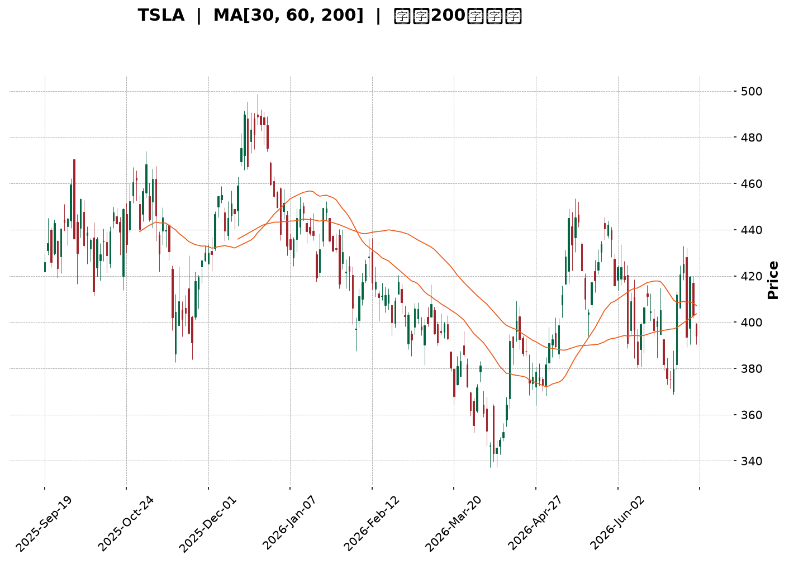
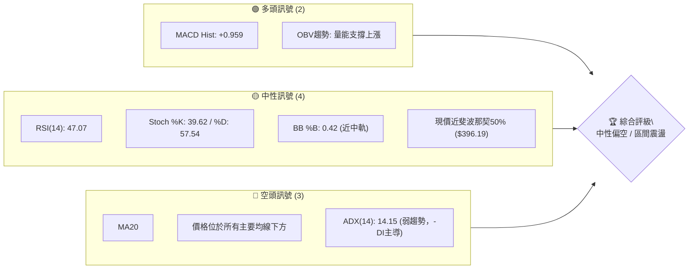
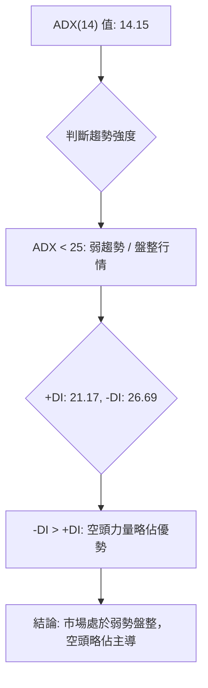
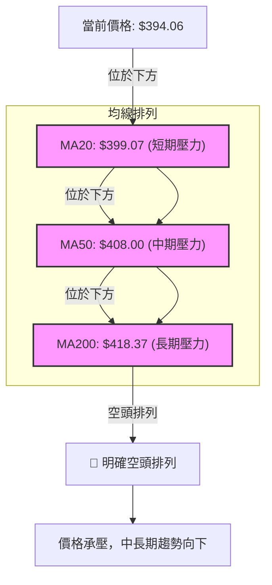
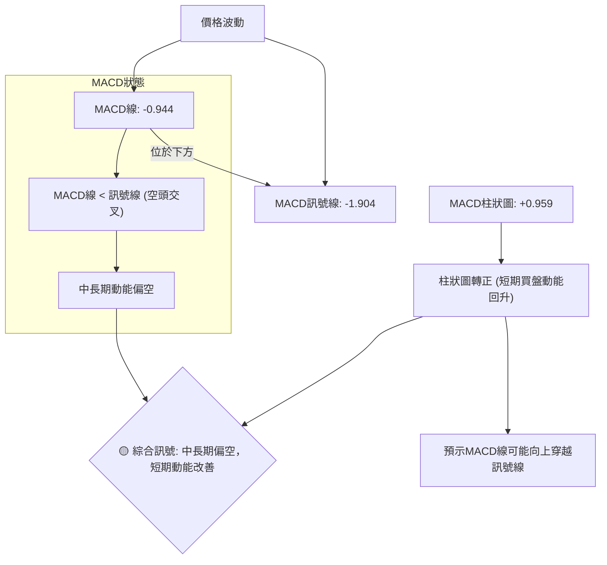
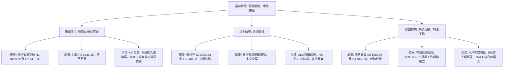

<details>
<summary>📊 靜態圖表 (點擊展開)</summary>

</details>

<html>
<head><meta charset="utf-8" /></head>
<body>
    <div style="height:500px; width:100%;">                        <script>window.PlotlyConfig = {MathJaxConfig: 'local'};</script>
        <script charset="utf-8" src="https://cdn.plot.ly/plotly-3.6.0.min.js" integrity="sha256-QaOVwtVY0T02VaHrr6pnoHLCwayMJp4O5n4YyaE3rJk=" crossorigin="anonymous"></script>                <div id="candlestick-chart" class="plotly-graph-div" style="height:100%; width:100%;"></div>            <script>                window.PLOTLYENV=window.PLOTLYENV || {};                                if (document.getElementById("candlestick-chart")) {                    Plotly.newPlot(                        "candlestick-chart",                        [{"close":{"dtype":"f8","bdata":"AAAAwB6hekAAAAAgXCN7QAAAAKCZnXpAAAAA4KOse0AAAACAPXZ6QAAAAGBmhntAAAAAIFyze0AAAAAghct7QAAAACBct3xAAAAAAABAe0AAAACgR916QAAAAAAAVHxAAAAAoHARe0AAAABACmt7QAAAAOCjOHtAAAAAANfXeUAAAABgZj57QAAAAADX03pAAAAAYGYye0AAAAAAAMx6QAAAAMD1dHtAAAAAQOH2e0AAAACgmal7QAAAACCFb3tAAAAAIK4PfEAAAAAghRt7QAAAAGC4RnxAAAAAwMzIfEAAAAAAKdh8QAAAAKCZgXtAAAAAwPWIfEAAAACA60V9QAAAAAApxHtAAAAAwB7hfEAAAABgj957QAAAAOBR2HpAAAAAIK7Te0AAAACA63l7QAAAAKCZ6XpAAAAAANcfeUAAAACgmUV5QAAAAGC4jnlAAAAAAAAUeUAAAAAA1z95QAAAACCus3hAAAAAoHBxeEAAAADgehx6QAAAAGBmNnpAAAAAoEepekAAAABguOJ6QAAAAIA94npAAAAAANfTekAAAAAA1+t7QAAAAOB6aHxAAAAAAABwfEAAAACgR3l7QAAAAGC40ntAAAAAQDM3fEAAAACAPe57QAAAACBcr3xAAAAAwPW0fUAAAACAFJ5+QAAAAAApNH1AAAAAgOs1fkAAAABAMxN+QAAAACCui35AAAAAwPVYfkAAAABgZlZ+QAAAAEAKs31AAAAAgD26fEAAAABA4WZ8QAAAACCFG3xAAAAAwB5he0AAAABguDp8QAAAACBcD3tAAAAAYI\u002f2ekAAAADAzDx7QAAAAAAp0HtAAAAAIFwPfEAAAABAM\u002fN7QAAAAEAzc3tAAAAAwB5pe0AAAAAAAFh7QAAAAAAANHpAAAAAQAr3ekAAAACAwhV8QAAAAMD1EHxAAAAAQDMze0AAAABgZu56QAAAACBc93pAAAAAwPUIekAAAABgj+Z6QAAAAMD1XHpAAAAAIFxfekAAAAAAKWB5QAAAACBc03hAAAAAgMKxeUAAAADAHhV6QAAAACBck3pAAAAA4FHEekAAAADAHhF6QAAAAEAKF3pAAAAAgBSqeUAAAADAHrV5QAAAACBcu3lAAAAAwB69eUAAAACgR\u002f14QAAAAIAUlnlAAAAAYGYWekAAAACgR4l5QAAAAAApKHlAAAAAwB41eUAAAABA4YZ4QAAAAEAKX3lAAAAAwMxYeUAAAAAgrst4QAAAAEDh6nhAAAAAANfzeEAAAADAHn15QAAAAAApsHhAAAAAQDNzeEAAAADA9bh4QAAAAOBR9HhAAAAA4HqMeEAAAADAzMR3QAAAACBc\u002f3ZAAAAAoJnNd0AAAADgevB3QAAAAEAzH3hAAAAAgMJBd0AAAACgR512QAAAAOB6NHZAAAAAAAA8d0AAAAAAKdR3QAAAAKBwiXZAAAAAwB4NdkAAAABgZqp1QAAAAAAAdHVAAAAAgOuZdUAAAABAM891QAAAAGC4BnZAAAAAQDPDdkAAAABAM394QAAAAGBmTnhAAAAAgOsJeUAAAAAAAIh4QAAAAGC4JnhAAAAAACk4eEAAAAAghVt3QAAAAMDMhHdAAAAAYLiqd0AAAADgUYB3QAAAAMDMTHdAAAAAgBTad0AAAADAHm14QAAAAAApiHhAAAAAgOtVeEAAAAAgrut4QAAAAOCjvHlAAAAAoJnFekAAAAAAANB7QAAAAEAzF3tAAAAA4FHUe0AAAADAzLR7QAAAAADXY3pAAAAAANefeUAAAACAwkF5QAAAAAApFHpAAAAAoJkdekAAAAAAKaB6QAAAAKBwGXtAAAAAgMKFe0AAAACgmaF7QAAAAOCjPHtAAAAAgBT+eUAAAAAA13t6QAAAAEAze3pAAAAAQDMnekAAAAAAAHB4QAAAAEAzj3lAAAAAQOHKeEAAAACgcNl3QAAAAGBm8nhAAAAAQOFmeUAAAABgZrJ5QAAAAGCPSnlAAAAAgBTGeEAAAAAA1wd5QAAAAMDMUHlAAAAAgMLZd0AAAADgenh3QAAAAIDrcXdAAAAAIFy7d0AAAACgcL15QAAAAKCZSXpAAAAAwMyUekAAAABAM5d4QAAAAOBRPHpAAAAAYGYueUAAAADA9aB4QA=="},"high":{"dtype":"f8","bdata":"AAAAIIXXekAAAAAgrs97QAAAACCFj3tAAAAAIFzDe0AAAACgmTV7QAAAACCFh3tAAAAAIK4vfEAAAAAAANB7QAAAAOCj5HxAAAAAAABsfUAAAADgUex7QAAAAMDMWHxAAAAAQOFKfEAAAACgR5V7QAAAAKCZRXtAAAAAgBSye0AAAACAPU57QAAAAEAzI3tAAAAAACmIe0AAAACgmXV7QAAAACBcl3tAAAAAwMwcfEAAAADAzBR8QAAAAOCj2HtAAAAAYGYWfEAAAABA4Tp8QAAAAGCPwnxAAAAAAAAwfUAAAABAMxt9QAAAAMD1cHxAAAAAAACgfEAAAADAHqF9QAAAACCFw3xAAAAAoEclfUAAAABAMzd9QAAAAIDCdXtAAAAAYLgafEAAAAAA16d7QAAAAKBHpXtAAAAAAACIekAAAABACsN5QAAAACBcf3pAAAAAYGaOeUAAAADgerx5QAAAAEAKz3pAAAAAwMwseUAAAAAghVt6QAAAACCuR3pAAAAAQAqvekAAAABA4Q57QAAAAGCPGntAAAAAwMxMe0AAAABguP57QAAAAIAUanxAAAAAgOutfEAAAAAAABx8QAAAAIA9RnxAAAAAgBSOfEAAAADgURR8QAAAAAAp8HxAAAAA4FEcfkAAAAAAALh+QAAAAOB69H5AAAAAgMKtfkAAAAAA16d+QAAAAKBHLX9AAAAAIIW\u002ffkAAAABgZq5+QAAAAKBwkX5AAAAAYGZWfUAAAACA6\u002fF8QAAAAMDMiHxAAAAAoHClfEAAAADAzJh8QAAAAAAABHxAAAAAgOtle0AAAACAPU57QAAAAMDMEHxAAAAAwMxkfEAAAADA9Tx8QAAAAGCPvntAAAAAgMLVe0AAAAAAAPR7QAAAACCu63pAAAAAQDNje0AAAAAAABh8QAAAAEDhRnxAAAAA4KPQe0AAAADgUVh7QAAAAAApZHtAAAAAIK6De0AAAACAFH57QAAAAGBmsnpAAAAAwPXIekAAAABgZn56QAAAAKCZIXlAAAAAwMzoeUAAAAAAAFR6QAAAAAAAtHpAAAAAoJlFe0AAAAAgrkN7QAAAAMD1gHpAAAAAIIXbeUAAAABgZg56QAAAAAAA9HlAAAAAQDPreUAAAABAM3t5QAAAAMAerXlAAAAAoHBFekAAAADA9Qx6QAAAAIDrcXlAAAAA4KNIeUAAAACgcMV4QAAAAKBHhXlAAAAAgOuJeUAAAACgmSV5QAAAAKBwGXlAAAAAoHBpeUAAAACAFAZ6QAAAAAAAaHlAAAAAQDMDeUAAAAAgrjt5QAAAAIDrAXlAAAAAwB4xeUAAAADgUTR4QAAAAIA9vndAAAAAoEcVeEAAAAAgrjd4QAAAACCuw3hAAAAAQAoHeEAAAACAwh13QAAAAOCj9HZAAAAAoEdVd0AAAACAPfJ3QAAAAOB6JHdAAAAAIIX7dkAAAADgUcB1QAAAAAAAyHZAAAAAgBTOdUAAAACAwuV1QAAAAKCZRXZAAAAAgBT6dkAAAABgZqp4QAAAAMD1oHhAAAAA4HqUeUAAAADAzGx5QAAAAEAzn3hAAAAAACmQeEAAAAAAACB4QAAAAAAp7HdAAAAA4HrMd0AAAADgo+R3QAAAAGBmhndAAAAAAAAMeEAAAADAHt14QAAAAIA9qnhAAAAAgOsheUAAAABA4Rp5QAAAAKBH\u002fXlAAAAAQDPzekAAAABgjxJ8QAAAAMDM\u002fHtAAAAAYGZWfEAAAAAgrj98QAAAAGCPKntAAAAAgBRSekAAAACAFFp5QAAAACBcF3pAAAAAQDOvekAAAAAAKfh6QAAAAEAzM3tAAAAAoJnZe0AAAAAgXL97QAAAAMAekXtAAAAAoJnZekAAAABguIZ6QAAAAKCZGXtAAAAAoJmlekAAAABA4Yp6QAAAAEAKz3lAAAAAAAAoekAAAACgcNF4QAAAAOCj+HhAAAAAQOFqeUAAAAAAAAB6QAAAAGC4xnlAAAAAQApfeUAAAADgUSh5QAAAAAAA7HlAAAAAgOuNeEAAAACgRwl4QAAAAIDrsXdAAAAAwMw8eEAAAADgUdR5QAAAAOCjiHpAAAAAgMINe0AAAACgmQV7QAAAAAAAQHpAAAAAwPU4ekAAAACAFPp4QA=="},"hovertemplate":"\u003cb\u003e%{x|%Y-%m-%d}\u003c\u002fb\u003e\u003cbr\u003e\u958b: $%{open:.2f}\u003cbr\u003e\u9ad8: $%{high:.2f}\u003cbr\u003e\u4f4e: $%{low:.2f}\u003cbr\u003e\u6536: $%{close:.2f}\u003cextra\u003e\u003c\u002fextra\u003e","low":{"dtype":"f8","bdata":"AAAAIIVbekAAAACAFNJ6QAAAACCFe3pAAAAA4HrQekAAAACgRzF6QAAAAOBRUHpAAAAAAAB4e0AAAACA6xF7QAAAAAAAjHtAAAAAwB45e0AAAACgRwl6QAAAAEAKS3tAAAAAQDMHe0AAAAAgrpN6QAAAAEDhonpAAAAAQDO3eUAAAABAMzt6QAAAAIDCHXpAAAAAoEelekAAAADA9VR6QAAAAKCZeXpAAAAAgMKJe0AAAADAzKB7QAAAAAAA0HpAAAAAYGbeeUAAAABguOJ6QAAAAEAKa3tAAAAAoJk5fEAAAABgZkp8QAAAAIDCeXtAAAAAQAq7e0AAAADAzFx8QAAAAKCZuXtAAAAAIFyLe0AAAACgcDF7QAAAAIAUXnpAAAAAgMIVe0AAAACAwgV7QAAAAMD1qHpAAAAAoHDFeEAAAADgeux3QAAAAADX63hAAAAAIFybeEAAAAAAAOh4QAAAAADXq3hAAAAAACn8d0AAAACgcBF5QAAAAEAzX3lAAAAAgD0OekAAAABAM6N6QAAAAOCjlHpAAAAAgOthekAAAACAwvF6QAAAAIA91ntAAAAAYI86fEAAAAAAADR7QAAAAEAzO3tAAAAAgMK5e0AAAACgR4V7QAAAAGC4mntAAAAAYI86fUAAAACgRx19QAAAAEAzI31AAAAAgOuRfUAAAAAghat9QAAAAKBHVX5AAAAAoHAtfkAAAADAzMx9QAAAAMAenX1AAAAAAACwfEAAAACgR118QAAAAMDMFHxAAAAAwMw0e0AAAADAHsl7QAAAAOB6zHpAAAAA4KP0ekAAAACA64V6QAAAAIA95npAAAAAAABge0AAAABAM797QAAAACCFI3tAAAAAYGZae0AAAAAAKTR7QAAAAEAKF3pAAAAAgOs5ekAAAACAFAp7QAAAAOCjwHtAAAAA4Hoke0AAAABACut6QAAAAKCZ4XpAAAAAgOvpeUAAAABAM2t6QAAAAAAA6HlAAAAAQArbeUAAAABA4fJ4QAAAAOB6OHhAAAAAAADceEAAAADgo3R5QAAAAAAAEHpAAAAA4HpAekAAAAAAAOB5QAAAAIAUrnlAAAAAACkIeUAAAACgR5l5QAAAAIDCQXlAAAAAAABYeUAAAADgo6B4QAAAAIA92nhAAAAAYGbCeUAAAABgjzp5QAAAAIDC4XhAAAAAAABEeEAAAACAPRZ4QAAAAKBHqXhAAAAAYLj2eEAAAAAgXKN4QAAAAGBm1ndAAAAAQArjeEAAAABgZiJ5QAAAAGBmqnhAAAAAQDNfeEAAAABguKZ4QAAAAAAAkHhAAAAAwPWEeEAAAAAgrqt3QAAAACBcx3ZAAAAAIK5Ld0AAAADA9YR3QAAAAAApEHhAAAAAgOs9d0AAAAAghXd2QAAAAIA9AnZAAAAAAACQdkAAAACgR2F3QAAAAOB6cHZAAAAAgD2qdUAAAAAA1xN1QAAAAGC4OnVAAAAAAAAUdUAAAAAA12t1QAAAAMAeyXVAAAAA4FEsdkAAAAAAAKh2QAAAAMDM3HdAAAAAYGZ6eEAAAACgR0V4QAAAACCFE3hAAAAAwMwUeEAAAACAPQZ3QAAAACCuK3dAAAAA4FHAdkAAAADgo0h3QAAAAOCjIHdAAAAAYLgCd0AAAADAzKx3QAAAAMDMDHhAAAAAAABQeEAAAADgUQB4QAAAAIDrIXlAAAAAgD0GekAAAADAzAx6QAAAAAApZHpAAAAAIFzjekAAAABgj5J7QAAAAAAAYHpAAAAAoEdVeUAAAACAFJp4QAAAAIA9ZnlAAAAAYGbOeUAAAAAAKUh6QAAAAIDroXpAAAAA4FE4e0AAAADAzER7QAAAAIA9wnpAAAAAQOH2eUAAAABgZtp5QAAAAAAAAHpAAAAAYI8SekAAAACgcEl4QAAAACCFq3hAAAAAANcDeEAAAABgZsJ3QAAAAGCPyndAAAAAACkseEAAAACgmXF5QAAAAOCjCHlAAAAAACmceEAAAABAMwt4QAAAAGBmpnhAAAAAwPWwd0AAAADAzFB3QAAAACCFM3dAAAAAoJkJd0AAAADAzLR3QAAAAAAAYHlAAAAAoHAhekAAAADAzFR4QAAAAAAAaHhAAAAAgBQeeUAAAAAAKWh4QA=="},"name":"\u50f9\u683c","open":{"dtype":"f8","bdata":"AAAAwB5dekAAAACAwvF6QAAAAIAUfntAAAAAoEfdekAAAAAA1zN7QAAAAMDMxHpAAAAAoJnFe0AAAADgUZh7QAAAAMDMvHtAAAAA4KNofUAAAADgo7R7QAAAAAAAjHtAAAAAwB79e0AAAADAHll7QAAAAMD1\u002fHpAAAAA4KNIe0AAAADgenh6QAAAAOCjrHpAAAAAYGYue0AAAAAgrit7QAAAAAAAmHpAAAAAgOu9e0AAAAAAKdx7QAAAAEAzt3tAAAAAAABAekAAAACgR+17QAAAACCuf3tAAAAA4HpsfEAAAAAAAOh8QAAAAMDMMHxAAAAAAADse0AAAAAA1398QAAAACBcZ3xAAAAAwMxAfEAAAAAgXN98QAAAAGC4XntAAAAAoJl5e0AAAABgZnZ7QAAAAGBmontAAAAAgBRyekAAAADAzCR4QAAAAADX63hAAAAAgBRWeUAAAABA4WJ5QAAAAIAU6nlAAAAAwB4leUAAAABguCJ5QAAAAGC45nlAAAAAQDN\u002fekAAAACgcKl6QAAAAMAelXpAAAAAwPXsekAAAACgmQF7QAAAAEAKH3xAAAAA4HpQfEAAAABAM\u002fd7QAAAAOCjWHtAAAAAwB7he0AAAABAMw98QAAAAKBwAXxAAAAAQApXfUAAAAAgXIN9QAAAACCFg35AAAAAYI\u002fifUAAAACA64F+QAAAAIAUnn5AAAAAYGaWfkAAAAAgrod+QAAAACCuU35AAAAAAABQfUAAAACgcNF8QAAAAKCZgXxAAAAAwMycfEAAAAAA1\u002f97QAAAAIAU5ntAAAAAYGY+e0AAAACAPb56QAAAAEAzP3tAAAAAIK6Te0AAAABAMyN8QAAAAMD1rHtAAAAAgBSSe0AAAAAAAHh7QAAAAIDC1XpAAAAAYI9aekAAAABgjzJ7QAAAAEDh9ntAAAAAAADQe0AAAABgj1Z7QAAAAGCP\u002fnpAAAAAwMxce0AAAACgmZV6QAAAAOCjVHpAAAAA4FGEekAAAAAgXEd6QAAAAOBR0HhAAAAAgOsNeUAAAABgj555QAAAAKBHIXpAAAAAIFy\u002fekAAAADAzOR6QAAAAMD15HlAAAAAgMLFeUAAAACAwrF5QAAAAAAAdHlAAAAAwMyEeUAAAADgo3R5QAAAAAAA+HhAAAAAYGbCeUAAAABguOZ5QAAAAEAKL3lAAAAAoJlpeEAAAACgcLF4QAAAAKCZ3XhAAAAAwB4ZeUAAAACgcOF4QAAAAMDMYHhAAAAAIIUjeUAAAADgeiR5QAAAAEDhUnlAAAAAYLjyeEAAAAAghcN4QAAAAEAKu3hAAAAAAADweEAAAADgUTR4QAAAAKCZvXdAAAAAoHBRd0AAAADA9Yh3QAAAAADXX3hAAAAAoJnZd0AAAABACht3QAAAAIDC3XZAAAAAACmYdkAAAACAFKp3QAAAAEAzw3ZAAAAAoHCpdkAAAABACqd1QAAAAOCjvHZAAAAAYGZydUAAAADgo6R1QAAAAMAe4XVAAAAAYLhadkAAAACgR+12QAAAAMD1nHhAAAAAYLi+eEAAAACgRyl5QAAAAAAAkHhAAAAAwB45eEAAAADgenR3QAAAAAAAWHdAAAAAoHBBd0AAAABA4Wp3QAAAAGBmdndAAAAAAABMd0AAAAAA1+d3QAAAACCuY3hAAAAAQAqzeEAAAAAAACR4QAAAACCud3lAAAAAIK4HekAAAABgj2J6QAAAAGCPlntAAAAAYLhKe0AAAAAA1+d7QAAAACCuH3tAAAAA4FE0ekAAAABgjzJ5QAAAAKCZeXlAAAAAQOFiekAAAABguGp6QAAAAAAp5HpAAAAAgD2ue0AAAACA61l7QAAAAKCZfXtAAAAAANe3ekAAAAAghSN6QAAAAEAzK3pAAAAAoHA9ekAAAAAAAEh6QAAAAKBHxXhAAAAA4HqweUAAAADgo3h4QAAAAOB6RHhAAAAAANf3eEAAAACA68V5QAAAAIDCQXlAAAAA4HoYeUAAAACgmeF4QAAAAKCZrXhAAAAAgMKJeEAAAACgR8F3QAAAAOBRdHdAAAAAYGYid0AAAADgo9x3QAAAAAAAYHlAAAAAIFxXekAAAAAAKcB6QAAAAAAA2HhAAAAAIFwPekAAAAAAAPZ4QA=="},"x":["2025-09-19T00:00:00-04:00","2025-09-22T00:00:00-04:00","2025-09-23T00:00:00-04:00","2025-09-24T00:00:00-04:00","2025-09-25T00:00:00-04:00","2025-09-26T00:00:00-04:00","2025-09-29T00:00:00-04:00","2025-09-30T00:00:00-04:00","2025-10-01T00:00:00-04:00","2025-10-02T00:00:00-04:00","2025-10-03T00:00:00-04:00","2025-10-06T00:00:00-04:00","2025-10-07T00:00:00-04:00","2025-10-08T00:00:00-04:00","2025-10-09T00:00:00-04:00","2025-10-10T00:00:00-04:00","2025-10-13T00:00:00-04:00","2025-10-14T00:00:00-04:00","2025-10-15T00:00:00-04:00","2025-10-16T00:00:00-04:00","2025-10-17T00:00:00-04:00","2025-10-20T00:00:00-04:00","2025-10-21T00:00:00-04:00","2025-10-22T00:00:00-04:00","2025-10-23T00:00:00-04:00","2025-10-24T00:00:00-04:00","2025-10-27T00:00:00-04:00","2025-10-28T00:00:00-04:00","2025-10-29T00:00:00-04:00","2025-10-30T00:00:00-04:00","2025-10-31T00:00:00-04:00","2025-11-03T00:00:00-05:00","2025-11-04T00:00:00-05:00","2025-11-05T00:00:00-05:00","2025-11-06T00:00:00-05:00","2025-11-07T00:00:00-05:00","2025-11-10T00:00:00-05:00","2025-11-11T00:00:00-05:00","2025-11-12T00:00:00-05:00","2025-11-13T00:00:00-05:00","2025-11-14T00:00:00-05:00","2025-11-17T00:00:00-05:00","2025-11-18T00:00:00-05:00","2025-11-19T00:00:00-05:00","2025-11-20T00:00:00-05:00","2025-11-21T00:00:00-05:00","2025-11-24T00:00:00-05:00","2025-11-25T00:00:00-05:00","2025-11-26T00:00:00-05:00","2025-11-28T00:00:00-05:00","2025-12-01T00:00:00-05:00","2025-12-02T00:00:00-05:00","2025-12-03T00:00:00-05:00","2025-12-04T00:00:00-05:00","2025-12-05T00:00:00-05:00","2025-12-08T00:00:00-05:00","2025-12-09T00:00:00-05:00","2025-12-10T00:00:00-05:00","2025-12-11T00:00:00-05:00","2025-12-12T00:00:00-05:00","2025-12-15T00:00:00-05:00","2025-12-16T00:00:00-05:00","2025-12-17T00:00:00-05:00","2025-12-18T00:00:00-05:00","2025-12-19T00:00:00-05:00","2025-12-22T00:00:00-05:00","2025-12-23T00:00:00-05:00","2025-12-24T00:00:00-05:00","2025-12-26T00:00:00-05:00","2025-12-29T00:00:00-05:00","2025-12-30T00:00:00-05:00","2025-12-31T00:00:00-05:00","2026-01-02T00:00:00-05:00","2026-01-05T00:00:00-05:00","2026-01-06T00:00:00-05:00","2026-01-07T00:00:00-05:00","2026-01-08T00:00:00-05:00","2026-01-09T00:00:00-05:00","2026-01-12T00:00:00-05:00","2026-01-13T00:00:00-05:00","2026-01-14T00:00:00-05:00","2026-01-15T00:00:00-05:00","2026-01-16T00:00:00-05:00","2026-01-20T00:00:00-05:00","2026-01-21T00:00:00-05:00","2026-01-22T00:00:00-05:00","2026-01-23T00:00:00-05:00","2026-01-26T00:00:00-05:00","2026-01-27T00:00:00-05:00","2026-01-28T00:00:00-05:00","2026-01-29T00:00:00-05:00","2026-01-30T00:00:00-05:00","2026-02-02T00:00:00-05:00","2026-02-03T00:00:00-05:00","2026-02-04T00:00:00-05:00","2026-02-05T00:00:00-05:00","2026-02-06T00:00:00-05:00","2026-02-09T00:00:00-05:00","2026-02-10T00:00:00-05:00","2026-02-11T00:00:00-05:00","2026-02-12T00:00:00-05:00","2026-02-13T00:00:00-05:00","2026-02-17T00:00:00-05:00","2026-02-18T00:00:00-05:00","2026-02-19T00:00:00-05:00","2026-02-20T00:00:00-05:00","2026-02-23T00:00:00-05:00","2026-02-24T00:00:00-05:00","2026-02-25T00:00:00-05:00","2026-02-26T00:00:00-05:00","2026-02-27T00:00:00-05:00","2026-03-02T00:00:00-05:00","2026-03-03T00:00:00-05:00","2026-03-04T00:00:00-05:00","2026-03-05T00:00:00-05:00","2026-03-06T00:00:00-05:00","2026-03-09T00:00:00-04:00","2026-03-10T00:00:00-04:00","2026-03-11T00:00:00-04:00","2026-03-12T00:00:00-04:00","2026-03-13T00:00:00-04:00","2026-03-16T00:00:00-04:00","2026-03-17T00:00:00-04:00","2026-03-18T00:00:00-04:00","2026-03-19T00:00:00-04:00","2026-03-20T00:00:00-04:00","2026-03-23T00:00:00-04:00","2026-03-24T00:00:00-04:00","2026-03-25T00:00:00-04:00","2026-03-26T00:00:00-04:00","2026-03-27T00:00:00-04:00","2026-03-30T00:00:00-04:00","2026-03-31T00:00:00-04:00","2026-04-01T00:00:00-04:00","2026-04-02T00:00:00-04:00","2026-04-06T00:00:00-04:00","2026-04-07T00:00:00-04:00","2026-04-08T00:00:00-04:00","2026-04-09T00:00:00-04:00","2026-04-10T00:00:00-04:00","2026-04-13T00:00:00-04:00","2026-04-14T00:00:00-04:00","2026-04-15T00:00:00-04:00","2026-04-16T00:00:00-04:00","2026-04-17T00:00:00-04:00","2026-04-20T00:00:00-04:00","2026-04-21T00:00:00-04:00","2026-04-22T00:00:00-04:00","2026-04-23T00:00:00-04:00","2026-04-24T00:00:00-04:00","2026-04-27T00:00:00-04:00","2026-04-28T00:00:00-04:00","2026-04-29T00:00:00-04:00","2026-04-30T00:00:00-04:00","2026-05-01T00:00:00-04:00","2026-05-04T00:00:00-04:00","2026-05-05T00:00:00-04:00","2026-05-06T00:00:00-04:00","2026-05-07T00:00:00-04:00","2026-05-08T00:00:00-04:00","2026-05-11T00:00:00-04:00","2026-05-12T00:00:00-04:00","2026-05-13T00:00:00-04:00","2026-05-14T00:00:00-04:00","2026-05-15T00:00:00-04:00","2026-05-18T00:00:00-04:00","2026-05-19T00:00:00-04:00","2026-05-20T00:00:00-04:00","2026-05-21T00:00:00-04:00","2026-05-22T00:00:00-04:00","2026-05-26T00:00:00-04:00","2026-05-27T00:00:00-04:00","2026-05-28T00:00:00-04:00","2026-05-29T00:00:00-04:00","2026-06-01T00:00:00-04:00","2026-06-02T00:00:00-04:00","2026-06-03T00:00:00-04:00","2026-06-04T00:00:00-04:00","2026-06-05T00:00:00-04:00","2026-06-08T00:00:00-04:00","2026-06-09T00:00:00-04:00","2026-06-10T00:00:00-04:00","2026-06-11T00:00:00-04:00","2026-06-12T00:00:00-04:00","2026-06-15T00:00:00-04:00","2026-06-16T00:00:00-04:00","2026-06-17T00:00:00-04:00","2026-06-18T00:00:00-04:00","2026-06-22T00:00:00-04:00","2026-06-23T00:00:00-04:00","2026-06-24T00:00:00-04:00","2026-06-25T00:00:00-04:00","2026-06-26T00:00:00-04:00","2026-06-29T00:00:00-04:00","2026-06-30T00:00:00-04:00","2026-07-01T00:00:00-04:00","2026-07-02T00:00:00-04:00","2026-07-06T00:00:00-04:00","2026-07-07T00:00:00-04:00","2026-07-08T00:00:00-04:00"],"type":"candlestick"},{"hovertemplate":"MA30: $%{y:.2f}\u003cextra\u003e\u003c\u002fextra\u003e","line":{"color":"#2196F3","dash":"dash","width":2},"mode":"lines","name":"MA30","x":["2025-09-19T00:00:00-04:00","2025-09-22T00:00:00-04:00","2025-09-23T00:00:00-04:00","2025-09-24T00:00:00-04:00","2025-09-25T00:00:00-04:00","2025-09-26T00:00:00-04:00","2025-09-29T00:00:00-04:00","2025-09-30T00:00:00-04:00","2025-10-01T00:00:00-04:00","2025-10-02T00:00:00-04:00","2025-10-03T00:00:00-04:00","2025-10-06T00:00:00-04:00","2025-10-07T00:00:00-04:00","2025-10-08T00:00:00-04:00","2025-10-09T00:00:00-04:00","2025-10-10T00:00:00-04:00","2025-10-13T00:00:00-04:00","2025-10-14T00:00:00-04:00","2025-10-15T00:00:00-04:00","2025-10-16T00:00:00-04:00","2025-10-17T00:00:00-04:00","2025-10-20T00:00:00-04:00","2025-10-21T00:00:00-04:00","2025-10-22T00:00:00-04:00","2025-10-23T00:00:00-04:00","2025-10-24T00:00:00-04:00","2025-10-27T00:00:00-04:00","2025-10-28T00:00:00-04:00","2025-10-29T00:00:00-04:00","2025-10-30T00:00:00-04:00","2025-10-31T00:00:00-04:00","2025-11-03T00:00:00-05:00","2025-11-04T00:00:00-05:00","2025-11-05T00:00:00-05:00","2025-11-06T00:00:00-05:00","2025-11-07T00:00:00-05:00","2025-11-10T00:00:00-05:00","2025-11-11T00:00:00-05:00","2025-11-12T00:00:00-05:00","2025-11-13T00:00:00-05:00","2025-11-14T00:00:00-05:00","2025-11-17T00:00:00-05:00","2025-11-18T00:00:00-05:00","2025-11-19T00:00:00-05:00","2025-11-20T00:00:00-05:00","2025-11-21T00:00:00-05:00","2025-11-24T00:00:00-05:00","2025-11-25T00:00:00-05:00","2025-11-26T00:00:00-05:00","2025-11-28T00:00:00-05:00","2025-12-01T00:00:00-05:00","2025-12-02T00:00:00-05:00","2025-12-03T00:00:00-05:00","2025-12-04T00:00:00-05:00","2025-12-05T00:00:00-05:00","2025-12-08T00:00:00-05:00","2025-12-09T00:00:00-05:00","2025-12-10T00:00:00-05:00","2025-12-11T00:00:00-05:00","2025-12-12T00:00:00-05:00","2025-12-15T00:00:00-05:00","2025-12-16T00:00:00-05:00","2025-12-17T00:00:00-05:00","2025-12-18T00:00:00-05:00","2025-12-19T00:00:00-05:00","2025-12-22T00:00:00-05:00","2025-12-23T00:00:00-05:00","2025-12-24T00:00:00-05:00","2025-12-26T00:00:00-05:00","2025-12-29T00:00:00-05:00","2025-12-30T00:00:00-05:00","2025-12-31T00:00:00-05:00","2026-01-02T00:00:00-05:00","2026-01-05T00:00:00-05:00","2026-01-06T00:00:00-05:00","2026-01-07T00:00:00-05:00","2026-01-08T00:00:00-05:00","2026-01-09T00:00:00-05:00","2026-01-12T00:00:00-05:00","2026-01-13T00:00:00-05:00","2026-01-14T00:00:00-05:00","2026-01-15T00:00:00-05:00","2026-01-16T00:00:00-05:00","2026-01-20T00:00:00-05:00","2026-01-21T00:00:00-05:00","2026-01-22T00:00:00-05:00","2026-01-23T00:00:00-05:00","2026-01-26T00:00:00-05:00","2026-01-27T00:00:00-05:00","2026-01-28T00:00:00-05:00","2026-01-29T00:00:00-05:00","2026-01-30T00:00:00-05:00","2026-02-02T00:00:00-05:00","2026-02-03T00:00:00-05:00","2026-02-04T00:00:00-05:00","2026-02-05T00:00:00-05:00","2026-02-06T00:00:00-05:00","2026-02-09T00:00:00-05:00","2026-02-10T00:00:00-05:00","2026-02-11T00:00:00-05:00","2026-02-12T00:00:00-05:00","2026-02-13T00:00:00-05:00","2026-02-17T00:00:00-05:00","2026-02-18T00:00:00-05:00","2026-02-19T00:00:00-05:00","2026-02-20T00:00:00-05:00","2026-02-23T00:00:00-05:00","2026-02-24T00:00:00-05:00","2026-02-25T00:00:00-05:00","2026-02-26T00:00:00-05:00","2026-02-27T00:00:00-05:00","2026-03-02T00:00:00-05:00","2026-03-03T00:00:00-05:00","2026-03-04T00:00:00-05:00","2026-03-05T00:00:00-05:00","2026-03-06T00:00:00-05:00","2026-03-09T00:00:00-04:00","2026-03-10T00:00:00-04:00","2026-03-11T00:00:00-04:00","2026-03-12T00:00:00-04:00","2026-03-13T00:00:00-04:00","2026-03-16T00:00:00-04:00","2026-03-17T00:00:00-04:00","2026-03-18T00:00:00-04:00","2026-03-19T00:00:00-04:00","2026-03-20T00:00:00-04:00","2026-03-23T00:00:00-04:00","2026-03-24T00:00:00-04:00","2026-03-25T00:00:00-04:00","2026-03-26T00:00:00-04:00","2026-03-27T00:00:00-04:00","2026-03-30T00:00:00-04:00","2026-03-31T00:00:00-04:00","2026-04-01T00:00:00-04:00","2026-04-02T00:00:00-04:00","2026-04-06T00:00:00-04:00","2026-04-07T00:00:00-04:00","2026-04-08T00:00:00-04:00","2026-04-09T00:00:00-04:00","2026-04-10T00:00:00-04:00","2026-04-13T00:00:00-04:00","2026-04-14T00:00:00-04:00","2026-04-15T00:00:00-04:00","2026-04-16T00:00:00-04:00","2026-04-17T00:00:00-04:00","2026-04-20T00:00:00-04:00","2026-04-21T00:00:00-04:00","2026-04-22T00:00:00-04:00","2026-04-23T00:00:00-04:00","2026-04-24T00:00:00-04:00","2026-04-27T00:00:00-04:00","2026-04-28T00:00:00-04:00","2026-04-29T00:00:00-04:00","2026-04-30T00:00:00-04:00","2026-05-01T00:00:00-04:00","2026-05-04T00:00:00-04:00","2026-05-05T00:00:00-04:00","2026-05-06T00:00:00-04:00","2026-05-07T00:00:00-04:00","2026-05-08T00:00:00-04:00","2026-05-11T00:00:00-04:00","2026-05-12T00:00:00-04:00","2026-05-13T00:00:00-04:00","2026-05-14T00:00:00-04:00","2026-05-15T00:00:00-04:00","2026-05-18T00:00:00-04:00","2026-05-19T00:00:00-04:00","2026-05-20T00:00:00-04:00","2026-05-21T00:00:00-04:00","2026-05-22T00:00:00-04:00","2026-05-26T00:00:00-04:00","2026-05-27T00:00:00-04:00","2026-05-28T00:00:00-04:00","2026-05-29T00:00:00-04:00","2026-06-01T00:00:00-04:00","2026-06-02T00:00:00-04:00","2026-06-03T00:00:00-04:00","2026-06-04T00:00:00-04:00","2026-06-05T00:00:00-04:00","2026-06-08T00:00:00-04:00","2026-06-09T00:00:00-04:00","2026-06-10T00:00:00-04:00","2026-06-11T00:00:00-04:00","2026-06-12T00:00:00-04:00","2026-06-15T00:00:00-04:00","2026-06-16T00:00:00-04:00","2026-06-17T00:00:00-04:00","2026-06-18T00:00:00-04:00","2026-06-22T00:00:00-04:00","2026-06-23T00:00:00-04:00","2026-06-24T00:00:00-04:00","2026-06-25T00:00:00-04:00","2026-06-26T00:00:00-04:00","2026-06-29T00:00:00-04:00","2026-06-30T00:00:00-04:00","2026-07-01T00:00:00-04:00","2026-07-02T00:00:00-04:00","2026-07-06T00:00:00-04:00","2026-07-07T00:00:00-04:00","2026-07-08T00:00:00-04:00"],"y":{"dtype":"f8","bdata":"AAAAAAAA+H8AAAAAAAD4fwAAAAAAAPh\u002fAAAAAAAA+H8AAAAAAAD4fwAAAAAAAPh\u002fAAAAAAAA+H8AAAAAAAD4fwAAAAAAAPh\u002fAAAAAAAA+H8AAAAAAAD4fwAAAAAAAPh\u002fAAAAAAAA+H8AAAAAAAD4fwAAAAAAAPh\u002fAAAAAAAA+H8AAAAAAAD4fwAAAAAAAPh\u002fAAAAAAAA+H8AAAAAAAD4fwAAAAAAAPh\u002fAAAAAAAA+H8AAAAAAAD4fwAAAAAAAPh\u002fAAAAAAAA+H8AAAAAAAD4fwAAAAAAAPh\u002fAAAAAAAA+H8AAAAAAAD4f4mIiMh2cntA7+7urrmCe0CamZmp8ZR7QN7d3T3DnntAq6qqmgupe0BVVVVVDrV7QJqZmdlAr3tAZmZmplSwe0BERERUnK17QKuqqvo3nntAq6qqehSMe0DNzMycfX57QHd3dxfZZntA7+7u3t1Ve0CamZkpXEN7QBEREYHcLXtAiYiIKOohe0DNzMwsQBh7QAAAALAAE3tAiYiImG4Oe0CamZl5MA97QHd3d3dMCntAzczM7JgAe0C8u7srzgJ7QBEREaEaC3tA7+7ujlAOe0BERESkcBF7QGZmZsaSDXtAMzMzU7gIe0BVVVU17AB7QJqZmTn7CntAmpmZOfsUe0Dv7u4OdCB7QDMzM1O4LHtAvLu7exQ4e0Dv7u6+5kp7QDMzM+N6antAZmZmRv1\u002fe0BVVVXFZ5h7QKuqqsovsHtAERER8e7Oe0B3d3eHpOl7QGZmZhZn\u002f3tA7+7uPgoTfECJiIgoeCx8QO\u002fu7o6XQHxAVVVVlRhWfECamZnptF98QImIiIhdbXxAZmZmJk15fEAAAABQYoJ8QN7d3U03h3xAmpmZKTGMfECJiIiYQ4d8QDMzM7NydHxAmpmZ+eFnfEBVVVVFGW18QCIiImIsb3xAd3d3t4FmfEC8u7uL+l18QBEREeFPT3xAvLu7i\u002fovfECJiIjoQhB8QHd3d3cF+HtARERE9ETXe0AzMzMDK697QKuqqnpbfntAIiIikqZWe0AiIiJiVzJ7QCIiInKvF3tAREREZPQGe0AiIiKCB\u002fN6QGZmZjbQ4XpAzczMvC3TekDe3d2dqL16QImIiEhTsnpAiYiImOCnekDe3d19sZR6QO\u002fu7s6wgXpAERER0dtwekBVVVXlQlx6QM3MzHyxSHpAAAAAsOQ1ekAREREh2x16QO\u002fu7t7BFnpAVVVVBfMIekBmZmZG4ex5QJqZmbkC0nlAvLu7+9S+eUC8u7vLhbJ5QImIiCgVn3lAzczMrI6ReUDNzMx8+H55QGZmZgbzcnlAvLu7+2JjeUBVVVW1rFV5QLy7uxsTRnlAzczMnO81eUAiIiLipSN5QGZmZpa1DnlAAAAA4MHweEBVVVXFS9N4QLy7u9sksnhAERERcWideEAAAABAYI14QKuqqqoccnhAMzMzM6VSeEC8u7tbSDZ4QImIiGgDE3hAvLu7C7vsd0ARERGR7cx3QM3MzJw2sndA3t3dbVmdd0BVVVXlF513QN7d3V0BlHdAIiIiQmCRd0CJiIi4Ho93QDMzM9OUiHdAq6qqSlOCd0ARERGBI3B3QGZmZvYoZndAMzMzM3pfd0BmZmZWDlV3QM3MzEzwRndARERE9P1Ad0CamZlJmkZ3QO\u002fu7i6yU3dAIiIicj1Yd0BVVVUFnWB3QKuqqgplbndA3t3drWOMd0CJiIgov7h3QImIiPhv4ndAZmZm5qUJeEDNzMxsvCp4QERERLSdS3hAAAAAUBtqeEBERESEwIh4QJqZmVk5sHhAd3d3J7\u002fWeECamZlp2P94QCIiItIiK3lAIiIiMsFTeUB3d3dXgG55QERERGSCh3lARERE5KWPeUARERExT6B5QHd3dycxtHlA7+7ufrHEeUCrqqrK6M15QLy7u5tS33lAIiIiku3oeUAAAAAQ5ut5QHd3d7fz+XlA3t3dvS0HekBmZmZ2BRJ6QHd3d1eAGHpAERERcT0cekDNzMy8LR16QAAAAICVGXpA3t3d7acAekBVVVX1mtt5QHd3d\u002fd+vHlAd3d314eZeUARERGBwIh5QHd3d5fgh3lAq6qq6gqQeUCamZl5W4p5QLy7uyuyi3lA7+7u\u002friDeUARERHBrnJ5QA=="},"type":"scatter"},{"hovertemplate":"MA60: $%{y:.2f}\u003cextra\u003e\u003c\u002fextra\u003e","line":{"color":"#9C27B0","dash":"dash","width":2},"mode":"lines","name":"MA60","x":["2025-09-19T00:00:00-04:00","2025-09-22T00:00:00-04:00","2025-09-23T00:00:00-04:00","2025-09-24T00:00:00-04:00","2025-09-25T00:00:00-04:00","2025-09-26T00:00:00-04:00","2025-09-29T00:00:00-04:00","2025-09-30T00:00:00-04:00","2025-10-01T00:00:00-04:00","2025-10-02T00:00:00-04:00","2025-10-03T00:00:00-04:00","2025-10-06T00:00:00-04:00","2025-10-07T00:00:00-04:00","2025-10-08T00:00:00-04:00","2025-10-09T00:00:00-04:00","2025-10-10T00:00:00-04:00","2025-10-13T00:00:00-04:00","2025-10-14T00:00:00-04:00","2025-10-15T00:00:00-04:00","2025-10-16T00:00:00-04:00","2025-10-17T00:00:00-04:00","2025-10-20T00:00:00-04:00","2025-10-21T00:00:00-04:00","2025-10-22T00:00:00-04:00","2025-10-23T00:00:00-04:00","2025-10-24T00:00:00-04:00","2025-10-27T00:00:00-04:00","2025-10-28T00:00:00-04:00","2025-10-29T00:00:00-04:00","2025-10-30T00:00:00-04:00","2025-10-31T00:00:00-04:00","2025-11-03T00:00:00-05:00","2025-11-04T00:00:00-05:00","2025-11-05T00:00:00-05:00","2025-11-06T00:00:00-05:00","2025-11-07T00:00:00-05:00","2025-11-10T00:00:00-05:00","2025-11-11T00:00:00-05:00","2025-11-12T00:00:00-05:00","2025-11-13T00:00:00-05:00","2025-11-14T00:00:00-05:00","2025-11-17T00:00:00-05:00","2025-11-18T00:00:00-05:00","2025-11-19T00:00:00-05:00","2025-11-20T00:00:00-05:00","2025-11-21T00:00:00-05:00","2025-11-24T00:00:00-05:00","2025-11-25T00:00:00-05:00","2025-11-26T00:00:00-05:00","2025-11-28T00:00:00-05:00","2025-12-01T00:00:00-05:00","2025-12-02T00:00:00-05:00","2025-12-03T00:00:00-05:00","2025-12-04T00:00:00-05:00","2025-12-05T00:00:00-05:00","2025-12-08T00:00:00-05:00","2025-12-09T00:00:00-05:00","2025-12-10T00:00:00-05:00","2025-12-11T00:00:00-05:00","2025-12-12T00:00:00-05:00","2025-12-15T00:00:00-05:00","2025-12-16T00:00:00-05:00","2025-12-17T00:00:00-05:00","2025-12-18T00:00:00-05:00","2025-12-19T00:00:00-05:00","2025-12-22T00:00:00-05:00","2025-12-23T00:00:00-05:00","2025-12-24T00:00:00-05:00","2025-12-26T00:00:00-05:00","2025-12-29T00:00:00-05:00","2025-12-30T00:00:00-05:00","2025-12-31T00:00:00-05:00","2026-01-02T00:00:00-05:00","2026-01-05T00:00:00-05:00","2026-01-06T00:00:00-05:00","2026-01-07T00:00:00-05:00","2026-01-08T00:00:00-05:00","2026-01-09T00:00:00-05:00","2026-01-12T00:00:00-05:00","2026-01-13T00:00:00-05:00","2026-01-14T00:00:00-05:00","2026-01-15T00:00:00-05:00","2026-01-16T00:00:00-05:00","2026-01-20T00:00:00-05:00","2026-01-21T00:00:00-05:00","2026-01-22T00:00:00-05:00","2026-01-23T00:00:00-05:00","2026-01-26T00:00:00-05:00","2026-01-27T00:00:00-05:00","2026-01-28T00:00:00-05:00","2026-01-29T00:00:00-05:00","2026-01-30T00:00:00-05:00","2026-02-02T00:00:00-05:00","2026-02-03T00:00:00-05:00","2026-02-04T00:00:00-05:00","2026-02-05T00:00:00-05:00","2026-02-06T00:00:00-05:00","2026-02-09T00:00:00-05:00","2026-02-10T00:00:00-05:00","2026-02-11T00:00:00-05:00","2026-02-12T00:00:00-05:00","2026-02-13T00:00:00-05:00","2026-02-17T00:00:00-05:00","2026-02-18T00:00:00-05:00","2026-02-19T00:00:00-05:00","2026-02-20T00:00:00-05:00","2026-02-23T00:00:00-05:00","2026-02-24T00:00:00-05:00","2026-02-25T00:00:00-05:00","2026-02-26T00:00:00-05:00","2026-02-27T00:00:00-05:00","2026-03-02T00:00:00-05:00","2026-03-03T00:00:00-05:00","2026-03-04T00:00:00-05:00","2026-03-05T00:00:00-05:00","2026-03-06T00:00:00-05:00","2026-03-09T00:00:00-04:00","2026-03-10T00:00:00-04:00","2026-03-11T00:00:00-04:00","2026-03-12T00:00:00-04:00","2026-03-13T00:00:00-04:00","2026-03-16T00:00:00-04:00","2026-03-17T00:00:00-04:00","2026-03-18T00:00:00-04:00","2026-03-19T00:00:00-04:00","2026-03-20T00:00:00-04:00","2026-03-23T00:00:00-04:00","2026-03-24T00:00:00-04:00","2026-03-25T00:00:00-04:00","2026-03-26T00:00:00-04:00","2026-03-27T00:00:00-04:00","2026-03-30T00:00:00-04:00","2026-03-31T00:00:00-04:00","2026-04-01T00:00:00-04:00","2026-04-02T00:00:00-04:00","2026-04-06T00:00:00-04:00","2026-04-07T00:00:00-04:00","2026-04-08T00:00:00-04:00","2026-04-09T00:00:00-04:00","2026-04-10T00:00:00-04:00","2026-04-13T00:00:00-04:00","2026-04-14T00:00:00-04:00","2026-04-15T00:00:00-04:00","2026-04-16T00:00:00-04:00","2026-04-17T00:00:00-04:00","2026-04-20T00:00:00-04:00","2026-04-21T00:00:00-04:00","2026-04-22T00:00:00-04:00","2026-04-23T00:00:00-04:00","2026-04-24T00:00:00-04:00","2026-04-27T00:00:00-04:00","2026-04-28T00:00:00-04:00","2026-04-29T00:00:00-04:00","2026-04-30T00:00:00-04:00","2026-05-01T00:00:00-04:00","2026-05-04T00:00:00-04:00","2026-05-05T00:00:00-04:00","2026-05-06T00:00:00-04:00","2026-05-07T00:00:00-04:00","2026-05-08T00:00:00-04:00","2026-05-11T00:00:00-04:00","2026-05-12T00:00:00-04:00","2026-05-13T00:00:00-04:00","2026-05-14T00:00:00-04:00","2026-05-15T00:00:00-04:00","2026-05-18T00:00:00-04:00","2026-05-19T00:00:00-04:00","2026-05-20T00:00:00-04:00","2026-05-21T00:00:00-04:00","2026-05-22T00:00:00-04:00","2026-05-26T00:00:00-04:00","2026-05-27T00:00:00-04:00","2026-05-28T00:00:00-04:00","2026-05-29T00:00:00-04:00","2026-06-01T00:00:00-04:00","2026-06-02T00:00:00-04:00","2026-06-03T00:00:00-04:00","2026-06-04T00:00:00-04:00","2026-06-05T00:00:00-04:00","2026-06-08T00:00:00-04:00","2026-06-09T00:00:00-04:00","2026-06-10T00:00:00-04:00","2026-06-11T00:00:00-04:00","2026-06-12T00:00:00-04:00","2026-06-15T00:00:00-04:00","2026-06-16T00:00:00-04:00","2026-06-17T00:00:00-04:00","2026-06-18T00:00:00-04:00","2026-06-22T00:00:00-04:00","2026-06-23T00:00:00-04:00","2026-06-24T00:00:00-04:00","2026-06-25T00:00:00-04:00","2026-06-26T00:00:00-04:00","2026-06-29T00:00:00-04:00","2026-06-30T00:00:00-04:00","2026-07-01T00:00:00-04:00","2026-07-02T00:00:00-04:00","2026-07-06T00:00:00-04:00","2026-07-07T00:00:00-04:00","2026-07-08T00:00:00-04:00"],"y":{"dtype":"f8","bdata":"AAAAAAAA+H8AAAAAAAD4fwAAAAAAAPh\u002fAAAAAAAA+H8AAAAAAAD4fwAAAAAAAPh\u002fAAAAAAAA+H8AAAAAAAD4fwAAAAAAAPh\u002fAAAAAAAA+H8AAAAAAAD4fwAAAAAAAPh\u002fAAAAAAAA+H8AAAAAAAD4fwAAAAAAAPh\u002fAAAAAAAA+H8AAAAAAAD4fwAAAAAAAPh\u002fAAAAAAAA+H8AAAAAAAD4fwAAAAAAAPh\u002fAAAAAAAA+H8AAAAAAAD4fwAAAAAAAPh\u002fAAAAAAAA+H8AAAAAAAD4fwAAAAAAAPh\u002fAAAAAAAA+H8AAAAAAAD4fwAAAAAAAPh\u002fAAAAAAAA+H8AAAAAAAD4fwAAAAAAAPh\u002fAAAAAAAA+H8AAAAAAAD4fwAAAAAAAPh\u002fAAAAAAAA+H8AAAAAAAD4fwAAAAAAAPh\u002fAAAAAAAA+H8AAAAAAAD4fwAAAAAAAPh\u002fAAAAAAAA+H8AAAAAAAD4fwAAAAAAAPh\u002fAAAAAAAA+H8AAAAAAAD4fwAAAAAAAPh\u002fAAAAAAAA+H8AAAAAAAD4fwAAAAAAAPh\u002fAAAAAAAA+H8AAAAAAAD4fwAAAAAAAPh\u002fAAAAAAAA+H8AAAAAAAD4fwAAAAAAAPh\u002fAAAAAAAA+H8AAAAAAAD4fxEREQG5PntAREREdNpLe0BERETcslp7QImIiMi9ZXtAMzMzC5Bwe0AiIiKK+n97QGZmZt7djHtAZmZm9iiYe0DNzMwMAqN7QKuqquIzp3tA3t3dtYGte0AiIiISEbR7QO\u002fu7hYgs3tA7+7uDnS0e0AREREp6rd7QAAAAAg6t3tA7+7uXgG8e0AzMzOL+rt7QERERBwvwHtAd3d3393De0DNzMxkych7QKuqquLByHtAMzMzC2XGe0AiIiLiCMV7QCIiIqrGv3tARERERBm7e0DNzMz0RL97QERERJRfvntAVVVVBZ23e0CJiIhgc697QFVVVY0lrXtAq6qq4nqie0C8u7t7W5h7QFVVVeVekntAAAAAuKyHe0ARERHhCH17QO\u002fu7i5rdHtARERE7FFre0C8u7uTX2V7QGZmZp7vY3tAq6qqqvFqe0DNzMwEVm57QGZmZqabcHtA3t3d\u002fRtze0AzMzNjEHV7QLy7u2t1eXtA7+7ulvx+e0C8u7szM3p7QLy7uyuHd3tAvLu7exR1e0CrqqqaUm97QFVVVWX0Z3tAzczM7Aphe0DNzMxcj1J7QBEREUmaRXtAd3d3f2o4e0De3d1F\u002fSx7QN7d3Y2XIHtAmpmZWasSe0C8u7srQAh7QM3MzIQy93pAREREnMTgekCrqqqyncd6QO\u002fu7j58tXpAAAAA+FOdekBERETca4J6QDMzM0s3YnpAd3d3F0tGekAiIiKi\u002fip6QERERIQyE3pAIiIiItv7eUC8u7ujKeN5QBEREYn6yXlA7+7uFku4eUDv7u5uhKV5QJqZmfk3knlA3t3d5UJ9eUDNzMzsfGV5QLy7uxtaSnlAZmZmbssueUAzMzM7mBR5QM3MzAx0\u002fXhA7+7uDp\u002fpeEAzMzODed14QGZmZp5h1XhAvLu7oynNeEB3d3f\u002f\u002f714QGZmZsZLrXhAMzMzI5SgeEBmZmamVJF4QHd3dw+fgnhAAAAAcIR4eECamZlpA2p4QJqZmanxXHhAAAAAeDBSeEB3d3d\u002fI054QFVVVaXiTHhAd3d3hxZHeEC8u7tzIUJ4QImIiFCNPnhA7+7uxpI+eEDv7u52BUZ4QCIiImpKSnhAvLu7K4dTeEBmZmZWDlx4QHd3dy\u002fdXnhAmpmZQWBeeEAAAABwhF94QBEREWGeYXhAmpmZGb1heEBVVVX9YmZ4QHd3d7esbnhAAAAAUI14eEBmZmYezIV4QBEREeHBjXhAMzMzE4OQeEDNzMz0tpd4QFVVVf1innhAzczMZIKjeEDe3d0lBp94QBEREcm9onhAq6qq4jOkeEAzMzMzeqB4QCIiIgJyoHhAERER2RWkeEAAAADgT6x4QDMzM0MZtnhAmpmZcT26eEARERFh5b54QFVVVUX9w3hA3t3dzYXGeEDv7u4OLcp4QAAAAHh3z3hA7+7u3pbReEDv7u52vtl4QN7d3SW\u002f6XhAVVVVHRP9eEDv7u7+jQl5QKuqqsL1HXlAMzMzEzwteUBVVVWVQzl5QA=="},"type":"scatter"},{"hovertemplate":"MA200: $%{y:.2f}\u003cextra\u003e\u003c\u002fextra\u003e","line":{"color":"#FF6F00","dash":"solid","width":2},"mode":"lines","name":"MA200","x":["2025-09-19T00:00:00-04:00","2025-09-22T00:00:00-04:00","2025-09-23T00:00:00-04:00","2025-09-24T00:00:00-04:00","2025-09-25T00:00:00-04:00","2025-09-26T00:00:00-04:00","2025-09-29T00:00:00-04:00","2025-09-30T00:00:00-04:00","2025-10-01T00:00:00-04:00","2025-10-02T00:00:00-04:00","2025-10-03T00:00:00-04:00","2025-10-06T00:00:00-04:00","2025-10-07T00:00:00-04:00","2025-10-08T00:00:00-04:00","2025-10-09T00:00:00-04:00","2025-10-10T00:00:00-04:00","2025-10-13T00:00:00-04:00","2025-10-14T00:00:00-04:00","2025-10-15T00:00:00-04:00","2025-10-16T00:00:00-04:00","2025-10-17T00:00:00-04:00","2025-10-20T00:00:00-04:00","2025-10-21T00:00:00-04:00","2025-10-22T00:00:00-04:00","2025-10-23T00:00:00-04:00","2025-10-24T00:00:00-04:00","2025-10-27T00:00:00-04:00","2025-10-28T00:00:00-04:00","2025-10-29T00:00:00-04:00","2025-10-30T00:00:00-04:00","2025-10-31T00:00:00-04:00","2025-11-03T00:00:00-05:00","2025-11-04T00:00:00-05:00","2025-11-05T00:00:00-05:00","2025-11-06T00:00:00-05:00","2025-11-07T00:00:00-05:00","2025-11-10T00:00:00-05:00","2025-11-11T00:00:00-05:00","2025-11-12T00:00:00-05:00","2025-11-13T00:00:00-05:00","2025-11-14T00:00:00-05:00","2025-11-17T00:00:00-05:00","2025-11-18T00:00:00-05:00","2025-11-19T00:00:00-05:00","2025-11-20T00:00:00-05:00","2025-11-21T00:00:00-05:00","2025-11-24T00:00:00-05:00","2025-11-25T00:00:00-05:00","2025-11-26T00:00:00-05:00","2025-11-28T00:00:00-05:00","2025-12-01T00:00:00-05:00","2025-12-02T00:00:00-05:00","2025-12-03T00:00:00-05:00","2025-12-04T00:00:00-05:00","2025-12-05T00:00:00-05:00","2025-12-08T00:00:00-05:00","2025-12-09T00:00:00-05:00","2025-12-10T00:00:00-05:00","2025-12-11T00:00:00-05:00","2025-12-12T00:00:00-05:00","2025-12-15T00:00:00-05:00","2025-12-16T00:00:00-05:00","2025-12-17T00:00:00-05:00","2025-12-18T00:00:00-05:00","2025-12-19T00:00:00-05:00","2025-12-22T00:00:00-05:00","2025-12-23T00:00:00-05:00","2025-12-24T00:00:00-05:00","2025-12-26T00:00:00-05:00","2025-12-29T00:00:00-05:00","2025-12-30T00:00:00-05:00","2025-12-31T00:00:00-05:00","2026-01-02T00:00:00-05:00","2026-01-05T00:00:00-05:00","2026-01-06T00:00:00-05:00","2026-01-07T00:00:00-05:00","2026-01-08T00:00:00-05:00","2026-01-09T00:00:00-05:00","2026-01-12T00:00:00-05:00","2026-01-13T00:00:00-05:00","2026-01-14T00:00:00-05:00","2026-01-15T00:00:00-05:00","2026-01-16T00:00:00-05:00","2026-01-20T00:00:00-05:00","2026-01-21T00:00:00-05:00","2026-01-22T00:00:00-05:00","2026-01-23T00:00:00-05:00","2026-01-26T00:00:00-05:00","2026-01-27T00:00:00-05:00","2026-01-28T00:00:00-05:00","2026-01-29T00:00:00-05:00","2026-01-30T00:00:00-05:00","2026-02-02T00:00:00-05:00","2026-02-03T00:00:00-05:00","2026-02-04T00:00:00-05:00","2026-02-05T00:00:00-05:00","2026-02-06T00:00:00-05:00","2026-02-09T00:00:00-05:00","2026-02-10T00:00:00-05:00","2026-02-11T00:00:00-05:00","2026-02-12T00:00:00-05:00","2026-02-13T00:00:00-05:00","2026-02-17T00:00:00-05:00","2026-02-18T00:00:00-05:00","2026-02-19T00:00:00-05:00","2026-02-20T00:00:00-05:00","2026-02-23T00:00:00-05:00","2026-02-24T00:00:00-05:00","2026-02-25T00:00:00-05:00","2026-02-26T00:00:00-05:00","2026-02-27T00:00:00-05:00","2026-03-02T00:00:00-05:00","2026-03-03T00:00:00-05:00","2026-03-04T00:00:00-05:00","2026-03-05T00:00:00-05:00","2026-03-06T00:00:00-05:00","2026-03-09T00:00:00-04:00","2026-03-10T00:00:00-04:00","2026-03-11T00:00:00-04:00","2026-03-12T00:00:00-04:00","2026-03-13T00:00:00-04:00","2026-03-16T00:00:00-04:00","2026-03-17T00:00:00-04:00","2026-03-18T00:00:00-04:00","2026-03-19T00:00:00-04:00","2026-03-20T00:00:00-04:00","2026-03-23T00:00:00-04:00","2026-03-24T00:00:00-04:00","2026-03-25T00:00:00-04:00","2026-03-26T00:00:00-04:00","2026-03-27T00:00:00-04:00","2026-03-30T00:00:00-04:00","2026-03-31T00:00:00-04:00","2026-04-01T00:00:00-04:00","2026-04-02T00:00:00-04:00","2026-04-06T00:00:00-04:00","2026-04-07T00:00:00-04:00","2026-04-08T00:00:00-04:00","2026-04-09T00:00:00-04:00","2026-04-10T00:00:00-04:00","2026-04-13T00:00:00-04:00","2026-04-14T00:00:00-04:00","2026-04-15T00:00:00-04:00","2026-04-16T00:00:00-04:00","2026-04-17T00:00:00-04:00","2026-04-20T00:00:00-04:00","2026-04-21T00:00:00-04:00","2026-04-22T00:00:00-04:00","2026-04-23T00:00:00-04:00","2026-04-24T00:00:00-04:00","2026-04-27T00:00:00-04:00","2026-04-28T00:00:00-04:00","2026-04-29T00:00:00-04:00","2026-04-30T00:00:00-04:00","2026-05-01T00:00:00-04:00","2026-05-04T00:00:00-04:00","2026-05-05T00:00:00-04:00","2026-05-06T00:00:00-04:00","2026-05-07T00:00:00-04:00","2026-05-08T00:00:00-04:00","2026-05-11T00:00:00-04:00","2026-05-12T00:00:00-04:00","2026-05-13T00:00:00-04:00","2026-05-14T00:00:00-04:00","2026-05-15T00:00:00-04:00","2026-05-18T00:00:00-04:00","2026-05-19T00:00:00-04:00","2026-05-20T00:00:00-04:00","2026-05-21T00:00:00-04:00","2026-05-22T00:00:00-04:00","2026-05-26T00:00:00-04:00","2026-05-27T00:00:00-04:00","2026-05-28T00:00:00-04:00","2026-05-29T00:00:00-04:00","2026-06-01T00:00:00-04:00","2026-06-02T00:00:00-04:00","2026-06-03T00:00:00-04:00","2026-06-04T00:00:00-04:00","2026-06-05T00:00:00-04:00","2026-06-08T00:00:00-04:00","2026-06-09T00:00:00-04:00","2026-06-10T00:00:00-04:00","2026-06-11T00:00:00-04:00","2026-06-12T00:00:00-04:00","2026-06-15T00:00:00-04:00","2026-06-16T00:00:00-04:00","2026-06-17T00:00:00-04:00","2026-06-18T00:00:00-04:00","2026-06-22T00:00:00-04:00","2026-06-23T00:00:00-04:00","2026-06-24T00:00:00-04:00","2026-06-25T00:00:00-04:00","2026-06-26T00:00:00-04:00","2026-06-29T00:00:00-04:00","2026-06-30T00:00:00-04:00","2026-07-01T00:00:00-04:00","2026-07-02T00:00:00-04:00","2026-07-06T00:00:00-04:00","2026-07-07T00:00:00-04:00","2026-07-08T00:00:00-04:00"],"y":{"dtype":"f8","bdata":"AAAAAAAA+H8AAAAAAAD4fwAAAAAAAPh\u002fAAAAAAAA+H8AAAAAAAD4fwAAAAAAAPh\u002fAAAAAAAA+H8AAAAAAAD4fwAAAAAAAPh\u002fAAAAAAAA+H8AAAAAAAD4fwAAAAAAAPh\u002fAAAAAAAA+H8AAAAAAAD4fwAAAAAAAPh\u002fAAAAAAAA+H8AAAAAAAD4fwAAAAAAAPh\u002fAAAAAAAA+H8AAAAAAAD4fwAAAAAAAPh\u002fAAAAAAAA+H8AAAAAAAD4fwAAAAAAAPh\u002fAAAAAAAA+H8AAAAAAAD4fwAAAAAAAPh\u002fAAAAAAAA+H8AAAAAAAD4fwAAAAAAAPh\u002fAAAAAAAA+H8AAAAAAAD4fwAAAAAAAPh\u002fAAAAAAAA+H8AAAAAAAD4fwAAAAAAAPh\u002fAAAAAAAA+H8AAAAAAAD4fwAAAAAAAPh\u002fAAAAAAAA+H8AAAAAAAD4fwAAAAAAAPh\u002fAAAAAAAA+H8AAAAAAAD4fwAAAAAAAPh\u002fAAAAAAAA+H8AAAAAAAD4fwAAAAAAAPh\u002fAAAAAAAA+H8AAAAAAAD4fwAAAAAAAPh\u002fAAAAAAAA+H8AAAAAAAD4fwAAAAAAAPh\u002fAAAAAAAA+H8AAAAAAAD4fwAAAAAAAPh\u002fAAAAAAAA+H8AAAAAAAD4fwAAAAAAAPh\u002fAAAAAAAA+H8AAAAAAAD4fwAAAAAAAPh\u002fAAAAAAAA+H8AAAAAAAD4fwAAAAAAAPh\u002fAAAAAAAA+H8AAAAAAAD4fwAAAAAAAPh\u002fAAAAAAAA+H8AAAAAAAD4fwAAAAAAAPh\u002fAAAAAAAA+H8AAAAAAAD4fwAAAAAAAPh\u002fAAAAAAAA+H8AAAAAAAD4fwAAAAAAAPh\u002fAAAAAAAA+H8AAAAAAAD4fwAAAAAAAPh\u002fAAAAAAAA+H8AAAAAAAD4fwAAAAAAAPh\u002fAAAAAAAA+H8AAAAAAAD4fwAAAAAAAPh\u002fAAAAAAAA+H8AAAAAAAD4fwAAAAAAAPh\u002fAAAAAAAA+H8AAAAAAAD4fwAAAAAAAPh\u002fAAAAAAAA+H8AAAAAAAD4fwAAAAAAAPh\u002fAAAAAAAA+H8AAAAAAAD4fwAAAAAAAPh\u002fAAAAAAAA+H8AAAAAAAD4fwAAAAAAAPh\u002fAAAAAAAA+H8AAAAAAAD4fwAAAAAAAPh\u002fAAAAAAAA+H8AAAAAAAD4fwAAAAAAAPh\u002fAAAAAAAA+H8AAAAAAAD4fwAAAAAAAPh\u002fAAAAAAAA+H8AAAAAAAD4fwAAAAAAAPh\u002fAAAAAAAA+H8AAAAAAAD4fwAAAAAAAPh\u002fAAAAAAAA+H8AAAAAAAD4fwAAAAAAAPh\u002fAAAAAAAA+H8AAAAAAAD4fwAAAAAAAPh\u002fAAAAAAAA+H8AAAAAAAD4fwAAAAAAAPh\u002fAAAAAAAA+H8AAAAAAAD4fwAAAAAAAPh\u002fAAAAAAAA+H8AAAAAAAD4fwAAAAAAAPh\u002fAAAAAAAA+H8AAAAAAAD4fwAAAAAAAPh\u002fAAAAAAAA+H8AAAAAAAD4fwAAAAAAAPh\u002fAAAAAAAA+H8AAAAAAAD4fwAAAAAAAPh\u002fAAAAAAAA+H8AAAAAAAD4fwAAAAAAAPh\u002fAAAAAAAA+H8AAAAAAAD4fwAAAAAAAPh\u002fAAAAAAAA+H8AAAAAAAD4fwAAAAAAAPh\u002fAAAAAAAA+H8AAAAAAAD4fwAAAAAAAPh\u002fAAAAAAAA+H8AAAAAAAD4fwAAAAAAAPh\u002fAAAAAAAA+H8AAAAAAAD4fwAAAAAAAPh\u002fAAAAAAAA+H8AAAAAAAD4fwAAAAAAAPh\u002fAAAAAAAA+H8AAAAAAAD4fwAAAAAAAPh\u002fAAAAAAAA+H8AAAAAAAD4fwAAAAAAAPh\u002fAAAAAAAA+H8AAAAAAAD4fwAAAAAAAPh\u002fAAAAAAAA+H8AAAAAAAD4fwAAAAAAAPh\u002fAAAAAAAA+H8AAAAAAAD4fwAAAAAAAPh\u002fAAAAAAAA+H8AAAAAAAD4fwAAAAAAAPh\u002fAAAAAAAA+H8AAAAAAAD4fwAAAAAAAPh\u002fAAAAAAAA+H8AAAAAAAD4fwAAAAAAAPh\u002fAAAAAAAA+H8AAAAAAAD4fwAAAAAAAPh\u002fAAAAAAAA+H8AAAAAAAD4fwAAAAAAAPh\u002fAAAAAAAA+H8AAAAAAAD4fwAAAAAAAPh\u002fAAAAAAAA+H8AAAAAAAD4fwAAAAAAAPh\u002fAAAAAAAA+H9xPQp\u002f6iV6QA=="},"type":"scatter"}],                        {"template":{"data":{"barpolar":[{"marker":{"line":{"color":"rgb(17,17,17)","width":0.5},"pattern":{"fillmode":"overlay","size":10,"solidity":0.2}},"type":"barpolar"}],"bar":[{"error_x":{"color":"#f2f5fa"},"error_y":{"color":"#f2f5fa"},"marker":{"line":{"color":"rgb(17,17,17)","width":0.5},"pattern":{"fillmode":"overlay","size":10,"solidity":0.2}},"type":"bar"}],"carpet":[{"aaxis":{"endlinecolor":"#A2B1C6","gridcolor":"#506784","linecolor":"#506784","minorgridcolor":"#506784","startlinecolor":"#A2B1C6"},"baxis":{"endlinecolor":"#A2B1C6","gridcolor":"#506784","linecolor":"#506784","minorgridcolor":"#506784","startlinecolor":"#A2B1C6"},"type":"carpet"}],"choropleth":[{"colorbar":{"outlinewidth":0,"ticks":""},"type":"choropleth"}],"contourcarpet":[{"colorbar":{"outlinewidth":0,"ticks":""},"type":"contourcarpet"}],"contour":[{"colorbar":{"outlinewidth":0,"ticks":""},"colorscale":[[0.0,"#0d0887"],[0.1111111111111111,"#46039f"],[0.2222222222222222,"#7201a8"],[0.3333333333333333,"#9c179e"],[0.4444444444444444,"#bd3786"],[0.5555555555555556,"#d8576b"],[0.6666666666666666,"#ed7953"],[0.7777777777777778,"#fb9f3a"],[0.8888888888888888,"#fdca26"],[1.0,"#f0f921"]],"type":"contour"}],"heatmap":[{"colorbar":{"outlinewidth":0,"ticks":""},"colorscale":[[0.0,"#0d0887"],[0.1111111111111111,"#46039f"],[0.2222222222222222,"#7201a8"],[0.3333333333333333,"#9c179e"],[0.4444444444444444,"#bd3786"],[0.5555555555555556,"#d8576b"],[0.6666666666666666,"#ed7953"],[0.7777777777777778,"#fb9f3a"],[0.8888888888888888,"#fdca26"],[1.0,"#f0f921"]],"type":"heatmap"}],"histogram2dcontour":[{"colorbar":{"outlinewidth":0,"ticks":""},"colorscale":[[0.0,"#0d0887"],[0.1111111111111111,"#46039f"],[0.2222222222222222,"#7201a8"],[0.3333333333333333,"#9c179e"],[0.4444444444444444,"#bd3786"],[0.5555555555555556,"#d8576b"],[0.6666666666666666,"#ed7953"],[0.7777777777777778,"#fb9f3a"],[0.8888888888888888,"#fdca26"],[1.0,"#f0f921"]],"type":"histogram2dcontour"}],"histogram2d":[{"colorbar":{"outlinewidth":0,"ticks":""},"colorscale":[[0.0,"#0d0887"],[0.1111111111111111,"#46039f"],[0.2222222222222222,"#7201a8"],[0.3333333333333333,"#9c179e"],[0.4444444444444444,"#bd3786"],[0.5555555555555556,"#d8576b"],[0.6666666666666666,"#ed7953"],[0.7777777777777778,"#fb9f3a"],[0.8888888888888888,"#fdca26"],[1.0,"#f0f921"]],"type":"histogram2d"}],"histogram":[{"marker":{"pattern":{"fillmode":"overlay","size":10,"solidity":0.2}},"type":"histogram"}],"mesh3d":[{"colorbar":{"outlinewidth":0,"ticks":""},"type":"mesh3d"}],"parcoords":[{"line":{"colorbar":{"outlinewidth":0,"ticks":""}},"type":"parcoords"}],"pie":[{"automargin":true,"type":"pie"}],"scatter3d":[{"line":{"colorbar":{"outlinewidth":0,"ticks":""}},"marker":{"colorbar":{"outlinewidth":0,"ticks":""}},"type":"scatter3d"}],"scattercarpet":[{"marker":{"colorbar":{"outlinewidth":0,"ticks":""}},"type":"scattercarpet"}],"scattergeo":[{"marker":{"colorbar":{"outlinewidth":0,"ticks":""}},"type":"scattergeo"}],"scattergl":[{"marker":{"line":{"color":"#283442"}},"type":"scattergl"}],"scattermapbox":[{"marker":{"colorbar":{"outlinewidth":0,"ticks":""}},"type":"scattermapbox"}],"scattermap":[{"marker":{"colorbar":{"outlinewidth":0,"ticks":""}},"type":"scattermap"}],"scatterpolargl":[{"marker":{"colorbar":{"outlinewidth":0,"ticks":""}},"type":"scatterpolargl"}],"scatterpolar":[{"marker":{"colorbar":{"outlinewidth":0,"ticks":""}},"type":"scatterpolar"}],"scatter":[{"marker":{"line":{"color":"#283442"}},"type":"scatter"}],"scatterternary":[{"marker":{"colorbar":{"outlinewidth":0,"ticks":""}},"type":"scatterternary"}],"surface":[{"colorbar":{"outlinewidth":0,"ticks":""},"colorscale":[[0.0,"#0d0887"],[0.1111111111111111,"#46039f"],[0.2222222222222222,"#7201a8"],[0.3333333333333333,"#9c179e"],[0.4444444444444444,"#bd3786"],[0.5555555555555556,"#d8576b"],[0.6666666666666666,"#ed7953"],[0.7777777777777778,"#fb9f3a"],[0.8888888888888888,"#fdca26"],[1.0,"#f0f921"]],"type":"surface"}],"table":[{"cells":{"fill":{"color":"#506784"},"line":{"color":"rgb(17,17,17)"}},"header":{"fill":{"color":"#2a3f5f"},"line":{"color":"rgb(17,17,17)"}},"type":"table"}]},"layout":{"annotationdefaults":{"arrowcolor":"#f2f5fa","arrowhead":0,"arrowwidth":1},"autotypenumbers":"strict","coloraxis":{"colorbar":{"outlinewidth":0,"ticks":""}},"colorscale":{"diverging":[[0,"#8e0152"],[0.1,"#c51b7d"],[0.2,"#de77ae"],[0.3,"#f1b6da"],[0.4,"#fde0ef"],[0.5,"#f7f7f7"],[0.6,"#e6f5d0"],[0.7,"#b8e186"],[0.8,"#7fbc41"],[0.9,"#4d9221"],[1,"#276419"]],"sequential":[[0.0,"#0d0887"],[0.1111111111111111,"#46039f"],[0.2222222222222222,"#7201a8"],[0.3333333333333333,"#9c179e"],[0.4444444444444444,"#bd3786"],[0.5555555555555556,"#d8576b"],[0.6666666666666666,"#ed7953"],[0.7777777777777778,"#fb9f3a"],[0.8888888888888888,"#fdca26"],[1.0,"#f0f921"]],"sequentialminus":[[0.0,"#0d0887"],[0.1111111111111111,"#46039f"],[0.2222222222222222,"#7201a8"],[0.3333333333333333,"#9c179e"],[0.4444444444444444,"#bd3786"],[0.5555555555555556,"#d8576b"],[0.6666666666666666,"#ed7953"],[0.7777777777777778,"#fb9f3a"],[0.8888888888888888,"#fdca26"],[1.0,"#f0f921"]]},"colorway":["#636efa","#EF553B","#00cc96","#ab63fa","#FFA15A","#19d3f3","#FF6692","#B6E880","#FF97FF","#FECB52"],"font":{"color":"#f2f5fa"},"geo":{"bgcolor":"rgb(17,17,17)","lakecolor":"rgb(17,17,17)","landcolor":"rgb(17,17,17)","showlakes":true,"showland":true,"subunitcolor":"#506784"},"hoverlabel":{"align":"left"},"hovermode":"closest","mapbox":{"style":"dark"},"paper_bgcolor":"rgb(17,17,17)","plot_bgcolor":"rgb(17,17,17)","polar":{"angularaxis":{"gridcolor":"#506784","linecolor":"#506784","ticks":""},"bgcolor":"rgb(17,17,17)","radialaxis":{"gridcolor":"#506784","linecolor":"#506784","ticks":""}},"scene":{"xaxis":{"backgroundcolor":"rgb(17,17,17)","gridcolor":"#506784","gridwidth":2,"linecolor":"#506784","showbackground":true,"ticks":"","zerolinecolor":"#C8D4E3"},"yaxis":{"backgroundcolor":"rgb(17,17,17)","gridcolor":"#506784","gridwidth":2,"linecolor":"#506784","showbackground":true,"ticks":"","zerolinecolor":"#C8D4E3"},"zaxis":{"backgroundcolor":"rgb(17,17,17)","gridcolor":"#506784","gridwidth":2,"linecolor":"#506784","showbackground":true,"ticks":"","zerolinecolor":"#C8D4E3"}},"shapedefaults":{"line":{"color":"#f2f5fa"}},"sliderdefaults":{"bgcolor":"#C8D4E3","bordercolor":"rgb(17,17,17)","borderwidth":1,"tickwidth":0},"ternary":{"aaxis":{"gridcolor":"#506784","linecolor":"#506784","ticks":""},"baxis":{"gridcolor":"#506784","linecolor":"#506784","ticks":""},"bgcolor":"rgb(17,17,17)","caxis":{"gridcolor":"#506784","linecolor":"#506784","ticks":""}},"title":{"x":0.05},"updatemenudefaults":{"bgcolor":"#506784","borderwidth":0},"xaxis":{"automargin":true,"gridcolor":"#283442","linecolor":"#506784","ticks":"","title":{"standoff":15},"zerolinecolor":"#283442","zerolinewidth":2},"yaxis":{"automargin":true,"gridcolor":"#283442","linecolor":"#506784","ticks":"","title":{"standoff":15},"zerolinecolor":"#283442","zerolinewidth":2}}},"xaxis":{"rangeslider":{"visible":false},"title":{"text":"\u65e5\u671f"}},"font":{"size":11},"title":{"text":"TSLA  |  MA(30\u002f60\u002f200)  |  \u6700\u8fd1200\u4ea4\u6613\u65e5"},"yaxis":{"title":{"text":"\u80a1\u50f9 (USD)"}},"hovermode":"x unified","height":500},                        {"responsive": true}                    )                };            </script>        </div>
</body>
</html>

# TSLA 技術分析報告

> **報告日期**：2026-07-08 ｜ **語言**：繁體中文 ｜ **數據來源**：Yahoo Finance ｜ **當前價格**：$394.06

---

## 目錄

| 章節 | 內容 |
|------|------|
| [1. 技術面概覽](#1-技術面概覽) | 訊號儀表板、核心指標、評分卡 |
| [2. 趨勢分析](#2-趨勢分析) | 多時框趨勢、長中短期走勢 |
| [3. 圖表形態分析](#3-圖表形態分析) | 形態識別、K線組合、目標價 |
| [4. 支撐與阻力](#4-支撐與阻力) | 關鍵價位、斐波那契回調 |
| [5. 技術指標深度解讀](#5-技術指標深度解讀) | MA/RSI/MACD/布林/成交量 |
| [6. 動能與波動率](#6-動能與波動率) | 動能評估、ATR、Beta |
| [7. 多時框架總結](#7-多時框架總結) | 時框架評分矩陣 |
| [8. 交易策略建議](#8-交易策略建議) | 多空策略、風險報酬比 |
| [9. 風險提示與監控](#9-風險提示與監控) | 監控指標、風險場景 |

---

## 1. 技術面概覽

本章節將透過整合多項技術指標，為TSLA當前市場狀態提供一個高層次的概覽，包括多空訊號的分布、核心指標的即時快照，以及一份綜合技術評分卡。

### 🎯 技術訊號儀表板

TSLA目前技術訊號呈現多空交織的複雜局面，整體偏向中性至弱勢。儘管短期動能指標顯示潛在反彈，但中長期均線的空頭排列及趨勢強度的不足，限制了上行空間。


**解讀**：
- **多頭訊號**：主要來自於MACD柱狀圖轉正，顯示短期賣壓減輕，買盤動能開始積聚；OBV趨勢線位於其均線上方，暗示過去一段時間的累積量能支持價格上漲。
- **中性訊號**：RSI和Stochastics處於中性區間，未顯示超買或超賣；布林通道的%B值接近0.5，表明價格位於通道中軌附近；現價接近斐波那契50%回調位，此處常為多空拉鋸關鍵點。
- **空頭訊號**：最為關鍵的是移動平均線呈現典型的空頭排列，且當前價格位於所有短期、中期、長期均線下方，這顯示了中長期趨勢的下行壓力。ADX數值低於25，表明目前市場處於弱趨勢或盤整狀態，但-DI高於+DI，顯示空頭力量略佔優勢。

綜合來看，TSLA目前缺乏明確的單一方向趨勢，市場處於一個多空拉鋸的平衡點。儘管短期有反彈動能，但中長期趨勢的空頭壓力不容忽視。

### 📊 核心指標速覽表

以下表格提供TSLA關鍵技術指標的即時數值與初步解讀：

| 指標類別 | 指標名稱 | 當前數值 | 訊號 | 解讀 |
|----------|----------|----------|------|------|
| **價格** | 當前價格 | $394.06 | 🟡 | 位於52週區間中點，近斐波那契50% |
| **均線** | MA20 | $399.07 | 🔴 | 價格位於MA20下方，短期承壓 |
| **均線** | MA50 | $408.00 | 🔴 | 價格位於MA50下方，中期承壓 |
| **均線** | MA200 | $418.37 | 🔴 | 價格位於MA200下方，長期承壓 |
| **動能** | RSI(14) | 47.07 | 🟡 | 處於中性區間，無超買超賣 |
| **動能** | MACD | -0.944 | 🟡 | MACD線在訊號線下方，但柱狀圖轉正 |
| **動能** | MACD Hist | +0.959 | 🟢 | 短期買盤動能增強，潛在金叉 |
| **趨勢** | ADX(14) | 14.15 | 🔴 | 趨勢強度弱，市場處於盤整 |
| **波動** | ATR(14) | $20.36 | 🟡 | 每日波動約5.17%，屬於中等波動 |
| **成交量** | 量比(20日) | 0.69x | 🔴 | 當日成交量低於20日均量 |
| **成交量** | OBV趨勢 | OBV > MA | 🟢 | 量能累積支持潛在反彈 |

### 🏆 技術評分卡

綜合各項技術指標分析，TSLA目前的技術評分卡如下。總體評分顯示市場處於中性偏空狀態，建議謹慎操作。

```
╔══════════════════════════════════════════════════════════════╗
║             技術評分卡 — TSLA (2026-07-08)                     ║
╠══════════════════════════════════════════════════════════════╣
║ 趨勢強度      ████░░░░░░░░░░░░░░░░  20/100  🔴               ║
║ 動能指標      ██████████░░░░░░░░░░  50/100  🟡               ║
║ 支撐穩定度    ████████████░░░░░░░░  60/100  🟡               ║
║ 成交量配合    ██████████░░░░░░░░░░  50/100  🟡               ║
║ 形態完整度    ██████░░░░░░░░░░░░░░  30/100  🔴               ║
║ 均線排列      ██░░░░░░░░░░░░░░░░░░  10/100  🔴               ║
╠══════════════════════════════════════════════════════════════╣
║ 綜合評分      ███████░░░░░░░░░░░░░  37/100  ⚖️ 中性偏空         ║
╚══════════════════════════════════════════════════════════════╝
```
**評分解讀**：
- **趨勢強度**：ADX數值極低，表明市場缺乏強勁趨勢，多空力量拉鋸，因此得分較低。
- **動能指標**：RSI中性，MACD柱狀圖轉正但MACD線仍在訊號線下方，顯示動能略微積極但仍有不確定性，故為中性。
- **支撐穩定度**：當前價格接近多個關鍵支撐位（S1、斐波那契50%），提供了一定的短期支撐，但其能否有效守穩仍需觀察。
- **成交量配合**：OBV趨勢良好，但當日成交量低於均量，量價配合略顯不足，顯示市場參與度不高。
- **形態完整度**：目前數據中未形成清晰、高信心度的反轉或持續形態，因此得分較低。
- **均線排列**：所有主要移動平均線均呈現空頭排列，且價格位於其下方，這是非常明確的空頭訊號，得分最低。

**綜合評級**：37/100的綜合評分將TSLA定位為**中性偏空**。這意味著雖然短期可能出現技術性反彈，但中長期下行壓力依然存在，建議投資者保持謹慎，主要關注區間操作或等待明確的趨勢突破。

---

## 2. 趨勢分析

本章將從多個時間框架深入分析TSLA的價格趨勢，從長期月線到中期週線，再結合趨勢強度指標ADX，全面判斷其市場方向。

### 🌐 多時框趨勢分析

TSLA的趨勢在不同時間框架下呈現出不同的特徵，以下是從月線、週線到日線的趨勢判斷流程：

```mermaid
graph TD
    A[月線趨勢: 長期盤整偏強] --> B{2025年Q4至2026年Q1高位震盪}
    B --> C{2026年Q2顯著回調後緩慢築底}
    C --> D[週線趨勢: 中期區間震盪]
    D --> E{52週高點$498.83, 低點$293.55}
    E --> F{當前價格$394.06位於區間中位}
    F --> G[日線趨勢: 短期空頭排列下的盤整]
    G --> H{價格位於MA20/50/200下方}
    H --> I{ADX(14) 14.15 (弱趨勢)}
    I --> J{MACD柱狀圖轉正, 短期動能回升}
    J --> K[綜合趨勢判斷: 弱勢盤整，中性偏空]
```
**詳細解讀**：
- **月線趨勢 (長期)**：從過去24個月的數據來看，TSLA在2024年末至2025年秋季經歷了一波強勁上漲，從2024年11月的$345.16飆升至2025年10月的$456.56，創下階段性高點。隨後在2025年11月至2026年1月在高位震盪，2026年2月至3月出現顯著回調，價格從$402.51跌至$371.75（月線收盤）。儘管近期有所反彈，但尚未能突破前期高點。整體而言，長期趨勢從強勢上漲轉為高位盤整，並伴隨較深的回調，目前處於築底或尋求方向的階段。
- **週線趨勢 (中期)**：52週高點為$498.83，低點為$293.55。當前價格$394.06位於52週區間的約49%位置，處於中間偏下。從近20週的收盤價觀察，股價在2026年3月跌至$361.83的低點後，曾強勁反彈至22026年5月的$435.79，隨後再次回落至2026年6月的$379.71。這顯示了中期市場呈現明顯的區間震盪格局，缺乏持續性的單邊趨勢。
- **日線趨勢 (短期)**：當前價格$394.06位於所有短期 (MA20: $399.07)、中期 (MA50: $408.00) 和長期 (MA200: $418.37) 移動平均線下方，且均線呈現空頭排列 (MA20 < MA50 < MA200)。這是一個明確的短期空頭訊號。然而，ADX指標顯示趨勢強度弱，且MACD柱狀圖轉正，表明短期跌勢可能暫緩，市場進入盤整階段，並存在技術性反彈的可能性。

### 📈 長期趨勢 — 12個月走勢圖（Unicode）

以下是TSLA過去12個月的月線收盤價走勢圖，標註了關鍵高點和低點，以視覺化方式呈現其長期價格行為。

```
TSLA 月線走勢圖（過去12個月）
價格軸 ($)
$456.56 ┤                                    ●(高點: 2025-10)
$449.72 ┤                                ●
$435.79 ┤                                                      ●
$430.41 ┤                                              ●
$420.60 ┤                                                    ●
$404.60 ┤                                                                      
$394.06 ┤                                                          ● ←現在 (2026-07)
$381.63 ┤                                          ●
$371.75 ┤                                        ●
$360.59 ┤                                     ●
$348.95 ┤                                   ●
$333.87 ┤              ●
$308.27 ┤●(低點: 2025-07)
     └──────────────────────────────────────────────────────────────────
      25-07 25-08 25-09 25-10 25-11 25-12 26-01 26-02 26-03 26-04 26-05 26-06 26-07 (月份)
```
**走勢特徵分析表格**：
| 階段 | 時間區間 | 價格範圍 | 漲跌幅 | 走勢特徵 | 關鍵點 |
|------|----------|----------|--------|----------|--------|
| **強勁反彈** | 2025-07 ~ 2025-10 | $308.27 ~ $456.56 | +48.10% | 從低點強勢反彈，建立上行趨勢 | 2025-07低點($308.27), 2025-10高點($456.56) |
| **高位震盪** | 2025-10 ~ 2026-01 | $430.17 ~ $456.56 | -5.78% | 股價在高位區間震盪，未能持續突破 | 2025-11($430.17), 2026-01($430.41) |
| **顯著回調** | 2026-02 ~ 2026-03 | $371.75 ~ $402.51 | -7.64% | 賣壓增加，股價經歷較大幅度回落 | 2026-03低點($371.75) |
| **築底反彈** | 2026-04 ~ 2026-05 | $381.63 ~ $435.79 | +14.19% | 股價止跌企穩，嘗試向上修復 | 2026-05高點($435.79) |
| **近期盤整** | 2026-06 ~ 2026-07 | $394.06 ~ $420.60 | -6.31% | 再次回落，在關鍵支撐附近盤整 | 2026-07現價($394.06) |

### 📊 中期趨勢（週線分析）

從中期來看，TSLA的週線走勢顯示出在一個較大範圍內的區間震盪。雖然有幾次嘗試突破，但均未成功形成持續性趨勢。

```
TSLA 中期壓力與支撐示意圖 (週線)
════════════════════════════════════════════════════
$498.83 ║                      (52W 高點)
        ║
$436.35 ║████████████████████████ (R3 強阻力)
$418.36 ║████████████████████    (R2 阻力)
$409.28 ║████████████████████████ (R1 關鍵阻力)
$399.07 ║──────────────MA20中軌──────────
$394.06 ╠═════════════════════════════════ (現價)
$393.63 ║▓▓▓▓▓▓▓▓▓▓▓▓▓▓▓▓        (S1 近期支撐)
$382.96 ║████████████████████████ (S2 強支撐)
$369.30 ║──────────────BB下軌──────────
$366.31 ║████████████████████    (S3 關鍵支撐)
$293.55 ║                      (52W 低點)
════════════════════════════════════════════════════
```
**分析**：
- **52週高低點**：TSLA在過去52週內經歷了從$293.55到$498.83的寬幅波動，顯示其固有的高波動性。當前價格$394.06位於此區間的約49%，表明市場在長期上行後正在進行中期調整。
- **均線壓力**：價格目前位於MA50 ($408.00) 和MA200 ($418.37) 下方，這兩條均線在中期形成了顯著的壓力位。特別是MA50，是判斷中期趨勢的重要指標，價格未能站穩其上方，暗示中期趨勢仍然偏弱。
- **區間震盪**：從20週收盤價數據來看，股價在$360-$430之間經歷了多次來回震盪。例如，從4月中的$348.95反彈至5月底的$435.79，隨後又回落至6月底的$379.71，再小幅反彈。這種走勢清晰地指示了中期市場處於區間震盪，而非單邊趨勢。

### ⚡ 趨勢強度評估（ADX 解讀）

ADX (Average Directional Index) 指標用於衡量趨勢的強度，而非方向。+DI 和 -DI 則分別指示多頭和空頭力量的強度。


**ADX 強度對照表**：
| ADX 數值範圍 | 趨勢強度 | 市場解讀 |
|--------------|----------|----------|
| 0-25         | 弱趨勢/無趨勢 | 價格盤整，多空拉鋸，易假突破 |
| 25-50        | 中等趨勢     | 趨勢明顯，可順勢操作 |
| 50-75        | 強趨勢       | 趨勢非常明顯，動能強勁 |
| 75-100       | 極強趨勢     | 趨勢極端強勁，可能超買/超賣 |

**解讀**：
- **ADX(14) = 14.15**：這個數值遠低於25的閾值，明確指出TSLA目前處於**弱趨勢或盤整行情**。這意味著市場缺乏明確的方向性動能，價格可能在一個區間內來回震盪，順勢交易的勝率較低，突破後的假突破風險較高。
- **+DI = 21.17, -DI = 26.69**：雖然ADX整體偏低，但-DI (26.69) 略高於+DI (21.17)，這表明在當前的弱勢市場中，**空頭力量略微佔據主導地位**。雖然不足以形成強勁的下跌趨勢，但顯示多頭推高價格的難度較大。
- **綜合結論**：TSLA目前處於一個弱勢的盤整區間，空頭動能略強於多頭。在這種市場環境下，突破策略風險較高，更適合採取區間操作策略，即在支撐位買入、阻力位賣出，並嚴格控制風險。

---

## 3. 圖表形態分析

本章將分析TSLA的價格走勢中是否存在可識別的圖表形態或關鍵K線組合，並評估其潛在的目標價。由於數據的粒度限制，將主要關注大級別的價格行為。

### 🔍 形態識別系統

根據提供的歷史收盤價數據，TSLA近期走勢未能形成具有高信心度的經典反轉或持續形態（如頭肩頂/底、雙頂/底等）。市場更多表現為區間震盪。然而，我們可以觀察到一些潛在的價格行為模式。

```mermaid
graph TD
    A[TSLA 價格行為模式識別] --> B{缺乏高信心度經典形態}
    B --> C[當前處於區間震盪]
    C --> D{觀察潛在底部結構}
    D --> E["潛在雙底形態 (W形)"]
    E --> F{"信心度: 45% (中低)"}
    F --> G["判斷依據: 2026-06-07 ($391.00) 和 2026-06-28 ($379.71) 形成兩個低點，隨後反彈。"}
    G --> H["完成度: 70% (需突破頸線確認)"]
    H --> I["頸線估計: 約 $406.43 (2026-06-14高點)"]
    I --> J["目標價推算: (頸線 - 最低點) + 頸線"]
```

**形態信心度表格**：

| 形態 | 信心度 | 判斷依據（引用數據） | 完成度 | 目標價（附計算式） |
|------|--------|----------------------|--------|--------------------|
| **潛在雙底 (W形)** | 45% | 觀察到2026-06-07收盤價$391.00及2026-06-28收盤價$379.71形成兩個低點，隨後價格均有反彈。此兩低點與關鍵支撐S1 ($393.63) 及S2 ($382.96) 接近。 | 70% | 若以2026-06-14的$406.43作為頸線，最低點取$379.71，則形態高度為 $406.43 - $379.71 = $26.72。目標價 = $406.43 + $26.72 = $433.15。此目標價接近R3 ($436.35)。 |
| **區間震盪** | 80% | ADX(14) 14.15 (弱趨勢)。價格在過去數月於$360.59至$435.79之間反覆，無明顯突破。 | 100% | 無特定形態目標價，以布林通道上下軌或S/R區間為操作目標。 |

**解讀**：
- **潛在雙底 (W形)**：儘管數據中未能提供每日OHLC以精確繪製K線形態，但從週線收盤價來看，價格在$379-$391區間形成了兩個低點，並在此後反彈。這暗示了市場可能在構築一個底部形態。但由於缺乏更詳細的每日數據來確認K線細節和成交量配合，其信心度僅為中低。
- **區間震盪**：ADX指標明確指出市場處於弱趨勢或盤整。從長期和中期走勢圖來看，TSLA在過去幾個月中一直在一個較寬的價格區間內波動，這是一個更為確定的價格行為模式。

### 🕯️ 重要K線形態分析

由於提供的數據為月度/週度收盤價和有限的日線快照，無法識別單一K線形態（如錘頭線、吞噬形態等）。我們將重點放在價格行為和量能的配合上。

| 月份/日期區間 | 收盤價 | K線形態 (價格行為) | 解讀 | 訊號 |
|---------------|--------|----------------------|------|------|
| 2026-04-12 | $348.95 | **強勢反彈起始** | 價格在低位止跌，隨後一周大幅上漲，暗示買盤強勁。 | 🟢 |
| 2026-04-19 | $400.62 | **多頭確認** | 大陽線，成交量顯著放大，RSI從42.0升至64.5，MACD柱狀圖轉正，確認短期反彈動能。 | 🟢 |
| 2026-05-24 | $426.01 | **上漲動能減弱** | 價格在高位震盪，但成交量開始萎縮（233M），RSI維持高位但MACD柱狀圖轉負，預示動能可能減弱。 | 🟡 |
| 2026-06-07 | $391.00 | **快速回落** | 價格大幅下跌，成交量放大（225M），RSI從53.0跌至37.3，MACD柱狀圖負值擴大，顯示賣壓沉重。 | 🔴 |
| 2026-06-28 | $379.71 | **探底回升** | 價格再次探底，但隨後一周反彈，RSI從38.6升至45.8，MACD柱狀圖負值收窄，顯示底部有買盤介入。 | 🟡 |
| 2026-07-05 | $393.45 | **小幅反彈** | 價格在低位企穩後小幅反彈，MACD柱狀圖轉正，顯示短期賣壓減輕，買盤動能恢復。 | 🟢 |

### 📉 ASCII 走勢形態示意圖

以下示意圖描繪了TSLA近期在$370-$410區間的潛在底部形態和震盪範圍。

```
TSLA 近期走勢形態示意圖
══════════════════════════════════════════════════════════════
$436.35 ┤                                                  (R3)
$409.28 ┤                                    /\           (R1)
$406.43 ┤───────────────────────(頸線)───────────────
$399.07 ┤                     (MA20)
$394.06 ╠═════════════════════════════════════════════════(現價)
$393.63 ┤           /\          (S1)
$382.96 ┤          /  \        (S2)
$379.71 ┤         /    \       (潛在低點)
$366.31 ┤───────/──────\───────(S3)
        └──────────────────────────────────────────────────────
         (近期價格走勢: 潛在雙底或區間震盪)
```
**圖示解讀**：
圖中可見價格在$379.71和$391.00附近形成兩個低點，構成一個近似的「W」形底部，其頸線約在$406.43。目前價格位於這個潛在形態的右側，正在嘗試向上突破頸線。若能成功站穩頸線上方，則雙底形態確認。否則，價格可能繼續在$370-$410的區間內震盪。

### 🎯 形態目標價計算

基於上述對**潛在雙底 (W形)** 形態的判斷，我們可以計算其理論目標價。

- **形態最低點**：取近期兩個低點中的最低者，即2026-06-28的收盤價 $379.71。
- **形態頸線**：取形態兩個低點之間的反彈高點，參考2026-06-14的收盤價 $406.43。
- **形態高度**：頸線價格 - 最低點價格 = $406.43 - $379.71 = $26.72。
- **理論目標價**：頸線價格 + 形態高度 = $406.43 + $26.72 = **$433.15**。

**解讀**：如果TSLA能夠有效突破並站穩頸線$406.43，則其理論上漲目標為$433.15。值得注意的是，這個目標價非常接近數據中提供的強阻力R3 ($436.35)，這增加了該目標價的合理性。然而，此形態的信心度不高，需要密切關注量能配合及頸線突破的有效性。若無法突破頸線，則雙底形態不成立，價格將回歸區間震盪。

---

## 4. 支撐與阻力

支撐與阻力位是技術分析的基石，它們標誌著價格可能反轉或加速的關鍵點。本章將詳細分析TSLA的關鍵價位，包括由歷史波段高低點聚類形成的支撐與阻力，以及斐波那契回調位。

### 🗺️ 關鍵價位分布圖（Unicode）

以下圖表清晰展示了TSLA當前價格與其上方阻力及下方支撐的相對位置，以及其在52週斐波那契回調位中的位置。

```
TSLA 價位結構分布圖 (2026-07-08)
═══════════════════════════════════════════════════════
$498.83 ║ (52W High)
$450.38 ║████████████████████████║ 斐波那契 23.6%
$436.35 ║████████████████████████║ 強阻力 R3
$428.84 ║──────────────BB上軌──────────────
$420.41 ║████████████████████████║ 斐波那契 38.2%
$418.36 ║████████████████████    ║ 阻力 R2
$409.28 ║████████████████████████║ 關鍵阻力 R1 (近MA50)
$399.07 ║──────────────BB中軌/MA20──────────
$396.19 ║████████████████████████║ 斐波那契 50.0%
$394.06 ╠═══════════════════════════════════╣ ◄ 現價
$393.63 ║▓▓▓▓▓▓▓▓▓▓▓▓▓▓▓▓        ║ 近期支撐 S1
$382.96 ║████████████████████████║ 強支撐 S2
$371.97 ║████████████████████████║ 斐波那契 61.8%
$369.30 ║──────────────BB下軌──────────────
$366.31 ║████████████████████    ║ 關鍵支撐 S3
$337.48 ║████████████████████████║ 斐波那契 78.6%
$293.55 ║ (52W Low)
═══════════════════════════════════════════════════════
```

### 🚧 阻力位分析表

阻力位是價格上漲時可能遇到賣壓的水平，突破這些水平通常需要較大的買盤動能。

| 阻力級別 | 價位 | 形成原因 | 突破難度 | 重要性 |
|----------|------|----------|----------|--------|
| **R1 (關鍵阻力)** | $409.28 | 近期波段高點聚類，且接近MA50 ($408.00)。此處為空頭排列中的重要壓力。 | 中等偏高 | 🟢🟢🟢🟢 (短期多頭能否扭轉的關鍵) |
| **R2 (中期阻力)** | $418.36 | 歷史波段高點，接近MA200 ($418.37)，也是斐波那契38.2% ($420.41) 附近。 | 高 | 🟢🟢🟢🟢🟢 (中期趨勢反轉的指標) |
| **R3 (強阻力)** | $436.35 | 過去數月的波段高點，多次上攻未果的壓力區，接近布林上軌($428.84)和形態目標價($433.15)。 | 非常高 | 🟢🟢🟢🟢🟢 (確立強勢上漲趨勢的門檻) |

**解讀**：TSLA目前面臨多重阻力，最直接的是$409.28的R1，這也是MA50所在的區域，若無法有效突破，價格可能繼續在低位震盪。R2和R3則代表更強的阻力，突破R3將意味著市場情緒的顯著轉變。

### 🛡️ 支撐位分析表

支撐位是價格下跌時可能遇到買盤支撐的水平，守住這些水平有助於維持價格穩定或啟動反彈。

| 支撐級別 | 價位 | 形成原因 | 守住機率 | 重要性 |
|----------|------|----------|----------|--------|
| **S1 (近期支撐)** | $393.63 | 當前價格$394.06非常接近此支撐，是近期市場多空拉鋸的關鍵點。同時接近斐波那契50%回調位。 | 中等 | 🔴🔴🔴🔴 (決定短期是否止跌反彈) |
| **S2 (強支撐)** | $382.96 | 歷史波段低點聚類，也是近期多次測試的底部區域。 | 中等偏高 | 🔴🔴🔴🔴🔴 (若跌破恐加速下跌) |
| **S3 (關鍵支撐)** | $366.31 | 較深的歷史波段低點，接近布林下軌($369.30)和斐波那契61.8% ($371.97)。 | 高 | 🔴🔴🔴🔴🔴 (中長期下跌趨勢確認的關鍵) |

**解讀**：當前價格緊貼S1，該位置的守穩至關重要。若S1失守，則S2和S3將是下一層的防線。S3 ($366.31) 尤其是斐波那契61.8%回調位附近，具有較強的心理和技術支撐意義，一旦跌破，可能預示著更深層次的回調。

### 📐 斐波那契回調位分析

斐波那契回調位基於52週高點($498.83)和低點($293.55)計算，用於識別潛在的支撐和阻力區域。

| 斐波那契水平 | 價位 | 相對現價 | 解讀 |
|--------------|------|----------|------|
| 0.0% (52W High) | $498.83 | +26.58% | 52週最高點，極強阻力。 |
| 23.6%        | $450.38 | +14.30% | 回調的第一道支撐/反彈的第一道阻力。 |
| 38.2%        | $420.41 | +6.68% | 重要的回調位，若突破可能進一步上漲。 |
| **50.0%**    | **$396.19** | +0.54% | **現價$394.06非常接近此水平**。通常是多空拉鋸的關鍵中點，若能守穩，可能形成反彈；若跌破，則可能進一步探底。 |
| **61.8%**    | **$371.97** | -5.59% | **黃金分割位**，具有極強的支撐或阻力作用。若價格跌至此處並守穩，是潛在的買入機會。 |
| 78.6%        | $337.48 | -14.48% | 較深的回調位，接近52週低點。 |
| 100.0% (52W Low) | $293.55 | -25.51% | 52週最低點，極強支撐。 |

**解讀**：
當前價格$394.06正位於**斐波那契50.0%回調位 ($396.19) 附近**。這是一個極其關鍵的價位。歷史上，50%回調位常常是價格反彈或繼續下跌的分水嶺。
- 若TSLA能夠有效站穩$396.19上方，則可能向38.2% ($420.41) 甚至23.6% ($450.38) 的阻力位反彈。
- 若跌破並未能迅速收復$396.19，則下一個重要支撐將是61.8% ($371.97)。該位也是強支撐S3 ($366.31) 附近，具有雙重支撐意義。

綜合來看，斐波那契回調位進一步確認了$396.19、$371.97以及$420.41等價位的重要性，這些都與前述的S/R位有很高的重合度，增強了這些價位的有效性。

---

## 5. 技術指標深度解讀

本章將對TSLA的關鍵技術指標進行深入分析，包括移動平均線、RSI、MACD、布林通道和成交量，並解釋它們如何相互印證或形成矛盾訊號。

### 🎛️ 指標訊號總覽

以下Mermaid圖表概覽了各主要技術指標當前的訊號方向及其相互關係：

```mermaid
graph TD
    A[當前價格: $394.06] --> B[均線系統: 空頭排列]
    B --> B1["MA20: $399.07 (價格下方)"]
    B --> B2["MA50: $408.00 (價格下方)"]
    B --> B3["MA200: $418.37 (價格下方)"]
    
    A --> C[動能指標]
    C --> C1["RSI(14): 47.07 (中性)"]
    C --> C2["MACD線: -0.944 (空頭)"]
    C --> C3["MACD訊號線: -1.904 (空頭)"]
    C --> C4["MACD柱狀圖: +0.959 (多頭，潛在金叉)"]

    A --> D[趨勢強度: ADX(14) 14.15 (弱趨勢)]
    D --> D1["+DI: 21.17"]
    D --> D2["-DI: 26.69"]
    D2 --> D3["空頭略佔優勢"]

    A --> E[波動率: ATR(14) $20.36]
    E --> E1["BB上軌: $428.84"]
    E --> E2["BB中軌(MA20): $399.07"]
    E --> E3["BB下軌: $369.30"]
    E --> E4["BB %B: 0.42 (近中軌偏下)"]

    A --> F[成交量分析]
    F --> F1["最新成交量: 33.24M (低於均量)"]
    F --> F2["OBV趨勢: OBV > MA (量能支撐上漲)"]
```

### 📈 移動平均線排列分析

移動平均線 (MA) 是判斷趨勢方向和強度的重要工具。當前TSLA的MA排列如下：

| MA 類型 | 當前數值 | 相對價格 ($394.06) | 趨勢判斷 | 訊號 |
|---------|----------|--------------------|----------|------|
| MA20    | $399.07  | 價格下方           | 短期空頭 | 🔴   |
| MA50    | $408.00  | 價格下方           | 中期空頭 | 🔴   |
| MA200   | $418.37  | 價格下方           | 長期空頭 | 🔴   |


**解讀**：
TSLA的MA20 ($399.07)、MA50 ($408.00) 和MA200 ($418.37) 呈現**典型的空頭排列 (Death Cross) 且價格位於所有主要均線下方**。這是一個非常強烈的熊市訊號，表明中長期趨勢向下，且短期賣壓沉重。即使出現反彈，也可能在這些均線位置遇到顯著阻力。均線的下行趨勢和排列順序，清晰地指示了TSLA目前處於一個結構性的弱勢。

### 📉 RSI(14) 分析

相對強弱指數 (RSI) 用於衡量價格變動的速度和幅度，以判斷超買或超賣狀態。

**RSI(14) 數值**：47.07
**RSI 強度進度條**：▓▓▓▓▓▓▓▓▓▓▓▓░░░░░░░░░░░░░░░░ 47.07%
**RSI 區間判斷**：🟡 中性區間 (30-70)

**解讀**：
- **RSI 數值 47.07**：目前RSI位於中性區間 (30-70)，既未顯示超買 (通常>70) 也未顯示超賣 (通常<30)。這表明市場情緒相對平衡，短期內沒有極端的買盤或賣盤壓力。
- **RSI 背離**：數據中明確指出「無明顯背離」。這意味著RSI的走勢與價格走勢保持一致，未出現頂背離（價格創新高但RSI未創新高，預示下跌）或底背離（價格創新低但RSI未創新低，預示上漲）的訊號。因此，RSI目前沒有提供額外的反轉警示。
- **綜合判斷**：RSI的中性狀態與ADX的弱趨勢判斷一致，均表明市場目前缺乏強勁的單邊動能。它沒有提供明確的交易訊號，但支持了TSLA處於盤整區間的觀點。

### 📊 MACD(12/26/9) 訊號解讀

移動平均聚合/發散指標 (MACD) 用於識別趨勢的變化、方向、動能和持續時間。


**解讀**：
- **MACD線 (-0.944) 位於訊號線 (-1.904) 下方**：這是一個傳統的**空頭交叉**，表明中短期動能偏向下行。MACD線距離零軸也較遠，顯示空頭力量仍有影響。
- **MACD柱狀圖 (+0.959) 轉正並上升**：這是最值得關注的訊號。MACD柱狀圖是MACD線與訊號線的差值，轉正並上升意味著MACD線正在向訊號線靠攏，甚至可能在短期內向上穿越訊號線，形成**金叉**。這顯示短期賣壓正在減輕，買盤動能開始積聚。
- **MACD 背離**：數據中未明確指出MACD背離，但MACD柱狀圖的變化本身就是動能的早期預警。
- **綜合判斷**：MACD指標提供了一個複雜的訊號。中長期來看，空頭交叉依然存在，趨勢偏空。然而，MACD柱狀圖的轉正和上升，預示了短期內可能出現技術性反彈或動能轉強。這與RSI的中性以及ADX的弱趨勢相符，表明市場正在尋求方向，短期內可能會有震盪反彈。

### 📦 布林通道分析

布林通道 (Bollinger Bands) 用於衡量市場的波動性，並識別潛在的超買/超賣區域。

**布林通道參數**：
- BB上軌: $428.84
- BB中軌 (MA20): $399.07
- BB下軌: $369.30
- BB %B: 0.42 (0=下軌, 0.5=中軌, 1=上軌)

```
TSLA 布林通道示意圖
══════════════════════════════════════════════════════════════
$428.84 ┤─────────────────────────── BB上軌
        │                                                     
$399.07 ┤─────────────────────── BB中軌 (MA20)
$394.06 ╠══════════════════════════════════════════════════ 現價 (近中軌偏下)
        │                                                     
$369.30 ┤─────────────────────────── BB下軌
══════════════════════════════════════════════════════════════
```
**解讀**：
- **價格位置**：當前價格$394.06位於布林通道中軌 ($399.07) 下方，但明顯高於下軌 ($369.30)。BB %B值為0.42，表明價格略偏向通道下半部分，但距離中軌不遠。
- **通道寬度**：未提供布林帶寬度數據，但從上、中、下軌的價差來看，通道具有一定的寬度 ($428.84 - $369.30 = $59.54)。在ADX顯示弱趨勢的情況下，寬通道可能預示著價格將在通道內持續震盪。
- **中軌壓力**：布林中軌 (MA20) 目前是$399.07，略高於現價。這將是短期反彈面臨的第一道阻力。
- **綜合判斷**：布林通道的分析支持了市場處於盤整的觀點。價格在中軌下方，暗示短期偏弱，但距離下軌尚有空間，並未觸及超賣區。這意味著價格可能在中軌和下軌之間震盪，或者嘗試向上挑戰中軌。

### 💹 成交量分析（量價配合度）

成交量是價格走勢的燃料，量價配合關係可以驗證趨勢的有效性。

| 指標 | 當前數值 | 相對均值 | 解讀 | 訊號 |
|------|----------|----------|------|------|
| 最新成交量 | 33,241,905 | 0.69x 20日均量 | 當日成交量顯著低於20日均量，市場參與度不高。 | 🔴 |
| 20日均量 | 48,308,015 | - | 短期平均成交量。 | 🟡 |
| 50日均量 | 50,158,956 | - | 中期平均成交量。 | 🟡 |
| OBV趨勢 | OBV > MA | - | 能量潮指標位於其移動平均線上方，顯示買盤累積。 | 🟢 |

**解讀**：
- **最新成交量低於均量**：當日成交量僅為20日均量的0.69倍，這是一個**負面訊號**。低於平均的成交量通常伴隨著趨勢的疲軟或盤整，表明當前的價格波動缺乏強勁的市場參與度支撐，反彈的可靠性可能較低。
- **OBV趨勢**：**能量潮 (OBV) 趨勢線位於其移動平均線上方**，這是一個**積極訊號**。OBV是累積成交量的指標，其上升表明在價格上漲時買盤量能大於下跌時的賣盤量能，暗示有資金在悄悄進場累積籌碼。這與MACD柱狀圖轉正的短期動能回升訊號相互印證，預示短期內可能存在反彈動能。
- **量價背離**：當日量縮配合價格反彈（或盤整）本身是一種量價背離（價格變化但量能不足）。然而，OBV的積極趨勢卻又暗示了更深層次的買盤累積。這形成了一種矛盾：短期市場缺乏熱度，但長期累積量能仍然積極。
- **綜合判斷**：成交量分析顯示市場目前處於觀望狀態，短期缺乏大量資金推動。但OBV的積極訊號為潛在的反彈提供了一絲希望。在這種情況下，若價格向上突破，需要觀察是否有放量配合才能確認趨勢的有效性。若無放量，則反彈可能僅為區間震盪的一部分。

---

## 6. 動能與波動率

本章將評估TSLA的動能強度和波動率特性，這對於理解其短期交易機會和風險管理至關重要。

### ⚡ 動能評估四象限

動能評估四象限分析將TSLA當前的市場狀態定位在「動能」與「波動率」兩個維度上。

| 象限 | 動能 | 波動 | 當前狀態 | 評估 |
|------|------|------|----------|------|
| Q1   | 強   | 低   | -        | 最佳機會，穩定上漲 |
| Q2   | 弱   | 低   | -        | 謹慎觀望，盤整築底 |
| Q3   | 強   | 高   | -        | 高風險高收益，趨勢強勁但波動大 |
| **Q4** | **弱** | **高** | **✓**      | **避免進場，市場混亂，風險高** |

```mermaid
graph TD
    A[TSLA 動能與波動率評估] --> B{動能狀態: MACD Hist 🟢, RSI 🟡}
    B --> C{結論: 動能偏弱，短期有改善}
    
    A --> D{波動率狀態: ATR $20.36, Beta 1.802}
    D --> E{結論: 波動率中等偏高}
    
    C --> F[綜合判斷: 弱動能, 高波動]
    F --> G[定位: Q4 (弱動能, 高波動)]
    G --> H[交易建議: 市場混亂，方向不明，謹慎操作或等待明確訊號]
```
**解讀**：
- **動能評估**：RSI處於中性區間 (47.07)，未顯示強勁動能。MACD線仍處於空頭交叉，但MACD柱狀圖轉正 (+0.959)，這顯示短期賣壓減輕，買盤動能開始積聚，但整體動能仍處於恢復初期，因此評為**弱動能**。ADX的低值也印證了缺乏強趨勢動能。
- **波動率評估**：ATR(14)為$20.36，佔當前價格的5.17%，這是一個相對較高的每日波動幅度。TSLA的Beta值高達1.802，表明其價格波動幅度遠大於大盤，屬於高波動性股票。因此，波動率評為**中等偏高**。
- **綜合象限定位**：將TSLA定位在**Q4 (弱動能, 高波動)**。這個象限的特點是市場缺乏明確方向，同時伴隨著較大的價格波動。這種環境下，交易難度較高，容易出現假突破和快速反轉，風險較大。投資者應避免盲目追漲殺跌，建議採取更保守的交易策略，例如在明確的支撐阻力區間內進行操作，或等待趨勢明確後再入場。

### 📊 ATR 波動率分析

平均真實波幅 (ATR) 衡量資產價格的平均波動幅度，是設定止損和評估風險的重要參考。

- **ATR(14) 值**：$20.36
- **ATR佔股價百分比**：($20.36 / $394.06) * 100% = 5.17%

**解讀**：
- **波動性水平**：TSLA的ATR為$20.36，這意味著在過去14天中，其平均每日價格波動範圍約為$20.36。相對於$394.06的價格，5.17%的波動率屬於**中等偏高**水平。這符合TSLA作為成長股，其股價波動性較大的特性。
- **止損距離建議**：對於波動性較高的股票，止損點應設置在ATR的倍數之外，以避免被正常波動洗出。
    - **保守止損**：1.5 * ATR = 1.5 * $20.36 = $30.54。
    - **激進止損**：1.0 * ATR = 1.0 * $20.36 = $20.36。
    - 例如，若從$394.06進場做多，保守止損點應設在$394.06 - $30.54 = $363.52 附近。這也接近S3 ($366.31) 和斐波那契61.8% ($371.97) 的下方。
- **交易策略影響**：高ATR意味著日內交易或短線操作需要更寬的止損空間，否則容易被市場噪音觸發止損。對於波段交易者，高ATR也提供了更大的潛在盈利空間，但同時風險也相應增加。

### 📐 Beta 與市場相關性

Beta係數衡量單一證券或投資組合相對於整個市場的波動性。

- **Beta 值**：1.802

**解讀**：
- **高市場相關性與波動性**：TSLA的Beta值為1.802，遠高於1。這意味著TSLA的股價波動幅度比整體市場（通常以S&P 500指數為基準，Beta為1）高出約80.2%。
- **市場影響**：當市場上漲1%時，理論上TSLA的股價會上漲1.802%；當市場下跌1%時，TSLA的股價會下跌1.802%。這種高Beta特性使得TSLA在牛市中具有較高的上漲潛力，但在熊市或市場調整時，其跌幅也可能更大。
- **風險管理**：對於TSLA的投資，投資者需要密切關注大盤走勢。在市場情緒不佳或大盤面臨調整時，TSLA可能會承受更大的下行壓力。因此，在制定交易策略時，除了關注個股技術面，也必須將宏觀市場環境納入考量。其高波動性也要求更嚴格的倉位控制和風險管理。

---

## 7. 多時框架總結

本章將整合前述各時間框架的分析結果，形成一份綜合的時框架評分表，並根據多時框收斂規則，給出最終的趨勢判斷和操作建議。

### 📋 時框架評分表

| 時框架 | 趨勢方向 | 動能 | 均線排列 | 形態 | 綜合評分 (1-10) | 建議 |
|--------|----------|------|----------|------|-----------------|------|
| **月線** | 盤整偏強 | 中性 | 築底中 | 區間震盪 | 6 | 觀望，等待突破 |
| **週線** | 區間震盪 | 弱多 | 偏空 | 潛在雙底 | 5 | 區間操作 |
| **日線** | 弱勢盤整 | 弱多 | 空頭排列 | 無明確 | 4 | 謹慎操作，逢高做空或區間下沿做多 |

**評分解讀**：
- **月線**：從長期看，TSLA在經歷前期大幅上漲後進入高位盤整，目前處於築底階段。儘管有回調，但整體結構仍有恢復的潛力，故評分相對中性偏樂觀。
- **週線**：中期趨勢主要表現為寬幅區間震盪，雖然存在潛在雙底形態，但未經確認。動能偏弱，均線排列偏空，使得評分中性。
- **日線**：短期趨勢最為複雜。雖然MACD柱狀圖顯示短期動能回升，但價格位於所有主要均線下方，且均線呈現空頭排列，ADX指示弱勢盤整。這使得短期趨勢判斷偏向謹慎，給予較低評分。

### 🔲 綜合訊號矩陣

| 指標/時框架 | 長期 (月線) | 中期 (週線) | 短期 (日線) | 一致性 |
|-------------|-------------|-------------|-------------|--------|
| **趨勢方向** | 盤整偏強    | 區間震盪    | 弱勢盤整    | **中等** |
| **動能**    | 中性        | 弱多        | 弱多        | **高**   |
| **均線排列** | 築底中      | 偏空        | 空頭排列    | **低**   |
| **支撐/阻力**| 關鍵支撐區 | 區間底部    | 關鍵支撐S1 | **高**   |
| **波動率**  | 高          | 高          | 中等偏高    | **高**   |
| **形態**    | 區間震盪    | 潛在雙底    | 無明確      | **低**   |

**一致性分析**：
- **動能和波動率**在各時間框架下呈現較高的一致性，均顯示動能偏弱但短期有所改善，且波動率較高。
- **趨勢方向**則呈現遞減的一致性：從月線的盤整偏強，到週線的區間震盪，再到日線的弱勢盤整，顯示長期結構可能在調整，但短期表現疲軟。
- **均線排列和形態**的一致性較低。月線處於築底，週線偏空，日線則完全空頭排列，這是一個顯著的矛盾點，表明中長期下行壓力正在向短期傳導。形態識別在短期內也不明確。
- **支撐/阻力**在各時框架下均指向當前價格位於關鍵支撐區，這是一個重要的共同點。

### ⚖️ 多時框收斂結論

根據嚴格要求的多時框收斂規則：

1.  **判斷趨勢行情或盤整行情**：ADX(14) 值為14.15，遠低於25。因此，TSLA目前處於**盤整行情 (Ranging Market)**。
2.  **確定主導時框**：在盤整行情中，應以日線布林通道上下軌為主要交易區間。
3.  **綜合結論**：
    - **短期日線**：價格位於MA20、MA50、MA200下方，均線呈空頭排列，顯示短期下行壓力。但MACD柱狀圖轉正，OBV趨勢積極，RSI中性，布林通道價格位於中軌下方但遠離下軌，顯示短期存在技術性反彈動能，但整體仍是弱勢盤整。
    - **中期週線**：價格在52週高低點之間寬幅震盪，形成區間走勢，MA排列偏空。
    - **長期月線**：經歷大漲後進入高位盤整，目前處於築底階段。

儘管ADX指示為盤整行情，但移動平均線的空頭排列是一個非常強烈的中長期看空訊號，不容忽視。MACD柱狀圖轉正和OBV的積極趨勢，則為短期反彈提供了一定的支持。

因此，多時框收斂後的最終結論為：**TSLA目前處於一個中性偏空的弱勢盤整區間。** 中長期均線的空頭排列構成強大壓力，限制了上行空間；然而，短期動能指標顯示賣壓減輕，可能誘發技術性反彈。市場缺乏明確的單邊趨勢，預計將在關鍵支撐與阻力之間震盪。

**主導時框**：日線圖為主要操作依據，但需時刻注意週線及月線的整體偏空背景。

---

## 8. 交易策略建議

基於前述多時框架分析與綜合評分，本章將提供具體的交易策略建議，並明確進場、止損與目標價位。

### 🗺️ 策略決策流程圖

```mermaid
graph TD
    A[市場環境判斷] --> B{ADX(14) = 14.15 < 25?}
    B -- 是 --> C[盤整行情]
    B -- 否 --> D[趨勢行情]

    C --> E{綜合評分: 37/100 (中性偏空)}
    E --> F[主策略: 區間操作 (偏空思維)]
    F --> G[等待突破確認]
    F --> H[反向風險觸發點監控]

    G --> I{價格突破 R1 $409.28?}
    I -- 是 --> J[考慮短線做多至 R2/R3]
    I -- 否 --> K{價格跌破 S1 $393.63?}
    K -- 是 --> L[考慮逢高做空至 S2/S3]
    K -- 否 --> M[繼續區間震盪]
```

### 🧭 策略路由

**當前主策略方向 = ⚖️ 區間操作 (偏空思維) (依評分 37/100)**

根據技術評分卡綜合評分37/100，TSLA目前處於中性偏空狀態。雖然ADX顯示為盤整行情，但均線的空頭排列是強烈的結構性空頭訊號。因此，我們將採取**區間操作**策略，並在操作上帶有**偏空思維**，即在阻力位附近做空或等待跌破支撐後追空，會比在支撐位做多追漲更具優勢。短線的反彈可視為在空頭趨勢中的技術性修正。

### 🎯 價格情境階梯（Price Scenarios）

以下以當前價格$394.06為基準，建立未來可能的三種情境：

| 觸發條件 | 下一目標 | 後續延伸 | 情境含義 |
|----------|----------|----------|----------|
| **突破 R1 $409.28** | **R2 $418.36** | **R3 $436.35** | 短線轉強，可能挑戰中期均線壓力。若能放量突破R2，則有望扭轉短期頹勢。 |
| **站穩現價區間** | **$393.63 ~ $409.28** | **—** | 區間震盪延續，價格在S1和R1之間拉鋸，等待進一步方向。 |
| **跌破 S1 $393.63** | **S2 $382.96** | **S3 $366.31** | 中期轉弱，可能加速下跌，考驗更深層次支撐。若跌破S3，則確認中長期下跌趨勢。 |

### 📊 情境機率分佈

| 情境 | 機率 | 主要依據 |
|------|------|----------|
| 繼續上行 / 反彈 | 35% | MACD柱狀圖轉正、OBV趨勢積極、RSI中性、價格位於斐波那契50%及S1附近，具備短期反彈潛力。 |
| 區間震盪 | 50% | ADX(14) 14.15 (弱趨勢/盤整)、布林通道中軌下方但遠離下軌、均線空頭排列但短期動能回升，多空拉鋸。 |
| 回落 / 再探底 | 15% | 均線空頭排列、價格位於所有主要均線下方、當日成交量低於均量、-DI略高於+DI，中長期空頭壓力仍在。 |

**解讀**：目前最有可能的情境是**區間震盪**，其次是**短期反彈**。由於中長期均線的強烈空頭訊號，持續上行或突破的機率相對較低；而短期動能回升，也降低了立即大幅下跌的機率。

### 🟢 主策略詳情 (偏空思維的區間操作)

鑑於ADX顯示盤整，且綜合評分中性偏空，主策略將側重於區間操作，但在選擇方向時，會更傾向於利用反彈至阻力位時進行做空，或等待支撐位跌破後追空。做多則視為短線反彈操作，應更謹慎。

| 策略要素 | 策略 A: 逢高做空 (偏空主策略) | 策略 B: 區間下沿短線做多 (反彈策略) |
|----------|------------------------------|------------------------------------|
| **進場條件** | 價格反彈至R1或MA200附近，出現明顯受阻K線形態。 | 價格回落至S2或S3附近，出現止跌信號，且MACD柱狀圖持續為正。 |
| **進場價格** | **$409.28 ~ $418.36** (R1 ~ R2 區間) | **$366.31 ~ $382.96** (S3 ~ S2 區間) |
| **目標價 T1** | **$393.63** (S1) | **$399.07** (MA20/BB中軌) |
| **目標價 T2** | **$382.96** (S2) | **$409.28** (R1) |
| **止損價格** | **$428.84** (布林上軌/R2上方) | **$360.00** (S3下方，略低於ATR保守止損) |
| **風險報酬比** | 1:1.5 ~ 1:2.5 (取決於實際進場點) | 1:1 ~ 1:2 (取決於實際進場點) |
| **成功機率** | 60% | 45% |
| **建議倉位** | 中等 (5-10%) | 較低 (3-5%) |

**策略 A (逢高做空) 詳細說明**：
- **進場邏輯**：當前TSLA均線空頭排列，中長期趨勢向下。價格反彈至R1 ($409.28) 或MA200 ($418.37) 附近時，將面臨強大阻力。若在此處觀察到K線受阻（如長上影線、吞噬形態），可考慮進場做空。
- **風險報酬**：以R1為進場點，止損設在R2上方，目標S1/S2，具備較好的風險報酬比。

**策略 B (區間下沿短線做多) 詳細說明**：
- **進場邏輯**：當價格回落至S2 ($382.96) 或S3 ($366.31) 這種強支撐區，同時MACD柱狀圖仍保持正值或再次轉正，表明短期買盤有機會介入，可考慮短線博弈反彈。
- **風險報酬**：此策略為逆勢操作，風險相對較高，止損需嚴格設置在S3下方，目標為MA20/BB中軌或R1。

### 🔴 反向風險觸發點（對沖提示）

- **多頭反轉訊號**：若價格能夠放量突破R2 ($418.36) 並站穩MA200 ($418.37) 上方，且均線開始收斂並出現金叉訊號，則空頭策略需立即調整或止損。
- **空頭加速訊號**：若價格跌破S3 ($366.31) 並伴隨大量，則確認中長期下跌趨勢，空頭策略可考慮加碼，多頭策略應嚴格止損。

### ⭐ 整體訊號強度評星

```
做多訊號強度：★★☆☆☆  (2/5星)
做空訊號強度：★★★☆☆  (3/5星)
整體可信度：  ★★★☆☆  (3/5星)
```
**評星解讀**：
- **做多訊號強度**：儘管MACD柱狀圖轉正，OBV積極，但中長期均線的空頭排列對多頭構成巨大壓力，因此做多訊號較弱。
- **做空訊號強度**：均線空頭排列是強烈空頭訊號，但ADX指示弱趨勢，市場處於盤整，因此做空訊號中等偏強。
- **整體可信度**：市場缺乏明確單邊趨勢，多空訊號交織，操作難度較高，因此整體可信度為中等。

---

## 9. 風險提示與監控

本章將列出關鍵監控指標、分析潛在風險場景，並提供重要的風險管理建議，以協助投資者在操作TSLA時降低風險。

### ✅ 關鍵監控指標 Checklist

以下是交易TSLA時應密切關注的技術指標清單，以確保及時調整策略：

```
╔══════════════════════════════════════════════════════════════╗
║             TSLA 關鍵監控指標 Checklist                      ║
╠══════════════════════════════════════════════════════════════╣
║ ├─ 價格行為:                                                  ║
║ ║  ├─ 是否突破或跌破關鍵支撐/阻力 (S1 $393.63, R1 $409.28)?   ║
║ ║  ├─ K線形態是否出現反轉或持續訊號?                          ║
║ ├─ 移動平均線:                                                ║
║ ║  ├─ MA20, MA50, MA200 是否發生交叉? (金叉/死叉)            ║
║ ║  ├─ 價格是否站穩或跌破任一條均線?                            ║
║ ├─ 動能指標:                                                  ║
║ ║  ├─ RSI(14) 是否進入超買/超賣區 (>70/<30)?                 ║
║ ║  ├─ MACD柱狀圖是否持續擴大或收縮? MACD線是否與訊號線交叉?  ║
║ ├─ 趨勢強度:                                                  ║
║ ║  ├─ ADX(14) 是否突破25，指示趨勢形成?                      ║
║ ║  ├─ +DI 與 -DI 的相對強弱變化?                              ║
║ ├─ 成交量:                                                    ║
║ ║  ├─ 價格突破/跌破時是否有放量配合?                           ║
║ ║  ├─ OBV趨勢是否與價格走勢背離?                             ║
║ ├─ 布林通道:                                                  ║
║ ║  ├─ 價格是否觸及上軌/下軌?                                  ║
║ ║  ├─ 布林帶寬是否顯著收縮或擴張?                            ║
╚══════════════════════════════════════════════════════════════╝
```

### ⚠️ 風險場景分析

針對TSLA當前的市場狀況，我們可以預設三種風險場景：


**解讀**：
- **樂觀情境 (35% 機率)**：TSLA能夠利用短期動能（MACD柱狀圖轉正、OBV積極）實現反彈，並成功突破R1和R2。這將需要配合顯著的成交量放大，並帶動均線開始收斂甚至形成金叉。此情境下，目標將是R3甚至更高的斐波那契回調位。
- **基本情境 (50% 機率)**：TSLA在S1 ($393.63) 和R1 ($409.28) 之間持續震盪。ADX將維持低位，RSI和MACD可能維持中性或小幅波動，缺乏足夠的動能突破區間。這也是當前最可能發生的情況。
- **悲觀情境 (15% 機率)**：價格未能守穩S1，並在跌破S2 ($382.96) 和S3 ($366.31) 時引發止損盤，導致加速下跌。此情境下，中長期均線的空頭排列將發揮其壓力作用，可能重新測試52週低點。

### 🛡️ 風險管理重要提醒

1.  **嚴格止損**：鑑於TSLA的高波動性 (Beta 1.802, ATR $20.36)，無論採取何種策略，都必須預設並嚴格執行止損點。止損點的設置應考慮ATR的倍數，以避免被正常市場噪音洗出。例如，做多止損可設在S3 ($366.31) 甚至更低，或1.5-2倍ATR之外。
2.  **倉位控制**：切勿重倉單一股票，尤其是在市場缺乏明確趨勢且波動性較高時。建議將TSLA的倉位控制在總投資組合的5-10%以下，並根據市場風險水平動態調整。
3.  **分批操作**：在區間震盪行情中，分批建倉或減倉是降低平均成本/提高平均收益的有效方法。避免一次性滿倉進出。
4.  **關注大盤**：TSLA的Beta值高，對大盤走勢極為敏感。在操作TSLA時，必須同時關注S&P 500或納斯達克指數的趨勢，避免在大盤整體疲軟時逆勢操作。
5.  **基本面配合**：雖然本報告為技術分析，但長期投資仍需結合基本面。在技術面不明朗時，公司的最新財報、產業新聞和競爭態勢等基本面信息，可以作為判斷未來趨勢的重要輔助。
6.  **耐心等待**：在弱勢盤整行情中，最忌諱的是頻繁交易。耐心等待明確的趨勢訊號或關鍵價位的有效突破/跌破，是提高勝率的關鍵。

---

## 📋 報告總結

```
TSLA 技術分析報告總結
════════════════════════════════════════════════════════
報告日期：2026-07-08
當前價格：$394.06
分析評級：⚖️ 中性偏空 / 區間震盪

關鍵結論：
├─ 長期趨勢：🟡 月線處於築底盤整階段，缺乏強勁方向。
├─ 中期趨勢：🟡 週線呈現區間震盪格局，均線偏空。
├─ 短期趨勢：🔴 日線處於弱勢盤整，均線空頭排列，但短期動能有改善跡象。
├─ 關鍵支撐：S1 $393.63, S2 $382.96, S3 $366.31 (同時為斐波那契61.8%附近)
├─ 關鍵阻力：R1 $409.28 (近MA50), R2 $418.36 (近MA200), R3 $436.35
└─ 分析師目標：$424.01 (平均目標價，高於R2/MA200，需突破多重阻力)

最優策略組合：
1. 🥇 最佳機會：**逢高做空**。當價格反彈至R1 ($409.28) 或R2 ($418.36) 區間，且出現受阻K線時，考慮進場做空，目標S1/S2，止損設在R2上方。此策略符合中長期偏空背景。
2. 🥈 次選機會：**區間下沿短線做多**。當價格回落至S2 ($382.96) 或S3 ($366.31) 附近，且有止跌訊號時，可考慮短線博弈反彈，目標MA20/中軌或R1，止損嚴格設在S3下方。此為逆勢操作，倉位宜輕。
3. 🥉 保守選擇：**觀望，等待明確突破**。在ADX低迷的盤整市場中，最好的策略有時就是不操作。等待價格放量突破R2 ($418.36) 或跌破S3 ($366.31)，形成明確趨勢後再入場。
════════════════════════════════════════════════════════
```

---

> ⚠️ **免責聲明**：本報告為 AI 自動生成之技術分析，所有數據及估算均基於提供的歷史價格資訊。本報告**僅供研究與學術參考**，**不構成任何投資建議**。投資有風險，入市需謹慎。

---

*報告生成時間：2026-07-08 ｜ 數據來源：Yahoo Finance ｜ 分析框架：多時框技術分析*