<details>
<summary>📊 靜態圖表 (點擊展開)</summary>
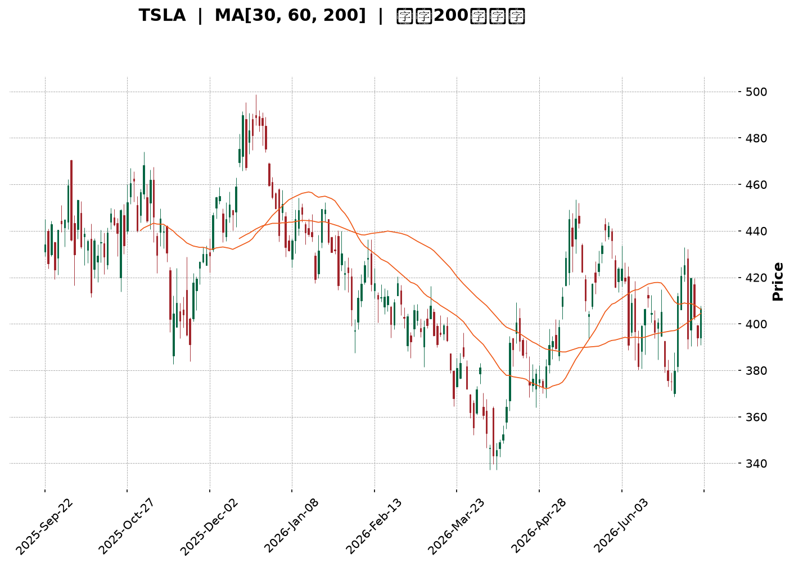
</details>

<html>
<head><meta charset="utf-8" /></head>
<body>
    <div style="height:500px; width:100%;">                        <script>window.PlotlyConfig = {MathJaxConfig: 'local'};</script>
        <script charset="utf-8" src="https://cdn.plot.ly/plotly-3.7.0.min.js" integrity="sha256-jvTGqxNp8AGWEcvNLVuKr+8j5dGe9Yw51LQkmDH+IYA=" crossorigin="anonymous"></script>                <div id="candlestick-chart" class="plotly-graph-div" style="height:100%; width:100%;"></div>            <script>                window.PLOTLYENV=window.PLOTLYENV || {};                                if (document.getElementById("candlestick-chart")) {                    Plotly.newPlot(                        "candlestick-chart",                        [{"close":{"dtype":"f8","bdata":"AAAAIFwje0AAAACgmZ16QAAAAOCjrHtAAAAAgD12ekAAAABgZoZ7QAAAACBcs3tAAAAAIIXLe0AAAAAgXLd8QAAAAAAAQHtAAAAAoEfdekAAAAAAAFR8QAAAAKBwEXtAAAAAQApre0AAAADgozh7QAAAAADX13lAAAAAYGY+e0AAAAAA19N6QAAAAGBmMntAAAAAAADMekAAAADA9XR7QAAAAEDh9ntAAAAAoJmpe0AAAAAghW97QAAAACCuD3xAAAAAIIUbe0AAAABguEZ8QAAAAMDMyHxAAAAAACnYfEAAAACgmYF7QAAAAMD1iHxAAAAAgOtFfUAAAAAAKcR7QAAAAMAe4XxAAAAAYI\u002fee0AAAADgUdh6QAAAACCu03tAAAAAgOt5e0AAAACgmel6QAAAAADXH3lAAAAAoJlFeUAAAABguI55QAAAAAAAFHlAAAAAANc\u002feUAAAAAgrrN4QAAAAKBwcXhAAAAA4HocekAAAABgZjZ6QAAAAKBHqXpAAAAAYLjiekAAAACAPeJ6QAAAAADX03pAAAAAANfre0AAAADgemh8QAAAAAAAcHxAAAAAoEd5e0AAAABguNJ7QAAAAEAzN3xAAAAAgD3ue0AAAAAgXK98QAAAAMD1tH1AAAAAgBSefkAAAAAAKTR9QAAAAIDrNX5AAAAAQDMTfkAAAAAgrot+QAAAAMD1WH5AAAAAYGZWfkAAAABACrN9QAAAAIA9unxAAAAAQOFmfEAAAAAghRt8QAAAAMAeYXtAAAAAYLg6fEAAAAAgXA97QAAAAGCP9npAAAAAwMw8e0AAAAAAKdB7QAAAACBcD3xAAAAAQDPze0AAAABAM3N7QAAAAMAeaXtAAAAAAABYe0AAAAAAADR6QAAAAEAK93pAAAAAgMIVfEAAAADA9RB8QAAAAEAzM3tAAAAAYGbuekAAAAAgXPd6QAAAAMD1CHpAAAAAYI\u002fmekAAAADA9Vx6QAAAACBcX3pAAAAAAClgeUAAAAAgXNN4QAAAAIDCsXlAAAAAwB4VekAAAAAgXJN6QAAAAOBRxHpAAAAAwB4RekAAAABAChd6QAAAAIAUqnlAAAAAwB61eUAAAAAgXLt5QAAAAMAevXlAAAAAoEf9eEAAAACAFJZ5QAAAAGBmFnpAAAAAoEeJeUAAAAAAKSh5QAAAAMAeNXlAAAAAQOGGeEAAAABACl95QAAAAMDMWHlAAAAAIK7LeEAAAABA4ep4QAAAAADX83hAAAAAwB59eUAAAAAAKbB4QAAAAEAzc3hAAAAAwPW4eEAAAADgUfR4QAAAAOB6jHhAAAAAwMzEd0AAAAAgXP92QAAAAKCZzXdAAAAA4Hrwd0AAAABAMx94QAAAAIDCQXdAAAAAoEeddkAAAADgejR2QAAAAAAAPHdAAAAAACnUd0AAAACgcIl2QAAAAMAeDXZAAAAAYGaqdUAAAAAAAHR1QAAAAIDrmXVAAAAAQDPPdUAAAABguAZ2QAAAAEAzw3ZAAAAAQDN\u002feEAAAABgZk54QAAAAIDrCXlAAAAAAACIeEAAAABguCZ4QAAAAAApOHhAAAAAIIVbd0AAAADAzIR3QAAAAGC4qndAAAAA4FGAd0AAAADAzEx3QAAAAIAU2ndAAAAAwB5teEAAAAAAKYh4QAAAAIDrVXhAAAAAIK7reEAAAADgo7x5QAAAAKCZxXpAAAAAAADQe0AAAABAMxd7QAAAAOBR1HtAAAAAwMy0e0AAAAAA12N6QAAAAADXn3lAAAAAgMJBeUAAAAAAKRR6QAAAAKCZHXpAAAAAACmgekAAAACgcBl7QAAAAIDChXtAAAAAoJmhe0AAAADgozx7QAAAAIAU\u002fnlAAAAAANd7ekAAAABAM3t6QAAAAEAzJ3pAAAAAAABweEAAAABAM495QAAAAEDhynhAAAAAoHDZd0AAAABgZvJ4QAAAAEDhZnlAAAAAYGayeUAAAABgj0p5QAAAAIAUxnhAAAAAANcHeUAAAADAzFB5QAAAAIDC2XdAAAAA4Hp4d0AAAACA63F3QAAAACBcu3dAAAAAoHC9eUAAAACgmUl6QAAAAMDMlHpAAAAAQDOXeEAAAADgUTx6QAAAAGBmLnlAAAAAwPWgeEAAAADAzGh5QA=="},"high":{"dtype":"f8","bdata":"AAAAIK7Pe0AAAAAghY97QAAAACBcw3tAAAAAoJk1e0AAAAAghYd7QAAAACCuL3xAAAAAAADQe0AAAADgo+R8QAAAAAAAbH1AAAAA4FHse0AAAADAzFh8QAAAAEDhSnxAAAAAoEeVe0AAAACgmUV7QAAAAIAUsntAAAAAgD1Oe0AAAABAMyN7QAAAAAApiHtAAAAAoJl1e0AAAAAgXJd7QAAAAMDMHHxAAAAAwMwUfEAAAADgo9h7QAAAAGBmFnxAAAAAQOE6fEAAAABgj8J8QAAAAAAAMH1AAAAAQDMbfUAAAADA9XB8QAAAAAAAoHxAAAAAwB6hfUAAAAAghcN8QAAAAKBHJX1AAAAAQDM3fUAAAACAwnV7QAAAAGC4GnxAAAAAANene0AAAACgR6V7QAAAAAAAiHpAAAAAQArDeUAAAAAgXH96QAAAAGBmjnlAAAAA4Hq8eUAAAABACs96QAAAAMDMLHlAAAAAIIVbekAAAAAgrkd6QAAAAEAKr3pAAAAAQOEOe0AAAABgjxp7QAAAAMDMTHtAAAAAYLj+e0AAAACAFGp8QAAAAIDrrXxAAAAAAAAcfEAAAACAPUZ8QAAAAIAUjnxAAAAA4FEUfEAAAAAAKfB8QAAAAOBRHH5AAAAAAAC4fkAAAADgevR+QAAAAIDCrX5AAAAAANenfkAAAACgRy1\u002fQAAAACCFv35AAAAAYGaufkAAAACgcJF+QAAAAGBmVn1AAAAAgOvxfEAAAADAzIh8QAAAAKBwpXxAAAAAwMyYfEAAAAAAAAR8QAAAAIDrZXtAAAAAgD1Oe0AAAADAzBB8QAAAAMDMZHxAAAAAwPU8fEAAAABgj757QAAAAIDC1XtAAAAAAAD0e0AAAAAgrut6QAAAAEAzY3tAAAAAAAAYfEAAAABA4UZ8QAAAAOCj0HtAAAAA4FFYe0AAAAAAKWR7QAAAACCug3tAAAAAgBR+e0AAAABgZrJ6QAAAAMD1yHpAAAAAYGZ+ekAAAACgmSF5QAAAAMDM6HlAAAAAAABUekAAAAAAALR6QAAAAKCZRXtAAAAAIK5De0AAAADA9YB6QAAAACCF23lAAAAAYGYOekAAAAAAAPR5QAAAAEAz63lAAAAAQDN7eUAAAADAHq15QAAAAKBwRXpAAAAAwPUMekAAAACA63F5QAAAAOCjSHlAAAAAoHDFeEAAAACgR4V5QAAAAIDriXlAAAAAoJkleUAAAACgcBl5QAAAAKBwaXlAAAAAgBQGekAAAAAAAGh5QAAAAEAzA3lAAAAAIK47eUAAAACA6wF5QAAAAMAeMXlAAAAA4FE0eEAAAACAPb53QAAAAKBHFXhAAAAAIK43eEAAAAAgrsN4QAAAAEAKB3hAAAAAgMIdd0AAAADgo\u002fR2QAAAAKBHVXdAAAAAgD3yd0AAAADgeiR3QAAAACCF+3ZAAAAA4FHAdUAAAAAAAMh2QAAAAIAUznVAAAAAgMLldUAAAACgmUV2QAAAAIAU+nZAAAAAYGaqeEAAAADA9aB4QAAAAOB6lHlAAAAAwMxseUAAAABAM594QAAAAAApkHhAAAAAAAAgeEAAAAAAKex3QAAAAOB6zHdAAAAA4KPkd0AAAABgZoZ3QAAAAAAADHhAAAAAwB7deEAAAACAPap4QAAAAIDrIXlAAAAAQOEaeUAAAACgR\u002f15QAAAAEAz83pAAAAAYI8SfEAAAADAzPx7QAAAAGBmVnxAAAAAIK4\u002ffEAAAABgjyp7QAAAAIAUUnpAAAAAgBRaeUAAAAAgXBd6QAAAAEAzr3pAAAAAACn4ekAAAABAMzN7QAAAAKCZ2XtAAAAAIFy\u002fe0AAAADAHpF7QAAAAKCZ2XpAAAAAYLiGekAAAACgmRl7QAAAAKCZpXpAAAAAQOGKekAAAABACs95QAAAAAAAKHpAAAAAoHDReEAAAADgo\u002fh4QAAAAEDhanlAAAAAAAAAekAAAABguMZ5QAAAAEAKX3lAAAAA4FEoeUAAAAAAAOx5QAAAAIDrjXhAAAAAoEcJeEAAAACA67F3QAAAAMDMPHhAAAAA4FHUeUAAAADgo4h6QAAAAIDCDXtAAAAAoJkFe0AAAAAAAEB6QAAAAMD1OHpAAAAAgBT6eEAAAACAwn15QA=="},"hovertemplate":"\u003cb\u003e%{x|%Y-%m-%d}\u003c\u002fb\u003e\u003cbr\u003e\u958b: $%{open:.2f}\u003cbr\u003e\u9ad8: $%{high:.2f}\u003cbr\u003e\u4f4e: $%{low:.2f}\u003cbr\u003e\u6536: $%{close:.2f}\u003cextra\u003e\u003c\u002fextra\u003e","low":{"dtype":"f8","bdata":"AAAAgBTSekAAAAAghXt6QAAAAOB60HpAAAAAoEcxekAAAADgUVB6QAAAAAAAeHtAAAAAgOsRe0AAAAAAAIx7QAAAAMAeOXtAAAAAoEcJekAAAABACkt7QAAAAEAzB3tAAAAAIK6TekAAAABA4aJ6QAAAAEAzt3lAAAAAQDM7ekAAAACAwh16QAAAAKBHpXpAAAAAwPVUekAAAACgmXl6QAAAAIDCiXtAAAAAwMyge0AAAAAAANB6QAAAAGBm3nlAAAAAYLjiekAAAABACmt7QAAAAKCZOXxAAAAAYGZKfEAAAACAwnl7QAAAAEAKu3tAAAAAwMxcfEAAAACgmbl7QAAAACBci3tAAAAAoHAxe0AAAACAFF56QAAAAIDCFXtAAAAAgMIFe0AAAADA9ah6QAAAAKBwxXhAAAAA4Hrsd0AAAAAA1+t4QAAAACBcm3hAAAAAAADoeEAAAAAA16t4QAAAAAAp\u002fHdAAAAAoHAReUAAAABAM195QAAAAIA9DnpAAAAAQDOjekAAAADgo5R6QAAAAIDrYXpAAAAAgMLxekAAAACAPdZ7QAAAAGCPOnxAAAAAAAA0e0AAAABAMzt7QAAAAIDCuXtAAAAAoEeFe0AAAABguJp7QAAAAGCPOn1AAAAAoEcdfUAAAABAMyN9QAAAAIDrkX1AAAAAIIWrfUAAAACgR1V+QAAAAKBwLX5AAAAAwMzMfUAAAADAHp19QAAAAAAAsHxAAAAAoEddfEAAAADAzBR8QAAAAMDMNHtAAAAAwB7Je0AAAADgesx6QAAAAOCj9HpAAAAAgOuFekAAAACAPeZ6QAAAAAAAYHtAAAAAQDO\u002fe0AAAAAghSN7QAAAAGBmWntAAAAAACk0e0AAAABAChd6QAAAAIDrOXpAAAAAgBQKe0AAAADgo8B7QAAAAOB6JHtAAAAAQArrekAAAACgmeF6QAAAAIDr6XlAAAAAQDNrekAAAAAAAOh5QAAAAEAK23lAAAAAQOHyeEAAAADgejh4QAAAAAAA3HhAAAAA4KN0eUAAAAAAABB6QAAAAOB6QHpAAAAAAADgeUAAAACAFK55QAAAAAApCHlAAAAAoEeZeUAAAACAwkF5QAAAAAAAWHlAAAAA4KOgeEAAAACAPdp4QAAAAGBmwnlAAAAAYI86eUAAAACAwuF4QAAAAAAARHhAAAAAgD0WeEAAAACgR6l4QAAAAGC49nhAAAAAIFyjeEAAAABgZtZ3QAAAAEAK43hAAAAAYGYieUAAAABgZqp4QAAAAEAzX3hAAAAAYLimeEAAAAAAAJB4QAAAAMD1hHhAAAAAIK6rd0AAAAAgXMd2QAAAACCuS3dAAAAAwPWEd0AAAAAAKRB4QAAAAIDrPXdAAAAAIIV3dkAAAACAPQJ2QAAAAAAAkHZAAAAAoEdhd0AAAADgenB2QAAAAIA9qnVAAAAAANcTdUAAAABguDp1QAAAAAAAFHVAAAAAANdrdUAAAADAHsl1QAAAAOBRLHZAAAAAAACodkAAAADAzNx3QAAAAGBmenhAAAAAoEdFeEAAAAAghRN4QAAAAMDMFHhAAAAAgD0Gd0AAAAAgrit3QAAAAOBRwHZAAAAA4KNId0AAAADgoyB3QAAAAGC4AndAAAAAwMysd0AAAADAzAx4QAAAAAAAUHhAAAAA4FEAeEAAAACA6yF5QAAAAIA9BnpAAAAAwMwMekAAAAAAKWR6QAAAACBc43pAAAAAYI+Se0AAAAAAAGB6QAAAAKBHVXlAAAAAgBSaeEAAAACAPWZ5QAAAAGBmznlAAAAAAClIekAAAACA66F6QAAAAOBROHtAAAAAwMxEe0AAAACAPcJ6QAAAAEDh9nlAAAAAYGbaeUAAAAAAAAB6QAAAAGCPEnpAAAAAoHBJeEAAAAAghat4QAAAAADXA3hAAAAAYGbCd0AAAABgj8p3QAAAAAApLHhAAAAAoJlxeUAAAADgowh5QAAAAAApnHhAAAAAQDMLeEAAAABgZqZ4QAAAAMD1sHdAAAAAwMxQd0AAAAAghTN3QAAAAKCZCXdAAAAAwMy0d0AAAAAAAGB5QAAAAKBwIXpAAAAAwMxUeEAAAAAAAGh4QAAAAIAUHnlAAAAAACloeEAAAABAz214QA=="},"name":"\u50f9\u683c","open":{"dtype":"f8","bdata":"AAAAgMLxekAAAACAFH57QAAAAKBH3XpAAAAAANcze0AAAADAzMR6QAAAAKCZxXtAAAAA4FGYe0AAAADAzLx7QAAAAOCjaH1AAAAA4KO0e0AAAAAAAIx7QAAAAMAe\u002fXtAAAAAwB5Ze0AAAADA9fx6QAAAAOCjSHtAAAAA4Hp4ekAAAADgo6x6QAAAAGBmLntAAAAAIK4re0AAAAAAAJh6QAAAAIDrvXtAAAAAACnce0AAAABAM7d7QAAAAAAAQHpAAAAAoEfte0AAAAAgrn97QAAAAOB6bHxAAAAAAADofEAAAADAzDB8QAAAAAAA7HtAAAAAANd\u002ffEAAAAAgXGd8QAAAAMDMQHxAAAAAIFzffEAAAABguF57QAAAAKCZeXtAAAAAYGZ2e0AAAABgZqJ7QAAAAIAUcnpAAAAAwMwkeEAAAAAA1+t4QAAAAIAUVnlAAAAAQOFieUAAAACAFOp5QAAAAMAeJXlAAAAAYLgieUAAAABguOZ5QAAAAEAzf3pAAAAAoHCpekAAAADAHpV6QAAAAMD17HpAAAAAoJkBe0AAAABACh98QAAAAOB6UHxAAAAAQDP3e0AAAADgo1h7QAAAAMAe4XtAAAAAQDMPfEAAAACgcAF8QAAAAEAKV31AAAAAIFyDfUAAAAAghYN+QAAAAGCP4n1AAAAAgOuBfkAAAACAFJ5+QAAAAGBmln5AAAAAIK6HfkAAAAAgrlN+QAAAAAAAUH1AAAAAoHDRfEAAAACgmYF8QAAAAMDMnHxAAAAAANf\u002fe0AAAACAFOZ7QAAAAGBmPntAAAAAgD2+ekAAAABAMz97QAAAACCuk3tAAAAAQDMjfEAAAADA9ax7QAAAAIAUkntAAAAAAAB4e0AAAACAwtV6QAAAAGCPWnpAAAAAYI8ye0AAAABA4fZ7QAAAAAAA0HtAAAAAYI9We0AAAABgj\u002f56QAAAAMDMXHtAAAAAoJmVekAAAADgo1R6QAAAAOBRhHpAAAAAIFxHekAAAADgUdB4QAAAAIDrDXlAAAAAYI+eeUAAAACgRyF6QAAAACBcv3pAAAAAwMzkekAAAADA9eR5QAAAAIDCxXlAAAAAgMKxeUAAAAAAAHR5QAAAAMDMhHlAAAAA4KN0eUAAAAAAAPh4QAAAAGBmwnlAAAAAYLjmeUAAAABACi95QAAAAKCZaXhAAAAAoHCxeEAAAACgmd14QAAAAMAeGXlAAAAAoHDheEAAAADAzGB4QAAAACCFI3lAAAAA4HokeUAAAABA4VJ5QAAAAGC48nhAAAAAIIXDeEAAAABACrt4QAAAAAAA8HhAAAAA4FE0eEAAAACgmb13QAAAAKBwUXdAAAAAwPWId0AAAAAA1194QAAAAKCZ2XdAAAAAQAobd0AAAACAwt12QAAAAAApmHZAAAAAgBSqd0AAAABAM8N2QAAAAKBwqXZAAAAAQAqndUAAAADgo7x2QAAAAGBmcnVAAAAA4KOkdUAAAADAHuF1QAAAAGC4WnZAAAAAoEftdkAAAADA9Zx4QAAAAGC4vnhAAAAAoEcpeUAAAAAAAJB4QAAAAMAeOXhAAAAA4Hp0d0AAAAAAAFh3QAAAAKBwQXdAAAAAQOFqd0AAAABgZnZ3QAAAAAAATHdAAAAAANfnd0AAAAAgrmN4QAAAAEAKs3hAAAAAAAAkeEAAAAAgrnd5QAAAACCuB3pAAAAAYI9iekAAAABgj5Z7QAAAAGC4SntAAAAAANfne0AAAAAgrh97QAAAAOBRNHpAAAAAYI8yeUAAAACgmXl5QAAAAEDhYnpAAAAAYLhqekAAAAAAKeR6QAAAAIA9rntAAAAAgOtZe0AAAACgmX17QAAAAADXt3pAAAAAIIUjekAAAABAMyt6QAAAAKBwPXpAAAAAAABIekAAAACgR8V4QAAAAOB6sHlAAAAA4KN4eEAAAADgekR4QAAAAADX93hAAAAAgOvFeUAAAACAwkF5QAAAAOB6GHlAAAAAoJnheEAAAACgma14QAAAAIDCiXhAAAAAoEfBd0AAAADgUXR3QAAAAGBmIndAAAAA4KPcd0AAAAAAAGB5QAAAACBcV3pAAAAAACnAekAAAAAAANh4QAAAACBcD3pAAAAAgBT2eEAAAAAA1594QA=="},"x":["2025-09-22T00:00:00-04:00","2025-09-23T00:00:00-04:00","2025-09-24T00:00:00-04:00","2025-09-25T00:00:00-04:00","2025-09-26T00:00:00-04:00","2025-09-29T00:00:00-04:00","2025-09-30T00:00:00-04:00","2025-10-01T00:00:00-04:00","2025-10-02T00:00:00-04:00","2025-10-03T00:00:00-04:00","2025-10-06T00:00:00-04:00","2025-10-07T00:00:00-04:00","2025-10-08T00:00:00-04:00","2025-10-09T00:00:00-04:00","2025-10-10T00:00:00-04:00","2025-10-13T00:00:00-04:00","2025-10-14T00:00:00-04:00","2025-10-15T00:00:00-04:00","2025-10-16T00:00:00-04:00","2025-10-17T00:00:00-04:00","2025-10-20T00:00:00-04:00","2025-10-21T00:00:00-04:00","2025-10-22T00:00:00-04:00","2025-10-23T00:00:00-04:00","2025-10-24T00:00:00-04:00","2025-10-27T00:00:00-04:00","2025-10-28T00:00:00-04:00","2025-10-29T00:00:00-04:00","2025-10-30T00:00:00-04:00","2025-10-31T00:00:00-04:00","2025-11-03T00:00:00-05:00","2025-11-04T00:00:00-05:00","2025-11-05T00:00:00-05:00","2025-11-06T00:00:00-05:00","2025-11-07T00:00:00-05:00","2025-11-10T00:00:00-05:00","2025-11-11T00:00:00-05:00","2025-11-12T00:00:00-05:00","2025-11-13T00:00:00-05:00","2025-11-14T00:00:00-05:00","2025-11-17T00:00:00-05:00","2025-11-18T00:00:00-05:00","2025-11-19T00:00:00-05:00","2025-11-20T00:00:00-05:00","2025-11-21T00:00:00-05:00","2025-11-24T00:00:00-05:00","2025-11-25T00:00:00-05:00","2025-11-26T00:00:00-05:00","2025-11-28T00:00:00-05:00","2025-12-01T00:00:00-05:00","2025-12-02T00:00:00-05:00","2025-12-03T00:00:00-05:00","2025-12-04T00:00:00-05:00","2025-12-05T00:00:00-05:00","2025-12-08T00:00:00-05:00","2025-12-09T00:00:00-05:00","2025-12-10T00:00:00-05:00","2025-12-11T00:00:00-05:00","2025-12-12T00:00:00-05:00","2025-12-15T00:00:00-05:00","2025-12-16T00:00:00-05:00","2025-12-17T00:00:00-05:00","2025-12-18T00:00:00-05:00","2025-12-19T00:00:00-05:00","2025-12-22T00:00:00-05:00","2025-12-23T00:00:00-05:00","2025-12-24T00:00:00-05:00","2025-12-26T00:00:00-05:00","2025-12-29T00:00:00-05:00","2025-12-30T00:00:00-05:00","2025-12-31T00:00:00-05:00","2026-01-02T00:00:00-05:00","2026-01-05T00:00:00-05:00","2026-01-06T00:00:00-05:00","2026-01-07T00:00:00-05:00","2026-01-08T00:00:00-05:00","2026-01-09T00:00:00-05:00","2026-01-12T00:00:00-05:00","2026-01-13T00:00:00-05:00","2026-01-14T00:00:00-05:00","2026-01-15T00:00:00-05:00","2026-01-16T00:00:00-05:00","2026-01-20T00:00:00-05:00","2026-01-21T00:00:00-05:00","2026-01-22T00:00:00-05:00","2026-01-23T00:00:00-05:00","2026-01-26T00:00:00-05:00","2026-01-27T00:00:00-05:00","2026-01-28T00:00:00-05:00","2026-01-29T00:00:00-05:00","2026-01-30T00:00:00-05:00","2026-02-02T00:00:00-05:00","2026-02-03T00:00:00-05:00","2026-02-04T00:00:00-05:00","2026-02-05T00:00:00-05:00","2026-02-06T00:00:00-05:00","2026-02-09T00:00:00-05:00","2026-02-10T00:00:00-05:00","2026-02-11T00:00:00-05:00","2026-02-12T00:00:00-05:00","2026-02-13T00:00:00-05:00","2026-02-17T00:00:00-05:00","2026-02-18T00:00:00-05:00","2026-02-19T00:00:00-05:00","2026-02-20T00:00:00-05:00","2026-02-23T00:00:00-05:00","2026-02-24T00:00:00-05:00","2026-02-25T00:00:00-05:00","2026-02-26T00:00:00-05:00","2026-02-27T00:00:00-05:00","2026-03-02T00:00:00-05:00","2026-03-03T00:00:00-05:00","2026-03-04T00:00:00-05:00","2026-03-05T00:00:00-05:00","2026-03-06T00:00:00-05:00","2026-03-09T00:00:00-04:00","2026-03-10T00:00:00-04:00","2026-03-11T00:00:00-04:00","2026-03-12T00:00:00-04:00","2026-03-13T00:00:00-04:00","2026-03-16T00:00:00-04:00","2026-03-17T00:00:00-04:00","2026-03-18T00:00:00-04:00","2026-03-19T00:00:00-04:00","2026-03-20T00:00:00-04:00","2026-03-23T00:00:00-04:00","2026-03-24T00:00:00-04:00","2026-03-25T00:00:00-04:00","2026-03-26T00:00:00-04:00","2026-03-27T00:00:00-04:00","2026-03-30T00:00:00-04:00","2026-03-31T00:00:00-04:00","2026-04-01T00:00:00-04:00","2026-04-02T00:00:00-04:00","2026-04-06T00:00:00-04:00","2026-04-07T00:00:00-04:00","2026-04-08T00:00:00-04:00","2026-04-09T00:00:00-04:00","2026-04-10T00:00:00-04:00","2026-04-13T00:00:00-04:00","2026-04-14T00:00:00-04:00","2026-04-15T00:00:00-04:00","2026-04-16T00:00:00-04:00","2026-04-17T00:00:00-04:00","2026-04-20T00:00:00-04:00","2026-04-21T00:00:00-04:00","2026-04-22T00:00:00-04:00","2026-04-23T00:00:00-04:00","2026-04-24T00:00:00-04:00","2026-04-27T00:00:00-04:00","2026-04-28T00:00:00-04:00","2026-04-29T00:00:00-04:00","2026-04-30T00:00:00-04:00","2026-05-01T00:00:00-04:00","2026-05-04T00:00:00-04:00","2026-05-05T00:00:00-04:00","2026-05-06T00:00:00-04:00","2026-05-07T00:00:00-04:00","2026-05-08T00:00:00-04:00","2026-05-11T00:00:00-04:00","2026-05-12T00:00:00-04:00","2026-05-13T00:00:00-04:00","2026-05-14T00:00:00-04:00","2026-05-15T00:00:00-04:00","2026-05-18T00:00:00-04:00","2026-05-19T00:00:00-04:00","2026-05-20T00:00:00-04:00","2026-05-21T00:00:00-04:00","2026-05-22T00:00:00-04:00","2026-05-26T00:00:00-04:00","2026-05-27T00:00:00-04:00","2026-05-28T00:00:00-04:00","2026-05-29T00:00:00-04:00","2026-06-01T00:00:00-04:00","2026-06-02T00:00:00-04:00","2026-06-03T00:00:00-04:00","2026-06-04T00:00:00-04:00","2026-06-05T00:00:00-04:00","2026-06-08T00:00:00-04:00","2026-06-09T00:00:00-04:00","2026-06-10T00:00:00-04:00","2026-06-11T00:00:00-04:00","2026-06-12T00:00:00-04:00","2026-06-15T00:00:00-04:00","2026-06-16T00:00:00-04:00","2026-06-17T00:00:00-04:00","2026-06-18T00:00:00-04:00","2026-06-22T00:00:00-04:00","2026-06-23T00:00:00-04:00","2026-06-24T00:00:00-04:00","2026-06-25T00:00:00-04:00","2026-06-26T00:00:00-04:00","2026-06-29T00:00:00-04:00","2026-06-30T00:00:00-04:00","2026-07-01T00:00:00-04:00","2026-07-02T00:00:00-04:00","2026-07-06T00:00:00-04:00","2026-07-07T00:00:00-04:00","2026-07-08T00:00:00-04:00","2026-07-09T00:00:00-04:00"],"type":"candlestick"},{"hovertemplate":"MA30: $%{y:.2f}\u003cextra\u003e\u003c\u002fextra\u003e","line":{"color":"#2196F3","dash":"dash","width":2},"mode":"lines","name":"MA30","x":["2025-09-22T00:00:00-04:00","2025-09-23T00:00:00-04:00","2025-09-24T00:00:00-04:00","2025-09-25T00:00:00-04:00","2025-09-26T00:00:00-04:00","2025-09-29T00:00:00-04:00","2025-09-30T00:00:00-04:00","2025-10-01T00:00:00-04:00","2025-10-02T00:00:00-04:00","2025-10-03T00:00:00-04:00","2025-10-06T00:00:00-04:00","2025-10-07T00:00:00-04:00","2025-10-08T00:00:00-04:00","2025-10-09T00:00:00-04:00","2025-10-10T00:00:00-04:00","2025-10-13T00:00:00-04:00","2025-10-14T00:00:00-04:00","2025-10-15T00:00:00-04:00","2025-10-16T00:00:00-04:00","2025-10-17T00:00:00-04:00","2025-10-20T00:00:00-04:00","2025-10-21T00:00:00-04:00","2025-10-22T00:00:00-04:00","2025-10-23T00:00:00-04:00","2025-10-24T00:00:00-04:00","2025-10-27T00:00:00-04:00","2025-10-28T00:00:00-04:00","2025-10-29T00:00:00-04:00","2025-10-30T00:00:00-04:00","2025-10-31T00:00:00-04:00","2025-11-03T00:00:00-05:00","2025-11-04T00:00:00-05:00","2025-11-05T00:00:00-05:00","2025-11-06T00:00:00-05:00","2025-11-07T00:00:00-05:00","2025-11-10T00:00:00-05:00","2025-11-11T00:00:00-05:00","2025-11-12T00:00:00-05:00","2025-11-13T00:00:00-05:00","2025-11-14T00:00:00-05:00","2025-11-17T00:00:00-05:00","2025-11-18T00:00:00-05:00","2025-11-19T00:00:00-05:00","2025-11-20T00:00:00-05:00","2025-11-21T00:00:00-05:00","2025-11-24T00:00:00-05:00","2025-11-25T00:00:00-05:00","2025-11-26T00:00:00-05:00","2025-11-28T00:00:00-05:00","2025-12-01T00:00:00-05:00","2025-12-02T00:00:00-05:00","2025-12-03T00:00:00-05:00","2025-12-04T00:00:00-05:00","2025-12-05T00:00:00-05:00","2025-12-08T00:00:00-05:00","2025-12-09T00:00:00-05:00","2025-12-10T00:00:00-05:00","2025-12-11T00:00:00-05:00","2025-12-12T00:00:00-05:00","2025-12-15T00:00:00-05:00","2025-12-16T00:00:00-05:00","2025-12-17T00:00:00-05:00","2025-12-18T00:00:00-05:00","2025-12-19T00:00:00-05:00","2025-12-22T00:00:00-05:00","2025-12-23T00:00:00-05:00","2025-12-24T00:00:00-05:00","2025-12-26T00:00:00-05:00","2025-12-29T00:00:00-05:00","2025-12-30T00:00:00-05:00","2025-12-31T00:00:00-05:00","2026-01-02T00:00:00-05:00","2026-01-05T00:00:00-05:00","2026-01-06T00:00:00-05:00","2026-01-07T00:00:00-05:00","2026-01-08T00:00:00-05:00","2026-01-09T00:00:00-05:00","2026-01-12T00:00:00-05:00","2026-01-13T00:00:00-05:00","2026-01-14T00:00:00-05:00","2026-01-15T00:00:00-05:00","2026-01-16T00:00:00-05:00","2026-01-20T00:00:00-05:00","2026-01-21T00:00:00-05:00","2026-01-22T00:00:00-05:00","2026-01-23T00:00:00-05:00","2026-01-26T00:00:00-05:00","2026-01-27T00:00:00-05:00","2026-01-28T00:00:00-05:00","2026-01-29T00:00:00-05:00","2026-01-30T00:00:00-05:00","2026-02-02T00:00:00-05:00","2026-02-03T00:00:00-05:00","2026-02-04T00:00:00-05:00","2026-02-05T00:00:00-05:00","2026-02-06T00:00:00-05:00","2026-02-09T00:00:00-05:00","2026-02-10T00:00:00-05:00","2026-02-11T00:00:00-05:00","2026-02-12T00:00:00-05:00","2026-02-13T00:00:00-05:00","2026-02-17T00:00:00-05:00","2026-02-18T00:00:00-05:00","2026-02-19T00:00:00-05:00","2026-02-20T00:00:00-05:00","2026-02-23T00:00:00-05:00","2026-02-24T00:00:00-05:00","2026-02-25T00:00:00-05:00","2026-02-26T00:00:00-05:00","2026-02-27T00:00:00-05:00","2026-03-02T00:00:00-05:00","2026-03-03T00:00:00-05:00","2026-03-04T00:00:00-05:00","2026-03-05T00:00:00-05:00","2026-03-06T00:00:00-05:00","2026-03-09T00:00:00-04:00","2026-03-10T00:00:00-04:00","2026-03-11T00:00:00-04:00","2026-03-12T00:00:00-04:00","2026-03-13T00:00:00-04:00","2026-03-16T00:00:00-04:00","2026-03-17T00:00:00-04:00","2026-03-18T00:00:00-04:00","2026-03-19T00:00:00-04:00","2026-03-20T00:00:00-04:00","2026-03-23T00:00:00-04:00","2026-03-24T00:00:00-04:00","2026-03-25T00:00:00-04:00","2026-03-26T00:00:00-04:00","2026-03-27T00:00:00-04:00","2026-03-30T00:00:00-04:00","2026-03-31T00:00:00-04:00","2026-04-01T00:00:00-04:00","2026-04-02T00:00:00-04:00","2026-04-06T00:00:00-04:00","2026-04-07T00:00:00-04:00","2026-04-08T00:00:00-04:00","2026-04-09T00:00:00-04:00","2026-04-10T00:00:00-04:00","2026-04-13T00:00:00-04:00","2026-04-14T00:00:00-04:00","2026-04-15T00:00:00-04:00","2026-04-16T00:00:00-04:00","2026-04-17T00:00:00-04:00","2026-04-20T00:00:00-04:00","2026-04-21T00:00:00-04:00","2026-04-22T00:00:00-04:00","2026-04-23T00:00:00-04:00","2026-04-24T00:00:00-04:00","2026-04-27T00:00:00-04:00","2026-04-28T00:00:00-04:00","2026-04-29T00:00:00-04:00","2026-04-30T00:00:00-04:00","2026-05-01T00:00:00-04:00","2026-05-04T00:00:00-04:00","2026-05-05T00:00:00-04:00","2026-05-06T00:00:00-04:00","2026-05-07T00:00:00-04:00","2026-05-08T00:00:00-04:00","2026-05-11T00:00:00-04:00","2026-05-12T00:00:00-04:00","2026-05-13T00:00:00-04:00","2026-05-14T00:00:00-04:00","2026-05-15T00:00:00-04:00","2026-05-18T00:00:00-04:00","2026-05-19T00:00:00-04:00","2026-05-20T00:00:00-04:00","2026-05-21T00:00:00-04:00","2026-05-22T00:00:00-04:00","2026-05-26T00:00:00-04:00","2026-05-27T00:00:00-04:00","2026-05-28T00:00:00-04:00","2026-05-29T00:00:00-04:00","2026-06-01T00:00:00-04:00","2026-06-02T00:00:00-04:00","2026-06-03T00:00:00-04:00","2026-06-04T00:00:00-04:00","2026-06-05T00:00:00-04:00","2026-06-08T00:00:00-04:00","2026-06-09T00:00:00-04:00","2026-06-10T00:00:00-04:00","2026-06-11T00:00:00-04:00","2026-06-12T00:00:00-04:00","2026-06-15T00:00:00-04:00","2026-06-16T00:00:00-04:00","2026-06-17T00:00:00-04:00","2026-06-18T00:00:00-04:00","2026-06-22T00:00:00-04:00","2026-06-23T00:00:00-04:00","2026-06-24T00:00:00-04:00","2026-06-25T00:00:00-04:00","2026-06-26T00:00:00-04:00","2026-06-29T00:00:00-04:00","2026-06-30T00:00:00-04:00","2026-07-01T00:00:00-04:00","2026-07-02T00:00:00-04:00","2026-07-06T00:00:00-04:00","2026-07-07T00:00:00-04:00","2026-07-08T00:00:00-04:00","2026-07-09T00:00:00-04:00"],"y":{"dtype":"f8","bdata":"AAAAAAAA+H8AAAAAAAD4fwAAAAAAAPh\u002fAAAAAAAA+H8AAAAAAAD4fwAAAAAAAPh\u002fAAAAAAAA+H8AAAAAAAD4fwAAAAAAAPh\u002fAAAAAAAA+H8AAAAAAAD4fwAAAAAAAPh\u002fAAAAAAAA+H8AAAAAAAD4fwAAAAAAAPh\u002fAAAAAAAA+H8AAAAAAAD4fwAAAAAAAPh\u002fAAAAAAAA+H8AAAAAAAD4fwAAAAAAAPh\u002fAAAAAAAA+H8AAAAAAAD4fwAAAAAAAPh\u002fAAAAAAAA+H8AAAAAAAD4fwAAAAAAAPh\u002fAAAAAAAA+H8AAAAAAAD4f+\u002fu7q65gntAmpmZqfGUe0De3d09w557QKuqqpoLqXtAVVVVVQ61e0CamZnZQK97QGZmZqZUsHtAREREVJyte0Crqqr6N557QKuqqnoUjHtAzczMnH1+e0B3d3cX2WZ7QO\u002fu7t7dVXtAmpmZKVxDe0ARERGB3C17QImIiCjqIXtAzczMLEAYe0AAAACwABN7QImIiJhuDntAmpmZeTAPe0B3d3d3TAp7QM3MzOyYAHtAvLu7K84Ce0ARERGhGgt7QO\u002fu7o5QDntAREREpHARe0BmZmbGkg17QDMzM1O4CHtAVVVVNewAe0CamZk5+wp7QJqZmTn7FHtA7+7uDnQge0AzMzNTuCx7QLy7u3sUOHtA7+7uvuZKe0AzMzPjemp7QGZmZkb9f3tAVVVVxWeYe0CrqqrKL7B7QBEREfHuzntAd3d3h6Tpe0BmZmYWZ\u002f97QO\u002fu7j4KE3xAiYiIKHgsfEDv7u6Ol0B8QFVVVZUYVnxAmpmZ6bRffECJiIiIXW18QGZmZiZNeXxAAAAAUGKCfEDe3d1NN4d8QJqZmSkxjHxAiYiImEOHfEAzMzOzcnR8QJqZmfnhZ3xAVVVVRRltfEAiIiJiLG98QHd3d7eBZnxAvLu7i\u002fpdfEARERHhT098QLy7u4v6L3xAiYiI6EIQfEB3d3d3Bfh7QERERPRE13tAMzMzAyuve0Crqqp6W357QCIiIpKmVntAIiIiYlcye0AiIiJyrxd7QERERGT0BntAIiIiggfzekBmZmY20OF6QM3MzLwt03pA3t3dnai9ekCJiIhIU7J6QImIiJjgp3pA3t3dfbGUekDv7u7OsIF6QBEREdHbcHpAVVVV5UJcekDNzMx8sUh6QAAAALDkNXpAERERIdsdekDv7u7ewRZ6QFVVVQXzCHpAZmZmRuHseUCamZm5AtJ5QLy7u\u002fvUvnlAvLu7y4WyeUCJiIgoFZ95QM3MzKyOkXlAzczMfPh+eUBmZmYG83J5QLy7u\u002ftiY3lAVVVVtaxVeUC8u7sbE0Z5QM3MzJzvNXlAIiIi4qUjeUBmZmaWtQ55QAAAAODB8HhAVVVVxUvTeEC8u7vbJLJ4QBEREXFonXhAAAAAQGCNeECrqqqqHHJ4QDMzMzOlUnhAvLu7W0g2eECJiIhoAxN4QLy7uwu77HdAERERke3Md0DNzMycNrJ3QN7d3W1ZnXdAVVVV5Redd0De3d1dAZR3QCIiIkJgkXdAiYiIuB6Pd0AzMzPTlIh3QKuqqkpTgndAERERgSNwd0BmZmb2KGZ3QDMzMzN6X3dAZmZmVg5Vd0DNzMxM8EZ3QERERPT9QHdAmpmZSZpGd0Dv7u4uslN3QCIiInI9WHdAVVVVBZ1gd0CrqqoKZW53QN7d3a1jjHdAiYiIKL+4d0CJiIj4b+J3QGZmZualCXhAzczMbLwqeEBERES0nUt4QAAAAFAbanhAREREhMCIeECamZlZObB4QHd3dye\u002f1nhAmpmZadj\u002feEAiIiLSIit5QCIiIjLBU3lAd3d3V4BueUBERERkgod5QEREROSlj3lAERERMU+geUB3d3cnMbR5QO\u002fu7n6xxHlAq6qqyujNeUC8u7ubUt95QCIiIpLt6HlAAAAAEObreUB3d3e38\u002fl5QN7d3b0tB3pAZmZmdgUSekB3d3dXgBh6QBEREXE9HHpAzczMvC0dekAAAACAlRl6QN7d3e2nAHpAVVVV9ZrbeUB3d3f3frx5QHd3d9eHmXlAERERgcCIeUB3d3eX4Id5QKuqquoKkHlAmpmZeVuKeUC8u7srsot5QO\u002fu7v64g3lAERERwa5yeUBERETkQmR5QA=="},"type":"scatter"},{"hovertemplate":"MA60: $%{y:.2f}\u003cextra\u003e\u003c\u002fextra\u003e","line":{"color":"#9C27B0","dash":"dash","width":2},"mode":"lines","name":"MA60","x":["2025-09-22T00:00:00-04:00","2025-09-23T00:00:00-04:00","2025-09-24T00:00:00-04:00","2025-09-25T00:00:00-04:00","2025-09-26T00:00:00-04:00","2025-09-29T00:00:00-04:00","2025-09-30T00:00:00-04:00","2025-10-01T00:00:00-04:00","2025-10-02T00:00:00-04:00","2025-10-03T00:00:00-04:00","2025-10-06T00:00:00-04:00","2025-10-07T00:00:00-04:00","2025-10-08T00:00:00-04:00","2025-10-09T00:00:00-04:00","2025-10-10T00:00:00-04:00","2025-10-13T00:00:00-04:00","2025-10-14T00:00:00-04:00","2025-10-15T00:00:00-04:00","2025-10-16T00:00:00-04:00","2025-10-17T00:00:00-04:00","2025-10-20T00:00:00-04:00","2025-10-21T00:00:00-04:00","2025-10-22T00:00:00-04:00","2025-10-23T00:00:00-04:00","2025-10-24T00:00:00-04:00","2025-10-27T00:00:00-04:00","2025-10-28T00:00:00-04:00","2025-10-29T00:00:00-04:00","2025-10-30T00:00:00-04:00","2025-10-31T00:00:00-04:00","2025-11-03T00:00:00-05:00","2025-11-04T00:00:00-05:00","2025-11-05T00:00:00-05:00","2025-11-06T00:00:00-05:00","2025-11-07T00:00:00-05:00","2025-11-10T00:00:00-05:00","2025-11-11T00:00:00-05:00","2025-11-12T00:00:00-05:00","2025-11-13T00:00:00-05:00","2025-11-14T00:00:00-05:00","2025-11-17T00:00:00-05:00","2025-11-18T00:00:00-05:00","2025-11-19T00:00:00-05:00","2025-11-20T00:00:00-05:00","2025-11-21T00:00:00-05:00","2025-11-24T00:00:00-05:00","2025-11-25T00:00:00-05:00","2025-11-26T00:00:00-05:00","2025-11-28T00:00:00-05:00","2025-12-01T00:00:00-05:00","2025-12-02T00:00:00-05:00","2025-12-03T00:00:00-05:00","2025-12-04T00:00:00-05:00","2025-12-05T00:00:00-05:00","2025-12-08T00:00:00-05:00","2025-12-09T00:00:00-05:00","2025-12-10T00:00:00-05:00","2025-12-11T00:00:00-05:00","2025-12-12T00:00:00-05:00","2025-12-15T00:00:00-05:00","2025-12-16T00:00:00-05:00","2025-12-17T00:00:00-05:00","2025-12-18T00:00:00-05:00","2025-12-19T00:00:00-05:00","2025-12-22T00:00:00-05:00","2025-12-23T00:00:00-05:00","2025-12-24T00:00:00-05:00","2025-12-26T00:00:00-05:00","2025-12-29T00:00:00-05:00","2025-12-30T00:00:00-05:00","2025-12-31T00:00:00-05:00","2026-01-02T00:00:00-05:00","2026-01-05T00:00:00-05:00","2026-01-06T00:00:00-05:00","2026-01-07T00:00:00-05:00","2026-01-08T00:00:00-05:00","2026-01-09T00:00:00-05:00","2026-01-12T00:00:00-05:00","2026-01-13T00:00:00-05:00","2026-01-14T00:00:00-05:00","2026-01-15T00:00:00-05:00","2026-01-16T00:00:00-05:00","2026-01-20T00:00:00-05:00","2026-01-21T00:00:00-05:00","2026-01-22T00:00:00-05:00","2026-01-23T00:00:00-05:00","2026-01-26T00:00:00-05:00","2026-01-27T00:00:00-05:00","2026-01-28T00:00:00-05:00","2026-01-29T00:00:00-05:00","2026-01-30T00:00:00-05:00","2026-02-02T00:00:00-05:00","2026-02-03T00:00:00-05:00","2026-02-04T00:00:00-05:00","2026-02-05T00:00:00-05:00","2026-02-06T00:00:00-05:00","2026-02-09T00:00:00-05:00","2026-02-10T00:00:00-05:00","2026-02-11T00:00:00-05:00","2026-02-12T00:00:00-05:00","2026-02-13T00:00:00-05:00","2026-02-17T00:00:00-05:00","2026-02-18T00:00:00-05:00","2026-02-19T00:00:00-05:00","2026-02-20T00:00:00-05:00","2026-02-23T00:00:00-05:00","2026-02-24T00:00:00-05:00","2026-02-25T00:00:00-05:00","2026-02-26T00:00:00-05:00","2026-02-27T00:00:00-05:00","2026-03-02T00:00:00-05:00","2026-03-03T00:00:00-05:00","2026-03-04T00:00:00-05:00","2026-03-05T00:00:00-05:00","2026-03-06T00:00:00-05:00","2026-03-09T00:00:00-04:00","2026-03-10T00:00:00-04:00","2026-03-11T00:00:00-04:00","2026-03-12T00:00:00-04:00","2026-03-13T00:00:00-04:00","2026-03-16T00:00:00-04:00","2026-03-17T00:00:00-04:00","2026-03-18T00:00:00-04:00","2026-03-19T00:00:00-04:00","2026-03-20T00:00:00-04:00","2026-03-23T00:00:00-04:00","2026-03-24T00:00:00-04:00","2026-03-25T00:00:00-04:00","2026-03-26T00:00:00-04:00","2026-03-27T00:00:00-04:00","2026-03-30T00:00:00-04:00","2026-03-31T00:00:00-04:00","2026-04-01T00:00:00-04:00","2026-04-02T00:00:00-04:00","2026-04-06T00:00:00-04:00","2026-04-07T00:00:00-04:00","2026-04-08T00:00:00-04:00","2026-04-09T00:00:00-04:00","2026-04-10T00:00:00-04:00","2026-04-13T00:00:00-04:00","2026-04-14T00:00:00-04:00","2026-04-15T00:00:00-04:00","2026-04-16T00:00:00-04:00","2026-04-17T00:00:00-04:00","2026-04-20T00:00:00-04:00","2026-04-21T00:00:00-04:00","2026-04-22T00:00:00-04:00","2026-04-23T00:00:00-04:00","2026-04-24T00:00:00-04:00","2026-04-27T00:00:00-04:00","2026-04-28T00:00:00-04:00","2026-04-29T00:00:00-04:00","2026-04-30T00:00:00-04:00","2026-05-01T00:00:00-04:00","2026-05-04T00:00:00-04:00","2026-05-05T00:00:00-04:00","2026-05-06T00:00:00-04:00","2026-05-07T00:00:00-04:00","2026-05-08T00:00:00-04:00","2026-05-11T00:00:00-04:00","2026-05-12T00:00:00-04:00","2026-05-13T00:00:00-04:00","2026-05-14T00:00:00-04:00","2026-05-15T00:00:00-04:00","2026-05-18T00:00:00-04:00","2026-05-19T00:00:00-04:00","2026-05-20T00:00:00-04:00","2026-05-21T00:00:00-04:00","2026-05-22T00:00:00-04:00","2026-05-26T00:00:00-04:00","2026-05-27T00:00:00-04:00","2026-05-28T00:00:00-04:00","2026-05-29T00:00:00-04:00","2026-06-01T00:00:00-04:00","2026-06-02T00:00:00-04:00","2026-06-03T00:00:00-04:00","2026-06-04T00:00:00-04:00","2026-06-05T00:00:00-04:00","2026-06-08T00:00:00-04:00","2026-06-09T00:00:00-04:00","2026-06-10T00:00:00-04:00","2026-06-11T00:00:00-04:00","2026-06-12T00:00:00-04:00","2026-06-15T00:00:00-04:00","2026-06-16T00:00:00-04:00","2026-06-17T00:00:00-04:00","2026-06-18T00:00:00-04:00","2026-06-22T00:00:00-04:00","2026-06-23T00:00:00-04:00","2026-06-24T00:00:00-04:00","2026-06-25T00:00:00-04:00","2026-06-26T00:00:00-04:00","2026-06-29T00:00:00-04:00","2026-06-30T00:00:00-04:00","2026-07-01T00:00:00-04:00","2026-07-02T00:00:00-04:00","2026-07-06T00:00:00-04:00","2026-07-07T00:00:00-04:00","2026-07-08T00:00:00-04:00","2026-07-09T00:00:00-04:00"],"y":{"dtype":"f8","bdata":"AAAAAAAA+H8AAAAAAAD4fwAAAAAAAPh\u002fAAAAAAAA+H8AAAAAAAD4fwAAAAAAAPh\u002fAAAAAAAA+H8AAAAAAAD4fwAAAAAAAPh\u002fAAAAAAAA+H8AAAAAAAD4fwAAAAAAAPh\u002fAAAAAAAA+H8AAAAAAAD4fwAAAAAAAPh\u002fAAAAAAAA+H8AAAAAAAD4fwAAAAAAAPh\u002fAAAAAAAA+H8AAAAAAAD4fwAAAAAAAPh\u002fAAAAAAAA+H8AAAAAAAD4fwAAAAAAAPh\u002fAAAAAAAA+H8AAAAAAAD4fwAAAAAAAPh\u002fAAAAAAAA+H8AAAAAAAD4fwAAAAAAAPh\u002fAAAAAAAA+H8AAAAAAAD4fwAAAAAAAPh\u002fAAAAAAAA+H8AAAAAAAD4fwAAAAAAAPh\u002fAAAAAAAA+H8AAAAAAAD4fwAAAAAAAPh\u002fAAAAAAAA+H8AAAAAAAD4fwAAAAAAAPh\u002fAAAAAAAA+H8AAAAAAAD4fwAAAAAAAPh\u002fAAAAAAAA+H8AAAAAAAD4fwAAAAAAAPh\u002fAAAAAAAA+H8AAAAAAAD4fwAAAAAAAPh\u002fAAAAAAAA+H8AAAAAAAD4fwAAAAAAAPh\u002fAAAAAAAA+H8AAAAAAAD4fwAAAAAAAPh\u002fAAAAAAAA+H8AAAAAAAD4f0RERHTaS3tARERE3LJae0CJiIjIvWV7QDMzMwuQcHtAIiIiivp\u002fe0BmZmbe3Yx7QGZmZvYomHtAzczMDAKje0CrqqriM6d7QN7d3bWBrXtAIiIiEhG0e0Dv7u4WILN7QO\u002fu7g50tHtAERERKeq3e0AAAAAIOrd7QO\u002fu7l4BvHtAMzMzi\u002fq7e0BEREQcL8B7QHd3d9\u002fdw3tAzczMZMnIe0Crqqriwch7QDMzMwtlxntAIiIi4gjFe0AiIiKqxr97QEREREQZu3tAzczM9ES\u002fe0BERESUX757QFVVVQWdt3tAiYiIYHOve0BVVVWNJa17QKuqquJ6ontAvLu7e1uYe0BVVVXlXpJ7QAAAALish3tAERER4Qh9e0Dv7u4ua3R7QEREROxRa3tAvLu7k19le0BmZmae72N7QKuqqqrxantAzczMBFZue0BmZmamm3B7QN7d3f0bc3tAMzMzYxB1e0C8u7trdXl7QO\u002fu7pb8fntAvLu7MzN6e0C8u7srh3d7QLy7u3sUdXtAq6qqmlJve0BVVVVl9Gd7QM3MzOwKYXtAzczMXI9Se0ARERFJmkV7QHd3d39qOHtA3t3dRf0se0De3d2NlyB7QJqZmVmrEntAvLu7K0AIe0DNzMyEMvd6QERERJzE4HpAq6qqsp3HekDv7u4+fLV6QAAAAPhTnXpARERE3GuCekAzMzNLN2J6QHd3dxdLRnpAIiIiov4qekBERESEMhN6QCIiIiLb+3lAvLu7oynjeUARERGJ+sl5QO\u002fu7hZLuHlA7+7uboSleUCamZn5N5J5QN7d3eVCfXlAzczM7HxleUC8u7sbWkp5QGZmZm7LLnlAMzMzO5gUeUDNzMwMdP14QO\u002fu7g6f6XhAMzMzg3ndeEBmZmaeYdV4QLy7u6MpzXhAd3d3\u002f\u002f+9eEBmZmbGS614QDMzMyOUoHhAZmZmplSReEB3d3cPn4J4QAAAAHCEeHhAmpmZaQNqeECamZmp8Vx4QAAAAHgwUnhAd3d3fyNOeEBVVVWl4kx4QHd3d4cWR3hAvLu7cyFCeECJiIhQjT54QO\u002fu7saSPnhA7+7udgVGeEAiIiJqSkp4QLy7uyuHU3hAZmZmVg5ceEB3d3cv3V54QJqZmUFgXnhAAAAAcIRfeEARERFhnmF4QJqZmRm9YXhAVVVV\u002fWJmeEB3d3e3rG54QAAAAFCNeHhAZmZmHsyFeEARERHhwY14QDMzMxODkHhAzczM9LaXeEBVVVX9Yp54QM3MzGSCo3hA3t3dJQafeEARERHJvaJ4QKuqquIzpHhAMzMzM3qgeEAiIiICcqB4QBEREdkVpHhAAAAA4E+seEAzMzNDGbZ4QJqZmXE9unhAERERYeW+eEBVVVVF\u002fcN4QN7d3c2FxnhA7+7uDi3KeEAAAAB4d894QO\u002fu7t6W0XhA7+7udr7ZeEDe3d0lv+l4QFVVVR0T\u002fXhA7+7u\u002fo0JeUCrqqrC9R15QDMzMxM8LXlAVVVVlUM5eUAzMzPbskd5QA=="},"type":"scatter"},{"hovertemplate":"MA200: $%{y:.2f}\u003cextra\u003e\u003c\u002fextra\u003e","line":{"color":"#FF6F00","dash":"solid","width":2},"mode":"lines","name":"MA200","x":["2025-09-22T00:00:00-04:00","2025-09-23T00:00:00-04:00","2025-09-24T00:00:00-04:00","2025-09-25T00:00:00-04:00","2025-09-26T00:00:00-04:00","2025-09-29T00:00:00-04:00","2025-09-30T00:00:00-04:00","2025-10-01T00:00:00-04:00","2025-10-02T00:00:00-04:00","2025-10-03T00:00:00-04:00","2025-10-06T00:00:00-04:00","2025-10-07T00:00:00-04:00","2025-10-08T00:00:00-04:00","2025-10-09T00:00:00-04:00","2025-10-10T00:00:00-04:00","2025-10-13T00:00:00-04:00","2025-10-14T00:00:00-04:00","2025-10-15T00:00:00-04:00","2025-10-16T00:00:00-04:00","2025-10-17T00:00:00-04:00","2025-10-20T00:00:00-04:00","2025-10-21T00:00:00-04:00","2025-10-22T00:00:00-04:00","2025-10-23T00:00:00-04:00","2025-10-24T00:00:00-04:00","2025-10-27T00:00:00-04:00","2025-10-28T00:00:00-04:00","2025-10-29T00:00:00-04:00","2025-10-30T00:00:00-04:00","2025-10-31T00:00:00-04:00","2025-11-03T00:00:00-05:00","2025-11-04T00:00:00-05:00","2025-11-05T00:00:00-05:00","2025-11-06T00:00:00-05:00","2025-11-07T00:00:00-05:00","2025-11-10T00:00:00-05:00","2025-11-11T00:00:00-05:00","2025-11-12T00:00:00-05:00","2025-11-13T00:00:00-05:00","2025-11-14T00:00:00-05:00","2025-11-17T00:00:00-05:00","2025-11-18T00:00:00-05:00","2025-11-19T00:00:00-05:00","2025-11-20T00:00:00-05:00","2025-11-21T00:00:00-05:00","2025-11-24T00:00:00-05:00","2025-11-25T00:00:00-05:00","2025-11-26T00:00:00-05:00","2025-11-28T00:00:00-05:00","2025-12-01T00:00:00-05:00","2025-12-02T00:00:00-05:00","2025-12-03T00:00:00-05:00","2025-12-04T00:00:00-05:00","2025-12-05T00:00:00-05:00","2025-12-08T00:00:00-05:00","2025-12-09T00:00:00-05:00","2025-12-10T00:00:00-05:00","2025-12-11T00:00:00-05:00","2025-12-12T00:00:00-05:00","2025-12-15T00:00:00-05:00","2025-12-16T00:00:00-05:00","2025-12-17T00:00:00-05:00","2025-12-18T00:00:00-05:00","2025-12-19T00:00:00-05:00","2025-12-22T00:00:00-05:00","2025-12-23T00:00:00-05:00","2025-12-24T00:00:00-05:00","2025-12-26T00:00:00-05:00","2025-12-29T00:00:00-05:00","2025-12-30T00:00:00-05:00","2025-12-31T00:00:00-05:00","2026-01-02T00:00:00-05:00","2026-01-05T00:00:00-05:00","2026-01-06T00:00:00-05:00","2026-01-07T00:00:00-05:00","2026-01-08T00:00:00-05:00","2026-01-09T00:00:00-05:00","2026-01-12T00:00:00-05:00","2026-01-13T00:00:00-05:00","2026-01-14T00:00:00-05:00","2026-01-15T00:00:00-05:00","2026-01-16T00:00:00-05:00","2026-01-20T00:00:00-05:00","2026-01-21T00:00:00-05:00","2026-01-22T00:00:00-05:00","2026-01-23T00:00:00-05:00","2026-01-26T00:00:00-05:00","2026-01-27T00:00:00-05:00","2026-01-28T00:00:00-05:00","2026-01-29T00:00:00-05:00","2026-01-30T00:00:00-05:00","2026-02-02T00:00:00-05:00","2026-02-03T00:00:00-05:00","2026-02-04T00:00:00-05:00","2026-02-05T00:00:00-05:00","2026-02-06T00:00:00-05:00","2026-02-09T00:00:00-05:00","2026-02-10T00:00:00-05:00","2026-02-11T00:00:00-05:00","2026-02-12T00:00:00-05:00","2026-02-13T00:00:00-05:00","2026-02-17T00:00:00-05:00","2026-02-18T00:00:00-05:00","2026-02-19T00:00:00-05:00","2026-02-20T00:00:00-05:00","2026-02-23T00:00:00-05:00","2026-02-24T00:00:00-05:00","2026-02-25T00:00:00-05:00","2026-02-26T00:00:00-05:00","2026-02-27T00:00:00-05:00","2026-03-02T00:00:00-05:00","2026-03-03T00:00:00-05:00","2026-03-04T00:00:00-05:00","2026-03-05T00:00:00-05:00","2026-03-06T00:00:00-05:00","2026-03-09T00:00:00-04:00","2026-03-10T00:00:00-04:00","2026-03-11T00:00:00-04:00","2026-03-12T00:00:00-04:00","2026-03-13T00:00:00-04:00","2026-03-16T00:00:00-04:00","2026-03-17T00:00:00-04:00","2026-03-18T00:00:00-04:00","2026-03-19T00:00:00-04:00","2026-03-20T00:00:00-04:00","2026-03-23T00:00:00-04:00","2026-03-24T00:00:00-04:00","2026-03-25T00:00:00-04:00","2026-03-26T00:00:00-04:00","2026-03-27T00:00:00-04:00","2026-03-30T00:00:00-04:00","2026-03-31T00:00:00-04:00","2026-04-01T00:00:00-04:00","2026-04-02T00:00:00-04:00","2026-04-06T00:00:00-04:00","2026-04-07T00:00:00-04:00","2026-04-08T00:00:00-04:00","2026-04-09T00:00:00-04:00","2026-04-10T00:00:00-04:00","2026-04-13T00:00:00-04:00","2026-04-14T00:00:00-04:00","2026-04-15T00:00:00-04:00","2026-04-16T00:00:00-04:00","2026-04-17T00:00:00-04:00","2026-04-20T00:00:00-04:00","2026-04-21T00:00:00-04:00","2026-04-22T00:00:00-04:00","2026-04-23T00:00:00-04:00","2026-04-24T00:00:00-04:00","2026-04-27T00:00:00-04:00","2026-04-28T00:00:00-04:00","2026-04-29T00:00:00-04:00","2026-04-30T00:00:00-04:00","2026-05-01T00:00:00-04:00","2026-05-04T00:00:00-04:00","2026-05-05T00:00:00-04:00","2026-05-06T00:00:00-04:00","2026-05-07T00:00:00-04:00","2026-05-08T00:00:00-04:00","2026-05-11T00:00:00-04:00","2026-05-12T00:00:00-04:00","2026-05-13T00:00:00-04:00","2026-05-14T00:00:00-04:00","2026-05-15T00:00:00-04:00","2026-05-18T00:00:00-04:00","2026-05-19T00:00:00-04:00","2026-05-20T00:00:00-04:00","2026-05-21T00:00:00-04:00","2026-05-22T00:00:00-04:00","2026-05-26T00:00:00-04:00","2026-05-27T00:00:00-04:00","2026-05-28T00:00:00-04:00","2026-05-29T00:00:00-04:00","2026-06-01T00:00:00-04:00","2026-06-02T00:00:00-04:00","2026-06-03T00:00:00-04:00","2026-06-04T00:00:00-04:00","2026-06-05T00:00:00-04:00","2026-06-08T00:00:00-04:00","2026-06-09T00:00:00-04:00","2026-06-10T00:00:00-04:00","2026-06-11T00:00:00-04:00","2026-06-12T00:00:00-04:00","2026-06-15T00:00:00-04:00","2026-06-16T00:00:00-04:00","2026-06-17T00:00:00-04:00","2026-06-18T00:00:00-04:00","2026-06-22T00:00:00-04:00","2026-06-23T00:00:00-04:00","2026-06-24T00:00:00-04:00","2026-06-25T00:00:00-04:00","2026-06-26T00:00:00-04:00","2026-06-29T00:00:00-04:00","2026-06-30T00:00:00-04:00","2026-07-01T00:00:00-04:00","2026-07-02T00:00:00-04:00","2026-07-06T00:00:00-04:00","2026-07-07T00:00:00-04:00","2026-07-08T00:00:00-04:00","2026-07-09T00:00:00-04:00"],"y":{"dtype":"f8","bdata":"AAAAAAAA+H8AAAAAAAD4fwAAAAAAAPh\u002fAAAAAAAA+H8AAAAAAAD4fwAAAAAAAPh\u002fAAAAAAAA+H8AAAAAAAD4fwAAAAAAAPh\u002fAAAAAAAA+H8AAAAAAAD4fwAAAAAAAPh\u002fAAAAAAAA+H8AAAAAAAD4fwAAAAAAAPh\u002fAAAAAAAA+H8AAAAAAAD4fwAAAAAAAPh\u002fAAAAAAAA+H8AAAAAAAD4fwAAAAAAAPh\u002fAAAAAAAA+H8AAAAAAAD4fwAAAAAAAPh\u002fAAAAAAAA+H8AAAAAAAD4fwAAAAAAAPh\u002fAAAAAAAA+H8AAAAAAAD4fwAAAAAAAPh\u002fAAAAAAAA+H8AAAAAAAD4fwAAAAAAAPh\u002fAAAAAAAA+H8AAAAAAAD4fwAAAAAAAPh\u002fAAAAAAAA+H8AAAAAAAD4fwAAAAAAAPh\u002fAAAAAAAA+H8AAAAAAAD4fwAAAAAAAPh\u002fAAAAAAAA+H8AAAAAAAD4fwAAAAAAAPh\u002fAAAAAAAA+H8AAAAAAAD4fwAAAAAAAPh\u002fAAAAAAAA+H8AAAAAAAD4fwAAAAAAAPh\u002fAAAAAAAA+H8AAAAAAAD4fwAAAAAAAPh\u002fAAAAAAAA+H8AAAAAAAD4fwAAAAAAAPh\u002fAAAAAAAA+H8AAAAAAAD4fwAAAAAAAPh\u002fAAAAAAAA+H8AAAAAAAD4fwAAAAAAAPh\u002fAAAAAAAA+H8AAAAAAAD4fwAAAAAAAPh\u002fAAAAAAAA+H8AAAAAAAD4fwAAAAAAAPh\u002fAAAAAAAA+H8AAAAAAAD4fwAAAAAAAPh\u002fAAAAAAAA+H8AAAAAAAD4fwAAAAAAAPh\u002fAAAAAAAA+H8AAAAAAAD4fwAAAAAAAPh\u002fAAAAAAAA+H8AAAAAAAD4fwAAAAAAAPh\u002fAAAAAAAA+H8AAAAAAAD4fwAAAAAAAPh\u002fAAAAAAAA+H8AAAAAAAD4fwAAAAAAAPh\u002fAAAAAAAA+H8AAAAAAAD4fwAAAAAAAPh\u002fAAAAAAAA+H8AAAAAAAD4fwAAAAAAAPh\u002fAAAAAAAA+H8AAAAAAAD4fwAAAAAAAPh\u002fAAAAAAAA+H8AAAAAAAD4fwAAAAAAAPh\u002fAAAAAAAA+H8AAAAAAAD4fwAAAAAAAPh\u002fAAAAAAAA+H8AAAAAAAD4fwAAAAAAAPh\u002fAAAAAAAA+H8AAAAAAAD4fwAAAAAAAPh\u002fAAAAAAAA+H8AAAAAAAD4fwAAAAAAAPh\u002fAAAAAAAA+H8AAAAAAAD4fwAAAAAAAPh\u002fAAAAAAAA+H8AAAAAAAD4fwAAAAAAAPh\u002fAAAAAAAA+H8AAAAAAAD4fwAAAAAAAPh\u002fAAAAAAAA+H8AAAAAAAD4fwAAAAAAAPh\u002fAAAAAAAA+H8AAAAAAAD4fwAAAAAAAPh\u002fAAAAAAAA+H8AAAAAAAD4fwAAAAAAAPh\u002fAAAAAAAA+H8AAAAAAAD4fwAAAAAAAPh\u002fAAAAAAAA+H8AAAAAAAD4fwAAAAAAAPh\u002fAAAAAAAA+H8AAAAAAAD4fwAAAAAAAPh\u002fAAAAAAAA+H8AAAAAAAD4fwAAAAAAAPh\u002fAAAAAAAA+H8AAAAAAAD4fwAAAAAAAPh\u002fAAAAAAAA+H8AAAAAAAD4fwAAAAAAAPh\u002fAAAAAAAA+H8AAAAAAAD4fwAAAAAAAPh\u002fAAAAAAAA+H8AAAAAAAD4fwAAAAAAAPh\u002fAAAAAAAA+H8AAAAAAAD4fwAAAAAAAPh\u002fAAAAAAAA+H8AAAAAAAD4fwAAAAAAAPh\u002fAAAAAAAA+H8AAAAAAAD4fwAAAAAAAPh\u002fAAAAAAAA+H8AAAAAAAD4fwAAAAAAAPh\u002fAAAAAAAA+H8AAAAAAAD4fwAAAAAAAPh\u002fAAAAAAAA+H8AAAAAAAD4fwAAAAAAAPh\u002fAAAAAAAA+H8AAAAAAAD4fwAAAAAAAPh\u002fAAAAAAAA+H8AAAAAAAD4fwAAAAAAAPh\u002fAAAAAAAA+H8AAAAAAAD4fwAAAAAAAPh\u002fAAAAAAAA+H8AAAAAAAD4fwAAAAAAAPh\u002fAAAAAAAA+H8AAAAAAAD4fwAAAAAAAPh\u002fAAAAAAAA+H8AAAAAAAD4fwAAAAAAAPh\u002fAAAAAAAA+H8AAAAAAAD4fwAAAAAAAPh\u002fAAAAAAAA+H8AAAAAAAD4fwAAAAAAAPh\u002fAAAAAAAA+H8AAAAAAAD4fwAAAAAAAPh\u002fAAAAAAAA+H8fheu5WiR6QA=="},"type":"scatter"}],                        {"template":{"data":{"barpolar":[{"marker":{"line":{"color":"rgb(17,17,17)","width":0.5},"pattern":{"fillmode":"overlay","size":10,"solidity":0.2}},"type":"barpolar"}],"bar":[{"error_x":{"color":"#f2f5fa"},"error_y":{"color":"#f2f5fa"},"marker":{"line":{"color":"rgb(17,17,17)","width":0.5},"pattern":{"fillmode":"overlay","size":10,"solidity":0.2}},"type":"bar"}],"carpet":[{"aaxis":{"endlinecolor":"#A2B1C6","gridcolor":"#506784","linecolor":"#506784","minorgridcolor":"#506784","startlinecolor":"#A2B1C6"},"baxis":{"endlinecolor":"#A2B1C6","gridcolor":"#506784","linecolor":"#506784","minorgridcolor":"#506784","startlinecolor":"#A2B1C6"},"type":"carpet"}],"choropleth":[{"colorbar":{"outlinewidth":0,"ticks":""},"type":"choropleth"}],"contourcarpet":[{"colorbar":{"outlinewidth":0,"ticks":""},"type":"contourcarpet"}],"contour":[{"colorbar":{"outlinewidth":0,"ticks":""},"colorscale":[[0.0,"#0d0887"],[0.1111111111111111,"#46039f"],[0.2222222222222222,"#7201a8"],[0.3333333333333333,"#9c179e"],[0.4444444444444444,"#bd3786"],[0.5555555555555556,"#d8576b"],[0.6666666666666666,"#ed7953"],[0.7777777777777778,"#fb9f3a"],[0.8888888888888888,"#fdca26"],[1.0,"#f0f921"]],"type":"contour"}],"heatmap":[{"colorbar":{"outlinewidth":0,"ticks":""},"colorscale":[[0.0,"#0d0887"],[0.1111111111111111,"#46039f"],[0.2222222222222222,"#7201a8"],[0.3333333333333333,"#9c179e"],[0.4444444444444444,"#bd3786"],[0.5555555555555556,"#d8576b"],[0.6666666666666666,"#ed7953"],[0.7777777777777778,"#fb9f3a"],[0.8888888888888888,"#fdca26"],[1.0,"#f0f921"]],"type":"heatmap"}],"histogram2dcontour":[{"colorbar":{"outlinewidth":0,"ticks":""},"colorscale":[[0.0,"#0d0887"],[0.1111111111111111,"#46039f"],[0.2222222222222222,"#7201a8"],[0.3333333333333333,"#9c179e"],[0.4444444444444444,"#bd3786"],[0.5555555555555556,"#d8576b"],[0.6666666666666666,"#ed7953"],[0.7777777777777778,"#fb9f3a"],[0.8888888888888888,"#fdca26"],[1.0,"#f0f921"]],"type":"histogram2dcontour"}],"histogram2d":[{"colorbar":{"outlinewidth":0,"ticks":""},"colorscale":[[0.0,"#0d0887"],[0.1111111111111111,"#46039f"],[0.2222222222222222,"#7201a8"],[0.3333333333333333,"#9c179e"],[0.4444444444444444,"#bd3786"],[0.5555555555555556,"#d8576b"],[0.6666666666666666,"#ed7953"],[0.7777777777777778,"#fb9f3a"],[0.8888888888888888,"#fdca26"],[1.0,"#f0f921"]],"type":"histogram2d"}],"histogram":[{"marker":{"pattern":{"fillmode":"overlay","size":10,"solidity":0.2}},"type":"histogram"}],"mesh3d":[{"colorbar":{"outlinewidth":0,"ticks":""},"type":"mesh3d"}],"parcoords":[{"line":{"colorbar":{"outlinewidth":0,"ticks":""}},"type":"parcoords"}],"pie":[{"automargin":true,"type":"pie"}],"scatter3d":[{"line":{"colorbar":{"outlinewidth":0,"ticks":""}},"marker":{"colorbar":{"outlinewidth":0,"ticks":""}},"type":"scatter3d"}],"scattercarpet":[{"marker":{"colorbar":{"outlinewidth":0,"ticks":""}},"type":"scattercarpet"}],"scattergeo":[{"marker":{"colorbar":{"outlinewidth":0,"ticks":""}},"type":"scattergeo"}],"scattergl":[{"marker":{"line":{"color":"#283442"}},"type":"scattergl"}],"scattermapbox":[{"marker":{"colorbar":{"outlinewidth":0,"ticks":""}},"type":"scattermapbox"}],"scattermap":[{"marker":{"colorbar":{"outlinewidth":0,"ticks":""}},"type":"scattermap"}],"scatterpolargl":[{"marker":{"colorbar":{"outlinewidth":0,"ticks":""}},"type":"scatterpolargl"}],"scatterpolar":[{"marker":{"colorbar":{"outlinewidth":0,"ticks":""}},"type":"scatterpolar"}],"scatter":[{"marker":{"line":{"color":"#283442"}},"type":"scatter"}],"scatterternary":[{"marker":{"colorbar":{"outlinewidth":0,"ticks":""}},"type":"scatterternary"}],"surface":[{"colorbar":{"outlinewidth":0,"ticks":""},"colorscale":[[0.0,"#0d0887"],[0.1111111111111111,"#46039f"],[0.2222222222222222,"#7201a8"],[0.3333333333333333,"#9c179e"],[0.4444444444444444,"#bd3786"],[0.5555555555555556,"#d8576b"],[0.6666666666666666,"#ed7953"],[0.7777777777777778,"#fb9f3a"],[0.8888888888888888,"#fdca26"],[1.0,"#f0f921"]],"type":"surface"}],"table":[{"cells":{"fill":{"color":"#506784"},"line":{"color":"rgb(17,17,17)"}},"header":{"fill":{"color":"#2a3f5f"},"line":{"color":"rgb(17,17,17)"}},"type":"table"}]},"layout":{"annotationdefaults":{"arrowcolor":"#f2f5fa","arrowhead":0,"arrowwidth":1},"autotypenumbers":"strict","coloraxis":{"colorbar":{"outlinewidth":0,"ticks":""}},"colorscale":{"diverging":[[0,"#8e0152"],[0.1,"#c51b7d"],[0.2,"#de77ae"],[0.3,"#f1b6da"],[0.4,"#fde0ef"],[0.5,"#f7f7f7"],[0.6,"#e6f5d0"],[0.7,"#b8e186"],[0.8,"#7fbc41"],[0.9,"#4d9221"],[1,"#276419"]],"sequential":[[0.0,"#0d0887"],[0.1111111111111111,"#46039f"],[0.2222222222222222,"#7201a8"],[0.3333333333333333,"#9c179e"],[0.4444444444444444,"#bd3786"],[0.5555555555555556,"#d8576b"],[0.6666666666666666,"#ed7953"],[0.7777777777777778,"#fb9f3a"],[0.8888888888888888,"#fdca26"],[1.0,"#f0f921"]],"sequentialminus":[[0.0,"#0d0887"],[0.1111111111111111,"#46039f"],[0.2222222222222222,"#7201a8"],[0.3333333333333333,"#9c179e"],[0.4444444444444444,"#bd3786"],[0.5555555555555556,"#d8576b"],[0.6666666666666666,"#ed7953"],[0.7777777777777778,"#fb9f3a"],[0.8888888888888888,"#fdca26"],[1.0,"#f0f921"]]},"colorway":["#636efa","#EF553B","#00cc96","#ab63fa","#FFA15A","#19d3f3","#FF6692","#B6E880","#FF97FF","#FECB52"],"font":{"color":"#f2f5fa"},"geo":{"bgcolor":"rgb(17,17,17)","lakecolor":"rgb(17,17,17)","landcolor":"rgb(17,17,17)","showlakes":true,"showland":true,"subunitcolor":"#506784"},"hoverlabel":{"align":"left"},"hovermode":"closest","mapbox":{"style":"dark"},"paper_bgcolor":"rgb(17,17,17)","plot_bgcolor":"rgb(17,17,17)","polar":{"angularaxis":{"gridcolor":"#506784","linecolor":"#506784","ticks":""},"bgcolor":"rgb(17,17,17)","radialaxis":{"gridcolor":"#506784","linecolor":"#506784","ticks":""}},"scene":{"xaxis":{"backgroundcolor":"rgb(17,17,17)","gridcolor":"#506784","gridwidth":2,"linecolor":"#506784","showbackground":true,"ticks":"","zerolinecolor":"#C8D4E3"},"yaxis":{"backgroundcolor":"rgb(17,17,17)","gridcolor":"#506784","gridwidth":2,"linecolor":"#506784","showbackground":true,"ticks":"","zerolinecolor":"#C8D4E3"},"zaxis":{"backgroundcolor":"rgb(17,17,17)","gridcolor":"#506784","gridwidth":2,"linecolor":"#506784","showbackground":true,"ticks":"","zerolinecolor":"#C8D4E3"}},"shapedefaults":{"line":{"color":"#f2f5fa"}},"sliderdefaults":{"bgcolor":"#C8D4E3","bordercolor":"rgb(17,17,17)","borderwidth":1,"tickwidth":0},"ternary":{"aaxis":{"gridcolor":"#506784","linecolor":"#506784","ticks":""},"baxis":{"gridcolor":"#506784","linecolor":"#506784","ticks":""},"bgcolor":"rgb(17,17,17)","caxis":{"gridcolor":"#506784","linecolor":"#506784","ticks":""}},"title":{"x":0.05},"updatemenudefaults":{"bgcolor":"#506784","borderwidth":0},"xaxis":{"automargin":true,"gridcolor":"#283442","linecolor":"#506784","ticks":"","title":{"standoff":15},"zerolinecolor":"#283442","zerolinewidth":2},"yaxis":{"automargin":true,"gridcolor":"#283442","linecolor":"#506784","ticks":"","title":{"standoff":15},"zerolinecolor":"#283442","zerolinewidth":2}}},"xaxis":{"rangeslider":{"visible":false},"title":{"text":"\u65e5\u671f"}},"font":{"size":11},"title":{"text":"TSLA  |  MA(30\u002f60\u002f200)  |  \u6700\u8fd1200\u4ea4\u6613\u65e5"},"yaxis":{"title":{"text":"\u80a1\u50f9 (USD)"}},"hovermode":"x unified","height":500},                        {"responsive": true}                    )                };            </script>        </div>
</body>
</html>

# TSLA 技術分析報告

> **報告日期**：2026-07-09 ｜ **語言**：繁體中文 ｜ **數據來源**：Yahoo Finance ｜ **當前價格**：$406.55

---

## 目錄

| 章節 | 內容 |
|------|------|
| [1. 技術面概覽](#1-技術面概覽) | 訊號儀表板、核心指標、評分卡 |
| [2. 趨勢分析](#2-趨勢分析) | 多時框趨勢、長中短期走勢 |
| [3. 圖表形態分析](#3-圖表形態分析) | 形態識別、K線組合、目標價 |
| [4. 支撐與阻力](#4-支撐與阻力) | 關鍵價位、斐波那契回調 |
| [5. 技術指標深度解讀](#5-技術指標深度解讀) | MA/RSI/MACD/布林/成交量 |
| [6. 動能與波動率](#6-動能與波動率) | 動能評估、ATR、Beta |
| [7. 多時框架總結](#7-多時框架總結) | 時框架評分矩陣 |
| [8. 交易策略建議](#8-交易策略建議) | 多空策略、風險報酬比 |
| [9. 風險提示與監控](#9-風險提示與監控) | 監控指標、風險場景 |

---

## 1. 技術面概覽

### 🎯 技術訊號儀表板

當前 TSLA 的技術訊號呈現複雜且偏向中性至輕微看多的局面，主要受到盤整行情和部分動能指標的支撐。

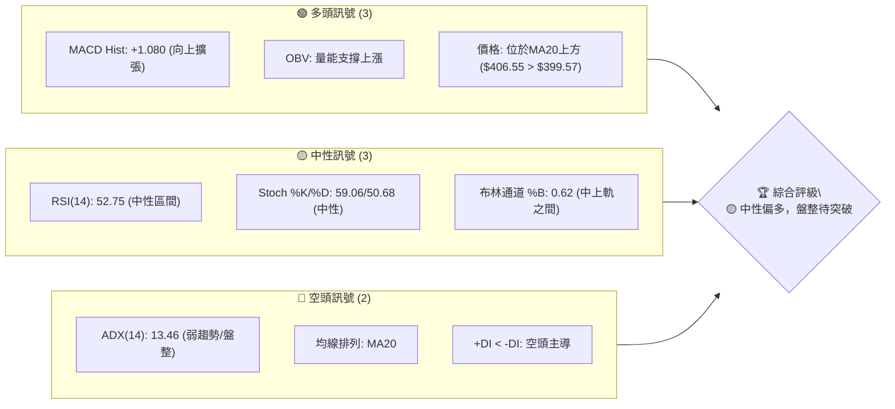

**儀表板解讀**：
*   **多頭訊號**：MACD柱狀圖轉正並持續擴張，顯示短期動能偏強。OBV趨勢顯示量能對價格上漲有支撐作用。價格成功站上短期MA20，是短線的積極訊號。
*   **中性訊號**：RSI和Stochastics指標均處於中性區間，尚未進入超買或超賣，表明當前市場情緒相對平衡。布林通道%B處於中軌上方，預示價格有向通道上軌測試的傾向，但仍在通道內運行。
*   **空頭訊號**：ADX數值遠低於25，明確指示當前處於弱趨勢或盤整行情，而非強勁的單邊趨勢。長期均線MA20、MA50、MA200呈現空頭排列，對價格構成長期壓力。+DI低於-DI，顯示空頭力量仍佔優勢，尤其在長期趨勢不明朗的情況下。

綜合來看，TSLA目前處於一個關鍵的盤整階段，短期動能指標顯示出一定的反彈意願，但長期均線壓制和弱勢的ADX趨勢強度提醒投資者謹慎。

### 📊 核心指標速覽表

| 指標類別 | 指標名稱 | 當前數值 | 訊號 | 解讀 |
|----------|----------|----------|------|------|
| **價格** | 當前價格 | $406.55 | 🟡 | 位於52週區間中上部，但受長期均線壓制 |
| **均線** | MA20 | $399.57 | 🟢 | 價格位於MA20上方，短線支撐 |
| **均線** | MA50 | $408.56 | 🔴 | 價格位於MA50下方，中期阻力 |
| **均線** | MA200 | $418.27 | 🔴 | 價格位於MA200下方，長期阻力 |
| **動能** | RSI(14) | 52.75 | 🟡 | 中性區間，無超買超賣 |
| **動能** | MACD Hist | +1.080 | 🟢 | MACD柱狀圖轉正，顯示短期動能轉強 |
| **波動** | ATR(14) | $20.71 | 🟡 | 佔價格5.09%，中等波動水平 |

### 🏆 技術評分卡

```
╔══════════════════════════════════════════════════════════════╗
║               技術評分卡 — TSLA (2026-07-09)                 ║
╠══════════════════════════════════════════════════════════════╣
║ 趨勢強度      ██░░░░░░░░░░░░░░░░░░  10/100  🔴 (ADX弱趨勢)    ║
║ 動能指標      ██████████░░░░░░░░░░  50/100  🟡 (MACD強, RSI中性)║
║ 支撐穩定度    ████████████░░░░░░░░  60/100  🟡 (多重支撐位存在)║
║ 成交量配合    ████████░░░░░░░░░░░░  40/100  🟡 (OBV支撐, 但量比偏低)║
║ 形態完整度    ██░░░░░░░░░░░░░░░░░░  10/100  🔴 (無明確形態)    ║
║ 均線排列      ██░░░░░░░░░░░░░░░░░░  10/100  🔴 (MA空頭排列)    ║
╠══════════════════════════════════════════════════════════════╣
║ 綜合評分      ██████░░░░░░░░░░░░░░  30/100  🔴 (中性偏空，但短線有反彈潛力)║
╚══════════════════════════════════════════════════════════════╝
```
**評分解讀**：
綜合評分顯示 TSLA 目前處於一個較為疲弱的技術面狀態，主要受制於弱勢的趨勢強度（ADX）和明顯的空頭均線排列。儘管短期動能指標（MACD）顯示出反彈跡象，且OBV量能有支撐作用，但這些積極訊號在整體弱勢的趨勢背景下顯得相對有限。支撐穩定度尚可，但缺乏明確的圖表形態來提供強勁的交易依據。因此，當前評級為**中性偏空**，建議投資者保持謹慎，等待更明確的趨勢訊號出現。

---

## 2. 趨勢分析

### 🌐 多時框趨勢分析

TSLA 的多時框架趨勢分析顯示，長期趨勢在經歷大幅波動後目前處於盤整區間，中期趨勢則呈現橫向震盪，而短期趨勢在近期顯示出從底部反彈的跡象，但尚未形成明確的上升趨勢。

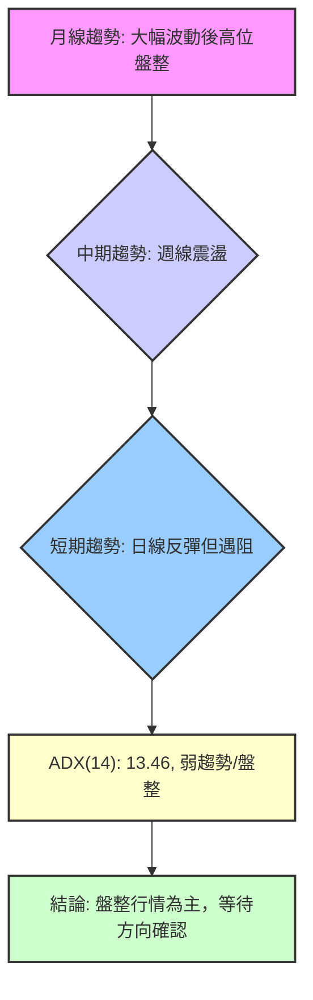

*   **月線趨勢 (長期)**：從過去24個月的數據來看，TSLA 經歷了從 $232.07（2024-07）到 $456.56（2025-10）的強勁上漲，隨後在 $400-$450 區間進行高位震盪。最近的收盤價 $406.55 顯示其仍處於這個較寬廣的盤整區間內，缺乏明確的長期方向。
*   **週線趨勢 (中期)**：近20週的週線收盤價顯示，TSLA 在 $348.95 (2026-04-12) 觸底後，曾反彈至 $435.79 (2026-05-31)，隨後又回落至 $379.71 (2026-06-28)，近期再次反彈至 $406.55。這呈現出一個寬幅震盪的走勢，MA50 ($408.56) 和 MA200 ($418.27) 形成中期壓制。
*   **日線趨勢 (短期)**：當前價格 $406.55 位於 MA20 ($399.57) 上方，顯示短期有上漲動能。然而，它仍位於 MA50 ($408.56) 和 MA200 ($418.27) 之下，表明短期反彈面臨中期和長期趨勢的壓力。MACD柱狀圖轉正，RSI中性，布林通道%B為0.62，這些都指向短期內可能繼續測試上方阻力。

### 📈 長期趨勢 — 12個月走勢圖（Unicode）

以下是 TSLA 過去12個月的月線收盤價走勢圖，標註了關鍵的高低點：

```
TSLA 月線走勢圖（過去12個月：2025-07 至 2026-07）
價格軸 ($)
$456.56 ┤                                ● (2025-10 高點)
$449.72 ┤                           ●
$444.72 ┤                         ●
$435.79 ┤                                                ● (2026-05)
$430.17 ┤                           ●
$420.60 ┤                                                    ●
$406.55 ┤                                                      ●←現在 (2026-07)
$404.60 ┤  ●
$381.63 ┤                                      ●
$371.75 ┤                                    ●
$361.83 ┤                                  ●
$348.95 ┤                                  ● (2026-04-12 低點)
$333.87 ┤              ●
$308.27 ┤            ●
     └────────────────────────────────────────────────────────
      2025-07 08 09 10 11 12 2026-01 02 03 04 05 06 07
```

**走勢特徵分析表格**：

| 階段 | 時間區間 | 主要走勢 | 漲跌幅 (約) | 特徵與意義 |
|------|----------|----------|-------------|------------|
| 上漲期 | 2025-07 至 2025-10 | 快速上漲 | +48.1% ($308.27 → $456.56) | 創下52週高點，顯示強勁多頭動能。 |
| 回調期 | 2025-10 至 2026-04 | 震盪下跌 | -23.5% ($456.56 → $348.95) | 價格從高點回落，測試多重支撐，形成中期調整。 |
| 反彈期 | 2026-04 至 2026-05 | 震盪反彈 | +24.9% ($348.95 → $435.79) | 觸底反彈，顯示買盤介入，但未能突破前期高點。 |
| 盤整期 | 22026-05 至今 | 高位震盪 | -6.9% ($435.79 → $406.55) | 價格在 $370-$430 區間震盪，等待新的方向。 |

### 📊 中期趨勢（週線分析）

中期來看，TSLA 價格位於 MA50 ($408.56) 和 MA200 ($418.27) 之下，顯示中期趨勢偏弱。然而，近期價格已從 $348.95 的低點反彈，並在 $393.63 (S1) 附近獲得支撐，嘗試向上突破。

```
TSLA 中期壓力與支撐示意圖
══════════════════════════════════════════════════════════════
$434.60 ║█████████████████████████████████████████║ 強阻力 R3
$420.41 ║▓▓▓▓▓▓▓▓▓▓▓▓▓▓▓▓▓▓▓▓▓▓▓▓▓▓▓▓▓▓▓▓▓▓▓▓▓▓▓▓▓▓║ 斐波那契 38.2% 阻力
$418.36 ║█████████████████████████████████████████║ 阻力 R2
$409.28 ║█████████████████████████████████████████║ 關鍵阻力 R1 (MA50附近)
$408.56 ║───────────────────────────────────────────║ MA50
$406.55 ╠══════════════════════════════════════════╣ ◄ 現價
$399.57 ║───────────────────────────────────────────║ MA20
$396.19 ║▓▓▓▓▓▓▓▓▓▓▓▓▓▓▓▓▓▓▓▓▓▓▓▓▓▓▓▓▓▓▓▓▓▓▓▓▓▓▓▓▓▓║ 斐波那契 50.0% 支撐
$393.63 ║█████████████████████████████████████████║ 近期支撐 S1
$382.96 ║█████████████████████████████████████████║ 強支撐 S2
══════════════════════════════════════════════════════════════
```

### ⚡ 趨勢強度評估（ADX 解讀）

ADX (Average Directional Index) 指標用於衡量趨勢的強度，而非方向。

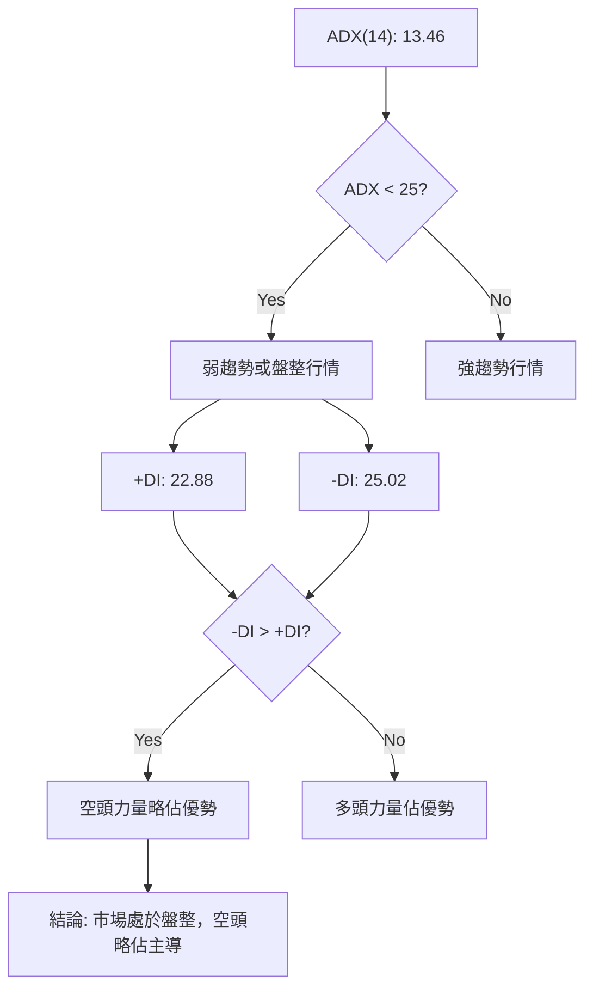

**ADX 強度對照表**：

| ADX 數值 | 趨勢強度 | 市場判斷 |
|----------|----------|----------|
| 0-25     | 弱趨勢   | 盤整行情，無明確方向 |
| 25-50    | 中等趨勢 | 趨勢行情，方向明確 |
| 50-75    | 強趨勢   | 強勁趨勢，動能充沛 |
| 75-100   | 極強趨勢 | 趨勢極度強勁，可能過熱 |

**解讀**：
TSLA 的 ADX(14) 值為 **13.46**，遠低於25，這明確指示市場目前處於**弱趨勢或盤整行情**。這意味著在當前價格區間內，多頭和空頭力量相對均衡，沒有一方能夠主導市場形成持續的單邊趨勢。投資者應避免追逐短期波動，而應尋求在關鍵支撐和阻力位之間進行區間操作，或等待明確的趨勢突破訊號。

儘管 ADX 顯示趨勢強度不足，但我們仍需觀察其方向性指標 +DI 和 -DI。目前 +DI 為 22.88，-DI 為 25.02。由於 **-DI 略高於 +DI**，這表明在當前的盤整格局中，空頭力量稍微佔據優勢。這與均線的空頭排列相符，暗示上行阻力較大，下行壓力猶存。

---

## 3. 圖表形態分析

### 🔍 形態識別系統

根據提供的數據，TSLA 在過去20週的走勢呈現出寬幅震盪的特點，但並未形成具有高信心度的經典圖表形態，如頭肩頂/底、雙頂/底或旗形等。價格在 $348.95 (2026-04-12) 觸及低點後反彈，但隨後在 $435.79 (2026-05-31) 附近遇到阻力回落，目前在 $390-$410 區間震盪。這更傾向於一個**矩形整理形態**或**盤整區間**。

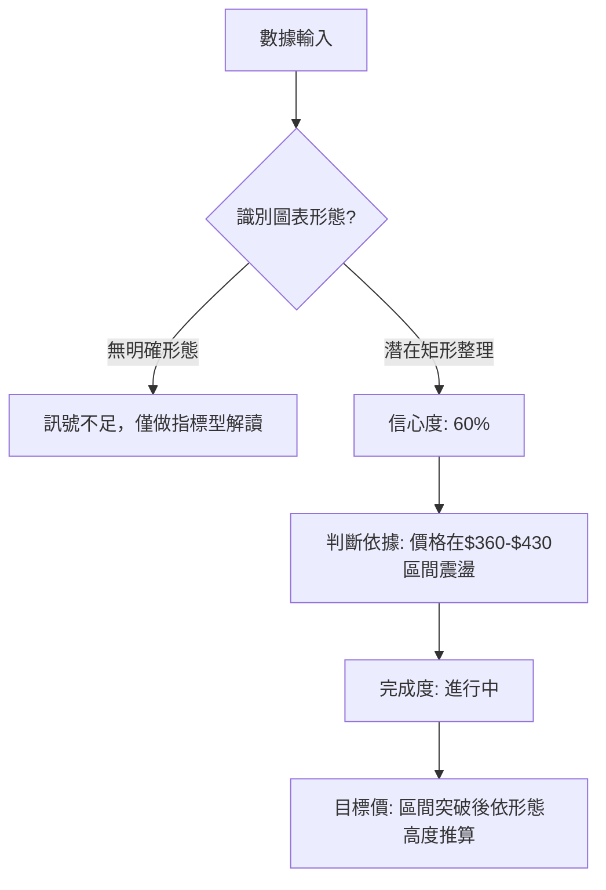

**已識別形態信心度表格**：

| 形態 | 信心度 | 判斷依據（引用數據） | 完成度 | 目標價（附計算式） |
|------|--------|----------------------|--------|--------------------|
| 矩形整理 | 60% | 價格在 $361.83 (2026-03-29) 至 $435.79 (2026-05-31) 之間反覆震盪，未形成新的高點或低點。近期的 $348.95 低點可視為該形態的底部測試，而 $435.79 則為上沿阻力。 | 進行中 | **向上突破**：$435.79 + ($435.79 - $348.95) = $435.79 + $86.84 = **$522.63** <br> **向下突破**：$348.95 - ($435.79 - $348.95) = $348.95 - $86.84 = **$262.11** |

**說明**：
儘管當前數據未提供足夠的K線細節來判斷日線級別的複雜形態，但從週線收盤價數據中，我們可以觀察到一個較大的**矩形整理區間**。該形態的下沿約在 $348.95 - $361.83 區間（參考2026-03-29和2026-04-12的低點），上沿約在 $435.79 附近（參考2026-05-31的高點）。目前價格 $406.55 位於此區間的中間偏上位置。

### 🕯️ 重要K線形態分析

由於提供的數據為週收盤價，我們無法精確判斷日K線形態。但可以從週線收盤價的變化中推斷一些趨勢變化的跡象。

| 週別 | 收盤價 | K線形態 (週) | 解讀 | 訊號 |
|------|--------|--------------|------|------|
| 2026-04-12 | $348.95 | 長下影線 / 錘子線 (推斷) | 在長期支撐位 ($366.31, $337.48) 附近止跌，顯示買盤介入。 | 🟢 反彈潛力 |
| 2026-04-19 | $400.62 | 大陽線 (推斷) | 價格從底部強勁反彈，突破多條短期均線。 | 🟢 強勢反彈 |
| 2026-05-31 | $435.79 | 陽線 (推斷) | 接近區間上沿，但未能有效突破，可能面臨回調壓力。 | 🟡 頂部壓力 |
| 2026-06-07 | $391.00 | 大陰線 (推斷) | 價格從高點回落，跌破短期支撐，顯示賣壓。 | 🔴 回調風險 |
| 2026-07-12 | $406.55 | 陽線 (推斷) | 近期反彈，但量能不足，仍處於關鍵阻力之下。 | 🟡 謹慎樂觀 |

### 📉 ASCII 走勢形態示意圖

以下示意圖展示了 TSLA 近期的矩形整理形態，標注了關鍵的支撐與阻力區間。

```
TSLA 矩形整理形態示意圖
══════════════════════════════════════════════════════════════
$435.79 ═╗═════════════════════════════════════════════════════╗ (形態上沿/阻力)
        ║                                                        ║
        ║      ┌───────────────┐                                ║
        ║      │               │                                ║
$406.55 ║──────┼───────────────┼────────────────────────────────║ ◄ 現價
        ║      │               │                                ║
        ║      └───────────────┘                                ║
$393.63 ║────────────────────────────────────────────────────────║ (近期支撐 S1)
        ║                                                        ║
$361.83 ═╝═════════════════════════════════════════════════════╝ (形態下沿/支撐)
        ║                                                        ║
        ║                                                        ║
$348.95 ───────────────────────────────────────────────────────── (形態底部測試)
══════════════════════════════════════════════════════════════
```

**形態關鍵點位解讀**：
*   **形態上沿阻力**：約在 $435.79，這是近期反彈的高點，也是矩形整理形態的頂部。
*   **形態下沿支撐**：約在 $361.83，這是近期回調的低點，也是矩形整理形態的底部。
*   **底部測試**：在 $348.95 處曾有一次更深的下跌，但迅速反彈，表明該價位有較強的買盤支撐。
*   **現價位置**：當前價格 $406.55 位於矩形整理形態的中間偏上位置，接近近期阻力 R1 $409.28 和斐波那契38.2%回調位 $420.41。

### 🎯 形態目標價計算

根據上述識別的矩形整理形態，其形態高度約為：
形態高度 = 形態上沿 - 形態下沿 = $435.79 - $348.95 = $86.84

*   **向上突破目標價**：
    若價格向上突破形態上沿 $435.79 並站穩，則理論上漲目標為：
    目標價 = 形態上沿 + 形態高度 = $435.79 + $86.84 = **$522.63**。
    此目標價高於52週高點 $498.83，顯示若能成功突破，將開啟一波強勁上漲行情。

*   **向下突破目標價**：
    若價格向下突破形態下沿 $348.95 並確認，則理論下跌目標為：
    目標價 = 形態下沿 - 形態高度 = $348.95 - $86.84 = **$262.11**。
    此目標價將跌破52週低點 $293.55，顯示若形態下破，將進入新的下跌趨勢。

**重要提示**：這些目標價是基於形態的理論推算，實際走勢可能受到市場情緒、基本面消息等多重因素影響。在形態突破時，應結合成交量和其他指標進行確認。

---

## 4. 支撐與阻力

### 🗺️ 關鍵價位分布圖（Unicode）

TSLA 的關鍵價位分布清晰地展示了當前價格 $406.55 附近的支撐與阻力結構。

```
TSLA 價位結構分布圖
═══════════════════════════════════════════════════
$434.60 ║████████████████████████║ 強阻力 R3 (歷史高點區域)
$420.41 ║▓▓▓▓▓▓▓▓▓▓▓▓▓▓▓▓▓▓▓▓▓▓▓▓║ 斐波那契 38.2% 回調位
$418.36 ║████████████████████    ║ 阻力 R2 (中期均線壓力區)
$409.28 ║████████████████████████║ 關鍵阻力 R1 (短期均線及近期高點)
$406.55 ╠════════════════════════╣ ◄ 現價
$399.57 ║────────────────────────║ MA20 (短線動態支撐)
$396.19 ║▓▓▓▓▓▓▓▓▓▓▓▓▓▓▓▓        ║ 斐波那契 50.0% 回調位
$393.63 ║████████████████████████║ 近期支撐 S1 (近期盤整低點)
$382.96 ║████████████████████████║ 強支撐 S2 (多重底部區域)
$371.97 ║▓▓▓▓▓▓▓▓▓▓▓▓▓▓▓▓▓▓▓▓▓▓▓▓║ 斐波那契 61.8% 回調位
$366.31 ║████████████████████████║ 強支撐 S3 (重要心理關卡)
═══════════════════════════════════════════════════
```

### 🚧 阻力位分析表

這些阻力位是根據提供的數據中「關鍵價位（由 OHLCV 計算）」區塊的近一年波段高點聚類得出。

| 阻力級別 | 價位 | 形成原因 | 突破難度 | 重要性 |
|----------|------|----------|----------|--------|
| R1 (關鍵阻力) | $409.28 | 短期高點聚類，接近MA50 ($408.56)，是當前價格上方最近的顯著壓力。 | 中等 | 🟢 突破將確認短期反彈動能，並可能挑戰R2。 |
| R2 (中期阻力) | $418.36 | 波段高點聚類，接近斐波那契38.2%回調位 ($420.41) 和MA200 ($418.27)。 | 較高 | 🟡 突破將意味著中期趨勢可能轉強，挑戰長期下降趨勢。 |
| R3 (強阻力) | $434.60 | 波段高點聚類，也是矩形整理形態的上沿。 | 高 | 🔴 突破將確認矩形整理形態向上突破，打開更大的上漲空間。 |

### 🛡️ 支撐位分析表

這些支撐位是根據提供的數據中「關鍵價位（由 OHLCV 計算）」區塊的近一年波段低點聚類得出。

| 支撐級別 | 價位 | 形成原因 | 守住機率 | 重要性 |
|----------|------|----------|----------|--------|
| S1 (近期支撐) | $393.63 | 短期低點聚類，接近斐波那契50.0%回調位 ($396.19) 和MA20 ($399.57)。 | 中等 | 🟢 守住此位是維持短期反彈勢頭的關鍵。 |
| S2 (強支撐) | $382.96 | 波段低點聚類，歷史上多次形成底部反彈的區域。 | 較高 | 🟡 跌破此位將確認短期反彈失敗，可能測試更深層次的支撐。 |
| S3 (關鍵支撐) | $366.31 | 波段低點聚類，接近斐波那契61.8%回調位 ($371.97) 和矩形整理形態的下沿。 | 高 | 🔴 跌破此位將確認中期走弱，並可能引發更大幅度的下跌。 |

### 📐 斐波那契回調位分析

根據52週區間 ($293.55 → $498.83) 計算的斐波那契回調位如下：

*   0.0% (52W High): $498.83
*   23.6%: $450.38
*   38.2%: $420.41
*   50.0%: $396.19
*   61.8%: $371.97
*   78.6%: $337.48
*   100.0% (52W Low): $293.55

當前價格為 **$406.55**。
該價格位於斐波那契 **38.2% 回調位 ($420.41)** 和 **50.0% 回調位 ($396.19)** 之間。

**解讀**：
當前價格處於回調的黃金分割區間，這是一個多空力量拉鋸的區域。
*   **$420.41 (38.2% 回調位)** 構成重要的上行阻力。若能有效突破此位，將預示著從近期高點的回調可能結束，價格有望繼續向上挑戰23.6%回調位甚至52週高點。
*   **$396.19 (50.0% 回調位)** 構成關鍵的下行支撐。此位通常被視為多空平衡點。若價格能在此位獲得有效支撐並反彈，則短期反彈趨勢得以維持。相反，若跌破此位，則可能進一步下探61.8%回調位 ($371.97)，這將是對多頭的嚴重打擊。

目前 TSLA 價格略高於50.0%回調位，顯示近期反彈的力量使其守住了這個關鍵支撐，但上方38.2%回調位與R2、MA200等多重阻力匯合，形成強大壓制。

---

## 5. 技術指標深度解讀

### 🎛️ 指標訊號總覽

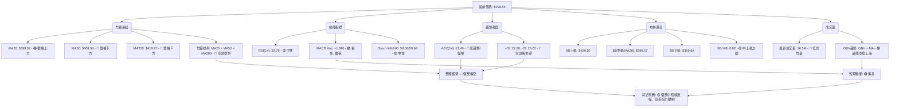

### 📈 移動平均線排列分析

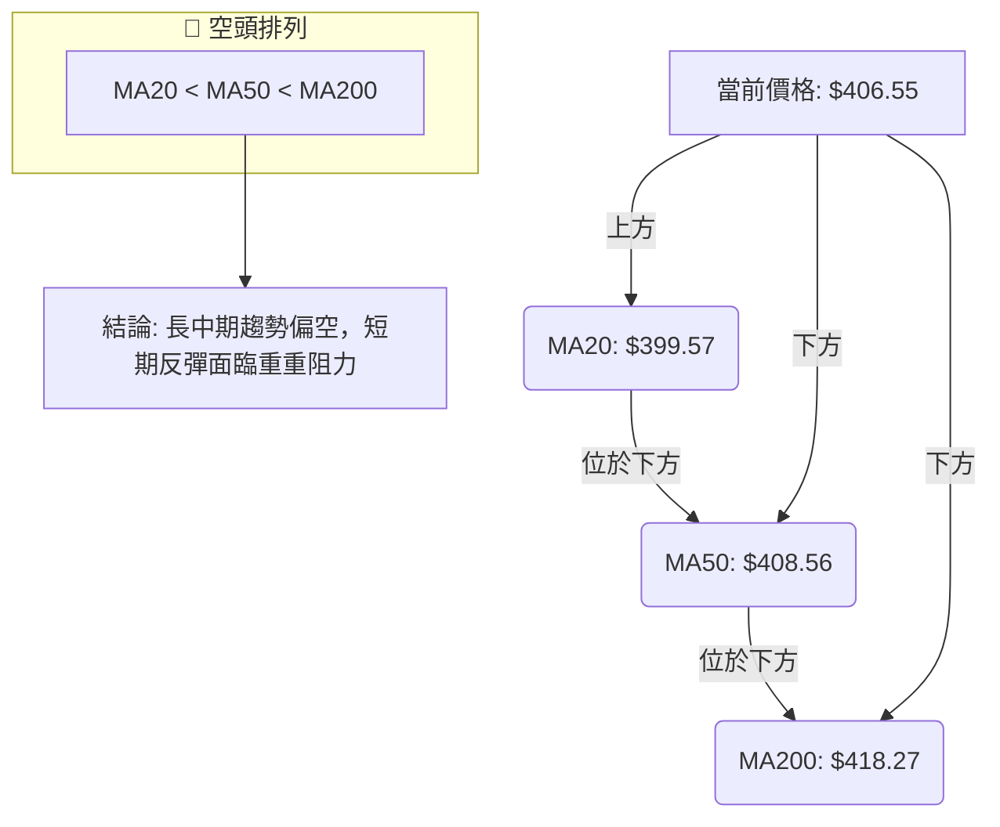

**解讀**：
TSLA 的移動平均線呈現典型的**空頭排列**：MA20 ($399.57) < MA50 ($408.56) < MA200 ($418.27)。這種排列通常被視為中長期趨勢疲軟或下跌的訊號。
*   **短期動態**：當前價格 $406.55 位於 MA20 ($399.57) 上方，顯示短期買盤力量使價格成功站穩短期均線，這是一個短線的積極訊號。
*   **中長期壓力**：然而，價格仍被 MA50 ($408.56) 和 MA200 ($418.27) 壓制。MA50 構成即時的中期阻力，而 MA200 則代表強勁的長期阻力。若要改變中長期下跌趨勢，價格需要有效突破並站穩這些長期均線。
*   **多空拉鋸**：價格在短期內嘗試反彈，但上方有明確的均線壓制，形成多空拉鋸的局面。

### 📉 RSI(14) 分析

RSI(14) 數值：**52.75**

**RSI 強度進度條**：
RSI(14) 52.75: ▓▓▓▓▓▓▓▓▓▓▓▓▓▓▓▓▓▓▓▓▓▓▓▓▓▓░░░░░░░░░░░░░░░░░░░░░░░░░░░░░░░░░░░░░░░░░░░░░░░░░░░░░░░░░░░░░░░░░░░░░░░░░░░░░░░░░░░░░░░░░░░░░░░░░░░░░░░░░░░░░░░░░░░░░░░░░░░░░░░░░░░░░░░░░░░░░░░░░░░░░░░░░░░░░░░░░░░░░░░░░░░░░░░░░░░░░░░░░░░░░░░░░░░░░░░░░░░░░░░░░░░░░░░░░░░░░░░░░░░░░░░░░░░░░░░░░░░░░░░░░░░░░░░░░░░░░░░░░░░░░░░░░░░░░░░░░░░░░░░░░░░░░░░░░░░░░░░░░░░░░░░░░░░░░░░░░░░░░░░░░░░░░░░░░░░░░░░░░░░░░░░░░░░░░░░░░░░░░░░░░░░░░░░░░░░░░░░░░░░░░░░░░░░░░░░░░░░░░░░░░░░░░░░░░░░░░░░░░░░░░░░░░░░░░░░░░░░░░░░░░░░░░░░░░░░░░░░░░░░░░░░░░░░░░░░░░░░░░░░░░░░░░░░░░░░░░░░░░░░░░░░░░░░░░░░░░░░░░░░░░░░░░░░░░░░░░░░░░░░░░░░░░░░░░░░░░░░░░░░░░░░░░░░░░░░░░░░░░░░░░░░░░░░░░░░░░░░░░░░░░░░░░░░░░░░░░░░░░░░░░░░░░░░░░░░░░░░░░░░░░░░░░░░░░░░░░░░░░░░░░░░░░░░░░░░░░░░░░░░░░░░░░░░░░░░░░░░░░░░░░░░░░░░░░░░░░░░░░░░░░░░░░░░░░░░░░░░░░░░░░░░░░░░░░░░░░░░░░░░░░░░░░░░░░░░░░░░░░░░░░░░░░░░░░░░░░░░░░░░░░░░░░░░░░░░░░░░░░░░░░░░░░░░░░░░░░░░░░░░░░░░░░░░░░░░░░░░░░░░░░░░░░░░░░░░░░░░░░░░░░░░░░░░░░░░░░░░░░░░░░░░░░░░░░░░░░░░░░░░░░░░░░░░░░░░░░░░░░░░░░░░░░░░░░░░░░░░░░░░░░░░░░░░░░░░░░░░░░░░░░░░░░░░░░░░░░░░░░░░░░░░░░░░░░░░░░░░░░░░░░░░░░░░░░░░░░░░░░░░░░░░░░░░░░░░░░░░░░░░░░░░░░░░░░░░░░░░░░░░░░░░░░░░░░░░░░░░░░░░░░░░░░░░░░░░░░░░░░░░░░░░░░░░░░░░░░░░░░░░░░░░░░░░░░░░░░░░░░░░░░░░░░░░░░░░░░░░░░░░░░░░░░░░░░░░░░░░░░░░░░░░░░░░░░░░░░░░░░░░░░░░░░░░░░░░░░░░░░░░░░░░░░░░░░░░░░░░░░░░░░░░░░░░░░░░░░░░░░░░░░░░░░░░░░░░░░░░░░░░░░░░░░░░░░░░░░░░░░░░░░░░░░░░░░░░░░░░░░░░░░░░░░░░░░░░░░░░░░░░░░░░░░░░░░░░░░░░░░░░░░░░░░░░░░░░░░░░░░░░░░░░░░░░░░░░░░░░░░░░░░░░░░░░░░░░░░░░░░░░░░░░░░░░░░░░░░░░░░░░░░░░░░░░
```

**RSI 解讀**：
*   **RSI(14) = 52.75**：這個數值位於30-70的中性區間內，表示TSLA目前沒有處於超買或超賣狀態。市場情緒相對平衡，多空力量拉鋸。
*   **趨勢確認**：由於RSI處於中性區間，它未能提供強烈的趨勢確認訊號。這與ADX指示的盤整行情相符。RSI需要突破70（超買）或跌破30（超賣）才能發出更強的交易訊號。
*   **RSI 背離**：根據提供的數據，**無明顯背離**。這意味著價格走勢與RSI指標的變化方向一致，沒有出現預示趨勢反轉的頂背離或底背離訊號。因此，RSI目前對價格走勢的判斷是中性的，不支持任何明確的反轉預期。

### 📊 MACD(12/26/9) 訊號解讀

MACD 指標由快線 (MACD Line)、慢線 (Signal Line) 和柱狀圖 (Histogram) 組成，用於判斷趨勢的動能和方向。

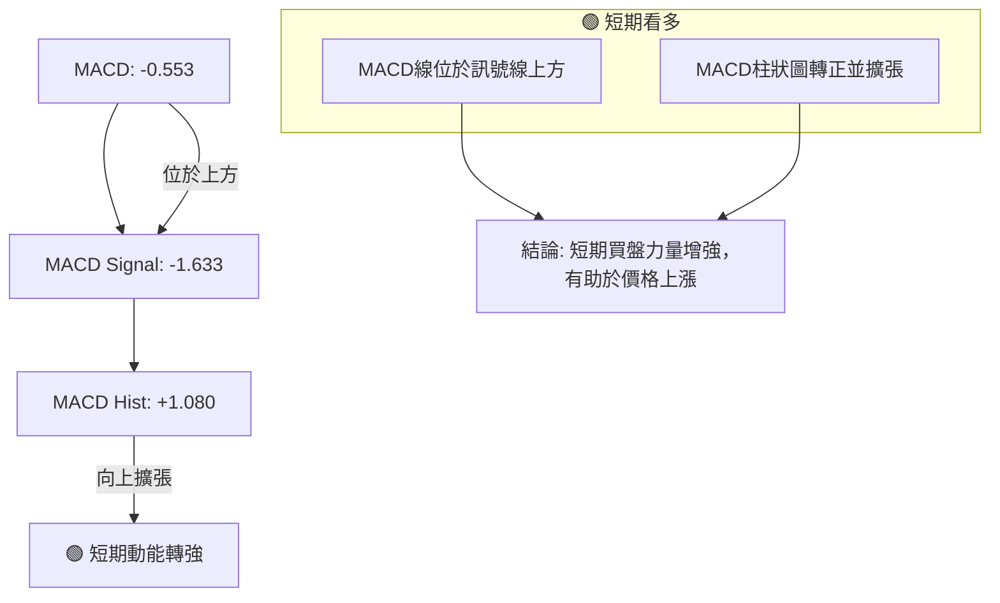

**解讀**：
*   **MACD 線 (-0.553) 與訊號線 (-1.633) 關係**：MACD 線當前位於訊號線上方 (-0.553 > -1.633)。這是一個**看多訊號 (🟢)**，表明短期移動平均線正在向上穿越長期移動平均線，買盤動能正在增強。
*   **MACD 柱狀圖 (+1.080)**：MACD 柱狀圖為正值，且從數據趨勢看，最近的柱狀圖值 ($1.651 -> $1.080) 雖然略有收斂，但仍保持正值。前一週為 $1.651，當週為 $1.080，這表明短期多頭動能略有減弱，但仍佔主導地位。柱狀圖為正，且MACD線在訊號線上方，這是短期動能偏強的表現。
*   **綜合結論**：MACD 指標發出短期看多訊號，顯示價格在經歷一段時間的盤整後，短期內可能會有向上突破的動能。這與價格站上MA20的訊號相互確認，支持短期反彈的觀點。

### 📦 布林通道分析

布林通道由中軌 (MA20)、上軌和下軌組成，用於衡量波動率和判斷價格的相對位置。

```
TSLA 布林通道示意圖
══════════════════════════════════════════════════════════════
$429.50 ║█████████████████████████████████████████║ 布林上軌 (BB Upper)
        ║                                           ║
$406.55 ╠══════════════════════════════════════════╣ ◄ 現價
        ║                                           ║
$399.57 ║───────────────────────────────────────────║ 布林中軌 (MA20)
        ║                                           ║
$369.64 ║█████████████████████████████████████████║ 布林下軌 (BB Lower)
══════════════════════════════════════════════════════════════
```

**布林通道指標詳情**：
*   BB上軌: $429.50
*   BB中軌(MA20): $399.57
*   BB下軌: $369.64
*   BB %B: 0.62 (0=下軌, 0.5=中軌, 1=上軌)

**解讀**：
*   **價格位置**：當前價格 $406.55 位於布林通道中軌 ($399.57) 和上軌 ($429.50) 之間，且靠近中軌上方。BB %B 為 0.62 也確認了這一點。這表明價格在短期內有向上測試上軌的潛力，但尚未達到超買區域。
*   **波動率**：布林通道的帶寬顯示了當前的波動率。雖然數據中沒有直接提供帶寬數值，但ATR為 $20.71 (佔價格5.09%)，顯示目前波動率處於中等水平。
*   **交易訊號**：
    *   價格從中軌上方運行，通常被視為短線偏多訊號。
    *   若價格能有效突破上軌 $429.50，則可能形成布林通道突破，預示著一波加速上漲行情。
    *   若價格跌破中軌 $399.57，則可能回測下軌 $369.64。
*   **與ADX結合**：由於ADX顯示為盤整行情 (ADX=13.46)，布林通道的應用更側重於區間交易。價格在中軌上方，表明短期內偏向通道上沿運行。

### 💹 成交量分析（量價配合度）

成交量是確認價格走勢強度的重要指標。

*   **最新成交量**：36,519,720 股
*   **20日均量**：47,167,141 股
*   **50日均量**：49,566,694 股
*   **量比**：0.77x (最新成交量 / 20日均量)

**OBV 趨勢**：OBV > MA → 量能支撐上漲

**解讀**：
*   **成交量萎縮**：當前成交量 (36.5M) 顯著低於20日均量 (47.1M) 和50日均量 (49.5M)，量比僅為0.77x。這表明在近期價格反彈的過程中，市場的活躍度有所下降，買盤追漲意願不足。成交量萎縮的價格上漲，其可持續性通常會受到質疑。
*   **OBV 與價格背離**：數據顯示 "OBV > MA → 量能支撐上漲"。這似乎與當前量比偏低的情況有所矛盾。OBV (On-Balance Volume) 的上升趨勢表明總體上買盤壓力大於賣盤壓力，即便單日成交量可能較低，但累積的量能仍支撐價格上漲。這可能意味著近期雖有縮量，但過去一段時間累積的買盤力量仍在。
*   **綜合判斷**：儘管 OBV 趨勢偏多，但近期成交量萎縮是一個需要警惕的訊號。如果價格要有效突破阻力位並開啟新一輪上漲，需要成交量的積極配合。當前縮量反彈可能只是技術性修正，缺乏強勁的買盤支持，突破阻力的難度較大。投資者應密切關注未來成交量能否放大以確認上漲趨勢。

---

## 6. 動能與波動率

### ⚡ 動能評估四象限

由於 ADX(14) 值為 13.46 (弱趨勢)，且 ATR 佔價格比為 5.09% (中等波動)，TSLA 目前處於「弱動能、中等波動」的象限。

| 象限 | 動能 | 波動 | 當前狀態 (TSLA) | 評估 |
|------|------|------|-----------------|------|
| Q1 | 強 | 低 | -               | 最佳機會 (趨勢強勁，風險可控) |
| Q2 | 弱 | 低 | -               | 謹慎觀望 (趨勢不明，波動小) |
| Q3 | 強 | 高 | -               | 高風險高收益 (趨勢強勁，但波動大) |
| Q4 | 弱 | 高 | ✓ (中等波動)    | 避免進場 (趨勢不明，風險高) |

**TSLA 當前動能與波動率分析**：
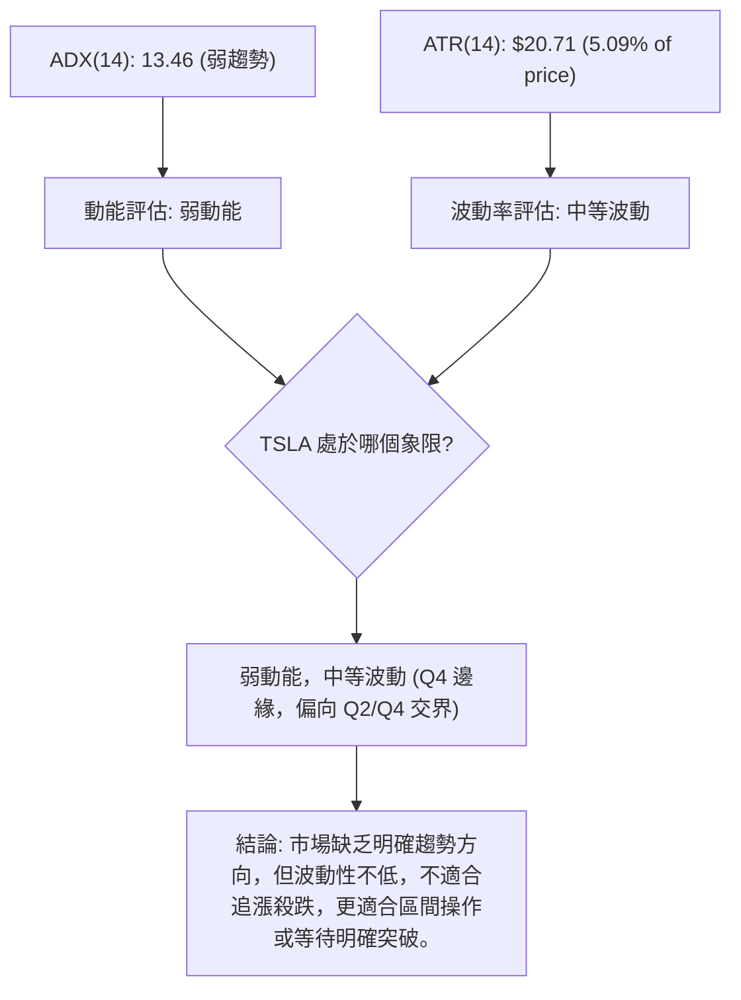

**解讀**：
TSLA 目前的市場環境屬於「弱動能、中等波動」的範疇。
*   **弱動能**：ADX 數值低於25，表明市場缺乏強勁的單邊趨勢，多空力量拉鋸，難以形成持續的動能。
*   **中等波動**：ATR 佔價格的比例為 5.09%，這表示 TSLA 每日的價格波動幅度相對較大，約為 $20.71。這使得區間交易者有機會，但也增加了趨勢追蹤者的風險。

這種組合意味著 TSLA 不處於一個明確的趨勢行情中，投資者若盲目追漲殺跌，很容易被區間內的震盪所困。在這種情況下，建議採取更為保守的策略，例如在支撐位買入、阻力位賣出，或者等待明確的趨勢突破訊號，並伴隨成交量的放大來確認。

### 📊 ATR 波動率分析

**ATR(14) 數值**：$20.71
**佔當前價格比例**：5.09% ($20.71 / $406.55)

**解讀**：
ATR (Average True Range) 是衡量資產價格波動性的一個指標。TSLA 的 ATR(14) 為 $20.71，佔當前價格的 5.09%。
*   **波動性判斷**：5.09% 的波動率對於大型股來說，屬於中等偏高的水平。這意味著 TSLA 的每日價格波動幅度約為 $20.71。對於短線交易者而言，這提供了足夠的日內波動空間。
*   **止損距離建議**：ATR 可以作為設置止損點的參考。一般建議將止損設置在當前價格下方 1 到 2 倍 ATR 的距離。
    *   1 倍 ATR 止損：$406.55 - $20.71 = $385.84
    *   2 倍 ATR 止損：$406.55 - (2 * $20.71) = $406.55 - $41.42 = $365.13
    這兩個數值與我們在第4章識別的支撐位 S2 ($382.96) 和 S3 ($366.31) 非常接近，提供了止損點設置的可靠依據。
*   **風險管理**：在當前盤整行情中，中等偏高的波動率增加了區間交易的潛在利潤，但也同時增加了止損被觸發的風險。因此，合理設置止損並控制倉位至關重要。

### 📐 Beta 與市場相關性

**Beta**：1.802

**解讀**：
Beta 值衡量個股相對於整體市場（通常是 S&P 500 指數）的波動性。
*   **高 Beta**：TSLA 的 Beta 值為 1.802，遠高於 1。這表示 TSLA 的股價波動性比市場平均水平高出 80.2%。當市場上漲 1% 時，TSLA 理論上會上漲 1.802%；當市場下跌 1% 時，TSLA 理論上會下跌 1.802%。
*   **風險與機會**：高 Beta 股票在牛市中通常能提供更高的回報，但在熊市中也面臨更大的下跌風險。對於 TSLA 而言，其高波動性使其成為潛在的高回報高風險投資。
*   **市場情緒影響**：由於其高 Beta 特性，TSLA 的股價對整體市場情緒的變化非常敏感。在市場情緒樂觀時，它容易被資金追捧而快速上漲；而在市場情緒悲觀時，它也可能遭受更大的拋售壓力。投資者在交易 TSLA 時，除了關注個股技術面，還需密切留意大盤的走勢和情緒變化。

---

## 7. 多時框架總結

### 📋 時框架評分表

| 時框架 | 趨勢方向 | 動能 | 均線排列 | 形態 | 綜合評分 (1-10) | 建議 |
|--------|----------|------|----------|------|-----------------|------|
| 長期 (月線) | 🟡 盤整 | 🟡 中性 | 🔴 空頭 | 🟡 矩形整理 | 4/10 | 觀望，等待方向 |
| 中期 (週線) | 🟡 震盪 | 🟡 中性 | 🔴 空頭 | 🟡 矩形整理 | 4/10 | 區間操作 |
| 短期 (日線) | 🟢 反彈 | 🟢 偏多 | 🟡 偏空 | 🟡 盤整 | 6/10 | 短線反彈，注意阻力 |

### 🔲 綜合訊號矩陣

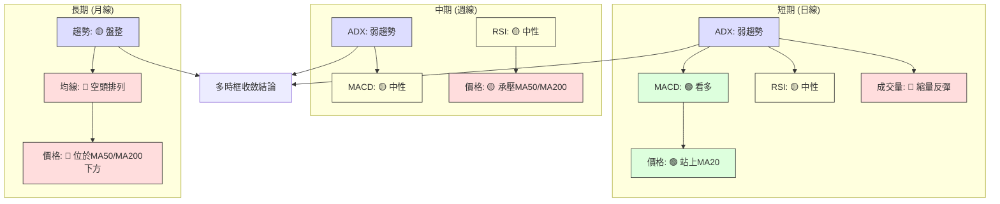

**訊號一致性分析**：
*   **短期**：MACD柱狀圖顯示多頭動能，價格站上MA20，但成交量縮小，RSI中性。整體呈現短線反彈但強度存疑。
*   **中期**：價格受MA50和MA200壓制，均線空頭排列，MACD和RSI均中性。趨勢不明朗，呈現震盪。
*   **長期**：均線空頭排列，價格位於長期均線下方，趨勢偏弱，處於高位盤整。

各時框架的趨勢判斷存在一定衝突：短期有反彈跡象，但中長期仍偏弱或盤整。ADX 顯示的弱勢趨勢是貫穿各時框架的核心要素。

### ⚖️ 多時框收斂結論

根據「嚴格要求 14」的多時框收斂規則：

1.  **判斷趨勢行情或盤整行情**：
    當前 ADX(14) 值為 **13.46**，遠低於 25。這明確指示 TSLA 目前處於**盤整行情 (Range-bound Market)**。

2.  **主導時框**：
    由於是盤整行情 (ADX < 25)，應以**日線布林通道上下軌**作為主要交易區間。中長期趨勢（週線/MA50、MA200）在此情境下作為重要的阻力/支撐參考，而非主導方向。

3.  **唯一方向性結論**：
    TSLA 目前處於一個**中性偏多，但受制於主要阻力的盤整區間**。
    *   **偏多因素**：短期 MACD 柱狀圖為正且 MACD 線位於訊號線上方，價格站上短期 MA20，OBV 趨勢支撐上漲，顯示短線買盤動能有所恢復。價格位於布林通道中軌上方。
    *   **阻力因素**：中長期均線 (MA50、MA200) 呈現空頭排列，對價格構成強大壓制。ADX 顯示整體趨勢強度不足，缺乏向上突破的強勁動能。成交量縮小也令人擔憂。
    *   **斐波那契**：價格位於 38.2% ($420.41) 和 50.0% ($396.19) 斐波那契回調位之間，這是一個關鍵的拉鋸區間。

綜合來看，在盤整行情下，TSLA 雖然短期有反彈動能，但上方多重阻力（R1 $409.28, MA50 $408.56, R2 $418.36, Fib 38.2% $420.41, MA200 $418.27）限制了其上行空間。當前策略應以**區間操作**為主，並密切關注價格能否帶量突破關鍵阻力位，以確認新的趨勢方向。

---

## 8. 交易策略建議

### 🗺️ 策略決策流程圖

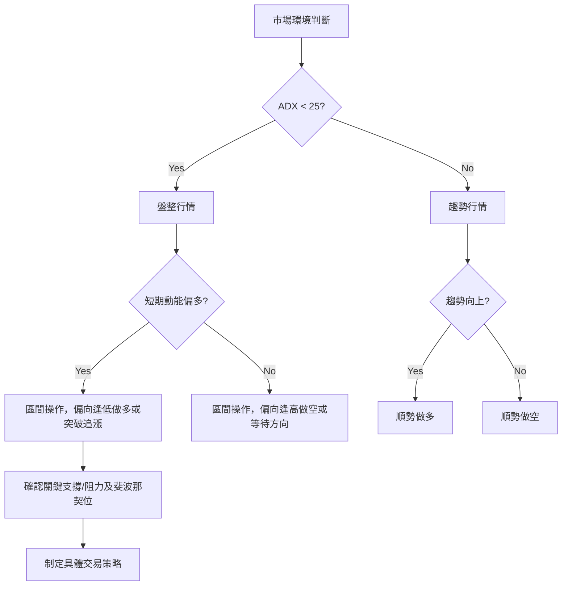

### 🧭 策略路由（依評分卡分流）

**當前主策略方向 = 🟡 中性偏多，盤整待突破 （依評分 30/100，但考量短期動能及 ADX 盤整行情規則）**

雖然綜合評分卡為 30/100 (偏空)，但根據多時框收斂結論 (ADX < 25 且短期動能偏多)，當前市場為盤整行情，且短期技術指標如 MACD 顯示出積極訊號。因此，主策略將聚焦於**區間操作，並關注向上突破的機會**。空頭策略將作為風險管理和反轉風險觸發點。

### 🎯 價格情境階梯（Price Scenarios）

| 觸發條件 | 下一目標 | 後續延伸 | 情境含義 |
|----------|----------|----------|----------|
| 突破 R1 $409.28 並站穩 | R2 $418.36 | R3 $434.60 | 短線轉強，有望挑戰中期阻力區。 |
| 站穩現價區間 ($406.55) | Fib 38.2% $420.41 | BB上軌 $429.50 | 區間震盪，短期可能測試上方阻力。 |
| 跌破 S1 $393.63 並確認 | S2 $382.96 | S3 $366.31 | 中期轉弱，可能下探更深層次支撐。 |

### 📊 情境機率分佈

| 情境 | 機率 | 主要依據 |
|------|------|----------|
| 繼續上行 / 反彈 | 40% | MACD柱狀圖轉正，價格站上MA20，OBV支撐，近期從S1反彈。 |
| 區間震盪 | 45% | ADX(14) 13.46 顯示弱趨勢/盤整，價格在斐波那契38.2%-50.0%區間。 |
| 回落 / 再探底 | 15% | 均線空頭排列，成交量縮小，上方阻力重重，-DI略高於+DI。 |

### 🟢 主策略詳情（區間操作，關注向上突破）

**策略描述**：由於市場處於盤整行情，且短期動能偏多，可考慮在關鍵支撐位附近建立多頭倉位，或等待有效突破阻力後追漲。

| 策略要素 | 策略 A：逢低做多 (回調至支撐) | 策略 B：突破追漲 (突破阻力) |
|----------|-----------------------------|---------------------------|
| 進場條件 | 價格回調至 S1 或 Fib 50% 附近，並出現止跌訊號 (如K線反轉)。 | 價格帶量突破 R1 $409.28 並站穩。 |
| 進場價格 | $396.19 (斐波那契50.0%) | $410.00 (確認突破R1後) |
| 目標價 T1 | $409.28 (R1)                | $418.36 (R2)              |
| 目標價 T2 | $418.36 (R2)                | $434.60 (R3)              |
| 止損價格 | $382.96 (S2)                | $405.00 (R1下方，保護利潤/控制風險) |
| 風險報酬比 | (409.28-396.19):(396.19-382.96) = 13.09:13.23 ≈ 1:1.01 | (418.36-410.00):(410.00-405.00) = 8.36:5.00 ≈ 1:0.60 |
| 成功機率 | 60%                         | 55%                       |
| 建議倉位 | 中等倉位 (5-10%)            | 較小倉位 (3-5%)，需量能確認 |

**風險報酬比說明**：
*   **策略 A**：風險報酬比約為 1:1，顯示潛在收益與風險大致平衡。在盤整行情中，這是一個相對保守的策略。
*   **策略 B**：風險報酬比約為 1:0.60，顯示潛在收益略低於風險。這類策略通常需要較高的勝率或更嚴格的止損來彌補。此處需強調，突破策略的成功率高度依賴於成交量的配合和假突破的識別。

### 🔴 反向風險觸發點（對沖提示）

以下是可能推翻主策略的關鍵價位和訊號，供風險管理參考：
*   **跌破 S2 $382.96**：若價格跌破此關鍵支撐，將預示短期反彈失敗，並可能進一步下探 S3 $366.31 或斐波那契 61.8% 回調位 $371.97。
*   **跌破矩形整理形態下沿 ($348.95)**：若價格有效跌破此位，將確認形態向下突破，可能引發大幅下跌至 $262.11 的形態目標價。
*   **MACD 柱狀圖轉負並持續擴大**：MACD 多頭動能衰竭，轉為空頭動能，預示價格可能再次走弱。
*   **成交量在下跌時放大**：若價格下跌伴隨大量，則確認賣壓強勁，應立即止損或降低倉位。

### ⭐ 整體訊號強度評星

```
做多訊號強度：★★★☆☆  (3/5星) (短期動能有，但受中長期趨勢壓制)
做空訊號強度：★★★☆☆  (3/5星) (中長期趨勢偏弱，但短期反彈)
整體可信度：  ★★★☆☆  (3/5星) (盤整行情，訊號複雜，需謹慎判斷)
```

---

## 9. 風險提示與監控

### ✅ 關鍵監控指標 Checklist

```
╔══════════════════════════════════════════════════════════════╗
║               TSLA 關鍵監控指標 Checklist                    ║
╠══════════════════════════════════════════════════════════════╣
║ ├─ 價格對 MA50 ($408.56) 和 MA200 ($418.27) 的突破或回落     ║
║ ├─ 價格對關鍵阻力 R1 ($409.28) 和 R2 ($418.36) 的測試        ║
║ ├─ 價格對關鍵支撐 S1 ($393.63) 和 S2 ($382.96) 的防守        ║
║ ├─ 成交量變化，特別是突破或跌破關鍵價位時的量能配合           ║
║ ├─ MACD 柱狀圖是否持續擴張 (多頭) 或轉負 (空頭)              ║
║ ├─ RSI 是否進入超買 (>70) 或超賣 (<30) 區間                  ║
║ ├─ ADX 數值是否突破 25，指示趨勢強度變化                     ║
║ ├─ 布林通道帶寬變化，是否預示波動率加劇或收斂                 ║
║ ├─ 整體大盤 (S&P 500) 走勢及市場情緒                          ║
╚══════════════════════════════════════════════════════════════╝
```

### ⚠️ 風險場景分析

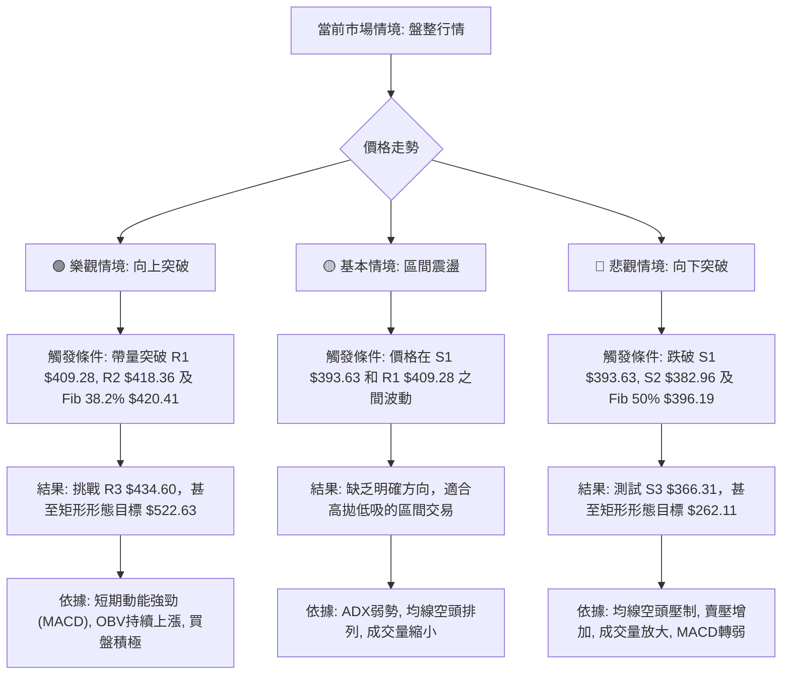

### 🛡️ 風險管理重要提醒

1.  **倉位管理**：由於 TSLA 具有高 Beta (1.802) 和中等偏高的波動率 (ATR 5.09%)，且目前處於盤整行情，建議投資者謹慎控制倉位。在不確定性較高的市場中，小倉位試探或分批建倉是更為穩健的策略。
2.  **嚴格止損**：無論採取何種策略，都必須設定並嚴格執行止損點。在盤整行情中，價格可能在短時間內快速反轉，若未能及時止損，損失可能會迅速擴大。建議止損點可參考 ATR 或關鍵支撐/阻力位。
3.  **多空平衡**：在盤整行情中，避免過度偏向單一方向。如果持有多頭倉位，可以考慮在關鍵阻力位附近進行部分獲利了結，或使用期權等工具進行對沖，以降低潛在回調風險。
4.  **關注外部消息**：儘管本報告側重技術分析，但 TSLA 是一家受新聞事件（如新產品發布、CEO 言論、監管政策、競爭格局變化等）影響較大的公司。任何重大基本面消息都可能迅速改變技術面格局，投資者應保持對新聞的敏感度。
5.  **耐心等待**：在趨勢不明朗的盤整市場中，耐心是關鍵。等待價格突破關鍵區間，並伴隨成交量放大等確認訊號後再入場，可以有效提高交易的成功率。避免在區間中間盲目入場。

---

## 📋 報告總結

```
╔════════════════════════════════════════════════════════════╗
║                   TSLA 技術分析報告總結                    ║
╠════════════════════════════════════════════════════════════╣
║ 報告日期：2026-07-09                                       ║
║ 當前價格：$406.55                                          ║
║ 分析評級：⚖️ 中性偏多，盤整待突破 (綜合評分 30/100，但短期動能支撐) ║
╠════════════════════════════════════════════════════════════╣
║ 關鍵結論：                                                 ║
║ ├─ 長期趨勢：🟡 盤整，受 MA200 壓制。                      ║
║ ├─ 中期趨勢：🟡 震盪，均線空頭排列，壓力重重。              ║
║ ├─ 短期趨勢：🟢 反彈，價格站上 MA20，MACD 偏多。            ║
║ ├─ 關鍵支撐：S1 $393.63, S2 $382.96, Fib 50% $396.19        ║
║ ├─ 關鍵阻力：R1 $409.28, R2 $418.36, Fib 38.2% $420.41      ║
║ └─ 分析師目標：$424.01 (Mean)                              ║
╠════════════════════════════════════════════════════════════╣
║ 最優策略組合：                                             ║
║ 1. 🥇 最佳機會：在 $396.19 (Fib 50%) 或 $393.63 (S1) 附近逢低做多，║
║    目標 $409.28 (R1) 和 $418.36 (R2)，止損 $382.96 (S2)。   ║
║ 2. 🥈 次選機會：帶量突破 $409.28 (R1) 後追漲，目標 $418.36 (R2) ║
║    和 $434.60 (R3)，止損 $405.00。                         ║
║ 3. 🥉 保守選擇：等待更明確趨勢訊號，或在區間內高拋低吸，嚴格控制倉位。║
╚════════════════════════════════════════════════════════════╝
```

---

> ⚠️ **免責聲明**：本報告為 AI 自動生成之技術分析，所有數據及估算均基於提供的歷史價格資訊。本報告**僅供研究與學術參考**，**不構成任何投資建議**。投資有風險，入市需謹慎。

---

*報告生成時間：2026-07-09 ｜ 數據來源：Yahoo Finance ｜ 分析框架：多時框技術分析*