<details>
<summary>📊 靜態圖表 (點擊展開)</summary>

</details>

<html>
<head><meta charset="utf-8" /></head>
<body>
    <div style="height:500px; width:100%;">                        <script>window.PlotlyConfig = {MathJaxConfig: 'local'};</script>
        <script charset="utf-8" src="https://cdn.plot.ly/plotly-3.7.0.min.js" integrity="sha256-jvTGqxNp8AGWEcvNLVuKr+8j5dGe9Yw51LQkmDH+IYA=" crossorigin="anonymous"></script>                <div id="candlestick-chart" class="plotly-graph-div" style="height:100%; width:100%;"></div>            <script>                window.PLOTLYENV=window.PLOTLYENV || {};                                if (document.getElementById("candlestick-chart")) {                    Plotly.newPlot(                        "candlestick-chart",                        [{"close":{"dtype":"f8","bdata":"AAAAoJmdekAAAADgo6x7QAAAAIA9dnpAAAAAYGaGe0AAAAAgXLN7QAAAACCFy3tAAAAAIFy3fEAAAAAAAEB7QAAAAKBH3XpAAAAAAABUfEAAAACgcBF7QAAAAEAKa3tAAAAA4KM4e0AAAAAA19d5QAAAAGBmPntAAAAAANfTekAAAABgZjJ7QAAAAAAAzHpAAAAAwPV0e0AAAABA4fZ7QAAAAKCZqXtAAAAAIIVve0AAAAAgrg98QAAAACCFG3tAAAAAYLhGfEAAAADAzMh8QAAAAAAp2HxAAAAAoJmBe0AAAADA9Yh8QAAAAIDrRX1AAAAAACnEe0AAAADAHuF8QAAAAGCP3ntAAAAA4FHYekAAAAAgrtN7QAAAAIDreXtAAAAAoJnpekAAAAAA1x95QAAAAKCZRXlAAAAAYLiOeUAAAAAAABR5QAAAAADXP3lAAAAAIK6zeEAAAACgcHF4QAAAAOB6HHpAAAAAYGY2ekAAAACgR6l6QAAAAGC44npAAAAAgD3iekAAAAAA19N6QAAAAADX63tAAAAA4HpofEAAAAAAAHB8QAAAAKBHeXtAAAAAYLjSe0AAAABAMzd8QAAAAIA97ntAAAAAIFyvfEAAAADA9bR9QAAAAIAUnn5AAAAAACk0fUAAAACA6zV+QAAAAEAzE35AAAAAIK6LfkAAAADA9Vh+QAAAAGBmVn5AAAAAQAqzfUAAAACAPbp8QAAAAEDhZnxAAAAAIIUbfEAAAADAHmF7QAAAAGC4OnxAAAAAIFwPe0AAAABgj\u002fZ6QAAAAMDMPHtAAAAAACnQe0AAAAAgXA98QAAAAEAz83tAAAAAQDNze0AAAADAHml7QAAAAAAAWHtAAAAAAAA0ekAAAABACvd6QAAAAIDCFXxAAAAAwPUQfEAAAABAMzN7QAAAAGBm7npAAAAAIFz3ekAAAADA9Qh6QAAAAGCP5npAAAAAwPVcekAAAAAgXF96QAAAAAApYHlAAAAAIFzTeEAAAACAwrF5QAAAAMAeFXpAAAAAIFyTekAAAADgUcR6QAAAAMAeEXpAAAAAQAoXekAAAACAFKp5QAAAAMAetXlAAAAAIFy7eUAAAADAHr15QAAAAKBH\u002fXhAAAAAgBSWeUAAAABgZhZ6QAAAAKBHiXlAAAAAACkoeUAAAADAHjV5QAAAAEDhhnhAAAAAQApfeUAAAADAzFh5QAAAACCuy3hAAAAAQOHqeEAAAAAA1\u002fN4QAAAAMAefXlAAAAAACmweEAAAABAM3N4QAAAAMD1uHhAAAAA4FH0eEAAAADgeox4QAAAAMDMxHdAAAAAIFz\u002fdkAAAACgmc13QAAAAOB68HdAAAAAQDMfeEAAAACAwkF3QAAAAKBHnXZAAAAA4Ho0dkAAAAAAADx3QAAAAAAp1HdAAAAAoHCJdkAAAADAHg12QAAAAGBmqnVAAAAAAAB0dUAAAACA65l1QAAAAEAzz3VAAAAAYLgGdkAAAABAM8N2QAAAAEAzf3hAAAAAYGZOeEAAAACA6wl5QAAAAAAAiHhAAAAAYLgmeEAAAAAAKTh4QAAAACCFW3dAAAAAwMyEd0AAAABguKp3QAAAAOBRgHdAAAAAwMxMd0AAAACAFNp3QAAAAMAebXhAAAAAACmIeEAAAACA61V4QAAAACCu63hAAAAA4KO8eUAAAACgmcV6QAAAAAAA0HtAAAAAQDMXe0AAAADgUdR7QAAAAMDMtHtAAAAAANdjekAAAAAA1595QAAAAIDCQXlAAAAAACkUekAAAACgmR16QAAAAAApoHpAAAAAoHAZe0AAAACAwoV7QAAAAKCZoXtAAAAA4KM8e0AAAACAFP55QAAAAADXe3pAAAAAQDN7ekAAAABAMyd6QAAAAAAAcHhAAAAAQDOPeUAAAABA4cp4QAAAAKBw2XdAAAAAYGbyeEAAAABA4WZ5QAAAAGBmsnlAAAAAYI9KeUAAAACAFMZ4QAAAAADXB3lAAAAAwMxQeUAAAACAwtl3QAAAAOB6eHdAAAAAgOtxd0AAAAAgXLt3QAAAAKBwvXlAAAAAoJlJekAAAADAzJR6QAAAAEAzl3hAAAAA4FE8ekAAAABgZi55QAAAAMD1oHhAAAAAwMxoeUAAAAAAKXx5QA=="},"high":{"dtype":"f8","bdata":"AAAAIIWPe0AAAAAgXMN7QAAAAKCZNXtAAAAAIIWHe0AAAAAgri98QAAAAAAA0HtAAAAA4KPkfEAAAAAAAGx9QAAAAOBR7HtAAAAAwMxYfEAAAABA4Up8QAAAAKBHlXtAAAAAoJlFe0AAAACAFLJ7QAAAAIA9TntAAAAAQDMje0AAAAAAKYh7QAAAAKCZdXtAAAAAIFyXe0AAAADAzBx8QAAAAMDMFHxAAAAA4KPYe0AAAABgZhZ8QAAAAEDhOnxAAAAAYI\u002fCfEAAAAAAADB9QAAAAEAzG31AAAAAwPVwfEAAAAAAAKB8QAAAAMAeoX1AAAAAIIXDfEAAAACgRyV9QAAAAEAzN31AAAAAgMJ1e0AAAABguBp8QAAAAADXp3tAAAAAoEele0AAAAAAAIh6QAAAAEAKw3lAAAAAIFx\u002fekAAAABgZo55QAAAAOB6vHlAAAAAQArPekAAAADAzCx5QAAAACCFW3pAAAAAIK5HekAAAABACq96QAAAAEDhDntAAAAAYI8ae0AAAADAzEx7QAAAAGC4\u002fntAAAAAgBRqfEAAAACA6618QAAAAAAAHHxAAAAAgD1GfEAAAACAFI58QAAAAOBRFHxAAAAAACnwfEAAAADgURx+QAAAAAAAuH5AAAAA4Hr0fkAAAACAwq1+QAAAAADXp35AAAAAoEctf0AAAAAghb9+QAAAAGBmrn5AAAAAoHCRfkAAAABgZlZ9QAAAAIDr8XxAAAAAwMyIfEAAAACgcKV8QAAAAMDMmHxAAAAAAAAEfEAAAACA62V7QAAAAIA9TntAAAAAwMwQfEAAAADAzGR8QAAAAMD1PHxAAAAAYI++e0AAAACAwtV7QAAAAAAA9HtAAAAAIK7rekAAAABAM2N7QAAAAAAAGHxAAAAAQOFGfEAAAADgo9B7QAAAAOBRWHtAAAAAAClke0AAAAAgroN7QAAAAIAUfntAAAAAYGayekAAAADA9ch6QAAAAGBmfnpAAAAAoJkheUAAAADAzOh5QAAAAAAAVHpAAAAAAAC0ekAAAACgmUV7QAAAACCuQ3tAAAAAwPWAekAAAAAghdt5QAAAAGBmDnpAAAAAAAD0eUAAAABAM+t5QAAAAEAze3lAAAAAwB6teUAAAACgcEV6QAAAAMD1DHpAAAAAgOtxeUAAAADgo0h5QAAAAKBwxXhAAAAAoEeFeUAAAACA64l5QAAAAKCZJXlAAAAAoHAZeUAAAACgcGl5QAAAAIAUBnpAAAAAAABoeUAAAABAMwN5QAAAACCuO3lAAAAAgOsBeUAAAADAHjF5QAAAAOBRNHhAAAAAgD2+d0AAAACgRxV4QAAAACCuN3hAAAAAIK7DeEAAAABACgd4QAAAAIDCHXdAAAAA4KP0dkAAAACgR1V3QAAAAIA98ndAAAAA4Hokd0AAAAAghft2QAAAAOBRwHVAAAAAAADIdkAAAACAFM51QAAAAIDC5XVAAAAAoJlFdkAAAACAFPp2QAAAAGBmqnhAAAAAwPWgeEAAAADgepR5QAAAAMDMbHlAAAAAQDOfeEAAAAAAKZB4QAAAAAAAIHhAAAAAACnsd0AAAADgesx3QAAAAOCj5HdAAAAAYGaGd0AAAAAAAAx4QAAAAMAe3XhAAAAAgD2qeEAAAACA6yF5QAAAAEDhGnlAAAAAoEf9eUAAAABAM\u002fN6QAAAAGCPEnxAAAAAwMz8e0AAAABgZlZ8QAAAACCuP3xAAAAAYI8qe0AAAACAFFJ6QAAAAIAUWnlAAAAAIFwXekAAAABAM696QAAAAAAp+HpAAAAAQDMze0AAAACgmdl7QAAAACBcv3tAAAAAwB6Re0AAAACgmdl6QAAAAGC4hnpAAAAAoJkZe0AAAACgmaV6QAAAAEDhinpAAAAAQArPeUAAAAAAACh6QAAAAKBw0XhAAAAA4KP4eEAAAABA4Wp5QAAAAAAAAHpAAAAAYLjGeUAAAABACl95QAAAAOBRKHlAAAAAAADseUAAAACA6414QAAAAKBHCXhAAAAAgOuxd0AAAADAzDx4QAAAAOBR1HlAAAAA4KOIekAAAACAwg17QAAAAKCZBXtAAAAAAABAekAAAADA9Th6QAAAAIAU+nhAAAAAgMJ9eUAAAABgj9J5QA=="},"hovertemplate":"\u003cb\u003e%{x|%Y-%m-%d}\u003c\u002fb\u003e\u003cbr\u003e\u958b: $%{open:.2f}\u003cbr\u003e\u9ad8: $%{high:.2f}\u003cbr\u003e\u4f4e: $%{low:.2f}\u003cbr\u003e\u6536: $%{close:.2f}\u003cextra\u003e\u003c\u002fextra\u003e","low":{"dtype":"f8","bdata":"AAAAIIV7ekAAAADgetB6QAAAAKBHMXpAAAAA4FFQekAAAAAAAHh7QAAAAIDrEXtAAAAAAACMe0AAAADAHjl7QAAAAKBHCXpAAAAAQApLe0AAAABAMwd7QAAAACCuk3pAAAAAQOGiekAAAABAM7d5QAAAAEAzO3pAAAAAgMIdekAAAACgR6V6QAAAAMD1VHpAAAAAoJl5ekAAAACAwol7QAAAAMDMoHtAAAAAAADQekAAAABgZt55QAAAAGC44npAAAAAQApre0AAAACgmTl8QAAAAGBmSnxAAAAAgMJ5e0AAAABACrt7QAAAAMDMXHxAAAAAoJm5e0AAAAAgXIt7QAAAAKBwMXtAAAAAgBReekAAAACAwhV7QAAAAIDCBXtAAAAAwPWoekAAAACgcMV4QAAAAOB67HdAAAAAANfreEAAAAAgXJt4QAAAAAAA6HhAAAAAANereEAAAAAAKfx3QAAAAKBwEXlAAAAAQDNfeUAAAACAPQ56QAAAAEAzo3pAAAAA4KOUekAAAACA62F6QAAAAIDC8XpAAAAAgD3We0AAAABgjzp8QAAAAAAANHtAAAAAQDM7e0AAAACAwrl7QAAAAKBHhXtAAAAAYLiae0AAAABgjzp9QAAAAKBHHX1AAAAAQDMjfUAAAACA65F9QAAAACCFq31AAAAAoEdVfkAAAACgcC1+QAAAAMDMzH1AAAAAwB6dfUAAAAAAALB8QAAAAKBHXXxAAAAAwMwUfEAAAADAzDR7QAAAAMAeyXtAAAAA4HrMekAAAADgo\u002fR6QAAAAIDrhXpAAAAAgD3mekAAAAAAAGB7QAAAAEAzv3tAAAAAIIUje0AAAABgZlp7QAAAAAApNHtAAAAAQAoXekAAAACA6zl6QAAAAIAUCntAAAAA4KPAe0AAAADgeiR7QAAAAEAK63pAAAAAoJnhekAAAACA6+l5QAAAAEAza3pAAAAAAADoeUAAAABACtt5QAAAAEDh8nhAAAAA4Ho4eEAAAAAAANx4QAAAAOCjdHlAAAAAAAAQekAAAADgekB6QAAAAAAA4HlAAAAAgBSueUAAAAAAKQh5QAAAAKBHmXlAAAAAgMJBeUAAAAAAAFh5QAAAAOCjoHhAAAAAgD3aeEAAAABgZsJ5QAAAAGCPOnlAAAAAgMLheEAAAAAAAER4QAAAAIA9FnhAAAAAoEepeEAAAABguPZ4QAAAACBco3hAAAAAYGbWd0AAAABACuN4QAAAAGBmInlAAAAAYGaqeEAAAABAM194QAAAAGC4pnhAAAAAAACQeEAAAADA9YR4QAAAACCuq3dAAAAAIFzHdkAAAAAgrkt3QAAAAMD1hHdAAAAAACkQeEAAAACA6z13QAAAACCFd3ZAAAAAgD0CdkAAAAAAAJB2QAAAAKBHYXdAAAAA4HpwdkAAAACAPap1QAAAAADXE3VAAAAAYLg6dUAAAAAAABR1QAAAAADXa3VAAAAAwB7JdUAAAADgUSx2QAAAAAAAqHZAAAAAwMzcd0AAAABgZnp4QAAAAKBHRXhAAAAAIIUTeEAAAADAzBR4QAAAAIA9BndAAAAAIK4rd0AAAADgUcB2QAAAAOCjSHdAAAAA4KMgd0AAAABguAJ3QAAAAMDMrHdAAAAAwMwMeEAAAAAAAFB4QAAAAOBRAHhAAAAAgOsheUAAAACAPQZ6QAAAAMDMDHpAAAAAAClkekAAAAAgXON6QAAAAGCPkntAAAAAAABgekAAAACgR1V5QAAAAIAUmnhAAAAAgD1meUAAAABgZs55QAAAAAApSHpAAAAAgOuhekAAAADgUTh7QAAAAMDMRHtAAAAAgD3CekAAAABA4fZ5QAAAAGBm2nlAAAAAAAAAekAAAABgjxJ6QAAAAKBwSXhAAAAAIIWreEAAAAAA1wN4QAAAAGBmwndAAAAAYI\u002fKd0AAAAAAKSx4QAAAAKCZcXlAAAAA4KMIeUAAAAAAKZx4QAAAAEAzC3hAAAAAYGameEAAAADA9bB3QAAAAMDMUHdAAAAAIIUzd0AAAACgmQl3QAAAAMDMtHdAAAAAAABgeUAAAACgcCF6QAAAAMDMVHhAAAAAAABoeEAAAACAFB55QAAAAAApaHhAAAAAgMJteEAAAAAg9ix5QA=="},"name":"\u50f9\u683c","open":{"dtype":"f8","bdata":"AAAAgBR+e0AAAACgR916QAAAAADXM3tAAAAAwMzEekAAAACgmcV7QAAAAOBRmHtAAAAAwMy8e0AAAADgo2h9QAAAAOCjtHtAAAAAAACMe0AAAADAHv17QAAAAMAeWXtAAAAAwPX8ekAAAADgo0h7QAAAAOB6eHpAAAAA4KOsekAAAABgZi57QAAAACCuK3tAAAAAAACYekAAAACA6717QAAAAAAp3HtAAAAAQDO3e0AAAAAAAEB6QAAAAKBH7XtAAAAAIK5\u002fe0AAAADgemx8QAAAAAAA6HxAAAAAwMwwfEAAAAAAAOx7QAAAAADXf3xAAAAAIFxnfEAAAADAzEB8QAAAACBc33xAAAAAYLhee0AAAACgmXl7QAAAAGBmdntAAAAAYGaie0AAAACAFHJ6QAAAAMDMJHhAAAAAANfreEAAAACAFFZ5QAAAAEDhYnlAAAAAgBTqeUAAAADAHiV5QAAAAGC4InlAAAAAYLjmeUAAAABAM396QAAAAKBwqXpAAAAAwB6VekAAAADA9ex6QAAAAKCZAXtAAAAAQAoffEAAAADgelB8QAAAAEAz93tAAAAA4KNYe0AAAADAHuF7QAAAAEAzD3xAAAAAoHABfEAAAABACld9QAAAACBcg31AAAAAIIWDfkAAAABgj+J9QAAAAIDrgX5AAAAAgBSefkAAAABgZpZ+QAAAACCuh35AAAAAIK5TfkAAAAAAAFB9QAAAAKBw0XxAAAAAoJmBfEAAAADAzJx8QAAAAADX\u002f3tAAAAAgBTme0AAAABgZj57QAAAAIA9vnpAAAAAQDM\u002fe0AAAAAgrpN7QAAAAEAzI3xAAAAAwPWse0AAAACAFJJ7QAAAAAAAeHtAAAAAgMLVekAAAABgj1p6QAAAAGCPMntAAAAAQOH2e0AAAAAAANB7QAAAAGCPVntAAAAAYI\u002f+ekAAAADAzFx7QAAAAKCZlXpAAAAA4KNUekAAAADgUYR6QAAAACBcR3pAAAAA4FHQeEAAAACA6w15QAAAAGCPnnlAAAAAoEchekAAAAAgXL96QAAAAMDM5HpAAAAAwPXkeUAAAACAwsV5QAAAAIDCsXlAAAAAAAB0eUAAAADAzIR5QAAAAOCjdHlAAAAAAAD4eEAAAABgZsJ5QAAAAGC45nlAAAAAQAoveUAAAACgmWl4QAAAAKBwsXhAAAAAoJndeEAAAADAHhl5QAAAAKBw4XhAAAAAwMxgeEAAAAAghSN5QAAAAOB6JHlAAAAAQOFSeUAAAABguPJ4QAAAACCFw3hAAAAAQAq7eEAAAAAAAPB4QAAAAOBRNHhAAAAAoJm9d0AAAACgcFF3QAAAAMD1iHdAAAAAANdfeEAAAACgmdl3QAAAAEAKG3dAAAAAgMLddkAAAAAAKZh2QAAAAIAUqndAAAAAQDPDdkAAAACgcKl2QAAAAEAKp3VAAAAA4KO8dkAAAABgZnJ1QAAAAOCjpHVAAAAAwB7hdUAAAABguFp2QAAAAKBH7XZAAAAAwPWceEAAAABguL54QAAAAKBHKXlAAAAAAACQeEAAAADAHjl4QAAAAOB6dHdAAAAAAABYd0AAAACgcEF3QAAAAEDhandAAAAAYGZ2d0AAAAAAAEx3QAAAAADX53dAAAAAIK5jeEAAAABACrN4QAAAAAAAJHhAAAAAIK53eUAAAAAgrgd6QAAAAGCPYnpAAAAAYI+We0AAAABguEp7QAAAAADX53tAAAAAIK4fe0AAAADgUTR6QAAAAGCPMnlAAAAAoJl5eUAAAABA4WJ6QAAAAGC4anpAAAAAACnkekAAAACAPa57QAAAAIDrWXtAAAAAoJl9e0AAAAAA17d6QAAAACCFI3pAAAAAQDMrekAAAACgcD16QAAAAAAASHpAAAAAoEfFeEAAAADgerB5QAAAAOCjeHhAAAAA4HpEeEAAAAAA1\u002fd4QAAAAIDrxXlAAAAAgMJBeUAAAADgehh5QAAAAKCZ4XhAAAAAoJmteEAAAACAwol4QAAAAKBHwXdAAAAA4FF0d0AAAABgZiJ3QAAAAOCj3HdAAAAAAABgeUAAAAAgXFd6QAAAAAApwHpAAAAAAADYeEAAAAAgXA96QAAAAIAU9nhAAAAAANefeEAAAAAA16d5QA=="},"x":["2025-09-23T00:00:00-04:00","2025-09-24T00:00:00-04:00","2025-09-25T00:00:00-04:00","2025-09-26T00:00:00-04:00","2025-09-29T00:00:00-04:00","2025-09-30T00:00:00-04:00","2025-10-01T00:00:00-04:00","2025-10-02T00:00:00-04:00","2025-10-03T00:00:00-04:00","2025-10-06T00:00:00-04:00","2025-10-07T00:00:00-04:00","2025-10-08T00:00:00-04:00","2025-10-09T00:00:00-04:00","2025-10-10T00:00:00-04:00","2025-10-13T00:00:00-04:00","2025-10-14T00:00:00-04:00","2025-10-15T00:00:00-04:00","2025-10-16T00:00:00-04:00","2025-10-17T00:00:00-04:00","2025-10-20T00:00:00-04:00","2025-10-21T00:00:00-04:00","2025-10-22T00:00:00-04:00","2025-10-23T00:00:00-04:00","2025-10-24T00:00:00-04:00","2025-10-27T00:00:00-04:00","2025-10-28T00:00:00-04:00","2025-10-29T00:00:00-04:00","2025-10-30T00:00:00-04:00","2025-10-31T00:00:00-04:00","2025-11-03T00:00:00-05:00","2025-11-04T00:00:00-05:00","2025-11-05T00:00:00-05:00","2025-11-06T00:00:00-05:00","2025-11-07T00:00:00-05:00","2025-11-10T00:00:00-05:00","2025-11-11T00:00:00-05:00","2025-11-12T00:00:00-05:00","2025-11-13T00:00:00-05:00","2025-11-14T00:00:00-05:00","2025-11-17T00:00:00-05:00","2025-11-18T00:00:00-05:00","2025-11-19T00:00:00-05:00","2025-11-20T00:00:00-05:00","2025-11-21T00:00:00-05:00","2025-11-24T00:00:00-05:00","2025-11-25T00:00:00-05:00","2025-11-26T00:00:00-05:00","2025-11-28T00:00:00-05:00","2025-12-01T00:00:00-05:00","2025-12-02T00:00:00-05:00","2025-12-03T00:00:00-05:00","2025-12-04T00:00:00-05:00","2025-12-05T00:00:00-05:00","2025-12-08T00:00:00-05:00","2025-12-09T00:00:00-05:00","2025-12-10T00:00:00-05:00","2025-12-11T00:00:00-05:00","2025-12-12T00:00:00-05:00","2025-12-15T00:00:00-05:00","2025-12-16T00:00:00-05:00","2025-12-17T00:00:00-05:00","2025-12-18T00:00:00-05:00","2025-12-19T00:00:00-05:00","2025-12-22T00:00:00-05:00","2025-12-23T00:00:00-05:00","2025-12-24T00:00:00-05:00","2025-12-26T00:00:00-05:00","2025-12-29T00:00:00-05:00","2025-12-30T00:00:00-05:00","2025-12-31T00:00:00-05:00","2026-01-02T00:00:00-05:00","2026-01-05T00:00:00-05:00","2026-01-06T00:00:00-05:00","2026-01-07T00:00:00-05:00","2026-01-08T00:00:00-05:00","2026-01-09T00:00:00-05:00","2026-01-12T00:00:00-05:00","2026-01-13T00:00:00-05:00","2026-01-14T00:00:00-05:00","2026-01-15T00:00:00-05:00","2026-01-16T00:00:00-05:00","2026-01-20T00:00:00-05:00","2026-01-21T00:00:00-05:00","2026-01-22T00:00:00-05:00","2026-01-23T00:00:00-05:00","2026-01-26T00:00:00-05:00","2026-01-27T00:00:00-05:00","2026-01-28T00:00:00-05:00","2026-01-29T00:00:00-05:00","2026-01-30T00:00:00-05:00","2026-02-02T00:00:00-05:00","2026-02-03T00:00:00-05:00","2026-02-04T00:00:00-05:00","2026-02-05T00:00:00-05:00","2026-02-06T00:00:00-05:00","2026-02-09T00:00:00-05:00","2026-02-10T00:00:00-05:00","2026-02-11T00:00:00-05:00","2026-02-12T00:00:00-05:00","2026-02-13T00:00:00-05:00","2026-02-17T00:00:00-05:00","2026-02-18T00:00:00-05:00","2026-02-19T00:00:00-05:00","2026-02-20T00:00:00-05:00","2026-02-23T00:00:00-05:00","2026-02-24T00:00:00-05:00","2026-02-25T00:00:00-05:00","2026-02-26T00:00:00-05:00","2026-02-27T00:00:00-05:00","2026-03-02T00:00:00-05:00","2026-03-03T00:00:00-05:00","2026-03-04T00:00:00-05:00","2026-03-05T00:00:00-05:00","2026-03-06T00:00:00-05:00","2026-03-09T00:00:00-04:00","2026-03-10T00:00:00-04:00","2026-03-11T00:00:00-04:00","2026-03-12T00:00:00-04:00","2026-03-13T00:00:00-04:00","2026-03-16T00:00:00-04:00","2026-03-17T00:00:00-04:00","2026-03-18T00:00:00-04:00","2026-03-19T00:00:00-04:00","2026-03-20T00:00:00-04:00","2026-03-23T00:00:00-04:00","2026-03-24T00:00:00-04:00","2026-03-25T00:00:00-04:00","2026-03-26T00:00:00-04:00","2026-03-27T00:00:00-04:00","2026-03-30T00:00:00-04:00","2026-03-31T00:00:00-04:00","2026-04-01T00:00:00-04:00","2026-04-02T00:00:00-04:00","2026-04-06T00:00:00-04:00","2026-04-07T00:00:00-04:00","2026-04-08T00:00:00-04:00","2026-04-09T00:00:00-04:00","2026-04-10T00:00:00-04:00","2026-04-13T00:00:00-04:00","2026-04-14T00:00:00-04:00","2026-04-15T00:00:00-04:00","2026-04-16T00:00:00-04:00","2026-04-17T00:00:00-04:00","2026-04-20T00:00:00-04:00","2026-04-21T00:00:00-04:00","2026-04-22T00:00:00-04:00","2026-04-23T00:00:00-04:00","2026-04-24T00:00:00-04:00","2026-04-27T00:00:00-04:00","2026-04-28T00:00:00-04:00","2026-04-29T00:00:00-04:00","2026-04-30T00:00:00-04:00","2026-05-01T00:00:00-04:00","2026-05-04T00:00:00-04:00","2026-05-05T00:00:00-04:00","2026-05-06T00:00:00-04:00","2026-05-07T00:00:00-04:00","2026-05-08T00:00:00-04:00","2026-05-11T00:00:00-04:00","2026-05-12T00:00:00-04:00","2026-05-13T00:00:00-04:00","2026-05-14T00:00:00-04:00","2026-05-15T00:00:00-04:00","2026-05-18T00:00:00-04:00","2026-05-19T00:00:00-04:00","2026-05-20T00:00:00-04:00","2026-05-21T00:00:00-04:00","2026-05-22T00:00:00-04:00","2026-05-26T00:00:00-04:00","2026-05-27T00:00:00-04:00","2026-05-28T00:00:00-04:00","2026-05-29T00:00:00-04:00","2026-06-01T00:00:00-04:00","2026-06-02T00:00:00-04:00","2026-06-03T00:00:00-04:00","2026-06-04T00:00:00-04:00","2026-06-05T00:00:00-04:00","2026-06-08T00:00:00-04:00","2026-06-09T00:00:00-04:00","2026-06-10T00:00:00-04:00","2026-06-11T00:00:00-04:00","2026-06-12T00:00:00-04:00","2026-06-15T00:00:00-04:00","2026-06-16T00:00:00-04:00","2026-06-17T00:00:00-04:00","2026-06-18T00:00:00-04:00","2026-06-22T00:00:00-04:00","2026-06-23T00:00:00-04:00","2026-06-24T00:00:00-04:00","2026-06-25T00:00:00-04:00","2026-06-26T00:00:00-04:00","2026-06-29T00:00:00-04:00","2026-06-30T00:00:00-04:00","2026-07-01T00:00:00-04:00","2026-07-02T00:00:00-04:00","2026-07-06T00:00:00-04:00","2026-07-07T00:00:00-04:00","2026-07-08T00:00:00-04:00","2026-07-09T00:00:00-04:00","2026-07-10T00:00:00-04:00"],"type":"candlestick"},{"hovertemplate":"MA30: $%{y:.2f}\u003cextra\u003e\u003c\u002fextra\u003e","line":{"color":"#2196F3","dash":"dash","width":2},"mode":"lines","name":"MA30","x":["2025-09-23T00:00:00-04:00","2025-09-24T00:00:00-04:00","2025-09-25T00:00:00-04:00","2025-09-26T00:00:00-04:00","2025-09-29T00:00:00-04:00","2025-09-30T00:00:00-04:00","2025-10-01T00:00:00-04:00","2025-10-02T00:00:00-04:00","2025-10-03T00:00:00-04:00","2025-10-06T00:00:00-04:00","2025-10-07T00:00:00-04:00","2025-10-08T00:00:00-04:00","2025-10-09T00:00:00-04:00","2025-10-10T00:00:00-04:00","2025-10-13T00:00:00-04:00","2025-10-14T00:00:00-04:00","2025-10-15T00:00:00-04:00","2025-10-16T00:00:00-04:00","2025-10-17T00:00:00-04:00","2025-10-20T00:00:00-04:00","2025-10-21T00:00:00-04:00","2025-10-22T00:00:00-04:00","2025-10-23T00:00:00-04:00","2025-10-24T00:00:00-04:00","2025-10-27T00:00:00-04:00","2025-10-28T00:00:00-04:00","2025-10-29T00:00:00-04:00","2025-10-30T00:00:00-04:00","2025-10-31T00:00:00-04:00","2025-11-03T00:00:00-05:00","2025-11-04T00:00:00-05:00","2025-11-05T00:00:00-05:00","2025-11-06T00:00:00-05:00","2025-11-07T00:00:00-05:00","2025-11-10T00:00:00-05:00","2025-11-11T00:00:00-05:00","2025-11-12T00:00:00-05:00","2025-11-13T00:00:00-05:00","2025-11-14T00:00:00-05:00","2025-11-17T00:00:00-05:00","2025-11-18T00:00:00-05:00","2025-11-19T00:00:00-05:00","2025-11-20T00:00:00-05:00","2025-11-21T00:00:00-05:00","2025-11-24T00:00:00-05:00","2025-11-25T00:00:00-05:00","2025-11-26T00:00:00-05:00","2025-11-28T00:00:00-05:00","2025-12-01T00:00:00-05:00","2025-12-02T00:00:00-05:00","2025-12-03T00:00:00-05:00","2025-12-04T00:00:00-05:00","2025-12-05T00:00:00-05:00","2025-12-08T00:00:00-05:00","2025-12-09T00:00:00-05:00","2025-12-10T00:00:00-05:00","2025-12-11T00:00:00-05:00","2025-12-12T00:00:00-05:00","2025-12-15T00:00:00-05:00","2025-12-16T00:00:00-05:00","2025-12-17T00:00:00-05:00","2025-12-18T00:00:00-05:00","2025-12-19T00:00:00-05:00","2025-12-22T00:00:00-05:00","2025-12-23T00:00:00-05:00","2025-12-24T00:00:00-05:00","2025-12-26T00:00:00-05:00","2025-12-29T00:00:00-05:00","2025-12-30T00:00:00-05:00","2025-12-31T00:00:00-05:00","2026-01-02T00:00:00-05:00","2026-01-05T00:00:00-05:00","2026-01-06T00:00:00-05:00","2026-01-07T00:00:00-05:00","2026-01-08T00:00:00-05:00","2026-01-09T00:00:00-05:00","2026-01-12T00:00:00-05:00","2026-01-13T00:00:00-05:00","2026-01-14T00:00:00-05:00","2026-01-15T00:00:00-05:00","2026-01-16T00:00:00-05:00","2026-01-20T00:00:00-05:00","2026-01-21T00:00:00-05:00","2026-01-22T00:00:00-05:00","2026-01-23T00:00:00-05:00","2026-01-26T00:00:00-05:00","2026-01-27T00:00:00-05:00","2026-01-28T00:00:00-05:00","2026-01-29T00:00:00-05:00","2026-01-30T00:00:00-05:00","2026-02-02T00:00:00-05:00","2026-02-03T00:00:00-05:00","2026-02-04T00:00:00-05:00","2026-02-05T00:00:00-05:00","2026-02-06T00:00:00-05:00","2026-02-09T00:00:00-05:00","2026-02-10T00:00:00-05:00","2026-02-11T00:00:00-05:00","2026-02-12T00:00:00-05:00","2026-02-13T00:00:00-05:00","2026-02-17T00:00:00-05:00","2026-02-18T00:00:00-05:00","2026-02-19T00:00:00-05:00","2026-02-20T00:00:00-05:00","2026-02-23T00:00:00-05:00","2026-02-24T00:00:00-05:00","2026-02-25T00:00:00-05:00","2026-02-26T00:00:00-05:00","2026-02-27T00:00:00-05:00","2026-03-02T00:00:00-05:00","2026-03-03T00:00:00-05:00","2026-03-04T00:00:00-05:00","2026-03-05T00:00:00-05:00","2026-03-06T00:00:00-05:00","2026-03-09T00:00:00-04:00","2026-03-10T00:00:00-04:00","2026-03-11T00:00:00-04:00","2026-03-12T00:00:00-04:00","2026-03-13T00:00:00-04:00","2026-03-16T00:00:00-04:00","2026-03-17T00:00:00-04:00","2026-03-18T00:00:00-04:00","2026-03-19T00:00:00-04:00","2026-03-20T00:00:00-04:00","2026-03-23T00:00:00-04:00","2026-03-24T00:00:00-04:00","2026-03-25T00:00:00-04:00","2026-03-26T00:00:00-04:00","2026-03-27T00:00:00-04:00","2026-03-30T00:00:00-04:00","2026-03-31T00:00:00-04:00","2026-04-01T00:00:00-04:00","2026-04-02T00:00:00-04:00","2026-04-06T00:00:00-04:00","2026-04-07T00:00:00-04:00","2026-04-08T00:00:00-04:00","2026-04-09T00:00:00-04:00","2026-04-10T00:00:00-04:00","2026-04-13T00:00:00-04:00","2026-04-14T00:00:00-04:00","2026-04-15T00:00:00-04:00","2026-04-16T00:00:00-04:00","2026-04-17T00:00:00-04:00","2026-04-20T00:00:00-04:00","2026-04-21T00:00:00-04:00","2026-04-22T00:00:00-04:00","2026-04-23T00:00:00-04:00","2026-04-24T00:00:00-04:00","2026-04-27T00:00:00-04:00","2026-04-28T00:00:00-04:00","2026-04-29T00:00:00-04:00","2026-04-30T00:00:00-04:00","2026-05-01T00:00:00-04:00","2026-05-04T00:00:00-04:00","2026-05-05T00:00:00-04:00","2026-05-06T00:00:00-04:00","2026-05-07T00:00:00-04:00","2026-05-08T00:00:00-04:00","2026-05-11T00:00:00-04:00","2026-05-12T00:00:00-04:00","2026-05-13T00:00:00-04:00","2026-05-14T00:00:00-04:00","2026-05-15T00:00:00-04:00","2026-05-18T00:00:00-04:00","2026-05-19T00:00:00-04:00","2026-05-20T00:00:00-04:00","2026-05-21T00:00:00-04:00","2026-05-22T00:00:00-04:00","2026-05-26T00:00:00-04:00","2026-05-27T00:00:00-04:00","2026-05-28T00:00:00-04:00","2026-05-29T00:00:00-04:00","2026-06-01T00:00:00-04:00","2026-06-02T00:00:00-04:00","2026-06-03T00:00:00-04:00","2026-06-04T00:00:00-04:00","2026-06-05T00:00:00-04:00","2026-06-08T00:00:00-04:00","2026-06-09T00:00:00-04:00","2026-06-10T00:00:00-04:00","2026-06-11T00:00:00-04:00","2026-06-12T00:00:00-04:00","2026-06-15T00:00:00-04:00","2026-06-16T00:00:00-04:00","2026-06-17T00:00:00-04:00","2026-06-18T00:00:00-04:00","2026-06-22T00:00:00-04:00","2026-06-23T00:00:00-04:00","2026-06-24T00:00:00-04:00","2026-06-25T00:00:00-04:00","2026-06-26T00:00:00-04:00","2026-06-29T00:00:00-04:00","2026-06-30T00:00:00-04:00","2026-07-01T00:00:00-04:00","2026-07-02T00:00:00-04:00","2026-07-06T00:00:00-04:00","2026-07-07T00:00:00-04:00","2026-07-08T00:00:00-04:00","2026-07-09T00:00:00-04:00","2026-07-10T00:00:00-04:00"],"y":{"dtype":"f8","bdata":"AAAAAAAA+H8AAAAAAAD4fwAAAAAAAPh\u002fAAAAAAAA+H8AAAAAAAD4fwAAAAAAAPh\u002fAAAAAAAA+H8AAAAAAAD4fwAAAAAAAPh\u002fAAAAAAAA+H8AAAAAAAD4fwAAAAAAAPh\u002fAAAAAAAA+H8AAAAAAAD4fwAAAAAAAPh\u002fAAAAAAAA+H8AAAAAAAD4fwAAAAAAAPh\u002fAAAAAAAA+H8AAAAAAAD4fwAAAAAAAPh\u002fAAAAAAAA+H8AAAAAAAD4fwAAAAAAAPh\u002fAAAAAAAA+H8AAAAAAAD4fwAAAAAAAPh\u002fAAAAAAAA+H8AAAAAAAD4f5qZmanxlHtA3t3dPcOee0CrqqqaC6l7QFVVVVUOtXtAmpmZ2UCve0BmZmamVLB7QERERFScrXtAq6qq+jeee0Crqqp6FIx7QM3MzJx9fntAd3d3F9lme0Dv7u7e3VV7QJqZmSlcQ3tAERERgdwte0CJiIgo6iF7QM3MzCxAGHtAAAAAsAATe0CJiIiYbg57QJqZmXkwD3tAd3d3d0wKe0DNzMzsmAB7QLy7uyvOAntAERERoRoLe0Dv7u6OUA57QERERKRwEXtAZmZmxpINe0AzMzNTuAh7QFVVVTXsAHtAmpmZOfsKe0CamZk5+xR7QO\u002fu7g50IHtAMzMzU7gse0C8u7t7FDh7QO\u002fu7r7mSntAMzMz43pqe0BmZmZG\u002fX97QFVVVcVnmHtAq6qqyi+we0ARERHx7s57QHd3d4ek6XtAZmZmFmf\u002fe0Dv7u4+ChN8QImIiCh4LHxA7+7ujpdAfEBVVVWVGFZ8QJqZmem0X3xAiYiIiF1tfEBmZmYmTXl8QAAAAFBignxA3t3dTTeHfECamZkpMYx8QImIiJhDh3xAMzMzs3J0fECamZn54Wd8QFVVVUUZbXxAIiIiYixvfEB3d3e3gWZ8QLy7u4v6XXxAERER4U9PfEC8u7uL+i98QImIiOhCEHxAd3d3dwX4e0BERET0RNd7QDMzMwMrr3tAq6qqelt+e0AiIiKSplZ7QCIiImJXMntAIiIicq8Xe0BERERk9AZ7QCIiIoIH83pAZmZmNtDhekDNzMy8LdN6QN7d3Z2ovXpAiYiISFOyekCJiIiY4Kd6QN7d3X2xlHpA7+7uzrCBekARERHR23B6QFVVVeVCXHpAzczMfLFIekAAAACw5DV6QBERESHbHXpA7+7u3sEWekBVVVUF8wh6QGZmZkbh7HlAmpmZuQLSeUC8u7v71L55QLy7u8uFsnlAiYiIKBWfeUDNzMysjpF5QM3MzHz4fnlAZmZmBvNyeUC8u7v7YmN5QFVVVbWsVXlAvLu7GxNGeUDNzMyc7zV5QCIiIuKlI3lAZmZmlrUOeUAAAADgwfB4QFVVVcVL03hAvLu72ySyeEARERFxaJ14QAAAAEBgjXhAq6qqqhxyeEAzMzMzpVJ4QLy7u1tINnhAiYiIaAMTeEC8u7sLu+x3QBEREZHtzHdAzczMnDayd0De3d1tWZ13QFVVVeUXnXdA3t3dXQGUd0AiIiJCYJF3QImIiLgej3dAMzMz05SId0CrqqpKU4J3QBEREYEjcHdAZmZm9ihmd0AzMzMzel93QGZmZlYOVXdAzczMTPBGd0BERET0\u002fUB3QJqZmUmaRndA7+7uLrJTd0AiIiJyPVh3QFVVVQWdYHdAq6qqCmVud0De3d2tY4x3QImIiCi\u002fuHdAiYiI+G\u002fid0BmZmbmpQl4QM3MzGy8KnhAREREtJ1LeEAAAABQG2p4QERERITAiHhAmpmZWTmweEB3d3cnv9Z4QJqZmWnY\u002f3hAIiIi0iIreUAiIiIywVN5QHd3d1eAbnlAREREZIKHeUBERETkpY95QBERETFPoHlAd3d3JzG0eUDv7u5+scR5QKuqqsrozXlAvLu7m1LfeUAiIiKS7eh5QAAAABDm63lAd3d3t\u002fP5eUDe3d29LQd6QGZmZnYFEnpAd3d3V4AYekARERFxPRx6QM3MzLwtHXpAAAAAgJUZekDe3d3tpwB6QFVVVfWa23lAd3d39368eUB3d3fXh5l5QBEREYHAiHlAd3d3l+CHeUCrqqrqCpB5QJqZmXlbinlAvLu7K7KLeUDv7u7+uIN5QBEREcGucnlARERE5EJkeUCJiIjo31J5QA=="},"type":"scatter"},{"hovertemplate":"MA60: $%{y:.2f}\u003cextra\u003e\u003c\u002fextra\u003e","line":{"color":"#9C27B0","dash":"dash","width":2},"mode":"lines","name":"MA60","x":["2025-09-23T00:00:00-04:00","2025-09-24T00:00:00-04:00","2025-09-25T00:00:00-04:00","2025-09-26T00:00:00-04:00","2025-09-29T00:00:00-04:00","2025-09-30T00:00:00-04:00","2025-10-01T00:00:00-04:00","2025-10-02T00:00:00-04:00","2025-10-03T00:00:00-04:00","2025-10-06T00:00:00-04:00","2025-10-07T00:00:00-04:00","2025-10-08T00:00:00-04:00","2025-10-09T00:00:00-04:00","2025-10-10T00:00:00-04:00","2025-10-13T00:00:00-04:00","2025-10-14T00:00:00-04:00","2025-10-15T00:00:00-04:00","2025-10-16T00:00:00-04:00","2025-10-17T00:00:00-04:00","2025-10-20T00:00:00-04:00","2025-10-21T00:00:00-04:00","2025-10-22T00:00:00-04:00","2025-10-23T00:00:00-04:00","2025-10-24T00:00:00-04:00","2025-10-27T00:00:00-04:00","2025-10-28T00:00:00-04:00","2025-10-29T00:00:00-04:00","2025-10-30T00:00:00-04:00","2025-10-31T00:00:00-04:00","2025-11-03T00:00:00-05:00","2025-11-04T00:00:00-05:00","2025-11-05T00:00:00-05:00","2025-11-06T00:00:00-05:00","2025-11-07T00:00:00-05:00","2025-11-10T00:00:00-05:00","2025-11-11T00:00:00-05:00","2025-11-12T00:00:00-05:00","2025-11-13T00:00:00-05:00","2025-11-14T00:00:00-05:00","2025-11-17T00:00:00-05:00","2025-11-18T00:00:00-05:00","2025-11-19T00:00:00-05:00","2025-11-20T00:00:00-05:00","2025-11-21T00:00:00-05:00","2025-11-24T00:00:00-05:00","2025-11-25T00:00:00-05:00","2025-11-26T00:00:00-05:00","2025-11-28T00:00:00-05:00","2025-12-01T00:00:00-05:00","2025-12-02T00:00:00-05:00","2025-12-03T00:00:00-05:00","2025-12-04T00:00:00-05:00","2025-12-05T00:00:00-05:00","2025-12-08T00:00:00-05:00","2025-12-09T00:00:00-05:00","2025-12-10T00:00:00-05:00","2025-12-11T00:00:00-05:00","2025-12-12T00:00:00-05:00","2025-12-15T00:00:00-05:00","2025-12-16T00:00:00-05:00","2025-12-17T00:00:00-05:00","2025-12-18T00:00:00-05:00","2025-12-19T00:00:00-05:00","2025-12-22T00:00:00-05:00","2025-12-23T00:00:00-05:00","2025-12-24T00:00:00-05:00","2025-12-26T00:00:00-05:00","2025-12-29T00:00:00-05:00","2025-12-30T00:00:00-05:00","2025-12-31T00:00:00-05:00","2026-01-02T00:00:00-05:00","2026-01-05T00:00:00-05:00","2026-01-06T00:00:00-05:00","2026-01-07T00:00:00-05:00","2026-01-08T00:00:00-05:00","2026-01-09T00:00:00-05:00","2026-01-12T00:00:00-05:00","2026-01-13T00:00:00-05:00","2026-01-14T00:00:00-05:00","2026-01-15T00:00:00-05:00","2026-01-16T00:00:00-05:00","2026-01-20T00:00:00-05:00","2026-01-21T00:00:00-05:00","2026-01-22T00:00:00-05:00","2026-01-23T00:00:00-05:00","2026-01-26T00:00:00-05:00","2026-01-27T00:00:00-05:00","2026-01-28T00:00:00-05:00","2026-01-29T00:00:00-05:00","2026-01-30T00:00:00-05:00","2026-02-02T00:00:00-05:00","2026-02-03T00:00:00-05:00","2026-02-04T00:00:00-05:00","2026-02-05T00:00:00-05:00","2026-02-06T00:00:00-05:00","2026-02-09T00:00:00-05:00","2026-02-10T00:00:00-05:00","2026-02-11T00:00:00-05:00","2026-02-12T00:00:00-05:00","2026-02-13T00:00:00-05:00","2026-02-17T00:00:00-05:00","2026-02-18T00:00:00-05:00","2026-02-19T00:00:00-05:00","2026-02-20T00:00:00-05:00","2026-02-23T00:00:00-05:00","2026-02-24T00:00:00-05:00","2026-02-25T00:00:00-05:00","2026-02-26T00:00:00-05:00","2026-02-27T00:00:00-05:00","2026-03-02T00:00:00-05:00","2026-03-03T00:00:00-05:00","2026-03-04T00:00:00-05:00","2026-03-05T00:00:00-05:00","2026-03-06T00:00:00-05:00","2026-03-09T00:00:00-04:00","2026-03-10T00:00:00-04:00","2026-03-11T00:00:00-04:00","2026-03-12T00:00:00-04:00","2026-03-13T00:00:00-04:00","2026-03-16T00:00:00-04:00","2026-03-17T00:00:00-04:00","2026-03-18T00:00:00-04:00","2026-03-19T00:00:00-04:00","2026-03-20T00:00:00-04:00","2026-03-23T00:00:00-04:00","2026-03-24T00:00:00-04:00","2026-03-25T00:00:00-04:00","2026-03-26T00:00:00-04:00","2026-03-27T00:00:00-04:00","2026-03-30T00:00:00-04:00","2026-03-31T00:00:00-04:00","2026-04-01T00:00:00-04:00","2026-04-02T00:00:00-04:00","2026-04-06T00:00:00-04:00","2026-04-07T00:00:00-04:00","2026-04-08T00:00:00-04:00","2026-04-09T00:00:00-04:00","2026-04-10T00:00:00-04:00","2026-04-13T00:00:00-04:00","2026-04-14T00:00:00-04:00","2026-04-15T00:00:00-04:00","2026-04-16T00:00:00-04:00","2026-04-17T00:00:00-04:00","2026-04-20T00:00:00-04:00","2026-04-21T00:00:00-04:00","2026-04-22T00:00:00-04:00","2026-04-23T00:00:00-04:00","2026-04-24T00:00:00-04:00","2026-04-27T00:00:00-04:00","2026-04-28T00:00:00-04:00","2026-04-29T00:00:00-04:00","2026-04-30T00:00:00-04:00","2026-05-01T00:00:00-04:00","2026-05-04T00:00:00-04:00","2026-05-05T00:00:00-04:00","2026-05-06T00:00:00-04:00","2026-05-07T00:00:00-04:00","2026-05-08T00:00:00-04:00","2026-05-11T00:00:00-04:00","2026-05-12T00:00:00-04:00","2026-05-13T00:00:00-04:00","2026-05-14T00:00:00-04:00","2026-05-15T00:00:00-04:00","2026-05-18T00:00:00-04:00","2026-05-19T00:00:00-04:00","2026-05-20T00:00:00-04:00","2026-05-21T00:00:00-04:00","2026-05-22T00:00:00-04:00","2026-05-26T00:00:00-04:00","2026-05-27T00:00:00-04:00","2026-05-28T00:00:00-04:00","2026-05-29T00:00:00-04:00","2026-06-01T00:00:00-04:00","2026-06-02T00:00:00-04:00","2026-06-03T00:00:00-04:00","2026-06-04T00:00:00-04:00","2026-06-05T00:00:00-04:00","2026-06-08T00:00:00-04:00","2026-06-09T00:00:00-04:00","2026-06-10T00:00:00-04:00","2026-06-11T00:00:00-04:00","2026-06-12T00:00:00-04:00","2026-06-15T00:00:00-04:00","2026-06-16T00:00:00-04:00","2026-06-17T00:00:00-04:00","2026-06-18T00:00:00-04:00","2026-06-22T00:00:00-04:00","2026-06-23T00:00:00-04:00","2026-06-24T00:00:00-04:00","2026-06-25T00:00:00-04:00","2026-06-26T00:00:00-04:00","2026-06-29T00:00:00-04:00","2026-06-30T00:00:00-04:00","2026-07-01T00:00:00-04:00","2026-07-02T00:00:00-04:00","2026-07-06T00:00:00-04:00","2026-07-07T00:00:00-04:00","2026-07-08T00:00:00-04:00","2026-07-09T00:00:00-04:00","2026-07-10T00:00:00-04:00"],"y":{"dtype":"f8","bdata":"AAAAAAAA+H8AAAAAAAD4fwAAAAAAAPh\u002fAAAAAAAA+H8AAAAAAAD4fwAAAAAAAPh\u002fAAAAAAAA+H8AAAAAAAD4fwAAAAAAAPh\u002fAAAAAAAA+H8AAAAAAAD4fwAAAAAAAPh\u002fAAAAAAAA+H8AAAAAAAD4fwAAAAAAAPh\u002fAAAAAAAA+H8AAAAAAAD4fwAAAAAAAPh\u002fAAAAAAAA+H8AAAAAAAD4fwAAAAAAAPh\u002fAAAAAAAA+H8AAAAAAAD4fwAAAAAAAPh\u002fAAAAAAAA+H8AAAAAAAD4fwAAAAAAAPh\u002fAAAAAAAA+H8AAAAAAAD4fwAAAAAAAPh\u002fAAAAAAAA+H8AAAAAAAD4fwAAAAAAAPh\u002fAAAAAAAA+H8AAAAAAAD4fwAAAAAAAPh\u002fAAAAAAAA+H8AAAAAAAD4fwAAAAAAAPh\u002fAAAAAAAA+H8AAAAAAAD4fwAAAAAAAPh\u002fAAAAAAAA+H8AAAAAAAD4fwAAAAAAAPh\u002fAAAAAAAA+H8AAAAAAAD4fwAAAAAAAPh\u002fAAAAAAAA+H8AAAAAAAD4fwAAAAAAAPh\u002fAAAAAAAA+H8AAAAAAAD4fwAAAAAAAPh\u002fAAAAAAAA+H8AAAAAAAD4fwAAAAAAAPh\u002fAAAAAAAA+H8AAAAAAAD4f0RERNyyWntAiYiIyL1le0AzMzMLkHB7QCIiIor6f3tAZmZm3t2Me0BmZmb2KJh7QM3MzAwCo3tAq6qq4jOne0De3d21ga17QCIiIhIRtHtA7+7uFiCze0Dv7u4OdLR7QBERESnqt3tAAAAACDq3e0Dv7u5eAbx7QDMzM4v6u3tAREREHC\u002fAe0B3d3ff3cN7QM3MzGTJyHtAq6qq4sHIe0AzMzMLZcZ7QCIiIuIIxXtAIiIiqsa\u002fe0BEREREGbt7QM3MzPREv3tARERElF++e0BVVVUFnbd7QImIiGBzr3tAVVVVjSWte0CrqqrieqJ7QLy7u3tbmHtAVVVV5V6Se0AAAAC4rId7QBEREeEIfXtA7+7uLmt0e0BERETsUWt7QLy7u5NfZXtAZmZmnu9je0Crqqqq8Wp7QM3MzARWbntAZmZmpptwe0De3d39G3N7QDMzM2MQdXtAvLu7a3V5e0Dv7u6W\u002fH57QLy7uzMzentAvLu7K4d3e0C8u7t7FHV7QKuqqppSb3tAVVVVZfRne0DNzMzsCmF7QM3MzFyPUntAERERSZpFe0B3d3d\u002fajh7QN7d3UX9LHtA3t3djZcge0CamZlZqxJ7QLy7uytACHtAzczMhDL3ekBEREScxOB6QKuqqrKdx3pA7+7uPny1ekAAAAD4U516QERERNxrgnpAMzMzSzdiekB3d3cXS0Z6QCIiIqL+KnpAREREhDITekAiIiIi2\u002ft5QLy7u6Mp43lAERERifrJeUDv7u4WS7h5QO\u002fu7m6EpXlAmpmZ+TeSeUDe3d3lQn15QM3MzOx8ZXlAvLu7G1pKeUBmZmZuyy55QDMzMzuYFHlAzczMDHT9eEDv7u4On+l4QDMzM4N53XhAZmZmnmHVeEC8u7ujKc14QHd3d\u002f\u002f\u002fvXhAZmZmxkuteEAzMzMjlKB4QGZmZqZUkXhAd3d3D5+CeEAAAABwhHh4QJqZmWkDanhAmpmZqfFceEAAAAB4MFJ4QHd3d38jTnhAVVVVpeJMeEB3d3eHFkd4QLy7u3MhQnhAiYiIUI0+eEDv7u7Gkj54QO\u002fu7nYFRnhAIiIiakpKeEC8u7srh1N4QGZmZlYOXHhAd3d3L91eeECamZlBYF54QAAAAHCEX3hAERERYZ5heECamZkZvWF4QFVVVf1iZnhAd3d3t6xueEAAAABQjXh4QGZmZh7MhXhAERER4cGNeEAzMzMTg5B4QM3MzPS2l3hAVVVV\u002fWKeeEDNzMxkgqN4QN7d3SUGn3hAERERyb2ieECrqqriM6R4QDMzMzN6oHhAIiIiAnKgeEARERHZFaR4QAAAAOBPrHhAMzMzQxm2eECamZlxPbp4QBEREWHlvnhAVVVVRf3DeEDe3d3NhcZ4QO\u002fu7g4tynhAAAAAeHfPeEDv7u7eltF4QO\u002fu7na+2XhA3t3dJb\u002fpeEBVVVUdE\u002f14QO\u002fu7v6NCXlAq6qqwvUdeUAzMzMTPC15QFVVVZVDOXlAMzMz27JHeUBVVVWNUFN5QA=="},"type":"scatter"},{"hovertemplate":"MA200: $%{y:.2f}\u003cextra\u003e\u003c\u002fextra\u003e","line":{"color":"#FF6F00","dash":"solid","width":2},"mode":"lines","name":"MA200","x":["2025-09-23T00:00:00-04:00","2025-09-24T00:00:00-04:00","2025-09-25T00:00:00-04:00","2025-09-26T00:00:00-04:00","2025-09-29T00:00:00-04:00","2025-09-30T00:00:00-04:00","2025-10-01T00:00:00-04:00","2025-10-02T00:00:00-04:00","2025-10-03T00:00:00-04:00","2025-10-06T00:00:00-04:00","2025-10-07T00:00:00-04:00","2025-10-08T00:00:00-04:00","2025-10-09T00:00:00-04:00","2025-10-10T00:00:00-04:00","2025-10-13T00:00:00-04:00","2025-10-14T00:00:00-04:00","2025-10-15T00:00:00-04:00","2025-10-16T00:00:00-04:00","2025-10-17T00:00:00-04:00","2025-10-20T00:00:00-04:00","2025-10-21T00:00:00-04:00","2025-10-22T00:00:00-04:00","2025-10-23T00:00:00-04:00","2025-10-24T00:00:00-04:00","2025-10-27T00:00:00-04:00","2025-10-28T00:00:00-04:00","2025-10-29T00:00:00-04:00","2025-10-30T00:00:00-04:00","2025-10-31T00:00:00-04:00","2025-11-03T00:00:00-05:00","2025-11-04T00:00:00-05:00","2025-11-05T00:00:00-05:00","2025-11-06T00:00:00-05:00","2025-11-07T00:00:00-05:00","2025-11-10T00:00:00-05:00","2025-11-11T00:00:00-05:00","2025-11-12T00:00:00-05:00","2025-11-13T00:00:00-05:00","2025-11-14T00:00:00-05:00","2025-11-17T00:00:00-05:00","2025-11-18T00:00:00-05:00","2025-11-19T00:00:00-05:00","2025-11-20T00:00:00-05:00","2025-11-21T00:00:00-05:00","2025-11-24T00:00:00-05:00","2025-11-25T00:00:00-05:00","2025-11-26T00:00:00-05:00","2025-11-28T00:00:00-05:00","2025-12-01T00:00:00-05:00","2025-12-02T00:00:00-05:00","2025-12-03T00:00:00-05:00","2025-12-04T00:00:00-05:00","2025-12-05T00:00:00-05:00","2025-12-08T00:00:00-05:00","2025-12-09T00:00:00-05:00","2025-12-10T00:00:00-05:00","2025-12-11T00:00:00-05:00","2025-12-12T00:00:00-05:00","2025-12-15T00:00:00-05:00","2025-12-16T00:00:00-05:00","2025-12-17T00:00:00-05:00","2025-12-18T00:00:00-05:00","2025-12-19T00:00:00-05:00","2025-12-22T00:00:00-05:00","2025-12-23T00:00:00-05:00","2025-12-24T00:00:00-05:00","2025-12-26T00:00:00-05:00","2025-12-29T00:00:00-05:00","2025-12-30T00:00:00-05:00","2025-12-31T00:00:00-05:00","2026-01-02T00:00:00-05:00","2026-01-05T00:00:00-05:00","2026-01-06T00:00:00-05:00","2026-01-07T00:00:00-05:00","2026-01-08T00:00:00-05:00","2026-01-09T00:00:00-05:00","2026-01-12T00:00:00-05:00","2026-01-13T00:00:00-05:00","2026-01-14T00:00:00-05:00","2026-01-15T00:00:00-05:00","2026-01-16T00:00:00-05:00","2026-01-20T00:00:00-05:00","2026-01-21T00:00:00-05:00","2026-01-22T00:00:00-05:00","2026-01-23T00:00:00-05:00","2026-01-26T00:00:00-05:00","2026-01-27T00:00:00-05:00","2026-01-28T00:00:00-05:00","2026-01-29T00:00:00-05:00","2026-01-30T00:00:00-05:00","2026-02-02T00:00:00-05:00","2026-02-03T00:00:00-05:00","2026-02-04T00:00:00-05:00","2026-02-05T00:00:00-05:00","2026-02-06T00:00:00-05:00","2026-02-09T00:00:00-05:00","2026-02-10T00:00:00-05:00","2026-02-11T00:00:00-05:00","2026-02-12T00:00:00-05:00","2026-02-13T00:00:00-05:00","2026-02-17T00:00:00-05:00","2026-02-18T00:00:00-05:00","2026-02-19T00:00:00-05:00","2026-02-20T00:00:00-05:00","2026-02-23T00:00:00-05:00","2026-02-24T00:00:00-05:00","2026-02-25T00:00:00-05:00","2026-02-26T00:00:00-05:00","2026-02-27T00:00:00-05:00","2026-03-02T00:00:00-05:00","2026-03-03T00:00:00-05:00","2026-03-04T00:00:00-05:00","2026-03-05T00:00:00-05:00","2026-03-06T00:00:00-05:00","2026-03-09T00:00:00-04:00","2026-03-10T00:00:00-04:00","2026-03-11T00:00:00-04:00","2026-03-12T00:00:00-04:00","2026-03-13T00:00:00-04:00","2026-03-16T00:00:00-04:00","2026-03-17T00:00:00-04:00","2026-03-18T00:00:00-04:00","2026-03-19T00:00:00-04:00","2026-03-20T00:00:00-04:00","2026-03-23T00:00:00-04:00","2026-03-24T00:00:00-04:00","2026-03-25T00:00:00-04:00","2026-03-26T00:00:00-04:00","2026-03-27T00:00:00-04:00","2026-03-30T00:00:00-04:00","2026-03-31T00:00:00-04:00","2026-04-01T00:00:00-04:00","2026-04-02T00:00:00-04:00","2026-04-06T00:00:00-04:00","2026-04-07T00:00:00-04:00","2026-04-08T00:00:00-04:00","2026-04-09T00:00:00-04:00","2026-04-10T00:00:00-04:00","2026-04-13T00:00:00-04:00","2026-04-14T00:00:00-04:00","2026-04-15T00:00:00-04:00","2026-04-16T00:00:00-04:00","2026-04-17T00:00:00-04:00","2026-04-20T00:00:00-04:00","2026-04-21T00:00:00-04:00","2026-04-22T00:00:00-04:00","2026-04-23T00:00:00-04:00","2026-04-24T00:00:00-04:00","2026-04-27T00:00:00-04:00","2026-04-28T00:00:00-04:00","2026-04-29T00:00:00-04:00","2026-04-30T00:00:00-04:00","2026-05-01T00:00:00-04:00","2026-05-04T00:00:00-04:00","2026-05-05T00:00:00-04:00","2026-05-06T00:00:00-04:00","2026-05-07T00:00:00-04:00","2026-05-08T00:00:00-04:00","2026-05-11T00:00:00-04:00","2026-05-12T00:00:00-04:00","2026-05-13T00:00:00-04:00","2026-05-14T00:00:00-04:00","2026-05-15T00:00:00-04:00","2026-05-18T00:00:00-04:00","2026-05-19T00:00:00-04:00","2026-05-20T00:00:00-04:00","2026-05-21T00:00:00-04:00","2026-05-22T00:00:00-04:00","2026-05-26T00:00:00-04:00","2026-05-27T00:00:00-04:00","2026-05-28T00:00:00-04:00","2026-05-29T00:00:00-04:00","2026-06-01T00:00:00-04:00","2026-06-02T00:00:00-04:00","2026-06-03T00:00:00-04:00","2026-06-04T00:00:00-04:00","2026-06-05T00:00:00-04:00","2026-06-08T00:00:00-04:00","2026-06-09T00:00:00-04:00","2026-06-10T00:00:00-04:00","2026-06-11T00:00:00-04:00","2026-06-12T00:00:00-04:00","2026-06-15T00:00:00-04:00","2026-06-16T00:00:00-04:00","2026-06-17T00:00:00-04:00","2026-06-18T00:00:00-04:00","2026-06-22T00:00:00-04:00","2026-06-23T00:00:00-04:00","2026-06-24T00:00:00-04:00","2026-06-25T00:00:00-04:00","2026-06-26T00:00:00-04:00","2026-06-29T00:00:00-04:00","2026-06-30T00:00:00-04:00","2026-07-01T00:00:00-04:00","2026-07-02T00:00:00-04:00","2026-07-06T00:00:00-04:00","2026-07-07T00:00:00-04:00","2026-07-08T00:00:00-04:00","2026-07-09T00:00:00-04:00","2026-07-10T00:00:00-04:00"],"y":{"dtype":"f8","bdata":"AAAAAAAA+H8AAAAAAAD4fwAAAAAAAPh\u002fAAAAAAAA+H8AAAAAAAD4fwAAAAAAAPh\u002fAAAAAAAA+H8AAAAAAAD4fwAAAAAAAPh\u002fAAAAAAAA+H8AAAAAAAD4fwAAAAAAAPh\u002fAAAAAAAA+H8AAAAAAAD4fwAAAAAAAPh\u002fAAAAAAAA+H8AAAAAAAD4fwAAAAAAAPh\u002fAAAAAAAA+H8AAAAAAAD4fwAAAAAAAPh\u002fAAAAAAAA+H8AAAAAAAD4fwAAAAAAAPh\u002fAAAAAAAA+H8AAAAAAAD4fwAAAAAAAPh\u002fAAAAAAAA+H8AAAAAAAD4fwAAAAAAAPh\u002fAAAAAAAA+H8AAAAAAAD4fwAAAAAAAPh\u002fAAAAAAAA+H8AAAAAAAD4fwAAAAAAAPh\u002fAAAAAAAA+H8AAAAAAAD4fwAAAAAAAPh\u002fAAAAAAAA+H8AAAAAAAD4fwAAAAAAAPh\u002fAAAAAAAA+H8AAAAAAAD4fwAAAAAAAPh\u002fAAAAAAAA+H8AAAAAAAD4fwAAAAAAAPh\u002fAAAAAAAA+H8AAAAAAAD4fwAAAAAAAPh\u002fAAAAAAAA+H8AAAAAAAD4fwAAAAAAAPh\u002fAAAAAAAA+H8AAAAAAAD4fwAAAAAAAPh\u002fAAAAAAAA+H8AAAAAAAD4fwAAAAAAAPh\u002fAAAAAAAA+H8AAAAAAAD4fwAAAAAAAPh\u002fAAAAAAAA+H8AAAAAAAD4fwAAAAAAAPh\u002fAAAAAAAA+H8AAAAAAAD4fwAAAAAAAPh\u002fAAAAAAAA+H8AAAAAAAD4fwAAAAAAAPh\u002fAAAAAAAA+H8AAAAAAAD4fwAAAAAAAPh\u002fAAAAAAAA+H8AAAAAAAD4fwAAAAAAAPh\u002fAAAAAAAA+H8AAAAAAAD4fwAAAAAAAPh\u002fAAAAAAAA+H8AAAAAAAD4fwAAAAAAAPh\u002fAAAAAAAA+H8AAAAAAAD4fwAAAAAAAPh\u002fAAAAAAAA+H8AAAAAAAD4fwAAAAAAAPh\u002fAAAAAAAA+H8AAAAAAAD4fwAAAAAAAPh\u002fAAAAAAAA+H8AAAAAAAD4fwAAAAAAAPh\u002fAAAAAAAA+H8AAAAAAAD4fwAAAAAAAPh\u002fAAAAAAAA+H8AAAAAAAD4fwAAAAAAAPh\u002fAAAAAAAA+H8AAAAAAAD4fwAAAAAAAPh\u002fAAAAAAAA+H8AAAAAAAD4fwAAAAAAAPh\u002fAAAAAAAA+H8AAAAAAAD4fwAAAAAAAPh\u002fAAAAAAAA+H8AAAAAAAD4fwAAAAAAAPh\u002fAAAAAAAA+H8AAAAAAAD4fwAAAAAAAPh\u002fAAAAAAAA+H8AAAAAAAD4fwAAAAAAAPh\u002fAAAAAAAA+H8AAAAAAAD4fwAAAAAAAPh\u002fAAAAAAAA+H8AAAAAAAD4fwAAAAAAAPh\u002fAAAAAAAA+H8AAAAAAAD4fwAAAAAAAPh\u002fAAAAAAAA+H8AAAAAAAD4fwAAAAAAAPh\u002fAAAAAAAA+H8AAAAAAAD4fwAAAAAAAPh\u002fAAAAAAAA+H8AAAAAAAD4fwAAAAAAAPh\u002fAAAAAAAA+H8AAAAAAAD4fwAAAAAAAPh\u002fAAAAAAAA+H8AAAAAAAD4fwAAAAAAAPh\u002fAAAAAAAA+H8AAAAAAAD4fwAAAAAAAPh\u002fAAAAAAAA+H8AAAAAAAD4fwAAAAAAAPh\u002fAAAAAAAA+H8AAAAAAAD4fwAAAAAAAPh\u002fAAAAAAAA+H8AAAAAAAD4fwAAAAAAAPh\u002fAAAAAAAA+H8AAAAAAAD4fwAAAAAAAPh\u002fAAAAAAAA+H8AAAAAAAD4fwAAAAAAAPh\u002fAAAAAAAA+H8AAAAAAAD4fwAAAAAAAPh\u002fAAAAAAAA+H8AAAAAAAD4fwAAAAAAAPh\u002fAAAAAAAA+H8AAAAAAAD4fwAAAAAAAPh\u002fAAAAAAAA+H8AAAAAAAD4fwAAAAAAAPh\u002fAAAAAAAA+H8AAAAAAAD4fwAAAAAAAPh\u002fAAAAAAAA+H8AAAAAAAD4fwAAAAAAAPh\u002fAAAAAAAA+H8AAAAAAAD4fwAAAAAAAPh\u002fAAAAAAAA+H8AAAAAAAD4fwAAAAAAAPh\u002fAAAAAAAA+H8AAAAAAAD4fwAAAAAAAPh\u002fAAAAAAAA+H8AAAAAAAD4fwAAAAAAAPh\u002fAAAAAAAA+H8AAAAAAAD4fwAAAAAAAPh\u002fAAAAAAAA+H8AAAAAAAD4fwAAAAAAAPh\u002fAAAAAAAA+H89CtcHPSJ6QA=="},"type":"scatter"}],                        {"template":{"data":{"barpolar":[{"marker":{"line":{"color":"rgb(17,17,17)","width":0.5},"pattern":{"fillmode":"overlay","size":10,"solidity":0.2}},"type":"barpolar"}],"bar":[{"error_x":{"color":"#f2f5fa"},"error_y":{"color":"#f2f5fa"},"marker":{"line":{"color":"rgb(17,17,17)","width":0.5},"pattern":{"fillmode":"overlay","size":10,"solidity":0.2}},"type":"bar"}],"carpet":[{"aaxis":{"endlinecolor":"#A2B1C6","gridcolor":"#506784","linecolor":"#506784","minorgridcolor":"#506784","startlinecolor":"#A2B1C6"},"baxis":{"endlinecolor":"#A2B1C6","gridcolor":"#506784","linecolor":"#506784","minorgridcolor":"#506784","startlinecolor":"#A2B1C6"},"type":"carpet"}],"choropleth":[{"colorbar":{"outlinewidth":0,"ticks":""},"type":"choropleth"}],"contourcarpet":[{"colorbar":{"outlinewidth":0,"ticks":""},"type":"contourcarpet"}],"contour":[{"colorbar":{"outlinewidth":0,"ticks":""},"colorscale":[[0.0,"#0d0887"],[0.1111111111111111,"#46039f"],[0.2222222222222222,"#7201a8"],[0.3333333333333333,"#9c179e"],[0.4444444444444444,"#bd3786"],[0.5555555555555556,"#d8576b"],[0.6666666666666666,"#ed7953"],[0.7777777777777778,"#fb9f3a"],[0.8888888888888888,"#fdca26"],[1.0,"#f0f921"]],"type":"contour"}],"heatmap":[{"colorbar":{"outlinewidth":0,"ticks":""},"colorscale":[[0.0,"#0d0887"],[0.1111111111111111,"#46039f"],[0.2222222222222222,"#7201a8"],[0.3333333333333333,"#9c179e"],[0.4444444444444444,"#bd3786"],[0.5555555555555556,"#d8576b"],[0.6666666666666666,"#ed7953"],[0.7777777777777778,"#fb9f3a"],[0.8888888888888888,"#fdca26"],[1.0,"#f0f921"]],"type":"heatmap"}],"histogram2dcontour":[{"colorbar":{"outlinewidth":0,"ticks":""},"colorscale":[[0.0,"#0d0887"],[0.1111111111111111,"#46039f"],[0.2222222222222222,"#7201a8"],[0.3333333333333333,"#9c179e"],[0.4444444444444444,"#bd3786"],[0.5555555555555556,"#d8576b"],[0.6666666666666666,"#ed7953"],[0.7777777777777778,"#fb9f3a"],[0.8888888888888888,"#fdca26"],[1.0,"#f0f921"]],"type":"histogram2dcontour"}],"histogram2d":[{"colorbar":{"outlinewidth":0,"ticks":""},"colorscale":[[0.0,"#0d0887"],[0.1111111111111111,"#46039f"],[0.2222222222222222,"#7201a8"],[0.3333333333333333,"#9c179e"],[0.4444444444444444,"#bd3786"],[0.5555555555555556,"#d8576b"],[0.6666666666666666,"#ed7953"],[0.7777777777777778,"#fb9f3a"],[0.8888888888888888,"#fdca26"],[1.0,"#f0f921"]],"type":"histogram2d"}],"histogram":[{"marker":{"pattern":{"fillmode":"overlay","size":10,"solidity":0.2}},"type":"histogram"}],"mesh3d":[{"colorbar":{"outlinewidth":0,"ticks":""},"type":"mesh3d"}],"parcoords":[{"line":{"colorbar":{"outlinewidth":0,"ticks":""}},"type":"parcoords"}],"pie":[{"automargin":true,"type":"pie"}],"scatter3d":[{"line":{"colorbar":{"outlinewidth":0,"ticks":""}},"marker":{"colorbar":{"outlinewidth":0,"ticks":""}},"type":"scatter3d"}],"scattercarpet":[{"marker":{"colorbar":{"outlinewidth":0,"ticks":""}},"type":"scattercarpet"}],"scattergeo":[{"marker":{"colorbar":{"outlinewidth":0,"ticks":""}},"type":"scattergeo"}],"scattergl":[{"marker":{"line":{"color":"#283442"}},"type":"scattergl"}],"scattermapbox":[{"marker":{"colorbar":{"outlinewidth":0,"ticks":""}},"type":"scattermapbox"}],"scattermap":[{"marker":{"colorbar":{"outlinewidth":0,"ticks":""}},"type":"scattermap"}],"scatterpolargl":[{"marker":{"colorbar":{"outlinewidth":0,"ticks":""}},"type":"scatterpolargl"}],"scatterpolar":[{"marker":{"colorbar":{"outlinewidth":0,"ticks":""}},"type":"scatterpolar"}],"scatter":[{"marker":{"line":{"color":"#283442"}},"type":"scatter"}],"scatterternary":[{"marker":{"colorbar":{"outlinewidth":0,"ticks":""}},"type":"scatterternary"}],"surface":[{"colorbar":{"outlinewidth":0,"ticks":""},"colorscale":[[0.0,"#0d0887"],[0.1111111111111111,"#46039f"],[0.2222222222222222,"#7201a8"],[0.3333333333333333,"#9c179e"],[0.4444444444444444,"#bd3786"],[0.5555555555555556,"#d8576b"],[0.6666666666666666,"#ed7953"],[0.7777777777777778,"#fb9f3a"],[0.8888888888888888,"#fdca26"],[1.0,"#f0f921"]],"type":"surface"}],"table":[{"cells":{"fill":{"color":"#506784"},"line":{"color":"rgb(17,17,17)"}},"header":{"fill":{"color":"#2a3f5f"},"line":{"color":"rgb(17,17,17)"}},"type":"table"}]},"layout":{"annotationdefaults":{"arrowcolor":"#f2f5fa","arrowhead":0,"arrowwidth":1},"autotypenumbers":"strict","coloraxis":{"colorbar":{"outlinewidth":0,"ticks":""}},"colorscale":{"diverging":[[0,"#8e0152"],[0.1,"#c51b7d"],[0.2,"#de77ae"],[0.3,"#f1b6da"],[0.4,"#fde0ef"],[0.5,"#f7f7f7"],[0.6,"#e6f5d0"],[0.7,"#b8e186"],[0.8,"#7fbc41"],[0.9,"#4d9221"],[1,"#276419"]],"sequential":[[0.0,"#0d0887"],[0.1111111111111111,"#46039f"],[0.2222222222222222,"#7201a8"],[0.3333333333333333,"#9c179e"],[0.4444444444444444,"#bd3786"],[0.5555555555555556,"#d8576b"],[0.6666666666666666,"#ed7953"],[0.7777777777777778,"#fb9f3a"],[0.8888888888888888,"#fdca26"],[1.0,"#f0f921"]],"sequentialminus":[[0.0,"#0d0887"],[0.1111111111111111,"#46039f"],[0.2222222222222222,"#7201a8"],[0.3333333333333333,"#9c179e"],[0.4444444444444444,"#bd3786"],[0.5555555555555556,"#d8576b"],[0.6666666666666666,"#ed7953"],[0.7777777777777778,"#fb9f3a"],[0.8888888888888888,"#fdca26"],[1.0,"#f0f921"]]},"colorway":["#636efa","#EF553B","#00cc96","#ab63fa","#FFA15A","#19d3f3","#FF6692","#B6E880","#FF97FF","#FECB52"],"font":{"color":"#f2f5fa"},"geo":{"bgcolor":"rgb(17,17,17)","lakecolor":"rgb(17,17,17)","landcolor":"rgb(17,17,17)","showlakes":true,"showland":true,"subunitcolor":"#506784"},"hoverlabel":{"align":"left"},"hovermode":"closest","mapbox":{"style":"dark"},"paper_bgcolor":"rgb(17,17,17)","plot_bgcolor":"rgb(17,17,17)","polar":{"angularaxis":{"gridcolor":"#506784","linecolor":"#506784","ticks":""},"bgcolor":"rgb(17,17,17)","radialaxis":{"gridcolor":"#506784","linecolor":"#506784","ticks":""}},"scene":{"xaxis":{"backgroundcolor":"rgb(17,17,17)","gridcolor":"#506784","gridwidth":2,"linecolor":"#506784","showbackground":true,"ticks":"","zerolinecolor":"#C8D4E3"},"yaxis":{"backgroundcolor":"rgb(17,17,17)","gridcolor":"#506784","gridwidth":2,"linecolor":"#506784","showbackground":true,"ticks":"","zerolinecolor":"#C8D4E3"},"zaxis":{"backgroundcolor":"rgb(17,17,17)","gridcolor":"#506784","gridwidth":2,"linecolor":"#506784","showbackground":true,"ticks":"","zerolinecolor":"#C8D4E3"}},"shapedefaults":{"line":{"color":"#f2f5fa"}},"sliderdefaults":{"bgcolor":"#C8D4E3","bordercolor":"rgb(17,17,17)","borderwidth":1,"tickwidth":0},"ternary":{"aaxis":{"gridcolor":"#506784","linecolor":"#506784","ticks":""},"baxis":{"gridcolor":"#506784","linecolor":"#506784","ticks":""},"bgcolor":"rgb(17,17,17)","caxis":{"gridcolor":"#506784","linecolor":"#506784","ticks":""}},"title":{"x":0.05},"updatemenudefaults":{"bgcolor":"#506784","borderwidth":0},"xaxis":{"automargin":true,"gridcolor":"#283442","linecolor":"#506784","ticks":"","title":{"standoff":15},"zerolinecolor":"#283442","zerolinewidth":2},"yaxis":{"automargin":true,"gridcolor":"#283442","linecolor":"#506784","ticks":"","title":{"standoff":15},"zerolinecolor":"#283442","zerolinewidth":2}}},"xaxis":{"rangeslider":{"visible":false},"title":{"text":"\u65e5\u671f"}},"font":{"size":11},"title":{"text":"TSLA  |  MA(30\u002f60\u002f200)  |  \u6700\u8fd1200\u4ea4\u6613\u65e5"},"yaxis":{"title":{"text":"\u80a1\u50f9 (USD)"}},"hovermode":"x unified","height":500},                        {"responsive": true}                    )                };            </script>        </div>
</body>
</html>

# TSLA 技術分析報告

> **報告日期**：2026-07-10 ｜ **語言**：繁體中文 ｜ **數據來源**：Yahoo Finance ｜ **當前價格**：$407.76

---

## 目錄

| 章節 | 內容 |
|------|------|
| [1. 技術面概覽](#1-技術面概覽) | 訊號儀表板、核心指標、評分卡 |
| [2. 趨勢分析](#2-趨勢分析) | 多時框趨勢、長中短期走勢 |
| [3. 圖表形態分析](#3-圖表形態分析) | 形態識別、K線組合、目標價 |
| [4. 支撐與阻力](#4-支撐與阻力) | 關鍵價位、斐波那契回調 |
| [5. 技術指標深度解讀](#5-技術指標深度解讀) | MA/RSI/MACD/布林/成交量 |
| [6. 動能與波動率](#6-動能與波動率) | 動能評估、ATR、Beta |
| [7. 多時框架總結](#7-多時框架總結) | 時框架評分矩陣 |
| [8. 交易策略建議](#8-交易策略建議) | 多空策略、風險報酬比 |
| [9. 風險提示與監控](#9-風險提示與監控) | 監控指標、風險場景 |

---

## 1. 技術面概覽

### 🎯 技術訊號儀表板

TSLA 目前市場環境呈現中性偏多的短期動能，但在中期和長期趨勢上仍面臨壓力。ADX 指出市場處於盤整階段，短期交易者可關注區間操作機會。

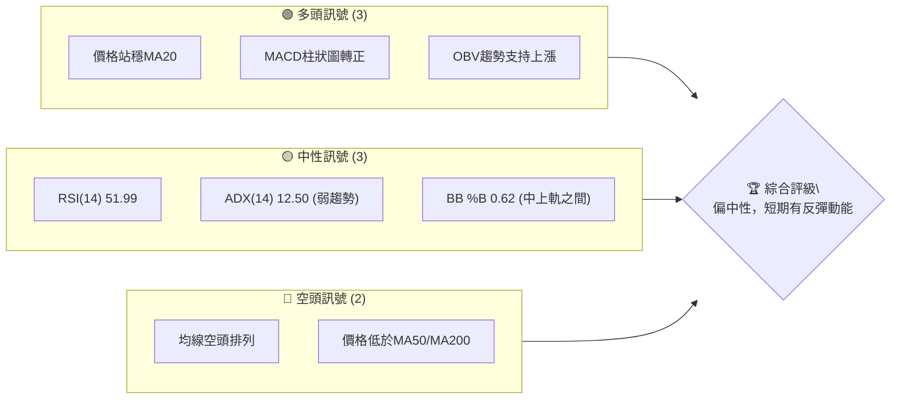

### 📊 核心指標速覽表

| 指標類別 | 指標名稱 | 當前數值 | 訊號 | 解讀 |
|----------|----------|----------|------|------|
| **價格** | 當前價格 | $407.76 | 🟡 | 位於52週區間中上部 (54.7%) |
| **均線** | MA20 | $400.88 | 🟢 | 價格位於短期MA上方，短期偏多 |
| **均線** | MA50 | $409.20 | 🔴 | 價格位於中期MA下方，中期偏空 |
| **均線** | MA200 | $418.14 | 🔴 | 價格位於長期MA下方，長期偏空 |
| **動能** | RSI(14) | 51.99 | 🟡 | 中性區間，無超買超賣 |
| **動能** | MACD Hist | +1.192 | 🟢 | MACD柱狀圖轉正，短期動能偏多 |
| **趨勢** | ADX(14) | 12.50 | 🟡 | 趨勢強度弱，市場處於盤整 |
| **波動** | ATR(14) | $20.17 | 🟡 | 日均波動約4.95%，波動適中 |
| **成交量** | 量比 | 0.71x | 🔴 | 成交量低於均量，買盤動能不足 |

### 🏆 技術評分卡

TSLA 的技術評分顯示，儘管短期動能有所回暖，但整體趨勢結構仍偏弱。市場處於盤整階段，支撐穩定性尚可，但上方阻力較強。

```
╔══════════════════════════════════════════════════════════════╗
║               技術評分卡 — TSLA (2026-07-10)                 ║
╠══════════════════════════════════════════════════════════════╣
║ 趨勢強度      ██████░░░░░░░░░░░░░░░░  30/100  🟡 (ADX < 25)  ║
║ 動能指標      ██████████░░░░░░░░░░░░  50/100  🟢 (MACD柱正，RSI中性) ║
║ 支撐穩定度    ████████████░░░░░░░░░░  60/100  🟡 (接近S1，斐波那契支持) ║
║ 成交量配合    ████░░░░░░░░░░░░░░░░░░  20/100  🔴 (成交量低於均值) ║
║ 形態完整度    ██████░░░░░░░░░░░░░░░░  30/100  🟡 (無明顯複合形態) ║
║ 均線排列      ████░░░░░░░░░░░░░░░░░░  20/100  🔴 (空頭排列，價格在MA50/200之下) ║
╠══════════════════════════════════════════════════════════════╣
║ 綜合評分      ██████░░░░░░░░░░░░░░░░  40/100  🟡 (中性偏空，短期有反彈) ║
╚══════════════════════════════════════════════════════════════╝
```

---

## 2. 趨勢分析

### 🌐 多時框趨勢分析

TSLA 的多時框架分析顯示，長期和中期趨勢仍處於空頭格局，但短期內出現了反彈動能。這種結構表明當前市場處於一個複雜的盤整階段，方向不明顯，短期波動性可能較高。

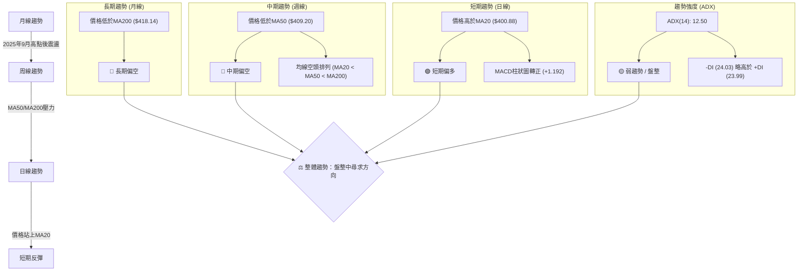

### 📈 長期趨勢 — 12個月走勢圖（Unicode）

TSLA 在過去12個月經歷了顯著的波動。從2025年7月的$308.27低點開始反彈，於2025年10月達到$456.56的波段高點。隨後在2026年初經歷了一波回調，並在近幾個月維持在$370-$440的區間震盪。目前價格接近區間中軸。

```
TSLA 月線走勢圖（過去12個月）
價格軸 ($)
$456.56 ┤                                ●(2025-10高點)
$444.72 ┤                            ●
$435.79 ┤                                        ●
$430.41 ┤                                  ●
$420.60 ┤                                            ●
$407.76 ┤                                              ●←現在 (2026-07)
$402.51 ┤                          ●
$381.63 ┤                                    ●
$371.75 ┤                                ●
$360.59 ┤                            ●(2026-04低點)
$333.87 ┤          ●
$308.27 ┤●
        └─────────────────────────────────────────────
         2025-07  2025-08  2025-09  2025-10  2025-11  2025-12  2026-01  2026-02  2026-03  2026-04  2026-05  2026-06  2026-07
```

**走勢特徵分析表格**：

| 階段 | 時間區間 | 價格範圍 | 漲跌幅 | 走勢特徵 | 關鍵事件/觀察 |
|------|----------|----------|--------|----------|----------------|
| **強勁上漲** | 2025-07 ~ 2025-10 | $308.27 ~ $456.56 | +48.1% | 快速拉升，創下52週新高 | 受市場樂觀情緒及公司消息面影響 |
| **高位盤整** | 2025-11 ~ 2026-02 | $402.51 ~ $456.56 | -11.8% | 高位震盪，未能有效突破 | 缺乏新催化劑，獲利回吐壓力 |
| **短期下跌** | 2026-02 ~ 2026-04 | $371.75 ~ $402.51 | -7.6% | 震盪下跌，跌破關鍵均線 | 市場對電動車需求擔憂，整體承壓 |
| **區間震盪** | 2026-04 ~ 2026-07 | $371.75 ~ $435.79 | +9.7% | 形成新的震盪區間，底部有支撐 | 尋求市場平衡，等待方向性突破 |

### 📊 中期趨勢（週線分析）

中期來看，TSLA 股價自2025年10月高點$456.56以來，已形成一個回落的趨勢。雖然近期有所反彈，但價格仍運行在MA50和MA200下方，顯示中期壓力較大。MA50 ($409.20) 構成近期重要的中期阻力。

```
TSLA 中期壓力與支撐示意圖
╔══════════════════════════════════════════════════════════════╗
║                                                              ║
║ $434.60 R3 ───────────────────────────────────────────────────║
║ $429.77 BB上軌 ─ ─ ─ ─ ─ ─ ─ ─ ─ ─ ─ ─ ─ ─ ─ ─ ─ ─ ─ ─ ─ ─ ─ ─ ─ ─ ─║
║ $422.04 Fib 38.2% ─ ─ ─ ─ ─ ─ ─ ─ ─ ─ ─ ─ ─ ─ ─ ─ ─ ─ ─ ─ ─ ─ ─ ─ ─ ─║
║ $418.36 R2 (MA200) ──────────────────────────────────────────║
║ $409.28 R1 (MA50) ───────────────────────────────────────────║
║ $407.76 現價 ▲                                                ║
║ $400.88 MA20 (BB中軌) ─ ─ ─ ─ ─ ─ ─ ─ ─ ─ ─ ─ ─ ─ ─ ─ ─ ─ ─ ─ ─ ─ ─ ─ ─║
║ $398.32 Fib 50% ─ ─ ─ ─ ─ ─ ─ ─ ─ ─ ─ ─ ─ ─ ─ ─ ─ ─ ─ ─ ─ ─ ─ ─ ─ ─ ─ ─║
║ $393.63 S1 ──────────────────────────────────────────────────║
║ $382.96 S2 ──────────────────────────────────────────────────║
║ $371.99 BB下軌 ─ ─ ─ ─ ─ ─ ─ ─ ─ ─ ─ ─ ─ ─ ─ ─ ─ ─ ─ ─ ─ ─ ─ ─ ─ ─ ─ ─║
║ $366.31 S3 ──────────────────────────────────────────────────║
║                                                              ║
╚══════════════════════════════════════════════════════════════╝
```

### ⚡ 趨勢強度評估（ADX 解讀）

ADX 指標用於衡量趨勢的強度，而非方向。當前 ADX(14) 為 12.50，遠低於 25 的閾值，這明確表示 TSLA 目前處於弱趨勢或盤整行情。在這種市場環境下，價格往往在特定區間內震盪，缺乏明確的方向性突破。

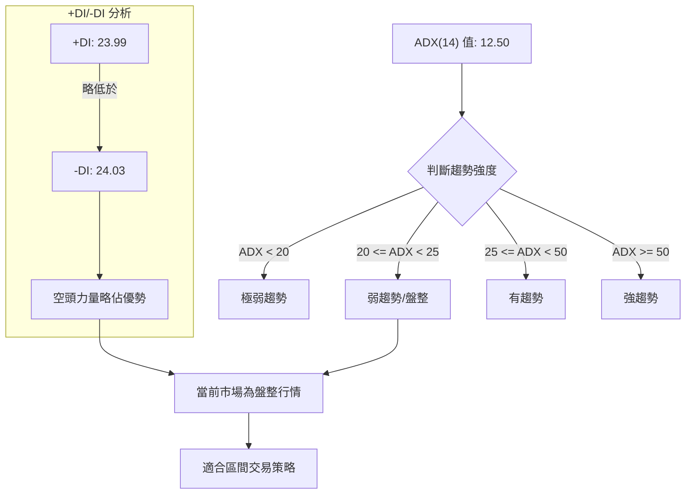

**ADX 強度對照表**：

| ADX 值範圍 | 趨勢強度 | 市場解讀 | 建議策略 |
|------------|----------|----------|----------|
| 0 - 20     | 極弱趨勢 | 窄幅盤整，無方向 | 觀望或超短線區間操作 |
| **20 - 25**| **弱趨勢/盤整** | **區間震盪，尋求方向** | **區間操作為主，等待突破** |
| 25 - 50    | 有趨勢   | 明確方向，動能增強 | 順勢交易，趨勢追蹤 |
| 50 - 75    | 強趨勢   | 趨勢確立，動能強勁 | 順勢交易，加碼或持有 |
| 75 - 100   | 極強趨勢 | 趨勢過熱，可能反轉 | 謹慎順勢，留意反轉訊號 |

由於 ADX 值為 12.50，我們判斷 TSLA 處於弱趨勢的盤整行情。同時，-DI 略高於 +DI，表明空頭力量在當前弱勢市場中微幅佔優。這支持了以區間操作為主的策略。

---

## 3. 圖表形態分析

### 🔍 形態識別系統

根據提供的歷史收盤價和關鍵價位數據，目前未偵測到具有高信心度的複雜反轉或持續形態（如頭肩頂/底、雙頂/底、旗形、三角形等）。由於缺乏完整的日K線OHLCV數據，無法進行精確的幾何形態繪製和判斷。當前市場更傾向於在關鍵均線和支撐阻力位之間進行震盪。

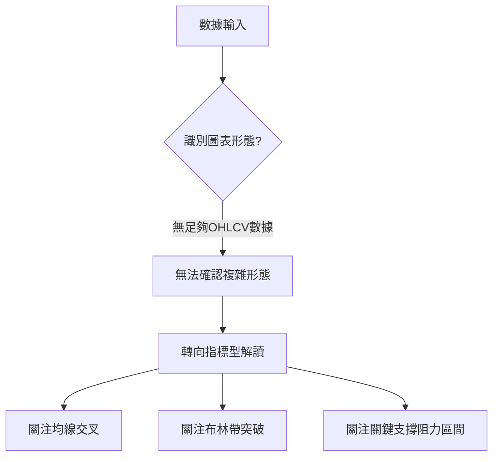

**形態信心度表格**：

| 形態 | 信心度 | 判斷依據（引用數據） | 完成度 | 目標價（附計算式） |
|------|--------|----------------------|--------|--------------------|
| **無明顯形態** | 0% | 數據不足以支持複雜幾何形態判斷 | N/A | N/A |
| **區間震盪** | 70% | ADX 12.50 (弱趨勢)；價格在$371.75 (BB下軌) 與 $429.77 (BB上軌) 之間波動 | 100% | N/A (區間操作) |

由於缺乏詳細的OHLCV數據，本節將重點分析價格在關鍵均線和布林通道內的行為。

### 🕯️ 重要K線形態分析

由於僅提供月度收盤價和20週收盤價，無法進行詳細的每日K線形態分析。但從週線收盤價變化可觀察到一些初步跡象：

| 月份/週 | 收盤價 | K線形態 (週線推斷) | 解讀 | 訊號 |
|------|--------|--------------------|------|------|
| 2026-03-29 | $361.83 | 可能為長陰線或下影線 | 價格下跌動能強，但可能探底 | 🔴 |
| 2026-04-19 | $400.62 | 可能為長陽線或大陽燭 | 價格強勢反彈，買盤積極 | 🟢 |
| 2026-05-31 | $435.79 | 可能為中陽線 | 價格上漲，但量能不足 | 🟡 |
| 2026-06-07 | $391.00 | 可能為長陰線 | 價格快速回落，賣壓沉重 | 🔴 |
| 2026-07-12 | $407.76 | 中陽線 (本週收盤) | 價格上漲，但量能仍低於均量 | 🟡 |

**總結**：從近期週線走勢看，TSLA 經歷了幾次快速的漲跌，顯示市場情緒波動較大。在2026年4月和6月出現了較強烈的反轉K線，表明在關鍵價位附近買賣雙方的拉鋸。目前本週收盤為中陽線，顯示買盤在短期內佔優。

### 📉 ASCII 走勢形態示意圖

由於缺乏足夠的數據來繪製複雜的幾何形態，我們將示意圖專注於當前價格與關鍵均線和布林通道的相對位置，以反映市場的盤整狀態。

```
TSLA 盤整區間示意圖
═══════════════════════════════════════════════════
$429.77 ║                     (BB上軌)
        ║                                   
$418.14 ║                     (MA200)
        ║                                   
$409.20 ║                     (MA50)
$407.76 ║                 ● 現價
$400.88 ║                     (MA20/BB中軌)
        ║  
$393.63 ║                     (S1)
        ║
$371.99 ║                     (BB下軌)
        ║
$366.31 ║                     (S3)
═══════════════════════════════════════════════════
```
圖中可見，當前價格 $407.76 位於 MA20 ($400.88) 之上，但同時受到 MA50 ($409.20) 和 MA200 ($418.14) 的壓制。這形成了一個狹窄的震盪區間，價格在短期均線與中期均線之間拉鋸。布林通道的上下軌 ($429.77/$371.99) 界定了當前主要的潛在震盪範圍。

### 🎯 形態目標價計算

由於未識別出具備高信心度的複雜形態，因此無法提供基於形態學的目標價。當前目標價將主要依賴於關鍵阻力位和斐波那契回調位。

---

## 4. 支撐與阻力

### 🗺️ 關鍵價位分布圖（Unicode）

TSLA 的關鍵價位分佈顯示，上方阻力密集，尤其是在 $409.28 (R1/MA50) 和 $418.36 (R2/MA200) 附近。下方支撐相對分散，但 $393.63 (S1) 和 $382.96 (S2) 構成短期和中期重要防線。

```
TSLA 價位結構分布圖
═══════════════════════════════════════════════════
$498.83 ║████████████████████████║ 52W High
$451.39 ║████████████████████    ║ Fib 23.6%
$434.60 ║████████████████████████║ 強阻力 R3
$429.77 ║████████████████████████║ BB上軌
$422.04 ║████████████████████    ║ Fib 38.2%
$418.36 ║████████████████████████║ 強阻力 R2 (MA200)
$409.28 ║████████████████████████║ 關鍵阻力 R1 (MA50)
$407.76 ╠════════════════════════╣ ◄ 現價
$400.88 ║▓▓▓▓▓▓▓▓▓▓▓▓▓▓▓▓        ║ MA20 (BB中軌)
$398.32 ║▓▓▓▓▓▓▓▓▓▓▓▓▓▓▓▓        ║ Fib 50%
$393.63 ║████████████████████████║ 近期支撐 S1
$382.96 ║████████████████████████║ 強支撐 S2
$374.61 ║████████████████████████║ Fib 61.8%
$371.99 ║████████████████████████║ BB下軌
$366.31 ║████████████████████████║ 強支撐 S3
$297.82 ║████████████████████████║ 52W Low
═══════════════════════════════════════════════════
```

### 🚧 阻力位分析表

| 阻力級別 | 價位 | 形成原因 | 突破難度 | 重要性 |
|----------|------|----------|----------|--------|
| **R1** | $409.28 | 近期波段高點聚類，同時為MA50所在位置 | 中等偏高 | 🟢 短期反彈能否持續的關鍵 |
| **R2** | $418.36 | 近期波段高點聚類，同時為MA200所在位置 | 高 | 🟡 中期趨勢能否轉強的關鍵 |
| **R3** | $434.60 | 近期波段高點聚類 | 高 | 🔴 突破此處才能挑戰更高區間 |

**分析**：當前價格 $407.76 距離 R1 ($409.28) 僅一步之遙。R1不僅是波段高點，更與MA50重合，形成雙重壓力。若能有效突破並站穩R1，則有望挑戰 R2 ($418.36)。R2與MA200重合，是長期趨勢線，其突破將是中期走勢轉強的重要訊號。R3 ($434.60) 則是更上方的強阻力，突破需要更強的買盤動能。

### 🛡️ 支撐位分析表

| 支撐級別 | 價位 | 形成原因 | 守住機率 | 重要性 |
|----------|------|----------|----------|--------|
| **S1** | $393.63 | 近期波段低點聚類 | 中等 | 🟢 短期回調能否止跌的關鍵 |
| **S2** | $382.96 | 近期波段低點聚類 | 中等偏高 | 🟡 中期震盪區間下沿的關鍵 |
| **S3** | $366.31 | 近期波段低點聚類 | 高 | 🔴 長期下跌趨勢的最後防線之一 |

**分析**：S1 ($393.63) 是當前價格下方最近的支撐，若價格回調，此處將是重要的考驗。S2 ($382.96) 則代表了更深層次的回調支撐，若跌破 S1，S2將提供下一層防線。S3 ($366.31) 則是較強的長期支撐，其失守可能預示著更嚴重的下跌風險。值得注意的是，50% 斐波那契回調位 $398.32 位於 S1 附近，增加了該區域的支撐強度。

### 📐 斐波那契回調位分析

TSLA 的52週區間 ($297.82 ~ $498.83) 的斐波那契回調位提供了重要的參考點。當前價格 $407.76 位於 38.2% 回調位 ($422.04) 和 50.0% 回調位 ($398.32) 之間。

| 斐波那契水平 | 價位 | 解讀 | 重要性 |
|--------------|------|------|--------|
| 0.0% (52W High) | $498.83 | 潛在的長期阻力 | 極高 |
| 23.6% | $451.39 | 上方重要阻力區 | 高 |
| **38.2%** | **$422.04** | **上方關鍵阻力，若突破則有望挑戰更高點** | **中高** |
| **50.0%** | **$398.32** | **下方關鍵支撐，與S1 ($393.63) 區域重合，具備強支撐作用** | **高** |
| 61.8% | $374.61 | 下方重要支撐，若跌破50%則可能回測此處 | 中高 |
| 78.6% | $340.84 | 長期趨勢支撐 | 中 |
| 100.0% (52W Low) | $297.82 | 長期底部支撐 | 極高 |

**分析**：當前價格 $407.76 處於斐波那契 38.2% ($422.04) 和 50.0% ($398.32) 之間，表明市場對52週漲幅的回調已達到一定程度，並在此區間尋求平衡。50.0% 回調位 ($398.32) 是一個心理和技術上的重要支撐，其與S1 ($393.63) 相互印證，構成了一個較強的支撐區間。若價格能守住 50.0% 回調位，並突破 38.2% 回調位，則可能向上挑戰 23.6% 回調位 ($451.39)。反之，若跌破 50.0% 回調位，則可能進一步回測 61.8% 回調位 ($374.61)。

---

## 5. 技術指標深度解讀

### 🎛️ 指標訊號總覽

當前 TSLA 的技術指標呈現出短期動能回暖與中期趨勢壓力並存的複雜局面。MA 系統呈現空頭排列，但 MACD 柱狀圖轉正，RSI 居中，ADX 顯示盤整。成交量不足是主要擔憂。

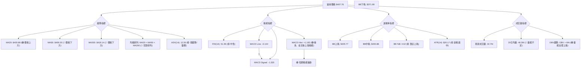

### 📈 移動平均線排列分析

TSLA 的移動平均線系統顯示出一個明顯的空頭排列格局，即 MA20 < MA50 < MA200。這是一個典型的中期至長期下跌趨勢的訊號。然而，當前價格 $407.76 已經站上短期 MA20 ($400.88)，顯示短期內買盤有所介入，試圖扭轉頹勢。

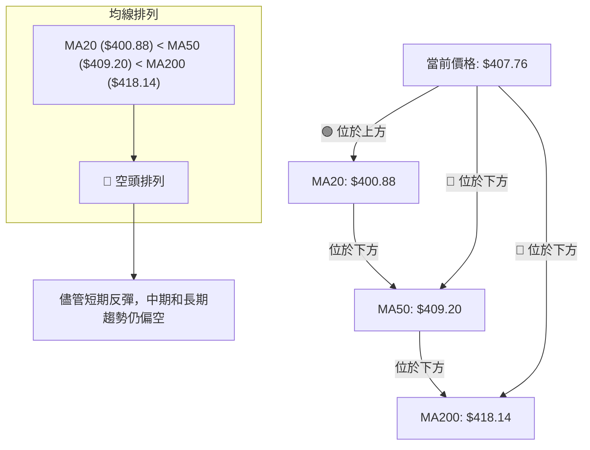

**分析**：儘管價格已突破短期 MA20，但上方很快遇到 MA50 和 MA200 的雙重阻力。MA50 ($409.20) 和 MA200 ($418.14) 共同構成了強大的壓力區間。若要徹底扭轉空頭排列，價格需要連續突破這些關鍵均線，並使 MA 系統重新排列為多頭格局。在當前弱趨勢背景下，這將是一個艱鉅的任務。

### 📉 RSI(14) 分析

RSI(14) 當前數值為 51.99。

**RSI 強度進度條**：
RSI(14) 強度：██████████░░░░░░░░░░ 51.99 (中性)

**超買超賣區間分析**：
*   **超買區 (RSI > 70)**：未進入，表明市場尚未出現過度狂熱的買盤情緒。
*   **超賣區 (RSI < 30)**：未進入，表明市場尚未出現過度恐慌的賣盤情緒。
*   **中性區 (30 < RSI < 70)**：當前 RSI 位於中性區間，表明買賣雙方力量相對平衡，缺乏明確的方向性動能。這與 ADX 顯示的弱趨勢/盤整行情相符。

**背離判斷**：
根據提供的近20週收盤走勢和RSI數據，未觀察到明顯的頂背離或底背離訊號。
*   2026-03-29 收盤 $361.83, RSI 32.8
*   2026-04-12 收盤 $348.95, RSI 42.0 (價格創新低，RSI卻抬升，**存在潛在底背離跡象**，但由於數據點較少且非日線，信心度中等)
*   2026-04-19 收盤 $400.62, RSI 64.5 (隨後價格上漲，印證了底背離的有效性)
*   2026-06-07 收盤 $391.00, RSI 37.3
*   2026-07-12 收盤 $407.76, RSI 52.0

**結論**：RSI 處於中性區間，表明市場目前缺乏強勁的單邊動能。雖然在4月份曾出現潛在底背離並隨後得到印證，但目前沒有新的背離訊號。

### 📊 MACD(12/26/9) 訊號解讀

MACD 指標當前數值如下：
*   MACD 線 (DIF): -0.144
*   MACD Signal 線 (DEA): -1.335
*   MACD 柱狀圖 (Histogram): +1.192

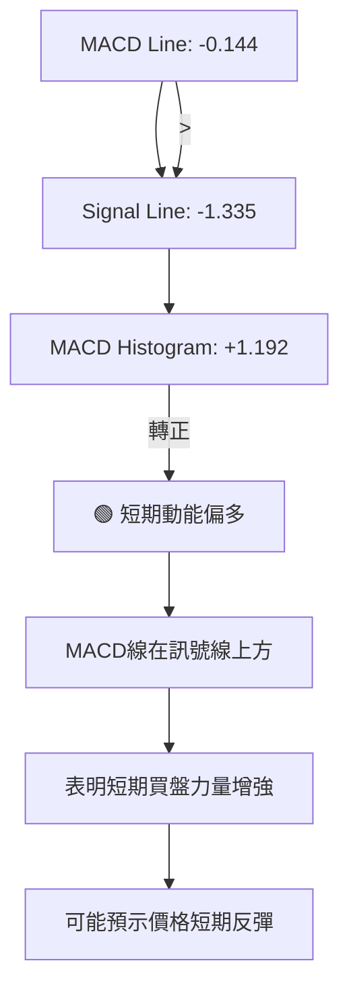

**分析**：
1.  **MACD 線與 Signal 線關係**：當前 MACD 線 (-0.144) 位於 Signal 線 (-1.335) 之上。這是一個**金叉訊號**，或至少是一個持續的看多排列。這表明短期均線（12日EMA）已向上穿越長期均線（26日EMA），顯示短期買盤動能正在增強。
2.  **MACD 柱狀圖**：柱狀圖數值為 +1.192，由負轉正。這進一步確認了 MACD 線已向上穿越 Signal 線，且向上動能正在積聚。柱狀圖的增長表明多頭力量正在釋放。

**結論**：MACD 指標發出明確的短期看多訊號。這與價格站上 MA20 的觀察一致，共同支持了 TSLA 在短期內有反彈潛力。然而，由於 ADX 顯示弱趨勢，這種反彈可能僅限於盤整區間內。

### 📦 布林通道分析

布林通道由三條線組成：上軌、中軌 (MA20)、下軌。它們提供了價格波動的範圍。
*   BB上軌: $429.77
*   BB中軌(MA20): $400.88
*   BB下軌: $371.99
*   BB %B: 0.62 (表示價格位於中軌和上軌之間，且更靠近上軌)

```
TSLA 布林通道示意圖
╔════════════════════════════════════════════════════════════════════╗
║                                                                    ║
║ $429.77 ┌────────────────────────────────────────────────────────┐ BB上軌 ║
║         │                                                        │       ║
║ $407.76 │                     ● 現價                              │       ║
║         │                                                        │       ║
║ $400.88 ├────────────────────────────────────────────────────────┤ BB中軌(MA20) ║
║         │                                                        │       ║
║         │                                                        │       ║
║ $371.99 └────────────────────────────────────────────────────────┘ BB下軌 ║
║                                                                    ║
╚════════════════════════════════════════════════════════════════════╝
```

**分析**：
1.  **價格位置**：當前價格 $407.76 位於布林中軌 ($400.88) 之上，且接近上軌 ($429.77)。BB %B 為 0.62 也印證了這一點。這表明短期內價格偏強，正向上方阻力區間運行。
2.  **通道寬度**：布林通道的寬度代表波動率。數據中未直接提供布林帶寬，但從上軌 $429.77 和下軌 $371.99 的價差 ($57.78) 來看，通道寬度適中。結合 ATR ($20.17)，顯示目前的波動性並不算極端。
3.  **趨勢判斷**：在盤整行情下 (ADX < 25)，價格在中軌附近波動或向上下軌靠攏，是區間交易的典型特徵。目前價格向布林上軌移動，可能面臨上軌的壓力，形成短期高點。

**結論**：布林通道顯示 TSLA 股價短期內偏強，正向布林上軌測試阻力。由於整體市場處於盤整，預計價格在觸及上軌後可能面臨回調壓力，或進入橫向震盪。

### 💹 成交量分析（量價配合度）

*   最新成交量: 32,768,180
*   20日均量: 46,386,534
*   50日均量: 49,231,076
*   量比 (最新成交量 / 20日均量): 0.71x

**分析**：
1.  **成交量不足**：當前成交量 (32.7M) 顯著低於 20 日均量 (46.3M) 和 50 日均量 (49.2M)。量比僅為 0.71x，表明市場交投清淡，買盤動能不足。這種情況下，即便價格有所反彈，其持續性也值得懷疑。低量反彈往往缺乏堅實的基礎，容易遇到阻力而回落。
2.  **OBV 趨勢**：數據顯示 `OBV趨勢: OBV > MA → 量能支撐上漲`。這是一個多頭訊號，表明儘管近期成交量萎縮，但在累積的量能方面，買盤力量仍佔據優勢。這與 MACD 的短期看多訊號形成了一定的印證。然而，OBV 是累積指標，可能反映的是過去一段時間的量能累積，而當前日成交量的萎縮則反映了即時的交易熱度。
3.  **量價背離**：當前價格處於短期反彈中，但成交量卻持續低迷。這可能構成一個潛在的**量價背離**訊號，即價格上漲但缺乏量能配合，預示著反彈的動力可能不足，上方阻力較大。

**結論**：成交量分析呈現出矛盾的訊號。OBV 顯示累積量能支持上漲，但即時成交量遠低於平均水平，表明當前反彈缺乏足夠的買盤熱度。在盤整行情中，低量反彈通常難以突破關鍵阻力，投資者應警惕潛在的假突破風險。

---

## 6. 動能與波動率

### ⚡ 動能評估四象限

動能評估四象限分析旨在結合動能強度和波動率來判斷當前市場狀態。由於 ADX 指標 (12.50) 表明趨勢強度弱，而 ATR ($20.17，佔價格 4.95%) 顯示波動率適中，TSLA 目前處於「弱動能，適中波動」的象限。

| 象限 | 動能 (ADX) | 波動 (ATR) | 當前狀態 (TSLA) | 評估 | 策略建議 |
|------|------------|------------|-----------------|------|----------|
| Q1 | 強 (>25) | 低 (<3%) | - | 最佳機會 (趨勢確立，風險可控) | 順勢追蹤 |
| Q2 | 弱 (<25) | 低 (<3%) | - | 謹慎觀望 (窄幅盤整，無利可圖) | 觀望 |
| Q3 | 強 (>25) | 高 (>5%) | - | 高風險高收益 (趨勢強勁，波動劇烈) | 謹慎順勢，嚴格止損 |
| **Q4** | **弱 (<25)** | **適中 (3-5%)** | **✓ (ADX 12.50, ATR 4.95%)** | **區間震盪 (方向不明，但有交易機會)** | **區間操作，嚴格執行止盈止損** |

**分析**：TSLA 目前位於 Q4 象限，即「弱動能、適中波動」。這意味著市場缺乏明確的趨勢方向 (ADX 12.50)，但每日價格波動 (ATR $20.17) 仍能提供一定的短期交易機會。這種環境下，追逐趨勢的策略效果不佳，而基於支撐與阻力的區間操作策略則更為合適。交易者應避免過度追高殺跌，並嚴格控制倉位和風險。

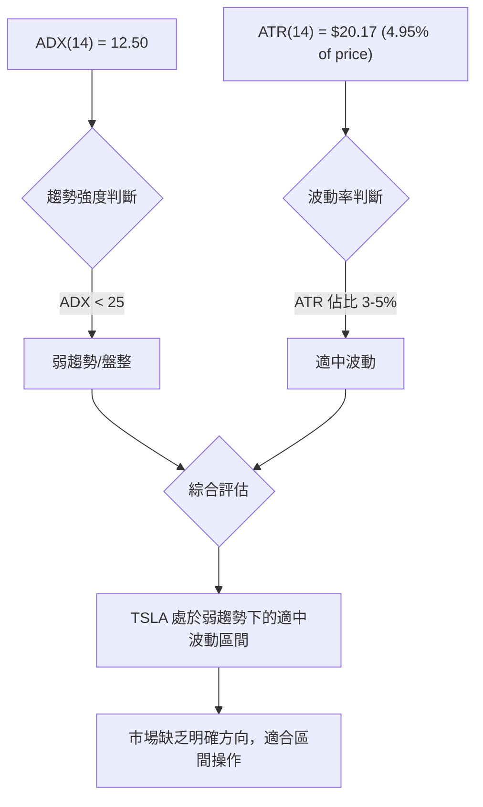

### 📊 ATR 波動率分析

ATR (Average True Range) 衡量股票的平均每日價格波動範圍。當前 ATR(14) 為 $20.17，佔當前價格 $407.76 的 4.95%。

**分析**：
1.  **波動率水平**：4.95% 的日波動率對於 TSLA 這類高成長科技股而言，屬於適中偏高的水平。它表示在過去14天內，TSLA 平均每天的價格波動幅度約為 $20.17。
2.  **交易風險**：較高的 ATR 意味著價格波動幅度大，潛在的盈利空間和虧損風險都較大。在這種波動率下進行交易，需要更寬鬆的止損空間，否則容易被市場的正常波動「震出局」。
3.  **止損距離建議**：根據 ATR 指標，常用的止損設置方法是將止損點設置在 ATR 的 1.5 倍至 3 倍距離。
    *   **保守止損** (1.5 x ATR): $20.17 * 1.5 = $30.26。若在 $407.76 進場，止損可考慮 $407.76 - $30.26 = $377.50 附近。
    *   **激進止損** (1 x ATR): $20.17 * 1 = $20.17。若在 $407.76 進場，止損可考慮 $407.76 - $20.17 = $387.59 附近。
    鑑於目前是盤整行情，建議採用較為寬鬆的止損，如 1.5 倍 ATR，以避免被短期噪音洗盤。

**結論**：TSLA 具有適中偏高的波動率，這為短期交易提供了機會，但同時也增加了風險。交易者應根據 ATR 合理設置止損，並預留足夠的波動空間。

### 📐 Beta 與市場相關性

Beta 值衡量股票相對於大盤（通常是 S&P 500 指數）的波動性。TSLA 的 Beta 值為 1.802。

**分析**：
1.  **高 Beta 特性**：Beta 值 1.802 遠大於 1，表明 TSLA 是一隻高 Beta 股票。這意味著 TSLA 的股價波動幅度通常比大盤高出 80.2%。當大盤上漲 1% 時，TSLA 理論上可能上漲 1.802%；反之，當大盤下跌 1% 時，TSLA 可能下跌 1.802%。
2.  **市場敏感性**：高 Beta 值顯示 TSLA 對市場情緒和整體經濟環境高度敏感。在牛市中，它可能提供超額收益；但在熊市或市場情緒低迷時，其跌幅也可能遠超大盤。
3.  **投資組合影響**：對於投資組合而言，持有高 Beta 股票會增加整體組合的波動性。投資者在配置 TSLA 時，應充分考慮其高 Beta 特性，並根據自身的風險承受能力進行調整。

**結論**：TSLA 的高 Beta 值使其成為一隻高風險高收益的股票。在當前市場盤整、方向不明的情況下，其波動性可能被放大。投資者在制定交易策略時，應密切關注大盤走勢，並做好風險管理，以應對其較大的波動幅度。

---

## 7. 多時框架總結

### 📋 時框架評分表

TSLA 的多時框架分析顯示，長期和中期趨勢仍處於空頭壓制之下，但短期內出現了反彈動能，且 ADX 指標表明整體市場處於盤整階段。

| 時框架 | 趨勢方向 | 動能 | 均線排列 | 形態 | 綜合評分 | 建議 |
|--------|----------|------|----------|------|----------|------|
| **長期 (月/週線)** | 🔴 偏空 | 🟡 中性 | 🔴 空頭排列 | 🟡 震盪 | 3/10 | 警惕下行風險 |
| **中期 (週線)** | 🔴 偏空 | 🟡 中性 | 🔴 空頭排列 | 🟡 震盪 | 4/10 | 觀望，等待突破 |
| **短期 (日線)** | 🟢 偏多 | 🟢 偏多 | 🟡 價格站上MA20 | 🟡 震盪 | 6/10 | 區間操作，追蹤反彈 |

### 🔲 綜合訊號矩陣

TSLA 的綜合訊號顯示，短期動能的改善與中長期趨勢的壓力形成對峙。ADX 指示的弱趨勢使得整體市場處於平衡尋求方向的狀態。

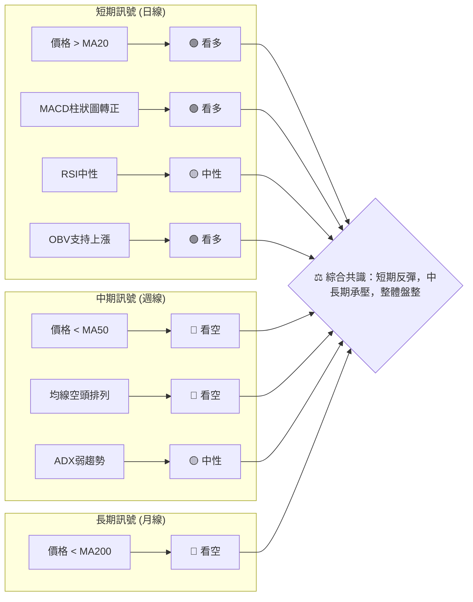

### ⚖️ 多時框收斂結論

根據 ADX(14) 值為 12.50，遠低於 25，我們判斷 TSLA 當前處於**弱趨勢的盤整行情**。在這種情況下，按照多時框收斂規則，應**以日線布林通道的上下軌為主要交易區間**。

儘管日線層面 MACD 柱狀圖轉正、價格站上 MA20，顯示短期有反彈動能，但週線和月線的均線空頭排列以及價格低於 MA50 和 MA200，表明中長期趨勢仍偏空。因此，短期反彈應被視為在更大盤整或下跌趨勢中的修正，而非趨勢反轉。

**最終方向性結論：中性觀望，偏向區間操作。**

短期內，價格可能繼續向布林上軌或中期阻力位測試。但由於缺乏強勁的趨勢動能和成交量配合，預計在觸及上方阻力後，可能面臨回調壓力，再次回到布林通道中軸或下軌附近。交易應以高拋低吸的區間策略為主，並嚴格控制風險。

---

## 8. 交易策略建議

### 🗺️ 策略決策流程圖

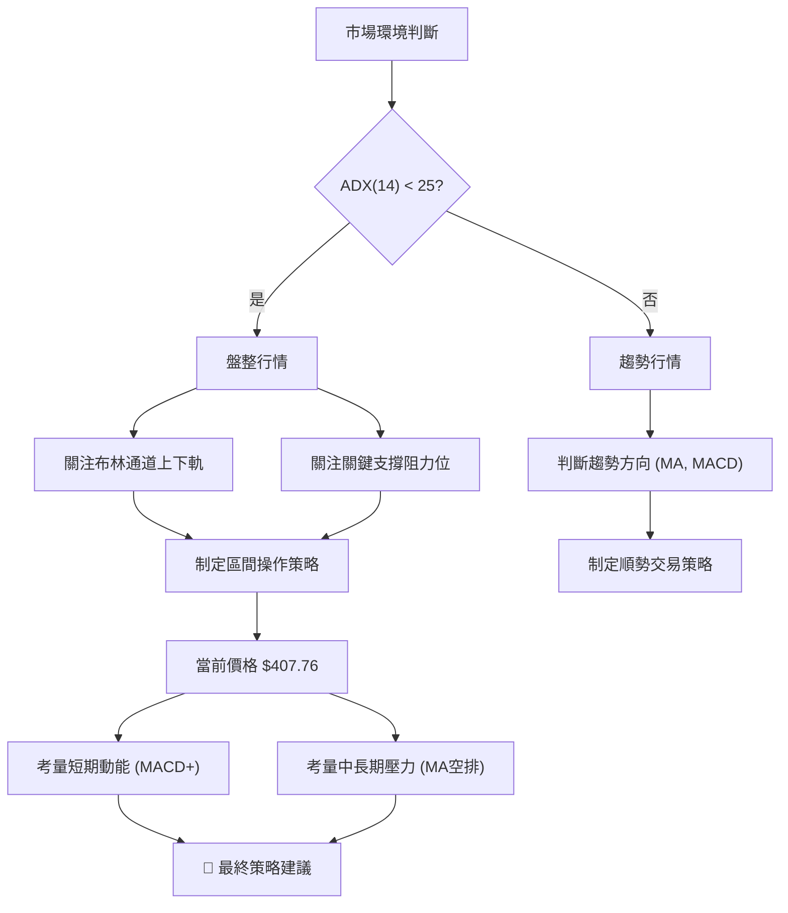

### 🧭 策略路由（依評分卡分流，不得兩頭下注）

當前技術評分卡綜合評分為 40/100，屬於中性偏空區間。同時，ADX(14) 為 12.50，明確指示為盤整行情。因此，**當前主策略方向 = 中性區間操作（依評分 40/100）**。

主策略將以布林通道上下軌為主要交易區間，結合關鍵支撐阻力進行高拋低吸。

### 🎯 價格情境階梯（Price Scenarios）

| 觸發條件 | 下一目標 | 後續延伸 | 情境含義 |
|----------|----------|----------|----------|
| **突破 R1 $409.28 並站穩** | R2 $418.36 | R3 $434.60 | 短線轉強，有望挑戰布林上軌。但需注意量能配合，以免假突破。 |
| **站穩現價區間 $400.88 - $409.20** | — | — | 價格在MA20與MA50之間震盪，等待方向選擇，維持盤整。 |
| **跌破 S1 $393.63 並確認** | S2 $382.96 | S3 $366.31 | 中期轉弱訊號，可能回測布林下軌，甚至挑戰更低支撐。 |

### 📊 情境機率分佈

| 情境 | 機率 | 主要依據 |
|------|------|----------|
| 繼續上行 / 反彈 | 35% | MACD柱狀圖轉正，價格站上MA20，OBV支持上漲。但量能不足為隱憂。 |
| **區間震盪** | **50%** | ADX弱趨勢 (12.50)，RSI中性 (51.99)，價格位於布林通道中上軌之間，上方阻力密集。 |
| 回落 / 再探底 | 15% | 均線空頭排列，成交量低於均值，中長期趨勢偏空，上方阻力強勁。 |

**分析**：綜合考慮各項指標，TSLA 最有可能的情境是維持在當前的區間內震盪，即在布林通道上下軌 $371.99 - $429.77 之間波動。短期反彈有機會延續至 R1 ($409.28) 或 R2 ($418.36)，但受制於中長期壓力，突破上行空間有限。跌破關鍵支撐 S1 ($393.63) 的可能性較低，但若發生則下行空間較大。

### 🟢 主策略詳情（方向依上方路由）

**當前主策略：區間操作（高拋低吸）**

| 策略要素 | 策略 A：逢低買入 | 策略 B：逢高賣出 (短線) |
|----------|------------------|------------------------|
| 進場條件 | 價格回落至關鍵支撐區間，並出現止跌訊號 (如K線反轉) | 價格上漲至關鍵阻力區間，並出現受阻訊號 (如K線反轉) |
| 進場價格 | $398.32 (Fib 50%) - $393.63 (S1) 區間 | $409.28 (R1/MA50) - $418.36 (R2/MA200) 區間 |
| 目標價 T1 | $409.28 (R1) | $398.32 (Fib 50%) |
| 目標價 T2 | $418.36 (R2) / $429.77 (BB上軌) | $393.63 (S1) / $382.96 (S2) |
| 止損價格 | $382.96 (S2) | $422.04 (Fib 38.2%) |
| 風險報酬比 | 假設進場 $395.00，目標 T1 $409.28，止損 $382.96。風險 $12.04，報酬 $14.28。比率約 1.2:1 | 假設進場 $410.00，目標 T1 $398.32，止損 $422.04。風險 $12.04，報酬 $11.68。比率約 1:1 |
| 成功機率 | 60% | 55% |
| 建議倉位 | 輕倉至中倉 (5-10%) | 輕倉 (3-5%) |

### 🔴 反向風險觸發點（對沖提示）

若出現以下情況，將推翻當前區間操作的主策略，並需重新評估市場方向：
1.  **向上突破**：價格有效突破並站穩 R2 ($418.36) 和布林上軌 ($429.77)，且伴隨放量。這可能預示著盤整區間向上突破，轉為多頭趨勢。
2.  **向下突破**：價格有效跌破 S2 ($382.96) 和布林下軌 ($371.99)，且伴隨放量。這可能預示著盤整區間向下突破，轉為空頭趨勢。
3.  **ADX 快速上升**：ADX 快速上升至 25 以上，無論方向如何，都意味著趨勢行情即將展開，屆時應轉為順勢策略。

### ⭐ 整體訊號強度評星

做多訊號強度：★★☆☆☆ (2/5星) - 短期動能回暖，但中長期趨勢和量能受限。
做空訊號強度：★★★☆☆ (3/5星) - 中長期壓力仍在，均線空頭排列，但短期有反彈。
整體可信度：  ★★★☆☆ (3/5星) - 盤整行情下，區間操作策略的可信度較高，但需嚴格執行止損。

---

## 9. 風險提示與監控

### ✅ 關鍵監控指標 Checklist

以下是交易 TSLA 時需要密切關注的關鍵指標和價位，以應對市場變化：

```
╔══════════════════════════════════════════════════════════════════╗
║               TSLA 關鍵監控指標 Checklist                          ║
╠══════════════════════════════════════════════════════════════════╣
║ [✓] 當前價格 ($407.76) 對 MA20 ($400.88) 的支撐情況                 ║
║ [✓] 當前價格 ($407.76) 對 MA50 ($409.20) / R1 ($409.28) 的阻力情況   ║
║ [✓] MACD 柱狀圖 (+1.192) 能否持續放大，確認多頭動能                  ║
║ [✓] RSI(14) (51.99) 是否進入超買/超賣區，或形成背離                ║
║ [✓] ADX(14) (12.50) 是否突破 25，指示趨勢形成                     ║
║ [✓] 成交量能否有效放大，配合價格突破關鍵阻力                         ║
║ [✓] 關鍵阻力位：R1 ($409.28), R2 ($418.36), 布林上軌 ($429.77)    ║
║ [✓] 關鍵支撐位：S1 ($393.63), Fib 50% ($398.32), 布林下軌 ($371.99)║
║ [✓] 大盤指數 (如 S&P 500) 走勢，警惕高 Beta 風險                    ║
║ [✓] 公司基本面消息或產業政策變化                                   ║
╚══════════════════════════════════════════════════════════════════╝
```

### ⚠️ 風險場景分析

TSLA 在當前盤整格局下，存在多種可能的發展情境。投資者應對以下情境保持警惕：

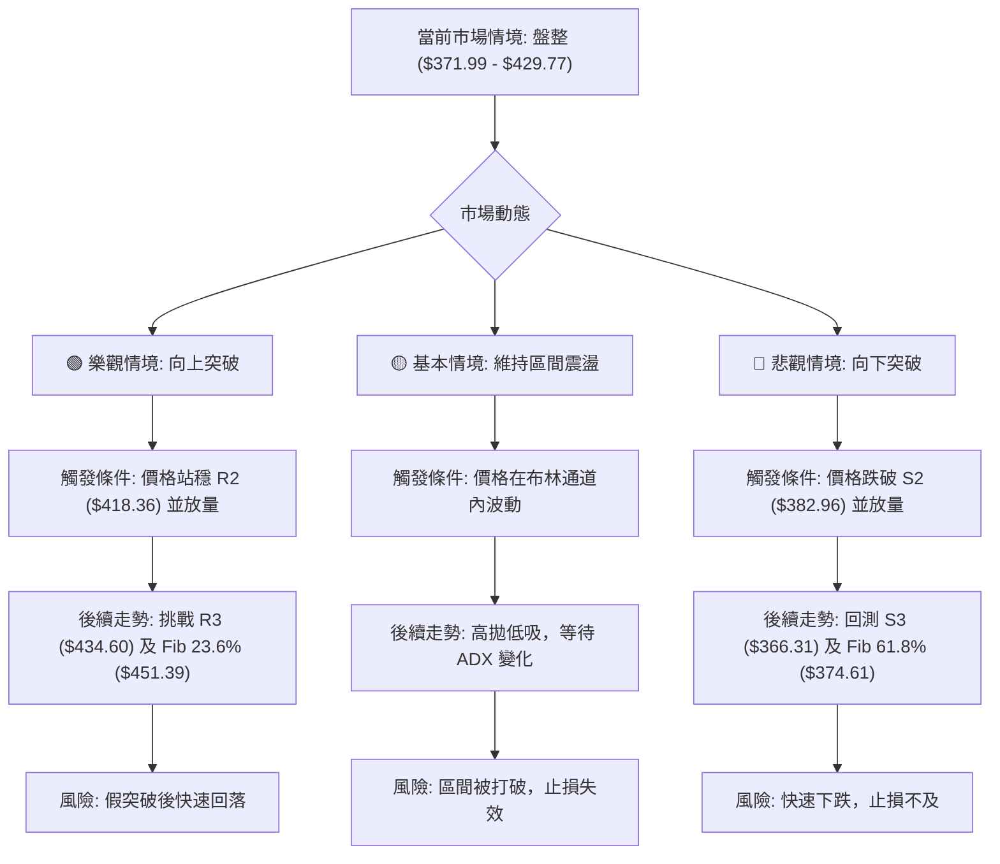

**分析**：
*   **樂觀情境**：TSLA 憑藉短期動能，成功突破並站穩中期阻力位，將吸引更多買盤介入，推動股價向上。然而，在缺乏趨勢動能和成交量配合下，這種突破可能演變為「假突破」，隨後快速回落。
*   **基本情境**：在 ADX 指示的弱趨勢下，TSLA 最有可能在布林通道上下軌之間進行區間震盪。這為熟練的區間交易者提供了機會，但需要嚴格的紀律和止損管理。
*   **悲觀情境**：若短期反彈乏力，或市場整體情緒惡化，TSLA 可能跌破關鍵支撐。鑒於中長期均線的空頭排列，一旦支撐失守，下行空間可能被打開，加速下跌。

### 🛡️ 風險管理重要提醒

1.  **止損紀律**：在盤整行情中，價格波動劇烈且方向不明，嚴格執行止損是保護資本的關鍵。建議止損點設置在關鍵支撐位下方，並根據 ATR 調整止損空間。
2.  **倉位管理**：避免重倉單一股票，尤其是在市場缺乏明確方向時。輕倉操作可以有效降低單次交易失敗對總體資產的影響。對於高 Beta 股票如 TSLA，更應謹慎控制倉位。
3.  **分批進出**：不要一次性投入所有資金。採用分批買入和分批賣出的策略，可以在不確定性較高的市場中平滑交易成本，並降低單點位進出的風險。
4.  **關注大盤**：TSLA 的高 Beta 特性使其高度受大盤影響。密切關注 S&P 500 等主要指數的走勢，以及宏觀經濟數據和政策變化，這將有助於判斷 TSLA 的整體風險偏好。
5.  **警惕消息面**：儘管本報告側重技術分析，但電動車行業的政策變化、競爭格局、公司內部消息（如生產數據、新產品發布）都可能對股價產生重大影響。保持對基本面消息的關注，可以及時調整技術策略。
6.  **避免情緒化交易**：市場盤整時，價格的來回波動容易引發情緒化追漲殺跌。堅持既定的交易計劃，避免在沒有明確訊號的情況下頻繁操作。

---

## 📋 報告總結

```
╔══════════════════════════════════════════════════════════════════╗
║               TSLA 技術分析報告總結                                ║
╠══════════════════════════════════════════════════════════════════╣
║ 報告日期：2026-07-10                                               ║
║ 當前價格：$407.76                                                  ║
║ 分析評級：⚖️ 中性觀望，偏向區間操作                                  ║
║                                                                    ║
║ 關鍵結論：                                                         ║
║ ├─ 長期趨勢：🔴 偏空。價格低於MA200，均線空頭排列。                  ║
║ ├─ 中期趨勢：🔴 偏空。價格低於MA50，均線空頭排列。                   ║
║ ├─ 短期趨勢：🟢 偏多。價格站上MA20，MACD柱狀圖轉正。                 ║
║ ├─ 趨勢強度：🟡 弱趨勢/盤整 (ADX 12.50)。                           ║
║ ├─ 關鍵支撐：S1 $393.63，斐波那契50% $398.32，布林下軌 $371.99。    ║
║ ├─ 關鍵阻力：R1 $409.28 (MA50)，R2 $418.36 (MA200)，布林上軌 $429.77。║
║ └─ 量價配合：🔴 成交量低於均值，反彈動能存疑，但OBV支持上漲。        ║
║                                                                    ║
║ 最優策略組合：                                                     ║
║ 1. 🥇 最佳機會：在 $393.63 (S1) - $398.32 (Fib 50%) 附近逢低買入，止損 $382.96 (S2)，目標 $409.28 (R1) / $418.36 (R2)。║
║ 2. 🥈 次選機會：在 $409.28 (R1/MA50) - $418.36 (R2/MA200) 附近逢高賣出 (短線)，止損 $422.04 (Fib 38.2%)，目標 $398.32 (Fib 50%)。║
║ 3. 🥉 保守選擇：等待價格有效突破布林通道上下軌，或 ADX 突破 25 後，再順勢進場。                                            ║
╚══════════════════════════════════════════════════════════════════╝
```

---

> ⚠️ **免責聲明**：本報告為 AI 自動生成之技術分析，所有數據及估算均基於提供的歷史價格資訊。本報告**僅供研究與學術參考**，**不構成任何投資建議**。投資有風險，入市需謹慎。

---

*報告生成時間：2026-07-10 ｜ 數據來源：Yahoo Finance ｜ 分析框架：多時框技術分析*