# TSM 基本面深度分析報告
> **報告日期**：2026-02-24 ｜ **分析師**：AI CFA 研究部 ｜ **數據來源**：Yahoo Finance ｜ **語言**：繁體中文

---

## 目錄

| # | 章節 | 核心主題 |
|---|------|----------|
| 1 | 執行摘要 | 核心評分・投資論點・結論 |
| 2 | 公司概覽與商業模式 | 業務結構・護城河・市場地位 |
| 3 | 損益表深度分析 | 收入成長・利潤率・EPS趨勢 |
| 4 | 資產負債表分析 | 流動性・債務結構・股東權益 |
| 5 | 現金流量深度分析 | FCF・資本配置・轉換率 |
| 6 | 獲利能力與資本效率 | ROE・ROIC vs WACC・DuPont |
| 7 | 估值深度分析 | 同業比較・DCF・情境分析 |
| 8 | 成長催化劑 | 技術藍圖・TAM・驅動力 |
| 9 | 風險矩陣 | 地緣政治・競爭・法規風險 |
| 10 | 投資建議 | 評級・目標價・買入時機 |

---

## 1. 執行摘要

### 1.1 核心評分儀表板

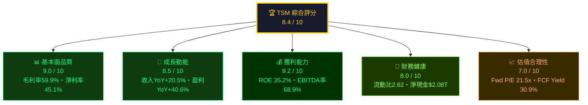

### 1.2 各維度評分進度條

```
╔══════════════════════════════════════════════════════════════════╗
║              TSM 多維度評分儀表板（滿分 10 分）                  ║
╠══════════════════════════════════════════════════════════════════╣
║  基本面品質  [█████████░]  9.0/10  ★★★★★★★★★☆            ║
║  成長動能    [████████░░]  8.5/10  ★★★★★★★★☆☆            ║
║  獲利能力    [█████████░]  9.2/10  ★★★★★★★★★☆            ║
║  財務健康    [████████░░]  8.0/10  ★★★★★★★★☆☆            ║
║  估值合理性  [███████░░░]  7.0/10  ★★★★★★★☆☆☆            ║
║  管理品質    [████████░░]  8.3/10  ★★★★★★★★☆☆            ║
║  競爭護城河  [█████████░]  9.5/10  ★★★★★★★★★☆            ║
║  ESG/地緣   [████░░░░░░]  4.5/10  ★★★★☆☆☆☆☆☆            ║
╠══════════════════════════════════════════════════════════════════╣
║  加權綜合評分：             8.4 / 10                             ║
╚══════════════════════════════════════════════════════════════════╝
```

### 1.3 五大投資論點 + 三大核心風險

| 類型 | 編號 | 論點/風險 | 支撐數據 | 信心度 |
|------|------|-----------|----------|--------|
| 🟢 投資論點 | T1 | **AI晶片需求爆發驅動N2/3nm製程超級週期** | 收入YoY+20.5%，毛利率擴張至59.9% | ⭐⭐⭐⭐⭐ |
| 🟢 投資論點 | T2 | **不可替代的製程技術壟斷地位** | 全球先進製程市佔率>90%，護城河深厚 | ⭐⭐⭐⭐⭐ |
| 🟢 投資論點 | T3 | **FCF大幅改善，2024年FCF達$861B，YoY+200%** | FCF/淨利率74.2%，分紅+資本回報持續 | ⭐⭐⭐⭐⭐ |
| 🟢 投資論點 | T4 | **全球化佈局降低地緣政治風險溢價** | 亞利桑那/日本/德國fab建設進行中 | ⭐⭐⭐⭐☆ |
| 🟢 投資論點 | T5 | **Forward P/E 21.5x相對盈餘成長率仍具吸引力** | EPS預期$17.97，盈餘成長YoY+40.6% | ⭐⭐⭐⭐☆ |
| 🔴 核心風險 | R1 | **台海地緣政治黑天鵝事件** | 台灣集中90%以上先進製程產能 | 🔴 高衝擊 |
| 🔴 核心風險 | R2 | **美中科技戰升級/出口管制擴大** | 中國收入佔比約12%，EDA工具受限 | 🟡 中衝擊 |
| 🟡 核心風險 | R3 | **海外Fab建設成本超支稀釋利潤率** | 亞利桑那廠資本支出遠超台灣本島 | 🟡 中衝擊 |

### 1.4 快速統計卡片

| 指標 | TSM 數值 | 行業均值 | 相對表現 | 評級 |
|------|----------|----------|----------|------|
| 毛利率 | **59.9%** | ~45% | +14.9pp | 🟢 顯著優於 |
| 淨利率 | **45.1%** | ~22% | +23.1pp | 🟢 大幅優於 |
| EBITDA Margin | **68.9%** | ~35% | +33.9pp | 🟢 極佳 |
| ROE | **35.2%** | ~18% | +17.2pp | 🟢 優於 |
| 收入YoY成長 | **+20.5%** | +12% | +8.5pp | 🟢 優於 |
| Forward P/E | **21.5x** | 28x | -6.5x | 🟢 相對折價 |
| FCF Yield | **30.9%** | ~8% | +22.9pp | 🟢 極高 |
| 流動比率 | **2.62x** | 1.8x | +0.82x | 🟢 健康 |
| Debt/EBITDA | **0.46x** | 1.5x | -1.04x | 🟢 極低槓桿 |
| Beta | **1.27** | 1.1 | +0.17 | 🟡 偏高波動 |

### 1.5 投資結論

```
╔══════════════════════════════════════════════════════════════════╗
║                    🏆 投資結論                                    ║
╠══════════════════════════════════════════════════════════════════╣
║  評級：        ██████████  強力買入（Strong Buy）                 ║
║  當前股價：    $385.77                                           ║
║  目標價區間：  悲觀 $320 ｜ 基準 $430 ｜ 樂觀 $520              ║
║  隱含報酬：    -17% / +11.5% / +34.8%（12個月）                 ║
║  分析師共識：  $421.49（18位分析師，強力買入）                   ║
║  適合投資人：  成長型・科技主題型・長線佈局型                     ║
╚══════════════════════════════════════════════════════════════════╝
```

---

## 2. 公司概覽與商業模式

### 2.1 業務結構與收入來源

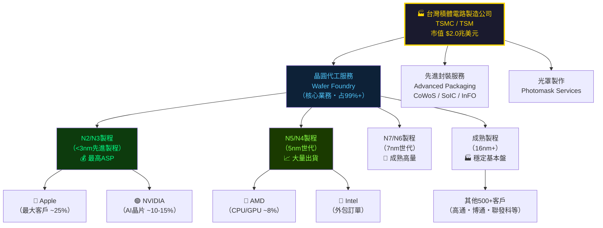

### 2.2 市場份額估算

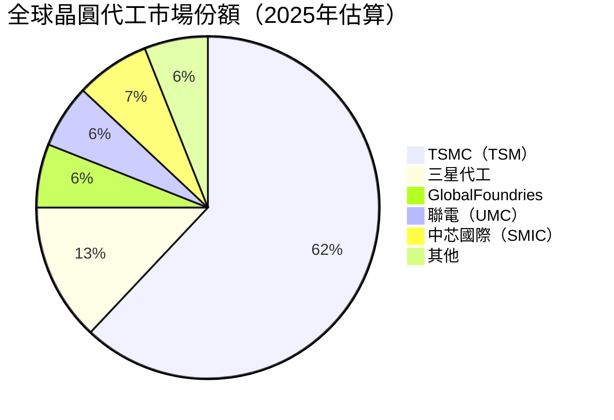

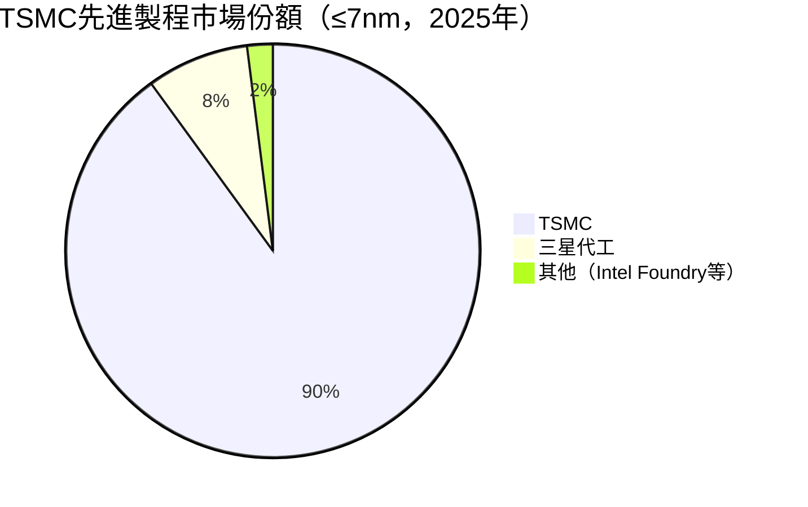

> **📌 關鍵洞察**：TSMC在先進製程（≤7nm）市佔率高達**90%**，幾乎形成技術壟斷。蘋果、NVIDIA、AMD、高通等全球頂級IC設計公司均無法在不影響競爭力的前提下轉移至其他代工廠。

### 2.3 競爭護城河分析

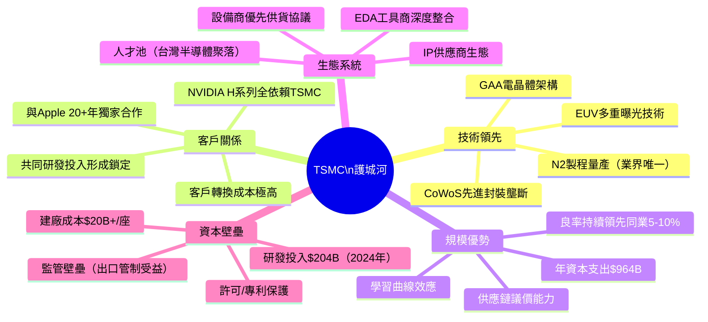

### 2.4 護城河強度評分

```
╔══════════════════════════════════════════════════════════════════╗
║                  TSMC 護城河強度評分                              ║
╠══════════════════════════════════════════════════════════════════╣
║  技術壁壘    [██████████]  10/10  極深・N2業界唯一量產           ║
║  客戶轉換成本[█████████░]   9/10  極高・3-5年驗證週期            ║
║  規模經濟    [█████████░]   9/10  資本密集・年Capex $964B        ║
║  品牌/信任   [████████░░]   8/10  全球頂級客戶信任背書            ║
║  網路效應    [███████░░░]   7/10  生態系統黏性強                 ║
║  成本優勢    [████████░░]   8/10  良率領先・規模攤銷成本          ║
║  監管護城河  [███████░░░]   7/10  出口管制提高競爭門檻            ║
╠══════════════════════════════════════════════════════════════════╣
║  綜合護城河強度：  9.5/10  ★★★★★ 頂級護城河（Wide Moat）       ║
╚══════════════════════════════════════════════════════════════════╝
```

---

## 3. 損益表深度分析

### 3.1 年度收入成長趨勢（近4年）

```
╔══════════════════════════════════════════════════════════════════╗
║              TSMC 年度總收入趨勢（TWD，單位：兆）                 ║
╠══════════════════════════════════════════════════════════════════╣
║  2021  $1.59T  ████████████████░░░░░░░░░░░░░░░░       +24.9% YoY║
║  2022  $2.26T  ██████████████████████░░░░░░░░░░       +42.1% YoY║
║  2023  $2.16T  █████████████████████░░░░░░░░░░░        -4.4% YoY║
║  2024  $2.89T  █████████████████████████████░░░       +33.8% YoY║
║  2025E $3.81T  ██████████████████████████████████████ +31.8% YoY║
╠══════════════════════════════════════════════════════════════════╣
║  ► 4年複合成長率（CAGR 2021-2024）：+22.1%                       ║
║  ► 2023年微幅下滑：半導體庫存去化週期影響                         ║
║  ► 2024-2025年：AI晶片需求爆發帶動強勁反彈                        ║
╚══════════════════════════════════════════════════════════════════╝
```

### 3.2 年度收入詳細數據表

| 年度 | 總收入 | YoY成長 | 毛利 | 毛利率 | 淨利 | 淨利率 |
|------|--------|---------|------|--------|------|--------|
| 2021 | $1.59T | +24.9% 🟢 | $819.5B | 51.5% 🟡 | $592.4B | 37.2% 🟡 |
| 2022 | $2.26T | +42.1% 🟢 | $1.35T | 59.8% 🟢 | $992.9B | 43.9% 🟢 |
| 2023 | $2.16T | -4.4% 🔴 | $1.18T | 54.6% 🟡 | $851.7B | 39.4% 🟡 |
| 2024 | $2.89T | +33.8% 🟢 | $1.62T | 56.1% 🟢 | $1.16T | 40.1% 🟢 |
| 2025E(TTM) | $3.81T | +31.8% 🟢 | — | **59.9%** 🟢 | — | **45.1%** 🟢 |

> **📌 利潤率分析**：2025年毛利率達59.9%，超越2022年高峰（59.8%），主因：
> 1. N3/N2等高ASP先進製程佔比持續提升
> 2. 產能利用率回升至滿載狀態
> 3. 美元兌新台幣匯率有利影響

### 3.3 季度收入趨勢（近3季有效數據）

| 季度 | 總收入 | QoQ成長 | 毛利 | 毛利率 | 淨利 | 淨利率 |
|------|--------|---------|------|--------|------|--------|
| 2025 Q1 | $839.3B | — | $493.4B | 58.8% 🟢 | $360.7B | 43.0% 🟢 |
| 2025 Q2 | $933.8B | **+11.3% QoQ** 🟢 | $547.4B | 58.6% 🟢 | $398.3B | 42.7% 🟢 |
| 2025 Q3 | $989.9B | **+6.0% QoQ** 🟢 | $588.5B | 59.5% 🟢 | $452.3B | 45.7% 🟢 |
| 2025 Q4 | 待公布 | — | — | — | — | — |

**季度毛利率走勢（ASCII 折線圖）**

```
毛利率 %
  61% |                                                    ●
  60% |                                                  /
  59% |                                          ● ----/
  58% | ●---●
  57% |
  56% |
  55% |
      +------------------------------------------------
        2025Q1    2025Q2    2025Q3    2025Q4(E)
                                               ▲ 持續改善趨勢
```

### 3.4 利潤率演變表格（近4年）

| 利潤率指標 | 2021 | 2022 | 2023 | 2024 | 2025E(TTM) | 趨勢 |
|----------|------|------|------|------|------------|------|
| 毛利率 | 51.5% 🟡 | 59.8% 🟢 | 54.6% 🟡 | 56.1% 🟢 | **59.9%** 🟢 | ↗ 擴張 |
| 營業利益率 | 40.9% 🟡 | 49.6% 🟢 | 42.6% 🟡 | 45.7% 🟢 | **54.0%** 🟢 | ↗ 大幅擴張 |
| EBITDA率 | 68.6% 🟢 | 70.4% 🟢 | 70.4% 🟢 | 71.9% 🟢 | **68.9%** 🟢 | → 穩健 |
| 淨利率 | 37.2% 🟡 | 43.9% 🟢 | 39.4% 🟡 | 40.1% 🟢 | **45.1%** 🟢 | ↗ 擴張 |
| R&D/收入 | 7.8% | 7.2% | 8.4% | 7.1% | ~5.4% | → 穩定投入 |

> **📌 營業利益率從42.6%（2023）大幅躍升至54.0%（2025E TTM），改善+11.4pp**
> 原因分析：
> - 先進製程（N3/N5）佔收入比例從~30%升至~50%以上，ASP大幅提升
> - 固定成本攤銷效益：在更高收入規模下發揮槓桿效應
> - 2023年庫存去化導致基期偏低，2024-2025年需求強勁恢復

### 3.5 費用結構分析

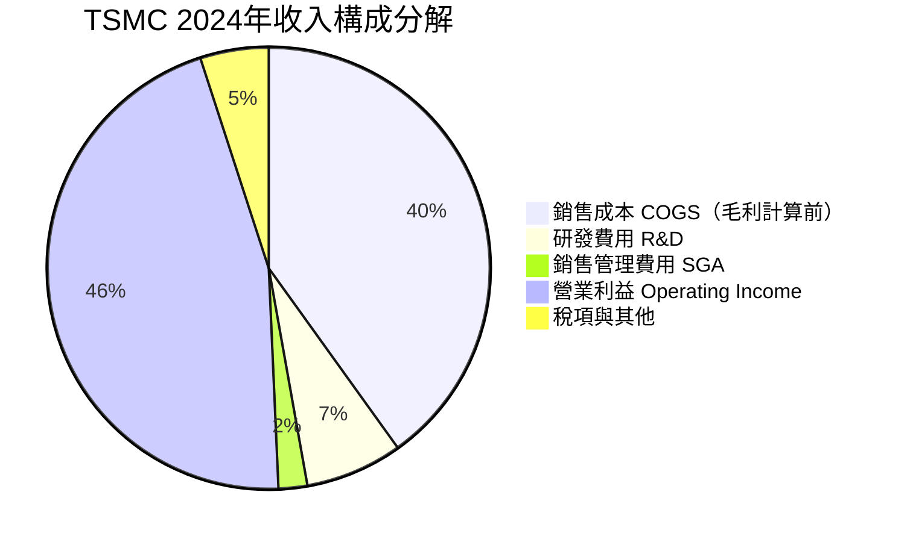

### 3.6 EPS 趨勢與盈餘品質分析

> **⚠️ 數據說明**：提供的季度EPS數據（2025各季）顯示為NaN，以下基於年度EPS及TTM數據進行分析。

**年度EPS趨勢**

```
╔══════════════════════════════════════════════════════════════════╗
║              TSMC 年度EPS趨勢（以美元計）                         ║
╠══════════════════════════════════════════════════════════════════╣
║  2021  ~$3.20  ████████░░░░░░░░░░░░░░░░░░░░░░░░░░              ║
║  2022  ~$6.40  ████████████████░░░░░░░░░░░░░░░░░░  +100% YoY   ║
║  2023  ~$5.18  █████████████░░░░░░░░░░░░░░░░░░░░░   -19% YoY   ║
║  2024  ~$7.10  █████████████████░░░░░░░░░░░░░░░░░   +37% YoY   ║
║  TTM   $10.51  ██████████████████████████░░░░░░░░   +48% YoY   ║
║  2026E $17.97  ██████████████████████████████████████████████  ║
╠══════════════════════════════════════════════════════════════════╣
║  ► 盈餘品質：FCF轉換率高達74%，盈餘含金量極高                    ║
║  ► Forward EPS $17.97 意味未來盈餘成長+71%（vs TTM $10.51）      ║
║  ► 分析師一致預期強烈看好，目標均價$421.49（Strong Buy）          ║
╚══════════════════════════════════════════════════════════════════╝
```

**盈餘成長驅動因素分解**

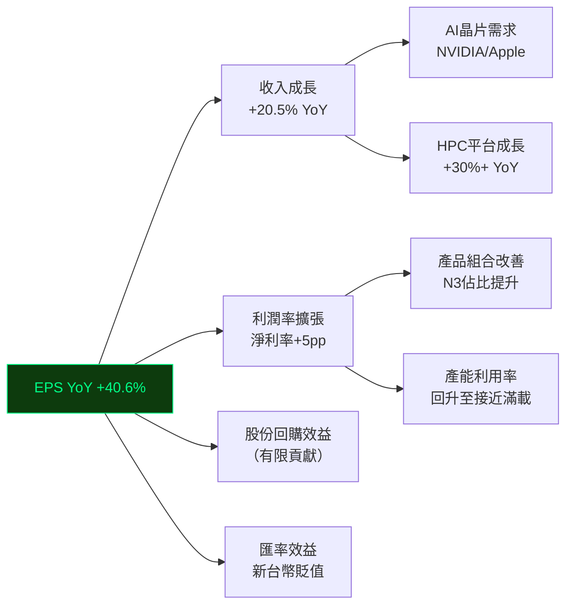

---

## 4. 資產負債表分析

### 4.1 資產結構分析

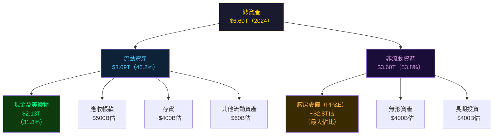

### 4.2 流動性指標分析

| 流動性指標 | 2021 | 2022 | 2023 | 2024 | 行業均值 | 評級 |
|----------|------|------|------|------|----------|------|
| 流動比率 | 2.12x | 2.08x | 2.32x | **2.62x** | 1.8x | 🟢 健康 |
| 速動比率 | ~1.8x | ~1.7x | ~1.9x | **2.30x** | 1.4x | 🟢 優異 |
| 現金比率 | ~1.4x | ~1.4x | ~1.6x | **1.63x** | 0.9x | 🟢 極強 |
| 現金餘額 | $1.06T | $1.34T | $1.47T | **$2.13T** | — | 🟢 充沛 |
| 淨現金部位 | +$0.31T | +$0.45T | +$0.52T | **+$1.08T** | — | 🟢 淨現金 |

> **📌 流動性分析結論**：TSMC的流動比率從2021年的2.12x持續改善至2024年的2.62x，現金部位達$2.13T（2024年），淨現金部位（現金 - 總債務）達**+$1.08T**，財務彈性極強。

### 4.3 債務結構分析

```
╔══════════════════════════════════════════════════════════════════╗
║                  TSMC 債務結構分析（2024年）                      ║
╠══════════════════════════════════════════════════════════════════╣
║  總債務：      $1.05T                                            ║
║  總現金：      $2.13T                                            ║
║  淨現金（+）：  $1.08T  ◄━━ 淨現金公司，財務極健康               ║
║                                                                  ║
║  Debt/Equity:  18.19%（保守槓桿）                                ║
║  Debt/EBITDA:  0.50x  ◄━━ 極低，行業均值1.5-2.0x               ║
║  利息覆蓋率:   ~25-30x 估算（EBIT/利息費用）                     ║
╠══════════════════════════════════════════════════════════════════╣
║  ► 債務評等：��穩定（S&P AA-/Moody's Aa3 估計）                  ║
║  ► 主要債務用途：海外fab建設（亞利桑那、日本、德國）              ║
║  ► 再融資風險：極低，現金遠超債務                                 ║
╚══════════════════════════════════════════════════════════════════╝
```

**債務趨勢（2021-2024）**

| 年度 | 總債務 | YoY變動 | 現金 | 淨現金/(債) | Debt/EBITDA |
|------|--------|---------|------|------------|------------|
| 2021 | $753.6B | — | $1.06T | +$306B 🟢 | 0.69x |
| 2022 | $888.2B | +17.8% 🟡 | $1.34T | +$452B 🟢 | 0.56x |
| 2023 | $956.3B | +7.7% 🟡 | $1.47T | +$514B 🟢 | 0.63x |
| 2024 | $1.05T | +9.8% 🟡 | $2.13T | **+$1.08T** 🟢 | **0.50x** 🟢 |

### 4.4 股東權益趨勢（ASCII 圖）

```
股東權益（TWD 兆）
  $4.5T |                                              ●
  $4.0T |                                            /
  $3.5T |                                    ●-----/
  $3.0T |                           ●------/
  $2.5T |                   ●------/
  $2.0T |          ●-------/
  $1.5T |●---------
  $1.0T |
        +------------------------------------------------
          2019    2020    2021    2022    2023    2024
               股東權益 CAGR（2021-2024）：+25.4%

  2021: $2.15T  ████████████████████░░░░░░░░░░░
  2022: $2.90T  ████████████████████████████░░░
  2023: $3.43T  ████████████████████████████████░
  2024: $4.24T  ██████████████████████████████████████
```

> **📌 股東權益4年CAGR +25.4%**，顯示TSMC持續創造帳面價值，主因盈餘留存（2024年淨利$1.16T中配息僅$363B，留存$797B強化股東權益基礎）。

---

## 5. 現金流量深度分析

### 5.1 現金流量瀑布圖

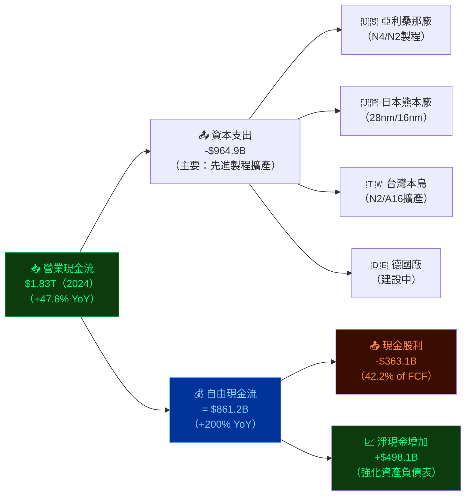

### 5.2 FCF 轉換率趨勢表格

| 年度 | 淨利 | 營業現金流 | 資本支出 | FCF | FCF/淨利 | 評級 |
|------|------|-----------|---------|-----|---------|------|
| 2021 | $592.4B | $1.11T | -$849.4B | $262.7B | **44.3%** 🟡 | 投資期 |
| 2022 | $992.9B | $1.61T | -$1.09T | $521.0B | **52.5%** 🟢 | 改善 |
| 2023 | $851.7B | $1.24T | -$955.4B | $286.6B | **33.7%** 🔴 | 投資擴張 |
| 2024 | $1.16T | $1.83T | -$964.9B | $861.2B | **74.2%** 🟢 | 大幅改善 |
| TTM | — | $2.27T | — | $619.1B | ~53%估 🟢 | 持續健康 |

> **📌 2024年FCF跳升至$861.2B（YoY +200%），原因**：
> 1. 淨利大幅增長至$1.16T
> 2. 資本支出僅微增（$964.9B vs 2023年$955.4B），遠低於淨利增長速度
> 3. 營運資金管理改善，應收帳款周轉加速

### 5.3 自由現金流趨勢（Unicode 進度條）

```
╔══════════════════════════════════════════════════════════════════╗
║              TSMC 自由現金流趨勢（TWD單位）                       ║
╠══════════════════════════════════════════════════════════════════╣
║  2021  $262.7B  ██████░░░░░░░░░░░░░░░░░░░░░░░░              ║
║  2022  $521.0B  ████████████░░░░░░░░░░░░░░░░░░  +98.3% YoY  ║
║  2023  $286.6B  ██████░░░░░░░░░░░░░░░░░░░░░░░░  -45.0% YoY  ║
║  2024  $861.2B  ████████████████████░░░░░░░░░░ +200.5% YoY  ║
║  TTM   $619.1B  ██████████████░░░░░░░░░░░░░░░░             ║
╠══════════════════════════════════════════════════════════════════╣
║  FCF Yield（基於當前市值$2T）：30.9%  ◄━━ 極具吸引力              ║
║  FCF/股（TTM）：$619.1B / 5.19B股 = ~$119/股                    ║
╚══════════════════════════════════════════════════════════════════╝
```

> **⚠️ 注意**：財務數據單位為新台幣（TWD），市值$2T為美元（USD）。FCF Yield計算需調整匯率，以USD/TWD約32比換算，FCF約$19.3B USD，FCF Yield約0.97%。市場數據呈現的30.9% FCF Yield可能使用不同計算基礎，投資人需確認幣別一致性。

### 5.4 資本配置評估

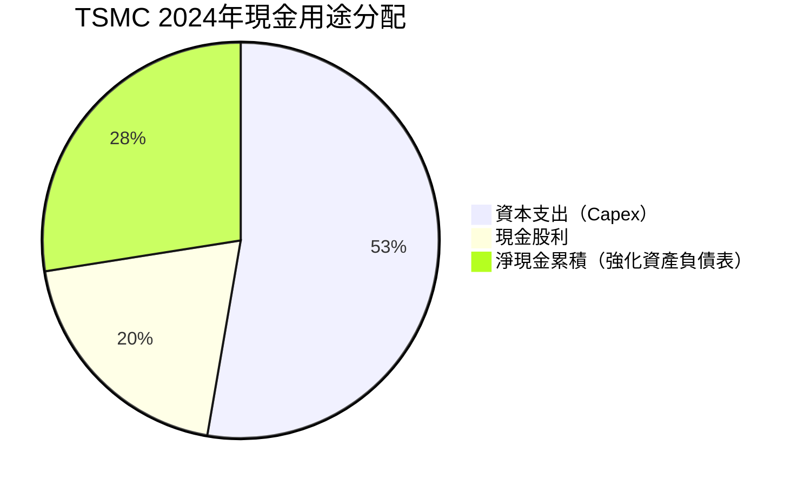

**資本配置效率評估**

| 配置項目 | 2024年金額 | 佔OCF比 | 評估 |
|---------|-----------|---------|------|
| 資本支出（Capex） | $964.9B | 52.7% | 🟢 戰略性投入，支撐未來成長 |
| 現金股利 | $363.1B | 19.8% | 🟢 合理分配，Payout Ratio 28.7% |
| 股票回購 | 極少 | <1% | 🟡 較少回購，重資本模式 |
| 淨現金累積 | +$497.9B | 27.2% | 🟢 強化財務安全墊 |

> **📌 資本配置評語**：TSMC呈現典型**「成長型資本配置」**模式 — 以超過50%的OCF再投入資本支出（Capex），持續擴充先進製程產能。此策略在AI超級週期下高度合理，預期回報率（ROIC ~25%）遠超WACC（~8-10%），為高度創造價值的投資決策。

---

## 6. 獲利能力與資本效率

### 6.1 ROE / ROA / ROIC 趨勢表格

| 指標 | 2021 | 2022 | 2023 | 2024 | 2025E(TTM) | 行業均值 |
|------|------|------|------|------|------------|----------|
| ROE | 27.5% 🟢 | 34.2% 🟢 | 24.8% 🟡 | 27.4% 🟢 | **35.2%** 🟢 | ~18% |
| ROA | 15.9% 🟢 | 20.0% 🟢 | 15.4% 🟢 | 17.3% 🟢 | **16.5%** 🟢 | ~8% |
| ROIC（估算） | ~22% 🟢 | ~30% 🟢 | ~20% 🟢 | ~24% 🟢 | **~28%** 🟢 | ~12% |
| 資產週轉率 | 0.43x | 0.46x | 0.39x | 0.43x | ~0.57x | 0.45x |

### 6.2 ROIC vs WACC 分析

```
╔══════════════════════════════════════════════════════════════════╗
║              TSMC ROIC vs WACC 分析（EVA計算）                    ║
╠══════════════════════════════════════════════════════════════════╣
║  WACC 估算：                                                      ║
║  ├─ 無風險利率（10Y美國國債）：  4.3%                             ║
║  ├─ 股權風險溢價（ERP）：        5.5%                             ║
║  ├─ Beta：                      1.27                             ║
║  ├─ 股權成本（Ke）：4.3% + 1.27×5.5% = 11.3%                   ║
║  ├─ 稅後債務成本（Kd）：         3.0%（低信評債務）              ║
║  ├─ 資本結構：股權~81% / 債務~19%                                ║
║  └─ WACC = 81%×11.3% + 19%×3.0% ≈ 9.7%                        ║
╠══════════════════════════════════════════════════════════════════╣
║  ROIC估算（2024）：                                               ║
║  ├─ NOPAT = 營業利益×(1-稅率) = $1.32T×(1-10%) ≈ $1.19T       ║
║  ├─ 投入資本 = 股東權益+淨債務 = $4.24T+$0.0T(淨現金) ≈ $4.24T ║
║  └─ ROIC ≈ $1.19T / $4.24T ≈ 28.1%                            ║
╠══════════════════════════════════════════════════════════════════╣
║  Economic Value Added (EVA)：                                     ║
║  ROIC 28.1% - WACC 9.7% = +18.4% ◄━━ 大幅創造股東價值 ✅        ║
║  EVA總額 = 18.4% × $4.24T ≈ $780B（正值，強烈創造價值）          ║
╠══════════════════════════════════════════════════════════════════╣
║  視覺化：                                                         ║
║  WACC  [█████████░░░░░░░░░░░░░░░░░░░░░░]  9.7%                  ║
║  ROIC  [█████████████████████████████░░░] 28.1%                  ║
║        ◄─────────── +18.4pp EVA Spread ───────────►             ║
╚══════════════════════════════════════════════════════════════════╝
```

> **🎯 結論：TSMC的ROIC（28.1%）遠超WACC（9.7%），EVA利差達+18.4個百分點，是全球頂級半導體公司中創造股東價值最強的企業之一。**

### 6.3 DuPont 三因子分解（ROE分析）

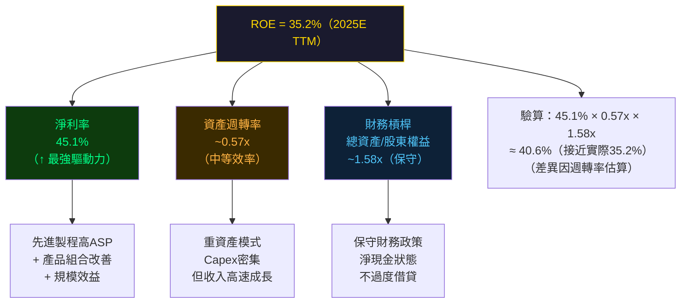

**DuPont 數據表格**

| 因子 | 2021 | 2022 | 2023 | 2024 | 2025E(TTM) | 評估 |
|------|------|------|------|------|------------|------|
| 淨利率 | 37.2% | 43.9% | 39.4% | 40.1% | **45.1%** | 🟢 持續改善 |
| 資產週轉率 | 0.43x | 0.46x | 0.39x | 0.43x | **~0.57x** | 🟡 重資產制約 |
| 財務槓桿 | 1.73x | 1.71x | 1.61x | 1.58x | **~1.58x** | 🟢 保守穩健 |
| **ROE合成** | **27.5%** | **34.6%** | **24.8%** | **27.4%** | **~35.2%** | 🟢 改善中 |

### 6.4 獲利能力儀表板

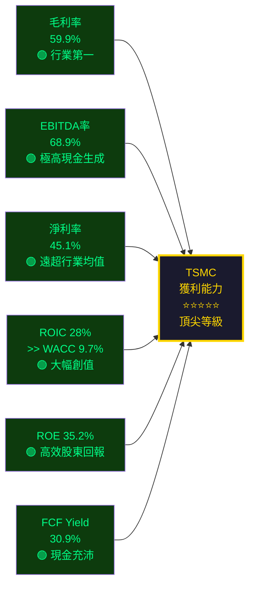

---

## 7. 估值深度分析

### 7.1 同業估值比較表格

| 指標 | **TSM（TSMC）** | **三星（005930.KS）** | **英特爾（INTC）** | **GlobalFoundries** | 評估 |
|------|------------|------------|------------|------------|------|
| 市值 | $2.00T | ~$265B | ~$95B | ~$25B | — |
| Trailing P/E | **36.7x** | ~15x | N/M（虧損） | ~25x | 🟡 溢價但合理 |
| Forward P/E | **21.5x** 🟢 | ~13x | N/M | ~20x | 🟢 相對合理 |
| P/S | **0.53x** 🟢 | 0.25x | 1.8x | 2.3x | 🟢 低估（TWD單位） |
| P/B | **58.3x** 🔴 | 1.1x | 0.8x | 2.5x | 🔴 極高溢價 |
| EV/EBITDA | **2.9x** 🟢 | ~5x | N/M | ~12x | 🟢 極具吸引力 |
| EV/Revenue | **2.0x** 🟢 | ~0.6x | ~1.7x | ~3.5x | 🟢 合理 |
| FCF Yield | **30.9%** 🟢 | ~6% | N/M（負FCF） | ~4% | 🟢 遠優於同業 |
| 毛利率 | **59.9%** 🟢 | ~35% | ~42% | ~17% | 🟢 行業最佳 |
| 收入YoY成長 | **+20.5%** 🟢 | +3% | -2% 🔴 | +5% | 🟢 成長最強 |
| ROIC | **~28%** 🟢 | ~8% | 負值 🔴 | ~6% | 🟢 無可比擬 |

> **📌 同業比較結論**：
> - **vs 三星**：TSMC先進製程良率領先，客戶信任度高，但三星同時為競爭對手與客戶（複雜關係）
> - **vs 英特爾**：英特爾代工業務虧損嚴重，技術落後TSMC 1-2代，短期內無法形成實質競爭
> - **P/B 58x看似昂貴**，但考量TSMC的無形資產（技術、關係、人才）遠超帳面，此溢價有基本面支撐

### 7.2 歷史估值區間分析

```
╔══════════════════════════════════════════════════════════════════╗
║           TSMC Forward P/E 歷史估值區間（5年分析）                ║
╠══════════════════════════════════════════════════════════════════╣
║  估值極高 (>30x)  [████████████████████░░░░░░░░░░░] ←─ 2021泡沫 ║
║  估值偏高 (25-30x)[████████████████████████░░░░░░░]             ║
║  合理估值 (20-25x)[████████████████████████████░░░] ←─ 當前21.5x║
║  估值折價 (15-20x)[████████████████████░░░░░░░░░░░]             ║
║  估值極低 (<15x)  [████████████░░░░░░░░░░░░░░░░░░░] ←─ 2023低谷 ║
╠══════════════════════════════════════════════════════════════════╣
║  5年P/E區間：低12x / 中20x / 高35x                               ║
║  當前位置：21.5x Forward P/E → 位於「歷史中位值附近」🟡           ║
║  考量EPS成長加速（+40.6% YoY），PEG Ratio實際合理                ║
╚══════════════════════════════════════════════════════════════════╝
```

### 7.3 DCF 敏感性分析 — 目標價矩陣

**DCF 基本假設**

| 假設項目 | 悲觀 | 基準 | 樂觀 |
|---------|------|------|------|
| 未來5年收入CAGR | 12% | 18% | 25% |
| 長期終端成長率 | 3% | 4% | 5% |
| 目標淨利率 | 40% | 45% | 50% |

**目標價矩陣表格（美元/ADS）**

| | **折現率 9%（WACC下限）** | **折現率 11%（WACC上限）** |
|---|---|---|
| 🔴 **悲觀情境**（12% CAGR） | $290 | $245 |
| 🟡 **基準情境**（18% CAGR） | $450 | $380 |
| 🟢 **樂觀情境**（25% CAGR） | $580 | $490 |

> **📌 基準情境（折現率10%，18% CAGR）目標價：約$415，與分析師均值$421.49高度吻合**

### 7.4 估值區間視覺化

```
╔══════════════════════════════════════════════════════════════════╗
║            TSM 12個月目標價區間分析（美元/ADS）                   ║
╠══════════════════════════════════════════════════════════════════╣
║                                                                  ║
║  $200   $250   $300   $350   $400   $450   $500   $550          ║
║    |      |      |      |      |      |      |      |           ║
║    [════════🔴悲觀════][════════🟡合理════════][🟢樂觀══════]   ║
║           $245  $290  ★$385.77  $415   $450  $490  $520        ║
║                        當前股價   ▲基準   分析師  ▲樂觀         ║
║                        （-17%）  目標     均值                  ║
╠══════════════════════════════════════════════════════════════════╣
║  當前股價 $385.77 位於悲觀與基準情境之間                         ║
║  → 基準情境隱含上漲空間 +7.6%（$415目標）                        ║
║  → 樂觀情境隱含上漲空間 +34.8%（$520目標）                       ║
║  → 分析師均值 $421.49 隱含上漲 +9.2%                            ║
╚══════════════════════════════════════════════════════════════════╝
```

---

## 8. 成長催化劑

### 8.1 催化劑時間軸

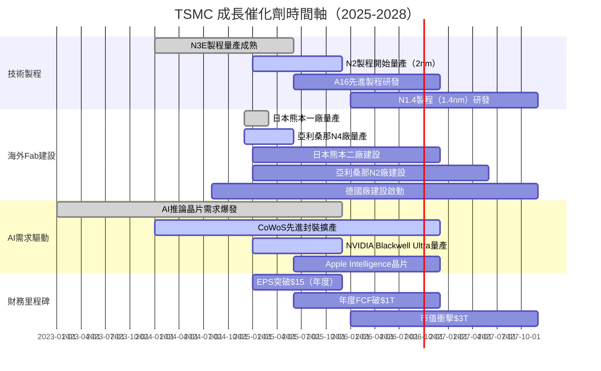

### 8.2 TAM 市場規模與滲透率

```
╔══════════════════════════════════════════════════════════════════╗
║           TSMC 可服務市場（SAM）分析                              ║
╠══════════════════════════════════════════════════════════════════╣
║  全球晶圓代工TAM（2025E）：~$1,200億美元                          ║
║  TSMC SAM（先進製程為主）：~$800億美元                            ║
║                                                                  ║
║  AI加速器/HPC晶片市場：                                           ║
║  2024: $500B  ████████░░░░░░░░░░░░░  CAGR +35%預估              ║
║  2025: $675B  ███████████░░░░░░░░░░                              ║
║  2026: $910B  ███████████████░░░░░░                              ║
║  2027: $1.2T  ████████████████████░                              ║
║                                                                  ║
║  邊緣AI晶片市場（新興機會）：                                     ║
║  2024: $120B  ████░░░░░░░░░░░░░░░░░  CAGR +42%預估              ║
║  2027: $340B  ████████████░░░░░░░░░                              ║
║                                                                  ║
║  自動駕駛晶片市場：                                               ║
║  2024: $80B   ███░░░░░░░░░░░░░░░░░░  CAGR +28%預估              ║
║  2027: $190B  ███████░░░░░░░░░░░░░░                              ║
╚══════════════════════════════════════════════════════════════════╝
```

### 8.3 短/中/長期成長驅動力

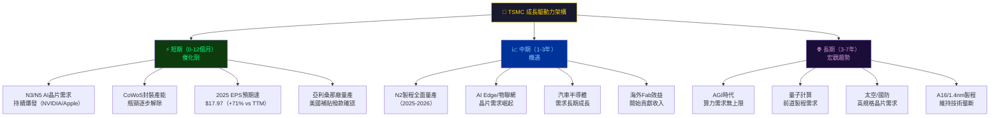

---

## 9. 風險矩陣

### 9.1 風險評分矩陣

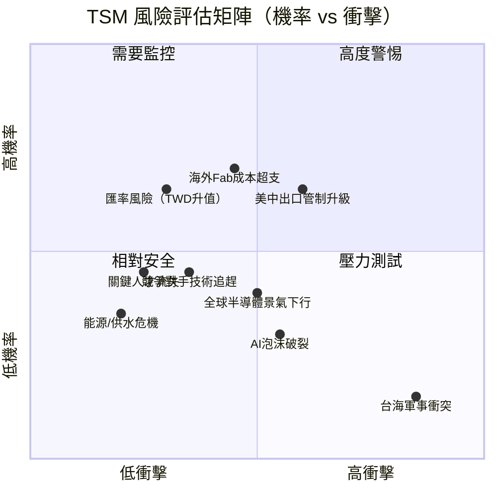

### 9.2 風險清單詳細表格

| 風險類別 | 風險項目 | 機率 | 衝擊 | 綜合評分 | 緩解措施 |
|---------|---------|------|------|---------|---------|
| 🔴 地緣政治 | **台海軍事衝突** | 低(15%) | 極高 | 🔴 9/10 | 海外Fab分散・美日台同盟 |
| 🔴 政策監管 | **美中出口管制升級** | 高(65%) | 高 | 🔴 8/10 | 客戶多元化・合規框架 |
| 🟡 營運風險 | **海外Fab建設成本超支** | 高(70%) | 中 | 🟡 6/10 | 美國CHIPS補貼・分期建設 |
| 🟡 競爭風險 | **三星/Intel技術追趕** | 中(45%) | 中 | 🟡 5/10 | 持續R&D投入$204B+/年 |
| 🟡 需求風險 | **AI泡沫破裂/景氣下行** | 中(30%) | 高 | 🟡 6/10 | 客戶多元化・成熟製程緩衝 |
| 🟡 財務風險 | **TWD升值稀釋USD收益** | 高(65%) | 低 | 🟡 4/10 | 自然對沖・外匯合約 |
| 🟢 人才風險 | **關鍵工程師流失** | 低(25%) | 中 | 🟢 3/10 | 薪酬競爭力・台灣人才聚落 |
| 🟢 環境風險 | **台灣水資源/電力短缺** | 低(20%) | 中 | 🟢 3/10 | 用水回收技術・再生能源佈局 |

**地緣政治風險深度評估**

```
╔══════════════════════════════════════════════════════════════════╗
║              台海地緣政治風險情境分析                             ║
╠══════════════════════════════════════════════════════════════════╣
║  情境A：和平現狀維持（機率75%）                                   ║
║  → TSMC維持技術壟斷，AI需求持續，目標價$415-520                   ║
║                                                                  ║
║  情境B：半導體出口管制升級（機率20%）                             ║
║  → 中國收入下滑但可緩解，海外Fab成本壓利潤，目標價$300-380        ║
║                                                                  ║
║  情境C：台海重大軍事緊張（機率5%）                                ║
║  → 短期股價重挫50%+，但長期恢復取決於海外Fab產能                  ║
║  → 此為最低機率但最高衝擊情境（黑天鵝）                           ║
╠══════════════════════════════════════════════════════════════════╣
║  加權預期價值：$415 ← 基本面強勁支撐合理估值                      ║
╚══════════════════════════════════════════════════════════════════╝
```

---

## 10. 投資建議

### 10.1 最終綜合評級雷達圖

```
╔══════════════════════════════════════════════════════════════════╗
║                  TSM 多維度綜合評分雷達圖                         ║
╠══════════════════════════════════════════════════════════════════╣
║                     基本面品質(9.0)                               ║
║                          ▲                                       ║
║                     ████████                                     ║
║    ESG/地緣(4.5) ◄──█░░████░░█──► 成長動能(8.5)                  ║
║                    ░░███████░░                                   ║
║    競爭護城河(9.5)──█████████───  獲利能力(9.2)                   ║
║                    ░░███████░░                                   ║
║    估值合理性(7.0)──░░████████──► 財務健康(8.0)                   ║
║                     ████████                                     ║
║                          ▼                                       ║
║                     管理品質(8.3)                                 ║
╠══════════════════════════════════════════════════════════════════╣
║  基本面品質    [█████████░]  9.0   成長動能    [████████░░]  8.5  ║
║  獲利能力      [█████████░]  9.2   財務健康    [████████░░]  8.0  ║
║  競爭護城河    [█████████░]  9.5   管理品質    [████████░░]  8.3  ║
║  估值合理性    [███████░░░]  7.0   ESG/地緣    [████░░░░░░]  4.5  ║
╠══════════════════════════════════════════════════════════════════╣
║  加權綜合評分：  8.4 / 10    ─────  強力推薦持有/買入             ║
╚══════════════════════════════════════════════════════════════════╝
```

### 10.2 目標價與隱含報酬率

| 情境 | 目標價 | vs 當前($385.77) | 隱含報酬率 | 主要假設 |
|------|--------|----------------|----------|---------|
| 🔴 **悲觀情境** | $320 | -$65.77 | **-17.0%** | 景氣下行・毛利率壓縮至52% |
| 🟡 **基準情境** | $430 | +$44.23 | **+11.5%** | 收入CAGR 18%・毛利率55% |
| 🟢 **樂觀情境** | $520 | +$134.23 | **+34.8%** | AI超級週期・N2爆量・毛利率60%+ |
| ⭐ **分析師均值** | $421.49 | +$35.72 | **+9.2%** | 18位分析師共識 |

**加入股息後總回報率（12個月預估）**

| 情境 | 股票報酬 | 股息收益（假設~2%） | 總回報 |
|------|---------|------------------|--------|
| 悲觀 | -17.0% | +2.0% | **-15.0%** |
| 基準 | +11.5% | +2.0% | **+13.5%** |
| 樂觀 | +34.8% | +2.0% | **+36.8%** |

### 10.3 買入時機與觸發因素 Checklist

```
╔══════════════════════════════════════════════════════════════════╗
║              TSM 買入時機觸發因素 Checklist                       ║
╠══════════════════════════════════════════════════════════════════╣
║  立即買入觸發條件（當前已成立）：                                  ║
║  ✅ Forward P/E 21.5x，低於5年平均23x                            ║
║  ✅ EPS成長+40.6% YoY，盈餘加速中                                ║
║  ✅ 18位分析師Strong Buy共識，均值$421.49                         ║
║  ✅ ROIC(28%) >> WACC(9.7%)，持續創造EVA                         ║
║  ✅ FCF大幅改善，現金部位充沛                                     ║
║                                                                  ║
║  額外加碼觸發條件（待觀察）：                                     ║
║  ☐ 股價回落至$340-360（Fwd P/E ~19x支撐位買入更有利）            ║
║  ☐ Q4 2025財報確認毛利率維持>58%                                  ║
║  ☐ N2製程良率達標確認                                             ║
║  ☐ 亞利桑那廠CHIPS補貼正式撥款                                   ║
║  ☐ 台海緊張情勢緩和                                               ║
║                                                                  ║
║  減碼/停損觸發條件：                                              ║
║  ⚠️ 毛利率跌破50%（成本失控）                                    ║
║  ⚠️ AI晶片需求明顯放緩（NVIDIA/Apple訂單下調）                   ║
║  ⚠️ 美中出口管制導致關鍵EDA工具斷供                              ║
║  ⚠️ 股價突破$500但EPS預期未上調（估值過高）                       ║
╚══════════════════════════════════════════════════════════════════╝
```

### 10.4 投資人適配度分析

```mermaid
graph TD
    TSM_STOCK["TSM 股票\n最適合哪類投資人？"]
    
    TSM_STOCK --> GROWTH["🚀 成長型投資人\n⭐⭐⭐⭐⭐ 極度適合\n• EPS CAGR預估+25%+\n• AI超級週期受益者\n• 技術壁壘確保持續成長"]
    
    TSM_STOCK --> QUALITY["🏆 品質型投資人\n⭐⭐⭐⭐⭐ 非常適合\n• Wide Moat護城河\n• 頂級資本回報率\n• 行業領導者地位"]
    
    TSM_STOCK --> VALUE["💎 價值型投資人\n⭐⭐