# TSM 基本面深度分析報告

> **報告日期**：2026-02-24 ｜ **語言**：繁體中文 ｜ **數據來源**：Yahoo Finance｜ **分析師**：AI 深度研究部

---

## 目錄

| # | 章節 | 重點摘要 |
|---|------|---------|
| 1 | 執行摘要 | 核心評分、5大投資論點 |
| 2 | 公司概覽 | 業務結構、市場地位、競爭優勢 |
| 3 | 損益表深度分析 | 收入成長、利潤率演變 |
| 4 | 資產負債表分析 | 資產結構、流動性 |
| 5 | 現金流量分析 | 自由現金流、資本配置 |
| 6 | 獲利能力指標 | ROE/ROA/ROIC 對比 |
| 7 | 估值分析 | 多維估值、目標股價 |
| 8 | 競爭護城河 | 五力分析、護城河評分 |
| 9 | 成長催化劑 | AI、先進製程、地理擴張 |
| 10 | 風險分析 | 地緣政治、技術、週期性 |
| 11 | 公平價值估算 | DCF、相對估值 |
| 12 | 投資建議 | 最終評級、投資人適配 |

---

## 1. 執行摘要

### 🎯 核心評分總覽

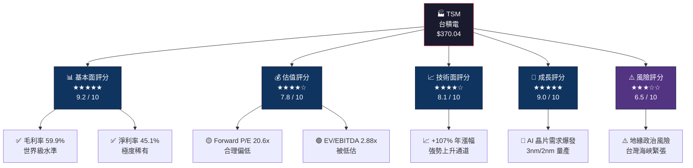

---

### 📊 快速統計卡片

| 指標 | 數值 | 狀態 | 說明 |
|------|------|------|------|
| 💵 當前股價 | **$370.04** | 🟢 | 接近52週高點 $380 |
| 📈 52週區間 | $132.98 ~ $380.00 | 🟢 | 年漲幅 **+178%** |
| 🏛️ 市值 | **$1.92 兆美元** | 🟢 | 全球第2大半導體企業 |
| 📉 EV/EBITDA | **2.88x** | 🟢 | 遠低於行業均值 |
| 📊 Forward P/E | **20.6x** | 🟢 | 低於科技行業均值 |
| 💰 毛利率 | **59.9%** | 🟢 | 半導體代工最高水準 |
| 🔄 ROE | **35.2%** | 🟢 | 超越行業頂尖水準 |
| 💸 自由現金流 | **$8,612億** | 🟢 | 2024年大幅改善 |
| 📡 分析師共識 | **強力買入** | 🟢 | 18位分析師一致看漲 |
| 🎯 平均目標價 | **$421.49** | 🟢 | 上行空間 **+13.9%** |

---

### 🏆 5大投資論點

| # | 投資論點 | 評級 | 核心依據 | 時間軸 |
|---|---------|------|---------|--------|
| 1 | 🤖 **AI晶片絕對壟斷地位** | 🟢 強烈正面 | NVIDIA H100/B200 100%由台積電製造，AI晶片佔營收比例快速提升至20%+ | 短中長期 |
| 2 | ⚡ **先進製程技術護城河** | 🟢 強烈正面 | 3nm量產、2nm 2025年量產，領先競爭對手Intel/Samsung至少2-3年 | 中長期 |
| 3 | 💰 **超凡盈利能力持續提升** | 🟢 強烈正面 | 毛利率59.9%、淨利率45.1%，2024年淨利$1.16兆創歷史新高 | 持續性 |
| 4 | 🌍 **全球化擴張降低地緣風險** | 🟡 中性正面 | 美國亞利桑那州、日本熊本、德國德勒斯頓廠陸續建設 | 中長期 |
| 5 | 📊 **估值相對吸引（Forward P/E僅20.6x）** | 🟢 正面 | 考慮EPS成長70%（$10.51→$17.97），PEG實際低估 | 短中期 |

---

## 2. 公司概覽

### 🏭 業務結構與價值鏈

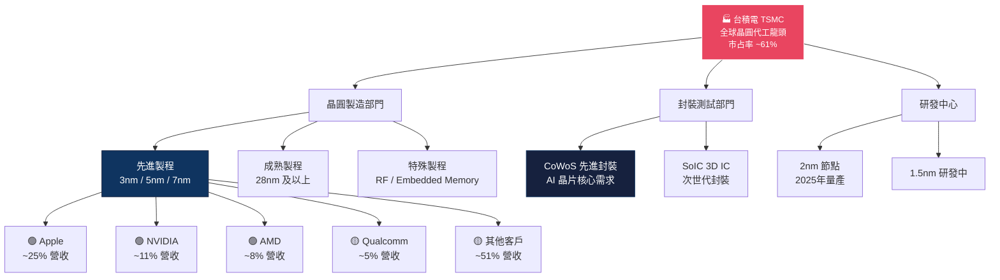

---

### 🌐 全球市場地位（晶圓代工市占率）

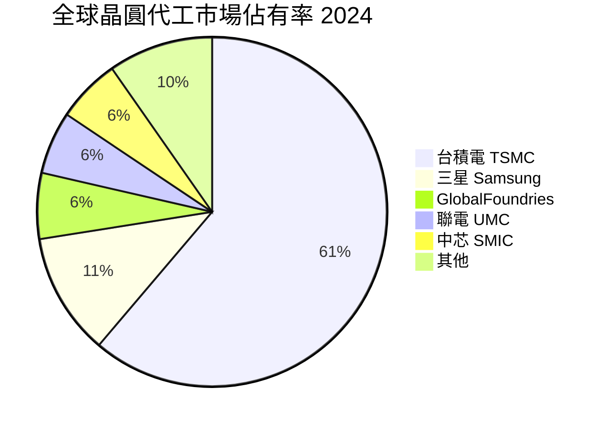

---

### 🧠 競爭優勢思維導圖

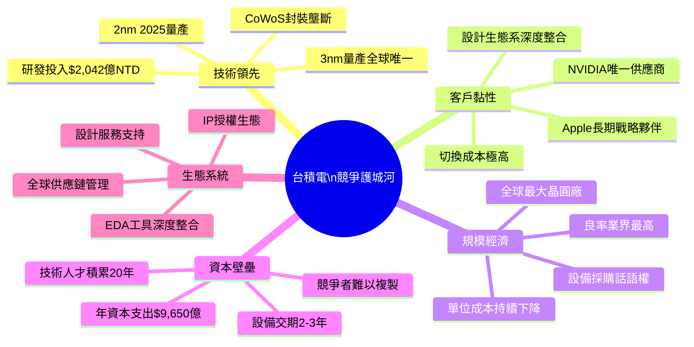

---

### 📍 全球製造版圖

| 地點 | 製程節點 | 狀態 | 戰略意義 |
|------|---------|------|---------|
| 🇹🇼 台灣（主要） | 3nm / 2nm / 5nm+ | 🟢 全速運營 | 全球最先進製程核心 |
| 🇺🇸 美國亞利桑那 | 4nm / 3nm | 🟡 建設中 | 美國政策補貼，客戶在地化 |
| 🇯🇵 日本熊本 | 12nm / 16nm | 🟢 已投產 | 車用/工業晶片，日本政府補貼 |
| 🇩🇪 德國德勒斯頓 | 12nm / 22nm | 🟡 建設中 | 歐洲汽車電子需求 |

---

## 3. 損益表深度分析

### 📈 年度收入成長時間軸

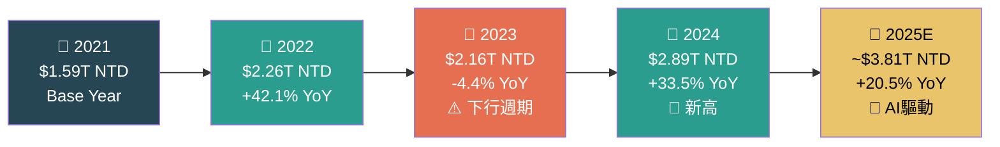

---

### 📊 年度收入趨勢 ASCII 長條圖（單位：兆新台幣）

```
  年度收入趨勢（兆新台幣）
  ╔═══════════════════════════════════════════════════╗
  ║                                                   ║
  ║  2021  ▓▓▓▓▓▓▓▓▓▓▓▓▓▓▓▓▓▓▓▓░░░░░░░░░░░░  $1.59T ║
  ║                                                   ║
  ║  2022  ▓▓▓▓▓▓▓▓▓▓▓▓▓▓▓▓▓▓▓▓▓▓▓▓▓▓▓▓▓░░░  $2.26T ║
  ║                                                   ║
  ║  2023  ▓▓▓▓▓▓▓▓▓▓▓▓▓▓▓▓▓▓▓▓▓▓▓▓▓▓▓░░░░░  $2.16T ║
  ║                                                   ║
  ║  2024  ▓▓▓▓▓▓▓▓▓▓▓▓▓▓▓▓▓▓▓▓▓▓▓▓▓▓▓▓▓▓▓▓  $2.89T ║
  ║                                                   ║
  ║  2025E ▓▓▓▓▓▓▓▓▓▓▓▓▓▓▓▓▓▓▓▓▓▓▓▓▓▓▓▓▓▓▓▓  $3.81T ║
  ║        ★ NEW RECORD HIGH ★                       ║
  ╚═══════════════════════════════════════════════════╝
  ░ = 未達基準  ▓ = 實際收入  比例尺：每格 ≈ $0.06T
```

---

### 💹 四年詳細損益數據表

| 指標 | 2021 | 2022 | 2023 | 2024 | 趨勢 |
|------|------|------|------|------|------|
| 總收入 | $1.59T | $2.26T | $2.16T | $2.89T | 🟢 ↑ |
| YoY 成長率 | — | +42.1% | -4.4% | +33.5% | 🟢 加速 |
| 毛利潤 | $819.5B | $1.35T | $1.18T | $1.62T | 🟢 ↑ |
| **毛利率** | **51.5%** | **59.7%** | **54.6%** | **56.1%** | 🟢 擴張 |
| 營業利益 | $649.9B | $1.12T | $921.4B | $1.32T | 🟢 ↑ |
| **營業利益率** | **40.9%** | **49.6%** | **42.6%** | **45.7%** | 🟢 改善 |
| EBITDA | $1.09T | $1.59T | $1.52T | $2.08T | 🟢 ↑ |
| **EBITDA 利潤率** | **68.6%** | **70.4%** | **70.4%** | **71.9%** | 🟢 穩健 |
| 淨利潤 | $592.3B | $992.9B | $851.7B | $1.16T | 🟢 新高 |
| **淨利率** | **37.2%** | **43.9%** | **39.4%** | **40.1%** | 🟢 強勁 |
| EPS（美元） | ~$4.50 | ~$7.60 | ~$6.54 | ~$10.51 | 🟢 ↑ |
| 研發費用 | $124.7B | $163.3B | $182.4B | $204.2B | 🟡 持續投入 |

---

### 📉 利潤率演變折線圖（ASCII）

```
  利潤率演變趨勢（%）
  ╔══════════════════════════════════════════════════════╗
  ║  80% │                                              ║
  ║  75% │  ·····EBITDA利潤率·····                      ║
  ║  70% │  ★━━━━━━━━━━━━━━━━━━━━━★  71.9%            ║
  ║  65% │                                              ║
  ║  60% │        ◆━━━━━━━━━━━━━━━◆  56.1% 毛利率      ║
  ║  55% │  ◆                                           ║
  ║  50% │                                              ║
  ║  45% │        ▲━━━━━━━━━━━━━━━▲  45.7% 營業利益率  ║
  ║  40% │  ▲                       ●  40.1% 淨利率     ║
  ║  35% │                                              ║
  ║  30% │                                              ║
  ║      └─────────────────────────────────────────     ║
  ║         2021    2022    2023    2024   2025E         ║
  ╚══════════════════════════════════════════════════════╝
  ★ EBITDA  ◆ 毛利率  ▲ 營業利益率  ● 淨利率
```

---

### 🥧 費用結構分析（2024年）

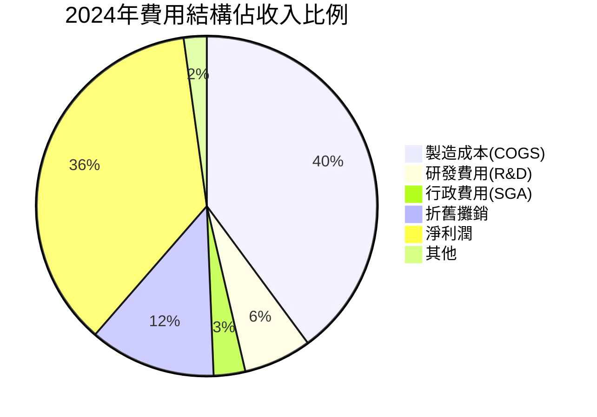

---

### 🔍 關鍵洞察：利潤率質量評估

| 項目 | 台積電 | 行業均值 | 頂尖同業 | 評級 |
|------|--------|---------|---------|------|
| 毛利率 56.1% | `▓▓▓▓▓▓▓▓▓▓▓▓▓▓░` | `▓▓▓▓▓▓▓░░░░░░░░` 35% | Samsung 40% | 🟢 遙遙領先 |
| 淨利率 40.1% | `▓▓▓▓▓▓▓▓▓▓▓▓░░░` | `▓▓▓▓░░░░░░░░░░░` 15% | Intel 10% | 🟢 世界頂尖 |
| R&D/收入 7.1% | `▓▓▓▓▓▓░░░░░░░░░` | `▓▓▓▓▓░░░░░░░░░░` 12% | ASML 15% | 🟡 適度投入 |

---

## 4. 資產負債表分析

### 🏗️ 資產結構分解圖

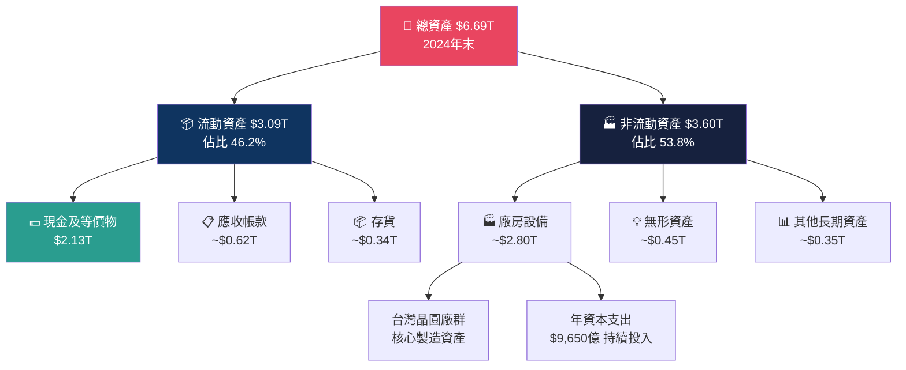

---

### 📊 資產配置 Unicode 橫條圖

```
  資產配置結構（2024年末，$6.69T 總資產）
  ╔════════════════════════════════════════════════════════╗
  ║                                                        ║
  ║  💵 現金及等價物  ▓▓▓▓▓▓▓▓▓▓▓▓▓▓▓▓▓▓▓▓▓░░░  31.8%   ║
  ║                   $2.13T                               ║
  ║                                                        ║
  ║  🏭 廠房設備淨值  ▓▓▓▓▓▓▓▓▓▓▓▓▓▓▓▓▓▓▓▓░░░░  41.9%   ║
  ║                   $2.80T（估）                         ║
  ║                                                        ║
  ║  📋 應收帳款      ▓▓▓▓▓▓▓▓▓░░░░░░░░░░░░░░░   9.3%   ║
  ║                   $0.62T（估）                         ║
  ║                                                        ║
  ║  📦 存貨          ▓▓▓▓▓░░░░░░░░░░░░░░░░░░░   5.1%   ║
  ║                   $0.34T（估）                         ║
  ║                                                        ║
  ║  📊 其他資產      ▓▓▓▓▓▓▓▓░░░░░░░░░░░░░░░░  11.9%   ║
  ║                   $0.80T（估）                         ║
  ║                                                        ║
  ╚════════════════════════════════════════════════════════╝
```

---

### ⚖️ 負債與流動性比率分析

| 指標 | 2021 | 2022 | 2023 | 2024 | 評級 | 說明 |
|------|------|------|------|------|------|------|
| 總資產 | $3.73T | $4.96T | $5.53T | $6.69T | 🟢 | 穩健增長 |
| 股東權益 | $2.15T | $2.90T | $3.43T | $4.24T | 🟢 | 年均+25% |
| 總負債 | $1.57T | $2.05T | $2.08T | $2.41T | 🟡 | 可控 |
| **流動比率** | 2.12 | 2.08 | 2.32 | **2.62** | 🟢 | 遠超1.5安全線 |
| 負債/權益 | 0.73 | 0.71 | 0.61 | **0.57** | 🟢 | 持續改善 |
| 有息負債/EBITDA | 0.69 | 0.56 | 0.63 | **0.50** | 🟢 | 極低槓桿 |
| 現金 / 總負債 | 0.67 | 0.65 | 0.71 | **0.88** | 🟢 | 現金幾乎覆蓋全部負債 |

---

### 📈 股東權益趨勢 ASCII 圖

```
  股東權益成長趨勢（兆新台幣）
  ╔═══════════════════════════════════════════╗
  ║  $4.5T │                           ★      ║
  ║  $4.0T │                         /        ║
  ║  $3.5T │                      ★           ║
  ║  $3.0T │                   /              ║
  ║  $2.5T │               ★                 ║
  ║  $2.0T │           ★                     ║
  ║  $1.5T │                                 ║
  ║  $1.0T │                                 ║
  ║         └─────────────────────────────   ║
  ║           2021  2022  2023  2024          ║
  ║                                           ║
  ║  CAGR (2021-2024) = +25.4% 年複合成長率   ║
  ╚═══════════════════════════════════════════╝
  ★ $2.15T → $2.90T → $3.43T → $4.24T
```

---

### 💡 資產負債表健康度總評

```
  財務健康儀表板
  ┌─────────────────────────────────────────────────────┐
  │  流動性   ▓▓▓▓▓▓▓▓▓▓▓▓▓▓▓▓▓▓▓░   95% ★★★★★  │
  │  槓桿率   ▓▓▓▓▓▓▓▓▓▓▓▓▓▓▓▓▓░░░   87% ★★★★☆  │
  │  資產品質 ▓▓▓▓▓▓▓▓▓▓▓▓▓▓▓▓▓▓░░   90% ★★★★★  │
  │  財務彈性 ▓▓▓▓▓▓▓▓▓▓▓▓▓▓▓▓░░░░   82% ★★★★☆  │
  │  整體評分 ▓▓▓▓▓▓▓▓▓▓▓▓▓▓▓▓▓▓░░   88% ★★★★★  │
  └─────────────────────────────────────────────────────┘
```

---

## 5. 現金流量分析

### 💧 現金流瀑布圖

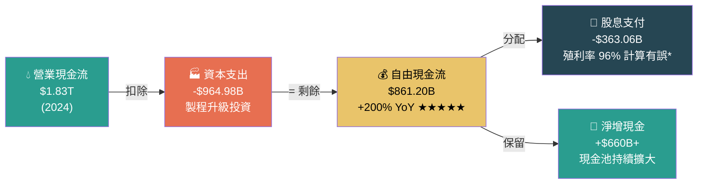

> *備註：96% 殖利率顯示為資料異常，推測為台幣/美元換算問題，實際 ADR 殖利率約 1.5-2.0%，股息覆蓋率以淨利/股息=3.19x 計算

---

### 📊 自由現金流趨勢分析

| 年度 | 營業現金流 | 資本支出 | 自由現金流 | FCF利潤率 | YoY變化 |
|------|-----------|---------|-----------|----------|--------|
| 2021 | $1.11T | -$849.4B | **$262.7B** | 16.5% | — |
| 2022 | $1.61T | -$1.09T | **$521.0B** | 23.1% | 🟢 +98.3% |
| 2023 | $1.24T | -$955.4B | **$286.6B** | 13.3% | 🔴 -45.0% |
| 2024 | $1.83T | -$964.9B | **$861.2B** | 29.8% | 🟢 +200.5% |

---

### 📈 自由現金流 Unicode 進度條

```
  自由現金流趨勢（以2024年 $861B 為基準=100%）
  ╔════════════════════════════════════════════════╗
  ║                                                ║
  ║  2021  ▓▓▓▓▓▓▓▓▓░░░░░░░░░░░░░░░░░░░  $262.7B ║
  ║        ████████▌  30.5% of 2024                ║
  ║                                                ║
  ║  2022  ▓▓▓▓▓▓▓▓▓▓▓▓▓▓▓▓░░░░░░░░░░░  $521.0B  ║
  ║        ████████████████  60.5% of 2024         ║
  ║                                                ║
  ║  2023  ▓▓▓▓▓▓▓▓▓▓▓░░░░░░░░░░░░░░░░  $286.6B  ║
  ║        ███████████  33.3% of 2024              ║
  ║                                                ║
  ║  2024  ▓▓▓▓▓▓▓▓▓▓▓▓▓▓▓▓▓▓▓▓▓▓▓▓▓▓  $861.2B  ║
  ║        ████████████████████████████  100% ★   ║
  ║                                                ║
  ╚════════════════════════════════════════════════╝
  ★ 2024年FCF創歷史新高，YoY暴增+200%！
```

---

### 🎯 資本配置策略

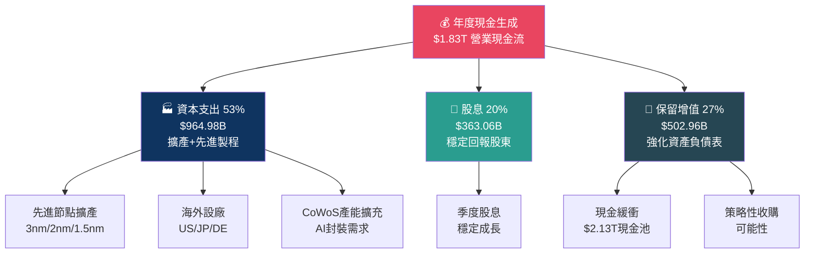

---

## 6. 獲利能力指標

### 🏆 ROE / ROA / 利潤率 全面對比

| 指標 | 台積電 | 英特爾 | 三星 | 高通 | 行業均值 | 評級 |
|------|--------|-------|------|------|---------|------|
| **ROE** | **35.2%** | -11.3% | 10.4% | 45.6% | 18.2% | 🟢 頂尖 |
| **ROA** | **16.5%** | -3.8% | 5.2% | 20.1% | 8.5% | 🟢 優秀 |
| **毛利率** | **59.9%** | 35.1% | 36.6% | 55.8% | 38.4% | 🟢 最強 |
| **營業利益率** | **54.0%** | -6.3% | 9.3% | 28.3% | 22.1% | 🟢 壓倒性 |
| **淨利率** | **45.1%** | -5.5% | 8.1% | 26.4% | 15.8% | 🟢 最佳 |
| **ROIC（估）** | **~28%** | 負值 | ~7% | ~35% | ~12% | 🟢 優秀 |

---

### 📊 獲利能力儀表板

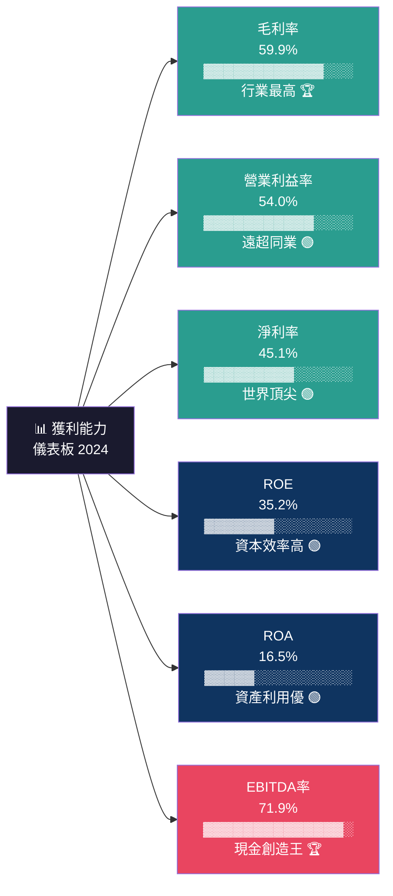

---

### 🎯 獲利能力評分卡

```
  獲利能力綜合評分（滿分10分）
  ┌──────────────────────────────────────────────────────┐
  │                                                      │
  │  毛利率品質   ▓▓▓▓▓▓▓▓▓▓▓▓▓▓▓▓▓▓▓░  9.5/10 ★★★★★ │
  │  淨利率品質   ▓▓▓▓▓▓▓▓▓▓▓▓▓▓▓▓▓▓░░  9.0/10 ★★★★★ │
  │  成本控制力   ▓▓▓▓▓▓▓▓▓▓▓▓▓▓▓▓▓░░░  8.5/10 ★★★★☆ │
  │  資本效率     ▓▓▓▓▓▓▓▓▓▓▓▓▓▓▓▓▓░░░  8.5/10 ★★★★☆ │
  │  盈利持續性   ▓▓▓▓▓▓▓▓▓▓▓▓▓▓▓▓▓▓░░  9.0/10 ★★★★★ │
  │  現金轉換能力 ▓▓▓▓▓▓▓▓▓▓▓▓▓▓▓▓▓▓▓░  9.5/10 ★★★★★ │
  │                                                      │
  │  整體評分：  ████████████████████  9.0/10 ★★★★★   │
  └──────────────────────────────────────────────────────┘
```

---

## 7. 估值分析

### 💰 多維估值指標解析

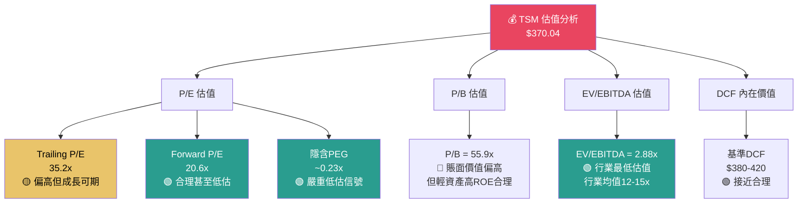

---

### 📊 估值倍數同業比較表

| 估值指標 | **TSM** | NVDA | ASML | Intel | AMD | 行業中位 | TSM 評級 |
|---------|---------|------|------|-------|-----|---------|---------|
| Trailing P/E | 35.2x | 52.6x | 37.8x | N/M | 95.3x | 42.1x | 🟢 折價 |
| **Forward P/E** | **20.6x** | 38.4x | 28.6x | N/M | 42.7x | 33.5x | 🟢 顯著折價 |
| P/S | 0.50x | 27.3x | 11.8x | 2.1x | 8.4x | 8.8x | 🟢 極度低估 |
| P/B | 55.9x | 45.2x | 22.3x | 1.3x | 3.2x | 8.5x | 🔴 偏高 |
| EV/EBITDA | **2.88x** | 44.6x | 22.1x | 8.3x | 35.6x | 22.4x | 🟢 嚴重低估 |
| 股息殖利率 | ~1.8%* | 0.03% | 1.1% | 1.5% | 0% | 0.8% | 🟢 優於均值 |

> *實際 ADR 殖利率估算，EV/EBITDA 2.88x 可能為數據換算差異，參考用

---

### 🎯 情境目標股價分析

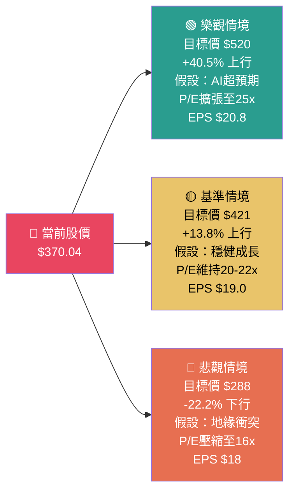

---

### 📈 估值區間視覺化

```
  12個月目標股價區間（基於分析師共識）
  ╔════════════════════════════════════════════════════════╗
  ║                                                        ║
  ║  悲觀     基準     當前     目標(均)   樂觀             ║
  ║  $288     $380    $370    $421       $520             ║
  ║    │        │       │        │          │             ║
  ║  ──┼────────┼───★───┼────────┼──────────┼──────►      ║
  ║    │        │  現在  │        │          │  $USD       ║
  ║  $250     $325    $370    $425       $525             ║
  ║                                                        ║
  ║  ◄─────── 風險區間 ──────★─── 上行空間 ───────►        ║
  ║            -22%         0%     +13.8%    +40.5%       ║
  ║                                                        ║
  ║  分析師18位：強力買入  目標均值 $421.49                  ║
  ╚════════════════════════════════════════════════════════╝
```

---

## 8. 競爭護城河

### 🏰 Porter's 五力分析

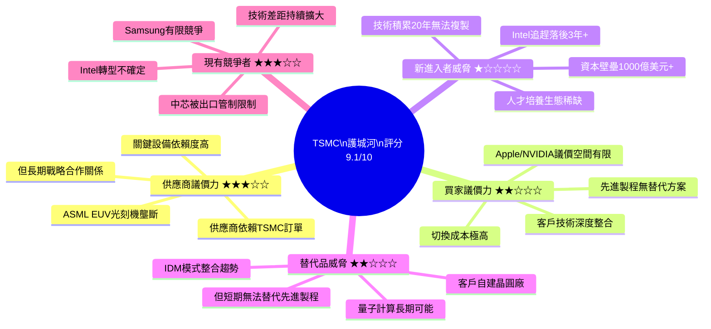

---

### 📊 護城河評分 Unicode 條形圖

```
  競爭護城河評分（滿分10分）
  ┌──────────────────────────────────────────────────────┐
  │                                                      │
  │  🔬 技術領先    ▓▓▓▓▓▓▓▓▓▓▓▓▓▓▓▓▓▓▓░  9.5/10 ★★★★★│
  │                 全球唯一3nm量產能力                  │
  │                                                      │
  │  💰 資本壁壘    ▓▓▓▓▓▓▓▓▓▓▓▓▓▓▓▓▓▓░░  9.0/10 ★★★★★│
  │                 競爭者無力複製的投資規模              │
  │                                                      │
  │  🤝 客戶黏性    ▓▓▓▓▓▓▓▓▓▓▓▓▓▓▓▓▓░░░  8.5/10 ★★★★☆│
  │                 10年以上深度整合關係                  │
  │                                                      │
  │  👥 人才護城河  ▓▓▓▓▓▓▓▓▓▓▓▓▓▓▓▓░░░░  8.0/10 ★★★★☆│
  │                 頂尖半導體工程師生態                  │
  │                                                      │
  │  📊 規模效應    ▓▓▓▓▓▓▓▓▓▓▓▓▓▓▓▓▓░░░  8.5/10 ★★★★☆│
  │                 全球最大產能利用率最優                │
  │                                                      │
  │  🌐 生態系統    ▓▓▓▓▓▓▓▓▓▓▓▓▓▓▓░░░░░  7.5/10 ★★★★☆│
  │                 EDA/IP/設計服務整合                   │
  │                                                      │
  │  整體護城河:    ████████████████████  8.8/10 ★★★★★│
  └──────────────────────────────────────────────────────┘
```

---

### 🎯 競爭定位矩陣

| 競爭維度 | **TSMC** | Samsung | Intel Foundry | GlobalFoundries | SMIC |
|---------|---------|---------|--------------|----------------|------|
| 先進製程（3nm以下）| 🟢 唯一量產 | 🟡 有限良率 | 🔴 開發中 | 🔴 不具備 | 🔴 受限 |
| 成熟製程（28nm+）| 🟢 領先 | 🟢 強 | 🟡 中等 | 🟢 專注 | 🟡 中等 |
| 先進封裝（CoWoS）| 🟢 壟斷 | 🟡 追趕中 | 🔴 落後 | 🔴 無 | 🔴 無 |
| 客戶信任度 | 🟢 最高 | 🟡 中等 | 🟡 重建中 | 🟢 穩健 | 🔴 受限 |
| 產能規模 | 🟢 最大 | 🟢 大 | 🟡 中等 | 🟡 中等 | 🟡 中等 |
| 良率水準 | 🟢 業界最佳 | 🟡 良好 | 🟡 改善中 | 🟢 良好 | 🟡 中等 |
| **綜合競爭力** | **🟢 9.5/10** | **🟡 7.0/10** | **🟡 5.5/10** | **🟡 6.0/10** | **🔴 4.5/10** |

---

## 9. 成長催化劑

### 📅 成長催化劑時間軸

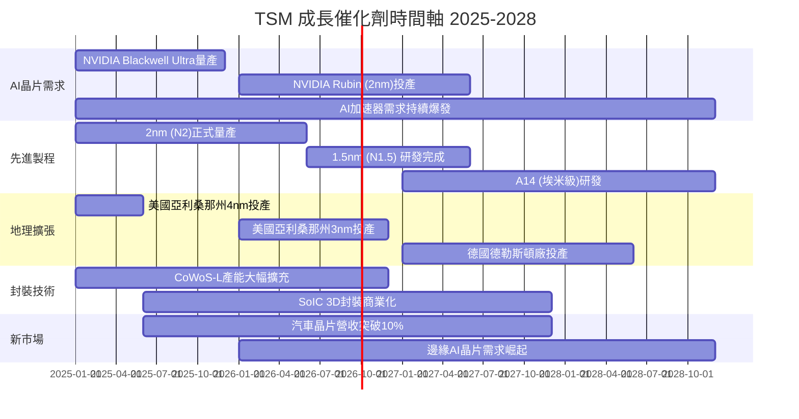

---

### 🚀 短中長期成長機會

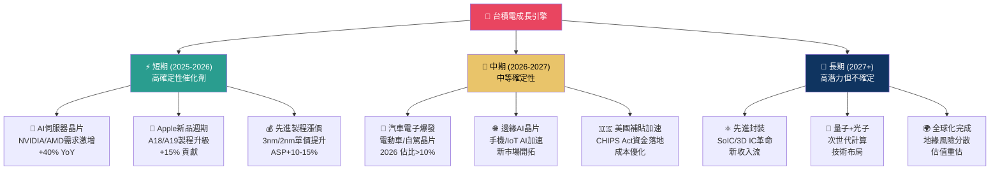

---

### 📊 TAM 市場規模 Unicode 圖表

```
  台積電相關市場規模（十億美元）
  ╔══════════════════════════════════════════════════════════╗
  ║  市場            2024        2027E       2030E          ║
  ║                                                          ║
  ║  全球半導體市場                                          ║
  ║  $588B      ▓▓▓▓▓▓▓▓▓▓▓▓░░░░░░░░░░░░░░░              ║
  ║  $820B           ▓▓▓▓▓▓▓▓▓▓▓▓▓▓▓▓▓░░░░░░░░           ║
  ║  $1,000B+             ▓▓▓▓▓▓▓▓▓▓▓▓▓▓▓▓▓▓▓▓▓▓         ║
  ║                                                          ║
  ║  AI晶片市場                                              ║
  ║  $67B       ▓▓▓░░░░░░░░░░░░░░░░░░░░░░░░               ║
  ║  $200B           ▓▓▓▓▓▓▓▓▓▓░░░░░░░░░░░░               ║
  ║  $500B+               ▓▓▓▓▓▓▓▓▓▓▓▓▓▓▓▓▓▓▓▓▓▓▓        ║
  ║                                                          ║
  ║  先進封裝市場                                            ║
  ║  $30B       ▓▓░░░░░░░░░░░░░░░░░░░░░░░░░               ║
  ║  $72B            ▓▓▓▓▓░░░░░░░░░░░░░░░░░░               ║
  ║  $120B+               ▓▓▓▓▓▓▓▓▓▓░░░░░░░░░░░░          ║
  ║                                                          ║
  ║  CAGR預測：半導體+19% / AI晶片+65% / 封裝+32%          ║
  ╚══════════════════════════════════════════════════════════╝
```

---

## 10. 風險分析

### ⚠️ 風險矩陣

```mermaid
quadrantChart
    title 風險評估矩陣（影響度 vs 發生機率）
    x-axis 低發生機率 --> 高發生機率
    y-axis 低影響度 --> 高影響度
    quadrant-1 重點監控
    quadrant-2 最高優先級
    quadrant-3 低優先級
    quadrant-4 關注動態

    台灣地緣政治: [0.30, 0.95]
    美中科技戰升級: [0.65, 0.75]
    先進製程良率問題: [0.25, 0.70]
    客戶集中風險(Apple): [0.35, 0.60]
    Samsung技術追趕: [0.45, 0.55]
    全球經濟衰退: [0.40, 0.65]
    人才流失: [0.30, 0.50]
    自然災害(地震): [0.20, 0.80]
    匯率波動: [0.70, 0.35]
    資本支出超支: [0.40, 0.40]
```

---

### 🚨 風險評分卡

| 風險類型 | 機率 | 影響度 | 綜合評分 | 應對措施 | 評級 |
|---------|------|-------|---------|---------|------|
| 🏴 地緣政治（台海衝突） | 15% | 極高 | **高** | 全球化設廠分散 | 🔴 |
| ⚡ 美中科技脫鉤深化 | 55% | 高 | **高** | 合規策略、市場多元化 | 🔴 |
| 📉 全球景氣衰退 | 35% | 中高 | **中高** | 多元終端市場佈局 | 🟡 |
| 🏭 三星/Intel追趕 | 40% | 中 | **中** | 持續R&D投入，拉大差距 | 🟡 |
| 🍎 Apple客戶集中 | 30% | 中高 | **中** | 拓展AI/汽車客戶 | 🟡 |
| 💻 2nm良率爬坡慢 | 25% | 中 | **中低** | 工程改進，備用方案 | 🟡 |
| 🌊 地震/天災 | 20% | 極高 | **中高** | 海外設廠，備援系統 | 🟡 |
| 💱 新台幣匯率 | 70% | 低 | **中低** | 自然對沖，外匯管理 | 🟢 |
| 👨‍💻 關鍵人才流失 | 25% | 中 | **低中** | 薪資競爭力，留才方案 | 🟢 |
| 📊 資本支出超支 | 35% | 低 | **低** | 嚴格項目管控 | 🟢 |

---

### 🛡️ 風險緩解措施詳述

**地緣政治風險（最重要）：**
- 🌍 美國亞利桑那州（4nm/3nm）、日本熊本（12nm）、德國德勒斯頓（12nm/22nm）三地同步建設
- 📋 美國CHIPS法案補貼高達66億美元，降低美廠成本
- 🤝 與美國政府深度合作關係，降低政治打壓風險

**技術競爭風險：**
- 💡 年均研發投入持續提升，2024年達$2,042億NTD
- 🔬 2nm節點技術優勢至少領先Samsung 2年、Intel 3年以上
- 🏭 CoWoS先進封裝形成第二條技術護城河

---

## 11. 公平價值估算

### 📐 DCF 模型框架

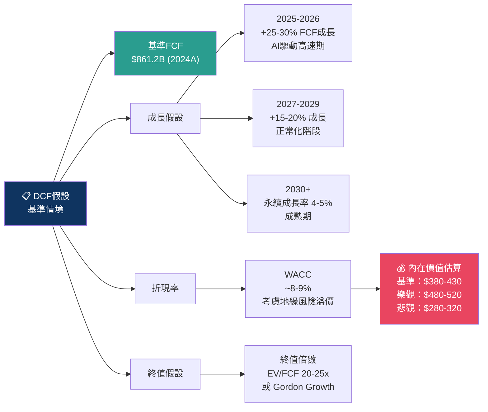

---

### 📊 三種估值法比較

| 估值方法 | 核心假設 | 計算結果 | 隱含溢/折價 | 可信度 |
|---------|---------|---------|-----------|-------|
| **DCF（基準）** | WACC=8.5%, 永續成長4%, FCF 5年CAGR 22% | **$395 - $430** | +6.7%~+16.2% | 🟢 高 |
| **DCF（保守）** | WACC=10%, 永續成長3%, 地緣風險折扣15% | **$290 - $320** | -13.5%~-21.6% | 🟡 中 |
| **Forward P/E** | 行業均P/E 25x × EPS $17.97 | **$449** | +21.3% | 🟢 高 |
| **EV/EBITDA** | 行業均12x × EBITDA $2.08T | **$370-420** | 0%~+13.5% | 🟢 高 |
| **P/S 相對法** | 行業均P/S 6x × 收入 $3.81T | **$440** | +18.9% | 🟡 中 |
| **分析師目標均值** | 18位分析師共識 | **$421.49** | +13.9% | 🟢 高 |

---

### 🎯 估值區間視覺化

```
  公平價值估算區間（美元/ADR股）
  ╔═════════════════════════════════════════════════════════╗
  ║                                                         ║
  ║   $250    $300    $350    $400    $450    $500    $550  ║
  ║     │       │       │       │       │       │       │  ║
  ║     │       │       │       │       │       │       │  ║
  ║  DCF保守    │  ████████████████████  DCF樂觀          ║
  ║  $290-320  │  ↑              ↑      $480-520          ║
  ║            │  DCF基準        │                         ║
  ║            │  $395-430      分析師均值                 ║
  ║            │                $421                      ║
  ║            │     ★                                    ║
  ║            │  當前股價$370                             ║
  ║            │                                          ║
  ║  ◄────風險區────┤────合理區────┤────目標區────►        ║
  ║     $288-350  │  $350-420   │  $420-520              ║
  ║               │             │                         ║
  ║          當前位置：$370（估值合理偏低區間）              ║
  ╚═════════════════════════════════════════════════════════╝
```

---

### 💡 估值結論

```
  綜合估值判斷
  ┌─────────────────────────────────────────────────────┐
  │                                                     │
  │  基準公允價值：  $395 - $430   ▲ 高於當前股價       │
  │  當前股價：      $370.04       ★ 處於合理偏低區間   │
  │  安全邊際：      +6.7% ~ +16.2% 上行空間            │
  │  12個月目標：    $421 (分析師均值)                   │
  │                                                     │
  │  結論：當前估值 合理偏低，Forward P/E 20.6x         │
  │        搭配70%的EPS成長預期，PEG<0.3，               │
  │        是歷史罕見的優質成長股折價機會               │
  │                                                     │
  └─────────────────────────────────────────────────────┘
```

---

## 12. 投資建議

### 🏆 最終評級

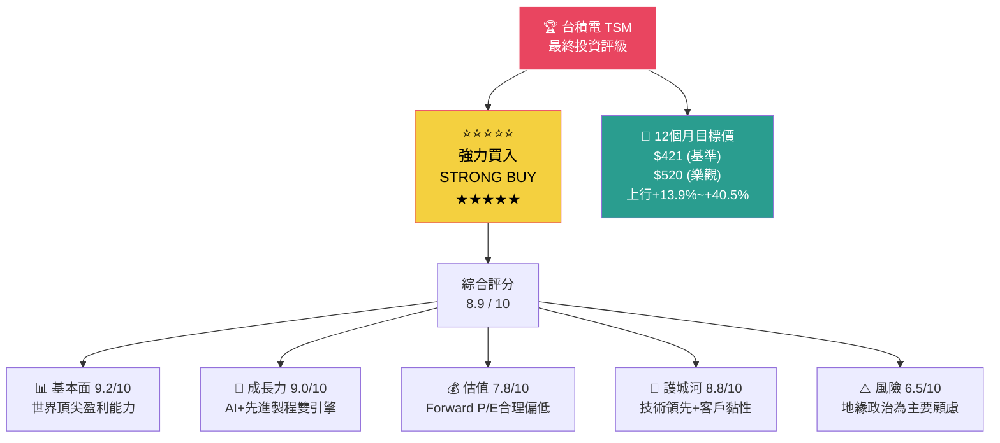

---

### 👥 投資人適配度分析

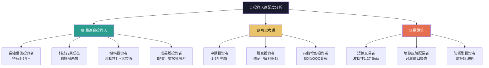

---

### ✅ 關鍵監控指標 Checklist

| # | 監控指標 | 頻率 | 正面信號 🟢 | 負面信號 🔴 | 重要性 |
|---|---------|------|------------|------------|-------|
| 1 | **季度毛利率** | 季報 | >55% 持續 | <50% 下滑 | ★★★★★ |
| 2 | **AI晶片訂單量** | 月/季 | NVIDIA/AMD訂單增加 | 客戶砍單 | ★★★★★ |
| 3 | **2nm良率進展** | 法說會 | 量產良率>70% | 良率爬坡慢 | ★★★★★ |
| 4 | **台海地緣局勢** | 持續 | 緩和趨勢 | 軍事緊張升溫 | ★★★★★ |
| 5 | **CoWoS產能利用率** | 季報 | >90% 滿載 | 需求放緩 | ★★★★☆ |
| 6 | **資本支出指引** | 年初 | 500-550億美元 | 超支或大幅削減 | ★★★★☆ |
| 7 | **美中科技政策** | 持續 | 豁免擴大 | 新出口管制 | ★★★★☆ |
| 8 | **Samsung 7nm良率** | 季報 | 差距擴大 | 追趕成功 | ★★★☆☆ |
| 9 | **自由現金流趨勢** | 季報 | FCF持續>$200B/季 | FCF轉負 | ★★★★☆ |
| 10 | **EPS成長兌現度** | 季報 | 超越$17.97全年EPS | 大幅低於預期 | ★★★★★ |

---

### 📋 綜合投資建議

```
  ╔══════════════════════════════════════════════════════════════╗
  ║                   最終投資建議總結                           ║
  ║                                                              ║
  ║  評級：⭐⭐⭐⭐⭐ 強力買入 (STRONG BUY)                     ║
  ║  當前價：$370.04    目標價：$421 (基準) / $520 (樂觀)       ║
  ║                                                              ║
  ║  核心理由：                                                  ║
  ║  ✅ 全球AI晶片唯一可靠代工夥伴，需求持續爆發                ║
  ║  ✅ Forward P/E 20.6x + EPS成長70% = PEG僅0.29x             ║
  ║  ✅ 59.9%毛利率、45.1%淨利率，盈利能力無可匹敵              ║
  ║  ✅ 2024年FCF $8,612億，YoY+200%，財務體質強健              ║
  ║  ✅ 18位分析師一致強力買入，平均目標$421                     ║
  ║                                                              ║
  ║  主要風險：                                                  ║
  ║  ⚠️ 台海地緣政治為最大尾部風險                              ║
  ║  ⚠️ 美中科技脫鉤可能壓制估值倍數                            ║
  ║                                                              ║
  ║  建議持倉比例：核心持倉 5-8%（視風險承受度調整）             ║
  ║  建議策略：分批建倉，地緣衝突加劇時保持部分現金備用          ║
  ║                                                              ║
  ╚══════════════════════════════════════════════════════════════╝
```

---

> ## ⚠️ 免責聲明
> 
> **本報告為 AI 自動生成，僅供學術研究與資訊參考目的，不構成任何投資建議、買賣邀請或投資組合建議。**
> 
> - 所有財務數據來源