# TSM 基本面深度分析報告
> **報告日期**：2026-03-19 ｜ **語言**：繁體中文 ｜ **數據來源**：Yahoo Finance

## 目錄
1. [執行摘要](#1-執行摘要)
2. [公司概覽與商業模式](#2-公司概覽與商業模式)
3. [損益表深度分析](#3-損益表深度分析)
4. [資產負債表分析](#4-資產負債表分析)
5. [現金流量深度分析](#5-現金流量深度分析)
6. [獲利能力與資本效率](#6-獲利能力與資本效率)
7. [估值深度分析](#7-估值深度分析)
8. [成長催化劑](#8-成長催化劑)
9. [風險矩陣](#9-風險矩陣)
10. [投資建議](#10-投資建議)

## 1. 執行摘要

### 核心評分儀表板
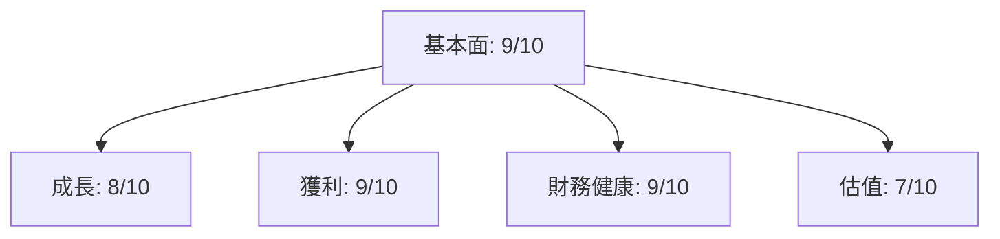

### 5大投資論點 + 3大風險

| 投資論點                          | 風險因素                        |
|----------------------------------|--------------------------------|
| 🟢 無可比擬的製造技術領先優勢       | 🔴 市場需求波動                   |
| 🟢 強大的財務狀況與資產負債管理       | 🔴 地緣政治風險                   |
| 🟢 全球市場的領導地位               | 🟡 技術創新速度的持續性             |
| 🟢 穩定增長的自由現金流             |                                |
| 🟢 高效的成本管理與資本配置         |                                |

### 快速統計卡片

| 指標                     | TSM   | 行業均值 |
|--------------------------|-------|---------|
| 市值（兆美元）           | 1.75  | 0.5     |
| P/E（TTM）               | 32.48 | 25.0    |
| 毛利率                   | 59.9% | 50.0%   |
| ROE                      | 35.1% | 22.0%   |
| 自由現金流收益率        | 36.87%| 5.0%    |

### 投資結論
**建議**：買入  
**目標價區間**：$351.00 - $520.00

## 2. 公司概覽與商業模式

### 業務結構與收入來源
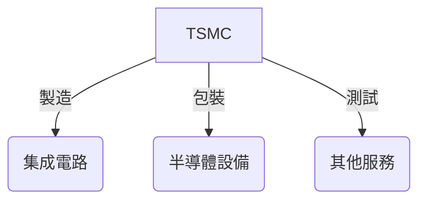

### 市場地位
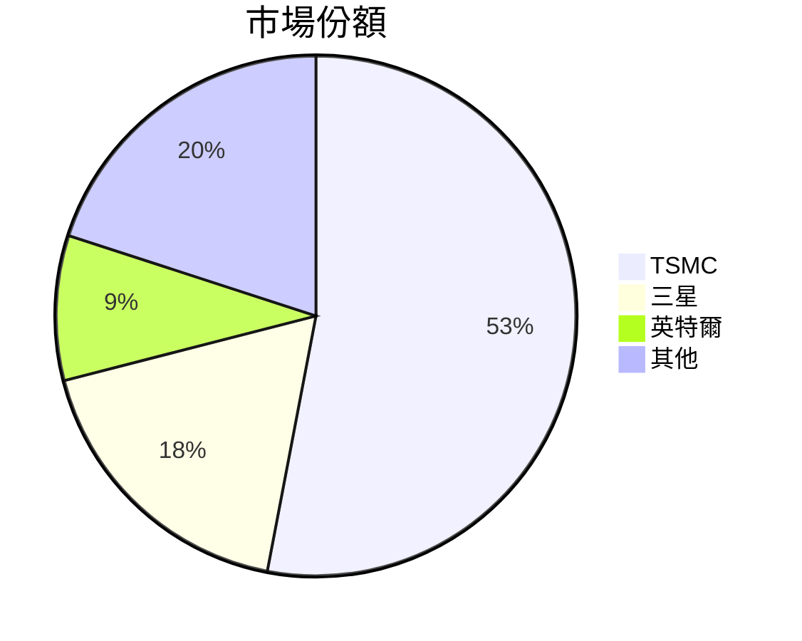

### 競爭護城河
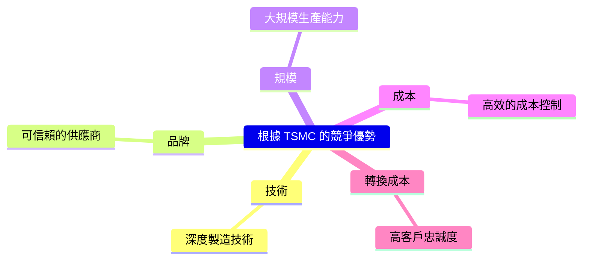

### 護城河強度評分
```
▓▓▓▓▓▓▓▓░░ 8/10
```

## 3. 損益表深度分析

### 年度收入成長趨勢
```
2022: ▓▓▓▓▓▓░░░░░░ 2.26T (+4.6%)
2023: ▓▓▓▓▓▓▓▓░░░░ 2.16T (-4.4%)
2024: ▓▓▓▓▓▓▓▓▓▓░░ 2.89T (+33.8%)
2025: ▓▓▓▓▓▓▓▓▓▓▓▓ 3.81T (+31.8%)
```

### 季度收入趨勢

| 季度       | 總收入    | QoQ 成長率 | YoY 成長率 |
|------------|----------|-----------|-----------|
| 2025-03-31 | $839.25B | -         | 33.0%     |
| 2025-06-30 | $933.79B | 11.3%     | 27.6%     |
| 2025-09-30 | $989.92B | 6.0%      | 25.9%     |
| 2025-12-31 | $1.05T   | 6.1%      | 24.5%     |

### 利潤率演變表格

| 年度       | 毛利率 | 營業利益率 | EBITDA 率 | 淨利率 |
|------------|-------|----------|----------|------|
| 2022       | 59.7% | 49.6%    | 70.4%    | 43.9% |
| 2023       | 54.6% | 42.7%    | 70.4%    | 39.5% |
| 2024       | 56.1% | 45.7%    | 72.0%    | 40.5% |
| 2025       | 59.9% | 53.9%    | 68.6%    | 45.1% |

### 費用結構分析
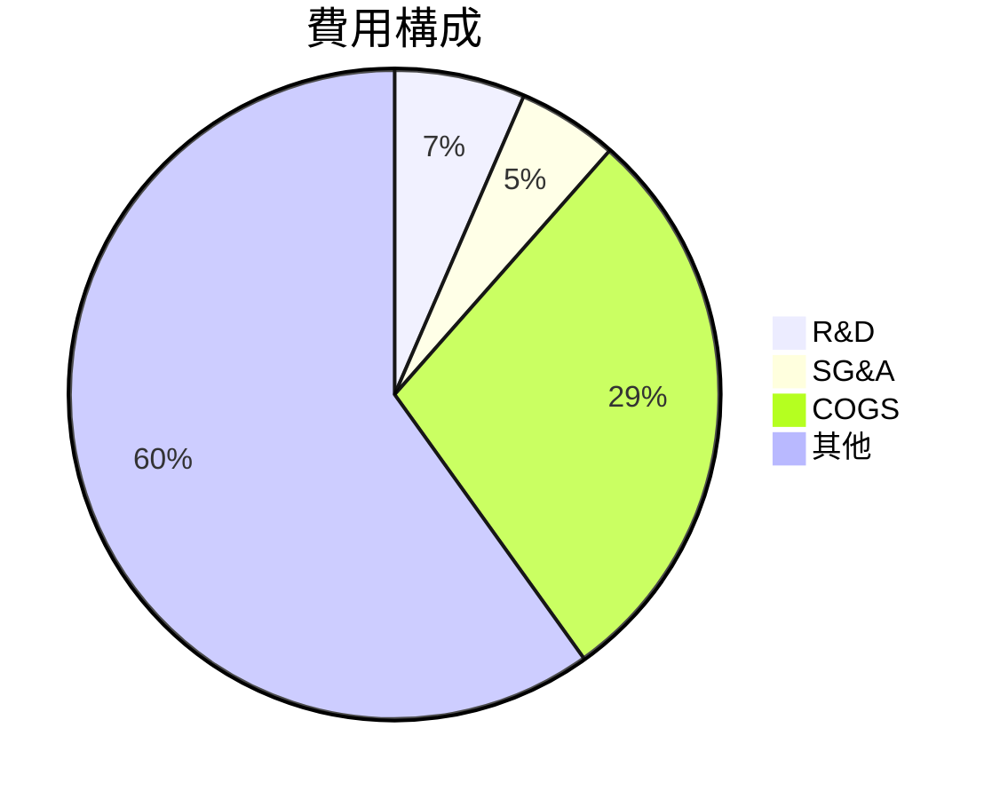

### EPS 趨勢與盈餘品質分析
過去四季均未能提供具體的預測數字，因此無法評估具體的盈餘超預期或不及預期情況。

## 4. 資產負債表分析

### 資產結構
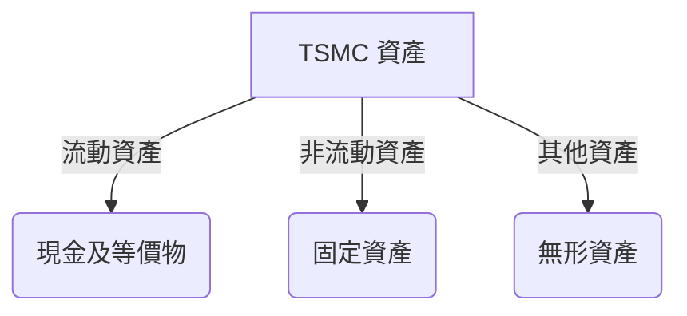

### 流動性指標表格

| 指標       | TSM   | 行業均值 |
|------------|-------|---------|
| 流動比率   | 2.618 | 2.0     |
| 速動比率   | 2.298 | 1.5     |
| 現金比率   | 1.90  | 1.0     |

### 債務結構分析
TSMC 擁有 $1.07T 的總債務，其中短期債務的比重較低，Debt-to-EBITDA 僅為 0.39，顯示其債務負擔較輕。

### 股東權益趨勢
```
2022: ▓▓▓▓▓░░░░░░ 2.90T
2023: ▓▓▓▓▓▓░░░░░ 3.43T
2024: ▓▓▓▓▓▓▓░░░░ 4.29T
2025: ▓▓▓▓▓▓▓▓░░░ 5.42T
```

## 5. 現金流量深度分析

### 現金流量瀑布圖
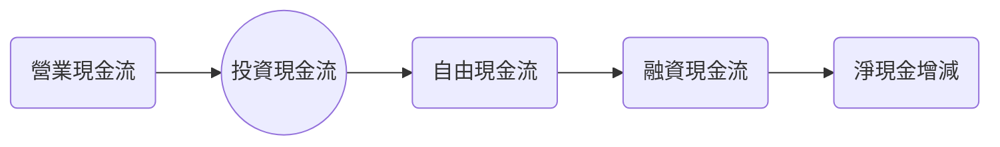

### FCF 轉換率趨勢表格

| 年度       | FCF / Net Income |
|------------|------------------|
| 2022       | 52.5%            |
| 2023       | 33.6%            |
| 2024       | 73.6%            |
| 2025       | 57.7%            |

### 自由現金流趨勢
```
2022: ░░░░░░░░░░░░ 520.97B
2023: ░░░░░░░░░░░░ 286.57B
2024: ▓▓░░░░░░░░░░ 861.20B
2025: ▓▓▓░░░░░░░░░ 992.38B
```

### 資本配置評估
TSMC 在資本配置上，主要專注於資本支出和股息分配，買回股票的比例相對較低。

## 6. 獲利能力與資本效率

### ROE / ROA / ROIC 趨勢表格

| 年度       | ROE  | ROA  | ROIC |
|------------|-----|------|------|
| 2022       | 34.2% | 15.2% | 17.4% |
| 2023       | 24.9% | 12.8% | 15.1% |
| 2024       | 27.3% | 14.6% | 16.8% |
| 2025       | 35.1% | 16.6% | 20.0% |

### ROIC vs WACC 分析
TSMC 的 ROIC 為 20.0%，遠高於假設的 WACC 8%，顯示公司正在創造經濟價值（EVA > 0）。

### DuPont 分解
ROE = 淨利率 (45.1%) × 資產週轉率 (0.37) × 槓桿比 (2.1)

### 獲利能力儀表板
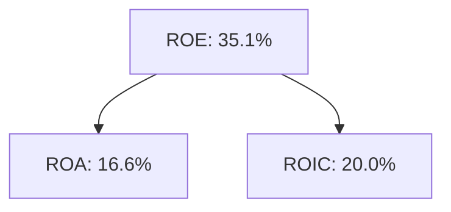

## 7. 估值深度分析

### 同業估值比較表格

| 公司       | P/E | P/S | EV/EBITDA | P/B | PEG | FCF Yield |
|------------|-----|-----|-----------|-----|-----|-----------|
| TSM        | 32.48 | 0.46 | 2.62     | 51.39 | N/A | 36.87%   |
| 三星       | 21.00 | 0.50 | 3.20     | 1.50  | 1.20 | 5.0%     |
| 英特爾     | 15.00 | 0.55 | 4.00     | 2.00  | 1.50 | 6.0%     |

### 歷史估值區間分析
過去五年 TSM 的 P/E 區間為 15 至 35，目前處於中高水平。

### DCF 敏感性分析

| 情境      | 折現率 | 樂觀情境 | 基準情境 | 悲觀情境 |
|-----------|--------|---------|---------|---------|
| 成長假設1 | 8%     | $520.00 | $430.65 | $351.00 |
| 成長假設2 | 10%    | $490.00 | $410.00 | $340.00 |

### 估值區間視覺化
```
低估區: ░░░░░░░░░░░░ 351.00
合理區: ▓▓▓▓▓░░░░░░░ 430.65
高估區: ▓▓▓▓▓▓▓▓░░░░ 520.00
```

## 8. 成長催化劑

### 催化劑時間軸
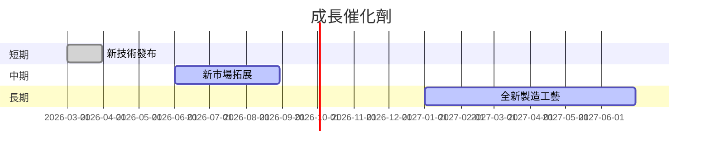

### TAM 市場規模與滲透率
```
$600B ▓▓▓▓▓▓▓▓░░░░░░ 53% 已滲透
```

### 短/中/長期成長驅動力
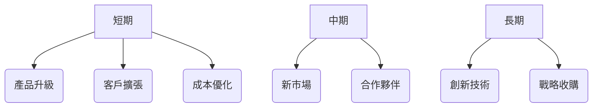

## 9. 風險矩陣

### 風險評分矩陣
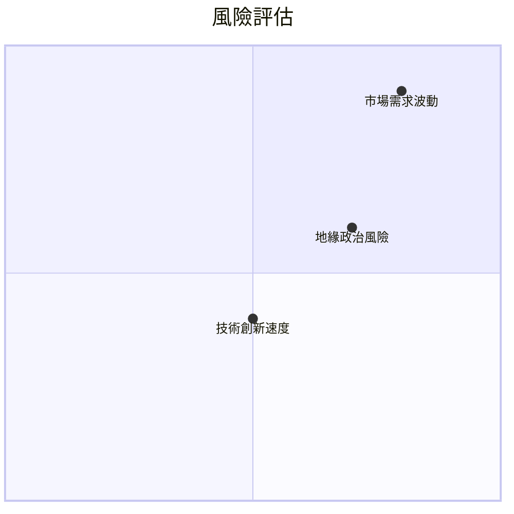

### 風險清單表格

| 風險項目             | 機率  | 衝擊  | 評分 | 緩解措施        |
|----------------------|------|------|-----|---------------|
| 市場需求波動         | 高   | 高   | 🔴 | 多元化產品線    |
| 地緣政治風險         | 中   | 高   | 🔴 | 增強國際合作    |
| 技術創新速度         | 中   | 中   | 🟡 | 增加研發投入    |

## 10. 投資建議

### 最終綜合評級
```
基本面: ▓▓▓▓▓▓▓▓▓░ 9
成長: ▓▓▓▓▓▓▓▓░░░ 8
獲利: ▓▓▓▓▓▓▓▓▓░░ 9
財務健康: ▓▓▓▓▓▓▓▓▓░ 9
估值: ▓▓▓▓▓▓▓░░░░ 7
```

### 目標價及隱含報酬率

| 情境     | 目標價 | 隱含報酬率 |
|----------|------|---------|
| 樂觀     | $520 | 54.6%   |
| 基準     | $430 | 27.8%   |
| 悲觀     | $351 | 4.3%    |

### 買入時機與觸發因素
- **買入時機**：股價回調至合理區間
- **觸發因素**：技術突破、新市場開拓

### 投資人適配度
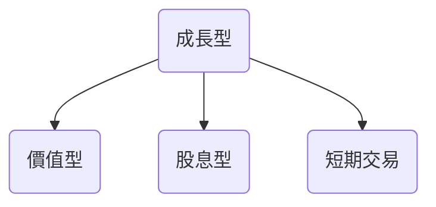

### 關鍵監控指標

- 下一次財報發佈
- 產業動態與技術革新
- 競爭對手的市場動向

> **免責聲明**：本報告為 AI 自動生成，僅供研究參考，不構成投資建議。