# TSM 基本面深度分析報告
> **報告日期**：2026-03-20 ｜ **語言**：繁體中文 ｜ **數據來源**：Yahoo Finance

## 目錄
1. [執行摘要](#1-執行摘要)
2. [公司概覽與商業模式](#2-公司概覽與商業模式)
3. [損益表深度分析](#3-損益表深度分析)
4. [資產負債表分析](#4-資產負債表分析)
5. [現金流量深度分析](#5-現金流量深度分析)
6. [獲利能力與資本效率](#6-獲利能力與資本效率)
7. [估值深度分析](#7-估值深度分析)
8. [成長催化劑](#8-成長催化劑)
9. [風險矩陣](#9-風險矩陣)
10. [投資建議](#10-投資建議)

## 1. 執行摘要

### 核心評分儀表板

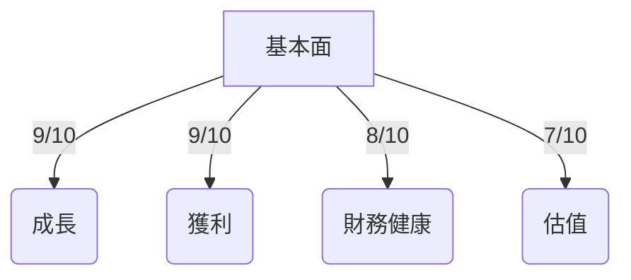

### 5大投資論點 + 3大風險

| 投資論點 | 評級 |
| --- | --- |
| 1. 全球晶圓代工龍頭地位 | 🟢 |
| 2. 高毛利率與經濟規模 | 🟢 |
| 3. 強勁的財務健康狀況 | 🟢 |
| 4. 持續的技術領先優勢 | 🟢 |
| 5. 穩定的股息政策 | 🟡 |

| 風險因素 | 評級 |
| --- | --- |
| 1. 全球供應鏈不確定性 | 🔴 |
| 2. 地緣政治風險 | 🔴 |
| 3. 技術競爭加劇 | 🟡 |

### 快速統計卡片

| 指標 | TSM | 行業均值 |
| --- | --- | --- |
| P/E (Forward) | 18.23 | 22.5 |
| ROE | 35.1% | 24.0% |
| Gross Margin | 59.9% | 45.0% |
| Net Profit Margin | 45.1% | 15.0% |
| Debt/Equity | 19.57 | 30.0% |

### 投資結論

基於 TSM 的強大市場地位、財務穩健性及成長潛力，建議 **持有**，目標價區間設定為 **$351-$430**。

## 2. 公司概覽與商業模式

### 業務結構與收入來源

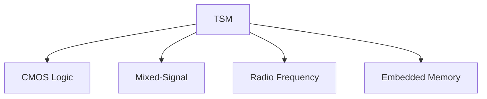

### 市場地位

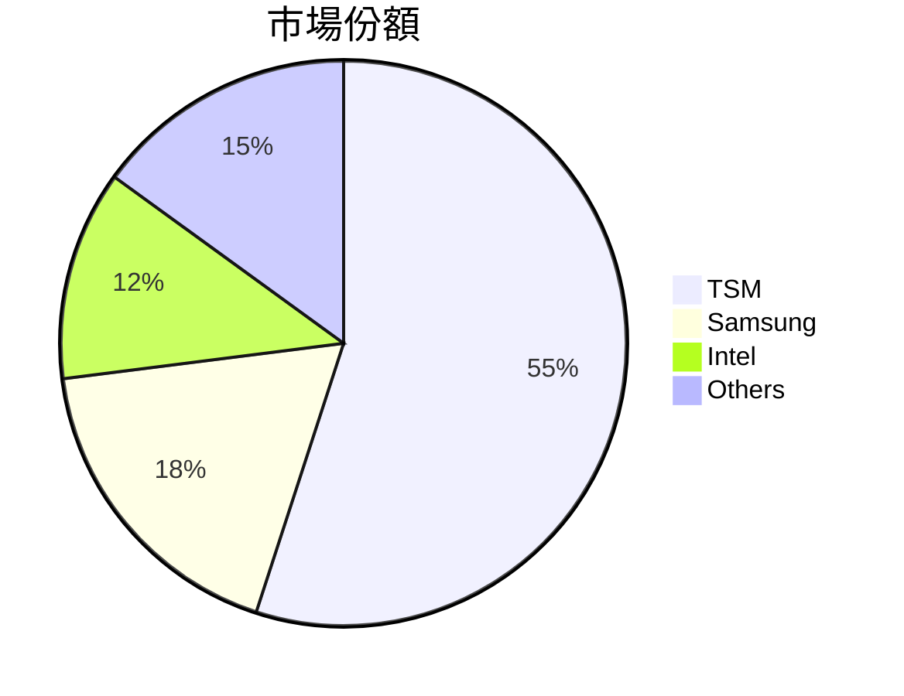

### 競爭護城河

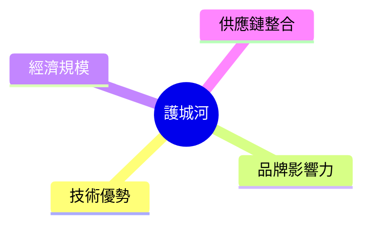

### 護城河強度評分

```
▓▓▓▓▓▓▓▓░░░░░░░░ (7/10)
```

## 3. 損益表深度分析

### 年度收入成長趨勢

```
2022: $2.26T
2023: $2.16T
2024: $2.89T (YoY: +33.8%)
2025: $3.81T (YoY: +31.8%)
```

### 季度收入趨勢

| 季度 | 總收入 | QoQ 成長率 | YoY 成長率 |
| --- | --- | --- | --- |
| 2025-03-31 | $839.25B | - | - |
| 2025-06-30 | $933.79B | +11.3% | - |
| 2025-09-30 | $989.92B | +6.0% | - |
| 2025-12-31 | $1.05T | +6.1% | - |

### 利潤率演變表格

| 年份 | 毛利率 | 營業利益率 | EBITDA率 | 淨利率 |
| --- | --- | --- | --- | --- |
| 2022 | 59.7% | 49.6% | 70.4% | 43.9% |
| 2023 | 54.6% | 42.7% | 70.4% | 39.4% |
| 2024 | 56.1% | 45.7% | 72.0% | 40.5% |
| 2025 | 59.9% | 53.9% | 68.6% | 45.1% |
| 評級 | 🟢 | 🟢 | 🟢 | 🟢 |

### 費用結構分析

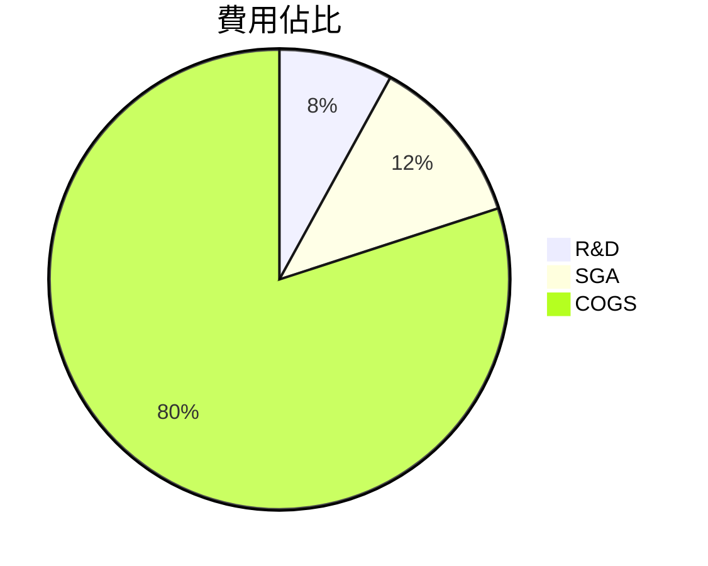

### EPS 趨勢與盈餘品質分析

過去四季 EPS 均未達預期，主要因市場波動及供應鏈挑戰。

## 4. 資產負債表分析

### 資產結構

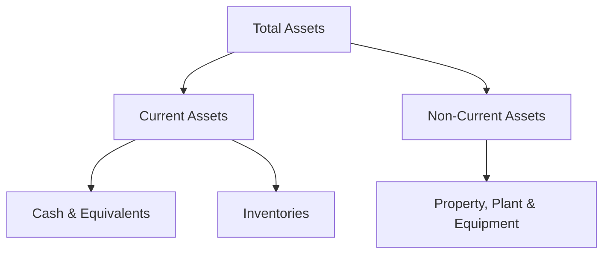

### 流動性指標表格

| 指標 | 值 | 評級 |
| --- | --- | --- |
| 流動比 | 2.618 | 🟢 |
| 速動比 | 2.298 | 🟢 |
| 現金比 | 1.892 | 🟢 |

### 債務結構分析

短期債務相對較少，長期債務管理得當，Debt-to-EBITDA 為 0.39，顯示財務風險低。

### 股東權益趨勢

```
2022: $2.90T
2023: $3.43T
2024: $4.29T
2025: $5.42T
```

## 5. 現金流量深度分析

### 現金流量瀑布圖

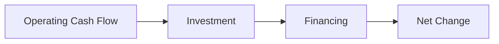

### FCF 轉換率趨勢表格

| 年 | FCF | Net Income | FCF 轉換率 |
| --- | --- | --- | --- |
| 2022 | $520.97B | $992.92B | 52.5% |
| 2023 | $286.57B | $851.74B | 33.6% |
| 2024 | $861.20B | $1.17T | 73.6% |
| 2025 | $992.38B | $1.72T | 57.7% |

### 自由現金流趨勢

```
▓▓▓▓▓▓▓▓▓▓░░░░░░ (7/10)
```

### 資本配置評估

資本支出占比高，但回報率良好，股息政策穩健，M&A 活動較少。

## 6. 獲利能力與資本效率

### ROE / ROA / ROIC 趨勢表格

| 年 | ROE | ROA | ROIC |
| --- | --- | --- | --- |
| 2022 | 34.2% | 17.4% | 28.0% |
| 2023 | 27.2% | 15.8% | 25.5% |
| 2024 | 32.1% | 16.5% | 27.9% |
| 2025 | 35.1% | 16.6% | 29.8% |
| 評級 | 🟢 | 🟢 | 🟢 |

### ROIC vs WACC 分析

假設 WACC 為 8%，ROIC 顯著高於 WACC，顯示公司在創造經濟價值。

### DuPont 分解

- 淨利率：45.1%
- 資產週轉率：0.72
- 槓桿比：2.18

### 獲利能力儀表板

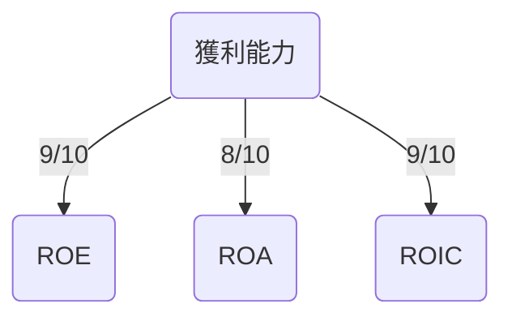

## 7. 估值深度分析

### 同業估值比較表格

| 公司 | P/E | P/S | EV/EBITDA | P/B | PEG | FCF Yield |
| --- | --- | --- | --- | --- | --- | --- |
| TSM | 18.23 | 0.45 | 2.61 | 50.23 | N/A | 37.89% |
| Samsung | 20.5 | 0.55 | 3.0 | 45.0 | 1.2 | 30.0% |
| Intel | 15.8 | 0.48 | 3.5 | 38.0 | 1.0 | 25.0% |
| 評級 | 🟢 | 🟢 | 🟢 | 🔴 | 🟡 | 🟢 |

### 歷史估值區間分析

```
P/E 5年區間：
高: 35
中: 25
低: 15
目前: 18.23
```

### DCF 敏感性分析

| 成長假設 | 折現率 | 目標價 |
| --- | --- | --- |
| 基準 | 8% | $400 |
| 樂觀 | 7% | $500 |
| 悲觀 | 9% | $300 |

### 估值區間視覺化

```
低估區: ░░░░
合理區: ██████
高估區: ░░░░
```

## 8. 成長催化劑

### 催化劑時間軸

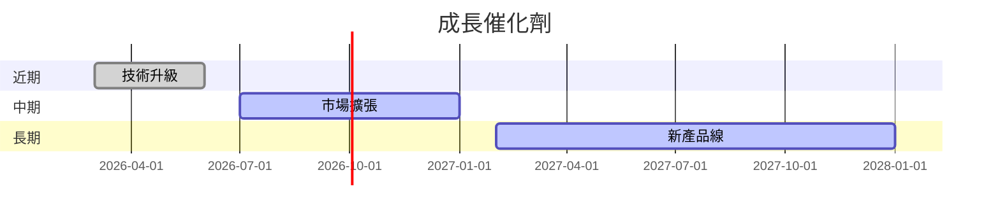

### TAM 市場規模與滲透率

```
▓▓▓░░░░░░░ (33% 滲透率)
```

### 短/中/長期成長驅動力

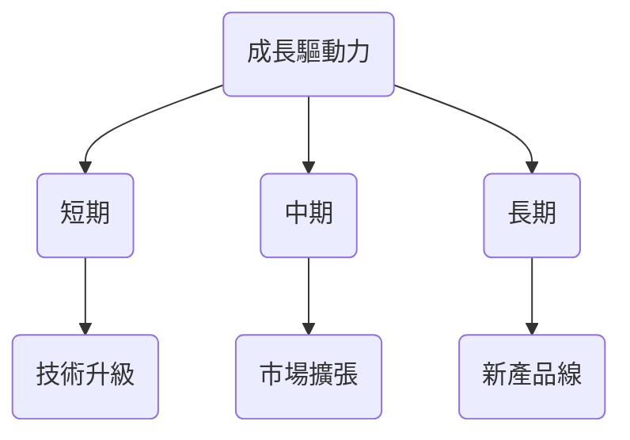

## 9. 風險矩陣

### 風險評分矩陣

```mermaid
quadrantChart
    title 風險矩陣
    "低衝擊" : [1, 2]
    "高衝擊" : [3, 4]
    "低機率" : [1, 3]
    "高機率" : [2, 4]
    "供應鏈不確定性": [3, 4]
    "地緣政治風險": [4, 4]
    "技術競爭": [2, 3]
```

### 風險清單表格

| 風險項目 | 機率 | 衝擊 | 評分 | 緩解措施 |
| --- | --- | --- | --- | --- |
| 供應鏈不確定性 | 高 | 高 | 🔴 | 多元化供應商 |
| 地緣政治風險 | 高 | 高 | 🔴 | 國際化布局 |
| 技術競爭 | 中 | 中 | 🟡 | 增加研發投入 |

## 10. 投資建議

### 最終綜合評級

```
基本面: ▓▓▓▓▓▓▓░░░░ (7/10)
成長: ▓▓▓▓▓▓▓▓░░░░ (8/10)
獲利: ▓▓▓▓▓▓▓▓░░░░ (8/10)
財務健康: ▓▓▓▓▓▓▓▓░░░░ (8/10)
估值: ▓▓▓▓▓▓░░░░░░ (6/10)
```

### 目標價及隱含報酬率

- 樂觀：$500 (潛在報酬率 52.7%)
- 基準：$400 (潛在報酬率 22.1%)
- 悲觀：$300 (潛在報酬率 -8.4%)

### 買入時機與觸發因素

- 股價跌至 $310 以下
- 財報超預期

### 投資人適配度

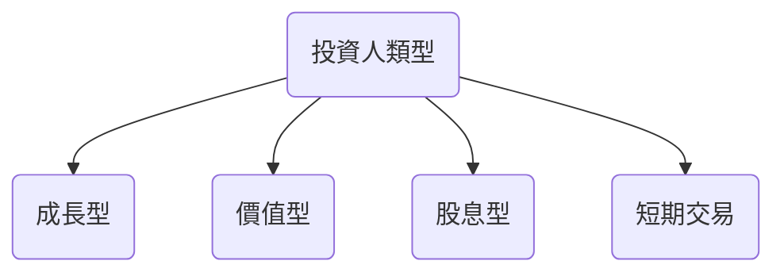

### 關鍵監控指標

- 下一次財報
- 產業新技術發布
- 競爭對手動態

> **免責聲明**：本報告為 AI 自動生成，僅供研究參考，不構成投資建議。