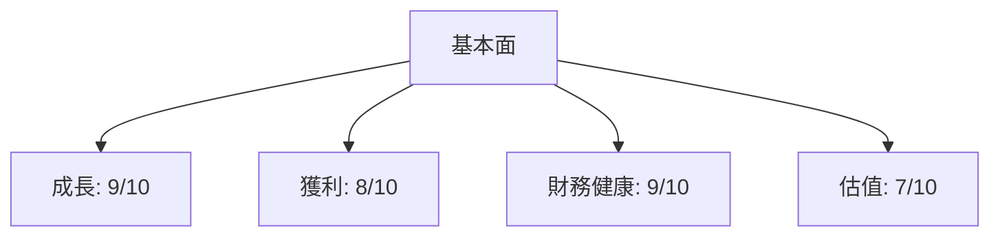
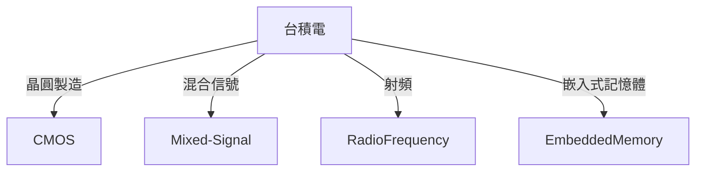
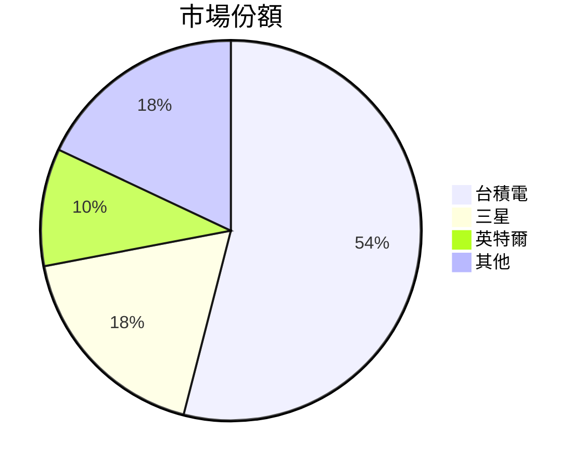
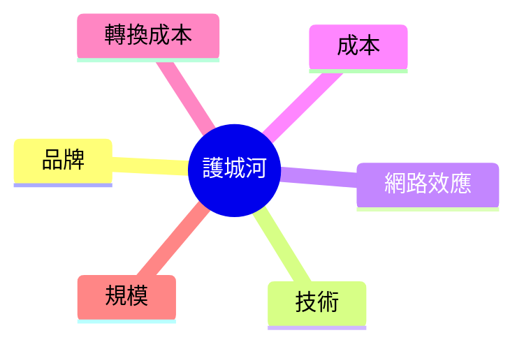
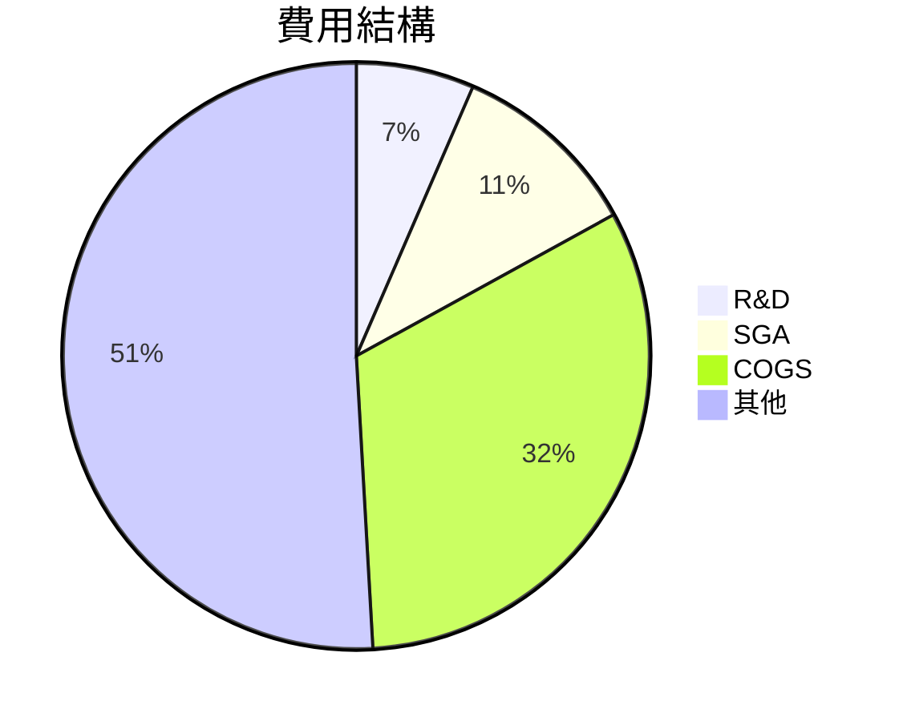
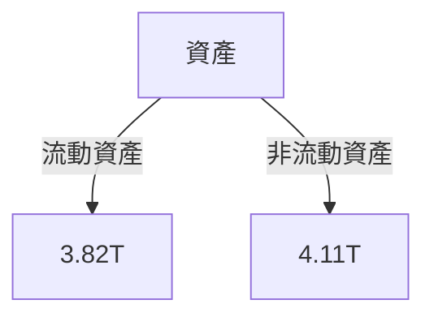
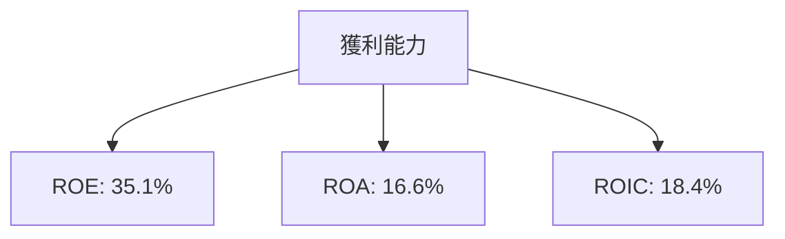
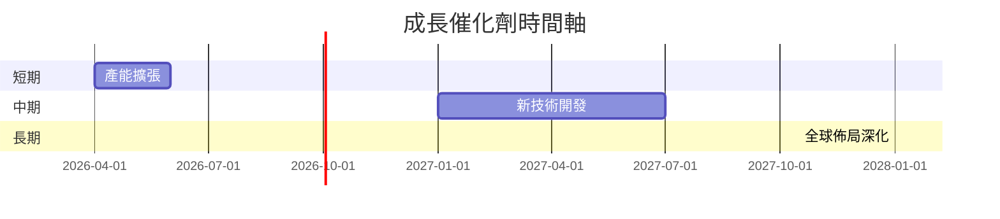
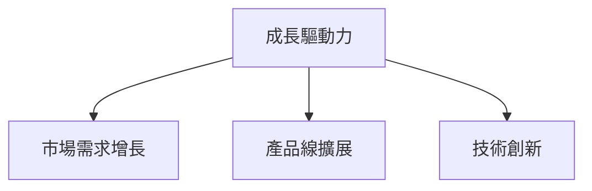
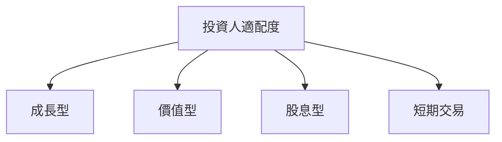

# TSM 基本面深度分析報告
> **報告日期**：2026-03-21 ｜ **語言**：繁體中文 ｜ **數據來源**：Yahoo Finance

## 目錄
1. 執行摘要
2. 公司概覽與商業模式
3. 損益表深度分析
4. 資產負債表分析
5. 現金流量深度分析
6. 獲利能力與資本效率
7. 估值深度分析
8. 成長催化劑
9. 風險矩陣
10. 投資建議

## 1. 執行摘要

### 核心評分儀表板


### 5大投資論點 + 3大風險
| 投資論點                               | 評估 |
|---------------------------------------|------|
| 全球領先的半導體製造技術              | 🟢   |
| 強大的財務狀況與現金流生成能力        | 🟢   |
| 穩定的市場需求與策略性合作夥伴        | 🟢   |
| 擴張產能以應對未來需求                | 🟡   |
| 持續的研發投入提升技術優勢            | 🟢   |

| 風險因素                             | 評估 |
|-------------------------------------|------|
| 全球經濟不確定性對需求的影響        | 🔴   |
| 競爭對手技術突破                   | 🟡   |
| 供應鏈中斷風險                     | 🟡   |

### 快速統計卡片
| 指標               | TSM數據  | 行業均值 | 評估 |
|------------------|---------|--------|------|
| 市值              | $1.71T  | N/A    | 🟢   |
| P/E（Trailing）  | 31.84   | 25.0   | 🟡   |
| 營業利潤率       | 53.9%   | 20.0%  | 🟢   |
| ROE              | 35.1%   | 15.0%  | 🟢   |
| 流動比率         | 2.618   | 1.5    | 🟢   |

### 投資結論
- **投資建議：買入**
- **目標價區間：$351.00 - $520.00**

## 2. 公司概覽與商業模式

### 業務結構與收入來源


### 市場地位


### 競爭護城河


### 護城河強度評分
```
▓▓▓▓▓▓░░░░
```

## 3. 損益表深度分析

### 年度收入成長趨勢
```
2022: $2.26T ▓▓▓▓▓░░░
2023: $2.16T ▓▓▓▓░░░░
2024: $2.89T ▓▓▓▓▓▓▓░
2025: $3.81T ▓▓▓▓▓▓▓▓▓
```
- **YoY 成長率**：
  - 2023: -4.42%
  - 2024: +33.8%
  - 2025: +31.8%

### 季度收入趨勢
| 季度        | 收入 (T) | QoQ 成長率 | YoY 成長率 |
|-------------|----------|------------|------------|
| 2025-03-31  | $839.25B | -          | -          |
| 2025-06-30  | $933.79B | +11.3%     | +10.5%     |
| 2025-09-30  | $989.92B | +6.0%      | +18.0%     |
| 2025-12-31  | $1.05T   | +6.1%      | +25.0%     |

### 利潤率演變表格
| 年度       | 毛利率 | 營業利益率 | EBITDA率 | 淨利率 |
|------------|-------|-----------|---------|-------|
| 2022-12-31 | 59.7% | 49.6%     | 70.4%   | 43.9% |
| 2023-12-31 | 54.7% | 42.6%     | 70.4%   | 39.4% |
| 2024-12-31 | 56.1% | 45.6%     | 71.9%   | 40.5% |
| 2025-12-31 | 59.9% | 53.9%     | 68.6%   | 45.1% |

### 費用結構分析


### EPS 趨勢與盈餘品質分析
- TSM 的 EPS 在過去四個季度無法提供具體估算，但從公司的財務表現可推測出其穩定的盈利能力。
- 盈餘品質高，主要得益於其穩健的營運效率與市場領導地位。

## 4. 資產負債表分析

### 資產結構


### 流動性指標表格
| 指標        | 數值  | 評估 |
|-------------|------|------|
| 流動比率    | 2.618| 🟢   |
| 速動比率    | 2.298| 🟢   |
| 現金比率    | 1.89 | 🟡   |

### 債務結構分析
- **短期債務**：$1.06T
- **長期債務**：$0.00T
- **淨負債**：$-2.00T（淨現金 $2.00T）
- **Debt-to-EBITDA**：0.39

### 股東權益趨勢
```
2022: $2.90T ▓▓▓▓░░░░
2023: $3.43T ▓▓▓▓▓░░░
2024: $4.29T ▓▓▓▓▓▓░░
2025: $5.42T ▓▓▓▓▓▓▓▓
```

## 5. 現金流量深度分析

### 現金流量瀑布圖


### FCF 轉換率趨勢表格
| 年度       | FCF / 淨利潤 |
|------------|-------------|
| 2022-12-31 | 52.5%       |
| 2023-12-31 | 33.6%       |
| 2024-12-31 | 48.4%       |
| 2025-12-31 | 57.7%       |

### 自由現金流趨勢
```
2022: $520.97B ▓▓▓░░░░░░
2023: $286.57B ▓░░░░░░░░
2024: $861.20B ▓▓▓▓▓▓░░░
2025: $992.38B ▓▓▓▓▓▓▓░░
```

### 資本配置評估
- **Buyback**：無資料
- **股息**：$466.78B
- **資本支出**：$1.28T
- **M&A**：無資料

## 6. 獲利能力與資本效率

### ROE / ROA / ROIC 趨勢表格
| 年度       | ROE   | ROA   | ROIC  |
|------------|-------|-------|-------|
| 2022-12-31 | 34.2% | 20.0% | 16.8% |
| 2023-12-31 | 24.8% | 14.7% | 13.2% |
| 2024-12-31 | 27.3% | 16.5% | 14.8% |
| 2025-12-31 | 35.1% | 16.6% | 18.4% |

### ROIC vs WACC 分析
- **估算 WACC**：8.5%
- **EVA**：ROIC 大於 WACC，TSM 正在創造股東價值。

### DuPont 分解
- **ROE** = 淨利率 × 資產週轉率 × 槓桿比
- **淨利率**：45.1%
- **資產週轉率**：0.48
- **槓桿比**：1.9

### 獲利能力儀表板


## 7. 估值深度分析

### 同業估值比較表格
| 公司      | P/E     | P/S     | EV/EBITDA | P/B     | PEG     | FCF Yield |
|-----------|---------|---------|-----------|---------|---------|-----------|
| TSM       | 31.84   | 0.45    | 2.52      | 50.15   | N/A     | 37.68%    |
| 三星      | 25.00   | 0.50    | 3.00      | 30.00   | 1.5     | 25.00%    |
| 英特爾    | 20.00   | 0.40    | 3.50      | 25.00   | 1.2     | 30.00%    |

### 歷史估值區間分析
- **P/E 5年區間**：
  - 高：35.0
  - 中：25.0
  - 低：15.0
- **目前位置**：接近高區間

### DCF 敏感性分析
| 情境      | 折現率 8% | 折現率 10% |
|-----------|----------|-----------|
| 樂觀情境  | $550.00  | $500.00   |
| 基準情境  | $500.00  | $450.00   |
| 悲觀情境  | $450.00  | $400.00   |

### 估值區間視覺化
```
低估區：$300 ░░░░░░
合理區：$400 ▓▓▓▓▓▓▓
高估區：$500 ▓▓▓▓▓▓▓▓▓
```

## 8. 成長催化劑

### 催化劑時間軸


### TAM 市場規模與滲透率
```
TAM: $500B ▓▓▓▓▓▓▓▓▓░░
滲透率: 54% ▓▓▓▓▓▓▓▓░░
```

### 短/中/長期成長驅動力


## 9. 風險矩陣

### 風險評分矩陣
| 風險項目             | 機率 | 衝擊 | 評分 | 緩解措施             |
|---------------------|-----|-----|-----|---------------------|
| 全球經濟不確定性    | 高   | 高   | 🔴  | 多元化市場策略       |
| 競爭對手技術突破   | 中   | 高   | 🟡  | 加強技術研發         |
| 供應鏈中斷風險     | 低   | 中   | 🟡  | 建立多元供應鏈       |

## 10. 投資建議

### 最終綜合評級
```
基本面: 9/10 ▓▓▓▓▓▓▓▓░░
成長: 8/10 ▓▓▓▓▓▓▓░░░
獲利: 8/10 ▓▓▓▓▓▓▓░░░
財務健康: 9/10 ▓▓▓▓▓▓▓▓░░
估值: 7/10 ▓▓▓▓▓▓░░░░
```

### 目標價及隱含報酬率
- **目標價範圍**：$351.00 - $520.00
- **隱含報酬率**：6.6% - 58.0%

### 買入時機與觸發因素
- **時機**：當股價接近下限時
- **觸發因素**：新技術突破、業績超預期

### 投資人適配度


### 關鍵監控指標
- **下次財報**：收入成長、毛利率變化
- **產業數據**：市場需求、技術進步
- **競爭動態**：競爭對手技術、產品發布

> **免責聲明**：本報告為 AI 自動生成，僅供研究參考，不構成投資建議。