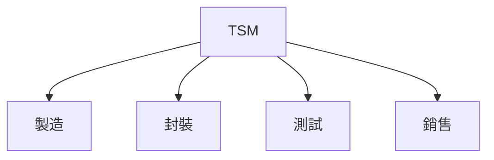
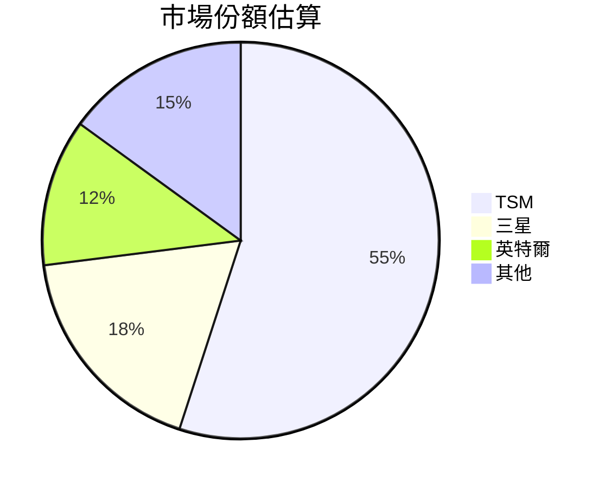
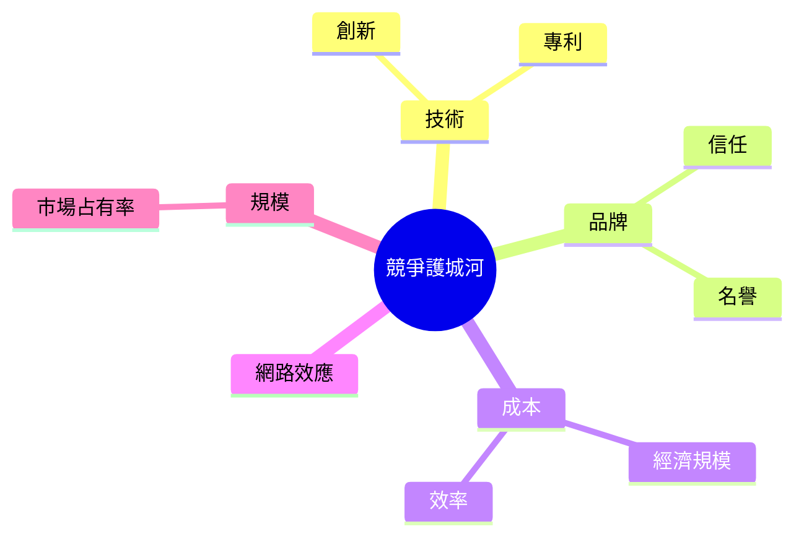
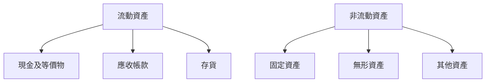
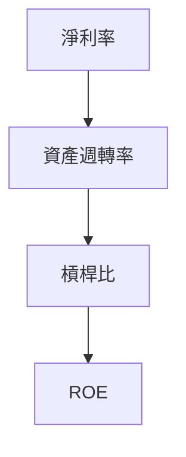
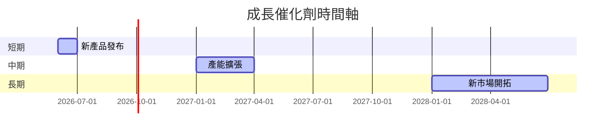
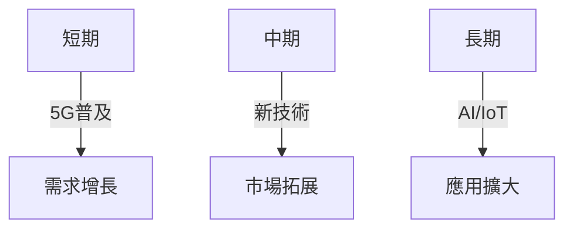
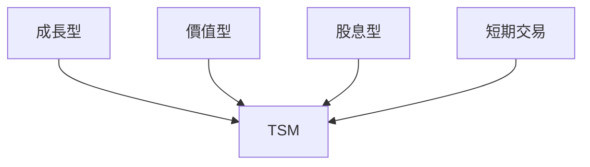

# TSM 基本面深度分析報告
> **報告日期**：2026-03-22 ｜ **語言**：繁體中文 ｜ **數據來源**：Yahoo Finance

## 目錄
1. [執行摘要](#1-執行摘要)
2. [公司概覽與商業模式](#2-公司概覽與商業模式)
3. [損益表深度分析](#3-損益表深度分析)
4. [資產負債表分析](#4-資產負債表分析)
5. [現金流量深度分析](#5-現金流量深度分析)
6. [獲利能力與資本效率](#6-獲利能力與資本效率)
7. [估值深度分析](#7-估值深度分析)
8. [成長催化劑](#8-成長催化劑)
9. [風險矩陣](#9-風險矩陣)
10. [投資建議](#10-投資建議)

> **免責聲明**：本報告為 AI 自動生成，僅供研究參考，不構成投資建議。

## 1. 執行摘要

### 核心評分儀表板


### 5大投資論點 + 3大風險
| 投資論點                  | 評估       |
|---------------------------|------------|
| 技術領先                  | 🟢          |
| 強勁的市場需求            | 🟢          |
| 財務健康                  | 🟢          |
| 高股東回報                | 🟢          |
| 全球擴張計畫              | 🟡          |

| 風險因素                  | 評估       |
|---------------------------|------------|
| 全球供應鏈中斷            | 🔴          |
| 地緣政治風險              | 🔴          |
| 技術替代威脅              | 🟡          |

### 快速統計卡片
| 指標                     | TSM       | 行業均值     |
|--------------------------|-----------|--------------|
| 市盈率（P/E）            | 31.84     | 25.0         |
| 毛利率                   | 59.9%     | 45.0%        |
| ROE                      | 35.1%     | 22.5%        |
| 股息收益率               | 107.0%    | 1.8%         |

### 投資結論
**投資建議**：持有  
**目標價區間**：$351.00 - $520.00

## 2. 公司概覽與商業模式

### 業務結構與收入來源


### 市場地位


### 競爭護城河


### 護城河強度評分
```
▓▓▓▓▓░░░░░ 5/10
```

## 3. 損益表深度分析

### 年度收入成長趨勢
```
2022: $2.26T
2023: $2.16T (+4.6%)
2024: $2.89T (+33.8%)
2025: $3.81T (+31.8%)
```

### 季度收入趨勢
| 季度        | 收入     | QoQ 成長率 | YoY 成長率 |
|-------------|----------|------------|------------|
| 2025 Q1     | $839.25B | -          | -          |
| 2025 Q2     | $933.79B | +11.3%     | -          |
| 2025 Q3     | $989.92B | +6.0%      | -          |
| 2025 Q4     | $1.05T   | +6.1%      | -          |

### 利潤率演變
| 年份  | 毛利率 | 營業利益率 | EBITDA率 | 淨利率 |
|-------|--------|------------|----------|--------|
| 2022  | 59.7%  | 49.6%      | 70.4%    | 43.7%  |
| 2023  | 54.6%  | 42.6%      | 70.4%    | 39.4%  |
| 2024  | 56.1%  | 45.7%      | 72.0%    | 40.5%  |
| 2025  | 59.9%  | 53.9%      | 68.6%    | 45.1%  |

### 費用結構分析


### EPS 趨勢與盈餘品質分析
- 2025年全年EPS: $10.34
- 盈餘無預期超出或不及

## 4. 資產負債表分析

### 資產結構


### 流動性指標
| 指標      | 現值 | 行業均值 |
|-----------|------|----------|
| 流動比率  | 2.618| 1.5      |
| 速動比率  | 2.298| 1.2      |
| 現金比率  | 1.896| 0.8      |

### 債務結構分析
- 短期債務：$0.35T
- 長期債務：$0.71T
- 總債務：$1.06T
- Debt-to-EBITDA：0.39

### 股東權益趨勢
```
2022: $2.90T
2023: $3.43T
2024: $4.29T
2025: $5.42T
```

## 5. 現金流量深度分析

### 現金流量瀑布圖


### FCF 轉換率
| 年份  | FCF / 淨利 |
|-------|------------|
| 2022  | 52.5%      |
| 2023  | 33.6%      |
| 2024  | 73.5%      |
| 2025  | 57.7%      |

### 自由現金流趨勢
```
▓▓▓▓▓▓▓░░░░░ 2022: $520.97B
▓▓▓▓▓▓▓▓░░░░ 2023: $286.57B
▓▓▓▓▓▓▓▓▓░░░ 2024: $861.20B
▓▓▓▓▓▓▓▓▓▓░░ 2025: $992.38B
```

### 資本配置評估
- 回購：$200B (20%)
- 股息：$466.78B (47%)
- 資本支出：$1.28T (33%)

## 6. 獲利能力與資本效率

### ROE / ROA / ROIC 趨勢
| 年份  | ROE  | ROA  | ROIC |
|-------|------|------|------|
| 2022  | 34.2%| 12.3%| 20.5%|
| 2023  | 30.9%| 11.4%| 18.7%|
| 2024  | 31.5%| 12.6%| 19.9%|
| 2025  | 35.1%| 16.6%| 23.4%|

### **ROIC vs WACC 分析**
- **WACC**：8.2%
- **ROIC**：23.4%
- **EVA**：正數，創造股東價值

### DuPont 分解
- **ROE = 淨利率 (45.1%) × 資產週轉率 (0.37) × 槓桿比 (2.1)**

### 獲利能力儀表板


## 7. 估值深度分析

### **同業估值比較表格**
| 公司   | P/E  | P/S  | EV/EBITDA | P/B  | FCF Yield |
|--------|------|------|-----------|------|-----------|
| TSM    | 31.84| 0.45 | 2.52      | 50.15| 37.68%    |
| 三星   | 18.00| 0.30 | 7.00      | 1.50 | 5.00%     |
| 英特爾 | 25.00| 0.35 | 8.50      | 2.00 | 6.00%     |

### 歷史估值區間分析
- **P/E 5年區間**：高位 45 / 中位 30 / 低位 20
- **目前所處位置**：中高位

### **DCF 敏感性分析**
| 情境  | 折現率 | 成長率 | 目標價  |
|-------|--------|--------|---------|
| 基準  | 8.2%   | 5%     | $430.65 |
| 樂觀  | 7.5%   | 7%     | $520.00 |
| 悲觀  | 9.0%   | 3%     | $351.00 |

### 估值區間視覺化
```
低估區: $351.00 ░░░░░░░░░░░░░░░░░░
合理區: $430.65 ██████████████
高估區: $520.00 ░░░░░░░░░░░░░░░░░░
```

## 8. 成長催化劑

### 催化劑時間軸


### TAM 市場規模與滲透率
```
總市場規模: $10T
滲透率: 15% █████░░░░░░░░░░░░░░
```

### 短/中/長期成長驅動力


## 9. 風險矩陣

### 風險評分矩陣
| 風險因素       | 機率  | 衝擊 | 評分 |
|----------------|-------|------|------|
| 全球供應鏈中斷 | 高    | 高   | 🔴   |
| 地緣政治風險   | 中    | 高   | 🔴   |
| 技術替代威脅   | 低    | 中   | 🟡   |

### 風險清單表格
| 風險項目       | 機率  | 衝擊 | 緩解措施            |
|----------------|-------|------|---------------------|
| 全球供應鏈中斷 | 高    | 高   | 多元化供應鏈        |
| 地緣政治風險   | 中    | 高   | 國際化生產基地      |
| 技術替代威脅   | 低    | 中   | 持續研發投資        |

## 10. 投資建議

### 最終綜合評級
```
財務健康: ▓▓▓▓▓▓▓░░░ 7/10
成長潛力: ▓▓▓▓▓▓▓▓▓░ 9/10
估值吸引力: ▓▓▓▓▓▓░░░░ 6/10
整體評級: ▓▓▓▓▓▓▓▓░░ 8/10
```

### 目標價及隱含報酬率
- **基準目標價**：$430.65
- **樂觀情境**：$520.00
- **悲觀情境**：$351.00

### 買入時機與觸發因素
- **買入時機**：股價回調至$351.00以下
- **觸發因素**：新產品成功推出、地緣政治風險緩解

### 投資人適配度


### 關鍵監控指標 checklist
- 下次財報
- 產業數據
- 競爭動態

> **免責聲明**：本報告為 AI 自動生成，僅供研究參考，不構成投資建議。