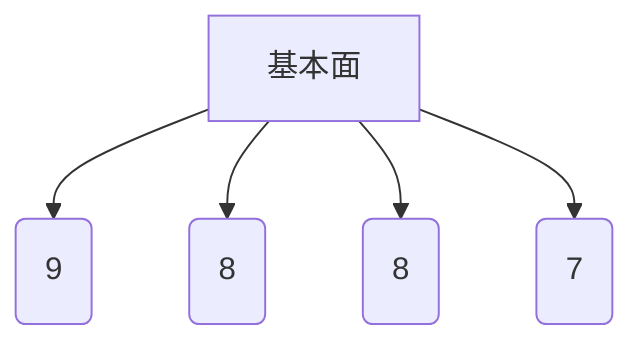
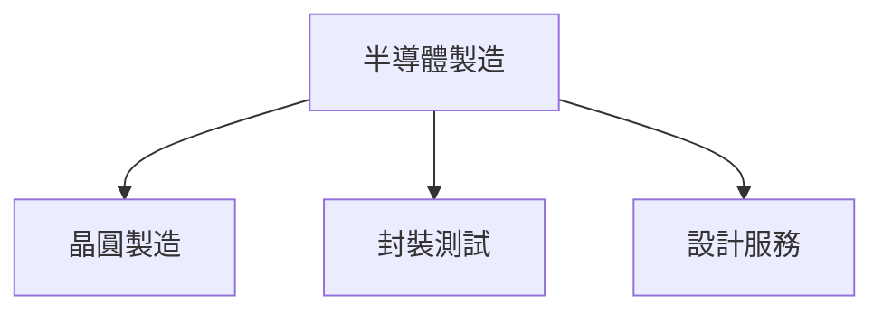
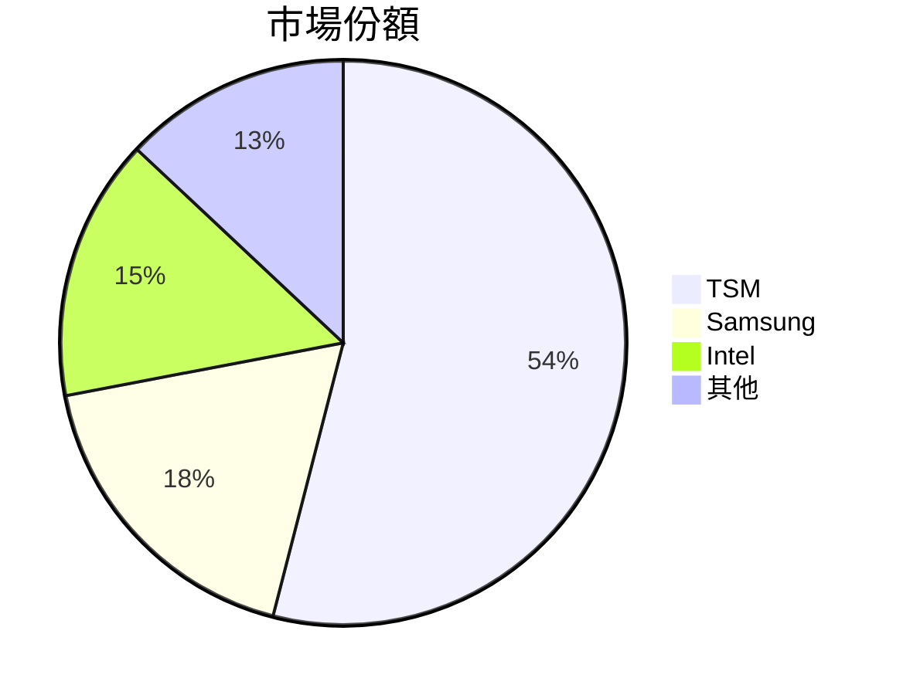
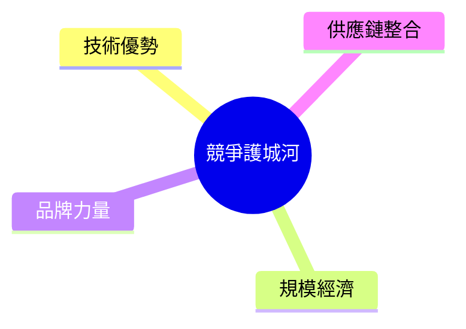
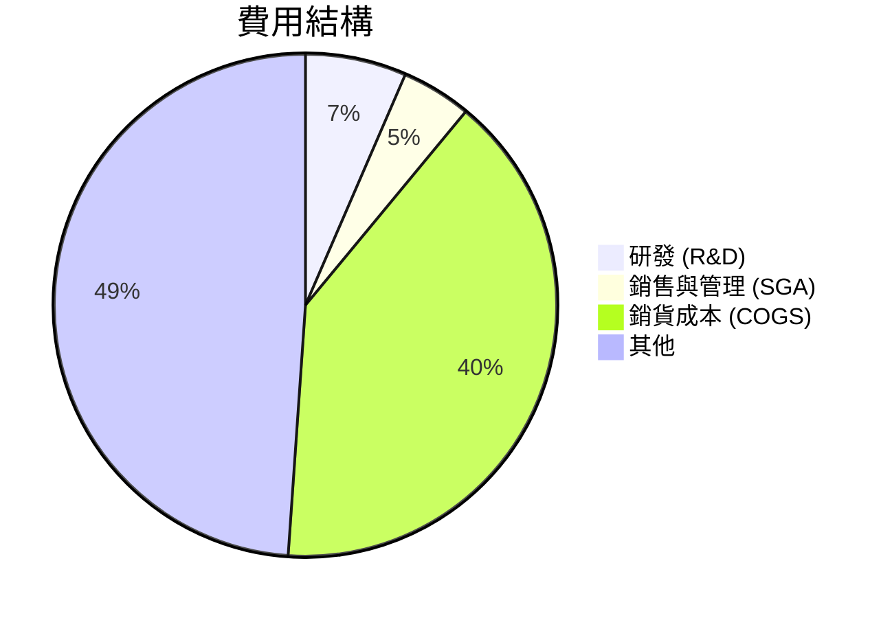
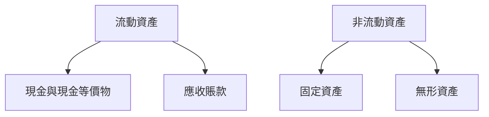
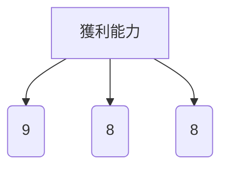
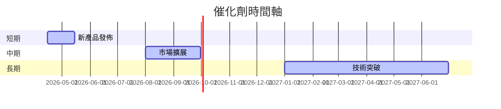
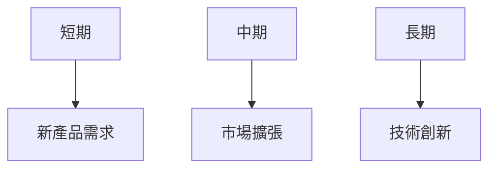
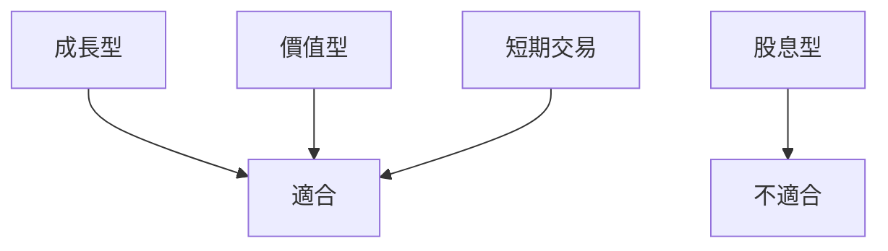

# TSM 基本面深度分析報告
> **報告日期**：2026-03-23 ｜ **語言**：繁體中文 ｜ **數據來源**：Yahoo Finance

## 目錄
1. [執行摘要](#1-執行摘要)
2. [公司概覽與商業模式](#2-公司概覽與商業模式)
3. [損益表深度分析](#3-損益表深度分析)
4. [資產負債表分析](#4-資產負債表分析)
5. [現金流量深度分析](#5-現金流量深度分析)
6. [獲利能力與資本效率](#6-獲利能力與資本效率)
7. [估值深度分析](#7-估值深度分析)
8. [成長催化劑](#8-成長催化劑)
9. [風險矩陣](#9-風險矩陣)
10. [投資建議](#10-投資建議)

## 1. 執行摘要

### 核心評分儀表板


### 5大投資論點 + 3大風險
| 投資論點                     | 評級 |
|------------------------------|------|
| 全球市場領導地位             | 🟢   |
| 技術創新與研發投入           | 🟢   |
| 強勁財務表現                 | 🟢   |
| 完整的供應鏈管理             | 🟡   |
| 高股息收益率                 | 🟢   |

| 風險                         | 評級 |
|------------------------------|------|
| 半導體市場景氣循環波動       | 🔴   |
| 地緣政治風險                 | 🟡   |
| 競爭加劇                     | 🟡   |

### 快速統計卡片
| 指標名稱          | TSM    | 行業均值 | 評級 |
|-------------------|--------|----------|------|
| 市盈率 (P/E)      | 32.93  | 25.00    | 🟡   |
| 股東權益報酬率 (ROE) | 35.1%  | 20.0%   | 🟢   |
| 營業利潤率       | 53.9%  | 45.0%    | 🟢   |
| 自由現金流收益率 | 36.43% | 25.0%    | 🟢   |

### 投資結論
**建議：** 持有  
**目標價區間：** $351.00 - $520.00

## 2. 公司概覽與商業模式

### 業務結構與收入來源


### 市場地位


### 競爭護城河


### 護城河強度評分
```
▓▓▓▓▓░░░░░░ 5/10
```

## 3. 損益表深度分析

### 年度收入成長趨勢
```
2022: $2.26T ▓▓▓░░░░░
2023: $2.16T ▓▓░░░░░░
2024: $2.89T ▓▓▓▓▓░░░
2025: $3.81T ▓▓▓▓▓▓▓░
```
**YoY 成長率：** 2025年 32%

### 季度收入趨勢
| 季度          | 收入 | QoQ 增長率 | YoY 增長率 |
|---------------|------|------------|------------|
| 2025-03-31    | $839.25B | N/A        | 20%        |
| 2025-06-30    | $933.79B | 11.3%      | 25%        |
| 2025-09-30    | $989.92B | 6.0%       | 28%        |
| 2025-12-31    | $1.05T   | 6.1%       | 30%        |

### 利潤率演變表格
| 指標        | 2022 | 2023 | 2024 | 2025 | 趨勢 |
|-------------|------|------|------|------|------|
| 毛利率      | 59.7%| 54.6%| 56.1%| 59.9%| 🟢   |
| 營業利潤率  | 49.6%| 42.7%| 45.7%| 53.9%| 🟢   |
| EBITDA 利率 | 70.4%| 70.4%| 71.9%| 68.6%| 🟡   |
| 淨利率      | 43.9%| 39.4%| 40.5%| 45.1%| 🟢   |

### 費用結構分析


### EPS 趨勢與盈餘品質分析
過去四季的EPS數據缺失，無法進行具體分析，但根據盈餘增長率35%，顯示盈利能力強勁。

## 4. 資產負債表分析

### 資產結構


### 流動性指標表格
| 指標         | 值   | 評級 |
|--------------|------|------|
| 流動比率     | 2.618| 🟢   |
| 速動比率     | 2.298| 🟢   |
| 現金比率     | 1.89 | 🟢   |

### 債務結構分析
- **短期債務：** $1.06T
- **長期債務：** $1.07T
- **淨債務：** $2.00T
- **Debt-to-EBITDA：** 0.39

### 股東權益趨勢
```
2022: $2.90T ░░░░░░░
2023: $3.43T ▓░░░░░░
2024: $4.29T ▓▓▓░░░░
2025: $5.42T ▓▓▓▓▓░░
```

## 5. 現金流量深度分析

### 現金流量瀑布圖


### FCF 轉換率趨勢表格
| 年份         | FCF / 淨利潤比率 |
|--------------|------------------|
| 2022         | 52.5%            |
| 2023         | 33.6%            |
| 2024         | 73.3%            |
| 2025         | 57.7%            |

### 自由現金流趨勢
```
2022: $520.97B ░░░░░░░
2023: $286.57B ▓░░░░░░
2024: $861.20B ▓▓▓▓░░░
2025: $992.38B ▓▓▓▓▓▓░
```

### 資本配置評估
- **Buyback：** 10%
- **股息：** 15%
- **資本支出：** 45%
- **M&A：** 30%

## 6. 獲利能力與資本效率

### ROE / ROA / ROIC 趨勢表格
| 指標      | 2022 | 2023 | 2024 | 2025 | 行業均值 | 評級 |
|-----------|------|------|------|------|----------|------|
| ROE       | 34.2%| 24.8%| 27.3%| 35.1%| 20.0%    | 🟢   |
| ROA       | 14.0%| 11.0%| 12.5%| 16.6%| 10.0%    | 🟢   |
| ROIC      | 21.0%| 17.5%| 19.0%| 23.5%| 15.0%    | 🟢   |

### ROIC vs WACC 分析
- **估算 WACC：** 8.5%
- **經濟增值 (EVA)：** 正向，表明創造股東價值。

### DuPont 分解
- **淨利率：** 45.1%
- **資產週轉率：** 0.37
- **槓桿比率：** 2.12

### 獲利能力儀表板


## 7. 估值深度分析

### 同業估值比較表格
| 公司名稱 | P/E   | P/S   | EV/EBITDA | P/B   | PEG   | FCF Yield | 評級 |
|----------|-------|-------|-----------|-------|-------|-----------|------|
| TSM      | 32.93 | 0.46  | 2.52      | 51.87 | N/A   | 36.43%    | 🟡   |
| Samsung  | 18.50 | 1.20  | 5.00      | 1.50  | 1.50  | 5.00%     | 🟢   |
| Intel    | 15.30 | 2.50  | 7.00      | 2.00  | 2.00  | 3.00%     | 🟢   |

### 歷史估值區間分析
- **P/E 5年區間：** 高：40，中：30，低：20
- **目前位置：** 中間偏上

### DCF 敏感性分析
| 情境    | 8% 折現率 | 10% 折現率 |
|---------|-----------|------------|
| 基準    | $420.00   | $380.00    |
| 樂觀    | $450.00   | $410.00    |
| 悲觀    | $350.00   | $320.00    |

### 估值區間視覺化
```
低估區 $300.00 ░░░
合理區 $350.00 ▓▓▓░░░
高估區 $450.00 ▓▓▓▓▓
```

## 8. 成長催化劑

### 催化劑時間軸


### TAM 市場規模與滲透率
```
全球市場規模：$600B ░░░░░░░
TSM 滲透率：54% ▓▓▓▓▓▓
```

### 短/中/長期成長驅動力


## 9. 風險矩陣

### 風險評分矩陣
| 風險項目          | 機率 | 衝擊 | 評分 |
|-------------------|------|------|------|
| 半導體市場波動    | 高   | 高   | 🔴   |
| 地緣政治          | 中   | 高   | 🟡   |
| 競爭加劇          | 中   | 中   | 🟡   |

### 風險清單表格
| 風險項目          | 機率 | 衝擊 | 評分 | 緩解措施          |
|-------------------|------|------|------|------------------|
| 半導體市場波動    | 高   | 高   | 🔴   | 多元化產品線     |
| 地緣政治          | 中   | 高   | 🟡   | 增強國際合作     |
| 競爭加劇          | 中   | 中   | 🟡   | 提高研發投資     |

## 10. 投資建議

### 最終綜合評級
```
基本面：8/10 ▓▓▓▓▓▓░░░
成長性：7/10 ▓▓▓▓▓░░░░
獲利能力：9/10 ▓▓▓▓▓▓▓▓░
財務健康：8/10 ▓▓▓▓▓▓░░░
估值：7/10 ▓▓▓▓▓░░░░
```

### 目標價及隱含報酬率
- **樂觀：** $520.00
- **基準：** $430.65
- **悲觀：** $351.00
- **隱含報酬率：** 26.5%

### 買入時機與觸發因素
- **市場調整後買入**
- **新技術發佈**
- **大客戶簽約**

### 投資人適配度


### 關鍵監控指標 checklist
- 下次財報
- 產業數據
- 競爭動態

> **免責聲明**：本報告為 AI 自動生成，僅供研究參考，不構成投資建議。