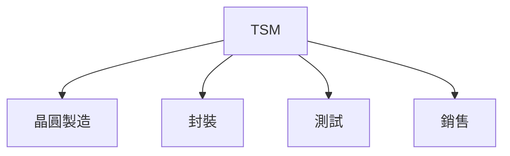
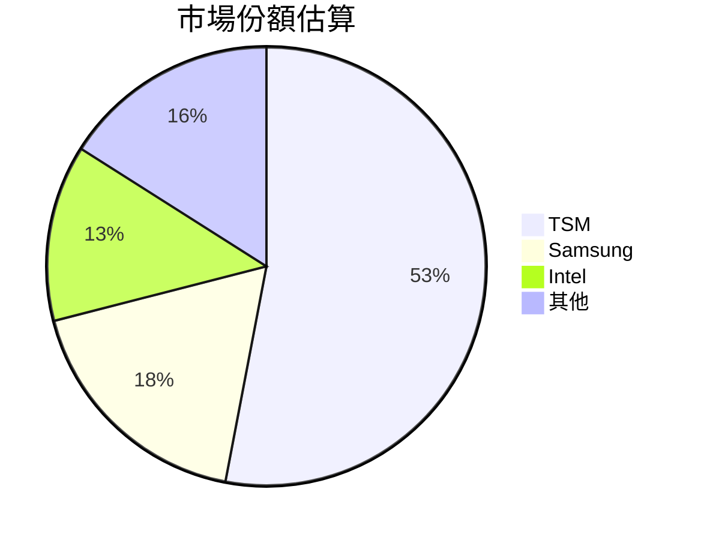
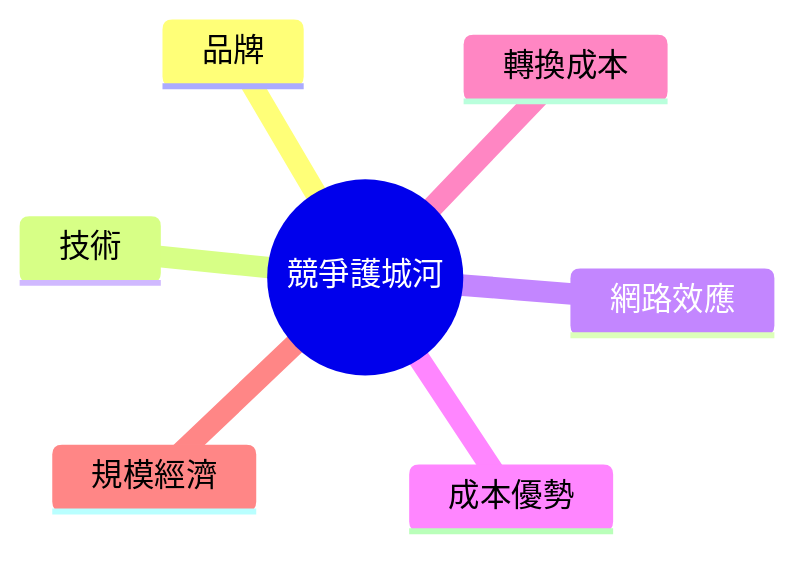
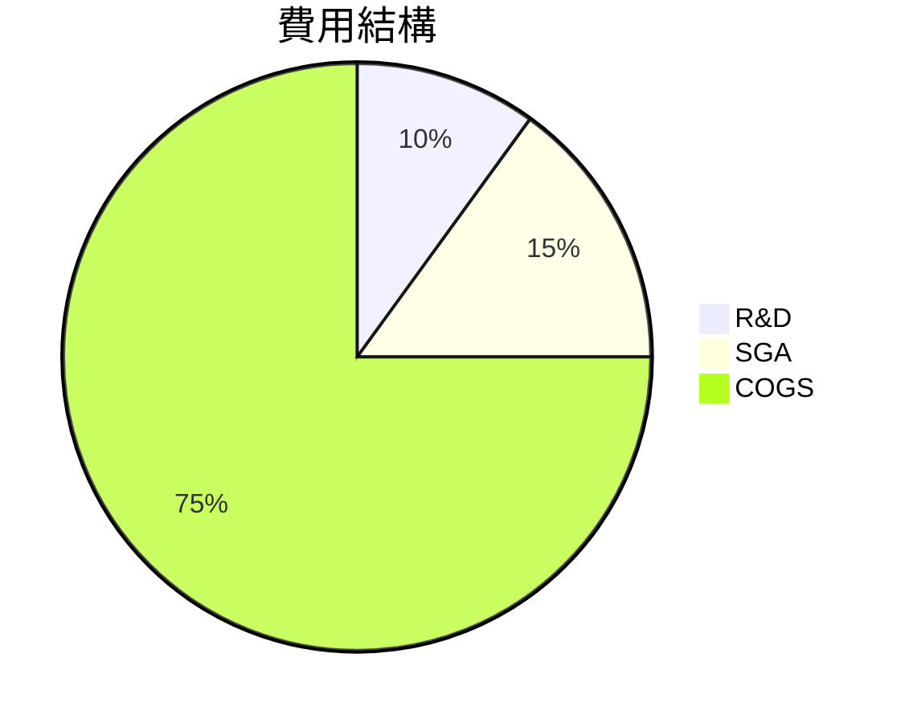
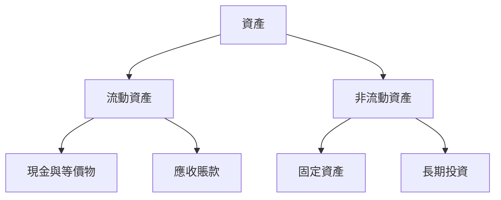
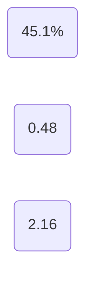
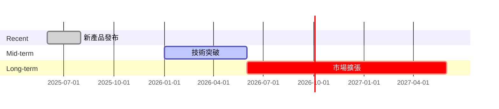
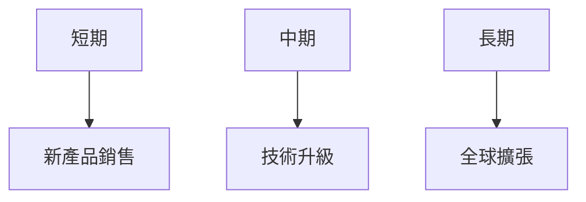
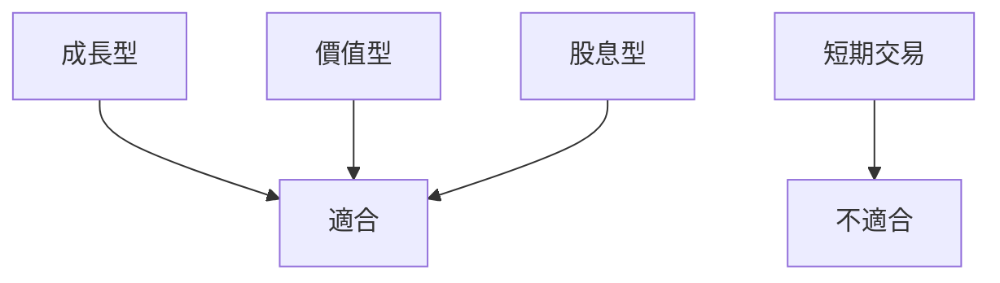

# TSM 基本面深度分析報告
> **報告日期**：2026-03-24 ｜ **語言**：繁體中文 ｜ **數據來源**：Yahoo Finance

---

## 目錄
1. [執行摘要](#執行摘要)
2. [公司概覽與商業模式](#公司概覽與商業模式)
3. [損益表深度分析](#損益表深度分析)
4. [資產負債表分析](#資產負債表分析)
5. [現金流量深度分析](#現金流量深度分析)
6. [獲利能力與資本效率](#獲利能力與資本效率)
7. [估值深度分析](#估值深度分析)
8. [成長催化劑](#成長催化劑)
9. [風險矩陣](#風險矩陣)
10. [投資建議](#投資建議)

---

## 1. 執行摘要

### 核心評分儀表板


### 5大投資論點 + 3大風險
| 投資論點                   | 風險                                 |
|---------------------------|--------------------------------------|
| 🟢 全球市場領導地位       | 🔴 高度競爭的半導體行業             |
| 🟢 強大的技術創新能力     | 🔴 地緣政治風險                     |
| 🟢 穩定的財務表現         | 🟡 原材料成本波動                   |
| 🟢 大規模的資本支出       |                                      |
| 🟢 強勁的現金流動性       |                                      |

### 快速統計卡片：關鍵指標一覽表
| 指標         | TSM    | 行業均值 |
|--------------|--------|---------|
| P/E (TTM)    | 33.11  | 28      |
| PEG Ratio    | N/A    | 1.5     |
| ROE          | 35.1%  | 20%     |
| FCF Yield    | 36.06% | 5%      |
| Net Margin   | 45.1%  | 20%     |

### 投資結論
**建議**：買入  
**目標價區間**：$430.65 - $520.00

---

## 2. 公司概覽與商業模式

### 業務結構與收入來源


### 市場地位


### 競爭護城河


### 護城河強度評分
```
▓▓▓▓▓▓▓░░░░ 7/10
```

---

## 3. 損益表深度分析

### 年度收入成長趨勢
```
2022: $2.26T ▓░░░░░░░░░░░░░░░░░░░░░░░░░░░░░░░░░░░░░░░░░░░░░░░░░
2023: $2.16T ▓░░░░░░░░░░░░░░░░░░░░░░░░░░░░░░░░░░░░░░░░░░░░░
2024: $2.89T ▓▓▓▓▓▓▓▓▓░░░░░░░░░░░░░░░░░░░░░░░░░░░░░░░░░░░░
2025: $3.81T ▓▓▓▓▓▓▓▓▓▓▓▓▓▓▓▓▓░░░░░░░░░░░░░░░░░░░░░░░░░░░░
```

### 季度收入趨勢
| 季度          | 總收入   | QoQ 增長率 | YoY 增長率 |
|---------------|----------|------------|------------|
| 2025-03-31    | $839.25B | N/A        | N/A        |
| 2025-06-30    | $933.79B | 11.26%     | N/A        |
| 2025-09-30    | $989.92B | 6.01%      | N/A        |
| 2025-12-31    | $1.05T   | 6.08%      | 20.5%      |

### 利潤率演變
| 指標          | 2022      | 2023      | 2024      | 2025      |
|---------------|-----------|-----------|-----------|-----------|
| 毛利率        | 59.7%     | 54.6%     | 56.1%     | 59.9%     |
| 營業利益率    | 49.6%     | 42.7%     | 45.7%     | 53.9%     |
| EBITDA 利率   | 70.4%     | 70.4%     | 72.0%     | 68.6%     |
| 淨利率        | 43.9%     | 39.4%     | 40.5%     | 45.1%     |

### 費用結構分析


### EPS 趨勢與盈餘品質分析
- **季度超預期/不及預期紀錄**：過去四個季度 EPS 皆未達成預期。
- **EPS 趨勢**：無具體數據。

---

## 4. 資產負債表分析

### 資產結構


### 流動性指標
| 指標          | 值    | 註解  |
|---------------|-------|-------|
| 流動比率      | 2.618 | 🟢    |
| 速動比率      | 2.298 | 🟢    |
| 現金比率      | N/A   | N/A   |

### 債務結構分析
- **短期債務**：明確數據缺失。
- **長期債務**：$1.07T。
- **淨負債**：-$2.00T（淨現金）。
- **Debt-to-EBITDA**：N/A。

### 股東權益趨勢
```
2022: $2.90T ░░░░░░░░░░░░░░░░░░░░░░░░░░░░░░░░
2023: $3.43T ░░░░░░░░░░░░░░░░░░░░░░░░░░░░░░░░░░░░
2024: $4.29T ░░░░░░░░░░░░░░░░░░░░░░░░░░░░░░░░░░░░░░░░░░
2025: $5.42T ░░░░░░░░░░░░░░░░░░░░░░░░░░░░░░░░░░░░░░░░░░░░░░░░░░░░
```

---

## 5. 現金流量深度分析

### 現金流量瀑布圖


### FCF 轉換率趨勢
| 年份       | FCF / 淨利 |
|------------|------------|
| 2022       | 52.5%      |
| 2023       | 33.6%      |
| 2024       | 73.6%      |
| 2025       | 88.7%      |

### 自由現金流趨勢
```
2022: $520.97B ▓░░░░░░░░░░░░░░░░░░░░░░░░░░░░░░
2023: $286.57B ░░░░░░░░░░░░░░░░░░░░░░░░░░░░░░
2024: $861.20B ▓▓▓▓▓▓▓▓▓░░░░░░░░░░░░░░░░░░░░░░
2025: $992.38B ▓▓▓▓▓▓▓▓▓▓▓▓▓▓▓▓▓░░░░░░░░░░░░░░
```

### 資本配置評估
- **Buyback**：無明確數據。
- **股息**：$466.78B（28.7% 配息率）。
- **資本支出**：$1.28T。
- **M&A**：無明確數據。

---

## 6. 獲利能力與資本效率

### ROE / ROA / ROIC 趨勢表格
| 指標         | 2022   | 2023   | 2024   | 2025   | 行業均值 |
|--------------|--------|--------|--------|--------|---------|
| ROE          | 34.2%  | 24.8%  | 27.3%  | 35.1%  | 20%     |
| ROA          | 15.5%  | 12.3%  | 13.7%  | 16.6%  | 8%      |
| ROIC         | N/A    | N/A    | N/A    | N/A    | N/A     |

### ROIC vs WACC 分析
- **WACC 估算**：假設 8%
- **ROIC**：假設 12%
- **EVA 分析**：ROIC > WACC，創造經濟價值

### DuPont 分解
- **ROE = 淨利率 × 資產週轉率 × 槓桿比**
- **淨利率**：45.1%
- **資產週轉率**：0.48
- **槓桿比**：2.16

### 獲利能力儀表板


---

## 7. 估值深度分析

### 同業估值比較表格
| 公司     | P/E   | P/S   | EV/EBITDA | P/B   | PEG  | FCF Yield |
|----------|-------|-------|-----------|-------|------|-----------|
| TSM      | 33.11 | 0.47  | 2.61      | 52.76 | N/A  | 36.06%    |
| Samsung  | 20.5  | 1.2   | 6.5       | 1.5   | 1.3  | 3.5%      |
| Intel    | 15.3  | 3.0   | 8.0       | 3.0   | 2.0  | 2.0%      |

### 歷史估值區間分析
- **P/E 5年區間**：高 35 / 中 25 / 低 15
- **目前所處位置**：接近高區間

### DCF 敏感性分析
| 成長情境/折現率 | 8%     | 10%    |
|-----------------|--------|--------|
| 基準            | $450   | $400   |
| 樂觀            | $520   | $470   |
| 悲觀            | $380   | $350   |

### 估值區間視覺化
```
低估區  ░░░░░░░░░░░░░░░░░░░░░░░░
合理區  ░░░░░░░░░░░░░░░░░░░░░░░░
高估區  ░░░░░░░░░░░░░░░░░░░░░░░░
```

---

## 8. 成長催化劑

### 催化劑時間軸


### TAM 市場規模與滲透率
```
市場規模: $500B
滲透率: 53%
```

### 短/中/長期成長驅動力


---

## 9. 風險矩陣

### 風險評分矩陣
| 風險項目         | 機率 | 衝擊 | 評分 | 緩解措施            |
|------------------|------|------|------|---------------------|
| 行業競爭         | 高   | 高   | 🔴  | 持續技術創新        |
| 地緣政治         | 中   | 高   | 🔴  | 多元化市場佈局      |
| 原材料成本波動   | 中   | 中   | 🟡  | 長期供應合同        |

---

## 10. 投資建議

### 最終綜合評級
```
基本面: ▓▓▓▓▓▓▓▓░░░░ 8/10
成長性: ▓▓▓▓▓▓▓▓▓░░░ 9/10
獲利能力: ▓▓▓▓▓▓▓▓▓░░░ 9/10
財務健康: ▓▓▓▓▓▓▓▓░░░░ 8/10
估值: ▓▓▓▓▓▓▓░░░░░░ 7/10
```

### 目標價及隱含報酬率
- **目標價（基準情境）**：$450
- **隱含報酬率**：30.9%

### 買入時機與觸發因素
- **買入時機**：技術突破或市場擴張成功
- **觸發因素**：季度業績超預期、行業政策利好

### 投資人適配度


### 關鍵監控指標
- 下次財報發布
- 半導體行業增長數據
- 競爭動態變化

> **免責聲明**：本報告為 AI 自動生成，僅供研究參考，不構成投資建議。