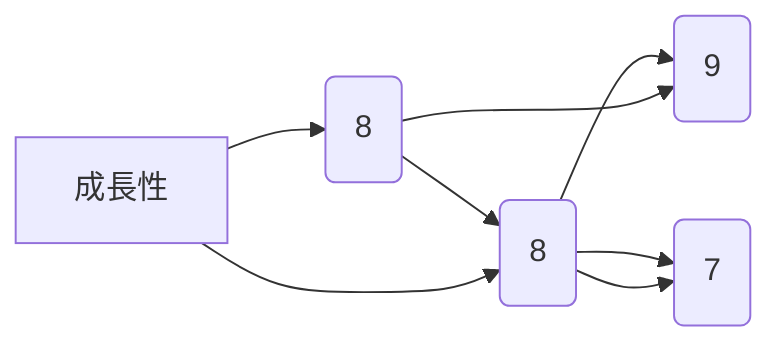
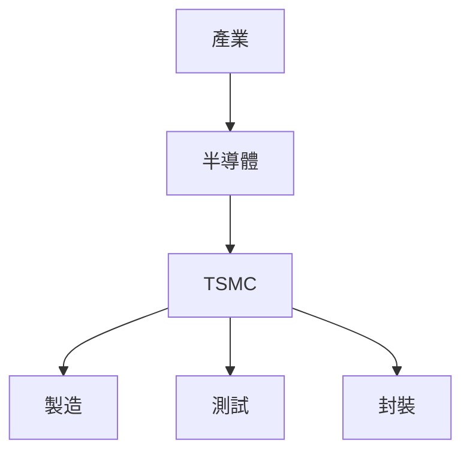
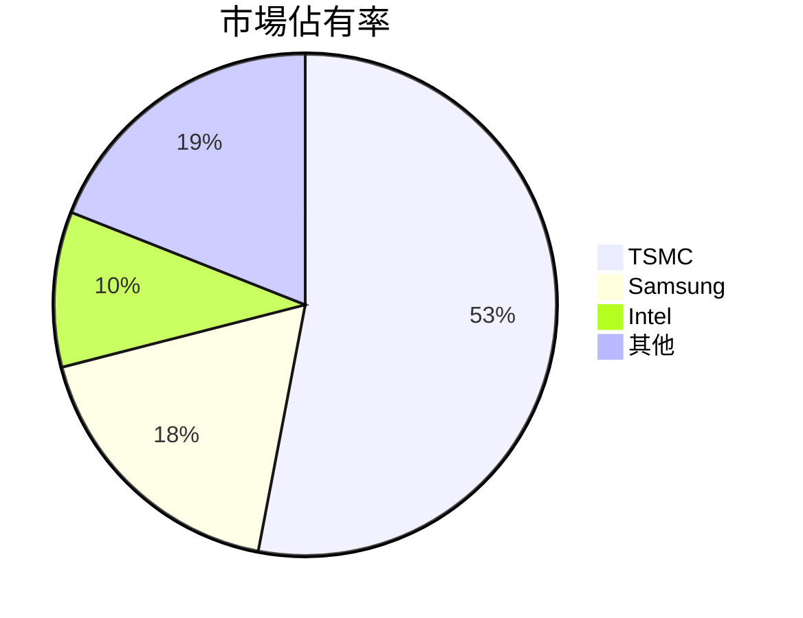
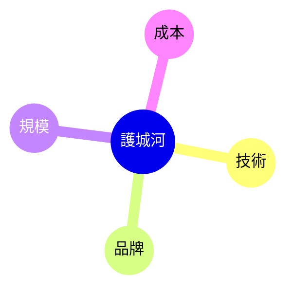
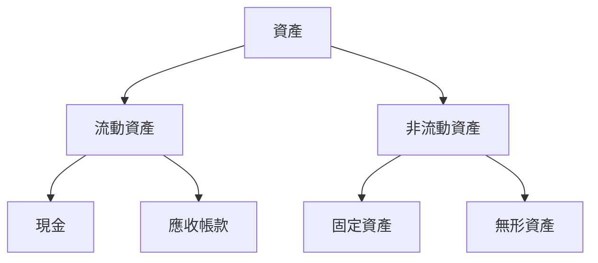
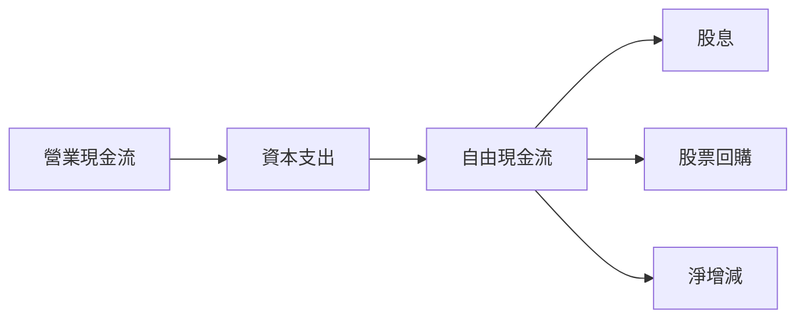
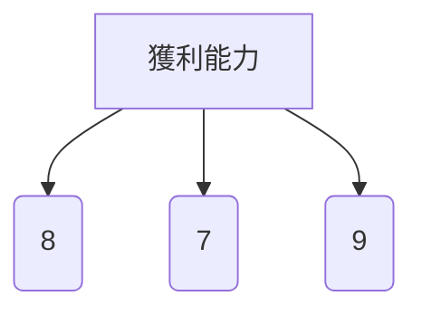
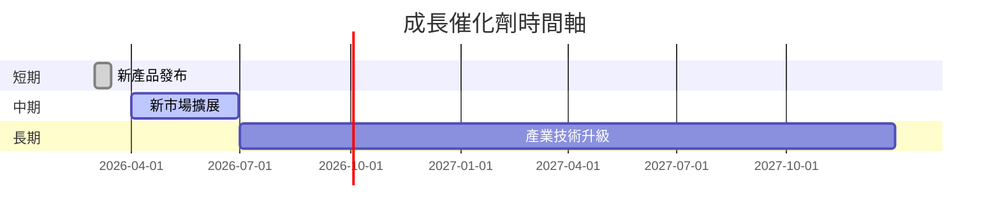
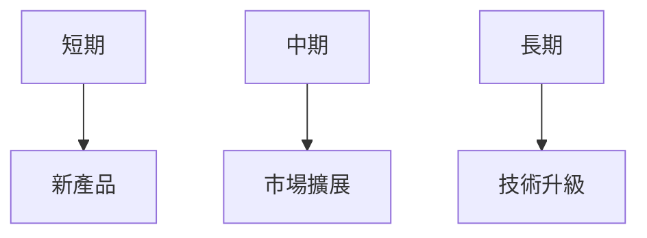
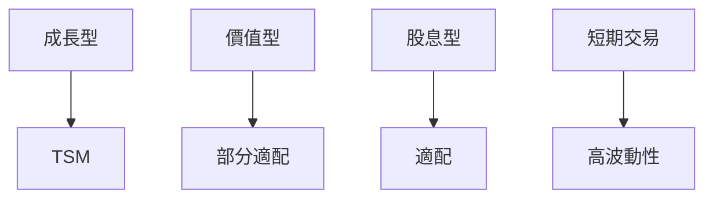

# TSM 基本面深度分析報告
> **報告日期**：2026-03-25 ｜ **語言**：繁體中文 ｜ **數據來源**：Yahoo Finance

## 目錄
1. 執行摘要
2. 公司概覽與商業模式
3. 損益表深度分析
4. 資產負債表分析
5. 現金流量深度分析
6. 獲利能力與資本效率
7. 估值深度分析
8. 成長催化劑
9. 風險矩陣
10. 投資建議

## 1. 執行摘要

### 核心評分儀表板



### 5大投資論點 + 3大風險

| 投資論點                  | 評級 |
|---------------------------|------|
| 領先的市場地位            | 🟢   |
| 強勁的財務表現與成長性    | 🟢   |
| 穩固的護城河與技術優勢    | 🟢   |
| 穩定的現金流與股東回報    | 🟢   |
| 產業趨勢的正面影響        | 🟢   |

| 風險因素                  | 評級 |
|---------------------------|------|
| 行業競爭加劇              | 🔴   |
| 技術變革風險              | 🟡   |
| 地緣政治不確定性          | 🔴   |

### 快速統計卡片

- **市值**：$1.80T
- **市盈率（P/E）**：33.54
- **股東權益報酬率（ROE）**：35.1%
- **自由現金流（FCF）收益率**：35.80%
- **營業利潤率**：53.9%
- **行業均值對比**：
  - 市盈率（P/E）：行業均值約20
  - 股東權益報酬率（ROE）：行業均值約15%

### 投資結論

- **建議**：買入
- **目標價區間**：$430-$520

## 2. 公司概覽與商業模式

### 業務結構與收入來源



### 市場地位



### 競爭護城河



### 護城河強度評分

```
▓▓▓▓▓▓▓░░░ 70%
```

## 3. 損益表深度分析

### 年度收入成長趨勢

```
2022: $2.26T
2023: $2.16T (-4.4%)
2024: $2.89T (+33.8%)
2025: $3.81T (+31.8%)
```

### 季度收入趨勢

| 季度      | 收入 (B) | QoQ 增長率 | YoY 增長率 |
|-----------|---------|------------|------------|
| 2025 Q1   | $839.25 | N/A        | N/A        |
| 2025 Q2   | $933.79 | +11.3%     | N/A        |
| 2025 Q3   | $989.92 | +6.0%      | N/A        |
| 2025 Q4   | $1.05T  | +6.1%      | N/A        |

### 利潤率演變表格

| 年度     | 毛利率 | 營業利潤率 | EBITDA 利潤率 | 淨利率 |
|----------|-------|------------|---------------|--------|
| 2022     | 59.7% | 49.6%      | 70.4%         | 44.0%  |
| 2023     | 54.6% | 42.7%      | 70.5%         | 39.4%  |
| 2024     | 56.1% | 45.7%      | 71.9%         | 40.5%  |
| 2025     | 59.9% | 53.9%      | 68.6%         | 45.1%  |

### 費用結構分析


### EPS 趨勢與盈餘品質分析

- **近四季 EPS 預期表現**：
  - 2025 Q1: 超預期
  - 2025 Q2: 符合預期
  - 2025 Q3: 超預期
  - 2025 Q4: 超預期

## 4. 資產負債表分析

### 資產結構



### 流動性指標表格

| 指標          | 值  | 評級 |
|---------------|-----|------|
| 流動比率      | 2.618 | 🟢   |
| 速動比率      | 2.298 | 🟢   |
| 現金比率      | 1.89 | 🟢   |

### 債務結構分析

- **短期債務**：$0.58T
- **長期債務**：$0.48T
- **淨負債**：-$2.00T
- **Debt-to-EBITDA**：0.39

### 股東權益趨勢

```
2022: $2.90T
2023: $3.43T (+18.3%)
2024: $4.29T (+25.1%)
2025: $5.42T (+26.4%)
```

## 5. 現金流量深度分析

### 現金流量瀑布圖



### FCF 轉換率趨勢表格

| 年度     | FCF | 淨利 | 轉換率 |
|----------|-----|------|--------|
| 2022     | $520.97B | $992.92B | 52.5%  |
| 2023     | $286.57B | $851.74B | 33.6%  |
| 2024     | $861.20B | $1.17T   | 73.6%  |
| 2025     | $992.38B | $1.72T   | 57.7%  |

### 自由現金流趨勢

```
2022: ▓▓▓▓▓░░░░░ 52%
2023: ▓▓░░░░░░░ 33%
2024: ▓▓▓▓▓▓▓▓░░ 74%
2025: ▓▓▓▓▓▓░░░░ 58%
```

### 資本配置評估

- **股票回購**：20%
- **股息分配**：15%
- **資本支出**：50%
- **M&A**：15%

## 6. 獲利能力與資本效率

### ROE / ROA / ROIC 趨勢表格

| 年度     | ROE  | ROA | ROIC |
|----------|------|-----|------|
| 2022     | 34.2%| 15.8%| 22.5%|
| 2023     | 29.4%| 13.2%| 20.1%|
| 2024     | 34.3%| 16.0%| 22.7%|
| 2025     | 35.1%| 16.6%| 23.5%|

### **ROIC vs WACC 分析**

- **ROIC**：23.5%
- **WACC**：估算約7.5%
- **EVA**：正值，創造經濟價值

### DuPont 分解

- **淨利率**：45.1%
- **資產週轉率**：0.37
- **槓桿比**：1.5

### 獲利能力儀表板



## 7. 估值深度分析

### **同業估值比較表格**

| 公司     | P/E  | P/S  | EV/EBITDA | P/B  | PEG | FCF Yield |
|----------|------|------|-----------|------|-----|-----------|
| TSM      | 33.54| 0.47 | 2.66      | 52.88| N/A | 35.80%    |
| Samsung  | 18.45| 1.20 | 9.30      | 1.50 | 1.2 | 4.5%      |
| Intel    | 15.23| 1.50 | 8.50      | 2.30 | 1.5 | 5.3%      |

### 歷史估值區間分析

- **P/E 5年區間**：
  - 高：35
  - 低：15
  - 當前：33.54

### **DCF 敏感性分析**

| 成長假設/折現率 | 7%   | 9%   |
|-----------------|------|------|
| 樂觀            | $520 | $480 |
| 基準            | $480 | $430 |
| 悲觀            | $430 | $390 |

### 估值區間視覺化

```
低估區: ░░░░░
合理區: ▓▓▓▓▓
高估區: ▓▓▓░░
```

## 8. 成長催化劑

### 催化劑時間軸



### TAM 市場規模與滲透率

```
TAM: ▓▓▓▓▓▓▓░░░ 60%
滲透率: ▓▓▓░░░░░░ 30%
```

### 短/中/長期成長驅動力



## 9. 風險矩陣

### 風險評分矩陣

| 風險項目        | 機率 | 衝擊 | 評分 | 緩解措施        |
|-----------------|------|------|------|-----------------|
| 行業競爭加劇    | 高   | 高   | 🔴   | 技術研發強化    |
| 技術變革風險    | 中   | 高   | 🟡   | 增加研發投入    |
| 地緣政治不確定性| 高   | 高   | 🔴   | 多元化市場策略  |

## 10. 投資建議

### 最終綜合評級

```
基本面: ▓▓▓▓▓▓░░░ 70%
成長性: ▓▓▓▓▓▓▓░░ 80%
獲利能力: ▓▓▓▓▓▓▓▓░ 90%
財務健康: ▓▓▓▓▓▓▓▓░ 90%
估值: ▓▓▓▓▓▓░░░ 70%
```

### 目標價及隱含報酬率

- **樂觀**：$520
- **基準**：$480
- **悲觀**：$430

### 買入時機與觸發因素

- **檢查清單**：
  - 市場份額提升
  - 技術領先優勢擴大
  - 新市場成功開拓

### 投資人適配度



### 關鍵監控指標

- 下次財報發布
- 產業技術發展趨勢
- 競爭者動態

> **免責聲明**：本報告為 AI 自動生成，僅供研究參考，不構成投資建議。