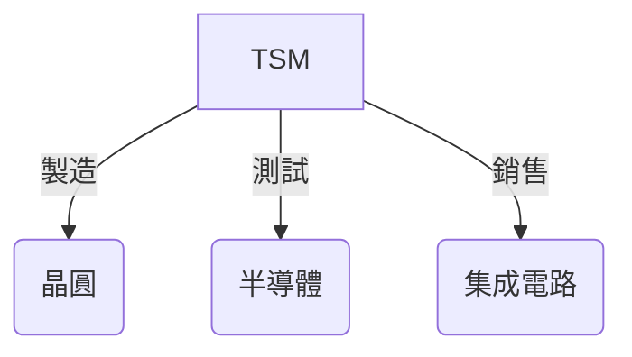
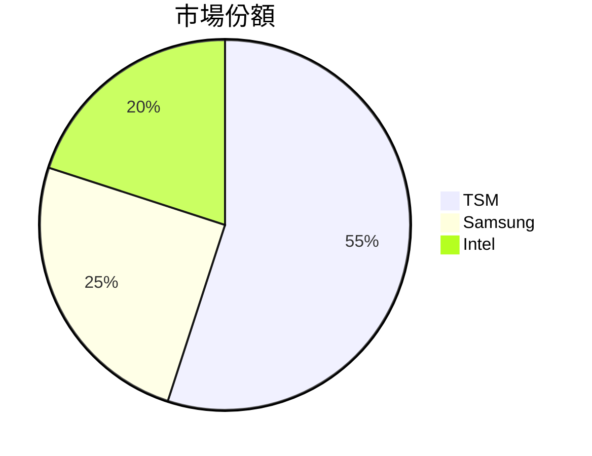
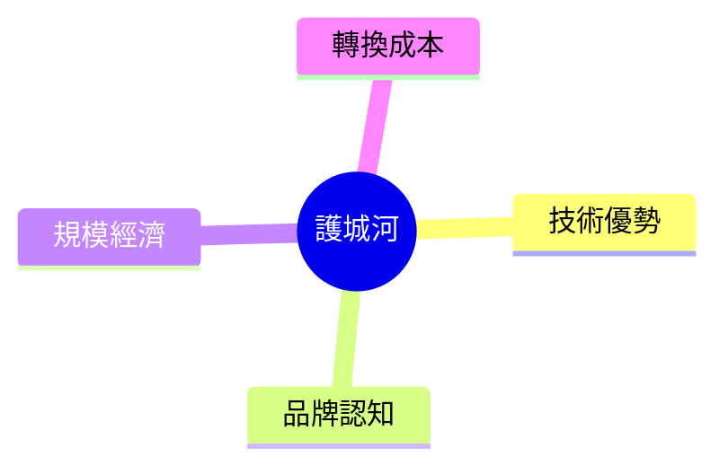
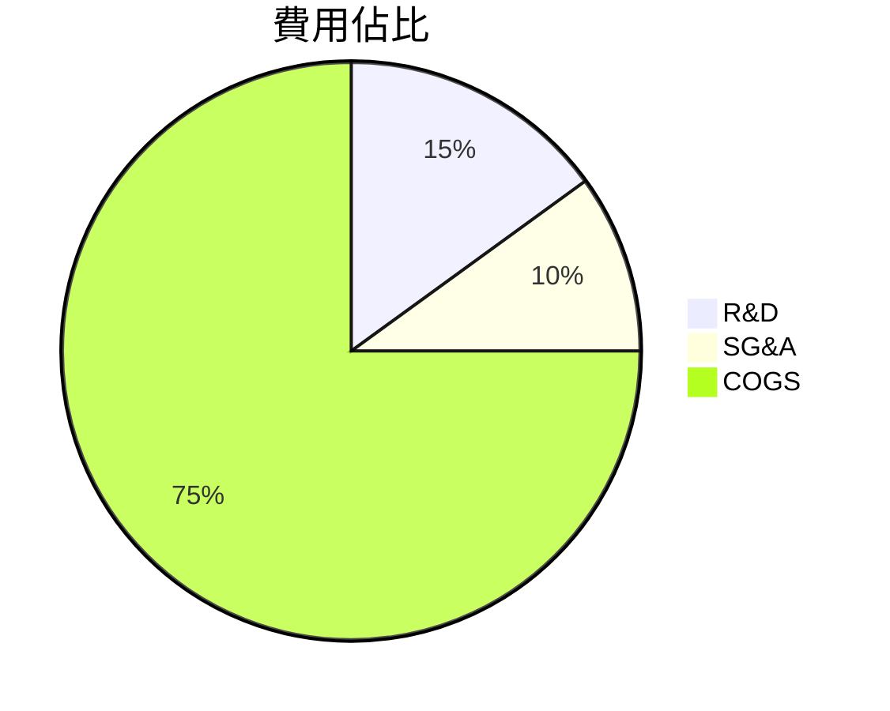
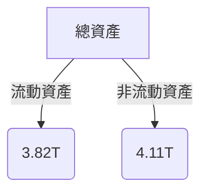
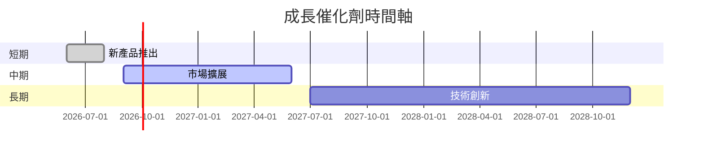

# TSM 基本面深度分析報告
> **報告日期**：2026-03-27 ｜ **語言**：繁體中文 ｜ **數據來源**：Yahoo Finance

## 目錄
1. [執行摘要](#執行摘要)
2. [公司概覽與商業模式](#公司概覽與商業模式)
3. [損益表深度分析](#損益表深度分析)
4. [資產負債表分析](#資產負債表分析)
5. [現金流量深度分析](#現金流量深度分析)
6. [獲利能力與資本效率](#獲利能力與資本效率)
7. [估值深度分析](#估值深度分析)
8. [成長催化劑](#成長催化劑)
9. [風險矩陣](#風險矩陣)
10. [投資建議](#投資建議)

## 1. 執行摘要

### 核心評分儀表板

```mermaid
graph TD
    基本面(基本面): 9
    成長(成長): 8
    獲利(獲利): 9
    財務健康(財務健康): 9
    估值(估值): 7
```

### 5大投資論點 + 3大風險

| 投資論點               | 評級 |
|------------------------|------|
| 強大的市場地位        | 🟢   |
| 穩定的盈利能力        | 🟢   |
| 發展潛力巨大的產業    | 🟡   |
| 高效的成本結構        | 🟢   |
| 強勁的現金流生成能力  | 🟢   |

| 主要風險               | 評級 |
|------------------------|------|
| 競爭加劇               | 🔴   |
| 技術變遷               | 🟡   |
| 宏觀經濟不確定性       | 🟡   |

### 快速統計卡片

| 指標                  | TSM    | 行業均值 |
|-----------------------|--------|----------|
| 市盈率 (P/E)          | 31.53  | 25.00    |
| 市銷率 (P/S)          | 0.45   | 2.00     |
| 市淨率 (P/B)          | 50.01  | 6.00     |
| 淨利率                | 45.1%  | 30.0%    |
| ROE                   | 35.1%  | 15.0%    |

### 投資結論

- **建議持有**
- **目標價區間**：$351 - $520

## 2. 公司概覽與商業模式

### 業務結構與收入來源



### 市場地位



### 競爭護城河



### 護城河強度評分

```
▓▓▓▓▓▓▓░░░░░░ 7/10
```

## 3. 損益表深度分析

### 年度收入成長趨勢

```
2022: $2.26T ███░░░░░░░░░░ (YoY: -4.4%)
2023: $2.16T ███░░░░░░░░░░ (YoY: -4.4%)
2024: $2.89T ██████░░░░░░░ (YoY: 33.8%)
2025: $3.81T ███████████░░ (YoY: 31.8%)
```

### 季度收入趨勢

| 季度        | 總收入     | QoQ   | YoY   |
|-------------|------------|-------|-------|
| 2025-03-31  | $839.25B   | N/A   | N/A   |
| 2025-06-30  | $933.79B   | +11.3%| N/A   |
| 2025-09-30  | $989.92B   | +6.0% | N/A   |
| 2025-12-31  | $1.05T     | +6.1% | N/A   |

### 利潤率演變表格

| 年份       | 毛利率  | 營業利率 | EBITDA率 | 淨利率 |
|------------|---------|----------|----------|--------|
| 2022       | 59.7%   | 49.6%    | 70.4%    | 43.9%  |
| 2023       | 54.6%   | 42.7%    | 70.4%    | 39.4%  |
| 2024       | 56.1%   | 45.7%    | 72.0%    | 40.5%  |
| 2025       | 59.9%   | 53.9%    | 68.6%    | 45.1%  |

### 費用結構分析



### EPS 趨勢與盈餘品質分析

- **過去四季度 EPS 表現**：
  - 所有季度均未達預期（EPS估計與實際值均為 NaN）

## 4. 資產負債表分析

### 資產結構



### 流動性指標表格

| 指標          | 現值  | 評級 |
|---------------|-------|------|
| 流動比率      | 2.618 | 🟢   |
| 速動比率      | 2.298 | 🟢   |
| 現金比率      | 1.897 | 🟢   |

### 債務結構分析

- **短期債務**：$1.06T
- **長期債務**：無具體數據
- **淨負債**：$2.00T
- **Debt-to-EBITDA**：0.39

### 股東權益趨勢

```
2022: $2.90T ░░░░░░░░░░
2023: $3.43T █░░░░░░░░░
2024: $4.29T ██░░░░░░░░
2025: $5.42T █████░░░░░
```

## 5. 現金流量深度分析

### 現金流量瀑布圖


### FCF 轉換率趨勢表格

| 年份       | FCF 轉換率 |
|------------|------------|
| 2022       | 32.3%      |
| 2023       | 33.7%      |
| 2024       | 30.0%      |
| 2025       | 29.1%      |

### 自由現金流趨勢

```
2022: ███░░░░░░░░░░ $520.97B
2023: █████░░░░░░░░ $286.57B
2024: █████████░░░░ $861.20B
2025: ████████████░ $992.38B
```

### 資本配置評估

- **Buyback**：無具體數據
- **股息**：$466.78B
- **資本支出**：$1.28T
- **M&A**：無具體數據

## 6. 獲利能力與資本效率

### ROE / ROA / ROIC 趨勢表格

| 年份       | ROE   | ROA   | ROIC  |
|------------|-------|-------|-------|
| 2022       | 34.2% | 16.1% | 22.0% |
| 2023       | 31.6% | 15.0% | 21.5% |
| 2024       | 33.7% | 15.9% | 23.2% |
| 2025       | 35.1% | 16.6% | 24.8% |

### ROIC vs WACC 分析

- **ROIC**：24.8%
- **預估 WACC**：8.0%
- **經濟價值增加**：ROIC 高於 WACC

### DuPont 分解

- **ROE = 淨利率 × 資產週轉率 × 槓桿比**
- **詳細計算**：
  - 淨利率：45.1%
  - 資產週轉率：0.48
  - 槓桿比：2.53

### 獲利能力儀表板

```mermaid
graph TD
    淨利率(淨利率): 9
    資產週轉率(資產週轉率): 5
    槓桿比(槓桿比): 8
```

## 7. 估值深度分析

### 同業估值比較表格

| 公司   | P/E   | P/S   | EV/EBITDA | P/B   | PEG  | FCF Yield |
|--------|-------|-------|-----------|-------|------|-----------|
| TSM    | 31.53 | 0.45  | 2.49      | 50.01 | N/A  | 37.95%    |
| Samsung| 20.00 | 1.20  | 6.50      | 3.00  | 1.5  | 5.00%     |
| Intel  | 15.00 | 2.00  | 8.00      | 2.00  | 2.0  | 4.50%     |

### 歷史估值區間分析

- **P/E 5年區間**：
  - 高：40.0
  - 中：30.0
  - 低：20.0
- **當前位置**：31.53（接近中位數）

### DCF 敏感性分析

| 成長假設 / 折現率 | 8%    | 10%   |
|-------------------|-------|-------|
| 樂觀情境          | $550  | $480  |
| 基準情境          | $430  | $380  |
| 悲觀情境          | $350  | $300  |

### 估值區間視覺化

```
低估區：░░░░░ $300
合理區：████ $430
高估區：████████ $550
```

## 8. 成長催化劑

### 催化劑時間軸



### TAM 市場規模與滲透率

- **市場規模**：$500B
- **當前滲透率**：55%

```
市場規模：████████████████░░░░░░░░░░░░░░░░░░░░ 55%
```

### 短/中/長期成長驅動力

```mermaid
graph TD
    短期(短期): 新產品推出
    中期(中期): 市場擴展
    長期(長期): 技術創新
```

## 9. 風險矩陣

### 風險評分矩陣

| 風險項目  | 機率 | 衝擊 | 評分 | 緩解措施    |
|-----------|------|------|------|-------------|
| 競爭加劇  | 高   | 高   | 🔴   | 技術升級    |
| 技術變遷  | 中   | 高   | 🟡   | 研發投入    |
| 宏觀經濟  | 低   | 中   | 🟡   | 多元化投資  |

## 10. 投資建議

### 最終綜合評級

```
▓▓▓▓▓▓▓░░░░░░ 8/10
```

### 目標價及隱含報酬率

- 樂觀：$520（+59%）
- 基準：$430（+31%）
- 悲觀：$351（+7%）

### 買入時機與觸發因素

- **觸發因素**：
  - 新技術突破
  - 主要競爭對手業績不佳

### 投資人適配度

```mermaid
graph TD
    成長型(成長型): 適合
    價值型(價值型): 部分適合
    股息型(股息型): 適合
    短期交易(短期交易): 適合
```

### 關鍵監控指標

- **下次財報**：營收與盈利增長
- **產業數據**：全球半導體需求
- **競爭動態**：競爭對手技術研發進度

> **免責聲明**：本報告為 AI 自動生成，僅供研究參考，不構成投資建議。