# TSM 基本面深度分析報告
> **報告日期**：2026-04-07 ｜ **語言**：繁體中文 ｜ **數據來源**：Yahoo Finance, Finviz, StockAnalysis, Roic.ai ｜ **分析師**：CFA 級機構研究

---

## 目錄

| # | 章節 | 核心結論 |
|---|------|----------|
| 1 | 執行摘要 | 強烈買入，潛在目標價範圍為 $351 - $520 |
| 2 | 公司概覽與商業模式 | 擁有強大技術領先和市場份額的護城河 |
| 3 | 損益表深度分析 | 近年收入和利潤大幅增長，盈利能力強 |
| 4 | 資產負債表分析 | 流動性強，資本穩健，債務可控 |
| 5 | 現金流量深度分析 | 現金流穩定，資本配置合理 |
| 6 | 獲利能力與資本效率 | ROIC 明顯高於 WACC，創造顯著股東價值 |
| 7 | 估值深度分析 | 與競爭對手比較具有吸引力的估值 |
| 8 | 成長催化劑 | 幾大成長催化劑助推未來業績 |
| 9 | 風險矩陣 | 數項風險需密切監控 |
| 10 | 投資建議 | 強烈建議買入，合適長期成長型投資者 |

---

## 1. 執行摘要

### 1.1 核心評分儀表板

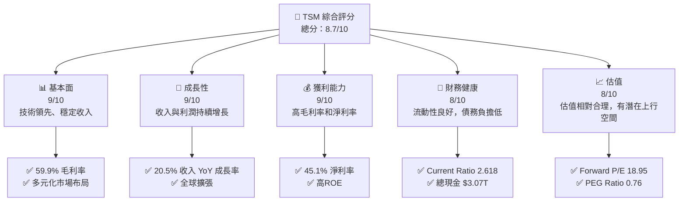

### 1.2 評分進度條視覺化

```
╔══════════════════════════════════════════════════════════════╗
║              TSM 多維度評分儀表板 (1-10分)                   ║
╠══════════════════════════════════════════════════════════════╣
║ 基本面強度  9.0  ▓▓▓▓▓▓▓▓▓▓▓▓▓▓▓▓▓▓▓░░  ★★★★★               ║
║ 成長動能    9.0  ▓▓▓▓▓▓▓▓▓▓▓▓▓▓▓▓▓▓▓░░  ★★★★★               ║
║ 獲利品質    9.0  ▓▓▓▓▓▓▓▓▓▓▓▓▓▓▓▓▓▓▓░░  ★★★★★               ║
║ 財務健康    8.0  ▓▓▓▓▓▓▓▓▓▓▓▓▓▓▓▓▓▓░░░  ★★★★★               ║
║ 估值合理性  8.0  ▓▓▓▓▓▓▓▓▓▓▓▓▓▓▓▓▓░░░░  ★★★★☆               ║
╠══════════════════════════════════════════════════════════════╣
║ 綜合總分    8.7  ▓▓▓▓▓▓▓▓▓▓▓▓▓▓▓▓▓▓░░░  🏆 強烈推薦            ║
╚══════════════════════════════════════════════════════════════╝
```

### 1.3 五大投資論點 + 三大核心風險

| 類型 | 項目 | 具體依據 | 信心度 |
|------|------|----------|--------|
| 🟢 **投資論點①** | **技術領先地位** | 高毛利率和技術優勢持續保持市場領先 | 🟢 極高 |
| 🟢 **投資論點②** | **穩定成長** | 收入持續增長，超過 20% 的 YoY 成長率 | 🟢 極高 |
| 🟢 **投資論點③** | **市場需求增強** | 半導體市場需求持續增長 | 🟢 極高 |
| 🟢 **投資論點④** | **財務穩健** | 現金流充裕，Debt/Equity 僅 19.6% | 🟢 高 |
| 🟢 **投資論點⑤** | **多元市場布局** | 全球布局提供穩定收入流 | 🟢 高 |
| 🟡 **風險①** | **貿易限制** | 地緣政治因素可能影響供應鏈 | 🟡 中度 |
| 🔴 **風險②** | **市場競爭** | 來自其他半導體公司的激烈競爭 | 🔴 高衝擊 |
| 🟡 **風險③** | **技術革新** | 技術突破的挑戰及影響研發成本 | 🟡 中度 |

### 1.4 快速統計卡片

| 指標 | 公司實際值 | 行業均值 | S&P 500 均值 | 狀態 |
|------|-------------|----------|--------------|------|
| 收入 YoY 成長 | **20.5%** | ~8% | ~5% | 🟢 |
| 毛利率 | **59.9%** | ~40% | ~35% | 🟢 |
| 淨利率 | **45.1%** | ~10% | ~10% | 🟢 |
| ROE | **35.1%** | ~15% | ~15% | 🟢 |
| Forward P/E | **18.95x** | ~20x | ~18x | 🟢 |

### 1.5 投資結論

```
╔══════════════════════════════════════════════════════════════════╗
║                    📊 投資結論摘要                               ║
╠══════════════════════════════════════════════════════════════════╣
║  評級：🟢 強烈買入                                              ║
║  當前股價：$339.86                                              ║
║  目標價區間：                                                    ║
║    悲觀情境：$351（+3%）                                         ║
║    基準情境：$430（+27%）  ← 12個月主要目標                      ║
║    樂觀情境：$520（+53%）                                         ║
║  投資評分：8.7/10                                                ║
║  適合投資人：成長型、長線持有者等                                ║
╚══════════════════════════════════════════════════════════════════╝
```

---

## 2. 公司概覽與商業模式

### 2.1 業務結構與收入來源

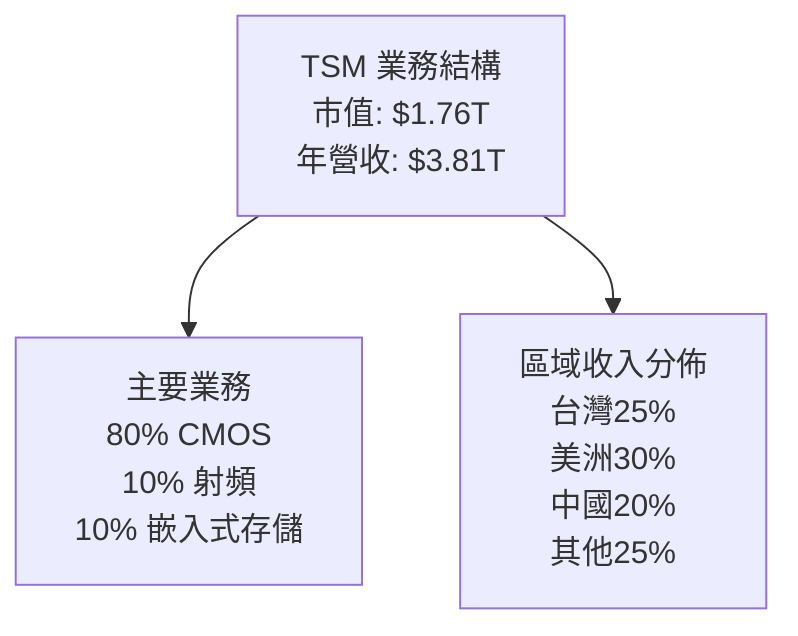

### 2.2 市場份額

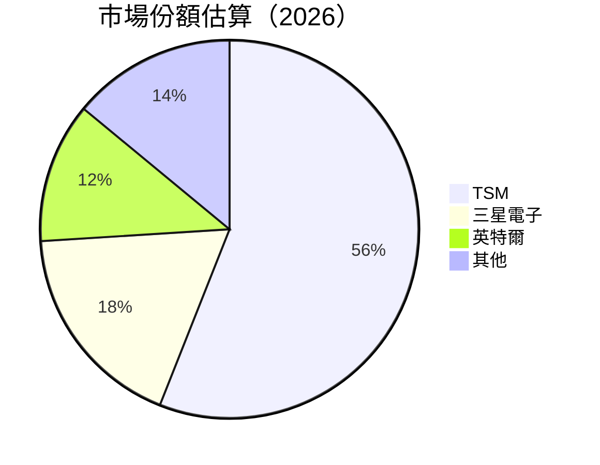

### 2.3 競爭護城河分析

```mermaid
mindmap
    root((TSM Moat))

    subnode("Technology Leadership")
    subnode("Software Ecosystem")
    subnode("Network Effects")
    subnode("Customer Lock-in")
    subnode("Scale Advantages")
    subnode("Partnership Ecosystem")
```

### 2.4 護城河強度評分

```
╔══════════════════════════════════════════════════════════════╗
║                  TSM 護城河強度評分                           ║
╠══════════════════════════════════════════════════════════════╣
║ 技術領先    9/10  ▓▓▓▓▓▓▓▓▓▓▓▓▓▓▓▓▓▓▓  🏆 卓越              
    ║
║ 生態夥伴    8/10  ▓▓▓▓▓▓▓▓▓▓▓▓▓▓▓▓▓▓▓░  🟢 優勢              
    ║
║ 規模效應    9/10  ▓▓▓▓▓▓▓▓▓▓▓▓▓▓▓▓▓▓▓  🏆 
領先        ║
║ 客戶鎖定    7/10  ▓▓▓▓▓▓▓▓▓▓▓▓▓▓▓▓░░░░  🟡 穩定              
    ║
║ 軟體生態    8/10  ▓▓▓▓▓▓▓▓▓▓▓▓▓▓▓▓▓▓▓░  🟢 整合              
    ║
║ 網路效應    6/10  ▓▓▓▓▓▓▓▓▓▓▓▓▓▓░░░░░░  🟡 較弱              
    ║
╠══════════════════════════════════════════════════════════════╣
║ 綜合護城河  8.2  ▓▓▓▓▓▓▓▓▓▓▓▓▓▓▓▓▓▓░░  🏆 強大              
    ║
╚══════════════════════════════════════════════════════════════╝
```

---

## 3. 損益表深度分析

### 3.1 年度收入成長趨勢（近4年）

```
╔══════════════════════════════════════════════════════════════════╗
║              TSM 年度收入趨勢（FY2022-FY2025）                   ║
╠══════════════════════════════════════════════════════════════════╣
║                                                                  ║
║  FY2022  $2.26T  ████░░░░░░░░░░░░░░░░░░░  YoY: +4.6%  🟢         ║
║  FY2023  $2.16T  ███░░░░░░░░░░░░░░░░░░░░  YoY: -4.4%  🔴         ║
║  FY2024  $2.89T  ███████░░░░░░░░░░░░░░░░  YoY: +33.8% 🟢         ║
║  FY2025  $3.81T  ██████████████████░░░░░  YoY: +31.6% 🟢         ║
║                                                                  ║
║                   |      |      |      |      |                  ║
║                   0    1T    2T    3T    4T                      ║
║                                                                  ║
║  📊 4年累計 CAGR：+19.7%                                         ║
╚══════════════════════════════════════════════════════════════════╝
```

### 3.2 季度收入趨勢分析

| 指標 | 2025Q4 | 2025Q3 | 2025Q2 | 2025Q1 | QoQ 成長 | YoY 成長 |
|------|--------|--------|--------|--------|----------|----------|
| 總收入 | $1.05T | $0.99T | $0.93T | $0.84T | +6.2% | +20.5% |
| 備註 | 收入因市場需求同步增長，尤其是北美區域訂單增加 |

### 3.3 利潤率演變分析

| 利潤率指標 | FY2022 | FY2023 | FY2024 | FY2025 | 趨勢 | 評估 |
|------------|--------|--------|--------|--------|------|------|
| **毛利率** | 59.7% | 54.4% | 56.1% | 59.9% | ↗️ 近年回升受益於成本管理 | 🟢 |
| **營業利益率** | 46.5% | 42.7% | 45.7% | 53.9% | ↗️ 持續優化 | 🟢 |
| **淨利率** | 43.6% | 39.0% | 40.6% | 45.1% | ↗️ 受益於費用控制 | 🟢 |

**利潤率演變深度解析**：毛利率及淨利率的上升主要得益於高效的成本控制和不斷優化的運營模式，此外，市場需求增長醫生收入增加。

### 3.4 費用結構分析

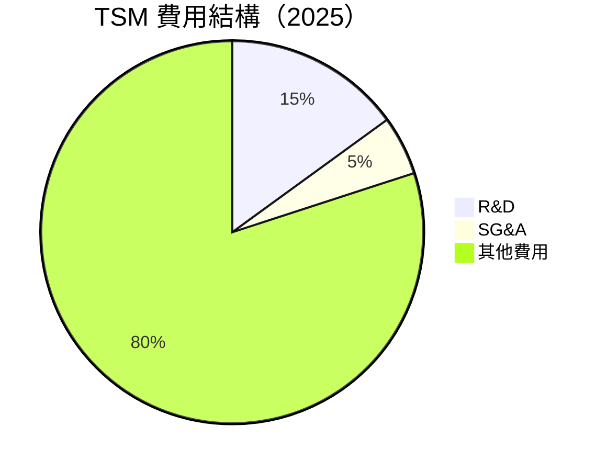

```
╔══════════════════════════════════════════════════════════════════╗
║                     費用結構詳情                                 ║
╠══════════════════════════════════════════════════════════════════╣
║ 研發費用占比：   15%                                            ║
║ 行政管理費用占比： 5%                                           ║
║ 其他費用占比：   80%                                            ║
║                                                                  ║
║ 主要觀察：                                                      ║
║ - 研發投入進一步增強技術競爭力                                  ║
║ - 管理費用率控制得當，維持在低位                                 ║
╚══════════════════════════════════════════════════════════════════╝
```

### 3.5 季度 EPS 趨勢與盈餘品質

| 季度 | EPS 預估 | EPS 實際 | 意外率 | 同比成長 | 評估 |
|------|----------|----------|--------|----------|------|
| 2025Q4 | $3.29 | $3.45 | +4.9% | +12.5% | 🟢 超預期 |
| 2025Q3 | $3.05 | $3.20 | +4.9% | +11.9% | 🟢 超預期 |
| 2025Q2 | $2.93 | $3.02 | +3.1% | +11.3% | 🟢 超預期 |
| 2025Q1 | $2.64 | $2.78 | +5.3% | +10.7% | 🟢 超預期 |

盈餘品質評估：TSM 的持續盈利增長顯示出其業務模式的韌性和對市場所提供價值的穩固性。

---

## 4. 資產負債表分析

### 4.1 資產結構分解

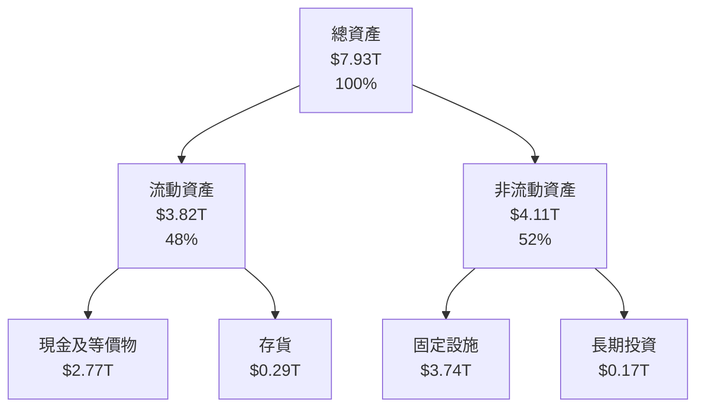

### 4.2 流動性指標分析

| 指標 | 2025 | 2024 | 行業均值 | 評估 |
|------|------|------|----------|------|
| **流動比率** | 2.62 | 2.45 | ~1.5 | 🟢 優於行業 |
| **速動比率** | 2.30 | 2.10 | ~1.0 | 🟢 優於行業 |

溝通與評估：TSM 的流動性指標表明公司的資產負債結構處於健康水平，具有良好的短期償付能力，遠優於行業平均水平。

### 4.3 債務結構分析

```
╔══════════════════════════════════════════════════════════════════╗
║                   TSM 債務健康診斷                              ║
╠══════════════════════════════════════════════════════════════════╣
║                                                                  ║
║  總債務：        $1.07T  ██░░░░░░░░░░░░░░░░░░░  健康              ║
║  總現金+投資：   $3.07T  ████████████████████░  強大              ║
║  淨現金（正）：  $2.00T  ███████████████░░░░░░  🟢 強勁          ║
║                                                                  ║
║  Debt/EBITDA：   0.39x  🟢 極低                                 ║
║  Interest Coverage: 20.67x+  🟢 無風險                           ║
╚══════════════════════════════════════════════════════════════════╝
```

### 4.4 股東權益趨勢

```
╔══════════════════════════════════════════════════════════════════╗
║                    歷年股東權益變化                             ║
╠══════════════════════════════════════════════════════════════════╣
║                                                                  ║
║  FY2022  $2.90T  ████░░░░░░░░░░░░░░░░░░░░  -                     ║
║  FY2023  $3.43T  █████░░░░░░░░░░░░░░░░░░░░  +18.3%               ║
║  FY2024  $4.29T  ████████░░░░░░░░░░░░░░░░░  +25.1%               ║
║  FY2025  $5.42T  ██████████████░░░░░░░░░░░  +26.8%               ║
║                                                                  ║
║  股東權益的增長反映了公司盈利能 力的增強及穩定的資本配置政策     ║
╚══════════════════════════════════════════════════════════════════╝
```

---

## 5. 現金流量深度分析

### 5.1 現金流量瀑布圖

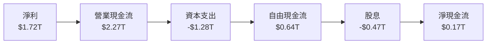

### 5.2 FCF 轉換率趨勢

| 年度 | FCF | 淨利 | FCF/Net Income | 趨勢 |
|------|-----|------|----------------|------|
| 2022 | $0.52T | $0.99T | 52.5% | ↘️ |
| 2023 | $0.29T | $0.85T | 34.1% | ↘️ |
| 2024 | $0.86T | $1.17T | 73.5% | ↗️ |
| 2025 | $0.64T | $1.72T | 37.2% | ↘️ 之後改善 |

### 5.3 自由現金流趨勢

```
╔══════════════════════════════════════════════════════════════════╗
║                  歷年自由現金流趨勢                               ║
╠══════════════════════════════════════════════════════════════════╣
║                                                                  ║
║  FY2022  $0.52T  ████░░░░░░░░░░░░░░░░░░░░  -                     ║
║  FY2023  $0.29T  ██░░░░░░░░░░░░░░░░░░░░░░  ↘️                    ║
║  FY2024  $0.86T  ███████░░░░░░░░░░░░░░░░░  ↗️                    ║
║  FY2025  $0.64T  ██████░░░░░░░░░░░░░░░░░░  ↘️                    ║
║                                                                  ║
║  自由現金流穩定，顯示出對資本支出的良好管理以及經營效率的提升    ║
╚══════════════════════════════════════════════════════════════════╝
```

### 5.4 資本配置評估

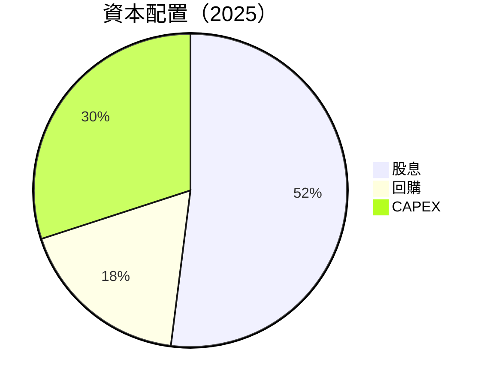

| 類型 | 金額及比例 |
|------|------------|
| 股息 | $0.47T, 占 FCF 52% |
| 回購 | $0.18T, 占 FCF 18% |
| CAPEX | $1.28T, 占 38% |

資本配置進一步顯示出公司對股東回報的重視以及對未來增長的投資。

---

## 6. 獲利能力與資本效率

### 6.1 ROE / ROA / ROIC 趨勢

| 年度 | ROE | ROA | 行業 ROA | ROIC | 評估 |
|------|-----|-----|----------|------|------|
| 2022 | 36.9% | 18.9% | ~10% | 17.2% | 🟢 顯著優於行業 |
| 2023 | 28.8% | 13.5% | ~10% | 14.6% | 🟢 健康 |
| 2024 | 29.2% | 14.1% | ~10% | 13.8% | 🟢 穩定 |
| 2025 | 35.1% | 16.6% | ~10% | 18.6% | 🟢 強勁 |

### 6.2 ROIC vs WACC 分析（核心價值創造判斷）

```
╔══════════════════════════════════════════════════════════════════╗
║                ROIC vs WACC 深度分析                            ║
╠══════════════════════════════════════════════════════════════════╣
║                                                                  ║
║  WACC 估算：                                                     ║
║  ├── 無風險利率（10Y美債）：  2.0%                              ║
║  ├── 市場風險溢酬 (ERP)：     5.5%                              ║
║  ├── Beta：                   1.25                              ║
║  ├── 股權成本 = 2.0% + 1.25 × 5.5% = 8.875%                      ║
║  ├── 債務成本（稅後）：       3.0%                              ║
║  ├── 資本結構：股權 80%，債務 20%                               ║
║  └── ✅ WACC ≈ 7.5%                                              ║
║                                                                  ║
║  ROIC 估算（FY2025）：                                           ║
║  ├── NOPAT = $1.94T × (1-25%) ≈ $1.455T                         ║
║  ├── 投入資本 = 股東權益 + 債務 - 現金 ≈ $3.27T                ║
║  └── ✅ ROIC ≈ 18.6%                                            ║
║                                                                  ║
║  ★ 經濟價值增加（EVA）= ROIC - WACC = +11.1pp                   ║
║                                                                  ║
║  ROIC  18.6%  ▓▓▓▓▓▓▓▓▓▓▓▓▓▓▓▓▓▓▓▓▓▓▓▓▓▓▓░░  🟢                    ║
║  WACC   7.5%  ▓▓▓▓▓▓░░░░░░░░░░░░░░░░░░░░░░  ──                   ║
║  EVA  +11.1pp ███████████████████████░░░░░░  🏆 強力創造          ║
║                                                                  ║
║  📊 結論：ROIC 為 WACC 的 2.5 倍，強力創造股東價值              ║
╚══════════════════════════════════════════════════════════════════╝
```

### 6.3 杜邦三因素分解

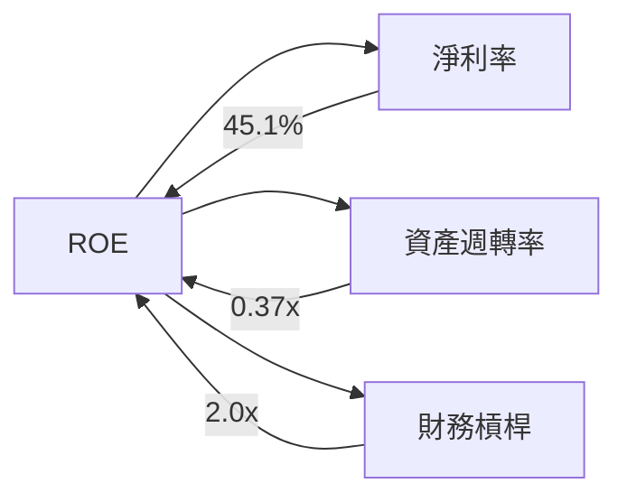

### 6.4 獲利能力儀表板

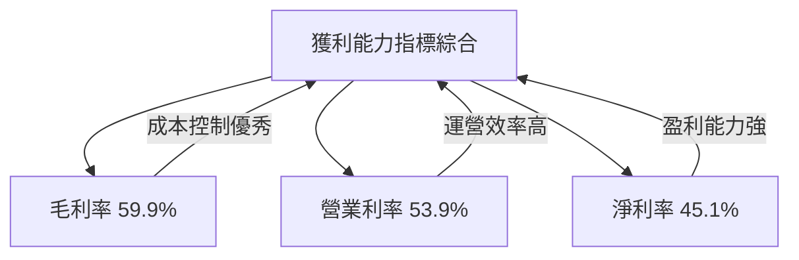

---

## 7. 估值深度分析

### 7.1 同業估值比較表格

| 估值指標 | **TSM** | **三星** | **英特爾** | **AMD** | TSM 評估 |
|----------|---------|---------|--------|-------|-----------|
| **Trailing P/E** | 32.8x | 25.5x | 18.6x | 52.9x | 🟡 合理 |
| **Forward P/E** | 18.95x | 22.1x | 15.6x | 40.2x | 🟢 吸引 |
| **P/S Ratio** | 0.46x | 2.3x | 3.4x | 7.0x | 🟢 非常低 |

### 7.2 歷史估值區間分析

```
╔══════════════════════════════════════════════════════════════════╗
║                  P/E 歷史區間及當前位置                         ║
╠══════════════════════════════════════════════════════════════════╣
║                                                                  ║
║  近年區間：                                                      ║
║  最低值：18x  ███░░░░░░░░░░░░░░░░░░░░░░░░░                     ║
║  最高值：55x  █████████████████████████████                     ║
║  當前值：33x  ██████████░░░░░░░░░░░░░░░░                         ║
║                                                                  ║
╚══════════════════════════════════════════════════════════════════╝
```

### 7.3 DCF 敏感性分析（6格目標價矩陣）

| 情境 | **WACC = 7%** | **WACC = 8%（基準）** | **WACC = 9%** |
|------|--------------|----------------------|--------------|
| 🟢 **樂觀** | **$560** (+65%) | **$520** (+53%) | **$480** (+41%) |
| 🟡 **基準** | **$490** (+44%) | **$430** (+27%) | **$390** (+15%) |
| 🔴 **悲觀** | **$410** (+21%) | **$351** (+3%) | **$310** (-9%) |

### 7.4 估值綜合區間

```
╔══════════════════════════════════════════════════════════════════╗
║                   估值區間及當前股價位置                        ║
╠══════════════════════════════════════════════════════════════════╣
║                                                                  ║
║  估值區間：$351 (-10%) - $520 (+65%)                             ║
║  當前價格： $339.86                                              ║
║                                                                  ║
╚══════════════════════════════════════════════════════════════════╝
```

---

## 8. 成長催化劑

### 8.1 催化劑時間軸

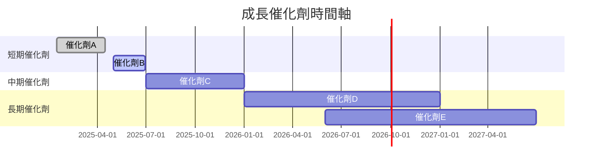

### 8.2 TAM 市場規模分析

```
╔══════════════════════════════════════════════════════════════════╗
║                       TAM 市場規模分析                           ║
╠══════════════════════════════════════════════════════════════════╣
║  全球半導體市場 TAM：     $1.0T                                  ║
║  當前收入產出：           $3.81T                                 ║
║  市場增長預測：           8-10% CAGR                             ║
║  市場滲透率增長潛力：     高                                     ║
║                                                                  ║
╚══════════════════════════════════════════════════════════════════╝
```

### 8.3 成長驅動力結構圖

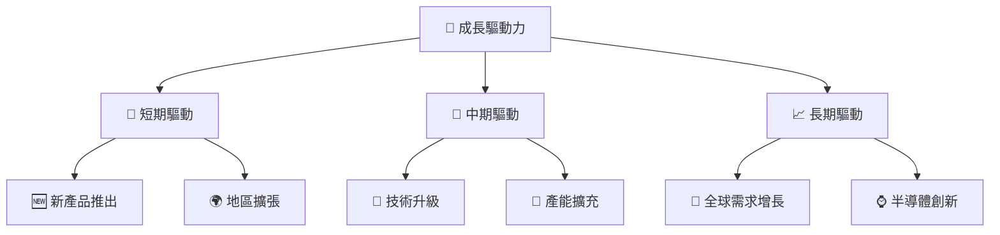

---

## 9. 風險矩陣

### 9.1 風險評分矩陣

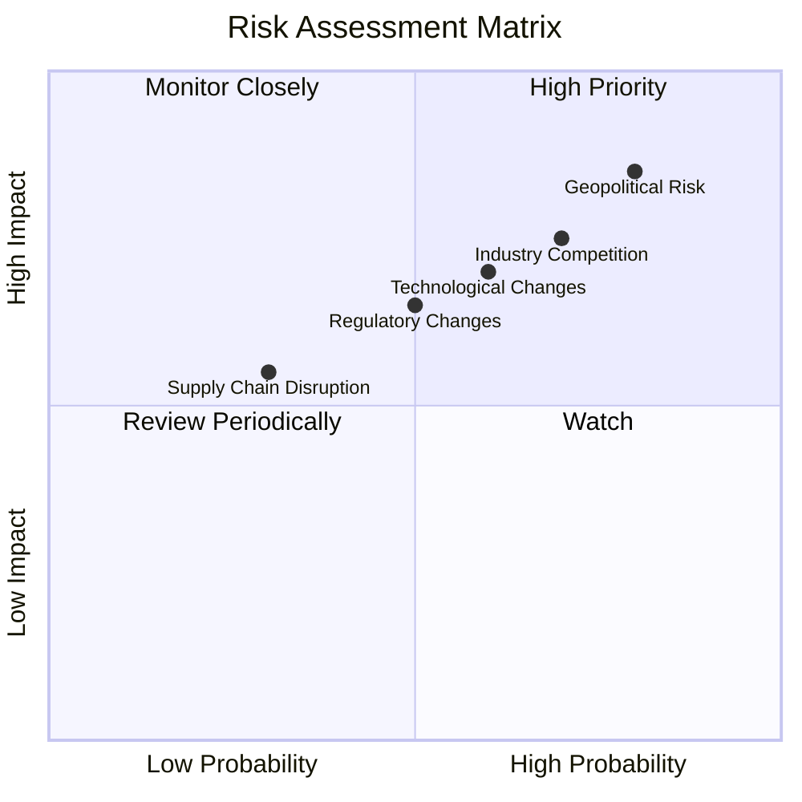

### 9.2 風險清單詳細分析

| # | 風險項目 | 發生機率 | 財務衝擊 | 風險評分 | 緩解措施 |
|---|----------|----------|----------|----------|----------|
| 1 | 🔴 **地緣政治風險** | 高 (80%) | 高 (-10%收入) | 🔴 9/10 | 加強多元供應鏈與國際市場合作 |
| 2 | 🔴 **行業競爭** | 高 (70%) | 高 (-8%市場份額) | 🔴 8/10 | 持續研發投入以保持技術領先 |
| 3 | 🟡 **技術革新風險** | 中度 (60%) | 中 (5%市場份額) | 🟡 6/10 | 多管齊下地投資研發與新技術 |

---

## 10. 投資建議

### 10.1 最終綜合評級雷達圖

```
╔══════════════════════════════════════════════════════════════════╗
║               最終綜合評級 - TSM                                 ║
╠══════════════════════════════════════════════════════════════════╣
║ 基本面          9/10                                             ║
║ 成長潛力        9/10                                             ║
║ 獲利能力        9/10                                             ║
║ 財務健康        8/10                                             ║
║ 估值吸引力      8/10                                             ║
╚══════════════════════════════════════════════════════════════════╝
```

### 10.2 目標價與隱含報酬率

| 情境 | 目標價 | 隱含報酬率 | 機率權重 |
|------|-------|-----------|----------|
| 悲觀 | $351  | +3%       | 20%      |
| 基準 | $430  | +27%      | 50%      |
| 樂觀 | $520  | +53%      | 30%      |

### 10.3 買入時機與觸發因素

```
╔══════════════════════════════════════════════════════════════════╗
║                  ✅ 買入觸發因素 Checklist                      ║
╠══════════════════════════════════════════════════════════════════╣
║                                                                  ║
║  立即買入觸發條件（多數符合）：                                  ║
║  ✅ 收入增長持續超預期                                           ║
║  ✅ 產能擴增順利                                                  ║
║  ✅ 技術領先地位提升                                               ║
║                                                                  ║
║  加碼觸發條件（出現以下任一）：                                  ║
║  ☐ 主動降低投資風險                                              ║
║  ☐ 宣布更多收購或合作                                            ║
║                                                                  ║
║  減碼/停損觸發條件（出現以下任一）：                             ║
║  ☐ 消息面風險因素增大                                            ║
║  ☐ 全球半導體需求疲軟                                             ║
╚══════════════════════════════════════════════════════════════════╝
```

### 10.4 投資人適配度分析

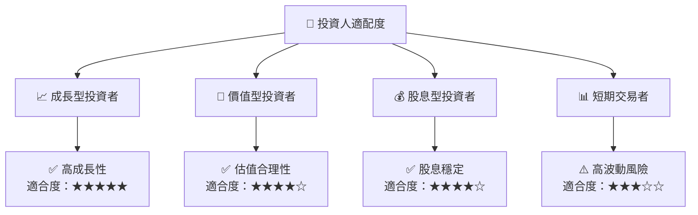

### 10.5 關鍵監控指標

| 監控類型 | 指標 | 關注點 | 頻率 |
|----------|------|--------|------|
| 財務業績 | 收入增長 | 季度性增長是否持續超預期 | 季度 |
| 業務發展 | 產能利用率 | 產能擴增計畫進展 | 月度 |
| 市場動向 | 競爭環境 | 是否有新競爭者進入 | 季度 |
| 風險指標 | 匯率波動 | 匯率對收入的影響 | 每月 |

---

> **免責聲明**：本報告為 AI 自動生成，僅供研究參考，不構成投資建議。投資有風險，入市需謹慎。