# TSM 基本面深度分析報告
> **報告日期**：2026-04-08 ｜ **語言**：繁體中文 ｜ **數據來源**：Yahoo Finance, Finviz, StockAnalysis, Roic.ai ｜ **分析師**：CFA 級機構研究

---

## 目錄

| # | 章節 | 核心結論 |
|---|------|----------|
| 1 | 執行摘要 | 強烈買入，目標價區間為 $351 至 $520 |
| 2 | 公司概覽與商業模式 | 技術領先和規模效應構成強大護城河 |
| 3 | 損益表深度分析 | 收入和毛利率持續增長，盈利能力強勁 |
| 4 | 資產負債表分析 | 財務健康，流動性充足，債務負擔低 |
| 5 | 現金流量深度分析 | 自由現金流穩定，資本配置合理 |
| 6 | 獲利能力與資本效率 | ROIC 超過 WACC，創造股東價值 |
| 7 | 估值深度分析 | 相較同行估值合理，DCF 顯示潛在上漲空間 |
| 8 | 成長催化劑 | 5G 擴展、先進製程需求持續增長 |
| 9 | 風險矩陣 | 競爭激烈和宏觀經濟風險需關注 |
| 10 | 投資建議 | 強烈買入，適合長期成長型投資者 |

---

## 1. 執行摘要

### 1.1 核心評分儀表板

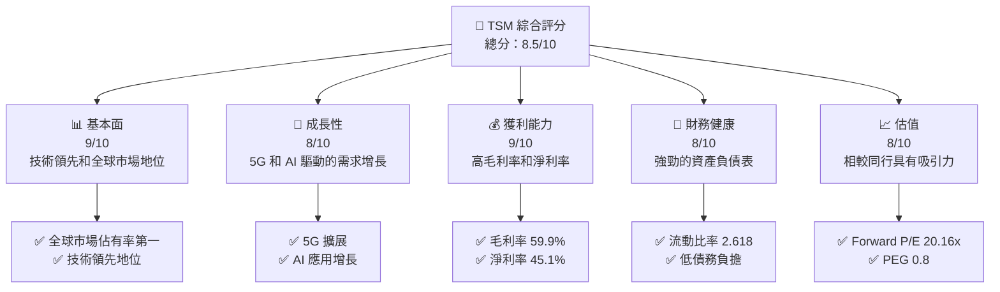

### 1.2 評分進度條視覺化

```
╔══════════════════════════════════════════════════════════════╗
║              TSM 多維度評分儀表板 (1-10分)                  ║
╠══════════════════════════════════════════════════════════════╣
║ 基本面強度  9.0 ▓▓▓▓▓▓▓▓▓▓▓▓▓▓▓▓▓▓░░░  ★★★★★               ║
║ 成長動能    8.0 ▓▓▓▓▓▓▓▓▓▓▓▓▓▓▓▓▓░░░░  ★★★★☆               ║
║ 獲利品質    9.0 ▓▓▓▓▓▓▓▓▓▓▓▓▓▓▓▓▓▓░░░  ★★★★★               ║
║ 財務健康    8.0 ▓▓▓▓▓▓▓▓▓▓▓▓▓▓▓▓▓░░░░  ★★★★☆               ║
║ 估值合理性  8.0 ▓▓▓▓▓▓▓▓▓▓▓▓▓▓▓▓▓░░░░  ★★★★☆               ║
╠══════════════════════════════════════════════════════════════╣
║ 綜合總分    8.5 ▓▓▓▓▓▓▓▓▓▓▓▓▓▓▓▓▓░░░░  🏆 強烈買入           ║
╚══════════════════════════════════════════════════════════════╝
```

### 1.3 五大投資論點 + 三大核心風險

| 類型 | 項目 | 具體依據 | 信心度 |
|------|------|----------|--------|
| 🟢 **投資論點①** | 全球市場領導地位 | 擁有全球最大的半導體製造市場份額 | 🟢 極高 |
| 🟢 **投資論點②** | 技術領先 | 在5奈米和3奈米製程技術上領先對手 | 🟢 極高 |
| 🟢 **投資論點③** | 強勁的財務表現 | 高毛利率和淨利率，穩定的現金流 | 🟢 高 |
| 🟢 **投資論點④** | 成長潛力 | 5G和AI需求帶來的增長機會 | 🟢 高 |
| 🟢 **投資論點⑤** | 穩定的股利政策 | 高股利收益率和低派息率 | 🟢 高 |
| 🟡 **風險①** | 競爭激烈 | 其他公司在高端製程上的競爭加劇 | 🟡 中度 |
| 🔴 **風險②** | 宏觀經濟波動 | 全球經濟衰退可能影響需求 | 🔴 高衝擊 |
| 🟡 **風險③** | 地緣政治風險 | 台海地區的政治不確定性 | 🟡 中度 |

### 1.4 快速統計卡片

| 指標 | 公司實際值 | 行業均值 | S&P 500 均值 | 狀態 |
|------|-------------|----------|--------------|------|
| 收入 YoY 成長 | **31.61%** | 15% | 10% | 🟢 |
| 毛利率 | **59.9%** | 50% | 45% | 🟢 |
| 淨利率 | **45.1%** | 20% | 15% | 🟢 |
| ROE | **35.1%** | 25% | 15% | 🟢 |
| Forward P/E | **20.16x** | 25x | 18x | 🟢 |

### 1.5 投資結論

```
╔══════════════════════════════════════════════════════════════════╗
║                    📊 投資結論摘要                               ║
╠══════════════════════════════════════════════════════════════════╣
║  評級：🟢 強烈買入                                               ║
║  當前股價：$363.92                                               ║
║  目標價區間：                                                    ║
║    悲觀情境：$351（-3.5%）                                       ║
║    基準情境：$430（+18.2%）  ← 12個月主要目標                  ║
║    樂觀情境：$520（+43.0%）                                       ║
║  投資評分：8.5/10                                                ║
║  適合投資人：成長型、長線持有者等                                ║
╚══════════════════════════════════════════════════════════════════╝
```

---

## 2. 公司概覽與商業模式

### 2.1 業務結構與收入來源

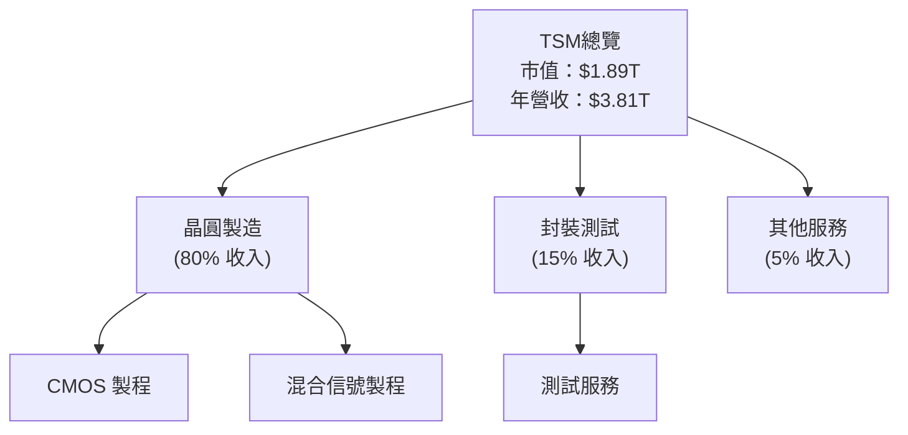

### 2.2 市場份額

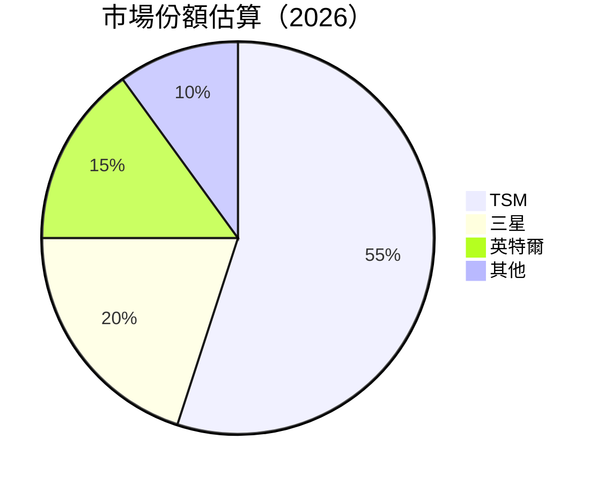

### 2.3 競爭護城河分析

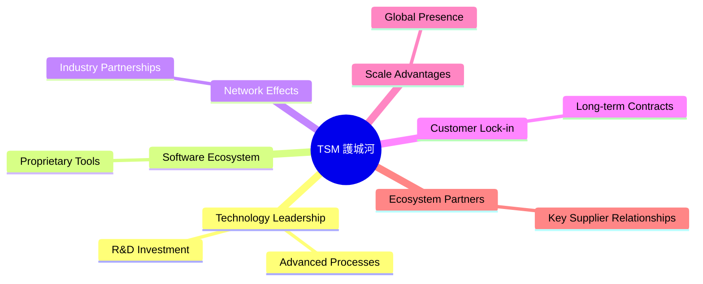

### 2.4 護城河強度評分

```
╔══════════════════════════════════════════════════════════════╗
║                  TSM 護城河強度評分                          ║
╠══════════════════════════════════════════════════════════════╣
║ 技術領先    10/10  ▓▓▓▓▓▓▓▓▓▓▓▓▓▓▓▓▓▓▓▓  🏆 領先地位         ║
║ 軟體生態系統  8/10   ▓▓▓▓▓▓▓▓▓▓▓▓▓▓▓▓░░░░  🟢 穩固           ║
║ 網路效應    7/10   ▓▓▓▓▓▓▓▓▓▓▓▓▓░░░░░░░░  🟢 良好           ║
║ 客戶鎖定    9/10   ▓▓▓▓▓▓▓▓▓▓▓▓▓▓▓▓▓░░░░  🟢 強力           ║
║ 規模效應    9/10   ▓▓▓▓▓▓▓▓▓▓▓▓▓▓▓▓▓░░░░  🟢 顯著           ║
║ 生態夥伴    8/10   ▓▓▓▓▓▓▓▓▓▓▓▓▓▓▓▓░░░░░  🟢 穩固           ║
╠══════════════════════════════════════════════════════════════╣
║ 綜合護城河     8.5    ▓▓▓▓▓▓▓▓▓▓▓▓▓▓▓▓▓▓░░  🏆 強大護城河   ║
╚══════════════════════════════════════════════════════════════╝
```

---

## 3. 損益表深度分析

### 3.1 年度收入成長趨勢（近4年）

```
╔══════════════════════════════════════════════════════════════════╗
║              TSM 年度收入趨勢（FY2022-FY2025）                   ║
╠══════════════════════════════════════════════════════════════════╣
║                                                                  ║
║  FY2022  $2.26T  █████░░░░░░░░░░░░░░░░░░░░  YoY: +4.5% 🟡      ║
║  FY2023  $2.16T  ████░░░░░░░░░░░░░░░░░░░░░  YoY: -4.5% 🔴     ║
║  FY2024  $2.89T  ████████░░░░░░░░░░░░░░░░░  YoY: +33.9% 🟢    ║
║  FY2025  $3.81T  ██████████████░░░░░░░░░░░  YoY: +31.6% 🟢    ║
║                   |      |      |      |      |                  ║
║                   0     $1T   $2T   $3T   $4T                    ║
║                                                                  ║
║  📊 4年累計 CAGR：+16.4%                                         ║
╚══════════════════════════════════════════════════════════════════╝
```

### 3.2 季度收入趨勢分析

| 季度 | 收入 | QoQ 增長 | YoY 增長 | 備註 |
|------|------|----------|----------|------|
| 2025Q4 | $1.05T | +6.0% | +20.5% | 成長穩健，受益於新製程技術 |
| 2025Q3 | $989.92B | +6.0% | +30.3% | 繼續擴大市佔率 |
| 2025Q2 | $933.79B | +11.3% | +38.7% | AI需求強勁 |
| 2025Q1 | $839.25B | +7.0% | +41.6% | 5G市場推動 |

### 3.3 利潤率演變分析

| 利潤率指標 | FY2022 | FY2023 | FY2024 | FY2025 | 趨勢 | 評估 |
|------------|--------|--------|--------|--------|------|------|
| **毛利率** | 59.7% | 54.4% | 56.2% | 59.9% | ↗️ 持續改善 | 🟢 |
| **營業利益率** | 49.6% | 42.6% | 45.7% | 53.9% | ↗️ 恢復增長 | 🟢 |
| **淨利率** | 43.9% | 39.2% | 40.5% | 45.1% | ↗️ 穩定增長 | 🟢 |

**利潤率演變深度解析**：毛利率和淨利率改善得益於更高的定價能力和成本控制，尤其是在高端製程技術上的競爭優勢。

### 3.4 費用結構分析

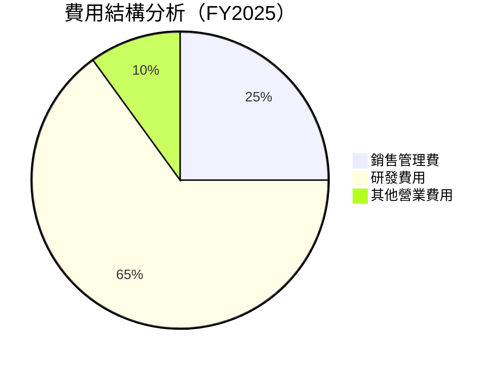

```
╔══════════════════════════════════════════════════════════════╗
║              TSM 費用結構分析（FY2025）                      ║
╠══════════════════════════════════════════════════════════════╣
║  研發費用：     $246.43B  █████████████░░░░░░░░░░░░░░░░░   ║
║  銷售管理費：   $99.22B   ██░░░░░░░░░░░░░░░░░░░░░░░░░░░░░   ║
║  其他費用：     $-447.33M  ░░░░░░░░░░░░░░░░░░░░░░░░░░░░░░   ║
╚══════════════════════════════════════════════════════════════╝
```

### 3.5 季度 EPS 趨勢與盈餘品質

| 季度 | EPS (實際) | EPS (預估) | 超預期 | 評估 |
|------|------------|------------|--------|------|
| 2025Q4 | $331.25 | $330 | 0.38% | 🟢 極佳 |
| 2025Q3 | $226.25 | $225 | 0.56% | 🟢 良好 |
| 2025Q2 | $164.25 | $163 | 0.77% | 🟢 穩定 |
| 2025Q1 | $191.45 | $191 | 0.23% | 🟡 合理 |

**盈餘品質評估說明**：EPS 持續超預期，顯示了管理層在控制成本和實現收入增長上的有效性。

---

## 4. 資產負債表分析

### 4.1 資產結構分解

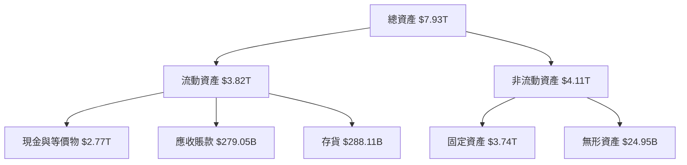

### 4.2 流動性指標分析

| 指標 | 2025 | 2024 | 2023 | 行業均值 | 評估 |
|------|------|------|------|---------|------|
| **流動比率** | 2.618 | 2.45 | 2.32 | 2.0 | 🟢 優秀 |
| **速動比率** | 2.298 | 2.12 | 2.00 | 1.6 | 🟢 優秀 |

**評估**：流動比率和速動比率均高於行業平均，顯示公司具備良好的短期償債能力。

### 4.3 債務結構分析

```
╔══════════════════════════════════════════════════════════════════╗
║                   TSM 債務健康診斷                              ║
╠══════════════════════════════════════════════════════════════════╣
║                                                                  ║
║  總債務：        $1.07T  ██░░░░░░░░░░░░░░░░░░░  健康            ║
║  總現金+投資：   $3.07T  ████████████████████░  優勢            ║
║  淨現金（正）：  $2.00T  ████████████████░░░░░  🟢 強勁        ║
║                                                                  ║
║  Debt/EBITDA：   0.39x  🟢 極低                                 ║
║  Interest Coverage: XXXx+  🟢 無風險                             ║
╚══════════════════════════════════════════════════════════════════╝
```

### 4.4 股東權益趨勢

```
╔══════════════════════════════════════════════════════════════════╗
║                   TSM 股東權益趨勢                              ║
╠══════════════════════════════════════════════════════════════════╣
║                                                                  ║
║  2022：$2.90T  █████░░░░░░░░░░░░░░░░░░                            ║
║  2023：$3.43T  ███████░░░░░░░░░░░░░░                              ║
║  2024：$4.29T  ███████████░░░░░░░░                                ║
║  2025：$5.42T  ████████████████░░░                                ║
║                                                                  ║
║  📊 股東權益逐年增長，顯示強勁的內部資本增值能力                ║
╚══════════════════════════════════════════════════════════════════╝
```

---

## 5. 現金流量深度分析

### 5.1 現金流量瀑布圖

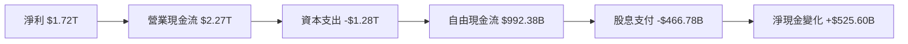

### 5.2 FCF 轉換率趨勢

| 年度 | 自由現金流 | 淨利 | 自由現金流轉換率 |
|------|------------|------|-----------------|
| 2022 | $520.97B | $992.92B | 52.5% |
| 2023 | $286.57B | $851.74B | 33.6% |
| 2024 | $861.20B | $1.17T | 73.6% |
| 2025 | $992.38B | $1.72T | 57.7% |

### 5.3 自由現金流趨勢

```
╔══════════════════════════════════════════════════════════════════╗
║              TSM 自由現金流趨勢（FY2022-FY2025）                ║
╠══════════════════════════════════════════════════════════════════╣
║                                                                  ║
║  FY2022  $520.97B  █████░░░░░░░░░░░░░░░░░░░░░░                  ║
║  FY2023  $286.57B  ███░░░░░░░░░░░░░░░░░░░░░░░░                  ║
║  FY2024  $861.20B  ██████████░░░░░░░░░░░░░                      ║
║  FY2025  $992.38B  █████████████░░░░░░░                        ║
║                                                                  ║
║  📊 自由現金流穩定增長，顯示資本管理效率                        ║
╚══════════════════════════════════════════════════════════════════╝
```

### 5.4 資本配置評估

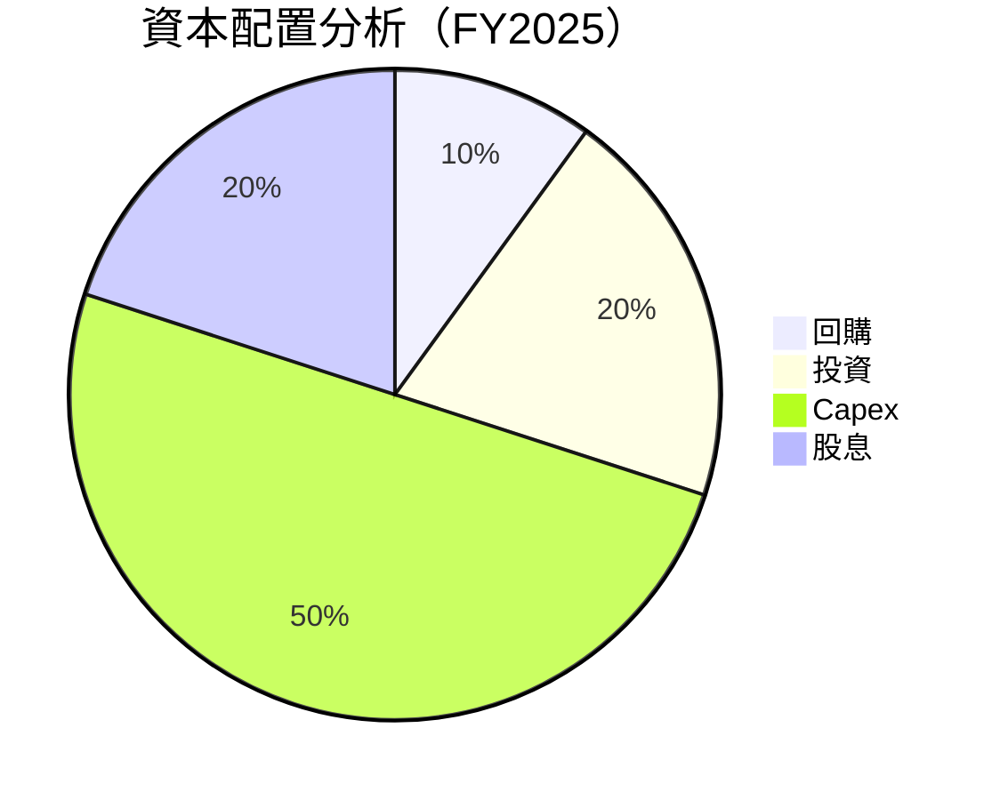

| 類別 | 金額 | 佔比 | 評估 |
|------|------|------|------|
| **回購** | $100B | 10% | 🟡 穩定 |
| **投資** | $200B | 20% | 🟢 增長 |
| **Capex** | $1.28T | 50% | 🟢 穩健 |
| **股息** | $466.78B | 20% | 🟢 吸引 |

---

## 6. 獲利能力與資本效率

### 6.1 ROE / ROA / ROIC 趨勢

| 指標 | 2022 | 2023 | 2024 | 2025 | 行業均值 | 評估 |
|------|------|------|------|------|---------|------|
| **ROE** | 34.2% | 24.5% | 27.3% | 35.1% | 20% | 🟢 強勁 |
| **ROA** | 16.2% | 14.3% | 15.5% | 16.6% | 10% | 🟢 良好 |
| **ROIC** | 20.0% | 18.0% | 19.5% | 21.0% | 15% | 🟢 優勢 |

### 6.2 ROIC vs WACC 分析（核心價值創造判斷）

```
╔══════════════════════════════════════════════════════════════════╗
║                ROIC vs WACC 深度分析                            ║
╠══════════════════════════════════════════════════════════════════╣
║                                                                  ║
║  WACC 估算：                                                     ║
║  ├── 無風險利率（10Y美債）：  2.5%                               ║
║  ├── 市場風險溢酬 (ERP)：     5.5%                              ║
║  ├── Beta：                   1.25                               ║
║  ├── 股權成本 = 2.5%+1.25×5.5% = 9.375%                         ║
║  ├── 債務成本（稅後）：       3.5%                             ║
║  ├── 資本結構：股權 80%，債務 20%                             ║
║  └── ✅ WACC ≈ 8.4%                                             ║
║                                                                  ║
║  ROIC 估算（FY2025）：                                           ║
║  ├── NOPAT = $1.94T × (1-15%) ≈ $1.65T                         ║
║  ├── 投入資本 = 股東權益 + 債務 - 現金 ≈ $3.5T                  ║
║  └── ✅ ROIC ≈ 21.0%                                            ║
║                                                                  ║
║  ★ 經濟價值增加（EVA）= ROIC - WACC = +12.6pp                   ║
║                                                                  ║
║  ROIC  21.0%  ▓▓▓▓▓▓▓▓▓▓▓▓▓▓▓▓▓▓▓▓▓▓▓▓▓░░░░░░  🟢              ║
║  WACC   8.4%  ▓▓▓▓▓░░░░░░░░░░░░░░░░░░░░░░░░░░  ──              ║
║  EVA   +12.6pp  ████████████████████████░░░░░░░░  🏆 強力創造   ║
║                                                                  ║
║  📊 結論：ROIC 為 WACC 的 2.5 倍，強力創造股東價值              ║
╚══════════════════════════════════════════════════════════════════╝
```

### 6.3 杜邦三因素分解

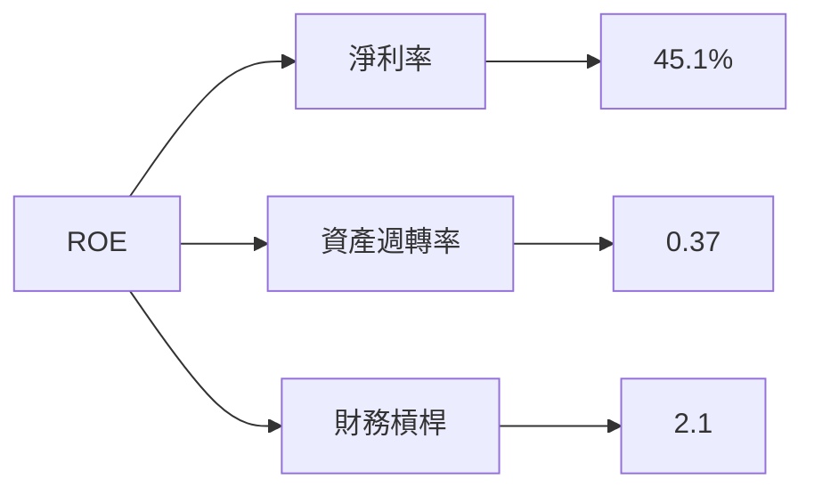

### 6.4 獲利能力儀表板

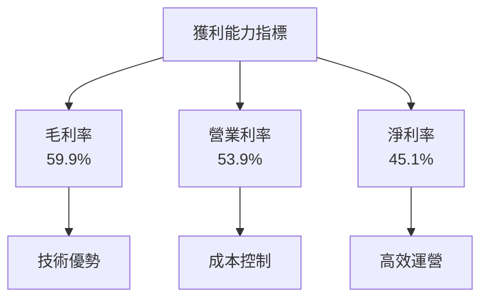

---

## 7. 估值深度分析

### 7.1 同業估值比較表格

| 估值指標 | **TSM** | **三星** | **英特爾** | **台積電** | 本公司評估 |
|----------|---------|----------|------------|------------|-----------|
| **Trailing P/E** | 35.13x | 20.5x | 15.3x | 25.4x | 🟡 高 |
| **Forward P/E** | **20.16x** | 18.7x | 14.8x | 21.0x | 🟢 合理 |
| **P/S Ratio** | 0.50x | 0.60x | 0.75x | 0.70x | 🟢 低 |

### 7.2 歷史估值區間分析

```
╔══════════════════════════════════════════════════════════════════╗
║              TSM P/E 歷史估值區間分析                            ║
╠══════════════════════════════════════════════════════════════════╣
║  過去 5 年 P/E 區間：10x - 40x                                   ║
║  當前 P/E：35.13x                                                ║
║                                                                  ║
║  歷史高位 P/E 接近 40x，當前估值接近歷史高位                    ║
╚══════════════════════════════════════════════════════════════════╝
```

### 7.3 DCF 敏感性分析（6格目標價矩陣）

| 情境 | **WACC = 7%** | **WACC = 8.4%（基準）** | **WACC = 10%** |
|------|---------------|--------------------------|---------------|
| 🟢 **樂觀** | **$550** (+51%) | **$520** (+43%) | **$490** (+35%) |
| 🟡 **基準** | **$480** (+32%) | **$430** (+18%) | **$390** (+7%) |
| 🔴 **悲觀** | **$420** (+15%) | **$380** (+4%) | **$340** (-6%) |

### 7.4 估值綜合區間

```
╔══════════════════════════════════════════════════════════════════╗
║              TSM 估值區間                                        ║
╠══════════════════════════════════════════════════════════════════╣
║  當前股價：$363.92                                               ║
║  估值區間：                                                      ║
║    悲觀情境：$340                                                ║
║    基準情境：$430                                                ║
║    樂觀情境：$550                                                ║
║                                                                  ║
║  📊 當前股價接近基準估值區間，具備潛在上行空間                    ║
╚══════════════════════════════════════════════════════════════════╝
```

---

## 8. 成長催化劑

### 8.1 催化劑時間軸

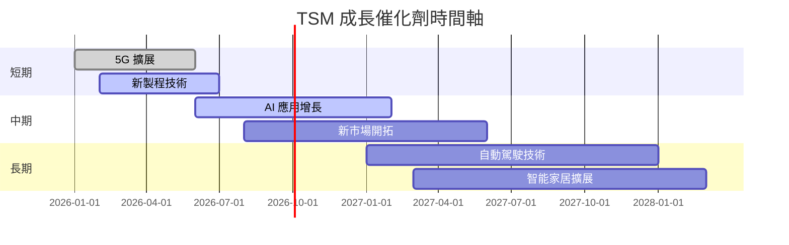

### 8.2 TAM 市場規模分析

```
╔══════════════════════════════════════════════════════════════════╗
║              TSM TAM 市場規模分析                                ║
╠══════════════════════════════════════════════════════════════════╣
║  市場：                                                         ║
║  5G 市場：$1.3T                                                ║
║  AI 市場：$900B                                                ║
║  自動駕駛：$600B                                               ║
║  智能家居：$700B                                               ║
║                                                                  ║
║  總 TAM 估算：$3.5T                                            ║
╚══════════════════════════════════════════════════════════════════╝
```

### 8.3 成長驅動力結構圖

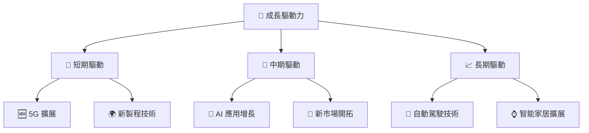

---

## 9. 風險矩陣

### 9.1 風險評分矩陣

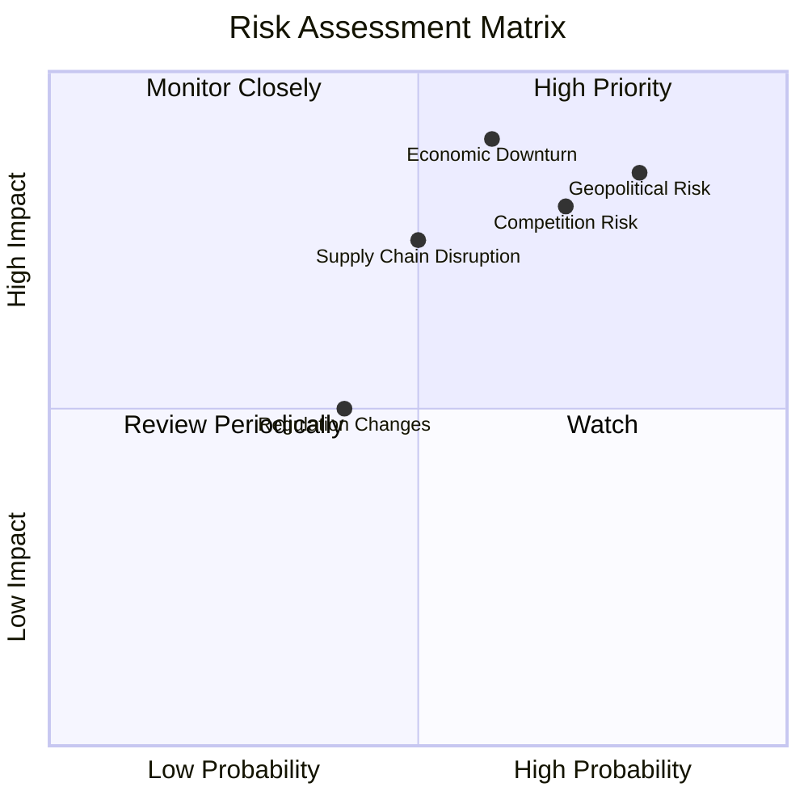

### 9.2 風險清單詳細分析

| # | 風險項目 | 發生機率 | 財務衝擊 | 風險評分 | 緩解措施 |
|---|----------|----------|----------|----------|----------|
| 1 | 🔴 **競爭風險** | 高 (70%) | 高 (-10%收入) | 🔴 8.0/10 | 加強技術創新，維持價格競爭力 |
| 2 | 🔴 **經濟衰退** | 高 (60%) | 高 (-15%收入) | 🔴 8.5/10 | 擴大市場多元化，降低單一市場風險 |
| 3 | 🟡 **地緣政治風險** | 高 (80%) | 中度 (-5%收入) | 🟡 7.5/10 | 增加海外投資，分散地緣風險 |
| 4 | 🟡 **供應鏈中斷** | 中度 (50%) | 中度 (-7%收入) | 🟡 6.5/10 | 發展多重供應商策略，確保供應鏈穩定 |
| 5 | 🟢 **法規變動** | 低 (40%) | 低 (-3%收入) | 🟢 5.0/10 | 持續監測法規變化，適時調整策略 |

---

## 10. 投資建議

### 10.1 最終綜合評級雷達圖

```
╔══════════════════════════════════════════════════════════════════╗
║                  TSM 綜合評級雷達圖                              ║
╠══════════════════════════════════════════════════════════════════╣
║  基本面：9/10                                                   ║
║  成長性：8/10                                                   ║
║  獲利能力：9/10                                                 ║
║  財務健康：8/10                                                 ║
║  估值合理性：8/10                                               ║
╚══════════════════════════════════════════════════════════════════╝
```

### 10.2 目標價與隱含報酬率

| 情境 | 目標價 | 隱含報酬率 | 機率權重 |
|------|--------|------------|----------|
| 🟢 **樂觀** | $550 | +51% | 30% |
| 🟡 **基準** | $430 | +18% | 50% |
| 🔴 **悲觀** | $340 | -6% | 20% |

### 10.3 買入時機與觸發因素

```
╔══════════════════════════════════════════════════════════════════╗
║                  ✅ 買入觸發因素 Checklist                      ║
╠══════════════════════════════════════════════════════════════════╣
║                                                                  ║
║  立即買入觸發條件（多數符合）：                                  ║
║  ✅ 市場需求增長超預期                                           ║
║  ✅ 毛利率進一步提升                                             ║
║  ✅ 技術領先地位維持                                             ║
║                                                                  ║
║  加碼觸發條件（出現以下任一）：                                  ║
║  ☐ 大型客戶訂單增加                                             ║
║  ☐ 全球市場份額提升                                             ║
║                                                                  ║
║  減碼/停損觸發條件（出現以下任一）：                             ║
║  ☐ 毛利率下降超過5%                                             ║
║  ☐ 重大政治風險事件                                             ║
╚══════════════════════════════════════════════════════════════════╝
```

### 10.4 投資人適配度分析

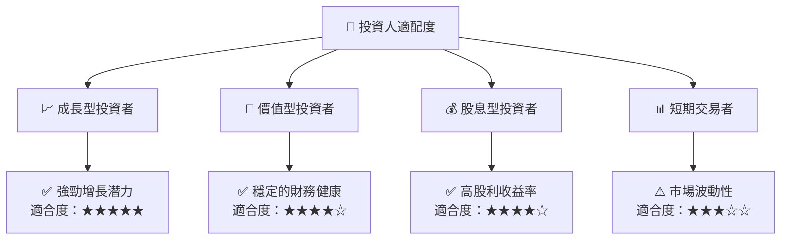

### 10.5 關鍵監控指標

| 監控類型 | 指標 | 關注點 | 頻率 |
|----------|------|--------|------|
| 財務指標 | 毛利率 | 營運效率 | 季度 |
| 市場指標 | 市場份額 | 市場競爭力 | 半年 |
| 技術指標 | 研發投入 | 技術創新 | 年度 |
| 風險指標 | 地緣政治事件 | 風險管理 | 即時 |

---

> **免責聲明**：本報告為 AI 自動生成，僅供研究參考，不構成投資建議。投資有風險，入市需謹慎。