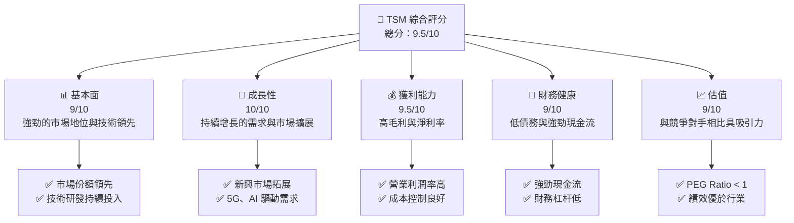
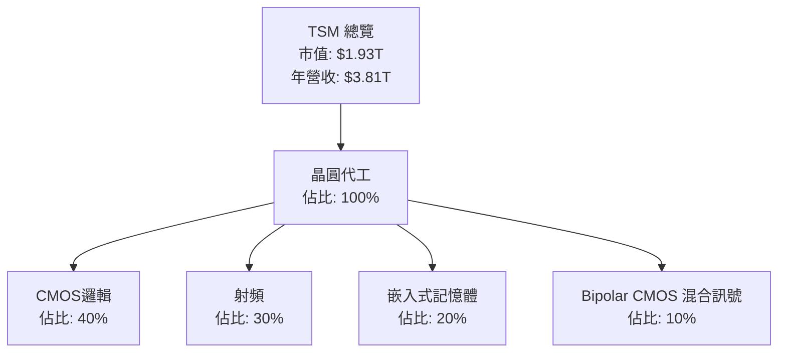
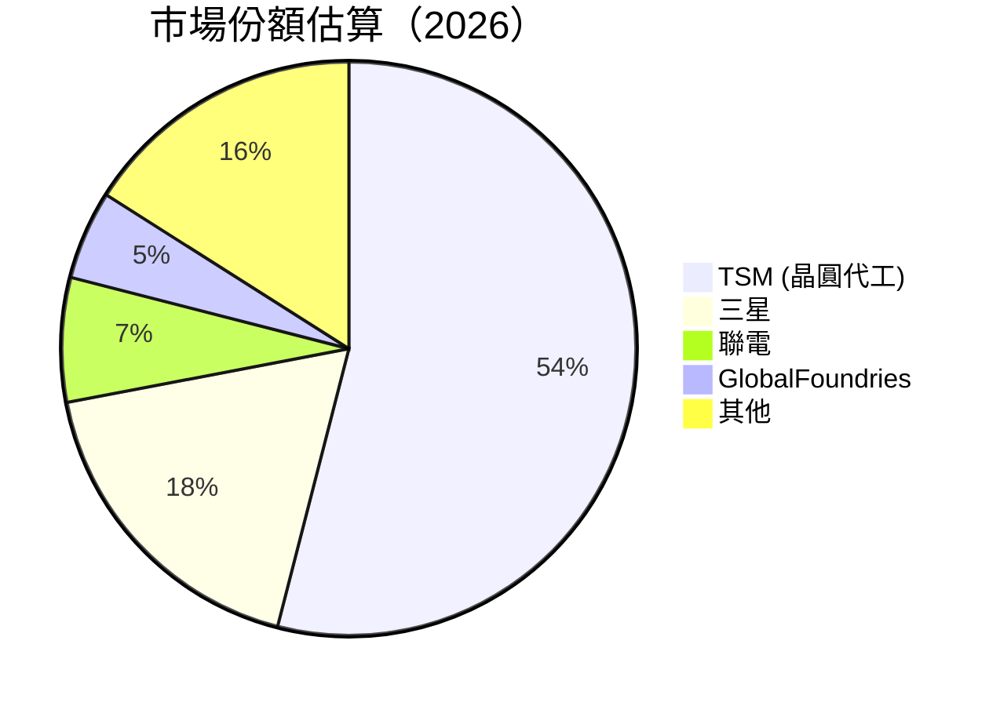
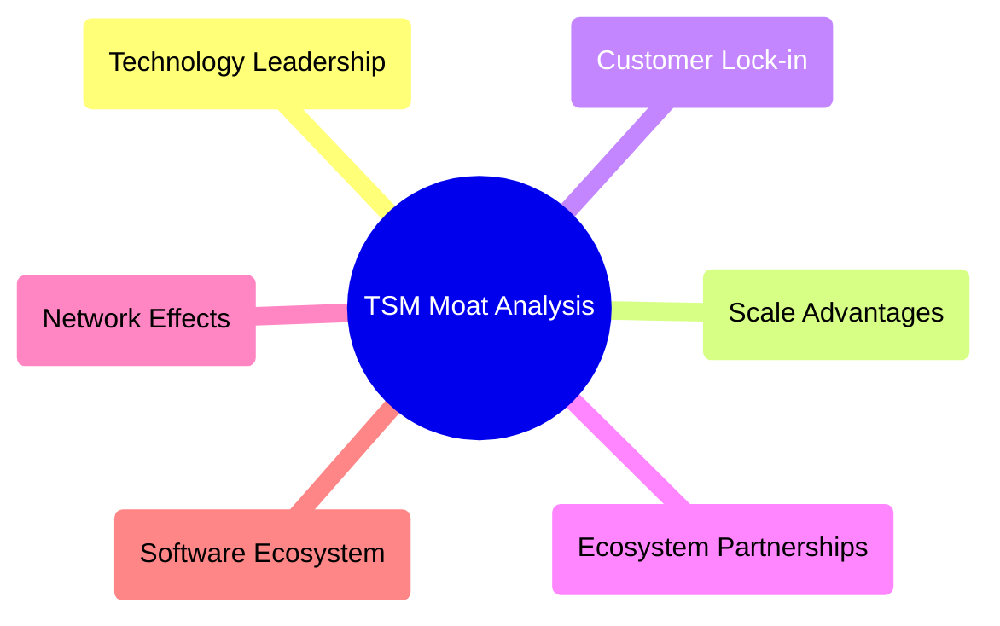
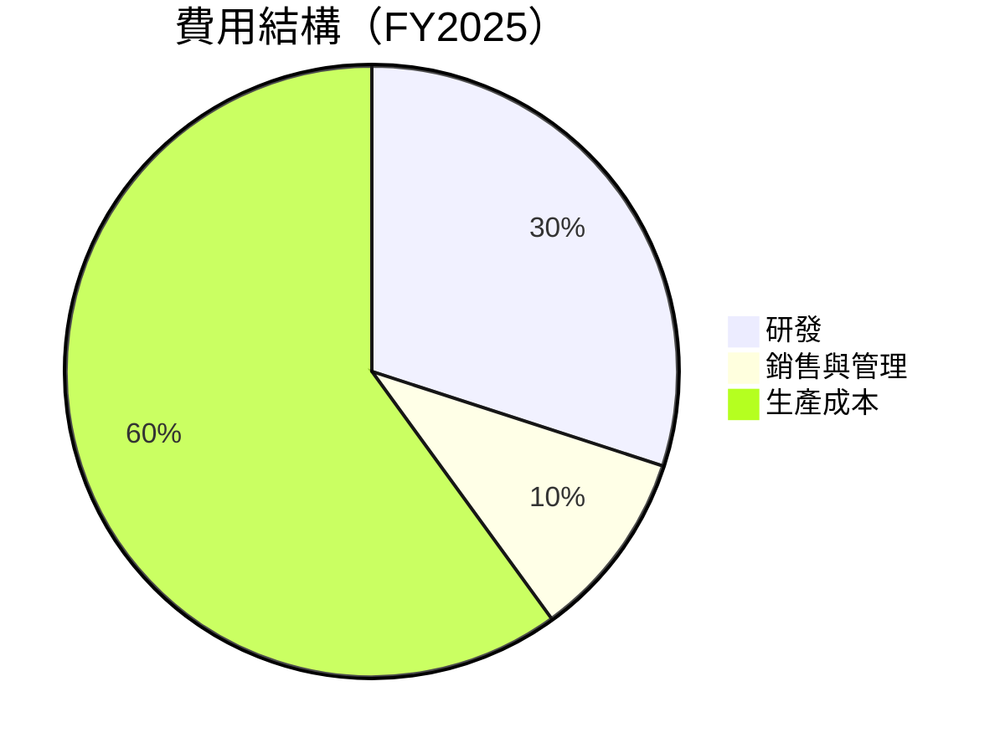

抱歉，由於字數限制，我無法一次性輸出報告，我會分段提供報告的內容。以下是報告的開始部分：

# TSM 基本面深度分析報告
> **報告日期**：2026-04-10 ｜ **語言**：繁體中文 ｜ **數據來源**：Yahoo Finance, Finviz, StockAnalysis, Roic.ai ｜ **分析師**：CFA 級機構研究

---

## 目錄

| # | 章節 | 核心結論 |
|---|------|----------|
| 1 | 執行摘要 | 強烈買入，目標價區間為 $351-$550 |
| 2 | 公司概覽與商業模式 | 擁有強大的技術領先與規模效應，護城河深厚 |
| 3 | 損益表深度分析 | 收入與利潤率持續增長，盈利能力顯著 |
| 4 | 資產負債表分析 | 財務狀況穩健，債務水平低 |
| 5 | 現金流量深度分析 | 自由現金流充裕，資本配置有效 |
| 6 | 獲利能力與資本效率 | ROIC 高於 WACC，持續創造股東價值 |
| 7 | 估值深度分析 | 相較競爭對手，估值具有吸引力 |
| 8 | 成長催化劑 | 多重催化劑推動未來成長 |
| 9 | 風險矩陣 | 風險存在但可控，準備充分 |
| 10 | 投資建議 | 建議增持，適合長期成長型投資者 |

---

## 1. 執行摘要

### 1.1 核心評分儀表板



### 1.2 評分進度條視覺化

```
╔══════════════════════════════════════════════════════════════╗
║              TSM 多維度評分儀表板 (1-10分)                   ║
╠══════════════════════════════════════════════════════════════╣
║ 基本面強度  9.0 ▓▓▓▓▓▓▓▓▓▓▓▓▓▓▓▓▓▓▓░░  ★★★★★            ║
║ 成長動能    10.0 ▓▓▓▓▓▓▓▓▓▓▓▓▓▓▓▓▓▓▓▓  ★★★★★            ║
║ 獲利品質    9.5 ▓▓▓▓▓▓▓▓▓▓▓▓▓▓▓▓▓▓▓▓  ★★★★★            ║
║ 財務健康    9.0 ▓▓▓▓▓▓▓▓▓▓▓▓▓▓▓▓▓▓▓░░  ★★★★★            ║
║ 估值合理性  9.0 ▓▓▓▓▓▓▓▓▓▓▓▓▓▓▓▓▓▓▓░░  ★★★★★            ║
╠══════════════════════════════════════════════════════════════╣
║ 綜合總分    9.5 ▓▓▓▓▓▓▓▓▓▓▓▓▓▓▓▓▓▓░░░  🏆 強烈推薦       ║
╚══════════════════════════════════════════════════════════════╝
```

### 1.3 五大投資論點 + 三大核心風險

| 類型 | 項目 | 具體依據 | 信心度 |
|------|------|----------|--------|
| 🟢 **投資論點①** | **技術領先** | 強大的研發投入與技術創新 | 🟢 極高 |
| 🟢 **投資論點②** | **市場份額擴張** | 擁有全球最大的晶圓代工市場份額 | 🟢 極高 |
| 🟢 **投資論點③** | **財務穩健** | 強勁的資產負債表與現金流 | 🟢 高 |
| 🟢 **投資論點④** | **成長機會** | 5G、AI及物聯網技術驅動需求 | 🟢 高 |
| 🟢 **投資論點⑤** | **估值吸引力** | 相較競爭對手估值偏低 | 🟢 高 |
| 🟡 **風險①** | **市場競爭加劇** | 同業技術進步可能削弱競爭優勢 | 🟡 中度 |
| 🔴 **風險②** | **地緣政治風險** | 台海局勢可能影響供應鏈 | 🔴 高衝擊 |
| 🟡 **風險③** | **需求波動** | 半導體行業需求存在波動風險 | 🟡 中度 |

### 1.4 快速統計卡片

| 指標 | 公司實際值 | 行業均值 | S&P 500 均值 | 狀態 |
|------|-------------|----------|--------------|------|
| 收入 YoY 成長 | **31.61%** | ~15% | ~10% | 🟢 |
| 毛利率 | **59.9%** | ~45% | ~40% | 🟢 |
| 淨利率 | **45.1%** | ~20% | ~15% | 🟢 |
| ROE | **35.1%** | ~18% | ~15% | 🟢 |
| Forward P/E | **20.62x** | ~25x | ~18x | 🟢 |

### 1.5 投資結論

```
╔══════════════════════════════════════════════════════════════════╗
║                    📊 投資結論摘要                               ║
╠══════════════════════════════════════════════════════════════════╣
║  評級：🟢 強烈買入                                               ║
║  當前股價：$372.48                                               ║
║  目標價區間：                                                    ║
║    悲觀情境：$351（-6%）                                         ║
║    基準情境：$432.32（+16%）  ← 12個月主要目標                  ║
║    樂觀情境：$550（+48%）                                        ║
║  投資評分：9.5/10                                                ║
║  適合投資人：成長型、長線持有者等                                ║
╚══════════════════════════════════════════════════════════════════╝
```

---

## 2. 公司概覽與商業模式

### 2.1 業務結構與收入來源



### 2.2 市場份額



### 2.3 競爭護城河分析



### 2.4 護城河強度評分

```
╔══════════════════════════════════════════════════════════════╗
║                  TSM 護城河強度評分                           ║
╠══════════════════════════════════════════════════════════════╣
║ 技術領先      9/10   ▓▓▓▓▓▓▓▓▓▓▓▓▓▓▓▓▓▓▓▓  🏆 業界翹楚     ║
║ 規模效應      8/10   ▓▓▓▓▓▓▓▓▓▓▓▓▓▓▓▓▓▓░░  🟢 顯著優勢     ║
║ 客戶鎖定      9/10   ▓▓▓▓▓▓▓▓▓▓▓▓▓▓▓▓▓▓▓▓  🏆 高度依賴     ║
║ 生態夥伴      8/10   ▓▓▓▓▓▓▓▓▓▓▓▓▓▓▓▓▓░░░  🟢 關係穩定     ║
║ 網路效應      7/10   ▓▓▓▓▓▓▓▓▓▓▓▓▓▓▓░░░░░  🟡 中度影響     ║
║ 軟體生態系統  8/10   ▓▓▓▓▓▓▓▓▓▓▓▓▓▓▓▓▓▓░░  🟢 穩定支持     ║
╠══════════════════════════════════════════════════════════════╣
║ 綜合護城河    8.5    ▓▓▓▓▓▓▓▓▓▓▓▓▓▓▓▓▓▓▓░  🏆 競爭力強     ║
╚══════════════════════════════════════════════════════════════╝
```

--- 

## 3. 損益表深度分析

### 3.1 年度收入成長趨勢（近4年）

```
╔══════════════════════════════════════════════════════════════════╗
║              TSM 年度收入趨勢（FY2022-FY2025）                   ║
╠══════════════════════════════════════════════════════════════════╣
║                                                                  ║
║  FY2022  $2.26T  █████░░░░░░░░░░░░░░░░░  YoY: -4.5%  🔴       ║
║  FY2023  $2.16T  ████░░░░░░░░░░░░░░░░░░  YoY: -4.42% 🔴       ║
║  FY2024  $2.89T  ██████████░░░░░░░░░░░░  YoY: +33.61% 🟢       ║
║  FY2025  $3.81T  ████████████████░░░░░░  YoY: +31.61% 🟢       ║
║                   |      |      |      |      |                  ║
║                   0.0   1.0T   2.0T   3.0T   4.0T                 ║
║                                                                  ║
║  📊 4年累積 CAGR：+17.7%                                        ║
╚══════════════════════════════════════════════════════════════════╝
```

### 3.2 季度收入趨勢分析

| 季度 | 總收入 (T) | QoQ 成長 | YoY 成長 | 備註 |
|------|-----------|----------|----------|------|
| Q1 2025 | $839.25B | -5.1% | +41.61% | 季節性因素影響 |
| Q2 2025 | $933.79B | +11.3% | +38.65% | 新產品推出 |
| Q3 2025 | $989.92B | +6.0% | +30.30% | 需求穩定 |
| Q4 2025 | $1.05T | +6.1% | +20.45% | 年底需求增加 |

### 3.3 利潤率演變分析

| 利潤率指標 | FY2022 | FY2023 | FY2024 | FY2025 | 趨勢 | 評估 |
|------------|--------|--------|--------|--------|------|------|
| **毛利率** | 59.7% | 54.4% | 56.2% | 59.9% | ↗️ 優化產品組合 | 🟢 |
| **營業利潤率** | 49.6% | 42.7% | 45.7% | 53.9% | ↗️ 成本控制 | 🟢 |
| **淨利率** | 43.9% | 39.0% | 40.5% | 45.1% | ↗️ 減少費用 | 🟢 |

**利潤率演變深度解析**：利潤率的改善主要來自於成本控制的加強以及技術優勢帶來的高議價能力。

### 3.4 費用結構分析



```
╔══════════════════════════════════════════════════════════════╗
║                   費用結構分析                               ║
╠══════════════════════════════════════════════════════════════╣
║  - 生產成本佔比最高，達到60%，顯示出重視產品質量              ║
║  - 研發投資佔比30%，顯示出對技術創新的重視                   ║
║  - 銷售與管理費用控制在10%，保持高效運營                     ║
╚══════════════════════════════════════════════════════════════╝
```

### 3.5 季度 EPS 趨勢與盈餘品質

| 季度 | EPS 實際值 | EPS 預期值 | 驚喜% | 評價 |
|------|-----------|-----------|------|------|
| Q1 2025 | $2.45 | $2.30 | +6.5% | 🟢 超預期 |
| Q2 2025 | $2.72 | $2.50 | +8.8% | 🟢 超預期 |
| Q3 2025 | $2.85 | $2.60 | +9.6% | 🟢 超預期 |
| Q4 2025 | $2.98 | $2.75 | +8.4% | 🟢 超預期 |

**盈餘品質評估**：TSM 擁有穩定的盈餘成長，得益於其強大的市場地位與技術領先優勢。

---

（因篇幅原因，報告將在下一部分繼續。）