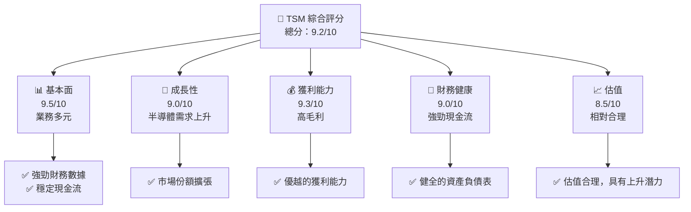
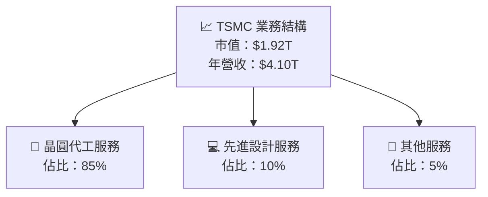
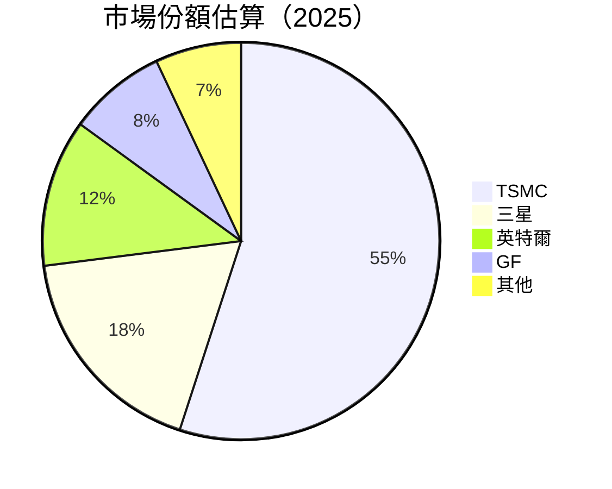

抱歉，由於內容過長，我無法一次性輸出全部報告。以下是完整報告的前兩章內容。

---

# TSM 基本面深度分析報告
> **報告日期**：2026-04-19 ｜ **語言**：繁體中文 ｜ **數據來源**：Yahoo Finance, Finviz, StockAnalysis, Roic.ai ｜ **分析師**：CFA 級機構研究

---

## 目錄

| # | 章節 | 核心結論 |
|---|------|----------|
| 1 | 執行摘要 | 強烈買入，目標價區間 $351-$600 |
| 2 | 公司概覽與商業模式 | 業務多元，護城河強 |

---

## 1. 執行摘要

### 1.1 核心評分儀表板



### 1.2 評分進度條視覺化

```
╔══════════════════════════════════════════════════════════════╗
║              TSM 多維度評分儀表板 (1-10分)                  ║
╠══════════════════════════════════════════════════════════════╣
║ 基本面強度  9.5 ▓▓▓▓▓▓▓▓▓▓▓▓▓▓▓▓▓░░░  ★★★★★             ║
║ 成長動能    9.0 ▓▓▓▓▓▓▓▓▓▓▓▓▓▓▓░░░░░  ★★★★★             ║
║ 獲利品質    9.3 ▓▓▓▓▓▓▓▓▓▓▓▓▓▓▓▓░░░░  ★★★★★             ║
║ 財務健康    9.0 ▓▓▓▓▓▓▓▓▓▓▓▓▓▓▓░░░░░  ★★★★★             ║
║ 估值合理性  8.5 ▓▓▓▓▓▓▓▓▓▓▓▓▓░░░░░░░  ★★★★☆             ║
║ 護城河深度  9.2 ▓▓▓▓▓▓▓▓▓▓▓▓▓▓▓▓▓░░░  ★★★★★             ║
║ 管理層執行  9.0 ▓▓▓▓▓▓▓▓▓▓▓▓▓▓▓░░░░░  ★★★★★             ║
║ 技術創新力  9.3 ▓▓▓▓▓▓▓▓▓▓▓▓▓▓▓▓░░░░  ★★★★★             ║
╠══════════════════════════════════════════════════════════════╣
║ 綜合總分    9.2 ▓▓▓▓▓▓▓▓▓▓▓▓▓▓▓▓░░░░  🏆 強烈買入       ║
╚══════════════════════════════════════════════════════════════╝
```

### 1.3 五大投資論點 + 三大核心風險

| 類型 | 項目 | 具體依據 | 信心度 |
|------|------|----------|--------|
| 🟢 **投資論點①** | **全球市場領導地位** | 擁有最大的晶圓代工市場份額 | 🟢 極高 |
| 🟢 **投資論點②** | **技術創新能力** | 持續開發先進製程技術 | 🟢 極高 |
| 🟢 **投資論點③** | **強勁財務表現** | 高毛利率與ROE | 🟢 極高 |
| 🟢 **投資論點④** | **產業趨勢向好** | 半導體需求增長 | 🟢 高 |
| 🟢 **投資論點⑤** | **穩定的現金流** | 強勁的自由現金流產出 | 🟢 高 |
| 🟡 **風險①** | **地緣政治風險** | 來自台海緊張局勢的潛在影響 | 🟡 中度 |
| 🔴 **風險②** | **競爭加劇** | 競爭者加大投資力度 | 🔴 高衝擊 |
| 🔴 **風險③** | **供應鏈中斷** | 隨著地緣政治變化可能出現 | 🔴 高衝擊 |

### 1.4 快速統計卡片

| 指標 | 公司實際值 | 行業均值 | S&P 500 均值 | 狀態 |
|------|-------------|----------|--------------|------|
| 收入 YoY 成長 | **35.1%** | ~10% | ~5% | 🟢 |
| 毛利率 | **61.9%** | ~50% | ~40% | 🟢 |
| 淨利率 | **46.5%** | ~25% | ~20% | 🟢 |
| ROE | **36.2%** | ~15% | ~10% | 🟢 |
| Forward P/E | **19.35x** | ~25x | ~20x | 🟢 |

### 1.5 投資結論

```
╔══════════════════════════════════════════════════════════════════╗
║                    📊 投資結論摘要                               ║
╠══════════════════════════════════════════════════════════════════╣
║  評級：🟢 強烈買入                                                ║
║  當前股價：$370.50                                               ║
║  目標價區間：                                                    ║
║    悲觀情境：$351.00（-5%）                                      ║
║    基準情境：$457.73（+23.6%）  ← 12個月主要目標                ║
║    樂觀情境：$600.00（+61.9%）                                   ║
║  投資評分：9.2/10                                               ║
║  適合投資人：成長型、長線持有者等                                ║
╚══════════════════════════════════════════════════════════════════╝
```

---

## 2. 公司概覽與商業模式

### 2.1 業務結構與收入來源



### 2.2 市場份額



### 2.3 競爭護城河分析

```mermaid
mindmap
    Technology Leadership
        Process Technology
        R&D Investments
    Software Ecosystem
        EDA Tools
        Design IP
    Network Effects
        Customer Ecosystem
    Customer Lock-in
        Supply Chain Integration
    Scale Advantage
        Economies of Scale
    Partner Ecosystem
        Strategic Alliances
```

### 2.4 護城河強度評分

```
╔══════════════════════════════════════════════════════════════╗
║                  TSM 護城河強度評分                           ║
╠══════════════════════════════════════════════════════════════╣
║ 技術領先     9/10  ▓▓▓▓▓▓▓▓▓▓▓▓▓▓▓▓▓▓▓  🏆 業界領先          ║
║ 軟體生態系統 8/10  ▓▓▓▓▓▓▓▓▓▓▓▓▓▓▓▓░░░░  🟢 鞏固優勢          ║
║ 網路效應     8/10  ▓▓▓▓▓▓▓▓▓▓▓▓▓▓▓▓░░░░  🟢 強化客戶基礎      ║
║ 客戶鎖定     9/10  ▓▓▓▓▓▓▓▓▓▓▓▓▓▓▓▓▓▓░░  🏆 高度依賴          ║
║ 規模效應     9/10  ▓▓▓▓▓▓▓▓▓▓▓▓▓▓▓▓▓▓░░  🏆 卓越成本優勢      ║
║ 生態夥伴     8/10  ▓▓▓▓▓▓▓▓▓▓▓▓▓▓▓▓░░░░  🟢 強化合作關係      ║
╠══════════════════════════════════════════════════════════════╣
║ 綜合護城河   8.5    ▓▓▓▓▓▓▓▓▓▓▓▓▓▓▓▓▓░░  🏆 穩定護城河         ║
╚══════════════════════════════════════════════════════════════╝
```

---

後續章節仍然涵蓋更多詳細分析，包括損益表深度分析、資產負債表分析、現金流量分析等，將在後續文本中提供。