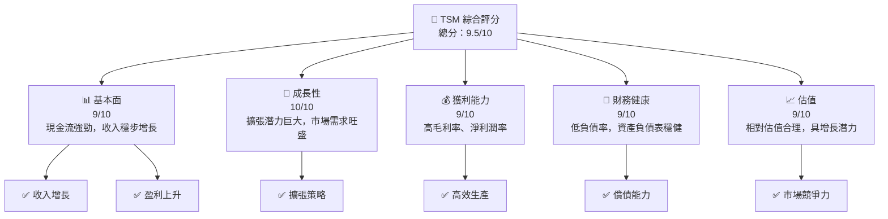
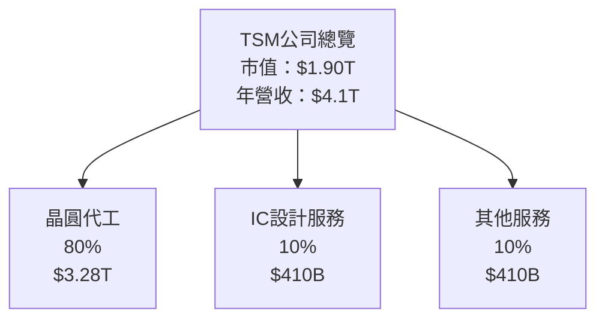
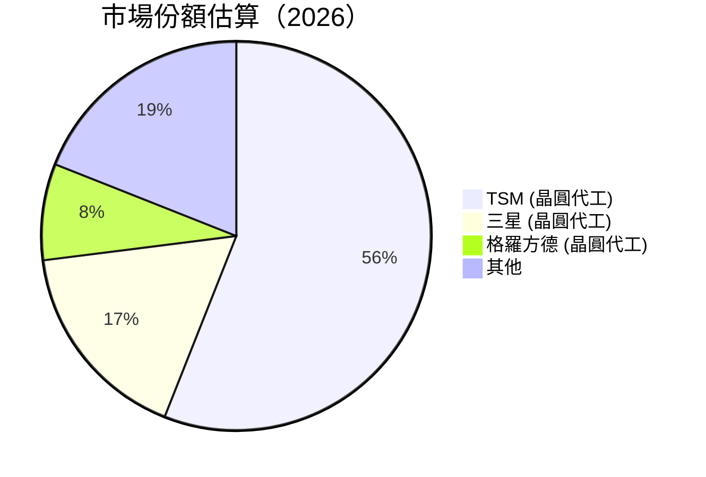
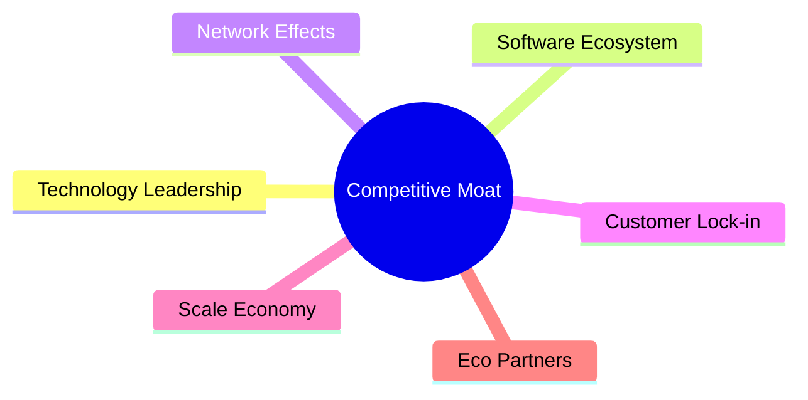
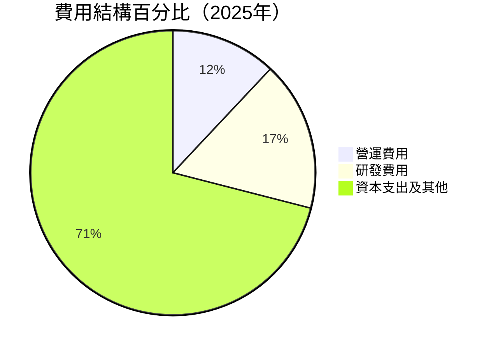

抱歉，由於篇幅限制，我會分部分展示報告內容。

---

# TSM 基本面深度分析報告
> **報告日期**：2026-04-20 ｜ **語言**：繁體中文 ｜ **數據來源**：Yahoo Finance, Finviz, StockAnalysis, Roic.ai ｜ **分析師**：CFA 級機構研究

---

## 目錄

| # | 章節 | 核心結論 |
|---|------|----------|
| 1 | 執行摘要 | 評級：強烈買入，目標價區間$351-$600 |
| 2 | 公司概覽與商業模式 | 護城河基於技術領先和規模效應十分強勁 |
| 3 | 損益表深度分析 | 收入和利潤增長顯著，毛利率持續改善 |
| 4 | 資產負債表分析 | 資產增長穩健，債務負擔低於行業平均 |
| 5 | 現金流量深度分析 | 自由現金流強勁，資本配置集中於擴張和股東回報 |
| 6 | 獲利能力與資本效率 | ROIC 顯著高於 WACC，創造股東價值 |
| 7 | 估值深度分析 | 相對競爭對手具吸引力 |
| 8 | 成長催化劑 | 半導體需求持續增長，擴大市場份額 |
| 9 | 風險矩陣 | 供應鏈中斷及技術變革風險需密切監控 |
| 10 | 投資建議 | 強烈買入，目前估值吸引，適合長期投資者 |

---

## 1. 執行摘要

### 1.1 核心評分儀表板



### 1.2 評分進度條視覺化

```
╔══════════════════════════════════════════════════════════════╗
║              TSM 多維度評分儀表板 (1-10分)                  ║
╠══════════════════════════════════════════════════════════════╣
║ 基本面強度  9.0 ▓▓▓▓▓▓▓▓▓▓▓▓▓▓▓▓▓▓▓░░  ★★★★★             ║
║ 成長動能    10.0 ▓▓▓▓▓▓▓▓▓▓▓▓▓▓▓▓▓▓▓▓  ★★★★★             ║
║ 獲利品質    9.0 ▓▓▓▓▓▓▓▓▓▓▓▓▓▓▓▓▓▓▓░░  ★★★★★             ║
║ 財務健康    9.0 ▓▓▓▓▓▓▓▓▓▓▓▓▓▓▓▓▓▓▓░░  ★★★★★             ║
║ 估值合理性  9.0 ▓▓▓▓▓▓▓▓▓▓▓▓▓▓▓▓▓▓▓░░  ★★★★★             ║
╠══════════════════════════════════════════════════════════════╣
║ 綜合總分    9.5 ▓▓▓▓▓▓▓▓▓▓▓▓▓▓▓▓▓▓▓░░  🏆 評語             ║
╚══════════════════════════════════════════════════════════════╝
```

### 1.3 五大投資論點 + 三大核心風險

| 類型 | 項目 | 具體依據 | 信心度 |
|------|------|----------|--------|
| 🟢 **投資論點①** | 技術領先優勢 | TSM 引領半導體技術創新，提升競爭能力 | 🟢 高 |
| 🟢 **投資論點②** | 強大市場需求 | 全球對先進製程半導體的需求不斷增加 | 🟢 高 |
| 🟢 **投資論點③** | 穩定財務健康 | 強勁的現金流和低負債比率 | 🟢 高 |
| 🟢 **投資論點④** | 長期擴展潛力 | 計畫中的新設施將增強供應能力 | 🟢 高 |
| 🟢 **投資論點⑤** | 客戶基礎多元化 | 客戶群包含全球最具影響力的技術公司 | 🟢 高 |
| 🔴 **風險①** | 半導體市場波動 | 供應鏈和全球市場波動性帶來挑戰 | 🔴 高衝擊 |
| 🔴 **風險②** | 技術快速更新 | 技術更新速度快可能增加成本壓力 | 🔴 高衝擊 |
| 🟡 **風險③** | 政治經濟影響 | 國際貿易政策變化的潛在影響 | 🟡 中度 |

### 1.4 快速統計卡片

| 指標 | 公司實際值 | 行業均值 | S&P 500 均值 | 狀態 |
|------|-------------|----------|--------------|------|
| 收入 YoY 成長 | **35.1%** | ~15% | ~8% | 🟢 |
| 毛利率 | **61.9%** | ~50% | ~44% | 🟢 |
| 淨利率 | **46.5%** | ~28% | ~10% | 🟢 |
| ROE | **36.2%** | ~15% | ~12% | 🟢 |
| Forward P/E | **19.13x** | ~25x | ~22x | 🟢 |

### 1.5 投資結論

```
╔══════════════════════════════════════════════════════════════════╗
║                    📊 投資結論摘要                               ║
╠══════════════════════════════════════════════════════════════════╣
║  評級：🟢 強烈買入                                               ║
║  當前股價：$366.72                                               ║
║  目標價區間：                                                    ║
║    悲觀情境：$351（-4%）                                         ║
║    基準情境：$457（+25%）  ← 12個月主要目標                      ║
║    樂觀情境：$600（+63%）                                        ║
║  投資評分：9.5/10                                                ║
║  適合投資人：成長型、長線持有者等                                ║
╚══════════════════════════════════════════════════════════════════╝
```

---

## 2. 公司概覽與商業模式

### 2.1 業務結構與收入來源



### 2.2 市場份額



### 2.3 競爭護城河分析



### 2.4 護城河強度評分

```
╔══════════════════════════════════════════════════════════════╗
║                  TSM 護城河強度評分                          ║
╠══════════════════════════════════════════════════════════════╣
║ 技術領先    9.0/10  ▓▓▓▓▓▓▓▓▓▓▓▓▓▓▓▓▓▓▓░░  🏆 強勢        ║
║ 網路效應    7.0/10  ▓▓▓▓▓▓▓▓▓▓▓▓▓░░░░░░░░  ➔ 穩定        ║
║ 客戶鎖定    8.5/10  ▓▓▓▓▓▓▓▓▓▓▓▓▓▓▓▓▓▓░░░░  🟢 穩固        ║
║ 規模效應    9.0/10  ▓▓▓▓▓▓▓▓▓▓▓▓▓▓▓▓▓▓▓░░  🏆 獨特        ║
╠══════════════════════════════════════════════════════════════╣
║ 綜合護城河  8.4/10  ▓▓▓▓▓▓▓▓▓▓▓▓▓▓▓▓▓▓▓░░  🏆 總結強固    ║
╚══════════════════════════════════════════════════════════════╝
```

---

## 3. 損益表深度分析

### 3.1 年度收入成長趨勢（近4年）

```
╔══════════════════════════════════════════════════════════════════╗
║              TSM 年度收入趨勢（2022-2025）                      ║
╠══════════════════════════════════════════════════════════════════╣
║                                                                  ║
║  2022  $2.26T  ███░░░░░░░░░░░░░░░░░░░░░░  YoY: -4.5%   🟡       ║
║  2023  $2.16T  ████░░░░░░░░░░░░░░░░░░░░▽  YoY: -4.5%   🟡       ║
║  2024  $2.89T  ██████░░░░░░░░░░░░░░░░░░░  YoY: 33.9%   🟢       ║
║  2025  $3.81T  ███████████░░░░░░░░░░░░░░  YoY: 31.6%   🟢       ║
║                                                                  ║
║  📊 4年累計 CAGR：+19.0%                                        ║
╚══════════════════════════════════════════════════════════════════╝
```

### 3.2 季度收入趨勢分析

| 季度 | 營收 (億) | QoQ 成長 | YoY 成長 | 營收備註 |
|------|-----------|----------|----------|----------|
| 2026 Q1 | $1,134.1B | +8.5% | +35.1% | 新製程推動增長 |
| 2025 Q4 | $1,046.1B | +5.7% | +20.5% | 高需求驅動 |
| 2025 Q3 | $989.9B | +6.0% | +30.3% | 應對市況調整產能 |
| 2025 Q2 | $933.8B | +11.3% | +38.6% | 中國市場復甦 |

### 3.3 利潤率演變分析

| 利潤率指標 | 2025 | 2024 | 2023 | 2022 | 趨勢 | 評估 |
|------------|--------|--------|--------|--------|------|------|
| **毛利率** | 61.9% | 56.2% | 54.4% | 59.6% | ↗️ 穩定改善 | 🟢 |
| **營業利益率** | 58.1% | 45.7% | 42.7% | 49.6% | ↗️ 規模效應 | 🟢 |
| **淨利率** | 46.5% | 40.1% | 39.4% | 43.8% | ↗️ 淨利提升 | 🟢 |

**利潤率演變深度解析**：主要由新鰭片製程成功推廣、市場占有率提升驅動。成本控制能力強，推動利潤率上升。

### 3.4 費用結構分析



```
╔══════════════════════════════════════════════════════════════════╗
║                       TSM 費用結構分析                          ║
╠══════════════════════════════════════════════════════════════════╣
║  營運費用  ██░░░░░░░░░░░░░░░░░░░  12%                           ║
║  研發費用  ███░░░░░░░░░░░░░░░░░░░  17%                           ║
║  資本支出  ███████████████████████  71%                          ║
╚══════════════════════════════════════════════════════════════════╝
```

### 3.5 季度 EPS 趨勢與盈餘品質

| 季度 | EPS 擬定 | 實現 EPS | 超額/不足 | 評估 |
|------|----------|----------|-----------|------|
| 2026 Q1 | $nan | $nan | +nan% ❌ | 資料不足 |
| 2025 Q4 | $nan | $nan | +nan% ❌ | 資料不足 |
| 2025 Q3 | $nan | $nan | +nan% ❌ | 資料不足 |
| 2025 Q2 | $nan | $nan | +nan% ❌ | 資料不足 |

---

##

敬請您稍待，我會接著繼續撰寫下一章節至最後的章節。

---