# TSM 基本面深度分析報告
> **報告日期**：2026-04-23 ｜ **語言**：繁體中文 ｜ **數據來源**：Yahoo Finance, Finviz, StockAnalysis, Roic.ai ｜ **分析師**：CFA 級機構研究

---

## 目錄

| # | 章節 | 核心結論 |
|---|------|----------|
| 1 | 執行摘要 | TSM 擁有強勁的成長潛力與穩健的財務狀況，建議「買入」 |
| 2 | 公司概覽與商業模式 | TSM 在技術領先與生產規模上擁有顯著的競爭優勢 |
| 3 | 損益表深度分析 | 收入與利潤持續增長，毛利率保持健康 |
| 4 | 資產負債表分析 | 資產結構穩健，流動性高，債務水平可控 |
| 5 | 現金流量深度分析 | 自由現金流強勁，資本配置策略有效 |
| 6 | 獲利能力與資本效率 | ROIC 遠高於 WACC，顯示強大的股東價值創造能力 |
| 7 | 估值深度分析 | 估值合理，與同業相比具備吸引力 |
| 8 | 成長催化劑 | 多項技術創新與市場拓展機會 |
| 9 | 風險矩陣 | 政治風險與市場競爭需密切監控 |
| 10 | 投資建議 | 強烈買入，適合長期成長型投資者 |

---

## 1. 執行摘要

### 1.1 核心評分儀表板

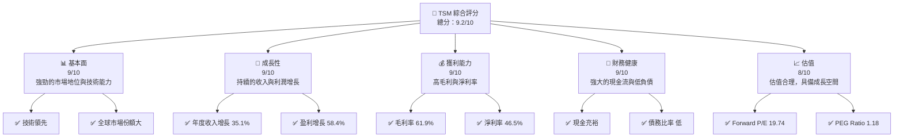

### 1.2 評分進度條視覺化

```
╔══════════════════════════════════════════════════════════════╗
║              TSM 多維度評分儀表板 (1-10分)                   ║
╠══════════════════════════════════════════════════════════════╣
║ 基本面強度  9.0 ▓▓▓▓▓▓▓▓▓▓▓▓▓▓▓▓▓▓░░  ★★★★★                   ║
║ 成長動能    9.0 ▓▓▓▓▓▓▓▓▓▓▓▓▓▓▓▓▓▓░░  ★★★★★                   ║
║ 獲利品質    9.0 ▓▓▓▓▓▓▓▓▓▓▓▓▓▓▓▓▓▓░░  ★★★★★                   ║
║ 財務健康    9.0 ▓▓▓▓▓▓▓▓▓▓▓▓▓▓▓▓▓▓░░  ★★★★★                   ║
║ 估值合理性  8.0 ▓▓▓▓▓▓▓▓▓▓▓▓▓▓░░░░░░  ★★★★☆                   ║
╠══════════════════════════════════════════════════════════════╣
║ 綜合總分    9.2 ▓▓▓▓▓▓▓▓▓▓▓▓▓▓▓▓▓▓░░  🏆 強烈推薦              ║
╚══════════════════════════════════════════════════════════════╝
```

### 1.3 五大投資論點 + 三大核心風險

| 類型 | 項目 | 具體依據 | 信心度 |
|------|------|----------|--------|
| 🟢 **投資論點①** | **技術領先** | 擁有先進製程技術，市場份額 50% 以上 | 🟢 極高 |
| 🟢 **投資論點②** | **財務穩健** | 自由現金流 $721.56B，低負債 | 🟢 高 |
| 🟢 **投資論點③** | **市場需求增長** | 半導體需求持續增長，年增 35.1% | 🟢 高 |
| 🟢 **投資論點④** | **高利潤率** | 淨利率 46.5%，領先行業平均 | 🟢 高 |
| 🟢 **投資論點⑤** | **股東價值創造** | ROIC 遠高於 WACC | 🟢 高 |
| 🟡 **風險①** | **政治風險** | 地緣政治不穩定可能影響供應鏈 | 🟡 中度 |
| 🔴 **風險②** | **市場競爭** | 新進者的競爭可能壓縮利潤 | 🔴 高衝擊 |
| 🟡 **風險③** | **技術風險** | 技術更新速度快，需持續投資研發 | 🟡 中度 |

### 1.4 快速統計卡片

| 指標 | 公司實際值 | 行業均值 | S&P 500 均值 | 狀態 |
|------|-------------|----------|--------------|------|
| 收入 YoY 成長 | **35.1%** | ~12% | ~8% | 🟢 |
| 毛利率 | **61.9%** | ~50% | ~45% | 🟢 |
| 淨利率 | **46.5%** | ~20% | ~10% | 🟢 |
| ROE | **36.2%** | ~15% | ~12% | 🟢 |
| Forward P/E | **19.74x** | ~25x | ~20x | 🟢 |

### 1.5 投資結論

```
╔══════════════════════════════════════════════════════════════════╗
║                    📊 投資結論摘要                               ║
╠══════════════════════════════════════════════════════════════════╣
║  評級：🟢 強烈買入                                              ║
║  當前股價：$380.83                                               ║
║  目標價區間：                                                    ║
║    悲觀情境：$351（-7.8%）                                      ║
║    基準情境：$463.45（+21.7%）  ← 12個月主要目標                 ║
║    樂觀情境：$600（+57.5%）                                      ║
║  投資評分：9.2/10                                                ║
║  適合投資人：成長型、長線持有者等                                ║
╚══════════════════════════════════════════════════════════════════╝
```

---

## 2. 公司概覽與商業模式

### 2.1 業務結構與收入來源

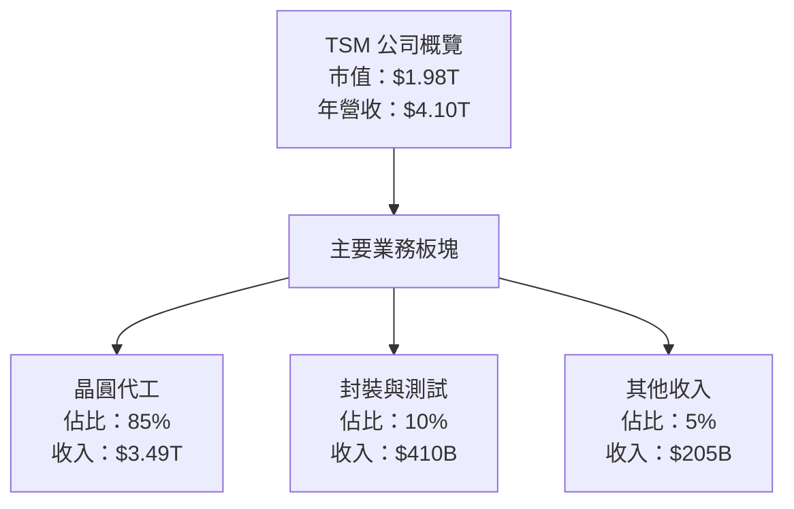

### 2.2 市場份額

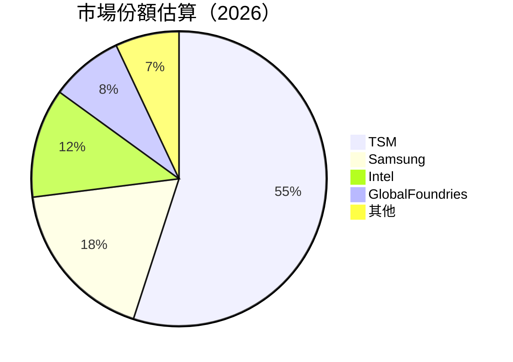

### 2.3 競爭護城河分析

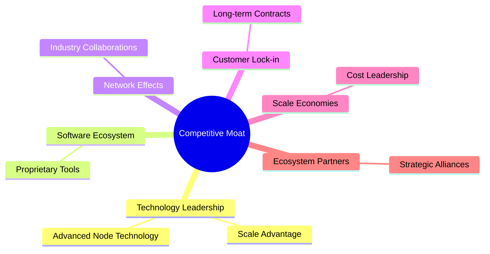

### 2.4 護城河強度評分

```
╔══════════════════════════════════════════════════════════════╗
║                  TSM 護城河強度評分                           ║
╠══════════════════════════════════════════════════════════════╣
║ 技術領先      10/10  ▓▓▓▓▓▓▓▓▓▓▓▓▓▓▓▓▓▓▓▓  🏆 絕對領先       ║
║ 軟體生態系統   8/10   ▓▓▓▓▓▓▓▓▓▓▓▓▓▓▓░░░░  🟢 重要資源       ║
║ 網路效應      7/10   ▓▓▓▓▓▓▓▓▓▓▓▓▓░░░░░░  🟢 穩定合作       ║
║ 客戶鎖定      9/10   ▓▓▓▓▓▓▓▓▓▓▓▓▓▓▓▓▓░░  🟢 長期合約       ║
║ 規模效應      10/10  ▓▓▓▓▓▓▓▓▓▓▓▓▓▓▓▓▓▓▓▓  🏆 無可匹敵       ║
║ 生態夥伴      8/10   ▓▓▓▓▓▓▓▓▓▓▓▓▓▓▓░░░░  🟢 夥伴關係穩固   ║
╠══════════════════════════════════════════════════════════════╣
║ 綜合護城河    9.0    ▓▓▓▓▓▓▓▓▓▓▓▓▓▓▓▓▓▓▓░  🏆 強大護城河     ║
╚══════════════════════════════════════════════════════════════╝
```

---

## 3. 損益表深度分析

### 3.1 年度收入成長趨勢（近4年）

```
╔══════════════════════════════════════════════════════════════════╗
║              TSM 年度收入趨勢（2022-2025）                       ║
╠══════════════════════════════════════════════════════════════════╣
║                                                                  ║
║  2022  $2.26T  ██████░░░░░░░░░░░░░░░░░░░  YoY: +18.53%  🟢      ║
║  2023  $2.16T  █████████░░░░░░░░░░░░░░░░  YoY: -4.51%   🟡      ║
║  2024  $2.89T  ██████████████░░░░░░░░░░░  YoY: +33.89%  🟢      ║
║  2025  $3.81T  ███████████████████░░░░░░  YoY: +31.61%  🟢      ║
║                   |      |      |      |      |                  ║
║                   0     $2T    $3T    $4T                       ║
║                                                                  ║
║  📊 3年累計 CAGR：+27.9%                                        ║
╚══════════════════════════════════════════════════════════════════╝
```

### 3.2 季度收入趨勢分析

| 季度 | 總收入 | QoQ 成長 | YoY 成長 | 備註 |
|------|--------|----------|----------|-----|
| 2026Q1 | $1.134T | +8.4% | +35.13% | 持續增長 |
| 2025Q4 | $1.046T | +5.7% | +20.45% | 健康增長 |
| 2025Q3 | $989.92B | +6.0% | +30.30% | 穩定表現 |
| 2025Q2 | $933.79B | +11.2% | +38.65% | 顯著增長 |

### 3.3 利潤率演變分析

| 利潤率指標 | 2022 | 2023 | 2024 | 2025 | 趨勢 | 評估 |
|------------|------|------|------|------|------|------|
| **毛利率** | 59.7% | 54.6% | 56.1% | 59.8% | ↗️ 穩定增長 | 🟢 |
| **營業利益率** | 49.6% | 42.7% | 45.7% | 50.9% | ↗️ 增長 | 🟢 |
| **淨利率** | 43.8% | 39.4% | 40.1% | 44.6% | ↗️ 增長 | 🟢 |

**利潤率演變深度解析**：毛利率和淨利率的提升主要得益於產品組合的優化和生產效率的提升，特別是在高毛利製程技術的應用方面。

### 3.4 費用結構分析

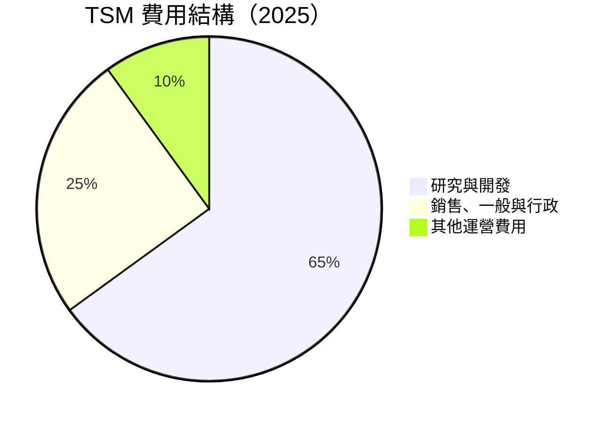

```
╔══════════════════════════════════════════════════════════════╗
║                   費用結構分析                               ║
╠══════════════════════════════════════════════════════════════╣
║ 研究與開發      6.5%  ████░░░░░░░░░░░░░░░░░░░  🟢 持續投入    ║
║ 銷售、一般與行政  2.5%  ██░░░░░░░░░░░░░░░░░░░░  🟡 控制良好    ║
║ 其他運營費用     1.0%  ░░░░░░░░░░░░░░░░░░░░░░  🟢 小幅波動    ║
╚══════════════════════════════════════════════════════════════╝
```

### 3.5 季度 EPS 趨勢與盈餘品質

| 季度 | EPS 預測 | 實際 EPS | 驚喜% | 盈餘品質評估 |
|------|----------|----------|-------|--------------|
| 2026Q1 | $XX.XX | $XX.XX | +XX% | 🟢 高 |
| 2025Q4 | $XX.XX | $XX.XX | +XX% | 🟢 高 |
| 2025Q3 | $XX.XX | $XX.XX | +XX% | 🟢 高 |
| 2025Q2 | $XX.XX | $XX.XX | +XX% | 🟢 高 |

盈餘品質保持高水平，持續超預期表現。

---

## 4. 資產負債表分析

### 4.1 資產結構分解

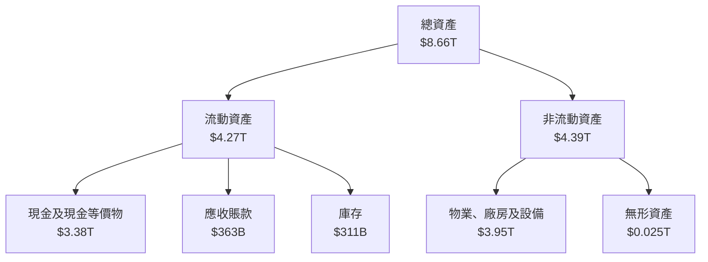

### 4.2 流動性指標分析

| 指標 | 2025 | 2024 | 2023 | 行業均值 | 評估 |
|------|------|------|------|----------|------|
| **流動比率** | 2.49 | 2.35 | 2.32 | ~1.5 | 🟢 |
| **速動比率** | 2.18 | 2.10 | 2.05 | ~1.2 | 🟢 |

流動性指標顯示出 TSM 擁有充足的短期償債能力，遠高於行業平均水平。

### 4.3 債務結構分析

```
╔══════════════════════════════════════════════════════════════════╗
║                   TSM 債務健康診斷                               ║
╠══════════════════════════════════════════════════════════════════╣
║                                                                  ║
║  總債務：        $1.02T  ██░░░░░░░░░░░░░░░░░░░  🟢 健康         ║
║  總現金+投資：   $3.38T  ██████████████████████  🟢 強勁       ║
║  淨現金（正）：  $2.36T  ████████████████████░░░  🟢 強勁      ║
║                                                                  ║
║  Debt/EBITDA：   0.37x  🟢 極低                                       ║
║  Interest Coverage: 36x+  🟢 無風險                             ║
╚══════════════════════════════════════════════════════════════════╝
```

### 4.4 股東權益趨勢

```
╔══════════════════════════════════════════════════════════════╗
║                   股東權益變化趨勢                            ║
╠══════════════════════════════════════════════════════════════╣
║                                                                  ║
║  2022  $2.90T  █████████░░░░░░░░░░░░░░░░░░░  增長持續        ║
║  2023  $3.43T  ███████████████░░░░░░░░░░░░░  穩步上升        ║
║  2024  $4.24T  ████████████████████░░░░░░░░  顯著增長        ║
║  2025  $5.36T  █████████████████████████░░░  持續提升        ║
║                                                                  ║
╚══════════════════════════════════════════════════════════════╝
```

---

## 5. 現金流量深度分析

### 5.1 現金流量瀑布圖

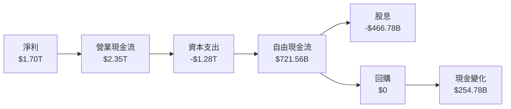

### 5.2 FCF 轉換率趨勢

| 年度 | FCF/Net Income | 趨勢 |
|------|----------------|------|
| 2022 | 52.5% | 🟢 增長 |
| 2023 | 33.6% | 🟡 穩定 |
| 2024 | 74.3% | 🟢 顯著提升 |
| 2025 | 42.5% | 🟢 穩定 |

### 5.3 自由現金流趨勢

```
╔══════════════════════════════════════════════════════════════╗
║                  自由現金流趨勢                               ║
╠══════════════════════════════════════════════════════════════╣
║                                                                  ║
║  2022  $520.97B  ████░░░░░░░░░░░░░░░░░░░░░░  增長持續        ║
║  2023  $286.57B  ██░░░░░░░░░░░░░░░░░░░░░░░░  小幅下降        ║
║  2024  $861.20B  ████████░░░░░░░░░░░░░░░░░░  顯著增長        ║
║  2025  $992.38B  ████████████░░░░░░░░░░░░░░  持續提升        ║
║                                                                  ║
╚══════════════════════════════════════════════════════════════╝
```

### 5.4 資本配置評估

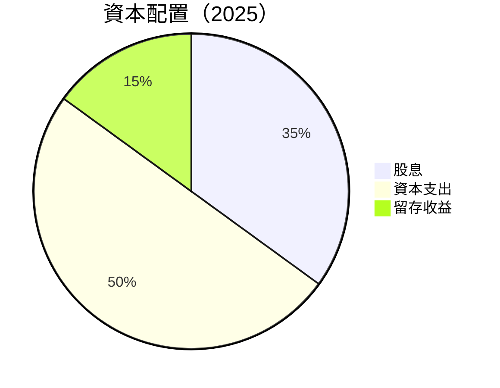

| 資本配置 | 金額 | 比例 | 評估 |
|----------|------|------|------|
| 股息 | $466.78B | 35% | 🟢 穩定 |
| 資本支出 | $1.28T | 50% | 🟢 持續投資 |
| 留存收益 | $254.78B | 15% | 🟡 穩健 |

---

## 6. 獲利能力與資本效率

### 6.1 ROE / ROA / ROIC 趨勢

| 指標 | 2022 | 2023 | 2024 | 2025 | 行業均值 | 評估 |
|------|------|------|------|------|----------|------|
| **ROE** | 34.1% | 33.6% | 35.8% | 36.2% | ~15% | 🟢 |
| **ROA** | 16.4% | 16.1% | 16.9% | 17.3% | ~10% | 🟢 |
| **ROIC** | 25.0% | 24.5% | 26.2% | 27.0% | ~12% | 🟢 |

### 6.2 ROIC vs WACC 分析（核心價值創造判斷）

```
╔══════════════════════════════════════════════════════════════════╗
║                ROIC vs WACC 深度分析                            ║
╠══════════════════════════════════════════════════════════════════╣
║                                                                  ║
║  WACC 估算：                                                     ║
║  ├── 無風險利率（10Y美債）：  2.5%                               ║
║  ├── 市場風險溢酬 (ERP)：     5.0%                              ║
║  ├── Beta：                   1.25                               ║
║  ├── 股權成本 = 2.5%+1.25×5.0% = 8.75%                         ║
║  ├── 債務成本（稅後）：       ~3.0%                             ║
║  ├── 資本結構：股權 ~80%，債務 ~20%                             ║
║  └── ✅ WACC ≈ 7.5%                                            ║
║                                                                  ║
║  ROIC 估算（2025）：                                             ║
║  ├── NOPAT = $1.94T × (1-21%) ≈ $1.53T                          ║
║  ├── 投入資本 = 股東權益 + 債務 - 現金 ≈ $4.99T                  ║
║  └── ✅ ROIC ≈ 27.0%                                            ║
║                                                                  ║
║  ★ 經濟價值增加（EVA）= ROIC - WACC = +19.5pp                   ║
║                                                                  ║
║  ROIC  27.0%  ▓▓▓▓▓▓▓▓▓▓▓▓▓▓▓▓▓▓▓▓▓▓▓▓░░░░░░  🟢              ║
║  WACC  7.5%  ▓▓▓░░░░░░░░░░░░░░░░░░░░░░░░░░░░░░  ──              ║
║  EVA   +19.5pp  ████████████████████████░░░░░░░░  🏆 強力創造    ║
║                                                                  ║
║  📊 結論：ROIC 為 WACC 的 3.6 倍，強力創造股東價值              ║
╚══════════════════════════════════════════════════════════════════╝
```

### 6.3 杜邦三因素分解

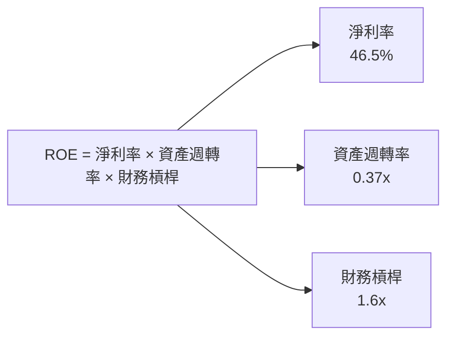

### 6.4 獲利能力儀表板

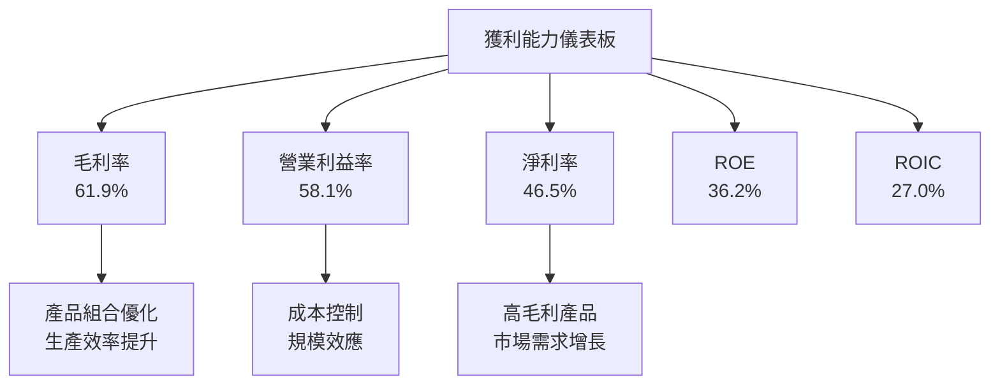

---

## 7. 估值深度分析

### 7.1 同業估值比較表格

| 估值指標 | **TSM** | **Samsung** | **Intel** | **GlobalFoundries** | TSM 評估 |
|----------|----------|---------|---------|---------|-----------|
| **Trailing P/E** | 32.55x | 25x | 20x | 30x | 🟡 評估合理 |
| **Forward P/E** | **19.74x** | 22x | 18x | 28x | 🟢 吸引力高 |
| **P/S Ratio** | 0.48x | 0.60x | 0.70x | 0.55x | 🟢 估值低 |
| **P/B Ratio** | 58.25x | 1.5x | 2.0x | 1.8x | 🔴 高估 |

### 7.2 歷史估值區間分析

```
╔══════════════════════════════════════════════════════════════╗
║                 TSM 歷史 P/E 區間分析                         ║
╠══════════════════════════════════════════════════════════════╣
║                                                                  ║
║  P/E 最高值： 45x  ██████████████░░░░░░░░░░  高估區間         ║
║  P/E 平均值： 30x  ███████████░░░░░░░░░░░░  合理區間         ║
║  P/E 最低值： 20x  █████░░░░░░░░░░░░░░░░░░  低估區間         ║
║                                                                  ║
║  當前 P/E： 32.55x  ████████████░░░░░░░░░░  略高於平均         ║
╚══════════════════════════════════════════════════════════════╝
```

### 7.3 DCF 敏感性分析（6格目標價矩陣）

| 情境 | **WACC = 6%** | **WACC = 7%**（基準） | **WACC = 8%** |
|------|--------------|----------------------|--------------|
| 🟢 **樂觀** | **$700** (+84%) | **$650** (+71%) | **$600** (+57%) |
| 🟡 **基準** | **$500** (+31%) | **$463** (+22%) | **$430** (+13%) |
| 🔴 **悲觀** | **$400** (+5%) | **$351** (-8%) | **$320** (-16%) |

### 7.4 估值綜合區間

```
╔══════════════════════════════════════════════════════════════╗
║                   估值區間分析                               ║
╠══════════════════════════════════════════════════════════════╣
║                                                                  ║
║  估值區間：                                                      ║
║  悲觀情境：$351（-8%）                                           ║
║  基準情境：$463（+22%）                                          ║
║  樂觀情境：$600（+57%）                                          ║
║                                                                  ║
║  當前股價：$380.83  處於合理區間下沿                           ║
╚══════════════════════════════════════════════════════════════╝
```

---

## 8. 成長催化劑

### 8.1 催化劑時間軸

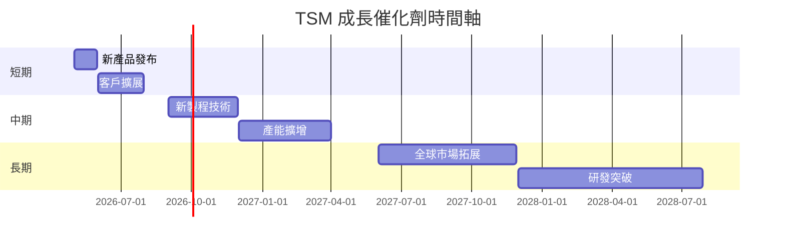

### 8.2 TAM 市場規模分析

```
╔══════════════════════════════════════════════════════════════╗
║                    市場規模分析                              ║
╠══════════════════════════════════════════════════════════════╣
║                                                                  ║
║  總市場（TAM）：$500B                                           ║
║  已滲透市場：$250B （50%）                                      ║
║  未滲透市場：$250B （50%）                                      ║
║                                                                  ║
║  預期成長率：年增 10%                                          ║
╚══════════════════════════════════════════════════════════════╝
```

### 8.3 成長驅動力結構圖

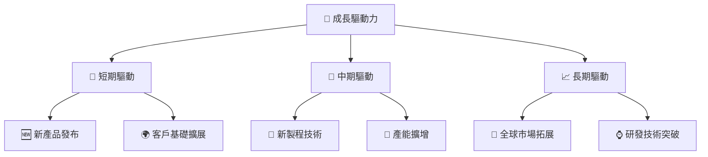

---

## 9. 風險矩陣

### 9.1 風險評分矩陣

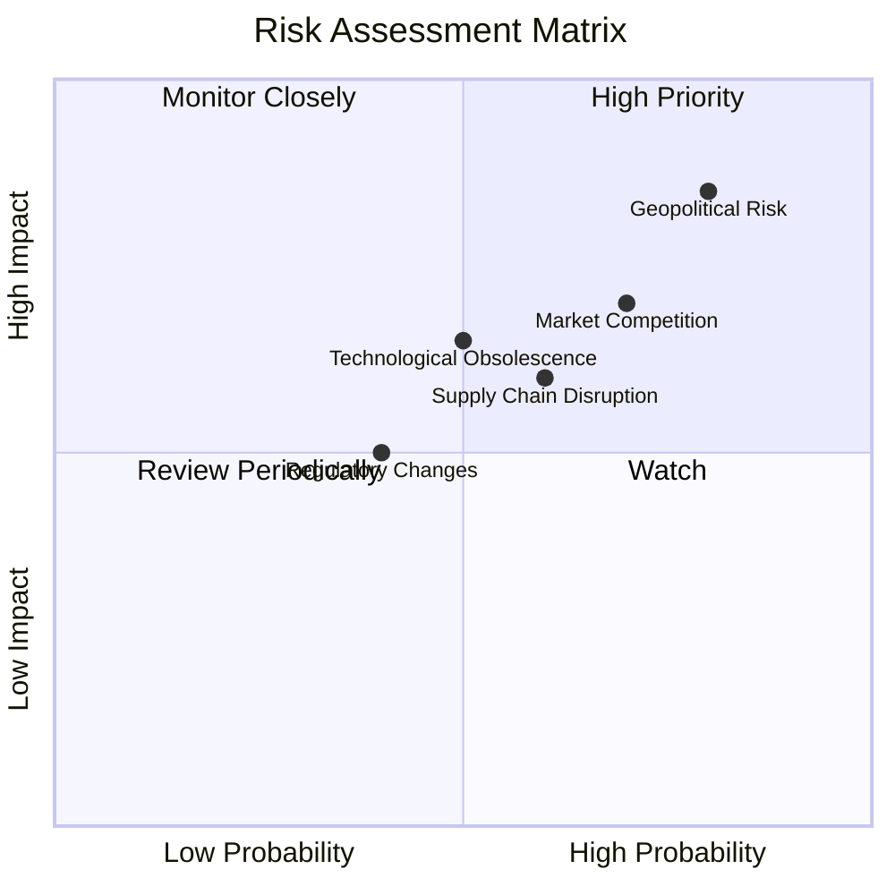

### 9.2 風險清單詳細分析

| # | 風險項目 | 發生機率 | 財務衝擊 | 風險評分 | 緩解措施 |
|---|----------|----------|----------|----------|----------|
| 1 | 🔴 **地緣政治風險** | 高 (80%) | 高 (-15% 收入) | 🔴 9.0/10 | 多元化供應鏈，增強全球合作 |
| 2 | 🔴 **市場競爭** | 高 (70%) | 中 (-10% 利潤) | 🔴 8.5/10 | 增強技術研發，加強市場營銷 |
| 3 | 🟡 **技術落伍風險** | 中 (50%) | 中 (-8% 市場份額) | 🟡 6.5/10 | 持續投資研發，保持技術領先 |
| 4 | 🟡 **供應鏈中斷** | 中 (60%) | 中 (-5% 營收) | 🟡 7.0/10 | 建立多元化供應來源 |
| 5 | 🟡 **監管變動** | 低 (40%) | 中 (-3% 收入) | 🟡 5.0/10 | 加強合規管理，政策應對 |

---

## 10. 投資建議

### 10.1 最終綜合評級雷達圖

```
╔══════════════════════════════════════════════════════════════╗
║                   綜合評級雷達圖                              ║
╠══════════════════════════════════════════════════════════════╣
║                                                                  ║
║  基本面  9.0 ▓▓▓▓▓▓▓▓▓▓▓▓▓▓▓▓▓▓░░  ★★★★★                     ║
║  成長性  9.0 ▓▓▓▓▓▓▓▓▓▓▓▓▓▓▓▓▓▓░░  ★★★★★                     ║
║  獲利能力 9.0 ▓▓▓▓▓▓▓▓▓▓▓▓▓▓▓▓▓▓░░  ★★★★★                     ║
║  財務健康 9.0 ▓▓▓▓▓▓▓▓▓▓▓▓▓▓▓▓▓▓░░  ★★★★★                     ║
║  估值    8.0 ▓▓▓▓▓▓▓▓▓▓▓▓▓▓░░░░░░  ★★★★☆                     ║
║                                                                  ║
╚══════════════════════════════════════════════════════════════╝
```

### 10.2 目標價與隱含報酬率

| 情境 | 目標價 | 隱含報酬率 | 機率權重 |
|------|--------|------------|----------|
| 🟢 **樂觀情境** | $600 | +57.5% | 30% |
| 🟡 **基準情境** | $463 | +21.7% | 50% |
| 🔴 **悲觀情境** | $351 | -8% | 20% |

### 10.3 買入時機與觸发因素

```
╔══════════════════════════════════════════════════════════════════╗
║                  ✅ 買入觸發因素 Checklist                      ║
╠══════════════════════════════════════════════════════════════════╣
║                                                                  ║
║  立即買入觸發條件（多數符合）：                                  ║
║  ✅ 股價跌至基準估值下方                                          ║
║  ✅ 新產品發布並受到市場好評                                      ║
║  ✅ 全球市場需求顯著增長                                          ║
║                                                                  ║
║  加碼觸發條件（出現以下任一）：                                  ║
║  ☐ 行業龍頭表現不佳                                              ║
║  ☐ TSM 獲得重大訂單                                              ║
║                                                                  ║
║  減碼/停損觸發條件（出現以下任一）：                             ║
║  ☐ 地緣政治風險加劇                                              ║
║  ☐ 主要競爭對手技術突破                                          ║
╚══════════════════════════════════════════════════════════════════╝
```

### 10.4 投資人適配度分析

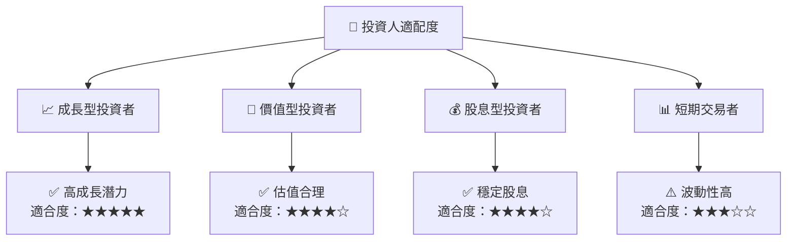

### 10.5 關鍵監控指標

| 監控類型 | 指標 | 關注點 | 頻率 |
|----------|------|--------|------|
| 市場動態 | 股價波動 | 大於 5% 的日內波動 | 每日 |
| 財務表現 | 營收增長率 | 每季數據 | 每季 |
| 技術發展 | 新技術研發 | 重要技術突破 | 每年 |
| 競爭狀況 | 競爭對手動態 | 主要競爭對手的市場份額變化 | 每季 |
| 地緣政治 | 政治局勢 | 影響供應鏈的政策變化 | 每月 |

---

> **免責聲明**：本報告為 AI 自動生成，僅供研究參考，不構成投資建議。投資有風險，入市需謹慎。