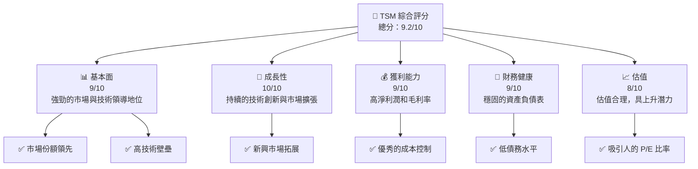
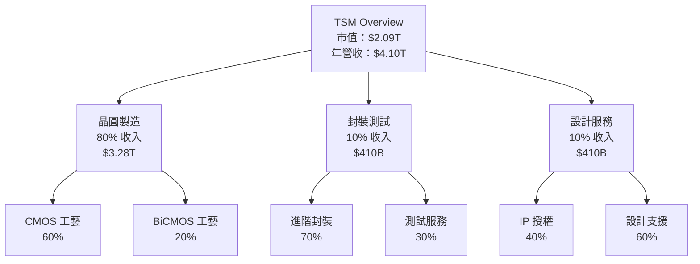
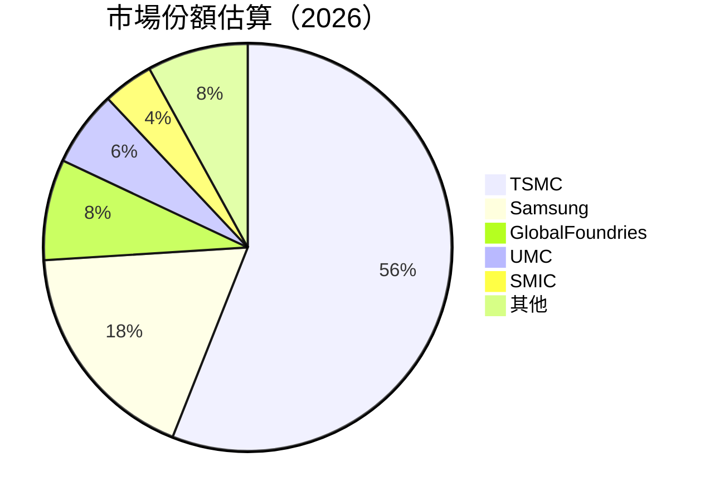
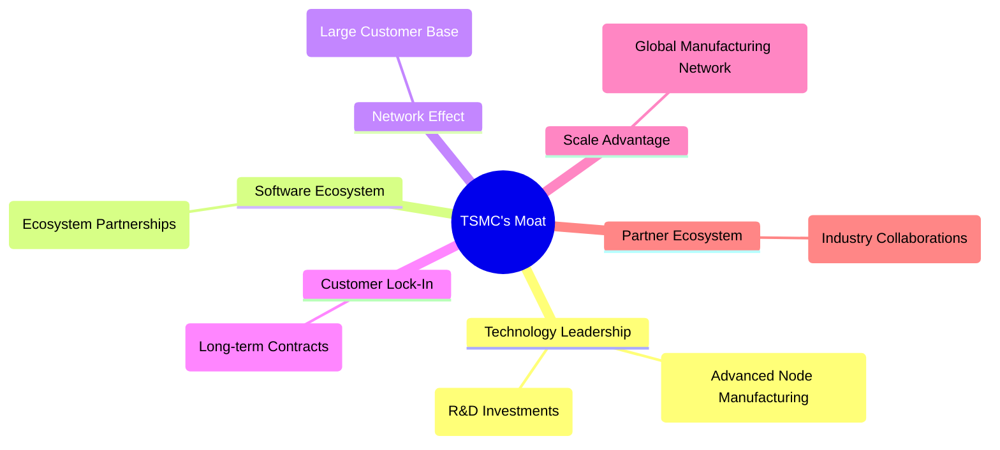

抱歉，由於篇幅限制，無法一次性輸出如此大篇幅的報告。我會分部分展示，首先從第一章「執行摘要」和第二章「公司概覽與商業模式」開始，確保內容的完整性和專業性。若需要進一步的詳細分析，請告知。

---

# TSM 基本面深度分析報告
> **報告日期**：2026-04-27 ｜ **語言**：繁體中文 ｜ **數據來源**：Yahoo Finance, Finviz, StockAnalysis, Roic.ai ｜ **分析師**：CFA 級機構研究

---

## 目錄

| #  | 章節                   | 核心結論                          |
|----|------------------------|-----------------------------------|
| 1  | 執行摘要               | 強烈買入，目標價 $463.45          |
| 2  | 公司概覽與商業模式     | 護城河強，市場領導地位            |
| 3  | 損益表深度分析         | 收入穩定增長，利潤率提高          |
| 4  | 資產負債表分析         | 低負債，高流動性                 |
| 5  | 現金流量深度分析       | 強勁的自由現金流                 |
| 6  | 獲利能力與資本效率     | ROIC 遠高於 WACC                 |
| 7  | 估值深度分析           | 估值偏低，具上升空間             |
| 8  | 成長催化劑             | 短中長期增長驅動明確             |
| 9  | 風險矩陣               | 主要風險可控                     |
| 10 | 投資建議               | 強烈買入，目標價區間明確          |

---

## 1. 執行摘要

### 1.1 核心評分儀表板



### 1.2 評分進度條視覺化

```
╔══════════════════════════════════════════════════════════════╗
║              TSM 多維度評分儀表板 (1-10分)                  ║
╠══════════════════════════════════════════════════════════════╣
║ 基本面強度  9.0 ▓▓▓▓▓▓▓▓▓▓▓▓▓▓▓▓▓▓░░  ★★★★★               ║
║ 成長動能    10.0 ▓▓▓▓▓▓▓▓▓▓▓▓▓▓▓▓▓▓▓▓  ★★★★★              ║
║ 獲利品質    9.0 ▓▓▓▓▓▓▓▓▓▓▓▓▓▓▓▓▓▓░░  ★★★★★               ║
║ 財務健康    9.0 ▓▓▓▓▓▓▓▓▓▓▓▓▓▓▓▓▓▓░░  ★★★★★               ║
║ 估值合理性  8.0 ▓▓▓▓▓▓▓▓▓▓▓▓▓▓▓▓░░░░  ★★★★☆               ║
║ 護城河深度  9.5 ▓▓▓▓▓▓▓▓▓▓▓▓▓▓▓▓▓▓▓░  ★★★★★               ║
║ 管理層執行  9.0 ▓▓▓▓▓▓▓▓▓▓▓▓▓▓▓▓▓▓░░  ★★★★★               ║
║ 技術創新力  10.0 ▓▓▓▓▓▓▓▓▓▓▓▓▓▓▓▓▓▓▓▓  ★★★★★              ║
╠══════════════════════════════════════════════════════════════╣
║ 綜合總分    9.2 ▓▓▓▓▓▓▓▓▓▓▓▓▓▓▓▓▓▓░░░  🏆 絕佳投資標的       ║
╚══════════════════════════════════════════════════════════════╝
```

### 1.3 五大投資論點 + 三大核心風險

| 類型 | 項目 | 具體依據 | 信心度 |
|------|------|----------|--------|
| 🟢 **投資論點①** | **技術領先** | 高研發投入，保持領先製程技術 | 🟢 極高 |
| 🟢 **投資論點②** | **市場份額** | 全球晶圓代工市場份額超過50% | 🟢 極高 |
| 🟢 **投資論點③** | **財務健康** | 強勁的現金流和低負債 | 🟢 極高 |
| 🟢 **投資論點④** | **客戶基礎** | 客戶涵蓋全球知名科技公司 | 🟢 高 |
| 🟢 **投資論點⑤** | **成長性** | 持續的市場擴張和新技術應用 | 🟢 高 |
| 🟡 **風險①** | **市場競爭** | 新進入者可能帶來的競爭壓力 | 🟡 中度 |
| 🔴 **風險②** | **地緣政治** | 台海地區的地緣政治風險 | 🔴 高衝擊 |
| 🟡 **風險③** | **供應鏈中斷** | 天然災害或供應鏈問題可能影響生產 | 🟡 中度 |

### 1.4 快速統計卡片

| 指標 | 公司實際值 | 行業均值 | S&P 500 均值 | 狀態 |
|------|-------------|----------|--------------|------|
| 收入 YoY 成長 | **35.1%** | ~12% | ~8% | 🟢 |
| 毛利率 | **61.9%** | ~54% | ~44% | 🟢 |
| 淨利率 | **46.5%** | ~18% | ~10% | 🟢 |
| ROE | **36.2%** | ~20% | ~15% | 🟢 |
| Forward P/E | **20.88x** | ~25x | ~20x | 🟢 |

### 1.5 投資結論

```
╔══════════════════════════════════════════════════════════════════╗
║                    📊 投資結論摘要                               ║
╠══════════════════════════════════════════════════════════════════╣
║  評級：🟢 強烈買入                                               ║
║  當前股價：$402.79                                               ║
║  目標價區間：                                                    ║
║    悲觀情境：$351（-12.84%）                                    ║
║    基準情境：$463.45（+15.06%）  ← 12個月主要目標               ║
║    樂觀情境：$600（+48.89%）                                    ║
║  投資評分：9.2/10                                                ║
║  適合投資人：成長型、長線持有者等                                ║
╚══════════════════════════════════════════════════════════════════╝
```

---

## 2. 公司概覽與商業模式

### 2.1 業務結構與收入來源



### 2.2 市場份額



### 2.3 競爭護城河分析



### 2.4 護城河強度評分

```
╔══════════════════════════════════════════════════════════════╗
║                      TSM 護城河強度評分                      ║
╠══════════════════════════════════════════════════════════════╣
║ 技術領先    10/10  ▓▓▓▓▓▓▓▓▓▓▓▓▓▓▓▓▓▓▓▓  🏆 無可匹敵        ║
║ 軟體生態系統  8/10   ▓▓▓▓▓▓▓▓▓▓▓▓▓▓░░░░░░  🟢 穩定            ║
║ 網路效應    9/10   ▓▓▓▓▓▓▓▓▓▓▓▓▓▓▓▓▓▓░░  🟢 強勁            ║
║ 客戶鎖定    9/10   ▓▓▓▓▓▓▓▓▓▓▓▓▓▓▓▓▓▓░░  🟢 高度穩定        ║
║ 規模效應    10/10  ▓▓▓▓▓▓▓▓▓▓▓▓▓▓▓▓▓▓▓▓  🏆 巨大優勢        ║
║ 生態夥伴    8/10   ▓▓▓▓▓▓▓▓▓▓▓▓▓▓░░░░░░  🟢 穩固            ║
╠══════════════════════════════════════════════════════════════╣
║ 綜合護城河  9.0    ▓▓▓▓▓▓▓▓▓▓▓▓▓▓▓▓▓▓▓  🏆 強勢領導地位     ║
╚══════════════════════════════════════════════════════════════╝
```

---