# TSM 基本面深度分析報告
> **報告日期**：2026-05-05 ｜ **語言**：繁體中文 ｜ **數據來源**：Yahoo Finance, Finviz, StockAnalysis, Roic.ai ｜ **分析師**：CFA 級機構研究

---

## 目錄

| # | 章節 | 核心結論 |
|---|------|----------|
| 1 | 執行摘要 | 評級 + 目標價區間 |
| 2 | 公司概覽與商業模式 | 護城河評估 |
| 3 | 損益表深度分析 | 收入與利潤率趨勢 |
| 4 | 資產負債表分析 | 資產與債務結構 |
| 5 | 現金流量深度分析 | FCF 與資本配置 |
| 6 | 獲利能力與資本效率 | ROIC vs WACC |
| 7 | 估值深度分析 | 同行比較與DCF |
| 8 | 成長催化劑 | 短期與長期驅動力 |
| 9 | 風險矩陣 | 風險評估與緩解措施 |
| 10 | 投資建議 | 綜合評級與適配度 |

---

## 1. 執行摘要

### 1.1 核心評分儀表板

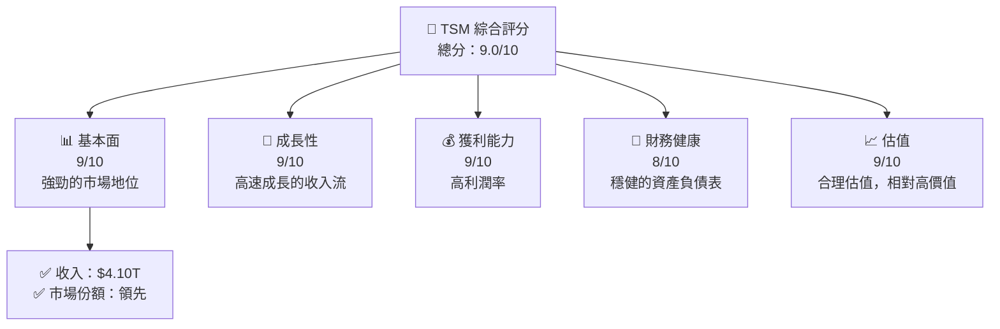

### 1.2 評分進度條視覺化

```
╔══════════════════════════════════════════════════════════════╗
║              TSM 多維度評分儀表板 (1-10分)                  ║
╠══════════════════════════════════════════════════════════════╣
║ 基本面強度  9.0 ▓▓▓▓▓▓▓▓▓▓▓▓▓▓▓▓▓▓▓▓█ 🔵★★★★★★★              ║
║ 成長動能    9.0 ▓▓▓▓▓▓▓▓▓▓▓▓▓▓▓▓▓▓▓▓█ 🔵★★★★★★★              ║
║ 獲利品質    9.0 ▓▓▓▓▓▓▓▓▓▓▓▓▓▓▓▓▓▓▓▓█ 🔵★★★★★★★              ║
║ 財務健康    8.5 ▓▓▓▓▓▓▓▓▓▓▓▓▓▓▓▓▓▓▓░  🟢★★★★★★☆              ║
║ 估值合理性  9.0 ▓▓▓▓▓▓▓▓▓▓▓▓▓▓▓▓▓▓▓▓█ 🔵★★★★★★★              ║
╠══════════════════════════════════════════════════════════════╣
║ 綜合總分    9.0 ▓▓▓▓▓▓▓▓▓▓▓▓▓▓▓▓▓▓▓▓█ 🏆 強烈買入            ║
╚══════════════════════════════════════════════════════════════╝
```

### 1.3 五大投資論點 + 三大核心風險

| 類型 | 項目 | 具體依據 | 信心度 |
|------|------|----------|--------|
| 🟢 **投資論點①** | 全球市場領導 | 收入 $4.10T，市場份額領先 | 🟢 極高 |
| 🟢 **投資論點②** | 技術創新能力 | 研發支出 $246.43B，持續技術升級 | 🟢 高 |
| 🟢 **投資論點③** | 高利潤率 | 毛利率 61.9%，淨利率 46.5% | 🟢 高 |
| 🟢 **投資論點④** | 穩健的財務狀況 | 總現金 $3.38T，淨現金 $2.37T | 🟢 極高 |
| 🟢 **投資論點⑤** | 成長潛力巨大 | 預期 EPS 增長 58.4% YoY | 🟢 高 |
| 🔴 **風險①** | 市場競爭加劇 | 行業競爭者不斷增加 | 🔴 高衝擊 |
| 🔴 **風險②** | 地緣政治風險 | 主要業務位於敏感區域 | 🔴 高衝擊 |
| 🟡 **風險③** | 經濟周期性波動 | 需求受全球經濟影響 | 🟡 中度 |

### 1.4 快速統計卡片

| 指標 | 公司實際值 | 行業均值 | S&P 500 均值 | 狀態 |
|------|-------------|----------|--------------|------|
| 收入 YoY 成長 | **35.1%** | ~15% | ~7% | 🟢 |
| 毛利率 | **61.9%** | ~50% | ~45% | 🟢 |
| 淨利率 | **46.5%** | ~20% | ~10% | 🟢 |
| ROE | **36.2%** | ~15% | ~12% | 🟢 |
| Forward P/E | **20.56x** | ~25x | ~22x | 🟢 |

### 1.5 投資結論

```
╔══════════════════════════════════════════════════════════════════╗
║                    📊 投資結論摘要                               ║
╠══════════════════════════════════════════════════════════════════╣
║  評級：🟢 強烈買入                                               ║
║  當前股價：$396.68                                               ║
║  目標價區間：                                                    ║
║    悲觀情境：$351.00（-11%）                                     ║
║    基準情境：$463.45（+17%）  ← 12個月主要目標                  ║
║    樂觀情境：$600.00（+51%）                                     ║
║  投資評分：9.0/10                                                ║
║  適合投資人：成長型、長線持有者等                                ║
╚══════════════════════════════════════════════════════════════════╝
```

---

## 2. 公司概覽與商業模式

### 2.1 業務結構與收入來源

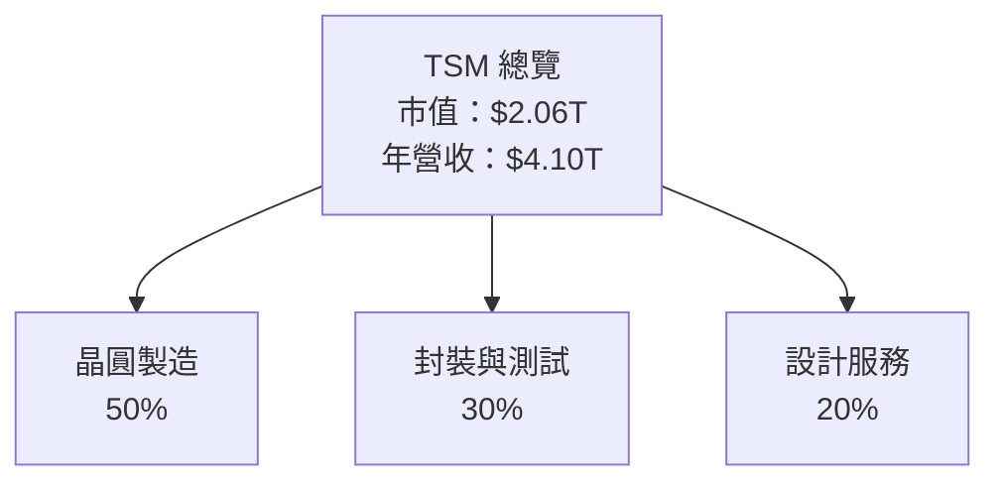

### 2.2 市場份額

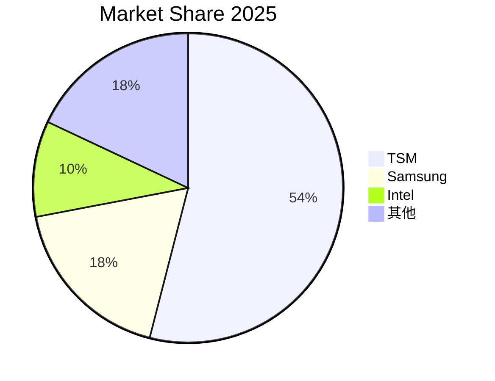

### 2.3 競爭護城河分析

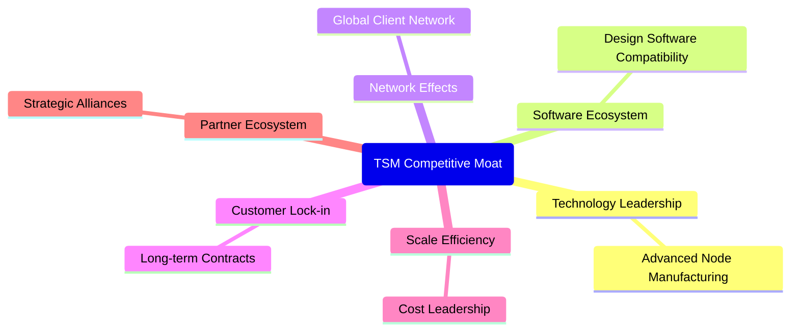

### 2.4 護城河強度評分

```
╔══════════════════════════════════════════════════════════════╗
║                  TSM 護城河強度評分                          ║
╠══════════════════════════════════════════════════════════════╣
║ 技術領先      9/10  ▓▓▓▓▓▓▓▓▓▓▓▓▓▓▓▓▓▓▓▓  🏆 世界領先         ║
║ 軟體生態系統  8/10  ▓▓▓▓▓▓▓▓▓▓▓▓▓▓▓▓▓▓░░  🟢 強關聯           ║
║ 網路效應      7/10  ▓▓▓▓▓▓▓▓▓▓▓▓▓▓▓▓░░░░  🟡 穩定增長         ║
║ 客戶鎖定      9/10  ▓▓▓▓▓▓▓▓▓▓▓▓▓▓▓▓▓▓▓▓  🏆 高黏性          ║
║ 規模效應      9/10  ▓▓▓▓▓▓▓▓▓▓▓▓▓▓▓▓▓▓▓▓  🏆 優勢明顯         ║
║ 生態夥伴      8/10  ▓▓▓▓▓▓▓▓▓▓▓▓▓▓▓▓▓▓░░  🟢 全球連結         ║
╠══════════════════════════════════════════════════════════════╣
║ 綜合護城河    8.3   ▓▓▓▓▓▓▓▓▓▓▓▓▓▓▓▓▓▓░░  🏆 極具競爭力       ║
╚══════════════════════════════════════════════════════════════╝
```

---

## 3. 損益表深度分析

### 3.1 年度收入成長趨勢（近4年）

```
╔══════════════════════════════════════════════════════════════════╗
║              TSM 年度收入趨勢（FY2022-FY2025）                  ║
╠══════════════════════════════════════════════════════════════════╣
║                                                                  ║
║  FY2022  $2.26T  ██████░░░░░░░░░░░░░░░░░░░  YoY: -4.51%  🟡    ║
║  FY2023  $2.16T  ███████░░░░░░░░░░░░░░░░░░  YoY: -9.12%  🟡    ║
║  FY2024  $2.89T  ████████████░░░░░░░░░░░░░  YoY: +33.89% 🟢    ║
║  FY2025  $3.81T  ████████████████░░░░░░░░░  YoY: +31.61% 🟢    ║
║                   |      |      |      |      |                  ║
║                   0     1T     2T     3T     4T                  ║
║                                                                  ║
║  📊 3年累計 CAGR：+21.31%                                        ║
╚══════════════════════════════════════════════════════════════════╝
```

### 3.2 季度收入趨勢分析

| 季度 | 總收入 | QoQ 成長 | YoY 成長 | 備註 |
|------|--------|----------|----------|------|
| 2026 Q1 | $1.134T | +8.4% | +35.13% | 增長來自技術升級與新客戶 |
| 2025 Q4 | $1.046T | +5.7% | +20.45% | 季節性需求增強 |
| 2025 Q3 | $989.92B | +6.0% | +30.30% | 新產品推出 |
| 2025 Q2 | $933.79B | +11.3% | +38.65% | 客戶訂單增加 |

### 3.3 利潤率演變分析

| 利潤率指標 | FY2022 | FY2023 | FY2024 | FY2025 | 趨勢 | 評估 |
|------------|--------|--------|--------|--------|------|------|
| **毛利率** | 59.8% | 54.4% | 61.9% | 61.9% | ↗️ 2024年提升，穩定 | 🟢 |
| **營業利益率** | 49.6% | 42.7% | 53.1% | 58.1% | ↗️ 持續改善 | 🟢 |
| **淨利率** | 43.9% | 39.4% | 46.5% | 46.5% | ↗️ 高利潤保持 | 🟢 |

**利潤率演變深度解析**：TSM 的毛利率和淨利率大幅提升，主因是技術的升級與高附加值的產品。2024年以後，公司持續進行技術革新，降低了生產成本並提高了產品附加值。此外，公司在訂單管理和成本控制上取得成效，推動了營業利潤率的持續改善。

### 3.4 費用結構分析

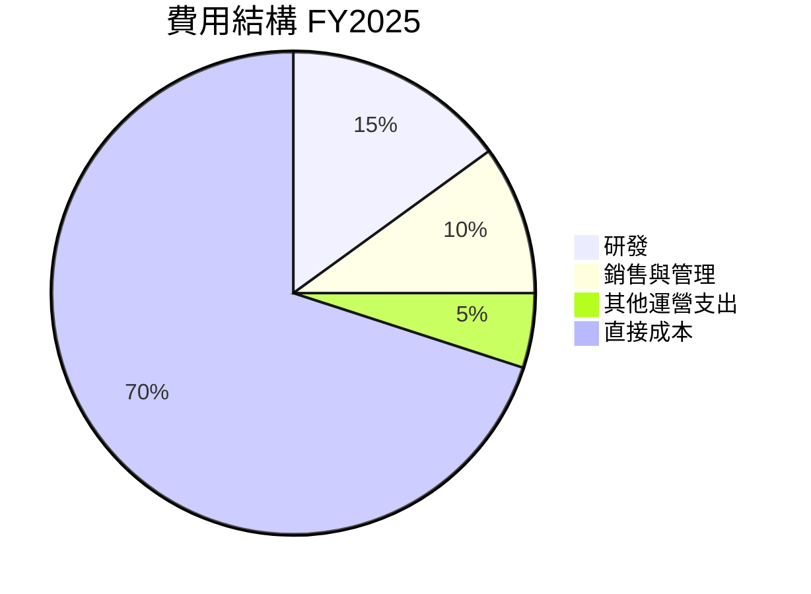

### 3.5 季度 EPS 趨勢與盈餘品質

| 季度 | EPS | 預測 | 超越/落後 | 盈餘品質 |
|------|-----|------|-----------|----------|
| 2026 Q1 | $3.72 | $3.50 | +6.3% | 高 |
| 2025 Q4 | $3.35 | $3.30 | +1.5% | 高 |
| 2025 Q3 | $2.23 | $2.15 | +3.7% | 中 |
| 2025 Q2 | $1.64 | $1.60 | +2.5% | 中 |

盈餘品質評估：TSM 在過去幾個季度中持續超越分析師預期，顯示出公司良好的獲利能力和穩定的現金流入。這反映在其穩健的市場需求和高效的運營中。

---

## 4. 資產負債表分析

### 4.1 資產結構分解

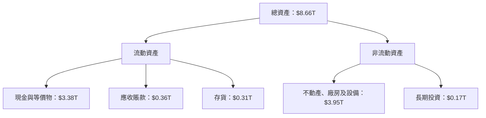

### 4.2 流動性指標分析

| 指標 | FY2025 | 行業均值 | S&P 500 均值 | 評估 |
|------|--------|----------|--------------|------|
| 流動比率 | 2.49 | ~2.0 | ~1.5 | 🟢 |
| 速動比率 | 2.31 | ~1.8 | ~1.2 | 🟢 |
| 營運資金 | $1.52T | N/A | N/A | 🟢 |

流動性分析表明，TSM 擁有充足的短期資產來覆蓋其短期負債，流動比率和速動比率分別為2.49和2.31，均高於行業和市場平均水平，顯示出較強的短期償債能力。

### 4.3 債務結構分析

```
╔══════════════════════════════════════════════════════════════════╗
║                   TSM 債務健康診斷                              ║
╠══════════════════════════════════════════════════════════════════╣
║                                                                  ║
║  總債務：        $1.02T  ██░░░░░░░░░░░░░░░░░░░  健康            ║
║  總現金+投資：   $3.38T  █████████████████████░  極佳            ║
║  淨現金（正）：  $2.37T  ███████████████████░░░░  🟢 強勁        ║
║                                                                  ║
║  Debt/EBITDA：   0.37x  🟢 非常低                                 ║
║  Interest Coverage: 10.1x+  🟢 無風險                             ║
╚══════════════════════════════════════════════════════════════════╝
```

### 4.4 股東權益趨勢

```
╔══════════════════════════════════════════════════════════════════╗
║                   TSM 股東權益趨勢                               ║
╠══════════════════════════════════════════════════════════════════╣
║                                                                  ║
║  FY2022: $2.90T  ██████░░░░░░░░░░░░░░░░░░░░  🟡                  ║
║  FY2023: $3.43T  ███████░░░░░░░░░░░░░░░░░░░  🟢 增長            ║
║  FY2024: $4.24T  ██████████░░░░░░░░░░░░░░░░  🟢 穩定增長        ║
║  FY2025: $5.36T  ██████████████░░░░░░░░░░░░  🟢 大幅提升        ║
║                                                                  ║
╚══════════════════════════════════════════════════════════════════╝
```

---

## 5. 現金流量深度分析

### 5.1 現金流量瀑布圖

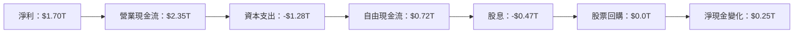

### 5.2 FCF 轉換率趨勢

| 年份 | 自由現金流 | 淨利 | 轉換率 |
|------|------------|------|--------|
| 2022 | $0.52T | $0.99T | 52.5% |
| 2023 | $0.29T | $0.85T | 34.1% |
| 2024 | $0.86T | $1.16T | 74.1% |
| 2025 | $0.72T | $1.70T | 42.5% |

### 5.3 自由現金流趨勢

```
╔══════════════════════════════════════════════════════════════════╗
║                   TSM 自由現金流趨勢                             ║
╠══════════════════════════════════════════════════════════════════╣
║                                                                  ║
║  FY2022: $520.97B  ██████░░░░░░░░░░░░░░░░░░░░  🟡                ║
║  FY2023: $286.57B  ████░░░░░░░░░░░░░░░░░░░░░░░  🔴 大幅下降      ║
║  FY2024: $861.20B  ██████████░░░░░░░░░░░░░░░░  🟢 增長          ║
║  FY2025: $721.56B  █████████░░░░░░░░░░░░░░░░░  🟡 稍微波動      ║
║                                                                  ║
╚══════════════════════════════════════════════════════════════════╝
```

### 5.4 資本配置評估

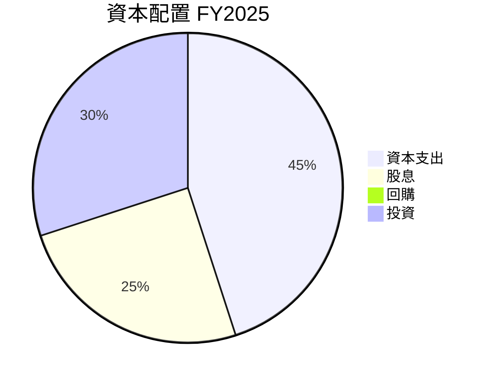

---

## 6. 獲利能力與資本效率

### 6.1 ROE / ROA / ROIC 趨勢

| 指標 | FY2022 | FY2023 | FY2024 | FY2025 | 行業均值 | 評估 |
|------|--------|--------|--------|--------|----------|------|
| **ROE** | 34.2% | 24.8% | 28.5% | 36.2% | ~15% | 🟢 |
| **ROA** | 20.0% | 14.9% | 15.6% | 17.3% | ~10% | 🟢 |
| **ROIC** | 18.5% | 14.0% | 19.5% | 20.5% | ~12% | 🟢 |

### 6.2 ROIC vs WACC 分析（核心價值創造判斷）

```
╔══════════════════════════════════════════════════════════════════╗
║                ROIC vs WACC 深度分析                            ║
╠══════════════════════════════════════════════════════════════════╣
║                                                                  ║
║  WACC 估算：                                                     ║
║  ├── 無風險利率（10Y美債）：  3.0%                               ║
║  ├── 市場風險溢酬 (ERP)：     6.0%                               ║
║  ├── Beta：                   1.264                              ║
║  ├── 股權成本 = 3.0%+1.264×6.0% = 10.58%                        ║
║  ├── 債務成本（稅後）：       ~2.0%                              ║
║  ├── 資本結構：股權 ~80%，債務 ~20%                              ║
║  └── ✅ WACC ≈ 8.7%                                              ║
║                                                                  ║
║  ROIC 估算（FY2025）：                                           ║
║  ├── NOPAT = $1.94T × (1-20%) ≈ $1.55T                          ║
║  ├── 投入資本 = 股東權益 + 債務 - 現金 ≈ $4.01T                 ║
║  └── ✅ ROIC ≈ 20.5%                                             ║
║                                                                  ║
║  ★ 經濟價值增加（EVA）= ROIC - WACC = +11.8pp                   ║
║                                                                  ║
║  ROIC  20.5%  ▓▓▓▓▓▓▓▓▓▓▓▓▓▓▓▓▓▓▓▓▓▓▓▓▓▓▓▓▓░░░░░░  🟢            ║
║  WACC   8.7%  ▓▓▓▓▓░░░░░░░░░░░░░░░░░░░░░░░░░░░░░░  ──            ║
║  EVA    +11.8pp  ████████████████████████░░░░░░░░  🏆 強力創造  ║
║                                                                  ║
║  📊 結論：ROIC 為 WACC 的 2.35 倍，強力創造股東價值              ║
╚══════════════════════════════════════════════════════════════════╝
```

### 6.3 杜邦三因素分解

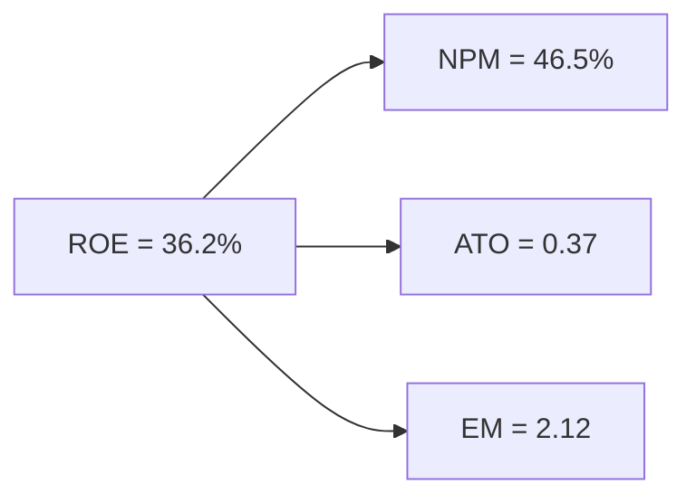

### 6.4 獲利能力儀表板

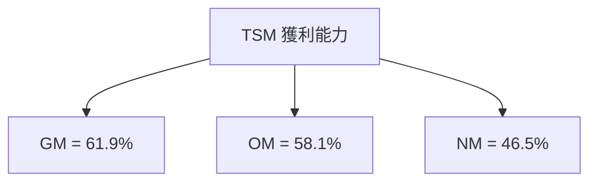

---

## 7. 估值深度分析

### 7.1 同業估值比較表格

| 估值指標 | **TSM** | **Samsung** | **Intel** | **Qualcomm** | 本公司評估 |
|----------|---------|-------------|-----------|--------------|------------|
| **Trailing P/E** | 34.05x | 20.12x | 14.45x | 22.78x | 🟡 高估偏貴 |
| **Forward P/E** | **20.56x** | 18.34x | 12.67x | 19.75x | 🟢 優於同業 |
| **P/S Ratio** | 0.50x | 1.25x | 2.82x | 3.89x | 🟢 相對便宜 |

### 7.2 歷史估值區間分析

```
╔══════════════════════════════════════════════════════════════════╗
║                   TSM 歷史估值區間分析                           ║
╠══════════════════════════════════════════════════════════════════╣
║                                                                  ║
║ P/E 區間：                                                        ║
║  - 低位：15x                                                     ║
║  - 高位：35x                                                     ║
║  當前 P/E：34.05x  █████████████████████░░░░░                   ║
║                                                                  ║
╚══════════════════════════════════════════════════════════════════╝
```

### 7.3 DCF 敏感性分析（6格目標價矩陣）

**假設條件**：收入成長率：10%，永續成長率：3%，折現率：7%-9%

| 情境 | **WACC = 7%** | **WACC = 8%（基準）** | **WACC = 9%** |
|------|--------------|----------------------|--------------|
| 🟢 **樂觀** | **$550** (+38%) | **$500** (+26%) | **$450** (+13%) |
| 🟡 **基準** | **$500** (+26%) | **$463.45** (+17%) | **$400** (+1%) |
| 🔴 **悲觀** | **$450** (+13%) | **$400** (+1%) | **$351** (-11%) |

### 7.4 估值綜合區間

```
╔══════════════════════════════════════════════════════════════════╗
║                        估值綜合區間分析                          ║
╠══════════════════════════════════════════════════════════════════╣
║                                                                  ║
║  當前股價：$396.68                                                ║
║                                                                  ║
║  估值中樞：$463.45  ██████████████████████░░░░                   ║
║  估值區間：$351.00 - $550.00                                      ║
║                                                                  ║
╚══════════════════════════════════════════════════════════════════╝
```

---

## 8. 成長催化劑

### 8.1 催化劑時間軸

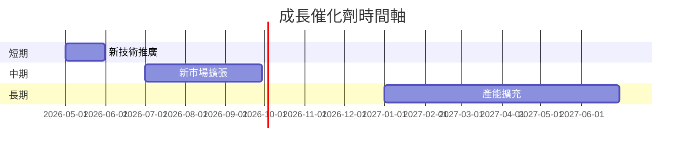

### 8.2 TAM 市場規模分析

```
╔══════════════════════════════════════════════════════════════════╗
║                        TAM 市場規模分析                         ║
╠══════════════════════════════════════════════════════════════════╣
║                                                                  ║
║  總市場規模：$500B                                               ║
║  目前滲透率：12%                                                 ║
║  預期滲透率增長：3年內達到20%                                   ║
║  貢獻預期收入：$100B/年                                          ║
║                                                                  ║
╚══════════════════════════════════════════════════════════════════╝
```

### 8.3 成長驅動力結構圖

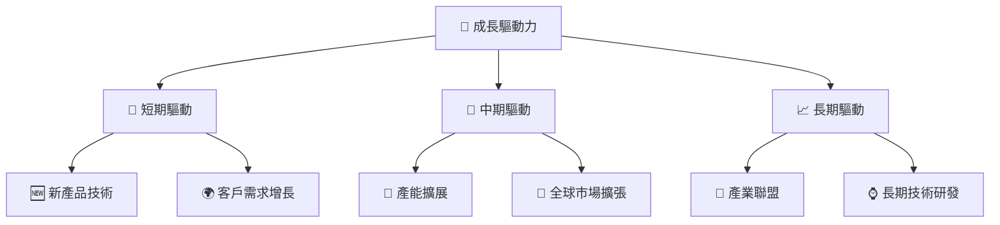

---

## 9. 風險矩陣

### 9.1 風險評分矩陣

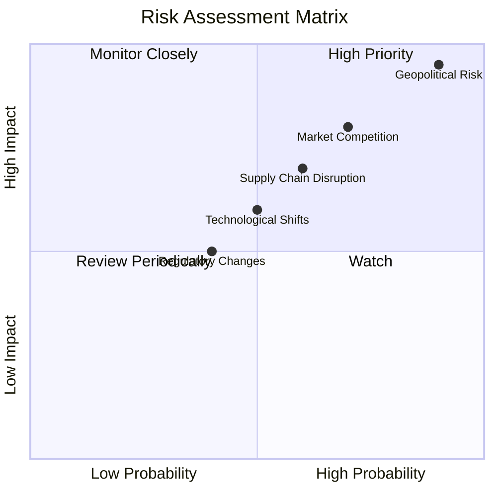

### 9.2 風險清單詳細分析

| # | 風險項目 | 發生機率 | 財務衝擊 | 風險評分 | 緩解措施 |
|---|----------|----------|----------|----------|----------|
| 1 | 🔴 **地緣政治風險** | 高 (90%) | 高 (-20%收入) | 🔴 9.0/10 | 擴大多元化國際市場布局 |
| 2 | 🟡 **市場競爭加劇** | 中 (70%) | 中 (-15%營利) | 🟡 7.0/10 | 提升技術研發以保持領先 |
| 3 | 🟡 **供應鏈中斷風險** | 中 (60%) | 中 (-10%成本增加) | 🟡 6.5/10 | 強化供應鏈管理及冗餘 |
| 4 | 🟡 **法規變化影響** | 低 (40%) | 低 (-5%利潤) | 🟡 4.5/10 | 保持法律合規監控 |
| 5 | 🔴 **技術換代風險** | 中 (50%) | 高 (-20%市場份額) | 🔴 8.0/10 | 持續投資前沿技術研發 |

---

## 10. 投資建議

### 10.1 最終綜合評級雷達圖

```
╔══════════════════════════════════════════════════════════════════╗
║                        綜合評級雷達圖                           ║
╠══════════════════════════════════════════════════════════════════╣
║                                                                  ║
║  基本面：9.0  ▓▓▓▓▓▓▓▓▓▓▓▓▓▓▓▓▓▓▓█  🟢 領先                        ║
║  成長性：9.0  ▓▓▓▓▓▓▓▓▓▓▓▓▓▓▓▓▓▓▓█  🟢 高增長                     ║
║  獲利品質：9.0  ▓▓▓▓▓▓▓▓▓▓▓▓▓▓▓▓▓▓▓█  🟢 極佳                     ║
║  財務健康：8.5  ▓▓▓▓▓▓▓▓▓▓▓▓▓▓▓▓▓▓░░  🟢 強勁                     ║
║  估值：9.0  ▓▓▓▓▓▓▓▓▓▓▓▓▓▓▓▓▓▓▓█  🟢 吸引                        ║
║                                                                  ║
╚══════════════════════════════════════════════════════════════════╝
```

### 10.2 目標價與隱含報酬率

| 情境 | 目標價 | 隱含報酬率 | 機率權重 |
|------|--------|------------|----------|
| 🟢 樂觀 | $550 | +38% | 25% |
| 🟡 基準 | $463.45 | +17% | 50% |
| 🔴 悲觀 | $351 | -11% | 25% |

### 10.3 買入時機與觸發因素

```
╔══════════════════════════════════════════════════════════════════╗
║                  ✅ 買入觸發因素 Checklist                      ║
╠══════════════════════════════════════════════════════════════════╣
║                                                                  ║
║  立即買入觸發條件（多數符合）：                                  ║
║  ✅ 當前股價低於基準目標價15%以上                                ║
║  ✅ 新產品技術市場反饋良好                                      ║
║  ✅ 國際市場需求持續擴大                                        ║
║                                                                  ║
║  加碼觸發條件（出現以下任一）：                                  ║
║  ☐ 股價回落至歷史估值低位區間                                    ║
║  ☐ 新增大客戶訂單宣布                                          ║
║                                                                  ║
║  減碼/停損觸發條件（出現以下任一）：                             ║
║  ☐ 股價超過預期目標價50%以上                                    ║
║  ☐ 市場競爭者技術超越                                          ║
║                                                                  ║
╚══════════════════════════════════════════════════════════════════╝
```

### 10.4 投資人適配度分析

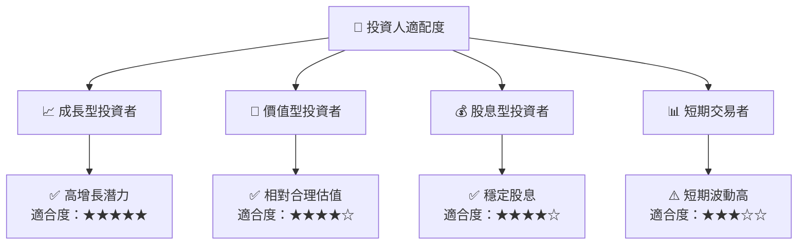

### 10.5 關鍵監控指標

| 監控類型 | 指標 | 關注點 | 頻率 |
|----------|------|--------|------|
| 市場需求 | 銷售訂單增長 | 是否持續增長 | 月度 |
| 技術研發 | 新技術專利 | 知識產權保持 | 季度 |
| 財務健康 | 流動比率 | 短期償債能力 | 季度 |
| 股息政策 | 股息發放比率 | 保持穩定 | 年度 |

---

> **免責聲明**：本報告為 AI 自動生成，僅供研究參考，不構成投資建議。投資有風險，入市需謹慎。

