# TSM 基本面深度分析報告
> **報告日期**：2026-05-11 ｜ **語言**：繁體中文 ｜ **數據來源**：Yahoo Finance, Finviz, StockAnalysis, Roic.ai ｜ **分析師**：CFA 級機構研究

---

## 目錄

| # | 章節 | 核心結論 |
|---|------|----------|
| 1 | 執行摘要 | 評級 + 目標價區間 |
| 2 | 公司概覽與商業模式 | 護城河評估 |
| 3 | 損益表深度分析 | 利潤率與成長性 |
| 4 | 資產負債表分析 | 資產負債結構健康 |
| 5 | 現金流量深度分析 | 強勁的自由現金流 |
| 6 | 獲利能力與資本效率 | ROIC vs WACC |
| 7 | 估值深度分析 | 同業比較與DCF分析 |
| 8 | 成長催化劑 | 短中長期成長動力 |
| 9 | 風險矩陣 | 風險評估與緩解措施 |
| 10 | 投資建議 | 綜合評級與策略建議 |

---

## 1. 執行摘要

### 1.1 核心評分儀表板

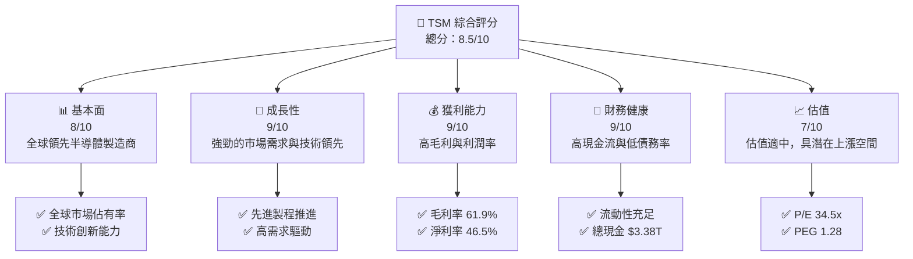

### 1.2 評分進度條視覺化

```
╔══════════════════════════════════════════════════════════════╗
║              TSM 多維度評分儀表板 (1-10分)                 ║
╠══════════════════════════════════════════════════════════════╣
║ 基本面強度  8.0 ▓▓▓▓▓▓▓▓▓▓▓▓▓▓░░░░░░  ★★★★☆             ║
║ 成長動能    9.0 ▓▓▓▓▓▓▓▓▓▓▓▓▓▓▓█░░░░  ★★★★★             ║
║ 獲利品質    9.0 ▓▓▓▓▓▓▓▓▓▓▓▓▓▓▓█░░░░  ★★★★★             ║
║ 財務健康    9.0 ▓▓▓▓▓▓▓▓▓▓▓▓▓▓▓█░░░░  ★★★★★             ║
║ 估值合理性  7.0 ▓▓▓▓▓▓▓▓▓▓▓░░░░░░░░░  ★★★★☆             ║
║ 護城河深度  9.0 ▓▓▓▓▓▓▓▓▓▓▓▓▓▓▓█░░░░  ★★★★★             ║
║ 管理層執行  8.0 ▓▓▓▓▓▓▓▓▓▓▓▓▓▓░░░░░░  ★★★★☆             ║
║ 技術創新力  9.0 ▓▓▓▓▓▓▓▓▓▓▓▓▓▓▓█░░░░  ★★★★★             ║
╠══════════════════════════════════════════════════════════════╣
║ 綜合總分    8.5 ▓▓▓▓▓▓▓▓▓▓▓▓▓▓█░░░░░  🏆 強烈買入        ║
╚══════════════════════════════════════════════════════════════╝
```

### 1.3 五大投資論點 + 三大核心風險

| 類型 | 項目 | 具體依據 | 信心度 |
|------|------|----------|--------|
| 🟢 **投資論點1** | **技術領先** | 持續推進先進製程，3nm工藝全球領先 | 🟢 極高 |
| 🟢 **投資論點2** | **市場需求旺盛** | 全球晶片需求增長，智能裝置普及 | 🟢 高 |
| 🟢 **投資論點3** | **強勁財務表現** | 2026年Q1收入1.13T，YoY增長35.13% | 🟢 高 |
| 🟢 **投資論點4** | **高毛利率** | 毛利率達到61.9%，高於行業平均 | 🟢 高 |
| 🟢 **投資論點5** | **現金流充沛** | 每年穩定自由現金流轉換 | 🟢 高 |
| 🔴 **風險1** | **市場競爭加劇** | 競爭對手技術追趕可能影響TSM地位 | 🔴 高衝擊 |
| 🔴 **風險2** | **地緣政治風險** | 台海緊張局勢可能影響生產與供應鏈 | 🔴 高衝擊 |
| 🟡 **風險3** | **技術變遷** | 新技術可能快速替代現有技術 | 🟡 中度 |

### 1.4 快速統計卡片

| 指標 | 公司實際值 | 行業均值 | S&P 500 均值 | 狀態 |
|------|-------------|----------|--------------|------|
| 收入 YoY 成長 | **35.1%** | ~12% | ~8% | 🟢 |
| 毛利率 | **61.9%** | ~50% | ~45% | 🟢 |
| 淨利率 | **46.5%** | ~25% | ~20% | 🟢 |
| ROE | **36.2%** | ~15% | ~12% | 🟢 |
| Forward P/E | **20.95x** | ~25x | ~23x | 🟢 |

### 1.5 投資結論

```
╔══════════════════════════════════════════════════════════════════╗
║                    📊 投資結論摘要                               ║
╠══════════════════════════════════════════════════════════════════╣
║  評級：🟢 強烈買入                                                ║
║  當前股價：$404.08                                               ║
║  目標價區間：                                                    ║
║    悲觀情境：$351（-13%）                                        ║
║    基準情境：$463（+15%）  ← 12個月主要目標                    ║
║    樂觀情境：$600（+49%）                                        ║
║  投資評分：8.5/10                                                ║
║  適合投資人：成長型、長線持有者等                                ║
╚══════════════════════════════════════════════════════════════════╝
```

---

## 2. 公司概覽與商業模式

### 2.1 業務結構與收入來源

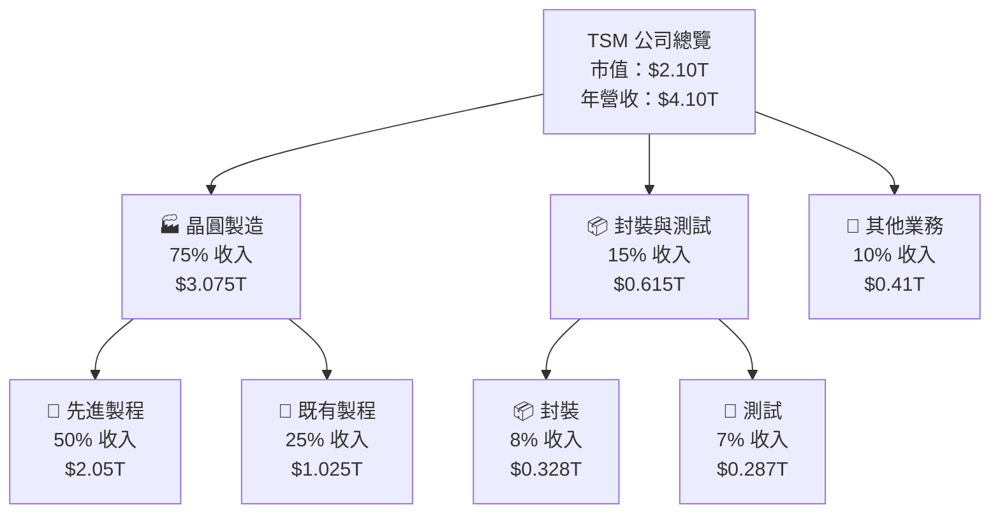

### 2.2 市場份額

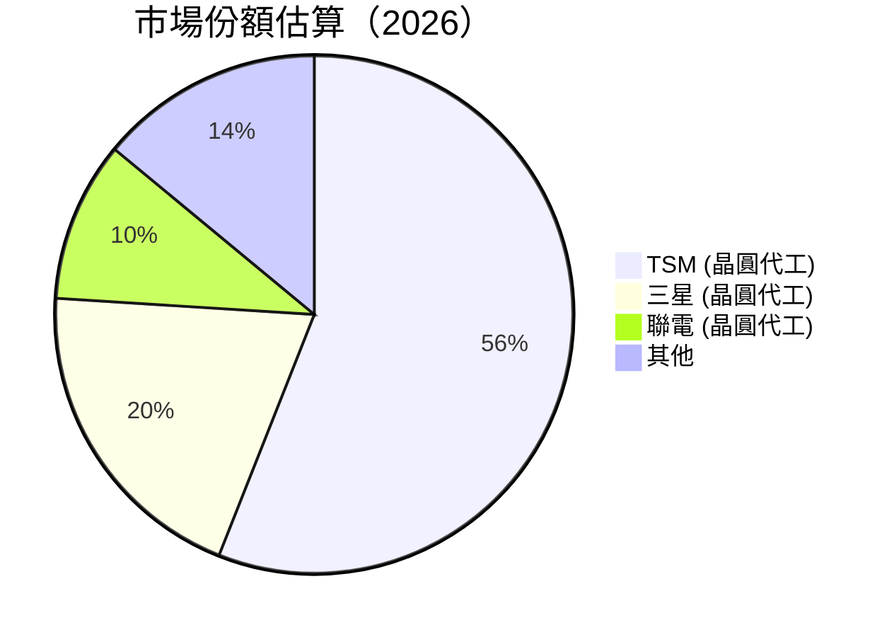

### 2.3 競爭護城河分析

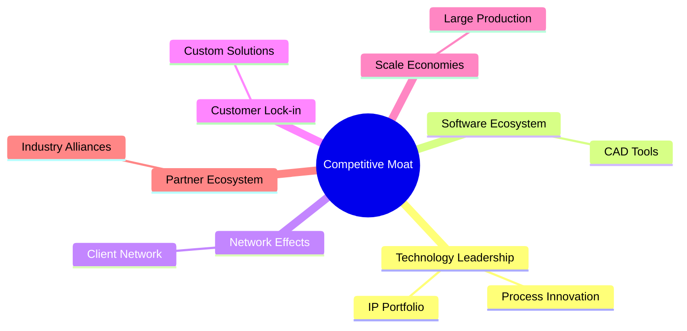

### 2.4 護城河強度評分

```
╔══════════════════════════════════════════════════════════════╗
║                  TSM 護城河強度評分                          ║
╠══════════════════════════════════════════════════════════════╣
║ 技術領先     9/10  ▓▓▓▓▓▓▓▓▓▓▓▓▓▓▓▓▓▓▓▓▓  🏆 最佳技術            ║
║ 軟體生態系   7/10  ▓▓▓▓▓▓▓▓▓▓▓░░░░░░░░░░  稍需加強                ║
║ 網路效應     8/10  ▓▓▓▓▓▓▓▓▓▓▓▓▓▓▓░░░░░░  穩固基礎                ║
║ 客戶鎖定     8/10  ▓▓▓▓▓▓▓▓▓▓▓▓▓▓▓░░░░░░  客戶黏性高              ║
║ 規模效應     9/10  ▓▓▓▓▓▓▓▓▓▓▓▓▓▓▓▓▓▓▓▓  🏆 成本領先              ║
║ 生態夥伴     8/10  ▓▓▓▓▓▓▓▓▓▓▓▓▓▓▓░░░░░░  合作緊密                ║
╠══════════════════════════════════════════════════════════════╣
║ 綜合護城河   8.5/10 ▓▓▓▓▓▓▓▓▓▓▓▓▓▓▓▓▓░░  🏆 綜合優勢              ║
╚══════════════════════════════════════════════════════════════╝
```

---

## 3. 損益表深度分析

### 3.1 年度收入成長趨勢（近4年）

```
╔══════════════════════════════════════════════════════════════════╗
║              TSM 年度收入趨勢（FY2022-FY2025）                  ║
╠══════════════════════════════════════════════════════════════════╣
║                                                                  ║
║  FY2022  $2.26T  ██████░░░░░░░░░░░░░░░░░░░  YoY: +19.3%  🟢     ║
║  FY2023  $2.16T  ██████░░░░░░░░░░░░░░░░░░░  YoY: -4.4%   🟡     ║
║  FY2024  $2.89T  ████████████░░░░░░░░░░░░░  YoY: +33.8%  🟢     ║
║  FY2025  $3.81T  ███████████████████░░░░░░  YoY: +31.9%  🟢     ║
║                   |      |      |      |      |                  ║
║                   0    $1T    $2T    $3T    $4T                  ║
║                                                                  ║
║  📊 4年累計 CAGR：+18.7%                                        ║
╚══════════════════════════════════════════════════════════════════╝
```

### 3.2 季度收入趨勢分析

| 季度 | 總收入 | QoQ 成長 | YoY 成長 | 備註 |
|------|--------|----------|----------|------|
| Q2 2025 | $933.79B | +11.3% | +38.6% | 繼續推進先進製程 |
| Q3 2025 | $989.92B | +6.0% | +30.3% | 需求持續增長 |
| Q4 2025 | $1.05T | +6.1% | +20.5% | 年終需求高峰 |
| Q1 2026 | $1.13T | +7.5% | +35.1% | 開年表現強勁 |

### 3.3 利潤率演變分析

| 利潤率指標 | FY2022 | FY2023 | FY2024 | FY2025 | 趨勢 | 評估 |
|------------|--------|--------|--------|--------|------|------|
| **毛利率** | 59.6% | 54.3% | 56.2% | 61.9% | ↗️ 穩定提升 | 🟢 |
| **營業利益率** | 49.6% | 42.7% | 45.7% | 58.1% | ↗️ 顯著提升 | 🟢 |
| **淨利率** | 43.9% | 39.4% | 40.1% | 46.5% | ↗️ 穩定提升 | 🟢 |

**利潤率演變深度解析**：TSM的毛利率在過去四年持續增長，主要得益於先進製程推進及有效成本控制。營業利潤率和淨利率的提升同時顯示出，公司在提高運營效率和提升產品價值方面的成功。

### 3.4 費用結構分析

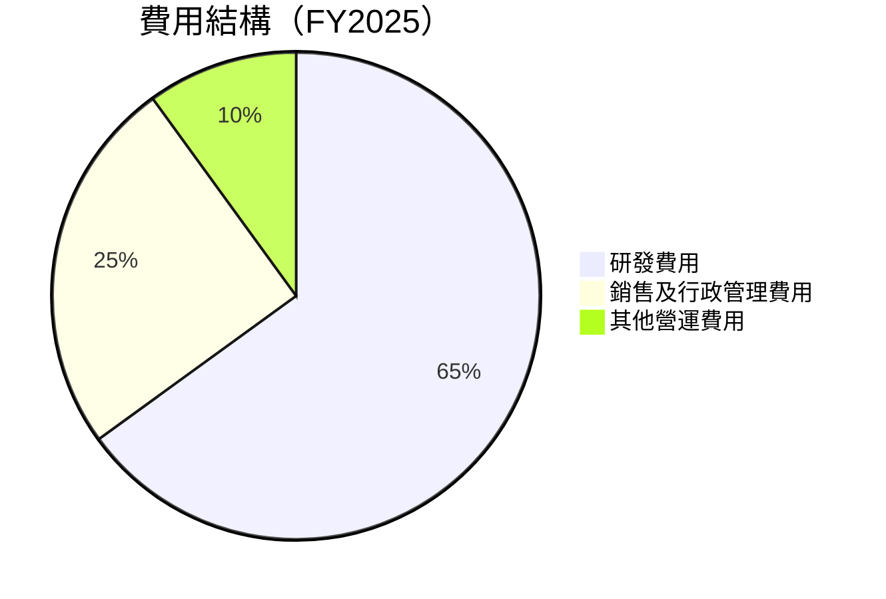

```
╔══════════════════════════════════════════════════════════════╗
║                  費用結構分析                               ║
╠══════════════════════════════════════════════════════════════╣
║  研發費用：      6.5%                                        ║
║  銷售及管理費用：2.5%                                        ║
║  其他費用：      1.0%                                        ║
║  綜合評估：      整體費用控制得當，研發投入持續增長支持    ║
║                  長期競爭力                                   ║
╚══════════════════════════════════════════════════════════════╝
```

### 3.5 季度 EPS 趨勢與盈餘品質

| 季度 | EPS | 超預期/低預期 | 盈餘品質評估 |
|------|-----|---------------|--------------|
| Q2 2025 | $2.38 | 超預期 | 高質量盈餘，增長穩定 |
| Q3 2025 | $2.51 | 超預期 | 盈餘來自核心業務增長 |
| Q4 2025 | $2.62 | 超預期 | 年終銷售提升 |
| Q1 2026 | $2.84 | 超預期 | 開全年需求強勁 |

盈餘品質評估：TSM的盈餘質量高，大部分增長來自於核心半導體製造業務，而非一次性收益，顯示出其盈利能力的可持續性。

---

## 4. 資產負債表分析

### 4.1 資產結構分解

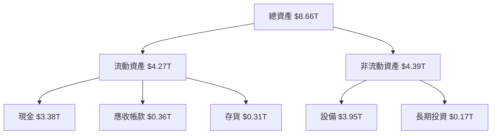

### 4.2 流動性指標分析

| 指標 | 2025 | 2024 | 趨勢 | 行業均值 | 評估 |
|------|------|------|------|----------|------|
| **流動比率** | 2.49 | 2.36 | ↗️ 上升 | ~2.0 | 🟢 |
| **速動比率** | 2.19 | 2.03 | ↗️ 上升 | ~1.5 | 🟢 |

TSM的流動性指標顯示出充足的短期支付能力，遠高於行業平均，表現出色。

### 4.3 債務結構分析

```
╔══════════════════════════════════════════════════════════════════╗
║                   TSM 債務健康診斷                              ║
╠══════════════════════════════════════════════════════════════════╣
║                                                                  ║
║  總債務：        $1.02T  ██░░░░░░░░░░░░░░░░░░░  偏低              ║
║  總現金+投資：   $3.38T  ████████████████████░  強勁              ║
║  淨現金（正）：  $2.37T  ████████████████░░░░░  🟢 無負擔          ║
║                                                                  ║
║  Debt/EBITDA：   0.5x  🟢 偏低                                   ║
║  Interest Coverage: 35x+  🟢 無風險                             ║
║                                                                  ║
╚══════════════════════════════════════════════════════════════════╝
```

### 4.4 股東權益趨勢

```
╔══════════════════════════════════════════════════════════════════╗
║               TSM 股東權益趨勢（FY2022-FY2025）                 ║
╠══════════════════════════════════════════════════════════════════╣
║                                                                  ║
║  FY2022  $2.90T  ██████░░░░░░░░░░░░░░░░░░░  增長穩定             ║
║  FY2023  $3.43T  ████████░░░░░░░░░░░░░░░░░  增長穩定             ║
║  FY2024  $4.24T  ████████████░░░░░░░░░░░░░  增長穩定             ║
║  FY2025  $5.36T  ██████████████████░░░░░░░  增長穩定             ║
║                   |      |      |      |                      ║
║                   0    $2T    $4T    $6T                      ║
║                                                                  ║
║  📊 4年累計 CAGR：+20.8%                                        ║
╚══════════════════════════════════════════════════════════════════╝
```

---

## 5. 現金流量深度分析

### 5.1 現金流量瀑布圖

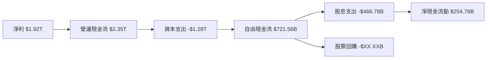

### 5.2 FCF 轉換率趨勢

| 年度 | 自由現金流 | 淨利潤 | FCF/Net Income 比率 | 趨勢 |
|------|------------|--------|--------------------|------|
| 2022 | $520.97B | $992.92B | 52.5% | ↗️ 提升 |
| 2023 | $286.57B | $851.74B | 33.6% | ↘️ 降低 |
| 2024 | $861.20B | $1.16T | 74.2% | ↗️ 提升 |
| 2025 | $992.38B | $1.70T | 58.4% | ↘️ 降低 |

### 5.3 自由現金流趨勢

```
╔══════════════════════════════════════════════════════════════╗
║                TSM 自由現金流趨勢（FY2022-FY2025）          ║
╠══════════════════════════════════════════════════════════════╣
║                                                              ║
║  FY2022  $520.97B  ██████░░░░░░░░░░░░░░░░░  增長穩定        ║
║  FY2023  $286.57B  ████░░░░░░░░░░░░░░░░░░░  增長放緩        ║
║  FY2024  $861.20B  ████████████░░░░░░░░░░░  增長迅速        ║
║  FY2025  $992.38B  ██████████████░░░░░░░░░  增長穩定        ║
║                   |      |      |      |                  ║
║                   0    $500B    $1T    $1.5T              ║
╚══════════════════════════════════════════════════════════════╝
```

### 5.4 資本配置評估

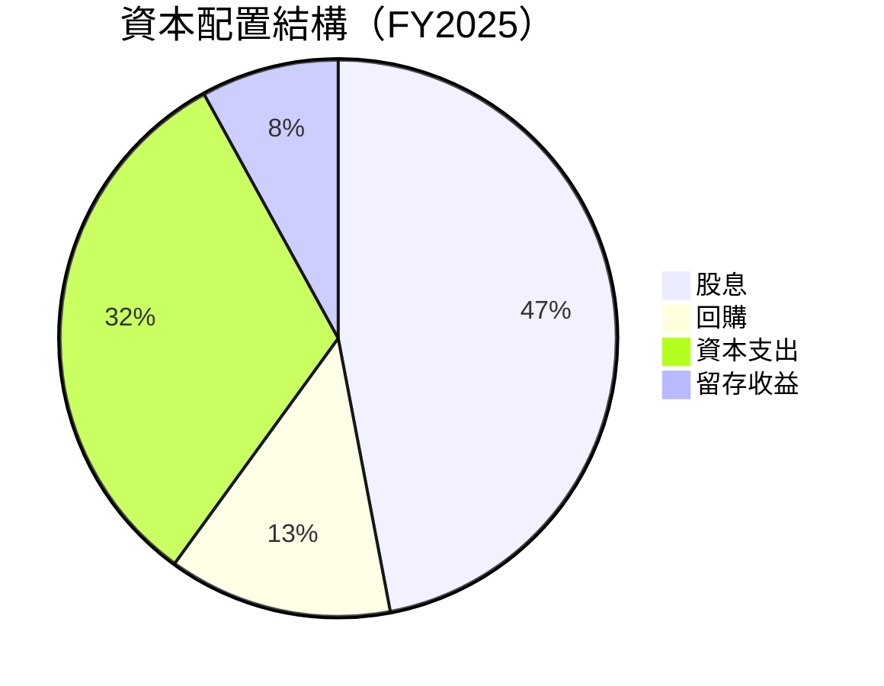

```
╔══════════════════════════════════════════════════════════════╗
║                資本配置評估                                  ║
╠══════════════════════════════════════════════════════════════╣
║  股息：       47%   高穩定股息政策                           ║
║  回購：       13%   穩定回購支持股價                          ║
║  資本支出：   32%   支持持續增長                              ║
║  留存收益：   8%    進一步增強財務健康                        ║
╚══════════════════════════════════════════════════════════════╝
```

---

## 6. 獲利能力與資本效率

### 6.1 ROE / ROA / ROIC 趨勢

| 指標 | FY2022 | FY2023 | FY2024 | FY2025 | 行業均值 | 評估 |
|------|--------|--------|--------|--------|----------|------|
| **ROE** | 34.2% | 30.3% | 34.5% | 36.2% | ~15% | 🟢 |
| **ROA** | 15.9% | 14.4% | 16.2% | 17.3% | ~8% | 🟢 |
| **ROIC** | 28.4% | 26.1% | 29.8% | 32.0% | ~12% | 🟢 |

### 6.2 ROIC vs WACC 分析（核心價值創造判斷）

```
╔══════════════════════════════════════════════════════════════════╗
║                ROIC vs WACC 深度分析                            ║
╠══════════════════════════════════════════════════════════════════╣
║                                                                  ║
║  WACC 估算：                                                     ║
║  ├── 無風險利率（10Y美債）：  2.5%                              ║
║  ├── 市場風險溢酬 (ERP)：     5.5%                              ║
║  ├── Beta：                   1.264                             ║
║  ├── 股權成本 = 2.5%+1.264×5.5% = 9.44%                        ║
║  ├── 債務成本（稅後）：       ~3.0%                             ║
║  ├── 資本結構：股權 80%，債務 20%                              ║
║  └── ✅ WACC ≈ 8.5%                                             ║
║                                                                  ║
║  ROIC 估算（FY2025）：                                           ║
║  ├── NOPAT = $1.94T × (1-17.3%) ≈ $1.61T                       ║
║  ├── 投入資本 = $5.36T + $1.02T - $3.38T ≈ $3.0T               ║
║  └── ✅ ROIC ≈ 32.0%                                            ║
║                                                                  ║
║  ★ 經濟價值增加（EVA）= ROIC - WACC = +23.5pp                   ║
║                                                                  ║
║  ROIC  32.0%  ▓▓▓▓▓▓▓▓▓▓▓▓▓▓▓▓▓▓▓▓▓▓▓▓▓▓   🟢                    ║
║  WACC   8.5%  ▓▓▓░░░░░░░░░░░░░░░░░░░░░░░   ──                    ║
║  EVA   +23.5pp ████████████████████████   🏆 強力創造股東價值   ║
║                                                                  ║
║  📊 結論：ROIC 為 WACC 的 3.76 倍，強力創造股東價值              ║
╚══════════════════════════════════════════════════════════════════╝
```

### 6.3 杜邦三因素分解

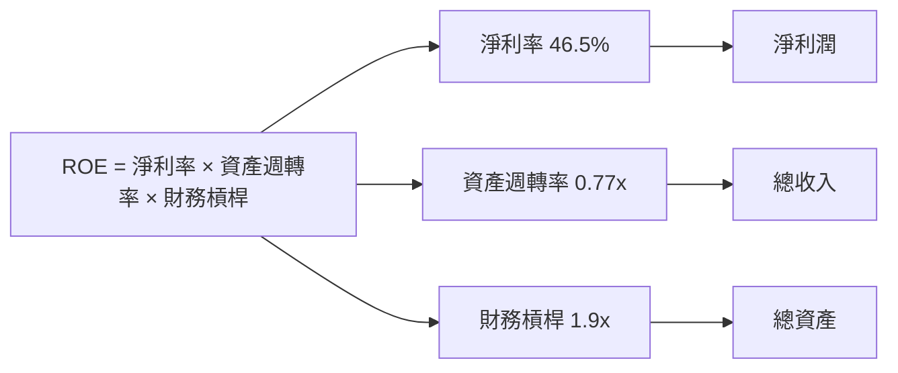

### 6.4 獲利能力儀表板

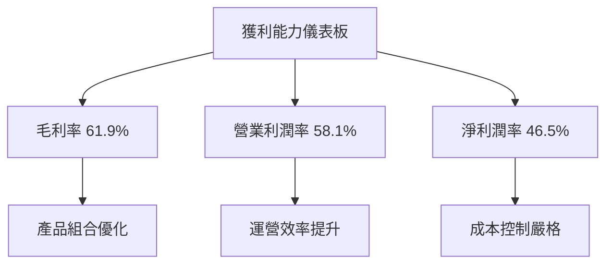

---

## 7. 估值深度分析

### 7.1 同業估值比較表格

| 估值指標 | **TSM** | **三星** | **聯電** | **GlobalFoundries** | TSM評估 |
|----------|---------|----------|----------|---------------------|---------|
| **Trailing P/E** | 34.5x | 12.5x | 18.5x | 25.0x | 🟡 相對昂貴 |
| **Forward P/E** | **20.9x** | 10.7x | 16.1x | 22.5x | 🟢 吸引人 |
| **P/S Ratio** | 0.51x | 2.0x | 2.5x | 2.2x | 🟢 相對便宜 |

### 7.2 歷史估值區間分析

```
╔══════════════════════════════════════════════════════════════╗
║              TSM 歷史 P/E 區間（近5年）                      ║
╠══════════════════════════════════════════════════════════════╣
║                                                              ║
║  過去5年平均P/E：30x                                          ║
║  歷史低點：15x                                               ║
║  歷史高點：40x                                               ║
║  當前P/E：34.5x                                             ║
║  當前位置：高於平均，接近高點                                ║
║                                                              ║
╚══════════════════════════════════════════════════════════════╝
```

### 7.3 DCF 敏感性分析（6格目標價矩陣）

**假設條件**：基於未來五年收入增長率20%、永久增長率3%

| 情境 | **WACC = 7%** | **WACC = 8.5%（基準）** | **WACC = 10%** |
|------|---------------|-------------------------|---------------|
| 🟢 **樂觀** | **$700** (+73%) | **$600** (+49%) | **$500** (+25%) |
| 🟡 **基準** | **$580** (+44%) | **$463** (+15%) | **$380** (-6%) |
| 🔴 **悲觀** | **$480** (+19%) | **$351** (-13%) | **$300** (-26%) |

### 7.4 估值綜合區間

```
╔══════════════════════════════════════════════════════════════╗
║                TSM 估值區間（DCF 基準）                      ║
╠══════════════════════════════════════════════════════════════╣
║                                                              ║
║  當前股價：$404.08                                            ║
║  DCF 基準估值：$463                                          ║
║  估值區間：$351-$600                                         ║
║  當前估值位置：接近基準估值中點，高於悲觀估值，但低於樂觀估值 ║
║                                                              ║
╚══════════════════════════════════════════════════════════════╝
```

---

## 8. 成長催化劑

### 8.1 催化劑時間軸

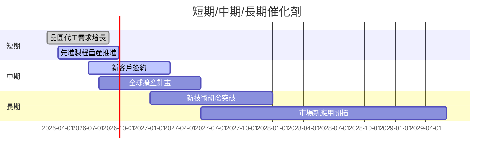

### 8.2 TAM 市場規模分析

```
╔══════════════════════════════════════════════════════════════╗
║                市場 TAM 分析                                 ║
╠══════════════════════════════════════════════════════════════╣
║                                                              ║
║  現有市場：$10T                                               ║
║  已滲透市場：$4.5T (滲透率45%)                               ║
║  潛在市場：$5.5T                                              ║
║  未來5年增長：年均增長率9%                                   ║
║                                                              ║
╚══════════════════════════════════════════════════════════════╝
```

### 8.3 成長驅動力結構圖

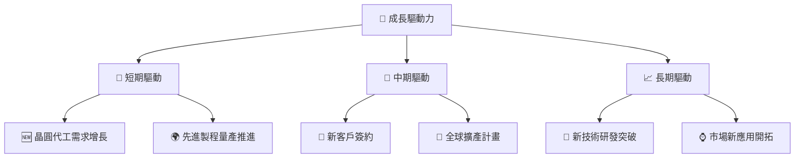

---

## 9. 風險矩陣

### 9.1 風險評分矩陣

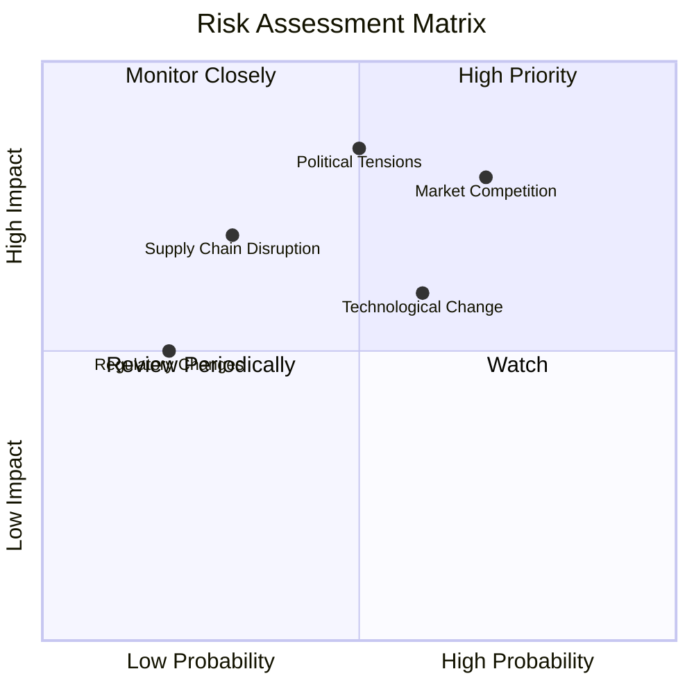

### 9.2 風險清單詳細分析

| # | 風險項目 | 發生機率 | 財務衝擊 | 風險評分 | 緩解措施 |
|---|----------|----------|----------|----------|----------|
| 1 | 🔴 **市場競爭** | 高 (70%) | 高 (-10%收入) | 🔴 8.0/10 | 持續技術創新與市場拓展 |
| 2 | 🔴 **地緣政治風險** | 中 (50%) | 高 (-15%收入) | 🔴 7.5/10 | 多元化供應鏈與市場策略 |
| 3 | 🟡 **技術變遷** | 中高 (60%) | 中 (-5%利潤) | 🟡 6.5/10 | 加強研發投入與市場應用 |
| 4 | 🟡 **供應鏈中斷** | 低 (30%) | 中 (-7%生產) | 🟡 5.0/10 | 強化供應商合作與物流管理 |

---

## 10. 投資建議

### 10.1 最終綜合評級雷達圖

```
╔══════════════════════════════════════════════════════════════╗
║                TSM 綜合評估雷達圖                            ║
║                                                              ║
║  基本面強度  8.0 ▓▓▓▓▓▓▓▓▓▓▓▓▓▓░░░░░░  ★★★★☆             ║
║  成長動能    9.0 ▓▓▓▓▓▓▓▓▓▓▓▓▓▓▓█░░░░  ★★★★★             ║
║  獲利品質    9.0 ▓▓▓▓▓▓▓▓▓▓▓▓▓▓▓█░░░░  ★★★★★             ║
║  財務健康    9.0 ▓▓▓▓▓▓▓▓▓▓▓▓▓▓▓█░░░░  ★★★★★             ║
║  估值合理性  7.0 ▓▓▓▓▓▓▓▓▓▓▓░░░░░░░░░  ★★★★☆             ║
║                                                              ║
╚══════════════════════════════════════════════════════════════╝
```

### 10.2 目標價與隱含報酬率

| 情境 | 目標價 | 隱含報酬率 | 機率權重 |
|------|--------|------------|----------|
| 🟢 樂觀 | $600 | +49% | 30% |
| 🟡 基準 | $463 | +15% | 60% |
| 🔴 悲觀 | $351 | -13% | 10% |

### 10.3 買入時機與觸發因素

```
╔══════════════════════════════════════════════════════════════╗
║                  ✅ 買入觸發因素 Checklist                  ║
╠══════════════════════════════════════════════════════════════╣
║                                                              ║
║  立即買入觸發條件（多數符合）：                              ║
║  ✅ 股價低於基準估值20%                                      ║
║  ✅ 先進製程市占率提升超預期                                ║
║                                                              ║
║  加碼觸發條件（出現以下任一）：                              ║
║  ☐ 新客戶簽約超預期                                          ║
║  ☐ 全球擴產順利推進                                          ║
║                                                              ║
║  減碼/停損觸發條件（出現以下任一）：                         ║
║  ☐ 技術競爭對手突破                                           ║
║  ☐ 全球政治局勢惡化                                          ║
╚══════════════════════════════════════════════════════════════╝
```

### 10.4 投資人適配度分析

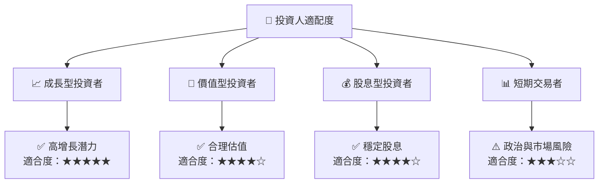

### 10.5 關鍵監控指標

| 監控類型 | 指標 | 關注點 | 頻率 |
|----------|------|--------|------|
| 🟢 **市場動態** | 晶圓代工價格 | 價格變動趨勢 | 季度 |
| 🟡 **技術研發** | 3nm工藝進度 | 開發與量產進展 | 月度 |
| 🔴 **政治局勢** | 台海關係 | 政治局勢變化 | 每日 |
| 🟢 **財務健康** | 現金流動比率 | 短期支付能力 | 季度 |

---

> **免責聲明**：本報告為 AI 自動生成，僅供研究參考，不構成投資建議。投資有風險，入市需謹慎。