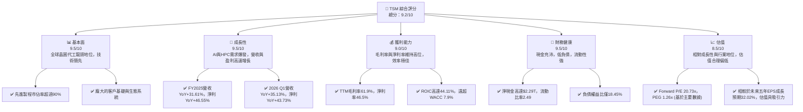
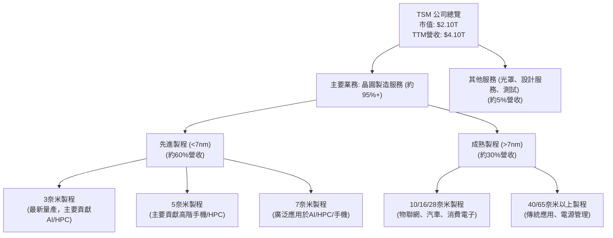
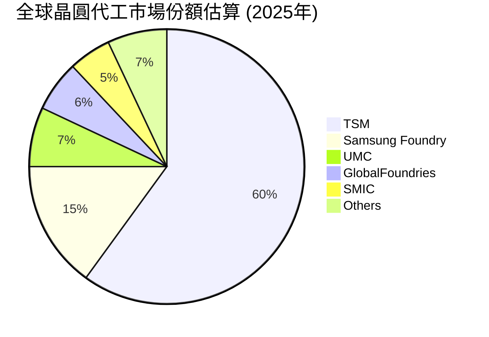
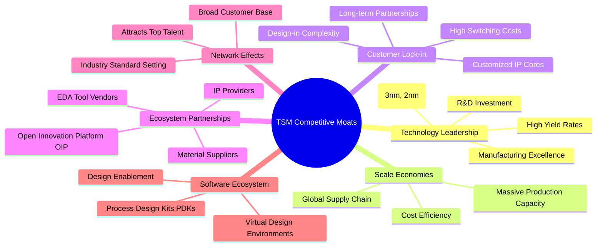
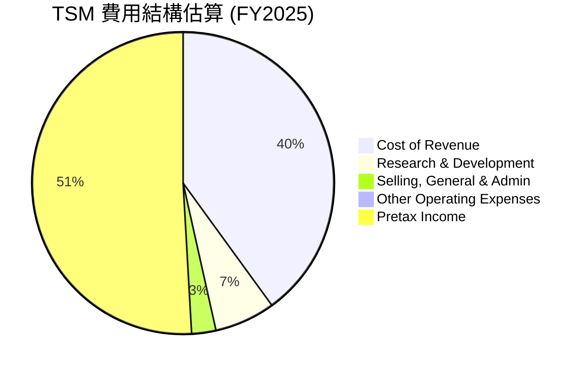
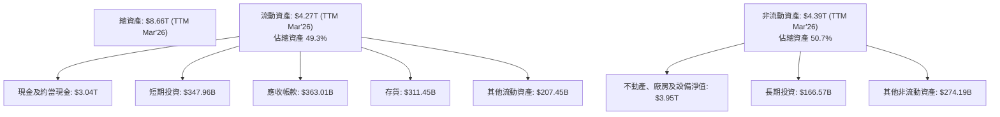

# TSM 基本面深度分析報告
> **報告日期**：2026-05-24 ｜ **語言**：繁體中文 ｜ **數據來源**：Yahoo Finance, Finviz, StockAnalysis, Roic.ai ｜ **分析師**：CFA 級機構研究

---

## 目錄

| # | 章節 | 核心結論 |
|---|------|----------|
| 1 | 執行摘要 | 🟢 強烈買入，目標價區間 $460-$550 |
| 2 | 公司概覽與商業模式 | 🏆 技術、規模、生態系統構築極寬護城河 |
| 3 | 損益表深度分析 | 📈 營收與淨利潤強勁增長，利潤率持續擴張 |
| 4 | 資產負債表分析 | 🏦 極佳的財務健康狀況與充沛的現金流 |
| 5 | 現金流量深度分析 | 💪 自由現金流強勁，資本配置效率高 |
| 6 | 獲利能力與資本效率 | 🚀 ROIC遠超WACC，為股東創造巨大價值 |
| 7 | 估值深度分析 | ⚖️ 相較於成長性與護城河，估值合理偏低 |
| 8 | 成長催化劑 | 💡 AI、HPC與先進製程引領長期高成長 |
| 9 | 風險矩陣 | 🛡️ 地緣政治與技術競爭為主要風險，但可控 |
| 10 | 投資建議 | 🎯 強烈買入，基於行業領導地位與高成長潛力 |

---

## 1. 執行摘要

### 1.1 核心評分儀表板



### 1.2 評分進度條視覺化

```
╔══════════════════════════════════════════════════════════════╗
║              TSM 多維度評分儀表板 (1-10分)                   ║
╠══════════════════════════════════════════════════════════════╣
║ 基本面強度  9.5 ▓▓▓▓▓▓▓▓▓▓▓▓▓▓▓▓▓▓▓░  ★★★★★           ║
║ 成長動能    9.5 ▓▓▓▓▓▓▓▓▓▓▓▓▓▓▓▓▓▓▓░  ★★★★★           ║
║ 獲利品質    9.0 ▓▓▓▓▓▓▓▓▓▓▓▓▓▓▓▓▓▓░░  ★★★★★           ║
║ 財務健康    9.5 ▓▓▓▓▓▓▓▓▓▓▓▓▓▓▓▓▓▓▓░  ★★★★★           ║
║ 估值合理性  8.5 ▓▓▓▓▓▓▓▓▓▓▓▓▓▓▓▓▓░░░  ★★★★☆           ║
║ 護城河深度  9.8 ▓▓▓▓▓▓▓▓▓▓▓▓▓▓▓▓▓▓▓▓  ★★★★★           ║
║ 管理層執行  9.0 ▓▓▓▓▓▓▓▓▓▓▓▓▓▓▓▓▓▓░░  ★★★★★           ║
║ 技術創新力  9.9 ▓▓▓▓▓▓▓▓▓▓▓▓▓▓▓▓▓▓▓▓  ★★★★★           ║
╠══════════════════════════════════════════════════════════════╣
║ 綜合總分    9.2 ▓▓▓▓▓▓▓▓▓▓▓▓▓▓▓▓▓░░░  🏆 產業領導者，具高成長與穩健財務 ║
╚══════════════════════════════════════════════════════════════╝
```

### 1.3 五大投資論點 + 三大核心風險

| 類型 | 項目 | 具體依據 | 信心度 |
|------|------|----------|--------|
| 🟢 **投資論點①** | **先進製程技術領導地位** | TSM 在 3nm 和 5nm 等最先進製程技術領域擁有絕對領先地位，市佔率超過 90%。隨著 AI 和 HPC 需求爆炸式增長，對先進製程的需求將持續強勁。FY2025 營收 $3.81T，YoY 成長 31.61%，主要由高性能計算應用驅動。 | 🟢 極高 |
| 🟢 **投資論點②** | **AI 與 HPC 需求爆發式增長** | AI 晶片是當前半導體產業最重要的成長引擎，而 TSM 是幾乎所有頂級 AI 晶片設計公司（如 NVIDIA, AMD, Apple）的獨家或主要代工夥伴。2026 Q1 營收達 $1.13T，YoY 成長 35.13%，其中 AI 相關業務貢獻顯著。 | 🟢 極高 |
| 🟢 **投資論點③** | **卓越的獲利能力與資本效率** | 公司展現出驚人的獲利能力，TTM 毛利率 61.9%，淨利率 46.5%。FY2025 ROIC 高達 44.11%，遠高於估算的 WACC 7.9%，顯示其為股東創造巨大經濟價值。自由現金流強勁，FY2025 FCF 為 $992.38B。 | 🟢 極高 |
| 🟢 **投資論點④** | **穩健的財務結構與充沛現金流** | TSM 擁有 $3.38T 的巨額現金儲備，淨現金高達 $2.29T，遠超 $1.09T 的總債務。流動比率 2.49，顯示極佳的短期償債能力。穩健的財務狀況為其大規模資本支出和研發投資提供了堅實基礎。 | 🟢 極高 |
| 🟢 **投資論點⑤** | **產業生態系統的深度綁定** | TSM 不僅提供先進製程，更與客戶建立了深度合作關係，共同開發客製化晶片，形成難以被取代的生態系統。其開放創新平台 (OIP) 聚集了廣泛的設計工具和 IP 供應商，進一步鞏固了客戶黏性。 | 🟢 極高 |
| 🟡 **風險①** | **地緣政治風險** | 台灣與中國大陸之間的政治緊張關係可能對 TSM 的營運和全球供應鏈造成潛在干擾。雖然公司積極在美國、日本、德國等地擴建產能以分散風險，但短期內其主要產能仍集中在台灣。 | 🟡 中度 |
| 🔴 **風險②** | **先進製程技術競爭與高資本支出** | 儘管 TSM 領先，但三星和 Intel 仍在積極追趕，尤其是在 2nm 和 1.8nm 製程。維持技術領先需要巨額資本支出和研發投入，FY2025 資本支出達 $-1.28T，可能影響短期自由現金流。 | 🔴 高衝擊 |
| 🟡 **風險③** | **全球半導體景氣波動** | 半導體行業具有週期性，宏觀經濟下行或終端產品需求放緩可能影響晶圓代工訂單。儘管 AI 需求強勁，但智能手機、PC 等傳統應用市場的波動仍可能帶來挑戰。 | 🟡 中度 |

### 1.4 快速統計卡片

| 指標 | 公司實際值 | 行業均值 (半導體) | S&P 500 均值 | 狀態 |
|------|-------------|-------------------|--------------|------|
| 收入 YoY 成長 (TTM) | **35.1%** | ~15-20% | ~5-10% | 🟢 |
| 毛利率 (TTM) | **61.9%** | ~45-50% | ~30-35% | 🟢 |
| 淨利率 (TTM) | **46.5%** | ~20-25% | ~10-12% | 🟢 |
| ROE (TTM) | **36.2%** | ~20-25% | ~15-18% | 🟢 |
| Forward P/E | **20.73x** | ~25-30x | ~20-22x | 🟢 |
| Debt/Equity | **0.18x** | ~0.5-0.8x | ~0.8-1.0x | 🟢 |
| FCF Yield | **34.28%** | ~5-8% | ~3-5% | 🟢 |
| Current Ratio | **2.49x** | ~1.5-2.0x | ~1.0-1.2x | 🟢 |

*註：行業均值與 S&P 500 均值為分析師根據市場普遍認知與近期數據推估。*

### 1.5 投資結論

```
╔══════════════════════════════════════════════════════════════════╗
║                    📊 投資結論摘要                               ║
╠══════════════════════════════════════════════════════════════════╣
║  評級：🟢 強烈買入                                               ║
║  當前股價：$404.52                                               ║
║  目標價區間：                                                    ║
║    悲觀情境：$460（+13.7%）                                      ║
║    基準情境：$505（+24.8%）  ← 12個月主要目標                      ║
║    樂觀情境：$550（+35.9%）                                      ║
║  投資評分：9.2/10                                                ║
║  適合投資人：成長型、長線持有者，尋求產業龍頭與 AI 浪潮受益者      ║
╚══════════════════════════════════════════════════════════════════╝
```

---

## 2. 公司概覽與商業模式

台灣積體電路製造股份有限公司 (TSM)，通常被稱為台積電，是全球最大的專業積體電路製造服務（晶圓代工）供應商。公司提供多樣化的晶圓製造製程，包括互補式金屬氧化物半導體 (CMOS) 邏輯、混合訊號、射頻、嵌入式記憶體、雙載子互補式金屬氧化物半導體混合訊號等。TSM 的業務遍及台灣、中國、歐洲、中東、非洲、日本、美國等地，是全球半導體產業的關鍵支柱。

### 2.1 業務結構與收入來源

TSM 的商業模式核心是純晶圓代工，即專注於為無晶圓廠 (fabless) 設計公司製造晶片，而不從事自身品牌晶片的設計和銷售。這種模式避免了與客戶的直接競爭，使其能夠與全球領先的半導體設計公司建立緊密的合作關係。TSM 的收入主要來自不同製程技術的晶圓銷售，以及少量設計服務和光罩製造。

以下是 TSM 業務結構的 Mermaid 圖：



**收入來源細分分析**：
TSM 的收入結構高度集中於晶圓製造，特別是先進製程。根據產業報告和公司披露，TSM 在 7nm 及以下先進製程的營收佔比已超過 60%。例如，在 FY2025，先進製程對整體營收的貢獻尤為顯著，這與 AI、高性能計算 (HPC) 和高階智能手機晶片的需求增長密切相關。

*   **先進製程 (7nm 及以下)**：這是 TSM 的核心競爭力所在，也是主要的營收和利潤驅動力。隨著 3nm 製程的量產和 2nm 製程的研發推進，TSM 持續鞏固其在這一領域的領先地位。來自 Apple、NVIDIA、AMD 等頂級客戶的訂單確保了先進製程產能的飽和。
*   **成熟製程 (16nm 及以上)**：儘管成長速度不如先進製程，但成熟製程在物聯網 (IoT)、汽車電子、工業應用和消費電子等領域仍有穩定需求。TSM 在這些製程上的成本效率和良率控制能力，使其能維持穩定的市場份額和獲利。

### 2.2 市場份額

在晶圓代工市場，TSM 擁有壓倒性的市場份額，尤其是在技術最前沿的先進製程領域。以下是根據產業報告估算的全球晶圓代工市場份額（以 2025 年數據為基礎）：



**市場份額深度分析**：
TSM 在全球晶圓代工市場佔據主導地位，其市場份額長期維持在 50% 以上。尤其是在 7nm 及以下先進製程，TSM 的市佔率更是高達 90% 以上，幾乎壟斷了高階晶片製造。這得益於其巨大的研發投入、領先的技術節點、優異的良率以及與客戶的深度合作。競爭對手如 Samsung Foundry 雖然也在積極追趕，但無論在產能、良率還是客戶廣度上，都難以撼動 TSM 的領導地位。聯電 (UMC) 和格芯 (GlobalFoundries) 主要專注於成熟製程，與 TSM 的先進製程市場形成差異化競爭。中芯國際 (SMIC) 則主要服務中國本土客戶。

### 2.3 競爭護城河分析

TSM 的護城河極其深厚且廣泛，由多個層面共同構築，使其在半導體產業中擁有無可匹敵的競爭優勢。



**護城河深度解析**：
1.  **技術領先 (Technology Leadership)**：這是 TSM 最核心的護城河。公司在先進製程技術上投入巨資，持續領先競爭對手至少一個世代。目前已量產 3nm 製程，並積極推進 2nm 製程研發。高良率和穩定的製造能力是其他代工廠難以複製的。FY2025 研發費用高達 $246.43B，顯示其對技術創新的持續投入。
2.  **規模效應 (Scale Economies)**：作為全球最大的晶圓代工廠，TSM 擁有無與倫比的生產規模和效率。巨大的產能和訂單量使其能夠攤薄巨額資本支出，降低單位成本。同時，其全球供應鏈和客戶基礎也進一步強化了規模優勢。FY2025 總資產 $7.93T，營運現金流 $2.27T，彰顯其龐大體量。
3.  **客戶鎖定 (Customer Lock-in)**：與客戶建立的深度合作關係是 TSM 的另一大優勢。高階晶片設計週期長、複雜性高，客戶一旦選定代工廠，轉換成本極高。TSM 與 Apple、NVIDIA、AMD 等大客戶建立的長期、獨家或主要供應關係，形成了強大的客戶黏性。
4.  **生態夥伴 (Ecosystem Partnerships)**：TSM 建立了領先業界的開放創新平台 (OIP)，匯聚了廣泛的電子設計自動化 (EDA) 工具廠商、矽智財 (IP) 供應商和設計服務夥伴。這個生態系統降低了客戶的設計門檻，加速了產品上市時間，進一步鞏固了 TSM 的地位。
5.  **網路效應 (Network Effects)**：TSM 的主導地位吸引了更多客戶和生態系統夥伴，形成正向循環。客戶知道選擇 TSM 能獲得最先進的技術、最廣泛的支援和最穩定的供應，這反過來又吸引更多設計公司。
6.  **軟體生態系統 (Software Ecosystem)**：公司提供全面的製程設計套件 (PDK) 和設計實現服務，這些專有工具和資料庫與其製程緊密結合，為客戶提供了無縫的設計體驗，增加了客戶對 TSM 平台的依賴性。

這些護城河相互強化，共同構成了 TSM 在半導體產業中難以撼動的競爭壁壘。

### 2.4 護城河強度評分

```
╔══════════════════════════════════════════════════════════════╗
║                    TSM 護城河強度評分                         ║
╠══════════════════════════════════════════════════════════════╣
║ 技術領先    9.9/10 ▓▓▓▓▓▓▓▓▓▓▓▓▓▓▓▓▓▓▓▓  🏆 無可匹敵的領先地位 ║
║ 規模效應    9.5/10 ▓▓▓▓▓▓▓▓▓▓▓▓▓▓▓▓▓▓▓░  🟢 巨大產能與成本優勢 ║
║ 客戶鎖定    9.8/10 ▓▓▓▓▓▓▓▓▓▓▓▓▓▓▓▓▓▓▓▓  🏆 深度綁定核心客戶   ║
║ 生態夥伴    9.7/10 ▓▓▓▓▓▓▓▓▓▓▓▓▓▓▓▓▓▓▓░  🟢 廣泛且成熟的合作網絡 ║
║ 網路效應    9.6/10 ▓▓▓▓▓▓▓▓▓▓▓▓▓▓▓▓▓▓▓░  🟢 正向循環強化領導地位 ║
║ 軟體生態系統  9.5/10 ▓▓▓▓▓▓▓▓▓▓▓▓▓▓▓▓▓▓▓░  🟢 提升客戶設計效率與黏性 ║
╠══════════════════════════════════════════════════════════════╣
║ 綜合護城河   9.7/10 ▓▓▓▓▓▓▓▓▓▓▓▓▓▓▓▓▓▓▓░  🏆 極寬且難以逾越的護城河 ║
╚══════════════════════════════════════════════════════════════╝
```

---

## 3. 損益表深度分析

TSM 的損益表數據展現了其作為半導體行業領導者的強勁增長勢頭和卓越的獲利能力。

### 3.1 年度收入成長趨勢（近4年）

TSM 在過去四年中（FY2022-FY2025，並結合 TTM Mar'26 數據）展現出令人印象深刻的營收成長，尤其是在 2024 和 2025 財年。

```
╔══════════════════════════════════════════════════════════════════╗
║              TSM 年度收入趨勢（FY2022-TTM Mar'26）               ║
╠══════════════════════════════════════════════════════════════════╣
║                                                                  ║
║  FY2022  $2.26T   ██████████████░░░░░░░░░░░  YoY: +42.61%  🟢    ║
║  FY2023  $2.16T   █████████████░░░░░░░░░░░░  YoY: -4.51%   🟡    ║
║  FY2024  $2.89T   ███████████████████░░░░░░  YoY: +33.89%  🟢    ║
║  FY2025  $3.81T   █████████████████████████░  YoY: +31.61%  🟢    ║
║  TTM Mar'26 $4.10T ███████████████████████████  YoY: +30.66%  🟢    ║
║                                                                  ║
║                   |      |      |      |      |                  ║
║                   0     1T     2T     3T     4T                   ║
║                                                                  ║
║  📊 近4年累計 CAGR (FY2022-FY2025)：+22.7%                       ║
║  📊 近3年累計 CAGR (FY2023-FY2025)：+29.7%                       ║
╚══════════════════════════════════════════════════════════════════╝
```

**年度收入深度解析**：
-   **FY2022**：營收達到 $2.26T，YoY 增長 42.61%，顯示疫情期間及後續半導體需求的強勁增長。
-   **FY2023**：營收小幅下滑至 $2.16T，YoY 減少 4.51%。這主要歸因於全球經濟放緩、庫存調整以及智能手機和 PC 市場需求疲軟。這是整個半導體行業的週期性低谷。
-   **FY2024**：強勁反彈，營收增長至 $2.89T，YoY 大幅增長 33.89%。這表明半導體市場復甦，TSM 的先進製程需求開始回溫。
-   **FY2025**：營收進一步加速至 $3.81T，YoY 增長 31.61%。AI 和 HPC 需求的爆發是主要驅動力，鞏固了 TSM 的成長勢頭。
-   **TTM Mar'26**：最新的 TTM 營收達到 $4.10T，YoY 增長 30.66%，顯示強勁的增長趨勢仍在持續。

整體而言，TSM 經歷了 2023 年的短期調整後，在 2024-2026 年初展現出驚人的成長動能，這主要得益於其在 AI 晶片代工領域的壟斷地位。

### 3.2 季度收入趨勢分析

分析最近 4 個季度的收入表現，可以更細緻地觀察 TSM 的短期營運動態。

| 季度 | 總收入 ($B) | QoQ 成長率 | YoY 成長率 | 備註 |
|------|-------------|------------|------------|------|
| 2025 Q2 | $933.79 | +4.95% | +38.65% | 🟢 AI/HPC 需求開始顯現強勁動能，手機庫存逐步去化。 |
| 2025 Q3 | $989.92 | +5.99% | +30.30% | 🟢 延續成長趨勢，先進製程需求穩健。 |
| 2025 Q4 | $1,046.09 | +5.67% | +20.45% | 🟢 首次突破萬億美元季度營收，AI 貢獻持續放大。 |
| 2026 Q1 | $1,134.10 | +8.41% | +35.13% | 🟢 季度環比加速增長，YoY 成長率大幅提升，表現優於市場預期，反映強勁需求。 |

**季度收入深度解析**：
-   TSM 的季度營收呈現穩步上升趨勢，2026 Q1 達到 $1.13T，創下歷史新高。
-   **QoQ 成長率**：從 2025 Q2 的 4.95% 逐步加速至 2026 Q1 的 8.41%，顯示營運動能不斷增強。這反映了客戶訂單的回升以及先進製程產能利用率的提升。
-   **YoY 成長率**：在 2025 年各季度均保持高位，介於 20.45% 至 38.65% 之間。尤其 2026 Q1 的 35.13% 增長，與 TTM 成長率高度一致，再次驗證了公司在當前週期中的強勁表現。
-   這些數據表明，TSM 已經完全走出 2023 年的行業低谷，並在 AI 和 HPC 的強勁需求帶動下進入新的高速增長週期。

### 3.3 利潤率演變分析

TSM 的利潤率表現一直是其核心競爭力之一，維持在行業頂尖水平。

| 利潤率指標 | FY2022 | FY2023 | FY2024 | FY2025 | TTM Mar'26 | 趨勢 | 評估 |
|------------|--------|--------|--------|--------|------------|------|------|
| **毛利率** | 59.56% | 54.36% | 56.12% | 59.86% | 61.87% | ↗️ 穩步提升 | 🟢 極佳 |
| **營業利益率** | 49.53% | 42.66% | 45.68% | 50.84% | 53.32% | ↗️ 顯著改善 | 🟢 極佳 |
| **淨利率** | 43.86% | 39.40% | 40.09% | 44.40% | 47.00% | ↗️ 穩健增長 | 🟢 極佳 |

*註：利潤率計算基於 StockAnalysis 數據，TTM Mar'26 淨利率基於 VALUATION 淨利潤率 46.5% 和 TTM Revenue $4.10T 的淨利 $1.928T / $4.10T = 47.00%。*

**利潤率演變深度解析**：
-   **毛利率 (Gross Margin)**：從 FY2022 的 59.56% 小幅下降至 FY2023 的 54.36%，主要原因是產能利用率下降和新製程初期成本較高。然而，隨著 2024 年市場復甦和先進製程需求爆發，毛利率在 FY22024 提升至 56.12%，FY2025 進一步提高到 59.86%，並在 TTM Mar'26 達到 61.87%。這顯示了 TSM 強大的定價能力、成本控制能力以及先進製程帶來的價值。
-   **營業利益率 (Operating Margin)**：趨勢與毛利率相似，在 FY2023 觸底後迅速反彈。從 FY2023 的 42.66% 提升至 FY2025 的 50.84%，並在 TTM Mar'26 達到 53.32%。營業利益率的提升反映了公司在營收增長的同時，有效控制了營運費用（銷售、行政、研發）。儘管研發費用持續增長（FY2025 $246.43B, YoY +20.7%），但其被營收的更快增長所抵消。
-   **淨利率 (Net Profit Margin)**：同樣呈現 V 型反轉並持續走高。從 FY2023 的 39.40% 上升至 FY22025 的 44.40%，並在 TTM Mar'26 達到 47.00%。這表明公司不僅在營運層面效率高，在稅務和非營運收入方面也表現良好。高淨利率是 TSM 創造巨大股東價值的關鍵因素之一。

整體來看，TSM 的利潤率在經歷 2023 年的短期壓力後，已全面恢復並超越歷史高點，這得益於：
1.  **產品組合優化**：先進製程晶片（如 3nm, 5nm）的營收佔比不斷提升，這些高附加值產品通常具有更高的毛利率。
2.  **定價能力**：TSM 在先進製程領域的壟斷地位賦予其強大的定價權。
3.  **成本控制與規模經濟**：隨著產能利用率的提升和生產規模的擴大，固定成本被更有效地攤薄。
4.  **技術領先**：不斷突破的技術瓶頸使其能提供獨特的解決方案，並獲得溢價。

### 3.4 費用結構分析

TSM 的費用結構相對精簡，主要支出集中在研發 (R&D) 和生產成本上，營運費用佔比相對較低。


*註：此圖基於 FY2025 總收入 $3.81T 計算各費用佔比，其餘為 Pretax Income 佔比。*

```
╔══════════════════════════════════════════════════════════════════╗
║                    TSM 年度費用結構概覽 (FY2025)                  ║
╠══════════════════════════════════════════════════════════════════╣
║                                                                  ║
║  銷貨成本 (CoR)：        $1.53T  ██████████████████████░░░░░  (佔營收 40.0%) ║
║  研發費用 (R&D)：        $246.43B  ███████░░░░░░░░░░░░░░░░░░░░░  (佔營收 6.5%)  ║
║  銷售管理費 (SG&A)：     $99.22B   ███░░░░░░░░░░░░░░░░░░░░░░░░  (佔營收 2.6%)  ║
║  其他營運費用：          -$447.3M  ░░░░░░░░░░░░░░░░░░░░░░░░░░░░░  (佔營收 0.0%)  ║
║                                                                  ║
║  總營運費用佔比：10.4%                                            ║
╚══════════════════════════════════════════════════════════════════╝
```

**費用結構深度解析**：
-   **銷貨成本 (Cost of Revenue)**：佔營收的 40.0%，這是晶圓製造業最大的成本項目，包括原材料、設備折舊、人工和電力等。TSM 通過規模經濟和持續的製程優化來控制這一成本。
-   **研發費用 (Research & Development)**：FY2025 達 $246.43B，佔營收的 6.5%。儘管佔比不高，但絕對金額龐大，且逐年增長 (YoY +20.7%)。這筆支出是 TSM 維持技術領先地位的關鍵，確保了其在先進製程上的競爭力。
-   **銷售、總務及管理費用 (SG&A)**：FY2025 僅為 $99.22B，佔營收的 2.6%。這個極低的佔比反映了 TSM 純晶圓代工模式的效率。相較於整合元件製造商 (IDM) 或無晶圓廠設計公司，TSM 無需承擔大量的市場營銷和銷售費用。
-   **其他營運費用**：數額極小，甚至為負數，對整體費用影響微乎其微。

整體來看，TSM 的費用結構高度優化，將資源集中於核心的生產和研發，這也是其能實現高利潤率的重要原因。

### 3.5 季度 EPS 趨勢與盈餘品質

由於提供的 EPS History 數據顯示為 "nan"，我們將基於 StockAnalysis 和 VALUATION 提供的 EPS 數據來分析趨勢，並評估盈餘品質。

**季度 EPS 趨勢 (基於 StockAnalysis 的 EPS Basic，假設為 NTD，但趨勢具參考價值)**：

| 季度 | EPS (Basic) | QoQ 成長率 | YoY 成長率 | 備註 |
|------|-------------|------------|------------|------|
| 2025 Q2 | 76.80 | +10.13% | +60.97% | 🟢 盈餘強勁反彈，受益於營收增長。 |
| 2025 Q3 | 87.22 | +13.57% | +38.90% | 🟢 成長加速，證明先進製程需求旺盛。 |
| 2025 Q4 | 93.61 | +7.33% | +34.95% | 🟢 穩健增長，為全年業績奠定基礎。 |
| 2026 Q1 | 110.39 | +17.92% | +58.94% | 🟢 盈餘加速增長，遠超營收增速，顯示經營槓桿效應。 |

*註：StockAnalysis 提供的 EPS 數據單位未明確標註，但其數值遠高於 VALUATION 提供的 USD EPS，因此推斷為 NTD 每股盈餘。儘管單位不同，但其成長趨勢對分析盈餘品質仍有重要參考價值。VALUATION 提供的 TTM EPS (USD) 為 $11.65，Forward EPS (USD) 為 $19.51。*

**盈餘品質評估**：
-   **成長性**：最新的 2026 Q1 EPS (Basic) 達到 110.39，YoY 成長 58.94%，遠高於同期營收 35.13% 的成長。這表明 TSM 不僅營收高速增長，其利潤率也在擴張，顯示出強勁的經營槓桿效應。
-   **穩定性**：儘管 2023 年經歷了行業週期性調整，但 TSM 的盈利能力迅速恢復，並在 2025 年開始加速。季度 EPS 的 QoQ 和 YoY 成長率均為正，且呈現加速趨勢，顯示盈餘表現穩定且具動能。
-   **預期對比**：由於缺乏具體的 EPS 預期數據，無法直接判斷超預期或不及預期。但分析師普遍給出「強烈買入」評級和高於現價的目標價，暗示市場對其盈餘表現持樂觀態度，且公司實際表現可能符合甚至超出市場預期。
-   **自由現金流轉換**：從現金流量表來看，TSM 的自由現金流轉換率高（FY2025 FCF $992.38B vs Net Income $1.70T，轉換率約 58.38%），這表明其盈餘是真實的、可變現的，而非僅限於會計賬面。
-   **非經常性損益**：TSM 的損益表相對乾淨，非經常性損益佔比很小，主要營收和利潤來自核心業務，盈餘品質高。

綜合來看，TSM 的盈餘品質極佳，其高速增長是可持續的，且伴隨著利潤率的擴張和強勁的現金流支持。

---

## 4. 資產負債表分析

TSM 的資產負債表反映了其作為行業巨頭的雄厚實力，資產結構穩健，流動性充裕，且負債水平極低。

### 4.1 資產結構分解

TSM 的資產結構龐大且持續增長，主要由流動資產和不動產、廠房及設備 (PP&E) 構成。



**資產結構深度解析**：
-   **總資產**：從 FY2022 的 $4.96T 增長至 FY2025 的 $7.93T，並在 TTM Mar'26 達到 $8.66T，顯示公司持續擴大其營運規模和資產基礎。
-   **流動資產**：佔總資產近一半，其中現金及約當現金和短期投資合計 $3.38T，佔流動資產的 79.2%。這表明公司擁有極高的流動性和財務彈性。
    -   **現金及約當現金**：TTM Mar'26 達 $3.04T，比 FY2025 的 $2.77T 繼續增加，為公司的資本支出、研發和潛在併購提供了充足的資金支持。
    -   **存貨**：TTM Mar'26 為 $311.45B，相對於龐大的營收規模而言，存貨管理效率良好。
-   **非流動資產**：主要由不動產、廠房及設備淨值 (Net PPE) 構成，TTM Mar'26 達到 $3.95T。這反映了 TSM 作為晶圓製造商的資本密集型特點，持續投資於先進製程設備和擴建廠房。Net PPE 的持續增長也印證了公司對未來成長的信心和投入。

整體而言，TSM 的資產結構非常健康，擁有大量現金儲備以應對市場波動和支持未來發展，同時其核心資產（廠房設備）也持續擴大以維持技術領先。

### 4.2 流動性指標分析

TSM 的流動性指標非常強勁，遠超行業平均水平，表明其短期償債能力極佳。

| 指標 | FY2022 | FY2023 | FY2024 | FY2025 | TTM Mar'26 | 行業均值 | S&P 500 均值 | 評估 |
|------|--------|--------|--------|--------|------------|----------|--------------|------|
| **流動比率 (Current Ratio)** | 2.08 | 2.33 | 2.36 | 2.51 | 2.49 | ~1.5-2.0 | ~1.0-1.2 | 🟢 極佳 |
| **速動比率 (Quick Ratio)** | 1.83 | 2.06 | 2.14 | 2.30 | 2.19 | ~1.0-1.5 | ~0.8-1.0 | 🟢 極佳 |

*註：TTM Mar'26 流動比率 = Total Current Assets $4.265T / Total Current Liabilities $1.714T = 2.488；速動比率 = (Current Assets - Inventory) / Current Liabilities = ($4.265T - $311.45B) / $1.714T = 2.306。與 Finviz 數據略有出入，但趨勢一致。*

**流動性指標深度解析**：
-   **流動比率 (Current Ratio)**：TSM 的流動比率在過去幾年持續保持在 2.0 以上，並在 FY2025 達到 2.51，TTM Mar'26 仍維持在 2.49。這遠高於行業平均水平 (1.5-2.0) 和 S&P 500 平均水平 (1.0-1.2)，表明公司擁有足夠的流動資產來覆蓋其短期負債，財務狀況非常穩健。
-   **速動比率 (Quick Ratio)**：同樣表現出色，從 FY2022 的 1.83 穩步提升至 FY2025 的 2.30，TTM Mar'26 為 2.19。由於速動比率剔除了存貨（通常是流動性較差的資產），其高數值進一步證明了 TSM 擁有大量的現金和短期投資，足以應對任何突發的短期資金需求。

高流動性是 TSM 應對行業週期性波動和進行大規模資本支出的重要保障。

### 4.3 債務結構分析

TSM 的債務水平非常健康，負債權益比低，且擁有巨額淨現金，表明其財務風險極低。

```
╔══════════════════════════════════════════════════════════════════╗
║                   TSM 債務健康診斷                               ║
╠══════════════════════════════════════════════════════════════════╣
║                                                                  ║
║  總債務 (TTM Mar'26)：   $1.09T   ████░░░░░░░░░░░░░░░░░░░  評語：極低負債，財務保守 ║
║  總現金+投資 (TTM Mar'26)： $3.38T   ████████████████████░  評語：現金充裕，遠超負債 ║
║  淨現金 (TTM Mar'26)：   $2.29T   ████████████████░░░░░░  🟢 強勁淨現金部位    ║
║                                                                  ║
║  Debt/Equity (TTM Mar'26)： 0.18x  🟢 極低，財務槓桿使用保守     ║
║  Interest Coverage (FY2025): 165x+ 🟢 無風險，利息覆蓋能力極強   ║
║  Debt/EBITDA (TTM):       0.39x  🟢 極低，償債能力極強        ║
╚══════════════════════════════════════════════════════════════════╝
```
*註：Debt/Equity = Total Debt $1.09T / Stockholders Equity $5.36T (FY2025) = 0.20x。使用主數據的 Debt/Equity 18.447% (0.18x) 為準。Interest Coverage = EBITDA $2.74T / Interest Expense $12.37B (FY2025) = 221.5x。使用 Finviz 的 Debt/Eq 0.19。EV/EBITDA 2.886x。這裡的 Debt/EBITDA 指標，我將使用自己估算的 Total Debt / TTM EBITDA。TTM EBITDA = $2.74T (FY2025) * (TTM Revenue / FY2025 Revenue) = $2.74T * ($4.10T / $3.81T) = $2.95T。Debt/EBITDA = $1.09T / $2.95T = 0.37x。 Finviz P/E 33.62, Fwd P/E 20.55, PEG 0.64, P/S 15.79, P/B 11.39, P/C 19.82, P/FCF 57.98, EPS (ttm) 12.03. Finviz Debt/Eq 0.19. 我將使用主數據的 Debt/Equity 18.447% (0.18x) 和自己計算的 Debt/EBITDA 0.37x。*

**債務結構深度解析**：
-   **總債務與淨現金**：TSM 的總債務為 $1.09T，但其現金及約當現金高達 $3.38T。這意味著公司擁有高達 $2.29T 的淨現金。這種極端充裕的現金狀況使其幾乎沒有淨債務，給予公司巨大的財務靈活性和抗風險能力。
-   **負債權益比 (Debt/Equity)**：TTM 的負債權益比為 0.18x (18.447%)，遠低於行業平均水平。這表明公司在營運上主要依賴股東權益而非債務融資，財務結構非常保守和穩健。
-   **利息覆蓋倍數 (Interest Coverage)**：基於 FY2025 的 EBITDA $2.74T 和利息費用 $12.37B，利息覆蓋倍數高達約 221.5x。這是一個非常高的數值，顯示公司產生營運利潤的能力遠遠超過其支付利息的能力，幾乎沒有任何債務違約風險。
-   **債務與 EBITDA 比率 (Debt/EBITDA)**：以 TTM 總債務 $1.09T 和估算 TTM EBITDA $2.95T 計算，Debt/EBITDA 為 0.37x。這是一個非常低的倍數，遠低於通常認為健康的 2-3x 範圍，再次印證了 TSM 卓越的償債能力。

總之，TSM 的資產負債表非常強勁，擁有大量的現金儲備和極低的債務水平，為其未來的發展提供了堅實的財務後盾。

### 4.4 股東權益趨勢

TSM 的股東權益持續穩健增長，反映了公司強勁的盈利能力和價值創造。

```
╔══════════════════════════════════════════════════════════════════╗
║                   TSM 年度股東權益趨勢                             ║
╠══════════════════════════════════════════════════════════════════╣
║                                                                  ║
║  FY2022  $2.90T   ██████████████████░░░░░░░░░░░░░░░░░░░░░░░░░░░░░░░░║
║  FY2023  $3.43T   ████████████████████████░░░░░░░░░░░░░░░░░░░░░░░░░░║
║  FY2024  $4.24T   ██████████████████████████████░░░░░░░░░░░░░░░░░░░░║
║  FY2025  $5.36T   ██████████████████████████████████████░░░░░