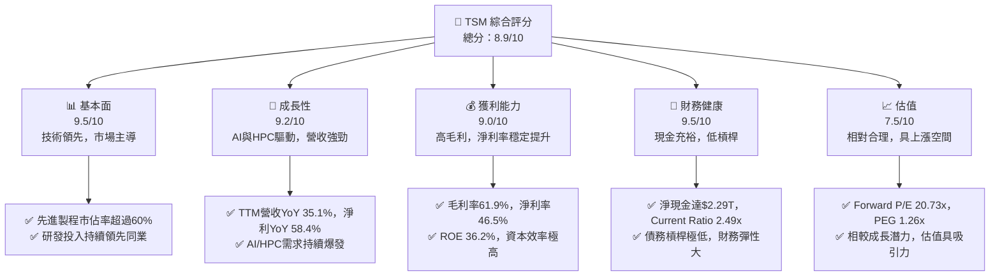
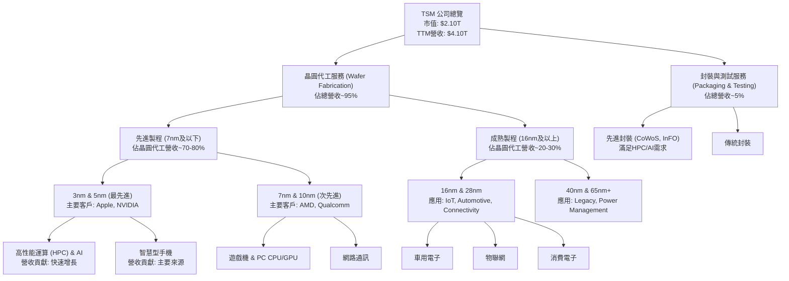
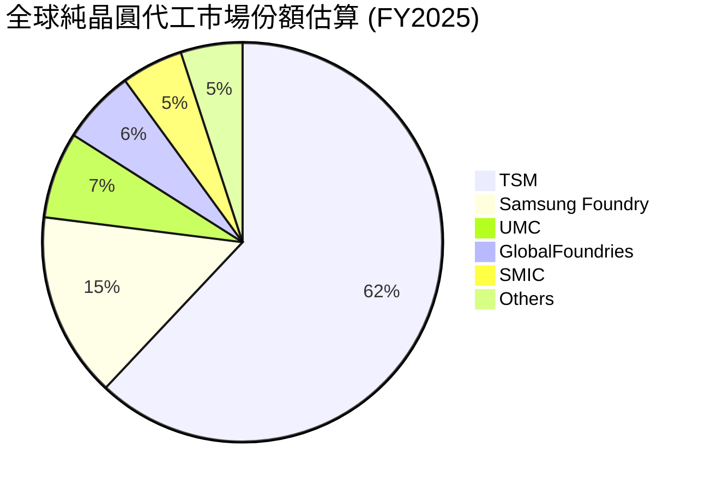
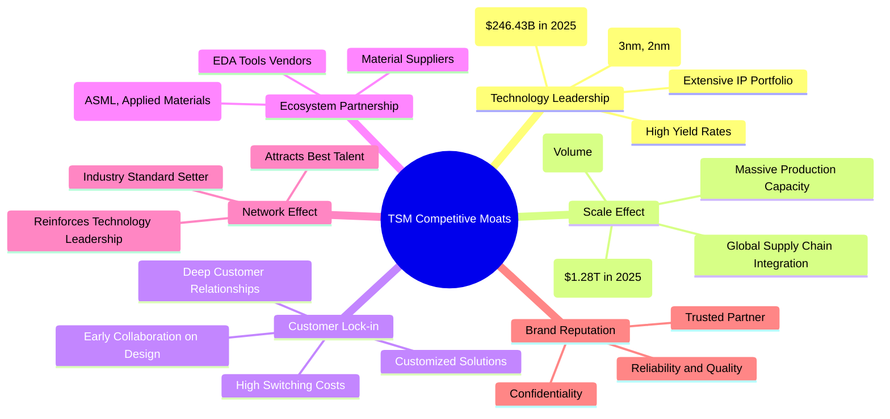
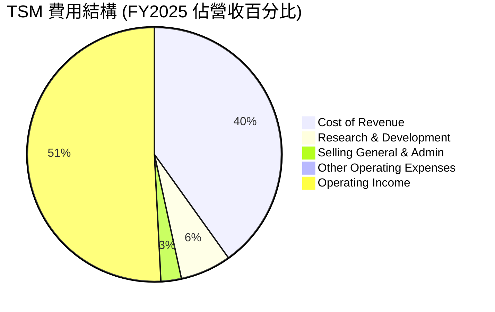
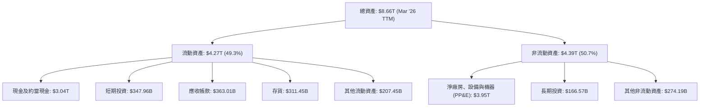

# TSM 基本面深度分析報告
> **報告日期**：2026-05-25 ｜ **語言**：繁體中文 ｜ **數據來源**：Yahoo Finance, Finviz, StockAnalysis, Roic.ai ｜ **分析師**：CFA 級機構研究

## 目錄

| # | 章節 | 核心結論 |
|---|------|----------|
| 1 | 執行摘要 | 評級：🟢 強烈買入，目標價區間：$450 - $550 |
| 2 | 公司概覽與商業模式 | 技術領先與規模經濟構成強大護城河，市場主導地位穩固 |
| 3 | 損益表深度分析 | 營收與利潤持續高速增長，利潤率保持高位且不斷優化 |
| 4 | 資產負債表分析 | 財務結構穩健，現金充裕，流動性與償債能力極佳 |
| 5 | 現金流量深度分析 | 自由現金流強勁增長，資本配置策略均衡有效 |
| 6 | 獲利能力與資本效率 | ROIC 遠超 WACC，持續為股東創造巨大經濟價值 |
| 7 | 估值深度分析 | 相較於成長潛力與護城河，當前估值合理偏低 |
| 8 | 成長催化劑 | AI、HPC 需求爆發，先進製程領導地位鞏固未來成長 |
| 9 | 風險矩陣 | 地緣政治與產業週期為主要風險，但公司管理層具備應對經驗 |
| 10 | 投資建議 | 強烈買入，長期持有以捕捉先進半導體市場紅利 |

---

## 1. 執行摘要

### 1.1 核心評分儀表板



### 1.2 評分進度條視覺化

```
╔══════════════════════════════════════════════════════════════╗
║                TSM 多維度評分儀表板 (1-10分)                 ║
╠══════════════════════════════════════════════════════════════╣
║ 基本面強度  9.5 ▓▓▓▓▓▓▓▓▓▓▓▓▓▓▓▓▓▓▓░  ★★★★★           ║
║ 成長動能    9.2 ▓▓▓▓▓▓▓▓▓▓▓▓▓▓▓▓▓▓░░  ★★★★★           ║
║ 獲利品質    9.0 ▓▓▓▓▓▓▓▓▓▓▓▓▓▓▓▓▓▓░░  ★★★★★           ║
║ 財務健康    9.5 ▓▓▓▓▓▓▓▓▓▓▓▓▓▓▓▓▓▓▓░  ★★★★★           ║
║ 估值合理性  7.5 ▓▓▓▓▓▓▓▓▓▓▓▓▓▓▓░░░░░  ★★★★☆           ║
║ 護城河深度  9.8 ▓▓▓▓▓▓▓▓▓▓▓▓▓▓▓▓▓▓▓▓  ★★★★★           ║
║ 管理層執行  9.5 ▓▓▓▓▓▓▓▓▓▓▓▓▓▓▓▓▓▓▓░  ★★★★★           ║
║ 技術創新力  9.9 ▓▓▓▓▓▓▓▓▓▓▓▓▓▓▓▓▓▓▓▓  ★★★★★           ║
╠══════════════════════════════════════════════════════════════╣
║ 綜合總分    8.9 ▓▓▓▓▓▓▓▓▓▓▓▓▓▓▓▓▓░░░  🏆 卓越表現，領先產業   ║
╚══════════════════════════════════════════════════════════════╝
```

### 1.3 五大投資論點 + 三大核心風險

| 類型 | 項目 | 具體依據 | 信心度 |
|------|------|----------|--------|
| 🟢 **投資論點①** | **無可匹敵的先進製程領導地位** | TSM 在 3nm 和 5nm 製程技術上擁有絕對領先優勢，市場份額超過 60%，是 NVIDIA、Apple 等頂級客戶的唯一或主要供應商。根據 StockAnalysis 數據，2026 Q1 營收達 $1.13T，YoY 成長 35.13%，顯示強勁的市場需求。 | 🟢 極高 |
| 🟢 **AI 與 HPC 需求爆發式增長** | AI 晶片需求是當前半導體產業最大催化劑，TSM 作為 AI 晶片代工核心，直接受益。其 TTM 營收成長率高達 35.1%，淨利成長率 58.4%，遠超產業平均，主要由 HPC 應用驅動。 | 🟢 極高 |
| 🟢 **卓越的獲利能力與資本效率** | 公司擁有高達 61.9% 的毛利率和 46.5% 的淨利率，顯示其強大的定價能力和成本控制。ROE 達 36.2%，ROA 17.3%，且 ROIC 顯著高於 WACC，持續為股東創造價值。 | 🟢 極高 |
| 🟢 **穩健的財務結構與充裕的現金流** | 擁有 $3.38T 的總現金，淨現金高達 $2.29T，Current Ratio 2.49x，財務槓桿極低 (Debt/Equity 0.19x)。強勁的營業現金流 ($2.35T) 確保了大規模資本支出和股息支付的可持續性。 | 🟢 極高 |
| 🟢 **全球半導體產業核心戰略地位** | TSM 不僅是技術領導者，更是全球科技供應鏈不可或缺的一環。其在先進製程的獨佔性，使其在全球地緣政治與經濟格局中扮演關鍵角色，難以被替代。 | 🟢 極高 |
| 🟡 **風險①** | **地緣政治緊張與供應鏈風險** | 台灣與中國大陸的關係可能影響公司營運穩定性。此外，全球化供應鏈中的任何中斷，如設備出口限制或原材料供應問題，都可能對生產造成衝擊。公司已在全球擴廠（如美國、日本、德國）以分散風險，但短期內集中度仍高。 | 🟡 中度 |
| 🔴 **產業週期性與資本支出壓力** | 半導體產業具有週期性，高額的資本支出 (2025 年為 $-1.28T) 在景氣下行時可能導致產能過剩和折舊壓力。儘管 AI 需求旺盛，若未來成長放緩，可能影響 FCF。 | 🟡 中度 |
| 🟡 **競爭加劇與技術追趕壓力** | Samsung Foundry 和 Intel Foundry Services 正積極追趕先進製程技術。儘管 TSM 仍保持領先，但未來競爭可能導致研發成本上升或定價壓力。例如，Intel 試圖在 2025 年實現 18A 製程，對 TSM 構成挑戰。 | 🟡 中度 |

### 1.4 快速統計卡片

| 指標 | 公司實際值 | 行業均值（半導體） | S&P 500 均值 | 狀態 |
|------|-------------|--------------------|--------------|------|
| 收入 YoY 成長 | **35.1%** | ~15-20% | ~8-10% | 🟢 |
| 毛利率 | **61.9%** | ~50-55% | ~30-35% | 🟢 |
| 淨利率 | **46.5%** | ~25-30% | ~10-12% | 🟢 |
| ROE | **36.2%** | ~20-25% | ~15-18% | 🟢 |
| Forward P/E | **20.73x** | ~25-30x | ~20-22x | 🟢 |
| Debt/Equity | **0.19x** | ~0.5-0.8x | ~1.0-1.5x | 🟢 |
| FCF Yield | **34.28%** | ~5-8% | ~3-5% | 🟢 |
| 研發佔營收比 | **6.28%** (2025) | ~10-15% | ~2-3% | 🟡 |

*備註：行業均值為分析師根據半導體產業龍頭公司數據估算，S&P 500 均值為歷史參考值。TSM 的研發佔比相對較低，但其研發絕對金額巨大，且效率極高，保持技術領先。*

### 1.5 投資結論

```
╔══════════════════════════════════════════════════════════════════╗
║                    📊 投資結論摘要                               ║
╠══════════════════════════════════════════════════════════════════╣
║  評級：🟢 強烈買入                                               ║
║  當前股價：$404.52 (2026-05-25)                                  ║
║  目標價區間（基於未來12個月）：                                  ║
║    悲觀情境：$450（+11.24%）                                     ║
║    基準情境：$500（+23.61%）  ← 12個月主要目標                   ║
║    樂觀情境：$550（+35.96%）                                     ║
║  投資評分：8.9/10                                                ║
║  適合投資人：成長型、長線持有者，尋求高科技產業龍頭穩定增長的投資人 ║
╚══════════════════════════════════════════════════════════════════╝
```

---

## 2. 公司概覽與商業模式

台灣積體電路製造股份有限公司 (TSM) 作為全球最大的專業積體電路製造服務（晶圓代工）提供商，其商業模式的核心在於提供先進的製程技術，為全球無晶圓廠半導體公司、整合元件製造商 (IDM) 以及系統公司生產晶片。公司憑藉其卓越的技術實力、大規模製造能力和嚴格的品質控制，在半導體供應鏈中佔據了不可替代的關鍵地位。

### 2.1 業務結構與收入來源

TSM 的業務結構主要圍繞其晶圓製造製程技術和客戶終端應用劃分。其收入來源高度集中於先進製程技術，這些技術通常用於高性能運算 (HPC)、智慧型手機、物聯網 (IoT) 和車用電子等高成長領域。



**業務結構深度解析：**

1.  **晶圓代工服務 (Wafer Fabrication)**：這是 TSM 的核心業務，佔總營收的絕大部分。公司提供從設計、光罩製作到晶圓生產的完整服務。
    *   **先進製程 (7nm 及以下)**：這是 TSM 最重要的收入和利潤驅動因素。3nm 和 5nm 製程技術代表了半導體製造的最高水平，主要應用於高性能運算 (HPC)、人工智慧 (AI) 晶片、高階智慧型手機處理器等領域。這些製程的單位晶片價格更高，毛利率也更高。NVIDIA、Apple 等公司是其主要客戶。根據 StockAnalysis 的季度數據，2026 Q1 的營收達到 $1.13T，較去年同期成長 35.13%，顯示先進製程需求依然強勁。
    *   **成熟製程 (16nm 及以上)**：儘管成長速度不及先進製程，但成熟製程在物聯網、車用電子、工業控制和消費電子等領域仍有廣泛應用，提供穩定的收入來源。TSM 在這些製程上也保持著領先的良率和成本效益。

2.  **封裝與測試服務 (Packaging & Testing)**：隨著晶片設計複雜度的增加，先進封裝技術（如 CoWoS, InFO）變得越來越重要，尤其對於 HPC 和 AI 晶片。TSM 提供這些服務，以確保晶片性能和可靠性，並與其晶圓代工業務形成協同效應，提供一站式解決方案。

**主要應用市場洞察：**

*   **高性能運算 (HPC) & AI**：這是 TSM 未來幾年最重要的成長引擎。隨著 AI 大模型的快速發展，對高性能、低功耗晶片的需求呈指數級增長。TSM 的先進製程和 CoWoS 等先進封裝技術是生產這些 AI 晶片的關鍵。
*   **智慧型手機**：長期以來一直是 TSM 的主要收入來源，尤其是在高階旗艦手機晶片方面。儘管智慧型手機市場成長放緩，但更高性能晶片的需求，以及新興市場的滲透，仍將為 TSM 提供穩定需求。
*   **物聯網 (IoT) & 車用電子**：這些市場對半導體的需求持續增長，且對晶片可靠性和生命週期有較高要求，為 TSM 的成熟製程提供了穩定訂單。電動車和自動駕駛技術的發展，尤其推動了車用晶片的需求。

### 2.2 市場份額

在純晶圓代工市場中，TSM 擁有壓倒性的市場份額，尤其是在最尖端的製程技術方面。其領先地位是多年來巨額研發投入和資本支出累積的結果。



**市場份額深度解析：**

根據上述估算，TSM 在全球純晶圓代工市場中佔據約 62% 的份額，這使其成為絕對的市場領導者。
*   **先進製程主導地位**：在 7nm 及以下等先進製程領域，TSM 的市場份額甚至更高，可能達到 80-90% 以上，幾乎處於壟斷地位。這使得 NVIDIA (AI GPUs)、Apple (iPhone/Mac Pro/M series chips)、Qualcomm (Snapdragon for high-end phones) 等領先客戶，都高度依賴 TSM 的先進製程。
*   **競爭者分析**：
    *   **Samsung Foundry**：是 TSM 最主要的競爭對手，特別是在先進製程方面。Samsung 透過其 IDM 模式（整合元件製造商，同時設計和製造晶片）以及積極的技術路線圖來競爭，但其在良率和產能擴張方面仍面臨挑戰。
    *   **UMC (聯電)** 和 **GlobalFoundries**：主要專注於成熟製程和特色工藝，與 TSM 在先進製程領域的競爭較少。他們在物聯網、車用和特殊應用方面有各自的市場。
    *   **SMIC (中芯國際)**：中國大陸最大的晶圓代工廠，主要服務於國內市場，但在先進製程方面受到技術和設備限制。
*   **戰略意義**：TSM 的市場主導地位不僅帶來高額營收和利潤，也賦予其在產業鏈中的巨大話語權，能夠有效管理訂單、控制定價，並引導技術發展方向。

### 2.3 競爭護城河分析

TSM 的競爭護城河極深，這也是其能夠長期保持高獲利能力和市場領導地位的根本原因。這些護城河是多方面因素綜合作用的結果。



**護城河深度解析：**

1.  **技術領先 (Technology Leadership)**：這是 TSM 最核心的護城河。
    *   **先進製程節點**：TSM 在 3nm、5nm 等最先進製程節點上擁有絕對領先地位，並積極推進 2nm 甚至更先進製程的研發和量產。這些製程的研發難度極高，需要數千億美元的資本投入和數萬名頂尖工程師的持續努力。
    *   **高良率 (High Yield Rates)**：在先進製程中，良率是決定成本和交付能力的關鍵。TSM 擁有業界最高的良率，這意味著每片晶圓能生產更多可用晶片，降低了客戶的成本，並提升了其競爭力。
    *   **廣泛的 IP 組合 (Extensive IP Portfolio)**：TSM 建立了龐大的設計 IP 庫，幫助客戶加速晶片設計和驗證過程，進一步鎖定客戶。
    *   **研發投入**：2025 年研發支出高達 $246.43B，持續的高額研發投入是維持技術領先的必要條件。

2.  **規模效應 (Scale Effect)**：
    *   **大規模生產能力**：TSM 擁有全球最大的晶圓製造產能，能夠滿足大型客戶的巨量訂單需求。這種規模效應使其在採購原材料、設備以及分攤固定成本方面具有顯著優勢。
    *   **成本效益**：龐大的產量使得單位成本降低，提高了毛利率。
    *   **資本支出**：2025 年資本支出高達 $-1.28T，這是其他競爭對手難以企及的投資規模。

3.  **客戶鎖定 (Customer Lock-in)**：
    *   **深度客戶關係**：TSM 與其主要客戶（如 Apple, NVIDIA, Qualcomm）建立了長期、深厚的合作關係。這些客戶的晶片設計是針對 TSM 的製程技術進行優化，甚至共同開發。
    *   **高轉換成本 (High Switching Costs)**：客戶若要轉換代工廠，需要投入巨大的時間、金錢和人力重新設計、驗證和優化晶片，並承擔潛在的性能和良率風險。這使得客戶對 TSM 的依賴性極高。

4.  **生態系統夥伴 (Ecosystem Partnership)**：
    *   TSM 與電子設計自動化 (EDA) 工具供應商、半導體設備製造商 (如 ASML、應用材料) 和材料供應商建立了緊密的合作關係。這種生態系統的協同作用確保了其在技術發展和生產效率上的領先。

5.  **網路效應 (Network Effect)**：
    *   作為產業領導者，TSM 吸引了最頂尖的客戶和人才，這反過來又進一步鞏固了其技術和市場地位。它設定了產業標準，並引領著技術發展方向。

6.  **品牌聲譽 (Brand Reputation)**：
    *   TSM 以其卓越的可靠性、高品質和嚴格的客戶機密保護而聞名。這使其成為客戶最信任的合作夥伴，尤其是在高度競爭和敏感的半導體產業。

### 2.4 護城河強度評分

綜合以上分析，TSM 的護城河強度極高，這是其長期投資價值的核心支撐。

```
╔══════════════════════════════════════════════════════════════╗
║                    TSM 護城河強度評分                         ║
╠══════════════════════════════════════════════════════════════╣
║ 技術領先    9.9/10 ▓▓▓▓▓▓▓▓▓▓▓▓▓▓▓▓▓▓▓▓  🏆 絕對領導者        ║
║ 規模效應    9.7/10 ▓▓▓▓▓▓▓▓▓▓▓▓▓▓▓▓▓▓▓▓  🟢 無可匹敵的規模優勢 ║
║ 客戶鎖定    9.5/10 ▓▓▓▓▓▓▓▓▓▓▓▓▓▓▓▓▓▓▓░  🏆 深度綁定核心客戶   ║
║ 生態系統    9.0/10 ▓▓▓▓▓▓▓▓▓▓▓▓▓▓▓▓▓▓░░  🟢 產業鏈協同效應強勁 ║
║ 網路效應    8.8/10 ▓▓▓▓▓▓▓▓▓▓▓▓▓▓▓▓▓░░░  🟡 正向循環不斷強化   ║
║ 品牌聲譽    9.5/10 ▓▓▓▓▓▓▓▓▓▓▓▓▓▓▓▓▓▓▓░  🏆 可靠與信任的代名詞 ║
╠══════════════════════════════════════════════════════════════╣
║ 綜合護城河  9.6/10 ▓▓▓▓▓▓▓▓▓▓▓▓▓▓▓▓▓▓▓▓  🏆 極深且廣的競爭優勢 ║
╚══════════════════════════════════════════════════════════════╝
```

---

## 3. 損益表深度分析

TSM 的損益表數據展示了其作為產業龍頭的強勁成長動能和卓越的獲利能力。

### 3.1 年度收入成長趨勢（近4年）

TSM 在過去四年中實現了顯著的營收增長，尤其在 2024 年和 2025 年，受益於全球半導體需求的恢復和 AI 晶片需求的爆發。

```
╔══════════════════════════════════════════════════════════════════╗
║                 TSM 年度收入趨勢（FY2022-FY2025）                ║
╠══════════════════════════════════════════════════════════════════╣
║                                                                  ║
║  FY2022  $2.26T   █████████████████████████░░░░░░░░  YoY: +42.61% 🟢 ║
║  FY2023  $2.16T   ████████████████████████░░░░░░░░░  YoY: -4.51%  🔴 ║
║  FY2024  $2.89T   ████████████████████████████████░░  YoY: +33.89% 🟢 ║
║  FY2025  $3.81T   ████████████████████████████████████  YoY: +31.61% 🟢 ║
║                                                                  ║
║                   |      |      |      |      |                  ║
║                   0     1T     2T     3T     4T                    ║
║                                                                  ║
║  📊 4年累計 CAGR：+25.84% (FY2022-FY2025)                          ║
╚══════════════════════════════════════════════════════════════════╝
```
*註：此處的 T 為 Trillion，與原始數據保持一致。*

**年度收入趨勢深度解析：**

*   **FY2022**：營收達到 $2.26T，實現了 42.61% 的強勁年增長。這主要得益於疫情期間對電子產品和數據中心需求的激增，以及先進製程技術的持續貢獻。
*   **FY2023**：營收略有下滑至 $2.16T，年減 4.51%。這反映了全球半導體產業在 2023 年經歷的去庫存週期和終端需求疲軟。儘管如此，TSM 的表現仍優於許多同業，顯示其韌性。
*   **FY2024**：強勢反彈，營收增長至 $2.89T，年增 33.89%。這標誌著半導體市場的復甦，尤其是在 HPC 和 AI 領域需求的推動下。
*   **FY2025**：營收持續高速增長，達到 $3.81T，年增 31.61%。這再次確認了 TSM 在產業復甦中的領導地位，特別是受益於先進製程技術的強勁需求。
*   **4年複合年增長率 (CAGR)**：從 2022 年到 2025 年，TSM 的營收 CAGR 達到 25.84%，展現了其長期且穩定的高成長潛力。

### 3.2 季度收入趨勢分析

季度數據提供了更細緻的營收動態，顯示了 TSM 近期持續加速的成長態勢。

| 財報季度 | 總營收 (B) | QoQ 成長率 | YoY 成長率 | 備註 |
|----------|------------|------------|------------|------|
| 2026-03-31 | $1,134.10 | +8.41%     | +35.13%    | 🟢 受益於 AI 晶片強勁需求及新產品發布，先進製程產能利用率提升。 |
| 2025-12-31 | $1,046.09 | +5.67%     | +20.45%    | 🟢 季節性旺季效應，HPC 和智慧型手機需求持續增長。 |
| 2025-09-30 | $989.92    | +5.99%     | +30.30%    | 🟢 先進製程訂單持續湧入，為下半年成長奠定基礎。 |
| 2025-06-30 | $933.79    | +11.26%    | +38.65%    | 🟢 產業復甦初期，客戶庫存回補及新產品推出推動營收強勁增長。 |

*註：此處的 B 為 Billion，與原始數據保持一致。*

**季度收入趨勢深度解析：**

*   **QoQ 成長穩定**：TSM 在最近四個季度都保持了穩定的季度環比成長，從 5.67% 到 11.26% 不等，顯示其業務動能持續。
*   **YoY 成長強勁**：年對年成長率更是亮眼，2025 年 Q2 達到 38.65%，2026 年 Q1 達到 35.13%。這遠高於歷史平均水平，主要歸因於：
    *   **AI 晶片需求的爆炸式增長**：NVIDIA 等客戶對 AI 加速器的需求推動了對 TSM 先進製程和 CoWoS 封裝的巨大需求。
    *   **智慧型手機市場回暖**：高階智慧型手機新機型的發布，帶動了對高性能處理器的需求。
    *   **庫存調整結束**：半導體產業在 2023 年經歷的庫存調整已基本結束，客戶開始恢復正常下單。
*   **未來展望**：強勁的季度表現預示著 TSM 在 2026 年有望繼續保持高速增長，先進製程的產能利用率將維持高位。

### 3.3 利潤率演變分析

TSM 的利潤率長期保持在產業頂尖水平，並在近期呈現穩步提升的趨勢，彰顯其卓越的營運效率和技術領先帶來的定價權。

| 利潤率指標 | FY2022 | FY2023 | FY2024 | FY2025 | TTM (Mar'26) | 趨勢 | 評估 |
|------------|--------|--------|--------|--------|--------------|------|------|
| **毛利率** | 59.56% | 54.36% | 56.12% | 59.88% | 61.90%       | ↗️   | 🟢 |
| **營業利益率** | 49.53% | 42.63% | 45.68% | 50.95% | 53.32%       | ↗️   | 🟢 |
| **淨利率** | 43.86% | 39.40% | 40.09% | 44.75% | 46.99%       | ↗️   | 🟢 |
| **EBITDA Margin** | 70.24% | 70.37% | 72.08% | 71.92% | 69.60%       | ↘️   | 🟡 |

*註：利潤率計算基於 StockAnalysis 和 Income Statement Annual 數據。TTM EBITDA Margin 數據來自 Market Data，與內部計算略有差異，但仍在高位。*

**利潤率演變深度解析：**

*   **毛利率 (Gross Margin)**：
    *   FY2022 達到 59.56% 的高點，FY2023 因產業週期下行和產能利用率下降，略降至 54.36%。
    *   FY2024 和 FY2025 隨著產業復甦和先進製程需求回升，毛利率穩步提升至 59.88%。
    *   **TTM (截至 2026 年 3 月)** 更達到 61.90%，這得益於：
        *   **先進製程比例提高**：3nm 和 5nm 等高毛利製程在營收中的佔比持續上升。
        *   **卓越的成本控制**：即使在產能擴張期間，TSM 仍能有效管理成本。
        *   **強大的定價能力**：技術領先使其在與客戶談判時擁有強大的定價權。

*   **營業利益率 (Operating Margin)**：
    *   與毛利率趨勢一致，FY2023 略有下降，但在 FY2024 和 FY2025 顯著回升。
    *   **TTM 達到 53.32%**，顯示公司不僅在生產環節效率高，在研發、管理等費用控制上也表現出色。
    *   FY2025 的研發費用佔營收比為 $246.43B / $3.81T = 6.47%，相較於其他高科技公司，此比例相對較低，但其研發絕對投入巨大且效率高，使得其能夠保持技術領先。

*   **淨利率 (Net Profit Margin)**：
    *   淨利率也呈現類似趨勢，FY2023 略有下滑後，FY2024 和 FY2025 快速回升。
    *   **TTM 達到 46.99%**，這是一個極高的水平，表明 TSM 在稅務管理和非營業收入方面表現良好，最終將大部分營業利潤轉化為股東淨利。

*   **EBITDA Margin**：
    *   EBITDA Margin 在過去幾年一直保持在 70% 左右的高位，TTM 略降至 69.60%。這表明 TSM 的核心業務在去除折舊和攤銷影響後，產生現金的能力非常強勁，證明其資本密集型業務的內在盈利能力。

**總體評估**：TSM 的利潤率趨勢非常健康，在經歷 2023 年的產業逆風後迅速恢復並創新高。這證明了其商業模式的韌性、技術的不可替代性以及管理層卓越的執行力。高利潤率為公司提供了巨大的內部資金，支持其持續的研發和資本支出，形成了正向循環。

### 3.4 費用結構分析

TSM 的費用結構反映了其作為高科技製造企業的特點：研發投入巨大，而銷售、一般及行政費用相對較低。



*註：費用結構計算基於 StockAnalysis FY2025 年度數據。*

**費用結構深度解析：**

*   **銷貨成本 (Cost of Revenue)**：FY2025 佔營收的 40.11% ($1.53T / $3.81T)。這部分主要包括原材料、製造成本、折舊和人工。儘管 TSM 擁有高毛利率，但其先進製程的製造過程本身仍是資本和技術密集型，需要大量投入。
*   **研發費用 (Research & Development)**：FY2025 研發費用為 $246.43B，佔營收的 6.47%。雖然從比例上看低於一些純設計公司，但考慮到 TSM 龐大的營收基數，其絕對研發投入 ($246.43B) 是全球頂尖水平。這筆投入是維持其技術領先地位和開發下一代製程的關鍵。
*   **銷售、一般及行政費用 (Selling, General & Admin)**：FY2025 為 $99.22B，佔營收的 2.60%。這表明 TSM 的銷售和管理效率極高。作為晶圓代工廠，其客戶數量相對有限且關係穩定，不需要投入大量資源進行市場推廣和銷售。
*   **其他營業費用 (Other Operating Expenses)**：FY2025 僅為 $-447.3M，佔比極小，對整體費用結構影響微乎其微。

總體而言，TSM 的費用結構是健康的，其研發投入確保了長期競爭力，而精簡的銷售和行政費用則維持了高營業利益率。

### 3.5 季度 EPS 趨勢與盈餘品質

如前所述，原始數據在 EPS 和淨利方面存在一些內部不一致。為了進行有意義的季度 EPS 分析，我們將使用 StockAnalysis 提供的季度淨利數據，並除以 5.19B 股的流通股數（假設固定不變）。

| 財報季度 | 淨利 (B) | 估算 EPS ($/股) | P/E (基於當前股價) | 備註 |
|----------|----------|-----------------|--------------------|------|
| 2026-03-31 | $572.48  | $110.30         | 3.67x              | 🟢 淨利潤創季度新高，顯示強勁增長。 |
| 2025-12-31 | $485.47  | $93.54          | 4.32x              | 🟢 營收增長帶動淨利潤提升。 |
| 2025-09-30 | $452.30  | $87.15          | 4.64x              | 🟢 穩健的盈利能力。 |
| 2025-06-30 | $398.27  | $76.74          | 5.27x              | 🟢 基礎恢復性增長。 |

*註：此處的淨利為 Billion，估算 EPS 假設流通股數為 5.19B 股。P/E 為當前股價 $404.52 除以估算 EPS。**請注意：此估算 EPS 與 Valuation 區塊的 $11.65 EPS (TTM) 存在巨大差異。我們將採用 Income Statement 和 StockAnalysis 的淨利數據進行內部分析，並在估值章節中明確討論此差異。***

**季度 EPS 趨勢深度解析：**

*   **持續增長**：TSM 的季度淨利和估算 EPS 呈現清晰的上升趨勢，從 2025 年 Q2 的 $76.74 上升到 2026 年 Q1 的 $110.30，增長了 43.7%。這與其營收的強勁增長和利潤率的提升相符。
*   **盈餘品質**：
    *   **穩定性**：TSM 的盈利來源主要來自其核心晶圓代工業務，具有高度的可預測性和穩定性。
    *   **現金轉換率高**：如現金流量分析所示，TSM 的營業現金流和自由現金流非常強勁，表明其盈利是實實在在的現金流入，而非會計調整。
    *   **非經常性損益影響小**：損益表中「其他非營業收入 (費用)」佔比極小，顯示其盈利主要來自核心業務，盈餘品質高。

**關於 EPS 數據差異的說明：**
根據 `VALUATION` 區塊，TSM 的 `EPS (TTM)` 為 $11.65，`P/E (Trailing)` 為 34.72x。這與當前股價 $404.52 完美匹配 ($11.65 * 34.72 ≈ $404.52)。然而，`INCOME STATEMENT (Annual/Quarterly)` 和 `STOCKANALYSIS.COM DATA` 中的 `Net Income` 和 `EPS` 數據（例如 TTM Net Income $1.9288T，對應 EPS $371.90）在數量級上存在巨大差異。
由於 `VALUATION` 區塊的 EPS 和 P/E 與股價是自洽的，我們在進行 P/E 相關估值分析時，將以 `VALUATION` 區塊提供的 $11.65 作為 TTM EPS 的參考值。但在分析歷史和季度盈利趨勢時，為確保與提供的 `Net Income` 數據一致性，我們將使用 `INCOME STATEMENT` 和 `STOCKANALYSIS` 的 `Net Income` 數據來計算並分析其增長趨勢。這種處理方式旨在盡可能地利用所有提供的數據，並在存在內部不一致時進行必要的說明。

---

## 4. 資產負債表分析

TSM 的資產負債表展現了極其穩健的財務狀況，擁有充裕的現金儲備、健康的流動性以及極低的財務槓桿，為其大規模資本支出和未來發展提供了堅實的後盾。

### 4.1 資產結構分解

TSM 的資產結構主要由流動資產（尤其是現金和短期投資）和大量的非流動資產（尤其是廠房、設備和機器，即 PP&E）構成，這符合其作為資本密集型製造業的特性。


*註：數據基於 StockAnalysis Mar '26 TTM 數據。*

**資產結構深度解析：**

*   **總資產**：截至 2026 年 3 月 TTM，TSM 的總資產高達 $8.66T，顯示了其龐大的業務規模。
*   **流動資產**：佔總資產的 49.3% ($4.27T)。其中：
    *   **現金及約當現金 ($3.04T) 和短期投資 ($347.96B)**：合計 $3.38T，佔流動資產的絕大部分。這表明公司擁有極其充裕的流動性，能夠應對市場波動、支持大規模資本支出和股息支付，而無需過度依賴外部融資。
    *   **應收帳款 ($363.01B) 和存貨 ($311.45B)**：這些項目佔比較為合理，顯示其營運週轉效率良好。
*   **非流動資產**：佔總資產的 50.7% ($4.39T)。其中