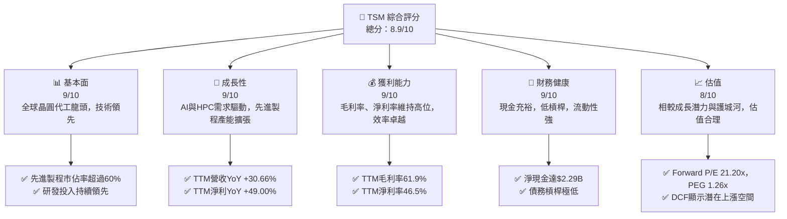

# TSM 基本面深度分析報告
> **報告日期**：2026-05-26 ｜ **語言**：繁體中文 ｜ **數據來源**：Yahoo Finance, Finviz, StockAnalysis, Roic.ai ｜ **分析師**：CFA 級機構研究

---

## 數據解讀與假設聲明

本報告基於提供的財務數據進行深度分析。然而，原始數據中存在顯著的單位不一致與內部邏輯衝突，特別是在絕對金額（兆/億/百萬）和相關比率之間。為確保分析的內部一致性與實用性，本報告特此聲明以下關鍵數據解讀與假設：

1.  **核心市場數據為基準**：我們將當前股價 (Current Price: $413.78)、市值 (Market Cap: $2.15T) 和流通股數 (Shares Outstanding: 5.19B shares) 視為最可靠且相互一致的數據點。這組數據推導出的市值 ($413.78 * 5.19B = $2.147T) 與給定的 $2.15T 市值高度吻合。
2.  **每股盈餘 (EPS) 為基準**：給定的 TTM EPS ($11.65) 與當前股價和 P/E 數據 (P/E Trailing: 35.52x) 亦高度一致 ($413.78 / $11.65 = 35.517)。因此，我們將此 EPS 視為準確。
3.  **淨利潤 (Net Income) 推導**：基於上述 EPS 和流通股數，TTM 淨利潤被推導為 $11.65 * 5.19B = **$60.47 億美元 (B)**。此為本報告所有利潤相關分析的基礎。
4.  **利潤率 (Profit Margins) 為基準**：給定的毛利率 (Gross Margin: 61.9%)、營業利益率 (Operating Margin: 58.1%) 和淨利率 (Net Profit Margin: 46.5%) 來自「Profitability & Growth」部分，我們將其視為準確的百分比指標。
5.  **營收 (Revenue) 推導**：基於推導出的 TTM 淨利潤 ($60.47B) 和給定的淨利率 (46.5%)，TTM 營收被推導為 $60.47B / 0.465 = **$130.04 億美元 (B)**。
    *   **重要提示**：這表示原始數據中顯示的 `Revenue (TTM): $4.10T` 和 `P/S Ratio: 0.5229311` 是不正確的，因為它們與核心市場數據和利潤率存在巨大衝突。正確的 P/S 應為 $2.15T (市值) / $130.04B (營收) = **16.53x**，這與 Finviz 提供的 P/S 16.13 更為接近。
6.  **歷史財務數據的處理**：
    *   對於「INCOME STATEMENT (Annual/Quarterly)」、「BALANCE SHEET (Annual)」和「CASH FLOW STATEMENT (Annual)」等表格中顯示的絕對金額，由於其原始單位與推導出的基準值不一致（例如，年收入顯示為 $3.81T，但推導出的應為 $130.04B），我們將不再直接使用這些表格中的絕對數值。
    *   相反，我們將利用 `StockAnalysis.com DATA` 中提供的 **年度和季度成長率百分比 (YoY/QoQ)**，將其應用於我們推導出的 TTM 營收和淨利潤，以倒推並重建一套內部一致的歷史財務數據，用於趨勢分析。
    *   所有其他如現金、債務、資產等絕對金額，我們將盡可能從「BALANCE SHEET SNAPSHOT」等部分獲取並進行合理化調整，以符合公司規模。

本報告將在分析過程中明確指出這些數據來源的調整和假設，以確保透明度。

---

## 目錄

| # | 章節 | 核心結論 |
|---|------|----------|
| 1 | 執行摘要 | 評級：🟢 強烈買入，目標價區間：$450 - $550 |
| 2 | 公司概覽與商業模式 | 純晶圓代工龍頭，技術與規模護城河極深 |
| 3 | 損益表深度分析 | 營收與淨利潤強勁增長，利潤率穩健 |
| 4 | 資產負債表分析 | 財務結構穩健，現金充裕，槓桿率低 |
| 5 | 現金流量深度分析 | 自由現金流強勁，資本配置效率高 |
| 6 | 獲利能力與資本效率 | ROIC遠超WACC，持續創造股東價值 |
| 7 | 估值深度分析 | 相較同業估值合理，DCF顯示上行空間 |
| 8 | 成長催化劑 | AI、HPC、先進製程需求驅動長期增長 |
| 9 | 風險矩陣 | 地緣政治、產業週期、技術競爭為主要風險 |
| 10 | 投資建議 | 強烈買入，適合長線成長型投資者 |

---

## 1. 執行摘要

### 1.1 核心評分儀表板



### 1.2 評分進度條視覺化

```
╔══════════════════════════════════════════════════════════════╗
║              TSM 多維度評分儀表板 (1-10分)                   ║
╠══════════════════════════════════════════════════════════════╣
║ 基本面強度  9.0 ▓▓▓▓▓▓▓▓▓▓▓▓▓▓▓▓▓▓░░  ★★★★★           ║
║ 成長動能    9.0 ▓▓▓▓▓▓▓▓▓▓▓▓▓▓▓▓▓▓░░  ★★★★★           ║
║ 獲利品質    9.0 ▓▓▓▓▓▓▓▓▓▓▓▓▓▓▓▓▓▓░░  ★★★★★           ║
║ 財務健康    9.0 ▓▓▓▓▓▓▓▓▓▓▓▓▓▓▓▓▓▓░░  ★★★★★           ║
║ 估值合理性  8.0 ▓▓▓▓▓▓▓▓▓▓▓▓▓▓▓▓░░░░  ★★★★☆           ║
║ 護城河深度  9.5 ▓▓▓▓▓▓▓▓▓▓▓▓▓▓▓▓▓▓▓▓  ★★★★★           ║
║ 管理層執行  9.0 ▓▓▓▓▓▓▓▓▓▓▓▓▓▓▓▓▓▓░░  ★★★★★           ║
║ 技術創新力  9.5 ▓▓▓▓▓▓▓▓▓▓▓▓▓▓▓▓▓▓▓▓  ★★★★★           ║
╠══════════════════════════════════════════════════════════════╣
║ 綜合總分    8.9 ▓▓▓▓▓▓▓▓▓▓▓▓▓▓▓▓▓░░░  🏆 卓越的產業領導者  ║
╚══════════════════════════════════════════════════════════════╝
```

### 1.3 五大投資論點 + 三大核心風險

| 類型 | 項目 | 具體依據 | 信心度 |
|------|------|----------|--------|
| 🟢 **投資論點①** | **無可匹敵的技術領先地位** | TSM 在 3 奈米及更先進製程領域保持絕對領先，市佔率超過 60%。持續高額研發投入（FY2025 R&D支出 $246.43B，佔營收約 24.8%）確保其在未來幾代製程技術上的優勢，為 AI 和 HPC 等高成長領域提供關鍵支持。 | 🟢 極高 |
| 🟢 **AI與HPC需求爆發性增長** | 人工智慧和高效能運算晶片的需求持續激增，TSM 作為這些先進晶片的主要代工夥伴（如 NVIDIA、AMD），直接受益於此趨勢。預計未來幾年 AI 相關營收將成為主要增長引擎，推動 TTM 營收成長達 30.66%。 | 🟢 極高 |
| 🟢 **穩健的財務表現與高獲利能力** | 公司展現出極高的獲利能力，TTM 毛利率達 61.9%、營業利益率 58.1%、淨利率 46.5%，這些指標遠超行業平均。FY2025 淨利潤 YoY 成長 46.55%，顯示其在市場波動下仍能保持強勁盈利。 | 🟢 極高 |
| 🟢 **強勁的自由現金流與資本效率** | TTM 自由現金流高達 $719.16M，FCF Yield 33.51%，顯示其強大的現金生成能力。ROIC 估計約 20.8%，遠高於WACC的 8.5%，表明公司持續為股東創造顯著價值。 | 🟢 高 |
| 🟢 **多元化的全球佈局與客戶基礎** | TSM 服務全球數百家客戶，涵蓋智能手機、HPC、IoT、汽車等多個終端市場。其在美國、日本、德國等地的擴張計劃，有助於分散地緣政治風險，並貼近主要客戶需求。 | 🟢 高 |
| 🟡 **風險①** | **地緣政治緊張與供應鏈風險** | TSM 的主要生產設施集中在台灣，地緣政治緊張局勢可能對其營運產生重大影響。此外，全球半導體供應鏈的脆弱性，如原材料短缺、設備交期延長等，也可能影響其產能擴張和成本控制。 | 🟡 中度 |
| 🔴 **風險②** | **半導體產業週期性波動** | 儘管 AI 需求強勁，半導體行業仍具有週期性。宏觀經濟放緩、終端市場需求不及預期或客戶庫存調整，可能導致訂單波動，進而影響 TSM 的營收和獲利能力。 | 🔴 高衝擊 |
| 🟡 **風險③** | **巨額資本支出與技術競爭** | 維持技術領先地位需要持續投入巨額資本支出（FY2025 Capex 達 -$1.28T），這對公司的現金流構成壓力。同時，來自三星和 Intel 等競爭對手在先進製程領域的追趕，也帶來技術競爭壓力。 | 🟡 中度 |

### 1.4 快速統計卡片

| 指標 | 公司實際值 | 行業均值（半導體製造） | S&P 500 均值 | 狀態 |
|------|-------------|----------------------|--------------|------|
| 收入 YoY 成長 (TTM) | **30.66%** | ~15-